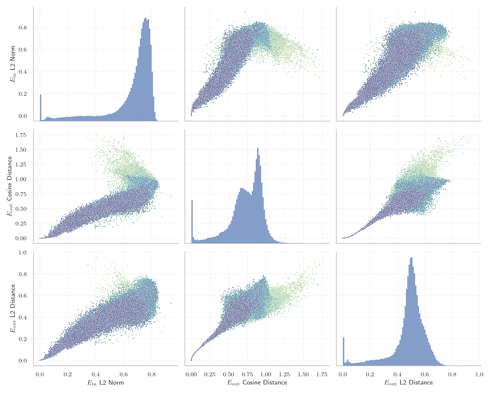
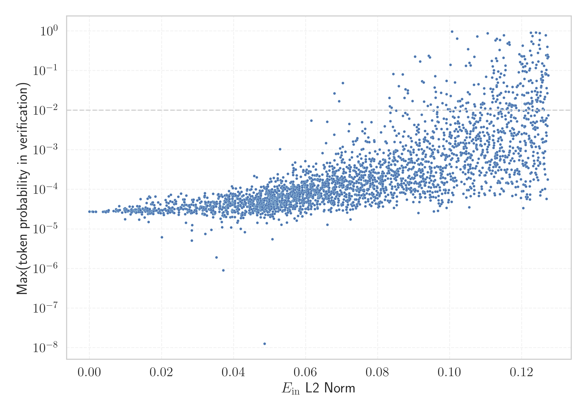

# Report for `Qwen/Qwen1.5-MoE-A2.7B`

## Model info

* Model Info: 
  * Tied embeddings: False
  * LM head uses bias: False
  * Embeddings shape: [151936, 2048]
* Tokenizer Info: 
  * Vocab Size: 151646
  * Tokenizer Class: Qwen2Tokenizer
  * Tokenizer Type: BPE
  * Bytes handling: Byte Input
  * Token for verification prompt building: abcdefghijklmnopqrstuvwxyz
  * Token id for verification prompt building: 67512
* Indicator summary: 
  * Indicator for under-trained tokens: E_{in} L2 Norm
  * Overall distribution: 0.650 +/- 0.182
* Detected Token Counts: 
  * Number of tested under-trained tokens: 2968, 2966 non-special, 2723 below p = 0.01 threshold, 2512 below soft indicator threshold
  * Number of single byte tokens: 256, of which 14 below indicator threshold
  * Number of special tokens: 1906, of which 1906 below indicator threshold
  * Number of non-single-byte unreachable tokens: 1906, of which 1906 below indicator threshold
  * Number of non-single-byte UTF-fragment tokens:  1320, of which 126 below soft indicator threshold

## Under-trained token indicators plot


## Verification plot


## Under-trained token verification results
2512 entries below threshold of 0.112

|   token_id | token                             |   indicator | max_prob                                                         | in_other_tokens                                                                                                                                            |
|------------|-----------------------------------|-------------|------------------------------------------------------------------|------------------------------------------------------------------------------------------------------------------------------------------------------------|
|      83971 | ````` $PostalCodesNL `````        | 4.48885e-07 | <span style='border: 1px solid rgb(169, 68, 66);'>2.7e-05</span> |                                                                                                                                                            |
|      71640 | ````` ▁typingsJapgolly `````      | 4.52272e-07 | <span style='border: 1px solid rgb(169, 68, 66);'>2.7e-05</span> |                                                                                                                                                            |
|      78783 | ````` \tTokenNameIdentifier ````` | 4.5484e-07  | <span style='border: 1px solid rgb(169, 68, 66);'>2.7e-05</span> |                                                                                                                                                            |
|      59834 | ````` ▁typingsSlinky `````        | 4.57651e-07 | <span style='border: 1px solid rgb(169, 68, 66);'>2.7e-05</span> |                                                                                                                                                            |
|     142386 | ````` ▁zwłaszc `````              | 4.58992e-07 | <span style='border: 1px solid rgb(169, 68, 66);'>2.7e-05</span> | ````` ▁zwłaszcza `````                                                                                                                                     |
|      97000 | ````` (stypy `````                | 4.59797e-07 | <span style='border: 1px solid rgb(169, 68, 66);'>2.7e-05</span> |                                                                                                                                                            |
|      79269 | ````` ▁ForCanBeConverted `````    | 4.61494e-07 | <span style='border: 1px solid rgb(169, 68, 66);'>2.7e-05</span> | <span style='border: 1px solid rgb(169, 68, 66);'>````` ▁ForCanBeConvertedToF `````</span>, ````` ▁ForCanBeConvertedToForeach `````                        |
|     143335 | ````` ספטמ `````                  | 4.62934e-07 | <span style='border: 1px solid rgb(169, 68, 66);'>2.7e-05</span> | ````` ספטמבר `````                                                                                                                                         |
|      88372 | ````` useRalative `````           | 4.63067e-07 | <span style='border: 1px solid rgb(169, 68, 66);'>2.7e-05</span> | <span style='border: 1px solid rgb(169, 68, 66);'>````` useRalativeImagePath `````</span>                                                                  |
|      79270 | ````` ▁ForCanBeConvertedToF ````` | 4.66324e-07 | <span style='border: 1px solid rgb(169, 68, 66);'>2.7e-05</span> | ````` ▁ForCanBeConvertedToForeach `````                                                                                                                    |
|      69684 | ````` Japgolly `````              | 4.679e-07   | <span style='border: 1px solid rgb(169, 68, 66);'>2.7e-05</span> | <span style='border: 1px solid rgb(169, 68, 66);'>````` ▁typingsJapgolly `````</span>                                                                      |
|      83969 | ````` PostalCodesNL `````         | 4.70082e-07 | <span style='border: 1px solid rgb(169, 68, 66);'>2.7e-05</span> | <span style='border: 1px solid rgb(169, 68, 66);'>````` $PostalCodesNL `````</span>                                                                        |
|     142494 | ````` ניוזל `````                 | 0.000800515 | <span style='border: 1px solid rgb(169, 68, 66);'>2.7e-05</span> | <span style='border: 1px solid rgb(169, 68, 66);'>````` ניוזלטר `````</span>                                                                               |
|     138790 | ````` ▁vườ `````                  | 0.000997837 | <span style='border: 1px solid rgb(169, 68, 66);'>2.7e-05</span> | ````` ▁vườn `````                                                                                                                                          |
|     139487 | ````` אוטוב `````                 | 0.00173543  | <span style='border: 1px solid rgb(169, 68, 66);'>2.8e-05</span> | <span style='border: 1px solid rgb(255, 145, 0);'>````` אוטובוס `````</span>                                                                               |
|     142142 | ````` אוניב `````                 | 0.001772    | <span style='border: 1px solid rgb(169, 68, 66);'>2.7e-05</span> | ````` אוניברס `````, ````` אוניברסיטת `````                                                                                                                |
|     136954 | ````` טלוו `````                  | 0.00373769  | <span style='border: 1px solid rgb(169, 68, 66);'>2.7e-05</span> | <span style='border: 1px solid rgb(169, 68, 66);'>````` טלוויז `````</span>, <span style='border: 1px solid rgb(40, 167, 69);'>````` טלוויזיה `````</span> |
|      92805 | ````` ▁QtAws `````                | 0.00411669  | <span style='border: 1px solid rgb(169, 68, 66);'>2.8e-05</span> |                                                                                                                                                            |
|      57408 | ````` :-------------</ `````      | 0.00441065  | <span style='border: 1px solid rgb(169, 68, 66);'>2.7e-05</span> |                                                                                                                                                            |
|     141591 | ````` تلفزي `````                 | 0.00453066  | <span style='border: 1px solid rgb(169, 68, 66);'>2.7e-05</span> | ````` تلفزيون `````                                                                                                                                        |
<details><summary>2492 additional entries below threshold</summary>

|   token_id | token                            |   indicator | max_prob                                                         | in_other_tokens                                                                                                                                                                                                                                                                                                                                                                                                                  |
|------------|----------------------------------|-------------|------------------------------------------------------------------|----------------------------------------------------------------------------------------------------------------------------------------------------------------------------------------------------------------------------------------------------------------------------------------------------------------------------------------------------------------------------------------------------------------------------------|
|     123165 | ````` 𬪩 `````                   |  0.00484459 | <span style='border: 1px solid rgb(169, 68, 66);'>2.8e-05</span> |                                                                                                                                                                                                                                                                                                                                                                                                                                  |
|     122362 | ````` 𬣳 `````                   |  0.00520154 | <span style='border: 1px solid rgb(169, 68, 66);'>2.7e-05</span> |                                                                                                                                                                                                                                                                                                                                                                                                                                  |
|     122578 | ````` 𫭼 `````                   |  0.00532337 | <span style='border: 1px solid rgb(169, 68, 66);'>3e-05</span>   |                                                                                                                                                                                                                                                                                                                                                                                                                                  |
|     122252 | ````` 𬣡 `````                   |  0.00665899 | <span style='border: 1px solid rgb(169, 68, 66);'>2.8e-05</span> |                                                                                                                                                                                                                                                                                                                                                                                                                                  |
|     128200 | ````` przedsięb `````            |  0.00730479 | <span style='border: 1px solid rgb(169, 68, 66);'>2.8e-05</span> | <span style='border: 1px solid rgb(169, 68, 66);'>````` przedsiębior `````</span>, <span style='border: 1px solid rgb(255, 145, 0);'>````` przedsiębiorst `````</span>, <span style='border: 1px solid rgb(169, 68, 66);'>````` przedsiębiorstw `````</span>, <span style='border: 1px solid rgb(169, 68, 66);'>````` przedsiębiorc `````</span>                                                                                 |
|     122986 | ````` 𬷕 `````                   |  0.0073545  | <span style='border: 1px solid rgb(169, 68, 66);'>3.2e-05</span> |                                                                                                                                                                                                                                                                                                                                                                                                                                  |
|     122556 | ````` 𬳽 `````                   |  0.0075601  | <span style='border: 1px solid rgb(169, 68, 66);'>2.9e-05</span> |                                                                                                                                                                                                                                                                                                                                                                                                                                  |
|     122379 | ````` 𬳵 `````                   |  0.00771606 | <span style='border: 1px solid rgb(169, 68, 66);'>2.9e-05</span> |                                                                                                                                                                                                                                                                                                                                                                                                                                  |
|     149947 | ````` 🠳 `````                    |  0.00795811 | <span style='border: 1px solid rgb(169, 68, 66);'>2.8e-05</span> |                                                                                                                                                                                                                                                                                                                                                                                                                                  |
|      69216 | ````` erusform `````             |  0.00802113 | <span style='border: 1px solid rgb(169, 68, 66);'>3e-05</span>   | ````` numerusform `````                                                                                                                                                                                                                                                                                                                                                                                                          |
|     123550 | ````` 𬭬 `````                   |  0.00825701 | <span style='border: 1px solid rgb(169, 68, 66);'>3.8e-05</span> |                                                                                                                                                                                                                                                                                                                                                                                                                                  |
|     122739 | ````` 𬘫 `````                   |  0.00839073 | <span style='border: 1px solid rgb(169, 68, 66);'>3e-05</span>   |                                                                                                                                                                                                                                                                                                                                                                                                                                  |
|     142211 | ````` ▁오히 `````                |  0.00904649 | <span style='border: 1px solid rgb(169, 68, 66);'>2.6e-05</span> | ````` ▁오히려 `````                                                                                                                                                                                                                                                                                                                                                                                                              |
|     123677 | ````` 𥖨 `````                   |  0.00966855 | <span style='border: 1px solid rgb(169, 68, 66);'>3.2e-05</span> |                                                                                                                                                                                                                                                                                                                                                                                                                                  |
|     123017 | ````` 𫶇 `````                   |  0.00973461 | <span style='border: 1px solid rgb(169, 68, 66);'>2.9e-05</span> |                                                                                                                                                                                                                                                                                                                                                                                                                                  |
|     134213 | ````` ▁miệ `````                 |  0.00984241 | <span style='border: 1px solid rgb(169, 68, 66);'>1.8e-05</span> | ````` ▁miệng `````                                                                                                                                                                                                                                                                                                                                                                                                               |
|     123642 | ````` 𬶠 `````                   |  0.009872   | <span style='border: 1px solid rgb(169, 68, 66);'>3.3e-05</span> |                                                                                                                                                                                                                                                                                                                                                                                                                                  |
|     122588 | ````` 𬜯 `````                   |  0.00995735 | <span style='border: 1px solid rgb(169, 68, 66);'>2.7e-05</span> |                                                                                                                                                                                                                                                                                                                                                                                                                                  |
|      80159 | ````` artisanlib `````           |  0.00995923 | <span style='border: 1px solid rgb(169, 68, 66);'>3.1e-05</span> |                                                                                                                                                                                                                                                                                                                                                                                                                                  |
|     140434 | ````` ▁niezbę `````              |  0.0102368  | <span style='border: 1px solid rgb(169, 68, 66);'>3.2e-05</span> | ````` ▁niezbędn `````                                                                                                                                                                                                                                                                                                                                                                                                            |
|     119942 | ````` 𬉼 `````                   |  0.0102481  | <span style='border: 1px solid rgb(169, 68, 66);'>3e-05</span>   |                                                                                                                                                                                                                                                                                                                                                                                                                                  |
|     143067 | ````` เผยแ `````                 |  0.0105849  | <span style='border: 1px solid rgb(169, 68, 66);'>2.8e-05</span> | ````` เผยแพร `````, ````` เผยแพร่ `````                                                                                                                                                                                                                                                                                                                                                                                           |
|     143595 | ````` ▁najczęście `````          |  0.0106057  | <span style='border: 1px solid rgb(169, 68, 66);'>2.8e-05</span> | ````` ▁najczęściej `````                                                                                                                                                                                                                                                                                                                                                                                                         |
|     132259 | ````` własn `````                |  0.0107182  | <span style='border: 1px solid rgb(169, 68, 66);'>2.9e-05</span> | ````` ▁własne `````                                                                                                                                                                                                                                                                                                                                                                                                              |
|     122648 | ````` 𬬿 `````                   |  0.0110915  | <span style='border: 1px solid rgb(169, 68, 66);'>3.7e-05</span> |                                                                                                                                                                                                                                                                                                                                                                                                                                  |
|     123552 | ````` 𬭯 `````                   |  0.0113652  | <span style='border: 1px solid rgb(169, 68, 66);'>2.3e-05</span> |                                                                                                                                                                                                                                                                                                                                                                                                                                  |
|     123080 | ````` 𬮱 `````                   |  0.0114069  | <span style='border: 1px solid rgb(169, 68, 66);'>2.8e-05</span> |                                                                                                                                                                                                                                                                                                                                                                                                                                  |
|     122882 | ````` 𬇹 `````                   |  0.0114161  | <span style='border: 1px solid rgb(169, 68, 66);'>3e-05</span>   |                                                                                                                                                                                                                                                                                                                                                                                                                                  |
|     123712 | ````` 𬙊 `````                   |  0.0116096  | <span style='border: 1px solid rgb(169, 68, 66);'>3e-05</span>   |                                                                                                                                                                                                                                                                                                                                                                                                                                  |
|     123499 | ````` 𬸣 `````                   |  0.0116819  | <span style='border: 1px solid rgb(169, 68, 66);'>3.1e-05</span> |                                                                                                                                                                                                                                                                                                                                                                                                                                  |
|     122726 | ````` 𨺙 `````                   |  0.0117107  | <span style='border: 1px solid rgb(169, 68, 66);'>2.6e-05</span> |                                                                                                                                                                                                                                                                                                                                                                                                                                  |
|     123330 | ````` 𬒗 `````                   |  0.0118067  | <span style='border: 1px solid rgb(169, 68, 66);'>2.9e-05</span> |                                                                                                                                                                                                                                                                                                                                                                                                                                  |
|     123000 | ````` 𬹼 `````                   |  0.0119775  | <span style='border: 1px solid rgb(169, 68, 66);'>3.6e-05</span> |                                                                                                                                                                                                                                                                                                                                                                                                                                  |
|     143191 | ````` אוגוס `````                |  0.0121254  | <span style='border: 1px solid rgb(169, 68, 66);'>2.8e-05</span> | ````` אוגוסט `````                                                                                                                                                                                                                                                                                                                                                                                                               |
|     138175 | ````` Cumhurbaş `````            |  0.0123917  | <span style='border: 1px solid rgb(169, 68, 66);'>3e-05</span>   | ````` Cumhurbaşkan `````, ````` Cumhurbaşkanı `````                                                                                                                                                                                                                                                                                                                                                                              |
|     123594 | ````` 𫄷 `````                   |  0.0125166  | <span style='border: 1px solid rgb(169, 68, 66);'>2.7e-05</span> |                                                                                                                                                                                                                                                                                                                                                                                                                                  |
|     127734 | ````` פייסב `````                |  0.0125737  | <span style='border: 1px solid rgb(169, 68, 66);'>3e-05</span>   | ````` פייסבוק `````, ````` ▁בפייסבוק `````                                                                                                                                                                                                                                                                                                                                                                                       |
|     123637 | ````` 𬸪 `````                   |  0.0126535  | <span style='border: 1px solid rgb(169, 68, 66);'>3.1e-05</span> |                                                                                                                                                                                                                                                                                                                                                                                                                                  |
|     122889 | ````` 𬍡 `````                   |  0.0126813  | <span style='border: 1px solid rgb(169, 68, 66);'>2.7e-05</span> |                                                                                                                                                                                                                                                                                                                                                                                                                                  |
|     122385 | ````` 𫠊 `````                   |  0.0128137  | <span style='border: 1px solid rgb(169, 68, 66);'>3.1e-05</span> |                                                                                                                                                                                                                                                                                                                                                                                                                                  |
|     143129 | ````` ▁위원님 `````              |  0.0129248  | <span style='border: 1px solid rgb(169, 68, 66);'>2.6e-05</span> |                                                                                                                                                                                                                                                                                                                                                                                                                                  |
|     151267 | ````` 𑘁 `````                    |  0.0129313  | <span style='border: 1px solid rgb(169, 68, 66);'>2.6e-05</span> |                                                                                                                                                                                                                                                                                                                                                                                                                                  |
|     122694 | ````` 𬊈 `````                   |  0.013008   | <span style='border: 1px solid rgb(169, 68, 66);'>3.1e-05</span> |                                                                                                                                                                                                                                                                                                                                                                                                                                  |
|     122271 | ````` 𫘜 `````                   |  0.0131104  | <span style='border: 1px solid rgb(169, 68, 66);'>2.7e-05</span> |                                                                                                                                                                                                                                                                                                                                                                                                                                  |
|     122647 | ````` 𬬹 `````                   |  0.0132173  | <span style='border: 1px solid rgb(169, 68, 66);'>3.8e-05</span> |                                                                                                                                                                                                                                                                                                                                                                                                                                  |
|     151300 | ````` 𝇠 `````                    |  0.0133345  | <span style='border: 1px solid rgb(169, 68, 66);'>2.9e-05</span> |                                                                                                                                                                                                                                                                                                                                                                                                                                  |
|     143888 | ````` 久しぶ `````               |  0.0133801  | <span style='border: 1px solid rgb(169, 68, 66);'>3e-05</span>   | ````` 久しぶり `````                                                                                                                                                                                                                                                                                                                                                                                                             |
|     151296 | ````` 𝇊 `````                    |  0.0135027  | <span style='border: 1px solid rgb(169, 68, 66);'>2.9e-05</span> |                                                                                                                                                                                                                                                                                                                                                                                                                                  |
|     138122 | ````` ▁hẳ `````                  |  0.0135373  | <span style='border: 1px solid rgb(169, 68, 66);'>2.9e-05</span> | ````` ▁hẳn `````                                                                                                                                                                                                                                                                                                                                                                                                                 |
|     141709 | ````` ▁khớ `````                 |  0.0135938  | <span style='border: 1px solid rgb(169, 68, 66);'>2.8e-05</span> | ````` ▁khớp `````                                                                                                                                                                                                                                                                                                                                                                                                                |
|     122223 | ````` 𫵷 `````                   |  0.0136367  | <span style='border: 1px solid rgb(169, 68, 66);'>2.9e-05</span> |                                                                                                                                                                                                                                                                                                                                                                                                                                  |
|     122370 | ````` 𬯀 `````                   |  0.0136506  | <span style='border: 1px solid rgb(169, 68, 66);'>3.3e-05</span> |                                                                                                                                                                                                                                                                                                                                                                                                                                  |
|     142968 | ````` ลงทะ `````                 |  0.0136917  | <span style='border: 1px solid rgb(169, 68, 66);'>2.7e-05</span> | ````` ลงทะเบ `````, ````` ลงทะเบียน `````                                                                                                                                                                                                                                                                                                                                                                                         |
|     136084 | ````` บรรยาก `````               |  0.0137282  | <span style='border: 1px solid rgb(169, 68, 66);'>3.1e-05</span> | ````` บรรยากาศ `````                                                                                                                                                                                                                                                                                                                                                                                                             |
|     122424 | ````` 𬜬 `````                   |  0.0137563  | <span style='border: 1px solid rgb(169, 68, 66);'>3.2e-05</span> |                                                                                                                                                                                                                                                                                                                                                                                                                                  |
|     122474 | ````` 𪨰 `````                   |  0.0137627  | <span style='border: 1px solid rgb(169, 68, 66);'>1.7e-05</span> |                                                                                                                                                                                                                                                                                                                                                                                                                                  |
|     122922 | ````` 𬘬 `````                   |  0.0138521  | <span style='border: 1px solid rgb(169, 68, 66);'>3.6e-05</span> |                                                                                                                                                                                                                                                                                                                                                                                                                                  |
|     122190 | ````` 𫭢 `````                   |  0.0138693  | <span style='border: 1px solid rgb(169, 68, 66);'>3.7e-05</span> |                                                                                                                                                                                                                                                                                                                                                                                                                                  |
|     122502 | ````` 𦙶 `````                   |  0.0139926  | <span style='border: 1px solid rgb(169, 68, 66);'>3.1e-05</span> |                                                                                                                                                                                                                                                                                                                                                                                                                                  |
|     122186 | ````` 𫭟 `````                   |  0.0141026  | <span style='border: 1px solid rgb(169, 68, 66);'>2.7e-05</span> |                                                                                                                                                                                                                                                                                                                                                                                                                                  |
|      88371 | ````` useRal `````               |  0.0141574  | <span style='border: 1px solid rgb(169, 68, 66);'>5.7e-05</span> | <span style='border: 1px solid rgb(169, 68, 66);'>````` useRalative `````</span>, <span style='border: 1px solid rgb(169, 68, 66);'>````` useRalativeImagePath `````</span>                                                                                                                                                                                                                                                      |
|     128095 | ````` สะอา `````                 |  0.0141734  | <span style='border: 1px solid rgb(169, 68, 66);'>3e-05</span>   | ````` สะอาด `````, ````` ทำความสะอาด `````                                                                                                                                                                                                                                                                                                                                                                                       |
|     123283 | ````` 𫘬 `````                   |  0.0145272  | <span style='border: 1px solid rgb(169, 68, 66);'>2.3e-05</span> |                                                                                                                                                                                                                                                                                                                                                                                                                                  |
|     122597 | ````` 𬂩 `````                   |  0.0145948  | <span style='border: 1px solid rgb(169, 68, 66);'>2.6e-05</span> |                                                                                                                                                                                                                                                                                                                                                                                                                                  |
|     151297 | ````` 𝇗 `````                    |  0.0147217  | <span style='border: 1px solid rgb(169, 68, 66);'>3.2e-05</span> |                                                                                                                                                                                                                                                                                                                                                                                                                                  |
|     123117 | ````` 𬴃 `````                   |  0.0147717  | <span style='border: 1px solid rgb(169, 68, 66);'>3.2e-05</span> |                                                                                                                                                                                                                                                                                                                                                                                                                                  |
|     151293 | ````` 𝆣 `````                    |  0.0147789  | <span style='border: 1px solid rgb(169, 68, 66);'>3.3e-05</span> |                                                                                                                                                                                                                                                                                                                                                                                                                                  |
|     137026 | ````` กระทรว `````               |  0.0148918  | <span style='border: 1px solid rgb(169, 68, 66);'>3.2e-05</span> | ````` กระทรวง `````                                                                                                                                                                                                                                                                                                                                                                                                              |
|      45972 | ````` webElementX `````          |  0.015171   | <span style='border: 1px solid rgb(169, 68, 66);'>3.1e-05</span> | <span style='border: 1px solid rgb(169, 68, 66);'>````` webElementXpaths `````</span>                                                                                                                                                                                                                                                                                                                                            |
|     122394 | ````` 𬍛 `````                   |  0.0152339  | <span style='border: 1px solid rgb(169, 68, 66);'>3e-05</span>   |                                                                                                                                                                                                                                                                                                                                                                                                                                  |
|     142385 | ````` ▁zwłas `````               |  0.0152859  | <span style='border: 1px solid rgb(169, 68, 66);'>1.9e-05</span> | <span style='border: 1px solid rgb(169, 68, 66);'>````` ▁zwłaszc `````</span>, ````` ▁zwłaszcza `````                                                                                                                                                                                                                                                                                                                            |
|     122290 | ````` 𦭜 `````                   |  0.0155271  | <span style='border: 1px solid rgb(169, 68, 66);'>2.8e-05</span> |                                                                                                                                                                                                                                                                                                                                                                                                                                  |
|     141781 | ````` ปกคร `````                 |  0.0155813  | <span style='border: 1px solid rgb(169, 68, 66);'>3.5e-05</span> | ````` ปกครอง `````                                                                                                                                                                                                                                                                                                                                                                                                               |
|     151294 | ````` 𝆳 `````                    |  0.0156342  | <span style='border: 1px solid rgb(169, 68, 66);'>3e-05</span>   |                                                                                                                                                                                                                                                                                                                                                                                                                                  |
|     151265 | ````` 𑂄 `````                    |  0.0157653  | <span style='border: 1px solid rgb(169, 68, 66);'>3.2e-05</span> |                                                                                                                                                                                                                                                                                                                                                                                                                                  |
|     122268 | ````` 𨚕 `````                   |  0.0157769  | <span style='border: 1px solid rgb(169, 68, 66);'>2.9e-05</span> |                                                                                                                                                                                                                                                                                                                                                                                                                                  |
|     151298 | ````` 𝇚 `````                    |  0.015831   | <span style='border: 1px solid rgb(169, 68, 66);'>4.5e-05</span> |                                                                                                                                                                                                                                                                                                                                                                                                                                  |
|     132096 | ````` เทคโนโล `````              |  0.0159598  | <span style='border: 1px solid rgb(169, 68, 66);'>2.9e-05</span> | ````` เทคโนโลย `````, ````` เทคโนโลยี `````                                                                                                                                                                                                                                                                                                                                                                                       |
|     123082 | ````` 𬊤 `````                   |  0.0161188  | <span style='border: 1px solid rgb(169, 68, 66);'>5.8e-05</span> |                                                                                                                                                                                                                                                                                                                                                                                                                                  |
|     151291 | ````` 𝅎 `````                    |  0.0161232  | <span style='border: 1px solid rgb(169, 68, 66);'>3.3e-05</span> |                                                                                                                                                                                                                                                                                                                                                                                                                                  |
|     130111 | ````` โรงแ `````                 |  0.0161931  | <span style='border: 1px solid rgb(169, 68, 66);'>2.8e-05</span> | ````` โรงแรม `````                                                                                                                                                                                                                                                                                                                                                                                                               |
|     117469 | ````` 完整热榜 `````             |  0.0162464  | <span style='border: 1px solid rgb(169, 68, 66);'>2.4e-05</span> |                                                                                                                                                                                                                                                                                                                                                                                                                                  |
|     142024 | ````` สงคร `````                 |  0.0163044  | <span style='border: 1px solid rgb(169, 68, 66);'>2.9e-05</span> | ````` สงคราม `````                                                                                                                                                                                                                                                                                                                                                                                                               |
|     123765 | ````` 𬺓 `````                   |  0.0163824  | <span style='border: 1px solid rgb(169, 68, 66);'>1.5e-05</span> |                                                                                                                                                                                                                                                                                                                                                                                                                                  |
|     122381 | ````` 𬳶 `````                   |  0.0164708  | <span style='border: 1px solid rgb(169, 68, 66);'>2.5e-05</span> |                                                                                                                                                                                                                                                                                                                                                                                                                                  |
|     136139 | ````` ▁thắ `````                 |  0.0165281  | <span style='border: 1px solid rgb(169, 68, 66);'>6.6e-05</span> |                                                                                                                                                                                                                                                                                                                                                                                                                                  |
|     138112 | ````` ▁paździ `````              |  0.0166337  | <span style='border: 1px solid rgb(169, 68, 66);'>2.9e-05</span> | ````` ▁październ `````, ````` ▁października `````                                                                                                                                                                                                                                                                                                                                                                                |
|     123245 | ````` 𫔶 `````                   |  0.0166806  | <span style='border: 1px solid rgb(169, 68, 66);'>2.4e-05</span> |                                                                                                                                                                                                                                                                                                                                                                                                                                  |
|     122302 | ````` 𬨂 `````                   |  0.0167216  | <span style='border: 1px solid rgb(169, 68, 66);'>3.2e-05</span> |                                                                                                                                                                                                                                                                                                                                                                                                                                  |
|     138622 | ````` промышленн `````           |  0.0167219  | <span style='border: 1px solid rgb(169, 68, 66);'>3.1e-05</span> |                                                                                                                                                                                                                                                                                                                                                                                                                                  |
|     151286 | ````` 𝄕 `````                    |  0.0168347  | <span style='border: 1px solid rgb(169, 68, 66);'>6.2e-05</span> |                                                                                                                                                                                                                                                                                                                                                                                                                                  |
|     151285 | ````` 𝄅 `````                    |  0.0168576  | <span style='border: 1px solid rgb(169, 68, 66);'>2.6e-05</span> |                                                                                                                                                                                                                                                                                                                                                                                                                                  |
|     123306 | ````` 𪤗 `````                   |  0.016963   | <span style='border: 1px solid rgb(169, 68, 66);'>2.5e-05</span> |                                                                                                                                                                                                                                                                                                                                                                                                                                  |
|     143962 | ````` ▁нагрузк `````             |  0.017116   | <span style='border: 1px solid rgb(169, 68, 66);'>4.2e-05</span> |                                                                                                                                                                                                                                                                                                                                                                                                                                  |
|     123282 | ````` 𫘪 `````                   |  0.0172209  | <span style='border: 1px solid rgb(169, 68, 66);'>2.8e-05</span> |                                                                                                                                                                                                                                                                                                                                                                                                                                  |
|     140451 | ````` влекательн `````           |  0.0172859  | <span style='border: 1px solid rgb(169, 68, 66);'>2.6e-05</span> |                                                                                                                                                                                                                                                                                                                                                                                                                                  |
|     151280 | ````` 𓃢 `````                    |  0.0173508  | <span style='border: 1px solid rgb(169, 68, 66);'>2.6e-05</span> |                                                                                                                                                                                                                                                                                                                                                                                                                                  |
|     122822 | ````` 𫓯 `````                   |  0.0174085  | <span style='border: 1px solid rgb(169, 68, 66);'>4.2e-05</span> |                                                                                                                                                                                                                                                                                                                                                                                                                                  |
|     122649 | ````` 𬭁 `````                   |  0.0174213  | <span style='border: 1px solid rgb(169, 68, 66);'>4.6e-05</span> |                                                                                                                                                                                                                                                                                                                                                                                                                                  |
|     122574 | ````` 𬍤 `````                   |  0.0175646  | <span style='border: 1px solid rgb(169, 68, 66);'>4.7e-05</span> |                                                                                                                                                                                                                                                                                                                                                                                                                                  |
|     150196 | ````` 𓅺 `````                    |  0.0175849  | <span style='border: 1px solid rgb(169, 68, 66);'>2.8e-05</span> |                                                                                                                                                                                                                                                                                                                                                                                                                                  |
|     141264 | ````` ▁pomięd `````              |  0.0176729  | <span style='border: 1px solid rgb(169, 68, 66);'>2.4e-05</span> | ````` ▁pomiędzy `````                                                                                                                                                                                                                                                                                                                                                                                                            |
|     122361 | ````` 𫍣 `````                   |  0.0177275  | <span style='border: 1px solid rgb(169, 68, 66);'>2.7e-05</span> |                                                                                                                                                                                                                                                                                                                                                                                                                                  |
|     139809 | ````` ▁chặ `````                 |  0.0177725  | <span style='border: 1px solid rgb(169, 68, 66);'>2.8e-05</span> | ````` ▁chặn `````                                                                                                                                                                                                                                                                                                                                                                                                                |
|     122368 | ````` 𬮿 `````                   |  0.0177871  | <span style='border: 1px solid rgb(169, 68, 66);'>3.2e-05</span> |                                                                                                                                                                                                                                                                                                                                                                                                                                  |
|     122644 | ````` 𬬸 `````                   |  0.0179529  | <span style='border: 1px solid rgb(169, 68, 66);'>4e-05</span>   |                                                                                                                                                                                                                                                                                                                                                                                                                                  |
|     151299 | ````` 𝇜 `````                    |  0.0180341  | <span style='border: 1px solid rgb(169, 68, 66);'>3.3e-05</span> |                                                                                                                                                                                                                                                                                                                                                                                                                                  |
|     151619 | ````` 𓏧 `````                    |  0.0180907  | <span style='border: 1px solid rgb(169, 68, 66);'>3.2e-05</span> |                                                                                                                                                                                                                                                                                                                                                                                                                                  |
|     123207 | ````` 𬕂 `````                   |  0.0181358  | <span style='border: 1px solid rgb(169, 68, 66);'>3.4e-05</span> |                                                                                                                                                                                                                                                                                                                                                                                                                                  |
|     122928 | ````` 𬘯 `````                   |  0.0183049  | <span style='border: 1px solid rgb(169, 68, 66);'>6.6e-05</span> |                                                                                                                                                                                                                                                                                                                                                                                                                                  |
|     123531 | ````` 𫟦 `````                   |  0.0183629  | <span style='border: 1px solid rgb(169, 68, 66);'>2.9e-05</span> |                                                                                                                                                                                                                                                                                                                                                                                                                                  |
|     139941 | ````` ▁לחלוט `````               |  0.0186146  | <span style='border: 1px solid rgb(169, 68, 66);'>2.9e-05</span> | ````` ▁לחלוטין `````                                                                                                                                                                                                                                                                                                                                                                                                             |
|     123168 | ````` 𬒔 `````                   |  0.0190308  | <span style='border: 1px solid rgb(169, 68, 66);'>4.7e-05</span> |                                                                                                                                                                                                                                                                                                                                                                                                                                  |
|     151289 | ````` 𝄴 `````                    |  0.019069   | <span style='border: 1px solid rgb(169, 68, 66);'>2.6e-05</span> |                                                                                                                                                                                                                                                                                                                                                                                                                                  |
|     122811 | ````` 𬟽 `````                   |  0.0192298  | <span style='border: 1px solid rgb(169, 68, 66);'>3.2e-05</span> |                                                                                                                                                                                                                                                                                                                                                                                                                                  |
|     123533 | ````` 𫠜 `````                   |  0.0192378  | <span style='border: 1px solid rgb(169, 68, 66);'>2.6e-05</span> |                                                                                                                                                                                                                                                                                                                                                                                                                                  |
|     151561 | ````` 𖥨 `````                    |  0.0194787  | <span style='border: 1px solid rgb(169, 68, 66);'>2.8e-05</span> |                                                                                                                                                                                                                                                                                                                                                                                                                                  |
|     123352 | ````` 𬭤 `````                   |  0.0196595  | <span style='border: 1px solid rgb(169, 68, 66);'>4.2e-05</span> |                                                                                                                                                                                                                                                                                                                                                                                                                                  |
|      71918 | ````` ▁StreamLazy `````          |  0.0197361  | <span style='border: 1px solid rgb(169, 68, 66);'>2.5e-05</span> |                                                                                                                                                                                                                                                                                                                                                                                                                                  |
|     143920 | ````` ▁зарегистрирова `````      |  0.0197492  | <span style='border: 1px solid rgb(169, 68, 66);'>3e-05</span>   |                                                                                                                                                                                                                                                                                                                                                                                                                                  |
|     122482 | ````` 𬬱 `````                   |  0.020023   | <span style='border: 1px solid rgb(169, 68, 66);'>3e-05</span>   |                                                                                                                                                                                                                                                                                                                                                                                                                                  |
|     122241 | ````` 𣲘 `````                   |  0.0200735  | <span style='border: 1px solid rgb(169, 68, 66);'>6.2e-06</span> |                                                                                                                                                                                                                                                                                                                                                                                                                                  |
|     143060 | ````` ▁иностранн `````           |  0.0202246  | <span style='border: 1px solid rgb(169, 68, 66);'>2.9e-05</span> |                                                                                                                                                                                                                                                                                                                                                                                                                                  |
|     123748 | ````` 𨭉 `````                   |  0.0205253  | <span style='border: 1px solid rgb(169, 68, 66);'>2.5e-05</span> |                                                                                                                                                                                                                                                                                                                                                                                                                                  |
|      83476 | ````` ▁AppMethodBeat `````       |  0.0206318  | <span style='border: 1px solid rgb(169, 68, 66);'>2.3e-05</span> |                                                                                                                                                                                                                                                                                                                                                                                                                                  |
|      30860 | ````` quotelev `````             |  0.0207195  | <span style='border: 1px solid rgb(169, 68, 66);'>3.1e-05</span> |                                                                                                                                                                                                                                                                                                                                                                                                                                  |
|     142595 | ````` ▁судебн `````              |  0.0209787  | <span style='border: 1px solid rgb(169, 68, 66);'>3.2e-05</span> |                                                                                                                                                                                                                                                                                                                                                                                                                                  |
|     151288 | ````` 𝄱 `````                    |  0.0210996  | <span style='border: 1px solid rgb(169, 68, 66);'>5.4e-05</span> |                                                                                                                                                                                                                                                                                                                                                                                                                                  |
|     146855 | ````` ꡑ `````                    |  0.0212607  | <span style='border: 1px solid rgb(169, 68, 66);'>2.9e-05</span> |                                                                                                                                                                                                                                                                                                                                                                                                                                  |
|     127957 | ````` רכזי `````                 |  0.0213827  | <span style='border: 1px solid rgb(169, 68, 66);'>4.7e-05</span> | ````` ▁המרכזי `````, ````` ▁מרכזי `````                                                                                                                                                                                                                                                                                                                                                                                          |
|      95556 | ````` methodPointerType `````    |  0.0213864  | <span style='border: 1px solid rgb(169, 68, 66);'>3.9e-05</span> |                                                                                                                                                                                                                                                                                                                                                                                                                                  |
|     143366 | ````` ▁достижени `````           |  0.0216909  | <span style='border: 1px solid rgb(169, 68, 66);'>2.5e-05</span> |                                                                                                                                                                                                                                                                                                                                                                                                                                  |
|     143694 | ````` ▁בנוג `````                |  0.0218254  | <span style='border: 1px solid rgb(169, 68, 66);'>3e-05</span>   | ````` ▁בנוגע `````                                                                                                                                                                                                                                                                                                                                                                                                               |
|      93973 | ````` -vesm `````                |  0.0218751  | <span style='border: 1px solid rgb(169, 68, 66);'>2.8e-05</span> |                                                                                                                                                                                                                                                                                                                                                                                                                                  |
|     151284 | ````` 𝄃 `````                    |  0.0219338  | <span style='border: 1px solid rgb(169, 68, 66);'>4.5e-05</span> |                                                                                                                                                                                                                                                                                                                                                                                                                                  |
|     122927 | ````` 𫟅 `````                   |  0.0219617  | <span style='border: 1px solid rgb(169, 68, 66);'>3.5e-05</span> |                                                                                                                                                                                                                                                                                                                                                                                                                                  |
|     122660 | ````` 𫢸 `````                   |  0.0219665  | <span style='border: 1px solid rgb(169, 68, 66);'>6.6e-05</span> |                                                                                                                                                                                                                                                                                                                                                                                                                                  |
|     122924 | ````` 𬴂 `````                   |  0.0222531  | <span style='border: 1px solid rgb(169, 68, 66);'>3.3e-05</span> |                                                                                                                                                                                                                                                                                                                                                                                                                                  |
|     131519 | ````` ▁tầ `````                  |  0.0223523  | <span style='border: 1px solid rgb(169, 68, 66);'>2.6e-05</span> | ````` ▁tầng `````, ````` ▁tầm `````                                                                                                                                                                                                                                                                                                                                                                                              |
|     122735 | ````` 𬳿 `````                   |  0.0224197  | <span style='border: 1px solid rgb(169, 68, 66);'>5e-05</span>   |                                                                                                                                                                                                                                                                                                                                                                                                                                  |
|     140082 | ````` dıkt `````                 |  0.0225753  | <span style='border: 1px solid rgb(169, 68, 66);'>3e-05</span>   | <span style='border: 1px solid rgb(169, 68, 66);'>````` dıktan `````</span>                                                                                                                                                                                                                                                                                                                                                      |
|     133741 | ````` ▁הישרא `````               |  0.0225893  | <span style='border: 1px solid rgb(169, 68, 66);'>7.3e-05</span> | ````` ▁הישראלי `````, <span style='border: 1px solid rgb(169, 68, 66);'>````` ▁הישראל `````</span>, ````` ▁הישראלית `````                                                                                                                                                                                                                                                                                                        |
|     134502 | ````` nızı `````                 |  0.0227946  | <span style='border: 1px solid rgb(169, 68, 66);'>3.4e-05</span> | ````` larınızı `````, ````` ınızı `````                                                                                                                                                                                                                                                                                                                                                                                          |
|     123758 | ````` 𬙋 `````                   |  0.0228305  | <span style='border: 1px solid rgb(169, 68, 66);'>2.9e-05</span> |                                                                                                                                                                                                                                                                                                                                                                                                                                  |
|     143428 | ````` ▁เมษ `````                 |  0.0229165  | <span style='border: 1px solid rgb(169, 68, 66);'>2.9e-05</span> | ````` ▁เมษายน `````                                                                                                                                                                                                                                                                                                                                                                                                              |
|     137722 | ````` nızda `````                |  0.0230098  | <span style='border: 1px solid rgb(169, 68, 66);'>2.7e-05</span> |                                                                                                                                                                                                                                                                                                                                                                                                                                  |
|     122909 | ````` 𬯎 `````                   |  0.0230202  | <span style='border: 1px solid rgb(169, 68, 66);'>3.5e-05</span> |                                                                                                                                                                                                                                                                                                                                                                                                                                  |
|      98173 | ````` .StObject `````            |  0.0230226  | <span style='border: 1px solid rgb(169, 68, 66);'>4.8e-05</span> |                                                                                                                                                                                                                                                                                                                                                                                                                                  |
|     143858 | ````` ▁минимальн `````           |  0.0232615  | <span style='border: 1px solid rgb(169, 68, 66);'>2.6e-05</span> |                                                                                                                                                                                                                                                                                                                                                                                                                                  |
|     143482 | ````` ▁ładn `````                |  0.0234776  | <span style='border: 1px solid rgb(169, 68, 66);'>2.5e-05</span> |                                                                                                                                                                                                                                                                                                                                                                                                                                  |
|      78640 | ````` ▁Hexatrigesimal `````      |  0.0234902  | <span style='border: 1px solid rgb(169, 68, 66);'>4.2e-05</span> |                                                                                                                                                                                                                                                                                                                                                                                                                                  |
|     130505 | ````` ▁gử `````                  |  0.0235546  | <span style='border: 1px solid rgb(169, 68, 66);'>3.2e-05</span> | ````` ▁gửi `````                                                                                                                                                                                                                                                                                                                                                                                                                 |
|     122172 | ````` 𬇕 `````                   |  0.0237229  | <span style='border: 1px solid rgb(169, 68, 66);'>5.4e-05</span> |                                                                                                                                                                                                                                                                                                                                                                                                                                  |
|     123323 | ````` 𬸘 `````                   |  0.0238558  | <span style='border: 1px solid rgb(169, 68, 66);'>4.6e-05</span> |                                                                                                                                                                                                                                                                                                                                                                                                                                  |
|     122260 | ````` 𫸩 `````                   |  0.023985   | <span style='border: 1px solid rgb(169, 68, 66);'>4.9e-05</span> |                                                                                                                                                                                                                                                                                                                                                                                                                                  |
|     139441 | ````` キャッシ `````             |  0.0240065  | <span style='border: 1px solid rgb(169, 68, 66);'>4.3e-05</span> | ````` キャッシング `````                                                                                                                                                                                                                                                                                                                                                                                                         |
|     141054 | ````` ▁беременн `````            |  0.0244148  | <span style='border: 1px solid rgb(169, 68, 66);'>3.2e-05</span> |                                                                                                                                                                                                                                                                                                                                                                                                                                  |
|     146884 | ````` ꡐ `````                    |  0.0245819  | <span style='border: 1px solid rgb(169, 68, 66);'>3.4e-05</span> |                                                                                                                                                                                                                                                                                                                                                                                                                                  |
|     123383 | ````` 𬸚 `````                   |  0.0246353  | <span style='border: 1px solid rgb(169, 68, 66);'>6.5e-05</span> |                                                                                                                                                                                                                                                                                                                                                                                                                                  |
|     148230 | ````` ꡔ `````                    |  0.0247277  | <span style='border: 1px solid rgb(169, 68, 66);'>2.3e-05</span> |                                                                                                                                                                                                                                                                                                                                                                                                                                  |
|     123410 | ````` 𬤝 `````                   |  0.0247836  | <span style='border: 1px solid rgb(169, 68, 66);'>2.6e-05</span> |                                                                                                                                                                                                                                                                                                                                                                                                                                  |
|     140737 | ````` ▁воздействи `````          |  0.0248309  | <span style='border: 1px solid rgb(169, 68, 66);'>3e-05</span>   |                                                                                                                                                                                                                                                                                                                                                                                                                                  |
|     137589 | ````` مستشف `````                |  0.0252871  | <span style='border: 1px solid rgb(169, 68, 66);'>3.6e-05</span> | ````` مستشفى `````                                                                                                                                                                                                                                                                                                                                                                                                               |
|      80900 | ````` .scalablytyped `````       |  0.0253419  | <span style='border: 1px solid rgb(169, 68, 66);'>3.2e-05</span> |                                                                                                                                                                                                                                                                                                                                                                                                                                  |
|     136955 | ````` טלוויז `````               |  0.0253805  | <span style='border: 1px solid rgb(169, 68, 66);'>7.8e-05</span> | <span style='border: 1px solid rgb(40, 167, 69);'>````` טלוויזיה `````</span>                                                                                                                                                                                                                                                                                                                                                    |
|     142543 | ````` ייצג `````                 |  0.0254479  | <span style='border: 1px solid rgb(169, 68, 66);'>3.4e-05</span> |                                                                                                                                                                                                                                                                                                                                                                                                                                  |
|     135079 | ````` ご紹 `````                 |  0.025756   | <span style='border: 1px solid rgb(169, 68, 66);'>4e-05</span>   | ````` ご紹介 `````                                                                                                                                                                                                                                                                                                                                                                                                               |
|     143941 | ````` อำนวยความ `````            |  0.0259797  | <span style='border: 1px solid rgb(169, 68, 66);'>3.1e-05</span> | ````` อำนวยความสะดวก `````                                                                                                                                                                                                                                                                                                                                                                                                       |
|     123741 | ````` 𨟠 `````                   |  0.0260062  | <span style='border: 1px solid rgb(169, 68, 66);'>5.5e-05</span> |                                                                                                                                                                                                                                                                                                                                                                                                                                  |
|     149962 | ````` 𣷭 `````                   |  0.0261485  | <span style='border: 1px solid rgb(169, 68, 66);'>3.8e-05</span> |                                                                                                                                                                                                                                                                                                                                                                                                                                  |
|     122376 | ````` 𫰛 `````                   |  0.026269   | <span style='border: 1px solid rgb(169, 68, 66);'>4.8e-05</span> |                                                                                                                                                                                                                                                                                                                                                                                                                                  |
|     151292 | ````` 𝅪 `````                    |  0.0263149  | <span style='border: 1px solid rgb(169, 68, 66);'>3.9e-05</span> |                                                                                                                                                                                                                                                                                                                                                                                                                                  |
|     138815 | ````` ▁nghè `````                |  0.0263454  | <span style='border: 1px solid rgb(169, 68, 66);'>4.8e-05</span> | ````` ▁nghèo `````                                                                                                                                                                                                                                                                                                                                                                                                               |
|     146965 | ````` ꡒ `````                    |  0.0263755  | <span style='border: 1px solid rgb(169, 68, 66);'>5.5e-05</span> |                                                                                                                                                                                                                                                                                                                                                                                                                                  |
|     141908 | ````` אוקט `````                 |  0.0265455  | <span style='border: 1px solid rgb(169, 68, 66);'>3.2e-05</span> | ````` אוקטובר `````                                                                                                                                                                                                                                                                                                                                                                                                              |
|     134098 | ````` ▁wcześ `````               |  0.0265488  | <span style='border: 1px solid rgb(169, 68, 66);'>2.4e-05</span> | ````` ▁wcześniej `````                                                                                                                                                                                                                                                                                                                                                                                                           |
|     122977 | ````` 𬃊 `````                   |  0.0266031  | <span style='border: 1px solid rgb(169, 68, 66);'>4.1e-05</span> |                                                                                                                                                                                                                                                                                                                                                                                                                                  |
|     143147 | ````` ▁พฤษ `````                 |  0.0267732  | <span style='border: 1px solid rgb(169, 68, 66);'>1.4e-05</span> | <span style='border: 1px solid rgb(169, 68, 66);'>````` ▁พฤษภา `````</span>, ````` ▁พฤษภาคม `````                                                                                                                                                                                                                                                                                                                                |
|     143515 | ````` קלאסי `````                |  0.0268538  | <span style='border: 1px solid rgb(169, 68, 66);'>6.9e-05</span> |                                                                                                                                                                                                                                                                                                                                                                                                                                  |
|     122711 | ````` 𬒈 `````                   |  0.0268719  | <span style='border: 1px solid rgb(169, 68, 66);'>3.2e-05</span> |                                                                                                                                                                                                                                                                                                                                                                                                                                  |
|     123337 | ````` 𫚖 `````                   |  0.0269351  | <span style='border: 1px solid rgb(169, 68, 66);'>4e-05</span>   |                                                                                                                                                                                                                                                                                                                                                                                                                                  |
|     143939 | ````` อำน `````                  |  0.0272068  | <span style='border: 1px solid rgb(169, 68, 66);'>2.6e-05</span> | ````` อำนวย `````, <span style='border: 1px solid rgb(169, 68, 66);'>````` อำนวยความ `````</span>, ````` อำนวยความสะดวก `````                                                                                                                                                                                                                                                                                                    |
|     123667 | ````` 𬟁 `````                   |  0.0272359  | <span style='border: 1px solid rgb(169, 68, 66);'>3.1e-05</span> |                                                                                                                                                                                                                                                                                                                                                                                                                                  |
|     137067 | ````` ▁đứ `````                  |  0.0273597  | <span style='border: 1px solid rgb(169, 68, 66);'>3.8e-05</span> | ````` ▁đứa `````, ````` ▁đức `````                                                                                                                                                                                                                                                                                                                                                                                               |
|     132667 | ````` ▁đẩ `````                  |  0.0274387  | <span style='border: 1px solid rgb(169, 68, 66);'>2.9e-05</span> | ````` ▁đẩy `````                                                                                                                                                                                                                                                                                                                                                                                                                 |
|     122758 | ````` 𫮃 `````                   |  0.0275032  | <span style='border: 1px solid rgb(169, 68, 66);'>3.8e-05</span> |                                                                                                                                                                                                                                                                                                                                                                                                                                  |
|     138626 | ````` ▁мобильн `````             |  0.0275794  | <span style='border: 1px solid rgb(169, 68, 66);'>2.7e-05</span> |                                                                                                                                                                                                                                                                                                                                                                                                                                  |
|     148328 | ````` ꡕ `````                    |  0.0276798  | <span style='border: 1px solid rgb(169, 68, 66);'>4e-05</span>   |                                                                                                                                                                                                                                                                                                                                                                                                                                  |
|     141690 | ````` ▁понрави `````             |  0.0276949  | <span style='border: 1px solid rgb(169, 68, 66);'>2.8e-05</span> |                                                                                                                                                                                                                                                                                                                                                                                                                                  |
|     122520 | ````` 㳚 `````                   |  0.027728   | <span style='border: 1px solid rgb(169, 68, 66);'>3.1e-05</span> |                                                                                                                                                                                                                                                                                                                                                                                                                                  |
|      95637 | ````` departureday `````         |  0.0278226  | <span style='border: 1px solid rgb(169, 68, 66);'>3.5e-05</span> |                                                                                                                                                                                                                                                                                                                                                                                                                                  |
|     122177 | ````` 𬣞 `````                   |  0.0279458  | <span style='border: 1px solid rgb(169, 68, 66);'>2.8e-05</span> |                                                                                                                                                                                                                                                                                                                                                                                                                                  |
|     134237 | ````` ▁zarówn `````              |  0.0281663  | <span style='border: 1px solid rgb(169, 68, 66);'>2.5e-05</span> | ````` ▁zarówno `````                                                                                                                                                                                                                                                                                                                                                                                                             |
|     143867 | ````` ▁กรกฎ `````                |  0.0282845  | <span style='border: 1px solid rgb(169, 68, 66);'>4.1e-05</span> | ````` ▁กรกฎาคม `````                                                                                                                                                                                                                                                                                                                                                                                                             |
|     141917 | ````` ▁денежн `````              |  0.0283021  | <span style='border: 1px solid rgb(169, 68, 66);'>2.9e-05</span> |                                                                                                                                                                                                                                                                                                                                                                                                                                  |
|      33856 | ````` ▁+#+#+#+ `````             |  0.0283913  | <span style='border: 1px solid rgb(169, 68, 66);'>9.2e-06</span> | ````` ▁+#+#+#+#+#+ `````                                                                                                                                                                                                                                                                                                                                                                                                         |
|     143849 | ````` ▁الديمقرا `````            |  0.028419   | <span style='border: 1px solid rgb(169, 68, 66);'>5.1e-06</span> | ````` ▁الديمقراط `````, ````` ▁الديمقراطية `````                                                                                                                                                                                                                                                                                                                                                                                 |
|     123288 | ````` 𫞩 `````                   |  0.0284811  | <span style='border: 1px solid rgb(169, 68, 66);'>2.6e-05</span> |                                                                                                                                                                                                                                                                                                                                                                                                                                  |
|     142835 | ````` お勧 `````                 |  0.0284818  | <span style='border: 1px solid rgb(169, 68, 66);'>1.2e-05</span> | ````` お勧め `````                                                                                                                                                                                                                                                                                                                                                                                                               |
|     138269 | ````` ▁bậ `````                  |  0.0285153  | <span style='border: 1px solid rgb(169, 68, 66);'>5.5e-05</span> | ````` ▁bậc `````                                                                                                                                                                                                                                                                                                                                                                                                                 |
|     149414 | ````` 툩 `````                   |  0.0287241  | <span style='border: 1px solid rgb(169, 68, 66);'>4.8e-05</span> |                                                                                                                                                                                                                                                                                                                                                                                                                                  |
|     135261 | ````` เศรษ `````                 |  0.0288923  | <span style='border: 1px solid rgb(169, 68, 66);'>5.5e-05</span> | ````` เศรษฐ `````, ````` เศรษฐกิจ `````                                                                                                                                                                                                                                                                                                                                                                                           |
|     141761 | ````` ▁반드 `````                |  0.0289039  | <span style='border: 1px solid rgb(169, 68, 66);'>4e-05</span>   | ````` ▁반드시 `````                                                                                                                                                                                                                                                                                                                                                                                                              |
|     148659 | ````` 퀫 `````                   |  0.0290172  | <span style='border: 1px solid rgb(169, 68, 66);'>2.7e-05</span> |                                                                                                                                                                                                                                                                                                                                                                                                                                  |
|     151093 | ````` 픠 `````                   |  0.0292162  | <span style='border: 1px solid rgb(169, 68, 66);'>3e-05</span>   |                                                                                                                                                                                                                                                                                                                                                                                                                                  |
|     149464 | ````` 퀠 `````                   |  0.0294376  | <span style='border: 1px solid rgb(169, 68, 66);'>4e-05</span>   |                                                                                                                                                                                                                                                                                                                                                                                                                                  |
|     149413 | ````` 칕 `````                   |  0.0294617  | <span style='border: 1px solid rgb(169, 68, 66);'>3.6e-05</span> |                                                                                                                                                                                                                                                                                                                                                                                                                                  |
|     123333 | ````` 𥔲 `````                   |  0.029484   | <span style='border: 1px solid rgb(169, 68, 66);'>4.1e-05</span> |                                                                                                                                                                                                                                                                                                                                                                                                                                  |
|     142119 | ````` โบรา `````                 |  0.0295836  | <span style='border: 1px solid rgb(169, 68, 66);'>3.4e-05</span> | ````` โบราณ `````                                                                                                                                                                                                                                                                                                                                                                                                                |
|     122155 | ````` 𨙸 `````                   |  0.0296029  | <span style='border: 1px solid rgb(169, 68, 66);'>3.2e-05</span> |                                                                                                                                                                                                                                                                                                                                                                                                                                  |
|      80898 | ````` ablytyped `````            |  0.0296173  | <span style='border: 1px solid rgb(169, 68, 66);'>3.5e-05</span> | <span style='border: 1px solid rgb(169, 68, 66);'>````` .scalablytyped `````</span>                                                                                                                                                                                                                                                                                                                                              |
|     150316 | ````` 텉 `````                   |  0.0296619  | <span style='border: 1px solid rgb(169, 68, 66);'>2.9e-05</span> |                                                                                                                                                                                                                                                                                                                                                                                                                                  |
|     150797 | ````` 㫴 `````                   |  0.0296907  | <span style='border: 1px solid rgb(169, 68, 66);'>2.5e-05</span> |                                                                                                                                                                                                                                                                                                                                                                                                                                  |
|     139034 | ````` nquête `````               |  0.029811   | <span style='border: 1px solid rgb(169, 68, 66);'>3.3e-05</span> |                                                                                                                                                                                                                                                                                                                                                                                                                                  |
|     143738 | ````` ▁มกร `````                 |  0.0299136  | <span style='border: 1px solid rgb(169, 68, 66);'>5.3e-05</span> | ````` ▁มกราคม `````                                                                                                                                                                                                                                                                                                                                                                                                              |
|     127372 | ````` เฉพ `````                  |  0.0304196  | <span style='border: 1px solid rgb(169, 68, 66);'>6.1e-05</span> | ````` เฉพาะ `````, ````` โดยเฉพาะ `````                                                                                                                                                                                                                                                                                                                                                                                          |
|     118326 | ````` 凡本网注 `````             |  0.0305253  | <span style='border: 1px solid rgb(169, 68, 66);'>3.1e-05</span> |                                                                                                                                                                                                                                                                                                                                                                                                                                  |
|     122951 | ````` 𡎚 `````                   |  0.0305328  | <span style='border: 1px solid rgb(169, 68, 66);'>5.7e-05</span> |                                                                                                                                                                                                                                                                                                                                                                                                                                  |
|     122615 | ````` 𨐈 `````                   |  0.0305697  | <span style='border: 1px solid rgb(169, 68, 66);'>3.3e-05</span> |                                                                                                                                                                                                                                                                                                                                                                                                                                  |
|     140045 | ````` ciśni `````                |  0.0307225  | <span style='border: 1px solid rgb(169, 68, 66);'>4.6e-05</span> |                                                                                                                                                                                                                                                                                                                                                                                                                                  |
|     138153 | ````` индивидуальн `````         |  0.0308458  | <span style='border: 1px solid rgb(169, 68, 66);'>3.7e-05</span> |                                                                                                                                                                                                                                                                                                                                                                                                                                  |
|     151068 | ````` 킅 `````                   |  0.0309057  | <span style='border: 1px solid rgb(169, 68, 66);'>3.4e-05</span> |                                                                                                                                                                                                                                                                                                                                                                                                                                  |
|     140905 | ````` مفه `````                  |  0.0310785  | <span style='border: 1px solid rgb(169, 68, 66);'>4.9e-05</span> | ````` مفهوم `````                                                                                                                                                                                                                                                                                                                                                                                                                |
|     143642 | ````` ▁yayımla `````             |  0.0311464  | <span style='border: 1px solid rgb(169, 68, 66);'>3.7e-05</span> |                                                                                                                                                                                                                                                                                                                                                                                                                                  |
|     141493 | ````` พฤศ `````                  |  0.0311709  | <span style='border: 1px solid rgb(169, 68, 66);'>3.4e-05</span> | ````` พฤศจ `````, ````` พฤศจิก `````, ````` พฤศจิกายน `````                                                                                                                                                                                                                                                                                                                                                                        |
|     134156 | ````` ▁بالإض `````               |  0.0313009  | <span style='border: 1px solid rgb(169, 68, 66);'>2.4e-05</span> | ````` ▁بالإضافة `````                                                                                                                                                                                                                                                                                                                                                                                                            |
|     137162 | ````` คะแน `````                 |  0.0314018  | <span style='border: 1px solid rgb(169, 68, 66);'>2.4e-05</span> | ````` คะแนน `````                                                                                                                                                                                                                                                                                                                                                                                                                |
|     125498 | ````` สำห `````                  |  0.0314541  | <span style='border: 1px solid rgb(169, 68, 66);'>2.9e-05</span> | ````` สำหรับ `````, ````` ▁สำหรับ `````, ````` สำหรับการ `````                                                                                                                                                                                                                                                                                                                                                                      |
|     151076 | ````` 퇼 `````                   |  0.0315858  | <span style='border: 1px solid rgb(169, 68, 66);'>3.1e-05</span> |                                                                                                                                                                                                                                                                                                                                                                                                                                  |
|     137129 | ````` hở `````                   |  0.0317206  | <span style='border: 1px solid rgb(169, 68, 66);'>3.6e-05</span> | ````` ▁thở `````                                                                                                                                                                                                                                                                                                                                                                                                                 |
|     136778 | ````` ▁Ağust `````               |  0.0317491  | <span style='border: 1px solid rgb(169, 68, 66);'>2.3e-05</span> | ````` ▁Ağustos `````                                                                                                                                                                                                                                                                                                                                                                                                             |
|     150820 | ````` ꌼ `````                   |  0.0317499  | <span style='border: 1px solid rgb(169, 68, 66);'>3.3e-05</span> |                                                                                                                                                                                                                                                                                                                                                                                                                                  |
|     138463 | ````` ▁כאיל `````                |  0.0317512  | <span style='border: 1px solid rgb(169, 68, 66);'>2.4e-05</span> | ````` ▁כאילו `````                                                                                                                                                                                                                                                                                                                                                                                                               |
|     140281 | ````` とりあえ `````             |  0.0318378  | <span style='border: 1px solid rgb(169, 68, 66);'>2.4e-05</span> | ````` とりあえず `````                                                                                                                                                                                                                                                                                                                                                                                                           |
|     151000 | ````` 엃 `````                   |  0.0318945  | <span style='border: 1px solid rgb(169, 68, 66);'>2.3e-05</span> |                                                                                                                                                                                                                                                                                                                                                                                                                                  |
|     150975 | ````` 셢 `````                   |  0.0318951  | <span style='border: 1px solid rgb(169, 68, 66);'>6.7e-05</span> |                                                                                                                                                                                                                                                                                                                                                                                                                                  |
|     123302 | ````` 𡐓 `````                   |  0.0319206  | <span style='border: 1px solid rgb(169, 68, 66);'>6.4e-05</span> |                                                                                                                                                                                                                                                                                                                                                                                                                                  |
|     149800 | ````` 툶 `````                   |  0.0319768  | <span style='border: 1px solid rgb(169, 68, 66);'>6.9e-05</span> |                                                                                                                                                                                                                                                                                                                                                                                                                                  |
|     150992 | ````` 쑻 `````                   |  0.0320079  | <span style='border: 1px solid rgb(169, 68, 66);'>8e-05</span>   |                                                                                                                                                                                                                                                                                                                                                                                                                                  |
|     149991 | ````` 𖧷 `````                    |  0.0320177  | <span style='border: 1px solid rgb(169, 68, 66);'>2.3e-05</span> |                                                                                                                                                                                                                                                                                                                                                                                                                                  |
|     122790 | ````` 鿎 `````                   |  0.0320236  | <span style='border: 1px solid rgb(169, 68, 66);'>3.1e-05</span> |                                                                                                                                                                                                                                                                                                                                                                                                                                  |
|      51262 | ````` SpecWarn `````             |  0.0320883  | <span style='border: 1px solid rgb(169, 68, 66);'>4.9e-05</span> |                                                                                                                                                                                                                                                                                                                                                                                                                                  |
|     123702 | ````` 𦒍 `````                   |  0.0321504  | <span style='border: 1px solid rgb(169, 68, 66);'>7.5e-06</span> |                                                                                                                                                                                                                                                                                                                                                                                                                                  |
|     149395 | ````` 𓐍 `````                    |  0.0322105  | <span style='border: 1px solid rgb(169, 68, 66);'>4.3e-05</span> |                                                                                                                                                                                                                                                                                                                                                                                                                                  |
|     123132 | ````` 𤧛 `````                   |  0.0322424  | <span style='border: 1px solid rgb(169, 68, 66);'>4.7e-05</span> |                                                                                                                                                                                                                                                                                                                                                                                                                                  |
|     150846 | ````` ꪼ `````                    |  0.0322974  | <span style='border: 1px solid rgb(169, 68, 66);'>3.3e-05</span> |                                                                                                                                                                                                                                                                                                                                                                                                                                  |
|     122949 | ````` 𪣻 `````                   |  0.0324362  | <span style='border: 1px solid rgb(169, 68, 66);'>3.6e-05</span> |                                                                                                                                                                                                                                                                                                                                                                                                                                  |
|     139738 | ````` คณะกรรม `````              |  0.0324502  | <span style='border: 1px solid rgb(169, 68, 66);'>3.9e-05</span> | ````` คณะกรรมการ `````                                                                                                                                                                                                                                                                                                                                                                                                           |
|     150306 | ````` 숕 `````                   |  0.03247    | <span style='border: 1px solid rgb(169, 68, 66);'>3.9e-05</span> |                                                                                                                                                                                                                                                                                                                                                                                                                                  |
|     150317 | ````` 퍠 `````                   |  0.0324962  | <span style='border: 1px solid rgb(169, 68, 66);'>2.8e-05</span> |                                                                                                                                                                                                                                                                                                                                                                                                                                  |
|     122179 | ````` 𬘓 `````                   |  0.0325569  | <span style='border: 1px solid rgb(169, 68, 66);'>3.9e-05</span> |                                                                                                                                                                                                                                                                                                                                                                                                                                  |
|     150937 | ````` 멭 `````                   |  0.0325624  | <span style='border: 1px solid rgb(169, 68, 66);'>2.2e-05</span> |                                                                                                                                                                                                                                                                                                                                                                                                                                  |
|     150810 | ````` 䧞 `````                   |  0.0325715  | <span style='border: 1px solid rgb(169, 68, 66);'>3.7e-05</span> |                                                                                                                                                                                                                                                                                                                                                                                                                                  |
|     122145 | ````` 𬣙 `````                   |  0.0326912  | <span style='border: 1px solid rgb(169, 68, 66);'>6.1e-05</span> |                                                                                                                                                                                                                                                                                                                                                                                                                                  |
|     151490 | ````` 큻 `````                   |  0.0327331  | <span style='border: 1px solid rgb(169, 68, 66);'>3.9e-05</span> |                                                                                                                                                                                                                                                                                                                                                                                                                                  |
|     147410 | ````` ꀰ `````                   |  0.0329097  | <span style='border: 1px solid rgb(169, 68, 66);'>4.6e-05</span> |                                                                                                                                                                                                                                                                                                                                                                                                                                  |
|     151448 | ````` 쥉 `````                   |  0.0330004  | <span style='border: 1px solid rgb(169, 68, 66);'>4.8e-05</span> |                                                                                                                                                                                                                                                                                                                                                                                                                                  |
|     150273 | ````` 낔 `````                   |  0.0331098  | <span style='border: 1px solid rgb(169, 68, 66);'>3.1e-05</span> |                                                                                                                                                                                                                                                                                                                                                                                                                                  |
|     150276 | ````` 뙝 `````                   |  0.0334513  | <span style='border: 1px solid rgb(169, 68, 66);'>3.8e-05</span> |                                                                                                                                                                                                                                                                                                                                                                                                                                  |
|     122605 | ````` 𫠆 `````                   |  0.0334642  | <span style='border: 1px solid rgb(169, 68, 66);'>3e-05</span>   |                                                                                                                                                                                                                                                                                                                                                                                                                                  |
|     150988 | ````` 쎘 `````                   |  0.033488   | <span style='border: 1px solid rgb(169, 68, 66);'>4.1e-05</span> |                                                                                                                                                                                                                                                                                                                                                                                                                                  |
|     127527 | ````` รวจ `````                  |  0.0335851  | <span style='border: 1px solid rgb(169, 68, 66);'>4.6e-05</span> | ````` ตรวจสอบ `````, ````` ตำรวจ `````, ````` สำรวจ `````                                                                                                                                                                                                                                                                                                                                                                        |
|     149796 | ````` 쿙 `````                   |  0.0336078  | <span style='border: 1px solid rgb(169, 68, 66);'>3.2e-05</span> |                                                                                                                                                                                                                                                                                                                                                                                                                                  |
|     149802 | ````` 햤 `````                   |  0.0337259  | <span style='border: 1px solid rgb(169, 68, 66);'>4.7e-05</span> |                                                                                                                                                                                                                                                                                                                                                                                                                                  |
|     150803 | ````` 䋌 `````                   |  0.0337864  | <span style='border: 1px solid rgb(169, 68, 66);'>3.4e-05</span> |                                                                                                                                                                                                                                                                                                                                                                                                                                  |
|     122288 | ````` 䢼 `````                   |  0.0337967  | <span style='border: 1px solid rgb(169, 68, 66);'>3e-05</span>   |                                                                                                                                                                                                                                                                                                                                                                                                                                  |
|     150799 | ````` 㺾 `````                   |  0.0338076  | <span style='border: 1px solid rgb(169, 68, 66);'>2.6e-05</span> |                                                                                                                                                                                                                                                                                                                                                                                                                                  |
|     151046 | ````` 챃 `````                   |  0.0338229  | <span style='border: 1px solid rgb(169, 68, 66);'>9.5e-06</span> |                                                                                                                                                                                                                                                                                                                                                                                                                                  |
|     132837 | ````` כרט `````                  |  0.033889   | <span style='border: 1px solid rgb(169, 68, 66);'>3.7e-05</span> | <span style='border: 1px solid rgb(40, 167, 69);'>````` כרטיס `````</span>                                                                                                                                                                                                                                                                                                                                                       |
|     149093 | ````` 뵜 `````                   |  0.0339827  | <span style='border: 1px solid rgb(169, 68, 66);'>3.6e-05</span> |                                                                                                                                                                                                                                                                                                                                                                                                                                  |
|     122925 | ````` 𫘦 `````                   |  0.0341922  | <span style='border: 1px solid rgb(169, 68, 66);'>4.9e-05</span> |                                                                                                                                                                                                                                                                                                                                                                                                                                  |
|     150840 | ````` ꪕ `````                    |  0.0342214  | <span style='border: 1px solid rgb(169, 68, 66);'>3.8e-05</span> |                                                                                                                                                                                                                                                                                                                                                                                                                                  |
|     150858 | ````` 굛 `````                   |  0.0342912  | <span style='border: 1px solid rgb(169, 68, 66);'>2.8e-05</span> |                                                                                                                                                                                                                                                                                                                                                                                                                                  |
|     150219 | ````` ㋯ `````                   |  0.0342959  | <span style='border: 1px solid rgb(169, 68, 66);'>2e-05</span>   |                                                                                                                                                                                                                                                                                                                                                                                                                                  |
|     122635 | ````` 𫑡 `````                   |  0.034311   | <span style='border: 1px solid rgb(169, 68, 66);'>2.4e-05</span> |                                                                                                                                                                                                                                                                                                                                                                                                                                  |
|     123179 | ````` 䣘 `````                   |  0.0343154  | <span style='border: 1px solid rgb(169, 68, 66);'>2.9e-05</span> |                                                                                                                                                                                                                                                                                                                                                                                                                                  |
|     150922 | ````` 롵 `````                   |  0.0343316  | <span style='border: 1px solid rgb(169, 68, 66);'>7.7e-05</span> |                                                                                                                                                                                                                                                                                                                                                                                                                                  |
|     150314 | ````` 췃 `````                   |  0.0343352  | <span style='border: 1px solid rgb(169, 68, 66);'>3.4e-05</span> |                                                                                                                                                                                                                                                                                                                                                                                                                                  |
|     151072 | ````` 텣 `````                   |  0.0344072  | <span style='border: 1px solid rgb(169, 68, 66);'>3.8e-05</span> |                                                                                                                                                                                                                                                                                                                                                                                                                                  |
|     127401 | ````` כלכ `````                  |  0.0344637  | <span style='border: 1px solid rgb(169, 68, 66);'>4.5e-05</span> | ````` כלכלי `````, ````` כלכלה `````                                                                                                                                                                                                                                                                                                                                                                                             |
|     150944 | ````` 뮘 `````                   |  0.0344958  | <span style='border: 1px solid rgb(169, 68, 66);'>3.6e-05</span> |                                                                                                                                                                                                                                                                                                                                                                                                                                  |
|     143978 | ````` מתרחש `````                |  0.0345273  | <span style='border: 1px solid rgb(169, 68, 66);'>4.8e-05</span> |                                                                                                                                                                                                                                                                                                                                                                                                                                  |
|     142493 | ````` ניוז `````                 |  0.0345676  | <span style='border: 1px solid rgb(169, 68, 66);'>4.7e-05</span> | <span style='border: 1px solid rgb(169, 68, 66);'>````` ניוזל `````</span>, <span style='border: 1px solid rgb(169, 68, 66);'>````` ניוזלטר `````</span>                                                                                                                                                                                                                                                                         |
|     122407 | ````` 鿍 `````                   |  0.0346819  | <span style='border: 1px solid rgb(169, 68, 66);'>2.4e-05</span> |                                                                                                                                                                                                                                                                                                                                                                                                                                  |
|     150895 | ````` 뎟 `````                   |  0.0347574  | <span style='border: 1px solid rgb(169, 68, 66);'>2.5e-05</span> |                                                                                                                                                                                                                                                                                                                                                                                                                                  |
|     151082 | ````` 퍙 `````                   |  0.0348482  | <span style='border: 1px solid rgb(169, 68, 66);'>2.5e-05</span> |                                                                                                                                                                                                                                                                                                                                                                                                                                  |
|     150976 | ````` 솀 `````                   |  0.0348594  | <span style='border: 1px solid rgb(169, 68, 66);'>2.7e-05</span> |                                                                                                                                                                                                                                                                                                                                                                                                                                  |
|     123201 | ````` 𬭛 `````                   |  0.0348715  | <span style='border: 1px solid rgb(169, 68, 66);'>4.3e-05</span> |                                                                                                                                                                                                                                                                                                                                                                                                                                  |
|     128157 | ````` בדיק `````                 |  0.0348957  | <span style='border: 1px solid rgb(169, 68, 66);'>4.6e-05</span> | ````` בדיקה `````, ````` בדיקת `````, <span style='border: 1px solid rgb(40, 167, 69);'>````` בדיקות `````</span>                                                                                                                                                                                                                                                                                                                |
|     150892 | ````` 댘 `````                   |  0.0350858  | <span style='border: 1px solid rgb(169, 68, 66);'>3.8e-05</span> |                                                                                                                                                                                                                                                                                                                                                                                                                                  |
|     138174 | ````` Cumhurba `````             |  0.0351318  | <span style='border: 1px solid rgb(169, 68, 66);'>3.7e-05</span> | <span style='border: 1px solid rgb(169, 68, 66);'>````` Cumhurbaş `````</span>, ````` Cumhurbaşkan `````, ````` Cumhurbaşkanı `````                                                                                                                                                                                                                                                                                              |
|     151033 | ````` 쨓 `````                   |  0.0352508  | <span style='border: 1px solid rgb(169, 68, 66);'>1.9e-06</span> |                                                                                                                                                                                                                                                                                                                                                                                                                                  |
|     150907 | ````` 땧 `````                   |  0.0352659  | <span style='border: 1px solid rgb(169, 68, 66);'>4.9e-05</span> |                                                                                                                                                                                                                                                                                                                                                                                                                                  |
|     123725 | ````` 𬶭 `````                   |  0.0353394  | <span style='border: 1px solid rgb(169, 68, 66);'>4.3e-05</span> |                                                                                                                                                                                                                                                                                                                                                                                                                                  |
|     150900 | ````` 됸 `````                   |  0.0356376  | <span style='border: 1px solid rgb(169, 68, 66);'>7.3e-05</span> |                                                                                                                                                                                                                                                                                                                                                                                                                                  |
|     149463 | ````` 켚 `````                   |  0.0357808  | <span style='border: 1px solid rgb(169, 68, 66);'>7.6e-05</span> |                                                                                                                                                                                                                                                                                                                                                                                                                                  |
|     151069 | ````` 탶 `````                   |  0.0358001  | <span style='border: 1px solid rgb(169, 68, 66);'>5.9e-05</span> |                                                                                                                                                                                                                                                                                                                                                                                                                                  |
|     149764 | ````` 삻 `````                   |  0.0358726  | <span style='border: 1px solid rgb(169, 68, 66);'>6.3e-05</span> |                                                                                                                                                                                                                                                                                                                                                                                                                                  |
|     123761 | ````` 𤫉 `````                   |  0.0359874  | <span style='border: 1px solid rgb(169, 68, 66);'>3.5e-05</span> |                                                                                                                                                                                                                                                                                                                                                                                                                                  |
|     137332 | ````` mızda `````                |  0.0359908  | <span style='border: 1px solid rgb(169, 68, 66);'>6.6e-05</span> |                                                                                                                                                                                                                                                                                                                                                                                                                                  |
|     151547 | ````` 솊 `````                   |  0.0360632  | <span style='border: 1px solid rgb(169, 68, 66);'>2.7e-05</span> |                                                                                                                                                                                                                                                                                                                                                                                                                                  |
|     120101 | ````` 𠳐 `````                   |  0.0360951  | <span style='border: 1px solid rgb(169, 68, 66);'>4.4e-05</span> |                                                                                                                                                                                                                                                                                                                                                                                                                                  |
|     151482 | ````` 뤂 `````                   |  0.0361079  | <span style='border: 1px solid rgb(169, 68, 66);'>3.2e-05</span> |                                                                                                                                                                                                                                                                                                                                                                                                                                  |
|     150969 | ````` 쁭 `````                   |  0.036204   | <span style='border: 1px solid rgb(169, 68, 66);'>3.9e-05</span> |                                                                                                                                                                                                                                                                                                                                                                                                                                  |
|     150321 | ````` 햠 `````                   |  0.0362117  | <span style='border: 1px solid rgb(169, 68, 66);'>3.6e-05</span> |                                                                                                                                                                                                                                                                                                                                                                                                                                  |
|     122242 | ````` 𣲗 `````                   |  0.0362634  | <span style='border: 1px solid rgb(169, 68, 66);'>4.9e-05</span> |                                                                                                                                                                                                                                                                                                                                                                                                                                  |
|     122823 | ````` 𫟹 `````                   |  0.0362953  | <span style='border: 1px solid rgb(169, 68, 66);'>3.3e-05</span> |                                                                                                                                                                                                                                                                                                                                                                                                                                  |
|     150893 | ````` 댤 `````                   |  0.0363521  | <span style='border: 1px solid rgb(169, 68, 66);'>1.8e-05</span> |                                                                                                                                                                                                                                                                                                                                                                                                                                  |
|     150298 | ````` 뜷 `````                   |  0.0363869  | <span style='border: 1px solid rgb(169, 68, 66);'>1.8e-05</span> |                                                                                                                                                                                                                                                                                                                                                                                                                                  |
|     146787 | ````` ꡓ `````                    |  0.0366225  | <span style='border: 1px solid rgb(169, 68, 66);'>7.3e-05</span> |                                                                                                                                                                                                                                                                                                                                                                                                                                  |
|     149774 | ````` 앺 `````                   |  0.0366626  | <span style='border: 1px solid rgb(169, 68, 66);'>6.8e-05</span> |                                                                                                                                                                                                                                                                                                                                                                                                                                  |
|     149762 | ````` 쁄 `````                   |  0.0367295  | <span style='border: 1px solid rgb(169, 68, 66);'>1.5e-05</span> |                                                                                                                                                                                                                                                                                                                                                                                                                                  |
|     149729 | ````` 굠 `````                   |  0.0367754  | <span style='border: 1px solid rgb(169, 68, 66);'>3.1e-05</span> |                                                                                                                                                                                                                                                                                                                                                                                                                                  |
|     123033 | ````` 𫓶 `````                   |  0.0367875  | <span style='border: 1px solid rgb(169, 68, 66);'>1.1e-05</span> |                                                                                                                                                                                                                                                                                                                                                                                                                                  |
|     149117 | ````` 헠 `````                   |  0.0368984  | <span style='border: 1px solid rgb(169, 68, 66);'>6.5e-05</span> |                                                                                                                                                                                                                                                                                                                                                                                                                                  |
|     151592 | ````` ᤊ `````                    |  0.0369068  | <span style='border: 1px solid rgb(169, 68, 66);'>2.2e-05</span> |                                                                                                                                                                                                                                                                                                                                                                                                                                  |
|     140956 | ````` ▁формирова `````           |  0.0369893  | <span style='border: 1px solid rgb(169, 68, 66);'>2.5e-05</span> |                                                                                                                                                                                                                                                                                                                                                                                                                                  |
|     123572 | ````` 𬸦 `````                   |  0.0370437  | <span style='border: 1px solid rgb(169, 68, 66);'>3.6e-05</span> |                                                                                                                                                                                                                                                                                                                                                                                                                                  |
|     131223 | ````` ประกา `````                |  0.0370536  | <span style='border: 1px solid rgb(169, 68, 66);'>3.5e-05</span> | ````` ประกาศ `````                                                                                                                                                                                                                                                                                                                                                                                                               |
|     141373 | ````` ▁giấ `````                 |  0.037147   | <span style='border: 1px solid rgb(169, 68, 66);'>9e-07</span>   | ````` ▁giấc `````                                                                                                                                                                                                                                                                                                                                                                                                                |
|     148463 | ````` 㹦 `````                   |  0.0371815  | <span style='border: 1px solid rgb(169, 68, 66);'>2.6e-05</span> |                                                                                                                                                                                                                                                                                                                                                                                                                                  |
|     149766 | ````` 셒 `````                   |  0.0372717  | <span style='border: 1px solid rgb(169, 68, 66);'>4.3e-05</span> |                                                                                                                                                                                                                                                                                                                                                                                                                                  |
|     151061 | ````` 켙 `````                   |  0.0373185  | <span style='border: 1px solid rgb(169, 68, 66);'>2.1e-05</span> |                                                                                                                                                                                                                                                                                                                                                                                                                                  |
|     122903 | ````` 𬤊 `````                   |  0.0373409  | <span style='border: 1px solid rgb(169, 68, 66);'>4.3e-05</span> |                                                                                                                                                                                                                                                                                                                                                                                                                                  |
|     150297 | ````` 떘 `````                   |  0.0373629  | <span style='border: 1px solid rgb(169, 68, 66);'>3.4e-05</span> |                                                                                                                                                                                                                                                                                                                                                                                                                                  |
|     122304 | ````` 𬀪 `````                   |  0.037394   | <span style='border: 1px solid rgb(169, 68, 66);'>2.1e-05</span> |                                                                                                                                                                                                                                                                                                                                                                                                                                  |
|     150862 | ````` 긩 `````                   |  0.0374522  | <span style='border: 1px solid rgb(169, 68, 66);'>2.2e-05</span> |                                                                                                                                                                                                                                                                                                                                                                                                                                  |
|     150822 | ````` ꍲ `````                   |  0.0374905  | <span style='border: 1px solid rgb(169, 68, 66);'>5.1e-05</span> |                                                                                                                                                                                                                                                                                                                                                                                                                                  |
|     151024 | ````` 좐 `````                   |  0.0375407  | <span style='border: 1px solid rgb(169, 68, 66);'>5.1e-05</span> |                                                                                                                                                                                                                                                                                                                                                                                                                                  |
|     122825 | ````` 𫟼 `````                   |  0.0375683  | <span style='border: 1px solid rgb(169, 68, 66);'>7e-05</span>   |                                                                                                                                                                                                                                                                                                                                                                                                                                  |
|     148531 | ````` 큠 `````                   |  0.037582   | <span style='border: 1px solid rgb(169, 68, 66);'>4.6e-05</span> |                                                                                                                                                                                                                                                                                                                                                                                                                                  |
|     123073 | ````` 𫷷 `````                   |  0.0376014  | <span style='border: 1px solid rgb(169, 68, 66);'>4.7e-05</span> |                                                                                                                                                                                                                                                                                                                                                                                                                                  |
|     148919 | ````` 뎈 `````                   |  0.0377373  | <span style='border: 1px solid rgb(169, 68, 66);'>5.7e-05</span> |                                                                                                                                                                                                                                                                                                                                                                                                                                  |
|     122273 | ````` 𬘘 `````                   |  0.0377379  | <span style='border: 1px solid rgb(169, 68, 66);'>5.9e-05</span> |                                                                                                                                                                                                                                                                                                                                                                                                                                  |
|     150210 | ````` ᨹ `````                    |  0.037798   | <span style='border: 1px solid rgb(169, 68, 66);'>2.9e-05</span> |                                                                                                                                                                                                                                                                                                                                                                                                                                  |
|     123532 | ````` 𬺈 `````                   |  0.0378286  | <span style='border: 1px solid rgb(169, 68, 66);'>4.7e-05</span> |                                                                                                                                                                                                                                                                                                                                                                                                                                  |
|     150967 | ````` 뼐 `````                   |  0.0378966  | <span style='border: 1px solid rgb(169, 68, 66);'>2e-05</span>   |                                                                                                                                                                                                                                                                                                                                                                                                                                  |
|     150901 | ````` 둁 `````                   |  0.0379195  | <span style='border: 1px solid rgb(169, 68, 66);'>3.3e-05</span> |                                                                                                                                                                                                                                                                                                                                                                                                                                  |
|     134367 | ````` พยาย `````                 |  0.0379421  | <span style='border: 1px solid rgb(169, 68, 66);'>3.7e-05</span> | ````` พยายาม `````                                                                                                                                                                                                                                                                                                                                                                                                               |
|     150994 | ````` 쒯 `````                   |  0.0380221  | <span style='border: 1px solid rgb(169, 68, 66);'>2.9e-05</span> |                                                                                                                                                                                                                                                                                                                                                                                                                                  |
|     150320 | ````` 핕 `````                   |  0.0380872  | <span style='border: 1px solid rgb(169, 68, 66);'>7.3e-05</span> |                                                                                                                                                                                                                                                                                                                                                                                                                                  |
|     151022 | ````` 졪 `````                   |  0.0381073  | <span style='border: 1px solid rgb(169, 68, 66);'>5.5e-05</span> |                                                                                                                                                                                                                                                                                                                                                                                                                                  |
|     123174 | ````` 𬨎 `````                   |  0.0381257  | <span style='border: 1px solid rgb(169, 68, 66);'>2.6e-05</span> |                                                                                                                                                                                                                                                                                                                                                                                                                                  |
|     140539 | ````` مواق `````                 |  0.0381704  | <span style='border: 1px solid rgb(169, 68, 66);'>3.3e-05</span> | <span style='border: 1px solid rgb(169, 68, 66);'>````` مواقف `````</span>                                                                                                                                                                                                                                                                                                                                                       |
|     122320 | ````` 𬬩 `````                   |  0.038186   | <span style='border: 1px solid rgb(169, 68, 66);'>6.9e-05</span> |                                                                                                                                                                                                                                                                                                                                                                                                                                  |
|     139614 | ````` нибуд `````                |  0.0381974  | <span style='border: 1px solid rgb(169, 68, 66);'>3.8e-05</span> | ````` нибудь `````                                                                                                                                                                                                                                                                                                                                                                                                               |
|     150301 | ````` 뢉 `````                   |  0.0382416  | <span style='border: 1px solid rgb(169, 68, 66);'>3.5e-05</span> |                                                                                                                                                                                                                                                                                                                                                                                                                                  |
|     149804 | ````` 휏 `````                   |  0.0382588  | <span style='border: 1px solid rgb(169, 68, 66);'>4.1e-05</span> |                                                                                                                                                                                                                                                                                                                                                                                                                                  |
|     147390 | ````` 윁 `````                   |  0.0382691  | <span style='border: 1px solid rgb(169, 68, 66);'>4e-05</span>   |                                                                                                                                                                                                                                                                                                                                                                                                                                  |
|     150897 | ````` 됄 `````                   |  0.0383399  | <span style='border: 1px solid rgb(169, 68, 66);'>2.7e-05</span> |                                                                                                                                                                                                                                                                                                                                                                                                                                  |
|     150854 | ````` 곙 `````                   |  0.038356   | <span style='border: 1px solid rgb(169, 68, 66);'>2.4e-05</span> |                                                                                                                                                                                                                                                                                                                                                                                                                                  |
|     150571 | ````` ᨪ `````                    |  0.0383739  | <span style='border: 1px solid rgb(169, 68, 66);'>3.4e-05</span> |                                                                                                                                                                                                                                                                                                                                                                                                                                  |
|     151019 | ````` 젴 `````                   |  0.0384324  | <span style='border: 1px solid rgb(169, 68, 66);'>5e-05</span>   |                                                                                                                                                                                                                                                                                                                                                                                                                                  |
|     150950 | ````` 뱔 `````                   |  0.0384516  | <span style='border: 1px solid rgb(169, 68, 66);'>3.9e-05</span> |                                                                                                                                                                                                                                                                                                                                                                                                                                  |
|     142989 | ````` מגז `````                  |  0.0384609  | <span style='border: 1px solid rgb(169, 68, 66);'>3.4e-05</span> | <span style='border: 1px solid rgb(169, 68, 66);'>````` מגזין `````</span>                                                                                                                                                                                                                                                                                                                                                       |
|     150808 | ````` 䠼 `````                   |  0.038485   | <span style='border: 1px solid rgb(169, 68, 66);'>6.1e-05</span> |                                                                                                                                                                                                                                                                                                                                                                                                                                  |
|     149964 | ````` 𦘒 `````                   |  0.0385317  | <span style='border: 1px solid rgb(169, 68, 66);'>4.2e-05</span> |                                                                                                                                                                                                                                                                                                                                                                                                                                  |
|     141253 | ````` ▁umoż `````                |  0.0385335  | <span style='border: 1px solid rgb(169, 68, 66);'>6.3e-05</span> | ````` ▁umożli `````, ````` ▁umożliw `````, ````` ▁umożliwia `````                                                                                                                                                                                                                                                                                                                                                                |
|     150955 | ````` 봽 `````                   |  0.0385438  | <span style='border: 1px solid rgb(169, 68, 66);'>4.9e-05</span> |                                                                                                                                                                                                                                                                                                                                                                                                                                  |
|     151105 | ````` 햡 `````                   |  0.0387027  | <span style='border: 1px solid rgb(169, 68, 66);'>5.2e-05</span> |                                                                                                                                                                                                                                                                                                                                                                                                                                  |
|     123193 | ````` 𫓹 `````                   |  0.0387099  | <span style='border: 1px solid rgb(169, 68, 66);'>9.1e-05</span> |                                                                                                                                                                                                                                                                                                                                                                                                                                  |
|     123624 | ````` 𬭼 `````                   |  0.0387759  | <span style='border: 1px solid rgb(169, 68, 66);'>7.1e-05</span> |                                                                                                                                                                                                                                                                                                                                                                                                                                  |
|     135240 | ````` ▁Nẵ `````                  |  0.038784   | <span style='border: 1px solid rgb(169, 68, 66);'>6.6e-05</span> | ````` ▁Nẵng `````                                                                                                                                                                                                                                                                                                                                                                                                                |
|     151031 | ````` 짴 `````                   |  0.0388193  | <span style='border: 1px solid rgb(169, 68, 66);'>5.7e-05</span> |                                                                                                                                                                                                                                                                                                                                                                                                                                  |
|     134244 | ````` أنو `````                  |  0.0388642  | <span style='border: 1px solid rgb(169, 68, 66);'>4.7e-05</span> | ````` أنواع `````                                                                                                                                                                                                                                                                                                                                                                                                                |
|     149075 | ````` 겤 `````                   |  0.0389112  | <span style='border: 1px solid rgb(169, 68, 66);'>4.4e-05</span> |                                                                                                                                                                                                                                                                                                                                                                                                                                  |
|     130007 | ````` ▁riê `````                 |  0.0390521  | <span style='border: 1px solid rgb(169, 68, 66);'>4.1e-05</span> | ````` ▁riêng `````                                                                                                                                                                                                                                                                                                                                                                                                               |
|     150902 | ````` 둿 `````                   |  0.0390626  | <span style='border: 1px solid rgb(169, 68, 66);'>3.8e-05</span> |                                                                                                                                                                                                                                                                                                                                                                                                                                  |
|     127592 | ````` קבוצ `````                 |  0.0390948  | <span style='border: 1px solid rgb(169, 68, 66);'>2e-05</span>   | ````` קבוצה `````, ````` קבוצת `````, ````` קבוצות `````                                                                                                                                                                                                                                                                                                                                                                         |
|     150739 | ````` ⮳ `````                    |  0.0391236  | <span style='border: 1px solid rgb(169, 68, 66);'>4.4e-05</span> |                                                                                                                                                                                                                                                                                                                                                                                                                                  |
|     139899 | ````` נפגע `````                 |  0.0391972  | <span style='border: 1px solid rgb(169, 68, 66);'>7.9e-05</span> |                                                                                                                                                                                                                                                                                                                                                                                                                                  |
|     150860 | ````` 궕 `````                   |  0.0393107  | <span style='border: 1px solid rgb(169, 68, 66);'>1.1e-05</span> |                                                                                                                                                                                                                                                                                                                                                                                                                                  |
|     149412 | ````` 귱 `````                   |  0.0394189  | <span style='border: 1px solid rgb(169, 68, 66);'>4e-05</span>   |                                                                                                                                                                                                                                                                                                                                                                                                                                  |
|     149979 | ````` 뤗 `````                   |  0.0395109  | <span style='border: 1px solid rgb(169, 68, 66);'>5.7e-05</span> |                                                                                                                                                                                                                                                                                                                                                                                                                                  |
|     148527 | ````` 됭 `````                   |  0.0395329  | <span style='border: 1px solid rgb(169, 68, 66);'>0.00012</span> |                                                                                                                                                                                                                                                                                                                                                                                                                                  |
|     150798 | ````` 㶳 `````                   |  0.0395527  | <span style='border: 1px solid rgb(169, 68, 66);'>2.8e-05</span> |                                                                                                                                                                                                                                                                                                                                                                                                                                  |
|     123503 | ````` 𫍽 `````                   |  0.0395996  | <span style='border: 1px solid rgb(169, 68, 66);'>2e-05</span>   |                                                                                                                                                                                                                                                                                                                                                                                                                                  |
|     149743 | ````` 땸 `````                   |  0.0396367  | <span style='border: 1px solid rgb(169, 68, 66);'>7.2e-05</span> |                                                                                                                                                                                                                                                                                                                                                                                                                                  |
|     150795 | ````` 㨳 `````                   |  0.0396461  | <span style='border: 1px solid rgb(169, 68, 66);'>2.7e-05</span> |                                                                                                                                                                                                                                                                                                                                                                                                                                  |
|     135729 | ````` นโย `````                  |  0.0396482  | <span style='border: 1px solid rgb(169, 68, 66);'>3.1e-05</span> | ````` นโยบาย `````                                                                                                                                                                                                                                                                                                                                                                                                               |
|     142947 | ````` הצלחת `````                |  0.0396666  | <span style='border: 1px solid rgb(169, 68, 66);'>4.9e-05</span> |                                                                                                                                                                                                                                                                                                                                                                                                                                  |
|     123092 | ````` 㴔 `````                   |  0.0396698  | <span style='border: 1px solid rgb(169, 68, 66);'>5.7e-05</span> |                                                                                                                                                                                                                                                                                                                                                                                                                                  |
|     122483 | ````` 𬬭 `````                   |  0.0397112  | <span style='border: 1px solid rgb(169, 68, 66);'>5.8e-05</span> |                                                                                                                                                                                                                                                                                                                                                                                                                                  |
|     142105 | ````` タイミ `````               |  0.0397361  | <span style='border: 1px solid rgb(169, 68, 66);'>3e-05</span>   | ````` タイミング `````                                                                                                                                                                                                                                                                                                                                                                                                           |
|     150877 | ````` 냵 `````                   |  0.0397668  | <span style='border: 1px solid rgb(169, 68, 66);'>6.6e-05</span> |                                                                                                                                                                                                                                                                                                                                                                                                                                  |
|     136517 | ````` インターネ `````           |  0.0397696  | <span style='border: 1px solid rgb(169, 68, 66);'>4.1e-05</span> | ````` インターネット `````                                                                                                                                                                                                                                                                                                                                                                                                       |
|     150871 | ````` 꺳 `````                   |  0.0398014  | <span style='border: 1px solid rgb(169, 68, 66);'>2.9e-05</span> |                                                                                                                                                                                                                                                                                                                                                                                                                                  |
|     123616 | ````` 𬭳 `````                   |  0.0398031  | <span style='border: 1px solid rgb(169, 68, 66);'>0.00011</span> |                                                                                                                                                                                                                                                                                                                                                                                                                                  |
|     150983 | ````` 싨 `````                   |  0.0398385  | <span style='border: 1px solid rgb(169, 68, 66);'>7.7e-05</span> |                                                                                                                                                                                                                                                                                                                                                                                                                                  |
|     122557 | ````` 𬘩 `````                   |  0.0398471  | <span style='border: 1px solid rgb(169, 68, 66);'>4.7e-05</span> |                                                                                                                                                                                                                                                                                                                                                                                                                                  |
|     151036 | ````` 쩻 `````                   |  0.0399197  | <span style='border: 1px solid rgb(169, 68, 66);'>4.4e-05</span> |                                                                                                                                                                                                                                                                                                                                                                                                                                  |
|     150747 | ````` ⸾ `````                    |  0.0400168  | <span style='border: 1px solid rgb(169, 68, 66);'>4.7e-05</span> |                                                                                                                                                                                                                                                                                                                                                                                                                                  |
|     151494 | ````` 핱 `````                   |  0.0400399  | <span style='border: 1px solid rgb(169, 68, 66);'>2.8e-05</span> |                                                                                                                                                                                                                                                                                                                                                                                                                                  |
|     150838 | ````` ꪋ `````                    |  0.0400685  | <span style='border: 1px solid rgb(169, 68, 66);'>2.7e-05</span> |                                                                                                                                                                                                                                                                                                                                                                                                                                  |
|     131178 | ````` กำหน `````                 |  0.0401035  | <span style='border: 1px solid rgb(169, 68, 66);'>4.7e-05</span> | ````` กำหนด `````                                                                                                                                                                                                                                                                                                                                                                                                                |
|     150853 | ````` 겚 `````                   |  0.0401165  | <span style='border: 1px solid rgb(169, 68, 66);'>6.8e-05</span> |                                                                                                                                                                                                                                                                                                                                                                                                                                  |
|     151016 | ````` 잪 `````                   |  0.0401581  | <span style='border: 1px solid rgb(169, 68, 66);'>2.9e-05</span> |                                                                                                                                                                                                                                                                                                                                                                                                                                  |
|     122431 | ````` 㭕 `````                   |  0.040313   | <span style='border: 1px solid rgb(169, 68, 66);'>4.1e-05</span> |                                                                                                                                                                                                                                                                                                                                                                                                                                  |
|     122898 | ````` 𬤇 `````                   |  0.0403296  | <span style='border: 1px solid rgb(169, 68, 66);'>4.8e-05</span> |                                                                                                                                                                                                                                                                                                                                                                                                                                  |
|     148334 | ````` 닯 `````                   |  0.0403541  | <span style='border: 1px solid rgb(169, 68, 66);'>2e-05</span>   |                                                                                                                                                                                                                                                                                                                                                                                                                                  |
|     140101 | ````` בוחר `````                 |  0.0403558  | <span style='border: 1px solid rgb(169, 68, 66);'>3.7e-05</span> |                                                                                                                                                                                                                                                                                                                                                                                                                                  |
|     122941 | ````` 㙘 `````                   |  0.0403734  | <span style='border: 1px solid rgb(169, 68, 66);'>4.5e-05</span> |                                                                                                                                                                                                                                                                                                                                                                                                                                  |
|     151549 | ````` 틍 `````                   |  0.0403914  | <span style='border: 1px solid rgb(169, 68, 66);'>7.5e-05</span> |                                                                                                                                                                                                                                                                                                                                                                                                                                  |
|     123275 | ````` 𫖳 `````                   |  0.0403915  | <span style='border: 1px solid rgb(169, 68, 66);'>2.6e-05</span> |                                                                                                                                                                                                                                                                                                                                                                                                                                  |
|     150930 | ````` 맆 `````                   |  0.0404084  | <span style='border: 1px solid rgb(169, 68, 66);'>5.1e-05</span> |                                                                                                                                                                                                                                                                                                                                                                                                                                  |
|     139907 | ````` ▁требова `````             |  0.0404925  | <span style='border: 1px solid rgb(169, 68, 66);'>6.8e-05</span> |                                                                                                                                                                                                                                                                                                                                                                                                                                  |
|     150565 | ````` ᤓ `````                    |  0.0405444  | <span style='border: 1px solid rgb(169, 68, 66);'>3.6e-05</span> |                                                                                                                                                                                                                                                                                                                                                                                                                                  |
|     151092 | ````` 픙 `````                   |  0.0405949  | <span style='border: 1px solid rgb(169, 68, 66);'>7e-05</span>   |                                                                                                                                                                                                                                                                                                                                                                                                                                  |
|     123618 | ````` 𬭶 `````                   |  0.0406058  | <span style='border: 1px solid rgb(169, 68, 66);'>0.00011</span> |                                                                                                                                                                                                                                                                                                                                                                                                                                  |
|     150115 | ````` 𓇼 `````                    |  0.0409115  | <span style='border: 1px solid rgb(169, 68, 66);'>3.1e-05</span> |                                                                                                                                                                                                                                                                                                                                                                                                                                  |
|     150780 | ````` ㋴ `````                   |  0.040924   | <span style='border: 1px solid rgb(169, 68, 66);'>5.8e-05</span> |                                                                                                                                                                                                                                                                                                                                                                                                                                  |
|     150919 | ````` 렡 `````                   |  0.0409838  | <span style='border: 1px solid rgb(169, 68, 66);'>6.1e-05</span> |                                                                                                                                                                                                                                                                                                                                                                                                                                  |
|     123319 | ````` 𣗋 `````                   |  0.0410281  | <span style='border: 1px solid rgb(169, 68, 66);'>3.2e-05</span> |                                                                                                                                                                                                                                                                                                                                                                                                                                  |
|     150737 | ````` ⭞ `````                    |  0.0410401  | <span style='border: 1px solid rgb(169, 68, 66);'>1.5e-05</span> |                                                                                                                                                                                                                                                                                                                                                                                                                                  |
|     151433 | ````` 딉 `````                   |  0.0410691  | <span style='border: 1px solid rgb(169, 68, 66);'>6.3e-05</span> |                                                                                                                                                                                                                                                                                                                                                                                                                                  |
|     143148 | ````` ▁พฤษภา `````               |  0.0410864  | <span style='border: 1px solid rgb(169, 68, 66);'>2.7e-05</span> | ````` ▁พฤษภาคม `````                                                                                                                                                                                                                                                                                                                                                                                                             |
|     151543 | ````` 겙 `````                   |  0.0411102  | <span style='border: 1px solid rgb(169, 68, 66);'>3.8e-05</span> |                                                                                                                                                                                                                                                                                                                                                                                                                                  |
|     133701 | ````` ▁הנתבע `````               |  0.0411245  | <span style='border: 1px solid rgb(169, 68, 66);'>5.9e-05</span> |                                                                                                                                                                                                                                                                                                                                                                                                                                  |
|     137053 | ````` מפו `````                  |  0.0411756  | <span style='border: 1px solid rgb(169, 68, 66);'>3.4e-05</span> | <span style='border: 1px solid rgb(169, 68, 66);'>````` מפורט `````</span>                                                                                                                                                                                                                                                                                                                                                       |
|     151290 | ````` 𝄹 `````                    |  0.0411852  | <span style='border: 1px solid rgb(169, 68, 66);'>3.6e-05</span> |                                                                                                                                                                                                                                                                                                                                                                                                                                  |
|     150315 | ````` 퀜 `````                   |  0.0411901  | <span style='border: 1px solid rgb(169, 68, 66);'>1.6e-05</span> |                                                                                                                                                                                                                                                                                                                                                                                                                                  |
|     122806 | ````` 𬱖 `````                   |  0.0411927  | <span style='border: 1px solid rgb(169, 68, 66);'>5.7e-05</span> |                                                                                                                                                                                                                                                                                                                                                                                                                                  |
|     149733 | ````` 냏 `````                   |  0.0412015  | <span style='border: 1px solid rgb(169, 68, 66);'>3.3e-05</span> |                                                                                                                                                                                                                                                                                                                                                                                                                                  |
|     151038 | ````` 쪗 `````                   |  0.0412491  | <span style='border: 1px solid rgb(169, 68, 66);'>8.7e-05</span> |                                                                                                                                                                                                                                                                                                                                                                                                                                  |
|     122245 | ````` 𬇙 `````                   |  0.0412863  | <span style='border: 1px solid rgb(169, 68, 66);'>6.9e-05</span> |                                                                                                                                                                                                                                                                                                                                                                                                                                  |
|     151037 | ````` 쩼 `````                   |  0.0412891  | <span style='border: 1px solid rgb(169, 68, 66);'>4.5e-05</span> |                                                                                                                                                                                                                                                                                                                                                                                                                                  |
|     143770 | ````` לכא `````                  |  0.0413303  | <span style='border: 1px solid rgb(169, 68, 66);'>2.5e-05</span> | <span style='border: 1px solid rgb(169, 68, 66);'>````` לכאורה `````</span>                                                                                                                                                                                                                                                                                                                                                      |
|     133690 | ````` ▁sẵ `````                  |  0.0413437  | <span style='border: 1px solid rgb(169, 68, 66);'>2.5e-05</span> | ````` ▁sẵn `````                                                                                                                                                                                                                                                                                                                                                                                                                 |
|     123539 | ````` 㬚 `````                   |  0.0414428  | <span style='border: 1px solid rgb(169, 68, 66);'>3.9e-05</span> |                                                                                                                                                                                                                                                                                                                                                                                                                                  |
|     123183 | ````` 𫫇 `````                   |  0.0414697  | <span style='border: 1px solid rgb(169, 68, 66);'>3.1e-05</span> |                                                                                                                                                                                                                                                                                                                                                                                                                                  |
|     151287 | ````` 𝄙 `````                    |  0.0416505  | <span style='border: 1px solid rgb(169, 68, 66);'>7.4e-05</span> |                                                                                                                                                                                                                                                                                                                                                                                                                                  |
|     149720 | ````` ꇗ `````                   |  0.0417076  | <span style='border: 1px solid rgb(169, 68, 66);'>5.4e-05</span> |                                                                                                                                                                                                                                                                                                                                                                                                                                  |
|     147930 | ````` 🖏 `````                    |  0.0417202  | <span style='border: 1px solid rgb(169, 68, 66);'>7.9e-05</span> |                                                                                                                                                                                                                                                                                                                                                                                                                                  |
|     148916 | ````` 겥 `````                   |  0.0417956  | <span style='border: 1px solid rgb(169, 68, 66);'>5.8e-05</span> |                                                                                                                                                                                                                                                                                                                                                                                                                                  |
|     150212 | ````` ᬜ `````                    |  0.0418005  | <span style='border: 1px solid rgb(169, 68, 66);'>3.9e-05</span> |                                                                                                                                                                                                                                                                                                                                                                                                                                  |
|     138317 | ````` オスス `````               |  0.0418159  | <span style='border: 1px solid rgb(169, 68, 66);'>4.9e-05</span> | ````` オススメ `````                                                                                                                                                                                                                                                                                                                                                                                                             |
|     149724 | ````` ꧊ `````                    |  0.0418502  | <span style='border: 1px solid rgb(169, 68, 66);'>0.00011</span> |                                                                                                                                                                                                                                                                                                                                                                                                                                  |
|     138915 | ````` ▁нельз `````               |  0.0418623  | <span style='border: 1px solid rgb(169, 68, 66);'>4e-05</span>   | ````` ▁нельзя `````                                                                                                                                                                                                                                                                                                                                                                                                              |
|     148662 | ````` 퓁 `````                   |  0.0419195  | <span style='border: 1px solid rgb(169, 68, 66);'>4.9e-05</span> |                                                                                                                                                                                                                                                                                                                                                                                                                                  |
|     151067 | ````` 큦 `````                   |  0.0419801  | <span style='border: 1px solid rgb(169, 68, 66);'>3.8e-05</span> |                                                                                                                                                                                                                                                                                                                                                                                                                                  |
|     123456 | ````` 㠇 `````                   |  0.0420006  | <span style='border: 1px solid rgb(169, 68, 66);'>1e-05</span>   |                                                                                                                                                                                                                                                                                                                                                                                                                                  |
|     151048 | ````` 첧 `````                   |  0.0420168  | <span style='border: 1px solid rgb(169, 68, 66);'>1.9e-05</span> |                                                                                                                                                                                                                                                                                                                                                                                                                                  |
|     150986 | ````` 썜 `````                   |  0.0421898  | <span style='border: 1px solid rgb(169, 68, 66);'>8.7e-05</span> |                                                                                                                                                                                                                                                                                                                                                                                                                                  |
|     150576 | ````` ᩃ `````                    |  0.0422019  | <span style='border: 1px solid rgb(169, 68, 66);'>2.4e-05</span> |                                                                                                                                                                                                                                                                                                                                                                                                                                  |
|     150312 | ````` 즁 `````                   |  0.042217   | <span style='border: 1px solid rgb(169, 68, 66);'>2.2e-05</span> |                                                                                                                                                                                                                                                                                                                                                                                                                                  |
|     150220 | ````` ㌽ `````                   |  0.0423146  | <span style='border: 1px solid rgb(169, 68, 66);'>4.5e-05</span> |                                                                                                                                                                                                                                                                                                                                                                                                                                  |
|     122363 | ````` 𬩽 `````                   |  0.0423251  | <span style='border: 1px solid rgb(169, 68, 66);'>3.5e-05</span> |                                                                                                                                                                                                                                                                                                                                                                                                                                  |
|     149785 | ````` 젛 `````                   |  0.0423339  | <span style='border: 1px solid rgb(169, 68, 66);'>3.4e-05</span> |                                                                                                                                                                                                                                                                                                                                                                                                                                  |
|     150905 | ````` 딮 `````                   |  0.04236    | <span style='border: 1px solid rgb(169, 68, 66);'>6.6e-05</span> |                                                                                                                                                                                                                                                                                                                                                                                                                                  |
|     123506 | ````` 𬴊 `````                   |  0.0423956  | <span style='border: 1px solid rgb(169, 68, 66);'>5.3e-05</span> |                                                                                                                                                                                                                                                                                                                                                                                                                                  |
|     150908 | ````` 떔 `````                   |  0.0424517  | <span style='border: 1px solid rgb(169, 68, 66);'>2.3e-05</span> |                                                                                                                                                                                                                                                                                                                                                                                                                                  |
|     151544 | ````` 겴 `````                   |  0.0424746  | <span style='border: 1px solid rgb(169, 68, 66);'>2.6e-05</span> |                                                                                                                                                                                                                                                                                                                                                                                                                                  |
|     149747 | ````` 뜽 `````                   |  0.0425275  | <span style='border: 1px solid rgb(169, 68, 66);'>6.8e-05</span> |                                                                                                                                                                                                                                                                                                                                                                                                                                  |
|      98844 | ````` ▁davidjl `````             |  0.0426773  | <span style='border: 1px solid rgb(169, 68, 66);'>1.9e-05</span> |                                                                                                                                                                                                                                                                                                                                                                                                                                  |
|     123028 | ````` 鿏 `````                   |  0.0426937  | <span style='border: 1px solid rgb(169, 68, 66);'>4.2e-05</span> |                                                                                                                                                                                                                                                                                                                                                                                                                                  |
|     149106 | ````` 쩃 `````                   |  0.0427611  | <span style='border: 1px solid rgb(169, 68, 66);'>7.1e-05</span> |                                                                                                                                                                                                                                                                                                                                                                                                                                  |
|     148917 | ````` 꿘 `````                   |  0.0427814  | <span style='border: 1px solid rgb(169, 68, 66);'>4.1e-05</span> |                                                                                                                                                                                                                                                                                                                                                                                                                                  |
|     149455 | ````` 끍 `````                   |  0.0427984  | <span style='border: 1px solid rgb(169, 68, 66);'>3.6e-05</span> |                                                                                                                                                                                                                                                                                                                                                                                                                                  |
|     128188 | ````` מסמ `````                  |  0.0429079  | <span style='border: 1px solid rgb(169, 68, 66);'>5.6e-05</span> | <span style='border: 1px solid rgb(169, 68, 66);'>````` מסמכי `````</span>, <span style='border: 1px solid rgb(40, 167, 69);'>````` מסמך `````</span>                                                                                                                                                                                                                                                                            |
|     151035 | ````` 쩰 `````                   |  0.0429944  | <span style='border: 1px solid rgb(169, 68, 66);'>5.4e-05</span> |                                                                                                                                                                                                                                                                                                                                                                                                                                  |
|     150319 | ````` 푱 `````                   |  0.0430311  | <span style='border: 1px solid rgb(169, 68, 66);'>4.5e-05</span> |                                                                                                                                                                                                                                                                                                                                                                                                                                  |
|     123061 | ````` 𬱟 `````                   |  0.0430695  | <span style='border: 1px solid rgb(169, 68, 66);'>4.7e-05</span> |                                                                                                                                                                                                                                                                                                                                                                                                                                  |
|     140953 | ````` עצמאי `````                |  0.0430958  | <span style='border: 1px solid rgb(169, 68, 66);'>4.9e-05</span> |                                                                                                                                                                                                                                                                                                                                                                                                                                  |
|     138549 | ````` とにか `````               |  0.0431019  | <span style='border: 1px solid rgb(169, 68, 66);'>2.3e-05</span> | ````` とにかく `````                                                                                                                                                                                                                                                                                                                                                                                                             |
|      70237 | ````` +lsi `````                 |  0.0431034  | <span style='border: 1px solid rgb(169, 68, 66);'>8.3e-06</span> |                                                                                                                                                                                                                                                                                                                                                                                                                                  |
|     150573 | ````` ᨯ `````                    |  0.0431821  | <span style='border: 1px solid rgb(169, 68, 66);'>2.5e-05</span> |                                                                                                                                                                                                                                                                                                                                                                                                                                  |
|     137981 | ````` ▁девушк `````              |  0.0432778  | <span style='border: 1px solid rgb(169, 68, 66);'>2.9e-05</span> |                                                                                                                                                                                                                                                                                                                                                                                                                                  |
|     149980 | ````` 섥 `````                   |  0.0432803  | <span style='border: 1px solid rgb(169, 68, 66);'>4.1e-05</span> |                                                                                                                                                                                                                                                                                                                                                                                                                                  |
|     151090 | ````` 퓷 `````                   |  0.0434063  | <span style='border: 1px solid rgb(169, 68, 66);'>4.5e-05</span> |                                                                                                                                                                                                                                                                                                                                                                                                                                  |
|     150832 | ````` ꦇ `````                    |  0.0434937  | <span style='border: 1px solid rgb(169, 68, 66);'>2.7e-05</span> |                                                                                                                                                                                                                                                                                                                                                                                                                                  |
|     150987 | ````` 쎗 `````                   |  0.0435313  | <span style='border: 1px solid rgb(169, 68, 66);'>6e-05</span>   |                                                                                                                                                                                                                                                                                                                                                                                                                                  |
|     149793 | ````` 츕 `````                   |  0.0435621  | <span style='border: 1px solid rgb(169, 68, 66);'>7.7e-05</span> |                                                                                                                                                                                                                                                                                                                                                                                                                                  |
|     149434 | ````` 냨 `````                   |  0.0435931  | <span style='border: 1px solid rgb(169, 68, 66);'>5.9e-05</span> |                                                                                                                                                                                                                                                                                                                                                                                                                                  |
|     142295 | ````` مستث `````                 |  0.0436079  | <span style='border: 1px solid rgb(169, 68, 66);'>5.6e-05</span> | <span style='border: 1px solid rgb(169, 68, 66);'>````` مستثمر `````</span>                                                                                                                                                                                                                                                                                                                                                      |
|     115984 | ````` 魔龙令牌 `````             |  0.043708   | <span style='border: 1px solid rgb(169, 68, 66);'>9.4e-05</span> |                                                                                                                                                                                                                                                                                                                                                                                                                                  |
|     151548 | ````` 켇 `````                   |  0.0437704  | <span style='border: 1px solid rgb(169, 68, 66);'>3.6e-05</span> |                                                                                                                                                                                                                                                                                                                                                                                                                                  |
|     149699 | ````` ⸽ `````                    |  0.0437723  | <span style='border: 1px solid rgb(169, 68, 66);'>0.0001</span>  |                                                                                                                                                                                                                                                                                                                                                                                                                                  |
|     149765 | ````` 섵 `````                   |  0.0437788  | <span style='border: 1px solid rgb(169, 68, 66);'>5.8e-05</span> |                                                                                                                                                                                                                                                                                                                                                                                                                                  |
|     142709 | ````` אוטומטי `````              |  0.0439351  | <span style='border: 1px solid rgb(169, 68, 66);'>6.4e-05</span> |                                                                                                                                                                                                                                                                                                                                                                                                                                  |
|     151470 | ````` ᨸ `````                    |  0.0441302  | <span style='border: 1px solid rgb(169, 68, 66);'>5.1e-05</span> |                                                                                                                                                                                                                                                                                                                                                                                                                                  |
|     139416 | ````` สโม `````                  |  0.0442106  | <span style='border: 1px solid rgb(169, 68, 66);'>4.8e-05</span> | <span style='border: 1px solid rgb(255, 145, 0);'>````` สโมสร `````</span>                                                                                                                                                                                                                                                                                                                                                       |
|     150779 | ````` ㋥ `````                   |  0.0442242  | <span style='border: 1px solid rgb(169, 68, 66);'>3.7e-05</span> |                                                                                                                                                                                                                                                                                                                                                                                                                                  |
|     150014 | ````` 됍 `````                   |  0.0442286  | <span style='border: 1px solid rgb(169, 68, 66);'>4.5e-05</span> |                                                                                                                                                                                                                                                                                                                                                                                                                                  |
|     150570 | ````` ᨨ `````                    |  0.0443211  | <span style='border: 1px solid rgb(169, 68, 66);'>2.5e-05</span> |                                                                                                                                                                                                                                                                                                                                                                                                                                  |
|     131720 | ````` sıyla `````                |  0.0443465  | <span style='border: 1px solid rgb(169, 68, 66);'>3e-05</span>   |                                                                                                                                                                                                                                                                                                                                                                                                                                  |
|     149981 | ````` 셑 `````                   |  0.0443609  | <span style='border: 1px solid rgb(169, 68, 66);'>5.4e-05</span> |                                                                                                                                                                                                                                                                                                                                                                                                                                  |
|     140576 | ````` информационн `````         |  0.044412   | <span style='border: 1px solid rgb(169, 68, 66);'>2.5e-05</span> |                                                                                                                                                                                                                                                                                                                                                                                                                                  |
|     150880 | ````` 넢 `````                   |  0.0444225  | <span style='border: 1px solid rgb(169, 68, 66);'>3.5e-05</span> |                                                                                                                                                                                                                                                                                                                                                                                                                                  |
|     137718 | ````` ▁wrześ `````               |  0.0444251  | <span style='border: 1px solid rgb(169, 68, 66);'>4.8e-05</span> | ````` ▁września `````                                                                                                                                                                                                                                                                                                                                                                                                            |
|     151228 | ````` ﳣ `````                    |  0.0444457  | <span style='border: 1px solid rgb(169, 68, 66);'>7.3e-05</span> |                                                                                                                                                                                                                                                                                                                                                                                                                                  |
|     150254 | ````` 븡 `````                   |  0.0444583  | <span style='border: 1px solid rgb(169, 68, 66);'>4e-05</span>   |                                                                                                                                                                                                                                                                                                                                                                                                                                  |
|     149458 | ````` 밞 `````                   |  0.0445663  | <span style='border: 1px solid rgb(169, 68, 66);'>9.7e-05</span> |                                                                                                                                                                                                                                                                                                                                                                                                                                  |
|     122867 | ````` 𠅤 `````                   |  0.0445835  | <span style='border: 1px solid rgb(169, 68, 66);'>3.3e-05</span> |                                                                                                                                                                                                                                                                                                                                                                                                                                  |
|     146433 | ````` 휨 `````                   |  0.0446027  | <span style='border: 1px solid rgb(169, 68, 66);'>5.7e-05</span> |                                                                                                                                                                                                                                                                                                                                                                                                                                  |
|     149753 | ````` 몀 `````                   |  0.0446052  | <span style='border: 1px solid rgb(169, 68, 66);'>3.7e-05</span> |                                                                                                                                                                                                                                                                                                                                                                                                                                  |
|     150187 | ````` ㋩ `````                   |  0.0446122  | <span style='border: 1px solid rgb(169, 68, 66);'>3.6e-05</span> |                                                                                                                                                                                                                                                                                                                                                                                                                                  |
|     141601 | ````` ▁بطري `````                |  0.044666   | <span style='border: 1px solid rgb(169, 68, 66);'>4.5e-05</span> | ````` ▁بطريقة `````                                                                                                                                                                                                                                                                                                                                                                                                              |
|     150875 | ````` 뀩 `````                   |  0.044701   | <span style='border: 1px solid rgb(169, 68, 66);'>2.4e-05</span> |                                                                                                                                                                                                                                                                                                                                                                                                                                  |
|     122481 | ````` 𬬮 `````                   |  0.0447784  | <span style='border: 1px solid rgb(169, 68, 66);'>4.3e-05</span> |                                                                                                                                                                                                                                                                                                                                                                                                                                  |
|     149805 | ````` 흝 `````                   |  0.0447999  | <span style='border: 1px solid rgb(169, 68, 66);'>4.8e-05</span> |                                                                                                                                                                                                                                                                                                                                                                                                                                  |
|     149077 | ````` 깞 `````                   |  0.044804   | <span style='border: 1px solid rgb(169, 68, 66);'>4.8e-05</span> |                                                                                                                                                                                                                                                                                                                                                                                                                                  |
|     149112 | ````` 텦 `````                   |  0.0448198  | <span style='border: 1px solid rgb(169, 68, 66);'>6.7e-05</span> |                                                                                                                                                                                                                                                                                                                                                                                                                                  |
|     123419 | ````` 𬙂 `````                   |  0.0448599  | <span style='border: 1px solid rgb(169, 68, 66);'>4.2e-05</span> |                                                                                                                                                                                                                                                                                                                                                                                                                                  |
|     136454 | ````` ▁sürek `````               |  0.0448752  | <span style='border: 1px solid rgb(169, 68, 66);'>2.6e-05</span> | ````` ▁sürekli `````                                                                                                                                                                                                                                                                                                                                                                                                             |
|     149754 | ````` 묭 `````                   |  0.044924   | <span style='border: 1px solid rgb(169, 68, 66);'>0.0001</span>  |                                                                                                                                                                                                                                                                                                                                                                                                                                  |
|     149587 | ````` ᤖ `````                    |  0.0449851  | <span style='border: 1px solid rgb(169, 68, 66);'>5.4e-05</span> |                                                                                                                                                                                                                                                                                                                                                                                                                                  |
|     149246 | ````` 렧 `````                   |  0.0449995  | <span style='border: 1px solid rgb(169, 68, 66);'>3.2e-05</span> |                                                                                                                                                                                                                                                                                                                                                                                                                                  |
|     123030 | ````` 𬭊 `````                   |  0.0450451  | <span style='border: 1px solid rgb(169, 68, 66);'>0.00012</span> |                                                                                                                                                                                                                                                                                                                                                                                                                                  |
|     150818 | ````` ꂫ `````                   |  0.0451251  | <span style='border: 1px solid rgb(169, 68, 66);'>4.6e-05</span> |                                                                                                                                                                                                                                                                                                                                                                                                                                  |
|     150867 | ````` 깓 `````                   |  0.0451804  | <span style='border: 1px solid rgb(169, 68, 66);'>6.7e-05</span> |                                                                                                                                                                                                                                                                                                                                                                                                                                  |
|     151101 | ````` 햋 `````                   |  0.0452114  | <span style='border: 1px solid rgb(169, 68, 66);'>3.9e-05</span> |                                                                                                                                                                                                                                                                                                                                                                                                                                  |
|     143667 | ````` ▁międzynar `````           |  0.0452795  | <span style='border: 1px solid rgb(169, 68, 66);'>4.3e-05</span> | ````` ▁międzynarod `````, ````` ▁międzynarodow `````                                                                                                                                                                                                                                                                                                                                                                             |
|     151044 | ````` 찎 `````                   |  0.0452926  | <span style='border: 1px solid rgb(169, 68, 66);'>2.5e-05</span> |                                                                                                                                                                                                                                                                                                                                                                                                                                  |
|     150274 | ````` 넠 `````                   |  0.0453368  | <span style='border: 1px solid rgb(169, 68, 66);'>2.8e-05</span> |                                                                                                                                                                                                                                                                                                                                                                                                                                  |
|     151607 | ````` ﱊ `````                    |  0.0453387  | <span style='border: 1px solid rgb(169, 68, 66);'>4.6e-05</span> |                                                                                                                                                                                                                                                                                                                                                                                                                                  |
|     151071 | ````` 턔 `````                   |  0.0453557  | <span style='border: 1px solid rgb(169, 68, 66);'>3.8e-05</span> |                                                                                                                                                                                                                                                                                                                                                                                                                                  |
|     138474 | ````` בסופ `````                 |  0.0453721  | <span style='border: 1px solid rgb(169, 68, 66);'>2.5e-05</span> | ````` בסופו `````                                                                                                                                                                                                                                                                                                                                                                                                                |
|     150322 | ````` 흕 `````                   |  0.045421   | <span style='border: 1px solid rgb(169, 68, 66);'>5.1e-05</span> |                                                                                                                                                                                                                                                                                                                                                                                                                                  |
|     150166 | ````` 𓏸 `````                    |  0.0455236  | <span style='border: 1px solid rgb(169, 68, 66);'>5.2e-05</span> |                                                                                                                                                                                                                                                                                                                                                                                                                                  |
|     138728 | ````` ▁посколь `````             |  0.0455252  | <span style='border: 1px solid rgb(169, 68, 66);'>6e-05</span>   | ````` ▁поскольку `````                                                                                                                                                                                                                                                                                                                                                                                                           |
|     138731 | ````` إبراه `````                |  0.0455705  | <span style='border: 1px solid rgb(169, 68, 66);'>8.3e-05</span> | ````` إبراهيم `````                                                                                                                                                                                                                                                                                                                                                                                                              |
|     148650 | ````` 씯 `````                   |  0.0456031  | <span style='border: 1px solid rgb(169, 68, 66);'>4.2e-05</span> |                                                                                                                                                                                                                                                                                                                                                                                                                                  |
|     150982 | ````` 숵 `````                   |  0.0456188  | <span style='border: 1px solid rgb(169, 68, 66);'>3.2e-05</span> |                                                                                                                                                                                                                                                                                                                                                                                                                                  |
|     143444 | ````` משכנת `````                |  0.0456559  | <span style='border: 1px solid rgb(169, 68, 66);'>5.7e-05</span> | <span style='border: 1px solid rgb(169, 68, 66);'>````` משכנתא `````</span>                                                                                                                                                                                                                                                                                                                                                      |
|     149745 | ````` 뙇 `````                   |  0.0457074  | <span style='border: 1px solid rgb(169, 68, 66);'>0.00022</span> |                                                                                                                                                                                                                                                                                                                                                                                                                                  |
|     147555 | ````` 섁 `````                   |  0.0457525  | <span style='border: 1px solid rgb(169, 68, 66);'>5.8e-05</span> |                                                                                                                                                                                                                                                                                                                                                                                                                                  |
|     140794 | ````` ▁вполн `````               |  0.0457844  | <span style='border: 1px solid rgb(169, 68, 66);'>3.8e-05</span> | ````` ▁вполне `````                                                                                                                                                                                                                                                                                                                                                                                                              |
|     151432 | ````` 긑 `````                   |  0.0458608  | <span style='border: 1px solid rgb(169, 68, 66);'>3e-05</span>   |                                                                                                                                                                                                                                                                                                                                                                                                                                  |
|     151532 | ````` ᔊ `````                    |  0.0458902  | <span style='border: 1px solid rgb(169, 68, 66);'>2.9e-05</span> |                                                                                                                                                                                                                                                                                                                                                                                                                                  |
|     123706 | ````` 䎖 `````                   |  0.0460175  | <span style='border: 1px solid rgb(169, 68, 66);'>2.9e-05</span> |                                                                                                                                                                                                                                                                                                                                                                                                                                  |
|     150309 | ````` 얊 `````                   |  0.0460421  | <span style='border: 1px solid rgb(169, 68, 66);'>3.2e-05</span> |                                                                                                                                                                                                                                                                                                                                                                                                                                  |
|     151053 | ````` 촢 `````                   |  0.0460436  | <span style='border: 1px solid rgb(169, 68, 66);'>6.2e-05</span> |                                                                                                                                                                                                                                                                                                                                                                                                                                  |
|     123619 | ````` 𫔍 `````                   |  0.0460527  | <span style='border: 1px solid rgb(169, 68, 66);'>3.8e-05</span> |                                                                                                                                                                                                                                                                                                                                                                                                                                  |
|     149989 | ````` ﴫ `````                    |  0.0460565  | <span style='border: 1px solid rgb(169, 68, 66);'>6.2e-05</span> |                                                                                                                                                                                                                                                                                                                                                                                                                                  |
|     151471 | ````` ᩋ `````                    |  0.0460573  | <span style='border: 1px solid rgb(169, 68, 66);'>3.6e-05</span> |                                                                                                                                                                                                                                                                                                                                                                                                                                  |
|     148337 | ````` 떈 `````                   |  0.0461112  | <span style='border: 1px solid rgb(169, 68, 66);'>3.2e-05</span> |                                                                                                                                                                                                                                                                                                                                                                                                                                  |
|     148080 | ````` 줫 `````                   |  0.0461456  | <span style='border: 1px solid rgb(169, 68, 66);'>0.0001</span>  |                                                                                                                                                                                                                                                                                                                                                                                                                                  |
|      88373 | ````` useRalativeImagePath ````` |  0.0461507  | <span style='border: 1px solid rgb(169, 68, 66);'>3.6e-05</span> |                                                                                                                                                                                                                                                                                                                                                                                                                                  |
|     149787 | ````` 좉 `````                   |  0.0461667  | <span style='border: 1px solid rgb(169, 68, 66);'>3.8e-05</span> |                                                                                                                                                                                                                                                                                                                                                                                                                                  |
|     150574 | ````` ᨳ `````                    |  0.0462578  | <span style='border: 1px solid rgb(169, 68, 66);'>6.9e-05</span> |                                                                                                                                                                                                                                                                                                                                                                                                                                  |
|     139885 | ````` ביניהם `````               |  0.046326   | <span style='border: 1px solid rgb(169, 68, 66);'>3.7e-05</span> |                                                                                                                                                                                                                                                                                                                                                                                                                                  |
|     151059 | ````` 캭 `````                   |  0.0463797  | <span style='border: 1px solid rgb(169, 68, 66);'>2.7e-05</span> |                                                                                                                                                                                                                                                                                                                                                                                                                                  |
|     122930 | ````` 𫘧 `````                   |  0.0464343  | <span style='border: 1px solid rgb(169, 68, 66);'>0.0002</span>  |                                                                                                                                                                                                                                                                                                                                                                                                                                  |
|     149227 | ````` 밷 `````                   |  0.0464415  | <span style='border: 1px solid rgb(169, 68, 66);'>4.1e-05</span> |                                                                                                                                                                                                                                                                                                                                                                                                                                  |
|     148027 | ````` 쵝 `````                   |  0.0464488  | <span style='border: 1px solid rgb(169, 68, 66);'>5.5e-05</span> |                                                                                                                                                                                                                                                                                                                                                                                                                                  |
|     122730 | ````` 㛚 `````                   |  0.0464886  | <span style='border: 1px solid rgb(169, 68, 66);'>3.2e-05</span> |                                                                                                                                                                                                                                                                                                                                                                                                                                  |
|     151054 | ````` 쵥 `````                   |  0.0464975  | <span style='border: 1px solid rgb(169, 68, 66);'>2.5e-05</span> |                                                                                                                                                                                                                                                                                                                                                                                                                                  |
|     151002 | ````` 엜 `````                   |  0.0464977  | <span style='border: 1px solid rgb(169, 68, 66);'>2.7e-05</span> |                                                                                                                                                                                                                                                                                                                                                                                                                                  |
|     148682 | ````` ﳐ `````                    |  0.0464984  | <span style='border: 1px solid rgb(169, 68, 66);'>4.1e-05</span> |                                                                                                                                                                                                                                                                                                                                                                                                                                  |
|     150256 | ````` 홛 `````                   |  0.0465162  | <span style='border: 1px solid rgb(169, 68, 66);'>3.9e-05</span> |                                                                                                                                                                                                                                                                                                                                                                                                                                  |
|     126255 | ````` ▁lớ `````                  |  0.0465296  | <span style='border: 1px solid rgb(169, 68, 66);'>2.4e-05</span> | ````` ▁lớn `````, ````` ▁lớp `````                                                                                                                                                                                                                                                                                                                                                                                               |
|     151029 | ````` 즑 `````                   |  0.0465598  | <span style='border: 1px solid rgb(169, 68, 66);'>7.6e-05</span> |                                                                                                                                                                                                                                                                                                                                                                                                                                  |
|     149307 | ````` 묄 `````                   |  0.046565   | <span style='border: 1px solid rgb(169, 68, 66);'>2.2e-05</span> |                                                                                                                                                                                                                                                                                                                                                                                                                                  |
|     149100 | ````` 얖 `````                   |  0.0465719  | <span style='border: 1px solid rgb(169, 68, 66);'>3.6e-05</span> |                                                                                                                                                                                                                                                                                                                                                                                                                                  |
|     143950 | ````` مفاوض `````                |  0.0465762  | <span style='border: 1px solid rgb(169, 68, 66);'>1.4e-05</span> | <span style='border: 1px solid rgb(169, 68, 66);'>````` مفاوضات `````</span>                                                                                                                                                                                                                                                                                                                                                     |
|     148631 | ````` 괞 `````                   |  0.0465928  | <span style='border: 1px solid rgb(169, 68, 66);'>5.8e-05</span> |                                                                                                                                                                                                                                                                                                                                                                                                                                  |
|     123068 | ````` 㺄 `````                   |  0.0465944  | <span style='border: 1px solid rgb(169, 68, 66);'>2.7e-05</span> |                                                                                                                                                                                                                                                                                                                                                                                                                                  |
|     151070 | ````` 탹 `````                   |  0.046598   | <span style='border: 1px solid rgb(169, 68, 66);'>6.5e-05</span> |                                                                                                                                                                                                                                                                                                                                                                                                                                  |
|     115992 | ````` 鸟成长记 `````             |  0.0466008  | <span style='border: 1px solid rgb(169, 68, 66);'>4.9e-05</span> |                                                                                                                                                                                                                                                                                                                                                                                                                                  |
|     143314 | ````` 続きを読 `````             |  0.0466465  | <span style='border: 1px solid rgb(169, 68, 66);'>5.6e-05</span> | ````` 続きを読む `````                                                                                                                                                                                                                                                                                                                                                                                                           |
|     133129 | ````` โปรแ `````                 |  0.0467172  | <span style='border: 1px solid rgb(169, 68, 66);'>4.6e-05</span> | ````` โปรแกรม `````                                                                                                                                                                                                                                                                                                                                                                                                              |
|     150916 | ````` 랕 `````                   |  0.0467934  | <span style='border: 1px solid rgb(169, 68, 66);'>5.6e-05</span> |                                                                                                                                                                                                                                                                                                                                                                                                                                  |
|     146245 | ````` 찿 `````                   |  0.0468397  | <span style='border: 1px solid rgb(169, 68, 66);'>3e-05</span>   |                                                                                                                                                                                                                                                                                                                                                                                                                                  |
|     148886 | ````` ﱉ `````                    |  0.0468508  | <span style='border: 1px solid rgb(169, 68, 66);'>4.2e-05</span> |                                                                                                                                                                                                                                                                                                                                                                                                                                  |
|     149321 | ````` 쫭 `````                   |  0.0468708  | <span style='border: 1px solid rgb(169, 68, 66);'>2.6e-05</span> |                                                                                                                                                                                                                                                                                                                                                                                                                                  |
|     150549 | ````` ᘑ `````                    |  0.046994   | <span style='border: 1px solid rgb(169, 68, 66);'>6.4e-05</span> |                                                                                                                                                                                                                                                                                                                                                                                                                                  |
|     151227 | ````` ﳔ `````                    |  0.0470174  | <span style='border: 1px solid rgb(169, 68, 66);'>6.5e-05</span> |                                                                                                                                                                                                                                                                                                                                                                                                                                  |
|     123184 | ````` 㬊 `````                   |  0.0470326  | <span style='border: 1px solid rgb(169, 68, 66);'>5.1e-05</span> |                                                                                                                                                                                                                                                                                                                                                                                                                                  |
|     150861 | ````` 궨 `````                   |  0.0470631  | <span style='border: 1px solid rgb(169, 68, 66);'>3.7e-05</span> |                                                                                                                                                                                                                                                                                                                                                                                                                                  |
|     149435 | ````` 넼 `````                   |  0.0471511  | <span style='border: 1px solid rgb(169, 68, 66);'>8.1e-05</span> |                                                                                                                                                                                                                                                                                                                                                                                                                                  |
|     150845 | ````` ꪻ `````                    |  0.0472023  | <span style='border: 1px solid rgb(169, 68, 66);'>4.4e-05</span> |                                                                                                                                                                                                                                                                                                                                                                                                                                  |
|     151117 | ````` 힜 `````                   |  0.047207   | <span style='border: 1px solid rgb(169, 68, 66);'>4.8e-05</span> |                                                                                                                                                                                                                                                                                                                                                                                                                                  |
|     149438 | ````` 씼 `````                   |  0.0472242  | <span style='border: 1px solid rgb(169, 68, 66);'>3.6e-05</span> |                                                                                                                                                                                                                                                                                                                                                                                                                                  |
|     132949 | ````` yện `````                  |  0.0472513  | <span style='border: 1px solid rgb(169, 68, 66);'>4.6e-05</span> | ````` ▁luyện `````, ````` ▁truyện `````, ````` ▁nguyện `````                                                                                                                                                                                                                                                                                                                                                                     |
|     151422 | ````` ᡌ `````                    |  0.0472752  | <span style='border: 1px solid rgb(169, 68, 66);'>3.1e-05</span> |                                                                                                                                                                                                                                                                                                                                                                                                                                  |
|     149080 | ````` 꿸 `````                   |  0.0472938  | <span style='border: 1px solid rgb(169, 68, 66);'>3.8e-05</span> |                                                                                                                                                                                                                                                                                                                                                                                                                                  |
|      56261 | ````` _REALTYPE `````            |  0.0472995  | <span style='border: 1px solid rgb(169, 68, 66);'>9.3e-05</span> |                                                                                                                                                                                                                                                                                                                                                                                                                                  |
|     123622 | ````` 𬭸 `````                   |  0.0473175  | <span style='border: 1px solid rgb(169, 68, 66);'>3.5e-05</span> |                                                                                                                                                                                                                                                                                                                                                                                                                                  |
|     150997 | ````` 앖 `````                   |  0.0473603  | <span style='border: 1px solid rgb(169, 68, 66);'>3e-05</span>   |                                                                                                                                                                                                                                                                                                                                                                                                                                  |
|     150946 | ````` 믕 `````                   |  0.0473853  | <span style='border: 1px solid rgb(169, 68, 66);'>7.5e-05</span> |                                                                                                                                                                                                                                                                                                                                                                                                                                  |
|     142358 | ````` מפורט `````                |  0.0474149  | <span style='border: 1px solid rgb(169, 68, 66);'>5.9e-05</span> |                                                                                                                                                                                                                                                                                                                                                                                                                                  |
|     123545 | ````` 㠓 `````                   |  0.0474402  | <span style='border: 1px solid rgb(169, 68, 66);'>3.5e-05</span> |                                                                                                                                                                                                                                                                                                                                                                                                                                  |
|     150099 | ````` ᨲ `````                    |  0.047454   | <span style='border: 1px solid rgb(169, 68, 66);'>4e-05</span>   |                                                                                                                                                                                                                                                                                                                                                                                                                                  |
|     151081 | ````` 퍈 `````                   |  0.0474838  | <span style='border: 1px solid rgb(169, 68, 66);'>2.9e-05</span> |                                                                                                                                                                                                                                                                                                                                                                                                                                  |
|     149726 | ````` 겈 `````                   |  0.0474849  | <span style='border: 1px solid rgb(169, 68, 66);'>5e-05</span>   |                                                                                                                                                                                                                                                                                                                                                                                                                                  |
|     151066 | ````` 퀅 `````                   |  0.0474965  | <span style='border: 1px solid rgb(169, 68, 66);'>2e-05</span>   |                                                                                                                                                                                                                                                                                                                                                                                                                                  |
|     150281 | ````` ퟬ `````                     |  0.047503   | <span style='border: 1px solid rgb(169, 68, 66);'>2.4e-05</span> |                                                                                                                                                                                                                                                                                                                                                                                                                                  |
|     149290 | ````` 띱 `````                   |  0.047518   | <span style='border: 1px solid rgb(169, 68, 66);'>6.7e-05</span> |                                                                                                                                                                                                                                                                                                                                                                                                                                  |
|     123228 | ````` 𬶍 `````                   |  0.0475192  | <span style='border: 1px solid rgb(169, 68, 66);'>8.1e-05</span> |                                                                                                                                                                                                                                                                                                                                                                                                                                  |
|     149708 | ````` ㌓ `````                   |  0.0475335  | <span style='border: 1px solid rgb(169, 68, 66);'>3.7e-05</span> |                                                                                                                                                                                                                                                                                                                                                                                                                                  |
|     151115 | ````` 흭 `````                   |  0.0475575  | <span style='border: 1px solid rgb(169, 68, 66);'>7.8e-05</span> |                                                                                                                                                                                                                                                                                                                                                                                                                                  |
|     147594 | ````` 텄 `````                   |  0.0475649  | <span style='border: 1px solid rgb(169, 68, 66);'>4.8e-05</span> |                                                                                                                                                                                                                                                                                                                                                                                                                                  |
|     150878 | ````` 넖 `````                   |  0.0475799  | <span style='border: 1px solid rgb(169, 68, 66);'>7.1e-05</span> |                                                                                                                                                                                                                                                                                                                                                                                                                                  |
|     149353 | ````` 𡈽 `````                   |  0.047606   | <span style='border: 1px solid rgb(169, 68, 66);'>5.2e-05</span> |                                                                                                                                                                                                                                                                                                                                                                                                                                  |
|     151063 | ````` 쾀 `````                   |  0.0476375  | <span style='border: 1px solid rgb(169, 68, 66);'>0.00011</span> |                                                                                                                                                                                                                                                                                                                                                                                                                                  |
|     150277 | ````` 욯 `````                   |  0.0476808  | <span style='border: 1px solid rgb(169, 68, 66);'>3e-05</span>   |                                                                                                                                                                                                                                                                                                                                                                                                                                  |
|     147423 | ````` 콱 `````                   |  0.0476939  | <span style='border: 1px solid rgb(169, 68, 66);'>9e-05</span>   |                                                                                                                                                                                                                                                                                                                                                                                                                                  |
|     149976 | ````` 눞 `````                   |  0.0477266  | <span style='border: 1px solid rgb(169, 68, 66);'>3.9e-05</span> |                                                                                                                                                                                                                                                                                                                                                                                                                                  |
|     148643 | ````` 뭥 `````                   |  0.0477889  | <span style='border: 1px solid rgb(169, 68, 66);'>3.7e-05</span> |                                                                                                                                                                                                                                                                                                                                                                                                                                  |
|     150834 | ````` ꦨ `````                    |  0.0477939  | <span style='border: 1px solid rgb(169, 68, 66);'>3.1e-05</span> |                                                                                                                                                                                                                                                                                                                                                                                                                                  |
|     150812 | ````` 䨺 `````                   |  0.0478058  | <span style='border: 1px solid rgb(169, 68, 66);'>4.3e-05</span> |                                                                                                                                                                                                                                                                                                                                                                                                                                  |
|     151009 | ````` 윧 `````                   |  0.0479278  | <span style='border: 1px solid rgb(169, 68, 66);'>3.6e-05</span> |                                                                                                                                                                                                                                                                                                                                                                                                                                  |
|     132126 | ````` ▁כיצ `````                 |  0.0479582  | <span style='border: 1px solid rgb(169, 68, 66);'>4.5e-05</span> | ````` ▁כיצד `````                                                                                                                                                                                                                                                                                                                                                                                                                |
|     149111 | ````` 쾃 `````                   |  0.0479789  | <span style='border: 1px solid rgb(169, 68, 66);'>9.3e-05</span> |                                                                                                                                                                                                                                                                                                                                                                                                                                  |
|     150856 | ````` 괗 `````                   |  0.048014   | <span style='border: 1px solid rgb(169, 68, 66);'>3.1e-05</span> |                                                                                                                                                                                                                                                                                                                                                                                                                                  |
|     149783 | ````` 읭 `````                   |  0.0480212  | <span style='border: 1px solid rgb(169, 68, 66);'>2.5e-05</span> |                                                                                                                                                                                                                                                                                                                                                                                                                                  |
|     134299 | ````` أهد `````                  |  0.0480776  | <span style='border: 1px solid rgb(169, 68, 66);'>5.4e-05</span> | ````` أهداف `````                                                                                                                                                                                                                                                                                                                                                                                                                |
|     150064 | ````` ᩈ `````                    |  0.0481803  | <span style='border: 1px solid rgb(169, 68, 66);'>4.1e-05</span> |                                                                                                                                                                                                                                                                                                                                                                                                                                  |
|     150951 | ````` 벘 `````                   |  0.0482257  | <span style='border: 1px solid rgb(169, 68, 66);'>5e-05</span>   |                                                                                                                                                                                                                                                                                                                                                                                                                                  |
|     128153 | ````` ديمق `````                 |  0.0482398  | <span style='border: 1px solid rgb(169, 68, 66);'>5.7e-05</span> | ````` ديمقرا `````, ````` ديمقراطي `````, <span style='border: 1px solid rgb(169, 68, 66);'>````` ▁الديمقرا `````</span>, ````` ▁الديمقراط `````, ````` ▁الديمقراطية `````                                                                                                                                                                                                                                                       |
|     149070 | ````` ㉲ `````                   |  0.0483156  | <span style='border: 1px solid rgb(169, 68, 66);'>5.2e-05</span> |                                                                                                                                                                                                                                                                                                                                                                                                                                  |
|     147220 | ````` 찟 `````                   |  0.0483164  | <span style='border: 1px solid rgb(169, 68, 66);'>4.7e-05</span> |                                                                                                                                                                                                                                                                                                                                                                                                                                  |
|     143969 | ````` תופעה `````                |  0.0483224  | <span style='border: 1px solid rgb(169, 68, 66);'>4.5e-05</span> |                                                                                                                                                                                                                                                                                                                                                                                                                                  |
|     150221 | ````` 톢 `````                   |  0.0483407  | <span style='border: 1px solid rgb(169, 68, 66);'>0.00012</span> |                                                                                                                                                                                                                                                                                                                                                                                                                                  |
|     122814 | ````` 䎃 `````                   |  0.0483995  | <span style='border: 1px solid rgb(169, 68, 66);'>2.9e-05</span> |                                                                                                                                                                                                                                                                                                                                                                                                                                  |
|     151045 | ````` 찯 `````                   |  0.0484182  | <span style='border: 1px solid rgb(169, 68, 66);'>4.2e-05</span> |                                                                                                                                                                                                                                                                                                                                                                                                                                  |
|     150100 | ````` ᩁ `````                    |  0.0484735  | <span style='border: 1px solid rgb(169, 68, 66);'>4.1e-05</span> |                                                                                                                                                                                                                                                                                                                                                                                                                                  |
|     136773 | ````` ▁대통 `````                |  0.0484958  | <span style='border: 1px solid rgb(169, 68, 66);'>4e-05</span>   | ````` ▁대통령 `````                                                                                                                                                                                                                                                                                                                                                                                                              |
|     122768 | ````` 䓫 `````                   |  0.048497   | <span style='border: 1px solid rgb(169, 68, 66);'>3.3e-05</span> |                                                                                                                                                                                                                                                                                                                                                                                                                                  |
|     151260 | ````` 𐭉 `````                    |  0.0485484  | <span style='border: 1px solid rgb(169, 68, 66);'>5.2e-05</span> |                                                                                                                                                                                                                                                                                                                                                                                                                                  |
|     150287 | ````` ﳤ `````                    |  0.0485512  | <span style='border: 1px solid rgb(169, 68, 66);'>0.00011</span> |                                                                                                                                                                                                                                                                                                                                                                                                                                  |
|     142583 | ````` כיכ `````                  |  0.0485525  | <span style='border: 1px solid rgb(169, 68, 66);'>2.7e-05</span> | <span style='border: 1px solid rgb(169, 68, 66);'>````` כיכר `````</span>                                                                                                                                                                                                                                                                                                                                                        |
|     151226 | ````` ﳇ `````                    |  0.048569   | <span style='border: 1px solid rgb(169, 68, 66);'>1.9e-05</span> |                                                                                                                                                                                                                                                                                                                                                                                                                                  |
|     151057 | ````` 츙 `````                   |  0.0485783  | <span style='border: 1px solid rgb(169, 68, 66);'>1.3e-08</span> |                                                                                                                                                                                                                                                                                                                                                                                                                                  |
|     123528 | ````` 𥕢 `````                   |  0.0486123  | <span style='border: 1px solid rgb(169, 68, 66);'>3.6e-05</span> |                                                                                                                                                                                                                                                                                                                                                                                                                                  |
|     150796 | ````` 㫪 `````                   |  0.0486535  | <span style='border: 1px solid rgb(169, 68, 66);'>3e-05</span>   |                                                                                                                                                                                                                                                                                                                                                                                                                                  |
|     151052 | ````` 촋 `````                   |  0.0487475  | <span style='border: 1px solid rgb(169, 68, 66);'>6e-05</span>   |                                                                                                                                                                                                                                                                                                                                                                                                                                  |
|      44046 | ````` %timeout `````             |  0.0487647  | <span style='border: 1px solid rgb(169, 68, 66);'>3.7e-05</span> |                                                                                                                                                                                                                                                                                                                                                                                                                                  |
|     149755 | ````` 믾 `````                   |  0.0487971  | <span style='border: 1px solid rgb(169, 68, 66);'>2.3e-05</span> |                                                                                                                                                                                                                                                                                                                                                                                                                                  |
|     150925 | ````` 뤳 `````                   |  0.0488776  | <span style='border: 1px solid rgb(169, 68, 66);'>7.6e-05</span> |                                                                                                                                                                                                                                                                                                                                                                                                                                  |
|     150208 | ````` ᨄ `````                    |  0.0488828  | <span style='border: 1px solid rgb(169, 68, 66);'>3.1e-05</span> |                                                                                                                                                                                                                                                                                                                                                                                                                                  |
|     149719 | ````` ꅉ `````                   |  0.0488879  | <span style='border: 1px solid rgb(169, 68, 66);'>4e-05</span>   |                                                                                                                                                                                                                                                                                                                                                                                                                                  |
|     149457 | ````` 띳 `````                   |  0.048909   | <span style='border: 1px solid rgb(169, 68, 66);'>3.1e-05</span> |                                                                                                                                                                                                                                                                                                                                                                                                                                  |
|     148551 | ````` 먄 `````                   |  0.0489353  | <span style='border: 1px solid rgb(169, 68, 66);'>0.0001</span>  |                                                                                                                                                                                                                                                                                                                                                                                                                                  |
|     150911 | ````` 뚀 `````                   |  0.0489404  | <span style='border: 1px solid rgb(169, 68, 66);'>3.9e-05</span> |                                                                                                                                                                                                                                                                                                                                                                                                                                  |
|     149228 | ````` 샆 `````                   |  0.0489802  | <span style='border: 1px solid rgb(169, 68, 66);'>3.9e-05</span> |                                                                                                                                                                                                                                                                                                                                                                                                                                  |
|     151214 | ````` ﱏ `````                    |  0.0490843  | <span style='border: 1px solid rgb(169, 68, 66);'>8.5e-05</span> |                                                                                                                                                                                                                                                                                                                                                                                                                                  |
|     148920 | ````` 딯 `````                   |  0.0491511  | <span style='border: 1px solid rgb(169, 68, 66);'>0.00011</span> |                                                                                                                                                                                                                                                                                                                                                                                                                                  |
|     150772 | ````` ㉥ `````                   |  0.0491578  | <span style='border: 1px solid rgb(169, 68, 66);'>5.2e-05</span> |                                                                                                                                                                                                                                                                                                                                                                                                                                  |
|     150868 | ````` 깢 `````                   |  0.0491611  | <span style='border: 1px solid rgb(169, 68, 66);'>9.8e-05</span> |                                                                                                                                                                                                                                                                                                                                                                                                                                  |
|     150874 | ````` 꿧 `````                   |  0.0491836  | <span style='border: 1px solid rgb(169, 68, 66);'>0.0001</span>  |                                                                                                                                                                                                                                                                                                                                                                                                                                  |
|     149778 | ````` 왤 `````                   |  0.0491925  | <span style='border: 1px solid rgb(169, 68, 66);'>1.4e-05</span> |                                                                                                                                                                                                                                                                                                                                                                                                                                  |
|     150811 | ````` 䨰 `````                   |  0.0492221  | <span style='border: 1px solid rgb(169, 68, 66);'>5.3e-05</span> |                                                                                                                                                                                                                                                                                                                                                                                                                                  |
|     151062 | ````` 콬 `````                   |  0.0492415  | <span style='border: 1px solid rgb(169, 68, 66);'>2.8e-05</span> |                                                                                                                                                                                                                                                                                                                                                                                                                                  |
|     149776 | ````` 엪 `````                   |  0.0492418  | <span style='border: 1px solid rgb(169, 68, 66);'>4.4e-05</span> |                                                                                                                                                                                                                                                                                                                                                                                                                                  |
|     147509 | ````` ﴩ `````                    |  0.0492621  | <span style='border: 1px solid rgb(169, 68, 66);'>7.9e-05</span> |                                                                                                                                                                                                                                                                                                                                                                                                                                  |
|     139918 | ````` התנהג `````                |  0.0493096  | <span style='border: 1px solid rgb(169, 68, 66);'>6.1e-05</span> | <span style='border: 1px solid rgb(255, 145, 0);'>````` התנהגות `````</span>                                                                                                                                                                                                                                                                                                                                                     |
|     150296 | ````` 겇 `````                   |  0.0493155  | <span style='border: 1px solid rgb(169, 68, 66);'>3.3e-05</span> |                                                                                                                                                                                                                                                                                                                                                                                                                                  |
|     150885 | ````` 눚 `````                   |  0.0493215  | <span style='border: 1px solid rgb(169, 68, 66);'>3.4e-05</span> |                                                                                                                                                                                                                                                                                                                                                                                                                                  |
|     122741 | ````` 䂮 `````                   |  0.0494094  | <span style='border: 1px solid rgb(169, 68, 66);'>5e-05</span>   |                                                                                                                                                                                                                                                                                                                                                                                                                                  |
|     147957 | ````` 켭 `````                   |  0.0494582  | <span style='border: 1px solid rgb(169, 68, 66);'>0.00013</span> |                                                                                                                                                                                                                                                                                                                                                                                                                                  |
|     150569 | ````` ᨧ `````                    |  0.0494586  | <span style='border: 1px solid rgb(169, 68, 66);'>2.7e-05</span> |                                                                                                                                                                                                                                                                                                                                                                                                                                  |
|     151212 | ````` ﱈ `````                    |  0.0494932  | <span style='border: 1px solid rgb(169, 68, 66);'>8.1e-05</span> |                                                                                                                                                                                                                                                                                                                                                                                                                                  |
|     147766 | ````` ﳚ `````                    |  0.0495041  | <span style='border: 1px solid rgb(169, 68, 66);'>3.9e-05</span> |                                                                                                                                                                                                                                                                                                                                                                                                                                  |
|     151114 | ````` 흟 `````                   |  0.0495068  | <span style='border: 1px solid rgb(169, 68, 66);'>0.00012</span> |                                                                                                                                                                                                                                                                                                                                                                                                                                  |
|     142222 | ````` ▁המשיב `````               |  0.0495774  | <span style='border: 1px solid rgb(169, 68, 66);'>2.3e-05</span> |                                                                                                                                                                                                                                                                                                                                                                                                                                  |
|     151023 | ````` 졵 `````                   |  0.0496085  | <span style='border: 1px solid rgb(169, 68, 66);'>8.6e-05</span> |                                                                                                                                                                                                                                                                                                                                                                                                                                  |
|     150869 | ````` 깣 `````                   |  0.0496095  | <span style='border: 1px solid rgb(169, 68, 66);'>6.8e-05</span> |                                                                                                                                                                                                                                                                                                                                                                                                                                  |
|     150890 | ````` 닜 `````                   |  0.0496168  | <span style='border: 1px solid rgb(169, 68, 66);'>7.1e-05</span> |                                                                                                                                                                                                                                                                                                                                                                                                                                  |
|     138866 | ````` פיצוי `````                |  0.0496224  | <span style='border: 1px solid rgb(169, 68, 66);'>5.4e-05</span> |                                                                                                                                                                                                                                                                                                                                                                                                                                  |
|     150863 | ````` 긿 `````                   |  0.0496418  | <span style='border: 1px solid rgb(169, 68, 66);'>4.5e-05</span> |                                                                                                                                                                                                                                                                                                                                                                                                                                  |
|     149982 | ````` 얐 `````                   |  0.0496843  | <span style='border: 1px solid rgb(169, 68, 66);'>4.6e-05</span> |                                                                                                                                                                                                                                                                                                                                                                                                                                  |
|     151558 | ````` 𐭊 `````                    |  0.0496979  | <span style='border: 1px solid rgb(169, 68, 66);'>7.5e-05</span> |                                                                                                                                                                                                                                                                                                                                                                                                                                  |
|     150017 | ````` 욝 `````                   |  0.0496984  | <span style='border: 1px solid rgb(169, 68, 66);'>3.3e-05</span> |                                                                                                                                                                                                                                                                                                                                                                                                                                  |
|     151224 | ````` ﲬ `````                    |  0.0497227  | <span style='border: 1px solid rgb(169, 68, 66);'>3.7e-05</span> |                                                                                                                                                                                                                                                                                                                                                                                                                                  |
|     151208 | ````` ﰼ `````                    |  0.0497273  | <span style='border: 1px solid rgb(169, 68, 66);'>5.5e-05</span> |                                                                                                                                                                                                                                                                                                                                                                                                                                  |
|     148685 | ````` ﳜ `````                    |  0.0497607  | <span style='border: 1px solid rgb(169, 68, 66);'>8.9e-05</span> |                                                                                                                                                                                                                                                                                                                                                                                                                                  |
|     151104 | ````` 햘 `````                   |  0.0497709  | <span style='border: 1px solid rgb(169, 68, 66);'>9.3e-05</span> |                                                                                                                                                                                                                                                                                                                                                                                                                                  |
|     138245 | ````` ▁أغسط `````                |  0.0498105  | <span style='border: 1px solid rgb(169, 68, 66);'>5.7e-05</span> | ````` ▁أغسطس `````                                                                                                                                                                                                                                                                                                                                                                                                               |
|     150996 | ````` 앐 `````                   |  0.0498505  | <span style='border: 1px solid rgb(169, 68, 66);'>4.6e-05</span> |                                                                                                                                                                                                                                                                                                                                                                                                                                  |
|     150886 | ````` 뉍 `````                   |  0.0498648  | <span style='border: 1px solid rgb(169, 68, 66);'>4.1e-05</span> |                                                                                                                                                                                                                                                                                                                                                                                                                                  |
|     150538 | ````` ᕛ `````                    |  0.0498654  | <span style='border: 1px solid rgb(169, 68, 66);'>3.3e-05</span> |                                                                                                                                                                                                                                                                                                                                                                                                                                  |
|     150560 | ````` ᡍ `````                    |  0.0498869  | <span style='border: 1px solid rgb(169, 68, 66);'>3.1e-05</span> |                                                                                                                                                                                                                                                                                                                                                                                                                                  |
|     148922 | ````` 옯 `````                   |  0.0499175  | <span style='border: 1px solid rgb(169, 68, 66);'>2.7e-05</span> |                                                                                                                                                                                                                                                                                                                                                                                                                                  |
|     151207 | ````` ﰰ `````                    |  0.0499354  | <span style='border: 1px solid rgb(169, 68, 66);'>7.1e-05</span> |                                                                                                                                                                                                                                                                                                                                                                                                                                  |
|     122860 | ````` 䏲 `````                   |  0.0499393  | <span style='border: 1px solid rgb(169, 68, 66);'>5e-05</span>   |                                                                                                                                                                                                                                                                                                                                                                                                                                  |
|     150118 | ````` 먜 `````                   |  0.049953   | <span style='border: 1px solid rgb(169, 68, 66);'>0.00015</span> |                                                                                                                                                                                                                                                                                                                                                                                                                                  |
|     148353 | ````` 퉜 `````                   |  0.0499541  | <span style='border: 1px solid rgb(169, 68, 66);'>5.6e-05</span> |                                                                                                                                                                                                                                                                                                                                                                                                                                  |
|     150851 | ````` 걜 `````                   |  0.0500037  | <span style='border: 1px solid rgb(169, 68, 66);'>7.9e-05</span> |                                                                                                                                                                                                                                                                                                                                                                                                                                  |
|     147306 | ````` ﲡ `````                    |  0.0500503  | <span style='border: 1px solid rgb(169, 68, 66);'>8.8e-05</span> |                                                                                                                                                                                                                                                                                                                                                                                                                                  |
|     150872 | ````` 꿏 `````                   |  0.0500615  | <span style='border: 1px solid rgb(169, 68, 66);'>3e-05</span>   |                                                                                                                                                                                                                                                                                                                                                                                                                                  |
|     151444 | ````` 읩 `````                   |  0.0501277  | <span style='border: 1px solid rgb(169, 68, 66);'>3e-05</span>   |                                                                                                                                                                                                                                                                                                                                                                                                                                  |
|     149978 | ````` 룁 `````                   |  0.0501918  | <span style='border: 1px solid rgb(169, 68, 66);'>2.3e-05</span> |                                                                                                                                                                                                                                                                                                                                                                                                                                  |
|     150879 | ````` 넗 `````                   |  0.0501946  | <span style='border: 1px solid rgb(169, 68, 66);'>3.8e-05</span> |                                                                                                                                                                                                                                                                                                                                                                                                                                  |
|     149735 | ````` 녤 `````                   |  0.0501952  | <span style='border: 1px solid rgb(169, 68, 66);'>6.1e-05</span> |                                                                                                                                                                                                                                                                                                                                                                                                                                  |
|     137568 | ````` ▁ücrets `````              |  0.0501953  | <span style='border: 1px solid rgb(169, 68, 66);'>2e-05</span>   | ````` ▁ücretsiz `````                                                                                                                                                                                                                                                                                                                                                                                                            |
|     151012 | ````` 읷 `````                   |  0.050221   | <span style='border: 1px solid rgb(169, 68, 66);'>6.9e-05</span> |                                                                                                                                                                                                                                                                                                                                                                                                                                  |
|      88375 | ````` elementGuidId `````        |  0.0502588  | <span style='border: 1px solid rgb(169, 68, 66);'>0.00019</span> |                                                                                                                                                                                                                                                                                                                                                                                                                                  |
|     149758 | ````` 뵉 `````                   |  0.0503134  | <span style='border: 1px solid rgb(169, 68, 66);'>6.4e-05</span> |                                                                                                                                                                                                                                                                                                                                                                                                                                  |
|     148083 | ````` 켁 `````                   |  0.0503359  | <span style='border: 1px solid rgb(169, 68, 66);'>6.8e-05</span> |                                                                                                                                                                                                                                                                                                                                                                                                                                  |
|     143445 | ````` משכנתא `````               |  0.0503379  | <span style='border: 1px solid rgb(169, 68, 66);'>4.4e-05</span> |                                                                                                                                                                                                                                                                                                                                                                                                                                  |
|     147945 | ````` 뺍 `````                   |  0.0503927  | <span style='border: 1px solid rgb(169, 68, 66);'>3.9e-05</span> |                                                                                                                                                                                                                                                                                                                                                                                                                                  |
|     151230 | ````` ﴘ `````                    |  0.0503936  | <span style='border: 1px solid rgb(169, 68, 66);'>9.6e-05</span> |                                                                                                                                                                                                                                                                                                                                                                                                                                  |
|     122318 | ````` 㟃 `````                   |  0.0504099  | <span style='border: 1px solid rgb(169, 68, 66);'>7.5e-05</span> |                                                                                                                                                                                                                                                                                                                                                                                                                                  |
|     149761 | ````` 빋 `````                   |  0.0504498  | <span style='border: 1px solid rgb(169, 68, 66);'>0.00016</span> |                                                                                                                                                                                                                                                                                                                                                                                                                                  |
|     136924 | ````` ▁바랍 `````                |  0.0505039  | <span style='border: 1px solid rgb(169, 68, 66);'>3.7e-05</span> | ````` ▁바랍니다 `````                                                                                                                                                                                                                                                                                                                                                                                                            |
|     150255 | ````` 쐉 `````                   |  0.050506   | <span style='border: 1px solid rgb(169, 68, 66);'>9.2e-05</span> |                                                                                                                                                                                                                                                                                                                                                                                                                                  |
|     149713 | ````` 㬮 `````                   |  0.0505079  | <span style='border: 1px solid rgb(169, 68, 66);'>4.3e-05</span> |                                                                                                                                                                                                                                                                                                                                                                                                                                  |
|     150927 | ````` 릏 `````                   |  0.0505389  | <span style='border: 1px solid rgb(169, 68, 66);'>2.1e-05</span> |                                                                                                                                                                                                                                                                                                                                                                                                                                  |
|     150873 | ````` 꿕 `````                   |  0.050552   | <span style='border: 1px solid rgb(169, 68, 66);'>8.6e-05</span> |                                                                                                                                                                                                                                                                                                                                                                                                                                  |
|     149734 | ````` 넑 `````                   |  0.0505567  | <span style='border: 1px solid rgb(169, 68, 66);'>3.3e-05</span> |                                                                                                                                                                                                                                                                                                                                                                                                                                  |
|     150857 | ````` 괙 `````                   |  0.0505754  | <span style='border: 1px solid rgb(169, 68, 66);'>6.8e-05</span> |                                                                                                                                                                                                                                                                                                                                                                                                                                  |
|     151109 | ````` 혖 `````                   |  0.0505859  | <span style='border: 1px solid rgb(169, 68, 66);'>6e-05</span>   |                                                                                                                                                                                                                                                                                                                                                                                                                                  |
|     132582 | ````` מגו `````                  |  0.0506735  | <span style='border: 1px solid rgb(169, 68, 66);'>5.2e-05</span> | <span style='border: 1px solid rgb(169, 68, 66);'>````` מגוון `````</span>                                                                                                                                                                                                                                                                                                                                                       |
|     149744 | ````` 똠 `````                   |  0.0506912  | <span style='border: 1px solid rgb(169, 68, 66);'>0.0001</span>  |                                                                                                                                                                                                                                                                                                                                                                                                                                  |
|     150974 | ````` 섺 `````                   |  0.0507667  | <span style='border: 1px solid rgb(169, 68, 66);'>5.5e-06</span> |                                                                                                                                                                                                                                                                                                                                                                                                                                  |
|     148627 | ````` 㧬 `````                   |  0.0508004  | <span style='border: 1px solid rgb(169, 68, 66);'>2.4e-05</span> |                                                                                                                                                                                                                                                                                                                                                                                                                                  |
|     150891 | ````` 닪 `````                   |  0.0508167  | <span style='border: 1px solid rgb(169, 68, 66);'>6.2e-05</span> |                                                                                                                                                                                                                                                                                                                                                                                                                                  |
|     149732 | ````` 꿱 `````                   |  0.0508335  | <span style='border: 1px solid rgb(169, 68, 66);'>4.3e-05</span> |                                                                                                                                                                                                                                                                                                                                                                                                                                  |
|     150990 | ````` 쑉 `````                   |  0.0508414  | <span style='border: 1px solid rgb(169, 68, 66);'>7.2e-05</span> |                                                                                                                                                                                                                                                                                                                                                                                                                                  |
|     151234 | ````` ﶰ `````                    |  0.0508419  | <span style='border: 1px solid rgb(169, 68, 66);'>5.7e-05</span> |                                                                                                                                                                                                                                                                                                                                                                                                                                  |
|     147897 | ````` 덬 `````                   |  0.0508575  | <span style='border: 1px solid rgb(169, 68, 66);'>4.6e-05</span> |                                                                                                                                                                                                                                                                                                                                                                                                                                  |
|     149454 | ````` 괼 `````                   |  0.0508649  | <span style='border: 1px solid rgb(169, 68, 66);'>2.1e-05</span> |                                                                                                                                                                                                                                                                                                                                                                                                                                  |
|     149470 | ````` ﴍ `````                    |  0.050896   | <span style='border: 1px solid rgb(169, 68, 66);'>2.7e-05</span> |                                                                                                                                                                                                                                                                                                                                                                                                                                  |
|     150924 | ````` 룍 `````                   |  0.0509075  | <span style='border: 1px solid rgb(169, 68, 66);'>7.1e-05</span> |                                                                                                                                                                                                                                                                                                                                                                                                                                  |
|     148326 | ````` ㉱ `````                   |  0.0509403  | <span style='border: 1px solid rgb(169, 68, 66);'>3.4e-05</span> |                                                                                                                                                                                                                                                                                                                                                                                                                                  |
|     141713 | ````` ▁школьн `````              |  0.0509651  | <span style='border: 1px solid rgb(169, 68, 66);'>4.3e-05</span> |                                                                                                                                                                                                                                                                                                                                                                                                                                  |
|     148349 | ````` 쥡 `````                   |  0.0509712  | <span style='border: 1px solid rgb(169, 68, 66);'>8.4e-05</span> |                                                                                                                                                                                                                                                                                                                                                                                                                                  |
|     149797 | ````` 큇 `````                   |  0.0510014  | <span style='border: 1px solid rgb(169, 68, 66);'>8.5e-05</span> |                                                                                                                                                                                                                                                                                                                                                                                                                                  |
|     150308 | ````` 쓻 `````                   |  0.0510054  | <span style='border: 1px solid rgb(169, 68, 66);'>5.4e-05</span> |                                                                                                                                                                                                                                                                                                                                                                                                                                  |
|     127636 | ````` פואי `````                 |  0.0510861  | <span style='border: 1px solid rgb(169, 68, 66);'>5.2e-05</span> | ````` ▁רפואי `````, <span style='border: 1px solid rgb(251, 189, 8);'>````` ▁הרפואי `````</span>                                                                                                                                                                                                                                                                                                                                 |
|     150793 | ````` 㢨 `````                   |  0.0511207  | <span style='border: 1px solid rgb(169, 68, 66);'>4.1e-05</span> |                                                                                                                                                                                                                                                                                                                                                                                                                                  |
|     149857 | ````` ﱔ `````                    |  0.0511246  | <span style='border: 1px solid rgb(169, 68, 66);'>5.6e-05</span> |                                                                                                                                                                                                                                                                                                                                                                                                                                  |
|     151049 | ````` 첮 `````                   |  0.0511364  | <span style='border: 1px solid rgb(169, 68, 66);'>1.8e-05</span> |                                                                                                                                                                                                                                                                                                                                                                                                                                  |
|     151435 | ````` 롑 `````                   |  0.0511402  | <span style='border: 1px solid rgb(169, 68, 66);'>4.6e-05</span> |                                                                                                                                                                                                                                                                                                                                                                                                                                  |
|     151484 | ````` 뱋 `````                   |  0.0511537  | <span style='border: 1px solid rgb(169, 68, 66);'>3.7e-05</span> |                                                                                                                                                                                                                                                                                                                                                                                                                                  |
|     151231 | ````` ﴰ `````                    |  0.0511599  | <span style='border: 1px solid rgb(169, 68, 66);'>0.0002</span>  |                                                                                                                                                                                                                                                                                                                                                                                                                                  |
|     131174 | ````` mızı `````                 |  0.0511826  | <span style='border: 1px solid rgb(169, 68, 66);'>3.3e-05</span> |                                                                                                                                                                                                                                                                                                                                                                                                                                  |
|     141809 | ````` униципальн `````           |  0.0511943  | <span style='border: 1px solid rgb(169, 68, 66);'>4.9e-05</span> |                                                                                                                                                                                                                                                                                                                                                                                                                                  |
|     148870 | ````` ﮼ `````                    |  0.0512298  | <span style='border: 1px solid rgb(169, 68, 66);'>3.6e-05</span> |                                                                                                                                                                                                                                                                                                                                                                                                                                  |
|     145715 | ````` 먁 `````                   |  0.0512344  | <span style='border: 1px solid rgb(169, 68, 66);'>3.4e-05</span> |                                                                                                                                                                                                                                                                                                                                                                                                                                  |
|     143673 | ````` برشلون `````               |  0.0513061  | <span style='border: 1px solid rgb(169, 68, 66);'>5.6e-05</span> | <span style='border: 1px solid rgb(255, 145, 0);'>````` برشلونة `````</span>                                                                                                                                                                                                                                                                                                                                                     |
|     151486 | ````` 웢 `````                   |  0.0513079  | <span style='border: 1px solid rgb(169, 68, 66);'>5.3e-05</span> |                                                                                                                                                                                                                                                                                                                                                                                                                                  |
|     150971 | ````` 삮 `````                   |  0.0513129  | <span style='border: 1px solid rgb(169, 68, 66);'>3.1e-05</span> |                                                                                                                                                                                                                                                                                                                                                                                                                                  |
|     150894 | ````` 댸 `````                   |  0.0513268  | <span style='border: 1px solid rgb(169, 68, 66);'>6.6e-05</span> |                                                                                                                                                                                                                                                                                                                                                                                                                                  |
|     145024 | ````` 뭡 `````                   |  0.0513362  | <span style='border: 1px solid rgb(169, 68, 66);'>7.4e-05</span> |                                                                                                                                                                                                                                                                                                                                                                                                                                  |
|     149308 | ````` ﰴ `````                    |  0.0513519  | <span style='border: 1px solid rgb(169, 68, 66);'>0.00012</span> |                                                                                                                                                                                                                                                                                                                                                                                                                                  |
|     150888 | ````` 늚 `````                   |  0.0513635  | <span style='border: 1px solid rgb(169, 68, 66);'>2.4e-05</span> |                                                                                                                                                                                                                                                                                                                                                                                                                                  |
|     150920 | ````` 롞 `````                   |  0.0513681  | <span style='border: 1px solid rgb(169, 68, 66);'>9.3e-05</span> |                                                                                                                                                                                                                                                                                                                                                                                                                                  |
|     151209 | ````` ﰿ `````                    |  0.0513821  | <span style='border: 1px solid rgb(169, 68, 66);'>5.1e-05</span> |                                                                                                                                                                                                                                                                                                                                                                                                                                  |
|     150917 | ````` 랰 `````                   |  0.051386   | <span style='border: 1px solid rgb(169, 68, 66);'>6.6e-05</span> |                                                                                                                                                                                                                                                                                                                                                                                                                                  |
|     147906 | ````` ﲰ `````                    |  0.0515074  | <span style='border: 1px solid rgb(169, 68, 66);'>9.6e-05</span> |                                                                                                                                                                                                                                                                                                                                                                                                                                  |
|     149769 | ````` 슌 `````                   |  0.0515542  | <span style='border: 1px solid rgb(169, 68, 66);'>5.2e-05</span> |                                                                                                                                                                                                                                                                                                                                                                                                                                  |
|     142382 | ````` מסמכי `````                |  0.0515792  | <span style='border: 1px solid rgb(169, 68, 66);'>5.2e-05</span> |                                                                                                                                                                                                                                                                                                                                                                                                                                  |
|     148509 | ````` 띡 `````                   |  0.0516057  | <span style='border: 1px solid rgb(169, 68, 66);'>4.5e-05</span> |                                                                                                                                                                                                                                                                                                                                                                                                                                  |
|     150965 | ````` 뺵 `````                   |  0.0516161  | <span style='border: 1px solid rgb(169, 68, 66);'>8.8e-05</span> |                                                                                                                                                                                                                                                                                                                                                                                                                                  |
|     148929 | ````` 퓔 `````                   |  0.051623   | <span style='border: 1px solid rgb(169, 68, 66);'>4.2e-05</span> |                                                                                                                                                                                                                                                                                                                                                                                                                                  |
|     149731 | ````` 꾈 `````                   |  0.0516366  | <span style='border: 1px solid rgb(169, 68, 66);'>6.3e-05</span> |                                                                                                                                                                                                                                                                                                                                                                                                                                  |
|     150866 | ````` 깉 `````                   |  0.0516545  | <span style='border: 1px solid rgb(169, 68, 66);'>0.00016</span> |                                                                                                                                                                                                                                                                                                                                                                                                                                  |
|     129500 | ````` おすす `````               |  0.0516733  | <span style='border: 1px solid rgb(169, 68, 66);'>2.8e-05</span> | ````` おすすめ `````                                                                                                                                                                                                                                                                                                                                                                                                             |
|     151040 | ````` 쬘 `````                   |  0.0516993  | <span style='border: 1px solid rgb(169, 68, 66);'>2.8e-05</span> |                                                                                                                                                                                                                                                                                                                                                                                                                                  |
|     150933 | ````` 맫 `````                   |  0.0517452  | <span style='border: 1px solid rgb(169, 68, 66);'>4.7e-05</span> |                                                                                                                                                                                                                                                                                                                                                                                                                                  |
|     146949 | ````` 죗 `````                   |  0.0517863  | <span style='border: 1px solid rgb(169, 68, 66);'>6e-05</span>   |                                                                                                                                                                                                                                                                                                                                                                                                                                  |
|     140861 | ````` ▁bąd `````                 |  0.0518178  | <span style='border: 1px solid rgb(169, 68, 66);'>3.9e-05</span> | ````` ▁bądź `````                                                                                                                                                                                                                                                                                                                                                                                                                |
|     150963 | ````` 뺃 `````                   |  0.0518334  | <span style='border: 1px solid rgb(169, 68, 66);'>4.2e-05</span> |                                                                                                                                                                                                                                                                                                                                                                                                                                  |
|     123267 | ````` 𫌀 `````                   |  0.0518926  | <span style='border: 1px solid rgb(169, 68, 66);'>4.3e-05</span> |                                                                                                                                                                                                                                                                                                                                                                                                                                  |
|     136265 | ````` ▁الاستث `````              |  0.0519069  | <span style='border: 1px solid rgb(169, 68, 66);'>4.3e-05</span> | ````` ▁الاستثمار `````                                                                                                                                                                                                                                                                                                                                                                                                           |
|     150782 | ````` ㎄ `````                   |  0.051931   | <span style='border: 1px solid rgb(169, 68, 66);'>3.3e-05</span> |                                                                                                                                                                                                                                                                                                                                                                                                                                  |
|     148001 | ````` 칊 `````                   |  0.051936   | <span style='border: 1px solid rgb(169, 68, 66);'>4.8e-05</span> |                                                                                                                                                                                                                                                                                                                                                                                                                                  |
|     151229 | ````` ﳫ `````                    |  0.0519374  | <span style='border: 1px solid rgb(169, 68, 66);'>5.7e-05</span> |                                                                                                                                                                                                                                                                                                                                                                                                                                  |
|     146761 | ````` 봣 `````                   |  0.0519596  | <span style='border: 1px solid rgb(169, 68, 66);'>5.8e-05</span> |                                                                                                                                                                                                                                                                                                                                                                                                                                  |
|     149110 | ````` 촥 `````                   |  0.0519762  | <span style='border: 1px solid rgb(169, 68, 66);'>8.3e-05</span> |                                                                                                                                                                                                                                                                                                                                                                                                                                  |
|     126706 | ````` ขนา `````                  |  0.0520052  | <span style='border: 1px solid rgb(169, 68, 66);'>6.1e-05</span> | ````` ขนาด `````, ````` ขนาดใหญ่ `````                                                                                                                                                                                                                                                                                                                                                                                            |
|     151450 | ````` 핮 `````                   |  0.0520232  | <span style='border: 1px solid rgb(169, 68, 66);'>5.9e-05</span> |                                                                                                                                                                                                                                                                                                                                                                                                                                  |
|     151010 | ````` 읐 `````                   |  0.0520312  | <span style='border: 1px solid rgb(169, 68, 66);'>4.6e-05</span> |                                                                                                                                                                                                                                                                                                                                                                                                                                  |
|     148756 | ````` 땨 `````                   |  0.0520333  | <span style='border: 1px solid rgb(169, 68, 66);'>3.8e-05</span> |                                                                                                                                                                                                                                                                                                                                                                                                                                  |
|     148633 | ````` 녓 `````                   |  0.0520534  | <span style='border: 1px solid rgb(169, 68, 66);'>0.00012</span> |                                                                                                                                                                                                                                                                                                                                                                                                                                  |
|     149801 | ````` 햑 `````                   |  0.0520587  | <span style='border: 1px solid rgb(169, 68, 66);'>3.9e-05</span> |                                                                                                                                                                                                                                                                                                                                                                                                                                  |
|     151083 | ````` 퍿 `````                   |  0.0520603  | <span style='border: 1px solid rgb(169, 68, 66);'>3.7e-05</span> |                                                                                                                                                                                                                                                                                                                                                                                                                                  |
|     151006 | ````` 옏 `````                   |  0.0520662  | <span style='border: 1px solid rgb(169, 68, 66);'>4.9e-05</span> |                                                                                                                                                                                                                                                                                                                                                                                                                                  |
|     150991 | ````` 쑝 `````                   |  0.0521161  | <span style='border: 1px solid rgb(169, 68, 66);'>3.9e-05</span> |                                                                                                                                                                                                                                                                                                                                                                                                                                  |
|     151281 | ````` 𓃰 `````                    |  0.0521179  | <span style='border: 1px solid rgb(169, 68, 66);'>5.6e-05</span> |                                                                                                                                                                                                                                                                                                                                                                                                                                  |
|     148420 | ````` 얔 `````                   |  0.0521747  | <span style='border: 1px solid rgb(169, 68, 66);'>6.1e-05</span> |                                                                                                                                                                                                                                                                                                                                                                                                                                  |
|     150966 | ````` 뻴 `````                   |  0.0521752  | <span style='border: 1px solid rgb(169, 68, 66);'>0.0001</span>  |                                                                                                                                                                                                                                                                                                                                                                                                                                  |
|     149779 | ````` 욛 `````                   |  0.0521915  | <span style='border: 1px solid rgb(169, 68, 66);'>4.2e-05</span> |                                                                                                                                                                                                                                                                                                                                                                                                                                  |
|     149784 | ````` 읶 `````                   |  0.052228   | <span style='border: 1px solid rgb(169, 68, 66);'>0.0001</span>  |                                                                                                                                                                                                                                                                                                                                                                                                                                  |
|     151039 | ````` 쬔 `````                   |  0.0522495  | <span style='border: 1px solid rgb(169, 68, 66);'>0.00017</span> |                                                                                                                                                                                                                                                                                                                                                                                                                                  |
|     137557 | ````` международн `````          |  0.0522618  | <span style='border: 1px solid rgb(169, 68, 66);'>0.00024</span> |                                                                                                                                                                                                                                                                                                                                                                                                                                  |
|     121668 | ````` 𥻗 `````                   |  0.0522642  | <span style='border: 1px solid rgb(169, 68, 66);'>0.00019</span> |                                                                                                                                                                                                                                                                                                                                                                                                                                  |
|     150313 | ````` 쵤 `````                   |  0.0522898  | <span style='border: 1px solid rgb(169, 68, 66);'>9.2e-05</span> |                                                                                                                                                                                                                                                                                                                                                                                                                                  |
|     150882 | ````` 놐 `````                   |  0.0523602  | <span style='border: 1px solid rgb(169, 68, 66);'>2.8e-05</span> |                                                                                                                                                                                                                                                                                                                                                                                                                                  |
|     132282 | ````` それぞ `````               |  0.0523703  | <span style='border: 1px solid rgb(169, 68, 66);'>3.5e-05</span> | ````` それぞれ `````                                                                                                                                                                                                                                                                                                                                                                                                             |
|     147714 | ````` ﳑ `````                    |  0.0523734  | <span style='border: 1px solid rgb(169, 68, 66);'>7.2e-05</span> |                                                                                                                                                                                                                                                                                                                                                                                                                                  |
|     148368 | ````` ﰒ `````                    |  0.0523858  | <span style='border: 1px solid rgb(169, 68, 66);'>7.6e-05</span> |                                                                                                                                                                                                                                                                                                                                                                                                                                  |
|     138687 | ````` ألع `````                  |  0.0524509  | <span style='border: 1px solid rgb(169, 68, 66);'>6.8e-05</span> | ````` ألعاب `````                                                                                                                                                                                                                                                                                                                                                                                                                |
|     148679 | ````` ﰎ `````                    |  0.0524717  | <span style='border: 1px solid rgb(169, 68, 66);'>9.5e-05</span> |                                                                                                                                                                                                                                                                                                                                                                                                                                  |
|     148332 | ````` 굄 `````                   |  0.0525231  | <span style='border: 1px solid rgb(169, 68, 66);'>3.2e-05</span> |                                                                                                                                                                                                                                                                                                                                                                                                                                  |
|     150910 | ````` 똭 `````                   |  0.0525456  | <span style='border: 1px solid rgb(169, 68, 66);'>6.1e-05</span> |                                                                                                                                                                                                                                                                                                                                                                                                                                  |
|     149781 | ````` 읅 `````                   |  0.0525814  | <span style='border: 1px solid rgb(169, 68, 66);'>1.7e-05</span> |                                                                                                                                                                                                                                                                                                                                                                                                                                  |
|     149738 | ````` 뉅 `````                   |  0.0525917  | <span style='border: 1px solid rgb(169, 68, 66);'>5.1e-05</span> |                                                                                                                                                                                                                                                                                                                                                                                                                                  |
|     147428 | ````` ﲢ `````                    |  0.0526305  | <span style='border: 1px solid rgb(169, 68, 66);'>9.1e-05</span> |                                                                                                                                                                                                                                                                                                                                                                                                                                  |
|     149748 | ````` 랔 `````                   |  0.0526414  | <span style='border: 1px solid rgb(169, 68, 66);'>6.4e-05</span> |                                                                                                                                                                                                                                                                                                                                                                                                                                  |
|     141498 | ````` ▁нескольки `````           |  0.052668   | <span style='border: 1px solid rgb(169, 68, 66);'>5e-05</span>   | ````` ▁нескольких `````                                                                                                                                                                                                                                                                                                                                                                                                          |
|     148231 | ````` 쳄 `````                   |  0.0526732  | <span style='border: 1px solid rgb(169, 68, 66);'>0.00013</span> |                                                                                                                                                                                                                                                                                                                                                                                                                                  |
|     147765 | ````` ﱯ `````                    |  0.0526804  | <span style='border: 1px solid rgb(169, 68, 66);'>3e-05</span>   |                                                                                                                                                                                                                                                                                                                                                                                                                                  |
|     151225 | ````` ﲻ `````                    |  0.0526915  | <span style='border: 1px solid rgb(169, 68, 66);'>7.4e-05</span> |                                                                                                                                                                                                                                                                                                                                                                                                                                  |
|     151487 | ````` 윾 `````                   |  0.0527628  | <span style='border: 1px solid rgb(169, 68, 66);'>5.1e-05</span> |                                                                                                                                                                                                                                                                                                                                                                                                                                  |
|     147388 | ````` 뮐 `````                   |  0.0528227  | <span style='border: 1px solid rgb(169, 68, 66);'>4.7e-05</span> |                                                                                                                                                                                                                                                                                                                                                                                                                                  |
|     148089 | ````` 휄 `````                   |  0.0528314  | <span style='border: 1px solid rgb(169, 68, 66);'>7.5e-05</span> |                                                                                                                                                                                                                                                                                                                                                                                                                                  |
|     147561 | ````` ﳎ `````                    |  0.0528364  | <span style='border: 1px solid rgb(169, 68, 66);'>6.4e-05</span> |                                                                                                                                                                                                                                                                                                                                                                                                                                  |
|     139002 | ````` שנתי `````                 |  0.0528863  | <span style='border: 1px solid rgb(255, 145, 0);'>0.001</span>   | ````` שנתיים `````                                                                                                                                                                                                                                                                                                                                                                                                               |
|     147895 | ````` 꿴 `````                   |  0.0529022  | <span style='border: 1px solid rgb(169, 68, 66);'>4.8e-05</span> |                                                                                                                                                                                                                                                                                                                                                                                                                                  |
|     150577 | ````` ᬕ `````                    |  0.0529471  | <span style='border: 1px solid rgb(169, 68, 66);'>3e-05</span>   |                                                                                                                                                                                                                                                                                                                                                                                                                                  |
|     151004 | ````` 옂 `````                   |  0.0530334  | <span style='border: 1px solid rgb(169, 68, 66);'>3.6e-05</span> |                                                                                                                                                                                                                                                                                                                                                                                                                                  |
|     149798 | ````` 큉 `````                   |  0.0530426  | <span style='border: 1px solid rgb(169, 68, 66);'>6.7e-05</span> |                                                                                                                                                                                                                                                                                                                                                                                                                                  |
|     149140 | ````` ﲆ `````                    |  0.0530455  | <span style='border: 1px solid rgb(169, 68, 66);'>3.7e-05</span> |                                                                                                                                                                                                                                                                                                                                                                                                                                  |
|     150904 | ````` 듷 `````                   |  0.0530519  | <span style='border: 1px solid rgb(169, 68, 66);'>3.9e-05</span> |                                                                                                                                                                                                                                                                                                                                                                                                                                  |
|     151488 | ````` 쳅 `````                   |  0.0530531  | <span style='border: 1px solid rgb(169, 68, 66);'>7.7e-05</span> |                                                                                                                                                                                                                                                                                                                                                                                                                                  |
|     145859 | ````` 띈 `````                   |  0.0530552  | <span style='border: 1px solid rgb(169, 68, 66);'>0.00017</span> |                                                                                                                                                                                                                                                                                                                                                                                                                                  |
|     148331 | ````` 겆 `````                   |  0.0531241  | <span style='border: 1px solid rgb(169, 68, 66);'>4.2e-05</span> |                                                                                                                                                                                                                                                                                                                                                                                                                                  |
|     150949 | ````` 밪 `````                   |  0.0531731  | <span style='border: 1px solid rgb(169, 68, 66);'>0.00011</span> |                                                                                                                                                                                                                                                                                                                                                                                                                                  |
|     149854 | ````` ﯶ `````                    |  0.0531864  | <span style='border: 1px solid rgb(169, 68, 66);'>4.5e-05</span> |                                                                                                                                                                                                                                                                                                                                                                                                                                  |
|     151223 | ````` ﲠ `````                    |  0.0532081  | <span style='border: 1px solid rgb(169, 68, 66);'>0.00015</span> |                                                                                                                                                                                                                                                                                                                                                                                                                                  |
|     149577 | ````` ᗭ `````                    |  0.0532723  | <span style='border: 1px solid rgb(169, 68, 66);'>1.3e-05</span> |                                                                                                                                                                                                                                                                                                                                                                                                                                  |
|     147595 | ````` 휫 `````                   |  0.0532963  | <span style='border: 1px solid rgb(169, 68, 66);'>8e-05</span>   |                                                                                                                                                                                                                                                                                                                                                                                                                                  |
|     146460 | ````` 륄 `````                   |  0.0533155  | <span style='border: 1px solid rgb(169, 68, 66);'>7.8e-05</span> |                                                                                                                                                                                                                                                                                                                                                                                                                                  |
|     150948 | ````` 밨 `````                   |  0.0533184  | <span style='border: 1px solid rgb(169, 68, 66);'>0.00016</span> |                                                                                                                                                                                                                                                                                                                                                                                                                                  |
|     149985 | ````` 펏 `````                   |  0.0533292  | <span style='border: 1px solid rgb(169, 68, 66);'>4.6e-05</span> |                                                                                                                                                                                                                                                                                                                                                                                                                                  |
|     150279 | ````` 쟛 `````                   |  0.053332   | <span style='border: 1px solid rgb(169, 68, 66);'>4.6e-05</span> |                                                                                                                                                                                                                                                                                                                                                                                                                                  |
|     151220 | ````` ﲎ `````                    |  0.0533626  | <span style='border: 1px solid rgb(169, 68, 66);'>5.1e-05</span> |                                                                                                                                                                                                                                                                                                                                                                                                                                  |
|     148082 | ````` 캑 `````                   |  0.0533869  | <span style='border: 1px solid rgb(169, 68, 66);'>6.5e-05</span> |                                                                                                                                                                                                                                                                                                                                                                                                                                  |
|     122558 | ````` 𫄧 `````                   |  0.0533994  | <span style='border: 1px solid rgb(169, 68, 66);'>3.5e-05</span> |                                                                                                                                                                                                                                                                                                                                                                                                                                  |
|     151215 | ````` ﱭ `````                    |  0.0534218  | <span style='border: 1px solid rgb(169, 68, 66);'>6e-05</span>   |                                                                                                                                                                                                                                                                                                                                                                                                                                  |
|     140028 | ````` כושר `````                 |  0.0534249  | <span style='border: 1px solid rgb(169, 68, 66);'>5.4e-05</span> |                                                                                                                                                                                                                                                                                                                                                                                                                                  |
|     146459 | ````` 띨 `````                   |  0.0534266  | <span style='border: 1px solid rgb(169, 68, 66);'>0.00016</span> |                                                                                                                                                                                                                                                                                                                                                                                                                                  |
|     151218 | ````` ﲈ `````                    |  0.0534616  | <span style='border: 1px solid rgb(169, 68, 66);'>8.6e-05</span> |                                                                                                                                                                                                                                                                                                                                                                                                                                  |
|     148925 | ````` 짘 `````                   |  0.0534619  | <span style='border: 1px solid rgb(169, 68, 66);'>7e-05</span>   |                                                                                                                                                                                                                                                                                                                                                                                                                                  |
|     148828 | ````` 𓈒 `````                    |  0.0534776  | <span style='border: 1px solid rgb(169, 68, 66);'>6e-05</span>   |                                                                                                                                                                                                                                                                                                                                                                                                                                  |
|     151440 | ````` 쉡 `````                   |  0.0534832  | <span style='border: 1px solid rgb(169, 68, 66);'>0.00012</span> |                                                                                                                                                                                                                                                                                                                                                                                                                                  |
|     149113 | ````` 툿 `````                   |  0.0535088  | <span style='border: 1px solid rgb(169, 68, 66);'>6.7e-05</span> |                                                                                                                                                                                                                                                                                                                                                                                                                                  |
|     149466 | ````` 팖 `````                   |  0.0535133  | <span style='border: 1px solid rgb(169, 68, 66);'>7.6e-05</span> |                                                                                                                                                                                                                                                                                                                                                                                                                                  |
|     151095 | ````` 핛 `````                   |  0.0535195  | <span style='border: 1px solid rgb(169, 68, 66);'>7e-05</span>   |                                                                                                                                                                                                                                                                                                                                                                                                                                  |
|     150791 | ````` 㟁 `````                   |  0.0535478  | <span style='border: 1px solid rgb(169, 68, 66);'>2.8e-05</span> |                                                                                                                                                                                                                                                                                                                                                                                                                                  |
|     148138 | ````` ﲨ `````                    |  0.0536114  | <span style='border: 1px solid rgb(169, 68, 66);'>0.0001</span>  |                                                                                                                                                                                                                                                                                                                                                                                                                                  |
|     148850 | ````` 쉠 `````                   |  0.0536258  | <span style='border: 1px solid rgb(169, 68, 66);'>8.9e-05</span> |                                                                                                                                                                                                                                                                                                                                                                                                                                  |
|     149460 | ````` 뵘 `````                   |  0.0536349  | <span style='border: 1px solid rgb(169, 68, 66);'>8.9e-05</span> |                                                                                                                                                                                                                                                                                                                                                                                                                                  |
|     151213 | ````` ﱋ `````                    |  0.0536993  | <span style='border: 1px solid rgb(169, 68, 66);'>4.4e-05</span> |                                                                                                                                                                                                                                                                                                                                                                                                                                  |
|     122555 | ````` 𬘡 `````                   |  0.0537595  | <span style='border: 1px solid rgb(169, 68, 66);'>7.5e-05</span> |                                                                                                                                                                                                                                                                                                                                                                                                                                  |
|     151201 | ````` ﰘ `````                    |  0.053779   | <span style='border: 1px solid rgb(169, 68, 66);'>3e-05</span>   |                                                                                                                                                                                                                                                                                                                                                                                                                                  |
|     148030 | ````` ﲟ `````                    |  0.0537908  | <span style='border: 1px solid rgb(169, 68, 66);'>0.0002</span>  |                                                                                                                                                                                                                                                                                                                                                                                                                                  |
|     148369 | ````` ﱇ `````                    |  0.0537931  | <span style='border: 1px solid rgb(169, 68, 66);'>9.7e-05</span> |                                                                                                                                                                                                                                                                                                                                                                                                                                  |
|     149576 | ````` ᗐ `````                    |  0.0538709  | <span style='border: 1px solid rgb(169, 68, 66);'>4.1e-05</span> |                                                                                                                                                                                                                                                                                                                                                                                                                                  |
|     143980 | ````` ▁לצפ `````                 |  0.0538717  | <span style='border: 1px solid rgb(169, 68, 66);'>4.1e-05</span> | <span style='border: 1px solid rgb(169, 68, 66);'>````` ▁לצפיה `````</span>                                                                                                                                                                                                                                                                                                                                                      |
|     151206 | ````` ﰮ `````                    |  0.0538892  | <span style='border: 1px solid rgb(169, 68, 66);'>0.00011</span> |                                                                                                                                                                                                                                                                                                                                                                                                                                  |
|     149087 | ````` 륀 `````                   |  0.0539789  | <span style='border: 1px solid rgb(169, 68, 66);'>0.0001</span>  |                                                                                                                                                                                                                                                                                                                                                                                                                                  |
|     151219 | ````` ﲋ `````                    |  0.0539993  | <span style='border: 1px solid rgb(169, 68, 66);'>0.00011</span> |                                                                                                                                                                                                                                                                                                                                                                                                                                  |
|     150960 | ````` 븓 `````                   |  0.0540244  | <span style='border: 1px solid rgb(169, 68, 66);'>4.4e-05</span> |                                                                                                                                                                                                                                                                                                                                                                                                                                  |
|     148258 | ````` 곸 `````                   |  0.0540435  | <span style='border: 1px solid rgb(169, 68, 66);'>4.6e-05</span> |                                                                                                                                                                                                                                                                                                                                                                                                                                  |
|     151088 | ````` 퓪 `````                   |  0.054089   | <span style='border: 1px solid rgb(169, 68, 66);'>0.00013</span> |                                                                                                                                                                                                                                                                                                                                                                                                                                  |
|     150299 | ````` 랒 `````                   |  0.0540951  | <span style='border: 1px solid rgb(169, 68, 66);'>5.3e-05</span> |                                                                                                                                                                                                                                                                                                                                                                                                                                  |
|     150572 | ````` ᨬ `````                    |  0.0541532  | <span style='border: 1px solid rgb(169, 68, 66);'>3.8e-05</span> |                                                                                                                                                                                                                                                                                                                                                                                                                                  |
|     149462 | ````` 섄 `````                   |  0.0541653  | <span style='border: 1px solid rgb(169, 68, 66);'>3.6e-05</span> |                                                                                                                                                                                                                                                                                                                                                                                                                                  |
|     150952 | ````` 벛 `````                   |  0.054183   | <span style='border: 1px solid rgb(169, 68, 66);'>2.9e-05</span> |                                                                                                                                                                                                                                                                                                                                                                                                                                  |
|     148637 | ````` 띰 `````                   |  0.0542105  | <span style='border: 1px solid rgb(169, 68, 66);'>3.9e-05</span> |                                                                                                                                                                                                                                                                                                                                                                                                                                  |
|     148684 | ````` ﳘ `````                    |  0.0542399  | <span style='border: 1px solid rgb(169, 68, 66);'>4.8e-05</span> |                                                                                                                                                                                                                                                                                                                                                                                                                                  |
|     151018 | ````` 젡 `````                   |  0.0542451  | <span style='border: 1px solid rgb(169, 68, 66);'>3.1e-05</span> |                                                                                                                                                                                                                                                                                                                                                                                                                                  |
|     149794 | ````` 칟 `````                   |  0.0542574  | <span style='border: 1px solid rgb(169, 68, 66);'>7e-05</span>   |                                                                                                                                                                                                                                                                                                                                                                                                                                  |
|     149098 | ````` 쏸 `````                   |  0.0542845  | <span style='border: 1px solid rgb(169, 68, 66);'>6.5e-05</span> |                                                                                                                                                                                                                                                                                                                                                                                                                                  |
|     149856 | ````` ﱅ `````                    |  0.0543105  | <span style='border: 1px solid rgb(169, 68, 66);'>0.0001</span>  |                                                                                                                                                                                                                                                                                                                                                                                                                                  |
|     147764 | ````` ﱐ `````                    |  0.0544164  | <span style='border: 1px solid rgb(169, 68, 66);'>5.3e-05</span> |                                                                                                                                                                                                                                                                                                                                                                                                                                  |
|     148660 | ````` 퀭 `````                   |  0.0544182  | <span style='border: 1px solid rgb(169, 68, 66);'>6.4e-05</span> |                                                                                                                                                                                                                                                                                                                                                                                                                                  |
|     150307 | ````` 쌨 `````                   |  0.0544451  | <span style='border: 1px solid rgb(169, 68, 66);'>6.9e-05</span> |                                                                                                                                                                                                                                                                                                                                                                                                                                  |
|     150551 | ````` ᛙ `````                    |  0.0544773  | <span style='border: 1px solid rgb(169, 68, 66);'>3.5e-05</span> |                                                                                                                                                                                                                                                                                                                                                                                                                                  |
|     150935 | ````` 먮 `````                   |  0.0545319  | <span style='border: 1px solid rgb(169, 68, 66);'>0.00016</span> |                                                                                                                                                                                                                                                                                                                                                                                                                                  |
|     151263 | ````` 𐰰 `````                    |  0.0545456  | <span style='border: 1px solid rgb(169, 68, 66);'>2.4e-05</span> |                                                                                                                                                                                                                                                                                                                                                                                                                                  |
|     150942 | ````` 묾 `````                   |  0.0546046  | <span style='border: 1px solid rgb(169, 68, 66);'>4.1e-05</span> |                                                                                                                                                                                                                                                                                                                                                                                                                                  |
|     148648 | ````` 쏩 `````                   |  0.0546106  | <span style='border: 1px solid rgb(169, 68, 66);'>6.8e-05</span> |                                                                                                                                                                                                                                                                                                                                                                                                                                  |
|     150939 | ````` 묜 `````                   |  0.0546269  | <span style='border: 1px solid rgb(169, 68, 66);'>0.00012</span> |                                                                                                                                                                                                                                                                                                                                                                                                                                  |
|     148666 | ````` 휭 `````                   |  0.05465    | <span style='border: 1px solid rgb(169, 68, 66);'>6.1e-05</span> |                                                                                                                                                                                                                                                                                                                                                                                                                                  |
|     149034 | ````` ⎒ `````                    |  0.0546618  | <span style='border: 1px solid rgb(169, 68, 66);'>4e-05</span>   |                                                                                                                                                                                                                                                                                                                                                                                                                                  |
|     129237 | ````` ▁להי `````                 |  0.0546667  | <span style='border: 1px solid rgb(169, 68, 66);'>4.6e-05</span> | <span style='border: 1px solid rgb(169, 68, 66);'>````` ▁להיכ `````</span>, ````` ▁להיכנס `````                                                                                                                                                                                                                                                                                                                                  |
|     151203 | ````` ﰜ `````                    |  0.0547376  | <span style='border: 1px solid rgb(169, 68, 66);'>0.00011</span> |                                                                                                                                                                                                                                                                                                                                                                                                                                  |
|     149780 | ````` 욺 `````                   |  0.0547741  | <span style='border: 1px solid rgb(169, 68, 66);'>2.2e-05</span> |                                                                                                                                                                                                                                                                                                                                                                                                                                  |
|     149792 | ````` 촣 `````                   |  0.0547764  | <span style='border: 1px solid rgb(169, 68, 66);'>1.4e-05</span> |                                                                                                                                                                                                                                                                                                                                                                                                                                  |
|     149078 | ````` 껨 `````                   |  0.0548355  | <span style='border: 1px solid rgb(169, 68, 66);'>9.1e-05</span> |                                                                                                                                                                                                                                                                                                                                                                                                                                  |
|     122899 | ````` 𫍯 `````                   |  0.0548766  | <span style='border: 1px solid rgb(169, 68, 66);'>7.7e-05</span> |                                                                                                                                                                                                                                                                                                                                                                                                                                  |
|     136397 | ````` ▁חלו `````                 |  0.0548767  | <span style='border: 1px solid rgb(169, 68, 66);'>5e-05</span>   |                                                                                                                                                                                                                                                                                                                                                                                                                                  |
|     147707 | ````` 쭘 `````                   |  0.0548952  | <span style='border: 1px solid rgb(169, 68, 66);'>6e-05</span>   |                                                                                                                                                                                                                                                                                                                                                                                                                                  |
|     151007 | ````` 옾 `````                   |  0.0549483  | <span style='border: 1px solid rgb(169, 68, 66);'>6.7e-05</span> |                                                                                                                                                                                                                                                                                                                                                                                                                                  |
|     148638 | ````` 롹 `````                   |  0.0549734  | <span style='border: 1px solid rgb(169, 68, 66);'>6.3e-05</span> |                                                                                                                                                                                                                                                                                                                                                                                                                                  |
|     150993 | ````` 쒔 `````                   |  0.0550671  | <span style='border: 1px solid rgb(169, 68, 66);'>0.00011</span> |                                                                                                                                                                                                                                                                                                                                                                                                                                  |
|     150870 | ````` 깸 `````                   |  0.0550728  | <span style='border: 1px solid rgb(169, 68, 66);'>2.6e-05</span> |                                                                                                                                                                                                                                                                                                                                                                                                                                  |
|     151211 | ````` ﱁ `````                    |  0.0550771  | <span style='border: 1px solid rgb(169, 68, 66);'>0.00025</span> |                                                                                                                                                                                                                                                                                                                                                                                                                                  |
|     139042 | ````` ▁dóla `````                |  0.0550785  | <span style='border: 1px solid rgb(169, 68, 66);'>3e-05</span>   | ````` ▁dólares `````                                                                                                                                                                                                                                                                                                                                                                                                             |
|     150575 | ````` ᨵ `````                    |  0.0550826  | <span style='border: 1px solid rgb(169, 68, 66);'>3.3e-05</span> |                                                                                                                                                                                                                                                                                                                                                                                                                                  |
|     147421 | ````` 몆 `````                   |  0.0551232  | <span style='border: 1px solid rgb(169, 68, 66);'>5.3e-05</span> |                                                                                                                                                                                                                                                                                                                                                                                                                                  |
|     150209 | ````` ᨩ `````                    |  0.0551344  | <span style='border: 1px solid rgb(169, 68, 66);'>7.2e-05</span> |                                                                                                                                                                                                                                                                                                                                                                                                                                  |
|     149090 | ````` 뱡 `````                   |  0.0551564  | <span style='border: 1px solid rgb(169, 68, 66);'>5.2e-05</span> |                                                                                                                                                                                                                                                                                                                                                                                                                                  |
|     151103 | ````` 햔 `````                   |  0.0552036  | <span style='border: 1px solid rgb(169, 68, 66);'>6.7e-05</span> |                                                                                                                                                                                                                                                                                                                                                                                                                                  |
|     150310 | ````` 왬 `````                   |  0.0552925  | <span style='border: 1px solid rgb(169, 68, 66);'>6e-05</span>   |                                                                                                                                                                                                                                                                                                                                                                                                                                  |
|     151204 | ````` ﰞ `````                    |  0.0553021  | <span style='border: 1px solid rgb(169, 68, 66);'>0.0001</span>  |                                                                                                                                                                                                                                                                                                                                                                                                                                  |
|     138337 | ````` ▁כאמ `````                 |  0.055338   | <span style='border: 1px solid rgb(169, 68, 66);'>4.1e-05</span> | <span style='border: 1px solid rgb(169, 68, 66);'>````` ▁כאמור `````</span>                                                                                                                                                                                                                                                                                                                                                      |
|     143085 | ````` ▁wyśw `````                |  0.0553657  | <span style='border: 1px solid rgb(169, 68, 66);'>7.7e-05</span> | ````` ▁wyświet `````, ````` ▁wyświetl `````                                                                                                                                                                                                                                                                                                                                                                                      |
|     150881 | ````` 녂 `````                   |  0.0554117  | <span style='border: 1px solid rgb(169, 68, 66);'>3.3e-05</span> |                                                                                                                                                                                                                                                                                                                                                                                                                                  |
|     148347 | ````` 젋 `````                   |  0.0554398  | <span style='border: 1px solid rgb(169, 68, 66);'>4.1e-05</span> |                                                                                                                                                                                                                                                                                                                                                                                                                                  |
|     143791 | ````` ▁الكمبي `````              |  0.0554748  | <span style='border: 1px solid rgb(169, 68, 66);'>3.1e-05</span> | ````` ▁الكمبيوتر `````                                                                                                                                                                                                                                                                                                                                                                                                           |
|     150288 | ````` ﳥ `````                    |  0.0555153  | <span style='border: 1px solid rgb(169, 68, 66);'>4.9e-05</span> |                                                                                                                                                                                                                                                                                                                                                                                                                                  |
|     143981 | ````` ▁לצפיה `````               |  0.0555333  | <span style='border: 1px solid rgb(169, 68, 66);'>4.2e-05</span> |                                                                                                                                                                                                                                                                                                                                                                                                                                  |
|     150544 | ````` ᗗ `````                    |  0.055569   | <span style='border: 1px solid rgb(169, 68, 66);'>3.7e-05</span> |                                                                                                                                                                                                                                                                                                                                                                                                                                  |
|     150859 | ````` 궃 `````                   |  0.0555916  | <span style='border: 1px solid rgb(169, 68, 66);'>3e-05</span>   |                                                                                                                                                                                                                                                                                                                                                                                                                                  |
|     149988 | ````` ﳛ `````                    |  0.0556101  | <span style='border: 1px solid rgb(169, 68, 66);'>0.0001</span>  |                                                                                                                                                                                                                                                                                                                                                                                                                                  |
|     150909 | ````` 떪 `````                   |  0.0556888  | <span style='border: 1px solid rgb(169, 68, 66);'>2.8e-05</span> |                                                                                                                                                                                                                                                                                                                                                                                                                                  |
|     148680 | ````` ﰠ `````                    |  0.0557037  | <span style='border: 1px solid rgb(169, 68, 66);'>7.4e-05</span> |                                                                                                                                                                                                                                                                                                                                                                                                                                  |
|     150286 | ````` ﲞ `````                    |  0.0557879  | <span style='border: 1px solid rgb(169, 68, 66);'>0.00015</span> |                                                                                                                                                                                                                                                                                                                                                                                                                                  |
|     146687 | ````` 튈 `````                   |  0.0558291  | <span style='border: 1px solid rgb(169, 68, 66);'>4.7e-05</span> |                                                                                                                                                                                                                                                                                                                                                                                                                                  |
|     148095 | ````` ﴀ `````                    |  0.055855   | <span style='border: 1px solid rgb(169, 68, 66);'>8.3e-05</span> |                                                                                                                                                                                                                                                                                                                                                                                                                                  |
|     148343 | ````` 뿟 `````                   |  0.05588    | <span style='border: 1px solid rgb(169, 68, 66);'>4.7e-05</span> |                                                                                                                                                                                                                                                                                                                                                                                                                                  |
|     150957 | ````` 뵨 `````                   |  0.0558922  | <span style='border: 1px solid rgb(169, 68, 66);'>2.5e-05</span> |                                                                                                                                                                                                                                                                                                                                                                                                                                  |
|     150995 | ````` 쓩 `````                   |  0.055894   | <span style='border: 1px solid rgb(169, 68, 66);'>6.7e-05</span> |                                                                                                                                                                                                                                                                                                                                                                                                                                  |
|     135805 | ````` ▁наибол `````              |  0.055895   | <span style='border: 1px solid rgb(169, 68, 66);'>6.9e-05</span> | ````` ▁наиболее `````                                                                                                                                                                                                                                                                                                                                                                                                            |
|     149789 | ````` 쩠 `````                   |  0.0559246  | <span style='border: 1px solid rgb(169, 68, 66);'>4.1e-05</span> |                                                                                                                                                                                                                                                                                                                                                                                                                                  |
|     146638 | ````` 곪 `````                   |  0.0559279  | <span style='border: 1px solid rgb(169, 68, 66);'>3.6e-05</span> |                                                                                                                                                                                                                                                                                                                                                                                                                                  |
|     150300 | ````` 롓 `````                   |  0.0560111  | <span style='border: 1px solid rgb(169, 68, 66);'>7e-05</span>   |                                                                                                                                                                                                                                                                                                                                                                                                                                  |
|     149770 | ````` 슙 `````                   |  0.0560299  | <span style='border: 1px solid rgb(169, 68, 66);'>0.00011</span> |                                                                                                                                                                                                                                                                                                                                                                                                                                  |
|     146428 | ````` 띌 `````                   |  0.056048   | <span style='border: 1px solid rgb(169, 68, 66);'>0.00015</span> |                                                                                                                                                                                                                                                                                                                                                                                                                                  |
|     147699 | ````` 꾐 `````                   |  0.056083   | <span style='border: 1px solid rgb(169, 68, 66);'>0.00011</span> |                                                                                                                                                                                                                                                                                                                                                                                                                                  |
|     147956 | ````` 멉 `````                   |  0.056101   | <span style='border: 1px solid rgb(169, 68, 66);'>0.0001</span>  |                                                                                                                                                                                                                                                                                                                                                                                                                                  |
|     149372 | ````` 㟢 `````                   |  0.056113   | <span style='border: 1px solid rgb(169, 68, 66);'>6.6e-05</span> |                                                                                                                                                                                                                                                                                                                                                                                                                                  |
|     150968 | ````` 뾔 `````                   |  0.0561511  | <span style='border: 1px solid rgb(169, 68, 66);'>8.8e-05</span> |                                                                                                                                                                                                                                                                                                                                                                                                                                  |
|     133577 | ````` ตำแ `````                  |  0.0562791  | <span style='border: 1px solid rgb(169, 68, 66);'>5.1e-05</span> | ````` ตำแหน `````, ````` ตำแหน่ง `````                                                                                                                                                                                                                                                                                                                                                                                            |
|     149459 | ````` 밢 `````                   |  0.0563578  | <span style='border: 1px solid rgb(169, 68, 66);'>0.00042</span> |                                                                                                                                                                                                                                                                                                                                                                                                                                  |
|     149977 | ````` 땟 `````                   |  0.0563725  | <span style='border: 1px solid rgb(169, 68, 66);'>0.00011</span> |                                                                                                                                                                                                                                                                                                                                                                                                                                  |
|     137912 | ````` קשים `````                 |  0.0563765  | <span style='border: 1px solid rgb(169, 68, 66);'>0.00011</span> |                                                                                                                                                                                                                                                                                                                                                                                                                                  |
|     122891 | ````` 㥄 `````                   |  0.0563772  | <span style='border: 1px solid rgb(169, 68, 66);'>8.4e-05</span> |                                                                                                                                                                                                                                                                                                                                                                                                                                  |
|     149773 | ````` 앚 `````                   |  0.0564222  | <span style='border: 1px solid rgb(169, 68, 66);'>0.00012</span> |                                                                                                                                                                                                                                                                                                                                                                                                                                  |
|     150906 | ````` 딲 `````                   |  0.0564379  | <span style='border: 1px solid rgb(169, 68, 66);'>5.1e-05</span> |                                                                                                                                                                                                                                                                                                                                                                                                                                  |
|     150855 | ````` 곾 `````                   |  0.0564669  | <span style='border: 1px solid rgb(169, 68, 66);'>0.00012</span> |                                                                                                                                                                                                                                                                                                                                                                                                                                  |
|     122203 | ````` 𫇭 `````                   |  0.0564721  | <span style='border: 1px solid rgb(169, 68, 66);'>7.7e-05</span> |                                                                                                                                                                                                                                                                                                                                                                                                                                  |
|     149859 | ````` ﲁ `````                    |  0.0564886  | <span style='border: 1px solid rgb(169, 68, 66);'>7.2e-05</span> |                                                                                                                                                                                                                                                                                                                                                                                                                                  |
|     151295 | ````` 𝆹 `````                    |  0.0564935  | <span style='border: 1px solid rgb(169, 68, 66);'>0.00027</span> |                                                                                                                                                                                                                                                                                                                                                                                                                                  |
|     151047 | ````` 챵 `````                   |  0.0564947  | <span style='border: 1px solid rgb(169, 68, 66);'>3.2e-05</span> |                                                                                                                                                                                                                                                                                                                                                                                                                                  |
|     149104 | ````` 쥑 `````                   |  0.0565014  | <span style='border: 1px solid rgb(169, 68, 66);'>0.00013</span> |                                                                                                                                                                                                                                                                                                                                                                                                                                  |
|     148647 | ````` 썪 `````                   |  0.056503   | <span style='border: 1px solid rgb(169, 68, 66);'>0.0001</span>  |                                                                                                                                                                                                                                                                                                                                                                                                                                  |
|     149079 | ````` 꼍 `````                   |  0.0565155  | <span style='border: 1px solid rgb(169, 68, 66);'>0.00023</span> |                                                                                                                                                                                                                                                                                                                                                                                                                                  |
|     149446 | ````` ﳈ `````                    |  0.0565251  | <span style='border: 1px solid rgb(169, 68, 66);'>0.00016</span> |                                                                                                                                                                                                                                                                                                                                                                                                                                  |
|     148330 | ````` 갹 `````                   |  0.0565387  | <span style='border: 1px solid rgb(169, 68, 66);'>3.5e-05</span> |                                                                                                                                                                                                                                                                                                                                                                                                                                  |
|     151261 | ````` 𐭍 `````                    |  0.0565772  | <span style='border: 1px solid rgb(169, 68, 66);'>5.1e-05</span> |                                                                                                                                                                                                                                                                                                                                                                                                                                  |
|     147903 | ````` 팼 `````                   |  0.0565867  | <span style='border: 1px solid rgb(169, 68, 66);'>9.1e-05</span> |                                                                                                                                                                                                                                                                                                                                                                                                                                  |
|     151034 | ````` 쨕 `````                   |  0.0565894  | <span style='border: 1px solid rgb(169, 68, 66);'>5.3e-05</span> |                                                                                                                                                                                                                                                                                                                                                                                                                                  |
|     149441 | ````` 윱 `````                   |  0.0566131  | <span style='border: 1px solid rgb(169, 68, 66);'>6.2e-05</span> |                                                                                                                                                                                                                                                                                                                                                                                                                                  |
|     150272 | ````` 굅 `````                   |  0.0566305  | <span style='border: 1px solid rgb(169, 68, 66);'>3.9e-05</span> |                                                                                                                                                                                                                                                                                                                                                                                                                                  |
|     148370 | ````` ￄ `````                    |  0.0566447  | <span style='border: 1px solid rgb(169, 68, 66);'>0.0001</span>  |                                                                                                                                                                                                                                                                                                                                                                                                                                  |
|     142767 | ````` מוזיא `````                |  0.0566456  | <span style='border: 1px solid rgb(169, 68, 66);'>0.0003</span>  | <span style='border: 1px solid rgb(40, 167, 69);'>````` מוזיאון `````</span>                                                                                                                                                                                                                                                                                                                                                     |
|     147523 | ````` 켑 `````                   |  0.0566556  | <span style='border: 1px solid rgb(169, 68, 66);'>0.00034</span> |                                                                                                                                                                                                                                                                                                                                                                                                                                  |
|     148352 | ````` 툇 `````                   |  0.0566694  | <span style='border: 1px solid rgb(169, 68, 66);'>0.00011</span> |                                                                                                                                                                                                                                                                                                                                                                                                                                  |
|     148418 | ````` 깹 `````                   |  0.0567032  | <span style='border: 1px solid rgb(169, 68, 66);'>0.00013</span> |                                                                                                                                                                                                                                                                                                                                                                                                                                  |
|     150578 | ````` ᭣ `````                    |  0.0567444  | <span style='border: 1px solid rgb(169, 68, 66);'>5.7e-05</span> |                                                                                                                                                                                                                                                                                                                                                                                                                                  |
|     146644 | ````` 뭍 `````                   |  0.0567909  | <span style='border: 1px solid rgb(169, 68, 66);'>0.00012</span> |                                                                                                                                                                                                                                                                                                                                                                                                                                  |
|     150884 | ````` 눋 `````                   |  0.0568266  | <span style='border: 1px solid rgb(169, 68, 66);'>5.2e-05</span> |                                                                                                                                                                                                                                                                                                                                                                                                                                  |
|     151273 | ````` 𒄷 `````                    |  0.0568331  | <span style='border: 1px solid rgb(169, 68, 66);'>6.8e-05</span> |                                                                                                                                                                                                                                                                                                                                                                                                                                  |
|     150918 | ````` 럐 `````                   |  0.0568851  | <span style='border: 1px solid rgb(169, 68, 66);'>7.9e-05</span> |                                                                                                                                                                                                                                                                                                                                                                                                                                  |
|     151020 | ````` 젹 `````                   |  0.0568882  | <span style='border: 1px solid rgb(169, 68, 66);'>6.8e-05</span> |                                                                                                                                                                                                                                                                                                                                                                                                                                  |
|     149003 | ````` ᭺ `````                    |  0.0568888  | <span style='border: 1px solid rgb(169, 68, 66);'>6.7e-05</span> |                                                                                                                                                                                                                                                                                                                                                                                                                                  |
|     123111 | ````` 㛹 `````                   |  0.0568898  | <span style='border: 1px solid rgb(169, 68, 66);'>8.1e-05</span> |                                                                                                                                                                                                                                                                                                                                                                                                                                  |
|     133017 | ````` تفاص `````                 |  0.0569352  | <span style='border: 1px solid rgb(169, 68, 66);'>1.8e-05</span> | ````` تفاصيل `````                                                                                                                                                                                                                                                                                                                                                                                                               |
|     146790 | ````` 뵌 `````                   |  0.0569779  | <span style='border: 1px solid rgb(169, 68, 66);'>5.5e-05</span> |                                                                                                                                                                                                                                                                                                                                                                                                                                  |
|     131968 | ````` ▁sớ `````                  |  0.0570129  | <span style='border: 1px solid rgb(169, 68, 66);'>3.2e-05</span> | ````` ▁sớm `````                                                                                                                                                                                                                                                                                                                                                                                                                 |
|     148086 | ````` 텡 `````                   |  0.0570333  | <span style='border: 1px solid rgb(169, 68, 66);'>0.00012</span> |                                                                                                                                                                                                                                                                                                                                                                                                                                  |
|      45973 | ````` webElementXpaths `````     |  0.057062   | <span style='border: 1px solid rgb(169, 68, 66);'>0.00048</span> |                                                                                                                                                                                                                                                                                                                                                                                                                                  |
|     148918 | ````` 끎 `````                   |  0.057101   | <span style='border: 1px solid rgb(169, 68, 66);'>6.4e-05</span> |                                                                                                                                                                                                                                                                                                                                                                                                                                  |
|     150926 | ````` 릍 `````                   |  0.057112   | <span style='border: 1px solid rgb(169, 68, 66);'>7.1e-05</span> |                                                                                                                                                                                                                                                                                                                                                                                                                                  |
|     151099 | ````` 핶 `````                   |  0.0571176  | <span style='border: 1px solid rgb(169, 68, 66);'>3.5e-05</span> |                                                                                                                                                                                                                                                                                                                                                                                                                                  |
|     147548 | ````` ㉮ `````                   |  0.0571187  | <span style='border: 1px solid rgb(169, 68, 66);'>9.8e-05</span> |                                                                                                                                                                                                                                                                                                                                                                                                                                  |
|     140719 | ````` ▁февра `````               |  0.057149   | <span style='border: 1px solid rgb(169, 68, 66);'>4.2e-05</span> | ````` ▁февраля `````                                                                                                                                                                                                                                                                                                                                                                                                             |
|     147411 | ````` 갗 `````                   |  0.057256   | <span style='border: 1px solid rgb(169, 68, 66);'>0.00032</span> |                                                                                                                                                                                                                                                                                                                                                                                                                                  |
|     148663 | ````` 핬 `````                   |  0.0572785  | <span style='border: 1px solid rgb(169, 68, 66);'>7.8e-05</span> |                                                                                                                                                                                                                                                                                                                                                                                                                                  |
|     147703 | ````` 묀 `````                   |  0.0572796  | <span style='border: 1px solid rgb(169, 68, 66);'>0.00011</span> |                                                                                                                                                                                                                                                                                                                                                                                                                                  |
|     127712 | ````` dıkl `````                 |  0.0573069  | <span style='border: 1px solid rgb(169, 68, 66);'>4.2e-05</span> | <span style='border: 1px solid rgb(169, 68, 66);'>````` dıkları `````</span>, ````` dıklar `````, <span style='border: 1px solid rgb(169, 68, 66);'>````` dıklarını `````</span>                                                                                                                                                                                                                                                 |
|     146288 | ````` 꽌 `````                   |  0.0573738  | <span style='border: 1px solid rgb(169, 68, 66);'>5.7e-05</span> |                                                                                                                                                                                                                                                                                                                                                                                                                                  |
|     140535 | ````` أشي `````                  |  0.0573821  | <span style='border: 1px solid rgb(169, 68, 66);'>7.1e-05</span> | ````` أشياء `````                                                                                                                                                                                                                                                                                                                                                                                                                |
|     148646 | ````` 쌕 `````                   |  0.0573988  | <span style='border: 1px solid rgb(169, 68, 66);'>4.9e-05</span> |                                                                                                                                                                                                                                                                                                                                                                                                                                  |
|     149071 | ````` ㉳ `````                   |  0.0574035  | <span style='border: 1px solid rgb(169, 68, 66);'>4.3e-05</span> |                                                                                                                                                                                                                                                                                                                                                                                                                                  |
|     151091 | ````` 퓼 `````                   |  0.0574444  | <span style='border: 1px solid rgb(169, 68, 66);'>6.2e-05</span> |                                                                                                                                                                                                                                                                                                                                                                                                                                  |
|     151221 | ````` ﲒ `````                    |  0.0574669  | <span style='border: 1px solid rgb(169, 68, 66);'>0.00011</span> |                                                                                                                                                                                                                                                                                                                                                                                                                                  |
|     139255 | ````` โรงพยา `````               |  0.0574941  | <span style='border: 1px solid rgb(169, 68, 66);'>0.00019</span> | ````` โรงพยาบาล `````                                                                                                                                                                                                                                                                                                                                                                                                            |
|     143459 | ````` אווירה `````               |  0.0575125  | <span style='border: 1px solid rgb(169, 68, 66);'>0.00023</span> |                                                                                                                                                                                                                                                                                                                                                                                                                                  |
|     150898 | ````` 됏 `````                   |  0.0575198  | <span style='border: 1px solid rgb(169, 68, 66);'>0.00011</span> |                                                                                                                                                                                                                                                                                                                                                                                                                                  |
|     151008 | ````` 옿 `````                   |  0.0575223  | <span style='border: 1px solid rgb(169, 68, 66);'>1.6e-05</span> |                                                                                                                                                                                                                                                                                                                                                                                                                                  |
|     132518 | ````` ▁הסו `````                 |  0.0575372  | <span style='border: 1px solid rgb(169, 68, 66);'>8.5e-05</span> |                                                                                                                                                                                                                                                                                                                                                                                                                                  |
|     140638 | ````` נקוד `````                 |  0.0575401  | <span style='border: 1px solid rgb(169, 68, 66);'>7.4e-05</span> | ````` נקודת `````, ````` נקודה `````                                                                                                                                                                                                                                                                                                                                                                                             |
|     148806 | ````` ᕯ `````                    |  0.0575413  | <span style='border: 1px solid rgb(169, 68, 66);'>5.4e-05</span> |                                                                                                                                                                                                                                                                                                                                                                                                                                  |
|     151102 | ````` 햍 `````                   |  0.0575563  | <span style='border: 1px solid rgb(169, 68, 66);'>4.5e-05</span> |                                                                                                                                                                                                                                                                                                                                                                                                                                  |
|     139654 | ````` أحك `````                  |  0.0575592  | <span style='border: 1px solid rgb(169, 68, 66);'>3.8e-05</span> | ````` أحكام `````                                                                                                                                                                                                                                                                                                                                                                                                                |
|     150903 | ````` 뒨 `````                   |  0.0575972  | <span style='border: 1px solid rgb(169, 68, 66);'>8.2e-05</span> |                                                                                                                                                                                                                                                                                                                                                                                                                                  |
|     151205 | ````` ﰢ `````                    |  0.0576812  | <span style='border: 1px solid rgb(169, 68, 66);'>0.00011</span> |                                                                                                                                                                                                                                                                                                                                                                                                                                  |
|     149084 | ````` 덯 `````                   |  0.0576919  | <span style='border: 1px solid rgb(169, 68, 66);'>6.7e-05</span> |                                                                                                                                                                                                                                                                                                                                                                                                                                  |
|     130182 | ````` sının `````                |  0.0577249  | <span style='border: 1px solid rgb(169, 68, 66);'>7.7e-05</span> |                                                                                                                                                                                                                                                                                                                                                                                                                                  |
|     150978 | ````` 솤 `````                   |  0.0577254  | <span style='border: 1px solid rgb(169, 68, 66);'>6.7e-05</span> |                                                                                                                                                                                                                                                                                                                                                                                                                                  |
|     139723 | ````` rawidłow `````             |  0.0577385  | <span style='border: 1px solid rgb(169, 68, 66);'>5.8e-05</span> |                                                                                                                                                                                                                                                                                                                                                                                                                                  |
|     151021 | ````` 졀 `````                   |  0.0578434  | <span style='border: 1px solid rgb(169, 68, 66);'>7.6e-05</span> |                                                                                                                                                                                                                                                                                                                                                                                                                                  |
|     149858 | ````` ﱴ `````                    |  0.0578537  | <span style='border: 1px solid rgb(169, 68, 66);'>0.00013</span> |                                                                                                                                                                                                                                                                                                                                                                                                                                  |
|     149728 | ````` 곀 `````                   |  0.0578708  | <span style='border: 1px solid rgb(169, 68, 66);'>2.1e-05</span> |                                                                                                                                                                                                                                                                                                                                                                                                                                  |
|     149771 | ````` 쐴 `````                   |  0.0578994  | <span style='border: 1px solid rgb(169, 68, 66);'>9.8e-05</span> |                                                                                                                                                                                                                                                                                                                                                                                                                                  |
|     150016 | ````` 싀 `````                   |  0.0579269  | <span style='border: 1px solid rgb(169, 68, 66);'>5.3e-05</span> |                                                                                                                                                                                                                                                                                                                                                                                                                                  |
|     119923 | ````` 䏝 `````                   |  0.0579961  | <span style='border: 1px solid rgb(169, 68, 66);'>5.2e-05</span> |                                                                                                                                                                                                                                                                                                                                                                                                                                  |
|     150915 | ````` 뜅 `````                   |  0.0580129  | <span style='border: 1px solid rgb(169, 68, 66);'>8.1e-05</span> |                                                                                                                                                                                                                                                                                                                                                                                                                                  |
|     135075 | ````` iếc `````                  |  0.0580138  | <span style='border: 1px solid rgb(169, 68, 66);'>5.9e-05</span> |                                                                                                                                                                                                                                                                                                                                                                                                                                  |
|     149114 | ````` 퓽 `````                   |  0.0580406  | <span style='border: 1px solid rgb(169, 68, 66);'>0.00013</span> |                                                                                                                                                                                                                                                                                                                                                                                                                                  |
|     148882 | ````` 뻡 `````                   |  0.0580832  | <span style='border: 1px solid rgb(169, 68, 66);'>6.3e-05</span> |                                                                                                                                                                                                                                                                                                                                                                                                                                  |
|     148529 | ````` 씐 `````                   |  0.0581355  | <span style='border: 1px solid rgb(169, 68, 66);'>9.3e-05</span> |                                                                                                                                                                                                                                                                                                                                                                                                                                  |
|     142806 | ````` เทศกา `````                |  0.0581539  | <span style='border: 1px solid rgb(169, 68, 66);'>6.1e-05</span> | ````` เทศกาล `````                                                                                                                                                                                                                                                                                                                                                                                                               |
|     135317 | ````` فناد `````                 |  0.0581549  | <span style='border: 1px solid rgb(169, 68, 66);'>5.2e-05</span> | ````` فنادق `````                                                                                                                                                                                                                                                                                                                                                                                                                |
|     123596 | ````` 𤩽 `````                   |  0.0581673  | <span style='border: 1px solid rgb(169, 68, 66);'>5.7e-05</span> |                                                                                                                                                                                                                                                                                                                                                                                                                                  |
|     151200 | ````` ﰐ `````                    |  0.058205   | <span style='border: 1px solid rgb(169, 68, 66);'>2.9e-05</span> |                                                                                                                                                                                                                                                                                                                                                                                                                                  |
|     148632 | ````` 껜 `````                   |  0.0582295  | <span style='border: 1px solid rgb(169, 68, 66);'>9.6e-05</span> |                                                                                                                                                                                                                                                                                                                                                                                                                                  |
|     147303 | ````` 쎅 `````                   |  0.0582461  | <span style='border: 1px solid rgb(169, 68, 66);'>6.4e-05</span> |                                                                                                                                                                                                                                                                                                                                                                                                                                  |
|      79512 | ````` MethodBeat `````           |  0.0582513  | <span style='border: 1px solid rgb(169, 68, 66);'>0.00011</span> | <span style='border: 1px solid rgb(169, 68, 66);'>````` ▁AppMethodBeat `````</span>                                                                                                                                                                                                                                                                                                                                              |
|     137555 | ````` междуна `````              |  0.0582545  | <span style='border: 1px solid rgb(169, 68, 66);'>0.00012</span> | ````` международ `````, <span style='border: 1px solid rgb(169, 68, 66);'>````` международн `````</span>                                                                                                                                                                                                                                                                                                                         |
|     151611 | ````` ᥤ `````                    |  0.0582906  | <span style='border: 1px solid rgb(169, 68, 66);'>6.9e-05</span> |                                                                                                                                                                                                                                                                                                                                                                                                                                  |
|     148645 | ````` 셤 `````                   |  0.0583161  | <span style='border: 1px solid rgb(169, 68, 66);'>3.2e-05</span> |                                                                                                                                                                                                                                                                                                                                                                                                                                  |
|     147330 | ````` 뤽 `````                   |  0.0583479  | <span style='border: 1px solid rgb(169, 68, 66);'>6.6e-05</span> |                                                                                                                                                                                                                                                                                                                                                                                                                                  |
|     147559 | ````` 켕 `````                   |  0.0583774  | <span style='border: 1px solid rgb(169, 68, 66);'>5.5e-05</span> |                                                                                                                                                                                                                                                                                                                                                                                                                                  |
|     148350 | ````` 쭝 `````                   |  0.0583931  | <span style='border: 1px solid rgb(169, 68, 66);'>8.1e-05</span> |                                                                                                                                                                                                                                                                                                                                                                                                                                  |
|     138137 | ````` החלטת `````                |  0.0584069  | <span style='border: 1px solid rgb(169, 68, 66);'>3.1e-05</span> |                                                                                                                                                                                                                                                                                                                                                                                                                                  |
|     148532 | ````` 홱 `````                   |  0.0584483  | <span style='border: 1px solid rgb(169, 68, 66);'>7.5e-05</span> |                                                                                                                                                                                                                                                                                                                                                                                                                                  |
|     147016 | ````` 썻 `````                   |  0.0584622  | <span style='border: 1px solid rgb(169, 68, 66);'>4.5e-05</span> |                                                                                                                                                                                                                                                                                                                                                                                                                                  |
|     149757 | ````` 봊 `````                   |  0.0585605  | <span style='border: 1px solid rgb(169, 68, 66);'>3.7e-05</span> |                                                                                                                                                                                                                                                                                                                                                                                                                                  |
|     148072 | ````` 괸 `````                   |  0.0585946  | <span style='border: 1px solid rgb(169, 68, 66);'>2.5e-05</span> |                                                                                                                                                                                                                                                                                                                                                                                                                                  |
|     137227 | ````` גרפי `````                 |  0.0586088  | <span style='border: 1px solid rgb(169, 68, 66);'>3.3e-05</span> |                                                                                                                                                                                                                                                                                                                                                                                                                                  |
|     150815 | ````` ䷅ `````                    |  0.0586474  | <span style='border: 1px solid rgb(169, 68, 66);'>0.00038</span> |                                                                                                                                                                                                                                                                                                                                                                                                                                  |
|     147342 | ````` 띕 `````                   |  0.0586544  | <span style='border: 1px solid rgb(169, 68, 66);'>0.00021</span> |                                                                                                                                                                                                                                                                                                                                                                                                                                  |
|     150833 | ````` ꦟ `````                    |  0.0586555  | <span style='border: 1px solid rgb(169, 68, 66);'>2.6e-05</span> |                                                                                                                                                                                                                                                                                                                                                                                                                                  |
|     151085 | ````` 퐝 `````                   |  0.0587413  | <span style='border: 1px solid rgb(169, 68, 66);'>8.6e-05</span> |                                                                                                                                                                                                                                                                                                                                                                                                                                  |
|     142427 | ````` ▁הציב `````                |  0.0588124  | <span style='border: 1px solid rgb(169, 68, 66);'>5.4e-05</span> | <span style='border: 1px solid rgb(255, 145, 0);'>````` ▁הציבורי `````</span>                                                                                                                                                                                                                                                                                                                                                    |
|     150831 | ````` ꦆ `````                    |  0.0588463  | <span style='border: 1px solid rgb(169, 68, 66);'>3.1e-05</span> |                                                                                                                                                                                                                                                                                                                                                                                                                                  |
|     147458 | ````` ﳏ `````                    |  0.058856   | <span style='border: 1px solid rgb(169, 68, 66);'>0.00015</span> |                                                                                                                                                                                                                                                                                                                                                                                                                                  |
|     147760 | ````` 튄 `````                   |  0.0588904  | <span style='border: 1px solid rgb(169, 68, 66);'>8.3e-05</span> |                                                                                                                                                                                                                                                                                                                                                                                                                                  |
|     151100 | ````` 햊 `````                   |  0.0589843  | <span style='border: 1px solid rgb(169, 68, 66);'>9.5e-05</span> |                                                                                                                                                                                                                                                                                                                                                                                                                                  |
|     141428 | ````` انخف `````                 |  0.058985   | <span style='border: 1px solid rgb(169, 68, 66);'>5e-05</span>   | ````` انخفاض `````                                                                                                                                                                                                                                                                                                                                                                                                               |
|     146038 | ````` 흄 `````                   |  0.0589961  | <span style='border: 1px solid rgb(169, 68, 66);'>0.00016</span> |                                                                                                                                                                                                                                                                                                                                                                                                                                  |
|     148417 | ````` 겝 `````                   |  0.0590175  | <span style='border: 1px solid rgb(169, 68, 66);'>9e-05</span>   |                                                                                                                                                                                                                                                                                                                                                                                                                                  |
|     148642 | ````` 먕 `````                   |  0.0590184  | <span style='border: 1px solid rgb(169, 68, 66);'>4.6e-05</span> |                                                                                                                                                                                                                                                                                                                                                                                                                                  |
|     149139 | ````` ﱂ `````                    |  0.0590221  | <span style='border: 1px solid rgb(169, 68, 66);'>0.00012</span> |                                                                                                                                                                                                                                                                                                                                                                                                                                  |
|     150841 | ````` ꪗ `````                    |  0.059033   | <span style='border: 1px solid rgb(169, 68, 66);'>0.00011</span> |                                                                                                                                                                                                                                                                                                                                                                                                                                  |
|     122803 | ````` 㫰 `````                   |  0.0590449  | <span style='border: 1px solid rgb(169, 68, 66);'>2.1e-05</span> |                                                                                                                                                                                                                                                                                                                                                                                                                                  |
|     151216 | ````` ﲀ `````                    |  0.0590645  | <span style='border: 1px solid rgb(169, 68, 66);'>9.6e-05</span> |                                                                                                                                                                                                                                                                                                                                                                                                                                  |
|     150999 | ````` 얾 `````                   |  0.0590706  | <span style='border: 1px solid rgb(169, 68, 66);'>2.1e-05</span> |                                                                                                                                                                                                                                                                                                                                                                                                                                  |
|     148926 | ````` 쬬 `````                   |  0.0590911  | <span style='border: 1px solid rgb(169, 68, 66);'>3.1e-05</span> |                                                                                                                                                                                                                                                                                                                                                                                                                                  |
|     149247 | ````` 쉥 `````                   |  0.0591329  | <span style='border: 1px solid rgb(169, 68, 66);'>6.6e-05</span> |                                                                                                                                                                                                                                                                                                                                                                                                                                  |
|     148550 | ````` 껭 `````                   |  0.0591437  | <span style='border: 1px solid rgb(169, 68, 66);'>5.2e-05</span> |                                                                                                                                                                                                                                                                                                                                                                                                                                  |
|     151283 | ````` 𖠚 `````                    |  0.0591948  | <span style='border: 1px solid rgb(169, 68, 66);'>7.1e-05</span> |                                                                                                                                                                                                                                                                                                                                                                                                                                  |
|     150961 | ````` 븜 `````                   |  0.0592333  | <span style='border: 1px solid rgb(169, 68, 66);'>4.2e-05</span> |                                                                                                                                                                                                                                                                                                                                                                                                                                  |
|     148667 | ````` 흗 `````                   |  0.0592672  | <span style='border: 1px solid rgb(169, 68, 66);'>7.3e-05</span> |                                                                                                                                                                                                                                                                                                                                                                                                                                  |
|     150936 | ````` 멂 `````                   |  0.0592679  | <span style='border: 1px solid rgb(169, 68, 66);'>5.9e-05</span> |                                                                                                                                                                                                                                                                                                                                                                                                                                  |
|     146125 | ````` 쐈 `````                   |  0.0592818  | <span style='border: 1px solid rgb(169, 68, 66);'>7.6e-05</span> |                                                                                                                                                                                                                                                                                                                                                                                                                                  |
|     149772 | ````` 쓺 `````                   |  0.059311   | <span style='border: 1px solid rgb(169, 68, 66);'>3.9e-05</span> |                                                                                                                                                                                                                                                                                                                                                                                                                                  |
|     123640 | ````` 𬶟 `````                   |  0.0593275  | <span style='border: 1px solid rgb(169, 68, 66);'>0.00028</span> |                                                                                                                                                                                                                                                                                                                                                                                                                                  |
|     151485 | ````` 뱐 `````                   |  0.059333   | <span style='border: 1px solid rgb(169, 68, 66);'>4.3e-05</span> |                                                                                                                                                                                                                                                                                                                                                                                                                                  |
|     149850 | ````` ﯲ `````                    |  0.0593647  | <span style='border: 1px solid rgb(169, 68, 66);'>0.00031</span> |                                                                                                                                                                                                                                                                                                                                                                                                                                  |
|     151545 | ````` 곂 `````                   |  0.0594745  | <span style='border: 1px solid rgb(169, 68, 66);'>5.5e-05</span> |                                                                                                                                                                                                                                                                                                                                                                                                                                  |
|     148160 | ````` 쟎 `````                   |  0.0595162  | <span style='border: 1px solid rgb(169, 68, 66);'>0.00014</span> |                                                                                                                                                                                                                                                                                                                                                                                                                                  |
|     151445 | ````` 읿 `````                   |  0.0595199  | <span style='border: 1px solid rgb(169, 68, 66);'>4.4e-05</span> |                                                                                                                                                                                                                                                                                                                                                                                                                                  |
|     150548 | ````` ᘄ `````                    |  0.0595298  | <span style='border: 1px solid rgb(169, 68, 66);'>0.00016</span> |                                                                                                                                                                                                                                                                                                                                                                                                                                  |
|     140695 | ````` ▁sağlıkl `````             |  0.0595921  | <span style='border: 1px solid rgb(169, 68, 66);'>4.8e-05</span> | ````` ▁sağlıklı `````                                                                                                                                                                                                                                                                                                                                                                                                            |
|     149231 | ````` 쫏 `````                   |  0.0596118  | <span style='border: 1px solid rgb(169, 68, 66);'>8.4e-05</span> |                                                                                                                                                                                                                                                                                                                                                                                                                                  |
|     151110 | ````` 혭 `````                   |  0.0596215  | <span style='border: 1px solid rgb(169, 68, 66);'>4.6e-05</span> |                                                                                                                                                                                                                                                                                                                                                                                                                                  |
|     151210 | ````` ﱀ `````                    |  0.0597213  | <span style='border: 1px solid rgb(169, 68, 66);'>0.00011</span> |                                                                                                                                                                                                                                                                                                                                                                                                                                  |
|     149292 | ````` 툽 `````                   |  0.0597257  | <span style='border: 1px solid rgb(169, 68, 66);'>0.00013</span> |                                                                                                                                                                                                                                                                                                                                                                                                                                  |
|     151199 | ````` ﰌ `````                    |  0.059772   | <span style='border: 1px solid rgb(169, 68, 66);'>0.00012</span> |                                                                                                                                                                                                                                                                                                                                                                                                                                  |
|     150941 | ````` 묫 `````                   |  0.0597815  | <span style='border: 1px solid rgb(169, 68, 66);'>9.3e-05</span> |                                                                                                                                                                                                                                                                                                                                                                                                                                  |
|     143196 | ````` עיתונאי `````              |  0.0597908  | <span style='border: 1px solid rgb(169, 68, 66);'>0.00014</span> |                                                                                                                                                                                                                                                                                                                                                                                                                                  |
|     151193 | ````` ﯮ `````                    |  0.0598322  | <span style='border: 1px solid rgb(169, 68, 66);'>5.9e-05</span> |                                                                                                                                                                                                                                                                                                                                                                                                                                  |
|     149790 | ````` 쭌 `````                   |  0.059837   | <span style='border: 1px solid rgb(169, 68, 66);'>0.00012</span> |                                                                                                                                                                                                                                                                                                                                                                                                                                  |
|     148348 | ````` 젔 `````                   |  0.0598417  | <span style='border: 1px solid rgb(169, 68, 66);'>2.7e-05</span> |                                                                                                                                                                                                                                                                                                                                                                                                                                  |
|      32686 | ````` webElementProperties ````` |  0.0598963  | <span style='border: 1px solid rgb(169, 68, 66);'>0.00052</span> |                                                                                                                                                                                                                                                                                                                                                                                                                                  |
|     150021 | ````` 흽 `````                   |  0.0599028  | <span style='border: 1px solid rgb(169, 68, 66);'>0.00011</span> |                                                                                                                                                                                                                                                                                                                                                                                                                                  |
|     123065 | ````` 𫛭 `````                   |  0.0599059  | <span style='border: 1px solid rgb(169, 68, 66);'>0.00023</span> |                                                                                                                                                                                                                                                                                                                                                                                                                                  |
|     149083 | ````` 닠 `````                   |  0.0599371  | <span style='border: 1px solid rgb(169, 68, 66);'>3.2e-05</span> |                                                                                                                                                                                                                                                                                                                                                                                                                                  |
|     149860 | ````` ﳕ `````                    |  0.0599667  | <span style='border: 1px solid rgb(169, 68, 66);'>8.8e-05</span> |                                                                                                                                                                                                                                                                                                                                                                                                                                  |
|     140224 | ````` ▁الأجنب `````              |  0.0599923  | <span style='border: 1px solid rgb(169, 68, 66);'>0.00016</span> | ````` ▁الأجنبية `````                                                                                                                                                                                                                                                                                                                                                                                                            |
|     151551 | ````` 퓮 `````                   |  0.0600034  | <span style='border: 1px solid rgb(169, 68, 66);'>0.00013</span> |                                                                                                                                                                                                                                                                                                                                                                                                                                  |
|     148640 | ````` 룀 `````                   |  0.0600249  | <span style='border: 1px solid rgb(169, 68, 66);'>4.9e-05</span> |                                                                                                                                                                                                                                                                                                                                                                                                                                  |
|     148928 | ````` 큅 `````                   |  0.0600375  | <span style='border: 1px solid rgb(169, 68, 66);'>8.5e-05</span> |                                                                                                                                                                                                                                                                                                                                                                                                                                  |
|     148426 | ````` ﲝ `````                    |  0.0600616  | <span style='border: 1px solid rgb(169, 68, 66);'>0.00029</span> |                                                                                                                                                                                                                                                                                                                                                                                                                                  |
|     146293 | ````` 퍅 `````                   |  0.060149   | <span style='border: 1px solid rgb(169, 68, 66);'>2.5e-05</span> |                                                                                                                                                                                                                                                                                                                                                                                                                                  |
|     147556 | ````` 쌘 `````                   |  0.0601821  | <span style='border: 1px solid rgb(169, 68, 66);'>0.00011</span> |                                                                                                                                                                                                                                                                                                                                                                                                                                  |
|     151096 | ````` 핞 `````                   |  0.0602053  | <span style='border: 1px solid rgb(169, 68, 66);'>8.9e-05</span> |                                                                                                                                                                                                                                                                                                                                                                                                                                  |
|     143293 | ````` פופולרי `````              |  0.0602439  | <span style='border: 1px solid rgb(169, 68, 66);'>8.8e-05</span> |                                                                                                                                                                                                                                                                                                                                                                                                                                  |
|     146682 | ````` 땔 `````                   |  0.0602512  | <span style='border: 1px solid rgb(169, 68, 66);'>7.2e-05</span> |                                                                                                                                                                                                                                                                                                                                                                                                                                  |
|     150962 | ````` 빪 `````                   |  0.060263   | <span style='border: 1px solid rgb(169, 68, 66);'>0.00031</span> |                                                                                                                                                                                                                                                                                                                                                                                                                                  |
|     148884 | ````` 큄 `````                   |  0.0602669  | <span style='border: 1px solid rgb(169, 68, 66);'>0.00015</span> |                                                                                                                                                                                                                                                                                                                                                                                                                                  |
|     150774 | ````` ㉹ `````                   |  0.0602789  | <span style='border: 1px solid rgb(169, 68, 66);'>0.00011</span> |                                                                                                                                                                                                                                                                                                                                                                                                                                  |
|     146760 | ````` 볏 `````                   |  0.0602861  | <span style='border: 1px solid rgb(169, 68, 66);'>6.1e-05</span> |                                                                                                                                                                                                                                                                                                                                                                                                                                  |
|     150973 | ````` 샙 `````                   |  0.0602887  | <span style='border: 1px solid rgb(169, 68, 66);'>4.7e-05</span> |                                                                                                                                                                                                                                                                                                                                                                                                                                  |
|     151098 | ````` 핧 `````                   |  0.0602894  | <span style='border: 1px solid rgb(169, 68, 66);'>9.6e-05</span> |                                                                                                                                                                                                                                                                                                                                                                                                                                  |
|     150835 | ````` ꧈ `````                    |  0.0602897  | <span style='border: 1px solid rgb(169, 68, 66);'>0.00026</span> |                                                                                                                                                                                                                                                                                                                                                                                                                                  |
|     148754 | ````` 갊 `````                   |  0.060339   | <span style='border: 1px solid rgb(169, 68, 66);'>0.00013</span> |                                                                                                                                                                                                                                                                                                                                                                                                                                  |
|     141803 | ````` ▁désorm `````              |  0.0603437  | <span style='border: 1px solid rgb(169, 68, 66);'>0.00011</span> | ````` ▁désormais `````                                                                                                                                                                                                                                                                                                                                                                                                           |
|     147425 | ````` 휜 `````                   |  0.0603552  | <span style='border: 1px solid rgb(169, 68, 66);'>0.00016</span> |                                                                                                                                                                                                                                                                                                                                                                                                                                  |
|     111339 | ````` 公网安 `````               |  0.060383   | <span style='border: 1px solid rgb(169, 68, 66);'>6.8e-05</span> | ````` 公网安备 `````                                                                                                                                                                                                                                                                                                                                                                                                             |
|     149248 | ````` 쌜 `````                   |  0.0603861  | <span style='border: 1px solid rgb(169, 68, 66);'>7.8e-05</span> |                                                                                                                                                                                                                                                                                                                                                                                                                                  |
|     148074 | ````` 낏 `````                   |  0.0603863  | <span style='border: 1px solid rgb(169, 68, 66);'>3.3e-05</span> |                                                                                                                                                                                                                                                                                                                                                                                                                                  |
|     132697 | ````` פוליטי `````               |  0.0603984  | <span style='border: 1px solid rgb(169, 68, 66);'>0.00011</span> |                                                                                                                                                                                                                                                                                                                                                                                                                                  |
|     151610 | ````` ᥔ `````                    |  0.0604835  | <span style='border: 1px solid rgb(169, 68, 66);'>5e-05</span>   |                                                                                                                                                                                                                                                                                                                                                                                                                                  |
|     149225 | ````` 겯 `````                   |  0.0605218  | <span style='border: 1px solid rgb(169, 68, 66);'>0.00013</span> |                                                                                                                                                                                                                                                                                                                                                                                                                                  |
|     147589 | ````` 돝 `````                   |  0.0605243  | <span style='border: 1px solid rgb(169, 68, 66);'>0.00017</span> |                                                                                                                                                                                                                                                                                                                                                                                                                                  |
|     147301 | ````` 붑 `````                   |  0.0605398  | <span style='border: 1px solid rgb(169, 68, 66);'>9.3e-05</span> |                                                                                                                                                                                                                                                                                                                                                                                                                                  |
|     147017 | ````` 옭 `````                   |  0.0605536  | <span style='border: 1px solid rgb(169, 68, 66);'>7.4e-05</span> |                                                                                                                                                                                                                                                                                                                                                                                                                                  |
|     149788 | ````` 좔 `````                   |  0.0606377  | <span style='border: 1px solid rgb(169, 68, 66);'>0.0001</span>  |                                                                                                                                                                                                                                                                                                                                                                                                                                  |
|     142986 | ````` ▁האמר `````                |  0.060643   | <span style='border: 1px solid rgb(169, 68, 66);'>5.8e-05</span> | ````` ▁האמריק `````, ````` ▁האמריקאי `````                                                                                                                                                                                                                                                                                                                                                                                       |
|     151438 | ````` 뼝 `````                   |  0.0606539  | <span style='border: 1px solid rgb(169, 68, 66);'>3.5e-05</span> |                                                                                                                                                                                                                                                                                                                                                                                                                                  |
|     145636 | ````` 뺐 `````                   |  0.0607304  | <span style='border: 1px solid rgb(169, 68, 66);'>0.00026</span> |                                                                                                                                                                                                                                                                                                                                                                                                                                  |
|     149254 | ````` 훵 `````                   |  0.0607363  | <span style='border: 1px solid rgb(169, 68, 66);'>9e-05</span>   |                                                                                                                                                                                                                                                                                                                                                                                                                                  |
|     146643 | ````` 묽 `````                   |  0.060771   | <span style='border: 1px solid rgb(169, 68, 66);'>3.2e-05</span> |                                                                                                                                                                                                                                                                                                                                                                                                                                  |
|     117938 | ````` 身创造的 `````             |  0.0607823  | <span style='border: 1px solid rgb(169, 68, 66);'>6.3e-05</span> |                                                                                                                                                                                                                                                                                                                                                                                                                                  |
|     148351 | ````` 켬 `````                   |  0.060812   | <span style='border: 1px solid rgb(169, 68, 66);'>8.1e-05</span> |                                                                                                                                                                                                                                                                                                                                                                                                                                  |
|     143200 | ````` ▁đự `````                  |  0.0608291  | <span style='border: 1px solid rgb(169, 68, 66);'>5.1e-05</span> | ````` ▁đựng `````                                                                                                                                                                                                                                                                                                                                                                                                                |
|     123653 | ````` 𬶨 `````                   |  0.0608543  | <span style='border: 1px solid rgb(169, 68, 66);'>0.00039</span> |                                                                                                                                                                                                                                                                                                                                                                                                                                  |
|     147305 | ````` 찧 `````                   |  0.0609104  | <span style='border: 1px solid rgb(169, 68, 66);'>4e-05</span>   |                                                                                                                                                                                                                                                                                                                                                                                                                                  |
|     150850 | ````` 갘 `````                   |  0.0609169  | <span style='border: 1px solid rgb(169, 68, 66);'>0.00029</span> |                                                                                                                                                                                                                                                                                                                                                                                                                                  |
|     151030 | ````` 짥 `````                   |  0.0609336  | <span style='border: 1px solid rgb(169, 68, 66);'>4.4e-05</span> |                                                                                                                                                                                                                                                                                                                                                                                                                                  |
|     147899 | ````` 됫 `````                   |  0.0609723  | <span style='border: 1px solid rgb(169, 68, 66);'>6.4e-05</span> |                                                                                                                                                                                                                                                                                                                                                                                                                                  |
|     149136 | ````` ﯣ `````                    |  0.0610274  | <span style='border: 1px solid rgb(169, 68, 66);'>0.0002</span>  |                                                                                                                                                                                                                                                                                                                                                                                                                                  |
|     150112 | ````` 옼 `````                   |  0.0611236  | <span style='border: 1px solid rgb(169, 68, 66);'>7.1e-05</span> |                                                                                                                                                                                                                                                                                                                                                                                                                                  |
|     148924 | ````` 잗 `````                   |  0.0611848  | <span style='border: 1px solid rgb(169, 68, 66);'>6.6e-05</span> |                                                                                                                                                                                                                                                                                                                                                                                                                                  |
|      71916 | ````` ▁EnumerableStream `````    |  0.0612239  | <span style='border: 1px solid rgb(169, 68, 66);'>0.00019</span> |                                                                                                                                                                                                                                                                                                                                                                                                                                  |
|     150947 | ````` 믜 `````                   |  0.0612496  | <span style='border: 1px solid rgb(169, 68, 66);'>0.00014</span> |                                                                                                                                                                                                                                                                                                                                                                                                                                  |
|     150517 | ````` ᎒ `````                    |  0.0612651  | <span style='border: 1px solid rgb(169, 68, 66);'>0.0001</span>  |                                                                                                                                                                                                                                                                                                                                                                                                                                  |
|     149983 | ````` 웛 `````                   |  0.061291   | <span style='border: 1px solid rgb(169, 68, 66);'>6.8e-05</span> |                                                                                                                                                                                                                                                                                                                                                                                                                                  |
|     123037 | ````` 𬭎 `````                   |  0.0613048  | <span style='border: 1px solid rgb(169, 68, 66);'>5.1e-05</span> |                                                                                                                                                                                                                                                                                                                                                                                                                                  |
|     149082 | ````` 뇐 `````                   |  0.0613119  | <span style='border: 1px solid rgb(169, 68, 66);'>4.4e-05</span> |                                                                                                                                                                                                                                                                                                                                                                                                                                  |
|     151013 | ````` 잍 `````                   |  0.0613322  | <span style='border: 1px solid rgb(169, 68, 66);'>4e-05</span>   |                                                                                                                                                                                                                                                                                                                                                                                                                                  |
|     151192 | ````` ﯭ `````                    |  0.0613631  | <span style='border: 1px solid rgb(169, 68, 66);'>0.00028</span> |                                                                                                                                                                                                                                                                                                                                                                                                                                  |
|     148132 | ````` 꺅 `````                   |  0.0613673  | <span style='border: 1px solid rgb(169, 68, 66);'>0.00011</span> |                                                                                                                                                                                                                                                                                                                                                                                                                                  |
|     145288 | ````` 큽 `````                   |  0.0613881  | <span style='border: 1px solid rgb(169, 68, 66);'>0.00012</span> |                                                                                                                                                                                                                                                                                                                                                                                                                                  |
|     151195 | ````` ﯹ `````                    |  0.0614139  | <span style='border: 1px solid rgb(169, 68, 66);'>0.00013</span> |                                                                                                                                                                                                                                                                                                                                                                                                                                  |
|     149592 | ````` ᯙ `````                    |  0.0614568  | <span style='border: 1px solid rgb(169, 68, 66);'>3.2e-05</span> |                                                                                                                                                                                                                                                                                                                                                                                                                                  |
|     151017 | ````` 잳 `````                   |  0.0614674  | <span style='border: 1px solid rgb(169, 68, 66);'>2.3e-05</span> |                                                                                                                                                                                                                                                                                                                                                                                                                                  |
|     147860 | ````` 팃 `````                   |  0.0614677  | <span style='border: 1px solid rgb(169, 68, 66);'>8.6e-05</span> |                                                                                                                                                                                                                                                                                                                                                                                                                                  |
|     151202 | ````` ﰙ `````                    |  0.0614758  | <span style='border: 1px solid rgb(169, 68, 66);'>0.00014</span> |                                                                                                                                                                                                                                                                                                                                                                                                                                  |
|     148261 | ````` 듕 `````                   |  0.0614821  | <span style='border: 1px solid rgb(169, 68, 66);'>7.8e-05</span> |                                                                                                                                                                                                                                                                                                                                                                                                                                  |
|     151014 | ````` 잏 `````                   |  0.0614962  | <span style='border: 1px solid rgb(169, 68, 66);'>3.9e-05</span> |                                                                                                                                                                                                                                                                                                                                                                                                                                  |
|     149727 | ````` 겍 `````                   |  0.0615106  | <span style='border: 1px solid rgb(169, 68, 66);'>6.9e-05</span> |                                                                                                                                                                                                                                                                                                                                                                                                                                  |
|     147331 | ````` 휑 `````                   |  0.0615402  | <span style='border: 1px solid rgb(169, 68, 66);'>0.00019</span> |                                                                                                                                                                                                                                                                                                                                                                                                                                  |
|     150224 | ````` 🂻 `````                    |  0.0615669  | <span style='border: 1px solid rgb(255, 145, 0);'>0.0054</span>  |                                                                                                                                                                                                                                                                                                                                                                                                                                  |
|     141303 | ````` הוצ `````                  |  0.0616058  | <span style='border: 1px solid rgb(169, 68, 66);'>3.7e-05</span> | <span style='border: 1px solid rgb(169, 68, 66);'>````` הוצאת `````</span>, <span style='border: 1px solid rgb(251, 189, 8);'>````` הוצאה `````</span>                                                                                                                                                                                                                                                                           |
|     146155 | ````` 뜹 `````                   |  0.061709   | <span style='border: 1px solid rgb(169, 68, 66);'>0.00016</span> |                                                                                                                                                                                                                                                                                                                                                                                                                                  |
|     149741 | ````` 덞 `````                   |  0.0617462  | <span style='border: 1px solid rgb(169, 68, 66);'>0.00011</span> |                                                                                                                                                                                                                                                                                                                                                                                                                                  |
|     150977 | ````` 솅 `````                   |  0.0617466  | <span style='border: 1px solid rgb(169, 68, 66);'>6.3e-05</span> |                                                                                                                                                                                                                                                                                                                                                                                                                                  |
|     147558 | ````` 쳉 `````                   |  0.0617525  | <span style='border: 1px solid rgb(169, 68, 66);'>0.00014</span> |                                                                                                                                                                                                                                                                                                                                                                                                                                  |
|     148635 | ````` 덖 `````                   |  0.0617613  | <span style='border: 1px solid rgb(169, 68, 66);'>9.5e-05</span> |                                                                                                                                                                                                                                                                                                                                                                                                                                  |
|     149786 | ````` 졈 `````                   |  0.0618028  | <span style='border: 1px solid rgb(169, 68, 66);'>0.00013</span> |                                                                                                                                                                                                                                                                                                                                                                                                                                  |
|     151553 | ````` 퓻 `````                   |  0.0618588  | <span style='border: 1px solid rgb(169, 68, 66);'>6.8e-05</span> |                                                                                                                                                                                                                                                                                                                                                                                                                                  |
|     150940 | ````` 묠 `````                   |  0.061887   | <span style='border: 1px solid rgb(169, 68, 66);'>0.00023</span> |                                                                                                                                                                                                                                                                                                                                                                                                                                  |
|     148528 | ````` 뽄 `````                   |  0.0619805  | <span style='border: 1px solid rgb(169, 68, 66);'>0.00012</span> |                                                                                                                                                                                                                                                                                                                                                                                                                                  |
|     150561 | ````` ᡞ `````                    |  0.0619812  | <span style='border: 1px solid rgb(169, 68, 66);'>4.4e-05</span> |                                                                                                                                                                                                                                                                                                                                                                                                                                  |
|     123348 | ````` 𨱏 `````                   |  0.0620014  | <span style='border: 1px solid rgb(169, 68, 66);'>0.00018</span> |                                                                                                                                                                                                                                                                                                                                                                                                                                  |
|     151073 | ````` 톄 `````                   |  0.0620073  | <span style='border: 1px solid rgb(169, 68, 66);'>0.0001</span>  |                                                                                                                                                                                                                                                                                                                                                                                                                                  |
|     149253 | ````` 횔 `````                   |  0.0620352  | <span style='border: 1px solid rgb(169, 68, 66);'>6e-05</span>   |                                                                                                                                                                                                                                                                                                                                                                                                                                  |
|     151493 | ````` 퓭 `````                   |  0.0620486  | <span style='border: 1px solid rgb(169, 68, 66);'>6.5e-05</span> |                                                                                                                                                                                                                                                                                                                                                                                                                                  |
|     141282 | ````` אחראי `````                |  0.0620685  | <span style='border: 1px solid rgb(169, 68, 66);'>9.8e-05</span> |                                                                                                                                                                                                                                                                                                                                                                                                                                  |
|     151108 | ````` 헿 `````                   |  0.0621171  | <span style='border: 1px solid rgb(169, 68, 66);'>0.00014</span> |                                                                                                                                                                                                                                                                                                                                                                                                                                  |
|     147550 | ````` 넒 `````                   |  0.0621267  | <span style='border: 1px solid rgb(169, 68, 66);'>0.00037</span> |                                                                                                                                                                                                                                                                                                                                                                                                                                  |
|     146498 | ````` 푯 `````                   |  0.0621741  | <span style='border: 1px solid rgb(169, 68, 66);'>0.00013</span> |                                                                                                                                                                                                                                                                                                                                                                                                                                  |
|     147855 | ````` 곯 `````                   |  0.0622129  | <span style='border: 1px solid rgb(169, 68, 66);'>9.7e-05</span> |                                                                                                                                                                                                                                                                                                                                                                                                                                  |
|     146430 | ````` 엷 `````                   |  0.062223   | <span style='border: 1px solid rgb(169, 68, 66);'>7.3e-05</span> |                                                                                                                                                                                                                                                                                                                                                                                                                                  |
|     148339 | ````` 똔 `````                   |  0.0623958  | <span style='border: 1px solid rgb(169, 68, 66);'>0.00013</span> |                                                                                                                                                                                                                                                                                                                                                                                                                                  |
|     150207 | ````` ᚙ `````                    |  0.0624478  | <span style='border: 1px solid rgb(169, 68, 66);'>4e-05</span>   |                                                                                                                                                                                                                                                                                                                                                                                                                                  |
|     146461 | ````` 섦 `````                   |  0.0624833  | <span style='border: 1px solid rgb(169, 68, 66);'>8.7e-05</span> |                                                                                                                                                                                                                                                                                                                                                                                                                                  |
|     150096 | ````` ᘗ `````                    |  0.0625579  | <span style='border: 1px solid rgb(169, 68, 66);'>3.2e-05</span> |                                                                                                                                                                                                                                                                                                                                                                                                                                  |
|     140606 | ````` נוסע `````                 |  0.0625584  | <span style='border: 1px solid rgb(169, 68, 66);'>0.00022</span> |                                                                                                                                                                                                                                                                                                                                                                                                                                  |
|     148681 | ````` ﲣ `````                    |  0.0625636  | <span style='border: 1px solid rgb(169, 68, 66);'>0.00018</span> |                                                                                                                                                                                                                                                                                                                                                                                                                                  |
|     123517 | ````` 𬞟 `````                   |  0.0626185  | <span style='border: 1px solid rgb(169, 68, 66);'>7.8e-05</span> |                                                                                                                                                                                                                                                                                                                                                                                                                                  |
|     149095 | ````` 셥 `````                   |  0.0626415  | <span style='border: 1px solid rgb(169, 68, 66);'>9.8e-05</span> |                                                                                                                                                                                                                                                                                                                                                                                                                                  |
|     139689 | ````` ▁תוכנ `````                |  0.0626933  | <span style='border: 1px solid rgb(169, 68, 66);'>7.3e-05</span> |                                                                                                                                                                                                                                                                                                                                                                                                                                  |
|     151158 | ````` ﬤ `````                    |  0.0627046  | <span style='border: 1px solid rgb(169, 68, 66);'>8.8e-05</span> |                                                                                                                                                                                                                                                                                                                                                                                                                                  |
|      55125 | ````` .sulake `````              |  0.0627315  | <span style='border: 1px solid rgb(169, 68, 66);'>9.2e-05</span> |                                                                                                                                                                                                                                                                                                                                                                                                                                  |
|     132095 | ````` เทคโน `````                |  0.0627349  | <span style='border: 1px solid rgb(169, 68, 66);'>5.3e-05</span> | <span style='border: 1px solid rgb(169, 68, 66);'>````` เทคโนโล `````</span>, ````` เทคโนโลย `````, ````` เทคโนโลยี `````                                                                                                                                                                                                                                                                                                         |
|     150842 | ````` ꪜ `````                    |  0.0628131  | <span style='border: 1px solid rgb(169, 68, 66);'>0.00032</span> |                                                                                                                                                                                                                                                                                                                                                                                                                                  |
|     147552 | ````` 롄 `````                   |  0.0628444  | <span style='border: 1px solid rgb(169, 68, 66);'>8.2e-05</span> |                                                                                                                                                                                                                                                                                                                                                                                                                                  |
|     149853 | ````` ﯵ `````                    |  0.0629032  | <span style='border: 1px solid rgb(169, 68, 66);'>0.00045</span> |                                                                                                                                                                                                                                                                                                                                                                                                                                  |
|     149116 | ````` 햏 `````                   |  0.0629812  | <span style='border: 1px solid rgb(169, 68, 66);'>8.1e-05</span> |                                                                                                                                                                                                                                                                                                                                                                                                                                  |
|     148863 | ````` ﮁ `````                    |  0.0629845  | <span style='border: 1px solid rgb(169, 68, 66);'>0.00017</span> |                                                                                                                                                                                                                                                                                                                                                                                                                                  |
|     148664 | ````` 헸 `````                   |  0.0629949  | <span style='border: 1px solid rgb(169, 68, 66);'>8.4e-05</span> |                                                                                                                                                                                                                                                                                                                                                                                                                                  |
|     149768 | ````` 쉔 `````                   |  0.0630411  | <span style='border: 1px solid rgb(169, 68, 66);'>0.00022</span> |                                                                                                                                                                                                                                                                                                                                                                                                                                  |
|     139570 | ````` powiedzie `````            |  0.0631401  | <span style='border: 1px solid rgb(169, 68, 66);'>9.7e-05</span> | <span style='border: 1px solid rgb(251, 189, 8);'>````` powiedzieć `````</span>                                                                                                                                                                                                                                                                                                                                                  |
|     147226 | ````` ﳝ `````                    |  0.0631414  | <span style='border: 1px solid rgb(169, 68, 66);'>0.00011</span> |                                                                                                                                                                                                                                                                                                                                                                                                                                  |
|     150311 | ````` 읻 `````                   |  0.0631428  | <span style='border: 1px solid rgb(169, 68, 66);'>0.00024</span> |                                                                                                                                                                                                                                                                                                                                                                                                                                  |
|     151060 | ````` 컽 `````                   |  0.0631523  | <span style='border: 1px solid rgb(169, 68, 66);'>4.6e-05</span> |                                                                                                                                                                                                                                                                                                                                                                                                                                  |
|     148862 | ````` 껸 `````                   |  0.0632208  | <span style='border: 1px solid rgb(169, 68, 66);'>4.4e-05</span> |                                                                                                                                                                                                                                                                                                                                                                                                                                  |
|     135845 | ````` מצליח `````                |  0.0632221  | <span style='border: 1px solid rgb(169, 68, 66);'>0.00018</span> |                                                                                                                                                                                                                                                                                                                                                                                                                                  |
|     117971 | ````` 力还是自 `````             |  0.0632285  | <span style='border: 1px solid rgb(169, 68, 66);'>4.2e-05</span> |                                                                                                                                                                                                                                                                                                                                                                                                                                  |
|     149465 | ````` 튱 `````                   |  0.0632598  | <span style='border: 1px solid rgb(169, 68, 66);'>3.5e-05</span> |                                                                                                                                                                                                                                                                                                                                                                                                                                  |
|     148624 | ````` ⵈ `````                    |  0.0633072  | <span style='border: 1px solid rgb(169, 68, 66);'>0.0001</span>  |                                                                                                                                                                                                                                                                                                                                                                                                                                  |
|     141141 | ````` ייך `````                  |  0.0633166  | <span style='border: 1px solid rgb(169, 68, 66);'>0.00012</span> |                                                                                                                                                                                                                                                                                                                                                                                                                                  |
|     126479 | ````` แสด `````                  |  0.0633484  | <span style='border: 1px solid rgb(169, 68, 66);'>3.3e-05</span> | ````` แสดง `````, ````` การแสดง `````                                                                                                                                                                                                                                                                                                                                                                                            |
|     150566 | ````` ᥖ `````                    |  0.0633943  | <span style='border: 1px solid rgb(169, 68, 66);'>5.1e-05</span> |                                                                                                                                                                                                                                                                                                                                                                                                                                  |
|     151174 | ````` ﭹ `````                    |  0.0634007  | <span style='border: 1px solid rgb(169, 68, 66);'>0.00018</span> |                                                                                                                                                                                                                                                                                                                                                                                                                                  |
|     148883 | ````` 웽 `````                   |  0.0634066  | <span style='border: 1px solid rgb(169, 68, 66);'>0.00017</span> |                                                                                                                                                                                                                                                                                                                                                                                                                                  |
|     146888 | ````` 졋 `````                   |  0.0634306  | <span style='border: 1px solid rgb(169, 68, 66);'>7.6e-05</span> |                                                                                                                                                                                                                                                                                                                                                                                                                                  |
|     147110 | ````` 쑹 `````                   |  0.0634573  | <span style='border: 1px solid rgb(169, 68, 66);'>6e-05</span>   |                                                                                                                                                                                                                                                                                                                                                                                                                                  |
|     127823 | ````` היסט `````                 |  0.0634772  | <span style='border: 1px solid rgb(169, 68, 66);'>0.00013</span> | <span style='border: 1px solid rgb(255, 145, 0);'>````` היסטור `````</span>, ````` היסטוריה `````, ````` היסטורי `````                                                                                                                                                                                                                                                                                                           |
|     150275 | ````` 뇗 `````                   |  0.063491   | <span style='border: 1px solid rgb(169, 68, 66);'>7.3e-05</span> |                                                                                                                                                                                                                                                                                                                                                                                                                                  |
|     148630 | ````` 곬 `````                   |  0.0635069  | <span style='border: 1px solid rgb(169, 68, 66);'>8.8e-05</span> |                                                                                                                                                                                                                                                                                                                                                                                                                                  |
|     147705 | ````` 숩 `````                   |  0.0635297  | <span style='border: 1px solid rgb(169, 68, 66);'>6.6e-05</span> |                                                                                                                                                                                                                                                                                                                                                                                                                                  |
|     151449 | ````` 튭 `````                   |  0.0635806  | <span style='border: 1px solid rgb(169, 68, 66);'>9.4e-05</span> |                                                                                                                                                                                                                                                                                                                                                                                                                                  |
|     142708 | ````` אוטומ `````                |  0.0636617  | <span style='border: 1px solid rgb(169, 68, 66);'>9.5e-05</span> | <span style='border: 1px solid rgb(169, 68, 66);'>````` אוטומטי `````</span>                                                                                                                                                                                                                                                                                                                                                     |
|     147422 | ````` 뵀 `````                   |  0.0636824  | <span style='border: 1px solid rgb(169, 68, 66);'>0.00018</span> |                                                                                                                                                                                                                                                                                                                                                                                                                                  |
|     150876 | ````` 끅 `````                   |  0.0636999  | <span style='border: 1px solid rgb(169, 68, 66);'>6e-05</span>   |                                                                                                                                                                                                                                                                                                                                                                                                                                  |
|     138620 | ````` промыш `````               |  0.0637117  | <span style='border: 1px solid rgb(169, 68, 66);'>6.9e-05</span> | ````` промышлен `````, <span style='border: 1px solid rgb(169, 68, 66);'>````` промышленн `````</span>                                                                                                                                                                                                                                                                                                                           |
|     148076 | ````` 됀 `````                   |  0.0637832  | <span style='border: 1px solid rgb(169, 68, 66);'>8.3e-05</span> |                                                                                                                                                                                                                                                                                                                                                                                                                                  |
|     151196 | ````` ﯻ `````                    |  0.0637964  | <span style='border: 1px solid rgb(169, 68, 66);'>7.5e-05</span> |                                                                                                                                                                                                                                                                                                                                                                                                                                  |
|     143727 | ````` מבוג `````                 |  0.0637985  | <span style='border: 1px solid rgb(169, 68, 66);'>0.00022</span> | <span style='border: 1px solid rgb(40, 167, 69);'>````` מבוגרים `````</span>                                                                                                                                                                                                                                                                                                                                                     |
|     143957 | ````` przedsiębiorc `````        |  0.0638647  | <span style='border: 1px solid rgb(169, 68, 66);'>7.1e-05</span> |                                                                                                                                                                                                                                                                                                                                                                                                                                  |
|     148087 | ````` 풂 `````                   |  0.0638673  | <span style='border: 1px solid rgb(169, 68, 66);'>0.00016</span> |                                                                                                                                                                                                                                                                                                                                                                                                                                  |
|     149107 | ````` 쮜 `````                   |  0.063897   | <span style='border: 1px solid rgb(169, 68, 66);'>9.4e-05</span> |                                                                                                                                                                                                                                                                                                                                                                                                                                  |
|     146213 | ````` 멎 `````                   |  0.0639274  | <span style='border: 1px solid rgb(169, 68, 66);'>7.1e-05</span> |                                                                                                                                                                                                                                                                                                                                                                                                                                  |
|     148500 | ````` 솰 `````                   |  0.0639441  | <span style='border: 1px solid rgb(169, 68, 66);'>6.2e-05</span> |                                                                                                                                                                                                                                                                                                                                                                                                                                  |
|     145014 | ````` 앎 `````                   |  0.0639521  | <span style='border: 1px solid rgb(169, 68, 66);'>6.7e-05</span> |                                                                                                                                                                                                                                                                                                                                                                                                                                  |
|     143401 | ````` ▁دمش `````                 |  0.0639834  | <span style='border: 1px solid rgb(169, 68, 66);'>4.2e-05</span> | ````` ▁دمشق `````                                                                                                                                                                                                                                                                                                                                                                                                                |
|     151528 | ````` ጔ `````                    |  0.0640718  | <span style='border: 1px solid rgb(169, 68, 66);'>0.00018</span> |                                                                                                                                                                                                                                                                                                                                                                                                                                  |
|     151172 | ````` ﭱ `````                    |  0.0641054  | <span style='border: 1px solid rgb(169, 68, 66);'>6.4e-05</span> |                                                                                                                                                                                                                                                                                                                                                                                                                                  |
|     148934 | ````` ﯖ `````                    |  0.0641751  | <span style='border: 1px solid rgb(169, 68, 66);'>6.8e-05</span> |                                                                                                                                                                                                                                                                                                                                                                                                                                  |
|     148755 | ````` 땁 `````                   |  0.0641843  | <span style='border: 1px solid rgb(169, 68, 66);'>0.00011</span> |                                                                                                                                                                                                                                                                                                                                                                                                                                  |
|     147429 | ````` ﲤ `````                    |  0.0641881  | <span style='border: 1px solid rgb(169, 68, 66);'>7.9e-05</span> |                                                                                                                                                                                                                                                                                                                                                                                                                                  |
|     140751 | ````` ▁המבקש `````               |  0.0642903  | <span style='border: 1px solid rgb(169, 68, 66);'>0.0001</span>  |                                                                                                                                                                                                                                                                                                                                                                                                                                  |
|     150781 | ````` ㋺ `````                   |  0.0643011  | <span style='border: 1px solid rgb(169, 68, 66);'>7.8e-05</span> |                                                                                                                                                                                                                                                                                                                                                                                                                                  |
|     149777 | ````` 옜 `````                   |  0.0643592  | <span style='border: 1px solid rgb(169, 68, 66);'>6.8e-05</span> |                                                                                                                                                                                                                                                                                                                                                                                                                                  |
|     140828 | ````` ▁слиш `````                |  0.0646013  | <span style='border: 1px solid rgb(169, 68, 66);'>4.8e-05</span> | ````` ▁слишком `````                                                                                                                                                                                                                                                                                                                                                                                                             |
|     149847 | ````` ﯯ `````                    |  0.064614   | <span style='border: 1px solid rgb(169, 68, 66);'>0.00024</span> |                                                                                                                                                                                                                                                                                                                                                                                                                                  |
|     148865 | ````` 𓂃 `````                    |  0.0646506  | <span style='border: 1px solid rgb(169, 68, 66);'>0.00011</span> |                                                                                                                                                                                                                                                                                                                                                                                                                                  |
|     150943 | ````` 뭬 `````                   |  0.064678   | <span style='border: 1px solid rgb(169, 68, 66);'>0.00012</span> |                                                                                                                                                                                                                                                                                                                                                                                                                                  |
|     147019 | ````` 헀 `````                   |  0.0646857  | <span style='border: 1px solid rgb(169, 68, 66);'>0.00015</span> |                                                                                                                                                                                                                                                                                                                                                                                                                                  |
|     151177 | ````` ﮃ `````                    |  0.0646885  | <span style='border: 1px solid rgb(169, 68, 66);'>0.00083</span> |                                                                                                                                                                                                                                                                                                                                                                                                                                  |
|     146945 | ````` 뼘 `````                   |  0.0647081  | <span style='border: 1px solid rgb(169, 68, 66);'>0.00015</span> |                                                                                                                                                                                                                                                                                                                                                                                                                                  |
|     148356 | ````` 흣 `````                   |  0.0647107  | <span style='border: 1px solid rgb(169, 68, 66);'>0.00017</span> |                                                                                                                                                                                                                                                                                                                                                                                                                                  |
|     149103 | ````` 좍 `````                   |  0.06472    | <span style='border: 1px solid rgb(169, 68, 66);'>0.00013</span> |                                                                                                                                                                                                                                                                                                                                                                                                                                  |
|     151097 | ````` 핟 `````                   |  0.0647416  | <span style='border: 1px solid rgb(169, 68, 66);'>0.00017</span> |                                                                                                                                                                                                                                                                                                                                                                                                                                  |
|     135625 | ````` תושבי `````                |  0.0647489  | <span style='border: 1px solid rgb(169, 68, 66);'>5.9e-05</span> |                                                                                                                                                                                                                                                                                                                                                                                                                                  |
|     147656 | ````` 긷 `````                   |  0.0648017  | <span style='border: 1px solid rgb(169, 68, 66);'>0.00015</span> |                                                                                                                                                                                                                                                                                                                                                                                                                                  |
|     123715 | ````` 㰀 `````                   |  0.0648369  | <span style='border: 1px solid rgb(169, 68, 66);'>4.9e-05</span> |                                                                                                                                                                                                                                                                                                                                                                                                                                  |
|     151194 | ````` ﯷ `````                    |  0.0648796  | <span style='border: 1px solid rgb(169, 68, 66);'>0.00013</span> |                                                                                                                                                                                                                                                                                                                                                                                                                                  |
|     128500 | ````` ▁đẹ `````                  |  0.0649536  | <span style='border: 1px solid rgb(169, 68, 66);'>9.6e-05</span> | ````` ▁đẹp `````                                                                                                                                                                                                                                                                                                                                                                                                                 |
|     145362 | ````` 짊 `````                   |  0.0650159  | <span style='border: 1px solid rgb(169, 68, 66);'>5.4e-05</span> |                                                                                                                                                                                                                                                                                                                                                                                                                                  |
|     147856 | ````` 뽈 `````                   |  0.0650205  | <span style='border: 1px solid rgb(169, 68, 66);'>0.00041</span> |                                                                                                                                                                                                                                                                                                                                                                                                                                  |
|     147304 | ````` 젱 `````                   |  0.0650502  | <span style='border: 1px solid rgb(169, 68, 66);'>2.8e-05</span> |                                                                                                                                                                                                                                                                                                                                                                                                                                  |
|     149439 | ````` 앝 `````                   |  0.0650826  | <span style='border: 1px solid rgb(169, 68, 66);'>9e-05</span>   |                                                                                                                                                                                                                                                                                                                                                                                                                                  |
|     146967 | ````` 샾 `````                   |  0.0651463  | <span style='border: 1px solid rgb(169, 68, 66);'>3e-05</span>   |                                                                                                                                                                                                                                                                                                                                                                                                                                  |
|     148511 | ````` ﯡ `````                    |  0.065167   | <span style='border: 1px solid rgb(169, 68, 66);'>0.00034</span> |                                                                                                                                                                                                                                                                                                                                                                                                                                  |
|     146650 | ````` ﶈ `````                    |  0.0651827  | <span style='border: 1px solid rgb(169, 68, 66);'>4.3e-05</span> |                                                                                                                                                                                                                                                                                                                                                                                                                                  |
|     149230 | ````` 쨉 `````                   |  0.0651878  | <span style='border: 1px solid rgb(169, 68, 66);'>0.00014</span> |                                                                                                                                                                                                                                                                                                                                                                                                                                  |
|     147857 | ````` 삘 `````                   |  0.0652473  | <span style='border: 1px solid rgb(169, 68, 66);'>7.2e-05</span> |                                                                                                                                                                                                                                                                                                                                                                                                                                  |
|     148131 | ````` 깠 `````                   |  0.0652475  | <span style='border: 1px solid rgb(169, 68, 66);'>0.00011</span> |                                                                                                                                                                                                                                                                                                                                                                                                                                  |
|     148070 | ````` ㉰ `````                   |  0.0652925  | <span style='border: 1px solid rgb(169, 68, 66);'>0.00037</span> |                                                                                                                                                                                                                                                                                                                                                                                                                                  |
|     149141 | ````` ﲪ `````                    |  0.0653927  | <span style='border: 1px solid rgb(169, 68, 66);'>0.00012</span> |                                                                                                                                                                                                                                                                                                                                                                                                                                  |
|     148094 | ````` ﲏ `````                    |  0.0653947  | <span style='border: 1px solid rgb(169, 68, 66);'>0.00015</span> |                                                                                                                                                                                                                                                                                                                                                                                                                                  |
|     151222 | ````` ﲜ `````                    |  0.0654124  | <span style='border: 1px solid rgb(169, 68, 66);'>0.00013</span> |                                                                                                                                                                                                                                                                                                                                                                                                                                  |
|     148023 | ````` 겡 `````                   |  0.065428   | <span style='border: 1px solid rgb(169, 68, 66);'>7.4e-05</span> |                                                                                                                                                                                                                                                                                                                                                                                                                                  |
|     144874 | ````` 컸 `````                   |  0.0654565  | <span style='border: 1px solid rgb(169, 68, 66);'>6e-05</span>   |                                                                                                                                                                                                                                                                                                                                                                                                                                  |
|     151116 | ````` 흴 `````                   |  0.0655339  | <span style='border: 1px solid rgb(169, 68, 66);'>6.7e-05</span> |                                                                                                                                                                                                                                                                                                                                                                                                                                  |
|     142660 | ````` ▁굉 `````                  |  0.0655448  | <span style='border: 1px solid rgb(169, 68, 66);'>8.5e-05</span> | ````` ▁굉장 `````, ````` ▁굉장히 `````                                                                                                                                                                                                                                                                                                                                                                                           |
|      86923 | ````` /ayushman `````            |  0.0655961  | <span style='border: 1px solid rgb(169, 68, 66);'>0.00014</span> |                                                                                                                                                                                                                                                                                                                                                                                                                                  |
|     150018 | ````` 쥰 `````                   |  0.0656276  | <span style='border: 1px solid rgb(169, 68, 66);'>8.5e-05</span> |                                                                                                                                                                                                                                                                                                                                                                                                                                  |
|     151011 | ````` 읖 `````                   |  0.0656598  | <span style='border: 1px solid rgb(255, 145, 0);'>0.0015</span>  |                                                                                                                                                                                                                                                                                                                                                                                                                                  |
|     143195 | ````` עיתונ `````                |  0.0656985  | <span style='border: 1px solid rgb(169, 68, 66);'>0.00016</span> | <span style='border: 1px solid rgb(169, 68, 66);'>````` עיתונאי `````</span>                                                                                                                                                                                                                                                                                                                                                     |
|     149249 | ````` 엶 `````                   |  0.0657083  | <span style='border: 1px solid rgb(169, 68, 66);'>8.8e-05</span> |                                                                                                                                                                                                                                                                                                                                                                                                                                  |
|     149707 | ````` ㊜ `````                   |  0.0657215  | <span style='border: 1px solid rgb(169, 68, 66);'>6.3e-05</span> |                                                                                                                                                                                                                                                                                                                                                                                                                                  |
|     148526 | ````` 걘 `````                   |  0.0657695  | <span style='border: 1px solid rgb(169, 68, 66);'>0.00028</span> |                                                                                                                                                                                                                                                                                                                                                                                                                                  |
|     147242 | ````` 똬 `````                   |  0.0657729  | <span style='border: 1px solid rgb(169, 68, 66);'>0.00012</span> |                                                                                                                                                                                                                                                                                                                                                                                                                                  |
|     147104 | ````` 겊 `````                   |  0.0658813  | <span style='border: 1px solid rgb(169, 68, 66);'>0.00017</span> |                                                                                                                                                                                                                                                                                                                                                                                                                                  |
|     142686 | ````` ▁مواض `````                |  0.0659095  | <span style='border: 1px solid rgb(169, 68, 66);'>5.7e-05</span> | ````` ▁مواضيع `````                                                                                                                                                                                                                                                                                                                                                                                                              |
|     149461 | ````` 삔 `````                   |  0.0659269  | <span style='border: 1px solid rgb(169, 68, 66);'>0.00016</span> |                                                                                                                                                                                                                                                                                                                                                                                                                                  |
|     151446 | ````` 쟙 `````                   |  0.0659353  | <span style='border: 1px solid rgb(169, 68, 66);'>7.8e-05</span> |                                                                                                                                                                                                                                                                                                                                                                                                                                  |
|     148152 | ````` ㉣ `````                   |  0.0659404  | <span style='border: 1px solid rgb(169, 68, 66);'>0.00047</span> |                                                                                                                                                                                                                                                                                                                                                                                                                                  |
|     139649 | ````` הוצאות `````               |  0.0659798  | <span style='border: 1px solid rgb(255, 145, 0);'>0.0051</span>  |                                                                                                                                                                                                                                                                                                                                                                                                                                  |
|     148554 | ````` 횐 `````                   |  0.0659952  | <span style='border: 1px solid rgb(169, 68, 66);'>0.00022</span> |                                                                                                                                                                                                                                                                                                                                                                                                                                  |
|     150816 | ````` ䷸ `````                    |  0.0660241  | <span style='border: 1px solid rgb(169, 68, 66);'>0.00018</span> |                                                                                                                                                                                                                                                                                                                                                                                                                                  |
|     151032 | ````` 짾 `````                   |  0.0660268  | <span style='border: 1px solid rgb(169, 68, 66);'>1.3e-05</span> |                                                                                                                                                                                                                                                                                                                                                                                                                                  |
|     150970 | ````` 삠 `````                   |  0.0660416  | <span style='border: 1px solid rgb(169, 68, 66);'>0.00016</span> |                                                                                                                                                                                                                                                                                                                                                                                                                                  |
|     117963 | ````` 是韩国娱 `````             |  0.0660786  | <span style='border: 1px solid rgb(169, 68, 66);'>5.9e-05</span> |                                                                                                                                                                                                                                                                                                                                                                                                                                  |
|     148625 | ````` ㉯ `````                   |  0.0661001  | <span style='border: 1px solid rgb(169, 68, 66);'>0.00024</span> |                                                                                                                                                                                                                                                                                                                                                                                                                                  |
|     147524 | ````` ﱰ `````                    |  0.0661625  | <span style='border: 1px solid rgb(169, 68, 66);'>0.00014</span> |                                                                                                                                                                                                                                                                                                                                                                                                                                  |
|     149775 | ````` 얜 `````                   |  0.0662164  | <span style='border: 1px solid rgb(169, 68, 66);'>0.00012</span> |                                                                                                                                                                                                                                                                                                                                                                                                                                  |
|     133688 | ````` ביטח `````                 |  0.0662206  | <span style='border: 1px solid rgb(169, 68, 66);'>6.5e-05</span> | <span style='border: 1px solid rgb(40, 167, 69);'>````` ביטחון `````</span>                                                                                                                                                                                                                                                                                                                                                      |
|     146010 | ````` 뼛 `````                   |  0.0662703  | <span style='border: 1px solid rgb(169, 68, 66);'>4.8e-05</span> |                                                                                                                                                                                                                                                                                                                                                                                                                                  |
|     146681 | ````` 꿎 `````                   |  0.066326   | <span style='border: 1px solid rgb(169, 68, 66);'>8.9e-05</span> |                                                                                                                                                                                                                                                                                                                                                                                                                                  |
|     142990 | ````` מגזין `````                |  0.0663283  | <span style='border: 1px solid rgb(169, 68, 66);'>6.3e-05</span> |                                                                                                                                                                                                                                                                                                                                                                                                                                  |
|     143771 | ````` לכאורה `````               |  0.0663342  | <span style='border: 1px solid rgb(169, 68, 66);'>7e-05</span>   |                                                                                                                                                                                                                                                                                                                                                                                                                                  |
|     147300 | ````` 봬 `````                   |  0.0663393  | <span style='border: 1px solid rgb(169, 68, 66);'>0.00015</span> |                                                                                                                                                                                                                                                                                                                                                                                                                                  |
|     148553 | ````` 줴 `````                   |  0.06634    | <span style='border: 1px solid rgb(169, 68, 66);'>0.00013</span> |                                                                                                                                                                                                                                                                                                                                                                                                                                  |
|     139978 | ````` ▁علين `````                |  0.0664209  | <span style='border: 1px solid rgb(169, 68, 66);'>9.8e-05</span> | ````` ▁علينا `````                                                                                                                                                                                                                                                                                                                                                                                                               |
|     150784 | ````` ㎯ `````                   |  0.0664255  | <span style='border: 1px solid rgb(169, 68, 66);'>0.00014</span> |                                                                                                                                                                                                                                                                                                                                                                                                                                  |
|     149002 | ````` ᩉ `````                    |  0.0664338  | <span style='border: 1px solid rgb(169, 68, 66);'>5.9e-05</span> |                                                                                                                                                                                                                                                                                                                                                                                                                                  |
|     148530 | ````` 츌 `````                   |  0.0664427  | <span style='border: 1px solid rgb(169, 68, 66);'>9.3e-05</span> |                                                                                                                                                                                                                                                                                                                                                                                                                                  |
|     151591 | ````` ᛐ `````                    |  0.0664491  | <span style='border: 1px solid rgb(169, 68, 66);'>3e-05</span>   |                                                                                                                                                                                                                                                                                                                                                                                                                                  |
|     121774 | ````` 䦃 `````                   |  0.0664512  | <span style='border: 1px solid rgb(169, 68, 66);'>8.6e-05</span> |                                                                                                                                                                                                                                                                                                                                                                                                                                  |
|     147713 | ````` ﱄ `````                    |  0.0664807  | <span style='border: 1px solid rgb(169, 68, 66);'>6.9e-05</span> |                                                                                                                                                                                                                                                                                                                                                                                                                                  |
|     151489 | ````` 컁 `````                   |  0.0665324  | <span style='border: 1px solid rgb(169, 68, 66);'>0.00011</span> |                                                                                                                                                                                                                                                                                                                                                                                                                                  |
|     148822 | ````` ⍩ `````                    |  0.0665406  | <span style='border: 1px solid rgb(169, 68, 66);'>5.2e-05</span> |                                                                                                                                                                                                                                                                                                                                                                                                                                  |
|     146950 | ````` 쪘 `````                   |  0.0665734  | <span style='border: 1px solid rgb(169, 68, 66);'>0.00018</span> |                                                                                                                                                                                                                                                                                                                                                                                                                                  |
|     147557 | ````` 쟌 `````                   |  0.0666028  | <span style='border: 1px solid rgb(169, 68, 66);'>0.0003</span>  |                                                                                                                                                                                                                                                                                                                                                                                                                                  |
|     149849 | ````` ﯱ `````                    |  0.0666352  | <span style='border: 1px solid rgb(169, 68, 66);'>0.00038</span> |                                                                                                                                                                                                                                                                                                                                                                                                                                  |
|     150027 | ````` ﮆ `````                    |  0.0666408  | <span style='border: 1px solid rgb(169, 68, 66);'>0.00021</span> |                                                                                                                                                                                                                                                                                                                                                                                                                                  |
|     151179 | ````` ﮅ `````                    |  0.0667626  | <span style='border: 1px solid rgb(169, 68, 66);'>0.00047</span> |                                                                                                                                                                                                                                                                                                                                                                                                                                  |
|     151546 | ````` 롼 `````                   |  0.0668753  | <span style='border: 1px solid rgb(169, 68, 66);'>4.9e-05</span> |                                                                                                                                                                                                                                                                                                                                                                                                                                  |
|     145994 | ````` 깰 `````                   |  0.0668803  | <span style='border: 1px solid rgb(169, 68, 66);'>3.1e-05</span> |                                                                                                                                                                                                                                                                                                                                                                                                                                  |
|     142346 | ````` أفل `````                  |  0.0669045  | <span style='border: 1px solid rgb(169, 68, 66);'>7.4e-05</span> | ````` أفلام `````                                                                                                                                                                                                                                                                                                                                                                                                                |
|     149142 | ````` ﴼ `````                    |  0.0670065  | <span style='border: 1px solid rgb(169, 68, 66);'>2.7e-05</span> |                                                                                                                                                                                                                                                                                                                                                                                                                                  |
|     147675 | ````` ࡒ `````                    |  0.0670584  | <span style='border: 1px solid rgb(169, 68, 66);'>4.5e-05</span> |                                                                                                                                                                                                                                                                                                                                                                                                                                  |
|     147427 | ````` ﱵ `````                    |  0.0671112  | <span style='border: 1px solid rgb(169, 68, 66);'>3.4e-05</span> |                                                                                                                                                                                                                                                                                                                                                                                                                                  |
|     150787 | ````` ㏓ `````                   |  0.0671214  | <span style='border: 1px solid rgb(169, 68, 66);'>6.1e-05</span> |                                                                                                                                                                                                                                                                                                                                                                                                                                  |
|     150912 | ````` 뚠 `````                   |  0.0671443  | <span style='border: 1px solid rgb(169, 68, 66);'>8e-05</span>   |                                                                                                                                                                                                                                                                                                                                                                                                                                  |
|     148653 | ````` 젭 `````                   |  0.0671601  | <span style='border: 1px solid rgb(169, 68, 66);'>8.9e-05</span> |                                                                                                                                                                                                                                                                                                                                                                                                                                  |
|     119965 | ````` 㤘 `````                   |  0.0672378  | <span style='border: 1px solid rgb(169, 68, 66);'>5.2e-05</span> |                                                                                                                                                                                                                                                                                                                                                                                                                                  |
|     150865 | ````` 깆 `````                   |  0.0672438  | <span style='border: 1px solid rgb(169, 68, 66);'>0.00018</span> |                                                                                                                                                                                                                                                                                                                                                                                                                                  |
|     122646 | ````` 𬬻 `````                   |  0.0672545  | <span style='border: 1px solid rgb(169, 68, 66);'>0.00019</span> |                                                                                                                                                                                                                                                                                                                                                                                                                                  |
|     133492 | ````` ▁الأمريك `````             |  0.0672941  | <span style='border: 1px solid rgb(169, 68, 66);'>6.3e-05</span> | ````` ▁الأمريكية `````, ````` ▁الأمريكي `````                                                                                                                                                                                                                                                                                                                                                                                    |
|     146782 | ````` ࡕ `````                    |  0.0673093  | <span style='border: 1px solid rgb(169, 68, 66);'>4.3e-05</span> |                                                                                                                                                                                                                                                                                                                                                                                                                                  |
|     147521 | ````` 꽥 `````                   |  0.0673195  | <span style='border: 1px solid rgb(169, 68, 66);'>0.00038</span> |                                                                                                                                                                                                                                                                                                                                                                                                                                  |
|     122810 | ````` 蚲 `````                   |  0.067353   | <span style='border: 1px solid rgb(169, 68, 66);'>0.00014</span> |                                                                                                                                                                                                                                                                                                                                                                                                                                  |
|     131653 | ````` ▁birç `````                |  0.067422   | <span style='border: 1px solid rgb(169, 68, 66);'>4.5e-05</span> | ````` ▁birçok `````                                                                                                                                                                                                                                                                                                                                                                                                              |
|     147758 | ````` 큭 `````                   |  0.0674521  | <span style='border: 1px solid rgb(169, 68, 66);'>0.00022</span> |                                                                                                                                                                                                                                                                                                                                                                                                                                  |
|     150697 | ````` ◚ `````                    |  0.0674644  | <span style='border: 1px solid rgb(169, 68, 66);'>0.00017</span> |                                                                                                                                                                                                                                                                                                                                                                                                                                  |
|     149092 | ````` 볽 `````                   |  0.0674984  | <span style='border: 1px solid rgb(169, 68, 66);'>4.5e-05</span> |                                                                                                                                                                                                                                                                                                                                                                                                                                  |
|     147188 | ````` 삑 `````                   |  0.0675487  | <span style='border: 1px solid rgb(169, 68, 66);'>0.00011</span> |                                                                                                                                                                                                                                                                                                                                                                                                                                  |
|     149842 | ````` ﯝ `````                    |  0.0675531  | <span style='border: 1px solid rgb(169, 68, 66);'>0.00026</span> |                                                                                                                                                                                                                                                                                                                                                                                                                                  |
|     151094 | ````` 핚 `````                   |  0.0675857  | <span style='border: 1px solid rgb(169, 68, 66);'>0.00033</span> |                                                                                                                                                                                                                                                                                                                                                                                                                                  |
|     151279 | ````` 𒌨 `````                    |  0.067593   | <span style='border: 1px solid rgb(169, 68, 66);'>9.4e-05</span> |                                                                                                                                                                                                                                                                                                                                                                                                                                  |
|     149138 | ````` ﯥ `````                    |  0.0676042  | <span style='border: 1px solid rgb(169, 68, 66);'>0.00028</span> |                                                                                                                                                                                                                                                                                                                                                                                                                                  |
|     147649 | ````` 혓 `````                   |  0.0676068  | <span style='border: 1px solid rgb(169, 68, 66);'>0.00017</span> |                                                                                                                                                                                                                                                                                                                                                                                                                                  |
|     145594 | ````` ﰲ `````                    |  0.0676159  | <span style='border: 1px solid rgb(169, 68, 66);'>0.0001</span>  |                                                                                                                                                                                                                                                                                                                                                                                                                                  |
|     149229 | ````` 웝 `````                   |  0.0676607  | <span style='border: 1px solid rgb(169, 68, 66);'>0.00016</span> |                                                                                                                                                                                                                                                                                                                                                                                                                                  |
|     151003 | ````` 엨 `````                   |  0.0676853  | <span style='border: 1px solid rgb(169, 68, 66);'>9e-05</span>   |                                                                                                                                                                                                                                                                                                                                                                                                                                  |
|     147608 | ````` 뙤 `````                   |  0.0677054  | <span style='border: 1px solid rgb(169, 68, 66);'>5.1e-05</span> |                                                                                                                                                                                                                                                                                                                                                                                                                                  |
|     151639 | ````` ᕷ `````                    |  0.0677088  | <span style='border: 1px solid rgb(169, 68, 66);'>9.8e-05</span> |                                                                                                                                                                                                                                                                                                                                                                                                                                  |
|     139108 | ````` ▁רשומ `````                |  0.0677266  | <span style='border: 1px solid rgb(169, 68, 66);'>0.00018</span> |                                                                                                                                                                                                                                                                                                                                                                                                                                  |
|     146127 | ````` 쯧 `````                   |  0.0677378  | <span style='border: 1px solid rgb(169, 68, 66);'>8.3e-05</span> |                                                                                                                                                                                                                                                                                                                                                                                                                                  |
|     151056 | ````` 츈 `````                   |  0.0677637  | <span style='border: 1px solid rgb(169, 68, 66);'>0.00011</span> |                                                                                                                                                                                                                                                                                                                                                                                                                                  |
|     145980 | ````` 귐 `````                   |  0.0677707  | <span style='border: 1px solid rgb(169, 68, 66);'>4e-05</span>   |                                                                                                                                                                                                                                                                                                                                                                                                                                  |
|     150998 | ````` 얠 `````                   |  0.0679003  | <span style='border: 1px solid rgb(169, 68, 66);'>7.6e-05</span> |                                                                                                                                                                                                                                                                                                                                                                                                                                  |
|     149086 | ````` 뗑 `````                   |  0.0679169  | <span style='border: 1px solid rgb(169, 68, 66);'>9.5e-05</span> |                                                                                                                                                                                                                                                                                                                                                                                                                                  |
|     150956 | ````` 뵤 `````                   |  0.0679317  | <span style='border: 1px solid rgb(169, 68, 66);'>4.8e-05</span> |                                                                                                                                                                                                                                                                                                                                                                                                                                  |
|     123198 | ````` 𬭚 `````                   |  0.0679406  | <span style='border: 1px solid rgb(255, 145, 0);'>0.0024</span>  |                                                                                                                                                                                                                                                                                                                                                                                                                                  |
|     148259 | ````` 귁 `````                   |  0.0679506  | <span style='border: 1px solid rgb(169, 68, 66);'>0.00035</span> |                                                                                                                                                                                                                                                                                                                                                                                                                                  |
|     149843 | ````` ﯟ `````                    |  0.0679791  | <span style='border: 1px solid rgb(169, 68, 66);'>0.00054</span> |                                                                                                                                                                                                                                                                                                                                                                                                                                  |
|     147553 | ````` 빰 `````                   |  0.067982   | <span style='border: 1px solid rgb(169, 68, 66);'>0.00023</span> |                                                                                                                                                                                                                                                                                                                                                                                                                                  |
|     130670 | ````` bilità `````               |  0.0679894  | <span style='border: 1px solid rgb(169, 68, 66);'>4.2e-05</span> | ````` ▁possibilità `````                                                                                                                                                                                                                                                                                                                                                                                                         |
|     147416 | ````` 꽹 `````                   |  0.0679986  | <span style='border: 1px solid rgb(169, 68, 66);'>0.00011</span> |                                                                                                                                                                                                                                                                                                                                                                                                                                  |
|     146143 | ````` 갉 `````                   |  0.068009   | <span style='border: 1px solid rgb(169, 68, 66);'>0.00024</span> |                                                                                                                                                                                                                                                                                                                                                                                                                                  |
|     148069 | ````` ㉢ `````                   |  0.0680202  | <span style='border: 1px solid rgb(251, 189, 8);'>0.027</span>   |                                                                                                                                                                                                                                                                                                                                                                                                                                  |
|     151481 | ````` 떰 `````                   |  0.0680898  | <span style='border: 1px solid rgb(169, 68, 66);'>5.9e-05</span> |                                                                                                                                                                                                                                                                                                                                                                                                                                  |
|     150304 | ````` 벋 `````                   |  0.0681549  | <span style='border: 1px solid rgb(169, 68, 66);'>0.00016</span> |                                                                                                                                                                                                                                                                                                                                                                                                                                  |
|     151217 | ````` ﲇ `````                    |  0.0681764  | <span style='border: 1px solid rgb(169, 68, 66);'>0.00026</span> |                                                                                                                                                                                                                                                                                                                                                                                                                                  |
|     151447 | ````` 젰 `````                   |  0.0681813  | <span style='border: 1px solid rgb(169, 68, 66);'>0.0001</span>  |                                                                                                                                                                                                                                                                                                                                                                                                                                  |
|     148652 | ````` 읜 `````                   |  0.0682045  | <span style='border: 1px solid rgb(169, 68, 66);'>0.00028</span> |                                                                                                                                                                                                                                                                                                                                                                                                                                  |
|     150839 | ````` ꪑ `````                    |  0.0682118  | <span style='border: 1px solid rgb(169, 68, 66);'>0.00013</span> |                                                                                                                                                                                                                                                                                                                                                                                                                                  |
|     146244 | ````` 쭐 `````                   |  0.0682261  | <span style='border: 1px solid rgb(169, 68, 66);'>5.8e-05</span> |                                                                                                                                                                                                                                                                                                                                                                                                                                  |
|     149746 | ````` 뙈 `````                   |  0.068355   | <span style='border: 1px solid rgb(169, 68, 66);'>0.00015</span> |                                                                                                                                                                                                                                                                                                                                                                                                                                  |
|     141122 | ````` שוקולד `````               |  0.0684405  | <span style='border: 1px solid rgb(169, 68, 66);'>0.00078</span> |                                                                                                                                                                                                                                                                                                                                                                                                                                  |
|     147701 | ````` 땋 `````                   |  0.0684507  | <span style='border: 1px solid rgb(169, 68, 66);'>8.4e-05</span> |                                                                                                                                                                                                                                                                                                                                                                                                                                  |
|     146598 | ````` 쥘 `````                   |  0.0684684  | <span style='border: 1px solid rgb(169, 68, 66);'>6.6e-05</span> |                                                                                                                                                                                                                                                                                                                                                                                                                                  |
|     149101 | ````` 쟨 `````                   |  0.0684906  | <span style='border: 1px solid rgb(169, 68, 66);'>0.00011</span> |                                                                                                                                                                                                                                                                                                                                                                                                                                  |
|     140106 | ````` מסעד `````                 |  0.068526   | <span style='border: 1px solid rgb(169, 68, 66);'>0.00029</span> | <span style='border: 1px solid rgb(251, 189, 8);'>````` מסעדות `````</span>, <span style='border: 1px solid rgb(40, 167, 69);'>````` מסעדה `````</span>                                                                                                                                                                                                                                                                          |
|     149681 | ````` ⛾ `````                    |  0.0685832  | <span style='border: 1px solid rgb(169, 68, 66);'>0.00021</span> |                                                                                                                                                                                                                                                                                                                                                                                                                                  |
|     150305 | ````` 삷 `````                   |  0.0685952  | <span style='border: 1px solid rgb(169, 68, 66);'>2.9e-05</span> |                                                                                                                                                                                                                                                                                                                                                                                                                                  |
|     147706 | ````` 윕 `````                   |  0.0686374  | <span style='border: 1px solid rgb(169, 68, 66);'>0.00016</span> |                                                                                                                                                                                                                                                                                                                                                                                                                                  |
|     149829 | ````` ﭵ `````                    |  0.068709   | <span style='border: 1px solid rgb(169, 68, 66);'>0.00016</span> |                                                                                                                                                                                                                                                                                                                                                                                                                                  |
|     123746 | ````` 𬶮 `````                   |  0.0687112  | <span style='border: 1px solid rgb(169, 68, 66);'>0.00019</span> |                                                                                                                                                                                                                                                                                                                                                                                                                                  |
|     151198 | ````` ﰃ `````                    |  0.0687365  | <span style='border: 1px solid rgb(169, 68, 66);'>0.00017</span> |                                                                                                                                                                                                                                                                                                                                                                                                                                  |
|     143564 | ````` תברר `````                 |  0.0687525  | <span style='border: 1px solid rgb(169, 68, 66);'>7.3e-05</span> |                                                                                                                                                                                                                                                                                                                                                                                                                                  |
|     122923 | ````` 𬘭 `````                   |  0.0687709  | <span style='border: 1px solid rgb(169, 68, 66);'>8.5e-05</span> |                                                                                                                                                                                                                                                                                                                                                                                                                                  |
|     151533 | ````` ᠄ `````                    |  0.0687992  | <span style='border: 1px solid rgb(169, 68, 66);'>0.00043</span> |                                                                                                                                                                                                                                                                                                                                                                                                                                  |
|     146559 | ````` 뉩 `````                   |  0.068834   | <span style='border: 1px solid rgb(169, 68, 66);'>0.0002</span>  |                                                                                                                                                                                                                                                                                                                                                                                                                                  |
|     150964 | ````` 뺘 `````                   |  0.0688677  | <span style='border: 1px solid rgb(169, 68, 66);'>0.00021</span> |                                                                                                                                                                                                                                                                                                                                                                                                                                  |
|     145858 | ````` 낑 `````                   |  0.0688681  | <span style='border: 1px solid rgb(169, 68, 66);'>0.00014</span> |                                                                                                                                                                                                                                                                                                                                                                                                                                  |
|     151107 | ````` 헣 `````                   |  0.0688764  | <span style='border: 1px solid rgb(169, 68, 66);'>7.8e-05</span> |                                                                                                                                                                                                                                                                                                                                                                                                                                  |
|     145853 | ````` 읊 `````                   |  0.0689431  | <span style='border: 1px solid rgb(169, 68, 66);'>0.00018</span> |                                                                                                                                                                                                                                                                                                                                                                                                                                  |
|     148081 | ````` 챦 `````                   |  0.068946   | <span style='border: 1px solid rgb(169, 68, 66);'>0.00015</span> |                                                                                                                                                                                                                                                                                                                                                                                                                                  |
|     150896 | ````` 돨 `````                   |  0.0690178  | <span style='border: 1px solid rgb(169, 68, 66);'>3.9e-05</span> |                                                                                                                                                                                                                                                                                                                                                                                                                                  |
|     122332 | ````` 㑊 `````                   |  0.0690184  | <span style='border: 1px solid rgb(169, 68, 66);'>0.00079</span> |                                                                                                                                                                                                                                                                                                                                                                                                                                  |
|     147167 | ````` 뭏 `````                   |  0.0690239  | <span style='border: 1px solid rgb(169, 68, 66);'>4e-05</span>   |                                                                                                                                                                                                                                                                                                                                                                                                                                  |
|     150182 | ````` ᎑ `````                    |  0.0690351  | <span style='border: 1px solid rgb(169, 68, 66);'>5.8e-05</span> |                                                                                                                                                                                                                                                                                                                                                                                                                                  |
|     143949 | ````` مفا `````                  |  0.0690802  | <span style='border: 1px solid rgb(169, 68, 66);'>4.7e-05</span> | <span style='border: 1px solid rgb(169, 68, 66);'>````` مفاوض `````</span>, <span style='border: 1px solid rgb(169, 68, 66);'>````` مفاوضات `````</span>                                                                                                                                                                                                                                                                         |
|     146239 | ````` 껐 `````                   |  0.0691385  | <span style='border: 1px solid rgb(169, 68, 66);'>0.00031</span> |                                                                                                                                                                                                                                                                                                                                                                                                                                  |
|     151617 | ````` ㈼ `````                   |  0.0691696  | <span style='border: 1px solid rgb(169, 68, 66);'>5.2e-05</span> |                                                                                                                                                                                                                                                                                                                                                                                                                                  |
|      96684 | ````` ▁JSBracketAccess `````     |  0.069242   | <span style='border: 1px solid rgb(169, 68, 66);'>7.4e-05</span> |                                                                                                                                                                                                                                                                                                                                                                                                                                  |
|     149436 | ````` 눙 `````                   |  0.06927    | <span style='border: 1px solid rgb(169, 68, 66);'>0.00017</span> |                                                                                                                                                                                                                                                                                                                                                                                                                                  |
|     140208 | ````` מטופל `````                |  0.0692846  | <span style='border: 1px solid rgb(251, 189, 8);'>0.017</span>   |                                                                                                                                                                                                                                                                                                                                                                                                                                  |
|     146807 | ````` 졍 `````                   |  0.0693191  | <span style='border: 1px solid rgb(169, 68, 66);'>3.1e-05</span> |                                                                                                                                                                                                                                                                                                                                                                                                                                  |
|     146926 | ````` 쑨 `````                   |  0.0693289  | <span style='border: 1px solid rgb(169, 68, 66);'>6.8e-05</span> |                                                                                                                                                                                                                                                                                                                                                                                                                                  |
|     143292 | ````` פופול `````                |  0.069372   | <span style='border: 1px solid rgb(169, 68, 66);'>0.00012</span> | <span style='border: 1px solid rgb(169, 68, 66);'>````` פופולרי `````</span>                                                                                                                                                                                                                                                                                                                                                     |
|     148078 | ````` 샜 `````                   |  0.0693975  | <span style='border: 1px solid rgb(169, 68, 66);'>0.00015</span> |                                                                                                                                                                                                                                                                                                                                                                                                                                  |
|     149831 | ````` ﭸ `````                    |  0.0695353  | <span style='border: 1px solid rgb(169, 68, 66);'>0.00013</span> |                                                                                                                                                                                                                                                                                                                                                                                                                                  |
|     140183 | ````` התפתחות `````              |  0.0695706  | <span style='border: 1px solid rgb(255, 145, 0);'>0.0011</span>  |                                                                                                                                                                                                                                                                                                                                                                                                                                  |
|     146316 | ````` ﭭ `````                    |  0.0695709  | <span style='border: 1px solid rgb(169, 68, 66);'>0.00034</span> |                                                                                                                                                                                                                                                                                                                                                                                                                                  |
|     149730 | ````` 꽐 `````                   |  0.0695893  | <span style='border: 1px solid rgb(169, 68, 66);'>7.4e-05</span> |                                                                                                                                                                                                                                                                                                                                                                                                                                  |
|     150989 | ````` 쎼 `````                   |  0.0696007  | <span style='border: 1px solid rgb(169, 68, 66);'>0.00019</span> |                                                                                                                                                                                                                                                                                                                                                                                                                                  |
|     151164 | ````` ﭝ `````                    |  0.0696343  | <span style='border: 1px solid rgb(169, 68, 66);'>9.4e-05</span> |                                                                                                                                                                                                                                                                                                                                                                                                                                  |
|     149099 | ````` 앍 `````                   |  0.0696506  | <span style='border: 1px solid rgb(169, 68, 66);'>0.00013</span> |                                                                                                                                                                                                                                                                                                                                                                                                                                  |
|     146859 | ````` 윔 `````                   |  0.0696684  | <span style='border: 1px solid rgb(169, 68, 66);'>0.00064</span> |                                                                                                                                                                                                                                                                                                                                                                                                                                  |
|     140924 | ````` キャンペ `````             |  0.0697711  | <span style='border: 1px solid rgb(169, 68, 66);'>0.00018</span> | ````` キャンペーン `````                                                                                                                                                                                                                                                                                                                                                                                                         |
|     142314 | ````` פסט `````                  |  0.0697932  | <span style='border: 1px solid rgb(169, 68, 66);'>0.00017</span> | <span style='border: 1px solid rgb(251, 189, 8);'>````` פסטיבל `````</span>                                                                                                                                                                                                                                                                                                                                                      |
|     149836 | ````` ﮡ `````                    |  0.0699111  | <span style='border: 1px solid rgb(169, 68, 66);'>0.00013</span> |                                                                                                                                                                                                                                                                                                                                                                                                                                  |
|     151436 | ````` 믑 `````                   |  0.0699507  | <span style='border: 1px solid rgb(169, 68, 66);'>8.4e-05</span> |                                                                                                                                                                                                                                                                                                                                                                                                                                  |
|     143325 | ````` בלעדי `````                |  0.0699699  | <span style='border: 1px solid rgb(169, 68, 66);'>4.2e-05</span> |                                                                                                                                                                                                                                                                                                                                                                                                                                  |
|     151173 | ````` ﭷ `````                    |  0.0699729  | <span style='border: 1px solid rgb(169, 68, 66);'>0.00073</span> |                                                                                                                                                                                                                                                                                                                                                                                                                                  |
|     137548 | ````` fício `````                |  0.0699926  | <span style='border: 1px solid rgb(169, 68, 66);'>4e-05</span>   |                                                                                                                                                                                                                                                                                                                                                                                                                                  |
|     148366 | ````` ﮉ `````                    |  0.0699927  | <span style='border: 1px solid rgb(169, 68, 66);'>0.00085</span> |                                                                                                                                                                                                                                                                                                                                                                                                                                  |
|     147415 | ````` 꼇 `````                   |  0.0699957  | <span style='border: 1px solid rgb(169, 68, 66);'>0.00021</span> |                                                                                                                                                                                                                                                                                                                                                                                                                                  |
|      58490 | ````` IntoConstraints `````      |  0.0700374  | <span style='border: 1px solid rgb(169, 68, 66);'>7.5e-05</span> | ````` AutoresizingMaskIntoConstraints `````, ````` latesAutoresizingMaskIntoConstraints `````, ````` .translatesAutoresizingMaskIntoConstraints `````                                                                                                                                                                                                                                                                            |
|     149830 | ````` ﭶ `````                    |  0.0700381  | <span style='border: 1px solid rgb(169, 68, 66);'>0.00049</span> |                                                                                                                                                                                                                                                                                                                                                                                                                                  |
|     146581 | ````` 콸 `````                   |  0.0700386  | <span style='border: 1px solid rgb(169, 68, 66);'>0.00053</span> |                                                                                                                                                                                                                                                                                                                                                                                                                                  |
|     122131 | ````` 𠙶 `````                   |  0.0700494  | <span style='border: 1px solid rgb(169, 68, 66);'>0.00017</span> |                                                                                                                                                                                                                                                                                                                                                                                                                                  |
|     142457 | ````` ▁אימי `````                |  0.0700799  | <span style='border: 1px solid rgb(169, 68, 66);'>0.00014</span> | <span style='border: 1px solid rgb(40, 167, 69);'>````` ▁אימייל `````</span>                                                                                                                                                                                                                                                                                                                                                     |
|     145842 | ````` 휙 `````                   |  0.0701339  | <span style='border: 1px solid rgb(169, 68, 66);'>0.00017</span> |                                                                                                                                                                                                                                                                                                                                                                                                                                  |
|     148674 | ````` ﭫ `````                    |  0.0701542  | <span style='border: 1px solid rgb(169, 68, 66);'>0.00016</span> |                                                                                                                                                                                                                                                                                                                                                                                                                                  |
|     147456 | ````` 훠 `````                   |  0.0701699  | <span style='border: 1px solid rgb(169, 68, 66);'>0.00018</span> |                                                                                                                                                                                                                                                                                                                                                                                                                                  |
|     141650 | ````` いらっ `````               |  0.0702005  | <span style='border: 1px solid rgb(169, 68, 66);'>0.00011</span> | ````` いらっしゃ `````                                                                                                                                                                                                                                                                                                                                                                                                           |
|     149128 | ````` ﮇ `````                    |  0.0702735  | <span style='border: 1px solid rgb(255, 145, 0);'>0.0012</span>  |                                                                                                                                                                                                                                                                                                                                                                                                                                  |
|     148354 | ````` 퍄 `````                   |  0.0703124  | <span style='border: 1px solid rgb(169, 68, 66);'>0.00057</span> |                                                                                                                                                                                                                                                                                                                                                                                                                                  |
|     147588 | ````` 곘 `````                   |  0.0703312  | <span style='border: 1px solid rgb(169, 68, 66);'>4.1e-05</span> |                                                                                                                                                                                                                                                                                                                                                                                                                                  |
|     139095 | ````` ▁комф `````                |  0.070336   | <span style='border: 1px solid rgb(169, 68, 66);'>2.9e-05</span> | ````` ▁комфорт `````                                                                                                                                                                                                                                                                                                                                                                                                             |
|     141951 | ````` חורף `````                 |  0.0703393  | <span style='border: 1px solid rgb(251, 189, 8);'>0.049</span>   |                                                                                                                                                                                                                                                                                                                                                                                                                                  |
|     146944 | ````` 뺌 `````                   |  0.0703929  | <span style='border: 1px solid rgb(169, 68, 66);'>4.7e-05</span> |                                                                                                                                                                                                                                                                                                                                                                                                                                  |
|     148073 | ````` 꺠 `````                   |  0.0704015  | <span style='border: 1px solid rgb(169, 68, 66);'>0.00026</span> |                                                                                                                                                                                                                                                                                                                                                                                                                                  |
|     146025 | ````` 옅 `````                   |  0.0704617  | <span style='border: 1px solid rgb(169, 68, 66);'>0.00019</span> |                                                                                                                                                                                                                                                                                                                                                                                                                                  |
|     143154 | ````` יישוב `````                |  0.0704916  | <span style='border: 1px solid rgb(169, 68, 66);'>0.00027</span> |                                                                                                                                                                                                                                                                                                                                                                                                                                  |
|     149085 | ````` 뗌 `````                   |  0.0704979  | <span style='border: 1px solid rgb(169, 68, 66);'>0.00012</span> |                                                                                                                                                                                                                                                                                                                                                                                                                                  |
|     145374 | ````` 텃 `````                   |  0.0705125  | <span style='border: 1px solid rgb(169, 68, 66);'>0.00033</span> |                                                                                                                                                                                                                                                                                                                                                                                                                                  |
|     147710 | ````` 휀 `````                   |  0.0705154  | <span style='border: 1px solid rgb(169, 68, 66);'>0.00013</span> |                                                                                                                                                                                                                                                                                                                                                                                                                                  |
|     149118 | ````` 흫 `````                   |  0.0705213  | <span style='border: 1px solid rgb(169, 68, 66);'>0.00025</span> |                                                                                                                                                                                                                                                                                                                                                                                                                                  |
|     148263 | ````` 챨 `````                   |  0.0705495  | <span style='border: 1px solid rgb(169, 68, 66);'>0.00015</span> |                                                                                                                                                                                                                                                                                                                                                                                                                                  |
|     128199 | ````` przedsi `````              |  0.0705786  | <span style='border: 1px solid rgb(169, 68, 66);'>5.6e-05</span> | <span style='border: 1px solid rgb(169, 68, 66);'>````` przedsięb `````</span>, <span style='border: 1px solid rgb(169, 68, 66);'>````` przedsiębior `````</span>, <span style='border: 1px solid rgb(255, 145, 0);'>````` przedsiębiorst `````</span>, <span style='border: 1px solid rgb(169, 68, 66);'>````` przedsiębiorstw `````</span>, <span style='border: 1px solid rgb(169, 68, 66);'>````` przedsiębiorc `````</span> |
|     148367 | ````` ﯞ `````                    |  0.0706092  | <span style='border: 1px solid rgb(169, 68, 66);'>0.00028</span> |                                                                                                                                                                                                                                                                                                                                                                                                                                  |
|     150736 | ````` ⬟ `````                    |  0.0706233  | <span style='border: 1px solid rgb(169, 68, 66);'>0.00016</span> |                                                                                                                                                                                                                                                                                                                                                                                                                                  |
|     150026 | ````` ﭯ `````                    |  0.0707588  | <span style='border: 1px solid rgb(169, 68, 66);'>0.00047</span> |                                                                                                                                                                                                                                                                                                                                                                                                                                  |
|     148930 | ````` 훝 `````                   |  0.0707653  | <span style='border: 1px solid rgb(169, 68, 66);'>8.3e-05</span> |                                                                                                                                                                                                                                                                                                                                                                                                                                  |
|     137306 | ````` התייחס `````               |  0.0708039  | <span style='border: 1px solid rgb(169, 68, 66);'>6.7e-05</span> |                                                                                                                                                                                                                                                                                                                                                                                                                                  |
|     147014 | ````` 뜁 `````                   |  0.0708045  | <span style='border: 1px solid rgb(169, 68, 66);'>0.0002</span>  |                                                                                                                                                                                                                                                                                                                                                                                                                                  |
|     123227 | ````` 𬶋 `````                   |  0.0708476  | <span style='border: 1px solid rgb(169, 68, 66);'>0.00016</span> |                                                                                                                                                                                                                                                                                                                                                                                                                                  |
|     123118 | ````` 𫘨 `````                   |  0.071036   | <span style='border: 1px solid rgb(169, 68, 66);'>0.00089</span> |                                                                                                                                                                                                                                                                                                                                                                                                                                  |
|     139225 | ````` sistência `````            |  0.071071   | <span style='border: 1px solid rgb(169, 68, 66);'>0.0001</span>  |                                                                                                                                                                                                                                                                                                                                                                                                                                  |
|     149226 | ````` 껫 `````                   |  0.0710883  | <span style='border: 1px solid rgb(169, 68, 66);'>0.00017</span> |                                                                                                                                                                                                                                                                                                                                                                                                                                  |
|     149838 | ````` ﯔ `````                    |  0.0711304  | <span style='border: 1px solid rgb(169, 68, 66);'>0.0001</span>  |                                                                                                                                                                                                                                                                                                                                                                                                                                  |
|     149737 | ````` 눼 `````                   |  0.0711622  | <span style='border: 1px solid rgb(169, 68, 66);'>0.00026</span> |                                                                                                                                                                                                                                                                                                                                                                                                                                  |
|     147591 | ````` 셌 `````                   |  0.0712377  | <span style='border: 1px solid rgb(169, 68, 66);'>6.4e-05</span> |                                                                                                                                                                                                                                                                                                                                                                                                                                  |
|     146233 | ````` 빳 `````                   |  0.071278   | <span style='border: 1px solid rgb(169, 68, 66);'>5.1e-05</span> |                                                                                                                                                                                                                                                                                                                                                                                                                                  |
|     149072 | ````` ㊑ `````                   |  0.0712843  | <span style='border: 1px solid rgb(169, 68, 66);'>7.5e-05</span> |                                                                                                                                                                                                                                                                                                                                                                                                                                  |
|     148644 | ````` 섶 `````                   |  0.0712918  | <span style='border: 1px solid rgb(169, 68, 66);'>3.1e-05</span> |                                                                                                                                                                                                                                                                                                                                                                                                                                  |
|     151430 | ````` 㳬 `````                   |  0.0713238  | <span style='border: 1px solid rgb(169, 68, 66);'>3.6e-05</span> |                                                                                                                                                                                                                                                                                                                                                                                                                                  |
|     147015 | ````` 붇 `````                   |  0.0713386  | <span style='border: 1px solid rgb(169, 68, 66);'>0.00012</span> |                                                                                                                                                                                                                                                                                                                                                                                                                                  |
|     149135 | ````` ﯢ `````                    |  0.0713395  | <span style='border: 1px solid rgb(169, 68, 66);'>0.00016</span> |                                                                                                                                                                                                                                                                                                                                                                                                                                  |
|     147904 | ````` ﭓ `````                    |  0.0714045  | <span style='border: 1px solid rgb(169, 68, 66);'>0.00037</span> |                                                                                                                                                                                                                                                                                                                                                                                                                                  |
|     151065 | ````` 쿽 `````                   |  0.0714985  | <span style='border: 1px solid rgb(169, 68, 66);'>3.5e-05</span> |                                                                                                                                                                                                                                                                                                                                                                                                                                  |
|      96458 | ````` JSGlobalScope `````        |  0.0715085  | <span style='border: 1px solid rgb(169, 68, 66);'>0.0001</span>  |                                                                                                                                                                                                                                                                                                                                                                                                                                  |
|     150409 | ````` ࠳ `````                    |  0.0715128  | <span style='border: 1px solid rgb(169, 68, 66);'>2.6e-05</span> |                                                                                                                                                                                                                                                                                                                                                                                                                                  |
|     146579 | ````` 깼 `````                   |  0.0715143  | <span style='border: 1px solid rgb(169, 68, 66);'>0.00013</span> |                                                                                                                                                                                                                                                                                                                                                                                                                                  |
|     136441 | ````` להל `````                  |  0.0716452  | <span style='border: 1px solid rgb(169, 68, 66);'>4.8e-05</span> | <span style='border: 1px solid rgb(169, 68, 66);'>````` להלן `````</span>                                                                                                                                                                                                                                                                                                                                                        |
|     146892 | ````` ﳍ `````                    |  0.0716569  | <span style='border: 1px solid rgb(169, 68, 66);'>0.00011</span> |                                                                                                                                                                                                                                                                                                                                                                                                                                  |
|     146055 | ````` 꼿 `````                   |  0.0716965  | <span style='border: 1px solid rgb(169, 68, 66);'>5.4e-05</span> |                                                                                                                                                                                                                                                                                                                                                                                                                                  |
|     151190 | ````` ﯪ `````                    |  0.0717483  | <span style='border: 1px solid rgb(169, 68, 66);'>4.1e-05</span> |                                                                                                                                                                                                                                                                                                                                                                                                                                  |
|     147590 | ````` 땃 `````                   |  0.071765   | <span style='border: 1px solid rgb(169, 68, 66);'>0.00013</span> |                                                                                                                                                                                                                                                                                                                                                                                                                                  |
|     138515 | ````` ممار `````                 |  0.0717677  | <span style='border: 1px solid rgb(169, 68, 66);'>4.1e-05</span> | ````` ممارسة `````                                                                                                                                                                                                                                                                                                                                                                                                               |
|     151417 | ````` 🖑 `````                    |  0.0718535  | <span style='border: 1px solid rgb(169, 68, 66);'>0.00035</span> |                                                                                                                                                                                                                                                                                                                                                                                                                                  |
|     134868 | ````` מבו `````                  |  0.071937   | <span style='border: 1px solid rgb(169, 68, 66);'>0.00016</span> | ````` ▁מבוס `````, ````` ▁מבוסס `````, <span style='border: 1px solid rgb(169, 68, 66);'>````` מבוג `````</span>, <span style='border: 1px solid rgb(40, 167, 69);'>````` מבוגרים `````</span>                                                                                                                                                                                                                                   |
|     150852 | ````` 겓 `````                   |  0.0719524  | <span style='border: 1px solid rgb(255, 145, 0);'>0.003</span>   |                                                                                                                                                                                                                                                                                                                                                                                                                                  |
|     146600 | ````` 홑 `````                   |  0.072008   | <span style='border: 1px solid rgb(169, 68, 66);'>7.2e-05</span> |                                                                                                                                                                                                                                                                                                                                                                                                                                  |
|     148683 | ````` ﳒ `````                    |  0.0720233  | <span style='border: 1px solid rgb(169, 68, 66);'>5.6e-05</span> |                                                                                                                                                                                                                                                                                                                                                                                                                                  |
|     144982 | ````` 좇 `````                   |  0.0720884  | <span style='border: 1px solid rgb(169, 68, 66);'>6.3e-05</span> |                                                                                                                                                                                                                                                                                                                                                                                                                                  |
|     137003 | ````` อนาค `````                 |  0.0720968  | <span style='border: 1px solid rgb(169, 68, 66);'>0.00013</span> | ````` อนาคต `````                                                                                                                                                                                                                                                                                                                                                                                                                |
|     140182 | ````` התפתח `````                |  0.07211    | <span style='border: 1px solid rgb(169, 68, 66);'>6.5e-05</span> | <span style='border: 1px solid rgb(255, 145, 0);'>````` התפתחות `````</span>                                                                                                                                                                                                                                                                                                                                                     |
|     137110 | ````` יוצרים `````               |  0.0721228  | <span style='border: 1px solid rgb(169, 68, 66);'>0.00041</span> |                                                                                                                                                                                                                                                                                                                                                                                                                                  |
|     148651 | ````` 읔 `````                   |  0.0721327  | <span style='border: 1px solid rgb(255, 145, 0);'>0.0045</span>  |                                                                                                                                                                                                                                                                                                                                                                                                                                  |
|     145398 | ````` 쁩 `````                   |  0.0721372  | <span style='border: 1px solid rgb(169, 68, 66);'>7.9e-05</span> |                                                                                                                                                                                                                                                                                                                                                                                                                                  |
|     151106 | ````` 햬 `````                   |  0.0721442  | <span style='border: 1px solid rgb(169, 68, 66);'>5.3e-05</span> |                                                                                                                                                                                                                                                                                                                                                                                                                                  |
|     151596 | ````` ⛇ `````                    |  0.0721958  | <span style='border: 1px solid rgb(169, 68, 66);'>7.1e-05</span> |                                                                                                                                                                                                                                                                                                                                                                                                                                  |
|     151113 | ````` 훽 `````                   |  0.0721997  | <span style='border: 1px solid rgb(169, 68, 66);'>0.00021</span> |                                                                                                                                                                                                                                                                                                                                                                                                                                  |
|     148333 | ````` 뇬 `````                   |  0.0722152  | <span style='border: 1px solid rgb(169, 68, 66);'>0.00023</span> |                                                                                                                                                                                                                                                                                                                                                                                                                                  |
|     135795 | ````` יופ `````                  |  0.0722578  | <span style='border: 1px solid rgb(169, 68, 66);'>0.00056</span> | <span style='border: 1px solid rgb(169, 68, 66);'>````` יופי `````</span>                                                                                                                                                                                                                                                                                                                                                        |
|     146263 | ````` 씰 `````                   |  0.0722608  | <span style='border: 1px solid rgb(169, 68, 66);'>0.00011</span> |                                                                                                                                                                                                                                                                                                                                                                                                                                  |
|     148212 | ````` 푀 `````                   |  0.0722759  | <span style='border: 1px solid rgb(169, 68, 66);'>0.00014</span> |                                                                                                                                                                                                                                                                                                                                                                                                                                  |
|     148345 | ````` 슉 `````                   |  0.0722942  | <span style='border: 1px solid rgb(169, 68, 66);'>0.00016</span> |                                                                                                                                                                                                                                                                                                                                                                                                                                  |
|     149828 | ````` ﭴ `````                    |  0.0723063  | <span style='border: 1px solid rgb(169, 68, 66);'>0.00028</span> |                                                                                                                                                                                                                                                                                                                                                                                                                                  |
|     147453 | ````` 솎 `````                   |  0.0723114  | <span style='border: 1px solid rgb(169, 68, 66);'>0.00032</span> |                                                                                                                                                                                                                                                                                                                                                                                                                                  |
|     122428 | ````` 𦰡 `````                   |  0.0723298  | <span style='border: 1px solid rgb(169, 68, 66);'>5.7e-05</span> |                                                                                                                                                                                                                                                                                                                                                                                                                                  |
|     151176 | ````` ﮀ `````                    |  0.0723726  | <span style='border: 1px solid rgb(169, 68, 66);'>0.00013</span> |                                                                                                                                                                                                                                                                                                                                                                                                                                  |
|     151439 | ````` 섐 `````                   |  0.072404   | <span style='border: 1px solid rgb(169, 68, 66);'>3.1e-05</span> |                                                                                                                                                                                                                                                                                                                                                                                                                                  |
|     150410 | ````` ࡢ `````                    |  0.0724268  | <span style='border: 1px solid rgb(169, 68, 66);'>1.7e-05</span> |                                                                                                                                                                                                                                                                                                                                                                                                                                  |
|     151162 | ````` ﭕ `````                    |  0.0724658  | <span style='border: 1px solid rgb(169, 68, 66);'>0.00014</span> |                                                                                                                                                                                                                                                                                                                                                                                                                                  |
|     150789 | ````` ㏱ `````                   |  0.0724743  | <span style='border: 1px solid rgb(169, 68, 66);'>0.00011</span> |                                                                                                                                                                                                                                                                                                                                                                                                                                  |
|      42487 | ````` atrigesimal `````          |  0.0724896  | <span style='border: 1px solid rgb(169, 68, 66);'>0.00036</span> | <span style='border: 1px solid rgb(255, 145, 0);'>````` ▁hexatrigesimal `````</span>, <span style='border: 1px solid rgb(169, 68, 66);'>````` ▁Hexatrigesimal `````</span>                                                                                                                                                                                                                                                       |
|     123368 | ````` 㙦 `````                   |  0.0726721  | <span style='border: 1px solid rgb(169, 68, 66);'>4.2e-05</span> |                                                                                                                                                                                                                                                                                                                                                                                                                                  |
|     133443 | ````` ▁החו `````                 |  0.0727394  | <span style='border: 1px solid rgb(169, 68, 66);'>0.0002</span>  | ````` ▁החוק `````, ````` ▁החולים `````                                                                                                                                                                                                                                                                                                                                                                                           |
|     143080 | ````` מתייחס `````               |  0.0727488  | <span style='border: 1px solid rgb(169, 68, 66);'>0.00015</span> |                                                                                                                                                                                                                                                                                                                                                                                                                                  |
|     143172 | ````` ▁Почем `````               |  0.0727619  | <span style='border: 1px solid rgb(169, 68, 66);'>6.7e-05</span> | ````` ▁Почему `````                                                                                                                                                                                                                                                                                                                                                                                                              |
|     131324 | ````` תקש `````                  |  0.0727908  | <span style='border: 1px solid rgb(169, 68, 66);'>0.00016</span> | ````` תקשורת `````, ````` תקשר `````                                                                                                                                                                                                                                                                                                                                                                                             |
|     148262 | ````` 쨔 `````                   |  0.0728552  | <span style='border: 1px solid rgb(169, 68, 66);'>0.0001</span>  |                                                                                                                                                                                                                                                                                                                                                                                                                                  |
|     127278 | ````` מדינ `````                 |  0.0728576  | <span style='border: 1px solid rgb(169, 68, 66);'>0.00064</span> | ````` ▁המדינה `````, ````` מדיניות `````, ````` מדינה `````, ````` מדינות `````                                                                                                                                                                                                                                                                                                                                                  |
|      40359 | ````` rigesimal `````            |  0.0728723  | <span style='border: 1px solid rgb(169, 68, 66);'>0.00088</span> | <span style='border: 1px solid rgb(169, 68, 66);'>````` atrigesimal `````</span>, <span style='border: 1px solid rgb(255, 145, 0);'>````` ▁hexatrigesimal `````</span>, <span style='border: 1px solid rgb(169, 68, 66);'>````` ▁Hexatrigesimal `````</span>                                                                                                                                                                     |
|      56622 | ````` ▁;;= `````                 |  0.0729468  | <span style='border: 1px solid rgb(169, 68, 66);'>3.8e-05</span> |                                                                                                                                                                                                                                                                                                                                                                                                                                  |
|     149848 | ````` ﯰ `````                    |  0.0729538  | <span style='border: 1px solid rgb(169, 68, 66);'>0.00015</span> |                                                                                                                                                                                                                                                                                                                                                                                                                                  |
|     138150 | ````` индив `````                |  0.0729776  | <span style='border: 1px solid rgb(169, 68, 66);'>4.5e-05</span> | <span style='border: 1px solid rgb(169, 68, 66);'>````` индивид `````</span>, ````` индивиду `````, <span style='border: 1px solid rgb(169, 68, 66);'>````` индивидуальн `````</span>                                                                                                                                                                                                                                            |
|     151167 | ````` ﭤ `````                    |  0.0730547  | <span style='border: 1px solid rgb(169, 68, 66);'>0.00019</span> |                                                                                                                                                                                                                                                                                                                                                                                                                                  |
|     138514 | ````` ▁приятн `````              |  0.073065   | <span style='border: 1px solid rgb(169, 68, 66);'>4.6e-05</span> |                                                                                                                                                                                                                                                                                                                                                                                                                                  |
|     147290 | ````` ࡐ `````                    |  0.0730894  | <span style='border: 1px solid rgb(169, 68, 66);'>3.1e-05</span> |                                                                                                                                                                                                                                                                                                                                                                                                                                  |
|     150849 | ````` 갃 `````                   |  0.0731375  | <span style='border: 1px solid rgb(255, 145, 0);'>0.0016</span>  |                                                                                                                                                                                                                                                                                                                                                                                                                                  |
|     145434 | ````` 쭙 `````                   |  0.0731926  | <span style='border: 1px solid rgb(169, 68, 66);'>0.00013</span> |                                                                                                                                                                                                                                                                                                                                                                                                                                  |
|     151191 | ````` ﯬ `````                    |  0.0732304  | <span style='border: 1px solid rgb(169, 68, 66);'>9.3e-05</span> |                                                                                                                                                                                                                                                                                                                                                                                                                                  |
|     127807 | ````` מיתי `````                 |  0.0732327  | <span style='border: 1px solid rgb(169, 68, 66);'>4.7e-05</span> | ````` ▁אמיתי `````, ````` ▁האמיתי `````                                                                                                                                                                                                                                                                                                                                                                                          |
|     151275 | ````` 𒊑 `````                    |  0.0732328  | <span style='border: 1px solid rgb(169, 68, 66);'>0.0001</span>  |                                                                                                                                                                                                                                                                                                                                                                                                                                  |
|     151171 | ````` ﭰ `````                    |  0.073251   | <span style='border: 1px solid rgb(169, 68, 66);'>0.0003</span>  |                                                                                                                                                                                                                                                                                                                                                                                                                                  |
|     146746 | ````` ﭬ `````                    |  0.0732629  | <span style='border: 1px solid rgb(169, 68, 66);'>0.00018</span> |                                                                                                                                                                                                                                                                                                                                                                                                                                  |
|     123751 | ````` 瀱 `````                   |  0.0733257  | <span style='border: 1px solid rgb(169, 68, 66);'>0.00012</span> |                                                                                                                                                                                                                                                                                                                                                                                                                                  |
|     123009 | ````` 𧿹 `````                   |  0.0733363  | <span style='border: 1px solid rgb(255, 145, 0);'>0.0014</span>  |                                                                                                                                                                                                                                                                                                                                                                                                                                  |
|     150928 | ````` 릳 `````                   |  0.0734086  | <span style='border: 1px solid rgb(169, 68, 66);'>4e-05</span>   |                                                                                                                                                                                                                                                                                                                                                                                                                                  |
|     146843 | ````` ﹿ `````                    |  0.0734764  | <span style='border: 1px solid rgb(169, 68, 66);'>0.00014</span> |                                                                                                                                                                                                                                                                                                                                                                                                                                  |
|     149742 | ````` 됌 `````                   |  0.0735964  | <span style='border: 1px solid rgb(169, 68, 66);'>0.00036</span> |                                                                                                                                                                                                                                                                                                                                                                                                                                  |
|     147417 | ````` 낟 `````                   |  0.0736023  | <span style='border: 1px solid rgb(169, 68, 66);'>0.0004</span>  |                                                                                                                                                                                                                                                                                                                                                                                                                                  |
|     123749 | ````` 㸌 `````                   |  0.0736068  | <span style='border: 1px solid rgb(169, 68, 66);'>0.0003</span>  |                                                                                                                                                                                                                                                                                                                                                                                                                                  |
|     146540 | ````` 톈 `````                   |  0.073672   | <span style='border: 1px solid rgb(169, 68, 66);'>0.00021</span> |                                                                                                                                                                                                                                                                                                                                                                                                                                  |
|     146292 | ````` 퀼 `````                   |  0.0736865  | <span style='border: 1px solid rgb(169, 68, 66);'>7.4e-05</span> |                                                                                                                                                                                                                                                                                                                                                                                                                                  |
|     145916 | ````` 횃 `````                   |  0.0736904  | <span style='border: 1px solid rgb(169, 68, 66);'>5.5e-05</span> |                                                                                                                                                                                                                                                                                                                                                                                                                                  |
|     140706 | ````` אזרח `````                 |  0.0739192  | <span style='border: 1px solid rgb(169, 68, 66);'>0.00028</span> | ````` ▁אזרחי `````                                                                                                                                                                                                                                                                                                                                                                                                               |
|     149767 | ````` 쉈 `````                   |  0.0739351  | <span style='border: 1px solid rgb(255, 145, 0);'>0.0017</span>  |                                                                                                                                                                                                                                                                                                                                                                                                                                  |
|     147325 | ````` ࡓ `````                    |  0.0739646  | <span style='border: 1px solid rgb(169, 68, 66);'>7.3e-05</span> |                                                                                                                                                                                                                                                                                                                                                                                                                                  |
|     142997 | ````` ▁מהמע `````                |  0.0739869  | <span style='border: 1px solid rgb(169, 68, 66);'>3.3e-05</span> | <span style='border: 1px solid rgb(169, 68, 66);'>````` ▁מהמערכת `````</span>                                                                                                                                                                                                                                                                                                                                                    |
|     148257 | ````` ㉤ `````                   |  0.0739919  | <span style='border: 1px solid rgb(169, 68, 66);'>3.6e-05</span> |                                                                                                                                                                                                                                                                                                                                                                                                                                  |
|     151005 | ````` 옄 `````                   |  0.0740381  | <span style='border: 1px solid rgb(169, 68, 66);'>5.6e-05</span> |                                                                                                                                                                                                                                                                                                                                                                                                                                  |
|     147657 | ````` 졔 `````                   |  0.0740545  | <span style='border: 1px solid rgb(169, 68, 66);'>9.7e-05</span> |                                                                                                                                                                                                                                                                                                                                                                                                                                  |
|     149749 | ````` 렜 `````                   |  0.0740799  | <span style='border: 1px solid rgb(169, 68, 66);'>0.00015</span> |                                                                                                                                                                                                                                                                                                                                                                                                                                  |
|     147046 | ````` 텼 `````                   |  0.0741166  | <span style='border: 1px solid rgb(169, 68, 66);'>0.00035</span> |                                                                                                                                                                                                                                                                                                                                                                                                                                  |
|     150801 | ````` 䀀 `````                   |  0.0741195  | <span style='border: 1px solid rgb(169, 68, 66);'>0.00016</span> |                                                                                                                                                                                                                                                                                                                                                                                                                                  |
|     146275 | ````` 옻 `````                   |  0.074124   | <span style='border: 1px solid rgb(169, 68, 66);'>0.00025</span> |                                                                                                                                                                                                                                                                                                                                                                                                                                  |
|     147522 | ````` 쳔 `````                   |  0.0742003  | <span style='border: 1px solid rgb(169, 68, 66);'>9.2e-05</span> |                                                                                                                                                                                                                                                                                                                                                                                                                                  |
|     148777 | ````` ﮣ `````                    |  0.0742091  | <span style='border: 1px solid rgb(169, 68, 66);'>0.00016</span> |                                                                                                                                                                                                                                                                                                                                                                                                                                  |
|     148093 | ````` ﱪ `````                    |  0.0742188  | <span style='border: 1px solid rgb(169, 68, 66);'>9.4e-05</span> |                                                                                                                                                                                                                                                                                                                                                                                                                                  |
|     149659 | ````` ⏶ `````                    |  0.0742221  | <span style='border: 1px solid rgb(255, 145, 0);'>0.0018</span>  |                                                                                                                                                                                                                                                                                                                                                                                                                                  |
|     151277 | ````` 𒋗 `````                    |  0.0742372  | <span style='border: 1px solid rgb(169, 68, 66);'>4.2e-05</span> |                                                                                                                                                                                                                                                                                                                                                                                                                                  |
|     147861 | ````` 홰 `````                   |  0.0742697  | <span style='border: 1px solid rgb(169, 68, 66);'>7.1e-05</span> |                                                                                                                                                                                                                                                                                                                                                                                                                                  |
|     132929 | ````` ▁במסגר `````               |  0.0742763  | <span style='border: 1px solid rgb(169, 68, 66);'>3.8e-05</span> | ````` ▁במסגרת `````                                                                                                                                                                                                                                                                                                                                                                                                              |
|     146500 | ````` 힛 `````                   |  0.0742989  | <span style='border: 1px solid rgb(169, 68, 66);'>0.00011</span> |                                                                                                                                                                                                                                                                                                                                                                                                                                  |
|     147114 | ````` ﭔ `````                    |  0.0743123  | <span style='border: 1px solid rgb(169, 68, 66);'>0.00022</span> |                                                                                                                                                                                                                                                                                                                                                                                                                                  |
|     149760 | ````` 븀 `````                   |  0.0743392  | <span style='border: 1px solid rgb(255, 145, 0);'>0.002</span>   |                                                                                                                                                                                                                                                                                                                                                                                                                                  |
|     148341 | ````` 븅 `````                   |  0.0743981  | <span style='border: 1px solid rgb(169, 68, 66);'>0.00068</span> |                                                                                                                                                                                                                                                                                                                                                                                                                                  |
|     142178 | ````` ▁הנאשם `````               |  0.0745406  | <span style='border: 1px solid rgb(169, 68, 66);'>9.8e-05</span> |                                                                                                                                                                                                                                                                                                                                                                                                                                  |
|     147782 | ````` 셍 `````                   |  0.0745685  | <span style='border: 1px solid rgb(169, 68, 66);'>7.2e-05</span> |                                                                                                                                                                                                                                                                                                                                                                                                                                  |
|     147217 | ````` 빻 `````                   |  0.0745936  | <span style='border: 1px solid rgb(169, 68, 66);'>0.0001</span>  |                                                                                                                                                                                                                                                                                                                                                                                                                                  |
|     148191 | ````` ㏜ `````                   |  0.0746705  | <span style='border: 1px solid rgb(169, 68, 66);'>4.7e-05</span> |                                                                                                                                                                                                                                                                                                                                                                                                                                  |
|     148676 | ````` ﮂ `````                    |  0.0746755  | <span style='border: 1px solid rgb(169, 68, 66);'>0.00048</span> |                                                                                                                                                                                                                                                                                                                                                                                                                                  |
|     148778 | ````` ﯠ `````                    |  0.0747038  | <span style='border: 1px solid rgb(169, 68, 66);'>0.00051</span> |                                                                                                                                                                                                                                                                                                                                                                                                                                  |
|     151028 | ````` 죳 `````                   |  0.0747105  | <span style='border: 1px solid rgb(169, 68, 66);'>5.6e-05</span> |                                                                                                                                                                                                                                                                                                                                                                                                                                  |
|     123376 | ````` 𬶐 `````                   |  0.0747348  | <span style='border: 1px solid rgb(169, 68, 66);'>0.00031</span> |                                                                                                                                                                                                                                                                                                                                                                                                                                  |
|     146645 | ````` 쇳 `````                   |  0.0747404  | <span style='border: 1px solid rgb(169, 68, 66);'>0.0001</span>  |                                                                                                                                                                                                                                                                                                                                                                                                                                  |
|     147968 | ````` ﰁ `````                    |  0.074743   | <span style='border: 1px solid rgb(169, 68, 66);'>0.00018</span> |                                                                                                                                                                                                                                                                                                                                                                                                                                  |
|     145775 | ````` 덫 `````                   |  0.0747469  | <span style='border: 1px solid rgb(169, 68, 66);'>5e-05</span>   |                                                                                                                                                                                                                                                                                                                                                                                                                                  |
|     145672 | ````` 뭣 `````                   |  0.0747866  | <span style='border: 1px solid rgb(169, 68, 66);'>0.00024</span> |                                                                                                                                                                                                                                                                                                                                                                                                                                  |
|     141488 | ````` ▁התביעה `````              |  0.0748036  | <span style='border: 1px solid rgb(169, 68, 66);'>7.2e-05</span> |                                                                                                                                                                                                                                                                                                                                                                                                                                  |
|     149137 | ````` ﯤ `````                    |  0.0748149  | <span style='border: 1px solid rgb(169, 68, 66);'>0.00015</span> |                                                                                                                                                                                                                                                                                                                                                                                                                                  |
|     149277 | ````` ᨅ `````                    |  0.0748509  | <span style='border: 1px solid rgb(169, 68, 66);'>8.6e-05</span> |                                                                                                                                                                                                                                                                                                                                                                                                                                  |
|     151178 | ````` ﮄ `````                    |  0.0750333  | <span style='border: 1px solid rgb(169, 68, 66);'>0.00077</span> |                                                                                                                                                                                                                                                                                                                                                                                                                                  |
|     145407 | ````` 벧 `````                   |  0.0750386  | <span style='border: 1px solid rgb(169, 68, 66);'>0.0002</span>  |                                                                                                                                                                                                                                                                                                                                                                                                                                  |
|     146813 | ````` ﱃ `````                    |  0.0750528  | <span style='border: 1px solid rgb(169, 68, 66);'>0.0001</span>  |                                                                                                                                                                                                                                                                                                                                                                                                                                  |
|     116355 | ````` 格會員 `````               |  0.0750613  | <span style='border: 1px solid rgb(169, 68, 66);'>6.1e-05</span> |                                                                                                                                                                                                                                                                                                                                                                                                                                  |
|     136844 | ````` ▁совс `````                |  0.0750647  | <span style='border: 1px solid rgb(169, 68, 66);'>4.2e-05</span> | ````` ▁совсем `````                                                                                                                                                                                                                                                                                                                                                                                                              |
|     148026 | ````` 촤 `````                   |  0.075101   | <span style='border: 1px solid rgb(169, 68, 66);'>0.00027</span> |                                                                                                                                                                                                                                                                                                                                                                                                                                  |
|     146497 | ````` 씸 `````                   |  0.0751507  | <span style='border: 1px solid rgb(169, 68, 66);'>9.6e-05</span> |                                                                                                                                                                                                                                                                                                                                                                                                                                  |
|     145955 | ````` 앳 `````                   |  0.075151   | <span style='border: 1px solid rgb(169, 68, 66);'>0.00043</span> |                                                                                                                                                                                                                                                                                                                                                                                                                                  |
|     146464 | ````` 퉈 `````                   |  0.0752517  | <span style='border: 1px solid rgb(169, 68, 66);'>0.00011</span> |                                                                                                                                                                                                                                                                                                                                                                                                                                  |
|     140999 | ````` מופע `````                 |  0.0753159  | <span style='border: 1px solid rgb(169, 68, 66);'>0.00041</span> |                                                                                                                                                                                                                                                                                                                                                                                                                                  |
|     149851 | ````` ﯳ `````                    |  0.0753356  | <span style='border: 1px solid rgb(169, 68, 66);'>0.0004</span>  |                                                                                                                                                                                                                                                                                                                                                                                                                                  |
|     147759 | ````` 톳 `````                   |  0.0753457  | <span style='border: 1px solid rgb(169, 68, 66);'>0.00028</span> |                                                                                                                                                                                                                                                                                                                                                                                                                                  |
|     146409 | ````` 펨 `````                   |  0.0753757  | <span style='border: 1px solid rgb(169, 68, 66);'>0.00017</span> |                                                                                                                                                                                                                                                                                                                                                                                                                                  |
|     151077 | ````` 퉤 `````                   |  0.0754085  | <span style='border: 1px solid rgb(169, 68, 66);'>0.00014</span> |                                                                                                                                                                                                                                                                                                                                                                                                                                  |
|     143763 | ````` עצמאות `````               |  0.0754263  | <span style='border: 1px solid rgb(169, 68, 66);'>0.0006</span>  |                                                                                                                                                                                                                                                                                                                                                                                                                                  |
|     149096 | ````` 쇽 `````                   |  0.0754286  | <span style='border: 1px solid rgb(169, 68, 66);'>0.00014</span> |                                                                                                                                                                                                                                                                                                                                                                                                                                  |
|     149706 | ````` ㈐ `````                   |  0.075469   | <span style='border: 1px solid rgb(169, 68, 66);'>0.0002</span>  |                                                                                                                                                                                                                                                                                                                                                                                                                                  |
|     149250 | ````` 쨈 `````                   |  0.0754919  | <span style='border: 1px solid rgb(169, 68, 66);'>0.00023</span> |                                                                                                                                                                                                                                                                                                                                                                                                                                  |
|     150914 | ````` 뛩 `````                   |  0.0754991  | <span style='border: 1px solid rgb(169, 68, 66);'>7e-05</span>   |                                                                                                                                                                                                                                                                                                                                                                                                                                  |
|     150015 | ````` 뷁 `````                   |  0.075566   | <span style='border: 1px solid rgb(169, 68, 66);'>0.00013</span> |                                                                                                                                                                                                                                                                                                                                                                                                                                  |
|     145808 | ````` 홋 `````                   |  0.0755697  | <span style='border: 1px solid rgb(255, 145, 0);'>0.001</span>   |                                                                                                                                                                                                                                                                                                                                                                                                                                  |
|     143923 | ````` ▁זכא `````                 |  0.0756129  | <span style='border: 1px solid rgb(169, 68, 66);'>0.00021</span> |                                                                                                                                                                                                                                                                                                                                                                                                                                  |
|     139488 | ````` אוטובוס `````              |  0.0756323  | <span style='border: 1px solid rgb(255, 145, 0);'>0.005</span>   |                                                                                                                                                                                                                                                                                                                                                                                                                                  |
|     151168 | ````` ﭧ `````                    |  0.0756688  | <span style='border: 1px solid rgb(169, 68, 66);'>0.00041</span> |                                                                                                                                                                                                                                                                                                                                                                                                                                  |
|     150773 | ````` ㉦ `````                   |  0.075705   | <span style='border: 1px solid rgb(169, 68, 66);'>0.00012</span> |                                                                                                                                                                                                                                                                                                                                                                                                                                  |
|     143354 | ````` ▁אברה `````                |  0.0757261  | <span style='border: 1px solid rgb(169, 68, 66);'>9.7e-05</span> | ````` ▁אברהם `````                                                                                                                                                                                                                                                                                                                                                                                                               |
|     147900 | ````` 딫 `````                   |  0.0757359  | <span style='border: 1px solid rgb(169, 68, 66);'>0.00028</span> |                                                                                                                                                                                                                                                                                                                                                                                                                                  |
|     148346 | ````` 윰 `````                   |  0.0757684  | <span style='border: 1px solid rgb(255, 145, 0);'>0.0029</span>  |                                                                                                                                                                                                                                                                                                                                                                                                                                  |
|     149865 | ````` ﹽ `````                    |  0.0757868  | <span style='border: 1px solid rgb(169, 68, 66);'>0.00013</span> |                                                                                                                                                                                                                                                                                                                                                                                                                                  |
|     146410 | ````` 홧 `````                   |  0.0758675  | <span style='border: 1px solid rgb(169, 68, 66);'>9.4e-05</span> |                                                                                                                                                                                                                                                                                                                                                                                                                                  |
|     146805 | ````` 끕 `````                   |  0.0759071  | <span style='border: 1px solid rgb(169, 68, 66);'>6e-05</span>   |                                                                                                                                                                                                                                                                                                                                                                                                                                  |
|     148641 | ````` 뤠 `````                   |  0.0759311  | <span style='border: 1px solid rgb(169, 68, 66);'>0.00046</span> |                                                                                                                                                                                                                                                                                                                                                                                                                                  |
|     149134 | ````` ﯙ `````                    |  0.0759938  | <span style='border: 1px solid rgb(169, 68, 66);'>0.0002</span>  |                                                                                                                                                                                                                                                                                                                                                                                                                                  |
|     146475 | ````` 넜 `````                   |  0.0760073  | <span style='border: 1px solid rgb(255, 145, 0);'>0.001</span>   |                                                                                                                                                                                                                                                                                                                                                                                                                                  |
|     149844 | ````` ﯧ `````                    |  0.0760304  | <span style='border: 1px solid rgb(169, 68, 66);'>0.00036</span> |                                                                                                                                                                                                                                                                                                                                                                                                                                  |
|     147847 | ````` ࡑ `````                    |  0.0760477  | <span style='border: 1px solid rgb(169, 68, 66);'>7.5e-05</span> |                                                                                                                                                                                                                                                                                                                                                                                                                                  |
|     150864 | ````` 깄 `````                   |  0.0760635  | <span style='border: 1px solid rgb(169, 68, 66);'>0.00023</span> |                                                                                                                                                                                                                                                                                                                                                                                                                                  |
|     147781 | ````` ㈔ `````                   |  0.0761221  | <span style='border: 1px solid rgb(169, 68, 66);'>9.9e-05</span> |                                                                                                                                                                                                                                                                                                                                                                                                                                  |
|     146034 | ````` 쫌 `````                   |  0.0761933  | <span style='border: 1px solid rgb(169, 68, 66);'>6.8e-05</span> |                                                                                                                                                                                                                                                                                                                                                                                                                                  |
|     146173 | ````` 땄 `````                   |  0.0762002  | <span style='border: 1px solid rgb(169, 68, 66);'>0.00035</span> |                                                                                                                                                                                                                                                                                                                                                                                                                                  |
|     145834 | ````` 놋 `````                   |  0.0762267  | <span style='border: 1px solid rgb(169, 68, 66);'>9e-05</span>   |                                                                                                                                                                                                                                                                                                                                                                                                                                  |
|     147554 | ````` 뽁 `````                   |  0.0762356  | <span style='border: 1px solid rgb(169, 68, 66);'>0.00035</span> |                                                                                                                                                                                                                                                                                                                                                                                                                                  |
|     148088 | ````` 풉 `````                   |  0.0762499  | <span style='border: 1px solid rgb(169, 68, 66);'>0.00017</span> |                                                                                                                                                                                                                                                                                                                                                                                                                                  |
|     145649 | ````` 켠 `````                   |  0.0762881  | <span style='border: 1px solid rgb(169, 68, 66);'>0.00013</span> |                                                                                                                                                                                                                                                                                                                                                                                                                                  |
|     146405 | ````` 쐐 `````                   |  0.0763266  | <span style='border: 1px solid rgb(169, 68, 66);'>0.00028</span> |                                                                                                                                                                                                                                                                                                                                                                                                                                  |
|     140825 | ````` ▁להתמוד `````              |  0.0763387  | <span style='border: 1px solid rgb(169, 68, 66);'>7.2e-05</span> | ````` ▁להתמודד `````                                                                                                                                                                                                                                                                                                                                                                                                             |
|     148649 | ````` 쒀 `````                   |  0.0763487  | <span style='border: 1px solid rgb(169, 68, 66);'>6.2e-05</span> |                                                                                                                                                                                                                                                                                                                                                                                                                                  |
|     146857 | ````` 뱌 `````                   |  0.0763852  | <span style='border: 1px solid rgb(169, 68, 66);'>0.00035</span> |                                                                                                                                                                                                                                                                                                                                                                                                                                  |
|     149840 | ````` ﯚ `````                    |  0.0763972  | <span style='border: 1px solid rgb(255, 145, 0);'>0.0026</span>  |                                                                                                                                                                                                                                                                                                                                                                                                                                  |
|     122776 | ````` 䓨 `````                   |  0.0764488  | <span style='border: 1px solid rgb(169, 68, 66);'>0.00023</span> |                                                                                                                                                                                                                                                                                                                                                                                                                                  |
|     150185 | ````` ⚎ `````                    |  0.076459   | <span style='border: 1px solid rgb(169, 68, 66);'>0.00017</span> |                                                                                                                                                                                                                                                                                                                                                                                                                                  |
|     140617 | ````` ▁właś `````                |  0.0764772  | <span style='border: 1px solid rgb(169, 68, 66);'>6.1e-05</span> | ````` ▁właśc `````, ````` ▁właściciel `````                                                                                                                                                                                                                                                                                                                                                                                      |
|     141530 | ````` תזונה `````                |  0.0765159  | <span style='border: 1px solid rgb(255, 145, 0);'>0.0034</span>  |                                                                                                                                                                                                                                                                                                                                                                                                                                  |
|     139137 | ````` ▁ngọ `````                 |  0.0765598  | <span style='border: 1px solid rgb(169, 68, 66);'>3.7e-05</span> | ````` ▁ngọt `````                                                                                                                                                                                                                                                                                                                                                                                                                |
|     147053 | ````` 뭅 `````                   |  0.0765777  | <span style='border: 1px solid rgb(169, 68, 66);'>0.00016</span> |                                                                                                                                                                                                                                                                                                                                                                                                                                  |
|     151001 | ````` 엗 `````                   |  0.076617   | <span style='border: 1px solid rgb(169, 68, 66);'>4.8e-05</span> |                                                                                                                                                                                                                                                                                                                                                                                                                                  |
|     149791 | ````` 쯩 `````                   |  0.076618   | <span style='border: 1px solid rgb(169, 68, 66);'>4.8e-05</span> |                                                                                                                                                                                                                                                                                                                                                                                                                                  |
|     147905 | ````` ﮥ `````                    |  0.0766632  | <span style='border: 1px solid rgb(169, 68, 66);'>0.00058</span> |                                                                                                                                                                                                                                                                                                                                                                                                                                  |
|     150478 | ````` ᆻ `````                     |  0.0766651  | <span style='border: 1px solid rgb(169, 68, 66);'>0.00017</span> |                                                                                                                                                                                                                                                                                                                                                                                                                                  |
|     146458 | ````` 넙 `````                   |  0.0766762  | <span style='border: 1px solid rgb(255, 145, 0);'>0.0017</span>  |                                                                                                                                                                                                                                                                                                                                                                                                                                  |
|     147136 | ````` 콴 `````                   |  0.0766858  | <span style='border: 1px solid rgb(169, 68, 66);'>0.0005</span>  |                                                                                                                                                                                                                                                                                                                                                                                                                                  |
|     149782 | ````` 읏 `````                   |  0.0766988  | <span style='border: 1px solid rgb(169, 68, 66);'>0.00069</span> |                                                                                                                                                                                                                                                                                                                                                                                                                                  |
|     146946 | ````` 솝 `````                   |  0.0767441  | <span style='border: 1px solid rgb(169, 68, 66);'>0.00029</span> |                                                                                                                                                                                                                                                                                                                                                                                                                                  |
|     142717 | ````` традиционн `````           |  0.0768036  | <span style='border: 1px solid rgb(169, 68, 66);'>0.00014</span> |                                                                                                                                                                                                                                                                                                                                                                                                                                  |
|     143639 | ````` העברת `````                |  0.0769141  | <span style='border: 1px solid rgb(169, 68, 66);'>0.00034</span> |                                                                                                                                                                                                                                                                                                                                                                                                                                  |
|     149102 | ````` 좃 `````                   |  0.0769295  | <span style='border: 1px solid rgb(169, 68, 66);'>0.00015</span> |                                                                                                                                                                                                                                                                                                                                                                                                                                  |
|     146195 | ````` 뻬 `````                   |  0.0769763  | <span style='border: 1px solid rgb(169, 68, 66);'>7.9e-05</span> |                                                                                                                                                                                                                                                                                                                                                                                                                                  |
|     140147 | ````` ملاب `````                 |  0.0769997  | <span style='border: 1px solid rgb(169, 68, 66);'>9.7e-05</span> | ````` ملابس `````                                                                                                                                                                                                                                                                                                                                                                                                                |
|     141063 | ````` חוזה `````                 |  0.0770234  | <span style='border: 1px solid rgb(169, 68, 66);'>0.00035</span> |                                                                                                                                                                                                                                                                                                                                                                                                                                  |
|     136287 | ````` ▁rượ `````                 |  0.0771318  | <span style='border: 1px solid rgb(169, 68, 66);'>0.00014</span> | ````` ▁rượu `````                                                                                                                                                                                                                                                                                                                                                                                                                |
|     151188 | ````` ﯜ `````                    |  0.0771399  | <span style='border: 1px solid rgb(255, 145, 0);'>0.0016</span>  |                                                                                                                                                                                                                                                                                                                                                                                                                                  |
|     145473 | ````` 숱 `````                   |  0.0771908  | <span style='border: 1px solid rgb(169, 68, 66);'>0.0001</span>  |                                                                                                                                                                                                                                                                                                                                                                                                                                  |
|     146494 | ````` 뎠 `````                   |  0.0772432  | <span style='border: 1px solid rgb(169, 68, 66);'>9.5e-05</span> |                                                                                                                                                                                                                                                                                                                                                                                                                                  |
|     149130 | ````` ﮝ `````                    |  0.0772458  | <span style='border: 1px solid rgb(169, 68, 66);'>0.00015</span> |                                                                                                                                                                                                                                                                                                                                                                                                                                  |
|     143266 | ````` פתיח `````                 |  0.0773294  | <span style='border: 1px solid rgb(169, 68, 66);'>5.6e-05</span> | ````` פתיחת `````                                                                                                                                                                                                                                                                                                                                                                                                                |
|     150167 | ````` ㌃ `````                   |  0.0773596  | <span style='border: 1px solid rgb(169, 68, 66);'>5e-05</span>   |                                                                                                                                                                                                                                                                                                                                                                                                                                  |
|     142375 | ````` إرس `````                  |  0.0773659  | <span style='border: 1px solid rgb(169, 68, 66);'>0.00016</span> | ````` إرسال `````                                                                                                                                                                                                                                                                                                                                                                                                                |
|     148130 | ````` 갰 `````                   |  0.0774204  | <span style='border: 1px solid rgb(255, 145, 0);'>0.0021</span>  |                                                                                                                                                                                                                                                                                                                                                                                                                                  |
|     150776 | ````` ㊞ `````                   |  0.0774781  | <span style='border: 1px solid rgb(169, 68, 66);'>0.0001</span>  |                                                                                                                                                                                                                                                                                                                                                                                                                                  |
|     140909 | ````` הדפסה `````                |  0.0774859  | <span style='border: 1px solid rgb(169, 68, 66);'>0.00021</span> |                                                                                                                                                                                                                                                                                                                                                                                                                                  |
|     147107 | ````` 볐 `````                   |  0.0775908  | <span style='border: 1px solid rgb(169, 68, 66);'>0.00023</span> |                                                                                                                                                                                                                                                                                                                                                                                                                                  |
|     148085 | ````` 킁 `````                   |  0.0776162  | <span style='border: 1px solid rgb(169, 68, 66);'>0.0002</span>  |                                                                                                                                                                                                                                                                                                                                                                                                                                  |
|     150768 | ````` ㈭ `````                   |  0.0776454  | <span style='border: 1px solid rgb(255, 145, 0);'>0.0016</span>  |                                                                                                                                                                                                                                                                                                                                                                                                                                  |
|     151166 | ````` ﭟ `````                    |  0.077699   | <span style='border: 1px solid rgb(169, 68, 66);'>7.6e-05</span> |                                                                                                                                                                                                                                                                                                                                                                                                                                  |
|      44694 | ````` >tagger `````              |  0.0777126  | <span style='border: 1px solid rgb(169, 68, 66);'>0.00028</span> |                                                                                                                                                                                                                                                                                                                                                                                                                                  |
|     149430 | ````` ᲂ `````                    |  0.0777395  | <span style='border: 1px solid rgb(169, 68, 66);'>0.00059</span> |                                                                                                                                                                                                                                                                                                                                                                                                                                  |
|     151419 | ````` 🗁 `````                    |  0.0777676  | <span style='border: 1px solid rgb(169, 68, 66);'>0.00084</span> |                                                                                                                                                                                                                                                                                                                                                                                                                                  |
|     146327 | ````` 쾨 `````                   |  0.0777838  | <span style='border: 1px solid rgb(169, 68, 66);'>0.00021</span> |                                                                                                                                                                                                                                                                                                                                                                                                                                  |
|     151079 | ````` 틂 `````                   |  0.0778159  | <span style='border: 1px solid rgb(169, 68, 66);'>4.1e-05</span> |                                                                                                                                                                                                                                                                                                                                                                                                                                  |
|     150755 | ````` ⿃ `````                   |  0.0778319  | <span style='border: 1px solid rgb(169, 68, 66);'>0.00016</span> |                                                                                                                                                                                                                                                                                                                                                                                                                                  |
|     147412 | ````` 겋 `````                   |  0.0778528  | <span style='border: 1px solid rgb(169, 68, 66);'>0.00018</span> |                                                                                                                                                                                                                                                                                                                                                                                                                                  |
|     138151 | ````` индивид `````              |  0.0778815  | <span style='border: 1px solid rgb(169, 68, 66);'>0.00012</span> | ````` индивиду `````, <span style='border: 1px solid rgb(169, 68, 66);'>````` индивидуальн `````</span>                                                                                                                                                                                                                                                                                                                          |
|     139808 | ````` נפתח `````                 |  0.0779386  | <span style='border: 1px solid rgb(169, 68, 66);'>0.00012</span> |                                                                                                                                                                                                                                                                                                                                                                                                                                  |
|     144976 | ````` 뻗 `````                   |  0.0779918  | <span style='border: 1px solid rgb(169, 68, 66);'>0.00041</span> |                                                                                                                                                                                                                                                                                                                                                                                                                                  |
|     149841 | ````` ﯛ `````                    |  0.0780036  | <span style='border: 1px solid rgb(169, 68, 66);'>0.00014</span> |                                                                                                                                                                                                                                                                                                                                                                                                                                  |
|     143116 | ````` גולשים `````               |  0.0780075  | <span style='border: 1px solid rgb(169, 68, 66);'>0.00042</span> |                                                                                                                                                                                                                                                                                                                                                                                                                                  |
|     145832 | ````` 삯 `````                   |  0.0780445  | <span style='border: 1px solid rgb(169, 68, 66);'>0.00026</span> |                                                                                                                                                                                                                                                                                                                                                                                                                                  |
|     149795 | ````` 쾡 `````                   |  0.0781324  | <span style='border: 1px solid rgb(169, 68, 66);'>5.9e-05</span> |                                                                                                                                                                                                                                                                                                                                                                                                                                  |
|     148677 | ````` ﮢ `````                    |  0.0781748  | <span style='border: 1px solid rgb(169, 68, 66);'>0.00051</span> |                                                                                                                                                                                                                                                                                                                                                                                                                                  |
|     151418 | ````` 🖶 `````                    |  0.0781769  | <span style='border: 1px solid rgb(169, 68, 66);'>0.00038</span> |                                                                                                                                                                                                                                                                                                                                                                                                                                  |
|     149846 | ````` ﯫ `````                    |  0.0782174  | <span style='border: 1px solid rgb(169, 68, 66);'>0.00023</span> |                                                                                                                                                                                                                                                                                                                                                                                                                                  |
|     148801 | ````` ﮤ `````                    |  0.0782313  | <span style='border: 1px solid rgb(169, 68, 66);'>0.0002</span>  |                                                                                                                                                                                                                                                                                                                                                                                                                                  |
|     149456 | ````` 뗴 `````                   |  0.0782362  | <span style='border: 1px solid rgb(169, 68, 66);'>3.8e-05</span> |                                                                                                                                                                                                                                                                                                                                                                                                                                  |
|     146637 | ````` 갬 `````                   |  0.0782469  | <span style='border: 1px solid rgb(255, 145, 0);'>0.005</span>   |                                                                                                                                                                                                                                                                                                                                                                                                                                  |
|     140933 | ````` מומחי `````                |  0.0783076  | <span style='border: 1px solid rgb(169, 68, 66);'>0.00056</span> |                                                                                                                                                                                                                                                                                                                                                                                                                                  |
|     146599 | ````` 햅 `````                   |  0.0783697  | <span style='border: 1px solid rgb(169, 68, 66);'>0.00031</span> |                                                                                                                                                                                                                                                                                                                                                                                                                                  |
|     148090 | ````` ﭪ `````                    |  0.0783806  | <span style='border: 1px solid rgb(169, 68, 66);'>7.5e-05</span> |                                                                                                                                                                                                                                                                                                                                                                                                                                  |
|     149763 | ````` 삣 `````                   |  0.0784071  | <span style='border: 1px solid rgb(169, 68, 66);'>8.2e-05</span> |                                                                                                                                                                                                                                                                                                                                                                                                                                  |
|     142410 | ````` dıklarını `````            |  0.0784892  | <span style='border: 1px solid rgb(169, 68, 66);'>4.7e-05</span> |                                                                                                                                                                                                                                                                                                                                                                                                                                  |
|     122878 | ````` 焆 `````                   |  0.0785286  | <span style='border: 1px solid rgb(169, 68, 66);'>0.00023</span> |                                                                                                                                                                                                                                                                                                                                                                                                                                  |
|     151180 | ````` ﮍ `````                    |  0.0785751  | <span style='border: 1px solid rgb(169, 68, 66);'>0.0006</span>  |                                                                                                                                                                                                                                                                                                                                                                                                                                  |
|     140808 | ````` קובע `````                 |  0.0785831  | <span style='border: 1px solid rgb(169, 68, 66);'>0.00022</span> |                                                                                                                                                                                                                                                                                                                                                                                                                                  |
|     150552 | ````` ឍ `````                    |  0.0786171  | <span style='border: 1px solid rgb(169, 68, 66);'>0.00013</span> |                                                                                                                                                                                                                                                                                                                                                                                                                                  |
|     150729 | ````` ⥂ `````                    |  0.0786248  | <span style='border: 1px solid rgb(169, 68, 66);'>0.00015</span> |                                                                                                                                                                                                                                                                                                                                                                                                                                  |
|     142998 | ````` ▁מהמערכת `````             |  0.0786439  | <span style='border: 1px solid rgb(169, 68, 66);'>6.9e-05</span> |                                                                                                                                                                                                                                                                                                                                                                                                                                  |
|     147413 | ````` 겻 `````                   |  0.0786585  | <span style='border: 1px solid rgb(169, 68, 66);'>0.00017</span> |                                                                                                                                                                                                                                                                                                                                                                                                                                  |
|     145854 | ````` 팻 `````                   |  0.0787208  | <span style='border: 1px solid rgb(169, 68, 66);'>0.00031</span> |                                                                                                                                                                                                                                                                                                                                                                                                                                  |
|     123054 | ````` 𫖯 `````                   |  0.0787574  | <span style='border: 1px solid rgb(169, 68, 66);'>0.00011</span> |                                                                                                                                                                                                                                                                                                                                                                                                                                  |
|     151503 | ````` 𐰼 `````                    |  0.0787873  | <span style='border: 1px solid rgb(169, 68, 66);'>0.00027</span> |                                                                                                                                                                                                                                                                                                                                                                                                                                  |
|     145997 | ````` 쩝 `````                   |  0.078799   | <span style='border: 1px solid rgb(169, 68, 66);'>7.6e-05</span> |                                                                                                                                                                                                                                                                                                                                                                                                                                  |
|     141826 | ````` מודע `````                 |  0.0788028  | <span style='border: 1px solid rgb(169, 68, 66);'>0.00011</span> |                                                                                                                                                                                                                                                                                                                                                                                                                                  |
|     123551 | ````` 𨱑 `````                   |  0.0789169  | <span style='border: 1px solid rgb(169, 68, 66);'>0.00011</span> |                                                                                                                                                                                                                                                                                                                                                                                                                                  |
|     151605 | ````` ㉫ `````                   |  0.0789366  | <span style='border: 1px solid rgb(169, 68, 66);'>6.5e-05</span> |                                                                                                                                                                                                                                                                                                                                                                                                                                  |
|     145914 | ````` 챤 `````                   |  0.0789405  | <span style='border: 1px solid rgb(169, 68, 66);'>0.00032</span> |                                                                                                                                                                                                                                                                                                                                                                                                                                  |
|     147858 | ````` 쉑 `````                   |  0.0789899  | <span style='border: 1px solid rgb(169, 68, 66);'>0.00052</span> |                                                                                                                                                                                                                                                                                                                                                                                                                                  |
|     148658 | ````` 켯 `````                   |  0.0790214  | <span style='border: 1px solid rgb(169, 68, 66);'>0.00057</span> |                                                                                                                                                                                                                                                                                                                                                                                                                                  |
|     151534 | ````` ᨁ `````                    |  0.0790371  | <span style='border: 1px solid rgb(169, 68, 66);'>0.00012</span> |                                                                                                                                                                                                                                                                                                                                                                                                                                  |
|     140420 | ````` ▁العسك `````               |  0.0790403  | <span style='border: 1px solid rgb(169, 68, 66);'>0.0001</span>  | ````` ▁العسكري `````                                                                                                                                                                                                                                                                                                                                                                                                             |
|      89312 | ````` selectorMethod `````       |  0.0790475  | <span style='border: 1px solid rgb(255, 145, 0);'>0.0017</span>  |                                                                                                                                                                                                                                                                                                                                                                                                                                  |
|     142695 | ````` מחלות `````                |  0.0790601  | <span style='border: 1px solid rgb(255, 145, 0);'>0.0016</span>  |                                                                                                                                                                                                                                                                                                                                                                                                                                  |
|     141768 | ````` ▁스스 `````                |  0.0790706  | <span style='border: 1px solid rgb(169, 68, 66);'>5.3e-05</span> | ````` ▁스스로 `````                                                                                                                                                                                                                                                                                                                                                                                                              |
|     137583 | ````` géni `````                 |  0.0790789  | <span style='border: 1px solid rgb(169, 68, 66);'>0.0002</span>  |                                                                                                                                                                                                                                                                                                                                                                                                                                  |
|     151186 | ````` ﮰ `````                    |  0.0792182  | <span style='border: 1px solid rgb(169, 68, 66);'>6.4e-05</span> |                                                                                                                                                                                                                                                                                                                                                                                                                                  |
|     147894 | ````` ㎿ `````                   |  0.0792321  | <span style='border: 1px solid rgb(169, 68, 66);'>6.4e-05</span> |                                                                                                                                                                                                                                                                                                                                                                                                                                  |
|     146596 | ````` 얍 `````                   |  0.0792696  | <span style='border: 1px solid rgb(169, 68, 66);'>0.00018</span> |                                                                                                                                                                                                                                                                                                                                                                                                                                  |
|     148092 | ````` ﯦ `````                    |  0.0792716  | <span style='border: 1px solid rgb(169, 68, 66);'>0.00091</span> |                                                                                                                                                                                                                                                                                                                                                                                                                                  |
|     147698 | ````` 겄 `````                   |  0.0792851  | <span style='border: 1px solid rgb(169, 68, 66);'>0.00026</span> |                                                                                                                                                                                                                                                                                                                                                                                                                                  |
|     123234 | ````` 𦝼 `````                   |  0.0793914  | <span style='border: 1px solid rgb(169, 68, 66);'>6e-05</span>   |                                                                                                                                                                                                                                                                                                                                                                                                                                  |
|     148419 | ````` 멥 `````                   |  0.0794309  | <span style='border: 1px solid rgb(169, 68, 66);'>0.00016</span> |                                                                                                                                                                                                                                                                                                                                                                                                                                  |
|     149273 | ````` ᒼ `````                    |  0.0794784  | <span style='border: 1px solid rgb(169, 68, 66);'>4.4e-05</span> |                                                                                                                                                                                                                                                                                                                                                                                                                                  |
|     135695 | ````` מוצא `````                 |  0.0796635  | <span style='border: 1px solid rgb(169, 68, 66);'>9.1e-05</span> |                                                                                                                                                                                                                                                                                                                                                                                                                                  |
|     146885 | ````` 랖 `````                   |  0.0796857  | <span style='border: 1px solid rgb(169, 68, 66);'>0.00037</span> |                                                                                                                                                                                                                                                                                                                                                                                                                                  |
|     123058 | ````` 䐃 `````                   |  0.0797831  | <span style='border: 1px solid rgb(169, 68, 66);'>0.00026</span> |                                                                                                                                                                                                                                                                                                                                                                                                                                  |
|     151086 | ````` 풜 `````                   |  0.0797916  | <span style='border: 1px solid rgb(169, 68, 66);'>0.00012</span> |                                                                                                                                                                                                                                                                                                                                                                                                                                  |
|     141514 | ````` ▁çerç `````                |  0.0797926  | <span style='border: 1px solid rgb(169, 68, 66);'>0.00016</span> | ````` ▁çerçeve `````                                                                                                                                                                                                                                                                                                                                                                                                             |
|     148804 | ````` ᨾ `````                    |  0.0798     | <span style='border: 1px solid rgb(169, 68, 66);'>7.2e-05</span> |                                                                                                                                                                                                                                                                                                                                                                                                                                  |
|     139106 | ````` социальн `````             |  0.0799178  | <span style='border: 1px solid rgb(169, 68, 66);'>0.00011</span> |                                                                                                                                                                                                                                                                                                                                                                                                                                  |
|     146597 | ````` 옇 `````                   |  0.0799465  | <span style='border: 1px solid rgb(169, 68, 66);'>0.00078</span> |                                                                                                                                                                                                                                                                                                                                                                                                                                  |
|     147454 | ````` 쎌 `````                   |  0.0799558  | <span style='border: 1px solid rgb(169, 68, 66);'>5.9e-05</span> |                                                                                                                                                                                                                                                                                                                                                                                                                                  |
|     151170 | ````` ﭮ `````                    |  0.0799846  | <span style='border: 1px solid rgb(169, 68, 66);'>0.00026</span> |                                                                                                                                                                                                                                                                                                                                                                                                                                  |
|     142790 | ````` עמדה `````                 |  0.0800369  | <span style='border: 1px solid rgb(169, 68, 66);'>8.3e-05</span> |                                                                                                                                                                                                                                                                                                                                                                                                                                  |
|     137938 | ````` ▁исследова `````           |  0.0800794  | <span style='border: 1px solid rgb(169, 68, 66);'>4.3e-05</span> | ````` ▁исследования `````                                                                                                                                                                                                                                                                                                                                                                                                        |
|     138584 | ````` ▁đò `````                  |  0.0801518  | <span style='border: 1px solid rgb(169, 68, 66);'>3.5e-05</span> | ````` ▁đòi `````                                                                                                                                                                                                                                                                                                                                                                                                                 |
|     135865 | ````` ▁رمض `````                 |  0.0801641  | <span style='border: 1px solid rgb(169, 68, 66);'>0.0002</span>  | ````` ▁رمضان `````                                                                                                                                                                                                                                                                                                                                                                                                               |
|     141614 | ````` пряжен `````               |  0.0802473  | <span style='border: 1px solid rgb(169, 68, 66);'>4.1e-05</span> |                                                                                                                                                                                                                                                                                                                                                                                                                                  |
|     147218 | ````` 삥 `````                   |  0.0802704  | <span style='border: 1px solid rgb(169, 68, 66);'>0.00026</span> |                                                                                                                                                                                                                                                                                                                                                                                                                                  |
|     147902 | ````` 샥 `````                   |  0.0803375  | <span style='border: 1px solid rgb(169, 68, 66);'>0.00019</span> |                                                                                                                                                                                                                                                                                                                                                                                                                                  |
|     132534 | ````` إعل `````                  |  0.0803605  | <span style='border: 1px solid rgb(169, 68, 66);'>4.7e-05</span> | ````` إعلان `````, ````` ▁الإعلام `````, ````` إعلام `````                                                                                                                                                                                                                                                                                                                                                                       |
|     135194 | ````` ▁العرا `````               |  0.0803644  | <span style='border: 1px solid rgb(169, 68, 66);'>3.7e-05</span> | ````` ▁العراقي `````                                                                                                                                                                                                                                                                                                                                                                                                             |
|     147942 | ````` ㈯ `````                   |  0.0804008  | <span style='border: 1px solid rgb(169, 68, 66);'>0.00045</span> |                                                                                                                                                                                                                                                                                                                                                                                                                                  |
|     149709 | ````` ㌠ `````                   |  0.0804447  | <span style='border: 1px solid rgb(169, 68, 66);'>0.00014</span> |                                                                                                                                                                                                                                                                                                                                                                                                                                  |
|     150568 | ````` ᨦ `````                    |  0.0804812  | <span style='border: 1px solid rgb(169, 68, 66);'>4.4e-05</span> |                                                                                                                                                                                                                                                                                                                                                                                                                                  |
|     151112 | ````` 훍 `````                   |  0.0805121  | <span style='border: 1px solid rgb(169, 68, 66);'>7.7e-05</span> |                                                                                                                                                                                                                                                                                                                                                                                                                                  |
|     151064 | ````` 쿅 `````                   |  0.080519   | <span style='border: 1px solid rgb(169, 68, 66);'>6.8e-05</span> |                                                                                                                                                                                                                                                                                                                                                                                                                                  |
|      57966 | ````` ▁hexatrigesimal `````      |  0.0805349  | <span style='border: 1px solid rgb(255, 145, 0);'>0.001</span>   |                                                                                                                                                                                                                                                                                                                                                                                                                                  |
|     142348 | ````` مراج `````                 |  0.080563   | <span style='border: 1px solid rgb(169, 68, 66);'>7.2e-05</span> | ````` مراجعة `````                                                                                                                                                                                                                                                                                                                                                                                                               |
|     148887 | ````` ﹻ `````                    |  0.0806726  | <span style='border: 1px solid rgb(169, 68, 66);'>0.00051</span> |                                                                                                                                                                                                                                                                                                                                                                                                                                  |
|     146495 | ````` 돛 `````                   |  0.0807346  | <span style='border: 1px solid rgb(169, 68, 66);'>0.00015</span> |                                                                                                                                                                                                                                                                                                                                                                                                                                  |
|     145095 | ````` 잦 `````                   |  0.0807389  | <span style='border: 1px solid rgb(169, 68, 66);'>0.00037</span> |                                                                                                                                                                                                                                                                                                                                                                                                                                  |
|     147215 | ````` 깟 `````                   |  0.0807656  | <span style='border: 1px solid rgb(169, 68, 66);'>0.00017</span> |                                                                                                                                                                                                                                                                                                                                                                                                                                  |
|     139539 | ````` вшис `````                 |  0.0807792  | <span style='border: 1px solid rgb(169, 68, 66);'>4.9e-05</span> | ````` вшись `````                                                                                                                                                                                                                                                                                                                                                                                                                |
|     150109 | ````` ꦥ `````                    |  0.0807797  | <span style='border: 1px solid rgb(169, 68, 66);'>0.0002</span>  |                                                                                                                                                                                                                                                                                                                                                                                                                                  |
|     146808 | ````` 칡 `````                   |  0.0808027  | <span style='border: 1px solid rgb(169, 68, 66);'>0.00021</span> |                                                                                                                                                                                                                                                                                                                                                                                                                                  |
|     135952 | ````` مصال `````                 |  0.0808438  | <span style='border: 1px solid rgb(169, 68, 66);'>0.00014</span> | ````` مصالح `````                                                                                                                                                                                                                                                                                                                                                                                                                |
|     151165 | ````` ﭞ `````                    |  0.0808587  | <span style='border: 1px solid rgb(169, 68, 66);'>9.5e-05</span> |                                                                                                                                                                                                                                                                                                                                                                                                                                  |
|     145415 | ````` 훑 `````                   |  0.0808634  | <span style='border: 1px solid rgb(169, 68, 66);'>0.00041</span> |                                                                                                                                                                                                                                                                                                                                                                                                                                  |
|     133949 | ````` ספי `````                  |  0.0808686  | <span style='border: 1px solid rgb(169, 68, 66);'>8.1e-05</span> | <span style='border: 1px solid rgb(255, 145, 0);'>````` כספי `````</span>, ````` ▁מספיק `````                                                                                                                                                                                                                                                                                                                                    |
|     122699 | ````` 涄 `````                   |  0.0808769  | <span style='border: 1px solid rgb(169, 68, 66);'>0.00017</span> |                                                                                                                                                                                                                                                                                                                                                                                                                                  |
|     138911 | ````` השקעה `````                |  0.0809134  | <span style='border: 1px solid rgb(255, 145, 0);'>0.0027</span>  |                                                                                                                                                                                                                                                                                                                                                                                                                                  |
|     130533 | ````` עניינ `````                |  0.0809329  | <span style='border: 1px solid rgb(169, 68, 66);'>0.0001</span>  |                                                                                                                                                                                                                                                                                                                                                                                                                                  |
|     145591 | ````` 엊 `````                   |  0.0810042  | <span style='border: 1px solid rgb(169, 68, 66);'>0.00016</span> |                                                                                                                                                                                                                                                                                                                                                                                                                                  |
|     145067 | ````` 꿇 `````                   |  0.0810384  | <span style='border: 1px solid rgb(169, 68, 66);'>0.00022</span> |                                                                                                                                                                                                                                                                                                                                                                                                                                  |
|     150461 | ````` ࿀ `````                    |  0.081068   | <span style='border: 1px solid rgb(169, 68, 66);'>0.00014</span> |                                                                                                                                                                                                                                                                                                                                                                                                                                  |
|     145662 | ````` 펍 `````                   |  0.0811421  | <span style='border: 1px solid rgb(169, 68, 66);'>0.00016</span> |                                                                                                                                                                                                                                                                                                                                                                                                                                  |
|     151557 | ````` ﭲ `````                    |  0.081163   | <span style='border: 1px solid rgb(169, 68, 66);'>4.7e-05</span> |                                                                                                                                                                                                                                                                                                                                                                                                                                  |
|     149712 | ````` ㎧ `````                   |  0.0812277  | <span style='border: 1px solid rgb(169, 68, 66);'>0.00025</span> |                                                                                                                                                                                                                                                                                                                                                                                                                                  |
|     146973 | ````` 셴 `````                   |  0.0812785  | <span style='border: 1px solid rgb(169, 68, 66);'>0.00018</span> |                                                                                                                                                                                                                                                                                                                                                                                                                                  |
|     146919 | ````` ﹹ `````                    |  0.0812886  | <span style='border: 1px solid rgb(169, 68, 66);'>0.00042</span> |                                                                                                                                                                                                                                                                                                                                                                                                                                  |
|     136591 | ````` ייעוץ `````                |  0.0812953  | <span style='border: 1px solid rgb(169, 68, 66);'>0.00021</span> |                                                                                                                                                                                                                                                                                                                                                                                                                                  |
|     146741 | ````` 멓 `````                   |  0.0813284  | <span style='border: 1px solid rgb(169, 68, 66);'>0.00013</span> |                                                                                                                                                                                                                                                                                                                                                                                                                                  |
|     145963 | ````` ﳉ `````                    |  0.0813434  | <span style='border: 1px solid rgb(169, 68, 66);'>0.00012</span> |                                                                                                                                                                                                                                                                                                                                                                                                                                  |
|     146322 | ````` 쫑 `````                   |  0.0813778  | <span style='border: 1px solid rgb(169, 68, 66);'>0.00028</span> |                                                                                                                                                                                                                                                                                                                                                                                                                                  |
|     150522 | ````` ᐂ `````                    |  0.0813828  | <span style='border: 1px solid rgb(169, 68, 66);'>0.00011</span> |                                                                                                                                                                                                                                                                                                                                                                                                                                  |
|     148135 | ````` 퐈 `````                   |  0.081391   | <span style='border: 1px solid rgb(169, 68, 66);'>0.00022</span> |                                                                                                                                                                                                                                                                                                                                                                                                                                  |
|     139944 | ````` アイテ `````               |  0.0813973  | <span style='border: 1px solid rgb(169, 68, 66);'>0.00014</span> | ````` アイテム `````                                                                                                                                                                                                                                                                                                                                                                                                             |
|     150108 | ````` ꒫ `````                   |  0.0814735  | <span style='border: 1px solid rgb(169, 68, 66);'>3.7e-05</span> |                                                                                                                                                                                                                                                                                                                                                                                                                                  |
|     143058 | ````` ▁иност `````               |  0.0815203  | <span style='border: 1px solid rgb(169, 68, 66);'>0.00016</span> | ````` ▁иностран `````, <span style='border: 1px solid rgb(169, 68, 66);'>````` ▁иностранн `````</span>                                                                                                                                                                                                                                                                                                                           |
|     146234 | ````` ﳋ `````                    |  0.0815241  | <span style='border: 1px solid rgb(169, 68, 66);'>0.00057</span> |                                                                                                                                                                                                                                                                                                                                                                                                                                  |
|     137463 | ````` ▁Müdü `````                |  0.081561   | <span style='border: 1px solid rgb(169, 68, 66);'>0.0001</span>  | ````` ▁Müdürl `````, ````` ▁Müdürlüğü `````, ````` ▁Müdürü `````                                                                                                                                                                                                                                                                                                                                                                 |
|     151262 | ````` 𐰇 `````                    |  0.0816094  | <span style='border: 1px solid rgb(169, 68, 66);'>0.00083</span> |                                                                                                                                                                                                                                                                                                                                                                                                                                  |
|     151161 | ````` ﭒ `````                    |  0.0816634  | <span style='border: 1px solid rgb(169, 68, 66);'>0.00026</span> |                                                                                                                                                                                                                                                                                                                                                                                                                                  |
|     145810 | ````` 끙 `````                   |  0.0817203  | <span style='border: 1px solid rgb(169, 68, 66);'>9.1e-05</span> |                                                                                                                                                                                                                                                                                                                                                                                                                                  |
|     146145 | ````` 뺑 `````                   |  0.081851   | <span style='border: 1px solid rgb(169, 68, 66);'>0.00046</span> |                                                                                                                                                                                                                                                                                                                                                                                                                                  |
|     151175 | ````` ﭻ `````                    |  0.081957   | <span style='border: 1px solid rgb(255, 145, 0);'>0.0039</span>  |                                                                                                                                                                                                                                                                                                                                                                                                                                  |
|     145332 | ````` 뺀 `````                   |  0.0819591  | <span style='border: 1px solid rgb(169, 68, 66);'>8.3e-05</span> |                                                                                                                                                                                                                                                                                                                                                                                                                                  |
|     146320 | ````` 냔 `````                   |  0.0820132  | <span style='border: 1px solid rgb(169, 68, 66);'>5.5e-05</span> |                                                                                                                                                                                                                                                                                                                                                                                                                                  |
|     149689 | ````` ⧪ `````                    |  0.082018   | <span style='border: 1px solid rgb(169, 68, 66);'>0.00055</span> |                                                                                                                                                                                                                                                                                                                                                                                                                                  |
|     133929 | ````` צהר `````                  |  0.0820396  | <span style='border: 1px solid rgb(169, 68, 66);'>5.4e-05</span> |                                                                                                                                                                                                                                                                                                                                                                                                                                  |
|     117332 | ````` 法战组合 `````             |  0.0820505  | <span style='border: 1px solid rgb(169, 68, 66);'>0.00017</span> |                                                                                                                                                                                                                                                                                                                                                                                                                                  |
|     149839 | ````` ﯗ `````                    |  0.0820929  | <span style='border: 1px solid rgb(169, 68, 66);'>0.00053</span> |                                                                                                                                                                                                                                                                                                                                                                                                                                  |
|     149088 | ````` 몃 `````                   |  0.082126   | <span style='border: 1px solid rgb(255, 145, 0);'>0.0016</span>  |                                                                                                                                                                                                                                                                                                                                                                                                                                  |
|     149286 | ````` ㏌ `````                   |  0.0821435  | <span style='border: 1px solid rgb(169, 68, 66);'>0.00049</span> |                                                                                                                                                                                                                                                                                                                                                                                                                                  |
|      78160 | ````` clarsimp `````             |  0.0822203  | <span style='border: 1px solid rgb(255, 145, 0);'>0.0016</span>  |                                                                                                                                                                                                                                                                                                                                                                                                                                  |
|     149855 | ````` ﰀ `````                    |  0.082235   | <span style='border: 1px solid rgb(169, 68, 66);'>0.00011</span> |                                                                                                                                                                                                                                                                                                                                                                                                                                  |
|     147451 | ````` ㎉ `````                   |  0.0822419  | <span style='border: 1px solid rgb(169, 68, 66);'>0.00022</span> |                                                                                                                                                                                                                                                                                                                                                                                                                                  |
|     142006 | ````` お互 `````                 |  0.0822455  | <span style='border: 1px solid rgb(169, 68, 66);'>6.6e-05</span> | ````` お互い `````                                                                                                                                                                                                                                                                                                                                                                                                               |
|     137751 | ````` חוו `````                  |  0.0822682  | <span style='border: 1px solid rgb(169, 68, 66);'>0.00011</span> | <span style='border: 1px solid rgb(255, 145, 0);'>````` חוויה `````</span>                                                                                                                                                                                                                                                                                                                                                       |
|     146861 | ````` 쨍 `````                   |  0.0824025  | <span style='border: 1px solid rgb(169, 68, 66);'>9.7e-05</span> |                                                                                                                                                                                                                                                                                                                                                                                                                                  |
|     148675 | ````` ﭺ `````                    |  0.0824766  | <span style='border: 1px solid rgb(255, 145, 0);'>0.0015</span>  |                                                                                                                                                                                                                                                                                                                                                                                                                                  |
|      97971 | ````` -cmpr `````                |  0.0825209  | <span style='border: 1px solid rgb(169, 68, 66);'>0.00037</span> |                                                                                                                                                                                                                                                                                                                                                                                                                                  |
|     142495 | ````` ניוזלטר `````              |  0.0827473  | <span style='border: 1px solid rgb(169, 68, 66);'>0.00026</span> |                                                                                                                                                                                                                                                                                                                                                                                                                                  |
|     142550 | ````` מעניק `````                |  0.0828412  | <span style='border: 1px solid rgb(169, 68, 66);'>0.00019</span> |                                                                                                                                                                                                                                                                                                                                                                                                                                  |
|     148686 | ````` ﹼ `````                    |  0.0828432  | <span style='border: 1px solid rgb(169, 68, 66);'>0.00034</span> |                                                                                                                                                                                                                                                                                                                                                                                                                                  |
|     138571 | ````` dığında `````              |  0.0828462  | <span style='border: 1px solid rgb(169, 68, 66);'>5.2e-05</span> |                                                                                                                                                                                                                                                                                                                                                                                                                                  |
|     148432 | ````` 앜 `````                   |  0.082906   | <span style='border: 1px solid rgb(169, 68, 66);'>7.3e-05</span> |                                                                                                                                                                                                                                                                                                                                                                                                                                  |
|     150177 | ````` ⚍ `````                    |  0.0829835  | <span style='border: 1px solid rgb(169, 68, 66);'>0.00072</span> |                                                                                                                                                                                                                                                                                                                                                                                                                                  |
|     150899 | ````` 됴 `````                   |  0.0830201  | <span style='border: 1px solid rgb(169, 68, 66);'>0.00029</span> |                                                                                                                                                                                                                                                                                                                                                                                                                                  |
|     137481 | ````` תשוב `````                 |  0.0830398  | <span style='border: 1px solid rgb(169, 68, 66);'>0.0004</span>  | <span style='border: 1px solid rgb(251, 189, 8);'>````` תשובות `````</span>                                                                                                                                                                                                                                                                                                                                                      |
|      78323 | ````` ▁thuisontvangst `````      |  0.0830865  | <span style='border: 1px solid rgb(169, 68, 66);'>0.00096</span> |                                                                                                                                                                                                                                                                                                                                                                                                                                  |
|     146276 | ````` 튤 `````                   |  0.0830949  | <span style='border: 1px solid rgb(169, 68, 66);'>0.00048</span> |                                                                                                                                                                                                                                                                                                                                                                                                                                  |
|     142558 | ````` התנגד `````                |  0.0831107  | <span style='border: 1px solid rgb(169, 68, 66);'>0.00034</span> |                                                                                                                                                                                                                                                                                                                                                                                                                                  |
|     148927 | ````` 췬 `````                   |  0.083191   | <span style='border: 1px solid rgb(169, 68, 66);'>4.7e-05</span> |                                                                                                                                                                                                                                                                                                                                                                                                                                  |
|     148153 | ````` ﭩ `````                    |  0.0832284  | <span style='border: 1px solid rgb(169, 68, 66);'>0.00026</span> |                                                                                                                                                                                                                                                                                                                                                                                                                                  |
|     123548 | ````` 𪩘 `````                   |  0.0832494  | <span style='border: 1px solid rgb(251, 189, 8);'>0.02</span>    |                                                                                                                                                                                                                                                                                                                                                                                                                                  |
|     149133 | ````` ﯘ `````                    |  0.0832548  | <span style='border: 1px solid rgb(169, 68, 66);'>0.00061</span> |                                                                                                                                                                                                                                                                                                                                                                                                                                  |
|     122639 | ````` 𪨶 `````                   |  0.0833788  | <span style='border: 1px solid rgb(169, 68, 66);'>0.00013</span> |                                                                                                                                                                                                                                                                                                                                                                                                                                  |
|     147105 | ````` 꾜 `````                   |  0.0833852  | <span style='border: 1px solid rgb(251, 189, 8);'>0.013</span>   |                                                                                                                                                                                                                                                                                                                                                                                                                                  |
|     145588 | ````` 넋 `````                   |  0.0834663  | <span style='border: 1px solid rgb(169, 68, 66);'>0.00081</span> |                                                                                                                                                                                                                                                                                                                                                                                                                                  |
|     128318 | ````` ▁hợ `````                  |  0.0834686  | <span style='border: 1px solid rgb(169, 68, 66);'>5.1e-05</span> | ````` ▁hợp `````                                                                                                                                                                                                                                                                                                                                                                                                                 |
|     124624 | ````` สามาร `````                |  0.0834714  | <span style='border: 1px solid rgb(169, 68, 66);'>0.00013</span> | ````` สามารถ `````, ````` ไม่สามารถ `````, ````` คุณสามารถ `````, ````` ความสามารถ `````, ````` ที่สามารถ `````, ...                                                                                                                                                                                                                                                                                                                 |
|      23543 | ````` <lemma `````               |  0.0835268  | <span style='border: 1px solid rgb(255, 145, 0);'>0.0086</span>  |                                                                                                                                                                                                                                                                                                                                                                                                                                  |
|     145744 | ````` 닳 `````                   |  0.08356    | <span style='border: 1px solid rgb(255, 145, 0);'>0.0053</span>  |                                                                                                                                                                                                                                                                                                                                                                                                                                  |
|     148775 | ````` ꕥ `````                    |  0.083589   | <span style='border: 1px solid rgb(169, 68, 66);'>0.00031</span> |                                                                                                                                                                                                                                                                                                                                                                                                                                  |
|     140474 | ````` エネル `````               |  0.0836182  | <span style='border: 1px solid rgb(169, 68, 66);'>0.00031</span> | ````` エネルギ `````, ````` エネルギー `````                                                                                                                                                                                                                                                                                                                                                                                     |
|     146793 | ````` 헵 `````                   |  0.0836691  | <span style='border: 1px solid rgb(169, 68, 66);'>0.00019</span> |                                                                                                                                                                                                                                                                                                                                                                                                                                  |
|     151169 | ````` ﭨ `````                    |  0.0836818  | <span style='border: 1px solid rgb(169, 68, 66);'>0.00042</span> |                                                                                                                                                                                                                                                                                                                                                                                                                                  |
|     151483 | ````` 맠 `````                   |  0.0836969  | <span style='border: 1px solid rgb(169, 68, 66);'>8.3e-05</span> |                                                                                                                                                                                                                                                                                                                                                                                                                                  |
|     151163 | ````` ﭛ `````                    |  0.083778   | <span style='border: 1px solid rgb(169, 68, 66);'>0.00042</span> |                                                                                                                                                                                                                                                                                                                                                                                                                                  |
|     141899 | ````` מסוגל `````                |  0.0838028  | <span style='border: 1px solid rgb(169, 68, 66);'>0.00015</span> |                                                                                                                                                                                                                                                                                                                                                                                                                                  |
|     139232 | ````` אנרג `````                 |  0.0838371  | <span style='border: 1px solid rgb(251, 189, 8);'>0.012</span>   | ````` אנרגיה `````                                                                                                                                                                                                                                                                                                                                                                                                               |
|      79308 | ````` =BitConverter `````        |  0.0838763  | <span style='border: 1px solid rgb(169, 68, 66);'>0.00023</span> |                                                                                                                                                                                                                                                                                                                                                                                                                                  |
|     150823 | ````` ꒵ `````                   |  0.0839271  | <span style='border: 1px solid rgb(169, 68, 66);'>7.3e-05</span> |                                                                                                                                                                                                                                                                                                                                                                                                                                  |
|     148459 | ````` ㌦ `````                   |  0.0839605  | <span style='border: 1px solid rgb(169, 68, 66);'>0.0001</span>  |                                                                                                                                                                                                                                                                                                                                                                                                                                  |
|     146499 | ````` 힉 `````                   |  0.0839796  | <span style='border: 1px solid rgb(169, 68, 66);'>0.0003</span>  |                                                                                                                                                                                                                                                                                                                                                                                                                                  |
|     141414 | ````` ▁Müslü `````               |  0.0840254  | <span style='border: 1px solid rgb(169, 68, 66);'>0.00012</span> | ````` ▁Müslüman `````                                                                                                                                                                                                                                                                                                                                                                                                            |
|     146005 | ````` 깬 `````                   |  0.0840993  | <span style='border: 1px solid rgb(169, 68, 66);'>6.2e-05</span> |                                                                                                                                                                                                                                                                                                                                                                                                                                  |
|     150778 | ````` ㋑ `````                   |  0.0841877  | <span style='border: 1px solid rgb(169, 68, 66);'>0.00054</span> |                                                                                                                                                                                                                                                                                                                                                                                                                                  |
|     151243 | ````` ﹱ `````                    |  0.084198   | <span style='border: 1px solid rgb(169, 68, 66);'>0.00052</span> |                                                                                                                                                                                                                                                                                                                                                                                                                                  |
|     122500 | ````` 䏡 `````                   |  0.0842266  | <span style='border: 1px solid rgb(255, 145, 0);'>0.0038</span>  |                                                                                                                                                                                                                                                                                                                                                                                                                                  |
|     134807 | ````` תכו `````                  |  0.0842786  | <span style='border: 1px solid rgb(169, 68, 66);'>7.2e-05</span> |                                                                                                                                                                                                                                                                                                                                                                                                                                  |
|     149575 | ````` ᖱ `````                    |  0.0842824  | <span style='border: 1px solid rgb(169, 68, 66);'>0.00022</span> |                                                                                                                                                                                                                                                                                                                                                                                                                                  |
|     122904 | ````` 𫍲 `````                   |  0.0842901  | <span style='border: 1px solid rgb(169, 68, 66);'>6.2e-05</span> |                                                                                                                                                                                                                                                                                                                                                                                                                                  |
|     142773 | ````` מפקד `````                 |  0.0843565  | <span style='border: 1px solid rgb(169, 68, 66);'>0.00022</span> |                                                                                                                                                                                                                                                                                                                                                                                                                                  |
|     141338 | ````` שחקן `````                 |  0.0843616  | <span style='border: 1px solid rgb(251, 189, 8);'>0.082</span>   |                                                                                                                                                                                                                                                                                                                                                                                                                                  |
|     150525 | ````` ᐞ `````                    |  0.0843662  | <span style='border: 1px solid rgb(169, 68, 66);'>0.00052</span> |                                                                                                                                                                                                                                                                                                                                                                                                                                  |
|     149852 | ````` ﯴ `````                    |  0.084416   | <span style='border: 1px solid rgb(169, 68, 66);'>0.00028</span> |                                                                                                                                                                                                                                                                                                                                                                                                                                  |
|     146745 | ````` 핼 `````                   |  0.0844562  | <span style='border: 1px solid rgb(169, 68, 66);'>0.00079</span> |                                                                                                                                                                                                                                                                                                                                                                                                                                  |
|     151271 | ````` 𒁺 `````                    |  0.0844877  | <span style='border: 1px solid rgb(169, 68, 66);'>3.4e-05</span> |                                                                                                                                                                                                                                                                                                                                                                                                                                  |
|     141801 | ````` מקובל `````                |  0.0844961  | <span style='border: 1px solid rgb(169, 68, 66);'>7.9e-05</span> |                                                                                                                                                                                                                                                                                                                                                                                                                                  |
|     150843 | ````` ꪮ `````                    |  0.0845137  | <span style='border: 1px solid rgb(169, 68, 66);'>0.00067</span> |                                                                                                                                                                                                                                                                                                                                                                                                                                  |
|     145279 | ````` 싣 `````                   |  0.0845186  | <span style='border: 1px solid rgb(169, 68, 66);'>0.00091</span> |                                                                                                                                                                                                                                                                                                                                                                                                                                  |
|     134221 | ````` התחיל `````                |  0.0845217  | <span style='border: 1px solid rgb(169, 68, 66);'>0.00087</span> |                                                                                                                                                                                                                                                                                                                                                                                                                                  |
|     144631 | ````` 갚 `````                   |  0.0846016  | <span style='border: 1px solid rgb(169, 68, 66);'>0.00063</span> |                                                                                                                                                                                                                                                                                                                                                                                                                                  |
|     148024 | ````` 먀 `````                   |  0.0846058  | <span style='border: 1px solid rgb(169, 68, 66);'>0.00062</span> |                                                                                                                                                                                                                                                                                                                                                                                                                                  |
|     149573 | ````` ᐡ `````                    |  0.0846478  | <span style='border: 1px solid rgb(169, 68, 66);'>8.1e-05</span> |                                                                                                                                                                                                                                                                                                                                                                                                                                  |
|     151185 | ````` ﮮ `````                    |  0.0846709  | <span style='border: 1px solid rgb(169, 68, 66);'>0.00019</span> |                                                                                                                                                                                                                                                                                                                                                                                                                                  |
|     147692 | ````` ⮟ `````                    |  0.0846973  | <span style='border: 1px solid rgb(255, 145, 0);'>0.0016</span>  |                                                                                                                                                                                                                                                                                                                                                                                                                                  |
|     145226 | ````` 뮌 `````                   |  0.0847303  | <span style='border: 1px solid rgb(169, 68, 66);'>0.00043</span> |                                                                                                                                                                                                                                                                                                                                                                                                                                  |
|     128164 | ````` תחוש `````                 |  0.0847495  | <span style='border: 1px solid rgb(255, 145, 0);'>0.0031</span>  | <span style='border: 1px solid rgb(40, 167, 69);'>````` תחושה `````</span>, <span style='border: 1px solid rgb(255, 145, 0);'>````` תחושת `````</span>                                                                                                                                                                                                                                                                           |
|     149381 | ````` ㎰ `````                   |  0.0847745  | <span style='border: 1px solid rgb(169, 68, 66);'>0.00025</span> |                                                                                                                                                                                                                                                                                                                                                                                                                                  |
|     122198 | ````` 苉 `````                   |  0.0848005  | <span style='border: 1px solid rgb(169, 68, 66);'>0.00027</span> |                                                                                                                                                                                                                                                                                                                                                                                                                                  |
|     145777 | ````` 켤 `````                   |  0.084856   | <span style='border: 1px solid rgb(169, 68, 66);'>0.00012</span> |                                                                                                                                                                                                                                                                                                                                                                                                                                  |
|     145463 | ````` 엡 `````                   |  0.0848576  | <span style='border: 1px solid rgb(169, 68, 66);'>0.00042</span> |                                                                                                                                                                                                                                                                                                                                                                                                                                  |
|     146403 | ````` 꿩 `````                   |  0.0848746  | <span style='border: 1px solid rgb(169, 68, 66);'>0.00023</span> |                                                                                                                                                                                                                                                                                                                                                                                                                                  |
|     151559 | ````` 𐱅 `````                    |  0.0848755  | <span style='border: 1px solid rgb(169, 68, 66);'>0.00055</span> |                                                                                                                                                                                                                                                                                                                                                                                                                                  |
|     137953 | ````` שותף `````                 |  0.0849564  | <span style='border: 1px solid rgb(169, 68, 66);'>0.00088</span> |                                                                                                                                                                                                                                                                                                                                                                                                                                  |
|     149867 | ````` ﾱ `````                    |  0.0849904  | <span style='border: 1px solid rgb(169, 68, 66);'>0.00098</span> |                                                                                                                                                                                                                                                                                                                                                                                                                                  |
|     146968 | ````` 츤 `````                   |  0.0850168  | <span style='border: 1px solid rgb(169, 68, 66);'>0.0002</span>  |                                                                                                                                                                                                                                                                                                                                                                                                                                  |
|     139410 | ````` הזד `````                  |  0.0851043  | <span style='border: 1px solid rgb(169, 68, 66);'>0.00017</span> | ````` הזדמנות `````                                                                                                                                                                                                                                                                                                                                                                                                              |
|     147702 | ````` 롸 `````                   |  0.0851497  | <span style='border: 1px solid rgb(169, 68, 66);'>0.00097</span> |                                                                                                                                                                                                                                                                                                                                                                                                                                  |
|     146291 | ````` 쿰 `````                   |  0.0851637  | <span style='border: 1px solid rgb(255, 145, 0);'>0.0098</span>  |                                                                                                                                                                                                                                                                                                                                                                                                                                  |
|     136449 | ````` אירופה `````               |  0.0851991  | <span style='border: 1px solid rgb(255, 145, 0);'>0.0023</span>  |                                                                                                                                                                                                                                                                                                                                                                                                                                  |
|     143877 | ````` aygı `````                 |  0.0852256  | <span style='border: 1px solid rgb(169, 68, 66);'>9.9e-05</span> |                                                                                                                                                                                                                                                                                                                                                                                                                                  |
|     149827 | ````` ﭦ `````                    |  0.0852523  | <span style='border: 1px solid rgb(169, 68, 66);'>0.00029</span> |                                                                                                                                                                                                                                                                                                                                                                                                                                  |
|     145136 | ````` 꾀 `````                   |  0.0852614  | <span style='border: 1px solid rgb(169, 68, 66);'>0.00025</span> |                                                                                                                                                                                                                                                                                                                                                                                                                                  |
|     146799 | ````` ࡔ `````                    |  0.0852886  | <span style='border: 1px solid rgb(169, 68, 66);'>4e-05</span>   |                                                                                                                                                                                                                                                                                                                                                                                                                                  |
|     146779 | ````` ᆢ `````                     |  0.0853378  | <span style='border: 1px solid rgb(169, 68, 66);'>5e-05</span>   |                                                                                                                                                                                                                                                                                                                                                                                                                                  |
|     147279 | ````` 솨 `````                   |  0.0853551  | <span style='border: 1px solid rgb(169, 68, 66);'>6.6e-05</span> |                                                                                                                                                                                                                                                                                                                                                                                                                                  |
|     123205 | ````` 䅟 `````                   |  0.0853715  | <span style='border: 1px solid rgb(169, 68, 66);'>0.0003</span>  |                                                                                                                                                                                                                                                                                                                                                                                                                                  |
|     149232 | ````` ﯕ `````                    |  0.0854188  | <span style='border: 1px solid rgb(169, 68, 66);'>0.00021</span> |                                                                                                                                                                                                                                                                                                                                                                                                                                  |
|     140459 | ````` סבי `````                  |  0.0854294  | <span style='border: 1px solid rgb(169, 68, 66);'>0.00095</span> |                                                                                                                                                                                                                                                                                                                                                                                                                                  |
|     150788 | ````` ㏖ `````                   |  0.0855021  | <span style='border: 1px solid rgb(169, 68, 66);'>0.00051</span> |                                                                                                                                                                                                                                                                                                                                                                                                                                  |
|     148634 | ````` 닼 `````                   |  0.0855293  | <span style='border: 1px solid rgb(169, 68, 66);'>0.00032</span> |                                                                                                                                                                                                                                                                                                                                                                                                                                  |
|     145694 | ````` 뒹 `````                   |  0.0855753  | <span style='border: 1px solid rgb(169, 68, 66);'>0.00014</span> |                                                                                                                                                                                                                                                                                                                                                                                                                                  |
|     123703 | ````` 旞 `````                   |  0.0855883  | <span style='border: 1px solid rgb(169, 68, 66);'>0.00029</span> |                                                                                                                                                                                                                                                                                                                                                                                                                                  |
|     146791 | ````` 쑈 `````                   |  0.0856716  | <span style='border: 1px solid rgb(169, 68, 66);'>0.00013</span> |                                                                                                                                                                                                                                                                                                                                                                                                                                  |
|     148757 | ````` 슁 `````                   |  0.085694   | <span style='border: 1px solid rgb(169, 68, 66);'>0.00029</span> |                                                                                                                                                                                                                                                                                                                                                                                                                                  |
|     138800 | ````` อำนา `````                 |  0.0857309  | <span style='border: 1px solid rgb(169, 68, 66);'>0.00011</span> | ````` อำนาจ `````                                                                                                                                                                                                                                                                                                                                                                                                                |
|     142296 | ````` مستثمر `````               |  0.0857328  | <span style='border: 1px solid rgb(169, 68, 66);'>0.00025</span> |                                                                                                                                                                                                                                                                                                                                                                                                                                  |
|     123401 | ````` 㽏 `````                   |  0.0858022  | <span style='border: 1px solid rgb(169, 68, 66);'>0.00068</span> |                                                                                                                                                                                                                                                                                                                                                                                                                                  |
|     145433 | ````` 섣 `````                   |  0.0858612  | <span style='border: 1px solid rgb(169, 68, 66);'>0.00023</span> |                                                                                                                                                                                                                                                                                                                                                                                                                                  |
|     138957 | ````` קולנוע `````               |  0.0858826  | <span style='border: 1px solid rgb(251, 189, 8);'>0.04</span>    |                                                                                                                                                                                                                                                                                                                                                                                                                                  |
|     147695 | ````` ꦕ `````                    |  0.0858929  | <span style='border: 1px solid rgb(255, 145, 0);'>0.0026</span>  |                                                                                                                                                                                                                                                                                                                                                                                                                                  |
|     147055 | ````` ㎾ `````                   |  0.0861305  | <span style='border: 1px solid rgb(169, 68, 66);'>0.00034</span> |                                                                                                                                                                                                                                                                                                                                                                                                                                  |
|     149108 | ````` 쮸 `````                   |  0.0862222  | <span style='border: 1px solid rgb(169, 68, 66);'>0.00013</span> |                                                                                                                                                                                                                                                                                                                                                                                                                                  |
|     150063 | ````` ᨕ `````                    |  0.08625    | <span style='border: 1px solid rgb(169, 68, 66);'>8.3e-05</span> |                                                                                                                                                                                                                                                                                                                                                                                                                                  |
|     146740 | ````` ㏊ `````                   |  0.0863071  | <span style='border: 1px solid rgb(255, 145, 0);'>0.0015</span>  |                                                                                                                                                                                                                                                                                                                                                                                                                                  |
|     145291 | ````` 뺏 `````                   |  0.0863082  | <span style='border: 1px solid rgb(169, 68, 66);'>0.00063</span> |                                                                                                                                                                                                                                                                                                                                                                                                                                  |
|     139611 | ````` שקע `````                  |  0.0864764  | <span style='border: 1px solid rgb(169, 68, 66);'>0.00019</span> |                                                                                                                                                                                                                                                                                                                                                                                                                                  |
|     150767 | ````` ㈑ `````                   |  0.0865684  | <span style='border: 1px solid rgb(169, 68, 66);'>0.00014</span> |                                                                                                                                                                                                                                                                                                                                                                                                                                  |
|     147080 | ````` 굣 `````                   |  0.0866303  | <span style='border: 1px solid rgb(169, 68, 66);'>0.00018</span> |                                                                                                                                                                                                                                                                                                                                                                                                                                  |
|     133467 | ````` ▁المرأ `````               |  0.0866339  | <span style='border: 1px solid rgb(169, 68, 66);'>0.00016</span> | ````` ▁المرأة `````                                                                                                                                                                                                                                                                                                                                                                                                              |
|     143895 | ````` ▁рейт `````                |  0.0866438  | <span style='border: 1px solid rgb(169, 68, 66);'>0.00013</span> | ````` ▁рейтинг `````                                                                                                                                                                                                                                                                                                                                                                                                             |
|     123338 | ````` 䴗 `````                   |  0.0866862  | <span style='border: 1px solid rgb(169, 68, 66);'>0.00056</span> |                                                                                                                                                                                                                                                                                                                                                                                                                                  |
|     150985 | ````` 쌰 `````                   |  0.0867009  | <span style='border: 1px solid rgb(169, 68, 66);'>0.00039</span> |                                                                                                                                                                                                                                                                                                                                                                                                                                  |
|     149655 | ````` ⏃ `````                    |  0.0867209  | <span style='border: 1px solid rgb(169, 68, 66);'>0.00079</span> |                                                                                                                                                                                                                                                                                                                                                                                                                                  |
|     130807 | ````` ▁במהל `````                |  0.0867513  | <span style='border: 1px solid rgb(169, 68, 66);'>8.4e-05</span> | ````` ▁במהלך `````                                                                                                                                                                                                                                                                                                                                                                                                               |
|     141089 | ````` ▁הנוכ `````                |  0.0868277  | <span style='border: 1px solid rgb(169, 68, 66);'>0.00011</span> | ````` ▁הנוכחי `````                                                                                                                                                                                                                                                                                                                                                                                                              |
|     142584 | ````` כיכר `````                 |  0.0869314  | <span style='border: 1px solid rgb(169, 68, 66);'>0.00035</span> |                                                                                                                                                                                                                                                                                                                                                                                                                                  |
|     141886 | ````` ▁נהנ `````                 |  0.0869672  | <span style='border: 1px solid rgb(169, 68, 66);'>0.00027</span> |                                                                                                                                                                                                                                                                                                                                                                                                                                  |
|     140270 | ````` המלצות `````               |  0.0869719  | <span style='border: 1px solid rgb(251, 189, 8);'>0.08</span>    |                                                                                                                                                                                                                                                                                                                                                                                                                                  |
|     150123 | ````` ㈫ `````                   |  0.0869857  | <span style='border: 1px solid rgb(255, 145, 0);'>0.0012</span>  |                                                                                                                                                                                                                                                                                                                                                                                                                                  |
|     123695 | ````` 䲢 `````                   |  0.0869864  | <span style='border: 1px solid rgb(255, 145, 0);'>0.0072</span>  |                                                                                                                                                                                                                                                                                                                                                                                                                                  |
|     140093 | ````` ▁대부 `````                |  0.0869906  | <span style='border: 1px solid rgb(169, 68, 66);'>0.00019</span> | ````` ▁대부분 `````                                                                                                                                                                                                                                                                                                                                                                                                              |
|     147389 | ````` 웡 `````                   |  0.0870023  | <span style='border: 1px solid rgb(169, 68, 66);'>0.0003</span>  |                                                                                                                                                                                                                                                                                                                                                                                                                                  |
|     133730 | ````` חשמל `````                 |  0.0870472  | <span style='border: 1px solid rgb(255, 145, 0);'>0.0022</span>  |                                                                                                                                                                                                                                                                                                                                                                                                                                  |
|     145581 | ````` 헴 `````                   |  0.0870491  | <span style='border: 1px solid rgb(169, 68, 66);'>0.00058</span> |                                                                                                                                                                                                                                                                                                                                                                                                                                  |
|     146744 | ````` 퓌 `````                   |  0.0871067  | <span style='border: 1px solid rgb(169, 68, 66);'>0.00036</span> |                                                                                                                                                                                                                                                                                                                                                                                                                                  |
|     145882 | ````` 빕 `````                   |  0.087131   | <span style='border: 1px solid rgb(169, 68, 66);'>0.00036</span> |                                                                                                                                                                                                                                                                                                                                                                                                                                  |
|     150716 | ````` ✀ `````                    |  0.0871701  | <span style='border: 1px solid rgb(255, 145, 0);'>0.001</span>   |                                                                                                                                                                                                                                                                                                                                                                                                                                  |
|     148183 | ````` ㌘ `````                   |  0.0872191  | <span style='border: 1px solid rgb(169, 68, 66);'>0.0001</span>  |                                                                                                                                                                                                                                                                                                                                                                                                                                  |
|     146062 | ````` 촐 `````                   |  0.0872375  | <span style='border: 1px solid rgb(169, 68, 66);'>8.2e-05</span> |                                                                                                                                                                                                                                                                                                                                                                                                                                  |
|     141336 | ````` ağını `````                |  0.0872793  | <span style='border: 1px solid rgb(169, 68, 66);'>0.00014</span> |                                                                                                                                                                                                                                                                                                                                                                                                                                  |
|     150670 | ````` ⎳ `````                    |  0.0873277  | <span style='border: 1px solid rgb(169, 68, 66);'>0.00053</span> |                                                                                                                                                                                                                                                                                                                                                                                                                                  |
|     122263 | ````` 䢺 `````                   |  0.0873966  | <span style='border: 1px solid rgb(255, 145, 0);'>0.001</span>   |                                                                                                                                                                                                                                                                                                                                                                                                                                  |
|     146321 | ````` 슛 `````                   |  0.0874176  | <span style='border: 1px solid rgb(255, 145, 0);'>0.0029</span>  |                                                                                                                                                                                                                                                                                                                                                                                                                                  |
|     148626 | ````` ㎑ `````                   |  0.0874495  | <span style='border: 1px solid rgb(251, 189, 8);'>0.02</span>    |                                                                                                                                                                                                                                                                                                                                                                                                                                  |
|     138231 | ````` לצה `````                  |  0.0876673  | <span style='border: 1px solid rgb(169, 68, 66);'>7.7e-05</span> |                                                                                                                                                                                                                                                                                                                                                                                                                                  |
|     137752 | ````` חוויה `````                |  0.0876801  | <span style='border: 1px solid rgb(255, 145, 0);'>0.0085</span>  |                                                                                                                                                                                                                                                                                                                                                                                                                                  |
|     140893 | ````` הצעת `````                 |  0.0877032  | <span style='border: 1px solid rgb(169, 68, 66);'>0.00053</span> |                                                                                                                                                                                                                                                                                                                                                                                                                                  |
|     123421 | ````` 㻬 `````                   |  0.0877211  | <span style='border: 1px solid rgb(169, 68, 66);'>0.00017</span> |                                                                                                                                                                                                                                                                                                                                                                                                                                  |
|     133735 | ````` אוהב `````                 |  0.0877318  | <span style='border: 1px solid rgb(251, 189, 8);'>0.034</span>   | ````` ▁אוהבת `````, ````` ▁אוהבים `````                                                                                                                                                                                                                                                                                                                                                                                          |
|     147757 | ````` 웩 `````                   |  0.0877573  | <span style='border: 1px solid rgb(169, 68, 66);'>0.00036</span> |                                                                                                                                                                                                                                                                                                                                                                                                                                  |
|     150179 | ````` ㎘ `````                   |  0.0878067  | <span style='border: 1px solid rgb(255, 145, 0);'>0.0013</span>  |                                                                                                                                                                                                                                                                                                                                                                                                                                  |
|     131338 | ````` אינטר `````                |  0.0878311  | <span style='border: 1px solid rgb(169, 68, 66);'>0.00013</span> | ````` ▁באינטרנט `````, ````` ▁האינטרנט `````                                                                                                                                                                                                                                                                                                                                                                                     |
|     136166 | ````` ▁türl `````                |  0.0879655  | <span style='border: 1px solid rgb(169, 68, 66);'>9.5e-05</span> | ````` ▁türlü `````                                                                                                                                                                                                                                                                                                                                                                                                               |
|     150581 | ````` Რ `````                    |  0.0879708  | <span style='border: 1px solid rgb(169, 68, 66);'>0.00011</span> |                                                                                                                                                                                                                                                                                                                                                                                                                                  |
|     141304 | ````` הוצאת `````                |  0.0880324  | <span style='border: 1px solid rgb(169, 68, 66);'>0.0001</span>  |                                                                                                                                                                                                                                                                                                                                                                                                                                  |
|     133755 | ````` أجه `````                  |  0.0881149  | <span style='border: 1px solid rgb(169, 68, 66);'>5.5e-05</span> | ````` أجهزة `````                                                                                                                                                                                                                                                                                                                                                                                                                |
|     137443 | ````` תיבת `````                 |  0.0882272  | <span style='border: 1px solid rgb(169, 68, 66);'>0.00042</span> |                                                                                                                                                                                                                                                                                                                                                                                                                                  |
|     143454 | ````` הבנה `````                 |  0.0882396  | <span style='border: 1px solid rgb(255, 145, 0);'>0.0078</span>  |                                                                                                                                                                                                                                                                                                                                                                                                                                  |
|     146493 | ````` 뉠 `````                   |  0.088314   | <span style='border: 1px solid rgb(169, 68, 66);'>0.00015</span> |                                                                                                                                                                                                                                                                                                                                                                                                                                  |
|     142227 | ````` أخو `````                  |  0.088349   | <span style='border: 1px solid rgb(169, 68, 66);'>0.00014</span> |                                                                                                                                                                                                                                                                                                                                                                                                                                  |
|     140965 | ````` משקיע `````                |  0.0883544  | <span style='border: 1px solid rgb(251, 189, 8);'>0.027</span>   |                                                                                                                                                                                                                                                                                                                                                                                                                                  |
|     123463 | ````` 𬭩 `````                   |  0.0883598  | <span style='border: 1px solid rgb(251, 189, 8);'>0.031</span>   |                                                                                                                                                                                                                                                                                                                                                                                                                                  |
|     122576 | ````` 珕 `````                   |  0.0884579  | <span style='border: 1px solid rgb(169, 68, 66);'>0.0002</span>  |                                                                                                                                                                                                                                                                                                                                                                                                                                  |
|     142415 | ````` התאמה `````                |  0.0884641  | <span style='border: 1px solid rgb(169, 68, 66);'>0.00094</span> |                                                                                                                                                                                                                                                                                                                                                                                                                                  |
|     123329 | ````` 䃎 `````                   |  0.0885035  | <span style='border: 1px solid rgb(169, 68, 66);'>0.00031</span> |                                                                                                                                                                                                                                                                                                                                                                                                                                  |
|     123490 | ````` 㵐 `````                   |  0.0885413  | <span style='border: 1px solid rgb(169, 68, 66);'>0.00047</span> |                                                                                                                                                                                                                                                                                                                                                                                                                                  |
|     149076 | ````` 귿 `````                   |  0.0885424  | <span style='border: 1px solid rgb(255, 145, 0);'>0.0022</span>  |                                                                                                                                                                                                                                                                                                                                                                                                                                  |
|     150754 | ````` ⾧ `````                   |  0.0885645  | <span style='border: 1px solid rgb(169, 68, 66);'>0.00014</span> |                                                                                                                                                                                                                                                                                                                                                                                                                                  |
|     148673 | ````` ﭑ `````                    |  0.0886232  | <span style='border: 1px solid rgb(169, 68, 66);'>0.00058</span> |                                                                                                                                                                                                                                                                                                                                                                                                                                  |
|     143780 | ````` ▁мероп `````               |  0.0886844  | <span style='border: 1px solid rgb(169, 68, 66);'>0.00013</span> | ````` ▁меропри `````, ````` ▁мероприятия `````                                                                                                                                                                                                                                                                                                                                                                                   |
|     142626 | ````` przedsiębiorstw `````      |  0.0886953  | <span style='border: 1px solid rgb(169, 68, 66);'>0.0001</span>  |                                                                                                                                                                                                                                                                                                                                                                                                                                  |
|     144785 | ````` 얽 `````                   |  0.0887416  | <span style='border: 1px solid rgb(169, 68, 66);'>0.00033</span> |                                                                                                                                                                                                                                                                                                                                                                                                                                  |
|     146947 | ````` 윳 `````                   |  0.0887542  | <span style='border: 1px solid rgb(255, 145, 0);'>0.0061</span>  |                                                                                                                                                                                                                                                                                                                                                                                                                                  |
|     145515 | ````` 캇 `````                   |  0.0887615  | <span style='border: 1px solid rgb(169, 68, 66);'>0.00058</span> |                                                                                                                                                                                                                                                                                                                                                                                                                                  |
|     148000 | ````` ㌻ `````                   |  0.0887774  | <span style='border: 1px solid rgb(169, 68, 66);'>0.00022</span> |                                                                                                                                                                                                                                                                                                                                                                                                                                  |
|     147081 | ````` 츨 `````                   |  0.088913   | <span style='border: 1px solid rgb(169, 68, 66);'>0.00015</span> |                                                                                                                                                                                                                                                                                                                                                                                                                                  |
|     150408 | ````` ࠓ `````                    |  0.088924   | <span style='border: 1px solid rgb(169, 68, 66);'>0.00015</span> |                                                                                                                                                                                                                                                                                                                                                                                                                                  |
|     143762 | ````` עצמ `````                  |  0.0889889  | <span style='border: 1px solid rgb(169, 68, 66);'>0.0009</span>  | <span style='border: 1px solid rgb(169, 68, 66);'>````` עצמאות `````</span>                                                                                                                                                                                                                                                                                                                                                      |
|     146860 | ````` 잽 `````                   |  0.0889978  | <span style='border: 1px solid rgb(169, 68, 66);'>0.00048</span> |                                                                                                                                                                                                                                                                                                                                                                                                                                  |
|     150887 | ````` 뉨 `````                   |  0.0890142  | <span style='border: 1px solid rgb(169, 68, 66);'>0.00089</span> |                                                                                                                                                                                                                                                                                                                                                                                                                                  |
|     128606 | ````` ▁tiế `````                 |  0.0890574  | <span style='border: 1px solid rgb(169, 68, 66);'>9.7e-05</span> | ````` ▁tiếng `````, ````` ▁tiết `````, ````` ▁tiến `````                                                                                                                                                                                                                                                                                                                                                                         |
|     133729 | ````` חשמ `````                  |  0.0891297  | <span style='border: 1px solid rgb(169, 68, 66);'>0.00084</span> | <span style='border: 1px solid rgb(255, 145, 0);'>````` חשמל `````</span>                                                                                                                                                                                                                                                                                                                                                        |
|     146345 | ````` ﲔ `````                    |  0.089137   | <span style='border: 1px solid rgb(169, 68, 66);'>0.00018</span> |                                                                                                                                                                                                                                                                                                                                                                                                                                  |
|     150741 | ````` ⯑ `````                    |  0.0891689  | <span style='border: 1px solid rgb(169, 68, 66);'>0.00077</span> |                                                                                                                                                                                                                                                                                                                                                                                                                                  |
|     137670 | ````` ארגוני `````               |  0.0891853  | <span style='border: 1px solid rgb(255, 145, 0);'>0.002</span>   |                                                                                                                                                                                                                                                                                                                                                                                                                                  |
|     151084 | ````` 펶 `````                   |  0.0892241  | <span style='border: 1px solid rgb(169, 68, 66);'>0.00011</span> |                                                                                                                                                                                                                                                                                                                                                                                                                                  |
|     140578 | ````` רכש `````                  |  0.0892345  | <span style='border: 1px solid rgb(169, 68, 66);'>0.00075</span> |                                                                                                                                                                                                                                                                                                                                                                                                                                  |
|     137500 | ````` תכנ `````                  |  0.0892574  | <span style='border: 1px solid rgb(169, 68, 66);'>0.00055</span> | <span style='border: 1px solid rgb(255, 145, 0);'>````` תכנון `````</span>                                                                                                                                                                                                                                                                                                                                                       |
|     147223 | ````` 횽 `````                   |  0.089265   | <span style='border: 1px solid rgb(169, 68, 66);'>8.5e-05</span> |                                                                                                                                                                                                                                                                                                                                                                                                                                  |
|     151256 | ````` 𐤂 `````                    |  0.089279   | <span style='border: 1px solid rgb(255, 145, 0);'>0.0012</span>  |                                                                                                                                                                                                                                                                                                                                                                                                                                  |
|     145057 | ````` 꺾 `````                   |  0.0893239  | <span style='border: 1px solid rgb(169, 68, 66);'>0.0006</span>  |                                                                                                                                                                                                                                                                                                                                                                                                                                  |
|     128892 | ````` sında `````                |  0.0893384  | <span style='border: 1px solid rgb(169, 68, 66);'>9e-05</span>   | ````` ▁arasında `````, ````` ▁açısından `````, ````` ▁sırasında `````, ````` ▁arasındaki `````, ````` ▁sonrasında `````, ...                                                                                                                                                                                                                                                                                                     |
|     149705 | ````` ㈎ `````                   |  0.0893517  | <span style='border: 1px solid rgb(169, 68, 66);'>0.00015</span> |                                                                                                                                                                                                                                                                                                                                                                                                                                  |
|     145979 | ````` 괌 `````                   |  0.0893911  | <span style='border: 1px solid rgb(169, 68, 66);'>0.00032</span> |                                                                                                                                                                                                                                                                                                                                                                                                                                  |
|     151502 | ````` 𐭓 `````                    |  0.089435   | <span style='border: 1px solid rgb(169, 68, 66);'>0.00052</span> |                                                                                                                                                                                                                                                                                                                                                                                                                                  |
|     147106 | ````` 믐 `````                   |  0.0894609  | <span style='border: 1px solid rgb(255, 145, 0);'>0.0017</span>  |                                                                                                                                                                                                                                                                                                                                                                                                                                  |
|     147013 | ````` 뒈 `````                   |  0.0895678  | <span style='border: 1px solid rgb(169, 68, 66);'>0.0002</span>  |                                                                                                                                                                                                                                                                                                                                                                                                                                  |
|     147901 | ````` 뱁 `````                   |  0.089619   | <span style='border: 1px solid rgb(169, 68, 66);'>0.00048</span> |                                                                                                                                                                                                                                                                                                                                                                                                                                  |
|     142810 | ````` ארוח `````                 |  0.0896951  | <span style='border: 1px solid rgb(251, 189, 8);'>0.017</span>   | ````` ארוחת `````                                                                                                                                                                                                                                                                                                                                                                                                                |
|     135253 | ````` właściw `````              |  0.0897835  | <span style='border: 1px solid rgb(169, 68, 66);'>0.00034</span> |                                                                                                                                                                                                                                                                                                                                                                                                                                  |
|     130067 | ````` ▁gồ `````                  |  0.0898291  | <span style='border: 1px solid rgb(169, 68, 66);'>7.4e-05</span> | ````` ▁gồm `````                                                                                                                                                                                                                                                                                                                                                                                                                 |
|     150769 | ````` ㈮ `````                   |  0.0898819  | <span style='border: 1px solid rgb(169, 68, 66);'>0.00019</span> |                                                                                                                                                                                                                                                                                                                                                                                                                                  |
|     151606 | ````` ꦔ `````                    |  0.0899168  | <span style='border: 1px solid rgb(169, 68, 66);'>4.8e-05</span> |                                                                                                                                                                                                                                                                                                                                                                                                                                  |
|     149129 | ````` ﮈ `````                    |  0.0899273  | <span style='border: 1px solid rgb(169, 68, 66);'>0.001</span>   |                                                                                                                                                                                                                                                                                                                                                                                                                                  |
|     145143 | ````` 꿰 `````                   |  0.0899377  | <span style='border: 1px solid rgb(169, 68, 66);'>0.00086</span> |                                                                                                                                                                                                                                                                                                                                                                                                                                  |
|     134802 | ````` ביקור `````                |  0.089953   | <span style='border: 1px solid rgb(169, 68, 66);'>9.8e-05</span> |                                                                                                                                                                                                                                                                                                                                                                                                                                  |
|     141643 | ````` ผลกระท `````               |  0.0899658  | <span style='border: 1px solid rgb(169, 68, 66);'>0.00037</span> | ````` ผลกระทบ `````                                                                                                                                                                                                                                                                                                                                                                                                              |
|     119661 | ````` 㧐 `````                   |  0.0901509  | <span style='border: 1px solid rgb(255, 145, 0);'>0.0042</span>  |                                                                                                                                                                                                                                                                                                                                                                                                                                  |
|     145546 | ````` 뺨 `````                   |  0.0901556  | <span style='border: 1px solid rgb(169, 68, 66);'>0.00014</span> |                                                                                                                                                                                                                                                                                                                                                                                                                                  |
|     147896 | ````` 눱 `````                   |  0.0901718  | <span style='border: 1px solid rgb(169, 68, 66);'>0.00019</span> |                                                                                                                                                                                                                                                                                                                                                                                                                                  |
|     147302 | ````` 쉿 `````                   |  0.0902276  | <span style='border: 1px solid rgb(169, 68, 66);'>0.00024</span> |                                                                                                                                                                                                                                                                                                                                                                                                                                  |
|     146512 | ````` 넸 `````                   |  0.090288   | <span style='border: 1px solid rgb(169, 68, 66);'>0.00047</span> |                                                                                                                                                                                                                                                                                                                                                                                                                                  |
|     150921 | ````` 롣 `````                   |  0.0903467  | <span style='border: 1px solid rgb(169, 68, 66);'>0.0001</span>  |                                                                                                                                                                                                                                                                                                                                                                                                                                  |
|     134231 | ````` ▁компью `````              |  0.0903475  | <span style='border: 1px solid rgb(169, 68, 66);'>8.8e-05</span> | ````` ▁компьютер `````                                                                                                                                                                                                                                                                                                                                                                                                           |
|     146685 | ````` 첵 `````                   |  0.0903585  | <span style='border: 1px solid rgb(169, 68, 66);'>6.3e-05</span> |                                                                                                                                                                                                                                                                                                                                                                                                                                  |
|     136956 | ````` טלוויזיה `````             |  0.0903791  | <span style='border: 1px solid rgb(40, 167, 69);'>0.23</span>    |                                                                                                                                                                                                                                                                                                                                                                                                                                  |
|     145939 | ````` 샅 `````                   |  0.0904207  | <span style='border: 1px solid rgb(169, 68, 66);'>0.00022</span> |                                                                                                                                                                                                                                                                                                                                                                                                                                  |
|     138220 | ````` ภาพย `````                 |  0.0904911  | <span style='border: 1px solid rgb(169, 68, 66);'>0.00016</span> | ````` ภาพยน `````, ````` ภาพยนตร์ `````                                                                                                                                                                                                                                                                                                                                                                                           |
|     146241 | ````` 맸 `````                   |  0.0904984  | <span style='border: 1px solid rgb(169, 68, 66);'>0.00027</span> |                                                                                                                                                                                                                                                                                                                                                                                                                                  |
|     150777 | ````` ㊨ `````                   |  0.0905141  | <span style='border: 1px solid rgb(169, 68, 66);'>9.5e-05</span> |                                                                                                                                                                                                                                                                                                                                                                                                                                  |
|     146684 | ````` 욧 `````                   |  0.0906176  | <span style='border: 1px solid rgb(255, 145, 0);'>0.0015</span>  |                                                                                                                                                                                                                                                                                                                                                                                                                                  |
|     135175 | ````` תנועה `````                |  0.0906924  | <span style='border: 1px solid rgb(255, 145, 0);'>0.0025</span>  |                                                                                                                                                                                                                                                                                                                                                                                                                                  |
|     146551 | ````` ﹷ `````                    |  0.0908298  | <span style='border: 1px solid rgb(169, 68, 66);'>0.00074</span> |                                                                                                                                                                                                                                                                                                                                                                                                                                  |
|     146372 | ````` 깽 `````                   |  0.0908362  | <span style='border: 1px solid rgb(169, 68, 66);'>0.00027</span> |                                                                                                                                                                                                                                                                                                                                                                                                                                  |
|     122569 | ````` 𪟝 `````                   |  0.0908449  | <span style='border: 1px solid rgb(169, 68, 66);'>0.00014</span> |                                                                                                                                                                                                                                                                                                                                                                                                                                  |
|     144809 | ````` 갇 `````                   |  0.0908568  | <span style='border: 1px solid rgb(255, 145, 0);'>0.0038</span>  |                                                                                                                                                                                                                                                                                                                                                                                                                                  |
|     145726 | ````` 뵐 `````                   |  0.0908974  | <span style='border: 1px solid rgb(255, 145, 0);'>0.0014</span>  |                                                                                                                                                                                                                                                                                                                                                                                                                                  |
|     135796 | ````` יופי `````                 |  0.0909292  | <span style='border: 1px solid rgb(169, 68, 66);'>0.00053</span> |                                                                                                                                                                                                                                                                                                                                                                                                                                  |
|     146411 | ````` ﲑ `````                    |  0.0909431  | <span style='border: 1px solid rgb(169, 68, 66);'>0.00023</span> |                                                                                                                                                                                                                                                                                                                                                                                                                                  |
|     136161 | ````` היסטור `````               |  0.0910005  | <span style='border: 1px solid rgb(255, 145, 0);'>0.0031</span>  | ````` היסטוריה `````, ````` היסטורי `````                                                                                                                                                                                                                                                                                                                                                                                        |
|     146742 | ````` 엾 `````                   |  0.0911478  | <span style='border: 1px solid rgb(169, 68, 66);'>9.1e-05</span> |                                                                                                                                                                                                                                                                                                                                                                                                                                  |
|     146601 | ````` ﮊ `````                    |  0.091288   | <span style='border: 1px solid rgb(255, 145, 0);'>0.0013</span>  |                                                                                                                                                                                                                                                                                                                                                                                                                                  |
|     151468 | ````` ᠂ `````                    |  0.0912892  | <span style='border: 1px solid rgb(169, 68, 66);'>2.5e-05</span> |                                                                                                                                                                                                                                                                                                                                                                                                                                  |
|     142759 | ````` עונש `````                 |  0.09129    | <span style='border: 1px solid rgb(255, 145, 0);'>0.0043</span>  |                                                                                                                                                                                                                                                                                                                                                                                                                                  |
|     146215 | ````` 앴 `````                   |  0.0912973  | <span style='border: 1px solid rgb(169, 68, 66);'>0.00043</span> |                                                                                                                                                                                                                                                                                                                                                                                                                                  |
|     146255 | ````` 쟝 `````                   |  0.0913033  | <span style='border: 1px solid rgb(169, 68, 66);'>0.00059</span> |                                                                                                                                                                                                                                                                                                                                                                                                                                  |
|     151189 | ````` ﯩ `````                    |  0.0913603  | <span style='border: 1px solid rgb(255, 145, 0);'>0.0027</span>  |                                                                                                                                                                                                                                                                                                                                                                                                                                  |
|     123377 | ````` 𬶏 `````                   |  0.0913804  | <span style='border: 1px solid rgb(169, 68, 66);'>0.00014</span> |                                                                                                                                                                                                                                                                                                                                                                                                                                  |
|     149069 | ````` ㈏ `````                   |  0.0913942  | <span style='border: 1px solid rgb(169, 68, 66);'>0.0003</span>  |                                                                                                                                                                                                                                                                                                                                                                                                                                  |
|     146191 | ````` 뮈 `````                   |  0.0914264  | <span style='border: 1px solid rgb(255, 145, 0);'>0.001</span>   |                                                                                                                                                                                                                                                                                                                                                                                                                                  |
|     134119 | ````` חברתי `````                |  0.0914351  | <span style='border: 1px solid rgb(255, 145, 0);'>0.0034</span>  |                                                                                                                                                                                                                                                                                                                                                                                                                                  |
|     146144 | ````` 꼰 `````                   |  0.091441   | <span style='border: 1px solid rgb(169, 68, 66);'>0.00012</span> |                                                                                                                                                                                                                                                                                                                                                                                                                                  |
|     145580 | ````` 핥 `````                   |  0.0915591  | <span style='border: 1px solid rgb(169, 68, 66);'>0.00042</span> |                                                                                                                                                                                                                                                                                                                                                                                                                                  |
|     132706 | ````` أعض `````                  |  0.0915783  | <span style='border: 1px solid rgb(169, 68, 66);'>4.8e-05</span> | ````` أعضاء `````                                                                                                                                                                                                                                                                                                                                                                                                                |
|     150253 | ````` ㈬ `````                   |  0.0915881  | <span style='border: 1px solid rgb(169, 68, 66);'>0.00032</span> |                                                                                                                                                                                                                                                                                                                                                                                                                                  |
|     134053 | ````` סחר `````                  |  0.0916029  | <span style='border: 1px solid rgb(255, 145, 0);'>0.0018</span>  |                                                                                                                                                                                                                                                                                                                                                                                                                                  |
|     143815 | ````` אפליק `````                |  0.0916062  | <span style='border: 1px solid rgb(255, 145, 0);'>0.0015</span>  | <span style='border: 1px solid rgb(251, 189, 8);'>````` אפליקציה `````</span>                                                                                                                                                                                                                                                                                                                                                    |
|     148079 | ````` 썅 `````                   |  0.0916325  | <span style='border: 1px solid rgb(255, 145, 0);'>0.0013</span>  |                                                                                                                                                                                                                                                                                                                                                                                                                                  |
|     145758 | ````` 쫙 `````                   |  0.0916762  | <span style='border: 1px solid rgb(169, 68, 66);'>0.00012</span> |                                                                                                                                                                                                                                                                                                                                                                                                                                  |
|     145583 | ````` 찝 `````                   |  0.0917103  | <span style='border: 1px solid rgb(169, 68, 66);'>0.00015</span> |                                                                                                                                                                                                                                                                                                                                                                                                                                  |
|     139008 | ````` הקמת `````                 |  0.0917408  | <span style='border: 1px solid rgb(169, 68, 66);'>7.6e-05</span> |                                                                                                                                                                                                                                                                                                                                                                                                                                  |
|     141842 | ````` معاي `````                 |  0.0917715  | <span style='border: 1px solid rgb(169, 68, 66);'>6.6e-05</span> | ````` معايير `````                                                                                                                                                                                                                                                                                                                                                                                                               |
|     135264 | ````` ▁الأورو `````              |  0.0917747  | <span style='border: 1px solid rgb(169, 68, 66);'>6.1e-05</span> | ````` ▁الأوروبي `````                                                                                                                                                                                                                                                                                                                                                                                                            |
|     122445 | ````` 砄 `````                   |  0.0917749  | <span style='border: 1px solid rgb(169, 68, 66);'>0.00021</span> |                                                                                                                                                                                                                                                                                                                                                                                                                                  |
|     139502 | ````` אלבום `````                |  0.0918199  | <span style='border: 1px solid rgb(40, 167, 69);'>0.17</span>    |                                                                                                                                                                                                                                                                                                                                                                                                                                  |
|     143951 | ````` مفاوضات `````              |  0.0918387  | <span style='border: 1px solid rgb(169, 68, 66);'>0.00013</span> |                                                                                                                                                                                                                                                                                                                                                                                                                                  |
|     136859 | ````` ▁מישה `````                |  0.091852   | <span style='border: 1px solid rgb(169, 68, 66);'>0.0003</span>  | ````` ▁מישהו `````                                                                                                                                                                                                                                                                                                                                                                                                               |
|     145800 | ````` 쬐 `````                   |  0.0919349  | <span style='border: 1px solid rgb(169, 68, 66);'>0.00021</span> |                                                                                                                                                                                                                                                                                                                                                                                                                                  |
|     120410 | ````` 䥽 `````                   |  0.0919854  | <span style='border: 1px solid rgb(169, 68, 66);'>6.4e-05</span> |                                                                                                                                                                                                                                                                                                                                                                                                                                  |
|     145513 | ````` 꿋 `````                   |  0.0920155  | <span style='border: 1px solid rgb(169, 68, 66);'>0.00027</span> |                                                                                                                                                                                                                                                                                                                                                                                                                                  |
|     135029 | ````` שפיע `````                 |  0.0920243  | <span style='border: 1px solid rgb(169, 68, 66);'>0.00045</span> |                                                                                                                                                                                                                                                                                                                                                                                                                                  |
|     141356 | ````` естественн `````           |  0.0921647  | <span style='border: 1px solid rgb(169, 68, 66);'>0.00016</span> |                                                                                                                                                                                                                                                                                                                                                                                                                                  |
|     140083 | ````` dıktan `````               |  0.0922032  | <span style='border: 1px solid rgb(169, 68, 66);'>0.00011</span> |                                                                                                                                                                                                                                                                                                                                                                                                                                  |
|     148022 | ````` ㎗ `````                   |  0.0922109  | <span style='border: 1px solid rgb(255, 145, 0);'>0.0077</span>  |                                                                                                                                                                                                                                                                                                                                                                                                                                  |
|     150790 | ````` 㐱 `````                   |  0.0922304  | <span style='border: 1px solid rgb(255, 145, 0);'>0.001</span>   |                                                                                                                                                                                                                                                                                                                                                                                                                                  |
|     151181 | ````` ﮒ `````                    |  0.0922933  | <span style='border: 1px solid rgb(169, 68, 66);'>0.00058</span> |                                                                                                                                                                                                                                                                                                                                                                                                                                  |
|     140107 | ````` מסעדות `````               |  0.0923306  | <span style='border: 1px solid rgb(251, 189, 8);'>0.054</span>   |                                                                                                                                                                                                                                                                                                                                                                                                                                  |
|     143621 | ````` מרבית `````                |  0.092366   | <span style='border: 1px solid rgb(169, 68, 66);'>0.00042</span> |                                                                                                                                                                                                                                                                                                                                                                                                                                  |
|     142412 | ````` أشك `````                  |  0.0923955  | <span style='border: 1px solid rgb(169, 68, 66);'>0.00032</span> | ````` أشكال `````                                                                                                                                                                                                                                                                                                                                                                                                                |
|     146060 | ````` 펐 `````                   |  0.0924254  | <span style='border: 1px solid rgb(169, 68, 66);'>0.00057</span> |                                                                                                                                                                                                                                                                                                                                                                                                                                  |
|     141211 | ````` ▁الفند `````               |  0.0924416  | <span style='border: 1px solid rgb(169, 68, 66);'>0.00022</span> | ````` ▁الفندق `````                                                                                                                                                                                                                                                                                                                                                                                                              |
|     145472 | ````` 뻘 `````                   |  0.0924554  | <span style='border: 1px solid rgb(169, 68, 66);'>0.00029</span> |                                                                                                                                                                                                                                                                                                                                                                                                                                  |
|     149832 | ````` ﮌ `````                    |  0.0925074  | <span style='border: 1px solid rgb(169, 68, 66);'>0.00079</span> |                                                                                                                                                                                                                                                                                                                                                                                                                                  |
|     132489 | ````` lüğü `````                 |  0.0925993  | <span style='border: 1px solid rgb(169, 68, 66);'>8.9e-05</span> | ````` ▁Müdürlüğü `````                                                                                                                                                                                                                                                                                                                                                                                                           |
|     146647 | ````` 팹 `````                   |  0.0926082  | <span style='border: 1px solid rgb(169, 68, 66);'>0.00018</span> |                                                                                                                                                                                                                                                                                                                                                                                                                                  |
|     145508 | ````` 폄 `````                   |  0.0926097  | <span style='border: 1px solid rgb(169, 68, 66);'>0.00019</span> |                                                                                                                                                                                                                                                                                                                                                                                                                                  |
|     145704 | ````` 튕 `````                   |  0.0926282  | <span style='border: 1px solid rgb(169, 68, 66);'>0.00085</span> |                                                                                                                                                                                                                                                                                                                                                                                                                                  |
|     134961 | ````` מערכ `````                 |  0.0926346  | <span style='border: 1px solid rgb(169, 68, 66);'>0.00058</span> | ````` מערכות `````, ````` ▁המערכת `````, <span style='border: 1px solid rgb(169, 68, 66);'>````` ▁מהמערכת `````</span>                                                                                                                                                                                                                                                                                                           |
|     146212 | ````` 떵 `````                   |  0.0926735  | <span style='border: 1px solid rgb(169, 68, 66);'>8.1e-05</span> |                                                                                                                                                                                                                                                                                                                                                                                                                                  |
|     146688 | ````` 햐 `````                   |  0.0926931  | <span style='border: 1px solid rgb(169, 68, 66);'>0.00025</span> |                                                                                                                                                                                                                                                                                                                                                                                                                                  |
|     143816 | ````` אפליקציה `````             |  0.0927695  | <span style='border: 1px solid rgb(251, 189, 8);'>0.05</span>    |                                                                                                                                                                                                                                                                                                                                                                                                                                  |
|     149834 | ````` ﮞ `````                    |  0.0927998  | <span style='border: 1px solid rgb(255, 145, 0);'>0.0019</span>  |                                                                                                                                                                                                                                                                                                                                                                                                                                  |
|     146886 | ````` 슝 `````                   |  0.0928267  | <span style='border: 1px solid rgb(169, 68, 66);'>0.00016</span> |                                                                                                                                                                                                                                                                                                                                                                                                                                  |
|     143131 | ````` ▁الحوثي `````              |  0.092857   | <span style='border: 1px solid rgb(255, 145, 0);'>0.0016</span>  |                                                                                                                                                                                                                                                                                                                                                                                                                                  |
|     141502 | ````` מכירות `````               |  0.0928728  | <span style='border: 1px solid rgb(251, 189, 8);'>0.017</span>   |                                                                                                                                                                                                                                                                                                                                                                                                                                  |
|     146806 | ````` 늉 `````                   |  0.0929054  | <span style='border: 1px solid rgb(169, 68, 66);'>0.00093</span> |                                                                                                                                                                                                                                                                                                                                                                                                                                  |
|     142923 | ````` ▁أفري `````                |  0.0929738  | <span style='border: 1px solid rgb(169, 68, 66);'>8.6e-05</span> | ````` ▁أفريقي `````, ````` ▁أفريقيا `````                                                                                                                                                                                                                                                                                                                                                                                        |
|     136663 | ````` متاب `````                 |  0.0930412  | <span style='border: 1px solid rgb(169, 68, 66);'>0.00012</span> | ````` متابعة `````                                                                                                                                                                                                                                                                                                                                                                                                               |
|     130257 | ````` ▁לרא `````                 |  0.09308    | <span style='border: 1px solid rgb(169, 68, 66);'>7.9e-05</span> | ````` ▁לראות `````, ````` ▁לראש `````, ````` ▁לראשונה `````                                                                                                                                                                                                                                                                                                                                                                      |
|     143783 | ````` ▁uçu `````                 |  0.0931049  | <span style='border: 1px solid rgb(169, 68, 66);'>0.00036</span> | ````` ▁uçuş `````                                                                                                                                                                                                                                                                                                                                                                                                                |
|     149715 | ````` 䈀 `````                   |  0.093109   | <span style='border: 1px solid rgb(169, 68, 66);'>0.00014</span> |                                                                                                                                                                                                                                                                                                                                                                                                                                  |
|     148096 | ````` ﻆ `````                    |  0.0931292  | <span style='border: 1px solid rgb(255, 145, 0);'>0.003</span>   |                                                                                                                                                                                                                                                                                                                                                                                                                                  |
|     139919 | ````` התנהגות `````              |  0.0931363  | <span style='border: 1px solid rgb(255, 145, 0);'>0.0018</span>  |                                                                                                                                                                                                                                                                                                                                                                                                                                  |
|     142772 | ````` מפק `````                  |  0.0931433  | <span style='border: 1px solid rgb(169, 68, 66);'>0.00013</span> | <span style='border: 1px solid rgb(169, 68, 66);'>````` מפקד `````</span>                                                                                                                                                                                                                                                                                                                                                        |
|     145840 | ````` 겅 `````                   |  0.093163   | <span style='border: 1px solid rgb(255, 145, 0);'>0.002</span>   |                                                                                                                                                                                                                                                                                                                                                                                                                                  |
|     150713 | ````` ⚟ `````                    |  0.0931689  | <span style='border: 1px solid rgb(255, 145, 0);'>0.0052</span>  |                                                                                                                                                                                                                                                                                                                                                                                                                                  |
|     134492 | ````` ▁rağ `````                 |  0.0931912  | <span style='border: 1px solid rgb(169, 68, 66);'>6.3e-05</span> | ````` ▁rağmen `````                                                                                                                                                                                                                                                                                                                                                                                                              |
|     144978 | ````` 휩 `````                   |  0.0932461  | <span style='border: 1px solid rgb(169, 68, 66);'>0.00066</span> |                                                                                                                                                                                                                                                                                                                                                                                                                                  |
|     140296 | ````` منتدي `````                |  0.0932792  | <span style='border: 1px solid rgb(169, 68, 66);'>0.00018</span> | ````` منتديات `````                                                                                                                                                                                                                                                                                                                                                                                                              |
|     145917 | ````` ﳊ `````                    |  0.0932862  | <span style='border: 1px solid rgb(169, 68, 66);'>0.00051</span> |                                                                                                                                                                                                                                                                                                                                                                                                                                  |
|     132583 | ````` מגוון `````                |  0.0933725  | <span style='border: 1px solid rgb(169, 68, 66);'>0.00075</span> |                                                                                                                                                                                                                                                                                                                                                                                                                                  |
|     141120 | ````` مصل `````                  |  0.0934287  | <span style='border: 1px solid rgb(169, 68, 66);'>0.00015</span> | <span style='border: 1px solid rgb(169, 68, 66);'>````` مصلحة `````</span>                                                                                                                                                                                                                                                                                                                                                       |
|     137207 | ````` שילוב `````                |  0.0936118  | <span style='border: 1px solid rgb(169, 68, 66);'>0.00051</span> |                                                                                                                                                                                                                                                                                                                                                                                                                                  |
|     136726 | ````` חומרים `````               |  0.0936853  | <span style='border: 1px solid rgb(255, 145, 0);'>0.0017</span>  |                                                                                                                                                                                                                                                                                                                                                                                                                                  |
|     148552 | ````` 쟀 `````                   |  0.0937156  | <span style='border: 1px solid rgb(169, 68, 66);'>0.0002</span>  |                                                                                                                                                                                                                                                                                                                                                                                                                                  |
|     147562 | ````` ﹸ `````                    |  0.0937426  | <span style='border: 1px solid rgb(255, 145, 0);'>0.0012</span>  |                                                                                                                                                                                                                                                                                                                                                                                                                                  |
|     146214 | ````` 뮴 `````                   |  0.093829   | <span style='border: 1px solid rgb(255, 145, 0);'>0.0025</span>  |                                                                                                                                                                                                                                                                                                                                                                                                                                  |
|     147222 | ````` 톺 `````                   |  0.0938777  | <span style='border: 1px solid rgb(169, 68, 66);'>8.9e-05</span> |                                                                                                                                                                                                                                                                                                                                                                                                                                  |
|     122392 | ````` 珇 `````                   |  0.0939179  | <span style='border: 1px solid rgb(169, 68, 66);'>0.00027</span> |                                                                                                                                                                                                                                                                                                                                                                                                                                  |
|     146153 | ````` 넵 `````                   |  0.0939221  | <span style='border: 1px solid rgb(251, 189, 8);'>0.013</span>   |                                                                                                                                                                                                                                                                                                                                                                                                                                  |
|     145687 | ````` 훤 `````                   |  0.093944   | <span style='border: 1px solid rgb(255, 145, 0);'>0.0016</span>  |                                                                                                                                                                                                                                                                                                                                                                                                                                  |
|     146948 | ````` 잌 `````                   |  0.0941449  | <span style='border: 1px solid rgb(169, 68, 66);'>0.0005</span>  |                                                                                                                                                                                                                                                                                                                                                                                                                                  |
|     147108 | ````` 셩 `````                   |  0.0941947  | <span style='border: 1px solid rgb(169, 68, 66);'>0.00011</span> |                                                                                                                                                                                                                                                                                                                                                                                                                                  |
|     145716 | ````` 뺄 `````                   |  0.0942045  | <span style='border: 1px solid rgb(40, 167, 69);'>0.24</span>    |                                                                                                                                                                                                                                                                                                                                                                                                                                  |
|     146831 | ````` ㌧ `````                   |  0.0943507  | <span style='border: 1px solid rgb(169, 68, 66);'>0.00015</span> |                                                                                                                                                                                                                                                                                                                                                                                                                                  |
|     143580 | ````` รวบ `````                  |  0.0944517  | <span style='border: 1px solid rgb(169, 68, 66);'>0.00019</span> | ````` รวบรวม `````                                                                                                                                                                                                                                                                                                                                                                                                               |
|     146683 | ````` 뼉 `````                   |  0.0944577  | <span style='border: 1px solid rgb(255, 145, 0);'>0.0014</span>  |                                                                                                                                                                                                                                                                                                                                                                                                                                  |
|     140160 | ````` ▁Başb `````                |  0.094467   | <span style='border: 1px solid rgb(169, 68, 66);'>0.00037</span> | ````` ▁Başbakan `````                                                                                                                                                                                                                                                                                                                                                                                                            |
|     145982 | ````` 챘 `````                   |  0.0944761  | <span style='border: 1px solid rgb(255, 145, 0);'>0.0011</span>  |                                                                                                                                                                                                                                                                                                                                                                                                                                  |
|     140656 | ````` جماه `````                 |  0.0945092  | <span style='border: 1px solid rgb(169, 68, 66);'>6.2e-05</span> | ````` جماهير `````                                                                                                                                                                                                                                                                                                                                                                                                               |
|     141777 | ````` בוצע `````                 |  0.0945267  | <span style='border: 1px solid rgb(40, 167, 69);'>0.22</span>    |                                                                                                                                                                                                                                                                                                                                                                                                                                  |
|     143666 | ````` ▁międzyn `````             |  0.0945284  | <span style='border: 1px solid rgb(169, 68, 66);'>7.3e-05</span> | <span style='border: 1px solid rgb(169, 68, 66);'>````` ▁międzynar `````</span>, ````` ▁międzynarod `````, ````` ▁międzynarodow `````                                                                                                                                                                                                                                                                                            |
|     145637 | ````` 잤 `````                   |  0.0945309  | <span style='border: 1px solid rgb(169, 68, 66);'>9e-05</span>   |                                                                                                                                                                                                                                                                                                                                                                                                                                  |
|     146858 | ````` 숑 `````                   |  0.0946057  | <span style='border: 1px solid rgb(169, 68, 66);'>0.00033</span> |                                                                                                                                                                                                                                                                                                                                                                                                                                  |
|     149986 | ````` 훓 `````                   |  0.0946535  | <span style='border: 1px solid rgb(169, 68, 66);'>0.00022</span> |                                                                                                                                                                                                                                                                                                                                                                                                                                  |
|     149289 | ````` 놧 `````                   |  0.0946753  | <span style='border: 1px solid rgb(169, 68, 66);'>5.3e-05</span> |                                                                                                                                                                                                                                                                                                                                                                                                                                  |
|     151637 | ````` ㇽ `````                   |  0.0946863  | <span style='border: 1px solid rgb(169, 68, 66);'>0.00068</span> |                                                                                                                                                                                                                                                                                                                                                                                                                                  |
|     141444 | ````` החזר `````                 |  0.0947051  | <span style='border: 1px solid rgb(251, 189, 8);'>0.014</span>   |                                                                                                                                                                                                                                                                                                                                                                                                                                  |
|     123390 | ````` 鲝 `````                   |  0.0947873  | <span style='border: 1px solid rgb(169, 68, 66);'>0.00026</span> |                                                                                                                                                                                                                                                                                                                                                                                                                                  |
|     145776 | ````` 쳇 `````                   |  0.0948036  | <span style='border: 1px solid rgb(169, 68, 66);'>0.00011</span> |                                                                                                                                                                                                                                                                                                                                                                                                                                  |
|     139684 | ````` çãeste `````               |  0.0948095  | <span style='border: 1px solid rgb(169, 68, 66);'>0.00017</span> |                                                                                                                                                                                                                                                                                                                                                                                                                                  |
|     150550 | ````` ᛂ `````                    |  0.0948166  | <span style='border: 1px solid rgb(169, 68, 66);'>6.5e-05</span> |                                                                                                                                                                                                                                                                                                                                                                                                                                  |
|     150044 | ````` 뉼 `````                   |  0.0948897  | <span style='border: 1px solid rgb(169, 68, 66);'>0.0007</span>  |                                                                                                                                                                                                                                                                                                                                                                                                                                  |
|     149845 | ````` ﯨ `````                    |  0.0948999  | <span style='border: 1px solid rgb(169, 68, 66);'>0.00029</span> |                                                                                                                                                                                                                                                                                                                                                                                                                                  |
|     122509 | ````` 饻 `````                   |  0.0949019  | <span style='border: 1px solid rgb(169, 68, 66);'>0.00028</span> |                                                                                                                                                                                                                                                                                                                                                                                                                                  |
|     147219 | ````` 웻 `````                   |  0.0949105  | <span style='border: 1px solid rgb(169, 68, 66);'>0.00035</span> |                                                                                                                                                                                                                                                                                                                                                                                                                                  |
|     145382 | ````` 뵈 `````                   |  0.0949138  | <span style='border: 1px solid rgb(255, 145, 0);'>0.002</span>   |                                                                                                                                                                                                                                                                                                                                                                                                                                  |
|     128201 | ````` przedsiębior `````         |  0.0949591  | <span style='border: 1px solid rgb(169, 68, 66);'>0.00047</span> | <span style='border: 1px solid rgb(255, 145, 0);'>````` przedsiębiorst `````</span>, <span style='border: 1px solid rgb(169, 68, 66);'>````` przedsiębiorstw `````</span>, <span style='border: 1px solid rgb(169, 68, 66);'>````` przedsiębiorc `````</span>                                                                                                                                                                    |
|     128094 | ````` שולח `````                 |  0.0949769  | <span style='border: 1px solid rgb(169, 68, 66);'>0.00099</span> | ````` שולחן `````                                                                                                                                                                                                                                                                                                                                                                                                                |
|     148476 | ````` ⾞ `````                   |  0.0951086  | <span style='border: 1px solid rgb(169, 68, 66);'>0.00079</span> |                                                                                                                                                                                                                                                                                                                                                                                                                                  |
|     147854 | ````` ㉡ `````                   |  0.0951156  | <span style='border: 1px solid rgb(255, 145, 0);'>0.0055</span>  |                                                                                                                                                                                                                                                                                                                                                                                                                                  |
|     142145 | ````` ▁рассмат `````             |  0.0952158  | <span style='border: 1px solid rgb(169, 68, 66);'>8.4e-05</span> | ````` ▁рассматр `````, ````` ▁рассматрива `````                                                                                                                                                                                                                                                                                                                                                                                  |
|     140931 | ````` נשק `````                  |  0.0952459  | <span style='border: 1px solid rgb(255, 145, 0);'>0.0021</span>  |                                                                                                                                                                                                                                                                                                                                                                                                                                  |
|     146115 | ````` 숄 `````                   |  0.0952739  | <span style='border: 1px solid rgb(169, 68, 66);'>0.00079</span> |                                                                                                                                                                                                                                                                                                                                                                                                                                  |
|     145255 | ````` 띤 `````                   |  0.095298   | <span style='border: 1px solid rgb(169, 68, 66);'>0.00014</span> |                                                                                                                                                                                                                                                                                                                                                                                                                                  |
|     150672 | ````` ⎾ `````                    |  0.0953006  | <span style='border: 1px solid rgb(169, 68, 66);'>0.00022</span> |                                                                                                                                                                                                                                                                                                                                                                                                                                  |
|     147898 | ````` 뎐 `````                   |  0.0953208  | <span style='border: 1px solid rgb(255, 145, 0);'>0.0013</span>  |                                                                                                                                                                                                                                                                                                                                                                                                                                  |
|     149245 | ````` 뀨 `````                   |  0.0953233  | <span style='border: 1px solid rgb(169, 68, 66);'>0.00086</span> |                                                                                                                                                                                                                                                                                                                                                                                                                                  |
|     145929 | ````` 젬 `````                   |  0.0953432  | <span style='border: 1px solid rgb(255, 145, 0);'>0.0029</span>  |                                                                                                                                                                                                                                                                                                                                                                                                                                  |
|     146314 | ````` 렝 `````                   |  0.0953677  | <span style='border: 1px solid rgb(255, 145, 0);'>0.002</span>   |                                                                                                                                                                                                                                                                                                                                                                                                                                  |
|     123789 | ````` 齇 `````                   |  0.0954126  | <span style='border: 1px solid rgb(169, 68, 66);'>6.5e-05</span> |                                                                                                                                                                                                                                                                                                                                                                                                                                  |
|     142900 | ````` استف `````                 |  0.0954621  | <span style='border: 1px solid rgb(169, 68, 66);'>0.00013</span> | ````` استفادة `````                                                                                                                                                                                                                                                                                                                                                                                                              |
|     147103 | ````` ⤇ `````                    |  0.0955055  | <span style='border: 1px solid rgb(255, 145, 0);'>0.0098</span>  |                                                                                                                                                                                                                                                                                                                                                                                                                                  |
|     146128 | ````` 탯 `````                   |  0.0955592  | <span style='border: 1px solid rgb(169, 68, 66);'>0.00066</span> |                                                                                                                                                                                                                                                                                                                                                                                                                                  |
|     150537 | ````` ᕚ `````                    |  0.0955848  | <span style='border: 1px solid rgb(169, 68, 66);'>2.8e-05</span> |                                                                                                                                                                                                                                                                                                                                                                                                                                  |
|     147214 | ````` 긔 `````                   |  0.0956125  | <span style='border: 1px solid rgb(169, 68, 66);'>0.00016</span> |                                                                                                                                                                                                                                                                                                                                                                                                                                  |
|     140440 | ````` צפוי `````                 |  0.0956161  | <span style='border: 1px solid rgb(255, 145, 0);'>0.0028</span>  |                                                                                                                                                                                                                                                                                                                                                                                                                                  |
|     136210 | ````` מפגש `````                 |  0.0956186  | <span style='border: 1px solid rgb(169, 68, 66);'>0.00021</span> |                                                                                                                                                                                                                                                                                                                                                                                                                                  |
|     125262 | ````` تماع `````                 |  0.0957066  | <span style='border: 1px solid rgb(169, 68, 66);'>0.00012</span> | ````` اجتماع `````, ````` ▁الاجتماع `````, ````` ▁الاجتماعي `````, ````` ▁الاجتماعية `````, ````` جتماع `````, ...                                                                                                                                                                                                                                                                                                               |
|     145727 | ````` 켐 `````                   |  0.0957274  | <span style='border: 1px solid rgb(169, 68, 66);'>0.00061</span> |                                                                                                                                                                                                                                                                                                                                                                                                                                  |
|     136801 | ````` לידה `````                 |  0.095761   | <span style='border: 1px solid rgb(255, 145, 0);'>0.001</span>   |                                                                                                                                                                                                                                                                                                                                                                                                                                  |
|     142315 | ````` פסטיבל `````               |  0.0957958  | <span style='border: 1px solid rgb(251, 189, 8);'>0.037</span>   |                                                                                                                                                                                                                                                                                                                                                                                                                                  |
|     151479 | ````` ⡢ `````                    |  0.0958376  | <span style='border: 1px solid rgb(169, 68, 66);'>0.00035</span> |                                                                                                                                                                                                                                                                                                                                                                                                                                  |
|     141400 | ````` هوات `````                 |  0.0959073  | <span style='border: 1px solid rgb(169, 68, 66);'>0.00017</span> | ````` هواتف `````                                                                                                                                                                                                                                                                                                                                                                                                                |
|     122619 | ````` 𬌗 `````                   |  0.0959521  | <span style='border: 1px solid rgb(251, 189, 8);'>0.073</span>   |                                                                                                                                                                                                                                                                                                                                                                                                                                  |
|     137501 | ````` תכנון `````                |  0.096025   | <span style='border: 1px solid rgb(255, 145, 0);'>0.004</span>   |                                                                                                                                                                                                                                                                                                                                                                                                                                  |
|     136974 | ````` ▁לקרא `````                |  0.0960399  | <span style='border: 1px solid rgb(169, 68, 66);'>8.7e-05</span> | ````` ▁לקראת `````                                                                                                                                                                                                                                                                                                                                                                                                               |
|     141921 | ````` גידול `````                |  0.0960608  | <span style='border: 1px solid rgb(251, 189, 8);'>0.021</span>   |                                                                                                                                                                                                                                                                                                                                                                                                                                  |
|     140143 | ````` ▁מאח `````                 |  0.0961544  | <span style='border: 1px solid rgb(169, 68, 66);'>6.2e-05</span> | ````` ▁מאחורי `````                                                                                                                                                                                                                                                                                                                                                                                                              |
|     140897 | ````` ▁נגיש `````                |  0.0961661  | <span style='border: 1px solid rgb(251, 189, 8);'>0.029</span>   | ````` ▁נגישות `````                                                                                                                                                                                                                                                                                                                                                                                                              |
|     143204 | ````` מיטב `````                 |  0.0962     | <span style='border: 1px solid rgb(169, 68, 66);'>0.00027</span> |                                                                                                                                                                                                                                                                                                                                                                                                                                  |
|     144139 | ````` 겪 `````                   |  0.0962214  | <span style='border: 1px solid rgb(169, 68, 66);'>0.00012</span> |                                                                                                                                                                                                                                                                                                                                                                                                                                  |
|     136460 | ````` תחרות `````                |  0.0963652  | <span style='border: 1px solid rgb(255, 145, 0);'>0.0034</span>  |                                                                                                                                                                                                                                                                                                                                                                                                                                  |
|     150173 | ````` 䴥 `````                   |  0.0964452  | <span style='border: 1px solid rgb(169, 68, 66);'>0.00038</span> |                                                                                                                                                                                                                                                                                                                                                                                                                                  |
|     140908 | ````` הדפס `````                 |  0.0964838  | <span style='border: 1px solid rgb(255, 145, 0);'>0.008</span>   | <span style='border: 1px solid rgb(169, 68, 66);'>````` הדפסה `````</span>                                                                                                                                                                                                                                                                                                                                                       |
|     146649 | ````` ﮋ `````                    |  0.0965385  | <span style='border: 1px solid rgb(255, 145, 0);'>0.0089</span>  |                                                                                                                                                                                                                                                                                                                                                                                                                                  |
|     146856 | ````` 둣 `````                   |  0.0965709  | <span style='border: 1px solid rgb(255, 145, 0);'>0.0068</span>  |                                                                                                                                                                                                                                                                                                                                                                                                                                  |
|     137287 | ````` ▁kị `````                  |  0.0965862  | <span style='border: 1px solid rgb(169, 68, 66);'>8.8e-05</span> | ````` ▁kịp `````, ````` ▁kịch `````                                                                                                                                                                                                                                                                                                                                                                                              |
|     148329 | ````` ꪖ `````                    |  0.0966335  | <span style='border: 1px solid rgb(251, 189, 8);'>0.012</span>   |                                                                                                                                                                                                                                                                                                                                                                                                                                  |
|     122390 | ````` 㛃 `````                   |  0.0966529  | <span style='border: 1px solid rgb(255, 145, 0);'>0.0051</span>  |                                                                                                                                                                                                                                                                                                                                                                                                                                  |
|     149115 | ````` 핳 `````                   |  0.0966889  | <span style='border: 1px solid rgb(169, 68, 66);'>0.00095</span> |                                                                                                                                                                                                                                                                                                                                                                                                                                  |
|     132533 | ````` społeczn `````             |  0.0967076  | <span style='border: 1px solid rgb(169, 68, 66);'>0.00013</span> |                                                                                                                                                                                                                                                                                                                                                                                                                                  |
|     143548 | ````` ▁mükem `````               |  0.0967169  | <span style='border: 1px solid rgb(169, 68, 66);'>2.9e-05</span> | ````` ▁mükemmel `````                                                                                                                                                                                                                                                                                                                                                                                                            |
|     123109 | ````` 媆 `````                   |  0.0967788  | <span style='border: 1px solid rgb(169, 68, 66);'>0.00088</span> |                                                                                                                                                                                                                                                                                                                                                                                                                                  |
|     129561 | ````` sına `````                 |  0.096794   | <span style='border: 1px solid rgb(169, 68, 66);'>0.00013</span> | ````` masına `````, ````` ▁sınav `````                                                                                                                                                                                                                                                                                                                                                                                           |
|     146054 | ````` 긱 `````                   |  0.0968575  | <span style='border: 1px solid rgb(169, 68, 66);'>0.00037</span> |                                                                                                                                                                                                                                                                                                                                                                                                                                  |
|     141860 | ````` ▁путеш `````               |  0.0968917  | <span style='border: 1px solid rgb(169, 68, 66);'>5.3e-05</span> | ````` ▁путешеств `````                                                                                                                                                                                                                                                                                                                                                                                                           |
|     151584 | ````` 🅅 `````                    |  0.0969134  | <span style='border: 1px solid rgb(255, 145, 0);'>0.005</span>   |                                                                                                                                                                                                                                                                                                                                                                                                                                  |
|     150473 | ````` ᄢ `````                   |  0.0969157  | <span style='border: 1px solid rgb(169, 68, 66);'>6.8e-05</span> |                                                                                                                                                                                                                                                                                                                                                                                                                                  |
|     137642 | ````` ▁подробн `````             |  0.0969318  | <span style='border: 1px solid rgb(169, 68, 66);'>4.4e-05</span> |                                                                                                                                                                                                                                                                                                                                                                                                                                  |
|     141703 | ````` טענות `````                |  0.0969718  | <span style='border: 1px solid rgb(255, 145, 0);'>0.0018</span>  |                                                                                                                                                                                                                                                                                                                                                                                                                                  |
|     137899 | ````` hỏ `````                   |  0.097082   | <span style='border: 1px solid rgb(255, 145, 0);'>0.0012</span>  | ````` ▁thỏ `````, ````` ▁thỏa `````, ````` ▁hỏ `````, ````` ▁hỏng `````                                                                                                                                                                                                                                                                                                                                                          |
|     139030 | ````` กระแ `````                 |  0.0972339  | <span style='border: 1px solid rgb(169, 68, 66);'>0.00011</span> | ````` กระแส `````                                                                                                                                                                                                                                                                                                                                                                                                                |
|     151015 | ````` 잨 `````                   |  0.097282   | <span style='border: 1px solid rgb(169, 68, 66);'>9.5e-05</span> |                                                                                                                                                                                                                                                                                                                                                                                                                                  |
|     147186 | ````` 냘 `````                   |  0.0972911  | <span style='border: 1px solid rgb(169, 68, 66);'>3.8e-05</span> |                                                                                                                                                                                                                                                                                                                                                                                                                                  |
|     131710 | ````` อาก `````                  |  0.0973457  | <span style='border: 1px solid rgb(169, 68, 66);'>0.00033</span> | ````` อากาศ `````                                                                                                                                                                                                                                                                                                                                                                                                                |
|     146743 | ````` 쪄 `````                   |  0.097394   | <span style='border: 1px solid rgb(169, 68, 66);'>0.00032</span> |                                                                                                                                                                                                                                                                                                                                                                                                                                  |
|     127070 | ````` צועי `````                 |  0.0974222  | <span style='border: 1px solid rgb(169, 68, 66);'>0.00037</span> | ````` ▁מקצועי `````, <span style='border: 1px solid rgb(169, 68, 66);'>````` ▁המקצועי `````</span>                                                                                                                                                                                                                                                                                                                               |
|     150142 | ````` ⾵ `````                   |  0.0974598  | <span style='border: 1px solid rgb(169, 68, 66);'>0.00019</span> |                                                                                                                                                                                                                                                                                                                                                                                                                                  |
|     123704 | ````` 翷 `````                   |  0.0974929  | <span style='border: 1px solid rgb(169, 68, 66);'>0.00026</span> |                                                                                                                                                                                                                                                                                                                                                                                                                                  |
|     150674 | ````` ⏚ `````                    |  0.097506   | <span style='border: 1px solid rgb(169, 68, 66);'>0.00019</span> |                                                                                                                                                                                                                                                                                                                                                                                                                                  |
|     143561 | ````` إدارية `````               |  0.0975644  | <span style='border: 1px solid rgb(169, 68, 66);'>0.00031</span> |                                                                                                                                                                                                                                                                                                                                                                                                                                  |
|     146078 | ````` 줏 `````                   |  0.0975818  | <span style='border: 1px solid rgb(169, 68, 66);'>0.00022</span> |                                                                                                                                                                                                                                                                                                                                                                                                                                  |
|     137904 | ````` תוצאה `````                |  0.0976212  | <span style='border: 1px solid rgb(251, 189, 8);'>0.027</span>   | ````` ▁כתוצאה `````                                                                                                                                                                                                                                                                                                                                                                                                              |
|     143358 | ````` أوضاع `````                |  0.0976361  | <span style='border: 1px solid rgb(169, 68, 66);'>4.3e-05</span> |                                                                                                                                                                                                                                                                                                                                                                                                                                  |
|     139718 | ````` תפתח `````                 |  0.0976678  | <span style='border: 1px solid rgb(169, 68, 66);'>0.00071</span> | <span style='border: 1px solid rgb(169, 68, 66);'>````` התפתח `````</span>, <span style='border: 1px solid rgb(255, 145, 0);'>````` התפתחות `````</span>                                                                                                                                                                                                                                                                         |
|     145590 | ````` 밉 `````                   |  0.097741   | <span style='border: 1px solid rgb(255, 145, 0);'>0.0033</span>  |                                                                                                                                                                                                                                                                                                                                                                                                                                  |
|     142322 | ````` ▁פוסטים `````              |  0.0977566  | <span style='border: 1px solid rgb(169, 68, 66);'>0.00024</span> |                                                                                                                                                                                                                                                                                                                                                                                                                                  |
|     150407 | ````` ࠍ `````                    |  0.0977568  | <span style='border: 1px solid rgb(169, 68, 66);'>0.00015</span> |                                                                                                                                                                                                                                                                                                                                                                                                                                  |
|     132885 | ````` ניסי `````                 |  0.0978085  | <span style='border: 1px solid rgb(169, 68, 66);'>5.3e-05</span> | ````` ניסיון `````                                                                                                                                                                                                                                                                                                                                                                                                               |
|     122532 | ````` 㳘 `````                   |  0.0979001  | <span style='border: 1px solid rgb(169, 68, 66);'>7.8e-05</span> |                                                                                                                                                                                                                                                                                                                                                                                                                                  |
|     132001 | ````` お願 `````                 |  0.0979624  | <span style='border: 1px solid rgb(169, 68, 66);'>0.0008</span>  | ````` お願い `````                                                                                                                                                                                                                                                                                                                                                                                                               |
|     146640 | ````` 넴 `````                   |  0.0979636  | <span style='border: 1px solid rgb(251, 189, 8);'>0.015</span>   |                                                                                                                                                                                                                                                                                                                                                                                                                                  |
|     143393 | ````` ▁בבק `````                 |  0.0979658  | <span style='border: 1px solid rgb(169, 68, 66);'>4.7e-05</span> | ````` ▁בבקשה `````                                                                                                                                                                                                                                                                                                                                                                                                               |
|     141913 | ````` ▁الجزائ `````              |  0.0979882  | <span style='border: 1px solid rgb(169, 68, 66);'>0.00015</span> | ````` ▁الجزائري `````                                                                                                                                                                                                                                                                                                                                                                                                            |
|     140394 | ````` سرط `````                  |  0.0980574  | <span style='border: 1px solid rgb(169, 68, 66);'>0.00029</span> | ````` سرطان `````                                                                                                                                                                                                                                                                                                                                                                                                                |
|     146246 | ````` 텟 `````                   |  0.0980872  | <span style='border: 1px solid rgb(169, 68, 66);'>0.00034</span> |                                                                                                                                                                                                                                                                                                                                                                                                                                  |
|     144989 | ````` 굶 `````                   |  0.0981375  | <span style='border: 1px solid rgb(169, 68, 66);'>0.00076</span> |                                                                                                                                                                                                                                                                                                                                                                                                                                  |
|     145790 | ````` 궂 `````                   |  0.0981681  | <span style='border: 1px solid rgb(169, 68, 66);'>0.0002</span>  |                                                                                                                                                                                                                                                                                                                                                                                                                                  |
|     146183 | ````` 픕 `````                   |  0.0981771  | <span style='border: 1px solid rgb(255, 145, 0);'>0.0012</span>  |                                                                                                                                                                                                                                                                                                                                                                                                                                  |
|     133923 | ````` מסל `````                  |  0.0983266  | <span style='border: 1px solid rgb(255, 145, 0);'>0.0019</span>  | <span style='border: 1px solid rgb(251, 189, 8);'>````` מסלול `````</span>                                                                                                                                                                                                                                                                                                                                                       |
|      24962 | ````` methodVisitor `````        |  0.0983462  | <span style='border: 1px solid rgb(255, 145, 0);'>0.0061</span>  |                                                                                                                                                                                                                                                                                                                                                                                                                                  |
|     143082 | ````` סיכום `````                |  0.0983614  | <span style='border: 1px solid rgb(255, 145, 0);'>0.0027</span>  |                                                                                                                                                                                                                                                                                                                                                                                                                                  |
|     130730 | ````` มากม `````                 |  0.0984135  | <span style='border: 1px solid rgb(169, 68, 66);'>0.00013</span> | ````` มากมาย `````                                                                                                                                                                                                                                                                                                                                                                                                               |
|     133582 | ````` ▁הפי `````                 |  0.098437   | <span style='border: 1px solid rgb(169, 68, 66);'>9.7e-05</span> |                                                                                                                                                                                                                                                                                                                                                                                                                                  |
|     143902 | ````` תחושת `````                |  0.098483   | <span style='border: 1px solid rgb(255, 145, 0);'>0.0024</span>  |                                                                                                                                                                                                                                                                                                                                                                                                                                  |
|     149835 | ````` ﮟ `````                    |  0.0985467  | <span style='border: 1px solid rgb(255, 145, 0);'>0.0011</span>  |                                                                                                                                                                                                                                                                                                                                                                                                                                  |
|     144553 | ````` 탓 `````                   |  0.0985764  | <span style='border: 1px solid rgb(169, 68, 66);'>0.00036</span> |                                                                                                                                                                                                                                                                                                                                                                                                                                  |
|     143197 | ````` ▁кнопк `````               |  0.098588   | <span style='border: 1px solid rgb(169, 68, 66);'>0.00015</span> |                                                                                                                                                                                                                                                                                                                                                                                                                                  |
|     136459 | ````` תחר `````                  |  0.098723   | <span style='border: 1px solid rgb(169, 68, 66);'>0.00019</span> | <span style='border: 1px solid rgb(255, 145, 0);'>````` תחרות `````</span>                                                                                                                                                                                                                                                                                                                                                       |
|     149662 | ````` ⑂ `````                    |  0.0987335  | <span style='border: 1px solid rgb(169, 68, 66);'>8e-05</span>   |                                                                                                                                                                                                                                                                                                                                                                                                                                  |
|     148583 | ````` ᑋ `````                    |  0.0987412  | <span style='border: 1px solid rgb(169, 68, 66);'>0.00056</span> |                                                                                                                                                                                                                                                                                                                                                                                                                                  |
|     139624 | ````` חשיבות `````               |  0.098771   | <span style='border: 1px solid rgb(169, 68, 66);'>0.00073</span> |                                                                                                                                                                                                                                                                                                                                                                                                                                  |
|     123627 | ````` 穙 `````                   |  0.0988061  | <span style='border: 1px solid rgb(169, 68, 66);'>9.8e-05</span> |                                                                                                                                                                                                                                                                                                                                                                                                                                  |
|     147696 | ````` ꦪ `````                    |  0.0988374  | <span style='border: 1px solid rgb(169, 68, 66);'>9.4e-05</span> |                                                                                                                                                                                                                                                                                                                                                                                                                                  |
|     146185 | ````` ㌢ `````                   |  0.0988698  | <span style='border: 1px solid rgb(169, 68, 66);'>0.00035</span> |                                                                                                                                                                                                                                                                                                                                                                                                                                  |
|     125673 | ````` mız `````                  |  0.098903   | <span style='border: 1px solid rgb(169, 68, 66);'>0.00061</span> | ````` larımız `````, <span style='border: 1px solid rgb(169, 68, 66);'>````` mızı `````</span>, <span style='border: 1px solid rgb(169, 68, 66);'>````` mızda `````</span>, ````` dığımız `````, ````` tığımız `````                                                                                                                                                                                                             |
|     146116 | ````` 욜 `````                   |  0.0990344  | <span style='border: 1px solid rgb(251, 189, 8);'>0.014</span>   |                                                                                                                                                                                                                                                                                                                                                                                                                                  |
|     150673 | ````` ⏌ `````                    |  0.0990408  | <span style='border: 1px solid rgb(169, 68, 66);'>0.00066</span> |                                                                                                                                                                                                                                                                                                                                                                                                                                  |
|     146966 | ````` 뜀 `````                   |  0.0990729  | <span style='border: 1px solid rgb(255, 145, 0);'>0.0047</span>  |                                                                                                                                                                                                                                                                                                                                                                                                                                  |
|     150098 | ````` ᡡ `````                    |  0.0990753  | <span style='border: 1px solid rgb(169, 68, 66);'>0.00074</span> |                                                                                                                                                                                                                                                                                                                                                                                                                                  |
|     145554 | ````` 셧 `````                   |  0.0990824  | <span style='border: 1px solid rgb(169, 68, 66);'>0.0004</span>  |                                                                                                                                                                                                                                                                                                                                                                                                                                  |
|     139571 | ````` powiedzieć `````           |  0.0991052  | <span style='border: 1px solid rgb(251, 189, 8);'>0.025</span>   |                                                                                                                                                                                                                                                                                                                                                                                                                                  |
|     146180 | ````` 쌩 `````                   |  0.0991093  | <span style='border: 1px solid rgb(251, 189, 8);'>0.055</span>   |                                                                                                                                                                                                                                                                                                                                                                                                                                  |
|     140699 | ````` prowadzić `````            |  0.0991311  | <span style='border: 1px solid rgb(169, 68, 66);'>3.4e-05</span> |                                                                                                                                                                                                                                                                                                                                                                                                                                  |
|     135832 | ````` הגנה `````                 |  0.0991353  | <span style='border: 1px solid rgb(255, 145, 0);'>0.0059</span>  |                                                                                                                                                                                                                                                                                                                                                                                                                                  |
|     149649 | ````` ⌵ `````                    |  0.0991365  | <span style='border: 1px solid rgb(255, 145, 0);'>0.0017</span>  |                                                                                                                                                                                                                                                                                                                                                                                                                                  |
|     147414 | ````` 궜 `````                   |  0.0992115  | <span style='border: 1px solid rgb(169, 68, 66);'>0.00015</span> |                                                                                                                                                                                                                                                                                                                                                                                                                                  |
|     144954 | ````` 휼 `````                   |  0.0993084  | <span style='border: 1px solid rgb(255, 145, 0);'>0.0033</span>  |                                                                                                                                                                                                                                                                                                                                                                                                                                  |
|     147274 | ````` ⚌ `````                    |  0.0993369  | <span style='border: 1px solid rgb(169, 68, 66);'>0.00067</span> |                                                                                                                                                                                                                                                                                                                                                                                                                                  |
|     138682 | ````` תפר `````                  |  0.0994526  | <span style='border: 1px solid rgb(169, 68, 66);'>0.00023</span> | <span style='border: 1px solid rgb(251, 189, 8);'>````` תפריט `````</span>                                                                                                                                                                                                                                                                                                                                                       |
|     141200 | ````` צרכים `````                |  0.099508   | <span style='border: 1px solid rgb(251, 189, 8);'>0.011</span>   |                                                                                                                                                                                                                                                                                                                                                                                                                                  |
|     118754 | ````` 主動註冊 `````             |  0.0995848  | <span style='border: 1px solid rgb(169, 68, 66);'>8.2e-05</span> |                                                                                                                                                                                                                                                                                                                                                                                                                                  |
|     151587 | ````` ࠌ `````                    |  0.0996116  | <span style='border: 1px solid rgb(169, 68, 66);'>4.7e-05</span> |                                                                                                                                                                                                                                                                                                                                                                                                                                  |
|     143399 | ````` ▁أنح `````                 |  0.0997269  | <span style='border: 1px solid rgb(169, 68, 66);'>5.4e-05</span> | ````` ▁أنحاء `````                                                                                                                                                                                                                                                                                                                                                                                                               |
|     142816 | ````` ▁рань `````                |  0.0997991  | <span style='border: 1px solid rgb(169, 68, 66);'>9.6e-05</span> | ````` ▁раньше `````                                                                                                                                                                                                                                                                                                                                                                                                              |
|     148184 | ````` ㍑ `````                   |  0.099876   | <span style='border: 1px solid rgb(255, 145, 0);'>0.0015</span>  |                                                                                                                                                                                                                                                                                                                                                                                                                                  |
|     150188 | ````` ㌶ `````                   |  0.0998854  | <span style='border: 1px solid rgb(169, 68, 66);'>0.0007</span>  |                                                                                                                                                                                                                                                                                                                                                                                                                                  |
|     145915 | ````` 텁 `````                   |  0.0999234  | <span style='border: 1px solid rgb(169, 68, 66);'>0.00042</span> |                                                                                                                                                                                                                                                                                                                                                                                                                                  |
|     150981 | ````` 쇱 `````                   |  0.0999323  | <span style='border: 1px solid rgb(255, 145, 0);'>0.001</span>   |                                                                                                                                                                                                                                                                                                                                                                                                                                  |
|     140207 | ````` מטופ `````                 |  0.099943   | <span style='border: 1px solid rgb(255, 145, 0);'>0.0022</span>  | <span style='border: 1px solid rgb(251, 189, 8);'>````` מטופל `````</span>                                                                                                                                                                                                                                                                                                                                                       |
|     145221 | ````` 긁 `````                   |  0.0999983  | <span style='border: 1px solid rgb(169, 68, 66);'>0.00043</span> |                                                                                                                                                                                                                                                                                                                                                                                                                                  |
|     143216 | ````` パパ活 `````               |  0.100011   | <span style='border: 1px solid rgb(251, 189, 8);'>0.01</span>    |                                                                                                                                                                                                                                                                                                                                                                                                                                  |
|     134552 | ````` תואר `````                 |  0.100027   | <span style='border: 1px solid rgb(255, 145, 0);'>0.0025</span>  |                                                                                                                                                                                                                                                                                                                                                                                                                                  |
|     150786 | ````` ㏈ `````                   |  0.100058   | <span style='border: 1px solid rgb(255, 145, 0);'>0.001</span>   |                                                                                                                                                                                                                                                                                                                                                                                                                                  |
|     150239 | ````` ᴈ `````                    |  0.100071   | <span style='border: 1px solid rgb(169, 68, 66);'>0.00025</span> |                                                                                                                                                                                                                                                                                                                                                                                                                                  |
|     131343 | ````` דעות `````                 |  0.100083   | <span style='border: 1px solid rgb(255, 145, 0);'>0.0027</span>  |                                                                                                                                                                                                                                                                                                                                                                                                                                  |
|     131136 | ````` חופש `````                 |  0.100156   | <span style='border: 1px solid rgb(255, 145, 0);'>0.0094</span>  | ````` ▁חופשי `````                                                                                                                                                                                                                                                                                                                                                                                                               |
|     141270 | ````` رياضي `````                |  0.100159   | <span style='border: 1px solid rgb(255, 145, 0);'>0.0014</span>  |                                                                                                                                                                                                                                                                                                                                                                                                                                  |
|      86939 | ````` ♀♀♀♀ `````                 |  0.100213   | <span style='border: 1px solid rgb(40, 167, 69);'>0.14</span>    |                                                                                                                                                                                                                                                                                                                                                                                                                                  |
|     140151 | ````` ▁מגיב `````                |  0.10022    | <span style='border: 1px solid rgb(255, 145, 0);'>0.0043</span>  |                                                                                                                                                                                                                                                                                                                                                                                                                                  |
|     145630 | ````` 쾅 `````                   |  0.100244   | <span style='border: 1px solid rgb(251, 189, 8);'>0.023</span>   |                                                                                                                                                                                                                                                                                                                                                                                                                                  |
|     144991 | ````` 씁 `````                   |  0.1003     | <span style='border: 1px solid rgb(169, 68, 66);'>0.00096</span> |                                                                                                                                                                                                                                                                                                                                                                                                                                  |
|     137742 | ````` ספו `````                  |  0.1003     | <span style='border: 1px solid rgb(169, 68, 66);'>0.00018</span> |                                                                                                                                                                                                                                                                                                                                                                                                                                  |
|     146154 | ````` 녜 `````                   |  0.10033    | <span style='border: 1px solid rgb(169, 68, 66);'>0.00021</span> |                                                                                                                                                                                                                                                                                                                                                                                                                                  |
|     147418 | ````` 녈 `````                   |  0.100369   | <span style='border: 1px solid rgb(169, 68, 66);'>0.00056</span> |                                                                                                                                                                                                                                                                                                                                                                                                                                  |
|     146538 | ````` 숀 `````                   |  0.10037    | <span style='border: 1px solid rgb(255, 145, 0);'>0.002</span>   |                                                                                                                                                                                                                                                                                                                                                                                                                                  |
|     123446 | ````` 䗖 `````                   |  0.100429   | <span style='border: 1px solid rgb(169, 68, 66);'>0.00037</span> |                                                                                                                                                                                                                                                                                                                                                                                                                                  |
|     140537 | ````` ▁للغا `````                |  0.100541   | <span style='border: 1px solid rgb(169, 68, 66);'>4.9e-05</span> | ````` ▁للغاية `````                                                                                                                                                                                                                                                                                                                                                                                                              |
|     143746 | ````` الطائف `````               |  0.100546   | <span style='border: 1px solid rgb(255, 145, 0);'>0.0023</span>  |                                                                                                                                                                                                                                                                                                                                                                                                                                  |
|     123681 | ````` 䗴 `````                   |  0.100658   | <span style='border: 1px solid rgb(40, 167, 69);'>0.97</span>    |                                                                                                                                                                                                                                                                                                                                                                                                                                  |
|     140090 | ````` מטפל `````                 |  0.10067    | <span style='border: 1px solid rgb(169, 68, 66);'>0.00081</span> |                                                                                                                                                                                                                                                                                                                                                                                                                                  |
|     150211 | ````` ᩓ `````                    |  0.100714   | <span style='border: 1px solid rgb(169, 68, 66);'>8.2e-05</span> |                                                                                                                                                                                                                                                                                                                                                                                                                                  |
|     148861 | ````` 䤀 `````                   |  0.100728   | <span style='border: 1px solid rgb(169, 68, 66);'>0.0006</span>  |                                                                                                                                                                                                                                                                                                                                                                                                                                  |
|     151629 | ````` Ⱏ `````                    |  0.100818   | <span style='border: 1px solid rgb(255, 145, 0);'>0.0012</span>  |                                                                                                                                                                                                                                                                                                                                                                                                                                  |
|     145257 | ````` 촘 `````                   |  0.100841   | <span style='border: 1px solid rgb(169, 68, 66);'>0.00026</span> |                                                                                                                                                                                                                                                                                                                                                                                                                                  |
|     137323 | ````` ▁почем `````               |  0.10092    | <span style='border: 1px solid rgb(169, 68, 66);'>0.00019</span> | ````` ▁почему `````                                                                                                                                                                                                                                                                                                                                                                                                              |
|     134852 | ````` כספי `````                 |  0.100932   | <span style='border: 1px solid rgb(255, 145, 0);'>0.0068</span>  |                                                                                                                                                                                                                                                                                                                                                                                                                                  |
|     145709 | ````` 튿 `````                   |  0.100962   | <span style='border: 1px solid rgb(169, 68, 66);'>0.00017</span> |                                                                                                                                                                                                                                                                                                                                                                                                                                  |
|     149105 | ````` 짼 `````                   |  0.10098    | <span style='border: 1px solid rgb(169, 68, 66);'>7.2e-05</span> |                                                                                                                                                                                                                                                                                                                                                                                                                                  |
|     139520 | ````` חיבור `````                |  0.101054   | <span style='border: 1px solid rgb(255, 145, 0);'>0.0095</span>  |                                                                                                                                                                                                                                                                                                                                                                                                                                  |
|     148821 | ````` ㊧ `````                   |  0.101131   | <span style='border: 1px solid rgb(169, 68, 66);'>0.00077</span> |                                                                                                                                                                                                                                                                                                                                                                                                                                  |
|     146642 | ````` 띔 `````                   |  0.101167   | <span style='border: 1px solid rgb(169, 68, 66);'>0.00011</span> |                                                                                                                                                                                                                                                                                                                                                                                                                                  |
|     145860 | ````` 죤 `````                   |  0.101214   | <span style='border: 1px solid rgb(255, 145, 0);'>0.0012</span>  |                                                                                                                                                                                                                                                                                                                                                                                                                                  |
|     142030 | ````` pięt `````                 |  0.101275   | <span style='border: 1px solid rgb(169, 68, 66);'>0.00016</span> |                                                                                                                                                                                                                                                                                                                                                                                                                                  |
|      83893 | ````` rPid `````                 |  0.1013     | <span style='border: 1px solid rgb(255, 145, 0);'>0.0065</span>  |                                                                                                                                                                                                                                                                                                                                                                                                                                  |
|     140622 | ````` מעונ `````                 |  0.101356   | <span style='border: 1px solid rgb(255, 145, 0);'>0.003</span>   |                                                                                                                                                                                                                                                                                                                                                                                                                                  |
|     136209 | ````` מפג `````                  |  0.101462   | <span style='border: 1px solid rgb(169, 68, 66);'>0.0002</span>  | <span style='border: 1px solid rgb(169, 68, 66);'>````` מפגש `````</span>                                                                                                                                                                                                                                                                                                                                                        |
|     123625 | ````` 𫔎 `````                   |  0.101463   | <span style='border: 1px solid rgb(255, 145, 0);'>0.0014</span>  |                                                                                                                                                                                                                                                                                                                                                                                                                                  |
|     123542 | ````` 䗛 `````                   |  0.10149    | <span style='border: 1px solid rgb(251, 189, 8);'>0.05</span>    |                                                                                                                                                                                                                                                                                                                                                                                                                                  |
|     146190 | ````` 멱 `````                   |  0.101503   | <span style='border: 1px solid rgb(255, 145, 0);'>0.0014</span>  |                                                                                                                                                                                                                                                                                                                                                                                                                                  |
|     139342 | ````` מעצב `````                 |  0.101517   | <span style='border: 1px solid rgb(255, 145, 0);'>0.002</span>   |                                                                                                                                                                                                                                                                                                                                                                                                                                  |
|     150805 | ````` 䐀 `````                   |  0.101535   | <span style='border: 1px solid rgb(255, 145, 0);'>0.0046</span>  |                                                                                                                                                                                                                                                                                                                                                                                                                                  |
|     149588 | ````` ᥣ `````                    |  0.101563   | <span style='border: 1px solid rgb(255, 145, 0);'>0.0017</span>  |                                                                                                                                                                                                                                                                                                                                                                                                                                  |
|     143634 | ````` ألوان `````                |  0.101586   | <span style='border: 1px solid rgb(251, 189, 8);'>0.012</span>   |                                                                                                                                                                                                                                                                                                                                                                                                                                  |
|     145651 | ````` 맬 `````                   |  0.101719   | <span style='border: 1px solid rgb(169, 68, 66);'>0.00016</span> |                                                                                                                                                                                                                                                                                                                                                                                                                                  |
|     150660 | ````` ⊦ `````                    |  0.101781   | <span style='border: 1px solid rgb(255, 145, 0);'>0.0033</span>  |                                                                                                                                                                                                                                                                                                                                                                                                                                  |
|     145317 | ````` 밧 `````                   |  0.101796   | <span style='border: 1px solid rgb(169, 68, 66);'>0.00074</span> |                                                                                                                                                                                                                                                                                                                                                                                                                                  |
|     140886 | ````` ▁마지 `````                |  0.101828   | <span style='border: 1px solid rgb(169, 68, 66);'>0.00017</span> | ````` ▁마지막 `````                                                                                                                                                                                                                                                                                                                                                                                                              |
|     145043 | ````` 욥 `````                   |  0.101832   | <span style='border: 1px solid rgb(255, 145, 0);'>0.0012</span>  |                                                                                                                                                                                                                                                                                                                                                                                                                                  |
|     141529 | ````` תז `````                   |  0.101877   | <span style='border: 1px solid rgb(169, 68, 66);'>0.00036</span> | <span style='border: 1px solid rgb(255, 145, 0);'>````` תזונה `````</span>                                                                                                                                                                                                                                                                                                                                                       |
|     146904 | ````` ㍉ `````                   |  0.101949   | <span style='border: 1px solid rgb(169, 68, 66);'>0.0005</span>  |                                                                                                                                                                                                                                                                                                                                                                                                                                  |
|     147650 | ````` ﹺ `````                    |  0.10198    | <span style='border: 1px solid rgb(169, 68, 66);'>0.00073</span> |                                                                                                                                                                                                                                                                                                                                                                                                                                  |
|     122690 | ````` 烠 `````                   |  0.102016   | <span style='border: 1px solid rgb(169, 68, 66);'>0.00013</span> |                                                                                                                                                                                                                                                                                                                                                                                                                                  |
|     142187 | ````` סרטן `````                 |  0.102065   | <span style='border: 1px solid rgb(40, 167, 69);'>0.65</span>    |                                                                                                                                                                                                                                                                                                                                                                                                                                  |
|     146373 | ````` 댜 `````                   |  0.102162   | <span style='border: 1px solid rgb(255, 145, 0);'>0.0022</span>  |                                                                                                                                                                                                                                                                                                                                                                                                                                  |
|     145532 | ````` 얕 `````                   |  0.102204   | <span style='border: 1px solid rgb(255, 145, 0);'>0.0047</span>  |                                                                                                                                                                                                                                                                                                                                                                                                                                  |
|     135995 | ````` שטר `````                  |  0.102214   | <span style='border: 1px solid rgb(255, 145, 0);'>0.0013</span>  |                                                                                                                                                                                                                                                                                                                                                                                                                                  |
|     149862 | ````` ︕ `````                   |  0.102259   | <span style='border: 1px solid rgb(255, 145, 0);'>0.0029</span>  |                                                                                                                                                                                                                                                                                                                                                                                                                                  |
|     151269 | ````` 𒀸 `````                    |  0.102278   | <span style='border: 1px solid rgb(255, 145, 0);'>0.0052</span>  |                                                                                                                                                                                                                                                                                                                                                                                                                                  |
|     144471 | ````` 쏟 `````                   |  0.102311   | <span style='border: 1px solid rgb(169, 68, 66);'>0.00061</span> |                                                                                                                                                                                                                                                                                                                                                                                                                                  |
|     147648 | ````` 옙 `````                   |  0.102345   | <span style='border: 1px solid rgb(251, 189, 8);'>0.017</span>   |                                                                                                                                                                                                                                                                                                                                                                                                                                  |
|     150813 | ````` 䴀 `````                   |  0.102399   | <span style='border: 1px solid rgb(169, 68, 66);'>0.00053</span> |                                                                                                                                                                                                                                                                                                                                                                                                                                  |
|     141790 | ````` חשש `````                  |  0.102401   | <span style='border: 1px solid rgb(169, 68, 66);'>0.00053</span> |                                                                                                                                                                                                                                                                                                                                                                                                                                  |
|     127733 | ````` פייס `````                 |  0.102409   | <span style='border: 1px solid rgb(255, 145, 0);'>0.0014</span>  | <span style='border: 1px solid rgb(169, 68, 66);'>````` פייסב `````</span>, ````` פייסבוק `````, ````` ▁בפייסבוק `````                                                                                                                                                                                                                                                                                                           |
|     149892 | ````` 𝖏 `````                    |  0.102426   | <span style='border: 1px solid rgb(255, 145, 0);'>0.0067</span>  |                                                                                                                                                                                                                                                                                                                                                                                                                                  |
|     145323 | ````` 맴 `````                   |  0.102439   | <span style='border: 1px solid rgb(255, 145, 0);'>0.0022</span>  |                                                                                                                                                                                                                                                                                                                                                                                                                                  |
|     146056 | ````` 넝 `````                   |  0.102575   | <span style='border: 1px solid rgb(255, 145, 0);'>0.0013</span>  |                                                                                                                                                                                                                                                                                                                                                                                                                                  |
|     151571 | ````` 𝖖 `````                    |  0.102611   | <span style='border: 1px solid rgb(255, 145, 0);'>0.0047</span>  |                                                                                                                                                                                                                                                                                                                                                                                                                                  |
|     138439 | ````` ▁איכותי `````              |  0.102642   | <span style='border: 1px solid rgb(251, 189, 8);'>0.017</span>   |                                                                                                                                                                                                                                                                                                                                                                                                                                  |
|     149144 | ````` ﺊ `````                    |  0.102656   | <span style='border: 1px solid rgb(255, 145, 0);'>0.0038</span>  |                                                                                                                                                                                                                                                                                                                                                                                                                                  |
|     143240 | ````` רעיונות `````              |  0.102837   | <span style='border: 1px solid rgb(255, 145, 0);'>0.0096</span>  |                                                                                                                                                                                                                                                                                                                                                                                                                                  |
|     139360 | ````` שיפור `````                |  0.102903   | <span style='border: 1px solid rgb(251, 189, 8);'>0.017</span>   |                                                                                                                                                                                                                                                                                                                                                                                                                                  |
|     143674 | ````` برشلونة `````              |  0.102912   | <span style='border: 1px solid rgb(255, 145, 0);'>0.0032</span>  |                                                                                                                                                                                                                                                                                                                                                                                                                                  |
|     146496 | ````` 뿅 `````                   |  0.102988   | <span style='border: 1px solid rgb(169, 68, 66);'>0.00032</span> |                                                                                                                                                                                                                                                                                                                                                                                                                                  |
|     145735 | ````` 귓 `````                   |  0.103039   | <span style='border: 1px solid rgb(169, 68, 66);'>0.00086</span> |                                                                                                                                                                                                                                                                                                                                                                                                                                  |
|      93552 | ````` BracketAccess `````        |  0.103047   | <span style='border: 1px solid rgb(255, 145, 0);'>0.0015</span>  | <span style='border: 1px solid rgb(169, 68, 66);'>````` ▁JSBracketAccess `````</span>                                                                                                                                                                                                                                                                                                                                            |
|     143918 | ````` ▁зарегист `````            |  0.103051   | <span style='border: 1px solid rgb(251, 189, 8);'>0.012</span>   | ````` ▁зарегистри `````, <span style='border: 1px solid rgb(169, 68, 66);'>````` ▁зарегистрирова `````</span>                                                                                                                                                                                                                                                                                                                    |
|     142722 | ````` מוסר `````                 |  0.103087   | <span style='border: 1px solid rgb(169, 68, 66);'>0.00072</span> |                                                                                                                                                                                                                                                                                                                                                                                                                                  |
|     151627 | ````` Ⱀ `````                    |  0.103143   | <span style='border: 1px solid rgb(169, 68, 66);'>0.00073</span> |                                                                                                                                                                                                                                                                                                                                                                                                                                  |
|     150804 | ````` 䌀 `````                   |  0.103192   | <span style='border: 1px solid rgb(169, 68, 66);'>0.00075</span> |                                                                                                                                                                                                                                                                                                                                                                                                                                  |
|     148133 | ````` 넹 `````                   |  0.103259   | <span style='border: 1px solid rgb(169, 68, 66);'>0.00016</span> |                                                                                                                                                                                                                                                                                                                                                                                                                                  |
|      68579 | ````` /settingsdialog `````      |  0.103318   | <span style='border: 1px solid rgb(255, 145, 0);'>0.003</span>   |                                                                                                                                                                                                                                                                                                                                                                                                                                  |
|     149074 | ````` ㎐ `````                   |  0.103397   | <span style='border: 1px solid rgb(251, 189, 8);'>0.019</span>   |                                                                                                                                                                                                                                                                                                                                                                                                                                  |
|     151631 | ````` Ⱑ `````                    |  0.103482   | <span style='border: 1px solid rgb(169, 68, 66);'>0.00083</span> |                                                                                                                                                                                                                                                                                                                                                                                                                                  |
|     151369 | ````` 🄶 `````                    |  0.10357    | <span style='border: 1px solid rgb(251, 189, 8);'>0.013</span>   |                                                                                                                                                                                                                                                                                                                                                                                                                                  |
|     145451 | ````` 쥔 `````                   |  0.103617   | <span style='border: 1px solid rgb(255, 145, 0);'>0.0043</span>  |                                                                                                                                                                                                                                                                                                                                                                                                                                  |
|     130421 | ````` חיפ `````                  |  0.103688   | <span style='border: 1px solid rgb(169, 68, 66);'>0.00027</span> | ````` חיפוש `````, ````` ▁חיפה `````                                                                                                                                                                                                                                                                                                                                                                                             |
|     149826 | ````` ﭖ `````                    |  0.103745   | <span style='border: 1px solid rgb(255, 145, 0);'>0.0015</span>  |                                                                                                                                                                                                                                                                                                                                                                                                                                  |
|     137305 | ````` התי `````                  |  0.103806   | <span style='border: 1px solid rgb(169, 68, 66);'>7.7e-05</span> | <span style='border: 1px solid rgb(169, 68, 66);'>````` התייחס `````</span>                                                                                                                                                                                                                                                                                                                                                      |
|     151625 | ````` Ⰽ `````                    |  0.103848   | <span style='border: 1px solid rgb(255, 145, 0);'>0.0036</span>  |                                                                                                                                                                                                                                                                                                                                                                                                                                  |
|     144850 | ````` 흩 `````                   |  0.10389    | <span style='border: 1px solid rgb(169, 68, 66);'>0.00038</span> |                                                                                                                                                                                                                                                                                                                                                                                                                                  |
|     150113 | ````` 퓐 `````                   |  0.103909   | <span style='border: 1px solid rgb(255, 145, 0);'>0.0012</span>  |                                                                                                                                                                                                                                                                                                                                                                                                                                  |
|     149380 | ````` ㇼ `````                   |  0.103929   | <span style='border: 1px solid rgb(255, 145, 0);'>0.0011</span>  |                                                                                                                                                                                                                                                                                                                                                                                                                                  |
|     151622 | ````` ⒟ `````                    |  0.104054   | <span style='border: 1px solid rgb(169, 68, 66);'>0.00083</span> |                                                                                                                                                                                                                                                                                                                                                                                                                                  |
|     134153 | ````` ▁الإلك `````               |  0.104083   | <span style='border: 1px solid rgb(169, 68, 66);'>0.00014</span> | ````` ▁الإلكترو `````, ````` ▁الإلكتروني `````                                                                                                                                                                                                                                                                                                                                                                                   |
|     143814 | ````` אפל `````                  |  0.104107   | <span style='border: 1px solid rgb(169, 68, 66);'>0.00034</span> | <span style='border: 1px solid rgb(255, 145, 0);'>````` אפליק `````</span>, <span style='border: 1px solid rgb(251, 189, 8);'>````` אפליקציה `````</span>                                                                                                                                                                                                                                                                        |
|     134421 | ````` ביקורת `````               |  0.104177   | <span style='border: 1px solid rgb(169, 68, 66);'>0.00036</span> |                                                                                                                                                                                                                                                                                                                                                                                                                                  |
|     144541 | ````` 빚 `````                   |  0.104219   | <span style='border: 1px solid rgb(255, 145, 0);'>0.0018</span>  |                                                                                                                                                                                                                                                                                                                                                                                                                                  |
|     143750 | ````` ▁سبح `````                 |  0.104239   | <span style='border: 1px solid rgb(169, 68, 66);'>0.00041</span> | ````` ▁سبحان `````, ````` ▁سبحانه `````                                                                                                                                                                                                                                                                                                                                                                                          |
|     150154 | ````` Ⱄ `````                    |  0.104242   | <span style='border: 1px solid rgb(169, 68, 66);'>0.0005</span>  |                                                                                                                                                                                                                                                                                                                                                                                                                                  |
|     148678 | ````` ﮨ `````                    |  0.104243   | <span style='border: 1px solid rgb(255, 145, 0);'>0.0014</span>  |                                                                                                                                                                                                                                                                                                                                                                                                                                  |
|     147187 | ````` 뢸 `````                   |  0.104328   | <span style='border: 1px solid rgb(169, 68, 66);'>0.00024</span> |                                                                                                                                                                                                                                                                                                                                                                                                                                  |
|     147459 | ````` ﻺ `````                    |  0.104363   | <span style='border: 1px solid rgb(255, 145, 0);'>0.0012</span>  |                                                                                                                                                                                                                                                                                                                                                                                                                                  |
|     143706 | ````` עלייה `````                |  0.104449   | <span style='border: 1px solid rgb(255, 145, 0);'>0.0032</span>  |                                                                                                                                                                                                                                                                                                                                                                                                                                  |
|     130161 | ````` ביטוח `````                |  0.104467   | <span style='border: 1px solid rgb(251, 189, 8);'>0.011</span>   |                                                                                                                                                                                                                                                                                                                                                                                                                                  |
|     150520 | ````` Ꮠ `````                    |  0.104501   | <span style='border: 1px solid rgb(255, 145, 0);'>0.0029</span>  |                                                                                                                                                                                                                                                                                                                                                                                                                                  |
|     142168 | ````` זיכרון `````               |  0.10453    | <span style='border: 1px solid rgb(40, 167, 69);'>0.13</span>    |                                                                                                                                                                                                                                                                                                                                                                                                                                  |
|     145699 | ````` 펩 `````                   |  0.104544   | <span style='border: 1px solid rgb(255, 145, 0);'>0.0015</span>  |                                                                                                                                                                                                                                                                                                                                                                                                                                  |
|     146022 | ````` 뀝 `````                   |  0.104557   | <span style='border: 1px solid rgb(169, 68, 66);'>0.00079</span> |                                                                                                                                                                                                                                                                                                                                                                                                                                  |
|     150766 | ````` ㇻ `````                   |  0.104582   | <span style='border: 1px solid rgb(169, 68, 66);'>0.00091</span> |                                                                                                                                                                                                                                                                                                                                                                                                                                  |
|     135492 | ````` مناط `````                 |  0.104631   | <span style='border: 1px solid rgb(169, 68, 66);'>6.2e-05</span> | ````` مناطق `````, ````` ▁المناطق `````                                                                                                                                                                                                                                                                                                                                                                                          |
|     148621 | ````` ⥄ `````                    |  0.104646   | <span style='border: 1px solid rgb(255, 145, 0);'>0.002</span>   |                                                                                                                                                                                                                                                                                                                                                                                                                                  |
|     147291 | ````` ༜ `````                    |  0.104664   | <span style='border: 1px solid rgb(255, 145, 0);'>0.0011</span>  |                                                                                                                                                                                                                                                                                                                                                                                                                                  |
|     151182 | ````` ﮓ `````                    |  0.10469    | <span style='border: 1px solid rgb(251, 189, 8);'>0.015</span>   |                                                                                                                                                                                                                                                                                                                                                                                                                                  |
|     137506 | ````` אושר `````                 |  0.104725   | <span style='border: 1px solid rgb(255, 145, 0);'>0.0093</span>  |                                                                                                                                                                                                                                                                                                                                                                                                                                  |
|     150252 | ````` ㇾ `````                   |  0.104744   | <span style='border: 1px solid rgb(169, 68, 66);'>0.00057</span> |                                                                                                                                                                                                                                                                                                                                                                                                                                  |
|     135174 | ````` תנוע `````                 |  0.10475    | <span style='border: 1px solid rgb(255, 145, 0);'>0.0029</span>  | <span style='border: 1px solid rgb(255, 145, 0);'>````` תנועה `````</span>                                                                                                                                                                                                                                                                                                                                                       |
|     117468 | ````` 完整热 `````               |  0.104766   | <span style='border: 1px solid rgb(169, 68, 66);'>0.00018</span> | <span style='border: 1px solid rgb(169, 68, 66);'>````` 完整热榜 `````</span>                                                                                                                                                                                                                                                                                                                                                    |
|     140991 | ````` ▁ביח `````                 |  0.104815   | <span style='border: 1px solid rgb(169, 68, 66);'>9.6e-05</span> | ````` ▁ביחד `````                                                                                                                                                                                                                                                                                                                                                                                                                |
|     145827 | ````` 멩 `````                   |  0.104847   | <span style='border: 1px solid rgb(255, 145, 0);'>0.0026</span>  |                                                                                                                                                                                                                                                                                                                                                                                                                                  |
|      90854 | ````` ▁GETGLOBAL `````           |  0.10503    | <span style='border: 1px solid rgb(251, 189, 8);'>0.029</span>   |                                                                                                                                                                                                                                                                                                                                                                                                                                  |
|     144416 | ````` 낳 `````                   |  0.105052   | <span style='border: 1px solid rgb(169, 68, 66);'>0.00063</span> |                                                                                                                                                                                                                                                                                                                                                                                                                                  |
|     150553 | ````` ᠆ `````                    |  0.10511    | <span style='border: 1px solid rgb(40, 167, 69);'>0.35</span>    |                                                                                                                                                                                                                                                                                                                                                                                                                                  |
|     149317 | ````` ︓ `````                   |  0.10511    | <span style='border: 1px solid rgb(251, 189, 8);'>0.016</span>   |                                                                                                                                                                                                                                                                                                                                                                                                                                  |
|     137950 | ````` רפואה `````                |  0.105118   | <span style='border: 1px solid rgb(255, 145, 0);'>0.0067</span>  |                                                                                                                                                                                                                                                                                                                                                                                                                                  |
|     143242 | ````` ▁댓 `````                  |  0.105124   | <span style='border: 1px solid rgb(169, 68, 66);'>0.00042</span> | ````` ▁댓글 `````                                                                                                                                                                                                                                                                                                                                                                                                                |
|     150563 | ````` ᡴ `````                    |  0.105181   | <span style='border: 1px solid rgb(169, 68, 66);'>0.00027</span> |                                                                                                                                                                                                                                                                                                                                                                                                                                  |
|     123023 | ````` 𫖮 `````                   |  0.105215   | <span style='border: 1px solid rgb(169, 68, 66);'>0.00031</span> |                                                                                                                                                                                                                                                                                                                                                                                                                                  |
|     146595 | ````` 놉 `````                   |  0.10524    | <span style='border: 1px solid rgb(169, 68, 66);'>0.00082</span> |                                                                                                                                                                                                                                                                                                                                                                                                                                  |
|     140599 | ````` ▁безопасн `````            |  0.105248   | <span style='border: 1px solid rgb(169, 68, 66);'>9.7e-05</span> |                                                                                                                                                                                                                                                                                                                                                                                                                                  |
|     123435 | ````` 鹝 `````                   |  0.10528    | <span style='border: 1px solid rgb(169, 68, 66);'>0.0002</span>  |                                                                                                                                                                                                                                                                                                                                                                                                                                  |
|     143968 | ````` תופ `````                  |  0.105283   | <span style='border: 1px solid rgb(169, 68, 66);'>9.6e-05</span> | <span style='border: 1px solid rgb(169, 68, 66);'>````` תופעה `````</span>                                                                                                                                                                                                                                                                                                                                                       |
|     145547 | ````` 탉 `````                   |  0.105382   | <span style='border: 1px solid rgb(255, 145, 0);'>0.0015</span>  |                                                                                                                                                                                                                                                                                                                                                                                                                                  |
|     136370 | ````` ▁שאנ `````                 |  0.10541    | <span style='border: 1px solid rgb(169, 68, 66);'>3.5e-05</span> | ````` ▁שאנחנו `````                                                                                                                                                                                                                                                                                                                                                                                                              |
|     140241 | ````` ממוצע `````                |  0.105505   | <span style='border: 1px solid rgb(40, 167, 69);'>0.16</span>    |                                                                                                                                                                                                                                                                                                                                                                                                                                  |
|      65135 | ````` CppTypeDefinition `````    |  0.105516   | <span style='border: 1px solid rgb(169, 68, 66);'>0.00066</span> | ````` CppTypeDefinitionSizes `````                                                                                                                                                                                                                                                                                                                                                                                               |
|     141202 | ````` מדויק `````                |  0.105523   | <span style='border: 1px solid rgb(255, 145, 0);'>0.0051</span>  |                                                                                                                                                                                                                                                                                                                                                                                                                                  |
|     131726 | ````` איכות `````                |  0.105562   | <span style='border: 1px solid rgb(251, 189, 8);'>0.025</span>   | ````` ▁איכות `````, <span style='border: 1px solid rgb(251, 189, 8);'>````` ▁איכותי `````</span>                                                                                                                                                                                                                                                                                                                                 |
|     145413 | ````` 뽐 `````                   |  0.105583   | <span style='border: 1px solid rgb(255, 145, 0);'>0.0021</span>  |                                                                                                                                                                                                                                                                                                                                                                                                                                  |
|     141953 | ````` ▁דיג `````                 |  0.105637   | <span style='border: 1px solid rgb(169, 68, 66);'>0.00038</span> | <span style='border: 1px solid rgb(251, 189, 8);'>````` ▁דיגיט `````</span>, ````` ▁דיגיטלי `````                                                                                                                                                                                                                                                                                                                                |
|     131965 | ````` アメリ `````               |  0.105659   | <span style='border: 1px solid rgb(255, 145, 0);'>0.0025</span>  | ````` アメリカ `````                                                                                                                                                                                                                                                                                                                                                                                                             |
|     151184 | ````` ﮦ `````                    |  0.105693   | <span style='border: 1px solid rgb(169, 68, 66);'>0.00033</span> |                                                                                                                                                                                                                                                                                                                                                                                                                                  |
|     135817 | ````` ▁использова `````          |  0.105711   | <span style='border: 1px solid rgb(169, 68, 66);'>0.00011</span> | ````` ▁использование `````, ````` ▁использования `````                                                                                                                                                                                                                                                                                                                                                                           |
|     143352 | ````` EĞİ `````                  |  0.105738   | <span style='border: 1px solid rgb(255, 145, 0);'>0.0047</span>  |                                                                                                                                                                                                                                                                                                                                                                                                                                  |
|     150785 | ````` ㏂ `````                   |  0.105739   | <span style='border: 1px solid rgb(169, 68, 66);'>0.00067</span> |                                                                                                                                                                                                                                                                                                                                                                                                                                  |
|     142053 | ````` שאלת `````                 |  0.10575    | <span style='border: 1px solid rgb(169, 68, 66);'>0.00062</span> |                                                                                                                                                                                                                                                                                                                                                                                                                                  |
|     150470 | ````` Ⴢ `````                    |  0.105778   | <span style='border: 1px solid rgb(169, 68, 66);'>0.00042</span> |                                                                                                                                                                                                                                                                                                                                                                                                                                  |
|     140480 | ````` פסיכולוג `````             |  0.105798   | <span style='border: 1px solid rgb(40, 167, 69);'>0.13</span>    |                                                                                                                                                                                                                                                                                                                                                                                                                                  |
|     147982 | ````` ᴻ `````                    |  0.105813   | <span style='border: 1px solid rgb(255, 145, 0);'>0.0029</span>  |                                                                                                                                                                                                                                                                                                                                                                                                                                  |
|     150938 | ````` 몴 `````                   |  0.105813   | <span style='border: 1px solid rgb(169, 68, 66);'>6.7e-05</span> |                                                                                                                                                                                                                                                                                                                                                                                                                                  |
|     143447 | ````` ▁proprié `````             |  0.105826   | <span style='border: 1px solid rgb(169, 68, 66);'>0.00019</span> | ````` ▁propriétaire `````                                                                                                                                                                                                                                                                                                                                                                                                        |
|     135426 | ````` נכס `````                  |  0.105851   | <span style='border: 1px solid rgb(169, 68, 66);'>0.00076</span> |                                                                                                                                                                                                                                                                                                                                                                                                                                  |
|     135930 | ````` تكنولوج `````              |  0.10597    | <span style='border: 1px solid rgb(169, 68, 66);'>0.00011</span> | ````` تكنولوجيا `````                                                                                                                                                                                                                                                                                                                                                                                                            |
|     147803 | ````` ⾨ `````                   |  0.105973   | <span style='border: 1px solid rgb(169, 68, 66);'>0.00026</span> |                                                                                                                                                                                                                                                                                                                                                                                                                                  |
|     132532 | ````` społec `````               |  0.106057   | <span style='border: 1px solid rgb(169, 68, 66);'>0.00072</span> | <span style='border: 1px solid rgb(169, 68, 66);'>````` społeczn `````</span>                                                                                                                                                                                                                                                                                                                                                    |
|     150771 | ````` ㈹ `````                   |  0.106093   | <span style='border: 1px solid rgb(169, 68, 66);'>0.00025</span> |                                                                                                                                                                                                                                                                                                                                                                                                                                  |
|     145736 | ````` 쌌 `````                   |  0.106145   | <span style='border: 1px solid rgb(255, 145, 0);'>0.0017</span>  |                                                                                                                                                                                                                                                                                                                                                                                                                                  |
|     146580 | ````` 꼐 `````                   |  0.106333   | <span style='border: 1px solid rgb(169, 68, 66);'>0.00055</span> |                                                                                                                                                                                                                                                                                                                                                                                                                                  |
|     151374 | ````` 🅦 `````                    |  0.106374   | <span style='border: 1px solid rgb(255, 145, 0);'>0.0065</span>  |                                                                                                                                                                                                                                                                                                                                                                                                                                  |
|     147018 | ````` 짢 `````                   |  0.106394   | <span style='border: 1px solid rgb(169, 68, 66);'>0.00014</span> |                                                                                                                                                                                                                                                                                                                                                                                                                                  |
|     122303 | ````` 𬀩 `````                   |  0.106428   | <span style='border: 1px solid rgb(169, 68, 66);'>0.00034</span> |                                                                                                                                                                                                                                                                                                                                                                                                                                  |
|     142320 | ````` התחלה `````                |  0.106441   | <span style='border: 1px solid rgb(255, 145, 0);'>0.0078</span>  |                                                                                                                                                                                                                                                                                                                                                                                                                                  |
|     146129 | ````` 얏 `````                   |  0.106447   | <span style='border: 1px solid rgb(255, 145, 0);'>0.0018</span>  |                                                                                                                                                                                                                                                                                                                                                                                                                                  |
|     148482 | ````` ᅬ `````                     |  0.106495   | <span style='border: 1px solid rgb(255, 145, 0);'>0.0085</span>  |                                                                                                                                                                                                                                                                                                                                                                                                                                  |
|     145539 | ````` ㌔ `````                   |  0.106543   | <span style='border: 1px solid rgb(255, 145, 0);'>0.003</span>   |                                                                                                                                                                                                                                                                                                                                                                                                                                  |
|     135035 | ````` หลาก `````                 |  0.106561   | <span style='border: 1px solid rgb(169, 68, 66);'>0.00024</span> | ````` หลากหลาย `````                                                                                                                                                                                                                                                                                                                                                                                                             |
|     140595 | ````` מומחה `````                |  0.106579   | <span style='border: 1px solid rgb(255, 145, 0);'>0.0033</span>  |                                                                                                                                                                                                                                                                                                                                                                                                                                  |
|     146048 | ````` 뫼 `````                   |  0.106609   | <span style='border: 1px solid rgb(255, 145, 0);'>0.0041</span>  |                                                                                                                                                                                                                                                                                                                                                                                                                                  |
|     137223 | ````` โฆ `````                   |  0.106614   | <span style='border: 1px solid rgb(169, 68, 66);'>0.00092</span> | ````` โฆษ `````, ````` โฆษณา `````                                                                                                                                                                                                                                                                                                                                                                                               |
|     151539 | ````` ⚣ `````                    |  0.106668   | <span style='border: 1px solid rgb(255, 145, 0);'>0.0015</span>  |                                                                                                                                                                                                                                                                                                                                                                                                                                  |
|     143130 | ````` ▁الحوث `````               |  0.1067     | <span style='border: 1px solid rgb(255, 145, 0);'>0.0035</span>  | <span style='border: 1px solid rgb(255, 145, 0);'>````` ▁الحوثي `````</span>                                                                                                                                                                                                                                                                                                                                                     |
|     146535 | ````` 괭 `````                   |  0.106745   | <span style='border: 1px solid rgb(251, 189, 8);'>0.044</span>   |                                                                                                                                                                                                                                                                                                                                                                                                                                  |
|     122778 | ````` 䓛 `````                   |  0.106747   | <span style='border: 1px solid rgb(169, 68, 66);'>0.00012</span> |                                                                                                                                                                                                                                                                                                                                                                                                                                  |
|     145901 | ````` 쏭 `````                   |  0.106776   | <span style='border: 1px solid rgb(255, 145, 0);'>0.0062</span>  |                                                                                                                                                                                                                                                                                                                                                                                                                                  |
|     140540 | ````` مواقف `````                |  0.106788   | <span style='border: 1px solid rgb(169, 68, 66);'>7.8e-05</span> |                                                                                                                                                                                                                                                                                                                                                                                                                                  |
|     146462 | ````` 짰 `````                   |  0.106796   | <span style='border: 1px solid rgb(169, 68, 66);'>0.00017</span> |                                                                                                                                                                                                                                                                                                                                                                                                                                  |
|     148751 | ````` ᥲ `````                    |  0.106823   | <span style='border: 1px solid rgb(251, 189, 8);'>0.014</span>   |                                                                                                                                                                                                                                                                                                                                                                                                                                  |
|     143681 | ````` ▁불구 `````                |  0.106832   | <span style='border: 1px solid rgb(169, 68, 66);'>9.6e-05</span> | ````` ▁불구하고 `````                                                                                                                                                                                                                                                                                                                                                                                                            |
|     143728 | ````` מבוגרים `````              |  0.106867   | <span style='border: 1px solid rgb(40, 167, 69);'>0.22</span>    |                                                                                                                                                                                                                                                                                                                                                                                                                                  |
|     151636 | ````` ㇺ `````                   |  0.106971   | <span style='border: 1px solid rgb(255, 145, 0);'>0.0046</span>  |                                                                                                                                                                                                                                                                                                                                                                                                                                  |
|      66605 | ````` _typeDefinition `````      |  0.106993   | <span style='border: 1px solid rgb(251, 189, 8);'>0.013</span>   | ````` _typeDefinitionSize `````                                                                                                                                                                                                                                                                                                                                                                                                  |
|     146812 | ````` ﮯ `````                    |  0.107093   | <span style='border: 1px solid rgb(255, 145, 0);'>0.0074</span>  |                                                                                                                                                                                                                                                                                                                                                                                                                                  |
|     141216 | ````` קיבוץ `````                |  0.107102   | <span style='border: 1px solid rgb(169, 68, 66);'>0.00034</span> |                                                                                                                                                                                                                                                                                                                                                                                                                                  |
|     142057 | ````` נסיבות `````               |  0.107215   | <span style='border: 1px solid rgb(255, 145, 0);'>0.002</span>   |                                                                                                                                                                                                                                                                                                                                                                                                                                  |
|     142659 | ````` דגש `````                  |  0.10725    | <span style='border: 1px solid rgb(255, 145, 0);'>0.0036</span>  |                                                                                                                                                                                                                                                                                                                                                                                                                                  |
|     140731 | ````` מועמד `````                |  0.107294   | <span style='border: 1px solid rgb(255, 145, 0);'>0.0037</span>  |                                                                                                                                                                                                                                                                                                                                                                                                                                  |
|     149350 | ````` 〴 `````                   |  0.107306   | <span style='border: 1px solid rgb(255, 145, 0);'>0.0051</span>  |                                                                                                                                                                                                                                                                                                                                                                                                                                  |
|     146243 | ````` 쩨 `````                   |  0.107328   | <span style='border: 1px solid rgb(255, 145, 0);'>0.0017</span>  |                                                                                                                                                                                                                                                                                                                                                                                                                                  |
|     134749 | ````` למו `````                  |  0.107378   | <span style='border: 1px solid rgb(169, 68, 66);'>0.00038</span> | ````` ▁ללמוד `````                                                                                                                                                                                                                                                                                                                                                                                                               |
|     148655 | ````` 쨩 `````                   |  0.107379   | <span style='border: 1px solid rgb(255, 145, 0);'>0.0011</span>  |                                                                                                                                                                                                                                                                                                                                                                                                                                  |
|     146686 | ````` 촨 `````                   |  0.107404   | <span style='border: 1px solid rgb(255, 145, 0);'>0.0013</span>  |                                                                                                                                                                                                                                                                                                                                                                                                                                  |
|     147469 | ````` ꦒ `````                    |  0.107426   | <span style='border: 1px solid rgb(255, 145, 0);'>0.0013</span>  |                                                                                                                                                                                                                                                                                                                                                                                                                                  |
|     149833 | ````` ﮎ `````                    |  0.107459   | <span style='border: 1px solid rgb(255, 145, 0);'>0.0052</span>  |                                                                                                                                                                                                                                                                                                                                                                                                                                  |
|     146951 | ````` 컹 `````                   |  0.107572   | <span style='border: 1px solid rgb(255, 145, 0);'>0.0023</span>  |                                                                                                                                                                                                                                                                                                                                                                                                                                  |
|     145995 | ````` 벵 `````                   |  0.10762    | <span style='border: 1px solid rgb(255, 145, 0);'>0.001</span>   |                                                                                                                                                                                                                                                                                                                                                                                                                                  |
|     132806 | ````` ספורט `````                |  0.107679   | <span style='border: 1px solid rgb(40, 167, 69);'>0.73</span>    |                                                                                                                                                                                                                                                                                                                                                                                                                                  |
|     145652 | ````` 뻣 `````                   |  0.107788   | <span style='border: 1px solid rgb(169, 68, 66);'>0.00047</span> |                                                                                                                                                                                                                                                                                                                                                                                                                                  |
|     139446 | ````` בנייה `````                |  0.107858   | <span style='border: 1px solid rgb(255, 145, 0);'>0.005</span>   |                                                                                                                                                                                                                                                                                                                                                                                                                                  |
|     149837 | ````` ﮪ `````                    |  0.1079     | <span style='border: 1px solid rgb(255, 145, 0);'>0.0019</span>  |                                                                                                                                                                                                                                                                                                                                                                                                                                  |
|     135509 | ````` אנגל `````                 |  0.107911   | <span style='border: 1px solid rgb(255, 145, 0);'>0.0025</span>  | ````` אנגלית `````                                                                                                                                                                                                                                                                                                                                                                                                               |
|      95065 | ````` ▁HinderedRotor `````       |  0.10799    | <span style='border: 1px solid rgb(251, 189, 8);'>0.046</span>   |                                                                                                                                                                                                                                                                                                                                                                                                                                  |
|     122148 | ````` 圲 `````                   |  0.108019   | <span style='border: 1px solid rgb(169, 68, 66);'>0.0006</span>  |                                                                                                                                                                                                                                                                                                                                                                                                                                  |
|     139625 | ````` ▁העיק `````                |  0.108079   | <span style='border: 1px solid rgb(169, 68, 66);'>6.8e-05</span> | ````` ▁העיקרי `````                                                                                                                                                                                                                                                                                                                                                                                                              |
|     141040 | ````` أنظ `````                  |  0.108148   | <span style='border: 1px solid rgb(169, 68, 66);'>8.2e-05</span> | ````` أنظمة `````                                                                                                                                                                                                                                                                                                                                                                                                                |
|     148881 | ````` 䔀 `````                   |  0.108197   | <span style='border: 1px solid rgb(255, 145, 0);'>0.0022</span>  |                                                                                                                                                                                                                                                                                                                                                                                                                                  |
|     145981 | ````` 뛴 `````                   |  0.108252   | <span style='border: 1px solid rgb(169, 68, 66);'>0.00029</span> |                                                                                                                                                                                                                                                                                                                                                                                                                                  |
|     145629 | ````` 뻥 `````                   |  0.108298   | <span style='border: 1px solid rgb(169, 68, 66);'>0.00023</span> |                                                                                                                                                                                                                                                                                                                                                                                                                                  |
|     122274 | ````` 𫘝 `````                   |  0.108346   | <span style='border: 1px solid rgb(255, 145, 0);'>0.0027</span>  |                                                                                                                                                                                                                                                                                                                                                                                                                                  |
|     150110 | ````` ꦩ `````                    |  0.108396   | <span style='border: 1px solid rgb(255, 145, 0);'>0.0056</span>  |                                                                                                                                                                                                                                                                                                                                                                                                                                  |
|     150457 | ````` ༊ `````                    |  0.108453   | <span style='border: 1px solid rgb(255, 145, 0);'>0.0013</span>  |                                                                                                                                                                                                                                                                                                                                                                                                                                  |
|     150125 | ````` ᅴ `````                     |  0.108475   | <span style='border: 1px solid rgb(255, 145, 0);'>0.0063</span>  |                                                                                                                                                                                                                                                                                                                                                                                                                                  |
|     143398 | ````` ▁הצטרפו `````              |  0.108484   | <span style='border: 1px solid rgb(255, 145, 0);'>0.0086</span>  |                                                                                                                                                                                                                                                                                                                                                                                                                                  |
|     148336 | ````` 뒬 `````                   |  0.108554   | <span style='border: 1px solid rgb(255, 145, 0);'>0.0019</span>  |                                                                                                                                                                                                                                                                                                                                                                                                                                  |
|     145944 | ````` 띵 `````                   |  0.108575   | <span style='border: 1px solid rgb(255, 145, 0);'>0.0017</span>  |                                                                                                                                                                                                                                                                                                                                                                                                                                  |
|     148091 | ````` ﮬ `````                    |  0.108579   | <span style='border: 1px solid rgb(255, 145, 0);'>0.0014</span>  |                                                                                                                                                                                                                                                                                                                                                                                                                                  |
|     151628 | ````` Ⱁ `````                    |  0.108619   | <span style='border: 1px solid rgb(255, 145, 0);'>0.0017</span>  |                                                                                                                                                                                                                                                                                                                                                                                                                                  |
|     132589 | ````` סעיף `````                 |  0.108666   | <span style='border: 1px solid rgb(251, 189, 8);'>0.014</span>   |                                                                                                                                                                                                                                                                                                                                                                                                                                  |
|     148365 | ````` ﭽ `````                    |  0.108684   | <span style='border: 1px solid rgb(251, 189, 8);'>0.012</span>   |                                                                                                                                                                                                                                                                                                                                                                                                                                  |
|     143031 | ````` ▁לפרטים `````              |  0.108696   | <span style='border: 1px solid rgb(169, 68, 66);'>0.00026</span> |                                                                                                                                                                                                                                                                                                                                                                                                                                  |
|     137221 | ````` הולך `````                 |  0.108718   | <span style='border: 1px solid rgb(169, 68, 66);'>0.00074</span> |                                                                                                                                                                                                                                                                                                                                                                                                                                  |
|     140280 | ````` とりあ `````               |  0.108734   | <span style='border: 1px solid rgb(255, 145, 0);'>0.0037</span>  | <span style='border: 1px solid rgb(169, 68, 66);'>````` とりあえ `````</span>, ````` とりあえず `````                                                                                                                                                                                                                                                                                                                            |
|     140883 | ````` געת `````                  |  0.108827   | <span style='border: 1px solid rgb(255, 145, 0);'>0.0013</span>  |                                                                                                                                                                                                                                                                                                                                                                                                                                  |
|     144820 | ````` 쭤 `````                   |  0.108844   | <span style='border: 1px solid rgb(169, 68, 66);'>0.00012</span> |                                                                                                                                                                                                                                                                                                                                                                                                                                  |
|     150056 | ````` ༕ `````                    |  0.108893   | <span style='border: 1px solid rgb(169, 68, 66);'>0.0001</span>  |                                                                                                                                                                                                                                                                                                                                                                                                                                  |
|     150475 | ````` ᅭ `````                     |  0.108928   | <span style='border: 1px solid rgb(255, 145, 0);'>0.0076</span>  |                                                                                                                                                                                                                                                                                                                                                                                                                                  |
|     144903 | ````` 낡 `````                   |  0.108929   | <span style='border: 1px solid rgb(169, 68, 66);'>0.00078</span> |                                                                                                                                                                                                                                                                                                                                                                                                                                  |
|     145172 | ````` 훗 `````                   |  0.109114   | <span style='border: 1px solid rgb(169, 68, 66);'>0.00089</span> |                                                                                                                                                                                                                                                                                                                                                                                                                                  |
|     148450 | ````` ⡱ `````                    |  0.10914    | <span style='border: 1px solid rgb(251, 189, 8);'>0.014</span>   |                                                                                                                                                                                                                                                                                                                                                                                                                                  |
|     138282 | ````` مراك `````                 |  0.10914    | <span style='border: 1px solid rgb(169, 68, 66);'>0.00035</span> | ````` مراكز `````                                                                                                                                                                                                                                                                                                                                                                                                                |
|     147609 | ````` ﭼ `````                    |  0.109185   | <span style='border: 1px solid rgb(251, 189, 8);'>0.015</span>   |                                                                                                                                                                                                                                                                                                                                                                                                                                  |
|     148004 | ````` 쳣 `````                   |  0.109191   | <span style='border: 1px solid rgb(169, 68, 66);'>0.00099</span> |                                                                                                                                                                                                                                                                                                                                                                                                                                  |
|     146639 | ````` 껀 `````                   |  0.109224   | <span style='border: 1px solid rgb(255, 145, 0);'>0.0028</span>  |                                                                                                                                                                                                                                                                                                                                                                                                                                  |
|     135998 | ````` נצי `````                  |  0.109425   | <span style='border: 1px solid rgb(255, 145, 0);'>0.0038</span>  | ````` נציג `````                                                                                                                                                                                                                                                                                                                                                                                                                 |
|     149678 | ````` ⚥ `````                    |  0.109577   | <span style='border: 1px solid rgb(251, 189, 8);'>0.015</span>   |                                                                                                                                                                                                                                                                                                                                                                                                                                  |
|     146007 | ````` 윷 `````                   |  0.109584   | <span style='border: 1px solid rgb(251, 189, 8);'>0.036</span>   |                                                                                                                                                                                                                                                                                                                                                                                                                                  |
|     148869 | ````` ㏘ `````                   |  0.109614   | <span style='border: 1px solid rgb(169, 68, 66);'>0.0007</span>  |                                                                                                                                                                                                                                                                                                                                                                                                                                  |
|     145484 | ````` 갭 `````                   |  0.109628   | <span style='border: 1px solid rgb(251, 189, 8);'>0.026</span>   |                                                                                                                                                                                                                                                                                                                                                                                                                                  |
|     107753 | ````` 會員規 `````               |  0.109631   | <span style='border: 1px solid rgb(169, 68, 66);'>7.8e-05</span> | <span style='border: 1px solid rgb(169, 68, 66);'>````` 會員規範 `````</span>                                                                                                                                                                                                                                                                                                                                                    |
|     151372 | ````` 🅚 `````                    |  0.109635   | <span style='border: 1px solid rgb(255, 145, 0);'>0.0023</span>  |                                                                                                                                                                                                                                                                                                                                                                                                                                  |
|     107754 | ````` 會員規範 `````             |  0.109663   | <span style='border: 1px solid rgb(169, 68, 66);'>0.00023</span> |                                                                                                                                                                                                                                                                                                                                                                                                                                  |
|     146427 | ````` 꽈 `````                   |  0.109686   | <span style='border: 1px solid rgb(169, 68, 66);'>0.00063</span> |                                                                                                                                                                                                                                                                                                                                                                                                                                  |
|     136569 | ````` เกา `````                  |  0.109752   | <span style='border: 1px solid rgb(169, 68, 66);'>7.3e-05</span> | ````` เกาหล `````, ````` เกาหลี `````                                                                                                                                                                                                                                                                                                                                                                                             |
|     142336 | ````` ▁우리나 `````              |  0.109787   | <span style='border: 1px solid rgb(255, 145, 0);'>0.0014</span>  | ````` ▁우리나라 `````                                                                                                                                                                                                                                                                                                                                                                                                            |
|     137906 | ````` móvel `````                |  0.109809   | <span style='border: 1px solid rgb(251, 189, 8);'>0.011</span>   |                                                                                                                                                                                                                                                                                                                                                                                                                                  |
|     149627 | ````` ῟ `````                    |  0.109881   | <span style='border: 1px solid rgb(169, 68, 66);'>0.00023</span> |                                                                                                                                                                                                                                                                                                                                                                                                                                  |
|     150680 | ````` ⒫ `````                    |  0.109894   | <span style='border: 1px solid rgb(169, 68, 66);'>0.00071</span> |                                                                                                                                                                                                                                                                                                                                                                                                                                  |
|     134699 | ````` محك `````                  |  0.109955   | <span style='border: 1px solid rgb(169, 68, 66);'>0.00016</span> | ````` محكمة `````                                                                                                                                                                                                                                                                                                                                                                                                                |
|     141222 | ````` תוספת `````                |  0.110055   | <span style='border: 1px solid rgb(169, 68, 66);'>0.00048</span> |                                                                                                                                                                                                                                                                                                                                                                                                                                  |
|     142531 | ````` צפייה `````                |  0.110115   | <span style='border: 1px solid rgb(251, 189, 8);'>0.07</span>    |                                                                                                                                                                                                                                                                                                                                                                                                                                  |
|     137442 | ````` תיב `````                  |  0.110181   | <span style='border: 1px solid rgb(169, 68, 66);'>0.00015</span> | <span style='border: 1px solid rgb(169, 68, 66);'>````` תיבת `````</span>, ````` כתיבה `````                                                                                                                                                                                                                                                                                                                                     |
|     149356 | ````` ㏃ `````                   |  0.110203   | <span style='border: 1px solid rgb(169, 68, 66);'>0.00027</span> |                                                                                                                                                                                                                                                                                                                                                                                                                                  |
|     142530 | ````` צפי `````                  |  0.110346   | <span style='border: 1px solid rgb(255, 145, 0);'>0.0053</span>  | <span style='border: 1px solid rgb(251, 189, 8);'>````` צפייה `````</span>, <span style='border: 1px solid rgb(169, 68, 66);'>````` ▁לצפיה `````</span>                                                                                                                                                                                                                                                                          |
|     149143 | ````` ﺉ `````                    |  0.110368   | <span style='border: 1px solid rgb(255, 145, 0);'>0.0035</span>  |                                                                                                                                                                                                                                                                                                                                                                                                                                  |
|     145660 | ````` 찡 `````                   |  0.110383   | <span style='border: 1px solid rgb(255, 145, 0);'>0.001</span>   |                                                                                                                                                                                                                                                                                                                                                                                                                                  |
|     142368 | ````` مصطف `````                 |  0.110407   | <span style='border: 1px solid rgb(255, 145, 0);'>0.0017</span>  | ````` مصطفى `````                                                                                                                                                                                                                                                                                                                                                                                                                |
|     145693 | ````` 늪 `````                   |  0.110441   | <span style='border: 1px solid rgb(255, 145, 0);'>0.0027</span>  |                                                                                                                                                                                                                                                                                                                                                                                                                                  |
|     140238 | ````` กระบวน `````               |  0.110443   | <span style='border: 1px solid rgb(169, 68, 66);'>0.00048</span> | ````` กระบวนการ `````                                                                                                                                                                                                                                                                                                                                                                                                            |
|     146059 | ````` 쿱 `````                   |  0.110486   | <span style='border: 1px solid rgb(169, 68, 66);'>0.00088</span> |                                                                                                                                                                                                                                                                                                                                                                                                                                  |
|     146648 | ````` 힝 `````                   |  0.110525   | <span style='border: 1px solid rgb(255, 145, 0);'>0.0081</span>  |                                                                                                                                                                                                                                                                                                                                                                                                                                  |
|      70127 | ````` ▁FINSEQ `````              |  0.110531   | <span style='border: 1px solid rgb(40, 167, 69);'>0.87</span>    |                                                                                                                                                                                                                                                                                                                                                                                                                                  |
|     135847 | ````` مطل `````                  |  0.11058    | <span style='border: 1px solid rgb(255, 145, 0);'>0.0012</span>  | ````` مطلوب `````                                                                                                                                                                                                                                                                                                                                                                                                                |
|     133167 | ````` עצמה `````                 |  0.110744   | <span style='border: 1px solid rgb(255, 145, 0);'>0.0024</span>  |                                                                                                                                                                                                                                                                                                                                                                                                                                  |
|     149278 | ````` ᨔ `````                    |  0.110861   | <span style='border: 1px solid rgb(255, 145, 0);'>0.0016</span>  |                                                                                                                                                                                                                                                                                                                                                                                                                                  |
|     148753 | ````` ꙳ `````                    |  0.110873   | <span style='border: 1px solid rgb(169, 68, 66);'>0.00033</span> |                                                                                                                                                                                                                                                                                                                                                                                                                                  |
|     147258 | ````` ⾒ `````                   |  0.110903   | <span style='border: 1px solid rgb(255, 145, 0);'>0.0013</span>  |                                                                                                                                                                                                                                                                                                                                                                                                                                  |
|     137519 | ````` ביץ `````                  |  0.110961   | <span style='border: 1px solid rgb(169, 68, 66);'>0.00035</span> |                                                                                                                                                                                                                                                                                                                                                                                                                                  |
|     140206 | ````` גוש `````                  |  0.110995   | <span style='border: 1px solid rgb(169, 68, 66);'>0.00051</span> |                                                                                                                                                                                                                                                                                                                                                                                                                                  |
|     122872 | ````` 䴔 `````                   |  0.111023   | <span style='border: 1px solid rgb(255, 145, 0);'>0.0021</span>  |                                                                                                                                                                                                                                                                                                                                                                                                                                  |
|     145021 | ````` 쏠 `````                   |  0.111042   | <span style='border: 1px solid rgb(255, 145, 0);'>0.0019</span>  |                                                                                                                                                                                                                                                                                                                                                                                                                                  |
|     141071 | ````` iệm `````                  |  0.111072   | <span style='border: 1px solid rgb(169, 68, 66);'>9.4e-05</span> |                                                                                                                                                                                                                                                                                                                                                                                                                                  |
|     138155 | ````` ▁seçen `````               |  0.111085   | <span style='border: 1px solid rgb(255, 145, 0);'>0.0045</span>  | ````` ▁seçenek `````                                                                                                                                                                                                                                                                                                                                                                                                             |
|     149695 | ````` Ⲗ `````                    |  0.111144   | <span style='border: 1px solid rgb(169, 68, 66);'>0.0003</span>  |                                                                                                                                                                                                                                                                                                                                                                                                                                  |
|     149440 | ````` 욬 `````                   |  0.111212   | <span style='border: 1px solid rgb(169, 68, 66);'>0.00042</span> |                                                                                                                                                                                                                                                                                                                                                                                                                                  |
|     141000 | ````` 드립 `````                 |  0.111282   | <span style='border: 1px solid rgb(169, 68, 66);'>0.00051</span> | ````` 드립니다 `````                                                                                                                                                                                                                                                                                                                                                                                                             |
|     146211 | ````` 꿍 `````                   |  0.111287   | <span style='border: 1px solid rgb(255, 145, 0);'>0.0078</span>  |                                                                                                                                                                                                                                                                                                                                                                                                                                  |
|     149550 | ````` ᅪ `````                     |  0.111289   | <span style='border: 1px solid rgb(251, 189, 8);'>0.011</span>   |                                                                                                                                                                                                                                                                                                                                                                                                                                  |
|     138610 | ````` מאוחר `````                |  0.11133    | <span style='border: 1px solid rgb(251, 189, 8);'>0.035</span>   |                                                                                                                                                                                                                                                                                                                                                                                                                                  |
|     145295 | ````` 츰 `````                   |  0.111409   | <span style='border: 1px solid rgb(169, 68, 66);'>0.00012</span> |                                                                                                                                                                                                                                                                                                                                                                                                                                  |
|     143582 | ````` ในฐาน `````                |  0.11147    | <span style='border: 1px solid rgb(255, 145, 0);'>0.0048</span>  | ````` ในฐานะ `````                                                                                                                                                                                                                                                                                                                                                                                                               |
</details>


## Tokens with partial UTF-8 sequences
126 entries below threshold of 0.112

|   token_id | token                            |   indicator | in_other_tokens                                                                                 |
|------------|----------------------------------|-------------|-------------------------------------------------------------------------------------------------|
|     142210 | ````` ▁오<0xED><0x9E> `````      | 4.49715e-07 | <span style='border: 1px solid rgb(169, 68, 66);'>````` ▁오히 `````</span>, ````` ▁오히려 ````` |
|     119347 | ````` 珊<0xF3><0xA0> `````       | 4.53765e-07 | ````` 珊<0xF3><0xA0><0x84> `````, ````` 珊󠄁 `````                                                |
|     123870 | ````` <0xEF><0xA5> `````         | 4.57127e-07 | ````` 不 `````, ````` 樂 `````, ````` 兩 `````, ````` 論 `````, ````` 量 `````, ...             |
|     127572 | ````` ו<0xD6> `````              | 4.57379e-07 | ````` וֹ `````, ````` וּ `````                                                                    |
|     138673 | ````` â<0xCC> `````              | 4.57511e-07 | ````` ậ `````                                                                                   |
|     123821 | ````` <0xEF><0xA6> `````         | 4.60425e-07 | ````` 聯 `````, ````` 靈 `````, ````` 年 `````, ````` 禮 `````, ````` 女 `````, ...             |
|     142834 | ````` お<0xE5><0x8B> `````       | 4.63871e-07 | <span style='border: 1px solid rgb(169, 68, 66);'>````` お勧 `````</span>, ````` お勧め `````   |
|     119348 | ````` 珊<0xF3><0xA0><0x84> ````` | 4.64175e-07 | ````` 珊󠄁 `````                                                                                  |
|     127369 | ````` ê<0xCC> `````              | 4.64632e-07 | ````` ế `````, ````` ệ `````, ````` ể `````                                                     |
|     119346 | ````` 珊<0xF3> `````             | 4.65544e-07 | ````` 珊<0xF3><0xA0> `````, ````` 珊<0xF3><0xA0><0x84> `````, ````` 珊󠄁 `````                    |
|     134380 | ````` 簡<0xE5><0x8D> `````       | 4.67056e-07 | ````` 簡単 `````, ````` 簡単に `````                                                            |
|     123876 | ````` <0xEF><0xA4> `````         | 4.68188e-07 | ````` 金 `````, ````` 樂 `````, ````` 老 `````, ````` 藍 `````, ````` 珞 `````, ...             |
|     123848 | ````` <0xEF><0xA7> `````         | 4.69199e-07 | ````` 李 `````, ````` 理 `````, ````` 利 `````, ````` 六 `````, ````` 龍 `````, ...             |
|     143455 | ````` ▁cu<0xCC> `````            | 4.70246e-07 | ````` ▁củ `````, ````` ▁của `````                                                               |
|     123806 | ````` <0xEF><0xBA> `````         | 4.75823e-07 | ````` ﺎ `````, ````` ﺍ `````, ````` ﺔ `````, ````` ﺘ `````, ````` ﺮ `````, ...                  |
|     139793 | ````` โต<0xE0><0xB9> `````       | 4.78319e-07 | ````` โต๊ `````, ````` โต๊ะ `````, ````` โต้ `````                                                 |
|     123807 | ````` <0xF0><0x9F><0x8D> `````   | 0.000549164 | ````` 🍀 `````, ````` 🍃 `````, ````` 🍁 `````, ````` 🍒 `````, ````` 🍓 `````, ...             |
|     113943 | ````` 習<0xE6><0x85> `````       | 0.00716905  | ````` 習慣 `````                                                                                |
|     135078 | ````` ご<0xE7><0xB4> `````       | 0.0074183   | <span style='border: 1px solid rgb(169, 68, 66);'>````` ご紹 `````</span>, ````` ご紹介 `````   |
|      51088 | ````` <0x9D>始化 `````           | 0.0100497   | ````` ▁初始化 `````, ````` 初始化 `````                                                         |
<details><summary>106 additional entries below threshold</summary>

|   token_id | token                          |   indicator | in_other_tokens                                                                                                                                                                                                                                                                                                                                                                  |
|------------|--------------------------------|-------------|----------------------------------------------------------------------------------------------------------------------------------------------------------------------------------------------------------------------------------------------------------------------------------------------------------------------------------------------------------------------------------|
|     117035 | ````` 耶<0xE7><0xA9> `````     |   0.010369  | ````` 耶穌 `````                                                                                                                                                                                                                                                                                                                                                                 |
|      99875 | ````` <0xF0><0xAC><0xB6> ````` |   0.0106364 | <span style='border: 1px solid rgb(169, 68, 66);'>````` 𬶋 `````</span>, <span style='border: 1px solid rgb(169, 68, 66);'>````` 𬶍 `````</span>, <span style='border: 1px solid rgb(169, 68, 66);'>````` 𬶐 `````</span>, <span style='border: 1px solid rgb(169, 68, 66);'>````` 𬶏 `````</span>, <span style='border: 1px solid rgb(169, 68, 66);'>````` 𬶟 `````</span>, ... |
|     122596 | ````` <0xF0><0xAC><0x82> ````` |   0.0111261 | <span style='border: 1px solid rgb(169, 68, 66);'>````` 𬂩 `````</span>                                                                                                                                                                                                                                                                                                          |
|      99997 | ````` <0xF0><0xAC><0x98> ````` |   0.012674  | <span style='border: 1px solid rgb(169, 68, 66);'>````` 𬘓 `````</span>, <span style='border: 1px solid rgb(169, 68, 66);'>````` 𬘘 `````</span>, <span style='border: 1px solid rgb(169, 68, 66);'>````` 𬘡 `````</span>, <span style='border: 1px solid rgb(169, 68, 66);'>````` 𬘩 `````</span>, <span style='border: 1px solid rgb(169, 68, 66);'>````` 𬘫 `````</span>, ... |
|     101025 | ````` <0xF0><0xAC><0xA3> ````` |   0.0131535 | <span style='border: 1px solid rgb(169, 68, 66);'>````` 𬣙 `````</span>, <span style='border: 1px solid rgb(169, 68, 66);'>````` 𬣞 `````</span>, <span style='border: 1px solid rgb(169, 68, 66);'>````` 𬣡 `````</span>, <span style='border: 1px solid rgb(169, 68, 66);'>````` 𬣳 `````</span>                                                                               |
|     123206 | ````` <0xF0><0xAC><0x95> ````` |   0.0136258 | <span style='border: 1px solid rgb(169, 68, 66);'>````` 𬕂 `````</span>                                                                                                                                                                                                                                                                                                          |
|     122618 | ````` <0xF0><0xAC><0x8C> ````` |   0.0143805 | <span style='border: 1px solid rgb(251, 189, 8);'>````` 𬌗 `````</span>                                                                                                                                                                                                                                                                                                          |
|      27487 | ````` <0x8E><0xB7>取 `````     |   0.0147123 | ````` ▁获取 `````, ````` 获取 `````                                                                                                                                                                                                                                                                                                                                              |
|     123164 | ````` <0xF0><0xAC><0xAA> ````` |   0.0147417 | <span style='border: 1px solid rgb(169, 68, 66);'>````` 𬪩 `````</span>                                                                                                                                                                                                                                                                                                          |
|     122985 | ````` <0xF0><0xAC><0xB7> ````` |   0.0149892 | <span style='border: 1px solid rgb(169, 68, 66);'>````` 𬷕 `````</span>                                                                                                                                                                                                                                                                                                          |
|     122976 | ````` <0xF0><0xAC><0x83> ````` |   0.01531   | <span style='border: 1px solid rgb(169, 68, 66);'>````` 𬃊 `````</span>                                                                                                                                                                                                                                                                                                          |
|     103900 | ````` <0xF0><0xAC><0xA8> ````` |   0.0162423 | <span style='border: 1px solid rgb(169, 68, 66);'>````` 𬨂 `````</span>, <span style='border: 1px solid rgb(169, 68, 66);'>````` 𬨎 `````</span>                                                                                                                                                                                                                                 |
|     123182 | ````` <0xF0><0xAB><0xAB> ````` |   0.016348  | <span style='border: 1px solid rgb(169, 68, 66);'>````` 𫫇 `````</span>                                                                                                                                                                                                                                                                                                          |
|     122259 | ````` <0xF0><0xAB><0xB8> ````` |   0.0166102 | <span style='border: 1px solid rgb(169, 68, 66);'>````` 𫸩 `````</span>                                                                                                                                                                                                                                                                                                          |
|     101863 | ````` <0xF0><0xAC><0x87> ````` |   0.0168908 | <span style='border: 1px solid rgb(169, 68, 66);'>````` 𬇕 `````</span>, <span style='border: 1px solid rgb(169, 68, 66);'>````` 𬇙 `````</span>, <span style='border: 1px solid rgb(169, 68, 66);'>````` 𬇹 `````</span>                                                                                                                                                        |
|     101875 | ````` <0xF0><0xAC><0xB4> ````` |   0.0172476 | <span style='border: 1px solid rgb(169, 68, 66);'>````` 𬴂 `````</span>, <span style='border: 1px solid rgb(169, 68, 66);'>````` 𬴃 `````</span>, <span style='border: 1px solid rgb(169, 68, 66);'>````` 𬴊 `````</span>                                                                                                                                                        |
|     103903 | ````` <0xF0><0xAC><0xAF> ````` |   0.0173658 | <span style='border: 1px solid rgb(169, 68, 66);'>````` 𬯀 `````</span>, <span style='border: 1px solid rgb(169, 68, 66);'>````` 𬯎 `````</span>                                                                                                                                                                                                                                 |
|     122222 | ````` <0xF0><0xAB><0xB5> ````` |   0.0179945 | <span style='border: 1px solid rgb(169, 68, 66);'>````` 𫵷 `````</span>                                                                                                                                                                                                                                                                                                          |
|     123072 | ````` <0xF0><0xAB><0xB7> ````` |   0.0184007 | <span style='border: 1px solid rgb(169, 68, 66);'>````` 𫷷 `````</span>                                                                                                                                                                                                                                                                                                          |
|     103904 | ````` <0xF0><0xAC><0x9C> ````` |   0.0185405 | <span style='border: 1px solid rgb(169, 68, 66);'>````` 𬜬 `````</span>, <span style='border: 1px solid rgb(169, 68, 66);'>````` 𬜯 `````</span>                                                                                                                                                                                                                                 |
|     101870 | ````` <0xF0><0xAC><0x8D> ````` |   0.0192051 | <span style='border: 1px solid rgb(169, 68, 66);'>````` 𬍛 `````</span>, <span style='border: 1px solid rgb(169, 68, 66);'>````` 𬍤 `````</span>, <span style='border: 1px solid rgb(169, 68, 66);'>````` 𬍡 `````</span>                                                                                                                                                        |
|     101872 | ````` <0xF0><0xAC><0x92> ````` |   0.0196678 | <span style='border: 1px solid rgb(169, 68, 66);'>````` 𬒈 `````</span>, <span style='border: 1px solid rgb(169, 68, 66);'>````` 𬒔 `````</span>, <span style='border: 1px solid rgb(169, 68, 66);'>````` 𬒗 `````</span>                                                                                                                                                        |
|     123016 | ````` <0xF0><0xAB><0xB6> ````` |   0.0214734 | <span style='border: 1px solid rgb(169, 68, 66);'>````` 𫶇 `````</span>                                                                                                                                                                                                                                                                                                          |
|     119941 | ````` <0xF0><0xAC><0x89> ````` |   0.0217127 | <span style='border: 1px solid rgb(169, 68, 66);'>````` 𬉼 `````</span>                                                                                                                                                                                                                                                                                                          |
|     122999 | ````` <0xF0><0xAC><0xB9> ````` |   0.022648  | <span style='border: 1px solid rgb(169, 68, 66);'>````` 𬹼 `````</span>                                                                                                                                                                                                                                                                                                          |
|     123916 | ````` <0xF0><0x9F><0x87> ````` |   0.0228244 | ````` 🇷 `````, ````` 🇹 `````, ````` 🇪 `````, ````` 🇧 `````, ````` 🇸 `````, ...                                                                                                                                                                                                                                                                                                   |
|     122757 | ````` <0xF0><0xAB><0xAE> ````` |   0.0232712 | <span style='border: 1px solid rgb(169, 68, 66);'>````` 𫮃 `````</span>                                                                                                                                                                                                                                                                                                          |
|     101864 | ````` <0xF0><0xAB><0xAD> ````` |   0.0238752 | <span style='border: 1px solid rgb(169, 68, 66);'>````` 𫭟 `````</span>, <span style='border: 1px solid rgb(169, 68, 66);'>````` 𫭢 `````</span>, <span style='border: 1px solid rgb(169, 68, 66);'>````` 𫭼 `````</span>                                                                                                                                                        |
|     122659 | ````` <0xF0><0xAB><0xA2> ````` |   0.0238782 | <span style='border: 1px solid rgb(169, 68, 66);'>````` 𫢸 `````</span>                                                                                                                                                                                                                                                                                                          |
|     103907 | ````` <0xF0><0xAC><0x8A> ````` |   0.02392   | <span style='border: 1px solid rgb(169, 68, 66);'>````` 𬊈 `````</span>, <span style='border: 1px solid rgb(169, 68, 66);'>````` 𬊤 `````</span>                                                                                                                                                                                                                                 |
|     103917 | ````` <0xF0><0xAC><0x99> ````` |   0.0247441 | <span style='border: 1px solid rgb(169, 68, 66);'>````` 𬙂 `````</span>, <span style='border: 1px solid rgb(169, 68, 66);'>````` 𬙊 `````</span>, <span style='border: 1px solid rgb(169, 68, 66);'>````` 𬙋 `````</span>                                                                                                                                                        |
|     111747 | ````` 介<0xE7><0xB4> `````     |   0.0259937 | ````` 介紹 `````                                                                                                                                                                                                                                                                                                                                                                 |
|     122375 | ````` <0xF0><0xAB><0xB0> ````` |   0.0260755 | <span style='border: 1px solid rgb(169, 68, 66);'>````` 𫰛 `````</span>                                                                                                                                                                                                                                                                                                          |
|     122948 | ````` <0xF0><0xAA><0xA3> ````` |   0.02741   | <span style='border: 1px solid rgb(169, 68, 66);'>````` 𪣻 `````</span>                                                                                                                                                                                                                                                                                                          |
|     101874 | ````` <0xF0><0xAC><0xA4> ````` |   0.0278728 | <span style='border: 1px solid rgb(169, 68, 66);'>````` 𬤇 `````</span>, <span style='border: 1px solid rgb(169, 68, 66);'>````` 𬤊 `````</span>, <span style='border: 1px solid rgb(169, 68, 66);'>````` 𬤝 `````</span>                                                                                                                                                        |
|      99598 | ````` <0xF0><0xAC><0xAD> ````` |   0.028459  | <span style='border: 1px solid rgb(169, 68, 66);'>````` 𬭁 `````</span>, <span style='border: 1px solid rgb(169, 68, 66);'>````` 𬭊 `````</span>, <span style='border: 1px solid rgb(169, 68, 66);'>````` 𬭎 `````</span>, <span style='border: 1px solid rgb(255, 145, 0);'>````` 𬭚 `````</span>, <span style='border: 1px solid rgb(169, 68, 66);'>````` 𬭛 `````</span>, ... |
|     123516 | ````` <0xF0><0xAC><0x9E> ````` |   0.0288454 | <span style='border: 1px solid rgb(169, 68, 66);'>````` 𬞟 `````</span>                                                                                                                                                                                                                                                                                                          |
|      37698 | ````` <0xE2><0x9C> `````       |   0.0289514 | ````` ▁✓ `````, ````` ▁✔ `````, ````` ✔ `````, ````` ✓ `````, ````` ✨ `````, ...                                                                                                                                                                                                                                                                                                |
|     122568 | ````` <0xF0><0xAA><0x9F> ````` |   0.0289974 | <span style='border: 1px solid rgb(169, 68, 66);'>````` 𪟝 `````</span>                                                                                                                                                                                                                                                                                                          |
|     123305 | ````` <0xF0><0xAA><0xA4> ````` |   0.0293533 | <span style='border: 1px solid rgb(169, 68, 66);'>````` 𪤗 `````</span>                                                                                                                                                                                                                                                                                                          |
|     101028 | ````` <0xF0><0xAC><0xB3> ````` |   0.0294052 | <span style='border: 1px solid rgb(169, 68, 66);'>````` 𬳵 `````</span>, <span style='border: 1px solid rgb(169, 68, 66);'>````` 𬳶 `````</span>, <span style='border: 1px solid rgb(169, 68, 66);'>````` 𬳽 `````</span>, <span style='border: 1px solid rgb(169, 68, 66);'>````` 𬳿 `````</span>                                                                               |
|     122634 | ````` <0xF0><0xAB><0x91> ````` |   0.0317503 | <span style='border: 1px solid rgb(169, 68, 66);'>````` 𫑡 `````</span>                                                                                                                                                                                                                                                                                                          |
|     100621 | ````` <0xF0><0xAC><0xB8> ````` |   0.0319788 | <span style='border: 1px solid rgb(169, 68, 66);'>````` 𬸘 `````</span>, <span style='border: 1px solid rgb(169, 68, 66);'>````` 𬸚 `````</span>, <span style='border: 1px solid rgb(169, 68, 66);'>````` 𬸣 `````</span>, <span style='border: 1px solid rgb(169, 68, 66);'>````` 𬸦 `````</span>, <span style='border: 1px solid rgb(169, 68, 66);'>````` 𬸪 `````</span>      |
|     123547 | ````` <0xF0><0xAA><0xA9> ````` |   0.0322656 | <span style='border: 1px solid rgb(251, 189, 8);'>````` 𪩘 `````</span>                                                                                                                                                                                                                                                                                                          |
|     103901 | ````` <0xF0><0xAC><0x80> ````` |   0.032286  | <span style='border: 1px solid rgb(169, 68, 66);'>````` 𬀩 `````</span>, <span style='border: 1px solid rgb(169, 68, 66);'>````` 𬀪 `````</span>                                                                                                                                                                                                                                 |
|     100128 | ````` <0xF0><0xAC><0xAC> ````` |   0.0328877 | <span style='border: 1px solid rgb(169, 68, 66);'>````` 𬬩 `````</span>, <span style='border: 1px solid rgb(169, 68, 66);'>````` 𬬮 `````</span>, <span style='border: 1px solid rgb(169, 68, 66);'>````` 𬬱 `````</span>, <span style='border: 1px solid rgb(169, 68, 66);'>````` 𬬭 `````</span>, <span style='border: 1px solid rgb(169, 68, 66);'>````` 𬬸 `````</span>, ... |
|     103908 | ````` <0xF0><0xAC><0xB1> ````` |   0.0329768 | <span style='border: 1px solid rgb(169, 68, 66);'>````` 𬱖 `````</span>, <span style='border: 1px solid rgb(169, 68, 66);'>````` 𬱟 `````</span>                                                                                                                                                                                                                                 |
|     114397 | ````` 關<0xE9><0x8D> `````     |   0.0335226 | ````` 關鍵 `````                                                                                                                                                                                                                                                                                                                                                                 |
|     103909 | ````` <0xF0><0xAC><0x9F> ````` |   0.0340141 | <span style='border: 1px solid rgb(169, 68, 66);'>````` 𬟽 `````</span>, <span style='border: 1px solid rgb(169, 68, 66);'>````` 𬟁 `````</span>                                                                                                                                                                                                                                 |
|     123740 | ````` <0xF0><0xA8><0x9F> ````` |   0.0355008 | <span style='border: 1px solid rgb(169, 68, 66);'>````` 𨟠 `````</span>                                                                                                                                                                                                                                                                                                          |
|     122154 | ````` <0xF0><0xA8><0x99> ````` |   0.0419741 | <span style='border: 1px solid rgb(169, 68, 66);'>````` 𨙸 `````</span>                                                                                                                                                                                                                                                                                                          |
|     122455 | ````` <0xF0><0xAA><0xBE> ````` |   0.0426571 | <span style='border: 1px solid rgb(169, 68, 66);'>````` 𪾢 `````</span>                                                                                                                                                                                                                                                                                                          |
|     103902 | ````` <0xF0><0xAC><0xAE> ````` |   0.0452825 | <span style='border: 1px solid rgb(169, 68, 66);'>````` 𬮿 `````</span>, <span style='border: 1px solid rgb(169, 68, 66);'>````` 𬮱 `````</span>                                                                                                                                                                                                                                 |
|     124693 | ````` ▁사<0xEB><0x9E> `````    |   0.0454982 | ````` ▁사람 `````, ````` ▁사람들 `````, ````` ▁사랑 `````, ````` ▁사람이 `````, ````` ▁사람들이 `````, ...                                                                                                                                                                                                                                                                       |
|     143887 | ````` 久し<0xE3><0x81> `````   |   0.0458924 | <span style='border: 1px solid rgb(169, 68, 66);'>````` 久しぶ `````</span>, ````` 久しぶり `````                                                                                                                                                                                                                                                                                |
|     103916 | ````` <0xF0><0xAC><0xBA> ````` |   0.0459819 | <span style='border: 1px solid rgb(169, 68, 66);'>````` 𬺈 `````</span>, <span style='border: 1px solid rgb(169, 68, 66);'>````` 𬺓 `````</span>                                                                                                                                                                                                                                 |
|     101876 | ````` <0xF0><0xAB><0x96> ````` |   0.0488225 | <span style='border: 1px solid rgb(169, 68, 66);'>````` 𫖮 `````</span>, <span style='border: 1px solid rgb(169, 68, 66);'>````` 𫖯 `````</span>, <span style='border: 1px solid rgb(169, 68, 66);'>````` 𫖳 `````</span>                                                                                                                                                        |
|     123008 | ````` <0xF0><0xA7><0xBF> ````` |   0.0507424 | <span style='border: 1px solid rgb(255, 145, 0);'>````` 𧿹 `````</span>                                                                                                                                                                                                                                                                                                          |
|     123287 | ````` <0xF0><0xAB><0x9E> ````` |   0.0541211 | <span style='border: 1px solid rgb(169, 68, 66);'>````` 𫞩 `````</span>                                                                                                                                                                                                                                                                                                          |
|     137661 | ````` ש<0xD7> `````            |   0.0575252 | ````` שׁ `````, ````` ▁הקשר `````, ````` ▁אפשרות `````, ````` בקשת `````, ````` שער `````, ...                                                                                                                                                                                                                                                                                    |
|     151282 | ````` <0xF0><0x96><0xA0> ````` |   0.0579327 | <span style='border: 1px solid rgb(169, 68, 66);'>````` 𖠚 `````</span>                                                                                                                                                                                                                                                                                                           |
|     122202 | ````` <0xF0><0xAB><0x87> ````` |   0.0614682 | <span style='border: 1px solid rgb(169, 68, 66);'>````` 𫇭 `````</span>                                                                                                                                                                                                                                                                                                          |
|     123332 | ````` <0xF0><0xA5><0x94> ````` |   0.063485  | <span style='border: 1px solid rgb(169, 68, 66);'>````` 𥔲 `````</span>                                                                                                                                                                                                                                                                                                          |
|      79427 | ````` <0x8E><0x98>이지 `````   |   0.0638037 | ````` ▁페이지 `````, ````` 페이지 `````, ````` ▁홈페이지 `````                                                                                                                                                                                                                                                                                                                   |
|     125004 | ````` <0xF0><0x9D><0x87> ````` |   0.0649441 | <span style='border: 1px solid rgb(169, 68, 66);'>````` 𝇊 `````</span>, <span style='border: 1px solid rgb(169, 68, 66);'>````` 𝇗 `````</span>, <span style='border: 1px solid rgb(169, 68, 66);'>````` 𝇚 `````</span>, <span style='border: 1px solid rgb(169, 68, 66);'>````` 𝇜 `````</span>, <span style='border: 1px solid rgb(169, 68, 66);'>````` 𝇠 `````</span>           |
|     123701 | ````` <0xF0><0xA6><0x92> ````` |   0.0661731 | <span style='border: 1px solid rgb(169, 68, 66);'>````` 𦒍 `````</span>                                                                                                                                                                                                                                                                                                          |
|     123676 | ````` <0xF0><0xA5><0x96> ````` |   0.0667607 | <span style='border: 1px solid rgb(169, 68, 66);'>````` 𥖨 `````</span>                                                                                                                                                                                                                                                                                                          |
|     149961 | ````` <0xF0><0xA3><0xB7> ````` |   0.0686357 | <span style='border: 1px solid rgb(169, 68, 66);'>````` 𣷭 `````</span>                                                                                                                                                                                                                                                                                                          |
|     101880 | ````` <0xF0><0xAB><0x94> ````` |   0.0687075 | <span style='border: 1px solid rgb(169, 68, 66);'>````` 𫔶 `````</span>, <span style='border: 1px solid rgb(169, 68, 66);'>````` 𫔍 `````</span>, <span style='border: 1px solid rgb(255, 145, 0);'>````` 𫔎 `````</span>                                                                                                                                                        |
|     139816 | ````` ご<0xE8><0xA6> `````     |   0.0694295 | ````` ご覧 `````                                                                                                                                                                                                                                                                                                                                                                 |
|      42236 | ````` י<0xD7> `````            |   0.0699405 | ````` ים `````, ````` יר `````, ````` ית `````, ````` יל `````, ````` ינ `````, ...                                                                                                                                                                                                                                                                                              |
|     122725 | ````` <0xF0><0xA8><0xBA> ````` |   0.0702672 | <span style='border: 1px solid rgb(169, 68, 66);'>````` 𨺙 `````</span>                                                                                                                                                                                                                                                                                                          |
|     122614 | ````` <0xF0><0xA8><0x90> ````` |   0.0703722 | <span style='border: 1px solid rgb(169, 68, 66);'>````` 𨐈 `````</span>                                                                                                                                                                                                                                                                                                          |
|     123378 | ````` <0xF0><0xA9><0xBD> ````` |   0.0712258 | ````` 𩽾 `````                                                                                                                                                                                                                                                                                                                                                                   |
|     122289 | ````` <0xF0><0xA6><0xAD> ````` |   0.0717016 | <span style='border: 1px solid rgb(169, 68, 66);'>````` 𦭜 `````</span>                                                                                                                                                                                                                                                                                                          |
|     151266 | ````` <0xF0><0x91><0x98> ````` |   0.0731043 | <span style='border: 1px solid rgb(169, 68, 66);'>````` 𑘁 `````</span>                                                                                                                                                                                                                                                                                                           |
|     109241 | ````` 推<0xE8><0x96> `````     |   0.0732592 | ````` 推薦 `````                                                                                                                                                                                                                                                                                                                                                                 |
|     101868 | ````` <0xF0><0xAB><0xA0> ````` |   0.0745878 | <span style='border: 1px solid rgb(169, 68, 66);'>````` 𫠊 `````</span>, <span style='border: 1px solid rgb(169, 68, 66);'>````` 𫠆 `````</span>, <span style='border: 1px solid rgb(169, 68, 66);'>````` 𫠜 `````</span>                                                                                                                                                        |
|     122950 | ````` <0xF0><0xA1><0x8E> ````` |   0.0756028 | <span style='border: 1px solid rgb(169, 68, 66);'>````` 𡎚 `````</span>                                                                                                                                                                                                                                                                                                          |
|     149394 | ````` <0xF0><0x93><0x90> ````` |   0.0763886 | <span style='border: 1px solid rgb(169, 68, 66);'>````` 𓐍 `````</span>                                                                                                                                                                                                                                                                                                           |
|     101031 | ````` <0xF0><0xAB><0x9F> ````` |   0.0787528 | <span style='border: 1px solid rgb(169, 68, 66);'>````` 𫟹 `````</span>, <span style='border: 1px solid rgb(169, 68, 66);'>````` 𫟼 `````</span>, <span style='border: 1px solid rgb(169, 68, 66);'>````` 𫟅 `````</span>, <span style='border: 1px solid rgb(169, 68, 66);'>````` 𫟦 `````</span>                                                                               |
|     122427 | ````` <0xF0><0xA6><0xB0> ````` |   0.0793378 | <span style='border: 1px solid rgb(169, 68, 66);'>````` 𦰡 `````</span>                                                                                                                                                                                                                                                                                                          |
|     149990 | ````` <0xF0><0x96><0xA7> ````` |   0.0808346 | <span style='border: 1px solid rgb(169, 68, 66);'>````` 𖧷 `````</span>                                                                                                                                                                                                                                                                                                           |
|     149352 | ````` <0xF0><0xA1><0x88> ````` |   0.080979  | <span style='border: 1px solid rgb(169, 68, 66);'>````` 𡈽 `````</span>                                                                                                                                                                                                                                                                                                          |
|     149963 | ````` <0xF0><0xA6><0x98> ````` |   0.0824378 | <span style='border: 1px solid rgb(169, 68, 66);'>````` 𦘒 `````</span>                                                                                                                                                                                                                                                                                                          |
|     123527 | ````` <0xF0><0xA5><0x95> ````` |   0.082996  | <span style='border: 1px solid rgb(169, 68, 66);'>````` 𥕢 `````</span>                                                                                                                                                                                                                                                                                                          |
|      15393 | ````` <0xEF><0xBD> `````       |   0.0839864 | ````` ～ `````, ````` ･ `````, ````` ･･ `````, ````` ～\n\n `````, ````` ｜ `````, ...                                                                                                                                                                                                                                                                                           |
|     150168 | ````` <0xF0><0x96><0xA4> ````` |   0.0839936 | ````` 𖤐 `````                                                                                                                                                                                                                                                                                                                                                                    |
|     123301 | ````` <0xF0><0xA1><0x90> ````` |   0.0844687 | <span style='border: 1px solid rgb(169, 68, 66);'>````` 𡐓 `````</span>                                                                                                                                                                                                                                                                                                          |
|     124250 | ````` <0xEF><0xA9> `````       |   0.0847944 | ````` 者 `````, ````` 社 `````, ````` 祖 `````, ````` 視 `````, ````` 難 `````, ...                                                                                                                                                                                                                                                                                              |
|     121667 | ````` <0xF0><0xA5><0xBB> ````` |   0.0853074 | <span style='border: 1px solid rgb(169, 68, 66);'>````` 𥻗 `````</span>                                                                                                                                                                                                                                                                                                          |
|     123131 | ````` <0xF0><0xA4><0xA7> ````` |   0.0875058 | <span style='border: 1px solid rgb(169, 68, 66);'>````` 𤧛 `````</span>                                                                                                                                                                                                                                                                                                          |
|     101030 | ````` <0xF0><0xAB><0x84> ````` |   0.0878004 | <span style='border: 1px solid rgb(169, 68, 66);'>````` 𫄧 `````</span>, ````` 𫄨 `````, <span style='border: 1px solid rgb(169, 68, 66);'>````` 𫄷 `````</span>, ````` 𫄸 `````                                                                                                                                                                                                 |
|     123760 | ````` <0xF0><0xA4><0xAB> ````` |   0.0886779 | <span style='border: 1px solid rgb(169, 68, 66);'>````` 𤫉 `````</span>                                                                                                                                                                                                                                                                                                          |
|     123318 | ````` <0xF0><0xA3><0x97> ````` |   0.0902584 | <span style='border: 1px solid rgb(169, 68, 66);'>````` 𣗋 `````</span>                                                                                                                                                                                                                                                                                                          |
|     123084 | ````` <0xF0><0xA3><0xB8> ````` |   0.0941705 | ````` 𣸣 `````                                                                                                                                                                                                                                                                                                                                                                   |
|     123747 | ````` <0xF0><0xA8><0xAD> ````` |   0.0952325 | <span style='border: 1px solid rgb(169, 68, 66);'>````` 𨭉 `````</span>                                                                                                                                                                                                                                                                                                          |
|     151264 | ````` <0xF0><0x91><0x82> ````` |   0.0988542 | <span style='border: 1px solid rgb(169, 68, 66);'>````` 𑂄 `````</span>                                                                                                                                                                                                                                                                                                           |
|     150114 | ````` <0xF0><0x93><0x87> ````` |   0.0989415 | <span style='border: 1px solid rgb(169, 68, 66);'>````` 𓇼 `````</span>                                                                                                                                                                                                                                                                                                           |
|      35125 | ````` <0xB7><0xBB>加 `````     |   0.101607  | ````` 添加 `````, ````` ▁添加 `````, ````` 添加剂 `````                                                                                                                                                                                                                                                                                                                          |
|     151560 | ````` <0xF0><0x96><0xA5> ````` |   0.102687  | <span style='border: 1px solid rgb(169, 68, 66);'>````` 𖥨 `````</span>                                                                                                                                                                                                                                                                                                           |
|      99157 | ````` <0xF0><0xAC> `````       |   0.104226  | ````` <0xF0><0xAC><0xAD> `````, ````` <0xF0><0xAC><0xB6> `````, ````` <0xF0><0xAC><0x98> `````, ````` <0xF0><0xAC><0xAC> `````, ````` <0xF0><0xAC><0xB8> `````, ...                                                                                                                                                                                                              |
|     127124 | ````` に<0xE5><0xAF> `````     |   0.107487  | ````` に対 `````, ````` に対して `````, ````` に対する `````                                                                                                                                                                                                                                                                                                                     |
|     148827 | ````` <0xF0><0x93><0x88> ````` |   0.108142  | <span style='border: 1px solid rgb(169, 68, 66);'>````` 𓈒 `````</span>                                                                                                                                                                                                                                                                                                           |
|     120100 | ````` <0xF0><0xA0><0xB3> ````` |   0.108293  | <span style='border: 1px solid rgb(169, 68, 66);'>````` 𠳐 `````</span>                                                                                                                                                                                                                                                                                                          |
|     140356 | ````` 気<0xE8><0xBB> `````     |   0.110609  | ````` 気軽 `````, ````` 気軽に `````                                                                                                                                                                                                                                                                                                                                             |
</details>


## Byte tokens
14 entries below threshold of 0.068

|   token_id | token              |   indicator |   ord | hex   | byte_type   |
|------------|--------------------|-------------|-------|-------|-------------|
|        184 | ````` <0xFC> ````` | 4.51987e-07 |   252 | 0xFC  | unused_utf8 |
|        187 | ````` <0xFF> ````` | 4.53291e-07 |   255 | 0xFF  | unused_utf8 |
|        180 | ````` <0xF8> ````` | 4.53499e-07 |   248 | 0xF8  | unused_utf8 |
|        185 | ````` <0xFD> ````` | 4.54499e-07 |   253 | 0xFD  | unused_utf8 |
|        186 | ````` <0xFE> ````` | 4.56508e-07 |   254 | 0xFE  | unused_utf8 |
|        178 | ````` <0xF6> ````` | 4.60092e-07 |   246 | 0xF6  | unused_utf8 |
|        183 | ````` <0xFB> ````` | 4.62216e-07 |   251 | 0xFB  | unused_utf8 |
|        182 | ````` <0xFA> ````` | 4.62323e-07 |   250 | 0xFA  | unused_utf8 |
|        125 | ````` <0xC1> ````` | 4.62472e-07 |   193 | 0xC1  | unused_utf8 |
|        124 | ````` <0xC0> ````` | 4.62933e-07 |   192 | 0xC0  | unused_utf8 |
|        181 | ````` <0xF9> ````` | 4.67216e-07 |   249 | 0xF9  | unused_utf8 |
|        179 | ````` <0xF7> ````` | 4.70442e-07 |   247 | 0xF7  | unused_utf8 |
|        177 | ````` <0xF5> ````` | 4.71341e-07 |   245 | 0xF5  | unused_utf8 |
|        128 | ````` <0xC4> ````` | 0.0216296   |   196 | 0xC4  | utf8        |


## Special tokens
5 entries below threshold of 0.068

|   token_id | token                      |   indicator | reencoded                                                 | max_prob                                                         |
|------------|----------------------------|-------------|-----------------------------------------------------------|------------------------------------------------------------------|
|     128245 | ````` <s> `````            | 4.61875e-07 | 44047: ````` <s `````, 29: ````` > `````                  |                                                                  |
|     128247 | ````` </s> `````           | 4.63771e-07 | 522: ````` </ `````, 82: ````` s `````, 29: ````` > ````` |                                                                  |
|     151645 | ````` <\|im_end\|> `````   | 4.64004e-07 |                                                           | <span style='border: 1px solid rgb(169, 68, 66);'>2.7e-05</span> |
|     151644 | ````` <\|im_start\|> ````` | 4.64327e-07 |                                                           | <span style='border: 1px solid rgb(169, 68, 66);'>2.7e-05</span> |
|     128244 | ````` <unk> `````          | 4.68791e-07 | 128243: ````` <unk `````, 29: ````` > `````               |                                                                  |


## Unreachable tokens
1906 entries below threshold of 0.068

|   token_id | token               |   indicator | reencoded                                                                                                      |
|------------|---------------------|-------------|----------------------------------------------------------------------------------------------------------------|
|     151122 | ````` 祿 `````      | 4.41255e-07 | 54128: ````` <0xE7><0xA5> `````, 123: ````` <0xBF> `````                                                       |
|     147507 | ````` 復 `````      | 4.41537e-07 | 107479: ````` 復 `````                                                                                         |
|     129734 | ````` ธุรกิจ `````    | 4.42199e-07 | 123887: ````` ธ `````, 47642: ````` ุ `````, 132603: ````` รก `````, 30785: ````` ิ `````, 60416: ````` จ `````  |
|     141629 | ````` ới `````      | 4.42626e-07 | 51947: ````` ới `````                                                                                          |
|     130247 | ````` ▁เช่น `````    | 4.42868e-07 | 130246: ````` ▁เช `````, 123981: ````` ่น `````                                                                 |
|     143457 | ````` ▁của `````    | 4.43474e-07 | 59735: ````` ▁của `````                                                                                        |
|     125740 | ````` อื่น `````      | 4.44005e-07 | 22929: ````` อ `````, 64684: ````` ื่ `````, 20184: ````` น `````                                                |
|     143680 | ````` ประทับใจ ````` | 4.44175e-07 | 123899: ````` ประ `````, 35884: ````` ท `````, 83546: ````` ับ `````, 124259: ````` ใจ `````                    |
|     134945 | ````` เค้า `````     | 4.44201e-07 | 125588: ````` เค `````, 57995: ````` ้า `````                                                                   |
|     124658 | ````` ย์ `````       | 4.44356e-07 | 34509: ````` ย `````, 55770: ````` ์ `````                                                                      |
|     131240 | ````` มากขึ้น `````   | 4.44362e-07 | 124485: ````` มาก `````, 47839: ````` ข `````, 123883: ````` ึ `````, 19841: ````` ้ `````, 20184: ````` น ````` |
|     127383 | ````` ทัน `````      | 4.4449e-07  | 35884: ````` ท `````, 66256: ````` ัน `````                                                                     |
|     130551 | ````` กิจกรรม `````  | 4.44693e-07 | 25200: ````` ก `````, 30785: ````` ิ `````, 60416: ````` จ `````, 124701: ````` กรรม `````                      |
|     129927 | ````` ลูกค้า `````    | 4.44884e-07 | 31782: ````` ล `````, 124402: ````` ูก `````, 40327: ````` ค `````, 57995: ````` ้า `````                        |
|     130760 | ````` คุณภาพ `````   | 4.44962e-07 | 40327: ````` ค `````, 47642: ````` ุ `````, 86348: ````` ณ `````, 124389: ````` ภาพ `````                       |
|     142199 | ````` รับผิด `````    | 4.45139e-07 | 22287: ````` ร `````, 83546: ````` ับ `````, 84794: ````` ผ `````, 124039: ````` ิด `````                        |
|     151499 | ````` 里 `````      | 4.452e-07   | 69249: ````` 里 `````                                                                                          |
|     140768 | ````` หัวข้อ `````    | 4.45543e-07 | 39172: ````` ห `````, 124108: ````` ัว `````, 47839: ````` ข `````, 51652: ````` ้อ `````                        |
|     125442 | ````` ▁แต่ `````     | 4.45786e-07 | 220: ````` ▁ `````, 126791: ````` แต `````, 18625: ````` ่ `````                                                |
|     134366 | ````` ตี้ `````       | 4.45899e-07 | 39855: ````` ต `````, 124032: ````` ี้ `````                                                                     |
<details><summary>1886 additional entries below threshold</summary>

|   token_id | token                   |   indicator | reencoded                                                                                                                                                                                             |
|------------|-------------------------|-------------|-------------------------------------------------------------------------------------------------------------------------------------------------------------------------------------------------------|
|     124294 | ````` วั `````           | 4.45921e-07 | 37213: ````` ว `````, 23271: ````` ั `````                                                                                                                                                             |
|     135314 | ````` ที่เกี่ยวข้อง `````    | 4.45973e-07 | 35884: ````` ท `````, 47171: ````` ี่ `````, 123949: ````` เก `````, 47171: ````` ี่ `````, 125293: ````` ยว `````, 47839: ````` ข `````, 124010: ````` ้อง `````                                          |
|     142800 | ````` ไขมัน `````        | 4.46023e-07 | 125365: ````` ไข `````, 26283: ````` ม `````, 66256: ````` ัน `````                                                                                                                                    |
|     124963 | ````` ทั `````           | 4.46171e-07 | 35884: ````` ท `````, 23271: ````` ั `````                                                                                                                                                             |
|     124403 | ````` นัก `````          | 4.46222e-07 | 20184: ````` น `````, 123888: ````` ัก `````                                                                                                                                                           |
|     126694 | ````` ผิด `````          | 4.46405e-07 | 84794: ````` ผ `````, 124039: ````` ิด `````                                                                                                                                                           |
|     132134 | ````` กลับมา `````       | 4.46593e-07 | 124045: ````` กล `````, 83546: ````` ับ `````, 124029: ````` มา `````                                                                                                                                  |
|     127932 | ````` แข็ `````          | 4.46808e-07 | 124988: ````` แข `````, 83282: ````` ็ `````                                                                                                                                                           |
|     127861 | ````` ขั `````           | 4.46829e-07 | 47839: ````` ข `````, 23271: ````` ั `````                                                                                                                                                             |
|     133149 | ````` มหาวิทยาลัย `````   | 4.46862e-07 | 126832: ````` มหา `````, 37213: ````` ว `````, 30785: ````` ิ `````, 124488: ````` ทย `````, 20774: ````` า `````, 31782: ````` ล `````, 124362: ````` ัย `````                                         |
|     140750 | ````` ได้ง่าย `````       | 4.46993e-07 | 127196: ````` ได `````, 123976: ````` ้ง `````, 124357: ````` ่าย `````                                                                                                                                 |
|     148361 | ````` 隆 `````          | 4.47327e-07 | 100767: ````` 隆 `````                                                                                                                                                                                |
|     127747 | ````` ตรี `````          | 4.47331e-07 | 124094: ````` ตร `````, 28319: ````` ี `````                                                                                                                                                           |
|     126812 | ````` ปรับ `````         | 4.47451e-07 | 124463: ````` ปร `````, 83546: ````` ับ `````                                                                                                                                                          |
|     131770 | ````` بَ `````           | 4.47702e-07 | 21360: ````` ب `````, 27910: ````` َ `````                                                                                                                                                             |
|     143966 | ````` อุด `````          | 4.47781e-07 | 22929: ````` อ `````, 124151: ````` ุด `````                                                                                                                                                           |
|     141095 | ````` ปรึกษา `````       | 4.47814e-07 | 124463: ````` ปร `````, 124239: ````` ึก `````, 124455: ````` ษา `````                                                                                                                                 |
|     143645 | ````` กัง `````          | 4.47844e-07 | 25200: ````` ก `````, 123874: ````` ัง `````                                                                                                                                                           |
|     151129 | ````` 參 `````          | 4.47901e-07 | 101010: ````` 參 `````                                                                                                                                                                                |
|     138889 | ````` อีเม `````         | 4.4791e-07  | 22929: ````` อ `````, 28319: ````` ี `````, 124183: ````` เม `````                                                                                                                                     |
|     142873 | ````` เรื่อย `````        | 4.4794e-07  | 123880: ````` เร `````, 64684: ````` ื่ `````, 123891: ````` อย `````                                                                                                                                   |
|     127102 | ````` ปฏิ `````          | 4.47976e-07 | 127101: ````` ปฏ `````, 30785: ````` ิ `````                                                                                                                                                           |
|     127862 | ````` ขั้น `````          | 4.47979e-07 | 47839: ````` ข `````, 23271: ````` ั `````, 19841: ````` ้ `````, 20184: ````` น `````                                                                                                                  |
|     128833 | ````` แม่ `````          | 4.48049e-07 | 124840: ````` แม `````, 18625: ````` ่ `````                                                                                                                                                           |
|     143999 | ````` อัตโนมัติ `````      | 4.48126e-07 | 22929: ````` อ `````, 23271: ````` ั `````, 39855: ````` ต `````, 124948: ````` โน `````, 26283: ````` ม `````, 23271: ````` ั `````, 39855: ````` ต `````, 30785: ````` ิ `````                         |
|     130742 | ````` ที่นี่ `````          | 4.48146e-07 | 35884: ````` ท `````, 47171: ````` ี่ `````, 20184: ````` น `````, 47171: ````` ี่ `````                                                                                                                  |
|     126361 | ````` กำลัง `````        | 4.482e-07   | 124660: ````` กำ `````, 31782: ````` ล `````, 123874: ````` ัง `````                                                                                                                                   |
|     126521 | ````` อิ `````           | 4.48229e-07 | 22929: ````` อ `````, 30785: ````` ิ `````                                                                                                                                                             |
|     138529 | ````` มุ่ง `````          | 4.48231e-07 | 26283: ````` ม `````, 47642: ````` ุ `````, 18625: ````` ่ `````, 30434: ````` ง `````                                                                                                                  |
|     136595 | ````` สำนัก `````        | 4.4827e-07  | 124271: ````` สำ `````, 20184: ````` น `````, 123888: ````` ัก `````                                                                                                                                   |
|     137828 | ````` ก็ยัง `````         | 4.48389e-07 | 25200: ````` ก `````, 83282: ````` ็ `````, 34509: ````` ย `````, 123874: ````` ัง `````                                                                                                                |
|     140964 | ````` เอ็ม `````         | 4.48451e-07 | 124513: ````` เอ `````, 83282: ````` ็ `````, 26283: ````` ม `````                                                                                                                                     |
|     143519 | ````` เคล็ดลับ `````      | 4.48567e-07 | 126158: ````` เคล `````, 128151: ````` ็ด `````, 31782: ````` ล `````, 83546: ````` ับ `````                                                                                                            |
|     148510 | ````` 梨 `````          | 4.48641e-07 | 105914: ````` 梨 `````                                                                                                                                                                                |
|     127974 | ````` ปลอดภัย `````      | 4.48654e-07 | 127973: ````` ปลอด `````, 123903: ````` ภ `````, 124362: ````` ัย `````                                                                                                                                |
|     137381 | ````` ดัน `````          | 4.48697e-07 | 37033: ````` ด `````, 66256: ````` ัน `````                                                                                                                                                            |
|     131576 | ````` คนที่ `````         | 4.48771e-07 | 124256: ````` คน `````, 35884: ````` ท `````, 47171: ````` ี่ `````                                                                                                                                     |
|     138415 | ````` ราคาถูก `````      | 4.48834e-07 | 126272: ````` ราคา `````, 95475: ````` ถ `````, 124402: ````` ูก `````                                                                                                                                 |
|     133925 | ````` เลือด `````        | 4.49031e-07 | 123964: ````` เล `````, 83581: ````` ือ `````, 37033: ````` ด `````                                                                                                                                    |
|     124512 | ````` ที `````           | 4.49212e-07 | 35884: ````` ท `````, 28319: ````` ี `````                                                                                                                                                             |
|     128620 | ````` ท่าน `````         | 4.49246e-07 | 35884: ````` ท `````, 124817: ````` ่าน `````                                                                                                                                                          |
|     125518 | ````` ค่า `````          | 4.49281e-07 | 40327: ````` ค `````, 64741: ````` ่า `````                                                                                                                                                            |
|     151134 | ````` 憐 `````          | 4.49357e-07 | 99423: ````` <0xE6><0x86> `````, 238: ````` <0x90> `````                                                                                                                                              |
|     149357 | ````` 說 `````          | 4.49362e-07 | 100379: ````` 說 `````                                                                                                                                                                                |
|     135558 | ````` เป็นคน `````       | 4.49424e-07 | 123900: ````` เป `````, 123909: ````` ็น `````, 124256: ````` คน `````                                                                                                                                 |
|     136307 | ````` อาทิต `````        | 4.49439e-07 | 136306: ````` อาท `````, 124722: ````` ิต `````                                                                                                                                                        |
|     137198 | ````` เทคนิ `````        | 4.49458e-07 | 137197: ````` เทคน `````, 30785: ````` ิ `````                                                                                                                                                         |
|     130320 | ````` พ่อ `````          | 4.49478e-07 | 59884: ````` พ `````, 126859: ````` ่อ `````                                                                                                                                                           |
|     149443 | ````` 惡 `````          | 4.49574e-07 | 108545: ````` 惡 `````                                                                                                                                                                                |
|     127679 | ````` ก่อ `````          | 4.49938e-07 | 25200: ````` ก `````, 126859: ````` ่อ `````                                                                                                                                                           |
|     126301 | ````` ไว้ `````          | 4.50101e-07 | 125497: ````` ไว `````, 19841: ````` ้ `````                                                                                                                                                           |
|     129524 | ````` ชั้น `````          | 4.50105e-07 | 48120: ````` ช `````, 23271: ````` ั `````, 19841: ````` ้ `````, 20184: ````` น `````                                                                                                                  |
|     143480 | ````` อธิบาย `````       | 4.50111e-07 | 22929: ````` อ `````, 123887: ````` ธ `````, 30785: ````` ิ `````, 125941: ````` บาย `````                                                                                                             |
|     137184 | ````` แห่งชาติ `````      | 4.50127e-07 | 124852: ````` แห `````, 123864: ````` ่ง `````, 124155: ````` ชา `````, 39855: ````` ต `````, 30785: ````` ิ `````                                                                                      |
|     139599 | ````` ▁แต่ก็ `````        | 4.50296e-07 | 220: ````` ▁ `````, 126791: ````` แต `````, 18625: ````` ่ `````, 25200: ````` ก `````, 83282: ````` ็ `````                                                                                            |
|     142670 | ````` สุดยอด `````       | 4.5035e-07  | 35648: ````` ส `````, 124151: ````` ุด `````, 125833: ````` ยอด `````                                                                                                                                  |
|     140021 | ````` นักศึกษา `````      | 4.50377e-07 | 20184: ````` น `````, 123888: ````` ัก `````, 123863: ````` ศ `````, 124239: ````` ึก `````, 124455: ````` ษา `````                                                                                     |
|     125688 | ````` ี่ยว `````          | 4.50436e-07 | 47171: ````` ี่ `````, 125293: ````` ยว `````                                                                                                                                                           |
|     142501 | ````` พักผ่อน `````       | 4.50444e-07 | 59884: ````` พ `````, 123888: ````` ัก `````, 84794: ````` ผ `````, 127510: ````` ่อน `````                                                                                                             |
|     135395 | ````` สู้ `````           | 4.50482e-07 | 35648: ````` ส `````, 123959: ````` ู้ `````                                                                                                                                                            |
|     138321 | ````` เชียง `````        | 4.50506e-07 | 124095: ````` เช `````, 124858: ````` ียง `````                                                                                                                                                        |
|     124737 | ````` พัน `````          | 4.50569e-07 | 59884: ````` พ `````, 66256: ````` ัน `````                                                                                                                                                            |
|     124377 | ````` กับ `````          | 4.50596e-07 | 25200: ````` ก `````, 83546: ````` ับ `````                                                                                                                                                            |
|     140790 | ````` อันตราย `````      | 4.50682e-07 | 22929: ````` อ `````, 66256: ````` ัน `````, 124094: ````` ตร `````, 123835: ````` าย `````                                                                                                            |
|     125655 | ````` มีความ `````       | 4.50687e-07 | 26283: ````` ม `````, 28319: ````` ี `````, 123971: ````` ความ `````                                                                                                                                   |
|     138470 | ````` จะช่วย `````       | 4.50733e-07 | 123972: ````` จะ `````, 48120: ````` ช `````, 126168: ````` ่วย `````                                                                                                                                  |
|     132136 | ````` ดังกล่าว `````      | 4.50773e-07 | 37033: ````` ด `````, 123874: ````` ัง `````, 124045: ````` กล `````, 124819: ````` ่าว `````                                                                                                           |
|     136714 | ````` เดิมพัน `````       | 4.50785e-07 | 124016: ````` เด `````, 30785: ````` ิ `````, 26283: ````` ม `````, 59884: ````` พ `````, 66256: ````` ัน `````                                                                                         |
|     130791 | ````` ที่เป็น `````        | 4.50798e-07 | 35884: ````` ท `````, 47171: ````` ี่ `````, 123900: ````` เป `````, 123909: ````` ็น `````                                                                                                              |
|     134606 | ````` อาชีพ `````        | 4.50807e-07 | 124091: ````` อา `````, 48120: ````` ช `````, 28319: ````` ี `````, 59884: ````` พ `````                                                                                                               |
|     124891 | ````` รั `````           | 4.50824e-07 | 22287: ````` ร `````, 23271: ````` ั `````                                                                                                                                                             |
|     142679 | ````` เข้ม `````         | 4.50842e-07 | 124115: ````` เข `````, 124740: ````` ้ม `````                                                                                                                                                         |
|     126874 | ````` เพื่อน `````        | 4.50867e-07 | 124087: ````` เพ `````, 64684: ````` ื่ `````, 123923: ````` อน `````                                                                                                                                   |
|     142271 | ````` ผี `````           | 4.50884e-07 | 84794: ````` ผ `````, 28319: ````` ี `````                                                                                                                                                             |
|     132505 | ````` อันดับ `````        | 4.50991e-07 | 22929: ````` อ `````, 66256: ````` ัน `````, 37033: ````` ด `````, 83546: ````` ับ `````                                                                                                                |
|     128511 | ````` หนึ่ง `````         | 4.51014e-07 | 123936: ````` หน `````, 123883: ````` ึ `````, 18625: ````` ่ `````, 30434: ````` ง `````                                                                                                               |
|     139765 | ````` ช้า `````          | 4.51025e-07 | 48120: ````` ช `````, 57995: ````` ้า `````                                                                                                                                                            |
|     126316 | ````` เมือง `````        | 4.51073e-07 | 124183: ````` เม `````, 125509: ````` ือง `````                                                                                                                                                        |
|     135263 | ````` เศรษฐกิจ `````     | 4.51074e-07 | 135262: ````` เศรษฐ `````, 25200: ````` ก `````, 30785: ````` ิ `````, 60416: ````` จ `````                                                                                                            |
|     130001 | ````` ถ่าย `````         | 4.51112e-07 | 95475: ````` ถ `````, 124357: ````` ่าย `````                                                                                                                                                          |
|     124496 | ````` ทุ `````           | 4.51121e-07 | 35884: ````` ท `````, 47642: ````` ุ `````                                                                                                                                                             |
|     139837 | ````` นักเต `````        | 4.51171e-07 | 20184: ````` น `````, 123888: ````` ัก `````, 124354: ````` เต `````                                                                                                                                   |
|     138322 | ````` เชียงใหม่ `````     | 4.51172e-07 | 124095: ````` เช `````, 124858: ````` ียง `````, 126232: ````` ใหม `````, 18625: ````` ่ `````                                                                                                          |
|     136153 | ````` มาร์ `````         | 4.51206e-07 | 26283: ````` ม `````, 75741: ````` าร `````, 55770: ````` ์ `````                                                                                                                                      |
|     125605 | ````` ที่สุด `````         | 4.51223e-07 | 35884: ````` ท `````, 47171: ````` ี่ `````, 35648: ````` ส `````, 124151: ````` ุด `````                                                                                                                |
|     125047 | ````` ปี `````           | 4.51262e-07 | 54684: ````` ป `````, 28319: ````` ี `````                                                                                                                                                             |
|     142230 | ````` ด้านล่าง `````      | 4.51298e-07 | 37033: ````` ด `````, 124211: ````` ้าน `````, 31782: ````` ล `````, 123958: ````` ่าง `````                                                                                                            |
|     131661 | ````` ข้าว `````         | 4.51345e-07 | 47839: ````` ข `````, 57995: ````` ้า `````, 37213: ````` ว `````                                                                                                                                      |
|     131290 | ````` อื่นๆ `````         | 4.51373e-07 | 22929: ````` อ `````, 64684: ````` ื่ `````, 20184: ````` น `````, 124204: ````` ๆ `````                                                                                                                |
|     142237 | ````` กระทู้ `````        | 4.51479e-07 | 125402: ````` กระท `````, 123959: ````` ู้ `````                                                                                                                                                        |
|     140678 | ````` คุณสม `````        | 4.51513e-07 | 40327: ````` ค `````, 47642: ````` ุ `````, 86348: ````` ณ `````, 124228: ````` สม `````                                                                                                               |
|     137707 | ````` อุตสาห `````       | 4.51527e-07 | 22929: ````` อ `````, 47642: ````` ุ `````, 39855: ````` ต `````, 124856: ````` สา `````, 39172: ````` ห `````                                                                                         |
|     125337 | ````` ตร์ `````          | 4.51534e-07 | 124094: ````` ตร `````, 55770: ````` ์ `````                                                                                                                                                           |
|     145341 | ````` ί `````           | 4.51592e-07 | 54141: ````` ί `````                                                                                                                                                                                  |
|     138243 | ````` สหรัฐ `````        | 4.5161e-07  | 138241: ````` สหร `````, 23271: ````` ั `````, 124289: ````` ฐ `````                                                                                                                                   |
|     128119 | ````` ขณะที่ `````        | 4.51619e-07 | 125399: ````` ขณะ `````, 35884: ````` ท `````, 47171: ````` ี่ `````                                                                                                                                    |
|     130049 | ````` ▁الْ `````         | 4.51646e-07 | 17166: ````` ▁ال `````, 59397: ````` ْ `````                                                                                                                                                           |
|     127271 | ````` ลีก `````          | 4.51661e-07 | 31782: ````` ล `````, 28319: ````` ี `````, 25200: ````` ก `````                                                                                                                                       |
|     143176 | ````` เทียม `````        | 4.51672e-07 | 123984: ````` เท `````, 127010: ````` ียม `````                                                                                                                                                        |
|     132735 | ````` ที่คุณ `````         | 4.51716e-07 | 35884: ````` ท `````, 47171: ````` ี่ `````, 40327: ````` ค `````, 47642: ````` ุ `````, 86348: ````` ณ `````                                                                                            |
|     142282 | ````` ฟอร์ม `````        | 4.51741e-07 | 123975: ````` ฟ `````, 136270: ````` อร `````, 55770: ````` ์ `````, 26283: ````` ม `````                                                                                                              |
|     137262 | ````` بُ `````           | 4.51752e-07 | 21360: ````` ب `````, 64604: ````` ُ `````                                                                                                                                                             |
|     127509 | ````` ชุม `````          | 4.51767e-07 | 48120: ````` ช `````, 125370: ````` ุม `````                                                                                                                                                           |
|     124316 | ````` คุณ `````          | 4.51861e-07 | 40327: ````` ค `````, 47642: ````` ุ `````, 86348: ````` ณ `````                                                                                                                                       |
|     136487 | ````` โทรศัพท์ `````      | 4.51875e-07 | 136484: ````` โทรศ `````, 23271: ````` ั `````, 59884: ````` พ `````, 35884: ````` ท `````, 55770: ````` ์ `````                                                                                        |
|     139122 | ````` ศัก `````          | 4.5189e-07  | 123863: ````` ศ `````, 123888: ````` ัก `````                                                                                                                                                          |
|     142114 | ````` เพื่อนๆ `````       | 4.51895e-07 | 124087: ````` เพ `````, 64684: ````` ื่ `````, 123923: ````` อน `````, 124204: ````` ๆ `````                                                                                                            |
|     130065 | ````` อายุ `````         | 4.51918e-07 | 130064: ````` อาย `````, 47642: ````` ุ `````                                                                                                                                                          |
|     136890 | ````` รหัส `````         | 4.51931e-07 | 136889: ````` รห `````, 127889: ````` ัส `````                                                                                                                                                         |
|     143818 | ````` สมาร์ท `````       | 4.51986e-07 | 124228: ````` สม `````, 75741: ````` าร `````, 55770: ````` ์ `````, 35884: ````` ท `````                                                                                                              |
|     124076 | ````` ก็ `````           | 4.51997e-07 | 25200: ````` ก `````, 83282: ````` ็ `````                                                                                                                                                             |
|     127089 | ````` لّ `````           | 4.52017e-07 | 8532: ````` ل `````, 73771: ````` ّ `````                                                                                                                                                              |
|     139170 | ````` รับประ `````       | 4.52031e-07 | 22287: ````` ร `````, 83546: ````` ับ `````, 123899: ````` ประ `````                                                                                                                                   |
|     127259 | ````` จ่าย `````         | 4.52047e-07 | 60416: ````` จ `````, 124357: ````` ่าย `````                                                                                                                                                          |
|     150191 | ````` 塚 `````          | 4.52058e-07 | 58557: ````` <0xE5><0xA1> `````, 248: ````` <0x9A> `````                                                                                                                                              |
|     133512 | ````` แพทย์ `````        | 4.52069e-07 | 133511: ````` แพทย `````, 55770: ````` ์ `````                                                                                                                                                         |
|     151140 | ````` 瑩 `````          | 4.52076e-07 | 99214: ````` <0xE7><0x91> `````, 102: ````` <0xA9> `````                                                                                                                                              |
|     134696 | ````` ได้เลย `````       | 4.52092e-07 | 127196: ````` ได `````, 19841: ````` ้ `````, 124776: ````` เลย `````                                                                                                                                  |
|     133263 | ````` لَّ `````           | 4.52157e-07 | 8532: ````` ل `````, 27910: ````` َ `````, 73771: ````` ّ `````                                                                                                                                         |
|     130460 | ````` ล่าสุด `````        | 4.52214e-07 | 31782: ````` ล `````, 64741: ````` ่า `````, 35648: ````` ส `````, 124151: ````` ุด `````                                                                                                               |
|     125306 | ````` ศึก `````          | 4.52215e-07 | 123863: ````` ศ `````, 124239: ````` ึก `````                                                                                                                                                          |
|     133953 | ````` คุย `````          | 4.52323e-07 | 40327: ````` ค `````, 47642: ````` ุ `````, 34509: ````` ย `````                                                                                                                                       |
|     134478 | ````` ไม่ว่า `````        | 4.52377e-07 | 86032: ````` ไม `````, 123925: ````` ่ว `````, 64741: ````` ่า `````                                                                                                                                    |
|     135053 | ````` ที่ใช้ `````         | 4.52388e-07 | 35884: ````` ท `````, 47171: ````` ี่ `````, 124207: ````` ใช `````, 19841: ````` ้ `````                                                                                                                |
|     133355 | ````` ค้น `````          | 4.52423e-07 | 40327: ````` ค `````, 123879: ````` ้น `````                                                                                                                                                           |
|     148831 | ````` K `````           | 4.52506e-07 | 42: ````` K `````                                                                                                                                                                                     |
|     128025 | ````` เคลื่อน `````       | 4.52507e-07 | 126158: ````` เคล `````, 64684: ````` ื่ `````, 123923: ````` อน `````                                                                                                                                  |
|     133897 | ````` เช้า `````         | 4.52536e-07 | 124095: ````` เช `````, 57995: ````` ้า `````                                                                                                                                                          |
|     136074 | ````` เลิก `````         | 4.52609e-07 | 123964: ````` เล `````, 124954: ````` ิก `````                                                                                                                                                         |
|     124673 | ````` รี `````           | 4.52665e-07 | 22287: ````` ร `````, 28319: ````` ี `````                                                                                                                                                             |
|     147254 | ````` 蓮 `````          | 4.52675e-07 | 119147: ````` 蓮 `````                                                                                                                                                                                |
|     139933 | ````` หัน `````          | 4.52707e-07 | 39172: ````` ห `````, 66256: ````` ัน `````                                                                                                                                                            |
|     140837 | ````` ยุทธ `````         | 4.52771e-07 | 34509: ````` ย `````, 47642: ````` ุ `````, 126163: ````` ทธ `````                                                                                                                                     |
|     150023 | ````` 樂 `````          | 4.52784e-07 | 100923: ````` 樂 `````                                                                                                                                                                                |
|     135553 | ````` พันธุ `````         | 4.52805e-07 | 59884: ````` พ `````, 66256: ````` ัน `````, 123887: ````` ธ `````, 47642: ````` ุ `````                                                                                                                |
|     135517 | ````` ةً `````           | 4.52827e-07 | 25871: ````` ة `````, 124376: ````` ً `````                                                                                                                                                            |
|     149820 | ````` 遼 `````          | 4.52829e-07 | 29150: ````` <0xE9><0x81> `````, 120: ````` <0xBC> `````                                                                                                                                              |
|     132008 | ````` ญี่ป `````          | 4.52834e-07 | 123910: ````` ญ `````, 47171: ````` ี่ `````, 54684: ````` ป `````                                                                                                                                      |
|     134701 | ````` คุ้ม `````          | 4.52918e-07 | 40327: ````` ค `````, 47642: ````` ุ `````, 19841: ````` ้ `````, 26283: ````` ม `````                                                                                                                  |
|     132622 | ````` ซ์ `````           | 4.53065e-07 | 123885: ````` ซ `````, 55770: ````` ์ `````                                                                                                                                                            |
|     133110 | ````` เลี้ `````          | 4.53071e-07 | 123964: ````` เล `````, 124032: ````` ี้ `````                                                                                                                                                          |
|     125213 | ````` ปัญ `````          | 4.53096e-07 | 54684: ````` ป `````, 124558: ````` ัญ `````                                                                                                                                                           |
|     135554 | ````` พันธุ์ `````         | 4.53181e-07 | 59884: ````` พ `````, 66256: ````` ัน `````, 123887: ````` ธ `````, 47642: ````` ุ `````, 55770: ````` ์ `````                                                                                           |
|     131257 | ````` รีวิว `````         | 4.53184e-07 | 22287: ````` ร `````, 28319: ````` ี `````, 37213: ````` ว `````, 30785: ````` ิ `````, 37213: ````` ว `````                                                                                            |
|     140967 | ````` ขัด `````          | 4.53204e-07 | 47839: ````` ข `````, 124090: ````` ัด `````                                                                                                                                                           |
|     126909 | ````` รักษา `````        | 4.53221e-07 | 22287: ````` ร `````, 123888: ````` ัก `````, 124455: ````` ษา `````                                                                                                                                   |
|     128078 | ````` เกีย `````         | 4.53262e-07 | 123949: ````` เก `````, 97930: ````` ีย `````                                                                                                                                                          |
|     131691 | ````` รูปแบบ `````       | 4.53294e-07 | 22287: ````` ร `````, 41586: ````` ู `````, 54684: ````` ป `````, 124772: ````` แบบ `````                                                                                                              |
|     128752 | ````` ชื่อ `````          | 4.53312e-07 | 48120: ````` ช `````, 64684: ````` ื่ `````, 22929: ````` อ `````                                                                                                                                       |
|     126638 | ````` ดิ `````           | 4.53338e-07 | 37033: ````` ด `````, 30785: ````` ิ `````                                                                                                                                                             |
|     135313 | ````` ที่เกี่ยวข `````      | 4.53339e-07 | 35884: ````` ท `````, 47171: ````` ี่ `````, 123949: ````` เก `````, 47171: ````` ี่ `````, 125293: ````` ยว `````, 47839: ````` ข `````                                                                  |
|     128257 | ````` اً `````           | 4.53345e-07 | 5703: ````` ا `````, 124376: ````` ً `````                                                                                                                                                             |
|     142827 | ````` ออกกำลัง `````     | 4.53369e-07 | 124518: ````` ออก `````, 124660: ````` กำ `````, 31782: ````` ล `````, 123874: ````` ัง `````                                                                                                          |
|     149807 | ````` 洛 `````          | 4.53372e-07 | 100748: ````` 洛 `````                                                                                                                                                                                |
|     139454 | ````` เร่ง `````         | 4.53373e-07 | 123880: ````` เร `````, 123864: ````` ่ง `````                                                                                                                                                         |
|     139086 | ````` การเดินทาง `````   | 4.53386e-07 | 93874: ````` การ `````, 124016: ````` เด `````, 85045: ````` ิน `````, 124605: ````` ทาง `````                                                                                                         |
|     143210 | ````` ▁กุมภาพัน `````     | 4.53398e-07 | 126675: ````` ▁ก `````, 125370: ````` ุม `````, 124389: ````` ภาพ `````, 66256: ````` ัน `````                                                                                                          |
|     131127 | ````` إِ `````           | 4.53417e-07 | 91962: ````` إ `````, 52704: ````` ِ `````                                                                                                                                                             |
|     131058 | ````` เรือ `````         | 4.53432e-07 | 123880: ````` เร `````, 83581: ````` ือ `````                                                                                                                                                          |
|     142857 | ````` เดี `````          | 4.53432e-07 | 124016: ````` เด `````, 28319: ````` ี `````                                                                                                                                                           |
|     124212 | ````` ื่อง `````          | 4.53434e-07 | 64684: ````` ื่ `````, 123824: ````` อง `````                                                                                                                                                           |
|     137407 | ````` ▁ทั้งนี้ `````        | 4.5345e-07  | 220: ````` ▁ `````, 35884: ````` ท `````, 23271: ````` ั `````, 19841: ````` ้ `````, 30434: ````` ง `````, 20184: ````` น `````, 124032: ````` ี้ `````                                                  |
|     134755 | ````` ผู้หญิง `````        | 4.53455e-07 | 84794: ````` ผ `````, 123959: ````` ู้ `````, 127407: ````` หญ `````, 124736: ````` ิง `````                                                                                                             |
|     132108 | ````` ป้องกัน `````       | 4.53491e-07 | 54684: ````` ป `````, 124010: ````` ้อง `````, 25200: ````` ก `````, 66256: ````` ัน `````                                                                                                              |
|     126677 | ````` เว็บ `````         | 4.53497e-07 | 124323: ````` เว `````, 124901: ````` ็บ `````                                                                                                                                                         |
|     129351 | ````` จะมี `````         | 4.53497e-07 | 123972: ````` จะ `````, 26283: ````` ม `````, 28319: ````` ี `````                                                                                                                                     |
|     132628 | ````` قَ `````           | 4.53498e-07 | 27490: ````` ق `````, 27910: ````` َ `````                                                                                                                                                             |
|     151137 | ````` 輦 `````          | 4.53508e-07 | 99597: ````` <0xE8><0xBC> `````, 99: ````` <0xA6> `````                                                                                                                                               |
|     128908 | ````` เด็ก `````         | 4.53513e-07 | 124016: ````` เด `````, 126797: ````` ็ก `````                                                                                                                                                         |
|     143468 | ````` ทักษ `````         | 4.53562e-07 | 35884: ````` ท `````, 126026: ````` ักษ `````                                                                                                                                                          |
|     149987 | ````` 梁 `````          | 4.53599e-07 | 101965: ````` 梁 `````                                                                                                                                                                                |
|     143772 | ````` ซ่ `````           | 4.53633e-07 | 123885: ````` ซ `````, 18625: ````` ่ `````                                                                                                                                                            |
|     127345 | ````` นักงาน `````       | 4.53639e-07 | 20184: ````` น `````, 123888: ````` ัก `````, 124208: ````` งาน `````                                                                                                                                  |
|     138764 | ````` าร์ด `````         | 4.53641e-07 | 75741: ````` าร `````, 55770: ````` ์ `````, 37033: ````` ด `````                                                                                                                                      |
|     141583 | ````` เสื้อผ้า `````       | 4.53643e-07 | 124043: ````` เส `````, 41092: ````` ื `````, 19841: ````` ้ `````, 22929: ````` อ `````, 84794: ````` ผ `````, 57995: ````` ้า `````                                                                    |
|     138262 | ````` ชิง `````          | 4.53657e-07 | 48120: ````` ช `````, 124736: ````` ิง `````                                                                                                                                                           |
|     138193 | ````` ความปลอดภัย `````  | 4.53662e-07 | 123971: ````` ความ `````, 127973: ````` ปลอด `````, 123903: ````` ภ `````, 124362: ````` ัย `````                                                                                                      |
|     149815 | ````` 麗 `````          | 4.5376e-07  | 103506: ````` 麗 `````                                                                                                                                                                                |
|     126169 | ````` ลุ `````           | 4.53804e-07 | 31782: ````` ล `````, 47642: ````` ุ `````                                                                                                                                                             |
|     139035 | ````` ร่วมกับ `````       | 4.53807e-07 | 22287: ````` ร `````, 123925: ````` ่ว `````, 26283: ````` ม `````, 25200: ````` ก `````, 83546: ````` ับ `````                                                                                         |
|     137774 | ````` ใช้เวลา `````      | 4.53813e-07 | 124207: ````` ใช `````, 19841: ````` ้ `````, 125039: ````` เวลา `````                                                                                                                                 |
|     131954 | ````` ฟุ `````           | 4.53813e-07 | 123975: ````` ฟ `````, 47642: ````` ุ `````                                                                                                                                                            |
|     143479 | ````` อธิ `````          | 4.53825e-07 | 22929: ````` อ `````, 123887: ````` ธ `````, 30785: ````` ิ `````                                                                                                                                      |
|     142814 | ````` อย่างรวดเร็ว `````  | 4.53844e-07 | 123891: ````` อย `````, 123958: ````` ่าง `````, 128206: ````` รวด `````, 123880: ````` เร `````, 83282: ````` ็ `````, 37213: ````` ว `````                                                            |
|     136876 | ````` นิ้ว `````          | 4.53881e-07 | 20184: ````` น `````, 30785: ````` ิ `````, 19841: ````` ้ `````, 37213: ````` ว `````                                                                                                                  |
|     126740 | ````` เปลี่ย `````        | 4.53913e-07 | 125209: ````` เปล `````, 47171: ````` ี่ `````, 34509: ````` ย `````                                                                                                                                    |
|     137259 | ````` เกอร์ `````        | 4.53927e-07 | 123949: ````` เก `````, 136270: ````` อร `````, 55770: ````` ์ `````                                                                                                                                   |
|     140105 | ````` ดีขึ้น `````         | 4.53959e-07 | 37033: ````` ด `````, 28319: ````` ี `````, 47839: ````` ข `````, 123883: ````` ึ `````, 19841: ````` ้ `````, 20184: ````` น `````                                                                      |
|     134344 | ````` คดี `````          | 4.54035e-07 | 40327: ````` ค `````, 37033: ````` ด `````, 28319: ````` ี `````                                                                                                                                       |
|     127321 | ````` นั่น `````          | 4.54112e-07 | 20184: ````` น `````, 23271: ````` ั `````, 18625: ````` ่ `````, 20184: ````` น `````                                                                                                                  |
|     125538 | ````` เจ้า `````         | 4.54113e-07 | 124277: ````` เจ `````, 57995: ````` ้า `````                                                                                                                                                          |
|     141250 | ````` อย่างยิ่ง `````      | 4.54137e-07 | 123891: ````` อย `````, 123958: ````` ่าง `````, 34509: ````` ย `````, 30785: ````` ิ `````, 18625: ````` ่ `````, 30434: ````` ง `````                                                                  |
|     134994 | ````` เสี่ย `````         | 4.54159e-07 | 124043: ````` เส `````, 47171: ````` ี่ `````, 34509: ````` ย `````                                                                                                                                     |
|     132446 | ````` บุคคล `````        | 4.54168e-07 | 36142: ````` บ `````, 47642: ````` ุ `````, 40327: ````` ค `````, 124358: ````` คล `````                                                                                                               |
|     128217 | ````` ทับ `````          | 4.54209e-07 | 35884: ````` ท `````, 83546: ````` ับ `````                                                                                                                                                            |
|     136715 | ````` กุล `````          | 4.54213e-07 | 25200: ````` ก `````, 47642: ````` ุ `````, 31782: ````` ล `````                                                                                                                                       |
|     141094 | ````` ปรึก `````         | 4.54236e-07 | 124463: ````` ปร `````, 124239: ````` ึก `````                                                                                                                                                         |
|     126140 | ````` สัม `````          | 4.54256e-07 | 35648: ````` ส `````, 23271: ````` ั `````, 26283: ````` ม `````                                                                                                                                       |
|     149354 | ````` 難 `````          | 4.54264e-07 | 102516: ````` 難 `````                                                                                                                                                                                |
|     125279 | ````` บัน `````          | 4.54289e-07 | 36142: ````` บ `````, 66256: ````` ัน `````                                                                                                                                                            |
|     143048 | ````` ศิลปะ `````        | 4.54314e-07 | 123863: ````` ศ `````, 30785: ````` ิ `````, 31782: ````` ล `````, 54684: ````` ป `````, 72267: ````` ะ `````                                                                                          |
|     137737 | ````` ที่มีความ `````      | 4.54322e-07 | 35884: ````` ท `````, 47171: ````` ี่ `````, 26283: ````` ม `````, 28319: ````` ี `````, 123971: ````` ความ `````                                                                                        |
|     132973 | ````` ก็คือ `````         | 4.54328e-07 | 25200: ````` ก `````, 83282: ````` ็ `````, 40327: ````` ค `````, 83581: ````` ือ `````                                                                                                                 |
|     145349 | ````` 〉 `````          | 4.54371e-07 | 144129: ````` 〉 `````                                                                                                                                                                                |
|     142680 | ````` ย่อม `````         | 4.54409e-07 | 34509: ````` ย `````, 18625: ````` ่ `````, 124462: ````` อม `````                                                                                                                                     |
|     142281 | ````` ฟอร์ `````         | 4.54442e-07 | 123975: ````` ฟ `````, 136270: ````` อร `````, 55770: ````` ์ `````                                                                                                                                    |
|     124779 | ````` ึ่ง `````           | 4.54494e-07 | 123883: ````` ึ `````, 18625: ````` ่ `````, 30434: ````` ง `````                                                                                                                                       |
|     132952 | ````` วิธีการ `````       | 4.54505e-07 | 37213: ````` ว `````, 30785: ````` ิ `````, 123887: ````` ธ `````, 28319: ````` ี `````, 93874: ````` การ `````                                                                                         |
|     134262 | ````` ร้อย `````         | 4.54514e-07 | 22287: ````` ร `````, 125105: ````` ้อย `````                                                                                                                                                          |
|     143676 | ````` กระตุ้น `````       | 4.54516e-07 | 124275: ````` กระ `````, 39855: ````` ต `````, 47642: ````` ุ `````, 19841: ````` ้ `````, 20184: ````` น `````                                                                                         |
|     140461 | ````` ▁ได้แก่ `````       | 4.54519e-07 | 220: ````` ▁ `````, 127196: ````` ได `````, 19841: ````` ้ `````, 124920: ````` แก `````, 18625: ````` ่ `````                                                                                          |
|     138380 | ````` เบื `````          | 4.54549e-07 | 124828: ````` เบ `````, 41092: ````` ื `````                                                                                                                                                           |
|     138739 | ````` ครึ่ง `````         | 4.54605e-07 | 123886: ````` คร `````, 123883: ````` ึ `````, 18625: ````` ่ `````, 30434: ````` ง `````                                                                                                               |
|     126637 | ````` เกี่ยว `````        | 4.54612e-07 | 123949: ````` เก `````, 47171: ````` ี่ `````, 125293: ````` ยว `````                                                                                                                                   |
|     151121 | ````` 蘆 `````          | 4.54613e-07 | 99714: ````` <0xE8><0x98> `````, 228: ````` <0x86> `````                                                                                                                                              |
|     149467 | ````` 螺 `````          | 4.54625e-07 | 101697: ````` 螺 `````                                                                                                                                                                                |
|     136492 | ````` ติดตั้ง `````        | 4.54681e-07 | 39855: ````` ต `````, 124039: ````` ิด `````, 39855: ````` ต `````, 23271: ````` ั `````, 19841: ````` ้ `````, 30434: ````` ง `````                                                                     |
|     125687 | ````` อัน `````          | 4.54694e-07 | 22929: ````` อ `````, 66256: ````` ัน `````                                                                                                                                                            |
|     149312 | ````` य़ `````           | 4.54695e-07 | 145420: ````` य `````, 5502: ````` <0xE0><0xA4> `````, 120: ````` <0xBC> `````                                                                                                                        |
|     130082 | ````` เล็ก `````         | 4.54712e-07 | 123964: ````` เล `````, 126797: ````` ็ก `````                                                                                                                                                         |
|     148363 | ````` שׁ `````           | 4.54716e-07 | 58411: ````` ש `````, 147: ````` <0xD7> `````, 223: ````` <0x81> `````                                                                                                                                |
|     143045 | ````` ▁อีก `````         | 4.5473e-07  | 129544: ````` ▁อ `````, 28319: ````` ี `````, 25200: ````` ก `````                                                                                                                                     |
|     140377 | ````` เหรียญ `````       | 4.5473e-07  | 140375: ````` เหร `````, 97930: ````` ีย `````, 123910: ````` ญ `````                                                                                                                                  |
|     132098 | ````` เทคโนโลยี `````    | 4.54808e-07 | 132097: ````` เทคโนโลย `````, 28319: ````` ี `````                                                                                                                                                     |
|     125026 | ````` หรือ `````         | 4.54825e-07 | 124618: ````` หร `````, 83581: ````` ือ `````                                                                                                                                                          |
|     142500 | ````` พักผ `````         | 4.54835e-07 | 59884: ````` พ `````, 123888: ````` ัก `````, 84794: ````` ผ `````                                                                                                                                     |
|     124105 | ````` ให้ `````          | 4.54854e-07 | 124028: ````` ให `````, 19841: ````` ้ `````                                                                                                                                                           |
|     135060 | ````` การแข่งขัน `````    | 4.54892e-07 | 93874: ````` การ `````, 124988: ````` แข `````, 123864: ````` ่ง `````, 47839: ````` ข `````, 66256: ````` ัน `````                                                                                     |
|     136737 | ````` มั่นใจ `````        | 4.54905e-07 | 26283: ````` ม `````, 23271: ````` ั `````, 18625: ````` ่ `````, 20184: ````` น `````, 124259: ````` ใจ `````                                                                                          |
|     127993 | ````` เจ็บ `````         | 4.54924e-07 | 124277: ````` เจ `````, 124901: ````` ็บ `````                                                                                                                                                         |
|     129397 | ````` จุด `````          | 4.54926e-07 | 60416: ````` จ `````, 124151: ````` ุด `````                                                                                                                                                           |
|     128736 | ````` ลิ `````           | 4.54957e-07 | 31782: ````` ล `````, 30785: ````` ิ `````                                                                                                                                                             |
|     145575 | ````` ά `````           | 4.54977e-07 | 74134: ````` ά `````                                                                                                                                                                                  |
|     141512 | ````` จ้า `````          | 4.54982e-07 | 60416: ````` จ `````, 57995: ````` ้า `````                                                                                                                                                            |
|     134334 | ````` ไม่สามารถ `````    | 4.55004e-07 | 86032: ````` ไม `````, 18625: ````` ่ `````, 124625: ````` สามารถ `````                                                                                                                                |
|     129453 | ````` ▁يُ `````          | 4.55039e-07 | 73274: ````` ▁ي `````, 64604: ````` ُ `````                                                                                                                                                            |
|     128047 | ````` ก็ตาม `````        | 4.55074e-07 | 25200: ````` ก `````, 83282: ````` ็ `````, 125018: ````` ตาม `````                                                                                                                                    |
|     130218 | ````` كَ `````           | 4.55083e-07 | 31073: ````` ك `````, 27910: ````` َ `````                                                                                                                                                             |
|     138416 | ````` هُمْ `````          | 4.55086e-07 | 16157: ````` ه `````, 64604: ````` ُ `````, 10176: ````` م `````, 59397: ````` ْ `````                                                                                                                  |
|     125918 | ````` ศึกษา `````        | 4.55108e-07 | 123863: ````` ศ `````, 124239: ````` ึก `````, 124455: ````` ษา `````                                                                                                                                  |
|     128207 | ````` รวดเร็ว `````      | 4.55129e-07 | 128206: ````` รวด `````, 123880: ````` เร `````, 83282: ````` ็ `````, 37213: ````` ว `````                                                                                                            |
|     140376 | ````` เหรีย `````        | 4.5516e-07  | 140375: ````` เหร `````, 97930: ````` ีย `````                                                                                                                                                         |
|     149346 | ````` 精 `````          | 4.55172e-07 | 99219: ````` 精 `````                                                                                                                                                                                 |
|     135989 | ````` น้ำหนัก `````       | 4.55177e-07 | 20184: ````` น `````, 124611: ````` ้ำ `````, 123936: ````` หน `````, 123888: ````` ัก `````                                                                                                            |
|     148555 | ````` 盧 `````          | 4.55193e-07 | 119258: ````` 盧 `````                                                                                                                                                                                |
|     130944 | ````` تَ `````           | 4.55247e-07 | 14293: ````` ت `````, 27910: ````` َ `````                                                                                                                                                             |
|     129454 | ````` กิน `````          | 4.55253e-07 | 25200: ````` ก `````, 85045: ````` ิน `````                                                                                                                                                            |
|     135708 | ````` ตัดสิน `````        | 4.55307e-07 | 39855: ````` ต `````, 124090: ````` ัด `````, 35648: ````` ส `````, 85045: ````` ิน `````                                                                                                               |
|     136563 | ````` พิจ `````          | 4.55326e-07 | 59884: ````` พ `````, 30785: ````` ิ `````, 60416: ````` จ `````                                                                                                                                       |
|     126553 | ````` ต้องการ `````      | 4.55327e-07 | 39855: ````` ต `````, 124010: ````` ้อง `````, 93874: ````` การ `````                                                                                                                                  |
|     136834 | ````` เรื่องนี้ `````       | 4.55349e-07 | 123880: ````` เร `````, 64684: ````` ื่ `````, 123824: ````` อง `````, 20184: ````` น `````, 124032: ````` ี้ `````                                                                                       |
|     132641 | ````` เหนือ `````        | 4.55358e-07 | 132640: ````` เหน `````, 83581: ````` ือ `````                                                                                                                                                         |
|     136393 | ````` ปิ `````           | 4.5538e-07  | 54684: ````` ป `````, 30785: ````` ิ `````                                                                                                                                                             |
|     142615 | ````` ก่อสร้าง `````      | 4.55387e-07 | 25200: ````` ก `````, 126859: ````` ่อ `````, 124338: ````` สร `````, 124150: ````` ้าง `````                                                                                                           |
|     141130 | ````` บาคาร่า `````      | 4.55402e-07 | 141129: ````` บาคาร `````, 64741: ````` ่า `````                                                                                                                                                       |
|     143646 | ````` กังวล `````        | 4.55411e-07 | 25200: ````` ก `````, 123874: ````` ัง `````, 128117: ````` วล `````                                                                                                                                   |
|     142859 | ````` เดี๋ยว `````        | 4.55415e-07 | 124016: ````` เด `````, 28319: ````` ี `````, 127870: ````` ๋ `````, 125293: ````` ยว `````                                                                                                             |
|     127249 | ````` ช่อง `````         | 4.55462e-07 | 48120: ````` ช `````, 124961: ````` ่อง `````                                                                                                                                                          |
|     126404 | ````` เสีย `````         | 4.55482e-07 | 124043: ````` เส `````, 97930: ````` ีย `````                                                                                                                                                          |
|     151118 | ````` 契 `````          | 4.55492e-07 | 100334: ````` 契 `````                                                                                                                                                                                |
|     127263 | ````` ขับ `````          | 4.55497e-07 | 47839: ````` ข `````, 83546: ````` ับ `````                                                                                                                                                            |
|     139069 | ````` นึง `````          | 4.55508e-07 | 20184: ````` น `````, 124481: ````` ึง `````                                                                                                                                                           |
|     125527 | ````` ใหญ่ `````         | 4.55521e-07 | 125526: ````` ใหญ `````, 18625: ````` ่ `````                                                                                                                                                          |
|     142683 | ````` ผลไม้ `````        | 4.55542e-07 | 124396: ````` ผล `````, 86032: ````` ไม `````, 19841: ````` ้ `````                                                                                                                                    |
|     141434 | ````` ค่าใช้ `````        | 4.55544e-07 | 40327: ````` ค `````, 64741: ````` ่า `````, 124207: ````` ใช `````, 19841: ````` ้ `````                                                                                                               |
|     142537 | ````` ▁มีนาคม `````      | 4.55546e-07 | 143737: ````` ▁ม `````, 28319: ````` ี `````, 124318: ````` นา `````, 124293: ````` คม `````                                                                                                           |
|     140550 | ````` ย้อน `````         | 4.55552e-07 | 34509: ````` ย `````, 125820: ````` ้อน `````                                                                                                                                                          |
|     139795 | ````` โต๊ะ `````         | 4.55556e-07 | 125264: ````` โต `````, 8158: ````` <0xE0><0xB9> `````, 232: ````` <0x8A> `````, 72267: ````` ะ `````                                                                                                 |
|     132712 | ````` นิยม `````         | 4.5558e-07  | 20184: ````` น `````, 30785: ````` ิ `````, 34509: ````` ย `````, 26283: ````` ม `````                                                                                                                 |
|     131675 | ````` ตี `````           | 4.55582e-07 | 39855: ````` ต `````, 28319: ````` ี `````                                                                                                                                                             |
|     138199 | ````` ขึ้นไป `````        | 4.55589e-07 | 47839: ````` ข `````, 123883: ````` ึ `````, 19841: ````` ้ `````, 20184: ````` น `````, 124106: ````` ไป `````                                                                                         |
|     124027 | ````` เป็น `````         | 4.55599e-07 | 123900: ````` เป `````, 123909: ````` ็น `````                                                                                                                                                         |
|     129184 | ````` กลุ่ม `````         | 4.5563e-07  | 124045: ````` กล `````, 47642: ````` ุ `````, 18625: ````` ่ `````, 26283: ````` ม `````                                                                                                                |
|     129114 | ````` ต่างๆ `````        | 4.55677e-07 | 39855: ````` ต `````, 123958: ````` ่าง `````, 124204: ````` ๆ `````                                                                                                                                   |
|     125934 | ````` ทุน `````          | 4.55685e-07 | 35884: ````` ท `````, 47642: ````` ุ `````, 20184: ````` น `````                                                                                                                                       |
|     136150 | ````` ความคิดเห็น `````   | 4.55714e-07 | 123971: ````` ความ `````, 40327: ````` ค `````, 124039: ````` ิด `````, 124272: ````` เห `````, 123909: ````` ็น `````                                                                                  |
|     137685 | ````` โพสต์ `````        | 4.55722e-07 | 127309: ````` โพ `````, 35648: ````` ส `````, 39855: ````` ต `````, 55770: ````` ์ `````                                                                                                               |
|     140159 | ````` เหล็ก `````        | 4.55748e-07 | 124735: ````` เหล `````, 126797: ````` ็ก `````                                                                                                                                                        |
|     147798 | ````` 力 `````          | 4.55752e-07 | 47534: ````` 力 `````                                                                                                                                                                                 |
|     131430 | ````` การศึกษา `````     | 4.55761e-07 | 93874: ````` การ `````, 123863: ````` ศ `````, 124239: ````` ึก `````, 124455: ````` ษา `````                                                                                                          |
|     134613 | ````` อดี `````          | 4.55769e-07 | 124441: ````` อด `````, 28319: ````` ี `````                                                                                                                                                           |
|     137490 | ````` ▁مِن `````         | 4.55804e-07 | 23364: ````` ▁م `````, 52704: ````` ِ `````, 11798: ````` ن `````                                                                                                                                      |
|     143120 | ````` ก่อนหน้า `````      | 4.55833e-07 | 25200: ````` ก `````, 127510: ````` ่อน `````, 123936: ````` หน `````, 57995: ````` ้า `````                                                                                                            |
|     134071 | ````` וֹ `````           | 4.55881e-07 | 31693: ````` ו `````, 146: ````` <0xD6> `````, 117: ````` <0xB9> `````                                                                                                                                |
|     125063 | ````` จัด `````          | 4.55887e-07 | 60416: ````` จ `````, 124090: ````` ัด `````                                                                                                                                                           |
|     138758 | ````` ต้อน `````         | 4.5591e-07  | 39855: ````` ต `````, 125820: ````` ้อน `````                                                                                                                                                          |
|     137406 | ````` ▁ทั้ง `````         | 4.55914e-07 | 220: ````` ▁ `````, 35884: ````` ท `````, 23271: ````` ั `````, 19841: ````` ้ `````, 30434: ````` ง `````                                                                                              |
|     124854 | ````` รัก `````          | 4.55921e-07 | 22287: ````` ร `````, 123888: ````` ัก `````                                                                                                                                                           |
|     125517 | ````` เปิด `````         | 4.55955e-07 | 123900: ````` เป `````, 124039: ````` ิด `````                                                                                                                                                         |
|     124859 | ````` ต่าง `````         | 4.5596e-07  | 39855: ````` ต `````, 123958: ````` ่าง `````                                                                                                                                                          |
|     148759 | ````` גּ `````           | 4.55986e-07 | 123799: ````` ג `````, 146: ````` <0xD6> `````, 120: ````` <0xBC> `````                                                                                                                               |
|     149814 | ````` 濾 `````          | 4.55988e-07 | 99275: ````` <0xE6><0xBF> `````, 122: ````` <0xBE> `````                                                                                                                                              |
|     128063 | ````` วัฒ `````          | 4.55999e-07 | 37213: ````` ว `````, 23271: ````` ั `````, 124913: ````` ฒ `````                                                                                                                                      |
|     141579 | ````` มีความสุข `````     | 4.56005e-07 | 26283: ````` ม `````, 28319: ````` ี `````, 123971: ````` ความ `````, 35648: ````` ส `````, 47642: ````` ุ `````, 47839: ````` ข `````                                                                  |
|     124884 | ````` ชั `````           | 4.56008e-07 | 48120: ````` ช `````, 23271: ````` ั `````                                                                                                                                                             |
|     149444 | ````` יּ `````           | 4.56019e-07 | 32445: ````` י `````, 146: ````` <0xD6> `````, 120: ````` <0xBC> `````                                                                                                                                |
|     130285 | ````` สิ่งที่ `````         | 4.56054e-07 | 35648: ````` ส `````, 30785: ````` ิ `````, 18625: ````` ่ `````, 30434: ````` ง `````, 35884: ````` ท `````, 47171: ````` ี่ `````                                                                       |
|     124440 | ````` ี่ย `````           | 4.56067e-07 | 47171: ````` ี่ `````, 34509: ````` ย `````                                                                                                                                                             |
|     125707 | ````` ยิ `````           | 4.56072e-07 | 34509: ````` ย `````, 30785: ````` ิ `````                                                                                                                                                             |
|     136571 | ````` เกาหลี `````       | 4.56074e-07 | 136570: ````` เกาหล `````, 28319: ````` ี `````                                                                                                                                                        |
|     149259 | ````` אָ `````           | 4.56085e-07 | 58510: ````` א `````, 146: ````` <0xD6> `````, 116: ````` <0xB8> `````                                                                                                                                |
|     141942 | ````` ดอกไม้ `````       | 4.56089e-07 | 127766: ````` ดอก `````, 86032: ````` ไม `````, 19841: ````` ้ `````                                                                                                                                   |
|     142803 | ````` เตียง `````        | 4.56092e-07 | 124354: ````` เต `````, 124858: ````` ียง `````                                                                                                                                                        |
|     133080 | ````` رّ `````           | 4.56118e-07 | 11071: ````` ر `````, 73771: ````` ّ `````                                                                                                                                                             |
|     134405 | ````` จะไม่ `````        | 4.56118e-07 | 123972: ````` จะ `````, 86032: ````` ไม `````, 18625: ````` ่ `````                                                                                                                                    |
|     130301 | ````` ▁จึง `````         | 4.56136e-07 | 220: ````` ▁ `````, 60416: ````` จ `````, 124481: ````` ึง `````                                                                                                                                       |
|     131312 | ````` อุปกร `````        | 4.56143e-07 | 22929: ````` อ `````, 47642: ````` ุ `````, 54684: ````` ป `````, 89732: ````` กร `````                                                                                                                |
|     148360 | ````` 獵 `````          | 4.56184e-07 | 99443: ````` <0xE7><0x8D> `````, 113: ````` <0xB5> `````                                                                                                                                              |
|     131843 | ````` ได้อย `````        | 4.56199e-07 | 127196: ````` ได `````, 125105: ````` ้อย `````                                                                                                                                                        |
|     143998 | ````` อัตโนมั `````       | 4.56202e-07 | 22929: ````` อ `````, 23271: ````` ั `````, 39855: ````` ต `````, 124948: ````` โน `````, 26283: ````` ม `````, 23271: ````` ั `````                                                                    |
|     140864 | ````` เพียงแค่ `````      | 4.56204e-07 | 124087: ````` เพ `````, 124858: ````` ียง `````, 130666: ````` แค `````, 18625: ````` ่ `````                                                                                                           |
|     131102 | ````` ร้อง `````         | 4.56216e-07 | 22287: ````` ร `````, 124010: ````` ้อง `````                                                                                                                                                          |
|     131612 | ````` ผลิตภั `````        | 4.5622e-07  | 124396: ````` ผล `````, 124722: ````` ิต `````, 123903: ````` ภ `````, 23271: ````` ั `````                                                                                                             |
|     125752 | ````` ไม้ `````          | 4.56233e-07 | 86032: ````` ไม `````, 19841: ````` ้ `````                                                                                                                                                            |
|     143065 | ````` อิส `````          | 4.56272e-07 | 22929: ````` อ `````, 30785: ````` ิ `````, 35648: ````` ส `````                                                                                                                                       |
|     142087 | ````` ▁قَالَ `````        | 4.56273e-07 | 77703: ````` ▁ق `````, 27910: ````` َ `````, 31382: ````` ال `````, 27910: ````` َ `````                                                                                                                |
|     134459 | ````` เกมส์ `````        | 4.56275e-07 | 126387: ````` เกม `````, 35648: ````` ส `````, 55770: ````` ์ `````                                                                                                                                    |
|     135238 | ````` ย้าย `````         | 4.56276e-07 | 34509: ````` ย `````, 124574: ````` ้าย `````                                                                                                                                                          |
|     141044 | ````` พระองค์ `````      | 4.56292e-07 | 125038: ````` พระ `````, 123824: ````` อง `````, 40327: ````` ค `````, 55770: ````` ์ `````                                                                                                            |
|     149294 | ````` 亂 `````          | 4.56296e-07 | 110534: ````` 亂 `````                                                                                                                                                                                |
|     132882 | ````` กีฬา `````         | 4.56299e-07 | 25200: ````` ก `````, 28319: ````` ี `````, 127380: ````` ฬ `````, 20774: ````` า `````                                                                                                                |
|     133990 | ````` ยุค `````          | 4.563e-07   | 34509: ````` ย `````, 47642: ````` ุ `````, 40327: ````` ค `````                                                                                                                                       |
|     137440 | ````` ห้าม `````         | 4.56307e-07 | 39172: ````` ห `````, 57995: ````` ้า `````, 26283: ````` ม `````                                                                                                                                      |
|     139892 | ````` เครดิต `````       | 4.56314e-07 | 139891: ````` เครด `````, 124722: ````` ิต `````                                                                                                                                                       |
|     141155 | ````` ผู `````           | 4.56324e-07 | 84794: ````` ผ `````, 41586: ````` ู `````                                                                                                                                                             |
|     124129 | ````` อร์ `````          | 4.56347e-07 | 136270: ````` อร `````, 55770: ````` ์ `````                                                                                                                                                           |
|     140181 | ````` เสียชีวิต `````      | 4.56358e-07 | 124043: ````` เส `````, 97930: ````` ีย `````, 48120: ````` ช `````, 28319: ````` ี `````, 37213: ````` ว `````, 124722: ````` ิต `````                                                                  |
|     143209 | ````` ▁กุมภาพ `````      | 4.56361e-07 | 126675: ````` ▁ก `````, 125370: ````` ุม `````, 124389: ````` ภาพ `````                                                                                                                                |
|     127531 | ````` บู `````           | 4.56368e-07 | 36142: ````` บ `````, 41586: ````` ู `````                                                                                                                                                             |
|     140671 | ````` มีปัญหา `````       | 4.56385e-07 | 26283: ````` ม `````, 28319: ````` ี `````, 54684: ````` ป `````, 124558: ````` ัญ `````, 124321: ````` หา `````                                                                                        |
|     141190 | ````` ชู `````           | 4.56387e-07 | 48120: ````` ช `````, 41586: ````` ู `````                                                                                                                                                             |
|     125015 | ````` นั้น `````          | 4.56421e-07 | 20184: ````` น `````, 23271: ````` ั `````, 19841: ````` ้ `````, 20184: ````` น `````                                                                                                                  |
|     127092 | ````` สั่ง `````          | 4.56427e-07 | 35648: ````` ส `````, 23271: ````` ั `````, 18625: ````` ่ `````, 30434: ````` ง `````                                                                                                                  |
|     143456 | ````` ▁củ `````         | 4.56434e-07 | 140845: ````` ▁củ `````                                                                                                                                                                               |
|     138674 | ````` ậ `````           | 4.56442e-07 | 23458: ````` ậ `````                                                                                                                                                                                  |
|     126969 | ````` ตัวเอง `````       | 4.56456e-07 | 39855: ````` ต `````, 124108: ````` ัว `````, 124862: ````` เอง `````                                                                                                                                  |
|     148458 | ````` 劣 `````          | 4.56491e-07 | 101744: ````` 劣 `````                                                                                                                                                                                |
|     141101 | ````` วัสดุ `````         | 4.56509e-07 | 37213: ````` ว `````, 23271: ````` ั `````, 125136: ````` สด `````, 47642: ````` ุ `````                                                                                                                |
|     151124 | ````` 陋 `````          | 4.56532e-07 | 119182: ````` 陋 `````                                                                                                                                                                                |
|     131298 | ````` ยังมี `````         | 4.56539e-07 | 34509: ````` ย `````, 123874: ````` ัง `````, 26283: ````` ม `````, 28319: ````` ี `````                                                                                                                |
|     129049 | ````` บริษั `````         | 4.56543e-07 | 125331: ````` บร `````, 30785: ````` ิ `````, 123924: ````` ษ `````, 23271: ````` ั `````                                                                                                               |
|     129732 | ````` ธุ `````           | 4.56607e-07 | 123887: ````` ธ `````, 47642: ````` ุ `````                                                                                                                                                            |
|     138662 | ````` รองรับ `````       | 4.56617e-07 | 125180: ````` รอง `````, 22287: ````` ร `````, 83546: ````` ับ `````                                                                                                                                   |
|     126125 | ````` พุ `````           | 4.56627e-07 | 59884: ````` พ `````, 47642: ````` ุ `````                                                                                                                                                             |
|     138376 | ````` ไก่ `````          | 4.56631e-07 | 49756: ````` ไ `````, 25200: ````` ก `````, 18625: ````` ่ `````                                                                                                                                       |
|     125079 | ````` เกิด `````         | 4.56638e-07 | 123949: ````` เก `````, 124039: ````` ิด `````                                                                                                                                                         |
|     128107 | ````` กรุงเทพ `````      | 4.56644e-07 | 89732: ````` กร `````, 124743: ````` ุง `````, 126139: ````` เทพ `````                                                                                                                                 |
|     145829 | ````` · `````           | 4.56651e-07 | 13935: ````` · `````                                                                                                                                                                                  |
|     143650 | ````` พฤติกรรม `````     | 4.56685e-07 | 128162: ````` พฤ `````, 39855: ````` ต `````, 30785: ````` ิ `````, 124701: ````` กรรม `````                                                                                                           |
|     140074 | ````` เครือ `````        | 4.56694e-07 | 124648: ````` เคร `````, 83581: ````` ือ `````                                                                                                                                                         |
|     126651 | ````` แค่ `````          | 4.56703e-07 | 130666: ````` แค `````, 18625: ````` ่ `````                                                                                                                                                           |
|     141686 | ````` เรียบ `````        | 4.56717e-07 | 123880: ````` เร `````, 97930: ````` ีย `````, 36142: ````` บ `````                                                                                                                                    |
|     132941 | ````` ที่ได้ `````         | 4.56723e-07 | 35884: ````` ท `````, 47171: ````` ี่ `````, 127196: ````` ได `````, 19841: ````` ้ `````                                                                                                                |
|     137272 | ````` ฝัน `````          | 4.56739e-07 | 124356: ````` ฝ `````, 66256: ````` ัน `````                                                                                                                                                           |
|     125459 | ````` ครับ `````         | 4.56744e-07 | 123886: ````` คร `````, 83546: ````` ับ `````                                                                                                                                                          |
|     135899 | ````` จั `````           | 4.56756e-07 | 60416: ````` จ `````, 23271: ````` ั `````                                                                                                                                                             |
|     127678 | ````` จัย `````          | 4.56777e-07 | 60416: ````` จ `````, 124362: ````` ัย `````                                                                                                                                                           |
|     127582 | ````` บริหาร `````       | 4.5678e-07  | 125331: ````` บร `````, 30785: ````` ิ `````, 124645: ````` หาร `````                                                                                                                                  |
|     141733 | ````` يَا `````          | 4.5679e-07  | 14558: ````` ي `````, 125352: ````` َا `````                                                                                                                                                           |
|     131256 | ````` รีวิ `````          | 4.56854e-07 | 22287: ````` ร `````, 28319: ````` ี `````, 37213: ````` ว `````, 30785: ````` ิ `````                                                                                                                  |
|     127938 | ````` ชัด `````          | 4.56854e-07 | 48120: ````` ช `````, 124090: ````` ัด `````                                                                                                                                                           |
|     131436 | ````` ที่ผ่าน `````        | 4.56897e-07 | 35884: ````` ท `````, 47171: ````` ี่ `````, 84794: ````` ผ `````, 124817: ````` ่าน `````                                                                                                               |
|     139114 | ````` ดึง `````          | 4.56911e-07 | 37033: ````` ด `````, 124481: ````` ึง `````                                                                                                                                                           |
|     127204 | ````` ร่าง `````         | 4.56912e-07 | 22287: ````` ร `````, 123958: ````` ่าง `````                                                                                                                                                          |
|     127984 | ````` เท้า `````         | 4.56929e-07 | 123984: ````` เท `````, 57995: ````` ้า `````                                                                                                                                                          |
|     125680 | ````` หัว `````          | 4.56936e-07 | 39172: ````` ห `````, 124108: ````` ัว `````                                                                                                                                                           |
|     127644 | ````` ชีพ `````          | 4.56947e-07 | 48120: ````` ช `````, 28319: ````` ี `````, 59884: ````` พ `````                                                                                                                                       |
|     124121 | ````` วิ `````           | 4.56951e-07 | 37213: ````` ว `````, 30785: ````` ิ `````                                                                                                                                                             |
|     131882 | ````` การใช้ `````       | 4.56952e-07 | 93874: ````` การ `````, 124207: ````` ใช `````, 19841: ````` ้ `````                                                                                                                                   |
|     126671 | ````` วิธี `````          | 4.56956e-07 | 37213: ````` ว `````, 30785: ````` ิ `````, 123887: ````` ธ `````, 28319: ````` ี `````                                                                                                                 |
|     125872 | ````` เชื่อ `````         | 4.56989e-07 | 124095: ````` เช `````, 64684: ````` ื่ `````, 22929: ````` อ `````                                                                                                                                     |
|     135709 | ````` ตัดสินใจ `````      | 4.56989e-07 | 39855: ````` ต `````, 124090: ````` ัด `````, 35648: ````` ส `````, 85045: ````` ิน `````, 124259: ````` ใจ `````                                                                                       |
|     134896 | ````` ระบุ `````         | 4.56992e-07 | 128669: ````` ระบ `````, 47642: ````` ุ `````                                                                                                                                                          |
|     137155 | ````` เรียกว่า `````      | 4.56993e-07 | 123880: ````` เร `````, 97930: ````` ีย `````, 136223: ````` กว `````, 64741: ````` ่า `````                                                                                                            |
|     149442 | ````` 壟 `````          | 4.57013e-07 | 44726: ````` <0xE5><0xA3> `````, 253: ````` <0x9F> `````                                                                                                                                              |
|     141156 | ````` ผู้น `````          | 4.57035e-07 | 84794: ````` ผ `````, 123959: ````` ู้ `````, 20184: ````` น `````                                                                                                                                      |
|     149806 | ````` 裸 `````          | 4.57041e-07 | 107714: ````` 裸 `````                                                                                                                                                                                |
|     125140 | ````` ร่ว `````          | 4.57054e-07 | 22287: ````` ร `````, 123925: ````` ่ว `````                                                                                                                                                           |
|     139394 | ````` ทู `````           | 4.57066e-07 | 35884: ````` ท `````, 41586: ````` ู `````                                                                                                                                                             |
|     135319 | ````` ได้ว่า `````        | 4.57077e-07 | 127196: ````` ได `````, 124379: ````` ้ว `````, 64741: ````` ่า `````                                                                                                                                   |
|     124608 | ````` แต่ `````          | 4.57088e-07 | 126791: ````` แต `````, 18625: ````` ่ `````                                                                                                                                                           |
|     134676 | ````` ไปด้วย `````       | 4.5709e-07  | 124106: ````` ไป `````, 37033: ````` ด `````, 19841: ````` ้ `````, 124206: ````` วย `````                                                                                                             |
|     138427 | ````` นิว `````          | 4.571e-07   | 20184: ````` น `````, 30785: ````` ิ `````, 37213: ````` ว `````                                                                                                                                       |
|     143369 | ````` สิ่งแวดล `````      | 4.57102e-07 | 35648: ````` ส `````, 30785: ````` ิ `````, 18625: ````` ่ `````, 30434: ````` ง `````, 71309: ````` แ `````, 125210: ````` วด `````, 31782: ````` ล `````                                              |
|     126681 | ````` สำคัญ `````        | 4.57102e-07 | 126680: ````` สำค `````, 124558: ````` ัญ `````                                                                                                                                                        |
|     135842 | ````` มนุษ `````         | 4.57126e-07 | 135840: ````` มน `````, 47642: ````` ุ `````, 123924: ````` ษ `````                                                                                                                                    |
|     139910 | ````` ขนาดใหญ่ `````     | 4.57135e-07 | 126707: ````` ขนาด `````, 125526: ````` ใหญ `````, 18625: ````` ่ `````                                                                                                                                |
|     126261 | ````` ก่อน `````         | 4.57151e-07 | 25200: ````` ก `````, 127510: ````` ่อน `````                                                                                                                                                          |
|     139569 | ````` ประสงค์ `````      | 4.57172e-07 | 139568: ````` ประสง `````, 40327: ````` ค `````, 55770: ````` ์ `````                                                                                                                                  |
|     137011 | ````` ก็เป็น `````        | 4.57185e-07 | 25200: ````` ก `````, 83282: ````` ็ `````, 123900: ````` เป `````, 123909: ````` ็น `````                                                                                                              |
|     132504 | ````` งค์ `````          | 4.57192e-07 | 30434: ````` ง `````, 40327: ````` ค `````, 55770: ````` ์ `````                                                                                                                                       |
|     135949 | ````` ▁فِي `````         | 4.57225e-07 | 45577: ````` ▁ف `````, 52704: ````` ِ `````, 14558: ````` ي `````                                                                                                                                      |
|     138404 | ````` ลักษณ์ `````        | 4.57269e-07 | 31782: ````` ล `````, 126026: ````` ักษ `````, 86348: ````` ณ `````, 55770: ````` ์ `````                                                                                                               |
|     129508 | ````` เสียง `````        | 4.57277e-07 | 124043: ````` เส `````, 124858: ````` ียง `````                                                                                                                                                        |
|     151496 | ````` 串 `````          | 4.57287e-07 | 51575: ````` 串 `````                                                                                                                                                                                 |
|     133546 | ````` ชิ้น `````          | 4.57303e-07 | 48120: ````` ช `````, 30785: ````` ิ `````, 19841: ````` ้ `````, 20184: ````` น `````                                                                                                                  |
|     136219 | ````` เรื่องราว `````     | 4.57312e-07 | 123880: ````` เร `````, 64684: ````` ื่ `````, 123824: ````` อง `````, 127440: ````` ราว `````                                                                                                          |
|     125557 | ````` ต้น `````          | 4.57327e-07 | 39855: ````` ต `````, 123879: ````` ้น `````                                                                                                                                                           |
|     140037 | ````` ส่วนลด `````       | 4.57327e-07 | 35648: ````` ส `````, 124659: ````` ่วน `````, 126412: ````` ลด `````                                                                                                                                  |
|     124926 | ````` ื่อน `````          | 4.5734e-07  | 64684: ````` ื่ `````, 123923: ````` อน `````                                                                                                                                                           |
|     133586 | ````` สนับสนุ `````       | 4.57354e-07 | 124450: ````` สน `````, 83546: ````` ับ `````, 124450: ````` สน `````, 47642: ````` ุ `````                                                                                                             |
|     126314 | ````` หลัง `````         | 4.57399e-07 | 123915: ````` หล `````, 123874: ````` ัง `````                                                                                                                                                         |
|     128027 | ````` จำเป็น `````       | 4.57454e-07 | 124355: ````` จำ `````, 123900: ````` เป `````, 123909: ````` ็น `````                                                                                                                                 |
|     143717 | ````` สล็อ `````         | 4.57474e-07 | 143715: ````` สล `````, 83282: ````` ็ `````, 22929: ````` อ `````                                                                                                                                     |
|     149809 | ````` 聾 `````          | 4.57474e-07 | 35635: ````` <0xE8><0x81> `````, 122: ````` <0xBE> `````                                                                                                                                              |
|     141887 | ````` ข่าวสาร `````      | 4.57532e-07 | 47839: ````` ข `````, 124819: ````` ่าว `````, 125137: ````` สาร `````                                                                                                                                 |
|     141701 | ````` เลยที `````        | 4.57538e-07 | 124776: ````` เลย `````, 35884: ````` ท `````, 28319: ````` ี `````                                                                                                                                    |
|     133298 | ````` سَ `````           | 4.5754e-07  | 20064: ````` س `````, 27910: ````` َ `````                                                                                                                                                             |
|     149819 | ````` 療 `````          | 4.57576e-07 | 101836: ````` 療 `````                                                                                                                                                                                |
|     147111 | ````` 樂 `````          | 4.57595e-07 | 100923: ````` 樂 `````                                                                                                                                                                                |
|     142018 | ````` ยิ้ม `````          | 4.57611e-07 | 34509: ````` ย `````, 30785: ````` ิ `````, 19841: ````` ้ `````, 26283: ````` ม `````                                                                                                                  |
|     138991 | ````` กรุ `````          | 4.57614e-07 | 89732: ````` กร `````, 47642: ````` ุ `````                                                                                                                                                            |
|     133794 | ````` ▁ดังนั้น `````       | 4.5762e-07  | 220: ````` ▁ `````, 37033: ````` ด `````, 123874: ````` ัง `````, 20184: ````` น `````, 23271: ````` ั `````, 19841: ````` ้ `````, 20184: ````` น `````                                                 |
|     149823 | ````` 泥 `````          | 4.57628e-07 | 100846: ````` 泥 `````                                                                                                                                                                                |
|     133229 | ````` หน่อย `````        | 4.57632e-07 | 123936: ````` หน `````, 125357: ````` ่อย `````                                                                                                                                                        |
|     139448 | ````` ปรสิต `````        | 4.57652e-07 | 124463: ````` ปร `````, 35648: ````` ส `````, 124722: ````` ิต `````                                                                                                                                   |
|     131613 | ````` ผลิตภัณ `````       | 4.57654e-07 | 124396: ````` ผล `````, 124722: ````` ิต `````, 123903: ````` ภ `````, 23271: ````` ั `````, 86348: ````` ณ `````                                                                                       |
|     132881 | ````` กีฬ `````          | 4.57658e-07 | 25200: ````` ก `````, 28319: ````` ี `````, 127380: ````` ฬ `````                                                                                                                                      |
|     141702 | ````` เลยทีเดียว `````    | 4.57683e-07 | 124776: ````` เลย `````, 35884: ````` ท `````, 28319: ````` ี `````, 124016: ````` เด `````, 125163: ````` ียว `````                                                                                    |
|     139004 | ````` ด้วยกัน `````       | 4.57686e-07 | 37033: ````` ด `````, 19841: ````` ้ `````, 124206: ````` วย `````, 25200: ````` ก `````, 66256: ````` ัน `````                                                                                         |
|     142102 | ````` วิดีโอ `````        | 4.57692e-07 | 37213: ````` ว `````, 124039: ````` ิด `````, 28319: ````` ี `````, 126400: ````` โอ `````                                                                                                              |
|     131078 | ````` เข้าไป `````       | 4.57707e-07 | 124115: ````` เข `````, 57995: ````` ้า `````, 124106: ````` ไป `````                                                                                                                                  |
|     139636 | ````` เติบโต `````       | 4.57734e-07 | 124354: ````` เต `````, 30785: ````` ิ `````, 36142: ````` บ `````, 125264: ````` โต `````                                                                                                             |
|     126152 | ````` พันธ์ `````         | 4.57741e-07 | 59884: ````` พ `````, 66256: ````` ัน `````, 123887: ````` ธ `````, 55770: ````` ์ `````                                                                                                                |
|     150163 | ````` 禍 `````          | 4.57752e-07 | 53556: ````` <0xE7><0xA6> `````, 235: ````` <0x8D> `````                                                                                                                                              |
|     140378 | ````` นักท่องเที่ยว `````   | 4.5778e-07  | 20184: ````` น `````, 123888: ````` ัก `````, 35884: ````` ท `````, 124961: ````` ่อง `````, 123984: ````` เท `````, 47171: ````` ี่ `````, 125293: ````` ยว `````                                        |
|     140954 | ````` ดังนี้ `````         | 4.57783e-07 | 37033: ````` ด `````, 123874: ````` ัง `````, 20184: ````` น `````, 124032: ````` ี้ `````                                                                                                               |
|     132350 | ````` สัตว์ `````         | 4.57784e-07 | 35648: ````` ส `````, 23271: ````` ั `````, 39855: ````` ต `````, 37213: ````` ว `````, 55770: ````` ์ `````                                                                                            |
|     140783 | ````` วิทยาศาสตร์ `````   | 4.57788e-07 | 37213: ````` ว `````, 30785: ````` ิ `````, 124488: ````` ทย `````, 20774: ````` า `````, 125336: ````` ศาส `````, 124094: ````` ตร `````, 55770: ````` ์ `````                                         |
|     131946 | ````` สัก `````          | 4.57821e-07 | 35648: ````` ส `````, 123888: ````` ัก `````                                                                                                                                                           |
|     141892 | ````` สื่อสาร `````       | 4.57832e-07 | 35648: ````` ส `````, 64684: ````` ื่ `````, 22929: ````` อ `````, 125137: ````` สาร `````                                                                                                              |
|     134678 | ````` ก็ไม่ `````         | 4.57833e-07 | 25200: ````` ก `````, 83282: ````` ็ `````, 86032: ````` ไม `````, 18625: ````` ่ `````                                                                                                                 |
|     137137 | ````` ครีม `````         | 4.57858e-07 | 123886: ````` คร `````, 28319: ````` ี `````, 26283: ````` ม `````                                                                                                                                     |
|     148232 | ````` 降 `````          | 4.57884e-07 | 99457: ````` 降 `````                                                                                                                                                                                 |
|     141994 | ````` สมเด็ `````        | 4.57903e-07 | 124228: ````` สม `````, 124016: ````` เด `````, 83282: ````` ็ `````                                                                                                                                   |
|     128190 | ````` ศิ `````           | 4.57922e-07 | 123863: ````` ศ `````, 30785: ````` ิ `````                                                                                                                                                            |
|     129621 | ````` ของคุณ `````       | 4.57933e-07 | 124375: ````` ของ `````, 40327: ````` ค `````, 47642: ````` ุ `````, 86348: ````` ณ `````                                                                                                              |
|     142915 | ````` ▁ตุลา `````        | 4.5795e-07  | 220: ````` ▁ `````, 39855: ````` ต `````, 47642: ````` ุ `````, 124391: ````` ลา `````                                                                                                                 |
|     130522 | ````` จับ `````          | 4.57959e-07 | 60416: ````` จ `````, 83546: ````` ับ `````                                                                                                                                                            |
|     124171 | ````` ต่ `````           | 4.57961e-07 | 39855: ````` ต `````, 18625: ````` ่ `````                                                                                                                                                             |
|     133466 | ````` กล้อง `````        | 4.57972e-07 | 124045: ````` กล `````, 124010: ````` ้อง `````                                                                                                                                                        |
|     139876 | ````` ความรู้สึก `````     | 4.57976e-07 | 123971: ````` ความ `````, 22287: ````` ร `````, 123959: ````` ู้ `````, 35648: ````` ส `````, 124239: ````` ึก `````                                                                                     |
|     130634 | ````` จิ `````           | 4.58013e-07 | 60416: ````` จ `````, 30785: ````` ิ `````                                                                                                                                                             |
|     143967 | ````` อุดม `````         | 4.5804e-07  | 22929: ````` อ `````, 124151: ````` ุด `````, 26283: ````` ม `````                                                                                                                                     |
|     127966 | ````` ิ่น `````           | 4.58059e-07 | 30785: ````` ิ `````, 18625: ````` ่ `````, 20184: ````` น `````                                                                                                                                        |
|     132398 | ````` นี `````           | 4.58061e-07 | 20184: ````` น `````, 28319: ````` ี `````                                                                                                                                                             |
|     126343 | ````` เมื่อ `````         | 4.58069e-07 | 124183: ````` เม `````, 64684: ````` ื่ `````, 22929: ````` อ `````                                                                                                                                     |
|     138104 | ````` เป้า `````         | 4.58093e-07 | 123900: ````` เป `````, 57995: ````` ้า `````                                                                                                                                                          |
|     123948 | ````` ติ `````           | 4.58095e-07 | 39855: ````` ต `````, 30785: ````` ิ `````                                                                                                                                                             |
|     124380 | ````` อย่าง `````        | 4.58118e-07 | 123891: ````` อย `````, 123958: ````` ่าง `````                                                                                                                                                        |
|     148826 | ````` 視 `````          | 4.58119e-07 | 101517: ````` 視 `````                                                                                                                                                                                |
|     146175 | ````` 利 `````          | 4.58125e-07 | 59532: ````` 利 `````                                                                                                                                                                                 |
|     140402 | ````` มูล `````          | 4.58139e-07 | 26283: ````` ม `````, 91200: ````` ูล `````                                                                                                                                                            |
|     130367 | ````` لِ `````           | 4.58154e-07 | 8532: ````` ل `````, 52704: ````` ِ `````                                                                                                                                                              |
|     150193 | ````` 琢 `````          | 4.58161e-07 | 103730: ````` 琢 `````                                                                                                                                                                                |
|     126476 | ````` ออนไลน์ `````      | 4.58163e-07 | 126475: ````` ออนไล `````, 20184: ````` น `````, 55770: ````` ์ `````                                                                                                                                  |
|     126795 | ````` พื้นที่ `````         | 4.5817e-07  | 59884: ````` พ `````, 41092: ````` ื `````, 19841: ````` ้ `````, 20184: ````` น `````, 35884: ````` ท `````, 47171: ````` ี่ `````                                                                       |
|     142957 | ````` อย่างต่อเนื่อง `````  | 4.5817e-07  | 123891: ````` อย `````, 123958: ````` ่าง `````, 39855: ````` ต `````, 126859: ````` ่อ `````, 124191: ````` เน `````, 64684: ````` ื่ `````, 123824: ````` อง `````                                      |
|     143234 | ````` บาดเจ็บ `````      | 4.58192e-07 | 143233: ````` บาด `````, 124277: ````` เจ `````, 124901: ````` ็บ `````                                                                                                                                |
|     143531 | ````` นวัต `````         | 4.58195e-07 | 20184: ````` น `````, 37213: ````` ว `````, 23271: ````` ั `````, 39855: ````` ต `````                                                                                                                 |
|     143238 | ````` ฝรั่งเศส `````      | 4.582e-07   | 124356: ````` ฝ `````, 22287: ````` ร `````, 23271: ````` ั `````, 18625: ````` ่ `````, 30434: ````` ง `````, 125744: ````` เศ `````, 35648: ````` ส `````                                             |
|     151147 | ````` 率 `````          | 4.58209e-07 | 95355: ````` 率 `````                                                                                                                                                                                 |
|     133399 | ````` แก้ไข `````        | 4.5822e-07  | 124920: ````` แก `````, 19841: ````` ้ `````, 125365: ````` ไข `````                                                                                                                                   |
|     132296 | ````` นับ `````          | 4.58257e-07 | 20184: ````` น `````, 83546: ````` ับ `````                                                                                                                                                            |
|     134795 | ````` رُ `````           | 4.58279e-07 | 11071: ````` ر `````, 64604: ````` ُ `````                                                                                                                                                             |
|     125869 | ````` เร็ว `````         | 4.58286e-07 | 123880: ````` เร `````, 83282: ````` ็ `````, 37213: ````` ว `````                                                                                                                                     |
|     135835 | ````` ทรัพย์ `````        | 4.58327e-07 | 132776: ````` ทร `````, 23271: ````` ั `````, 59884: ````` พ `````, 34509: ````` ย `````, 55770: ````` ์ `````                                                                                          |
|     126315 | ````` ข่าว `````         | 4.58367e-07 | 47839: ````` ข `````, 124819: ````` ่าว `````                                                                                                                                                          |
|     125853 | ````` กล่าว `````        | 4.58367e-07 | 124045: ````` กล `````, 124819: ````` ่าว `````                                                                                                                                                        |
|     137242 | ````` จ้าง `````         | 4.58368e-07 | 60416: ````` จ `````, 124150: ````` ้าง `````                                                                                                                                                          |
|     139804 | ````` ขวัญ `````         | 4.58374e-07 | 47839: ````` ข `````, 37213: ````` ว `````, 124558: ````` ัญ `````                                                                                                                                     |
|     148776 | ````` 路 `````          | 4.58382e-07 | 45995: ````` 路 `````                                                                                                                                                                                 |
|     126741 | ````` เปลี่ยน `````       | 4.58395e-07 | 125209: ````` เปล `````, 47171: ````` ี่ `````, 34509: ````` ย `````, 20184: ````` น `````                                                                                                              |
|     128246 | ````` </s `````         | 4.58397e-07 | 522: ````` </ `````, 82: ````` s `````                                                                                                                                                                |
|     142872 | ````` เรื่ `````          | 4.58411e-07 | 123880: ````` เร `````, 64684: ````` ื่ `````                                                                                                                                                           |
|     148825 | ````` 祖 `````          | 4.58432e-07 | 100753: ````` 祖 `````                                                                                                                                                                                |
|     129420 | ````` ผิ `````           | 4.58442e-07 | 84794: ````` ผ `````, 30785: ````` ิ `````                                                                                                                                                             |
|     141877 | ````` เกิดจาก `````      | 4.5846e-07  | 123949: ````` เก `````, 124039: ````` ิด `````, 124205: ````` จาก `````                                                                                                                                |
|     141904 | ````` โก้ `````          | 4.58479e-07 | 126777: ````` โก `````, 19841: ````` ้ `````                                                                                                                                                           |
|     146976 | ````` 立 `````          | 4.58488e-07 | 79095: ````` 立 `````                                                                                                                                                                                 |
|     130415 | ````` เว็บไซ `````       | 4.58489e-07 | 124323: ````` เว `````, 124901: ````` ็บ `````, 126881: ````` ไซ `````                                                                                                                                 |
|     142864 | ````` แตกต่างกัน `````    | 4.58492e-07 | 126172: ````` แตก `````, 39855: ````` ต `````, 123958: ````` ่าง `````, 25200: ````` ก `````, 66256: ````` ัน `````                                                                                     |
|     128069 | ````` คาสิโน `````       | 4.58505e-07 | 124638: ````` คา `````, 35648: ````` ส `````, 30785: ````` ิ `````, 124948: ````` โน `````                                                                                                             |
|     133422 | ````` ต่ำ `````          | 4.58537e-07 | 39855: ````` ต `````, 18625: ````` ่ `````, 75069: ````` ำ `````                                                                                                                                       |
|     136579 | ````` ของผู้ `````        | 4.58547e-07 | 124375: ````` ของ `````, 84794: ````` ผ `````, 123959: ````` ู้ `````                                                                                                                                   |
|     136749 | ````` จนถึง `````        | 4.58558e-07 | 126357: ````` จน `````, 95475: ````` ถ `````, 124481: ````` ึง `````                                                                                                                                   |
|     124524 | ````` ื้อ `````           | 4.58597e-07 | 41092: ````` ื `````, 19841: ````` ้ `````, 22929: ````` อ `````                                                                                                                                        |
|     131858 | ````` นะครับ `````       | 4.58615e-07 | 125567: ````` นะ `````, 123886: ````` คร `````, 83546: ````` ับ `````                                                                                                                                  |
|     134655 | ````` ช่วยให้ `````       | 4.58658e-07 | 48120: ````` ช `````, 126168: ````` ่วย `````, 124028: ````` ให `````, 19841: ````` ้ `````                                                                                                             |
|     138179 | ````` ผู้เล่น `````        | 4.58685e-07 | 84794: ````` ผ `````, 123959: ````` ู้ `````, 123964: ````` เล `````, 123981: ````` ่น `````                                                                                                             |
|     147356 | ````` 益 `````          | 4.58691e-07 | 99419: ````` 益 `````                                                                                                                                                                                 |
|     142062 | ````` ▁อย่างไรก็ตาม ````` | 4.58698e-07 | 220: ````` ▁ `````, 123891: ````` อย `````, 123958: ````` ่าง `````, 124520: ````` ไร `````, 25200: ````` ก `````, 83282: ````` ็ `````, 125018: ````` ตาม `````                                        |
|     143274 | ````` เท่าไหร่ `````      | 4.587e-07   | 123984: ````` เท `````, 64741: ````` ่า `````, 49756: ````` ไ `````, 124618: ````` หร `````, 18625: ````` ่ `````                                                                                       |
|     124258 | ````` ผู้ `````           | 4.587e-07   | 84794: ````` ผ `````, 123959: ````` ู้ `````                                                                                                                                                            |
|     151135 | ````` 璉 `````          | 4.587e-07   | 99254: ````` <0xE7><0x92> `````, 231: ````` <0x89> `````                                                                                                                                              |
|     133230 | ````` ลักษณะ `````       | 4.58706e-07 | 31782: ````` ล `````, 126026: ````` ักษ `````, 124575: ````` ณะ `````                                                                                                                                  |
|     139094 | ````` สรุป `````         | 4.58734e-07 | 124338: ````` สร `````, 47642: ````` ุ `````, 54684: ````` ป `````                                                                                                                                     |
|     147763 | ````` 若 `````          | 4.58738e-07 | 100155: ````` 若 `````                                                                                                                                                                                |
|     126308 | ````` ลูก `````          | 4.58757e-07 | 31782: ````` ล `````, 124402: ````` ูก `````                                                                                                                                                           |
|     127939 | ````` สต์ `````          | 4.5876e-07  | 35648: ````` ส `````, 39855: ````` ต `````, 55770: ````` ์ `````                                                                                                                                       |
|     130447 | ````` ฟัง `````          | 4.58766e-07 | 123975: ````` ฟ `````, 123874: ````` ัง `````                                                                                                                                                          |
|     131109 | ````` ทุกคน `````        | 4.5877e-07  | 35884: ````` ท `````, 47642: ````` ุ `````, 25200: ````` ก `````, 124256: ````` คน `````                                                                                                               |
|     136461 | ````` พร้อมกับ `````      | 4.58781e-07 | 124426: ````` พร `````, 80614: ````` ้อม `````, 25200: ````` ก `````, 83546: ````` ับ `````                                                                                                             |
|     135529 | ````` วิ่ง `````          | 4.58787e-07 | 37213: ````` ว `````, 30785: ````` ิ `````, 18625: ````` ่ `````, 30434: ````` ง `````                                                                                                                  |
|     128090 | ````` เมีย `````         | 4.58792e-07 | 124183: ````` เม `````, 97930: ````` ีย `````                                                                                                                                                          |
|     135619 | ````` เปอร์ `````        | 4.58792e-07 | 123900: ````` เป `````, 136270: ````` อร `````, 55770: ````` ์ `````                                                                                                                                   |
|     125623 | ````` ถ้า `````          | 4.58799e-07 | 95475: ````` ถ `````, 57995: ````` ้า `````                                                                                                                                                            |
|     135515 | ````` คัน `````          | 4.58805e-07 | 40327: ````` ค `````, 66256: ````` ัน `````                                                                                                                                                            |
|     125613 | ````` บริการ `````       | 4.58819e-07 | 125331: ````` บร `````, 30785: ````` ิ `````, 93874: ````` การ `````                                                                                                                                   |
|     148424 | ````` 煉 `````          | 4.58832e-07 | 118523: ````` 煉 `````                                                                                                                                                                                |
|     132379 | ````` หรือไม่ `````       | 4.5886e-07  | 124618: ````` หร `````, 83581: ````` ือ `````, 86032: ````` ไม `````, 18625: ````` ่ `````                                                                                                              |
|     134988 | ````` ส่วนใหญ่ `````      | 4.58869e-07 | 35648: ````` ส `````, 124659: ````` ่วน `````, 125526: ````` ใหญ `````, 18625: ````` ่ `````                                                                                                            |
|     126845 | ````` วี `````           | 4.58869e-07 | 37213: ````` ว `````, 28319: ````` ี `````                                                                                                                                                             |
|     132328 | ````` دّ `````           | 4.58873e-07 | 13325: ````` د `````, 73771: ````` ّ `````                                                                                                                                                             |
|     135792 | ````` ต่างประเทศ `````   | 4.58873e-07 | 39855: ````` ต `````, 123958: ````` ่าง `````, 125561: ````` ประเทศ `````                                                                                                                              |
|     142446 | ````` ▁สิงหา `````       | 4.58873e-07 | 129328: ````` ▁ส `````, 124736: ````` ิง `````, 124321: ````` หา `````                                                                                                                                 |
|     138035 | ````` รีบ `````          | 4.58876e-07 | 22287: ````` ร `````, 28319: ````` ี `````, 36142: ````` บ `````                                                                                                                                       |
|     140265 | ````` ▁ขณะที่ `````       | 4.5889e-07  | 220: ````` ▁ `````, 125399: ````` ขณะ `````, 35884: ````` ท `````, 47171: ````` ี่ `````                                                                                                                |
|     139316 | ````` ขอให้ `````        | 4.58919e-07 | 126331: ````` ขอ `````, 124028: ````` ให `````, 19841: ````` ้ `````                                                                                                                                   |
|     136258 | ````` ทิ้ง `````          | 4.58938e-07 | 35884: ````` ท `````, 30785: ````` ิ `````, 19841: ````` ้ `````, 30434: ````` ง `````                                                                                                                  |
|      77150 | ````` １０ `````        | 4.58949e-07 | 20109: ````` １ `````, 26022: ````` ０ `````                                                                                                                                                          |
|     135245 | ````` ล่ะ `````          | 4.58963e-07 | 31782: ````` ล `````, 127729: ````` ่ะ `````                                                                                                                                                           |
|     135773 | ````` การพัฒนา `````     | 4.58968e-07 | 93874: ````` การ `````, 59884: ````` พ `````, 23271: ````` ั `````, 124913: ````` ฒ `````, 124318: ````` นา `````                                                                                      |
|     149527 | ````` য় `````           | 4.58974e-07 | 146834: ````` য `````, 11125: ````` <0xE0><0xA6> `````, 120: ````` <0xBC> `````                                                                                                                       |
|     134263 | ````` ลึก `````          | 4.58977e-07 | 31782: ````` ล `````, 124239: ````` ึก `````                                                                                                                                                           |
|     138656 | ````` เด่น `````         | 4.58978e-07 | 124016: ````` เด `````, 123981: ````` ่น `````                                                                                                                                                         |
|     138909 | ````` ฝ้า `````          | 4.59008e-07 | 124356: ````` ฝ `````, 57995: ````` ้า `````                                                                                                                                                           |
|     132434 | ````` ธรรมชาติ `````     | 4.59017e-07 | 125242: ````` ธรรม `````, 124155: ````` ชา `````, 39855: ````` ต `````, 30785: ````` ิ `````                                                                                                           |
|     125073 | ````` นิ `````           | 4.59035e-07 | 20184: ````` น `````, 30785: ````` ิ `````                                                                                                                                                             |
|     138934 | ````` ไปถึง `````        | 4.59044e-07 | 124106: ````` ไป `````, 95475: ````` ถ `````, 124481: ````` ึง `````                                                                                                                                   |
|     143546 | ````` ขนส่ง `````        | 4.59047e-07 | 126127: ````` ขน `````, 35648: ````` ส `````, 123864: ````` ่ง `````                                                                                                                                   |
|     142697 | ````` ▁ธัน `````         | 4.59052e-07 | 142696: ````` ▁ธ `````, 66256: ````` ัน `````                                                                                                                                                          |
|     148933 | ````` 沈 `````          | 4.59053e-07 | 102143: ````` 沈 `````                                                                                                                                                                                |
|     125771 | ````` ช่วง `````         | 4.59061e-07 | 48120: ````` ช `````, 123925: ````` ่ว `````, 30434: ````` ง `````                                                                                                                                     |
|     126668 | ````` ยิ่ง `````          | 4.59099e-07 | 34509: ````` ย `````, 30785: ````` ิ `````, 18625: ````` ่ `````, 30434: ````` ง `````                                                                                                                  |
|     140332 | ````` ยอดเยี่ยม `````     | 4.59115e-07 | 125833: ````` ยอด `````, 124718: ````` เย `````, 47171: ````` ี่ `````, 34509: ````` ย `````, 26283: ````` ม `````                                                                                      |
|     132977 | ````` และมี `````        | 4.59128e-07 | 124758: ````` และ `````, 26283: ````` ม `````, 28319: ````` ี `````                                                                                                                                    |
|     146267 | ````` וֹ `````           | 4.59128e-07 | 31693: ````` ו `````, 146: ````` <0xD6> `````, 117: ````` <0xB9> `````                                                                                                                                |
|     125552 | ````` มือ `````          | 4.59139e-07 | 26283: ````` ม `````, 83581: ````` ือ `````                                                                                                                                                            |
|     143996 | ````` อัต `````          | 4.5914e-07  | 22929: ````` อ `````, 23271: ````` ั `````, 39855: ````` ต `````                                                                                                                                       |
|     129795 | ````` เก็บ `````         | 4.59163e-07 | 123949: ````` เก `````, 124901: ````` ็บ `````                                                                                                                                                         |
|     127945 | ````` ยืน `````          | 4.59165e-07 | 34509: ````` ย `````, 125233: ````` ืน `````                                                                                                                                                           |
|     141186 | ````` เม็ด `````         | 4.59176e-07 | 124183: ````` เม `````, 128151: ````` ็ด `````                                                                                                                                                         |
|     134835 | ````` วิจัย `````         | 4.59182e-07 | 37213: ````` ว `````, 30785: ````` ิ `````, 60416: ````` จ `````, 124362: ````` ัย `````                                                                                                                |
|     137167 | ````` วิเคราะห์ `````     | 4.59205e-07 | 37213: ````` ว `````, 30785: ````` ิ `````, 124648: ````` เคร `````, 124576: ````` าะ `````, 39172: ````` ห `````, 55770: ````` ์ `````                                                                 |
|     127289 | ````` นต์ `````          | 4.59215e-07 | 20184: ````` น `````, 39855: ````` ต `````, 55770: ````` ์ `````                                                                                                                                       |
|     130659 | ````` ▁ทำให้ `````       | 4.59222e-07 | 220: ````` ▁ `````, 124170: ````` ทำ `````, 124028: ````` ให `````, 19841: ````` ้ `````                                                                                                               |
|     140789 | ````` อันตร `````        | 4.59249e-07 | 22929: ````` อ `````, 66256: ````` ัน `````, 124094: ````` ตร `````                                                                                                                                    |
|     140561 | ````` ยึด `````          | 4.5925e-07  | 34509: ````` ย `````, 123883: ````` ึ `````, 37033: ````` ด `````                                                                                                                                      |
|     149445 | ````` סּ `````           | 4.59261e-07 | 123796: ````` ס `````, 146: ````` <0xD6> `````, 120: ````` <0xBC> `````                                                                                                                               |
|     136680 | ````` ก้าว `````         | 4.59287e-07 | 25200: ````` ก `````, 57995: ````` ้า `````, 37213: ````` ว `````                                                                                                                                      |
|     138195 | ````` ▁أيضًا `````       | 4.59293e-07 | 138194: ````` ▁أيض `````, 127837: ````` ًا `````                                                                                                                                                       |
|     126974 | ````` จี `````           | 4.59304e-07 | 60416: ````` จ `````, 28319: ````` ี `````                                                                                                                                                             |
|     134102 | ````` บัญ `````          | 4.59305e-07 | 36142: ````` บ `````, 124558: ````` ัญ `````                                                                                                                                                           |
|     142165 | ````` ลุ้น `````          | 4.59306e-07 | 31782: ````` ล `````, 47642: ````` ุ `````, 19841: ````` ้ `````, 20184: ````` น `````                                                                                                                  |
|     125087 | ````` ช่วย `````         | 4.59317e-07 | 48120: ````` ช `````, 126168: ````` ่วย `````                                                                                                                                                          |
|     142333 | ````` กี้ `````           | 4.59344e-07 | 25200: ````` ก `````, 124032: ````` ี้ `````                                                                                                                                                            |
|     126088 | ````` นด์ `````          | 4.5935e-07  | 20184: ````` น `````, 37033: ````` ด `````, 55770: ````` ์ `````                                                                                                                                       |
|     130905 | ````` เตรียม `````       | 4.59381e-07 | 130904: ````` เตร `````, 127010: ````` ียม `````                                                                                                                                                       |
|     129604 | ````` พู `````           | 4.5943e-07  | 59884: ````` พ `````, 41586: ````` ู `````                                                                                                                                                             |
|     149257 | ````` 輪 `````          | 4.59459e-07 | 109769: ````` 輪 `````                                                                                                                                                                                |
|     135309 | ````` ข้อความ `````      | 4.59474e-07 | 47839: ````` ข `````, 51652: ````` ้อ `````, 123971: ````` ความ `````                                                                                                                                  |
|     143308 | ````` สร้างสรรค์ `````    | 4.59476e-07 | 124338: ````` สร `````, 124150: ````` ้าง `````, 127615: ````` สรร `````, 40327: ````` ค `````, 55770: ````` ์ `````                                                                                    |
|     138678 | ````` เซ็ `````          | 4.5948e-07  | 124670: ````` เซ `````, 83282: ````` ็ `````                                                                                                                                                           |
|     124418 | ````` สุด `````          | 4.59489e-07 | 35648: ````` ส `````, 124151: ````` ุด `````                                                                                                                                                           |
|     141288 | ````` ดาวน์โหลด `````    | 4.59492e-07 | 127075: ````` ดาว `````, 20184: ````` น `````, 55770: ````` ์ `````, 128106: ````` โหลด `````                                                                                                          |
|     132740 | ````` พนักงาน `````      | 4.59493e-07 | 59884: ````` พ `````, 20184: ````` น `````, 123888: ````` ัก `````, 124208: ````` งาน `````                                                                                                            |
|     141065 | ````` จะได้รับ `````      | 4.59495e-07 | 123972: ````` จะ `````, 127196: ````` ได `````, 19841: ````` ้ `````, 22287: ````` ร `````, 83546: ````` ับ `````                                                                                       |
|     138479 | ````` คุณจะ `````        | 4.59511e-07 | 40327: ````` ค `````, 47642: ````` ุ `````, 86348: ````` ณ `````, 123972: ````` จะ `````                                                                                                               |
|     130799 | ````` ไม่ใช่ `````        | 4.59528e-07 | 86032: ````` ไม `````, 18625: ````` ่ `````, 124207: ````` ใช `````, 18625: ````` ่ `````                                                                                                               |
|     143136 | ````` ▁กันยายน `````     | 4.59538e-07 | 126675: ````` ▁ก `````, 66256: ````` ัน `````, 34509: ````` ย `````, 125412: ````` ายน `````                                                                                                           |
|     142914 | ````` ▁ตุ `````          | 4.5954e-07  | 220: ````` ▁ `````, 39855: ````` ต `````, 47642: ````` ุ `````                                                                                                                                         |
|     124942 | ````` เร็ `````          | 4.59558e-07 | 123880: ````` เร `````, 83282: ````` ็ `````                                                                                                                                                           |
|     143797 | ````` เชี่ยวชาญ `````     | 4.59564e-07 | 124095: ````` เช `````, 47171: ````` ี่ `````, 125293: ````` ยว `````, 124155: ````` ชา `````, 123910: ````` ญ `````                                                                                    |
|     150025 | ````` 陸 `````          | 4.5957e-07  | 103586: ````` 陸 `````                                                                                                                                                                                |
|     145569 | ````` ; `````           | 4.59587e-07 | 26: ````` ; `````                                                                                                                                                                                     |
|     136601 | ````` لُ `````           | 4.59602e-07 | 8532: ````` ل `````, 64604: ````` ُ `````                                                                                                                                                              |
|     140715 | ````` เงื่อนไข `````      | 4.59611e-07 | 125465: ````` เง `````, 64684: ````` ื่ `````, 123923: ````` อน `````, 125365: ````` ไข `````                                                                                                           |
|     142966 | ````` ขับรถ `````        | 4.59613e-07 | 47839: ````` ข `````, 83546: ````` ับ `````, 125051: ````` รถ `````                                                                                                                                    |
|     148453 | ````` 廉 `````          | 4.59628e-07 | 99978: ````` 廉 `````                                                                                                                                                                                 |
|     143404 | ````` มั้ย `````          | 4.59628e-07 | 26283: ````` ม `````, 23271: ````` ั `````, 19841: ````` ้ `````, 34509: ````` ย `````                                                                                                                  |
|     148423 | ````` 黎 `````          | 4.59658e-07 | 101521: ````` 黎 `````                                                                                                                                                                                |
|     131987 | ````` ทั่วไป `````        | 4.59659e-07 | 35884: ````` ท `````, 23271: ````` ั `````, 18625: ````` ่ `````, 37213: ````` ว `````, 124106: ````` ไป `````                                                                                          |
|     139794 | ````` โต๊ `````          | 4.59678e-07 | 125264: ````` โต `````, 8158: ````` <0xE0><0xB9> `````, 232: ````` <0x8A> `````                                                                                                                       |
|     141537 | ````` เลิ `````          | 4.59703e-07 | 123964: ````` เล `````, 30785: ````` ิ `````                                                                                                                                                           |
|     141100 | ````` วัสด `````         | 4.59707e-07 | 37213: ````` ว `````, 23271: ````` ั `````, 125136: ````` สด `````                                                                                                                                     |
|     141049 | ````` ธานี `````         | 4.59729e-07 | 127833: ````` ธาน `````, 28319: ````` ี `````                                                                                                                                                          |
|     129277 | ````` คู่ `````           | 4.59755e-07 | 40327: ````` ค `````, 124174: ````` ู่ `````                                                                                                                                                            |
|     140076 | ````` เครือข่าย `````     | 4.59781e-07 | 124648: ````` เคร `````, 83581: ````` ือ `````, 47839: ````` ข `````, 124357: ````` ่าย `````                                                                                                           |
|     138753 | ````` เช่า `````         | 4.59782e-07 | 124095: ````` เช `````, 64741: ````` ่า `````                                                                                                                                                          |
|     125710 | ````` ธี `````           | 4.59794e-07 | 123887: ````` ธ `````, 28319: ````` ี `````                                                                                                                                                            |
|     141739 | ````` รุน `````          | 4.59798e-07 | 22287: ````` ร `````, 47642: ````` ุ `````, 20184: ````` น `````                                                                                                                                       |
|     138992 | ````` กรุณา `````        | 4.598e-07   | 89732: ````` กร `````, 47642: ````` ุ `````, 126131: ````` ณา `````                                                                                                                                    |
|     139991 | ````` ภายใต้ `````       | 4.59803e-07 | 126658: ````` ภาย `````, 127107: ````` ใต `````, 19841: ````` ้ `````                                                                                                                                  |
|     128072 | ````` หน่วย `````        | 4.59804e-07 | 123936: ````` หน `````, 126168: ````` ่วย `````                                                                                                                                                        |
|     143208 | ````` ▁กุม `````         | 4.59815e-07 | 126675: ````` ▁ก `````, 125370: ````` ุม `````                                                                                                                                                         |
|     141977 | ````` ทัศ `````          | 4.59818e-07 | 35884: ````` ท `````, 23271: ````` ั `````, 123863: ````` ศ `````                                                                                                                                      |
|     125507 | ````` เครื่อง `````       | 4.5982e-07  | 124648: ````` เคร `````, 64684: ````` ื่ `````, 123824: ````` อง `````                                                                                                                                  |
|     148758 | ````` 例 `````          | 4.59822e-07 | 26355: ````` 例 `````                                                                                                                                                                                 |
|     124350 | ````` เรีย `````         | 4.59839e-07 | 123880: ````` เร `````, 97930: ````` ีย `````                                                                                                                                                          |
|     146051 | ````` 〈 `````          | 4.59843e-07 | 144138: ````` 〈 `````                                                                                                                                                                                |
|     131422 | ````` ▁أَ `````          | 4.59849e-07 | 63415: ````` ▁أ `````, 27910: ````` َ `````                                                                                                                                                            |
|     135367 | ````` เสร็จ `````        | 4.59851e-07 | 135365: ````` เสร `````, 83282: ````` ็ `````, 60416: ````` จ `````                                                                                                                                    |
|     127655 | ````` รณ์ `````          | 4.5986e-07  | 128049: ````` รณ `````, 55770: ````` ์ `````                                                                                                                                                           |
|     137651 | ````` ให้คุณ `````        | 4.59876e-07 | 124028: ````` ให `````, 19841: ````` ้ `````, 40327: ````` ค `````, 47642: ````` ุ `````, 86348: ````` ณ `````                                                                                          |
|     150285 | ````` 鈴 `````          | 4.59889e-07 | 165: ````` <0xE9> `````, 230: ````` <0x88> `````, 112: ````` <0xB4> `````                                                                                                                             |
|     127408 | ````` หญิง `````         | 4.59898e-07 | 127407: ````` หญ `````, 124736: ````` ิง `````                                                                                                                                                         |
|     136254 | ````` جَ `````           | 4.59899e-07 | 33090: ````` ج `````, 27910: ````` َ `````                                                                                                                                                             |
|     143135 | ````` ▁กันย `````        | 4.59919e-07 | 126675: ````` ▁ก `````, 66256: ````` ัน `````, 34509: ````` ย `````                                                                                                                                    |
|     134121 | ````` แบบนี้ `````        | 4.59932e-07 | 124772: ````` แบบ `````, 20184: ````` น `````, 124032: ````` ี้ `````                                                                                                                                   |
|      80091 | ````` ２０ `````        | 4.59934e-07 | 24918: ````` ２ `````, 26022: ````` ０ `````                                                                                                                                                          |
|     143036 | ````` ▁مساءً `````       | 4.5994e-07  | 128010: ````` ▁مساء `````, 124376: ````` ً `````                                                                                                                                                       |
|     131286 | ````` อย่า `````         | 4.5994e-07  | 123891: ````` อย `````, 64741: ````` ่า `````                                                                                                                                                          |
|     140258 | ````` ผู้ป `````          | 4.59943e-07 | 84794: ````` ผ `````, 123959: ````` ู้ `````, 54684: ````` ป `````                                                                                                                                      |
|     125292 | ````` เหตุ `````         | 4.5995e-07  | 124272: ````` เห `````, 39855: ````` ต `````, 47642: ````` ุ `````                                                                                                                                     |
|     126982 | ````` อย่างไร `````      | 4.59952e-07 | 123891: ````` อย `````, 123958: ````` ่าง `````, 124520: ````` ไร `````                                                                                                                                |
|     125597 | ````` ร้าน `````         | 4.5996e-07  | 22287: ````` ร `````, 124211: ````` ้าน `````                                                                                                                                                          |
|     127995 | ````` วัต `````          | 4.59962e-07 | 37213: ````` ว `````, 23271: ````` ั `````, 39855: ````` ต `````                                                                                                                                       |
|     135751 | ````` นักเรียน `````      | 4.59969e-07 | 20184: ````` น `````, 123888: ````` ัก `````, 123880: ````` เร `````, 126766: ````` ียน `````                                                                                                           |
|     133848 | ````` เซีย `````         | 4.59982e-07 | 124670: ````` เซ `````, 97930: ````` ีย `````                                                                                                                                                          |
|     132715 | ````` พนัน `````         | 4.59984e-07 | 59884: ````` พ `````, 20184: ````` น `````, 66256: ````` ัน `````                                                                                                                                      |
|     134894 | ````` نِ `````           | 4.59995e-07 | 11798: ````` ن `````, 52704: ````` ِ `````                                                                                                                                                             |
|     129978 | ````` เขียน `````        | 4.59998e-07 | 124115: ````` เข `````, 126766: ````` ียน `````                                                                                                                                                        |
|     130932 | ````` ประโยชน์ `````     | 4.6e-07     | 130931: ````` ประโยชน `````, 55770: ````` ์ `````                                                                                                                                                      |
|     142970 | ````` ลงทะเบียน `````    | 4.60004e-07 | 142969: ````` ลงทะเบ `````, 126766: ````` ียน `````                                                                                                                                                    |
|     132966 | ````` ความเป็น `````     | 4.60011e-07 | 123971: ````` ความ `````, 123900: ````` เป `````, 123909: ````` ็น `````                                                                                                                               |
|     146107 | ````` 聯 `````          | 4.60026e-07 | 101603: ````` 聯 `````                                                                                                                                                                                |
|     129140 | ````` รุ่น `````          | 4.60044e-07 | 22287: ````` ร `````, 47642: ````` ุ `````, 18625: ````` ่ `````, 20184: ````` น `````                                                                                                                  |
|     149813 | ````` 寧 `````          | 4.60049e-07 | 112085: ````` 寧 `````                                                                                                                                                                                |
|     139294 | ````` ทั่วโลก `````       | 4.60055e-07 | 35884: ````` ท `````, 23271: ````` ั `````, 18625: ````` ่ `````, 37213: ````` ว `````, 126397: ````` โลก `````                                                                                         |
|     127103 | ````` บัติ `````          | 4.6007e-07  | 36142: ````` บ `````, 23271: ````` ั `````, 39855: ````` ต `````, 30785: ````` ิ `````                                                                                                                  |
|     138060 | ````` สมบูรณ์ `````       | 4.60071e-07 | 124228: ````` สม `````, 36142: ````` บ `````, 41586: ````` ู `````, 128049: ````` รณ `````, 55770: ````` ์ `````                                                                                        |
|     126999 | ````` เติม `````         | 4.60083e-07 | 124354: ````` เต `````, 30785: ````` ิ `````, 26283: ````` ม `````                                                                                                                                     |
|     141989 | ````` พรีเมียร์ลีก `````    | 4.60084e-07 | 124426: ````` พร `````, 28319: ````` ี `````, 124183: ````` เม `````, 97930: ````` ีย `````, 22287: ````` ร `````, 55770: ````` ์ `````, 31782: ````` ล `````, 28319: ````` ี `````, 25200: ````` ก ````` |
|     123939 | ````` ร์ `````           | 4.60092e-07 | 22287: ````` ร `````, 55770: ````` ์ `````                                                                                                                                                             |
|     143232 | ````` ไร่ `````          | 4.60101e-07 | 124520: ````` ไร `````, 18625: ````` ่ `````                                                                                                                                                           |
|     147801 | ````` 者 `````          | 4.60115e-07 | 28946: ````` 者 `````                                                                                                                                                                                 |
|     127740 | ````` เยี่ย `````         | 4.60123e-07 | 124718: ````` เย `````, 47171: ````` ี่ `````, 34509: ````` ย `````                                                                                                                                     |
|     143212 | ````` ▁กุมภาพันธ์ `````    | 4.6015e-07  | 126675: ````` ▁ก `````, 125370: ````` ุม `````, 124389: ````` ภาพ `````, 66256: ````` ัน `````, 123887: ````` ธ `````, 55770: ````` ์ `````                                                              |
|     126876 | ````` เดินทาง `````      | 4.60161e-07 | 124016: ````` เด `````, 85045: ````` ิน `````, 124605: ````` ทาง `````                                                                                                                                 |
|     139606 | ````` หน่วยงาน `````     | 4.60166e-07 | 123936: ````` หน `````, 126168: ````` ่วย `````, 124208: ````` งาน `````                                                                                                                               |
|     132267 | ````` ความรู้ `````       | 4.60177e-07 | 123971: ````` ความ `````, 22287: ````` ร `````, 123959: ````` ู้ `````                                                                                                                                  |
|     130899 | ````` ปัจจุ `````         | 4.60233e-07 | 54684: ````` ป `````, 23271: ````` ั `````, 60416: ````` จ `````, 60416: ````` จ `````, 47642: ````` ุ `````                                                                                            |
|     139048 | ````` เรียบร้อย `````     | 4.60235e-07 | 123880: ````` เร `````, 97930: ````` ีย `````, 125331: ````` บร `````, 125105: ````` ้อย `````                                                                                                          |
|     125053 | ````` กว่า `````         | 4.60247e-07 | 136223: ````` กว `````, 64741: ````` ่า `````                                                                                                                                                          |
|     142718 | ````` มะเร็ `````        | 4.60255e-07 | 127237: ````` มะ `````, 123880: ````` เร `````, 83282: ````` ็ `````                                                                                                                                   |
|     127946 | ````` ยัน `````          | 4.60256e-07 | 34509: ````` ย `````, 66256: ````` ัน `````                                                                                                                                                            |
|     126275 | ````` เลือ `````         | 4.60274e-07 | 123964: ````` เล `````, 83581: ````` ือ `````                                                                                                                                                          |
|     129779 | ````` ระหว่าง `````      | 4.60296e-07 | 129778: ````` ระหว `````, 123958: ````` ่าง `````                                                                                                                                                      |
|     149821 | ````` 倫 `````          | 4.60313e-07 | 113634: ````` 倫 `````                                                                                                                                                                                |
|     141099 | ````` ปืน `````          | 4.60319e-07 | 54684: ````` ป `````, 125233: ````` ืน `````                                                                                                                                                           |
|     132010 | ````` ญี่ปุ่น `````         | 4.60336e-07 | 123910: ````` ญ `````, 47171: ````` ี่ `````, 54684: ````` ป `````, 47642: ````` ุ `````, 18625: ````` ่ `````, 20184: ````` น `````                                                                      |
|     132201 | ````` وَ `````           | 4.60337e-07 | 12653: ````` و `````, 27910: ````` َ `````                                                                                                                                                             |
|     134479 | ````` ไม่ว่าจะ `````      | 4.60356e-07 | 86032: ````` ไม `````, 123925: ````` ่ว `````, 64741: ````` ่า `````, 123972: ````` จะ `````                                                                                                            |
|     125734 | ````` อุ `````           | 4.60377e-07 | 22929: ````` อ `````, 47642: ````` ุ `````                                                                                                                                                             |
|     138049 | ````` กลิ่น `````         | 4.60391e-07 | 124045: ````` กล `````, 30785: ````` ิ `````, 18625: ````` ่ `````, 20184: ````` น `````                                                                                                                |
|     133589 | ````` การจัด `````       | 4.60401e-07 | 93874: ````` การ `````, 60416: ````` จ `````, 124090: ````` ัด `````                                                                                                                                   |
|     147815 | ````` 秊 `````          | 4.60414e-07 | 13869: ````` <0xE7><0xA7> `````, 232: ````` <0x8A> `````                                                                                                                                              |
|     136561 | ````` อาศัย `````        | 4.60436e-07 | 136560: ````` อาศ `````, 124362: ````` ัย `````                                                                                                                                                        |
|     125636 | ````` ได้รับ `````        | 4.60436e-07 | 127196: ````` ได `````, 19841: ````` ้ `````, 22287: ````` ร `````, 83546: ````` ับ `````                                                                                                               |
|     136485 | ````` โทรศั `````        | 4.60445e-07 | 136484: ````` โทรศ `````, 23271: ````` ั `````                                                                                                                                                         |
|     127822 | ````` ความคิด `````      | 4.60479e-07 | 123971: ````` ความ `````, 40327: ````` ค `````, 124039: ````` ิด `````                                                                                                                                 |
|     143061 | ````` ในขณะที่ `````      | 4.60482e-07 | 124202: ````` ใน `````, 125399: ````` ขณะ `````, 35884: ````` ท `````, 47171: ````` ี่ `````                                                                                                            |
|     136597 | ````` คัด `````          | 4.60488e-07 | 40327: ````` ค `````, 124090: ````` ัด `````                                                                                                                                                           |
|     127291 | ````` ว์ `````           | 4.60493e-07 | 37213: ````` ว `````, 55770: ````` ์ `````                                                                                                                                                             |
|     151556 | ````` 辰 `````          | 4.60495e-07 | 101427: ````` 辰 `````                                                                                                                                                                                |
|     140560 | ````` ยึ `````           | 4.60499e-07 | 34509: ````` ย `````, 123883: ````` ึ `````                                                                                                                                                            |
|     140723 | ````` คริ `````          | 4.60505e-07 | 123886: ````` คร `````, 30785: ````` ิ `````                                                                                                                                                           |
|     149348 | ````` 寧 `````          | 4.60534e-07 | 112085: ````` 寧 `````                                                                                                                                                                                |
|     139729 | ````` عِ `````           | 4.60552e-07 | 23224: ````` ع `````, 52704: ````` ِ `````                                                                                                                                                             |
|     124175 | ````` คุ `````           | 4.60587e-07 | 40327: ````` ค `````, 47642: ````` ุ `````                                                                                                                                                             |
|     133244 | ````` ประสบการณ์ `````   | 4.60597e-07 | 133243: ````` ประสบ `````, 93874: ````` การ `````, 86348: ````` ณ `````, 55770: ````` ์ `````                                                                                                          |
|     129186 | ````` อ่าน `````         | 4.6063e-07  | 22929: ````` อ `````, 124817: ````` ่าน `````                                                                                                                                                          |
|     151148 | ````` 吏 `````          | 4.60632e-07 | 112395: ````` 吏 `````                                                                                                                                                                                |
|     130846 | ````` สถานที่ `````       | 4.60636e-07 | 125277: ````` สถาน `````, 35884: ````` ท `````, 47171: ````` ี่ `````                                                                                                                                   |
|     129543 | ````` ▁ผู้ `````          | 4.60644e-07 | 220: ````` ▁ `````, 84794: ````` ผ `````, 123959: ````` ู้ `````                                                                                                                                        |
|     125554 | ````` รู `````           | 4.60653e-07 | 22287: ````` ร `````, 41586: ````` ู `````                                                                                                                                                             |
|     139332 | ````` ปรับปรุง `````      | 4.60657e-07 | 124463: ````` ปร `````, 83546: ````` ับ `````, 124463: ````` ปร `````, 124743: ````` ุง `````                                                                                                           |
|     132811 | ````` ไฟฟ้า `````        | 4.60707e-07 | 125216: ````` ไฟ `````, 123975: ````` ฟ `````, 57995: ````` ้า `````                                                                                                                                   |
|     126771 | ````` พัฒนา `````        | 4.60712e-07 | 59884: ````` พ `````, 23271: ````` ั `````, 124913: ````` ฒ `````, 124318: ````` นา `````                                                                                                              |
|     125499 | ````` สำหรับ `````       | 4.60728e-07 | 124271: ````` สำ `````, 124618: ````` หร `````, 83546: ````` ับ `````                                                                                                                                  |
|     136793 | ````` เป็นเรื่อง `````     | 4.60731e-07 | 123900: ````` เป `````, 123909: ````` ็น `````, 123880: ````` เร `````, 64684: ````` ื่ `````, 123824: ````` อง `````                                                                                    |
|     125147 | ````` ติด `````          | 4.60736e-07 | 39855: ````` ต `````, 124039: ````` ิด `````                                                                                                                                                           |
|     143273 | ````` เท่าไหร `````      | 4.60741e-07 | 123984: ````` เท `````, 64741: ````` ่า `````, 49756: ````` ไ `````, 124618: ````` หร `````                                                                                                            |
|     127400 | ````` เหลือ `````        | 4.60743e-07 | 124735: ````` เหล `````, 83581: ````` ือ `````                                                                                                                                                         |
|     136255 | ````` ไฟล์ `````         | 4.60759e-07 | 125216: ````` ไฟ `````, 31782: ````` ล `````, 55770: ````` ์ `````                                                                                                                                     |
|     140455 | ````` มิถุน `````         | 4.6077e-07  | 26283: ````` ม `````, 30785: ````` ิ `````, 95475: ````` ถ `````, 47642: ````` ุ `````, 20184: ````` น `````                                                                                            |
|     125104 | ````` ข้อ `````          | 4.60785e-07 | 47839: ````` ข `````, 51652: ````` ้อ `````                                                                                                                                                            |
|     131510 | ````` สมัย `````         | 4.60824e-07 | 124228: ````` สม `````, 124362: ````` ัย `````                                                                                                                                                         |
|     124501 | ````` ขึ้น `````          | 4.60833e-07 | 47839: ````` ข `````, 123883: ````` ึ `````, 19841: ````` ้ `````, 20184: ````` น `````                                                                                                                 |
|     138110 | ````` ผู้ใช้ `````         | 4.60843e-07 | 84794: ````` ผ `````, 123959: ````` ู้ `````, 124207: ````` ใช `````, 19841: ````` ้ `````                                                                                                               |
|     141503 | ````` การบริหาร `````    | 4.60856e-07 | 93874: ````` การ `````, 125331: ````` บร `````, 30785: ````` ิ `````, 124645: ````` หาร `````                                                                                                          |
|     136811 | ````` อนุญา `````        | 4.60863e-07 | 123923: ````` อน `````, 47642: ````` ุ `````, 124952: ````` ญา `````                                                                                                                                   |
|     132581 | ````` เดียวกัน `````      | 4.60874e-07 | 124016: ````` เด `````, 97930: ````` ีย `````, 124936: ````` วก `````, 66256: ````` ัน `````                                                                                                            |
|     126772 | ````` ชิ `````           | 4.60876e-07 | 48120: ````` ช `````, 30785: ````` ิ `````                                                                                                                                                             |
|     127143 | ````` ใช้ง `````         | 4.60878e-07 | 124207: ````` ใช `````, 123976: ````` ้ง `````                                                                                                                                                         |
|     134092 | ````` อีกด้วย `````       | 4.60897e-07 | 22929: ````` อ `````, 28319: ````` ี `````, 132787: ````` กด `````, 19841: ````` ้ `````, 124206: ````` วย `````                                                                                        |
|     142867 | ````` ประจำปี `````      | 4.60914e-07 | 126954: ````` ประจำ `````, 54684: ````` ป `````, 28319: ````` ี `````                                                                                                                                  |
|     147835 | ````` 便 `````          | 4.6093e-07  | 99364: ````` 便 `````                                                                                                                                                                                 |
|     131124 | ````` หนังสือ `````       | 4.60932e-07 | 123936: ````` หน `````, 123874: ````` ัง `````, 35648: ````` ส `````, 83581: ````` ือ `````                                                                                                             |
|     135833 | ````` ทรั `````          | 4.60959e-07 | 132776: ````` ทร `````, 23271: ````` ั `````                                                                                                                                                           |
|     138242 | ````` สหรั `````         | 4.60964e-07 | 138241: ````` สหร `````, 23271: ````` ั `````                                                                                                                                                          |
|     141459 | ````` เดอร์ `````        | 4.60966e-07 | 124016: ````` เด `````, 136270: ````` อร `````, 55770: ````` ์ `````                                                                                                                                   |
|     124652 | ````` ค้า `````          | 4.60979e-07 | 40327: ````` ค `````, 57995: ````` ้า `````                                                                                                                                                            |
|     126653 | ````` หนัง `````         | 4.60984e-07 | 123936: ````` หน `````, 123874: ````` ัง `````                                                                                                                                                         |
|     124767 | ````` หน้า `````         | 4.60986e-07 | 123936: ````` หน `````, 57995: ````` ้า `````                                                                                                                                                          |
|     124946 | ````` ชาติ `````         | 4.60996e-07 | 124155: ````` ชา `````, 39855: ````` ต `````, 30785: ````` ิ `````                                                                                                                                     |
|     126792 | ````` แต่ง `````         | 4.60996e-07 | 126791: ````` แต `````, 123864: ````` ่ง `````                                                                                                                                                         |
|     135948 | ````` ▁فِ `````          | 4.61004e-07 | 45577: ````` ▁ف `````, 52704: ````` ِ `````                                                                                                                                                            |
|     124383 | ````` ต้อง `````         | 4.61027e-07 | 39855: ````` ต `````, 124010: ````` ้อง `````                                                                                                                                                          |
|     138200 | ````` كِ `````           | 4.61032e-07 | 31073: ````` ك `````, 52704: ````` ِ `````                                                                                                                                                             |
|     145565 | ````` 理 `````          | 4.61032e-07 | 21887: ````` 理 `````                                                                                                                                                                                 |
|     137165 | ````` วิเคร `````        | 4.61078e-07 | 37213: ````` ว `````, 30785: ````` ิ `````, 124648: ````` เคร `````                                                                                                                                    |
|     143699 | ````` เอ็น `````         | 4.61079e-07 | 124513: ````` เอ `````, 123909: ````` ็น `````                                                                                                                                                         |
|     132565 | ````` รางวั `````        | 4.61092e-07 | 132564: ````` ราง `````, 37213: ````` ว `````, 23271: ````` ั `````                                                                                                                                    |
|     124918 | ````` พื `````           | 4.61103e-07 | 59884: ````` พ `````, 41092: ````` ื `````                                                                                                                                                             |
|     137681 | ````` ชัดเจ `````        | 4.61109e-07 | 48120: ````` ช `````, 124090: ````` ัด `````, 124277: ````` เจ `````                                                                                                                                   |
|     128016 | ````` ดื่ `````           | 4.61118e-07 | 37033: ````` ด `````, 64684: ````` ื่ `````                                                                                                                                                             |
|     124531 | ````` ช่ว `````          | 4.6112e-07  | 48120: ````` ช `````, 123925: ````` ่ว `````                                                                                                                                                           |
|     125577 | ````` ดับ `````          | 4.6112e-07  | 37033: ````` ด `````, 83546: ````` ับ `````                                                                                                                                                            |
|     142956 | ````` อย่างต่อ `````      | 4.6115e-07  | 123891: ````` อย `````, 123958: ````` ่าง `````, 39855: ````` ต `````, 126859: ````` ่อ `````                                                                                                           |
|     130493 | ````` ซั `````           | 4.61155e-07 | 123885: ````` ซ `````, 23271: ````` ั `````                                                                                                                                                            |
|     151149 | ````` 履 `````          | 4.6118e-07  | 100834: ````` 履 `````                                                                                                                                                                                |
|     134646 | ````` เหล่านี้ `````       | 4.61195e-07 | 124735: ````` เหล `````, 124817: ````` ่าน `````, 124032: ````` ี้ `````                                                                                                                                 |
|     132515 | ````` ế `````           | 4.61201e-07 | 26068: ````` ế `````                                                                                                                                                                                  |
|     143819 | ````` สมาร์ทโฟ `````     | 4.61207e-07 | 124228: ````` สม `````, 75741: ````` าร `````, 55770: ````` ์ `````, 35884: ````` ท `````, 127989: ````` โฟ `````                                                                                      |
|     147784 | ````` 率 `````          | 4.61228e-07 | 95355: ````` 率 `````                                                                                                                                                                                 |
|     124845 | ````` ตั้ง `````          | 4.61234e-07 | 39855: ````` ต `````, 23271: ````` ั `````, 19841: ````` ้ `````, 30434: ````` ง `````                                                                                                                  |
|     134448 | ````` เซอร์ `````        | 4.61235e-07 | 124670: ````` เซ `````, 136270: ````` อร `````, 55770: ````` ์ `````                                                                                                                                   |
|     149255 | ````` 露 `````          | 4.61236e-07 | 99760: ````` 露 `````                                                                                                                                                                                 |
|     137210 | ````` ร้านอาหาร `````    | 4.61242e-07 | 22287: ````` ร `````, 124211: ````` ้าน `````, 126305: ````` อาหาร `````                                                                                                                               |
|     141234 | ````` قِ `````           | 4.61246e-07 | 27490: ````` ق `````, 52704: ````` ِ `````                                                                                                                                                             |
|     136240 | ````` หัวใจ `````        | 4.61258e-07 | 39172: ````` ห `````, 124108: ````` ัว `````, 124259: ````` ใจ `````                                                                                                                                   |
|     139278 | ````` เกือ `````         | 4.61307e-07 | 123949: ````` เก `````, 83581: ````` ือ `````                                                                                                                                                          |
|     133148 | ````` มหาวิทยาล `````    | 4.61328e-07 | 126832: ````` มหา `````, 37213: ````` ว `````, 30785: ````` ิ `````, 124488: ````` ทย `````, 20774: ````` า `````, 31782: ````` ล `````                                                                |
|     139922 | ````` สถานการณ์ `````    | 4.61336e-07 | 125277: ````` สถาน `````, 93874: ````` การ `````, 86348: ````` ณ `````, 55770: ````` ์ `````                                                                                                           |
|     147862 | ````` 珞 `````          | 4.61344e-07 | 120290: ````` 珞 `````                                                                                                                                                                                |
|     131787 | ````` บริเว `````        | 4.61345e-07 | 125331: ````` บร `````, 30785: ````` ิ `````, 124323: ````` เว `````                                                                                                                                   |
|     124458 | ````` ตุ `````           | 4.61345e-07 | 39855: ````` ต `````, 47642: ````` ุ `````                                                                                                                                                             |
|     135914 | ````` ดำเนินการ `````    | 4.61347e-07 | 127685: ````` ดำเน `````, 85045: ````` ิน `````, 93874: ````` การ `````                                                                                                                                |
|     125297 | ````` ล์ `````           | 4.61354e-07 | 31782: ````` ล `````, 55770: ````` ์ `````                                                                                                                                                             |
|     135008 | ````` ลื `````           | 4.61355e-07 | 31782: ````` ล `````, 41092: ````` ื `````                                                                                                                                                             |
|     134371 | ````` สัปดาห์ `````       | 4.61358e-07 | 35648: ````` ส `````, 23271: ````` ั `````, 54684: ````` ป `````, 125583: ````` ดา `````, 39172: ````` ห `````, 55770: ````` ์ `````                                                                    |
|     124139 | ````` นี้ `````           | 4.61375e-07 | 20184: ````` น `````, 124032: ````` ี้ `````                                                                                                                                                            |
|     135768 | ````` ว่าเป็น `````       | 4.61385e-07 | 37213: ````` ว `````, 64741: ````` ่า `````, 123900: ````` เป `````, 123909: ````` ็น `````                                                                                                             |
|     136401 | ````` ปู `````           | 4.61397e-07 | 54684: ````` ป `````, 41586: ````` ู `````                                                                                                                                                             |
|     151497 | ````` 句 `````          | 4.61415e-07 | 99700: ````` 句 `````                                                                                                                                                                                 |
|     151125 | ````` 勒 `````          | 4.61419e-07 | 104240: ````` 勒 `````                                                                                                                                                                                |
|     131126 | ````` สังคม `````        | 4.61427e-07 | 35648: ````` ส `````, 123874: ````` ัง `````, 124293: ````` คม `````                                                                                                                                   |
|     132722 | ````` กับการ `````       | 4.61435e-07 | 25200: ````` ก `````, 83546: ````` ับ `````, 93874: ````` การ `````                                                                                                                                    |
|     136010 | ````` บ่อย `````         | 4.61436e-07 | 36142: ````` บ `````, 125357: ````` ่อย `````                                                                                                                                                          |
|     149415 | ````` נּ `````           | 4.61499e-07 | 94426: ````` נ `````, 146: ````` <0xD6> `````, 120: ````` <0xBC> `````                                                                                                                                |
|     125972 | ````` ศาสตร์ `````       | 4.61523e-07 | 125336: ````` ศาส `````, 124094: ````` ตร `````, 55770: ````` ์ `````                                                                                                                                  |
|     135287 | ````` เปลี่ยนแปล `````    | 4.6153e-07  | 125209: ````` เปล `````, 47171: ````` ี่ `````, 34509: ````` ย `````, 20184: ````` น `````, 126097: ````` แปล `````                                                                                     |
|     150192 | ````` 福 `````          | 4.61539e-07 | 99477: ````` 福 `````                                                                                                                                                                                 |
|     148357 | ````` 朗 `````          | 4.61557e-07 | 100106: ````` 朗 `````                                                                                                                                                                                |
|     137888 | ````` มาแล้ว `````       | 4.61562e-07 | 124029: ````` มา `````, 124103: ````` แล `````, 124379: ````` ้ว `````                                                                                                                                 |
|     139610 | ````` เชื่อว่า `````       | 4.61567e-07 | 124095: ````` เช `````, 64684: ````` ื่ `````, 22929: ````` อ `````, 37213: ````` ว `````, 64741: ````` ่า `````                                                                                         |
|     142444 | ````` ▁สิ `````          | 4.61602e-07 | 129328: ````` ▁ส `````, 30785: ````` ิ `````                                                                                                                                                           |
|     149817 | ````` 囹 `````          | 4.61604e-07 | 119889: ````` 囹 `````                                                                                                                                                                                |
|     142916 | ````` ▁ตุลาคม `````      | 4.61606e-07 | 220: ````` ▁ `````, 39855: ````` ต `````, 47642: ````` ุ `````, 124391: ````` ลา `````, 124293: ````` คม `````                                                                                         |
|     130610 | ````` ดูแล `````         | 4.61609e-07 | 37033: ````` ด `````, 41586: ````` ู `````, 124103: ````` แล `````                                                                                                                                     |
|     130628 | ````` แจ้ง `````         | 4.61609e-07 | 125827: ````` แจ `````, 123976: ````` ้ง `````                                                                                                                                                         |
|     124903 | ````` กิ `````           | 4.61622e-07 | 25200: ````` ก `````, 30785: ````` ิ `````                                                                                                                                                             |
|     140075 | ````` เครือข `````       | 4.61626e-07 | 124648: ````` เคร `````, 83581: ````` ือ `````, 47839: ````` ข `````                                                                                                                                   |
|     139279 | ````` เกือบ `````        | 4.6165e-07  | 123949: ````` เก `````, 83581: ````` ือ `````, 36142: ````` บ `````                                                                                                                                    |
|     149468 | ````` 領 `````          | 4.6166e-07  | 101683: ````` 領 `````                                                                                                                                                                                |
|     132855 | ````` ท่า `````          | 4.61683e-07 | 35884: ````` ท `````, 64741: ````` ่า `````                                                                                                                                                            |
|     136755 | ````` จันท `````         | 4.61706e-07 | 60416: ````` จ `````, 66256: ````` ัน `````, 35884: ````` ท `````                                                                                                                                      |
|     133792 | ````` نُ `````           | 4.61707e-07 | 11798: ````` ن `````, 64604: ````` ُ `````                                                                                                                                                             |
|     142064 | ````` ไล่ `````          | 4.61717e-07 | 125132: ````` ไล `````, 18625: ````` ่ `````                                                                                                                                                           |
|     136831 | ````` สติ `````          | 4.61726e-07 | 35648: ````` ส `````, 39855: ````` ต `````, 30785: ````` ิ `````                                                                                                                                       |
|     125363 | ````` ยุ `````           | 4.61728e-07 | 34509: ````` ย `````, 47642: ````` ุ `````                                                                                                                                                             |
|     137382 | ````` ให้ได้ `````        | 4.6173e-07  | 124028: ````` ให `````, 19841: ````` ้ `````, 127196: ````` ได `````, 19841: ````` ้ `````                                                                                                              |
|     129733 | ````` ธุร `````          | 4.61743e-07 | 123887: ````` ธ `````, 47642: ````` ุ `````, 22287: ````` ร `````                                                                                                                                      |
|     148364 | ````` הּ `````           | 4.61757e-07 | 45971: ````` ה `````, 146: ````` <0xD6> `````, 120: ````` <0xBC> `````                                                                                                                                |
|     143420 | ````` ห่าง `````         | 4.61759e-07 | 39172: ````` ห `````, 123958: ````` ่าง `````                                                                                                                                                          |
|     127996 | ````` ถุ `````           | 4.6176e-07  | 95475: ````` ถ `````, 47642: ````` ุ `````                                                                                                                                                             |
|     124707 | ````` ต์ `````           | 4.61789e-07 | 39855: ````` ต `````, 55770: ````` ์ `````                                                                                                                                                             |
|     142813 | ````` เวิร์ `````         | 4.61801e-07 | 124323: ````` เว `````, 30785: ````` ิ `````, 22287: ````` ร `````, 55770: ````` ์ `````                                                                                                                |
|     127885 | ````` อัง `````          | 4.61813e-07 | 22929: ````` อ `````, 123874: ````` ัง `````                                                                                                                                                           |
|     143107 | ````` เซลล์ `````        | 4.6182e-07  | 143106: ````` เซล `````, 31782: ````` ล `````, 55770: ````` ์ `````                                                                                                                                    |
|     126809 | ````` แก่ `````          | 4.61828e-07 | 124920: ````` แก `````, 18625: ````` ่ `````                                                                                                                                                           |
|     137721 | ````` เข้าร่วม `````      | 4.61844e-07 | 124115: ````` เข `````, 57995: ````` ้า `````, 22287: ````` ร `````, 123925: ````` ่ว `````, 26283: ````` ม `````                                                                                       |
|     142944 | ````` รสชาติ `````       | 4.61861e-07 | 127456: ````` รส `````, 124155: ````` ชา `````, 39855: ````` ต `````, 30785: ````` ิ `````                                                                                                             |
|     130159 | ````` فَ `````           | 4.61884e-07 | 20931: ````` ف `````, 27910: ````` َ `````                                                                                                                                                             |
|     143236 | ````` ฝรั่ง `````         | 4.61898e-07 | 124356: ````` ฝ `````, 22287: ````` ร `````, 23271: ````` ั `````, 18625: ````` ่ `````, 30434: ````` ง `````                                                                                           |
|     139473 | ````` สืบ `````          | 4.61906e-07 | 35648: ````` ส `````, 41092: ````` ื `````, 36142: ````` บ `````                                                                                                                                       |
|     130880 | ````` เพิ่มเติม `````      | 4.61912e-07 | 124087: ````` เพ `````, 30785: ````` ิ `````, 18625: ````` ่ `````, 26283: ````` ม `````, 124354: ````` เต `````, 30785: ````` ิ `````, 26283: ````` ม `````                                             |
|     128563 | ````` ที่มี `````          | 4.61913e-07 | 35884: ````` ท `````, 47171: ````` ี่ `````, 26283: ````` ม `````, 28319: ````` ี `````                                                                                                                  |
|     148359 | ````` 列 `````          | 4.61913e-07 | 31118: ````` 列 `````                                                                                                                                                                                 |
|     125654 | ````` เดียว `````        | 4.61924e-07 | 124016: ````` เด `````, 125163: ````` ียว `````                                                                                                                                                        |
|     143828 | ````` แก้ปัญหา `````      | 4.61926e-07 | 124920: ````` แก `````, 19841: ````` ้ `````, 54684: ````` ป `````, 124558: ````` ัญ `````, 124321: ````` หา `````                                                                                      |
|     132978 | ````` ก็มี `````          | 4.61939e-07 | 25200: ````` ก `````, 83282: ````` ็ `````, 26283: ````` ม `````, 28319: ````` ี `````                                                                                                                  |
|     136679 | ````` ก้า `````          | 4.61941e-07 | 25200: ````` ก `````, 57995: ````` ้า `````                                                                                                                                                            |
|     147485 | ````` Å `````           | 4.61949e-07 | 144044: ````` Å `````                                                                                                                                                                                 |
|     135938 | ````` แก้ว `````         | 4.61973e-07 | 124920: ````` แก `````, 124379: ````` ้ว `````                                                                                                                                                         |
|     135288 | ````` เปลี่ยนแปลง `````   | 4.61982e-07 | 125209: ````` เปล `````, 47171: ````` ี่ `````, 34509: ````` ย `````, 20184: ````` น `````, 126097: ````` แปล `````, 30434: ````` ง `````                                                               |
|     146719 | ````` 宅 `````          | 4.62015e-07 | 101326: ````` 宅 `````                                                                                                                                                                                |
|     151153 | ````` 什 `````          | 4.62022e-07 | 99217: ````` 什 `````                                                                                                                                                                                 |
|     132191 | ````` ติดตาม `````       | 4.62037e-07 | 39855: ````` ต `````, 124039: ````` ิด `````, 125018: ````` ตาม `````                                                                                                                                  |
|     129438 | ````` تُ `````           | 4.62046e-07 | 14293: ````` ت `````, 64604: ````` ُ `````                                                                                                                                                             |
|     131401 | ````` เพื่อให้ `````       | 4.62065e-07 | 124087: ````` เพ `````, 64684: ````` ื่ `````, 22929: ````` อ `````, 124028: ````` ให `````, 19841: ````` ้ `````                                                                                        |
|     126296 | ````` ด้าน `````         | 4.62074e-07 | 37033: ````` ด `````, 124211: ````` ้าน `````                                                                                                                                                          |
|     132395 | ````` ประตู `````        | 4.62075e-07 | 132394: ````` ประต `````, 41586: ````` ู `````                                                                                                                                                         |
|     125987 | ````` ทิ `````           | 4.62083e-07 | 35884: ````` ท `````, 30785: ````` ิ `````                                                                                                                                                             |
|     147056 | ````` 切 `````          | 4.62103e-07 | 99322: ````` 切 `````                                                                                                                                                                                 |
|     128059 | ````` ค่อย `````         | 4.62106e-07 | 40327: ````` ค `````, 125357: ````` ่อย `````                                                                                                                                                          |
|     134918 | ````` เน้น `````         | 4.62137e-07 | 124191: ````` เน `````, 123879: ````` ้น `````                                                                                                                                                         |
|     141017 | ````` จัดส่ง `````        | 4.62142e-07 | 60416: ````` จ `````, 124090: ````` ัด `````, 35648: ````` ส `````, 123864: ````` ่ง `````                                                                                                              |
|     138072 | ````` ▁จากนั้น `````      | 4.62153e-07 | 126648: ````` ▁จาก `````, 20184: ````` น `````, 23271: ````` ั `````, 19841: ````` ้ `````, 20184: ````` น `````                                                                                        |
|     151159 | ````` שּׁ `````           | 4.62165e-07 | 58411: ````` ש `````, 146: ````` <0xD6> `````, 120: ````` <0xBC> `````, 147: ````` <0xD7> `````, 223: ````` <0x81> `````                                                                              |
|     134354 | ````` ▁นอกจากนี้ `````    | 4.62197e-07 | 134353: ````` ▁นอกจาก `````, 20184: ````` น `````, 124032: ````` ี้ `````                                                                                                                               |
|     148885 | ````` 良 `````          | 4.622e-07   | 99584: ````` 良 `````                                                                                                                                                                                 |
|     141554 | ````` บอร์ด `````        | 4.62211e-07 | 36142: ````` บ `````, 136270: ````` อร `````, 55770: ````` ์ `````, 37033: ````` ด `````                                                                                                               |
|     142465 | ````` ประชาสัมพันธ์ `````  | 4.62219e-07 | 125942: ````` ประชา `````, 35648: ````` ส `````, 23271: ````` ั `````, 26283: ````` ม `````, 59884: ````` พ `````, 66256: ````` ัน `````, 123887: ````` ธ `````, 55770: ````` ์ `````                    |
|     130585 | ````` ให้กับ `````        | 4.62222e-07 | 124028: ````` ให `````, 19841: ````` ้ `````, 25200: ````` ก `````, 83546: ````` ับ `````                                                                                                               |
|     141057 | ````` เทียบ `````        | 4.62224e-07 | 123984: ````` เท `````, 97930: ````` ีย `````, 36142: ````` บ `````                                                                                                                                    |
|     148932 | ````` 魯 `````          | 4.62235e-07 | 115571: ````` 魯 `````                                                                                                                                                                                |
|     142828 | ````` ออกกำลังกาย `````  | 4.6224e-07  | 124518: ````` ออก `````, 124660: ````` กำ `````, 31782: ````` ล `````, 123874: ````` ัง `````, 125945: ````` กาย `````                                                                                 |
|     135787 | ````` ชี้ `````           | 4.62248e-07 | 48120: ````` ช `````, 124032: ````` ี้ `````                                                                                                                                                            |
|     140191 | ````` เบีย `````         | 4.62261e-07 | 124828: ````` เบ `````, 97930: ````` ีย `````                                                                                                                                                          |
|     136750 | ````` ทำได้ `````        | 4.62271e-07 | 124170: ````` ทำ `````, 127196: ````` ได `````, 19841: ````` ้ `````                                                                                                                                   |
|     137975 | ````` คว้า `````         | 4.62285e-07 | 123935: ````` คว `````, 57995: ````` ้า `````                                                                                                                                                          |
|     137166 | ````` วิเคราะ `````      | 4.62286e-07 | 37213: ````` ว `````, 30785: ````` ิ `````, 124648: ````` เคร `````, 124576: ````` าะ `````                                                                                                            |
|     130618 | ````` นั่ง `````          | 4.62292e-07 | 20184: ````` น `````, 23271: ````` ั `````, 18625: ````` ่ `````, 30434: ````` ง `````                                                                                                                  |
|     131956 | ````` ฟุตบอล `````       | 4.62293e-07 | 123975: ````` ฟ `````, 47642: ````` ุ `````, 39855: ````` ต `````, 125735: ````` บอล `````                                                                                                             |
|     128840 | ````` ▁เพื่อ `````        | 4.62318e-07 | 126306: ````` ▁เพ `````, 64684: ````` ื่ `````, 22929: ````` อ `````                                                                                                                                    |
|     133232 | ````` ได้รับการ `````     | 4.62333e-07 | 127196: ````` ได `````, 19841: ````` ้ `````, 22287: ````` ร `````, 83546: ````` ับ `````, 93874: ````` การ `````                                                                                       |
|     127158 | ````` ภั `````           | 4.62336e-07 | 123903: ````` ภ `````, 23271: ````` ั `````                                                                                                                                                            |
|     124770 | ````` ทั้ง `````          | 4.62345e-07 | 35884: ````` ท `````, 23271: ````` ั `````, 19841: ````` ้ `````, 30434: ````` ง `````                                                                                                                  |
|     133214 | ````` ในปี `````         | 4.62349e-07 | 124202: ````` ใน `````, 54684: ````` ป `````, 28319: ````` ี `````                                                                                                                                     |
|     148005 | ````` יִ `````           | 4.62352e-07 | 32445: ````` י `````, 146: ````` <0xD6> `````, 112: ````` <0xB4> `````                                                                                                                                |
|     139472 | ````` สื `````           | 4.62352e-07 | 35648: ````` ส `````, 41092: ````` ื `````                                                                                                                                                             |
|     136463 | ````` ถือว่า `````        | 4.62357e-07 | 95475: ````` ถ `````, 83581: ````` ือ `````, 37213: ````` ว `````, 64741: ````` ่า `````                                                                                                                |
|     151151 | ````` 麟 `````          | 4.62358e-07 | 103481: ````` 麟 `````                                                                                                                                                                                |
|     135441 | ````` บันทึก `````        | 4.62363e-07 | 36142: ````` บ `````, 66256: ````` ัน `````, 35884: ````` ท `````, 124239: ````` ึก `````                                                                                                               |
|     130900 | ````` ปัจจุบัน `````       | 4.62368e-07 | 54684: ````` ป `````, 23271: ````` ั `````, 60416: ````` จ `````, 60416: ````` จ `````, 47642: ````` ุ `````, 36142: ````` บ `````, 66256: ````` ัน `````                                                |
|     132560 | ````` วิชา `````         | 4.62375e-07 | 37213: ````` ว `````, 30785: ````` ิ `````, 124155: ````` ชา `````                                                                                                                                     |
|     135879 | ````` ผู้ที่ `````          | 4.62377e-07 | 84794: ````` ผ `````, 123959: ````` ู้ `````, 35884: ````` ท `````, 47171: ````` ี่ `````                                                                                                                 |
|     139433 | ````` บาร์ `````         | 4.62391e-07 | 36142: ````` บ `````, 75741: ````` าร `````, 55770: ````` ์ `````                                                                                                                                      |
|     130818 | ````` ปิด `````          | 4.6241e-07  | 54684: ````` ป `````, 124039: ````` ิด `````                                                                                                                                                           |
|     127361 | ````` ฟ้า `````          | 4.62422e-07 | 123975: ````` ฟ `````, 57995: ````` ้า `````                                                                                                                                                           |
|     131123 | ````` หนังส `````        | 4.62425e-07 | 123936: ````` หน `````, 123874: ````` ัง `````, 35648: ````` ส `````                                                                                                                                   |
|     127813 | ````` ลงทุน `````        | 4.62429e-07 | 124615: ````` ลง `````, 35884: ````` ท `````, 47642: ````` ุ `````, 20184: ````` น `````                                                                                                               |
|     129190 | ````` ▁ถ้า `````         | 4.62437e-07 | 220: ````` ▁ `````, 95475: ````` ถ `````, 57995: ````` ้า `````                                                                                                                                        |
|     131532 | ````` ฟิ `````           | 4.6244e-07  | 123975: ````` ฟ `````, 30785: ````` ิ `````                                                                                                                                                            |
|     151133 | ````` 曆 `````          | 4.6246e-07  | 26454: ````` <0xE6><0x9B> `````, 228: ````` <0x86> `````                                                                                                                                              |
|     143235 | ````` ฝรั `````          | 4.62476e-07 | 124356: ````` ฝ `````, 22287: ````` ร `````, 23271: ````` ั `````                                                                                                                                      |
|     146891 | ````` 兩 `````          | 4.62481e-07 | 101296: ````` 兩 `````                                                                                                                                                                                |
|     130024 | ````` เข้ามา `````       | 4.62515e-07 | 124115: ````` เข `````, 57995: ````` ้า `````, 124029: ````` มา `````                                                                                                                                  |
|     131614 | ````` ผลิตภัณฑ `````      | 4.62563e-07 | 124396: ````` ผล `````, 124722: ````` ิต `````, 123903: ````` ภ `````, 23271: ````` ั `````, 86348: ````` ณ `````, 127159: ````` ฑ `````                                                                |
|     132107 | ````` ป้อง `````         | 4.62569e-07 | 54684: ````` ป `````, 124010: ````` ้อง `````                                                                                                                                                          |
|     132445 | ````` บุค `````          | 4.62578e-07 | 36142: ````` บ `````, 47642: ````` ุ `````, 40327: ````` ค `````                                                                                                                                       |
|     149256 | ````` 戀 `````          | 4.62578e-07 | 114905: ````` 戀 `````                                                                                                                                                                                |
|     128898 | ````` น้อย `````         | 4.62579e-07 | 20184: ````` น `````, 125105: ````` ้อย `````                                                                                                                                                          |
|     143675 | ````` กระตุ `````        | 4.62583e-07 | 124275: ````` กระ `````, 39855: ````` ต `````, 47642: ````` ุ `````                                                                                                                                    |
|     141214 | ````` สี่ `````           | 4.62597e-07 | 35648: ````` ส `````, 47171: ````` ี่ `````                                                                                                                                                             |
|     133421 | ````` ซู `````           | 4.62608e-07 | 123885: ````` ซ `````, 41586: ````` ู `````                                                                                                                                                            |
|     147628 | ````` 類 `````          | 4.62611e-07 | 102594: ````` 類 `````                                                                                                                                                                                |
|     126334 | ````` ผ่าน `````         | 4.62615e-07 | 84794: ````` ผ `````, 124817: ````` ่าน `````                                                                                                                                                          |
|     139635 | ````` เติบ `````         | 4.62625e-07 | 124354: ````` เต `````, 30785: ````` ิ `````, 36142: ````` บ `````                                                                                                                                     |
|     135808 | ````` แพ้ `````          | 4.62643e-07 | 125356: ````` แพ `````, 19841: ````` ้ `````                                                                                                                                                           |
|     150284 | ````` 閭 `````          | 4.6266e-07  | 33173: ````` <0xE9><0x96> `````, 255: ````` <0xAD> `````                                                                                                                                              |
|     129300 | ````` ▁ก็ `````          | 4.62666e-07 | 126675: ````` ▁ก `````, 83282: ````` ็ `````                                                                                                                                                           |
|     143997 | ````` อัตโน `````        | 4.62666e-07 | 22929: ````` อ `````, 23271: ````` ั `````, 39855: ````` ต `````, 124948: ````` โน `````                                                                                                               |
|     149810 | ````` 磊 `````          | 4.62673e-07 | 105938: ````` 磊 `````                                                                                                                                                                                |
|     133770 | ````` ▁يَ `````          | 4.62684e-07 | 73274: ````` ▁ي `````, 27910: ````` َ `````                                                                                                                                                            |
|     140813 | ````` ประหยัด `````      | 4.6269e-07  | 140812: ````` ประหย `````, 124090: ````` ัด `````                                                                                                                                                      |
|     127686 | ````` ดำเนิน `````       | 4.6271e-07  | 127685: ````` ดำเน `````, 85045: ````` ิน `````                                                                                                                                                        |
|     143932 | ````` หรือเปล่า `````     | 4.6272e-07  | 124618: ````` หร `````, 83581: ````` ือ `````, 125209: ````` เปล `````, 64741: ````` ่า `````                                                                                                           |
|     149822 | ````` 易 `````          | 4.62723e-07 | 86744: ````` 易 `````                                                                                                                                                                                 |
|     138142 | ````` ฮิ `````           | 4.62727e-07 | 124451: ````` ฮ `````, 30785: ````` ิ `````                                                                                                                                                            |
|     151554 | ````` 臘 `````          | 4.62733e-07 | 25209: ````` <0xE8><0x87> `````, 246: ````` <0x98> `````                                                                                                                                              |
|     131319 | ````` عَ `````           | 4.62743e-07 | 23224: ````` ع `````, 27910: ````` َ `````                                                                                                                                                             |
|     132907 | ````` رِ `````           | 4.62767e-07 | 11071: ````` ر `````, 52704: ````` ِ `````                                                                                                                                                             |
|     141882 | ````` ภาษาอังกฤษ `````   | 4.62775e-07 | 127382: ````` ภาษา `````, 22929: ````` อ `````, 123874: ````` ัง `````, 25200: ````` ก `````, 126136: ````` ฤษ `````                                                                                   |
|     132129 | ````` หวัง `````         | 4.62795e-07 | 124694: ````` หว `````, 123874: ````` ัง `````                                                                                                                                                         |
|     141321 | ````` น้ำตา `````        | 4.62814e-07 | 20184: ````` น `````, 124611: ````` ้ำ `````, 126269: ````` ตา `````                                                                                                                                   |
|     151143 | ````` 僚 `````          | 4.62819e-07 | 113680: ````` 僚 `````                                                                                                                                                                                |
|     139757 | ````` ▁جداً `````        | 4.62836e-07 | 127119: ````` ▁جدا `````, 124376: ````` ً `````                                                                                                                                                        |
|     125393 | ````` สิทธิ `````         | 4.62837e-07 | 35648: ````` ส `````, 30785: ````` ิ `````, 126163: ````` ทธ `````, 30785: ````` ิ `````                                                                                                                |
|     141553 | ````` บอร์ `````         | 4.62845e-07 | 36142: ````` บ `````, 136270: ````` อร `````, 55770: ````` ์ `````                                                                                                                                     |
|     135820 | ````` ก็ต้อง `````        | 4.62845e-07 | 25200: ````` ก `````, 83282: ````` ็ `````, 39855: ````` ต `````, 124010: ````` ้อง `````                                                                                                               |
|     141076 | ````` ขณะนี้ `````        | 4.62845e-07 | 125399: ````` ขณะ `````, 20184: ````` น `````, 124032: ````` ี้ `````                                                                                                                                   |
|     135161 | ````` ยังไง `````        | 4.62847e-07 | 34509: ````` ย `````, 123874: ````` ัง `````, 49756: ````` ไ `````, 30434: ````` ง `````                                                                                                               |
|     141902 | ````` แข็งแรง `````      | 4.62889e-07 | 124988: ````` แข `````, 83282: ````` ็ `````, 30434: ````` ง `````, 125719: ````` แรง `````                                                                                                            |
|     133763 | ````` ชั่วโม `````        | 4.629e-07   | 48120: ````` ช `````, 23271: ````` ั `````, 18625: ````` ่ `````, 37213: ````` ว `````, 125204: ````` โม `````                                                                                          |
|     129909 | ````` لَ `````           | 4.62909e-07 | 8532: ````` ل `````, 27910: ````` َ `````                                                                                                                                                              |
|     125576 | ````` แห่ง `````         | 4.62921e-07 | 124852: ````` แห `````, 123864: ````` ่ง `````                                                                                                                                                         |
|     125359 | ````` การณ์ `````        | 4.62935e-07 | 93874: ````` การ `````, 86348: ````` ณ `````, 55770: ````` ์ `````                                                                                                                                     |
|     132276 | ````` พิมพ์ `````         | 4.62944e-07 | 59884: ````` พ `````, 30785: ````` ิ `````, 26283: ````` ม `````, 59884: ````` พ `````, 55770: ````` ์ `````                                                                                            |
|     126576 | ````` จึง `````          | 4.62955e-07 | 60416: ````` จ `````, 124481: ````` ึง `````                                                                                                                                                           |
|     129323 | ````` ซิ `````           | 4.62985e-07 | 123885: ````` ซ `````, 30785: ````` ิ `````                                                                                                                                                            |
|     142448 | ````` แอร์ `````         | 4.62985e-07 | 128979: ````` แอ `````, 22287: ````` ร `````, 55770: ````` ์ `````                                                                                                                                     |
|     142085 | ````` ▁قَ `````          | 4.62991e-07 | 77703: ````` ▁ق `````, 27910: ````` َ `````                                                                                                                                                            |
|     142229 | ````` ด้านล `````        | 4.62992e-07 | 37033: ````` ด `````, 124211: ````` ้าน `````, 31782: ````` ล `````                                                                                                                                    |
|     141622 | ````` เล่ม `````         | 4.62994e-07 | 123964: ````` เล `````, 124342: ````` ่ม `````                                                                                                                                                         |
|     125441 | ````` ดู `````           | 4.63012e-07 | 37033: ````` ด `````, 41586: ````` ู `````                                                                                                                                                             |
|     137755 | ````` คอมพิวเตอร์ `````   | 4.63014e-07 | 127780: ````` คอม `````, 59884: ````` พ `````, 30785: ````` ิ `````, 37213: ````` ว `````, 124354: ````` เต `````, 136270: ````` อร `````, 55770: ````` ์ `````                                         |
|     149358 | ````` 礼 `````          | 4.63019e-07 | 99748: ````` 礼 `````                                                                                                                                                                                 |
|     134103 | ````` บัญชี `````         | 4.63023e-07 | 36142: ````` บ `````, 124558: ````` ัญ `````, 48120: ````` ช `````, 28319: ````` ี `````                                                                                                                |
|     135280 | ````` แล้วก็ `````        | 4.63031e-07 | 124103: ````` แล `````, 124379: ````` ้ว `````, 25200: ````` ก `````, 83282: ````` ็ `````                                                                                                              |
|     127665 | ````` เสื้อ `````         | 4.63032e-07 | 124043: ````` เส `````, 41092: ````` ื `````, 19841: ````` ้ `````, 22929: ````` อ `````                                                                                                                |
|     139989 | ````` หนู `````          | 4.63046e-07 | 123936: ````` หน `````, 41586: ````` ู `````                                                                                                                                                           |
|     139761 | ````` ปริมาณ `````       | 4.6306e-07  | 124463: ````` ปร `````, 30785: ````` ิ `````, 126813: ````` มาณ `````                                                                                                                                  |
|     131886 | ````` ร่างกาย `````      | 4.6306e-07  | 22287: ````` ร `````, 123958: ````` ่าง `````, 125945: ````` กาย `````                                                                                                                                 |
|     143395 | ````` ย่าน `````         | 4.6307e-07  | 34509: ````` ย `````, 124817: ````` ่าน `````                                                                                                                                                          |
|     124482 | ````` ใช้ `````          | 4.63108e-07 | 124207: ````` ใช `````, 19841: ````` ้ `````                                                                                                                                                           |
|     127144 | ````` ใช้งาน `````       | 4.63135e-07 | 124207: ````` ใช `````, 123976: ````` ้ง `````, 123895: ````` าน `````                                                                                                                                 |
|     128204 | ````` ย่ `````           | 4.63145e-07 | 34509: ````` ย `````, 18625: ````` ่ `````                                                                                                                                                             |
|     136628 | ````` ไม่รู้ `````         | 4.63151e-07 | 86032: ````` ไม `````, 18625: ````` ่ `````, 22287: ````` ร `````, 123959: ````` ู้ `````                                                                                                                |
|     124055 | ````` ได้ `````          | 4.63153e-07 | 127196: ````` ได `````, 19841: ````` ้ `````                                                                                                                                                           |
|     150222 | ````` 錄 `````          | 4.63153e-07 | 101017: ````` 錄 `````                                                                                                                                                                                |
|     148362 | ````` 行 `````          | 4.63154e-07 | 22243: ````` 行 `````                                                                                                                                                                                 |
|     124939 | ````` อั `````           | 4.63155e-07 | 22929: ````` อ `````, 23271: ````` ั `````                                                                                                                                                             |
|     142607 | ````` โต้ `````          | 4.63158e-07 | 125264: ````` โต `````, 19841: ````` ้ `````                                                                                                                                                           |
|     137414 | ````` สำหรับการ `````    | 4.63164e-07 | 124271: ````` สำ `````, 124618: ````` หร `````, 83546: ````` ับ `````, 93874: ````` การ `````                                                                                                          |
|     137754 | ````` คอมพิว `````       | 4.63168e-07 | 127780: ````` คอม `````, 59884: ````` พ `````, 30785: ````` ิ `````, 37213: ````` ว `````                                                                                                              |
|     151142 | ````` 了 `````          | 4.63173e-07 | 34187: ````` 了 `````                                                                                                                                                                                 |
|     133685 | ````` อ่อน `````         | 4.63203e-07 | 22929: ````` อ `````, 127510: ````` ่อน `````                                                                                                                                                          |
|     130200 | ````` หลังจาก `````      | 4.63218e-07 | 123915: ````` หล `````, 123874: ````` ัง `````, 124205: ````` จาก `````                                                                                                                                |
|     141743 | ````` เจอร์ `````        | 4.63219e-07 | 131064: ````` เจอ `````, 22287: ````` ร `````, 55770: ````` ์ `````                                                                                                                                    |
|     147712 | ````` 留 `````          | 4.63219e-07 | 99337: ````` 留 `````                                                                                                                                                                                 |
|     138058 | ````` เพิ่มขึ้น `````       | 4.63225e-07 | 124087: ````` เพ `````, 30785: ````` ิ `````, 18625: ````` ่ `````, 26283: ````` ม `````, 47839: ````` ข `````, 123883: ````` ึ `````, 19841: ````` ้ `````, 20184: ````` น `````                         |
|     139895 | ````` เอาไว้ `````       | 4.63232e-07 | 126355: ````` เอา `````, 125497: ````` ไว `````, 19841: ````` ้ `````                                                                                                                                  |
|     142999 | ````` มีประสิทธิภาพ `````  | 4.6326e-07  | 26283: ````` ม `````, 28319: ````` ี `````, 133242: ````` ประส `````, 30785: ````` ิ `````, 126163: ````` ทธ `````, 30785: ````` ิ `````, 124389: ````` ภาพ `````                                        |
|     143278 | ````` สีขาว `````        | 4.6327e-07  | 35648: ````` ส `````, 28319: ````` ี `````, 127539: ````` ขาว `````                                                                                                                                    |
|     134643 | ````` จะทำให้ `````      | 4.6328e-07  | 123972: ````` จะ `````, 124170: ````` ทำ `````, 124028: ````` ให `````, 19841: ````` ้ `````                                                                                                           |
|     127427 | ````` ท้าย `````         | 4.6328e-07  | 35884: ````` ท `````, 124574: ````` ้าย `````                                                                                                                                                          |
|     126630 | ````` จัง `````          | 4.6331e-07  | 60416: ````` จ `````, 123874: ````` ัง `````                                                                                                                                                           |
|     139557 | ````` สงสัย `````        | 4.63328e-07 | 124976: ````` สง `````, 35648: ````` ส `````, 124362: ````` ัย `````                                                                                                                                   |
|     139205 | ````` ระวัง `````        | 4.63335e-07 | 139204: ````` ระว `````, 123874: ````` ัง `````                                                                                                                                                        |
|     146897 | ````` 女 `````          | 4.63338e-07 | 57750: ````` 女 `````                                                                                                                                                                                 |
|     134048 | ````` รถยนต์ `````       | 4.63363e-07 | 134047: ````` รถย `````, 20184: ````` น `````, 39855: ````` ต `````, 55770: ````` ์ `````                                                                                                              |
|     131730 | ````` ที่เรา `````        | 4.63384e-07 | 35884: ````` ท `````, 47171: ````` ี่ `````, 124773: ````` เรา `````                                                                                                                                    |
|     125835 | ````` สุข `````          | 4.63402e-07 | 35648: ````` ส `````, 47642: ````` ุ `````, 47839: ````` ข `````                                                                                                                                       |
|     125084 | ````` ทำให้ `````        | 4.63403e-07 | 124170: ````` ทำ `````, 124028: ````` ให `````, 19841: ````` ้ `````                                                                                                                                   |
|     137447 | ````` แชมป์ `````        | 4.63404e-07 | 137446: ````` แชมป `````, 55770: ````` ์ `````                                                                                                                                                         |
|     125294 | ````` พัก `````          | 4.63408e-07 | 59884: ````` พ `````, 123888: ````` ัก `````                                                                                                                                                           |
|     137832 | ````` ตกแต่ง `````       | 4.63432e-07 | 124881: ````` ตก `````, 126791: ````` แต `````, 123864: ````` ่ง `````                                                                                                                                 |
|     130531 | ````` مَ `````           | 4.63441e-07 | 10176: ````` م `````, 27910: ````` َ `````                                                                                                                                                             |
|     141389 | ````` บุก `````          | 4.63447e-07 | 36142: ````` บ `````, 47642: ````` ุ `````, 25200: ````` ก `````                                                                                                                                       |
|     126021 | ````` วิทย `````         | 4.63452e-07 | 37213: ````` ว `````, 30785: ````` ิ `````, 124488: ````` ทย `````                                                                                                                                     |
|     125736 | ````` ปัญหา `````        | 4.63455e-07 | 54684: ````` ป `````, 124558: ````` ัญ `````, 124321: ````` หา `````                                                                                                                                   |
|     136380 | ````` ทุกวัน `````        | 4.63467e-07 | 35884: ````` ท `````, 47642: ````` ุ `````, 136223: ````` กว `````, 66256: ````` ัน `````                                                                                                               |
|     150170 | ````` 玲 `````          | 4.63484e-07 | 105313: ````` 玲 `````                                                                                                                                                                                |
|     128170 | ````` แตกต่าง `````      | 4.63497e-07 | 126172: ````` แตก `````, 39855: ````` ต `````, 123958: ````` ่าง `````                                                                                                                                 |
|     138538 | ````` دُ `````           | 4.63499e-07 | 13325: ````` د `````, 64604: ````` ُ `````                                                                                                                                                             |
|     149125 | ````` 劉 `````          | 4.63504e-07 | 111070: ````` 劉 `````                                                                                                                                                                                |
|     137249 | ````` ให้เป็น `````       | 4.63507e-07 | 124028: ````` ให `````, 19841: ````` ้ `````, 123900: ````` เป `````, 123909: ````` ็น `````                                                                                                            |
|     126848 | ````` เดิ `````          | 4.63512e-07 | 124016: ````` เด `````, 30785: ````` ิ `````                                                                                                                                                           |
|     125396 | ````` พันธ `````         | 4.63533e-07 | 59884: ````` พ `````, 66256: ````` ัน `````, 123887: ````` ธ `````                                                                                                                                     |
|     133137 | ````` สุดท้าย `````       | 4.63534e-07 | 35648: ````` ส `````, 124151: ````` ุด `````, 35884: ````` ท `````, 124574: ````` ้าย `````                                                                                                             |
|     126171 | ````` หมู่ `````          | 4.63535e-07 | 123977: ````` หม `````, 124174: ````` ู่ `````                                                                                                                                                          |
|     131289 | ````` ป่า `````          | 4.63542e-07 | 54684: ````` ป `````, 64741: ````` ่า `````                                                                                                                                                            |
|     143903 | ````` น่ะ `````          | 4.63543e-07 | 20184: ````` น `````, 127729: ````` ่ะ `````                                                                                                                                                           |
|     151156 | ````` 諸 `````          | 4.63548e-07 | 112427: ````` 諸 `````                                                                                                                                                                                |
|     140570 | ````` จู `````           | 4.63549e-07 | 60416: ````` จ `````, 41586: ````` ู `````                                                                                                                                                             |
|     142086 | ````` ▁قَال `````        | 4.63561e-07 | 77703: ````` ▁ق `````, 27910: ````` َ `````, 31382: ````` ال `````                                                                                                                                     |
|     139345 | ````` ภาษี `````         | 4.63578e-07 | 139344: ````` ภาษ `````, 28319: ````` ี `````                                                                                                                                                          |
|     125514 | ````` สิน `````          | 4.63592e-07 | 35648: ````` ส `````, 85045: ````` ิน `````                                                                                                                                                            |
|     148358 | ````` 勞 `````          | 4.63599e-07 | 111776: ````` 勞 `````                                                                                                                                                                                |
|     133722 | ````` เรียนรู้ `````       | 4.636e-07   | 123880: ````` เร `````, 126766: ````` ียน `````, 22287: ````` ร `````, 123959: ````` ู้ `````                                                                                                            |
|     138631 | ````` كُ `````           | 4.63604e-07 | 31073: ````` ك `````, 64604: ````` ُ `````                                                                                                                                                             |
|     127928 | ````` มัก `````          | 4.63607e-07 | 26283: ````` ม `````, 123888: ````` ัก `````                                                                                                                                                           |
|     149258 | ````` 栗 `````          | 4.63608e-07 | 108493: ````` 栗 `````                                                                                                                                                                                |
|     147177 | ````` שׂ `````           | 4.63612e-07 | 58411: ````` ש `````, 147: ````` <0xD7> `````, 224: ````` <0x82> `````                                                                                                                                |
|     149121 | ````` 漏 `````          | 4.63629e-07 | 100515: ````` 漏 `````                                                                                                                                                                                |
|     125667 | ````` หลัก `````         | 4.6363e-07  | 123915: ````` หล `````, 123888: ````` ัก `````                                                                                                                                                         |
|     125892 | ````` เที่ `````          | 4.63636e-07 | 123984: ````` เท `````, 47171: ````` ี่ `````                                                                                                                                                           |
|     132349 | ````` สัต `````          | 4.63645e-07 | 35648: ````` ส `````, 23271: ````` ั `````, 39855: ````` ต `````                                                                                                                                       |
|     128712 | ````` ข้อมูล `````        | 4.63648e-07 | 47839: ````` ข `````, 80614: ````` ้อม `````, 91200: ````` ูล `````                                                                                                                                     |
|     137865 | ````` ยอมรับ `````       | 4.63649e-07 | 127953: ````` ยอม `````, 22287: ````` ร `````, 83546: ````` ับ `````                                                                                                                                   |
|     141817 | ````` กำกับ `````        | 4.63654e-07 | 124660: ````` กำ `````, 25200: ````` ก `````, 83546: ````` ับ `````                                                                                                                                    |
|     127448 | ````` ลักษ `````         | 4.63665e-07 | 31782: ````` ล `````, 126026: ````` ักษ `````                                                                                                                                                          |
|     149122 | ````` 略 `````          | 4.63667e-07 | 99475: ````` 略 `````                                                                                                                                                                                 |
|     143211 | ````` ▁กุมภาพันธ `````    | 4.63682e-07 | 126675: ````` ▁ก `````, 125370: ````` ุม `````, 124389: ````` ภาพ `````, 66256: ````` ัน `````, 123887: ````` ธ `````                                                                                   |
|     131864 | ````` ในช่วง `````       | 4.63683e-07 | 124202: ````` ใน `````, 48120: ````` ช `````, 123925: ````` ่ว `````, 30434: ````` ง `````                                                                                                             |
|     131421 | ````` บี `````           | 4.63685e-07 | 36142: ````` บ `````, 28319: ````` ี `````                                                                                                                                                             |
|     138068 | ````` ể `````           | 4.63685e-07 | 33450: ````` ể `````                                                                                                                                                                                  |
|     125878 | ````` ริม `````          | 4.63697e-07 | 22287: ````` ร `````, 30785: ````` ิ `````, 26283: ````` ม `````                                                                                                                                       |
|     146809 | ````` 禮 `````          | 4.63701e-07 | 107323: ````` 禮 `````                                                                                                                                                                                |
|     124484 | ````` นั `````           | 4.63702e-07 | 20184: ````` น `````, 23271: ````` ั `````                                                                                                                                                             |
|     129593 | ````` เกี่ยวกับ `````      | 4.63736e-07 | 123949: ````` เก `````, 47171: ````` ี่ `````, 34509: ````` ย `````, 124936: ````` วก `````, 83546: ````` ับ `````                                                                                       |
|     128404 | ````` ▁หรือ `````        | 4.63745e-07 | 220: ````` ▁ `````, 124618: ````` หร `````, 83581: ````` ือ `````                                                                                                                                      |
|     126432 | ````` ชีวิต `````         | 4.63755e-07 | 48120: ````` ช `````, 28319: ````` ี `````, 37213: ````` ว `````, 124722: ````` ิต `````                                                                                                                |
|     133440 | ````` ให้บริการ `````     | 4.63761e-07 | 124028: ````` ให `````, 19841: ````` ้ `````, 125331: ````` บร `````, 30785: ````` ิ `````, 93874: ````` การ `````                                                                                      |
|     123828 | ````` ที่ `````           | 4.63763e-07 | 35884: ````` ท `````, 47171: ````` ี่ `````                                                                                                                                                             |
|     129421 | ````` ผิว `````          | 4.63764e-07 | 84794: ````` ผ `````, 30785: ````` ิ `````, 37213: ````` ว `````                                                                                                                                       |
|     131388 | ````` วัย `````          | 4.63765e-07 | 37213: ````` ว `````, 124362: ````` ัย `````                                                                                                                                                           |
|     140679 | ````` คุณสมบัติ `````      | 4.63791e-07 | 40327: ````` ค `````, 47642: ````` ุ `````, 86348: ````` ณ `````, 124228: ````` สม `````, 36142: ````` บ `````, 23271: ````` ั `````, 39855: ````` ต `````, 30785: ````` ิ `````                         |
|     125181 | ````` เรียน `````        | 4.63796e-07 | 123880: ````` เร `````, 126766: ````` ียน `````                                                                                                                                                        |
|     133587 | ````` สนับสนุน `````      | 4.63799e-07 | 124450: ````` สน `````, 83546: ````` ับ `````, 124450: ````` สน `````, 47642: ````` ุ `````, 20184: ````` น `````                                                                                       |
|     135400 | ````` ช่วยเหลือ `````     | 4.63813e-07 | 48120: ````` ช `````, 126168: ````` ่วย `````, 124735: ````` เหล `````, 83581: ````` ือ `````                                                                                                           |
|     140524 | ````` ป้าย `````         | 4.63844e-07 | 54684: ````` ป `````, 124574: ````` ้าย `````                                                                                                                                                          |
|     139407 | ````` อ้าง `````         | 4.63851e-07 | 22929: ````` อ `````, 124150: ````` ้าง `````                                                                                                                                                          |
|     134501 | ````` จำหน่าย `````      | 4.63852e-07 | 134500: ````` จำหน `````, 124357: ````` ่าย `````                                                                                                                                                      |
|     125016 | ````` น้ำ `````          | 4.6386e-07  | 20184: ````` น `````, 124611: ````` ้ำ `````                                                                                                                                                           |
|     138389 | ````` ฝั `````           | 4.63866e-07 | 124356: ````` ฝ `````, 23271: ````` ั `````                                                                                                                                                            |
|     134220 | ````` ตัน `````          | 4.6387e-07  | 39855: ````` ต `````, 66256: ````` ัน `````                                                                                                                                                            |
|     139464 | ````` การเงิน `````      | 4.63872e-07 | 93874: ````` การ `````, 125465: ````` เง `````, 85045: ````` ิน `````                                                                                                                                  |
|     145351 | ````` 不 `````          | 4.63881e-07 | 16530: ````` 不 `````                                                                                                                                                                                 |
|     137815 | ````` ทัว `````          | 4.63889e-07 | 35884: ````` ท `````, 124108: ````` ัว `````                                                                                                                                                           |
|     131957 | ````` ฝ่าย `````         | 4.63893e-07 | 124356: ````` ฝ `````, 124357: ````` ่าย `````                                                                                                                                                         |
|     151145 | ````` 阮 `````          | 4.63895e-07 | 110291: ````` 阮 `````                                                                                                                                                                                |
|     135202 | ````` รัง `````          | 4.63899e-07 | 22287: ````` ร `````, 123874: ````` ัง `````                                                                                                                                                           |
|     127714 | ````` แข่ง `````         | 4.63904e-07 | 124988: ````` แข `````, 123864: ````` ่ง `````                                                                                                                                                         |
|     123952 | ````` ด้ `````           | 4.63911e-07 | 37033: ````` ด `````, 19841: ````` ้ `````                                                                                                                                                             |
|     127223 | ````` ท่องเที่ยว `````     | 4.63915e-07 | 35884: ````` ท `````, 124961: ````` ่อง `````, 123984: ````` เท `````, 47171: ````` ี่ `````, 125293: ````` ยว `````                                                                                     |
|     135059 | ````` การแข่งข `````     | 4.63922e-07 | 93874: ````` การ `````, 124988: ````` แข `````, 123864: ````` ่ง `````, 47839: ````` ข `````                                                                                                           |
|     129603 | ````` ชุด `````          | 4.63932e-07 | 48120: ````` ช `````, 124151: ````` ุด `````                                                                                                                                                           |
|     136381 | ````` ครั้งที่ `````        | 4.63935e-07 | 123886: ````` คร `````, 23271: ````` ั `````, 19841: ````` ้ `````, 30434: ````` ง `````, 35884: ````` ท `````, 47171: ````` ี่ `````                                                                     |
|     135009 | ````` ลืม `````          | 4.63941e-07 | 31782: ````` ล `````, 41092: ````` ื `````, 26283: ````` ม `````                                                                                                                                       |
|     125488 | ````` เล่น `````         | 4.63946e-07 | 123964: ````` เล `````, 123981: ````` ่น `````                                                                                                                                                         |
|     129629 | ````` ▁สำหรับ `````      | 4.63947e-07 | 220: ````` ▁ `````, 124271: ````` สำ `````, 124618: ````` หร `````, 83546: ````` ับ `````                                                                                                              |
|     132758 | ````` รู้จัก `````         | 4.63949e-07 | 22287: ````` ร `````, 123959: ````` ู้ `````, 60416: ````` จ `````, 123888: ````` ัก `````                                                                                                               |
|     147020 | ````` 流 `````          | 4.63952e-07 | 88653: ````` 流 `````                                                                                                                                                                                 |
|     133814 | ````` ควบคุ `````        | 4.64007e-07 | 133813: ````` ควบ `````, 40327: ````` ค `````, 47642: ````` ุ `````                                                                                                                                    |
|     137239 | ````` ด้วยความ `````     | 4.64012e-07 | 37033: ````` ด `````, 19841: ````` ้ `````, 124206: ````` วย `````, 123971: ````` ความ `````                                                                                                           |
|     131627 | ````` ตอนนี้ `````        | 4.64012e-07 | 125634: ````` ตอน `````, 20184: ````` น `````, 124032: ````` ี้ `````                                                                                                                                   |
|     124573 | ````` ค์ `````           | 4.64033e-07 | 40327: ````` ค `````, 55770: ````` ์ `````                                                                                                                                                             |
|     142536 | ````` ▁มีนา `````        | 4.64047e-07 | 143737: ````` ▁ม `````, 28319: ````` ี `````, 124318: ````` นา `````                                                                                                                                   |
|     133902 | ````` กลายเป็น `````     | 4.64056e-07 | 133901: ````` กลาย `````, 123900: ````` เป `````, 123909: ````` ็น `````                                                                                                                               |
|     130789 | ````` แต่ละ `````        | 4.64067e-07 | 126791: ````` แต `````, 18625: ````` ่ `````, 124836: ````` ละ `````                                                                                                                                   |
|     138979 | ````` รับรอง `````       | 4.64075e-07 | 22287: ````` ร `````, 83546: ````` ับ `````, 125180: ````` รอง `````                                                                                                                                   |
|     139157 | ````` ค่อน `````         | 4.64091e-07 | 40327: ````` ค `````, 127510: ````` ่อน `````                                                                                                                                                          |
|     142908 | ````` เนอร์ `````        | 4.64095e-07 | 124191: ````` เน `````, 136270: ````` อร `````, 55770: ````` ์ `````                                                                                                                                   |
|     138294 | ````` ยินดี `````         | 4.64119e-07 | 34509: ````` ย `````, 85045: ````` ิน `````, 37033: ````` ด `````, 28319: ````` ี `````                                                                                                                 |
|     142335 | ````` ช่วงเวลา `````     | 4.64123e-07 | 48120: ````` ช `````, 123925: ````` ่ว `````, 30434: ````` ง `````, 125039: ````` เวลา `````                                                                                                           |
|     119349 | ````` 珊󠄁 `````          | 4.64124e-07 | 101805: ````` 珊 `````, 175: ````` <0xF3> `````, 254: ````` <0xA0> `````, 226: ````` <0x84> `````, 223: ````` <0x81> `````                                                                            |
|     149808 | ````` 郎 `````          | 4.64132e-07 | 104462: ````` 郎 `````                                                                                                                                                                                |
|     138577 | ````` วัตถุ `````         | 4.64144e-07 | 37213: ````` ว `````, 23271: ````` ั `````, 39855: ````` ต `````, 95475: ````` ถ `````, 47642: ````` ุ `````                                                                                            |
|     138285 | ````` ดีๆ `````          | 4.64146e-07 | 37033: ````` ด `````, 28319: ````` ี `````, 124204: ````` ๆ `````                                                                                                                                      |
|     137886 | ````` แชร์ `````         | 4.64147e-07 | 137885: ````` แช `````, 22287: ````` ร `````, 55770: ````` ์ `````                                                                                                                                     |
|     128741 | ````` ไม่มี `````         | 4.6415e-07  | 86032: ````` ไม `````, 124342: ````` ่ม `````, 28319: ````` ี `````                                                                                                                                     |
|     125398 | ````` มั `````           | 4.64172e-07 | 26283: ````` ม `````, 23271: ````` ั `````                                                                                                                                                             |
|     151131 | ````` 殺 `````          | 4.64178e-07 | 108078: ````` 殺 `````                                                                                                                                                                                |
|     125436 | ````` ถึง `````          | 4.6418e-07  | 95475: ````` ถ `````, 124481: ````` ึง `````                                                                                                                                                           |
|     143502 | ````` สถิ `````          | 4.64195e-07 | 124715: ````` สถ `````, 30785: ````` ิ `````                                                                                                                                                           |
|     128202 | ````` ประสิทธิ `````      | 4.64195e-07 | 133242: ````` ประส `````, 30785: ````` ิ `````, 126163: ````` ทธ `````, 30785: ````` ิ `````                                                                                                            |
|     142643 | ````` เยือน `````        | 4.64202e-07 | 124718: ````` เย `````, 124674: ````` ือน `````                                                                                                                                                        |
|     136308 | ````` อาทิตย์ `````       | 4.64204e-07 | 136306: ````` อาท `````, 124722: ````` ิต `````, 34509: ````` ย `````, 55770: ````` ์ `````                                                                                                             |
|     124060 | ````` ริ `````           | 4.64209e-07 | 22287: ````` ร `````, 30785: ````` ิ `````                                                                                                                                                             |
|     151136 | ````` 練 `````          | 4.6421e-07  | 103646: ````` 練 `````                                                                                                                                                                                |
|     150194 | ````` 祉 `````          | 4.64224e-07 | 103888: ````` 祉 `````                                                                                                                                                                                |
|     138395 | ````` หนี `````          | 4.64227e-07 | 123936: ````` หน `````, 28319: ````` ี `````                                                                                                                                                           |
|     127907 | ````` พลัง `````         | 4.64229e-07 | 129687: ````` พล `````, 123874: ````` ัง `````                                                                                                                                                         |
|     140198 | ````` รุ่ง `````          | 4.64239e-07 | 22287: ````` ร `````, 47642: ````` ุ `````, 18625: ````` ่ `````, 30434: ````` ง `````                                                                                                                  |
|     141986 | ````` พรี `````          | 4.64251e-07 | 124426: ````` พร `````, 28319: ````` ี `````                                                                                                                                                           |
|     142719 | ````` มะเร็ง `````       | 4.64265e-07 | 127237: ````` มะ `````, 123880: ````` เร `````, 83282: ````` ็ `````, 30434: ````` ง `````                                                                                                             |
|     135125 | ````` การใช้งาน `````    | 4.64272e-07 | 93874: ````` การ `````, 124207: ````` ใช `````, 123976: ````` ้ง `````, 123895: ````` าน `````                                                                                                         |
|     137045 | ````` וּ `````           | 4.64277e-07 | 31693: ````` ו `````, 146: ````` <0xD6> `````, 120: ````` <0xBC> `````                                                                                                                                |
|     137286 | ````` เช็ค `````         | 4.64296e-07 | 124095: ````` เช `````, 83282: ````` ็ `````, 40327: ````` ค `````                                                                                                                                     |
|     138054 | ````` เนื้อหา `````       | 4.6431e-07  | 124191: ````` เน `````, 41092: ````` ื `````, 19841: ````` ้ `````, 22929: ````` อ `````, 124321: ````` หา `````                                                                                        |
|     151139 | ````` 裂 `````          | 4.64313e-07 | 100542: ````` 裂 `````                                                                                                                                                                                |
|     137491 | ````` ▁مِنْ `````         | 4.64318e-07 | 23364: ````` ▁م `````, 52704: ````` ِ `````, 11798: ````` ن `````, 59397: ````` ْ `````                                                                                                                 |
|     125112 | ````` น่า `````          | 4.64331e-07 | 20184: ````` น `````, 64741: ````` ่า `````                                                                                                                                                            |
|     140405 | ````` การรักษา `````     | 4.64346e-07 | 93874: ````` การ `````, 22287: ````` ร `````, 123888: ````` ัก `````, 124455: ````` ษา `````                                                                                                           |
|     137708 | ````` อุตสาหกรรม `````   | 4.64346e-07 | 22929: ````` อ `````, 47642: ````` ุ `````, 39855: ````` ต `````, 124856: ````` สา `````, 39172: ````` ห `````, 124701: ````` กรรม `````                                                               |
|     127887 | ````` อังกฤษ `````       | 4.64358e-07 | 22929: ````` อ `````, 123874: ````` ัง `````, 25200: ````` ก `````, 126136: ````` ฤษ `````                                                                                                             |
|     129095 | ````` ▁وَ `````          | 4.64369e-07 | 37524: ````` ▁و `````, 27910: ````` َ `````                                                                                                                                                            |
|     147047 | ````` 歷 `````          | 4.64379e-07 | 101794: ````` 歷 `````                                                                                                                                                                                |
|     141987 | ````` พรีเมีย `````       | 4.64381e-07 | 124426: ````` พร `````, 28319: ````` ี `````, 124183: ````` เม `````, 97930: ````` ีย `````                                                                                                             |
|     140633 | ````` ฤดูกาล `````       | 4.64407e-07 | 140630: ````` ฤด `````, 124402: ````` ูก `````, 20774: ````` า `````, 31782: ````` ล `````                                                                                                             |
|     128527 | ````` เลือก `````        | 4.6441e-07  | 123964: ````` เล `````, 83581: ````` ือ `````, 25200: ````` ก `````                                                                                                                                    |
|     129050 | ````` บริษัท `````        | 4.64412e-07 | 125331: ````` บร `````, 30785: ````` ิ `````, 123924: ````` ษ `````, 23271: ````` ั `````, 35884: ````` ท `````                                                                                         |
|     125219 | ````` ดัง `````          | 4.64415e-07 | 37033: ````` ด `````, 123874: ````` ัง `````                                                                                                                                                           |
|     141322 | ````` น้ำตาล `````       | 4.6442e-07  | 20184: ````` น `````, 124611: ````` ้ำ `````, 126269: ````` ตา `````, 31782: ````` ล `````                                                                                                             |
|     133153 | ````` บุรี `````          | 4.64423e-07 | 36142: ````` บ `````, 47642: ````` ุ `````, 22287: ````` ร `````, 28319: ````` ี `````                                                                                                                  |
|     132009 | ````` ญี่ปุ `````          | 4.64437e-07 | 123910: ````` ญ `````, 47171: ````` ี่ `````, 54684: ````` ป `````, 47642: ````` ุ `````                                                                                                                 |
|     137679 | ````` คุณสามารถ `````    | 4.64443e-07 | 40327: ````` ค `````, 47642: ````` ุ `````, 86348: ````` ณ `````, 124625: ````` สามารถ `````                                                                                                           |
|     129575 | ````` ▁พร้อม `````       | 4.64445e-07 | 220: ````` ▁ `````, 124426: ````` พร `````, 80614: ````` ้อม `````                                                                                                                                     |
|     124559 | ````` พิ `````           | 4.64458e-07 | 59884: ````` พ `````, 30785: ````` ิ `````                                                                                                                                                             |
|     136564 | ````` พิจาร `````        | 4.64469e-07 | 59884: ````` พ `````, 30785: ````` ิ `````, 60416: ````` จ `````, 75741: ````` าร `````                                                                                                                |
|     137662 | ````` שׁ `````           | 4.64482e-07 | 58411: ````` ש `````, 147: ````` <0xD7> `````, 223: ````` <0x81> `````                                                                                                                                |
|     131129 | ````` يّة `````          | 4.64493e-07 | 14558: ````` ي `````, 73771: ````` ّ `````, 25871: ````` ة `````                                                                                                                                       |
|     129214 | ````` ▁ไม่ `````         | 4.64493e-07 | 220: ````` ▁ `````, 86032: ````` ไม `````, 18625: ````` ่ `````                                                                                                                                        |
|     125491 | ````` คือ `````          | 4.64524e-07 | 40327: ````` ค `````, 83581: ````` ือ `````                                                                                                                                                            |
|     139749 | ````` ลุก `````          | 4.64532e-07 | 31782: ````` ล `````, 47642: ````` ุ `````, 25200: ````` ก `````                                                                                                                                       |
|     131734 | ````` เข้าใจ `````       | 4.64546e-07 | 124115: ````` เข `````, 57995: ````` ้า `````, 124259: ````` ใจ `````                                                                                                                                  |
|     131085 | ````` จะได้ `````        | 4.64549e-07 | 123972: ````` จะ `````, 127196: ````` ได `````, 19841: ````` ้ `````                                                                                                                                   |
|     135546 | ````` กล้า `````         | 4.64549e-07 | 124045: ````` กล `````, 57995: ````` ้า `````                                                                                                                                                          |
|     124604 | ````` ด้วย `````         | 4.6456e-07  | 37033: ````` ด `````, 19841: ````` ้ `````, 124206: ````` วย `````                                                                                                                                     |
|     140369 | ````` เครื่องมือ `````     | 4.64579e-07 | 124648: ````` เคร `````, 64684: ````` ื่ `````, 123824: ````` อง `````, 26283: ````` ม `````, 83581: ````` ือ `````                                                                                      |
|     136060 | ````` แลนด์ `````        | 4.64582e-07 | 124103: ````` แล `````, 20184: ````` น `````, 37033: ````` ด `````, 55770: ````` ์ `````                                                                                                               |
|     145641 | ````` ύ `````           | 4.64587e-07 | 145099: ````` ύ `````                                                                                                                                                                                 |
|     137633 | ````` รู้ว่า `````         | 4.6462e-07  | 22287: ````` ร `````, 123959: ````` ู้ `````, 37213: ````` ว `````, 64741: ````` ่า `````                                                                                                                |
|     136965 | ````` ไปแล้ว `````       | 4.64644e-07 | 124106: ````` ไป `````, 124103: ````` แล `````, 124379: ````` ้ว `````                                                                                                                                 |
|     130416 | ````` เว็บไซต์ `````      | 4.64645e-07 | 124323: ````` เว `````, 124901: ````` ็บ `````, 126881: ````` ไซ `````, 39855: ````` ต `````, 55770: ````` ์ `````                                                                                      |
|     137025 | ````` ครั้งแรก `````      | 4.64658e-07 | 123886: ````` คร `````, 23271: ````` ั `````, 19841: ````` ้ `````, 30434: ````` ง `````, 126446: ````` แรก `````                                                                                       |
|     143518 | ````` เคล็ด `````        | 4.64659e-07 | 126158: ````` เคล `````, 128151: ````` ็ด `````                                                                                                                                                        |
|     147243 | ````` 念 `````          | 4.64681e-07 | 99376: ````` 念 `````                                                                                                                                                                                 |
|     139331 | ````` ปรับปร `````       | 4.64691e-07 | 124463: ````` ปร `````, 83546: ````` ับ `````, 124463: ````` ปร `````                                                                                                                                  |
|     135947 | ````` เหมือนกัน `````     | 4.64699e-07 | 125158: ````` เหม `````, 124674: ````` ือน `````, 25200: ````` ก `````, 66256: ````` ัน `````                                                                                                           |
|     135217 | ````` ข้าม `````         | 4.64715e-07 | 47839: ````` ข `````, 57995: ````` ้า `````, 26283: ````` ม `````                                                                                                                                      |
|     130167 | ````` ▁คุณ `````         | 4.64744e-07 | 220: ````` ▁ `````, 40327: ````` ค `````, 47642: ````` ุ `````, 86348: ````` ณ `````                                                                                                                   |
|     133402 | ````` อยู่ที่ `````         | 4.64761e-07 | 123891: ````` อย `````, 124174: ````` ู่ `````, 35884: ````` ท `````, 47171: ````` ี่ `````                                                                                                               |
|     148830 | ````` 晴 `````          | 4.6477e-07  | 105212: ````` 晴 `````                                                                                                                                                                                |
|     132711 | ````` นิย `````          | 4.64779e-07 | 20184: ````` น `````, 30785: ````` ิ `````, 34509: ````` ย `````                                                                                                                                       |
|     139131 | ````` เตือน `````        | 4.64779e-07 | 124354: ````` เต `````, 124674: ````` ือน `````                                                                                                                                                        |
|     129441 | ````` ياً `````          | 4.6478e-07  | 124075: ````` يا `````, 124376: ````` ً `````                                                                                                                                                          |
|     143307 | ````` สร้างสรร `````     | 4.64791e-07 | 124338: ````` สร `````, 124150: ````` ้าง `````, 127615: ````` สรร `````                                                                                                                               |
|     141945 | ````` ตั้งใจ `````        | 4.64825e-07 | 39855: ````` ต `````, 23271: ````` ั `````, 19841: ````` ้ `````, 30434: ````` ง `````, 124259: ````` ใจ `````                                                                                          |
|     141496 | ````` พฤศจิกายน `````    | 4.64832e-07 | 141494: ````` พฤศจ `````, 124954: ````` ิก `````, 125412: ````` ายน `````                                                                                                                              |
|     125739 | ````` อื่ `````           | 4.64852e-07 | 22929: ````` อ `````, 64684: ````` ื่ `````                                                                                                                                                             |
|     135767 | ````` แบรนด์ `````       | 4.64857e-07 | 135766: ````` แบร `````, 20184: ````` น `````, 37033: ````` ด `````, 55770: ````` ์ `````                                                                                                              |
|     133525 | ````` ▁أيضاً `````       | 4.64865e-07 | 126899: ````` ▁أيضا `````, 124376: ````` ً `````                                                                                                                                                       |
|     133430 | ````` มือถือ `````        | 4.64867e-07 | 26283: ````` ม `````, 83581: ````` ือ `````, 95475: ````` ถ `````, 83581: ````` ือ `````                                                                                                                |
|     125891 | ````` สัง `````          | 4.64869e-07 | 35648: ````` ส `````, 123874: ````` ัง `````                                                                                                                                                           |
|     151154 | ````` 糖 `````          | 4.6488e-07  | 100443: ````` 糖 `````                                                                                                                                                                                |
|     143316 | ````` กรั `````          | 4.64881e-07 | 89732: ````` กร `````, 23271: ````` ั `````                                                                                                                                                            |
|     138215 | ````` ด่วน `````         | 4.64896e-07 | 37033: ````` ด `````, 124659: ````` ่วน `````                                                                                                                                                          |
|     132627 | ````` ที่ไม่ `````         | 4.64896e-07 | 35884: ````` ท `````, 47171: ````` ี่ `````, 86032: ````` ไม `````, 18625: ````` ่ `````                                                                                                                 |
|     125850 | ````` ท์ `````           | 4.6491e-07  | 35884: ````` ท `````, 55770: ````` ์ `````                                                                                                                                                             |
|     140586 | ````` ลด์ `````          | 4.64919e-07 | 126412: ````` ลด `````, 55770: ````` ์ `````                                                                                                                                                           |
|     125860 | ````` จุ `````           | 4.64929e-07 | 60416: ````` จ `````, 47642: ````` ุ `````                                                                                                                                                             |
|     147596 | ````` 律 `````          | 4.64935e-07 | 99499: ````` 律 `````                                                                                                                                                                                 |
|     147049 | ````` פֿ `````           | 4.64954e-07 | 123793: ````` פ `````, 146: ````` <0xD6> `````, 123: ````` <0xBF> `````                                                                                                                               |
|     150162 | ````` 都 `````          | 4.6496e-07  | 71268: ````` 都 `````                                                                                                                                                                                 |
|     150024 | ````` 暈 `````          | 4.64961e-07 | 87299: ````` <0xE6><0x9A> `````, 230: ````` <0x88> `````                                                                                                                                              |
|     125031 | ````` อีก `````          | 4.64982e-07 | 22929: ````` อ `````, 28319: ````` ี `````, 25200: ````` ก `````                                                                                                                                       |
|     125950 | ````` ทั่ว `````          | 4.64989e-07 | 35884: ````` ท `````, 23271: ````` ั `````, 18625: ````` ่ `````, 37213: ````` ว `````                                                                                                                  |
|     133764 | ````` ชั่วโมง `````       | 4.64993e-07 | 48120: ````` ช `````, 23271: ````` ั `````, 18625: ````` ่ `````, 37213: ````` ว `````, 125204: ````` โม `````, 30434: ````` ง `````                                                                    |
|     138952 | ````` เกินไป `````       | 4.65002e-07 | 123949: ````` เก `````, 85045: ````` ิน `````, 124106: ````` ไป `````                                                                                                                                  |
|     139665 | ````` สาเหตุ `````       | 4.65004e-07 | 124856: ````` สา `````, 124272: ````` เห `````, 39855: ````` ต `````, 47642: ````` ุ `````                                                                                                             |
|     136988 | ````` กล่าวว่า `````      | 4.65007e-07 | 124045: ````` กล `````, 124819: ````` ่าว `````, 37213: ````` ว `````, 64741: ````` ่า `````                                                                                                            |
|     126248 | ````` เงิน `````         | 4.65016e-07 | 125465: ````` เง `````, 85045: ````` ิน `````                                                                                                                                                          |
|     142449 | ````` หน้าจอ `````       | 4.6502e-07  | 123936: ````` หน `````, 57995: ````` ้า `````, 127182: ````` จอ `````                                                                                                                                  |
|     151132 | ````` 勵 `````          | 4.6503e-07  | 52408: ````` <0xE5><0x8B> `````, 113: ````` <0xB5> `````                                                                                                                                              |
|     132605 | ````` เก่า `````         | 4.65038e-07 | 123949: ````` เก `````, 64741: ````` ่า `````                                                                                                                                                          |
|     143046 | ````` ▁อีกทั้ง `````       | 4.65062e-07 | 129544: ````` ▁อ `````, 28319: ````` ี `````, 25200: ````` ก `````, 35884: ````` ท `````, 23271: ````` ั `````, 19841: ````` ้ `````, 30434: ````` ง `````                                               |
|     124731 | ````` บุ `````           | 4.65085e-07 | 36142: ````` บ `````, 47642: ````` ุ `````                                                                                                                                                             |
|     140815 | ````` ที่น่า `````         | 4.65086e-07 | 35884: ````` ท `````, 47171: ````` ี่ `````, 20184: ````` น `````, 64741: ````` ่า `````                                                                                                                 |
|     132007 | ````` ญี่ `````           | 4.65095e-07 | 123910: ````` ญ `````, 47171: ````` ี่ `````                                                                                                                                                            |
|     139556 | ````` สงสั `````         | 4.65096e-07 | 124976: ````` สง `````, 35648: ````` ส `````, 23271: ````` ั `````                                                                                                                                     |
|     135162 | ````` ยิง `````          | 4.65097e-07 | 34509: ````` ย `````, 124736: ````` ิง `````                                                                                                                                                           |
|     149816 | ````` 令 `````          | 4.65103e-07 | 99738: ````` 令 `````                                                                                                                                                                                 |
|     126431 | ````` ชีวิ `````          | 4.6511e-07  | 48120: ````` ช `````, 28319: ````` ี `````, 37213: ````` ว `````, 30785: ````` ิ `````                                                                                                                  |
|     148669 | ````` 浪 `````          | 4.65111e-07 | 99964: ````` 浪 `````                                                                                                                                                                                 |
|     134357 | ````` ▁ซึ่งเป็น `````      | 4.6512e-07  | 220: ````` ▁ `````, 123885: ````` ซ `````, 123883: ````` ึ `````, 18625: ````` ่ `````, 30434: ````` ง `````, 123900: ````` เป `````, 123909: ````` ็น `````                                             |
|     125458 | ````` ซึ่ง `````          | 4.65122e-07 | 123885: ````` ซ `````, 123883: ````` ึ `````, 18625: ````` ่ `````, 30434: ````` ง `````                                                                                                                |
|     124479 | ````` ตัว `````          | 4.6513e-07  | 39855: ````` ต `````, 124108: ````` ัว `````                                                                                                                                                           |
|     125914 | ````` ผลิต `````         | 4.65136e-07 | 124396: ````` ผล `````, 124722: ````` ิต `````                                                                                                                                                         |
|     140949 | ````` ตั้งอยู่ `````        | 4.65137e-07 | 39855: ````` ต `````, 23271: ````` ั `````, 19841: ````` ้ `````, 30434: ````` ง `````, 123891: ````` อย `````, 124174: ````` ู่ `````                                                                    |
|     128064 | ````` วัฒน `````         | 4.65141e-07 | 37213: ````` ว `````, 23271: ````` ั `````, 124913: ````` ฒ `````, 20184: ````` น `````                                                                                                                |
|     142445 | ````` ▁สิง `````         | 4.65164e-07 | 129328: ````` ▁ส `````, 124736: ````` ิง `````                                                                                                                                                         |
|     133401 | ````` نَّ `````           | 4.65165e-07 | 11798: ````` ن `````, 27910: ````` َ `````, 73771: ````` ّ `````                                                                                                                                        |
|     137870 | ````` นึก `````          | 4.65171e-07 | 20184: ````` น `````, 124239: ````` ึก `````                                                                                                                                                           |
|     140743 | ````` กลับไป `````       | 4.65198e-07 | 124045: ````` กล `````, 83546: ````` ับ `````, 124106: ````` ไป `````                                                                                                                                  |
|     147048 | ````` פּ `````           | 4.6521e-07  | 123793: ````` פ `````, 146: ````` <0xD6> `````, 120: ````` <0xBC> `````                                                                                                                               |
|     151498 | ````` 旅 `````          | 4.65213e-07 | 99407: ````` 旅 `````                                                                                                                                                                                 |
|     133377 | ````` เนีย `````         | 4.65217e-07 | 124191: ````` เน `````, 97930: ````` ีย `````                                                                                                                                                          |
|     136799 | ````` ง่ายๆ `````        | 4.65236e-07 | 30434: ````` ง `````, 124357: ````` ่าย `````, 124204: ````` ๆ `````                                                                                                                                   |
|     141157 | ````` ผู้นำ `````         | 4.65238e-07 | 84794: ````` ผ `````, 123959: ````` ู้ `````, 124822: ````` นำ `````                                                                                                                                    |
|     139049 | ````` เพิ `````          | 4.65239e-07 | 124087: ````` เพ `````, 30785: ````` ิ `````                                                                                                                                                           |
|     143069 | ````` เผยแพร่ `````      | 4.65286e-07 | 143068: ````` เผยแพร `````, 18625: ````` ่ `````                                                                                                                                                       |
|     133177 | ````` مَا `````          | 4.65301e-07 | 10176: ````` م `````, 125352: ````` َا `````                                                                                                                                                           |
|     135485 | ````` هِ `````           | 4.65324e-07 | 16157: ````` ه `````, 52704: ````` ِ `````                                                                                                                                                             |
|     124132 | ````` สิ `````           | 4.65334e-07 | 35648: ````` ส `````, 30785: ````` ิ `````                                                                                                                                                             |
|     137760 | ````` ยืนยัน `````        | 4.65342e-07 | 34509: ````` ย `````, 125233: ````` ืน `````, 34509: ````` ย `````, 66256: ````` ัน `````                                                                                                               |
|     135097 | ````` ลู `````           | 4.65342e-07 | 31782: ````` ล `````, 41586: ````` ู `````                                                                                                                                                             |
|     142698 | ````` ▁ธันวา `````       | 4.65346e-07 | 142696: ````` ▁ธ `````, 66256: ````` ัน `````, 125101: ````` วา `````                                                                                                                                  |
|     143370 | ````` สิ่งแวดล้อม `````    | 4.65346e-07 | 35648: ````` ส `````, 30785: ````` ิ `````, 18625: ````` ่ `````, 30434: ````` ง `````, 71309: ````` แ `````, 125210: ````` วด `````, 31782: ````` ล `````, 80614: ````` ้อม `````                       |
|     141511 | ````` พบกับ `````        | 4.65362e-07 | 125679: ````` พบ `````, 25200: ````` ก `````, 83546: ````` ับ `````                                                                                                                                    |
|     126044 | ````` องค์ `````         | 4.65375e-07 | 123824: ````` อง `````, 40327: ````` ค `````, 55770: ````` ์ `````                                                                                                                                     |
|     139093 | ````` สรุ `````          | 4.65433e-07 | 124338: ````` สร `````, 47642: ````` ุ `````                                                                                                                                                           |
|     138703 | ````` เหตุการณ์ `````     | 4.65444e-07 | 124272: ````` เห `````, 39855: ````` ต `````, 47642: ````` ุ `````, 93874: ````` การ `````, 86348: ````` ณ `````, 55770: ````` ์ `````                                                                  |
|     132731 | ````` โรงเรียน `````     | 4.65446e-07 | 124921: ````` โรง `````, 123880: ````` เร `````, 126766: ````` ียน `````                                                                                                                               |
|     128043 | ````` พุทธ `````         | 4.65453e-07 | 59884: ````` พ `````, 47642: ````` ุ `````, 126163: ````` ทธ `````                                                                                                                                     |
|     134781 | ````` คลิก `````         | 4.65456e-07 | 124358: ````` คล `````, 124954: ````` ิก `````                                                                                                                                                         |
|     124178 | ````` ื่อ `````           | 4.65457e-07 | 64684: ````` ื่ `````, 22929: ````` อ `````                                                                                                                                                             |
|     143991 | ````` เคลื่อนไหว `````    | 4.65457e-07 | 126158: ````` เคล `````, 64684: ````` ื่ `````, 123923: ````` อน `````, 128037: ````` ไหว `````                                                                                                         |
|     143368 | ````` สิ่งแวด `````       | 4.65472e-07 | 35648: ````` ส `````, 30785: ````` ิ `````, 18625: ````` ่ `````, 30434: ````` ง `````, 71309: ````` แ `````, 125210: ````` วด `````                                                                    |
|     134895 | ````` อีกครั้ง `````       | 4.65476e-07 | 22929: ````` อ `````, 28319: ````` ี `````, 25200: ````` ก `````, 123886: ````` คร `````, 23271: ````` ั `````, 19841: ````` ้ `````, 30434: ````` ง `````                                               |
|     139305 | ````` ทั้งสอง `````       | 4.65477e-07 | 35884: ````` ท `````, 23271: ````` ั `````, 19841: ````` ้ `````, 30434: ````` ง `````, 126650: ````` สอง `````                                                                                         |
|     133793 | ````` ▁ดัง `````         | 4.65483e-07 | 220: ````` ▁ `````, 37033: ````` ด `````, 123874: ````` ัง `````                                                                                                                                       |
|     135472 | ````` ไม่เคย `````       | 4.65497e-07 | 86032: ````` ไม `````, 18625: ````` ่ `````, 126649: ````` เคย `````                                                                                                                                   |
|     141408 | ````` ปุ่ม `````          | 4.65509e-07 | 54684: ````` ป `````, 47642: ````` ุ `````, 18625: ````` ่ `````, 26283: ````` ม `````                                                                                                                  |
|     127340 | ````` นัน `````          | 4.65511e-07 | 20184: ````` น `````, 66256: ````` ัน `````                                                                                                                                                            |
|     137180 | ````` สัมผ `````         | 4.65527e-07 | 35648: ````` ส `````, 23271: ````` ั `````, 26283: ````` ม `````, 84794: ````` ผ `````                                                                                                                 |
|     137672 | ````` อาจารย์ `````      | 4.65529e-07 | 137671: ````` อาจาร `````, 34509: ````` ย `````, 55770: ````` ์ `````                                                                                                                                  |
|     126816 | ````` สมั `````          | 4.6553e-07  | 124228: ````` สม `````, 23271: ````` ั `````                                                                                                                                                           |
|     139158 | ````` ค่อนข้าง `````      | 4.65539e-07 | 40327: ````` ค `````, 127510: ````` ่อน `````, 47839: ````` ข `````, 124150: ````` ้าง `````                                                                                                            |
|     127886 | ````` อังก `````         | 4.65547e-07 | 22929: ````` อ `````, 123874: ````` ัง `````, 25200: ````` ก `````                                                                                                                                     |
|     129584 | ````` จังหวัด `````       | 4.65549e-07 | 60416: ````` จ `````, 123874: ````` ัง `````, 124694: ````` หว `````, 124090: ````` ัด `````                                                                                                            |
|     132383 | ````` เย็น `````         | 4.65584e-07 | 124718: ````` เย `````, 123909: ````` ็น `````                                                                                                                                                         |
|     133815 | ````` ควบคุม `````       | 4.65587e-07 | 133813: ````` ควบ `````, 40327: ````` ค `````, 125370: ````` ุม `````                                                                                                                                  |
|     151120 | ````` 爐 `````          | 4.65593e-07 | 119271: ````` 爐 `````                                                                                                                                                                                |
|     151500 | ````` 拓 `````          | 4.65601e-07 | 100786: ````` 拓 `````                                                                                                                                                                                |
|     125803 | ````` ง่าย `````         | 4.65603e-07 | 30434: ````` ง `````, 124357: ````` ่าย `````                                                                                                                                                          |
|     134477 | ````` ไม่ว `````         | 4.65604e-07 | 86032: ````` ไม `````, 123925: ````` ่ว `````                                                                                                                                                          |
|     137856 | ````` กรี `````          | 4.65647e-07 | 89732: ````` กร `````, 28319: ````` ี `````                                                                                                                                                            |
|     137794 | ````` การค้า `````       | 4.6565e-07  | 93874: ````` การ `````, 40327: ````` ค `````, 57995: ````` ้า `````                                                                                                                                    |
|     128221 | ````` เปล่า `````        | 4.65653e-07 | 125209: ````` เปล `````, 64741: ````` ่า `````                                                                                                                                                         |
|     143441 | ````` บรรจุ `````        | 4.65661e-07 | 125968: ````` บรร `````, 60416: ````` จ `````, 47642: ````` ุ `````                                                                                                                                    |
|     125142 | ````` รุ `````           | 4.65677e-07 | 22287: ````` ร `````, 47642: ````` ุ `````                                                                                                                                                             |
|     139628 | ````` ยุโร `````         | 4.65688e-07 | 34509: ````` ย `````, 47642: ````` ุ `````, 125683: ````` โร `````                                                                                                                                     |
|     132679 | ````` คลิ `````          | 4.65696e-07 | 124358: ````` คล `````, 30785: ````` ิ `````                                                                                                                                                           |
|     133356 | ````` ค้นหา `````        | 4.65699e-07 | 40327: ````` ค `````, 123879: ````` ้น `````, 124321: ````` หา `````                                                                                                                                   |
|     126351 | ````` ซื้อ `````          | 4.65708e-07 | 123885: ````` ซ `````, 41092: ````` ื `````, 19841: ````` ้ `````, 22929: ````` อ `````                                                                                                                 |
|     129456 | ````` مُ `````           | 4.65733e-07 | 10176: ````` م `````, 64604: ````` ُ `````                                                                                                                                                             |
|     143121 | ````` ก่อนหน้านี้ `````     | 4.65761e-07 | 25200: ````` ก `````, 127510: ````` ่อน `````, 123936: ````` หน `````, 124211: ````` ้าน `````, 124032: ````` ี้ `````                                                                                    |
|     128903 | ````` ▁เมื่อ `````        | 4.65766e-07 | 126419: ````` ▁เม `````, 64684: ````` ื่ `````, 22929: ````` อ `````                                                                                                                                    |
|     133571 | ````` สำนักงาน `````     | 4.65767e-07 | 124271: ````` สำ `````, 20184: ````` น `````, 123888: ````` ัก `````, 124208: ````` งาน `````                                                                                                          |
|     142101 | ````` วิดี `````          | 4.65768e-07 | 37213: ````` ว `````, 124039: ````` ิด `````, 28319: ````` ี `````                                                                                                                                      |
|     127007 | ````` ปั `````           | 4.65773e-07 | 54684: ````` ป `````, 23271: ````` ั `````                                                                                                                                                             |
|     146762 | ````` 樂 `````          | 4.65775e-07 | 100923: ````` 樂 `````                                                                                                                                                                                |
|     134370 | ````` สัปดา `````        | 4.65807e-07 | 35648: ````` ส `````, 23271: ````` ั `````, 54684: ````` ป `````, 125583: ````` ดา `````                                                                                                               |
|     138064 | ````` อาร์ `````         | 4.65824e-07 | 138774: ````` อาร `````, 55770: ````` ์ `````                                                                                                                                                          |
|     131190 | ````` จิต `````          | 4.65833e-07 | 60416: ````` จ `````, 124722: ````` ิต `````                                                                                                                                                           |
|     126834 | ````` ข้าง `````         | 4.65835e-07 | 47839: ````` ข `````, 124150: ````` ้าง `````                                                                                                                                                          |
|     134438 | ````` ทันที `````         | 4.65837e-07 | 35884: ````` ท `````, 66256: ````` ัน `````, 35884: ````` ท `````, 28319: ````` ี `````                                                                                                                 |
|     151160 | ````` לּ `````           | 4.65844e-07 | 49291: ````` ל `````, 146: ````` <0xD6> `````, 120: ````` <0xBC> `````                                                                                                                                |
|     149293 | ````` 龜 `````          | 4.65855e-07 | 82912: ````` <0xE9><0xBE> `````, 250: ````` <0x9C> `````                                                                                                                                              |
|     127577 | ````` ท้อง `````         | 4.65876e-07 | 35884: ````` ท `````, 124010: ````` ้อง `````                                                                                                                                                          |
|     128592 | ````` ที่จะ `````         | 4.65877e-07 | 35884: ````` ท `````, 47171: ````` ี่ `````, 123972: ````` จะ `````                                                                                                                                     |
|     138339 | ````` ช่าง `````         | 4.6589e-07  | 48120: ````` ช `````, 123958: ````` ่าง `````                                                                                                                                                          |
|     142874 | ````` เรื่อยๆ `````       | 4.65906e-07 | 123880: ````` เร `````, 64684: ````` ื่ `````, 123891: ````` อย `````, 124204: ````` ๆ `````                                                                                                            |
|     140631 | ````` ฤดูก `````         | 4.65911e-07 | 140630: ````` ฤด `````, 124402: ````` ูก `````                                                                                                                                                         |
|     129605 | ````` พูด `````          | 4.65921e-07 | 59884: ````` พ `````, 41586: ````` ู `````, 37033: ````` ด `````                                                                                                                                       |
|     141287 | ````` ดาวน์ `````        | 4.6594e-07  | 127075: ````` ดาว `````, 20184: ````` น `````, 55770: ````` ์ `````                                                                                                                                    |
|     138333 | ````` เส้นทาง `````      | 4.65979e-07 | 124043: ````` เส `````, 123879: ````` ้น `````, 124605: ````` ทาง `````                                                                                                                                |
|     136754 | ````` จัน `````          | 4.65986e-07 | 60416: ````` จ `````, 66256: ````` ัน `````                                                                                                                                                            |
|     142576 | ````` วงศ์ `````         | 4.65998e-07 | 142575: ````` วงศ `````, 55770: ````` ์ `````                                                                                                                                                          |
|     149119 | ````` 邏 `````          | 4.66e-07    | 44832: ````` <0xE9><0x82> `````, 237: ````` <0x8F> `````                                                                                                                                              |
|     140804 | ````` ซ้าย `````         | 4.66005e-07 | 123885: ````` ซ `````, 124574: ````` ้าย `````                                                                                                                                                         |
|     139838 | ````` นักเตะ `````       | 4.66044e-07 | 20184: ````` น `````, 123888: ````` ัก `````, 124354: ````` เต `````, 72267: ````` ะ `````                                                                                                             |
|     126481 | ````` เพียง `````        | 4.66055e-07 | 124087: ````` เพ `````, 124858: ````` ียง `````                                                                                                                                                        |
|     141628 | ````` ớ `````           | 4.66057e-07 | 43906: ````` ớ `````                                                                                                                                                                                  |
|     141002 | ````` พื้นฐาน `````       | 4.66058e-07 | 59884: ````` พ `````, 41092: ````` ื `````, 19841: ````` ้ `````, 20184: ````` น `````, 124971: ````` ฐาน `````                                                                                         |
|     139992 | ````` พืช `````          | 4.66059e-07 | 59884: ````` พ `````, 41092: ````` ื `````, 48120: ````` ช `````                                                                                                                                       |
|     126367 | ````` ค่ะ `````          | 4.66061e-07 | 40327: ````` ค `````, 127729: ````` ่ะ `````                                                                                                                                                           |
|     136565 | ````` พิจารณา `````      | 4.66061e-07 | 59884: ````` พ `````, 30785: ````` ิ `````, 60416: ````` จ `````, 75741: ````` าร `````, 126131: ````` ณา `````                                                                                        |
|     140303 | ````` ซ้ำ `````          | 4.6607e-07  | 123885: ````` ซ `````, 124611: ````` ้ำ `````                                                                                                                                                          |
|     140816 | ````` ที่น่าสนใจ `````     | 4.66082e-07 | 35884: ````` ท `````, 47171: ````` ี่ `````, 20184: ````` น `````, 64741: ````` ่า `````, 126757: ````` สนใจ `````                                                                                       |
|     127136 | ````` รู้สึก `````         | 4.66099e-07 | 22287: ````` ร `````, 123959: ````` ู้ `````, 35648: ````` ส `````, 124239: ````` ึก `````                                                                                                               |
|     131213 | ````` แน่นอน `````       | 4.66105e-07 | 124690: ````` แน `````, 123981: ````` ่น `````, 123923: ````` อน `````                                                                                                                                 |
|     126250 | ````` ▁มี `````          | 4.66125e-07 | 143737: ````` ▁ม `````, 28319: ````` ี `````                                                                                                                                                           |
|     147387 | ````` གྷ `````           | 4.66151e-07 | 149323: ````` ག `````, 156: ````` <0xE0> `````, 122: ````` <0xBE> `````, 115: ````` <0xB7> `````                                                                                                      |
|     129979 | ````` น้อง `````         | 4.66227e-07 | 20184: ````` น `````, 124010: ````` ้อง `````                                                                                                                                                          |
|     126356 | ````` ส์ `````           | 4.66235e-07 | 35648: ````` ส `````, 55770: ````` ์ `````                                                                                                                                                             |
|     141341 | ````` เลีย `````         | 4.66269e-07 | 123964: ````` เล `````, 97930: ````` ีย `````                                                                                                                                                          |
|     131557 | ````` เกิดขึ้น `````       | 4.66269e-07 | 123949: ````` เก `````, 124039: ````` ิด `````, 47839: ````` ข `````, 123883: ````` ึ `````, 19841: ````` ้ `````, 20184: ````` น `````                                                                  |
|     127003 | ````` เช่น `````         | 4.66284e-07 | 124095: ````` เช `````, 123981: ````` ่น `````                                                                                                                                                         |
|     127133 | ````` กุ `````           | 4.66293e-07 | 25200: ````` ก `````, 47642: ````` ุ `````                                                                                                                                                             |
|     134152 | ````` บุญ `````          | 4.66298e-07 | 36142: ````` บ `````, 47642: ````` ุ `````, 123910: ````` ญ `````                                                                                                                                      |
|     125133 | ````` น์ `````           | 4.66315e-07 | 20184: ````` น `````, 55770: ````` ์ `````                                                                                                                                                             |
|     129910 | ````` เต็ม `````         | 4.66315e-07 | 124354: ````` เต `````, 83282: ````` ็ `````, 26283: ````` ม `````                                                                                                                                     |
|     138293 | ````` ยิน `````          | 4.6632e-07  | 34509: ````` ย `````, 85045: ````` ิน `````                                                                                                                                                            |
|     135582 | ````` ชุมชน `````        | 4.66332e-07 | 48120: ````` ช `````, 125370: ````` ุม `````, 124698: ````` ชน `````                                                                                                                                   |
|     127492 | ````` สนุ `````          | 4.66332e-07 | 124450: ````` สน `````, 47642: ````` ุ `````                                                                                                                                                           |
|     138595 | ````` เซ็น `````         | 4.66341e-07 | 124670: ````` เซ `````, 123909: ````` ็น `````                                                                                                                                                         |
|     135465 | ````` ฉบับ `````         | 4.66368e-07 | 135464: ````` ฉบ `````, 83546: ````` ับ `````                                                                                                                                                          |
|     136328 | ````` สไตล์ `````        | 4.66379e-07 | 136327: ````` สไต `````, 31782: ````` ล `````, 55770: ````` ์ `````                                                                                                                                    |
|     147021 | ````` טּ `````           | 4.66383e-07 | 123800: ````` ט `````, 146: ````` <0xD6> `````, 120: ````` <0xBC> `````                                                                                                                               |
|     138222 | ````` ภาพยนตร์ `````     | 4.66399e-07 | 138221: ````` ภาพยน `````, 124094: ````` ตร `````, 55770: ````` ์ `````                                                                                                                                |
|     133268 | ````` พี `````           | 4.66408e-07 | 59884: ````` พ `````, 28319: ````` ี `````                                                                                                                                                             |
|     126022 | ````` วิทยา `````        | 4.66419e-07 | 37213: ````` ว `````, 30785: ````` ิ `````, 124488: ````` ทย `````, 20774: ````` า `````                                                                                                               |
|     124031 | ````` มี `````           | 4.66421e-07 | 26283: ````` ม `````, 28319: ````` ี `````                                                                                                                                                             |
|     129457 | ````` ▁คือ `````         | 4.66421e-07 | 220: ````` ▁ `````, 40327: ````` ค `````, 83581: ````` ือ `````                                                                                                                                        |
|     143028 | ````` เชื่อม `````        | 4.66468e-07 | 124095: ````` เช `````, 64684: ````` ื่ `````, 124462: ````` อม `````                                                                                                                                   |
|     128673 | ````` สินค้า `````        | 4.66471e-07 | 35648: ````` ส `````, 85045: ````` ิน `````, 40327: ````` ค `````, 57995: ````` ้า `````                                                                                                                |
|     139046 | ````` ล้อ `````          | 4.66475e-07 | 31782: ````` ล `````, 51652: ````` ้อ `````                                                                                                                                                            |
|     143795 | ````` เชี่ยว `````        | 4.66502e-07 | 124095: ````` เช `````, 47171: ````` ี่ `````, 125293: ````` ยว `````                                                                                                                                   |
|     127293 | ````` สื่อ `````          | 4.66512e-07 | 35648: ````` ส `````, 64684: ````` ื่ `````, 22929: ````` อ `````                                                                                                                                       |
|     136425 | ````` อัตรา `````        | 4.66521e-07 | 22929: ````` อ `````, 23271: ````` ั `````, 127756: ````` ตรา `````                                                                                                                                    |
|     143796 | ````` เชี่ยวชา `````      | 4.66535e-07 | 124095: ````` เช `````, 47171: ````` ี่ `````, 125293: ````` ยว `````, 124155: ````` ชา `````                                                                                                           |
|     126775 | ````` รัฐ `````          | 4.66543e-07 | 22287: ````` ร `````, 23271: ````` ั `````, 124289: ````` ฐ `````                                                                                                                                      |
|     138488 | ````` สั้น `````          | 4.66556e-07 | 35648: ````` ส `````, 23271: ````` ั `````, 19841: ````` ้ `````, 20184: ````` น `````                                                                                                                  |
|     138741 | ````` ต้ม `````          | 4.66557e-07 | 39855: ````` ต `````, 124740: ````` ้ม `````                                                                                                                                                           |
|     137881 | ````` ชัน `````          | 4.66558e-07 | 48120: ````` ช `````, 66256: ````` ัน `````                                                                                                                                                            |
|     134911 | ````` ดุ `````           | 4.66565e-07 | 37033: ````` ด `````, 47642: ````` ุ `````                                                                                                                                                             |
|     149812 | ````` 讀 `````          | 4.6658e-07  | 101706: ````` 讀 `````                                                                                                                                                                                |
|     136573 | ````` เชิง `````         | 4.66584e-07 | 124095: ````` เช `````, 124736: ````` ิง `````                                                                                                                                                         |
|     135440 | ````` บันท `````         | 4.66606e-07 | 36142: ````` บ `````, 66256: ````` ัน `````, 35884: ````` ท `````                                                                                                                                      |
|     132463 | ````` กรณี `````         | 4.66613e-07 | 132462: ````` กรณ `````, 28319: ````` ี `````                                                                                                                                                          |
|     141340 | ````` ช้าง `````         | 4.66613e-07 | 48120: ````` ช `````, 124150: ````` ้าง `````                                                                                                                                                          |
|     124831 | ````` ส่วน `````         | 4.66614e-07 | 35648: ````` ส `````, 124659: ````` ่วน `````                                                                                                                                                          |
|     148422 | ````` 羅 `````          | 4.66626e-07 | 106956: ````` 羅 `````                                                                                                                                                                                |
|     138406 | ````` ที่ต้องการ `````     | 4.66634e-07 | 35884: ````` ท `````, 47171: ````` ี่ `````, 39855: ````` ต `````, 124010: ````` ้อง `````, 93874: ````` การ `````                                                                                       |
|     140963 | ````` เอ็ `````          | 4.66636e-07 | 124513: ````` เอ `````, 83282: ````` ็ `````                                                                                                                                                           |
|     135753 | ````` การเล่น `````      | 4.66638e-07 | 93874: ````` การ `````, 123964: ````` เล `````, 123981: ````` ่น `````                                                                                                                                 |
|     137663 | ````` การเมือง `````     | 4.66649e-07 | 93874: ````` การ `````, 124183: ````` เม `````, 125509: ````` ือง `````                                                                                                                                |
|     143893 | ````` ส้ม `````          | 4.66665e-07 | 35648: ````` ส `````, 124740: ````` ้ม `````                                                                                                                                                           |
|     138041 | ````` ซี่ `````           | 4.66675e-07 | 123885: ````` ซ `````, 47171: ````` ี่ `````                                                                                                                                                            |
|     135248 | ````` เป็นผู้ `````        | 4.6668e-07  | 123900: ````` เป `````, 123909: ````` ็น `````, 84794: ````` ผ `````, 123959: ````` ู้ `````                                                                                                             |
|     135733 | ````` เมนู `````         | 4.6668e-07  | 135732: ````` เมน `````, 41586: ````` ู `````                                                                                                                                                          |
|     145470 | ````` Ω `````           | 4.66686e-07 | 144572: ````` Ω `````                                                                                                                                                                                 |
|     125622 | ````` ุ่ม `````           | 4.66708e-07 | 47642: ````` ุ `````, 18625: ````` ่ `````, 26283: ````` ม `````                                                                                                                                        |
|     133432 | ````` ▁أنّ `````         | 4.66712e-07 | 125007: ````` ▁أن `````, 73771: ````` ّ `````                                                                                                                                                          |
|     141550 | ````` การลงทุน `````     | 4.66738e-07 | 93874: ````` การ `````, 124615: ````` ลง `````, 35884: ````` ท `````, 47642: ````` ุ `````, 20184: ````` น `````                                                                                       |
|     140492 | ````` นั่นเอง `````       | 4.668e-07   | 20184: ````` น `````, 23271: ````` ั `````, 18625: ````` ่ `````, 20184: ````` น `````, 124862: ````` เอง `````                                                                                         |
|     143134 | ````` ▁กัน `````         | 4.66815e-07 | 126675: ````` ▁ก `````, 66256: ````` ัน `````                                                                                                                                                          |
|     138381 | ````` เบื้อง `````        | 4.66816e-07 | 124828: ````` เบ `````, 41092: ````` ื `````, 19841: ````` ้ `````, 123824: ````` อง `````                                                                                                              |
|     131082 | ````` رَ `````           | 4.66817e-07 | 11071: ````` ر `````, 27910: ````` َ `````                                                                                                                                                             |
|     142753 | ````` ฤดู `````          | 4.66832e-07 | 140630: ````` ฤด `````, 41586: ````` ู `````                                                                                                                                                           |
|     134702 | ````` น่าจะ `````        | 4.66832e-07 | 20184: ````` น `````, 64741: ````` ่า `````, 123972: ````` จะ `````                                                                                                                                    |
|     125060 | ````` ส่ง `````          | 4.66841e-07 | 35648: ````` ส `````, 123864: ````` ่ง `````                                                                                                                                                           |
|     146444 | ````` 年 `````          | 4.66858e-07 | 7948: ````` 年 `````                                                                                                                                                                                  |
|     125690 | ````` เดิน `````         | 4.66865e-07 | 124016: ````` เด `````, 85045: ````` ิน `````                                                                                                                                                          |
|     138565 | ````` ความเห็น `````     | 4.66879e-07 | 123971: ````` ความ `````, 124272: ````` เห `````, 123909: ````` ็น `````                                                                                                                               |
|     141286 | ````` ▁แต่ถ้า `````       | 4.66888e-07 | 220: ````` ▁ `````, 126791: ````` แต `````, 18625: ````` ่ `````, 95475: ````` ถ `````, 57995: ````` ้า `````                                                                                           |
|     134390 | ````` สิ้น `````          | 4.66895e-07 | 35648: ````` ส `````, 30785: ````` ิ `````, 19841: ````` ้ `````, 20184: ````` น `````                                                                                                                  |
|     132840 | ````` ệ `````           | 4.66909e-07 | 25232: ````` ệ `````                                                                                                                                                                                  |
|     141728 | ````` คาร์ `````         | 4.66963e-07 | 126128: ````` คาร `````, 55770: ````` ์ `````                                                                                                                                                          |
|     136486 | ````` โทรศัพ `````       | 4.66964e-07 | 136484: ````` โทรศ `````, 23271: ````` ั `````, 59884: ````` พ `````                                                                                                                                   |
|     133790 | ````` ส่วนตัว `````       | 4.66967e-07 | 35648: ````` ส `````, 124659: ````` ่วน `````, 39855: ````` ต `````, 124108: ````` ัว `````                                                                                                             |
|     147836 | ````` אַ `````           | 4.66974e-07 | 58510: ````` א `````, 146: ````` <0xD6> `````, 115: ````` <0xB7> `````                                                                                                                                |
|     135366 | ````` เสร็ `````         | 4.67003e-07 | 135365: ````` เสร `````, 83282: ````` ็ `````                                                                                                                                                          |
|     134984 | ````` ยังคง `````        | 4.67032e-07 | 34509: ````` ย `````, 123874: ````` ัง `````, 126611: ````` คง `````                                                                                                                                   |
|     137358 | ````` ลิน `````          | 4.67038e-07 | 31782: ````` ล `````, 85045: ````` ิน `````                                                                                                                                                            |
|     133654 | ````` ปล่อย `````        | 4.67047e-07 | 124295: ````` ปล `````, 125357: ````` ่อย `````                                                                                                                                                        |
|     130748 | ````` มากกว่า `````      | 4.67051e-07 | 124485: ````` มาก `````, 136223: ````` กว `````, 64741: ````` ่า `````                                                                                                                                 |
|     141495 | ````` พฤศจิก `````       | 4.67052e-07 | 141494: ````` พฤศจ `````, 124954: ````` ิก `````                                                                                                                                                       |
|     151150 | ````` 裏 `````          | 4.67071e-07 | 109097: ````` 裏 `````                                                                                                                                                                                |
|     141393 | ````` บันเท `````        | 4.67078e-07 | 36142: ````` บ `````, 66256: ````` ัน `````, 123984: ````` เท `````                                                                                                                                    |
|     139047 | ````` เรียบร `````       | 4.67097e-07 | 123880: ````` เร `````, 97930: ````` ีย `````, 125331: ````` บร `````                                                                                                                                  |
|     124530 | ````` ค่ `````           | 4.671e-07   | 40327: ````` ค `````, 18625: ````` ่ `````                                                                                                                                                             |
|     128203 | ````` ประสิทธิภาพ `````   | 4.67114e-07 | 133242: ````` ประส `````, 30785: ````` ิ `````, 126163: ````` ทธ `````, 30785: ````` ิ `````, 124389: ````` ภาพ `````                                                                                   |
|     131041 | ````` ยังไม่ `````        | 4.6713e-07  | 34509: ````` ย `````, 123874: ````` ัง `````, 86032: ````` ไม `````, 18625: ````` ่ `````                                                                                                               |
|     127379 | ````` กี `````           | 4.67135e-07 | 25200: ````` ก `````, 28319: ````` ี `````                                                                                                                                                             |
|     136379 | ````` หิน `````          | 4.67153e-07 | 39172: ````` ห `````, 85045: ````` ิน `````                                                                                                                                                            |
|     125885 | ````` ชั่น `````          | 4.67158e-07 | 48120: ````` ช `````, 23271: ````` ั `````, 18625: ````` ่ `````, 20184: ````` น `````                                                                                                                  |
|     141435 | ````` ค่าใช้จ่าย `````     | 4.67168e-07 | 40327: ````` ค `````, 64741: ````` ่า `````, 124207: ````` ใช `````, 19841: ````` ้ `````, 60416: ````` จ `````, 124357: ````` ่าย `````                                                                 |
|     143029 | ````` เชื่อมต่อ `````      | 4.67173e-07 | 124095: ````` เช `````, 64684: ````` ื่ `````, 124462: ````` อม `````, 39855: ````` ต `````, 126859: ````` ่อ `````                                                                                      |
|     138105 | ````` เป้าหมาย `````     | 4.67181e-07 | 123900: ````` เป `````, 57995: ````` ้า `````, 125183: ````` หมาย `````                                                                                                                                |
|     126769 | ````` พั `````           | 4.67193e-07 | 59884: ````` พ `````, 23271: ````` ั `````                                                                                                                                                             |
|     131155 | ````` เรียก `````        | 4.67208e-07 | 123880: ````` เร `````, 97930: ````` ีย `````, 25200: ````` ก `````                                                                                                                                    |
|     128191 | ````` ศิล `````          | 4.67213e-07 | 123863: ````` ศ `````, 30785: ````` ิ `````, 31782: ````` ล `````                                                                                                                                      |
|     143649 | ````` พฤติ `````         | 4.67214e-07 | 128162: ````` พฤ `````, 39855: ````` ต `````, 30785: ````` ิ `````                                                                                                                                     |
|     125858 | ````` เติ `````          | 4.67218e-07 | 124354: ````` เต `````, 30785: ````` ิ `````                                                                                                                                                           |
|     124602 | ````` แล้ว `````         | 4.6722e-07  | 124103: ````` แล `````, 124379: ````` ้ว `````                                                                                                                                                         |
|     139447 | ````` ปรสิ `````         | 4.67222e-07 | 124463: ````` ปร `````, 35648: ````` ส `````, 30785: ````` ิ `````                                                                                                                                     |
|     124986 | ````` ด์ `````           | 4.67248e-07 | 37033: ````` ด `````, 55770: ````` ์ `````                                                                                                                                                             |
|     125566 | ````` ทีม `````          | 4.6725e-07  | 35884: ````` ท `````, 28319: ````` ี `````, 26283: ````` ม `````                                                                                                                                       |
|     151141 | ````` 羚 `````          | 4.67262e-07 | 119121: ````` 羚 `````                                                                                                                                                                                |
|     143789 | ````` แย่ `````          | 4.67271e-07 | 71309: ````` แ `````, 34509: ````` ย `````, 18625: ````` ่ `````                                                                                                                                       |
|     139171 | ````` รับประทาน `````    | 4.6728e-07  | 22287: ````` ร `````, 83546: ````` ับ `````, 123899: ````` ประ `````, 126885: ````` ทาน `````                                                                                                          |
|     142858 | ````` เดี๋ `````          | 4.67283e-07 | 124016: ````` เด `````, 28319: ````` ี `````, 127870: ````` ๋ `````                                                                                                                                     |
|     140681 | ````` พระพุทธ `````      | 4.67296e-07 | 125038: ````` พระ `````, 59884: ````` พ `````, 47642: ````` ุ `````, 126163: ````` ทธ `````                                                                                                            |
|     147560 | ````` כּ `````           | 4.67301e-07 | 123794: ````` כ `````, 146: ````` <0xD6> `````, 120: ````` <0xBC> `````                                                                                                                               |
|     138922 | ````` เน็ `````          | 4.67309e-07 | 124191: ````` เน `````, 83282: ````` ็ `````                                                                                                                                                           |
|     151155 | ````` 祥 `````          | 4.67317e-07 | 102197: ````` 祥 `````                                                                                                                                                                                |
|     147821 | ````` 嶺 `````          | 4.67318e-07 | 99715: ````` <0xE5><0xB6> `````, 118: ````` <0xBA> `````                                                                                                                                              |
|     140477 | ````` ของตัวเอง `````    | 4.67332e-07 | 124375: ````` ของ `````, 39855: ````` ต `````, 124108: ````` ัว `````, 124862: ````` เอง `````                                                                                                         |
|     142513 | ````` ไม่เกิน `````       | 4.67336e-07 | 86032: ````` ไม `````, 18625: ````` ่ `````, 123949: ````` เก `````, 85045: ````` ิน `````                                                                                                              |
|     127933 | ````` แข็ง `````         | 4.6734e-07  | 124988: ````` แข `````, 83282: ````` ็ `````, 30434: ````` ง `````                                                                                                                                     |
|     142447 | ````` ▁สิงหาคม `````     | 4.6734e-07  | 129328: ````` ▁ส `````, 124736: ````` ิง `````, 124321: ````` หา `````, 124293: ````` คม `````                                                                                                         |
|     148533 | ````` 雷 `````          | 4.67345e-07 | 96465: ````` 雷 `````                                                                                                                                                                                 |
|     125816 | ````` เท่า `````         | 4.6736e-07  | 123984: ````` เท `````, 64741: ````` ่า `````                                                                                                                                                          |
|     136843 | ````` พิธี `````          | 4.67373e-07 | 59884: ````` พ `````, 30785: ````` ิ `````, 123887: ````` ธ `````, 28319: ````` ี `````                                                                                                                 |
|     142381 | ````` หมู่บ้าน `````       | 4.67375e-07 | 123977: ````` หม `````, 124174: ````` ู่ `````, 36142: ````` บ `````, 124211: ````` ้าน `````                                                                                                            |
|     137753 | ````` คอมพิ `````        | 4.67385e-07 | 127780: ````` คอม `````, 59884: ````` พ `````, 30785: ````` ิ `````                                                                                                                                    |
|     137706 | ````` อุตสา `````        | 4.67399e-07 | 22929: ````` อ `````, 47642: ````` ุ `````, 39855: ````` ต `````, 124856: ````` สา `````                                                                                                               |
|     148668 | ````` 奈 `````          | 4.67415e-07 | 102641: ````` 奈 `````                                                                                                                                                                                |
|     134995 | ````` เสี่ยง `````        | 4.67426e-07 | 124043: ````` เส `````, 47171: ````` ี่ `````, 34509: ````` ย `````, 30434: ````` ง `````                                                                                                               |
|     135652 | ````` นท์ `````          | 4.67428e-07 | 20184: ````` น `````, 35884: ````` ท `````, 55770: ````` ์ `````                                                                                                                                       |
|     135827 | ````` เปิดตัว `````       | 4.67441e-07 | 123900: ````` เป `````, 124039: ````` ิด `````, 39855: ````` ต `````, 124108: ````` ัว `````                                                                                                            |
|     146810 | ````` ײַ `````           | 4.67469e-07 | 147130: ````` ײ `````, 146: ````` <0xD6> `````, 115: ````` <0xB7> `````                                                                                                                               |
|     140724 | ````` คริส `````         | 4.67471e-07 | 123886: ````` คร `````, 30785: ````` ิ `````, 35648: ````` ส `````                                                                                                                                     |
|     138369 | ````` บำรุง `````        | 4.67479e-07 | 138368: ````` บำร `````, 124743: ````` ุง `````                                                                                                                                                        |
|     148465 | ````` 社 `````          | 4.67503e-07 | 60237: ````` 社 `````                                                                                                                                                                                 |
|     131212 | ````` แน่น `````         | 4.67514e-07 | 124690: ````` แน `````, 123981: ````` ่น `````                                                                                                                                                         |
|     128180 | ````` ประวั `````        | 4.67524e-07 | 123899: ````` ประ `````, 37213: ````` ว `````, 23271: ````` ั `````                                                                                                                                    |
|     127222 | ````` ท่อง `````         | 4.67524e-07 | 35884: ````` ท `````, 124961: ````` ่อง `````                                                                                                                                                          |
|     129583 | ````` จังหว `````        | 4.67532e-07 | 60416: ````` จ `````, 123874: ````` ัง `````, 124694: ````` หว `````                                                                                                                                   |
|     138059 | ````` สมบู `````         | 4.67534e-07 | 124228: ````` สม `````, 36142: ````` บ `````, 41586: ````` ู `````                                                                                                                                     |
|     134369 | ````` สัป `````          | 4.67552e-07 | 35648: ````` ส `````, 23271: ````` ั `````, 54684: ````` ป `````                                                                                                                                       |
|     143403 | ````` มั้ `````           | 4.67554e-07 | 26283: ````` ม `````, 23271: ````` ั `````, 19841: ````` ้ `````                                                                                                                                        |
|     127155 | ````` ผ้า `````          | 4.6757e-07  | 84794: ````` ผ `````, 57995: ````` ้า `````                                                                                                                                                            |
|     151157 | ````` 著 `````          | 4.67576e-07 | 99610: ````` 著 `````                                                                                                                                                                                 |
|     128181 | ````` ประวัติ `````       | 4.67579e-07 | 123899: ````` ประ `````, 37213: ````` ว `````, 23271: ````` ั `````, 39855: ````` ต `````, 30785: ````` ิ `````                                                                                         |
|     141829 | ````` สิว `````          | 4.67579e-07 | 35648: ````` ส `````, 30785: ````` ิ `````, 37213: ````` ว `````                                                                                                                                       |
|     126105 | ````` เกิน `````         | 4.67614e-07 | 123949: ````` เก `````, 85045: ````` ิน `````                                                                                                                                                          |
|     141151 | ````` ท้องถิ่น `````       | 4.67618e-07 | 35884: ````` ท `````, 124010: ````` ้อง `````, 95475: ````` ถ `````, 30785: ````` ิ `````, 18625: ````` ่ `````, 20184: ````` น `````                                                                    |
|     143094 | ````` ลุย `````          | 4.67645e-07 | 31782: ````` ล `````, 47642: ````` ุ `````, 34509: ````` ย `````                                                                                                                                       |
|     126953 | ````` ที่ดี `````          | 4.67656e-07 | 35884: ````` ท `````, 47171: ````` ี่ `````, 37033: ````` ด `````, 28319: ````` ี `````                                                                                                                  |
|     143168 | ````` เครื่องดื่ม `````     | 4.677e-07   | 124648: ````` เคร `````, 64684: ````` ื่ `````, 123824: ````` อง `````, 37033: ````` ด `````, 64684: ````` ื่ `````, 26283: ````` ม `````                                                                 |
|     133163 | ````` ครอบครัว `````     | 4.67701e-07 | 133162: ````` ครอบ `````, 123886: ````` คร `````, 124108: ````` ัว `````                                                                                                                               |
|     139521 | ````` วัฒนธรรม `````     | 4.67703e-07 | 37213: ````` ว `````, 23271: ````` ั `````, 124913: ````` ฒ `````, 20184: ````` น `````, 125242: ````` ธรรม `````                                                                                      |
|     146465 | ````` 六 `````          | 4.67724e-07 | 99566: ````` 六 `````                                                                                                                                                                                 |
|     124030 | ````` ว่า `````          | 4.67741e-07 | 37213: ````` ว `````, 64741: ````` ่า `````                                                                                                                                                            |
|     140714 | ````` เงื่อน `````        | 4.67745e-07 | 125465: ````` เง `````, 64684: ````` ื่ `````, 123923: ````` อน `````                                                                                                                                   |
|     136271 | ````` อร่อย `````        | 4.67809e-07 | 136270: ````` อร `````, 125357: ````` ่อย `````                                                                                                                                                        |
|     146501 | ````` 龍 `````          | 4.67817e-07 | 106430: ````` 龍 `````                                                                                                                                                                                |
|     124311 | ````` ดี `````           | 4.67823e-07 | 37033: ````` ด `````, 28319: ````` ี `````                                                                                                                                                             |
|     139310 | ````` ผู้ชาย `````        | 4.67829e-07 | 84794: ````` ผ `````, 123959: ````` ู้ `````, 126715: ````` ชาย `````                                                                                                                                   |
|     128068 | ````` คาสิ `````         | 4.67837e-07 | 124638: ````` คา `````, 35648: ````` ส `````, 30785: ````` ิ `````                                                                                                                                     |
|     138632 | ````` كُمْ `````          | 4.67858e-07 | 31073: ````` ك `````, 64604: ````` ُ `````, 10176: ````` م `````, 59397: ````` ْ `````                                                                                                                  |
|     127778 | ````` สัญญา `````        | 4.67867e-07 | 35648: ````` ส `````, 124558: ````` ัญ `````, 124952: ````` ญา `````                                                                                                                                   |
|     127240 | ````` ตัด `````          | 4.67867e-07 | 39855: ````` ต `````, 124090: ````` ัด `````                                                                                                                                                           |
|     141988 | ````` พรีเมียร์ `````      | 4.6788e-07  | 124426: ````` พร `````, 28319: ````` ี `````, 124183: ````` เม `````, 97930: ````` ีย `````, 22287: ````` ร `````, 55770: ````` ์ `````                                                                  |
|     125141 | ````` ร่วม `````         | 4.67896e-07 | 22287: ````` ร `````, 123925: ````` ่ว `````, 26283: ````` ม `````                                                                                                                                     |
|     141548 | ````` ไม่ควร `````       | 4.67904e-07 | 86032: ````` ไม `````, 18625: ````` ่ `````, 126507: ````` ควร `````                                                                                                                                   |
|     126240 | ````` ▁ซึ่ง `````         | 4.67908e-07 | 220: ````` ▁ `````, 123885: ````` ซ `````, 123883: ````` ึ `````, 18625: ````` ่ `````, 30434: ````` ง `````                                                                                            |
|     141116 | ````` สังเก `````        | 4.6797e-07  | 35648: ````` ส `````, 123874: ````` ัง `````, 123949: ````` เก `````                                                                                                                                   |
|     141117 | ````` สังเกต `````       | 4.6798e-07  | 35648: ````` ส `````, 123874: ````` ัง `````, 123949: ````` เก `````, 39855: ````` ต `````                                                                                                             |
|     126233 | ````` ใหม่ `````         | 4.68011e-07 | 126232: ````` ใหม `````, 18625: ````` ่ `````                                                                                                                                                          |
|     139123 | ````` ศักดิ `````         | 4.68014e-07 | 123863: ````` ศ `````, 123888: ````` ัก `````, 37033: ````` ด `````, 30785: ````` ิ `````                                                                                                               |
|     139481 | ````` ไม่ค่อย `````       | 4.68015e-07 | 86032: ````` ไม `````, 18625: ````` ่ `````, 40327: ````` ค `````, 125357: ````` ่อย `````                                                                                                              |
|     138490 | ````` ร่วมกัน `````       | 4.68017e-07 | 22287: ````` ร `````, 123925: ````` ่ว `````, 26283: ````` ม `````, 25200: ````` ก `````, 66256: ````` ัน `````                                                                                         |
|     137181 | ````` สัมผัส `````        | 4.68023e-07 | 35648: ````` ส `````, 23271: ````` ั `````, 26283: ````` ม `````, 84794: ````` ผ `````, 127889: ````` ัส `````                                                                                          |
|     143679 | ````` ประทับ `````       | 4.68032e-07 | 123899: ````` ประ `````, 35884: ````` ท `````, 83546: ````` ับ `````                                                                                                                                   |
|     147457 | ````` 離 `````          | 4.68048e-07 | 101606: ````` 離 `````                                                                                                                                                                                |
|     147711 | ````` 藍 `````          | 4.68055e-07 | 112262: ````` 藍 `````                                                                                                                                                                                |
|     151638 | ````` 見 `````          | 4.6806e-07  | 90674: ````` 見 `````                                                                                                                                                                                 |
|     141623 | ````` พิษ `````          | 4.68065e-07 | 59884: ````` พ `````, 30785: ````` ิ `````, 123924: ````` ษ `````                                                                                                                                      |
|     126849 | ````` เดิม `````         | 4.68076e-07 | 124016: ````` เด `````, 30785: ````` ิ `````, 26283: ````` ม `````                                                                                                                                     |
|     138160 | ````` วิน `````          | 4.68079e-07 | 37213: ````` ว `````, 85045: ````` ิน `````                                                                                                                                                            |
|     136694 | ````` กระเป๋ `````       | 4.68083e-07 | 136693: ````` กระเป `````, 127870: ````` ๋ `````                                                                                                                                                       |
|     137315 | ````` ครั้งนี้ `````        | 4.68097e-07 | 123886: ````` คร `````, 23271: ````` ั `````, 19841: ````` ้ `````, 30434: ````` ง `````, 20184: ````` น `````, 124032: ````` ี้ `````                                                                    |
|     141445 | ````` แฟชั่น `````        | 4.68155e-07 | 125895: ````` แฟ `````, 48120: ````` ช `````, 23271: ````` ั `````, 18625: ````` ่ `````, 20184: ````` น `````                                                                                          |
|     133585 | ````` สนับ `````         | 4.6817e-07  | 124450: ````` สน `````, 83546: ````` ับ `````                                                                                                                                                          |
|     143716 | ````` สล็ `````          | 4.68176e-07 | 143715: ````` สล `````, 83282: ````` ็ `````                                                                                                                                                           |
|     141056 | ````` เทีย `````         | 4.68178e-07 | 123984: ````` เท `````, 97930: ````` ีย `````                                                                                                                                                          |
|     131202 | ````` เป็นการ `````      | 4.68193e-07 | 123900: ````` เป `````, 123909: ````` ็น `````, 93874: ````` การ `````                                                                                                                                 |
|     129115 | ````` มีการ `````        | 4.68215e-07 | 26283: ````` ม `````, 28319: ````` ี `````, 93874: ````` การ `````                                                                                                                                     |
|     141880 | ````` ถุง `````          | 4.68228e-07 | 95475: ````` ถ `````, 124743: ````` ุง `````                                                                                                                                                           |
|     139103 | ````` เขียว `````        | 4.6824e-07  | 124115: ````` เข `````, 125163: ````` ียว `````                                                                                                                                                        |
|     138274 | ````` เอเชีย `````       | 4.68246e-07 | 138273: ````` เอเช `````, 97930: ````` ีย `````                                                                                                                                                        |
|     141037 | ````` เก่ง `````         | 4.68269e-07 | 123949: ````` เก `````, 123864: ````` ่ง `````                                                                                                                                                         |
|     124254 | ````` กัน `````          | 4.68274e-07 | 25200: ````` ก `````, 66256: ````` ัน `````                                                                                                                                                            |
|     138004 | ````` เจริญ `````        | 4.68278e-07 | 124277: ````` เจ `````, 22287: ````` ร `````, 30785: ````` ิ `````, 123910: ````` ญ `````                                                                                                              |
|     139050 | ````` เพิ่ง `````         | 4.68288e-07 | 124087: ````` เพ `````, 30785: ````` ิ `````, 18625: ````` ่ `````, 30434: ````` ง `````                                                                                                                |
|     124540 | ````` บริ `````          | 4.68299e-07 | 125331: ````` บร `````, 30785: ````` ิ `````                                                                                                                                                           |
|     138905 | ````` เปิดเผย `````      | 4.68309e-07 | 123900: ````` เป `````, 124039: ````` ิด `````, 126103: ````` เผย `````                                                                                                                                |
|     133845 | ````` คิ `````           | 4.68319e-07 | 40327: ````` ค `````, 30785: ````` ิ `````                                                                                                                                                             |
|     135289 | ````` ตัวอย่าง `````      | 4.68327e-07 | 39855: ````` ต `````, 124108: ````` ัว `````, 123891: ````` อย `````, 123958: ````` ่าง `````                                                                                                           |
|     124497 | ````` ยัง `````          | 4.68331e-07 | 34509: ````` ย `````, 123874: ````` ัง `````                                                                                                                                                           |
|     140900 | ````` ฆ่า `````          | 4.68344e-07 | 126137: ````` ฆ `````, 64741: ````` ่า `````                                                                                                                                                           |
|     148421 | ````` 更 `````          | 4.68355e-07 | 33126: ````` 更 `````                                                                                                                                                                                 |
|     124860 | ````` ครั้ง `````         | 4.68355e-07 | 123886: ````` คร `````, 23271: ````` ั `````, 19841: ````` ้ `````, 30434: ````` ง `````                                                                                                                |
|     131379 | ````` ปฏิบัติ `````        | 4.68359e-07 | 127101: ````` ปฏ `````, 30785: ````` ิ `````, 36142: ````` บ `````, 23271: ````` ั `````, 39855: ````` ต `````, 30785: ````` ิ `````                                                                     |
|     126770 | ````` พัฒ `````          | 4.68359e-07 | 59884: ````` พ `````, 23271: ````` ั `````, 124913: ````` ฒ `````                                                                                                                                      |
|     140059 | ````` กรุงเทพฯ `````     | 4.68366e-07 | 89732: ````` กร `````, 124743: ````` ุง `````, 126139: ````` เทพ `````, 126434: ````` ฯ `````                                                                                                          |
|     140709 | ````` เรือน `````        | 4.68371e-07 | 123880: ````` เร `````, 124674: ````` ือน `````                                                                                                                                                        |
|     140073 | ````` ในพื้นที่ `````       | 4.68423e-07 | 124202: ````` ใน `````, 59884: ````` พ `````, 41092: ````` ื `````, 19841: ````` ้ `````, 20184: ````` น `````, 35884: ````` ท `````, 47171: ````` ี่ `````                                               |
|     145489 | ````` 金 `````          | 4.68429e-07 | 34230: ````` 金 `````                                                                                                                                                                                 |
|     134861 | ````` แหล่ง `````        | 4.68447e-07 | 127683: ````` แหล `````, 123864: ````` ่ง `````                                                                                                                                                        |
|     124033 | ````` ไม่ `````          | 4.68452e-07 | 86032: ````` ไม `````, 18625: ````` ่ `````                                                                                                                                                            |
|     127008 | ````` ปัจ `````          | 4.68462e-07 | 54684: ````` ป `````, 23271: ````` ั `````, 60416: ````` จ `````                                                                                                                                       |
|     139334 | ````` เหตุผล `````       | 4.68463e-07 | 124272: ````` เห `````, 39855: ````` ต `````, 47642: ````` ุ `````, 124396: ````` ผล `````                                                                                                             |
|     148136 | ````` 臨 `````          | 4.68505e-07 | 108878: ````` 臨 `````                                                                                                                                                                                |
|     124084 | ````` รับ `````          | 4.68511e-07 | 22287: ````` ร `````, 83546: ````` ับ `````                                                                                                                                                            |
|     138390 | ````` ฝั่ง `````          | 4.68522e-07 | 124356: ````` ฝ `````, 23271: ````` ั `````, 18625: ````` ่ `````, 30434: ````` ง `````                                                                                                                 |
|     135160 | ````` ยังไ `````         | 4.68529e-07 | 34509: ````` ย `````, 123874: ````` ัง `````, 49756: ````` ไ `````                                                                                                                                     |
|     132275 | ````` พิมพ `````         | 4.68588e-07 | 59884: ````` พ `````, 30785: ````` ิ `````, 26283: ````` ม `````, 59884: ````` พ `````                                                                                                                 |
|     124439 | ````` รู้ `````           | 4.6859e-07  | 22287: ````` ร `````, 123959: ````` ู้ `````                                                                                                                                                            |
|     126618 | ````` เริ่ม `````         | 4.6859e-07  | 123880: ````` เร `````, 30785: ````` ิ `````, 18625: ````` ่ `````, 26283: ````` ม `````                                                                                                                |
|     130542 | ````` เท่านั้น `````       | 4.68592e-07 | 123984: ````` เท `````, 124817: ````` ่าน `````, 23271: ````` ั `````, 19841: ````` ้ `````, 20184: ````` น `````                                                                                        |
|     133111 | ````` เลี้ย `````         | 4.68633e-07 | 123964: ````` เล `````, 124032: ````` ี้ `````, 34509: ````` ย `````                                                                                                                                    |
|     137705 | ````` อุต `````          | 4.68644e-07 | 22929: ````` อ `````, 47642: ````` ุ `````, 39855: ````` ต `````                                                                                                                                       |
|     135834 | ````` ทรัพ `````         | 4.68649e-07 | 132776: ````` ทร `````, 23271: ````` ั `````, 59884: ````` พ `````                                                                                                                                     |
|     140029 | ````` เลยครับ `````      | 4.68659e-07 | 124776: ````` เลย `````, 123886: ````` คร `````, 83546: ````` ับ `````                                                                                                                                 |
|     134554 | ````` แผ่น `````         | 4.68672e-07 | 125928: ````` แผ `````, 123981: ````` ่น `````                                                                                                                                                         |
|     136685 | ````` ทัพ `````          | 4.68679e-07 | 35884: ````` ท `````, 23271: ````` ั `````, 59884: ````` พ `````                                                                                                                                       |
|     151126 | ````` 凌 `````          | 4.68702e-07 | 100812: ````` 凌 `````                                                                                                                                                                                |
|     137405 | ````` สมัครสมาชิก `````   | 4.68703e-07 | 124228: ````` สม `````, 23271: ````` ั `````, 123886: ````` คร `````, 127149: ````` สมาช `````, 124954: ````` ิก `````                                                                                  |
|     135198 | ````` ที่อยู่ `````         | 4.68708e-07 | 35884: ````` ท `````, 47171: ````` ี่ `````, 123891: ````` อย `````, 124174: ````` ู่ `````                                                                                                               |
|     131815 | ````` ปกติ `````         | 4.68723e-07 | 127193: ````` ปก `````, 39855: ````` ต `````, 30785: ````` ิ `````                                                                                                                                     |
|     150164 | ````` 免 `````          | 4.6874e-07  | 99506: ````` 免 `````                                                                                                                                                                                 |
|     126496 | ````` วันที่ `````         | 4.68787e-07 | 37213: ````` ว `````, 66256: ````` ัน `````, 35884: ````` ท `````, 47171: ````` ี่ `````                                                                                                                 |
|     125454 | ````` มัน `````          | 4.68793e-07 | 26283: ````` ม `````, 66256: ````` ัน `````                                                                                                                                                            |
|     138096 | ````` การสร้าง `````     | 4.68844e-07 | 93874: ````` การ `````, 124338: ````` สร `````, 124150: ````` ้าง `````                                                                                                                                |
|     137626 | ````` หู `````           | 4.68848e-07 | 39172: ````` ห `````, 41586: ````` ู `````                                                                                                                                                             |
|     131516 | ````` ชัย `````          | 4.68866e-07 | 48120: ````` ช `````, 124362: ````` ัย `````                                                                                                                                                           |
|     125956 | ````` ภัย `````          | 4.68872e-07 | 123903: ````` ภ `````, 124362: ````` ัย `````                                                                                                                                                          |
|     142200 | ````` รับผิดชอบ `````     | 4.68896e-07 | 22287: ````` ร `````, 83546: ````` ับ `````, 84794: ````` ผ `````, 124039: ````` ิด `````, 126619: ````` ชอบ `````                                                                                      |
|     127532 | ````` มุ `````           | 4.68897e-07 | 26283: ````` ม `````, 47642: ````` ุ `````                                                                                                                                                             |
|     130175 | ````` ▁วัน `````         | 4.68918e-07 | 220: ````` ▁ `````, 37213: ````` ว `````, 66256: ````` ัน `````                                                                                                                                        |
|     127135 | ````` รู้ส `````          | 4.68948e-07 | 22287: ````` ร `````, 123959: ````` ู้ `````, 35648: ````` ส `````                                                                                                                                      |
|     139167 | ````` ที่สามารถ `````     | 4.68979e-07 | 35884: ````` ท `````, 47171: ````` ี่ `````, 124625: ````` สามารถ `````                                                                                                                                 |
|     130764 | ````` ไม่ต้อง `````       | 4.6898e-07  | 86032: ````` ไม `````, 18625: ````` ่ `````, 39855: ````` ต `````, 124010: ````` ้อง `````                                                                                                              |
|     141451 | ````` สัญญาณ `````       | 4.68981e-07 | 35648: ````` ส `````, 124558: ````` ัญ `````, 124952: ````` ญา `````, 86348: ````` ณ `````                                                                                                             |
|     138923 | ````` เน็ต `````         | 4.69021e-07 | 124191: ````` เน `````, 83282: ````` ็ `````, 39855: ````` ต `````                                                                                                                                     |
|     131369 | ````` نَ `````           | 4.69025e-07 | 11798: ````` ن `````, 27910: ````` َ `````                                                                                                                                                             |
|     135452 | ````` โปรโมชั่น `````     | 4.69029e-07 | 135451: ````` โปรโม `````, 48120: ````` ช `````, 23271: ````` ั `````, 18625: ````` ่ `````, 20184: ````` น `````                                                                                       |
|     132995 | ````` เป็นที่ `````        | 4.69031e-07 | 123900: ````` เป `````, 123909: ````` ็น `````, 35884: ````` ท `````, 47171: ````` ี่ `````                                                                                                              |
|     129750 | ````` ทั้งหมด `````       | 4.69031e-07 | 35884: ````` ท `````, 23271: ````` ั `````, 19841: ````` ้ `````, 30434: ````` ง `````, 126686: ````` หมด `````                                                                                         |
|     124502 | ````` ก่ `````           | 4.69057e-07 | 25200: ````` ก `````, 18625: ````` ่ `````                                                                                                                                                             |
|     129243 | ````` ฉัน `````          | 4.69062e-07 | 124430: ````` ฉ `````, 66256: ````` ัน `````                                                                                                                                                           |
|     125130 | ````` คิด `````          | 4.69091e-07 | 40327: ````` ค `````, 124039: ````` ิด `````                                                                                                                                                           |
|     143820 | ````` สมาร์ทโฟน `````    | 4.69098e-07 | 124228: ````` สม `````, 75741: ````` าร `````, 55770: ````` ์ `````, 35884: ````` ท `````, 127989: ````` โฟ `````, 20184: ````` น `````                                                                |
|     136481 | ````` هَا `````          | 4.69104e-07 | 16157: ````` ه `````, 125352: ````` َا `````                                                                                                                                                           |
|     139357 | ````` ทิศ `````          | 4.69106e-07 | 35884: ````` ท `````, 30785: ````` ิ `````, 123863: ````` ศ `````                                                                                                                                      |
|     135438 | ````` ไปยัง `````        | 4.69115e-07 | 124106: ````` ไป `````, 34509: ````` ย `````, 123874: ````` ัง `````                                                                                                                                   |
|     133871 | ````` เจ้าของ `````      | 4.69124e-07 | 124277: ````` เจ `````, 57995: ````` ้า `````, 124375: ````` ของ `````                                                                                                                                 |
|     130845 | ````` บิน `````          | 4.69143e-07 | 36142: ````` บ `````, 85045: ````` ิน `````                                                                                                                                                            |
|     124630 | ````` วัน `````          | 4.69195e-07 | 37213: ````` ว `````, 66256: ````` ัน `````                                                                                                                                                            |
|     137880 | ````` พลังงาน `````      | 4.69204e-07 | 129687: ````` พล `````, 123874: ````` ัง `````, 124208: ````` งาน `````                                                                                                                                |
|     134614 | ````` อดีต `````         | 4.69205e-07 | 124441: ````` อด `````, 28319: ````` ี `````, 39855: ````` ต `````                                                                                                                                     |
|     134932 | ````` ấ `````           | 4.69208e-07 | 31835: ````` ấ `````                                                                                                                                                                                  |
|     124620 | ````` เข้า `````         | 4.69213e-07 | 124115: ````` เข `````, 57995: ````` ้า `````                                                                                                                                                          |
|     147762 | ````` 北 `````          | 4.69217e-07 | 48309: ````` 北 `````                                                                                                                                                                                 |
|     150022 | ````` 呂 `````          | 4.69225e-07 | 17401: ````` <0xE5><0x91> `````, 224: ````` <0x82> `````                                                                                                                                              |
|     140632 | ````` ฤดูกา `````        | 4.69233e-07 | 140630: ````` ฤด `````, 124402: ````` ูก `````, 20774: ````` า `````                                                                                                                                   |
|     124610 | ````` อยู่ `````          | 4.69233e-07 | 123891: ````` อย `````, 124174: ````` ู่ `````                                                                                                                                                          |
|     135058 | ````` การแข่ง `````      | 4.69234e-07 | 93874: ````` การ `````, 124988: ````` แข `````, 123864: ````` ่ง `````                                                                                                                                 |
|     143718 | ````` สล็อต `````        | 4.69254e-07 | 143715: ````` สล `````, 83282: ````` ็ `````, 22929: ````` อ `````, 39855: ````` ต `````                                                                                                               |
|     139037 | ````` ทีมชาติ `````       | 4.69319e-07 | 35884: ````` ท `````, 28319: ````` ี `````, 26283: ````` ม `````, 124155: ````` ชา `````, 39855: ````` ต `````, 30785: ````` ิ `````                                                                    |
|     147225 | ````` 量 `````          | 4.69335e-07 | 32757: ````` 量 `````                                                                                                                                                                                 |
|     137962 | ````` ตู้ `````           | 4.69344e-07 | 39855: ````` ต `````, 123959: ````` ู้ `````                                                                                                                                                            |
|     125887 | ````` เนื่อง `````        | 4.69348e-07 | 124191: ````` เน `````, 64684: ````` ื่ `````, 123824: ````` อง `````                                                                                                                                   |
|     132274 | ````` พิม `````          | 4.69348e-07 | 59884: ````` พ `````, 30785: ````` ิ `````, 26283: ````` ม `````                                                                                                                                       |
|     134991 | ````` ว่าง `````         | 4.69381e-07 | 37213: ````` ว `````, 123958: ````` ่าง `````                                                                                                                                                          |
|     124238 | ````` สั `````           | 4.69393e-07 | 35648: ````` ส `````, 23271: ````` ั `````                                                                                                                                                             |
|     137631 | ````` มีโอกาส `````      | 4.694e-07   | 26283: ````` ม `````, 28319: ````` ี `````, 127319: ````` โอกาส `````                                                                                                                                  |
|     126156 | ````` กรุง `````         | 4.69406e-07 | 89732: ````` กร `````, 124743: ````` ุง `````                                                                                                                                                          |
|     133762 | ````` ชั่ว `````          | 4.69415e-07 | 48120: ````` ช `````, 23271: ````` ั `````, 18625: ````` ่ `````, 37213: ````` ว `````                                                                                                                  |
|     128017 | ````` ดื่ม `````          | 4.69415e-07 | 37033: ````` ด `````, 64684: ````` ื่ `````, 26283: ````` ม `````                                                                                                                                       |
|     136960 | ````` ไร้ `````          | 4.69415e-07 | 124520: ````` ไร `````, 19841: ````` ้ `````                                                                                                                                                           |
|     137285 | ````` เช็ `````          | 4.69428e-07 | 124095: ````` เช `````, 83282: ````` ็ `````                                                                                                                                                           |
|     146675 | ````` בּ `````           | 4.69467e-07 | 75525: ````` ב `````, 146: ````` <0xD6> `````, 120: ````` <0xBC> `````                                                                                                                                |
|     141150 | ````` ท้องถ `````        | 4.69474e-07 | 35884: ````` ท `````, 124010: ````` ้อง `````, 95475: ````` ถ `````                                                                                                                                    |
|     142812 | ````` เวิ `````          | 4.69512e-07 | 124323: ````` เว `````, 30785: ````` ิ `````                                                                                                                                                           |
|     142437 | ````` ประวัติศาสตร์ `````  | 4.69514e-07 | 123899: ````` ประ `````, 37213: ````` ว `````, 23271: ````` ั `````, 39855: ````` ต `````, 30785: ````` ิ `````, 125336: ````` ศาส `````, 124094: ````` ตร `````, 55770: ````` ์ `````                   |
|     137473 | ````` อัล `````          | 4.69518e-07 | 22929: ````` อ `````, 23271: ````` ั `````, 31782: ````` ล `````                                                                                                                                       |
|     133112 | ````` เลี้ยง `````        | 4.69521e-07 | 123964: ````` เล `````, 124032: ````` ี้ `````, 34509: ````` ย `````, 30434: ````` ง `````                                                                                                              |
|     125919 | ````` บั `````           | 4.69522e-07 | 36142: ````` บ `````, 23271: ````` ั `````                                                                                                                                                             |
|     125226 | ````` พื้น `````          | 4.69533e-07 | 59884: ````` พ `````, 41092: ````` ื `````, 19841: ````` ้ `````, 20184: ````` น `````                                                                                                                  |
|     127074 | ````` ภู `````           | 4.69583e-07 | 123903: ````` ภ `````, 41586: ````` ู `````                                                                                                                                                            |
|     141625 | ````` ช่องทาง `````      | 4.69585e-07 | 48120: ````` ช `````, 124961: ````` ่อง `````, 124605: ````` ทาง `````                                                                                                                                 |
|     143066 | ````` อิสระ `````        | 4.69594e-07 | 22929: ````` อ `````, 30785: ````` ิ `````, 35648: ````` ส `````, 123834: ````` ระ `````                                                                                                               |
|     139397 | ````` คล้าย `````        | 4.69601e-07 | 124358: ````` คล `````, 124574: ````` ้าย `````                                                                                                                                                        |
|     142933 | ````` ประเมิน `````      | 4.69617e-07 | 142932: ````` ประเม `````, 85045: ````` ิน `````                                                                                                                                                       |
|     148028 | ````` 林 `````          | 4.69622e-07 | 99463: ````` 林 `````                                                                                                                                                                                 |
|     149127 | ````` דּ `````           | 4.69623e-07 | 85784: ````` ד `````, 146: ````` <0xD6> `````, 120: ````` <0xBC> `````                                                                                                                                |
|     126078 | ````` ห์ `````           | 4.69625e-07 | 39172: ````` ห `````, 55770: ````` ์ `````                                                                                                                                                             |
|     125366 | ````` ถือ `````          | 4.69645e-07 | 95475: ````` ถ `````, 83581: ````` ือ `````                                                                                                                                                            |
|     141889 | ````` เหลือง `````       | 4.69701e-07 | 124735: ````` เหล `````, 125509: ````` ือง `````                                                                                                                                                       |
|     135449 | ````` รายได้ `````       | 4.69723e-07 | 124878: ````` ราย `````, 127196: ````` ได `````, 19841: ````` ้ `````                                                                                                                                  |
|     140501 | ````` แห้ง `````         | 4.69728e-07 | 124852: ````` แห `````, 123976: ````` ้ง `````                                                                                                                                                         |
|     133219 | ````` บอกว่า `````       | 4.69738e-07 | 126622: ````` บอก `````, 37213: ````` ว `````, 64741: ````` ่า `````                                                                                                                                   |
|     151127 | ````` 菱 `````          | 4.69756e-07 | 103445: ````` 菱 `````                                                                                                                                                                                |
|     137743 | ````` ความรัก `````      | 4.6976e-07  | 123971: ````` ความ `````, 22287: ````` ร `````, 123888: ````` ัก `````                                                                                                                                 |
|     132470 | ````` ใกล้ `````         | 4.69783e-07 | 132469: ````` ใกล `````, 19841: ````` ้ `````                                                                                                                                                          |
|     124500 | ````` ขึ `````           | 4.69786e-07 | 47839: ````` ข `````, 123883: ````` ึ `````                                                                                                                                                            |
|     125392 | ````` สิท `````          | 4.69828e-07 | 35648: ````` ส `````, 30785: ````` ิ `````, 35884: ````` ท `````                                                                                                                                       |
|     133851 | ````` คิดว่า `````        | 4.6983e-07  | 40327: ````` ค `````, 124039: ````` ิด `````, 37213: ````` ว `````, 64741: ````` ่า `````                                                                                                               |
|     131090 | ````` เนื่องจาก `````     | 4.69852e-07 | 124191: ````` เน `````, 64684: ````` ื่ `````, 123824: ````` อง `````, 124205: ````` จาก `````                                                                                                          |
|     133680 | ````` ประชุม `````       | 4.69857e-07 | 123899: ````` ประ `````, 48120: ````` ช `````, 125370: ````` ุม `````                                                                                                                                  |
|     141538 | ````` เลิศ `````         | 4.69865e-07 | 123964: ````` เล `````, 30785: ````` ิ `````, 123863: ````` ศ `````                                                                                                                                    |
|     143909 | ````` หมวดหมู่ `````      | 4.69866e-07 | 143908: ````` หมวด `````, 123977: ````` หม `````, 124174: ````` ู่ `````                                                                                                                                |
|     127019 | ````` เนื้อ `````         | 4.69878e-07 | 124191: ````` เน `````, 41092: ````` ื `````, 19841: ````` ้ `````, 22929: ````` อ `````                                                                                                                |
|     128711 | ````` ข้อม `````         | 4.69898e-07 | 47839: ````` ข `````, 80614: ````` ้อม `````                                                                                                                                                           |
|     138076 | ````` นิด `````          | 4.69899e-07 | 20184: ````` น `````, 124039: ````` ิด `````                                                                                                                                                           |
|     125627 | ````` เพิ่ม `````         | 4.69908e-07 | 124087: ````` เพ `````, 30785: ````` ิ `````, 18625: ````` ่ `````, 26283: ````` ม `````                                                                                                                |
|     140688 | ````` แม้ว่า `````        | 4.69914e-07 | 124840: ````` แม `````, 124379: ````` ้ว `````, 64741: ````` ่า `````                                                                                                                                   |
|     151128 | ````` 陵 `````          | 4.69916e-07 | 102221: ````` 陵 `````                                                                                                                                                                                |
|     141394 | ````` บันเทิง `````       | 4.6992e-07  | 36142: ````` บ `````, 66256: ````` ัน `````, 123984: ````` เท `````, 124736: ````` ิง `````                                                                                                             |
|     129959 | ````` พิเศ `````         | 4.69923e-07 | 59884: ````` พ `````, 30785: ````` ิ `````, 125744: ````` เศ `````                                                                                                                                     |
|     130080 | ````` ดิน `````          | 4.69932e-07 | 37033: ````` ด `````, 85045: ````` ิน `````                                                                                                                                                            |
|     130091 | ````` อิน `````          | 4.69938e-07 | 22929: ````` อ `````, 85045: ````` ิน `````                                                                                                                                                            |
|     129342 | ````` ใส่ `````          | 4.69939e-07 | 126557: ````` ใส `````, 18625: ````` ่ `````                                                                                                                                                           |
|     129936 | ````` บ้าง `````         | 4.69942e-07 | 36142: ````` บ `````, 124150: ````` ้าง `````                                                                                                                                                          |
|     124627 | ````` อี `````           | 4.69944e-07 | 22929: ````` อ `````, 28319: ````` ี `````                                                                                                                                                             |
|     124866 | ````` ิ่ม `````           | 4.69954e-07 | 30785: ````` ิ `````, 18625: ````` ่ `````, 26283: ````` ม `````                                                                                                                                        |
|     147820 | ````` 烈 `````          | 4.69963e-07 | 99865: ````` 烈 `````                                                                                                                                                                                 |
|     136224 | ````` กว้าง `````        | 4.69965e-07 | 136223: ````` กว `````, 124150: ````` ้าง `````                                                                                                                                                        |
|     129081 | ````` ซี `````           | 4.69973e-07 | 123885: ````` ซ `````, 28319: ````` ี `````                                                                                                                                                            |
|     141433 | ````` ตัวแทน `````       | 4.6998e-07  | 39855: ````` ต `````, 124108: ````` ัว `````, 127066: ````` แทน `````                                                                                                                                  |
|     143773 | ````` ซ่อม `````         | 4.70026e-07 | 123885: ````` ซ `````, 18625: ````` ่ `````, 124462: ````` อม `````                                                                                                                                    |
|     130557 | ````` จะเป็น `````       | 4.70044e-07 | 123972: ````` จะ `````, 123900: ````` เป `````, 123909: ````` ็น `````                                                                                                                                 |
|     126268 | ````` สี `````           | 4.70057e-07 | 35648: ````` ส `````, 28319: ````` ี `````                                                                                                                                                             |
|     138503 | ````` ในเรื่อง `````      | 4.70073e-07 | 124202: ````` ใน `````, 123880: ````` เร `````, 64684: ````` ื่ `````, 123824: ````` อง `````                                                                                                           |
|     137199 | ````` เทคนิค `````       | 4.70073e-07 | 137197: ````` เทคน `````, 30785: ````` ิ `````, 40327: ````` ค `````                                                                                                                                   |
|     141272 | ````` ดนตรี `````        | 4.70099e-07 | 141271: ````` ดน `````, 124094: ````` ตร `````, 28319: ````` ี `````                                                                                                                                   |
|     139228 | ````` ร้านค้า `````       | 4.70105e-07 | 22287: ````` ร `````, 124211: ````` ้าน `````, 40327: ````` ค `````, 57995: ````` ้า `````                                                                                                              |
|     135830 | ````` نَا `````          | 4.70113e-07 | 11798: ````` ن `````, 125352: ````` َا `````                                                                                                                                                           |
|     131339 | ````` مِ `````           | 4.70116e-07 | 10176: ````` م `````, 52704: ````` ِ `````                                                                                                                                                             |
|     131955 | ````` ฟุต `````          | 4.70195e-07 | 123975: ````` ฟ `````, 47642: ````` ุ `````, 39855: ````` ต `````                                                                                                                                      |
|     133579 | ````` ตำแหน่ง `````      | 4.70221e-07 | 133578: ````` ตำแหน `````, 123864: ````` ่ง `````                                                                                                                                                      |
|     132604 | ````` บัตร `````         | 4.70244e-07 | 36142: ````` บ `````, 23271: ````` ั `````, 124094: ````` ตร `````                                                                                                                                     |
|     125125 | ````` สุ `````           | 4.70257e-07 | 35648: ````` ส `````, 47642: ````` ุ `````                                                                                                                                                             |
|     148477 | ````` 度 `````          | 4.70262e-07 | 26381: ````` 度 `````                                                                                                                                                                                 |
|     126940 | ````` يّ `````           | 4.70272e-07 | 14558: ````` ي `````, 73771: ````` ّ `````                                                                                                                                                             |
|     138543 | ````` เราก็ `````        | 4.70345e-07 | 138542: ````` เราก `````, 83282: ````` ็ `````                                                                                                                                                         |
|     131788 | ````` บริเวณ `````       | 4.70365e-07 | 125331: ````` บร `````, 30785: ````` ิ `````, 124323: ````` เว `````, 86348: ````` ณ `````                                                                                                             |
|     150088 | ````` 暴 `````          | 4.70369e-07 | 99956: ````` 暴 `````                                                                                                                                                                                 |
|     135843 | ````` มนุษย์ `````        | 4.70415e-07 | 135840: ````` มน `````, 47642: ````` ุ `````, 123924: ````` ษ `````, 34509: ````` ย `````, 55770: ````` ์ `````                                                                                         |
|     148931 | ````` 冷 `````          | 4.70442e-07 | 99476: ````` 冷 `````                                                                                                                                                                                 |
|     140036 | ````` ก็สามารถ `````     | 4.70452e-07 | 25200: ````` ก `````, 83282: ````` ็ `````, 124625: ````` สามารถ `````                                                                                                                                 |
|     124742 | ````` าร์ `````          | 4.70459e-07 | 75741: ````` าร `````, 55770: ````` ์ `````                                                                                                                                                            |
|     143179 | ````` ปัญญา `````        | 4.70462e-07 | 54684: ````` ป `````, 124558: ````` ัญ `````, 124952: ````` ญา `````                                                                                                                                   |
|     148425 | ````` 柳 `````          | 4.70472e-07 | 102162: ````` 柳 `````                                                                                                                                                                                |
|     137472 | ````` ที่ดีที่สุด `````       | 4.70479e-07 | 35884: ````` ท `````, 47171: ````` ี่ `````, 37033: ````` ด `````, 28319: ````` ี `````, 35884: ````` ท `````, 47171: ````` ี่ `````, 35648: ````` ส `````, 124151: ````` ุด `````                          |
|     137521 | ````` ทุกอย่าง `````      | 4.70495e-07 | 35884: ````` ท `````, 47642: ````` ุ `````, 25200: ````` ก `````, 123891: ````` อย `````, 123958: ````` ่าง `````                                                                                       |
|     126388 | ````` สูง `````          | 4.70514e-07 | 35648: ````` ส `````, 41586: ````` ู `````, 30434: ````` ง `````                                                                                                                                       |
|     126817 | ````` สมัคร `````        | 4.70527e-07 | 124228: ````` สม `````, 23271: ````` ั `````, 123886: ````` คร `````                                                                                                                                   |
|     140456 | ````` มิถุนายน `````      | 4.70531e-07 | 26283: ````` ม `````, 30785: ````` ิ `````, 95475: ````` ถ `````, 47642: ````` ุ `````, 20184: ````` น `````, 125412: ````` ายน `````                                                                   |
|     138776 | ````` อารมณ์ `````       | 4.70597e-07 | 138775: ````` อารม `````, 86348: ````` ณ `````, 55770: ````` ์ `````                                                                                                                                   |
|     134447 | ````` เวอร์ `````        | 4.70607e-07 | 124323: ````` เว `````, 136270: ````` อร `````, 55770: ````` ์ `````                                                                                                                                   |
|     139607 | ````` ▁và `````         | 4.70619e-07 | 47742: ````` ▁và `````                                                                                                                                                                                |
|     141672 | ````` ทีมงาน `````       | 4.70649e-07 | 35884: ````` ท `````, 28319: ````` ี `````, 26283: ````` ม `````, 124208: ````` งาน `````                                                                                                              |
|     131994 | ````` สัน `````          | 4.70687e-07 | 35648: ````` ส `````, 66256: ````` ัน `````                                                                                                                                                            |
|     132078 | ````` حَ `````           | 4.70693e-07 | 29825: ````` ح `````, 27910: ````` َ `````                                                                                                                                                             |
|     141501 | ````` มิตร `````         | 4.70696e-07 | 26283: ````` ม `````, 30785: ````` ิ `````, 124094: ````` ตร `````                                                                                                                                     |
|     126364 | ````` จริง `````         | 4.70697e-07 | 132219: ````` จร `````, 124736: ````` ิง `````                                                                                                                                                         |
|     136808 | ````` ขั้นตอน `````       | 4.70706e-07 | 47839: ````` ข `````, 23271: ````` ั `````, 19841: ````` ้ `````, 20184: ````` น `````, 125634: ````` ตอน `````                                                                                         |
|     138759 | ````` ต้อนรับ `````       | 4.70724e-07 | 39855: ````` ต `````, 125820: ````` ้อน `````, 22287: ````` ร `````, 83546: ````` ับ `````                                                                                                              |
|     130970 | ````` ติดต่อ `````        | 4.70744e-07 | 39855: ````` ต `````, 124039: ````` ิด `````, 39855: ````` ต `````, 126859: ````` ่อ `````                                                                                                              |
|     151123 | ````` 鹿 `````          | 4.70754e-07 | 104818: ````` 鹿 `````                                                                                                                                                                                |
|     150174 | ````` 突 `````          | 4.70756e-07 | 99624: ````` 突 `````                                                                                                                                                                                 |
|     139154 | ````` กล่อง `````        | 4.70771e-07 | 124045: ````` กล `````, 124961: ````` ่อง `````                                                                                                                                                        |
|     142657 | ````` ธาตุ `````         | 4.70781e-07 | 142656: ````` ธา `````, 39855: ````` ต `````, 47642: ````` ุ `````                                                                                                                                     |
|     140928 | ````` บัง `````          | 4.70822e-07 | 36142: ````` บ `````, 123874: ````` ัง `````                                                                                                                                                           |
|     139803 | ````` ขวั `````          | 4.7083e-07  | 47839: ````` ข `````, 37213: ````` ว `````, 23271: ````` ั `````                                                                                                                                       |
|     130658 | ````` ก็จะ `````         | 4.70843e-07 | 25200: ````` ก `````, 83282: ````` ็ `````, 123972: ````` จะ `````                                                                                                                                     |
|     127430 | ````` ครัว `````         | 4.70855e-07 | 123886: ````` คร `````, 124108: ````` ัว `````                                                                                                                                                         |
|     138654 | ````` สถาบัน `````       | 4.70861e-07 | 138653: ````` สถา `````, 36142: ````` บ `````, 66256: ````` ัน `````                                                                                                                                   |
|     129960 | ````` พิเศษ `````        | 4.70861e-07 | 59884: ````` พ `````, 30785: ````` ิ `````, 125744: ````` เศ `````, 123924: ````` ษ `````                                                                                                              |
|     129497 | ````` วันนี้ `````         | 4.70896e-07 | 37213: ````` ว `````, 66256: ````` ัน `````, 20184: ````` น `````, 124032: ````` ี้ `````                                                                                                                |
|     137136 | ````` ครี `````          | 4.70955e-07 | 123886: ````` คร `````, 28319: ````` ี `````                                                                                                                                                           |
|     136756 | ````` จันทร์ `````        | 4.70955e-07 | 60416: ````` จ `````, 66256: ````` ัน `````, 132776: ````` ทร `````, 55770: ````` ์ `````                                                                                                               |
|     130784 | ````` จัดการ `````       | 4.70981e-07 | 60416: ````` จ `````, 124090: ````` ัด `````, 93874: ````` การ `````                                                                                                                                   |
|     149811 | ````` 累 `````          | 4.70992e-07 | 99847: ````` 累 `````                                                                                                                                                                                 |
|     150165 | ````` 節 `````          | 4.71028e-07 | 105548: ````` 節 `````                                                                                                                                                                                |
|     137439 | ````` ห้า `````          | 4.71053e-07 | 39172: ````` ห `````, 57995: ````` ้า `````                                                                                                                                                            |
|     135581 | ````` ปลูก `````         | 4.71061e-07 | 124295: ````` ปล `````, 124402: ````` ูก `````                                                                                                                                                         |
|     148193 | ````` 省 `````          | 4.71128e-07 | 65770: ````` 省 `````                                                                                                                                                                                 |
|     133233 | ````` หยุด `````         | 4.71128e-07 | 126028: ````` หย `````, 124151: ````` ุด `````                                                                                                                                                         |
|     131926 | ````` จริงๆ `````        | 4.71129e-07 | 132219: ````` จร `````, 124736: ````` ิง `````, 124204: ````` ๆ `````                                                                                                                                  |
|     138851 | ````` ฟัน `````          | 4.71133e-07 | 123975: ````` ฟ `````, 66256: ````` ัน `````                                                                                                                                                           |
|     125460 | ````` บ้าน `````         | 4.71185e-07 | 36142: ````` บ `````, 124211: ````` ้าน `````                                                                                                                                                          |
|     124783 | ````` เรื่อง `````        | 4.71193e-07 | 123880: ````` เร `````, 64684: ````` ื่ `````, 123824: ````` อง `````                                                                                                                                   |
|     134062 | ````` มุม `````          | 4.71206e-07 | 26283: ````` ม `````, 125370: ````` ุม `````                                                                                                                                                           |
|     136678 | ````` มากที่สุด `````      | 4.71225e-07 | 124485: ````` มาก `````, 35884: ````` ท `````, 47171: ````` ี่ `````, 35648: ````` ส `````, 124151: ````` ุด `````                                                                                       |
|     130709 | ````` ศู `````           | 4.71239e-07 | 123863: ````` ศ `````, 41586: ````` ู `````                                                                                                                                                            |
|     133900 | ````` รัฐบาล `````       | 4.71253e-07 | 22287: ````` ร `````, 23271: ````` ั `````, 124289: ````` ฐ `````, 127543: ````` บาล `````                                                                                                             |
|     141599 | ````` รองเท้า `````      | 4.71257e-07 | 125180: ````` รอง `````, 123984: ````` เท `````, 57995: ````` ้า `````                                                                                                                                 |
|     139355 | ````` ต้าน `````         | 4.71258e-07 | 39855: ````` ต `````, 124211: ````` ้าน `````                                                                                                                                                          |
|     143367 | ````` สิ่งแ `````         | 4.71282e-07 | 35648: ````` ส `````, 30785: ````` ิ `````, 18625: ````` ่ `````, 30434: ````` ง `````, 71309: ````` แ `````                                                                                            |
|     138182 | ````` دِ `````           | 4.71283e-07 | 13325: ````` د `````, 52704: ````` ِ `````                                                                                                                                                             |
|     133164 | ````` ขึ้นมา `````        | 4.71291e-07 | 47839: ````` ข `````, 123883: ````` ึ `````, 19841: ````` ้ `````, 20184: ````` น `````, 124029: ````` มา `````                                                                                         |
|     139124 | ````` ศักดิ์ `````         | 4.71299e-07 | 123863: ````` ศ `````, 123888: ````` ัก `````, 37033: ````` ด `````, 30785: ````` ิ `````, 55770: ````` ์ `````                                                                                          |
|     135900 | ````` จักร `````         | 4.71307e-07 | 60416: ````` จ `````, 23271: ````` ั `````, 89732: ````` กร `````                                                                                                                                      |
|     139432 | ````` เห็นว่า `````       | 4.71316e-07 | 124272: ````` เห `````, 123909: ````` ็น `````, 37213: ````` ว `````, 64741: ````` ่า `````                                                                                                             |
|     125564 | ````` เด็ `````          | 4.71344e-07 | 124016: ````` เด `````, 83282: ````` ็ `````                                                                                                                                                           |
|     128806 | ````` ▁ปี `````          | 4.71353e-07 | 220: ````` ▁ `````, 54684: ````` ป `````, 28319: ````` ี `````                                                                                                                                         |
|     126927 | ````` แม้ `````          | 4.71382e-07 | 124840: ````` แม `````, 19841: ````` ้ `````                                                                                                                                                           |
|     127036 | ````` เสริม `````        | 4.71394e-07 | 135365: ````` เสร `````, 30785: ````` ิ `````, 26283: ````` ม `````                                                                                                                                    |
|     143532 | ````` นวัตกรรม `````     | 4.71402e-07 | 20184: ````` น `````, 37213: ````` ว `````, 23271: ````` ั `````, 39855: ````` ต `````, 124701: ````` กรรม `````                                                                                       |
|     151555 | ````` 怒 `````          | 4.71409e-07 | 102210: ````` 怒 `````                                                                                                                                                                                |
|     143257 | ````` คาสิโนออนไลน์ ````` | 4.71482e-07 | 124638: ````` คา `````, 35648: ````` ส `````, 30785: ````` ิ `````, 124948: ````` โน `````, 126475: ````` ออนไล `````, 20184: ````` น `````, 55770: ````` ์ `````                                       |
|     132713 | ````` ประกัน `````       | 4.71539e-07 | 130294: ````` ประก `````, 66256: ````` ัน `````                                                                                                                                                        |
|     125893 | ````` เที่ยว `````        | 4.71541e-07 | 123984: ````` เท `````, 47171: ````` ี่ `````, 125293: ````` ยว `````                                                                                                                                   |
|     134712 | ````` เบอร์ `````        | 4.71553e-07 | 124828: ````` เบ `````, 136270: ````` อร `````, 55770: ````` ์ `````                                                                                                                                   |
|     132757 | ````` รู้จ `````          | 4.71554e-07 | 22287: ````` ร `````, 123959: ````` ู้ `````, 60416: ````` จ `````                                                                                                                                      |
|     137222 | ````` เช่นกัน `````       | 4.71563e-07 | 124095: ````` เช `````, 123981: ````` ่น `````, 25200: ````` ก `````, 66256: ````` ัน `````                                                                                                             |
|     131311 | ````` อุป `````          | 4.71626e-07 | 22929: ````` อ `````, 47642: ````` ุ `````, 54684: ````` ป `````                                                                                                                                       |
|     151618 | ````` 嘆 `````          | 4.7164e-07  | 99206: ````` <0xE5><0x98> `````, 228: ````` <0x86> `````                                                                                                                                              |
|     127108 | ````` ใต้ `````          | 4.71644e-07 | 127107: ````` ใต `````, 19841: ````` ้ `````                                                                                                                                                           |
|     125611 | ````` พร้อม `````        | 4.71649e-07 | 124426: ````` พร `````, 80614: ````` ้อม `````                                                                                                                                                         |
|     125195 | ````` กิจ `````          | 4.7167e-07  | 25200: ````` ก `````, 30785: ````` ิ `````, 60416: ````` จ `````                                                                                                                                       |
|     132316 | ````` ศรี `````          | 4.71674e-07 | 123863: ````` ศ `````, 22287: ````` ร `````, 28319: ````` ี `````                                                                                                                                      |
|     131313 | ````` อุปกรณ์ `````       | 4.71691e-07 | 22929: ````` อ `````, 47642: ````` ุ `````, 54684: ````` ป `````, 132462: ````` กรณ `````, 55770: ````` ์ `````                                                                                         |
|     142699 | ````` ▁ธันวาคม `````     | 4.71722e-07 | 142696: ````` ▁ธ `````, 66256: ````` ัน `````, 125101: ````` วา `````, 124293: ````` คม `````                                                                                                          |
|     126526 | ````` ▁ได้ `````         | 4.71728e-07 | 220: ````` ▁ `````, 127196: ````` ได `````, 19841: ````` ้ `````                                                                                                                                       |
|     141810 | ````` หลักสูตร `````      | 4.71736e-07 | 123915: ````` หล `````, 123888: ````` ัก `````, 35648: ````` ส `````, 41586: ````` ู `````, 124094: ````` ตร `````                                                                                      |
|     139561 | ````` สถานี `````        | 4.71746e-07 | 125277: ````` สถาน `````, 28319: ````` ี `````                                                                                                                                                         |
|     143272 | ````` เท่าไ `````        | 4.71776e-07 | 123984: ````` เท `````, 64741: ````` ่า `````, 49756: ````` ไ `````                                                                                                                                    |
|     136931 | ````` ▁โดยมี `````       | 4.71797e-07 | 126235: ````` ▁โดย `````, 26283: ````` ม `````, 28319: ````` ี `````                                                                                                                                   |
|     137682 | ````` ชัดเจน `````       | 4.718e-07   | 48120: ````` ช `````, 124090: ````` ัด `````, 124277: ````` เจ `````, 20184: ````` น `````                                                                                                             |
|     135841 | ````` มนุ `````          | 4.71803e-07 | 135840: ````` มน `````, 47642: ````` ุ `````                                                                                                                                                           |
|     138134 | ````` เชิญ `````         | 4.71805e-07 | 124095: ````` เช `````, 30785: ````` ิ `````, 123910: ````` ญ `````                                                                                                                                    |
|     127720 | ````` สูตร `````         | 4.71812e-07 | 35648: ````` ส `````, 41586: ````` ู `````, 124094: ````` ตร `````                                                                                                                                     |
|     136343 | ````` يًا `````          | 4.71844e-07 | 14558: ````` ي `````, 127837: ````` ًا `````                                                                                                                                                           |
|     126892 | ````` ล่า `````          | 4.71861e-07 | 31782: ````` ล `````, 64741: ````` ่า `````                                                                                                                                                            |
|     149124 | ````` 尿 `````          | 4.71873e-07 | 102395: ````` 尿 `````                                                                                                                                                                                |
|     136695 | ````` กระเป๋า `````      | 4.71904e-07 | 136693: ````` กระเป `````, 127870: ````` ๋ `````, 20774: ````` า `````                                                                                                                                 |
|     149123 | ````` 礪 `````          | 4.71907e-07 | 17462: ````` <0xE7><0xA4> `````, 103: ````` <0xAA> `````                                                                                                                                              |
|     141978 | ````` ทัศน `````         | 4.71908e-07 | 35884: ````` ท `````, 23271: ````` ั `````, 123863: ````` ศ `````, 20184: ````` น `````                                                                                                                |
|     134161 | ````` ด้วยการ `````      | 4.7197e-07  | 37033: ````` ด `````, 19841: ````` ้ `````, 124206: ````` วย `````, 93874: ````` การ `````                                                                                                             |
|     137813 | ````` ไข่ `````          | 4.71973e-07 | 125365: ````` ไข `````, 18625: ````` ่ `````                                                                                                                                                           |
|     137635 | ````` ▁المُ `````        | 4.71976e-07 | 53479: ````` ▁الم `````, 64604: ````` ُ `````                                                                                                                                                          |
|     132221 | ````` นัด `````          | 4.71986e-07 | 20184: ````` น `````, 124090: ````` ัด `````                                                                                                                                                           |
|     129853 | ````` ฟรี `````          | 4.71993e-07 | 123975: ````` ฟ `````, 22287: ````` ร `````, 28319: ````` ี `````                                                                                                                                      |
|     147224 | ````` 老 `````          | 4.72005e-07 | 91777: ````` 老 `````                                                                                                                                                                                 |
|     141510 | ````` เลยค่ะ `````       | 4.72014e-07 | 124776: ````` เลย `````, 40327: ````` ค `````, 127729: ````` ่ะ `````                                                                                                                                  |
|     125082 | ````` มิ `````           | 4.72045e-07 | 26283: ````` ม `````, 30785: ````` ิ `````                                                                                                                                                             |
|     127777 | ````` สัญ `````          | 4.72049e-07 | 35648: ````` ส `````, 124558: ````` ัญ `````                                                                                                                                                           |
|     130835 | ````` จำกัด `````        | 4.72073e-07 | 130834: ````` จำก `````, 124090: ````` ัด `````                                                                                                                                                        |
|     140177 | ````` หมู `````          | 4.72143e-07 | 123977: ````` หม `````, 41586: ````` ู `````                                                                                                                                                           |
|     147112 | ````` 連 `````          | 4.72147e-07 | 87946: ````` 連 `````                                                                                                                                                                                 |
|     127469 | ````` نّ `````           | 4.72194e-07 | 11798: ````` ن `````, 73771: ````` ّ `````                                                                                                                                                             |
|     138234 | ````` สร้างความ `````    | 4.72227e-07 | 124338: ````` สร `````, 124150: ````` ้าง `````, 123971: ````` ความ `````                                                                                                                              |
|     139085 | ````` อยู่แล้ว `````       | 4.72239e-07 | 123891: ````` อย `````, 124174: ````` ู่ `````, 124103: ````` แล `````, 124379: ````` ้ว `````                                                                                                           |
|     149365 | ````` 鶴 `````          | 4.72264e-07 | 165: ````` <0xE9> `````, 114: ````` <0xB6> `````, 112: ````` <0xB4> `````                                                                                                                             |
|     128964 | ````` ระดับ `````        | 4.72267e-07 | 123834: ````` ระ `````, 37033: ````` ด `````, 83546: ````` ับ `````                                                                                                                                    |
|     124361 | ````` ณ์ `````           | 4.72293e-07 | 86348: ````` ณ `````, 55770: ````` ์ `````                                                                                                                                                             |
|     136132 | ````` หุ้น `````          | 4.72306e-07 | 39172: ````` ห `````, 47642: ````` ุ `````, 19841: ````` ้ `````, 20184: ````` น `````                                                                                                                  |
|     126396 | ````` รูป `````          | 4.72334e-07 | 22287: ````` ร `````, 41586: ````` ู `````, 54684: ````` ป `````                                                                                                                                       |
|     130373 | ````` ต่อไป `````        | 4.72341e-07 | 39855: ````` ต `````, 126859: ````` ่อ `````, 124106: ````` ไป `````                                                                                                                                   |
|     133117 | ````` หนุ่ม `````         | 4.72372e-07 | 123936: ````` หน `````, 47642: ````` ุ `````, 18625: ````` ่ `````, 26283: ````` ม `````                                                                                                                |
|     145522 | ````` וּ `````           | 4.72376e-07 | 31693: ````` ו `````, 146: ````` <0xD6> `````, 120: ````` <0xBC> `````                                                                                                                                |
|     151152 | ````` 狀 `````          | 4.72378e-07 | 101788: ````` 狀 `````                                                                                                                                                                                |
|     131227 | ````` ภูมิ `````          | 4.72385e-07 | 123903: ````` ภ `````, 41586: ````` ู `````, 26283: ````` ม `````, 30785: ````` ิ `````                                                                                                                 |
|     125071 | ````` เห็น `````         | 4.72389e-07 | 124272: ````` เห `````, 123909: ````` ็น `````                                                                                                                                                         |
|     129048 | ````` บริษ `````         | 4.72391e-07 | 125331: ````` บร `````, 30785: ````` ิ `````, 123924: ````` ษ `````                                                                                                                                    |
|     129774 | ````` พี่ `````           | 4.72403e-07 | 59884: ````` พ `````, 47171: ````` ี่ `````                                                                                                                                                             |
|     146174 | ````` 靈 `````          | 4.72469e-07 | 106724: ````` 靈 `````                                                                                                                                                                                |
|     138547 | ````` ▁เป็นต้น `````      | 4.72546e-07 | 126323: ````` ▁เป `````, 123909: ````` ็น `````, 39855: ````` ต `````, 123879: ````` ้น `````                                                                                                           |
|     143469 | ````` ทักษะ `````        | 4.72547e-07 | 35884: ````` ท `````, 126026: ````` ักษ `````, 72267: ````` ะ `````                                                                                                                                    |
|     131360 | ````` ก็ได้ `````         | 4.72563e-07 | 25200: ````` ก `````, 83282: ````` ็ `````, 127196: ````` ได `````, 19841: ````` ้ `````                                                                                                                |
|     126670 | ````` นี่ `````           | 4.72652e-07 | 20184: ````` น `````, 47171: ````` ี่ `````                                                                                                                                                             |
|     145553 | ````` ό `````           | 4.72667e-07 | 75195: ````` ό `````                                                                                                                                                                                  |
|     126561 | ````` เหมือน `````       | 4.72672e-07 | 125158: ````` เหม `````, 124674: ````` ือน `````                                                                                                                                                       |
|     124769 | ````` ต่อ `````          | 4.7272e-07  | 39855: ````` ต `````, 126859: ````` ่อ `````                                                                                                                                                           |
|     132742 | ````` เจ้าหน้าที่ `````     | 4.72768e-07 | 124277: ````` เจ `````, 57995: ````` ้า `````, 123936: ````` หน `````, 57995: ````` ้า `````, 35884: ````` ท `````, 47171: ````` ี่ `````                                                                 |
|     140660 | ````` ชาวบ้าน `````      | 4.72776e-07 | 126660: ````` ชาว `````, 36142: ````` บ `````, 124211: ````` ้าน `````                                                                                                                                 |
|     139920 | ````` การผลิต `````      | 4.72784e-07 | 93874: ````` การ `````, 124396: ````` ผล `````, 124722: ````` ิต `````                                                                                                                                 |
|     148473 | ````` 靖 `````          | 4.72788e-07 | 105926: ````` 靖 `````                                                                                                                                                                                |
|     143817 | ````` สมาร์ `````        | 4.7279e-07  | 124228: ````` สม `````, 75741: ````` าร `````, 55770: ````` ์ `````                                                                                                                                    |
|     136767 | ````` พบว่า `````        | 4.72817e-07 | 125679: ````` พบ `````, 37213: ````` ว `````, 64741: ````` ่า `````                                                                                                                                    |
|     149469 | ````` 隸 `````          | 4.72852e-07 | 36695: ````` <0xE9><0x9A> `````, 116: ````` <0xB8> `````                                                                                                                                              |
|     142534 | ````` ล้ำ `````          | 4.72873e-07 | 31782: ````` ล `````, 124611: ````` ้ำ `````                                                                                                                                                           |
|     141717 | ````` หล่อ `````         | 4.72924e-07 | 123915: ````` หล `````, 126859: ````` ่อ `````                                                                                                                                                         |
|     151138 | ````` 鍊 `````          | 4.73019e-07 | 101838: ````` <0xE9><0x8D> `````, 232: ````` <0x8A> `````                                                                                                                                             |
|     133989 | ````` เชื้อ `````         | 4.73038e-07 | 124095: ````` เช `````, 41092: ````` ื `````, 19841: ````` ้ `````, 22929: ````` อ `````                                                                                                                |
|     126697 | ````` เตอร์ `````        | 4.73041e-07 | 124354: ````` เต `````, 136270: ````` อร `````, 55770: ````` ์ `````                                                                                                                                   |
|     140403 | ````` มูลค่า `````        | 4.73045e-07 | 26283: ````` ม `````, 91200: ````` ูล `````, 40327: ````` ค `````, 64741: ````` ่า `````                                                                                                                |
|     151144 | ````` 料 `````          | 4.73049e-07 | 41406: ````` 料 `````                                                                                                                                                                                 |
|     134538 | ````` น้ำมัน `````        | 4.73053e-07 | 20184: ````` น `````, 124611: ````` ้ำ `````, 26283: ````` ม `````, 66256: ````` ัน `````                                                                                                               |
|     125794 | ````` ลี `````           | 4.73088e-07 | 31782: ````` ล `````, 28319: ````` ี `````                                                                                                                                                             |
|     129658 | ````` ยู `````           | 4.73143e-07 | 34509: ````` ย `````, 41586: ````` ู `````                                                                                                                                                             |
|     129444 | ````` อยู่ใน `````        | 4.73146e-07 | 123891: ````` อย `````, 124174: ````` ู่ `````, 124202: ````` ใน `````                                                                                                                                  |
|     134930 | ````` เด็ด `````         | 4.73155e-07 | 124016: ````` เด `````, 128151: ````` ็ด `````                                                                                                                                                         |
|     126363 | ````` จริ `````          | 4.73175e-07 | 132219: ````` จร `````, 30785: ````` ิ `````                                                                                                                                                           |
|     134880 | ````` สำเร็จ `````       | 4.73198e-07 | 124271: ````` สำ `````, 123880: ````` เร `````, 83282: ````` ็ `````, 60416: ````` จ `````                                                                                                             |
|     143503 | ````` สถิติ `````         | 4.73298e-07 | 124715: ````` สถ `````, 124722: ````` ิต `````, 30785: ````` ิ `````                                                                                                                                    |
|     135694 | ````` องค์กร `````       | 4.733e-07   | 123824: ````` อง `````, 40327: ````` ค `````, 55770: ````` ์ `````, 89732: ````` กร `````                                                                                                              |
|     127779 | ````` มั่น `````          | 4.73301e-07 | 26283: ````` ม `````, 23271: ````` ั `````, 18625: ````` ่ `````, 20184: ````` น `````                                                                                                                  |
|     126425 | ````` ห้อง `````         | 4.73308e-07 | 39172: ````` ห `````, 124010: ````` ้อง `````                                                                                                                                                          |
|     142100 | ````` วิด `````          | 4.73351e-07 | 37213: ````` ว `````, 124039: ````` ิด `````                                                                                                                                                           |
|     136472 | ````` ที่พัก `````         | 4.73351e-07 | 35884: ````` ท `````, 47171: ````` ี่ `````, 59884: ````` พ `````, 123888: ````` ัก `````                                                                                                                |
|     125753 | ````` กลับ `````         | 4.73371e-07 | 124045: ````` กล `````, 83546: ````` ับ `````                                                                                                                                                          |
|     146474 | ````` ώ `````           | 4.73417e-07 | 145240: ````` ώ `````                                                                                                                                                                                 |
|     148534 | ````` 猪 `````          | 4.7343e-07  | 100761: ````` 猪 `````                                                                                                                                                                                |
|     137791 | ````` ซุ `````           | 4.73434e-07 | 123885: ````` ซ `````, 47642: ````` ุ `````                                                                                                                                                            |
|     130686 | ````` สุขภาพ `````       | 4.73435e-07 | 35648: ````` ส `````, 47642: ````` ุ `````, 47839: ````` ข `````, 124389: ````` ภาพ `````                                                                                                              |
|     131852 | ````` รายละเอียด `````   | 4.73448e-07 | 124878: ````` ราย `````, 127197: ````` ละเอ `````, 97930: ````` ีย `````, 37033: ````` ด `````                                                                                                         |
|     129775 | ````` ▁แล้ว `````        | 4.73509e-07 | 220: ````` ▁ `````, 124103: ````` แล `````, 124379: ````` ้ว `````                                                                                                                                     |
|     143317 | ````` กรัม `````         | 4.73523e-07 | 89732: ````` กร `````, 23271: ````` ั `````, 26283: ````` ม `````                                                                                                                                      |
|     124832 | ````` ลัง `````          | 4.73527e-07 | 31782: ````` ล `````, 123874: ````` ัง `````                                                                                                                                                           |
|     124849 | ````` สร้าง `````        | 4.73595e-07 | 124338: ````` สร `````, 124150: ````` ้าง `````                                                                                                                                                        |
|     151146 | ````` 淪 `````          | 4.73612e-07 | 84215: ````` <0xE6><0xB7> `````, 103: ````` <0xAA> `````                                                                                                                                              |
|     140985 | ````` แห่งนี้ `````        | 4.73628e-07 | 124852: ````` แห `````, 123864: ````` ่ง `````, 20184: ````` น `````, 124032: ````` ี้ `````                                                                                                             |
|     135355 | ````` สิทธิ์ `````         | 4.73635e-07 | 35648: ````` ส `````, 30785: ````` ิ `````, 126163: ````` ทธ `````, 30785: ````` ิ `````, 55770: ````` ์ `````                                                                                           |
|     143871 | ````` หลักฐาน `````      | 4.73644e-07 | 123915: ````` หล `````, 123888: ````` ัก `````, 124971: ````` ฐาน `````                                                                                                                                |
|     134743 | ````` دَ `````           | 4.73664e-07 | 13325: ````` د `````, 27910: ````` َ `````                                                                                                                                                             |
|     126978 | ````` ลับ `````          | 4.73686e-07 | 31782: ````` ล `````, 83546: ````` ับ `````                                                                                                                                                            |
|     150621 | ````` ΐ `````           | 4.73767e-07 | 147088: ````` ΐ `````                                                                                                                                                                                 |
|     132761 | ````` แท้ `````          | 4.73805e-07 | 124908: ````` แท `````, 19841: ````` ้ `````                                                                                                                                                           |
|     141740 | ````` รุนแรง `````       | 4.73809e-07 | 22287: ````` ร `````, 47642: ````` ุ `````, 20184: ````` น `````, 125719: ````` แรง `````                                                                                                              |
|     133926 | ````` เริ่มต้น `````       | 4.73821e-07 | 123880: ````` เร `````, 30785: ````` ิ `````, 18625: ````` ่ `````, 26283: ````` ม `````, 39855: ````` ต `````, 123879: ````` ้น `````                                                                   |
|     127653 | ````` เหล่า `````        | 4.73843e-07 | 124735: ````` เหล `````, 64741: ````` ่า `````                                                                                                                                                         |
|     149120 | ````` 落 `````          | 4.73846e-07 | 99297: ````` 落 `````                                                                                                                                                                                 |
|     151130 | ````` 塞 `````          | 4.7387e-07  | 101202: ````` 塞 `````                                                                                                                                                                                |
|     127199 | ````` ละเอียด `````      | 4.73919e-07 | 127197: ````` ละเอ `````, 97930: ````` ีย `````, 37033: ````` ด `````                                                                                                                                  |
|     139483 | ````` สั่งซื้อ `````        | 4.73927e-07 | 35648: ````` ส `````, 23271: ````` ั `````, 18625: ````` ่ `````, 30434: ````` ง `````, 123885: ````` ซ `````, 41092: ````` ื `````, 19841: ````` ้ `````, 22929: ````` อ `````                           |
|     139971 | ````` เกียรติ `````       | 4.73993e-07 | 123949: ````` เก `````, 97930: ````` ีย `````, 22287: ````` ร `````, 39855: ````` ต `````, 30785: ````` ิ `````                                                                                         |
|     139855 | ````` ทีวี `````          | 4.74015e-07 | 35884: ````` ท `````, 28319: ````` ี `````, 37213: ````` ว `````, 28319: ````` ี `````                                                                                                                  |
|     142061 | ````` ▁อย่างไร `````     | 4.74035e-07 | 220: ````` ▁ `````, 123891: ````` อย `````, 123958: ````` ่าง `````, 124520: ````` ไร `````                                                                                                            |
|     139967 | ````` คนอื่น `````        | 4.74038e-07 | 124256: ````` คน `````, 22929: ````` อ `````, 64684: ````` ื่ `````, 20184: ````` น `````                                                                                                               |
|     129983 | ````` ▁ส่วน `````        | 4.74094e-07 | 129328: ````` ▁ส `````, 124659: ````` ่วน `````                                                                                                                                                        |
|     128081 | ````` ปริ `````          | 4.74129e-07 | 124463: ````` ปร `````, 30785: ````` ิ `````                                                                                                                                                           |
|     141112 | ````` ประเด็น `````      | 4.7413e-07  | 141111: ````` ประเด `````, 123909: ````` ็น `````                                                                                                                                                      |
|     128948 | ````` เดือน `````        | 4.74164e-07 | 124016: ````` เด `````, 124674: ````` ือน `````                                                                                                                                                        |
|     142416 | ````` ทำให้เกิด `````     | 4.74238e-07 | 124170: ````` ทำ `````, 124028: ````` ให `````, 19841: ````` ้ `````, 123949: ````` เก `````, 124039: ````` ิด `````                                                                                    |
|     127741 | ````` เยี่ยม `````        | 4.74244e-07 | 124718: ````` เย `````, 47171: ````` ี่ `````, 34509: ````` ย `````, 26283: ````` ม `````                                                                                                               |
|     136926 | ````` กลัว `````         | 4.74249e-07 | 124045: ````` กล `````, 124108: ````` ัว `````                                                                                                                                                         |
|     136584 | ````` قُ `````           | 4.7427e-07  | 27490: ````` ق `````, 64604: ````` ُ `````                                                                                                                                                             |
|     131615 | ````` ผลิตภัณฑ์ `````      | 4.74363e-07 | 124396: ````` ผล `````, 124722: ````` ิต `````, 123903: ````` ภ `````, 23271: ````` ั `````, 86348: ````` ณ `````, 127159: ````` ฑ `````, 55770: ````` ์ `````                                           |
|     139176 | ````` มักจะ `````        | 4.74459e-07 | 26283: ````` ม `````, 123888: ````` ัก `````, 123972: ````` จะ `````                                                                                                                                   |
|     132709 | ````` ว่าจะ `````        | 4.74463e-07 | 37213: ````` ว `````, 64741: ````` ่า `````, 123972: ````` จะ `````                                                                                                                                    |
|     145363 | ````` έ `````           | 4.74485e-07 | 79431: ````` έ `````                                                                                                                                                                                  |
|     136672 | ````` ที่สำคัญ `````       | 4.74499e-07 | 35884: ````` ท `````, 47171: ````` ี่ `````, 126680: ````` สำค `````, 124558: ````` ัญ `````                                                                                                             |
|     143105 | ````` ปัจจัย `````        | 4.74502e-07 | 54684: ````` ป `````, 23271: ````` ั `````, 60416: ````` จ `````, 60416: ````` จ `````, 124362: ````` ัย `````                                                                                          |
|     137816 | ````` ทัวร์ `````         | 4.74512e-07 | 35884: ````` ท `````, 124108: ````` ัว `````, 22287: ````` ร `````, 55770: ````` ์ `````                                                                                                                |
|     136809 | ````` น่ารัก `````        | 4.74646e-07 | 20184: ````` น `````, 64741: ````` ่า `````, 22287: ````` ร `````, 123888: ````` ัก `````                                                                                                               |
|     150619 | ````` ι `````           | 4.74695e-07 | 29762: ````` ι `````                                                                                                                                                                                  |
|     149824 | ````` 燐 `````          | 4.74712e-07 | 99301: ````` <0xE7><0x87> `````, 238: ````` <0x90> `````                                                                                                                                              |
|     145344 | ````` 李 `````          | 4.74741e-07 | 100339: ````` 李 `````                                                                                                                                                                                |
|     143593 | ````` ล้ม `````          | 4.74742e-07 | 31782: ````` ล `````, 124740: ````` ้ม `````                                                                                                                                                           |
|     128142 | ````` คับ `````          | 4.74814e-07 | 40327: ````` ค `````, 83546: ````` ับ `````                                                                                                                                                            |
|     126749 | ````` เต็ `````          | 4.74828e-07 | 124354: ````` เต `````, 83282: ````` ็ `````                                                                                                                                                           |
|     130183 | ````` คืน `````          | 4.74832e-07 | 40327: ````` ค `````, 125233: ````` ืน `````                                                                                                                                                           |
|     148029 | ````` תּ `````           | 4.74882e-07 | 54514: ````` ת `````, 146: ````` <0xD6> `````, 120: ````` <0xBC> `````                                                                                                                                |
|     132172 | ````` บิ `````           | 4.74929e-07 | 36142: ````` บ `````, 30785: ````` ิ `````                                                                                                                                                             |
|     136131 | ````` หุ `````           | 4.74951e-07 | 39172: ````` ห `````, 47642: ````` ุ `````                                                                                                                                                             |
|     150354 | ````` ʹ `````           | 4.75088e-07 | 145217: ````` ʹ `````                                                                                                                                                                                 |
|     124568 | ````` ธิ `````           | 4.75099e-07 | 123887: ````` ธ `````, 30785: ````` ิ `````                                                                                                                                                            |
|     146207 | ````` ή `````           | 4.75101e-07 | 72930: ````` ή `````                                                                                                                                                                                  |
|     129513 | ````` วัด `````          | 4.75109e-07 | 37213: ````` ว `````, 124090: ````` ัด `````                                                                                                                                                           |
|     131437 | ````` ที่ผ่านมา `````      | 4.75228e-07 | 35884: ````` ท `````, 47171: ````` ี่ `````, 84794: ````` ผ `````, 124817: ````` ่าน `````, 124029: ````` มา `````                                                                                       |
|     124083 | ````` ั้ง `````           | 4.75263e-07 | 23271: ````` ั `````, 19841: ````` ้ `````, 30434: ````` ง `````                                                                                                                                        |
|     137955 | ````` โชว์ `````         | 4.75277e-07 | 127826: ````` โช `````, 37213: ````` ว `````, 55770: ````` ์ `````                                                                                                                                     |
|     126036 | ````` แก้ `````          | 4.75281e-07 | 124920: ````` แก `````, 19841: ````` ้ `````                                                                                                                                                           |
|     127965 | ````` สัมพันธ์ `````       | 4.75301e-07 | 35648: ````` ส `````, 23271: ````` ั `````, 26283: ````` ม `````, 59884: ````` พ `````, 66256: ````` ัน `````, 123887: ````` ธ `````, 55770: ````` ์ `````                                               |
|     132950 | ````` รี่ `````           | 4.75332e-07 | 22287: ````` ร `````, 47171: ````` ี่ `````                                                                                                                                                             |
|     127150 | ````` สมาชิก `````       | 4.75368e-07 | 127149: ````` สมาช `````, 124954: ````` ิก `````                                                                                                                                                       |
|     135633 | ````` عُ `````           | 4.75374e-07 | 23224: ````` ع `````, 64604: ````` ُ `````                                                                                                                                                             |
|     132566 | ````` รางวัล `````       | 4.75387e-07 | 132564: ````` ราง `````, 37213: ````` ว `````, 23271: ````` ั `````, 31782: ````` ล `````                                                                                                              |
|     130710 | ````` ศูน `````          | 4.75437e-07 | 123863: ````` ศ `````, 41586: ````` ู `````, 20184: ````` น `````                                                                                                                                      |
|     128676 | ````` ไม่ได้ `````        | 4.75475e-07 | 86032: ````` ไม `````, 18625: ````` ่ `````, 127196: ````` ได `````, 19841: ````` ้ `````                                                                                                               |
|     140259 | ````` ผู้ป่วย `````        | 4.75489e-07 | 84794: ````` ผ `````, 123959: ````` ู้ `````, 54684: ````` ป `````, 126168: ````` ่วย `````                                                                                                              |
|     151119 | ````` 來 `````          | 4.75509e-07 | 99498: ````` 來 `````                                                                                                                                                                                 |
|     126984 | ````` ใช่ `````          | 4.7553e-07  | 124207: ````` ใช `````, 18625: ````` ่ `````                                                                                                                                                           |
|     128192 | ````` ศิลป `````         | 4.75674e-07 | 123863: ````` ศ `````, 30785: ````` ิ `````, 31782: ````` ล `````, 54684: ````` ป `````                                                                                                                |
|     134949 | ````` ที่มา `````         | 4.75695e-07 | 35884: ````` ท `````, 47171: ````` ี่ `````, 124029: ````` มา `````                                                                                                                                     |
|     127014 | ````` هُ `````           | 4.75706e-07 | 16157: ````` ه `````, 64604: ````` ُ `````                                                                                                                                                             |
|     138838 | ````` ผัก `````          | 4.75706e-07 | 84794: ````` ผ `````, 123888: ````` ัก `````                                                                                                                                                           |
|     134397 | ````` สูงสุด `````        | 4.75772e-07 | 35648: ````` ส `````, 41586: ````` ู `````, 30434: ````` ง `````, 35648: ````` ส `````, 124151: ````` ุด `````                                                                                          |
|     138003 | ````` เจริ `````         | 4.75856e-07 | 124277: ````` เจ `````, 22287: ````` ร `````, 30785: ````` ิ `````                                                                                                                                     |
|     127695 | ````` อนุ `````          | 4.75867e-07 | 123923: ````` อน `````, 47642: ````` ุ `````                                                                                                                                                           |
|     140665 | ````` อัพ `````          | 4.75888e-07 | 22929: ````` อ `````, 23271: ````` ั `````, 59884: ````` พ `````                                                                                                                                       |
|     127283 | ````` หนัก `````         | 4.75914e-07 | 123936: ````` หน `````, 123888: ````` ัก `````                                                                                                                                                         |
|     131235 | ````` แน่ `````          | 4.75937e-07 | 124690: ````` แน `````, 18625: ````` ่ `````                                                                                                                                                           |
|     132105 | ````` ครู `````          | 4.76011e-07 | 123886: ````` คร `````, 41586: ````` ู `````                                                                                                                                                           |
|     147489 | ````` 怜 `````          | 4.76014e-07 | 103156: ````` 怜 `````                                                                                                                                                                                |
|     131365 | ````` จะต้อง `````       | 4.76031e-07 | 123972: ````` จะ `````, 39855: ````` ต `````, 124010: ````` ้อง `````                                                                                                                                  |
|     141995 | ````` สมเด็จ `````       | 4.76202e-07 | 124228: ````` สม `````, 124016: ````` เด `````, 83282: ````` ็ `````, 60416: ````` จ `````                                                                                                             |
|     133395 | ````` ฝึก `````          | 4.76211e-07 | 124356: ````` ฝ `````, 124239: ````` ึก `````                                                                                                                                                          |
|     130560 | ````` ร้อน `````         | 4.76324e-07 | 22287: ````` ร `````, 125820: ````` ้อน `````                                                                                                                                                          |
|     137841 | ````` ถูกต้อง `````       | 4.76393e-07 | 95475: ````` ถ `````, 124402: ````` ูก `````, 39855: ````` ต `````, 124010: ````` ้อง `````                                                                                                             |
|     139970 | ````` เกียร `````        | 4.76492e-07 | 123949: ````` เก `````, 97930: ````` ีย `````, 22287: ````` ร `````                                                                                                                                    |
|     127198 | ````` ละเอีย `````       | 4.76492e-07 | 127197: ````` ละเอ `````, 97930: ````` ีย `````                                                                                                                                                        |
|     125663 | ````` สิ่ง `````          | 4.76636e-07 | 35648: ````` ส `````, 30785: ````` ิ `````, 18625: ````` ่ `````, 30434: ````` ง `````                                                                                                                  |
|     139553 | ````` จำเป็นต้อง `````    | 4.76761e-07 | 124355: ````` จำ `````, 123900: ````` เป `````, 123909: ````` ็น `````, 39855: ````` ต `````, 124010: ````` ้อง `````                                                                                   |
|     129683 | ````` ตั้งแต่ `````        | 4.76783e-07 | 39855: ````` ต `````, 23271: ````` ั `````, 19841: ````` ้ `````, 30434: ````` ง `````, 126791: ````` แต `````, 18625: ````` ่ `````                                                                     |
|     135302 | ````` แบ่ง `````         | 4.768e-07   | 124385: ````` แบ `````, 123864: ````` ่ง `````                                                                                                                                                         |
|     134698 | ````` เข้าสู่ `````        | 4.76825e-07 | 124115: ````` เข `````, 57995: ````` ้า `````, 35648: ````` ส `````, 124174: ````` ู่ `````                                                                                                              |
|     146969 | ````` 論 `````          | 4.76827e-07 | 100946: ````` 論 `````                                                                                                                                                                                |
|     127410 | ````` เส้น `````         | 4.76829e-07 | 124043: ````` เส `````, 123879: ````` ้น `````                                                                                                                                                         |
|     132680 | ````` คลิป `````         | 4.76988e-07 | 124358: ````` คล `````, 30785: ````` ิ `````, 54684: ````` ป `````                                                                                                                                     |
|     142955 | ````` หลุด `````         | 4.77031e-07 | 123915: ````` หล `````, 124151: ````` ุด `````                                                                                                                                                         |
|     126902 | ````` สู่ `````           | 4.77113e-07 | 35648: ````` ส `````, 124174: ````` ู่ `````                                                                                                                                                            |
|     138890 | ````` อีเมล `````        | 4.77293e-07 | 22929: ````` อ `````, 28319: ````` ี `````, 124183: ````` เม `````, 31782: ````` ล `````                                                                                                               |
|     130750 | ````` بِ `````           | 4.77507e-07 | 21360: ````` ب `````, 52704: ````` ِ `````                                                                                                                                                             |
|     138133 | ````` เชิ `````          | 4.77518e-07 | 124095: ````` เช `````, 30785: ````` ิ `````                                                                                                                                                           |
|     127167 | ````` ข้า `````          | 4.77586e-07 | 47839: ````` ข `````, 57995: ````` ้า `````                                                                                                                                                            |
|     140454 | ````` มิถุ `````          | 4.77596e-07 | 26283: ````` ม `````, 30785: ````` ิ `````, 95475: ````` ถ `````, 47642: ````` ุ `````                                                                                                                  |
|     147426 | ````` 茶 `````          | 4.77677e-07 | 100019: ````` 茶 `````                                                                                                                                                                                |
|     134286 | ````` สนุก `````         | 4.77767e-07 | 124450: ````` สน `````, 47642: ````` ุ `````, 25200: ````` ก `````                                                                                                                                     |
|     135312 | ````` ที่เกี่ยว `````       | 4.77792e-07 | 35884: ````` ท `````, 47171: ````` ี่ `````, 123949: ````` เก `````, 47171: ````` ี่ `````, 125293: ````` ยว `````                                                                                        |
|     126243 | ````` เพื่อ `````         | 4.77857e-07 | 124087: ````` เพ `````, 64684: ````` ื่ `````, 22929: ````` อ `````                                                                                                                                     |
|     136812 | ````` อนุญาต `````       | 4.77962e-07 | 123923: ````` อน `````, 47642: ````` ุ `````, 124952: ````` ญา `````, 39855: ````` ต `````                                                                                                             |
|     134816 | ````` เล่า `````         | 4.78056e-07 | 123964: ````` เล `````, 64741: ````` ่า `````                                                                                                                                                          |
|     137489 | ````` ▁مِ `````          | 4.78071e-07 | 23364: ````` ▁م `````, 52704: ````` ِ `````                                                                                                                                                            |
|     134402 | ````` าธิ `````          | 4.78102e-07 | 20774: ````` า `````, 123887: ````` ธ `````, 30785: ````` ิ `````                                                                                                                                      |
|     128477 | ````` ▁ที่ `````          | 4.78291e-07 | 220: ````` ▁ `````, 35884: ````` ท `````, 47171: ````` ี่ `````                                                                                                                                         |
|     135383 | ````` ดีกว่า `````        | 4.78303e-07 | 37033: ````` ด `````, 28319: ````` ี `````, 136223: ````` กว `````, 64741: ````` ่า `````                                                                                                               |
|     148670 | ````` 刺 `````          | 4.78502e-07 | 100253: ````` 刺 `````                                                                                                                                                                                |
|     130754 | ````` จีน `````          | 4.78556e-07 | 60416: ````` จ `````, 28319: ````` ี `````, 20184: ````` น `````                                                                                                                                       |
|     139629 | ````` ยุโรป `````        | 4.78609e-07 | 34509: ````` ย `````, 47642: ````` ุ `````, 125683: ````` โร `````, 54684: ````` ป `````                                                                                                               |
|     131872 | ````` ชนิด `````         | 4.78808e-07 | 124698: ````` ชน `````, 124039: ````` ิด `````                                                                                                                                                         |
|     138524 | ````` ห้องพัก `````       | 4.78873e-07 | 39172: ````` ห `````, 124010: ````` ้อง `````, 59884: ````` พ `````, 123888: ````` ัก `````                                                                                                             |
|     140865 | ````` ซ่า `````          | 4.78945e-07 | 123885: ````` ซ `````, 64741: ````` ่า `````                                                                                                                                                           |
|     143237 | ````` ฝรั่งเศ `````       | 4.79078e-07 | 124356: ````` ฝ `````, 22287: ````` ร `````, 23271: ````` ั `````, 18625: ````` ่ `````, 30434: ````` ง `````, 125744: ````` เศ `````                                                                   |
|     134879 | ````` สำเร็ `````        | 4.79203e-07 | 124271: ````` สำ `````, 123880: ````` เร `````, 83282: ````` ็ `````                                                                                                                                   |
|     137115 | ````` ล้าง `````         | 4.79352e-07 | 31782: ````` ล `````, 124150: ````` ้าง `````                                                                                                                                                          |
|     136631 | ````` ส่งเสริม `````      | 4.7955e-07  | 35648: ````` ส `````, 123864: ````` ่ง `````, 135365: ````` เสร `````, 30785: ````` ิ `````, 26283: ````` ม `````                                                                                       |
|     138170 | ````` เมื่อวันที่ `````      | 4.79615e-07 | 124183: ````` เม `````, 64684: ````` ื่ `````, 22929: ````` อ `````, 37213: ````` ว `````, 66256: ````` ัน `````, 35884: ````` ท `````, 47171: ````` ี่ `````                                              |
|     139424 | ````` ร่า `````          | 4.79636e-07 | 22287: ````` ร `````, 64741: ````` ่า `````                                                                                                                                                            |
|     139117 | ````` ถือเป็น `````       | 4.79929e-07 | 95475: ````` ถ `````, 83581: ````` ือ `````, 123900: ````` เป `````, 123909: ````` ็น `````                                                                                                             |
|     140495 | ````` ใช้บริการ `````     | 4.79939e-07 | 124207: ````` ใช `````, 19841: ````` ้ `````, 125331: ````` บร `````, 30785: ````` ิ `````, 93874: ````` การ `````                                                                                      |
|     126324 | ````` ▁เป็น `````        | 4.8005e-07  | 126323: ````` ▁เป `````, 123909: ````` ็น `````                                                                                                                                                        |
|     125034 | ````` ทุก `````          | 4.80056e-07 | 35884: ````` ท `````, 47642: ````` ุ `````, 25200: ````` ก `````                                                                                                                                       |
|     127179 | ````` ล้าน `````         | 4.80088e-07 | 31782: ````` ล `````, 124211: ````` ้าน `````                                                                                                                                                          |
|     149818 | ````` 零 `````          | 4.8018e-07  | 99822: ````` 零 `````                                                                                                                                                                                 |
|     126012 | ````` مْ `````           | 4.80264e-07 | 10176: ````` م `````, 59397: ````` ْ `````                                                                                                                                                             |
|     143178 | ````` ข้อเสนอ `````      | 4.80352e-07 | 47839: ````` ข `````, 51652: ````` ้อ `````, 126142: ````` เสนอ `````                                                                                                                                  |
|     127346 | ````` หน้าที่ `````        | 4.80403e-07 | 123936: ````` หน `````, 57995: ````` ้า `````, 35884: ````` ท `````, 47171: ````` ี่ `````                                                                                                               |
|     140929 | ````` บังคับ `````        | 4.80497e-07 | 36142: ````` บ `````, 123874: ````` ัง `````, 40327: ````` ค `````, 83546: ````` ับ `````                                                                                                               |
|     133147 | ````` มหาวิทยา `````     | 4.80595e-07 | 126832: ````` มหา `````, 37213: ````` ว `````, 30785: ````` ิ `````, 124488: ````` ทย `````, 20774: ````` า `````                                                                                      |
|     124850 | ````` ชี `````           | 4.80633e-07 | 48120: ````` ช `````, 28319: ````` ี `````                                                                                                                                                             |
|     140835 | ````` อยากให้ `````      | 4.80844e-07 | 125630: ````` อยาก `````, 124028: ````` ให `````, 19841: ````` ้ `````                                                                                                                                 |
|     130711 | ````` ศูนย์ `````         | 4.82191e-07 | 123863: ````` ศ `````, 41586: ````` ู `````, 20184: ````` น `````, 34509: ````` ย `````, 55770: ````` ์ `````                                                                                           |
|     137770 | ````` ที่ถูก `````         | 4.83481e-07 | 35884: ````` ท `````, 47171: ````` ี่ `````, 95475: ````` ถ `````, 124402: ````` ูก `````                                                                                                                |
|     147154 | ````` 神 `````          | 4.83842e-07 | 99315: ````` 神 `````                                                                                                                                                                                 |
|     125062 | ````` ถูก `````          | 4.84053e-07 | 95475: ````` ถ `````, 124402: ````` ูก `````                                                                                                                                                           |
|     131844 | ````` ได้อย่าง `````      | 4.84189e-07 | 127196: ````` ได `````, 125105: ````` ้อย `````, 123958: ````` ่าง `````                                                                                                                                |
|     132507 | ````` ร้าย `````         | 4.84209e-07 | 22287: ````` ร `````, 124574: ````` ้าย `````                                                                                                                                                          |
|     125095 | ````` สู `````           | 4.85382e-07 | 35648: ````` ส `````, 41586: ````` ู `````                                                                                                                                                             |
|     131745 | ````` ▁ล้าน `````        | 4.8945e-07  | 220: ````` ▁ `````, 31782: ````` ล `````, 124211: ````` ้าน `````                                                                                                                                      |
</details>

