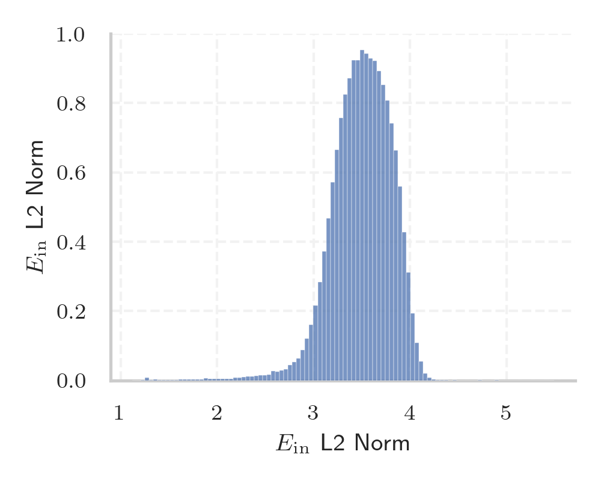

# Report for `UW/OLMo2-8B-SuperBPE-t180k`

## Model info

* Model Info: 
  * Tied embeddings: False
  * LM head uses bias: False
  * Embeddings shape: [200064, 4096]
* Tokenizer Info: 
  * Vocab Size: 200005
  * Tokenizer Class: GPT2Tokenizer
  * Tokenizer Type: BPE
  * Bytes handling: Byte Input
  * Token for verification prompt building: ArtsAutosBooksBusinessEducationEntertainmentFamilyFashionFoodGamesGenderHealthHolidaysHomeHubPagesPersonal
  * Token id for verification prompt building: 124593
* Indicator summary: 
  * Indicator for under-trained tokens: E_{in} L2 Norm
  * Overall distribution: 3.497 +/- 0.316
* Detected Token Counts: 
  * Number of tested under-trained tokens: 9958, 9920 non-special, 141 below p = 0.01 threshold, 58 below soft indicator threshold
  * Number of single byte tokens: 243, of which 3 below indicator threshold
  * Number of special tokens: 0, of which 0 below indicator threshold
  * Number of non-single-byte UTF-fragment tokens:  781, of which 3 below soft indicator threshold

## Under-trained token indicators plot


## Verification plot


## Under-trained token verification results
58 entries below threshold of 1.304

|   token_id | token                                                                 |   indicator | max_prob                                                         | in_other_tokens                                                                                                                                                                                                                                                 |
|------------|-----------------------------------------------------------------------|-------------|------------------------------------------------------------------|-----------------------------------------------------------------------------------------------------------------------------------------------------------------------------------------------------------------------------------------------------------------|
|        244 | ````` ▁a `````                                                        |     1.1704  | <span style='border: 1px solid rgb(40, 167, 69);'>0.99</span>    | ````` ▁adjourn `````, ````` ▁advection `````, ````` ▁come▁to▁a `````, ````` ▁authenticator `````, ````` ▁abrogation `````, ...                                                                                                                                  |
|        317 | ````` ▁for `````                                                      |     1.2143  | <span style='border: 1px solid rgb(40, 167, 69);'>0.99</span>    | ````` ▁forfeited `````, ````` ▁for▁about `````, ````` ▁for▁more▁than `````, ````` ▁ideal▁for `````, ````` ▁fight▁for `````, ...                                                                                                                                 |
|     124587 | ````` HomeHubPagesPersonal `````                                      |     1.23782 | <span style='border: 1px solid rgb(169, 68, 66);'>5.5e-08</span> | <span style='border: 1px solid rgb(169, 68, 66);'>````` GenderHealthHolidaysHomeHubPagesPersonal `````</span>, ````` ArtsAutosBooksBusinessEducationEntertainmentFamilyFashionFoodGamesGenderHealthHolidaysHomeHubPagesPersonal `````                           |
|     139162 | ````` ESHNonbreaking `````                                            |     1.23959 | <span style='border: 1px solid rgb(169, 68, 66);'>5.6e-05</span> | <span style='border: 1px solid rgb(255, 145, 0);'>````` ESHNonbreakingSpace `````</span>                                                                                                                                                                        |
|     171470 | ````` StatisticsRelated `````                                         |     1.24204 | <span style='border: 1px solid rgb(169, 68, 66);'>0.00012</span> | ````` StoryReviewsStatisticsRelated `````                                                                                                                                                                                                                       |
|     173382 | ````` ▁DARTPY `````                                                   |     1.2459  | <span style='border: 1px solid rgb(169, 68, 66);'>5.2e-05</span> |                                                                                                                                                                                                                                                                 |
|     103074 | ````` mkasun `````                                                    |     1.24757 | <span style='border: 1px solid rgb(169, 68, 66);'>0.00027</span> | <span style='border: 1px solid rgb(40, 167, 69);'>````` jmkasunich `````</span>, <span style='border: 1px solid rgb(40, 167, 69);'>````` mkasunich `````</span>                                                                                                 |
|     124590 | ````` GenderHealthHolidaysHomeHubPagesPersonal `````                  |     1.25464 | <span style='border: 1px solid rgb(169, 68, 66);'>6.8e-05</span> | ````` ArtsAutosBooksBusinessEducationEntertainmentFamilyFashionFoodGamesGenderHealthHolidaysHomeHubPagesPersonal `````                                                                                                                                          |
|     152474 | ````` PROTREG `````                                                   |     1.25518 | <span style='border: 1px solid rgb(169, 68, 66);'>8.5e-05</span> |                                                                                                                                                                                                                                                                 |
|     124567 | ````` PoliticsReligionSports `````                                    |     1.25809 | <span style='border: 1px solid rgb(169, 68, 66);'>0.00042</span> | <span style='border: 1px solid rgb(169, 68, 66);'>````` ▁FinancePetsPoliticsReligionSports `````</span>, ````` ▁FinancePetsPoliticsReligionSportsTechnologyTravel `````                                                                                         |
|     194809 | ````` by▁Anonymousreply `````                                         |     1.25844 | <span style='border: 1px solid rgb(169, 68, 66);'>0.00013</span> | ````` by▁Anonymousreply▁ `````                                                                                                                                                                                                                                  |
|     104998 | ````` ονεκτήματα `````                                                |     1.25855 | <span style='border: 1px solid rgb(169, 68, 66);'>4.3e-12</span> | <span style='border: 1px solid rgb(40, 167, 69);'>````` Μειονεκτήματα `````</span>, <span style='border: 1px solid rgb(40, 167, 69);'>````` Πλεονεκτήματα `````</span>, <span style='border: 1px solid rgb(169, 68, 66);'>````` λεονεκτήματα `````</span>       |
|     179246 | ````` SStructParCSRMatrix `````                                       |     1.2603  | <span style='border: 1px solid rgb(255, 145, 0);'>0.0011</span>  |                                                                                                                                                                                                                                                                 |
|     197749 | ````` <reponame `````                                                 |     1.26078 | <span style='border: 1px solid rgb(169, 68, 66);'>3.8e-05</span> | ````` <reponame> `````                                                                                                                                                                                                                                          |
|     139180 | ````` ESHNonbreakingSpace `````                                       |     1.26094 | <span style='border: 1px solid rgb(255, 145, 0);'>0.0022</span>  |                                                                                                                                                                                                                                                                 |
|      91045 | ````` remixal `````                                                   |     1.26137 | <span style='border: 1px solid rgb(169, 68, 66);'>2.2e-07</span> |                                                                                                                                                                                                                                                                 |
|     152475 | ````` PROTENSET `````                                                 |     1.262   | <span style='border: 1px solid rgb(169, 68, 66);'>5e-05</span>   |                                                                                                                                                                                                                                                                 |
|     124589 | ````` BooksBusinessEducationEntertainmentFamilyFashionFoodGames ````` |     1.26242 | <span style='border: 1px solid rgb(169, 68, 66);'>0.00022</span> | <span style='border: 1px solid rgb(169, 68, 66);'>````` ArtsAutosBooksBusinessEducationEntertainmentFamilyFashionFoodGames `````</span>, ````` ArtsAutosBooksBusinessEducationEntertainmentFamilyFashionFoodGamesGenderHealthHolidaysHomeHubPagesPersonal ````` |
|     124588 | ````` ▁FinancePetsPoliticsReligionSports `````                        |     1.26325 | <span style='border: 1px solid rgb(169, 68, 66);'>0.00026</span> | ````` ▁FinancePetsPoliticsReligionSportsTechnologyTravel `````                                                                                                                                                                                                  |
|     154465 | ````` modemux `````                                                   |     1.26328 | <span style='border: 1px solid rgb(169, 68, 66);'>0.00015</span> |                                                                                                                                                                                                                                                                 |
<details><summary>38 additional entries below threshold</summary>

|   token_id | token                                                                          |   indicator | max_prob                                                         | in_other_tokens                                                                                                                                                                                                                                                                                                                                                                                                                                                                                           |
|------------|--------------------------------------------------------------------------------|-------------|------------------------------------------------------------------|-----------------------------------------------------------------------------------------------------------------------------------------------------------------------------------------------------------------------------------------------------------------------------------------------------------------------------------------------------------------------------------------------------------------------------------------------------------------------------------------------------------|
|     200002 | ````` \|\|\|EMAIL_ADDRESS\|\|\| `````                                          |     1.26331 | <span style='border: 1px solid rgb(169, 68, 66);'>0.00014</span> |                                                                                                                                                                                                                                                                                                                                                                                                                                                                                                           |
|     124542 | ````` HealthHolidays `````                                                     |     1.26351 | <span style='border: 1px solid rgb(169, 68, 66);'>0.00021</span> | <span style='border: 1px solid rgb(169, 68, 66);'>````` GenderHealthHolidays `````</span>, <span style='border: 1px solid rgb(169, 68, 66);'>````` GenderHealthHolidaysHomeHubPagesPersonal `````</span>, ````` ArtsAutosBooksBusinessEducationEntertainmentFamilyFashionFoodGamesGenderHealthHolidaysHomeHubPagesPersonal `````                                                                                                                                                                          |
|     200003 | ````` \|\|\|PHONE_NUMBER\|\|\| `````                                           |     1.2639  | <span style='border: 1px solid rgb(169, 68, 66);'>0.00019</span> |                                                                                                                                                                                                                                                                                                                                                                                                                                                                                                           |
|     200000 | ````` \|\|\|IP_ADDRESS\|\|\| `````                                             |     1.26439 | <span style='border: 1px solid rgb(169, 68, 66);'>0.00021</span> |                                                                                                                                                                                                                                                                                                                                                                                                                                                                                                           |
|     185904 | ````` comment>Title: `````                                                     |     1.26481 | <span style='border: 1px solid rgb(169, 68, 66);'>6.9e-06</span> | ````` <issue_start><issue_comment>Title: `````                                                                                                                                                                                                                                                                                                                                                                                                                                                            |
|     124529 | ````` HomeHubPages `````                                                       |     1.26553 | <span style='border: 1px solid rgb(169, 68, 66);'>1.2e-07</span> | <span style='border: 1px solid rgb(169, 68, 66);'>````` GenderHealthHolidaysHomeHubPagesPersonal `````</span>, <span style='border: 1px solid rgb(169, 68, 66);'>````` HomeHubPagesPersonal `````</span>, ````` ArtsAutosBooksBusinessEducationEntertainmentFamilyFashionFoodGamesGenderHealthHolidaysHomeHubPagesPersonal `````                                                                                                                                                                          |
|     124552 | ````` ▁FinancePets `````                                                       |     1.26564 | <span style='border: 1px solid rgb(169, 68, 66);'>0.0003</span>  | <span style='border: 1px solid rgb(169, 68, 66);'>````` ▁FinancePetsPoliticsReligionSports `````</span>, ````` ▁FinancePetsPoliticsReligionSportsTechnologyTravel `````                                                                                                                                                                                                                                                                                                                                   |
|     124560 | ````` GenderHealthHolidays `````                                               |     1.26588 | <span style='border: 1px solid rgb(169, 68, 66);'>5.8e-05</span> | <span style='border: 1px solid rgb(169, 68, 66);'>````` GenderHealthHolidaysHomeHubPagesPersonal `````</span>, ````` ArtsAutosBooksBusinessEducationEntertainmentFamilyFashionFoodGamesGenderHealthHolidaysHomeHubPagesPersonal `````                                                                                                                                                                                                                                                                     |
|     151605 | ````` ▁expressParser `````                                                     |     1.26637 | <span style='border: 1px solid rgb(169, 68, 66);'>1.2e-05</span> |                                                                                                                                                                                                                                                                                                                                                                                                                                                                                                           |
|      77538 | ````` ▁SeriesHPF `````                                                         |     1.26665 | <span style='border: 1px solid rgb(251, 189, 8);'>0.011</span>   |                                                                                                                                                                                                                                                                                                                                                                                                                                                                                                           |
|     124586 | ````` EntertainmentFamilyFashionFoodGames `````                                |     1.26721 | <span style='border: 1px solid rgb(169, 68, 66);'>8.7e-06</span> | <span style='border: 1px solid rgb(169, 68, 66);'>````` BooksBusinessEducationEntertainmentFamilyFashionFoodGames `````</span>, <span style='border: 1px solid rgb(169, 68, 66);'>````` ArtsAutosBooksBusinessEducationEntertainmentFamilyFashionFoodGames `````</span>, ````` ArtsAutosBooksBusinessEducationEntertainmentFamilyFashionFoodGamesGenderHealthHolidaysHomeHubPagesPersonal `````                                                                                                           |
|     179535 | ````` reactJsonView `````                                                      |     1.26725 | <span style='border: 1px solid rgb(169, 68, 66);'>0.00013</span> |                                                                                                                                                                                                                                                                                                                                                                                                                                                                                                           |
|     152694 | ````` expressParser `````                                                      |     1.26747 | <span style='border: 1px solid rgb(169, 68, 66);'>0.00011</span> |                                                                                                                                                                                                                                                                                                                                                                                                                                                                                                           |
|      28708 | ````` ▁Anonymousreply `````                                                    |     1.26812 | <span style='border: 1px solid rgb(255, 145, 0);'>0.0011</span>  | ````` by▁Anonymousreply▁ `````, <span style='border: 1px solid rgb(169, 68, 66);'>````` by▁Anonymousreply `````</span>                                                                                                                                                                                                                                                                                                                                                                                    |
|     124591 | ````` ArtsAutosBooksBusinessEducationEntertainmentFamilyFashionFoodGames ````` |     1.26942 | <span style='border: 1px solid rgb(169, 68, 66);'>7.6e-08</span> | ````` ArtsAutosBooksBusinessEducationEntertainmentFamilyFashionFoodGamesGenderHealthHolidaysHomeHubPagesPersonal `````                                                                                                                                                                                                                                                                                                                                                                                    |
|     179195 | ````` DerivedWindow `````                                                      |     1.26974 | <span style='border: 1px solid rgb(255, 145, 0);'>0.0039</span>  |                                                                                                                                                                                                                                                                                                                                                                                                                                                                                                           |
|     139359 | ````` ESHDash `````                                                            |     1.27411 | <span style='border: 1px solid rgb(169, 68, 66);'>1.1e-06</span> |                                                                                                                                                                                                                                                                                                                                                                                                                                                                                                           |
|     174880 | ````` SStructPar `````                                                         |     1.27472 | <span style='border: 1px solid rgb(169, 68, 66);'>0.0004</span>  | <span style='border: 1px solid rgb(255, 145, 0);'>````` SStructParCSRMatrix `````</span>                                                                                                                                                                                                                                                                                                                                                                                                                  |
|     185833 | ````` <issue_start>< `````                                                     |     1.27665 | <span style='border: 1px solid rgb(169, 68, 66);'>4.6e-06</span> | <span style='border: 1px solid rgb(169, 68, 66);'>````` <issue_start><issue_ `````</span>, ````` <issue_start><issue_comment>Title: `````                                                                                                                                                                                                                                                                                                                                                                 |
|     104995 | ````` κτήματα `````                                                            |     1.27794 | <span style='border: 1px solid rgb(169, 68, 66);'>9.1e-05</span> | <span style='border: 1px solid rgb(169, 68, 66);'>````` ονεκτήματα `````</span>, <span style='border: 1px solid rgb(40, 167, 69);'>````` Μειονεκτήματα `````</span>, <span style='border: 1px solid rgb(40, 167, 69);'>````` Πλεονεκτήματα `````</span>, <span style='border: 1px solid rgb(169, 68, 66);'>````` λεονεκτήματα `````</span>                                                                                                                                                                |
|     171433 | ````` StoryReviews `````                                                       |     1.27911 | <span style='border: 1px solid rgb(169, 68, 66);'>0.00026</span> | ````` StoryReviewsStatisticsRelated `````                                                                                                                                                                                                                                                                                                                                                                                                                                                                 |
|     124570 | ````` ArtsAutos `````                                                          |     1.28047 | <span style='border: 1px solid rgb(169, 68, 66);'>0.00014</span> | <span style='border: 1px solid rgb(169, 68, 66);'>````` ArtsAutosBooksBusinessEducationEntertainmentFamilyFashionFoodGames `````</span>, ````` ArtsAutosBooksBusinessEducationEntertainmentFamilyFashionFoodGamesGenderHealthHolidaysHomeHubPagesPersonal `````                                                                                                                                                                                                                                           |
|     124422 | ````` TechnologyTravel `````                                                   |     1.28281 | <span style='border: 1px solid rgb(169, 68, 66);'>4.3e-06</span> | ````` ▁FinancePetsPoliticsReligionSportsTechnologyTravel `````                                                                                                                                                                                                                                                                                                                                                                                                                                            |
|        335 | ````` ▁with `````                                                              |     1.28303 | <span style='border: 1px solid rgb(40, 167, 69);'>0.99</span>    | ````` ,▁along▁with▁the `````, ````` ▁up▁with `````, ````` ▁up▁with▁a `````, <span style='border: 1px solid rgb(40, 167, 69);'>````` ▁with▁him.\n `````</span>, <span style='border: 1px solid rgb(40, 167, 69);'>````` ▁withstands `````</span>, ...                                                                                                                                                                                                                                                      |
|     172199 | ````` synvar `````                                                             |     1.28353 | <span style='border: 1px solid rgb(169, 68, 66);'>0.00018</span> |                                                                                                                                                                                                                                                                                                                                                                                                                                                                                                           |
|     140713 | ````` pPacker `````                                                            |     1.28358 | <span style='border: 1px solid rgb(169, 68, 66);'>9.4e-05</span> |                                                                                                                                                                                                                                                                                                                                                                                                                                                                                                           |
|     178000 | ````` ▁杨冰怡 `````                                                            |     1.2843  | <span style='border: 1px solid rgb(169, 68, 66);'>3e-07</span>   |                                                                                                                                                                                                                                                                                                                                                                                                                                                                                                           |
|     111460 | ````` simpfm `````                                                             |     1.28925 | <span style='border: 1px solid rgb(40, 167, 69);'>0.41</span>    |                                                                                                                                                                                                                                                                                                                                                                                                                                                                                                           |
|     155944 | ````` ▁Mcfield `````                                                           |     1.2894  | <span style='border: 1px solid rgb(255, 145, 0);'>0.0025</span>  |                                                                                                                                                                                                                                                                                                                                                                                                                                                                                                           |
|     124573 | ````` FashionFoodGames `````                                                   |     1.29045 | <span style='border: 1px solid rgb(169, 68, 66);'>3e-06</span>   | <span style='border: 1px solid rgb(169, 68, 66);'>````` BooksBusinessEducationEntertainmentFamilyFashionFoodGames `````</span>, <span style='border: 1px solid rgb(169, 68, 66);'>````` EntertainmentFamilyFashionFoodGames `````</span>, <span style='border: 1px solid rgb(169, 68, 66);'>````` ArtsAutosBooksBusinessEducationEntertainmentFamilyFashionFoodGames `````</span>, ````` ArtsAutosBooksBusinessEducationEntertainmentFamilyFashionFoodGamesGenderHealthHolidaysHomeHubPagesPersonal ````` |
|     124556 | ````` BooksBusinessEducation `````                                             |     1.29078 | <span style='border: 1px solid rgb(169, 68, 66);'>1.7e-08</span> | <span style='border: 1px solid rgb(169, 68, 66);'>````` BooksBusinessEducationEntertainmentFamilyFashionFoodGames `````</span>, <span style='border: 1px solid rgb(169, 68, 66);'>````` ArtsAutosBooksBusinessEducationEntertainmentFamilyFashionFoodGames `````</span>, ````` ArtsAutosBooksBusinessEducationEntertainmentFamilyFashionFoodGamesGenderHealthHolidaysHomeHubPagesPersonal `````                                                                                                           |
|     172176 | ````` \xa0▁\xa0▁\u3000 `````                                                   |     1.29083 | <span style='border: 1px solid rgb(169, 68, 66);'>0.00033</span> |                                                                                                                                                                                                                                                                                                                                                                                                                                                                                                           |
|     113717 | ````` 𐰃 `````                                                                  |     1.29321 | <span style='border: 1px solid rgb(255, 145, 0);'>0.0075</span>  | ````` 𐰃<0xF0><0x90><0xB0> `````                                                                                                                                                                                                                                                                                                                                                                                                                                                                           |
|     179988 | ````` ConnectorOperator `````                                                  |     1.29492 | <span style='border: 1px solid rgb(251, 189, 8);'>0.014</span>   |                                                                                                                                                                                                                                                                                                                                                                                                                                                                                                           |
|     133833 | ````` wnStart `````                                                            |     1.29644 | <span style='border: 1px solid rgb(40, 167, 69);'>0.34</span>    |                                                                                                                                                                                                                                                                                                                                                                                                                                                                                                           |
|      86635 | ````` ▁MATechnician `````                                                      |     1.29908 | <span style='border: 1px solid rgb(255, 145, 0);'>0.0082</span>  |                                                                                                                                                                                                                                                                                                                                                                                                                                                                                                           |
|     144129 | ````` 𐰀 `````                                                                  |     1.30012 | <span style='border: 1px solid rgb(255, 145, 0);'>0.0011</span>  |                                                                                                                                                                                                                                                                                                                                                                                                                                                                                                           |
|      90986 | ````` 지노 `````                                                               |     1.3021  | <span style='border: 1px solid rgb(255, 145, 0);'>0.0044</span>  | ````` ▁카지노 `````, ````` <0xB9><0xB4>지노 `````, ````` 카지노 `````                                                                                                                                                                                                                                                                                                                                                                                                                                     |
</details>


## Tokens with partial UTF-8 sequences
3 entries below threshold of 1.304

|   token_id | token                           |   indicator | in_other_tokens                                                              |
|------------|---------------------------------|-------------|------------------------------------------------------------------------------|
|     159738 | ````` <0xA8>冰怡 `````          |     1.26477 | <span style='border: 1px solid rgb(169, 68, 66);'>````` ▁杨冰怡 `````</span> |
|     137471 | ````` 𐰃<0xF0><0x90><0xB0> ````` |     1.28151 |                                                                              |
|      91043 | ````` <0xB9><0xB4>지노 `````    |     1.28405 | ````` ▁카지노 `````, ````` 카지노 `````                                      |


## Byte tokens
3 entries below threshold of 1.427

|   token_id | token          |   indicator |   ord | hex   | byte_type   |
|------------|----------------|-------------|-------|-------|-------------|
|        185 | ````` \n ````` |     1.11625 |    10 | 0x0A  | ascii       |
|         11 | ````` , `````  |     1.2185  |    44 | 0x2C  | ascii       |
|         13 | ````` . `````  |     1.42277 |    46 | 0x2E  | ascii       |


## Special tokens
2 entries below threshold of 1.427

|   token_id | token                       |   indicator | max_prob                                                         |
|------------|-----------------------------|-------------|------------------------------------------------------------------|
|     200001 | ````` <\|padding\|> `````   |     1.27081 | <span style='border: 1px solid rgb(169, 68, 66);'>1.1e-11</span> |
|     200004 | ````` <\|endoftext\|> ````` |     1.36838 | <span style='border: 1px solid rgb(255, 145, 0);'>0.0021</span>  |

