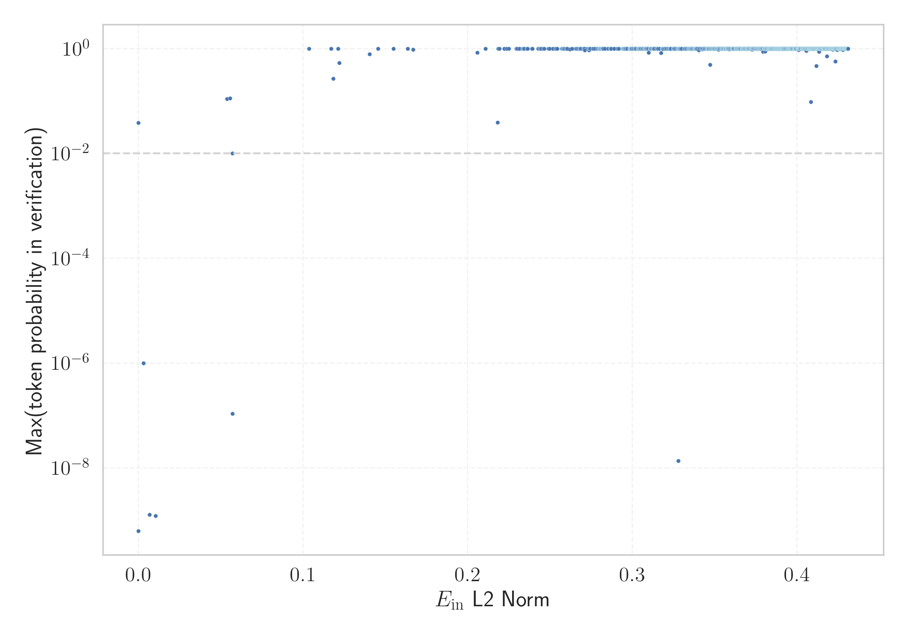

# Report for `ai21labs/AI21-Jamba-1.5-Mini`

## Model info

* Model Info: 
  * Tied embeddings: False
  * LM head uses bias: False
  * Embeddings shape: [65536, 4096]
* Tokenizer Info: 
  * Vocab Size: 65536
  * Tokenizer Class: LlamaTokenizer
  * Tokenizer Type: BPE
  * Bytes handling: Byte Fallback
  * Token for verification prompt building: ArgumentException
  * Token id for verification prompt building: 38226
* Indicator summary: 
  * Indicator for under-trained tokens: E_{in} L2 Norm
  * Overall distribution: 0.588 +/- 0.113
* Detected Token Counts: 
  * Number of tested under-trained tokens: 492, 396 non-special, 3 below p = 0.01 threshold, 11 below soft indicator threshold
  * Number of single byte tokens: 355, of which 113 below indicator threshold
  * Number of special tokens: 39410, of which 0 below indicator threshold
  * Number of non-single-byte unreachable tokens: 39410, of which 0 below indicator threshold
  * Number of non-single-byte UTF-fragment tokens:  1, of which 0 below soft indicator threshold

## Under-trained token indicators plot


## Verification plot


## Under-trained token verification results
11 entries below threshold of 0.218

|   token_id | token                    |   indicator | max_prob                                                         | in_other_tokens                                                               |
|------------|--------------------------|-------------|------------------------------------------------------------------|-------------------------------------------------------------------------------|
|      50544 | ````` derrelsc `````     |  0.00302123 | <span style='border: 1px solid rgb(169, 68, 66);'>1e-06</span>   |                                                                               |
|      58002 | ````` .\xa0(\[ `````     |  0.0103792  | <span style='border: 1px solid rgb(169, 68, 66);'>1.2e-09</span> |                                                                               |
|      61130 | ````` ]{}]{} `````       |  0.0537106  | <span style='border: 1px solid rgb(40, 167, 69);'>0.11</span>    |                                                                               |
|      59180 | ````` .*]{} `````        |  0.0557112  | <span style='border: 1px solid rgb(40, 167, 69);'>0.11</span>    |                                                                               |
|      33631 | ````` .\xa0\[ `````      |  0.0570433  | <span style='border: 1px solid rgb(251, 189, 8);'>0.01</span>    |                                                                               |
|      58810 | ````` ronicsystems ````` |  0.0570511  | <span style='border: 1px solid rgb(169, 68, 66);'>1.1e-07</span> |                                                                               |
|      46222 | ````` derrel `````       |  0.117093   | <span style='border: 1px solid rgb(40, 167, 69);'>1</span>       | <span style='border: 1px solid rgb(169, 68, 66);'>````` derrelsc `````</span> |
|      45270 | ````` =\u200a `````      |  0.118303   | <span style='border: 1px solid rgb(40, 167, 69);'>0.27</span>    | ````` \u200a=\u200a `````                                                     |
|      65490 | ````` ≎ `````            |  0.121283   | <span style='border: 1px solid rgb(40, 167, 69);'>1</span>       |                                                                               |
|      24430 | ````` **]{} `````        |  0.12206    | <span style='border: 1px solid rgb(40, 167, 69);'>0.53</span>    |                                                                               |
|      25552 | ````` *]{} `````         |  0.140371   | <span style='border: 1px solid rgb(40, 167, 69);'>0.79</span>    | <span style='border: 1px solid rgb(40, 167, 69);'>````` .*]{} `````</span>    |


## Tokens with partial UTF-8 sequences
0 entries below threshold of 0.218


## Byte tokens
113 entries below threshold of 0.010

|   token_id | token              |   indicator |   ord | hex   | byte_type   | reencoded               |
|------------|--------------------|-------------|-------|-------|-------------|-------------------------|
|       1656 | ````` <0x70> ````` | 2.72003e-07 |   112 | 0x70  | ascii       | 62949: ````` p `````    |
|       1593 | ````` <0x31> ````` | 2.73909e-07 |    49 | 0x31  | ascii       | 62965: ````` 1 `````    |
|       1798 | ````` <0xFE> ````` | 2.74166e-07 |   254 | 0xFE  | unused_utf8 |                         |
|       1603 | ````` <0x3B> ````` | 2.74325e-07 |    59 | 0x3B  | ascii       | 62994: ````` ; `````    |
|       1571 | ````` <0x1B> ````` | 2.74437e-07 |    27 | 0x1B  | ascii       | 64244: ````` \x1b ````` |
|       1655 | ````` <0x6F> ````` | 2.7446e-07  |   111 | 0x6F  | ascii       | 62938: ````` o `````    |
|       1595 | ````` <0x33> ````` | 2.74619e-07 |    51 | 0x33  | ascii       | 62992: ````` 3 `````    |
|       1671 | ````` <0x7F> ````` | 2.74664e-07 |   127 | 0x7F  | ascii       | 64836: ````` \x7f ````` |
|       1585 | ````` <0x29> ````` | 2.75117e-07 |    41 | 0x29  | ascii       | 62968: ````` ) `````    |
|       1618 | ````` <0x4A> ````` | 2.75155e-07 |    74 | 0x4A  | ascii       | 63006: ````` J `````    |
|       1641 | ````` <0x61> ````` | 2.75267e-07 |    97 | 0x61  | ascii       | 62937: ````` a `````    |
|       1628 | ````` <0x54> ````` | 2.75614e-07 |    84 | 0x54  | ascii       | 62957: ````` T `````    |
|       1620 | ````` <0x4C> ````` | 2.75696e-07 |    76 | 0x4C  | ascii       | 62979: ````` L `````    |
|       1659 | ````` <0x73> ````` | 2.75781e-07 |   115 | 0x73  | ascii       | 62941: ````` s `````    |
|       1790 | ````` <0xF6> ````` | 2.76035e-07 |   246 | 0xF6  | unused_utf8 |                         |
|       1594 | ````` <0x32> ````` | 2.7615e-07  |    50 | 0x32  | ascii       | 62970: ````` 2 `````    |
|       1586 | ````` <0x2A> ````` | 2.76184e-07 |    42 | 0x2A  | ascii       | 62998: ````` * `````    |
|       1649 | ````` <0x69> ````` | 2.76312e-07 |   105 | 0x69  | ascii       | 62939: ````` i `````    |
|       1580 | ````` <0x24> ````` | 2.76486e-07 |    36 | 0x24  | ascii       | 63011: ````` $ `````    |
|       1791 | ````` <0xF7> ````` | 2.7653e-07  |   247 | 0xF7  | unused_utf8 |                         |
<details><summary>93 additional entries below threshold</summary>

|   token_id | token              |   indicator |   ord | hex   | byte_type   | reencoded               |
|------------|--------------------|-------------|-------|-------|-------------|-------------------------|
|       1663 | ````` <0x77> ````` | 2.76594e-07 |   119 | 0x77  | ascii       | 62953: ````` w `````    |
|       1640 | ````` <0x60> ````` | 2.76999e-07 |    96 | 0x60  | ascii       | 63035: ````` ` `````    |
|       1652 | ````` <0x6C> ````` | 2.77013e-07 |   108 | 0x6C  | ascii       | 62943: ````` l `````    |
|       1794 | ````` <0xFA> ````` | 2.77192e-07 |   250 | 0xFA  | unused_utf8 |                         |
|       1635 | ````` <0x5B> ````` | 2.7734e-07  |    91 | 0x5B  | ascii       | 63014: ````` [ `````    |
|       1654 | ````` <0x6E> ````` | 2.77456e-07 |   110 | 0x6E  | ascii       | 62940: ````` n `````    |
|       1601 | ````` <0x39> ````` | 2.77523e-07 |    57 | 0x39  | ascii       | 62996: ````` 9 `````    |
|       1587 | ````` <0x2B> ````` | 2.77527e-07 |    43 | 0x2B  | ascii       | 63027: ````` + `````    |
|       1797 | ````` <0xFD> ````` | 2.77611e-07 |   253 | 0xFD  | unused_utf8 |                         |
|       1610 | ````` <0x42> ````` | 2.77737e-07 |    66 | 0x42  | ascii       | 62977: ````` B `````    |
|       1604 | ````` <0x3C> ````` | 2.77755e-07 |    60 | 0x3C  | ascii       | 63010: ````` < `````    |
|       1590 | ````` <0x2E> ````` | 2.77839e-07 |    46 | 0x2E  | ascii       | 62959: ````` . `````    |
|       1660 | ````` <0x74> ````` | 2.77914e-07 |   116 | 0x74  | ascii       | 62936: ````` t `````    |
|       1578 | ````` <0x22> ````` | 2.7797e-07  |    34 | 0x22  | ascii       | 62974: ````` " `````    |
|       1624 | ````` <0x50> ````` | 2.77973e-07 |    80 | 0x50  | ascii       | 62972: ````` P `````    |
|       1645 | ````` <0x65> ````` | 2.77977e-07 |   101 | 0x65  | ascii       | 62935: ````` e `````    |
|       1577 | ````` <0x21> ````` | 2.77989e-07 |    33 | 0x21  | ascii       | 63028: ````` ! `````    |
|       1615 | ````` <0x47> ````` | 2.78162e-07 |    71 | 0x47  | ascii       | 62990: ````` G `````    |
|       1634 | ````` <0x5A> ````` | 2.78339e-07 |    90 | 0x5A  | ascii       | 63043: ````` Z `````    |
|       1644 | ````` <0x64> ````` | 2.78416e-07 |   100 | 0x64  | ascii       | 62945: ````` d `````    |
|       1665 | ````` <0x79> ````` | 2.78505e-07 |   121 | 0x79  | ascii       | 62952: ````` y `````    |
|       1642 | ````` <0x62> ````` | 2.7854e-07  |    98 | 0x62  | ascii       | 62954: ````` b `````    |
|       1637 | ````` <0x5D> ````` | 2.78556e-07 |    93 | 0x5D  | ascii       | 63015: ````` ] `````    |
|       1632 | ````` <0x58> ````` | 2.78772e-07 |    88 | 0x58  | ascii       | 63036: ````` X `````    |
|       1608 | ````` <0x40> ````` | 2.78846e-07 |    64 | 0x40  | ascii       | 63037: ````` @ `````    |
|       1614 | ````` <0x46> ````` | 2.78872e-07 |    70 | 0x46  | ascii       | 62984: ````` F `````    |
|       1639 | ````` <0x5F> ````` | 2.79041e-07 |    95 | 0x5F  | ascii       | 62988: ````` _ `````    |
|       1609 | ````` <0x41> ````` | 2.79106e-07 |    65 | 0x41  | ascii       | 62962: ````` A `````    |
|       1602 | ````` <0x3A> ````` | 2.79109e-07 |    58 | 0x3A  | ascii       | 62978: ````` : `````    |
|       1662 | ````` <0x76> ````` | 2.79177e-07 |   118 | 0x76  | ascii       | 62955: ````` v `````    |
|       1619 | ````` <0x4B> ````` | 2.79277e-07 |    75 | 0x4B  | ascii       | 63009: ````` K `````    |
|       1670 | ````` <0x7E> ````` | 2.79299e-07 |   126 | 0x7E  | ascii       | 63085: ````` ~ `````    |
|       1625 | ````` <0x51> ````` | 2.79345e-07 |    81 | 0x51  | ascii       | 63031: ````` Q `````    |
|       1613 | ````` <0x45> ````` | 2.79367e-07 |    69 | 0x45  | ascii       | 62973: ````` E `````    |
|       1661 | ````` <0x75> ````` | 2.79604e-07 |   117 | 0x75  | ascii       | 62947: ````` u `````    |
|       1638 | ````` <0x5E> ````` | 2.79656e-07 |    94 | 0x5E  | ascii       | 63060: ````` ^ `````    |
|       1657 | ````` <0x71> ````` | 2.79668e-07 |   113 | 0x71  | ascii       | 62983: ````` q `````    |
|       1581 | ````` <0x25> ````` | 2.79687e-07 |    37 | 0x25  | ascii       | 63026: ````` % `````    |
|       1799 | ````` <0xFF> ````` | 2.79738e-07 |   255 | 0xFF  | unused_utf8 |                         |
|       1588 | ````` <0x2C> ````` | 2.7974e-07  |    44 | 0x2C  | ascii       | 1543: ````` , `````     |
|       1664 | ````` <0x78> ````` | 2.79755e-07 |   120 | 0x78  | ascii       | 62967: ````` x `````    |
|       1600 | ````` <0x38> ````` | 2.79759e-07 |    56 | 0x38  | ascii       | 63001: ````` 8 `````    |
|       1793 | ````` <0xF9> ````` | 2.79781e-07 |   249 | 0xF9  | unused_utf8 |                         |
|       1650 | ````` <0x6A> ````` | 2.79797e-07 |   106 | 0x6A  | ascii       | 62985: ````` j `````    |
|       1629 | ````` <0x55> ````` | 2.79884e-07 |    85 | 0x55  | ascii       | 62997: ````` U `````    |
|       1636 | ````` <0x5C> ````` | 2.79974e-07 |    92 | 0x5C  | ascii       | 63013: ````` \ `````    |
|       1611 | ````` <0x43> ````` | 2.80027e-07 |    67 | 0x43  | ascii       | 62964: ````` C `````    |
|       1643 | ````` <0x63> ````` | 2.80256e-07 |    99 | 0x63  | ascii       | 62946: ````` c `````    |
|       1789 | ````` <0xF5> ````` | 2.80272e-07 |   245 | 0xF5  | unused_utf8 |                         |
|       1551 | ````` <0x07> ````` | 2.80307e-07 |     7 | 0x07  | ascii       | 65513: ````` \x07 ````` |
|       1597 | ````` <0x35> ````` | 2.80337e-07 |    53 | 0x35  | ascii       | 62993: ````` 5 `````    |
|       1583 | ````` <0x27> ````` | 2.80367e-07 |    39 | 0x27  | ascii       | 62966: ````` ' `````    |
|       1633 | ````` <0x59> ````` | 2.80614e-07 |    89 | 0x59  | ascii       | 63012: ````` Y `````    |
|       1653 | ````` <0x6D> ````` | 2.80674e-07 |   109 | 0x6D  | ascii       | 62948: ````` m `````    |
|       1599 | ````` <0x37> ````` | 2.80723e-07 |    55 | 0x37  | ascii       | 63004: ````` 7 `````    |
|       1622 | ````` <0x4E> ````` | 2.80777e-07 |    78 | 0x4E  | ascii       | 62980: ````` N `````    |
|       1631 | ````` <0x57> ````` | 2.80789e-07 |    87 | 0x57  | ascii       | 62987: ````` W `````    |
|       1647 | ````` <0x67> ````` | 2.80829e-07 |   103 | 0x67  | ascii       | 62950: ````` g `````    |
|       1607 | ````` <0x3F> ````` | 2.8083e-07  |    63 | 0x3F  | ascii       | 63052: ````` ? `````    |
|       1658 | ````` <0x72> ````` | 2.80858e-07 |   114 | 0x72  | ascii       | 62942: ````` r `````    |
|       1736 | ````` <0xC0> ````` | 2.80862e-07 |   192 | 0xC0  | unused_utf8 |                         |
|       1796 | ````` <0xFC> ````` | 2.8089e-07  |   252 | 0xFC  | unused_utf8 |                         |
|       1582 | ````` <0x26> ````` | 2.81071e-07 |    38 | 0x26  | ascii       | 63024: ````` & `````    |
|       1598 | ````` <0x36> ````` | 2.81283e-07 |    54 | 0x36  | ascii       | 63000: ````` 6 `````    |
|       1648 | ````` <0x68> ````` | 2.81326e-07 |   104 | 0x68  | ascii       | 62944: ````` h `````    |
|       1669 | ````` <0x7D> ````` | 2.81327e-07 |   125 | 0x7D  | ascii       | 63008: ````` } `````    |
|       1605 | ````` <0x3D> ````` | 2.81378e-07 |    61 | 0x3D  | ascii       | 62991: ````` = `````    |
|       1617 | ````` <0x49> ````` | 2.81396e-07 |    73 | 0x49  | ascii       | 62958: ````` I `````    |
|       1737 | ````` <0xC1> ````` | 2.81456e-07 |   193 | 0xC1  | unused_utf8 |                         |
|       1651 | ````` <0x6B> ````` | 2.81515e-07 |   107 | 0x6B  | ascii       | 62956: ````` k `````    |
|       1795 | ````` <0xFB> ````` | 2.81996e-07 |   251 | 0xFB  | unused_utf8 |                         |
|       1616 | ````` <0x48> ````` | 2.82126e-07 |    72 | 0x48  | ascii       | 62986: ````` H `````    |
|       1576 | ````` <0x20> ````` | 2.82149e-07 |    32 | 0x20  | ascii       | 62934: ````` ▁ `````    |
|       1557 | ````` <0x0D> ````` | 2.82166e-07 |    13 | 0x0D  | ascii       | 63021: ````` \r `````   |
|       1556 | ````` <0x0C> ````` | 2.8237e-07  |    12 | 0x0C  | ascii       | 63286: ````` \x0c ````` |
|       1596 | ````` <0x34> ````` | 2.82395e-07 |    52 | 0x34  | ascii       | 62995: ````` 4 `````    |
|       1606 | ````` <0x3E> ````` | 2.82464e-07 |    62 | 0x3E  | ascii       | 63002: ````` > `````    |
|       1591 | ````` <0x2F> ````` | 2.82535e-07 |    47 | 0x2F  | ascii       | 62981: ````` / `````    |
|       1579 | ````` <0x23> ````` | 2.82821e-07 |    35 | 0x23  | ascii       | 63017: ````` # `````    |
|       1584 | ````` <0x28> ````` | 2.8326e-07  |    40 | 0x28  | ascii       | 62969: ````` ( `````    |
|       1589 | ````` <0x2D> ````` | 2.8353e-07  |    45 | 0x2D  | ascii       | 62960: ````` - `````    |
|       1630 | ````` <0x56> ````` | 2.83689e-07 |    86 | 0x56  | ascii       | 63005: ````` V `````    |
|       1623 | ````` <0x4F> ````` | 2.83871e-07 |    79 | 0x4F  | ascii       | 62982: ````` O `````    |
|       1627 | ````` <0x53> ````` | 2.84043e-07 |    83 | 0x53  | ascii       | 62961: ````` S `````    |
|       1792 | ````` <0xF8> ````` | 2.84745e-07 |   248 | 0xF8  | unused_utf8 |                         |
|       1626 | ````` <0x52> ````` | 2.84858e-07 |    82 | 0x52  | ascii       | 62976: ````` R `````    |
|       1621 | ````` <0x4D> ````` | 2.85077e-07 |    77 | 0x4D  | ascii       | 62971: ````` M `````    |
|       1592 | ````` <0x30> ````` | 2.85164e-07 |    48 | 0x30  | ascii       | 62963: ````` 0 `````    |
|       1612 | ````` <0x44> ````` | 2.85351e-07 |    68 | 0x44  | ascii       | 62975: ````` D `````    |
|       1666 | ````` <0x7A> ````` | 2.85574e-07 |   122 | 0x7A  | ascii       | 62989: ````` z `````    |
|       1646 | ````` <0x66> ````` | 2.85667e-07 |   102 | 0x66  | ascii       | 62951: ````` f `````    |
|       1667 | ````` <0x7B> ````` | 2.86041e-07 |   123 | 0x7B  | ascii       | 63007: ````` { `````    |
|       1668 | ````` <0x7C> ````` | 2.86798e-07 |   124 | 0x7C  | ascii       | 63038: ````` \| `````   |
</details>


## Special tokens
1526 entries below threshold of 0.010

|   token_id | token                           |   indicator |
|------------|---------------------------------|-------------|
|        344 | ````` <\|mask_340\|> `````      | 2.69289e-07 |
|        743 | ````` <\|reserved_227\|> `````  | 2.69703e-07 |
|          7 | ````` <\|mask_3\|> `````        | 2.70257e-07 |
|        651 | ````` <\|reserved_135\|> `````  | 2.71423e-07 |
|         80 | ````` <\|mask_76\|> `````       | 2.71529e-07 |
|        383 | ````` <\|mask_379\|> `````      | 2.71952e-07 |
|       1366 | ````` <\|reserved_850\|> `````  | 2.72081e-07 |
|       1156 | ````` <\|reserved_640\|> `````  | 2.72128e-07 |
|        402 | ````` <\|mask_398\|> `````      | 2.72172e-07 |
|        272 | ````` <\|mask_268\|> `````      | 2.72197e-07 |
|        776 | ````` <\|reserved_260\|> `````  | 2.72329e-07 |
|        836 | ````` <\|reserved_320\|> `````  | 2.72357e-07 |
|        483 | ````` <\|mask_479\|> `````      | 2.72448e-07 |
|        323 | ````` <\|mask_319\|> `````      | 2.72461e-07 |
|       1534 | ````` <\|reserved_1018\|> ````` | 2.72526e-07 |
|        461 | ````` <\|mask_457\|> `````      | 2.72709e-07 |
|        580 | ````` <\|reserved_64\|> `````   | 2.72749e-07 |
|       1370 | ````` <\|reserved_854\|> `````  | 2.72776e-07 |
|        317 | ````` <\|mask_313\|> `````      | 2.72792e-07 |
|       1411 | ````` <\|reserved_895\|> `````  | 2.72816e-07 |
<details><summary>1506 additional entries below threshold</summary>

|   token_id | token                           |   indicator | max_prob                                                         |
|------------|---------------------------------|-------------|------------------------------------------------------------------|
|         56 | ````` <\|mask_52\|> `````       | 2.72976e-07 |                                                                  |
|        149 | ````` <\|mask_145\|> `````      | 2.73039e-07 |                                                                  |
|        666 | ````` <\|reserved_150\|> `````  | 2.73178e-07 |                                                                  |
|        335 | ````` <\|mask_331\|> `````      | 2.73226e-07 |                                                                  |
|        921 | ````` <\|reserved_405\|> `````  | 2.73245e-07 |                                                                  |
|       1497 | ````` <\|reserved_981\|> `````  | 2.73292e-07 |                                                                  |
|        160 | ````` <\|mask_156\|> `````      | 2.73307e-07 |                                                                  |
|        659 | ````` <\|reserved_143\|> `````  | 2.73319e-07 |                                                                  |
|          3 | ````` <\|unk\|> `````           | 2.73372e-07 | <span style='border: 1px solid rgb(169, 68, 66);'>6.3e-10</span> |
|        481 | ````` <\|mask_477\|> `````      | 2.73482e-07 |                                                                  |
|        313 | ````` <\|mask_309\|> `````      | 2.73512e-07 |                                                                  |
|        184 | ````` <\|mask_180\|> `````      | 2.73546e-07 |                                                                  |
|       1203 | ````` <\|reserved_687\|> `````  | 2.73568e-07 |                                                                  |
|       1062 | ````` <\|reserved_546\|> `````  | 2.73598e-07 |                                                                  |
|        847 | ````` <\|reserved_331\|> `````  | 2.736e-07   |                                                                  |
|        499 | ````` <\|mask_495\|> `````      | 2.7363e-07  |                                                                  |
|        449 | ````` <\|mask_445\|> `````      | 2.73652e-07 |                                                                  |
|       1360 | ````` <\|reserved_844\|> `````  | 2.73657e-07 |                                                                  |
|       1059 | ````` <\|reserved_543\|> `````  | 2.73663e-07 |                                                                  |
|        952 | ````` <\|reserved_436\|> `````  | 2.73675e-07 |                                                                  |
|         33 | ````` <\|mask_29\|> `````       | 2.73698e-07 |                                                                  |
|        102 | ````` <\|mask_98\|> `````       | 2.73742e-07 |                                                                  |
|        827 | ````` <\|reserved_311\|> `````  | 2.73808e-07 |                                                                  |
|        767 | ````` <\|reserved_251\|> `````  | 2.73814e-07 |                                                                  |
|        348 | ````` <\|mask_344\|> `````      | 2.73821e-07 |                                                                  |
|        657 | ````` <\|reserved_141\|> `````  | 2.73876e-07 |                                                                  |
|         74 | ````` <\|mask_70\|> `````       | 2.73989e-07 |                                                                  |
|        831 | ````` <\|reserved_315\|> `````  | 2.73995e-07 |                                                                  |
|        857 | ````` <\|reserved_341\|> `````  | 2.73996e-07 |                                                                  |
|       1106 | ````` <\|reserved_590\|> `````  | 2.73997e-07 |                                                                  |
|        680 | ````` <\|reserved_164\|> `````  | 2.74e-07    |                                                                  |
|        351 | ````` <\|mask_347\|> `````      | 2.74009e-07 |                                                                  |
|        129 | ````` <\|mask_125\|> `````      | 2.74015e-07 |                                                                  |
|        452 | ````` <\|mask_448\|> `````      | 2.74041e-07 |                                                                  |
|       1328 | ````` <\|reserved_812\|> `````  | 2.74073e-07 |                                                                  |
|        225 | ````` <\|mask_221\|> `````      | 2.74074e-07 |                                                                  |
|        783 | ````` <\|reserved_267\|> `````  | 2.74086e-07 |                                                                  |
|       1052 | ````` <\|reserved_536\|> `````  | 2.74095e-07 |                                                                  |
|        881 | ````` <\|reserved_365\|> `````  | 2.7411e-07  |                                                                  |
|       1095 | ````` <\|reserved_579\|> `````  | 2.74112e-07 |                                                                  |
|       1484 | ````` <\|reserved_968\|> `````  | 2.7413e-07  |                                                                  |
|        655 | ````` <\|reserved_139\|> `````  | 2.74208e-07 |                                                                  |
|        753 | ````` <\|reserved_237\|> `````  | 2.74258e-07 |                                                                  |
|        968 | ````` <\|reserved_452\|> `````  | 2.74289e-07 |                                                                  |
|       1352 | ````` <\|reserved_836\|> `````  | 2.74337e-07 |                                                                  |
|        222 | ````` <\|mask_218\|> `````      | 2.7435e-07  |                                                                  |
|       1013 | ````` <\|reserved_497\|> `````  | 2.74405e-07 |                                                                  |
|       1171 | ````` <\|reserved_655\|> `````  | 2.74406e-07 |                                                                  |
|        448 | ````` <\|mask_444\|> `````      | 2.74443e-07 |                                                                  |
|        551 | ````` <\|reserved_35\|> `````   | 2.74449e-07 |                                                                  |
|         71 | ````` <\|mask_67\|> `````       | 2.74473e-07 |                                                                  |
|        213 | ````` <\|mask_209\|> `````      | 2.74575e-07 |                                                                  |
|       1235 | ````` <\|reserved_719\|> `````  | 2.74584e-07 |                                                                  |
|         68 | ````` <\|mask_64\|> `````       | 2.74594e-07 |                                                                  |
|       1393 | ````` <\|reserved_877\|> `````  | 2.74603e-07 |                                                                  |
|        922 | ````` <\|reserved_406\|> `````  | 2.74607e-07 |                                                                  |
|       1423 | ````` <\|reserved_907\|> `````  | 2.7464e-07  |                                                                  |
|        349 | ````` <\|mask_345\|> `````      | 2.74701e-07 |                                                                  |
|       1262 | ````` <\|reserved_746\|> `````  | 2.74705e-07 |                                                                  |
|       1112 | ````` <\|reserved_596\|> `````  | 2.74719e-07 |                                                                  |
|        911 | ````` <\|reserved_395\|> `````  | 2.74752e-07 |                                                                  |
|        482 | ````` <\|mask_478\|> `````      | 2.74766e-07 |                                                                  |
|         42 | ````` <\|mask_38\|> `````       | 2.74797e-07 |                                                                  |
|        820 | ````` <\|reserved_304\|> `````  | 2.74819e-07 |                                                                  |
|       1232 | ````` <\|reserved_716\|> `````  | 2.74831e-07 |                                                                  |
|         67 | ````` <\|mask_63\|> `````       | 2.74892e-07 |                                                                  |
|        556 | ````` <\|reserved_40\|> `````   | 2.74901e-07 |                                                                  |
|        751 | ````` <\|reserved_235\|> `````  | 2.74913e-07 |                                                                  |
|       1270 | ````` <\|reserved_754\|> `````  | 2.74914e-07 |                                                                  |
|       1249 | ````` <\|reserved_733\|> `````  | 2.74936e-07 |                                                                  |
|        837 | ````` <\|reserved_321\|> `````  | 2.74955e-07 |                                                                  |
|       1437 | ````` <\|reserved_921\|> `````  | 2.74964e-07 |                                                                  |
|       1346 | ````` <\|reserved_830\|> `````  | 2.74974e-07 |                                                                  |
|        287 | ````` <\|mask_283\|> `````      | 2.7499e-07  |                                                                  |
|        778 | ````` <\|reserved_262\|> `````  | 2.75001e-07 |                                                                  |
|        797 | ````` <\|reserved_281\|> `````  | 2.75008e-07 |                                                                  |
|        889 | ````` <\|reserved_373\|> `````  | 2.75016e-07 |                                                                  |
|        552 | ````` <\|reserved_36\|> `````   | 2.75021e-07 |                                                                  |
|        364 | ````` <\|mask_360\|> `````      | 2.75049e-07 |                                                                  |
|        517 | ````` <\|reserved_1\|> `````    | 2.75055e-07 |                                                                  |
|       1504 | ````` <\|reserved_988\|> `````  | 2.7512e-07  |                                                                  |
|        132 | ````` <\|mask_128\|> `````      | 2.75135e-07 |                                                                  |
|       1213 | ````` <\|reserved_697\|> `````  | 2.75144e-07 |                                                                  |
|        701 | ````` <\|reserved_185\|> `````  | 2.75145e-07 |                                                                  |
|        760 | ````` <\|reserved_244\|> `````  | 2.7515e-07  |                                                                  |
|       1077 | ````` <\|reserved_561\|> `````  | 2.75207e-07 |                                                                  |
|       1239 | ````` <\|reserved_723\|> `````  | 2.75226e-07 |                                                                  |
|       1018 | ````` <\|reserved_502\|> `````  | 2.75244e-07 |                                                                  |
|        894 | ````` <\|reserved_378\|> `````  | 2.75253e-07 |                                                                  |
|        512 | ````` <\|mask_508\|> `````      | 2.75262e-07 |                                                                  |
|        260 | ````` <\|mask_256\|> `````      | 2.75285e-07 |                                                                  |
|        616 | ````` <\|reserved_100\|> `````  | 2.75296e-07 |                                                                  |
|        207 | ````` <\|mask_203\|> `````      | 2.75303e-07 |                                                                  |
|        830 | ````` <\|reserved_314\|> `````  | 2.75336e-07 |                                                                  |
|         11 | ````` <\|mask_7\|> `````        | 2.75345e-07 |                                                                  |
|        515 | ````` <\|mask_511\|> `````      | 2.75357e-07 |                                                                  |
|        726 | ````` <\|reserved_210\|> `````  | 2.75357e-07 |                                                                  |
|       1483 | ````` <\|reserved_967\|> `````  | 2.75414e-07 |                                                                  |
|       1452 | ````` <\|reserved_936\|> `````  | 2.7542e-07  |                                                                  |
|       1480 | ````` <\|reserved_964\|> `````  | 2.75429e-07 |                                                                  |
|       1294 | ````` <\|reserved_778\|> `````  | 2.75437e-07 |                                                                  |
|        365 | ````` <\|mask_361\|> `````      | 2.75452e-07 |                                                                  |
|        445 | ````` <\|mask_441\|> `````      | 2.75464e-07 |                                                                  |
|        221 | ````` <\|mask_217\|> `````      | 2.75473e-07 |                                                                  |
|        957 | ````` <\|reserved_441\|> `````  | 2.75481e-07 |                                                                  |
|        509 | ````` <\|mask_505\|> `````      | 2.75492e-07 |                                                                  |
|       1293 | ````` <\|reserved_777\|> `````  | 2.75523e-07 |                                                                  |
|       1329 | ````` <\|reserved_813\|> `````  | 2.75525e-07 |                                                                  |
|        468 | ````` <\|mask_464\|> `````      | 2.75535e-07 |                                                                  |
|        249 | ````` <\|mask_245\|> `````      | 2.75537e-07 |                                                                  |
|       1412 | ````` <\|reserved_896\|> `````  | 2.75554e-07 |                                                                  |
|        641 | ````` <\|reserved_125\|> `````  | 2.75556e-07 |                                                                  |
|       1415 | ````` <\|reserved_899\|> `````  | 2.75596e-07 |                                                                  |
|        423 | ````` <\|mask_419\|> `````      | 2.75606e-07 |                                                                  |
|        406 | ````` <\|mask_402\|> `````      | 2.7563e-07  |                                                                  |
|       1154 | ````` <\|reserved_638\|> `````  | 2.75632e-07 |                                                                  |
|        718 | ````` <\|reserved_202\|> `````  | 2.75633e-07 |                                                                  |
|        980 | ````` <\|reserved_464\|> `````  | 2.7564e-07  |                                                                  |
|         28 | ````` <\|mask_24\|> `````       | 2.7565e-07  |                                                                  |
|        297 | ````` <\|mask_293\|> `````      | 2.75653e-07 |                                                                  |
|       1133 | ````` <\|reserved_617\|> `````  | 2.7566e-07  |                                                                  |
|        671 | ````` <\|reserved_155\|> `````  | 2.75665e-07 |                                                                  |
|       1320 | ````` <\|reserved_804\|> `````  | 2.75674e-07 |                                                                  |
|       1017 | ````` <\|reserved_501\|> `````  | 2.75678e-07 |                                                                  |
|        985 | ````` <\|reserved_469\|> `````  | 2.75684e-07 |                                                                  |
|         65 | ````` <\|mask_61\|> `````       | 2.75733e-07 |                                                                  |
|        315 | ````` <\|mask_311\|> `````      | 2.75755e-07 |                                                                  |
|        803 | ````` <\|reserved_287\|> `````  | 2.75755e-07 |                                                                  |
|       1212 | ````` <\|reserved_696\|> `````  | 2.75757e-07 |                                                                  |
|        813 | ````` <\|reserved_297\|> `````  | 2.75778e-07 |                                                                  |
|       1513 | ````` <\|reserved_997\|> `````  | 2.75778e-07 |                                                                  |
|        434 | ````` <\|mask_430\|> `````      | 2.75779e-07 |                                                                  |
|       1459 | ````` <\|reserved_943\|> `````  | 2.75811e-07 |                                                                  |
|       1433 | ````` <\|reserved_917\|> `````  | 2.75821e-07 |                                                                  |
|        425 | ````` <\|mask_421\|> `````      | 2.75825e-07 |                                                                  |
|       1340 | ````` <\|reserved_824\|> `````  | 2.75832e-07 |                                                                  |
|       1131 | ````` <\|reserved_615\|> `````  | 2.75856e-07 |                                                                  |
|        226 | ````` <\|mask_222\|> `````      | 2.75866e-07 |                                                                  |
|       1011 | ````` <\|reserved_495\|> `````  | 2.75903e-07 |                                                                  |
|        558 | ````` <\|reserved_42\|> `````   | 2.75906e-07 |                                                                  |
|        405 | ````` <\|mask_401\|> `````      | 2.75912e-07 |                                                                  |
|       1233 | ````` <\|reserved_717\|> `````  | 2.75916e-07 |                                                                  |
|       1301 | ````` <\|reserved_785\|> `````  | 2.75926e-07 |                                                                  |
|        475 | ````` <\|mask_471\|> `````      | 2.75934e-07 |                                                                  |
|        191 | ````` <\|mask_187\|> `````      | 2.75966e-07 |                                                                  |
|       1419 | ````` <\|reserved_903\|> `````  | 2.75977e-07 |                                                                  |
|        690 | ````` <\|reserved_174\|> `````  | 2.75997e-07 |                                                                  |
|        619 | ````` <\|reserved_103\|> `````  | 2.76015e-07 |                                                                  |
|        871 | ````` <\|reserved_355\|> `````  | 2.76016e-07 |                                                                  |
|        944 | ````` <\|reserved_428\|> `````  | 2.76017e-07 |                                                                  |
|       1049 | ````` <\|reserved_533\|> `````  | 2.76023e-07 |                                                                  |
|        177 | ````` <\|mask_173\|> `````      | 2.76024e-07 |                                                                  |
|       1190 | ````` <\|reserved_674\|> `````  | 2.76035e-07 |                                                                  |
|        320 | ````` <\|mask_316\|> `````      | 2.76059e-07 |                                                                  |
|        311 | ````` <\|mask_307\|> `````      | 2.76077e-07 |                                                                  |
|         58 | ````` <\|mask_54\|> `````       | 2.761e-07   |                                                                  |
|       1501 | ````` <\|reserved_985\|> `````  | 2.76103e-07 |                                                                  |
|        729 | ````` <\|reserved_213\|> `````  | 2.76119e-07 |                                                                  |
|        976 | ````` <\|reserved_460\|> `````  | 2.76142e-07 |                                                                  |
|        559 | ````` <\|reserved_43\|> `````   | 2.76171e-07 |                                                                  |
|       1127 | ````` <\|reserved_611\|> `````  | 2.76197e-07 |                                                                  |
|        382 | ````` <\|mask_378\|> `````      | 2.76198e-07 |                                                                  |
|        442 | ````` <\|mask_438\|> `````      | 2.76199e-07 |                                                                  |
|       1388 | ````` <\|reserved_872\|> `````  | 2.76208e-07 |                                                                  |
|       1384 | ````` <\|reserved_868\|> `````  | 2.76212e-07 |                                                                  |
|        923 | ````` <\|reserved_407\|> `````  | 2.76214e-07 |                                                                  |
|       1004 | ````` <\|reserved_488\|> `````  | 2.76217e-07 |                                                                  |
|       1355 | ````` <\|reserved_839\|> `````  | 2.76221e-07 |                                                                  |
|        135 | ````` <\|mask_131\|> `````      | 2.76231e-07 |                                                                  |
|        727 | ````` <\|reserved_211\|> `````  | 2.76235e-07 |                                                                  |
|       1056 | ````` <\|reserved_540\|> `````  | 2.76241e-07 |                                                                  |
|       1428 | ````` <\|reserved_912\|> `````  | 2.76245e-07 |                                                                  |
|        639 | ````` <\|reserved_123\|> `````  | 2.76249e-07 |                                                                  |
|        223 | ````` <\|mask_219\|> `````      | 2.76298e-07 |                                                                  |
|       1005 | ````` <\|reserved_489\|> `````  | 2.76301e-07 |                                                                  |
|        353 | ````` <\|mask_349\|> `````      | 2.76307e-07 |                                                                  |
|        613 | ````` <\|reserved_97\|> `````   | 2.76312e-07 |                                                                  |
|        494 | ````` <\|mask_490\|> `````      | 2.76316e-07 |                                                                  |
|         51 | ````` <\|mask_47\|> `````       | 2.76317e-07 |                                                                  |
|        202 | ````` <\|mask_198\|> `````      | 2.7632e-07  |                                                                  |
|       1485 | ````` <\|reserved_969\|> `````  | 2.76324e-07 |                                                                  |
|       1426 | ````` <\|reserved_910\|> `````  | 2.76326e-07 |                                                                  |
|        511 | ````` <\|mask_507\|> `````      | 2.76331e-07 |                                                                  |
|        679 | ````` <\|reserved_163\|> `````  | 2.76332e-07 |                                                                  |
|        366 | ````` <\|mask_362\|> `````      | 2.76342e-07 |                                                                  |
|       1479 | ````` <\|reserved_963\|> `````  | 2.76345e-07 |                                                                  |
|       1324 | ````` <\|reserved_808\|> `````  | 2.76346e-07 |                                                                  |
|        195 | ````` <\|mask_191\|> `````      | 2.76351e-07 |                                                                  |
|         81 | ````` <\|mask_77\|> `````       | 2.76359e-07 |                                                                  |
|        601 | ````` <\|reserved_85\|> `````   | 2.76361e-07 |                                                                  |
|        724 | ````` <\|reserved_208\|> `````  | 2.76368e-07 |                                                                  |
|         96 | ````` <\|mask_92\|> `````       | 2.76389e-07 |                                                                  |
|        798 | ````` <\|reserved_282\|> `````  | 2.7639e-07  |                                                                  |
|        826 | ````` <\|reserved_310\|> `````  | 2.76394e-07 |                                                                  |
|       1205 | ````` <\|reserved_689\|> `````  | 2.76411e-07 |                                                                  |
|        825 | ````` <\|reserved_309\|> `````  | 2.76416e-07 |                                                                  |
|        357 | ````` <\|mask_353\|> `````      | 2.76419e-07 |                                                                  |
|        465 | ````` <\|mask_461\|> `````      | 2.7642e-07  |                                                                  |
|        877 | ````` <\|reserved_361\|> `````  | 2.76438e-07 |                                                                  |
|        146 | ````` <\|mask_142\|> `````      | 2.76441e-07 |                                                                  |
|        715 | ````` <\|reserved_199\|> `````  | 2.7646e-07  |                                                                  |
|        125 | ````` <\|mask_121\|> `````      | 2.76484e-07 |                                                                  |
|         69 | ````` <\|mask_65\|> `````       | 2.7649e-07  |                                                                  |
|       1250 | ````` <\|reserved_734\|> `````  | 2.76507e-07 |                                                                  |
|         23 | ````` <\|mask_19\|> `````       | 2.76512e-07 |                                                                  |
|        490 | ````` <\|mask_486\|> `````      | 2.76514e-07 |                                                                  |
|          6 | ````` <\|mask_2\|> `````        | 2.76533e-07 |                                                                  |
|         76 | ````` <\|mask_72\|> `````       | 2.76549e-07 |                                                                  |
|        809 | ````` <\|reserved_293\|> `````  | 2.76553e-07 |                                                                  |
|        603 | ````` <\|reserved_87\|> `````   | 2.76569e-07 |                                                                  |
|       1255 | ````` <\|reserved_739\|> `````  | 2.76591e-07 |                                                                  |
|        739 | ````` <\|reserved_223\|> `````  | 2.76615e-07 |                                                                  |
|       1120 | ````` <\|reserved_604\|> `````  | 2.76633e-07 |                                                                  |
|       1356 | ````` <\|reserved_840\|> `````  | 2.76634e-07 |                                                                  |
|         10 | ````` <\|mask_6\|> `````        | 2.76654e-07 |                                                                  |
|        269 | ````` <\|mask_265\|> `````      | 2.76679e-07 |                                                                  |
|       1054 | ````` <\|reserved_538\|> `````  | 2.76707e-07 |                                                                  |
|       1507 | ````` <\|reserved_991\|> `````  | 2.76714e-07 |                                                                  |
|        864 | ````` <\|reserved_348\|> `````  | 2.76729e-07 |                                                                  |
|        916 | ````` <\|reserved_400\|> `````  | 2.76731e-07 |                                                                  |
|        271 | ````` <\|mask_267\|> `````      | 2.76746e-07 |                                                                  |
|       1199 | ````` <\|reserved_683\|> `````  | 2.76753e-07 |                                                                  |
|       1518 | ````` <\|reserved_1002\|> ````` | 2.76765e-07 |                                                                  |
|        876 | ````` <\|reserved_360\|> `````  | 2.76768e-07 |                                                                  |
|       1404 | ````` <\|reserved_888\|> `````  | 2.76794e-07 |                                                                  |
|       1389 | ````` <\|reserved_873\|> `````  | 2.768e-07   |                                                                  |
|        879 | ````` <\|reserved_363\|> `````  | 2.76803e-07 |                                                                  |
|       1060 | ````` <\|reserved_544\|> `````  | 2.76803e-07 |                                                                  |
|       1008 | ````` <\|reserved_492\|> `````  | 2.76804e-07 |                                                                  |
|        572 | ````` <\|reserved_56\|> `````   | 2.76812e-07 |                                                                  |
|       1422 | ````` <\|reserved_906\|> `````  | 2.76814e-07 |                                                                  |
|        233 | ````` <\|mask_229\|> `````      | 2.76827e-07 |                                                                  |
|        245 | ````` <\|mask_241\|> `````      | 2.76836e-07 |                                                                  |
|        873 | ````` <\|reserved_357\|> `````  | 2.76858e-07 |                                                                  |
|       1159 | ````` <\|reserved_643\|> `````  | 2.76866e-07 |                                                                  |
|        258 | ````` <\|mask_254\|> `````      | 2.76877e-07 |                                                                  |
|       1065 | ````` <\|reserved_549\|> `````  | 2.76891e-07 |                                                                  |
|       1152 | ````` <\|reserved_636\|> `````  | 2.76891e-07 |                                                                  |
|       1451 | ````` <\|reserved_935\|> `````  | 2.76905e-07 |                                                                  |
|        426 | ````` <\|mask_422\|> `````      | 2.76905e-07 |                                                                  |
|        631 | ````` <\|reserved_115\|> `````  | 2.76907e-07 |                                                                  |
|         95 | ````` <\|mask_91\|> `````       | 2.7691e-07  |                                                                  |
|        602 | ````` <\|reserved_86\|> `````   | 2.76917e-07 |                                                                  |
|        697 | ````` <\|reserved_181\|> `````  | 2.76934e-07 |                                                                  |
|       1541 | ````` <\|MID\|> `````           | 2.76944e-07 |                                                                  |
|        733 | ````` <\|reserved_217\|> `````  | 2.76947e-07 |                                                                  |
|        151 | ````` <\|mask_147\|> `````      | 2.76965e-07 |                                                                  |
|       1160 | ````` <\|reserved_644\|> `````  | 2.76967e-07 |                                                                  |
|       1306 | ````` <\|reserved_790\|> `````  | 2.76977e-07 |                                                                  |
|       1014 | ````` <\|reserved_498\|> `````  | 2.76989e-07 |                                                                  |
|        840 | ````` <\|reserved_324\|> `````  | 2.77016e-07 |                                                                  |
|       1074 | ````` <\|reserved_558\|> `````  | 2.77016e-07 |                                                                  |
|       1020 | ````` <\|reserved_504\|> `````  | 2.77023e-07 |                                                                  |
|        833 | ````` <\|reserved_317\|> `````  | 2.77028e-07 |                                                                  |
|       1172 | ````` <\|reserved_656\|> `````  | 2.77031e-07 |                                                                  |
|        115 | ````` <\|mask_111\|> `````      | 2.77065e-07 |                                                                  |
|        158 | ````` <\|mask_154\|> `````      | 2.77074e-07 |                                                                  |
|        615 | ````` <\|reserved_99\|> `````   | 2.77079e-07 |                                                                  |
|       1405 | ````` <\|reserved_889\|> `````  | 2.7708e-07  |                                                                  |
|       1207 | ````` <\|reserved_691\|> `````  | 2.77089e-07 |                                                                  |
|       1234 | ````` <\|reserved_718\|> `````  | 2.77101e-07 |                                                                  |
|        652 | ````` <\|reserved_136\|> `````  | 2.77108e-07 |                                                                  |
|        698 | ````` <\|reserved_182\|> `````  | 2.77123e-07 |                                                                  |
|        140 | ````` <\|mask_136\|> `````      | 2.77129e-07 |                                                                  |
|        165 | ````` <\|mask_161\|> `````      | 2.77136e-07 |                                                                  |
|        600 | ````` <\|reserved_84\|> `````   | 2.77146e-07 |                                                                  |
|        210 | ````` <\|mask_206\|> `````      | 2.77148e-07 |                                                                  |
|         60 | ````` <\|mask_56\|> `````       | 2.7715e-07  |                                                                  |
|        835 | ````` <\|reserved_319\|> `````  | 2.77154e-07 |                                                                  |
|       1519 | ````` <\|reserved_1003\|> ````` | 2.77157e-07 |                                                                  |
|        912 | ````` <\|reserved_396\|> `````  | 2.77186e-07 |                                                                  |
|       1292 | ````` <\|reserved_776\|> `````  | 2.77192e-07 |                                                                  |
|        371 | ````` <\|mask_367\|> `````      | 2.77202e-07 |                                                                  |
|       1468 | ````` <\|reserved_952\|> `````  | 2.77204e-07 |                                                                  |
|        850 | ````` <\|reserved_334\|> `````  | 2.77213e-07 |                                                                  |
|       1179 | ````` <\|reserved_663\|> `````  | 2.77213e-07 |                                                                  |
|        337 | ````` <\|mask_333\|> `````      | 2.77218e-07 |                                                                  |
|       1182 | ````` <\|reserved_666\|> `````  | 2.77237e-07 |                                                                  |
|       1408 | ````` <\|reserved_892\|> `````  | 2.77241e-07 |                                                                  |
|       1517 | ````` <\|reserved_1001\|> ````` | 2.77248e-07 |                                                                  |
|        667 | ````` <\|reserved_151\|> `````  | 2.77254e-07 |                                                                  |
|       1180 | ````` <\|reserved_664\|> `````  | 2.77266e-07 |                                                                  |
|        897 | ````` <\|reserved_381\|> `````  | 2.77267e-07 |                                                                  |
|        904 | ````` <\|reserved_388\|> `````  | 2.77271e-07 |                                                                  |
|       1300 | ````` <\|reserved_784\|> `````  | 2.77287e-07 |                                                                  |
|        367 | ````` <\|mask_363\|> `````      | 2.77308e-07 |                                                                  |
|       1261 | ````` <\|reserved_745\|> `````  | 2.77309e-07 |                                                                  |
|        507 | ````` <\|mask_503\|> `````      | 2.77317e-07 |                                                                  |
|        591 | ````` <\|reserved_75\|> `````   | 2.77326e-07 |                                                                  |
|       1417 | ````` <\|reserved_901\|> `````  | 2.77335e-07 |                                                                  |
|        787 | ````` <\|reserved_271\|> `````  | 2.77337e-07 |                                                                  |
|        474 | ````` <\|mask_470\|> `````      | 2.77342e-07 |                                                                  |
|       1471 | ````` <\|reserved_955\|> `````  | 2.77343e-07 |                                                                  |
|         45 | ````` <\|mask_41\|> `````       | 2.77347e-07 |                                                                  |
|       1153 | ````` <\|reserved_637\|> `````  | 2.77355e-07 |                                                                  |
|        647 | ````` <\|reserved_131\|> `````  | 2.77356e-07 |                                                                  |
|        704 | ````` <\|reserved_188\|> `````  | 2.77358e-07 |                                                                  |
|        296 | ````` <\|mask_292\|> `````      | 2.7736e-07  |                                                                  |
|        550 | ````` <\|reserved_34\|> `````   | 2.77362e-07 |                                                                  |
|        279 | ````` <\|mask_275\|> `````      | 2.77382e-07 |                                                                  |
|        254 | ````` <\|mask_250\|> `````      | 2.77385e-07 |                                                                  |
|        100 | ````` <\|mask_96\|> `````       | 2.774e-07   |                                                                  |
|       1339 | ````` <\|reserved_823\|> `````  | 2.77431e-07 |                                                                  |
|        973 | ````` <\|reserved_457\|> `````  | 2.77441e-07 |                                                                  |
|         72 | ````` <\|mask_68\|> `````       | 2.77442e-07 |                                                                  |
|          8 | ````` <\|mask_4\|> `````        | 2.77443e-07 |                                                                  |
|       1401 | ````` <\|reserved_885\|> `````  | 2.7745e-07  |                                                                  |
|        198 | ````` <\|mask_194\|> `````      | 2.77456e-07 |                                                                  |
|       1396 | ````` <\|reserved_880\|> `````  | 2.77465e-07 |                                                                  |
|        561 | ````` <\|reserved_45\|> `````   | 2.77471e-07 |                                                                  |
|       1044 | ````` <\|reserved_528\|> `````  | 2.77473e-07 |                                                                  |
|       1409 | ````` <\|reserved_893\|> `````  | 2.77512e-07 |                                                                  |
|        358 | ````` <\|mask_354\|> `````      | 2.77518e-07 |                                                                  |
|       1175 | ````` <\|reserved_659\|> `````  | 2.77536e-07 |                                                                  |
|       1456 | ````` <\|reserved_940\|> `````  | 2.77543e-07 |                                                                  |
|       1498 | ````` <\|reserved_982\|> `````  | 2.77544e-07 |                                                                  |
|        993 | ````` <\|reserved_477\|> `````  | 2.77558e-07 |                                                                  |
|       1511 | ````` <\|reserved_995\|> `````  | 2.77571e-07 |                                                                  |
|        440 | ````` <\|mask_436\|> `````      | 2.77577e-07 |                                                                  |
|       1332 | ````` <\|reserved_816\|> `````  | 2.77586e-07 |                                                                  |
|        812 | ````` <\|reserved_296\|> `````  | 2.77591e-07 |                                                                  |
|       1002 | ````` <\|reserved_486\|> `````  | 2.77594e-07 |                                                                  |
|       1510 | ````` <\|reserved_994\|> `````  | 2.77647e-07 |                                                                  |
|         59 | ````` <\|mask_55\|> `````       | 2.77649e-07 |                                                                  |
|        200 | ````` <\|mask_196\|> `````      | 2.77651e-07 |                                                                  |
|       1506 | ````` <\|reserved_990\|> `````  | 2.77651e-07 |                                                                  |
|        763 | ````` <\|reserved_247\|> `````  | 2.77657e-07 |                                                                  |
|        312 | ````` <\|mask_308\|> `````      | 2.77663e-07 |                                                                  |
|       1521 | ````` <\|reserved_1005\|> ````` | 2.77663e-07 |                                                                  |
|        672 | ````` <\|reserved_156\|> `````  | 2.77666e-07 |                                                                  |
|        725 | ````` <\|reserved_209\|> `````  | 2.77676e-07 |                                                                  |
|       1430 | ````` <\|reserved_914\|> `````  | 2.77696e-07 |                                                                  |
|        943 | ````` <\|reserved_427\|> `````  | 2.77705e-07 |                                                                  |
|        133 | ````` <\|mask_129\|> `````      | 2.7772e-07  |                                                                  |
|        626 | ````` <\|reserved_110\|> `````  | 2.77725e-07 |                                                                  |
|        867 | ````` <\|reserved_351\|> `````  | 2.7773e-07  |                                                                  |
|       1431 | ````` <\|reserved_915\|> `````  | 2.77736e-07 |                                                                  |
|        381 | ````` <\|mask_377\|> `````      | 2.7774e-07  |                                                                  |
|        173 | ````` <\|mask_169\|> `````      | 2.7774e-07  |                                                                  |
|        391 | ````` <\|mask_387\|> `````      | 2.7775e-07  |                                                                  |
|       1081 | ````` <\|reserved_565\|> `````  | 2.77752e-07 |                                                                  |
|       1222 | ````` <\|reserved_706\|> `````  | 2.77753e-07 |                                                                  |
|        609 | ````` <\|reserved_93\|> `````   | 2.7776e-07  |                                                                  |
|        304 | ````` <\|mask_300\|> `````      | 2.77762e-07 |                                                                  |
|        608 | ````` <\|reserved_92\|> `````   | 2.77768e-07 |                                                                  |
|        745 | ````` <\|reserved_229\|> `````  | 2.77782e-07 |                                                                  |
|       1028 | ````` <\|reserved_512\|> `````  | 2.77788e-07 |                                                                  |
|       1093 | ````` <\|reserved_577\|> `````  | 2.77794e-07 |                                                                  |
|       1413 | ````` <\|reserved_897\|> `````  | 2.77795e-07 |                                                                  |
|        907 | ````` <\|reserved_391\|> `````  | 2.77811e-07 |                                                                  |
|       1488 | ````` <\|reserved_972\|> `````  | 2.77815e-07 |                                                                  |
|        627 | ````` <\|reserved_111\|> `````  | 2.77819e-07 |                                                                  |
|        218 | ````` <\|mask_214\|> `````      | 2.77831e-07 |                                                                  |
|       1174 | ````` <\|reserved_658\|> `````  | 2.77831e-07 |                                                                  |
|        505 | ````` <\|mask_501\|> `````      | 2.77836e-07 |                                                                  |
|       1310 | ````` <\|reserved_794\|> `````  | 2.77839e-07 |                                                                  |
|        872 | ````` <\|reserved_356\|> `````  | 2.7785e-07  |                                                                  |
|        989 | ````` <\|reserved_473\|> `````  | 2.77856e-07 |                                                                  |
|       1314 | ````` <\|reserved_798\|> `````  | 2.7787e-07  |                                                                  |
|        762 | ````` <\|reserved_246\|> `````  | 2.77874e-07 |                                                                  |
|        645 | ````` <\|reserved_129\|> `````  | 2.77877e-07 |                                                                  |
|        239 | ````` <\|mask_235\|> `````      | 2.77881e-07 |                                                                  |
|        535 | ````` <\|reserved_19\|> `````   | 2.77884e-07 |                                                                  |
|        607 | ````` <\|reserved_91\|> `````   | 2.77892e-07 |                                                                  |
|        159 | ````` <\|mask_155\|> `````      | 2.77895e-07 |                                                                  |
|       1094 | ````` <\|reserved_578\|> `````  | 2.77897e-07 |                                                                  |
|       1499 | ````` <\|reserved_983\|> `````  | 2.77916e-07 |                                                                  |
|        917 | ````` <\|reserved_401\|> `````  | 2.77916e-07 |                                                                  |
|       1091 | ````` <\|reserved_575\|> `````  | 2.77931e-07 |                                                                  |
|       1526 | ````` <\|reserved_1010\|> ````` | 2.77932e-07 |                                                                  |
|        920 | ````` <\|reserved_404\|> `````  | 2.77937e-07 |                                                                  |
|       1126 | ````` <\|reserved_610\|> `````  | 2.77941e-07 |                                                                  |
|       1427 | ````` <\|reserved_911\|> `````  | 2.77942e-07 |                                                                  |
|        118 | ````` <\|mask_114\|> `````      | 2.77947e-07 |                                                                  |
|        163 | ````` <\|mask_159\|> `````      | 2.77955e-07 |                                                                  |
|        719 | ````` <\|reserved_203\|> `````  | 2.77959e-07 |                                                                  |
|         27 | ````` <\|mask_23\|> `````       | 2.77968e-07 |                                                                  |
|       1173 | ````` <\|reserved_657\|> `````  | 2.7797e-07  |                                                                  |
|       1079 | ````` <\|reserved_563\|> `````  | 2.77971e-07 |                                                                  |
|       1539 | ````` <\|reserved_1023\|> ````` | 2.77972e-07 |                                                                  |
|        428 | ````` <\|mask_424\|> `````      | 2.7798e-07  |                                                                  |
|        138 | ````` <\|mask_134\|> `````      | 2.77982e-07 |                                                                  |
|        563 | ````` <\|reserved_47\|> `````   | 2.77987e-07 |                                                                  |
|        429 | ````` <\|mask_425\|> `````      | 2.77995e-07 |                                                                  |
|        984 | ````` <\|reserved_468\|> `````  | 2.77999e-07 |                                                                  |
|       1145 | ````` <\|reserved_629\|> `````  | 2.78006e-07 |                                                                  |
|       1457 | ````` <\|reserved_941\|> `````  | 2.78009e-07 |                                                                  |
|        342 | ````` <\|mask_338\|> `````      | 2.78017e-07 |                                                                  |
|        120 | ````` <\|mask_116\|> `````      | 2.78017e-07 |                                                                  |
|        929 | ````` <\|reserved_413\|> `````  | 2.78018e-07 |                                                                  |
|        111 | ````` <\|mask_107\|> `````      | 2.78034e-07 |                                                                  |
|        241 | ````` <\|mask_237\|> `````      | 2.78039e-07 |                                                                  |
|        469 | ````` <\|mask_465\|> `````      | 2.7804e-07  |                                                                  |
|        196 | ````` <\|mask_192\|> `````      | 2.78049e-07 |                                                                  |
|        673 | ````` <\|reserved_157\|> `````  | 2.7805e-07  |                                                                  |
|       1275 | ````` <\|reserved_759\|> `````  | 2.78055e-07 |                                                                  |
|        611 | ````` <\|reserved_95\|> `````   | 2.78059e-07 |                                                                  |
|        612 | ````` <\|reserved_96\|> `````   | 2.78068e-07 |                                                                  |
|        628 | ````` <\|reserved_112\|> `````  | 2.78069e-07 |                                                                  |
|        982 | ````` <\|reserved_466\|> `````  | 2.78073e-07 |                                                                  |
|       1268 | ````` <\|reserved_752\|> `````  | 2.78074e-07 |                                                                  |
|        938 | ````` <\|reserved_422\|> `````  | 2.78087e-07 |                                                                  |
|        986 | ````` <\|reserved_470\|> `````  | 2.78096e-07 |                                                                  |
|        959 | ````` <\|reserved_443\|> `````  | 2.78099e-07 |                                                                  |
|         53 | ````` <\|mask_49\|> `````       | 2.781e-07   |                                                                  |
|       1482 | ````` <\|reserved_966\|> `````  | 2.7811e-07  |                                                                  |
|        858 | ````` <\|reserved_342\|> `````  | 2.78112e-07 |                                                                  |
|        378 | ````` <\|mask_374\|> `````      | 2.78117e-07 |                                                                  |
|       1224 | ````` <\|reserved_708\|> `````  | 2.78122e-07 |                                                                  |
|        682 | ````` <\|reserved_166\|> `````  | 2.78137e-07 |                                                                  |
|        781 | ````` <\|reserved_265\|> `````  | 2.78137e-07 |                                                                  |
|       1092 | ````` <\|reserved_576\|> `````  | 2.78145e-07 |                                                                  |
|        700 | ````` <\|reserved_184\|> `````  | 2.78156e-07 |                                                                  |
|       1185 | ````` <\|reserved_669\|> `````  | 2.7816e-07  |                                                                  |
|        821 | ````` <\|reserved_305\|> `````  | 2.78161e-07 |                                                                  |
|        108 | ````` <\|mask_104\|> `````      | 2.78164e-07 |                                                                  |
|        537 | ````` <\|reserved_21\|> `````   | 2.78164e-07 |                                                                  |
|       1464 | ````` <\|reserved_948\|> `````  | 2.78165e-07 |                                                                  |
|        435 | ````` <\|mask_431\|> `````      | 2.7817e-07  |                                                                  |
|       1344 | ````` <\|reserved_828\|> `````  | 2.78173e-07 |                                                                  |
|        851 | ````` <\|reserved_335\|> `````  | 2.78174e-07 |                                                                  |
|       1315 | ````` <\|reserved_799\|> `````  | 2.7819e-07  |                                                                  |
|        691 | ````` <\|reserved_175\|> `````  | 2.78191e-07 |                                                                  |
|        915 | ````` <\|reserved_399\|> `````  | 2.78193e-07 |                                                                  |
|       1064 | ````` <\|reserved_548\|> `````  | 2.78206e-07 |                                                                  |
|       1380 | ````` <\|reserved_864\|> `````  | 2.78213e-07 |                                                                  |
|       1469 | ````` <\|reserved_953\|> `````  | 2.78229e-07 |                                                                  |
|        617 | ````` <\|reserved_101\|> `````  | 2.78235e-07 |                                                                  |
|        987 | ````` <\|reserved_471\|> `````  | 2.78238e-07 |                                                                  |
|        592 | ````` <\|reserved_76\|> `````   | 2.78238e-07 |                                                                  |
|        654 | ````` <\|reserved_138\|> `````  | 2.7824e-07  |                                                                  |
|        250 | ````` <\|mask_246\|> `````      | 2.78256e-07 |                                                                  |
|        598 | ````` <\|reserved_82\|> `````   | 2.78282e-07 |                                                                  |
|       1436 | ````` <\|reserved_920\|> `````  | 2.7829e-07  |                                                                  |
|         13 | ````` <\|mask_9\|> `````        | 2.783e-07   |                                                                  |
|        294 | ````` <\|mask_290\|> `````      | 2.78308e-07 |                                                                  |
|         17 | ````` <\|mask_13\|> `````       | 2.78312e-07 |                                                                  |
|        131 | ````` <\|mask_127\|> `````      | 2.78314e-07 |                                                                  |
|        605 | ````` <\|reserved_89\|> `````   | 2.78327e-07 |                                                                  |
|       1297 | ````` <\|reserved_781\|> `````  | 2.78335e-07 |                                                                  |
|        309 | ````` <\|mask_305\|> `````      | 2.78355e-07 |                                                                  |
|       1425 | ````` <\|reserved_909\|> `````  | 2.78367e-07 |                                                                  |
|       1359 | ````` <\|reserved_843\|> `````  | 2.78371e-07 |                                                                  |
|         55 | ````` <\|mask_51\|> `````       | 2.78382e-07 |                                                                  |
|       1505 | ````` <\|reserved_989\|> `````  | 2.78387e-07 |                                                                  |
|        590 | ````` <\|reserved_74\|> `````   | 2.78391e-07 |                                                                  |
|       1067 | ````` <\|reserved_551\|> `````  | 2.78392e-07 |                                                                  |
|       1373 | ````` <\|reserved_857\|> `````  | 2.78392e-07 |                                                                  |
|        888 | ````` <\|reserved_372\|> `````  | 2.78392e-07 |                                                                  |
|       1445 | ````` <\|reserved_929\|> `````  | 2.78405e-07 |                                                                  |
|        832 | ````` <\|reserved_316\|> `````  | 2.78405e-07 |                                                                  |
|       1134 | ````` <\|reserved_618\|> `````  | 2.78408e-07 |                                                                  |
|       1238 | ````` <\|reserved_722\|> `````  | 2.78417e-07 |                                                                  |
|       1371 | ````` <\|reserved_855\|> `````  | 2.78426e-07 |                                                                  |
|       1003 | ````` <\|reserved_487\|> `````  | 2.78442e-07 |                                                                  |
|         22 | ````` <\|mask_18\|> `````       | 2.78448e-07 |                                                                  |
|        963 | ````` <\|reserved_447\|> `````  | 2.78455e-07 |                                                                  |
|       1387 | ````` <\|reserved_871\|> `````  | 2.78458e-07 |                                                                  |
|        350 | ````` <\|mask_346\|> `````      | 2.78463e-07 |                                                                  |
|        974 | ````` <\|reserved_458\|> `````  | 2.78474e-07 |                                                                  |
|       1130 | ````` <\|reserved_614\|> `````  | 2.78477e-07 |                                                                  |
|        141 | ````` <\|mask_137\|> `````      | 2.78482e-07 |                                                                  |
|        852 | ````` <\|reserved_336\|> `````  | 2.78482e-07 |                                                                  |
|         79 | ````` <\|mask_75\|> `````       | 2.78485e-07 |                                                                  |
|        689 | ````` <\|reserved_173\|> `````  | 2.78485e-07 |                                                                  |
|        811 | ````` <\|reserved_295\|> `````  | 2.78491e-07 |                                                                  |
|       1149 | ````` <\|reserved_633\|> `````  | 2.78493e-07 |                                                                  |
|       1282 | ````` <\|reserved_766\|> `````  | 2.78497e-07 |                                                                  |
|       1045 | ````` <\|reserved_529\|> `````  | 2.78498e-07 |                                                                  |
|        441 | ````` <\|mask_437\|> `````      | 2.78502e-07 |                                                                  |
|        789 | ````` <\|reserved_273\|> `````  | 2.78521e-07 |                                                                  |
|        170 | ````` <\|mask_166\|> `````      | 2.78521e-07 |                                                                  |
|       1102 | ````` <\|reserved_586\|> `````  | 2.78528e-07 |                                                                  |
|        906 | ````` <\|reserved_390\|> `````  | 2.78534e-07 |                                                                  |
|        951 | ````` <\|reserved_435\|> `````  | 2.78536e-07 |                                                                  |
|        299 | ````` <\|mask_295\|> `````      | 2.78549e-07 |                                                                  |
|       1338 | ````` <\|reserved_822\|> `````  | 2.7856e-07  |                                                                  |
|       1241 | ````` <\|reserved_725\|> `````  | 2.78563e-07 |                                                                  |
|        669 | ````` <\|reserved_153\|> `````  | 2.7857e-07  |                                                                  |
|        542 | ````` <\|reserved_26\|> `````   | 2.78575e-07 |                                                                  |
|       1254 | ````` <\|reserved_738\|> `````  | 2.78575e-07 |                                                                  |
|         35 | ````` <\|mask_31\|> `````       | 2.78594e-07 |                                                                  |
|       1086 | ````` <\|reserved_570\|> `````  | 2.78596e-07 |                                                                  |
|        436 | ````` <\|mask_432\|> `````      | 2.78601e-07 |                                                                  |
|         30 | ````` <\|mask_26\|> `````       | 2.78611e-07 |                                                                  |
|       1198 | ````` <\|reserved_682\|> `````  | 2.78623e-07 |                                                                  |
|        243 | ````` <\|mask_239\|> `````      | 2.78628e-07 |                                                                  |
|        209 | ````` <\|mask_205\|> `````      | 2.7865e-07  |                                                                  |
|       1403 | ````` <\|reserved_887\|> `````  | 2.78655e-07 |                                                                  |
|        808 | ````` <\|reserved_292\|> `````  | 2.78659e-07 |                                                                  |
|        231 | ````` <\|mask_227\|> `````      | 2.78661e-07 |                                                                  |
|        319 | ````` <\|mask_315\|> `````      | 2.78669e-07 |                                                                  |
|        587 | ````` <\|reserved_71\|> `````   | 2.7867e-07  |                                                                  |
|        266 | ````` <\|mask_262\|> `````      | 2.78679e-07 |                                                                  |
|        547 | ````` <\|reserved_31\|> `````   | 2.78679e-07 |                                                                  |
|       1477 | ````` <\|reserved_961\|> `````  | 2.78682e-07 |                                                                  |
|        637 | ````` <\|reserved_121\|> `````  | 2.7869e-07  |                                                                  |
|        513 | ````` <\|mask_509\|> `````      | 2.78698e-07 |                                                                  |
|       1027 | ````` <\|reserved_511\|> `````  | 2.78699e-07 |                                                                  |
|        802 | ````` <\|reserved_286\|> `````  | 2.78705e-07 |                                                                  |
|       1302 | ````` <\|reserved_786\|> `````  | 2.78705e-07 |                                                                  |
|        814 | ````` <\|reserved_298\|> `````  | 2.78712e-07 |                                                                  |
|       1225 | ````` <\|reserved_709\|> `````  | 2.78713e-07 |                                                                  |
|       1449 | ````` <\|reserved_933\|> `````  | 2.78722e-07 |                                                                  |
|       1532 | ````` <\|reserved_1016\|> ````` | 2.78736e-07 |                                                                  |
|       1097 | ````` <\|reserved_581\|> `````  | 2.78742e-07 |                                                                  |
|        633 | ````` <\|reserved_117\|> `````  | 2.78743e-07 |                                                                  |
|        737 | ````` <\|reserved_221\|> `````  | 2.78749e-07 |                                                                  |
|        758 | ````` <\|reserved_242\|> `````  | 2.78753e-07 |                                                                  |
|        285 | ````` <\|mask_281\|> `````      | 2.78756e-07 |                                                                  |
|        109 | ````` <\|mask_105\|> `````      | 2.78765e-07 |                                                                  |
|         64 | ````` <\|mask_60\|> `````       | 2.78767e-07 |                                                                  |
|       1193 | ````` <\|reserved_677\|> `````  | 2.78773e-07 |                                                                  |
|          9 | ````` <\|mask_5\|> `````        | 2.78775e-07 |                                                                  |
|       1260 | ````` <\|reserved_744\|> `````  | 2.7878e-07  |                                                                  |
|       1299 | ````` <\|reserved_783\|> `````  | 2.78781e-07 |                                                                  |
|        807 | ````` <\|reserved_291\|> `````  | 2.78791e-07 |                                                                  |
|        175 | ````` <\|mask_171\|> `````      | 2.78797e-07 |                                                                  |
|        352 | ````` <\|mask_348\|> `````      | 2.78798e-07 |                                                                  |
|        453 | ````` <\|mask_449\|> `````      | 2.78801e-07 |                                                                  |
|        650 | ````` <\|reserved_134\|> `````  | 2.78804e-07 |                                                                  |
|        966 | ````` <\|reserved_450\|> `````  | 2.78819e-07 |                                                                  |
|       1362 | ````` <\|reserved_846\|> `````  | 2.78825e-07 |                                                                  |
|         26 | ````` <\|mask_22\|> `````       | 2.78832e-07 |                                                                  |
|       1253 | ````` <\|reserved_737\|> `````  | 2.78835e-07 |                                                                  |
|        634 | ````` <\|reserved_118\|> `````  | 2.78843e-07 |                                                                  |
|         82 | ````` <\|mask_78\|> `````       | 2.78848e-07 |                                                                  |
|        869 | ````` <\|reserved_353\|> `````  | 2.78852e-07 |                                                                  |
|       1032 | ````` <\|reserved_516\|> `````  | 2.78856e-07 |                                                                  |
|       1343 | ````` <\|reserved_827\|> `````  | 2.78859e-07 |                                                                  |
|       1358 | ````` <\|reserved_842\|> `````  | 2.78862e-07 |                                                                  |
|        782 | ````` <\|reserved_266\|> `````  | 2.78863e-07 |                                                                  |
|       1025 | ````` <\|reserved_509\|> `````  | 2.78863e-07 |                                                                  |
|       1391 | ````` <\|reserved_875\|> `````  | 2.78873e-07 |                                                                  |
|       1209 | ````` <\|reserved_693\|> `````  | 2.78882e-07 |                                                                  |
|         63 | ````` <\|mask_59\|> `````       | 2.78884e-07 |                                                                  |
|       1386 | ````` <\|reserved_870\|> `````  | 2.78885e-07 |                                                                  |
|        178 | ````` <\|mask_174\|> `````      | 2.78889e-07 |                                                                  |
|        390 | ````` <\|mask_386\|> `````      | 2.78901e-07 |                                                                  |
|        805 | ````` <\|reserved_289\|> `````  | 2.78901e-07 |                                                                  |
|       1311 | ````` <\|reserved_795\|> `````  | 2.78906e-07 |                                                                  |
|       1240 | ````` <\|reserved_724\|> `````  | 2.78906e-07 |                                                                  |
|        981 | ````` <\|reserved_465\|> `````  | 2.78907e-07 |                                                                  |
|       1143 | ````` <\|reserved_627\|> `````  | 2.78912e-07 |                                                                  |
|       1251 | ````` <\|reserved_735\|> `````  | 2.78913e-07 |                                                                  |
|       1334 | ````` <\|reserved_818\|> `````  | 2.78914e-07 |                                                                  |
|       1085 | ````` <\|reserved_569\|> `````  | 2.78919e-07 |                                                                  |
|       1007 | ````` <\|reserved_491\|> `````  | 2.7892e-07  |                                                                  |
|        681 | ````` <\|reserved_165\|> `````  | 2.78925e-07 |                                                                  |
|        774 | ````` <\|reserved_258\|> `````  | 2.78939e-07 |                                                                  |
|        403 | ````` <\|mask_399\|> `````      | 2.78945e-07 |                                                                  |
|        255 | ````` <\|mask_251\|> `````      | 2.78952e-07 |                                                                  |
|        674 | ````` <\|reserved_158\|> `````  | 2.78956e-07 |                                                                  |
|       1491 | ````` <\|reserved_975\|> `````  | 2.78958e-07 |                                                                  |
|        208 | ````` <\|mask_204\|> `````      | 2.78961e-07 |                                                                  |
|        306 | ````` <\|mask_302\|> `````      | 2.7898e-07  |                                                                  |
|       1288 | ````` <\|reserved_772\|> `````  | 2.78986e-07 |                                                                  |
|        878 | ````` <\|reserved_362\|> `````  | 2.78987e-07 |                                                                  |
|        164 | ````` <\|mask_160\|> `````      | 2.78987e-07 |                                                                  |
|         37 | ````` <\|mask_33\|> `````       | 2.78987e-07 |                                                                  |
|        988 | ````` <\|reserved_472\|> `````  | 2.78991e-07 |                                                                  |
|        553 | ````` <\|reserved_37\|> `````   | 2.79006e-07 |                                                                  |
|        723 | ````` <\|reserved_207\|> `````  | 2.79012e-07 |                                                                  |
|        908 | ````` <\|reserved_392\|> `````  | 2.79014e-07 |                                                                  |
|        318 | ````` <\|mask_314\|> `````      | 2.79017e-07 |                                                                  |
|       1327 | ````` <\|reserved_811\|> `````  | 2.79017e-07 |                                                                  |
|        495 | ````` <\|mask_491\|> `````      | 2.79023e-07 |                                                                  |
|        359 | ````` <\|mask_355\|> `````      | 2.79037e-07 |                                                                  |
|        418 | ````` <\|mask_414\|> `````      | 2.79044e-07 |                                                                  |
|       1406 | ````` <\|reserved_890\|> `````  | 2.79045e-07 |                                                                  |
|       1523 | ````` <\|reserved_1007\|> ````` | 2.79052e-07 |                                                                  |
|        800 | ````` <\|reserved_284\|> `````  | 2.79053e-07 |                                                                  |
|        770 | ````` <\|reserved_254\|> `````  | 2.79054e-07 |                                                                  |
|         20 | ````` <\|mask_16\|> `````       | 2.79063e-07 |                                                                  |
|        219 | ````` <\|mask_215\|> `````      | 2.79065e-07 |                                                                  |
|       1407 | ````` <\|reserved_891\|> `````  | 2.79083e-07 |                                                                  |
|       1335 | ````` <\|reserved_819\|> `````  | 2.79097e-07 |                                                                  |
|       1267 | ````` <\|reserved_751\|> `````  | 2.791e-07   |                                                                  |
|         46 | ````` <\|mask_42\|> `````       | 2.79107e-07 |                                                                  |
|         73 | ````` <\|mask_69\|> `````       | 2.79109e-07 |                                                                  |
|       1461 | ````` <\|reserved_945\|> `````  | 2.79125e-07 |                                                                  |
|       1246 | ````` <\|reserved_730\|> `````  | 2.79131e-07 |                                                                  |
|        290 | ````` <\|mask_286\|> `````      | 2.79137e-07 |                                                                  |
|       1058 | ````` <\|reserved_542\|> `````  | 2.79139e-07 |                                                                  |
|        130 | ````` <\|mask_126\|> `````      | 2.7914e-07  |                                                                  |
|        788 | ````` <\|reserved_272\|> `````  | 2.79141e-07 |                                                                  |
|        379 | ````` <\|mask_375\|> `````      | 2.79157e-07 |                                                                  |
|        197 | ````` <\|mask_193\|> `````      | 2.79165e-07 |                                                                  |
|        955 | ````` <\|reserved_439\|> `````  | 2.79168e-07 |                                                                  |
|        571 | ````` <\|reserved_55\|> `````   | 2.79173e-07 |                                                                  |
|       1029 | ````` <\|reserved_513\|> `````  | 2.79173e-07 |                                                                  |
|        422 | ````` <\|mask_418\|> `````      | 2.79182e-07 |                                                                  |
|        162 | ````` <\|mask_158\|> `````      | 2.79184e-07 |                                                                  |
|       1202 | ````` <\|reserved_686\|> `````  | 2.79184e-07 |                                                                  |
|       1278 | ````` <\|reserved_762\|> `````  | 2.79188e-07 |                                                                  |
|        594 | ````` <\|reserved_78\|> `````   | 2.7919e-07  |                                                                  |
|       1392 | ````` <\|reserved_876\|> `````  | 2.79192e-07 |                                                                  |
|       1191 | ````` <\|reserved_675\|> `````  | 2.79195e-07 |                                                                  |
|       1218 | ````` <\|reserved_702\|> `````  | 2.79195e-07 |                                                                  |
|        804 | ````` <\|reserved_288\|> `````  | 2.79198e-07 |                                                                  |
|       1122 | ````` <\|reserved_606\|> `````  | 2.79198e-07 |                                                                  |
|        772 | ````` <\|reserved_256\|> `````  | 2.7922e-07  |                                                                  |
|       1187 | ````` <\|reserved_671\|> `````  | 2.79225e-07 |                                                                  |
|        400 | ````` <\|mask_396\|> `````      | 2.79226e-07 |                                                                  |
|        884 | ````` <\|reserved_368\|> `````  | 2.79235e-07 |                                                                  |
|        325 | ````` <\|mask_321\|> `````      | 2.79235e-07 |                                                                  |
|       1372 | ````` <\|reserved_856\|> `````  | 2.79242e-07 |                                                                  |
|        168 | ````` <\|mask_164\|> `````      | 2.79243e-07 |                                                                  |
|       1542 | ````` <\|SUF\|> `````           | 2.79261e-07 |                                                                  |
|         97 | ````` <\|mask_93\|> `````       | 2.79268e-07 |                                                                  |
|        455 | ````` <\|mask_451\|> `````      | 2.79269e-07 |                                                                  |
|        322 | ````` <\|mask_318\|> `````      | 2.79269e-07 |                                                                  |
|       1158 | ````` <\|reserved_642\|> `````  | 2.79279e-07 |                                                                  |
|       1316 | ````` <\|reserved_800\|> `````  | 2.79281e-07 |                                                                  |
|        498 | ````` <\|mask_494\|> `````      | 2.79282e-07 |                                                                  |
|        398 | ````` <\|mask_394\|> `````      | 2.79284e-07 |                                                                  |
|       1088 | ````` <\|reserved_572\|> `````  | 2.79294e-07 |                                                                  |
|        331 | ````` <\|mask_327\|> `````      | 2.79301e-07 |                                                                  |
|        500 | ````` <\|mask_496\|> `````      | 2.79303e-07 |                                                                  |
|       1367 | ````` <\|reserved_851\|> `````  | 2.79304e-07 |                                                                  |
|        998 | ````` <\|reserved_482\|> `````  | 2.79309e-07 |                                                                  |
|        259 | ````` <\|mask_255\|> `````      | 2.79328e-07 |                                                                  |
|       1325 | ````` <\|reserved_809\|> `````  | 2.79334e-07 |                                                                  |
|       1323 | ````` <\|reserved_807\|> `````  | 2.79334e-07 |                                                                  |
|       1216 | ````` <\|reserved_700\|> `````  | 2.79337e-07 |                                                                  |
|        946 | ````` <\|reserved_430\|> `````  | 2.79339e-07 |                                                                  |
|        996 | ````` <\|reserved_480\|> `````  | 2.7934e-07  |                                                                  |
|        914 | ````` <\|reserved_398\|> `````  | 2.79347e-07 |                                                                  |
|         54 | ````` <\|mask_50\|> `````       | 2.79348e-07 |                                                                  |
|        947 | ````` <\|reserved_431\|> `````  | 2.79349e-07 |                                                                  |
|        267 | ````` <\|mask_263\|> `````      | 2.79351e-07 |                                                                  |
|       1186 | ````` <\|reserved_670\|> `````  | 2.79352e-07 |                                                                  |
|       1348 | ````` <\|reserved_832\|> `````  | 2.79359e-07 |                                                                  |
|        372 | ````` <\|mask_368\|> `````      | 2.79364e-07 |                                                                  |
|       1277 | ````` <\|reserved_761\|> `````  | 2.79367e-07 |                                                                  |
|        829 | ````` <\|reserved_313\|> `````  | 2.79371e-07 |                                                                  |
|        868 | ````` <\|reserved_352\|> `````  | 2.79376e-07 |                                                                  |
|        706 | ````` <\|reserved_190\|> `````  | 2.79376e-07 |                                                                  |
|       1177 | ````` <\|reserved_661\|> `````  | 2.79378e-07 |                                                                  |
|       1525 | ````` <\|reserved_1009\|> ````` | 2.7939e-07  |                                                                  |
|        928 | ````` <\|reserved_412\|> `````  | 2.79391e-07 |                                                                  |
|        431 | ````` <\|mask_427\|> `````      | 2.79397e-07 |                                                                  |
|       1400 | ````` <\|reserved_884\|> `````  | 2.79406e-07 |                                                                  |
|       1111 | ````` <\|reserved_595\|> `````  | 2.7941e-07  |                                                                  |
|       1252 | ````` <\|reserved_736\|> `````  | 2.7941e-07  |                                                                  |
|        282 | ````` <\|mask_278\|> `````      | 2.79413e-07 |                                                                  |
|       1284 | ````` <\|reserved_768\|> `````  | 2.79418e-07 |                                                                  |
|       1438 | ````` <\|reserved_922\|> `````  | 2.79427e-07 |                                                                  |
|       1298 | ````` <\|reserved_782\|> `````  | 2.79429e-07 |                                                                  |
|       1208 | ````` <\|reserved_692\|> `````  | 2.79429e-07 |                                                                  |
|        172 | ````` <\|mask_168\|> `````      | 2.79434e-07 |                                                                  |
|       1283 | ````` <\|reserved_767\|> `````  | 2.7944e-07  |                                                                  |
|        972 | ````` <\|reserved_456\|> `````  | 2.79454e-07 |                                                                  |
|        961 | ````` <\|reserved_445\|> `````  | 2.79456e-07 |                                                                  |
|       1125 | ````` <\|reserved_609\|> `````  | 2.79466e-07 |                                                                  |
|        843 | ````` <\|reserved_327\|> `````  | 2.79466e-07 |                                                                  |
|       1129 | ````` <\|reserved_613\|> `````  | 2.79469e-07 |                                                                  |
|        747 | ````` <\|reserved_231\|> `````  | 2.79472e-07 |                                                                  |
|        712 | ````` <\|reserved_196\|> `````  | 2.79482e-07 |                                                                  |
|       1231 | ````` <\|reserved_715\|> `````  | 2.79492e-07 |                                                                  |
|        865 | ````` <\|reserved_349\|> `````  | 2.79504e-07 |                                                                  |
|        305 | ````` <\|mask_301\|> `````      | 2.79504e-07 |                                                                  |
|        806 | ````` <\|reserved_290\|> `````  | 2.79508e-07 |                                                                  |
|       1031 | ````` <\|reserved_515\|> `````  | 2.7952e-07  |                                                                  |
|        430 | ````` <\|mask_426\|> `````      | 2.79525e-07 |                                                                  |
|         62 | ````` <\|mask_58\|> `````       | 2.79533e-07 |                                                                  |
|        799 | ````` <\|reserved_283\|> `````  | 2.79535e-07 |                                                                  |
|       1424 | ````` <\|reserved_908\|> `````  | 2.79536e-07 |                                                                  |
|        754 | ````` <\|reserved_238\|> `````  | 2.79551e-07 |                                                                  |
|       1266 | ````` <\|reserved_750\|> `````  | 2.79552e-07 |                                                                  |
|        362 | ````` <\|mask_358\|> `````      | 2.79554e-07 |                                                                  |
|        324 | ````` <\|mask_320\|> `````      | 2.79561e-07 |                                                                  |
|        855 | ````` <\|reserved_339\|> `````  | 2.79562e-07 |                                                                  |
|       1317 | ````` <\|reserved_801\|> `````  | 2.79565e-07 |                                                                  |
|        329 | ````` <\|mask_325\|> `````      | 2.79575e-07 |                                                                  |
|       1072 | ````` <\|reserved_556\|> `````  | 2.79602e-07 |                                                                  |
|        393 | ````` <\|mask_389\|> `````      | 2.79609e-07 |                                                                  |
|         86 | ````` <\|mask_82\|> `````       | 2.7961e-07  |                                                                  |
|        338 | ````` <\|mask_334\|> `````      | 2.7962e-07  |                                                                  |
|        137 | ````` <\|mask_133\|> `````      | 2.79622e-07 |                                                                  |
|        903 | ````` <\|reserved_387\|> `````  | 2.7964e-07  |                                                                  |
|        251 | ````` <\|mask_247\|> `````      | 2.79648e-07 |                                                                  |
|        702 | ````` <\|reserved_186\|> `````  | 2.79668e-07 |                                                                  |
|        415 | ````` <\|mask_411\|> `````      | 2.7969e-07  |                                                                  |
|        629 | ````` <\|reserved_113\|> `````  | 2.79695e-07 |                                                                  |
|        749 | ````` <\|reserved_233\|> `````  | 2.79695e-07 |                                                                  |
|        932 | ````` <\|reserved_416\|> `````  | 2.79695e-07 |                                                                  |
|        585 | ````` <\|reserved_69\|> `````   | 2.79698e-07 |                                                                  |
|        801 | ````` <\|reserved_285\|> `````  | 2.79709e-07 |                                                                  |
|       1151 | ````` <\|reserved_635\|> `````  | 2.79709e-07 |                                                                  |
|        777 | ````` <\|reserved_261\|> `````  | 2.7971e-07  |                                                                  |
|       1330 | ````` <\|reserved_814\|> `````  | 2.79711e-07 |                                                                  |
|       1309 | ````` <\|reserved_793\|> `````  | 2.79714e-07 |                                                                  |
|        640 | ````` <\|reserved_124\|> `````  | 2.79716e-07 |                                                                  |
|       1114 | ````` <\|reserved_598\|> `````  | 2.79733e-07 |                                                                  |
|        477 | ````` <\|mask_473\|> `````      | 2.79738e-07 |                                                                  |
|        693 | ````` <\|reserved_177\|> `````  | 2.79744e-07 |                                                                  |
|       1321 | ````` <\|reserved_805\|> `````  | 2.79744e-07 |                                                                  |
|       1220 | ````` <\|reserved_704\|> `````  | 2.79748e-07 |                                                                  |
|       1204 | ````` <\|reserved_688\|> `````  | 2.79753e-07 |                                                                  |
|       1022 | ````` <\|reserved_506\|> `````  | 2.79754e-07 |                                                                  |
|       1161 | ````` <\|reserved_645\|> `````  | 2.79754e-07 |                                                                  |
|        280 | ````` <\|mask_276\|> `````      | 2.79754e-07 |                                                                  |
|       1353 | ````` <\|reserved_837\|> `````  | 2.7976e-07  |                                                                  |
|        248 | ````` <\|mask_244\|> `````      | 2.79762e-07 |                                                                  |
|        548 | ````` <\|reserved_32\|> `````   | 2.79763e-07 |                                                                  |
|        302 | ````` <\|mask_298\|> `````      | 2.79766e-07 |                                                                  |
|       1289 | ````` <\|reserved_773\|> `````  | 2.79768e-07 |                                                                  |
|       1435 | ````` <\|reserved_919\|> `````  | 2.79769e-07 |                                                                  |
|        193 | ````` <\|mask_189\|> `````      | 2.79772e-07 |                                                                  |
|        454 | ````` <\|mask_450\|> `````      | 2.79775e-07 |                                                                  |
|       1083 | ````` <\|reserved_567\|> `````  | 2.79775e-07 |                                                                  |
|       1016 | ````` <\|reserved_500\|> `````  | 2.79776e-07 |                                                                  |
|        274 | ````` <\|mask_270\|> `````      | 2.79781e-07 |                                                                  |
|        560 | ````` <\|reserved_44\|> `````   | 2.79785e-07 |                                                                  |
|       1242 | ````` <\|reserved_726\|> `````  | 2.79798e-07 |                                                                  |
|        642 | ````` <\|reserved_126\|> `````  | 2.7981e-07  |                                                                  |
|       1455 | ````` <\|reserved_939\|> `````  | 2.79821e-07 |                                                                  |
|        688 | ````` <\|reserved_172\|> `````  | 2.79837e-07 |                                                                  |
|        246 | ````` <\|mask_242\|> `````      | 2.7984e-07  |                                                                  |
|        728 | ````` <\|reserved_212\|> `````  | 2.79843e-07 |                                                                  |
|       1276 | ````` <\|reserved_760\|> `````  | 2.79847e-07 |                                                                  |
|       1166 | ````` <\|reserved_650\|> `````  | 2.79849e-07 |                                                                  |
|        301 | ````` <\|mask_297\|> `````      | 2.79855e-07 |                                                                  |
|        457 | ````` <\|mask_453\|> `````      | 2.79859e-07 |                                                                  |
|        206 | ````` <\|mask_202\|> `````      | 2.79864e-07 |                                                                  |
|       1128 | ````` <\|reserved_612\|> `````  | 2.79869e-07 |                                                                  |
|       1136 | ````` <\|reserved_620\|> `````  | 2.79883e-07 |                                                                  |
|        695 | ````` <\|reserved_179\|> `````  | 2.79885e-07 |                                                                  |
|       1259 | ````` <\|reserved_743\|> `````  | 2.79903e-07 |                                                                  |
|       1076 | ````` <\|reserved_560\|> `````  | 2.79907e-07 |                                                                  |
|        333 | ````` <\|mask_329\|> `````      | 2.79908e-07 |                                                                  |
|        734 | ````` <\|reserved_218\|> `````  | 2.79913e-07 |                                                                  |
|        203 | ````` <\|mask_199\|> `````      | 2.79916e-07 |                                                                  |
|       1068 | ````` <\|reserved_552\|> `````  | 2.79917e-07 |                                                                  |
|       1226 | ````` <\|reserved_710\|> `````  | 2.79936e-07 |                                                                  |
|        404 | ````` <\|mask_400\|> `````      | 2.79941e-07 |                                                                  |
|        902 | ````` <\|reserved_386\|> `````  | 2.79942e-07 |                                                                  |
|        678 | ````` <\|reserved_162\|> `````  | 2.79945e-07 |                                                                  |
|        856 | ````` <\|reserved_340\|> `````  | 2.79948e-07 |                                                                  |
|        354 | ````` <\|mask_350\|> `````      | 2.79956e-07 |                                                                  |
|       1230 | ````` <\|reserved_714\|> `````  | 2.79957e-07 |                                                                  |
|       1537 | ````` <\|reserved_1021\|> ````` | 2.79962e-07 |                                                                  |
|       1307 | ````` <\|reserved_791\|> `````  | 2.79962e-07 |                                                                  |
|       1050 | ````` <\|reserved_534\|> `````  | 2.7997e-07  |                                                                  |
|        577 | ````` <\|reserved_61\|> `````   | 2.79974e-07 |                                                                  |
|        546 | ````` <\|reserved_30\|> `````   | 2.7998e-07  |                                                                  |
|        658 | ````` <\|reserved_142\|> `````  | 2.79981e-07 |                                                                  |
|       1429 | ````` <\|reserved_913\|> `````  | 2.79981e-07 |                                                                  |
|        990 | ````` <\|reserved_474\|> `````  | 2.79986e-07 |                                                                  |
|        844 | ````` <\|reserved_328\|> `````  | 2.79989e-07 |                                                                  |
|       1319 | ````` <\|reserved_803\|> `````  | 2.80001e-07 |                                                                  |
|        399 | ````` <\|mask_395\|> `````      | 2.80004e-07 |                                                                  |
|       1163 | ````` <\|reserved_647\|> `````  | 2.80014e-07 |                                                                  |
|        597 | ````` <\|reserved_81\|> `````   | 2.80014e-07 |                                                                  |
|        861 | ````` <\|reserved_345\|> `````  | 2.80018e-07 |                                                                  |
|        796 | ````` <\|reserved_280\|> `````  | 2.80019e-07 |                                                                  |
|        134 | ````` <\|mask_130\|> `````      | 2.8002e-07  |                                                                  |
|       1463 | ````` <\|reserved_947\|> `````  | 2.80041e-07 |                                                                  |
|        310 | ````` <\|mask_306\|> `````      | 2.80041e-07 |                                                                  |
|        721 | ````` <\|reserved_205\|> `````  | 2.80043e-07 |                                                                  |
|        898 | ````` <\|reserved_382\|> `````  | 2.80047e-07 |                                                                  |
|        292 | ````` <\|mask_288\|> `````      | 2.80053e-07 |                                                                  |
|        199 | ````` <\|mask_195\|> `````      | 2.80059e-07 |                                                                  |
|        824 | ````` <\|reserved_308\|> `````  | 2.8006e-07  |                                                                  |
|       1318 | ````` <\|reserved_802\|> `````  | 2.80066e-07 |                                                                  |
|       1512 | ````` <\|reserved_996\|> `````  | 2.80077e-07 |                                                                  |
|        237 | ````` <\|mask_233\|> `````      | 2.80079e-07 |                                                                  |
|        771 | ````` <\|reserved_255\|> `````  | 2.80092e-07 |                                                                  |
|        340 | ````` <\|mask_336\|> `````      | 2.80093e-07 |                                                                  |
|       1142 | ````` <\|reserved_626\|> `````  | 2.80095e-07 |                                                                  |
|        126 | ````` <\|mask_122\|> `````      | 2.80101e-07 |                                                                  |
|        451 | ````` <\|mask_447\|> `````      | 2.80111e-07 |                                                                  |
|        752 | ````` <\|reserved_236\|> `````  | 2.80111e-07 |                                                                  |
|       1524 | ````` <\|reserved_1008\|> ````` | 2.80116e-07 |                                                                  |
|        167 | ````` <\|mask_163\|> `````      | 2.80118e-07 |                                                                  |
|       1057 | ````` <\|reserved_541\|> `````  | 2.8012e-07  |                                                                  |
|       1402 | ````` <\|reserved_886\|> `````  | 2.8013e-07  |                                                                  |
|        694 | ````` <\|reserved_178\|> `````  | 2.80132e-07 |                                                                  |
|         39 | ````` <\|mask_35\|> `````       | 2.80134e-07 |                                                                  |
|        536 | ````` <\|reserved_20\|> `````   | 2.80141e-07 |                                                                  |
|        228 | ````` <\|mask_224\|> `````      | 2.80147e-07 |                                                                  |
|        979 | ````` <\|reserved_463\|> `````  | 2.80156e-07 |                                                                  |
|        995 | ````` <\|reserved_479\|> `````  | 2.80157e-07 |                                                                  |
|        169 | ````` <\|mask_165\|> `````      | 2.8016e-07  |                                                                  |
|       1313 | ````` <\|reserved_797\|> `````  | 2.80161e-07 |                                                                  |
|        345 | ````` <\|mask_341\|> `````      | 2.80164e-07 |                                                                  |
|        408 | ````` <\|mask_404\|> `````      | 2.80167e-07 |                                                                  |
|        593 | ````` <\|reserved_77\|> `````   | 2.8017e-07  |                                                                  |
|        470 | ````` <\|mask_466\|> `````      | 2.80172e-07 |                                                                  |
|       1515 | ````` <\|reserved_999\|> `````  | 2.80177e-07 |                                                                  |
|       1038 | ````` <\|reserved_522\|> `````  | 2.80195e-07 |                                                                  |
|        648 | ````` <\|reserved_132\|> `````  | 2.80201e-07 |                                                                  |
|       1024 | ````` <\|reserved_508\|> `````  | 2.80213e-07 |                                                                  |
|        480 | ````` <\|mask_476\|> `````      | 2.80222e-07 |                                                                  |
|        588 | ````` <\|reserved_72\|> `````   | 2.80229e-07 |                                                                  |
|        224 | ````` <\|mask_220\|> `````      | 2.80235e-07 |                                                                  |
|        156 | ````` <\|mask_152\|> `````      | 2.80239e-07 |                                                                  |
|       1375 | ````` <\|reserved_859\|> `````  | 2.80241e-07 |                                                                  |
|       1245 | ````` <\|reserved_729\|> `````  | 2.80242e-07 |                                                                  |
|        244 | ````` <\|mask_240\|> `````      | 2.80245e-07 |                                                                  |
|        567 | ````` <\|reserved_51\|> `````   | 2.80248e-07 |                                                                  |
|       1109 | ````` <\|reserved_593\|> `````  | 2.80259e-07 |                                                                  |
|        685 | ````` <\|reserved_169\|> `````  | 2.80263e-07 |                                                                  |
|       1508 | ````` <\|reserved_992\|> `````  | 2.80265e-07 |                                                                  |
|       1291 | ````` <\|reserved_775\|> `````  | 2.80273e-07 |                                                                  |
|       1520 | ````` <\|reserved_1004\|> ````` | 2.80274e-07 |                                                                  |
|       1432 | ````` <\|reserved_916\|> `````  | 2.80288e-07 |                                                                  |
|        661 | ````` <\|reserved_145\|> `````  | 2.80292e-07 |                                                                  |
|       1069 | ````` <\|reserved_553\|> `````  | 2.80295e-07 |                                                                  |
|        583 | ````` <\|reserved_67\|> `````   | 2.803e-07   |                                                                  |
|        978 | ````` <\|reserved_462\|> `````  | 2.80302e-07 |                                                                  |
|        326 | ````` <\|mask_322\|> `````      | 2.80304e-07 |                                                                  |
|       1090 | ````` <\|reserved_574\|> `````  | 2.80313e-07 |                                                                  |
|        573 | ````` <\|reserved_57\|> `````   | 2.80314e-07 |                                                                  |
|         98 | ````` <\|mask_94\|> `````       | 2.80317e-07 |                                                                  |
|        891 | ````` <\|reserved_375\|> `````  | 2.80321e-07 |                                                                  |
|       1073 | ````` <\|reserved_557\|> `````  | 2.80322e-07 |                                                                  |
|       1296 | ````` <\|reserved_780\|> `````  | 2.80341e-07 |                                                                  |
|       1082 | ````` <\|reserved_566\|> `````  | 2.80342e-07 |                                                                  |
|        238 | ````` <\|mask_234\|> `````      | 2.8035e-07  |                                                                  |
|        355 | ````` <\|mask_351\|> `````      | 2.80358e-07 |                                                                  |
|        933 | ````` <\|reserved_417\|> `````  | 2.8036e-07  |                                                                  |
|        295 | ````` <\|mask_291\|> `````      | 2.80362e-07 |                                                                  |
|        181 | ````` <\|mask_177\|> `````      | 2.80368e-07 |                                                                  |
|        717 | ````` <\|reserved_201\|> `````  | 2.8037e-07  |                                                                  |
|        544 | ````` <\|reserved_28\|> `````   | 2.80375e-07 |                                                                  |
|        410 | ````` <\|mask_406\|> `````      | 2.80383e-07 |                                                                  |
|       1194 | ````` <\|reserved_678\|> `````  | 2.80388e-07 |                                                                  |
|        632 | ````` <\|reserved_116\|> `````  | 2.80392e-07 |                                                                  |
|        264 | ````` <\|mask_260\|> `````      | 2.80394e-07 |                                                                  |
|        779 | ````` <\|reserved_263\|> `````  | 2.804e-07   |                                                                  |
|       1141 | ````` <\|reserved_625\|> `````  | 2.804e-07   |                                                                  |
|       1169 | ````` <\|reserved_653\|> `````  | 2.80401e-07 |                                                                  |
|        614 | ````` <\|reserved_98\|> `````   | 2.80411e-07 |                                                                  |
|       1256 | ````` <\|reserved_740\|> `````  | 2.8042e-07  |                                                                  |
|        649 | ````` <\|reserved_133\|> `````  | 2.80424e-07 |                                                                  |
|        540 | ````` <\|reserved_24\|> `````   | 2.80443e-07 |                                                                  |
|        934 | ````` <\|reserved_418\|> `````  | 2.80451e-07 |                                                                  |
|       1243 | ````` <\|reserved_727\|> `````  | 2.80453e-07 |                                                                  |
|        579 | ````` <\|reserved_63\|> `````   | 2.80453e-07 |                                                                  |
|       1053 | ````` <\|reserved_537\|> `````  | 2.80465e-07 |                                                                  |
|         25 | ````` <\|mask_21\|> `````       | 2.80467e-07 |                                                                  |
|        846 | ````` <\|reserved_330\|> `````  | 2.80473e-07 |                                                                  |
|       1273 | ````` <\|reserved_757\|> `````  | 2.80474e-07 |                                                                  |
|        308 | ````` <\|mask_304\|> `````      | 2.80474e-07 |                                                                  |
|        439 | ````` <\|mask_435\|> `````      | 2.80476e-07 |                                                                  |
|        273 | ````` <\|mask_269\|> `````      | 2.80489e-07 |                                                                  |
|       1227 | ````` <\|reserved_711\|> `````  | 2.80492e-07 |                                                                  |
|       1503 | ````` <\|reserved_987\|> `````  | 2.80492e-07 |                                                                  |
|       1365 | ````` <\|reserved_849\|> `````  | 2.80493e-07 |                                                                  |
|        816 | ````` <\|reserved_300\|> `````  | 2.80497e-07 |                                                                  |
|        570 | ````` <\|reserved_54\|> `````   | 2.80506e-07 |                                                                  |
|        388 | ````` <\|mask_384\|> `````      | 2.80525e-07 |                                                                  |
|       1322 | ````` <\|reserved_806\|> `````  | 2.80526e-07 |                                                                  |
|       1303 | ````` <\|reserved_787\|> `````  | 2.8053e-07  |                                                                  |
|        991 | ````` <\|reserved_475\|> `````  | 2.80531e-07 |                                                                  |
|       1046 | ````` <\|reserved_530\|> `````  | 2.80533e-07 |                                                                  |
|        341 | ````` <\|mask_337\|> `````      | 2.80535e-07 |                                                                  |
|        687 | ````` <\|reserved_171\|> `````  | 2.80547e-07 |                                                                  |
|       1075 | ````` <\|reserved_559\|> `````  | 2.80552e-07 |                                                                  |
|       1326 | ````` <\|reserved_810\|> `````  | 2.80558e-07 |                                                                  |
|         84 | ````` <\|mask_80\|> `````       | 2.80562e-07 |                                                                  |
|       1440 | ````` <\|reserved_924\|> `````  | 2.80575e-07 |                                                                  |
|         52 | ````` <\|mask_48\|> `````       | 2.80578e-07 |                                                                  |
|        670 | ````` <\|reserved_154\|> `````  | 2.80588e-07 |                                                                  |
|        554 | ````` <\|reserved_38\|> `````   | 2.80588e-07 |                                                                  |
|        720 | ````` <\|reserved_204\|> `````  | 2.80589e-07 |                                                                  |
|       1117 | ````` <\|reserved_601\|> `````  | 2.80591e-07 |                                                                  |
|       1121 | ````` <\|reserved_605\|> `````  | 2.80601e-07 |                                                                  |
|        139 | ````` <\|mask_135\|> `````      | 2.80601e-07 |                                                                  |
|       1012 | ````` <\|reserved_496\|> `````  | 2.80611e-07 |                                                                  |
|       1183 | ````` <\|reserved_667\|> `````  | 2.80627e-07 |                                                                  |
|       1450 | ````` <\|reserved_934\|> `````  | 2.80634e-07 |                                                                  |
|        373 | ````` <\|mask_369\|> `````      | 2.80635e-07 |                                                                  |
|        420 | ````` <\|mask_416\|> `````      | 2.80636e-07 |                                                                  |
|        692 | ````` <\|reserved_176\|> `````  | 2.80637e-07 |                                                                  |
|        575 | ````` <\|reserved_59\|> `````   | 2.80649e-07 |                                                                  |
|       1118 | ````` <\|reserved_602\|> `````  | 2.8065e-07  |                                                                  |
|         14 | ````` <\|mask_10\|> `````       | 2.80651e-07 |                                                                  |
|       1535 | ````` <\|reserved_1019\|> ````` | 2.80661e-07 |                                                                  |
|        895 | ````` <\|reserved_379\|> `````  | 2.80666e-07 |                                                                  |
|         89 | ````` <\|mask_85\|> `````       | 2.80671e-07 |                                                                  |
|        204 | ````` <\|mask_200\|> `````      | 2.80674e-07 |                                                                  |
|       1189 | ````` <\|reserved_673\|> `````  | 2.80679e-07 |                                                                  |
|        793 | ````` <\|reserved_277\|> `````  | 2.80682e-07 |                                                                  |
|       1522 | ````` <\|reserved_1006\|> ````` | 2.80684e-07 |                                                                  |
|       1527 | ````` <\|reserved_1011\|> ````` | 2.80685e-07 |                                                                  |
|       1221 | ````` <\|reserved_705\|> `````  | 2.80689e-07 |                                                                  |
|        123 | ````` <\|mask_119\|> `````      | 2.80692e-07 |                                                                  |
|        970 | ````` <\|reserved_454\|> `````  | 2.80692e-07 |                                                                  |
|        606 | ````` <\|reserved_90\|> `````   | 2.80695e-07 |                                                                  |
|        741 | ````` <\|reserved_225\|> `````  | 2.80696e-07 |                                                                  |
|        261 | ````` <\|mask_257\|> `````      | 2.80705e-07 |                                                                  |
|       1124 | ````` <\|reserved_608\|> `````  | 2.80712e-07 |                                                                  |
|       1010 | ````` <\|reserved_494\|> `````  | 2.80735e-07 |                                                                  |
|       1492 | ````` <\|reserved_976\|> `````  | 2.80735e-07 |                                                                  |
|        555 | ````` <\|reserved_39\|> `````   | 2.80735e-07 |                                                                  |
|        568 | ````` <\|reserved_52\|> `````   | 2.80738e-07 |                                                                  |
|        485 | ````` <\|mask_481\|> `````      | 2.80756e-07 |                                                                  |
|         49 | ````` <\|mask_45\|> `````       | 2.80762e-07 |                                                                  |
|        401 | ````` <\|mask_397\|> `````      | 2.80764e-07 |                                                                  |
|        212 | ````` <\|mask_208\|> `````      | 2.8078e-07  |                                                                  |
|        508 | ````` <\|mask_504\|> `````      | 2.80792e-07 |                                                                  |
|        361 | ````` <\|mask_357\|> `````      | 2.80804e-07 |                                                                  |
|        386 | ````` <\|mask_382\|> `````      | 2.80805e-07 |                                                                  |
|        818 | ````` <\|reserved_302\|> `````  | 2.80805e-07 |                                                                  |
|        166 | ````` <\|mask_162\|> `````      | 2.80818e-07 |                                                                  |
|       1037 | ````` <\|reserved_521\|> `````  | 2.8082e-07  |                                                                  |
|        790 | ````` <\|reserved_274\|> `````  | 2.80822e-07 |                                                                  |
|        905 | ````` <\|reserved_389\|> `````  | 2.80822e-07 |                                                                  |
|        472 | ````` <\|mask_468\|> `````      | 2.80826e-07 |                                                                  |
|        142 | ````` <\|mask_138\|> `````      | 2.80829e-07 |                                                                  |
|        786 | ````` <\|reserved_270\|> `````  | 2.8083e-07  |                                                                  |
|         50 | ````` <\|mask_46\|> `````       | 2.80837e-07 |                                                                  |
|        967 | ````` <\|reserved_451\|> `````  | 2.80838e-07 |                                                                  |
|         88 | ````` <\|mask_84\|> `````       | 2.80839e-07 |                                                                  |
|        992 | ````` <\|reserved_476\|> `````  | 2.80842e-07 |                                                                  |
|        969 | ````` <\|reserved_453\|> `````  | 2.80844e-07 |                                                                  |
|        662 | ````` <\|reserved_146\|> `````  | 2.80848e-07 |                                                                  |
|        413 | ````` <\|mask_409\|> `````      | 2.80857e-07 |                                                                  |
|       1055 | ````` <\|reserved_539\|> `````  | 2.80865e-07 |                                                                  |
|        101 | ````` <\|mask_97\|> `````       | 2.8087e-07  |                                                                  |
|         77 | ````` <\|mask_73\|> `````       | 2.80875e-07 |                                                                  |
|        489 | ````` <\|mask_485\|> `````      | 2.80879e-07 |                                                                  |
|        722 | ````` <\|reserved_206\|> `````  | 2.80881e-07 |                                                                  |
|        740 | ````` <\|reserved_224\|> `````  | 2.80882e-07 |                                                                  |
|        289 | ````` <\|mask_285\|> `````      | 2.80887e-07 |                                                                  |
|        711 | ````` <\|reserved_195\|> `````  | 2.80888e-07 |                                                                  |
|        106 | ````` <\|mask_102\|> `````      | 2.80894e-07 |                                                                  |
|       1351 | ````` <\|reserved_835\|> `````  | 2.80895e-07 |                                                                  |
|       1470 | ````` <\|reserved_954\|> `````  | 2.80909e-07 |                                                                  |
|        437 | ````` <\|mask_433\|> `````      | 2.80914e-07 |                                                                  |
|       1502 | ````` <\|reserved_986\|> `````  | 2.80915e-07 |                                                                  |
|       1113 | ````` <\|reserved_597\|> `````  | 2.80925e-07 |                                                                  |
|        926 | ````` <\|reserved_410\|> `````  | 2.80934e-07 |                                                                  |
|        578 | ````` <\|reserved_62\|> `````   | 2.80935e-07 |                                                                  |
|        810 | ````` <\|reserved_294\|> `````  | 2.80942e-07 |                                                                  |
|        268 | ````` <\|mask_264\|> `````      | 2.80946e-07 |                                                                  |
|        945 | ````` <\|reserved_429\|> `````  | 2.80952e-07 |                                                                  |
|       1184 | ````` <\|reserved_668\|> `````  | 2.80952e-07 |                                                                  |
|         93 | ````` <\|mask_89\|> `````       | 2.80961e-07 |                                                                  |
|       1308 | ````` <\|reserved_792\|> `````  | 2.80966e-07 |                                                                  |
|       1376 | ````` <\|reserved_860\|> `````  | 2.80972e-07 |                                                                  |
|       1538 | ````` <\|reserved_1022\|> ````` | 2.80976e-07 |                                                                  |
|        901 | ````` <\|reserved_385\|> `````  | 2.80978e-07 |                                                                  |
|        216 | ````` <\|mask_212\|> `````      | 2.80985e-07 |                                                                  |
|       1210 | ````` <\|reserved_694\|> `````  | 2.80986e-07 |                                                                  |
|       1041 | ````` <\|reserved_525\|> `````  | 2.80987e-07 |                                                                  |
|        432 | ````` <\|mask_428\|> `````      | 2.80987e-07 |                                                                  |
|        676 | ````` <\|reserved_160\|> `````  | 2.8099e-07  |                                                                  |
|       1331 | ````` <\|reserved_815\|> `````  | 2.80997e-07 |                                                                  |
|        104 | ````` <\|mask_100\|> `````      | 2.81e-07    |                                                                  |
|       1467 | ````` <\|reserved_951\|> `````  | 2.81e-07    |                                                                  |
|       1530 | ````` <\|reserved_1014\|> ````` | 2.81013e-07 |                                                                  |
|        144 | ````` <\|mask_140\|> `````      | 2.81027e-07 |                                                                  |
|        205 | ````` <\|mask_201\|> `````      | 2.81028e-07 |                                                                  |
|        941 | ````` <\|reserved_425\|> `````  | 2.81038e-07 |                                                                  |
|        119 | ````` <\|mask_115\|> `````      | 2.81042e-07 |                                                                  |
|       1001 | ````` <\|reserved_485\|> `````  | 2.81043e-07 |                                                                  |
|        416 | ````` <\|mask_412\|> `````      | 2.8105e-07  |                                                                  |
|         32 | ````` <\|mask_28\|> `````       | 2.81053e-07 |                                                                  |
|        791 | ````` <\|reserved_275\|> `````  | 2.8106e-07  |                                                                  |
|         19 | ````` <\|mask_15\|> `````       | 2.81064e-07 |                                                                  |
|        394 | ````` <\|mask_390\|> `````      | 2.81066e-07 |                                                                  |
|          2 | ````` <\|endoftext\|> `````     | 2.81068e-07 | <span style='border: 1px solid rgb(251, 189, 8);'>0.038</span>   |
|         90 | ````` <\|mask_86\|> `````       | 2.81073e-07 |                                                                  |
|        466 | ````` <\|mask_462\|> `````      | 2.81076e-07 |                                                                  |
|         12 | ````` <\|mask_8\|> `````        | 2.81077e-07 |                                                                  |
|         38 | ````` <\|mask_34\|> `````       | 2.81083e-07 |                                                                  |
|        154 | ````` <\|mask_150\|> `````      | 2.81087e-07 |                                                                  |
|       1439 | ````` <\|reserved_923\|> `````  | 2.81098e-07 |                                                                  |
|        586 | ````` <\|reserved_70\|> `````   | 2.81102e-07 |                                                                  |
|        370 | ````` <\|mask_366\|> `````      | 2.81106e-07 |                                                                  |
|       1271 | ````` <\|reserved_755\|> `````  | 2.81112e-07 |                                                                  |
|        866 | ````` <\|reserved_350\|> `````  | 2.81116e-07 |                                                                  |
|       1098 | ````` <\|reserved_582\|> `````  | 2.81121e-07 |                                                                  |
|        516 | ````` <\|reserved_0\|> `````    | 2.81123e-07 |                                                                  |
|       1487 | ````` <\|reserved_971\|> `````  | 2.81131e-07 |                                                                  |
|       1514 | ````` <\|reserved_998\|> `````  | 2.81133e-07 |                                                                  |
|        883 | ````` <\|reserved_367\|> `````  | 2.81142e-07 |                                                                  |
|         34 | ````` <\|mask_30\|> `````       | 2.81147e-07 |                                                                  |
|       1286 | ````` <\|reserved_770\|> `````  | 2.81155e-07 |                                                                  |
|       1030 | ````` <\|reserved_514\|> `````  | 2.81157e-07 |                                                                  |
|        817 | ````` <\|reserved_301\|> `````  | 2.81164e-07 |                                                                  |
|       1420 | ````` <\|reserved_904\|> `````  | 2.81167e-07 |                                                                  |
|        859 | ````` <\|reserved_343\|> `````  | 2.81167e-07 |                                                                  |
|        664 | ````` <\|reserved_148\|> `````  | 2.81168e-07 |                                                                  |
|       1448 | ````` <\|reserved_932\|> `````  | 2.81172e-07 |                                                                  |
|        716 | ````` <\|reserved_200\|> `````  | 2.81185e-07 |                                                                  |
|        150 | ````` <\|mask_146\|> `````      | 2.81186e-07 |                                                                  |
|          4 | ````` <\|mask_0\|> `````        | 2.81188e-07 |                                                                  |
|       1486 | ````` <\|reserved_970\|> `````  | 2.81192e-07 |                                                                  |
|       1333 | ````` <\|reserved_817\|> `````  | 2.81196e-07 |                                                                  |
|       1347 | ````` <\|reserved_831\|> `````  | 2.81197e-07 |                                                                  |
|        492 | ````` <\|mask_488\|> `````      | 2.81202e-07 |                                                                  |
|        994 | ````` <\|reserved_478\|> `````  | 2.81204e-07 |                                                                  |
|       1047 | ````` <\|reserved_531\|> `````  | 2.81213e-07 |                                                                  |
|       1048 | ````` <\|reserved_532\|> `````  | 2.81217e-07 |                                                                  |
|       1357 | ````` <\|reserved_841\|> `````  | 2.8122e-07  |                                                                  |
|         18 | ````` <\|mask_14\|> `````       | 2.8122e-07  |                                                                  |
|        503 | ````` <\|mask_499\|> `````      | 2.81221e-07 |                                                                  |
|        242 | ````` <\|mask_238\|> `````      | 2.8123e-07  |                                                                  |
|        270 | ````` <\|mask_266\|> `````      | 2.81234e-07 |                                                                  |
|        909 | ````` <\|reserved_393\|> `````  | 2.81235e-07 |                                                                  |
|       1304 | ````` <\|reserved_788\|> `````  | 2.81235e-07 |                                                                  |
|        638 | ````` <\|reserved_122\|> `````  | 2.81237e-07 |                                                                  |
|       1476 | ````` <\|reserved_960\|> `````  | 2.81257e-07 |                                                                  |
|       1531 | ````` <\|reserved_1015\|> ````` | 2.81259e-07 |                                                                  |
|       1279 | ````` <\|reserved_763\|> `````  | 2.81264e-07 |                                                                  |
|        582 | ````` <\|reserved_66\|> `````   | 2.81265e-07 |                                                                  |
|        484 | ````` <\|mask_480\|> `````      | 2.81269e-07 |                                                                  |
|        185 | ````` <\|mask_181\|> `````      | 2.81271e-07 |                                                                  |
|         24 | ````` <\|mask_20\|> `````       | 2.81274e-07 |                                                                  |
|         66 | ````` <\|mask_62\|> `````       | 2.81279e-07 |                                                                  |
|        328 | ````` <\|mask_324\|> `````      | 2.8128e-07  |                                                                  |
|       1443 | ````` <\|reserved_927\|> `````  | 2.81288e-07 |                                                                  |
|        414 | ````` <\|mask_410\|> `````      | 2.81288e-07 |                                                                  |
|        281 | ````` <\|mask_277\|> `````      | 2.8129e-07  |                                                                  |
|       1135 | ````` <\|reserved_619\|> `````  | 2.81296e-07 |                                                                  |
|       1349 | ````` <\|reserved_833\|> `````  | 2.81314e-07 |                                                                  |
|       1395 | ````` <\|reserved_879\|> `````  | 2.81322e-07 |                                                                  |
|         99 | ````` <\|mask_95\|> `````       | 2.81334e-07 |                                                                  |
|        510 | ````` <\|mask_506\|> `````      | 2.81343e-07 |                                                                  |
|       1040 | ````` <\|reserved_524\|> `````  | 2.81344e-07 |                                                                  |
|        784 | ````` <\|reserved_268\|> `````  | 2.81349e-07 |                                                                  |
|        389 | ````` <\|mask_385\|> `````      | 2.81349e-07 |                                                                  |
|         78 | ````` <\|mask_74\|> `````       | 2.81369e-07 |                                                                  |
|       1540 | ````` <\|PRE\|> `````           | 2.81375e-07 |                                                                  |
|        501 | ````` <\|mask_497\|> `````      | 2.81379e-07 |                                                                  |
|        882 | ````` <\|reserved_366\|> `````  | 2.81389e-07 |                                                                  |
|       1217 | ````` <\|reserved_701\|> `````  | 2.81403e-07 |                                                                  |
|         85 | ````` <\|mask_81\|> `````       | 2.81406e-07 |                                                                  |
|        977 | ````` <\|reserved_461\|> `````  | 2.81408e-07 |                                                                  |
|        562 | ````` <\|reserved_46\|> `````   | 2.81409e-07 |                                                                  |
|       1418 | ````` <\|reserved_902\|> `````  | 2.81434e-07 |                                                                  |
|        566 | ````` <\|reserved_50\|> `````   | 2.81437e-07 |                                                                  |
|        845 | ````` <\|reserved_329\|> `````  | 2.81437e-07 |                                                                  |
|        148 | ````` <\|mask_144\|> `````      | 2.81438e-07 |                                                                  |
|       1042 | ````` <\|reserved_526\|> `````  | 2.81439e-07 |                                                                  |
|       1096 | ````` <\|reserved_580\|> `````  | 2.81441e-07 |                                                                  |
|       1441 | ````` <\|reserved_925\|> `````  | 2.81449e-07 |                                                                  |
|       1378 | ````` <\|reserved_862\|> `````  | 2.8146e-07  |                                                                  |
|        113 | ````` <\|mask_109\|> `````      | 2.81466e-07 |                                                                  |
|        939 | ````` <\|reserved_423\|> `````  | 2.81467e-07 |                                                                  |
|       1272 | ````` <\|reserved_756\|> `````  | 2.81475e-07 |                                                                  |
|        232 | ````` <\|mask_228\|> `````      | 2.8148e-07  |                                                                  |
|        201 | ````` <\|mask_197\|> `````      | 2.81487e-07 |                                                                  |
|         87 | ````` <\|mask_83\|> `````       | 2.81492e-07 |                                                                  |
|        217 | ````` <\|mask_213\|> `````      | 2.81496e-07 |                                                                  |
|         61 | ````` <\|mask_57\|> `````       | 2.81506e-07 |                                                                  |
|        663 | ````` <\|reserved_147\|> `````  | 2.81511e-07 |                                                                  |
|       1489 | ````` <\|reserved_973\|> `````  | 2.81512e-07 |                                                                  |
|       1263 | ````` <\|reserved_747\|> `````  | 2.81519e-07 |                                                                  |
|       1078 | ````` <\|reserved_562\|> `````  | 2.8153e-07  |                                                                  |
|       1442 | ````` <\|reserved_926\|> `````  | 2.81532e-07 |                                                                  |
|       1361 | ````` <\|reserved_845\|> `````  | 2.81538e-07 |                                                                  |
|        999 | ````` <\|reserved_483\|> `````  | 2.81539e-07 |                                                                  |
|        220 | ````` <\|mask_216\|> `````      | 2.81543e-07 |                                                                  |
|        759 | ````` <\|reserved_243\|> `````  | 2.81545e-07 |                                                                  |
|       1478 | ````` <\|reserved_962\|> `````  | 2.81549e-07 |                                                                  |
|        636 | ````` <\|reserved_120\|> `````  | 2.8155e-07  |                                                                  |
|        635 | ````` <\|reserved_119\|> `````  | 2.81552e-07 |                                                                  |
|        155 | ````` <\|mask_151\|> `````      | 2.81554e-07 |                                                                  |
|        950 | ````` <\|reserved_434\|> `````  | 2.81559e-07 |                                                                  |
|       1368 | ````` <\|reserved_852\|> `````  | 2.81569e-07 |                                                                  |
|       1496 | ````` <\|reserved_980\|> `````  | 2.81574e-07 |                                                                  |
|        755 | ````` <\|reserved_239\|> `````  | 2.81581e-07 |                                                                  |
|       1105 | ````` <\|reserved_589\|> `````  | 2.81593e-07 |                                                                  |
|        458 | ````` <\|mask_454\|> `````      | 2.8161e-07  |                                                                  |
|        443 | ````` <\|mask_439\|> `````      | 2.81613e-07 |                                                                  |
|        502 | ````` <\|mask_498\|> `````      | 2.81618e-07 |                                                                  |
|        411 | ````` <\|mask_407\|> `````      | 2.81619e-07 |                                                                  |
|       1280 | ````` <\|reserved_764\|> `````  | 2.81627e-07 |                                                                  |
|        768 | ````` <\|reserved_252\|> `````  | 2.81642e-07 |                                                                  |
|        330 | ````` <\|mask_326\|> `````      | 2.81653e-07 |                                                                  |
|        839 | ````` <\|reserved_323\|> `````  | 2.81656e-07 |                                                                  |
|        870 | ````` <\|reserved_354\|> `````  | 2.81661e-07 |                                                                  |
|        699 | ````` <\|reserved_183\|> `````  | 2.81663e-07 |                                                                  |
|       1458 | ````` <\|reserved_942\|> `````  | 2.81679e-07 |                                                                  |
|        236 | ````` <\|mask_232\|> `````      | 2.81702e-07 |                                                                  |
|       1536 | ````` <\|reserved_1020\|> ````` | 2.81715e-07 |                                                                  |
|       1398 | ````` <\|reserved_882\|> `````  | 2.81741e-07 |                                                                  |
|        180 | ````` <\|mask_176\|> `````      | 2.81747e-07 |                                                                  |
|        253 | ````` <\|mask_249\|> `````      | 2.81758e-07 |                                                                  |
|        247 | ````` <\|mask_243\|> `````      | 2.81773e-07 |                                                                  |
|        622 | ````` <\|reserved_106\|> `````  | 2.81793e-07 |                                                                  |
|        478 | ````` <\|mask_474\|> `````      | 2.81797e-07 |                                                                  |
|        748 | ````` <\|reserved_232\|> `````  | 2.818e-07   |                                                                  |
|       1399 | ````` <\|reserved_883\|> `````  | 2.818e-07   |                                                                  |
|       1228 | ````` <\|reserved_712\|> `````  | 2.81808e-07 |                                                                  |
|       1035 | ````` <\|reserved_519\|> `````  | 2.81823e-07 |                                                                  |
|       1244 | ````` <\|reserved_728\|> `````  | 2.81847e-07 |                                                                  |
|       1039 | ````` <\|reserved_523\|> `````  | 2.81848e-07 |                                                                  |
|       1223 | ````` <\|reserved_707\|> `````  | 2.81849e-07 |                                                                  |
|        545 | ````` <\|reserved_29\|> `````   | 2.81851e-07 |                                                                  |
|       1033 | ````` <\|reserved_517\|> `````  | 2.81856e-07 |                                                                  |
|       1080 | ````` <\|reserved_564\|> `````  | 2.81859e-07 |                                                                  |
|       1462 | ````` <\|reserved_946\|> `````  | 2.81868e-07 |                                                                  |
|        491 | ````` <\|mask_487\|> `````      | 2.81871e-07 |                                                                  |
|       1416 | ````` <\|reserved_900\|> `````  | 2.81872e-07 |                                                                  |
|        823 | ````` <\|reserved_307\|> `````  | 2.81887e-07 |                                                                  |
|        874 | ````` <\|reserved_358\|> `````  | 2.81888e-07 |                                                                  |
|       1493 | ````` <\|reserved_977\|> `````  | 2.81901e-07 |                                                                  |
|        584 | ````` <\|reserved_68\|> `````   | 2.81902e-07 |                                                                  |
|        756 | ````` <\|reserved_240\|> `````  | 2.81911e-07 |                                                                  |
|       1214 | ````` <\|reserved_698\|> `````  | 2.81919e-07 |                                                                  |
|       1155 | ````` <\|reserved_639\|> `````  | 2.81922e-07 |                                                                  |
|        860 | ````` <\|reserved_344\|> `````  | 2.81923e-07 |                                                                  |
|        334 | ````` <\|mask_330\|> `````      | 2.81929e-07 |                                                                  |
|        377 | ````` <\|mask_373\|> `````      | 2.8194e-07  |                                                                  |
|        493 | ````` <\|mask_489\|> `````      | 2.81949e-07 |                                                                  |
|       1192 | ````` <\|reserved_676\|> `````  | 2.81949e-07 |                                                                  |
|       1350 | ````` <\|reserved_834\|> `````  | 2.81958e-07 |                                                                  |
|         21 | ````` <\|mask_17\|> `````       | 2.8197e-07  |                                                                  |
|        230 | ````` <\|mask_226\|> `````      | 2.81983e-07 |                                                                  |
|        161 | ````` <\|mask_157\|> `````      | 2.82001e-07 |                                                                  |
|        438 | ````` <\|mask_434\|> `````      | 2.82018e-07 |                                                                  |
|        473 | ````` <\|mask_469\|> `````      | 2.82031e-07 |                                                                  |
|        384 | ````` <\|mask_380\|> `````      | 2.82047e-07 |                                                                  |
|       1206 | ````` <\|reserved_690\|> `````  | 2.82052e-07 |                                                                  |
|        775 | ````` <\|reserved_259\|> `````  | 2.82061e-07 |                                                                  |
|        143 | ````` <\|mask_139\|> `````      | 2.82063e-07 |                                                                  |
|       1446 | ````` <\|reserved_930\|> `````  | 2.82072e-07 |                                                                  |
|        746 | ````` <\|reserved_230\|> `````  | 2.82082e-07 |                                                                  |
|        182 | ````` <\|mask_178\|> `````      | 2.82088e-07 |                                                                  |
|        623 | ````` <\|reserved_107\|> `````  | 2.82089e-07 |                                                                  |
|        731 | ````` <\|reserved_215\|> `````  | 2.82091e-07 |                                                                  |
|        227 | ````` <\|mask_223\|> `````      | 2.82099e-07 |                                                                  |
|       1019 | ````` <\|reserved_503\|> `````  | 2.82099e-07 |                                                                  |
|        105 | ````` <\|mask_101\|> `````      | 2.82103e-07 |                                                                  |
|         70 | ````` <\|mask_66\|> `````       | 2.82121e-07 |                                                                  |
|        665 | ````` <\|reserved_149\|> `````  | 2.82125e-07 |                                                                  |
|        157 | ````` <\|mask_153\|> `````      | 2.82129e-07 |                                                                  |
|       1108 | ````` <\|reserved_592\|> `````  | 2.8213e-07  |                                                                  |
|        497 | ````` <\|mask_493\|> `````      | 2.82137e-07 |                                                                  |
|        347 | ````` <\|mask_343\|> `````      | 2.82147e-07 |                                                                  |
|        128 | ````` <\|mask_124\|> `````      | 2.82149e-07 |                                                                  |
|        668 | ````` <\|reserved_152\|> `````  | 2.8216e-07  |                                                                  |
|       1381 | ````` <\|reserved_865\|> `````  | 2.82164e-07 |                                                                  |
|        190 | ````` <\|mask_186\|> `````      | 2.82173e-07 |                                                                  |
|         75 | ````` <\|mask_71\|> `````       | 2.8218e-07  |                                                                  |
|        595 | ````` <\|reserved_79\|> `````   | 2.82189e-07 |                                                                  |
|        953 | ````` <\|reserved_437\|> `````  | 2.82191e-07 |                                                                  |
|         94 | ````` <\|mask_90\|> `````       | 2.82195e-07 |                                                                  |
|       1176 | ````` <\|reserved_660\|> `````  | 2.82212e-07 |                                                                  |
|        766 | ````` <\|reserved_250\|> `````  | 2.82218e-07 |                                                                  |
|        815 | ````` <\|reserved_299\|> `````  | 2.82221e-07 |                                                                  |
|        136 | ````` <\|mask_132\|> `````      | 2.82227e-07 |                                                                  |
|        930 | ````` <\|reserved_414\|> `````  | 2.8223e-07  |                                                                  |
|        153 | ````` <\|mask_149\|> `````      | 2.82257e-07 |                                                                  |
|        971 | ````` <\|reserved_455\|> `````  | 2.82283e-07 |                                                                  |
|        278 | ````` <\|mask_274\|> `````      | 2.82291e-07 |                                                                  |
|        275 | ````` <\|mask_271\|> `````      | 2.82292e-07 |                                                                  |
|       1345 | ````` <\|reserved_829\|> `````  | 2.82305e-07 |                                                                  |
|         16 | ````` <\|mask_12\|> `````       | 2.82335e-07 |                                                                  |
|        284 | ````` <\|mask_280\|> `````      | 2.82339e-07 |                                                                  |
|         31 | ````` <\|mask_27\|> `````       | 2.82339e-07 |                                                                  |
|        433 | ````` <\|mask_429\|> `````      | 2.82341e-07 |                                                                  |
|       1383 | ````` <\|reserved_867\|> `````  | 2.82349e-07 |                                                                  |
|        543 | ````` <\|reserved_27\|> `````   | 2.82356e-07 |                                                                  |
|       1269 | ````` <\|reserved_753\|> `````  | 2.82358e-07 |                                                                  |
|         15 | ````` <\|mask_11\|> `````       | 2.82384e-07 |                                                                  |
|       1382 | ````` <\|reserved_866\|> `````  | 2.82387e-07 |                                                                  |
|       1290 | ````` <\|reserved_774\|> `````  | 2.8239e-07  |                                                                  |
|        599 | ````` <\|reserved_83\|> `````   | 2.82396e-07 |                                                                  |
|       1453 | ````` <\|reserved_937\|> `````  | 2.824e-07   |                                                                  |
|        940 | ````` <\|reserved_424\|> `````  | 2.82401e-07 |                                                                  |
|       1421 | ````` <\|reserved_905\|> `````  | 2.82411e-07 |                                                                  |
|        910 | ````` <\|reserved_394\|> `````  | 2.82423e-07 |                                                                  |
|        949 | ````` <\|reserved_433\|> `````  | 2.82426e-07 |                                                                  |
|       1036 | ````` <\|reserved_520\|> `````  | 2.82439e-07 |                                                                  |
|       1248 | ````` <\|reserved_732\|> `````  | 2.8244e-07  |                                                                  |
|        794 | ````` <\|reserved_278\|> `````  | 2.82443e-07 |                                                                  |
|        893 | ````` <\|reserved_377\|> `````  | 2.82456e-07 |                                                                  |
|        765 | ````` <\|reserved_249\|> `````  | 2.82459e-07 |                                                                  |
|        471 | ````` <\|mask_467\|> `````      | 2.82461e-07 |                                                                  |
|       1021 | ````` <\|reserved_505\|> `````  | 2.82465e-07 |                                                                  |
|        677 | ````` <\|reserved_161\|> `````  | 2.82476e-07 |                                                                  |
|        918 | ````` <\|reserved_402\|> `````  | 2.82482e-07 |                                                                  |
|       1528 | ````` <\|reserved_1012\|> ````` | 2.82485e-07 |                                                                  |
|        121 | ````` <\|mask_117\|> `````      | 2.8249e-07  |                                                                  |
|       1170 | ````` <\|reserved_654\|> `````  | 2.8252e-07  |                                                                  |
|       1006 | ````` <\|reserved_490\|> `````  | 2.82534e-07 |                                                                  |
|       1466 | ````` <\|reserved_950\|> `````  | 2.82536e-07 |                                                                  |
|        769 | ````` <\|reserved_253\|> `````  | 2.82539e-07 |                                                                  |
|         41 | ````` <\|mask_37\|> `````       | 2.82544e-07 |                                                                  |
|        886 | ````` <\|reserved_370\|> `````  | 2.82547e-07 |                                                                  |
|       1265 | ````` <\|reserved_749\|> `````  | 2.82558e-07 |                                                                  |
|        183 | ````` <\|mask_179\|> `````      | 2.82561e-07 |                                                                  |
|        919 | ````` <\|reserved_403\|> `````  | 2.82564e-07 |                                                                  |
|         43 | ````` <\|mask_39\|> `````       | 2.82568e-07 |                                                                  |
|       1132 | ````` <\|reserved_616\|> `````  | 2.82583e-07 |                                                                  |
|        122 | ````` <\|mask_118\|> `````      | 2.82593e-07 |                                                                  |
|        792 | ````` <\|reserved_276\|> `````  | 2.82609e-07 |                                                                  |
|        392 | ````` <\|mask_388\|> `````      | 2.82619e-07 |                                                                  |
|        644 | ````` <\|reserved_128\|> `````  | 2.82623e-07 |                                                                  |
|        848 | ````` <\|reserved_332\|> `````  | 2.82631e-07 |                                                                  |
|         48 | ````` <\|mask_44\|> `````       | 2.82633e-07 |                                                                  |
|        276 | ````` <\|mask_272\|> `````      | 2.82638e-07 |                                                                  |
|       1116 | ````` <\|reserved_600\|> `````  | 2.82639e-07 |                                                                  |
|       1034 | ````` <\|reserved_518\|> `````  | 2.8264e-07  |                                                                  |
|        899 | ````` <\|reserved_383\|> `````  | 2.82647e-07 |                                                                  |
|        456 | ````` <\|mask_452\|> `````      | 2.8265e-07  |                                                                  |
|        462 | ````` <\|mask_458\|> `````      | 2.82654e-07 |                                                                  |
|        948 | ````` <\|reserved_432\|> `````  | 2.82692e-07 |                                                                  |
|        549 | ````` <\|reserved_33\|> `````   | 2.82705e-07 |                                                                  |
|        286 | ````` <\|mask_282\|> `````      | 2.82706e-07 |                                                                  |
|       1084 | ````` <\|reserved_568\|> `````  | 2.82719e-07 |                                                                  |
|       1103 | ````` <\|reserved_587\|> `````  | 2.82723e-07 |                                                                  |
|       1071 | ````` <\|reserved_555\|> `````  | 2.82725e-07 |                                                                  |
|       1063 | ````` <\|reserved_547\|> `````  | 2.82728e-07 |                                                                  |
|       1337 | ````` <\|reserved_821\|> `````  | 2.82734e-07 |                                                                  |
|       1144 | ````` <\|reserved_628\|> `````  | 2.82736e-07 |                                                                  |
|       1181 | ````` <\|reserved_665\|> `````  | 2.8274e-07  |                                                                  |
|        890 | ````` <\|reserved_374\|> `````  | 2.8274e-07  |                                                                  |
|        459 | ````` <\|mask_455\|> `````      | 2.82741e-07 |                                                                  |
|        450 | ````` <\|mask_446\|> `````      | 2.82746e-07 |                                                                  |
|       1087 | ````` <\|reserved_571\|> `````  | 2.82755e-07 |                                                                  |
|       1023 | ````` <\|reserved_507\|> `````  | 2.82767e-07 |                                                                  |
|        896 | ````` <\|reserved_380\|> `````  | 2.82771e-07 |                                                                  |
|        538 | ````` <\|reserved_22\|> `````   | 2.82783e-07 |                                                                  |
|       1211 | ````` <\|reserved_695\|> `````  | 2.82785e-07 |                                                                  |
|         29 | ````` <\|mask_25\|> `````       | 2.82788e-07 |                                                                  |
|        696 | ````` <\|reserved_180\|> `````  | 2.82795e-07 |                                                                  |
|        300 | ````` <\|mask_296\|> `````      | 2.82805e-07 |                                                                  |
|        565 | ````` <\|reserved_49\|> `````   | 2.82835e-07 |                                                                  |
|        983 | ````` <\|reserved_467\|> `````  | 2.82839e-07 |                                                                  |
|        822 | ````` <\|reserved_306\|> `````  | 2.82842e-07 |                                                                  |
|        757 | ````` <\|reserved_241\|> `````  | 2.82843e-07 |                                                                  |
|       1089 | ````` <\|reserved_573\|> `````  | 2.82846e-07 |                                                                  |
|        291 | ````` <\|mask_287\|> `````      | 2.8285e-07  |                                                                  |
|        862 | ````` <\|reserved_346\|> `````  | 2.82862e-07 |                                                                  |
|       1146 | ````` <\|reserved_630\|> `````  | 2.82864e-07 |                                                                  |
|       1336 | ````` <\|reserved_820\|> `````  | 2.82869e-07 |                                                                  |
|       1281 | ````` <\|reserved_765\|> `````  | 2.8287e-07  |                                                                  |
|        107 | ````` <\|mask_103\|> `````      | 2.82871e-07 |                                                                  |
|       1061 | ````` <\|reserved_545\|> `````  | 2.82912e-07 |                                                                  |
|        189 | ````` <\|mask_185\|> `````      | 2.82919e-07 |                                                                  |
|        610 | ````` <\|reserved_94\|> `````   | 2.8293e-07  |                                                                  |
|       1364 | ````` <\|reserved_848\|> `````  | 2.82935e-07 |                                                                  |
|        174 | ````` <\|mask_170\|> `````      | 2.82945e-07 |                                                                  |
|        785 | ````` <\|reserved_269\|> `````  | 2.82951e-07 |                                                                  |
|        424 | ````` <\|mask_420\|> `````      | 2.8297e-07  |                                                                  |
|        321 | ````` <\|mask_317\|> `````      | 2.82978e-07 |                                                                  |
|        954 | ````` <\|reserved_438\|> `````  | 2.82984e-07 |                                                                  |
|        467 | ````` <\|mask_463\|> `````      | 2.82991e-07 |                                                                  |
|        735 | ````` <\|reserved_219\|> `````  | 2.83013e-07 |                                                                  |
|       1274 | ````` <\|reserved_758\|> `````  | 2.83015e-07 |                                                                  |
|       1379 | ````` <\|reserved_863\|> `````  | 2.83016e-07 |                                                                  |
|       1139 | ````` <\|reserved_623\|> `````  | 2.83023e-07 |                                                                  |
|       1247 | ````` <\|reserved_731\|> `````  | 2.83038e-07 |                                                                  |
|        229 | ````` <\|mask_225\|> `````      | 2.83041e-07 |                                                                  |
|        487 | ````` <\|mask_483\|> `````      | 2.83041e-07 |                                                                  |
|       1410 | ````` <\|reserved_894\|> `````  | 2.83047e-07 |                                                                  |
|        387 | ````` <\|mask_383\|> `````      | 2.83053e-07 |                                                                  |
|        842 | ````` <\|reserved_326\|> `````  | 2.83066e-07 |                                                                  |
|        880 | ````` <\|reserved_364\|> `````  | 2.83067e-07 |                                                                  |
|        147 | ````` <\|mask_143\|> `````      | 2.83072e-07 |                                                                  |
|       1157 | ````` <\|reserved_641\|> `````  | 2.83081e-07 |                                                                  |
|        620 | ````` <\|reserved_104\|> `````  | 2.8309e-07  |                                                                  |
|        962 | ````` <\|reserved_446\|> `````  | 2.83093e-07 |                                                                  |
|       1119 | ````` <\|reserved_603\|> `````  | 2.83111e-07 |                                                                  |
|        112 | ````` <\|mask_108\|> `````      | 2.83113e-07 |                                                                  |
|         36 | ````` <\|mask_32\|> `````       | 2.83127e-07 |                                                                  |
|        479 | ````` <\|mask_475\|> `````      | 2.83139e-07 |                                                                  |
|         83 | ````` <\|mask_79\|> `````       | 2.8314e-07  |                                                                  |
|        187 | ````` <\|mask_183\|> `````      | 2.83158e-07 |                                                                  |
|        397 | ````` <\|mask_393\|> `````      | 2.8316e-07  |                                                                  |
|        581 | ````` <\|reserved_65\|> `````   | 2.83188e-07 |                                                                  |
|        569 | ````` <\|reserved_53\|> `````   | 2.83191e-07 |                                                                  |
|        964 | ````` <\|reserved_448\|> `````  | 2.83198e-07 |                                                                  |
|        618 | ````` <\|reserved_102\|> `````  | 2.832e-07   |                                                                  |
|        828 | ````` <\|reserved_312\|> `````  | 2.832e-07   |                                                                  |
|        841 | ````` <\|reserved_325\|> `````  | 2.83201e-07 |                                                                  |
|       1341 | ````` <\|reserved_825\|> `````  | 2.83223e-07 |                                                                  |
|        819 | ````` <\|reserved_303\|> `````  | 2.83233e-07 |                                                                  |
|        624 | ````` <\|reserved_108\|> `````  | 2.83238e-07 |                                                                  |
|       1178 | ````` <\|reserved_662\|> `````  | 2.83241e-07 |                                                                  |
|       1100 | ````` <\|reserved_584\|> `````  | 2.83243e-07 |                                                                  |
|        298 | ````` <\|mask_294\|> `````      | 2.83247e-07 |                                                                  |
|       1140 | ````` <\|reserved_624\|> `````  | 2.83256e-07 |                                                                  |
|        188 | ````` <\|mask_184\|> `````      | 2.83257e-07 |                                                                  |
|         40 | ````` <\|mask_36\|> `````       | 2.83273e-07 |                                                                  |
|        714 | ````` <\|reserved_198\|> `````  | 2.83276e-07 |                                                                  |
|        643 | ````` <\|reserved_127\|> `````  | 2.83299e-07 |                                                                  |
|        738 | ````` <\|reserved_222\|> `````  | 2.83306e-07 |                                                                  |
|        707 | ````` <\|reserved_191\|> `````  | 2.8332e-07  |                                                                  |
|        736 | ````` <\|reserved_220\|> `````  | 2.83331e-07 |                                                                  |
|        713 | ````` <\|reserved_197\|> `````  | 2.83343e-07 |                                                                  |
|        975 | ````` <\|reserved_459\|> `````  | 2.83361e-07 |                                                                  |
|        152 | ````` <\|mask_148\|> `````      | 2.83362e-07 |                                                                  |
|        708 | ````` <\|reserved_192\|> `````  | 2.83364e-07 |                                                                  |
|        277 | ````` <\|mask_273\|> `````      | 2.83367e-07 |                                                                  |
|       1104 | ````` <\|reserved_588\|> `````  | 2.83377e-07 |                                                                  |
|       1115 | ````` <\|reserved_599\|> `````  | 2.83399e-07 |                                                                  |
|        564 | ````` <\|reserved_48\|> `````   | 2.83419e-07 |                                                                  |
|        885 | ````` <\|reserved_369\|> `````  | 2.83428e-07 |                                                                  |
|        369 | ````` <\|mask_365\|> `````      | 2.83434e-07 |                                                                  |
|        834 | ````` <\|reserved_318\|> `````  | 2.83436e-07 |                                                                  |
|        589 | ````` <\|reserved_73\|> `````   | 2.83457e-07 |                                                                  |
|        234 | ````` <\|mask_230\|> `````      | 2.83464e-07 |                                                                  |
|        541 | ````` <\|reserved_25\|> `````   | 2.83474e-07 |                                                                  |
|       1354 | ````` <\|reserved_838\|> `````  | 2.83474e-07 |                                                                  |
|       1150 | ````` <\|reserved_634\|> `````  | 2.83482e-07 |                                                                  |
|        504 | ````` <\|mask_500\|> `````      | 2.83492e-07 |                                                                  |
|       1147 | ````` <\|reserved_631\|> `````  | 2.83495e-07 |                                                                  |
|          5 | ````` <\|mask_1\|> `````        | 2.83506e-07 |                                                                  |
|       1494 | ````` <\|reserved_978\|> `````  | 2.8351e-07  |                                                                  |
|        795 | ````` <\|reserved_279\|> `````  | 2.83538e-07 |                                                                  |
|       1369 | ````` <\|reserved_853\|> `````  | 2.8354e-07  |                                                                  |
|        215 | ````` <\|mask_211\|> `````      | 2.83555e-07 |                                                                  |
|       1015 | ````` <\|reserved_499\|> `````  | 2.83564e-07 |                                                                  |
|        186 | ````` <\|mask_182\|> `````      | 2.83571e-07 |                                                                  |
|        576 | ````` <\|reserved_60\|> `````   | 2.83579e-07 |                                                                  |
|       1107 | ````` <\|reserved_591\|> `````  | 2.83589e-07 |                                                                  |
|       1236 | ````` <\|reserved_720\|> `````  | 2.83607e-07 |                                                                  |
|        960 | ````` <\|reserved_444\|> `````  | 2.83622e-07 |                                                                  |
|        574 | ````` <\|reserved_58\|> `````   | 2.83624e-07 |                                                                  |
|        686 | ````` <\|reserved_170\|> `````  | 2.8364e-07  |                                                                  |
|       1529 | ````` <\|reserved_1013\|> ````` | 2.83692e-07 |                                                                  |
|       1164 | ````` <\|reserved_648\|> `````  | 2.83693e-07 |                                                                  |
|        646 | ````` <\|reserved_130\|> `````  | 2.83699e-07 |                                                                  |
|        127 | ````` <\|mask_123\|> `````      | 2.83703e-07 |                                                                  |
|        417 | ````` <\|mask_413\|> `````      | 2.83705e-07 |                                                                  |
|        343 | ````` <\|mask_339\|> `````      | 2.83714e-07 |                                                                  |
|        235 | ````` <\|mask_231\|> `````      | 2.83716e-07 |                                                                  |
|        913 | ````` <\|reserved_397\|> `````  | 2.83722e-07 |                                                                  |
|       1168 | ````` <\|reserved_652\|> `````  | 2.83728e-07 |                                                                  |
|       1473 | ````` <\|reserved_957\|> `````  | 2.83729e-07 |                                                                  |
|        854 | ````` <\|reserved_338\|> `````  | 2.83741e-07 |                                                                  |
|        412 | ````` <\|mask_408\|> `````      | 2.83747e-07 |                                                                  |
|       1342 | ````` <\|reserved_826\|> `````  | 2.83774e-07 |                                                                  |
|       1200 | ````` <\|reserved_684\|> `````  | 2.83777e-07 |                                                                  |
|       1475 | ````` <\|reserved_959\|> `````  | 2.83792e-07 |                                                                  |
|        596 | ````` <\|reserved_80\|> `````   | 2.83805e-07 |                                                                  |
|       1454 | ````` <\|reserved_938\|> `````  | 2.83822e-07 |                                                                  |
|        194 | ````` <\|mask_190\|> `````      | 2.83836e-07 |                                                                  |
|        764 | ````` <\|reserved_248\|> `````  | 2.83839e-07 |                                                                  |
|       1305 | ````` <\|reserved_789\|> `````  | 2.83857e-07 |                                                                  |
|       1312 | ````` <\|reserved_796\|> `````  | 2.83857e-07 |                                                                  |
|       1434 | ````` <\|reserved_918\|> `````  | 2.8387e-07  |                                                                  |
|        703 | ````` <\|reserved_187\|> `````  | 2.83881e-07 |                                                                  |
|        965 | ````` <\|reserved_449\|> `````  | 2.83882e-07 |                                                                  |
|         92 | ````` <\|mask_88\|> `````       | 2.83887e-07 |                                                                  |
|        116 | ````` <\|mask_112\|> `````      | 2.83889e-07 |                                                                  |
|        557 | ````` <\|reserved_41\|> `````   | 2.83891e-07 |                                                                  |
|        288 | ````` <\|mask_284\|> `````      | 2.83926e-07 |                                                                  |
|       1229 | ````` <\|reserved_713\|> `````  | 2.83939e-07 |                                                                  |
|       1162 | ````` <\|reserved_646\|> `````  | 2.83946e-07 |                                                                  |
|        427 | ````` <\|mask_423\|> `````      | 2.83946e-07 |                                                                  |
|        117 | ````` <\|mask_113\|> `````      | 2.83956e-07 |                                                                  |
|         44 | ````` <\|mask_40\|> `````       | 2.83996e-07 |                                                                  |
|        360 | ````` <\|mask_356\|> `````      | 2.84019e-07 |                                                                  |
|        936 | ````` <\|reserved_420\|> `````  | 2.84021e-07 |                                                                  |
|        621 | ````` <\|reserved_105\|> `````  | 2.8403e-07  |                                                                  |
|        683 | ````` <\|reserved_167\|> `````  | 2.84071e-07 |                                                                  |
|        958 | ````` <\|reserved_442\|> `````  | 2.8408e-07  |                                                                  |
|        332 | ````` <\|mask_328\|> `````      | 2.84087e-07 |                                                                  |
|        942 | ````` <\|reserved_426\|> `````  | 2.84098e-07 |                                                                  |
|        380 | ````` <\|mask_376\|> `````      | 2.84103e-07 |                                                                  |
|        124 | ````` <\|mask_120\|> `````      | 2.8411e-07  |                                                                  |
|       1197 | ````` <\|reserved_681\|> `````  | 2.84145e-07 |                                                                  |
|        256 | ````` <\|mask_252\|> `````      | 2.84149e-07 |                                                                  |
|        924 | ````` <\|reserved_408\|> `````  | 2.8415e-07  |                                                                  |
|        339 | ````` <\|mask_335\|> `````      | 2.84158e-07 |                                                                  |
|        314 | ````` <\|mask_310\|> `````      | 2.84162e-07 |                                                                  |
|       1043 | ````` <\|reserved_527\|> `````  | 2.84183e-07 |                                                                  |
|       1390 | ````` <\|reserved_874\|> `````  | 2.84192e-07 |                                                                  |
|        684 | ````` <\|reserved_168\|> `````  | 2.84206e-07 |                                                                  |
|       1474 | ````` <\|reserved_958\|> `````  | 2.84209e-07 |                                                                  |
|       1509 | ````` <\|reserved_993\|> `````  | 2.84209e-07 |                                                                  |
|       1394 | ````` <\|reserved_878\|> `````  | 2.84247e-07 |                                                                  |
|       1460 | ````` <\|reserved_944\|> `````  | 2.84264e-07 |                                                                  |
|        539 | ````` <\|reserved_23\|> `````   | 2.84271e-07 |                                                                  |
|       1258 | ````` <\|reserved_742\|> `````  | 2.84284e-07 |                                                                  |
|       1237 | ````` <\|reserved_721\|> `````  | 2.84302e-07 |                                                                  |
|       1137 | ````` <\|reserved_621\|> `````  | 2.84337e-07 |                                                                  |
|        240 | ````` <\|mask_236\|> `````      | 2.84345e-07 |                                                                  |
|        875 | ````` <\|reserved_359\|> `````  | 2.84349e-07 |                                                                  |
|       1465 | ````` <\|reserved_949\|> `````  | 2.84364e-07 |                                                                  |
|        744 | ````` <\|reserved_228\|> `````  | 2.84368e-07 |                                                                  |
|       1287 | ````` <\|reserved_771\|> `````  | 2.84378e-07 |                                                                  |
|        730 | ````` <\|reserved_214\|> `````  | 2.84399e-07 |                                                                  |
|        396 | ````` <\|mask_392\|> `````      | 2.84402e-07 |                                                                  |
|       1363 | ````` <\|reserved_847\|> `````  | 2.84404e-07 |                                                                  |
|        656 | ````` <\|reserved_140\|> `````  | 2.84405e-07 |                                                                  |
|        252 | ````` <\|mask_248\|> `````      | 2.84456e-07 |                                                                  |
|        385 | ````` <\|mask_381\|> `````      | 2.84468e-07 |                                                                  |
|        307 | ````` <\|mask_303\|> `````      | 2.84477e-07 |                                                                  |
|        863 | ````` <\|reserved_347\|> `````  | 2.84478e-07 |                                                                  |
|       1201 | ````` <\|reserved_685\|> `````  | 2.84484e-07 |                                                                  |
|        506 | ````` <\|mask_502\|> `````      | 2.84515e-07 |                                                                  |
|       1500 | ````` <\|reserved_984\|> `````  | 2.84524e-07 |                                                                  |
|       1167 | ````` <\|reserved_651\|> `````  | 2.84535e-07 |                                                                  |
|        900 | ````` <\|reserved_384\|> `````  | 2.84548e-07 |                                                                  |
|        265 | ````` <\|mask_261\|> `````      | 2.84559e-07 |                                                                  |
|        257 | ````` <\|mask_253\|> `````      | 2.84561e-07 |                                                                  |
|        780 | ````` <\|reserved_264\|> `````  | 2.84564e-07 |                                                                  |
|        346 | ````` <\|mask_342\|> `````      | 2.84585e-07 |                                                                  |
|       1533 | ````` <\|reserved_1017\|> ````` | 2.84619e-07 |                                                                  |
|        773 | ````` <\|reserved_257\|> `````  | 2.84619e-07 |                                                                  |
|       1414 | ````` <\|reserved_898\|> `````  | 2.84621e-07 |                                                                  |
|        997 | ````` <\|reserved_481\|> `````  | 2.84651e-07 |                                                                  |
|       1026 | ````` <\|reserved_510\|> `````  | 2.8468e-07  |                                                                  |
|        421 | ````` <\|mask_417\|> `````      | 2.84709e-07 |                                                                  |
|       1051 | ````` <\|reserved_535\|> `````  | 2.84737e-07 |                                                                  |
|        464 | ````` <\|mask_460\|> `````      | 2.84761e-07 |                                                                  |
|        363 | ````` <\|mask_359\|> `````      | 2.8477e-07  |                                                                  |
|       1385 | ````` <\|reserved_869\|> `````  | 2.84772e-07 |                                                                  |
|        419 | ````` <\|mask_415\|> `````      | 2.84781e-07 |                                                                  |
|        179 | ````` <\|mask_175\|> `````      | 2.84787e-07 |                                                                  |
|        705 | ````` <\|reserved_189\|> `````  | 2.84811e-07 |                                                                  |
|        460 | ````` <\|mask_456\|> `````      | 2.84827e-07 |                                                                  |
|        192 | ````` <\|mask_188\|> `````      | 2.8485e-07  |                                                                  |
|       1495 | ````` <\|reserved_979\|> `````  | 2.84889e-07 |                                                                  |
|       1123 | ````` <\|reserved_607\|> `````  | 2.84912e-07 |                                                                  |
|        171 | ````` <\|mask_167\|> `````      | 2.84913e-07 |                                                                  |
|        145 | ````` <\|mask_141\|> `````      | 2.84926e-07 |                                                                  |
|        732 | ````` <\|reserved_216\|> `````  | 2.8493e-07  |                                                                  |
|       1397 | ````` <\|reserved_881\|> `````  | 2.84939e-07 |                                                                  |
|        849 | ````` <\|reserved_333\|> `````  | 2.84974e-07 |                                                                  |
|       1481 | ````` <\|reserved_965\|> `````  | 2.84979e-07 |                                                                  |
|        110 | ````` <\|mask_106\|> `````      | 2.84984e-07 |                                                                  |
|        211 | ````` <\|mask_207\|> `````      | 2.84984e-07 |                                                                  |
|        925 | ````` <\|reserved_409\|> `````  | 2.84999e-07 |                                                                  |
|        376 | ````` <\|mask_372\|> `````      | 2.85006e-07 |                                                                  |
|        935 | ````` <\|reserved_419\|> `````  | 2.85135e-07 |                                                                  |
|       1219 | ````` <\|reserved_703\|> `````  | 2.85186e-07 |                                                                  |
|       1444 | ````` <\|reserved_928\|> `````  | 2.85212e-07 |                                                                  |
|        750 | ````` <\|reserved_234\|> `````  | 2.85217e-07 |                                                                  |
|        374 | ````` <\|mask_370\|> `````      | 2.85231e-07 |                                                                  |
|        336 | ````` <\|mask_332\|> `````      | 2.85245e-07 |                                                                  |
|        931 | ````` <\|reserved_415\|> `````  | 2.85291e-07 |                                                                  |
|       1066 | ````` <\|reserved_550\|> `````  | 2.85293e-07 |                                                                  |
|        853 | ````` <\|reserved_337\|> `````  | 2.8532e-07  |                                                                  |
|        660 | ````` <\|reserved_144\|> `````  | 2.8534e-07  |                                                                  |
|        709 | ````` <\|reserved_193\|> `````  | 2.85346e-07 |                                                                  |
|        262 | ````` <\|mask_258\|> `````      | 2.85348e-07 |                                                                  |
|        368 | ````` <\|mask_364\|> `````      | 2.85354e-07 |                                                                  |
|         47 | ````` <\|mask_43\|> `````       | 2.85355e-07 |                                                                  |
|        604 | ````` <\|reserved_88\|> `````   | 2.85361e-07 |                                                                  |
|       1000 | ````` <\|reserved_484\|> `````  | 2.85381e-07 |                                                                  |
|       1257 | ````` <\|reserved_741\|> `````  | 2.85409e-07 |                                                                  |
|        444 | ````` <\|mask_440\|> `````      | 2.85412e-07 |                                                                  |
|        630 | ````` <\|reserved_114\|> `````  | 2.85412e-07 |                                                                  |
|        675 | ````` <\|reserved_159\|> `````  | 2.85464e-07 |                                                                  |
|       1377 | ````` <\|reserved_861\|> `````  | 2.85498e-07 |                                                                  |
|       1148 | ````` <\|reserved_632\|> `````  | 2.85503e-07 |                                                                  |
|        514 | ````` <\|mask_510\|> `````      | 2.85508e-07 |                                                                  |
|        409 | ````` <\|mask_405\|> `````      | 2.8552e-07  |                                                                  |
|        114 | ````` <\|mask_110\|> `````      | 2.85579e-07 |                                                                  |
|        534 | ````` <\|reserved_18\|> `````   | 2.85626e-07 |                                                                  |
|       1215 | ````` <\|reserved_699\|> `````  | 2.85674e-07 |                                                                  |
|        356 | ````` <\|mask_352\|> `````      | 2.85785e-07 |                                                                  |
|       1447 | ````` <\|reserved_931\|> `````  | 2.85787e-07 |                                                                  |
|       1070 | ````` <\|reserved_554\|> `````  | 2.85787e-07 |                                                                  |
|         91 | ````` <\|mask_87\|> `````       | 2.85844e-07 |                                                                  |
|        263 | ````` <\|mask_259\|> `````      | 2.85879e-07 |                                                                  |
|        956 | ````` <\|reserved_440\|> `````  | 2.8588e-07  |                                                                  |
|        407 | ````` <\|mask_403\|> `````      | 2.85907e-07 |                                                                  |
|       1195 | ````` <\|reserved_679\|> `````  | 2.85936e-07 |                                                                  |
|       1264 | ````` <\|reserved_748\|> `````  | 2.85977e-07 |                                                                  |
|        103 | ````` <\|mask_99\|> `````       | 2.85977e-07 |                                                                  |
|        375 | ````` <\|mask_371\|> `````      | 2.85994e-07 |                                                                  |
|       1009 | ````` <\|reserved_493\|> `````  | 2.86008e-07 |                                                                  |
|        838 | ````` <\|reserved_322\|> `````  | 2.86016e-07 |                                                                  |
|        887 | ````` <\|reserved_371\|> `````  | 2.8609e-07  |                                                                  |
|        283 | ````` <\|mask_279\|> `````      | 2.86095e-07 |                                                                  |
|       1110 | ````` <\|reserved_594\|> `````  | 2.86124e-07 |                                                                  |
|       1188 | ````` <\|reserved_672\|> `````  | 2.86132e-07 |                                                                  |
|        214 | ````` <\|mask_210\|> `````      | 2.8615e-07  |                                                                  |
|       1285 | ````` <\|reserved_769\|> `````  | 2.86151e-07 |                                                                  |
|       1101 | ````` <\|reserved_585\|> `````  | 2.8616e-07  |                                                                  |
|       1165 | ````` <\|reserved_649\|> `````  | 2.86199e-07 |                                                                  |
|        892 | ````` <\|reserved_376\|> `````  | 2.86228e-07 |                                                                  |
|       1196 | ````` <\|reserved_680\|> `````  | 2.86382e-07 |                                                                  |
|       1138 | ````` <\|reserved_622\|> `````  | 2.86403e-07 |                                                                  |
|        446 | ````` <\|mask_442\|> `````      | 2.86434e-07 |                                                                  |
|         57 | ````` <\|mask_53\|> `````       | 2.86436e-07 |                                                                  |
|       1099 | ````` <\|reserved_583\|> `````  | 2.86488e-07 |                                                                  |
|        927 | ````` <\|reserved_411\|> `````  | 2.86491e-07 |                                                                  |
|        463 | ````` <\|mask_459\|> `````      | 2.86577e-07 |                                                                  |
|        710 | ````` <\|reserved_194\|> `````  | 2.8663e-07  |                                                                  |
|        395 | ````` <\|mask_391\|> `````      | 2.86705e-07 |                                                                  |
|       1516 | ````` <\|reserved_1000\|> ````` | 2.86779e-07 |                                                                  |
|        327 | ````` <\|mask_323\|> `````      | 2.8684e-07  |                                                                  |
|        625 | ````` <\|reserved_109\|> `````  | 2.86973e-07 |                                                                  |
|        293 | ````` <\|mask_289\|> `````      | 2.87036e-07 |                                                                  |
|        496 | ````` <\|mask_492\|> `````      | 2.8708e-07  |                                                                  |
|       1374 | ````` <\|reserved_858\|> `````  | 2.87149e-07 |                                                                  |
|        742 | ````` <\|reserved_226\|> `````  | 2.87282e-07 |                                                                  |
|        316 | ````` <\|mask_312\|> `````      | 2.87287e-07 |                                                                  |
|       1295 | ````` <\|reserved_779\|> `````  | 2.87392e-07 |                                                                  |
|        761 | ````` <\|reserved_245\|> `````  | 2.87422e-07 |                                                                  |
|        653 | ````` <\|reserved_137\|> `````  | 2.87457e-07 |                                                                  |
|        488 | ````` <\|mask_484\|> `````      | 2.87605e-07 |                                                                  |
|        303 | ````` <\|mask_299\|> `````      | 2.8784e-07  |                                                                  |
|        447 | ````` <\|mask_443\|> `````      | 2.87981e-07 |                                                                  |
|        476 | ````` <\|mask_472\|> `````      | 2.88159e-07 |                                                                  |
|        176 | ````` <\|mask_172\|> `````      | 2.88857e-07 |                                                                  |
|        486 | ````` <\|mask_482\|> `````      | 2.88954e-07 |                                                                  |
|       1490 | ````` <\|reserved_974\|> `````  | 2.90024e-07 |                                                                  |
|        937 | ````` <\|reserved_421\|> `````  | 2.90265e-07 |                                                                  |
|       1472 | ````` <\|reserved_956\|> `````  | 2.91508e-07 |                                                                  |
|          0 | ````` <\|pad\|> `````           | 0.00672335  | <span style='border: 1px solid rgb(169, 68, 66);'>1.3e-09</span> |
</details>


## Unreachable tokens
0 entries below threshold of 0.010


