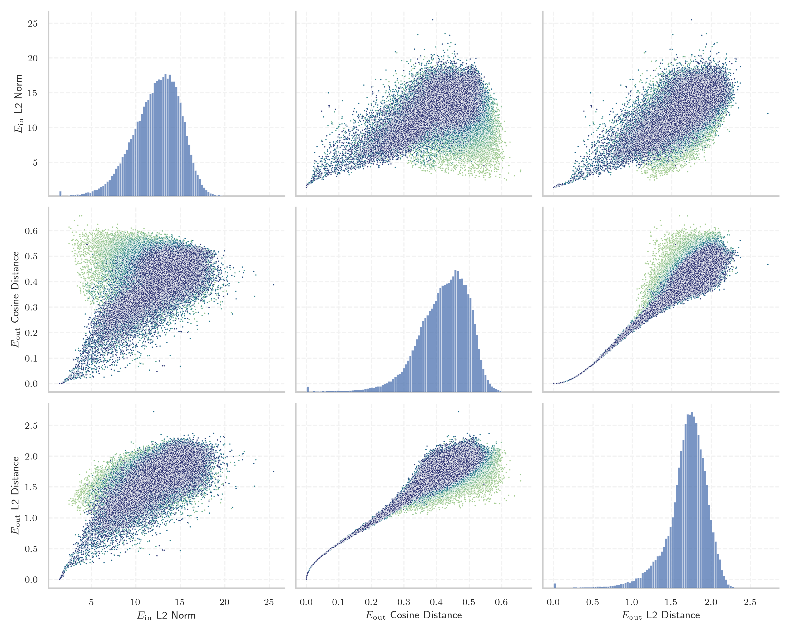

# Report for `allenai/OLMo-2-1124-13B`

## Model info

* Model Info: 
  * Tied embeddings: False
  * LM head uses bias: False
  * Embeddings shape: [100352, 5120]
* Tokenizer Info: 
  * Vocab Size: 100278
  * Tokenizer Class: GPT2Tokenizer
  * Tokenizer Type: BPE
  * Bytes handling: Byte Input
  * Token for verification prompt building: ABCDEFGHIJKLMNOPQRSTUVWXYZ
  * Token id for verification prompt building: 77002
* Indicator summary: 
  * Indicator for under-trained tokens: E_{out} Cosine Distance
  * Overall distribution: 0.421 +/- 0.079
* Detected Token Counts: 
  * Number of tested under-trained tokens: 1992, 1974 non-special, 174 below p = 0.01 threshold, 61 below soft indicator threshold
  * Number of single byte tokens: 256, of which 13 below indicator threshold
  * Number of special tokens: 0, of which 0 below indicator threshold
  * Number of non-single-byte UTF-fragment tokens:  645, of which 3 below soft indicator threshold

## Under-trained token indicators plot


## Verification plot


## Under-trained token verification results
61 entries below threshold of 0.012

|   token_id | token                                |    indicator | max_prob                                                         | in_other_tokens                                                                                                                                                                              |
|------------|--------------------------------------|--------------|------------------------------------------------------------------|----------------------------------------------------------------------------------------------------------------------------------------------------------------------------------------------|
|      41550 | ````` \tRTHOOK `````                 | -2.38419e-07 | <span style='border: 1px solid rgb(169, 68, 66);'>4e-12</span>   |                                                                                                                                                                                              |
|      83315 | ````` richTextPanel `````            | -1.19209e-07 | <span style='border: 1px solid rgb(169, 68, 66);'>2.1e-11</span> |                                                                                                                                                                                              |
|      89471 | ````` useRal `````                   |  0           | <span style='border: 1px solid rgb(169, 68, 66);'>2.1e-11</span> | <span style='border: 1px solid rgb(169, 68, 66);'>````` useRalative `````</span>, <span style='border: 1px solid rgb(169, 68, 66);'>````` useRalativeImagePath `````</span>                  |
|      52362 | ````` SpecWarn `````                 |  0           | <span style='border: 1px solid rgb(169, 68, 66);'>1.4e-11</span> |                                                                                                                                                                                              |
|      50325 | ````` adaptiveStyles `````           |  0           | <span style='border: 1px solid rgb(169, 68, 66);'>1e-11</span>   |                                                                                                                                                                                              |
|      70784 | ````` Japgolly `````                 |  0           | <span style='border: 1px solid rgb(169, 68, 66);'>4.7e-11</span> | <span style='border: 1px solid rgb(169, 68, 66);'>````` ▁typingsJapgolly `````</span>                                                                                                        |
|     100261 | ````` \|\|\|PHONE_NUMBER\|\|\| ````` |  0           | <span style='border: 1px solid rgb(169, 68, 66);'>1.9e-11</span> |                                                                                                                                                                                              |
|      80370 | ````` ▁ForCanBeConvertedToF `````    |  0           | <span style='border: 1px solid rgb(169, 68, 66);'>3.3e-11</span> | <span style='border: 1px solid rgb(169, 68, 66);'>````` ▁ForCanBeConvertedToForeach `````</span>                                                                                             |
|      80369 | ````` ▁ForCanBeConverted `````       |  0           | <span style='border: 1px solid rgb(169, 68, 66);'>4.7e-11</span> | <span style='border: 1px solid rgb(169, 68, 66);'>````` ▁ForCanBeConvertedToF `````</span>, <span style='border: 1px solid rgb(169, 68, 66);'>````` ▁ForCanBeConvertedToForeach `````</span> |
|      47073 | ````` webElementXpaths `````         |  0           | <span style='border: 1px solid rgb(169, 68, 66);'>8.9e-11</span> |                                                                                                                                                                                              |
|      89473 | ````` useRalativeImagePath `````     |  0           | <span style='border: 1px solid rgb(169, 68, 66);'>7.3e-12</span> |                                                                                                                                                                                              |
|      89475 | ````` elementGuidId `````            |  5.96046e-08 | <span style='border: 1px solid rgb(169, 68, 66);'>4.8e-12</span> |                                                                                                                                                                                              |
|     100263 | ````` \|\|\|IP_ADDRESS\|\|\| `````   |  5.96046e-08 | <span style='border: 1px solid rgb(169, 68, 66);'>3.7e-10</span> |                                                                                                                                                                                              |
|      80154 | ````` \tRTLI `````                   |  5.96046e-08 | <span style='border: 1px solid rgb(169, 68, 66);'>7.3e-12</span> |                                                                                                                                                                                              |
|      47072 | ````` webElementX `````              |  5.96046e-08 | <span style='border: 1px solid rgb(169, 68, 66);'>7.7e-12</span> | <span style='border: 1px solid rgb(169, 68, 66);'>````` webElementXpaths `````</span>                                                                                                        |
|      85071 | ````` $PostalCodesNL `````           |  5.96046e-08 | <span style='border: 1px solid rgb(169, 68, 66);'>5.2e-11</span> |                                                                                                                                                                                              |
|      79883 | ````` \tTokenNameIdentifier `````    |  5.96046e-08 | <span style='border: 1px solid rgb(169, 68, 66);'>1.6e-11</span> |                                                                                                                                                                                              |
|      98100 | ````` (stypy `````                   |  5.96046e-08 | <span style='border: 1px solid rgb(169, 68, 66);'>3.6e-11</span> |                                                                                                                                                                                              |
|      67901 | ````` \tRTDBG `````                  |  5.96046e-08 | <span style='border: 1px solid rgb(169, 68, 66);'>4.7e-11</span> |                                                                                                                                                                                              |
|      95812 | ````` \tRTCK `````                   |  5.96046e-08 | <span style='border: 1px solid rgb(169, 68, 66);'>2.3e-11</span> |                                                                                                                                                                                              |
<details><summary>41 additional entries below threshold</summary>

|   token_id | token                                 |   indicator | max_prob                                                         | in_other_tokens                                                                           |
|------------|---------------------------------------|-------------|------------------------------------------------------------------|-------------------------------------------------------------------------------------------|
|     100262 | ````` \|\|\|EMAIL_ADDRESS\|\|\| ````` | 5.96046e-08 | <span style='border: 1px solid rgb(169, 68, 66);'>6.5e-11</span> |                                                                                           |
|      58508 | ````` :-------------</ `````          | 5.96046e-08 | <span style='border: 1px solid rgb(169, 68, 66);'>1.7e-11</span> |                                                                                           |
|      85069 | ````` PostalCodesNL `````             | 5.96046e-08 | <span style='border: 1px solid rgb(169, 68, 66);'>1.4e-11</span> | <span style='border: 1px solid rgb(169, 68, 66);'>````` $PostalCodesNL `````</span>       |
|      95073 | ````` -vesm `````                     | 5.96046e-08 | <span style='border: 1px solid rgb(169, 68, 66);'>2.9e-11</span> |                                                                                           |
|      89472 | ````` useRalative `````               | 1.78814e-07 | <span style='border: 1px solid rgb(169, 68, 66);'>1.2e-10</span> | <span style='border: 1px solid rgb(169, 68, 66);'>````` useRalativeImagePath `````</span> |
|      57779 | ````` \tRTLU `````                    | 1.78814e-07 | <span style='border: 1px solid rgb(169, 68, 66);'>9.4e-12</span> |                                                                                           |
|      33786 | ````` webElementProperties `````      | 1.78814e-07 | <span style='border: 1px solid rgb(169, 68, 66);'>8.5e-12</span> |                                                                                           |
|      93905 | ````` ▁QtAws `````                    | 1.07288e-06 | <span style='border: 1px solid rgb(169, 68, 66);'>8.9e-11</span> |                                                                                           |
|      73018 | ````` ▁StreamLazy `````               | 8.70228e-06 | <span style='border: 1px solid rgb(169, 68, 66);'>7.1e-12</span> |                                                                                           |
|      72740 | ````` ▁typingsJapgolly `````          | 9.89437e-06 | <span style='border: 1px solid rgb(169, 68, 66);'>5.9e-12</span> |                                                                                           |
|      81259 | ````` artisanlib `````                | 1.88947e-05 | <span style='border: 1px solid rgb(169, 68, 66);'>8.3e-12</span> |                                                                                           |
|      84576 | ````` ▁AppMethodBeat `````            | 4.51803e-05 | <span style='border: 1px solid rgb(169, 68, 66);'>1.2e-10</span> |                                                                                           |
|      96656 | ````` methodPointerType `````         | 7.55787e-05 | <span style='border: 1px solid rgb(169, 68, 66);'>1.1e-10</span> |                                                                                           |
|      56930 | ````` \tRTLR `````                    | 8.63075e-05 | <span style='border: 1px solid rgb(169, 68, 66);'>2.2e-11</span> |                                                                                           |
|      80612 | ````` MethodBeat `````                | 0.000123203 | <span style='border: 1px solid rgb(169, 68, 66);'>7.7e-11</span> | <span style='border: 1px solid rgb(169, 68, 66);'>````` ▁AppMethodBeat `````</span>       |
|      71337 | ````` +lsi `````                      | 0.000334442 | <span style='border: 1px solid rgb(169, 68, 66);'>5.3e-11</span> |                                                                                           |
|      90050 | ````` _ComCallableWrapper `````       | 0.000372827 | <span style='border: 1px solid rgb(169, 68, 66);'>4.6e-11</span> |                                                                                           |
|      57361 | ````` _REALTYPE `````                 | 0.000513732 | <span style='border: 1px solid rgb(169, 68, 66);'>8.6e-11</span> |                                                                                           |
|      99202 | ````` (statearr `````                 | 0.000574768 | <span style='border: 1px solid rgb(169, 68, 66);'>1.1e-09</span> |                                                                                           |
|      31960 | ````` quotelev `````                  | 0.000575006 | <span style='border: 1px solid rgb(169, 68, 66);'>2.7e-11</span> |                                                                                           |
|      76371 | ````` LANGADM `````                   | 0.00058496  | <span style='border: 1px solid rgb(169, 68, 66);'>1.4e-09</span> |                                                                                           |
|      56225 | ````` .sulake `````                   | 0.000773251 | <span style='border: 1px solid rgb(169, 68, 66);'>3.6e-05</span> |                                                                                           |
|      82929 | ````` CppMethodIntialized `````       | 0.00112003  | <span style='border: 1px solid rgb(169, 68, 66);'>5.7e-05</span> |                                                                                           |
|      88039 | ````` ♀♀♀♀ `````                      | 0.00117201  | <span style='border: 1px solid rgb(169, 68, 66);'>0.00019</span> |                                                                                           |
|      91817 | ````` (InitializedTypeInfo `````      | 0.00129622  | <span style='border: 1px solid rgb(169, 68, 66);'>4.5e-07</span> |                                                                                           |
|      97736 | ````` \tRTCT `````                    | 0.00167781  | <span style='border: 1px solid rgb(169, 68, 66);'>1e-05</span>   |                                                                                           |
|      88023 | ````` /ayushman `````                 | 0.00169688  | <span style='border: 1px solid rgb(169, 68, 66);'>0.00049</span> |                                                                                           |
|      91198 | ````` externalActionCode `````        | 0.00174791  | <span style='border: 1px solid rgb(169, 68, 66);'>2.1e-11</span> |                                                                                           |
|      90412 | ````` selectorMethod `````            | 0.00189364  | <span style='border: 1px solid rgb(169, 68, 66);'>0.00025</span> |                                                                                           |
|      98668 | ````` );\r\r\r\n `````                | 0.00298029  | <span style='border: 1px solid rgb(169, 68, 66);'>0.00072</span> |                                                                                           |
|      73016 | ````` ▁EnumerableStream `````         | 0.0038389   | <span style='border: 1px solid rgb(169, 68, 66);'>0.00013</span> |                                                                                           |
|      58944 | ````` /Subthreshold `````             | 0.00438571  | <span style='border: 1px solid rgb(169, 68, 66);'>3.1e-11</span> |                                                                                           |
|      87551 | ````` CppGuid `````                   | 0.00448292  | <span style='border: 1px solid rgb(169, 68, 66);'>0.00089</span> |                                                                                           |
|      96737 | ````` departureday `````              | 0.00471997  | <span style='border: 1px solid rgb(255, 145, 0);'>0.0043</span>  |                                                                                           |
|      68896 | ````` ;\r\r\r\n `````                 | 0.00562203  | <span style='border: 1px solid rgb(169, 68, 66);'>0.00083</span> | <span style='border: 1px solid rgb(169, 68, 66);'>````` );\r\r\r\n `````</span>           |
|      89496 | ````` _FieldOffsetTable `````         | 0.00612313  | <span style='border: 1px solid rgb(169, 68, 66);'>0.00056</span> |                                                                                           |
|      67750 | ````` _typeDefinitionSize `````       | 0.00658816  | <span style='border: 1px solid rgb(251, 189, 8);'>0.017</span>   |                                                                                           |
|      26009 | ````` methodVisitor `````             | 0.00777966  | <span style='border: 1px solid rgb(255, 145, 0);'>0.0026</span>  |                                                                                           |
|      73228 | ````` _InternalArray `````            | 0.00800031  | <span style='border: 1px solid rgb(251, 189, 8);'>0.016</span>   |                                                                                           |
|      67705 | ````` _typeDefinition `````           | 0.0102283   | <span style='border: 1px solid rgb(255, 145, 0);'>0.0018</span>  | <span style='border: 1px solid rgb(251, 189, 8);'>````` _typeDefinitionSize `````</span>  |
|      67444 | ````` CppTypeDefinitionSizes `````    | 0.0113      | <span style='border: 1px solid rgb(255, 145, 0);'>0.0093</span>  |                                                                                           |
</details>


## Tokens with partial UTF-8 sequences
3 entries below threshold of 0.012

|   token_id | token                      |   indicator | in_other_tokens                         |
|------------|----------------------------|-------------|-----------------------------------------|
|      36225 | ````` <0xB7><0xBB>加 ````` | 5.96046e-08 | ````` 添加 `````, ````` ▁添加 `````     |
|      28587 | ````` <0x8E><0xB7>取 ````` | 5.96046e-08 | ````` ▁获取 `````, ````` 获取 `````     |
|      52188 | ````` <0x9D>始化 `````     | 5.96046e-08 | ````` 初始化 `````, ````` ▁初始化 ````` |


## Byte tokens
13 entries below threshold of 0.037

|   token_id | token              |    indicator |   ord | hex   | byte_type   |
|------------|--------------------|--------------|-------|-------|-------------|
|        177 | ````` <0xF5> ````` | -1.19209e-07 |   245 | 0xF5  | unused_utf8 |
|        124 | ````` <0xC0> ````` |  0           |   192 | 0xC0  | unused_utf8 |
|        179 | ````` <0xF7> ````` |  0           |   247 | 0xF7  | unused_utf8 |
|        180 | ````` <0xF8> ````` |  0           |   248 | 0xF8  | unused_utf8 |
|        183 | ````` <0xFB> ````` |  0           |   251 | 0xFB  | unused_utf8 |
|        125 | ````` <0xC1> ````` |  0           |   193 | 0xC1  | unused_utf8 |
|        187 | ````` <0xFF> ````` |  0           |   255 | 0xFF  | unused_utf8 |
|        184 | ````` <0xFC> ````` |  5.96046e-08 |   252 | 0xFC  | unused_utf8 |
|        182 | ````` <0xFA> ````` |  5.96046e-08 |   250 | 0xFA  | unused_utf8 |
|        181 | ````` <0xF9> ````` |  5.96046e-08 |   249 | 0xF9  | unused_utf8 |
|        186 | ````` <0xFE> ````` |  5.96046e-08 |   254 | 0xFE  | unused_utf8 |
|        185 | ````` <0xFD> ````` |  5.96046e-08 |   253 | 0xFD  | unused_utf8 |
|        178 | ````` <0xF6> ````` |  1.78814e-07 |   246 | 0xF6  | unused_utf8 |


## Special tokens
18 entries below threshold of 0.037

|   token_id | token                         |    indicator | max_prob                                                         |
|------------|-------------------------------|--------------|------------------------------------------------------------------|
|     100258 | ````` <\|fim_prefix\|> `````  | -1.19209e-07 | <span style='border: 1px solid rgb(169, 68, 66);'>1.8e-11</span> |
|     100268 | ````` <\|extra_id_3\|> `````  |  0           | <span style='border: 1px solid rgb(169, 68, 66);'>2.2e-11</span> |
|     100270 | ````` <\|extra_id_5\|> `````  |  0           | <span style='border: 1px solid rgb(169, 68, 66);'>1.9e-11</span> |
|     100275 | ````` <\|extra_id_10\|> ````` |  0           | <span style='border: 1px solid rgb(169, 68, 66);'>3.9e-11</span> |
|     100259 | ````` <\|fim_middle\|> `````  |  0           | <span style='border: 1px solid rgb(169, 68, 66);'>1.3e-10</span> |
|     100272 | ````` <\|extra_id_7\|> `````  |  0           | <span style='border: 1px solid rgb(169, 68, 66);'>2e-10</span>   |
|     100265 | ````` <\|im_end\|> `````      |  0           | <span style='border: 1px solid rgb(169, 68, 66);'>1.1e-11</span> |
|     100260 | ````` <\|fim_suffix\|> `````  |  0           | <span style='border: 1px solid rgb(169, 68, 66);'>1.5e-10</span> |
|     100256 | ````` <\|extra_id_0\|> `````  |  0           | <span style='border: 1px solid rgb(169, 68, 66);'>4.5e-11</span> |
|     100267 | ````` <\|extra_id_2\|> `````  |  5.96046e-08 | <span style='border: 1px solid rgb(169, 68, 66);'>5.6e-11</span> |
|     100266 | ````` <\|extra_id_1\|> `````  |  5.96046e-08 | <span style='border: 1px solid rgb(169, 68, 66);'>4.5e-11</span> |
|     100269 | ````` <\|extra_id_4\|> `````  |  5.96046e-08 | <span style='border: 1px solid rgb(169, 68, 66);'>3.7e-10</span> |
|     100271 | ````` <\|extra_id_6\|> `````  |  5.96046e-08 | <span style='border: 1px solid rgb(169, 68, 66);'>1.5e-11</span> |
|     100277 | ````` <\|pad\|> `````         |  5.96046e-08 | <span style='border: 1px solid rgb(169, 68, 66);'>9.3e-11</span> |
|     100274 | ````` <\|extra_id_9\|> `````  |  5.96046e-08 | <span style='border: 1px solid rgb(169, 68, 66);'>3.2e-10</span> |
|     100273 | ````` <\|extra_id_8\|> `````  |  5.96046e-08 | <span style='border: 1px solid rgb(169, 68, 66);'>1.6e-11</span> |
|     100264 | ````` <\|im_start\|> `````    |  5.96046e-08 | <span style='border: 1px solid rgb(169, 68, 66);'>1.8e-11</span> |
|     100276 | ````` <\|endofprompt\|> ````` |  1.78814e-07 | <span style='border: 1px solid rgb(169, 68, 66);'>7e-11</span>   |

