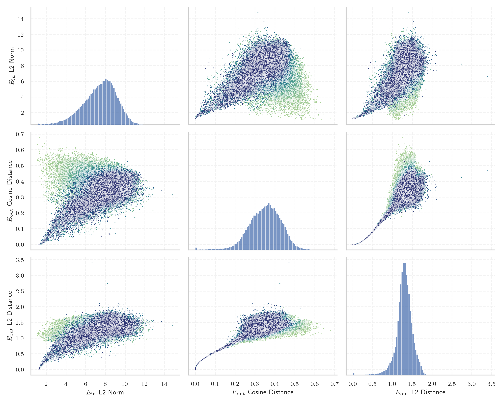

# Report for `allenai/OLMo-2-1124-7B`

## Model info

* Model Info: 
  * Tied embeddings: False
  * LM head uses bias: False
  * Embeddings shape: [100352, 4096]
* Tokenizer Info: 
  * Vocab Size: 100278
  * Tokenizer Class: GPT2Tokenizer
  * Tokenizer Type: BPE
  * Bytes handling: Byte Input
  * Token for verification prompt building: abcdefghijklmnopqrstuvwxyz
  * Token id for verification prompt building: 68612
* Indicator summary: 
  * Indicator for under-trained tokens: E_{out} Cosine Distance
  * Overall distribution: 0.350 +/- 0.079
* Detected Token Counts: 
  * Number of tested under-trained tokens: 1992, 1973 non-special, 179 below p = 0.01 threshold, 82 below soft indicator threshold
  * Number of single byte tokens: 256, of which 13 below indicator threshold
  * Number of special tokens: 0, of which 0 below indicator threshold
  * Number of non-single-byte UTF-fragment tokens:  645, of which 3 below soft indicator threshold

## Under-trained token indicators plot


## Verification plot


## Under-trained token verification results
82 entries below threshold of 0.010

|   token_id | token                                 |    indicator | max_prob                                                         | in_other_tokens                                                                                                                                                                              |
|------------|---------------------------------------|--------------|------------------------------------------------------------------|----------------------------------------------------------------------------------------------------------------------------------------------------------------------------------------------|
|      89472 | ````` useRalative `````               | -2.38419e-07 | <span style='border: 1px solid rgb(169, 68, 66);'>1.5e-09</span> | <span style='border: 1px solid rgb(169, 68, 66);'>````` useRalativeImagePath `````</span>                                                                                                    |
|      89471 | ````` useRal `````                    | -1.19209e-07 | <span style='border: 1px solid rgb(169, 68, 66);'>1.4e-11</span> | <span style='border: 1px solid rgb(169, 68, 66);'>````` useRalativeImagePath `````</span>, <span style='border: 1px solid rgb(169, 68, 66);'>````` useRalative `````</span>                  |
|     100262 | ````` \|\|\|EMAIL_ADDRESS\|\|\| ````` | -1.19209e-07 | <span style='border: 1px solid rgb(169, 68, 66);'>1.5e-10</span> |                                                                                                                                                                                              |
|      33786 | ````` webElementProperties `````      | -1.19209e-07 | <span style='border: 1px solid rgb(169, 68, 66);'>7.3e-11</span> |                                                                                                                                                                                              |
|      57779 | ````` \tRTLU `````                    |  0           | <span style='border: 1px solid rgb(169, 68, 66);'>2e-10</span>   |                                                                                                                                                                                              |
|      85069 | ````` PostalCodesNL `````             |  0           | <span style='border: 1px solid rgb(169, 68, 66);'>8.4e-11</span> | <span style='border: 1px solid rgb(169, 68, 66);'>````` $PostalCodesNL `````</span>                                                                                                          |
|      47072 | ````` webElementX `````               |  0           | <span style='border: 1px solid rgb(169, 68, 66);'>8.4e-11</span> | <span style='border: 1px solid rgb(169, 68, 66);'>````` webElementXpaths `````</span>                                                                                                        |
|      85071 | ````` $PostalCodesNL `````            |  0           | <span style='border: 1px solid rgb(169, 68, 66);'>2.8e-11</span> |                                                                                                                                                                                              |
|      95812 | ````` \tRTCK `````                    |  0           | <span style='border: 1px solid rgb(169, 68, 66);'>7.5e-11</span> |                                                                                                                                                                                              |
|      41550 | ````` \tRTHOOK `````                  |  0           | <span style='border: 1px solid rgb(169, 68, 66);'>1.3e-10</span> |                                                                                                                                                                                              |
|      80370 | ````` ▁ForCanBeConvertedToF `````     |  0           | <span style='border: 1px solid rgb(169, 68, 66);'>8.8e-11</span> | <span style='border: 1px solid rgb(255, 145, 0);'>````` ▁ForCanBeConvertedToForeach `````</span>                                                                                             |
|      80369 | ````` ▁ForCanBeConverted `````        |  1.19209e-07 | <span style='border: 1px solid rgb(169, 68, 66);'>5.2e-11</span> | <span style='border: 1px solid rgb(169, 68, 66);'>````` ▁ForCanBeConvertedToF `````</span>, <span style='border: 1px solid rgb(255, 145, 0);'>````` ▁ForCanBeConvertedToForeach `````</span> |
|      47073 | ````` webElementXpaths `````          |  1.19209e-07 | <span style='border: 1px solid rgb(169, 68, 66);'>1.9e-09</span> |                                                                                                                                                                                              |
|      58508 | ````` :-------------</ `````          |  1.19209e-07 | <span style='border: 1px solid rgb(169, 68, 66);'>1.9e-09</span> |                                                                                                                                                                                              |
|     100261 | ````` \|\|\|PHONE_NUMBER\|\|\| `````  |  1.19209e-07 | <span style='border: 1px solid rgb(169, 68, 66);'>1.4e-10</span> |                                                                                                                                                                                              |
|      83315 | ````` richTextPanel `````             |  1.19209e-07 | <span style='border: 1px solid rgb(169, 68, 66);'>5.2e-11</span> |                                                                                                                                                                                              |
|      95073 | ````` -vesm `````                     |  1.19209e-07 | <span style='border: 1px solid rgb(169, 68, 66);'>7.3e-11</span> |                                                                                                                                                                                              |
|      80154 | ````` \tRTLI `````                    |  1.19209e-07 | <span style='border: 1px solid rgb(169, 68, 66);'>1.2e-10</span> |                                                                                                                                                                                              |
|      73018 | ````` ▁StreamLazy `````               |  1.19209e-07 | <span style='border: 1px solid rgb(169, 68, 66);'>4.1e-10</span> |                                                                                                                                                                                              |
|      79883 | ````` \tTokenNameIdentifier `````     |  1.19209e-07 | <span style='border: 1px solid rgb(169, 68, 66);'>1.7e-10</span> |                                                                                                                                                                                              |
<details><summary>62 additional entries below threshold</summary>

|   token_id | token                              |   indicator | max_prob                                                         | in_other_tokens                                                                                   |
|------------|------------------------------------|-------------|------------------------------------------------------------------|---------------------------------------------------------------------------------------------------|
|      70784 | ````` Japgolly `````               | 1.19209e-07 | <span style='border: 1px solid rgb(169, 68, 66);'>1e-10</span>   | <span style='border: 1px solid rgb(169, 68, 66);'>````` ▁typingsJapgolly `````</span>             |
|      89475 | ````` elementGuidId `````          | 1.19209e-07 | <span style='border: 1px solid rgb(169, 68, 66);'>1.8e-10</span> |                                                                                                   |
|      98100 | ````` (stypy `````                 | 1.19209e-07 | <span style='border: 1px solid rgb(169, 68, 66);'>1.9e-09</span> |                                                                                                   |
|      89473 | ````` useRalativeImagePath `````   | 1.78814e-07 | <span style='border: 1px solid rgb(169, 68, 66);'>1.7e-11</span> |                                                                                                   |
|     100263 | ````` \|\|\|IP_ADDRESS\|\|\| ````` | 1.78814e-07 | <span style='border: 1px solid rgb(169, 68, 66);'>1.9e-11</span> |                                                                                                   |
|      50325 | ````` adaptiveStyles `````         | 1.78814e-07 | <span style='border: 1px solid rgb(169, 68, 66);'>1.2e-10</span> |                                                                                                   |
|      67901 | ````` \tRTDBG `````                | 1.78814e-07 | <span style='border: 1px solid rgb(169, 68, 66);'>6.2e-11</span> |                                                                                                   |
|      52362 | ````` SpecWarn `````               | 2.98023e-07 | <span style='border: 1px solid rgb(169, 68, 66);'>8.7e-11</span> |                                                                                                   |
|      96656 | ````` methodPointerType `````      | 7.15256e-07 | <span style='border: 1px solid rgb(169, 68, 66);'>2.7e-09</span> |                                                                                                   |
|      99202 | ````` (statearr `````              | 8.9407e-07  | <span style='border: 1px solid rgb(169, 68, 66);'>3.4e-09</span> |                                                                                                   |
|      56930 | ````` \tRTLR `````                 | 1.16229e-05 | <span style='border: 1px solid rgb(169, 68, 66);'>4.6e-11</span> |                                                                                                   |
|      81259 | ````` artisanlib `````             | 1.18017e-05 | <span style='border: 1px solid rgb(169, 68, 66);'>4.9e-11</span> |                                                                                                   |
|      91198 | ````` externalActionCode `````     | 1.9908e-05  | <span style='border: 1px solid rgb(169, 68, 66);'>8.9e-08</span> |                                                                                                   |
|      82929 | ````` CppMethodIntialized `````    | 2.54512e-05 | <span style='border: 1px solid rgb(169, 68, 66);'>7.6e-05</span> |                                                                                                   |
|      93905 | ````` ▁QtAws `````                 | 2.65837e-05 | <span style='border: 1px solid rgb(169, 68, 66);'>1.1e-11</span> |                                                                                                   |
|      84576 | ````` ▁AppMethodBeat `````         | 3.3319e-05  | <span style='border: 1px solid rgb(169, 68, 66);'>7.8e-11</span> |                                                                                                   |
|      76371 | ````` LANGADM `````                | 5.98431e-05 | <span style='border: 1px solid rgb(169, 68, 66);'>5e-10</span>   |                                                                                                   |
|      72740 | ````` ▁typingsJapgolly `````       | 8.30889e-05 | <span style='border: 1px solid rgb(169, 68, 66);'>1.3e-10</span> |                                                                                                   |
|      31960 | ````` quotelev `````               | 0.000137806 | <span style='border: 1px solid rgb(169, 68, 66);'>3e-06</span>   |                                                                                                   |
|      90050 | ````` _ComCallableWrapper `````    | 0.00014472  | <span style='border: 1px solid rgb(169, 68, 66);'>2.8e-09</span> |                                                                                                   |
|      88023 | ````` /ayushman `````              | 0.000174642 | <span style='border: 1px solid rgb(169, 68, 66);'>8.3e-08</span> |                                                                                                   |
|      80612 | ````` MethodBeat `````             | 0.000183165 | <span style='border: 1px solid rgb(169, 68, 66);'>7.6e-11</span> | <span style='border: 1px solid rgb(169, 68, 66);'>````` ▁AppMethodBeat `````</span>               |
|      71337 | ````` +lsi `````                   | 0.000186622 | <span style='border: 1px solid rgb(169, 68, 66);'>4.1e-10</span> |                                                                                                   |
|      98668 | ````` );\r\r\r\n `````             | 0.000294089 | <span style='border: 1px solid rgb(169, 68, 66);'>6.8e-05</span> |                                                                                                   |
|      57361 | ````` _REALTYPE `````              | 0.00043869  | <span style='border: 1px solid rgb(169, 68, 66);'>2.1e-05</span> |                                                                                                   |
|      68896 | ````` ;\r\r\r\n `````              | 0.000684261 | <span style='border: 1px solid rgb(169, 68, 66);'>0.00014</span> | <span style='border: 1px solid rgb(169, 68, 66);'>````` );\r\r\r\n `````</span>                   |
|      97736 | ````` \tRTCT `````                 | 0.000716388 | <span style='border: 1px solid rgb(169, 68, 66);'>7.8e-07</span> |                                                                                                   |
|      90412 | ````` selectorMethod `````         | 0.000768423 | <span style='border: 1px solid rgb(169, 68, 66);'>1.4e-10</span> |                                                                                                   |
|      56225 | ````` .sulake `````                | 0.000790775 | <span style='border: 1px solid rgb(169, 68, 66);'>2e-05</span>   |                                                                                                   |
|      91817 | ````` (InitializedTypeInfo `````   | 0.000829816 | <span style='border: 1px solid rgb(169, 68, 66);'>9.5e-06</span> |                                                                                                   |
|      58944 | ````` /Subthreshold `````          | 0.000984609 | <span style='border: 1px solid rgb(169, 68, 66);'>7.3e-05</span> |                                                                                                   |
|      89496 | ````` _FieldOffsetTable `````      | 0.00121212  | <span style='border: 1px solid rgb(169, 68, 66);'>0.00021</span> |                                                                                                   |
|      73016 | ````` ▁EnumerableStream `````      | 0.00126624  | <span style='border: 1px solid rgb(169, 68, 66);'>0.00011</span> |                                                                                                   |
|      96737 | ````` departureday `````           | 0.00172448  | <span style='border: 1px solid rgb(169, 68, 66);'>0.0002</span>  |                                                                                                   |
|      67750 | ````` _typeDefinitionSize `````    | 0.00231582  | <span style='border: 1px solid rgb(255, 145, 0);'>0.0023</span>  |                                                                                                   |
|      73228 | ````` _InternalArray `````         | 0.00237793  | <span style='border: 1px solid rgb(169, 68, 66);'>0.0008</span>  |                                                                                                   |
|      26009 | ````` methodVisitor `````          | 0.00238055  | <span style='border: 1px solid rgb(169, 68, 66);'>0.00031</span> |                                                                                                   |
|      88039 | ````` ♀♀♀♀ `````                   | 0.0024671   | <span style='border: 1px solid rgb(169, 68, 66);'>0.0002</span>  |                                                                                                   |
|      37370 | ````` \tEIF `````                  | 0.00255948  | <span style='border: 1px solid rgb(169, 68, 66);'>0.00072</span> |                                                                                                   |
|      87551 | ````` CppGuid `````                | 0.00259966  | <span style='border: 1px solid rgb(169, 68, 66);'>0.00055</span> |                                                                                                   |
|      70316 | ````` erusform `````               | 0.00260186  | <span style='border: 1px solid rgb(169, 68, 66);'>0.00049</span> | <span style='border: 1px solid rgb(40, 167, 69);'>````` numerusform `````</span>                  |
|      67444 | ````` CppTypeDefinitionSizes ````` | 0.00339979  | <span style='border: 1px solid rgb(255, 145, 0);'>0.0026</span>  |                                                                                                   |
|      39866 | ````` .xrLabel `````               | 0.00416869  | <span style='border: 1px solid rgb(255, 145, 0);'>0.0045</span>  |                                                                                                   |
|      71390 | ````` ▁PodsDummy `````             | 0.00445569  | <span style='border: 1px solid rgb(169, 68, 66);'>2.5e-05</span> |                                                                                                   |
|      59839 | ````` ConstraintMaker `````        | 0.00497901  | <span style='border: 1px solid rgb(255, 145, 0);'>0.0039</span>  | <span style='border: 1px solid rgb(40, 167, 69);'>````` MASConstraintMaker `````</span>           |
|      67705 | ````` _typeDefinition `````        | 0.00510728  | <span style='border: 1px solid rgb(255, 145, 0);'>0.0012</span>  | <span style='border: 1px solid rgb(255, 145, 0);'>````` _typeDefinitionSize `````</span>          |
|      34956 | ````` ▁+#+#+#+ `````               | 0.00535917  | <span style='border: 1px solid rgb(169, 68, 66);'>5e-05</span>   | <span style='border: 1px solid rgb(255, 145, 0);'>````` ▁+#+#+#+#+#+ `````</span>                 |
|      87941 | ````` $fdata `````                 | 0.00576878  | <span style='border: 1px solid rgb(169, 68, 66);'>6.7e-05</span> |                                                                                                   |
|      67727 | ````` \|()\n `````                 | 0.00612545  | <span style='border: 1px solid rgb(169, 68, 66);'>0.00015</span> |                                                                                                   |
|      66235 | ````` CppTypeDefinition `````      | 0.00619704  | <span style='border: 1px solid rgb(255, 145, 0);'>0.0023</span>  | <span style='border: 1px solid rgb(255, 145, 0);'>````` CppTypeDefinitionSizes `````</span>       |
|      84993 | ````` rPid `````                   | 0.00621617  | <span style='border: 1px solid rgb(255, 145, 0);'>0.0016</span>  |                                                                                                   |
|      85154 | ````` buttonShape `````            | 0.00623816  | <span style='border: 1px solid rgb(255, 145, 0);'>0.0084</span>  |                                                                                                   |
|      24452 | ````` <lemma `````                 | 0.00646198  | <span style='border: 1px solid rgb(255, 145, 0);'>0.0018</span>  |                                                                                                   |
|      45146 | ````` %timeout `````               | 0.00674826  | <span style='border: 1px solid rgb(169, 68, 66);'>0.00023</span> |                                                                                                   |
|      75520 | ````` ▁NUITKA `````                | 0.00730926  | <span style='border: 1px solid rgb(255, 145, 0);'>0.0022</span>  |                                                                                                   |
|      75630 | ````` 雅黑 `````                   | 0.00752032  | <span style='border: 1px solid rgb(255, 145, 0);'>0.0016</span>  | ````` 微软雅黑 `````, <span style='border: 1px solid rgb(169, 68, 66);'>````` 软雅黑 `````</span> |
|      76613 | ````` extracomment `````           | 0.00804365  | <span style='border: 1px solid rgb(251, 189, 8);'>0.022</span>   |                                                                                                   |
|      43944 | ````` orThunk `````                | 0.00812399  | <span style='border: 1px solid rgb(255, 145, 0);'>0.0019</span>  | <span style='border: 1px solid rgb(251, 189, 8);'>````` _AdjustorThunk `````</span>               |
|      71227 | ````` ▁FINSEQ `````                | 0.00825447  | <span style='border: 1px solid rgb(255, 145, 0);'>0.002</span>   |                                                                                                   |
|      81325 | ````` .bindingNavigatorMove `````  | 0.00914651  | <span style='border: 1px solid rgb(40, 167, 69);'>0.16</span>    |                                                                                                   |
|      62761 | ````` .layoutControl `````         | 0.00955373  | <span style='border: 1px solid rgb(251, 189, 8);'>0.031</span>   |                                                                                                   |
|      55557 | ````` ((&___ `````                 | 0.00971556  | <span style='border: 1px solid rgb(255, 145, 0);'>0.0028</span>  |                                                                                                   |
</details>


## Tokens with partial UTF-8 sequences
3 entries below threshold of 0.010

|   token_id | token                      |    indicator | in_other_tokens                         |
|------------|----------------------------|--------------|-----------------------------------------|
|      36225 | ````` <0xB7><0xBB>加 ````` | -2.38419e-07 | ````` 添加 `````, ````` ▁添加 `````     |
|      28587 | ````` <0x8E><0xB7>取 ````` | -1.19209e-07 | ````` ▁获取 `````, ````` 获取 `````     |
|      52188 | ````` <0x9D>始化 `````     |  1.78814e-07 | ````` 初始化 `````, ````` ▁初始化 ````` |


## Byte tokens
13 entries below threshold of 0.017

|   token_id | token              |    indicator |   ord | hex   | byte_type   |
|------------|--------------------|--------------|-------|-------|-------------|
|        181 | ````` <0xF9> ````` | -2.38419e-07 |   249 | 0xF9  | unused_utf8 |
|        125 | ````` <0xC1> ````` |  0           |   193 | 0xC1  | unused_utf8 |
|        183 | ````` <0xFB> ````` |  0           |   251 | 0xFB  | unused_utf8 |
|        180 | ````` <0xF8> ````` |  0           |   248 | 0xF8  | unused_utf8 |
|        124 | ````` <0xC0> ````` |  1.19209e-07 |   192 | 0xC0  | unused_utf8 |
|        187 | ````` <0xFF> ````` |  1.19209e-07 |   255 | 0xFF  | unused_utf8 |
|        186 | ````` <0xFE> ````` |  1.19209e-07 |   254 | 0xFE  | unused_utf8 |
|        179 | ````` <0xF7> ````` |  1.19209e-07 |   247 | 0xF7  | unused_utf8 |
|        177 | ````` <0xF5> ````` |  1.19209e-07 |   245 | 0xF5  | unused_utf8 |
|        178 | ````` <0xF6> ````` |  1.19209e-07 |   246 | 0xF6  | unused_utf8 |
|        182 | ````` <0xFA> ````` |  1.78814e-07 |   250 | 0xFA  | unused_utf8 |
|        184 | ````` <0xFC> ````` |  1.78814e-07 |   252 | 0xFC  | unused_utf8 |
|        185 | ````` <0xFD> ````` |  2.98023e-07 |   253 | 0xFD  | unused_utf8 |


## Special tokens
18 entries below threshold of 0.017

|   token_id | token                         |    indicator | max_prob                                                         |
|------------|-------------------------------|--------------|------------------------------------------------------------------|
|     100272 | ````` <\|extra_id_7\|> `````  | -1.19209e-07 | <span style='border: 1px solid rgb(169, 68, 66);'>7.8e-11</span> |
|     100260 | ````` <\|fim_suffix\|> `````  | -1.19209e-07 | <span style='border: 1px solid rgb(169, 68, 66);'>9.8e-11</span> |
|     100275 | ````` <\|extra_id_10\|> ````` | -1.19209e-07 | <span style='border: 1px solid rgb(169, 68, 66);'>2.9e-11</span> |
|     100271 | ````` <\|extra_id_6\|> `````  |  0           | <span style='border: 1px solid rgb(169, 68, 66);'>1.3e-09</span> |
|     100267 | ````` <\|extra_id_2\|> `````  |  0           | <span style='border: 1px solid rgb(169, 68, 66);'>1.7e-10</span> |
|     100266 | ````` <\|extra_id_1\|> `````  |  0           | <span style='border: 1px solid rgb(169, 68, 66);'>3e-11</span>   |
|     100277 | ````` <\|pad\|> `````         |  0           | <span style='border: 1px solid rgb(169, 68, 66);'>2.9e-11</span> |
|     100256 | ````` <\|extra_id_0\|> `````  |  1.19209e-07 | <span style='border: 1px solid rgb(169, 68, 66);'>8.4e-11</span> |
|     100276 | ````` <\|endofprompt\|> ````` |  1.19209e-07 | <span style='border: 1px solid rgb(169, 68, 66);'>4.7e-11</span> |
|     100273 | ````` <\|extra_id_8\|> `````  |  1.19209e-07 | <span style='border: 1px solid rgb(169, 68, 66);'>5.3e-11</span> |
|     100274 | ````` <\|extra_id_9\|> `````  |  1.19209e-07 | <span style='border: 1px solid rgb(169, 68, 66);'>3e-11</span>   |
|     100258 | ````` <\|fim_prefix\|> `````  |  1.19209e-07 | <span style='border: 1px solid rgb(169, 68, 66);'>1e-10</span>   |
|     100259 | ````` <\|fim_middle\|> `````  |  1.19209e-07 | <span style='border: 1px solid rgb(169, 68, 66);'>7.8e-11</span> |
|     100265 | ````` <\|im_end\|> `````      |  1.19209e-07 | <span style='border: 1px solid rgb(169, 68, 66);'>1.1e-10</span> |
|     100268 | ````` <\|extra_id_3\|> `````  |  1.19209e-07 | <span style='border: 1px solid rgb(169, 68, 66);'>2.3e-09</span> |
|     100269 | ````` <\|extra_id_4\|> `````  |  1.19209e-07 | <span style='border: 1px solid rgb(169, 68, 66);'>2.1e-11</span> |
|     100270 | ````` <\|extra_id_5\|> `````  |  1.19209e-07 | <span style='border: 1px solid rgb(169, 68, 66);'>8e-11</span>   |
|     100264 | ````` <\|im_start\|> `````    |  1.78814e-07 | <span style='border: 1px solid rgb(169, 68, 66);'>7.4e-10</span> |

