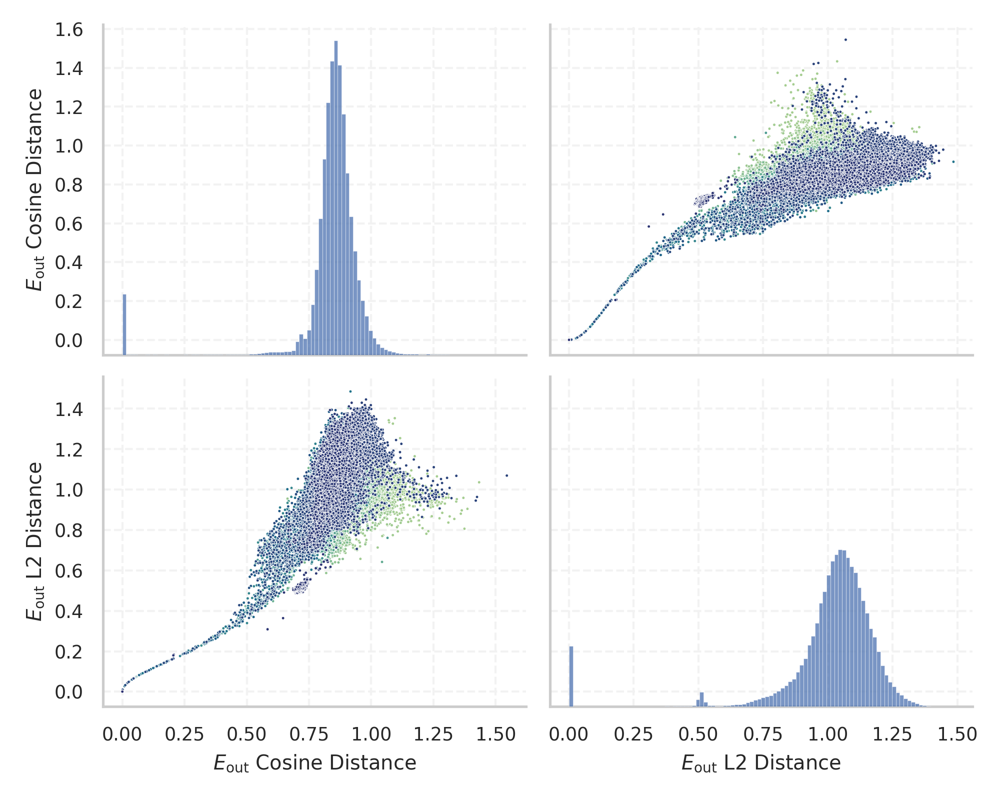
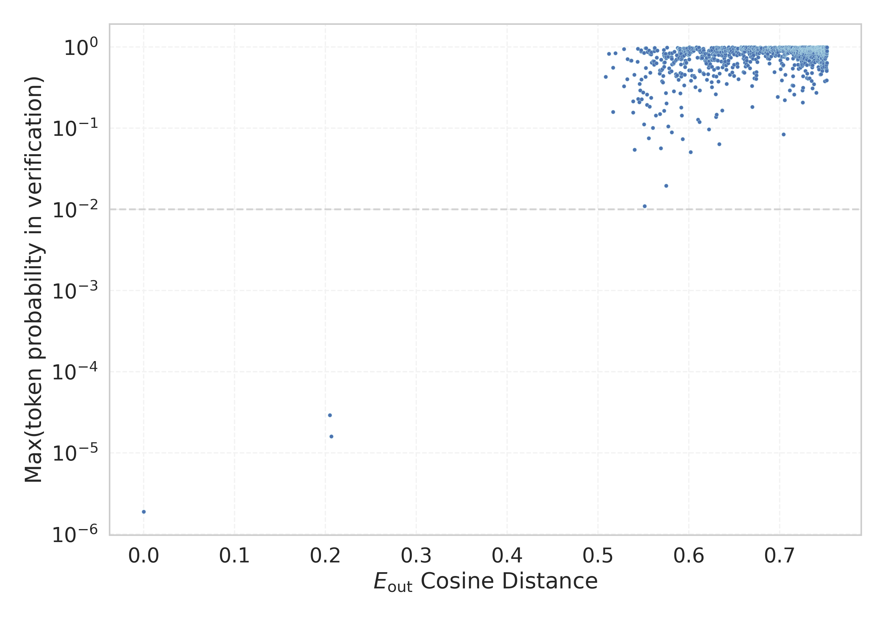

# Report for `baidu/ERNIE-4.5-21B-A3B-Thinking`

## Model info

* Model Info: 
  * Tied embeddings: True
  * LM head uses bias: False
  * Embeddings shape: [103424, 2560]
* Tokenizer Info: 
  * Vocab Size: 100309
  * Tokenizer Class: LlamaTokenizer
  * Tokenizer Type: BPE
  * Bytes handling: Byte Fallback
  * Token for verification prompt building: InvalidArgumentException
  * Token id for verification prompt building: 20165
* Indicator summary: 
  * Indicator for under-trained tokens: E_{out} Cosine Distance
  * Overall distribution: 0.841 +/- 0.146
* Detected Token Counts: 
  * Number of tested under-trained tokens: 1283, 1279 non-special, 0 below p = 0.01 threshold, 11 below soft indicator threshold
  * Number of single byte tokens: 362, of which 0 below indicator threshold
  * Number of special tokens: 43, of which 0 below indicator threshold
  * Number of non-single-byte unreachable tokens: 36017, of which 0 below indicator threshold
  * Number of non-single-byte UTF-fragment tokens:  8, of which 0 below soft indicator threshold

## Under-trained token indicators plot


## Verification plot


## Under-trained token verification results
11 entries below threshold of 0.539

|   token_id | token                      |   indicator | max_prob                                                      | in_other_tokens                                                                                          |
|------------|----------------------------|-------------|---------------------------------------------------------------|----------------------------------------------------------------------------------------------------------|
|      52051 | ````` deetįįhii `````      |    0.508629 | <span style='border: 1px solid rgb(40, 167, 69);'>0.43</span> |                                                                                                          |
|      80522 | ````` samahui `````        |    0.512132 | <span style='border: 1px solid rgb(40, 167, 69);'>0.83</span> |                                                                                                          |
|      52265 | ````` inígíí `````         |    0.51647  | <span style='border: 1px solid rgb(40, 167, 69);'>0.56</span> | <span style='border: 1px solid rgb(40, 167, 69);'>````` oolinígíí `````</span>, ````` ▁Ánoolinígíí ````` |
|      82982 | ````` ikwisifundazwe ````` |    0.516517 | <span style='border: 1px solid rgb(40, 167, 69);'>0.16</span> |                                                                                                          |
|      89226 | ````` khiéu `````          |    0.519177 | <span style='border: 1px solid rgb(40, 167, 69);'>0.84</span> |                                                                                                          |
|      84360 | ````` jmedinilla `````     |    0.528583 | <span style='border: 1px solid rgb(40, 167, 69);'>0.33</span> |                                                                                                          |
|      51730 | ````` ałkaahí `````        |    0.528696 | <span style='border: 1px solid rgb(40, 167, 69);'>0.94</span> |                                                                                                          |
|      77423 | ````` wisifundazwe `````   |    0.53212  | <span style='border: 1px solid rgb(40, 167, 69);'>0.4</span>  | <span style='border: 1px solid rgb(40, 167, 69);'>````` ikwisifundazwe `````</span>                      |
|      81911 | ````` yemharc `````        |    0.532505 | <span style='border: 1px solid rgb(40, 167, 69);'>0.71</span> |                                                                                                          |
|      39367 | ````` OMNICalendar `````   |    0.536172 | <span style='border: 1px solid rgb(40, 167, 69);'>0.68</span> |                                                                                                          |
|      90096 | ````` OMNISubject `````    |    0.536592 | <span style='border: 1px solid rgb(40, 167, 69);'>0.68</span> |                                                                                                          |


## Tokens with partial UTF-8 sequences
0 entries below threshold of 0.539


## Byte tokens
0 entries below threshold of 0.000


## Special tokens
0 entries below threshold of 0.000


## Unreachable tokens
0 entries below threshold of 0.000


