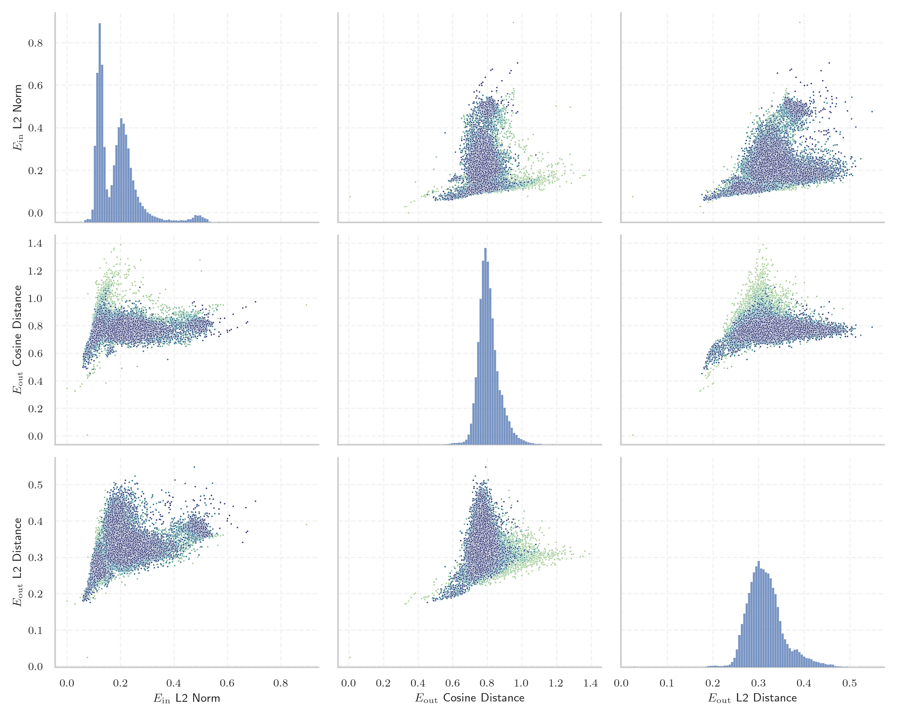

# Report for `benjamin/Mistral-7B-v0.1-zett-gpt2`

## Model info

* Tied embeddings: no
* LM head uses bias: no
* Indicator for under-trained tokens: E_{in} L2 Norm
  * Overall distribution 0.187 +/- 0.081
  * Token used for verification prompt building: `BuyableInstoreAndOnline`
  * Verification threshold: 0.101
  * Threshold for showing candidate under-trained tokens: 0.063
  * Median verified threshold (for bytes, unreachable and special tokens): 0.065
* Embeddings shape: (50394, 4096)
* Vocabulary size: 50394
  * Number of single byte tokens: 256, of which 7 below indicator threshold
  * Number of special tokens: 7, of which 1 below indicator threshold
  * Number of non-single-byte unreachable tokens: 63, of which 0 below indicator threshold
  * Number of non-single-byte UTF-fragment tokens: 216, 0 below soft indicator threshold
  * Number of tested under-trained tokens: 1002, 979 non-special, 13 below p = 0.01 threshold, 11 below soft indicator threshold

## Under-trained token indicators plot


## Verification plot


## Under-trained token verification results
11 entries below threshold of 0.063

|   token_id | token          |   indicator | max_prob                                                        | in_other_tokens                                                                          |
|------------|----------------|-------------|-----------------------------------------------------------------|------------------------------------------------------------------------------------------|
|      44115 | ````` 黒 ````` |   0.0586349 | <span style='border: 1px solid rgb(255, 145, 0);'>0.0099</span> |                                                                                          |
|      45038 | ````` ы `````  |   0.060533  | <span style='border: 1px solid rgb(40, 167, 69);'>0.14</span>   |                                                                                          |
|      25365 | ````` ァ ````` |   0.0608421 | <span style='border: 1px solid rgb(255, 145, 0);'>0.0013</span> | ````` ファ `````, ````` ヴァ `````                                                       |
|      36707 | ````` 戦 ````` |   0.0609177 | <span style='border: 1px solid rgb(255, 145, 0);'>0.0099</span> |                                                                                          |
|      37861 | ````` ヤ ````` |   0.0609662 | <span style='border: 1px solid rgb(251, 189, 8);'>0.026</span>  |                                                                                          |
|      24004 | ````` ブ ````` |   0.0616035 | <span style='border: 1px solid rgb(40, 167, 69);'>0.16</span>   |                                                                                          |
|      44036 | ````` ▀ `````  |   0.0618981 | <span style='border: 1px solid rgb(40, 167, 69);'>0.15</span>   |                                                                                          |
|      49963 | ````` 機 ````` |   0.0621713 | <span style='border: 1px solid rgb(251, 189, 8);'>0.012</span>  |                                                                                          |
|      20807 | ````` 魔 ````` |   0.0621833 | <span style='border: 1px solid rgb(251, 189, 8);'>0.035</span>  | ````` の魔 `````                                                                         |
|      17936 | ````` ゴ ````` |   0.0626853 | <span style='border: 1px solid rgb(255, 145, 0);'>0.0097</span> | ````` ゴン `````, ````` ドラゴン `````                                                   |
|      11888 | ````` 龍 ````` |   0.0628957 | <span style='border: 1px solid rgb(255, 145, 0);'>0.0039</span> | ````` 龍<0xE5> `````, ````` 龍喚士 `````, ````` 龍<0xE5><0xA5> `````, ````` 龍契士 ````` |


## Partial UTF-8 tokens
0 entries below threshold of 0.063


## Byte tokens
7 entries below threshold of 0.065

|   token_id | token              |   indicator |   ord | hex   | byte_type   |
|------------|--------------------|-------------|-------|-------|-------------|
|        219 | ````` \x1c `````   |   0.0290068 |    28 | 0x1C  | ascii       |
|        220 | ````` \x1d `````   |   0.0291407 |    29 | 0x1D  | ascii       |
|        221 | ````` \x1e `````   |   0.0292425 |    30 | 0x1E  | ascii       |
|        203 | ````` \x0c `````   |   0.0293925 |    12 | 0x0C  | ascii       |
|        202 | ````` \x0b `````   |   0.0298095 |    11 | 0x0B  | ascii       |
|        176 | ````` <0xF1> ````` |   0.0491124 |   241 | 0xF1  | utf8        |
|        177 | ````` <0xF2> ````` |   0.0551483 |   242 | 0xF2  | utf8        |


## Special tokens
1 entries below threshold of 0.065

|   token_id | token             |   indicator | max_prob                                                         |
|------------|-------------------|-------------|------------------------------------------------------------------|
|          0 | ````` <unk> ````` |           0 | <span style='border: 1px solid rgb(169, 68, 66);'>0.00053</span> |


## Unreachable tokens
0 entries below threshold of 0.065


