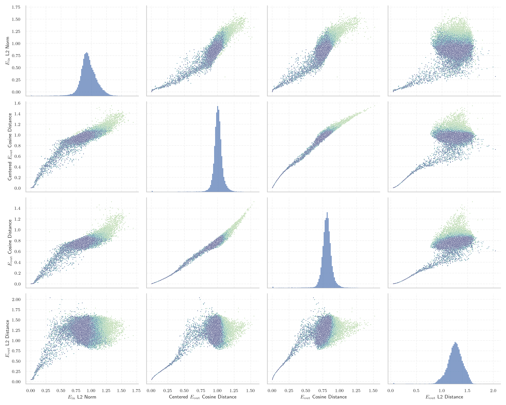
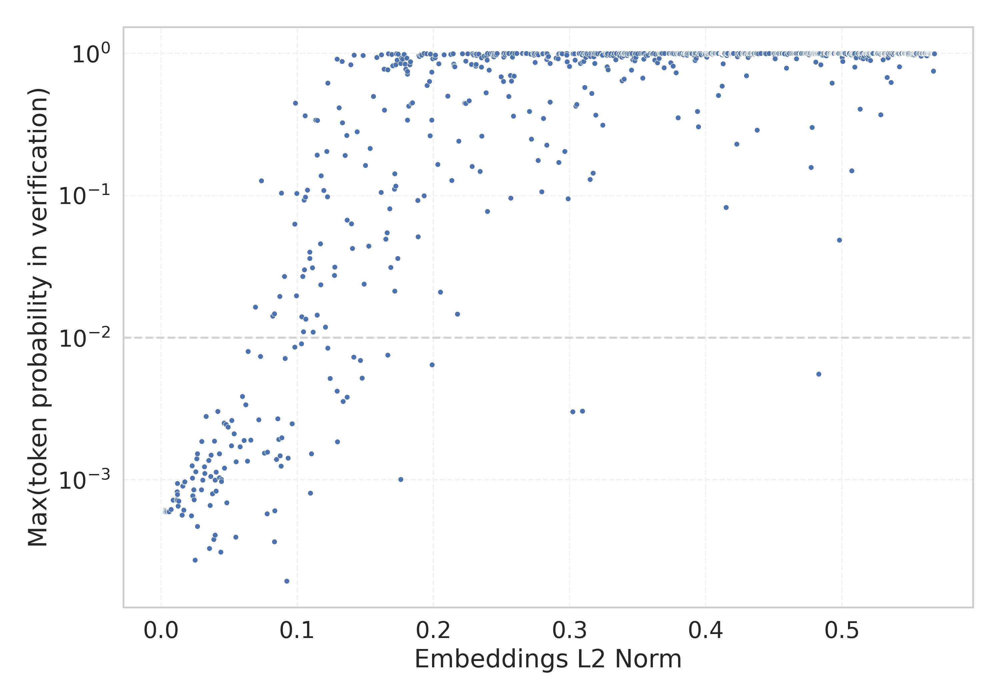

# Report for `bigcode/starcoder2-15b`

## Model info

* Model Info: 
  * Tied embeddings: False
  * LM head uses bias: False
  * Embeddings shape: [49152, 6144]
* Tokenizer Info: 
  * Vocab Size: 49152
  * Tokenizer Class: GPT2Tokenizer
  * Tokenizer Type: BPE
  * Bytes handling: Byte Input
  * Token for verification prompt building: InvalidProtocolBufferException
  * Token id for verification prompt building: 31492
* Indicator summary: 
  * Indicator for under-trained tokens: E_{in} L2 Norm
  * Overall distribution: 0.945 +/- 0.155
* Detected Token Counts: 
  * Number of tested under-trained tokens: 968, 966 non-special, 128 below p = 0.01 threshold, 106 below soft indicator threshold
  * Number of single byte tokens: 242, of which 0 below indicator threshold
  * Number of special tokens: 0, of which 0 below indicator threshold
  * Number of non-single-byte UTF-fragment tokens:  676, of which 2 below soft indicator threshold

## Under-trained token indicators plot


## Verification plot


## Under-trained token verification results
106 entries below threshold of 0.087

|   token_id | token                                                                       |   indicator | max_prob                                                         | in_other_tokens                                                                                                                                                                                                                                                                                                                                                                             |
|------------|-----------------------------------------------------------------------------|-------------|------------------------------------------------------------------|---------------------------------------------------------------------------------------------------------------------------------------------------------------------------------------------------------------------------------------------------------------------------------------------------------------------------------------------------------------------------------------------|
|      45759 | ````` Integervelvel `````                                                   | 0.000671484 | <span style='border: 1px solid rgb(169, 68, 66);'>0.0006</span>  | <span style='border: 1px solid rgb(169, 68, 66);'>````` LoremipumdolorsitametconsecteturadipiscingelitIntegervelvel `````</span>, <span style='border: 1px solid rgb(169, 68, 66);'>````` ittrLoremipumdolorsitametconsecteturadipiscingelitIntegervelvel `````</span>                                                                                                                      |
|      43865 | ````` Loremipumdolorsitametconsecteturadipiscingelit `````                  | 0.00110438  | <span style='border: 1px solid rgb(169, 68, 66);'>0.0006</span>  | <span style='border: 1px solid rgb(169, 68, 66);'>````` LoremipumdolorsitametconsecteturadipiscingelitIntegervelvel `````</span>, <span style='border: 1px solid rgb(169, 68, 66);'>````` ittrLoremipumdolorsitametconsecteturadipiscingelitIntegervelvel `````</span>                                                                                                                      |
|      39147 | ````` lcsStatusWlan `````                                                   | 0.00121611  | <span style='border: 1px solid rgb(169, 68, 66);'>0.0006</span>  |                                                                                                                                                                                                                                                                                                                                                                                             |
|      42046 | ````` ucMZQg `````                                                          | 0.00146624  | <span style='border: 1px solid rgb(169, 68, 66);'>0.0006</span>  | <span style='border: 1px solid rgb(251, 189, 8);'>````` bzZBlucMZQg `````</span>                                                                                                                                                                                                                                                                                                            |
|      44961 | ````` hqSLBjKPZFq `````                                                     | 0.00170863  | <span style='border: 1px solid rgb(169, 68, 66);'>0.0006</span>  | <span style='border: 1px solid rgb(169, 68, 66);'>````` hqSLBjKPZFqxj `````</span>                                                                                                                                                                                                                                                                                                          |
|      44959 | ````` fWILIM `````                                                          | 0.00171175  | <span style='border: 1px solid rgb(169, 68, 66);'>0.0006</span>  | <span style='border: 1px solid rgb(169, 68, 66);'>````` fWILIMmJNUZLIEMNV `````</span>                                                                                                                                                                                                                                                                                                      |
|      42504 | ````` tableOBJECT `````                                                     | 0.00201391  | <span style='border: 1px solid rgb(169, 68, 66);'>0.0006</span>  |                                                                                                                                                                                                                                                                                                                                                                                             |
|      44954 | ````` vjHPp `````                                                           | 0.00205637  | <span style='border: 1px solid rgb(169, 68, 66);'>0.0006</span>  | <span style='border: 1px solid rgb(169, 68, 66);'>````` vjHPpWa `````</span>                                                                                                                                                                                                                                                                                                                |
|      44964 | ````` fWILIMmJNUZLIEMNV `````                                               | 0.00214889  | <span style='border: 1px solid rgb(169, 68, 66);'>0.00061</span> |                                                                                                                                                                                                                                                                                                                                                                                             |
|      42305 | ````` GQGantt `````                                                         | 0.00218442  | <span style='border: 1px solid rgb(169, 68, 66);'>0.0006</span>  |                                                                                                                                                                                                                                                                                                                                                                                             |
|      46129 | ````` SMKTHBISA `````                                                       | 0.00220527  | <span style='border: 1px solid rgb(169, 68, 66);'>0.0006</span>  |                                                                                                                                                                                                                                                                                                                                                                                             |
|      44958 | ````` BjKPZFq `````                                                         | 0.00250998  | <span style='border: 1px solid rgb(169, 68, 66);'>0.0006</span>  | <span style='border: 1px solid rgb(169, 68, 66);'>````` hqSLBjKPZFq `````</span>, <span style='border: 1px solid rgb(169, 68, 66);'>````` hqSLBjKPZFqxj `````</span>                                                                                                                                                                                                                        |
|      44963 | ````` mJNUZLIEMNV `````                                                     | 0.00266794  | <span style='border: 1px solid rgb(169, 68, 66);'>0.0006</span>  | <span style='border: 1px solid rgb(169, 68, 66);'>````` fWILIMmJNUZLIEMNV `````</span>                                                                                                                                                                                                                                                                                                      |
|      44238 | ````` INCEXPRS `````                                                        | 0.00267002  | <span style='border: 1px solid rgb(169, 68, 66);'>0.0006</span>  |                                                                                                                                                                                                                                                                                                                                                                                             |
|      48748 | ````` ▁cKVisitor `````                                                      | 0.00291124  | <span style='border: 1px solid rgb(169, 68, 66);'>0.0006</span>  |                                                                                                                                                                                                                                                                                                                                                                                             |
|      48263 | ````` ittrLoremipumdolorsitametconsecteturadipiscingelitIntegervelvel ````` | 0.00296864  | <span style='border: 1px solid rgb(169, 68, 66);'>0.00061</span> |                                                                                                                                                                                                                                                                                                                                                                                             |
|      44965 | ````` hqSLBjKPZFqxj `````                                                   | 0.00302345  | <span style='border: 1px solid rgb(169, 68, 66);'>0.0006</span>  |                                                                                                                                                                                                                                                                                                                                                                                             |
|      44962 | ````` vjHPpWa `````                                                         | 0.00309566  | <span style='border: 1px solid rgb(169, 68, 66);'>0.0006</span>  |                                                                                                                                                                                                                                                                                                                                                                                             |
|      43846 | ````` Loremipumdolorsitamet `````                                           | 0.0031325   | <span style='border: 1px solid rgb(169, 68, 66);'>0.00061</span> | <span style='border: 1px solid rgb(169, 68, 66);'>````` Loremipumdolorsitametconsecteturadipiscingelit `````</span>, <span style='border: 1px solid rgb(169, 68, 66);'>````` LoremipumdolorsitametconsecteturadipiscingelitIntegervelvel `````</span>, <span style='border: 1px solid rgb(169, 68, 66);'>````` ittrLoremipumdolorsitametconsecteturadipiscingelitIntegervelvel `````</span> |
|      32866 | ````` ELABSCOPES `````                                                      | 0.00318012  | <span style='border: 1px solid rgb(169, 68, 66);'>0.0006</span>  |                                                                                                                                                                                                                                                                                                                                                                                             |
<details><summary>86 additional entries below threshold</summary>

|   token_id | token                                                                   |   indicator | max_prob                                                         | in_other_tokens                                                                                                                                                                                                                                                                                                                                                                                                                                                                         |
|------------|-------------------------------------------------------------------------|-------------|------------------------------------------------------------------|-----------------------------------------------------------------------------------------------------------------------------------------------------------------------------------------------------------------------------------------------------------------------------------------------------------------------------------------------------------------------------------------------------------------------------------------------------------------------------------------|
|      44957 | ````` mJNUZLI `````                                                     |  0.00363334 | <span style='border: 1px solid rgb(169, 68, 66);'>0.0006</span>  | <span style='border: 1px solid rgb(169, 68, 66);'>````` mJNUZLIEMNV `````</span>, <span style='border: 1px solid rgb(169, 68, 66);'>````` fWILIMmJNUZLIEMNV `````</span>                                                                                                                                                                                                                                                                                                                |
|      45799 | ````` LoremipumdolorsitametconsecteturadipiscingelitIntegervelvel ````` |  0.00397951 | <span style='border: 1px solid rgb(169, 68, 66);'>0.0006</span>  | <span style='border: 1px solid rgb(169, 68, 66);'>````` ittrLoremipumdolorsitametconsecteturadipiscingelitIntegervelvel `````</span>                                                                                                                                                                                                                                                                                                                                                    |
|      13432 | ````` ritüütsch `````                                                   |  0.00449442 | <span style='border: 1px solid rgb(169, 68, 66);'>0.0006</span>  | <span style='border: 1px solid rgb(169, 68, 66);'>````` üritüütsch `````</span>, <span style='border: 1px solid rgb(169, 68, 66);'>````` Züritüütsch `````</span>, <span style='border: 1px solid rgb(169, 68, 66);'>````` ▁Züritüütsch `````</span>                                                                                                                                                                                                                                    |
|      12788 | ````` ▁simpleIndexQueryParserTests `````                                |  0.00529457 | <span style='border: 1px solid rgb(169, 68, 66);'>0.0006</span>  |                                                                                                                                                                                                                                                                                                                                                                                                                                                                                         |
|      23117 | ````` Ostschwiz `````                                                   |  0.00586958 | <span style='border: 1px solid rgb(169, 68, 66);'>0.0006</span>  | <span style='border: 1px solid rgb(169, 68, 66);'>````` Ostschwizertütsch `````</span>                                                                                                                                                                                                                                                                                                                                                                                                  |
|      23118 | ````` Ostschwizertütsch `````                                           |  0.00596584 | <span style='border: 1px solid rgb(169, 68, 66);'>0.0006</span>  |                                                                                                                                                                                                                                                                                                                                                                                                                                                                                         |
|      10905 | ````` IndexQueryParserTests `````                                       |  0.00732407 | <span style='border: 1px solid rgb(169, 68, 66);'>0.00062</span> | <span style='border: 1px solid rgb(169, 68, 66);'>````` ▁simpleIndexQueryParserTests `````</span>, <span style='border: 1px solid rgb(169, 68, 66);'>````` SimpleIndexQueryParserTests `````</span>                                                                                                                                                                                                                                                                                     |
|      44953 | ````` KPZFq `````                                                       |  0.00881589 | <span style='border: 1px solid rgb(169, 68, 66);'>0.00072</span> | <span style='border: 1px solid rgb(169, 68, 66);'>````` BjKPZFq `````</span>, <span style='border: 1px solid rgb(169, 68, 66);'>````` hqSLBjKPZFq `````</span>, <span style='border: 1px solid rgb(169, 68, 66);'>````` hqSLBjKPZFqxj `````</span>                                                                                                                                                                                                                                      |
|      48363 | ````` SimulationProtos `````                                            |  0.0114452  | <span style='border: 1px solid rgb(169, 68, 66);'>0.00072</span> | <span style='border: 1px solid rgb(255, 145, 0);'>````` ClusterSimulationProtos `````</span>                                                                                                                                                                                                                                                                                                                                                                                            |
|      42060 | ````` bzZBl `````                                                       |  0.0118046  | <span style='border: 1px solid rgb(169, 68, 66);'>0.00083</span> | <span style='border: 1px solid rgb(251, 189, 8);'>````` bzZBlucMZQg `````</span>                                                                                                                                                                                                                                                                                                                                                                                                        |
|      32939 | ````` trimBalanco `````                                                 |  0.0119184  | <span style='border: 1px solid rgb(169, 68, 66);'>0.00094</span> |                                                                                                                                                                                                                                                                                                                                                                                                                                                                                         |
|      42014 | ````` ▁DexReferenceItem `````                                           |  0.0120015  | <span style='border: 1px solid rgb(169, 68, 66);'>0.00072</span> |                                                                                                                                                                                                                                                                                                                                                                                                                                                                                         |
|      46128 | ````` SMKTHB `````                                                      |  0.0120981  | <span style='border: 1px solid rgb(169, 68, 66);'>0.00079</span> | <span style='border: 1px solid rgb(169, 68, 66);'>````` SMKTHBISA `````</span>                                                                                                                                                                                                                                                                                                                                                                                                          |
|      26771 | ````` ▁Baseldytsch `````                                                |  0.0124197  | <span style='border: 1px solid rgb(169, 68, 66);'>0.00066</span> |                                                                                                                                                                                                                                                                                                                                                                                                                                                                                         |
|      38954 | ````` GoStackCheck `````                                                |  0.0131085  | <span style='border: 1px solid rgb(169, 68, 66);'>0.00071</span> | <span style='border: 1px solid rgb(255, 145, 0);'>````` callGoStackCheck `````</span>                                                                                                                                                                                                                                                                                                                                                                                                   |
|      13439 | ````` fpArccosX `````                                                   |  0.0154341  | <span style='border: 1px solid rgb(169, 68, 66);'>0.00056</span> | <span style='border: 1px solid rgb(40, 167, 69);'>````` fpArccosXTest `````</span>                                                                                                                                                                                                                                                                                                                                                                                                      |
|      37234 | ````` trimDRE `````                                                     |  0.0160074  | <span style='border: 1px solid rgb(169, 68, 66);'>0.0009</span>  |                                                                                                                                                                                                                                                                                                                                                                                                                                                                                         |
|      27699 | ````` SimpleIndexQueryParserTests `````                                 |  0.0167017  | <span style='border: 1px solid rgb(169, 68, 66);'>0.00061</span> |                                                                                                                                                                                                                                                                                                                                                                                                                                                                                         |
|      42245 | ````` INCEXPR `````                                                     |  0.0171078  | <span style='border: 1px solid rgb(169, 68, 66);'>0.00096</span> | <span style='border: 1px solid rgb(169, 68, 66);'>````` INCEXPRS `````</span>                                                                                                                                                                                                                                                                                                                                                                                                           |
|      19903 | ````` lcsSetup `````                                                    |  0.0173933  | <span style='border: 1px solid rgb(169, 68, 66);'>0.00097</span> |                                                                                                                                                                                                                                                                                                                                                                                                                                                                                         |
|      44945 | ````` NUZLI `````                                                       |  0.0221915  | <span style='border: 1px solid rgb(169, 68, 66);'>0.00056</span> | <span style='border: 1px solid rgb(169, 68, 66);'>````` mJNUZLI `````</span>, <span style='border: 1px solid rgb(169, 68, 66);'>````` mJNUZLIEMNV `````</span>, <span style='border: 1px solid rgb(169, 68, 66);'>````` fWILIMmJNUZLIEMNV `````</span>                                                                                                                                                                                                                                  |
|      40369 | ````` ▁awsAwsjson `````                                                 |  0.0227423  | <span style='border: 1px solid rgb(255, 145, 0);'>0.0013</span>  |                                                                                                                                                                                                                                                                                                                                                                                                                                                                                         |
|      48442 | ````` ClusterSimulationProtos `````                                     |  0.0231205  | <span style='border: 1px solid rgb(255, 145, 0);'>0.001</span>   |                                                                                                                                                                                                                                                                                                                                                                                                                                                                                         |
|      13804 | ````` Baseldytsch `````                                                 |  0.0233197  | <span style='border: 1px solid rgb(169, 68, 66);'>0.00077</span> | <span style='border: 1px solid rgb(169, 68, 66);'>````` ▁Baseldytsch `````</span>                                                                                                                                                                                                                                                                                                                                                                                                       |
|      13433 | ````` üritüütsch `````                                                  |  0.023911   | <span style='border: 1px solid rgb(169, 68, 66);'>0.00085</span> | <span style='border: 1px solid rgb(169, 68, 66);'>````` Züritüütsch `````</span>, <span style='border: 1px solid rgb(169, 68, 66);'>````` ▁Züritüütsch `````</span>                                                                                                                                                                                                                                                                                                                     |
|      11457 | ````` ldytsch `````                                                     |  0.0242381  | <span style='border: 1px solid rgb(169, 68, 66);'>0.00072</span> | <span style='border: 1px solid rgb(169, 68, 66);'>````` Baseldytsch `````</span>, <span style='border: 1px solid rgb(169, 68, 66);'>````` ▁Baseldytsch `````</span>                                                                                                                                                                                                                                                                                                                     |
|      41236 | ````` ffijson `````                                                     |  0.0248689  | <span style='border: 1px solid rgb(169, 68, 66);'>0.00027</span> |                                                                                                                                                                                                                                                                                                                                                                                                                                                                                         |
|      43800 | ````` umdolorsitamet `````                                              |  0.0255775  | <span style='border: 1px solid rgb(255, 145, 0);'>0.0011</span>  | <span style='border: 1px solid rgb(169, 68, 66);'>````` Loremipumdolorsitamet `````</span>, <span style='border: 1px solid rgb(169, 68, 66);'>````` Loremipumdolorsitametconsecteturadipiscingelit `````</span>, <span style='border: 1px solid rgb(169, 68, 66);'>````` LoremipumdolorsitametconsecteturadipiscingelitIntegervelvel `````</span>, <span style='border: 1px solid rgb(169, 68, 66);'>````` ittrLoremipumdolorsitametconsecteturadipiscingelitIntegervelvel `````</span> |
|      39131 | ````` sheridango `````                                                  |  0.0262532  | <span style='border: 1px solid rgb(255, 145, 0);'>0.0014</span>  |                                                                                                                                                                                                                                                                                                                                                                                                                                                                                         |
|      22333 | ````` ",[$] `````                                                       |  0.0265765  | <span style='border: 1px solid rgb(169, 68, 66);'>0.00047</span> |                                                                                                                                                                                                                                                                                                                                                                                                                                                                                         |
|      43535 | ````` instalearner `````                                                |  0.0266218  | <span style='border: 1px solid rgb(255, 145, 0);'>0.0015</span>  |                                                                                                                                                                                                                                                                                                                                                                                                                                                                                         |
|      35200 | ````` ProrrateoImpor `````                                              |  0.0296085  | <span style='border: 1px solid rgb(169, 68, 66);'>0.00085</span> | <span style='border: 1px solid rgb(255, 145, 0);'>````` TipoProrrateoImpor `````</span>                                                                                                                                                                                                                                                                                                                                                                                                 |
|      44603 | ````` ÔòÉÔòÉ `````                                                      |  0.0299866  | <span style='border: 1px solid rgb(255, 145, 0);'>0.0019</span>  |                                                                                                                                                                                                                                                                                                                                                                                                                                                                                         |
|      44402 | ````` HdfsServerProtos `````                                            |  0.0305738  | <span style='border: 1px solid rgb(169, 68, 66);'>0.001</span>   |                                                                                                                                                                                                                                                                                                                                                                                                                                                                                         |
|      40567 | ````` ▁hdpiMode `````                                                   |  0.0319479  | <span style='border: 1px solid rgb(255, 145, 0);'>0.0012</span>  |                                                                                                                                                                                                                                                                                                                                                                                                                                                                                         |
|      10460 | ````` ärndütsch `````                                                   |  0.0319582  | <span style='border: 1px solid rgb(255, 145, 0);'>0.0011</span>  | <span style='border: 1px solid rgb(169, 68, 66);'>````` Bärndütsch `````</span>, <span style='border: 1px solid rgb(169, 68, 66);'>````` ▁Bärndütsch `````</span>                                                                                                                                                                                                                                                                                                                       |
|      47247 | ````` ▁PHYBOEH `````                                                    |  0.0329435  | <span style='border: 1px solid rgb(255, 145, 0);'>0.0028</span>  |                                                                                                                                                                                                                                                                                                                                                                                                                                                                                         |
|      44088 | ````` PoliticaProducto `````                                            |  0.034913   | <span style='border: 1px solid rgb(255, 145, 0);'>0.0014</span>  |                                                                                                                                                                                                                                                                                                                                                                                                                                                                                         |
|      27001 | ````` reUIe `````                                                       |  0.0355778  | <span style='border: 1px solid rgb(169, 68, 66);'>0.00033</span> | <span style='border: 1px solid rgb(169, 68, 66);'>````` reUIeJgWVA `````</span>, <span style='border: 1px solid rgb(40, 167, 69);'>````` kSiPTcNreUIeJgWVA `````</span>                                                                                                                                                                                                                                                                                                                 |
|      27010 | ````` JgWVA `````                                                       |  0.0360596  | <span style='border: 1px solid rgb(169, 68, 66);'>0.00066</span> | <span style='border: 1px solid rgb(169, 68, 66);'>````` reUIeJgWVA `````</span>, <span style='border: 1px solid rgb(40, 167, 69);'>````` kSiPTcNreUIeJgWVA `````</span>                                                                                                                                                                                                                                                                                                                 |
|      32661 | ````` Awsjson `````                                                     |  0.0365107  | <span style='border: 1px solid rgb(255, 145, 0);'>0.0011</span>  | <span style='border: 1px solid rgb(255, 145, 0);'>````` ▁awsAwsjson `````</span>                                                                                                                                                                                                                                                                                                                                                                                                        |
|      21592 | ````` DOTOMP `````                                                      |  0.0368412  | <span style='border: 1px solid rgb(255, 145, 0);'>0.0015</span>  |                                                                                                                                                                                                                                                                                                                                                                                                                                                                                         |
|      29475 | ````` >@[+ `````                                                        |  0.0376973  | <span style='border: 1px solid rgb(169, 68, 66);'>0.0008</span>  | <span style='border: 1px solid rgb(40, 167, 69);'>````` >@[+][< `````</span>                                                                                                                                                                                                                                                                                                                                                                                                            |
|      27011 | ````` kSiPTcN `````                                                     |  0.0387121  | <span style='border: 1px solid rgb(169, 68, 66);'>0.00038</span> | <span style='border: 1px solid rgb(40, 167, 69);'>````` kSiPTcNreUIeJgWVA `````</span>                                                                                                                                                                                                                                                                                                                                                                                                  |
|      38972 | ````` callGoStackCheck `````                                            |  0.0390746  | <span style='border: 1px solid rgb(255, 145, 0);'>0.0019</span>  |                                                                                                                                                                                                                                                                                                                                                                                                                                                                                         |
|      48397 | ````` ▁Züritüütsch `````                                                |  0.0395518  | <span style='border: 1px solid rgb(169, 68, 66);'>0.001</span>   |                                                                                                                                                                                                                                                                                                                                                                                                                                                                                         |
|      23519 | ````` ▁Bärndütsch `````                                                 |  0.0395659  | <span style='border: 1px solid rgb(169, 68, 66);'>0.00041</span> |                                                                                                                                                                                                                                                                                                                                                                                                                                                                                         |
|      42417 | ````` zuotzuot `````                                                    |  0.0402813  | <span style='border: 1px solid rgb(255, 145, 0);'>0.0011</span>  |                                                                                                                                                                                                                                                                                                                                                                                                                                                                                         |
|      23115 | ````` ertütsch `````                                                    |  0.0404927  | <span style='border: 1px solid rgb(169, 68, 66);'>0.00083</span> | <span style='border: 1px solid rgb(169, 68, 66);'>````` Ostschwizertütsch `````</span>                                                                                                                                                                                                                                                                                                                                                                                                  |
|      49106 | ````` gridBagConstraintsAutoriPagoOrdenCompra `````                     |  0.041702   | <span style='border: 1px solid rgb(255, 145, 0);'>0.003</span>   |                                                                                                                                                                                                                                                                                                                                                                                                                                                                                         |
|      23489 | ````` iPagoOrdenCompra `````                                            |  0.0428961  | <span style='border: 1px solid rgb(255, 145, 0);'>0.001</span>   | <span style='border: 1px solid rgb(40, 167, 69);'>````` AutoriPagoOrdenCompra `````</span>, <span style='border: 1px solid rgb(255, 145, 0);'>````` gridBagConstraintsAutoriPagoOrdenCompra `````</span>                                                                                                                                                                                                                                                                                |
|      38366 | ````` ADynArray `````                                                   |  0.0429268  | <span style='border: 1px solid rgb(255, 145, 0);'>0.0015</span>  |                                                                                                                                                                                                                                                                                                                                                                                                                                                                                         |
|      27012 | ````` reUIeJgWVA `````                                                  |  0.0437693  | <span style='border: 1px solid rgb(169, 68, 66);'>0.00031</span> | <span style='border: 1px solid rgb(40, 167, 69);'>````` kSiPTcNreUIeJgWVA `````</span>                                                                                                                                                                                                                                                                                                                                                                                                  |
|      37727 | ````` ▁BibleDownload `````                                              |  0.0442842  | <span style='border: 1px solid rgb(255, 145, 0);'>0.001</span>   |                                                                                                                                                                                                                                                                                                                                                                                                                                                                                         |
|      14635 | ````` Züritüütsch `````                                                 |  0.0443632  | <span style='border: 1px solid rgb(169, 68, 66);'>0.00098</span> | <span style='border: 1px solid rgb(169, 68, 66);'>````` ▁Züritüütsch `````</span>                                                                                                                                                                                                                                                                                                                                                                                                       |
|      16863 | ````` lcsStatus `````                                                   |  0.0461629  | <span style='border: 1px solid rgb(255, 145, 0);'>0.0025</span>  | <span style='border: 1px solid rgb(169, 68, 66);'>````` lcsStatusWlan `````</span>                                                                                                                                                                                                                                                                                                                                                                                                      |
|      39513 | ````` setInitialBackgroundColor `````                                   |  0.0466129  | <span style='border: 1px solid rgb(255, 145, 0);'>0.0012</span>  |                                                                                                                                                                                                                                                                                                                                                                                                                                                                                         |
|      39130 | ````` sykesdev `````                                                    |  0.0477083  | <span style='border: 1px solid rgb(255, 145, 0);'>0.0025</span>  |                                                                                                                                                                                                                                                                                                                                                                                                                                                                                         |
|      37728 | ````` GribCollectionProto `````                                         |  0.0481704  | <span style='border: 1px solid rgb(169, 68, 66);'>0.00069</span> |                                                                                                                                                                                                                                                                                                                                                                                                                                                                                         |
|      44855 | ````` coverflowdemo `````                                               |  0.0491048  | <span style='border: 1px solid rgb(255, 145, 0);'>0.0023</span>  |                                                                                                                                                                                                                                                                                                                                                                                                                                                                                         |
|      48722 | ````` ▁shlwapidll `````                                                 |  0.0517348  | <span style='border: 1px solid rgb(255, 145, 0);'>0.0017</span>  |                                                                                                                                                                                                                                                                                                                                                                                                                                                                                         |
|      40675 | ````` getNumRelational `````                                            |  0.0519469  | <span style='border: 1px solid rgb(255, 145, 0);'>0.0026</span>  |                                                                                                                                                                                                                                                                                                                                                                                                                                                                                         |
|      35658 | ````` keyedLiteral `````                                                |  0.0536604  | <span style='border: 1px solid rgb(255, 145, 0);'>0.0021</span>  | <span style='border: 1px solid rgb(40, 167, 69);'>````` NoUnkeyedLiteral `````</span>                                                                                                                                                                                                                                                                                                                                                                                                   |
|      12740 | ````` Bärndütsch `````                                                  |  0.0547896  | <span style='border: 1px solid rgb(169, 68, 66);'>0.0004</span>  | <span style='border: 1px solid rgb(169, 68, 66);'>````` ▁Bärndütsch `````</span>                                                                                                                                                                                                                                                                                                                                                                                                        |
|      13409 | ````` ArccosX `````                                                     |  0.0550804  | <span style='border: 1px solid rgb(255, 145, 0);'>0.0013</span>  | <span style='border: 1px solid rgb(169, 68, 66);'>````` fpArccosX `````</span>, <span style='border: 1px solid rgb(40, 167, 69);'>````` fpArccosXTest `````</span>                                                                                                                                                                                                                                                                                                                      |
|      39352 | ````` akashaproject `````                                               |  0.0579731  | <span style='border: 1px solid rgb(255, 145, 0);'>0.0017</span>  |                                                                                                                                                                                                                                                                                                                                                                                                                                                                                         |
|      25383 | ````` detallenotacreditopunto `````                                     |  0.0597983  | <span style='border: 1px solid rgb(255, 145, 0);'>0.0039</span>  | <span style='border: 1px solid rgb(251, 189, 8);'>````` detallenotacreditopuntoventa `````</span>                                                                                                                                                                                                                                                                                                                                                                                       |
|      44358 | ````` hdpiMode `````                                                    |  0.0610378  | <span style='border: 1px solid rgb(255, 145, 0);'>0.0019</span>  |                                                                                                                                                                                                                                                                                                                                                                                                                                                                                         |
|      35454 | ````` TipoProrrateoImpor `````                                          |  0.0622814  | <span style='border: 1px solid rgb(255, 145, 0);'>0.0034</span>  |                                                                                                                                                                                                                                                                                                                                                                                                                                                                                         |
|      46366 | ````` setHdpiMode `````                                                 |  0.0632982  | <span style='border: 1px solid rgb(255, 145, 0);'>0.0014</span>  |                                                                                                                                                                                                                                                                                                                                                                                                                                                                                         |
|      36443 | ````` ▁FOLDEF `````                                                     |  0.0639768  | <span style='border: 1px solid rgb(255, 145, 0);'>0.008</span>   |                                                                                                                                                                                                                                                                                                                                                                                                                                                                                         |
|      24002 | ````` otacreditopunto `````                                             |  0.0657837  | <span style='border: 1px solid rgb(255, 145, 0);'>0.0019</span>  | <span style='border: 1px solid rgb(255, 145, 0);'>````` allenotacreditopunto `````</span>, <span style='border: 1px solid rgb(255, 145, 0);'>````` detallenotacreditopunto `````</span>, <span style='border: 1px solid rgb(251, 189, 8);'>````` detallenotacreditopuntoventa `````</span>                                                                                                                                                                                              |
|      35395 | ````` getExecSqlList `````                                              |  0.0692711  | <span style='border: 1px solid rgb(251, 189, 8);'>0.016</span>   |                                                                                                                                                                                                                                                                                                                                                                                                                                                                                         |
|      44885 | ````` ▁BCMLTD `````                                                     |  0.0717284  | <span style='border: 1px solid rgb(255, 145, 0);'>0.0026</span>  |                                                                                                                                                                                                                                                                                                                                                                                                                                                                                         |
|      36865 | ````` ExperimentResultSet `````                                         |  0.0728635  | <span style='border: 1px solid rgb(255, 145, 0);'>0.0074</span>  |                                                                                                                                                                                                                                                                                                                                                                                                                                                                                         |
|      23589 | ````` AutoriPagoOrdenCompra `````                                       |  0.0736657  | <span style='border: 1px solid rgb(40, 167, 69);'>0.13</span>    | <span style='border: 1px solid rgb(255, 145, 0);'>````` gridBagConstraintsAutoriPagoOrdenCompra `````</span>                                                                                                                                                                                                                                                                                                                                                                            |
|      24027 | ````` allenotacreditopunto `````                                        |  0.0758413  | <span style='border: 1px solid rgb(255, 145, 0);'>0.0015</span>  | <span style='border: 1px solid rgb(255, 145, 0);'>````` detallenotacreditopunto `````</span>, <span style='border: 1px solid rgb(251, 189, 8);'>````` detallenotacreditopuntoventa `````</span>                                                                                                                                                                                                                                                                                         |
|      44883 | ````` hqSL `````                                                        |  0.0779016  | <span style='border: 1px solid rgb(169, 68, 66);'>0.00058</span> | <span style='border: 1px solid rgb(169, 68, 66);'>````` hqSLBjKPZFq `````</span>, <span style='border: 1px solid rgb(169, 68, 66);'>````` hqSLBjKPZFqxj `````</span>                                                                                                                                                                                                                                                                                                                    |
|      41111 | ````` ▁jSONScanner `````                                                |  0.0781981  | <span style='border: 1px solid rgb(255, 145, 0);'>0.0016</span>  |                                                                                                                                                                                                                                                                                                                                                                                                                                                                                         |
|      27210 | ````` detallenotacreditopuntoventa `````                                |  0.0818883  | <span style='border: 1px solid rgb(251, 189, 8);'>0.014</span>   |                                                                                                                                                                                                                                                                                                                                                                                                                                                                                         |
|      48859 | ````` BindingEncoder `````                                              |  0.0832037  | <span style='border: 1px solid rgb(251, 189, 8);'>0.015</span>   |                                                                                                                                                                                                                                                                                                                                                                                                                                                                                         |
|      38611 | ````` ▁DiskBox `````                                                    |  0.0832216  | <span style='border: 1px solid rgb(169, 68, 66);'>0.00037</span> |                                                                                                                                                                                                                                                                                                                                                                                                                                                                                         |
|      35950 | ````` LCJwYWNrYWdl `````                                                |  0.0833504  | <span style='border: 1px solid rgb(169, 68, 66);'>0.00061</span> |                                                                                                                                                                                                                                                                                                                                                                                                                                                                                         |
|      42050 | ````` cfUO `````                                                        |  0.0846086  | <span style='border: 1px solid rgb(255, 145, 0);'>0.0014</span>  | <span style='border: 1px solid rgb(251, 189, 8);'>````` cfUOQOae `````</span>                                                                                                                                                                                                                                                                                                                                                                                                           |
|      44688 | ````` cmpqp `````                                                       |  0.0857947  | <span style='border: 1px solid rgb(255, 145, 0);'>0.0027</span>  |                                                                                                                                                                                                                                                                                                                                                                                                                                                                                         |
|      46998 | ````` DocFxV `````                                                      |  0.0863105  | <span style='border: 1px solid rgb(255, 145, 0);'>0.0019</span>  |                                                                                                                                                                                                                                                                                                                                                                                                                                                                                         |
</details>


## Tokens with partial UTF-8 sequences
2 entries below threshold of 0.087

|   token_id | token                |   indicator | in_other_tokens                       |
|------------|----------------------|-------------|---------------------------------------|
|      23283 | ````` <0xB1>от ````` |  0.00584187 | ````` ▁работ `````, ````` работ ````` |
|      21347 | ````` ▁a<0xE4> ````` |  0.0433533  |                                       |


## Byte tokens
0 entries below threshold of 0.039


## Special tokens
0 entries below threshold of 0.039


