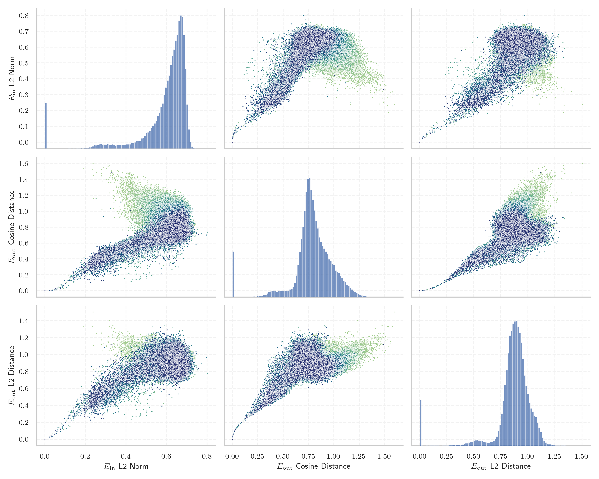
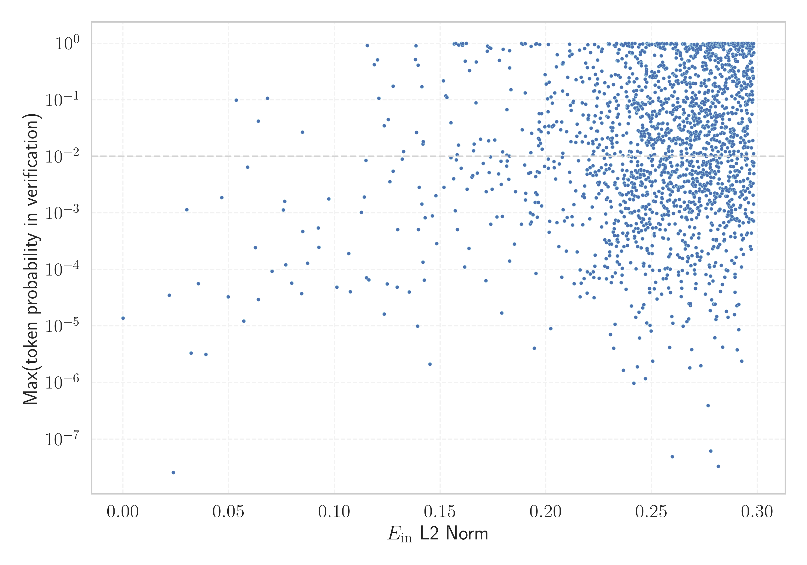

# Report for `chuxin-llm/Chuxin-1.6B-Base`

## Model info

* Tied embeddings: no
* LM head uses bias: no
* Metric for under-trained tokens: E_{in} L2 Norm
  * Overall distribution 0.597 +/- 0.128
  * Token used for verification prompt building: `IllegalArgumentException`
  * Verification threshold: 0.298
  * Threshold for showing candidate under-trained tokens: 0.121
  * Median verified threshold (for bytes, unreachable and special tokens): 0.257
* Embeddings shape: (102400, 2048)
* Vocabulary size: 100015
  * Number of single byte tokens: 256, of which 4 below metric threshold
  * Number of special tokens: 2, of which 1 below metric threshold
  * Number of non-single-byte unreachable tokens: 32, of which 20 below metric threshold
  * Number of non-single-byte UTF-fragment tokens: 438, 0 below soft metric threshold
  * Number of tested under-trained tokens: 1983, 1983 non-special, 886 below p = 0.01 threshold, 38 below soft metric threshold

## Under-trained token indicators plot


## Verification plot


## Under-trained token verification results
38 entries below threshold of 0.121

|   token_id | token                                        |    metric | max_prob                                                         | in_other_tokens                                                                                                                                                                                                                        |
|------------|----------------------------------------------|-----------|------------------------------------------------------------------|----------------------------------------------------------------------------------------------------------------------------------------------------------------------------------------------------------------------------------------|
|      87662 | ````` 日内与新浪看点 `````                   | 0.0218784 | <span style='border: 1px solid rgb(169, 68, 66);'>3.5e-05</span> | <span style='border: 1px solid rgb(169, 68, 66);'>````` 日内与新浪看点联系 `````</span>                                                                                                                                                |
|      87661 | ````` 不代表新浪看点 `````                   | 0.0236809 | <span style='border: 1px solid rgb(169, 68, 66);'>2.6e-08</span> | <span style='border: 1px solid rgb(169, 68, 66);'>````` 不代表新浪看点观点或立场 `````</span>                                                                                                                                          |
|      97672 | ````` 基督教基督教基督教 `````               | 0.0301265 | <span style='border: 1px solid rgb(255, 145, 0);'>0.0011</span>  |                                                                                                                                                                                                                                        |
|      91136 | ````` controlcap `````                       | 0.0321056 | <span style='border: 1px solid rgb(169, 68, 66);'>3.3e-06</span> |                                                                                                                                                                                                                                        |
|      74777 | ````` orangehilldev `````                    | 0.0355834 | <span style='border: 1px solid rgb(169, 68, 66);'>5.6e-05</span> |                                                                                                                                                                                                                                        |
|      16238 | ````` кедония `````                          | 0.0391545 | <span style='border: 1px solid rgb(169, 68, 66);'>3.2e-06</span> | ````` Македония `````, ````` ▁Македония `````                                                                                                                                                                                          |
|      90785 | ````` посолство `````                        | 0.04666   | <span style='border: 1px solid rgb(255, 145, 0);'>0.0019</span>  |                                                                                                                                                                                                                                        |
|      13009 | ````` lemanya `````                          | 0.0497387 | <span style='border: 1px solid rgb(169, 68, 66);'>3.3e-05</span> | ````` Alemanya `````, ````` ▁alemanya `````, ````` ▁Alemanya `````                                                                                                                                                                     |
|      99639 | ````` 亿亿亿亿亿亿亿亿亿亿亿亿亿亿亿亿 ````` | 0.0535675 | <span style='border: 1px solid rgb(251, 189, 8);'>0.099</span>   |                                                                                                                                                                                                                                        |
|      81096 | ````` ▁EDIPU `````                           | 0.0570441 | <span style='border: 1px solid rgb(169, 68, 66);'>1.2e-05</span> | ````` ▁EDIPUCRS `````                                                                                                                                                                                                                  |
|      84405 | ````` RecordedVote `````                     | 0.0587952 | <span style='border: 1px solid rgb(255, 145, 0);'>0.0064</span>  |                                                                                                                                                                                                                                        |
|      59771 | ````` 基督教基督教 `````                     | 0.0625054 | <span style='border: 1px solid rgb(169, 68, 66);'>0.00024</span> | <span style='border: 1px solid rgb(255, 145, 0);'>````` 基督教基督教基督教 `````</span>                                                                                                                                                |
|      71563 | ````` 亿亿亿次 `````                         | 0.063932  | <span style='border: 1px solid rgb(251, 189, 8);'>0.042</span>   |                                                                                                                                                                                                                                        |
|      60623 | ````` odeciclismo `````                      | 0.0639408 | <span style='border: 1px solid rgb(169, 68, 66);'>3e-05</span>   | ````` ▁sitiodeciclismo `````, <span style='border: 1px solid rgb(169, 68, 66);'>````` iodeciclismo `````</span>                                                                                                                        |
|      50113 | ````` memItem `````                          | 0.0682783 | <span style='border: 1px solid rgb(40, 167, 69);'>0.11</span>    | ````` memItemLeft `````, ````` memItemRight `````                                                                                                                                                                                      |
|       5758 | ````` ългар `````                            | 0.0703906 | <span style='border: 1px solid rgb(169, 68, 66);'>9.3e-05</span> | ````` ▁българи `````, ````` ▁българската `````, <span style='border: 1px solid rgb(255, 145, 0);'>````` ългария `````</span>, <span style='border: 1px solid rgb(255, 145, 0);'>````` ▁българ `````</span>, ````` ▁България `````, ... |
|      70532 | ````` \xa0veg `````                          | 0.075737  | <span style='border: 1px solid rgb(255, 145, 0);'>0.0011</span>  | <span style='border: 1px solid rgb(251, 189, 8);'>````` \xa0vegades `````</span>                                                                                                                                                       |
|      97018 | ````` Supamiu `````                          | 0.0764349 | <span style='border: 1px solid rgb(255, 145, 0);'>0.0016</span>  |                                                                                                                                                                                                                                        |
|      78552 | ````` ▁Междусъюз `````                       | 0.0769008 | <span style='border: 1px solid rgb(169, 68, 66);'>0.00012</span> | <span style='border: 1px solid rgb(169, 68, 66);'>````` ▁Междусъюзническата `````</span>                                                                                                                                               |
|      49112 | ````` iberament `````                        | 0.0797149 | <span style='border: 1px solid rgb(169, 68, 66);'>5.8e-05</span> | <span style='border: 1px solid rgb(251, 189, 8);'>````` alliberament `````</span>, <span style='border: 1px solid rgb(255, 145, 0);'>````` Alliberament `````</span>                                                                   |
<details><summary>18 additional entries below threshold</summary>

|   token_id | token                        |    metric | max_prob                                                         | in_other_tokens                                                                                                                                                                                                                                        |
|------------|------------------------------|-----------|------------------------------------------------------------------|--------------------------------------------------------------------------------------------------------------------------------------------------------------------------------------------------------------------------------------------------------|
|      49293 | ````` ▁lampister `````       | 0.0844076 | <span style='border: 1px solid rgb(169, 68, 66);'>3.7e-05</span> | <span style='border: 1px solid rgb(169, 68, 66);'>````` ▁lampisteria `````</span>, <span style='border: 1px solid rgb(169, 68, 66);'>````` ▁lampisteries `````</span>                                                                                  |
|      58888 | ````` 亿亿亿亿亿亿亿亿 ````` | 0.0848685 | <span style='border: 1px solid rgb(251, 189, 8);'>0.027</span>   | <span style='border: 1px solid rgb(251, 189, 8);'>````` 亿亿亿亿亿亿亿亿亿亿亿亿亿亿亿亿 `````</span>                                                                                                                                                  |
|      49918 | ````` magatzem `````         | 0.0849909 | <span style='border: 1px solid rgb(169, 68, 66);'>0.00047</span> | <span style='border: 1px solid rgb(255, 145, 0);'>````` emmagatzem `````</span>, <span style='border: 1px solid rgb(251, 189, 8);'>````` emmagatzematge `````</span>, <span style='border: 1px solid rgb(251, 189, 8);'>````` ▁emmagatzem `````</span> |
|      51244 | ````` ecesito `````          | 0.0872311 | <span style='border: 1px solid rgb(169, 68, 66);'>0.00013</span> | ````` ▁Necesito `````, ````` Necesito `````                                                                                                                                                                                                            |
|      86826 | ````` солство `````          | 0.0923582 | <span style='border: 1px solid rgb(169, 68, 66);'>0.00054</span> | <span style='border: 1px solid rgb(255, 145, 0);'>````` посолство `````</span>                                                                                                                                                                         |
|       9710 | ````` ▁espany `````          | 0.0926319 | <span style='border: 1px solid rgb(169, 68, 66);'>0.00025</span> | ````` ▁espanyoles `````, ````` ▁espanyol `````, ````` ▁espanyols `````, ````` ▁espanyola `````                                                                                                                                                         |
|      73129 | ````` жентина `````          | 0.0972762 | <span style='border: 1px solid rgb(255, 145, 0);'>0.0018</span>  | <span style='border: 1px solid rgb(251, 189, 8);'>````` ▁Аржентина `````</span>                                                                                                                                                                        |
|      85684 | ````` товче `````            | 0.10107   | <span style='border: 1px solid rgb(169, 68, 66);'>4.8e-05</span> | <span style='border: 1px solid rgb(169, 68, 66);'>````` ▁братовче `````</span>                                                                                                                                                                         |
|      52246 | ````` ▁опъл `````            | 0.106657  | <span style='border: 1px solid rgb(169, 68, 66);'>0.00019</span> | <span style='border: 1px solid rgb(255, 145, 0);'>````` ▁опълчение `````</span>, <span style='border: 1px solid rgb(255, 145, 0);'>````` ▁опълчен `````</span>, <span style='border: 1px solid rgb(169, 68, 66);'>````` ▁опълченец `````</span>        |
|       7388 | ````` точници `````          | 0.107464  | <span style='border: 1px solid rgb(169, 68, 66);'>4e-05</span>   | ````` ▁източници `````, ````` Източници `````                                                                                                                                                                                                          |
|      51641 | ````` мъния `````            | 0.112711  | <span style='border: 1px solid rgb(255, 145, 0);'>0.001</span>   | ````` ▁Румъния `````                                                                                                                                                                                                                                   |
|       9630 | ````` ългария `````          | 0.114074  | <span style='border: 1px solid rgb(255, 145, 0);'>0.0019</span>  | ````` ▁България `````, ````` България `````                                                                                                                                                                                                            |
|      93494 | ````` atrals `````           | 0.114798  | <span style='border: 1px solid rgb(255, 145, 0);'>0.0085</span>  | <span style='border: 1px solid rgb(169, 68, 66);'>````` ▁teatrals `````</span>                                                                                                                                                                         |
|      41580 | ````` ▁експе `````           | 0.115079  | <span style='border: 1px solid rgb(169, 68, 66);'>7.1e-05</span> | ````` ▁експеди `````, <span style='border: 1px solid rgb(251, 189, 8);'>````` ▁експедиция `````</span>, ````` ▁експери `````                                                                                                                           |
|      74713 | ````` photonui `````         | 0.115498  | <span style='border: 1px solid rgb(40, 167, 69);'>0.92</span>    |                                                                                                                                                                                                                                                        |
|      90292 | ````` битава `````           | 0.116288  | <span style='border: 1px solid rgb(169, 68, 66);'>6.6e-05</span> | <span style='border: 1px solid rgb(169, 68, 66);'>````` Обитава `````</span>                                                                                                                                                                           |
|      72767 | ````` elrte `````            | 0.118752  | <span style='border: 1px solid rgb(40, 167, 69);'>0.42</span>    |                                                                                                                                                                                                                                                        |
|      24543 | ````` wlwifi `````           | 0.12032   | <span style='border: 1px solid rgb(40, 167, 69);'>0.51</span>    | ````` ▁iwlwifi `````, ````` iwlwifi `````                                                                                                                                                                                                              |
</details>


## Partial UTF-8 tokens
0 entries below threshold of 0.121


## Byte tokens
4 entries below threshold of 0.257

|   token_id | token          |   metric |   ord | hex   | byte_type   |
|------------|----------------|----------|-------|-------|-------------|
|        185 | ````` \n ````` | 0.188525 |    10 | 0x0A  | ascii       |
|         11 | ````` , `````  | 0.233417 |    44 | 0x2C  | ascii       |
|        207 | ````` ▁ `````  | 0.237499 |    32 | 0x20  | ascii       |
|         13 | ````` . `````  | 0.252735 |    46 | 0x2E  | ascii       |


## Special tokens
1 entries below threshold of 0.257

|   token_id | token                                 |      metric | max_prob                                                         |
|------------|---------------------------------------|-------------|------------------------------------------------------------------|
|     100000 | ````` ¿<｜begin▁of▁sentence｜>? ````` | 2.22104e-08 | <span style='border: 1px solid rgb(169, 68, 66);'>1.4e-05</span> |


## Unreachable tokens
20 entries below threshold of 0.257

|   token_id | token          |      metric | reencoded                                       |
|------------|----------------|-------------|-------------------------------------------------|
|      95036 | ````` ▁ö ````` | 2.15243e-08 | 207: ````` ▁ `````, 100003: ````` <0xF6> `````  |
|      48308 | ````` Á `````  | 2.15282e-08 | 100012: ````` <0xC1> `````                      |
|      53854 | ````` ▁ü ````` | 2.16154e-08 | 207: ````` ▁ `````, 100014: ````` <0xFC> `````  |
|      15302 | ````` ▁À ````` | 2.17436e-08 | 207: ````` ▁ `````, 100010: ````` <0xC0> `````  |
|       1612 | ````` ú `````  | 2.17913e-08 | 100004: ````` <0xFA> `````                      |
|      77883 | ````` çõ ````` | 2.18156e-08 | 1337: ````` ç `````, 100006: ````` <0xF5> ````` |
|      31186 | ````` üí ````` | 2.19835e-08 | 100014: ````` <0xFC> `````, 656: ````` í `````  |
|      60840 | ````` ▁þ ````` | 2.20105e-08 | 207: ````` ▁ `````, 100013: ````` <0xFE> `````  |
|      15776 | ````` üè ````` | 2.21308e-08 | 100014: ````` <0xFC> `````, 724: ````` è `````  |
|      27924 | ````` ▁Á ````` | 2.2146e-08  | 207: ````` ▁ `````, 100012: ````` <0xC1> `````  |
|      56124 | ````` û `````  | 2.22393e-08 | 100008: ````` <0xFB> `````                      |
|      25486 | ````` ø `````  | 2.22396e-08 | 100002: ````` <0xF8> `````                      |
|      45981 | ````` õ `````  | 2.22878e-08 | 100006: ````` <0xF5> `````                      |
|       7962 | ````` ö `````  | 2.23045e-08 | 100003: ````` <0xF6> `````                      |
|       6496 | ````` ▁ú ````` | 2.23787e-08 | 207: ````` ▁ `````, 100004: ````` <0xFA> `````  |
|      84896 | ````` þ `````  | 2.24477e-08 | 100013: ````` <0xFE> `````                      |
|      12759 | ````` À `````  | 2.24954e-08 | 100010: ````` <0xC0> `````                      |
|      52272 | ````` ù `````  | 2.25231e-08 | 100011: ````` <0xF9> `````                      |
|       5021 | ````` ý `````  | 2.25858e-08 | 100009: ````` <0xFD> `````                      |
|       2874 | ````` ü `````  | 2.28658e-08 | 100014: ````` <0xFC> `````                      |

