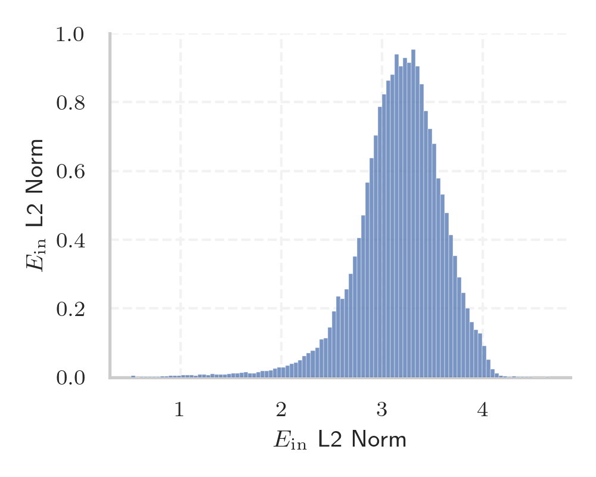

# Report for `deepseek-ai/DeepSeek-R1`

## Model info

* Model Info: 
  * Tied embeddings: False
  * LM head uses bias: False
  * Embeddings shape: [129280, 7168]
* Tokenizer Info: 
  * Vocab Size: 128815
  * Tokenizer Class: LlamaTokenizerFast
  * Tokenizer Type: BPE
  * Bytes handling: Byte Input
  * Token for verification prompt building: 习近平新时代中国特色社会主义思想
  * Token id for verification prompt building: 74252
* Indicator summary: 
  * Indicator for under-trained tokens: E_{in} L2 Norm
  * Overall distribution: 3.167 +/- 0.425
* Detected Token Counts: 
  * Number of tested under-trained tokens: 2547, 2518 non-special, 0 below p = 0.01 threshold, 11 below soft indicator threshold
  * Number of single byte tokens: 256, of which 0 below indicator threshold
  * Number of special tokens: 0, of which 0 below indicator threshold
  * Number of non-single-byte UTF-fragment tokens:  1342, of which 0 below soft indicator threshold

## Under-trained token indicators plot


## Verification plot


## Under-trained token verification results
11 entries below threshold of 0.669

|   token_id | token                   |   indicator | max_prob                                                     | in_other_tokens                                                                                                                                                                                                                                           |
|------------|-------------------------|-------------|--------------------------------------------------------------|-----------------------------------------------------------------------------------------------------------------------------------------------------------------------------------------------------------------------------------------------------------|
|      89953 | ````` ▁kabungtor `````  |    0.569915 | <span style='border: 1px solid rgb(40, 167, 69);'>0.5</span> | <span style='border: 1px solid rgb(40, 167, 69);'>````` ▁kabungtoran `````</span>                                                                                                                                                                         |
|     127635 | ````` послено `````     |    0.612544 | <span style='border: 1px solid rgb(40, 167, 69);'>0.5</span> | <span style='border: 1px solid rgb(40, 167, 69);'>````` ▁Запослено `````</span>                                                                                                                                                                           |
|     116588 | ````` ειοθετήθηκε ````` |    0.61961  | <span style='border: 1px solid rgb(40, 167, 69);'>0.5</span> | <span style='border: 1px solid rgb(40, 167, 69);'>````` ▁Αρχειοθετήθηκε `````</span>                                                                                                                                                                      |
|      72206 | ````` unisipyo `````    |    0.621299 | <span style='border: 1px solid rgb(40, 167, 69);'>0.5</span> | <span style='border: 1px solid rgb(40, 167, 69);'>````` ▁munisipyo `````</span>, <span style='border: 1px solid rgb(40, 167, 69);'>````` Munisipyo `````</span>                                                                                           |
|      79729 | ````` ultatua `````     |    0.635792 | <span style='border: 1px solid rgb(40, 167, 69);'>0.5</span> | <span style='border: 1px solid rgb(40, 167, 69);'>````` ▁kontsultatua `````</span>                                                                                                                                                                        |
|     113872 | ````` ▁pagklas `````    |    0.650046 | <span style='border: 1px solid rgb(40, 167, 69);'>0.5</span> | <span style='border: 1px solid rgb(40, 167, 69);'>````` ▁pagklasipika `````</span>                                                                                                                                                                        |
|     123327 | ````` основним `````    |    0.654504 | <span style='border: 1px solid rgb(40, 167, 69);'>0.5</span> | <span style='border: 1px solid rgb(40, 167, 69);'>````` ▁постосновним `````</span>                                                                                                                                                                        |
|     127328 | ````` jeftigelse `````  |    0.661575 | <span style='border: 1px solid rgb(40, 167, 69);'>0.5</span> | <span style='border: 1px solid rgb(40, 167, 69);'>````` Beskjeftigelse `````</span>                                                                                                                                                                       |
|      64815 | ````` bingkil `````     |    0.66446  | <span style='border: 1px solid rgb(40, 167, 69);'>0.5</span> | <span style='border: 1px solid rgb(40, 167, 69);'>````` ▁pakigbingkil `````</span>                                                                                                                                                                        |
|      62268 | ````` ▁nahimut `````    |    0.664631 | <span style='border: 1px solid rgb(40, 167, 69);'>0.5</span> | <span style='border: 1px solid rgb(40, 167, 69);'>````` ▁nahimutang `````</span>, <span style='border: 1px solid rgb(40, 167, 69);'>````` ▁nahimutangan `````</span>                                                                                      |
|       8364 | ````` новништво `````   |    0.666956 | <span style='border: 1px solid rgb(40, 167, 69);'>0.5</span> | <span style='border: 1px solid rgb(40, 167, 69);'>````` ▁становништво `````</span>, <span style='border: 1px solid rgb(40, 167, 69);'>````` Становништво `````</span>, <span style='border: 1px solid rgb(40, 167, 69);'>````` ▁Становништво `````</span> |


## Tokens with partial UTF-8 sequences
0 entries below threshold of 0.669


## Byte tokens
0 entries below threshold of 0.000


## Special tokens
0 entries below threshold of 0.000


