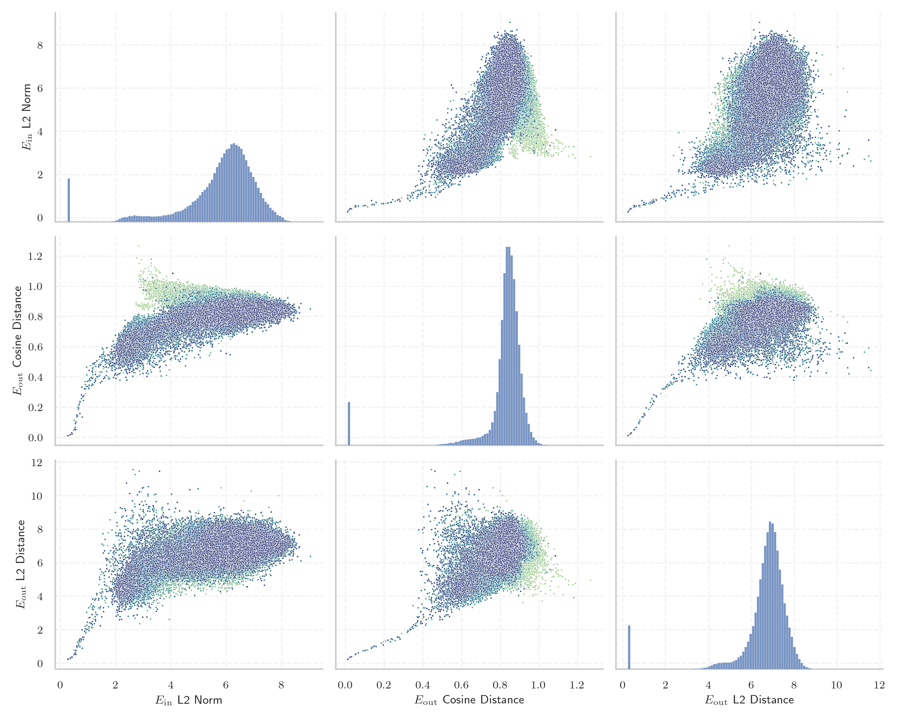

# Report for `deepseek-ai/DeepSeek-V2-Lite`

## Model info

* Model Info: 
  * Tied embeddings: False
  * LM head uses bias: False
  * Embeddings shape: [102400, 2048]
* Tokenizer Info: 
  * Vocab Size: 100002
  * Tokenizer Class: LlamaTokenizerFast
  * Tokenizer Type: BPE
  * Bytes handling: Byte Input
  * Token for verification prompt building: IllegalArgumentException
  * Token id for verification prompt building: 91253
* Indicator summary: 
  * Indicator for under-trained tokens: E_{in} L2 Norm
  * Overall distribution: 5.786 +/- 1.398
* Detected Token Counts: 
  * Number of tested under-trained tokens: 1989, 1989 non-special, 202 below p = 0.01 threshold, 18 below soft indicator threshold
  * Number of single byte tokens: 243, of which 0 below indicator threshold
  * Number of special tokens: 12, of which 0 below indicator threshold
  * Number of non-single-byte unreachable tokens: 12, of which 0 below indicator threshold
  * Number of non-single-byte UTF-fragment tokens:  438, of which 0 below soft indicator threshold

## Under-trained token indicators plot


## Verification plot


## Under-trained token verification results
18 entries below threshold of 0.596

|   token_id | token                                 |   indicator | max_prob                                                         | in_other_tokens                |
|------------|---------------------------------------|-------------|------------------------------------------------------------------|--------------------------------|
|      98098 | ````` ="../../../../..">< `````       |    0.277387 | <span style='border: 1px solid rgb(169, 68, 66);'>1.5e-09</span> |                                |
|      63291 | ````` IconSuccessEncoded `````        |    0.285365 | <span style='border: 1px solid rgb(169, 68, 66);'>1.1e-09</span> |                                |
|      40482 | ````` IconErrorEncoded `````          |    0.291514 | <span style='border: 1px solid rgb(169, 68, 66);'>5.8e-10</span> |                                |
|      74777 | ````` orangehilldev `````             |    0.337313 | <span style='border: 1px solid rgb(169, 68, 66);'>3e-09</span>   |                                |
|      38174 | ````` ExternalTaskPojo `````          |    0.351187 | <span style='border: 1px solid rgb(169, 68, 66);'>8.8e-09</span> |                                |
|      86289 | ````` typeNameLink `````              |    0.362539 | <span style='border: 1px solid rgb(169, 68, 66);'>2.6e-09</span> |                                |
|      57926 | ````` navBarCell `````                |    0.392072 | <span style='border: 1px solid rgb(169, 68, 66);'>1.7e-08</span> |                                |
|      95833 | ````` textquoted `````                |    0.40883  | <span style='border: 1px solid rgb(169, 68, 66);'>5.3e-09</span> | ````` textquotedbl `````       |
|      87662 | ````` 日内与新浪看点 `````            |    0.409887 | <span style='border: 1px solid rgb(169, 68, 66);'>1.2e-09</span> | ````` 日内与新浪看点联系 ````` |
|      97018 | ````` Supamiu `````                   |    0.427577 | <span style='border: 1px solid rgb(169, 68, 66);'>1.8e-08</span> |                                |
|      84405 | ````` RecordedVote `````              |    0.492544 | <span style='border: 1px solid rgb(169, 68, 66);'>3.5e-09</span> |                                |
|      28490 | ````` ▁allClassesLink `````           |    0.498124 | <span style='border: 1px solid rgb(251, 189, 8);'>0.03</span>    |                                |
|      91136 | ````` controlcap `````                |    0.515423 | <span style='border: 1px solid rgb(169, 68, 66);'>9.7e-10</span> |                                |
|      83041 | ````` sympad `````                    |    0.540853 | <span style='border: 1px solid rgb(169, 68, 66);'>0.0003</span>  |                                |
|      59602 | ````` linkedExternalProjectPath ````` |    0.541388 | <span style='border: 1px solid rgb(169, 68, 66);'>8.7e-07</span> |                                |
|      91619 | ````` >?[< `````                      |    0.560272 | <span style='border: 1px solid rgb(169, 68, 66);'>1.2e-06</span> |                                |
|      84716 | ````` ▁cachedSer `````                |    0.563244 | <span style='border: 1px solid rgb(169, 68, 66);'>0.00015</span> |                                |
|      20947 | ````` NavBarCell `````                |    0.569525 | <span style='border: 1px solid rgb(169, 68, 66);'>0.00054</span> |                                |


## Tokens with partial UTF-8 sequences
0 entries below threshold of 0.596


## Byte tokens
0 entries below threshold of 2.239


## Special tokens
0 entries below threshold of 2.239


## Unreachable tokens
0 entries below threshold of 2.239


