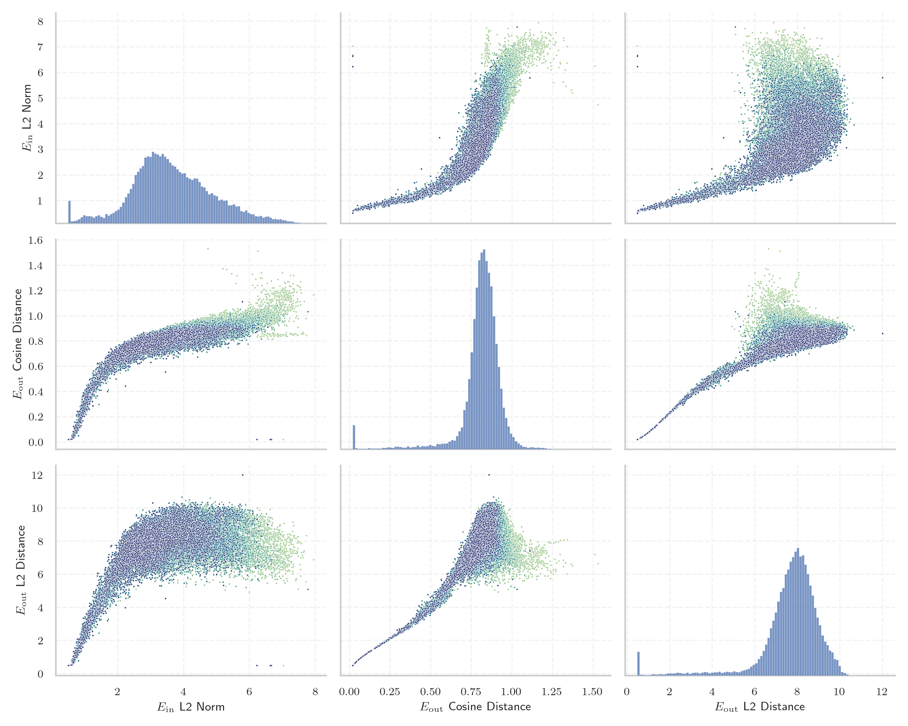

# Report for `deepseek-ai/deepseek-coder-33b-base`

## Model info

* Model Info: 
  * Tied embeddings: False
  * LM head uses bias: False
  * Embeddings shape: [32256, 7168]
* Tokenizer Info: 
  * Vocab Size: 32022
  * Tokenizer Class: LlamaTokenizerFast
  * Tokenizer Type: BPE
  * Bytes handling: Byte Input
  * Token for verification prompt building: ArgumentException
  * Token id for verification prompt building: 28151
* Indicator summary: 
  * Indicator for under-trained tokens: E_{in} L2 Norm
  * Overall distribution: 3.660 +/- 1.221
* Detected Token Counts: 
  * Number of tested under-trained tokens: 631, 628 non-special, 108 below p = 0.01 threshold, 70 below soft indicator threshold
  * Number of single byte tokens: 256, of which 0 below indicator threshold
  * Number of special tokens: 53, of which 53 below indicator threshold
  * Number of non-single-byte unreachable tokens: 53, of which 53 below indicator threshold
  * Number of non-single-byte UTF-fragment tokens:  327, of which 0 below soft indicator threshold

## Under-trained token indicators plot


## Verification plot


## Under-trained token verification results
70 entries below threshold of 0.724

|   token_id | token                     |   indicator | max_prob                                                         | in_other_tokens                                                                |
|------------|---------------------------|-------------|------------------------------------------------------------------|--------------------------------------------------------------------------------|
|       6968 | ````` \xa0anys `````      |    0.503183 | <span style='border: 1px solid rgb(169, 68, 66);'>3.8e-07</span> |                                                                                |
|      24847 | ````` \xa0milions `````   |    0.509945 | <span style='border: 1px solid rgb(169, 68, 66);'>2.1e-07</span> |                                                                                |
|       9232 | ````` \xa0persones `````  |    0.527892 | <span style='border: 1px solid rgb(169, 68, 66);'>4.7e-08</span> |                                                                                |
|      31142 | ````` ▁desocupats `````   |    0.52957  | <span style='border: 1px solid rgb(169, 68, 66);'>2e-08</span>   |                                                                                |
|      28453 | ````` Polítics `````      |    0.531442 | <span style='border: 1px solid rgb(169, 68, 66);'>1.9e-07</span> |                                                                                |
|      26287 | ````` automòbils `````    |    0.533945 | <span style='border: 1px solid rgb(169, 68, 66);'>3e-07</span>   |                                                                                |
|      30088 | ````` ▁capbaix `````      |    0.537156 | <span style='border: 1px solid rgb(169, 68, 66);'>1.6e-07</span> |                                                                                |
|      30188 | ````` ▁unipersonals ````` |    0.539675 | <span style='border: 1px solid rgb(169, 68, 66);'>2.6e-06</span> |                                                                                |
|      17744 | ````` Родени `````        |    0.547032 | <span style='border: 1px solid rgb(169, 68, 66);'>5.7e-07</span> |                                                                                |
|      26042 | ````` ▁херцо `````        |    0.549482 | <span style='border: 1px solid rgb(169, 68, 66);'>6.1e-08</span> | <span style='border: 1px solid rgb(169, 68, 66);'>````` ▁херцог `````</span>   |
|      30963 | ````` ▁solteres `````     |    0.554075 | <span style='border: 1px solid rgb(169, 68, 66);'>1.9e-06</span> |                                                                                |
|      30168 | ````` Piràmide `````      |    0.568648 | <span style='border: 1px solid rgb(169, 68, 66);'>1.5e-07</span> |                                                                                |
|      29906 | ````` ▁херцог `````       |    0.570143 | <span style='border: 1px solid rgb(169, 68, 66);'>1.4e-07</span> |                                                                                |
|      28726 | ````` ▁disposaven `````   |    0.572149 | <span style='border: 1px solid rgb(169, 68, 66);'>3.9e-06</span> |                                                                                |
|      29471 | ````` Naixements `````    |    0.572227 | <span style='border: 1px solid rgb(169, 68, 66);'>1.7e-05</span> |                                                                                |
|      26851 | ````` ▁agrícoles `````    |    0.574596 | <span style='border: 1px solid rgb(169, 68, 66);'>6.1e-07</span> |                                                                                |
|      29542 | ````` ▁corresponia `````  |    0.580997 | <span style='border: 1px solid rgb(169, 68, 66);'>1.1e-08</span> |                                                                                |
|      16651 | ````` \xa0aC `````        |    0.581797 | <span style='border: 1px solid rgb(169, 68, 66);'>2.1e-07</span> |                                                                                |
|      30103 | ````` ▁llogaters `````    |    0.584133 | <span style='border: 1px solid rgb(169, 68, 66);'>1.4e-05</span> |                                                                                |
|      29856 | ````` ▁pàrqu `````        |    0.586816 | <span style='border: 1px solid rgb(169, 68, 66);'>4.1e-08</span> | <span style='border: 1px solid rgb(169, 68, 66);'>````` ▁pàrquing `````</span> |
<details><summary>50 additional entries below threshold</summary>

|   token_id | token                       |   indicator | max_prob                                                         | in_other_tokens                                                                                                                                                                                                                                                                                                                                                                                            |
|------------|-----------------------------|-------------|------------------------------------------------------------------|------------------------------------------------------------------------------------------------------------------------------------------------------------------------------------------------------------------------------------------------------------------------------------------------------------------------------------------------------------------------------------------------------------|
|       8790 | ````` \xa0habitants `````   |    0.599214 | <span style='border: 1px solid rgb(169, 68, 66);'>1.7e-07</span> |                                                                                                                                                                                                                                                                                                                                                                                                            |
|      15510 | ````` ▁Olímpics `````       |    0.605718 | <span style='border: 1px solid rgb(169, 68, 66);'>7.3e-06</span> |                                                                                                                                                                                                                                                                                                                                                                                                            |
|      30427 | ````` ▁jubilades `````      |    0.608062 | <span style='border: 1px solid rgb(169, 68, 66);'>2.9e-05</span> |                                                                                                                                                                                                                                                                                                                                                                                                            |
|      18064 | ````` àmide `````           |    0.612484 | <span style='border: 1px solid rgb(169, 68, 66);'>2.8e-05</span> | <span style='border: 1px solid rgb(169, 68, 66);'>````` Piràmide `````</span>, <span style='border: 1px solid rgb(251, 189, 8);'>````` ▁piràmide `````</span>                                                                                                                                                                                                                                              |
|      22551 | ````` ▁contemporanis `````  |    0.616108 | <span style='border: 1px solid rgb(169, 68, 66);'>4.8e-05</span> |                                                                                                                                                                                                                                                                                                                                                                                                            |
|      29894 | ````` ▁residències `````    |    0.618363 | <span style='border: 1px solid rgb(169, 68, 66);'>2.9e-05</span> |                                                                                                                                                                                                                                                                                                                                                                                                            |
|      29976 | ````` ▁censats `````        |    0.621773 | <span style='border: 1px solid rgb(251, 189, 8);'>0.068</span>   |                                                                                                                                                                                                                                                                                                                                                                                                            |
|      24735 | ````` ▁alemanys `````       |    0.622736 | <span style='border: 1px solid rgb(169, 68, 66);'>0.0002</span>  |                                                                                                                                                                                                                                                                                                                                                                                                            |
|      25186 | ````` òrnia `````           |    0.625991 | <span style='border: 1px solid rgb(169, 68, 66);'>2.4e-05</span> | <span style='border: 1px solid rgb(169, 68, 66);'>````` ▁Califòrnia `````</span>                                                                                                                                                                                                                                                                                                                           |
|      29115 | ````` ▁príncep `````        |    0.626678 | <span style='border: 1px solid rgb(169, 68, 66);'>4.5e-07</span> |                                                                                                                                                                                                                                                                                                                                                                                                            |
|      10708 | ````` ogrà `````            |    0.627548 | <span style='border: 1px solid rgb(169, 68, 66);'>3.9e-06</span> | <span style='border: 1px solid rgb(40, 167, 69);'>````` ▁geogràfica `````</span>, <span style='border: 1px solid rgb(40, 167, 69);'>````` ogràfic `````</span>, <span style='border: 1px solid rgb(40, 167, 69);'>````` ogràfica `````</span>, <span style='border: 1px solid rgb(251, 189, 8);'>````` ogràf `````</span>                                                                                  |
|      25055 | ````` Esportistes `````     |    0.628171 | <span style='border: 1px solid rgb(255, 145, 0);'>0.0011</span>  |                                                                                                                                                                                                                                                                                                                                                                                                            |
|      29013 | ````` ▁automòbil `````      |    0.629375 | <span style='border: 1px solid rgb(169, 68, 66);'>8.2e-07</span> |                                                                                                                                                                                                                                                                                                                                                                                                            |
|      30090 | ````` ▁britànics `````      |    0.634724 | <span style='border: 1px solid rgb(169, 68, 66);'>4.9e-07</span> |                                                                                                                                                                                                                                                                                                                                                                                                            |
|      14837 | ````` Futbolistes `````     |    0.635706 | <span style='border: 1px solid rgb(169, 68, 66);'>0.00022</span> |                                                                                                                                                                                                                                                                                                                                                                                                            |
|      27783 | ````` ▁Califòrnia `````     |    0.638095 | <span style='border: 1px solid rgb(169, 68, 66);'>4.9e-06</span> |                                                                                                                                                                                                                                                                                                                                                                                                            |
|      25037 | ````` àbitat `````          |    0.642786 | <span style='border: 1px solid rgb(169, 68, 66);'>5e-06</span>   |                                                                                                                                                                                                                                                                                                                                                                                                            |
|      13039 | ````` lemanya `````         |    0.64283  | <span style='border: 1px solid rgb(255, 145, 0);'>0.0059</span>  | <span style='border: 1px solid rgb(40, 167, 69);'>````` Alemanya `````</span>, <span style='border: 1px solid rgb(251, 189, 8);'>````` ▁Alemanya `````</span>                                                                                                                                                                                                                                              |
|      22969 | ````` Починали `````        |    0.645541 | <span style='border: 1px solid rgb(169, 68, 66);'>0.00074</span> |                                                                                                                                                                                                                                                                                                                                                                                                            |
|      31793 | ````` glésies `````         |    0.651159 | <span style='border: 1px solid rgb(169, 68, 66);'>2.7e-06</span> |                                                                                                                                                                                                                                                                                                                                                                                                            |
|      15366 | ````` unidenc `````         |    0.653983 | <span style='border: 1px solid rgb(169, 68, 66);'>3.1e-05</span> | <span style='border: 1px solid rgb(255, 145, 0);'>````` ▁estatunidencs `````</span>, <span style='border: 1px solid rgb(169, 68, 66);'>````` ▁estatunidenc `````</span>                                                                                                                                                                                                                                    |
|      30659 | ````` ▁repartia `````       |    0.656056 | <span style='border: 1px solid rgb(169, 68, 66);'>1.4e-07</span> |                                                                                                                                                                                                                                                                                                                                                                                                            |
|      26261 | ````` Разпространение ````` |    0.659405 | <span style='border: 1px solid rgb(169, 68, 66);'>1e-05</span>   |                                                                                                                                                                                                                                                                                                                                                                                                            |
|      31975 | ````` ▁Canadà `````         |    0.660188 | <span style='border: 1px solid rgb(169, 68, 66);'>3.6e-05</span> |                                                                                                                                                                                                                                                                                                                                                                                                            |
|      30507 | ````` ▁llogats `````        |    0.661058 | <span style='border: 1px solid rgb(169, 68, 66);'>4.8e-05</span> |                                                                                                                                                                                                                                                                                                                                                                                                            |
|      30401 | ````` ▁britànic `````       |    0.661628 | <span style='border: 1px solid rgb(169, 68, 66);'>4.4e-07</span> |                                                                                                                                                                                                                                                                                                                                                                                                            |
|      15850 | ````` ▁estatunidenc `````   |    0.663608 | <span style='border: 1px solid rgb(169, 68, 66);'>2.2e-07</span> | <span style='border: 1px solid rgb(255, 145, 0);'>````` ▁estatunidencs `````</span>                                                                                                                                                                                                                                                                                                                        |
|      21952 | ````` ▁francesos `````      |    0.663708 | <span style='border: 1px solid rgb(169, 68, 66);'>3.4e-05</span> |                                                                                                                                                                                                                                                                                                                                                                                                            |
|      30461 | ````` ▁explotacions `````   |    0.663847 | <span style='border: 1px solid rgb(251, 189, 8);'>0.021</span>   |                                                                                                                                                                                                                                                                                                                                                                                                            |
|      30828 | ````` ▁aturades `````       |    0.665324 | <span style='border: 1px solid rgb(169, 68, 66);'>2e-06</span>   |                                                                                                                                                                                                                                                                                                                                                                                                            |
|      19342 | ````` ▁façana `````         |    0.667547 | <span style='border: 1px solid rgb(169, 68, 66);'>0.00071</span> |                                                                                                                                                                                                                                                                                                                                                                                                            |
|      21788 | ````` Escriptors `````      |    0.67077  | <span style='border: 1px solid rgb(251, 189, 8);'>0.036</span>   |                                                                                                                                                                                                                                                                                                                                                                                                            |
|      29278 | ````` ▁detallades `````     |    0.671464 | <span style='border: 1px solid rgb(169, 68, 66);'>1.7e-08</span> |                                                                                                                                                                                                                                                                                                                                                                                                            |
|      31273 | ````` Acadèmia `````        |    0.676665 | <span style='border: 1px solid rgb(169, 68, 66);'>2.2e-07</span> |                                                                                                                                                                                                                                                                                                                                                                                                            |
|      29121 | ````` ▁segones `````        |    0.679905 | <span style='border: 1px solid rgb(169, 68, 66);'>1.9e-07</span> |                                                                                                                                                                                                                                                                                                                                                                                                            |
|      22061 | ````` adèmia `````          |    0.682464 | <span style='border: 1px solid rgb(251, 189, 8);'>0.02</span>    | <span style='border: 1px solid rgb(169, 68, 66);'>````` Acadèmia `````</span>                                                                                                                                                                                                                                                                                                                              |
|      29921 | ````` ▁Anglaterra `````     |    0.6844   | <span style='border: 1px solid rgb(169, 68, 66);'>1.1e-07</span> |                                                                                                                                                                                                                                                                                                                                                                                                            |
|      28243 | ````` ▁espanyols `````      |    0.685977 | <span style='border: 1px solid rgb(255, 145, 0);'>0.0021</span>  |                                                                                                                                                                                                                                                                                                                                                                                                            |
|      30041 | ````` quitectònic `````     |    0.69054  | <span style='border: 1px solid rgb(169, 68, 66);'>4.9e-05</span> |                                                                                                                                                                                                                                                                                                                                                                                                            |
|       6433 | ````` мври `````            |    0.691087 | <span style='border: 1px solid rgb(255, 145, 0);'>0.0026</span>  | <span style='border: 1px solid rgb(251, 189, 8);'>````` ▁октомври `````</span>, <span style='border: 1px solid rgb(40, 167, 69);'>````` ември `````</span>, <span style='border: 1px solid rgb(40, 167, 69);'>````` ктомври `````</span>, <span style='border: 1px solid rgb(40, 167, 69);'>````` ▁декември `````</span>, <span style='border: 1px solid rgb(40, 167, 69);'>````` кември `````</span>, ... |
|      16297 | ````` \xa0metres `````      |    0.694776 | <span style='border: 1px solid rgb(251, 189, 8);'>0.033</span>   |                                                                                                                                                                                                                                                                                                                                                                                                            |
|      21558 | ````` ànics `````           |    0.696152 | <span style='border: 1px solid rgb(169, 68, 66);'>0.00033</span> | <span style='border: 1px solid rgb(169, 68, 66);'>````` ▁britànics `````</span>                                                                                                                                                                                                                                                                                                                            |
|      31564 | ````` ▁mascles `````        |    0.70156  | <span style='border: 1px solid rgb(169, 68, 66);'>4.2e-05</span> |                                                                                                                                                                                                                                                                                                                                                                                                            |
|       9805 | ````` ▁espèc `````          |    0.703921 | <span style='border: 1px solid rgb(169, 68, 66);'>4.2e-07</span> | <span style='border: 1px solid rgb(40, 167, 69);'>````` ▁espècie `````</span>, <span style='border: 1px solid rgb(40, 167, 69);'>````` ▁espècies `````</span>                                                                                                                                                                                                                                              |
|      30030 | ````` ▁inactius `````       |    0.705957 | <span style='border: 1px solid rgb(251, 189, 8);'>0.024</span>   |                                                                                                                                                                                                                                                                                                                                                                                                            |
|      28335 | ````` ▁омъ `````            |    0.707027 | <span style='border: 1px solid rgb(169, 68, 66);'>0.00047</span> |                                                                                                                                                                                                                                                                                                                                                                                                            |
|      25714 | ````` ▁italià `````         |    0.713196 | <span style='border: 1px solid rgb(251, 189, 8);'>0.031</span>   |                                                                                                                                                                                                                                                                                                                                                                                                            |
|      29895 | ````` ▁pàrquing `````       |    0.716446 | <span style='border: 1px solid rgb(169, 68, 66);'>0.00014</span> |                                                                                                                                                                                                                                                                                                                                                                                                            |
|      27335 | ````` ▁influència `````     |    0.718459 | <span style='border: 1px solid rgb(169, 68, 66);'>1.3e-07</span> |                                                                                                                                                                                                                                                                                                                                                                                                            |
|      26672 | ````` ▁estatunidencs `````  |    0.720075 | <span style='border: 1px solid rgb(255, 145, 0);'>0.0017</span>  |                                                                                                                                                                                                                                                                                                                                                                                                            |
</details>


## Tokens with partial UTF-8 sequences
0 entries below threshold of 0.724


## Byte tokens
0 entries below threshold of 0.688


## Special tokens
3 entries below threshold of 0.688

|   token_id | token                       |   indicator | max_prob                                                         |
|------------|-----------------------------|-------------|------------------------------------------------------------------|
|      32019 | ````` <\|User\|> `````      |    0.5096   | <span style='border: 1px solid rgb(169, 68, 66);'>2.4e-07</span> |
|      32020 | ````` <\|Assistant\|> ````` |    0.509701 | <span style='border: 1px solid rgb(169, 68, 66);'>5e-07</span>   |
|      32021 | ````` <\|EOT\|> `````       |    0.515563 | <span style='border: 1px solid rgb(169, 68, 66);'>2.3e-07</span> |


## Unreachable tokens
53 entries below threshold of 0.688

|   token_id | token                  |   indicator | reencoded                                                                                     |
|------------|------------------------|-------------|-----------------------------------------------------------------------------------------------|
|      31750 | ````` ▁indústria ````` |    0.496724 | 1539: ````` ▁ind `````, 32007: ````` <0xFA> `````, 292: ````` st `````, 2122: ````` ria ````` |
|      14862 | ````` ▁últ `````       |    0.500333 | 207: ````` ▁ `````, 32007: ````` <0xFA> `````, 4025: ````` lt `````                           |
|       9660 | ````` ública `````     |    0.500659 | 32007: ````` <0xFA> `````, 65: ````` b `````, 28120: ````` lica `````                         |
|      19498 | ````` ▁següents `````  |    0.50129  | 2048: ````` ▁seg `````, 32009: ````` <0xFC> `````, 708: ````` ents `````                      |
|       1601 | ````` ú `````          |    0.501457 | 32007: ````` <0xFA> `````                                                                     |
|      23333 | ````` ▁pública `````   |    0.502575 | 265: ````` ▁p `````, 32007: ````` <0xFA> `````, 65: ````` b `````, 28120: ````` lica `````    |
|      13921 | ````` ▁República ````` |    0.503042 | 4396: ````` ▁Rep `````, 32007: ````` <0xFA> `````, 65: ````` b `````, 28120: ````` lica ````` |
|       5547 | ````` ús `````         |    0.503524 | 32007: ````` <0xFA> `````, 82: ````` s `````                                                  |
|      17665 | ````` últ `````        |    0.503793 | 32007: ````` <0xFA> `````, 4025: ````` lt `````                                               |
|      26633 | ````` igües `````      |    0.504358 | 311: ````` ig `````, 32009: ````` <0xFC> `````, 257: ````` es `````                           |
|      16549 | ````` ússia `````      |    0.504379 | 32007: ````` <0xFA> `````, 15965: ````` ssia `````                                            |
|      15195 | ````` ún `````         |    0.504562 | 32007: ````` <0xFA> `````, 77: ````` n `````                                                  |
|      12789 | ````` ▁música `````    |    0.504724 | 273: ````` ▁m `````, 32007: ````` <0xFA> `````, 82: ````` s `````, 1168: ````` ica `````      |
|      15886 | ````` ▁públic `````    |    0.504736 | 265: ````` ▁p `````, 32007: ````` <0xFA> `````, 65: ````` b `````, 807: ````` lic `````       |
|      21795 | ````` ický `````       |    0.504738 | 767: ````` ick `````, 32003: ````` <0xFD> `````                                               |
|      24553 | ````` únic `````       |    0.505019 | 32007: ````` <0xFA> `````, 5072: ````` nic `````                                              |
|      10815 | ````` úsica `````      |    0.505234 | 32007: ````` <0xFA> `````, 82: ````` s `````, 1168: ````` ica `````                           |
|      30604 | ````` ▁comú `````      |    0.505463 | 385: ````` ▁com `````, 32007: ````` <0xFA> `````                                              |
|      18411 | ````` ür `````         |    0.505948 | 32009: ````` <0xFC> `````, 81: ````` r `````                                                  |
|      11499 | ````` qü `````         |    0.506093 | 80: ````` q `````, 32009: ````` <0xFC> `````                                                  |
<details><summary>33 additional entries below threshold</summary>

|   token_id | token                 |   indicator | reencoded                                                                                  |
|------------|-----------------------|-------------|--------------------------------------------------------------------------------------------|
|      28052 | ````` ústria `````    |    0.506341 | 32007: ````` <0xFA> `````, 292: ````` st `````, 2122: ````` ria `````                      |
|      30914 | ````` ▁freqü `````    |    0.506356 | 2491: ````` ▁fre `````, 80: ````` q `````, 32009: ````` <0xFC> `````                       |
|      19771 | ````` ▁Rússia `````   |    0.506409 | 432: ````` ▁R `````, 32007: ````` <0xFA> `````, 15965: ````` ssia `````                    |
|      27658 | ````` ▁núm `````      |    0.506626 | 291: ````` ▁n `````, 32007: ````` <0xFA> `````, 76: ````` m `````                          |
|      15356 | ````` ▁À `````        |    0.507567 | 207: ````` ▁ `````, 32004: ````` <0xC0> `````                                              |
|      20095 | ````` qüència `````   |    0.507576 | 80: ````` q `````, 32009: ````` <0xFC> `````, 2859: ````` ència `````                      |
|       9407 | ````` ▁nú `````       |    0.507797 | 291: ````` ▁n `````, 32007: ````` <0xFA> `````                                             |
|      28069 | ````` ▁Á `````        |    0.507899 | 207: ````` ▁ `````, 32002: ````` <0xC1> `````                                              |
|      28350 | ````` Àfrica `````    |    0.508551 | 32004: ````` <0xC0> `````, 15591: ````` frica `````                                        |
|      30251 | ````` ▁números `````  |    0.508815 | 291: ````` ▁n `````, 32007: ````` <0xFA> `````, 1320: ````` mer `````, 378: ````` os ````` |
|      29699 | ````` ▁ús `````       |    0.509047 | 207: ````` ▁ `````, 32007: ````` <0xFA> `````, 82: ````` s `````                           |
|       5009 | ````` ý `````         |    0.509236 | 32003: ````` <0xFD> `````                                                                  |
|      14976 | ````` ký `````        |    0.509242 | 74: ````` k `````, 32003: ````` <0xFD> `````                                               |
|      15411 | ````` ües `````       |    0.509414 | 32009: ````` <0xFC> `````, 257: ````` es `````                                             |
|      27495 | ````` ▁llengües ````` |    0.510193 | 11185: ````` ▁lleng `````, 32009: ````` <0xFC> `````, 257: ````` es `````                  |
|      25591 | ````` ø `````         |    0.510211 | 32006: ````` <0xF8> `````                                                                  |
|      29640 | ````` ▁ún `````       |    0.510539 | 207: ````` ▁ `````, 32007: ````` <0xFA> `````, 77: ````` n `````                           |
|       8575 | ````` ▁següent `````  |    0.510763 | 2048: ````` ▁seg `````, 32009: ````` <0xFC> `````, 289: ````` ent `````                    |
|       7157 | ````` úblic `````     |    0.510763 | 32007: ````` <0xFA> `````, 65: ````` b `````, 807: ````` lic `````                         |
|      21280 | ````` ▁únic `````     |    0.510998 | 207: ````` ▁ `````, 32007: ````` <0xFA> `````, 5072: ````` nic `````                       |
|       2864 | ````` ü `````         |    0.511202 | 32009: ````` <0xFC> `````                                                                  |
|      12794 | ````` À `````         |    0.511406 | 32004: ````` <0xC0> `````                                                                  |
|      25638 | ````` ých `````       |    0.511888 | 32003: ````` <0xFD> `````, 358: ````` ch `````                                             |
|      11998 | ````` ▁númer `````    |    0.512092 | 291: ````` ▁n `````, 32007: ````` <0xFA> `````, 1320: ````` mer `````                      |
|       7068 | ````` ▁segü `````     |    0.512663 | 2048: ````` ▁seg `````, 32009: ````` <0xFC> `````                                          |
|      30970 | ````` ▁mús `````      |    0.513038 | 273: ````` ▁m `````, 32007: ````` <0xFA> `````, 82: ````` s `````                          |
|       7051 | ````` ▁ú `````        |    0.513144 | 207: ````` ▁ `````, 32007: ````` <0xFA> `````                                              |
|      30434 | ````` ▁qü `````       |    0.51369  | 4652: ````` ▁q `````, 32009: ````` <0xFC> `````                                            |
|       7972 | ````` ö `````         |    0.514278 | 32011: ````` <0xF6> `````                                                                  |
|      20658 | ````` ský `````       |    0.514622 | 2939: ````` sk `````, 32003: ````` <0xFD> `````                                            |
|      21912 | ````` úst `````       |    0.514701 | 32007: ````` <0xFA> `````, 292: ````` st `````                                             |
|      14689 | ````` ▁número `````   |    0.515995 | 291: ````` ▁n `````, 32007: ````` <0xFA> `````, 1320: ````` mer `````, 78: ````` o `````   |
|       6576 | ````` úb `````        |    0.517918 | 32007: ````` <0xFA> `````, 65: ````` b `````                                               |
</details>

