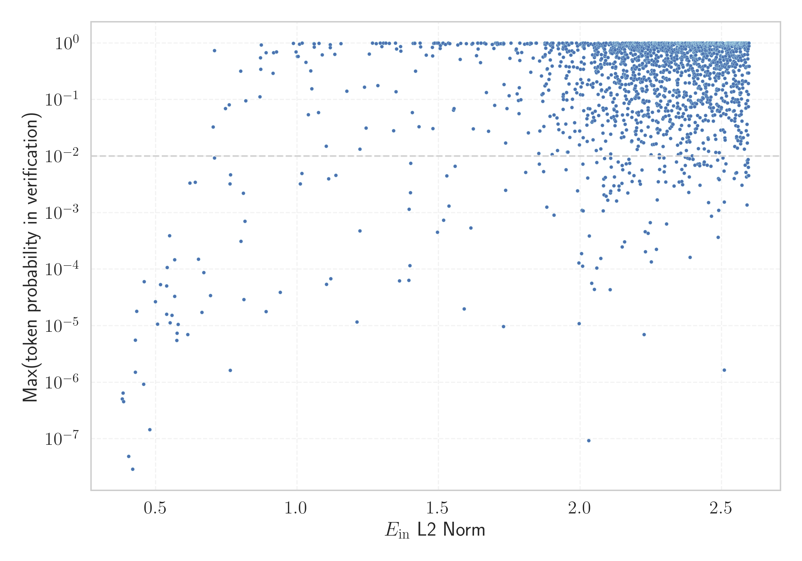

# Report for `deepseek-ai/deepseek-llm-7b-base`

## Model info

* Model Info: 
  * Tied embeddings: False
  * LM head uses bias: False
  * Embeddings shape: [102400, 4096]
* Tokenizer Info: 
  * Vocab Size: 100015
  * Tokenizer Class: LlamaTokenizerFast
  * Tokenizer Type: BPE
  * Bytes handling: Byte Input
  * Token for verification prompt building: IllegalArgumentException
  * Token id for verification prompt building: 91253
* Indicator summary: 
  * Indicator for under-trained tokens: E_{in} L2 Norm
  * Overall distribution: 7.806 +/- 2.234
* Detected Token Counts: 
  * Number of tested under-trained tokens: 1989, 1989 non-special, 188 below p = 0.01 threshold, 35 below soft indicator threshold
  * Number of single byte tokens: 256, of which 0 below indicator threshold
  * Number of special tokens: 32, of which 20 below indicator threshold
  * Number of non-single-byte unreachable tokens: 32, of which 20 below indicator threshold
  * Number of non-single-byte UTF-fragment tokens:  438, of which 0 below soft indicator threshold

## Under-trained token indicators plot


## Verification plot


## Under-trained token verification results
35 entries below threshold of 0.747

|   token_id | token                           |   indicator | max_prob                                                         | in_other_tokens                |
|------------|---------------------------------|-------------|------------------------------------------------------------------|--------------------------------|
|      63291 | ````` IconSuccessEncoded `````  |    0.382773 | <span style='border: 1px solid rgb(169, 68, 66);'>5.1e-07</span> |                                |
|      40482 | ````` IconErrorEncoded `````    |    0.385301 | <span style='border: 1px solid rgb(169, 68, 66);'>6.5e-07</span> |                                |
|      98098 | ````` ="../../../../..">< ````` |    0.387206 | <span style='border: 1px solid rgb(169, 68, 66);'>4.6e-07</span> |                                |
|      28490 | ````` ▁allClassesLink `````     |    0.40505  | <span style='border: 1px solid rgb(169, 68, 66);'>4.9e-08</span> |                                |
|      87662 | ````` 日内与新浪看点 `````      |    0.41934  | <span style='border: 1px solid rgb(169, 68, 66);'>2.9e-08</span> | ````` 日内与新浪看点联系 ````` |
|      38174 | ````` ExternalTaskPojo `````    |    0.428349 | <span style='border: 1px solid rgb(169, 68, 66);'>5.6e-06</span> |                                |
|      33658 | ````` Irefn `````               |    0.428604 | <span style='border: 1px solid rgb(169, 68, 66);'>1.5e-06</span> |                                |
|      74777 | ````` orangehilldev `````       |    0.433392 | <span style='border: 1px solid rgb(169, 68, 66);'>1.8e-05</span> |                                |
|      57926 | ````` navBarCell `````          |    0.457772 | <span style='border: 1px solid rgb(169, 68, 66);'>9.2e-07</span> |                                |
|      89626 | ````` memSeparator `````        |    0.460094 | <span style='border: 1px solid rgb(169, 68, 66);'>6e-05</span>   |                                |
|      86289 | ````` typeNameLink `````        |    0.479241 | <span style='border: 1px solid rgb(169, 68, 66);'>1.5e-07</span> |                                |
|      84162 | ````` OnSearchSelect `````      |    0.499495 | <span style='border: 1px solid rgb(169, 68, 66);'>2.7e-05</span> |                                |
|      84716 | ````` ▁cachedSer `````          |    0.506926 | <span style='border: 1px solid rgb(169, 68, 66);'>1.1e-05</span> |                                |
|      97018 | ````` Supamiu `````             |    0.517917 | <span style='border: 1px solid rgb(169, 68, 66);'>5.4e-05</span> |                                |
|      95833 | ````` textquoted `````          |    0.538835 | <span style='border: 1px solid rgb(169, 68, 66);'>5.1e-05</span> | ````` textquotedbl `````       |
|      84405 | ````` RecordedVote `````        |    0.539423 | <span style='border: 1px solid rgb(169, 68, 66);'>1.6e-05</span> |                                |
|      91575 | ````` sourceLineNo `````        |    0.541183 | <span style='border: 1px solid rgb(169, 68, 66);'>0.00011</span> |                                |
|      74713 | ````` photonui `````            |    0.54943  | <span style='border: 1px solid rgb(169, 68, 66);'>0.00039</span> |                                |
|      83041 | ````` sympad `````              |    0.551428 | <span style='border: 1px solid rgb(169, 68, 66);'>1.1e-05</span> |                                |
|      91619 | ````` >?[< `````                |    0.558522 | <span style='border: 1px solid rgb(169, 68, 66);'>1.5e-05</span> |                                |
<details><summary>15 additional entries below threshold</summary>

|   token_id | token                                 |   indicator | max_prob                                                         | in_other_tokens                                                                                                                                                     |
|------------|---------------------------------------|-------------|------------------------------------------------------------------|---------------------------------------------------------------------------------------------------------------------------------------------------------------------|
|      89054 | ````` TableHeadingColor `````         |    0.567454 | <span style='border: 1px solid rgb(169, 68, 66);'>3.3e-05</span> |                                                                                                                                                                     |
|      20947 | ````` NavBarCell `````                |    0.567705 | <span style='border: 1px solid rgb(169, 68, 66);'>0.00015</span> |                                                                                                                                                                     |
|      87661 | ````` 不代表新浪看点 `````            |    0.574607 | <span style='border: 1px solid rgb(169, 68, 66);'>5.5e-06</span> | ````` 不代表新浪看点观点或立场 `````                                                                                                                                |
|      59602 | ````` linkedExternalProjectPath ````` |    0.575792 | <span style='border: 1px solid rgb(169, 68, 66);'>7.4e-06</span> |                                                                                                                                                                     |
|      45729 | ````` memberNameLink `````            |    0.579795 | <span style='border: 1px solid rgb(169, 68, 66);'>1.1e-05</span> |                                                                                                                                                                     |
|      91136 | ````` controlcap `````                |    0.614215 | <span style='border: 1px solid rgb(169, 68, 66);'>7e-06</span>   |                                                                                                                                                                     |
|      24861 | ````` numerusform `````               |    0.621413 | <span style='border: 1px solid rgb(255, 145, 0);'>0.0034</span>  |                                                                                                                                                                     |
|      73735 | ````` ▁FASTFORMAT `````               |    0.639774 | <span style='border: 1px solid rgb(255, 145, 0);'>0.0034</span>  |                                                                                                                                                                     |
|      16238 | ````` кедония `````                   |    0.651205 | <span style='border: 1px solid rgb(169, 68, 66);'>0.00015</span> | ````` Македония `````, ````` ▁Македония `````                                                                                                                       |
|      27151 | ````` NavBarFont `````                |    0.663439 | <span style='border: 1px solid rgb(169, 68, 66);'>1.7e-05</span> |                                                                                                                                                                     |
|      59389 | ````` linkedExternal `````            |    0.670679 | <span style='border: 1px solid rgb(169, 68, 66);'>8.8e-05</span> | <span style='border: 1px solid rgb(169, 68, 66);'>````` linkedExternalProjectPath `````</span>                                                                      |
|      92850 | ````` typeNameLabel `````             |    0.694419 | <span style='border: 1px solid rgb(169, 68, 66);'>3.4e-05</span> |                                                                                                                                                                     |
|      50113 | ````` memItem `````                   |    0.703438 | <span style='border: 1px solid rgb(251, 189, 8);'>0.033</span>   | <span style='border: 1px solid rgb(251, 189, 8);'>````` memItemRight `````</span>, <span style='border: 1px solid rgb(40, 167, 69);'>````` memItemLeft `````</span> |
|      84002 | ````` ▁sideWeight `````               |    0.708181 | <span style='border: 1px solid rgb(255, 145, 0);'>0.0093</span>  |                                                                                                                                                                     |
|      58228 | ````` mcitedefault `````              |    0.708291 | <span style='border: 1px solid rgb(40, 167, 69);'>0.73</span>    |                                                                                                                                                                     |
</details>


## Tokens with partial UTF-8 sequences
0 entries below threshold of 0.747


## Byte tokens
0 entries below threshold of 2.094


## Special tokens
0 entries below threshold of 2.094


## Unreachable tokens
20 entries below threshold of 2.094

|   token_id | token          |   indicator | reencoded                                       |
|------------|----------------|-------------|-------------------------------------------------|
|      31186 | ````` üí ````` |    0.378716 | 100014: ````` <0xFC> `````, 656: ````` í `````  |
|      12759 | ````` À `````  |    0.379206 | 100010: ````` <0xC0> `````                      |
|      15776 | ````` üè ````` |    0.379848 | 100014: ````` <0xFC> `````, 724: ````` è `````  |
|      60840 | ````` ▁þ ````` |    0.381237 | 207: ````` ▁ `````, 100013: ````` <0xFE> `````  |
|      27924 | ````` ▁Á ````` |    0.381719 | 207: ````` ▁ `````, 100012: ````` <0xC1> `````  |
|       1612 | ````` ú `````  |    0.382445 | 100004: ````` <0xFA> `````                      |
|       2874 | ````` ü `````  |    0.382668 | 100014: ````` <0xFC> `````                      |
|      53854 | ````` ▁ü ````` |    0.383943 | 207: ````` ▁ `````, 100014: ````` <0xFC> `````  |
|      15302 | ````` ▁À ````` |    0.38398  | 207: ````` ▁ `````, 100010: ````` <0xC0> `````  |
|       6496 | ````` ▁ú ````` |    0.38436  | 207: ````` ▁ `````, 100004: ````` <0xFA> `````  |
|       7962 | ````` ö `````  |    0.384982 | 100003: ````` <0xF6> `````                      |
|      52272 | ````` ù `````  |    0.385515 | 100011: ````` <0xF9> `````                      |
|      77883 | ````` çõ ````` |    0.38559  | 1337: ````` ç `````, 100006: ````` <0xF5> ````` |
|       5021 | ````` ý `````  |    0.385652 | 100009: ````` <0xFD> `````                      |
|      25486 | ````` ø `````  |    0.385729 | 100002: ````` <0xF8> `````                      |
|      45981 | ````` õ `````  |    0.386459 | 100006: ````` <0xF5> `````                      |
|      84896 | ````` þ `````  |    0.38653  | 100013: ````` <0xFE> `````                      |
|      95036 | ````` ▁ö ````` |    0.390291 | 207: ````` ▁ `````, 100003: ````` <0xF6> `````  |
|      56124 | ````` û `````  |    0.395772 | 100008: ````` <0xFB> `````                      |
|      48308 | ````` Á `````  |    0.39792  | 100012: ````` <0xC1> `````                      |

