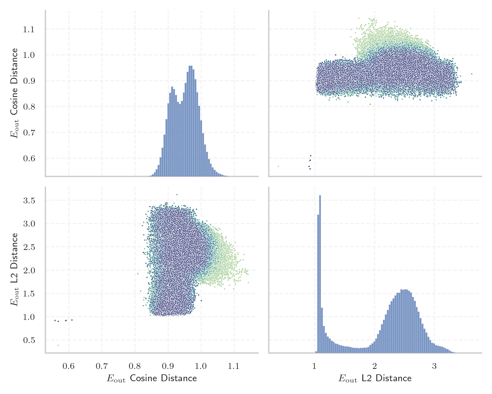
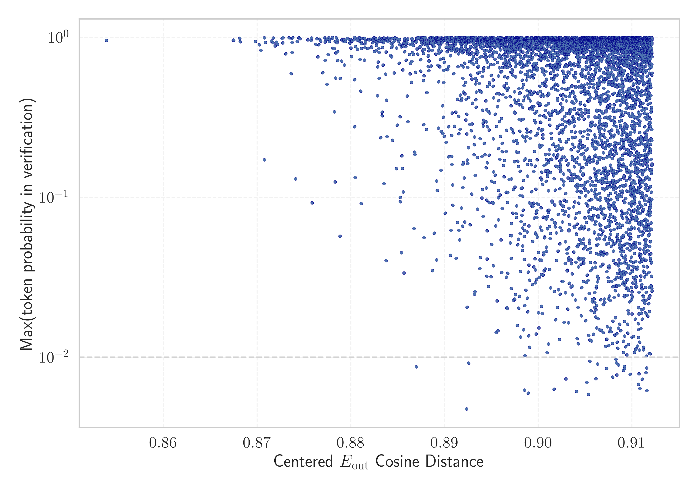

# Report for `facebook/xglm-7.5B`

## Model info

* Tied embeddings: yes
* LM head uses bias: no
* Indicator for under-trained tokens: Centered E_{out} Cosine Distance
  * Overall distribution 0.991 +/- 0.041
  * Token used for verification prompt building: `习近平新时代中国特色社会主义思想`
  * Verification threshold: 0.912
  * Threshold for showing candidate under-trained tokens: 0.872
  * Median verified threshold (for bytes, unreachable and special tokens): 0.908
* Embeddings shape: (256008, 4096)
* Vocabulary size: 256008
  * Number of single byte tokens: 94, of which 0 below indicator threshold
  * Number of special tokens: 11, of which 8 below indicator threshold
  * Number of non-single-byte unreachable tokens: 20, of which 1 below indicator threshold
  * Number of tested under-trained tokens: 5120, 5120 non-special, 30 below p = 0.01 threshold, 11 below soft indicator threshold

## Under-trained token indicators plot


## Verification plot


## Under-trained token verification results
11 entries below threshold of 0.872

|   token_id | token                |   indicator | max_prob                                                      | in_other_tokens                                                                                                                                                                                                                                                          |
|------------|----------------------|-------------|---------------------------------------------------------------|--------------------------------------------------------------------------------------------------------------------------------------------------------------------------------------------------------------------------------------------------------------------------|
|     163701 | ````` കാരം `````       |    0.85393  | <span style='border: 1px solid rgb(40, 167, 69);'>0.96</span> | ````` ▁പ്രകാരം `````, <span style='border: 1px solid rgb(40, 167, 69);'>````` പ്രകാരം `````</span>                                                                                                                                                                             |
|      75584 | ````` തിന് `````       |    0.867442 | <span style='border: 1px solid rgb(40, 167, 69);'>0.96</span> | <span style='border: 1px solid rgb(40, 167, 69);'>````` തിന്റെ `````</span>, ````` ▁അതിന്റെ `````, <span style='border: 1px solid rgb(40, 167, 69);'>````` ുന്നതിന് `````</span>, <span style='border: 1px solid rgb(40, 167, 69);'>````` ▁അതിന് `````</span>, ````` നത്തിന് `````, ... |
|      25429 | ````` ▁ਸਿ `````       |    0.867496 | <span style='border: 1px solid rgb(40, 167, 69);'>0.96</span> | ````` ▁ਸਿੱਖ `````, ````` ▁ਸਿਰ `````, ````` ▁ਸਿੱਧੂ `````, ````` ▁ਸਿੱਖਿਆ `````                                                                                                                                                                                                      |
|      27370 | ````` ▁ਪਾ `````       |    0.868156 | <span style='border: 1px solid rgb(40, 167, 69);'>0.99</span> | ````` ▁ਪਾਰਟੀ `````, ````` ▁ਪਾਕਿਸਤਾਨ `````, ````` ▁ਪਾਣੀ `````, ````` ▁ਪਾਰ `````                                                                                                                                                                                                   |
|      23849 | ````` ಂತ `````        |    0.868201 | <span style='border: 1px solid rgb(40, 167, 69);'>0.94</span> | ````` ▁ಅಂತ `````, ````` ▁ನಂತರ `````, <span style='border: 1px solid rgb(40, 167, 69);'>````` ಾಂತ `````</span>, ````` ುವಂತೆ `````, ````` ▁ಮುಖ್ಯಮಂತ್ರಿ `````, ...                                                                                                                      |
|       6658 | ````` ությունը ````` |    0.869817 | <span style='border: 1px solid rgb(40, 167, 69);'>0.94</span> | ````` ▁կառավարությունը `````, ````` ողությունը `````                                                                                                                                                                                                                     |
|      59478 | ````` ખી `````        |    0.870221 | <span style='border: 1px solid rgb(40, 167, 69);'>0.9</span>  |                                                                                                                                                                                                                                                                          |
|      41741 | ````` ຸນ `````        |    0.870399 | <span style='border: 1px solid rgb(40, 167, 69);'>0.83</span> |                                                                                                                                                                                                                                                                          |
|      29545 | ````` ▁ვა `````      |    0.870765 | <span style='border: 1px solid rgb(40, 167, 69);'>1</span>    | <span style='border: 1px solid rgb(40, 167, 69);'>````` ▁ვარ `````</span>, ````` ▁ვარსკვლავ `````                                                                                                                                                                        |
|     151118 | ````` ▁мақала `````  |    0.870776 | <span style='border: 1px solid rgb(40, 167, 69);'>0.17</span> |                                                                                                                                                                                                                                                                          |
|      91780 | ````` ക്കുക `````      |    0.870876 | <span style='border: 1px solid rgb(40, 167, 69);'>0.93</span> | ````` ിക്കുകയും `````, <span style='border: 1px solid rgb(40, 167, 69);'>````` ക്കുകയും `````</span>, ````` ിരിക്കുകയാണ് `````, ````` ▁ഒഴിവാക്കുക `````, <span style='border: 1px solid rgb(40, 167, 69);'>````` ▁വാക്കുകള `````</span>                                                        |


## Byte tokens
0 entries below threshold of 0.908


## Special tokens
8 entries below threshold of 0.908

|   token_id | token                     |   indicator | max_prob                                                         |
|------------|---------------------------|-------------|------------------------------------------------------------------|
|     256002 | ````` <madeupword1> ````` |    0.572529 | <span style='border: 1px solid rgb(251, 189, 8);'>0.081</span>   |
|     256001 | ````` <madeupword0> ````` |    0.578516 | <span style='border: 1px solid rgb(251, 189, 8);'>0.05</span>    |
|     256006 | ````` <madeupword5> ````` |    0.581219 | <span style='border: 1px solid rgb(251, 189, 8);'>0.018</span>   |
|     256004 | ````` <madeupword3> ````` |    0.582823 | <span style='border: 1px solid rgb(251, 189, 8);'>0.066</span>   |
|     256007 | ````` <madeupword6> ````` |    0.598241 | <span style='border: 1px solid rgb(251, 189, 8);'>0.034</span>   |
|     256003 | ````` <madeupword2> ````` |    0.602746 | <span style='border: 1px solid rgb(251, 189, 8);'>0.021</span>   |
|     256005 | ````` <madeupword4> ````` |    0.620763 | <span style='border: 1px solid rgb(251, 189, 8);'>0.079</span>   |
|          1 | ````` <pad> `````         |    0.660042 | <span style='border: 1px solid rgb(169, 68, 66);'>1.3e-07</span> |


## Unreachable tokens
1 entries below threshold of 0.908

|   token_id | token            |   indicator | reencoded                               |
|------------|------------------|-------------|-----------------------------------------|
|     138892 | ````` ▁aje ````` |    0.904866 | 11: ````` ▁a `````, 302: ````` je ````` |

