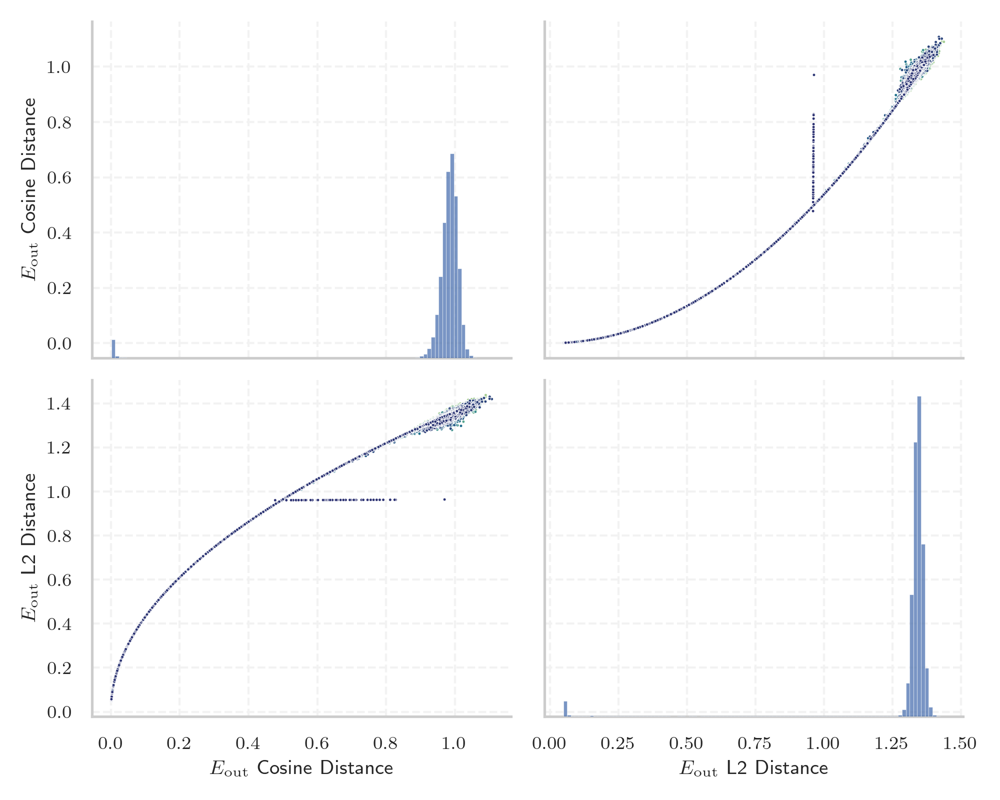
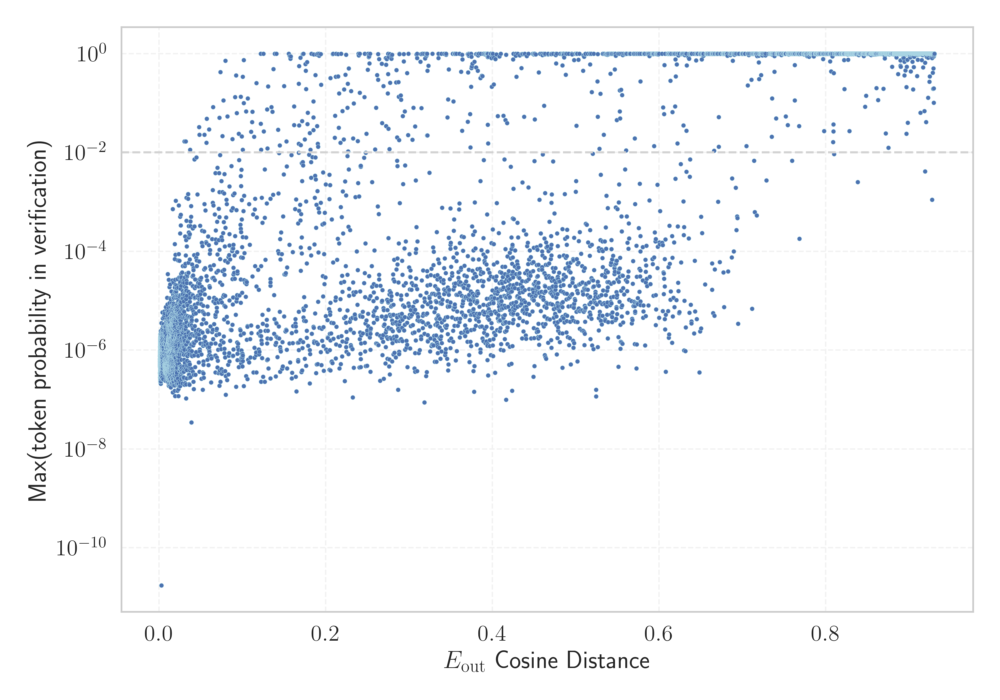

# Report for `google/gemma-3-12b-it`

## Model info

* Model Info: 
  * Tied embeddings: True
  * LM head uses bias: False
  * Embeddings shape: [262208, 3840]
* Tokenizer Info: 
  * Vocab Size: 262145
  * Tokenizer Class: GemmaTokenizer
  * Tokenizer Type: BPE
  * Bytes handling: Byte Fallback
  * Token for verification prompt building: ABCDEFGHIJKLMNOP
  * Token id for verification prompt building: 182338
* Indicator summary: 
  * Indicator for under-trained tokens: E_{out} Cosine Distance
  * Overall distribution: 0.957 +/- 0.157
* Detected Token Counts: 
  * Number of tested under-trained tokens: 13124, 6899 non-special, 1417 below p = 0.01 threshold, 1276 below soft indicator threshold
  * Number of single byte tokens: 365, of which 125 below indicator threshold
  * Number of special tokens: 4, of which 4 below indicator threshold
  * Number of non-single-byte unreachable tokens: 4, of which 4 below indicator threshold

## Under-trained token indicators plot


## Verification plot


## Under-trained token verification results
1276 entries below threshold of 0.104

|   token_id | token                        |   indicator | max_prob                                                         | in_other_tokens                                                                                                                                                 |
|------------|------------------------------|-------------|------------------------------------------------------------------|-----------------------------------------------------------------------------------------------------------------------------------------------------------------|
|     147981 | ````` ▁subTestPanorama ````` |  0.00145346 | <span style='border: 1px solid rgb(169, 68, 66);'>7.1e-07</span> |                                                                                                                                                                 |
|     158028 | ````` ▁CAdxRtList `````      |  0.00153649 | <span style='border: 1px solid rgb(169, 68, 66);'>5.9e-07</span> |                                                                                                                                                                 |
|      68512 | ````` IMQTTRVM `````         |  0.00154322 | <span style='border: 1px solid rgb(169, 68, 66);'>6e-07</span>   | <span style='border: 1px solid rgb(169, 68, 66);'>````` ▁HIMQTTRVM `````</span>, <span style='border: 1px solid rgb(169, 68, 66);'>````` HIMQTTRVM `````</span> |
|     181224 | ````` ▁jinfoHome `````       |  0.00158501 | <span style='border: 1px solid rgb(169, 68, 66);'>5.7e-07</span> |                                                                                                                                                                 |
|     179825 | ````` sorfinaly `````        |  0.0015884  | <span style='border: 1px solid rgb(169, 68, 66);'>7.9e-07</span> |                                                                                                                                                                 |
|     136915 | ````` tcpUniqueID `````      |  0.0015946  | <span style='border: 1px solid rgb(169, 68, 66);'>4.1e-07</span> |                                                                                                                                                                 |
|     214220 | ````` ▁mdlMeshVD `````       |  0.00162339 | <span style='border: 1px solid rgb(169, 68, 66);'>7.1e-07</span> |                                                                                                                                                                 |
|     147627 | ````` angoloTocco `````      |  0.00163376 | <span style='border: 1px solid rgb(169, 68, 66);'>5.5e-07</span> |                                                                                                                                                                 |
|     181225 | ````` ▁jinfoNext `````       |  0.00164324 | <span style='border: 1px solid rgb(169, 68, 66);'>7.8e-07</span> |                                                                                                                                                                 |
|     155266 | ````` squarePosVecchio ````` |  0.00165117 | <span style='border: 1px solid rgb(169, 68, 66);'>1e-06</span>   |                                                                                                                                                                 |
|     233661 | ````` ▁LGAGEmoji `````       |  0.00165415 | <span style='border: 1px solid rgb(169, 68, 66);'>9e-07</span>   |                                                                                                                                                                 |
|     156050 | ````` ▁addSBOM `````         |  0.0016548  | <span style='border: 1px solid rgb(169, 68, 66);'>5.6e-07</span> |                                                                                                                                                                 |
|      99144 | ````` AniPaf `````           |  0.00167173 | <span style='border: 1px solid rgb(169, 68, 66);'>8e-07</span>   | <span style='border: 1px solid rgb(169, 68, 66);'>````` TAniPaf `````</span>                                                                                    |
|     197415 | ````` totalBlockFit `````    |  0.00167263 | <span style='border: 1px solid rgb(169, 68, 66);'>3.1e-07</span> |                                                                                                                                                                 |
|     192703 | ````` CYCLONEDB `````        |  0.00167644 | <span style='border: 1px solid rgb(169, 68, 66);'>8.1e-07</span> |                                                                                                                                                                 |
|     197330 | ````` Uimcoords `````        |  0.00167692 | <span style='border: 1px solid rgb(169, 68, 66);'>1.3e-06</span> |                                                                                                                                                                 |
|     130893 | ````` blusasFem `````        |  0.00168455 | <span style='border: 1px solid rgb(169, 68, 66);'>9.4e-07</span> |                                                                                                                                                                 |
|     100251 | ````` ConsecHtIdx `````      |  0.00168729 | <span style='border: 1px solid rgb(169, 68, 66);'>7.7e-07</span> |                                                                                                                                                                 |
|     104044 | ````` ▁HIMQTTRVM `````       |  0.0016945  | <span style='border: 1px solid rgb(169, 68, 66);'>7.2e-07</span> |                                                                                                                                                                 |
|     185157 | ````` WithSizeInCM `````     |  0.00170124 | <span style='border: 1px solid rgb(169, 68, 66);'>9.1e-07</span> |                                                                                                                                                                 |
<details><summary>1256 additional entries below threshold</summary>

|   token_id | token                        |   indicator | max_prob                                                         | in_other_tokens                                                                                                                                                                                                                                                                                                                                                                                                            |
|------------|------------------------------|-------------|------------------------------------------------------------------|----------------------------------------------------------------------------------------------------------------------------------------------------------------------------------------------------------------------------------------------------------------------------------------------------------------------------------------------------------------------------------------------------------------------------|
|     177277 | ````` RetJpegLen `````       |  0.00170559 | <span style='border: 1px solid rgb(169, 68, 66);'>6.6e-07</span> | <span style='border: 1px solid rgb(169, 68, 66);'>````` dwRetJpegLen `````</span>                                                                                                                                                                                                                                                                                                                                          |
|     220140 | ````` WeakTableMutex `````   |  0.00170666 | <span style='border: 1px solid rgb(169, 68, 66);'>5.7e-07</span> |                                                                                                                                                                                                                                                                                                                                                                                                                            |
|     213598 | ````` ▁totalBlockUsedA ````` |  0.00176924 | <span style='border: 1px solid rgb(169, 68, 66);'>4.5e-07</span> |                                                                                                                                                                                                                                                                                                                                                                                                                            |
|     109526 | ````` ELEASESTR `````        |  0.00180876 | <span style='border: 1px solid rgb(169, 68, 66);'>1.1e-06</span> | <span style='border: 1px solid rgb(169, 68, 66);'>````` SAFERELEASESTR `````</span>                                                                                                                                                                                                                                                                                                                                        |
|     226709 | ````` SameWordInterval ````` |  0.00182068 | <span style='border: 1px solid rgb(169, 68, 66);'>1.5e-06</span> |                                                                                                                                                                                                                                                                                                                                                                                                                            |
|     152634 | ````` addKillPenalty `````   |  0.00182211 | <span style='border: 1px solid rgb(169, 68, 66);'>3.3e-07</span> |                                                                                                                                                                                                                                                                                                                                                                                                                            |
|     189817 | ````` ▁jaûnes `````          |  0.00183553 | <span style='border: 1px solid rgb(169, 68, 66);'>6.1e-07</span> |                                                                                                                                                                                                                                                                                                                                                                                                                            |
|     111881 | ````` GoSrvGroupIndex `````  |  0.00187004 | <span style='border: 1px solid rgb(169, 68, 66);'>4e-07</span>   | <span style='border: 1px solid rgb(169, 68, 66);'>````` ▁GoSrvGroupIndex `````</span>                                                                                                                                                                                                                                                                                                                                      |
|     177352 | ````` LuaToJavaResult `````  |  0.00187075 | <span style='border: 1px solid rgb(169, 68, 66);'>3.9e-07</span> |                                                                                                                                                                                                                                                                                                                                                                                                                            |
|     203239 | ````` localinstrList `````   |  0.00187212 | <span style='border: 1px solid rgb(169, 68, 66);'>1.8e-06</span> |                                                                                                                                                                                                                                                                                                                                                                                                                            |
|      58250 | ````` getstarcore `````      |  0.00187284 | <span style='border: 1px solid rgb(169, 68, 66);'>4.9e-07</span> | <span style='border: 1px solid rgb(169, 68, 66);'>````` getstarcoredata `````</span>                                                                                                                                                                                                                                                                                                                                       |
|     107794 | ````` ▁চিদাভ `````             |  0.00188822 | <span style='border: 1px solid rgb(169, 68, 66);'>3.5e-07</span> | <span style='border: 1px solid rgb(169, 68, 66);'>````` ▁চিদাভাস `````</span>, <span style='border: 1px solid rgb(169, 68, 66);'>````` ▁চিদাভাসের `````</span>                                                                                                                                                                                                                                                                    |
|     177351 | ````` DTMakeRectInCM `````   |  0.00189877 | <span style='border: 1px solid rgb(169, 68, 66);'>5.6e-07</span> |                                                                                                                                                                                                                                                                                                                                                                                                                            |
|      82427 | ````` PafHandle `````        |  0.00193268 | <span style='border: 1px solid rgb(169, 68, 66);'>5.5e-07</span> | <span style='border: 1px solid rgb(169, 68, 66);'>````` ▁PafHandle `````</span>                                                                                                                                                                                                                                                                                                                                            |
|     134994 | ````` jsbpmOb `````          |  0.00194931 | <span style='border: 1px solid rgb(169, 68, 66);'>5.5e-07</span> |                                                                                                                                                                                                                                                                                                                                                                                                                            |
|      98408 | ````` wiredElems `````       |  0.00195122 | <span style='border: 1px solid rgb(169, 68, 66);'>3.4e-07</span> |                                                                                                                                                                                                                                                                                                                                                                                                                            |
|     122782 | ````` ▁NewParaPkg `````      |  0.00195521 | <span style='border: 1px solid rgb(169, 68, 66);'>5.8e-07</span> |                                                                                                                                                                                                                                                                                                                                                                                                                            |
|     136932 | ````` qttrvm `````           |  0.0019573  | <span style='border: 1px solid rgb(169, 68, 66);'>7.4e-07</span> | <span style='border: 1px solid rgb(169, 68, 66);'>````` himqttrvm `````</span>                                                                                                                                                                                                                                                                                                                                             |
|     233586 | ````` StarBinBufBody `````   |  0.00197178 | <span style='border: 1px solid rgb(169, 68, 66);'>3.9e-07</span> |                                                                                                                                                                                                                                                                                                                                                                                                                            |
|     121238 | ````` HIMQTTRVM `````        |  0.00198787 | <span style='border: 1px solid rgb(169, 68, 66);'>1.2e-06</span> |                                                                                                                                                                                                                                                                                                                                                                                                                            |
|      81945 | ````` OrdinateTuple `````    |  0.00199723 | <span style='border: 1px solid rgb(169, 68, 66);'>8.8e-07</span> | <span style='border: 1px solid rgb(169, 68, 66);'>````` coOrdinateTuple `````</span>                                                                                                                                                                                                                                                                                                                                       |
|     222989 | ````` atthavidu `````        |  0.00202584 | <span style='border: 1px solid rgb(169, 68, 66);'>6.6e-07</span> |                                                                                                                                                                                                                                                                                                                                                                                                                            |
|     126009 | ````` ▁LuaToGoObject `````   |  0.00202858 | <span style='border: 1px solid rgb(169, 68, 66);'>1e-06</span>   |                                                                                                                                                                                                                                                                                                                                                                                                                            |
|     226594 | ````` SRPSrvGroup `````      |  0.00203681 | <span style='border: 1px solid rgb(169, 68, 66);'>4.3e-07</span> |                                                                                                                                                                                                                                                                                                                                                                                                                            |
|     202404 | ````` ▁ecoexpr `````         |  0.00204116 | <span style='border: 1px solid rgb(169, 68, 66);'>1.2e-06</span> |                                                                                                                                                                                                                                                                                                                                                                                                                            |
|     152630 | ````` KAKKIAINEN `````       |  0.00204986 | <span style='border: 1px solid rgb(169, 68, 66);'>8.4e-07</span> |                                                                                                                                                                                                                                                                                                                                                                                                                            |
|     215139 | ````` ▁బ్లావెట్\u200cస్కీ `````    |  0.00206453 | <span style='border: 1px solid rgb(169, 68, 66);'>7.6e-07</span> |                                                                                                                                                                                                                                                                                                                                                                                                                            |
|     193766 | ````` ▁DTMakeRect `````      |  0.0020678  | <span style='border: 1px solid rgb(169, 68, 66);'>1.8e-06</span> |                                                                                                                                                                                                                                                                                                                                                                                                                            |
|     215136 | ````` ▁atthakathac `````     |  0.00209618 | <span style='border: 1px solid rgb(169, 68, 66);'>8.2e-07</span> |                                                                                                                                                                                                                                                                                                                                                                                                                            |
|     133025 | ````` ▁SRPGoSetStr `````     |  0.00209844 | <span style='border: 1px solid rgb(169, 68, 66);'>6.2e-07</span> |                                                                                                                                                                                                                                                                                                                                                                                                                            |
|     207812 | ````` testGetPopup `````     |  0.00210357 | <span style='border: 1px solid rgb(169, 68, 66);'>9.5e-07</span> |                                                                                                                                                                                                                                                                                                                                                                                                                            |
|     173819 | ````` calcounterx `````      |  0.00210398 | <span style='border: 1px solid rgb(169, 68, 66);'>6.7e-07</span> |                                                                                                                                                                                                                                                                                                                                                                                                                            |
|     220172 | ````` ▁TermObjectDefer ````` |  0.00211185 | <span style='border: 1px solid rgb(169, 68, 66);'>1.1e-06</span> |                                                                                                                                                                                                                                                                                                                                                                                                                            |
|     119779 | ````` inertiaSeq `````       |  0.00212836 | <span style='border: 1px solid rgb(169, 68, 66);'>6.4e-07</span> |                                                                                                                                                                                                                                                                                                                                                                                                                            |
|     165131 | ````` TAniPaf `````          |  0.00214785 | <span style='border: 1px solid rgb(169, 68, 66);'>4.1e-07</span> |                                                                                                                                                                                                                                                                                                                                                                                                                            |
|     207786 | ````` వెట్\u200cస్కీ `````       |  0.0021714  | <span style='border: 1px solid rgb(169, 68, 66);'>3.9e-07</span> | <span style='border: 1px solid rgb(169, 68, 66);'>````` ▁బ్లావెట్\u200cస్కీ `````</span>                                                                                                                                                                                                                                                                                                                                         |
|     226562 | ````` grafoExiste `````      |  0.00217563 | <span style='border: 1px solid rgb(169, 68, 66);'>4.4e-07</span> |                                                                                                                                                                                                                                                                                                                                                                                                                            |
|     233656 | ````` VSLUATYPE `````        |  0.0022012  | <span style='border: 1px solid rgb(169, 68, 66);'>3e-07</span>   |                                                                                                                                                                                                                                                                                                                                                                                                                            |
|      79715 | ````` SRPInterfaceItem ````` |  0.00220835 | <span style='border: 1px solid rgb(169, 68, 66);'>3e-07</span>   |                                                                                                                                                                                                                                                                                                                                                                                                                            |
|     170333 | ````` StarObjectBody `````   |  0.00221711 | <span style='border: 1px solid rgb(169, 68, 66);'>8.3e-07</span> |                                                                                                                                                                                                                                                                                                                                                                                                                            |
|     167051 | ````` ▁GoObjectTo `````      |  0.0022229  | <span style='border: 1px solid rgb(169, 68, 66);'>5.4e-07</span> |                                                                                                                                                                                                                                                                                                                                                                                                                            |
|     207916 | ````` ▁morphOutputComp ````` |  0.00222671 | <span style='border: 1px solid rgb(169, 68, 66);'>6.7e-07</span> |                                                                                                                                                                                                                                                                                                                                                                                                                            |
|     213596 | ````` ▁oLetterLocation ````` |  0.00222945 | <span style='border: 1px solid rgb(169, 68, 66);'>4e-07</span>   |                                                                                                                                                                                                                                                                                                                                                                                                                            |
|     130892 | ````` ecoexpr `````          |  0.00224996 | <span style='border: 1px solid rgb(169, 68, 66);'>5.4e-07</span> | <span style='border: 1px solid rgb(169, 68, 66);'>````` ▁ecoexpr `````</span>                                                                                                                                                                                                                                                                                                                                              |
|     172139 | ````` ▁PafHandle `````       |  0.00225335 | <span style='border: 1px solid rgb(169, 68, 66);'>1.7e-06</span> |                                                                                                                                                                                                                                                                                                                                                                                                                            |
|      87695 | ````` intFragmentation ````` |  0.00228411 | <span style='border: 1px solid rgb(169, 68, 66);'>8.6e-07</span> |                                                                                                                                                                                                                                                                                                                                                                                                                            |
|     155281 | ````` addKillBonus `````     |  0.00228947 | <span style='border: 1px solid rgb(169, 68, 66);'>6.3e-07</span> |                                                                                                                                                                                                                                                                                                                                                                                                                            |
|      72528 | ````` ▁SRPGoGet `````        |  0.00230074 | <span style='border: 1px solid rgb(169, 68, 66);'>5.1e-07</span> | <span style='border: 1px solid rgb(169, 68, 66);'>````` ▁SRPGoGetStr `````</span>                                                                                                                                                                                                                                                                                                                                          |
|     127204 | ````` ▁addConfigureArg ````` |  0.00232297 | <span style='border: 1px solid rgb(169, 68, 66);'>1.1e-06</span> |                                                                                                                                                                                                                                                                                                                                                                                                                            |
|      72952 | ````` SrvGroupIndex `````    |  0.00233305 | <span style='border: 1px solid rgb(169, 68, 66);'>3e-07</span>   | <span style='border: 1px solid rgb(169, 68, 66);'>````` GoSrvGroupIndex `````</span>, <span style='border: 1px solid rgb(169, 68, 66);'>````` ▁GoSrvGroupIndex `````</span>                                                                                                                                                                                                                                                |
|     168551 | ````` ▁ArchersUnit `````     |  0.00234044 | <span style='border: 1px solid rgb(169, 68, 66);'>1.3e-06</span> |                                                                                                                                                                                                                                                                                                                                                                                                                            |
|     100241 | ````` RefInSrvGroup `````    |  0.0023582  | <span style='border: 1px solid rgb(169, 68, 66);'>6.8e-07</span> |                                                                                                                                                                                                                                                                                                                                                                                                                            |
|     198456 | ````` checkkatore `````      |  0.00236189 | <span style='border: 1px solid rgb(169, 68, 66);'>1e-06</span>   |                                                                                                                                                                                                                                                                                                                                                                                                                            |
|     203204 | ````` StarServiceBody `````  |  0.00236279 | <span style='border: 1px solid rgb(169, 68, 66);'>4.7e-07</span> |                                                                                                                                                                                                                                                                                                                                                                                                                            |
|     234024 | ````` ▁lifeGuy `````         |  0.00237566 | <span style='border: 1px solid rgb(169, 68, 66);'>6.1e-07</span> |                                                                                                                                                                                                                                                                                                                                                                                                                            |
|     226697 | ````` capturecpu `````       |  0.00239307 | <span style='border: 1px solid rgb(169, 68, 66);'>7.7e-07</span> |                                                                                                                                                                                                                                                                                                                                                                                                                            |
|     127633 | ````` ▁GoSrvGroupIndex ````` |  0.00239509 | <span style='border: 1px solid rgb(169, 68, 66);'>5.2e-07</span> |                                                                                                                                                                                                                                                                                                                                                                                                                            |
|     113064 | ````` StarSXmlBody `````     |  0.00241375 | <span style='border: 1px solid rgb(169, 68, 66);'>6e-07</span>   |                                                                                                                                                                                                                                                                                                                                                                                                                            |
|     113569 | ````` PAFStruct `````        |  0.00243175 | <span style='border: 1px solid rgb(169, 68, 66);'>1.3e-06</span> |                                                                                                                                                                                                                                                                                                                                                                                                                            |
|     202283 | ````` faulseAns `````        |  0.00243753 | <span style='border: 1px solid rgb(169, 68, 66);'>9.6e-07</span> |                                                                                                                                                                                                                                                                                                                                                                                                                            |
|      56818 | ````` FcmPhp `````           |  0.00245535 | <span style='border: 1px solid rgb(169, 68, 66);'>4.9e-07</span> |                                                                                                                                                                                                                                                                                                                                                                                                                            |
|     183864 | ````` partialowner `````     |  0.00251144 | <span style='border: 1px solid rgb(169, 68, 66);'>6.2e-07</span> |                                                                                                                                                                                                                                                                                                                                                                                                                            |
|     188005 | ````` CBCPksc `````          |  0.00251168 | <span style='border: 1px solid rgb(169, 68, 66);'>2e-06</span>   |                                                                                                                                                                                                                                                                                                                                                                                                                            |
|     162004 | ````` ▁.+"]), `````          |  0.00251597 | <span style='border: 1px solid rgb(169, 68, 66);'>4.8e-07</span> |                                                                                                                                                                                                                                                                                                                                                                                                                            |
|     175762 | ````` AllFilesInMkvDir ````` |  0.00252336 | <span style='border: 1px solid rgb(169, 68, 66);'>1e-06</span>   |                                                                                                                                                                                                                                                                                                                                                                                                                            |
|     131116 | ````` ▁StarSXmlClass `````   |  0.00252807 | <span style='border: 1px solid rgb(169, 68, 66);'>1.5e-06</span> |                                                                                                                                                                                                                                                                                                                                                                                                                            |
|     163811 | ````` ▁LuaToJavaResult ````` |  0.00253075 | <span style='border: 1px solid rgb(169, 68, 66);'>1.5e-06</span> |                                                                                                                                                                                                                                                                                                                                                                                                                            |
|     226620 | ````` StructOfObject `````   |  0.00253302 | <span style='border: 1px solid rgb(169, 68, 66);'>5.8e-07</span> |                                                                                                                                                                                                                                                                                                                                                                                                                            |
|     192611 | ````` ▁coiAlarm `````        |  0.00258505 | <span style='border: 1px solid rgb(169, 68, 66);'>1.3e-06</span> |                                                                                                                                                                                                                                                                                                                                                                                                                            |
|     188051 | ````` salexpr `````          |  0.00260311 | <span style='border: 1px solid rgb(169, 68, 66);'>9.1e-07</span> |                                                                                                                                                                                                                                                                                                                                                                                                                            |
|      91072 | ````` timePlusEvents `````   |  0.00261396 | <span style='border: 1px solid rgb(169, 68, 66);'>6.2e-07</span> |                                                                                                                                                                                                                                                                                                                                                                                                                            |
|      60834 | ````` ▁MBine `````           |  0.00263584 | <span style='border: 1px solid rgb(169, 68, 66);'>3.7e-07</span> |                                                                                                                                                                                                                                                                                                                                                                                                                            |
|     198419 | ````` GoObjectAllRef `````   |  0.00264305 | <span style='border: 1px solid rgb(169, 68, 66);'>4.1e-07</span> |                                                                                                                                                                                                                                                                                                                                                                                                                            |
|      85000 | ````` opssynth `````         |  0.00264788 | <span style='border: 1px solid rgb(169, 68, 66);'>4.1e-07</span> | <span style='border: 1px solid rgb(169, 68, 66);'>````` kitopssynth `````</span>                                                                                                                                                                                                                                                                                                                                           |
|     173738 | ````` GetParaPkg `````       |  0.00266135 | <span style='border: 1px solid rgb(169, 68, 66);'>4.9e-07</span> |                                                                                                                                                                                                                                                                                                                                                                                                                            |
|     125948 | ````` ▁StarSXml `````        |  0.00268614 | <span style='border: 1px solid rgb(169, 68, 66);'>1.1e-06</span> | <span style='border: 1px solid rgb(169, 68, 66);'>````` ▁StarSXmlClass `````</span>                                                                                                                                                                                                                                                                                                                                        |
|     226597 | ````` ▁FuncParamNum `````    |  0.00272942 | <span style='border: 1px solid rgb(169, 68, 66);'>1.2e-06</span> |                                                                                                                                                                                                                                                                                                                                                                                                                            |
|     131144 | ````` ▁GoRawContext `````    |  0.00273103 | <span style='border: 1px solid rgb(169, 68, 66);'>6.2e-07</span> |                                                                                                                                                                                                                                                                                                                                                                                                                            |
|     121223 | ````` SRPCoreShell `````     |  0.00276971 | <span style='border: 1px solid rgb(169, 68, 66);'>1.3e-06</span> |                                                                                                                                                                                                                                                                                                                                                                                                                            |
|      52175 | ````` bekoru `````           |  0.0027808  | <span style='border: 1px solid rgb(169, 68, 66);'>4.9e-07</span> |                                                                                                                                                                                                                                                                                                                                                                                                                            |
|     226706 | ````` yshException `````     |  0.00279021 | <span style='border: 1px solid rgb(169, 68, 66);'>6.4e-07</span> |                                                                                                                                                                                                                                                                                                                                                                                                                            |
|     226563 | ````` dwRetJpegLen `````     |  0.00279707 | <span style='border: 1px solid rgb(169, 68, 66);'>1.2e-06</span> |                                                                                                                                                                                                                                                                                                                                                                                                                            |
|      80222 | ````` GoPrintError `````     |  0.00280082 | <span style='border: 1px solid rgb(169, 68, 66);'>8.7e-07</span> |                                                                                                                                                                                                                                                                                                                                                                                                                            |
|      84352 | ````` coOrdinateTuple `````  |  0.0028013  | <span style='border: 1px solid rgb(169, 68, 66);'>6.4e-07</span> |                                                                                                                                                                                                                                                                                                                                                                                                                            |
|     173792 | ````` loginMessageNow `````  |  0.00283545 | <span style='border: 1px solid rgb(169, 68, 66);'>1e-06</span>   |                                                                                                                                                                                                                                                                                                                                                                                                                            |
|     208718 | ````` himqttrvm `````        |  0.00285447 | <span style='border: 1px solid rgb(169, 68, 66);'>1.8e-06</span> |                                                                                                                                                                                                                                                                                                                                                                                                                            |
|     179779 | ````` gdockdict `````        |  0.00285506 | <span style='border: 1px solid rgb(169, 68, 66);'>3.6e-07</span> |                                                                                                                                                                                                                                                                                                                                                                                                                            |
|     145613 | ````` ▁RUTAREL `````         |  0.00285548 | <span style='border: 1px solid rgb(169, 68, 66);'>1e-06</span>   | <span style='border: 1px solid rgb(169, 68, 66);'>````` ▁RUTARELATIV `````</span>                                                                                                                                                                                                                                                                                                                                          |
|      80797 | ````` ▁SRPGoGetStr `````     |  0.00288278 | <span style='border: 1px solid rgb(169, 68, 66);'>4.4e-07</span> |                                                                                                                                                                                                                                                                                                                                                                                                                            |
|     214244 | ````` mBlitzID `````         |  0.002895   | <span style='border: 1px solid rgb(169, 68, 66);'>1.2e-06</span> |                                                                                                                                                                                                                                                                                                                                                                                                                            |
|     152627 | ````` KAKKIA `````           |  0.00294149 | <span style='border: 1px solid rgb(169, 68, 66);'>5.4e-07</span> | <span style='border: 1px solid rgb(169, 68, 66);'>````` KAKKIAINEN `````</span>                                                                                                                                                                                                                                                                                                                                            |
|     173823 | ````` callowcounter `````    |  0.00297302 | <span style='border: 1px solid rgb(169, 68, 66);'>1e-06</span>   |                                                                                                                                                                                                                                                                                                                                                                                                                            |
|     116968 | ````` StarSrvGroupBody ````` |  0.00299174 | <span style='border: 1px solid rgb(169, 68, 66);'>5.4e-07</span> |                                                                                                                                                                                                                                                                                                                                                                                                                            |
|     208686 | ````` ▁RefToGoObject `````   |  0.00301462 | <span style='border: 1px solid rgb(169, 68, 66);'>5.9e-07</span> |                                                                                                                                                                                                                                                                                                                                                                                                                            |
|     156046 | ````` ▁totalBlockUsed `````  |  0.00303257 | <span style='border: 1px solid rgb(169, 68, 66);'>7.8e-07</span> | <span style='border: 1px solid rgb(169, 68, 66);'>````` ▁totalBlockUsedA `````</span>                                                                                                                                                                                                                                                                                                                                      |
|     202282 | ````` CImgBoard `````        |  0.00303942 | <span style='border: 1px solid rgb(169, 68, 66);'>8.3e-07</span> |                                                                                                                                                                                                                                                                                                                                                                                                                            |
|     137311 | ````` AWSJavaScript `````    |  0.00303996 | <span style='border: 1px solid rgb(169, 68, 66);'>6.6e-07</span> | ````` AWSJavaScriptSDK `````                                                                                                                                                                                                                                                                                                                                                                                               |
|     189179 | ````` ▁জ্ঞাতত্ব `````           |  0.00305718 | <span style='border: 1px solid rgb(169, 68, 66);'>7.1e-07</span> |                                                                                                                                                                                                                                                                                                                                                                                                                            |
|     178827 | ````` ▁atthudd `````         |  0.00307435 | <span style='border: 1px solid rgb(169, 68, 66);'>9.3e-07</span> |                                                                                                                                                                                                                                                                                                                                                                                                                            |
|     108356 | ````` TermObjectDefer `````  |  0.00310403 | <span style='border: 1px solid rgb(169, 68, 66);'>4.3e-07</span> | <span style='border: 1px solid rgb(169, 68, 66);'>````` ▁TermObjectDefer `````</span>                                                                                                                                                                                                                                                                                                                                      |
|     203195 | ````` ▁trrecl `````          |  0.0031172  | <span style='border: 1px solid rgb(169, 68, 66);'>6.3e-07</span> |                                                                                                                                                                                                                                                                                                                                                                                                                            |
|     109528 | ````` SAFERELEASESTR `````   |  0.00312269 | <span style='border: 1px solid rgb(169, 68, 66);'>7.1e-07</span> |                                                                                                                                                                                                                                                                                                                                                                                                                            |
|     173824 | ````` calleftcounter `````   |  0.00314099 | <span style='border: 1px solid rgb(169, 68, 66);'>1e-06</span>   |                                                                                                                                                                                                                                                                                                                                                                                                                            |
|      93804 | ````` SimulatorFlood `````   |  0.00314826 | <span style='border: 1px solid rgb(169, 68, 66);'>5.8e-07</span> |                                                                                                                                                                                                                                                                                                                                                                                                                            |
|     163861 | ````` HRMGMT `````           |  0.00316489 | <span style='border: 1px solid rgb(169, 68, 66);'>8.3e-07</span> |                                                                                                                                                                                                                                                                                                                                                                                                                            |
|     208662 | ````` StarParaPkgBody `````  |  0.00316721 | <span style='border: 1px solid rgb(169, 68, 66);'>5.7e-07</span> |                                                                                                                                                                                                                                                                                                                                                                                                                            |
|     214214 | ````` MeshVD `````           |  0.00321436 | <span style='border: 1px solid rgb(169, 68, 66);'>1.3e-06</span> | <span style='border: 1px solid rgb(169, 68, 66);'>````` ▁mdlMeshVD `````</span>                                                                                                                                                                                                                                                                                                                                            |
|     213650 | ````` ▁RUTARELATIV `````     |  0.00321472 | <span style='border: 1px solid rgb(169, 68, 66);'>1.1e-06</span> |                                                                                                                                                                                                                                                                                                                                                                                                                            |
|     167077 | ````` wavedeltatdouble ````` |  0.00325036 | <span style='border: 1px solid rgb(169, 68, 66);'>5.1e-07</span> |                                                                                                                                                                                                                                                                                                                                                                                                                            |
|     173825 | ````` calrightcounter `````  |  0.00326473 | <span style='border: 1px solid rgb(169, 68, 66);'>9e-07</span>   |                                                                                                                                                                                                                                                                                                                                                                                                                            |
|     175754 | ````` MkvDir `````           |  0.00330442 | <span style='border: 1px solid rgb(169, 68, 66);'>2.8e-07</span> | <span style='border: 1px solid rgb(169, 68, 66);'>````` AllFilesInMkvDir `````</span>                                                                                                                                                                                                                                                                                                                                      |
|     161728 | ````` ▁IHAOAVOA `````        |  0.00334692 | <span style='border: 1px solid rgb(169, 68, 66);'>1.4e-06</span> |                                                                                                                                                                                                                                                                                                                                                                                                                            |
|     130855 | ````` ▁CCBUNDLE `````        |  0.00334853 | <span style='border: 1px solid rgb(169, 68, 66);'>1.2e-06</span> |                                                                                                                                                                                                                                                                                                                                                                                                                            |
|      57098 | ````` WMNDA `````            |  0.00341451 | <span style='border: 1px solid rgb(169, 68, 66);'>3.4e-07</span> |                                                                                                                                                                                                                                                                                                                                                                                                                            |
|      92122 | ````` ▁subTestHDR `````      |  0.00345033 | <span style='border: 1px solid rgb(169, 68, 66);'>1.9e-06</span> |                                                                                                                                                                                                                                                                                                                                                                                                                            |
|      71180 | ````` ▁minGoto `````         |  0.00347942 | <span style='border: 1px solid rgb(169, 68, 66);'>8.7e-07</span> |                                                                                                                                                                                                                                                                                                                                                                                                                            |
|     226629 | ````` ▁cytyle `````          |  0.00350201 | <span style='border: 1px solid rgb(169, 68, 66);'>2.2e-06</span> |                                                                                                                                                                                                                                                                                                                                                                                                                            |
|     145692 | ````` tooltabname `````      |  0.00351322 | <span style='border: 1px solid rgb(169, 68, 66);'>6.2e-07</span> |                                                                                                                                                                                                                                                                                                                                                                                                                            |
|      58251 | ````` getstarcoredata `````  |  0.00352865 | <span style='border: 1px solid rgb(169, 68, 66);'>7e-07</span>   |                                                                                                                                                                                                                                                                                                                                                                                                                            |
|     226565 | ````` drawingCodehint `````  |  0.00356632 | <span style='border: 1px solid rgb(169, 68, 66);'>2.4e-06</span> |                                                                                                                                                                                                                                                                                                                                                                                                                            |
|      61251 | ````` SRPParaPkg `````       |  0.00360489 | <span style='border: 1px solid rgb(169, 68, 66);'>8.9e-07</span> |                                                                                                                                                                                                                                                                                                                                                                                                                            |
|     150625 | ````` DetailUIJob `````      |  0.00360858 | <span style='border: 1px solid rgb(169, 68, 66);'>7e-07</span>   | <span style='border: 1px solid rgb(169, 68, 66);'>````` DetailUIJobIcon `````</span>                                                                                                                                                                                                                                                                                                                                       |
|     215073 | ````` ய்யமணி `````             |  0.00360936 | <span style='border: 1px solid rgb(169, 68, 66);'>5.8e-07</span> | <span style='border: 1px solid rgb(169, 68, 66);'>````` ▁துய்யமணி `````</span>                                                                                                                                                                                                                                                                                                                                                |
|     173820 | ````` calcountery `````      |  0.00361395 | <span style='border: 1px solid rgb(169, 68, 66);'>1.1e-06</span> |                                                                                                                                                                                                                                                                                                                                                                                                                            |
|     208725 | ````` SwiftlyPlugin `````    |  0.00362664 | <span style='border: 1px solid rgb(169, 68, 66);'>3.7e-07</span> |                                                                                                                                                                                                                                                                                                                                                                                                                            |
|     184776 | ````` ▁jobSearchRepo `````   |  0.00365138 | <span style='border: 1px solid rgb(169, 68, 66);'>3.7e-07</span> |                                                                                                                                                                                                                                                                                                                                                                                                                            |
|      87045 | ````` methodict `````        |  0.00367415 | <span style='border: 1px solid rgb(169, 68, 66);'>2.8e-07</span> |                                                                                                                                                                                                                                                                                                                                                                                                                            |
|     169237 | ````` comstockmusic `````    |  0.00368077 | <span style='border: 1px solid rgb(169, 68, 66);'>5.2e-07</span> |                                                                                                                                                                                                                                                                                                                                                                                                                            |
|      95439 | ````` ▁gatiyam `````         |  0.00370455 | <span style='border: 1px solid rgb(169, 68, 66);'>2.8e-07</span> |                                                                                                                                                                                                                                                                                                                                                                                                                            |
|     173822 | ````` calupcounter `````     |  0.00370741 | <span style='border: 1px solid rgb(169, 68, 66);'>1.6e-06</span> |                                                                                                                                                                                                                                                                                                                                                                                                                            |
|     234038 | ````` nohVP `````            |  0.00371474 | <span style='border: 1px solid rgb(169, 68, 66);'>6.5e-07</span> |                                                                                                                                                                                                                                                                                                                                                                                                                            |
|     208094 | ````` GTBaseAlert `````      |  0.00371581 | <span style='border: 1px solid rgb(169, 68, 66);'>4.8e-07</span> |                                                                                                                                                                                                                                                                                                                                                                                                                            |
|     163851 | ````` DaysGE `````           |  0.00373268 | <span style='border: 1px solid rgb(169, 68, 66);'>1.9e-06</span> |                                                                                                                                                                                                                                                                                                                                                                                                                            |
|     207758 | ````` ineedfollower `````    |  0.00380957 | <span style='border: 1px solid rgb(169, 68, 66);'>6.4e-07</span> |                                                                                                                                                                                                                                                                                                                                                                                                                            |
|     118337 | ````` SCEcorr `````          |  0.00384408 | <span style='border: 1px solid rgb(169, 68, 66);'>4.9e-07</span> |                                                                                                                                                                                                                                                                                                                                                                                                                            |
|     132730 | ````` PRIMATEC `````         |  0.00385231 | <span style='border: 1px solid rgb(169, 68, 66);'>6.6e-07</span> |                                                                                                                                                                                                                                                                                                                                                                                                                            |
|      57309 | ````` GoRawContext `````     |  0.00385499 | <span style='border: 1px solid rgb(169, 68, 66);'>6.2e-07</span> | <span style='border: 1px solid rgb(169, 68, 66);'>````` ▁GoRawContext `````</span>                                                                                                                                                                                                                                                                                                                                         |
|     213759 | ````` dfsonic `````          |  0.00386906 | <span style='border: 1px solid rgb(169, 68, 66);'>8.5e-07</span> |                                                                                                                                                                                                                                                                                                                                                                                                                            |
|     160834 | ````` ▁FROMVS `````          |  0.00387168 | <span style='border: 1px solid rgb(169, 68, 66);'>4.7e-07</span> |                                                                                                                                                                                                                                                                                                                                                                                                                            |
|     140976 | ````` ▁SrvGroupClass `````   |  0.00387764 | <span style='border: 1px solid rgb(169, 68, 66);'>1e-06</span>   |                                                                                                                                                                                                                                                                                                                                                                                                                            |
|     141003 | ````` ▁GoSRP `````           |  0.0039404  | <span style='border: 1px solid rgb(169, 68, 66);'>5.2e-07</span> |                                                                                                                                                                                                                                                                                                                                                                                                                            |
|     222815 | ````` ▁SIINFEKLC `````       |  0.00396103 | <span style='border: 1px solid rgb(169, 68, 66);'>7e-07</span>   |                                                                                                                                                                                                                                                                                                                                                                                                                            |
|      77845 | ````` ▁checkHDROffsets ````` |  0.00396216 | <span style='border: 1px solid rgb(169, 68, 66);'>1.1e-06</span> |                                                                                                                                                                                                                                                                                                                                                                                                                            |
|     136946 | ````` MakeRectInCM `````     |  0.00396538 | <span style='border: 1px solid rgb(169, 68, 66);'>4.3e-07</span> | <span style='border: 1px solid rgb(169, 68, 66);'>````` DTMakeRectInCM `````</span>                                                                                                                                                                                                                                                                                                                                        |
|     220224 | ````` drawcounterx `````     |  0.00397319 | <span style='border: 1px solid rgb(169, 68, 66);'>4.3e-07</span> |                                                                                                                                                                                                                                                                                                                                                                                                                            |
|     143245 | ````` ▁RUTAREAL `````        |  0.00399768 | <span style='border: 1px solid rgb(169, 68, 66);'>2.3e-06</span> |                                                                                                                                                                                                                                                                                                                                                                                                                            |
|     183804 | ````` ▁शब्दलय `````           |  0.00409687 | <span style='border: 1px solid rgb(169, 68, 66);'>2e-06</span>   |                                                                                                                                                                                                                                                                                                                                                                                                                            |
|     189367 | ````` ▁waveformul `````      |  0.00410092 | <span style='border: 1px solid rgb(169, 68, 66);'>2.8e-06</span> |                                                                                                                                                                                                                                                                                                                                                                                                                            |
|     203148 | ````` LuaPushInt `````       |  0.00412339 | <span style='border: 1px solid rgb(169, 68, 66);'>2e-06</span>   |                                                                                                                                                                                                                                                                                                                                                                                                                            |
|     193747 | ````` ▁PQAry `````           |  0.00414884 | <span style='border: 1px solid rgb(169, 68, 66);'>5.8e-06</span> |                                                                                                                                                                                                                                                                                                                                                                                                                            |
|     106197 | ````` ▁SpringObjectID `````  |  0.00419104 | <span style='border: 1px solid rgb(169, 68, 66);'>4.8e-07</span> |                                                                                                                                                                                                                                                                                                                                                                                                                            |
|     202288 | ````` ▁processPerRow `````   |  0.00420487 | <span style='border: 1px solid rgb(169, 68, 66);'>2.6e-07</span> |                                                                                                                                                                                                                                                                                                                                                                                                                            |
|     222991 | ````` ▁hetukatt `````        |  0.00427121 | <span style='border: 1px solid rgb(169, 68, 66);'>5.9e-07</span> |                                                                                                                                                                                                                                                                                                                                                                                                                            |
|     107795 | ````` িয়েতনাম `````             |  0.00428885 | <span style='border: 1px solid rgb(169, 68, 66);'>5.3e-07</span> | <span style='border: 1px solid rgb(251, 189, 8);'>````` ভিয়েতনাম `````</span>, ````` ▁ভিয়েতনাম `````                                                                                                                                                                                                                                                                                                                             |
|     189181 | ````` atthakathayam `````    |  0.00430548 | <span style='border: 1px solid rgb(169, 68, 66);'>1.9e-06</span> |                                                                                                                                                                                                                                                                                                                                                                                                                            |
|     163698 | ````` ▁ODDSAR `````          |  0.00434715 | <span style='border: 1px solid rgb(169, 68, 66);'>1e-06</span>   |                                                                                                                                                                                                                                                                                                                                                                                                                            |
|      63618 | ````` StarSXml `````         |  0.00435191 | <span style='border: 1px solid rgb(169, 68, 66);'>1.9e-06</span> | <span style='border: 1px solid rgb(169, 68, 66);'>````` StarSXmlBody `````</span>, <span style='border: 1px solid rgb(169, 68, 66);'>````` ▁StarSXml `````</span>, <span style='border: 1px solid rgb(169, 68, 66);'>````` ▁StarSXmlClass `````</span>                                                                                                                                                                     |
|     226705 | ````` selectTableX `````     |  0.00435466 | <span style='border: 1px solid rgb(169, 68, 66);'>2.4e-06</span> |                                                                                                                                                                                                                                                                                                                                                                                                                            |
|     203213 | ````` tsrecl `````           |  0.00440192 | <span style='border: 1px solid rgb(169, 68, 66);'>3.3e-07</span> |                                                                                                                                                                                                                                                                                                                                                                                                                            |
|     181221 | ````` ▁diffplay `````        |  0.00442421 | <span style='border: 1px solid rgb(169, 68, 66);'>2.1e-06</span> |                                                                                                                                                                                                                                                                                                                                                                                                                            |
|     153345 | ````` ChooseServerGrid ````` |  0.00442457 | <span style='border: 1px solid rgb(169, 68, 66);'>1.4e-06</span> |                                                                                                                                                                                                                                                                                                                                                                                                                            |
|     214224 | ````` startZielPanel `````   |  0.00448066 | <span style='border: 1px solid rgb(169, 68, 66);'>6e-07</span>   |                                                                                                                                                                                                                                                                                                                                                                                                                            |
|     220247 | ````` selectTableY `````     |  0.00458384 | <span style='border: 1px solid rgb(169, 68, 66);'>1.5e-06</span> |                                                                                                                                                                                                                                                                                                                                                                                                                            |
|     170405 | ````` TrackTypeValue `````   |  0.00464624 | <span style='border: 1px solid rgb(169, 68, 66);'>1.7e-06</span> |                                                                                                                                                                                                                                                                                                                                                                                                                            |
|     207806 | ````` ▁nohVP `````           |  0.00464708 | <span style='border: 1px solid rgb(169, 68, 66);'>8.4e-07</span> |                                                                                                                                                                                                                                                                                                                                                                                                                            |
|     201084 | ````` ▁etthati `````         |  0.00465    | <span style='border: 1px solid rgb(169, 68, 66);'>4.8e-07</span> |                                                                                                                                                                                                                                                                                                                                                                                                                            |
|      68115 | ````` SRPBasic `````         |  0.00472152 | <span style='border: 1px solid rgb(169, 68, 66);'>3.7e-07</span> |                                                                                                                                                                                                                                                                                                                                                                                                                            |
|     183814 | ````` ▁dassanato `````       |  0.00473338 | <span style='border: 1px solid rgb(169, 68, 66);'>4.2e-07</span> |                                                                                                                                                                                                                                                                                                                                                                                                                            |
|     215082 | ````` ▁অচিতের `````            |  0.004785   | <span style='border: 1px solid rgb(169, 68, 66);'>2.6e-07</span> |                                                                                                                                                                                                                                                                                                                                                                                                                            |
|     178804 | ````` ▁evamadisu `````       |  0.0048098  | <span style='border: 1px solid rgb(169, 68, 66);'>3.1e-06</span> |                                                                                                                                                                                                                                                                                                                                                                                                                            |
|     153374 | ````` chccgi `````           |  0.00487328 | <span style='border: 1px solid rgb(169, 68, 66);'>2.5e-06</span> |                                                                                                                                                                                                                                                                                                                                                                                                                            |
|     231684 | ````` ▁vuccatiti `````       |  0.00489622 | <span style='border: 1px solid rgb(169, 68, 66);'>8.9e-07</span> |                                                                                                                                                                                                                                                                                                                                                                                                                            |
|     214127 | ````` MyShopname `````       |  0.00494456 | <span style='border: 1px solid rgb(169, 68, 66);'>8e-07</span>   |                                                                                                                                                                                                                                                                                                                                                                                                                            |
|     198420 | ````` ▁innerWallArray `````  |  0.00496352 | <span style='border: 1px solid rgb(169, 68, 66);'>1.1e-06</span> |                                                                                                                                                                                                                                                                                                                                                                                                                            |
|     156023 | ````` SHUNTLIST `````        |  0.00496411 | <span style='border: 1px solid rgb(169, 68, 66);'>1e-06</span>   |                                                                                                                                                                                                                                                                                                                                                                                                                            |
|     222934 | ````` ▁bhuvadigane `````     |  0.00501424 | <span style='border: 1px solid rgb(169, 68, 66);'>3.4e-06</span> |                                                                                                                                                                                                                                                                                                                                                                                                                            |
|     172165 | ````` DetailUIJobIcon `````  |  0.00514066 | <span style='border: 1px solid rgb(169, 68, 66);'>7.4e-07</span> |                                                                                                                                                                                                                                                                                                                                                                                                                            |
|     111857 | ````` PSeqlist `````         |  0.00514513 | <span style='border: 1px solid rgb(169, 68, 66);'>1.1e-06</span> |                                                                                                                                                                                                                                                                                                                                                                                                                            |
|     208700 | ````` ZielPanel `````        |  0.00517529 | <span style='border: 1px solid rgb(169, 68, 66);'>1.2e-06</span> | <span style='border: 1px solid rgb(169, 68, 66);'>````` startZielPanel `````</span>                                                                                                                                                                                                                                                                                                                                        |
|     192573 | ````` AileGauche `````       |  0.00520819 | <span style='border: 1px solid rgb(169, 68, 66);'>1.2e-06</span> |                                                                                                                                                                                                                                                                                                                                                                                                                            |
|     108595 | ````` isTrackCore `````      |  0.00538808 | <span style='border: 1px solid rgb(169, 68, 66);'>7.8e-07</span> | <span style='border: 1px solid rgb(255, 145, 0);'>````` SwisTrackCore `````</span>, <span style='border: 1px solid rgb(169, 68, 66);'>````` ▁mSwisTrackCore `````</span>                                                                                                                                                                                                                                                   |
|     150048 | ````` ▁SmartyLint `````      |  0.00540191 | <span style='border: 1px solid rgb(169, 68, 66);'>5.8e-07</span> |                                                                                                                                                                                                                                                                                                                                                                                                                            |
|      61095 | ````` arantadhatu `````      |  0.00544721 | <span style='border: 1px solid rgb(169, 68, 66);'>1.6e-06</span> | <span style='border: 1px solid rgb(169, 68, 66);'>````` akarantadhatu `````</span>                                                                                                                                                                                                                                                                                                                                         |
|     222344 | ````` ▁veronya `````         |  0.00545448 | <span style='border: 1px solid rgb(169, 68, 66);'>4.7e-06</span> |                                                                                                                                                                                                                                                                                                                                                                                                                            |
|     231601 | ````` ▁kibci `````           |  0.00546432 | <span style='border: 1px solid rgb(169, 68, 66);'>1.4e-06</span> |                                                                                                                                                                                                                                                                                                                                                                                                                            |
|     192495 | ````` ▁mSwisTrackCore `````  |  0.00557965 | <span style='border: 1px solid rgb(169, 68, 66);'>2e-06</span>   |                                                                                                                                                                                                                                                                                                                                                                                                                            |
|     122789 | ````` markUpdateChoice ````` |  0.00565469 | <span style='border: 1px solid rgb(169, 68, 66);'>1.3e-06</span> |                                                                                                                                                                                                                                                                                                                                                                                                                            |
|      88273 | ````` kitopssynth `````      |  0.00570184 | <span style='border: 1px solid rgb(169, 68, 66);'>2.1e-06</span> |                                                                                                                                                                                                                                                                                                                                                                                                                            |
|     165211 | ````` heiboard `````         |  0.00570643 | <span style='border: 1px solid rgb(169, 68, 66);'>8.8e-07</span> |                                                                                                                                                                                                                                                                                                                                                                                                                            |
|     170342 | ````` IsClearedBy `````      |  0.00593907 | <span style='border: 1px solid rgb(169, 68, 66);'>9.5e-07</span> |                                                                                                                                                                                                                                                                                                                                                                                                                            |
|     207791 | ````` ▁suddhakatt `````      |  0.00598621 | <span style='border: 1px solid rgb(169, 68, 66);'>9.5e-07</span> |                                                                                                                                                                                                                                                                                                                                                                                                                            |
|     192565 | ````` calradian `````        |  0.00599098 | <span style='border: 1px solid rgb(169, 68, 66);'>2.4e-06</span> |                                                                                                                                                                                                                                                                                                                                                                                                                            |
|     220187 | ````` ▁productMoles `````    |  0.00601172 | <span style='border: 1px solid rgb(169, 68, 66);'>2.1e-06</span> |                                                                                                                                                                                                                                                                                                                                                                                                                            |
|     207760 | ````` sadurdupoetry `````    |  0.00601888 | <span style='border: 1px solid rgb(169, 68, 66);'>6.3e-07</span> |                                                                                                                                                                                                                                                                                                                                                                                                                            |
|      52600 | ````` ▁SRPGo `````           |  0.00607353 | <span style='border: 1px solid rgb(169, 68, 66);'>3e-06</span>   | <span style='border: 1px solid rgb(169, 68, 66);'>````` ▁SRPGoGet `````</span>, <span style='border: 1px solid rgb(169, 68, 66);'>````` ▁SRPGoGetStr `````</span>, <span style='border: 1px solid rgb(169, 68, 66);'>````` ▁SRPGoSetStr `````</span>                                                                                                                                                                       |
|     208000 | ````` riTracking `````       |  0.00609076 | <span style='border: 1px solid rgb(169, 68, 66);'>9.5e-07</span> |                                                                                                                                                                                                                                                                                                                                                                                                                            |
|      75624 | ````` VSFAULT `````          |  0.00611025 | <span style='border: 1px solid rgb(169, 68, 66);'>1e-06</span>   |                                                                                                                                                                                                                                                                                                                                                                                                                            |
|     183747 | ````` TPASDW `````           |  0.00611192 | <span style='border: 1px solid rgb(169, 68, 66);'>1.4e-06</span> |                                                                                                                                                                                                                                                                                                                                                                                                                            |
|     153202 | ````` RxDocumentBase `````   |  0.0061909  | <span style='border: 1px solid rgb(169, 68, 66);'>5.1e-07</span> |                                                                                                                                                                                                                                                                                                                                                                                                                            |
|      91814 | ````` NewParaPkg `````       |  0.00627607 | <span style='border: 1px solid rgb(169, 68, 66);'>3.8e-07</span> | <span style='border: 1px solid rgb(169, 68, 66);'>````` ▁NewParaPkg `````</span>                                                                                                                                                                                                                                                                                                                                           |
|     249788 | ````` 𡉺 `````               |  0.00629574 | <span style='border: 1px solid rgb(169, 68, 66);'>6.2e-07</span> |                                                                                                                                                                                                                                                                                                                                                                                                                            |
|     233976 | ````` 感謝石頭 `````         |  0.00632137 | <span style='border: 1px solid rgb(169, 68, 66);'>3.1e-07</span> |                                                                                                                                                                                                                                                                                                                                                                                                                            |
|     100064 | ````` ▁TPASDW `````          |  0.00634605 | <span style='border: 1px solid rgb(169, 68, 66);'>8.7e-07</span> |                                                                                                                                                                                                                                                                                                                                                                                                                            |
|     219827 | ````` VoidHunter `````       |  0.00642478 | <span style='border: 1px solid rgb(169, 68, 66);'>1.7e-06</span> |                                                                                                                                                                                                                                                                                                                                                                                                                            |
|     122982 | ````` akarantadhatu `````    |  0.00646961 | <span style='border: 1px solid rgb(169, 68, 66);'>5.1e-06</span> |                                                                                                                                                                                                                                                                                                                                                                                                                            |
|     192572 | ````` AileDroite `````       |  0.00652874 | <span style='border: 1px solid rgb(169, 68, 66);'>6.1e-06</span> |                                                                                                                                                                                                                                                                                                                                                                                                                            |
|     220086 | ````` MDEwOl `````           |  0.00653696 | <span style='border: 1px solid rgb(169, 68, 66);'>4.8e-07</span> | ````` MDEwOlJlcG `````                                                                                                                                                                                                                                                                                                                                                                                                     |
|     204369 | ````` 渦柱 `````             |  0.00656641 | <span style='border: 1px solid rgb(169, 68, 66);'>4.6e-07</span> |                                                                                                                                                                                                                                                                                                                                                                                                                            |
|      29712 | ````` opencamerastudio ````` |  0.00662994 | <span style='border: 1px solid rgb(169, 68, 66);'>2.3e-06</span> |                                                                                                                                                                                                                                                                                                                                                                                                                            |
|     138897 | ````` datatimetable `````    |  0.00673777 | <span style='border: 1px solid rgb(169, 68, 66);'>2.1e-06</span> |                                                                                                                                                                                                                                                                                                                                                                                                                            |
|      47757 | ````` WMNCA `````            |  0.00679129 | <span style='border: 1px solid rgb(169, 68, 66);'>4.4e-07</span> |                                                                                                                                                                                                                                                                                                                                                                                                                            |
|     193739 | ````` queCluster `````       |  0.00682968 | <span style='border: 1px solid rgb(169, 68, 66);'>6e-07</span>   |                                                                                                                                                                                                                                                                                                                                                                                                                            |
|      61262 | ````` HtIdx `````            |  0.00690693 | <span style='border: 1px solid rgb(169, 68, 66);'>3e-06</span>   | <span style='border: 1px solid rgb(169, 68, 66);'>````` ConsecHtIdx `````</span>                                                                                                                                                                                                                                                                                                                                           |
|     233655 | ````` SynSocket `````        |  0.00691539 | <span style='border: 1px solid rgb(169, 68, 66);'>5.5e-06</span> |                                                                                                                                                                                                                                                                                                                                                                                                                            |
|     207772 | ````` ▁অন্ু `````              |  0.0069645  | <span style='border: 1px solid rgb(169, 68, 66);'>3.9e-07</span> |                                                                                                                                                                                                                                                                                                                                                                                                                            |
|     194950 | ````` ఋతంభర `````             |  0.00702971 | <span style='border: 1px solid rgb(169, 68, 66);'>8e-07</span>   |                                                                                                                                                                                                                                                                                                                                                                                                                            |
|     233646 | ````` smoio `````            |  0.00706816 | <span style='border: 1px solid rgb(169, 68, 66);'>7.6e-07</span> |                                                                                                                                                                                                                                                                                                                                                                                                                            |
|     113485 | ````` ▁genericOverview ````` |  0.00709778 | <span style='border: 1px solid rgb(169, 68, 66);'>1.3e-06</span> |                                                                                                                                                                                                                                                                                                                                                                                                                            |
|     167022 | ````` ▁lgPlatformImage ````` |  0.00712603 | <span style='border: 1px solid rgb(169, 68, 66);'>1.4e-06</span> |                                                                                                                                                                                                                                                                                                                                                                                                                            |
|     213807 | ````` ."+"\| `````           |  0.00724465 | <span style='border: 1px solid rgb(169, 68, 66);'>5.8e-07</span> | <span style='border: 1px solid rgb(169, 68, 66);'>````` ."+"\|"+" `````</span>                                                                                                                                                                                                                                                                                                                                             |
|     233866 | ````` ▁AfdPar `````          |  0.0073418  | <span style='border: 1px solid rgb(169, 68, 66);'>3e-06</span>   |                                                                                                                                                                                                                                                                                                                                                                                                                            |
|     215087 | ````` தலமோங்கு `````            |  0.0073508  | <span style='border: 1px solid rgb(169, 68, 66);'>7.3e-07</span> |                                                                                                                                                                                                                                                                                                                                                                                                                            |
|     167093 | ````` FoldoutGC `````        |  0.00737405 | <span style='border: 1px solid rgb(169, 68, 66);'>1.7e-06</span> |                                                                                                                                                                                                                                                                                                                                                                                                                            |
|     207871 | ````` ▁setPenis `````        |  0.00741553 | <span style='border: 1px solid rgb(169, 68, 66);'>5.7e-07</span> |                                                                                                                                                                                                                                                                                                                                                                                                                            |
|     115580 | ````` जीरएक्स `````            |  0.00744027 | <span style='border: 1px solid rgb(169, 68, 66);'>2.2e-06</span> | <span style='border: 1px solid rgb(255, 145, 0);'>````` ▁वजीरएक्स `````</span>                                                                                                                                                                                                                                                                                                                                               |
|     175853 | ````` Basecodes `````        |  0.00744712 | <span style='border: 1px solid rgb(169, 68, 66);'>5.5e-07</span> |                                                                                                                                                                                                                                                                                                                                                                                                                            |
|     231617 | ````` ▁Atrayam `````         |  0.00747108 | <span style='border: 1px solid rgb(169, 68, 66);'>6.7e-07</span> |                                                                                                                                                                                                                                                                                                                                                                                                                            |
|     220248 | ````` ▁ativarbotao `````     |  0.00747544 | <span style='border: 1px solid rgb(169, 68, 66);'>5.1e-07</span> |                                                                                                                                                                                                                                                                                                                                                                                                                            |
|     183839 | ````` acchatiti `````        |  0.00747609 | <span style='border: 1px solid rgb(169, 68, 66);'>2.4e-07</span> |                                                                                                                                                                                                                                                                                                                                                                                                                            |
|     140975 | ````` matchStudentNo `````   |  0.00750679 | <span style='border: 1px solid rgb(169, 68, 66);'>6.7e-07</span> | <span style='border: 1px solid rgb(169, 68, 66);'>````` ▁matchStudentNo `````</span>                                                                                                                                                                                                                                                                                                                                       |
|     177364 | ````` PriceDtls `````        |  0.0075292  | <span style='border: 1px solid rgb(169, 68, 66);'>1.3e-06</span> |                                                                                                                                                                                                                                                                                                                                                                                                                            |
|     143045 | ````` ▁neighborIndexs `````  |  0.00759006 | <span style='border: 1px solid rgb(169, 68, 66);'>2.1e-06</span> |                                                                                                                                                                                                                                                                                                                                                                                                                            |
|     172244 | ````` countrygeocode `````   |  0.00760472 | <span style='border: 1px solid rgb(169, 68, 66);'>9.4e-07</span> |                                                                                                                                                                                                                                                                                                                                                                                                                            |
|     161500 | ````` চন্্র `````              |  0.00762367 | <span style='border: 1px solid rgb(169, 68, 66);'>4.8e-07</span> |                                                                                                                                                                                                                                                                                                                                                                                                                            |
|      84990 | ````` StarParaPkg `````      |  0.00762725 | <span style='border: 1px solid rgb(169, 68, 66);'>8.7e-07</span> | <span style='border: 1px solid rgb(169, 68, 66);'>````` ▁StarParaPkg `````</span>, <span style='border: 1px solid rgb(169, 68, 66);'>````` StarParaPkgBody `````</span>                                                                                                                                                                                                                                                    |
|     215128 | ````` ▁sakammak `````        |  0.00766444 | <span style='border: 1px solid rgb(169, 68, 66);'>1.3e-06</span> |                                                                                                                                                                                                                                                                                                                                                                                                                            |
|     233847 | ````` PhaseHound `````       |  0.00772357 | <span style='border: 1px solid rgb(169, 68, 66);'>2.2e-06</span> |                                                                                                                                                                                                                                                                                                                                                                                                                            |
|     139256 | ````` ▁etenati `````         |  0.00782573 | <span style='border: 1px solid rgb(169, 68, 66);'>5.2e-07</span> |                                                                                                                                                                                                                                                                                                                                                                                                                            |
|      95551 | ````` WMNMDA `````           |  0.00797367 | <span style='border: 1px solid rgb(169, 68, 66);'>1.6e-06</span> |                                                                                                                                                                                                                                                                                                                                                                                                                            |
|     144752 | ````` ▁nibbacanam `````      |  0.00800252 | <span style='border: 1px solid rgb(169, 68, 66);'>1.8e-06</span> |                                                                                                                                                                                                                                                                                                                                                                                                                            |
|     131126 | ````` ▁studentLVector `````  |  0.00803661 | <span style='border: 1px solid rgb(169, 68, 66);'>2.9e-06</span> |                                                                                                                                                                                                                                                                                                                                                                                                                            |
|     185168 | ````` dtdsoftware `````      |  0.008048   | <span style='border: 1px solid rgb(169, 68, 66);'>1.3e-06</span> |                                                                                                                                                                                                                                                                                                                                                                                                                            |
|     163849 | ````` ECaut `````            |  0.00805593 | <span style='border: 1px solid rgb(169, 68, 66);'>1e-06</span>   |                                                                                                                                                                                                                                                                                                                                                                                                                            |
|     208647 | ````` ParaPackage `````      |  0.00812602 | <span style='border: 1px solid rgb(169, 68, 66);'>7.5e-06</span> |                                                                                                                                                                                                                                                                                                                                                                                                                            |
|     191353 | ````` \x02\x02\x02\x02 ````` |  0.00820357 | <span style='border: 1px solid rgb(169, 68, 66);'>9.8e-07</span> |                                                                                                                                                                                                                                                                                                                                                                                                                            |
|     175868 | ````` MAPbBrI `````          |  0.0082323  | <span style='border: 1px solid rgb(169, 68, 66);'>3.7e-06</span> |                                                                                                                                                                                                                                                                                                                                                                                                                            |
|      99306 | ````` StarBinBuf `````       |  0.00824052 | <span style='border: 1px solid rgb(169, 68, 66);'>1.9e-06</span> | <span style='border: 1px solid rgb(169, 68, 66);'>````` StarBinBufBody `````</span>                                                                                                                                                                                                                                                                                                                                        |
|     122832 | ````` alignmentGood `````    |  0.00824428 | <span style='border: 1px solid rgb(169, 68, 66);'>1.1e-06</span> |                                                                                                                                                                                                                                                                                                                                                                                                                            |
|     219487 | ````` ▁Гиндзё `````          |  0.00829875 | <span style='border: 1px solid rgb(169, 68, 66);'>2.6e-07</span> |                                                                                                                                                                                                                                                                                                                                                                                                                            |
|     129370 | ````` ▁Ioctrl `````          |  0.00838178 | <span style='border: 1px solid rgb(169, 68, 66);'>1.1e-06</span> |                                                                                                                                                                                                                                                                                                                                                                                                                            |
|     220225 | ````` drawcountery `````     |  0.00849211 | <span style='border: 1px solid rgb(169, 68, 66);'>2.6e-06</span> |                                                                                                                                                                                                                                                                                                                                                                                                                            |
|     226777 | ````` ▁sdxConcept `````      |  0.00861287 | <span style='border: 1px solid rgb(169, 68, 66);'>1.1e-06</span> |                                                                                                                                                                                                                                                                                                                                                                                                                            |
|     203196 | ````` ▁tsrecl `````          |  0.00861448 | <span style='border: 1px solid rgb(169, 68, 66);'>7.2e-07</span> |                                                                                                                                                                                                                                                                                                                                                                                                                            |
|     207736 | ````` sadurdu `````          |  0.0086934  | <span style='border: 1px solid rgb(169, 68, 66);'>8.3e-07</span> | <span style='border: 1px solid rgb(169, 68, 66);'>````` sadurdupoetry `````</span>                                                                                                                                                                                                                                                                                                                                         |
|     202331 | ````` ▁BeerObj `````         |  0.00876766 | <span style='border: 1px solid rgb(169, 68, 66);'>3.9e-06</span> |                                                                                                                                                                                                                                                                                                                                                                                                                            |
|     153343 | ````` stepDeploy `````       |  0.00886393 | <span style='border: 1px solid rgb(169, 68, 66);'>7e-07</span>   |                                                                                                                                                                                                                                                                                                                                                                                                                            |
|     202303 | ````` aeskeygen `````        |  0.00889611 | <span style='border: 1px solid rgb(169, 68, 66);'>1.6e-06</span> | <span style='border: 1px solid rgb(40, 167, 69);'>````` aeskeygenassist `````</span>                                                                                                                                                                                                                                                                                                                                       |
|     233539 | ````` ▁matchStudentNo `````  |  0.00899404 | <span style='border: 1px solid rgb(169, 68, 66);'>1.2e-06</span> |                                                                                                                                                                                                                                                                                                                                                                                                                            |
|     144747 | ````` ▁শরনার্থিদের `````         |  0.00906777 | <span style='border: 1px solid rgb(169, 68, 66);'>4e-07</span>   |                                                                                                                                                                                                                                                                                                                                                                                                                            |
|     215122 | ````` ▁payogo `````          |  0.00921011 | <span style='border: 1px solid rgb(169, 68, 66);'>9e-07</span>   |                                                                                                                                                                                                                                                                                                                                                                                                                            |
|     138935 | ````` AdxRtList `````        |  0.00921828 | <span style='border: 1px solid rgb(169, 68, 66);'>2e-06</span>   | <span style='border: 1px solid rgb(169, 68, 66);'>````` ▁CAdxRtList `````</span>                                                                                                                                                                                                                                                                                                                                           |
|     194960 | ````` adiganam `````         |  0.00922298 | <span style='border: 1px solid rgb(169, 68, 66);'>6.3e-06</span> |                                                                                                                                                                                                                                                                                                                                                                                                                            |
|     116996 | ````` invasionMobs `````     |  0.00923038 | <span style='border: 1px solid rgb(169, 68, 66);'>4.3e-06</span> |                                                                                                                                                                                                                                                                                                                                                                                                                            |
|     117022 | ````` xRtList `````          |  0.0092411  | <span style='border: 1px solid rgb(169, 68, 66);'>1.1e-06</span> | <span style='border: 1px solid rgb(169, 68, 66);'>````` AdxRtList `````</span>, <span style='border: 1px solid rgb(169, 68, 66);'>````` ▁CAdxRtList `````</span>                                                                                                                                                                                                                                                           |
|      96436 | ````` pmmImp `````           |  0.00937963 | <span style='border: 1px solid rgb(169, 68, 66);'>3.4e-06</span> |                                                                                                                                                                                                                                                                                                                                                                                                                            |
|     129376 | ````` eltatdouble `````      |  0.00941008 | <span style='border: 1px solid rgb(169, 68, 66);'>8.7e-07</span> | <span style='border: 1px solid rgb(169, 68, 66);'>````` wavedeltatdouble `````</span>                                                                                                                                                                                                                                                                                                                                      |
|     231475 | ````` simpleTriplet `````    |  0.00943631 | <span style='border: 1px solid rgb(169, 68, 66);'>8.6e-07</span> |                                                                                                                                                                                                                                                                                                                                                                                                                            |
|     133048 | ````` coefdouble `````       |  0.00947434 | <span style='border: 1px solid rgb(169, 68, 66);'>1.3e-06</span> |                                                                                                                                                                                                                                                                                                                                                                                                                            |
|     117325 | ````` ▁kappagen `````        |  0.00949955 | <span style='border: 1px solid rgb(169, 68, 66);'>1.1e-05</span> |                                                                                                                                                                                                                                                                                                                                                                                                                            |
|      74236 | ````` ▁tpConst `````         |  0.00956023 | <span style='border: 1px solid rgb(169, 68, 66);'>5.9e-06</span> |                                                                                                                                                                                                                                                                                                                                                                                                                            |
|     174152 | ````` ▁শরনার্থি `````           |  0.00957966 | <span style='border: 1px solid rgb(169, 68, 66);'>3.8e-07</span> |                                                                                                                                                                                                                                                                                                                                                                                                                            |
|     206537 | ````` ▁NDIndexArray `````    |  0.00961202 | <span style='border: 1px solid rgb(169, 68, 66);'>3.3e-06</span> |                                                                                                                                                                                                                                                                                                                                                                                                                            |
|     169674 | ````` attupadani `````       |  0.00970238 | <span style='border: 1px solid rgb(169, 68, 66);'>9.5e-07</span> |                                                                                                                                                                                                                                                                                                                                                                                                                            |
|     161479 | ````` ▁yojetabbani `````     |  0.00984883 | <span style='border: 1px solid rgb(169, 68, 66);'>1.3e-06</span> |                                                                                                                                                                                                                                                                                                                                                                                                                            |
|     172184 | ````` EnCPP `````            |  0.00995094 | <span style='border: 1px solid rgb(169, 68, 66);'>5.1e-06</span> | <span style='border: 1px solid rgb(169, 68, 66);'>````` uitEnCPP `````</span>, <span style='border: 1px solid rgb(255, 145, 0);'>````` traduitEnCPP `````</span>                                                                                                                                                                                                                                                           |
|     250595 | ````` 𒋇 `````                |  0.00996625 | <span style='border: 1px solid rgb(169, 68, 66);'>1.3e-06</span> |                                                                                                                                                                                                                                                                                                                                                                                                                            |
|     185134 | ````` ▁StarParaPkg `````     |  0.00999004 | <span style='border: 1px solid rgb(169, 68, 66);'>8.5e-06</span> |                                                                                                                                                                                                                                                                                                                                                                                                                            |
|     160044 | ````` HAOAVOA `````          |  0.0100049  | <span style='border: 1px solid rgb(169, 68, 66);'>2.8e-06</span> | <span style='border: 1px solid rgb(169, 68, 66);'>````` ▁IHAOAVOA `````</span>                                                                                                                                                                                                                                                                                                                                             |
|     185104 | ````` pJPEGBuf `````         |  0.0100691  | <span style='border: 1px solid rgb(169, 68, 66);'>4e-06</span>   |                                                                                                                                                                                                                                                                                                                                                                                                                            |
|     252934 | ````` 𒃐 `````                |  0.0100957  | <span style='border: 1px solid rgb(169, 68, 66);'>7.6e-07</span> |                                                                                                                                                                                                                                                                                                                                                                                                                            |
|     226545 | ````` colourCodeDict `````   |  0.0101887  | <span style='border: 1px solid rgb(169, 68, 66);'>5.3e-07</span> |                                                                                                                                                                                                                                                                                                                                                                                                                            |
|     197440 | ````` SQLform `````          |  0.0102347  | <span style='border: 1px solid rgb(169, 68, 66);'>5.6e-07</span> |                                                                                                                                                                                                                                                                                                                                                                                                                            |
|     222910 | ````` ▁অবশ্ত `````            |  0.0102479  | <span style='border: 1px solid rgb(169, 68, 66);'>1.1e-06</span> |                                                                                                                                                                                                                                                                                                                                                                                                                            |
|     253024 | ````` 𒈏 `````                |  0.0102513  | <span style='border: 1px solid rgb(169, 68, 66);'>1.3e-06</span> |                                                                                                                                                                                                                                                                                                                                                                                                                            |
|     138908 | ````` fgScrollView `````     |  0.0102669  | <span style='border: 1px solid rgb(169, 68, 66);'>4.1e-06</span> |                                                                                                                                                                                                                                                                                                                                                                                                                            |
|     169654 | ````` banipi `````           |  0.0102757  | <span style='border: 1px solid rgb(169, 68, 66);'>2.6e-06</span> |                                                                                                                                                                                                                                                                                                                                                                                                                            |
|      67188 | ````` ▁maxGoto `````         |  0.010311   | <span style='border: 1px solid rgb(169, 68, 66);'>3.4e-06</span> |                                                                                                                                                                                                                                                                                                                                                                                                                            |
|     250694 | ````` 𒌿 `````                |  0.0104148  | <span style='border: 1px solid rgb(169, 68, 66);'>3e-06</span>   |                                                                                                                                                                                                                                                                                                                                                                                                                            |
|     181202 | ````` PQAry `````            |  0.0104604  | <span style='border: 1px solid rgb(169, 68, 66);'>3.5e-05</span> | <span style='border: 1px solid rgb(169, 68, 66);'>````` ▁PQAry `````</span>                                                                                                                                                                                                                                                                                                                                                |
|      77843 | ````` HDROff `````           |  0.0104774  | <span style='border: 1px solid rgb(169, 68, 66);'>5.9e-06</span> | <span style='border: 1px solid rgb(169, 68, 66);'>````` HDROffsets `````</span>, <span style='border: 1px solid rgb(169, 68, 66);'>````` ▁checkHDROffsets `````</span>                                                                                                                                                                                                                                                     |
|     151652 | ````` rightsquig `````       |  0.0104902  | <span style='border: 1px solid rgb(169, 68, 66);'>4.1e-06</span> | ````` rightsquigarrow `````                                                                                                                                                                                                                                                                                                                                                                                                |
|      92974 | ````` NavBarPanelView `````  |  0.0105626  | <span style='border: 1px solid rgb(169, 68, 66);'>9.3e-07</span> |                                                                                                                                                                                                                                                                                                                                                                                                                            |
|     253068 | ````` 𒋅 `````                |  0.0106114  | <span style='border: 1px solid rgb(169, 68, 66);'>9.2e-07</span> |                                                                                                                                                                                                                                                                                                                                                                                                                            |
|     253066 | ````` 𒊵 `````                |  0.0106509  | <span style='border: 1px solid rgb(169, 68, 66);'>1.5e-06</span> |                                                                                                                                                                                                                                                                                                                                                                                                                            |
|     253025 | ````` 𒈐 `````                |  0.010681   | <span style='border: 1px solid rgb(169, 68, 66);'>1.5e-06</span> |                                                                                                                                                                                                                                                                                                                                                                                                                            |
|     253090 | ````` 𒌠 `````                |  0.010758   | <span style='border: 1px solid rgb(169, 68, 66);'>1.8e-06</span> |                                                                                                                                                                                                                                                                                                                                                                                                                            |
|     136647 | ````` bacanam `````          |  0.0107955  | <span style='border: 1px solid rgb(169, 68, 66);'>1.1e-06</span> | <span style='border: 1px solid rgb(169, 68, 66);'>````` ▁nibbacanam `````</span>                                                                                                                                                                                                                                                                                                                                           |
|     144744 | ````` ▁himsayam `````        |  0.0108028  | <span style='border: 1px solid rgb(169, 68, 66);'>1.5e-06</span> |                                                                                                                                                                                                                                                                                                                                                                                                                            |
|     121221 | ````` SRPCore `````          |  0.0108165  | <span style='border: 1px solid rgb(169, 68, 66);'>2.5e-06</span> | <span style='border: 1px solid rgb(169, 68, 66);'>````` SRPCoreShell `````</span>                                                                                                                                                                                                                                                                                                                                          |
|     252992 | ````` 𒇊 `````                |  0.0108933  | <span style='border: 1px solid rgb(169, 68, 66);'>1.6e-06</span> |                                                                                                                                                                                                                                                                                                                                                                                                                            |
|     252952 | ````` 𒄅 `````                |  0.0109037  | <span style='border: 1px solid rgb(169, 68, 66);'>6.4e-07</span> |                                                                                                                                                                                                                                                                                                                                                                                                                            |
|     252937 | ````` 𒃔 `````                |  0.0109073  | <span style='border: 1px solid rgb(169, 68, 66);'>8.5e-07</span> |                                                                                                                                                                                                                                                                                                                                                                                                                            |
|     201114 | ````` atthavid `````         |  0.0109442  | <span style='border: 1px solid rgb(169, 68, 66);'>1.6e-06</span> | <span style='border: 1px solid rgb(169, 68, 66);'>````` atthavidu `````</span>                                                                                                                                                                                                                                                                                                                                             |
|     136877 | ````` FuncParamNum `````     |  0.0109881  | <span style='border: 1px solid rgb(169, 68, 66);'>3e-06</span>   | <span style='border: 1px solid rgb(169, 68, 66);'>````` ▁FuncParamNum `````</span>                                                                                                                                                                                                                                                                                                                                         |
|     157750 | ````` ▁yatharaham `````      |  0.0110368  | <span style='border: 1px solid rgb(169, 68, 66);'>1.1e-06</span> |                                                                                                                                                                                                                                                                                                                                                                                                                            |
|     253089 | ````` 𒌟 `````                |  0.011039   | <span style='border: 1px solid rgb(169, 68, 66);'>1.3e-06</span> |                                                                                                                                                                                                                                                                                                                                                                                                                            |
|     252925 | ````` 𒃂 `````                |  0.0110531  | <span style='border: 1px solid rgb(169, 68, 66);'>1e-06</span>   |                                                                                                                                                                                                                                                                                                                                                                                                                            |
|     252989 | ````` 𒇃 `````                |  0.0110711  | <span style='border: 1px solid rgb(169, 68, 66);'>9.8e-07</span> |                                                                                                                                                                                                                                                                                                                                                                                                                            |
|     215120 | ````` ▁Vuttab `````          |  0.0110735  | <span style='border: 1px solid rgb(169, 68, 66);'>3.7e-06</span> |                                                                                                                                                                                                                                                                                                                                                                                                                            |
|     250596 | ````` 𒋋 `````                |  0.0110927  | <span style='border: 1px solid rgb(169, 68, 66);'>6.2e-06</span> |                                                                                                                                                                                                                                                                                                                                                                                                                            |
|     252991 | ````` 𒇈 `````                |  0.0112069  | <span style='border: 1px solid rgb(169, 68, 66);'>2.7e-06</span> |                                                                                                                                                                                                                                                                                                                                                                                                                            |
|     253018 | ````` 𒈃 `````                |  0.0112556  | <span style='border: 1px solid rgb(169, 68, 66);'>8.4e-07</span> |                                                                                                                                                                                                                                                                                                                                                                                                                            |
|     253054 | ````` 𒊞 `````                |  0.0112762  | <span style='border: 1px solid rgb(169, 68, 66);'>1.6e-06</span> |                                                                                                                                                                                                                                                                                                                                                                                                                            |
|     233669 | ````` SendAllResult `````    |  0.0113122  | <span style='border: 1px solid rgb(169, 68, 66);'>4.4e-06</span> |                                                                                                                                                                                                                                                                                                                                                                                                                            |
|     253040 | ````` 𒉲 `````                |  0.011368   | <span style='border: 1px solid rgb(169, 68, 66);'>3.3e-06</span> |                                                                                                                                                                                                                                                                                                                                                                                                                            |
|     252939 | ````` 𒃗 `````                |  0.01139    | <span style='border: 1px solid rgb(169, 68, 66);'>3.4e-06</span> |                                                                                                                                                                                                                                                                                                                                                                                                                            |
|     253006 | ````` 𒇣 `````                |  0.0114333  | <span style='border: 1px solid rgb(169, 68, 66);'>1.6e-06</span> |                                                                                                                                                                                                                                                                                                                                                                                                                            |
|     251530 | ````` 𒌊 `````                |  0.0114379  | <span style='border: 1px solid rgb(169, 68, 66);'>1.1e-06</span> |                                                                                                                                                                                                                                                                                                                                                                                                                            |
|     172187 | ````` uitEnCPP `````         |  0.0114411  | <span style='border: 1px solid rgb(169, 68, 66);'>3.6e-07</span> | <span style='border: 1px solid rgb(255, 145, 0);'>````` traduitEnCPP `````</span>                                                                                                                                                                                                                                                                                                                                          |
|     161987 | ````` pResBuffer `````       |  0.0114655  | <span style='border: 1px solid rgb(169, 68, 66);'>2.9e-06</span> |                                                                                                                                                                                                                                                                                                                                                                                                                            |
|     252974 | ````` 𒆇 `````                |  0.0114816  | <span style='border: 1px solid rgb(169, 68, 66);'>7.7e-07</span> |                                                                                                                                                                                                                                                                                                                                                                                                                            |
|     252936 | ````` 𒃓 `````                |  0.0114939  | <span style='border: 1px solid rgb(169, 68, 66);'>6.8e-07</span> |                                                                                                                                                                                                                                                                                                                                                                                                                            |
|     255600 | ````` 𒍓 `````                |  0.0115007  | <span style='border: 1px solid rgb(169, 68, 66);'>2.2e-06</span> |                                                                                                                                                                                                                                                                                                                                                                                                                            |
|     253002 | ````` 𒇜 `````                |  0.0115234  | <span style='border: 1px solid rgb(169, 68, 66);'>3.2e-06</span> |                                                                                                                                                                                                                                                                                                                                                                                                                            |
|     253070 | ````` 𒋉 `````                |  0.0115675  | <span style='border: 1px solid rgb(169, 68, 66);'>1.9e-06</span> |                                                                                                                                                                                                                                                                                                                                                                                                                            |
|     253102 | ````` 𒍁 `````                |  0.0115938  | <span style='border: 1px solid rgb(169, 68, 66);'>1.5e-06</span> |                                                                                                                                                                                                                                                                                                                                                                                                                            |
|     251516 | ````` 𒃎 `````                |  0.0116197  | <span style='border: 1px solid rgb(169, 68, 66);'>2.5e-06</span> |                                                                                                                                                                                                                                                                                                                                                                                                                            |
|     253088 | ````` 𒌞 `````                |  0.0116324  | <span style='border: 1px solid rgb(169, 68, 66);'>1.2e-06</span> |                                                                                                                                                                                                                                                                                                                                                                                                                            |
|     226533 | ````` ▁⏮", `````             |  0.0116339  | <span style='border: 1px solid rgb(169, 68, 66);'>5.7e-07</span> |                                                                                                                                                                                                                                                                                                                                                                                                                            |
|     150607 | ````` ▁bingoCardArray `````  |  0.011654   | <span style='border: 1px solid rgb(169, 68, 66);'>2.7e-05</span> |                                                                                                                                                                                                                                                                                                                                                                                                                            |
|     226539 | ````` ▁angoloRad `````       |  0.0117074  | <span style='border: 1px solid rgb(169, 68, 66);'>7.2e-06</span> |                                                                                                                                                                                                                                                                                                                                                                                                                            |
|     252973 | ````` 𒆄 `````                |  0.0117264  | <span style='border: 1px solid rgb(169, 68, 66);'>1.7e-06</span> |                                                                                                                                                                                                                                                                                                                                                                                                                            |
|     253007 | ````` 𒇤 `````                |  0.0117278  | <span style='border: 1px solid rgb(169, 68, 66);'>1.8e-06</span> |                                                                                                                                                                                                                                                                                                                                                                                                                            |
|     134996 | ````` lblIntegrante `````    |  0.0117348  | <span style='border: 1px solid rgb(169, 68, 66);'>4e-06</span>   |                                                                                                                                                                                                                                                                                                                                                                                                                            |
|     252943 | ````` 𒃜 `````                |  0.0117561  | <span style='border: 1px solid rgb(169, 68, 66);'>3.2e-06</span> |                                                                                                                                                                                                                                                                                                                                                                                                                            |
|     252994 | ````` 𒇐 `````                |  0.011851   | <span style='border: 1px solid rgb(169, 68, 66);'>1.5e-06</span> |                                                                                                                                                                                                                                                                                                                                                                                                                            |
|     252932 | ````` 𒃊 `````                |  0.0118913  | <span style='border: 1px solid rgb(169, 68, 66);'>1.5e-06</span> |                                                                                                                                                                                                                                                                                                                                                                                                                            |
|     207788 | ````` attuvasena `````       |  0.0120249  | <span style='border: 1px solid rgb(169, 68, 66);'>3.1e-06</span> |                                                                                                                                                                                                                                                                                                                                                                                                                            |
|     252984 | ````` 𒆽 `````                |  0.0120602  | <span style='border: 1px solid rgb(169, 68, 66);'>1.4e-06</span> |                                                                                                                                                                                                                                                                                                                                                                                                                            |
|     207845 | ````` ▁Yfine `````           |  0.0121132  | <span style='border: 1px solid rgb(169, 68, 66);'>3.1e-06</span> |                                                                                                                                                                                                                                                                                                                                                                                                                            |
|     252949 | ````` 𒃫 `````                |  0.0121342  | <span style='border: 1px solid rgb(169, 68, 66);'>9.1e-07</span> |                                                                                                                                                                                                                                                                                                                                                                                                                            |
|     250627 | ````` 𒍒 `````                |  0.0121474  | <span style='border: 1px solid rgb(169, 68, 66);'>4.7e-07</span> |                                                                                                                                                                                                                                                                                                                                                                                                                            |
|     253021 | ````` 𒈈 `````                |  0.0121563  | <span style='border: 1px solid rgb(169, 68, 66);'>1.7e-06</span> |                                                                                                                                                                                                                                                                                                                                                                                                                            |
|     150870 | ````` ▁ন্যায়রত্ব `````          |  0.0121702  | <span style='border: 1px solid rgb(169, 68, 66);'>5.3e-07</span> |                                                                                                                                                                                                                                                                                                                                                                                                                            |
|     252996 | ````` 𒇕 `````                |  0.0121784  | <span style='border: 1px solid rgb(169, 68, 66);'>1.9e-06</span> |                                                                                                                                                                                                                                                                                                                                                                                                                            |
|     231659 | ````` abcati `````           |  0.0121812  | <span style='border: 1px solid rgb(169, 68, 66);'>1.3e-06</span> |                                                                                                                                                                                                                                                                                                                                                                                                                            |
|     252944 | ````` 𒃟 `````                |  0.0121865  | <span style='border: 1px solid rgb(169, 68, 66);'>7.7e-07</span> |                                                                                                                                                                                                                                                                                                                                                                                                                            |
|     253008 | ````` 𒇨 `````                |  0.0122013  | <span style='border: 1px solid rgb(169, 68, 66);'>3.9e-07</span> |                                                                                                                                                                                                                                                                                                                                                                                                                            |
|     250436 | ````` 𒃕 `````                |  0.0122467  | <span style='border: 1px solid rgb(169, 68, 66);'>1.3e-06</span> |                                                                                                                                                                                                                                                                                                                                                                                                                            |
|     253064 | ````` 𒊳 `````                |  0.0123066  | <span style='border: 1px solid rgb(169, 68, 66);'>4.1e-06</span> |                                                                                                                                                                                                                                                                                                                                                                                                                            |
|     253010 | ````` 𒇪 `````                |  0.0123191  | <span style='border: 1px solid rgb(169, 68, 66);'>2e-06</span>   |                                                                                                                                                                                                                                                                                                                                                                                                                            |
|     202378 | ````` ENEMYPLACE `````       |  0.0123202  | <span style='border: 1px solid rgb(169, 68, 66);'>7.6e-07</span> |                                                                                                                                                                                                                                                                                                                                                                                                                            |
|     198403 | ````` MainNavShow `````      |  0.0123266  | <span style='border: 1px solid rgb(169, 68, 66);'>9e-06</span>   |                                                                                                                                                                                                                                                                                                                                                                                                                            |
|     251532 | ````` 𒍫 `````                |  0.0123597  | <span style='border: 1px solid rgb(169, 68, 66);'>1.2e-06</span> |                                                                                                                                                                                                                                                                                                                                                                                                                            |
|     252986 | ````` 𒆿 `````                |  0.0123609  | <span style='border: 1px solid rgb(169, 68, 66);'>1.3e-06</span> |                                                                                                                                                                                                                                                                                                                                                                                                                            |
|     251518 | ````` 𒈶 `````                |  0.0123747  | <span style='border: 1px solid rgb(169, 68, 66);'>3e-06</span>   |                                                                                                                                                                                                                                                                                                                                                                                                                            |
|     253000 | ````` 𒇚 `````                |  0.0123862  | <span style='border: 1px solid rgb(169, 68, 66);'>1.6e-06</span> |                                                                                                                                                                                                                                                                                                                                                                                                                            |
|     253001 | ````` 𒇛 `````                |  0.012393   | <span style='border: 1px solid rgb(169, 68, 66);'>2.4e-06</span> |                                                                                                                                                                                                                                                                                                                                                                                                                            |
|     156020 | ````` foePlace `````         |  0.0123945  | <span style='border: 1px solid rgb(169, 68, 66);'>9.2e-07</span> |                                                                                                                                                                                                                                                                                                                                                                                                                            |
|     253019 | ````` 𒈄 `````                |  0.0124263  | <span style='border: 1px solid rgb(169, 68, 66);'>1.7e-06</span> |                                                                                                                                                                                                                                                                                                                                                                                                                            |
|      39456 | ````` SRPControl `````       |  0.0124319  | <span style='border: 1px solid rgb(169, 68, 66);'>6.1e-07</span> |                                                                                                                                                                                                                                                                                                                                                                                                                            |
|     250617 | ````` 𒌲 `````                |  0.0124454  | <span style='border: 1px solid rgb(169, 68, 66);'>1e-06</span>   |                                                                                                                                                                                                                                                                                                                                                                                                                            |
|     251523 | ````` 𒋎 `````                |  0.0124563  | <span style='border: 1px solid rgb(169, 68, 66);'>3.4e-06</span> |                                                                                                                                                                                                                                                                                                                                                                                                                            |
|     251527 | ````` 𒋟 `````                |  0.0124871  | <span style='border: 1px solid rgb(169, 68, 66);'>1.9e-06</span> |                                                                                                                                                                                                                                                                                                                                                                                                                            |
|     252920 | ````` 𒂸 `````                |  0.0125234  | <span style='border: 1px solid rgb(169, 68, 66);'>2.1e-06</span> |                                                                                                                                                                                                                                                                                                                                                                                                                            |
|     153203 | ````` ▁browsingStamp `````   |  0.0125343  | <span style='border: 1px solid rgb(169, 68, 66);'>1.9e-05</span> |                                                                                                                                                                                                                                                                                                                                                                                                                            |
|     219818 | ````` RiteOfThe `````        |  0.0125428  | <span style='border: 1px solid rgb(169, 68, 66);'>4.4e-06</span> |                                                                                                                                                                                                                                                                                                                                                                                                                            |
|      92338 | ````` chatiti `````          |  0.0125443  | <span style='border: 1px solid rgb(169, 68, 66);'>2.6e-07</span> | <span style='border: 1px solid rgb(169, 68, 66);'>````` ▁gacchatiti `````</span>, <span style='border: 1px solid rgb(169, 68, 66);'>````` acchatiti `````</span>                                                                                                                                                                                                                                                           |
|     252983 | ````` 𒆻 `````                |  0.0125838  | <span style='border: 1px solid rgb(169, 68, 66);'>2.9e-06</span> |                                                                                                                                                                                                                                                                                                                                                                                                                            |
|     252928 | ````` 𒃅 `````                |  0.0125925  | <span style='border: 1px solid rgb(169, 68, 66);'>1.9e-06</span> |                                                                                                                                                                                                                                                                                                                                                                                                                            |
|     252900 | ````` 𒁢 `````                |  0.0126217  | <span style='border: 1px solid rgb(169, 68, 66);'>6e-07</span>   |                                                                                                                                                                                                                                                                                                                                                                                                                            |
|     253069 | ````` 𒋈 `````                |  0.0126276  | <span style='border: 1px solid rgb(169, 68, 66);'>9.6e-07</span> |                                                                                                                                                                                                                                                                                                                                                                                                                            |
|     249334 | ````` 𒉚 `````                |  0.0126724  | <span style='border: 1px solid rgb(169, 68, 66);'>2.6e-06</span> |                                                                                                                                                                                                                                                                                                                                                                                                                            |
|     250470 | ````` 𒄧 `````                |  0.0127349  | <span style='border: 1px solid rgb(169, 68, 66);'>5.6e-06</span> |                                                                                                                                                                                                                                                                                                                                                                                                                            |
|     252938 | ````` 𒃖 `````                |  0.0127505  | <span style='border: 1px solid rgb(169, 68, 66);'>9.7e-07</span> |                                                                                                                                                                                                                                                                                                                                                                                                                            |
|     252985 | ````` 𒆾 `````                |  0.0127574  | <span style='border: 1px solid rgb(169, 68, 66);'>3.1e-06</span> |                                                                                                                                                                                                                                                                                                                                                                                                                            |
|     255594 | ````` 𒋘 `````                |  0.0127652  | <span style='border: 1px solid rgb(169, 68, 66);'>7.9e-07</span> |                                                                                                                                                                                                                                                                                                                                                                                                                            |
|     250625 | ````` 𒍎 `````                |  0.0127721  | <span style='border: 1px solid rgb(169, 68, 66);'>2.6e-06</span> |                                                                                                                                                                                                                                                                                                                                                                                                                            |
|     253099 | ````` 𒌸 `````                |  0.012792   | <span style='border: 1px solid rgb(169, 68, 66);'>1.4e-06</span> |                                                                                                                                                                                                                                                                                                                                                                                                                            |
|     253026 | ````` 𒈑 `````                |  0.0127989  | <span style='border: 1px solid rgb(169, 68, 66);'>3.3e-06</span> |                                                                                                                                                                                                                                                                                                                                                                                                                            |
|     252927 | ````` 𒃄 `````                |  0.0128173  | <span style='border: 1px solid rgb(169, 68, 66);'>2e-06</span>   |                                                                                                                                                                                                                                                                                                                                                                                                                            |
|     183815 | ````` ▁yojetabbam `````      |  0.0128459  | <span style='border: 1px solid rgb(169, 68, 66);'>9.5e-07</span> |                                                                                                                                                                                                                                                                                                                                                                                                                            |
|     250495 | ````` 𒅮 `````                |  0.0128588  | <span style='border: 1px solid rgb(169, 68, 66);'>1.3e-06</span> |                                                                                                                                                                                                                                                                                                                                                                                                                            |
|     250516 | ````` 𒆢 `````                |  0.0128731  | <span style='border: 1px solid rgb(169, 68, 66);'>5.4e-06</span> |                                                                                                                                                                                                                                                                                                                                                                                                                            |
|     252903 | ````` 𒁥 `````                |  0.0129017  | <span style='border: 1px solid rgb(169, 68, 66);'>1.7e-06</span> |                                                                                                                                                                                                                                                                                                                                                                                                                            |
|     253009 | ````` 𒇩 `````                |  0.0129054  | <span style='border: 1px solid rgb(169, 68, 66);'>3e-06</span>   |                                                                                                                                                                                                                                                                                                                                                                                                                            |
|     252993 | ````` 𒇏 `````                |  0.012929   | <span style='border: 1px solid rgb(169, 68, 66);'>3.7e-07</span> |                                                                                                                                                                                                                                                                                                                                                                                                                            |
|     250622 | ````` 𒍂 `````                |  0.0129693  | <span style='border: 1px solid rgb(169, 68, 66);'>2e-06</span>   |                                                                                                                                                                                                                                                                                                                                                                                                                            |
|     222992 | ````` ▁nibbacan `````        |  0.0129915  | <span style='border: 1px solid rgb(169, 68, 66);'>2.6e-06</span> |                                                                                                                                                                                                                                                                                                                                                                                                                            |
|     253058 | ````` 𒊥 `````                |  0.0129963  | <span style='border: 1px solid rgb(169, 68, 66);'>1.3e-06</span> |                                                                                                                                                                                                                                                                                                                                                                                                                            |
|     252970 | ````` 𒅰 `````                |  0.0130644  | <span style='border: 1px solid rgb(169, 68, 66);'>1.5e-06</span> |                                                                                                                                                                                                                                                                                                                                                                                                                            |
|     252895 | ````` 𒁘 `````                |  0.0130773  | <span style='border: 1px solid rgb(169, 68, 66);'>1e-06</span>   |                                                                                                                                                                                                                                                                                                                                                                                                                            |
|     251513 | ````` 𒂰 `````                |  0.0130964  | <span style='border: 1px solid rgb(169, 68, 66);'>3.1e-06</span> |                                                                                                                                                                                                                                                                                                                                                                                                                            |
|     252926 | ````` 𒃃 `````                |  0.0131073  | <span style='border: 1px solid rgb(169, 68, 66);'>1.4e-06</span> |                                                                                                                                                                                                                                                                                                                                                                                                                            |
|     234128 | ````` TranscHist `````       |  0.0131228  | <span style='border: 1px solid rgb(169, 68, 66);'>3.5e-06</span> |                                                                                                                                                                                                                                                                                                                                                                                                                            |
|     252990 | ````` 𒇄 `````                |  0.0131287  | <span style='border: 1px solid rgb(169, 68, 66);'>1.8e-06</span> |                                                                                                                                                                                                                                                                                                                                                                                                                            |
|     215117 | ````` ▁ഹോളിക `````             |  0.0131299  | <span style='border: 1px solid rgb(169, 68, 66);'>1.8e-06</span> |                                                                                                                                                                                                                                                                                                                                                                                                                            |
|     252906 | ````` 𒁪 `````                |  0.013173   | <span style='border: 1px solid rgb(169, 68, 66);'>4.1e-07</span> |                                                                                                                                                                                                                                                                                                                                                                                                                            |
|     250564 | ````` 𒉒 `````                |  0.0131753  | <span style='border: 1px solid rgb(169, 68, 66);'>2.5e-06</span> |                                                                                                                                                                                                                                                                                                                                                                                                                            |
|     197465 | ````` ▁HackSearch `````      |  0.0131806  | <span style='border: 1px solid rgb(169, 68, 66);'>2.1e-05</span> |                                                                                                                                                                                                                                                                                                                                                                                                                            |
|     252966 | ````` 𒅦 `````                |  0.0131863  | <span style='border: 1px solid rgb(169, 68, 66);'>3.6e-06</span> |                                                                                                                                                                                                                                                                                                                                                                                                                            |
|     253017 | ````` 𒈂 `````                |  0.0132     | <span style='border: 1px solid rgb(169, 68, 66);'>8.4e-07</span> |                                                                                                                                                                                                                                                                                                                                                                                                                            |
|     172174 | ````` .",[( `````            |  0.0132189  | <span style='border: 1px solid rgb(169, 68, 66);'>1.1e-05</span> |                                                                                                                                                                                                                                                                                                                                                                                                                            |
|     253015 | ````` 𒇾 `````                |  0.0132558  | <span style='border: 1px solid rgb(169, 68, 66);'>7.5e-07</span> |                                                                                                                                                                                                                                                                                                                                                                                                                            |
|     253107 | ````` 𒍛 `````                |  0.0133153  | <span style='border: 1px solid rgb(169, 68, 66);'>1.3e-06</span> |                                                                                                                                                                                                                                                                                                                                                                                                                            |
|     255586 | ````` 𒀻 `````                |  0.0133328  | <span style='border: 1px solid rgb(169, 68, 66);'>5.4e-07</span> |                                                                                                                                                                                                                                                                                                                                                                                                                            |
|     253055 | ````` 𒊟 `````                |  0.0133729  | <span style='border: 1px solid rgb(169, 68, 66);'>2.4e-06</span> |                                                                                                                                                                                                                                                                                                                                                                                                                            |
|     181230 | ````` PowersControls `````   |  0.0133951  | <span style='border: 1px solid rgb(169, 68, 66);'>1e-06</span>   |                                                                                                                                                                                                                                                                                                                                                                                                                            |
|     252999 | ````` 𒇘 `````                |  0.0134089  | <span style='border: 1px solid rgb(169, 68, 66);'>1.2e-06</span> |                                                                                                                                                                                                                                                                                                                                                                                                                            |
|     252997 | ````` 𒇖 `````                |  0.013415   | <span style='border: 1px solid rgb(169, 68, 66);'>2.9e-06</span> |                                                                                                                                                                                                                                                                                                                                                                                                                            |
|     250442 | ````` 𒃤 `````                |  0.0134255  | <span style='border: 1px solid rgb(169, 68, 66);'>1.9e-06</span> |                                                                                                                                                                                                                                                                                                                                                                                                                            |
|     193802 | ````` Polynucleaires `````   |  0.0134267  | <span style='border: 1px solid rgb(169, 68, 66);'>1.1e-06</span> |                                                                                                                                                                                                                                                                                                                                                                                                                            |
|     250527 | ````` 𒆼 `````                |  0.013427   | <span style='border: 1px solid rgb(169, 68, 66);'>2.3e-06</span> |                                                                                                                                                                                                                                                                                                                                                                                                                            |
|     255606 | ````` 𒐢 `````                |  0.0134284  | <span style='border: 1px solid rgb(169, 68, 66);'>1.5e-06</span> |                                                                                                                                                                                                                                                                                                                                                                                                                            |
|     253045 | ````` 𒉸 `````                |  0.0134498  | <span style='border: 1px solid rgb(169, 68, 66);'>1.4e-06</span> |                                                                                                                                                                                                                                                                                                                                                                                                                            |
|     106268 | ````` FBSDKBridge `````      |  0.013505   | <span style='border: 1px solid rgb(169, 68, 66);'>2.6e-06</span> | <span style='border: 1px solid rgb(251, 189, 8);'>````` FBSDKBridgeAPI `````</span>                                                                                                                                                                                                                                                                                                                                        |
|     252904 | ````` 𒁧 `````                |  0.0135161  | <span style='border: 1px solid rgb(169, 68, 66);'>2.7e-06</span> |                                                                                                                                                                                                                                                                                                                                                                                                                            |
|     233665 | ````` ▁newInputBtn `````     |  0.0136075  | <span style='border: 1px solid rgb(169, 68, 66);'>1.1e-06</span> |                                                                                                                                                                                                                                                                                                                                                                                                                            |
|     250456 | ````` 𒄋 `````                |  0.0137107  | <span style='border: 1px solid rgb(169, 68, 66);'>1.3e-06</span> |                                                                                                                                                                                                                                                                                                                                                                                                                            |
|     201107 | ````` ▁யாஷி `````              |  0.0137118  | <span style='border: 1px solid rgb(169, 68, 66);'>7.3e-06</span> |                                                                                                                                                                                                                                                                                                                                                                                                                            |
|     252892 | ````` 𒁋 `````                |  0.0137235  | <span style='border: 1px solid rgb(169, 68, 66);'>4.8e-07</span> |                                                                                                                                                                                                                                                                                                                                                                                                                            |
|     250584 | ````` 𒊢 `````                |  0.0137448  | <span style='border: 1px solid rgb(169, 68, 66);'>1.3e-06</span> |                                                                                                                                                                                                                                                                                                                                                                                                                            |
|     252902 | ````` 𒁤 `````                |  0.0138202  | <span style='border: 1px solid rgb(169, 68, 66);'>6.3e-07</span> |                                                                                                                                                                                                                                                                                                                                                                                                                            |
|     222926 | ````` ▁dhatussa `````        |  0.0138515  | <span style='border: 1px solid rgb(169, 68, 66);'>4.2e-06</span> |                                                                                                                                                                                                                                                                                                                                                                                                                            |
|     187897 | ````` Imputted `````         |  0.0138593  | <span style='border: 1px solid rgb(169, 68, 66);'>1.1e-05</span> |                                                                                                                                                                                                                                                                                                                                                                                                                            |
|     253061 | ````` 𒊰 `````                |  0.0138901  | <span style='border: 1px solid rgb(169, 68, 66);'>1.6e-06</span> |                                                                                                                                                                                                                                                                                                                                                                                                                            |
|     252960 | ````` 𒄶 `````                |  0.0138907  | <span style='border: 1px solid rgb(169, 68, 66);'>2.6e-06</span> |                                                                                                                                                                                                                                                                                                                                                                                                                            |
|     250487 | ````` 𒅚 `````                |  0.0138942  | <span style='border: 1px solid rgb(169, 68, 66);'>2.6e-06</span> |                                                                                                                                                                                                                                                                                                                                                                                                                            |
|     250678 | ````` 𒇅 `````                |  0.0138972  | <span style='border: 1px solid rgb(169, 68, 66);'>2.9e-06</span> |                                                                                                                                                                                                                                                                                                                                                                                                                            |
|     253104 | ````` 𒍋 `````                |  0.0139201  | <span style='border: 1px solid rgb(169, 68, 66);'>1.7e-06</span> |                                                                                                                                                                                                                                                                                                                                                                                                                            |
|     250577 | ````` 𒊋 `````                |  0.0139247  | <span style='border: 1px solid rgb(169, 68, 66);'>9.7e-07</span> |                                                                                                                                                                                                                                                                                                                                                                                                                            |
|     177273 | ````` JpegLen `````          |  0.0140004  | <span style='border: 1px solid rgb(169, 68, 66);'>2.8e-06</span> | <span style='border: 1px solid rgb(169, 68, 66);'>````` RetJpegLen `````</span>, <span style='border: 1px solid rgb(169, 68, 66);'>````` dwRetJpegLen `````</span>                                                                                                                                                                                                                                                         |
|     250405 | ````` 𒁦 `````                |  0.0140069  | <span style='border: 1px solid rgb(169, 68, 66);'>9.3e-07</span> |                                                                                                                                                                                                                                                                                                                                                                                                                            |
|     250247 | ````` ꗘ `````                |  0.0140215  | <span style='border: 1px solid rgb(169, 68, 66);'>2.8e-06</span> |                                                                                                                                                                                                                                                                                                                                                                                                                            |
|     234067 | ````` ▁Paysyses `````        |  0.014147   | <span style='border: 1px solid rgb(169, 68, 66);'>7.2e-07</span> |                                                                                                                                                                                                                                                                                                                                                                                                                            |
|     252979 | ````` 𒆡 `````                |  0.0141811  | <span style='border: 1px solid rgb(169, 68, 66);'>6.8e-07</span> |                                                                                                                                                                                                                                                                                                                                                                                                                            |
|     250643 | ````` 𒐓 `````                |  0.0142194  | <span style='border: 1px solid rgb(169, 68, 66);'>7.3e-07</span> |                                                                                                                                                                                                                                                                                                                                                                                                                            |
|     252998 | ````` 𒇗 `````                |  0.0142395  | <span style='border: 1px solid rgb(169, 68, 66);'>3.3e-06</span> |                                                                                                                                                                                                                                                                                                                                                                                                                            |
|     250541 | ````` 𒇵 `````                |  0.0142477  | <span style='border: 1px solid rgb(169, 68, 66);'>1.1e-06</span> |                                                                                                                                                                                                                                                                                                                                                                                                                            |
|     253063 | ````` 𒊲 `````                |  0.0142509  | <span style='border: 1px solid rgb(169, 68, 66);'>4.8e-06</span> |                                                                                                                                                                                                                                                                                                                                                                                                                            |
|     250517 | ````` 𒆣 `````                |  0.0143234  | <span style='border: 1px solid rgb(169, 68, 66);'>1.8e-06</span> |                                                                                                                                                                                                                                                                                                                                                                                                                            |
|     194961 | ````` adiganik `````         |  0.0143396  | <span style='border: 1px solid rgb(169, 68, 66);'>3.4e-06</span> |                                                                                                                                                                                                                                                                                                                                                                                                                            |
|     158014 | ````` convolveMaterial ````` |  0.0143735  | <span style='border: 1px solid rgb(169, 68, 66);'>6.6e-06</span> |                                                                                                                                                                                                                                                                                                                                                                                                                            |
|     250498 | ````` 𒅸 `````                |  0.0144229  | <span style='border: 1px solid rgb(169, 68, 66);'>1.6e-06</span> |                                                                                                                                                                                                                                                                                                                                                                                                                            |
|     250501 | ````` 𒅼 `````                |  0.0144376  | <span style='border: 1px solid rgb(169, 68, 66);'>5.7e-07</span> |                                                                                                                                                                                                                                                                                                                                                                                                                            |
|     253091 | ````` 𒌡 `````                |  0.0144664  | <span style='border: 1px solid rgb(169, 68, 66);'>6.5e-06</span> |                                                                                                                                                                                                                                                                                                                                                                                                                            |
|     187924 | ````` ▁dSampleWidth `````    |  0.0145559  | <span style='border: 1px solid rgb(169, 68, 66);'>5.1e-06</span> |                                                                                                                                                                                                                                                                                                                                                                                                                            |
|     252975 | ````` 𒆈 `````                |  0.0145838  | <span style='border: 1px solid rgb(169, 68, 66);'>5.2e-07</span> |                                                                                                                                                                                                                                                                                                                                                                                                                            |
|     253057 | ````` 𒊤 `````                |  0.0145846  | <span style='border: 1px solid rgb(169, 68, 66);'>1.4e-06</span> |                                                                                                                                                                                                                                                                                                                                                                                                                            |
|     253073 | ````` 𒋍 `````                |  0.0145917  | <span style='border: 1px solid rgb(169, 68, 66);'>2.2e-06</span> |                                                                                                                                                                                                                                                                                                                                                                                                                            |
|     187925 | ````` lastDamageTook `````   |  0.014639   | <span style='border: 1px solid rgb(169, 68, 66);'>2.1e-06</span> |                                                                                                                                                                                                                                                                                                                                                                                                                            |
|     252942 | ````` 𒃛 `````                |  0.0146403  | <span style='border: 1px solid rgb(169, 68, 66);'>1.8e-06</span> |                                                                                                                                                                                                                                                                                                                                                                                                                            |
|     147560 | ````` ▁scStudentVector ````` |  0.0146863  | <span style='border: 1px solid rgb(169, 68, 66);'>3.4e-06</span> |                                                                                                                                                                                                                                                                                                                                                                                                                            |
|     250682 | ````` 𒈯 `````                |  0.0147293  | <span style='border: 1px solid rgb(169, 68, 66);'>4.1e-06</span> |                                                                                                                                                                                                                                                                                                                                                                                                                            |
|     252851 | ````` 𒑡 `````                |  0.0147322  | <span style='border: 1px solid rgb(169, 68, 66);'>1e-06</span>   |                                                                                                                                                                                                                                                                                                                                                                                                                            |
|     253032 | ````` 𒉉 `````                |  0.014769   | <span style='border: 1px solid rgb(169, 68, 66);'>1.3e-06</span> |                                                                                                                                                                                                                                                                                                                                                                                                                            |
|     173781 | ````` ToGoResult `````       |  0.0147731  | <span style='border: 1px solid rgb(169, 68, 66);'>2.2e-06</span> |                                                                                                                                                                                                                                                                                                                                                                                                                            |
|     251511 | ````` 𒁞 `````                |  0.014789   | <span style='border: 1px solid rgb(169, 68, 66);'>4.2e-07</span> |                                                                                                                                                                                                                                                                                                                                                                                                                            |
|     250560 | ````` 𒉇 `````                |  0.0148142  | <span style='border: 1px solid rgb(169, 68, 66);'>1.1e-06</span> |                                                                                                                                                                                                                                                                                                                                                                                                                            |
|     250695 | ````` 𒍀 `````                |  0.0148315  | <span style='border: 1px solid rgb(169, 68, 66);'>8.2e-06</span> |                                                                                                                                                                                                                                                                                                                                                                                                                            |
|     250593 | ````` 𒋄 `````                |  0.0148316  | <span style='border: 1px solid rgb(169, 68, 66);'>8.9e-06</span> |                                                                                                                                                                                                                                                                                                                                                                                                                            |
|     250448 | ````` 𒃽 `````                |  0.0148355  | <span style='border: 1px solid rgb(169, 68, 66);'>5e-07</span>   |                                                                                                                                                                                                                                                                                                                                                                                                                            |
|     253012 | ````` 𒇮 `````                |  0.014841   | <span style='border: 1px solid rgb(169, 68, 66);'>4.9e-06</span> |                                                                                                                                                                                                                                                                                                                                                                                                                            |
|     252995 | ````` 𒇓 `````                |  0.0148419  | <span style='border: 1px solid rgb(169, 68, 66);'>4e-06</span>   |                                                                                                                                                                                                                                                                                                                                                                                                                            |
|     251528 | ````` 𒋱 `````                |  0.0148782  | <span style='border: 1px solid rgb(169, 68, 66);'>1.4e-06</span> |                                                                                                                                                                                                                                                                                                                                                                                                                            |
|     185146 | ````` ▁deletedDrinks `````   |  0.0149164  | <span style='border: 1px solid rgb(169, 68, 66);'>1.2e-06</span> |                                                                                                                                                                                                                                                                                                                                                                                                                            |
|      22231 | ````` ParaPkg `````          |  0.0149628  | <span style='border: 1px solid rgb(169, 68, 66);'>1.5e-05</span> | <span style='border: 1px solid rgb(169, 68, 66);'>````` SRPParaPkg `````</span>, <span style='border: 1px solid rgb(169, 68, 66);'>````` StarParaPkg `````</span>, <span style='border: 1px solid rgb(169, 68, 66);'>````` NewParaPkg `````</span>, <span style='border: 1px solid rgb(169, 68, 66);'>````` ▁NewParaPkg `````</span>, <span style='border: 1px solid rgb(169, 68, 66);'>````` GetParaPkg `````</span>, ... |
|     250403 | ````` 𒁙 `````                |  0.014966   | <span style='border: 1px solid rgb(169, 68, 66);'>1.7e-06</span> |                                                                                                                                                                                                                                                                                                                                                                                                                            |
|     252914 | ````` 𒂯 `````                |  0.0149685  | <span style='border: 1px solid rgb(169, 68, 66);'>3.1e-06</span> |                                                                                                                                                                                                                                                                                                                                                                                                                            |
|     253020 | ````` 𒈅 `````                |  0.0149943  | <span style='border: 1px solid rgb(169, 68, 66);'>2.3e-06</span> |                                                                                                                                                                                                                                                                                                                                                                                                                            |
|     250248 | ````` ꗙ `````                |  0.0149989  | <span style='border: 1px solid rgb(169, 68, 66);'>3.9e-06</span> |                                                                                                                                                                                                                                                                                                                                                                                                                            |
|     250591 | ````` 𒋂 `````                |  0.0150095  | <span style='border: 1px solid rgb(169, 68, 66);'>2.5e-06</span> |                                                                                                                                                                                                                                                                                                                                                                                                                            |
|     185111 | ````` ▁bNeedConnect `````    |  0.0150101  | <span style='border: 1px solid rgb(169, 68, 66);'>2.6e-06</span> |                                                                                                                                                                                                                                                                                                                                                                                                                            |
|      29709 | ````` icoterzi `````         |  0.0150189  | <span style='border: 1px solid rgb(169, 68, 66);'>1e-06</span>   | <span style='border: 1px solid rgb(169, 68, 66);'>````` federicoterzi `````</span>                                                                                                                                                                                                                                                                                                                                         |
|     252933 | ````` 𒃍 `````                |  0.0150387  | <span style='border: 1px solid rgb(169, 68, 66);'>3.2e-06</span> |                                                                                                                                                                                                                                                                                                                                                                                                                            |
|     253087 | ````` 𒌛 `````                |  0.0150676  | <span style='border: 1px solid rgb(169, 68, 66);'>2.3e-06</span> |                                                                                                                                                                                                                                                                                                                                                                                                                            |
|     250674 | ````` 𒅓 `````                |  0.0151052  | <span style='border: 1px solid rgb(169, 68, 66);'>1.3e-06</span> |                                                                                                                                                                                                                                                                                                                                                                                                                            |
|     253003 | ````` 𒇞 `````                |  0.0151659  | <span style='border: 1px solid rgb(169, 68, 66);'>4.4e-06</span> |                                                                                                                                                                                                                                                                                                                                                                                                                            |
|     253051 | ````` 𒊙 `````                |  0.0151786  | <span style='border: 1px solid rgb(169, 68, 66);'>1.2e-06</span> |                                                                                                                                                                                                                                                                                                                                                                                                                            |
|     250642 | ````` 𒐒 `````                |  0.0151819  | <span style='border: 1px solid rgb(169, 68, 66);'>7.3e-07</span> |                                                                                                                                                                                                                                                                                                                                                                                                                            |
|     253043 | ````` 𒉵 `````                |  0.0152309  | <span style='border: 1px solid rgb(169, 68, 66);'>6.8e-06</span> |                                                                                                                                                                                                                                                                                                                                                                                                                            |
|     253014 | ````` 𒇼 `````                |  0.0152345  | <span style='border: 1px solid rgb(169, 68, 66);'>9.9e-07</span> |                                                                                                                                                                                                                                                                                                                                                                                                                            |
|     251524 | ````` 𒋐 `````                |  0.0152625  | <span style='border: 1px solid rgb(169, 68, 66);'>2.8e-06</span> |                                                                                                                                                                                                                                                                                                                                                                                                                            |
|     253004 | ````` 𒇟 `````                |  0.0153069  | <span style='border: 1px solid rgb(169, 68, 66);'>1.8e-06</span> |                                                                                                                                                                                                                                                                                                                                                                                                                            |
|     231637 | ````` ▁yathasambhavam `````  |  0.015382   | <span style='border: 1px solid rgb(169, 68, 66);'>5.3e-06</span> |                                                                                                                                                                                                                                                                                                                                                                                                                            |
|     250532 | ````` 𒇑 `````                |  0.0154097  | <span style='border: 1px solid rgb(169, 68, 66);'>3.7e-06</span> |                                                                                                                                                                                                                                                                                                                                                                                                                            |
|     253041 | ````` 𒉳 `````                |  0.0154126  | <span style='border: 1px solid rgb(169, 68, 66);'>4e-06</span>   |                                                                                                                                                                                                                                                                                                                                                                                                                            |
|     250565 | ````` 𒉓 `````                |  0.01542    | <span style='border: 1px solid rgb(169, 68, 66);'>5.3e-06</span> |                                                                                                                                                                                                                                                                                                                                                                                                                            |
|     250407 | ````` 𒁫 `````                |  0.0154651  | <span style='border: 1px solid rgb(169, 68, 66);'>1.8e-06</span> |                                                                                                                                                                                                                                                                                                                                                                                                                            |
|     250568 | ````` 𒉛 `````                |  0.0155679  | <span style='border: 1px solid rgb(169, 68, 66);'>2e-06</span>   |                                                                                                                                                                                                                                                                                                                                                                                                                            |
|     250503 | ````` 𒆁 `````                |  0.015574   | <span style='border: 1px solid rgb(169, 68, 66);'>2.5e-06</span> |                                                                                                                                                                                                                                                                                                                                                                                                                            |
|     252911 | ````` 𒂩 `````                |  0.0156044  | <span style='border: 1px solid rgb(169, 68, 66);'>3.3e-06</span> |                                                                                                                                                                                                                                                                                                                                                                                                                            |
|     252969 | ````` 𒅭 `````                |  0.015643   | <span style='border: 1px solid rgb(169, 68, 66);'>1.9e-06</span> |                                                                                                                                                                                                                                                                                                                                                                                                                            |
|     253096 | ````` 𒌰 `````                |  0.0156444  | <span style='border: 1px solid rgb(169, 68, 66);'>2.2e-06</span> |                                                                                                                                                                                                                                                                                                                                                                                                                            |
|     165192 | ````` ▁snakeCubeSize `````   |  0.0156818  | <span style='border: 1px solid rgb(169, 68, 66);'>9.8e-07</span> |                                                                                                                                                                                                                                                                                                                                                                                                                            |
|     253101 | ````` 𒌾 `````                |  0.0156906  | <span style='border: 1px solid rgb(169, 68, 66);'>1.9e-06</span> |                                                                                                                                                                                                                                                                                                                                                                                                                            |
|     252930 | ````` 𒃈 `````                |  0.0157102  | <span style='border: 1px solid rgb(169, 68, 66);'>3.4e-06</span> |                                                                                                                                                                                                                                                                                                                                                                                                                            |
|     255628 | ````` 𒑟 `````                |  0.0157164  | <span style='border: 1px solid rgb(169, 68, 66);'>2.2e-06</span> |                                                                                                                                                                                                                                                                                                                                                                                                                            |
|     252915 | ````` 𒂱 `````                |  0.015732   | <span style='border: 1px solid rgb(169, 68, 66);'>3.9e-06</span> |                                                                                                                                                                                                                                                                                                                                                                                                                            |
|     250649 | ````` 𒑅 `````                |  0.0157585  | <span style='border: 1px solid rgb(169, 68, 66);'>8.3e-07</span> |                                                                                                                                                                                                                                                                                                                                                                                                                            |
|     250512 | ````` 𒆓 `````                |  0.0157928  | <span style='border: 1px solid rgb(169, 68, 66);'>6.5e-06</span> |                                                                                                                                                                                                                                                                                                                                                                                                                            |
|     250534 | ````` 𒇙 `````                |  0.0157979  | <span style='border: 1px solid rgb(169, 68, 66);'>1.5e-06</span> |                                                                                                                                                                                                                                                                                                                                                                                                                            |
|     250529 | ````` 𒇇 `````                |  0.015805   | <span style='border: 1px solid rgb(169, 68, 66);'>1.6e-06</span> |                                                                                                                                                                                                                                                                                                                                                                                                                            |
|     252988 | ````` 𒇂 `````                |  0.0158129  | <span style='border: 1px solid rgb(169, 68, 66);'>1.6e-06</span> |                                                                                                                                                                                                                                                                                                                                                                                                                            |
|     250686 | ````` 𒉠 `````                |  0.0158225  | <span style='border: 1px solid rgb(169, 68, 66);'>9.6e-07</span> |                                                                                                                                                                                                                                                                                                                                                                                                                            |
|     255598 | ````` 𒌃 `````                |  0.0158634  | <span style='border: 1px solid rgb(169, 68, 66);'>1.8e-06</span> |                                                                                                                                                                                                                                                                                                                                                                                                                            |
|     252878 | ````` 𒀒 `````                |  0.0158789  | <span style='border: 1px solid rgb(169, 68, 66);'>1.3e-06</span> |                                                                                                                                                                                                                                                                                                                                                                                                                            |
|     117572 | ````` stepCharacter `````    |  0.0158949  | <span style='border: 1px solid rgb(169, 68, 66);'>3.4e-06</span> |                                                                                                                                                                                                                                                                                                                                                                                                                            |
|     255601 | ````` 𒍟 `````                |  0.015907   | <span style='border: 1px solid rgb(169, 68, 66);'>8.2e-06</span> |                                                                                                                                                                                                                                                                                                                                                                                                                            |
|     250645 | ````` 𒑀 `````                |  0.0159676  | <span style='border: 1px solid rgb(169, 68, 66);'>1.6e-06</span> |                                                                                                                                                                                                                                                                                                                                                                                                                            |
|     255596 | ````` 𒋪 `````                |  0.0159823  | <span style='border: 1px solid rgb(169, 68, 66);'>1.8e-06</span> |                                                                                                                                                                                                                                                                                                                                                                                                                            |
|     252929 | ````` 𒃆 `````                |  0.0160202  | <span style='border: 1px solid rgb(169, 68, 66);'>4.1e-06</span> |                                                                                                                                                                                                                                                                                                                                                                                                                            |
|     150032 | ````` firstSending `````     |  0.0160214  | <span style='border: 1px solid rgb(169, 68, 66);'>2.6e-05</span> |                                                                                                                                                                                                                                                                                                                                                                                                                            |
|     249357 | ````` 𒌪 `````                |  0.0161157  | <span style='border: 1px solid rgb(169, 68, 66);'>2.8e-06</span> |                                                                                                                                                                                                                                                                                                                                                                                                                            |
|     251538 | ````` 𒑔 `````                |  0.0161172  | <span style='border: 1px solid rgb(169, 68, 66);'>2.7e-06</span> |                                                                                                                                                                                                                                                                                                                                                                                                                            |
|     250563 | ````` 𒉑 `````                |  0.0161446  | <span style='border: 1px solid rgb(169, 68, 66);'>3.1e-06</span> |                                                                                                                                                                                                                                                                                                                                                                                                                            |
|     250667 | ````` 𒁟 `````                |  0.0161633  | <span style='border: 1px solid rgb(169, 68, 66);'>1.8e-06</span> |                                                                                                                                                                                                                                                                                                                                                                                                                            |
|     253023 | ````` 𒈌 `````                |  0.0161902  | <span style='border: 1px solid rgb(169, 68, 66);'>3.3e-07</span> |                                                                                                                                                                                                                                                                                                                                                                                                                            |
|     231048 | ````` gmzyh `````            |  0.0162107  | <span style='border: 1px solid rgb(169, 68, 66);'>8.2e-06</span> |                                                                                                                                                                                                                                                                                                                                                                                                                            |
|     251515 | ````` 𒃌 `````                |  0.0162148  | <span style='border: 1px solid rgb(169, 68, 66);'>3.2e-06</span> |                                                                                                                                                                                                                                                                                                                                                                                                                            |
|     252898 | ````` 𒁠 `````                |  0.0162199  | <span style='border: 1px solid rgb(169, 68, 66);'>9.3e-07</span> |                                                                                                                                                                                                                                                                                                                                                                                                                            |
|     253094 | ````` 𒌮 `````                |  0.0162456  | <span style='border: 1px solid rgb(169, 68, 66);'>3.8e-06</span> |                                                                                                                                                                                                                                                                                                                                                                                                                            |
|     250447 | ````` 𒃸 `````                |  0.0162633  | <span style='border: 1px solid rgb(169, 68, 66);'>1.1e-06</span> |                                                                                                                                                                                                                                                                                                                                                                                                                            |
|     252945 | ````` 𒃦 `````                |  0.0163406  | <span style='border: 1px solid rgb(169, 68, 66);'>3.3e-06</span> |                                                                                                                                                                                                                                                                                                                                                                                                                            |
|     253039 | ````` 𒉱 `````                |  0.016363   | <span style='border: 1px solid rgb(169, 68, 66);'>1.9e-06</span> |                                                                                                                                                                                                                                                                                                                                                                                                                            |
|     252967 | ````` 𒅨 `````                |  0.0164077  | <span style='border: 1px solid rgb(169, 68, 66);'>2.2e-06</span> |                                                                                                                                                                                                                                                                                                                                                                                                                            |
|      68511 | ````` IMQTTR `````           |  0.016421   | <span style='border: 1px solid rgb(169, 68, 66);'>2.4e-06</span> | <span style='border: 1px solid rgb(169, 68, 66);'>````` IMQTTRVM `````</span>, <span style='border: 1px solid rgb(169, 68, 66);'>````` ▁HIMQTTRVM `````</span>, <span style='border: 1px solid rgb(169, 68, 66);'>````` HIMQTTRVM `````</span>                                                                                                                                                                             |
|     250438 | ````` 𒃠 `````                |  0.016426   | <span style='border: 1px solid rgb(169, 68, 66);'>1.2e-06</span> |                                                                                                                                                                                                                                                                                                                                                                                                                            |
|     255617 | ````` 𒐵 `````                |  0.0164474  | <span style='border: 1px solid rgb(169, 68, 66);'>1.8e-06</span> |                                                                                                                                                                                                                                                                                                                                                                                                                            |
|     252957 | ````` 𒄨 `````                |  0.01648    | <span style='border: 1px solid rgb(169, 68, 66);'>1.9e-06</span> |                                                                                                                                                                                                                                                                                                                                                                                                                            |
|     247832 | ````` 𒍤 `````                |  0.0165014  | <span style='border: 1px solid rgb(169, 68, 66);'>1e-06</span>   |                                                                                                                                                                                                                                                                                                                                                                                                                            |
|     253060 | ````` 𒊪 `````                |  0.0165163  | <span style='border: 1px solid rgb(169, 68, 66);'>5.3e-06</span> |                                                                                                                                                                                                                                                                                                                                                                                                                            |
|     252976 | ````` 𒆋 `````                |  0.0165223  | <span style='border: 1px solid rgb(169, 68, 66);'>7.2e-06</span> |                                                                                                                                                                                                                                                                                                                                                                                                                            |
|     251510 | ````` 𒀦 `````                |  0.0165629  | <span style='border: 1px solid rgb(169, 68, 66);'>9.9e-07</span> |                                                                                                                                                                                                                                                                                                                                                                                                                            |
|     219861 | ````` perDif `````           |  0.0165742  | <span style='border: 1px solid rgb(169, 68, 66);'>0.00072</span> |                                                                                                                                                                                                                                                                                                                                                                                                                            |
|     250641 | ````` 𒐑 `````                |  0.0166398  | <span style='border: 1px solid rgb(169, 68, 66);'>9.8e-07</span> |                                                                                                                                                                                                                                                                                                                                                                                                                            |
|     231676 | ````` ▁akammak `````         |  0.0166743  | <span style='border: 1px solid rgb(169, 68, 66);'>7.1e-06</span> |                                                                                                                                                                                                                                                                                                                                                                                                                            |
|     250566 | ````` 𒉖 `````                |  0.0166751  | <span style='border: 1px solid rgb(169, 68, 66);'>2.1e-06</span> |                                                                                                                                                                                                                                                                                                                                                                                                                            |
|     253030 | ````` 𒉂 `````                |  0.0166795  | <span style='border: 1px solid rgb(169, 68, 66);'>1.3e-05</span> |                                                                                                                                                                                                                                                                                                                                                                                                                            |
|     253042 | ````` 𒉴 `````                |  0.0166906  | <span style='border: 1px solid rgb(169, 68, 66);'>4.2e-06</span> |                                                                                                                                                                                                                                                                                                                                                                                                                            |
|     255622 | ````` 𒐾 `````                |  0.0166976  | <span style='border: 1px solid rgb(169, 68, 66);'>8.5e-07</span> |                                                                                                                                                                                                                                                                                                                                                                                                                            |
|     253022 | ````` 𒈊 `````                |  0.0167041  | <span style='border: 1px solid rgb(169, 68, 66);'>8e-06</span>   |                                                                                                                                                                                                                                                                                                                                                                                                                            |
|     255610 | ````` 𒐦 `````                |  0.0167204  | <span style='border: 1px solid rgb(169, 68, 66);'>3.7e-06</span> |                                                                                                                                                                                                                                                                                                                                                                                                                            |
|     255618 | ````` 𒐶 `````                |  0.0167648  | <span style='border: 1px solid rgb(169, 68, 66);'>2.4e-06</span> |                                                                                                                                                                                                                                                                                                                                                                                                                            |
|     252987 | ````` 𒇁 `````                |  0.0167652  | <span style='border: 1px solid rgb(169, 68, 66);'>1.3e-06</span> |                                                                                                                                                                                                                                                                                                                                                                                                                            |
|     250537 | ````` 𒇭 `````                |  0.0167704  | <span style='border: 1px solid rgb(169, 68, 66);'>1.4e-06</span> |                                                                                                                                                                                                                                                                                                                                                                                                                            |
|     253100 | ````` 𒌼 `````                |  0.0167757  | <span style='border: 1px solid rgb(169, 68, 66);'>3.8e-06</span> |                                                                                                                                                                                                                                                                                                                                                                                                                            |
|     250656 | ````` 𒑒 `````                |  0.0167989  | <span style='border: 1px solid rgb(169, 68, 66);'>7.4e-07</span> |                                                                                                                                                                                                                                                                                                                                                                                                                            |
|     233658 | ````` lensGlare `````        |  0.0168509  | <span style='border: 1px solid rgb(169, 68, 66);'>2.8e-06</span> |                                                                                                                                                                                                                                                                                                                                                                                                                            |
|     255611 | ````` 𒐧 `````                |  0.016854   | <span style='border: 1px solid rgb(169, 68, 66);'>1.3e-06</span> |                                                                                                                                                                                                                                                                                                                                                                                                                            |
|     253016 | ````` 𒇿 `````                |  0.0168852  | <span style='border: 1px solid rgb(169, 68, 66);'>1.2e-06</span> |                                                                                                                                                                                                                                                                                                                                                                                                                            |
|     252912 | ````` 𒂫 `````                |  0.0169103  | <span style='border: 1px solid rgb(169, 68, 66);'>1.2e-06</span> |                                                                                                                                                                                                                                                                                                                                                                                                                            |
|     250536 | ````` 𒇦 `````                |  0.0169212  | <span style='border: 1px solid rgb(169, 68, 66);'>2.8e-06</span> |                                                                                                                                                                                                                                                                                                                                                                                                                            |
|     250572 | ````` 𒉮 `````                |  0.016923   | <span style='border: 1px solid rgb(169, 68, 66);'>3.5e-06</span> |                                                                                                                                                                                                                                                                                                                                                                                                                            |
|     253074 | ````` 𒋏 `````                |  0.0169287  | <span style='border: 1px solid rgb(169, 68, 66);'>4.6e-06</span> |                                                                                                                                                                                                                                                                                                                                                                                                                            |
|     222975 | ````` ▁sakamm `````          |  0.0169318  | <span style='border: 1px solid rgb(169, 68, 66);'>2.9e-06</span> |                                                                                                                                                                                                                                                                                                                                                                                                                            |
|     252955 | ````` 𒄓 `````                |  0.0169352  | <span style='border: 1px solid rgb(169, 68, 66);'>9.1e-07</span> |                                                                                                                                                                                                                                                                                                                                                                                                                            |
|     253097 | ````` 𒌱 `````                |  0.0169444  | <span style='border: 1px solid rgb(169, 68, 66);'>1.1e-05</span> |                                                                                                                                                                                                                                                                                                                                                                                                                            |
|     255625 | ````` 𒑕 `````                |  0.0169544  | <span style='border: 1px solid rgb(169, 68, 66);'>2.9e-06</span> |                                                                                                                                                                                                                                                                                                                                                                                                                            |
|     252876 | ````` 𒀎 `````                |  0.0169616  | <span style='border: 1px solid rgb(169, 68, 66);'>1.8e-06</span> |                                                                                                                                                                                                                                                                                                                                                                                                                            |
|     251520 | ````` 𒉕 `````                |  0.016984   | <span style='border: 1px solid rgb(169, 68, 66);'>2.1e-06</span> |                                                                                                                                                                                                                                                                                                                                                                                                                            |
|     250697 | ````` 𒍩 `````                |  0.0169895  | <span style='border: 1px solid rgb(169, 68, 66);'>3.2e-06</span> |                                                                                                                                                                                                                                                                                                                                                                                                                            |
|      97618 | ````` ▁வால்பே `````             |  0.017054   | <span style='border: 1px solid rgb(169, 68, 66);'>4e-06</span>   | ````` ▁வால்பேப்ப `````, ````` ▁வால்பேப்பர் `````, ````` ▁வால்பேப்பர்கள் `````                                                                                                                                                                                                                                                                                                                                                             |
|     252917 | ````` 𒂳 `````                |  0.01708    | <span style='border: 1px solid rgb(169, 68, 66);'>4.3e-06</span> |                                                                                                                                                                                                                                                                                                                                                                                                                            |
|     250243 | ````` ꗔ `````                |  0.0171228  | <span style='border: 1px solid rgb(169, 68, 66);'>3.5e-06</span> |                                                                                                                                                                                                                                                                                                                                                                                                                            |
|     252877 | ````` 𒀑 `````                |  0.0172012  | <span style='border: 1px solid rgb(169, 68, 66);'>1.9e-06</span> |                                                                                                                                                                                                                                                                                                                                                                                                                            |
|     250515 | ````` 𒆛 `````                |  0.0172265  | <span style='border: 1px solid rgb(169, 68, 66);'>1.1e-06</span> |                                                                                                                                                                                                                                                                                                                                                                                                                            |
|     251549 | ````` 𒆟 `````                |  0.0172508  | <span style='border: 1px solid rgb(169, 68, 66);'>8.8e-06</span> |                                                                                                                                                                                                                                                                                                                                                                                                                            |
|     177258 | ````` ModuleInitFlag `````   |  0.0172521  | <span style='border: 1px solid rgb(169, 68, 66);'>8.2e-06</span> |                                                                                                                                                                                                                                                                                                                                                                                                                            |
|     250494 | ````` 𒅫 `````                |  0.0172641  | <span style='border: 1px solid rgb(169, 68, 66);'>3.6e-06</span> |                                                                                                                                                                                                                                                                                                                                                                                                                            |
|     252951 | ````` 𒃿 `````                |  0.0172786  | <span style='border: 1px solid rgb(169, 68, 66);'>1.2e-05</span> |                                                                                                                                                                                                                                                                                                                                                                                                                            |
|     253113 | ````` 𒐇 `````                |  0.0173004  | <span style='border: 1px solid rgb(169, 68, 66);'>1.8e-06</span> |                                                                                                                                                                                                                                                                                                                                                                                                                            |
|     251550 | ````` 𒈕 `````                |  0.0173092  | <span style='border: 1px solid rgb(169, 68, 66);'>1.1e-06</span> |                                                                                                                                                                                                                                                                                                                                                                                                                            |
|     250488 | ````` 𒅛 `````                |  0.0173148  | <span style='border: 1px solid rgb(169, 68, 66);'>1.2e-05</span> |                                                                                                                                                                                                                                                                                                                                                                                                                            |
|     113108 | ````` SRPBinBuf `````        |  0.0173237  | <span style='border: 1px solid rgb(169, 68, 66);'>3.7e-06</span> |                                                                                                                                                                                                                                                                                                                                                                                                                            |
|     252958 | ````` 𒄪 `````                |  0.0173328  | <span style='border: 1px solid rgb(169, 68, 66);'>2.4e-05</span> |                                                                                                                                                                                                                                                                                                                                                                                                                            |
|     253086 | ````` 𒌙 `````                |  0.0173398  | <span style='border: 1px solid rgb(169, 68, 66);'>4.3e-06</span> |                                                                                                                                                                                                                                                                                                                                                                                                                            |
|     252916 | ````` 𒂲 `````                |  0.0173525  | <span style='border: 1px solid rgb(169, 68, 66);'>3.9e-06</span> |                                                                                                                                                                                                                                                                                                                                                                                                                            |
|     252977 | ````` 𒆝 `````                |  0.0174018  | <span style='border: 1px solid rgb(169, 68, 66);'>6.2e-06</span> |                                                                                                                                                                                                                                                                                                                                                                                                                            |
|     208014 | ````` salcond `````          |  0.0174355  | <span style='border: 1px solid rgb(169, 68, 66);'>5.3e-06</span> |                                                                                                                                                                                                                                                                                                                                                                                                                            |
|     250461 | ````` 𒄗 `````                |  0.0175301  | <span style='border: 1px solid rgb(169, 68, 66);'>3.3e-06</span> |                                                                                                                                                                                                                                                                                                                                                                                                                            |
|     253027 | ````` 𒈟 `````                |  0.0175391  | <span style='border: 1px solid rgb(169, 68, 66);'>2.7e-06</span> |                                                                                                                                                                                                                                                                                                                                                                                                                            |
|     106173 | ````` SRPObject `````        |  0.0175769  | <span style='border: 1px solid rgb(169, 68, 66);'>1.2e-05</span> |                                                                                                                                                                                                                                                                                                                                                                                                                            |
|     250437 | ````` 𒃞 `````                |  0.0175949  | <span style='border: 1px solid rgb(169, 68, 66);'>1.1e-06</span> |                                                                                                                                                                                                                                                                                                                                                                                                                            |
|     251521 | ````` 𒉜 `````                |  0.0176226  | <span style='border: 1px solid rgb(169, 68, 66);'>1.5e-06</span> |                                                                                                                                                                                                                                                                                                                                                                                                                            |
|     189287 | ````` CustomGlareDef `````   |  0.0176262  | <span style='border: 1px solid rgb(169, 68, 66);'>4.3e-06</span> |                                                                                                                                                                                                                                                                                                                                                                                                                            |
|     250469 | ````` 𒄦 `````                |  0.0176727  | <span style='border: 1px solid rgb(169, 68, 66);'>1.1e-06</span> |                                                                                                                                                                                                                                                                                                                                                                                                                            |
|     250530 | ````` 𒇋 `````                |  0.0176948  | <span style='border: 1px solid rgb(169, 68, 66);'>2.8e-06</span> |                                                                                                                                                                                                                                                                                                                                                                                                                            |
|     174149 | ````` ▁ஜீயஸின் `````            |  0.0177646  | <span style='border: 1px solid rgb(169, 68, 66);'>6.4e-07</span> |                                                                                                                                                                                                                                                                                                                                                                                                                            |
|     250499 | ````` 𒅺 `````                |  0.0177694  | <span style='border: 1px solid rgb(169, 68, 66);'>2.8e-06</span> |                                                                                                                                                                                                                                                                                                                                                                                                                            |
|     253106 | ````` 𒍕 `````                |  0.0177759  | <span style='border: 1px solid rgb(169, 68, 66);'>6.2e-06</span> |                                                                                                                                                                                                                                                                                                                                                                                                                            |
|     250459 | ````` 𒄕 `````                |  0.0178152  | <span style='border: 1px solid rgb(169, 68, 66);'>4.9e-07</span> |                                                                                                                                                                                                                                                                                                                                                                                                                            |
|     252910 | ````` 𒂧 `````                |  0.0178229  | <span style='border: 1px solid rgb(169, 68, 66);'>7.7e-06</span> |                                                                                                                                                                                                                                                                                                                                                                                                                            |
|     222973 | ````` ▁iccapi `````          |  0.0178474  | <span style='border: 1px solid rgb(169, 68, 66);'>4.9e-06</span> |                                                                                                                                                                                                                                                                                                                                                                                                                            |
|     252852 | ````` 𒑢 `````                |  0.0179209  | <span style='border: 1px solid rgb(169, 68, 66);'>5.1e-06</span> |                                                                                                                                                                                                                                                                                                                                                                                                                            |
|     183650 | ````` ▁dSampleHeight `````   |  0.017926   | <span style='border: 1px solid rgb(169, 68, 66);'>2.3e-06</span> |                                                                                                                                                                                                                                                                                                                                                                                                                            |
|     207742 | ````` ▁thanesu `````         |  0.0179343  | <span style='border: 1px solid rgb(169, 68, 66);'>7.3e-07</span> |                                                                                                                                                                                                                                                                                                                                                                                                                            |
|     250685 | ````` 𒉙 `````                |  0.0179658  | <span style='border: 1px solid rgb(169, 68, 66);'>2.1e-06</span> |                                                                                                                                                                                                                                                                                                                                                                                                                            |
|     255592 | ````` 𒋔 `````                |  0.0180147  | <span style='border: 1px solid rgb(169, 68, 66);'>5.1e-06</span> |                                                                                                                                                                                                                                                                                                                                                                                                                            |
|     252982 | ````` 𒆺 `````                |  0.018079   | <span style='border: 1px solid rgb(169, 68, 66);'>4.9e-06</span> |                                                                                                                                                                                                                                                                                                                                                                                                                            |
|     250510 | ````` 𒆑 `````                |  0.0181407  | <span style='border: 1px solid rgb(169, 68, 66);'>7.9e-07</span> |                                                                                                                                                                                                                                                                                                                                                                                                                            |
|     255624 | ````` 𒑓 `````                |  0.0181487  | <span style='border: 1px solid rgb(169, 68, 66);'>7.3e-07</span> |                                                                                                                                                                                                                                                                                                                                                                                                                            |
|     169662 | ````` ▁dhatunam `````        |  0.0181797  | <span style='border: 1px solid rgb(169, 68, 66);'>5.2e-06</span> |                                                                                                                                                                                                                                                                                                                                                                                                                            |
|     253005 | ````` 𒇠 `````                |  0.0181981  | <span style='border: 1px solid rgb(169, 68, 66);'>3.8e-06</span> |                                                                                                                                                                                                                                                                                                                                                                                                                            |
|     253053 | ````` 𒊜 `````                |  0.0182732  | <span style='border: 1px solid rgb(169, 68, 66);'>6.8e-07</span> |                                                                                                                                                                                                                                                                                                                                                                                                                            |
|     251514 | ````` 𒃋 `````                |  0.0183402  | <span style='border: 1px solid rgb(169, 68, 66);'>4.3e-06</span> |                                                                                                                                                                                                                                                                                                                                                                                                                            |
|     253013 | ````` 𒇰 `````                |  0.0183924  | <span style='border: 1px solid rgb(169, 68, 66);'>3.9e-06</span> |                                                                                                                                                                                                                                                                                                                                                                                                                            |
|     150699 | ````` ▁testPanorama `````    |  0.0184129  | <span style='border: 1px solid rgb(169, 68, 66);'>3.7e-07</span> |                                                                                                                                                                                                                                                                                                                                                                                                                            |
|     249290 | ````` 𒋒 `````                |  0.018419   | <span style='border: 1px solid rgb(169, 68, 66);'>3.2e-06</span> |                                                                                                                                                                                                                                                                                                                                                                                                                            |
|      99154 | ````` widgetToFullName ````` |  0.0184355  | <span style='border: 1px solid rgb(169, 68, 66);'>2.6e-06</span> |                                                                                                                                                                                                                                                                                                                                                                                                                            |
|     252907 | ````` 𒂢 `````                |  0.0184674  | <span style='border: 1px solid rgb(169, 68, 66);'>2.4e-06</span> |                                                                                                                                                                                                                                                                                                                                                                                                                            |
|     253095 | ````` 𒌯 `````                |  0.0184731  | <span style='border: 1px solid rgb(169, 68, 66);'>4.3e-06</span> |                                                                                                                                                                                                                                                                                                                                                                                                                            |
|     250646 | ````` 𒑁 `````                |  0.0184826  | <span style='border: 1px solid rgb(169, 68, 66);'>4.9e-07</span> |                                                                                                                                                                                                                                                                                                                                                                                                                            |
|     253093 | ````` 𒌬 `````                |  0.0184872  | <span style='border: 1px solid rgb(169, 68, 66);'>1.4e-06</span> |                                                                                                                                                                                                                                                                                                                                                                                                                            |
|     250528 | ````` 𒇆 `````                |  0.0185162  | <span style='border: 1px solid rgb(169, 68, 66);'>3.4e-06</span> |                                                                                                                                                                                                                                                                                                                                                                                                                            |
|     252899 | ````` 𒁡 `````                |  0.0185525  | <span style='border: 1px solid rgb(169, 68, 66);'>3.6e-06</span> |                                                                                                                                                                                                                                                                                                                                                                                                                            |
|     253056 | ````` 𒊣 `````                |  0.0185599  | <span style='border: 1px solid rgb(169, 68, 66);'>7.3e-07</span> |                                                                                                                                                                                                                                                                                                                                                                                                                            |
|     250526 | ````` 𒆹 `````                |  0.01858    | <span style='border: 1px solid rgb(169, 68, 66);'>4.9e-06</span> |                                                                                                                                                                                                                                                                                                                                                                                                                            |
|     252924 | ````` 𒂿 `````                |  0.01867    | <span style='border: 1px solid rgb(169, 68, 66);'>2.6e-06</span> |                                                                                                                                                                                                                                                                                                                                                                                                                            |
|     250549 | ````` 𒈢 `````                |  0.0186967  | <span style='border: 1px solid rgb(169, 68, 66);'>2.3e-06</span> |                                                                                                                                                                                                                                                                                                                                                                                                                            |
|     255604 | ````` 𒐠 `````                |  0.0187259  | <span style='border: 1px solid rgb(169, 68, 66);'>1.9e-05</span> |                                                                                                                                                                                                                                                                                                                                                                                                                            |
|     183699 | ````` ResourcesErrors `````  |  0.0187311  | <span style='border: 1px solid rgb(169, 68, 66);'>7e-05</span>   |                                                                                                                                                                                                                                                                                                                                                                                                                            |
|     253052 | ````` 𒊚 `````                |  0.0187336  | <span style='border: 1px solid rgb(169, 68, 66);'>1.4e-05</span> |                                                                                                                                                                                                                                                                                                                                                                                                                            |
|     208724 | ````` AreaDataIndex `````    |  0.0187815  | <span style='border: 1px solid rgb(169, 68, 66);'>0.00014</span> |                                                                                                                                                                                                                                                                                                                                                                                                                            |
|     250597 | ````` 𒋲 `````                |  0.0187949  | <span style='border: 1px solid rgb(169, 68, 66);'>4e-06</span>   |                                                                                                                                                                                                                                                                                                                                                                                                                            |
|     255609 | ````` 𒐥 `````                |  0.0188082  | <span style='border: 1px solid rgb(169, 68, 66);'>6.5e-06</span> |                                                                                                                                                                                                                                                                                                                                                                                                                            |
|     255605 | ````` 𒐡 `````                |  0.018838   | <span style='border: 1px solid rgb(169, 68, 66);'>9.4e-07</span> |                                                                                                                                                                                                                                                                                                                                                                                                                            |
|     250533 | ````` 𒇒 `````                |  0.0188442  | <span style='border: 1px solid rgb(169, 68, 66);'>1.3e-05</span> |                                                                                                                                                                                                                                                                                                                                                                                                                            |
|      42873 | ````` ▁SRPInterface `````    |  0.018862   | <span style='border: 1px solid rgb(169, 68, 66);'>1.5e-05</span> |                                                                                                                                                                                                                                                                                                                                                                                                                            |
|     250439 | ````` 𒃡 `````                |  0.018867   | <span style='border: 1px solid rgb(169, 68, 66);'>2.3e-06</span> |                                                                                                                                                                                                                                                                                                                                                                                                                            |
|     250624 | ````` 𒍍 `````                |  0.0188987  | <span style='border: 1px solid rgb(169, 68, 66);'>3e-06</span>   |                                                                                                                                                                                                                                                                                                                                                                                                                            |
|     252884 | ````` 𒀢 `````                |  0.0189498  | <span style='border: 1px solid rgb(169, 68, 66);'>3.4e-06</span> |                                                                                                                                                                                                                                                                                                                                                                                                                            |
|     250395 | ````` 𒁆 `````                |  0.0189515  | <span style='border: 1px solid rgb(169, 68, 66);'>1.1e-06</span> |                                                                                                                                                                                                                                                                                                                                                                                                                            |
|     252896 | ````` 𒁚 `````                |  0.0189687  | <span style='border: 1px solid rgb(169, 68, 66);'>1.5e-06</span> |                                                                                                                                                                                                                                                                                                                                                                                                                            |
|     252886 | ````` 𒀤 `````                |  0.019005   | <span style='border: 1px solid rgb(169, 68, 66);'>6e-06</span>   |                                                                                                                                                                                                                                                                                                                                                                                                                            |
|     250440 | ````` 𒃢 `````                |  0.0190301  | <span style='border: 1px solid rgb(169, 68, 66);'>1.9e-06</span> |                                                                                                                                                                                                                                                                                                                                                                                                                            |
|     250445 | ````` 𒃴 `````                |  0.0190484  | <span style='border: 1px solid rgb(169, 68, 66);'>6.5e-07</span> |                                                                                                                                                                                                                                                                                                                                                                                                                            |
|     255597 | ````` 𒋮 `````                |  0.0190628  | <span style='border: 1px solid rgb(169, 68, 66);'>7.4e-06</span> |                                                                                                                                                                                                                                                                                                                                                                                                                            |
|     252954 | ````` 𒄎 `````                |  0.0190656  | <span style='border: 1px solid rgb(169, 68, 66);'>2.9e-06</span> |                                                                                                                                                                                                                                                                                                                                                                                                                            |
|     139258 | ````` ▁karotiti `````        |  0.0190787  | <span style='border: 1px solid rgb(169, 68, 66);'>2.6e-07</span> |                                                                                                                                                                                                                                                                                                                                                                                                                            |
|     253103 | ````` 𒍉 `````                |  0.0191054  | <span style='border: 1px solid rgb(169, 68, 66);'>1.2e-05</span> |                                                                                                                                                                                                                                                                                                                                                                                                                            |
|     252956 | ````` 𒄟 `````                |  0.0192191  | <span style='border: 1px solid rgb(169, 68, 66);'>4.7e-06</span> |                                                                                                                                                                                                                                                                                                                                                                                                                            |
|     120560 | ````` ▁Енорийска `````       |  0.0192349  | <span style='border: 1px solid rgb(169, 68, 66);'>1.2e-07</span> |                                                                                                                                                                                                                                                                                                                                                                                                                            |
|     252879 | ````` 𒀓 `````                |  0.0192416  | <span style='border: 1px solid rgb(169, 68, 66);'>8.6e-07</span> |                                                                                                                                                                                                                                                                                                                                                                                                                            |
|     252840 | ````` 𒐙 `````                |  0.0192557  | <span style='border: 1px solid rgb(169, 68, 66);'>6.5e-07</span> |                                                                                                                                                                                                                                                                                                                                                                                                                            |
|     250582 | ````` 𒊝 `````                |  0.0192758  | <span style='border: 1px solid rgb(169, 68, 66);'>7e-07</span>   |                                                                                                                                                                                                                                                                                                                                                                                                                            |
|     250268 | ````` ꗮ `````                |  0.0192772  | <span style='border: 1px solid rgb(169, 68, 66);'>1.5e-05</span> |                                                                                                                                                                                                                                                                                                                                                                                                                            |
|     215094 | ````` ▁உண்முகச் `````           |  0.0192995  | <span style='border: 1px solid rgb(169, 68, 66);'>1.6e-06</span> |                                                                                                                                                                                                                                                                                                                                                                                                                            |
|     222920 | ````` தண்முகத் `````            |  0.0193129  | <span style='border: 1px solid rgb(169, 68, 66);'>1.7e-06</span> |                                                                                                                                                                                                                                                                                                                                                                                                                            |
|     250406 | ````` 𒁨 `````                |  0.019329   | <span style='border: 1px solid rgb(169, 68, 66);'>1e-06</span>   |                                                                                                                                                                                                                                                                                                                                                                                                                            |
|     252940 | ````` 𒃘 `````                |  0.0193314  | <span style='border: 1px solid rgb(169, 68, 66);'>2.7e-05</span> |                                                                                                                                                                                                                                                                                                                                                                                                                            |
|     104989 | ````` ▁iccadini `````        |  0.0193979  | <span style='border: 1px solid rgb(169, 68, 66);'>2.1e-05</span> |                                                                                                                                                                                                                                                                                                                                                                                                                            |
|     252918 | ````` 𒂴 `````                |  0.019463   | <span style='border: 1px solid rgb(169, 68, 66);'>2.1e-06</span> |                                                                                                                                                                                                                                                                                                                                                                                                                            |
|     250411 | ````` 𒁰 `````                |  0.0194685  | <span style='border: 1px solid rgb(169, 68, 66);'>6.9e-07</span> |                                                                                                                                                                                                                                                                                                                                                                                                                            |
|     252981 | ````` 𒆩 `````                |  0.0194849  | <span style='border: 1px solid rgb(169, 68, 66);'>7.3e-06</span> |                                                                                                                                                                                                                                                                                                                                                                                                                            |
|     253112 | ````` 𒐅 `````                |  0.0195044  | <span style='border: 1px solid rgb(169, 68, 66);'>9.4e-07</span> |                                                                                                                                                                                                                                                                                                                                                                                                                            |
|     252909 | ````` 𒂤 `````                |  0.0195391  | <span style='border: 1px solid rgb(169, 68, 66);'>1.8e-06</span> |                                                                                                                                                                                                                                                                                                                                                                                                                            |
|     250505 | ````` 𒆃 `````                |  0.0195516  | <span style='border: 1px solid rgb(169, 68, 66);'>1.3e-06</span> |                                                                                                                                                                                                                                                                                                                                                                                                                            |
|     250428 | ````` 𒂕 `````                |  0.0195525  | <span style='border: 1px solid rgb(169, 68, 66);'>4.7e-07</span> |                                                                                                                                                                                                                                                                                                                                                                                                                            |
|     248787 | ````` 𒐴 `````                |  0.0195531  | <span style='border: 1px solid rgb(169, 68, 66);'>5.7e-07</span> |                                                                                                                                                                                                                                                                                                                                                                                                                            |
|     231629 | ````` ▁বোপদেবের `````           |  0.0195683  | <span style='border: 1px solid rgb(169, 68, 66);'>4.1e-07</span> |                                                                                                                                                                                                                                                                                                                                                                                                                            |
|     252962 | ````` 𒅏 `````                |  0.019569   | <span style='border: 1px solid rgb(169, 68, 66);'>5.9e-06</span> |                                                                                                                                                                                                                                                                                                                                                                                                                            |
|     252931 | ````` 𒃉 `````                |  0.0195984  | <span style='border: 1px solid rgb(169, 68, 66);'>5.1e-06</span> |                                                                                                                                                                                                                                                                                                                                                                                                                            |
|     249785 | ````` 𒍞 `````                |  0.0196441  | <span style='border: 1px solid rgb(169, 68, 66);'>1e-06</span>   |                                                                                                                                                                                                                                                                                                                                                                                                                            |
|     250618 | ````` 𒌴 `````                |  0.0196646  | <span style='border: 1px solid rgb(169, 68, 66);'>5.1e-06</span> |                                                                                                                                                                                                                                                                                                                                                                                                                            |
|     250463 | ````` 𒄛 `````                |  0.019684   | <span style='border: 1px solid rgb(169, 68, 66);'>4.3e-06</span> |                                                                                                                                                                                                                                                                                                                                                                                                                            |
|     252873 | ````` 𒀋 `````                |  0.019704   | <span style='border: 1px solid rgb(169, 68, 66);'>7e-07</span>   |                                                                                                                                                                                                                                                                                                                                                                                                                            |
|     157990 | ````` angoloRad `````        |  0.0197442  | <span style='border: 1px solid rgb(169, 68, 66);'>8.5e-05</span> | <span style='border: 1px solid rgb(169, 68, 66);'>````` ▁angoloRad `````</span>                                                                                                                                                                                                                                                                                                                                            |
|     143227 | ````` sbomJson `````         |  0.0198153  | <span style='border: 1px solid rgb(169, 68, 66);'>3.7e-06</span> |                                                                                                                                                                                                                                                                                                                                                                                                                            |
|     185169 | ````` bNeedConnect `````     |  0.019832   | <span style='border: 1px solid rgb(169, 68, 66);'>6.2e-06</span> |                                                                                                                                                                                                                                                                                                                                                                                                                            |
|     250626 | ````` 𒍐 `````                |  0.019836   | <span style='border: 1px solid rgb(169, 68, 66);'>1.6e-06</span> |                                                                                                                                                                                                                                                                                                                                                                                                                            |
|     252948 | ````` 𒃪 `````                |  0.0198863  | <span style='border: 1px solid rgb(169, 68, 66);'>4e-06</span>   |                                                                                                                                                                                                                                                                                                                                                                                                                            |
|     254551 | ````` \U00100377 `````       |  0.0199915  | <span style='border: 1px solid rgb(169, 68, 66);'>2.4e-07</span> |                                                                                                                                                                                                                                                                                                                                                                                                                            |
|     250599 | ````` 𒋽 `````                |  0.0200728  | <span style='border: 1px solid rgb(169, 68, 66);'>1.7e-06</span> |                                                                                                                                                                                                                                                                                                                                                                                                                            |
|     250242 | ````` ꗓ `````                |  0.0200913  | <span style='border: 1px solid rgb(169, 68, 66);'>1.4e-06</span> |                                                                                                                                                                                                                                                                                                                                                                                                                            |
|     153207 | ````` ▁dirFL `````           |  0.0201071  | <span style='border: 1px solid rgb(169, 68, 66);'>2.4e-06</span> |                                                                                                                                                                                                                                                                                                                                                                                                                            |
|     231626 | ````` ▁dittiyam `````        |  0.0201171  | <span style='border: 1px solid rgb(169, 68, 66);'>4e-06</span>   |                                                                                                                                                                                                                                                                                                                                                                                                                            |
|     214202 | ````` segmentsBar `````      |  0.0201335  | <span style='border: 1px solid rgb(255, 145, 0);'>0.0011</span>  |                                                                                                                                                                                                                                                                                                                                                                                                                            |
|     250562 | ````` 𒉐 `````                |  0.020148   | <span style='border: 1px solid rgb(169, 68, 66);'>4.7e-06</span> |                                                                                                                                                                                                                                                                                                                                                                                                                            |
|     252885 | ````` 𒀣 `````                |  0.0201837  | <span style='border: 1px solid rgb(169, 68, 66);'>7.2e-06</span> |                                                                                                                                                                                                                                                                                                                                                                                                                            |
|     207741 | ````` சண்முகத் `````            |  0.020191   | <span style='border: 1px solid rgb(169, 68, 66);'>1.5e-05</span> |                                                                                                                                                                                                                                                                                                                                                                                                                            |
|     252842 | ````` 𒐛 `````                |  0.0202155  | <span style='border: 1px solid rgb(169, 68, 66);'>4.4e-06</span> |                                                                                                                                                                                                                                                                                                                                                                                                                            |
|     250491 | ````` 𒅢 `````                |  0.0202293  | <span style='border: 1px solid rgb(169, 68, 66);'>6.3e-06</span> |                                                                                                                                                                                                                                                                                                                                                                                                                            |
|     250260 | ````` ꗦ `````                |  0.0202995  | <span style='border: 1px solid rgb(169, 68, 66);'>1.6e-05</span> |                                                                                                                                                                                                                                                                                                                                                                                                                            |
|     215077 | ````` ▁আরম্ত `````            |  0.0204111  | <span style='border: 1px solid rgb(169, 68, 66);'>1.8e-06</span> |                                                                                                                                                                                                                                                                                                                                                                                                                            |
|     253048 | ````` 𒊔 `````                |  0.0204319  | <span style='border: 1px solid rgb(169, 68, 66);'>2.2e-06</span> |                                                                                                                                                                                                                                                                                                                                                                                                                            |
|     250665 | ````` 𒀿 `````                |  0.0204448  | <span style='border: 1px solid rgb(169, 68, 66);'>2.4e-06</span> |                                                                                                                                                                                                                                                                                                                                                                                                                            |
|     250500 | ````` 𒅻 `````                |  0.020494   | <span style='border: 1px solid rgb(169, 68, 66);'>1.8e-06</span> |                                                                                                                                                                                                                                                                                                                                                                                                                            |
|     252883 | ````` 𒀡 `````                |  0.0205229  | <span style='border: 1px solid rgb(169, 68, 66);'>1.5e-06</span> |                                                                                                                                                                                                                                                                                                                                                                                                                            |
|     250502 | ````` 𒅾 `````                |  0.0205585  | <span style='border: 1px solid rgb(169, 68, 66);'>4.2e-07</span> |                                                                                                                                                                                                                                                                                                                                                                                                                            |
|     252923 | ````` 𒂾 `````                |  0.0205873  | <span style='border: 1px solid rgb(169, 68, 66);'>1.2e-05</span> |                                                                                                                                                                                                                                                                                                                                                                                                                            |
|     250408 | ````` 𒁬 `````                |  0.0206053  | <span style='border: 1px solid rgb(169, 68, 66);'>4.1e-07</span> |                                                                                                                                                                                                                                                                                                                                                                                                                            |
|     252894 | ````` 𒁗 `````                |  0.0206274  | <span style='border: 1px solid rgb(169, 68, 66);'>1.1e-06</span> |                                                                                                                                                                                                                                                                                                                                                                                                                            |
|     255603 | ````` 𒐟 `````                |  0.0206634  | <span style='border: 1px solid rgb(169, 68, 66);'>3.1e-07</span> |                                                                                                                                                                                                                                                                                                                                                                                                                            |
|     106381 | ````` ▁nidassanam `````      |  0.0207635  | <span style='border: 1px solid rgb(169, 68, 66);'>1.2e-05</span> |                                                                                                                                                                                                                                                                                                                                                                                                                            |
|     201111 | ````` ▁rudhad `````          |  0.0208074  | <span style='border: 1px solid rgb(169, 68, 66);'>6.1e-07</span> |                                                                                                                                                                                                                                                                                                                                                                                                                            |
|     213814 | ````` ."+"\|"+" `````        |  0.0208083  | <span style='border: 1px solid rgb(169, 68, 66);'>2e-06</span>   |                                                                                                                                                                                                                                                                                                                                                                                                                            |
|     249779 | ````` 𒋖 `````                |  0.0208655  | <span style='border: 1px solid rgb(169, 68, 66);'>5.9e-06</span> |                                                                                                                                                                                                                                                                                                                                                                                                                            |
|     195381 | ````` edRightShape `````     |  0.0208818  | <span style='border: 1px solid rgb(169, 68, 66);'>2e-05</span>   |                                                                                                                                                                                                                                                                                                                                                                                                                            |
|     250531 | ````` 𒇌 `````                |  0.020918   | <span style='border: 1px solid rgb(169, 68, 66);'>5e-06</span>   |                                                                                                                                                                                                                                                                                                                                                                                                                            |
|     253050 | ````` 𒊗 `````                |  0.0209186  | <span style='border: 1px solid rgb(169, 68, 66);'>6.5e-06</span> |                                                                                                                                                                                                                                                                                                                                                                                                                            |
|      57759 | ````` ▁SRPObject `````       |  0.0209981  | <span style='border: 1px solid rgb(169, 68, 66);'>2e-06</span>   |                                                                                                                                                                                                                                                                                                                                                                                                                            |
|     253085 | ````` 𒌖 `````                |  0.021036   | <span style='border: 1px solid rgb(169, 68, 66);'>1.4e-06</span> |                                                                                                                                                                                                                                                                                                                                                                                                                            |
|     250490 | ````` 𒅡 `````                |  0.0210575  | <span style='border: 1px solid rgb(169, 68, 66);'>1.6e-06</span> |                                                                                                                                                                                                                                                                                                                                                                                                                            |
|     250683 | ````` 𒈰 `````                |  0.0210878  | <span style='border: 1px solid rgb(169, 68, 66);'>7.5e-06</span> |                                                                                                                                                                                                                                                                                                                                                                                                                            |
|     252941 | ````` 𒃙 `````                |  0.0210975  | <span style='border: 1px solid rgb(169, 68, 66);'>7.3e-06</span> |                                                                                                                                                                                                                                                                                                                                                                                                                            |
|     252882 | ````` 𒀟 `````                |  0.021101   | <span style='border: 1px solid rgb(169, 68, 66);'>8.5e-07</span> |                                                                                                                                                                                                                                                                                                                                                                                                                            |
|     250699 | ````` 𒑈 `````                |  0.0211176  | <span style='border: 1px solid rgb(169, 68, 66);'>5.6e-06</span> |                                                                                                                                                                                                                                                                                                                                                                                                                            |
|     250583 | ````` 𒊠 `````                |  0.0211258  | <span style='border: 1px solid rgb(169, 68, 66);'>2.7e-06</span> |                                                                                                                                                                                                                                                                                                                                                                                                                            |
|     250658 | ````` 𒑛 `````                |  0.0211409  | <span style='border: 1px solid rgb(169, 68, 66);'>5.8e-06</span> |                                                                                                                                                                                                                                                                                                                                                                                                                            |
|     252846 | ````` 𒑃 `````                |  0.0211679  | <span style='border: 1px solid rgb(169, 68, 66);'>3.5e-07</span> |                                                                                                                                                                                                                                                                                                                                                                                                                            |
|     249305 | ````` 𒂈 `````                |  0.0211706  | <span style='border: 1px solid rgb(169, 68, 66);'>2e-06</span>   |                                                                                                                                                                                                                                                                                                                                                                                                                            |
|     253062 | ````` 𒊱 `````                |  0.0211783  | <span style='border: 1px solid rgb(169, 68, 66);'>1.8e-05</span> |                                                                                                                                                                                                                                                                                                                                                                                                                            |
|     250613 | ````` 𒌢 `````                |  0.0212002  | <span style='border: 1px solid rgb(169, 68, 66);'>8.1e-06</span> |                                                                                                                                                                                                                                                                                                                                                                                                                            |
|     250377 | ````` 𒀐 `````                |  0.0212131  | <span style='border: 1px solid rgb(169, 68, 66);'>9.5e-07</span> |                                                                                                                                                                                                                                                                                                                                                                                                                            |
|     252950 | ````` 𒃹 `````                |  0.0212362  | <span style='border: 1px solid rgb(169, 68, 66);'>2e-06</span>   |                                                                                                                                                                                                                                                                                                                                                                                                                            |
|     255623 | ````` 𒐿 `````                |  0.0212787  | <span style='border: 1px solid rgb(169, 68, 66);'>4.7e-06</span> |                                                                                                                                                                                                                                                                                                                                                                                                                            |
|     185109 | ````` CustomGlare `````      |  0.0213249  | <span style='border: 1px solid rgb(169, 68, 66);'>1.8e-05</span> | <span style='border: 1px solid rgb(169, 68, 66);'>````` CustomGlareDef `````</span>                                                                                                                                                                                                                                                                                                                                        |
|     252972 | ````` 𒆀 `````                |  0.021336   | <span style='border: 1px solid rgb(169, 68, 66);'>7.4e-06</span> |                                                                                                                                                                                                                                                                                                                                                                                                                            |
|     253108 | ````` 𒍬 `````                |  0.0214068  | <span style='border: 1px solid rgb(169, 68, 66);'>4.8e-06</span> |                                                                                                                                                                                                                                                                                                                                                                                                                            |
|     253105 | ````` 𒍌 `````                |  0.021436   | <span style='border: 1px solid rgb(169, 68, 66);'>5.1e-07</span> |                                                                                                                                                                                                                                                                                                                                                                                                                            |
|     100250 | ````` AvgSummer `````        |  0.021441   | <span style='border: 1px solid rgb(169, 68, 66);'>5.3e-06</span> |                                                                                                                                                                                                                                                                                                                                                                                                                            |
|     252905 | ````` 𒁩 `````                |  0.0214472  | <span style='border: 1px solid rgb(169, 68, 66);'>6.4e-06</span> |                                                                                                                                                                                                                                                                                                                                                                                                                            |
|     252965 | ````` 𒅠 `````                |  0.0214765  | <span style='border: 1px solid rgb(169, 68, 66);'>1.3e-06</span> |                                                                                                                                                                                                                                                                                                                                                                                                                            |
|     252901 | ````` 𒁣 `````                |  0.021488   | <span style='border: 1px solid rgb(169, 68, 66);'>2.2e-06</span> |                                                                                                                                                                                                                                                                                                                                                                                                                            |
|     250441 | ````` 𒃣 `````                |  0.0214981  | <span style='border: 1px solid rgb(169, 68, 66);'>1e-06</span>   |                                                                                                                                                                                                                                                                                                                                                                                                                            |
|     252893 | ````` 𒁌 `````                |  0.0215492  | <span style='border: 1px solid rgb(169, 68, 66);'>1.7e-06</span> |                                                                                                                                                                                                                                                                                                                                                                                                                            |
|     250511 | ````` 𒆒 `````                |  0.021638   | <span style='border: 1px solid rgb(169, 68, 66);'>5e-06</span>   |                                                                                                                                                                                                                                                                                                                                                                                                                            |
|     249313 | ````` 𒄝 `````                |  0.0216646  | <span style='border: 1px solid rgb(169, 68, 66);'>1.6e-06</span> |                                                                                                                                                                                                                                                                                                                                                                                                                            |
|     252881 | ````` 𒀛 `````                |  0.021755   | <span style='border: 1px solid rgb(169, 68, 66);'>8.1e-07</span> |                                                                                                                                                                                                                                                                                                                                                                                                                            |
|     231652 | ````` ▁ছুঃ `````               |  0.02183    | <span style='border: 1px solid rgb(169, 68, 66);'>2.7e-07</span> |                                                                                                                                                                                                                                                                                                                                                                                                                            |
|     252887 | ````` 𒀧 `````                |  0.0219277  | <span style='border: 1px solid rgb(169, 68, 66);'>1.7e-06</span> |                                                                                                                                                                                                                                                                                                                                                                                                                            |
|     255627 | ````` 𒑞 `````                |  0.0219319  | <span style='border: 1px solid rgb(169, 68, 66);'>5.8e-06</span> |                                                                                                                                                                                                                                                                                                                                                                                                                            |
|     183786 | ````` snakeCubeSize `````    |  0.0219463  | <span style='border: 1px solid rgb(169, 68, 66);'>3.9e-06</span> |                                                                                                                                                                                                                                                                                                                                                                                                                            |
|     252922 | ````` 𒂽 `````                |  0.0220724  | <span style='border: 1px solid rgb(169, 68, 66);'>2.7e-05</span> |                                                                                                                                                                                                                                                                                                                                                                                                                            |
|     255588 | ````` 𒃨 `````                |  0.0221331  | <span style='border: 1px solid rgb(169, 68, 66);'>1.2e-05</span> |                                                                                                                                                                                                                                                                                                                                                                                                                            |
|     252968 | ````` 𒅬 `````                |  0.022147   | <span style='border: 1px solid rgb(169, 68, 66);'>4.8e-06</span> |                                                                                                                                                                                                                                                                                                                                                                                                                            |
|     255621 | ````` 𒐹 `````                |  0.0223314  | <span style='border: 1px solid rgb(169, 68, 66);'>2.6e-06</span> |                                                                                                                                                                                                                                                                                                                                                                                                                            |
|     250493 | ````` 𒅪 `````                |  0.0223969  | <span style='border: 1px solid rgb(169, 68, 66);'>7.5e-06</span> |                                                                                                                                                                                                                                                                                                                                                                                                                            |
|     250264 | ````` ꗪ `````                |  0.0224213  | <span style='border: 1px solid rgb(169, 68, 66);'>7.6e-06</span> |                                                                                                                                                                                                                                                                                                                                                                                                                            |
|     207779 | ````` ▁abyatt `````          |  0.0224636  | <span style='border: 1px solid rgb(169, 68, 66);'>9.6e-06</span> |                                                                                                                                                                                                                                                                                                                                                                                                                            |
|     251533 | ````` 𒍭 `````                |  0.0224932  | <span style='border: 1px solid rgb(169, 68, 66);'>1.7e-06</span> |                                                                                                                                                                                                                                                                                                                                                                                                                            |
|     253035 | ````` 𒉥 `````                |  0.022617   | <span style='border: 1px solid rgb(169, 68, 66);'>2.2e-06</span> |                                                                                                                                                                                                                                                                                                                                                                                                                            |
|     248413 | ````` 𒇬 `````                |  0.0226853  | <span style='border: 1px solid rgb(169, 68, 66);'>1.8e-06</span> |                                                                                                                                                                                                                                                                                                                                                                                                                            |
|     250590 | ````` 𒊾 `````                |  0.0227622  | <span style='border: 1px solid rgb(169, 68, 66);'>1.1e-05</span> |                                                                                                                                                                                                                                                                                                                                                                                                                            |
|     250556 | ````` 𒈺 `````                |  0.0227755  | <span style='border: 1px solid rgb(169, 68, 66);'>6.2e-07</span> |                                                                                                                                                                                                                                                                                                                                                                                                                            |
|     250398 | ````` 𒁎 `````                |  0.0227816  | <span style='border: 1px solid rgb(169, 68, 66);'>1.3e-05</span> |                                                                                                                                                                                                                                                                                                                                                                                                                            |
|     253118 | ````` 𒑠 `````                |  0.0227855  | <span style='border: 1px solid rgb(169, 68, 66);'>5.4e-06</span> |                                                                                                                                                                                                                                                                                                                                                                                                                            |
|     253037 | ````` 𒉫 `````                |  0.0228222  | <span style='border: 1px solid rgb(169, 68, 66);'>3.2e-06</span> |                                                                                                                                                                                                                                                                                                                                                                                                                            |
|     255599 | ````` 𒌄 `````                |  0.0228276  | <span style='border: 1px solid rgb(169, 68, 66);'>4.5e-06</span> |                                                                                                                                                                                                                                                                                                                                                                                                                            |
|     226710 | ````` angleOfElevation ````` |  0.0228971  | <span style='border: 1px solid rgb(169, 68, 66);'>6.5e-05</span> |                                                                                                                                                                                                                                                                                                                                                                                                                            |
|     252897 | ````` 𒁛 `````                |  0.02291    | <span style='border: 1px solid rgb(169, 68, 66);'>3.4e-06</span> |                                                                                                                                                                                                                                                                                                                                                                                                                            |
|     250506 | ````` 𒆉 `````                |  0.022942   | <span style='border: 1px solid rgb(169, 68, 66);'>1.9e-05</span> |                                                                                                                                                                                                                                                                                                                                                                                                                            |
|     203212 | ````` trrecl `````           |  0.0229424  | <span style='border: 1px solid rgb(169, 68, 66);'>2.4e-06</span> |                                                                                                                                                                                                                                                                                                                                                                                                                            |
|     250426 | ````` 𒂉 `````                |  0.0230632  | <span style='border: 1px solid rgb(169, 68, 66);'>6.2e-06</span> |                                                                                                                                                                                                                                                                                                                                                                                                                            |
|     250545 | ````` 𒈖 `````                |  0.0231272  | <span style='border: 1px solid rgb(169, 68, 66);'>1.7e-06</span> |                                                                                                                                                                                                                                                                                                                                                                                                                            |
|     250628 | ````` 𒍗 `````                |  0.0231536  | <span style='border: 1px solid rgb(169, 68, 66);'>2.9e-06</span> |                                                                                                                                                                                                                                                                                                                                                                                                                            |
|     183799 | ````` ▁কাধ্য `````             |  0.0232304  | <span style='border: 1px solid rgb(169, 68, 66);'>2.2e-06</span> |                                                                                                                                                                                                                                                                                                                                                                                                                            |
|     250569 | ````` 𒉞 `````                |  0.02332    | <span style='border: 1px solid rgb(169, 68, 66);'>9.8e-06</span> |                                                                                                                                                                                                                                                                                                                                                                                                                            |
|      63313 | ````` StarSrvGroup `````     |  0.0233228  | <span style='border: 1px solid rgb(169, 68, 66);'>1.2e-07</span> | <span style='border: 1px solid rgb(169, 68, 66);'>````` StarSrvGroupBody `````</span>                                                                                                                                                                                                                                                                                                                                      |
|     251534 | ````` 𒐄 `````                |  0.0233448  | <span style='border: 1px solid rgb(169, 68, 66);'>1.9e-06</span> |                                                                                                                                                                                                                                                                                                                                                                                                                            |
|     150864 | ````` ▁Dhwast `````          |  0.0234607  | <span style='border: 1px solid rgb(169, 68, 66);'>5.3e-06</span> |                                                                                                                                                                                                                                                                                                                                                                                                                            |
|     114009 | ````` Metaxyonycha `````     |  0.0234692  | <span style='border: 1px solid rgb(169, 68, 66);'>8.8e-07</span> |                                                                                                                                                                                                                                                                                                                                                                                                                            |
|     252971 | ````` 𒅽 `````                |  0.0234778  | <span style='border: 1px solid rgb(169, 68, 66);'>8.7e-07</span> |                                                                                                                                                                                                                                                                                                                                                                                                                            |
|      16565 | ````` jolsendev `````        |  0.0235564  | <span style='border: 1px solid rgb(169, 68, 66);'>0.00086</span> |                                                                                                                                                                                                                                                                                                                                                                                                                            |
|     252880 | ````` 𒀘 `````                |  0.0236214  | <span style='border: 1px solid rgb(169, 68, 66);'>2e-06</span>   |                                                                                                                                                                                                                                                                                                                                                                                                                            |
|     250417 | ````` 𒁻 `````                |  0.023626   | <span style='border: 1px solid rgb(169, 68, 66);'>5.5e-06</span> |                                                                                                                                                                                                                                                                                                                                                                                                                            |
|      82022 | ````` haturupani `````       |  0.0237057  | <span style='border: 1px solid rgb(169, 68, 66);'>5.6e-06</span> |                                                                                                                                                                                                                                                                                                                                                                                                                            |
|      80675 | ````` specialmeal `````      |  0.0237395  | <span style='border: 1px solid rgb(169, 68, 66);'>8.8e-05</span> |                                                                                                                                                                                                                                                                                                                                                                                                                            |
|     250634 | ````` 𒍥 `````                |  0.0237466  | <span style='border: 1px solid rgb(169, 68, 66);'>2.9e-06</span> |                                                                                                                                                                                                                                                                                                                                                                                                                            |
|     255632 | ````` 𩆩 `````               |  0.0238264  | <span style='border: 1px solid rgb(169, 68, 66);'>2e-06</span>   |                                                                                                                                                                                                                                                                                                                                                                                                                            |
|     252888 | ````` 𒀨 `````                |  0.0238293  | <span style='border: 1px solid rgb(169, 68, 66);'>7.6e-07</span> |                                                                                                                                                                                                                                                                                                                                                                                                                            |
|     250700 | ````` 𒑏 `````                |  0.0238551  | <span style='border: 1px solid rgb(169, 68, 66);'>1.5e-06</span> |                                                                                                                                                                                                                                                                                                                                                                                                                            |
|      64632 | ````` 加入参数向量中 `````   |  0.0239019  | <span style='border: 1px solid rgb(169, 68, 66);'>4.2e-06</span> |                                                                                                                                                                                                                                                                                                                                                                                                                            |
|     253071 | ````` 𒋊 `````                |  0.0239319  | <span style='border: 1px solid rgb(169, 68, 66);'>4.3e-06</span> |                                                                                                                                                                                                                                                                                                                                                                                                                            |
|     252919 | ````` 𒂶 `````                |  0.0240337  | <span style='border: 1px solid rgb(169, 68, 66);'>7.4e-07</span> |                                                                                                                                                                                                                                                                                                                                                                                                                            |
|      29711 | ````` federicoterzi `````    |  0.0240732  | <span style='border: 1px solid rgb(169, 68, 66);'>7.9e-06</span> |                                                                                                                                                                                                                                                                                                                                                                                                                            |
|     250240 | ````` ꗑ `````                |  0.0241047  | <span style='border: 1px solid rgb(169, 68, 66);'>2.9e-05</span> |                                                                                                                                                                                                                                                                                                                                                                                                                            |
|     255613 | ````` 𒐩 `````                |  0.0241298  | <span style='border: 1px solid rgb(169, 68, 66);'>1.2e-06</span> |                                                                                                                                                                                                                                                                                                                                                                                                                            |
|     253047 | ````` 𒊊 `````                |  0.0242131  | <span style='border: 1px solid rgb(169, 68, 66);'>3.8e-07</span> |                                                                                                                                                                                                                                                                                                                                                                                                                            |
|     253084 | ````` 𒋯 `````                |  0.0242835  | <span style='border: 1px solid rgb(169, 68, 66);'>8.9e-06</span> |                                                                                                                                                                                                                                                                                                                                                                                                                            |
|     255619 | ````` 𒐷 `````                |  0.0243844  | <span style='border: 1px solid rgb(169, 68, 66);'>5.6e-06</span> |                                                                                                                                                                                                                                                                                                                                                                                                                            |
|     255626 | ````` 𒑝 `````                |  0.0244055  | <span style='border: 1px solid rgb(169, 68, 66);'>1.3e-05</span> |                                                                                                                                                                                                                                                                                                                                                                                                                            |
|     222927 | ````` ▁sayameva `````        |  0.0244401  | <span style='border: 1px solid rgb(169, 68, 66);'>8.4e-07</span> |                                                                                                                                                                                                                                                                                                                                                                                                                            |
|     147718 | ````` ৃতরাং `````               |  0.0244431  | <span style='border: 1px solid rgb(169, 68, 66);'>9.8e-07</span> |                                                                                                                                                                                                                                                                                                                                                                                                                            |
|     250245 | ````` ꗖ `````                |  0.024472   | <span style='border: 1px solid rgb(169, 68, 66);'>1.2e-05</span> |                                                                                                                                                                                                                                                                                                                                                                                                                            |
|     115711 | ````` OrderFlightDto `````   |  0.0244759  | <span style='border: 1px solid rgb(169, 68, 66);'>6.5e-05</span> |                                                                                                                                                                                                                                                                                                                                                                                                                            |
|      93142 | ````` getCqlLeft `````       |  0.0245548  | <span style='border: 1px solid rgb(169, 68, 66);'>1.3e-06</span> |                                                                                                                                                                                                                                                                                                                                                                                                                            |
|     250623 | ````` 𒍇 `````                |  0.0246058  | <span style='border: 1px solid rgb(169, 68, 66);'>4.9e-06</span> |                                                                                                                                                                                                                                                                                                                                                                                                                            |
|     252850 | ````` 𒑎 `````                |  0.0246437  | <span style='border: 1px solid rgb(169, 68, 66);'>4.1e-06</span> |                                                                                                                                                                                                                                                                                                                                                                                                                            |
|     250379 | ````` 𒀙 `````                |  0.0247235  | <span style='border: 1px solid rgb(169, 68, 66);'>1.8e-06</span> |                                                                                                                                                                                                                                                                                                                                                                                                                            |
|     249338 | ````` 𒋁 `````                |  0.0248129  | <span style='border: 1px solid rgb(169, 68, 66);'>3.4e-06</span> |                                                                                                                                                                                                                                                                                                                                                                                                                            |
|     250496 | ````` 𒅲 `````                |  0.0249209  | <span style='border: 1px solid rgb(169, 68, 66);'>9.2e-06</span> |                                                                                                                                                                                                                                                                                                                                                                                                                            |
|     250677 | ````` 𒇀 `````                |  0.0249363  | <span style='border: 1px solid rgb(169, 68, 66);'>5.8e-06</span> |                                                                                                                                                                                                                                                                                                                                                                                                                            |
|     255593 | ````` 𒋕 `````                |  0.0249679  | <span style='border: 1px solid rgb(169, 68, 66);'>2.2e-05</span> |                                                                                                                                                                                                                                                                                                                                                                                                                            |
|     193776 | ````` Sublcd `````           |  0.0249884  | <span style='border: 1px solid rgb(169, 68, 66);'>3.1e-06</span> |                                                                                                                                                                                                                                                                                                                                                                                                                            |
|     250621 | ````` 𒌺 `````                |  0.0249898  | <span style='border: 1px solid rgb(169, 68, 66);'>4.6e-06</span> |                                                                                                                                                                                                                                                                                                                                                                                                                            |
|     161985 | ````` featurde `````         |  0.0250447  | <span style='border: 1px solid rgb(169, 68, 66);'>0.00023</span> |                                                                                                                                                                                                                                                                                                                                                                                                                            |
|      95452 | ````` ▁suddhak `````         |  0.0251362  | <span style='border: 1px solid rgb(169, 68, 66);'>3e-05</span>   | <span style='border: 1px solid rgb(169, 68, 66);'>````` ▁suddhakatt `````</span>                                                                                                                                                                                                                                                                                                                                           |
|     252946 | ````` 𒃧 `````                |  0.0251497  | <span style='border: 1px solid rgb(169, 68, 66);'>2.4e-05</span> |                                                                                                                                                                                                                                                                                                                                                                                                                            |
|     192720 | ````` PosDelimiter `````     |  0.0252152  | <span style='border: 1px solid rgb(169, 68, 66);'>0.0005</span>  |                                                                                                                                                                                                                                                                                                                                                                                                                            |
|     250431 | ````` 𒂘 `````                |  0.0252342  | <span style='border: 1px solid rgb(169, 68, 66);'>3e-06</span>   |                                                                                                                                                                                                                                                                                                                                                                                                                            |
|     253072 | ````` 𒋌 `````                |  0.025344   | <span style='border: 1px solid rgb(169, 68, 66);'>9e-06</span>   |                                                                                                                                                                                                                                                                                                                                                                                                                            |
|     250443 | ````` 𒃥 `````                |  0.025359   | <span style='border: 1px solid rgb(169, 68, 66);'>3.5e-06</span> |                                                                                                                                                                                                                                                                                                                                                                                                                            |
|     252947 | ````` 𒃩 `````                |  0.025374   | <span style='border: 1px solid rgb(169, 68, 66);'>1e-06</span>   |                                                                                                                                                                                                                                                                                                                                                                                                                            |
|     252935 | ````` 𒃑 `````                |  0.0254158  | <span style='border: 1px solid rgb(169, 68, 66);'>1.3e-05</span> |                                                                                                                                                                                                                                                                                                                                                                                                                            |
|     250681 | ````` 𒇹 `````                |  0.0254728  | <span style='border: 1px solid rgb(169, 68, 66);'>9.6e-06</span> |                                                                                                                                                                                                                                                                                                                                                                                                                            |
|     255591 | ````` 𒈚 `````                |  0.0254931  | <span style='border: 1px solid rgb(169, 68, 66);'>1.6e-06</span> |                                                                                                                                                                                                                                                                                                                                                                                                                            |
|     250425 | ````` 𒂇 `````                |  0.0255429  | <span style='border: 1px solid rgb(169, 68, 66);'>2.7e-06</span> |                                                                                                                                                                                                                                                                                                                                                                                                                            |
|     250434 | ````` 𒂬 `````                |  0.0255856  | <span style='border: 1px solid rgb(169, 68, 66);'>2e-05</span>   |                                                                                                                                                                                                                                                                                                                                                                                                                            |
|     155278 | ````` ▁TikiMan `````         |  0.0256938  | <span style='border: 1px solid rgb(169, 68, 66);'>8.2e-06</span> |                                                                                                                                                                                                                                                                                                                                                                                                                            |
|     250576 | ````` 𒉾 `````                |  0.0257288  | <span style='border: 1px solid rgb(169, 68, 66);'>1.8e-05</span> |                                                                                                                                                                                                                                                                                                                                                                                                                            |
|     147975 | ````` ogChoice `````         |  0.0257985  | <span style='border: 1px solid rgb(169, 68, 66);'>0.00033</span> |                                                                                                                                                                                                                                                                                                                                                                                                                            |
|     252872 | ````` 𒀈 `````                |  0.0258288  | <span style='border: 1px solid rgb(169, 68, 66);'>1e-06</span>   |                                                                                                                                                                                                                                                                                                                                                                                                                            |
|     250383 | ````` 𒀩 `````                |  0.0258583  | <span style='border: 1px solid rgb(169, 68, 66);'>4.7e-07</span> |                                                                                                                                                                                                                                                                                                                                                                                                                            |
|     250679 | ````` 𒇡 `````                |  0.025979   | <span style='border: 1px solid rgb(169, 68, 66);'>4e-06</span>   |                                                                                                                                                                                                                                                                                                                                                                                                                            |
|     250610 | ````` 𒌘 `````                |  0.0259913  | <span style='border: 1px solid rgb(169, 68, 66);'>3.4e-06</span> |                                                                                                                                                                                                                                                                                                                                                                                                                            |
|     253111 | ````` 𒐃 `````                |  0.0260339  | <span style='border: 1px solid rgb(169, 68, 66);'>9.5e-07</span> |                                                                                                                                                                                                                                                                                                                                                                                                                            |
|     193786 | ````` verificaAltura `````   |  0.0260616  | <span style='border: 1px solid rgb(169, 68, 66);'>0.00055</span> |                                                                                                                                                                                                                                                                                                                                                                                                                            |
|     253036 | ````` 𒉧 `````                |  0.0262774  | <span style='border: 1px solid rgb(169, 68, 66);'>4.2e-07</span> |                                                                                                                                                                                                                                                                                                                                                                                                                            |
|     250690 | ````` 𒊷 `````                |  0.0262832  | <span style='border: 1px solid rgb(169, 68, 66);'>9.4e-06</span> |                                                                                                                                                                                                                                                                                                                                                                                                                            |
|     136639 | ````` ▁gacchatiti `````      |  0.0263035  | <span style='border: 1px solid rgb(169, 68, 66);'>1.8e-06</span> |                                                                                                                                                                                                                                                                                                                                                                                                                            |
|     251517 | ````` 𒄁 `````                |  0.0263655  | <span style='border: 1px solid rgb(169, 68, 66);'>6.1e-06</span> |                                                                                                                                                                                                                                                                                                                                                                                                                            |
|     252870 | ````` 𒀆 `````                |  0.0263769  | <span style='border: 1px solid rgb(169, 68, 66);'>9.7e-07</span> |                                                                                                                                                                                                                                                                                                                                                                                                                            |
|     250573 | ````` 𒉯 `````                |  0.0263931  | <span style='border: 1px solid rgb(169, 68, 66);'>5.1e-06</span> |                                                                                                                                                                                                                                                                                                                                                                                                                            |
|     251539 | ````` 𒑙 `````                |  0.0264012  | <span style='border: 1px solid rgb(169, 68, 66);'>4.7e-07</span> |                                                                                                                                                                                                                                                                                                                                                                                                                            |
|     253065 | ````` 𒊴 `````                |  0.0264614  | <span style='border: 1px solid rgb(169, 68, 66);'>3.5e-05</span> |                                                                                                                                                                                                                                                                                                                                                                                                                            |
|     250473 | ````` 𒄮 `````                |  0.0265209  | <span style='border: 1px solid rgb(169, 68, 66);'>2e-05</span>   |                                                                                                                                                                                                                                                                                                                                                                                                                            |
|     250372 | ````` 𒀁 `````                |  0.0266321  | <span style='border: 1px solid rgb(169, 68, 66);'>7.1e-06</span> |                                                                                                                                                                                                                                                                                                                                                                                                                            |
|     251519 | ````` 𒉔 `````                |  0.0266469  | <span style='border: 1px solid rgb(169, 68, 66);'>2.8e-05</span> |                                                                                                                                                                                                                                                                                                                                                                                                                            |
|     250676 | ````` 𒆯 `````                |  0.0268663  | <span style='border: 1px solid rgb(169, 68, 66);'>3e-05</span>   |                                                                                                                                                                                                                                                                                                                                                                                                                            |
|     252871 | ````` 𒀇 `````                |  0.0268828  | <span style='border: 1px solid rgb(169, 68, 66);'>8.3e-07</span> |                                                                                                                                                                                                                                                                                                                                                                                                                            |
|     255616 | ````` 𒐬 `````                |  0.026884   | <span style='border: 1px solid rgb(169, 68, 66);'>1.9e-06</span> |                                                                                                                                                                                                                                                                                                                                                                                                                            |
|     252869 | ````` 𒀄 `````                |  0.0269264  | <span style='border: 1px solid rgb(169, 68, 66);'>1.7e-06</span> |                                                                                                                                                                                                                                                                                                                                                                                                                            |
|     252963 | ````` 𒅝 `````                |  0.0270032  | <span style='border: 1px solid rgb(169, 68, 66);'>2.6e-06</span> |                                                                                                                                                                                                                                                                                                                                                                                                                            |
|     119322 | ````` edLeftShape `````      |  0.0270091  | <span style='border: 1px solid rgb(169, 68, 66);'>3e-06</span>   |                                                                                                                                                                                                                                                                                                                                                                                                                            |
|     253046 | ````` 𒉹 `````                |  0.0271484  | <span style='border: 1px solid rgb(169, 68, 66);'>2.4e-06</span> |                                                                                                                                                                                                                                                                                                                                                                                                                            |
|     144543 | ````` ▁jaû `````             |  0.0272031  | <span style='border: 1px solid rgb(169, 68, 66);'>1.2e-06</span> | <span style='border: 1px solid rgb(169, 68, 66);'>````` ▁jaûnes `````</span>                                                                                                                                                                                                                                                                                                                                               |
|     251537 | ````` 𒐽 `````                |  0.0272596  | <span style='border: 1px solid rgb(169, 68, 66);'>1.1e-06</span> |                                                                                                                                                                                                                                                                                                                                                                                                                            |
|     250668 | ````` 𒂀 `````                |  0.0272895  | <span style='border: 1px solid rgb(169, 68, 66);'>2.8e-06</span> |                                                                                                                                                                                                                                                                                                                                                                                                                            |
|     250373 | ````` 𒀂 `````                |  0.0275014  | <span style='border: 1px solid rgb(169, 68, 66);'>1.3e-05</span> |                                                                                                                                                                                                                                                                                                                                                                                                                            |
|     252598 | ````` \U000bfaba `````       |  0.0275162  | <span style='border: 1px solid rgb(169, 68, 66);'>1.5e-06</span> |                                                                                                                                                                                                                                                                                                                                                                                                                            |
|     253033 | ````` 𒉊 `````                |  0.027582   | <span style='border: 1px solid rgb(169, 68, 66);'>4.6e-06</span> |                                                                                                                                                                                                                                                                                                                                                                                                                            |
|     222972 | ````` avacako `````          |  0.0275931  | <span style='border: 1px solid rgb(169, 68, 66);'>2.3e-06</span> |                                                                                                                                                                                                                                                                                                                                                                                                                            |
|     251535 | ````` 𒐆 `````                |  0.0276684  | <span style='border: 1px solid rgb(169, 68, 66);'>7.2e-06</span> |                                                                                                                                                                                                                                                                                                                                                                                                                            |
|     185167 | ````` ▁HRMClient `````       |  0.0276935  | <span style='border: 1px solid rgb(169, 68, 66);'>1.1e-05</span> |                                                                                                                                                                                                                                                                                                                                                                                                                            |
|     213667 | ````` ImageTargetPath `````  |  0.027733   | <span style='border: 1px solid rgb(169, 68, 66);'>3.7e-05</span> |                                                                                                                                                                                                                                                                                                                                                                                                                            |
|     252875 | ````` 𒀍 `````                |  0.0278769  | <span style='border: 1px solid rgb(169, 68, 66);'>1e-06</span>   |                                                                                                                                                                                                                                                                                                                                                                                                                            |
|     222969 | ````` ▁খুষ্ট `````             |  0.0279809  | <span style='border: 1px solid rgb(169, 68, 66);'>6.5e-06</span> |                                                                                                                                                                                                                                                                                                                                                                                                                            |
|     133044 | ````` SRPSXML `````          |  0.0282081  | <span style='border: 1px solid rgb(169, 68, 66);'>1.6e-05</span> |                                                                                                                                                                                                                                                                                                                                                                                                                            |
|     253059 | ````` 𒊦 `````                |  0.0282245  | <span style='border: 1px solid rgb(169, 68, 66);'>1.4e-05</span> |                                                                                                                                                                                                                                                                                                                                                                                                                            |
|     113489 | ````` ▁getNFiles `````       |  0.0282667  | <span style='border: 1px solid rgb(169, 68, 66);'>5.1e-05</span> |                                                                                                                                                                                                                                                                                                                                                                                                                            |
|     250378 | ````` 𒀗 `````                |  0.0283366  | <span style='border: 1px solid rgb(169, 68, 66);'>1.1e-05</span> |                                                                                                                                                                                                                                                                                                                                                                                                                            |
|     252843 | ````` 𒐜 `````                |  0.0284854  | <span style='border: 1px solid rgb(169, 68, 66);'>1.4e-06</span> |                                                                                                                                                                                                                                                                                                                                                                                                                            |
|     219848 | ````` cTempVal `````         |  0.0284951  | <span style='border: 1px solid rgb(169, 68, 66);'>2.3e-05</span> |                                                                                                                                                                                                                                                                                                                                                                                                                            |
|     219559 | ````` ▁+#+#+# `````          |  0.0285341  | <span style='border: 1px solid rgb(169, 68, 66);'>5.5e-06</span> | <span style='border: 1px solid rgb(169, 68, 66);'>````` ▁+#+#+#+#+#+ `````</span>                                                                                                                                                                                                                                                                                                                                          |
|     250404 | ````` 𒁝 `````                |  0.028552   | <span style='border: 1px solid rgb(169, 68, 66);'>1.3e-06</span> |                                                                                                                                                                                                                                                                                                                                                                                                                            |
|     250600 | ````` 𒌀 `````                |  0.0286994  | <span style='border: 1px solid rgb(169, 68, 66);'>4.6e-06</span> |                                                                                                                                                                                                                                                                                                                                                                                                                            |
|     255587 | ````` 𒃝 `````                |  0.0288856  | <span style='border: 1px solid rgb(169, 68, 66);'>2.6e-06</span> |                                                                                                                                                                                                                                                                                                                                                                                                                            |
|     117308 | ````` ▁gahetabbo `````       |  0.0289819  | <span style='border: 1px solid rgb(169, 68, 66);'>8.4e-07</span> |                                                                                                                                                                                                                                                                                                                                                                                                                            |
|     110741 | ````` ियोवुल्फ़ `````             |  0.029011   | <span style='border: 1px solid rgb(169, 68, 66);'>1.9e-06</span> | <span style='border: 1px solid rgb(169, 68, 66);'>````` ▁बियोवुल्फ़ `````</span>                                                                                                                                                                                                                                                                                                                                                |
|     250696 | ````` 𒍏 `````                |  0.0290152  | <span style='border: 1px solid rgb(169, 68, 66);'>1.4e-06</span> |                                                                                                                                                                                                                                                                                                                                                                                                                            |
|     248412 | ````` 𒇧 `````                |  0.0291055  | <span style='border: 1px solid rgb(169, 68, 66);'>2.5e-06</span> |                                                                                                                                                                                                                                                                                                                                                                                                                            |
|     253117 | ````` 𒑘 `````                |  0.0291119  | <span style='border: 1px solid rgb(169, 68, 66);'>7.8e-06</span> |                                                                                                                                                                                                                                                                                                                                                                                                                            |
|     252834 | ````` 𒁜 `````                |  0.0291351  | <span style='border: 1px solid rgb(169, 68, 66);'>1.2e-06</span> |                                                                                                                                                                                                                                                                                                                                                                                                                            |
|     150081 | ````` VSTYPE `````           |  0.0293705  | <span style='border: 1px solid rgb(169, 68, 66);'>6.2e-06</span> |                                                                                                                                                                                                                                                                                                                                                                                                                            |
|     252964 | ````` 𒅞 `````                |  0.029434   | <span style='border: 1px solid rgb(169, 68, 66);'>2.7e-05</span> |                                                                                                                                                                                                                                                                                                                                                                                                                            |
|     250409 | ````` 𒁭 `````                |  0.029476   | <span style='border: 1px solid rgb(169, 68, 66);'>4.3e-07</span> |                                                                                                                                                                                                                                                                                                                                                                                                                            |
|     252849 | ````` 𒑍 `````                |  0.0296452  | <span style='border: 1px solid rgb(169, 68, 66);'>2.8e-07</span> |                                                                                                                                                                                                                                                                                                                                                                                                                            |
|     250657 | ````` 𒑚 `````                |  0.0296698  | <span style='border: 1px solid rgb(169, 68, 66);'>9.8e-06</span> |                                                                                                                                                                                                                                                                                                                                                                                                                            |
|     249329 | ````` 𒈮 `````                |  0.0297742  | <span style='border: 1px solid rgb(169, 68, 66);'>2.7e-06</span> |                                                                                                                                                                                                                                                                                                                                                                                                                            |
|     251552 | ````` 𒌚 `````                |  0.0298476  | <span style='border: 1px solid rgb(169, 68, 66);'>1.8e-06</span> |                                                                                                                                                                                                                                                                                                                                                                                                                            |
|     250673 | ````` 𒅂 `````                |  0.0299224  | <span style='border: 1px solid rgb(169, 68, 66);'>4.6e-06</span> |                                                                                                                                                                                                                                                                                                                                                                                                                            |
|     250557 | ````` 𒈻 `````                |  0.0299317  | <span style='border: 1px solid rgb(169, 68, 66);'>6e-06</span>   |                                                                                                                                                                                                                                                                                                                                                                                                                            |
|     252891 | ````` 𒀽 `````                |  0.0299396  | <span style='border: 1px solid rgb(169, 68, 66);'>1.2e-06</span> |                                                                                                                                                                                                                                                                                                                                                                                                                            |
|     231623 | ````` ▁ভোগ্যের `````            |  0.0299864  | <span style='border: 1px solid rgb(169, 68, 66);'>7.8e-06</span> |                                                                                                                                                                                                                                                                                                                                                                                                                            |
|     122973 | ````` ন্্র `````               |  0.0299976  | <span style='border: 1px solid rgb(169, 68, 66);'>1.2e-06</span> | <span style='border: 1px solid rgb(169, 68, 66);'>````` চন্্র `````</span>                                                                                                                                                                                                                                                                                                                                                   |
|     252848 | ````` 𒑌 `````                |  0.0300698  | <span style='border: 1px solid rgb(169, 68, 66);'>3.4e-06</span> |                                                                                                                                                                                                                                                                                                                                                                                                                            |
|     250263 | ````` ꗩ `````                |  0.0300714  | <span style='border: 1px solid rgb(169, 68, 66);'>2.6e-05</span> |                                                                                                                                                                                                                                                                                                                                                                                                                            |
|     250244 | ````` ꗕ `````                |  0.0301415  | <span style='border: 1px solid rgb(169, 68, 66);'>2.3e-05</span> |                                                                                                                                                                                                                                                                                                                                                                                                                            |
|     179827 | ````` smootheddf `````       |  0.0303025  | <span style='border: 1px solid rgb(251, 189, 8);'>0.017</span>   |                                                                                                                                                                                                                                                                                                                                                                                                                            |
|     254414 | ````` 🗍 `````                |  0.0303233  | <span style='border: 1px solid rgb(169, 68, 66);'>1.4e-06</span> |                                                                                                                                                                                                                                                                                                                                                                                                                            |
|     250241 | ````` ꗒ `````                |  0.0304313  | <span style='border: 1px solid rgb(169, 68, 66);'>1.3e-05</span> |                                                                                                                                                                                                                                                                                                                                                                                                                            |
|     250611 | ````` 𒌜 `````                |  0.0304512  | <span style='border: 1px solid rgb(169, 68, 66);'>1e-06</span>   |                                                                                                                                                                                                                                                                                                                                                                                                                            |
|     250386 | ````` 𒀬 `````                |  0.0306218  | <span style='border: 1px solid rgb(169, 68, 66);'>1.4e-06</span> |                                                                                                                                                                                                                                                                                                                                                                                                                            |
|     250453 | ````` 𒄇 `````                |  0.0306665  | <span style='border: 1px solid rgb(169, 68, 66);'>1.5e-06</span> |                                                                                                                                                                                                                                                                                                                                                                                                                            |
|     253049 | ````` 𒊖 `````                |  0.0307942  | <span style='border: 1px solid rgb(169, 68, 66);'>3e-05</span>   |                                                                                                                                                                                                                                                                                                                                                                                                                            |
|     253082 | ````` 𒋬 `````                |  0.0309145  | <span style='border: 1px solid rgb(169, 68, 66);'>5e-05</span>   |                                                                                                                                                                                                                                                                                                                                                                                                                            |
|     250692 | ````` 𒊿 `````                |  0.0309247  | <span style='border: 1px solid rgb(169, 68, 66);'>1.9e-05</span> |                                                                                                                                                                                                                                                                                                                                                                                                                            |
|     252921 | ````` 𒂺 `````                |  0.0309838  | <span style='border: 1px solid rgb(169, 68, 66);'>4.8e-06</span> |                                                                                                                                                                                                                                                                                                                                                                                                                            |
|     250475 | ````` 𒄵 `````                |  0.0310146  | <span style='border: 1px solid rgb(169, 68, 66);'>1.2e-05</span> |                                                                                                                                                                                                                                                                                                                                                                                                                            |
|     250380 | ````` 𒀚 `````                |  0.0310793  | <span style='border: 1px solid rgb(169, 68, 66);'>3.4e-06</span> |                                                                                                                                                                                                                                                                                                                                                                                                                            |
|     250571 | ````` 𒉦 `````                |  0.0311489  | <span style='border: 1px solid rgb(169, 68, 66);'>2.7e-06</span> |                                                                                                                                                                                                                                                                                                                                                                                                                            |
|     253116 | ````` 𒑗 `````                |  0.0311655  | <span style='border: 1px solid rgb(169, 68, 66);'>2.6e-06</span> |                                                                                                                                                                                                                                                                                                                                                                                                                            |
|     250466 | ````` 𒄡 `````                |  0.031183   | <span style='border: 1px solid rgb(169, 68, 66);'>1.5e-05</span> |                                                                                                                                                                                                                                                                                                                                                                                                                            |
|     215095 | ````` ▁துய்யமணி `````           |  0.0312445  | <span style='border: 1px solid rgb(169, 68, 66);'>0.0002</span>  |                                                                                                                                                                                                                                                                                                                                                                                                                            |
|     252953 | ````` 𒄌 `````                |  0.0315315  | <span style='border: 1px solid rgb(169, 68, 66);'>5.6e-05</span> |                                                                                                                                                                                                                                                                                                                                                                                                                            |
|     249786 | ````` 𒐺 `````                |  0.0315927  | <span style='border: 1px solid rgb(169, 68, 66);'>2.1e-06</span> |                                                                                                                                                                                                                                                                                                                                                                                                                            |
|     250451 | ````` 𒄃 `````                |  0.0317786  | <span style='border: 1px solid rgb(169, 68, 66);'>1.3e-06</span> |                                                                                                                                                                                                                                                                                                                                                                                                                            |
|     249331 | ````` 𒉄 `````                |  0.0317829  | <span style='border: 1px solid rgb(169, 68, 66);'>2.7e-06</span> |                                                                                                                                                                                                                                                                                                                                                                                                                            |
|     250399 | ````` 𒁑 `````                |  0.0318236  | <span style='border: 1px solid rgb(169, 68, 66);'>5e-06</span>   |                                                                                                                                                                                                                                                                                                                                                                                                                            |
|     253075 | ````` 𒋠 `````                |  0.0319673  | <span style='border: 1px solid rgb(169, 68, 66);'>1.6e-05</span> |                                                                                                                                                                                                                                                                                                                                                                                                                            |
|     252874 | ````` 𒀌 `````                |  0.0319695  | <span style='border: 1px solid rgb(169, 68, 66);'>8.1e-07</span> |                                                                                                                                                                                                                                                                                                                                                                                                                            |
|     191014 | ````` isIntfNil `````        |  0.0320727  | <span style='border: 1px solid rgb(251, 189, 8);'>0.017</span>   |                                                                                                                                                                                                                                                                                                                                                                                                                            |
|     253031 | ````` 𒉃 `````                |  0.0321628  | <span style='border: 1px solid rgb(169, 68, 66);'>8.3e-05</span> |                                                                                                                                                                                                                                                                                                                                                                                                                            |
|      68124 | ````` ▁createrData `````     |  0.0322763  | <span style='border: 1px solid rgb(169, 68, 66);'>1.8e-05</span> |                                                                                                                                                                                                                                                                                                                                                                                                                            |
|     255602 | ````` 𒐎 `````                |  0.0322883  | <span style='border: 1px solid rgb(169, 68, 66);'>4.1e-06</span> |                                                                                                                                                                                                                                                                                                                                                                                                                            |
|     203175 | ````` GetCharByIndex `````   |  0.032354   | <span style='border: 1px solid rgb(169, 68, 66);'>1.9e-06</span> |                                                                                                                                                                                                                                                                                                                                                                                                                            |
|     169672 | ````` ▁বোপদেব `````            |  0.0324197  | <span style='border: 1px solid rgb(169, 68, 66);'>1.1e-05</span> | <span style='border: 1px solid rgb(169, 68, 66);'>````` ▁বোপদেবের `````</span>                                                                                                                                                                                                                                                                                                                                                |
|     153205 | ````` ▁dirBL `````           |  0.0325109  | <span style='border: 1px solid rgb(169, 68, 66);'>3e-06</span>   |                                                                                                                                                                                                                                                                                                                                                                                                                            |
|     132860 | ````` hrassets `````         |  0.0325656  | <span style='border: 1px solid rgb(169, 68, 66);'>0.00017</span> |                                                                                                                                                                                                                                                                                                                                                                                                                            |
|     255595 | ````` 𒋨 `````                |  0.032635   | <span style='border: 1px solid rgb(169, 68, 66);'>3.5e-05</span> |                                                                                                                                                                                                                                                                                                                                                                                                                            |
|     165412 | ````` ▁gahetabbam `````      |  0.0327795  | <span style='border: 1px solid rgb(169, 68, 66);'>1.6e-05</span> |                                                                                                                                                                                                                                                                                                                                                                                                                            |
|     208721 | ````` customGlare `````      |  0.0328284  | <span style='border: 1px solid rgb(169, 68, 66);'>0.00041</span> |                                                                                                                                                                                                                                                                                                                                                                                                                            |
|     222990 | ````` ▁appasidd `````        |  0.0328683  | <span style='border: 1px solid rgb(169, 68, 66);'>2.5e-05</span> |                                                                                                                                                                                                                                                                                                                                                                                                                            |
|     248418 | ````` 𒊐 `````                |  0.0328962  | <span style='border: 1px solid rgb(169, 68, 66);'>8.4e-06</span> |                                                                                                                                                                                                                                                                                                                                                                                                                            |
|     251548 | ````` 𒀼 `````                |  0.032968   | <span style='border: 1px solid rgb(169, 68, 66);'>3.6e-06</span> |                                                                                                                                                                                                                                                                                                                                                                                                                            |
|     234127 | ````` BackupArch `````       |  0.0329799  | <span style='border: 1px solid rgb(255, 145, 0);'>0.0012</span>  |                                                                                                                                                                                                                                                                                                                                                                                                                            |
|     136641 | ````` ▁बियोवुल्फ़ `````           |  0.0330303  | <span style='border: 1px solid rgb(169, 68, 66);'>1.3e-05</span> |                                                                                                                                                                                                                                                                                                                                                                                                                            |
|     253029 | ````` 𒉁 `````                |  0.0330439  | <span style='border: 1px solid rgb(169, 68, 66);'>2.3e-05</span> |                                                                                                                                                                                                                                                                                                                                                                                                                            |
|     143098 | ````` autorBinding `````     |  0.0330986  | <span style='border: 1px solid rgb(169, 68, 66);'>0.00012</span> |                                                                                                                                                                                                                                                                                                                                                                                                                            |
|     250504 | ````` 𒆂 `````                |  0.0333067  | <span style='border: 1px solid rgb(169, 68, 66);'>4.8e-06</span> |                                                                                                                                                                                                                                                                                                                                                                                                                            |
|     207759 | ````` needfollowers `````    |  0.0333956  | <span style='border: 1px solid rgb(169, 68, 66);'>3.1e-05</span> |                                                                                                                                                                                                                                                                                                                                                                                                                            |
|     250554 | ````` 𒈭 `````                |  0.0335118  | <span style='border: 1px solid rgb(169, 68, 66);'>4.7e-06</span> |                                                                                                                                                                                                                                                                                                                                                                                                                            |
|     250671 | ````` 𒄸 `````                |  0.0335558  | <span style='border: 1px solid rgb(169, 68, 66);'>8.7e-06</span> |                                                                                                                                                                                                                                                                                                                                                                                                                            |
|     250636 | ````` 𒍨 `````                |  0.033568   | <span style='border: 1px solid rgb(169, 68, 66);'>3.3e-05</span> |                                                                                                                                                                                                                                                                                                                                                                                                                            |
|     254530 | ````` 𩼧 `````               |  0.0336297  | <span style='border: 1px solid rgb(169, 68, 66);'>8.4e-07</span> |                                                                                                                                                                                                                                                                                                                                                                                                                            |
|     250477 | ````` 𒄾 `````                |  0.0339625  | <span style='border: 1px solid rgb(169, 68, 66);'>4.9e-06</span> |                                                                                                                                                                                                                                                                                                                                                                                                                            |
|     253083 | ````` 𒋭 `````                |  0.0340427  | <span style='border: 1px solid rgb(169, 68, 66);'>7.6e-07</span> |                                                                                                                                                                                                                                                                                                                                                                                                                            |
|     247835 | ````` 𒋺 `````                |  0.0345716  | <span style='border: 1px solid rgb(169, 68, 66);'>8.1e-06</span> |                                                                                                                                                                                                                                                                                                                                                                                                                            |
|     115701 | ````` blockidcoin `````      |  0.0345957  | <span style='border: 1px solid rgb(255, 145, 0);'>0.0014</span>  |                                                                                                                                                                                                                                                                                                                                                                                                                            |
|     250522 | ````` 𒆭 `````                |  0.0346267  | <span style='border: 1px solid rgb(169, 68, 66);'>3.7e-05</span> |                                                                                                                                                                                                                                                                                                                                                                                                                            |
|     208017 | ````` CxxInterop `````       |  0.0348223  | <span style='border: 1px solid rgb(255, 145, 0);'>0.0014</span>  |                                                                                                                                                                                                                                                                                                                                                                                                                            |
|     217856 | ````` hiqsol `````           |  0.0348557  | <span style='border: 1px solid rgb(255, 145, 0);'>0.0012</span>  |                                                                                                                                                                                                                                                                                                                                                                                                                            |
|     250509 | ````` 𒆐 `````                |  0.0349498  | <span style='border: 1px solid rgb(169, 68, 66);'>2.4e-06</span> |                                                                                                                                                                                                                                                                                                                                                                                                                            |
|     249354 | ````` 𒈿 `````                |  0.0349597  | <span style='border: 1px solid rgb(169, 68, 66);'>6.7e-06</span> |                                                                                                                                                                                                                                                                                                                                                                                                                            |
|     251536 | ````` 𒐻 `````                |  0.0351334  | <span style='border: 1px solid rgb(169, 68, 66);'>1.5e-05</span> |                                                                                                                                                                                                                                                                                                                                                                                                                            |
|      64630 | ````` ▁加入层 `````          |  0.035167   | <span style='border: 1px solid rgb(169, 68, 66);'>1.9e-06</span> |                                                                                                                                                                                                                                                                                                                                                                                                                            |
|     252841 | ````` 𒐚 `````                |  0.0352005  | <span style='border: 1px solid rgb(169, 68, 66);'>2.2e-06</span> |                                                                                                                                                                                                                                                                                                                                                                                                                            |
|     249289 | ````` 𒆚 `````                |  0.0352132  | <span style='border: 1px solid rgb(169, 68, 66);'>3.7e-05</span> |                                                                                                                                                                                                                                                                                                                                                                                                                            |
|     250669 | ````` 𒂙 `````                |  0.0352631  | <span style='border: 1px solid rgb(169, 68, 66);'>5.9e-05</span> |                                                                                                                                                                                                                                                                                                                                                                                                                            |
|     168620 | ````` nextLinkedList `````   |  0.0354088  | <span style='border: 1px solid rgb(169, 68, 66);'>0.00019</span> |                                                                                                                                                                                                                                                                                                                                                                                                                            |
|     249293 | ````` 𒋜 `````                |  0.0354362  | <span style='border: 1px solid rgb(169, 68, 66);'>3.3e-06</span> |                                                                                                                                                                                                                                                                                                                                                                                                                            |
|     250381 | ````` 𒀞 `````                |  0.0354477  | <span style='border: 1px solid rgb(169, 68, 66);'>4.7e-06</span> |                                                                                                                                                                                                                                                                                                                                                                                                                            |
|     250412 | ````` 𒁱 `````                |  0.0354801  | <span style='border: 1px solid rgb(169, 68, 66);'>3.2e-07</span> |                                                                                                                                                                                                                                                                                                                                                                                                                            |
|     252837 | ````` 𒐖 `````                |  0.0356774  | <span style='border: 1px solid rgb(169, 68, 66);'>1.7e-06</span> |                                                                                                                                                                                                                                                                                                                                                                                                                            |
|     203261 | ````` hrPercent `````        |  0.0357123  | <span style='border: 1px solid rgb(169, 68, 66);'>0.00024</span> |                                                                                                                                                                                                                                                                                                                                                                                                                            |
|     143217 | ````` ▁Imputted `````        |  0.0357378  | <span style='border: 1px solid rgb(169, 68, 66);'>0.00033</span> |                                                                                                                                                                                                                                                                                                                                                                                                                            |
|     250608 | ````` 𒌔 `````                |  0.0359352  | <span style='border: 1px solid rgb(169, 68, 66);'>5.7e-07</span> |                                                                                                                                                                                                                                                                                                                                                                                                                            |
|     153208 | ````` ▁dirFR `````           |  0.0362567  | <span style='border: 1px solid rgb(169, 68, 66);'>0.00021</span> |                                                                                                                                                                                                                                                                                                                                                                                                                            |
|     250629 | ````` 𒍚 `````                |  0.0364616  | <span style='border: 1px solid rgb(169, 68, 66);'>3.4e-06</span> |                                                                                                                                                                                                                                                                                                                                                                                                                            |
|     226707 | ````` TrackAngleCut `````    |  0.0365033  | <span style='border: 1px solid rgb(169, 68, 66);'>3.2e-06</span> |                                                                                                                                                                                                                                                                                                                                                                                                                            |
|     181190 | ````` ▁Polynucleaires `````  |  0.0366195  | <span style='border: 1px solid rgb(169, 68, 66);'>9.6e-06</span> |                                                                                                                                                                                                                                                                                                                                                                                                                            |
|      94134 | ````` cellsBox `````         |  0.036734   | <span style='border: 1px solid rgb(169, 68, 66);'>0.00022</span> |                                                                                                                                                                                                                                                                                                                                                                                                                            |
|     249318 | ````` 𒅊 `````                |  0.0369152  | <span style='border: 1px solid rgb(169, 68, 66);'>4.8e-06</span> |                                                                                                                                                                                                                                                                                                                                                                                                                            |
|     250249 | ````` ꗚ `````                |  0.0369184  | <span style='border: 1px solid rgb(169, 68, 66);'>6.9e-05</span> |                                                                                                                                                                                                                                                                                                                                                                                                                            |
|     250644 | ````` 𒐔 `````                |  0.0369516  | <span style='border: 1px solid rgb(169, 68, 66);'>1.8e-06</span> |                                                                                                                                                                                                                                                                                                                                                                                                                            |
|     252844 | ````` 𒐝 `````                |  0.0370461  | <span style='border: 1px solid rgb(169, 68, 66);'>9.9e-07</span> |                                                                                                                                                                                                                                                                                                                                                                                                                            |
|     198447 | ````` myMDP `````            |  0.0370648  | <span style='border: 1px solid rgb(251, 189, 8);'>0.011</span>   |                                                                                                                                                                                                                                                                                                                                                                                                                            |
|     120641 | ````` vnskills `````         |  0.0372739  | <span style='border: 1px solid rgb(169, 68, 66);'>1.4e-05</span> |                                                                                                                                                                                                                                                                                                                                                                                                                            |
|     252908 | ````` 𒂣 `````                |  0.037384   | <span style='border: 1px solid rgb(169, 68, 66);'>1.2e-05</span> |                                                                                                                                                                                                                                                                                                                                                                                                                            |
|     226527 | ````` FBSDKMacros `````      |  0.0374357  | <span style='border: 1px solid rgb(169, 68, 66);'>4.3e-07</span> |                                                                                                                                                                                                                                                                                                                                                                                                                            |
|     252838 | ````` 𒐗 `````                |  0.037665   | <span style='border: 1px solid rgb(169, 68, 66);'>2.1e-06</span> |                                                                                                                                                                                                                                                                                                                                                                                                                            |
|     179765 | ````` Flexstr `````          |  0.0376702  | <span style='border: 1px solid rgb(169, 68, 66);'>2.3e-05</span> |                                                                                                                                                                                                                                                                                                                                                                                                                            |
|     226612 | ````` ▁pidMotor `````        |  0.0376996  | <span style='border: 1px solid rgb(169, 68, 66);'>0.00032</span> |                                                                                                                                                                                                                                                                                                                                                                                                                            |
|     219994 | ````` ▁magickwoods `````     |  0.0377691  | <span style='border: 1px solid rgb(169, 68, 66);'>7.1e-06</span> |                                                                                                                                                                                                                                                                                                                                                                                                                            |
|     233649 | ````` MITank `````           |  0.0377772  | <span style='border: 1px solid rgb(169, 68, 66);'>0.0004</span>  |                                                                                                                                                                                                                                                                                                                                                                                                                            |
|     250418 | ````` 𒁼 `````                |  0.0378649  | <span style='border: 1px solid rgb(169, 68, 66);'>1.3e-06</span> |                                                                                                                                                                                                                                                                                                                                                                                                                            |
|     250489 | ````` 𒅜 `````                |  0.0381548  | <span style='border: 1px solid rgb(169, 68, 66);'>7.5e-06</span> |                                                                                                                                                                                                                                                                                                                                                                                                                            |
|     252835 | ````` 𒄆 `````                |  0.0383423  | <span style='border: 1px solid rgb(169, 68, 66);'>0.00082</span> |                                                                                                                                                                                                                                                                                                                                                                                                                            |
|     167083 | ````` hrattr `````           |  0.0383447  | <span style='border: 1px solid rgb(169, 68, 66);'>0.0005</span>  |                                                                                                                                                                                                                                                                                                                                                                                                                            |
|     250635 | ````` 𒍦 `````                |  0.0384251  | <span style='border: 1px solid rgb(169, 68, 66);'>7.4e-06</span> |                                                                                                                                                                                                                                                                                                                                                                                                                            |
|     250655 | ````` 𒑑 `````                |  0.038474   | <span style='border: 1px solid rgb(169, 68, 66);'>4.5e-06</span> |                                                                                                                                                                                                                                                                                                                                                                                                                            |
|     255607 | ````` 𒐣 `````                |  0.0386408  | <span style='border: 1px solid rgb(169, 68, 66);'>4.7e-06</span> |                                                                                                                                                                                                                                                                                                                                                                                                                            |
|     230395 | ````` ப்சீரி `````              |  0.0388395  | <span style='border: 1px solid rgb(169, 68, 66);'>3.2e-06</span> | <span style='border: 1px solid rgb(40, 167, 69);'>````` ▁வெப்சீரி `````</span>                                                                                                                                                                                                                                                                                                                                                 |
|     255589 | ````` 𒅿 `````                |  0.0388452  | <span style='border: 1px solid rgb(169, 68, 66);'>1.3e-06</span> |                                                                                                                                                                                                                                                                                                                                                                                                                            |
|     154262 | ````` ▁savgh `````           |  0.0389174  | <span style='border: 1px solid rgb(169, 68, 66);'>3.8e-06</span> |                                                                                                                                                                                                                                                                                                                                                                                                                            |
|     249628 | ````` \uf54b `````           |  0.0389359  | <span style='border: 1px solid rgb(169, 68, 66);'>7e-06</span>   |                                                                                                                                                                                                                                                                                                                                                                                                                            |
|     115591 | ````` adigane `````          |  0.0389745  | <span style='border: 1px solid rgb(169, 68, 66);'>3.4e-08</span> | <span style='border: 1px solid rgb(169, 68, 66);'>````` ▁bhuvadigane `````</span>                                                                                                                                                                                                                                                                                                                                          |
|     193800 | ````` AutorTextBox `````     |  0.0391624  | <span style='border: 1px solid rgb(169, 68, 66);'>2.1e-06</span> |                                                                                                                                                                                                                                                                                                                                                                                                                            |
|     250419 | ````` 𒁽 `````                |  0.0392634  | <span style='border: 1px solid rgb(169, 68, 66);'>4e-06</span>   |                                                                                                                                                                                                                                                                                                                                                                                                                            |
|     251525 | ````` 𒋑 `````                |  0.0393349  | <span style='border: 1px solid rgb(169, 68, 66);'>9.6e-07</span> |                                                                                                                                                                                                                                                                                                                                                                                                                            |
|     250701 | ````` 𒑲 `````                |  0.0395923  | <span style='border: 1px solid rgb(169, 68, 66);'>5.4e-05</span> |                                                                                                                                                                                                                                                                                                                                                                                                                            |
|     234012 | ````` FocusBracketing `````  |  0.0397937  | <span style='border: 1px solid rgb(169, 68, 66);'>3.1e-05</span> |                                                                                                                                                                                                                                                                                                                                                                                                                            |
|     247349 | ````` 𓁝 `````                |  0.0398164  | <span style='border: 1px solid rgb(169, 68, 66);'>6.6e-06</span> |                                                                                                                                                                                                                                                                                                                                                                                                                            |
|     250476 | ````` 𒄽 `````                |  0.0399151  | <span style='border: 1px solid rgb(169, 68, 66);'>2.9e-06</span> |                                                                                                                                                                                                                                                                                                                                                                                                                            |
|     250420 | ````` 𒂁 `````                |  0.0400704  | <span style='border: 1px solid rgb(169, 68, 66);'>1.3e-05</span> |                                                                                                                                                                                                                                                                                                                                                                                                                            |
|     226537 | ````` pecColor `````         |  0.0402029  | <span style='border: 1px solid rgb(169, 68, 66);'>2e-05</span>   |                                                                                                                                                                                                                                                                                                                                                                                                                            |
|     250651 | ````` 𒑇 `````                |  0.0402198  | <span style='border: 1px solid rgb(169, 68, 66);'>2.7e-06</span> |                                                                                                                                                                                                                                                                                                                                                                                                                            |
|     252847 | ````` 𒑊 `````                |  0.0403175  | <span style='border: 1px solid rgb(169, 68, 66);'>1.3e-05</span> |                                                                                                                                                                                                                                                                                                                                                                                                                            |
|     249295 | ````` 𒋝 `````                |  0.0404012  | <span style='border: 1px solid rgb(169, 68, 66);'>0.00029</span> |                                                                                                                                                                                                                                                                                                                                                                                                                            |
|     250472 | ````` 𒄫 `````                |  0.0404633  | <span style='border: 1px solid rgb(169, 68, 66);'>3.7e-07</span> |                                                                                                                                                                                                                                                                                                                                                                                                                            |
|     255612 | ````` 𒐨 `````                |  0.040557   | <span style='border: 1px solid rgb(169, 68, 66);'>2e-05</span>   |                                                                                                                                                                                                                                                                                                                                                                                                                            |
|     183837 | ````` assanato `````         |  0.0406516  | <span style='border: 1px solid rgb(169, 68, 66);'>1.3e-06</span> |                                                                                                                                                                                                                                                                                                                                                                                                                            |
|     250374 | ````` 𒀅 `````                |  0.0407638  | <span style='border: 1px solid rgb(169, 68, 66);'>3.2e-05</span> |                                                                                                                                                                                                                                                                                                                                                                                                                            |
|     231681 | ````` ▁vattabbo `````        |  0.0408595  | <span style='border: 1px solid rgb(169, 68, 66);'>2e-06</span>   |                                                                                                                                                                                                                                                                                                                                                                                                                            |
|     250514 | ````` 𒆘 `````                |  0.0409955  | <span style='border: 1px solid rgb(169, 68, 66);'>4.6e-05</span> |                                                                                                                                                                                                                                                                                                                                                                                                                            |
|     250252 | ````` ꗝ `````                |  0.0410235  | <span style='border: 1px solid rgb(169, 68, 66);'>1.4e-06</span> |                                                                                                                                                                                                                                                                                                                                                                                                                            |
|     250691 | ````` 𒊻 `````                |  0.0411131  | <span style='border: 1px solid rgb(169, 68, 66);'>4.2e-05</span> |                                                                                                                                                                                                                                                                                                                                                                                                                            |
|     215086 | ````` ▁சைவமணி `````            |  0.0411167  | <span style='border: 1px solid rgb(169, 68, 66);'>6e-06</span>   |                                                                                                                                                                                                                                                                                                                                                                                                                            |
|     183812 | ````` ▁স্থতরাং `````            |  0.0412166  | <span style='border: 1px solid rgb(169, 68, 66);'>2.3e-07</span> |                                                                                                                                                                                                                                                                                                                                                                                                                            |
|     251555 | ````` 𒑖 `````                |  0.0416919  | <span style='border: 1px solid rgb(169, 68, 66);'>5.3e-06</span> |                                                                                                                                                                                                                                                                                                                                                                                                                            |
|     250539 | ````` 𒇳 `````                |  0.0420005  | <span style='border: 1px solid rgb(169, 68, 66);'>1.4e-06</span> |                                                                                                                                                                                                                                                                                                                                                                                                                            |
|     187962 | ````` ▁metaTmp `````         |  0.0421739  | <span style='border: 1px solid rgb(169, 68, 66);'>8.4e-05</span> |                                                                                                                                                                                                                                                                                                                                                                                                                            |
|     153206 | ````` ▁dirBR `````           |  0.0423275  | <span style='border: 1px solid rgb(169, 68, 66);'>0.00032</span> |                                                                                                                                                                                                                                                                                                                                                                                                                            |
|     207910 | ````` ▁NSamps `````          |  0.0423304  | <span style='border: 1px solid rgb(169, 68, 66);'>1.1e-05</span> |                                                                                                                                                                                                                                                                                                                                                                                                                            |
|     250238 | ````` ꗏ `````                |  0.0424481  | <span style='border: 1px solid rgb(169, 68, 66);'>1.2e-05</span> |                                                                                                                                                                                                                                                                                                                                                                                                                            |
|      16392 | ````` SRPInterface `````     |  0.0425195  | <span style='border: 1px solid rgb(255, 145, 0);'>0.0073</span>  | <span style='border: 1px solid rgb(169, 68, 66);'>````` ▁SRPInterface `````</span>, <span style='border: 1px solid rgb(169, 68, 66);'>````` SRPInterfaceItem `````</span>                                                                                                                                                                                                                                                  |
|     250680 | ````` 𒇯 `````                |  0.0425822  | <span style='border: 1px solid rgb(169, 68, 66);'>2e-06</span>   |                                                                                                                                                                                                                                                                                                                                                                                                                            |
|      89493 | ````` ▁রিহাম `````             |  0.0426177  | <span style='border: 1px solid rgb(169, 68, 66);'>1.8e-05</span> |                                                                                                                                                                                                                                                                                                                                                                                                                            |
|     123783 | ````` getAvgSampleSize ````` |  0.0426204  | <span style='border: 1px solid rgb(169, 68, 66);'>8.3e-06</span> |                                                                                                                                                                                                                                                                                                                                                                                                                            |
|     253110 | ````` 𒐂 `````                |  0.0427844  | <span style='border: 1px solid rgb(169, 68, 66);'>3.1e-06</span> |                                                                                                                                                                                                                                                                                                                                                                                                                            |
|     249303 | ````` 𒁵 `````                |  0.043016   | <span style='border: 1px solid rgb(169, 68, 66);'>2.7e-05</span> |                                                                                                                                                                                                                                                                                                                                                                                                                            |
|     169665 | ````` ▁চিদাভাসের `````           |  0.0432795  | <span style='border: 1px solid rgb(169, 68, 66);'>1.2e-05</span> |                                                                                                                                                                                                                                                                                                                                                                                                                            |
|     219826 | ````` Undervault `````       |  0.0439571  | <span style='border: 1px solid rgb(169, 68, 66);'>7.4e-06</span> |                                                                                                                                                                                                                                                                                                                                                                                                                            |
|     250552 | ````` 𒈧 `````                |  0.0441667  | <span style='border: 1px solid rgb(169, 68, 66);'>2.3e-06</span> |                                                                                                                                                                                                                                                                                                                                                                                                                            |
|     252839 | ````` 𒐘 `````                |  0.0441864  | <span style='border: 1px solid rgb(169, 68, 66);'>2.5e-06</span> |                                                                                                                                                                                                                                                                                                                                                                                                                            |
|      65957 | ````` ▁চিদা `````              |  0.0441932  | <span style='border: 1px solid rgb(169, 68, 66);'>5.5e-06</span> | <span style='border: 1px solid rgb(169, 68, 66);'>````` ▁চিদাভ `````</span>, <span style='border: 1px solid rgb(169, 68, 66);'>````` ▁চিদাভাস `````</span>, <span style='border: 1px solid rgb(169, 68, 66);'>````` ▁চিদাভাসের `````</span>                                                                                                                                                                                         |
|     249292 | ````` 𒋚 `````                |  0.0443491  | <span style='border: 1px solid rgb(169, 68, 66);'>9.1e-07</span> |                                                                                                                                                                                                                                                                                                                                                                                                                            |
|     250648 | ````` 𒑄 `````                |  0.0443615  | <span style='border: 1px solid rgb(169, 68, 66);'>7.4e-05</span> |                                                                                                                                                                                                                                                                                                                                                                                                                            |
|     250639 | ````` 𒐍 `````                |  0.0444728  | <span style='border: 1px solid rgb(169, 68, 66);'>1.9e-05</span> |                                                                                                                                                                                                                                                                                                                                                                                                                            |
|     250558 | ````` 𒈽 `````                |  0.0445848  | <span style='border: 1px solid rgb(169, 68, 66);'>1.6e-06</span> |                                                                                                                                                                                                                                                                                                                                                                                                                            |
|     207862 | ````` dualpr `````           |  0.0446521  | <span style='border: 1px solid rgb(255, 145, 0);'>0.008</span>   |                                                                                                                                                                                                                                                                                                                                                                                                                            |
|     231687 | ````` ▁upaparikkh `````      |  0.0448489  | <span style='border: 1px solid rgb(169, 68, 66);'>4e-06</span>   |                                                                                                                                                                                                                                                                                                                                                                                                                            |
|     250250 | ````` ꗛ `````                |  0.0450271  | <span style='border: 1px solid rgb(169, 68, 66);'>6.5e-05</span> |                                                                                                                                                                                                                                                                                                                                                                                                                            |
|     219831 | ````` EphemeralShroud `````  |  0.0451285  | <span style='border: 1px solid rgb(169, 68, 66);'>5e-05</span>   |                                                                                                                                                                                                                                                                                                                                                                                                                            |
|     169236 | ````` httpwwwpond `````      |  0.0454379  | <span style='border: 1px solid rgb(169, 68, 66);'>1.8e-06</span> | <span style='border: 1px solid rgb(169, 68, 66);'>````` linkhttpwwwpond `````</span>                                                                                                                                                                                                                                                                                                                                       |
|     250543 | ````` 𒇸 `````                |  0.0457442  | <span style='border: 1px solid rgb(169, 68, 66);'>2.2e-06</span> |                                                                                                                                                                                                                                                                                                                                                                                                                            |
|     175649 | ````` $&$^{ `````            |  0.045992   | <span style='border: 1px solid rgb(255, 145, 0);'>0.0014</span>  |                                                                                                                                                                                                                                                                                                                                                                                                                            |
|     207735 | ````` sadpost `````          |  0.0461939  | <span style='border: 1px solid rgb(169, 68, 66);'>8.8e-05</span> |                                                                                                                                                                                                                                                                                                                                                                                                                            |
|     250519 | ````` 𒆦 `````                |  0.0463977  | <span style='border: 1px solid rgb(169, 68, 66);'>1.2e-05</span> |                                                                                                                                                                                                                                                                                                                                                                                                                            |
|     250640 | ````` 𒐐 `````                |  0.04641    | <span style='border: 1px solid rgb(169, 68, 66);'>1.3e-05</span> |                                                                                                                                                                                                                                                                                                                                                                                                                            |
|     250698 | ````` 𒐏 `````                |  0.0464486  | <span style='border: 1px solid rgb(169, 68, 66);'>8.9e-06</span> |                                                                                                                                                                                                                                                                                                                                                                                                                            |
|     104039 | ````` ToJavaResult `````     |  0.0466169  | <span style='border: 1px solid rgb(169, 68, 66);'>2.3e-05</span> | <span style='border: 1px solid rgb(169, 68, 66);'>````` ▁LuaToJavaResult `````</span>, <span style='border: 1px solid rgb(169, 68, 66);'>````` LuaToJavaResult `````</span>                                                                                                                                                                                                                                                |
|     163852 | ````` EDanger `````          |  0.0466672  | <span style='border: 1px solid rgb(169, 68, 66);'>7.7e-07</span> |                                                                                                                                                                                                                                                                                                                                                                                                                            |
|     174167 | ````` iyatiti `````          |  0.0470008  | <span style='border: 1px solid rgb(169, 68, 66);'>2.6e-06</span> |                                                                                                                                                                                                                                                                                                                                                                                                                            |
|     134229 | ````` iotsit `````           |  0.0474142  | <span style='border: 1px solid rgb(169, 68, 66);'>2.1e-06</span> | ````` iotsitewise `````                                                                                                                                                                                                                                                                                                                                                                                                    |
|     231596 | ````` ▁ಆನಿಂ `````              |  0.0477025  | <span style='border: 1px solid rgb(169, 68, 66);'>5.7e-07</span> |                                                                                                                                                                                                                                                                                                                                                                                                                            |
|     225295 | ````` ▁éparsément `````      |  0.0477901  | <span style='border: 1px solid rgb(169, 68, 66);'>2e-05</span>   |                                                                                                                                                                                                                                                                                                                                                                                                                            |
|     250653 | ````` 𒑋 `````                |  0.0478184  | <span style='border: 1px solid rgb(169, 68, 66);'>6.2e-06</span> |                                                                                                                                                                                                                                                                                                                                                                                                                            |
|     198384 | ````` returnSystemCall ````` |  0.0478989  | <span style='border: 1px solid rgb(251, 189, 8);'>0.033</span>   |                                                                                                                                                                                                                                                                                                                                                                                                                            |
|     250616 | ````` 𒌫 `````                |  0.0479221  | <span style='border: 1px solid rgb(169, 68, 66);'>1.2e-05</span> |                                                                                                                                                                                                                                                                                                                                                                                                                            |
|     172112 | ````` ▁oLocations `````      |  0.0480044  | <span style='border: 1px solid rgb(169, 68, 66);'>6.3e-05</span> |                                                                                                                                                                                                                                                                                                                                                                                                                            |
|     250265 | ````` ꗫ `````                |  0.048231   | <span style='border: 1px solid rgb(169, 68, 66);'>2.7e-05</span> |                                                                                                                                                                                                                                                                                                                                                                                                                            |
|     250257 | ````` ꗢ `````                |  0.0484281  | <span style='border: 1px solid rgb(169, 68, 66);'>1.5e-05</span> |                                                                                                                                                                                                                                                                                                                                                                                                                            |
|     250660 | ````` 𒑱 `````                |  0.048453   | <span style='border: 1px solid rgb(169, 68, 66);'>1.1e-05</span> |                                                                                                                                                                                                                                                                                                                                                                                                                            |
|     220095 | ````` ABTracker `````        |  0.0484876  | <span style='border: 1px solid rgb(251, 189, 8);'>0.023</span>   |                                                                                                                                                                                                                                                                                                                                                                                                                            |
|     147719 | ````` ▁ছুঃখ `````              |  0.0485671  | <span style='border: 1px solid rgb(169, 68, 66);'>3.6e-07</span> |                                                                                                                                                                                                                                                                                                                                                                                                                            |
|     193609 | ````` davcal `````           |  0.0485948  | <span style='border: 1px solid rgb(169, 68, 66);'>2.2e-05</span> |                                                                                                                                                                                                                                                                                                                                                                                                                            |
|     250709 | ````` 𒋦 `````                |  0.0488431  | <span style='border: 1px solid rgb(169, 68, 66);'>9.4e-07</span> |                                                                                                                                                                                                                                                                                                                                                                                                                            |
|     183713 | ````` Permutacji `````       |  0.0492851  | <span style='border: 1px solid rgb(169, 68, 66);'>0.00033</span> |                                                                                                                                                                                                                                                                                                                                                                                                                            |
|     158973 | ````` MogoButton `````       |  0.0496107  | <span style='border: 1px solid rgb(169, 68, 66);'>1.4e-05</span> |                                                                                                                                                                                                                                                                                                                                                                                                                            |
|     214258 | ````` ▁DummyComputed `````   |  0.0496142  | <span style='border: 1px solid rgb(169, 68, 66);'>2.7e-05</span> |                                                                                                                                                                                                                                                                                                                                                                                                                            |
|     250585 | ````` 𒊨 `````                |  0.0496305  | <span style='border: 1px solid rgb(169, 68, 66);'>1.4e-06</span> |                                                                                                                                                                                                                                                                                                                                                                                                                            |
|     250575 | ````` 𒉼 `````                |  0.0503716  | <span style='border: 1px solid rgb(169, 68, 66);'>1.1e-05</span> |                                                                                                                                                                                                                                                                                                                                                                                                                            |
|     250675 | ````` 𒅥 `````                |  0.0504082  | <span style='border: 1px solid rgb(169, 68, 66);'>8.5e-06</span> |                                                                                                                                                                                                                                                                                                                                                                                                                            |
|     250468 | ````` 𒄤 `````                |  0.0505298  | <span style='border: 1px solid rgb(169, 68, 66);'>2.9e-05</span> |                                                                                                                                                                                                                                                                                                                                                                                                                            |
|     252890 | ````` 𒀺 `````                |  0.0507625  | <span style='border: 1px solid rgb(169, 68, 66);'>1.1e-05</span> |                                                                                                                                                                                                                                                                                                                                                                                                                            |
|     152585 | ````` trprec `````           |  0.0510338  | <span style='border: 1px solid rgb(169, 68, 66);'>1.9e-05</span> |                                                                                                                                                                                                                                                                                                                                                                                                                            |
|     250659 | ````` 𒑜 `````                |  0.0510692  | <span style='border: 1px solid rgb(169, 68, 66);'>0.00015</span> |                                                                                                                                                                                                                                                                                                                                                                                                                            |
|     250574 | ````` 𒉻 `````                |  0.0511447  | <span style='border: 1px solid rgb(169, 68, 66);'>3.4e-06</span> |                                                                                                                                                                                                                                                                                                                                                                                                                            |
|     250387 | ````` 𒀮 `````                |  0.0516772  | <span style='border: 1px solid rgb(169, 68, 66);'>1.6e-05</span> |                                                                                                                                                                                                                                                                                                                                                                                                                            |
|     253044 | ````` 𒉶 `````                |  0.0517716  | <span style='border: 1px solid rgb(169, 68, 66);'>0.00026</span> |                                                                                                                                                                                                                                                                                                                                                                                                                            |
|     253098 | ````` 𒌶 `````                |  0.0518021  | <span style='border: 1px solid rgb(169, 68, 66);'>6.1e-06</span> |                                                                                                                                                                                                                                                                                                                                                                                                                            |
|     250666 | ````` 𒁖 `````                |  0.0518513  | <span style='border: 1px solid rgb(169, 68, 66);'>2.3e-06</span> |                                                                                                                                                                                                                                                                                                                                                                                                                            |
|      75180 | ````` OfDeathCondition ````` |  0.0520269  | <span style='border: 1px solid rgb(169, 68, 66);'>0.00013</span> |                                                                                                                                                                                                                                                                                                                                                                                                                            |
|     250401 | ````` 𒁔 `````                |  0.0529107  | <span style='border: 1px solid rgb(169, 68, 66);'>8e-06</span>   |                                                                                                                                                                                                                                                                                                                                                                                                                            |
|     231627 | ````` ▁padamala `````        |  0.0532669  | <span style='border: 1px solid rgb(169, 68, 66);'>4.2e-06</span> |                                                                                                                                                                                                                                                                                                                                                                                                                            |
|     250630 | ````` 𒍜 `````                |  0.0533096  | <span style='border: 1px solid rgb(169, 68, 66);'>5.7e-06</span> |                                                                                                                                                                                                                                                                                                                                                                                                                            |
|     250508 | ````` 𒆏 `````                |  0.0536125  | <span style='border: 1px solid rgb(169, 68, 66);'>1.3e-06</span> |                                                                                                                                                                                                                                                                                                                                                                                                                            |
|     250647 | ````` 𒑂 `````                |  0.0536684  | <span style='border: 1px solid rgb(169, 68, 66);'>1.7e-06</span> |                                                                                                                                                                                                                                                                                                                                                                                                                            |
|     250455 | ````` 𒄉 `````                |  0.0538154  | <span style='border: 1px solid rgb(169, 68, 66);'>1.4e-06</span> |                                                                                                                                                                                                                                                                                                                                                                                                                            |
|     220154 | ````` ▁BVHTreeNode `````     |  0.0538691  | <span style='border: 1px solid rgb(169, 68, 66);'>1.7e-05</span> |                                                                                                                                                                                                                                                                                                                                                                                                                            |
|     226604 | ````` cytyle `````           |  0.0540978  | <span style='border: 1px solid rgb(169, 68, 66);'>4.3e-05</span> | <span style='border: 1px solid rgb(169, 68, 66);'>````` ▁cytyle `````</span>                                                                                                                                                                                                                                                                                                                                               |
|     115685 | ````` yLint `````            |  0.0541442  | <span style='border: 1px solid rgb(169, 68, 66);'>0.00025</span> | <span style='border: 1px solid rgb(169, 68, 66);'>````` ▁SmartyLint `````</span>                                                                                                                                                                                                                                                                                                                                           |
|     152589 | ````` SliceTemp `````        |  0.0543758  | <span style='border: 1px solid rgb(251, 189, 8);'>0.023</span>   |                                                                                                                                                                                                                                                                                                                                                                                                                            |
|     152568 | ````` PEGBuf `````           |  0.0545183  | <span style='border: 1px solid rgb(169, 68, 66);'>5.4e-06</span> | <span style='border: 1px solid rgb(169, 68, 66);'>````` pJPEGBuf `````</span>                                                                                                                                                                                                                                                                                                                                              |
|     189200 | ````` rborist `````          |  0.054571   | <span style='border: 1px solid rgb(169, 68, 66);'>0.00091</span> |                                                                                                                                                                                                                                                                                                                                                                                                                            |
|     250462 | ````` 𒄙 `````                |  0.0547563  | <span style='border: 1px solid rgb(169, 68, 66);'>1.9e-06</span> |                                                                                                                                                                                                                                                                                                                                                                                                                            |
|     250601 | ````` 𒌁 `````                |  0.0548888  | <span style='border: 1px solid rgb(169, 68, 66);'>1.3e-05</span> |                                                                                                                                                                                                                                                                                                                                                                                                                            |
|     230927 | ````` abeledtr `````         |  0.0552871  | <span style='border: 1px solid rgb(169, 68, 66);'>4.6e-05</span> | ````` mlabeledtr `````                                                                                                                                                                                                                                                                                                                                                                                                     |
|     165272 | ````` ▁smoothedseries `````  |  0.0556456  | <span style='border: 1px solid rgb(169, 68, 66);'>0.00067</span> |                                                                                                                                                                                                                                                                                                                                                                                                                            |
|     251526 | ````` 𒋓 `````                |  0.0564849  | <span style='border: 1px solid rgb(169, 68, 66);'>3.5e-06</span> |                                                                                                                                                                                                                                                                                                                                                                                                                            |
|     250605 | ````` 𒌐 `````                |  0.056587   | <span style='border: 1px solid rgb(169, 68, 66);'>0.00015</span> |                                                                                                                                                                                                                                                                                                                                                                                                                            |
|     205418 | ````` )$\-- `````            |  0.0567312  | <span style='border: 1px solid rgb(169, 68, 66);'>0.00015</span> |                                                                                                                                                                                                                                                                                                                                                                                                                            |
|      93028 | ````` ▁testHDR `````         |  0.0568702  | <span style='border: 1px solid rgb(251, 189, 8);'>0.016</span>   |                                                                                                                                                                                                                                                                                                                                                                                                                            |
|      23418 | ````` testPanorama `````     |  0.0568762  | <span style='border: 1px solid rgb(169, 68, 66);'>3.2e-05</span> | <span style='border: 1px solid rgb(169, 68, 66);'>````` ▁testPanorama `````</span>                                                                                                                                                                                                                                                                                                                                         |
|     168533 | ````` lexemeCount `````      |  0.0572328  | <span style='border: 1px solid rgb(251, 189, 8);'>0.048</span>   |                                                                                                                                                                                                                                                                                                                                                                                                                            |
|     250540 | ````` 𒇴 `````                |  0.0575906  | <span style='border: 1px solid rgb(169, 68, 66);'>2.6e-05</span> |                                                                                                                                                                                                                                                                                                                                                                                                                            |
|     249315 | ````` 𒄥 `````                |  0.0581604  | <span style='border: 1px solid rgb(169, 68, 66);'>2.5e-06</span> |                                                                                                                                                                                                                                                                                                                                                                                                                            |
|     249308 | ````` 𒂡 `````                |  0.0581884  | <span style='border: 1px solid rgb(169, 68, 66);'>7.7e-06</span> |                                                                                                                                                                                                                                                                                                                                                                                                                            |
|      92607 | ````` ToGoObject `````       |  0.0583553  | <span style='border: 1px solid rgb(169, 68, 66);'>2.4e-06</span> | <span style='border: 1px solid rgb(169, 68, 66);'>````` ▁LuaToGoObject `````</span>, <span style='border: 1px solid rgb(169, 68, 66);'>````` ▁RefToGoObject `````</span>                                                                                                                                                                                                                                                   |
|     231612 | ````` ▁प्रीकम `````            |  0.0588341  | <span style='border: 1px solid rgb(169, 68, 66);'>5.3e-06</span> |                                                                                                                                                                                                                                                                                                                                                                                                                            |
|     123778 | ````` ▁subTestAvg `````      |  0.0589114  | <span style='border: 1px solid rgb(169, 68, 66);'>0.0002</span>  |                                                                                                                                                                                                                                                                                                                                                                                                                            |
|      77844 | ````` HDROffsets `````       |  0.0597708  | <span style='border: 1px solid rgb(169, 68, 66);'>0.00013</span> | <span style='border: 1px solid rgb(169, 68, 66);'>````` ▁checkHDROffsets `````</span>                                                                                                                                                                                                                                                                                                                                      |
|     253079 | ````` 𒋥 `````                |  0.0598106  | <span style='border: 1px solid rgb(169, 68, 66);'>1.2e-05</span> |                                                                                                                                                                                                                                                                                                                                                                                                                            |
|     165312 | ````` smoothedseries `````   |  0.0598231  | <span style='border: 1px solid rgb(251, 189, 8);'>0.029</span>   |                                                                                                                                                                                                                                                                                                                                                                                                                            |
|     120993 | ````` ▁চিদাভাস `````            |  0.0600069  | <span style='border: 1px solid rgb(169, 68, 66);'>1e-06</span>   | <span style='border: 1px solid rgb(169, 68, 66);'>````` ▁চিদাভাসের `````</span>                                                                                                                                                                                                                                                                                                                                                |
|     133262 | ````` ▁iconbinicons `````    |  0.0602456  | <span style='border: 1px solid rgb(169, 68, 66);'>9.3e-07</span> |                                                                                                                                                                                                                                                                                                                                                                                                                            |
|     250702 | ````` 𒑳 `````                |  0.0604158  | <span style='border: 1px solid rgb(169, 68, 66);'>2e-05</span>   |                                                                                                                                                                                                                                                                                                                                                                                                                            |
|     226691 | ````` hrVolume `````         |  0.0606636  | <span style='border: 1px solid rgb(169, 68, 66);'>9e-05</span>   |                                                                                                                                                                                                                                                                                                                                                                                                                            |
|     147628 | ````` tochyodikwa `````      |  0.0609788  | <span style='border: 1px solid rgb(169, 68, 66);'>1.9e-05</span> |                                                                                                                                                                                                                                                                                                                                                                                                                            |
|     194947 | ````` ▁কীদ `````              |  0.0611798  | <span style='border: 1px solid rgb(169, 68, 66);'>5e-05</span>   |                                                                                                                                                                                                                                                                                                                                                                                                                            |
|      86967 | ````` getHDRProcessor `````  |  0.0612513  | <span style='border: 1px solid rgb(169, 68, 66);'>0.00011</span> |                                                                                                                                                                                                                                                                                                                                                                                                                            |
|      72058 | ````` syncEach `````         |  0.0618189  | <span style='border: 1px solid rgb(169, 68, 66);'>4.3e-05</span> |                                                                                                                                                                                                                                                                                                                                                                                                                            |
|     148596 | ````` comstockfootage `````  |  0.0618451  | <span style='border: 1px solid rgb(169, 68, 66);'>1.4e-06</span> |                                                                                                                                                                                                                                                                                                                                                                                                                            |
|     253092 | ````` 𒌣 `````                |  0.0622728  | <span style='border: 1px solid rgb(169, 68, 66);'>1.4e-06</span> |                                                                                                                                                                                                                                                                                                                                                                                                                            |
|     116694 | ````` ▁فونبی `````           |  0.0628586  | <span style='border: 1px solid rgb(169, 68, 66);'>6.9e-07</span> | <span style='border: 1px solid rgb(40, 167, 69);'>````` ▁فونبیٹ `````</span>, <span style='border: 1px solid rgb(169, 68, 66);'>````` ▁فونبیټ `````</span>                                                                                                                                                                                                                                                                 |
|     250429 | ````` 𒂖 `````                |  0.0634938  | <span style='border: 1px solid rgb(169, 68, 66);'>0.00018</span> |                                                                                                                                                                                                                                                                                                                                                                                                                            |
|     250315 | ````` 𒉎 `````                |  0.0635562  | <span style='border: 1px solid rgb(169, 68, 66);'>2.3e-06</span> |                                                                                                                                                                                                                                                                                                                                                                                                                            |
|     215119 | ````` ்ட்டெமி `````              |  0.0641602  | <span style='border: 1px solid rgb(169, 68, 66);'>2.9e-05</span> | <span style='border: 1px solid rgb(40, 167, 69);'>````` ▁ஆர்ட்டெமி `````</span>                                                                                                                                                                                                                                                                                                                                                |
|     233970 | ````` ▁plottingArea `````    |  0.0643992  | <span style='border: 1px solid rgb(255, 145, 0);'>0.0017</span>  |                                                                                                                                                                                                                                                                                                                                                                                                                            |
|     250523 | ````` 𒆰 `````                |  0.0644504  | <span style='border: 1px solid rgb(169, 68, 66);'>0.00096</span> |                                                                                                                                                                                                                                                                                                                                                                                                                            |
|     250394 | ````` 𒁄 `````                |  0.0645249  | <span style='border: 1px solid rgb(169, 68, 66);'>2.6e-06</span> |                                                                                                                                                                                                                                                                                                                                                                                                                            |
|     192721 | ````` datasubjects `````     |  0.0647538  | <span style='border: 1px solid rgb(251, 189, 8);'>0.083</span>   |                                                                                                                                                                                                                                                                                                                                                                                                                            |
|     249351 | ````` 𒃵 `````                |  0.0651581  | <span style='border: 1px solid rgb(169, 68, 66);'>9.8e-06</span> |                                                                                                                                                                                                                                                                                                                                                                                                                            |
|     234129 | ````` btnbrowser `````       |  0.0651783  | <span style='border: 1px solid rgb(169, 68, 66);'>0.00085</span> |                                                                                                                                                                                                                                                                                                                                                                                                                            |
|     253114 | ````` 𒐌 `````                |  0.065379   | <span style='border: 1px solid rgb(169, 68, 66);'>2.9e-05</span> |                                                                                                                                                                                                                                                                                                                                                                                                                            |
|     221847 | ````` parenmacro `````       |  0.0655599  | <span style='border: 1px solid rgb(169, 68, 66);'>5.3e-05</span> |                                                                                                                                                                                                                                                                                                                                                                                                                            |
|     250422 | ````` 𒂄 `````                |  0.0659139  | <span style='border: 1px solid rgb(169, 68, 66);'>1.2e-05</span> |                                                                                                                                                                                                                                                                                                                                                                                                                            |
|     165961 | ````` ▁allClassesLink `````  |  0.0661941  | <span style='border: 1px solid rgb(169, 68, 66);'>3.4e-06</span> |                                                                                                                                                                                                                                                                                                                                                                                                                            |
|     248403 | ````` 𒋞 `````                |  0.0666427  | <span style='border: 1px solid rgb(169, 68, 66);'>7.8e-07</span> |                                                                                                                                                                                                                                                                                                                                                                                                                            |
|     219851 | ````` respArrayAll `````     |  0.0668429  | <span style='border: 1px solid rgb(169, 68, 66);'>0.00056</span> |                                                                                                                                                                                                                                                                                                                                                                                                                            |
|     247826 | ````` 𒃰 `````                |  0.0669573  | <span style='border: 1px solid rgb(169, 68, 66);'>2.6e-05</span> |                                                                                                                                                                                                                                                                                                                                                                                                                            |
|     250609 | ````` 𒌗 `````                |  0.0670831  | <span style='border: 1px solid rgb(169, 68, 66);'>9e-06</span>   |                                                                                                                                                                                                                                                                                                                                                                                                                            |
|     114916 | ````` SwisTrackCore `````    |  0.0674834  | <span style='border: 1px solid rgb(255, 145, 0);'>0.0039</span>  | <span style='border: 1px solid rgb(169, 68, 66);'>````` ▁mSwisTrackCore `````</span>                                                                                                                                                                                                                                                                                                                                       |
|      71856 | ````` urupani `````          |  0.0676827  | <span style='border: 1px solid rgb(169, 68, 66);'>5.2e-06</span> | <span style='border: 1px solid rgb(169, 68, 66);'>````` haturupani `````</span>                                                                                                                                                                                                                                                                                                                                            |
|     193798 | ````` posTocco `````         |  0.0680313  | <span style='border: 1px solid rgb(169, 68, 66);'>0.00027</span> |                                                                                                                                                                                                                                                                                                                                                                                                                            |
|     122175 | ````` ▁TestAvgCallback ````` |  0.0681914  | <span style='border: 1px solid rgb(169, 68, 66);'>0.00018</span> |                                                                                                                                                                                                                                                                                                                                                                                                                            |
|     115584 | ````` ▁অচিৎ `````             |  0.0682552  | <span style='border: 1px solid rgb(169, 68, 66);'>1.1e-05</span> |                                                                                                                                                                                                                                                                                                                                                                                                                            |
|     185181 | ````` PagesScrollView `````  |  0.0683985  | <span style='border: 1px solid rgb(169, 68, 66);'>0.00015</span> |                                                                                                                                                                                                                                                                                                                                                                                                                            |
|     202340 | ````` ▁ControlPTV `````      |  0.0687557  | <span style='border: 1px solid rgb(169, 68, 66);'>3.7e-05</span> |                                                                                                                                                                                                                                                                                                                                                                                                                            |
|     208466 | ````` ▁Айдз `````            |  0.0688058  | <span style='border: 1px solid rgb(169, 68, 66);'>2.6e-06</span> |                                                                                                                                                                                                                                                                                                                                                                                                                            |
|     250237 | ````` ꗎ `````                |  0.0693326  | <span style='border: 1px solid rgb(169, 68, 66);'>2.7e-06</span> |                                                                                                                                                                                                                                                                                                                                                                                                                            |
|     203170 | ````` ▁краёўцаў `````        |  0.0693568  | <span style='border: 1px solid rgb(169, 68, 66);'>7.2e-06</span> |                                                                                                                                                                                                                                                                                                                                                                                                                            |
|     245655 | ````` \uf533 `````           |  0.0693712  | <span style='border: 1px solid rgb(169, 68, 66);'>6e-06</span>   |                                                                                                                                                                                                                                                                                                                                                                                                                            |
|     168736 | ````` ▁testTakeVideo `````   |  0.0697679  | <span style='border: 1px solid rgb(169, 68, 66);'>0.0004</span>  |                                                                                                                                                                                                                                                                                                                                                                                                                            |
|     219835 | ````` ▁ControlMissense ````` |  0.0698125  | <span style='border: 1px solid rgb(169, 68, 66);'>8.7e-05</span> |                                                                                                                                                                                                                                                                                                                                                                                                                            |
|     213718 | ````` TAPND `````            |  0.0701679  | <span style='border: 1px solid rgb(255, 145, 0);'>0.0049</span>  |                                                                                                                                                                                                                                                                                                                                                                                                                            |
|     251554 | ````` 𒐀 `````                |  0.0709557  | <span style='border: 1px solid rgb(169, 68, 66);'>1e-06</span>   |                                                                                                                                                                                                                                                                                                                                                                                                                            |
|     252959 | ````` 𒄲 `````                |  0.0709617  | <span style='border: 1px solid rgb(169, 68, 66);'>4.1e-05</span> |                                                                                                                                                                                                                                                                                                                                                                                                                            |
|     249312 | ````` 𒃼 `````                |  0.0710884  | <span style='border: 1px solid rgb(169, 68, 66);'>9.2e-06</span> |                                                                                                                                                                                                                                                                                                                                                                                                                            |
|     253119 | ````` 𒑰 `````                |  0.0715816  | <span style='border: 1px solid rgb(169, 68, 66);'>0.00017</span> |                                                                                                                                                                                                                                                                                                                                                                                                                            |
|     250567 | ````` 𒉘 `````                |  0.071775   | <span style='border: 1px solid rgb(169, 68, 66);'>0.00073</span> |                                                                                                                                                                                                                                                                                                                                                                                                                            |
|     179770 | ````` traduitEnCPP `````     |  0.0718253  | <span style='border: 1px solid rgb(255, 145, 0);'>0.0039</span>  |                                                                                                                                                                                                                                                                                                                                                                                                                            |
|     177291 | ````` syscallUUID `````      |  0.0723     | <span style='border: 1px solid rgb(251, 189, 8);'>0.051</span>   |                                                                                                                                                                                                                                                                                                                                                                                                                            |
|     120545 | ````` doneProcessAvg `````   |  0.0723599  | <span style='border: 1px solid rgb(169, 68, 66);'>0.0005</span>  | <span style='border: 1px solid rgb(169, 68, 66);'>````` ▁doneProcessAvg `````</span>                                                                                                                                                                                                                                                                                                                                       |
|      82416 | ````` HDRProcessor `````     |  0.0725324  | <span style='border: 1px solid rgb(255, 145, 0);'>0.0016</span>  | <span style='border: 1px solid rgb(169, 68, 66);'>````` getHDRProcessor `````</span>                                                                                                                                                                                                                                                                                                                                       |
|     250256 | ````` ꗡ `````                |  0.0725888  | <span style='border: 1px solid rgb(169, 68, 66);'>0.00011</span> |                                                                                                                                                                                                                                                                                                                                                                                                                            |
|     253080 | ````` 𒋧 `````                |  0.0730419  | <span style='border: 1px solid rgb(169, 68, 66);'>7e-05</span>   |                                                                                                                                                                                                                                                                                                                                                                                                                            |
|     167000 | ````` newFileLine `````      |  0.0731186  | <span style='border: 1px solid rgb(255, 145, 0);'>0.0088</span>  |                                                                                                                                                                                                                                                                                                                                                                                                                            |
|     249323 | ````` 𒆲 `````                |  0.0733364  | <span style='border: 1px solid rgb(169, 68, 66);'>1.3e-06</span> |                                                                                                                                                                                                                                                                                                                                                                                                                            |
|     198835 | ````` ▁ihū `````             |  0.0733447  | <span style='border: 1px solid rgb(169, 68, 66);'>2.3e-05</span> |                                                                                                                                                                                                                                                                                                                                                                                                                            |
|     214240 | ````` sscType `````          |  0.0736073  | <span style='border: 1px solid rgb(40, 167, 69);'>0.42</span>    |                                                                                                                                                                                                                                                                                                                                                                                                                            |
|     247828 | ````` 𒆸 `````                |  0.0737008  | <span style='border: 1px solid rgb(169, 68, 66);'>1e-05</span>   |                                                                                                                                                                                                                                                                                                                                                                                                                            |
|     174171 | ````` ▁niggahit `````        |  0.074719   | <span style='border: 1px solid rgb(169, 68, 66);'>0.0002</span>  |                                                                                                                                                                                                                                                                                                                                                                                                                            |
|     175849 | ````` ▁SAMPST `````          |  0.074907   | <span style='border: 1px solid rgb(255, 145, 0);'>0.0027</span>  |                                                                                                                                                                                                                                                                                                                                                                                                                            |
|     250524 | ````` 𒆵 `````                |  0.0750799  | <span style='border: 1px solid rgb(169, 68, 66);'>9.2e-06</span> |                                                                                                                                                                                                                                                                                                                                                                                                                            |
|     141919 | ````` ▁datthabbo `````       |  0.0755789  | <span style='border: 1px solid rgb(169, 68, 66);'>2.1e-05</span> |                                                                                                                                                                                                                                                                                                                                                                                                                            |
|     250547 | ````` 𒈜 `````                |  0.0757409  | <span style='border: 1px solid rgb(169, 68, 66);'>0.00017</span> |                                                                                                                                                                                                                                                                                                                                                                                                                            |
|     119053 | ````` FBSDKBridgeAPI `````   |  0.0758989  | <span style='border: 1px solid rgb(251, 189, 8);'>0.022</span>   |                                                                                                                                                                                                                                                                                                                                                                                                                            |
|      32446 | ````` socIndex `````         |  0.0759171  | <span style='border: 1px solid rgb(255, 145, 0);'>0.0016</span>  | <span style='border: 1px solid rgb(169, 68, 66);'>````` ▁socIndex `````</span>                                                                                                                                                                                                                                                                                                                                             |
|     250388 | ````` 𒀲 `````                |  0.0759976  | <span style='border: 1px solid rgb(169, 68, 66);'>4e-05</span>   |                                                                                                                                                                                                                                                                                                                                                                                                                            |
|     192666 | ````` uploadreq `````        |  0.0766101  | <span style='border: 1px solid rgb(169, 68, 66);'>0.00023</span> |                                                                                                                                                                                                                                                                                                                                                                                                                            |
|     201083 | ````` ▁Iccevam `````         |  0.0768408  | <span style='border: 1px solid rgb(169, 68, 66);'>1.2e-05</span> |                                                                                                                                                                                                                                                                                                                                                                                                                            |
|      99172 | ````` cartImp `````          |  0.0773938  | <span style='border: 1px solid rgb(40, 167, 69);'>0.11</span>    |                                                                                                                                                                                                                                                                                                                                                                                                                            |
|     252961 | ````` 𒅃 `````                |  0.0775539  | <span style='border: 1px solid rgb(169, 68, 66);'>0.00039</span> |                                                                                                                                                                                                                                                                                                                                                                                                                            |
|     250458 | ````` 𒄒 `````                |  0.0777572  | <span style='border: 1px solid rgb(169, 68, 66);'>1.3e-05</span> |                                                                                                                                                                                                                                                                                                                                                                                                                            |
|     165136 | ````` hasFocusArea `````     |  0.0778286  | <span style='border: 1px solid rgb(255, 145, 0);'>0.0015</span>  |                                                                                                                                                                                                                                                                                                                                                                                                                            |
|     251509 | ````` 𒀔 `````                |  0.0779335  | <span style='border: 1px solid rgb(169, 68, 66);'>4.2e-05</span> |                                                                                                                                                                                                                                                                                                                                                                                                                            |
|     250486 | ````` 𒅘 `````                |  0.0779876  | <span style='border: 1px solid rgb(169, 68, 66);'>4.2e-06</span> |                                                                                                                                                                                                                                                                                                                                                                                                                            |
|     253078 | ````` 𒋤 `````                |  0.0782184  | <span style='border: 1px solid rgb(169, 68, 66);'>3.4e-05</span> |                                                                                                                                                                                                                                                                                                                                                                                                                            |
|     250239 | ````` ꗐ `````                |  0.0783704  | <span style='border: 1px solid rgb(255, 145, 0);'>0.0037</span>  |                                                                                                                                                                                                                                                                                                                                                                                                                            |
|     131678 | ````` ुर्आन `````              |  0.0785537  | <span style='border: 1px solid rgb(169, 68, 66);'>8e-06</span>   | <span style='border: 1px solid rgb(255, 145, 0);'>````` ▁क़ुर्आन `````</span>                                                                                                                                                                                                                                                                                                                                                 |
|     202307 | ````` PhotoVideoButton ````` |  0.0786769  | <span style='border: 1px solid rgb(169, 68, 66);'>0.00013</span> |                                                                                                                                                                                                                                                                                                                                                                                                                            |
|     192597 | ````` ControlPTV `````       |  0.0792841  | <span style='border: 1px solid rgb(169, 68, 66);'>6.5e-05</span> | <span style='border: 1px solid rgb(169, 68, 66);'>````` ▁ControlPTV `````</span>                                                                                                                                                                                                                                                                                                                                           |
|     208726 | ````` ▁TCPAssignment `````   |  0.0793903  | <span style='border: 1px solid rgb(169, 68, 66);'>1.3e-05</span> |                                                                                                                                                                                                                                                                                                                                                                                                                            |
|      74787 | ````` ProcessAvg `````       |  0.0794796  | <span style='border: 1px solid rgb(40, 167, 69);'>0.72</span>    | <span style='border: 1px solid rgb(169, 68, 66);'>````` doneProcessAvg `````</span>, <span style='border: 1px solid rgb(169, 68, 66);'>````` ▁doneProcessAvg `````</span>                                                                                                                                                                                                                                                  |
|     123779 | ````` ▁doneProcessAvg `````  |  0.0797334  | <span style='border: 1px solid rgb(169, 68, 66);'>0.0003</span>  |                                                                                                                                                                                                                                                                                                                                                                                                                            |
|      95046 | ````` sendLogPayload `````   |  0.0805382  | <span style='border: 1px solid rgb(169, 68, 66);'>0.00048</span> |                                                                                                                                                                                                                                                                                                                                                                                                                            |
|     127175 | ````` ▁वजीरएक्स `````          |  0.0807371  | <span style='border: 1px solid rgb(255, 145, 0);'>0.0011</span>  |                                                                                                                                                                                                                                                                                                                                                                                                                            |
|     134746 | ````` cameraContinuous ````` |  0.0810236  | <span style='border: 1px solid rgb(169, 68, 66);'>0.00091</span> |                                                                                                                                                                                                                                                                                                                                                                                                                            |
|     189547 | ````` ండోత్స `````              |  0.0811295  | <span style='border: 1px solid rgb(169, 68, 66);'>4.7e-06</span> | <span style='border: 1px solid rgb(169, 68, 66);'>````` ండోత్సర్గ `````</span>, <span style='border: 1px solid rgb(40, 167, 69);'>````` ండోత్సర్గము `````</span>                                                                                                                                                                                                                                                                    |
|     124405 | ````` statoGioco `````       |  0.0819314  | <span style='border: 1px solid rgb(251, 189, 8);'>0.054</span>   |                                                                                                                                                                                                                                                                                                                                                                                                                            |
|      91347 | ````` ▁datthabbam `````      |  0.0822923  | <span style='border: 1px solid rgb(169, 68, 66);'>6e-05</span>   |                                                                                                                                                                                                                                                                                                                                                                                                                            |
|     207970 | ````` CaseMissense `````     |  0.0830092  | <span style='border: 1px solid rgb(169, 68, 66);'>7.6e-05</span> |                                                                                                                                                                                                                                                                                                                                                                                                                            |
|     133268 | ````` wwwpond `````          |  0.0836459  | <span style='border: 1px solid rgb(169, 68, 66);'>7.7e-07</span> | <span style='border: 1px solid rgb(169, 68, 66);'>````` ▁wwwpond `````</span>, <span style='border: 1px solid rgb(169, 68, 66);'>````` httpwwwpond `````</span>, <span style='border: 1px solid rgb(169, 68, 66);'>````` linkhttpwwwpond `````</span>                                                                                                                                                                      |
|     250262 | ````` ꗨ `````                |  0.083818   | <span style='border: 1px solid rgb(169, 68, 66);'>8.4e-05</span> |                                                                                                                                                                                                                                                                                                                                                                                                                            |
|     250592 | ````` 𒋃 `````                |  0.0841634  | <span style='border: 1px solid rgb(169, 68, 66);'>8.7e-07</span> |                                                                                                                                                                                                                                                                                                                                                                                                                            |
|     249345 | ````` 𒐋 `````                |  0.0843564  | <span style='border: 1px solid rgb(169, 68, 66);'>0.00013</span> |                                                                                                                                                                                                                                                                                                                                                                                                                            |
|     165109 | ````` CollinToDO `````       |  0.0843812  | <span style='border: 1px solid rgb(169, 68, 66);'>0.00022</span> |                                                                                                                                                                                                                                                                                                                                                                                                                            |
|     251551 | ````` 𒈞 `````                |  0.0844073  | <span style='border: 1px solid rgb(255, 145, 0);'>0.0021</span>  |                                                                                                                                                                                                                                                                                                                                                                                                                            |
|     250414 | ````` 𒁶 `````                |  0.0844564  | <span style='border: 1px solid rgb(169, 68, 66);'>1e-05</span>   |                                                                                                                                                                                                                                                                                                                                                                                                                            |
|     250546 | ````` 𒈛 `````                |  0.0850915  | <span style='border: 1px solid rgb(169, 68, 66);'>6.9e-05</span> |                                                                                                                                                                                                                                                                                                                                                                                                                            |
|     189138 | ````` ▁ہُما `````             |  0.0859849  | <span style='border: 1px solid rgb(169, 68, 66);'>2.6e-06</span> |                                                                                                                                                                                                                                                                                                                                                                                                                            |
|     213695 | ````` IamAuthConfig `````    |  0.0866531  | <span style='border: 1px solid rgb(255, 145, 0);'>0.0053</span>  |                                                                                                                                                                                                                                                                                                                                                                                                                            |
|     133035 | ````` AGEmoji `````          |  0.0869257  | <span style='border: 1px solid rgb(169, 68, 66);'>0.00067</span> | <span style='border: 1px solid rgb(169, 68, 66);'>````` ▁LGAGEmoji `````</span>                                                                                                                                                                                                                                                                                                                                            |
|     250650 | ````` 𒑆 `````                |  0.0875135  | <span style='border: 1px solid rgb(169, 68, 66);'>0.0001</span>  |                                                                                                                                                                                                                                                                                                                                                                                                                            |
|      25161 | ````` testHDR `````          |  0.0878797  | <span style='border: 1px solid rgb(251, 189, 8);'>0.019</span>   | <span style='border: 1px solid rgb(251, 189, 8);'>````` ▁testHDR `````</span>                                                                                                                                                                                                                                                                                                                                              |
|     251529 | ````` 𒋳 `````                |  0.0879442  | <span style='border: 1px solid rgb(169, 68, 66);'>0.00011</span> |                                                                                                                                                                                                                                                                                                                                                                                                                            |
|     202487 | ````` ▁CCBundle `````        |  0.0879745  | <span style='border: 1px solid rgb(169, 68, 66);'>2.8e-05</span> |                                                                                                                                                                                                                                                                                                                                                                                                                            |
|     214405 | ````` imsuti `````           |  0.0881144  | <span style='border: 1px solid rgb(169, 68, 66);'>3.3e-06</span> |                                                                                                                                                                                                                                                                                                                                                                                                                            |
|     249314 | ````` 𒄢 `````                |  0.0882555  | <span style='border: 1px solid rgb(169, 68, 66);'>8.4e-06</span> |                                                                                                                                                                                                                                                                                                                                                                                                                            |
|     250535 | ````` 𒇥 `````                |  0.0882826  | <span style='border: 1px solid rgb(169, 68, 66);'>0.00075</span> |                                                                                                                                                                                                                                                                                                                                                                                                                            |
|     222986 | ````` ▁vattabb `````         |  0.0886828  | <span style='border: 1px solid rgb(169, 68, 66);'>1.2e-05</span> | <span style='border: 1px solid rgb(169, 68, 66);'>````` ▁vattabbo `````</span>                                                                                                                                                                                                                                                                                                                                             |
|     165237 | ````` DenovoMis `````        |  0.0887983  | <span style='border: 1px solid rgb(169, 68, 66);'>0.00012</span> |                                                                                                                                                                                                                                                                                                                                                                                                                            |
|     222916 | ````` ▁मेरिये `````             |  0.0889044  | <span style='border: 1px solid rgb(255, 145, 0);'>0.0014</span>  |                                                                                                                                                                                                                                                                                                                                                                                                                            |
|     250433 | ````` 𒂦 `````                |  0.0892726  | <span style='border: 1px solid rgb(169, 68, 66);'>0.00014</span> |                                                                                                                                                                                                                                                                                                                                                                                                                            |
|     247569 | ````` 𒋰 `````                |  0.0892788  | <span style='border: 1px solid rgb(169, 68, 66);'>4.7e-05</span> |                                                                                                                                                                                                                                                                                                                                                                                                                            |
|     250521 | ````` 𒆬 `````                |  0.0893012  | <span style='border: 1px solid rgb(169, 68, 66);'>3.4e-05</span> |                                                                                                                                                                                                                                                                                                                                                                                                                            |
|     222420 | ````` BEDATUM `````          |  0.0898186  | <span style='border: 1px solid rgb(169, 68, 66);'>3.7e-05</span> | ````` STERBEDATUM `````                                                                                                                                                                                                                                                                                                                                                                                                    |
|     234126 | ````` astateful `````        |  0.0903367  | <span style='border: 1px solid rgb(255, 145, 0);'>0.0015</span>  |                                                                                                                                                                                                                                                                                                                                                                                                                            |
|     207732 | ````` மோங்கு `````              |  0.090511   | <span style='border: 1px solid rgb(169, 68, 66);'>8.2e-05</span> | <span style='border: 1px solid rgb(169, 68, 66);'>````` தலமோங்கு `````</span>                                                                                                                                                                                                                                                                                                                                                 |
|     251553 | ````` 𒌧 `````                |  0.0906072  | <span style='border: 1px solid rgb(169, 68, 66);'>2.8e-05</span> |                                                                                                                                                                                                                                                                                                                                                                                                                            |
|     202318 | ````` pNOMBRE `````          |  0.0911265  | <span style='border: 1px solid rgb(169, 68, 66);'>0.0002</span>  |                                                                                                                                                                                                                                                                                                                                                                                                                            |
|     234054 | ````` CreateSaveFolder ````` |  0.091187   | <span style='border: 1px solid rgb(40, 167, 69);'>0.13</span>    |                                                                                                                                                                                                                                                                                                                                                                                                                            |
|     253115 | ````` 𒐼 `````                |  0.0918105  | <span style='border: 1px solid rgb(169, 68, 66);'>5.2e-06</span> |                                                                                                                                                                                                                                                                                                                                                                                                                            |
|      27068 | ````` HistogramDetails ````` |  0.0924538  | <span style='border: 1px solid rgb(40, 167, 69);'>0.37</span>    |                                                                                                                                                                                                                                                                                                                                                                                                                            |
|     249343 | ````` 𒐉 `````                |  0.0927195  | <span style='border: 1px solid rgb(169, 68, 66);'>9.7e-06</span> |                                                                                                                                                                                                                                                                                                                                                                                                                            |
|     161475 | ````` ▁চিতের `````             |  0.0928331  | <span style='border: 1px solid rgb(169, 68, 66);'>0.00069</span> |                                                                                                                                                                                                                                                                                                                                                                                                                            |
|     172256 | ````` testTakeVideo `````    |  0.0934016  | <span style='border: 1px solid rgb(251, 189, 8);'>0.063</span>   |                                                                                                                                                                                                                                                                                                                                                                                                                            |
|     111029 | ````` CasePTV `````          |  0.0937864  | <span style='border: 1px solid rgb(169, 68, 66);'>9.7e-05</span> |                                                                                                                                                                                                                                                                                                                                                                                                                            |
|     183805 | ````` ▁రిడిల్ `````             |  0.0940334  | <span style='border: 1px solid rgb(169, 68, 66);'>3.6e-05</span> |                                                                                                                                                                                                                                                                                                                                                                                                                            |
|     131679 | ````` ண்முகத் `````             |  0.0941939  | <span style='border: 1px solid rgb(169, 68, 66);'>3.9e-05</span> | <span style='border: 1px solid rgb(169, 68, 66);'>````` சண்முகத் `````</span>, <span style='border: 1px solid rgb(169, 68, 66);'>````` தண்முகத் `````</span>                                                                                                                                                                                                                                                                     |
|     207738 | ````` स्मैपदी `````             |  0.0948826  | <span style='border: 1px solid rgb(169, 68, 66);'>1.3e-06</span> | <span style='border: 1px solid rgb(40, 167, 69);'>````` ▁परस्मैपदी `````</span>                                                                                                                                                                                                                                                                                                                                               |
|     132870 | ````` courseSurvey `````     |  0.0955358  | <span style='border: 1px solid rgb(251, 189, 8);'>0.024</span>   |                                                                                                                                                                                                                                                                                                                                                                                                                            |
|     250474 | ````` 𒄰 `````                |  0.0958342  | <span style='border: 1px solid rgb(255, 145, 0);'>0.007</span>   |                                                                                                                                                                                                                                                                                                                                                                                                                            |
|     250632 | ````` 𒍢 `````                |  0.0964537  | <span style='border: 1px solid rgb(169, 68, 66);'>1.3e-05</span> |                                                                                                                                                                                                                                                                                                                                                                                                                            |
|     250446 | ````` 𒃷 `````                |  0.0971628  | <span style='border: 1px solid rgb(169, 68, 66);'>2.6e-06</span> |                                                                                                                                                                                                                                                                                                                                                                                                                            |
|     233510 | ````` ▁';');// `````         |  0.0974101  | <span style='border: 1px solid rgb(169, 68, 66);'>0.00035</span> |                                                                                                                                                                                                                                                                                                                                                                                                                            |
|     247241 | ````` 𓁜 `````                |  0.0978141  | <span style='border: 1px solid rgb(255, 145, 0);'>0.0033</span>  |                                                                                                                                                                                                                                                                                                                                                                                                                            |
|     249310 | ````` 𒃮 `````                |  0.0978547  | <span style='border: 1px solid rgb(169, 68, 66);'>2.7e-05</span> |                                                                                                                                                                                                                                                                                                                                                                                                                            |
|     250253 | ````` ꗞ `````                |  0.0981287  | <span style='border: 1px solid rgb(40, 167, 69);'>0.13</span>    |                                                                                                                                                                                                                                                                                                                                                                                                                            |
|     250578 | ````` 𒊌 `````                |  0.0981853  | <span style='border: 1px solid rgb(169, 68, 66);'>9.1e-06</span> |                                                                                                                                                                                                                                                                                                                                                                                                                            |
|     250614 | ````` 𒌤 `````                |  0.0982008  | <span style='border: 1px solid rgb(169, 68, 66);'>0.00028</span> |                                                                                                                                                                                                                                                                                                                                                                                                                            |
|     250631 | ````` 𒍠 `````                |  0.098259   | <span style='border: 1px solid rgb(169, 68, 66);'>7.6e-05</span> |                                                                                                                                                                                                                                                                                                                                                                                                                            |
|     136636 | ````` ▁क़ुर्आन `````            |  0.0984755  | <span style='border: 1px solid rgb(255, 145, 0);'>0.0021</span>  |                                                                                                                                                                                                                                                                                                                                                                                                                            |
|     207777 | ````` वाल्डेन `````             |  0.0984988  | <span style='border: 1px solid rgb(169, 68, 66);'>0.00025</span> |                                                                                                                                                                                                                                                                                                                                                                                                                            |
|     250427 | ````` 𒂔 `````                |  0.0987766  | <span style='border: 1px solid rgb(169, 68, 66);'>1e-06</span>   |                                                                                                                                                                                                                                                                                                                                                                                                                            |
|     179606 | ````` ImageQueueEmpty `````  |  0.0988998  | <span style='border: 1px solid rgb(255, 145, 0);'>0.0045</span>  |                                                                                                                                                                                                                                                                                                                                                                                                                            |
|     226695 | ````` MalayMarks `````       |  0.099021   | <span style='border: 1px solid rgb(255, 145, 0);'>0.0011</span>  |                                                                                                                                                                                                                                                                                                                                                                                                                            |
|     189304 | ````` ▁socIndex `````        |  0.0992751  | <span style='border: 1px solid rgb(169, 68, 66);'>0.00044</span> |                                                                                                                                                                                                                                                                                                                                                                                                                            |
|     133038 | ````` ▁DialogPrinter `````   |  0.0993099  | <span style='border: 1px solid rgb(251, 189, 8);'>0.021</span>   |                                                                                                                                                                                                                                                                                                                                                                                                                            |
|     226688 | ````` 次元拡散方程式 `````   |  0.0997788  | <span style='border: 1px solid rgb(169, 68, 66);'>0.00012</span> |                                                                                                                                                                                                                                                                                                                                                                                                                            |
|     250594 | ````` 𒋆 `````                |  0.099793   | <span style='border: 1px solid rgb(169, 68, 66);'>1.5e-05</span> |                                                                                                                                                                                                                                                                                                                                                                                                                            |
|     183832 | ````` arupani `````          |  0.100437   | <span style='border: 1px solid rgb(169, 68, 66);'>0.0002</span>  |                                                                                                                                                                                                                                                                                                                                                                                                                            |
|     250421 | ````` 𒂂 `````                |  0.100448   | <span style='border: 1px solid rgb(169, 68, 66);'>7.4e-05</span> |                                                                                                                                                                                                                                                                                                                                                                                                                            |
|     220245 | ````` ▁venuedata `````       |  0.100577   | <span style='border: 1px solid rgb(40, 167, 69);'>0.34</span>    |                                                                                                                                                                                                                                                                                                                                                                                                                            |
|     183646 | ````` ▁assistKey `````       |  0.100595   | <span style='border: 1px solid rgb(251, 189, 8);'>0.011</span>   |                                                                                                                                                                                                                                                                                                                                                                                                                            |
|     114862 | ````` getFocusValue `````    |  0.101406   | <span style='border: 1px solid rgb(169, 68, 66);'>0.00065</span> |                                                                                                                                                                                                                                                                                                                                                                                                                            |
|     187906 | ````` PictImage `````        |  0.10154    | <span style='border: 1px solid rgb(40, 167, 69);'>0.74</span>    |                                                                                                                                                                                                                                                                                                                                                                                                                            |
|     143073 | ````` VSScript `````         |  0.101615   | <span style='border: 1px solid rgb(251, 189, 8);'>0.1</span>     |                                                                                                                                                                                                                                                                                                                                                                                                                            |
|     112224 | ````` ▁Flexstr `````         |  0.102192   | <span style='border: 1px solid rgb(255, 145, 0);'>0.0013</span>  |                                                                                                                                                                                                                                                                                                                                                                                                                            |
|     212287 | ````` ▁PLDNN `````           |  0.102207   | <span style='border: 1px solid rgb(169, 68, 66);'>2.6e-05</span> |                                                                                                                                                                                                                                                                                                                                                                                                                            |
|     253109 | ````` 𒐁 `````                |  0.102591   | <span style='border: 1px solid rgb(169, 68, 66);'>9.2e-05</span> |                                                                                                                                                                                                                                                                                                                                                                                                                            |
|     219564 | ````` ▁+#+#+#+#+#+ `````     |  0.103404   | <span style='border: 1px solid rgb(169, 68, 66);'>2.3e-05</span> |                                                                                                                                                                                                                                                                                                                                                                                                                            |
</details>


## Byte tokens
125 entries below threshold of 0.021

|   token_id | token              |   indicator |   ord | hex   | byte_type   | reencoded                |
|------------|--------------------|-------------|-------|-------|-------------|--------------------------|
|        485 | ````` <0xF7> ````` |  0.0013206  |   247 | 0xF7  | unused_utf8 |                          |
|        484 | ````` <0xF6> ````` |  0.00132108 |   246 | 0xF6  | unused_utf8 |                          |
|        308 | ````` <0x46> ````` |  0.00140619 |    70 | 0x46  | ascii       | 236811: ````` F `````    |
|        312 | ````` <0x4A> ````` |  0.00145006 |    74 | 0x4A  | ascii       | 236863: ````` J `````    |
|        297 | ````` <0x3B> ````` |  0.00145018 |    59 | 0x3B  | ascii       | 236793: ````` ; `````    |
|        433 | ````` <0xC3> ````` |  0.00145048 |   195 | 0xC3  | utf8        |                          |
|        358 | ````` <0x78> ````` |  0.00145453 |   120 | 0x78  | ascii       | 236781: ````` x `````    |
|        488 | ````` <0xFA> ````` |  0.00145608 |   250 | 0xFA  | unused_utf8 |                          |
|        327 | ````` <0x59> ````` |  0.0014661  |    89 | 0x59  | ascii       | 236874: ````` Y `````    |
|        246 | ````` <0x08> ````` |  0.00147802 |     8 | 0x08  | ascii       | 243480: ````` \x08 ````` |
|        333 | ````` <0x5F> ````` |  0.0014807  |    95 | 0x5F  | ascii       | 236779: ````` _ `````    |
|        353 | ````` <0x73> ````` |  0.00148129 |   115 | 0x73  | ascii       | 236751: ````` s `````    |
|        492 | ````` <0xFE> ````` |  0.00148559 |   254 | 0xFE  | unused_utf8 |                          |
|        328 | ````` <0x5A> ````` |  0.00148779 |    90 | 0x5A  | ascii       | 236953: ````` Z `````    |
|        315 | ````` <0x4D> ````` |  0.00148952 |    77 | 0x4D  | ascii       | 236792: ````` M `````    |
|        261 | ````` <0x17> ````` |  0.00149125 |    23 | 0x17  | ascii       | 252786: ````` \x17 ````` |
|        487 | ````` <0xF9> ````` |  0.00149316 |   249 | 0xF9  | unused_utf8 |                          |
|        265 | ````` <0x1B> ````` |  0.00149322 |    27 | 0x1B  | ascii       | 239473: ````` \x1b ````` |
|        298 | ````` <0x3C> ````` |  0.0015015  |    60 | 0x3C  | ascii       | 236820: ````` < `````    |
|        486 | ````` <0xF8> ````` |  0.00150186 |   248 | 0xF8  | unused_utf8 |                          |
<details><summary>105 additional entries below threshold</summary>

|   token_id | token              |   indicator |   ord | hex   | byte_type   | reencoded                |
|------------|--------------------|-------------|-------|-------|-------------|--------------------------|
|        306 | ````` <0x44> ````` |  0.00150806 |    68 | 0x44  | ascii       | 236796: ````` D `````    |
|        493 | ````` <0xFF> ````` |  0.0015108  |   255 | 0xFF  | unused_utf8 |                          |
|        243 | ````` <0x05> ````` |  0.00151676 |     5 | 0x05  | ascii       | 251303: ````` \x05 ````` |
|        257 | ````` <0x13> ````` |  0.00151825 |    19 | 0x13  | ascii       | 252295: ````` \x13 ````` |
|        314 | ````` <0x4C> ````` |  0.00152379 |    76 | 0x4C  | ascii       | 236798: ````` L `````    |
|        311 | ````` <0x49> ````` |  0.00152576 |    73 | 0x49  | ascii       | 236777: ````` I `````    |
|        339 | ````` <0x65> ````` |  0.00152624 |   101 | 0x65  | ascii       | 236744: ````` e `````    |
|        272 | ````` <0x22> ````` |  0.0015313  |    34 | 0x22  | ascii       | 236775: ````` " `````    |
|        313 | ````` <0x4B> ````` |  0.00153464 |    75 | 0x4B  | ascii       | 236855: ````` K `````    |
|        284 | ````` <0x2E> ````` |  0.00153899 |    46 | 0x2E  | ascii       | 236761: ````` . `````    |
|        264 | ````` <0x1A> ````` |  0.00153953 |    26 | 0x1A  | ascii       | 255485: ````` \x1a ````` |
|        341 | ````` <0x67> ````` |  0.00154704 |   103 | 0x67  | ascii       | 236759: ````` g `````    |
|        318 | ````` <0x50> ````` |  0.0015496  |    80 | 0x50  | ascii       | 236791: ````` P `````    |
|        290 | ````` <0x34> ````` |  0.00159854 |    52 | 0x34  | ascii       | 236812: ````` 4 `````    |
|        323 | ````` <0x55> ````` |  0.00159943 |    85 | 0x55  | ascii       | 236836: ````` U `````    |
|        360 | ````` <0x7A> ````` |  0.0016014  |   122 | 0x7A  | ascii       | 236802: ````` z `````    |
|        285 | ````` <0x2F> ````` |  0.00160152 |    47 | 0x2F  | ascii       | 236786: ````` / `````    |
|        278 | ````` <0x28> ````` |  0.00160158 |    40 | 0x28  | ascii       | 236769: ````` ( `````    |
|        357 | ````` <0x77> ````` |  0.00160605 |   119 | 0x77  | ascii       | 236765: ````` w `````    |
|        335 | ````` <0x61> ````` |  0.00160789 |    97 | 0x61  | ascii       | 236746: ````` a `````    |
|        293 | ````` <0x37> ````` |  0.00161391 |    55 | 0x37  | ascii       | 236832: ````` 7 `````    |
|        362 | ````` <0x7C> ````` |  0.00161844 |   124 | 0x7C  | ascii       | 236909: ````` \| `````   |
|        316 | ````` <0x4E> ````` |  0.00162101 |    78 | 0x4E  | ascii       | 236797: ````` N `````    |
|        354 | ````` <0x74> ````` |  0.00162911 |   116 | 0x74  | ascii       | 236745: ````` t `````    |
|        489 | ````` <0xFB> ````` |  0.0016318  |   251 | 0xFB  | unused_utf8 |                          |
|        240 | ````` <0x02> ````` |  0.00164884 |     2 | 0x02  | ascii       | 241247: ````` \x02 ````` |
|        287 | ````` <0x31> ````` |  0.00165236 |    49 | 0x31  | ascii       | 236770: ````` 1 `````    |
|        361 | ````` <0x7B> ````` |  0.00165337 |   123 | 0x7B  | ascii       | 236782: ````` { `````    |
|        283 | ````` <0x2D> ````` |  0.0016557  |    45 | 0x2D  | ascii       | 236772: ````` - `````    |
|        349 | ````` <0x6F> ````` |  0.00165862 |   111 | 0x6F  | ascii       | 236748: ````` o `````    |
|        352 | ````` <0x72> ````` |  0.00165892 |   114 | 0x72  | ascii       | 236750: ````` r `````    |
|        320 | ````` <0x52> ````` |  0.00166506 |    82 | 0x52  | ascii       | 236794: ````` R `````    |
|        321 | ````` <0x53> ````` |  0.00166684 |    83 | 0x53  | ascii       | 236773: ````` S `````    |
|        329 | ````` <0x5B> ````` |  0.00167459 |    91 | 0x5B  | ascii       | 236840: ````` [ `````    |
|        332 | ````` <0x5E> ````` |  0.0016768  |    94 | 0x5E  | ascii       | 236884: ````` ^ `````    |
|        347 | ````` <0x6D> ````` |  0.001679   |   109 | 0x6D  | ascii       | 236757: ````` m `````    |
|        364 | ````` <0x7E> ````` |  0.00168246 |   126 | 0x7E  | ascii       | 236995: ````` ~ `````    |
|        319 | ````` <0x51> ````` |  0.00168937 |    81 | 0x51  | ascii       | 236935: ````` Q `````    |
|        338 | ````` <0x64> ````` |  0.00169903 |   100 | 0x64  | ascii       | 236753: ````` d `````    |
|        310 | ````` <0x48> ````` |  0.00170493 |    72 | 0x48  | ascii       | 236814: ````` H `````    |
|        363 | ````` <0x7D> ````` |  0.00170755 |   125 | 0x7D  | ascii       | 236783: ````` } `````    |
|        294 | ````` <0x38> ````` |  0.00170887 |    56 | 0x38  | ascii       | 236828: ````` 8 `````    |
|        359 | ````` <0x79> ````` |  0.00171953 |   121 | 0x79  | ascii       | 236762: ````` y `````    |
|        247 | ````` <0x09> ````` |  0.00172412 |     9 | 0x09  | ascii       | 255968: ````` \t `````   |
|        281 | ````` <0x2B> ````` |  0.00173092 |    43 | 0x2B  | ascii       | 236862: ````` + `````    |
|        248 | ````` <0x0A> ````` |  0.00173277 |    10 | 0x0A  | ascii       | 107: ````` \n `````      |
|        317 | ````` <0x4F> ````` |  0.00173581 |    79 | 0x4F  | ascii       | 236806: ````` O `````    |
|        483 | ````` <0xF5> ````` |  0.00174379 |   245 | 0xF5  | unused_utf8 |                          |
|        330 | ````` <0x5C> ````` |  0.00174689 |    92 | 0x5C  | ascii       | 236785: ````` \ `````    |
|        282 | ````` <0x2C> ````` |  0.00175101 |    44 | 0x2C  | ascii       | 236764: ````` , `````    |
|        256 | ````` <0x12> ````` |  0.00175118 |    18 | 0x12  | ascii       | 248894: ````` \x12 ````` |
|        258 | ````` <0x14> ````` |  0.00175667 |    20 | 0x14  | ascii       | 255321: ````` \x14 ````` |
|        269 | ````` <0x1F> ````` |  0.0017609  |    31 | 0x1F  | ascii       | 253998: ````` \x1f ````` |
|        348 | ````` <0x6E> ````` |  0.0017845  |   110 | 0x6E  | ascii       | 236749: ````` n `````    |
|        344 | ````` <0x6A> ````` |  0.00179142 |   106 | 0x6A  | ascii       | 236804: ````` j `````    |
|        340 | ````` <0x66> ````` |  0.0017916  |   102 | 0x66  | ascii       | 236760: ````` f `````    |
|        490 | ````` <0xFC> ````` |  0.00179315 |   252 | 0xFC  | unused_utf8 |                          |
|        241 | ````` <0x03> ````` |  0.00179607 |     3 | 0x03  | ascii       | 247953: ````` \x03 ````` |
|        295 | ````` <0x39> ````` |  0.00179863 |    57 | 0x39  | ascii       | 236819: ````` 9 `````    |
|        331 | ````` <0x5D> ````` |  0.00181407 |    93 | 0x5D  | ascii       | 236842: ````` ] `````    |
|        442 | ````` <0xCC> ````` |  0.0018149  |   204 | 0xCC  | utf8        |                          |
|        292 | ````` <0x36> ````` |  0.00182045 |    54 | 0x36  | ascii       | 236825: ````` 6 `````    |
|        322 | ````` <0x54> ````` |  0.00182623 |    84 | 0x54  | ascii       | 236774: ````` T `````    |
|        270 | ````` <0x20> ````` |  0.00182974 |    32 | 0x20  | ascii       | 236743: ````` ▁ `````    |
|        280 | ````` <0x2A> ````` |  0.0018549  |    42 | 0x2A  | ascii       | 236829: ````` * `````    |
|        326 | ````` <0x58> ````` |  0.00187385 |    88 | 0x58  | ascii       | 236917: ````` X `````    |
|        286 | ````` <0x30> ````` |  0.00190288 |    48 | 0x30  | ascii       | 236771: ````` 0 `````    |
|        274 | ````` <0x24> ````` |  0.00190526 |    36 | 0x24  | ascii       | 236795: ````` $ `````    |
|        356 | ````` <0x76> ````` |  0.00190556 |   118 | 0x76  | ascii       | 236766: ````` v `````    |
|        343 | ````` <0x69> ````` |  0.00191474 |   105 | 0x69  | ascii       | 236747: ````` i `````    |
|        303 | ````` <0x41> ````` |  0.00191838 |    65 | 0x41  | ascii       | 236776: ````` A `````    |
|        336 | ````` <0x62> ````` |  0.00191885 |    98 | 0x62  | ascii       | 236763: ````` b `````    |
|        431 | ````` <0xC1> ````` |  0.00192291 |   193 | 0xC1  | unused_utf8 |                          |
|        289 | ````` <0x33> ````` |  0.0019424  |    51 | 0x33  | ascii       | 236800: ````` 3 `````    |
|        302 | ````` <0x40> ````` |  0.00196546 |    64 | 0x40  | ascii       | 236940: ````` @ `````    |
|        239 | ````` <0x01> ````` |  0.00197816 |     1 | 0x01  | ascii       | 249732: ````` \x01 ````` |
|        271 | ````` <0x21> ````` |  0.00197846 |    33 | 0x21  | ascii       | 236888: ````` ! `````    |
|        300 | ````` <0x3E> ````` |  0.00198126 |    62 | 0x3E  | ascii       | 236813: ````` > `````    |
|        301 | ````` <0x3F> ````` |  0.00199014 |    63 | 0x3F  | ascii       | 236881: ````` ? `````    |
|        325 | ````` <0x57> ````` |  0.00199848 |    87 | 0x57  | ascii       | 236824: ````` W `````    |
|        430 | ````` <0xC0> ````` |  0.00200135 |   192 | 0xC0  | unused_utf8 |                          |
|        307 | ````` <0x45> ````` |  0.00201625 |    69 | 0x45  | ascii       | 236788: ````` E `````    |
|        305 | ````` <0x43> ````` |  0.00202233 |    67 | 0x43  | ascii       | 236780: ````` C `````    |
|        309 | ````` <0x47> ````` |  0.00202966 |    71 | 0x47  | ascii       | 236823: ````` G `````    |
|        291 | ````` <0x35> ````` |  0.002051   |    53 | 0x35  | ascii       | 236810: ````` 5 `````    |
|        296 | ````` <0x3A> ````` |  0.00206292 |    58 | 0x3A  | ascii       | 236787: ````` : `````    |
|        355 | ````` <0x75> ````` |  0.00208497 |   117 | 0x75  | ascii       | 236756: ````` u `````    |
|        304 | ````` <0x42> ````` |  0.0020923  |    66 | 0x42  | ascii       | 236799: ````` B `````    |
|        299 | ````` <0x3D> ````` |  0.00209236 |    61 | 0x3D  | ascii       | 236784: ````` = `````    |
|        365 | ````` <0x7F> ````` |  0.00210088 |   127 | 0x7F  | ascii       | 251541: ````` \x7f ````` |
|        351 | ````` <0x71> ````` |  0.00210744 |   113 | 0x71  | ascii       | 236809: ````` q `````    |
|        337 | ````` <0x63> ````` |  0.00211376 |    99 | 0x63  | ascii       | 236755: ````` c `````    |
|        276 | ````` <0x26> ````` |  0.00216675 |    38 | 0x26  | ascii       | 236880: ````` & `````    |
|        277 | ````` <0x27> ````` |  0.00225085 |    39 | 0x27  | ascii       | 236789: ````` ' `````    |
|        275 | ````` <0x25> ````` |  0.00226152 |    37 | 0x25  | ascii       | 236908: ````` % `````    |
|        334 | ````` <0x60> ````` |  0.00227648 |    96 | 0x60  | ascii       | 236929: ````` ` `````    |
|        350 | ````` <0x70> ````` |  0.00233084 |   112 | 0x70  | ascii       | 236758: ````` p `````    |
|        288 | ````` <0x32> ````` |  0.00233603 |    50 | 0x32  | ascii       | 236778: ````` 2 `````    |
|        345 | ````` <0x6B> ````` |  0.00235575 |   107 | 0x6B  | ascii       | 236767: ````` k `````    |
|        491 | ````` <0xFD> ````` |  0.00240004 |   253 | 0xFD  | unused_utf8 |                          |
|        346 | ````` <0x6C> ````` |  0.00245261 |   108 | 0x6C  | ascii       | 236752: ````` l `````    |
|        324 | ````` <0x56> ````` |  0.00246102 |    86 | 0x56  | ascii       | 236847: ````` V `````    |
|        279 | ````` <0x29> ````` |  0.00249422 |    41 | 0x29  | ascii       | 236768: ````` ) `````    |
|        273 | ````` <0x23> ````` |  0.00262552 |    35 | 0x23  | ascii       | 236865: ````` # `````    |
|        342 | ````` <0x68> ````` |  0.00271821 |   104 | 0x68  | ascii       | 236754: ````` h `````    |
</details>


## Special tokens
4368 entries below threshold of 0.021

|   token_id | token                    |   indicator | max_prob                                                         |
|------------|--------------------------|-------------|------------------------------------------------------------------|
|     261741 | ````` <unused5839> ````` |  0.00129169 | <span style='border: 1px solid rgb(169, 68, 66);'>3.5e-07</span> |
|     262065 | ````` <unused6163> ````` |  0.00129569 | <span style='border: 1px solid rgb(169, 68, 66);'>7.7e-07</span> |
|     261141 | ````` <unused5239> ````` |  0.001297   | <span style='border: 1px solid rgb(169, 68, 66);'>8.8e-07</span> |
|     259954 | ````` <unused4052> ````` |  0.00131178 | <span style='border: 1px solid rgb(169, 68, 66);'>5.9e-07</span> |
|     260092 | ````` <unused4190> ````` |  0.00131625 | <span style='border: 1px solid rgb(169, 68, 66);'>1e-06</span>   |
|     261505 | ````` <unused5603> ````` |  0.00132185 | <span style='border: 1px solid rgb(169, 68, 66);'>7.5e-07</span> |
|     261979 | ````` <unused6077> ````` |  0.00132918 | <span style='border: 1px solid rgb(169, 68, 66);'>2.8e-07</span> |
|     259219 | ````` <unused3317> ````` |  0.00133836 | <span style='border: 1px solid rgb(169, 68, 66);'>5.2e-07</span> |
|     261639 | ````` <unused5737> ````` |  0.00133866 | <span style='border: 1px solid rgb(169, 68, 66);'>4.7e-07</span> |
|     260855 | ````` <unused4953> ````` |  0.00134116 | <span style='border: 1px solid rgb(169, 68, 66);'>5e-07</span>   |
|     261176 | ````` <unused5274> ````` |  0.00134438 | <span style='border: 1px solid rgb(169, 68, 66);'>6.8e-07</span> |
|     261403 | ````` <unused5501> ````` |  0.00134695 | <span style='border: 1px solid rgb(169, 68, 66);'>9.2e-07</span> |
|     260580 | ````` <unused4678> ````` |  0.0013507  | <span style='border: 1px solid rgb(169, 68, 66);'>6.4e-07</span> |
|     260145 | ````` <unused4243> ````` |  0.00135195 | <span style='border: 1px solid rgb(169, 68, 66);'>8.1e-07</span> |
|     259067 | ````` <unused3165> ````` |  0.00135291 | <span style='border: 1px solid rgb(169, 68, 66);'>6.7e-07</span> |
|     260916 | ````` <unused5014> ````` |  0.0013535  | <span style='border: 1px solid rgb(169, 68, 66);'>6e-07</span>   |
|     260327 | ````` <unused4425> ````` |  0.00135404 | <span style='border: 1px solid rgb(169, 68, 66);'>6.5e-07</span> |
|     259074 | ````` <unused3172> ````` |  0.0013544  | <span style='border: 1px solid rgb(169, 68, 66);'>3.4e-07</span> |
|     260756 | ````` <unused4854> ````` |  0.00135487 | <span style='border: 1px solid rgb(169, 68, 66);'>6.5e-07</span> |
|     262069 | ````` <unused6167> ````` |  0.00136644 | <span style='border: 1px solid rgb(169, 68, 66);'>4.5e-07</span> |
<details><summary>4348 additional entries below threshold</summary>

|   token_id | token                    |   indicator | max_prob                                                         |
|------------|--------------------------|-------------|------------------------------------------------------------------|
|     259618 | ````` <unused3716> ````` |  0.00136757 | <span style='border: 1px solid rgb(169, 68, 66);'>4.8e-07</span> |
|     260698 | ````` <unused4796> ````` |  0.00136983 | <span style='border: 1px solid rgb(169, 68, 66);'>5.1e-07</span> |
|     259539 | ````` <unused3637> ````` |  0.00137043 | <span style='border: 1px solid rgb(169, 68, 66);'>7.8e-07</span> |
|     259946 | ````` <unused4044> ````` |  0.00137126 | <span style='border: 1px solid rgb(169, 68, 66);'>7.6e-07</span> |
|     259993 | ````` <unused4091> ````` |  0.00137138 | <span style='border: 1px solid rgb(169, 68, 66);'>5.6e-07</span> |
|     258851 | ````` <unused2949> ````` |  0.00137258 | <span style='border: 1px solid rgb(169, 68, 66);'>6.5e-07</span> |
|     261644 | ````` <unused5742> ````` |  0.00137353 | <span style='border: 1px solid rgb(169, 68, 66);'>5.9e-07</span> |
|     261860 | ````` <unused5958> ````` |  0.00137365 | <span style='border: 1px solid rgb(169, 68, 66);'>7.4e-07</span> |
|     261200 | ````` <unused5298> ````` |  0.0013749  | <span style='border: 1px solid rgb(169, 68, 66);'>5e-07</span>   |
|     260714 | ````` <unused4812> ````` |  0.00137633 | <span style='border: 1px solid rgb(169, 68, 66);'>3.5e-07</span> |
|     261670 | ````` <unused5768> ````` |  0.00137931 | <span style='border: 1px solid rgb(169, 68, 66);'>5.8e-07</span> |
|     258378 | ````` <unused2476> ````` |  0.00138015 | <span style='border: 1px solid rgb(169, 68, 66);'>6.7e-07</span> |
|     258422 | ````` <unused2520> ````` |  0.00138289 | <span style='border: 1px solid rgb(169, 68, 66);'>1.2e-06</span> |
|     260624 | ````` <unused4722> ````` |  0.00138289 | <span style='border: 1px solid rgb(169, 68, 66);'>5.4e-07</span> |
|     260363 | ````` <unused4461> ````` |  0.0013839  | <span style='border: 1px solid rgb(169, 68, 66);'>6.9e-07</span> |
|     259435 | ````` <unused3533> ````` |  0.00138557 | <span style='border: 1px solid rgb(169, 68, 66);'>5.3e-07</span> |
|     259092 | ````` <unused3190> ````` |  0.00138581 | <span style='border: 1px solid rgb(169, 68, 66);'>8.4e-07</span> |
|     259660 | ````` <unused3758> ````` |  0.0013867  | <span style='border: 1px solid rgb(169, 68, 66);'>9e-07</span>   |
|     259697 | ````` <unused3795> ````` |  0.00138873 | <span style='border: 1px solid rgb(169, 68, 66);'>7.6e-07</span> |
|     261383 | ````` <unused5481> ````` |  0.00138879 | <span style='border: 1px solid rgb(169, 68, 66);'>4.5e-07</span> |
|     260840 | ````` <unused4938> ````` |  0.0013895  | <span style='border: 1px solid rgb(169, 68, 66);'>6.8e-07</span> |
|     260997 | ````` <unused5095> ````` |  0.00139046 | <span style='border: 1px solid rgb(169, 68, 66);'>7.6e-07</span> |
|     261229 | ````` <unused5327> ````` |  0.0013907  | <span style='border: 1px solid rgb(169, 68, 66);'>6.3e-07</span> |
|     259444 | ````` <unused3542> ````` |  0.00139362 | <span style='border: 1px solid rgb(169, 68, 66);'>7.2e-07</span> |
|     260737 | ````` <unused4835> ````` |  0.00139445 | <span style='border: 1px solid rgb(169, 68, 66);'>6.8e-07</span> |
|     259304 | ````` <unused3402> ````` |  0.00139558 | <span style='border: 1px solid rgb(169, 68, 66);'>5.7e-07</span> |
|     260446 | ````` <unused4544> ````` |  0.0013966  | <span style='border: 1px solid rgb(169, 68, 66);'>8.2e-07</span> |
|     259348 | ````` <unused3446> ````` |  0.00139719 | <span style='border: 1px solid rgb(169, 68, 66);'>6.2e-07</span> |
|     260378 | ````` <unused4476> ````` |  0.00139791 | <span style='border: 1px solid rgb(169, 68, 66);'>5.7e-07</span> |
|     260511 | ````` <unused4609> ````` |  0.00139844 | <span style='border: 1px solid rgb(169, 68, 66);'>7.6e-07</span> |
|     261235 | ````` <unused5333> ````` |  0.00139844 | <span style='border: 1px solid rgb(169, 68, 66);'>3.3e-07</span> |
|     258612 | ````` <unused2710> ````` |  0.00139898 | <span style='border: 1px solid rgb(169, 68, 66);'>7.7e-07</span> |
|     259477 | ````` <unused3575> ````` |  0.00139976 | <span style='border: 1px solid rgb(169, 68, 66);'>6.4e-07</span> |
|     260690 | ````` <unused4788> ````` |  0.00140011 | <span style='border: 1px solid rgb(169, 68, 66);'>4.2e-07</span> |
|     258347 | ````` <unused2445> ````` |  0.00140017 | <span style='border: 1px solid rgb(169, 68, 66);'>6.8e-07</span> |
|     260661 | ````` <unused4759> ````` |  0.00140041 | <span style='border: 1px solid rgb(169, 68, 66);'>6e-07</span>   |
|     258559 | ````` <unused2657> ````` |  0.00140065 | <span style='border: 1px solid rgb(169, 68, 66);'>9.8e-07</span> |
|     258377 | ````` <unused2475> ````` |  0.0014019  | <span style='border: 1px solid rgb(169, 68, 66);'>2.4e-07</span> |
|     261135 | ````` <unused5233> ````` |  0.0014019  | <span style='border: 1px solid rgb(169, 68, 66);'>6.5e-07</span> |
|     258810 | ````` <unused2908> ````` |  0.00140196 | <span style='border: 1px solid rgb(169, 68, 66);'>1.3e-06</span> |
|     261227 | ````` <unused5325> ````` |  0.00140232 | <span style='border: 1px solid rgb(169, 68, 66);'>6.9e-07</span> |
|     261258 | ````` <unused5356> ````` |  0.00140274 | <span style='border: 1px solid rgb(169, 68, 66);'>4.8e-07</span> |
|     262034 | ````` <unused6132> ````` |  0.00140297 | <span style='border: 1px solid rgb(169, 68, 66);'>6.4e-07</span> |
|     258215 | ````` <unused2313> ````` |  0.00140339 | <span style='border: 1px solid rgb(169, 68, 66);'>5.7e-07</span> |
|     262024 | ````` <unused6122> ````` |  0.00140345 | <span style='border: 1px solid rgb(169, 68, 66);'>4e-07</span>   |
|     261556 | ````` <unused5654> ````` |  0.00140375 | <span style='border: 1px solid rgb(169, 68, 66);'>4.1e-07</span> |
|     260356 | ````` <unused4454> ````` |  0.00140393 | <span style='border: 1px solid rgb(169, 68, 66);'>4.4e-07</span> |
|     258746 | ````` <unused2844> ````` |  0.00140584 | <span style='border: 1px solid rgb(169, 68, 66);'>6e-07</span>   |
|     258348 | ````` <unused2446> ````` |  0.00140685 | <span style='border: 1px solid rgb(169, 68, 66);'>9.3e-07</span> |
|     261784 | ````` <unused5882> ````` |  0.00140792 | <span style='border: 1px solid rgb(169, 68, 66);'>3.7e-07</span> |
|     260542 | ````` <unused4640> ````` |  0.00140858 | <span style='border: 1px solid rgb(169, 68, 66);'>9e-07</span>   |
|     261192 | ````` <unused5290> ````` |  0.00140935 | <span style='border: 1px solid rgb(169, 68, 66);'>7.1e-07</span> |
|     260161 | ````` <unused4259> ````` |  0.00141132 | <span style='border: 1px solid rgb(169, 68, 66);'>5.2e-07</span> |
|     260434 | ````` <unused4532> ````` |  0.00141156 | <span style='border: 1px solid rgb(169, 68, 66);'>4.5e-07</span> |
|     258414 | ````` <unused2512> ````` |  0.00141168 | <span style='border: 1px solid rgb(169, 68, 66);'>6e-07</span>   |
|     259711 | ````` <unused3809> ````` |  0.00141275 | <span style='border: 1px solid rgb(169, 68, 66);'>8.4e-07</span> |
|     258548 | ````` <unused2646> ````` |  0.00141418 | <span style='border: 1px solid rgb(169, 68, 66);'>4.8e-07</span> |
|     259766 | ````` <unused3864> ````` |  0.0014149  | <span style='border: 1px solid rgb(169, 68, 66);'>6.5e-07</span> |
|     258280 | ````` <unused2378> ````` |  0.00141555 | <span style='border: 1px solid rgb(169, 68, 66);'>3.7e-07</span> |
|     258223 | ````` <unused2321> ````` |  0.00141627 | <span style='border: 1px solid rgb(169, 68, 66);'>1e-06</span>   |
|     261851 | ````` <unused5949> ````` |  0.00141793 | <span style='border: 1px solid rgb(169, 68, 66);'>2.8e-07</span> |
|     259214 | ````` <unused3312> ````` |  0.00141847 | <span style='border: 1px solid rgb(169, 68, 66);'>1e-06</span>   |
|     260338 | ````` <unused4436> ````` |  0.00141931 | <span style='border: 1px solid rgb(169, 68, 66);'>5.2e-07</span> |
|     259494 | ````` <unused3592> ````` |  0.00141972 | <span style='border: 1px solid rgb(169, 68, 66);'>6.9e-07</span> |
|     261728 | ````` <unused5826> ````` |  0.00141972 | <span style='border: 1px solid rgb(169, 68, 66);'>8.2e-07</span> |
|     260553 | ````` <unused4651> ````` |  0.00142008 | <span style='border: 1px solid rgb(169, 68, 66);'>1e-06</span>   |
|     261164 | ````` <unused5262> ````` |  0.00142086 | <span style='border: 1px solid rgb(169, 68, 66);'>7.1e-07</span> |
|     259943 | ````` <unused4041> ````` |  0.00142109 | <span style='border: 1px solid rgb(169, 68, 66);'>1.1e-06</span> |
|     261595 | ````` <unused5693> ````` |  0.00142181 | <span style='border: 1px solid rgb(169, 68, 66);'>4.3e-07</span> |
|     261619 | ````` <unused5717> ````` |  0.00142288 | <span style='border: 1px solid rgb(169, 68, 66);'>6.4e-07</span> |
|     262005 | ````` <unused6103> ````` |  0.00142395 | <span style='border: 1px solid rgb(169, 68, 66);'>5e-07</span>   |
|     262131 | ````` <unused6229> ````` |  0.00142586 | <span style='border: 1px solid rgb(169, 68, 66);'>7.5e-07</span> |
|     260544 | ````` <unused4642> ````` |  0.00142592 | <span style='border: 1px solid rgb(169, 68, 66);'>8.1e-07</span> |
|     261905 | ````` <unused6003> ````` |  0.00142658 | <span style='border: 1px solid rgb(169, 68, 66);'>4.6e-07</span> |
|     258236 | ````` <unused2334> ````` |  0.0014267  | <span style='border: 1px solid rgb(169, 68, 66);'>4.2e-07</span> |
|     259489 | ````` <unused3587> ````` |  0.00142699 | <span style='border: 1px solid rgb(169, 68, 66);'>4.6e-07</span> |
|     260282 | ````` <unused4380> ````` |  0.00142747 | <span style='border: 1px solid rgb(169, 68, 66);'>1e-06</span>   |
|     260878 | ````` <unused4976> ````` |  0.00142884 | <span style='border: 1px solid rgb(169, 68, 66);'>6.2e-07</span> |
|     259590 | ````` <unused3688> ````` |  0.0014289  | <span style='border: 1px solid rgb(169, 68, 66);'>8.6e-07</span> |
|     260846 | ````` <unused4944> ````` |  0.0014289  | <span style='border: 1px solid rgb(169, 68, 66);'>7.8e-07</span> |
|     258284 | ````` <unused2382> ````` |  0.00142962 | <span style='border: 1px solid rgb(169, 68, 66);'>8.4e-07</span> |
|     259203 | ````` <unused3301> ````` |  0.00143021 | <span style='border: 1px solid rgb(169, 68, 66);'>6.3e-07</span> |
|     258785 | ````` <unused2883> ````` |  0.00143033 | <span style='border: 1px solid rgb(169, 68, 66);'>5.8e-07</span> |
|     259008 | ````` <unused3106> ````` |  0.00143045 | <span style='border: 1px solid rgb(169, 68, 66);'>5.6e-07</span> |
|     260643 | ````` <unused4741> ````` |  0.00143069 | <span style='border: 1px solid rgb(169, 68, 66);'>6.2e-07</span> |
|     261068 | ````` <unused5166> ````` |  0.00143254 | <span style='border: 1px solid rgb(169, 68, 66);'>5.6e-07</span> |
|     261944 | ````` <unused6042> ````` |  0.00143254 | <span style='border: 1px solid rgb(169, 68, 66);'>5.8e-07</span> |
|     259582 | ````` <unused3680> ````` |  0.00143266 | <span style='border: 1px solid rgb(169, 68, 66);'>2.9e-07</span> |
|     261317 | ````` <unused5415> ````` |  0.0014329  | <span style='border: 1px solid rgb(169, 68, 66);'>5.8e-07</span> |
|     261425 | ````` <unused5523> ````` |  0.0014329  | <span style='border: 1px solid rgb(169, 68, 66);'>9.8e-07</span> |
|     258761 | ````` <unused2859> ````` |  0.00143337 | <span style='border: 1px solid rgb(169, 68, 66);'>6.8e-07</span> |
|     261448 | ````` <unused5546> ````` |  0.00143355 | <span style='border: 1px solid rgb(169, 68, 66);'>6.6e-07</span> |
|     260477 | ````` <unused4575> ````` |  0.00143379 | <span style='border: 1px solid rgb(169, 68, 66);'>5.7e-07</span> |
|     259056 | ````` <unused3154> ````` |  0.00143415 | <span style='border: 1px solid rgb(169, 68, 66);'>3.6e-07</span> |
|     260014 | ````` <unused4112> ````` |  0.00143474 | <span style='border: 1px solid rgb(169, 68, 66);'>6.8e-07</span> |
|     258784 | ````` <unused2882> ````` |  0.0014348  | <span style='border: 1px solid rgb(169, 68, 66);'>3.5e-07</span> |
|     260721 | ````` <unused4819> ````` |  0.00143558 | <span style='border: 1px solid rgb(169, 68, 66);'>7.4e-07</span> |
|     261891 | ````` <unused5989> ````` |  0.00143582 | <span style='border: 1px solid rgb(169, 68, 66);'>3.6e-07</span> |
|     258308 | ````` <unused2406> ````` |  0.00143588 | <span style='border: 1px solid rgb(169, 68, 66);'>5.4e-07</span> |
|     261214 | ````` <unused5312> ````` |  0.00143588 | <span style='border: 1px solid rgb(169, 68, 66);'>9.2e-07</span> |
|     259994 | ````` <unused4092> ````` |  0.00143605 | <span style='border: 1px solid rgb(169, 68, 66);'>7.7e-07</span> |
|     260186 | ````` <unused4284> ````` |  0.00143629 | <span style='border: 1px solid rgb(169, 68, 66);'>6.6e-07</span> |
|     260359 | ````` <unused4457> ````` |  0.00143653 | <span style='border: 1px solid rgb(169, 68, 66);'>6e-07</span>   |
|     258923 | ````` <unused3021> ````` |  0.00143695 | <span style='border: 1px solid rgb(169, 68, 66);'>3.9e-07</span> |
|     261573 | ````` <unused5671> ````` |  0.00143695 | <span style='border: 1px solid rgb(169, 68, 66);'>6.3e-07</span> |
|     261174 | ````` <unused5272> ````` |  0.00143707 | <span style='border: 1px solid rgb(169, 68, 66);'>7.7e-07</span> |
|     258863 | ````` <unused2961> ````` |  0.00143713 | <span style='border: 1px solid rgb(169, 68, 66);'>5.3e-07</span> |
|     262121 | ````` <unused6219> ````` |  0.00143754 | <span style='border: 1px solid rgb(169, 68, 66);'>9.2e-07</span> |
|     259530 | ````` <unused3628> ````` |  0.00143784 | <span style='border: 1px solid rgb(169, 68, 66);'>4.9e-07</span> |
|     259384 | ````` <unused3482> ````` |  0.00143802 | <span style='border: 1px solid rgb(169, 68, 66);'>1e-06</span>   |
|     260402 | ````` <unused4500> ````` |  0.00143802 | <span style='border: 1px solid rgb(169, 68, 66);'>5.2e-07</span> |
|     258961 | ````` <unused3059> ````` |  0.00143868 | <span style='border: 1px solid rgb(169, 68, 66);'>7.9e-07</span> |
|     262043 | ````` <unused6141> ````` |  0.00143921 | <span style='border: 1px solid rgb(169, 68, 66);'>7.8e-07</span> |
|     259139 | ````` <unused3237> ````` |  0.00143951 | <span style='border: 1px solid rgb(169, 68, 66);'>8.7e-07</span> |
|     259892 | ````` <unused3990> ````` |  0.00144005 | <span style='border: 1px solid rgb(169, 68, 66);'>7.1e-07</span> |
|     258604 | ````` <unused2702> ````` |  0.00144023 | <span style='border: 1px solid rgb(169, 68, 66);'>6e-07</span>   |
|     258154 | ````` <unused2252> ````` |  0.00144112 | <span style='border: 1px solid rgb(169, 68, 66);'>3.7e-07</span> |
|     261179 | ````` <unused5277> ````` |  0.00144136 | <span style='border: 1px solid rgb(169, 68, 66);'>5.7e-07</span> |
|     260035 | ````` <unused4133> ````` |  0.00144154 | <span style='border: 1px solid rgb(169, 68, 66);'>4.6e-07</span> |
|     261947 | ````` <unused6045> ````` |  0.00144154 | <span style='border: 1px solid rgb(169, 68, 66);'>4e-07</span>   |
|     261492 | ````` <unused5590> ````` |  0.00144166 | <span style='border: 1px solid rgb(169, 68, 66);'>7.6e-07</span> |
|     261693 | ````` <unused5791> ````` |  0.00144178 | <span style='border: 1px solid rgb(169, 68, 66);'>6.4e-07</span> |
|     261082 | ````` <unused5180> ````` |  0.00144184 | <span style='border: 1px solid rgb(169, 68, 66);'>6.1e-07</span> |
|     258278 | ````` <unused2376> ````` |  0.00144225 | <span style='border: 1px solid rgb(169, 68, 66);'>7.1e-07</span> |
|     258701 | ````` <unused2799> ````` |  0.00144285 | <span style='border: 1px solid rgb(169, 68, 66);'>5.9e-07</span> |
|     260430 | ````` <unused4528> ````` |  0.00144303 | <span style='border: 1px solid rgb(169, 68, 66);'>6.1e-07</span> |
|     258128 | ````` <unused2226> ````` |  0.00144356 | <span style='border: 1px solid rgb(169, 68, 66);'>1.1e-06</span> |
|     260353 | ````` <unused4451> ````` |  0.00144392 | <span style='border: 1px solid rgb(169, 68, 66);'>3.9e-07</span> |
|     261874 | ````` <unused5972> ````` |  0.00144398 | <span style='border: 1px solid rgb(169, 68, 66);'>6.2e-07</span> |
|     261831 | ````` <unused5929> ````` |  0.00144422 | <span style='border: 1px solid rgb(169, 68, 66);'>6.7e-07</span> |
|     259051 | ````` <unused3149> ````` |  0.00144476 | <span style='border: 1px solid rgb(169, 68, 66);'>6.6e-07</span> |
|     260370 | ````` <unused4468> ````` |  0.00144482 | <span style='border: 1px solid rgb(169, 68, 66);'>4.9e-07</span> |
|     260433 | ````` <unused4531> ````` |  0.00144488 | <span style='border: 1px solid rgb(169, 68, 66);'>7.1e-07</span> |
|     258170 | ````` <unused2268> ````` |  0.001445   | <span style='border: 1px solid rgb(169, 68, 66);'>4.1e-07</span> |
|     259577 | ````` <unused3675> ````` |  0.00144571 | <span style='border: 1px solid rgb(169, 68, 66);'>1e-06</span>   |
|     259763 | ````` <unused3861> ````` |  0.00144571 | <span style='border: 1px solid rgb(169, 68, 66);'>7.7e-07</span> |
|     258700 | ````` <unused2798> ````` |  0.00144595 | <span style='border: 1px solid rgb(169, 68, 66);'>5.8e-07</span> |
|     258707 | ````` <unused2805> ````` |  0.00144607 | <span style='border: 1px solid rgb(169, 68, 66);'>9.1e-07</span> |
|     260499 | ````` <unused4597> ````` |  0.00144666 | <span style='border: 1px solid rgb(169, 68, 66);'>4.8e-07</span> |
|     259387 | ````` <unused3485> ````` |  0.00144708 | <span style='border: 1px solid rgb(169, 68, 66);'>5.4e-07</span> |
|     259374 | ````` <unused3472> ````` |  0.00144762 | <span style='border: 1px solid rgb(169, 68, 66);'>5.9e-07</span> |
|     256005 | ````` <unused103> `````  |  0.00144815 | <span style='border: 1px solid rgb(169, 68, 66);'>8.4e-07</span> |
|     261647 | ````` <unused5745> ````` |  0.00144821 | <span style='border: 1px solid rgb(169, 68, 66);'>7.5e-07</span> |
|     260981 | ````` <unused5079> ````` |  0.00144833 | <span style='border: 1px solid rgb(169, 68, 66);'>7.6e-07</span> |
|     261950 | ````` <unused6048> ````` |  0.00144857 | <span style='border: 1px solid rgb(169, 68, 66);'>5.9e-07</span> |
|     258824 | ````` <unused2922> ````` |  0.00144887 | <span style='border: 1px solid rgb(169, 68, 66);'>4e-07</span>   |
|     261876 | ````` <unused5974> ````` |  0.00144887 | <span style='border: 1px solid rgb(169, 68, 66);'>4.9e-07</span> |
|     261290 | ````` <unused5388> ````` |  0.00144911 | <span style='border: 1px solid rgb(169, 68, 66);'>4.4e-07</span> |
|     259759 | ````` <unused3857> ````` |  0.00144947 | <span style='border: 1px solid rgb(169, 68, 66);'>4.4e-07</span> |
|     260869 | ````` <unused4967> ````` |  0.00144982 | <span style='border: 1px solid rgb(169, 68, 66);'>8.2e-07</span> |
|     262099 | ````` <unused6197> ````` |  0.00145042 | <span style='border: 1px solid rgb(169, 68, 66);'>2.8e-07</span> |
|     261513 | ````` <unused5611> ````` |  0.00145102 | <span style='border: 1px solid rgb(169, 68, 66);'>5.9e-07</span> |
|     259181 | ````` <unused3279> ````` |  0.00145113 | <span style='border: 1px solid rgb(169, 68, 66);'>7.6e-07</span> |
|     260223 | ````` <unused4321> ````` |  0.00145113 | <span style='border: 1px solid rgb(169, 68, 66);'>8.3e-07</span> |
|     258942 | ````` <unused3040> ````` |  0.00145125 | <span style='border: 1px solid rgb(169, 68, 66);'>4.8e-07</span> |
|     260606 | ````` <unused4704> ````` |  0.00145149 | <span style='border: 1px solid rgb(169, 68, 66);'>7.5e-07</span> |
|     260671 | ````` <unused4769> ````` |  0.00145149 | <span style='border: 1px solid rgb(169, 68, 66);'>5e-07</span>   |
|     261056 | ````` <unused5154> ````` |  0.00145203 | <span style='border: 1px solid rgb(169, 68, 66);'>4.7e-07</span> |
|     262000 | ````` <unused6098> ````` |  0.00145203 | <span style='border: 1px solid rgb(169, 68, 66);'>3.6e-07</span> |
|     258155 | ````` <unused2253> ````` |  0.00145209 | <span style='border: 1px solid rgb(169, 68, 66);'>3.5e-07</span> |
|     261239 | ````` <unused5337> ````` |  0.00145209 | <span style='border: 1px solid rgb(169, 68, 66);'>6.1e-07</span> |
|     258903 | ````` <unused3001> ````` |  0.00145221 | <span style='border: 1px solid rgb(169, 68, 66);'>3.7e-07</span> |
|     258737 | ````` <unused2835> ````` |  0.00145227 | <span style='border: 1px solid rgb(169, 68, 66);'>1e-06</span>   |
|     258799 | ````` <unused2897> ````` |  0.0014531  | <span style='border: 1px solid rgb(169, 68, 66);'>7.2e-07</span> |
|     262113 | ````` <unused6211> ````` |  0.0014534  | <span style='border: 1px solid rgb(169, 68, 66);'>7.8e-07</span> |
|     261581 | ````` <unused5679> ````` |  0.00145352 | <span style='border: 1px solid rgb(169, 68, 66);'>6.2e-07</span> |
|     261596 | ````` <unused5694> ````` |  0.00145358 | <span style='border: 1px solid rgb(169, 68, 66);'>3.9e-07</span> |
|     259229 | ````` <unused3327> ````` |  0.00145423 | <span style='border: 1px solid rgb(169, 68, 66);'>5.8e-07</span> |
|     259912 | ````` <unused4010> ````` |  0.00145429 | <span style='border: 1px solid rgb(169, 68, 66);'>5.3e-07</span> |
|     260533 | ````` <unused4631> ````` |  0.00145459 | <span style='border: 1px solid rgb(169, 68, 66);'>5.5e-07</span> |
|     259621 | ````` <unused3719> ````` |  0.00145465 | <span style='border: 1px solid rgb(169, 68, 66);'>7e-07</span>   |
|     258217 | ````` <unused2315> ````` |  0.00145489 | <span style='border: 1px solid rgb(169, 68, 66);'>7.3e-07</span> |
|     259159 | ````` <unused3257> ````` |  0.00145537 | <span style='border: 1px solid rgb(169, 68, 66);'>7.1e-07</span> |
|     259087 | ````` <unused3185> ````` |  0.00145549 | <span style='border: 1px solid rgb(169, 68, 66);'>8.4e-07</span> |
|     260861 | ````` <unused4959> ````` |  0.00145549 | <span style='border: 1px solid rgb(169, 68, 66);'>5.8e-07</span> |
|     261072 | ````` <unused5170> ````` |  0.00145555 | <span style='border: 1px solid rgb(169, 68, 66);'>9.1e-07</span> |
|     260044 | ````` <unused4142> ````` |  0.00145572 | <span style='border: 1px solid rgb(169, 68, 66);'>6.9e-07</span> |
|     258335 | ````` <unused2433> ````` |  0.00145632 | <span style='border: 1px solid rgb(169, 68, 66);'>4.8e-07</span> |
|     258272 | ````` <unused2370> ````` |  0.00145662 | <span style='border: 1px solid rgb(169, 68, 66);'>8.7e-07</span> |
|     258806 | ````` <unused2904> ````` |  0.00145733 | <span style='border: 1px solid rgb(169, 68, 66);'>7.4e-07</span> |
|     261982 | ````` <unused6080> ````` |  0.00145757 | <span style='border: 1px solid rgb(169, 68, 66);'>4.9e-07</span> |
|     260985 | ````` <unused5083> ````` |  0.00145769 | <span style='border: 1px solid rgb(169, 68, 66);'>7.5e-07</span> |
|     258143 | ````` <unused2241> ````` |  0.00145787 | <span style='border: 1px solid rgb(169, 68, 66);'>8.5e-07</span> |
|     260099 | ````` <unused4197> ````` |  0.00145823 | <span style='border: 1px solid rgb(169, 68, 66);'>5.4e-07</span> |
|     258801 | ````` <unused2899> ````` |  0.00145829 | <span style='border: 1px solid rgb(169, 68, 66);'>7.2e-07</span> |
|     260692 | ````` <unused4790> ````` |  0.00145876 | <span style='border: 1px solid rgb(169, 68, 66);'>5.4e-07</span> |
|     258876 | ````` <unused2974> ````` |  0.00145906 | <span style='border: 1px solid rgb(169, 68, 66);'>4.7e-07</span> |
|     260793 | ````` <unused4891> ````` |  0.00145936 | <span style='border: 1px solid rgb(169, 68, 66);'>1e-06</span>   |
|     261048 | ````` <unused5146> ````` |  0.00145996 | <span style='border: 1px solid rgb(169, 68, 66);'>6e-07</span>   |
|     262111 | ````` <unused6209> ````` |  0.00146025 | <span style='border: 1px solid rgb(169, 68, 66);'>5.2e-07</span> |
|     260417 | ````` <unused4515> ````` |  0.00146097 | <span style='border: 1px solid rgb(169, 68, 66);'>3.8e-07</span> |
|     260340 | ````` <unused4438> ````` |  0.00146145 | <span style='border: 1px solid rgb(169, 68, 66);'>3.8e-07</span> |
|     260543 | ````` <unused4641> ````` |  0.00146163 | <span style='border: 1px solid rgb(169, 68, 66);'>8.5e-07</span> |
|     259238 | ````` <unused3336> ````` |  0.00146168 | <span style='border: 1px solid rgb(169, 68, 66);'>4.9e-07</span> |
|     261146 | ````` <unused5244> ````` |  0.00146174 | <span style='border: 1px solid rgb(169, 68, 66);'>5.7e-07</span> |
|     259576 | ````` <unused3674> ````` |  0.00146258 | <span style='border: 1px solid rgb(169, 68, 66);'>6e-07</span>   |
|     258379 | ````` <unused2477> ````` |  0.00146276 | <span style='border: 1px solid rgb(169, 68, 66);'>5.3e-07</span> |
|     259850 | ````` <unused3948> ````` |  0.00146401 | <span style='border: 1px solid rgb(169, 68, 66);'>6.8e-07</span> |
|     259055 | ````` <unused3153> ````` |  0.00146407 | <span style='border: 1px solid rgb(169, 68, 66);'>6.6e-07</span> |
|     259389 | ````` <unused3487> ````` |  0.00146437 | <span style='border: 1px solid rgb(169, 68, 66);'>6.7e-07</span> |
|     261865 | ````` <unused5963> ````` |  0.00146466 | <span style='border: 1px solid rgb(169, 68, 66);'>4.8e-07</span> |
|     258753 | ````` <unused2851> ````` |  0.00146478 | <span style='border: 1px solid rgb(169, 68, 66);'>4.5e-07</span> |
|     259410 | ````` <unused3508> ````` |  0.00146484 | <span style='border: 1px solid rgb(169, 68, 66);'>7.9e-07</span> |
|     260852 | ````` <unused4950> ````` |  0.00146538 | <span style='border: 1px solid rgb(169, 68, 66);'>9.3e-07</span> |
|     259031 | ````` <unused3129> ````` |  0.00146675 | <span style='border: 1px solid rgb(169, 68, 66);'>7.3e-07</span> |
|     259923 | ````` <unused4021> ````` |  0.00146675 | <span style='border: 1px solid rgb(169, 68, 66);'>3.8e-07</span> |
|     259075 | ````` <unused3173> ````` |  0.00146687 | <span style='border: 1px solid rgb(169, 68, 66);'>7.3e-07</span> |
|     259816 | ````` <unused3914> ````` |  0.00146693 | <span style='border: 1px solid rgb(169, 68, 66);'>6.6e-07</span> |
|     259818 | ````` <unused3916> ````` |  0.00146759 | <span style='border: 1px solid rgb(169, 68, 66);'>8.3e-07</span> |
|     258307 | ````` <unused2405> ````` |  0.00146824 | <span style='border: 1px solid rgb(169, 68, 66);'>7.8e-07</span> |
|     261907 | ````` <unused6005> ````` |  0.00146824 | <span style='border: 1px solid rgb(169, 68, 66);'>4.7e-07</span> |
|     258584 | ````` <unused2682> ````` |  0.00146848 | <span style='border: 1px solid rgb(169, 68, 66);'>8e-07</span>   |
|     261521 | ````` <unused5619> ````` |  0.00146854 | <span style='border: 1px solid rgb(169, 68, 66);'>4.8e-07</span> |
|     258899 | ````` <unused2997> ````` |  0.0014689  | <span style='border: 1px solid rgb(169, 68, 66);'>6.6e-07</span> |
|     261255 | ````` <unused5353> ````` |  0.00146896 | <span style='border: 1px solid rgb(169, 68, 66);'>8.5e-07</span> |
|     258397 | ````` <unused2495> ````` |  0.00146949 | <span style='border: 1px solid rgb(169, 68, 66);'>6.5e-07</span> |
|     261818 | ````` <unused5916> ````` |  0.00146949 | <span style='border: 1px solid rgb(169, 68, 66);'>5.2e-07</span> |
|     259866 | ````` <unused3964> ````` |  0.00146955 | <span style='border: 1px solid rgb(169, 68, 66);'>5.5e-07</span> |
|     261986 | ````` <unused6084> ````` |  0.00147003 | <span style='border: 1px solid rgb(169, 68, 66);'>5.1e-07</span> |
|     260100 | ````` <unused4198> ````` |  0.00147015 | <span style='border: 1px solid rgb(169, 68, 66);'>5.6e-07</span> |
|     261443 | ````` <unused5541> ````` |  0.00147027 | <span style='border: 1px solid rgb(169, 68, 66);'>2.9e-07</span> |
|     258222 | ````` <unused2320> ````` |  0.00147033 | <span style='border: 1px solid rgb(169, 68, 66);'>5.6e-07</span> |
|     260812 | ````` <unused4910> ````` |  0.00147045 | <span style='border: 1px solid rgb(169, 68, 66);'>6.5e-07</span> |
|     260951 | ````` <unused5049> ````` |  0.00147057 | <span style='border: 1px solid rgb(169, 68, 66);'>4.3e-07</span> |
|     259602 | ````` <unused3700> ````` |  0.00147063 | <span style='border: 1px solid rgb(169, 68, 66);'>4.9e-07</span> |
|     260241 | ````` <unused4339> ````` |  0.00147063 | <span style='border: 1px solid rgb(169, 68, 66);'>5.2e-07</span> |
|     258416 | ````` <unused2514> ````` |  0.0014708  | <span style='border: 1px solid rgb(169, 68, 66);'>4.5e-07</span> |
|     261962 | ````` <unused6060> ````` |  0.00147092 | <span style='border: 1px solid rgb(169, 68, 66);'>7e-07</span>   |
|     260957 | ````` <unused5055> ````` |  0.00147116 | <span style='border: 1px solid rgb(169, 68, 66);'>5.2e-07</span> |
|     261995 | ````` <unused6093> ````` |  0.0014714  | <span style='border: 1px solid rgb(169, 68, 66);'>7.9e-07</span> |
|     259195 | ````` <unused3293> ````` |  0.00147164 | <span style='border: 1px solid rgb(169, 68, 66);'>7.9e-07</span> |
|     259968 | ````` <unused4066> ````` |  0.0014717  | <span style='border: 1px solid rgb(169, 68, 66);'>5.2e-07</span> |
|     259119 | ````` <unused3217> ````` |  0.00147188 | <span style='border: 1px solid rgb(169, 68, 66);'>7.3e-07</span> |
|     260065 | ````` <unused4163> ````` |  0.00147188 | <span style='border: 1px solid rgb(169, 68, 66);'>9e-07</span>   |
|     261848 | ````` <unused5946> ````` |  0.00147188 | <span style='border: 1px solid rgb(169, 68, 66);'>4.3e-07</span> |
|     259610 | ````` <unused3708> ````` |  0.001472   | <span style='border: 1px solid rgb(169, 68, 66);'>1.1e-06</span> |
|     260608 | ````` <unused4706> ````` |  0.00147212 | <span style='border: 1px solid rgb(169, 68, 66);'>5.7e-07</span> |
|     259867 | ````` <unused3965> ````` |  0.00147229 | <span style='border: 1px solid rgb(169, 68, 66);'>7.7e-07</span> |
|     259011 | ````` <unused3109> ````` |  0.00147253 | <span style='border: 1px solid rgb(169, 68, 66);'>6.8e-07</span> |
|     261282 | ````` <unused5380> ````` |  0.00147277 | <span style='border: 1px solid rgb(169, 68, 66);'>3.1e-07</span> |
|     259415 | ````` <unused3513> ````` |  0.00147325 | <span style='border: 1px solid rgb(169, 68, 66);'>1e-06</span>   |
|     261231 | ````` <unused5329> ````` |  0.00147361 | <span style='border: 1px solid rgb(169, 68, 66);'>1.3e-06</span> |
|     261965 | ````` <unused6063> ````` |  0.00147367 | <span style='border: 1px solid rgb(169, 68, 66);'>8.3e-07</span> |
|     258190 | ````` <unused2288> ````` |  0.00147378 | <span style='border: 1px solid rgb(169, 68, 66);'>5.3e-07</span> |
|     261508 | ````` <unused5606> ````` |  0.00147462 | <span style='border: 1px solid rgb(169, 68, 66);'>7e-07</span>   |
|     258909 | ````` <unused3007> ````` |  0.00147498 | <span style='border: 1px solid rgb(169, 68, 66);'>8.3e-07</span> |
|     260592 | ````` <unused4690> ````` |  0.00147527 | <span style='border: 1px solid rgb(169, 68, 66);'>5.2e-07</span> |
|     260998 | ````` <unused5096> ````` |  0.00147545 | <span style='border: 1px solid rgb(169, 68, 66);'>7.5e-07</span> |
|     260341 | ````` <unused4439> ````` |  0.00147551 | <span style='border: 1px solid rgb(169, 68, 66);'>7e-07</span>   |
|     258097 | ````` <unused2195> ````` |  0.00147557 | <span style='border: 1px solid rgb(169, 68, 66);'>5.6e-07</span> |
|     259821 | ````` <unused3919> ````` |  0.00147593 | <span style='border: 1px solid rgb(169, 68, 66);'>4.5e-07</span> |
|     258420 | ````` <unused2518> ````` |  0.00147611 | <span style='border: 1px solid rgb(169, 68, 66);'>3.9e-07</span> |
|     260329 | ````` <unused4427> ````` |  0.00147611 | <span style='border: 1px solid rgb(169, 68, 66);'>6.9e-07</span> |
|     261904 | ````` <unused6002> ````` |  0.00147647 | <span style='border: 1px solid rgb(169, 68, 66);'>5.1e-07</span> |
|     259674 | ````` <unused3772> ````` |  0.00147676 | <span style='border: 1px solid rgb(169, 68, 66);'>7.4e-07</span> |
|     260222 | ````` <unused4320> ````` |  0.00147706 | <span style='border: 1px solid rgb(169, 68, 66);'>3.7e-07</span> |
|     261020 | ````` <unused5118> ````` |  0.00147706 | <span style='border: 1px solid rgb(169, 68, 66);'>8.7e-07</span> |
|     258401 | ````` <unused2499> ````` |  0.00147718 | <span style='border: 1px solid rgb(169, 68, 66);'>4.8e-07</span> |
|     261155 | ````` <unused5253> ````` |  0.00147724 | <span style='border: 1px solid rgb(169, 68, 66);'>1.1e-06</span> |
|     258469 | ````` <unused2567> ````` |  0.0014773  | <span style='border: 1px solid rgb(169, 68, 66);'>5.7e-07</span> |
|     258688 | ````` <unused2786> ````` |  0.00147742 | <span style='border: 1px solid rgb(169, 68, 66);'>8e-07</span>   |
|     260328 | ````` <unused4426> ````` |  0.00147742 | <span style='border: 1px solid rgb(169, 68, 66);'>7.1e-07</span> |
|     258182 | ````` <unused2280> ````` |  0.00147766 | <span style='border: 1px solid rgb(169, 68, 66);'>5.7e-07</span> |
|     259775 | ````` <unused3873> ````` |  0.00147778 | <span style='border: 1px solid rgb(169, 68, 66);'>5.6e-07</span> |
|     261009 | ````` <unused5107> ````` |  0.0014779  | <span style='border: 1px solid rgb(169, 68, 66);'>3.5e-07</span> |
|     262110 | ````` <unused6208> ````` |  0.00147796 | <span style='border: 1px solid rgb(169, 68, 66);'>7.3e-07</span> |
|     258498 | ````` <unused2596> ````` |  0.00147831 | <span style='border: 1px solid rgb(169, 68, 66);'>3.6e-07</span> |
|     260288 | ````` <unused4386> ````` |  0.00147843 | <span style='border: 1px solid rgb(169, 68, 66);'>5e-07</span>   |
|     260683 | ````` <unused4781> ````` |  0.00147843 | <span style='border: 1px solid rgb(169, 68, 66);'>3.3e-07</span> |
|     259167 | ````` <unused3265> ````` |  0.00147867 | <span style='border: 1px solid rgb(169, 68, 66);'>7.5e-07</span> |
|     261308 | ````` <unused5406> ````` |  0.00147873 | <span style='border: 1px solid rgb(169, 68, 66);'>4.4e-07</span> |
|     261366 | ````` <unused5464> ````` |  0.00147927 | <span style='border: 1px solid rgb(169, 68, 66);'>7.6e-07</span> |
|     260914 | ````` <unused5012> ````` |  0.00147945 | <span style='border: 1px solid rgb(169, 68, 66);'>7.3e-07</span> |
|     258712 | ````` <unused2810> ````` |  0.00147957 | <span style='border: 1px solid rgb(169, 68, 66);'>6.3e-07</span> |
|     260425 | ````` <unused4523> ````` |  0.00147986 | <span style='border: 1px solid rgb(169, 68, 66);'>7e-07</span>   |
|     260574 | ````` <unused4672> ````` |  0.00147998 | <span style='border: 1px solid rgb(169, 68, 66);'>7.2e-07</span> |
|     259189 | ````` <unused3287> ````` |  0.00148022 | <span style='border: 1px solid rgb(169, 68, 66);'>5.1e-07</span> |
|     260586 | ````` <unused4684> ````` |  0.00148028 | <span style='border: 1px solid rgb(169, 68, 66);'>6.4e-07</span> |
|     259561 | ````` <unused3659> ````` |  0.00148052 | <span style='border: 1px solid rgb(169, 68, 66);'>3.6e-07</span> |
|     260860 | ````` <unused4958> ````` |  0.00148052 | <span style='border: 1px solid rgb(169, 68, 66);'>6.4e-07</span> |
|     258516 | ````` <unused2614> ````` |  0.00148076 | <span style='border: 1px solid rgb(169, 68, 66);'>8.5e-07</span> |
|     259789 | ````` <unused3887> ````` |  0.00148106 | <span style='border: 1px solid rgb(169, 68, 66);'>6.4e-07</span> |
|     261550 | ````` <unused5648> ````` |  0.00148112 | <span style='border: 1px solid rgb(169, 68, 66);'>6e-07</span>   |
|     260011 | ````` <unused4109> ````` |  0.00148118 | <span style='border: 1px solid rgb(169, 68, 66);'>6.9e-07</span> |
|     260374 | ````` <unused4472> ````` |  0.00148129 | <span style='border: 1px solid rgb(169, 68, 66);'>1.2e-06</span> |
|     259687 | ````` <unused3785> ````` |  0.00148165 | <span style='border: 1px solid rgb(169, 68, 66);'>4.2e-07</span> |
|     259626 | ````` <unused3724> ````` |  0.00148171 | <span style='border: 1px solid rgb(169, 68, 66);'>1.1e-06</span> |
|     260008 | ````` <unused4106> ````` |  0.00148189 | <span style='border: 1px solid rgb(169, 68, 66);'>1.3e-06</span> |
|     260971 | ````` <unused5069> ````` |  0.00148195 | <span style='border: 1px solid rgb(169, 68, 66);'>7.7e-07</span> |
|     260813 | ````` <unused4911> ````` |  0.00148219 | <span style='border: 1px solid rgb(169, 68, 66);'>8.7e-07</span> |
|     258912 | ````` <unused3010> ````` |  0.00148225 | <span style='border: 1px solid rgb(169, 68, 66);'>4e-07</span>   |
|     261402 | ````` <unused5500> ````` |  0.00148231 | <span style='border: 1px solid rgb(169, 68, 66);'>9.1e-07</span> |
|     258505 | ````` <unused2603> ````` |  0.00148243 | <span style='border: 1px solid rgb(169, 68, 66);'>5.3e-07</span> |
|     261385 | ````` <unused5483> ````` |  0.00148255 | <span style='border: 1px solid rgb(169, 68, 66);'>4.7e-07</span> |
|     261219 | ````` <unused5317> ````` |  0.00148267 | <span style='border: 1px solid rgb(169, 68, 66);'>4.1e-07</span> |
|     258299 | ````` <unused2397> ````` |  0.00148273 | <span style='border: 1px solid rgb(169, 68, 66);'>8e-07</span>   |
|     258226 | ````` <unused2324> ````` |  0.00148278 | <span style='border: 1px solid rgb(169, 68, 66);'>9.5e-07</span> |
|     260463 | ````` <unused4561> ````` |  0.00148278 | <span style='border: 1px solid rgb(169, 68, 66);'>3.7e-07</span> |
|     261923 | ````` <unused6021> ````` |  0.00148314 | <span style='border: 1px solid rgb(169, 68, 66);'>5.8e-07</span> |
|     259491 | ````` <unused3589> ````` |  0.00148326 | <span style='border: 1px solid rgb(169, 68, 66);'>5e-07</span>   |
|     260084 | ````` <unused4182> ````` |  0.00148344 | <span style='border: 1px solid rgb(169, 68, 66);'>7.4e-07</span> |
|     261586 | ````` <unused5684> ````` |  0.00148439 | <span style='border: 1px solid rgb(169, 68, 66);'>7e-07</span>   |
|     261881 | ````` <unused5979> ````` |  0.00148481 | <span style='border: 1px solid rgb(169, 68, 66);'>7.2e-07</span> |
|     260382 | ````` <unused4480> ````` |  0.00148541 | <span style='border: 1px solid rgb(169, 68, 66);'>4.7e-07</span> |
|     258113 | ````` <unused2211> ````` |  0.00148565 | <span style='border: 1px solid rgb(169, 68, 66);'>6e-07</span>   |
|     258244 | ````` <unused2342> ````` |  0.00148565 | <span style='border: 1px solid rgb(169, 68, 66);'>3.9e-07</span> |
|     258453 | ````` <unused2551> ````` |  0.00148612 | <span style='border: 1px solid rgb(169, 68, 66);'>7.5e-07</span> |
|     259783 | ````` <unused3881> ````` |  0.00148666 | <span style='border: 1px solid rgb(169, 68, 66);'>3.8e-07</span> |
|     259052 | ````` <unused3150> ````` |  0.00148678 | <span style='border: 1px solid rgb(169, 68, 66);'>3e-07</span>   |
|     259503 | ````` <unused3601> ````` |  0.00148708 | <span style='border: 1px solid rgb(169, 68, 66);'>6.7e-07</span> |
|     260952 | ````` <unused5050> ````` |  0.00148773 | <span style='border: 1px solid rgb(169, 68, 66);'>8.7e-07</span> |
|     259678 | ````` <unused3776> ````` |  0.00148791 | <span style='border: 1px solid rgb(169, 68, 66);'>5e-07</span>   |
|     260146 | ````` <unused4244> ````` |  0.00148791 | <span style='border: 1px solid rgb(169, 68, 66);'>3.3e-07</span> |
|     258906 | ````` <unused3004> ````` |  0.00148797 | <span style='border: 1px solid rgb(169, 68, 66);'>4.6e-07</span> |
|     260238 | ````` <unused4336> ````` |  0.00148797 | <span style='border: 1px solid rgb(169, 68, 66);'>5.5e-07</span> |
|     261690 | ````` <unused5788> ````` |  0.00148797 | <span style='border: 1px solid rgb(169, 68, 66);'>7.1e-07</span> |
|     261694 | ````` <unused5792> ````` |  0.00148797 | <span style='border: 1px solid rgb(169, 68, 66);'>8.3e-07</span> |
|     258878 | ````` <unused2976> ````` |  0.00148827 | <span style='border: 1px solid rgb(169, 68, 66);'>4.8e-07</span> |
|     261558 | ````` <unused5656> ````` |  0.00148851 | <span style='border: 1px solid rgb(169, 68, 66);'>3.7e-07</span> |
|     258294 | ````` <unused2392> ````` |  0.0014888  | <span style='border: 1px solid rgb(169, 68, 66);'>7.8e-07</span> |
|     259747 | ````` <unused3845> ````` |  0.00148934 | <span style='border: 1px solid rgb(169, 68, 66);'>1.5e-06</span> |
|     260195 | ````` <unused4293> ````` |  0.00148952 | <span style='border: 1px solid rgb(169, 68, 66);'>7e-07</span>   |
|     258811 | ````` <unused2909> ````` |  0.00148964 | <span style='border: 1px solid rgb(169, 68, 66);'>3.1e-07</span> |
|     259953 | ````` <unused4051> ````` |  0.00148976 | <span style='border: 1px solid rgb(169, 68, 66);'>4.6e-07</span> |
|     258235 | ````` <unused2333> ````` |  0.00148994 | <span style='border: 1px solid rgb(169, 68, 66);'>5.7e-07</span> |
|     261236 | ````` <unused5334> ````` |  0.00148994 | <span style='border: 1px solid rgb(169, 68, 66);'>9.2e-07</span> |
|     261875 | ````` <unused5973> ````` |  0.00149024 | <span style='border: 1px solid rgb(169, 68, 66);'>4e-07</span>   |
|     259423 | ````` <unused3521> ````` |  0.00149035 | <span style='border: 1px solid rgb(169, 68, 66);'>3.6e-07</span> |
|     258694 | ````` <unused2792> ````` |  0.00149065 | <span style='border: 1px solid rgb(169, 68, 66);'>1.2e-06</span> |
|     259858 | ````` <unused3956> ````` |  0.00149077 | <span style='border: 1px solid rgb(169, 68, 66);'>4.7e-07</span> |
|     258365 | ````` <unused2463> ````` |  0.00149113 | <span style='border: 1px solid rgb(169, 68, 66);'>4.2e-07</span> |
|     259110 | ````` <unused3208> ````` |  0.00149161 | <span style='border: 1px solid rgb(169, 68, 66);'>7.9e-07</span> |
|     260215 | ````` <unused4313> ````` |  0.00149184 | <span style='border: 1px solid rgb(169, 68, 66);'>3e-07</span>   |
|     260635 | ````` <unused4733> ````` |  0.00149202 | <span style='border: 1px solid rgb(169, 68, 66);'>8.4e-07</span> |
|     261173 | ````` <unused5271> ````` |  0.0014928  | <span style='border: 1px solid rgb(169, 68, 66);'>4.5e-07</span> |
|     259035 | ````` <unused3133> ````` |  0.00149292 | <span style='border: 1px solid rgb(169, 68, 66);'>4.7e-07</span> |
|     258998 | ````` <unused3096> ````` |  0.0014931  | <span style='border: 1px solid rgb(169, 68, 66);'>5.9e-07</span> |
|     258388 | ````` <unused2486> ````` |  0.00149339 | <span style='border: 1px solid rgb(169, 68, 66);'>5.3e-07</span> |
|     259748 | ````` <unused3846> ````` |  0.00149345 | <span style='border: 1px solid rgb(169, 68, 66);'>5.2e-07</span> |
|     259083 | ````` <unused3181> ````` |  0.00149351 | <span style='border: 1px solid rgb(169, 68, 66);'>6.7e-07</span> |
|     260937 | ````` <unused5035> ````` |  0.00149351 | <span style='border: 1px solid rgb(169, 68, 66);'>4.1e-07</span> |
|     258357 | ````` <unused2455> ````` |  0.00149363 | <span style='border: 1px solid rgb(169, 68, 66);'>5.8e-07</span> |
|     261541 | ````` <unused5639> ````` |  0.00149369 | <span style='border: 1px solid rgb(169, 68, 66);'>7.2e-07</span> |
|     259212 | ````` <unused3310> ````` |  0.00149399 | <span style='border: 1px solid rgb(169, 68, 66);'>7.3e-07</span> |
|     261689 | ````` <unused5787> ````` |  0.00149405 | <span style='border: 1px solid rgb(169, 68, 66);'>5.8e-07</span> |
|     261320 | ````` <unused5418> ````` |  0.00149411 | <span style='border: 1px solid rgb(169, 68, 66);'>3.2e-07</span> |
|     258791 | ````` <unused2889> ````` |  0.00149447 | <span style='border: 1px solid rgb(169, 68, 66);'>4.6e-07</span> |
|     261306 | ````` <unused5404> ````` |  0.00149459 | <span style='border: 1px solid rgb(169, 68, 66);'>4.1e-07</span> |
|     259609 | ````` <unused3707> ````` |  0.00149477 | <span style='border: 1px solid rgb(169, 68, 66);'>3.3e-07</span> |
|     258162 | ````` <unused2260> ````` |  0.001495   | <span style='border: 1px solid rgb(169, 68, 66);'>4.4e-07</span> |
|     258685 | ````` <unused2783> ````` |  0.00149554 | <span style='border: 1px solid rgb(169, 68, 66);'>7.2e-07</span> |
|     260151 | ````` <unused4249> ````` |  0.00149566 | <span style='border: 1px solid rgb(169, 68, 66);'>7e-07</span>   |
|     261928 | ````` <unused6026> ````` |  0.00149566 | <span style='border: 1px solid rgb(169, 68, 66);'>6e-07</span>   |
|     259793 | ````` <unused3891> ````` |  0.0014959  | <span style='border: 1px solid rgb(169, 68, 66);'>6.6e-07</span> |
|     260912 | ````` <unused5010> ````` |  0.00149602 | <span style='border: 1px solid rgb(169, 68, 66);'>3.7e-07</span> |
|     261850 | ````` <unused5948> ````` |  0.00149632 | <span style='border: 1px solid rgb(169, 68, 66);'>7.6e-07</span> |
|     259102 | ````` <unused3200> ````` |  0.00149643 | <span style='border: 1px solid rgb(169, 68, 66);'>7.4e-07</span> |
|     260049 | ````` <unused4147> ````` |  0.00149649 | <span style='border: 1px solid rgb(169, 68, 66);'>4.9e-07</span> |
|     261846 | ````` <unused5944> ````` |  0.00149649 | <span style='border: 1px solid rgb(169, 68, 66);'>1e-06</span>   |
|     258944 | ````` <unused3042> ````` |  0.00149667 | <span style='border: 1px solid rgb(169, 68, 66);'>6.5e-07</span> |
|     259997 | ````` <unused4095> ````` |  0.00149703 | <span style='border: 1px solid rgb(169, 68, 66);'>5.6e-07</span> |
|     259289 | ````` <unused3387> ````` |  0.00149715 | <span style='border: 1px solid rgb(169, 68, 66);'>5.2e-07</span> |
|     259797 | ````` <unused3895> ````` |  0.00149715 | <span style='border: 1px solid rgb(169, 68, 66);'>6.1e-07</span> |
|     260236 | ````` <unused4334> ````` |  0.00149727 | <span style='border: 1px solid rgb(169, 68, 66);'>5e-07</span>   |
|     259742 | ````` <unused3840> ````` |  0.00149739 | <span style='border: 1px solid rgb(169, 68, 66);'>6.7e-07</span> |
|     259846 | ````` <unused3944> ````` |  0.00149739 | <span style='border: 1px solid rgb(169, 68, 66);'>6.4e-07</span> |
|     259628 | ````` <unused3726> ````` |  0.00149757 | <span style='border: 1px solid rgb(169, 68, 66);'>4.5e-07</span> |
|     259929 | ````` <unused4027> ````` |  0.00149763 | <span style='border: 1px solid rgb(169, 68, 66);'>8.1e-07</span> |
|     261658 | ````` <unused5756> ````` |  0.00149775 | <span style='border: 1px solid rgb(169, 68, 66);'>4.4e-07</span> |
|     262106 | ````` <unused6204> ````` |  0.00149775 | <span style='border: 1px solid rgb(169, 68, 66);'>5.8e-07</span> |
|     261265 | ````` <unused5363> ````` |  0.00149786 | <span style='border: 1px solid rgb(169, 68, 66);'>8.4e-07</span> |
|     258140 | ````` <unused2238> ````` |  0.00149798 | <span style='border: 1px solid rgb(169, 68, 66);'>4.9e-07</span> |
|     261791 | ````` <unused5889> ````` |  0.00149816 | <span style='border: 1px solid rgb(169, 68, 66);'>9.3e-07</span> |
|     261480 | ````` <unused5578> ````` |  0.0014984  | <span style='border: 1px solid rgb(169, 68, 66);'>5.5e-07</span> |
|     261565 | ````` <unused5663> ````` |  0.0014987  | <span style='border: 1px solid rgb(169, 68, 66);'>6.1e-07</span> |
|     262036 | ````` <unused6134> ````` |  0.0014987  | <span style='border: 1px solid rgb(169, 68, 66);'>4.9e-07</span> |
|     261606 | ````` <unused5704> ````` |  0.00149906 | <span style='border: 1px solid rgb(169, 68, 66);'>7.4e-07</span> |
|     259700 | ````` <unused3798> ````` |  0.00149924 | <span style='border: 1px solid rgb(169, 68, 66);'>7.9e-07</span> |
|     260536 | ````` <unused4634> ````` |  0.0014993  | <span style='border: 1px solid rgb(169, 68, 66);'>3.3e-07</span> |
|     261523 | ````` <unused5621> ````` |  0.00149935 | <span style='border: 1px solid rgb(169, 68, 66);'>7.7e-07</span> |
|     261929 | ````` <unused6027> ````` |  0.00149995 | <span style='border: 1px solid rgb(169, 68, 66);'>7.3e-07</span> |
|     259853 | ````` <unused3951> ````` |  0.00150001 | <span style='border: 1px solid rgb(169, 68, 66);'>7e-07</span>   |
|     259248 | ````` <unused3346> ````` |  0.00150007 | <span style='border: 1px solid rgb(169, 68, 66);'>9.9e-07</span> |
|     259144 | ````` <unused3242> ````` |  0.00150019 | <span style='border: 1px solid rgb(169, 68, 66);'>6.9e-07</span> |
|     261984 | ````` <unused6082> ````` |  0.00150025 | <span style='border: 1px solid rgb(169, 68, 66);'>5.3e-07</span> |
|     260573 | ````` <unused4671> ````` |  0.00150043 | <span style='border: 1px solid rgb(169, 68, 66);'>3.5e-07</span> |
|     262116 | ````` <unused6214> ````` |  0.00150055 | <span style='border: 1px solid rgb(169, 68, 66);'>5.6e-07</span> |
|     259622 | ````` <unused3720> ````` |  0.0015009  | <span style='border: 1px solid rgb(169, 68, 66);'>5.8e-07</span> |
|     258958 | ````` <unused3056> ````` |  0.0015012  | <span style='border: 1px solid rgb(169, 68, 66);'>4.2e-07</span> |
|     260929 | ````` <unused5027> ````` |  0.00150144 | <span style='border: 1px solid rgb(169, 68, 66);'>4.3e-07</span> |
|     260168 | ````` <unused4266> ````` |  0.0015018  | <span style='border: 1px solid rgb(169, 68, 66);'>9e-07</span>   |
|     261626 | ````` <unused5724> ````` |  0.00150186 | <span style='border: 1px solid rgb(169, 68, 66);'>1.5e-06</span> |
|     261576 | ````` <unused5674> ````` |  0.00150269 | <span style='border: 1px solid rgb(169, 68, 66);'>1.1e-06</span> |
|     258582 | ````` <unused2680> ````` |  0.00150275 | <span style='border: 1px solid rgb(169, 68, 66);'>5.3e-07</span> |
|     260824 | ````` <unused4922> ````` |  0.00150299 | <span style='border: 1px solid rgb(169, 68, 66);'>4.8e-07</span> |
|     260522 | ````` <unused4620> ````` |  0.00150335 | <span style='border: 1px solid rgb(169, 68, 66);'>7.2e-07</span> |
|     260733 | ````` <unused4831> ````` |  0.00150347 | <span style='border: 1px solid rgb(169, 68, 66);'>3.5e-07</span> |
|     259340 | ````` <unused3438> ````` |  0.0015043  | <span style='border: 1px solid rgb(169, 68, 66);'>4.7e-07</span> |
|     259883 | ````` <unused3981> ````` |  0.00150466 | <span style='border: 1px solid rgb(169, 68, 66);'>3.5e-07</span> |
|     258670 | ````` <unused2768> ````` |  0.00150478 | <span style='border: 1px solid rgb(169, 68, 66);'>6.2e-07</span> |
|     260106 | ````` <unused4204> ````` |  0.0015052  | <span style='border: 1px solid rgb(169, 68, 66);'>6e-07</span>   |
|     259179 | ````` <unused3277> ````` |  0.00150543 | <span style='border: 1px solid rgb(169, 68, 66);'>5.4e-07</span> |
|     260770 | ````` <unused4868> ````` |  0.00150585 | <span style='border: 1px solid rgb(169, 68, 66);'>4.6e-07</span> |
|     260583 | ````` <unused4681> ````` |  0.00150591 | <span style='border: 1px solid rgb(169, 68, 66);'>9.3e-07</span> |
|     259057 | ````` <unused3155> ````` |  0.00150597 | <span style='border: 1px solid rgb(169, 68, 66);'>4.9e-07</span> |
|     260334 | ````` <unused4432> ````` |  0.00150609 | <span style='border: 1px solid rgb(169, 68, 66);'>2.9e-07</span> |
|     260940 | ````` <unused5038> ````` |  0.00150615 | <span style='border: 1px solid rgb(169, 68, 66);'>8e-07</span>   |
|     260500 | ````` <unused4598> ````` |  0.00150621 | <span style='border: 1px solid rgb(169, 68, 66);'>9.1e-07</span> |
|     261051 | ````` <unused5149> ````` |  0.00150627 | <span style='border: 1px solid rgb(169, 68, 66);'>6.7e-07</span> |
|     261001 | ````` <unused5099> ````` |  0.00150633 | <span style='border: 1px solid rgb(169, 68, 66);'>1.1e-06</span> |
|     258427 | ````` <unused2525> ````` |  0.00150639 | <span style='border: 1px solid rgb(169, 68, 66);'>7.2e-07</span> |
|     259934 | ````` <unused4032> ````` |  0.00150639 | <span style='border: 1px solid rgb(169, 68, 66);'>6.7e-07</span> |
|     260103 | ````` <unused4201> ````` |  0.00150651 | <span style='border: 1px solid rgb(169, 68, 66);'>4.6e-07</span> |
|     260673 | ````` <unused4771> ````` |  0.00150651 | <span style='border: 1px solid rgb(169, 68, 66);'>4.7e-07</span> |
|     258873 | ````` <unused2971> ````` |  0.00150669 | <span style='border: 1px solid rgb(169, 68, 66);'>4.5e-07</span> |
|     258116 | ````` <unused2214> ````` |  0.00150675 | <span style='border: 1px solid rgb(169, 68, 66);'>3.9e-07</span> |
|     258680 | ````` <unused2778> ````` |  0.00150734 | <span style='border: 1px solid rgb(169, 68, 66);'>6.9e-07</span> |
|     260902 | ````` <unused5000> ````` |  0.00150734 | <span style='border: 1px solid rgb(169, 68, 66);'>5.1e-07</span> |
|     261726 | ````` <unused5824> ````` |  0.0015077  | <span style='border: 1px solid rgb(169, 68, 66);'>7e-07</span>   |
|     259668 | ````` <unused3766> ````` |  0.00150782 | <span style='border: 1px solid rgb(169, 68, 66);'>5.8e-07</span> |
|     260694 | ````` <unused4792> ````` |  0.001508   | <span style='border: 1px solid rgb(169, 68, 66);'>9.1e-07</span> |
|     259962 | ````` <unused4060> ````` |  0.0015083  | <span style='border: 1px solid rgb(169, 68, 66);'>4.5e-07</span> |
|     262027 | ````` <unused6125> ````` |  0.00150847 | <span style='border: 1px solid rgb(169, 68, 66);'>9.9e-07</span> |
|     258275 | ````` <unused2373> ````` |  0.00150865 | <span style='border: 1px solid rgb(169, 68, 66);'>6.5e-07</span> |
|     259950 | ````` <unused4048> ````` |  0.00150913 | <span style='border: 1px solid rgb(169, 68, 66);'>3e-07</span>   |
|     260212 | ````` <unused4310> ````` |  0.00150955 | <span style='border: 1px solid rgb(169, 68, 66);'>5.1e-07</span> |
|     260590 | ````` <unused4688> ````` |  0.00150979 | <span style='border: 1px solid rgb(169, 68, 66);'>5.4e-07</span> |
|     260407 | ````` <unused4505> ````` |  0.0015099  | <span style='border: 1px solid rgb(169, 68, 66);'>1.1e-06</span> |
|     261269 | ````` <unused5367> ````` |  0.0015102  | <span style='border: 1px solid rgb(169, 68, 66);'>3.6e-07</span> |
|     258861 | ````` <unused2959> ````` |  0.00151026 | <span style='border: 1px solid rgb(169, 68, 66);'>7.3e-07</span> |
|     260079 | ````` <unused4177> ````` |  0.00151032 | <span style='border: 1px solid rgb(169, 68, 66);'>9.2e-07</span> |
|     259278 | ````` <unused3376> ````` |  0.00151038 | <span style='border: 1px solid rgb(169, 68, 66);'>4.6e-07</span> |
|     259463 | ````` <unused3561> ````` |  0.00151074 | <span style='border: 1px solid rgb(169, 68, 66);'>8.8e-07</span> |
|     262018 | ````` <unused6116> ````` |  0.00151098 | <span style='border: 1px solid rgb(169, 68, 66);'>4.4e-07</span> |
|     260265 | ````` <unused4363> ````` |  0.0015111  | <span style='border: 1px solid rgb(169, 68, 66);'>8e-07</span>   |
|     261081 | ````` <unused5179> ````` |  0.00151151 | <span style='border: 1px solid rgb(169, 68, 66);'>5.9e-07</span> |
|     258805 | ````` <unused2903> ````` |  0.00151163 | <span style='border: 1px solid rgb(169, 68, 66);'>5.4e-07</span> |
|     262119 | ````` <unused6217> ````` |  0.00151175 | <span style='border: 1px solid rgb(169, 68, 66);'>6.8e-07</span> |
|     261381 | ````` <unused5479> ````` |  0.00151181 | <span style='border: 1px solid rgb(169, 68, 66);'>5.1e-07</span> |
|     261814 | ````` <unused5912> ````` |  0.00151181 | <span style='border: 1px solid rgb(169, 68, 66);'>9.3e-07</span> |
|     260757 | ````` <unused4855> ````` |  0.00151193 | <span style='border: 1px solid rgb(169, 68, 66);'>5.4e-07</span> |
|     261500 | ````` <unused5598> ````` |  0.00151193 | <span style='border: 1px solid rgb(169, 68, 66);'>3.6e-07</span> |
|     261128 | ````` <unused5226> ````` |  0.00151199 | <span style='border: 1px solid rgb(169, 68, 66);'>6.3e-07</span> |
|     261949 | ````` <unused6047> ````` |  0.00151205 | <span style='border: 1px solid rgb(169, 68, 66);'>4.8e-07</span> |
|     258460 | ````` <unused2558> ````` |  0.00151277 | <span style='border: 1px solid rgb(169, 68, 66);'>4.1e-07</span> |
|     261560 | ````` <unused5658> ````` |  0.00151277 | <span style='border: 1px solid rgb(169, 68, 66);'>5e-07</span>   |
|     261691 | ````` <unused5789> ````` |  0.00151277 | <span style='border: 1px solid rgb(169, 68, 66);'>8.2e-07</span> |
|     260497 | ````` <unused4595> ````` |  0.00151283 | <span style='border: 1px solid rgb(169, 68, 66);'>4.7e-07</span> |
|     258756 | ````` <unused2854> ````` |  0.00151289 | <span style='border: 1px solid rgb(169, 68, 66);'>1.1e-06</span> |
|     261038 | ````` <unused5136> ````` |  0.00151306 | <span style='border: 1px solid rgb(169, 68, 66);'>7.1e-07</span> |
|     259060 | ````` <unused3158> ````` |  0.0015133  | <span style='border: 1px solid rgb(169, 68, 66);'>9.2e-07</span> |
|     262095 | ````` <unused6193> ````` |  0.00151372 | <span style='border: 1px solid rgb(169, 68, 66);'>5.9e-07</span> |
|     259481 | ````` <unused3579> ````` |  0.00151384 | <span style='border: 1px solid rgb(169, 68, 66);'>3.9e-07</span> |
|     261080 | ````` <unused5178> ````` |  0.0015139  | <span style='border: 1px solid rgb(169, 68, 66);'>1.3e-06</span> |
|     260050 | ````` <unused4148> ````` |  0.00151408 | <span style='border: 1px solid rgb(169, 68, 66);'>7.8e-07</span> |
|     261943 | ````` <unused6041> ````` |  0.00151414 | <span style='border: 1px solid rgb(169, 68, 66);'>5.5e-07</span> |
|     258852 | ````` <unused2950> ````` |  0.00151461 | <span style='border: 1px solid rgb(169, 68, 66);'>9.8e-07</span> |
|     261410 | ````` <unused5508> ````` |  0.00151461 | <span style='border: 1px solid rgb(169, 68, 66);'>9.1e-07</span> |
|     259373 | ````` <unused3471> ````` |  0.00151467 | <span style='border: 1px solid rgb(169, 68, 66);'>5.9e-07</span> |
|     262098 | ````` <unused6196> ````` |  0.00151491 | <span style='border: 1px solid rgb(169, 68, 66);'>4.8e-07</span> |
|     259480 | ````` <unused3578> ````` |  0.00151503 | <span style='border: 1px solid rgb(169, 68, 66);'>1.1e-06</span> |
|     260691 | ````` <unused4789> ````` |  0.00151509 | <span style='border: 1px solid rgb(169, 68, 66);'>6.1e-07</span> |
|     259533 | ````` <unused3631> ````` |  0.00151551 | <span style='border: 1px solid rgb(169, 68, 66);'>5.8e-07</span> |
|     258309 | ````` <unused2407> ````` |  0.00151563 | <span style='border: 1px solid rgb(169, 68, 66);'>7.3e-07</span> |
|     258225 | ````` <unused2323> ````` |  0.00151598 | <span style='border: 1px solid rgb(169, 68, 66);'>7.1e-07</span> |
|     259677 | ````` <unused3775> ````` |  0.00151598 | <span style='border: 1px solid rgb(169, 68, 66);'>3.2e-07</span> |
|     258692 | ````` <unused2790> ````` |  0.00151604 | <span style='border: 1px solid rgb(169, 68, 66);'>1.2e-06</span> |
|     261668 | ````` <unused5766> ````` |  0.00151616 | <span style='border: 1px solid rgb(169, 68, 66);'>7.3e-07</span> |
|     259162 | ````` <unused3260> ````` |  0.00151622 | <span style='border: 1px solid rgb(169, 68, 66);'>9.5e-07</span> |
|     261204 | ````` <unused5302> ````` |  0.00151634 | <span style='border: 1px solid rgb(169, 68, 66);'>5.9e-07</span> |
|     259826 | ````` <unused3924> ````` |  0.00151658 | <span style='border: 1px solid rgb(169, 68, 66);'>7.2e-07</span> |
|     258926 | ````` <unused3024> ````` |  0.0015167  | <span style='border: 1px solid rgb(169, 68, 66);'>7.2e-07</span> |
|     261772 | ````` <unused5870> ````` |  0.0015167  | <span style='border: 1px solid rgb(169, 68, 66);'>4.7e-07</span> |
|     261511 | ````` <unused5609> ````` |  0.00151682 | <span style='border: 1px solid rgb(169, 68, 66);'>6e-07</span>   |
|     261807 | ````` <unused5905> ````` |  0.00151694 | <span style='border: 1px solid rgb(169, 68, 66);'>6.1e-07</span> |
|     259707 | ````` <unused3805> ````` |  0.001517   | <span style='border: 1px solid rgb(169, 68, 66);'>1.3e-06</span> |
|     259292 | ````` <unused3390> ````` |  0.0015173  | <span style='border: 1px solid rgb(169, 68, 66);'>4.4e-07</span> |
|     260046 | ````` <unused4144> ````` |  0.00151747 | <span style='border: 1px solid rgb(169, 68, 66);'>4.8e-07</span> |
|     260987 | ````` <unused5085> ````` |  0.00151747 | <span style='border: 1px solid rgb(169, 68, 66);'>3e-07</span>   |
|     261496 | ````` <unused5594> ````` |  0.00151747 | <span style='border: 1px solid rgb(169, 68, 66);'>3.4e-07</span> |
|     261531 | ````` <unused5629> ````` |  0.00151747 | <span style='border: 1px solid rgb(169, 68, 66);'>9e-07</span>   |
|     258616 | ````` <unused2714> ````` |  0.00151753 | <span style='border: 1px solid rgb(169, 68, 66);'>7.6e-07</span> |
|     260196 | ````` <unused4294> ````` |  0.00151777 | <span style='border: 1px solid rgb(169, 68, 66);'>5.3e-07</span> |
|     258629 | ````` <unused2727> ````` |  0.00151789 | <span style='border: 1px solid rgb(169, 68, 66);'>6.3e-07</span> |
|     258121 | ````` <unused2219> ````` |  0.00151795 | <span style='border: 1px solid rgb(169, 68, 66);'>6.2e-07</span> |
|     262028 | ````` <unused6126> ````` |  0.00151801 | <span style='border: 1px solid rgb(169, 68, 66);'>5.9e-07</span> |
|     261370 | ````` <unused5468> ````` |  0.00151825 | <span style='border: 1px solid rgb(169, 68, 66);'>7e-07</span>   |
|     259616 | ````` <unused3714> ````` |  0.00151861 | <span style='border: 1px solid rgb(169, 68, 66);'>4.7e-07</span> |
|     262089 | ````` <unused6187> ````` |  0.00151867 | <span style='border: 1px solid rgb(169, 68, 66);'>7.4e-07</span> |
|     259286 | ````` <unused3384> ````` |  0.00151873 | <span style='border: 1px solid rgb(169, 68, 66);'>7.9e-07</span> |
|     258456 | ````` <unused2554> ````` |  0.00151902 | <span style='border: 1px solid rgb(169, 68, 66);'>4.6e-07</span> |
|     260314 | ````` <unused4412> ````` |  0.00151902 | <span style='border: 1px solid rgb(169, 68, 66);'>7.6e-07</span> |
|     259054 | ````` <unused3152> ````` |  0.00151908 | <span style='border: 1px solid rgb(169, 68, 66);'>9.5e-07</span> |
|     260715 | ````` <unused4813> ````` |  0.0015192  | <span style='border: 1px solid rgb(169, 68, 66);'>1e-06</span>   |
|     258992 | ````` <unused3090> ````` |  0.00151926 | <span style='border: 1px solid rgb(169, 68, 66);'>8.2e-07</span> |
|     259672 | ````` <unused3770> ````` |  0.00151926 | <span style='border: 1px solid rgb(169, 68, 66);'>4.8e-07</span> |
|     258729 | ````` <unused2827> ````` |  0.00151932 | <span style='border: 1px solid rgb(169, 68, 66);'>3.6e-07</span> |
|     261811 | ````` <unused5909> ````` |  0.0015195  | <span style='border: 1px solid rgb(169, 68, 66);'>6.4e-07</span> |
|     258842 | ````` <unused2940> ````` |  0.00151974 | <span style='border: 1px solid rgb(169, 68, 66);'>4.7e-07</span> |
|     259947 | ````` <unused4045> ````` |  0.00151986 | <span style='border: 1px solid rgb(169, 68, 66);'>1e-06</span>   |
|     259455 | ````` <unused3553> ````` |  0.00151992 | <span style='border: 1px solid rgb(169, 68, 66);'>5.6e-07</span> |
|     261692 | ````` <unused5790> ````` |  0.00151998 | <span style='border: 1px solid rgb(169, 68, 66);'>7.4e-07</span> |
|     258690 | ````` <unused2788> ````` |  0.00152016 | <span style='border: 1px solid rgb(169, 68, 66);'>9e-07</span>   |
|     258285 | ````` <unused2383> ````` |  0.00152022 | <span style='border: 1px solid rgb(169, 68, 66);'>6.8e-07</span> |
|     261572 | ````` <unused5670> ````` |  0.00152022 | <span style='border: 1px solid rgb(169, 68, 66);'>5.3e-07</span> |
|     259296 | ````` <unused3394> ````` |  0.00152069 | <span style='border: 1px solid rgb(169, 68, 66);'>6.8e-07</span> |
|     259115 | ````` <unused3213> ````` |  0.00152075 | <span style='border: 1px solid rgb(169, 68, 66);'>4e-07</span>   |
|     258641 | ````` <unused2739> ````` |  0.00152099 | <span style='border: 1px solid rgb(169, 68, 66);'>5.1e-07</span> |
|     261153 | ````` <unused5251> ````` |  0.00152105 | <span style='border: 1px solid rgb(169, 68, 66);'>7.8e-07</span> |
|     261736 | ````` <unused5834> ````` |  0.00152111 | <span style='border: 1px solid rgb(169, 68, 66);'>5.4e-07</span> |
|     260828 | ````` <unused4926> ````` |  0.00152129 | <span style='border: 1px solid rgb(169, 68, 66);'>7.5e-07</span> |
|     260564 | ````` <unused4662> ````` |  0.00152236 | <span style='border: 1px solid rgb(169, 68, 66);'>5.3e-07</span> |
|     259199 | ````` <unused3297> ````` |  0.00152266 | <span style='border: 1px solid rgb(169, 68, 66);'>5.4e-07</span> |
|     259166 | ````` <unused3264> ````` |  0.00152296 | <span style='border: 1px solid rgb(169, 68, 66);'>7.6e-07</span> |
|     259192 | ````` <unused3290> ````` |  0.00152296 | <span style='border: 1px solid rgb(169, 68, 66);'>6.4e-07</span> |
|     259924 | ````` <unused4022> ````` |  0.00152302 | <span style='border: 1px solid rgb(169, 68, 66);'>3.4e-07</span> |
|     262077 | ````` <unused6175> ````` |  0.00152344 | <span style='border: 1px solid rgb(169, 68, 66);'>7.2e-07</span> |
|     258432 | ````` <unused2530> ````` |  0.00152373 | <span style='border: 1px solid rgb(169, 68, 66);'>5.3e-07</span> |
|     261763 | ````` <unused5861> ````` |  0.00152379 | <span style='border: 1px solid rgb(169, 68, 66);'>5.7e-07</span> |
|     259294 | ````` <unused3392> ````` |  0.00152397 | <span style='border: 1px solid rgb(169, 68, 66);'>4.9e-07</span> |
|     260493 | ````` <unused4591> ````` |  0.00152409 | <span style='border: 1px solid rgb(169, 68, 66);'>4e-07</span>   |
|     258649 | ````` <unused2747> ````` |  0.00152415 | <span style='border: 1px solid rgb(169, 68, 66);'>5.8e-07</span> |
|     261324 | ````` <unused5422> ````` |  0.00152427 | <span style='border: 1px solid rgb(169, 68, 66);'>2.6e-07</span> |
|     259708 | ````` <unused3806> ````` |  0.00152439 | <span style='border: 1px solid rgb(169, 68, 66);'>5.6e-07</span> |
|     259815 | ````` <unused3913> ````` |  0.00152439 | <span style='border: 1px solid rgb(169, 68, 66);'>3.2e-07</span> |
|     259337 | ````` <unused3435> ````` |  0.00152445 | <span style='border: 1px solid rgb(169, 68, 66);'>6e-07</span>   |
|     260199 | ````` <unused4297> ````` |  0.00152457 | <span style='border: 1px solid rgb(169, 68, 66);'>8.8e-07</span> |
|     260496 | ````` <unused4594> ````` |  0.00152457 | <span style='border: 1px solid rgb(169, 68, 66);'>7.8e-07</span> |
|     261750 | ````` <unused5848> ````` |  0.00152463 | <span style='border: 1px solid rgb(169, 68, 66);'>9.5e-07</span> |
|     258306 | ````` <unused2404> ````` |  0.00152481 | <span style='border: 1px solid rgb(169, 68, 66);'>3.9e-07</span> |
|     260275 | ````` <unused4373> ````` |  0.00152487 | <span style='border: 1px solid rgb(169, 68, 66);'>4.2e-07</span> |
|     261770 | ````` <unused5868> ````` |  0.0015251  | <span style='border: 1px solid rgb(169, 68, 66);'>8.1e-07</span> |
|     260054 | ````` <unused4152> ````` |  0.00152522 | <span style='border: 1px solid rgb(169, 68, 66);'>9.4e-07</span> |
|     258137 | ````` <unused2235> ````` |  0.00152534 | <span style='border: 1px solid rgb(169, 68, 66);'>4.8e-07</span> |
|     259813 | ````` <unused3911> ````` |  0.00152546 | <span style='border: 1px solid rgb(169, 68, 66);'>5.3e-07</span> |
|     258540 | ````` <unused2638> ````` |  0.00152558 | <span style='border: 1px solid rgb(169, 68, 66);'>9.1e-07</span> |
|     261464 | ````` <unused5562> ````` |  0.00152564 | <span style='border: 1px solid rgb(169, 68, 66);'>7.9e-07</span> |
|     261738 | ````` <unused5836> ````` |  0.00152588 | <span style='border: 1px solid rgb(169, 68, 66);'>6e-07</span>   |
|     261463 | ````` <unused5561> ````` |  0.0015263  | <span style='border: 1px solid rgb(169, 68, 66);'>6.7e-07</span> |
|     260451 | ````` <unused4549> ````` |  0.00152636 | <span style='border: 1px solid rgb(169, 68, 66);'>7.7e-07</span> |
|     260669 | ````` <unused4767> ````` |  0.00152636 | <span style='border: 1px solid rgb(169, 68, 66);'>6.1e-07</span> |
|     260993 | ````` <unused5091> ````` |  0.00152659 | <span style='border: 1px solid rgb(169, 68, 66);'>7.4e-07</span> |
|     259176 | ````` <unused3274> ````` |  0.00152665 | <span style='border: 1px solid rgb(169, 68, 66);'>8.3e-07</span> |
|     261312 | ````` <unused5410> ````` |  0.00152665 | <span style='border: 1px solid rgb(169, 68, 66);'>1.2e-06</span> |
|     258375 | ````` <unused2473> ````` |  0.00152677 | <span style='border: 1px solid rgb(169, 68, 66);'>4.7e-07</span> |
|     260041 | ````` <unused4139> ````` |  0.00152701 | <span style='border: 1px solid rgb(169, 68, 66);'>8.6e-07</span> |
|     258105 | ````` <unused2203> ````` |  0.00152713 | <span style='border: 1px solid rgb(169, 68, 66);'>8.9e-07</span> |
|     261134 | ````` <unused5232> ````` |  0.00152731 | <span style='border: 1px solid rgb(169, 68, 66);'>4.3e-07</span> |
|     260083 | ````` <unused4181> ````` |  0.00152743 | <span style='border: 1px solid rgb(169, 68, 66);'>8.7e-07</span> |
|     259960 | ````` <unused4058> ````` |  0.00152755 | <span style='border: 1px solid rgb(169, 68, 66);'>6.4e-07</span> |
|     258518 | ````` <unused2616> ````` |  0.00152773 | <span style='border: 1px solid rgb(169, 68, 66);'>6.1e-07</span> |
|     259779 | ````` <unused3877> ````` |  0.00152785 | <span style='border: 1px solid rgb(169, 68, 66);'>9.1e-07</span> |
|     261617 | ````` <unused5715> ````` |  0.00152802 | <span style='border: 1px solid rgb(169, 68, 66);'>7.1e-07</span> |
|     258237 | ````` <unused2335> ````` |  0.00152808 | <span style='border: 1px solid rgb(169, 68, 66);'>4.5e-07</span> |
|     259044 | ````` <unused3142> ````` |  0.00152808 | <span style='border: 1px solid rgb(169, 68, 66);'>7.5e-07</span> |
|     258677 | ````` <unused2775> ````` |  0.00152814 | <span style='border: 1px solid rgb(169, 68, 66);'>1.3e-06</span> |
|     261551 | ````` <unused5649> ````` |  0.0015282  | <span style='border: 1px solid rgb(169, 68, 66);'>4.2e-07</span> |
|     259023 | ````` <unused3121> ````` |  0.00152844 | <span style='border: 1px solid rgb(169, 68, 66);'>8.2e-07</span> |
|     261180 | ````` <unused5278> ````` |  0.00152868 | <span style='border: 1px solid rgb(169, 68, 66);'>5.6e-07</span> |
|     259235 | ````` <unused3333> ````` |  0.0015288  | <span style='border: 1px solid rgb(169, 68, 66);'>6.7e-07</span> |
|     262100 | ````` <unused6198> ````` |  0.0015291  | <span style='border: 1px solid rgb(169, 68, 66);'>3.5e-07</span> |
|     259808 | ````` <unused3906> ````` |  0.00152922 | <span style='border: 1px solid rgb(169, 68, 66);'>5.1e-07</span> |
|     260679 | ````` <unused4777> ````` |  0.00152922 | <span style='border: 1px solid rgb(169, 68, 66);'>1.1e-06</span> |
|     258939 | ````` <unused3037> ````` |  0.00152975 | <span style='border: 1px solid rgb(169, 68, 66);'>5.5e-07</span> |
|     262042 | ````` <unused6140> ````` |  0.00152999 | <span style='border: 1px solid rgb(169, 68, 66);'>3.7e-07</span> |
|     259768 | ````` <unused3866> ````` |  0.00153059 | <span style='border: 1px solid rgb(169, 68, 66);'>5.2e-07</span> |
|     260941 | ````` <unused5039> ````` |  0.00153059 | <span style='border: 1px solid rgb(169, 68, 66);'>4e-07</span>   |
|     259717 | ````` <unused3815> ````` |  0.00153071 | <span style='border: 1px solid rgb(169, 68, 66);'>5.3e-07</span> |
|     261920 | ````` <unused6018> ````` |  0.00153112 | <span style='border: 1px solid rgb(169, 68, 66);'>2.5e-07</span> |
|     258879 | ````` <unused2977> ````` |  0.00153142 | <span style='border: 1px solid rgb(169, 68, 66);'>3.9e-07</span> |
|     261519 | ````` <unused5617> ````` |  0.00153142 | <span style='border: 1px solid rgb(169, 68, 66);'>9e-07</span>   |
|     258371 | ````` <unused2469> ````` |  0.00153148 | <span style='border: 1px solid rgb(169, 68, 66);'>7.7e-07</span> |
|     261263 | ````` <unused5361> ````` |  0.00153166 | <span style='border: 1px solid rgb(169, 68, 66);'>1.6e-06</span> |
|     258888 | ````` <unused2986> ````` |  0.00153184 | <span style='border: 1px solid rgb(169, 68, 66);'>9.7e-07</span> |
|     259956 | ````` <unused4054> ````` |  0.00153184 | <span style='border: 1px solid rgb(169, 68, 66);'>4.7e-07</span> |
|     261379 | ````` <unused5477> ````` |  0.0015319  | <span style='border: 1px solid rgb(169, 68, 66);'>6.2e-07</span> |
|     258697 | ````` <unused2795> ````` |  0.00153196 | <span style='border: 1px solid rgb(169, 68, 66);'>4.1e-07</span> |
|     260849 | ````` <unused4947> ````` |  0.00153208 | <span style='border: 1px solid rgb(169, 68, 66);'>1.4e-06</span> |
|     259735 | ````` <unused3833> ````` |  0.00153226 | <span style='border: 1px solid rgb(169, 68, 66);'>7.1e-07</span> |
|     260681 | ````` <unused4779> ````` |  0.00153232 | <span style='border: 1px solid rgb(169, 68, 66);'>8.8e-07</span> |
|     258658 | ````` <unused2756> ````` |  0.00153244 | <span style='border: 1px solid rgb(169, 68, 66);'>6.9e-07</span> |
|     258445 | ````` <unused2543> ````` |  0.0015325  | <span style='border: 1px solid rgb(169, 68, 66);'>3.8e-07</span> |
|     260205 | ````` <unused4303> ````` |  0.00153279 | <span style='border: 1px solid rgb(169, 68, 66);'>5.2e-07</span> |
|     260675 | ````` <unused4773> ````` |  0.00153297 | <span style='border: 1px solid rgb(169, 68, 66);'>8.6e-07</span> |
|     261746 | ````` <unused5844> ````` |  0.00153303 | <span style='border: 1px solid rgb(169, 68, 66);'>3.9e-07</span> |
|     260507 | ````` <unused4605> ````` |  0.00153315 | <span style='border: 1px solid rgb(169, 68, 66);'>5.6e-07</span> |
|     260702 | ````` <unused4800> ````` |  0.00153315 | <span style='border: 1px solid rgb(169, 68, 66);'>3.4e-07</span> |
|     259026 | ````` <unused3124> ````` |  0.00153321 | <span style='border: 1px solid rgb(169, 68, 66);'>5.4e-07</span> |
|     260240 | ````` <unused4338> ````` |  0.00153339 | <span style='border: 1px solid rgb(169, 68, 66);'>8.7e-07</span> |
|     261951 | ````` <unused6049> ````` |  0.00153345 | <span style='border: 1px solid rgb(169, 68, 66);'>1e-06</span>   |
|     260111 | ````` <unused4209> ````` |  0.00153369 | <span style='border: 1px solid rgb(169, 68, 66);'>4.9e-07</span> |
|     261975 | ````` <unused6073> ````` |  0.00153375 | <span style='border: 1px solid rgb(169, 68, 66);'>4.6e-07</span> |
|     259354 | ````` <unused3452> ````` |  0.00153381 | <span style='border: 1px solid rgb(169, 68, 66);'>3.3e-07</span> |
|     261091 | ````` <unused5189> ````` |  0.00153381 | <span style='border: 1px solid rgb(169, 68, 66);'>5.5e-07</span> |
|     259362 | ````` <unused3460> ````` |  0.00153393 | <span style='border: 1px solid rgb(169, 68, 66);'>1.3e-06</span> |
|     259828 | ````` <unused3926> ````` |  0.00153393 | <span style='border: 1px solid rgb(169, 68, 66);'>8.8e-07</span> |
|     261372 | ````` <unused5470> ````` |  0.00153404 | <span style='border: 1px solid rgb(169, 68, 66);'>4.4e-07</span> |
|     258917 | ````` <unused3015> ````` |  0.00153422 | <span style='border: 1px solid rgb(169, 68, 66);'>7.5e-07</span> |
|     258936 | ````` <unused3034> ````` |  0.00153422 | <span style='border: 1px solid rgb(169, 68, 66);'>4.2e-07</span> |
|     260253 | ````` <unused4351> ````` |  0.00153476 | <span style='border: 1px solid rgb(169, 68, 66);'>1.2e-06</span> |
|     258312 | ````` <unused2410> ````` |  0.00153512 | <span style='border: 1px solid rgb(169, 68, 66);'>6.6e-07</span> |
|     258188 | ````` <unused2286> ````` |  0.00153524 | <span style='border: 1px solid rgb(169, 68, 66);'>1.3e-06</span> |
|     261342 | ````` <unused5440> ````` |  0.00153524 | <span style='border: 1px solid rgb(169, 68, 66);'>7.4e-07</span> |
|     260403 | ````` <unused4501> ````` |  0.0015353  | <span style='border: 1px solid rgb(169, 68, 66);'>5.2e-07</span> |
|     262067 | ````` <unused6165> ````` |  0.00153536 | <span style='border: 1px solid rgb(169, 68, 66);'>6.9e-07</span> |
|     258965 | ````` <unused3063> ````` |  0.00153571 | <span style='border: 1px solid rgb(169, 68, 66);'>4.4e-07</span> |
|     261429 | ````` <unused5527> ````` |  0.00153601 | <span style='border: 1px solid rgb(169, 68, 66);'>3.3e-07</span> |
|     259998 | ````` <unused4096> ````` |  0.00153613 | <span style='border: 1px solid rgb(169, 68, 66);'>3.7e-07</span> |
|     259078 | ````` <unused3176> ````` |  0.00153691 | <span style='border: 1px solid rgb(169, 68, 66);'>6.5e-07</span> |
|     258290 | ````` <unused2388> ````` |  0.00153697 | <span style='border: 1px solid rgb(169, 68, 66);'>2.9e-07</span> |
|     261304 | ````` <unused5402> ````` |  0.00153697 | <span style='border: 1px solid rgb(169, 68, 66);'>7.4e-07</span> |
|     261901 | ````` <unused5999> ````` |  0.0015375  | <span style='border: 1px solid rgb(169, 68, 66);'>5.7e-07</span> |
|     258897 | ````` <unused2995> ````` |  0.0015378  | <span style='border: 1px solid rgb(169, 68, 66);'>7.4e-07</span> |
|     259840 | ````` <unused3938> ````` |  0.0015378  | <span style='border: 1px solid rgb(169, 68, 66);'>5.6e-07</span> |
|     261885 | ````` <unused5983> ````` |  0.00153792 | <span style='border: 1px solid rgb(169, 68, 66);'>7e-07</span>   |
|     261004 | ````` <unused5102> ````` |  0.0015381  | <span style='border: 1px solid rgb(169, 68, 66);'>3.3e-07</span> |
|     261528 | ````` <unused5626> ````` |  0.0015381  | <span style='border: 1px solid rgb(169, 68, 66);'>6.1e-07</span> |
|     258396 | ````` <unused2494> ````` |  0.00153846 | <span style='border: 1px solid rgb(169, 68, 66);'>5.2e-07</span> |
|     260261 | ````` <unused4359> ````` |  0.00153852 | <span style='border: 1px solid rgb(169, 68, 66);'>5.6e-07</span> |
|     261163 | ````` <unused5261> ````` |  0.00153857 | <span style='border: 1px solid rgb(169, 68, 66);'>7.7e-07</span> |
|     260823 | ````` <unused4921> ````` |  0.00153863 | <span style='border: 1px solid rgb(169, 68, 66);'>3.1e-07</span> |
|     260931 | ````` <unused5029> ````` |  0.00153869 | <span style='border: 1px solid rgb(169, 68, 66);'>5.7e-07</span> |
|     262128 | ````` <unused6226> ````` |  0.00153869 | <span style='border: 1px solid rgb(169, 68, 66);'>2.3e-07</span> |
|     259891 | ````` <unused3989> ````` |  0.00153911 | <span style='border: 1px solid rgb(169, 68, 66);'>6.6e-07</span> |
|     260419 | ````` <unused4517> ````` |  0.00153917 | <span style='border: 1px solid rgb(169, 68, 66);'>7.9e-07</span> |
|     260999 | ````` <unused5097> ````` |  0.00153941 | <span style='border: 1px solid rgb(169, 68, 66);'>4.6e-07</span> |
|     261299 | ````` <unused5397> ````` |  0.00153953 | <span style='border: 1px solid rgb(169, 68, 66);'>6.2e-07</span> |
|     260249 | ````` <unused4347> ````` |  0.00153959 | <span style='border: 1px solid rgb(169, 68, 66);'>7.5e-07</span> |
|     260627 | ````` <unused4725> ````` |  0.00153989 | <span style='border: 1px solid rgb(169, 68, 66);'>7.2e-07</span> |
|     262062 | ````` <unused6160> ````` |  0.00153989 | <span style='border: 1px solid rgb(169, 68, 66);'>7.4e-07</span> |
|     261634 | ````` <unused5732> ````` |  0.00154006 | <span style='border: 1px solid rgb(169, 68, 66);'>3.6e-07</span> |
|     259411 | ````` <unused3509> ````` |  0.00154018 | <span style='border: 1px solid rgb(169, 68, 66);'>7.8e-07</span> |
|     259217 | ````` <unused3315> ````` |  0.00154048 | <span style='border: 1px solid rgb(169, 68, 66);'>4e-07</span>   |
|     259603 | ````` <unused3701> ````` |  0.00154054 | <span style='border: 1px solid rgb(169, 68, 66);'>3.4e-07</span> |
|     258995 | ````` <unused3093> ````` |  0.0015406  | <span style='border: 1px solid rgb(169, 68, 66);'>4.7e-07</span> |
|     261739 | ````` <unused5837> ````` |  0.00154066 | <span style='border: 1px solid rgb(169, 68, 66);'>3.8e-07</span> |
|     258655 | ````` <unused2753> ````` |  0.00154072 | <span style='border: 1px solid rgb(169, 68, 66);'>6.6e-07</span> |
|     260308 | ````` <unused4406> ````` |  0.00154096 | <span style='border: 1px solid rgb(169, 68, 66);'>3.7e-07</span> |
|     259563 | ````` <unused3661> ````` |  0.00154114 | <span style='border: 1px solid rgb(169, 68, 66);'>7.9e-07</span> |
|     261414 | ````` <unused5512> ````` |  0.0015412  | <span style='border: 1px solid rgb(169, 68, 66);'>5.4e-07</span> |
|     261554 | ````` <unused5652> ````` |  0.00154126 | <span style='border: 1px solid rgb(169, 68, 66);'>3.3e-07</span> |
|     259210 | ````` <unused3308> ````` |  0.00154132 | <span style='border: 1px solid rgb(169, 68, 66);'>5.7e-07</span> |
|     260644 | ````` <unused4742> ````` |  0.00154132 | <span style='border: 1px solid rgb(169, 68, 66);'>2.6e-07</span> |
|     261228 | ````` <unused5326> ````` |  0.00154138 | <span style='border: 1px solid rgb(169, 68, 66);'>6.3e-07</span> |
|     262126 | ````` <unused6224> ````` |  0.00154155 | <span style='border: 1px solid rgb(169, 68, 66);'>5.5e-07</span> |
|     261993 | ````` <unused6091> ````` |  0.00154191 | <span style='border: 1px solid rgb(169, 68, 66);'>4e-07</span>   |
|     260187 | ````` <unused4285> ````` |  0.00154221 | <span style='border: 1px solid rgb(169, 68, 66);'>4.2e-07</span> |
|     260074 | ````` <unused4172> ````` |  0.00154227 | <span style='border: 1px solid rgb(169, 68, 66);'>1.2e-06</span> |
|     260646 | ````` <unused4744> ````` |  0.00154227 | <span style='border: 1px solid rgb(169, 68, 66);'>4.4e-07</span> |
|     258189 | ````` <unused2287> ````` |  0.00154251 | <span style='border: 1px solid rgb(169, 68, 66);'>1.1e-06</span> |
|     259084 | ````` <unused3182> ````` |  0.00154257 | <span style='border: 1px solid rgb(169, 68, 66);'>6.8e-07</span> |
|     260792 | ````` <unused4890> ````` |  0.00154263 | <span style='border: 1px solid rgb(169, 68, 66);'>3.9e-07</span> |
|     258659 | ````` <unused2757> ````` |  0.00154281 | <span style='border: 1px solid rgb(169, 68, 66);'>5.8e-07</span> |
|     258293 | ````` <unused2391> ````` |  0.00154293 | <span style='border: 1px solid rgb(169, 68, 66);'>4e-07</span>   |
|     259699 | ````` <unused3797> ````` |  0.00154299 | <span style='border: 1px solid rgb(169, 68, 66);'>1e-06</span>   |
|     258304 | ````` <unused2402> ````` |  0.00154334 | <span style='border: 1px solid rgb(169, 68, 66);'>8e-07</span>   |
|     259466 | ````` <unused3564> ````` |  0.00154334 | <span style='border: 1px solid rgb(169, 68, 66);'>3.6e-07</span> |
|     260075 | ````` <unused4173> ````` |  0.00154388 | <span style='border: 1px solid rgb(169, 68, 66);'>6.8e-07</span> |
|     259388 | ````` <unused3486> ````` |  0.00154424 | <span style='border: 1px solid rgb(169, 68, 66);'>4.9e-07</span> |
|     258317 | ````` <unused2415> ````` |  0.00154459 | <span style='border: 1px solid rgb(169, 68, 66);'>4.7e-07</span> |
|     261035 | ````` <unused5133> ````` |  0.00154459 | <span style='border: 1px solid rgb(169, 68, 66);'>7.9e-07</span> |
|     259068 | ````` <unused3166> ````` |  0.00154465 | <span style='border: 1px solid rgb(169, 68, 66);'>3.8e-07</span> |
|     261131 | ````` <unused5229> ````` |  0.00154471 | <span style='border: 1px solid rgb(169, 68, 66);'>7.5e-07</span> |
|     259334 | ````` <unused3432> ````` |  0.00154483 | <span style='border: 1px solid rgb(169, 68, 66);'>5.5e-07</span> |
|     260597 | ````` <unused4695> ````` |  0.00154501 | <span style='border: 1px solid rgb(169, 68, 66);'>4e-07</span>   |
|     259531 | ````` <unused3629> ````` |  0.00154537 | <span style='border: 1px solid rgb(169, 68, 66);'>6.1e-07</span> |
|     261222 | ````` <unused5320> ````` |  0.00154549 | <span style='border: 1px solid rgb(169, 68, 66);'>4.6e-07</span> |
|     258757 | ````` <unused2855> ````` |  0.00154561 | <span style='border: 1px solid rgb(169, 68, 66);'>7.2e-07</span> |
|     258786 | ````` <unused2884> ````` |  0.00154579 | <span style='border: 1px solid rgb(169, 68, 66);'>4.5e-07</span> |
|     260515 | ````` <unused4613> ````` |  0.00154579 | <span style='border: 1px solid rgb(169, 68, 66);'>6.5e-07</span> |
|     261154 | ````` <unused5252> ````` |  0.00154608 | <span style='border: 1px solid rgb(169, 68, 66);'>7.5e-07</span> |
|     261063 | ````` <unused5161> ````` |  0.00154632 | <span style='border: 1px solid rgb(169, 68, 66);'>1.2e-06</span> |
|     260217 | ````` <unused4315> ````` |  0.0015468  | <span style='border: 1px solid rgb(169, 68, 66);'>8.2e-07</span> |
|     262136 | ````` <unused6234> ````` |  0.0015471  | <span style='border: 1px solid rgb(169, 68, 66);'>3e-07</span>   |
|     258751 | ````` <unused2849> ````` |  0.00154728 | <span style='border: 1px solid rgb(169, 68, 66);'>9.1e-07</span> |
|     259356 | ````` <unused3454> ````` |  0.00154734 | <span style='border: 1px solid rgb(169, 68, 66);'>5.5e-07</span> |
|     261136 | ````` <unused5234> ````` |  0.0015474  | <span style='border: 1px solid rgb(169, 68, 66);'>6.7e-07</span> |
|     259386 | ````` <unused3484> ````` |  0.00154757 | <span style='border: 1px solid rgb(169, 68, 66);'>4.9e-07</span> |
|     261709 | ````` <unused5807> ````` |  0.00154775 | <span style='border: 1px solid rgb(169, 68, 66);'>9.2e-07</span> |
|     261754 | ````` <unused5852> ````` |  0.00154775 | <span style='border: 1px solid rgb(169, 68, 66);'>4.8e-07</span> |
|     259428 | ````` <unused3526> ````` |  0.00154781 | <span style='border: 1px solid rgb(169, 68, 66);'>8e-07</span>   |
|     259656 | ````` <unused3754> ````` |  0.00154781 | <span style='border: 1px solid rgb(169, 68, 66);'>1e-06</span>   |
|     260708 | ````` <unused4806> ````` |  0.00154799 | <span style='border: 1px solid rgb(169, 68, 66);'>4.4e-07</span> |
|     259282 | ````` <unused3380> ````` |  0.00154811 | <span style='border: 1px solid rgb(169, 68, 66);'>5.5e-07</span> |
|     261669 | ````` <unused5767> ````` |  0.00154823 | <span style='border: 1px solid rgb(169, 68, 66);'>4.8e-07</span> |
|     258999 | ````` <unused3097> ````` |  0.00154841 | <span style='border: 1px solid rgb(169, 68, 66);'>4.3e-07</span> |
|     260548 | ````` <unused4646> ````` |  0.00154877 | <span style='border: 1px solid rgb(169, 68, 66);'>3.6e-07</span> |
|     259965 | ````` <unused4063> ````` |  0.00154895 | <span style='border: 1px solid rgb(169, 68, 66);'>4.7e-07</span> |
|     261439 | ````` <unused5537> ````` |  0.00154912 | <span style='border: 1px solid rgb(169, 68, 66);'>7e-07</span>   |
|     260881 | ````` <unused4979> ````` |  0.00154924 | <span style='border: 1px solid rgb(169, 68, 66);'>9.2e-07</span> |
|     261144 | ````` <unused5242> ````` |  0.00154924 | <span style='border: 1px solid rgb(169, 68, 66);'>7.5e-07</span> |
|     259736 | ````` <unused3834> ````` |  0.00154942 | <span style='border: 1px solid rgb(169, 68, 66);'>9.7e-07</span> |
|     259920 | ````` <unused4018> ````` |  0.00154954 | <span style='border: 1px solid rgb(169, 68, 66);'>1.4e-06</span> |
|     258288 | ````` <unused2386> ````` |  0.00154966 | <span style='border: 1px solid rgb(169, 68, 66);'>4.3e-07</span> |
|     259754 | ````` <unused3852> ````` |  0.00154966 | <span style='border: 1px solid rgb(169, 68, 66);'>5.9e-07</span> |
|     258762 | ````` <unused2860> ````` |  0.00154984 | <span style='border: 1px solid rgb(169, 68, 66);'>1.4e-06</span> |
|     261625 | ````` <unused5723> ````` |  0.00154984 | <span style='border: 1px solid rgb(169, 68, 66);'>4.4e-07</span> |
|     261594 | ````` <unused5692> ````` |  0.0015499  | <span style='border: 1px solid rgb(169, 68, 66);'>4.8e-07</span> |
|     259605 | ````` <unused3703> ````` |  0.00155002 | <span style='border: 1px solid rgb(169, 68, 66);'>6e-07</span>   |
|     261340 | ````` <unused5438> ````` |  0.00155002 | <span style='border: 1px solid rgb(169, 68, 66);'>8.9e-07</span> |
|     261224 | ````` <unused5322> ````` |  0.00155008 | <span style='border: 1px solid rgb(169, 68, 66);'>7.6e-07</span> |
|     261834 | ````` <unused5932> ````` |  0.00155008 | <span style='border: 1px solid rgb(169, 68, 66);'>3.8e-07</span> |
|     258340 | ````` <unused2438> ````` |  0.00155032 | <span style='border: 1px solid rgb(169, 68, 66);'>3.9e-07</span> |
|     261189 | ````` <unused5287> ````` |  0.00155038 | <span style='border: 1px solid rgb(169, 68, 66);'>6.1e-07</span> |
|     258503 | ````` <unused2601> ````` |  0.00155061 | <span style='border: 1px solid rgb(169, 68, 66);'>6.3e-07</span> |
|     258820 | ````` <unused2918> ````` |  0.00155061 | <span style='border: 1px solid rgb(169, 68, 66);'>7.1e-07</span> |
|     258743 | ````` <unused2841> ````` |  0.00155073 | <span style='border: 1px solid rgb(169, 68, 66);'>8.3e-07</span> |
|     261256 | ````` <unused5354> ````` |  0.00155091 | <span style='border: 1px solid rgb(169, 68, 66);'>9.7e-07</span> |
|     260380 | ````` <unused4478> ````` |  0.00155097 | <span style='border: 1px solid rgb(169, 68, 66);'>5.3e-07</span> |
|     261368 | ````` <unused5466> ````` |  0.00155097 | <span style='border: 1px solid rgb(169, 68, 66);'>6.3e-07</span> |
|     259013 | ````` <unused3111> ````` |  0.00155103 | <span style='border: 1px solid rgb(169, 68, 66);'>2.9e-07</span> |
|     262051 | ````` <unused6149> ````` |  0.00155109 | <span style='border: 1px solid rgb(169, 68, 66);'>9.8e-07</span> |
|     258683 | ````` <unused2781> ````` |  0.00155133 | <span style='border: 1px solid rgb(169, 68, 66);'>4.5e-07</span> |
|     259266 | ````` <unused3364> ````` |  0.00155151 | <span style='border: 1px solid rgb(169, 68, 66);'>6.6e-07</span> |
|     259715 | ````` <unused3813> ````` |  0.00155151 | <span style='border: 1px solid rgb(169, 68, 66);'>8.8e-07</span> |
|     259316 | ````` <unused3414> ````` |  0.00155157 | <span style='border: 1px solid rgb(169, 68, 66);'>9.7e-07</span> |
|     260841 | ````` <unused4939> ````` |  0.00155157 | <span style='border: 1px solid rgb(169, 68, 66);'>8.1e-07</span> |
|     259403 | ````` <unused3501> ````` |  0.00155163 | <span style='border: 1px solid rgb(169, 68, 66);'>8.3e-07</span> |
|     258245 | ````` <unused2343> ````` |  0.00155175 | <span style='border: 1px solid rgb(169, 68, 66);'>7.7e-07</span> |
|     261466 | ````` <unused5564> ````` |  0.00155175 | <span style='border: 1px solid rgb(169, 68, 66);'>4.5e-07</span> |
|     261588 | ````` <unused5686> ````` |  0.00155193 | <span style='border: 1px solid rgb(169, 68, 66);'>4.1e-07</span> |
|     260040 | ````` <unused4138> ````` |  0.00155199 | <span style='border: 1px solid rgb(169, 68, 66);'>1.2e-06</span> |
|     261655 | ````` <unused5753> ````` |  0.00155216 | <span style='border: 1px solid rgb(169, 68, 66);'>4.3e-07</span> |
|     258709 | ````` <unused2807> ````` |  0.00155228 | <span style='border: 1px solid rgb(169, 68, 66);'>4.4e-07</span> |
|     259136 | ````` <unused3234> ````` |  0.00155228 | <span style='border: 1px solid rgb(169, 68, 66);'>4.3e-07</span> |
|     260150 | ````` <unused4248> ````` |  0.00155228 | <span style='border: 1px solid rgb(169, 68, 66);'>6.8e-07</span> |
|     259594 | ````` <unused3692> ````` |  0.0015524  | <span style='border: 1px solid rgb(169, 68, 66);'>3.2e-07</span> |
|     260483 | ````` <unused4581> ````` |  0.0015524  | <span style='border: 1px solid rgb(169, 68, 66);'>7.7e-07</span> |
|     259061 | ````` <unused3159> ````` |  0.00155246 | <span style='border: 1px solid rgb(169, 68, 66);'>9.1e-07</span> |
|     259975 | ````` <unused4073> ````` |  0.00155288 | <span style='border: 1px solid rgb(169, 68, 66);'>5.5e-07</span> |
|     260962 | ````` <unused5060> ````` |  0.00155288 | <span style='border: 1px solid rgb(169, 68, 66);'>2.9e-07</span> |
|     259479 | ````` <unused3577> ````` |  0.00155306 | <span style='border: 1px solid rgb(169, 68, 66);'>4.7e-07</span> |
|     258481 | ````` <unused2579> ````` |  0.00155312 | <span style='border: 1px solid rgb(169, 68, 66);'>4.5e-07</span> |
|     261563 | ````` <unused5661> ````` |  0.00155312 | <span style='border: 1px solid rgb(169, 68, 66);'>1.6e-06</span> |
|     261422 | ````` <unused5520> ````` |  0.00155318 | <span style='border: 1px solid rgb(169, 68, 66);'>7.3e-07</span> |
|     261148 | ````` <unused5246> ````` |  0.0015533  | <span style='border: 1px solid rgb(169, 68, 66);'>5.7e-07</span> |
|     261016 | ````` <unused5114> ````` |  0.00155354 | <span style='border: 1px solid rgb(169, 68, 66);'>6.5e-07</span> |
|     261382 | ````` <unused5480> ````` |  0.00155383 | <span style='border: 1px solid rgb(169, 68, 66);'>5.7e-07</span> |
|     258198 | ````` <unused2296> ````` |  0.00155401 | <span style='border: 1px solid rgb(169, 68, 66);'>6.6e-07</span> |
|     261855 | ````` <unused5953> ````` |  0.00155401 | <span style='border: 1px solid rgb(169, 68, 66);'>5.3e-07</span> |
|     258261 | ````` <unused2359> ````` |  0.00155407 | <span style='border: 1px solid rgb(169, 68, 66);'>1e-06</span>   |
|     260891 | ````` <unused4989> ````` |  0.00155413 | <span style='border: 1px solid rgb(169, 68, 66);'>5.3e-07</span> |
|     261815 | ````` <unused5913> ````` |  0.00155413 | <span style='border: 1px solid rgb(169, 68, 66);'>7.7e-07</span> |
|     258859 | ````` <unused2957> ````` |  0.00155419 | <span style='border: 1px solid rgb(169, 68, 66);'>6.8e-07</span> |
|     258817 | ````` <unused2915> ````` |  0.00155431 | <span style='border: 1px solid rgb(169, 68, 66);'>8.2e-07</span> |
|     261605 | ````` <unused5703> ````` |  0.00155437 | <span style='border: 1px solid rgb(169, 68, 66);'>7.5e-07</span> |
|     260556 | ````` <unused4654> ````` |  0.00155449 | <span style='border: 1px solid rgb(169, 68, 66);'>9.1e-07</span> |
|     261245 | ````` <unused5343> ````` |  0.00155449 | <span style='border: 1px solid rgb(169, 68, 66);'>1.3e-06</span> |
|     259164 | ````` <unused3262> ````` |  0.00155455 | <span style='border: 1px solid rgb(169, 68, 66);'>2.6e-07</span> |
|     260773 | ````` <unused4871> ````` |  0.00155455 | <span style='border: 1px solid rgb(169, 68, 66);'>4.7e-07</span> |
|     260547 | ````` <unused4645> ````` |  0.00155467 | <span style='border: 1px solid rgb(169, 68, 66);'>1.2e-06</span> |
|     261371 | ````` <unused5469> ````` |  0.00155479 | <span style='border: 1px solid rgb(169, 68, 66);'>4.6e-07</span> |
|     258689 | ````` <unused2787> ````` |  0.00155485 | <span style='border: 1px solid rgb(169, 68, 66);'>7.1e-07</span> |
|     259338 | ````` <unused3436> ````` |  0.00155485 | <span style='border: 1px solid rgb(169, 68, 66);'>8.5e-07</span> |
|     259307 | ````` <unused3405> ````` |  0.00155491 | <span style='border: 1px solid rgb(169, 68, 66);'>1.2e-06</span> |
|     261733 | ````` <unused5831> ````` |  0.0015552  | <span style='border: 1px solid rgb(169, 68, 66);'>6.3e-07</span> |
|     261767 | ````` <unused5865> ````` |  0.00155526 | <span style='border: 1px solid rgb(169, 68, 66);'>5.3e-07</span> |
|     261261 | ````` <unused5359> ````` |  0.00155562 | <span style='border: 1px solid rgb(169, 68, 66);'>5.6e-07</span> |
|     262138 | ````` <unused6236> ````` |  0.00155586 | <span style='border: 1px solid rgb(169, 68, 66);'>5.4e-07</span> |
|     259094 | ````` <unused3192> ````` |  0.00155598 | <span style='border: 1px solid rgb(169, 68, 66);'>6.9e-07</span> |
|     261753 | ````` <unused5851> ````` |  0.00155598 | <span style='border: 1px solid rgb(169, 68, 66);'>5.2e-07</span> |
|     259509 | ````` <unused3607> ````` |  0.00155604 | <span style='border: 1px solid rgb(169, 68, 66);'>7.1e-07</span> |
|     261877 | ````` <unused5975> ````` |  0.00155604 | <span style='border: 1px solid rgb(169, 68, 66);'>9.5e-07</span> |
|     260061 | ````` <unused4159> ````` |  0.0015561  | <span style='border: 1px solid rgb(169, 68, 66);'>4.8e-07</span> |
|     261025 | ````` <unused5123> ````` |  0.00155622 | <span style='border: 1px solid rgb(169, 68, 66);'>5.5e-07</span> |
|     261279 | ````` <unused5377> ````` |  0.00155622 | <span style='border: 1px solid rgb(169, 68, 66);'>3.2e-07</span> |
|     259375 | ````` <unused3473> ````` |  0.00155634 | <span style='border: 1px solid rgb(169, 68, 66);'>8.2e-07</span> |
|     261911 | ````` <unused6009> ````` |  0.00155669 | <span style='border: 1px solid rgb(169, 68, 66);'>6e-07</span>   |
|     258410 | ````` <unused2508> ````` |  0.00155681 | <span style='border: 1px solid rgb(169, 68, 66);'>5.9e-07</span> |
|     259277 | ````` <unused3375> ````` |  0.00155681 | <span style='border: 1px solid rgb(169, 68, 66);'>7e-07</span>   |
|     261487 | ````` <unused5585> ````` |  0.00155681 | <span style='border: 1px solid rgb(169, 68, 66);'>8.5e-07</span> |
|     260312 | ````` <unused4410> ````` |  0.00155705 | <span style='border: 1px solid rgb(169, 68, 66);'>8.2e-07</span> |
|     260034 | ````` <unused4132> ````` |  0.00155741 | <span style='border: 1px solid rgb(169, 68, 66);'>7.1e-07</span> |
|     262103 | ````` <unused6201> ````` |  0.00155753 | <span style='border: 1px solid rgb(169, 68, 66);'>7.3e-07</span> |
|     261960 | ````` <unused6058> ````` |  0.00155783 | <span style='border: 1px solid rgb(169, 68, 66);'>6.2e-07</span> |
|     262094 | ````` <unused6192> ````` |  0.00155783 | <span style='border: 1px solid rgb(169, 68, 66);'>6.5e-07</span> |
|     261132 | ````` <unused5230> ````` |  0.00155789 | <span style='border: 1px solid rgb(169, 68, 66);'>4.7e-07</span> |
|     259942 | ````` <unused4040> ````` |  0.00155801 | <span style='border: 1px solid rgb(169, 68, 66);'>7.1e-07</span> |
|     258827 | ````` <unused2925> ````` |  0.00155807 | <span style='border: 1px solid rgb(169, 68, 66);'>1e-06</span>   |
|     261562 | ````` <unused5660> ````` |  0.00155848 | <span style='border: 1px solid rgb(169, 68, 66);'>5.5e-07</span> |
|     262041 | ````` <unused6139> ````` |  0.00155878 | <span style='border: 1px solid rgb(169, 68, 66);'>1.4e-06</span> |
|     261143 | ````` <unused5241> ````` |  0.00155902 | <span style='border: 1px solid rgb(169, 68, 66);'>6.6e-07</span> |
|     258744 | ````` <unused2842> ````` |  0.00155908 | <span style='border: 1px solid rgb(169, 68, 66);'>5.7e-07</span> |
|     258883 | ````` <unused2981> ````` |  0.00155908 | <span style='border: 1px solid rgb(169, 68, 66);'>5.2e-07</span> |
|     260059 | ````` <unused4157> ````` |  0.00155908 | <span style='border: 1px solid rgb(169, 68, 66);'>8.2e-07</span> |
|     259392 | ````` <unused3490> ````` |  0.00155914 | <span style='border: 1px solid rgb(169, 68, 66);'>8e-07</span>   |
|     261221 | ````` <unused5319> ````` |  0.00155926 | <span style='border: 1px solid rgb(169, 68, 66);'>4.2e-07</span> |
|     258151 | ````` <unused2249> ````` |  0.00155932 | <span style='border: 1px solid rgb(169, 68, 66);'>3.5e-07</span> |
|     260332 | ````` <unused4430> ````` |  0.00155979 | <span style='border: 1px solid rgb(169, 68, 66);'>1.2e-06</span> |
|     259368 | ````` <unused3466> ````` |  0.00156015 | <span style='border: 1px solid rgb(169, 68, 66);'>6.5e-07</span> |
|     259324 | ````` <unused3422> ````` |  0.00156021 | <span style='border: 1px solid rgb(169, 68, 66);'>8.5e-07</span> |
|     259568 | ````` <unused3666> ````` |  0.00156027 | <span style='border: 1px solid rgb(169, 68, 66);'>8e-07</span>   |
|     258342 | ````` <unused2440> ````` |  0.00156045 | <span style='border: 1px solid rgb(169, 68, 66);'>5.1e-07</span> |
|     259976 | ````` <unused4074> ````` |  0.00156045 | <span style='border: 1px solid rgb(169, 68, 66);'>6.7e-07</span> |
|     259180 | ````` <unused3278> ````` |  0.00156057 | <span style='border: 1px solid rgb(169, 68, 66);'>5e-07</span>   |
|     261110 | ````` <unused5208> ````` |  0.00156063 | <span style='border: 1px solid rgb(169, 68, 66);'>4.6e-07</span> |
|     259761 | ````` <unused3859> ````` |  0.00156069 | <span style='border: 1px solid rgb(169, 68, 66);'>3.9e-07</span> |
|     259680 | ````` <unused3778> ````` |  0.00156081 | <span style='border: 1px solid rgb(169, 68, 66);'>9.5e-07</span> |
|     261997 | ````` <unused6095> ````` |  0.00156081 | <span style='border: 1px solid rgb(169, 68, 66);'>5.3e-07</span> |
|     260193 | ````` <unused4291> ````` |  0.00156087 | <span style='border: 1px solid rgb(169, 68, 66);'>7.1e-07</span> |
|     259597 | ````` <unused3695> ````` |  0.00156093 | <span style='border: 1px solid rgb(169, 68, 66);'>9.1e-07</span> |
|     259252 | ````` <unused3350> ````` |  0.00156099 | <span style='border: 1px solid rgb(169, 68, 66);'>6.7e-07</span> |
|     260063 | ````` <unused4161> ````` |  0.00156116 | <span style='border: 1px solid rgb(169, 68, 66);'>9.4e-07</span> |
|     260639 | ````` <unused4737> ````` |  0.00156116 | <span style='border: 1px solid rgb(169, 68, 66);'>1.2e-06</span> |
|     261407 | ````` <unused5505> ````` |  0.00156128 | <span style='border: 1px solid rgb(169, 68, 66);'>5.4e-07</span> |
|     258570 | ````` <unused2668> ````` |  0.00156176 | <span style='border: 1px solid rgb(169, 68, 66);'>5.6e-07</span> |
|     261672 | ````` <unused5770> ````` |  0.00156194 | <span style='border: 1px solid rgb(169, 68, 66);'>9.8e-07</span> |
|     258330 | ````` <unused2428> ````` |  0.00156206 | <span style='border: 1px solid rgb(169, 68, 66);'>4.6e-07</span> |
|     260764 | ````` <unused4862> ````` |  0.00156206 | <span style='border: 1px solid rgb(169, 68, 66);'>5.2e-07</span> |
|     258175 | ````` <unused2273> ````` |  0.00156212 | <span style='border: 1px solid rgb(169, 68, 66);'>5.7e-07</span> |
|     261856 | ````` <unused5954> ````` |  0.00156212 | <span style='border: 1px solid rgb(169, 68, 66);'>9.4e-07</span> |
|     260862 | ````` <unused4960> ````` |  0.00156236 | <span style='border: 1px solid rgb(169, 68, 66);'>8e-07</span>   |
|     260641 | ````` <unused4739> ````` |  0.00156248 | <span style='border: 1px solid rgb(169, 68, 66);'>8.6e-07</span> |
|     261411 | ````` <unused5509> ````` |  0.00156265 | <span style='border: 1px solid rgb(169, 68, 66);'>8.5e-07</span> |
|     261170 | ````` <unused5268> ````` |  0.00156283 | <span style='border: 1px solid rgb(169, 68, 66);'>1.3e-06</span> |
|     259903 | ````` <unused4001> ````` |  0.00156289 | <span style='border: 1px solid rgb(169, 68, 66);'>6.4e-07</span> |
|     260930 | ````` <unused5028> ````` |  0.00156313 | <span style='border: 1px solid rgb(169, 68, 66);'>5.5e-07</span> |
|     261796 | ````` <unused5894> ````` |  0.00156313 | <span style='border: 1px solid rgb(169, 68, 66);'>3.5e-07</span> |
|     258354 | ````` <unused2452> ````` |  0.00156325 | <span style='border: 1px solid rgb(169, 68, 66);'>4.3e-07</span> |
|     259693 | ````` <unused3791> ````` |  0.00156331 | <span style='border: 1px solid rgb(169, 68, 66);'>7.6e-07</span> |
|     260888 | ````` <unused4986> ````` |  0.00156337 | <span style='border: 1px solid rgb(169, 68, 66);'>4.6e-07</span> |
|     258736 | ````` <unused2834> ````` |  0.00156355 | <span style='border: 1px solid rgb(169, 68, 66);'>8.6e-07</span> |
|     261600 | ````` <unused5698> ````` |  0.00156361 | <span style='border: 1px solid rgb(169, 68, 66);'>4e-07</span>   |
|     261889 | ````` <unused5987> ````` |  0.00156391 | <span style='border: 1px solid rgb(169, 68, 66);'>7.7e-07</span> |
|     260924 | ````` <unused5022> ````` |  0.00156397 | <span style='border: 1px solid rgb(169, 68, 66);'>5.2e-07</span> |
|     258173 | ````` <unused2271> ````` |  0.00156409 | <span style='border: 1px solid rgb(169, 68, 66);'>5.9e-07</span> |
|     259550 | ````` <unused3648> ````` |  0.00156432 | <span style='border: 1px solid rgb(169, 68, 66);'>6.4e-07</span> |
|     258134 | ````` <unused2232> ````` |  0.00156444 | <span style='border: 1px solid rgb(169, 68, 66);'>4.7e-07</span> |
|     260989 | ````` <unused5087> ````` |  0.00156444 | <span style='border: 1px solid rgb(169, 68, 66);'>6.8e-07</span> |
|     261900 | ````` <unused5998> ````` |  0.00156468 | <span style='border: 1px solid rgb(169, 68, 66);'>7.2e-07</span> |
|     260299 | ````` <unused4397> ````` |  0.00156474 | <span style='border: 1px solid rgb(169, 68, 66);'>5.5e-07</span> |
|     258633 | ````` <unused2731> ````` |  0.0015648  | <span style='border: 1px solid rgb(169, 68, 66);'>6.1e-07</span> |
|     258404 | ````` <unused2502> ````` |  0.00156492 | <span style='border: 1px solid rgb(169, 68, 66);'>4.8e-07</span> |
|     261870 | ````` <unused5968> ````` |  0.00156516 | <span style='border: 1px solid rgb(169, 68, 66);'>5.8e-07</span> |
|     262085 | ````` <unused6183> ````` |  0.00156522 | <span style='border: 1px solid rgb(169, 68, 66);'>5.6e-07</span> |
|     258131 | ````` <unused2229> ````` |  0.00156546 | <span style='border: 1px solid rgb(169, 68, 66);'>6e-07</span>   |
|     258480 | ````` <unused2578> ````` |  0.00156558 | <span style='border: 1px solid rgb(169, 68, 66);'>1.2e-06</span> |
|     259287 | ````` <unused3385> ````` |  0.00156558 | <span style='border: 1px solid rgb(169, 68, 66);'>5e-07</span>   |
|     260538 | ````` <unused4636> ````` |  0.00156558 | <span style='border: 1px solid rgb(169, 68, 66);'>3.2e-07</span> |
|     261283 | ````` <unused5381> ````` |  0.00156564 | <span style='border: 1px solid rgb(169, 68, 66);'>6.6e-07</span> |
|     261223 | ````` <unused5321> ````` |  0.00156587 | <span style='border: 1px solid rgb(169, 68, 66);'>6.6e-07</span> |
|     261216 | ````` <unused5314> ````` |  0.00156599 | <span style='border: 1px solid rgb(169, 68, 66);'>4e-07</span>   |
|     261839 | ````` <unused5937> ````` |  0.00156605 | <span style='border: 1px solid rgb(169, 68, 66);'>1e-06</span>   |
|     259630 | ````` <unused3728> ````` |  0.00156611 | <span style='border: 1px solid rgb(169, 68, 66);'>5.6e-07</span> |
|     259186 | ````` <unused3284> ````` |  0.00156623 | <span style='border: 1px solid rgb(169, 68, 66);'>9.5e-07</span> |
|     259713 | ````` <unused3811> ````` |  0.00156635 | <span style='border: 1px solid rgb(169, 68, 66);'>5.5e-07</span> |
|     260516 | ````` <unused4614> ````` |  0.00156641 | <span style='border: 1px solid rgb(169, 68, 66);'>5.8e-07</span> |
|     261988 | ````` <unused6086> ````` |  0.00156641 | <span style='border: 1px solid rgb(169, 68, 66);'>6.3e-07</span> |
|     258356 | ````` <unused2454> ````` |  0.00156665 | <span style='border: 1px solid rgb(169, 68, 66);'>6.1e-07</span> |
|     258254 | ````` <unused2352> ````` |  0.00156671 | <span style='border: 1px solid rgb(169, 68, 66);'>2.8e-07</span> |
|     261329 | ````` <unused5427> ````` |  0.00156671 | <span style='border: 1px solid rgb(169, 68, 66);'>3.3e-07</span> |
|     258599 | ````` <unused2697> ````` |  0.00156677 | <span style='border: 1px solid rgb(169, 68, 66);'>9.2e-07</span> |
|     260003 | ````` <unused4101> ````` |  0.00156695 | <span style='border: 1px solid rgb(169, 68, 66);'>7e-07</span>   |
|     261633 | ````` <unused5731> ````` |  0.00156701 | <span style='border: 1px solid rgb(169, 68, 66);'>7.7e-07</span> |
|     258990 | ````` <unused3088> ````` |  0.0015673  | <span style='border: 1px solid rgb(169, 68, 66);'>7.3e-07</span> |
|     261758 | ````` <unused5856> ````` |  0.00156742 | <span style='border: 1px solid rgb(169, 68, 66);'>8.1e-07</span> |
|     260354 | ````` <unused4452> ````` |  0.00156754 | <span style='border: 1px solid rgb(169, 68, 66);'>4.2e-07</span> |
|     259211 | ````` <unused3309> ````` |  0.0015676  | <span style='border: 1px solid rgb(169, 68, 66);'>1.1e-06</span> |
|     261401 | ````` <unused5499> ````` |  0.0015676  | <span style='border: 1px solid rgb(169, 68, 66);'>5.4e-07</span> |
|     258971 | ````` <unused3069> ````` |  0.00156772 | <span style='border: 1px solid rgb(169, 68, 66);'>4e-07</span>   |
|     259619 | ````` <unused3717> ````` |  0.00156784 | <span style='border: 1px solid rgb(169, 68, 66);'>4.9e-07</span> |
|     259364 | ````` <unused3462> ````` |  0.00156814 | <span style='border: 1px solid rgb(169, 68, 66);'>4.1e-07</span> |
|     258436 | ````` <unused2534> ````` |  0.0015682  | <span style='border: 1px solid rgb(169, 68, 66);'>4.6e-07</span> |
|     261474 | ````` <unused5572> ````` |  0.0015682  | <span style='border: 1px solid rgb(169, 68, 66);'>6.6e-07</span> |
|     261209 | ````` <unused5307> ````` |  0.00156826 | <span style='border: 1px solid rgb(169, 68, 66);'>6.5e-07</span> |
|     259548 | ````` <unused3646> ````` |  0.00156838 | <span style='border: 1px solid rgb(169, 68, 66);'>3.6e-07</span> |
|     258529 | ````` <unused2627> ````` |  0.00156897 | <span style='border: 1px solid rgb(169, 68, 66);'>5.1e-07</span> |
|     260289 | ````` <unused4387> ````` |  0.00156927 | <span style='border: 1px solid rgb(169, 68, 66);'>5.2e-07</span> |
|     258608 | ````` <unused2706> ````` |  0.00156957 | <span style='border: 1px solid rgb(169, 68, 66);'>5.6e-07</span> |
|     261246 | ````` <unused5344> ````` |  0.00156963 | <span style='border: 1px solid rgb(169, 68, 66);'>6.6e-07</span> |
|     261729 | ````` <unused5827> ````` |  0.00156963 | <span style='border: 1px solid rgb(169, 68, 66);'>6.9e-07</span> |
|     261327 | ````` <unused5425> ````` |  0.00156987 | <span style='border: 1px solid rgb(169, 68, 66);'>8.2e-07</span> |
|     259250 | ````` <unused3348> ````` |  0.00156999 | <span style='border: 1px solid rgb(169, 68, 66);'>5.3e-07</span> |
|     258195 | ````` <unused2293> ````` |  0.00157005 | <span style='border: 1px solid rgb(169, 68, 66);'>6.5e-07</span> |
|     258969 | ````` <unused3067> ````` |  0.00157017 | <span style='border: 1px solid rgb(169, 68, 66);'>3.7e-07</span> |
|     260817 | ````` <unused4915> ````` |  0.0015704  | <span style='border: 1px solid rgb(169, 68, 66);'>4.8e-07</span> |
|     260156 | ````` <unused4254> ````` |  0.00157046 | <span style='border: 1px solid rgb(169, 68, 66);'>3.7e-07</span> |
|     258112 | ````` <unused2210> ````` |  0.00157064 | <span style='border: 1px solid rgb(169, 68, 66);'>5.2e-07</span> |
|     261165 | ````` <unused5263> ````` |  0.00157076 | <span style='border: 1px solid rgb(169, 68, 66);'>8.1e-07</span> |
|     260058 | ````` <unused4156> ````` |  0.00157094 | <span style='border: 1px solid rgb(169, 68, 66);'>1.2e-06</span> |
|     261871 | ````` <unused5969> ````` |  0.00157094 | <span style='border: 1px solid rgb(169, 68, 66);'>4.7e-07</span> |
|     258935 | ````` <unused3033> ````` |  0.00157106 | <span style='border: 1px solid rgb(169, 68, 66);'>4.5e-07</span> |
|     258491 | ````` <unused2589> ````` |  0.00157124 | <span style='border: 1px solid rgb(169, 68, 66);'>7.7e-07</span> |
|     259547 | ````` <unused3645> ````` |  0.0015713  | <span style='border: 1px solid rgb(169, 68, 66);'>7.4e-07</span> |
|     261112 | ````` <unused5210> ````` |  0.00157142 | <span style='border: 1px solid rgb(169, 68, 66);'>9.9e-07</span> |
|     258251 | ````` <unused2349> ````` |  0.0015716  | <span style='border: 1px solid rgb(169, 68, 66);'>9.2e-07</span> |
|     261794 | ````` <unused5892> ````` |  0.0015716  | <span style='border: 1px solid rgb(169, 68, 66);'>8.7e-07</span> |
|     259273 | ````` <unused3371> ````` |  0.00157166 | <span style='border: 1px solid rgb(169, 68, 66);'>7.7e-07</span> |
|     259658 | ````` <unused3756> ````` |  0.00157166 | <span style='border: 1px solid rgb(169, 68, 66);'>6.9e-07</span> |
|     261495 | ````` <unused5593> ````` |  0.00157171 | <span style='border: 1px solid rgb(169, 68, 66);'>3.1e-07</span> |
|     261861 | ````` <unused5959> ````` |  0.00157183 | <span style='border: 1px solid rgb(169, 68, 66);'>6.7e-07</span> |
|     260294 | ````` <unused4392> ````` |  0.00157213 | <span style='border: 1px solid rgb(169, 68, 66);'>5.9e-07</span> |
|     260655 | ````` <unused4753> ````` |  0.00157213 | <span style='border: 1px solid rgb(169, 68, 66);'>4e-07</span>   |
|     260316 | ````` <unused4414> ````` |  0.00157231 | <span style='border: 1px solid rgb(169, 68, 66);'>8.6e-07</span> |
|     260755 | ````` <unused4853> ````` |  0.00157237 | <span style='border: 1px solid rgb(169, 68, 66);'>6.1e-07</span> |
|     258706 | ````` <unused2804> ````` |  0.00157255 | <span style='border: 1px solid rgb(169, 68, 66);'>7.7e-07</span> |
|     260478 | ````` <unused4576> ````` |  0.00157267 | <span style='border: 1px solid rgb(169, 68, 66);'>4.1e-07</span> |
|     262050 | ````` <unused6148> ````` |  0.00157267 | <span style='border: 1px solid rgb(169, 68, 66);'>8.1e-07</span> |
|     259730 | ````` <unused3828> ````` |  0.00157273 | <span style='border: 1px solid rgb(169, 68, 66);'>5.3e-07</span> |
|     261748 | ````` <unused5846> ````` |  0.00157279 | <span style='border: 1px solid rgb(169, 68, 66);'>5.5e-07</span> |
|     261781 | ````` <unused5879> ````` |  0.00157279 | <span style='border: 1px solid rgb(169, 68, 66);'>3.2e-07</span> |
|     258669 | ````` <unused2767> ````` |  0.00157285 | <span style='border: 1px solid rgb(169, 68, 66);'>7.5e-07</span> |
|     259234 | ````` <unused3332> ````` |  0.00157303 | <span style='border: 1px solid rgb(169, 68, 66);'>5.5e-07</span> |
|     259378 | ````` <unused3476> ````` |  0.00157303 | <span style='border: 1px solid rgb(169, 68, 66);'>1.2e-06</span> |
|     258295 | ````` <unused2393> ````` |  0.00157315 | <span style='border: 1px solid rgb(169, 68, 66);'>4.2e-07</span> |
|     261933 | ````` <unused6031> ````` |  0.00157315 | <span style='border: 1px solid rgb(169, 68, 66);'>5.1e-07</span> |
|     261524 | ````` <unused5622> ````` |  0.00157326 | <span style='border: 1px solid rgb(169, 68, 66);'>4.9e-07</span> |
|     259358 | ````` <unused3456> ````` |  0.00157338 | <span style='border: 1px solid rgb(169, 68, 66);'>1.1e-06</span> |
|     259647 | ````` <unused3745> ````` |  0.00157338 | <span style='border: 1px solid rgb(169, 68, 66);'>7.3e-07</span> |
|     258350 | ````` <unused2448> ````` |  0.0015735  | <span style='border: 1px solid rgb(169, 68, 66);'>6.7e-07</span> |
|     260213 | ````` <unused4311> ````` |  0.00157356 | <span style='border: 1px solid rgb(169, 68, 66);'>4.3e-07</span> |
|     259518 | ````` <unused3616> ````` |  0.00157368 | <span style='border: 1px solid rgb(169, 68, 66);'>3.5e-07</span> |
|     258741 | ````` <unused2839> ````` |  0.00157398 | <span style='border: 1px solid rgb(169, 68, 66);'>4.9e-07</span> |
|     259911 | ````` <unused4009> ````` |  0.00157404 | <span style='border: 1px solid rgb(169, 68, 66);'>4.4e-07</span> |
|     258252 | ````` <unused2350> ````` |  0.0015741  | <span style='border: 1px solid rgb(169, 68, 66);'>4.5e-07</span> |
|     261886 | ````` <unused5984> ````` |  0.00157422 | <span style='border: 1px solid rgb(169, 68, 66);'>3.2e-07</span> |
|     259412 | ````` <unused3510> ````` |  0.00157434 | <span style='border: 1px solid rgb(169, 68, 66);'>9e-07</span>   |
|     259701 | ````` <unused3799> ````` |  0.00157452 | <span style='border: 1px solid rgb(169, 68, 66);'>6.8e-07</span> |
|     261677 | ````` <unused5775> ````` |  0.00157452 | <span style='border: 1px solid rgb(169, 68, 66);'>4.5e-07</span> |
|     261687 | ````` <unused5785> ````` |  0.00157452 | <span style='border: 1px solid rgb(169, 68, 66);'>4.3e-07</span> |
|     260133 | ````` <unused4231> ````` |  0.00157464 | <span style='border: 1px solid rgb(169, 68, 66);'>3.3e-07</span> |
|     260321 | ````` <unused4419> ````` |  0.00157475 | <span style='border: 1px solid rgb(169, 68, 66);'>1e-06</span>   |
|     260647 | ````` <unused4745> ````` |  0.00157487 | <span style='border: 1px solid rgb(169, 68, 66);'>1.2e-06</span> |
|     260883 | ````` <unused4981> ````` |  0.00157505 | <span style='border: 1px solid rgb(169, 68, 66);'>4.2e-07</span> |
|     260051 | ````` <unused4149> ````` |  0.00157517 | <span style='border: 1px solid rgb(169, 68, 66);'>7.6e-07</span> |
|     258919 | ````` <unused3017> ````` |  0.00157523 | <span style='border: 1px solid rgb(169, 68, 66);'>5.9e-07</span> |
|     261118 | ````` <unused5216> ````` |  0.00157529 | <span style='border: 1px solid rgb(169, 68, 66);'>4.3e-07</span> |
|     259342 | ````` <unused3440> ````` |  0.00157565 | <span style='border: 1px solid rgb(169, 68, 66);'>3.4e-07</span> |
|     258802 | ````` <unused2900> ````` |  0.00157577 | <span style='border: 1px solid rgb(169, 68, 66);'>6.3e-07</span> |
|     258671 | ````` <unused2769> ````` |  0.00157583 | <span style='border: 1px solid rgb(169, 68, 66);'>4.5e-07</span> |
|     259829 | ````` <unused3927> ````` |  0.00157589 | <span style='border: 1px solid rgb(169, 68, 66);'>6.8e-07</span> |
|     261787 | ````` <unused5885> ````` |  0.00157589 | <span style='border: 1px solid rgb(169, 68, 66);'>4.8e-07</span> |
|     262003 | ````` <unused6101> ````` |  0.00157589 | <span style='border: 1px solid rgb(169, 68, 66);'>5.1e-07</span> |
|     258778 | ````` <unused2876> ````` |  0.00157601 | <span style='border: 1px solid rgb(169, 68, 66);'>6.8e-07</span> |
|     258596 | ````` <unused2694> ````` |  0.00157619 | <span style='border: 1px solid rgb(169, 68, 66);'>2.4e-07</span> |
|     258787 | ````` <unused2885> ````` |  0.00157636 | <span style='border: 1px solid rgb(169, 68, 66);'>3.8e-07</span> |
|     261717 | ````` <unused5815> ````` |  0.00157636 | <span style='border: 1px solid rgb(169, 68, 66);'>7.7e-07</span> |
|     259041 | ````` <unused3139> ````` |  0.00157642 | <span style='border: 1px solid rgb(169, 68, 66);'>6.6e-07</span> |
|     259077 | ````` <unused3175> ````` |  0.00157642 | <span style='border: 1px solid rgb(169, 68, 66);'>6.5e-07</span> |
|     258733 | ````` <unused2831> ````` |  0.00157648 | <span style='border: 1px solid rgb(169, 68, 66);'>8.2e-07</span> |
|     258148 | ````` <unused2246> ````` |  0.0015766  | <span style='border: 1px solid rgb(169, 68, 66);'>6.4e-07</span> |
|     259328 | ````` <unused3426> ````` |  0.0015766  | <span style='border: 1px solid rgb(169, 68, 66);'>7.2e-07</span> |
|     261757 | ````` <unused5855> ````` |  0.00157666 | <span style='border: 1px solid rgb(169, 68, 66);'>5e-07</span>   |
|     259617 | ````` <unused3715> ````` |  0.00157696 | <span style='border: 1px solid rgb(169, 68, 66);'>8.1e-07</span> |
|     258122 | ````` <unused2220> ````` |  0.00157702 | <span style='border: 1px solid rgb(169, 68, 66);'>4.1e-07</span> |
|     261321 | ````` <unused5419> ````` |  0.00157708 | <span style='border: 1px solid rgb(169, 68, 66);'>6.2e-07</span> |
|     259989 | ````` <unused4087> ````` |  0.00157726 | <span style='border: 1px solid rgb(169, 68, 66);'>4e-07</span>   |
|     258527 | ````` <unused2625> ````` |  0.00157756 | <span style='border: 1px solid rgb(169, 68, 66);'>1.1e-06</span> |
|     259014 | ````` <unused3112> ````` |  0.00157762 | <span style='border: 1px solid rgb(169, 68, 66);'>6.5e-07</span> |
|     261614 | ````` <unused5712> ````` |  0.00157762 | <span style='border: 1px solid rgb(169, 68, 66);'>6.1e-07</span> |
|     260164 | ````` <unused4262> ````` |  0.00157821 | <span style='border: 1px solid rgb(169, 68, 66);'>7.8e-07</span> |
|     260995 | ````` <unused5093> ````` |  0.00157827 | <span style='border: 1px solid rgb(169, 68, 66);'>4.9e-07</span> |
|     259507 | ````` <unused3605> ````` |  0.00157839 | <span style='border: 1px solid rgb(169, 68, 66);'>7.5e-07</span> |
|     261552 | ````` <unused5650> ````` |  0.00157857 | <span style='border: 1px solid rgb(169, 68, 66);'>3e-07</span>   |
|     260731 | ````` <unused4829> ````` |  0.00157881 | <span style='border: 1px solid rgb(169, 68, 66);'>5.3e-07</span> |
|     258871 | ````` <unused2969> ````` |  0.00157887 | <span style='border: 1px solid rgb(169, 68, 66);'>5.5e-07</span> |
|     258392 | ````` <unused2490> ````` |  0.00157899 | <span style='border: 1px solid rgb(169, 68, 66);'>8.6e-07</span> |
|     260531 | ````` <unused4629> ````` |  0.00157911 | <span style='border: 1px solid rgb(169, 68, 66);'>5.4e-07</span> |
|     259158 | ````` <unused3256> ````` |  0.00157928 | <span style='border: 1px solid rgb(169, 68, 66);'>1.1e-06</span> |
|     262017 | ````` <unused6115> ````` |  0.00157982 | <span style='border: 1px solid rgb(169, 68, 66);'>7.8e-07</span> |
|     259772 | ````` <unused3870> ````` |  0.00157988 | <span style='border: 1px solid rgb(169, 68, 66);'>7e-07</span>   |
|     261374 | ````` <unused5472> ````` |  0.00157988 | <span style='border: 1px solid rgb(169, 68, 66);'>4.9e-07</span> |
|     259193 | ````` <unused3291> ````` |  0.00158006 | <span style='border: 1px solid rgb(169, 68, 66);'>3.8e-07</span> |
|     258853 | ````` <unused2951> ````` |  0.00158036 | <span style='border: 1px solid rgb(169, 68, 66);'>6.2e-07</span> |
|     259777 | ````` <unused3875> ````` |  0.00158054 | <span style='border: 1px solid rgb(169, 68, 66);'>6.9e-07</span> |
|     261358 | ````` <unused5456> ````` |  0.00158054 | <span style='border: 1px solid rgb(169, 68, 66);'>7e-07</span>   |
|     259904 | ````` <unused4002> ````` |  0.0015806  | <span style='border: 1px solid rgb(169, 68, 66);'>6.2e-07</span> |
|     258918 | ````` <unused3016> ````` |  0.00158077 | <span style='border: 1px solid rgb(169, 68, 66);'>1.1e-06</span> |
|     259795 | ````` <unused3893> ````` |  0.00158101 | <span style='border: 1px solid rgb(169, 68, 66);'>4.8e-07</span> |
|     259424 | ````` <unused3522> ````` |  0.00158107 | <span style='border: 1px solid rgb(169, 68, 66);'>6.1e-07</span> |
|     260444 | ````` <unused4542> ````` |  0.00158107 | <span style='border: 1px solid rgb(169, 68, 66);'>5.2e-07</span> |
|     261837 | ````` <unused5935> ````` |  0.00158125 | <span style='border: 1px solid rgb(169, 68, 66);'>4.6e-07</span> |
|     261476 | ````` <unused5574> ````` |  0.00158167 | <span style='border: 1px solid rgb(169, 68, 66);'>8e-07</span>   |
|     258843 | ````` <unused2941> ````` |  0.00158173 | <span style='border: 1px solid rgb(169, 68, 66);'>4.5e-07</span> |
|     260365 | ````` <unused4463> ````` |  0.00158197 | <span style='border: 1px solid rgb(169, 68, 66);'>3.9e-07</span> |
|     261579 | ````` <unused5677> ````` |  0.00158197 | <span style='border: 1px solid rgb(169, 68, 66);'>5.4e-07</span> |
|     258558 | ````` <unused2656> ````` |  0.00158203 | <span style='border: 1px solid rgb(169, 68, 66);'>4.3e-07</span> |
|     258780 | ````` <unused2878> ````` |  0.00158203 | <span style='border: 1px solid rgb(169, 68, 66);'>4e-07</span>   |
|     261616 | ````` <unused5714> ````` |  0.00158215 | <span style='border: 1px solid rgb(169, 68, 66);'>8.2e-07</span> |
|     260009 | ````` <unused4107> ````` |  0.00158221 | <span style='border: 1px solid rgb(169, 68, 66);'>7.6e-07</span> |
|     258900 | ````` <unused2998> ````` |  0.00158268 | <span style='border: 1px solid rgb(169, 68, 66);'>6.8e-07</span> |
|     258686 | ````` <unused2784> ````` |  0.0015828  | <span style='border: 1px solid rgb(169, 68, 66);'>4.7e-07</span> |
|     258600 | ````` <unused2698> ````` |  0.00158286 | <span style='border: 1px solid rgb(169, 68, 66);'>6.4e-07</span> |
|     260158 | ````` <unused4256> ````` |  0.00158292 | <span style='border: 1px solid rgb(169, 68, 66);'>6.5e-07</span> |
|     258956 | ````` <unused3054> ````` |  0.00158304 | <span style='border: 1px solid rgb(169, 68, 66);'>6.4e-07</span> |
|     261033 | ````` <unused5131> ````` |  0.00158328 | <span style='border: 1px solid rgb(169, 68, 66);'>3.3e-07</span> |
|     260440 | ````` <unused4538> ````` |  0.00158334 | <span style='border: 1px solid rgb(169, 68, 66);'>5.7e-07</span> |
|     258877 | ````` <unused2975> ````` |  0.00158346 | <span style='border: 1px solid rgb(169, 68, 66);'>6.8e-07</span> |
|     260474 | ````` <unused4572> ````` |  0.00158364 | <span style='border: 1px solid rgb(169, 68, 66);'>3.8e-07</span> |
|     259773 | ````` <unused3871> ````` |  0.0015837  | <span style='border: 1px solid rgb(169, 68, 66);'>4.5e-07</span> |
|     260409 | ````` <unused4507> ````` |  0.0015837  | <span style='border: 1px solid rgb(169, 68, 66);'>6.7e-07</span> |
|     259972 | ````` <unused4070> ````` |  0.00158387 | <span style='border: 1px solid rgb(169, 68, 66);'>8.4e-07</span> |
|     258495 | ````` <unused2593> ````` |  0.00158399 | <span style='border: 1px solid rgb(169, 68, 66);'>9.6e-07</span> |
|     259540 | ````` <unused3638> ````` |  0.00158417 | <span style='border: 1px solid rgb(169, 68, 66);'>6.5e-07</span> |
|     259129 | ````` <unused3227> ````` |  0.00158429 | <span style='border: 1px solid rgb(169, 68, 66);'>5.7e-07</span> |
|     261205 | ````` <unused5303> ````` |  0.00158435 | <span style='border: 1px solid rgb(169, 68, 66);'>4.1e-07</span> |
|     259957 | ````` <unused4055> ````` |  0.00158453 | <span style='border: 1px solid rgb(169, 68, 66);'>5.8e-07</span> |
|     258279 | ````` <unused2377> ````` |  0.00158459 | <span style='border: 1px solid rgb(169, 68, 66);'>6.2e-07</span> |
|     260838 | ````` <unused4936> ````` |  0.00158465 | <span style='border: 1px solid rgb(169, 68, 66);'>5e-07</span>   |
|     261117 | ````` <unused5215> ````` |  0.00158471 | <span style='border: 1px solid rgb(169, 68, 66);'>8.3e-07</span> |
|     259460 | ````` <unused3558> ````` |  0.00158477 | <span style='border: 1px solid rgb(169, 68, 66);'>4.8e-07</span> |
|     262008 | ````` <unused6106> ````` |  0.00158489 | <span style='border: 1px solid rgb(169, 68, 66);'>4.4e-07</span> |
|     261036 | ````` <unused5134> ````` |  0.00158501 | <span style='border: 1px solid rgb(169, 68, 66);'>5.8e-07</span> |
|     260563 | ````` <unused4661> ````` |  0.00158513 | <span style='border: 1px solid rgb(169, 68, 66);'>8.5e-07</span> |
|     259010 | ````` <unused3108> ````` |  0.00158519 | <span style='border: 1px solid rgb(169, 68, 66);'>4.7e-07</span> |
|     262056 | ````` <unused6154> ````` |  0.00158525 | <span style='border: 1px solid rgb(169, 68, 66);'>4.9e-07</span> |
|     259854 | ````` <unused3952> ````` |  0.00158536 | <span style='border: 1px solid rgb(169, 68, 66);'>5.5e-07</span> |
|     260445 | ````` <unused4543> ````` |  0.00158542 | <span style='border: 1px solid rgb(169, 68, 66);'>4.3e-07</span> |
|          3 | ````` <unk> `````        |  0.00158548 | <span style='border: 1px solid rgb(169, 68, 66);'>3.6e-07</span> |
|     260227 | ````` <unused4325> ````` |  0.00158548 | <span style='border: 1px solid rgb(169, 68, 66);'>6.8e-07</span> |
|     258656 | ````` <unused2754> ````` |  0.00158578 | <span style='border: 1px solid rgb(169, 68, 66);'>1.1e-06</span> |
|     260942 | ````` <unused5040> ````` |  0.0015859  | <span style='border: 1px solid rgb(169, 68, 66);'>4.9e-07</span> |
|     262096 | ````` <unused6194> ````` |  0.0015859  | <span style='border: 1px solid rgb(169, 68, 66);'>5.3e-07</span> |
|     261468 | ````` <unused5566> ````` |  0.00158626 | <span style='border: 1px solid rgb(169, 68, 66);'>8.1e-07</span> |
|     261578 | ````` <unused5676> ````` |  0.00158638 | <span style='border: 1px solid rgb(169, 68, 66);'>8.3e-07</span> |
|     261714 | ````` <unused5812> ````` |  0.00158638 | <span style='border: 1px solid rgb(169, 68, 66);'>7e-07</span>   |
|     258276 | ````` <unused2374> ````` |  0.00158644 | <span style='border: 1px solid rgb(169, 68, 66);'>4.4e-07</span> |
|     259426 | ````` <unused3524> ````` |  0.0015865  | <span style='border: 1px solid rgb(169, 68, 66);'>3.9e-07</span> |
|     260181 | ````` <unused4279> ````` |  0.0015865  | <span style='border: 1px solid rgb(169, 68, 66);'>8.9e-07</span> |
|     261260 | ````` <unused5358> ````` |  0.00158656 | <span style='border: 1px solid rgb(169, 68, 66);'>1.4e-06</span> |
|     261008 | ````` <unused5106> ````` |  0.00158668 | <span style='border: 1px solid rgb(169, 68, 66);'>1.6e-06</span> |
|     261958 | ````` <unused6056> ````` |  0.00158674 | <span style='border: 1px solid rgb(169, 68, 66);'>8.7e-07</span> |
|     261555 | ````` <unused5653> ````` |  0.00158697 | <span style='border: 1px solid rgb(169, 68, 66);'>5.6e-07</span> |
|     259750 | ````` <unused3848> ````` |  0.00158703 | <span style='border: 1px solid rgb(169, 68, 66);'>7.9e-07</span> |
|     261983 | ````` <unused6081> ````` |  0.00158703 | <span style='border: 1px solid rgb(169, 68, 66);'>4.2e-07</span> |
|     258696 | ````` <unused2794> ````` |  0.00158715 | <span style='border: 1px solid rgb(169, 68, 66);'>5e-07</span>   |
|     260137 | ````` <unused4235> ````` |  0.00158715 | <span style='border: 1px solid rgb(169, 68, 66);'>7e-07</span>   |
|     260802 | ````` <unused4900> ````` |  0.00158721 | <span style='border: 1px solid rgb(169, 68, 66);'>6.4e-07</span> |
|     261569 | ````` <unused5667> ````` |  0.00158721 | <span style='border: 1px solid rgb(169, 68, 66);'>6.5e-07</span> |
|     261150 | ````` <unused5248> ````` |  0.00158727 | <span style='border: 1px solid rgb(169, 68, 66);'>9.6e-07</span> |
|     259082 | ````` <unused3180> ````` |  0.00158775 | <span style='border: 1px solid rgb(169, 68, 66);'>5.4e-07</span> |
|     261854 | ````` <unused5952> ````` |  0.00158781 | <span style='border: 1px solid rgb(169, 68, 66);'>8.5e-07</span> |
|     259459 | ````` <unused3557> ````` |  0.00158805 | <span style='border: 1px solid rgb(169, 68, 66);'>8.8e-07</span> |
|     258994 | ````` <unused3092> ````` |  0.00158817 | <span style='border: 1px solid rgb(169, 68, 66);'>3.9e-07</span> |
|     260283 | ````` <unused4381> ````` |  0.00158828 | <span style='border: 1px solid rgb(169, 68, 66);'>7.9e-07</span> |
|     260707 | ````` <unused4805> ````` |  0.00158834 | <span style='border: 1px solid rgb(169, 68, 66);'>7.2e-07</span> |
|     259728 | ````` <unused3826> ````` |  0.00158846 | <span style='border: 1px solid rgb(169, 68, 66);'>7.9e-07</span> |
|     261974 | ````` <unused6072> ````` |  0.00158846 | <span style='border: 1px solid rgb(169, 68, 66);'>5.1e-07</span> |
|     260648 | ````` <unused4746> ````` |  0.00158858 | <span style='border: 1px solid rgb(169, 68, 66);'>4.4e-07</span> |
|     261446 | ````` <unused5544> ````` |  0.00158876 | <span style='border: 1px solid rgb(169, 68, 66);'>1e-06</span>   |
|     261656 | ````` <unused5754> ````` |  0.00158876 | <span style='border: 1px solid rgb(169, 68, 66);'>7.7e-07</span> |
|     258525 | ````` <unused2623> ````` |  0.00158912 | <span style='border: 1px solid rgb(169, 68, 66);'>7e-07</span>   |
|     260975 | ````` <unused5073> ````` |  0.00158948 | <span style='border: 1px solid rgb(169, 68, 66);'>4.3e-07</span> |
|     258179 | ````` <unused2277> ````` |  0.0015896  | <span style='border: 1px solid rgb(169, 68, 66);'>4.8e-07</span> |
|     260629 | ````` <unused4727> ````` |  0.0015896  | <span style='border: 1px solid rgb(169, 68, 66);'>3.3e-07</span> |
|     260686 | ````` <unused4784> ````` |  0.0015896  | <span style='border: 1px solid rgb(169, 68, 66);'>4.6e-07</span> |
|     261109 | ````` <unused5207> ````` |  0.00158972 | <span style='border: 1px solid rgb(169, 68, 66);'>4.7e-07</span> |
|     259239 | ````` <unused3337> ````` |  0.00158983 | <span style='border: 1px solid rgb(169, 68, 66);'>8.7e-07</span> |
|     261314 | ````` <unused5412> ````` |  0.00159025 | <span style='border: 1px solid rgb(169, 68, 66);'>7.5e-07</span> |
|     258464 | ````` <unused2562> ````` |  0.00159037 | <span style='border: 1px solid rgb(169, 68, 66);'>5.9e-07</span> |
|     260743 | ````` <unused4841> ````` |  0.00159037 | <span style='border: 1px solid rgb(169, 68, 66);'>4e-07</span>   |
|     258318 | ````` <unused2416> ````` |  0.00159073 | <span style='border: 1px solid rgb(169, 68, 66);'>1.2e-06</span> |
|     260397 | ````` <unused4495> ````` |  0.00159073 | <span style='border: 1px solid rgb(169, 68, 66);'>8.5e-07</span> |
|     259831 | ````` <unused3929> ````` |  0.00159079 | <span style='border: 1px solid rgb(169, 68, 66);'>5e-07</span>   |
|     260789 | ````` <unused4887> ````` |  0.00159079 | <span style='border: 1px solid rgb(169, 68, 66);'>4.9e-07</span> |
|     258890 | ````` <unused2988> ````` |  0.00159097 | <span style='border: 1px solid rgb(169, 68, 66);'>4e-07</span>   |
|     261824 | ````` <unused5922> ````` |  0.00159097 | <span style='border: 1px solid rgb(169, 68, 66);'>4.7e-07</span> |
|     260890 | ````` <unused4988> ````` |  0.00159115 | <span style='border: 1px solid rgb(169, 68, 66);'>5e-07</span>   |
|     262004 | ````` <unused6102> ````` |  0.00159144 | <span style='border: 1px solid rgb(169, 68, 66);'>5.4e-07</span> |
|     259142 | ````` <unused3240> ````` |  0.0015915  | <span style='border: 1px solid rgb(169, 68, 66);'>5.3e-07</span> |
|     260866 | ````` <unused4964> ````` |  0.00159156 | <span style='border: 1px solid rgb(169, 68, 66);'>7.1e-07</span> |
|     260465 | ````` <unused4563> ````` |  0.00159162 | <span style='border: 1px solid rgb(169, 68, 66);'>6.1e-07</span> |
|     259033 | ````` <unused3131> ````` |  0.00159168 | <span style='border: 1px solid rgb(169, 68, 66);'>9.6e-07</span> |
|     259771 | ````` <unused3869> ````` |  0.00159168 | <span style='border: 1px solid rgb(169, 68, 66);'>5.3e-07</span> |
|     261363 | ````` <unused5461> ````` |  0.00159174 | <span style='border: 1px solid rgb(169, 68, 66);'>3.5e-07</span> |
|     261867 | ````` <unused5965> ````` |  0.0015918  | <span style='border: 1px solid rgb(169, 68, 66);'>5e-07</span>   |
|     258954 | ````` <unused3052> ````` |  0.00159192 | <span style='border: 1px solid rgb(169, 68, 66);'>6.2e-07</span> |
|     260068 | ````` <unused4166> ````` |  0.00159198 | <span style='border: 1px solid rgb(169, 68, 66);'>4.9e-07</span> |
|     260470 | ````` <unused4568> ````` |  0.00159204 | <span style='border: 1px solid rgb(169, 68, 66);'>4.3e-07</span> |
|     259004 | ````` <unused3102> ````` |  0.00159216 | <span style='border: 1px solid rgb(169, 68, 66);'>5.4e-07</span> |
|     260506 | ````` <unused4604> ````` |  0.00159216 | <span style='border: 1px solid rgb(169, 68, 66);'>3.9e-07</span> |
|     258933 | ````` <unused3031> ````` |  0.00159234 | <span style='border: 1px solid rgb(169, 68, 66);'>6.4e-07</span> |
|     262007 | ````` <unused6105> ````` |  0.00159234 | <span style='border: 1px solid rgb(169, 68, 66);'>4.8e-07</span> |
|     258845 | ````` <unused2943> ````` |  0.00159246 | <span style='border: 1px solid rgb(169, 68, 66);'>5.3e-07</span> |
|     259712 | ````` <unused3810> ````` |  0.00159246 | <span style='border: 1px solid rgb(169, 68, 66);'>6.5e-07</span> |
|     261217 | ````` <unused5315> ````` |  0.00159258 | <span style='border: 1px solid rgb(169, 68, 66);'>4.1e-07</span> |
|     261916 | ````` <unused6014> ````` |  0.00159264 | <span style='border: 1px solid rgb(169, 68, 66);'>1.1e-06</span> |
|     260502 | ````` <unused4600> ````` |  0.0015927  | <span style='border: 1px solid rgb(169, 68, 66);'>4.2e-07</span> |
|     258860 | ````` <unused2958> ````` |  0.00159276 | <span style='border: 1px solid rgb(169, 68, 66);'>7.9e-07</span> |
|     260972 | ````` <unused5070> ````` |  0.00159299 | <span style='border: 1px solid rgb(169, 68, 66);'>5.6e-07</span> |
|     259039 | ````` <unused3137> ````` |  0.00159305 | <span style='border: 1px solid rgb(169, 68, 66);'>5.1e-07</span> |
|     259935 | ````` <unused4033> ````` |  0.00159305 | <span style='border: 1px solid rgb(169, 68, 66);'>4.2e-07</span> |
|     258417 | ````` <unused2515> ````` |  0.00159371 | <span style='border: 1px solid rgb(169, 68, 66);'>7e-07</span>   |
|     262091 | ````` <unused6189> ````` |  0.00159377 | <span style='border: 1px solid rgb(169, 68, 66);'>6.3e-07</span> |
|     260280 | ````` <unused4378> ````` |  0.00159401 | <span style='border: 1px solid rgb(169, 68, 66);'>5.5e-07</span> |
|     260423 | ````` <unused4521> ````` |  0.00159413 | <span style='border: 1px solid rgb(169, 68, 66);'>5.6e-07</span> |
|     258735 | ````` <unused2833> ````` |  0.00159419 | <span style='border: 1px solid rgb(169, 68, 66);'>6.1e-07</span> |
|     259574 | ````` <unused3672> ````` |  0.00159431 | <span style='border: 1px solid rgb(169, 68, 66);'>6.5e-07</span> |
|     260232 | ````` <unused4330> ````` |  0.00159431 | <span style='border: 1px solid rgb(169, 68, 66);'>5.9e-07</span> |
|     261085 | ````` <unused5183> ````` |  0.00159448 | <span style='border: 1px solid rgb(169, 68, 66);'>5.6e-07</span> |
|     260429 | ````` <unused4527> ````` |  0.00159454 | <span style='border: 1px solid rgb(169, 68, 66);'>1e-06</span>   |
|     258687 | ````` <unused2785> ````` |  0.00159466 | <span style='border: 1px solid rgb(169, 68, 66);'>5.3e-07</span> |
|     261087 | ````` <unused5185> ````` |  0.00159478 | <span style='border: 1px solid rgb(169, 68, 66);'>8.1e-07</span> |
|     259043 | ````` <unused3141> ````` |  0.0015949  | <span style='border: 1px solid rgb(169, 68, 66);'>4e-07</span>   |
|     259753 | ````` <unused3851> ````` |  0.0015949  | <span style='border: 1px solid rgb(169, 68, 66);'>4.7e-07</span> |
|     260116 | ````` <unused4214> ````` |  0.00159508 | <span style='border: 1px solid rgb(169, 68, 66);'>8.4e-07</span> |
|     261465 | ````` <unused5563> ````` |  0.00159532 | <span style='border: 1px solid rgb(169, 68, 66);'>2.5e-07</span> |
|     259406 | ````` <unused3504> ````` |  0.00159538 | <span style='border: 1px solid rgb(169, 68, 66);'>9.5e-07</span> |
|     261188 | ````` <unused5286> ````` |  0.00159574 | <span style='border: 1px solid rgb(169, 68, 66);'>6.4e-07</span> |
|     261218 | ````` <unused5316> ````` |  0.0015958  | <span style='border: 1px solid rgb(169, 68, 66);'>3.8e-07</span> |
|     258693 | ````` <unused2791> ````` |  0.00159585 | <span style='border: 1px solid rgb(169, 68, 66);'>5.4e-07</span> |
|     260358 | ````` <unused4456> ````` |  0.00159585 | <span style='border: 1px solid rgb(169, 68, 66);'>6e-07</span>   |
|     260835 | ````` <unused4933> ````` |  0.00159585 | <span style='border: 1px solid rgb(169, 68, 66);'>7.6e-07</span> |
|     260777 | ````` <unused4875> ````` |  0.00159597 | <span style='border: 1px solid rgb(169, 68, 66);'>8.6e-07</span> |
|     258249 | ````` <unused2347> ````` |  0.00159621 | <span style='border: 1px solid rgb(169, 68, 66);'>7.2e-07</span> |
|     258792 | ````` <unused2890> ````` |  0.00159627 | <span style='border: 1px solid rgb(169, 68, 66);'>6.4e-07</span> |
|     258648 | ````` <unused2746> ````` |  0.00159639 | <span style='border: 1px solid rgb(169, 68, 66);'>9.6e-07</span> |
|     259706 | ````` <unused3804> ````` |  0.00159645 | <span style='border: 1px solid rgb(169, 68, 66);'>7e-07</span>   |
|     258512 | ````` <unused2610> ````` |  0.00159651 | <span style='border: 1px solid rgb(169, 68, 66);'>4.4e-07</span> |
|     258555 | ````` <unused2653> ````` |  0.00159669 | <span style='border: 1px solid rgb(169, 68, 66);'>4.2e-07</span> |
|     259709 | ````` <unused3807> ````` |  0.00159675 | <span style='border: 1px solid rgb(169, 68, 66);'>5.5e-07</span> |
|     261116 | ````` <unused5214> ````` |  0.00159675 | <span style='border: 1px solid rgb(169, 68, 66);'>4.3e-07</span> |
|     259000 | ````` <unused3098> ````` |  0.00159681 | <span style='border: 1px solid rgb(169, 68, 66);'>5e-07</span>   |
|     258535 | ````` <unused2633> ````` |  0.00159711 | <span style='border: 1px solid rgb(169, 68, 66);'>4.2e-07</span> |
|     259755 | ````` <unused3853> ````` |  0.00159717 | <span style='border: 1px solid rgb(169, 68, 66);'>7.2e-07</span> |
|     258136 | ````` <unused2234> ````` |  0.00159723 | <span style='border: 1px solid rgb(169, 68, 66);'>2.9e-07</span> |
|     260021 | ````` <unused4119> ````` |  0.00159758 | <span style='border: 1px solid rgb(169, 68, 66);'>8e-07</span>   |
|     258575 | ````` <unused2673> ````` |  0.00159776 | <span style='border: 1px solid rgb(169, 68, 66);'>5.4e-07</span> |
|     259679 | ````` <unused3777> ````` |  0.00159776 | <span style='border: 1px solid rgb(169, 68, 66);'>5.5e-07</span> |
|     260029 | ````` <unused4127> ````` |  0.00159776 | <span style='border: 1px solid rgb(169, 68, 66);'>5.2e-07</span> |
|     260514 | ````` <unused4612> ````` |  0.00159794 | <span style='border: 1px solid rgb(169, 68, 66);'>4.6e-07</span> |
|     258282 | ````` <unused2380> ````` |  0.001598   | <span style='border: 1px solid rgb(169, 68, 66);'>6.2e-07</span> |
|     260125 | ````` <unused4223> ````` |  0.001598   | <span style='border: 1px solid rgb(169, 68, 66);'>5.4e-07</span> |
|     260228 | ````` <unused4326> ````` |  0.001598   | <span style='border: 1px solid rgb(169, 68, 66);'>7.1e-07</span> |
|     259901 | ````` <unused3999> ````` |  0.00159818 | <span style='border: 1px solid rgb(169, 68, 66);'>3.5e-07</span> |
|     258849 | ````` <unused2947> ````` |  0.00159836 | <span style='border: 1px solid rgb(169, 68, 66);'>4.6e-07</span> |
|     262074 | ````` <unused6172> ````` |  0.00159842 | <span style='border: 1px solid rgb(169, 68, 66);'>5.2e-07</span> |
|     260549 | ````` <unused4647> ````` |  0.0015986  | <span style='border: 1px solid rgb(169, 68, 66);'>7.7e-07</span> |
|     261938 | ````` <unused6036> ````` |  0.0015986  | <span style='border: 1px solid rgb(169, 68, 66);'>1e-06</span>   |
|     258229 | ````` <unused2327> ````` |  0.00159883 | <span style='border: 1px solid rgb(169, 68, 66);'>5.1e-07</span> |
|     259880 | ````` <unused3978> ````` |  0.00159883 | <span style='border: 1px solid rgb(169, 68, 66);'>5.4e-07</span> |
|     261458 | ````` <unused5556> ````` |  0.00159889 | <span style='border: 1px solid rgb(169, 68, 66);'>3.6e-07</span> |
|     261483 | ````` <unused5581> ````` |  0.00159889 | <span style='border: 1px solid rgb(169, 68, 66);'>1.8e-06</span> |
|     259637 | ````` <unused3735> ````` |  0.00159895 | <span style='border: 1px solid rgb(169, 68, 66);'>4.3e-07</span> |
|     260935 | ````` <unused5033> ````` |  0.00159901 | <span style='border: 1px solid rgb(169, 68, 66);'>5.9e-07</span> |
|     258797 | ````` <unused2895> ````` |  0.00159913 | <span style='border: 1px solid rgb(169, 68, 66);'>7.9e-07</span> |
|     261023 | ````` <unused5121> ````` |  0.00159925 | <span style='border: 1px solid rgb(169, 68, 66);'>6.7e-07</span> |
|     261211 | ````` <unused5309> ````` |  0.00159955 | <span style='border: 1px solid rgb(169, 68, 66);'>5.4e-07</span> |
|     260484 | ````` <unused4582> ````` |  0.00159961 | <span style='border: 1px solid rgb(169, 68, 66);'>3.9e-07</span> |
|     259848 | ````` <unused3946> ````` |  0.00159967 | <span style='border: 1px solid rgb(169, 68, 66);'>6.6e-07</span> |
|     260095 | ````` <unused4193> ````` |  0.00159967 | <span style='border: 1px solid rgb(169, 68, 66);'>2.3e-07</span> |
|     259807 | ````` <unused3905> ````` |  0.00160003 | <span style='border: 1px solid rgb(169, 68, 66);'>9.1e-07</span> |
|     260459 | ````` <unused4557> ````` |  0.00160015 | <span style='border: 1px solid rgb(169, 68, 66);'>6.2e-07</span> |
|     261568 | ````` <unused5666> ````` |  0.00160015 | <span style='border: 1px solid rgb(169, 68, 66);'>5.7e-07</span> |
|     258542 | ````` <unused2640> ````` |  0.00160033 | <span style='border: 1px solid rgb(169, 68, 66);'>3.1e-07</span> |
|     260532 | ````` <unused4630> ````` |  0.00160038 | <span style='border: 1px solid rgb(169, 68, 66);'>4.2e-07</span> |
|     259028 | ````` <unused3126> ````` |  0.00160044 | <span style='border: 1px solid rgb(169, 68, 66);'>4e-07</span>   |
|     261976 | ````` <unused6074> ````` |  0.00160086 | <span style='border: 1px solid rgb(169, 68, 66);'>1.2e-06</span> |
|     261636 | ````` <unused5734> ````` |  0.00160092 | <span style='border: 1px solid rgb(169, 68, 66);'>5.3e-07</span> |
|     260750 | ````` <unused4848> ````` |  0.00160128 | <span style='border: 1px solid rgb(169, 68, 66);'>7.1e-07</span> |
|     261680 | ````` <unused5778> ````` |  0.00160128 | <span style='border: 1px solid rgb(169, 68, 66);'>4.3e-07</span> |
|     260745 | ````` <unused4843> ````` |  0.00160152 | <span style='border: 1px solid rgb(169, 68, 66);'>5.2e-07</span> |
|     259020 | ````` <unused3118> ````` |  0.00160158 | <span style='border: 1px solid rgb(169, 68, 66);'>7.1e-07</span> |
|     259834 | ````` <unused3932> ````` |  0.00160164 | <span style='border: 1px solid rgb(169, 68, 66);'>5.4e-07</span> |
|     259197 | ````` <unused3295> ````` |  0.00160176 | <span style='border: 1px solid rgb(169, 68, 66);'>1.3e-06</span> |
|     259298 | ````` <unused3396> ````` |  0.00160187 | <span style='border: 1px solid rgb(169, 68, 66);'>1.1e-06</span> |
|     260632 | ````` <unused4730> ````` |  0.00160217 | <span style='border: 1px solid rgb(169, 68, 66);'>5.5e-07</span> |
|     260160 | ````` <unused4258> ````` |  0.00160223 | <span style='border: 1px solid rgb(169, 68, 66);'>7.7e-07</span> |
|     261162 | ````` <unused5260> ````` |  0.00160223 | <span style='border: 1px solid rgb(169, 68, 66);'>8.2e-07</span> |
|     258695 | ````` <unused2793> ````` |  0.00160229 | <span style='border: 1px solid rgb(169, 68, 66);'>1e-06</span>   |
|     261186 | ````` <unused5284> ````` |  0.00160241 | <span style='border: 1px solid rgb(169, 68, 66);'>5.7e-07</span> |
|     260562 | ````` <unused4660> ````` |  0.00160259 | <span style='border: 1px solid rgb(169, 68, 66);'>4.9e-07</span> |
|     262087 | ````` <unused6185> ````` |  0.00160265 | <span style='border: 1px solid rgb(169, 68, 66);'>7.6e-07</span> |
|     261719 | ````` <unused5817> ````` |  0.00160271 | <span style='border: 1px solid rgb(169, 68, 66);'>3.8e-07</span> |
|     262070 | ````` <unused6168> ````` |  0.00160271 | <span style='border: 1px solid rgb(169, 68, 66);'>5.2e-07</span> |
|     260786 | ````` <unused4884> ````` |  0.00160283 | <span style='border: 1px solid rgb(169, 68, 66);'>4.9e-07</span> |
|     258642 | ````` <unused2740> ````` |  0.00160295 | <span style='border: 1px solid rgb(169, 68, 66);'>1e-06</span>   |
|     258869 | ````` <unused2967> ````` |  0.00160301 | <span style='border: 1px solid rgb(169, 68, 66);'>4.6e-07</span> |
|     259449 | ````` <unused3547> ````` |  0.00160307 | <span style='border: 1px solid rgb(169, 68, 66);'>5.5e-07</span> |
|     260147 | ````` <unused4245> ````` |  0.00160319 | <span style='border: 1px solid rgb(169, 68, 66);'>7.4e-07</span> |
|     258634 | ````` <unused2732> ````` |  0.00160336 | <span style='border: 1px solid rgb(169, 68, 66);'>2.6e-07</span> |
|     259152 | ````` <unused3250> ````` |  0.00160336 | <span style='border: 1px solid rgb(169, 68, 66);'>1.1e-06</span> |
|     260337 | ````` <unused4435> ````` |  0.0016036  | <span style='border: 1px solid rgb(169, 68, 66);'>6.9e-07</span> |
|     261502 | ````` <unused5600> ````` |  0.00160366 | <span style='border: 1px solid rgb(169, 68, 66);'>5.4e-07</span> |
|     258177 | ````` <unused2275> ````` |  0.00160378 | <span style='border: 1px solid rgb(169, 68, 66);'>1.2e-06</span> |
|     258440 | ````` <unused2538> ````` |  0.00160384 | <span style='border: 1px solid rgb(169, 68, 66);'>5.6e-07</span> |
|     258533 | ````` <unused2631> ````` |  0.0016039  | <span style='border: 1px solid rgb(169, 68, 66);'>5.3e-07</span> |
|     260626 | ````` <unused4724> ````` |  0.00160408 | <span style='border: 1px solid rgb(169, 68, 66);'>8.8e-07</span> |
|     261525 | ````` <unused5623> ````` |  0.00160414 | <span style='border: 1px solid rgb(169, 68, 66);'>5.6e-07</span> |
|     258703 | ````` <unused2801> ````` |  0.00160426 | <span style='border: 1px solid rgb(169, 68, 66);'>1e-06</span>   |
|     259869 | ````` <unused3967> ````` |  0.00160432 | <span style='border: 1px solid rgb(169, 68, 66);'>5.9e-07</span> |
|     260306 | ````` <unused4404> ````` |  0.00160432 | <span style='border: 1px solid rgb(169, 68, 66);'>1.4e-06</span> |
|     261102 | ````` <unused5200> ````` |  0.00160432 | <span style='border: 1px solid rgb(169, 68, 66);'>8.1e-07</span> |
|     260335 | ````` <unused4433> ````` |  0.0016045  | <span style='border: 1px solid rgb(169, 68, 66);'>6.4e-07</span> |
|     258650 | ````` <unused2748> ````` |  0.00160462 | <span style='border: 1px solid rgb(169, 68, 66);'>4.2e-07</span> |
|     258920 | ````` <unused3018> ````` |  0.00160474 | <span style='border: 1px solid rgb(169, 68, 66);'>7.2e-07</span> |
|     260167 | ````` <unused4265> ````` |  0.00160503 | <span style='border: 1px solid rgb(169, 68, 66);'>8.8e-07</span> |
|     260194 | ````` <unused4292> ````` |  0.00160503 | <span style='border: 1px solid rgb(169, 68, 66);'>5.1e-07</span> |
|     258867 | ````` <unused2965> ````` |  0.00160515 | <span style='border: 1px solid rgb(169, 68, 66);'>1.1e-06</span> |
|     262072 | ````` <unused6170> ````` |  0.00160515 | <span style='border: 1px solid rgb(169, 68, 66);'>3.7e-07</span> |
|     261788 | ````` <unused5886> ````` |  0.00160527 | <span style='border: 1px solid rgb(169, 68, 66);'>3.8e-07</span> |
|     258914 | ````` <unused3012> ````` |  0.00160545 | <span style='border: 1px solid rgb(169, 68, 66);'>7.3e-07</span> |
|     261456 | ````` <unused5554> ````` |  0.00160545 | <span style='border: 1px solid rgb(169, 68, 66);'>6.3e-07</span> |
|     259104 | ````` <unused3202> ````` |  0.00160581 | <span style='border: 1px solid rgb(169, 68, 66);'>3.3e-07</span> |
|     260650 | ````` <unused4748> ````` |  0.00160581 | <span style='border: 1px solid rgb(169, 68, 66);'>5.5e-07</span> |
|     261931 | ````` <unused6029> ````` |  0.00160587 | <span style='border: 1px solid rgb(169, 68, 66);'>5.9e-07</span> |
|     260695 | ````` <unused4793> ````` |  0.00160593 | <span style='border: 1px solid rgb(169, 68, 66);'>1e-06</span>   |
|     261424 | ````` <unused5522> ````` |  0.00160599 | <span style='border: 1px solid rgb(169, 68, 66);'>7.3e-07</span> |
|     260717 | ````` <unused4815> ````` |  0.00160605 | <span style='border: 1px solid rgb(169, 68, 66);'>4.1e-07</span> |
|     258362 | ````` <unused2460> ````` |  0.00160611 | <span style='border: 1px solid rgb(169, 68, 66);'>1e-06</span>   |
|     258723 | ````` <unused2821> ````` |  0.00160617 | <span style='border: 1px solid rgb(169, 68, 66);'>8.4e-07</span> |
|     260297 | ````` <unused4395> ````` |  0.00160617 | <span style='border: 1px solid rgb(169, 68, 66);'>1.1e-06</span> |
|     261064 | ````` <unused5162> ````` |  0.00160617 | <span style='border: 1px solid rgb(169, 68, 66);'>3.5e-07</span> |
|     261378 | ````` <unused5476> ````` |  0.00160617 | <span style='border: 1px solid rgb(169, 68, 66);'>7.9e-07</span> |
|     261434 | ````` <unused5532> ````` |  0.00160617 | <span style='border: 1px solid rgb(169, 68, 66);'>6.6e-07</span> |
|     259820 | ````` <unused3918> ````` |  0.00160629 | <span style='border: 1px solid rgb(169, 68, 66);'>6.6e-07</span> |
|     260093 | ````` <unused4191> ````` |  0.00160635 | <span style='border: 1px solid rgb(169, 68, 66);'>7.3e-07</span> |
|     259330 | ````` <unused3428> ````` |  0.00160658 | <span style='border: 1px solid rgb(169, 68, 66);'>5.8e-07</span> |
|     260448 | ````` <unused4546> ````` |  0.0016067  | <span style='border: 1px solid rgb(169, 68, 66);'>3.7e-07</span> |
|     259833 | ````` <unused3931> ````` |  0.00160676 | <span style='border: 1px solid rgb(169, 68, 66);'>4.8e-07</span> |
|     261031 | ````` <unused5129> ````` |  0.00160688 | <span style='border: 1px solid rgb(169, 68, 66);'>8.1e-07</span> |
|     258931 | ````` <unused3029> ````` |  0.00160694 | <span style='border: 1px solid rgb(169, 68, 66);'>6.1e-07</span> |
|     260710 | ````` <unused4808> ````` |  0.00160712 | <span style='border: 1px solid rgb(169, 68, 66);'>7.6e-07</span> |
|     261548 | ````` <unused5646> ````` |  0.00160724 | <span style='border: 1px solid rgb(169, 68, 66);'>2.9e-07</span> |
|     259893 | ````` <unused3991> ````` |  0.00160736 | <span style='border: 1px solid rgb(169, 68, 66);'>4.1e-07</span> |
|     260345 | ````` <unused4443> ````` |  0.00160742 | <span style='border: 1px solid rgb(169, 68, 66);'>3.3e-07</span> |
|     258370 | ````` <unused2468> ````` |  0.00160748 | <span style='border: 1px solid rgb(169, 68, 66);'>8.3e-07</span> |
|     259496 | ````` <unused3594> ````` |  0.00160748 | <span style='border: 1px solid rgb(169, 68, 66);'>1.4e-06</span> |
|     260529 | ````` <unused4627> ````` |  0.00160754 | <span style='border: 1px solid rgb(169, 68, 66);'>1.2e-06</span> |
|     261238 | ````` <unused5336> ````` |  0.0016076  | <span style='border: 1px solid rgb(169, 68, 66);'>5.4e-07</span> |
|     260279 | ````` <unused4377> ````` |  0.00160772 | <span style='border: 1px solid rgb(169, 68, 66);'>1e-06</span>   |
|     260938 | ````` <unused5036> ````` |  0.00160772 | <span style='border: 1px solid rgb(169, 68, 66);'>7.8e-07</span> |
|     259781 | ````` <unused3879> ````` |  0.00160778 | <span style='border: 1px solid rgb(169, 68, 66);'>5.1e-07</span> |
|     259606 | ````` <unused3704> ````` |  0.00160795 | <span style='border: 1px solid rgb(169, 68, 66);'>5e-07</span>   |
|     258979 | ````` <unused3077> ````` |  0.00160849 | <span style='border: 1px solid rgb(169, 68, 66);'>6.2e-07</span> |
|     260525 | ````` <unused4623> ````` |  0.00160867 | <span style='border: 1px solid rgb(169, 68, 66);'>6.3e-07</span> |
|     261416 | ````` <unused5514> ````` |  0.00160873 | <span style='border: 1px solid rgb(169, 68, 66);'>5.4e-07</span> |
|     258966 | ````` <unused3064> ````` |  0.00160879 | <span style='border: 1px solid rgb(169, 68, 66);'>6.5e-07</span> |
|     258832 | ````` <unused2930> ````` |  0.00160897 | <span style='border: 1px solid rgb(169, 68, 66);'>4.2e-07</span> |
|     258147 | ````` <unused2245> ````` |  0.00160909 | <span style='border: 1px solid rgb(169, 68, 66);'>8.2e-07</span> |
|     261785 | ````` <unused5883> ````` |  0.00160909 | <span style='border: 1px solid rgb(169, 68, 66);'>1.1e-06</span> |
|     258847 | ````` <unused2945> ````` |  0.00160915 | <span style='border: 1px solid rgb(169, 68, 66);'>5.4e-07</span> |
|     260825 | ````` <unused4923> ````` |  0.00160915 | <span style='border: 1px solid rgb(169, 68, 66);'>7.7e-07</span> |
|     260428 | ````` <unused4526> ````` |  0.00160927 | <span style='border: 1px solid rgb(169, 68, 66);'>6.3e-07</span> |
|     259198 | ````` <unused3296> ````` |  0.00160939 | <span style='border: 1px solid rgb(169, 68, 66);'>8e-07</span>   |
|     260687 | ````` <unused4785> ````` |  0.00160944 | <span style='border: 1px solid rgb(169, 68, 66);'>1.2e-06</span> |
|     258724 | ````` <unused2822> ````` |  0.00160956 | <span style='border: 1px solid rgb(169, 68, 66);'>7.7e-07</span> |
|     259285 | ````` <unused3383> ````` |  0.00160956 | <span style='border: 1px solid rgb(169, 68, 66);'>4.8e-07</span> |
|     260680 | ````` <unused4778> ````` |  0.00160962 | <span style='border: 1px solid rgb(169, 68, 66);'>5.4e-07</span> |
|     261201 | ````` <unused5299> ````` |  0.00160962 | <span style='border: 1px solid rgb(169, 68, 66);'>5.4e-07</span> |
|     260762 | ````` <unused4860> ````` |  0.00160974 | <span style='border: 1px solid rgb(169, 68, 66);'>4.2e-07</span> |
|     259661 | ````` <unused3759> ````` |  0.0016098  | <span style='border: 1px solid rgb(169, 68, 66);'>8.2e-07</span> |
|     259643 | ````` <unused3741> ````` |  0.00160986 | <span style='border: 1px solid rgb(169, 68, 66);'>3.7e-07</span> |
|     261532 | ````` <unused5630> ````` |  0.00160986 | <span style='border: 1px solid rgb(169, 68, 66);'>5.1e-07</span> |
|     261681 | ````` <unused5779> ````` |  0.00160986 | <span style='border: 1px solid rgb(169, 68, 66);'>5.5e-07</span> |
|     260808 | ````` <unused4906> ````` |  0.00161004 | <span style='border: 1px solid rgb(169, 68, 66);'>7e-07</span>   |
|     259260 | ````` <unused3358> ````` |  0.0016101  | <span style='border: 1px solid rgb(169, 68, 66);'>5.5e-07</span> |
|     259128 | ````` <unused3226> ````` |  0.00161034 | <span style='border: 1px solid rgb(169, 68, 66);'>8.2e-07</span> |
|     259280 | ````` <unused3378> ````` |  0.00161052 | <span style='border: 1px solid rgb(169, 68, 66);'>4.7e-07</span> |
|     259408 | ````` <unused3506> ````` |  0.00161064 | <span style='border: 1px solid rgb(169, 68, 66);'>3e-07</span>   |
|     260361 | ````` <unused4459> ````` |  0.00161064 | <span style='border: 1px solid rgb(169, 68, 66);'>7e-07</span>   |
|     259988 | ````` <unused4086> ````` |  0.0016107  | <span style='border: 1px solid rgb(169, 68, 66);'>4.9e-07</span> |
|     258368 | ````` <unused2466> ````` |  0.00161076 | <span style='border: 1px solid rgb(169, 68, 66);'>4.1e-07</span> |
|     259733 | ````` <unused3831> ````` |  0.00161082 | <span style='border: 1px solid rgb(169, 68, 66);'>5.2e-07</span> |
|     261408 | ````` <unused5506> ````` |  0.00161082 | <span style='border: 1px solid rgb(169, 68, 66);'>4.2e-07</span> |
|     259470 | ````` <unused3568> ````` |  0.00161093 | <span style='border: 1px solid rgb(169, 68, 66);'>3.9e-07</span> |
|     259365 | ````` <unused3463> ````` |  0.00161099 | <span style='border: 1px solid rgb(169, 68, 66);'>6.5e-07</span> |
|     261471 | ````` <unused5569> ````` |  0.00161105 | <span style='border: 1px solid rgb(169, 68, 66);'>6.8e-07</span> |
|     259363 | ````` <unused3461> ````` |  0.00161117 | <span style='border: 1px solid rgb(169, 68, 66);'>5.1e-07</span> |
|     261248 | ````` <unused5346> ````` |  0.00161129 | <span style='border: 1px solid rgb(169, 68, 66);'>3.1e-07</span> |
|     259646 | ````` <unused3744> ````` |  0.00161147 | <span style='border: 1px solid rgb(169, 68, 66);'>6.4e-07</span> |
|     261266 | ````` <unused5364> ````` |  0.00161147 | <span style='border: 1px solid rgb(169, 68, 66);'>6.4e-07</span> |
|     259743 | ````` <unused3841> ````` |  0.00161153 | <span style='border: 1px solid rgb(169, 68, 66);'>3.1e-07</span> |
|     260121 | ````` <unused4219> ````` |  0.00161201 | <span style='border: 1px solid rgb(169, 68, 66);'>8.8e-07</span> |
|     259271 | ````` <unused3369> ````` |  0.00161207 | <span style='border: 1px solid rgb(169, 68, 66);'>7.6e-07</span> |
|     261052 | ````` <unused5150> ````` |  0.00161219 | <span style='border: 1px solid rgb(169, 68, 66);'>5.3e-07</span> |
|     260413 | ````` <unused4511> ````` |  0.00161231 | <span style='border: 1px solid rgb(169, 68, 66);'>4.6e-07</span> |
|     259370 | ````` <unused3468> ````` |  0.00161242 | <span style='border: 1px solid rgb(169, 68, 66);'>2.8e-07</span> |
|     259939 | ````` <unused4037> ````` |  0.00161242 | <span style='border: 1px solid rgb(169, 68, 66);'>5.4e-07</span> |
|     260659 | ````` <unused4757> ````` |  0.00161254 | <span style='border: 1px solid rgb(169, 68, 66);'>4.6e-07</span> |
|     259640 | ````` <unused3738> ````` |  0.0016126  | <span style='border: 1px solid rgb(169, 68, 66);'>6.8e-07</span> |
|     259450 | ````` <unused3548> ````` |  0.00161266 | <span style='border: 1px solid rgb(169, 68, 66);'>8.9e-07</span> |
|     259689 | ````` <unused3787> ````` |  0.00161266 | <span style='border: 1px solid rgb(169, 68, 66);'>4.4e-07</span> |
|     260159 | ````` <unused4257> ````` |  0.00161284 | <span style='border: 1px solid rgb(169, 68, 66);'>5.8e-07</span> |
|     259036 | ````` <unused3134> ````` |  0.00161308 | <span style='border: 1px solid rgb(169, 68, 66);'>9.2e-07</span> |
|     258602 | ````` <unused2700> ````` |  0.00161314 | <span style='border: 1px solid rgb(169, 68, 66);'>5.5e-07</span> |
|     261873 | ````` <unused5971> ````` |  0.00161314 | <span style='border: 1px solid rgb(169, 68, 66);'>5e-07</span>   |
|     260994 | ````` <unused5092> ````` |  0.0016132  | <span style='border: 1px solid rgb(169, 68, 66);'>1e-06</span>   |
|     262032 | ````` <unused6130> ````` |  0.00161326 | <span style='border: 1px solid rgb(169, 68, 66);'>1.1e-06</span> |
|     259445 | ````` <unused3543> ````` |  0.00161344 | <span style='border: 1px solid rgb(169, 68, 66);'>3.1e-07</span> |
|     261452 | ````` <unused5550> ````` |  0.0016135  | <span style='border: 1px solid rgb(169, 68, 66);'>2.7e-07</span> |
|     260364 | ````` <unused4462> ````` |  0.00161362 | <span style='border: 1px solid rgb(169, 68, 66);'>6.5e-07</span> |
|     260442 | ````` <unused4540> ````` |  0.00161374 | <span style='border: 1px solid rgb(169, 68, 66);'>4.8e-07</span> |
|     260730 | ````` <unused4828> ````` |  0.0016138  | <span style='border: 1px solid rgb(169, 68, 66);'>4.8e-07</span> |
|     258338 | ````` <unused2436> ````` |  0.00161403 | <span style='border: 1px solid rgb(169, 68, 66);'>5.9e-07</span> |
|     258305 | ````` <unused2403> ````` |  0.00161409 | <span style='border: 1px solid rgb(169, 68, 66);'>3.5e-07</span> |
|     262015 | ````` <unused6113> ````` |  0.00161415 | <span style='border: 1px solid rgb(169, 68, 66);'>5.8e-07</span> |
|     258451 | ````` <unused2549> ````` |  0.00161451 | <span style='border: 1px solid rgb(169, 68, 66);'>6.8e-07</span> |
|     260709 | ````` <unused4807> ````` |  0.00161469 | <span style='border: 1px solid rgb(169, 68, 66);'>4.7e-07</span> |
|     262064 | ````` <unused6162> ````` |  0.00161517 | <span style='border: 1px solid rgb(169, 68, 66);'>8.6e-07</span> |
|     259431 | ````` <unused3529> ````` |  0.00161523 | <span style='border: 1px solid rgb(169, 68, 66);'>1.2e-06</span> |
|     259978 | ````` <unused4076> ````` |  0.00161523 | <span style='border: 1px solid rgb(169, 68, 66);'>5e-07</span>   |
|     259745 | ````` <unused3843> ````` |  0.00161529 | <span style='border: 1px solid rgb(169, 68, 66);'>6.1e-07</span> |
|     258111 | ````` <unused2209> ````` |  0.0016157  | <span style='border: 1px solid rgb(169, 68, 66);'>4.6e-07</span> |
|     259049 | ````` <unused3147> ````` |  0.00161576 | <span style='border: 1px solid rgb(169, 68, 66);'>6.4e-07</span> |
|     258247 | ````` <unused2345> ````` |  0.00161588 | <span style='border: 1px solid rgb(169, 68, 66);'>7.9e-07</span> |
|     258673 | ````` <unused2771> ````` |  0.00161588 | <span style='border: 1px solid rgb(169, 68, 66);'>6.3e-07</span> |
|     258710 | ````` <unused2808> ````` |  0.00161588 | <span style='border: 1px solid rgb(169, 68, 66);'>5.3e-07</span> |
|     261564 | ````` <unused5662> ````` |  0.00161588 | <span style='border: 1px solid rgb(169, 68, 66);'>5.9e-07</span> |
|     260323 | ````` <unused4421> ````` |  0.001616   | <span style='border: 1px solid rgb(169, 68, 66);'>5.1e-07</span> |
|     258509 | ````` <unused2607> ````` |  0.00161606 | <span style='border: 1px solid rgb(169, 68, 66);'>5.6e-07</span> |
|     260264 | ````` <unused4362> ````` |  0.00161606 | <span style='border: 1px solid rgb(169, 68, 66);'>6.2e-07</span> |
|     261610 | ````` <unused5708> ````` |  0.00161612 | <span style='border: 1px solid rgb(169, 68, 66);'>6.8e-07</span> |
|     260318 | ````` <unused4416> ````` |  0.00161624 | <span style='border: 1px solid rgb(169, 68, 66);'>8.4e-07</span> |
|     261915 | ````` <unused6013> ````` |  0.0016163  | <span style='border: 1px solid rgb(169, 68, 66);'>6.2e-07</span> |
|     260123 | ````` <unused4221> ````` |  0.00161642 | <span style='border: 1px solid rgb(169, 68, 66);'>1.3e-06</span> |
|     259514 | ````` <unused3612> ````` |  0.00161654 | <span style='border: 1px solid rgb(169, 68, 66);'>9e-07</span>   |
|     260822 | ````` <unused4920> ````` |  0.0016166  | <span style='border: 1px solid rgb(169, 68, 66);'>4e-07</span>   |
|     261515 | ````` <unused5613> ````` |  0.00161666 | <span style='border: 1px solid rgb(169, 68, 66);'>5.9e-07</span> |
|     261125 | ````` <unused5223> ````` |  0.00161701 | <span style='border: 1px solid rgb(169, 68, 66);'>8.3e-07</span> |
|     258286 | ````` <unused2384> ````` |  0.00161743 | <span style='border: 1px solid rgb(169, 68, 66);'>5.1e-07</span> |
|     260554 | ````` <unused4652> ````` |  0.00161749 | <span style='border: 1px solid rgb(169, 68, 66);'>7.8e-07</span> |
|     258769 | ````` <unused2867> ````` |  0.00161761 | <span style='border: 1px solid rgb(169, 68, 66);'>6.7e-07</span> |
|     260973 | ````` <unused5071> ````` |  0.00161761 | <span style='border: 1px solid rgb(169, 68, 66);'>7.5e-07</span> |
|     259884 | ````` <unused3982> ````` |  0.00161767 | <span style='border: 1px solid rgb(169, 68, 66);'>4.1e-07</span> |
|     261607 | ````` <unused5705> ````` |  0.00161785 | <span style='border: 1px solid rgb(169, 68, 66);'>2.6e-07</span> |
|     258329 | ````` <unused2427> ````` |  0.00161791 | <span style='border: 1px solid rgb(169, 68, 66);'>5.9e-07</span> |
|     259100 | ````` <unused3198> ````` |  0.00161791 | <span style='border: 1px solid rgb(169, 68, 66);'>7e-07</span>   |
|     261749 | ````` <unused5847> ````` |  0.00161809 | <span style='border: 1px solid rgb(169, 68, 66);'>4e-07</span>   |
|     258667 | ````` <unused2765> ````` |  0.00161815 | <span style='border: 1px solid rgb(169, 68, 66);'>9.5e-07</span> |
|     259752 | ````` <unused3850> ````` |  0.00161815 | <span style='border: 1px solid rgb(169, 68, 66);'>6.8e-07</span> |
|     259971 | ````` <unused4069> ````` |  0.00161874 | <span style='border: 1px solid rgb(169, 68, 66);'>4.2e-07</span> |
|     260126 | ````` <unused4224> ````` |  0.0016188  | <span style='border: 1px solid rgb(169, 68, 66);'>3.7e-07</span> |
|     259770 | ````` <unused3868> ````` |  0.00161892 | <span style='border: 1px solid rgb(169, 68, 66);'>5.5e-07</span> |
|     260293 | ````` <unused4391> ````` |  0.00161892 | <span style='border: 1px solid rgb(169, 68, 66);'>5.4e-07</span> |
|     262047 | ````` <unused6145> ````` |  0.00161892 | <span style='border: 1px solid rgb(169, 68, 66);'>3.5e-07</span> |
|     260921 | ````` <unused5019> ````` |  0.00161898 | <span style='border: 1px solid rgb(169, 68, 66);'>9e-07</span>   |
|     258682 | ````` <unused2780> ````` |  0.00161928 | <span style='border: 1px solid rgb(169, 68, 66);'>6.3e-07</span> |
|     258749 | ````` <unused2847> ````` |  0.00161946 | <span style='border: 1px solid rgb(169, 68, 66);'>7.6e-07</span> |
|     261092 | ````` <unused5190> ````` |  0.00161952 | <span style='border: 1px solid rgb(169, 68, 66);'>3.1e-07</span> |
|     259045 | ````` <unused3143> ````` |  0.00161958 | <span style='border: 1px solid rgb(169, 68, 66);'>5.9e-07</span> |
|     259690 | ````` <unused3788> ````` |  0.00161964 | <span style='border: 1px solid rgb(169, 68, 66);'>8e-07</span>   |
|     260889 | ````` <unused4987> ````` |  0.00161976 | <span style='border: 1px solid rgb(169, 68, 66);'>1.6e-06</span> |
|     261013 | ````` <unused5111> ````` |  0.00161988 | <span style='border: 1px solid rgb(169, 68, 66);'>6.8e-07</span> |
|     259702 | ````` <unused3800> ````` |  0.00162005 | <span style='border: 1px solid rgb(169, 68, 66);'>5.9e-07</span> |
|     260401 | ````` <unused4499> ````` |  0.00162005 | <span style='border: 1px solid rgb(169, 68, 66);'>3.6e-07</span> |
|     259973 | ````` <unused4071> ````` |  0.00162059 | <span style='border: 1px solid rgb(169, 68, 66);'>4e-07</span>   |
|     259694 | ````` <unused3792> ````` |  0.00162083 | <span style='border: 1px solid rgb(169, 68, 66);'>6e-07</span>   |
|     260045 | ````` <unused4143> ````` |  0.00162095 | <span style='border: 1px solid rgb(169, 68, 66);'>1.1e-06</span> |
|     260614 | ````` <unused4712> ````` |  0.00162095 | <span style='border: 1px solid rgb(169, 68, 66);'>6.8e-07</span> |
|     261985 | ````` <unused6083> ````` |  0.00162172 | <span style='border: 1px solid rgb(169, 68, 66);'>6e-07</span>   |
|     258881 | ````` <unused2979> ````` |  0.0016219  | <span style='border: 1px solid rgb(169, 68, 66);'>5.6e-07</span> |
|     259457 | ````` <unused3555> ````` |  0.0016219  | <span style='border: 1px solid rgb(169, 68, 66);'>1.1e-06</span> |
|     261137 | ````` <unused5235> ````` |  0.00162196 | <span style='border: 1px solid rgb(169, 68, 66);'>5.9e-07</span> |
|     261409 | ````` <unused5507> ````` |  0.00162202 | <span style='border: 1px solid rgb(169, 68, 66);'>7.5e-07</span> |
|     260097 | ````` <unused4195> ````` |  0.00162214 | <span style='border: 1px solid rgb(169, 68, 66);'>5.4e-07</span> |
|     259549 | ````` <unused3647> ````` |  0.0016222  | <span style='border: 1px solid rgb(169, 68, 66);'>8.5e-07</span> |
|     261720 | ````` <unused5818> ````` |  0.0016222  | <span style='border: 1px solid rgb(169, 68, 66);'>7e-07</span>   |
|     258934 | ````` <unused3032> ````` |  0.00162232 | <span style='border: 1px solid rgb(169, 68, 66);'>6.2e-07</span> |
|     261743 | ````` <unused5841> ````` |  0.00162232 | <span style='border: 1px solid rgb(169, 68, 66);'>3.3e-07</span> |
|     259187 | ````` <unused3285> ````` |  0.0016225  | <span style='border: 1px solid rgb(169, 68, 66);'>9.1e-07</span> |
|     261310 | ````` <unused5408> ````` |  0.00162268 | <span style='border: 1px solid rgb(169, 68, 66);'>4.2e-07</span> |
|     261735 | ````` <unused5833> ````` |  0.00162268 | <span style='border: 1px solid rgb(169, 68, 66);'>2.9e-07</span> |
|     259557 | ````` <unused3655> ````` |  0.0016228  | <span style='border: 1px solid rgb(169, 68, 66);'>6e-07</span>   |
|     258813 | ````` <unused2911> ````` |  0.00162292 | <span style='border: 1px solid rgb(169, 68, 66);'>9.2e-07</span> |
|     261654 | ````` <unused5752> ````` |  0.00162321 | <span style='border: 1px solid rgb(169, 68, 66);'>9.4e-07</span> |
|     258960 | ````` <unused3058> ````` |  0.00162339 | <span style='border: 1px solid rgb(169, 68, 66);'>7.2e-07</span> |
|     259843 | ````` <unused3941> ````` |  0.00162351 | <span style='border: 1px solid rgb(169, 68, 66);'>4.8e-07</span> |
|     258565 | ````` <unused2663> ````` |  0.00162363 | <span style='border: 1px solid rgb(169, 68, 66);'>1.1e-06</span> |
|     259141 | ````` <unused3239> ````` |  0.00162363 | <span style='border: 1px solid rgb(169, 68, 66);'>4.8e-07</span> |
|     258126 | ````` <unused2224> ````` |  0.00162381 | <span style='border: 1px solid rgb(169, 68, 66);'>6.5e-07</span> |
|     260726 | ````` <unused4824> ````` |  0.00162381 | <span style='border: 1px solid rgb(169, 68, 66);'>5.6e-07</span> |
|     259313 | ````` <unused3411> ````` |  0.00162411 | <span style='border: 1px solid rgb(169, 68, 66);'>5.7e-07</span> |
|     261447 | ````` <unused5545> ````` |  0.00162429 | <span style='border: 1px solid rgb(169, 68, 66);'>9.1e-07</span> |
|     261094 | ````` <unused5192> ````` |  0.00162435 | <span style='border: 1px solid rgb(169, 68, 66);'>6.9e-07</span> |
|     259182 | ````` <unused3280> ````` |  0.00162452 | <span style='border: 1px solid rgb(169, 68, 66);'>4.9e-07</span> |
|     260605 | ````` <unused4703> ````` |  0.00162458 | <span style='border: 1px solid rgb(169, 68, 66);'>9.2e-07</span> |
|     262068 | ````` <unused6166> ````` |  0.00162464 | <span style='border: 1px solid rgb(169, 68, 66);'>7.4e-07</span> |
|     259016 | ````` <unused3114> ````` |  0.0016247  | <span style='border: 1px solid rgb(169, 68, 66);'>4.7e-07</span> |
|     258653 | ````` <unused2751> ````` |  0.00162512 | <span style='border: 1px solid rgb(169, 68, 66);'>1.1e-06</span> |
|     261028 | ````` <unused5126> ````` |  0.00162512 | <span style='border: 1px solid rgb(169, 68, 66);'>6.3e-07</span> |
|     259874 | ````` <unused3972> ````` |  0.00162542 | <span style='border: 1px solid rgb(169, 68, 66);'>9.5e-07</span> |
|     260237 | ````` <unused4335> ````` |  0.00162542 | <span style='border: 1px solid rgb(169, 68, 66);'>8.3e-07</span> |
|     260379 | ````` <unused4477> ````` |  0.00162548 | <span style='border: 1px solid rgb(169, 68, 66);'>6.3e-07</span> |
|     261847 | ````` <unused5945> ````` |  0.00162566 | <span style='border: 1px solid rgb(169, 68, 66);'>5.5e-07</span> |
|     259922 | ````` <unused4020> ````` |  0.00162578 | <span style='border: 1px solid rgb(169, 68, 66);'>4.8e-07</span> |
|     261373 | ````` <unused5471> ````` |  0.00162578 | <span style='border: 1px solid rgb(169, 68, 66);'>7.3e-07</span> |
|     259251 | ````` <unused3349> ````` |  0.00162601 | <span style='border: 1px solid rgb(169, 68, 66);'>7.1e-07</span> |
|     261336 | ````` <unused5434> ````` |  0.00162613 | <span style='border: 1px solid rgb(169, 68, 66);'>1.1e-06</span> |
|     258281 | ````` <unused2379> ````` |  0.00162631 | <span style='border: 1px solid rgb(169, 68, 66);'>5.1e-07</span> |
|     258454 | ````` <unused2552> ````` |  0.00162631 | <span style='border: 1px solid rgb(169, 68, 66);'>5.1e-07</span> |
|     260115 | ````` <unused4213> ````` |  0.00162649 | <span style='border: 1px solid rgb(169, 68, 66);'>6.3e-07</span> |
|     260204 | ````` <unused4302> ````` |  0.00162649 | <span style='border: 1px solid rgb(169, 68, 66);'>7e-07</span>   |
|     260986 | ````` <unused5084> ````` |  0.00162655 | <span style='border: 1px solid rgb(169, 68, 66);'>4.4e-07</span> |
|     258242 | ````` <unused2340> ````` |  0.00162667 | <span style='border: 1px solid rgb(169, 68, 66);'>3.1e-07</span> |
|     262079 | ````` <unused6177> ````` |  0.00162673 | <span style='border: 1px solid rgb(169, 68, 66);'>4.7e-07</span> |
|     259589 | ````` <unused3687> ````` |  0.00162679 | <span style='border: 1px solid rgb(169, 68, 66);'>6.4e-07</span> |
|     259578 | ````` <unused3676> ````` |  0.00162691 | <span style='border: 1px solid rgb(169, 68, 66);'>6.7e-07</span> |
|     261391 | ````` <unused5489> ````` |  0.00162697 | <span style='border: 1px solid rgb(169, 68, 66);'>6.7e-07</span> |
|     258202 | ````` <unused2300> ````` |  0.00162709 | <span style='border: 1px solid rgb(169, 68, 66);'>1e-06</span>   |
|     258991 | ````` <unused3089> ````` |  0.00162721 | <span style='border: 1px solid rgb(169, 68, 66);'>5.2e-07</span> |
|     261849 | ````` <unused5947> ````` |  0.00162739 | <span style='border: 1px solid rgb(169, 68, 66);'>6.2e-07</span> |
|     259360 | ````` <unused3458> ````` |  0.00162745 | <span style='border: 1px solid rgb(169, 68, 66);'>8.6e-07</span> |
|     259022 | ````` <unused3120> ````` |  0.00162762 | <span style='border: 1px solid rgb(169, 68, 66);'>9e-07</span>   |
|     260487 | ````` <unused4585> ````` |  0.0016278  | <span style='border: 1px solid rgb(169, 68, 66);'>7.2e-07</span> |
|     259407 | ````` <unused3505> ````` |  0.00162786 | <span style='border: 1px solid rgb(169, 68, 66);'>5.5e-07</span> |
|     259830 | ````` <unused3928> ````` |  0.00162786 | <span style='border: 1px solid rgb(169, 68, 66);'>4.7e-07</span> |
|     260560 | ````` <unused4658> ````` |  0.00162786 | <span style='border: 1px solid rgb(169, 68, 66);'>5.5e-07</span> |
|     261083 | ````` <unused5181> ````` |  0.00162786 | <span style='border: 1px solid rgb(169, 68, 66);'>8.7e-07</span> |
|     260839 | ````` <unused4937> ````` |  0.00162792 | <span style='border: 1px solid rgb(169, 68, 66);'>9.2e-07</span> |
|     259914 | ````` <unused4012> ````` |  0.00162798 | <span style='border: 1px solid rgb(169, 68, 66);'>7.7e-07</span> |
|     260609 | ````` <unused4707> ````` |  0.00162798 | <span style='border: 1px solid rgb(169, 68, 66);'>7.5e-07</span> |
|     258772 | ````` <unused2870> ````` |  0.00162804 | <span style='border: 1px solid rgb(169, 68, 66);'>6.5e-07</span> |
|     258450 | ````` <unused2548> ````` |  0.0016281  | <span style='border: 1px solid rgb(169, 68, 66);'>8.9e-07</span> |
|     260546 | ````` <unused4644> ````` |  0.0016281  | <span style='border: 1px solid rgb(169, 68, 66);'>6e-07</span>   |
|     258144 | ````` <unused2242> ````` |  0.00162816 | <span style='border: 1px solid rgb(169, 68, 66);'>9.9e-07</span> |
|     259741 | ````` <unused3839> ````` |  0.00162828 | <span style='border: 1px solid rgb(169, 68, 66);'>7.6e-07</span> |
|     261278 | ````` <unused5376> ````` |  0.00162834 | <span style='border: 1px solid rgb(169, 68, 66);'>7.3e-07</span> |
|     261376 | ````` <unused5474> ````` |  0.00162834 | <span style='border: 1px solid rgb(169, 68, 66);'>5.8e-07</span> |
|     258494 | ````` <unused2592> ````` |  0.0016284  | <span style='border: 1px solid rgb(169, 68, 66);'>4.2e-07</span> |
|     259908 | ````` <unused4006> ````` |  0.0016284  | <span style='border: 1px solid rgb(169, 68, 66);'>3.4e-07</span> |
|     259339 | ````` <unused3437> ````` |  0.0016287  | <span style='border: 1px solid rgb(169, 68, 66);'>5.8e-07</span> |
|     259525 | ````` <unused3623> ````` |  0.00162876 | <span style='border: 1px solid rgb(169, 68, 66);'>9e-07</span>   |
|     261721 | ````` <unused5819> ````` |  0.00162888 | <span style='border: 1px solid rgb(169, 68, 66);'>3.7e-07</span> |
|     259267 | ````` <unused3365> ````` |  0.00162894 | <span style='border: 1px solid rgb(169, 68, 66);'>6.4e-07</span> |
|     260875 | ````` <unused4973> ````` |  0.00162894 | <span style='border: 1px solid rgb(169, 68, 66);'>6.5e-07</span> |
|     258316 | ````` <unused2414> ````` |  0.00162905 | <span style='border: 1px solid rgb(169, 68, 66);'>1e-06</span>   |
|     261935 | ````` <unused6033> ````` |  0.00162905 | <span style='border: 1px solid rgb(169, 68, 66);'>5.5e-07</span> |
|     258836 | ````` <unused2934> ````` |  0.00162935 | <span style='border: 1px solid rgb(169, 68, 66);'>5e-07</span>   |
|     259183 | ````` <unused3281> ````` |  0.00162953 | <span style='border: 1px solid rgb(169, 68, 66);'>6.1e-07</span> |
|     261398 | ````` <unused5496> ````` |  0.00162953 | <span style='border: 1px solid rgb(169, 68, 66);'>5.7e-07</span> |
|     259184 | ````` <unused3282> ````` |  0.00162977 | <span style='border: 1px solid rgb(169, 68, 66);'>9.6e-07</span> |
|     260760 | ````` <unused4858> ````` |  0.00162989 | <span style='border: 1px solid rgb(169, 68, 66);'>1.1e-06</span> |
|     261453 | ````` <unused5551> ````` |  0.00163013 | <span style='border: 1px solid rgb(169, 68, 66);'>4.9e-07</span> |
|     258230 | ````` <unused2328> ````` |  0.00163019 | <span style='border: 1px solid rgb(169, 68, 66);'>4.4e-07</span> |
|     261872 | ````` <unused5970> ````` |  0.00163019 | <span style='border: 1px solid rgb(169, 68, 66);'>3.9e-07</span> |
|     261713 | ````` <unused5811> ````` |  0.00163037 | <span style='border: 1px solid rgb(169, 68, 66);'>4e-07</span>   |
|     259191 | ````` <unused3289> ````` |  0.00163043 | <span style='border: 1px solid rgb(169, 68, 66);'>2.9e-07</span> |
|     260252 | ````` <unused4350> ````` |  0.00163043 | <span style='border: 1px solid rgb(169, 68, 66);'>1.1e-06</span> |
|     260790 | ````` <unused4888> ````` |  0.00163049 | <span style='border: 1px solid rgb(169, 68, 66);'>5.8e-07</span> |
|     258255 | ````` <unused2353> ````` |  0.00163084 | <span style='border: 1px solid rgb(169, 68, 66);'>7.1e-07</span> |
|     260169 | ````` <unused4267> ````` |  0.00163102 | <span style='border: 1px solid rgb(169, 68, 66);'>1.1e-06</span> |
|     258199 | ````` <unused2297> ````` |  0.0016315  | <span style='border: 1px solid rgb(169, 68, 66);'>3.9e-07</span> |
|     261029 | ````` <unused5127> ````` |  0.00163174 | <span style='border: 1px solid rgb(169, 68, 66);'>8.8e-07</span> |
|     258902 | ````` <unused3000> ````` |  0.0016318  | <span style='border: 1px solid rgb(169, 68, 66);'>5.7e-07</span> |
|     261801 | ````` <unused5899> ````` |  0.00163192 | <span style='border: 1px solid rgb(169, 68, 66);'>3.5e-07</span> |
|     262035 | ````` <unused6133> ````` |  0.00163203 | <span style='border: 1px solid rgb(169, 68, 66);'>3.9e-07</span> |
|     258734 | ````` <unused2832> ````` |  0.00163209 | <span style='border: 1px solid rgb(169, 68, 66);'>7.8e-07</span> |
|     260703 | ````` <unused4801> ````` |  0.00163215 | <span style='border: 1px solid rgb(169, 68, 66);'>7.8e-07</span> |
|     259832 | ````` <unused3930> ````` |  0.00163221 | <span style='border: 1px solid rgb(169, 68, 66);'>7.9e-07</span> |
|     258402 | ````` <unused2500> ````` |  0.00163233 | <span style='border: 1px solid rgb(169, 68, 66);'>5.9e-07</span> |
|     259127 | ````` <unused3225> ````` |  0.00163239 | <span style='border: 1px solid rgb(169, 68, 66);'>5.6e-07</span> |
|     260555 | ````` <unused4653> ````` |  0.00163239 | <span style='border: 1px solid rgb(169, 68, 66);'>6.7e-07</span> |
|     261593 | ````` <unused5691> ````` |  0.00163245 | <span style='border: 1px solid rgb(169, 68, 66);'>6.6e-07</span> |
|     260958 | ````` <unused5056> ````` |  0.00163251 | <span style='border: 1px solid rgb(169, 68, 66);'>6.4e-07</span> |
|     260601 | ````` <unused4699> ````` |  0.00163263 | <span style='border: 1px solid rgb(169, 68, 66);'>8.6e-07</span> |
|     260494 | ````` <unused4592> ````` |  0.00163293 | <span style='border: 1px solid rgb(169, 68, 66);'>4.8e-07</span> |
|     260767 | ````` <unused4865> ````` |  0.00163293 | <span style='border: 1px solid rgb(169, 68, 66);'>4.2e-07</span> |
|     261274 | ````` <unused5372> ````` |  0.00163293 | <span style='border: 1px solid rgb(169, 68, 66);'>3.2e-07</span> |
|     258114 | ````` <unused2212> ````` |  0.00163299 | <span style='border: 1px solid rgb(169, 68, 66);'>7.6e-07</span> |
|     260394 | ````` <unused4492> ````` |  0.00163335 | <span style='border: 1px solid rgb(169, 68, 66);'>8.8e-07</span> |
|     260005 | ````` <unused4103> ````` |  0.00163352 | <span style='border: 1px solid rgb(169, 68, 66);'>6.4e-07</span> |
|     261191 | ````` <unused5289> ````` |  0.00163352 | <span style='border: 1px solid rgb(169, 68, 66);'>4.9e-07</span> |
|     261225 | ````` <unused5323> ````` |  0.00163352 | <span style='border: 1px solid rgb(169, 68, 66);'>4.3e-07</span> |
|     259553 | ````` <unused3651> ````` |  0.00163382 | <span style='border: 1px solid rgb(169, 68, 66);'>5.9e-07</span> |
|     259208 | ````` <unused3306> ````` |  0.00163394 | <span style='border: 1px solid rgb(169, 68, 66);'>5.2e-07</span> |
|     258501 | ````` <unused2599> ````` |  0.001634   | <span style='border: 1px solid rgb(169, 68, 66);'>1e-06</span>   |
|     259344 | ````` <unused3442> ````` |  0.001634   | <span style='border: 1px solid rgb(169, 68, 66);'>6.2e-07</span> |
|     261776 | ````` <unused5874> ````` |  0.00163406 | <span style='border: 1px solid rgb(169, 68, 66);'>5e-07</span>   |
|     258274 | ````` <unused2372> ````` |  0.00163418 | <span style='border: 1px solid rgb(169, 68, 66);'>9.1e-07</span> |
|     261113 | ````` <unused5211> ````` |  0.00163418 | <span style='border: 1px solid rgb(169, 68, 66);'>5.9e-07</span> |
|     258821 | ````` <unused2919> ````` |  0.00163424 | <span style='border: 1px solid rgb(169, 68, 66);'>9.2e-07</span> |
|     261981 | ````` <unused6079> ````` |  0.00163424 | <span style='border: 1px solid rgb(169, 68, 66);'>3e-07</span>   |
|     258905 | ````` <unused3003> ````` |  0.0016343  | <span style='border: 1px solid rgb(169, 68, 66);'>7.2e-07</span> |
|     260602 | ````` <unused4700> ````` |  0.00163478 | <span style='border: 1px solid rgb(169, 68, 66);'>5.6e-07</span> |
|     258574 | ````` <unused2672> ````` |  0.0016349  | <span style='border: 1px solid rgb(169, 68, 66);'>5.8e-07</span> |
|     258391 | ````` <unused2489> ````` |  0.00163507 | <span style='border: 1px solid rgb(169, 68, 66);'>7.8e-07</span> |
|     260013 | ````` <unused4111> ````` |  0.00163507 | <span style='border: 1px solid rgb(169, 68, 66);'>7.4e-07</span> |
|     260572 | ````` <unused4670> ````` |  0.00163519 | <span style='border: 1px solid rgb(169, 68, 66);'>4e-07</span>   |
|     259726 | ````` <unused3824> ````` |  0.00163525 | <span style='border: 1px solid rgb(169, 68, 66);'>7.1e-07</span> |
|     260070 | ````` <unused4168> ````` |  0.00163531 | <span style='border: 1px solid rgb(169, 68, 66);'>5.1e-07</span> |
|     260225 | ````` <unused4323> ````` |  0.00163531 | <span style='border: 1px solid rgb(169, 68, 66);'>8.7e-07</span> |
|     258569 | ````` <unused2667> ````` |  0.00163537 | <span style='border: 1px solid rgb(169, 68, 66);'>1.6e-06</span> |
|     259456 | ````` <unused3554> ````` |  0.00163537 | <span style='border: 1px solid rgb(169, 68, 66);'>6.6e-07</span> |
|     259117 | ````` <unused3215> ````` |  0.00163543 | <span style='border: 1px solid rgb(169, 68, 66);'>6.1e-07</span> |
|     259804 | ````` <unused3902> ````` |  0.00163549 | <span style='border: 1px solid rgb(169, 68, 66);'>8.8e-07</span> |
|     261389 | ````` <unused5487> ````` |  0.00163561 | <span style='border: 1px solid rgb(169, 68, 66);'>7.2e-07</span> |
|     259346 | ````` <unused3444> ````` |  0.00163579 | <span style='border: 1px solid rgb(169, 68, 66);'>6.8e-07</span> |
|     259319 | ````` <unused3417> ````` |  0.00163621 | <span style='border: 1px solid rgb(169, 68, 66);'>5.1e-07</span> |
|     261832 | ````` <unused5930> ````` |  0.00163621 | <span style='border: 1px solid rgb(169, 68, 66);'>5.1e-07</span> |
|     260415 | ````` <unused4513> ````` |  0.00163639 | <span style='border: 1px solid rgb(169, 68, 66);'>9.1e-07</span> |
|     261959 | ````` <unused6057> ````` |  0.00163639 | <span style='border: 1px solid rgb(169, 68, 66);'>8e-07</span>   |
|     258564 | ````` <unused2662> ````` |  0.00163645 | <span style='border: 1px solid rgb(169, 68, 66);'>7.1e-07</span> |
|     260933 | ````` <unused5031> ````` |  0.00163645 | <span style='border: 1px solid rgb(169, 68, 66);'>6.6e-07</span> |
|     262084 | ````` <unused6182> ````` |  0.00163656 | <span style='border: 1px solid rgb(169, 68, 66);'>5.9e-07</span> |
|     258895 | ````` <unused2993> ````` |  0.00163662 | <span style='border: 1px solid rgb(169, 68, 66);'>3.1e-07</span> |
|     258675 | ````` <unused2773> ````` |  0.00163674 | <span style='border: 1px solid rgb(169, 68, 66);'>6.3e-07</span> |
|     259959 | ````` <unused4057> ````` |  0.00163674 | <span style='border: 1px solid rgb(169, 68, 66);'>8.7e-07</span> |
|     260420 | ````` <unused4518> ````` |  0.00163674 | <span style='border: 1px solid rgb(169, 68, 66);'>9.2e-07</span> |
|     261836 | ````` <unused5934> ````` |  0.00163674 | <span style='border: 1px solid rgb(169, 68, 66);'>3.1e-07</span> |
|     258118 | ````` <unused2216> ````` |  0.00163692 | <span style='border: 1px solid rgb(169, 68, 66);'>5.5e-07</span> |
|     260362 | ````` <unused4460> ````` |  0.00163692 | <span style='border: 1px solid rgb(169, 68, 66);'>4.8e-07</span> |
|     261190 | ````` <unused5288> ````` |  0.00163692 | <span style='border: 1px solid rgb(169, 68, 66);'>8.6e-07</span> |
|     261159 | ````` <unused5257> ````` |  0.00163704 | <span style='border: 1px solid rgb(169, 68, 66);'>3.5e-07</span> |
|     260155 | ````` <unused4253> ````` |  0.00163728 | <span style='border: 1px solid rgb(169, 68, 66);'>5e-07</span>   |
|     260245 | ````` <unused4343> ````` |  0.00163734 | <span style='border: 1px solid rgb(169, 68, 66);'>1e-06</span>   |
|     261537 | ````` <unused5635> ````` |  0.00163746 | <span style='border: 1px solid rgb(169, 68, 66);'>5.4e-07</span> |
|     258855 | ````` <unused2953> ````` |  0.00163752 | <span style='border: 1px solid rgb(169, 68, 66);'>4.4e-07</span> |
|     260141 | ````` <unused4239> ````` |  0.00163752 | <span style='border: 1px solid rgb(169, 68, 66);'>9e-07</span>   |
|     259842 | ````` <unused3940> ````` |  0.00163758 | <span style='border: 1px solid rgb(169, 68, 66);'>4.5e-07</span> |
|     261435 | ````` <unused5533> ````` |  0.0016377  | <span style='border: 1px solid rgb(169, 68, 66);'>5.9e-07</span> |
|     261992 | ````` <unused6090> ````` |  0.0016377  | <span style='border: 1px solid rgb(169, 68, 66);'>1.1e-06</span> |
|     259541 | ````` <unused3639> ````` |  0.00163788 | <span style='border: 1px solid rgb(169, 68, 66);'>4.3e-07</span> |
|     260917 | ````` <unused5015> ````` |  0.00163788 | <span style='border: 1px solid rgb(169, 68, 66);'>6.3e-07</span> |
|     259174 | ````` <unused3272> ````` |  0.00163829 | <span style='border: 1px solid rgb(169, 68, 66);'>5.9e-07</span> |
|     260519 | ````` <unused4617> ````` |  0.00163829 | <span style='border: 1px solid rgb(169, 68, 66);'>8.3e-07</span> |
|     258098 | ````` <unused2196> ````` |  0.00163835 | <span style='border: 1px solid rgb(169, 68, 66);'>4.7e-07</span> |
|     258921 | ````` <unused3019> ````` |  0.00163841 | <span style='border: 1px solid rgb(169, 68, 66);'>4.9e-07</span> |
|     260472 | ````` <unused4570> ````` |  0.00163841 | <span style='border: 1px solid rgb(169, 68, 66);'>6.6e-07</span> |
|     260711 | ````` <unused4809> ````` |  0.00163841 | <span style='border: 1px solid rgb(169, 68, 66);'>8.3e-07</span> |
|     261277 | ````` <unused5375> ````` |  0.00163853 | <span style='border: 1px solid rgb(169, 68, 66);'>6.6e-07</span> |
|     259347 | ````` <unused3445> ````` |  0.00163859 | <span style='border: 1px solid rgb(169, 68, 66);'>4.9e-07</span> |
|     260450 | ````` <unused4548> ````` |  0.00163865 | <span style='border: 1px solid rgb(169, 68, 66);'>5.2e-07</span> |
|     260094 | ````` <unused4192> ````` |  0.00163871 | <span style='border: 1px solid rgb(169, 68, 66);'>1.4e-06</span> |
|     261073 | ````` <unused5171> ````` |  0.00163883 | <span style='border: 1px solid rgb(169, 68, 66);'>4.3e-07</span> |
|     259274 | ````` <unused3372> ````` |  0.00163889 | <span style='border: 1px solid rgb(169, 68, 66);'>4.7e-07</span> |
|     260266 | ````` <unused4364> ````` |  0.00163907 | <span style='border: 1px solid rgb(169, 68, 66);'>5.3e-07</span> |
|     258789 | ````` <unused2887> ````` |  0.00163913 | <span style='border: 1px solid rgb(169, 68, 66);'>5.6e-07</span> |
|     258661 | ````` <unused2759> ````` |  0.00163931 | <span style='border: 1px solid rgb(169, 68, 66);'>4.3e-07</span> |
|     259905 | ````` <unused4003> ````` |  0.00163937 | <span style='border: 1px solid rgb(169, 68, 66);'>3.2e-07</span> |
|     260649 | ````` <unused4747> ````` |  0.00163943 | <span style='border: 1px solid rgb(169, 68, 66);'>4.8e-07</span> |
|     260134 | ````` <unused4232> ````` |  0.00163954 | <span style='border: 1px solid rgb(169, 68, 66);'>5.2e-07</span> |
|     260859 | ````` <unused4957> ````` |  0.0016396  | <span style='border: 1px solid rgb(169, 68, 66);'>9.8e-07</span> |
|     260287 | ````` <unused4385> ````` |  0.00163984 | <span style='border: 1px solid rgb(169, 68, 66);'>8e-07</span>   |
|     258127 | ````` <unused2225> ````` |  0.0016399  | <span style='border: 1px solid rgb(169, 68, 66);'>6e-07</span>   |
|     259722 | ````` <unused3820> ````` |  0.00163996 | <span style='border: 1px solid rgb(169, 68, 66);'>5.4e-07</span> |
|     259784 | ````` <unused3882> ````` |  0.00163996 | <span style='border: 1px solid rgb(169, 68, 66);'>7.9e-07</span> |
|     258435 | ````` <unused2533> ````` |  0.00164002 | <span style='border: 1px solid rgb(169, 68, 66);'>5e-07</span>   |
|     260595 | ````` <unused4693> ````` |  0.00164002 | <span style='border: 1px solid rgb(169, 68, 66);'>1.1e-06</span> |
|     260885 | ````` <unused4983> ````` |  0.00164014 | <span style='border: 1px solid rgb(169, 68, 66);'>7e-07</span>   |
|     260209 | ````` <unused4307> ````` |  0.00164044 | <span style='border: 1px solid rgb(169, 68, 66);'>4.3e-07</span> |
|     260188 | ````` <unused4286> ````` |  0.0016405  | <span style='border: 1px solid rgb(169, 68, 66);'>6.8e-07</span> |
|     261061 | ````` <unused5159> ````` |  0.00164074 | <span style='border: 1px solid rgb(169, 68, 66);'>7.9e-07</span> |
|     262120 | ````` <unused6218> ````` |  0.00164086 | <span style='border: 1px solid rgb(169, 68, 66);'>9.4e-07</span> |
|     260292 | ````` <unused4390> ````` |  0.00164115 | <span style='border: 1px solid rgb(169, 68, 66);'>4.7e-07</span> |
|     258750 | ````` <unused2848> ````` |  0.00164127 | <span style='border: 1px solid rgb(169, 68, 66);'>6.2e-07</span> |
|     259890 | ````` <unused3988> ````` |  0.00164127 | <span style='border: 1px solid rgb(169, 68, 66);'>1e-06</span>   |
|     260071 | ````` <unused4169> ````` |  0.00164133 | <span style='border: 1px solid rgb(169, 68, 66);'>1.1e-06</span> |
|     260664 | ````` <unused4762> ````` |  0.00164133 | <span style='border: 1px solid rgb(169, 68, 66);'>6.8e-07</span> |
|     261516 | ````` <unused5614> ````` |  0.00164139 | <span style='border: 1px solid rgb(169, 68, 66);'>5.7e-07</span> |
|     259069 | ````` <unused3167> ````` |  0.00164145 | <span style='border: 1px solid rgb(169, 68, 66);'>3.8e-07</span> |
|     260371 | ````` <unused4469> ````` |  0.00164151 | <span style='border: 1px solid rgb(169, 68, 66);'>1.1e-06</span> |
|     258691 | ````` <unused2789> ````` |  0.00164157 | <span style='border: 1px solid rgb(169, 68, 66);'>3.3e-07</span> |
|     260535 | ````` <unused4633> ````` |  0.00164163 | <span style='border: 1px solid rgb(169, 68, 66);'>6.3e-07</span> |
|     261990 | ````` <unused6088> ````` |  0.00164175 | <span style='border: 1px solid rgb(169, 68, 66);'>9.5e-07</span> |
|     260882 | ````` <unused4980> ````` |  0.00164193 | <span style='border: 1px solid rgb(169, 68, 66);'>6e-07</span>   |
|     261395 | ````` <unused5493> ````` |  0.00164199 | <span style='border: 1px solid rgb(169, 68, 66);'>1.2e-06</span> |
|     259473 | ````` <unused3571> ````` |  0.00164205 | <span style='border: 1px solid rgb(169, 68, 66);'>5e-07</span>   |
|     258844 | ````` <unused2942> ````` |  0.00164223 | <span style='border: 1px solid rgb(169, 68, 66);'>4.1e-07</span> |
|     258846 | ````` <unused2944> ````` |  0.00164241 | <span style='border: 1px solid rgb(169, 68, 66);'>4e-07</span>   |
|     259088 | ````` <unused3186> ````` |  0.00164253 | <span style='border: 1px solid rgb(169, 68, 66);'>6.9e-07</span> |
|     261952 | ````` <unused6050> ````` |  0.00164276 | <span style='border: 1px solid rgb(169, 68, 66);'>3.9e-07</span> |
|     258618 | ````` <unused2716> ````` |  0.00164288 | <span style='border: 1px solid rgb(169, 68, 66);'>2.6e-07</span> |
|     258320 | ````` <unused2418> ````` |  0.001643   | <span style='border: 1px solid rgb(169, 68, 66);'>6.3e-07</span> |
|     261918 | ````` <unused6016> ````` |  0.00164318 | <span style='border: 1px solid rgb(169, 68, 66);'>6.5e-07</span> |
|     260149 | ````` <unused4247> ````` |  0.00164324 | <span style='border: 1px solid rgb(169, 68, 66);'>1.7e-06</span> |
|     260182 | ````` <unused4280> ````` |  0.00164354 | <span style='border: 1px solid rgb(169, 68, 66);'>4.7e-07</span> |
|     261780 | ````` <unused5878> ````` |  0.0016436  | <span style='border: 1px solid rgb(169, 68, 66);'>4.5e-07</span> |
|     259343 | ````` <unused3441> ````` |  0.00164366 | <span style='border: 1px solid rgb(169, 68, 66);'>3.8e-07</span> |
|     260355 | ````` <unused4453> ````` |  0.00164366 | <span style='border: 1px solid rgb(169, 68, 66);'>6.8e-07</span> |
|     261330 | ````` <unused5428> ````` |  0.00164372 | <span style='border: 1px solid rgb(169, 68, 66);'>4.1e-07</span> |
|     259499 | ````` <unused3597> ````` |  0.0016439  | <span style='border: 1px solid rgb(169, 68, 66);'>5.9e-07</span> |
|     261074 | ````` <unused5172> ````` |  0.00164402 | <span style='border: 1px solid rgb(169, 68, 66);'>4.7e-07</span> |
|     261096 | ````` <unused5194> ````` |  0.00164431 | <span style='border: 1px solid rgb(169, 68, 66);'>5.7e-07</span> |
|     260842 | ````` <unused4940> ````` |  0.00164437 | <span style='border: 1px solid rgb(169, 68, 66);'>5.4e-07</span> |
|     259297 | ````` <unused3395> ````` |  0.00164455 | <span style='border: 1px solid rgb(169, 68, 66);'>8.1e-07</span> |
|     261182 | ````` <unused5280> ````` |  0.00164455 | <span style='border: 1px solid rgb(169, 68, 66);'>7.2e-07</span> |
|     259688 | ````` <unused3786> ````` |  0.00164461 | <span style='border: 1px solid rgb(169, 68, 66);'>6.7e-07</span> |
|     262025 | ````` <unused6123> ````` |  0.00164467 | <span style='border: 1px solid rgb(169, 68, 66);'>8e-07</span>   |
|     258986 | ````` <unused3084> ````` |  0.00164479 | <span style='border: 1px solid rgb(169, 68, 66);'>8.6e-07</span> |
|     260377 | ````` <unused4475> ````` |  0.00164479 | <span style='border: 1px solid rgb(169, 68, 66);'>1.2e-06</span> |
|     261813 | ````` <unused5911> ````` |  0.00164491 | <span style='border: 1px solid rgb(169, 68, 66);'>5.3e-07</span> |
|     259302 | ````` <unused3400> ````` |  0.00164503 | <span style='border: 1px solid rgb(169, 68, 66);'>7.5e-07</span> |
|     259650 | ````` <unused3748> ````` |  0.00164509 | <span style='border: 1px solid rgb(169, 68, 66);'>4.7e-07</span> |
|     258727 | ````` <unused2825> ````` |  0.00164521 | <span style='border: 1px solid rgb(169, 68, 66);'>6.2e-07</span> |
|     261323 | ````` <unused5421> ````` |  0.00164527 | <span style='border: 1px solid rgb(169, 68, 66);'>4.1e-07</span> |
|     259746 | ````` <unused3844> ````` |  0.00164551 | <span style='border: 1px solid rgb(169, 68, 66);'>4.3e-07</span> |
|     258403 | ````` <unused2501> ````` |  0.0016458  | <span style='border: 1px solid rgb(169, 68, 66);'>4.2e-07</span> |
|     259350 | ````` <unused3448> ````` |  0.0016461  | <span style='border: 1px solid rgb(169, 68, 66);'>6.8e-07</span> |
|     258429 | ````` <unused2527> ````` |  0.00164616 | <span style='border: 1px solid rgb(169, 68, 66);'>6.2e-07</span> |
|     259029 | ````` <unused3127> ````` |  0.00164616 | <span style='border: 1px solid rgb(169, 68, 66);'>3e-07</span>   |
|     261869 | ````` <unused5967> ````` |  0.00164616 | <span style='border: 1px solid rgb(169, 68, 66);'>5.7e-07</span> |
|     258996 | ````` <unused3094> ````` |  0.00164628 | <span style='border: 1px solid rgb(169, 68, 66);'>4.5e-07</span> |
|     259588 | ````` <unused3686> ````` |  0.00164676 | <span style='border: 1px solid rgb(169, 68, 66);'>2.4e-07</span> |
|     261183 | ````` <unused5281> ````` |  0.00164676 | <span style='border: 1px solid rgb(169, 68, 66);'>7.8e-07</span> |
|     262123 | ````` <unused6221> ````` |  0.00164682 | <span style='border: 1px solid rgb(169, 68, 66);'>7.9e-07</span> |
|     260645 | ````` <unused4743> ````` |  0.00164694 | <span style='border: 1px solid rgb(169, 68, 66);'>7.4e-07</span> |
|     258389 | ````` <unused2487> ````` |  0.00164706 | <span style='border: 1px solid rgb(169, 68, 66);'>1.1e-06</span> |
|     261351 | ````` <unused5449> ````` |  0.00164711 | <span style='border: 1px solid rgb(169, 68, 66);'>4.8e-07</span> |
|     261405 | ````` <unused5503> ````` |  0.00164711 | <span style='border: 1px solid rgb(169, 68, 66);'>1.1e-06</span> |
|     260298 | ````` <unused4396> ````` |  0.00164741 | <span style='border: 1px solid rgb(169, 68, 66);'>5.2e-07</span> |
|     260391 | ````` <unused4489> ````` |  0.00164753 | <span style='border: 1px solid rgb(169, 68, 66);'>5.7e-07</span> |
|     260666 | ````` <unused4764> ````` |  0.00164783 | <span style='border: 1px solid rgb(169, 68, 66);'>7.1e-07</span> |
|     261362 | ````` <unused5460> ````` |  0.00164783 | <span style='border: 1px solid rgb(169, 68, 66);'>1.1e-06</span> |
|     258468 | ````` <unused2566> ````` |  0.00164807 | <span style='border: 1px solid rgb(169, 68, 66);'>1e-06</span>   |
|     258185 | ````` <unused2283> ````` |  0.00164819 | <span style='border: 1px solid rgb(169, 68, 66);'>5.2e-07</span> |
|     258489 | ````` <unused2587> ````` |  0.00164831 | <span style='border: 1px solid rgb(169, 68, 66);'>5.5e-07</span> |
|     259261 | ````` <unused3359> ````` |  0.00164843 | <span style='border: 1px solid rgb(169, 68, 66);'>5.1e-07</span> |
|     262141 | ````` <unused6239> ````` |  0.0016486  | <span style='border: 1px solid rgb(169, 68, 66);'>6.2e-07</span> |
|     260461 | ````` <unused4559> ````` |  0.00164878 | <span style='border: 1px solid rgb(169, 68, 66);'>3.6e-07</span> |
|     259037 | ````` <unused3135> ````` |  0.00164896 | <span style='border: 1px solid rgb(169, 68, 66);'>3.7e-07</span> |
|     260936 | ````` <unused5034> ````` |  0.00164896 | <span style='border: 1px solid rgb(169, 68, 66);'>4.7e-07</span> |
|     259448 | ````` <unused3546> ````` |  0.00164914 | <span style='border: 1px solid rgb(169, 68, 66);'>1e-06</span>   |
|     261347 | ````` <unused5445> ````` |  0.00164914 | <span style='border: 1px solid rgb(169, 68, 66);'>1.1e-06</span> |
|     258419 | ````` <unused2517> ````` |  0.0016492  | <span style='border: 1px solid rgb(169, 68, 66);'>5.5e-07</span> |
|     261149 | ````` <unused5247> ````` |  0.0016492  | <span style='border: 1px solid rgb(169, 68, 66);'>5.1e-07</span> |
|     262137 | ````` <unused6235> ````` |  0.00164932 | <span style='border: 1px solid rgb(169, 68, 66);'>7.8e-07</span> |
|     260523 | ````` <unused4621> ````` |  0.00164938 | <span style='border: 1px solid rgb(169, 68, 66);'>7.1e-07</span> |
|     261193 | ````` <unused5291> ````` |  0.00164968 | <span style='border: 1px solid rgb(169, 68, 66);'>1.5e-06</span> |
|     261823 | ````` <unused5921> ````` |  0.00164998 | <span style='border: 1px solid rgb(169, 68, 66);'>8.6e-07</span> |
|     260073 | ````` <unused4171> ````` |  0.00165004 | <span style='border: 1px solid rgb(169, 68, 66);'>9.8e-07</span> |
|     261797 | ````` <unused5895> ````` |  0.00165027 | <span style='border: 1px solid rgb(169, 68, 66);'>3.1e-07</span> |
|     258763 | ````` <unused2861> ````` |  0.00165033 | <span style='border: 1px solid rgb(169, 68, 66);'>3.5e-07</span> |
|     259349 | ````` <unused3447> ````` |  0.00165033 | <span style='border: 1px solid rgb(169, 68, 66);'>3.7e-07</span> |
|     259495 | ````` <unused3593> ````` |  0.00165033 | <span style='border: 1px solid rgb(169, 68, 66);'>8e-07</span>   |
|     261050 | ````` <unused5148> ````` |  0.00165057 | <span style='border: 1px solid rgb(169, 68, 66);'>7.3e-07</span> |
|     258981 | ````` <unused3079> ````` |  0.00165063 | <span style='border: 1px solid rgb(169, 68, 66);'>7.4e-07</span> |
|     261921 | ````` <unused6019> ````` |  0.00165069 | <span style='border: 1px solid rgb(169, 68, 66);'>8.6e-07</span> |
|     259323 | ````` <unused3421> ````` |  0.00165081 | <span style='border: 1px solid rgb(169, 68, 66);'>8e-07</span>   |
|     261778 | ````` <unused5876> ````` |  0.00165081 | <span style='border: 1px solid rgb(169, 68, 66);'>6.2e-07</span> |
|     258150 | ````` <unused2248> ````` |  0.00165105 | <span style='border: 1px solid rgb(169, 68, 66);'>6.6e-07</span> |
|     259224 | ````` <unused3322> ````` |  0.00165111 | <span style='border: 1px solid rgb(169, 68, 66);'>7.9e-07</span> |
|     261621 | ````` <unused5719> ````` |  0.00165111 | <span style='border: 1px solid rgb(169, 68, 66);'>6.3e-07</span> |
|     260173 | ````` <unused4271> ````` |  0.00165117 | <span style='border: 1px solid rgb(169, 68, 66);'>6.2e-07</span> |
|     260060 | ````` <unused4158> ````` |  0.00165135 | <span style='border: 1px solid rgb(169, 68, 66);'>5e-07</span>   |
|     261679 | ````` <unused5777> ````` |  0.00165135 | <span style='border: 1px solid rgb(169, 68, 66);'>4e-07</span>   |
|     258298 | ````` <unused2396> ````` |  0.00165147 | <span style='border: 1px solid rgb(169, 68, 66);'>7e-07</span>   |
|     258752 | ````` <unused2850> ````` |  0.00165159 | <span style='border: 1px solid rgb(169, 68, 66);'>1.3e-06</span> |
|     258166 | ````` <unused2264> ````` |  0.00165164 | <span style='border: 1px solid rgb(169, 68, 66);'>8.2e-07</span> |
|     259536 | ````` <unused3634> ````` |  0.0016517  | <span style='border: 1px solid rgb(169, 68, 66);'>7.3e-07</span> |
|     262033 | ````` <unused6131> ````` |  0.0016517  | <span style='border: 1px solid rgb(169, 68, 66);'>4.9e-07</span> |
|     258287 | ````` <unused2385> ````` |  0.00165188 | <span style='border: 1px solid rgb(169, 68, 66);'>6.1e-07</span> |
|     261759 | ````` <unused5857> ````` |  0.00165188 | <span style='border: 1px solid rgb(169, 68, 66);'>3.4e-07</span> |
|     261503 | ````` <unused5601> ````` |  0.00165194 | <span style='border: 1px solid rgb(169, 68, 66);'>5.9e-07</span> |
|     259611 | ````` <unused3709> ````` |  0.001652   | <span style='border: 1px solid rgb(169, 68, 66);'>6.9e-07</span> |
|     261774 | ````` <unused5872> ````` |  0.00165212 | <span style='border: 1px solid rgb(169, 68, 66);'>3.8e-07</span> |
|     259827 | ````` <unused3925> ````` |  0.00165224 | <span style='border: 1px solid rgb(169, 68, 66);'>9.3e-07</span> |
|     261977 | ````` <unused6075> ````` |  0.0016523  | <span style='border: 1px solid rgb(169, 68, 66);'>8.8e-07</span> |
|     258399 | ````` <unused2497> ````` |  0.00165248 | <span style='border: 1px solid rgb(169, 68, 66);'>6.7e-07</span> |
|     259986 | ````` <unused4084> ````` |  0.00165254 | <span style='border: 1px solid rgb(169, 68, 66);'>4.8e-07</span> |
|     261969 | ````` <unused6067> ````` |  0.00165266 | <span style='border: 1px solid rgb(169, 68, 66);'>4.3e-07</span> |
|     261925 | ````` <unused6023> ````` |  0.00165278 | <span style='border: 1px solid rgb(169, 68, 66);'>8.6e-07</span> |
|     259072 | ````` <unused3170> ````` |  0.00165284 | <span style='border: 1px solid rgb(169, 68, 66);'>5.3e-07</span> |
|     259579 | ````` <unused3677> ````` |  0.00165296 | <span style='border: 1px solid rgb(169, 68, 66);'>6.3e-07</span> |
|     260963 | ````` <unused5061> ````` |  0.00165302 | <span style='border: 1px solid rgb(169, 68, 66);'>4.1e-07</span> |
|     258773 | ````` <unused2871> ````` |  0.00165308 | <span style='border: 1px solid rgb(169, 68, 66);'>1.2e-06</span> |
|     258666 | ````` <unused2764> ````` |  0.00165313 | <span style='border: 1px solid rgb(169, 68, 66);'>6.2e-07</span> |
|     259554 | ````` <unused3652> ````` |  0.00165331 | <span style='border: 1px solid rgb(169, 68, 66);'>7.8e-07</span> |
|     261773 | ````` <unused5871> ````` |  0.00165337 | <span style='border: 1px solid rgb(169, 68, 66);'>7.1e-07</span> |
|     258302 | ````` <unused2400> ````` |  0.00165343 | <span style='border: 1px solid rgb(169, 68, 66);'>3.5e-07</span> |
|     259432 | ````` <unused3530> ````` |  0.00165361 | <span style='border: 1px solid rgb(169, 68, 66);'>5.2e-07</span> |
|     260128 | ````` <unused4226> ````` |  0.00165367 | <span style='border: 1px solid rgb(169, 68, 66);'>1.8e-06</span> |
|     258775 | ````` <unused2873> ````` |  0.00165373 | <span style='border: 1px solid rgb(169, 68, 66);'>6.1e-07</span> |
|     258597 | ````` <unused2695> ````` |  0.00165379 | <span style='border: 1px solid rgb(169, 68, 66);'>6.5e-07</span> |
|     261798 | ````` <unused5896> ````` |  0.00165379 | <span style='border: 1px solid rgb(169, 68, 66);'>4.6e-07</span> |
|     260114 | ````` <unused4212> ````` |  0.00165403 | <span style='border: 1px solid rgb(169, 68, 66);'>3.9e-07</span> |
|     260955 | ````` <unused5053> ````` |  0.00165403 | <span style='border: 1px solid rgb(169, 68, 66);'>5.9e-07</span> |
|     261213 | ````` <unused5311> ````` |  0.00165403 | <span style='border: 1px solid rgb(169, 68, 66);'>7.1e-07</span> |
|     259575 | ````` <unused3673> ````` |  0.00165409 | <span style='border: 1px solid rgb(169, 68, 66);'>3.4e-07</span> |
|     259788 | ````` <unused3886> ````` |  0.00165433 | <span style='border: 1px solid rgb(169, 68, 66);'>4.4e-07</span> |
|     260018 | ````` <unused4116> ````` |  0.00165445 | <span style='border: 1px solid rgb(169, 68, 66);'>5.2e-07</span> |
|     258482 | ````` <unused2580> ````` |  0.00165457 | <span style='border: 1px solid rgb(169, 68, 66);'>6.8e-07</span> |
|     261114 | ````` <unused5212> ````` |  0.0016548  | <span style='border: 1px solid rgb(169, 68, 66);'>5.9e-07</span> |
|     258514 | ````` <unused2612> ````` |  0.00165486 | <span style='border: 1px solid rgb(169, 68, 66);'>1.3e-06</span> |
|     258591 | ````` <unused2689> ````` |  0.00165486 | <span style='border: 1px solid rgb(169, 68, 66);'>4.5e-07</span> |
|     259447 | ````` <unused3545> ````` |  0.00165504 | <span style='border: 1px solid rgb(169, 68, 66);'>7.5e-07</span> |
|     260400 | ````` <unused4498> ````` |  0.00165528 | <span style='border: 1px solid rgb(169, 68, 66);'>1.9e-06</span> |
|     258643 | ````` <unused2741> ````` |  0.00165534 | <span style='border: 1px solid rgb(169, 68, 66);'>7.6e-07</span> |
|     259419 | ````` <unused3517> ````` |  0.0016554  | <span style='border: 1px solid rgb(169, 68, 66);'>2.5e-07</span> |
|     260246 | ````` <unused4344> ````` |  0.0016554  | <span style='border: 1px solid rgb(169, 68, 66);'>5.5e-07</span> |
|     260373 | ````` <unused4471> ````` |  0.0016554  | <span style='border: 1px solid rgb(169, 68, 66);'>9e-07</span>   |
|     259506 | ````` <unused3604> ````` |  0.00165552 | <span style='border: 1px solid rgb(169, 68, 66);'>7.1e-07</span> |
|     259624 | ````` <unused3722> ````` |  0.00165552 | <span style='border: 1px solid rgb(169, 68, 66);'>3.9e-07</span> |
|     258837 | ````` <unused2935> ````` |  0.00165564 | <span style='border: 1px solid rgb(169, 68, 66);'>7.2e-07</span> |
|     260794 | ````` <unused4892> ````` |  0.00165564 | <span style='border: 1px solid rgb(169, 68, 66);'>6.5e-07</span> |
|     258913 | ````` <unused3011> ````` |  0.0016557  | <span style='border: 1px solid rgb(169, 68, 66);'>4.2e-07</span> |
|     261281 | ````` <unused5379> ````` |  0.0016557  | <span style='border: 1px solid rgb(169, 68, 66);'>5.5e-07</span> |
|     258163 | ````` <unused2261> ````` |  0.001656   | <span style='border: 1px solid rgb(169, 68, 66);'>5.5e-07</span> |
|     258684 | ````` <unused2782> ````` |  0.00165606 | <span style='border: 1px solid rgb(169, 68, 66);'>4.2e-07</span> |
|     261760 | ````` <unused5858> ````` |  0.00165606 | <span style='border: 1px solid rgb(169, 68, 66);'>8.5e-07</span> |
|     259671 | ````` <unused3769> ````` |  0.00165617 | <span style='border: 1px solid rgb(169, 68, 66);'>3.6e-07</span> |
|     261243 | ````` <unused5341> ````` |  0.00165629 | <span style='border: 1px solid rgb(169, 68, 66);'>5.8e-07</span> |
|     258605 | ````` <unused2703> ````` |  0.00165659 | <span style='border: 1px solid rgb(169, 68, 66);'>6.5e-07</span> |
|     260408 | ````` <unused4506> ````` |  0.00165671 | <span style='border: 1px solid rgb(169, 68, 66);'>1.2e-06</span> |
|     259395 | ````` <unused3493> ````` |  0.00165677 | <span style='border: 1px solid rgb(169, 68, 66);'>8.6e-07</span> |
|     259659 | ````` <unused3757> ````` |  0.00165677 | <span style='border: 1px solid rgb(169, 68, 66);'>5.3e-07</span> |
|     260452 | ````` <unused4550> ````` |  0.00165719 | <span style='border: 1px solid rgb(169, 68, 66);'>4.8e-07</span> |
|     261599 | ````` <unused5697> ````` |  0.00165719 | <span style='border: 1px solid rgb(169, 68, 66);'>7.5e-07</span> |
|     258447 | ````` <unused2545> ````` |  0.00165755 | <span style='border: 1px solid rgb(169, 68, 66);'>3.4e-07</span> |
|     259254 | ````` <unused3352> ````` |  0.00165755 | <span style='border: 1px solid rgb(169, 68, 66);'>7.9e-07</span> |
|     259859 | ````` <unused3957> ````` |  0.00165766 | <span style='border: 1px solid rgb(169, 68, 66);'>5.6e-07</span> |
|     261325 | ````` <unused5423> ````` |  0.00165778 | <span style='border: 1px solid rgb(169, 68, 66);'>1.1e-06</span> |
|     259099 | ````` <unused3197> ````` |  0.00165796 | <span style='border: 1px solid rgb(169, 68, 66);'>7.3e-07</span> |
|     258430 | ````` <unused2528> ````` |  0.00165802 | <span style='border: 1px solid rgb(169, 68, 66);'>6.6e-07</span> |
|     260077 | ````` <unused4175> ````` |  0.0016582  | <span style='border: 1px solid rgb(169, 68, 66);'>4.1e-07</span> |
|     259165 | ````` <unused3263> ````` |  0.00165844 | <span style='border: 1px solid rgb(169, 68, 66);'>1.1e-06</span> |
|     259937 | ````` <unused4035> ````` |  0.00165844 | <span style='border: 1px solid rgb(169, 68, 66);'>6.2e-07</span> |
|     259430 | ````` <unused3528> ````` |  0.0016585  | <span style='border: 1px solid rgb(169, 68, 66);'>4.1e-07</span> |
|     261536 | ````` <unused5634> ````` |  0.00165892 | <span style='border: 1px solid rgb(169, 68, 66);'>5.1e-07</span> |
|     261367 | ````` <unused5465> ````` |  0.00165898 | <span style='border: 1px solid rgb(169, 68, 66);'>5.8e-07</span> |
|     260032 | ````` <unused4130> ````` |  0.00165904 | <span style='border: 1px solid rgb(169, 68, 66);'>2.9e-07</span> |
|     261673 | ````` <unused5771> ````` |  0.00165904 | <span style='border: 1px solid rgb(169, 68, 66);'>5.9e-07</span> |
|     260868 | ````` <unused4966> ````` |  0.0016591  | <span style='border: 1px solid rgb(169, 68, 66);'>4.6e-07</span> |
|     260267 | ````` <unused4365> ````` |  0.00165921 | <span style='border: 1px solid rgb(169, 68, 66);'>5.4e-07</span> |
|     258157 | ````` <unused2255> ````` |  0.00165927 | <span style='border: 1px solid rgb(169, 68, 66);'>1.8e-06</span> |
|     258346 | ````` <unused2444> ````` |  0.00165945 | <span style='border: 1px solid rgb(169, 68, 66);'>3.8e-07</span> |
|     258423 | ````` <unused2521> ````` |  0.00165945 | <span style='border: 1px solid rgb(169, 68, 66);'>5.3e-07</span> |
|     258259 | ````` <unused2357> ````` |  0.00165957 | <span style='border: 1px solid rgb(169, 68, 66);'>1e-06</span>   |
|     258975 | ````` <unused3073> ````` |  0.00165987 | <span style='border: 1px solid rgb(169, 68, 66);'>4.9e-07</span> |
|     259258 | ````` <unused3356> ````` |  0.00165987 | <span style='border: 1px solid rgb(169, 68, 66);'>6.3e-07</span> |
|     259721 | ````` <unused3819> ````` |  0.00165999 | <span style='border: 1px solid rgb(169, 68, 66);'>9.3e-07</span> |
|     261237 | ````` <unused5335> ````` |  0.00166017 | <span style='border: 1px solid rgb(169, 68, 66);'>1.1e-06</span> |
|     261311 | ````` <unused5409> ````` |  0.00166029 | <span style='border: 1px solid rgb(169, 68, 66);'>9.3e-07</span> |
|     261412 | ````` <unused5510> ````` |  0.00166035 | <span style='border: 1px solid rgb(169, 68, 66);'>4.2e-07</span> |
|     262049 | ````` <unused6147> ````` |  0.00166047 | <span style='border: 1px solid rgb(169, 68, 66);'>3e-07</span>   |
|     261059 | ````` <unused5157> ````` |  0.00166053 | <span style='border: 1px solid rgb(169, 68, 66);'>8.1e-07</span> |
|     261747 | ````` <unused5845> ````` |  0.00166053 | <span style='border: 1px solid rgb(169, 68, 66);'>1e-06</span>   |
|     259716 | ````` <unused3814> ````` |  0.00166065 | <span style='border: 1px solid rgb(169, 68, 66);'>5.9e-07</span> |
|     258907 | ````` <unused3005> ````` |  0.0016607  | <span style='border: 1px solid rgb(169, 68, 66);'>8.7e-07</span> |
|     260498 | ````` <unused4596> ````` |  0.0016607  | <span style='border: 1px solid rgb(169, 68, 66);'>6.1e-07</span> |
|     260939 | ````` <unused5037> ````` |  0.0016607  | <span style='border: 1px solid rgb(169, 68, 66);'>1.4e-06</span> |
|     260460 | ````` <unused4558> ````` |  0.00166076 | <span style='border: 1px solid rgb(169, 68, 66);'>6e-07</span>   |
|     260284 | ````` <unused4382> ````` |  0.00166088 | <span style='border: 1px solid rgb(169, 68, 66);'>6.9e-07</span> |
|     260302 | ````` <unused4400> ````` |  0.00166118 | <span style='border: 1px solid rgb(169, 68, 66);'>3.1e-07</span> |
|     260276 | ````` <unused4374> ````` |  0.00166136 | <span style='border: 1px solid rgb(169, 68, 66);'>1.3e-06</span> |
|     260682 | ````` <unused4780> ````` |  0.00166142 | <span style='border: 1px solid rgb(169, 68, 66);'>5e-07</span>   |
|     259642 | ````` <unused3740> ````` |  0.0016616  | <span style='border: 1px solid rgb(169, 68, 66);'>5.3e-07</span> |
|     258186 | ````` <unused2284> ````` |  0.00166166 | <span style='border: 1px solid rgb(169, 68, 66);'>6.6e-07</span> |
|     261302 | ````` <unused5400> ````` |  0.00166178 | <span style='border: 1px solid rgb(169, 68, 66);'>7.5e-07</span> |
|     260234 | ````` <unused4332> ````` |  0.00166219 | <span style='border: 1px solid rgb(169, 68, 66);'>5.3e-07</span> |
|     260495 | ````` <unused4593> ````` |  0.00166219 | <span style='border: 1px solid rgb(169, 68, 66);'>7.5e-07</span> |
|     259484 | ````` <unused3582> ````` |  0.00166255 | <span style='border: 1px solid rgb(169, 68, 66);'>9.9e-07</span> |
|     258273 | ````` <unused2371> ````` |  0.00166267 | <span style='border: 1px solid rgb(169, 68, 66);'>5.2e-07</span> |
|     258485 | ````` <unused2583> ````` |  0.00166279 | <span style='border: 1px solid rgb(169, 68, 66);'>4.8e-07</span> |
|     259213 | ````` <unused3311> ````` |  0.00166279 | <span style='border: 1px solid rgb(169, 68, 66);'>9.4e-07</span> |
|     260904 | ````` <unused5002> ````` |  0.00166279 | <span style='border: 1px solid rgb(169, 68, 66);'>5.1e-07</span> |
|     260056 | ````` <unused4154> ````` |  0.00166297 | <span style='border: 1px solid rgb(169, 68, 66);'>9.8e-07</span> |
|     260307 | ````` <unused4405> ````` |  0.00166297 | <span style='border: 1px solid rgb(169, 68, 66);'>1.2e-06</span> |
|     261369 | ````` <unused5467> ````` |  0.00166297 | <span style='border: 1px solid rgb(169, 68, 66);'>6.7e-07</span> |
|     259695 | ````` <unused3793> ````` |  0.00166315 | <span style='border: 1px solid rgb(169, 68, 66);'>3.6e-07</span> |
|     259635 | ````` <unused3733> ````` |  0.00166339 | <span style='border: 1px solid rgb(169, 68, 66);'>6.5e-07</span> |
|     259171 | ````` <unused3269> ````` |  0.00166345 | <span style='border: 1px solid rgb(169, 68, 66);'>5.3e-07</span> |
|     260066 | ````` <unused4164> ````` |  0.00166345 | <span style='border: 1px solid rgb(169, 68, 66);'>3.2e-07</span> |
|     260705 | ````` <unused4803> ````` |  0.00166351 | <span style='border: 1px solid rgb(169, 68, 66);'>1.1e-06</span> |
|     261761 | ````` <unused5859> ````` |  0.00166357 | <span style='border: 1px solid rgb(169, 68, 66);'>6.1e-07</span> |
|     261584 | ````` <unused5682> ````` |  0.00166363 | <span style='border: 1px solid rgb(169, 68, 66);'>5.6e-07</span> |
|     261441 | ````` <unused5539> ````` |  0.00166374 | <span style='border: 1px solid rgb(169, 68, 66);'>8.4e-07</span> |
|     259009 | ````` <unused3107> ````` |  0.00166386 | <span style='border: 1px solid rgb(169, 68, 66);'>7.5e-07</span> |
|     262026 | ````` <unused6124> ````` |  0.00166392 | <span style='border: 1px solid rgb(169, 68, 66);'>4.7e-07</span> |
|     260398 | ````` <unused4496> ````` |  0.00166398 | <span style='border: 1px solid rgb(169, 68, 66);'>3e-07</span>   |
|     261961 | ````` <unused6059> ````` |  0.00166398 | <span style='border: 1px solid rgb(169, 68, 66);'>9.1e-07</span> |
|     259863 | ````` <unused3961> ````` |  0.00166416 | <span style='border: 1px solid rgb(169, 68, 66);'>8.1e-07</span> |
|     260349 | ````` <unused4447> ````` |  0.00166416 | <span style='border: 1px solid rgb(169, 68, 66);'>5.4e-07</span> |
|     261267 | ````` <unused5365> ````` |  0.00166428 | <span style='border: 1px solid rgb(169, 68, 66);'>5.2e-07</span> |
|     261101 | ````` <unused5199> ````` |  0.00166434 | <span style='border: 1px solid rgb(169, 68, 66);'>7.2e-07</span> |
|     260834 | ````` <unused4932> ````` |  0.00166476 | <span style='border: 1px solid rgb(169, 68, 66);'>9e-07</span>   |
|     259780 | ````` <unused3878> ````` |  0.00166494 | <span style='border: 1px solid rgb(169, 68, 66);'>5e-07</span>   |
|     262022 | ````` <unused6120> ````` |  0.00166494 | <span style='border: 1px solid rgb(169, 68, 66);'>7.5e-07</span> |
|     260945 | ````` <unused5043> ````` |  0.001665   | <span style='border: 1px solid rgb(169, 68, 66);'>3.7e-07</span> |
|     260239 | ````` <unused4337> ````` |  0.00166535 | <span style='border: 1px solid rgb(169, 68, 66);'>1e-06</span>   |
|     258807 | ````` <unused2905> ````` |  0.00166541 | <span style='border: 1px solid rgb(169, 68, 66);'>7.2e-07</span> |
|     259864 | ````` <unused3962> ````` |  0.00166541 | <span style='border: 1px solid rgb(169, 68, 66);'>1.1e-06</span> |
|     258592 | ````` <unused2690> ````` |  0.00166553 | <span style='border: 1px solid rgb(169, 68, 66);'>4.6e-07</span> |
|     258816 | ````` <unused2914> ````` |  0.00166553 | <span style='border: 1px solid rgb(169, 68, 66);'>6e-07</span>   |
|     261288 | ````` <unused5386> ````` |  0.00166559 | <span style='border: 1px solid rgb(169, 68, 66);'>1.1e-06</span> |
|     261649 | ````` <unused5747> ````` |  0.00166559 | <span style='border: 1px solid rgb(169, 68, 66);'>9.7e-07</span> |
|     258908 | ````` <unused3006> ````` |  0.00166565 | <span style='border: 1px solid rgb(169, 68, 66);'>7.8e-07</span> |
|     258442 | ````` <unused2540> ````` |  0.00166595 | <span style='border: 1px solid rgb(169, 68, 66);'>4.1e-07</span> |
|     259758 | ````` <unused3856> ````` |  0.00166643 | <span style='border: 1px solid rgb(169, 68, 66);'>4.3e-07</span> |
|     258443 | ````` <unused2541> ````` |  0.00166655 | <span style='border: 1px solid rgb(169, 68, 66);'>3.7e-07</span> |
|     259760 | ````` <unused3858> ````` |  0.0016669  | <span style='border: 1px solid rgb(169, 68, 66);'>1.2e-06</span> |
|     258770 | ````` <unused2868> ````` |  0.00166708 | <span style='border: 1px solid rgb(169, 68, 66);'>5.4e-07</span> |
|     260456 | ````` <unused4554> ````` |  0.00166708 | <span style='border: 1px solid rgb(169, 68, 66);'>3.7e-07</span> |
|     259519 | ````` <unused3617> ````` |  0.00166732 | <span style='border: 1px solid rgb(169, 68, 66);'>8.7e-07</span> |
|     259802 | ````` <unused3900> ````` |  0.00166738 | <span style='border: 1px solid rgb(169, 68, 66);'>5.6e-07</span> |
|     261603 | ````` <unused5701> ````` |  0.00166738 | <span style='border: 1px solid rgb(169, 68, 66);'>5.7e-07</span> |
|     258434 | ````` <unused2532> ````` |  0.0016675  | <span style='border: 1px solid rgb(169, 68, 66);'>4.7e-07</span> |
|     262090 | ````` <unused6188> ````` |  0.00166756 | <span style='border: 1px solid rgb(169, 68, 66);'>7e-07</span>   |
|     261775 | ````` <unused5873> ````` |  0.00166786 | <span style='border: 1px solid rgb(169, 68, 66);'>7.5e-07</span> |
|     259019 | ````` <unused3117> ````` |  0.00166792 | <span style='border: 1px solid rgb(169, 68, 66);'>8e-07</span>   |
|     262011 | ````` <unused6109> ````` |  0.00166792 | <span style='border: 1px solid rgb(169, 68, 66);'>5.6e-07</span> |
|     258989 | ````` <unused3087> ````` |  0.00166804 | <span style='border: 1px solid rgb(169, 68, 66);'>5.7e-07</span> |
|     259275 | ````` <unused3373> ````` |  0.00166804 | <span style='border: 1px solid rgb(169, 68, 66);'>7.6e-07</span> |
|     260836 | ````` <unused4934> ````` |  0.0016681  | <span style='border: 1px solid rgb(169, 68, 66);'>4.2e-07</span> |
|     259875 | ````` <unused3973> ````` |  0.00166816 | <span style='border: 1px solid rgb(169, 68, 66);'>9.4e-07</span> |
|     258315 | ````` <unused2413> ````` |  0.00166839 | <span style='border: 1px solid rgb(169, 68, 66);'>1.3e-06</span> |
|     258300 | ````` <unused2398> ````` |  0.00166857 | <span style='border: 1px solid rgb(169, 68, 66);'>8.6e-07</span> |
|     258854 | ````` <unused2952> ````` |  0.00166899 | <span style='border: 1px solid rgb(169, 68, 66);'>4.1e-07</span> |
|     261341 | ````` <unused5439> ````` |  0.00166911 | <span style='border: 1px solid rgb(169, 68, 66);'>5.4e-07</span> |
|     258331 | ````` <unused2429> ````` |  0.00166941 | <span style='border: 1px solid rgb(169, 68, 66);'>7.7e-07</span> |
|     260744 | ````` <unused4842> ````` |  0.00167    | <span style='border: 1px solid rgb(169, 68, 66);'>9.8e-07</span> |
|     262021 | ````` <unused6119> ````` |  0.00167    | <span style='border: 1px solid rgb(169, 68, 66);'>4.1e-07</span> |
|     259558 | ````` <unused3656> ````` |  0.00167012 | <span style='border: 1px solid rgb(169, 68, 66);'>7e-07</span>   |
|     258425 | ````` <unused2523> ````` |  0.00167036 | <span style='border: 1px solid rgb(169, 68, 66);'>1.4e-06</span> |
|     259367 | ````` <unused3465> ````` |  0.00167036 | <span style='border: 1px solid rgb(169, 68, 66);'>8.5e-07</span> |
|     258528 | ````` <unused2626> ````` |  0.0016706  | <span style='border: 1px solid rgb(169, 68, 66);'>4.8e-07</span> |
|     258551 | ````` <unused2649> ````` |  0.0016706  | <span style='border: 1px solid rgb(169, 68, 66);'>5.6e-07</span> |
|     260019 | ````` <unused4117> ````` |  0.00167078 | <span style='border: 1px solid rgb(169, 68, 66);'>4.6e-07</span> |
|     261640 | ````` <unused5738> ````` |  0.00167078 | <span style='border: 1px solid rgb(169, 68, 66);'>4.2e-07</span> |
|     260305 | ````` <unused4403> ````` |  0.00167102 | <span style='border: 1px solid rgb(169, 68, 66);'>7.6e-07</span> |
|     259225 | ````` <unused3323> ````` |  0.00167143 | <span style='border: 1px solid rgb(169, 68, 66);'>7.3e-07</span> |
|     261553 | ````` <unused5651> ````` |  0.00167149 | <span style='border: 1px solid rgb(169, 68, 66);'>8e-07</span>   |
|     261795 | ````` <unused5893> ````` |  0.00167155 | <span style='border: 1px solid rgb(169, 68, 66);'>5.9e-07</span> |
|     258477 | ````` <unused2575> ````` |  0.00167173 | <span style='border: 1px solid rgb(169, 68, 66);'>4.5e-07</span> |
|     259857 | ````` <unused3955> ````` |  0.00167173 | <span style='border: 1px solid rgb(169, 68, 66);'>6.3e-07</span> |
|     261718 | ````` <unused5816> ````` |  0.00167185 | <span style='border: 1px solid rgb(169, 68, 66);'>9.9e-07</span> |
|     261026 | ````` <unused5124> ````` |  0.00167191 | <span style='border: 1px solid rgb(169, 68, 66);'>5.5e-07</span> |
|     260610 | ````` <unused4708> ````` |  0.00167197 | <span style='border: 1px solid rgb(169, 68, 66);'>4.7e-07</span> |
|     262078 | ````` <unused6176> ````` |  0.00167203 | <span style='border: 1px solid rgb(169, 68, 66);'>6.9e-07</span> |
|     258459 | ````` <unused2557> ````` |  0.00167209 | <span style='border: 1px solid rgb(169, 68, 66);'>7e-07</span>   |
|     259227 | ````` <unused3325> ````` |  0.00167215 | <span style='border: 1px solid rgb(169, 68, 66);'>4.9e-07</span> |
|     258796 | ````` <unused2894> ````` |  0.00167221 | <span style='border: 1px solid rgb(169, 68, 66);'>2.7e-07</span> |
|     258334 | ````` <unused2432> ````` |  0.00167227 | <span style='border: 1px solid rgb(169, 68, 66);'>7.6e-07</span> |
|     260260 | ````` <unused4358> ````` |  0.00167239 | <span style='border: 1px solid rgb(169, 68, 66);'>8.1e-07</span> |
|     262038 | ````` <unused6136> ````` |  0.00167239 | <span style='border: 1px solid rgb(169, 68, 66);'>1.3e-06</span> |
|     258962 | ````` <unused3060> ````` |  0.00167245 | <span style='border: 1px solid rgb(169, 68, 66);'>3.4e-07</span> |
|     262040 | ````` <unused6138> ````` |  0.00167251 | <span style='border: 1px solid rgb(169, 68, 66);'>6.8e-07</span> |
|     261198 | ````` <unused5296> ````` |  0.00167257 | <span style='border: 1px solid rgb(169, 68, 66);'>8.6e-07</span> |
|     259964 | ````` <unused4062> ````` |  0.00167263 | <span style='border: 1px solid rgb(169, 68, 66);'>5.5e-07</span> |
|     260895 | ````` <unused4993> ````` |  0.00167263 | <span style='border: 1px solid rgb(169, 68, 66);'>4.1e-07</span> |
|     258635 | ````` <unused2733> ````` |  0.00167269 | <span style='border: 1px solid rgb(169, 68, 66);'>5.2e-07</span> |
|     258507 | ````` <unused2605> ````` |  0.0016728  | <span style='border: 1px solid rgb(169, 68, 66);'>7.4e-07</span> |
|     258767 | ````` <unused2865> ````` |  0.00167286 | <span style='border: 1px solid rgb(169, 68, 66);'>6.9e-07</span> |
|     261442 | ````` <unused5540> ````` |  0.00167286 | <span style='border: 1px solid rgb(169, 68, 66);'>8.9e-07</span> |
|     260203 | ````` <unused4301> ````` |  0.00167304 | <span style='border: 1px solid rgb(169, 68, 66);'>9.9e-07</span> |
|     259877 | ````` <unused3975> ````` |  0.0016731  | <span style='border: 1px solid rgb(169, 68, 66);'>6.3e-07</span> |
|     260927 | ````` <unused5025> ````` |  0.00167322 | <span style='border: 1px solid rgb(169, 68, 66);'>5.5e-07</span> |
|     261799 | ````` <unused5897> ````` |  0.00167328 | <span style='border: 1px solid rgb(169, 68, 66);'>4.7e-07</span> |
|     259433 | ````` <unused3531> ````` |  0.00167346 | <span style='border: 1px solid rgb(169, 68, 66);'>7e-07</span>   |
|     258963 | ````` <unused3061> ````` |  0.00167352 | <span style='border: 1px solid rgb(169, 68, 66);'>4.6e-07</span> |
|     259520 | ````` <unused3618> ````` |  0.00167352 | <span style='border: 1px solid rgb(169, 68, 66);'>5.3e-07</span> |
|     258149 | ````` <unused2247> ````` |  0.001674   | <span style='border: 1px solid rgb(169, 68, 66);'>9.2e-07</span> |
|     261079 | ````` <unused5177> ````` |  0.00167406 | <span style='border: 1px solid rgb(169, 68, 66);'>4e-07</span>   |
|     262012 | ````` <unused6110> ````` |  0.00167423 | <span style='border: 1px solid rgb(169, 68, 66);'>2.8e-07</span> |
|     260676 | ````` <unused4774> ````` |  0.00167429 | <span style='border: 1px solid rgb(169, 68, 66);'>4.7e-07</span> |
|     260346 | ````` <unused4444> ````` |  0.00167435 | <span style='border: 1px solid rgb(169, 68, 66);'>4.3e-07</span> |
|     260970 | ````` <unused5068> ````` |  0.00167453 | <span style='border: 1px solid rgb(169, 68, 66);'>5.4e-07</span> |
|     261450 | ````` <unused5548> ````` |  0.00167459 | <span style='border: 1px solid rgb(169, 68, 66);'>5.4e-07</span> |
|     261070 | ````` <unused5168> ````` |  0.00167465 | <span style='border: 1px solid rgb(169, 68, 66);'>6.4e-07</span> |
|     258560 | ````` <unused2658> ````` |  0.00167471 | <span style='border: 1px solid rgb(169, 68, 66);'>4.2e-07</span> |
|     261350 | ````` <unused5448> ````` |  0.00167471 | <span style='border: 1px solid rgb(169, 68, 66);'>3.9e-07</span> |
|     259641 | ````` <unused3739> ````` |  0.00167489 | <span style='border: 1px solid rgb(169, 68, 66);'>6.6e-07</span> |
|     260749 | ````` <unused4847> ````` |  0.00167489 | <span style='border: 1px solid rgb(169, 68, 66);'>5.1e-07</span> |
|     260342 | ````` <unused4440> ````` |  0.00167495 | <span style='border: 1px solid rgb(169, 68, 66);'>6.4e-07</span> |
|     258265 | ````` <unused2363> ````` |  0.00167537 | <span style='border: 1px solid rgb(169, 68, 66);'>4.9e-07</span> |
|     261737 | ````` <unused5835> ````` |  0.00167537 | <span style='border: 1px solid rgb(169, 68, 66);'>3.3e-07</span> |
|     261978 | ````` <unused6076> ````` |  0.00167537 | <span style='border: 1px solid rgb(169, 68, 66);'>8.4e-07</span> |
|     259692 | ````` <unused3790> ````` |  0.00167549 | <span style='border: 1px solid rgb(169, 68, 66);'>5.2e-07</span> |
|     258679 | ````` <unused2777> ````` |  0.00167567 | <span style='border: 1px solid rgb(169, 68, 66);'>5.1e-07</span> |
|     260920 | ````` <unused5018> ````` |  0.00167572 | <span style='border: 1px solid rgb(169, 68, 66);'>7.1e-07</span> |
|     261912 | ````` <unused6010> ````` |  0.00167578 | <span style='border: 1px solid rgb(169, 68, 66);'>2.9e-07</span> |
|     259945 | ````` <unused4043> ````` |  0.0016759  | <span style='border: 1px solid rgb(169, 68, 66);'>5.2e-07</span> |
|     261244 | ````` <unused5342> ````` |  0.00167602 | <span style='border: 1px solid rgb(169, 68, 66);'>4.9e-07</span> |
|     258747 | ````` <unused2845> ````` |  0.00167608 | <span style='border: 1px solid rgb(169, 68, 66);'>3.3e-07</span> |
|     260360 | ````` <unused4458> ````` |  0.00167614 | <span style='border: 1px solid rgb(169, 68, 66);'>6.7e-07</span> |
|     262142 | ````` <unused6240> ````` |  0.0016762  | <span style='border: 1px solid rgb(169, 68, 66);'>7.9e-07</span> |
|     261482 | ````` <unused5580> ````` |  0.00167626 | <span style='border: 1px solid rgb(169, 68, 66);'>5.9e-07</span> |
|     258536 | ````` <unused2634> ````` |  0.00167638 | <span style='border: 1px solid rgb(169, 68, 66);'>3.7e-07</span> |
|     259429 | ````` <unused3527> ````` |  0.0016765  | <span style='border: 1px solid rgb(169, 68, 66);'>5.2e-07</span> |
|     261489 | ````` <unused5587> ````` |  0.00167674 | <span style='border: 1px solid rgb(169, 68, 66);'>6.8e-07</span> |
|     258857 | ````` <unused2955> ````` |  0.0016768  | <span style='border: 1px solid rgb(169, 68, 66);'>3.6e-07</span> |
|     260101 | ````` <unused4199> ````` |  0.00167698 | <span style='border: 1px solid rgb(169, 68, 66);'>6.9e-07</span> |
|     260791 | ````` <unused4889> ````` |  0.00167698 | <span style='border: 1px solid rgb(169, 68, 66);'>5.7e-07</span> |
|     261618 | ````` <unused5716> ````` |  0.00167704 | <span style='border: 1px solid rgb(169, 68, 66);'>3e-07</span>   |
|     258988 | ````` <unused3086> ````` |  0.0016771  | <span style='border: 1px solid rgb(169, 68, 66);'>8.4e-07</span> |
|     260190 | ````` <unused4288> ````` |  0.00167716 | <span style='border: 1px solid rgb(169, 68, 66);'>8.3e-07</span> |
|     259521 | ````` <unused3619> ````` |  0.00167722 | <span style='border: 1px solid rgb(169, 68, 66);'>3.9e-07</span> |
|     260424 | ````` <unused4522> ````` |  0.00167739 | <span style='border: 1px solid rgb(169, 68, 66);'>3.2e-07</span> |
|     259005 | ````` <unused3103> ````` |  0.00167763 | <span style='border: 1px solid rgb(169, 68, 66);'>4e-07</span>   |
|     261010 | ````` <unused5108> ````` |  0.00167763 | <span style='border: 1px solid rgb(169, 68, 66);'>4.8e-07</span> |
|     260575 | ````` <unused4673> ````` |  0.00167769 | <span style='border: 1px solid rgb(169, 68, 66);'>1.3e-06</span> |
|     261631 | ````` <unused5729> ````` |  0.00167769 | <span style='border: 1px solid rgb(169, 68, 66);'>6.4e-07</span> |
|     258834 | ````` <unused2932> ````` |  0.00167781 | <span style='border: 1px solid rgb(169, 68, 66);'>3.1e-07</span> |
|     261043 | ````` <unused5141> ````` |  0.00167781 | <span style='border: 1px solid rgb(169, 68, 66);'>3.9e-07</span> |
|     258239 | ````` <unused2337> ````` |  0.00167799 | <span style='border: 1px solid rgb(169, 68, 66);'>1.3e-06</span> |
|     258472 | ````` <unused2570> ````` |  0.00167829 | <span style='border: 1px solid rgb(169, 68, 66);'>5.4e-07</span> |
|     260148 | ````` <unused4246> ````` |  0.00167829 | <span style='border: 1px solid rgb(169, 68, 66);'>6.2e-07</span> |
|     261331 | ````` <unused5429> ````` |  0.00167841 | <span style='border: 1px solid rgb(169, 68, 66);'>3.5e-07</span> |
|     261809 | ````` <unused5907> ````` |  0.00167853 | <span style='border: 1px solid rgb(169, 68, 66);'>9.8e-07</span> |
|     260219 | ````` <unused4317> ````` |  0.00167865 | <span style='border: 1px solid rgb(169, 68, 66);'>4.8e-07</span> |
|     258146 | ````` <unused2244> ````` |  0.00167871 | <span style='border: 1px solid rgb(169, 68, 66);'>5.3e-07</span> |
|     259992 | ````` <unused4090> ````` |  0.00167894 | <span style='border: 1px solid rgb(169, 68, 66);'>4.6e-07</span> |
|     261493 | ````` <unused5591> ````` |  0.00167906 | <span style='border: 1px solid rgb(169, 68, 66);'>1.1e-06</span> |
|     261509 | ````` <unused5607> ````` |  0.00167918 | <span style='border: 1px solid rgb(169, 68, 66);'>7.4e-07</span> |
|     259822 | ````` <unused3920> ````` |  0.0016793  | <span style='border: 1px solid rgb(169, 68, 66);'>5.8e-07</span> |
|     260557 | ````` <unused4655> ````` |  0.00167942 | <span style='border: 1px solid rgb(169, 68, 66);'>3.6e-07</span> |
|     261880 | ````` <unused5978> ````` |  0.0016796  | <span style='border: 1px solid rgb(169, 68, 66);'>7.1e-07</span> |
|     261297 | ````` <unused5395> ````` |  0.00167966 | <span style='border: 1px solid rgb(169, 68, 66);'>3.9e-07</span> |
|     261019 | ````` <unused5117> ````` |  0.00167984 | <span style='border: 1px solid rgb(169, 68, 66);'>1e-06</span>   |
|     261827 | ````` <unused5925> ````` |  0.00167996 | <span style='border: 1px solid rgb(169, 68, 66);'>7.9e-07</span> |
|     258983 | ````` <unused3081> ````` |  0.00168002 | <span style='border: 1px solid rgb(169, 68, 66);'>5.8e-07</span> |
|     261161 | ````` <unused5259> ````` |  0.00168002 | <span style='border: 1px solid rgb(169, 68, 66);'>4.5e-07</span> |
|     258248 | ````` <unused2346> ````` |  0.0016802  | <span style='border: 1px solid rgb(169, 68, 66);'>6e-07</span>   |
|     261542 | ````` <unused5640> ````` |  0.00168037 | <span style='border: 1px solid rgb(169, 68, 66);'>5.1e-07</span> |
|     261700 | ````` <unused5798> ````` |  0.00168049 | <span style='border: 1px solid rgb(169, 68, 66);'>4.4e-07</span> |
|     258868 | ````` <unused2966> ````` |  0.00168067 | <span style='border: 1px solid rgb(169, 68, 66);'>6.6e-07</span> |
|     260932 | ````` <unused5030> ````` |  0.00168073 | <span style='border: 1px solid rgb(169, 68, 66);'>7.5e-07</span> |
|     258704 | ````` <unused2802> ````` |  0.00168097 | <span style='border: 1px solid rgb(169, 68, 66);'>3.2e-07</span> |
|     258882 | ````` <unused2980> ````` |  0.00168115 | <span style='border: 1px solid rgb(169, 68, 66);'>5.1e-07</span> |
|     260130 | ````` <unused4228> ````` |  0.00168115 | <span style='border: 1px solid rgb(169, 68, 66);'>8.1e-07</span> |
|     260761 | ````` <unused4859> ````` |  0.00168115 | <span style='border: 1px solid rgb(169, 68, 66);'>7.4e-07</span> |
|     258566 | ````` <unused2664> ````` |  0.00168127 | <span style='border: 1px solid rgb(169, 68, 66);'>5.9e-07</span> |
|     258544 | ````` <unused2642> ````` |  0.00168139 | <span style='border: 1px solid rgb(169, 68, 66);'>7.9e-07</span> |
|     259351 | ````` <unused3449> ````` |  0.00168139 | <span style='border: 1px solid rgb(169, 68, 66);'>6.3e-07</span> |
|     259566 | ````` <unused3664> ````` |  0.00168139 | <span style='border: 1px solid rgb(169, 68, 66);'>7.8e-07</span> |
|     258277 | ````` <unused2375> ````` |  0.00168151 | <span style='border: 1px solid rgb(169, 68, 66);'>7.2e-07</span> |
|     259876 | ````` <unused3974> ````` |  0.00168169 | <span style='border: 1px solid rgb(169, 68, 66);'>5.6e-07</span> |
|     258499 | ````` <unused2597> ````` |  0.00168175 | <span style='border: 1px solid rgb(169, 68, 66);'>3.6e-07</span> |
|     260485 | ````` <unused4583> ````` |  0.00168204 | <span style='border: 1px solid rgb(169, 68, 66);'>7.5e-07</span> |
|     259345 | ````` <unused3443> ````` |  0.00168234 | <span style='border: 1px solid rgb(169, 68, 66);'>5.4e-07</span> |
|     260319 | ````` <unused4417> ````` |  0.0016824  | <span style='border: 1px solid rgb(169, 68, 66);'>7e-07</span>   |
|     259591 | ````` <unused3689> ````` |  0.00168246 | <span style='border: 1px solid rgb(169, 68, 66);'>9.8e-07</span> |
|     258819 | ````` <unused2917> ````` |  0.00168252 | <span style='border: 1px solid rgb(169, 68, 66);'>3.4e-07</span> |
|     260768 | ````` <unused4866> ````` |  0.00168252 | <span style='border: 1px solid rgb(169, 68, 66);'>7.1e-07</span> |
|     260441 | ````` <unused4539> ````` |  0.00168258 | <span style='border: 1px solid rgb(169, 68, 66);'>5e-07</span>   |
|     258463 | ````` <unused2561> ````` |  0.00168276 | <span style='border: 1px solid rgb(169, 68, 66);'>9.3e-07</span> |
|     258699 | ````` <unused2797> ````` |  0.00168282 | <span style='border: 1px solid rgb(169, 68, 66);'>6.4e-07</span> |
|     261934 | ````` <unused6032> ````` |  0.00168282 | <span style='border: 1px solid rgb(169, 68, 66);'>6.8e-07</span> |
|     258266 | ````` <unused2364> ````` |  0.00168294 | <span style='border: 1px solid rgb(169, 68, 66);'>6.8e-07</span> |
|     258531 | ````` <unused2629> ````` |  0.00168294 | <span style='border: 1px solid rgb(169, 68, 66);'>6e-07</span>   |
|     260911 | ````` <unused5009> ````` |  0.001683   | <span style='border: 1px solid rgb(169, 68, 66);'>6.6e-07</span> |
|     261899 | ````` <unused5997> ````` |  0.00168312 | <span style='border: 1px solid rgb(169, 68, 66);'>7e-07</span>   |
|     259727 | ````` <unused3825> ````` |  0.00168318 | <span style='border: 1px solid rgb(169, 68, 66);'>6.8e-07</span> |
|     260974 | ````` <unused5072> ````` |  0.00168318 | <span style='border: 1px solid rgb(169, 68, 66);'>3.5e-07</span> |
|     261292 | ````` <unused5390> ````` |  0.00168324 | <span style='border: 1px solid rgb(169, 68, 66);'>1.3e-06</span> |
|     258321 | ````` <unused2419> ````` |  0.00168329 | <span style='border: 1px solid rgb(169, 68, 66);'>4.8e-07</span> |
|     260157 | ````` <unused4255> ````` |  0.00168347 | <span style='border: 1px solid rgb(169, 68, 66);'>6.9e-07</span> |
|     260965 | ````` <unused5063> ````` |  0.00168359 | <span style='border: 1px solid rgb(169, 68, 66);'>4.8e-07</span> |
|     258386 | ````` <unused2484> ````` |  0.00168365 | <span style='border: 1px solid rgb(169, 68, 66);'>7.9e-07</span> |
|     258968 | ````` <unused3066> ````` |  0.00168365 | <span style='border: 1px solid rgb(169, 68, 66);'>3.4e-07</span> |
|     261354 | ````` <unused5452> ````` |  0.00168371 | <span style='border: 1px solid rgb(169, 68, 66);'>3e-07</span>   |
|     261475 | ````` <unused5573> ````` |  0.00168377 | <span style='border: 1px solid rgb(169, 68, 66);'>5.7e-07</span> |
|     259543 | ````` <unused3641> ````` |  0.00168437 | <span style='border: 1px solid rgb(169, 68, 66);'>6.3e-07</span> |
|     259969 | ````` <unused4067> ````` |  0.00168449 | <span style='border: 1px solid rgb(169, 68, 66);'>8.1e-07</span> |
|     260016 | ````` <unused4114> ````` |  0.00168455 | <span style='border: 1px solid rgb(169, 68, 66);'>1.1e-06</span> |
|     258328 | ````` <unused2426> ````` |  0.0016849  | <span style='border: 1px solid rgb(169, 68, 66);'>8.3e-07</span> |
|     261697 | ````` <unused5795> ````` |  0.00168496 | <span style='border: 1px solid rgb(169, 68, 66);'>4.4e-07</span> |
|     259782 | ````` <unused3880> ````` |  0.00168508 | <span style='border: 1px solid rgb(169, 68, 66);'>9.9e-07</span> |
|     260421 | ````` <unused4519> ````` |  0.0016852  | <span style='border: 1px solid rgb(169, 68, 66);'>8.2e-07</span> |
|     258269 | ````` <unused2367> ````` |  0.00168532 | <span style='border: 1px solid rgb(169, 68, 66);'>7.7e-07</span> |
|     261613 | ````` <unused5711> ````` |  0.0016855  | <span style='border: 1px solid rgb(169, 68, 66);'>5.1e-07</span> |
|     259093 | ````` <unused3191> ````` |  0.00168562 | <span style='border: 1px solid rgb(169, 68, 66);'>5.6e-07</span> |
|     259038 | ````` <unused3136> ````` |  0.00168568 | <span style='border: 1px solid rgb(169, 68, 66);'>7.3e-07</span> |
|     259572 | ````` <unused3670> ````` |  0.00168568 | <span style='border: 1px solid rgb(169, 68, 66);'>5.5e-07</span> |
|     259007 | ````` <unused3105> ````` |  0.00168592 | <span style='border: 1px solid rgb(169, 68, 66);'>2.8e-07</span> |
|     258941 | ````` <unused3039> ````` |  0.00168598 | <span style='border: 1px solid rgb(169, 68, 66);'>4.4e-07</span> |
|     261863 | ````` <unused5961> ````` |  0.00168598 | <span style='border: 1px solid rgb(169, 68, 66);'>6.6e-07</span> |
|     259204 | ````` <unused3302> ````` |  0.00168604 | <span style='border: 1px solid rgb(169, 68, 66);'>4.5e-07</span> |
|     261971 | ````` <unused6069> ````` |  0.0016861  | <span style='border: 1px solid rgb(169, 68, 66);'>1.2e-06</span> |
|     261066 | ````` <unused5164> ````` |  0.00168622 | <span style='border: 1px solid rgb(169, 68, 66);'>7e-07</span>   |
|     261830 | ````` <unused5928> ````` |  0.00168639 | <span style='border: 1px solid rgb(169, 68, 66);'>8.8e-07</span> |
|     261486 | ````` <unused5584> ````` |  0.00168675 | <span style='border: 1px solid rgb(169, 68, 66);'>5.8e-07</span> |
|     258579 | ````` <unused2677> ````` |  0.00168699 | <span style='border: 1px solid rgb(169, 68, 66);'>5.1e-07</span> |
|     260640 | ````` <unused4738> ````` |  0.00168723 | <span style='border: 1px solid rgb(169, 68, 66);'>7.3e-07</span> |
|     259175 | ````` <unused3273> ````` |  0.00168741 | <span style='border: 1px solid rgb(169, 68, 66);'>7.2e-07</span> |
|     259471 | ````` <unused3569> ````` |  0.00168759 | <span style='border: 1px solid rgb(169, 68, 66);'>4.2e-07</span> |
|     260300 | ````` <unused4398> ````` |  0.00168759 | <span style='border: 1px solid rgb(169, 68, 66);'>3.5e-07</span> |
|     261208 | ````` <unused5306> ````` |  0.00168759 | <span style='border: 1px solid rgb(169, 68, 66);'>5.2e-07</span> |
|     259666 | ````` <unused3764> ````` |  0.00168771 | <span style='border: 1px solid rgb(169, 68, 66);'>6.3e-07</span> |
|     259849 | ````` <unused3947> ````` |  0.00168782 | <span style='border: 1px solid rgb(169, 68, 66);'>1e-06</span>   |
|     259915 | ````` <unused4013> ````` |  0.00168794 | <span style='border: 1px solid rgb(169, 68, 66);'>3.7e-07</span> |
|     258892 | ````` <unused2990> ````` |  0.001688   | <span style='border: 1px solid rgb(169, 68, 66);'>4.5e-07</span> |
|     260906 | ````` <unused5004> ````` |  0.00168824 | <span style='border: 1px solid rgb(169, 68, 66);'>6.6e-07</span> |
|     261062 | ````` <unused5160> ````` |  0.0016883  | <span style='border: 1px solid rgb(169, 68, 66);'>7.4e-07</span> |
|     259272 | ````` <unused3370> ````` |  0.0016886  | <span style='border: 1px solid rgb(169, 68, 66);'>4.4e-07</span> |
|     260026 | ````` <unused4124> ````` |  0.00168866 | <span style='border: 1px solid rgb(169, 68, 66);'>4.4e-07</span> |
|     259380 | ````` <unused3478> ````` |  0.00168872 | <span style='border: 1px solid rgb(169, 68, 66);'>7.1e-07</span> |
|     261755 | ````` <unused5853> ````` |  0.00168872 | <span style='border: 1px solid rgb(169, 68, 66);'>8.6e-07</span> |
|     259015 | ````` <unused3113> ````` |  0.00168884 | <span style='border: 1px solid rgb(169, 68, 66);'>3.9e-07</span> |
|     261178 | ````` <unused5276> ````` |  0.00168884 | <span style='border: 1px solid rgb(169, 68, 66);'>1.1e-06</span> |
|     260796 | ````` <unused4894> ````` |  0.0016892  | <span style='border: 1px solid rgb(169, 68, 66);'>4.5e-07</span> |
|     259310 | ````` <unused3408> ````` |  0.00168937 | <span style='border: 1px solid rgb(169, 68, 66);'>4.7e-07</span> |
|     261852 | ````` <unused5950> ````` |  0.00168937 | <span style='border: 1px solid rgb(169, 68, 66);'>7e-07</span>   |
|     260990 | ````` <unused5088> ````` |  0.00168943 | <span style='border: 1px solid rgb(169, 68, 66);'>9.4e-07</span> |
|     261393 | ````` <unused5491> ````` |  0.00168943 | <span style='border: 1px solid rgb(169, 68, 66);'>6.4e-07</span> |
|     261309 | ````` <unused5407> ````` |  0.00168955 | <span style='border: 1px solid rgb(169, 68, 66);'>4.2e-07</span> |
|     259131 | ````` <unused3229> ````` |  0.00168979 | <span style='border: 1px solid rgb(169, 68, 66);'>5.2e-07</span> |
|     259047 | ````` <unused3145> ````` |  0.00168991 | <span style='border: 1px solid rgb(169, 68, 66);'>1e-06</span>   |
|     260758 | ````` <unused4856> ````` |  0.00168991 | <span style='border: 1px solid rgb(169, 68, 66);'>6.4e-07</span> |
|     260587 | ````` <unused4685> ````` |  0.00168997 | <span style='border: 1px solid rgb(169, 68, 66);'>5.6e-07</span> |
|     258313 | ````` <unused2411> ````` |  0.00169009 | <span style='border: 1px solid rgb(169, 68, 66);'>8e-07</span>   |
|     261469 | ````` <unused5567> ````` |  0.00169009 | <span style='border: 1px solid rgb(169, 68, 66);'>5.1e-07</span> |
|     260748 | ````` <unused4846> ````` |  0.00169015 | <span style='border: 1px solid rgb(169, 68, 66);'>7.9e-07</span> |
|     259090 | ````` <unused3188> ````` |  0.00169033 | <span style='border: 1px solid rgb(169, 68, 66);'>3.7e-07</span> |
|     261194 | ````` <unused5292> ````` |  0.00169039 | <span style='border: 1px solid rgb(169, 68, 66);'>5.2e-07</span> |
|     261053 | ````` <unused5151> ````` |  0.00169045 | <span style='border: 1px solid rgb(169, 68, 66);'>6.2e-07</span> |
|     259137 | ````` <unused3235> ````` |  0.00169051 | <span style='border: 1px solid rgb(169, 68, 66);'>7e-07</span>   |
|     259265 | ````` <unused3363> ````` |  0.00169075 | <span style='border: 1px solid rgb(169, 68, 66);'>5.3e-07</span> |
|     261597 | ````` <unused5695> ````` |  0.00169146 | <span style='border: 1px solid rgb(169, 68, 66);'>3.4e-07</span> |
|     259633 | ````` <unused3731> ````` |  0.00169176 | <span style='border: 1px solid rgb(169, 68, 66);'>6.7e-07</span> |
|     260539 | ````` <unused4637> ````` |  0.00169176 | <span style='border: 1px solid rgb(169, 68, 66);'>5.1e-07</span> |
|     260628 | ````` <unused4726> ````` |  0.00169182 | <span style='border: 1px solid rgb(169, 68, 66);'>4.8e-07</span> |
|     262125 | ````` <unused6223> ````` |  0.00169188 | <span style='border: 1px solid rgb(169, 68, 66);'>3e-07</span>   |
|     258323 | ````` <unused2421> ````` |  0.00169206 | <span style='border: 1px solid rgb(169, 68, 66);'>6.2e-07</span> |
|     261742 | ````` <unused5840> ````` |  0.00169212 | <span style='border: 1px solid rgb(169, 68, 66);'>5.2e-07</span> |
|     261075 | ````` <unused5173> ````` |  0.00169218 | <span style='border: 1px solid rgb(169, 68, 66);'>3.9e-07</span> |
|     259401 | ````` <unused3499> ````` |  0.00169235 | <span style='border: 1px solid rgb(169, 68, 66);'>3.7e-07</span> |
|     259437 | ````` <unused3535> ````` |  0.00169235 | <span style='border: 1px solid rgb(169, 68, 66);'>8.4e-07</span> |
|     260381 | ````` <unused4479> ````` |  0.00169235 | <span style='border: 1px solid rgb(169, 68, 66);'>1.1e-06</span> |
|     261685 | ````` <unused5783> ````` |  0.00169235 | <span style='border: 1px solid rgb(169, 68, 66);'>7e-07</span>   |
|     259178 | ````` <unused3276> ````` |  0.00169259 | <span style='border: 1px solid rgb(169, 68, 66);'>6.7e-07</span> |
|     261601 | ````` <unused5699> ````` |  0.00169259 | <span style='border: 1px solid rgb(169, 68, 66);'>3.4e-07</span> |
|     261318 | ````` <unused5416> ````` |  0.00169265 | <span style='border: 1px solid rgb(169, 68, 66);'>4.9e-07</span> |
|     260693 | ````` <unused4791> ````` |  0.00169271 | <span style='border: 1px solid rgb(169, 68, 66);'>6.3e-07</span> |
|     259402 | ````` <unused3500> ````` |  0.00169283 | <span style='border: 1px solid rgb(169, 68, 66);'>4.4e-07</span> |
|     261479 | ````` <unused5577> ````` |  0.00169283 | <span style='border: 1px solid rgb(169, 68, 66);'>8.2e-07</span> |
|     260366 | ````` <unused4464> ````` |  0.00169289 | <span style='border: 1px solid rgb(169, 68, 66);'>3e-07</span>   |
|     259917 | ````` <unused4015> ````` |  0.00169301 | <span style='border: 1px solid rgb(169, 68, 66);'>6e-07</span>   |
|     260221 | ````` <unused4319> ````` |  0.00169301 | <span style='border: 1px solid rgb(169, 68, 66);'>1.1e-06</span> |
|     258194 | ````` <unused2292> ````` |  0.00169319 | <span style='border: 1px solid rgb(169, 68, 66);'>3.4e-07</span> |
|     258742 | ````` <unused2840> ````` |  0.00169331 | <span style='border: 1px solid rgb(169, 68, 66);'>6.9e-07</span> |
|     259124 | ````` <unused3222> ````` |  0.00169349 | <span style='border: 1px solid rgb(169, 68, 66);'>1.3e-06</span> |
|     260395 | ````` <unused4493> ````` |  0.00169355 | <span style='border: 1px solid rgb(169, 68, 66);'>3.2e-07</span> |
|     262132 | ````` <unused6230> ````` |  0.00169355 | <span style='border: 1px solid rgb(169, 68, 66);'>4.2e-07</span> |
|     259133 | ````` <unused3231> ````` |  0.00169373 | <span style='border: 1px solid rgb(169, 68, 66);'>1.2e-06</span> |
|     261273 | ````` <unused5371> ````` |  0.00169373 | <span style='border: 1px solid rgb(169, 68, 66);'>4.7e-07</span> |
|     261752 | ````` <unused5850> ````` |  0.00169402 | <span style='border: 1px solid rgb(169, 68, 66);'>1e-06</span>   |
|     260010 | ````` <unused4108> ````` |  0.00169414 | <span style='border: 1px solid rgb(169, 68, 66);'>6.8e-07</span> |
|     260934 | ````` <unused5032> ````` |  0.00169414 | <span style='border: 1px solid rgb(169, 68, 66);'>1.4e-06</span> |
|     259860 | ````` <unused3958> ````` |  0.00169426 | <span style='border: 1px solid rgb(169, 68, 66);'>1.2e-06</span> |
|     259143 | ````` <unused3241> ````` |  0.00169432 | <span style='border: 1px solid rgb(169, 68, 66);'>7.7e-07</span> |
|     260922 | ````` <unused5020> ````` |  0.0016945  | <span style='border: 1px solid rgb(169, 68, 66);'>7.3e-07</span> |
|     258777 | ````` <unused2875> ````` |  0.00169468 | <span style='border: 1px solid rgb(169, 68, 66);'>4.8e-07</span> |
|     260816 | ````` <unused4914> ````` |  0.00169474 | <span style='border: 1px solid rgb(169, 68, 66);'>9.5e-07</span> |
|     261040 | ````` <unused5138> ````` |  0.00169474 | <span style='border: 1px solid rgb(169, 68, 66);'>9.3e-07</span> |
|     259301 | ````` <unused3399> ````` |  0.00169504 | <span style='border: 1px solid rgb(169, 68, 66);'>4.4e-07</span> |
|     261999 | ````` <unused6097> ````` |  0.00169516 | <span style='border: 1px solid rgb(169, 68, 66);'>7e-07</span>   |
|     261472 | ````` <unused5570> ````` |  0.00169522 | <span style='border: 1px solid rgb(169, 68, 66);'>4.1e-07</span> |
|     258779 | ````` <unused2877> ````` |  0.00169528 | <span style='border: 1px solid rgb(169, 68, 66);'>3.7e-07</span> |
|     260701 | ````` <unused4799> ````` |  0.00169528 | <span style='border: 1px solid rgb(169, 68, 66);'>4.3e-07</span> |
|     261184 | ````` <unused5282> ````` |  0.00169533 | <span style='border: 1px solid rgb(169, 68, 66);'>8.7e-07</span> |
|     260443 | ````` <unused4541> ````` |  0.00169545 | <span style='border: 1px solid rgb(169, 68, 66);'>1.3e-06</span> |
|     260630 | ````` <unused4728> ````` |  0.00169545 | <span style='border: 1px solid rgb(169, 68, 66);'>4e-07</span>   |
|     258985 | ````` <unused3083> ````` |  0.00169557 | <span style='border: 1px solid rgb(169, 68, 66);'>1e-06</span>   |
|     261220 | ````` <unused5318> ````` |  0.00169575 | <span style='border: 1px solid rgb(169, 68, 66);'>4.2e-07</span> |
|     258153 | ````` <unused2251> ````` |  0.00169587 | <span style='border: 1px solid rgb(169, 68, 66);'>1.3e-06</span> |
|     260618 | ````` <unused4716> ````` |  0.00169659 | <span style='border: 1px solid rgb(169, 68, 66);'>6.3e-07</span> |
|     260880 | ````` <unused4978> ````` |  0.00169665 | <span style='border: 1px solid rgb(169, 68, 66);'>9.2e-07</span> |
|     260851 | ````` <unused4949> ````` |  0.00169671 | <span style='border: 1px solid rgb(169, 68, 66);'>4.8e-07</span> |
|     260067 | ````` <unused4165> ````` |  0.00169677 | <span style='border: 1px solid rgb(169, 68, 66);'>4.1e-07</span> |
|     259508 | ````` <unused3606> ````` |  0.00169683 | <span style='border: 1px solid rgb(169, 68, 66);'>4.7e-07</span> |
|     260727 | ````` <unused4825> ````` |  0.00169683 | <span style='border: 1px solid rgb(169, 68, 66);'>3.8e-07</span> |
|     261857 | ````` <unused5955> ````` |  0.00169688 | <span style='border: 1px solid rgb(169, 68, 66);'>4.2e-07</span> |
|     259149 | ````` <unused3247> ````` |  0.00169712 | <span style='border: 1px solid rgb(169, 68, 66);'>7.4e-07</span> |
|     258502 | ````` <unused2600> ````` |  0.0016973  | <span style='border: 1px solid rgb(169, 68, 66);'>5.3e-07</span> |
|     259881 | ````` <unused3979> ````` |  0.0016976  | <span style='border: 1px solid rgb(169, 68, 66);'>1.2e-06</span> |
|     260064 | ````` <unused4162> ````` |  0.0016979  | <span style='border: 1px solid rgb(169, 68, 66);'>5e-07</span>   |
|     259476 | ````` <unused3574> ````` |  0.00169796 | <span style='border: 1px solid rgb(169, 68, 66);'>9.9e-07</span> |
|     259478 | ````` <unused3576> ````` |  0.00169796 | <span style='border: 1px solid rgb(169, 68, 66);'>5.1e-07</span> |
|     259194 | ````` <unused3292> ````` |  0.00169802 | <span style='border: 1px solid rgb(169, 68, 66);'>1.3e-06</span> |
|     261413 | ````` <unused5511> ````` |  0.00169808 | <span style='border: 1px solid rgb(169, 68, 66);'>6.6e-07</span> |
|     260901 | ````` <unused4999> ````` |  0.00169814 | <span style='border: 1px solid rgb(169, 68, 66);'>5.9e-07</span> |
|     260303 | ````` <unused4401> ````` |  0.0016982  | <span style='border: 1px solid rgb(169, 68, 66);'>8.1e-07</span> |
|     260069 | ````` <unused4167> ````` |  0.00169837 | <span style='border: 1px solid rgb(169, 68, 66);'>5.1e-07</span> |
|     260725 | ````` <unused4823> ````` |  0.00169861 | <span style='border: 1px solid rgb(169, 68, 66);'>4.9e-07</span> |
|     259517 | ````` <unused3615> ````` |  0.00169891 | <span style='border: 1px solid rgb(169, 68, 66);'>7.1e-07</span> |
|     259126 | ````` <unused3224> ````` |  0.00169897 | <span style='border: 1px solid rgb(169, 68, 66);'>1.1e-06</span> |
|     258549 | ````` <unused2647> ````` |  0.00169903 | <span style='border: 1px solid rgb(169, 68, 66);'>4.9e-07</span> |
|     258213 | ````` <unused2311> ````` |  0.00169909 | <span style='border: 1px solid rgb(169, 68, 66);'>3.6e-07</span> |
|     258421 | ````` <unused2519> ````` |  0.00169915 | <span style='border: 1px solid rgb(169, 68, 66);'>5.9e-07</span> |
|     260309 | ````` <unused4407> ````` |  0.00169915 | <span style='border: 1px solid rgb(169, 68, 66);'>4.7e-07</span> |
|     261090 | ````` <unused5188> ````` |  0.00169915 | <span style='border: 1px solid rgb(169, 68, 66);'>4.4e-07</span> |
|     259003 | ````` <unused3101> ````` |  0.00169945 | <span style='border: 1px solid rgb(169, 68, 66);'>4.5e-07</span> |
|     261002 | ````` <unused5100> ````` |  0.00169945 | <span style='border: 1px solid rgb(169, 68, 66);'>6.1e-07</span> |
|     260277 | ````` <unused4375> ````` |  0.00169963 | <span style='border: 1px solid rgb(169, 68, 66);'>9.5e-07</span> |
|     262097 | ````` <unused6195> ````` |  0.00169963 | <span style='border: 1px solid rgb(169, 68, 66);'>5.2e-07</span> |
|     258204 | ````` <unused2302> ````` |  0.00169969 | <span style='border: 1px solid rgb(169, 68, 66);'>8.8e-07</span> |
|     260589 | ````` <unused4687> ````` |  0.00169969 | <span style='border: 1px solid rgb(169, 68, 66);'>4e-07</span>   |
|     260815 | ````` <unused4913> ````` |  0.00169975 | <span style='border: 1px solid rgb(169, 68, 66);'>4.2e-07</span> |
|     261590 | ````` <unused5688> ````` |  0.00169981 | <span style='border: 1px solid rgb(169, 68, 66);'>6.9e-07</span> |
|     260179 | ````` <unused4277> ````` |  0.00169986 | <span style='border: 1px solid rgb(169, 68, 66);'>8.3e-07</span> |
|     261457 | ````` <unused5555> ````` |  0.00169986 | <span style='border: 1px solid rgb(169, 68, 66);'>3.7e-07</span> |
|     261105 | ````` <unused5203> ````` |  0.00170052 | <span style='border: 1px solid rgb(169, 68, 66);'>8.3e-07</span> |
|     258538 | ````` <unused2636> ````` |  0.00170058 | <span style='border: 1px solid rgb(169, 68, 66);'>7.7e-07</span> |
|     259511 | ````` <unused3609> ````` |  0.0017007  | <span style='border: 1px solid rgb(169, 68, 66);'>8e-07</span>   |
|     258322 | ````` <unused2420> ````` |  0.00170076 | <span style='border: 1px solid rgb(169, 68, 66);'>7.4e-07</span> |
|     258263 | ````` <unused2361> ````` |  0.00170088 | <span style='border: 1px solid rgb(169, 68, 66);'>5.3e-07</span> |
|     260469 | ````` <unused4567> ````` |  0.00170094 | <span style='border: 1px solid rgb(169, 68, 66);'>3.7e-07</span> |
|     259791 | ````` <unused3889> ````` |  0.00170124 | <span style='border: 1px solid rgb(169, 68, 66);'>7.3e-07</span> |
|     259146 | ````` <unused3244> ````` |  0.0017013  | <span style='border: 1px solid rgb(169, 68, 66);'>3.3e-07</span> |
|     259245 | ````` <unused3343> ````` |  0.0017013  | <span style='border: 1px solid rgb(169, 68, 66);'>5e-07</span>   |
|     260102 | ````` <unused4200> ````` |  0.0017013  | <span style='border: 1px solid rgb(169, 68, 66);'>4.5e-07</span> |
|     260976 | ````` <unused5074> ````` |  0.00170135 | <span style='border: 1px solid rgb(169, 68, 66);'>3.6e-07</span> |
|     260956 | ````` <unused5054> ````` |  0.00170153 | <span style='border: 1px solid rgb(169, 68, 66);'>3.9e-07</span> |
|     260458 | ````` <unused4556> ````` |  0.00170159 | <span style='border: 1px solid rgb(169, 68, 66);'>8.4e-07</span> |
|     258433 | ````` <unused2531> ````` |  0.00170165 | <span style='border: 1px solid rgb(169, 68, 66);'>6.8e-07</span> |
|     259366 | ````` <unused3464> ````` |  0.00170165 | <span style='border: 1px solid rgb(169, 68, 66);'>4.2e-07</span> |
|     259638 | ````` <unused3736> ````` |  0.00170165 | <span style='border: 1px solid rgb(169, 68, 66);'>3.7e-07</span> |
|     259648 | ````` <unused3746> ````` |  0.00170183 | <span style='border: 1px solid rgb(169, 68, 66);'>8.7e-07</span> |
|     259963 | ````` <unused4061> ````` |  0.00170201 | <span style='border: 1px solid rgb(169, 68, 66);'>8.5e-07</span> |
|     261055 | ````` <unused5153> ````` |  0.00170237 | <span style='border: 1px solid rgb(169, 68, 66);'>3.8e-07</span> |
|     261427 | ````` <unused5525> ````` |  0.00170237 | <span style='border: 1px solid rgb(169, 68, 66);'>3.7e-07</span> |
|     258583 | ````` <unused2681> ````` |  0.00170243 | <span style='border: 1px solid rgb(169, 68, 66);'>3.3e-07</span> |
|     260558 | ````` <unused4656> ````` |  0.00170243 | <span style='border: 1px solid rgb(169, 68, 66);'>5.8e-07</span> |
|     261285 | ````` <unused5383> ````` |  0.00170267 | <span style='border: 1px solid rgb(169, 68, 66);'>4.9e-07</span> |
|     259107 | ````` <unused3205> ````` |  0.00170285 | <span style='border: 1px solid rgb(169, 68, 66);'>3.1e-07</span> |
|     260001 | ````` <unused4099> ````` |  0.00170302 | <span style='border: 1px solid rgb(169, 68, 66);'>6.7e-07</span> |
|     258980 | ````` <unused3078> ````` |  0.00170314 | <span style='border: 1px solid rgb(169, 68, 66);'>4.2e-07</span> |
|     259079 | ````` <unused3177> ````` |  0.00170326 | <span style='border: 1px solid rgb(169, 68, 66);'>9.5e-07</span> |
|     259071 | ````` <unused3169> ````` |  0.00170332 | <span style='border: 1px solid rgb(169, 68, 66);'>4e-07</span>   |
|     260416 | ````` <unused4514> ````` |  0.00170332 | <span style='border: 1px solid rgb(169, 68, 66);'>6.5e-07</span> |
|     261702 | ````` <unused5800> ````` |  0.00170344 | <span style='border: 1px solid rgb(169, 68, 66);'>4.9e-07</span> |
|     259644 | ````` <unused3742> ````` |  0.00170368 | <span style='border: 1px solid rgb(169, 68, 66);'>4.9e-07</span> |
|     261017 | ````` <unused5115> ````` |  0.00170374 | <span style='border: 1px solid rgb(169, 68, 66);'>5.1e-07</span> |
|     259710 | ````` <unused3808> ````` |  0.0017038  | <span style='border: 1px solid rgb(169, 68, 66);'>4.6e-07</span> |
|     261936 | ````` <unused6034> ````` |  0.00170386 | <span style='border: 1px solid rgb(169, 68, 66);'>1e-06</span>   |
|     260724 | ````` <unused4822> ````` |  0.00170392 | <span style='border: 1px solid rgb(169, 68, 66);'>7.6e-07</span> |
|     258940 | ````` <unused3038> ````` |  0.0017041  | <span style='border: 1px solid rgb(169, 68, 66);'>5.2e-07</span> |
|     262112 | ````` <unused6210> ````` |  0.00170422 | <span style='border: 1px solid rgb(169, 68, 66);'>6.5e-07</span> |
|     258823 | ````` <unused2921> ````` |  0.00170434 | <span style='border: 1px solid rgb(169, 68, 66);'>3.4e-07</span> |
|     261756 | ````` <unused5854> ````` |  0.00170445 | <span style='border: 1px solid rgb(169, 68, 66);'>1.1e-06</span> |
|     260752 | ````` <unused4850> ````` |  0.00170469 | <span style='border: 1px solid rgb(169, 68, 66);'>1.1e-06</span> |
|     260052 | ````` <unused4150> ````` |  0.00170475 | <span style='border: 1px solid rgb(169, 68, 66);'>7.2e-07</span> |
|     261335 | ````` <unused5433> ````` |  0.00170487 | <span style='border: 1px solid rgb(169, 68, 66);'>9.3e-07</span> |
|     258893 | ````` <unused2991> ````` |  0.00170493 | <span style='border: 1px solid rgb(169, 68, 66);'>6.9e-07</span> |
|     259696 | ````` <unused3794> ````` |  0.00170499 | <span style='border: 1px solid rgb(169, 68, 66);'>6.8e-07</span> |
|     260175 | ````` <unused4273> ````` |  0.00170499 | <span style='border: 1px solid rgb(169, 68, 66);'>3.3e-07</span> |
|     261937 | ````` <unused6035> ````` |  0.00170505 | <span style='border: 1px solid rgb(169, 68, 66);'>2.7e-07</span> |
|     258332 | ````` <unused2430> ````` |  0.00170541 | <span style='border: 1px solid rgb(169, 68, 66);'>3.9e-07</span> |
|     259731 | ````` <unused3829> ````` |  0.00170547 | <span style='border: 1px solid rgb(169, 68, 66);'>3.2e-07</span> |
|     260081 | ````` <unused4179> ````` |  0.00170559 | <span style='border: 1px solid rgb(169, 68, 66);'>2.6e-07</span> |
|     258578 | ````` <unused2676> ````` |  0.00170565 | <span style='border: 1px solid rgb(169, 68, 66);'>6.7e-07</span> |
|     259738 | ````` <unused3836> ````` |  0.00170577 | <span style='border: 1px solid rgb(169, 68, 66);'>9.8e-07</span> |
|     259464 | ````` <unused3562> ````` |  0.0017063  | <span style='border: 1px solid rgb(169, 68, 66);'>6.4e-07</span> |
|     260482 | ````` <unused4580> ````` |  0.0017063  | <span style='border: 1px solid rgb(169, 68, 66);'>5.4e-07</span> |
|     259485 | ````` <unused3583> ````` |  0.00170684 | <span style='border: 1px solid rgb(169, 68, 66);'>6.2e-07</span> |
|     260388 | ````` <unused4486> ````` |  0.0017069  | <span style='border: 1px solid rgb(169, 68, 66);'>5.4e-07</span> |
|     258541 | ````` <unused2639> ````` |  0.00170702 | <span style='border: 1px solid rgb(169, 68, 66);'>1.1e-06</span> |
|     261844 | ````` <unused5942> ````` |  0.00170714 | <span style='border: 1px solid rgb(169, 68, 66);'>3.4e-07</span> |
|     260207 | ````` <unused4305> ````` |  0.00170743 | <span style='border: 1px solid rgb(169, 68, 66);'>6.4e-07</span> |
|     259279 | ````` <unused3377> ````` |  0.00170749 | <span style='border: 1px solid rgb(169, 68, 66);'>7.4e-07</span> |
|     262092 | ````` <unused6190> ````` |  0.00170749 | <span style='border: 1px solid rgb(169, 68, 66);'>4.7e-07</span> |
|     261172 | ````` <unused5270> ````` |  0.00170761 | <span style='border: 1px solid rgb(169, 68, 66);'>6.4e-07</span> |
|     261566 | ````` <unused5664> ````` |  0.00170761 | <span style='border: 1px solid rgb(169, 68, 66);'>2.1e-06</span> |
|     261549 | ````` <unused5647> ````` |  0.00170767 | <span style='border: 1px solid rgb(169, 68, 66);'>1e-06</span>   |
|     260113 | ````` <unused4211> ````` |  0.00170773 | <span style='border: 1px solid rgb(169, 68, 66);'>1e-06</span>   |
|     258788 | ````` <unused2886> ````` |  0.00170803 | <span style='border: 1px solid rgb(169, 68, 66);'>6.3e-07</span> |
|     261485 | ````` <unused5583> ````` |  0.00170803 | <span style='border: 1px solid rgb(169, 68, 66);'>5.7e-07</span> |
|     260663 | ````` <unused4761> ````` |  0.00170809 | <span style='border: 1px solid rgb(169, 68, 66);'>4e-07</span>   |
|     259785 | ````` <unused3883> ````` |  0.00170815 | <span style='border: 1px solid rgb(169, 68, 66);'>4.7e-07</span> |
|     258925 | ````` <unused3023> ````` |  0.00170821 | <span style='border: 1px solid rgb(169, 68, 66);'>1.1e-06</span> |
|     259377 | ````` <unused3475> ````` |  0.00170821 | <span style='border: 1px solid rgb(169, 68, 66);'>6.9e-07</span> |
|     260254 | ````` <unused4352> ````` |  0.00170839 | <span style='border: 1px solid rgb(169, 68, 66);'>4.1e-07</span> |
|     258109 | ````` <unused2207> ````` |  0.00170845 | <span style='border: 1px solid rgb(169, 68, 66);'>4.8e-07</span> |
|     261608 | ````` <unused5706> ````` |  0.00170851 | <span style='border: 1px solid rgb(169, 68, 66);'>4.1e-07</span> |
|     262127 | ````` <unused6225> ````` |  0.00170851 | <span style='border: 1px solid rgb(169, 68, 66);'>3.8e-07</span> |
|     258959 | ````` <unused3057> ````` |  0.00170875 | <span style='border: 1px solid rgb(169, 68, 66);'>9.8e-07</span> |
|     258839 | ````` <unused2937> ````` |  0.00170892 | <span style='border: 1px solid rgb(169, 68, 66);'>5e-07</span>   |
|     259326 | ````` <unused3424> ````` |  0.00170892 | <span style='border: 1px solid rgb(169, 68, 66);'>4.5e-07</span> |
|     260174 | ````` <unused4272> ````` |  0.00170898 | <span style='border: 1px solid rgb(169, 68, 66);'>6.9e-07</span> |
|     260396 | ````` <unused4494> ````` |  0.0017091  | <span style='border: 1px solid rgb(169, 68, 66);'>1e-06</span>   |
|     260108 | ````` <unused4206> ````` |  0.00170916 | <span style='border: 1px solid rgb(169, 68, 66);'>9.2e-07</span> |
|     261973 | ````` <unused6071> ````` |  0.00170916 | <span style='border: 1px solid rgb(169, 68, 66);'>5.1e-07</span> |
|     258718 | ````` <unused2816> ````` |  0.00170928 | <span style='border: 1px solid rgb(169, 68, 66);'>1e-06</span>   |
|     259150 | ````` <unused3248> ````` |  0.00170928 | <span style='border: 1px solid rgb(169, 68, 66);'>5e-07</span>   |
|     259796 | ````` <unused3894> ````` |  0.00170928 | <span style='border: 1px solid rgb(169, 68, 66);'>2.5e-07</span> |
|     261939 | ````` <unused6037> ````` |  0.00170934 | <span style='border: 1px solid rgb(169, 68, 66);'>5.8e-07</span> |
|     258470 | ````` <unused2568> ````` |  0.00170952 | <span style='border: 1px solid rgb(169, 68, 66);'>5.7e-07</span> |
|     258717 | ````` <unused2815> ````` |  0.00170952 | <span style='border: 1px solid rgb(169, 68, 66);'>3.6e-07</span> |
|     259293 | ````` <unused3391> ````` |  0.00170958 | <span style='border: 1px solid rgb(169, 68, 66);'>4.5e-07</span> |
|     258711 | ````` <unused2809> ````` |  0.00170964 | <span style='border: 1px solid rgb(169, 68, 66);'>6.9e-07</span> |
|     258714 | ````` <unused2812> ````` |  0.00170982 | <span style='border: 1px solid rgb(169, 68, 66);'>7.1e-07</span> |
|     259255 | ````` <unused3353> ````` |  0.00171012 | <span style='border: 1px solid rgb(169, 68, 66);'>1e-06</span>   |
|     258228 | ````` <unused2326> ````` |  0.00171041 | <span style='border: 1px solid rgb(169, 68, 66);'>7e-07</span>   |
|     260928 | ````` <unused5026> ````` |  0.00171041 | <span style='border: 1px solid rgb(169, 68, 66);'>8.6e-07</span> |
|     258587 | ````` <unused2685> ````` |  0.00171059 | <span style='border: 1px solid rgb(169, 68, 66);'>4.9e-07</span> |
|     261604 | ````` <unused5702> ````` |  0.00171059 | <span style='border: 1px solid rgb(169, 68, 66);'>8.5e-07</span> |
|     261664 | ````` <unused5762> ````` |  0.00171089 | <span style='border: 1px solid rgb(169, 68, 66);'>4.6e-07</span> |
|     260980 | ````` <unused5078> ````` |  0.00171095 | <span style='border: 1px solid rgb(169, 68, 66);'>4.4e-07</span> |
|     260716 | ````` <unused4814> ````` |  0.00171113 | <span style='border: 1px solid rgb(169, 68, 66);'>6.1e-07</span> |
|     261998 | ````` <unused6096> ````` |  0.00171143 | <span style='border: 1px solid rgb(169, 68, 66);'>4.6e-07</span> |
|     259592 | ````` <unused3690> ````` |  0.00171155 | <span style='border: 1px solid rgb(169, 68, 66);'>8.9e-07</span> |
|     259984 | ````` <unused4082> ````` |  0.00171167 | <span style='border: 1px solid rgb(169, 68, 66);'>5.9e-07</span> |
|     260269 | ````` <unused4367> ````` |  0.00171202 | <span style='border: 1px solid rgb(169, 68, 66);'>4.1e-07</span> |
|     259264 | ````` <unused3362> ````` |  0.00171232 | <span style='border: 1px solid rgb(169, 68, 66);'>6.8e-07</span> |
|     258510 | ````` <unused2608> ````` |  0.00171244 | <span style='border: 1px solid rgb(169, 68, 66);'>4.9e-07</span> |
|     259111 | ````` <unused3209> ````` |  0.0017125  | <span style='border: 1px solid rgb(169, 68, 66);'>1.4e-06</span> |
|     261666 | ````` <unused5764> ````` |  0.00171256 | <span style='border: 1px solid rgb(169, 68, 66);'>6.8e-07</span> |
|     259805 | ````` <unused3903> ````` |  0.00171262 | <span style='border: 1px solid rgb(169, 68, 66);'>3.6e-07</span> |
|     261123 | ````` <unused5221> ````` |  0.00171298 | <span style='border: 1px solid rgb(169, 68, 66);'>5.8e-07</span> |
|     260887 | ````` <unused4985> ````` |  0.00171316 | <span style='border: 1px solid rgb(169, 68, 66);'>8.1e-07</span> |
|     261097 | ````` <unused5195> ````` |  0.0017134  | <span style='border: 1px solid rgb(169, 68, 66);'>5.5e-07</span> |
|     261642 | ````` <unused5740> ````` |  0.00171345 | <span style='border: 1px solid rgb(169, 68, 66);'>1.1e-06</span> |
|     260244 | ````` <unused4342> ````` |  0.00171363 | <span style='border: 1px solid rgb(169, 68, 66);'>5.4e-07</span> |
|     258610 | ````` <unused2708> ````` |  0.00171423 | <span style='border: 1px solid rgb(169, 68, 66);'>6.4e-07</span> |
|     261769 | ````` <unused5867> ````` |  0.00171441 | <span style='border: 1px solid rgb(169, 68, 66);'>3.4e-07</span> |
|     259614 | ````` <unused3712> ````` |  0.00171471 | <span style='border: 1px solid rgb(169, 68, 66);'>9.3e-07</span> |
|     262055 | ````` <unused6153> ````` |  0.00171477 | <span style='border: 1px solid rgb(169, 68, 66);'>5.3e-07</span> |
|     261829 | ````` <unused5927> ````` |  0.00171494 | <span style='border: 1px solid rgb(169, 68, 66);'>4.4e-07</span> |
|     259653 | ````` <unused3751> ````` |  0.001715   | <span style='border: 1px solid rgb(169, 68, 66);'>4.8e-07</span> |
|     260250 | ````` <unused4348> ````` |  0.00171572 | <span style='border: 1px solid rgb(169, 68, 66);'>3.1e-07</span> |
|     260897 | ````` <unused4995> ````` |  0.00171578 | <span style='border: 1px solid rgb(169, 68, 66);'>5e-07</span>   |
|     259228 | ````` <unused3326> ````` |  0.00171584 | <span style='border: 1px solid rgb(169, 68, 66);'>8.6e-07</span> |
|     258561 | ````` <unused2659> ````` |  0.00171614 | <span style='border: 1px solid rgb(169, 68, 66);'>8.1e-07</span> |
|     261254 | ````` <unused5352> ````` |  0.00171643 | <span style='border: 1px solid rgb(169, 68, 66);'>5.9e-07</span> |
|     260513 | ````` <unused4611> ````` |  0.00171667 | <span style='border: 1px solid rgb(169, 68, 66);'>5.5e-07</span> |
|     259440 | ````` <unused3538> ````` |  0.00171685 | <span style='border: 1px solid rgb(169, 68, 66);'>4.3e-07</span> |
|     259500 | ````` <unused3598> ````` |  0.00171703 | <span style='border: 1px solid rgb(169, 68, 66);'>9.3e-07</span> |
|     261559 | ````` <unused5657> ````` |  0.00171709 | <span style='border: 1px solid rgb(169, 68, 66);'>6.4e-07</span> |
|     259570 | ````` <unused3668> ````` |  0.00171727 | <span style='border: 1px solid rgb(169, 68, 66);'>3.5e-07</span> |
|     258437 | ````` <unused2535> ````` |  0.00171733 | <span style='border: 1px solid rgb(169, 68, 66);'>5.4e-07</span> |
|     261498 | ````` <unused5596> ````` |  0.00171745 | <span style='border: 1px solid rgb(169, 68, 66);'>6.1e-07</span> |
|     261816 | ````` <unused5914> ````` |  0.00171745 | <span style='border: 1px solid rgb(169, 68, 66);'>9.8e-07</span> |
|     260201 | ````` <unused4299> ````` |  0.00171763 | <span style='border: 1px solid rgb(169, 68, 66);'>6.9e-07</span> |
|     260568 | ````` <unused4666> ````` |  0.00171781 | <span style='border: 1px solid rgb(169, 68, 66);'>6.8e-07</span> |
|     259897 | ````` <unused3995> ````` |  0.00171787 | <span style='border: 1px solid rgb(169, 68, 66);'>3.7e-07</span> |
|     261305 | ````` <unused5403> ````` |  0.00171804 | <span style='border: 1px solid rgb(169, 68, 66);'>9.4e-07</span> |
|     258838 | ````` <unused2936> ````` |  0.0017184  | <span style='border: 1px solid rgb(169, 68, 66);'>8.7e-07</span> |
|     260138 | ````` <unused4236> ````` |  0.00171864 | <span style='border: 1px solid rgb(169, 68, 66);'>1.4e-06</span> |
|     258720 | ````` <unused2818> ````` |  0.0017187  | <span style='border: 1px solid rgb(169, 68, 66);'>4.5e-07</span> |
|     258413 | ````` <unused2511> ````` |  0.00171888 | <span style='border: 1px solid rgb(169, 68, 66);'>4.8e-07</span> |
|     261547 | ````` <unused5645> ````` |  0.00171912 | <span style='border: 1px solid rgb(169, 68, 66);'>8.3e-07</span> |
|     258314 | ````` <unused2412> ````` |  0.00171942 | <span style='border: 1px solid rgb(169, 68, 66);'>7.9e-07</span> |
|     258614 | ````` <unused2712> ````` |  0.00171942 | <span style='border: 1px solid rgb(169, 68, 66);'>3.6e-07</span> |
|     258798 | ````` <unused2896> ````` |  0.00171942 | <span style='border: 1px solid rgb(169, 68, 66);'>5.8e-07</span> |
|     258448 | ````` <unused2546> ````` |  0.00171965 | <span style='border: 1px solid rgb(169, 68, 66);'>7e-07</span>   |
|     261580 | ````` <unused5678> ````` |  0.00171983 | <span style='border: 1px solid rgb(169, 68, 66);'>6.9e-07</span> |
|     260481 | ````` <unused4579> ````` |  0.00171989 | <span style='border: 1px solid rgb(169, 68, 66);'>3.3e-07</span> |
|     260625 | ````` <unused4723> ````` |  0.00171995 | <span style='border: 1px solid rgb(169, 68, 66);'>6.8e-07</span> |
|     259662 | ````` <unused3760> ````` |  0.00172001 | <span style='border: 1px solid rgb(169, 68, 66);'>7.9e-07</span> |
|     260320 | ````` <unused4418> ````` |  0.00172007 | <span style='border: 1px solid rgb(169, 68, 66);'>1.1e-06</span> |
|     260566 | ````` <unused4664> ````` |  0.00172019 | <span style='border: 1px solid rgb(169, 68, 66);'>4.5e-07</span> |
|     261777 | ````` <unused5875> ````` |  0.00172049 | <span style='border: 1px solid rgb(169, 68, 66);'>8.9e-07</span> |
|     260805 | ````` <unused4903> ````` |  0.00172061 | <span style='border: 1px solid rgb(169, 68, 66);'>7.9e-07</span> |
|     259303 | ````` <unused3401> ````` |  0.00172091 | <span style='border: 1px solid rgb(169, 68, 66);'>9.8e-07</span> |
|     259390 | ````` <unused3488> ````` |  0.00172091 | <span style='border: 1px solid rgb(169, 68, 66);'>8.2e-07</span> |
|     261701 | ````` <unused5799> ````` |  0.00172126 | <span style='border: 1px solid rgb(169, 68, 66);'>2.1e-06</span> |
|     258159 | ````` <unused2257> ````` |  0.0017221  | <span style='border: 1px solid rgb(169, 68, 66);'>3.9e-07</span> |
|     261380 | ````` <unused5478> ````` |  0.00172216 | <span style='border: 1px solid rgb(169, 68, 66);'>5.7e-07</span> |
|     260431 | ````` <unused4529> ````` |  0.00172228 | <span style='border: 1px solid rgb(169, 68, 66);'>6.3e-07</span> |
|     261086 | ````` <unused5184> ````` |  0.00172246 | <span style='border: 1px solid rgb(169, 68, 66);'>4.7e-07</span> |
|     258380 | ````` <unused2478> ````` |  0.00172263 | <span style='border: 1px solid rgb(169, 68, 66);'>6.4e-07</span> |
|     258107 | ````` <unused2205> ````` |  0.00172281 | <span style='border: 1px solid rgb(169, 68, 66);'>7.1e-07</span> |
|     261234 | ````` <unused5332> ````` |  0.00172281 | <span style='border: 1px solid rgb(169, 68, 66);'>6e-07</span>   |
|     261968 | ````` <unused6066> ````` |  0.00172287 | <span style='border: 1px solid rgb(169, 68, 66);'>8.6e-07</span> |
|     258662 | ````` <unused2760> ````` |  0.00172299 | <span style='border: 1px solid rgb(169, 68, 66);'>1.1e-06</span> |
|     259291 | ````` <unused3389> ````` |  0.00172305 | <span style='border: 1px solid rgb(169, 68, 66);'>3.4e-07</span> |
|     260479 | ````` <unused4577> ````` |  0.00172311 | <span style='border: 1px solid rgb(169, 68, 66);'>9.2e-07</span> |
|     261388 | ````` <unused5486> ````` |  0.00172311 | <span style='border: 1px solid rgb(169, 68, 66);'>3.6e-07</span> |
|     258232 | ````` <unused2330> ````` |  0.00172323 | <span style='border: 1px solid rgb(169, 68, 66);'>6.9e-07</span> |
|     258870 | ````` <unused2968> ````` |  0.00172341 | <span style='border: 1px solid rgb(169, 68, 66);'>6.7e-07</span> |
|     258738 | ````` <unused2836> ````` |  0.00172365 | <span style='border: 1px solid rgb(169, 68, 66);'>3.8e-07</span> |
|     261319 | ````` <unused5417> ````` |  0.00172371 | <span style='border: 1px solid rgb(169, 68, 66);'>9.9e-07</span> |
|     259420 | ````` <unused3518> ````` |  0.00172383 | <span style='border: 1px solid rgb(169, 68, 66);'>9.5e-07</span> |
|     262114 | ````` <unused6212> ````` |  0.00172383 | <span style='border: 1px solid rgb(169, 68, 66);'>8.9e-07</span> |
|     261168 | ````` <unused5266> ````` |  0.00172389 | <span style='border: 1px solid rgb(169, 68, 66);'>7.1e-07</span> |
|     258444 | ````` <unused2542> ````` |  0.00172395 | <span style='border: 1px solid rgb(169, 68, 66);'>5.3e-07</span> |
|     259418 | ````` <unused3516> ````` |  0.00172395 | <span style='border: 1px solid rgb(169, 68, 66);'>1.5e-06</span> |
|     260406 | ````` <unused4504> ````` |  0.001724   | <span style='border: 1px solid rgb(169, 68, 66);'>7.8e-07</span> |
|     261512 | ````` <unused5610> ````` |  0.00172436 | <span style='border: 1px solid rgb(169, 68, 66);'>4.9e-07</span> |
|     261527 | ````` <unused5625> ````` |  0.00172454 | <span style='border: 1px solid rgb(169, 68, 66);'>1.1e-06</span> |
|     259125 | ````` <unused3223> ````` |  0.0017246  | <span style='border: 1px solid rgb(169, 68, 66);'>6.8e-07</span> |
|     260350 | ````` <unused4448> ````` |  0.00172466 | <span style='border: 1px solid rgb(169, 68, 66);'>4.9e-07</span> |
|     260696 | ````` <unused4794> ````` |  0.00172496 | <span style='border: 1px solid rgb(169, 68, 66);'>7.1e-07</span> |
|     261674 | ````` <unused5772> ````` |  0.00172502 | <span style='border: 1px solid rgb(169, 68, 66);'>3.7e-07</span> |
|     259085 | ````` <unused3183> ````` |  0.00172508 | <span style='border: 1px solid rgb(169, 68, 66);'>1.2e-06</span> |
|     258651 | ````` <unused2749> ````` |  0.00172514 | <span style='border: 1px solid rgb(169, 68, 66);'>3.6e-07</span> |
|     258808 | ````` <unused2906> ````` |  0.00172514 | <span style='border: 1px solid rgb(169, 68, 66);'>8.3e-07</span> |
|     261428 | ````` <unused5526> ````` |  0.00172526 | <span style='border: 1px solid rgb(169, 68, 66);'>4e-07</span>   |
|     262101 | ````` <unused6199> ````` |  0.00172526 | <span style='border: 1px solid rgb(169, 68, 66);'>7.6e-07</span> |
|     259263 | ````` <unused3361> ````` |  0.00172532 | <span style='border: 1px solid rgb(169, 68, 66);'>5e-07</span>   |
|     259958 | ````` <unused4056> ````` |  0.00172538 | <span style='border: 1px solid rgb(169, 68, 66);'>7.1e-07</span> |
|     259063 | ````` <unused3161> ````` |  0.00172549 | <span style='border: 1px solid rgb(169, 68, 66);'>5.6e-07</span> |
|     260798 | ````` <unused4896> ````` |  0.00172549 | <span style='border: 1px solid rgb(169, 68, 66);'>4.1e-07</span> |
|     258872 | ````` <unused2970> ````` |  0.00172555 | <span style='border: 1px solid rgb(169, 68, 66);'>8e-07</span>   |
|     259284 | ````` <unused3382> ````` |  0.00172567 | <span style='border: 1px solid rgb(169, 68, 66);'>6e-07</span>   |
|     261764 | ````` <unused5862> ````` |  0.00172573 | <span style='border: 1px solid rgb(169, 68, 66);'>8.7e-07</span> |
|     259599 | ````` <unused3697> ````` |  0.00172579 | <span style='border: 1px solid rgb(169, 68, 66);'>8.6e-07</span> |
|     261611 | ````` <unused5709> ````` |  0.00172579 | <span style='border: 1px solid rgb(169, 68, 66);'>7.2e-07</span> |
|     260570 | ````` <unused4668> ````` |  0.00172591 | <span style='border: 1px solid rgb(169, 68, 66);'>4.4e-07</span> |
|     261249 | ````` <unused5347> ````` |  0.00172597 | <span style='border: 1px solid rgb(169, 68, 66);'>5.7e-07</span> |
|     261364 | ````` <unused5462> ````` |  0.00172621 | <span style='border: 1px solid rgb(169, 68, 66);'>5.1e-07</span> |
|     259798 | ````` <unused3896> ````` |  0.00172657 | <span style='border: 1px solid rgb(169, 68, 66);'>7.1e-07</span> |
|     261088 | ````` <unused5186> ````` |  0.00172657 | <span style='border: 1px solid rgb(169, 68, 66);'>2.8e-07</span> |
|     259823 | ````` <unused3921> ````` |  0.00172734 | <span style='border: 1px solid rgb(169, 68, 66);'>1.4e-06</span> |
|     261167 | ````` <unused5265> ````` |  0.00172734 | <span style='border: 1px solid rgb(169, 68, 66);'>5.3e-07</span> |
|     261712 | ````` <unused5810> ````` |  0.0017274  | <span style='border: 1px solid rgb(169, 68, 66);'>5.6e-07</span> |
|     261520 | ````` <unused5618> ````` |  0.00172746 | <span style='border: 1px solid rgb(169, 68, 66);'>5.5e-07</span> |
|     258910 | ````` <unused3008> ````` |  0.00172752 | <span style='border: 1px solid rgb(169, 68, 66);'>1.2e-06</span> |
|     261006 | ````` <unused5104> ````` |  0.00172764 | <span style='border: 1px solid rgb(169, 68, 66);'>4.8e-07</span> |
|     260719 | ````` <unused4817> ````` |  0.00172776 | <span style='border: 1px solid rgb(169, 68, 66);'>5.4e-07</span> |
|     260800 | ````` <unused4898> ````` |  0.00172794 | <span style='border: 1px solid rgb(169, 68, 66);'>1e-06</span>   |
|     261226 | ````` <unused5324> ````` |  0.00172812 | <span style='border: 1px solid rgb(169, 68, 66);'>4.6e-07</span> |
|     258627 | ````` <unused2725> ````` |  0.0017283  | <span style='border: 1px solid rgb(169, 68, 66);'>3.9e-07</span> |
|     258809 | ````` <unused2907> ````` |  0.0017283  | <span style='border: 1px solid rgb(169, 68, 66);'>6.8e-07</span> |
|     261271 | ````` <unused5369> ````` |  0.0017283  | <span style='border: 1px solid rgb(169, 68, 66);'>3.1e-07</span> |
|     260833 | ````` <unused4931> ````` |  0.00172842 | <span style='border: 1px solid rgb(169, 68, 66);'>5e-07</span>   |
|     259729 | ````` <unused3827> ````` |  0.00172871 | <span style='border: 1px solid rgb(169, 68, 66);'>6.4e-07</span> |
|     258731 | ````` <unused2829> ````` |  0.00172877 | <span style='border: 1px solid rgb(169, 68, 66);'>9.4e-07</span> |
|     260042 | ````` <unused4140> ````` |  0.00172883 | <span style='border: 1px solid rgb(169, 68, 66);'>1.1e-06</span> |
|     261346 | ````` <unused5444> ````` |  0.00172889 | <span style='border: 1px solid rgb(169, 68, 66);'>5.3e-07</span> |
|     258891 | ````` <unused2989> ````` |  0.00172895 | <span style='border: 1px solid rgb(169, 68, 66);'>4.6e-07</span> |
|     259529 | ````` <unused3627> ````` |  0.00172901 | <span style='border: 1px solid rgb(169, 68, 66);'>5e-07</span>   |
|     259734 | ````` <unused3832> ````` |  0.00172919 | <span style='border: 1px solid rgb(169, 68, 66);'>4.1e-07</span> |
|     260281 | ````` <unused4379> ````` |  0.00172925 | <span style='border: 1px solid rgb(169, 68, 66);'>1.2e-06</span> |
|     259612 | ````` <unused3710> ````` |  0.00172931 | <span style='border: 1px solid rgb(169, 68, 66);'>3.9e-07</span> |
|     261996 | ````` <unused6094> ````` |  0.00172943 | <span style='border: 1px solid rgb(169, 68, 66);'>6.4e-07</span> |
|     262122 | ````` <unused6220> ````` |  0.00172973 | <span style='border: 1px solid rgb(169, 68, 66);'>6.4e-07</span> |
|     260700 | ````` <unused4798> ````` |  0.00172991 | <span style='border: 1px solid rgb(169, 68, 66);'>5.2e-07</span> |
|     259233 | ````` <unused3331> ````` |  0.00173014 | <span style='border: 1px solid rgb(169, 68, 66);'>6.1e-07</span> |
|     261399 | ````` <unused5497> ````` |  0.00173032 | <span style='border: 1px solid rgb(169, 68, 66);'>7.9e-07</span> |
|     259218 | ````` <unused3316> ````` |  0.00173038 | <span style='border: 1px solid rgb(169, 68, 66);'>4.8e-07</span> |
|     260979 | ````` <unused5077> ````` |  0.0017305  | <span style='border: 1px solid rgb(169, 68, 66);'>4.1e-07</span> |
|     261991 | ````` <unused6089> ````` |  0.0017308  | <span style='border: 1px solid rgb(169, 68, 66);'>3.2e-07</span> |
|     258639 | ````` <unused2737> ````` |  0.00173092 | <span style='border: 1px solid rgb(169, 68, 66);'>3.9e-07</span> |
|     261866 | ````` <unused5964> ````` |  0.0017311  | <span style='border: 1px solid rgb(169, 68, 66);'>4.8e-07</span> |
|     261490 | ````` <unused5588> ````` |  0.00173116 | <span style='border: 1px solid rgb(169, 68, 66);'>8.7e-07</span> |
|     259651 | ````` <unused3749> ````` |  0.00173122 | <span style='border: 1px solid rgb(169, 68, 66);'>6.7e-07</span> |
|     259801 | ````` <unused3899> ````` |  0.0017314  | <span style='border: 1px solid rgb(169, 68, 66);'>5.7e-07</span> |
|     260414 | ````` <unused4512> ````` |  0.00173175 | <span style='border: 1px solid rgb(169, 68, 66);'>1e-06</span>   |
|     260488 | ````` <unused4586> ````` |  0.00173175 | <span style='border: 1px solid rgb(169, 68, 66);'>5.7e-07</span> |
|     260473 | ````` <unused4571> ````` |  0.00173181 | <span style='border: 1px solid rgb(169, 68, 66);'>6.9e-07</span> |
|     258672 | ````` <unused2770> ````` |  0.00173193 | <span style='border: 1px solid rgb(169, 68, 66);'>4.2e-07</span> |
|     258441 | ````` <unused2539> ````` |  0.00173211 | <span style='border: 1px solid rgb(169, 68, 66);'>9.4e-07</span> |
|     258488 | ````` <unused2586> ````` |  0.00173253 | <span style='border: 1px solid rgb(169, 68, 66);'>1.1e-06</span> |
|     259118 | ````` <unused3216> ````` |  0.00173253 | <span style='border: 1px solid rgb(169, 68, 66);'>6.6e-07</span> |
|     258333 | ````` <unused2431> ````` |  0.00173283 | <span style='border: 1px solid rgb(169, 68, 66);'>5e-07</span>   |
|     259623 | ````` <unused3721> ````` |  0.00173306 | <span style='border: 1px solid rgb(169, 68, 66);'>8.5e-07</span> |
|     261303 | ````` <unused5401> ````` |  0.00173306 | <span style='border: 1px solid rgb(169, 68, 66);'>4.1e-07</span> |
|     259112 | ````` <unused3210> ````` |  0.00173336 | <span style='border: 1px solid rgb(169, 68, 66);'>3.4e-07</span> |
|     259631 | ````` <unused3729> ````` |  0.00173354 | <span style='border: 1px solid rgb(169, 68, 66);'>5.6e-07</span> |
|     258826 | ````` <unused2924> ````` |  0.0017336  | <span style='border: 1px solid rgb(169, 68, 66);'>6.2e-07</span> |
|     259032 | ````` <unused3130> ````` |  0.0017336  | <span style='border: 1px solid rgb(169, 68, 66);'>7.3e-07</span> |
|     258369 | ````` <unused2467> ````` |  0.00173366 | <span style='border: 1px solid rgb(169, 68, 66);'>1.6e-06</span> |
|     258493 | ````` <unused2591> ````` |  0.00173384 | <span style='border: 1px solid rgb(169, 68, 66);'>6.3e-07</span> |
|     260210 | ````` <unused4308> ````` |  0.00173384 | <span style='border: 1px solid rgb(169, 68, 66);'>1.1e-06</span> |
|     259916 | ````` <unused4014> ````` |  0.00173396 | <span style='border: 1px solid rgb(169, 68, 66);'>8.6e-07</span> |
|     260537 | ````` <unused4635> ````` |  0.00173396 | <span style='border: 1px solid rgb(169, 68, 66);'>5.9e-07</span> |
|     259465 | ````` <unused3563> ````` |  0.0017342  | <span style='border: 1px solid rgb(169, 68, 66);'>2.7e-07</span> |
|     260771 | ````` <unused4869> ````` |  0.00173444 | <span style='border: 1px solid rgb(169, 68, 66);'>1.1e-06</span> |
|     261845 | ````` <unused5943> ````` |  0.0017345  | <span style='border: 1px solid rgb(169, 68, 66);'>4.7e-07</span> |
|     258768 | ````` <unused2866> ````` |  0.00173461 | <span style='border: 1px solid rgb(169, 68, 66);'>6.7e-07</span> |
|     261653 | ````` <unused5751> ````` |  0.00173461 | <span style='border: 1px solid rgb(169, 68, 66);'>4.3e-07</span> |
|     261663 | ````` <unused5761> ````` |  0.00173461 | <span style='border: 1px solid rgb(169, 68, 66);'>7.4e-07</span> |
|     260854 | ````` <unused4952> ````` |  0.00173485 | <span style='border: 1px solid rgb(169, 68, 66);'>3.1e-07</span> |
|     258754 | ````` <unused2852> ````` |  0.00173497 | <span style='border: 1px solid rgb(169, 68, 66);'>5.8e-07</span> |
|     261894 | ````` <unused5992> ````` |  0.00173497 | <span style='border: 1px solid rgb(169, 68, 66);'>5.7e-07</span> |
|     261695 | ````` <unused5793> ````` |  0.00173515 | <span style='border: 1px solid rgb(169, 68, 66);'>3.9e-07</span> |
|     259257 | ````` <unused3355> ````` |  0.00173521 | <span style='border: 1px solid rgb(169, 68, 66);'>7e-07</span>   |
|     258739 | ````` <unused2837> ````` |  0.00173527 | <span style='border: 1px solid rgb(169, 68, 66);'>2.8e-07</span> |
|     260143 | ````` <unused4241> ````` |  0.00173539 | <span style='border: 1px solid rgb(169, 68, 66);'>4.4e-07</span> |
|     259027 | ````` <unused3125> ````` |  0.00173545 | <span style='border: 1px solid rgb(169, 68, 66);'>4.2e-07</span> |
|     259200 | ````` <unused3298> ````` |  0.00173551 | <span style='border: 1px solid rgb(169, 68, 66);'>7.3e-07</span> |
|     260286 | ````` <unused4384> ````` |  0.00173581 | <span style='border: 1px solid rgb(169, 68, 66);'>3.5e-07</span> |
|     260224 | ````` <unused4322> ````` |  0.00173593 | <span style='border: 1px solid rgb(169, 68, 66);'>6.2e-07</span> |
|     261826 | ````` <unused5924> ````` |  0.00173599 | <span style='border: 1px solid rgb(169, 68, 66);'>4.3e-07</span> |
|     261111 | ````` <unused5209> ````` |  0.0017361  | <span style='border: 1px solid rgb(169, 68, 66);'>9.7e-07</span> |
|     260178 | ````` <unused4276> ````` |  0.00173628 | <span style='border: 1px solid rgb(169, 68, 66);'>9.3e-07</span> |
|     261106 | ````` <unused5204> ````` |  0.00173628 | <span style='border: 1px solid rgb(169, 68, 66);'>5.3e-07</span> |
|     259425 | ````` <unused3523> ````` |  0.00173652 | <span style='border: 1px solid rgb(169, 68, 66);'>4.6e-07</span> |
|     260657 | ````` <unused4755> ````` |  0.00173658 | <span style='border: 1px solid rgb(169, 68, 66);'>2.3e-07</span> |
|     258957 | ````` <unused3055> ````` |  0.00173682 | <span style='border: 1px solid rgb(169, 68, 66);'>1e-06</span>   |
|     259513 | ````` <unused3611> ````` |  0.00173682 | <span style='border: 1px solid rgb(169, 68, 66);'>5.9e-07</span> |
|     260596 | ````` <unused4694> ````` |  0.00173682 | <span style='border: 1px solid rgb(169, 68, 66);'>6.6e-07</span> |
|     261169 | ````` <unused5267> ````` |  0.00173682 | <span style='border: 1px solid rgb(169, 68, 66);'>1.2e-06</span> |
|     260966 | ````` <unused5064> ````` |  0.001737   | <span style='border: 1px solid rgb(169, 68, 66);'>3.8e-07</span> |
|     258174 | ````` <unused2272> ````` |  0.00173718 | <span style='border: 1px solid rgb(169, 68, 66);'>1.2e-06</span> |
|     258270 | ````` <unused2368> ````` |  0.00173742 | <span style='border: 1px solid rgb(169, 68, 66);'>5.6e-07</span> |
|     259762 | ````` <unused3860> ````` |  0.00173748 | <span style='border: 1px solid rgb(169, 68, 66);'>5.2e-07</span> |
|     261058 | ````` <unused5156> ````` |  0.00173765 | <span style='border: 1px solid rgb(169, 68, 66);'>5.7e-07</span> |
|     259714 | ````` <unused3812> ````` |  0.00173771 | <span style='border: 1px solid rgb(169, 68, 66);'>5.4e-07</span> |
|     261356 | ````` <unused5454> ````` |  0.00173777 | <span style='border: 1px solid rgb(169, 68, 66);'>6e-07</span>   |
|     258927 | ````` <unused3025> ````` |  0.00173783 | <span style='border: 1px solid rgb(169, 68, 66);'>6.1e-07</span> |
|     260827 | ````` <unused4925> ````` |  0.00173813 | <span style='border: 1px solid rgb(169, 68, 66);'>7e-07</span>   |
|     258458 | ````` <unused2556> ````` |  0.00173825 | <span style='border: 1px solid rgb(169, 68, 66);'>1.3e-06</span> |
|     259926 | ````` <unused4024> ````` |  0.00173849 | <span style='border: 1px solid rgb(169, 68, 66);'>3.9e-07</span> |
|     262107 | ````` <unused6205> ````` |  0.00173849 | <span style='border: 1px solid rgb(169, 68, 66);'>4.7e-07</span> |
|     260012 | ````` <unused4110> ````` |  0.00173861 | <span style='border: 1px solid rgb(169, 68, 66);'>6.6e-07</span> |
|     260620 | ````` <unused4718> ````` |  0.00173867 | <span style='border: 1px solid rgb(169, 68, 66);'>7.5e-07</span> |
|     261732 | ````` <unused5830> ````` |  0.00173873 | <span style='border: 1px solid rgb(169, 68, 66);'>3.8e-07</span> |
|     259542 | ````` <unused3640> ````` |  0.00173908 | <span style='border: 1px solid rgb(169, 68, 66);'>3.4e-07</span> |
|     259156 | ````` <unused3254> ````` |  0.00173944 | <span style='border: 1px solid rgb(169, 68, 66);'>3.6e-07</span> |
|     258948 | ````` <unused3046> ````` |  0.0017395  | <span style='border: 1px solid rgb(169, 68, 66);'>1.2e-06</span> |
|     259751 | ````` <unused3849> ````` |  0.0017395  | <span style='border: 1px solid rgb(169, 68, 66);'>6.2e-07</span> |
|     260668 | ````` <unused4766> ````` |  0.00173992 | <span style='border: 1px solid rgb(169, 68, 66);'>3.5e-07</span> |
|     261099 | ````` <unused5197> ````` |  0.00174004 | <span style='border: 1px solid rgb(169, 68, 66);'>6.5e-07</span> |
|     260603 | ````` <unused4701> ````` |  0.00174016 | <span style='border: 1px solid rgb(169, 68, 66);'>1e-06</span>   |
|     258205 | ````` <unused2303> ````` |  0.00174028 | <span style='border: 1px solid rgb(169, 68, 66);'>4.4e-07</span> |
|     260907 | ````` <unused5005> ````` |  0.00174028 | <span style='border: 1px solid rgb(169, 68, 66);'>9.8e-07</span> |
|     262118 | ````` <unused6216> ````` |  0.00174057 | <span style='border: 1px solid rgb(169, 68, 66);'>6.1e-07</span> |
|     261662 | ````` <unused5760> ````` |  0.00174075 | <span style='border: 1px solid rgb(169, 68, 66);'>7.7e-07</span> |
|     259492 | ````` <unused3590> ````` |  0.00174087 | <span style='border: 1px solid rgb(169, 68, 66);'>9.7e-07</span> |
|     259598 | ````` <unused3696> ````` |  0.00174087 | <span style='border: 1px solid rgb(169, 68, 66);'>3.8e-07</span> |
|     261930 | ````` <unused6028> ````` |  0.00174093 | <span style='border: 1px solid rgb(169, 68, 66);'>3.8e-07</span> |
|     260820 | ````` <unused4918> ````` |  0.00174105 | <span style='border: 1px solid rgb(169, 68, 66);'>4.4e-07</span> |
|     262115 | ````` <unused6213> ````` |  0.00174129 | <span style='border: 1px solid rgb(169, 68, 66);'>5.9e-07</span> |
|     260526 | ````` <unused4624> ````` |  0.00174135 | <span style='border: 1px solid rgb(169, 68, 66);'>6.6e-07</span> |
|     259391 | ````` <unused3489> ````` |  0.00174177 | <span style='border: 1px solid rgb(169, 68, 66);'>6.9e-07</span> |
|     261460 | ````` <unused5558> ````` |  0.00174183 | <span style='border: 1px solid rgb(169, 68, 66);'>6e-07</span>   |
|     258901 | ````` <unused2999> ````` |  0.00174189 | <span style='border: 1px solid rgb(169, 68, 66);'>6.4e-07</span> |
|     259467 | ````` <unused3565> ````` |  0.00174189 | <span style='border: 1px solid rgb(169, 68, 66);'>8.4e-07</span> |
|     259160 | ````` <unused3258> ````` |  0.00174195 | <span style='border: 1px solid rgb(169, 68, 66);'>6.3e-07</span> |
|     258609 | ````` <unused2707> ````` |  0.00174206 | <span style='border: 1px solid rgb(169, 68, 66);'>4.7e-07</span> |
|     261645 | ````` <unused5743> ````` |  0.00174206 | <span style='border: 1px solid rgb(169, 68, 66);'>4e-07</span>   |
|     260248 | ````` <unused4346> ````` |  0.0017423  | <span style='border: 1px solid rgb(169, 68, 66);'>9.4e-07</span> |
|     260782 | ````` <unused4880> ````` |  0.00174248 | <span style='border: 1px solid rgb(169, 68, 66);'>4.5e-07</span> |
|     259241 | ````` <unused3339> ````` |  0.00174254 | <span style='border: 1px solid rgb(169, 68, 66);'>6.8e-07</span> |
|     259862 | ````` <unused3960> ````` |  0.0017426  | <span style='border: 1px solid rgb(169, 68, 66);'>5.7e-07</span> |
|     258585 | ````` <unused2683> ````` |  0.00174272 | <span style='border: 1px solid rgb(169, 68, 66);'>1.2e-06</span> |
|     258748 | ````` <unused2846> ````` |  0.00174308 | <span style='border: 1px solid rgb(169, 68, 66);'>8.3e-07</span> |
|     260270 | ````` <unused4368> ````` |  0.00174338 | <span style='border: 1px solid rgb(169, 68, 66);'>4.2e-07</span> |
|     260638 | ````` <unused4736> ````` |  0.00174338 | <span style='border: 1px solid rgb(169, 68, 66);'>8.4e-07</span> |
|     262031 | ````` <unused6129> ````` |  0.00174338 | <span style='border: 1px solid rgb(169, 68, 66);'>8e-07</span>   |
|     261762 | ````` <unused5860> ````` |  0.00174367 | <span style='border: 1px solid rgb(169, 68, 66);'>3.6e-07</span> |
|     260567 | ````` <unused4665> ````` |  0.00174373 | <span style='border: 1px solid rgb(169, 68, 66);'>6.5e-07</span> |
|     261819 | ````` <unused5917> ````` |  0.00174373 | <span style='border: 1px solid rgb(169, 68, 66);'>3.9e-07</span> |
|     258452 | ````` <unused2550> ````` |  0.00174415 | <span style='border: 1px solid rgb(169, 68, 66);'>6.2e-07</span> |
|     260588 | ````` <unused4686> ````` |  0.00174421 | <span style='border: 1px solid rgb(169, 68, 66);'>5.2e-07</span> |
|     258349 | ````` <unused2447> ````` |  0.00174427 | <span style='border: 1px solid rgb(169, 68, 66);'>2.8e-07</span> |
|     259001 | ````` <unused3099> ````` |  0.00174469 | <span style='border: 1px solid rgb(169, 68, 66);'>9.7e-07</span> |
|     259325 | ````` <unused3423> ````` |  0.00174481 | <span style='border: 1px solid rgb(169, 68, 66);'>6e-07</span>   |
|     260872 | ````` <unused4970> ````` |  0.00174493 | <span style='border: 1px solid rgb(169, 68, 66);'>6.7e-07</span> |
|     260886 | ````` <unused4984> ````` |  0.0017451  | <span style='border: 1px solid rgb(169, 68, 66);'>3.1e-07</span> |
|     260435 | ````` <unused4533> ````` |  0.00174522 | <span style='border: 1px solid rgb(169, 68, 66);'>9.8e-07</span> |
|     258973 | ````` <unused3071> ````` |  0.00174546 | <span style='border: 1px solid rgb(169, 68, 66);'>3.4e-07</span> |
|     261842 | ````` <unused5940> ````` |  0.0017457  | <span style='border: 1px solid rgb(169, 68, 66);'>8e-07</span>   |
|     258562 | ````` <unused2660> ````` |  0.00174576 | <span style='border: 1px solid rgb(169, 68, 66);'>1.1e-06</span> |
|     259844 | ````` <unused3942> ````` |  0.00174594 | <span style='border: 1px solid rgb(169, 68, 66);'>6e-07</span>   |
|     262124 | ````` <unused6222> ````` |  0.0017463  | <span style='border: 1px solid rgb(169, 68, 66);'>8.4e-07</span> |
|     261262 | ````` <unused5360> ````` |  0.00174648 | <span style='border: 1px solid rgb(169, 68, 66);'>7.1e-07</span> |
|     260899 | ````` <unused4997> ````` |  0.00174654 | <span style='border: 1px solid rgb(169, 68, 66);'>5.3e-07</span> |
|     260110 | ````` <unused4208> ````` |  0.00174677 | <span style='border: 1px solid rgb(169, 68, 66);'>6.9e-07</span> |
|     259497 | ````` <unused3595> ````` |  0.00174689 | <span style='border: 1px solid rgb(169, 68, 66);'>7.1e-07</span> |
|     261436 | ````` <unused5534> ````` |  0.00174689 | <span style='border: 1px solid rgb(169, 68, 66);'>3.4e-07</span> |
|     260109 | ````` <unused4207> ````` |  0.00174707 | <span style='border: 1px solid rgb(169, 68, 66);'>8.7e-07</span> |
|     258110 | ````` <unused2208> ````` |  0.00174713 | <span style='border: 1px solid rgb(169, 68, 66);'>4.3e-07</span> |
|     258728 | ````` <unused2826> ````` |  0.00174749 | <span style='border: 1px solid rgb(169, 68, 66);'>9.6e-07</span> |
|     261535 | ````` <unused5633> ````` |  0.00174755 | <span style='border: 1px solid rgb(169, 68, 66);'>8.3e-07</span> |
|     261884 | ````` <unused5982> ````` |  0.00174761 | <span style='border: 1px solid rgb(169, 68, 66);'>5.5e-07</span> |
|     261313 | ````` <unused5411> ````` |  0.00174814 | <span style='border: 1px solid rgb(169, 68, 66);'>6.4e-07</span> |
|     258203 | ````` <unused2301> ````` |  0.00174838 | <span style='border: 1px solid rgb(169, 68, 66);'>1.4e-06</span> |
|     262134 | ````` <unused6232> ````` |  0.00174838 | <span style='border: 1px solid rgb(169, 68, 66);'>8.6e-07</span> |
|     260404 | ````` <unused4502> ````` |  0.00174844 | <span style='border: 1px solid rgb(169, 68, 66);'>3.9e-07</span> |
|     261481 | ````` <unused5579> ````` |  0.0017485  | <span style='border: 1px solid rgb(169, 68, 66);'>1.2e-06</span> |
|     261445 | ````` <unused5543> ````` |  0.00174856 | <span style='border: 1px solid rgb(169, 68, 66);'>5e-07</span>   |
|     262080 | ````` <unused6178> ````` |  0.00174874 | <span style='border: 1px solid rgb(169, 68, 66);'>1.2e-06</span> |
|     258631 | ````` <unused2729> ````` |  0.0017488  | <span style='border: 1px solid rgb(169, 68, 66);'>4.5e-07</span> |
|     261344 | ````` <unused5442> ````` |  0.0017488  | <span style='border: 1px solid rgb(169, 68, 66);'>4.4e-07</span> |
|     261622 | ````` <unused5720> ````` |  0.0017491  | <span style='border: 1px solid rgb(169, 68, 66);'>1.5e-06</span> |
|     261039 | ````` <unused5137> ````` |  0.0017494  | <span style='border: 1px solid rgb(169, 68, 66);'>1.3e-06</span> |
|     259664 | ````` <unused3762> ````` |  0.00174952 | <span style='border: 1px solid rgb(169, 68, 66);'>1.3e-06</span> |
|     260819 | ````` <unused4917> ````` |  0.00174952 | <span style='border: 1px solid rgb(169, 68, 66);'>6e-07</span>   |
|     259888 | ````` <unused3986> ````` |  0.00174969 | <span style='border: 1px solid rgb(169, 68, 66);'>4.8e-07</span> |
|     259262 | ````` <unused3360> ````` |  0.00174975 | <span style='border: 1px solid rgb(169, 68, 66);'>7.4e-07</span> |
|     259871 | ````` <unused3969> ````` |  0.00174975 | <span style='border: 1px solid rgb(169, 68, 66);'>3.7e-07</span> |
|     258698 | ````` <unused2796> ````` |  0.00174981 | <span style='border: 1px solid rgb(169, 68, 66);'>7.1e-07</span> |
|     259569 | ````` <unused3667> ````` |  0.00174993 | <span style='border: 1px solid rgb(169, 68, 66);'>5.2e-07</span> |
|     259135 | ````` <unused3233> ````` |  0.00175005 | <span style='border: 1px solid rgb(169, 68, 66);'>5.7e-07</span> |
|     260944 | ````` <unused5042> ````` |  0.00175005 | <span style='border: 1px solid rgb(169, 68, 66);'>6.6e-07</span> |
|     261657 | ````` <unused5755> ````` |  0.00175029 | <span style='border: 1px solid rgb(169, 68, 66);'>7.2e-07</span> |
|     259764 | ````` <unused3862> ````` |  0.00175053 | <span style='border: 1px solid rgb(169, 68, 66);'>4.5e-07</span> |
|     260616 | ````` <unused4714> ````` |  0.00175101 | <span style='border: 1px solid rgb(169, 68, 66);'>2.6e-07</span> |
|     261927 | ````` <unused6025> ````` |  0.00175112 | <span style='border: 1px solid rgb(169, 68, 66);'>1.2e-06</span> |
|     261166 | ````` <unused5264> ````` |  0.00175142 | <span style='border: 1px solid rgb(169, 68, 66);'>4.7e-07</span> |
|     258407 | ````` <unused2505> ````` |  0.00175154 | <span style='border: 1px solid rgb(169, 68, 66);'>3.7e-07</span> |
|     261675 | ````` <unused5773> ````` |  0.00175154 | <span style='border: 1px solid rgb(169, 68, 66);'>9.6e-07</span> |
|     261571 | ````` <unused5669> ````` |  0.0017516  | <span style='border: 1px solid rgb(169, 68, 66);'>5.9e-07</span> |
|     260476 | ````` <unused4574> ````` |  0.00175178 | <span style='border: 1px solid rgb(169, 68, 66);'>1.2e-06</span> |
|     259933 | ````` <unused4031> ````` |  0.00175208 | <span style='border: 1px solid rgb(169, 68, 66);'>6.3e-07</span> |
|     260685 | ````` <unused4783> ````` |  0.0017525  | <span style='border: 1px solid rgb(169, 68, 66);'>4.9e-07</span> |
|     259393 | ````` <unused3491> ````` |  0.00175273 | <span style='border: 1px solid rgb(169, 68, 66);'>1.1e-06</span> |
|     260520 | ````` <unused4618> ````` |  0.00175273 | <span style='border: 1px solid rgb(169, 68, 66);'>2.7e-07</span> |
|     261868 | ````` <unused5966> ````` |  0.00175273 | <span style='border: 1px solid rgb(169, 68, 66);'>6.5e-07</span> |
|     261507 | ````` <unused5605> ````` |  0.00175279 | <span style='border: 1px solid rgb(169, 68, 66);'>6.1e-07</span> |
|     259288 | ````` <unused3386> ````` |  0.00175291 | <span style='border: 1px solid rgb(169, 68, 66);'>5.1e-07</span> |
|     260968 | ````` <unused5066> ````` |  0.00175297 | <span style='border: 1px solid rgb(169, 68, 66);'>4.2e-07</span> |
|     260122 | ````` <unused4220> ````` |  0.00175303 | <span style='border: 1px solid rgb(169, 68, 66);'>3.5e-07</span> |
|     261212 | ````` <unused5310> ````` |  0.00175321 | <span style='border: 1px solid rgb(169, 68, 66);'>1.2e-06</span> |
|     261046 | ````` <unused5144> ````` |  0.00175345 | <span style='border: 1px solid rgb(169, 68, 66);'>1e-06</span>   |
|     260788 | ````` <unused4886> ````` |  0.00175357 | <span style='border: 1px solid rgb(169, 68, 66);'>3.4e-07</span> |
|     261575 | ````` <unused5673> ````` |  0.00175357 | <span style='border: 1px solid rgb(169, 68, 66);'>7.7e-07</span> |
|     258478 | ````` <unused2576> ````` |  0.00175363 | <span style='border: 1px solid rgb(169, 68, 66);'>4.6e-07</span> |
|     262102 | ````` <unused6200> ````` |  0.00175381 | <span style='border: 1px solid rgb(169, 68, 66);'>5.7e-07</span> |
|     260053 | ````` <unused4151> ````` |  0.00175387 | <span style='border: 1px solid rgb(169, 68, 66);'>4e-07</span>   |
|     259177 | ````` <unused3275> ````` |  0.00175399 | <span style='border: 1px solid rgb(169, 68, 66);'>1.1e-06</span> |
|     259269 | ````` <unused3367> ````` |  0.00175399 | <span style='border: 1px solid rgb(169, 68, 66);'>1.1e-06</span> |
|     260678 | ````` <unused4776> ````` |  0.00175399 | <span style='border: 1px solid rgb(169, 68, 66);'>6.4e-07</span> |
|     259153 | ````` <unused3251> ````` |  0.00175405 | <span style='border: 1px solid rgb(169, 68, 66);'>8.7e-07</span> |
|     261027 | ````` <unused5125> ````` |  0.00175416 | <span style='border: 1px solid rgb(169, 68, 66);'>6.2e-07</span> |
|     261133 | ````` <unused5231> ````` |  0.00175482 | <span style='border: 1px solid rgb(169, 68, 66);'>6.3e-07</span> |
|     261333 | ````` <unused5431> ````` |  0.00175506 | <span style='border: 1px solid rgb(169, 68, 66);'>4e-07</span>   |
|     258418 | ````` <unused2516> ````` |  0.00175518 | <span style='border: 1px solid rgb(169, 68, 66);'>4.7e-07</span> |
|     259665 | ````` <unused3763> ````` |  0.00175524 | <span style='border: 1px solid rgb(169, 68, 66);'>4.3e-07</span> |
|     259720 | ````` <unused3818> ````` |  0.00175542 | <span style='border: 1px solid rgb(169, 68, 66);'>4.2e-07</span> |
|     261540 | ````` <unused5638> ````` |  0.0017556  | <span style='border: 1px solid rgb(169, 68, 66);'>9.3e-07</span> |
|     259559 | ````` <unused3657> ````` |  0.00175571 | <span style='border: 1px solid rgb(169, 68, 66);'>1.1e-06</span> |
|     259878 | ````` <unused3976> ````` |  0.00175571 | <span style='border: 1px solid rgb(169, 68, 66);'>4.5e-07</span> |
|     261896 | ````` <unused5994> ````` |  0.00175577 | <span style='border: 1px solid rgb(169, 68, 66);'>7.6e-07</span> |
|     261187 | ````` <unused5285> ````` |  0.00175595 | <span style='border: 1px solid rgb(169, 68, 66);'>1.1e-06</span> |
|     259532 | ````` <unused3630> ````` |  0.00175601 | <span style='border: 1px solid rgb(169, 68, 66);'>6.4e-07</span> |
|     262075 | ````` <unused6173> ````` |  0.00175625 | <span style='border: 1px solid rgb(169, 68, 66);'>2.6e-07</span> |
|     260422 | ````` <unused4520> ````` |  0.00175637 | <span style='border: 1px solid rgb(169, 68, 66);'>1.2e-06</span> |
|     260753 | ````` <unused4851> ````` |  0.00175637 | <span style='border: 1px solid rgb(169, 68, 66);'>5.4e-07</span> |
|     261790 | ````` <unused5888> ````` |  0.00175667 | <span style='border: 1px solid rgb(169, 68, 66);'>4.4e-07</span> |
|     260447 | ````` <unused4545> ````` |  0.00175673 | <span style='border: 1px solid rgb(169, 68, 66);'>7.3e-07</span> |
|     261751 | ````` <unused5849> ````` |  0.00175673 | <span style='border: 1px solid rgb(169, 68, 66);'>9.7e-07</span> |
|     259819 | ````` <unused3917> ````` |  0.00175685 | <span style='border: 1px solid rgb(169, 68, 66);'>9.5e-07</span> |
|     258862 | ````` <unused2960> ````` |  0.00175703 | <span style='border: 1px solid rgb(169, 68, 66);'>9.3e-07</span> |
|     260984 | ````` <unused5082> ````` |  0.00175703 | <span style='border: 1px solid rgb(169, 68, 66);'>7.7e-07</span> |
|     260949 | ````` <unused5047> ````` |  0.00175714 | <span style='border: 1px solid rgb(169, 68, 66);'>1e-06</span>   |
|     260867 | ````` <unused4965> ````` |  0.00175738 | <span style='border: 1px solid rgb(169, 68, 66);'>5.4e-07</span> |
|     258546 | ````` <unused2644> ````` |  0.00175744 | <span style='border: 1px solid rgb(169, 68, 66);'>6.3e-07</span> |
|     261627 | ````` <unused5725> ````` |  0.0017575  | <span style='border: 1px solid rgb(169, 68, 66);'>5.7e-07</span> |
|     262030 | ````` <unused6128> ````` |  0.00175756 | <span style='border: 1px solid rgb(169, 68, 66);'>5.2e-07</span> |
|     259967 | ````` <unused4065> ````` |  0.00175774 | <span style='border: 1px solid rgb(169, 68, 66);'>7.4e-07</span> |
|     261488 | ````` <unused5586> ````` |  0.00175816 | <span style='border: 1px solid rgb(169, 68, 66);'>5.1e-07</span> |
|     262104 | ````` <unused6202> ````` |  0.00175816 | <span style='border: 1px solid rgb(169, 68, 66);'>1e-06</span>   |
|     258289 | ````` <unused2387> ````` |  0.00175852 | <span style='border: 1px solid rgb(169, 68, 66);'>1.5e-06</span> |
|     258319 | ````` <unused2417> ````` |  0.00175852 | <span style='border: 1px solid rgb(169, 68, 66);'>4.3e-07</span> |
|     259524 | ````` <unused3622> ````` |  0.00175875 | <span style='border: 1px solid rgb(169, 68, 66);'>1e-06</span>   |
|     261459 | ````` <unused5557> ````` |  0.00175875 | <span style='border: 1px solid rgb(169, 68, 66);'>3.8e-07</span> |
|     261014 | ````` <unused5112> ````` |  0.00175905 | <span style='border: 1px solid rgb(169, 68, 66);'>4.7e-07</span> |
|     260235 | ````` <unused4333> ````` |  0.00175911 | <span style='border: 1px solid rgb(169, 68, 66);'>6.5e-07</span> |
|     259564 | ````` <unused3662> ````` |  0.00175959 | <span style='border: 1px solid rgb(169, 68, 66);'>9e-07</span>   |
|     261361 | ````` <unused5459> ````` |  0.00175989 | <span style='border: 1px solid rgb(169, 68, 66);'>7.1e-07</span> |
|     258721 | ````` <unused2819> ````` |  0.00176018 | <span style='border: 1px solid rgb(169, 68, 66);'>6.6e-07</span> |
|     260918 | ````` <unused5016> ````` |  0.00176024 | <span style='border: 1px solid rgb(169, 68, 66);'>8.8e-07</span> |
|     259443 | ````` <unused3541> ````` |  0.00176066 | <span style='border: 1px solid rgb(169, 68, 66);'>4.9e-07</span> |
|     260180 | ````` <unused4278> ````` |  0.00176066 | <span style='border: 1px solid rgb(169, 68, 66);'>5.1e-07</span> |
|     261451 | ````` <unused5549> ````` |  0.0017609  | <span style='border: 1px solid rgb(169, 68, 66);'>5.6e-07</span> |
|     259817 | ````` <unused3915> ````` |  0.00176108 | <span style='border: 1px solid rgb(169, 68, 66);'>5.8e-07</span> |
|     258829 | ````` <unused2927> ````` |  0.00176114 | <span style='border: 1px solid rgb(169, 68, 66);'>1e-06</span>   |
|     261007 | ````` <unused5105> ````` |  0.00176126 | <span style='border: 1px solid rgb(169, 68, 66);'>9.5e-07</span> |
|     260343 | ````` <unused4441> ````` |  0.00176132 | <span style='border: 1px solid rgb(169, 68, 66);'>1.7e-06</span> |
|     261286 | ````` <unused5384> ````` |  0.0017615  | <span style='border: 1px solid rgb(169, 68, 66);'>6.1e-07</span> |
|     260598 | ````` <unused4696> ````` |  0.00176162 | <span style='border: 1px solid rgb(169, 68, 66);'>3.9e-07</span> |
|     260088 | ````` <unused4186> ````` |  0.00176167 | <span style='border: 1px solid rgb(169, 68, 66);'>6.5e-07</span> |
|     259379 | ````` <unused3477> ````` |  0.00176191 | <span style='border: 1px solid rgb(169, 68, 66);'>1.2e-06</span> |
|     260389 | ````` <unused4487> ````` |  0.00176191 | <span style='border: 1px solid rgb(169, 68, 66);'>8.2e-07</span> |
|     259215 | ````` <unused3313> ````` |  0.00176209 | <span style='border: 1px solid rgb(169, 68, 66);'>4.4e-07</span> |
|     261501 | ````` <unused5599> ````` |  0.00176221 | <span style='border: 1px solid rgb(169, 68, 66);'>4.5e-07</span> |
|     261196 | ````` <unused5294> ````` |  0.00176263 | <span style='border: 1px solid rgb(169, 68, 66);'>4.1e-07</span> |
|     259792 | ````` <unused3890> ````` |  0.00176269 | <span style='border: 1px solid rgb(169, 68, 66);'>6.6e-07</span> |
|     258984 | ````` <unused3082> ````` |  0.00176275 | <span style='border: 1px solid rgb(169, 68, 66);'>6.4e-07</span> |
|     260571 | ````` <unused4669> ````` |  0.00176311 | <span style='border: 1px solid rgb(169, 68, 66);'>7e-07</span>   |
|     261883 | ````` <unused5981> ````` |  0.00176311 | <span style='border: 1px solid rgb(169, 68, 66);'>3.1e-07</span> |
|     259887 | ````` <unused3985> ````` |  0.00176346 | <span style='border: 1px solid rgb(169, 68, 66);'>6.1e-07</span> |
|     261206 | ````` <unused5304> ````` |  0.00176346 | <span style='border: 1px solid rgb(169, 68, 66);'>1.3e-06</span> |
|     258253 | ````` <unused2351> ````` |  0.00176352 | <span style='border: 1px solid rgb(169, 68, 66);'>4.4e-07</span> |
|     261683 | ````` <unused5781> ````` |  0.00176352 | <span style='border: 1px solid rgb(169, 68, 66);'>4.7e-07</span> |
|     258665 | ````` <unused2763> ````` |  0.00176364 | <span style='border: 1px solid rgb(169, 68, 66);'>6.8e-07</span> |
|     261003 | ````` <unused5101> ````` |  0.00176388 | <span style='border: 1px solid rgb(169, 68, 66);'>6e-07</span>   |
|     259173 | ````` <unused3271> ````` |  0.001764   | <span style='border: 1px solid rgb(169, 68, 66);'>8e-07</span>   |
|     258598 | ````` <unused2696> ````` |  0.00176406 | <span style='border: 1px solid rgb(169, 68, 66);'>9e-07</span>   |
|     261711 | ````` <unused5809> ````` |  0.00176406 | <span style='border: 1px solid rgb(169, 68, 66);'>7.8e-07</span> |
|     259974 | ````` <unused4072> ````` |  0.0017643  | <span style='border: 1px solid rgb(169, 68, 66);'>4e-07</span>   |
|     258972 | ````` <unused3070> ````` |  0.00176448 | <span style='border: 1px solid rgb(169, 68, 66);'>3.9e-07</span> |
|     260746 | ````` <unused4844> ````` |  0.00176448 | <span style='border: 1px solid rgb(169, 68, 66);'>5.9e-07</span> |
|     261902 | ````` <unused6000> ````` |  0.00176454 | <span style='border: 1px solid rgb(169, 68, 66);'>6e-07</span>   |
|     260206 | ````` <unused4304> ````` |  0.00176513 | <span style='border: 1px solid rgb(169, 68, 66);'>7.5e-07</span> |
|     258930 | ````` <unused3028> ````` |  0.00176555 | <span style='border: 1px solid rgb(169, 68, 66);'>7e-07</span>   |
|     261725 | ````` <unused5823> ````` |  0.00176561 | <span style='border: 1px solid rgb(169, 68, 66);'>9.4e-07</span> |
|     259669 | ````` <unused3767> ````` |  0.00176567 | <span style='border: 1px solid rgb(169, 68, 66);'>5e-07</span>   |
|     259487 | ````` <unused3585> ````` |  0.00176573 | <span style='border: 1px solid rgb(169, 68, 66);'>7.2e-07</span> |
|     258646 | ````` <unused2744> ````` |  0.00176591 | <span style='border: 1px solid rgb(169, 68, 66);'>5.2e-07</span> |
|     258793 | ````` <unused2891> ````` |  0.00176603 | <span style='border: 1px solid rgb(169, 68, 66);'>1.2e-06</span> |
|     259886 | ````` <unused3984> ````` |  0.00176603 | <span style='border: 1px solid rgb(169, 68, 66);'>6.6e-07</span> |
|     261779 | ````` <unused5877> ````` |  0.00176603 | <span style='border: 1px solid rgb(169, 68, 66);'>6.2e-07</span> |
|     259461 | ````` <unused3559> ````` |  0.00176644 | <span style='border: 1px solid rgb(169, 68, 66);'>1.3e-06</span> |
|     259604 | ````` <unused3702> ````` |  0.00176668 | <span style='border: 1px solid rgb(169, 68, 66);'>4.9e-07</span> |
|     259790 | ````` <unused3888> ````` |  0.00176686 | <span style='border: 1px solid rgb(169, 68, 66);'>5.8e-07</span> |
|     259446 | ````` <unused3544> ````` |  0.00176722 | <span style='border: 1px solid rgb(169, 68, 66);'>7.7e-07</span> |
|     260214 | ````` <unused4312> ````` |  0.00176722 | <span style='border: 1px solid rgb(169, 68, 66);'>5.2e-07</span> |
|     259042 | ````` <unused3140> ````` |  0.00176728 | <span style='border: 1px solid rgb(169, 68, 66);'>4.8e-07</span> |
|     260170 | ````` <unused4268> ````` |  0.00176728 | <span style='border: 1px solid rgb(169, 68, 66);'>7.5e-07</span> |
|     260023 | ````` <unused4121> ````` |  0.0017674  | <span style='border: 1px solid rgb(169, 68, 66);'>3.2e-07</span> |
|     259936 | ````` <unused4034> ````` |  0.00176746 | <span style='border: 1px solid rgb(169, 68, 66);'>7.7e-07</span> |
|     260255 | ````` <unused4353> ````` |  0.00176746 | <span style='border: 1px solid rgb(169, 68, 66);'>6.4e-07</span> |
|     258705 | ````` <unused2803> ````` |  0.00176752 | <span style='border: 1px solid rgb(169, 68, 66);'>8e-07</span>   |
|     260732 | ````` <unused4830> ````` |  0.00176793 | <span style='border: 1px solid rgb(169, 68, 66);'>1.7e-06</span> |
|     261049 | ````` <unused5147> ````` |  0.00176793 | <span style='border: 1px solid rgb(169, 68, 66);'>3.1e-07</span> |
|     258632 | ````` <unused2730> ````` |  0.00176811 | <span style='border: 1px solid rgb(169, 68, 66);'>5.5e-07</span> |
|     260826 | ````` <unused4924> ````` |  0.00176811 | <span style='border: 1px solid rgb(169, 68, 66);'>5.9e-07</span> |
|     260339 | ````` <unused4437> ````` |  0.00176823 | <span style='border: 1px solid rgb(169, 68, 66);'>1.7e-06</span> |
|     260617 | ````` <unused4715> ````` |  0.00176841 | <span style='border: 1px solid rgb(169, 68, 66);'>5.2e-07</span> |
|     259416 | ````` <unused3514> ````` |  0.00176853 | <span style='border: 1px solid rgb(169, 68, 66);'>1.2e-06</span> |
|     260637 | ````` <unused4735> ````` |  0.00176853 | <span style='border: 1px solid rgb(169, 68, 66);'>4.7e-07</span> |
|     259498 | ````` <unused3596> ````` |  0.00176859 | <span style='border: 1px solid rgb(169, 68, 66);'>3.6e-07</span> |
|     258782 | ````` <unused2880> ````` |  0.00176865 | <span style='border: 1px solid rgb(169, 68, 66);'>5.7e-07</span> |
|     260347 | ````` <unused4445> ````` |  0.00176913 | <span style='border: 1px solid rgb(169, 68, 66);'>6.4e-07</span> |
|     261384 | ````` <unused5482> ````` |  0.00176919 | <span style='border: 1px solid rgb(169, 68, 66);'>7.5e-07</span> |
|     259205 | ````` <unused3303> ````` |  0.0017693  | <span style='border: 1px solid rgb(169, 68, 66);'>7.2e-07</span> |
|     260877 | ````` <unused4975> ````` |  0.00176942 | <span style='border: 1px solid rgb(169, 68, 66);'>4e-07</span>   |
|     260247 | ````` <unused4345> ````` |  0.0017696  | <span style='border: 1px solid rgb(169, 68, 66);'>1.1e-06</span> |
|     259584 | ````` <unused3682> ````` |  0.0017699  | <span style='border: 1px solid rgb(169, 68, 66);'>1.1e-06</span> |
|     262081 | ````` <unused6179> ````` |  0.0017699  | <span style='border: 1px solid rgb(169, 68, 66);'>1.2e-06</span> |
|     258702 | ````` <unused2800> ````` |  0.0017702  | <span style='border: 1px solid rgb(169, 68, 66);'>8.5e-07</span> |
|     258132 | ````` <unused2230> ````` |  0.00177026 | <span style='border: 1px solid rgb(169, 68, 66);'>7.3e-07</span> |
|     260467 | ````` <unused4565> ````` |  0.00177032 | <span style='border: 1px solid rgb(169, 68, 66);'>3.8e-07</span> |
|     260036 | ````` <unused4134> ````` |  0.00177044 | <span style='border: 1px solid rgb(169, 68, 66);'>6.7e-07</span> |
|     259095 | ````` <unused3193> ````` |  0.00177062 | <span style='border: 1px solid rgb(169, 68, 66);'>5.6e-07</span> |
|     259140 | ````` <unused3238> ````` |  0.00177062 | <span style='border: 1px solid rgb(169, 68, 66);'>1.2e-06</span> |
|     261044 | ````` <unused5142> ````` |  0.00177068 | <span style='border: 1px solid rgb(169, 68, 66);'>8.2e-07</span> |
|     259885 | ````` <unused3983> ````` |  0.00177073 | <span style='border: 1px solid rgb(169, 68, 66);'>7.1e-07</span> |
|     261202 | ````` <unused5300> ````` |  0.00177079 | <span style='border: 1px solid rgb(169, 68, 66);'>8.8e-07</span> |
|     261892 | ````` <unused5990> ````` |  0.00177103 | <span style='border: 1px solid rgb(169, 68, 66);'>8.7e-07</span> |
|     258224 | ````` <unused2322> ````` |  0.00177115 | <span style='border: 1px solid rgb(169, 68, 66);'>4.6e-07</span> |
|     260850 | ````` <unused4948> ````` |  0.00177115 | <span style='border: 1px solid rgb(169, 68, 66);'>7.8e-07</span> |
|     258674 | ````` <unused2772> ````` |  0.00177157 | <span style='border: 1px solid rgb(169, 68, 66);'>8.4e-07</span> |
|     258581 | ````` <unused2679> ````` |  0.00177163 | <span style='border: 1px solid rgb(169, 68, 66);'>1.1e-06</span> |
|     259870 | ````` <unused3968> ````` |  0.00177169 | <span style='border: 1px solid rgb(169, 68, 66);'>4.6e-07</span> |
|     260665 | ````` <unused4763> ````` |  0.00177181 | <span style='border: 1px solid rgb(169, 68, 66);'>9.5e-07</span> |
|     258361 | ````` <unused2459> ````` |  0.00177187 | <span style='border: 1px solid rgb(169, 68, 66);'>3.9e-07</span> |
|     260713 | ````` <unused4811> ````` |  0.00177187 | <span style='border: 1px solid rgb(169, 68, 66);'>7.9e-07</span> |
|     260660 | ````` <unused4758> ````` |  0.00177193 | <span style='border: 1px solid rgb(169, 68, 66);'>3.9e-07</span> |
|     259475 | ````` <unused3573> ````` |  0.00177217 | <span style='border: 1px solid rgb(169, 68, 66);'>9.2e-07</span> |
|     261247 | ````` <unused5345> ````` |  0.0017724  | <span style='border: 1px solid rgb(169, 68, 66);'>7.9e-07</span> |
|     259422 | ````` <unused3520> ````` |  0.0017727  | <span style='border: 1px solid rgb(169, 68, 66);'>7.6e-07</span> |
|     258211 | ````` <unused2309> ````` |  0.00177294 | <span style='border: 1px solid rgb(169, 68, 66);'>1.1e-06</span> |
|     258351 | ````` <unused2449> ````` |  0.00177324 | <span style='border: 1px solid rgb(169, 68, 66);'>9.6e-07</span> |
|     259397 | ````` <unused3495> ````` |  0.00177324 | <span style='border: 1px solid rgb(169, 68, 66);'>9.3e-07</span> |
|     261477 | ````` <unused5575> ````` |  0.00177366 | <span style='border: 1px solid rgb(169, 68, 66);'>1.1e-06</span> |
|     258567 | ````` <unused2665> ````` |  0.00177395 | <span style='border: 1px solid rgb(169, 68, 66);'>5.8e-07</span> |
|     260772 | ````` <unused4870> ````` |  0.00177425 | <span style='border: 1px solid rgb(169, 68, 66);'>9.3e-07</span> |
|     261722 | ````` <unused5820> ````` |  0.00177431 | <span style='border: 1px solid rgb(169, 68, 66);'>4e-07</span>   |
|     258858 | ````` <unused2956> ````` |  0.00177449 | <span style='border: 1px solid rgb(169, 68, 66);'>4.2e-07</span> |
|     258955 | ````` <unused3053> ````` |  0.00177449 | <span style='border: 1px solid rgb(169, 68, 66);'>4.4e-07</span> |
|     260736 | ````` <unused4834> ````` |  0.00177467 | <span style='border: 1px solid rgb(169, 68, 66);'>1.2e-06</span> |
|     259749 | ````` <unused3847> ````` |  0.00177491 | <span style='border: 1px solid rgb(169, 68, 66);'>7.3e-07</span> |
|     259625 | ````` <unused3723> ````` |  0.00177509 | <span style='border: 1px solid rgb(169, 68, 66);'>8.4e-07</span> |
|     260243 | ````` <unused4341> ````` |  0.00177556 | <span style='border: 1px solid rgb(169, 68, 66);'>7.4e-07</span> |
|     261316 | ````` <unused5414> ````` |  0.00177568 | <span style='border: 1px solid rgb(169, 68, 66);'>6.1e-07</span> |
|     259839 | ````` <unused3937> ````` |  0.00177574 | <span style='border: 1px solid rgb(169, 68, 66);'>4e-07</span>   |
|     258620 | ````` <unused2718> ````` |  0.0017761  | <span style='border: 1px solid rgb(169, 68, 66);'>3.4e-07</span> |
|     260185 | ````` <unused4283> ````` |  0.0017761  | <span style='border: 1px solid rgb(169, 68, 66);'>3.6e-07</span> |
|     259535 | ````` <unused3633> ````` |  0.00177622 | <span style='border: 1px solid rgb(169, 68, 66);'>4.7e-07</span> |
|     259147 | ````` <unused3245> ````` |  0.00177664 | <span style='border: 1px solid rgb(169, 68, 66);'>4.4e-07</span> |
|     259306 | ````` <unused3404> ````` |  0.00177664 | <span style='border: 1px solid rgb(169, 68, 66);'>2.5e-07</span> |
|     261197 | ````` <unused5295> ````` |  0.00177664 | <span style='border: 1px solid rgb(169, 68, 66);'>1.1e-06</span> |
|     260672 | ````` <unused4770> ````` |  0.0017767  | <span style='border: 1px solid rgb(169, 68, 66);'>9.7e-07</span> |
|     259987 | ````` <unused4085> ````` |  0.00177675 | <span style='border: 1px solid rgb(169, 68, 66);'>6.9e-07</span> |
|     260559 | ````` <unused4657> ````` |  0.00177705 | <span style='border: 1px solid rgb(169, 68, 66);'>8.3e-07</span> |
|     259414 | ````` <unused3512> ````` |  0.00177729 | <span style='border: 1px solid rgb(169, 68, 66);'>3.8e-07</span> |
|     261820 | ````` <unused5918> ````` |  0.00177741 | <span style='border: 1px solid rgb(169, 68, 66);'>8.6e-07</span> |
|     258385 | ````` <unused2483> ````` |  0.00177777 | <span style='border: 1px solid rgb(169, 68, 66);'>5.9e-07</span> |
|     261724 | ````` <unused5822> ````` |  0.00177783 | <span style='border: 1px solid rgb(169, 68, 66);'>5.6e-07</span> |
|     260218 | ````` <unused4316> ````` |  0.00177807 | <span style='border: 1px solid rgb(169, 68, 66);'>4e-07</span>   |
|     259776 | ````` <unused3874> ````` |  0.00177813 | <span style='border: 1px solid rgb(169, 68, 66);'>4e-07</span>   |
|     261953 | ````` <unused6051> ````` |  0.00177813 | <span style='border: 1px solid rgb(169, 68, 66);'>6.8e-07</span> |
|     258412 | ````` <unused2510> ````` |  0.0017783  | <span style='border: 1px solid rgb(169, 68, 66);'>1.1e-06</span> |
|     260578 | ````` <unused4676> ````` |  0.0017783  | <span style='border: 1px solid rgb(169, 68, 66);'>8.1e-07</span> |
|     259438 | ````` <unused3536> ````` |  0.00177836 | <span style='border: 1px solid rgb(169, 68, 66);'>9e-07</span>   |
|     261970 | ````` <unused6068> ````` |  0.00177842 | <span style='border: 1px solid rgb(169, 68, 66);'>7.1e-07</span> |
|     259188 | ````` <unused3286> ````` |  0.00177884 | <span style='border: 1px solid rgb(169, 68, 66);'>5.4e-07</span> |
|     258382 | ````` <unused2480> ````` |  0.00177896 | <span style='border: 1px solid rgb(169, 68, 66);'>8.5e-07</span> |
|     261093 | ````` <unused5191> ````` |  0.00177902 | <span style='border: 1px solid rgb(169, 68, 66);'>5.8e-07</span> |
|     261835 | ````` <unused5933> ````` |  0.00177908 | <span style='border: 1px solid rgb(169, 68, 66);'>7.7e-07</span> |
|     260569 | ````` <unused4667> ````` |  0.00177962 | <span style='border: 1px solid rgb(169, 68, 66);'>8.9e-07</span> |
|     260384 | ````` <unused4482> ````` |  0.00177968 | <span style='border: 1px solid rgb(169, 68, 66);'>5.4e-07</span> |
|     262039 | ````` <unused6137> ````` |  0.00177968 | <span style='border: 1px solid rgb(169, 68, 66);'>6.1e-07</span> |
|     262139 | ````` <unused6237> ````` |  0.00177974 | <span style='border: 1px solid rgb(169, 68, 66);'>4.4e-07</span> |
|     261804 | ````` <unused5902> ````` |  0.00178033 | <span style='border: 1px solid rgb(169, 68, 66);'>2.9e-07</span> |
|     258311 | ````` <unused2409> ````` |  0.00178039 | <span style='border: 1px solid rgb(169, 68, 66);'>7.9e-07</span> |
|     258100 | ````` <unused2198> ````` |  0.00178057 | <span style='border: 1px solid rgb(169, 68, 66);'>8.2e-07</span> |
|     260233 | ````` <unused4331> ````` |  0.00178063 | <span style='border: 1px solid rgb(169, 68, 66);'>4.9e-07</span> |
|     260615 | ````` <unused4713> ````` |  0.00178081 | <span style='border: 1px solid rgb(169, 68, 66);'>6.2e-07</span> |
|     258730 | ````` <unused2828> ````` |  0.00178093 | <span style='border: 1px solid rgb(169, 68, 66);'>1.1e-06</span> |
|     259995 | ````` <unused4093> ````` |  0.00178117 | <span style='border: 1px solid rgb(169, 68, 66);'>3.1e-07</span> |
|     260689 | ````` <unused4787> ````` |  0.00178117 | <span style='border: 1px solid rgb(169, 68, 66);'>5.4e-07</span> |
|     260043 | ````` <unused4141> ````` |  0.00178134 | <span style='border: 1px solid rgb(169, 68, 66);'>2.5e-07</span> |
|     256003 | ````` <unused101> `````  |  0.00178164 | <span style='border: 1px solid rgb(169, 68, 66);'>5.2e-07</span> |
|     259725 | ````` <unused3823> ````` |  0.00178188 | <span style='border: 1px solid rgb(169, 68, 66);'>3.6e-07</span> |
|     260607 | ````` <unused4705> ````` |  0.00178188 | <span style='border: 1px solid rgb(169, 68, 66);'>5.2e-07</span> |
|     261917 | ````` <unused6015> ````` |  0.001782   | <span style='border: 1px solid rgb(169, 68, 66);'>5.8e-07</span> |
|     258384 | ````` <unused2482> ````` |  0.00178212 | <span style='border: 1px solid rgb(169, 68, 66);'>9e-07</span>   |
|     259811 | ````` <unused3909> ````` |  0.00178254 | <span style='border: 1px solid rgb(169, 68, 66);'>5.8e-07</span> |
|     261838 | ````` <unused5936> ````` |  0.00178254 | <span style='border: 1px solid rgb(169, 68, 66);'>9.4e-07</span> |
|     261585 | ````` <unused5683> ````` |  0.0017826  | <span style='border: 1px solid rgb(169, 68, 66);'>5.6e-07</span> |
|     261230 | ````` <unused5328> ````` |  0.00178272 | <span style='border: 1px solid rgb(169, 68, 66);'>7.1e-07</span> |
|     258462 | ````` <unused2560> ````` |  0.00178289 | <span style='border: 1px solid rgb(169, 68, 66);'>3.8e-07</span> |
|     259941 | ````` <unused4039> ````` |  0.00178301 | <span style='border: 1px solid rgb(169, 68, 66);'>5.6e-07</span> |
|     259944 | ````` <unused4042> ````` |  0.00178301 | <span style='border: 1px solid rgb(169, 68, 66);'>9.7e-07</span> |
|     258364 | ````` <unused2462> ````` |  0.00178307 | <span style='border: 1px solid rgb(169, 68, 66);'>8e-07</span>   |
|     259845 | ````` <unused3943> ````` |  0.00178319 | <span style='border: 1px solid rgb(169, 68, 66);'>1.1e-06</span> |
|     260490 | ````` <unused4588> ````` |  0.00178319 | <span style='border: 1px solid rgb(169, 68, 66);'>4.6e-07</span> |
|     262010 | ````` <unused6108> ````` |  0.00178343 | <span style='border: 1px solid rgb(169, 68, 66);'>5.3e-07</span> |
|     261215 | ````` <unused5313> ````` |  0.00178349 | <span style='border: 1px solid rgb(169, 68, 66);'>4e-07</span>   |
|     260943 | ````` <unused5041> ````` |  0.00178355 | <span style='border: 1px solid rgb(169, 68, 66);'>6.2e-07</span> |
|     258471 | ````` <unused2569> ````` |  0.00178361 | <span style='border: 1px solid rgb(169, 68, 66);'>3.6e-07</span> |
|     260540 | ````` <unused4638> ````` |  0.00178367 | <span style='border: 1px solid rgb(169, 68, 66);'>6.2e-07</span> |
|     261632 | ````` <unused5730> ````` |  0.00178385 | <span style='border: 1px solid rgb(169, 68, 66);'>5.1e-07</span> |
|     259122 | ````` <unused3220> ````` |  0.00178415 | <span style='border: 1px solid rgb(169, 68, 66);'>1.1e-06</span> |
|     260821 | ````` <unused4919> ````` |  0.00178444 | <span style='border: 1px solid rgb(169, 68, 66);'>7.6e-07</span> |
|     259232 | ````` <unused3330> ````` |  0.0017845  | <span style='border: 1px solid rgb(169, 68, 66);'>9.2e-07</span> |
|     261864 | ````` <unused5962> ````` |  0.0017845  | <span style='border: 1px solid rgb(169, 68, 66);'>7.4e-07</span> |
|     258257 | ````` <unused2355> ````` |  0.00178486 | <span style='border: 1px solid rgb(169, 68, 66);'>1.1e-06</span> |
|     261115 | ````` <unused5213> ````` |  0.00178486 | <span style='border: 1px solid rgb(169, 68, 66);'>5.1e-07</span> |
|     261715 | ````` <unused5813> ````` |  0.0017851  | <span style='border: 1px solid rgb(169, 68, 66);'>5.4e-07</span> |
|     259398 | ````` <unused3496> ````` |  0.00178516 | <span style='border: 1px solid rgb(169, 68, 66);'>6.8e-07</span> |
|     261444 | ````` <unused5542> ````` |  0.00178516 | <span style='border: 1px solid rgb(169, 68, 66);'>6.5e-07</span> |
|     261766 | ````` <unused5864> ````` |  0.00178516 | <span style='border: 1px solid rgb(169, 68, 66);'>4.8e-07</span> |
|     258405 | ````` <unused2503> ````` |  0.0017854  | <span style='border: 1px solid rgb(169, 68, 66);'>3.7e-07</span> |
|     261275 | ````` <unused5373> ````` |  0.00178546 | <span style='border: 1px solid rgb(169, 68, 66);'>2.8e-07</span> |
|     259105 | ````` <unused3203> ````` |  0.00178558 | <span style='border: 1px solid rgb(169, 68, 66);'>5.4e-07</span> |
|     261567 | ````` <unused5665> ````` |  0.00178587 | <span style='border: 1px solid rgb(169, 68, 66);'>7.6e-07</span> |
|     261941 | ````` <unused6039> ````` |  0.00178593 | <span style='border: 1px solid rgb(169, 68, 66);'>3.6e-07</span> |
|     261242 | ````` <unused5340> ````` |  0.00178611 | <span style='border: 1px solid rgb(169, 68, 66);'>6.3e-07</span> |
|     258951 | ````` <unused3049> ````` |  0.00178623 | <span style='border: 1px solid rgb(169, 68, 66);'>4.7e-07</span> |
|     258840 | ````` <unused2938> ````` |  0.00178629 | <span style='border: 1px solid rgb(169, 68, 66);'>1.6e-06</span> |
|     259472 | ````` <unused3570> ````` |  0.00178629 | <span style='border: 1px solid rgb(169, 68, 66);'>7.1e-07</span> |
|     261473 | ````` <unused5571> ````` |  0.00178629 | <span style='border: 1px solid rgb(169, 68, 66);'>4.4e-07</span> |
|     262143 | ````` <unused6241> ````` |  0.00178629 | <span style='border: 1px solid rgb(169, 68, 66);'>6.5e-07</span> |
|     260804 | ````` <unused4902> ````` |  0.00178641 | <span style='border: 1px solid rgb(169, 68, 66);'>9.4e-07</span> |
|     261470 | ````` <unused5568> ````` |  0.00178641 | <span style='border: 1px solid rgb(169, 68, 66);'>6e-07</span>   |
|     260468 | ````` <unused4566> ````` |  0.00178659 | <span style='border: 1px solid rgb(169, 68, 66);'>4.2e-07</span> |
|     260636 | ````` <unused4734> ````` |  0.00178665 | <span style='border: 1px solid rgb(169, 68, 66);'>4e-07</span>   |
|     260437 | ````` <unused4535> ````` |  0.00178689 | <span style='border: 1px solid rgb(169, 68, 66);'>9.3e-07</span> |
|     258135 | ````` <unused2233> ````` |  0.00178701 | <span style='border: 1px solid rgb(169, 68, 66);'>7.8e-07</span> |
|     261069 | ````` <unused5167> ````` |  0.00178725 | <span style='border: 1px solid rgb(169, 68, 66);'>7.7e-07</span> |
|     261293 | ````` <unused5391> ````` |  0.00178725 | <span style='border: 1px solid rgb(169, 68, 66);'>8.7e-07</span> |
|     258336 | ````` <unused2434> ````` |  0.0017873  | <span style='border: 1px solid rgb(169, 68, 66);'>5e-07</span>   |
|     261893 | ````` <unused5991> ````` |  0.0017873  | <span style='border: 1px solid rgb(169, 68, 66);'>1.1e-06</span> |
|     258814 | ````` <unused2912> ````` |  0.00178736 | <span style='border: 1px solid rgb(169, 68, 66);'>6.3e-07</span> |
|     258264 | ````` <unused2362> ````` |  0.00178748 | <span style='border: 1px solid rgb(169, 68, 66);'>7.9e-07</span> |
|     259148 | ````` <unused3246> ````` |  0.00178772 | <span style='border: 1px solid rgb(169, 68, 66);'>5.8e-07</span> |
|     260621 | ````` <unused4719> ````` |  0.00178778 | <span style='border: 1px solid rgb(169, 68, 66);'>5.8e-07</span> |
|     261377 | ````` <unused5475> ````` |  0.00178784 | <span style='border: 1px solid rgb(169, 68, 66);'>4.9e-07</span> |
|     258183 | ````` <unused2281> ````` |  0.00178796 | <span style='border: 1px solid rgb(169, 68, 66);'>7.6e-07</span> |
|     260455 | ````` <unused4553> ````` |  0.00178802 | <span style='border: 1px solid rgb(169, 68, 66);'>6.6e-07</span> |
|     259951 | ````` <unused4049> ````` |  0.00178844 | <span style='border: 1px solid rgb(169, 68, 66);'>3.9e-07</span> |
|     261615 | ````` <unused5713> ````` |  0.0017885  | <span style='border: 1px solid rgb(169, 68, 66);'>5.6e-07</span> |
|     259436 | ````` <unused3534> ````` |  0.00178856 | <span style='border: 1px solid rgb(169, 68, 66);'>8e-07</span>   |
|     260367 | ````` <unused4465> ````` |  0.00178891 | <span style='border: 1px solid rgb(169, 68, 66);'>4.4e-07</span> |
|     260845 | ````` <unused4943> ````` |  0.00178903 | <span style='border: 1px solid rgb(169, 68, 66);'>3e-07</span>   |
|     261295 | ````` <unused5393> ````` |  0.00178903 | <span style='border: 1px solid rgb(169, 68, 66);'>3.7e-07</span> |
|     260599 | ````` <unused4697> ````` |  0.00178909 | <span style='border: 1px solid rgb(169, 68, 66);'>1.2e-06</span> |
|     260876 | ````` <unused4974> ````` |  0.00178915 | <span style='border: 1px solid rgb(169, 68, 66);'>7.3e-07</span> |
|     261494 | ````` <unused5592> ````` |  0.00178921 | <span style='border: 1px solid rgb(169, 68, 66);'>6.7e-07</span> |
|     259315 | ````` <unused3413> ````` |  0.00178945 | <span style='border: 1px solid rgb(169, 68, 66);'>6.2e-07</span> |
|     260152 | ````` <unused4250> ````` |  0.00178945 | <span style='border: 1px solid rgb(169, 68, 66);'>3.2e-07</span> |
|     258129 | ````` <unused2227> ````` |  0.00178969 | <span style='border: 1px solid rgb(169, 68, 66);'>6.1e-07</span> |
|     260229 | ````` <unused4327> ````` |  0.00178993 | <span style='border: 1px solid rgb(169, 68, 66);'>3e-07</span>   |
|     261629 | ````` <unused5727> ````` |  0.00178993 | <span style='border: 1px solid rgb(169, 68, 66);'>1e-06</span>   |
|     259673 | ````` <unused3771> ````` |  0.00179017 | <span style='border: 1px solid rgb(169, 68, 66);'>7.9e-07</span> |
|     259050 | ````` <unused3148> ````` |  0.00179064 | <span style='border: 1px solid rgb(169, 68, 66);'>5.6e-07</span> |
|     258760 | ````` <unused2858> ````` |  0.00179088 | <span style='border: 1px solid rgb(169, 68, 66);'>9.8e-07</span> |
|     259452 | ````` <unused3550> ````` |  0.00179106 | <span style='border: 1px solid rgb(169, 68, 66);'>4.5e-07</span> |
|     259034 | ````` <unused3132> ````` |  0.00179136 | <span style='border: 1px solid rgb(169, 68, 66);'>5.7e-07</span> |
|     261386 | ````` <unused5484> ````` |  0.00179136 | <span style='border: 1px solid rgb(169, 68, 66);'>3.6e-07</span> |
|     261067 | ````` <unused5165> ````` |  0.00179142 | <span style='border: 1px solid rgb(169, 68, 66);'>3.3e-07</span> |
|     261940 | ````` <unused6038> ````` |  0.00179142 | <span style='border: 1px solid rgb(169, 68, 66);'>5.4e-07</span> |
|     259333 | ````` <unused3431> ````` |  0.00179154 | <span style='border: 1px solid rgb(169, 68, 66);'>6.2e-07</span> |
|     258366 | ````` <unused2464> ````` |  0.0017916  | <span style='border: 1px solid rgb(169, 68, 66);'>1.1e-06</span> |
|     259767 | ````` <unused3865> ````` |  0.00179172 | <span style='border: 1px solid rgb(169, 68, 66);'>6e-07</span>   |
|     259108 | ````` <unused3206> ````` |  0.00179183 | <span style='border: 1px solid rgb(169, 68, 66);'>9.9e-07</span> |
|     259810 | ````` <unused3908> ````` |  0.00179219 | <span style='border: 1px solid rgb(169, 68, 66);'>9.4e-07</span> |
|     261898 | ````` <unused5996> ````` |  0.00179225 | <span style='border: 1px solid rgb(169, 68, 66);'>9.4e-07</span> |
|     261418 | ````` <unused5516> ````` |  0.00179255 | <span style='border: 1px solid rgb(169, 68, 66);'>6.5e-07</span> |
|     258593 | ````` <unused2691> ````` |  0.00179303 | <span style='border: 1px solid rgb(169, 68, 66);'>3.7e-07</span> |
|     259168 | ````` <unused3266> ````` |  0.00179303 | <span style='border: 1px solid rgb(169, 68, 66);'>8.6e-07</span> |
|     259357 | ````` <unused3455> ````` |  0.00179315 | <span style='border: 1px solid rgb(169, 68, 66);'>3.4e-07</span> |
|     258181 | ````` <unused2279> ````` |  0.00179332 | <span style='border: 1px solid rgb(169, 68, 66);'>7.1e-07</span> |
|     261802 | ````` <unused5900> ````` |  0.00179362 | <span style='border: 1px solid rgb(169, 68, 66);'>6.1e-07</span> |
|     259383 | ````` <unused3481> ````` |  0.00179374 | <span style='border: 1px solid rgb(169, 68, 66);'>9.9e-07</span> |
|     261538 | ````` <unused5636> ````` |  0.0017938  | <span style='border: 1px solid rgb(169, 68, 66);'>1e-06</span>   |
|     258523 | ````` <unused2621> ````` |  0.00179446 | <span style='border: 1px solid rgb(169, 68, 66);'>1.1e-06</span> |
|     261609 | ````` <unused5707> ````` |  0.00179452 | <span style='border: 1px solid rgb(169, 68, 66);'>7.1e-07</span> |
|     258497 | ````` <unused2595> ````` |  0.00179458 | <span style='border: 1px solid rgb(169, 68, 66);'>1.4e-06</span> |
|     260090 | ````` <unused4188> ````` |  0.0017947  | <span style='border: 1px solid rgb(169, 68, 66);'>7.8e-07</span> |
|     260427 | ````` <unused4525> ````` |  0.00179476 | <span style='border: 1px solid rgb(169, 68, 66);'>8.3e-07</span> |
|     259502 | ````` <unused3600> ````` |  0.00179482 | <span style='border: 1px solid rgb(169, 68, 66);'>6.5e-07</span> |
|     259996 | ````` <unused4094> ````` |  0.00179511 | <span style='border: 1px solid rgb(169, 68, 66);'>7e-07</span>   |
|     261919 | ````` <unused6017> ````` |  0.00179541 | <span style='border: 1px solid rgb(169, 68, 66);'>7.7e-07</span> |
|     258976 | ````` <unused3074> ````` |  0.00179547 | <span style='border: 1px solid rgb(169, 68, 66);'>4.2e-07</span> |
|     260527 | ````` <unused4625> ````` |  0.00179559 | <span style='border: 1px solid rgb(169, 68, 66);'>8.4e-07</span> |
|     261296 | ````` <unused5394> ````` |  0.00179589 | <span style='border: 1px solid rgb(169, 68, 66);'>7.9e-07</span> |
|     261251 | ````` <unused5349> ````` |  0.00179613 | <span style='border: 1px solid rgb(169, 68, 66);'>6.2e-07</span> |
|     261545 | ````` <unused5643> ````` |  0.00179625 | <span style='border: 1px solid rgb(169, 68, 66);'>5.3e-07</span> |
|     259281 | ````` <unused3379> ````` |  0.0017966  | <span style='border: 1px solid rgb(169, 68, 66);'>3.7e-07</span> |
|     260080 | ````` <unused4178> ````` |  0.0017966  | <span style='border: 1px solid rgb(169, 68, 66);'>6.8e-07</span> |
|     261989 | ````` <unused6087> ````` |  0.00179672 | <span style='border: 1px solid rgb(169, 68, 66);'>5e-07</span>   |
|     259048 | ````` <unused3146> ````` |  0.0017969  | <span style='border: 1px solid rgb(169, 68, 66);'>1e-06</span>   |
|     261259 | ````` <unused5357> ````` |  0.0017969  | <span style='border: 1px solid rgb(169, 68, 66);'>7.7e-07</span> |
|     259786 | ````` <unused3884> ````` |  0.00179696 | <span style='border: 1px solid rgb(169, 68, 66);'>8.3e-07</span> |
|     261057 | ````` <unused5155> ````` |  0.00179696 | <span style='border: 1px solid rgb(169, 68, 66);'>3.8e-07</span> |
|     261659 | ````` <unused5757> ````` |  0.00179696 | <span style='border: 1px solid rgb(169, 68, 66);'>1.2e-06</span> |
|     258904 | ````` <unused3002> ````` |  0.0017975  | <span style='border: 1px solid rgb(169, 68, 66);'>4.4e-07</span> |
|     258250 | ````` <unused2348> ````` |  0.00179756 | <span style='border: 1px solid rgb(169, 68, 66);'>4.6e-07</span> |
|     261076 | ````` <unused5174> ````` |  0.00179756 | <span style='border: 1px solid rgb(169, 68, 66);'>9.6e-07</span> |
|     262023 | ````` <unused6121> ````` |  0.00179762 | <span style='border: 1px solid rgb(169, 68, 66);'>5.2e-07</span> |
|     259130 | ````` <unused3228> ````` |  0.00179827 | <span style='border: 1px solid rgb(169, 68, 66);'>6.1e-07</span> |
|     260611 | ````` <unused4709> ````` |  0.00179863 | <span style='border: 1px solid rgb(169, 68, 66);'>7e-07</span>   |
|     259236 | ````` <unused3334> ````` |  0.00179875 | <span style='border: 1px solid rgb(169, 68, 66);'>6.9e-07</span> |
|     258310 | ````` <unused2408> ````` |  0.00179881 | <span style='border: 1px solid rgb(169, 68, 66);'>7.3e-07</span> |
|     260503 | ````` <unused4601> ````` |  0.00179887 | <span style='border: 1px solid rgb(169, 68, 66);'>8.9e-07</span> |
|     260154 | ````` <unused4252> ````` |  0.00179893 | <span style='border: 1px solid rgb(169, 68, 66);'>2.9e-07</span> |
|     259686 | ````` <unused3784> ````` |  0.00179905 | <span style='border: 1px solid rgb(169, 68, 66);'>9.3e-07</span> |
|     260020 | ````` <unused4118> ````` |  0.00179946 | <span style='border: 1px solid rgb(169, 68, 66);'>1.2e-06</span> |
|     262073 | ````` <unused6171> ````` |  0.00180012 | <span style='border: 1px solid rgb(169, 68, 66);'>6.8e-07</span> |
|     260166 | ````` <unused4264> ````` |  0.00180024 | <span style='border: 1px solid rgb(169, 68, 66);'>4.4e-07</span> |
|     261207 | ````` <unused5305> ````` |  0.0018003  | <span style='border: 1px solid rgb(169, 68, 66);'>6.3e-07</span> |
|     261108 | ````` <unused5206> ````` |  0.00180036 | <span style='border: 1px solid rgb(169, 68, 66);'>7.8e-07</span> |
|     258726 | ````` <unused2824> ````` |  0.00180084 | <span style='border: 1px solid rgb(169, 68, 66);'>8.6e-07</span> |
|     258355 | ````` <unused2453> ````` |  0.00180095 | <span style='border: 1px solid rgb(169, 68, 66);'>5.1e-07</span> |
|     261387 | ````` <unused5485> ````` |  0.00180095 | <span style='border: 1px solid rgb(169, 68, 66);'>4.4e-07</span> |
|     259732 | ````` <unused3830> ````` |  0.00180131 | <span style='border: 1px solid rgb(169, 68, 66);'>4.7e-07</span> |
|     258937 | ````` <unused3035> ````` |  0.00180161 | <span style='border: 1px solid rgb(169, 68, 66);'>6.1e-07</span> |
|     261592 | ````` <unused5690> ````` |  0.00180173 | <span style='border: 1px solid rgb(169, 68, 66);'>7.9e-07</span> |
|     258457 | ````` <unused2555> ````` |  0.00180179 | <span style='border: 1px solid rgb(169, 68, 66);'>5.4e-07</span> |
|     260331 | ````` <unused4429> ````` |  0.00180185 | <span style='border: 1px solid rgb(169, 68, 66);'>5.8e-07</span> |
|     260411 | ````` <unused4509> ````` |  0.00180191 | <span style='border: 1px solid rgb(169, 68, 66);'>1.1e-06</span> |
|     261455 | ````` <unused5553> ````` |  0.00180209 | <span style='border: 1px solid rgb(169, 68, 66);'>6.4e-07</span> |
|     258475 | ````` <unused2573> ````` |  0.00180227 | <span style='border: 1px solid rgb(169, 68, 66);'>1.1e-06</span> |
|     261077 | ````` <unused5175> ````` |  0.00180274 | <span style='border: 1px solid rgb(169, 68, 66);'>5.2e-07</span> |
|     261630 | ````` <unused5728> ````` |  0.00180298 | <span style='border: 1px solid rgb(169, 68, 66);'>4.8e-07</span> |
|     258613 | ````` <unused2711> ````` |  0.00180304 | <span style='border: 1px solid rgb(169, 68, 66);'>5.5e-07</span> |
|     261638 | ````` <unused5736> ````` |  0.00180304 | <span style='border: 1px solid rgb(169, 68, 66);'>5.1e-07</span> |
|     260333 | ````` <unused4431> ````` |  0.00180334 | <span style='border: 1px solid rgb(169, 68, 66);'>1.1e-06</span> |
|     258466 | ````` <unused2564> ````` |  0.00180382 | <span style='border: 1px solid rgb(169, 68, 66);'>6.1e-07</span> |
|     261147 | ````` <unused5245> ````` |  0.00180382 | <span style='border: 1px solid rgb(169, 68, 66);'>9.6e-07</span> |
|     261665 | ````` <unused5763> ````` |  0.00180393 | <span style='border: 1px solid rgb(169, 68, 66);'>4.7e-07</span> |
|     260163 | ````` <unused4261> ````` |  0.00180399 | <span style='border: 1px solid rgb(169, 68, 66);'>1.2e-06</span> |
|     258156 | ````` <unused2254> ````` |  0.00180405 | <span style='border: 1px solid rgb(169, 68, 66);'>1.2e-06</span> |
|     261253 | ````` <unused5351> ````` |  0.00180411 | <span style='border: 1px solid rgb(169, 68, 66);'>9.1e-07</span> |
|     258576 | ````` <unused2674> ````` |  0.00180423 | <span style='border: 1px solid rgb(169, 68, 66);'>3.2e-07</span> |
|     261628 | ````` <unused5726> ````` |  0.00180441 | <span style='border: 1px solid rgb(169, 68, 66);'>1.4e-06</span> |
|     259803 | ````` <unused3901> ````` |  0.00180459 | <span style='border: 1px solid rgb(169, 68, 66);'>7.5e-07</span> |
|     261041 | ````` <unused5139> ````` |  0.00180483 | <span style='border: 1px solid rgb(169, 68, 66);'>5.7e-07</span> |
|     259308 | ````` <unused3406> ````` |  0.00180495 | <span style='border: 1px solid rgb(169, 68, 66);'>1.2e-06</span> |
|     258804 | ````` <unused2902> ````` |  0.00180531 | <span style='border: 1px solid rgb(169, 68, 66);'>2.3e-07</span> |
|     260230 | ````` <unused4328> ````` |  0.00180578 | <span style='border: 1px solid rgb(169, 68, 66);'>6.2e-07</span> |
|     260462 | ````` <unused4560> ````` |  0.00180596 | <span style='border: 1px solid rgb(169, 68, 66);'>1.1e-06</span> |
|     258776 | ````` <unused2874> ````` |  0.00180602 | <span style='border: 1px solid rgb(169, 68, 66);'>5.5e-07</span> |
|     259226 | ````` <unused3324> ````` |  0.00180632 | <span style='border: 1px solid rgb(169, 68, 66);'>2.1e-06</span> |
|     258303 | ````` <unused2401> ````` |  0.0018065  | <span style='border: 1px solid rgb(169, 68, 66);'>8.9e-07</span> |
|     260004 | ````` <unused4102> ````` |  0.00180686 | <span style='border: 1px solid rgb(169, 68, 66);'>1.1e-06</span> |
|     259861 | ````` <unused3959> ````` |  0.00180763 | <span style='border: 1px solid rgb(169, 68, 66);'>5.7e-07</span> |
|     259163 | ````` <unused3261> ````` |  0.00180793 | <span style='border: 1px solid rgb(169, 68, 66);'>5.1e-07</span> |
|     260129 | ````` <unused4227> ````` |  0.00180852 | <span style='border: 1px solid rgb(169, 68, 66);'>6.4e-07</span> |
|     260858 | ````` <unused4956> ````` |  0.00180852 | <span style='border: 1px solid rgb(169, 68, 66);'>8.8e-07</span> |
|     260656 | ````` <unused4754> ````` |  0.00180888 | <span style='border: 1px solid rgb(169, 68, 66);'>7.8e-07</span> |
|     261652 | ````` <unused5750> ````` |  0.00180894 | <span style='border: 1px solid rgb(169, 68, 66);'>9.8e-07</span> |
|     258492 | ````` <unused2590> ````` |  0.00180918 | <span style='border: 1px solid rgb(169, 68, 66);'>6e-07</span>   |
|     259222 | ````` <unused3320> ````` |  0.00180918 | <span style='border: 1px solid rgb(169, 68, 66);'>9.3e-07</span> |
|     260729 | ````` <unused4827> ````` |  0.00180936 | <span style='border: 1px solid rgb(169, 68, 66);'>4.3e-07</span> |
|     261157 | ````` <unused5255> ````` |  0.00180936 | <span style='border: 1px solid rgb(169, 68, 66);'>5.1e-07</span> |
|     259655 | ````` <unused3753> ````` |  0.00180942 | <span style='border: 1px solid rgb(169, 68, 66);'>8.7e-07</span> |
|     259586 | ````` <unused3684> ````` |  0.00180978 | <span style='border: 1px solid rgb(169, 68, 66);'>7.3e-07</span> |
|     258519 | ````` <unused2617> ````` |  0.0018099  | <span style='border: 1px solid rgb(169, 68, 66);'>4.9e-07</span> |
|     260848 | ````` <unused4946> ````` |  0.00181001 | <span style='border: 1px solid rgb(169, 68, 66);'>9.6e-07</span> |
|     258970 | ````` <unused3068> ````` |  0.00181031 | <span style='border: 1px solid rgb(169, 68, 66);'>9.1e-07</span> |
|     259030 | ````` <unused3128> ````` |  0.00181049 | <span style='border: 1px solid rgb(169, 68, 66);'>6.7e-07</span> |
|     259765 | ````` <unused3863> ````` |  0.00181049 | <span style='border: 1px solid rgb(169, 68, 66);'>1.9e-06</span> |
|     261534 | ````` <unused5632> ````` |  0.00181061 | <span style='border: 1px solid rgb(169, 68, 66);'>4.4e-07</span> |
|     261895 | ````` <unused5993> ````` |  0.00181073 | <span style='border: 1px solid rgb(169, 68, 66);'>6.6e-07</span> |
|     261420 | ````` <unused5518> ````` |  0.00181091 | <span style='border: 1px solid rgb(169, 68, 66);'>5.8e-07</span> |
|     261138 | ````` <unused5236> ````` |  0.00181109 | <span style='border: 1px solid rgb(169, 68, 66);'>4.8e-07</span> |
|     259190 | ````` <unused3288> ````` |  0.00181144 | <span style='border: 1px solid rgb(169, 68, 66);'>7.7e-07</span> |
|     258360 | ````` <unused2458> ````` |  0.00181168 | <span style='border: 1px solid rgb(169, 68, 66);'>8.1e-07</span> |
|     261233 | ````` <unused5331> ````` |  0.00181174 | <span style='border: 1px solid rgb(169, 68, 66);'>9.7e-07</span> |
|     260776 | ````` <unused4874> ````` |  0.00181186 | <span style='border: 1px solid rgb(169, 68, 66);'>4.8e-07</span> |
|     259382 | ````` <unused3480> ````` |  0.0018124  | <span style='border: 1px solid rgb(169, 68, 66);'>5.1e-07</span> |
|     260208 | ````` <unused4306> ````` |  0.00181252 | <span style='border: 1px solid rgb(169, 68, 66);'>1.6e-06</span> |
|     261034 | ````` <unused5132> ````` |  0.00181258 | <span style='border: 1px solid rgb(169, 68, 66);'>7.3e-07</span> |
|     258884 | ````` <unused2982> ````` |  0.00181276 | <span style='border: 1px solid rgb(169, 68, 66);'>1.2e-06</span> |
|     258534 | ````` <unused2632> ````` |  0.00181317 | <span style='border: 1px solid rgb(169, 68, 66);'>5.4e-07</span> |
|     261825 | ````` <unused5923> ````` |  0.00181341 | <span style='border: 1px solid rgb(169, 68, 66);'>1.2e-06</span> |
|     259769 | ````` <unused3867> ````` |  0.00181347 | <span style='border: 1px solid rgb(169, 68, 66);'>8.7e-07</span> |
|     258415 | ````` <unused2513> ````` |  0.00181383 | <span style='border: 1px solid rgb(169, 68, 66);'>6.1e-07</span> |
|     259675 | ````` <unused3773> ````` |  0.00181395 | <span style='border: 1px solid rgb(169, 68, 66);'>5e-07</span>   |
|     261497 | ````` <unused5595> ````` |  0.00181413 | <span style='border: 1px solid rgb(169, 68, 66);'>4.1e-07</span> |
|     258783 | ````` <unused2881> ````` |  0.00181431 | <span style='border: 1px solid rgb(169, 68, 66);'>9.2e-07</span> |
|     261054 | ````` <unused5152> ````` |  0.00181466 | <span style='border: 1px solid rgb(169, 68, 66);'>7.7e-07</span> |
|     262059 | ````` <unused6157> ````` |  0.00181466 | <span style='border: 1px solid rgb(169, 68, 66);'>1e-06</span>   |
|     259523 | ````` <unused3621> ````` |  0.0018149  | <span style='border: 1px solid rgb(169, 68, 66);'>5.2e-07</span> |
|     258200 | ````` <unused2298> ````` |  0.0018155  | <span style='border: 1px solid rgb(169, 68, 66);'>5.3e-07</span> |
|     261037 | ````` <unused5135> ````` |  0.0018155  | <span style='border: 1px solid rgb(169, 68, 66);'>7.3e-07</span> |
|     258708 | ````` <unused2806> ````` |  0.00181562 | <span style='border: 1px solid rgb(169, 68, 66);'>1.9e-06</span> |
|     261710 | ````` <unused5808> ````` |  0.00181562 | <span style='border: 1px solid rgb(169, 68, 66);'>5.4e-07</span> |
|     260517 | ````` <unused4615> ````` |  0.00181574 | <span style='border: 1px solid rgb(169, 68, 66);'>1.4e-06</span> |
|     260634 | ````` <unused4732> ````` |  0.0018158  | <span style='border: 1px solid rgb(169, 68, 66);'>3.2e-07</span> |
|     261348 | ````` <unused5446> ````` |  0.00181592 | <span style='border: 1px solid rgb(169, 68, 66);'>5.6e-07</span> |
|     258160 | ````` <unused2258> ````` |  0.00181597 | <span style='border: 1px solid rgb(169, 68, 66);'>7.2e-07</span> |
|     259170 | ````` <unused3268> ````` |  0.00181597 | <span style='border: 1px solid rgb(169, 68, 66);'>3.4e-07</span> |
|     261833 | ````` <unused5931> ````` |  0.00181603 | <span style='border: 1px solid rgb(169, 68, 66);'>4.4e-07</span> |
|     259684 | ````` <unused3782> ````` |  0.00181639 | <span style='border: 1px solid rgb(169, 68, 66);'>6.7e-07</span> |
|     261972 | ````` <unused6070> ````` |  0.00181669 | <span style='border: 1px solid rgb(169, 68, 66);'>4.9e-07</span> |
|     259585 | ````` <unused3683> ````` |  0.00181675 | <span style='border: 1px solid rgb(169, 68, 66);'>5.9e-07</span> |
|     258103 | ````` <unused2201> ````` |  0.00181681 | <span style='border: 1px solid rgb(169, 68, 66);'>4.6e-07</span> |
|     258916 | ````` <unused3014> ````` |  0.00181681 | <span style='border: 1px solid rgb(169, 68, 66);'>3.6e-07</span> |
|     259555 | ````` <unused3653> ````` |  0.00181723 | <span style='border: 1px solid rgb(169, 68, 66);'>1.4e-06</span> |
|     260763 | ````` <unused4861> ````` |  0.00181746 | <span style='border: 1px solid rgb(169, 68, 66);'>4.4e-07</span> |
|     260076 | ````` <unused4174> ````` |  0.00181752 | <span style='border: 1px solid rgb(169, 68, 66);'>6.8e-07</span> |
|     259230 | ````` <unused3328> ````` |  0.00181758 | <span style='border: 1px solid rgb(169, 68, 66);'>4.9e-07</span> |
|     258180 | ````` <unused2278> ````` |  0.0018177  | <span style='border: 1px solid rgb(169, 68, 66);'>6.4e-07</span> |
|     260670 | ````` <unused4768> ````` |  0.0018177  | <span style='border: 1px solid rgb(169, 68, 66);'>5.3e-07</span> |
|     260807 | ````` <unused4905> ````` |  0.00181782 | <span style='border: 1px solid rgb(169, 68, 66);'>7.8e-07</span> |
|     260085 | ````` <unused4183> ````` |  0.00181788 | <span style='border: 1px solid rgb(169, 68, 66);'>7.9e-07</span> |
|     258141 | ````` <unused2239> ````` |  0.001818   | <span style='border: 1px solid rgb(169, 68, 66);'>1.1e-06</span> |
|     258483 | ````` <unused2581> ````` |  0.001818   | <span style='border: 1px solid rgb(169, 68, 66);'>6.7e-07</span> |
|     260048 | ````` <unused4146> ````` |  0.00181854 | <span style='border: 1px solid rgb(169, 68, 66);'>6.5e-07</span> |
|     258221 | ````` <unused2319> ````` |  0.0018186  | <span style='border: 1px solid rgb(169, 68, 66);'>8.9e-07</span> |
|     259113 | ````` <unused3211> ````` |  0.0018189  | <span style='border: 1px solid rgb(169, 68, 66);'>3e-07</span>   |
|     258178 | ````` <unused2276> ````` |  0.00181901 | <span style='border: 1px solid rgb(169, 68, 66);'>3.3e-07</span> |
|     258630 | ````` <unused2728> ````` |  0.00181919 | <span style='border: 1px solid rgb(169, 68, 66);'>1.6e-06</span> |
|     259462 | ````` <unused3560> ````` |  0.00181925 | <span style='border: 1px solid rgb(169, 68, 66);'>4.3e-07</span> |
|     259879 | ````` <unused3977> ````` |  0.00181925 | <span style='border: 1px solid rgb(169, 68, 66);'>5.2e-07</span> |
|     261587 | ````` <unused5685> ````` |  0.00181925 | <span style='border: 1px solid rgb(169, 68, 66);'>5.9e-07</span> |
|     260612 | ````` <unused4710> ````` |  0.00181937 | <span style='border: 1px solid rgb(169, 68, 66);'>8.3e-07</span> |
|     258663 | ````` <unused2761> ````` |  0.00181949 | <span style='border: 1px solid rgb(169, 68, 66);'>6e-07</span>   |
|     260684 | ````` <unused4782> ````` |  0.00181949 | <span style='border: 1px solid rgb(169, 68, 66);'>4.8e-07</span> |
|     261291 | ````` <unused5389> ````` |  0.00181949 | <span style='border: 1px solid rgb(169, 68, 66);'>5.3e-07</span> |
|     260120 | ````` <unused4218> ````` |  0.00181955 | <span style='border: 1px solid rgb(169, 68, 66);'>4.2e-07</span> |
|     259667 | ````` <unused3765> ````` |  0.00181979 | <span style='border: 1px solid rgb(169, 68, 66);'>9.7e-07</span> |
|     259979 | ````` <unused4077> ````` |  0.00181979 | <span style='border: 1px solid rgb(169, 68, 66);'>3.9e-07</span> |
|     261660 | ````` <unused5758> ````` |  0.00181997 | <span style='border: 1px solid rgb(169, 68, 66);'>1.2e-06</span> |
|     260642 | ````` <unused4740> ````` |  0.00182003 | <span style='border: 1px solid rgb(169, 68, 66);'>7e-07</span>   |
|     260653 | ````` <unused4751> ````` |  0.00182015 | <span style='border: 1px solid rgb(169, 68, 66);'>1.9e-06</span> |
|     261635 | ````` <unused5733> ````` |  0.00182056 | <span style='border: 1px solid rgb(169, 68, 66);'>1.2e-06</span> |
|     261142 | ````` <unused5240> ````` |  0.00182068 | <span style='border: 1px solid rgb(169, 68, 66);'>5.9e-07</span> |
|     260399 | ````` <unused4497> ````` |  0.00182152 | <span style='border: 1px solid rgb(169, 68, 66);'>4.6e-07</span> |
|     261499 | ````` <unused5597> ````` |  0.00182152 | <span style='border: 1px solid rgb(169, 68, 66);'>4.7e-07</span> |
|     259757 | ````` <unused3855> ````` |  0.00182158 | <span style='border: 1px solid rgb(169, 68, 66);'>1.4e-06</span> |
|     260492 | ````` <unused4590> ````` |  0.00182158 | <span style='border: 1px solid rgb(169, 68, 66);'>6.5e-07</span> |
|     261708 | ````` <unused5806> ````` |  0.0018217  | <span style='border: 1px solid rgb(169, 68, 66);'>4.5e-07</span> |
|     258476 | ````` <unused2574> ````` |  0.00182188 | <span style='border: 1px solid rgb(169, 68, 66);'>1.3e-06</span> |
|     260591 | ````` <unused4689> ````` |  0.00182223 | <span style='border: 1px solid rgb(169, 68, 66);'>4.3e-07</span> |
|     262046 | ````` <unused6144> ````` |  0.00182223 | <span style='border: 1px solid rgb(169, 68, 66);'>7.5e-07</span> |
|     258359 | ````` <unused2457> ````` |  0.00182253 | <span style='border: 1px solid rgb(169, 68, 66);'>1e-06</span>   |
|     259066 | ````` <unused3164> ````` |  0.00182331 | <span style='border: 1px solid rgb(169, 68, 66);'>7.8e-07</span> |
|     261682 | ````` <unused5780> ````` |  0.00182366 | <span style='border: 1px solid rgb(169, 68, 66);'>4.2e-07</span> |
|     258297 | ````` <unused2395> ````` |  0.00182378 | <span style='border: 1px solid rgb(169, 68, 66);'>4.9e-07</span> |
|     261289 | ````` <unused5387> ````` |  0.00182378 | <span style='border: 1px solid rgb(169, 68, 66);'>9.2e-07</span> |
|     262006 | ````` <unused6104> ````` |  0.00182384 | <span style='border: 1px solid rgb(169, 68, 66);'>3.5e-07</span> |
|     258740 | ````` <unused2838> ````` |  0.00182414 | <span style='border: 1px solid rgb(169, 68, 66);'>5.5e-07</span> |
|     259999 | ````` <unused4097> ````` |  0.00182414 | <span style='border: 1px solid rgb(169, 68, 66);'>3.8e-07</span> |
|     258241 | ````` <unused2339> ````` |  0.0018242  | <span style='border: 1px solid rgb(169, 68, 66);'>4.8e-07</span> |
|     259927 | ````` <unused4025> ````` |  0.00182456 | <span style='border: 1px solid rgb(169, 68, 66);'>9.3e-07</span> |
|     258130 | ````` <unused2228> ````` |  0.00182509 | <span style='border: 1px solid rgb(169, 68, 66);'>3.6e-07</span> |
|     259654 | ````` <unused3752> ````` |  0.00182509 | <span style='border: 1px solid rgb(169, 68, 66);'>4.6e-07</span> |
|     259268 | ````` <unused3366> ````` |  0.00182539 | <span style='border: 1px solid rgb(169, 68, 66);'>4.6e-07</span> |
|     260022 | ````` <unused4120> ````` |  0.00182545 | <span style='border: 1px solid rgb(169, 68, 66);'>5.6e-07</span> |
|     261932 | ````` <unused6030> ````` |  0.00182545 | <span style='border: 1px solid rgb(169, 68, 66);'>7.2e-07</span> |
|     259311 | ````` <unused3409> ````` |  0.00182551 | <span style='border: 1px solid rgb(169, 68, 66);'>6.1e-07</span> |
|     259902 | ````` <unused4000> ````` |  0.00182569 | <span style='border: 1px solid rgb(169, 68, 66);'>7.6e-07</span> |
|     258337 | ````` <unused2435> ````` |  0.00182629 | <span style='border: 1px solid rgb(169, 68, 66);'>8.2e-07</span> |
|     260832 | ````` <unused4930> ````` |  0.00182658 | <span style='border: 1px solid rgb(169, 68, 66);'>7e-07</span>   |
|     258511 | ````` <unused2609> ````` |  0.0018267  | <span style='border: 1px solid rgb(169, 68, 66);'>2.3e-07</span> |
|     259889 | ````` <unused3987> ````` |  0.00182688 | <span style='border: 1px solid rgb(169, 68, 66);'>3.7e-07</span> |
|     260576 | ````` <unused4674> ````` |  0.00182688 | <span style='border: 1px solid rgb(169, 68, 66);'>2.1e-07</span> |
|     259837 | ````` <unused3935> ````` |  0.00182694 | <span style='border: 1px solid rgb(169, 68, 66);'>4.9e-07</span> |
|     261812 | ````` <unused5910> ````` |  0.00182694 | <span style='border: 1px solid rgb(169, 68, 66);'>3.9e-07</span> |
|     261707 | ````` <unused5805> ````` |  0.001827   | <span style='border: 1px solid rgb(169, 68, 66);'>3.9e-07</span> |
|     258408 | ````` <unused2506> ````` |  0.00182706 | <span style='border: 1px solid rgb(169, 68, 66);'>4.9e-07</span> |
|     258455 | ````` <unused2553> ````` |  0.00182784 | <span style='border: 1px solid rgb(169, 68, 66);'>1.1e-06</span> |
|     260524 | ````` <unused4622> ````` |  0.0018279  | <span style='border: 1px solid rgb(169, 68, 66);'>5.2e-07</span> |
|     262048 | ````` <unused6146> ````` |  0.0018279  | <span style='border: 1px solid rgb(169, 68, 66);'>2.9e-07</span> |
|     258850 | ````` <unused2948> ````` |  0.00182831 | <span style='border: 1px solid rgb(169, 68, 66);'>5.2e-07</span> |
|     260697 | ````` <unused4795> ````` |  0.00182861 | <span style='border: 1px solid rgb(169, 68, 66);'>5.6e-07</span> |
|     258949 | ````` <unused3047> ````` |  0.00182867 | <span style='border: 1px solid rgb(169, 68, 66);'>4.4e-07</span> |
|     258678 | ````` <unused2776> ````` |  0.00182897 | <span style='border: 1px solid rgb(169, 68, 66);'>6.3e-07</span> |
|     261462 | ````` <unused5560> ````` |  0.00182986 | <span style='border: 1px solid rgb(169, 68, 66);'>4.5e-07</span> |
|     259931 | ````` <unused4029> ````` |  0.00183016 | <span style='border: 1px solid rgb(169, 68, 66);'>4.2e-07</span> |
|     260104 | ````` <unused4202> ````` |  0.00183028 | <span style='border: 1px solid rgb(169, 68, 66);'>5.2e-07</span> |
|     261859 | ````` <unused5957> ````` |  0.00183052 | <span style='border: 1px solid rgb(169, 68, 66);'>1.2e-06</span> |
|     259685 | ````` <unused3783> ````` |  0.00183076 | <span style='border: 1px solid rgb(169, 68, 66);'>1.1e-06</span> |
|     261181 | ````` <unused5279> ````` |  0.00183082 | <span style='border: 1px solid rgb(169, 68, 66);'>7.2e-07</span> |
|     261888 | ````` <unused5986> ````` |  0.00183105 | <span style='border: 1px solid rgb(169, 68, 66);'>1e-06</span>   |
|     258262 | ````` <unused2360> ````` |  0.00183117 | <span style='border: 1px solid rgb(169, 68, 66);'>4.5e-07</span> |
|     259321 | ````` <unused3419> ````` |  0.00183117 | <span style='border: 1px solid rgb(169, 68, 66);'>3.3e-07</span> |
|     261793 | ````` <unused5891> ````` |  0.00183123 | <span style='border: 1px solid rgb(169, 68, 66);'>6.7e-07</span> |
|     258550 | ````` <unused2648> ````` |  0.00183147 | <span style='border: 1px solid rgb(169, 68, 66);'>6.4e-07</span> |
|     260950 | ````` <unused5048> ````` |  0.00183159 | <span style='border: 1px solid rgb(169, 68, 66);'>1.4e-06</span> |
|     258759 | ````` <unused2857> ````` |  0.00183207 | <span style='border: 1px solid rgb(169, 68, 66);'>1.4e-06</span> |
|     259595 | ````` <unused3693> ````` |  0.00183213 | <span style='border: 1px solid rgb(169, 68, 66);'>7.2e-07</span> |
|     260140 | ````` <unused4238> ````` |  0.00183219 | <span style='border: 1px solid rgb(169, 68, 66);'>4e-07</span>   |
|     260296 | ````` <unused4394> ````` |  0.00183243 | <span style='border: 1px solid rgb(169, 68, 66);'>3.1e-07</span> |
|     261841 | ````` <unused5939> ````` |  0.00183266 | <span style='border: 1px solid rgb(169, 68, 66);'>5.3e-07</span> |
|     260751 | ````` <unused4849> ````` |  0.00183284 | <span style='border: 1px solid rgb(169, 68, 66);'>5.5e-07</span> |
|     259058 | ````` <unused3156> ````` |  0.00183308 | <span style='border: 1px solid rgb(169, 68, 66);'>4.5e-07</span> |
|     261047 | ````` <unused5145> ````` |  0.00183308 | <span style='border: 1px solid rgb(169, 68, 66);'>4.8e-07</span> |
|     261602 | ````` <unused5700> ````` |  0.00183308 | <span style='border: 1px solid rgb(169, 68, 66);'>4.1e-07</span> |
|     261272 | ````` <unused5370> ````` |  0.00183344 | <span style='border: 1px solid rgb(169, 68, 66);'>6.5e-07</span> |
|     260262 | ````` <unused4360> ````` |  0.00183374 | <span style='border: 1px solid rgb(169, 68, 66);'>8.1e-07</span> |
|     261591 | ````` <unused5689> ````` |  0.00183469 | <span style='border: 1px solid rgb(169, 68, 66);'>4e-07</span>   |
|     262019 | ````` <unused6117> ````` |  0.00183481 | <span style='border: 1px solid rgb(169, 68, 66);'>3e-07</span>   |
|     260368 | ````` <unused4466> ````` |  0.00183511 | <span style='border: 1px solid rgb(169, 68, 66);'>1.2e-06</span> |
|     262135 | ````` <unused6233> ````` |  0.00183523 | <span style='border: 1px solid rgb(169, 68, 66);'>7.3e-07</span> |
|     261676 | ````` <unused5774> ````` |  0.00183529 | <span style='border: 1px solid rgb(169, 68, 66);'>1.1e-06</span> |
|     260947 | ````` <unused5045> ````` |  0.00183535 | <span style='border: 1px solid rgb(169, 68, 66);'>7.1e-07</span> |
|     259649 | ````` <unused3747> ````` |  0.00183558 | <span style='border: 1px solid rgb(169, 68, 66);'>6.1e-07</span> |
|     259774 | ````` <unused3872> ````` |  0.00183564 | <span style='border: 1px solid rgb(169, 68, 66);'>5.7e-07</span> |
|     259427 | ````` <unused3525> ````` |  0.00183612 | <span style='border: 1px solid rgb(169, 68, 66);'>9.9e-07</span> |
|     258978 | ````` <unused3076> ````` |  0.00183618 | <span style='border: 1px solid rgb(169, 68, 66);'>4.3e-07</span> |
|     258339 | ````` <unused2437> ````` |  0.00183624 | <span style='border: 1px solid rgb(169, 68, 66);'>7.6e-07</span> |
|     259369 | ````` <unused3467> ````` |  0.00183636 | <span style='border: 1px solid rgb(169, 68, 66);'>2.9e-07</span> |
|     259824 | ````` <unused3922> ````` |  0.0018366  | <span style='border: 1px solid rgb(169, 68, 66);'>7.3e-07</span> |
|     260977 | ````` <unused5075> ````` |  0.00183666 | <span style='border: 1px solid rgb(169, 68, 66);'>4.8e-07</span> |
|     261392 | ````` <unused5490> ````` |  0.00183672 | <span style='border: 1px solid rgb(169, 68, 66);'>5.6e-07</span> |
|     260769 | ````` <unused4867> ````` |  0.00183713 | <span style='border: 1px solid rgb(169, 68, 66);'>6.6e-07</span> |
|     261461 | ````` <unused5559> ````` |  0.00183713 | <span style='border: 1px solid rgb(169, 68, 66);'>7.4e-07</span> |
|     260667 | ````` <unused4765> ````` |  0.00183731 | <span style='border: 1px solid rgb(169, 68, 66);'>6.9e-07</span> |
|     259220 | ````` <unused3318> ````` |  0.00183755 | <span style='border: 1px solid rgb(169, 68, 66);'>6.1e-07</span> |
|     261107 | ````` <unused5205> ````` |  0.00183851 | <span style='border: 1px solid rgb(169, 68, 66);'>3.8e-07</span> |
|     262045 | ````` <unused6143> ````` |  0.00183851 | <span style='border: 1px solid rgb(169, 68, 66);'>1.4e-06</span> |
|     261177 | ````` <unused5275> ````` |  0.00183868 | <span style='border: 1px solid rgb(169, 68, 66);'>5e-07</span>   |
|     259237 | ````` <unused3335> ````` |  0.00183922 | <span style='border: 1px solid rgb(169, 68, 66);'>3.2e-07</span> |
|     260579 | ````` <unused4677> ````` |  0.00183928 | <span style='border: 1px solid rgb(169, 68, 66);'>7.6e-07</span> |
|     258296 | ````` <unused2394> ````` |  0.00183976 | <span style='border: 1px solid rgb(169, 68, 66);'>9.8e-07</span> |
|     261022 | ````` <unused5120> ````` |  0.00183988 | <span style='border: 1px solid rgb(169, 68, 66);'>1e-06</span>   |
|     258400 | ````` <unused2498> ````` |  0.00184    | <span style='border: 1px solid rgb(169, 68, 66);'>4.3e-07</span> |
|     261782 | ````` <unused5880> ````` |  0.00184    | <span style='border: 1px solid rgb(169, 68, 66);'>7.3e-07</span> |
|     260658 | ````` <unused4756> ````` |  0.00184005 | <span style='border: 1px solid rgb(169, 68, 66);'>3.5e-07</span> |
|     260619 | ````` <unused4717> ````` |  0.00184023 | <span style='border: 1px solid rgb(169, 68, 66);'>9.8e-07</span> |
|     260613 | ````` <unused4711> ````` |  0.00184053 | <span style='border: 1px solid rgb(169, 68, 66);'>9.5e-07</span> |
|     259116 | ````` <unused3214> ````` |  0.00184059 | <span style='border: 1px solid rgb(169, 68, 66);'>6e-07</span>   |
|     258461 | ````` <unused2559> ````` |  0.00184077 | <span style='border: 1px solid rgb(169, 68, 66);'>5.7e-07</span> |
|     261667 | ````` <unused5765> ````` |  0.00184077 | <span style='border: 1px solid rgb(169, 68, 66);'>3.5e-07</span> |
|     260865 | ````` <unused4963> ````` |  0.00184101 | <span style='border: 1px solid rgb(169, 68, 66);'>4.9e-07</span> |
|     259812 | ````` <unused3910> ````` |  0.00184137 | <span style='border: 1px solid rgb(169, 68, 66);'>1.1e-06</span> |
|     260742 | ````` <unused4840> ````` |  0.0018422  | <span style='border: 1px solid rgb(169, 68, 66);'>8e-07</span>   |
|     261840 | ````` <unused5938> ````` |  0.0018422  | <span style='border: 1px solid rgb(169, 68, 66);'>1.1e-06</span> |
|     260405 | ````` <unused4503> ````` |  0.00184262 | <span style='border: 1px solid rgb(169, 68, 66);'>3.9e-07</span> |
|     260200 | ````` <unused4298> ````` |  0.00184298 | <span style='border: 1px solid rgb(169, 68, 66);'>1.1e-06</span> |
|     258164 | ````` <unused2262> ````` |  0.00184327 | <span style='border: 1px solid rgb(169, 68, 66);'>5.8e-07</span> |
|     261032 | ````` <unused5130> ````` |  0.00184327 | <span style='border: 1px solid rgb(169, 68, 66);'>1.3e-06</span> |
|     261926 | ````` <unused6024> ````` |  0.00184339 | <span style='border: 1px solid rgb(169, 68, 66);'>9.8e-07</span> |
|     259900 | ````` <unused3998> ````` |  0.00184369 | <span style='border: 1px solid rgb(169, 68, 66);'>6.6e-07</span> |
|     259806 | ````` <unused3904> ````` |  0.00184405 | <span style='border: 1px solid rgb(169, 68, 66);'>5.2e-07</span> |
|     260291 | ````` <unused4389> ````` |  0.00184405 | <span style='border: 1px solid rgb(169, 68, 66);'>9.2e-07</span> |
|     261967 | ````` <unused6065> ````` |  0.00184405 | <span style='border: 1px solid rgb(169, 68, 66);'>1.1e-06</span> |
|     258138 | ````` <unused2236> ````` |  0.00184435 | <span style='border: 1px solid rgb(169, 68, 66);'>1e-06</span>   |
|     258636 | ````` <unused2734> ````` |  0.00184447 | <span style='border: 1px solid rgb(169, 68, 66);'>9.7e-07</span> |
|     260953 | ````` <unused5051> ````` |  0.00184458 | <span style='border: 1px solid rgb(169, 68, 66);'>6e-07</span>   |
|     259907 | ````` <unused4005> ````` |  0.00184482 | <span style='border: 1px solid rgb(169, 68, 66);'>9.4e-07</span> |
|     258621 | ````` <unused2719> ````` |  0.00184494 | <span style='border: 1px solid rgb(169, 68, 66);'>4.3e-07</span> |
|     261126 | ````` <unused5224> ````` |  0.00184512 | <span style='border: 1px solid rgb(169, 68, 66);'>7.7e-07</span> |
|     258343 | ````` <unused2441> ````` |  0.00184518 | <span style='border: 1px solid rgb(169, 68, 66);'>5.3e-07</span> |
|     259600 | ````` <unused3698> ````` |  0.00184524 | <span style='border: 1px solid rgb(169, 68, 66);'>1.1e-06</span> |
|     260072 | ````` <unused4170> ````` |  0.00184548 | <span style='border: 1px solid rgb(169, 68, 66);'>7.8e-07</span> |
|     258214 | ````` <unused2312> ````` |  0.00184596 | <span style='border: 1px solid rgb(169, 68, 66);'>3.5e-07</span> |
|     261783 | ````` <unused5881> ````` |  0.00184596 | <span style='border: 1px solid rgb(169, 68, 66);'>3.9e-07</span> |
|     259202 | ````` <unused3300> ````` |  0.00184602 | <span style='border: 1px solid rgb(169, 68, 66);'>4.4e-07</span> |
|     259825 | ````` <unused3923> ````` |  0.00184649 | <span style='border: 1px solid rgb(169, 68, 66);'>6.1e-07</span> |
|     258856 | ````` <unused2954> ````` |  0.00184673 | <span style='border: 1px solid rgb(169, 68, 66);'>4.6e-07</span> |
|     259331 | ````` <unused3429> ````` |  0.00184685 | <span style='border: 1px solid rgb(169, 68, 66);'>4.8e-07</span> |
|     260376 | ````` <unused4474> ````` |  0.00184691 | <span style='border: 1px solid rgb(169, 68, 66);'>8.5e-07</span> |
|     259322 | ````` <unused3420> ````` |  0.00184703 | <span style='border: 1px solid rgb(169, 68, 66);'>5.8e-07</span> |
|     260810 | ````` <unused4908> ````` |  0.00184721 | <span style='border: 1px solid rgb(169, 68, 66);'>1e-06</span>   |
|     262105 | ````` <unused6203> ````` |  0.00184804 | <span style='border: 1px solid rgb(169, 68, 66);'>9.3e-07</span> |
|     261360 | ````` <unused5458> ````` |  0.00184822 | <span style='border: 1px solid rgb(169, 68, 66);'>9.8e-07</span> |
|     261903 | ````` <unused6001> ````` |  0.0018487  | <span style='border: 1px solid rgb(169, 68, 66);'>8.6e-07</span> |
|     262133 | ````` <unused6231> ````` |  0.00184876 | <span style='border: 1px solid rgb(169, 68, 66);'>5.9e-07</span> |
|     258496 | ````` <unused2594> ````` |  0.00184888 | <span style='border: 1px solid rgb(169, 68, 66);'>6e-07</span>   |
|     261252 | ````` <unused5350> ````` |  0.00184906 | <span style='border: 1px solid rgb(169, 68, 66);'>3.1e-07</span> |
|     260211 | ````` <unused4309> ````` |  0.00184977 | <span style='border: 1px solid rgb(169, 68, 66);'>6.6e-07</span> |
|     260780 | ````` <unused4878> ````` |  0.00185001 | <span style='border: 1px solid rgb(169, 68, 66);'>5.9e-07</span> |
|     261637 | ````` <unused5735> ````` |  0.00185031 | <span style='border: 1px solid rgb(169, 68, 66);'>4.5e-07</span> |
|     260139 | ````` <unused4237> ````` |  0.00185037 | <span style='border: 1px solid rgb(169, 68, 66);'>9.2e-07</span> |
|     262057 | ````` <unused6155> ````` |  0.00185043 | <span style='border: 1px solid rgb(169, 68, 66);'>3.9e-07</span> |
|     258426 | ````` <unused2524> ````` |  0.00185049 | <span style='border: 1px solid rgb(169, 68, 66);'>4.6e-07</span> |
|     261858 | ````` <unused5956> ````` |  0.00185078 | <span style='border: 1px solid rgb(169, 68, 66);'>1.1e-06</span> |
|     258484 | ````` <unused2582> ````` |  0.00185084 | <span style='border: 1px solid rgb(169, 68, 66);'>4.3e-07</span> |
|     260412 | ````` <unused4510> ````` |  0.0018509  | <span style='border: 1px solid rgb(169, 68, 66);'>7.8e-07</span> |
|     258571 | ````` <unused2669> ````` |  0.00185096 | <span style='border: 1px solid rgb(169, 68, 66);'>1.1e-06</span> |
|     259982 | ````` <unused4080> ````` |  0.00185102 | <span style='border: 1px solid rgb(169, 68, 66);'>3.7e-07</span> |
|     261539 | ````` <unused5637> ````` |  0.0018512  | <span style='border: 1px solid rgb(169, 68, 66);'>1.3e-06</span> |
|     258865 | ````` <unused2963> ````` |  0.00185126 | <span style='border: 1px solid rgb(169, 68, 66);'>1.2e-06</span> |
|     258243 | ````` <unused2341> ````` |  0.00185132 | <span style='border: 1px solid rgb(169, 68, 66);'>4.8e-07</span> |
|     262109 | ````` <unused6207> ````` |  0.0018518  | <span style='border: 1px solid rgb(169, 68, 66);'>7.3e-07</span> |
|     262083 | ````` <unused6181> ````` |  0.00185186 | <span style='border: 1px solid rgb(169, 68, 66);'>9.9e-07</span> |
|     259381 | ````` <unused3479> ````` |  0.00185227 | <span style='border: 1px solid rgb(169, 68, 66);'>4.3e-07</span> |
|     261684 | ````` <unused5782> ````` |  0.00185257 | <span style='border: 1px solid rgb(169, 68, 66);'>2.4e-07</span> |
|     258268 | ````` <unused2366> ````` |  0.00185335 | <span style='border: 1px solid rgb(169, 68, 66);'>3.3e-07</span> |
|     260315 | ````` <unused4413> ````` |  0.00185341 | <span style='border: 1px solid rgb(169, 68, 66);'>5.1e-07</span> |
|     260144 | ````` <unused4242> ````` |  0.00185347 | <span style='border: 1px solid rgb(169, 68, 66);'>3e-07</span>   |
|     260884 | ````` <unused4982> ````` |  0.00185406 | <span style='border: 1px solid rgb(169, 68, 66);'>9.8e-07</span> |
|     260390 | ````` <unused4488> ````` |  0.00185418 | <span style='border: 1px solid rgb(169, 68, 66);'>8.6e-07</span> |
|     259394 | ````` <unused3492> ````` |  0.0018543  | <span style='border: 1px solid rgb(169, 68, 66);'>4.5e-07</span> |
|     258987 | ````` <unused3085> ````` |  0.00185478 | <span style='border: 1px solid rgb(169, 68, 66);'>2.9e-07</span> |
|     261546 | ````` <unused5644> ````` |  0.0018549  | <span style='border: 1px solid rgb(169, 68, 66);'>6.9e-07</span> |
|     258647 | ````` <unused2745> ````` |  0.00185519 | <span style='border: 1px solid rgb(169, 68, 66);'>3.2e-07</span> |
|     261240 | ````` <unused5338> ````` |  0.00185567 | <span style='border: 1px solid rgb(169, 68, 66);'>4.9e-07</span> |
|     258169 | ````` <unused2267> ````` |  0.00185579 | <span style='border: 1px solid rgb(169, 68, 66);'>5.7e-07</span> |
|     259657 | ````` <unused3755> ````` |  0.00185579 | <span style='border: 1px solid rgb(169, 68, 66);'>5.8e-07</span> |
|     259064 | ````` <unused3162> ````` |  0.00185603 | <span style='border: 1px solid rgb(169, 68, 66);'>5.5e-07</span> |
|     258526 | ````` <unused2624> ````` |  0.00185621 | <span style='border: 1px solid rgb(169, 68, 66);'>9.7e-07</span> |
|     259317 | ````` <unused3415> ````` |  0.00185645 | <span style='border: 1px solid rgb(169, 68, 66);'>1.1e-06</span> |
|     259490 | ````` <unused3588> ````` |  0.00185674 | <span style='border: 1px solid rgb(169, 68, 66);'>4.3e-07</span> |
|     261287 | ````` <unused5385> ````` |  0.00185722 | <span style='border: 1px solid rgb(169, 68, 66);'>1.1e-06</span> |
|     259206 | ````` <unused3304> ````` |  0.00185752 | <span style='border: 1px solid rgb(169, 68, 66);'>9.3e-07</span> |
|     261100 | ````` <unused5198> ````` |  0.00185776 | <span style='border: 1px solid rgb(169, 68, 66);'>8.4e-07</span> |
|     261491 | ````` <unused5589> ````` |  0.00185788 | <span style='border: 1px solid rgb(169, 68, 66);'>4.3e-07</span> |
|     258833 | ````` <unused2931> ````` |  0.00185812 | <span style='border: 1px solid rgb(169, 68, 66);'>1.5e-06</span> |
|     259070 | ````` <unused3168> ````` |  0.00185841 | <span style='border: 1px solid rgb(169, 68, 66);'>7.3e-07</span> |
|     260631 | ````` <unused4729> ````` |  0.00185853 | <span style='border: 1px solid rgb(169, 68, 66);'>4.7e-07</span> |
|     258358 | ````` <unused2456> ````` |  0.00185877 | <span style='border: 1px solid rgb(169, 68, 66);'>6.5e-07</span> |
|     258681 | ````` <unused2779> ````` |  0.00185883 | <span style='border: 1px solid rgb(169, 68, 66);'>6.1e-07</span> |
|     262129 | ````` <unused6227> ````` |  0.00185889 | <span style='border: 1px solid rgb(169, 68, 66);'>4.3e-07</span> |
|     259309 | ````` <unused3407> ````` |  0.00185919 | <span style='border: 1px solid rgb(169, 68, 66);'>6.7e-07</span> |
|     260383 | ````` <unused4481> ````` |  0.00185955 | <span style='border: 1px solid rgb(169, 68, 66);'>4.4e-07</span> |
|     260259 | ````` <unused4357> ````` |  0.00185966 | <span style='border: 1px solid rgb(169, 68, 66);'>1.4e-06</span> |
|     259961 | ````` <unused4059> ````` |  0.00185978 | <span style='border: 1px solid rgb(169, 68, 66);'>5.6e-07</span> |
|     261139 | ````` <unused5237> ````` |  0.00186008 | <span style='border: 1px solid rgb(169, 68, 66);'>6.7e-07</span> |
|     261641 | ````` <unused5739> ````` |  0.00186026 | <span style='border: 1px solid rgb(169, 68, 66);'>5.1e-07</span> |
|     260654 | ````` <unused4752> ````` |  0.0018605  | <span style='border: 1px solid rgb(169, 68, 66);'>7.4e-07</span> |
|     261127 | ````` <unused5225> ````` |  0.00186056 | <span style='border: 1px solid rgb(169, 68, 66);'>1.1e-06</span> |
|     258886 | ````` <unused2984> ````` |  0.0018608  | <span style='border: 1px solid rgb(169, 68, 66);'>3.5e-07</span> |
|     261084 | ````` <unused5182> ````` |  0.00186086 | <span style='border: 1px solid rgb(169, 68, 66);'>8.5e-07</span> |
|     258615 | ````` <unused2713> ````` |  0.00186163 | <span style='border: 1px solid rgb(169, 68, 66);'>2.2e-06</span> |
|     260847 | ````` <unused4945> ````` |  0.00186181 | <span style='border: 1px solid rgb(169, 68, 66);'>4.7e-07</span> |
|     259868 | ````` <unused3966> ````` |  0.00186205 | <span style='border: 1px solid rgb(169, 68, 66);'>4.2e-07</span> |
|     259114 | ````` <unused3212> ````` |  0.00186217 | <span style='border: 1px solid rgb(169, 68, 66);'>1.2e-06</span> |
|     261406 | ````` <unused5504> ````` |  0.00186217 | <span style='border: 1px solid rgb(169, 68, 66);'>5.1e-07</span> |
|     260183 | ````` <unused4281> ````` |  0.00186223 | <span style='border: 1px solid rgb(169, 68, 66);'>3.5e-07</span> |
|     260910 | ````` <unused5008> ````` |  0.00186235 | <span style='border: 1px solid rgb(169, 68, 66);'>6.1e-07</span> |
|     261821 | ````` <unused5919> ````` |  0.00186259 | <span style='border: 1px solid rgb(169, 68, 66);'>9.1e-07</span> |
|     258552 | ````` <unused2650> ````` |  0.00186265 | <span style='border: 1px solid rgb(169, 68, 66);'>1.1e-06</span> |
|     261582 | ````` <unused5680> ````` |  0.00186265 | <span style='border: 1px solid rgb(169, 68, 66);'>7.4e-07</span> |
|     262076 | ````` <unused6174> ````` |  0.0018633  | <span style='border: 1px solid rgb(169, 68, 66);'>5.7e-07</span> |
|     261994 | ````` <unused6092> ````` |  0.00186366 | <span style='border: 1px solid rgb(169, 68, 66);'>6.3e-07</span> |
|     261394 | ````` <unused5492> ````` |  0.00186384 | <span style='border: 1px solid rgb(169, 68, 66);'>5.3e-07</span> |
|     261544 | ````` <unused5642> ````` |  0.00186402 | <span style='border: 1px solid rgb(169, 68, 66);'>8.5e-07</span> |
|     259835 | ````` <unused3933> ````` |  0.00186419 | <span style='border: 1px solid rgb(169, 68, 66);'>9.8e-07</span> |
|     259123 | ````` <unused3221> ````` |  0.00186431 | <span style='border: 1px solid rgb(169, 68, 66);'>1e-06</span>   |
|     259221 | ````` <unused3319> ````` |  0.00186431 | <span style='border: 1px solid rgb(169, 68, 66);'>9.4e-07</span> |
|     259376 | ````` <unused3474> ````` |  0.00186443 | <span style='border: 1px solid rgb(169, 68, 66);'>4.4e-07</span> |
|     259981 | ````` <unused4079> ````` |  0.00186485 | <span style='border: 1px solid rgb(169, 68, 66);'>4.7e-07</span> |
|     258573 | ````` <unused2671> ````` |  0.00186509 | <span style='border: 1px solid rgb(169, 68, 66);'>5.1e-07</span> |
|     259081 | ````` <unused3179> ````` |  0.00186509 | <span style='border: 1px solid rgb(169, 68, 66);'>8.9e-07</span> |
|     260172 | ````` <unused4270> ````` |  0.00186509 | <span style='border: 1px solid rgb(169, 68, 66);'>5.9e-07</span> |
|     258589 | ````` <unused2687> ````` |  0.00186527 | <span style='border: 1px solid rgb(169, 68, 66);'>5.5e-07</span> |
|     259501 | ````` <unused3599> ````` |  0.00186563 | <span style='border: 1px solid rgb(169, 68, 66);'>4.8e-07</span> |
|     260550 | ````` <unused4648> ````` |  0.00186574 | <span style='border: 1px solid rgb(169, 68, 66);'>5.8e-07</span> |
|     259632 | ````` <unused3730> ````` |  0.00186592 | <span style='border: 1px solid rgb(169, 68, 66);'>7.8e-07</span> |
|     260290 | ````` <unused4388> ````` |  0.00186604 | <span style='border: 1px solid rgb(169, 68, 66);'>3.6e-07</span> |
|     260530 | ````` <unused4628> ````` |  0.00186676 | <span style='border: 1px solid rgb(169, 68, 66);'>6.9e-07</span> |
|     260132 | ````` <unused4230> ````` |  0.001867   | <span style='border: 1px solid rgb(169, 68, 66);'>3.4e-07</span> |
|     258554 | ````` <unused2652> ````` |  0.00186706 | <span style='border: 1px solid rgb(169, 68, 66);'>5.7e-07</span> |
|     259601 | ````` <unused3699> ````` |  0.00186712 | <span style='border: 1px solid rgb(169, 68, 66);'>5.1e-07</span> |
|     260117 | ````` <unused4215> ````` |  0.00186729 | <span style='border: 1px solid rgb(169, 68, 66);'>2e-06</span>   |
|     258722 | ````` <unused2820> ````` |  0.00186735 | <span style='border: 1px solid rgb(169, 68, 66);'>9.4e-07</span> |
|     260369 | ````` <unused4467> ````` |  0.00186741 | <span style='border: 1px solid rgb(169, 68, 66);'>2.7e-07</span> |
|     261956 | ````` <unused6054> ````` |  0.00186741 | <span style='border: 1px solid rgb(169, 68, 66);'>4.2e-07</span> |
|     258628 | ````` <unused2726> ````` |  0.00186759 | <span style='border: 1px solid rgb(169, 68, 66);'>9.6e-07</span> |
|     260837 | ````` <unused4935> ````` |  0.00186765 | <span style='border: 1px solid rgb(169, 68, 66);'>1.1e-06</span> |
|     258238 | ````` <unused2336> ````` |  0.00186771 | <span style='border: 1px solid rgb(169, 68, 66);'>1.1e-06</span> |
|     258465 | ````` <unused2563> ````` |  0.00186801 | <span style='border: 1px solid rgb(169, 68, 66);'>5.3e-07</span> |
|     260779 | ````` <unused4877> ````` |  0.00186801 | <span style='border: 1px solid rgb(169, 68, 66);'>5.8e-07</span> |
|     258381 | ````` <unused2479> ````` |  0.00186837 | <span style='border: 1px solid rgb(169, 68, 66);'>4e-07</span>   |
|     258640 | ````` <unused2738> ````` |  0.00186837 | <span style='border: 1px solid rgb(169, 68, 66);'>8.4e-07</span> |
|     262052 | ````` <unused6150> ````` |  0.00186843 | <span style='border: 1px solid rgb(169, 68, 66);'>7.8e-07</span> |
|     260274 | ````` <unused4372> ````` |  0.00186902 | <span style='border: 1px solid rgb(169, 68, 66);'>4.4e-07</span> |
|     260272 | ````` <unused4370> ````` |  0.00186914 | <span style='border: 1px solid rgb(169, 68, 66);'>6.2e-07</span> |
|     259097 | ````` <unused3195> ````` |  0.00186938 | <span style='border: 1px solid rgb(169, 68, 66);'>6.7e-07</span> |
|     258267 | ````` <unused2365> ````` |  0.00186944 | <span style='border: 1px solid rgb(169, 68, 66);'>9.7e-07</span> |
|     259209 | ````` <unused3307> ````` |  0.00186968 | <span style='border: 1px solid rgb(169, 68, 66);'>2.5e-07</span> |
|     258977 | ````` <unused3075> ````` |  0.0018701  | <span style='border: 1px solid rgb(169, 68, 66);'>8.7e-07</span> |
|     259537 | ````` <unused3635> ````` |  0.00187057 | <span style='border: 1px solid rgb(169, 68, 66);'>7.9e-07</span> |
|     260438 | ````` <unused4536> ````` |  0.00187063 | <span style='border: 1px solid rgb(169, 68, 66);'>6.3e-07</span> |
|     259434 | ````` <unused3532> ````` |  0.00187081 | <span style='border: 1px solid rgb(169, 68, 66);'>5.2e-07</span> |
|     261803 | ````` <unused5901> ````` |  0.00187099 | <span style='border: 1px solid rgb(169, 68, 66);'>8.4e-07</span> |
|     258644 | ````` <unused2742> ````` |  0.00187123 | <span style='border: 1px solid rgb(169, 68, 66);'>1.7e-06</span> |
|     261910 | ````` <unused6008> ````` |  0.00187147 | <span style='border: 1px solid rgb(169, 68, 66);'>3.7e-07</span> |
|     261740 | ````` <unused5838> ````` |  0.00187194 | <span style='border: 1px solid rgb(169, 68, 66);'>7.2e-07</span> |
|     261089 | ````` <unused5187> ````` |  0.001872   | <span style='border: 1px solid rgb(169, 68, 66);'>5.2e-07</span> |
|     258374 | ````` <unused2472> ````` |  0.00187212 | <span style='border: 1px solid rgb(169, 68, 66);'>4.1e-07</span> |
|     260551 | ````` <unused4649> ````` |  0.00187361 | <span style='border: 1px solid rgb(169, 68, 66);'>3.1e-07</span> |
|     259544 | ````` <unused3642> ````` |  0.00187379 | <span style='border: 1px solid rgb(169, 68, 66);'>5.9e-07</span> |
|     261122 | ````` <unused5220> ````` |  0.00187385 | <span style='border: 1px solid rgb(169, 68, 66);'>9.3e-07</span> |
|     261005 | ````` <unused5103> ````` |  0.00187391 | <span style='border: 1px solid rgb(169, 68, 66);'>4.5e-07</span> |
|     261671 | ````` <unused5769> ````` |  0.00187391 | <span style='border: 1px solid rgb(169, 68, 66);'>8.3e-07</span> |
|     258212 | ````` <unused2310> ````` |  0.00187445 | <span style='border: 1px solid rgb(169, 68, 66);'>9e-07</span>   |
|     261284 | ````` <unused5382> ````` |  0.00187463 | <span style='border: 1px solid rgb(169, 68, 66);'>6e-07</span>   |
|     261130 | ````` <unused5228> ````` |  0.0018748  | <span style='border: 1px solid rgb(169, 68, 66);'>1.3e-06</span> |
|     259486 | ````` <unused3584> ````` |  0.00187486 | <span style='border: 1px solid rgb(169, 68, 66);'>1.3e-06</span> |
|     259551 | ````` <unused3649> ````` |  0.00187528 | <span style='border: 1px solid rgb(169, 68, 66);'>8.3e-07</span> |
|     258474 | ````` <unused2572> ````` |  0.00187552 | <span style='border: 1px solid rgb(169, 68, 66);'>9.1e-07</span> |
|     259442 | ````` <unused3540> ````` |  0.00187558 | <span style='border: 1px solid rgb(169, 68, 66);'>5e-07</span>   |
|     259723 | ````` <unused3821> ````` |  0.00187558 | <span style='border: 1px solid rgb(169, 68, 66);'>1.1e-06</span> |
|     260913 | ````` <unused5011> ````` |  0.00187564 | <span style='border: 1px solid rgb(169, 68, 66);'>4.5e-07</span> |
|     260915 | ````` <unused5013> ````` |  0.0018757  | <span style='border: 1px solid rgb(169, 68, 66);'>5e-07</span>   |
|     260027 | ````` <unused4125> ````` |  0.00187624 | <span style='border: 1px solid rgb(169, 68, 66);'>5.4e-07</span> |
|     258387 | ````` <unused2485> ````` |  0.00187647 | <span style='border: 1px solid rgb(169, 68, 66);'>1.4e-06</span> |
|     259065 | ````` <unused3163> ````` |  0.00187659 | <span style='border: 1px solid rgb(169, 68, 66);'>6.1e-07</span> |
|     261326 | ````` <unused5424> ````` |  0.00187665 | <span style='border: 1px solid rgb(169, 68, 66);'>5.2e-07</span> |
|     261963 | ````` <unused6061> ````` |  0.00187671 | <span style='border: 1px solid rgb(169, 68, 66);'>2.8e-07</span> |
|     258139 | ````` <unused2237> ````` |  0.00187719 | <span style='border: 1px solid rgb(169, 68, 66);'>1.1e-06</span> |
|     260118 | ````` <unused4216> ````` |  0.00187731 | <span style='border: 1px solid rgb(169, 68, 66);'>9.5e-07</span> |
|     258547 | ````` <unused2645> ````` |  0.00187737 | <span style='border: 1px solid rgb(169, 68, 66);'>7.3e-07</span> |
|     258864 | ````` <unused2962> ````` |  0.00187778 | <span style='border: 1px solid rgb(169, 68, 66);'>8.9e-07</span> |
|     259073 | ````` <unused3171> ````` |  0.0018779  | <span style='border: 1px solid rgb(169, 68, 66);'>9.4e-07</span> |
|     261018 | ````` <unused5116> ````` |  0.00187802 | <span style='border: 1px solid rgb(169, 68, 66);'>6.4e-07</span> |
|     258572 | ````` <unused2670> ````` |  0.00187808 | <span style='border: 1px solid rgb(169, 68, 66);'>7.3e-07</span> |
|     261338 | ````` <unused5436> ````` |  0.00187808 | <span style='border: 1px solid rgb(169, 68, 66);'>7.1e-07</span> |
|     261426 | ````` <unused5524> ````` |  0.00187838 | <span style='border: 1px solid rgb(169, 68, 66);'>3.8e-07</span> |
|     258439 | ````` <unused2537> ````` |  0.00187844 | <span style='border: 1px solid rgb(169, 68, 66);'>5.4e-07</span> |
|     258513 | ````` <unused2611> ````` |  0.00187868 | <span style='border: 1px solid rgb(169, 68, 66);'>3.6e-07</span> |
|     260313 | ````` <unused4411> ````` |  0.0018788  | <span style='border: 1px solid rgb(169, 68, 66);'>4.8e-07</span> |
|     260894 | ````` <unused4992> ````` |  0.00187933 | <span style='border: 1px solid rgb(169, 68, 66);'>4.3e-07</span> |
|     261589 | ````` <unused5687> ````` |  0.00187975 | <span style='border: 1px solid rgb(169, 68, 66);'>9.6e-07</span> |
|     260856 | ````` <unused4954> ````` |  0.00188005 | <span style='border: 1px solid rgb(169, 68, 66);'>7.4e-07</span> |
|     260870 | ````` <unused4968> ````` |  0.00188059 | <span style='border: 1px solid rgb(169, 68, 66);'>1.1e-06</span> |
|     260688 | ````` <unused4786> ````` |  0.00188082 | <span style='border: 1px solid rgb(169, 68, 66);'>5.1e-07</span> |
|     258822 | ````` <unused2920> ````` |  0.00188094 | <span style='border: 1px solid rgb(169, 68, 66);'>5.4e-07</span> |
|     258758 | ````` <unused2856> ````` |  0.00188148 | <span style='border: 1px solid rgb(169, 68, 66);'>7.4e-07</span> |
|     259980 | ````` <unused4078> ````` |  0.00188184 | <span style='border: 1px solid rgb(169, 68, 66);'>3.9e-07</span> |
|     258500 | ````` <unused2598> ````` |  0.00188226 | <span style='border: 1px solid rgb(169, 68, 66);'>5.2e-07</span> |
|     258595 | ````` <unused2693> ````` |  0.00188249 | <span style='border: 1px solid rgb(169, 68, 66);'>1.3e-06</span> |
|     261015 | ````` <unused5113> ````` |  0.00188285 | <span style='border: 1px solid rgb(169, 68, 66);'>5.2e-07</span> |
|     261042 | ````` <unused5140> ````` |  0.00188285 | <span style='border: 1px solid rgb(169, 68, 66);'>5.7e-07</span> |
|     259196 | ````` <unused3294> ````` |  0.00188315 | <span style='border: 1px solid rgb(169, 68, 66);'>9.1e-07</span> |
|     260988 | ````` <unused5086> ````` |  0.00188351 | <span style='border: 1px solid rgb(169, 68, 66);'>5.8e-07</span> |
|     261334 | ````` <unused5432> ````` |  0.0018838  | <span style='border: 1px solid rgb(169, 68, 66);'>4.3e-07</span> |
|     261623 | ````` <unused5721> ````` |  0.00188398 | <span style='border: 1px solid rgb(169, 68, 66);'>9.9e-07</span> |
|     259663 | ````` <unused3761> ````` |  0.0018847  | <span style='border: 1px solid rgb(169, 68, 66);'>6.4e-07</span> |
|     261624 | ````` <unused5722> ````` |  0.00188506 | <span style='border: 1px solid rgb(169, 68, 66);'>4.4e-07</span> |
|     260007 | ````` <unused4105> ````` |  0.00188524 | <span style='border: 1px solid rgb(169, 68, 66);'>3.8e-07</span> |
|     259990 | ````` <unused4088> ````` |  0.00188541 | <span style='border: 1px solid rgb(169, 68, 66);'>5.7e-07</span> |
|     260096 | ````` <unused4194> ````` |  0.00188565 | <span style='border: 1px solid rgb(169, 68, 66);'>8.1e-07</span> |
|     259682 | ````` <unused3780> ````` |  0.00188571 | <span style='border: 1px solid rgb(169, 68, 66);'>7.3e-07</span> |
|     258208 | ````` <unused2306> ````` |  0.00188583 | <span style='border: 1px solid rgb(169, 68, 66);'>6e-07</span>   |
|     261948 | ````` <unused6046> ````` |  0.00188762 | <span style='border: 1px solid rgb(169, 68, 66);'>4.9e-07</span> |
|     261345 | ````` <unused5443> ````` |  0.00188899 | <span style='border: 1px solid rgb(169, 68, 66);'>5.3e-07</span> |
|     258220 | ````` <unused2318> ````` |  0.00188935 | <span style='border: 1px solid rgb(169, 68, 66);'>7.7e-07</span> |
|     259493 | ````` <unused3591> ````` |  0.00188935 | <span style='border: 1px solid rgb(169, 68, 66);'>4.2e-07</span> |
|     260285 | ````` <unused4383> ````` |  0.00189114 | <span style='border: 1px solid rgb(169, 68, 66);'>9e-07</span>   |
|     260541 | ````` <unused4639> ````` |  0.00189126 | <span style='border: 1px solid rgb(169, 68, 66);'>1.5e-06</span> |
|     261421 | ````` <unused5519> ````` |  0.00189137 | <span style='border: 1px solid rgb(169, 68, 66);'>4.7e-07</span> |
|     261294 | ````` <unused5392> ````` |  0.00189191 | <span style='border: 1px solid rgb(169, 68, 66);'>4.4e-07</span> |
|     262117 | ````` <unused6215> ````` |  0.00189191 | <span style='border: 1px solid rgb(169, 68, 66);'>3e-07</span>   |
|     261000 | ````` <unused5098> ````` |  0.00189203 | <span style='border: 1px solid rgb(169, 68, 66);'>1.2e-06</span> |
|     259620 | ````` <unused3718> ````` |  0.00189209 | <span style='border: 1px solid rgb(169, 68, 66);'>1.3e-06</span> |
|     260926 | ````` <unused5024> ````` |  0.00189209 | <span style='border: 1px solid rgb(169, 68, 66);'>7.5e-07</span> |
|     260231 | ````` <unused4329> ````` |  0.00189215 | <span style='border: 1px solid rgb(169, 68, 66);'>7.2e-07</span> |
|     258530 | ````` <unused2628> ````` |  0.00189263 | <span style='border: 1px solid rgb(169, 68, 66);'>3.5e-07</span> |
|     258657 | ````` <unused2755> ````` |  0.00189304 | <span style='border: 1px solid rgb(169, 68, 66);'>4.6e-07</span> |
|     259169 | ````` <unused3267> ````` |  0.00189304 | <span style='border: 1px solid rgb(169, 68, 66);'>4.6e-07</span> |
|     260959 | ````` <unused5057> ````` |  0.00189334 | <span style='border: 1px solid rgb(169, 68, 66);'>6.8e-07</span> |
|     258835 | ````` <unused2933> ````` |  0.00189352 | <span style='border: 1px solid rgb(169, 68, 66);'>3.9e-07</span> |
|     259966 | ````` <unused4064> ````` |  0.00189435 | <span style='border: 1px solid rgb(169, 68, 66);'>9.7e-07</span> |
|     259636 | ````` <unused3734> ````` |  0.00189453 | <span style='border: 1px solid rgb(169, 68, 66);'>1.1e-06</span> |
|     261612 | ````` <unused5710> ````` |  0.00189477 | <span style='border: 1px solid rgb(169, 68, 66);'>6.5e-07</span> |
|     259925 | ````` <unused4023> ````` |  0.00189531 | <span style='border: 1px solid rgb(169, 68, 66);'>1.2e-06</span> |
|     261298 | ````` <unused5396> ````` |  0.00189543 | <span style='border: 1px solid rgb(169, 68, 66);'>6.7e-07</span> |
|     260814 | ````` <unused4912> ````` |  0.00189561 | <span style='border: 1px solid rgb(169, 68, 66);'>8.1e-07</span> |
|     260086 | ````` <unused4184> ````` |  0.00189579 | <span style='border: 1px solid rgb(169, 68, 66);'>1.3e-06</span> |
|     258406 | ````` <unused2504> ````` |  0.0018959  | <span style='border: 1px solid rgb(169, 68, 66);'>4.7e-07</span> |
|     260946 | ````` <unused5044> ````` |  0.00189614 | <span style='border: 1px solid rgb(169, 68, 66);'>3.6e-07</span> |
|     261423 | ````` <unused5521> ````` |  0.00189662 | <span style='border: 1px solid rgb(169, 68, 66);'>9.5e-07</span> |
|     259534 | ````` <unused3632> ````` |  0.00189745 | <span style='border: 1px solid rgb(169, 68, 66);'>4.2e-07</span> |
|     260783 | ````` <unused4881> ````` |  0.00189757 | <span style='border: 1px solid rgb(169, 68, 66);'>1.3e-06</span> |
|     258104 | ````` <unused2202> ````` |  0.00189775 | <span style='border: 1px solid rgb(169, 68, 66);'>3.8e-07</span> |
|     261160 | ````` <unused5258> ````` |  0.00189793 | <span style='border: 1px solid rgb(169, 68, 66);'>1.8e-06</span> |
|     261862 | ````` <unused5960> ````` |  0.00189817 | <span style='border: 1px solid rgb(169, 68, 66);'>5.7e-07</span> |
|     261806 | ````` <unused5904> ````` |  0.00189847 | <span style='border: 1px solid rgb(169, 68, 66);'>9.4e-07</span> |
|     258660 | ````` <unused2758> ````` |  0.00189888 | <span style='border: 1px solid rgb(169, 68, 66);'>1.2e-06</span> |
|     261731 | ````` <unused5829> ````` |  0.00189894 | <span style='border: 1px solid rgb(169, 68, 66);'>5.1e-07</span> |
|     259645 | ````` <unused3743> ````` |  0.0018993  | <span style='border: 1px solid rgb(169, 68, 66);'>4.3e-07</span> |
|     259080 | ````` <unused3178> ````` |  0.00190008 | <span style='border: 1px solid rgb(169, 68, 66);'>3.5e-07</span> |
|     261561 | ````` <unused5659> ````` |  0.00190026 | <span style='border: 1px solid rgb(169, 68, 66);'>1.5e-06</span> |
|     260505 | ````` <unused4603> ````` |  0.00190037 | <span style='border: 1px solid rgb(169, 68, 66);'>7.4e-07</span> |
|     259918 | ````` <unused4016> ````` |  0.00190043 | <span style='border: 1px solid rgb(169, 68, 66);'>8.5e-07</span> |
|     258601 | ````` <unused2699> ````` |  0.00190061 | <span style='border: 1px solid rgb(169, 68, 66);'>4.4e-07</span> |
|     260909 | ````` <unused5007> ````` |  0.00190067 | <span style='border: 1px solid rgb(169, 68, 66);'>1.5e-06</span> |
|     260326 | ````` <unused4424> ````` |  0.00190097 | <span style='border: 1px solid rgb(169, 68, 66);'>7.8e-07</span> |
|     258588 | ````` <unused2686> ````` |  0.00190109 | <span style='border: 1px solid rgb(169, 68, 66);'>5.6e-07</span> |
|     259573 | ````` <unused3671> ````` |  0.00190145 | <span style='border: 1px solid rgb(169, 68, 66);'>2.3e-07</span> |
|     260325 | ````` <unused4423> ````` |  0.00190204 | <span style='border: 1px solid rgb(169, 68, 66);'>7e-07</span>   |
|     259836 | ````` <unused3934> ````` |  0.0019024  | <span style='border: 1px solid rgb(169, 68, 66);'>7.3e-07</span> |
|     261706 | ````` <unused5804> ````` |  0.00190252 | <span style='border: 1px solid rgb(169, 68, 66);'>3.4e-07</span> |
|     258363 | ````` <unused2461> ````` |  0.00190359 | <span style='border: 1px solid rgb(169, 68, 66);'>1.3e-06</span> |
|     258398 | ````` <unused2496> ````` |  0.00190377 | <span style='border: 1px solid rgb(169, 68, 66);'>7.4e-07</span> |
|     258301 | ````` <unused2399> ````` |  0.00190419 | <span style='border: 1px solid rgb(169, 68, 66);'>6.8e-07</span> |
|     258964 | ````` <unused3062> ````` |  0.00190431 | <span style='border: 1px solid rgb(169, 68, 66);'>4.5e-07</span> |
|     258557 | ````` <unused2655> ````` |  0.00190467 | <span style='border: 1px solid rgb(169, 68, 66);'>1.3e-06</span> |
|     261913 | ````` <unused6011> ````` |  0.00190473 | <span style='border: 1px solid rgb(169, 68, 66);'>1.1e-06</span> |
|     258187 | ````` <unused2285> ````` |  0.00190514 | <span style='border: 1px solid rgb(169, 68, 66);'>9.2e-07</span> |
|     260759 | ````` <unused4857> ````` |  0.00190514 | <span style='border: 1px solid rgb(169, 68, 66);'>4.8e-07</span> |
|     260593 | ````` <unused4691> ````` |  0.0019055  | <span style='border: 1px solid rgb(169, 68, 66);'>6.2e-07</span> |
|     260220 | ````` <unused4318> ````` |  0.00190669 | <span style='border: 1px solid rgb(169, 68, 66);'>4.4e-07</span> |
|     260734 | ````` <unused4832> ````` |  0.00190729 | <span style='border: 1px solid rgb(169, 68, 66);'>7.8e-07</span> |
|     259704 | ````` <unused3802> ````` |  0.00190741 | <span style='border: 1px solid rgb(169, 68, 66);'>1.5e-06</span> |
|     260864 | ````` <unused4962> ````` |  0.00190741 | <span style='border: 1px solid rgb(169, 68, 66);'>6.9e-07</span> |
|     260857 | ````` <unused4955> ````` |  0.00190771 | <span style='border: 1px solid rgb(169, 68, 66);'>5.3e-07</span> |
|     261955 | ````` <unused6053> ````` |  0.001908   | <span style='border: 1px solid rgb(169, 68, 66);'>7.2e-07</span> |
|     261577 | ````` <unused5675> ````` |  0.00190806 | <span style='border: 1px solid rgb(169, 68, 66);'>5e-07</span>   |
|     260432 | ````` <unused4530> ````` |  0.00190812 | <span style='border: 1px solid rgb(169, 68, 66);'>3.7e-07</span> |
|     260534 | ````` <unused4632> ````` |  0.00190818 | <span style='border: 1px solid rgb(169, 68, 66);'>9.8e-07</span> |
|     260652 | ````` <unused4750> ````` |  0.00190902 | <span style='border: 1px solid rgb(169, 68, 66);'>1.9e-06</span> |
|     260581 | ````` <unused4679> ````` |  0.00190914 | <span style='border: 1px solid rgb(169, 68, 66);'>1.1e-06</span> |
|     258774 | ````` <unused2872> ````` |  0.00190943 | <span style='border: 1px solid rgb(169, 68, 66);'>7.8e-07</span> |
|     261210 | ````` <unused5308> ````` |  0.00190943 | <span style='border: 1px solid rgb(169, 68, 66);'>4e-07</span>   |
|     258161 | ````` <unused2259> ````` |  0.00190973 | <span style='border: 1px solid rgb(169, 68, 66);'>1.2e-06</span> |
|     261431 | ````` <unused5529> ````` |  0.00190979 | <span style='border: 1px solid rgb(169, 68, 66);'>8.4e-07</span> |
|     258291 | ````` <unused2389> ````` |  0.00191039 | <span style='border: 1px solid rgb(169, 68, 66);'>3.8e-07</span> |
|     259299 | ````` <unused3397> ````` |  0.00191069 | <span style='border: 1px solid rgb(169, 68, 66);'>3.6e-07</span> |
|     260879 | ````` <unused4977> ````` |  0.0019111  | <span style='border: 1px solid rgb(169, 68, 66);'>3.7e-07</span> |
|     258982 | ````` <unused3080> ````` |  0.00191212 | <span style='border: 1px solid rgb(169, 68, 66);'>6.9e-07</span> |
|     260799 | ````` <unused4897> ````` |  0.00191212 | <span style='border: 1px solid rgb(169, 68, 66);'>5.5e-07</span> |
|     259098 | ````` <unused3196> ````` |  0.00191224 | <span style='border: 1px solid rgb(169, 68, 66);'>4.6e-07</span> |
|     259865 | ````` <unused3963> ````` |  0.00191242 | <span style='border: 1px solid rgb(169, 68, 66);'>8.5e-07</span> |
|     258409 | ````` <unused2507> ````` |  0.00191247 | <span style='border: 1px solid rgb(169, 68, 66);'>9e-07</span>   |
|     262013 | ````` <unused6111> ````` |  0.00191259 | <span style='border: 1px solid rgb(169, 68, 66);'>1.4e-06</span> |
|     258520 | ````` <unused2618> ````` |  0.00191289 | <span style='border: 1px solid rgb(169, 68, 66);'>4.1e-07</span> |
|     260741 | ````` <unused4839> ````` |  0.00191307 | <span style='border: 1px solid rgb(169, 68, 66);'>4.9e-07</span> |
|     258771 | ````` <unused2869> ````` |  0.00191337 | <span style='border: 1px solid rgb(169, 68, 66);'>7.1e-07</span> |
|     261129 | ````` <unused5227> ````` |  0.00191396 | <span style='border: 1px solid rgb(169, 68, 66);'>2.4e-07</span> |
|     260740 | ````` <unused4838> ````` |  0.00191402 | <span style='border: 1px solid rgb(169, 68, 66);'>5.6e-07</span> |
|     260436 | ````` <unused4534> ````` |  0.00191486 | <span style='border: 1px solid rgb(169, 68, 66);'>6.9e-07</span> |
|     260718 | ````` <unused4816> ````` |  0.00191504 | <span style='border: 1px solid rgb(169, 68, 66);'>6.4e-07</span> |
|     261478 | ````` <unused5576> ````` |  0.00191516 | <span style='border: 1px solid rgb(169, 68, 66);'>4.3e-07</span> |
|     260892 | ````` <unused4990> ````` |  0.00191528 | <span style='border: 1px solid rgb(169, 68, 66);'>3.4e-07</span> |
|     258745 | ````` <unused2843> ````` |  0.00191563 | <span style='border: 1px solid rgb(169, 68, 66);'>9.6e-07</span> |
|     258828 | ````` <unused2926> ````` |  0.001917   | <span style='border: 1px solid rgb(169, 68, 66);'>3.5e-07</span> |
|     258607 | ````` <unused2705> ````` |  0.0019176  | <span style='border: 1px solid rgb(169, 68, 66);'>7.8e-07</span> |
|     259919 | ````` <unused4017> ````` |  0.00191796 | <span style='border: 1px solid rgb(169, 68, 66);'>8.6e-07</span> |
|     259295 | ````` <unused3393> ````` |  0.0019182  | <span style='border: 1px solid rgb(169, 68, 66);'>8.2e-07</span> |
|     258373 | ````` <unused2471> ````` |  0.00191826 | <span style='border: 1px solid rgb(169, 68, 66);'>5.6e-07</span> |
|     258645 | ````` <unused2743> ````` |  0.00191826 | <span style='border: 1px solid rgb(169, 68, 66);'>5.1e-07</span> |
|     261232 | ````` <unused5330> ````` |  0.00191873 | <span style='border: 1px solid rgb(169, 68, 66);'>5.3e-07</span> |
|     259312 | ````` <unused3410> ````` |  0.00191939 | <span style='border: 1px solid rgb(169, 68, 66);'>3.7e-07</span> |
|     260030 | ````` <unused4128> ````` |  0.00191963 | <span style='border: 1px solid rgb(169, 68, 66);'>6.4e-07</span> |
|     261121 | ````` <unused5219> ````` |  0.00191987 | <span style='border: 1px solid rgb(169, 68, 66);'>6e-07</span>   |
|     261390 | ````` <unused5488> ````` |  0.00192064 | <span style='border: 1px solid rgb(169, 68, 66);'>5.2e-07</span> |
|     260491 | ````` <unused4589> ````` |  0.00192112 | <span style='border: 1px solid rgb(169, 68, 66);'>7.2e-07</span> |
|     260577 | ````` <unused4675> ````` |  0.00192147 | <span style='border: 1px solid rgb(169, 68, 66);'>8.9e-07</span> |
|     259240 | ````` <unused3338> ````` |  0.00192153 | <span style='border: 1px solid rgb(169, 68, 66);'>4e-07</span>   |
|     258176 | ````` <unused2274> ````` |  0.00192207 | <span style='border: 1px solid rgb(169, 68, 66);'>5.6e-07</span> |
|     259985 | ````` <unused4083> ````` |  0.00192231 | <span style='border: 1px solid rgb(169, 68, 66);'>1.1e-06</span> |
|     259809 | ````` <unused3907> ````` |  0.00192261 | <span style='border: 1px solid rgb(169, 68, 66);'>5e-07</span>   |
|     259247 | ````` <unused3345> ````` |  0.00192285 | <span style='border: 1px solid rgb(169, 68, 66);'>4.8e-07</span> |
|     259838 | ````` <unused3936> ````` |  0.00192368 | <span style='border: 1px solid rgb(169, 68, 66);'>3.6e-07</span> |
|     258152 | ````` <unused2250> ````` |  0.00192392 | <span style='border: 1px solid rgb(169, 68, 66);'>5.3e-07</span> |
|     260545 | ````` <unused4643> ````` |  0.00192404 | <span style='border: 1px solid rgb(169, 68, 66);'>9.9e-07</span> |
|     260489 | ````` <unused4587> ````` |  0.00192416 | <span style='border: 1px solid rgb(169, 68, 66);'>3.6e-07</span> |
|     258218 | ````` <unused2316> ````` |  0.00192457 | <span style='border: 1px solid rgb(169, 68, 66);'>4.5e-07</span> |
|     261771 | ````` <unused5869> ````` |  0.00192577 | <span style='border: 1px solid rgb(169, 68, 66);'>5.9e-07</span> |
|     260863 | ````` <unused4961> ````` |  0.00192636 | <span style='border: 1px solid rgb(169, 68, 66);'>7.6e-07</span> |
|     261065 | ````` <unused5163> ````` |  0.00192648 | <span style='border: 1px solid rgb(169, 68, 66);'>3.4e-07</span> |
|     261727 | ````` <unused5825> ````` |  0.00192696 | <span style='border: 1px solid rgb(169, 68, 66);'>3.9e-07</span> |
|     260582 | ````` <unused4680> ````` |  0.00192708 | <span style='border: 1px solid rgb(169, 68, 66);'>9.5e-07</span> |
|     259201 | ````` <unused3299> ````` |  0.00192869 | <span style='border: 1px solid rgb(169, 68, 66);'>6.5e-07</span> |
|     261882 | ````` <unused5980> ````` |  0.00192875 | <span style='border: 1px solid rgb(169, 68, 66);'>2.6e-07</span> |
|     259560 | ````` <unused3658> ````` |  0.00192994 | <span style='border: 1px solid rgb(169, 68, 66);'>4.3e-07</span> |
|     259207 | ````` <unused3305> ````` |  0.00193048 | <span style='border: 1px solid rgb(169, 68, 66);'>5e-07</span>   |
|     259223 | ````` <unused3321> ````` |  0.00193053 | <span style='border: 1px solid rgb(169, 68, 66);'>4.5e-07</span> |
|     260706 | ````` <unused4804> ````` |  0.00193089 | <span style='border: 1px solid rgb(169, 68, 66);'>3.6e-07</span> |
|     260136 | ````` <unused4234> ````` |  0.00193113 | <span style='border: 1px solid rgb(169, 68, 66);'>4.5e-07</span> |
|     261800 | ````` <unused5898> ````` |  0.00193131 | <span style='border: 1px solid rgb(169, 68, 66);'>5.6e-07</span> |
|     260189 | ````` <unused4287> ````` |  0.00193155 | <span style='border: 1px solid rgb(169, 68, 66);'>6.5e-07</span> |
|     258446 | ````` <unused2544> ````` |  0.00193161 | <span style='border: 1px solid rgb(169, 68, 66);'>6.5e-07</span> |
|     258880 | ````` <unused2978> ````` |  0.00193202 | <span style='border: 1px solid rgb(169, 68, 66);'>1.2e-06</span> |
|     259896 | ````` <unused3994> ````` |  0.00193208 | <span style='border: 1px solid rgb(169, 68, 66);'>4.7e-07</span> |
|     260062 | ````` <unused4160> ````` |  0.00193268 | <span style='border: 1px solid rgb(169, 68, 66);'>4.6e-07</span> |
|     258974 | ````` <unused3072> ````` |  0.00193286 | <span style='border: 1px solid rgb(169, 68, 66);'>9e-07</span>   |
|     260633 | ````` <unused4731> ````` |  0.00193352 | <span style='border: 1px solid rgb(169, 68, 66);'>1.7e-06</span> |
|     260486 | ````` <unused4584> ````` |  0.00193429 | <span style='border: 1px solid rgb(169, 68, 66);'>4.6e-07</span> |
|     259335 | ````` <unused3433> ````` |  0.00193447 | <span style='border: 1px solid rgb(169, 68, 66);'>6.5e-07</span> |
|     259109 | ````` <unused3207> ````` |  0.00193453 | <span style='border: 1px solid rgb(169, 68, 66);'>1.8e-06</span> |
|     258515 | ````` <unused2613> ````` |  0.00193483 | <span style='border: 1px solid rgb(169, 68, 66);'>4.9e-07</span> |
|     258874 | ````` <unused2972> ````` |  0.00193542 | <span style='border: 1px solid rgb(169, 68, 66);'>5.1e-07</span> |
|     260600 | ````` <unused4698> ````` |  0.00193542 | <span style='border: 1px solid rgb(169, 68, 66);'>6.5e-07</span> |
|     260923 | ````` <unused5021> ````` |  0.00193566 | <span style='border: 1px solid rgb(169, 68, 66);'>6.1e-07</span> |
|     259545 | ````` <unused3643> ````` |  0.00193584 | <span style='border: 1px solid rgb(169, 68, 66);'>1.3e-06</span> |
|     261307 | ````` <unused5405> ````` |  0.00193614 | <span style='border: 1px solid rgb(169, 68, 66);'>4.2e-07</span> |
|     258947 | ````` <unused3045> ````` |  0.00193679 | <span style='border: 1px solid rgb(169, 68, 66);'>5e-07</span>   |
|     258196 | ````` <unused2294> ````` |  0.00193751 | <span style='border: 1px solid rgb(169, 68, 66);'>8.5e-07</span> |
|     259089 | ````` <unused3187> ````` |  0.00193751 | <span style='border: 1px solid rgb(169, 68, 66);'>8.5e-07</span> |
|     258372 | ````` <unused2470> ````` |  0.00193781 | <span style='border: 1px solid rgb(169, 68, 66);'>7.9e-07</span> |
|     261744 | ````` <unused5842> ````` |  0.00193781 | <span style='border: 1px solid rgb(169, 68, 66);'>7.9e-07</span> |
|     259691 | ````` <unused3789> ````` |  0.00193924 | <span style='border: 1px solid rgb(169, 68, 66);'>6.4e-07</span> |
|     260184 | ````` <unused4282> ````` |  0.00193924 | <span style='border: 1px solid rgb(169, 68, 66);'>9.8e-07</span> |
|     260785 | ````` <unused4883> ````` |  0.00193948 | <span style='border: 1px solid rgb(169, 68, 66);'>4.6e-07</span> |
|     259794 | ````` <unused3892> ````` |  0.00193989 | <span style='border: 1px solid rgb(169, 68, 66);'>5e-07</span>   |
|     259006 | ````` <unused3104> ````` |  0.00194001 | <span style='border: 1px solid rgb(169, 68, 66);'>1.2e-06</span> |
|     259683 | ````` <unused3781> ````` |  0.00194001 | <span style='border: 1px solid rgb(169, 68, 66);'>4.7e-07</span> |
|     259096 | ````` <unused3194> ````` |  0.00194108 | <span style='border: 1px solid rgb(169, 68, 66);'>5e-07</span>   |
|     258766 | ````` <unused2864> ````` |  0.0019412  | <span style='border: 1px solid rgb(169, 68, 66);'>1.1e-06</span> |
|     259894 | ````` <unused3992> ````` |  0.0019412  | <span style='border: 1px solid rgb(169, 68, 66);'>2.9e-07</span> |
|     260393 | ````` <unused4491> ````` |  0.00194156 | <span style='border: 1px solid rgb(169, 68, 66);'>2.3e-07</span> |
|     258606 | ````` <unused2704> ````` |  0.00194216 | <span style='border: 1px solid rgb(169, 68, 66);'>5.1e-07</span> |
|     260961 | ````` <unused5059> ````` |  0.00194317 | <span style='border: 1px solid rgb(169, 68, 66);'>6.7e-07</span> |
|     261890 | ````` <unused5988> ````` |  0.00194347 | <span style='border: 1px solid rgb(169, 68, 66);'>6.5e-07</span> |
|     259076 | ````` <unused3174> ````` |  0.00194359 | <span style='border: 1px solid rgb(169, 68, 66);'>4e-07</span>   |
|     261716 | ````` <unused5814> ````` |  0.00194383 | <span style='border: 1px solid rgb(169, 68, 66);'>5.5e-07</span> |
|     260510 | ````` <unused4608> ````` |  0.00194389 | <span style='border: 1px solid rgb(169, 68, 66);'>1e-06</span>   |
|     261400 | ````` <unused5498> ````` |  0.00194442 | <span style='border: 1px solid rgb(169, 68, 66);'>9.7e-07</span> |
|     261484 | ````` <unused5582> ````` |  0.00194442 | <span style='border: 1px solid rgb(169, 68, 66);'>2.9e-07</span> |
|     259352 | ````` <unused3450> ````` |  0.0019446  | <span style='border: 1px solid rgb(169, 68, 66);'>8.1e-07</span> |
|     260969 | ````` <unused5067> ````` |  0.00194472 | <span style='border: 1px solid rgb(169, 68, 66);'>8.1e-07</span> |
|     258231 | ````` <unused2329> ````` |  0.00194544 | <span style='border: 1px solid rgb(169, 68, 66);'>9.9e-07</span> |
|     258395 | ````` <unused2493> ````` |  0.00194567 | <span style='border: 1px solid rgb(169, 68, 66);'>8.9e-07</span> |
|     260831 | ````` <unused4929> ````` |  0.00194609 | <span style='border: 1px solid rgb(169, 68, 66);'>3.7e-07</span> |
|     260295 | ````` <unused4393> ````` |  0.00194627 | <span style='border: 1px solid rgb(169, 68, 66);'>8.3e-07</span> |
|     258803 | ````` <unused2901> ````` |  0.00194633 | <span style='border: 1px solid rgb(169, 68, 66);'>9.5e-07</span> |
|     258943 | ````` <unused3041> ````` |  0.00194645 | <span style='border: 1px solid rgb(169, 68, 66);'>7.2e-07</span> |
|     262053 | ````` <unused6151> ````` |  0.00194657 | <span style='border: 1px solid rgb(169, 68, 66);'>6.6e-07</span> |
|     260801 | ````` <unused4899> ````` |  0.00194663 | <span style='border: 1px solid rgb(169, 68, 66);'>5.7e-07</span> |
|     260271 | ````` <unused4369> ````` |  0.00194681 | <span style='border: 1px solid rgb(169, 68, 66);'>4.2e-07</span> |
|     259909 | ````` <unused4007> ````` |  0.00194776 | <span style='border: 1px solid rgb(169, 68, 66);'>4.4e-07</span> |
|     262002 | ````` <unused6100> ````` |  0.00194842 | <span style='border: 1px solid rgb(169, 68, 66);'>9.2e-07</span> |
|     258193 | ````` <unused2291> ````` |  0.0019486  | <span style='border: 1px solid rgb(169, 68, 66);'>6.2e-07</span> |
|     260512 | ````` <unused4610> ````` |  0.00194907 | <span style='border: 1px solid rgb(169, 68, 66);'>8.4e-07</span> |
|     258283 | ````` <unused2381> ````` |  0.00194913 | <span style='border: 1px solid rgb(169, 68, 66);'>3.4e-07</span> |
|     259185 | ````` <unused3283> ````` |  0.00194931 | <span style='border: 1px solid rgb(169, 68, 66);'>4.3e-07</span> |
|     259949 | ````` <unused4047> ````` |  0.00194967 | <span style='border: 1px solid rgb(169, 68, 66);'>6.7e-07</span> |
|     261328 | ````` <unused5426> ````` |  0.00194991 | <span style='border: 1px solid rgb(169, 68, 66);'>7.1e-07</span> |
|     258755 | ````` <unused2853> ````` |  0.00195003 | <span style='border: 1px solid rgb(169, 68, 66);'>5.4e-07</span> |
|     259453 | ````` <unused3551> ````` |  0.00195032 | <span style='border: 1px solid rgb(169, 68, 66);'>9.8e-07</span> |
|     259895 | ````` <unused3993> ````` |  0.00195104 | <span style='border: 1px solid rgb(169, 68, 66);'>5.6e-07</span> |
|     259552 | ````` <unused3650> ````` |  0.00195128 | <span style='border: 1px solid rgb(169, 68, 66);'>1e-06</span>   |
|     260905 | ````` <unused5003> ````` |  0.00195128 | <span style='border: 1px solid rgb(169, 68, 66);'>7e-07</span>   |
|     262061 | ````` <unused6159> ````` |  0.00195193 | <span style='border: 1px solid rgb(169, 68, 66);'>1.2e-06</span> |
|     260504 | ````` <unused4602> ````` |  0.00195217 | <span style='border: 1px solid rgb(169, 68, 66);'>3.6e-07</span> |
|     260124 | ````` <unused4222> ````` |  0.00195229 | <span style='border: 1px solid rgb(169, 68, 66);'>4.6e-07</span> |
|     260797 | ````` <unused4895> ````` |  0.00195235 | <span style='border: 1px solid rgb(169, 68, 66);'>4.7e-07</span> |
|     259814 | ````` <unused3912> ````` |  0.00195253 | <span style='border: 1px solid rgb(169, 68, 66);'>3.6e-07</span> |
|     258206 | ````` <unused2304> ````` |  0.00195289 | <span style='border: 1px solid rgb(169, 68, 66);'>1.5e-06</span> |
|     261529 | ````` <unused5627> ````` |  0.00195307 | <span style='border: 1px solid rgb(169, 68, 66);'>1.5e-06</span> |
|     261171 | ````` <unused5269> ````` |  0.00195372 | <span style='border: 1px solid rgb(169, 68, 66);'>8.1e-07</span> |
|     261698 | ````` <unused5796> ````` |  0.00195378 | <span style='border: 1px solid rgb(169, 68, 66);'>7.8e-07</span> |
|     259639 | ````` <unused3737> ````` |  0.00195432 | <span style='border: 1px solid rgb(169, 68, 66);'>5e-07</span>   |
|     261270 | ````` <unused5368> ````` |  0.00195444 | <span style='border: 1px solid rgb(169, 68, 66);'>8.9e-07</span> |
|     260453 | ````` <unused4551> ````` |  0.00195467 | <span style='border: 1px solid rgb(169, 68, 66);'>7.1e-07</span> |
|     260594 | ````` <unused4692> ````` |  0.00195473 | <span style='border: 1px solid rgb(169, 68, 66);'>6.3e-07</span> |
|     258848 | ````` <unused2946> ````` |  0.00195509 | <span style='border: 1px solid rgb(169, 68, 66);'>7.2e-07</span> |
|     259246 | ````` <unused3344> ````` |  0.00195515 | <span style='border: 1px solid rgb(169, 68, 66);'>7.1e-07</span> |
|     258563 | ````` <unused2661> ````` |  0.00195551 | <span style='border: 1px solid rgb(169, 68, 66);'>8.9e-07</span> |
|     261339 | ````` <unused5437> ````` |  0.00195599 | <span style='border: 1px solid rgb(169, 68, 66);'>3.7e-07</span> |
|     259724 | ````` <unused3822> ````` |  0.00195616 | <span style='border: 1px solid rgb(169, 68, 66);'>5.7e-07</span> |
|     260471 | ````` <unused4569> ````` |  0.00195622 | <span style='border: 1px solid rgb(169, 68, 66);'>3.7e-07</span> |
|     260982 | ````` <unused5080> ````` |  0.00195622 | <span style='border: 1px solid rgb(169, 68, 66);'>4.4e-07</span> |
|     258993 | ````` <unused3091> ````` |  0.00195658 | <span style='border: 1px solid rgb(169, 68, 66);'>1.1e-06</span> |
|     261730 | ````` <unused5828> ````` |  0.00195724 | <span style='border: 1px solid rgb(169, 68, 66);'>8.9e-07</span> |
|     259040 | ````` <unused3138> ````` |  0.00195813 | <span style='border: 1px solid rgb(169, 68, 66);'>4.2e-07</span> |
|     260047 | ````` <unused4145> ````` |  0.00195879 | <span style='border: 1px solid rgb(169, 68, 66);'>5.3e-07</span> |
|     259948 | ````` <unused4046> ````` |  0.00195897 | <span style='border: 1px solid rgb(169, 68, 66);'>1.1e-06</span> |
|     261530 | ````` <unused5628> ````` |  0.00195897 | <span style='border: 1px solid rgb(169, 68, 66);'>7.9e-07</span> |
|     261945 | ````` <unused6043> ````` |  0.00195926 | <span style='border: 1px solid rgb(169, 68, 66);'>5.7e-07</span> |
|     258325 | ````` <unused2423> ````` |  0.00195962 | <span style='border: 1px solid rgb(169, 68, 66);'>3.6e-07</span> |
|     258490 | ````` <unused2588> ````` |  0.00195962 | <span style='border: 1px solid rgb(169, 68, 66);'>1.4e-06</span> |
|     260585 | ````` <unused4683> ````` |  0.00196058 | <span style='border: 1px solid rgb(169, 68, 66);'>1.1e-06</span> |
|     261322 | ````` <unused5420> ````` |  0.00196111 | <span style='border: 1px solid rgb(169, 68, 66);'>1.2e-06</span> |
|     261651 | ````` <unused5749> ````` |  0.00196129 | <span style='border: 1px solid rgb(169, 68, 66);'>9.1e-07</span> |
|     259290 | ````` <unused3388> ````` |  0.00196135 | <span style='border: 1px solid rgb(169, 68, 66);'>4.2e-07</span> |
|     260439 | ````` <unused4537> ````` |  0.00196153 | <span style='border: 1px solid rgb(169, 68, 66);'>7.2e-07</span> |
|     259538 | ````` <unused3636> ````` |  0.00196159 | <span style='border: 1px solid rgb(169, 68, 66);'>6.7e-07</span> |
|     261879 | ````` <unused5977> ````` |  0.00196171 | <span style='border: 1px solid rgb(169, 68, 66);'>1.2e-06</span> |
|     261704 | ````` <unused5802> ````` |  0.00196183 | <span style='border: 1px solid rgb(169, 68, 66);'>2.7e-07</span> |
|     260142 | ````` <unused4240> ````` |  0.00196248 | <span style='border: 1px solid rgb(169, 68, 66);'>8.5e-07</span> |
|     258207 | ````` <unused2305> ````` |  0.00196302 | <span style='border: 1px solid rgb(169, 68, 66);'>5.8e-07</span> |
|     259413 | ````` <unused3511> ````` |  0.00196344 | <span style='border: 1px solid rgb(169, 68, 66);'>7.5e-07</span> |
|     258586 | ````` <unused2684> ````` |  0.00196356 | <span style='border: 1px solid rgb(169, 68, 66);'>4.6e-07</span> |
|     258764 | ````` <unused2862> ````` |  0.00196356 | <span style='border: 1px solid rgb(169, 68, 66);'>9e-07</span>   |
|     260900 | ````` <unused4998> ````` |  0.00196373 | <span style='border: 1px solid rgb(169, 68, 66);'>3.7e-07</span> |
|     261909 | ````` <unused6007> ````` |  0.00196421 | <span style='border: 1px solid rgb(169, 68, 66);'>1.6e-06</span> |
|     259103 | ````` <unused3201> ````` |  0.00196439 | <span style='border: 1px solid rgb(169, 68, 66);'>7.1e-07</span> |
|     259138 | ````` <unused3236> ````` |  0.00196445 | <span style='border: 1px solid rgb(169, 68, 66);'>9.6e-07</span> |
|     260518 | ````` <unused4616> ````` |  0.00196522 | <span style='border: 1px solid rgb(169, 68, 66);'>5.8e-07</span> |
|     260873 | ````` <unused4971> ````` |  0.00196666 | <span style='border: 1px solid rgb(169, 68, 66);'>1.4e-06</span> |
|     259161 | ````` <unused3259> ````` |  0.00196671 | <span style='border: 1px solid rgb(169, 68, 66);'>1.1e-06</span> |
|     260127 | ````` <unused4225> ````` |  0.00196671 | <span style='border: 1px solid rgb(169, 68, 66);'>5.2e-07</span> |
|     260565 | ````` <unused4663> ````` |  0.00196761 | <span style='border: 1px solid rgb(169, 68, 66);'>6.9e-07</span> |
|     259300 | ````` <unused3398> ````` |  0.00196898 | <span style='border: 1px solid rgb(169, 68, 66);'>4e-07</span>   |
|     259581 | ````` <unused3679> ````` |  0.00196934 | <span style='border: 1px solid rgb(169, 68, 66);'>4e-07</span>   |
|     259091 | ````` <unused3189> ````` |  0.00196952 | <span style='border: 1px solid rgb(169, 68, 66);'>7.1e-07</span> |
|     261359 | ````` <unused5457> ````` |  0.0019697  | <span style='border: 1px solid rgb(169, 68, 66);'>6.8e-07</span> |
|     259053 | ````` <unused3151> ````` |  0.00197023 | <span style='border: 1px solid rgb(169, 68, 66);'>9.7e-07</span> |
|     259910 | ````` <unused4008> ````` |  0.00197029 | <span style='border: 1px solid rgb(169, 68, 66);'>6.2e-07</span> |
|     259155 | ````` <unused3253> ````` |  0.00197047 | <span style='border: 1px solid rgb(169, 68, 66);'>9e-07</span>   |
|     259607 | ````` <unused3705> ````` |  0.00197065 | <span style='border: 1px solid rgb(169, 68, 66);'>8e-07</span>   |
|     260033 | ````` <unused4131> ````` |  0.00197101 | <span style='border: 1px solid rgb(169, 68, 66);'>4.9e-07</span> |
|     261583 | ````` <unused5681> ````` |  0.00197136 | <span style='border: 1px solid rgb(169, 68, 66);'>5.1e-07</span> |
|     261078 | ````` <unused5176> ````` |  0.00197154 | <span style='border: 1px solid rgb(169, 68, 66);'>6.5e-07</span> |
|     260251 | ````` <unused4349> ````` |  0.00197184 | <span style='border: 1px solid rgb(169, 68, 66);'>4.8e-07</span> |
|     261980 | ````` <unused6078> ````` |  0.00197268 | <span style='border: 1px solid rgb(169, 68, 66);'>9.4e-07</span> |
|     260844 | ````` <unused4942> ````` |  0.00197405 | <span style='border: 1px solid rgb(169, 68, 66);'>1e-06</span>   |
|     258383 | ````` <unused2481> ````` |  0.00197476 | <span style='border: 1px solid rgb(169, 68, 66);'>3.7e-07</span> |
|     259932 | ````` <unused4030> ````` |  0.00197482 | <span style='border: 1px solid rgb(169, 68, 66);'>4.9e-07</span> |
|     259314 | ````` <unused3412> ````` |  0.00197494 | <span style='border: 1px solid rgb(169, 68, 66);'>6.6e-07</span> |
|     258795 | ````` <unused2893> ````` |  0.00197518 | <span style='border: 1px solid rgb(169, 68, 66);'>4.5e-07</span> |
|     261021 | ````` <unused5119> ````` |  0.00197542 | <span style='border: 1px solid rgb(169, 68, 66);'>6.5e-07</span> |
|     259353 | ````` <unused3451> ````` |  0.00197619 | <span style='border: 1px solid rgb(169, 68, 66);'>4.4e-07</span> |
|     260508 | ````` <unused4606> ````` |  0.00197685 | <span style='border: 1px solid rgb(169, 68, 66);'>4.5e-07</span> |
|     259681 | ````` <unused3779> ````` |  0.00197709 | <span style='border: 1px solid rgb(169, 68, 66);'>6.3e-07</span> |
|     259739 | ````` <unused3837> ````` |  0.00197792 | <span style='border: 1px solid rgb(169, 68, 66);'>1e-06</span>   |
|     259906 | ````` <unused4004> ````` |  0.00197798 | <span style='border: 1px solid rgb(169, 68, 66);'>9.4e-07</span> |
|     258794 | ````` <unused2892> ````` |  0.00197834 | <span style='border: 1px solid rgb(169, 68, 66);'>8.8e-07</span> |
|     261570 | ````` <unused5668> ````` |  0.00197875 | <span style='border: 1px solid rgb(169, 68, 66);'>3.4e-07</span> |
|     259703 | ````` <unused3801> ````` |  0.00197881 | <span style='border: 1px solid rgb(169, 68, 66);'>8.4e-07</span> |
|     260978 | ````` <unused5076> ````` |  0.00197941 | <span style='border: 1px solid rgb(169, 68, 66);'>1.1e-06</span> |
|     261808 | ````` <unused5906> ````` |  0.00197983 | <span style='border: 1px solid rgb(169, 68, 66);'>7.9e-07</span> |
|     260787 | ````` <unused4885> ````` |  0.00198001 | <span style='border: 1px solid rgb(169, 68, 66);'>1e-06</span>   |
|     261620 | ````` <unused5718> ````` |  0.00198001 | <span style='border: 1px solid rgb(169, 68, 66);'>4.4e-07</span> |
|     261152 | ````` <unused5250> ````` |  0.0019806  | <span style='border: 1px solid rgb(169, 68, 66);'>1.2e-06</span> |
|     258367 | ````` <unused2465> ````` |  0.00198191 | <span style='border: 1px solid rgb(169, 68, 66);'>6.3e-07</span> |
|     258233 | ````` <unused2331> ````` |  0.00198364 | <span style='border: 1px solid rgb(169, 68, 66);'>3.4e-07</span> |
|     260087 | ````` <unused4185> ````` |  0.00198364 | <span style='border: 1px solid rgb(169, 68, 66);'>5.4e-07</span> |
|     258191 | ````` <unused2289> ````` |  0.0019837  | <span style='border: 1px solid rgb(169, 68, 66);'>5.7e-07</span> |
|     259256 | ````` <unused3354> ````` |  0.00198466 | <span style='border: 1px solid rgb(169, 68, 66);'>1.4e-06</span> |
|     258094 | ````` <unused2192> ````` |  0.00198501 | <span style='border: 1px solid rgb(169, 68, 66);'>3.6e-07</span> |
|     259719 | ````` <unused3817> ````` |  0.00198543 | <span style='border: 1px solid rgb(169, 68, 66);'>1.2e-06</span> |
|     262044 | ````` <unused6142> ````` |  0.00198579 | <span style='border: 1px solid rgb(169, 68, 66);'>9.8e-07</span> |
|     258818 | ````` <unused2916> ````` |  0.00198698 | <span style='border: 1px solid rgb(169, 68, 66);'>7.6e-07</span> |
|     258638 | ````` <unused2736> ````` |  0.0019877  | <span style='border: 1px solid rgb(169, 68, 66);'>3.9e-07</span> |
|     260352 | ````` <unused4450> ````` |  0.00198829 | <span style='border: 1px solid rgb(169, 68, 66);'>5.5e-07</span> |
|     260651 | ````` <unused4749> ````` |  0.00198913 | <span style='border: 1px solid rgb(169, 68, 66);'>8.5e-07</span> |
|     259458 | ````` <unused3556> ````` |  0.0019902  | <span style='border: 1px solid rgb(169, 68, 66);'>5.5e-07</span> |
|     260811 | ````` <unused4909> ````` |  0.0019908  | <span style='border: 1px solid rgb(169, 68, 66);'>5e-07</span>   |
|     261432 | ````` <unused5530> ````` |  0.00199097 | <span style='border: 1px solid rgb(169, 68, 66);'>4.5e-07</span> |
|     258626 | ````` <unused2724> ````` |  0.00199133 | <span style='border: 1px solid rgb(169, 68, 66);'>2.8e-07</span> |
|     258790 | ````` <unused2888> ````` |  0.00199151 | <span style='border: 1px solid rgb(169, 68, 66);'>1.2e-06</span> |
|     258260 | ````` <unused2358> ````` |  0.00199217 | <span style='border: 1px solid rgb(169, 68, 66);'>6.4e-07</span> |
|     260830 | ````` <unused4928> ````` |  0.00199282 | <span style='border: 1px solid rgb(169, 68, 66);'>8.9e-07</span> |
|     259329 | ````` <unused3427> ````` |  0.001993   | <span style='border: 1px solid rgb(169, 68, 66);'>1.1e-06</span> |
|     258438 | ````` <unused2536> ````` |  0.00199389 | <span style='border: 1px solid rgb(169, 68, 66);'>8.1e-07</span> |
|     258258 | ````` <unused2356> ````` |  0.00199395 | <span style='border: 1px solid rgb(169, 68, 66);'>4.1e-07</span> |
|     258376 | ````` <unused2474> ````` |  0.00199431 | <span style='border: 1px solid rgb(169, 68, 66);'>3.5e-07</span> |
|     260720 | ````` <unused4818> ````` |  0.0019961  | <span style='border: 1px solid rgb(169, 68, 66);'>8.1e-07</span> |
|     260385 | ````` <unused4483> ````` |  0.00199622 | <span style='border: 1px solid rgb(169, 68, 66);'>6.7e-07</span> |
|     261843 | ````` <unused5941> ````` |  0.00199634 | <span style='border: 1px solid rgb(169, 68, 66);'>8.5e-07</span> |
|     259336 | ````` <unused3434> ````` |  0.00199753 | <span style='border: 1px solid rgb(169, 68, 66);'>8.3e-07</span> |
|     260795 | ````` <unused4893> ````` |  0.00199759 | <span style='border: 1px solid rgb(169, 68, 66);'>1.2e-06</span> |
|     259244 | ````` <unused3342> ````` |  0.00199884 | <span style='border: 1px solid rgb(169, 68, 66);'>5e-07</span>   |
|     260584 | ````` <unused4682> ````` |  0.00199908 | <span style='border: 1px solid rgb(169, 68, 66);'>2e-06</span>   |
|     260604 | ````` <unused4702> ````` |  0.00199944 | <span style='border: 1px solid rgb(169, 68, 66);'>8.6e-07</span> |
|     261353 | ````` <unused5451> ````` |  0.0019995  | <span style='border: 1px solid rgb(169, 68, 66);'>3.7e-07</span> |
|     260552 | ````` <unused4650> ````` |  0.00200099 | <span style='border: 1px solid rgb(169, 68, 66);'>3.9e-07</span> |
|     261195 | ````` <unused5293> ````` |  0.00200111 | <span style='border: 1px solid rgb(169, 68, 66);'>6.6e-07</span> |
|     259253 | ````` <unused3351> ````` |  0.00200146 | <span style='border: 1px solid rgb(169, 68, 66);'>7.4e-07</span> |
|     260197 | ````` <unused4295> ````` |  0.00200188 | <span style='border: 1px solid rgb(169, 68, 66);'>4.2e-07</span> |
|     256004 | ````` <unused102> `````  |  0.00200194 | <span style='border: 1px solid rgb(169, 68, 66);'>9e-07</span>   |
|     261124 | ````` <unused5222> ````` |  0.00200212 | <span style='border: 1px solid rgb(169, 68, 66);'>9e-07</span>   |
|     262054 | ````` <unused6152> ````` |  0.00200242 | <span style='border: 1px solid rgb(169, 68, 66);'>1.4e-06</span> |
|     260466 | ````` <unused4564> ````` |  0.00200313 | <span style='border: 1px solid rgb(169, 68, 66);'>8.8e-07</span> |
|     258831 | ````` <unused2929> ````` |  0.00200343 | <span style='border: 1px solid rgb(169, 68, 66);'>4.7e-07</span> |
|     260775 | ````` <unused4873> ````` |  0.00200361 | <span style='border: 1px solid rgb(169, 68, 66);'>5.2e-07</span> |
|     259025 | ````` <unused3123> ````` |  0.00200403 | <span style='border: 1px solid rgb(169, 68, 66);'>7.9e-07</span> |
|     258815 | ````` <unused2913> ````` |  0.00200438 | <span style='border: 1px solid rgb(169, 68, 66);'>5.7e-07</span> |
|     259405 | ````` <unused3503> ````` |  0.00200474 | <span style='border: 1px solid rgb(169, 68, 66);'>4.7e-07</span> |
|     261012 | ````` <unused5110> ````` |  0.0020051  | <span style='border: 1px solid rgb(169, 68, 66);'>2.4e-06</span> |
|     260908 | ````` <unused5006> ````` |  0.00200582 | <span style='border: 1px solid rgb(169, 68, 66);'>7e-07</span>   |
|     260919 | ````` <unused5017> ````` |  0.00200582 | <span style='border: 1px solid rgb(169, 68, 66);'>4.6e-07</span> |
|     261734 | ````` <unused5832> ````` |  0.00200683 | <span style='border: 1px solid rgb(169, 68, 66);'>9.1e-07</span> |
|     261878 | ````` <unused5976> ````` |  0.00200754 | <span style='border: 1px solid rgb(169, 68, 66);'>4.2e-07</span> |
|     258732 | ````` <unused2830> ````` |  0.0020076  | <span style='border: 1px solid rgb(169, 68, 66);'>5.4e-07</span> |
|     260273 | ````` <unused4371> ````` |  0.00200772 | <span style='border: 1px solid rgb(169, 68, 66);'>1.2e-06</span> |
|     261098 | ````` <unused5196> ````` |  0.00200862 | <span style='border: 1px solid rgb(169, 68, 66);'>6.9e-07</span> |
|     259409 | ````` <unused3507> ````` |  0.00200915 | <span style='border: 1px solid rgb(169, 68, 66);'>1.2e-06</span> |
|     261365 | ````` <unused5463> ````` |  0.00200951 | <span style='border: 1px solid rgb(169, 68, 66);'>1.2e-06</span> |
|     258216 | ````` <unused2314> ````` |  0.00200957 | <span style='border: 1px solid rgb(169, 68, 66);'>6.1e-07</span> |
|     260089 | ````` <unused4187> ````` |  0.00200999 | <span style='border: 1px solid rgb(169, 68, 66);'>5.2e-07</span> |
|     258522 | ````` <unused2620> ````` |  0.00201029 | <span style='border: 1px solid rgb(169, 68, 66);'>7.6e-07</span> |
|     258915 | ````` <unused3013> ````` |  0.00201052 | <span style='border: 1px solid rgb(169, 68, 66);'>7.2e-07</span> |
|     258654 | ````` <unused2752> ````` |  0.00201076 | <span style='border: 1px solid rgb(169, 68, 66);'>5.8e-07</span> |
|     261250 | ````` <unused5348> ````` |  0.00201088 | <span style='border: 1px solid rgb(169, 68, 66);'>6.9e-07</span> |
|     258611 | ````` <unused2709> ````` |  0.00201124 | <span style='border: 1px solid rgb(169, 68, 66);'>1.6e-06</span> |
|     260000 | ````` <unused4098> ````` |  0.00201184 | <span style='border: 1px solid rgb(169, 68, 66);'>4.8e-07</span> |
|     261337 | ````` <unused5435> ````` |  0.00201207 | <span style='border: 1px solid rgb(169, 68, 66);'>7.2e-07</span> |
|     259977 | ````` <unused4075> ````` |  0.00201231 | <span style='border: 1px solid rgb(169, 68, 66);'>1e-06</span>   |
|     258617 | ````` <unused2715> ````` |  0.00201255 | <span style='border: 1px solid rgb(169, 68, 66);'>7.3e-07</span> |
|     259216 | ````` <unused3314> ````` |  0.00201279 | <span style='border: 1px solid rgb(169, 68, 66);'>4.8e-07</span> |
|     259243 | ````` <unused3341> ````` |  0.00201303 | <span style='border: 1px solid rgb(169, 68, 66);'>5e-07</span>   |
|     260091 | ````` <unused4189> ````` |  0.00201327 | <span style='border: 1px solid rgb(169, 68, 66);'>4e-07</span>   |
|     258719 | ````` <unused2817> ````` |  0.0020147  | <span style='border: 1px solid rgb(169, 68, 66);'>2e-06</span>   |
|     258580 | ````` <unused2678> ````` |  0.00201529 | <span style='border: 1px solid rgb(169, 68, 66);'>1.3e-06</span> |
|     260304 | ````` <unused4402> ````` |  0.00201541 | <span style='border: 1px solid rgb(169, 68, 66);'>5.7e-07</span> |
|     260268 | ````` <unused4366> ````` |  0.00201589 | <span style='border: 1px solid rgb(169, 68, 66);'>3e-07</span>   |
|     258537 | ````` <unused2635> ````` |  0.00201601 | <span style='border: 1px solid rgb(169, 68, 66);'>3.3e-07</span> |
|     259002 | ````` <unused3100> ````` |  0.00201631 | <span style='border: 1px solid rgb(169, 68, 66);'>7.8e-07</span> |
|     259856 | ````` <unused3954> ````` |  0.00201643 | <span style='border: 1px solid rgb(169, 68, 66);'>5.7e-07</span> |
|     261942 | ````` <unused6040> ````` |  0.00201648 | <span style='border: 1px solid rgb(169, 68, 66);'>8.7e-07</span> |
|     260119 | ````` <unused4217> ````` |  0.00201708 | <span style='border: 1px solid rgb(169, 68, 66);'>5.3e-07</span> |
|     260015 | ````` <unused4113> ````` |  0.00201881 | <span style='border: 1px solid rgb(169, 68, 66);'>5.5e-07</span> |
|     259955 | ````` <unused4053> ````` |  0.00201941 | <span style='border: 1px solid rgb(169, 68, 66);'>4e-07</span>   |
|     259157 | ````` <unused3255> ````` |  0.00202006 | <span style='border: 1px solid rgb(169, 68, 66);'>8.3e-07</span> |
|     258556 | ````` <unused2654> ````` |  0.00202048 | <span style='border: 1px solid rgb(169, 68, 66);'>6e-07</span>   |
|     260202 | ````` <unused4300> ````` |  0.0020209  | <span style='border: 1px solid rgb(169, 68, 66);'>7.4e-07</span> |
|     258929 | ````` <unused3027> ````` |  0.00202096 | <span style='border: 1px solid rgb(169, 68, 66);'>1.1e-06</span> |
|     259504 | ````` <unused3602> ````` |  0.00202096 | <span style='border: 1px solid rgb(169, 68, 66);'>1.1e-06</span> |
|     258911 | ````` <unused3009> ````` |  0.00202233 | <span style='border: 1px solid rgb(169, 68, 66);'>8.2e-07</span> |
|     259355 | ````` <unused3453> ````` |  0.00202268 | <span style='border: 1px solid rgb(169, 68, 66);'>7.6e-07</span> |
|     259121 | ````` <unused3219> ````` |  0.0020231  | <span style='border: 1px solid rgb(169, 68, 66);'>1.2e-06</span> |
|     259172 | ````` <unused3270> ````` |  0.00202358 | <span style='border: 1px solid rgb(169, 68, 66);'>3.4e-07</span> |
|     261437 | ````` <unused5535> ````` |  0.00202376 | <span style='border: 1px solid rgb(169, 68, 66);'>5.3e-07</span> |
|     260874 | ````` <unused4972> ````` |  0.00202429 | <span style='border: 1px solid rgb(169, 68, 66);'>8.7e-07</span> |
|     261828 | ````` <unused5926> ````` |  0.00202471 | <span style='border: 1px solid rgb(169, 68, 66);'>3.3e-07</span> |
|     261045 | ````` <unused5143> ````` |  0.00202489 | <span style='border: 1px solid rgb(169, 68, 66);'>6.5e-07</span> |
|     259512 | ````` <unused3610> ````` |  0.00202584 | <span style='border: 1px solid rgb(169, 68, 66);'>7e-07</span>   |
|     258637 | ````` <unused2735> ````` |  0.00202888 | <span style='border: 1px solid rgb(169, 68, 66);'>2.7e-07</span> |
|     260037 | ````` <unused4135> ````` |  0.00202888 | <span style='border: 1px solid rgb(169, 68, 66);'>1.1e-06</span> |
|     261349 | ````` <unused5447> ````` |  0.00202984 | <span style='border: 1px solid rgb(169, 68, 66);'>4.8e-07</span> |
|     260418 | ````` <unused4516> ````` |  0.00203001 | <span style='border: 1px solid rgb(169, 68, 66);'>9.2e-07</span> |
|     260257 | ````` <unused4355> ````` |  0.00203049 | <span style='border: 1px solid rgb(169, 68, 66);'>5.6e-07</span> |
|     261914 | ````` <unused6012> ````` |  0.00203127 | <span style='border: 1px solid rgb(169, 68, 66);'>4.7e-07</span> |
|     261438 | ````` <unused5536> ````` |  0.00203133 | <span style='border: 1px solid rgb(169, 68, 66);'>4.5e-07</span> |
|     259400 | ````` <unused3498> ````` |  0.00203151 | <span style='border: 1px solid rgb(169, 68, 66);'>3.6e-07</span> |
|     262130 | ````` <unused6228> ````` |  0.00203168 | <span style='border: 1px solid rgb(169, 68, 66);'>6.5e-07</span> |
|     261792 | ````` <unused5890> ````` |  0.00203246 | <span style='border: 1px solid rgb(169, 68, 66);'>6.6e-07</span> |
|     258894 | ````` <unused2992> ````` |  0.00203365 | <span style='border: 1px solid rgb(169, 68, 66);'>8.5e-07</span> |
|     259249 | ````` <unused3347> ````` |  0.00203383 | <span style='border: 1px solid rgb(169, 68, 66);'>1.2e-06</span> |
|     260322 | ````` <unused4420> ````` |  0.00203413 | <span style='border: 1px solid rgb(169, 68, 66);'>7.6e-07</span> |
|     258341 | ````` <unused2439> ````` |  0.00203437 | <span style='border: 1px solid rgb(169, 68, 66);'>1.1e-06</span> |
|     260843 | ````` <unused4941> ````` |  0.00203454 | <span style='border: 1px solid rgb(169, 68, 66);'>4.9e-07</span> |
|     258240 | ````` <unused2338> ````` |  0.00203556 | <span style='border: 1px solid rgb(169, 68, 66);'>3.9e-07</span> |
|     258781 | ````` <unused2879> ````` |  0.00203574 | <span style='border: 1px solid rgb(169, 68, 66);'>5.1e-07</span> |
|     258352 | ````` <unused2450> ````` |  0.00203586 | <span style='border: 1px solid rgb(169, 68, 66);'>4.7e-07</span> |
|     262082 | ````` <unused6180> ````` |  0.00203592 | <span style='border: 1px solid rgb(169, 68, 66);'>5.8e-07</span> |
|     260006 | ````` <unused4104> ````` |  0.00203741 | <span style='border: 1px solid rgb(169, 68, 66);'>9e-07</span>   |
|     261158 | ````` <unused5256> ````` |  0.00203753 | <span style='border: 1px solid rgb(169, 68, 66);'>1.2e-06</span> |
|     258219 | ````` <unused2317> ````` |  0.002038   | <span style='border: 1px solid rgb(169, 68, 66);'>1.6e-06</span> |
|     259705 | ````` <unused3803> ````` |  0.00203824 | <span style='border: 1px solid rgb(169, 68, 66);'>8.1e-07</span> |
|     261103 | ````` <unused5201> ````` |  0.00203854 | <span style='border: 1px solid rgb(169, 68, 66);'>1.8e-06</span> |
|     260699 | ````` <unused4797> ````` |  0.0020386  | <span style='border: 1px solid rgb(169, 68, 66);'>1.3e-06</span> |
|     259385 | ````` <unused3483> ````` |  0.0020389  | <span style='border: 1px solid rgb(169, 68, 66);'>6.3e-07</span> |
|     260704 | ````` <unused4802> ````` |  0.00204128 | <span style='border: 1px solid rgb(169, 68, 66);'>8.6e-07</span> |
|     260258 | ````` <unused4356> ````` |  0.00204217 | <span style='border: 1px solid rgb(169, 68, 66);'>1e-06</span>   |
|     260662 | ````` <unused4760> ````` |  0.00204247 | <span style='border: 1px solid rgb(169, 68, 66);'>5.5e-07</span> |
|     258158 | ````` <unused2256> ````` |  0.00204259 | <span style='border: 1px solid rgb(169, 68, 66);'>3.6e-07</span> |
|     259132 | ````` <unused3230> ````` |  0.00204402 | <span style='border: 1px solid rgb(169, 68, 66);'>1.3e-06</span> |
|     259629 | ````` <unused3727> ````` |  0.00204408 | <span style='border: 1px solid rgb(169, 68, 66);'>8.6e-07</span> |
|     259898 | ````` <unused3996> ````` |  0.00204426 | <span style='border: 1px solid rgb(169, 68, 66);'>1e-06</span>   |
|     261723 | ````` <unused5821> ````` |  0.00204426 | <span style='border: 1px solid rgb(169, 68, 66);'>1.4e-06</span> |
|     261810 | ````` <unused5908> ````` |  0.00204492 | <span style='border: 1px solid rgb(169, 68, 66);'>4.3e-07</span> |
|     261404 | ````` <unused5502> ````` |  0.00204509 | <span style='border: 1px solid rgb(169, 68, 66);'>7.1e-07</span> |
|     259332 | ````` <unused3430> ````` |  0.00204593 | <span style='border: 1px solid rgb(169, 68, 66);'>1.5e-06</span> |
|     258168 | ````` <unused2266> ````` |  0.00204599 | <span style='border: 1px solid rgb(169, 68, 66);'>5e-07</span>   |
|     260735 | ````` <unused4833> ````` |  0.00204778 | <span style='border: 1px solid rgb(169, 68, 66);'>8.4e-07</span> |
|     261060 | ````` <unused5158> ````` |  0.00204778 | <span style='border: 1px solid rgb(169, 68, 66);'>3.3e-07</span> |
|     258271 | ````` <unused2369> ````` |  0.00204879 | <span style='border: 1px solid rgb(169, 68, 66);'>1.2e-06</span> |
|     260806 | ````` <unused4904> ````` |  0.00204974 | <span style='border: 1px solid rgb(169, 68, 66);'>8.1e-07</span> |
|     258825 | ````` <unused2923> ````` |  0.0020498  | <span style='border: 1px solid rgb(169, 68, 66);'>5.6e-07</span> |
|     261301 | ````` <unused5399> ````` |  0.00205064 | <span style='border: 1px solid rgb(169, 68, 66);'>7.4e-07</span> |
|     259698 | ````` <unused3796> ````` |  0.00205219 | <span style='border: 1px solid rgb(169, 68, 66);'>4.8e-07</span> |
|     262058 | ````` <unused6156> ````` |  0.00205326 | <span style='border: 1px solid rgb(169, 68, 66);'>1.1e-06</span> |
|     261517 | ````` <unused5615> ````` |  0.00205344 | <span style='border: 1px solid rgb(169, 68, 66);'>3.9e-07</span> |
|     261203 | ````` <unused5301> ````` |  0.00205368 | <span style='border: 1px solid rgb(169, 68, 66);'>9.8e-07</span> |
|     258715 | ````` <unused2813> ````` |  0.0020538  | <span style='border: 1px solid rgb(169, 68, 66);'>1.3e-06</span> |
|     260747 | ````` <unused4845> ````` |  0.00205439 | <span style='border: 1px solid rgb(169, 68, 66);'>5.4e-07</span> |
|     260992 | ````` <unused5090> ````` |  0.00205475 | <span style='border: 1px solid rgb(169, 68, 66);'>9.8e-07</span> |
|     258201 | ````` <unused2299> ````` |  0.00205767 | <span style='border: 1px solid rgb(169, 68, 66);'>1.1e-06</span> |
|     260754 | ````` <unused4852> ````` |  0.00205833 | <span style='border: 1px solid rgb(169, 68, 66);'>1.1e-06</span> |
|     259270 | ````` <unused3368> ````` |  0.0020588  | <span style='border: 1px solid rgb(169, 68, 66);'>4.7e-07</span> |
|     260739 | ````` <unused4837> ````` |  0.0020588  | <span style='border: 1px solid rgb(169, 68, 66);'>5.4e-07</span> |
|     259231 | ````` <unused3329> ````` |  0.00205898 | <span style='border: 1px solid rgb(169, 68, 66);'>1.2e-06</span> |
|     260176 | ````` <unused4274> ````` |  0.00205988 | <span style='border: 1px solid rgb(169, 68, 66);'>6.6e-07</span> |
|     259101 | ````` <unused3199> ````` |  0.00206047 | <span style='border: 1px solid rgb(169, 68, 66);'>1e-06</span>   |
|     261705 | ````` <unused5803> ````` |  0.00206047 | <span style='border: 1px solid rgb(169, 68, 66);'>1.3e-06</span> |
|     262016 | ````` <unused6114> ````` |  0.00206053 | <span style='border: 1px solid rgb(169, 68, 66);'>7.9e-07</span> |
|     261765 | ````` <unused5863> ````` |  0.00206131 | <span style='border: 1px solid rgb(169, 68, 66);'>5.7e-07</span> |
|     259983 | ````` <unused4081> ````` |  0.0020631  | <span style='border: 1px solid rgb(169, 68, 66);'>4.4e-07</span> |
|     261104 | ````` <unused5202> ````` |  0.00206387 | <span style='border: 1px solid rgb(169, 68, 66);'>6.8e-07</span> |
|     260165 | ````` <unused4263> ````` |  0.00206405 | <span style='border: 1px solid rgb(169, 68, 66);'>7e-07</span>   |
|     260078 | ````` <unused4176> ````` |  0.00206459 | <span style='border: 1px solid rgb(169, 68, 66);'>5e-07</span>   |
|     260135 | ````` <unused4233> ````` |  0.00206542 | <span style='border: 1px solid rgb(169, 68, 66);'>8.7e-07</span> |
|     261332 | ````` <unused5430> ````` |  0.00206554 | <span style='border: 1px solid rgb(169, 68, 66);'>1.2e-06</span> |
|     259320 | ````` <unused3418> ````` |  0.0020656  | <span style='border: 1px solid rgb(169, 68, 66);'>1.1e-06</span> |
|     261518 | ````` <unused5616> ````` |  0.00206721 | <span style='border: 1px solid rgb(169, 68, 66);'>9.2e-07</span> |
|     259841 | ````` <unused3939> ````` |  0.0020678  | <span style='border: 1px solid rgb(169, 68, 66);'>5.4e-07</span> |
|     259787 | ````` <unused3885> ````` |  0.00206947 | <span style='border: 1px solid rgb(169, 68, 66);'>2.8e-07</span> |
|     261396 | ````` <unused5494> ````` |  0.00206947 | <span style='border: 1px solid rgb(169, 68, 66);'>1.9e-06</span> |
|     261241 | ````` <unused5339> ````` |  0.00207102 | <span style='border: 1px solid rgb(169, 68, 66);'>5.1e-07</span> |
|     258234 | ````` <unused2332> ````` |  0.00207251 | <span style='border: 1px solid rgb(169, 68, 66);'>5.3e-07</span> |
|     260967 | ````` <unused5065> ````` |  0.00207269 | <span style='border: 1px solid rgb(169, 68, 66);'>3.7e-07</span> |
|     261922 | ````` <unused6020> ````` |  0.00207454 | <span style='border: 1px solid rgb(169, 68, 66);'>8.2e-07</span> |
|     262071 | ````` <unused6169> ````` |  0.0020746  | <span style='border: 1px solid rgb(169, 68, 66);'>1.2e-06</span> |
|     258945 | ````` <unused3043> ````` |  0.00207502 | <span style='border: 1px solid rgb(169, 68, 66);'>1.7e-06</span> |
|     259469 | ````` <unused3567> ````` |  0.00207561 | <span style='border: 1px solid rgb(169, 68, 66);'>8.2e-07</span> |
|     259059 | ````` <unused3157> ````` |  0.00207758 | <span style='border: 1px solid rgb(169, 68, 66);'>5.5e-07</span> |
|     258928 | ````` <unused3026> ````` |  0.00207824 | <span style='border: 1px solid rgb(169, 68, 66);'>3.6e-07</span> |
|     258624 | ````` <unused2722> ````` |  0.00207847 | <span style='border: 1px solid rgb(169, 68, 66);'>5.4e-07</span> |
|     260256 | ````` <unused4354> ````` |  0.00207913 | <span style='border: 1px solid rgb(169, 68, 66);'>8.7e-07</span> |
|     259276 | ````` <unused3374> ````` |  0.00207973 | <span style='border: 1px solid rgb(169, 68, 66);'>8.3e-07</span> |
|     261678 | ````` <unused5776> ````` |  0.00208062 | <span style='border: 1px solid rgb(169, 68, 66);'>6.7e-07</span> |
|     260475 | ````` <unused4573> ````` |  0.0020811  | <span style='border: 1px solid rgb(169, 68, 66);'>4.4e-07</span> |
|     259991 | ````` <unused4089> ````` |  0.00208133 | <span style='border: 1px solid rgb(169, 68, 66);'>6.7e-07</span> |
|     260457 | ````` <unused4555> ````` |  0.00208205 | <span style='border: 1px solid rgb(169, 68, 66);'>7.9e-07</span> |
|     261264 | ````` <unused5362> ````` |  0.00208533 | <span style='border: 1px solid rgb(169, 68, 66);'>6.6e-07</span> |
|     260055 | ````` <unused4153> ````` |  0.00208545 | <span style='border: 1px solid rgb(169, 68, 66);'>1.1e-06</span> |
|     260803 | ````` <unused4901> ````` |  0.00208551 | <span style='border: 1px solid rgb(169, 68, 66);'>7.3e-07</span> |
|     261768 | ````` <unused5866> ````` |  0.00208646 | <span style='border: 1px solid rgb(169, 68, 66);'>5.1e-07</span> |
|     261315 | ````` <unused5413> ````` |  0.00208718 | <span style='border: 1px solid rgb(169, 68, 66);'>1.1e-06</span> |
|     260991 | ````` <unused5089> ````` |  0.00208819 | <span style='border: 1px solid rgb(169, 68, 66);'>8.7e-07</span> |
|     258713 | ````` <unused2811> ````` |  0.00208837 | <span style='border: 1px solid rgb(169, 68, 66);'>1e-06</span>   |
|     258664 | ````` <unused2762> ````` |  0.00208896 | <span style='border: 1px solid rgb(169, 68, 66);'>9.3e-07</span> |
|     260528 | ````` <unused4626> ````` |  0.00208986 | <span style='border: 1px solid rgb(169, 68, 66);'>4.9e-07</span> |
|     260038 | ````` <unused4136> ````` |  0.00209117 | <span style='border: 1px solid rgb(169, 68, 66);'>4.9e-07</span> |
|     259737 | ````` <unused3835> ````` |  0.00209224 | <span style='border: 1px solid rgb(169, 68, 66);'>7e-07</span>   |
|     259952 | ````` <unused4050> ````` |  0.0020926  | <span style='border: 1px solid rgb(169, 68, 66);'>7.8e-07</span> |
|     261646 | ````` <unused5744> ````` |  0.00209332 | <span style='border: 1px solid rgb(169, 68, 66);'>8.9e-07</span> |
|     258479 | ````` <unused2577> ````` |  0.00209337 | <span style='border: 1px solid rgb(169, 68, 66);'>5.3e-07</span> |
|     258517 | ````` <unused2615> ````` |  0.00209469 | <span style='border: 1px solid rgb(169, 68, 66);'>7.1e-07</span> |
|     260464 | ````` <unused4562> ````` |  0.00209469 | <span style='border: 1px solid rgb(169, 68, 66);'>3e-07</span>   |
|     260829 | ````` <unused4927> ````` |  0.00209492 | <span style='border: 1px solid rgb(169, 68, 66);'>8.3e-07</span> |
|     259718 | ````` <unused3816> ````` |  0.00209552 | <span style='border: 1px solid rgb(169, 68, 66);'>5e-07</span>   |
|     260903 | ````` <unused5001> ````` |  0.00209564 | <span style='border: 1px solid rgb(169, 68, 66);'>9.8e-07</span> |
|     259154 | ````` <unused3252> ````` |  0.00209624 | <span style='border: 1px solid rgb(169, 68, 66);'>1.3e-06</span> |
|     260454 | ````` <unused4552> ````` |  0.00209868 | <span style='border: 1px solid rgb(169, 68, 66);'>6e-07</span>   |
|     258487 | ````` <unused2585> ````` |  0.0020988  | <span style='border: 1px solid rgb(169, 68, 66);'>7.5e-07</span> |
|     259652 | ````` <unused3750> ````` |  0.0020988  | <span style='border: 1px solid rgb(169, 68, 66);'>3.5e-07</span> |
|     259608 | ````` <unused3706> ````` |  0.00209886 | <span style='border: 1px solid rgb(169, 68, 66);'>6.8e-07</span> |
|     259899 | ````` <unused3997> ````` |  0.00209886 | <span style='border: 1px solid rgb(169, 68, 66);'>9.2e-07</span> |
|     261430 | ````` <unused5528> ````` |  0.00209945 | <span style='border: 1px solid rgb(169, 68, 66);'>8.7e-07</span> |
|     261822 | ````` <unused5920> ````` |  0.00210029 | <span style='border: 1px solid rgb(169, 68, 66);'>9.3e-07</span> |
|     258577 | ````` <unused2675> ````` |  0.00210232 | <span style='border: 1px solid rgb(169, 68, 66);'>9.6e-07</span> |
|     258603 | ````` <unused2701> ````` |  0.00210267 | <span style='border: 1px solid rgb(169, 68, 66);'>9.7e-07</span> |
|     259086 | ````` <unused3184> ````` |  0.00210297 | <span style='border: 1px solid rgb(169, 68, 66);'>4e-07</span>   |
|     260131 | ````` <unused4229> ````` |  0.00210297 | <span style='border: 1px solid rgb(169, 68, 66);'>8.9e-07</span> |
|     261257 | ````` <unused5355> ````` |  0.00210375 | <span style='border: 1px solid rgb(169, 68, 66);'>5.5e-07</span> |
|     259873 | ````` <unused3971> ````` |  0.00210452 | <span style='border: 1px solid rgb(169, 68, 66);'>1.5e-06</span> |
|     259451 | ````` <unused3549> ````` |  0.00210541 | <span style='border: 1px solid rgb(169, 68, 66);'>7e-07</span>   |
|     260372 | ````` <unused4470> ````` |  0.00210577 | <span style='border: 1px solid rgb(169, 68, 66);'>5.9e-07</span> |
|     261120 | ````` <unused5218> ````` |  0.00210619 | <span style='border: 1px solid rgb(169, 68, 66);'>9.9e-07</span> |
|     261688 | ````` <unused5786> ````` |  0.00210673 | <span style='border: 1px solid rgb(169, 68, 66);'>1.2e-06</span> |
|     258885 | ````` <unused2983> ````` |  0.00210696 | <span style='border: 1px solid rgb(169, 68, 66);'>7.3e-07</span> |
|     259482 | ````` <unused3580> ````` |  0.00210732 | <span style='border: 1px solid rgb(169, 68, 66);'>2.8e-07</span> |
|     258327 | ````` <unused2425> ````` |  0.00210756 | <span style='border: 1px solid rgb(169, 68, 66);'>1.1e-06</span> |
|     260728 | ````` <unused4826> ````` |  0.0021081  | <span style='border: 1px solid rgb(169, 68, 66);'>2e-06</span>   |
|     259145 | ````` <unused3243> ````` |  0.00210905 | <span style='border: 1px solid rgb(169, 68, 66);'>1.7e-06</span> |
|     260301 | ````` <unused4399> ````` |  0.00210929 | <span style='border: 1px solid rgb(169, 68, 66);'>1.2e-06</span> |
|     260198 | ````` <unused4296> ````` |  0.00211012 | <span style='border: 1px solid rgb(169, 68, 66);'>6.6e-07</span> |
|     259670 | ````` <unused3768> ````` |  0.00211573 | <span style='border: 1px solid rgb(169, 68, 66);'>7e-07</span>   |
|     260766 | ````` <unused4864> ````` |  0.00211674 | <span style='border: 1px solid rgb(169, 68, 66);'>8e-07</span>   |
|     260177 | ````` <unused4275> ````` |  0.00211805 | <span style='border: 1px solid rgb(169, 68, 66);'>3.8e-07</span> |
|     261280 | ````` <unused5378> ````` |  0.00211841 | <span style='border: 1px solid rgb(169, 68, 66);'>5.2e-07</span> |
|     262086 | ````` <unused6184> ````` |  0.00212038 | <span style='border: 1px solid rgb(169, 68, 66);'>7.5e-07</span> |
|     259593 | ````` <unused3691> ````` |  0.00212085 | <span style='border: 1px solid rgb(169, 68, 66);'>3.9e-07</span> |
|     259327 | ````` <unused3425> ````` |  0.00212193 | <span style='border: 1px solid rgb(169, 68, 66);'>1.8e-06</span> |
|     261175 | ````` <unused5273> ````` |  0.0021221  | <span style='border: 1px solid rgb(169, 68, 66);'>1.3e-06</span> |
|     260925 | ````` <unused5023> ````` |  0.00212228 | <span style='border: 1px solid rgb(169, 68, 66);'>1e-06</span>   |
|     261506 | ````` <unused5604> ````` |  0.00212353 | <span style='border: 1px solid rgb(169, 68, 66);'>1.7e-06</span> |
|     258932 | ````` <unused3030> ````` |  0.00212556 | <span style='border: 1px solid rgb(169, 68, 66);'>1.1e-06</span> |
|     260449 | ````` <unused4547> ````` |  0.00212622 | <span style='border: 1px solid rgb(169, 68, 66);'>1.2e-06</span> |
|     259921 | ````` <unused4019> ````` |  0.00212663 | <span style='border: 1px solid rgb(169, 68, 66);'>1.9e-06</span> |
|     260784 | ````` <unused4882> ````` |  0.00212878 | <span style='border: 1px solid rgb(169, 68, 66);'>3.1e-07</span> |
|     258504 | ````` <unused2602> ````` |  0.00212914 | <span style='border: 1px solid rgb(169, 68, 66);'>4.7e-07</span> |
|     258227 | ````` <unused2325> ````` |  0.00212973 | <span style='border: 1px solid rgb(169, 68, 66);'>5.3e-07</span> |
|     261745 | ````` <unused5843> ````` |  0.00213319 | <span style='border: 1px solid rgb(169, 68, 66);'>1.5e-06</span> |
|     259474 | ````` <unused3572> ````` |  0.00213581 | <span style='border: 1px solid rgb(169, 68, 66);'>8.2e-07</span> |
|     261703 | ````` <unused5801> ````` |  0.00213706 | <span style='border: 1px solid rgb(169, 68, 66);'>1.3e-06</span> |
|     260960 | ````` <unused5058> ````` |  0.00214016 | <span style='border: 1px solid rgb(169, 68, 66);'>9.8e-07</span> |
|     258326 | ````` <unused2424> ````` |  0.00214189 | <span style='border: 1px solid rgb(169, 68, 66);'>5.6e-07</span> |
|     261699 | ````` <unused5797> ````` |  0.00214219 | <span style='border: 1px solid rgb(169, 68, 66);'>6.1e-07</span> |
|     261375 | ````` <unused5473> ````` |  0.00214225 | <span style='border: 1px solid rgb(169, 68, 66);'>1.3e-06</span> |
|     260509 | ````` <unused4607> ````` |  0.00214303 | <span style='border: 1px solid rgb(169, 68, 66);'>6.5e-07</span> |
|     261946 | ````` <unused6044> ````` |  0.00214726 | <span style='border: 1px solid rgb(169, 68, 66);'>1.1e-06</span> |
|     258553 | ````` <unused2651> ````` |  0.00214869 | <span style='border: 1px solid rgb(169, 68, 66);'>5.9e-07</span> |
|     259928 | ````` <unused4026> ````` |  0.00214899 | <span style='border: 1px solid rgb(169, 68, 66);'>1e-06</span>   |
|     258800 | ````` <unused2898> ````` |  0.00214988 | <span style='border: 1px solid rgb(169, 68, 66);'>1.7e-06</span> |
|     259778 | ````` <unused3876> ````` |  0.00215095 | <span style='border: 1px solid rgb(169, 68, 66);'>1.6e-06</span> |
|     258171 | ````` <unused2269> ````` |  0.00215101 | <span style='border: 1px solid rgb(169, 68, 66);'>6.9e-07</span> |
|     261449 | ````` <unused5547> ````` |  0.00215113 | <span style='border: 1px solid rgb(169, 68, 66);'>7.8e-07</span> |
|     259744 | ````` <unused3842> ````` |  0.00215197 | <span style='border: 1px solid rgb(169, 68, 66);'>9.5e-07</span> |
|     260677 | ````` <unused4775> ````` |  0.00215244 | <span style='border: 1px solid rgb(169, 68, 66);'>5.4e-07</span> |
|     261906 | ````` <unused6004> ````` |  0.00215244 | <span style='border: 1px solid rgb(169, 68, 66);'>6.4e-07</span> |
|     261954 | ````` <unused6052> ````` |  0.00215453 | <span style='border: 1px solid rgb(169, 68, 66);'>5.6e-07</span> |
|     260774 | ````` <unused4872> ````` |  0.00215489 | <span style='border: 1px solid rgb(169, 68, 66);'>8e-07</span>   |
|     260386 | ````` <unused4484> ````` |  0.00215524 | <span style='border: 1px solid rgb(169, 68, 66);'>5.6e-07</span> |
|     258568 | ````` <unused2666> ````` |  0.00215596 | <span style='border: 1px solid rgb(169, 68, 66);'>9.7e-07</span> |
|     259515 | ````` <unused3613> ````` |  0.00215602 | <span style='border: 1px solid rgb(169, 68, 66);'>5.7e-07</span> |
|     258623 | ````` <unused2721> ````` |  0.00215876 | <span style='border: 1px solid rgb(169, 68, 66);'>9.3e-07</span> |
|     260983 | ````` <unused5081> ````` |  0.00215954 | <span style='border: 1px solid rgb(169, 68, 66);'>6.6e-07</span> |
|     258812 | ````` <unused2910> ````` |  0.00216001 | <span style='border: 1px solid rgb(169, 68, 66);'>9e-07</span>   |
|     259587 | ````` <unused3685> ````` |  0.00216007 | <span style='border: 1px solid rgb(169, 68, 66);'>6.7e-07</span> |
|     260344 | ````` <unused4442> ````` |  0.0021615  | <span style='border: 1px solid rgb(169, 68, 66);'>9.8e-07</span> |
|     259970 | ````` <unused4068> ````` |  0.00216234 | <span style='border: 1px solid rgb(169, 68, 66);'>6.3e-07</span> |
|     258725 | ````` <unused2823> ````` |  0.00216317 | <span style='border: 1px solid rgb(169, 68, 66);'>5.3e-07</span> |
|     260242 | ````` <unused4340> ````` |  0.00216424 | <span style='border: 1px solid rgb(169, 68, 66);'>5.2e-07</span> |
|     262088 | ````` <unused6186> ````` |  0.00216526 | <span style='border: 1px solid rgb(169, 68, 66);'>7.4e-07</span> |
|     261805 | ````` <unused5903> ````` |  0.00216532 | <span style='border: 1px solid rgb(169, 68, 66);'>5.8e-07</span> |
|     261343 | ````` <unused5441> ````` |  0.00216544 | <span style='border: 1px solid rgb(169, 68, 66);'>4.7e-07</span> |
|     259800 | ````` <unused3898> ````` |  0.00216663 | <span style='border: 1px solid rgb(169, 68, 66);'>7.8e-07</span> |
|     261966 | ````` <unused6064> ````` |  0.00216681 | <span style='border: 1px solid rgb(169, 68, 66);'>4.7e-07</span> |
|     259571 | ````` <unused3669> ````` |  0.00216687 | <span style='border: 1px solid rgb(169, 68, 66);'>4.6e-07</span> |
|     259613 | ````` <unused3711> ````` |  0.00216717 | <span style='border: 1px solid rgb(169, 68, 66);'>9.8e-07</span> |
|     260107 | ````` <unused4205> ````` |  0.002168   | <span style='border: 1px solid rgb(169, 68, 66);'>6.6e-07</span> |
|     261440 | ````` <unused5538> ````` |  0.00216848 | <span style='border: 1px solid rgb(169, 68, 66);'>8.3e-07</span> |
|     258896 | ````` <unused2994> ````` |  0.00217015 | <span style='border: 1px solid rgb(169, 68, 66);'>1.3e-06</span> |
|     258545 | ````` <unused2643> ````` |  0.00217211 | <span style='border: 1px solid rgb(169, 68, 66);'>1.1e-06</span> |
|     262060 | ````` <unused6158> ````` |  0.0021733  | <span style='border: 1px solid rgb(169, 68, 66);'>1.3e-06</span> |
|     258256 | ````` <unused2354> ````` |  0.00217426 | <span style='border: 1px solid rgb(169, 68, 66);'>8.2e-07</span> |
|     259528 | ````` <unused3626> ````` |  0.00217438 | <span style='border: 1px solid rgb(169, 68, 66);'>6.6e-07</span> |
|     258210 | ````` <unused2308> ````` |  0.00217456 | <span style='border: 1px solid rgb(169, 68, 66);'>7.9e-07</span> |
|     260082 | ````` <unused4180> ````` |  0.00217497 | <span style='border: 1px solid rgb(169, 68, 66);'>9.9e-07</span> |
|     258539 | ````` <unused2637> ````` |  0.002177   | <span style='border: 1px solid rgb(169, 68, 66);'>1.5e-06</span> |
|     259676 | ````` <unused3774> ````` |  0.00217724 | <span style='border: 1px solid rgb(169, 68, 66);'>5.2e-07</span> |
|     260898 | ````` <unused4996> ````` |  0.00217783 | <span style='border: 1px solid rgb(169, 68, 66);'>6.7e-07</span> |
|     260623 | ````` <unused4721> ````` |  0.00217825 | <span style='border: 1px solid rgb(169, 68, 66);'>5.4e-07</span> |
|     260561 | ````` <unused4659> ````` |  0.00217867 | <span style='border: 1px solid rgb(169, 68, 66);'>1.6e-06</span> |
|     258172 | ````` <unused2270> ````` |  0.00218034 | <span style='border: 1px solid rgb(169, 68, 66);'>5.4e-07</span> |
|     259851 | ````` <unused3949> ````` |  0.00218624 | <span style='border: 1px solid rgb(169, 68, 66);'>9.5e-07</span> |
|     259441 | ````` <unused3539> ````` |  0.00218672 | <span style='border: 1px solid rgb(169, 68, 66);'>6.8e-07</span> |
|     259627 | ````` <unused3725> ````` |  0.00218803 | <span style='border: 1px solid rgb(169, 68, 66);'>4.7e-07</span> |
|     260351 | ````` <unused4449> ````` |  0.00218838 | <span style='border: 1px solid rgb(169, 68, 66);'>3.4e-07</span> |
|     259847 | ````` <unused3945> ````` |  0.00218904 | <span style='border: 1px solid rgb(169, 68, 66);'>5.3e-07</span> |
|     258292 | ````` <unused2390> ````` |  0.00219017 | <span style='border: 1px solid rgb(169, 68, 66);'>3.6e-07</span> |
|     258142 | ````` <unused2240> ````` |  0.00219327 | <span style='border: 1px solid rgb(169, 68, 66);'>8e-07</span>   |
|     261145 | ````` <unused5243> ````` |  0.00219464 | <span style='border: 1px solid rgb(169, 68, 66);'>1e-06</span>   |
|     260031 | ````` <unused4129> ````` |  0.00219578 | <span style='border: 1px solid rgb(169, 68, 66);'>1.3e-06</span> |
|     258765 | ````` <unused2863> ````` |  0.00219744 | <span style='border: 1px solid rgb(169, 68, 66);'>7.6e-07</span> |
|     259527 | ````` <unused3625> ````` |  0.00219935 | <span style='border: 1px solid rgb(169, 68, 66);'>5.7e-07</span> |
|     261071 | ````` <unused5169> ````` |  0.00220156 | <span style='border: 1px solid rgb(169, 68, 66);'>1.3e-06</span> |
|     259756 | ````` <unused3854> ````` |  0.00220358 | <span style='border: 1px solid rgb(169, 68, 66);'>6.3e-07</span> |
|     260622 | ````` <unused4720> ````` |  0.00220567 | <span style='border: 1px solid rgb(169, 68, 66);'>9.2e-07</span> |
|     261140 | ````` <unused5238> ````` |  0.00220728 | <span style='border: 1px solid rgb(169, 68, 66);'>4.6e-07</span> |
|     259483 | ````` <unused3581> ````` |  0.00220734 | <span style='border: 1px solid rgb(169, 68, 66);'>1.7e-06</span> |
|     261817 | ````` <unused5915> ````` |  0.00220835 | <span style='border: 1px solid rgb(169, 68, 66);'>7.2e-07</span> |
|     261011 | ````` <unused5109> ````` |  0.00221133 | <span style='border: 1px solid rgb(169, 68, 66);'>1e-06</span>   |
|     259567 | ````` <unused3665> ````` |  0.00221467 | <span style='border: 1px solid rgb(169, 68, 66);'>1.2e-06</span> |
|     260964 | ````` <unused5062> ````` |  0.00221664 | <span style='border: 1px solid rgb(169, 68, 66);'>5.1e-07</span> |
|     258246 | ````` <unused2344> ````` |  0.00221968 | <span style='border: 1px solid rgb(169, 68, 66);'>1.8e-06</span> |
|     260871 | ````` <unused4969> ````` |  0.00222081 | <span style='border: 1px solid rgb(169, 68, 66);'>1.3e-06</span> |
|     259018 | ````` <unused3116> ````` |  0.00222296 | <span style='border: 1px solid rgb(169, 68, 66);'>6.3e-07</span> |
|     259120 | ````` <unused3218> ````` |  0.00222349 | <span style='border: 1px solid rgb(169, 68, 66);'>1.3e-06</span> |
|     261887 | ````` <unused5985> ````` |  0.00222564 | <span style='border: 1px solid rgb(169, 68, 66);'>8.3e-07</span> |
|     259583 | ````` <unused3681> ````` |  0.00222588 | <span style='border: 1px solid rgb(169, 68, 66);'>5.5e-07</span> |
|     261661 | ````` <unused5759> ````` |  0.00222635 | <span style='border: 1px solid rgb(169, 68, 66);'>1.2e-06</span> |
|     258524 | ````` <unused2622> ````` |  0.00222719 | <span style='border: 1px solid rgb(169, 68, 66);'>9.6e-07</span> |
|     260025 | ````` <unused4123> ````` |  0.00222731 | <span style='border: 1px solid rgb(169, 68, 66);'>1.3e-06</span> |
|     261119 | ````` <unused5217> ````` |  0.00223076 | <span style='border: 1px solid rgb(169, 68, 66);'>7.3e-07</span> |
|     258344 | ````` <unused2442> ````` |  0.00223243 | <span style='border: 1px solid rgb(169, 68, 66);'>1.3e-06</span> |
|     261415 | ````` <unused5513> ````` |  0.00223356 | <span style='border: 1px solid rgb(169, 68, 66);'>8.6e-07</span> |
|     259062 | ````` <unused3160> ````` |  0.00223643 | <span style='border: 1px solid rgb(169, 68, 66);'>5.6e-07</span> |
|     258145 | ````` <unused2243> ````` |  0.00223833 | <span style='border: 1px solid rgb(169, 68, 66);'>5.4e-07</span> |
|     259012 | ````` <unused3110> ````` |  0.00223911 | <span style='border: 1px solid rgb(169, 68, 66);'>2.9e-07</span> |
|     259399 | ````` <unused3497> ````` |  0.00223964 | <span style='border: 1px solid rgb(169, 68, 66);'>1e-06</span>   |
|     261504 | ````` <unused5602> ````` |  0.00224102 | <span style='border: 1px solid rgb(169, 68, 66);'>2e-06</span>   |
|     260674 | ````` <unused4772> ````` |  0.00224143 | <span style='border: 1px solid rgb(169, 68, 66);'>6e-07</span>   |
|     260039 | ````` <unused4137> ````` |  0.00224411 | <span style='border: 1px solid rgb(169, 68, 66);'>6.3e-07</span> |
|     260722 | ````` <unused4820> ````` |  0.00224537 | <span style='border: 1px solid rgb(169, 68, 66);'>1.2e-06</span> |
|     260317 | ````` <unused4415> ````` |  0.00224566 | <span style='border: 1px solid rgb(169, 68, 66);'>7.7e-07</span> |
|     261355 | ````` <unused5453> ````` |  0.00224572 | <span style='border: 1px solid rgb(169, 68, 66);'>4.6e-07</span> |
|     259151 | ````` <unused3249> ````` |  0.00224626 | <span style='border: 1px solid rgb(169, 68, 66);'>9.5e-07</span> |
|     258394 | ````` <unused2492> ````` |  0.00224805 | <span style='border: 1px solid rgb(169, 68, 66);'>5e-07</span>   |
|     260996 | ````` <unused5094> ````` |  0.00225031 | <span style='border: 1px solid rgb(169, 68, 66);'>1.1e-06</span> |
|     260263 | ````` <unused4361> ````` |  0.00225049 | <span style='border: 1px solid rgb(169, 68, 66);'>8.6e-07</span> |
|     258209 | ````` <unused2307> ````` |  0.00225413 | <span style='border: 1px solid rgb(169, 68, 66);'>1.3e-06</span> |
|     262029 | ````` <unused6127> ````` |  0.0022549  | <span style='border: 1px solid rgb(169, 68, 66);'>1.3e-06</span> |
|     260896 | ````` <unused4994> ````` |  0.00225598 | <span style='border: 1px solid rgb(169, 68, 66);'>5.3e-07</span> |
|     259283 | ````` <unused3381> ````` |  0.00226253 | <span style='border: 1px solid rgb(169, 68, 66);'>7e-07</span>   |
|     260410 | ````` <unused4508> ````` |  0.00226521 | <span style='border: 1px solid rgb(169, 68, 66);'>5.8e-07</span> |
|     261557 | ````` <unused5655> ````` |  0.00226682 | <span style='border: 1px solid rgb(169, 68, 66);'>3.4e-07</span> |
|     259371 | ````` <unused3469> ````` |  0.00226814 | <span style='border: 1px solid rgb(169, 68, 66);'>1.1e-06</span> |
|     260818 | ````` <unused4916> ````` |  0.00226879 | <span style='border: 1px solid rgb(169, 68, 66);'>1.3e-06</span> |
|     261908 | ````` <unused6006> ````` |  0.00226879 | <span style='border: 1px solid rgb(169, 68, 66);'>1e-06</span>   |
|     259565 | ````` <unused3663> ````` |  0.00226998 | <span style='border: 1px solid rgb(169, 68, 66);'>6.6e-07</span> |
|     260893 | ````` <unused4991> ````` |  0.00227261 | <span style='border: 1px solid rgb(169, 68, 66);'>7.9e-07</span> |
|     261510 | ````` <unused5608> ````` |  0.00227475 | <span style='border: 1px solid rgb(169, 68, 66);'>6.2e-07</span> |
|     259522 | ````` <unused3620> ````` |  0.00227648 | <span style='border: 1px solid rgb(169, 68, 66);'>9.2e-07</span> |
|     261650 | ````` <unused5748> ````` |  0.0022791  | <span style='border: 1px solid rgb(169, 68, 66);'>1.1e-06</span> |
|     261268 | ````` <unused5366> ````` |  0.00228077 | <span style='border: 1px solid rgb(169, 68, 66);'>3.8e-07</span> |
|     259510 | ````` <unused3608> ````` |  0.00228262 | <span style='border: 1px solid rgb(169, 68, 66);'>5.8e-07</span> |
|     259882 | ````` <unused3980> ````` |  0.0022862  | <span style='border: 1px solid rgb(169, 68, 66);'>8.9e-07</span> |
|     261526 | ````` <unused5624> ````` |  0.00228691 | <span style='border: 1px solid rgb(169, 68, 66);'>5.8e-07</span> |
|     259556 | ````` <unused3654> ````` |  0.0022881  | <span style='border: 1px solid rgb(169, 68, 66);'>1.5e-06</span> |
|     260311 | ````` <unused4409> ````` |  0.00228953 | <span style='border: 1px solid rgb(169, 68, 66);'>1.6e-06</span> |
|     261987 | ````` <unused6085> ````` |  0.00229073 | <span style='border: 1px solid rgb(169, 68, 66);'>6.7e-07</span> |
|     260098 | ````` <unused4196> ````` |  0.00229186 | <span style='border: 1px solid rgb(169, 68, 66);'>6.6e-07</span> |
|     258324 | ````` <unused2422> ````` |  0.0022921  | <span style='border: 1px solid rgb(169, 68, 66);'>6.8e-07</span> |
|     262014 | ````` <unused6112> ````` |  0.0022949  | <span style='border: 1px solid rgb(169, 68, 66);'>8.4e-07</span> |
|     261467 | ````` <unused5565> ````` |  0.00229591 | <span style='border: 1px solid rgb(169, 68, 66);'>7.9e-07</span> |
|     259454 | ````` <unused3552> ````` |  0.00229919 | <span style='border: 1px solid rgb(169, 68, 66);'>1.1e-06</span> |
|     259615 | ````` <unused3713> ````` |  0.00230223 | <span style='border: 1px solid rgb(169, 68, 66);'>7.7e-07</span> |
|     258506 | ````` <unused2604> ````` |  0.00230408 | <span style='border: 1px solid rgb(169, 68, 66);'>1.4e-06</span> |
|     258486 | ````` <unused2584> ````` |  0.00231159 | <span style='border: 1px solid rgb(169, 68, 66);'>1.1e-06</span> |
|     260191 | ````` <unused4289> ````` |  0.00231308 | <span style='border: 1px solid rgb(169, 68, 66);'>1e-06</span>   |
|     260375 | ````` <unused4473> ````` |  0.00231403 | <span style='border: 1px solid rgb(169, 68, 66);'>1e-06</span>   |
|     259505 | ````` <unused3603> ````` |  0.00231677 | <span style='border: 1px solid rgb(169, 68, 66);'>1.2e-06</span> |
|     258431 | ````` <unused2529> ````` |  0.00231797 | <span style='border: 1px solid rgb(169, 68, 66);'>1.2e-06</span> |
|     258393 | ````` <unused2491> ````` |  0.00232124 | <span style='border: 1px solid rgb(169, 68, 66);'>9.5e-07</span> |
|     259855 | ````` <unused3953> ````` |  0.00232208 | <span style='border: 1px solid rgb(169, 68, 66);'>6.3e-07</span> |
|     258875 | ````` <unused2973> ````` |  0.00232303 | <span style='border: 1px solid rgb(169, 68, 66);'>6.2e-07</span> |
|     259938 | ````` <unused4036> ````` |  0.00232482 | <span style='border: 1px solid rgb(169, 68, 66);'>1.1e-06</span> |
|     262066 | ````` <unused6164> ````` |  0.00232536 | <span style='border: 1px solid rgb(169, 68, 66);'>7.7e-07</span> |
|     259439 | ````` <unused3537> ````` |  0.00232971 | <span style='border: 1px solid rgb(169, 68, 66);'>1.1e-06</span> |
|     258543 | ````` <unused2641> ````` |  0.00233006 | <span style='border: 1px solid rgb(169, 68, 66);'>5.9e-07</span> |
|     261543 | ````` <unused5641> ````` |  0.00233412 | <span style='border: 1px solid rgb(169, 68, 66);'>1.7e-06</span> |
|     259468 | ````` <unused3566> ````` |  0.00233454 | <span style='border: 1px solid rgb(169, 68, 66);'>2e-06</span>   |
|     258889 | ````` <unused2987> ````` |  0.00233632 | <span style='border: 1px solid rgb(169, 68, 66);'>6.7e-07</span> |
|     258184 | ````` <unused2282> ````` |  0.00234097 | <span style='border: 1px solid rgb(169, 68, 66);'>1.2e-06</span> |
|     260954 | ````` <unused5052> ````` |  0.00234532 | <span style='border: 1px solid rgb(169, 68, 66);'>5.3e-07</span> |
|     259562 | ````` <unused3660> ````` |  0.00234652 | <span style='border: 1px solid rgb(169, 68, 66);'>5.2e-07</span> |
|     260712 | ````` <unused4810> ````` |  0.00234812 | <span style='border: 1px solid rgb(169, 68, 66);'>7.4e-07</span> |
|     260426 | ````` <unused4524> ````` |  0.00235218 | <span style='border: 1px solid rgb(169, 68, 66);'>6.6e-07</span> |
|     259372 | ````` <unused3470> ````` |  0.00235653 | <span style='border: 1px solid rgb(169, 68, 66);'>9.9e-07</span> |
|     258622 | ````` <unused2720> ````` |  0.00235683 | <span style='border: 1px solid rgb(169, 68, 66);'>6e-07</span>   |
|     259259 | ````` <unused3357> ````` |  0.00236076 | <span style='border: 1px solid rgb(169, 68, 66);'>9.2e-07</span> |
|     261300 | ````` <unused5398> ````` |  0.00236136 | <span style='border: 1px solid rgb(169, 68, 66);'>1.3e-06</span> |
|     259516 | ````` <unused3614> ````` |  0.00236946 | <span style='border: 1px solid rgb(169, 68, 66);'>7.8e-07</span> |
|     258390 | ````` <unused2488> ````` |  0.00237042 | <span style='border: 1px solid rgb(169, 68, 66);'>1.2e-06</span> |
|     258841 | ````` <unused2939> ````` |  0.00237167 | <span style='border: 1px solid rgb(169, 68, 66);'>9e-07</span>   |
|     260723 | ````` <unused4821> ````` |  0.00237226 | <span style='border: 1px solid rgb(169, 68, 66);'>1.4e-06</span> |
|     258652 | ````` <unused2750> ````` |  0.00237292 | <span style='border: 1px solid rgb(169, 68, 66);'>6.7e-07</span> |
|     260330 | ````` <unused4428> ````` |  0.0023734  | <span style='border: 1px solid rgb(169, 68, 66);'>6e-07</span>   |
|     261853 | ````` <unused5951> ````` |  0.00237697 | <span style='border: 1px solid rgb(169, 68, 66);'>1.3e-06</span> |
|     262093 | ````` <unused6191> ````` |  0.00237715 | <span style='border: 1px solid rgb(169, 68, 66);'>1.2e-06</span> |
|     258428 | ````` <unused2526> ````` |  0.00237775 | <span style='border: 1px solid rgb(169, 68, 66);'>5.7e-07</span> |
|     258353 | ````` <unused2451> ````` |  0.00238651 | <span style='border: 1px solid rgb(169, 68, 66);'>1e-06</span>   |
|     259526 | ````` <unused3624> ````` |  0.00239021 | <span style='border: 1px solid rgb(169, 68, 66);'>7.6e-07</span> |
|     258165 | ````` <unused2263> ````` |  0.00239313 | <span style='border: 1px solid rgb(169, 68, 66);'>1.3e-06</span> |
|     258924 | ````` <unused3022> ````` |  0.00240064 | <span style='border: 1px solid rgb(169, 68, 66);'>6.5e-07</span> |
|     259024 | ````` <unused3122> ````` |  0.00240123 | <span style='border: 1px solid rgb(169, 68, 66);'>1.6e-06</span> |
|     260028 | ````` <unused4126> ````` |  0.00240141 | <span style='border: 1px solid rgb(169, 68, 66);'>1.1e-06</span> |
|     261352 | ````` <unused5450> ````` |  0.00240695 | <span style='border: 1px solid rgb(169, 68, 66);'>6.9e-07</span> |
|     260778 | ````` <unused4876> ````` |  0.00241029 | <span style='border: 1px solid rgb(169, 68, 66);'>7.6e-07</span> |
|     261897 | ````` <unused5995> ````` |  0.00241244 | <span style='border: 1px solid rgb(169, 68, 66);'>2.3e-06</span> |
|     259404 | ````` <unused3502> ````` |  0.00241828 | <span style='border: 1px solid rgb(169, 68, 66);'>9.2e-07</span> |
|     258953 | ````` <unused3051> ````` |  0.00242192 | <span style='border: 1px solid rgb(169, 68, 66);'>8.8e-07</span> |
|     260278 | ````` <unused4376> ````` |  0.00242221 | <span style='border: 1px solid rgb(169, 68, 66);'>1.6e-06</span> |
|     258898 | ````` <unused2996> ````` |  0.00242251 | <span style='border: 1px solid rgb(169, 68, 66);'>1.1e-06</span> |
|     260480 | ````` <unused4578> ````` |  0.0024249  | <span style='border: 1px solid rgb(169, 68, 66);'>4.4e-07</span> |
|     258521 | ````` <unused2619> ````` |  0.00242686 | <span style='border: 1px solid rgb(169, 68, 66);'>7.8e-07</span> |
|     260501 | ````` <unused4599> ````` |  0.00243634 | <span style='border: 1px solid rgb(169, 68, 66);'>1.3e-06</span> |
|     258967 | ````` <unused3065> ````` |  0.00243759 | <span style='border: 1px solid rgb(169, 68, 66);'>5.3e-07</span> |
|     260324 | ````` <unused4422> ````` |  0.00244617 | <span style='border: 1px solid rgb(169, 68, 66);'>7.3e-07</span> |
|     259305 | ````` <unused3403> ````` |  0.00245017 | <span style='border: 1px solid rgb(169, 68, 66);'>4.2e-07</span> |
|     259021 | ````` <unused3119> ````` |  0.00245547 | <span style='border: 1px solid rgb(169, 68, 66);'>1.8e-06</span> |
|     258619 | ````` <unused2717> ````` |  0.00245649 | <span style='border: 1px solid rgb(169, 68, 66);'>9.5e-07</span> |
|     260348 | ````` <unused4446> ````` |  0.00246078 | <span style='border: 1px solid rgb(169, 68, 66);'>1.1e-06</span> |
|     260024 | ````` <unused4122> ````` |  0.00246364 | <span style='border: 1px solid rgb(169, 68, 66);'>8.3e-07</span> |
|     260765 | ````` <unused4863> ````` |  0.00246459 | <span style='border: 1px solid rgb(169, 68, 66);'>4.7e-07</span> |
|     261156 | ````` <unused5254> ````` |  0.00246716 | <span style='border: 1px solid rgb(169, 68, 66);'>7.9e-07</span> |
|     261151 | ````` <unused5249> ````` |  0.00246727 | <span style='border: 1px solid rgb(169, 68, 66);'>4.9e-07</span> |
|     261185 | ````` <unused5283> ````` |  0.00247478 | <span style='border: 1px solid rgb(169, 68, 66);'>1.4e-06</span> |
|     260112 | ````` <unused4210> ````` |  0.00247705 | <span style='border: 1px solid rgb(169, 68, 66);'>4.1e-07</span> |
|     261574 | ````` <unused5672> ````` |  0.0024851  | <span style='border: 1px solid rgb(169, 68, 66);'>1.1e-06</span> |
|     261648 | ````` <unused5746> ````` |  0.00248516 | <span style='border: 1px solid rgb(169, 68, 66);'>5.1e-07</span> |
|     259421 | ````` <unused3519> ````` |  0.00248796 | <span style='border: 1px solid rgb(169, 68, 66);'>1.5e-06</span> |
|     259740 | ````` <unused3838> ````` |  0.00248843 | <span style='border: 1px solid rgb(169, 68, 66);'>1.3e-06</span> |
|     258676 | ````` <unused2774> ````` |  0.00249308 | <span style='border: 1px solid rgb(169, 68, 66);'>6.8e-07</span> |
|     260105 | ````` <unused4203> ````` |  0.0024966  | <span style='border: 1px solid rgb(169, 68, 66);'>1.3e-06</span> |
|     260226 | ````` <unused4324> ````` |  0.00250053 | <span style='border: 1px solid rgb(169, 68, 66);'>7e-07</span>   |
|     259417 | ````` <unused3515> ````` |  0.00250155 | <span style='border: 1px solid rgb(169, 68, 66);'>7.4e-07</span> |
|     259930 | ````` <unused4028> ````` |  0.00251085 | <span style='border: 1px solid rgb(169, 68, 66);'>4.4e-07</span> |
|     261533 | ````` <unused5631> ````` |  0.00251204 | <span style='border: 1px solid rgb(169, 68, 66);'>8.4e-07</span> |
|     260002 | ````` <unused4100> ````` |  0.00251549 | <span style='border: 1px solid rgb(169, 68, 66);'>1.4e-06</span> |
|     261924 | ````` <unused6022> ````` |  0.00251752 | <span style='border: 1px solid rgb(169, 68, 66);'>1.5e-06</span> |
|     258952 | ````` <unused3050> ````` |  0.00252253 | <span style='border: 1px solid rgb(169, 68, 66);'>9.7e-07</span> |
|     258950 | ````` <unused3048> ````` |  0.00252664 | <span style='border: 1px solid rgb(169, 68, 66);'>5.5e-07</span> |
|     258716 | ````` <unused2814> ````` |  0.0025267  | <span style='border: 1px solid rgb(169, 68, 66);'>1e-06</span>   |
|     262140 | ````` <unused6238> ````` |  0.00253338 | <span style='border: 1px solid rgb(169, 68, 66);'>1.3e-06</span> |
|     259396 | ````` <unused3494> ````` |  0.00253379 | <span style='border: 1px solid rgb(169, 68, 66);'>1.2e-06</span> |
|     261397 | ````` <unused5495> ````` |  0.00253749 | <span style='border: 1px solid rgb(169, 68, 66);'>1.1e-06</span> |
|     258668 | ````` <unused2766> ````` |  0.0025385  | <span style='border: 1px solid rgb(169, 68, 66);'>1.1e-06</span> |
|     258095 | ````` <unused2193> ````` |  0.00254214 | <span style='border: 1px solid rgb(169, 68, 66);'>1.1e-06</span> |
|     262063 | ````` <unused6161> ````` |  0.00254983 | <span style='border: 1px solid rgb(169, 68, 66);'>7.1e-07</span> |
|     260948 | ````` <unused5046> ````` |  0.00254989 | <span style='border: 1px solid rgb(169, 68, 66);'>8.2e-07</span> |
|     261964 | ````` <unused6062> ````` |  0.00255102 | <span style='border: 1px solid rgb(169, 68, 66);'>1.1e-06</span> |
|     259546 | ````` <unused3644> ````` |  0.00256026 | <span style='border: 1px solid rgb(169, 68, 66);'>1.1e-06</span> |
|     261024 | ````` <unused5122> ````` |  0.00256133 | <span style='border: 1px solid rgb(169, 68, 66);'>1e-06</span>   |
|     262009 | ````` <unused6107> ````` |  0.00256175 | <span style='border: 1px solid rgb(169, 68, 66);'>6.3e-07</span> |
|     260357 | ````` <unused4455> ````` |  0.00256395 | <span style='border: 1px solid rgb(169, 68, 66);'>1.3e-06</span> |
|     258473 | ````` <unused2571> ````` |  0.00256479 | <span style='border: 1px solid rgb(169, 68, 66);'>5.7e-07</span> |
|     258424 | ````` <unused2522> ````` |  0.00256515 | <span style='border: 1px solid rgb(169, 68, 66);'>2.1e-06</span> |
|     261514 | ````` <unused5612> ````` |  0.0025695  | <span style='border: 1px solid rgb(169, 68, 66);'>1.9e-06</span> |
|     261522 | ````` <unused5620> ````` |  0.00257075 | <span style='border: 1px solid rgb(169, 68, 66);'>8.3e-07</span> |
|     260387 | ````` <unused4485> ````` |  0.00257242 | <span style='border: 1px solid rgb(169, 68, 66);'>1.3e-06</span> |
|     261417 | ````` <unused5515> ````` |  0.00257254 | <span style='border: 1px solid rgb(169, 68, 66);'>7.3e-07</span> |
|     260192 | ````` <unused4290> ````` |  0.00257444 | <span style='border: 1px solid rgb(169, 68, 66);'>1.3e-06</span> |
|     258866 | ````` <unused2964> ````` |  0.00257581 | <span style='border: 1px solid rgb(169, 68, 66);'>9.1e-07</span> |
|     258938 | ````` <unused3036> ````` |  0.00257945 | <span style='border: 1px solid rgb(169, 68, 66);'>1.5e-06</span> |
|     262108 | ````` <unused6206> ````` |  0.00257975 | <span style='border: 1px solid rgb(169, 68, 66);'>9.2e-07</span> |
|     258922 | ````` <unused3020> ````` |  0.00258297 | <span style='border: 1px solid rgb(169, 68, 66);'>7.2e-07</span> |
|     259872 | ````` <unused3970> ````` |  0.00258499 | <span style='border: 1px solid rgb(169, 68, 66);'>1e-06</span>   |
|     259242 | ````` <unused3340> ````` |  0.00259113 | <span style='border: 1px solid rgb(169, 68, 66);'>6.1e-07</span> |
|     259046 | ````` <unused3144> ````` |  0.00259262 | <span style='border: 1px solid rgb(169, 68, 66);'>9.2e-07</span> |
|     258946 | ````` <unused3044> ````` |  0.00259405 | <span style='border: 1px solid rgb(169, 68, 66);'>6.8e-07</span> |
|     258508 | ````` <unused2606> ````` |  0.00260341 | <span style='border: 1px solid rgb(169, 68, 66);'>8e-07</span>   |
|     260738 | ````` <unused4836> ````` |  0.00262123 | <span style='border: 1px solid rgb(169, 68, 66);'>9.3e-07</span> |
|          0 | ````` <pad> `````        |  0.00262594 | <span style='border: 1px solid rgb(169, 68, 66);'>1.7e-11</span> |
|     261357 | ````` <unused5455> ````` |  0.00263178 | <span style='border: 1px solid rgb(169, 68, 66);'>9.4e-07</span> |
|     260153 | ````` <unused4251> ````` |  0.00265455 | <span style='border: 1px solid rgb(169, 68, 66);'>4.5e-07</span> |
|     259017 | ````` <unused3115> ````` |  0.00265789 | <span style='border: 1px solid rgb(169, 68, 66);'>1.5e-06</span> |
|     258594 | ````` <unused2692> ````` |  0.00266159 | <span style='border: 1px solid rgb(169, 68, 66);'>9.6e-07</span> |
|     258192 | ````` <unused2290> ````` |  0.00266224 | <span style='border: 1px solid rgb(169, 68, 66);'>1.4e-06</span> |
|     258167 | ````` <unused2265> ````` |  0.00266558 | <span style='border: 1px solid rgb(169, 68, 66);'>1.1e-06</span> |
|     261433 | ````` <unused5531> ````` |  0.00266689 | <span style='border: 1px solid rgb(169, 68, 66);'>1.1e-06</span> |
|     260057 | ````` <unused4155> ````` |  0.00267071 | <span style='border: 1px solid rgb(169, 68, 66);'>5.1e-07</span> |
|     260336 | ````` <unused4434> ````` |  0.00267196 | <span style='border: 1px solid rgb(169, 68, 66);'>2e-06</span>   |
|     260781 | ````` <unused4879> ````` |  0.00269115 | <span style='border: 1px solid rgb(169, 68, 66);'>7e-07</span>   |
|     259341 | ````` <unused3439> ````` |  0.00269574 | <span style='border: 1px solid rgb(169, 68, 66);'>6e-07</span>   |
|     262037 | ````` <unused6135> ````` |  0.00269794 | <span style='border: 1px solid rgb(169, 68, 66);'>4.2e-07</span> |
|     262020 | ````` <unused6118> ````` |  0.00271356 | <span style='border: 1px solid rgb(169, 68, 66);'>2.1e-06</span> |
|     261686 | ````` <unused5784> ````` |  0.00274414 | <span style='border: 1px solid rgb(169, 68, 66);'>1.2e-06</span> |
|     258411 | ````` <unused2509> ````` |  0.00274557 | <span style='border: 1px solid rgb(169, 68, 66);'>1.3e-06</span> |
|     259913 | ````` <unused4011> ````` |  0.00275648 | <span style='border: 1px solid rgb(169, 68, 66);'>7.8e-07</span> |
|     261030 | ````` <unused5128> ````` |  0.00275695 | <span style='border: 1px solid rgb(169, 68, 66);'>1.1e-06</span> |
|     260162 | ````` <unused4260> ````` |  0.00276786 | <span style='border: 1px solid rgb(169, 68, 66);'>4.5e-07</span> |
|     260853 | ````` <unused4951> ````` |  0.00277036 | <span style='border: 1px solid rgb(169, 68, 66);'>9.1e-07</span> |
|     261643 | ````` <unused5741> ````` |  0.00278878 | <span style='border: 1px solid rgb(169, 68, 66);'>1.2e-06</span> |
|     261095 | ````` <unused5193> ````` |  0.00279087 | <span style='border: 1px solid rgb(169, 68, 66);'>1.1e-06</span> |
|     258117 | ````` <unused2215> ````` |  0.00280201 | <span style='border: 1px solid rgb(169, 68, 66);'>5.6e-07</span> |
|     258590 | ````` <unused2688> ````` |  0.00281763 | <span style='border: 1px solid rgb(169, 68, 66);'>1e-06</span>   |
|     259318 | ````` <unused3416> ````` |  0.00284547 | <span style='border: 1px solid rgb(169, 68, 66);'>4.7e-07</span> |
|     259799 | ````` <unused3897> ````` |  0.00286037 | <span style='border: 1px solid rgb(169, 68, 66);'>8.7e-07</span> |
|     259580 | ````` <unused3678> ````` |  0.00286198 | <span style='border: 1px solid rgb(169, 68, 66);'>1.3e-06</span> |
|     260017 | ````` <unused4115> ````` |  0.00286764 | <span style='border: 1px solid rgb(169, 68, 66);'>1.2e-06</span> |
|     259361 | ````` <unused3459> ````` |  0.00289339 | <span style='border: 1px solid rgb(169, 68, 66);'>3.5e-06</span> |
|     260521 | ````` <unused4619> ````` |  0.00290149 | <span style='border: 1px solid rgb(169, 68, 66);'>7.3e-07</span> |
|     261598 | ````` <unused5696> ````` |  0.00290829 | <span style='border: 1px solid rgb(169, 68, 66);'>8.2e-07</span> |
|     258197 | ````` <unused2295> ````` |  0.00291598 | <span style='border: 1px solid rgb(169, 68, 66);'>8.2e-07</span> |
|     261199 | ````` <unused5297> ````` |  0.00294191 | <span style='border: 1px solid rgb(169, 68, 66);'>6.7e-07</span> |
|     258997 | ````` <unused3095> ````` |  0.00297046 | <span style='border: 1px solid rgb(169, 68, 66);'>1.7e-06</span> |
|     259852 | ````` <unused3950> ````` |  0.0029816  | <span style='border: 1px solid rgb(169, 68, 66);'>1.2e-06</span> |
|     259134 | ````` <unused3232> ````` |  0.00301218 | <span style='border: 1px solid rgb(169, 68, 66);'>1.2e-06</span> |
|     261454 | ````` <unused5552> ````` |  0.00302416 | <span style='border: 1px solid rgb(169, 68, 66);'>1.7e-06</span> |
|     261957 | ````` <unused6055> ````` |  0.00305152 | <span style='border: 1px solid rgb(169, 68, 66);'>7e-07</span>   |
|     258345 | ````` <unused2443> ````` |  0.00305814 | <span style='border: 1px solid rgb(169, 68, 66);'>1.3e-06</span> |
|     258625 | ````` <unused2723> ````` |  0.00307506 | <span style='border: 1px solid rgb(169, 68, 66);'>7.7e-07</span> |
|     260809 | ````` <unused4907> ````` |  0.00308609 | <span style='border: 1px solid rgb(169, 68, 66);'>1e-06</span>   |
|     262001 | ````` <unused6099> ````` |  0.00308686 | <span style='border: 1px solid rgb(169, 68, 66);'>1.6e-06</span> |
|     259488 | ````` <unused3586> ````` |  0.00310504 | <span style='border: 1px solid rgb(169, 68, 66);'>9.6e-07</span> |
|     260216 | ````` <unused4314> ````` |  0.00310844 | <span style='border: 1px solid rgb(169, 68, 66);'>9e-07</span>   |
|     259596 | ````` <unused3694> ````` |  0.00311929 | <span style='border: 1px solid rgb(169, 68, 66);'>4.6e-07</span> |
|     261696 | ````` <unused5794> ````` |  0.00316137 | <span style='border: 1px solid rgb(169, 68, 66);'>9.1e-07</span> |
|     258467 | ````` <unused2565> ````` |  0.00318038 | <span style='border: 1px solid rgb(169, 68, 66);'>6e-07</span>   |
|     258830 | ````` <unused2928> ````` |  0.00325722 | <span style='border: 1px solid rgb(169, 68, 66);'>1.9e-06</span> |
|     259634 | ````` <unused3732> ````` |  0.00326544 | <span style='border: 1px solid rgb(169, 68, 66);'>5.9e-07</span> |
|     259359 | ````` <unused3457> ````` |  0.00331765 | <span style='border: 1px solid rgb(169, 68, 66);'>7.2e-07</span> |
|     261276 | ````` <unused5374> ````` |  0.00332308 | <span style='border: 1px solid rgb(169, 68, 66);'>1e-06</span>   |
|     258532 | ````` <unused2630> ````` |  0.0033251  | <span style='border: 1px solid rgb(169, 68, 66);'>1.1e-06</span> |
|     258449 | ````` <unused2547> ````` |  0.00341487 | <span style='border: 1px solid rgb(169, 68, 66);'>1.3e-06</span> |
|     259106 | ````` <unused3204> ````` |  0.00341541 | <span style='border: 1px solid rgb(169, 68, 66);'>7.4e-07</span> |
|     261786 | ````` <unused5884> ````` |  0.00345576 | <span style='border: 1px solid rgb(169, 68, 66);'>1.8e-06</span> |
|     260310 | ````` <unused4408> ````` |  0.00346297 | <span style='border: 1px solid rgb(169, 68, 66);'>1.2e-06</span> |
|     259940 | ````` <unused4038> ````` |  0.00352114 | <span style='border: 1px solid rgb(169, 68, 66);'>6.7e-07</span> |
|     260392 | ````` <unused4490> ````` |  0.00360894 | <span style='border: 1px solid rgb(169, 68, 66);'>6.9e-07</span> |
|     260171 | ````` <unused4269> ````` |  0.00363684 | <span style='border: 1px solid rgb(169, 68, 66);'>1.3e-06</span> |
|     258887 | ````` <unused2985> ````` |  0.00373143 | <span style='border: 1px solid rgb(169, 68, 66);'>7.9e-07</span> |
|     261419 | ````` <unused5517> ````` |  0.00421304 | <span style='border: 1px solid rgb(169, 68, 66);'>4.4e-06</span> |
|     261789 | ````` <unused5887> ````` |  0.00434786 | <span style='border: 1px solid rgb(169, 68, 66);'>1e-06</span>   |
|     257209 | ````` <unused1307> ````` |  0.00675863 | <span style='border: 1px solid rgb(169, 68, 66);'>4.2e-07</span> |
|     257223 | ````` <unused1321> ````` |  0.00682974 | <span style='border: 1px solid rgb(169, 68, 66);'>4.4e-07</span> |
|     257211 | ````` <unused1309> ````` |  0.00693935 | <span style='border: 1px solid rgb(169, 68, 66);'>4.8e-07</span> |
|     257193 | ````` <unused1291> ````` |  0.00695151 | <span style='border: 1px solid rgb(169, 68, 66);'>5.1e-07</span> |
|     257338 | ````` <unused1436> ````` |  0.00698191 | <span style='border: 1px solid rgb(169, 68, 66);'>5e-07</span>   |
|     257222 | ````` <unused1320> ````` |  0.00702447 | <span style='border: 1px solid rgb(169, 68, 66);'>4.3e-07</span> |
|     257213 | ````` <unused1311> ````` |  0.00702888 | <span style='border: 1px solid rgb(169, 68, 66);'>4.2e-07</span> |
|     257427 | ````` <unused1525> ````` |  0.00705177 | <span style='border: 1px solid rgb(169, 68, 66);'>4.8e-07</span> |
|     257228 | ````` <unused1326> ````` |  0.00710613 | <span style='border: 1px solid rgb(169, 68, 66);'>4.2e-07</span> |
|     257416 | ````` <unused1514> ````` |  0.00710994 | <span style='border: 1px solid rgb(169, 68, 66);'>4.4e-07</span> |
|     257419 | ````` <unused1517> ````` |  0.0071646  | <span style='border: 1px solid rgb(169, 68, 66);'>4.6e-07</span> |
|     257229 | ````` <unused1327> ````` |  0.00718027 | <span style='border: 1px solid rgb(169, 68, 66);'>4.2e-07</span> |
|     257224 | ````` <unused1322> ````` |  0.007218   | <span style='border: 1px solid rgb(169, 68, 66);'>4.4e-07</span> |
|     257216 | ````` <unused1314> ````` |  0.00726622 | <span style='border: 1px solid rgb(169, 68, 66);'>4.7e-07</span> |
|     257438 | ````` <unused1536> ````` |  0.00729609 | <span style='border: 1px solid rgb(169, 68, 66);'>3.7e-07</span> |
|     257431 | ````` <unused1529> ````` |  0.00730067 | <span style='border: 1px solid rgb(169, 68, 66);'>3.9e-07</span> |
|     257208 | ````` <unused1306> ````` |  0.00731665 | <span style='border: 1px solid rgb(169, 68, 66);'>4.9e-07</span> |
|     257418 | ````` <unused1516> ````` |  0.00736678 | <span style='border: 1px solid rgb(169, 68, 66);'>4.8e-07</span> |
|     257429 | ````` <unused1527> ````` |  0.00738215 | <span style='border: 1px solid rgb(169, 68, 66);'>4.2e-07</span> |
|     257195 | ````` <unused1293> ````` |  0.00739413 | <span style='border: 1px solid rgb(169, 68, 66);'>4.2e-07</span> |
|     257212 | ````` <unused1310> ````` |  0.00741565 | <span style='border: 1px solid rgb(169, 68, 66);'>4.5e-07</span> |
|     257300 | ````` <unused1398> ````` |  0.0074566  | <span style='border: 1px solid rgb(169, 68, 66);'>4.7e-07</span> |
|     257436 | ````` <unused1534> ````` |  0.00746006 | <span style='border: 1px solid rgb(169, 68, 66);'>3.8e-07</span> |
|     256743 | ````` <unused841> `````  |  0.00746191 | <span style='border: 1px solid rgb(169, 68, 66);'>4.3e-07</span> |
|     257389 | ````` <unused1487> ````` |  0.00749767 | <span style='border: 1px solid rgb(169, 68, 66);'>4.3e-07</span> |
|     257214 | ````` <unused1312> ````` |  0.00750422 | <span style='border: 1px solid rgb(169, 68, 66);'>4.3e-07</span> |
|     257235 | ````` <unused1333> ````` |  0.00752324 | <span style='border: 1px solid rgb(169, 68, 66);'>3.8e-07</span> |
|     256760 | ````` <unused858> `````  |  0.00753999 | <span style='border: 1px solid rgb(169, 68, 66);'>4.9e-07</span> |
|     257226 | ````` <unused1324> ````` |  0.00759143 | <span style='border: 1px solid rgb(169, 68, 66);'>4.8e-07</span> |
|     257304 | ````` <unused1402> ````` |  0.00759709 | <span style='border: 1px solid rgb(169, 68, 66);'>4.6e-07</span> |
|     257311 | ````` <unused1409> ````` |  0.00759917 | <span style='border: 1px solid rgb(169, 68, 66);'>4.9e-07</span> |
|     257403 | ````` <unused1501> ````` |  0.00761509 | <span style='border: 1px solid rgb(169, 68, 66);'>3.4e-07</span> |
|     257322 | ````` <unused1420> ````` |  0.0076313  | <span style='border: 1px solid rgb(169, 68, 66);'>4.3e-07</span> |
|     257407 | ````` <unused1505> ````` |  0.0076403  | <span style='border: 1px solid rgb(169, 68, 66);'>4.6e-07</span> |
|     257434 | ````` <unused1532> ````` |  0.00764734 | <span style='border: 1px solid rgb(169, 68, 66);'>3.8e-07</span> |
|     257336 | ````` <unused1434> ````` |  0.00767404 | <span style='border: 1px solid rgb(169, 68, 66);'>5.1e-07</span> |
|     257210 | ````` <unused1308> ````` |  0.00768209 | <span style='border: 1px solid rgb(169, 68, 66);'>4.8e-07</span> |
|     257347 | ````` <unused1445> ````` |  0.00772125 | <span style='border: 1px solid rgb(169, 68, 66);'>3.9e-07</span> |
|     257335 | ````` <unused1433> ````` |  0.00775057 | <span style='border: 1px solid rgb(169, 68, 66);'>5.1e-07</span> |
|     257315 | ````` <unused1413> ````` |  0.00776035 | <span style='border: 1px solid rgb(169, 68, 66);'>4.3e-07</span> |
|     257504 | ````` <unused1602> ````` |  0.0079115  | <span style='border: 1px solid rgb(169, 68, 66);'>3.3e-07</span> |
|     256730 | ````` <unused828> `````  |  0.00801325 | <span style='border: 1px solid rgb(169, 68, 66);'>4.8e-07</span> |
|     257234 | ````` <unused1332> ````` |  0.00803357 | <span style='border: 1px solid rgb(169, 68, 66);'>5.2e-07</span> |
|     257329 | ````` <unused1427> ````` |  0.00806576 | <span style='border: 1px solid rgb(169, 68, 66);'>3.1e-07</span> |
|     257397 | ````` <unused1495> ````` |  0.0080862  | <span style='border: 1px solid rgb(169, 68, 66);'>4.1e-07</span> |
|     257494 | ````` <unused1592> ````` |  0.0080893  | <span style='border: 1px solid rgb(169, 68, 66);'>3.7e-07</span> |
|     256713 | ````` <unused811> `````  |  0.00812608 | <span style='border: 1px solid rgb(169, 68, 66);'>6.5e-07</span> |
|     257417 | ````` <unused1515> ````` |  0.00815064 | <span style='border: 1px solid rgb(169, 68, 66);'>4e-07</span>   |
|     257425 | ````` <unused1523> ````` |  0.00818092 | <span style='border: 1px solid rgb(169, 68, 66);'>3.8e-07</span> |
|     256720 | ````` <unused818> `````  |  0.00819403 | <span style='border: 1px solid rgb(169, 68, 66);'>5.8e-07</span> |
|     257400 | ````` <unused1498> ````` |  0.00820357 | <span style='border: 1px solid rgb(169, 68, 66);'>4.5e-07</span> |
|     257415 | ````` <unused1513> ````` |  0.00822121 | <span style='border: 1px solid rgb(169, 68, 66);'>5.2e-07</span> |
|     257194 | ````` <unused1292> ````` |  0.00822634 | <span style='border: 1px solid rgb(169, 68, 66);'>5.3e-07</span> |
|     256731 | ````` <unused829> `````  |  0.00827217 | <span style='border: 1px solid rgb(169, 68, 66);'>5.4e-07</span> |
|     257421 | ````` <unused1519> ````` |  0.00830394 | <span style='border: 1px solid rgb(169, 68, 66);'>4.3e-07</span> |
|     257401 | ````` <unused1499> ````` |  0.00833398 | <span style='border: 1px solid rgb(169, 68, 66);'>4.2e-07</span> |
|     257399 | ````` <unused1497> ````` |  0.00833678 | <span style='border: 1px solid rgb(169, 68, 66);'>3.3e-07</span> |
|     257342 | ````` <unused1440> ````` |  0.00834829 | <span style='border: 1px solid rgb(169, 68, 66);'>3.1e-07</span> |
|     257186 | ````` <unused1284> ````` |  0.00835001 | <span style='border: 1px solid rgb(169, 68, 66);'>4.4e-07</span> |
|     256746 | ````` <unused844> `````  |  0.00836664 | <span style='border: 1px solid rgb(169, 68, 66);'>5.5e-07</span> |
|     257360 | ````` <unused1458> ````` |  0.00839102 | <span style='border: 1px solid rgb(169, 68, 66);'>3.5e-07</span> |
|     256031 | ````` <unused129> `````  |  0.008398   | <span style='border: 1px solid rgb(169, 68, 66);'>4.8e-07</span> |
|     257316 | ````` <unused1414> ````` |  0.008407   | <span style='border: 1px solid rgb(169, 68, 66);'>4.6e-07</span> |
|     257188 | ````` <unused1286> ````` |  0.00843638 | <span style='border: 1px solid rgb(169, 68, 66);'>3.8e-07</span> |
|     257428 | ````` <unused1526> ````` |  0.00858432 | <span style='border: 1px solid rgb(169, 68, 66);'>2.8e-07</span> |
|     257289 | ````` <unused1387> ````` |  0.00859833 | <span style='border: 1px solid rgb(169, 68, 66);'>3.8e-07</span> |
|     257199 | ````` <unused1297> ````` |  0.00861615 | <span style='border: 1px solid rgb(169, 68, 66);'>5.7e-07</span> |
|     257398 | ````` <unused1496> ````` |  0.00862265 | <span style='border: 1px solid rgb(169, 68, 66);'>6.2e-07</span> |
|     257251 | ````` <unused1349> ````` |  0.00862902 | <span style='border: 1px solid rgb(169, 68, 66);'>3.3e-07</span> |
|     257344 | ````` <unused1442> ````` |  0.00862902 | <span style='border: 1px solid rgb(169, 68, 66);'>5.5e-07</span> |
|     257430 | ````` <unused1528> ````` |  0.0086453  | <span style='border: 1px solid rgb(169, 68, 66);'>4.9e-07</span> |
|     257207 | ````` <unused1305> ````` |  0.00864702 | <span style='border: 1px solid rgb(169, 68, 66);'>4e-07</span>   |
|     257392 | ````` <unused1490> ````` |  0.00869995 | <span style='border: 1px solid rgb(169, 68, 66);'>3.9e-07</span> |
|     257312 | ````` <unused1410> ````` |  0.00870049 | <span style='border: 1px solid rgb(169, 68, 66);'>3.4e-07</span> |
|     257420 | ````` <unused1518> ````` |  0.00871265 | <span style='border: 1px solid rgb(169, 68, 66);'>4.2e-07</span> |
|     257318 | ````` <unused1416> ````` |  0.00873542 | <span style='border: 1px solid rgb(169, 68, 66);'>5.1e-07</span> |
|     257313 | ````` <unused1411> ````` |  0.00878578 | <span style='border: 1px solid rgb(169, 68, 66);'>3.5e-07</span> |
|     257402 | ````` <unused1500> ````` |  0.00879717 | <span style='border: 1px solid rgb(169, 68, 66);'>4.9e-07</span> |
|     257183 | ````` <unused1281> ````` |  0.00880051 | <span style='border: 1px solid rgb(169, 68, 66);'>4.3e-07</span> |
|     257217 | ````` <unused1315> ````` |  0.00880986 | <span style='border: 1px solid rgb(169, 68, 66);'>6.7e-07</span> |
|     257369 | ````` <unused1467> ````` |  0.00887847 | <span style='border: 1px solid rgb(169, 68, 66);'>4e-07</span>   |
|     257334 | ````` <unused1432> ````` |  0.0088799  | <span style='border: 1px solid rgb(169, 68, 66);'>4.7e-07</span> |
|     257176 | ````` <unused1274> ````` |  0.00888354 | <span style='border: 1px solid rgb(169, 68, 66);'>2.9e-07</span> |
|     257326 | ````` <unused1424> ````` |  0.00889361 | <span style='border: 1px solid rgb(169, 68, 66);'>6.1e-07</span> |
|     257422 | ````` <unused1520> ````` |  0.00889361 | <span style='border: 1px solid rgb(169, 68, 66);'>5.1e-07</span> |
|     257219 | ````` <unused1317> ````` |  0.00892413 | <span style='border: 1px solid rgb(169, 68, 66);'>4.9e-07</span> |
|     257242 | ````` <unused1340> ````` |  0.00905138 | <span style='border: 1px solid rgb(169, 68, 66);'>3.8e-07</span> |
|     256735 | ````` <unused833> `````  |  0.00909585 | <span style='border: 1px solid rgb(169, 68, 66);'>5.3e-07</span> |
|     257286 | ````` <unused1384> ````` |  0.00911987 | <span style='border: 1px solid rgb(169, 68, 66);'>3.5e-07</span> |
|     257330 | ````` <unused1428> ````` |  0.00914252 | <span style='border: 1px solid rgb(169, 68, 66);'>4.6e-07</span> |
|     257166 | ````` <unused1264> ````` |  0.00916409 | <span style='border: 1px solid rgb(169, 68, 66);'>4.5e-07</span> |
|     257203 | ````` <unused1301> ````` |  0.00919956 | <span style='border: 1px solid rgb(169, 68, 66);'>3.6e-07</span> |
|     257189 | ````` <unused1287> ````` |  0.00921237 | <span style='border: 1px solid rgb(169, 68, 66);'>5.2e-07</span> |
|     257204 | ````` <unused1302> ````` |  0.00923896 | <span style='border: 1px solid rgb(169, 68, 66);'>4.5e-07</span> |
|     257230 | ````` <unused1328> ````` |  0.00926846 | <span style='border: 1px solid rgb(169, 68, 66);'>4.5e-07</span> |
|     257220 | ````` <unused1318> ````` |  0.00927323 | <span style='border: 1px solid rgb(169, 68, 66);'>4.9e-07</span> |
|     257405 | ````` <unused1503> ````` |  0.0094381  | <span style='border: 1px solid rgb(169, 68, 66);'>5.5e-07</span> |
|     257410 | ````` <unused1508> ````` |  0.0094502  | <span style='border: 1px solid rgb(169, 68, 66);'>3.8e-07</span> |
|     257443 | ````` <unused1541> ````` |  0.00946802 | <span style='border: 1px solid rgb(169, 68, 66);'>3.8e-07</span> |
|     257454 | ````` <unused1552> ````` |  0.00947016 | <span style='border: 1px solid rgb(169, 68, 66);'>2.4e-07</span> |
|     257493 | ````` <unused1591> ````` |  0.0094794  | <span style='border: 1px solid rgb(169, 68, 66);'>3.4e-07</span> |
|     256744 | ````` <unused842> `````  |  0.00948983 | <span style='border: 1px solid rgb(169, 68, 66);'>4.4e-07</span> |
|     257259 | ````` <unused1357> ````` |  0.00950158 | <span style='border: 1px solid rgb(169, 68, 66);'>3.8e-07</span> |
|     257325 | ````` <unused1423> ````` |  0.00952619 | <span style='border: 1px solid rgb(169, 68, 66);'>4.8e-07</span> |
|     257285 | ````` <unused1383> ````` |  0.00953513 | <span style='border: 1px solid rgb(169, 68, 66);'>3.9e-07</span> |
|     257309 | ````` <unused1407> ````` |  0.00956762 | <span style='border: 1px solid rgb(169, 68, 66);'>4.7e-07</span> |
|     256736 | ````` <unused834> `````  |  0.00957793 | <span style='border: 1px solid rgb(169, 68, 66);'>5.4e-07</span> |
|     257348 | ````` <unused1446> ````` |  0.00957942 | <span style='border: 1px solid rgb(169, 68, 66);'>3.7e-07</span> |
|     257169 | ````` <unused1267> ````` |  0.00958788 | <span style='border: 1px solid rgb(169, 68, 66);'>4.3e-07</span> |
|     257184 | ````` <unused1282> ````` |  0.0096063  | <span style='border: 1px solid rgb(169, 68, 66);'>4.3e-07</span> |
|     257294 | ````` <unused1392> ````` |  0.00965136 | <span style='border: 1px solid rgb(169, 68, 66);'>4.2e-07</span> |
|     257395 | ````` <unused1493> ````` |  0.0096668  | <span style='border: 1px solid rgb(169, 68, 66);'>3.8e-07</span> |
|     257200 | ````` <unused1298> ````` |  0.00973499 | <span style='border: 1px solid rgb(169, 68, 66);'>7.1e-07</span> |
|     257306 | ````` <unused1404> ````` |  0.00977737 | <span style='border: 1px solid rgb(169, 68, 66);'>6.2e-07</span> |
|     257390 | ````` <unused1488> ````` |  0.00979054 | <span style='border: 1px solid rgb(169, 68, 66);'>3e-07</span>   |
|     257394 | ````` <unused1492> ````` |  0.00979668 | <span style='border: 1px solid rgb(169, 68, 66);'>4.7e-07</span> |
|     257500 | ````` <unused1598> ````` |  0.00979722 | <span style='border: 1px solid rgb(169, 68, 66);'>4e-07</span>   |
|     257463 | ````` <unused1561> ````` |  0.00982565 | <span style='border: 1px solid rgb(169, 68, 66);'>2.7e-07</span> |
|     257236 | ````` <unused1334> ````` |  0.00983787 | <span style='border: 1px solid rgb(169, 68, 66);'>5.4e-07</span> |
|     257499 | ````` <unused1597> ````` |  0.00984341 | <span style='border: 1px solid rgb(169, 68, 66);'>3.4e-07</span> |
|     257215 | ````` <unused1313> ````` |  0.0098753  | <span style='border: 1px solid rgb(169, 68, 66);'>4.9e-07</span> |
|     257296 | ````` <unused1394> ````` |  0.00989467 | <span style='border: 1px solid rgb(169, 68, 66);'>4.9e-07</span> |
|     256727 | ````` <unused825> `````  |  0.00991625 | <span style='border: 1px solid rgb(169, 68, 66);'>5.9e-07</span> |
|     257271 | ````` <unused1369> ````` |  0.00992876 | <span style='border: 1px solid rgb(169, 68, 66);'>4.3e-07</span> |
|     257175 | ````` <unused1273> ````` |  0.00997567 | <span style='border: 1px solid rgb(169, 68, 66);'>2.8e-07</span> |
|     257461 | ````` <unused1559> ````` |  0.00997692 | <span style='border: 1px solid rgb(169, 68, 66);'>2.9e-07</span> |
|     257339 | ````` <unused1437> ````` |  0.010071   | <span style='border: 1px solid rgb(169, 68, 66);'>4.6e-07</span> |
|     257506 | ````` <unused1604> ````` |  0.0101348  | <span style='border: 1px solid rgb(169, 68, 66);'>4.9e-07</span> |
|     257218 | ````` <unused1316> ````` |  0.0101457  | <span style='border: 1px solid rgb(169, 68, 66);'>3e-07</span>   |
|     257170 | ````` <unused1268> ````` |  0.0101845  | <span style='border: 1px solid rgb(169, 68, 66);'>6.5e-07</span> |
|     257349 | ````` <unused1447> ````` |  0.0103276  | <span style='border: 1px solid rgb(169, 68, 66);'>5.1e-07</span> |
|     257496 | ````` <unused1594> ````` |  0.0103925  | <span style='border: 1px solid rgb(169, 68, 66);'>4.1e-07</span> |
|     257501 | ````` <unused1599> ````` |  0.010415   | <span style='border: 1px solid rgb(169, 68, 66);'>3e-07</span>   |
|     257302 | ````` <unused1400> ````` |  0.0104355  | <span style='border: 1px solid rgb(169, 68, 66);'>6.6e-07</span> |
|     257490 | ````` <unused1588> ````` |  0.0104424  | <span style='border: 1px solid rgb(169, 68, 66);'>2.9e-07</span> |
|     257238 | ````` <unused1336> ````` |  0.0104442  | <span style='border: 1px solid rgb(169, 68, 66);'>4.2e-07</span> |
|     257173 | ````` <unused1271> ````` |  0.0104531  | <span style='border: 1px solid rgb(169, 68, 66);'>3.5e-07</span> |
|     257424 | ````` <unused1522> ````` |  0.0105158  | <span style='border: 1px solid rgb(169, 68, 66);'>4e-07</span>   |
|     256732 | ````` <unused830> `````  |  0.0105345  | <span style='border: 1px solid rgb(169, 68, 66);'>5.3e-07</span> |
|     257491 | ````` <unused1589> ````` |  0.0105444  | <span style='border: 1px solid rgb(169, 68, 66);'>2.4e-07</span> |
|     257264 | ````` <unused1362> ````` |  0.0105576  | <span style='border: 1px solid rgb(169, 68, 66);'>4.5e-07</span> |
|     257305 | ````` <unused1403> ````` |  0.0105757  | <span style='border: 1px solid rgb(169, 68, 66);'>4.4e-07</span> |
|     257472 | ````` <unused1570> ````` |  0.0106263  | <span style='border: 1px solid rgb(169, 68, 66);'>3.9e-07</span> |
|     256718 | ````` <unused816> `````  |  0.0106274  | <span style='border: 1px solid rgb(169, 68, 66);'>4.2e-07</span> |
|     257317 | ````` <unused1415> ````` |  0.0106486  | <span style='border: 1px solid rgb(169, 68, 66);'>6e-07</span>   |
|     257341 | ````` <unused1439> ````` |  0.0107148  | <span style='border: 1px solid rgb(169, 68, 66);'>5.1e-07</span> |
|     257249 | ````` <unused1347> ````` |  0.0107747  | <span style='border: 1px solid rgb(169, 68, 66);'>3e-07</span>   |
|     257366 | ````` <unused1464> ````` |  0.0108496  | <span style='border: 1px solid rgb(169, 68, 66);'>6.2e-07</span> |
|     257333 | ````` <unused1431> ````` |  0.0108586  | <span style='border: 1px solid rgb(169, 68, 66);'>3.5e-07</span> |
|     257206 | ````` <unused1304> ````` |  0.0108604  | <span style='border: 1px solid rgb(169, 68, 66);'>4.5e-07</span> |
|     257497 | ````` <unused1595> ````` |  0.0108887  | <span style='border: 1px solid rgb(169, 68, 66);'>2.6e-07</span> |
|     257353 | ````` <unused1451> ````` |  0.0109318  | <span style='border: 1px solid rgb(169, 68, 66);'>6.4e-07</span> |
|     257192 | ````` <unused1290> ````` |  0.0109593  | <span style='border: 1px solid rgb(169, 68, 66);'>4.7e-07</span> |
|     257432 | ````` <unused1530> ````` |  0.0109735  | <span style='border: 1px solid rgb(169, 68, 66);'>4e-07</span>   |
|     257331 | ````` <unused1429> ````` |  0.0110211  | <span style='border: 1px solid rgb(169, 68, 66);'>7.8e-07</span> |
|     257437 | ````` <unused1535> ````` |  0.0110719  | <span style='border: 1px solid rgb(169, 68, 66);'>4.1e-07</span> |
|     257180 | ````` <unused1278> ````` |  0.0111273  | <span style='border: 1px solid rgb(169, 68, 66);'>5.9e-07</span> |
|     257502 | ````` <unused1600> ````` |  0.0111406  | <span style='border: 1px solid rgb(169, 68, 66);'>2.5e-07</span> |
|     257413 | ````` <unused1511> ````` |  0.0111415  | <span style='border: 1px solid rgb(169, 68, 66);'>4.4e-07</span> |
|     256715 | ````` <unused813> `````  |  0.0111609  | <span style='border: 1px solid rgb(169, 68, 66);'>7.7e-07</span> |
|     257275 | ````` <unused1373> ````` |  0.0111696  | <span style='border: 1px solid rgb(169, 68, 66);'>3.9e-07</span> |
|     257250 | ````` <unused1348> ````` |  0.0112346  | <span style='border: 1px solid rgb(169, 68, 66);'>5.6e-07</span> |
|     257179 | ````` <unused1277> ````` |  0.011245   | <span style='border: 1px solid rgb(169, 68, 66);'>6e-07</span>   |
|     257515 | ````` <unused1613> ````` |  0.0112607  | <span style='border: 1px solid rgb(169, 68, 66);'>4.3e-07</span> |
|     257433 | ````` <unused1531> ````` |  0.0113474  | <span style='border: 1px solid rgb(169, 68, 66);'>3.8e-07</span> |
|     257258 | ````` <unused1356> ````` |  0.0113701  | <span style='border: 1px solid rgb(169, 68, 66);'>5.3e-07</span> |
|     257481 | ````` <unused1579> ````` |  0.011391   | <span style='border: 1px solid rgb(169, 68, 66);'>1.9e-07</span> |
|     257267 | ````` <unused1365> ````` |  0.011398   | <span style='border: 1px solid rgb(169, 68, 66);'>3.6e-07</span> |
|     257297 | ````` <unused1395> ````` |  0.0114226  | <span style='border: 1px solid rgb(169, 68, 66);'>4.1e-07</span> |
|     257457 | ````` <unused1555> ````` |  0.0114951  | <span style='border: 1px solid rgb(169, 68, 66);'>2.1e-07</span> |
|     257187 | ````` <unused1285> ````` |  0.0115097  | <span style='border: 1px solid rgb(169, 68, 66);'>4.4e-07</span> |
|     257492 | ````` <unused1590> ````` |  0.0115724  | <span style='border: 1px solid rgb(169, 68, 66);'>2.6e-07</span> |
|     257488 | ````` <unused1586> ````` |  0.0116016  | <span style='border: 1px solid rgb(169, 68, 66);'>2.7e-07</span> |
|     257393 | ````` <unused1491> ````` |  0.0116414  | <span style='border: 1px solid rgb(169, 68, 66);'>6.1e-07</span> |
|     257167 | ````` <unused1265> ````` |  0.0116674  | <span style='border: 1px solid rgb(169, 68, 66);'>3.4e-07</span> |
|     256749 | ````` <unused847> `````  |  0.0116742  | <span style='border: 1px solid rgb(169, 68, 66);'>8.2e-07</span> |
|     257412 | ````` <unused1510> ````` |  0.0116829  | <span style='border: 1px solid rgb(169, 68, 66);'>2.9e-07</span> |
|     257435 | ````` <unused1533> ````` |  0.0117295  | <span style='border: 1px solid rgb(169, 68, 66);'>3e-07</span>   |
|     257391 | ````` <unused1489> ````` |  0.0117527  | <span style='border: 1px solid rgb(169, 68, 66);'>3.8e-07</span> |
|     257291 | ````` <unused1389> ````` |  0.0117636  | <span style='border: 1px solid rgb(169, 68, 66);'>5.3e-07</span> |
|     257288 | ````` <unused1386> ````` |  0.0119036  | <span style='border: 1px solid rgb(169, 68, 66);'>3.7e-07</span> |
|     256728 | ````` <unused826> `````  |  0.0119133  | <span style='border: 1px solid rgb(169, 68, 66);'>5.6e-07</span> |
|     257351 | ````` <unused1449> ````` |  0.0120602  | <span style='border: 1px solid rgb(169, 68, 66);'>4.3e-07</span> |
|     257439 | ````` <unused1537> ````` |  0.0120755  | <span style='border: 1px solid rgb(169, 68, 66);'>2.9e-07</span> |
|     257314 | ````` <unused1412> ````` |  0.0120946  | <span style='border: 1px solid rgb(169, 68, 66);'>7.2e-07</span> |
|     257374 | ````` <unused1472> ````` |  0.0121306  | <span style='border: 1px solid rgb(169, 68, 66);'>3.1e-07</span> |
|     257225 | ````` <unused1323> ````` |  0.0121474  | <span style='border: 1px solid rgb(169, 68, 66);'>3.2e-07</span> |
|     257320 | ````` <unused1418> ````` |  0.0121554  | <span style='border: 1px solid rgb(169, 68, 66);'>4.1e-07</span> |
|     257449 | ````` <unused1547> ````` |  0.0121638  | <span style='border: 1px solid rgb(169, 68, 66);'>3.2e-07</span> |
|     257182 | ````` <unused1280> ````` |  0.0122296  | <span style='border: 1px solid rgb(169, 68, 66);'>3.5e-07</span> |
|     257244 | ````` <unused1342> ````` |  0.0122824  | <span style='border: 1px solid rgb(169, 68, 66);'>4.7e-07</span> |
|     257281 | ````` <unused1379> ````` |  0.0123931  | <span style='border: 1px solid rgb(169, 68, 66);'>5.1e-07</span> |
|     257406 | ````` <unused1504> ````` |  0.0124687  | <span style='border: 1px solid rgb(169, 68, 66);'>4.7e-07</span> |
|     257409 | ````` <unused1507> ````` |  0.0125721  | <span style='border: 1px solid rgb(169, 68, 66);'>6e-07</span>   |
|     257446 | ````` <unused1544> ````` |  0.0126197  | <span style='border: 1px solid rgb(169, 68, 66);'>2.4e-07</span> |
|     257292 | ````` <unused1390> ````` |  0.012683   | <span style='border: 1px solid rgb(169, 68, 66);'>7.1e-07</span> |
|     257513 | ````` <unused1611> ````` |  0.0126864  | <span style='border: 1px solid rgb(169, 68, 66);'>1.9e-07</span> |
|     257414 | ````` <unused1512> ````` |  0.0127273  | <span style='border: 1px solid rgb(169, 68, 66);'>7.6e-07</span> |
|     256717 | ````` <unused815> `````  |  0.0127838  | <span style='border: 1px solid rgb(169, 68, 66);'>4.2e-07</span> |
|     257356 | ````` <unused1454> ````` |  0.0127973  | <span style='border: 1px solid rgb(169, 68, 66);'>2.1e-07</span> |
|     257287 | ````` <unused1385> ````` |  0.012825   | <span style='border: 1px solid rgb(169, 68, 66);'>2.8e-07</span> |
|     257239 | ````` <unused1337> ````` |  0.0128253  | <span style='border: 1px solid rgb(169, 68, 66);'>4.1e-07</span> |
|     257408 | ````` <unused1506> ````` |  0.0128354  | <span style='border: 1px solid rgb(169, 68, 66);'>5.2e-07</span> |
|     257509 | ````` <unused1607> ````` |  0.0128543  | <span style='border: 1px solid rgb(169, 68, 66);'>2.8e-07</span> |
|     257319 | ````` <unused1417> ````` |  0.012871   | <span style='border: 1px solid rgb(169, 68, 66);'>8.1e-07</span> |
|     257279 | ````` <unused1377> ````` |  0.0128937  | <span style='border: 1px solid rgb(169, 68, 66);'>4.9e-07</span> |
|     257441 | ````` <unused1539> ````` |  0.0129393  | <span style='border: 1px solid rgb(169, 68, 66);'>2.2e-07</span> |
|     257396 | ````` <unused1494> ````` |  0.0129858  | <span style='border: 1px solid rgb(169, 68, 66);'>4.9e-07</span> |
|     257467 | ````` <unused1565> ````` |  0.0130466  | <span style='border: 1px solid rgb(169, 68, 66);'>4.6e-07</span> |
|     257231 | ````` <unused1329> ````` |  0.013055   | <span style='border: 1px solid rgb(169, 68, 66);'>9.5e-07</span> |
|     257168 | ````` <unused1266> ````` |  0.013065   | <span style='border: 1px solid rgb(169, 68, 66);'>5.7e-07</span> |
|     256763 | ````` <unused861> `````  |  0.0130655  | <span style='border: 1px solid rgb(169, 68, 66);'>9e-07</span>   |
|     257456 | ````` <unused1554> ````` |  0.0130919  | <span style='border: 1px solid rgb(169, 68, 66);'>2.6e-07</span> |
|     257205 | ````` <unused1303> ````` |  0.0131006  | <span style='border: 1px solid rgb(169, 68, 66);'>4.9e-07</span> |
|     257327 | ````` <unused1425> ````` |  0.0131673  | <span style='border: 1px solid rgb(169, 68, 66);'>4.3e-07</span> |
|     257190 | ````` <unused1288> ````` |  0.0132446  | <span style='border: 1px solid rgb(169, 68, 66);'>4.8e-07</span> |
|     257284 | ````` <unused1382> ````` |  0.0132945  | <span style='border: 1px solid rgb(169, 68, 66);'>3.6e-07</span> |
|     257458 | ````` <unused1556> ````` |  0.0133027  | <span style='border: 1px solid rgb(169, 68, 66);'>1.9e-07</span> |
|     257232 | ````` <unused1330> ````` |  0.0133463  | <span style='border: 1px solid rgb(169, 68, 66);'>7e-07</span>   |
|     257426 | ````` <unused1524> ````` |  0.0133948  | <span style='border: 1px solid rgb(169, 68, 66);'>4.1e-07</span> |
|     257384 | ````` <unused1482> ````` |  0.0134253  | <span style='border: 1px solid rgb(169, 68, 66);'>3.3e-07</span> |
|     256705 | ````` <unused803> `````  |  0.0134556  | <span style='border: 1px solid rgb(169, 68, 66);'>6.5e-07</span> |
|     256697 | ````` <unused795> `````  |  0.0135121  | <span style='border: 1px solid rgb(169, 68, 66);'>5.6e-07</span> |
|     257359 | ````` <unused1457> ````` |  0.0136067  | <span style='border: 1px solid rgb(169, 68, 66);'>2.4e-07</span> |
|     257510 | ````` <unused1608> ````` |  0.0136446  | <span style='border: 1px solid rgb(169, 68, 66);'>3.7e-07</span> |
|     256745 | ````` <unused843> `````  |  0.013732   | <span style='border: 1px solid rgb(169, 68, 66);'>4.7e-07</span> |
|     257278 | ````` <unused1376> ````` |  0.0137587  | <span style='border: 1px solid rgb(169, 68, 66);'>3.8e-07</span> |
|     257460 | ````` <unused1558> ````` |  0.0137737  | <span style='border: 1px solid rgb(169, 68, 66);'>2.5e-07</span> |
|     256733 | ````` <unused831> `````  |  0.0138093  | <span style='border: 1px solid rgb(169, 68, 66);'>1.2e-06</span> |
|     257171 | ````` <unused1269> ````` |  0.0138382  | <span style='border: 1px solid rgb(169, 68, 66);'>7.5e-07</span> |
|     257485 | ````` <unused1583> ````` |  0.0138754  | <span style='border: 1px solid rgb(169, 68, 66);'>1.8e-07</span> |
|     257448 | ````` <unused1546> ````` |  0.013896   | <span style='border: 1px solid rgb(169, 68, 66);'>3.6e-07</span> |
|     257350 | ````` <unused1448> ````` |  0.0139543  | <span style='border: 1px solid rgb(169, 68, 66);'>4e-07</span>   |
|     257185 | ````` <unused1283> ````` |  0.0139685  | <span style='border: 1px solid rgb(169, 68, 66);'>4.5e-07</span> |
|     257516 | ````` <unused1614> ````` |  0.0139973  | <span style='border: 1px solid rgb(169, 68, 66);'>7.9e-07</span> |
|     257245 | ````` <unused1343> ````` |  0.0140097  | <span style='border: 1px solid rgb(169, 68, 66);'>7.2e-07</span> |
|     256725 | ````` <unused823> `````  |  0.0140196  | <span style='border: 1px solid rgb(169, 68, 66);'>5.9e-07</span> |
|     257495 | ````` <unused1593> ````` |  0.0140359  | <span style='border: 1px solid rgb(169, 68, 66);'>2.3e-07</span> |
|     257178 | ````` <unused1276> ````` |  0.014036   | <span style='border: 1px solid rgb(169, 68, 66);'>4.5e-07</span> |
|     256740 | ````` <unused838> `````  |  0.0140629  | <span style='border: 1px solid rgb(169, 68, 66);'>4.6e-07</span> |
|     257512 | ````` <unused1610> ````` |  0.014172   | <span style='border: 1px solid rgb(169, 68, 66);'>1.2e-06</span> |
|     257240 | ````` <unused1338> ````` |  0.0141787  | <span style='border: 1px solid rgb(169, 68, 66);'>2.6e-07</span> |
|     257201 | ````` <unused1299> ````` |  0.014239   | <span style='border: 1px solid rgb(169, 68, 66);'>2.2e-07</span> |
|     257197 | ````` <unused1295> ````` |  0.014361   | <span style='border: 1px solid rgb(169, 68, 66);'>4.9e-07</span> |
|     257324 | ````` <unused1422> ````` |  0.0144658  | <span style='border: 1px solid rgb(169, 68, 66);'>9.5e-07</span> |
|     257298 | ````` <unused1396> ````` |  0.0144774  | <span style='border: 1px solid rgb(169, 68, 66);'>6.5e-07</span> |
|     257386 | ````` <unused1484> ````` |  0.0144876  | <span style='border: 1px solid rgb(169, 68, 66);'>3.3e-07</span> |
|     256738 | ````` <unused836> `````  |  0.0145006  | <span style='border: 1px solid rgb(169, 68, 66);'>9.2e-07</span> |
|     257265 | ````` <unused1363> ````` |  0.0147825  | <span style='border: 1px solid rgb(169, 68, 66);'>3.2e-07</span> |
|     257268 | ````` <unused1366> ````` |  0.0147837  | <span style='border: 1px solid rgb(169, 68, 66);'>2.3e-07</span> |
|     256721 | ````` <unused819> `````  |  0.0148316  | <span style='border: 1px solid rgb(169, 68, 66);'>8.3e-07</span> |
|     257475 | ````` <unused1573> ````` |  0.0148599  | <span style='border: 1px solid rgb(169, 68, 66);'>2.2e-07</span> |
|     257191 | ````` <unused1289> ````` |  0.0149186  | <span style='border: 1px solid rgb(169, 68, 66);'>8.2e-07</span> |
|     257272 | ````` <unused1370> ````` |  0.0149575  | <span style='border: 1px solid rgb(169, 68, 66);'>3.1e-07</span> |
|     257290 | ````` <unused1388> ````` |  0.0149972  | <span style='border: 1px solid rgb(169, 68, 66);'>4.7e-07</span> |
|     257476 | ````` <unused1574> ````` |  0.0151608  | <span style='border: 1px solid rgb(169, 68, 66);'>3.7e-07</span> |
|     257260 | ````` <unused1358> ````` |  0.0153672  | <span style='border: 1px solid rgb(169, 68, 66);'>6.6e-07</span> |
|     257256 | ````` <unused1354> ````` |  0.0154072  | <span style='border: 1px solid rgb(169, 68, 66);'>7.6e-07</span> |
|     257332 | ````` <unused1430> ````` |  0.0154474  | <span style='border: 1px solid rgb(169, 68, 66);'>4e-07</span>   |
|     257365 | ````` <unused1463> ````` |  0.0154774  | <span style='border: 1px solid rgb(169, 68, 66);'>2.1e-07</span> |
|     257254 | ````` <unused1352> ````` |  0.0154966  | <span style='border: 1px solid rgb(169, 68, 66);'>2.2e-07</span> |
|     257181 | ````` <unused1279> ````` |  0.0155186  | <span style='border: 1px solid rgb(169, 68, 66);'>7.6e-07</span> |
|     257277 | ````` <unused1375> ````` |  0.0155385  | <span style='border: 1px solid rgb(169, 68, 66);'>3.6e-07</span> |
|     257381 | ````` <unused1479> ````` |  0.0155784  | <span style='border: 1px solid rgb(169, 68, 66);'>2.8e-07</span> |
|     257321 | ````` <unused1419> ````` |  0.0156789  | <span style='border: 1px solid rgb(169, 68, 66);'>4.8e-07</span> |
|     257450 | ````` <unused1548> ````` |  0.015707   | <span style='border: 1px solid rgb(169, 68, 66);'>2.2e-07</span> |
|     257157 | ````` <unused1255> ````` |  0.0157371  | <span style='border: 1px solid rgb(169, 68, 66);'>6.1e-07</span> |
|     257177 | ````` <unused1275> ````` |  0.0157887  | <span style='border: 1px solid rgb(169, 68, 66);'>7.4e-07</span> |
|     257444 | ````` <unused1542> ````` |  0.015907   | <span style='border: 1px solid rgb(169, 68, 66);'>2.7e-07</span> |
|     257358 | ````` <unused1456> ````` |  0.0159667  | <span style='border: 1px solid rgb(169, 68, 66);'>3.8e-07</span> |
|     257379 | ````` <unused1477> ````` |  0.0159686  | <span style='border: 1px solid rgb(169, 68, 66);'>2.5e-07</span> |
|     257387 | ````` <unused1485> ````` |  0.0160561  | <span style='border: 1px solid rgb(169, 68, 66);'>5.2e-07</span> |
|     256716 | ````` <unused814> `````  |  0.0161577  | <span style='border: 1px solid rgb(169, 68, 66);'>5e-07</span>   |
|     257346 | ````` <unused1444> ````` |  0.0162266  | <span style='border: 1px solid rgb(169, 68, 66);'>4.4e-07</span> |
|     257361 | ````` <unused1459> ````` |  0.0162841  | <span style='border: 1px solid rgb(169, 68, 66);'>2.6e-07</span> |
|     256753 | ````` <unused851> `````  |  0.0162998  | <span style='border: 1px solid rgb(169, 68, 66);'>6.7e-07</span> |
|     257262 | ````` <unused1360> ````` |  0.0163423  | <span style='border: 1px solid rgb(169, 68, 66);'>5.5e-07</span> |
|     257257 | ````` <unused1355> ````` |  0.0163541  | <span style='border: 1px solid rgb(169, 68, 66);'>3.4e-07</span> |
|     257247 | ````` <unused1345> ````` |  0.0164204  | <span style='border: 1px solid rgb(169, 68, 66);'>4.1e-07</span> |
|     257505 | ````` <unused1603> ````` |  0.0164968  | <span style='border: 1px solid rgb(169, 68, 66);'>4.9e-07</span> |
|     257470 | ````` <unused1568> ````` |  0.0165619  | <span style='border: 1px solid rgb(169, 68, 66);'>1.4e-07</span> |
|     257164 | ````` <unused1262> ````` |  0.0166549  | <span style='border: 1px solid rgb(169, 68, 66);'>6.1e-07</span> |
|     257255 | ````` <unused1353> ````` |  0.0166705  | <span style='border: 1px solid rgb(169, 68, 66);'>3.9e-07</span> |
|     257477 | ````` <unused1575> ````` |  0.0168743  | <span style='border: 1px solid rgb(169, 68, 66);'>4.2e-07</span> |
|     257486 | ````` <unused1584> ````` |  0.0168902  | <span style='border: 1px solid rgb(169, 68, 66);'>2.4e-07</span> |
|     257363 | ````` <unused1461> ````` |  0.0169424  | <span style='border: 1px solid rgb(169, 68, 66);'>1.2e-06</span> |
|     257468 | ````` <unused1566> ````` |  0.0169524  | <span style='border: 1px solid rgb(169, 68, 66);'>2.6e-07</span> |
|     257447 | ````` <unused1545> ````` |  0.0169658  | <span style='border: 1px solid rgb(169, 68, 66);'>2.3e-07</span> |
|     257373 | ````` <unused1471> ````` |  0.0169737  | <span style='border: 1px solid rgb(169, 68, 66);'>4.1e-07</span> |
|     257484 | ````` <unused1582> ````` |  0.0170214  | <span style='border: 1px solid rgb(169, 68, 66);'>3.7e-07</span> |
|     257269 | ````` <unused1367> ````` |  0.0171093  | <span style='border: 1px solid rgb(169, 68, 66);'>3.3e-07</span> |
|     256747 | ````` <unused845> `````  |  0.0171788  | <span style='border: 1px solid rgb(169, 68, 66);'>9.9e-07</span> |
|     256755 | ````` <unused853> `````  |  0.0173541  | <span style='border: 1px solid rgb(169, 68, 66);'>2.1e-07</span> |
|     256767 | ````` <unused865> `````  |  0.0173654  | <span style='border: 1px solid rgb(169, 68, 66);'>7.6e-07</span> |
|     257383 | ````` <unused1481> ````` |  0.0174176  | <span style='border: 1px solid rgb(169, 68, 66);'>4.7e-07</span> |
|     257376 | ````` <unused1474> ````` |  0.0174204  | <span style='border: 1px solid rgb(169, 68, 66);'>2.3e-07</span> |
|     257498 | ````` <unused1596> ````` |  0.0174586  | <span style='border: 1px solid rgb(169, 68, 66);'>1.9e-07</span> |
|     257308 | ````` <unused1406> ````` |  0.0176774  | <span style='border: 1px solid rgb(169, 68, 66);'>6.8e-07</span> |
|     257423 | ````` <unused1521> ````` |  0.0177161  | <span style='border: 1px solid rgb(169, 68, 66);'>4.9e-07</span> |
|     256707 | ````` <unused805> `````  |  0.0177632  | <span style='border: 1px solid rgb(169, 68, 66);'>5.6e-07</span> |
|     257507 | ````` <unused1605> ````` |  0.0177801  | <span style='border: 1px solid rgb(169, 68, 66);'>7.2e-07</span> |
|     257295 | ````` <unused1393> ````` |  0.0178161  | <span style='border: 1px solid rgb(169, 68, 66);'>1e-06</span>   |
|     257442 | ````` <unused1540> ````` |  0.0178291  | <span style='border: 1px solid rgb(169, 68, 66);'>2.9e-07</span> |
|     257375 | ````` <unused1473> ````` |  0.017996   | <span style='border: 1px solid rgb(169, 68, 66);'>5.2e-07</span> |
|     257307 | ````` <unused1405> ````` |  0.0182381  | <span style='border: 1px solid rgb(169, 68, 66);'>4.6e-07</span> |
|     257362 | ````` <unused1460> ````` |  0.0184795  | <span style='border: 1px solid rgb(169, 68, 66);'>4.2e-07</span> |
|     257196 | ````` <unused1294> ````` |  0.0184831  | <span style='border: 1px solid rgb(169, 68, 66);'>3.4e-07</span> |
|     257483 | ````` <unused1581> ````` |  0.0186017  | <span style='border: 1px solid rgb(169, 68, 66);'>3.7e-07</span> |
|     257508 | ````` <unused1606> ````` |  0.0186995  | <span style='border: 1px solid rgb(169, 68, 66);'>3e-07</span>   |
|     257466 | ````` <unused1564> ````` |  0.0187863  | <span style='border: 1px solid rgb(169, 68, 66);'>1.9e-07</span> |
|     257482 | ````` <unused1580> ````` |  0.0188121  | <span style='border: 1px solid rgb(169, 68, 66);'>1.5e-07</span> |
|     257354 | ````` <unused1452> ````` |  0.0188811  | <span style='border: 1px solid rgb(169, 68, 66);'>3.4e-07</span> |
|     257172 | ````` <unused1270> ````` |  0.019052   | <span style='border: 1px solid rgb(169, 68, 66);'>1.3e-06</span> |
|     256724 | ````` <unused822> `````  |  0.0192402  | <span style='border: 1px solid rgb(169, 68, 66);'>5.7e-07</span> |
|     257377 | ````` <unused1475> ````` |  0.0193205  | <span style='border: 1px solid rgb(169, 68, 66);'>5.7e-07</span> |
|     257274 | ````` <unused1372> ````` |  0.0194098  | <span style='border: 1px solid rgb(169, 68, 66);'>4.7e-07</span> |
|     257246 | ````` <unused1344> ````` |  0.0194404  | <span style='border: 1px solid rgb(169, 68, 66);'>9.8e-07</span> |
|     257328 | ````` <unused1426> ````` |  0.0195119  | <span style='border: 1px solid rgb(169, 68, 66);'>1.8e-06</span> |
|     257471 | ````` <unused1569> ````` |  0.0195165  | <span style='border: 1px solid rgb(169, 68, 66);'>2.5e-07</span> |
|     257474 | ````` <unused1572> ````` |  0.0197928  | <span style='border: 1px solid rgb(169, 68, 66);'>2.7e-07</span> |
|     257282 | ````` <unused1380> ````` |  0.0198434  | <span style='border: 1px solid rgb(169, 68, 66);'>1e-06</span>   |
|     257221 | ````` <unused1319> ````` |  0.0199001  | <span style='border: 1px solid rgb(169, 68, 66);'>4.9e-07</span> |
|     257487 | ````` <unused1585> ````` |  0.0199672  | <span style='border: 1px solid rgb(169, 68, 66);'>3.7e-07</span> |
|     257340 | ````` <unused1438> ````` |  0.0203236  | <span style='border: 1px solid rgb(169, 68, 66);'>2.4e-07</span> |
|     256757 | ````` <unused855> `````  |  0.0203916  | <span style='border: 1px solid rgb(169, 68, 66);'>3.3e-07</span> |
|     256764 | ````` <unused862> `````  |  0.0204983  | <span style='border: 1px solid rgb(169, 68, 66);'>2.9e-07</span> |
</details>


## Unreachable tokens
4 entries below threshold of 0.021

|   token_id | token                   |   indicator | reencoded                                                                              |
|------------|-------------------------|-------------|----------------------------------------------------------------------------------------|
|     189366 | ````` ▁diffformul ````` |  0.00159967 | 1098: ````` ▁dif `````, 736: ````` ff `````, 741: ````` orm `````, 575: ````` ul ````` |
|     160098 | ````` ▁yyyy `````       |  0.00160271 | 570: ````` ▁y `````, 13828: ````` yy `````, 236762: ````` y `````                      |
|     220206 | ````` ▁:::::::: `````   |  0.00177127 | 1017: ````` ▁: `````, 26686: ````` :::: `````, 51203: ````` ::: `````                  |
|     146179 | ````` ▁YYYY `````       |  0.00216758 | 895: ````` ▁Y `````, 33990: ````` YY `````, 236874: ````` Y `````                      |

