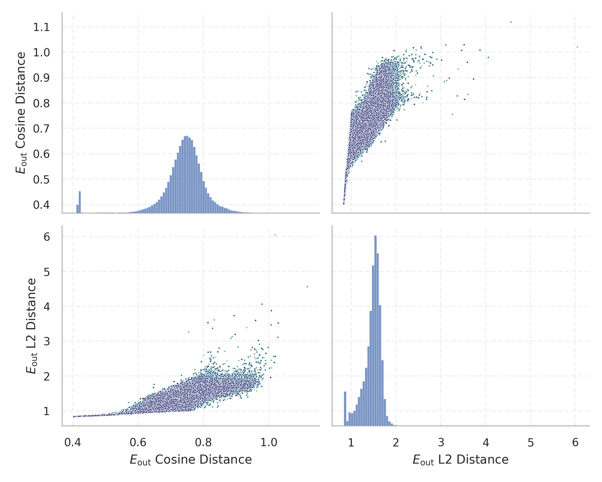
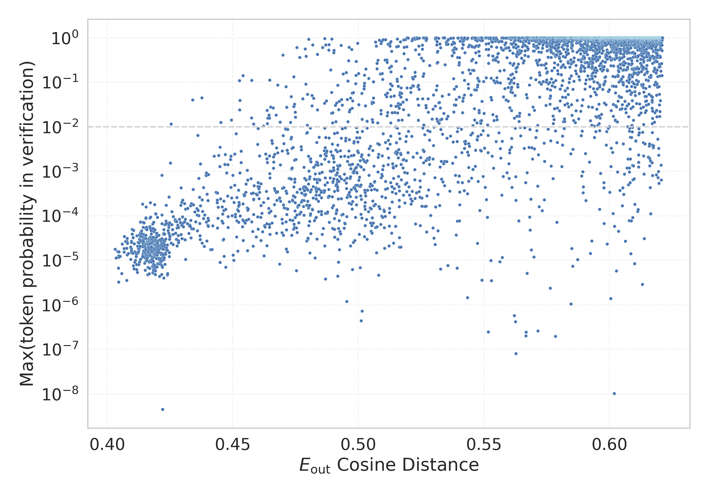

# Report for `google/gemma-4-26B-A4B-it`

## Model info

* Model Info: 
  * Tied embeddings: True
  * LM head uses bias: False
  * Embeddings shape: [262144, 2816]
* Tokenizer Info: 
  * Vocab Size: 262144
  * Tokenizer Class: GemmaTokenizer
  * Tokenizer Type: BPE
  * Bytes handling: Byte Fallback
  * Token for verification prompt building: ABCDEFGHIJKLMNOP
  * Token id for verification prompt building: 182338
* Indicator summary: 
  * Indicator for under-trained tokens: E_{out} Cosine Distance
  * Overall distribution: 0.738 +/- 0.074
* Detected Token Counts: 
  * Number of tested under-trained tokens: 5114, 5106 non-special, 1368 below p = 0.01 threshold, 1018 below soft indicator threshold
  * Number of single byte tokens: 365, of which 125 below indicator threshold
  * Number of special tokens: 6321, of which 6145 below indicator threshold
  * Number of non-single-byte unreachable tokens: 4, of which 4 below indicator threshold

## Under-trained token indicators plot


## Verification plot


## Under-trained token verification results
1018 entries below threshold of 0.502

|   token_id | token                        |   indicator | max_prob                                                         | in_other_tokens                                                                       |
|------------|------------------------------|-------------|------------------------------------------------------------------|---------------------------------------------------------------------------------------|
|     208000 | ````` riTracking `````       |    0.403066 | <span style='border: 1px solid rgb(169, 68, 66);'>1.8e-05</span> |                                                                                       |
|     220225 | ````` drawcountery `````     |    0.403424 | <span style='border: 1px solid rgb(169, 68, 66);'>1.1e-05</span> |                                                                                       |
|     173823 | ````` callowcounter `````    |    0.404157 | <span style='border: 1px solid rgb(169, 68, 66);'>1.6e-05</span> |                                                                                       |
|     129376 | ````` eltatdouble `````      |    0.404439 | <span style='border: 1px solid rgb(169, 68, 66);'>6.7e-06</span> | <span style='border: 1px solid rgb(169, 68, 66);'>````` wavedeltatdouble `````</span> |
|     188005 | ````` CBCPksc `````          |    0.404457 | <span style='border: 1px solid rgb(169, 68, 66);'>1.3e-05</span> |                                                                                       |
|     173819 | ````` calcounterx `````      |    0.404515 | <span style='border: 1px solid rgb(169, 68, 66);'>3.3e-06</span> |                                                                                       |
|      52175 | ````` bekoru `````           |    0.404604 | <span style='border: 1px solid rgb(169, 68, 66);'>1.6e-05</span> |                                                                                       |
|     181221 | ````` ▁diffplay `````        |    0.40462  | <span style='border: 1px solid rgb(169, 68, 66);'>1.2e-05</span> |                                                                                       |
|      87045 | ````` methodict `````        |    0.405079 | <span style='border: 1px solid rgb(169, 68, 66);'>1.2e-05</span> |                                                                                       |
|      57098 | ````` WMNDA `````            |    0.405732 | <span style='border: 1px solid rgb(169, 68, 66);'>5e-06</span>   |                                                                                       |
|     214258 | ````` ▁DummyComputed `````   |    0.405867 | <span style='border: 1px solid rgb(169, 68, 66);'>2.3e-05</span> |                                                                                       |
|     220248 | ````` ▁ativarbotao `````     |    0.406625 | <span style='border: 1px solid rgb(169, 68, 66);'>1.5e-05</span> |                                                                                       |
|     167077 | ````` wavedeltatdouble ````` |    0.406647 | <span style='border: 1px solid rgb(169, 68, 66);'>1.9e-05</span> |                                                                                       |
|     113569 | ````` PAFStruct `````        |    0.406788 | <span style='border: 1px solid rgb(169, 68, 66);'>3.4e-05</span> |                                                                                       |
|     173825 | ````` calrightcounter `````  |    0.407196 | <span style='border: 1px solid rgb(169, 68, 66);'>2.7e-05</span> |                                                                                       |
|     172139 | ````` ▁PafHandle `````       |    0.407736 | <span style='border: 1px solid rgb(169, 68, 66);'>1.9e-05</span> |                                                                                       |
|     202282 | ````` CImgBoard `````        |    0.407736 | <span style='border: 1px solid rgb(169, 68, 66);'>3.6e-06</span> |                                                                                       |
|     220224 | ````` drawcounterx `````     |    0.407781 | <span style='border: 1px solid rgb(169, 68, 66);'>2.6e-05</span> |                                                                                       |
|     181224 | ````` ▁jinfoHome `````       |    0.407863 | <span style='border: 1px solid rgb(169, 68, 66);'>1.3e-05</span> |                                                                                       |
|     207791 | ````` ▁suddhakatt `````      |    0.407871 | <span style='border: 1px solid rgb(169, 68, 66);'>3.1e-05</span> |                                                                                       |
<details><summary>998 additional entries below threshold</summary>

|   token_id | token                        |   indicator | max_prob                                                         | in_other_tokens                                                                                                                                                                                                                                                                                                                                                                                                                 |
|------------|------------------------------|-------------|------------------------------------------------------------------|---------------------------------------------------------------------------------------------------------------------------------------------------------------------------------------------------------------------------------------------------------------------------------------------------------------------------------------------------------------------------------------------------------------------------------|
|      95551 | ````` WMNMDA `````           |    0.407987 | <span style='border: 1px solid rgb(169, 68, 66);'>2.4e-05</span> |                                                                                                                                                                                                                                                                                                                                                                                                                                 |
|     165211 | ````` heiboard `````         |    0.408315 | <span style='border: 1px solid rgb(169, 68, 66);'>1.4e-05</span> |                                                                                                                                                                                                                                                                                                                                                                                                                                 |
|     172165 | ````` DetailUIJobIcon `````  |    0.409217 | <span style='border: 1px solid rgb(169, 68, 66);'>2e-05</span>   |                                                                                                                                                                                                                                                                                                                                                                                                                                 |
|     226709 | ````` SameWordInterval ````` |    0.409293 | <span style='border: 1px solid rgb(169, 68, 66);'>2e-05</span>   |                                                                                                                                                                                                                                                                                                                                                                                                                                 |
|      82427 | ````` PafHandle `````        |    0.409333 | <span style='border: 1px solid rgb(169, 68, 66);'>1.1e-05</span> | <span style='border: 1px solid rgb(169, 68, 66);'>````` ▁PafHandle `````</span>                                                                                                                                                                                                                                                                                                                                                 |
|     222991 | ````` ▁hetukatt `````        |    0.40953  | <span style='border: 1px solid rgb(169, 68, 66);'>1.8e-05</span> |                                                                                                                                                                                                                                                                                                                                                                                                                                 |
|     179779 | ````` gdockdict `````        |    0.409531 | <span style='border: 1px solid rgb(169, 68, 66);'>2.7e-05</span> |                                                                                                                                                                                                                                                                                                                                                                                                                                 |
|     207916 | ````` ▁morphOutputComp ````` |    0.409547 | <span style='border: 1px solid rgb(169, 68, 66);'>1.6e-05</span> |                                                                                                                                                                                                                                                                                                                                                                                                                                 |
|     181225 | ````` ▁jinfoNext `````       |    0.409619 | <span style='border: 1px solid rgb(169, 68, 66);'>2.6e-05</span> |                                                                                                                                                                                                                                                                                                                                                                                                                                 |
|     183747 | ````` TPASDW `````           |    0.409703 | <span style='border: 1px solid rgb(169, 68, 66);'>1.5e-05</span> |                                                                                                                                                                                                                                                                                                                                                                                                                                 |
|     231617 | ````` ▁Atrayam `````         |    0.409837 | <span style='border: 1px solid rgb(169, 68, 66);'>3.9e-05</span> |                                                                                                                                                                                                                                                                                                                                                                                                                                 |
|     173822 | ````` calupcounter `````     |    0.409863 | <span style='border: 1px solid rgb(169, 68, 66);'>4.9e-05</span> |                                                                                                                                                                                                                                                                                                                                                                                                                                 |
|      77844 | ````` HDROffsets `````       |    0.410184 | <span style='border: 1px solid rgb(169, 68, 66);'>1.4e-05</span> | <span style='border: 1px solid rgb(169, 68, 66);'>````` ▁checkHDROffsets `````</span>                                                                                                                                                                                                                                                                                                                                           |
|     153345 | ````` ChooseServerGrid ````` |    0.410266 | <span style='border: 1px solid rgb(169, 68, 66);'>3.2e-05</span> |                                                                                                                                                                                                                                                                                                                                                                                                                                 |
|      29709 | ````` icoterzi `````         |    0.410358 | <span style='border: 1px solid rgb(169, 68, 66);'>7.6e-06</span> | <span style='border: 1px solid rgb(255, 145, 0);'>````` federicoterzi `````</span>                                                                                                                                                                                                                                                                                                                                              |
|     165131 | ````` TAniPaf `````          |    0.410457 | <span style='border: 1px solid rgb(169, 68, 66);'>4.7e-05</span> |                                                                                                                                                                                                                                                                                                                                                                                                                                 |
|     189179 | ````` ▁জ্ঞাতত্ব `````           |    0.410618 | <span style='border: 1px solid rgb(169, 68, 66);'>6.5e-06</span> |                                                                                                                                                                                                                                                                                                                                                                                                                                 |
|     173792 | ````` loginMessageNow `````  |    0.410699 | <span style='border: 1px solid rgb(169, 68, 66);'>2.4e-05</span> |                                                                                                                                                                                                                                                                                                                                                                                                                                 |
|     173824 | ````` calleftcounter `````   |    0.41086  | <span style='border: 1px solid rgb(169, 68, 66);'>1.6e-05</span> |                                                                                                                                                                                                                                                                                                                                                                                                                                 |
|      85000 | ````` opssynth `````         |    0.410877 | <span style='border: 1px solid rgb(169, 68, 66);'>9.1e-06</span> | <span style='border: 1px solid rgb(169, 68, 66);'>````` kitopssynth `````</span>                                                                                                                                                                                                                                                                                                                                                |
|      99144 | ````` AniPaf `````           |    0.41118  | <span style='border: 1px solid rgb(169, 68, 66);'>1e-05</span>   | <span style='border: 1px solid rgb(169, 68, 66);'>````` TAniPaf `````</span>                                                                                                                                                                                                                                                                                                                                                    |
|     233539 | ````` ▁matchStudentNo `````  |    0.411388 | <span style='border: 1px solid rgb(169, 68, 66);'>1.5e-05</span> |                                                                                                                                                                                                                                                                                                                                                                                                                                 |
|     215136 | ````` ▁atthakathac `````     |    0.411423 | <span style='border: 1px solid rgb(169, 68, 66);'>1.2e-05</span> |                                                                                                                                                                                                                                                                                                                                                                                                                                 |
|     163851 | ````` DaysGE `````           |    0.41151  | <span style='border: 1px solid rgb(169, 68, 66);'>1.4e-05</span> |                                                                                                                                                                                                                                                                                                                                                                                                                                 |
|     152634 | ````` addKillPenalty `````   |    0.411605 | <span style='border: 1px solid rgb(169, 68, 66);'>6.3e-06</span> |                                                                                                                                                                                                                                                                                                                                                                                                                                 |
|     231626 | ````` ▁dittiyam `````        |    0.411653 | <span style='border: 1px solid rgb(169, 68, 66);'>8.1e-06</span> |                                                                                                                                                                                                                                                                                                                                                                                                                                 |
|     219851 | ````` respArrayAll `````     |    0.411732 | <span style='border: 1px solid rgb(169, 68, 66);'>3.6e-05</span> |                                                                                                                                                                                                                                                                                                                                                                                                                                 |
|     173820 | ````` calcountery `````      |    0.411935 | <span style='border: 1px solid rgb(169, 68, 66);'>5.4e-06</span> |                                                                                                                                                                                                                                                                                                                                                                                                                                 |
|     165109 | ````` CollinToDO `````       |    0.41206  | <span style='border: 1px solid rgb(169, 68, 66);'>2.1e-05</span> |                                                                                                                                                                                                                                                                                                                                                                                                                                 |
|     111881 | ````` GoSrvGroupIndex `````  |    0.412235 | <span style='border: 1px solid rgb(169, 68, 66);'>2.5e-05</span> | <span style='border: 1px solid rgb(169, 68, 66);'>````` ▁GoSrvGroupIndex `````</span>                                                                                                                                                                                                                                                                                                                                           |
|     160834 | ````` ▁FROMVS `````          |    0.412247 | <span style='border: 1px solid rgb(169, 68, 66);'>1.5e-05</span> |                                                                                                                                                                                                                                                                                                                                                                                                                                 |
|     197415 | ````` totalBlockFit `````    |    0.412288 | <span style='border: 1px solid rgb(169, 68, 66);'>1.8e-05</span> |                                                                                                                                                                                                                                                                                                                                                                                                                                 |
|     150625 | ````` DetailUIJob `````      |    0.412291 | <span style='border: 1px solid rgb(169, 68, 66);'>1.8e-05</span> | <span style='border: 1px solid rgb(169, 68, 66);'>````` DetailUIJobIcon `````</span>                                                                                                                                                                                                                                                                                                                                            |
|     222926 | ````` ▁dhatussa `````        |    0.412371 | <span style='border: 1px solid rgb(169, 68, 66);'>1.6e-05</span> |                                                                                                                                                                                                                                                                                                                                                                                                                                 |
|     215073 | ````` ய்யமணி `````            |    0.412455 | <span style='border: 1px solid rgb(169, 68, 66);'>8e-06</span>   | <span style='border: 1px solid rgb(169, 68, 66);'>````` ▁துய்யமணி `````</span>                                                                                                                                                                                                                                                                                                                                                   |
|     214244 | ````` mBlitzID `````         |    0.41255  | <span style='border: 1px solid rgb(169, 68, 66);'>2.5e-05</span> |                                                                                                                                                                                                                                                                                                                                                                                                                                 |
|      56818 | ````` FcmPhp `````           |    0.412562 | <span style='border: 1px solid rgb(169, 68, 66);'>1.8e-05</span> |                                                                                                                                                                                                                                                                                                                                                                                                                                 |
|     100241 | ````` RefInSrvGroup `````    |    0.412625 | <span style='border: 1px solid rgb(169, 68, 66);'>1.8e-05</span> |                                                                                                                                                                                                                                                                                                                                                                                                                                 |
|     107795 | ````` িয়েতনাম `````          |    0.412722 | <span style='border: 1px solid rgb(169, 68, 66);'>3.6e-05</span> | ````` ভিয়েতনাম `````, ````` ▁ভিয়েতনাম `````                                                                                                                                                                                                                                                                                                                                                                                     |
|     177258 | ````` ModuleInitFlag `````   |    0.412736 | <span style='border: 1px solid rgb(169, 68, 66);'>3e-05</span>   |                                                                                                                                                                                                                                                                                                                                                                                                                                 |
|     222989 | ````` atthavidu `````        |    0.412775 | <span style='border: 1px solid rgb(169, 68, 66);'>3.8e-05</span> |                                                                                                                                                                                                                                                                                                                                                                                                                                 |
|     127204 | ````` ▁addConfigureArg ````` |    0.412778 | <span style='border: 1px solid rgb(169, 68, 66);'>3.6e-05</span> |                                                                                                                                                                                                                                                                                                                                                                                                                                 |
|     185167 | ````` ▁HRMClient `````       |    0.412791 | <span style='border: 1px solid rgb(169, 68, 66);'>9.2e-06</span> |                                                                                                                                                                                                                                                                                                                                                                                                                                 |
|     132730 | ````` PRIMATEC `````         |    0.412914 | <span style='border: 1px solid rgb(169, 68, 66);'>2e-05</span>   |                                                                                                                                                                                                                                                                                                                                                                                                                                 |
|     233658 | ````` lensGlare `````        |    0.413106 | <span style='border: 1px solid rgb(169, 68, 66);'>7.2e-05</span> |                                                                                                                                                                                                                                                                                                                                                                                                                                 |
|     115711 | ````` OrderFlightDto `````   |    0.413107 | <span style='border: 1px solid rgb(169, 68, 66);'>1.1e-05</span> |                                                                                                                                                                                                                                                                                                                                                                                                                                 |
|     222992 | ````` ▁nibbacan `````        |    0.413213 | <span style='border: 1px solid rgb(169, 68, 66);'>4.3e-05</span> |                                                                                                                                                                                                                                                                                                                                                                                                                                 |
|     140975 | ````` matchStudentNo `````   |    0.413221 | <span style='border: 1px solid rgb(169, 68, 66);'>3.5e-05</span> | <span style='border: 1px solid rgb(169, 68, 66);'>````` ▁matchStudentNo `````</span>                                                                                                                                                                                                                                                                                                                                            |
|      96436 | ````` pmmImp `````           |    0.413345 | <span style='border: 1px solid rgb(169, 68, 66);'>2.8e-05</span> |                                                                                                                                                                                                                                                                                                                                                                                                                                 |
|      57309 | ````` GoRawContext `````     |    0.413578 | <span style='border: 1px solid rgb(169, 68, 66);'>4e-05</span>   | <span style='border: 1px solid rgb(169, 68, 66);'>````` ▁GoRawContext `````</span>                                                                                                                                                                                                                                                                                                                                              |
|     160044 | ````` HAOAVOA `````          |    0.413597 | <span style='border: 1px solid rgb(169, 68, 66);'>4.6e-05</span> | <span style='border: 1px solid rgb(169, 68, 66);'>````` ▁IHAOAVOA `````</span>                                                                                                                                                                                                                                                                                                                                                  |
|     215120 | ````` ▁Vuttab `````          |    0.413873 | <span style='border: 1px solid rgb(169, 68, 66);'>3.4e-05</span> |                                                                                                                                                                                                                                                                                                                                                                                                                                 |
|      58251 | ````` getstarcoredata `````  |    0.413912 | <span style='border: 1px solid rgb(169, 68, 66);'>1.2e-05</span> |                                                                                                                                                                                                                                                                                                                                                                                                                                 |
|     250642 | ````` 𒐒 `````                |    0.414006 | <span style='border: 1px solid rgb(169, 68, 66);'>0.00018</span> |                                                                                                                                                                                                                                                                                                                                                                                                                                 |
|     192572 | ````` AileDroite `````       |    0.414016 | <span style='border: 1px solid rgb(169, 68, 66);'>2.5e-05</span> |                                                                                                                                                                                                                                                                                                                                                                                                                                 |
|     136946 | ````` MakeRectInCM `````     |    0.414063 | <span style='border: 1px solid rgb(169, 68, 66);'>1.3e-05</span> | <span style='border: 1px solid rgb(169, 68, 66);'>````` DTMakeRectInCM `````</span>                                                                                                                                                                                                                                                                                                                                             |
|     220140 | ````` WeakTableMutex `````   |    0.414104 | <span style='border: 1px solid rgb(169, 68, 66);'>2e-05</span>   |                                                                                                                                                                                                                                                                                                                                                                                                                                 |
|     207806 | ````` ▁nohVP `````           |    0.414127 | <span style='border: 1px solid rgb(169, 68, 66);'>2e-05</span>   |                                                                                                                                                                                                                                                                                                                                                                                                                                 |
|     165192 | ````` ▁snakeCubeSize `````   |    0.414196 | <span style='border: 1px solid rgb(169, 68, 66);'>7.2e-05</span> |                                                                                                                                                                                                                                                                                                                                                                                                                                 |
|     214214 | ````` MeshVD `````           |    0.414198 | <span style='border: 1px solid rgb(169, 68, 66);'>1.2e-05</span> | <span style='border: 1px solid rgb(169, 68, 66);'>````` ▁mdlMeshVD `````</span>                                                                                                                                                                                                                                                                                                                                                 |
|     187924 | ````` ▁dSampleWidth `````    |    0.414227 | <span style='border: 1px solid rgb(169, 68, 66);'>2.9e-05</span> |                                                                                                                                                                                                                                                                                                                                                                                                                                 |
|     193747 | ````` ▁PQAry `````           |    0.414245 | <span style='border: 1px solid rgb(169, 68, 66);'>5.6e-05</span> |                                                                                                                                                                                                                                                                                                                                                                                                                                 |
|     231048 | ````` gmzyh `````            |    0.414274 | <span style='border: 1px solid rgb(169, 68, 66);'>2.3e-05</span> |                                                                                                                                                                                                                                                                                                                                                                                                                                 |
|     131116 | ````` ▁StarSXmlClass `````   |    0.414311 | <span style='border: 1px solid rgb(169, 68, 66);'>1.5e-05</span> |                                                                                                                                                                                                                                                                                                                                                                                                                                 |
|      68511 | ````` IMQTTR `````           |    0.41437  | <span style='border: 1px solid rgb(169, 68, 66);'>1.6e-05</span> | <span style='border: 1px solid rgb(169, 68, 66);'>````` ▁HIMQTTRVM `````</span>, <span style='border: 1px solid rgb(169, 68, 66);'>````` HIMQTTRVM `````</span>, <span style='border: 1px solid rgb(169, 68, 66);'>````` IMQTTRVM `````</span>                                                                                                                                                                                  |
|      39456 | ````` SRPControl `````       |    0.414381 | <span style='border: 1px solid rgb(169, 68, 66);'>2.7e-05</span> |                                                                                                                                                                                                                                                                                                                                                                                                                                 |
|     208094 | ````` GTBaseAlert `````      |    0.4145   | <span style='border: 1px solid rgb(169, 68, 66);'>3.3e-05</span> |                                                                                                                                                                                                                                                                                                                                                                                                                                 |
|     113064 | ````` StarSXmlBody `````     |    0.414503 | <span style='border: 1px solid rgb(169, 68, 66);'>3.8e-05</span> |                                                                                                                                                                                                                                                                                                                                                                                                                                 |
|     202569 | ````` ▁सुनेंरोक `````           |    0.414556 | <span style='border: 1px solid rgb(169, 68, 66);'>6.9e-05</span> |                                                                                                                                                                                                                                                                                                                                                                                                                                 |
|     140976 | ````` ▁SrvGroupClass `````   |    0.414592 | <span style='border: 1px solid rgb(169, 68, 66);'>7e-05</span>   |                                                                                                                                                                                                                                                                                                                                                                                                                                 |
|     233847 | ````` PhaseHound `````       |    0.414676 | <span style='border: 1px solid rgb(169, 68, 66);'>1.7e-05</span> |                                                                                                                                                                                                                                                                                                                                                                                                                                 |
|     163811 | ````` ▁LuaToJavaResult ````` |    0.414736 | <span style='border: 1px solid rgb(169, 68, 66);'>3.2e-05</span> |                                                                                                                                                                                                                                                                                                                                                                                                                                 |
|      64632 | ````` 加入参数向量中 `````   |    0.414803 | <span style='border: 1px solid rgb(169, 68, 66);'>2.1e-05</span> |                                                                                                                                                                                                                                                                                                                                                                                                                                 |
|      16565 | ````` jolsendev `````        |    0.414838 | <span style='border: 1px solid rgb(169, 68, 66);'>1.4e-05</span> |                                                                                                                                                                                                                                                                                                                                                                                                                                 |
|     219835 | ````` ▁ControlMissense ````` |    0.414858 | <span style='border: 1px solid rgb(169, 68, 66);'>8.7e-06</span> |                                                                                                                                                                                                                                                                                                                                                                                                                                 |
|     147628 | ````` tochyodikwa `````      |    0.414868 | <span style='border: 1px solid rgb(169, 68, 66);'>2.4e-05</span> |                                                                                                                                                                                                                                                                                                                                                                                                                                 |
|     195381 | ````` edRightShape `````     |    0.41495  | <span style='border: 1px solid rgb(169, 68, 66);'>1.4e-05</span> |                                                                                                                                                                                                                                                                                                                                                                                                                                 |
|     174152 | ````` ▁শরনার্থি `````          |    0.415013 | <span style='border: 1px solid rgb(169, 68, 66);'>6e-06</span>   |                                                                                                                                                                                                                                                                                                                                                                                                                                 |
|     136932 | ````` qttrvm `````           |    0.415043 | <span style='border: 1px solid rgb(169, 68, 66);'>3.1e-05</span> | <span style='border: 1px solid rgb(169, 68, 66);'>````` himqttrvm `````</span>                                                                                                                                                                                                                                                                                                                                                  |
|     208724 | ````` AreaDataIndex `````    |    0.415068 | <span style='border: 1px solid rgb(169, 68, 66);'>3.7e-05</span> |                                                                                                                                                                                                                                                                                                                                                                                                                                 |
|     153374 | ````` chccgi `````           |    0.415086 | <span style='border: 1px solid rgb(169, 68, 66);'>1.8e-05</span> |                                                                                                                                                                                                                                                                                                                                                                                                                                 |
|      88273 | ````` kitopssynth `````      |    0.41512  | <span style='border: 1px solid rgb(169, 68, 66);'>1.1e-05</span> |                                                                                                                                                                                                                                                                                                                                                                                                                                 |
|     207736 | ````` sadurdu `````          |    0.415138 | <span style='border: 1px solid rgb(169, 68, 66);'>1.5e-05</span> | <span style='border: 1px solid rgb(169, 68, 66);'>````` sadurdupoetry `````</span>                                                                                                                                                                                                                                                                                                                                              |
|     172244 | ````` countrygeocode `````   |    0.415194 | <span style='border: 1px solid rgb(169, 68, 66);'>2.3e-05</span> |                                                                                                                                                                                                                                                                                                                                                                                                                                 |
|     226563 | ````` dwRetJpegLen `````     |    0.415201 | <span style='border: 1px solid rgb(169, 68, 66);'>1.9e-05</span> |                                                                                                                                                                                                                                                                                                                                                                                                                                 |
|     143245 | ````` ▁RUTAREAL `````        |    0.415264 | <span style='border: 1px solid rgb(169, 68, 66);'>2.4e-05</span> |                                                                                                                                                                                                                                                                                                                                                                                                                                 |
|     213596 | ````` ▁oLetterLocation ````` |    0.415282 | <span style='border: 1px solid rgb(169, 68, 66);'>5.2e-05</span> |                                                                                                                                                                                                                                                                                                                                                                                                                                 |
|     252849 | ````` 𒑍 `````                |    0.415289 | <span style='border: 1px solid rgb(169, 68, 66);'>8.7e-05</span> |                                                                                                                                                                                                                                                                                                                                                                                                                                 |
|     185109 | ````` CustomGlare `````      |    0.415299 | <span style='border: 1px solid rgb(169, 68, 66);'>1.3e-05</span> | <span style='border: 1px solid rgb(169, 68, 66);'>````` CustomGlareDef `````</span>                                                                                                                                                                                                                                                                                                                                             |
|     183786 | ````` snakeCubeSize `````    |    0.415302 | <span style='border: 1px solid rgb(169, 68, 66);'>9.7e-06</span> |                                                                                                                                                                                                                                                                                                                                                                                                                                 |
|     119322 | ````` edLeftShape `````      |    0.415323 | <span style='border: 1px solid rgb(169, 68, 66);'>9e-05</span>   |                                                                                                                                                                                                                                                                                                                                                                                                                                 |
|     188051 | ````` salexpr `````          |    0.415323 | <span style='border: 1px solid rgb(169, 68, 66);'>2.4e-05</span> |                                                                                                                                                                                                                                                                                                                                                                                                                                 |
|     143045 | ````` ▁neighborIndexs `````  |    0.415326 | <span style='border: 1px solid rgb(169, 68, 66);'>3.7e-05</span> |                                                                                                                                                                                                                                                                                                                                                                                                                                 |
|      57759 | ````` ▁SRPObject `````       |    0.415392 | <span style='border: 1px solid rgb(169, 68, 66);'>0.00016</span> |                                                                                                                                                                                                                                                                                                                                                                                                                                 |
|     104989 | ````` ▁iccadini `````        |    0.415396 | <span style='border: 1px solid rgb(169, 68, 66);'>1.7e-05</span> |                                                                                                                                                                                                                                                                                                                                                                                                                                 |
|     226695 | ````` MalayMarks `````       |    0.415455 | <span style='border: 1px solid rgb(169, 68, 66);'>1.4e-05</span> |                                                                                                                                                                                                                                                                                                                                                                                                                                 |
|     169654 | ````` banipi `````           |    0.415497 | <span style='border: 1px solid rgb(169, 68, 66);'>9.9e-06</span> |                                                                                                                                                                                                                                                                                                                                                                                                                                 |
|     100064 | ````` ▁TPASDW `````          |    0.415546 | <span style='border: 1px solid rgb(169, 68, 66);'>3e-05</span>   |                                                                                                                                                                                                                                                                                                                                                                                                                                 |
|      77845 | ````` ▁checkHDROffsets ````` |    0.415553 | <span style='border: 1px solid rgb(169, 68, 66);'>1.3e-05</span> |                                                                                                                                                                                                                                                                                                                                                                                                                                 |
|     170342 | ````` IsClearedBy `````      |    0.415555 | <span style='border: 1px solid rgb(169, 68, 66);'>5.5e-05</span> |                                                                                                                                                                                                                                                                                                                                                                                                                                 |
|     250699 | ````` 𒑈 `````                |    0.415568 | <span style='border: 1px solid rgb(169, 68, 66);'>2.5e-05</span> |                                                                                                                                                                                                                                                                                                                                                                                                                                 |
|     226597 | ````` ▁FuncParamNum `````    |    0.415666 | <span style='border: 1px solid rgb(169, 68, 66);'>1e-05</span>   |                                                                                                                                                                                                                                                                                                                                                                                                                                 |
|     214224 | ````` startZielPanel `````   |    0.415667 | <span style='border: 1px solid rgb(169, 68, 66);'>4.9e-05</span> |                                                                                                                                                                                                                                                                                                                                                                                                                                 |
|      93804 | ````` SimulatorFlood `````   |    0.415815 | <span style='border: 1px solid rgb(169, 68, 66);'>2.5e-05</span> |                                                                                                                                                                                                                                                                                                                                                                                                                                 |
|     234024 | ````` ▁lifeGuy `````         |    0.415927 | <span style='border: 1px solid rgb(169, 68, 66);'>1.1e-05</span> |                                                                                                                                                                                                                                                                                                                                                                                                                                 |
|     155281 | ````` addKillBonus `````     |    0.416022 | <span style='border: 1px solid rgb(169, 68, 66);'>1.3e-05</span> |                                                                                                                                                                                                                                                                                                                                                                                                                                 |
|     222990 | ````` ▁appasidd `````        |    0.416062 | <span style='border: 1px solid rgb(169, 68, 66);'>1.7e-05</span> |                                                                                                                                                                                                                                                                                                                                                                                                                                 |
|     203204 | ````` StarServiceBody `````  |    0.416067 | <span style='border: 1px solid rgb(169, 68, 66);'>2e-05</span>   |                                                                                                                                                                                                                                                                                                                                                                                                                                 |
|     116968 | ````` StarSrvGroupBody ````` |    0.416094 | <span style='border: 1px solid rgb(169, 68, 66);'>2.8e-05</span> |                                                                                                                                                                                                                                                                                                                                                                                                                                 |
|      79715 | ````` SRPInterfaceItem ````` |    0.416098 | <span style='border: 1px solid rgb(169, 68, 66);'>4.8e-06</span> |                                                                                                                                                                                                                                                                                                                                                                                                                                 |
|     181202 | ````` PQAry `````            |    0.416112 | <span style='border: 1px solid rgb(169, 68, 66);'>2.5e-05</span> | <span style='border: 1px solid rgb(169, 68, 66);'>````` ▁PQAry `````</span>                                                                                                                                                                                                                                                                                                                                                     |
|      58250 | ````` getstarcore `````      |    0.416137 | <span style='border: 1px solid rgb(169, 68, 66);'>1.5e-05</span> | <span style='border: 1px solid rgb(169, 68, 66);'>````` getstarcoredata `````</span>                                                                                                                                                                                                                                                                                                                                            |
|     145692 | ````` tooltabname `````      |    0.41618  | <span style='border: 1px solid rgb(169, 68, 66);'>1.5e-05</span> |                                                                                                                                                                                                                                                                                                                                                                                                                                 |
|      71180 | ````` ▁minGoto `````         |    0.41622  | <span style='border: 1px solid rgb(169, 68, 66);'>2.4e-05</span> |                                                                                                                                                                                                                                                                                                                                                                                                                                 |
|     203239 | ````` localinstrList `````   |    0.416221 | <span style='border: 1px solid rgb(169, 68, 66);'>2.3e-05</span> |                                                                                                                                                                                                                                                                                                                                                                                                                                 |
|      61251 | ````` SRPParaPkg `````       |    0.416237 | <span style='border: 1px solid rgb(169, 68, 66);'>2e-05</span>   |                                                                                                                                                                                                                                                                                                                                                                                                                                 |
|     133044 | ````` SRPSXML `````          |    0.416303 | <span style='border: 1px solid rgb(169, 68, 66);'>2.9e-05</span> |                                                                                                                                                                                                                                                                                                                                                                                                                                 |
|     156046 | ````` ▁totalBlockUsed `````  |    0.416341 | <span style='border: 1px solid rgb(169, 68, 66);'>1.5e-05</span> | <span style='border: 1px solid rgb(169, 68, 66);'>````` ▁totalBlockUsedA `````</span>                                                                                                                                                                                                                                                                                                                                           |
|     177277 | ````` RetJpegLen `````       |    0.416359 | <span style='border: 1px solid rgb(169, 68, 66);'>2e-05</span>   | <span style='border: 1px solid rgb(169, 68, 66);'>````` dwRetJpegLen `````</span>                                                                                                                                                                                                                                                                                                                                               |
|     222344 | ````` ▁veronya `````         |    0.416377 | <span style='border: 1px solid rgb(169, 68, 66);'>1.8e-05</span> |                                                                                                                                                                                                                                                                                                                                                                                                                                 |
|     221847 | ````` parenmacro `````       |    0.416384 | <span style='border: 1px solid rgb(169, 68, 66);'>1.9e-05</span> |                                                                                                                                                                                                                                                                                                                                                                                                                                 |
|     144752 | ````` ▁nibbacanam `````      |    0.41649  | <span style='border: 1px solid rgb(169, 68, 66);'>3e-05</span>   |                                                                                                                                                                                                                                                                                                                                                                                                                                 |
|     207758 | ````` ineedfollower `````    |    0.416562 | <span style='border: 1px solid rgb(169, 68, 66);'>1.3e-05</span> |                                                                                                                                                                                                                                                                                                                                                                                                                                 |
|     109526 | ````` ELEASESTR `````        |    0.416578 | <span style='border: 1px solid rgb(169, 68, 66);'>1.7e-05</span> | <span style='border: 1px solid rgb(169, 68, 66);'>````` SAFERELEASESTR `````</span>                                                                                                                                                                                                                                                                                                                                             |
|     202340 | ````` ▁ControlPTV `````      |    0.416578 | <span style='border: 1px solid rgb(169, 68, 66);'>1.3e-05</span> |                                                                                                                                                                                                                                                                                                                                                                                                                                 |
|     184776 | ````` ▁jobSearchRepo `````   |    0.416609 | <span style='border: 1px solid rgb(169, 68, 66);'>9.2e-06</span> |                                                                                                                                                                                                                                                                                                                                                                                                                                 |
|     202283 | ````` faulseAns `````        |    0.416628 | <span style='border: 1px solid rgb(169, 68, 66);'>5e-06</span>   |                                                                                                                                                                                                                                                                                                                                                                                                                                 |
|     169674 | ````` attupadani `````       |    0.416635 | <span style='border: 1px solid rgb(169, 68, 66);'>2.6e-05</span> |                                                                                                                                                                                                                                                                                                                                                                                                                                 |
|     130855 | ````` ▁CCBUNDLE `````        |    0.416639 | <span style='border: 1px solid rgb(169, 68, 66);'>3.1e-05</span> |                                                                                                                                                                                                                                                                                                                                                                                                                                 |
|     198419 | ````` GoObjectAllRef `````   |    0.416733 | <span style='border: 1px solid rgb(169, 68, 66);'>2.5e-05</span> |                                                                                                                                                                                                                                                                                                                                                                                                                                 |
|     170333 | ````` StarObjectBody `````   |    0.41678  | <span style='border: 1px solid rgb(169, 68, 66);'>2.7e-05</span> |                                                                                                                                                                                                                                                                                                                                                                                                                                 |
|     122782 | ````` ▁NewParaPkg `````      |    0.41682  | <span style='border: 1px solid rgb(169, 68, 66);'>2.3e-05</span> |                                                                                                                                                                                                                                                                                                                                                                                                                                 |
|     177352 | ````` LuaToJavaResult `````  |    0.416833 | <span style='border: 1px solid rgb(169, 68, 66);'>6.6e-06</span> |                                                                                                                                                                                                                                                                                                                                                                                                                                 |
|     219831 | ````` EphemeralShroud `````  |    0.416858 | <span style='border: 1px solid rgb(169, 68, 66);'>1.4e-05</span> |                                                                                                                                                                                                                                                                                                                                                                                                                                 |
|     134996 | ````` lblIntegrante `````    |    0.416902 | <span style='border: 1px solid rgb(169, 68, 66);'>8.9e-05</span> |                                                                                                                                                                                                                                                                                                                                                                                                                                 |
|     214220 | ````` ▁mdlMeshVD `````       |    0.416913 | <span style='border: 1px solid rgb(169, 68, 66);'>5.7e-05</span> |                                                                                                                                                                                                                                                                                                                                                                                                                                 |
|     208686 | ````` ▁RefToGoObject `````   |    0.416941 | <span style='border: 1px solid rgb(169, 68, 66);'>1.9e-05</span> |                                                                                                                                                                                                                                                                                                                                                                                                                                 |
|     220172 | ````` ▁TermObjectDefer ````` |    0.416979 | <span style='border: 1px solid rgb(169, 68, 66);'>5.3e-05</span> |                                                                                                                                                                                                                                                                                                                                                                                                                                 |
|      29712 | ````` opencamerastudio ````` |    0.417007 | <span style='border: 1px solid rgb(169, 68, 66);'>2.4e-05</span> |                                                                                                                                                                                                                                                                                                                                                                                                                                 |
|     107794 | ````` ▁চিদাভ `````           |    0.417014 | <span style='border: 1px solid rgb(169, 68, 66);'>3e-05</span>   | <span style='border: 1px solid rgb(169, 68, 66);'>````` ▁চিদাভাস `````</span>, <span style='border: 1px solid rgb(169, 68, 66);'>````` ▁চিদাভাসের `````</span>                                                                                                                                                                                                                                                                  |
|     133048 | ````` coefdouble `````       |    0.417052 | <span style='border: 1px solid rgb(169, 68, 66);'>1.4e-05</span> |                                                                                                                                                                                                                                                                                                                                                                                                                                 |
|     109528 | ````` SAFERELEASESTR `````   |    0.417117 | <span style='border: 1px solid rgb(169, 68, 66);'>3.3e-05</span> |                                                                                                                                                                                                                                                                                                                                                                                                                                 |
|     253116 | ````` 𒑗 `````                |    0.417119 | <span style='border: 1px solid rgb(169, 68, 66);'>0.0002</span>  |                                                                                                                                                                                                                                                                                                                                                                                                                                 |
|     207760 | ````` sadurdupoetry `````    |    0.41713  | <span style='border: 1px solid rgb(169, 68, 66);'>9.9e-06</span> |                                                                                                                                                                                                                                                                                                                                                                                                                                 |
|     157990 | ````` angoloRad `````        |    0.417174 | <span style='border: 1px solid rgb(169, 68, 66);'>1.3e-05</span> | <span style='border: 1px solid rgb(169, 68, 66);'>````` ▁angoloRad `````</span>                                                                                                                                                                                                                                                                                                                                                 |
|     250649 | ````` 𒑅 `````                |    0.417177 | <span style='border: 1px solid rgb(169, 68, 66);'>9.4e-05</span> |                                                                                                                                                                                                                                                                                                                                                                                                                                 |
|     165237 | ````` DenovoMis `````        |    0.417204 | <span style='border: 1px solid rgb(169, 68, 66);'>1.7e-05</span> |                                                                                                                                                                                                                                                                                                                                                                                                                                 |
|     226594 | ````` SRPSrvGroup `````      |    0.417322 | <span style='border: 1px solid rgb(169, 68, 66);'>2.7e-05</span> |                                                                                                                                                                                                                                                                                                                                                                                                                                 |
|     131126 | ````` ▁studentLVector `````  |    0.417387 | <span style='border: 1px solid rgb(169, 68, 66);'>4.7e-05</span> |                                                                                                                                                                                                                                                                                                                                                                                                                                 |
|     255611 | ````` 𒐧 `````                |    0.417424 | <span style='border: 1px solid rgb(169, 68, 66);'>3.2e-05</span> |                                                                                                                                                                                                                                                                                                                                                                                                                                 |
|     208700 | ````` ZielPanel `````        |    0.417439 | <span style='border: 1px solid rgb(169, 68, 66);'>9.3e-06</span> | <span style='border: 1px solid rgb(169, 68, 66);'>````` startZielPanel `````</span>                                                                                                                                                                                                                                                                                                                                             |
|     213814 | ````` ."+"\|"+" `````        |    0.417478 | <span style='border: 1px solid rgb(169, 68, 66);'>4e-05</span>   |                                                                                                                                                                                                                                                                                                                                                                                                                                 |
|     226697 | ````` capturecpu `````       |    0.417479 | <span style='border: 1px solid rgb(169, 68, 66);'>2.6e-05</span> |                                                                                                                                                                                                                                                                                                                                                                                                                                 |
|     121223 | ````` SRPCoreShell `````     |    0.417484 | <span style='border: 1px solid rgb(169, 68, 66);'>2.7e-05</span> |                                                                                                                                                                                                                                                                                                                                                                                                                                 |
|     249788 | ````` 𡉺 `````               |    0.417489 | <span style='border: 1px solid rgb(169, 68, 66);'>2e-05</span>   |                                                                                                                                                                                                                                                                                                                                                                                                                                 |
|     198420 | ````` ▁innerWallArray `````  |    0.417493 | <span style='border: 1px solid rgb(169, 68, 66);'>3e-05</span>   |                                                                                                                                                                                                                                                                                                                                                                                                                                 |
|     122175 | ````` ▁TestAvgCallback ````` |    0.417511 | <span style='border: 1px solid rgb(169, 68, 66);'>1.7e-05</span> |                                                                                                                                                                                                                                                                                                                                                                                                                                 |
|      91072 | ````` timePlusEvents `````   |    0.41755  | <span style='border: 1px solid rgb(169, 68, 66);'>2.8e-05</span> |                                                                                                                                                                                                                                                                                                                                                                                                                                 |
|      61095 | ````` arantadhatu `````      |    0.41755  | <span style='border: 1px solid rgb(169, 68, 66);'>2e-05</span>   | <span style='border: 1px solid rgb(169, 68, 66);'>````` akarantadhatu `````</span>                                                                                                                                                                                                                                                                                                                                              |
|      86967 | ````` getHDRProcessor `````  |    0.417678 | <span style='border: 1px solid rgb(169, 68, 66);'>2.4e-05</span> |                                                                                                                                                                                                                                                                                                                                                                                                                                 |
|     175853 | ````` Basecodes `````        |    0.417688 | <span style='border: 1px solid rgb(169, 68, 66);'>1.6e-05</span> |                                                                                                                                                                                                                                                                                                                                                                                                                                 |
|     213598 | ````` ▁totalBlockUsedA ````` |    0.417714 | <span style='border: 1px solid rgb(169, 68, 66);'>1.2e-05</span> |                                                                                                                                                                                                                                                                                                                                                                                                                                 |
|      87695 | ````` intFragmentation ````` |    0.417804 | <span style='border: 1px solid rgb(169, 68, 66);'>2.9e-05</span> |                                                                                                                                                                                                                                                                                                                                                                                                                                 |
|     145613 | ````` ▁RUTAREL `````         |    0.417808 | <span style='border: 1px solid rgb(169, 68, 66);'>1.2e-05</span> | <span style='border: 1px solid rgb(169, 68, 66);'>````` ▁RUTARELATIV `````</span>                                                                                                                                                                                                                                                                                                                                               |
|     207812 | ````` testGetPopup `````     |    0.417822 | <span style='border: 1px solid rgb(169, 68, 66);'>1.6e-05</span> |                                                                                                                                                                                                                                                                                                                                                                                                                                 |
|     226620 | ````` StructOfObject `````   |    0.417833 | <span style='border: 1px solid rgb(169, 68, 66);'>1.1e-05</span> |                                                                                                                                                                                                                                                                                                                                                                                                                                 |
|     156020 | ````` foePlace `````         |    0.41792  | <span style='border: 1px solid rgb(169, 68, 66);'>7.3e-06</span> |                                                                                                                                                                                                                                                                                                                                                                                                                                 |
|     121221 | ````` SRPCore `````          |    0.418002 | <span style='border: 1px solid rgb(169, 68, 66);'>6.6e-05</span> | <span style='border: 1px solid rgb(169, 68, 66);'>````` SRPCoreShell `````</span>                                                                                                                                                                                                                                                                                                                                               |
|     111029 | ````` CasePTV `````          |    0.418015 | <span style='border: 1px solid rgb(169, 68, 66);'>2.7e-05</span> |                                                                                                                                                                                                                                                                                                                                                                                                                                 |
|     233656 | ````` VSLUATYPE `````        |    0.418161 | <span style='border: 1px solid rgb(169, 68, 66);'>7.7e-06</span> |                                                                                                                                                                                                                                                                                                                                                                                                                                 |
|     150048 | ````` ▁SmartyLint `````      |    0.418165 | <span style='border: 1px solid rgb(169, 68, 66);'>5.2e-05</span> |                                                                                                                                                                                                                                                                                                                                                                                                                                 |
|      91814 | ````` NewParaPkg `````       |    0.418249 | <span style='border: 1px solid rgb(169, 68, 66);'>9.6e-06</span> | <span style='border: 1px solid rgb(169, 68, 66);'>````` ▁NewParaPkg `````</span>                                                                                                                                                                                                                                                                                                                                                |
|     147560 | ````` ▁scStudentVector ````` |    0.418265 | <span style='border: 1px solid rgb(169, 68, 66);'>3.3e-05</span> |                                                                                                                                                                                                                                                                                                                                                                                                                                 |
|      80222 | ````` GoPrintError `````     |    0.418286 | <span style='border: 1px solid rgb(169, 68, 66);'>1.7e-05</span> |                                                                                                                                                                                                                                                                                                                                                                                                                                 |
|     156050 | ````` ▁addSBOM `````         |    0.418292 | <span style='border: 1px solid rgb(169, 68, 66);'>5.7e-06</span> |                                                                                                                                                                                                                                                                                                                                                                                                                                 |
|     139256 | ````` ▁etenati `````         |    0.418298 | <span style='border: 1px solid rgb(169, 68, 66);'>1.2e-05</span> |                                                                                                                                                                                                                                                                                                                                                                                                                                 |
|     213650 | ````` ▁RUTARELATIV `````     |    0.418314 | <span style='border: 1px solid rgb(169, 68, 66);'>6.3e-06</span> |                                                                                                                                                                                                                                                                                                                                                                                                                                 |
|     234128 | ````` TranscHist `````       |    0.418377 | <span style='border: 1px solid rgb(169, 68, 66);'>1.8e-05</span> |                                                                                                                                                                                                                                                                                                                                                                                                                                 |
|     133025 | ````` ▁SRPGoSetStr `````     |    0.418378 | <span style='border: 1px solid rgb(169, 68, 66);'>8.2e-06</span> |                                                                                                                                                                                                                                                                                                                                                                                                                                 |
|     137311 | ````` AWSJavaScript `````    |    0.418385 | <span style='border: 1px solid rgb(169, 68, 66);'>2.8e-05</span> | ````` AWSJavaScriptSDK `````                                                                                                                                                                                                                                                                                                                                                                                                    |
|     193798 | ````` posTocco `````         |    0.418398 | <span style='border: 1px solid rgb(169, 68, 66);'>7.2e-06</span> |                                                                                                                                                                                                                                                                                                                                                                                                                                 |
|     192573 | ````` AileGauche `````       |    0.418452 | <span style='border: 1px solid rgb(169, 68, 66);'>7.2e-05</span> |                                                                                                                                                                                                                                                                                                                                                                                                                                 |
|     169665 | ````` ▁চিদাভাসের `````       |    0.418514 | <span style='border: 1px solid rgb(169, 68, 66);'>4.5e-05</span> |                                                                                                                                                                                                                                                                                                                                                                                                                                 |
|     202404 | ````` ▁ecoexpr `````         |    0.418614 | <span style='border: 1px solid rgb(169, 68, 66);'>2.2e-05</span> |                                                                                                                                                                                                                                                                                                                                                                                                                                 |
|     123778 | ````` ▁subTestAvg `````      |    0.418743 | <span style='border: 1px solid rgb(169, 68, 66);'>1.2e-05</span> |                                                                                                                                                                                                                                                                                                                                                                                                                                 |
|     111857 | ````` PSeqlist `````         |    0.418763 | <span style='border: 1px solid rgb(169, 68, 66);'>0.00018</span> |                                                                                                                                                                                                                                                                                                                                                                                                                                 |
|     207970 | ````` CaseMissense `````     |    0.418772 | <span style='border: 1px solid rgb(169, 68, 66);'>1.8e-05</span> |                                                                                                                                                                                                                                                                                                                                                                                                                                 |
|     122789 | ````` markUpdateChoice ````` |    0.418812 | <span style='border: 1px solid rgb(169, 68, 66);'>1.6e-05</span> |                                                                                                                                                                                                                                                                                                                                                                                                                                 |
|     220247 | ````` selectTableY `````     |    0.418831 | <span style='border: 1px solid rgb(169, 68, 66);'>1.7e-05</span> |                                                                                                                                                                                                                                                                                                                                                                                                                                 |
|     208662 | ````` StarParaPkgBody `````  |    0.418848 | <span style='border: 1px solid rgb(169, 68, 66);'>2.4e-05</span> |                                                                                                                                                                                                                                                                                                                                                                                                                                 |
|     108356 | ````` TermObjectDefer `````  |    0.418861 | <span style='border: 1px solid rgb(169, 68, 66);'>4.9e-05</span> | <span style='border: 1px solid rgb(169, 68, 66);'>````` ▁TermObjectDefer `````</span>                                                                                                                                                                                                                                                                                                                                           |
|     141003 | ````` ▁GoSRP `````           |    0.418886 | <span style='border: 1px solid rgb(169, 68, 66);'>7.7e-06</span> |                                                                                                                                                                                                                                                                                                                                                                                                                                 |
|     106197 | ````` ▁SpringObjectID `````  |    0.418899 | <span style='border: 1px solid rgb(169, 68, 66);'>3e-05</span>   |                                                                                                                                                                                                                                                                                                                                                                                                                                 |
|     219994 | ````` ▁magickwoods `````     |    0.418945 | <span style='border: 1px solid rgb(169, 68, 66);'>1.3e-05</span> |                                                                                                                                                                                                                                                                                                                                                                                                                                 |
|     203148 | ````` LuaPushInt `````       |    0.418963 | <span style='border: 1px solid rgb(169, 68, 66);'>1.5e-05</span> |                                                                                                                                                                                                                                                                                                                                                                                                                                 |
|     214127 | ````` MyShopname `````       |    0.419015 | <span style='border: 1px solid rgb(169, 68, 66);'>2.4e-05</span> |                                                                                                                                                                                                                                                                                                                                                                                                                                 |
|     155266 | ````` squarePosVecchio ````` |    0.419022 | <span style='border: 1px solid rgb(169, 68, 66);'>6.7e-06</span> |                                                                                                                                                                                                                                                                                                                                                                                                                                 |
|     187925 | ````` lastDamageTook `````   |    0.419044 | <span style='border: 1px solid rgb(169, 68, 66);'>2.2e-05</span> |                                                                                                                                                                                                                                                                                                                                                                                                                                 |
|      72528 | ````` ▁SRPGoGet `````        |    0.419059 | <span style='border: 1px solid rgb(169, 68, 66);'>1.3e-05</span> | <span style='border: 1px solid rgb(169, 68, 66);'>````` ▁SRPGoGetStr `````</span>                                                                                                                                                                                                                                                                                                                                               |
|     189181 | ````` atthakathayam `````    |    0.419099 | <span style='border: 1px solid rgb(169, 68, 66);'>5.8e-06</span> |                                                                                                                                                                                                                                                                                                                                                                                                                                 |
|     215139 | ````` ▁బ్లావెట్\u200cస్కీ `````    |    0.419103 | <span style='border: 1px solid rgb(169, 68, 66);'>1.3e-05</span> |                                                                                                                                                                                                                                                                                                                                                                                                                                 |
|     226629 | ````` ▁cytyle `````          |    0.419113 | <span style='border: 1px solid rgb(169, 68, 66);'>4.8e-06</span> |                                                                                                                                                                                                                                                                                                                                                                                                                                 |
|     119779 | ````` inertiaSeq `````       |    0.419122 | <span style='border: 1px solid rgb(169, 68, 66);'>2.3e-05</span> |                                                                                                                                                                                                                                                                                                                                                                                                                                 |
|     175762 | ````` AllFilesInMkvDir ````` |    0.419129 | <span style='border: 1px solid rgb(169, 68, 66);'>3.1e-05</span> |                                                                                                                                                                                                                                                                                                                                                                                                                                 |
|     255625 | ````` 𒑕 `````                |    0.419157 | <span style='border: 1px solid rgb(169, 68, 66);'>0.00011</span> |                                                                                                                                                                                                                                                                                                                                                                                                                                 |
|     126009 | ````` ▁LuaToGoObject `````   |    0.419178 | <span style='border: 1px solid rgb(169, 68, 66);'>2.2e-05</span> |                                                                                                                                                                                                                                                                                                                                                                                                                                 |
|      92122 | ````` ▁subTestHDR `````      |    0.419186 | <span style='border: 1px solid rgb(169, 68, 66);'>2.9e-05</span> |                                                                                                                                                                                                                                                                                                                                                                                                                                 |
|     226565 | ````` drawingCodehint `````  |    0.419193 | <span style='border: 1px solid rgb(169, 68, 66);'>1.6e-05</span> |                                                                                                                                                                                                                                                                                                                                                                                                                                 |
|     123779 | ````` ▁doneProcessAvg `````  |    0.419268 | <span style='border: 1px solid rgb(169, 68, 66);'>1.5e-05</span> |                                                                                                                                                                                                                                                                                                                                                                                                                                 |
|     158014 | ````` convolveMaterial ````` |    0.419275 | <span style='border: 1px solid rgb(169, 68, 66);'>0.00011</span> |                                                                                                                                                                                                                                                                                                                                                                                                                                 |
|     131144 | ````` ▁GoRawContext `````    |    0.419321 | <span style='border: 1px solid rgb(169, 68, 66);'>1.6e-05</span> |                                                                                                                                                                                                                                                                                                                                                                                                                                 |
|     233866 | ````` ▁AfdPar `````          |    0.419321 | <span style='border: 1px solid rgb(169, 68, 66);'>2.6e-05</span> |                                                                                                                                                                                                                                                                                                                                                                                                                                 |
|     208718 | ````` himqttrvm `````        |    0.419327 | <span style='border: 1px solid rgb(169, 68, 66);'>2.6e-05</span> |                                                                                                                                                                                                                                                                                                                                                                                                                                 |
|     173738 | ````` GetParaPkg `````       |    0.41933  | <span style='border: 1px solid rgb(169, 68, 66);'>2.7e-05</span> |                                                                                                                                                                                                                                                                                                                                                                                                                                 |
|     220086 | ````` MDEwOl `````           |    0.419396 | <span style='border: 1px solid rgb(169, 68, 66);'>2.1e-05</span> | ````` MDEwOlJlcG `````                                                                                                                                                                                                                                                                                                                                                                                                          |
|     222815 | ````` ▁SIINFEKLC `````       |    0.419401 | <span style='border: 1px solid rgb(169, 68, 66);'>1.4e-05</span> |                                                                                                                                                                                                                                                                                                                                                                                                                                 |
|      68512 | ````` IMQTTRVM `````         |    0.419478 | <span style='border: 1px solid rgb(169, 68, 66);'>1.1e-05</span> | <span style='border: 1px solid rgb(169, 68, 66);'>````` ▁HIMQTTRVM `````</span>, <span style='border: 1px solid rgb(169, 68, 66);'>````` HIMQTTRVM `````</span>                                                                                                                                                                                                                                                                 |
|     130893 | ````` blusasFem `````        |    0.419579 | <span style='border: 1px solid rgb(169, 68, 66);'>1.1e-05</span> |                                                                                                                                                                                                                                                                                                                                                                                                                                 |
|     233586 | ````` StarBinBufBody `````   |    0.419586 | <span style='border: 1px solid rgb(169, 68, 66);'>3.6e-05</span> |                                                                                                                                                                                                                                                                                                                                                                                                                                 |
|     127633 | ````` ▁GoSrvGroupIndex ````` |    0.419594 | <span style='border: 1px solid rgb(169, 68, 66);'>4e-05</span>   |                                                                                                                                                                                                                                                                                                                                                                                                                                 |
|     208725 | ````` SwiftlyPlugin `````    |    0.419621 | <span style='border: 1px solid rgb(169, 68, 66);'>2e-05</span>   |                                                                                                                                                                                                                                                                                                                                                                                                                                 |
|      75624 | ````` VSFAULT `````          |    0.419652 | <span style='border: 1px solid rgb(169, 68, 66);'>4.1e-05</span> |                                                                                                                                                                                                                                                                                                                                                                                                                                 |
|     123783 | ````` getAvgSampleSize ````` |    0.419664 | <span style='border: 1px solid rgb(169, 68, 66);'>3.4e-05</span> |                                                                                                                                                                                                                                                                                                                                                                                                                                 |
|     177351 | ````` DTMakeRectInCM `````   |    0.419699 | <span style='border: 1px solid rgb(169, 68, 66);'>7.1e-06</span> |                                                                                                                                                                                                                                                                                                                                                                                                                                 |
|     147627 | ````` angoloTocco `````      |    0.419789 | <span style='border: 1px solid rgb(169, 68, 66);'>2.6e-05</span> |                                                                                                                                                                                                                                                                                                                                                                                                                                 |
|     108595 | ````` isTrackCore `````      |    0.419803 | <span style='border: 1px solid rgb(169, 68, 66);'>2.2e-05</span> | <span style='border: 1px solid rgb(169, 68, 66);'>````` ▁mSwisTrackCore `````</span>, <span style='border: 1px solid rgb(169, 68, 66);'>````` SwisTrackCore `````</span>                                                                                                                                                                                                                                                        |
|     178804 | ````` ▁evamadisu `````       |    0.41981  | <span style='border: 1px solid rgb(169, 68, 66);'>1.3e-05</span> |                                                                                                                                                                                                                                                                                                                                                                                                                                 |
|     226545 | ````` colourCodeDict `````   |    0.419823 | <span style='border: 1px solid rgb(169, 68, 66);'>1.5e-05</span> |                                                                                                                                                                                                                                                                                                                                                                                                                                 |
|     226562 | ````` grafoExiste `````      |    0.419827 | <span style='border: 1px solid rgb(169, 68, 66);'>2.5e-05</span> |                                                                                                                                                                                                                                                                                                                                                                                                                                 |
|     233646 | ````` smoio `````            |    0.419832 | <span style='border: 1px solid rgb(169, 68, 66);'>1.8e-05</span> |                                                                                                                                                                                                                                                                                                                                                                                                                                 |
|     138935 | ````` AdxRtList `````        |    0.419912 | <span style='border: 1px solid rgb(169, 68, 66);'>1.6e-05</span> | <span style='border: 1px solid rgb(169, 68, 66);'>````` ▁CAdxRtList `````</span>                                                                                                                                                                                                                                                                                                                                                |
|     192597 | ````` ControlPTV `````       |    0.419923 | <span style='border: 1px solid rgb(169, 68, 66);'>2.5e-05</span> | <span style='border: 1px solid rgb(169, 68, 66);'>````` ▁ControlPTV `````</span>                                                                                                                                                                                                                                                                                                                                                |
|     122982 | ````` akarantadhatu `````    |    0.419966 | <span style='border: 1px solid rgb(169, 68, 66);'>8.5e-06</span> |                                                                                                                                                                                                                                                                                                                                                                                                                                 |
|     143227 | ````` sbomJson `````         |    0.419973 | <span style='border: 1px solid rgb(169, 68, 66);'>9.3e-05</span> |                                                                                                                                                                                                                                                                                                                                                                                                                                 |
|     179825 | ````` sorfinaly `````        |    0.419989 | <span style='border: 1px solid rgb(169, 68, 66);'>2.1e-05</span> |                                                                                                                                                                                                                                                                                                                                                                                                                                 |
|      80797 | ````` ▁SRPGoGetStr `````     |    0.420128 | <span style='border: 1px solid rgb(169, 68, 66);'>1.7e-05</span> |                                                                                                                                                                                                                                                                                                                                                                                                                                 |
|     147981 | ````` ▁subTestPanorama ````` |    0.420173 | <span style='border: 1px solid rgb(169, 68, 66);'>8.4e-06</span> |                                                                                                                                                                                                                                                                                                                                                                                                                                 |
|     132860 | ````` hrassets `````         |    0.420319 | <span style='border: 1px solid rgb(169, 68, 66);'>2.8e-05</span> |                                                                                                                                                                                                                                                                                                                                                                                                                                 |
|      84352 | ````` coOrdinateTuple `````  |    0.420396 | <span style='border: 1px solid rgb(169, 68, 66);'>1.9e-05</span> |                                                                                                                                                                                                                                                                                                                                                                                                                                 |
|     215082 | ````` ▁অচিতের `````          |    0.420496 | <span style='border: 1px solid rgb(169, 68, 66);'>1.8e-05</span> |                                                                                                                                                                                                                                                                                                                                                                                                                                 |
|     208721 | ````` customGlare `````      |    0.420531 | <span style='border: 1px solid rgb(169, 68, 66);'>3.7e-05</span> |                                                                                                                                                                                                                                                                                                                                                                                                                                 |
|     120545 | ````` doneProcessAvg `````   |    0.420532 | <span style='border: 1px solid rgb(169, 68, 66);'>1.5e-05</span> | <span style='border: 1px solid rgb(169, 68, 66);'>````` ▁doneProcessAvg `````</span>                                                                                                                                                                                                                                                                                                                                            |
|     189287 | ````` CustomGlareDef `````   |    0.420544 | <span style='border: 1px solid rgb(169, 68, 66);'>8.4e-06</span> |                                                                                                                                                                                                                                                                                                                                                                                                                                 |
|     178827 | ````` ▁atthudd `````         |    0.420612 | <span style='border: 1px solid rgb(169, 68, 66);'>1.1e-05</span> |                                                                                                                                                                                                                                                                                                                                                                                                                                 |
|     161728 | ````` ▁IHAOAVOA `````        |    0.420653 | <span style='border: 1px solid rgb(169, 68, 66);'>2.1e-05</span> |                                                                                                                                                                                                                                                                                                                                                                                                                                 |
|     185157 | ````` WithSizeInCM `````     |    0.420716 | <span style='border: 1px solid rgb(169, 68, 66);'>1e-05</span>   |                                                                                                                                                                                                                                                                                                                                                                                                                                 |
|     100251 | ````` ConsecHtIdx `````      |    0.420768 | <span style='border: 1px solid rgb(169, 68, 66);'>4.3e-06</span> |                                                                                                                                                                                                                                                                                                                                                                                                                                 |
|     213759 | ````` dfsonic `````          |    0.420806 | <span style='border: 1px solid rgb(169, 68, 66);'>2.9e-05</span> |                                                                                                                                                                                                                                                                                                                                                                                                                                 |
|     189367 | ````` ▁waveformul `````      |    0.421125 | <span style='border: 1px solid rgb(169, 68, 66);'>8.7e-06</span> |                                                                                                                                                                                                                                                                                                                                                                                                                                 |
|     189817 | ````` ▁jaûnes `````          |    0.42113  | <span style='border: 1px solid rgb(169, 68, 66);'>9.2e-06</span> |                                                                                                                                                                                                                                                                                                                                                                                                                                 |
|     231676 | ````` ▁akammak `````         |    0.421149 | <span style='border: 1px solid rgb(169, 68, 66);'>2.2e-05</span> |                                                                                                                                                                                                                                                                                                                                                                                                                                 |
|     183650 | ````` ▁dSampleHeight `````   |    0.421205 | <span style='border: 1px solid rgb(169, 68, 66);'>3e-05</span>   |                                                                                                                                                                                                                                                                                                                                                                                                                                 |
|      52600 | ````` ▁SRPGo `````           |    0.421241 | <span style='border: 1px solid rgb(169, 68, 66);'>1.8e-05</span> | <span style='border: 1px solid rgb(169, 68, 66);'>````` ▁SRPGoGetStr `````</span>, <span style='border: 1px solid rgb(169, 68, 66);'>````` ▁SRPGoSetStr `````</span>, <span style='border: 1px solid rgb(169, 68, 66);'>````` ▁SRPGoGet `````</span>                                                                                                                                                                            |
|     192611 | ````` ▁coiAlarm `````        |    0.421256 | <span style='border: 1px solid rgb(169, 68, 66);'>1.1e-05</span> |                                                                                                                                                                                                                                                                                                                                                                                                                                 |
|     168551 | ````` ▁ArchersUnit `````     |    0.421325 | <span style='border: 1px solid rgb(169, 68, 66);'>1.9e-05</span> |                                                                                                                                                                                                                                                                                                                                                                                                                                 |
|     197330 | ````` Uimcoords `````        |    0.421331 | <span style='border: 1px solid rgb(169, 68, 66);'>1.4e-05</span> |                                                                                                                                                                                                                                                                                                                                                                                                                                 |
|     226539 | ````` ▁angoloRad `````       |    0.421347 | <span style='border: 1px solid rgb(169, 68, 66);'>1.5e-05</span> |                                                                                                                                                                                                                                                                                                                                                                                                                                 |
|     104044 | ````` ▁HIMQTTRVM `````       |    0.421393 | <span style='border: 1px solid rgb(169, 68, 66);'>2.7e-05</span> |                                                                                                                                                                                                                                                                                                                                                                                                                                 |
|      98408 | ````` wiredElems `````       |    0.42145  | <span style='border: 1px solid rgb(169, 68, 66);'>2.2e-05</span> |                                                                                                                                                                                                                                                                                                                                                                                                                                 |
|     206537 | ````` ▁NDIndexArray `````    |    0.421474 | <span style='border: 1px solid rgb(169, 68, 66);'>8e-06</span>   |                                                                                                                                                                                                                                                                                                                                                                                                                                 |
|     125948 | ````` ▁StarSXml `````        |    0.421503 | <span style='border: 1px solid rgb(169, 68, 66);'>2.4e-05</span> | <span style='border: 1px solid rgb(169, 68, 66);'>````` ▁StarSXmlClass `````</span>                                                                                                                                                                                                                                                                                                                                             |
|     130892 | ````` ecoexpr `````          |    0.421525 | <span style='border: 1px solid rgb(169, 68, 66);'>9.7e-06</span> | <span style='border: 1px solid rgb(169, 68, 66);'>````` ▁ecoexpr `````</span>                                                                                                                                                                                                                                                                                                                                                   |
|     207786 | ````` వెట్\u200cస్కీ `````       |    0.42165  | <span style='border: 1px solid rgb(169, 68, 66);'>4.8e-06</span> | <span style='border: 1px solid rgb(169, 68, 66);'>````` ▁బ్లావెట్\u200cస్కీ `````</span>                                                                                                                                                                                                                                                                                                                                              |
|     194961 | ````` adiganik `````         |    0.421676 | <span style='border: 1px solid rgb(169, 68, 66);'>3.1e-05</span> |                                                                                                                                                                                                                                                                                                                                                                                                                                 |
|     203213 | ````` tsrecl `````           |    0.421684 | <span style='border: 1px solid rgb(169, 68, 66);'>0.00082</span> |                                                                                                                                                                                                                                                                                                                                                                                                                                 |
|     198456 | ````` checkkatore `````      |    0.421698 | <span style='border: 1px solid rgb(169, 68, 66);'>7.6e-06</span> |                                                                                                                                                                                                                                                                                                                                                                                                                                 |
|     208014 | ````` salcond `````          |    0.421716 | <span style='border: 1px solid rgb(169, 68, 66);'>6.7e-05</span> |                                                                                                                                                                                                                                                                                                                                                                                                                                 |
|     250651 | ````` 𒑇 `````                |    0.421722 | <span style='border: 1px solid rgb(169, 68, 66);'>0.0001</span>  |                                                                                                                                                                                                                                                                                                                                                                                                                                 |
|     222934 | ````` ▁bhuvadigane `````     |    0.421849 | <span style='border: 1px solid rgb(169, 68, 66);'>1.8e-05</span> |                                                                                                                                                                                                                                                                                                                                                                                                                                 |
|      81945 | ````` OrdinateTuple `````    |    0.421849 | <span style='border: 1px solid rgb(169, 68, 66);'>1.4e-05</span> | <span style='border: 1px solid rgb(169, 68, 66);'>````` coOrdinateTuple `````</span>                                                                                                                                                                                                                                                                                                                                            |
|     121238 | ````` HIMQTTRVM `````        |    0.421866 | <span style='border: 1px solid rgb(169, 68, 66);'>7e-06</span>   |                                                                                                                                                                                                                                                                                                                                                                                                                                 |
|     193766 | ````` ▁DTMakeRect `````      |    0.421902 | <span style='border: 1px solid rgb(169, 68, 66);'>2.5e-05</span> |                                                                                                                                                                                                                                                                                                                                                                                                                                 |
|     185104 | ````` pJPEGBuf `````         |    0.421937 | <span style='border: 1px solid rgb(169, 68, 66);'>2.3e-05</span> |                                                                                                                                                                                                                                                                                                                                                                                                                                 |
|      72952 | ````` SrvGroupIndex `````    |    0.421985 | <span style='border: 1px solid rgb(169, 68, 66);'>2.1e-05</span> | <span style='border: 1px solid rgb(169, 68, 66);'>````` ▁GoSrvGroupIndex `````</span>, <span style='border: 1px solid rgb(169, 68, 66);'>````` GoSrvGroupIndex `````</span>                                                                                                                                                                                                                                                     |
|     202378 | ````` ENEMYPLACE `````       |    0.422019 | <span style='border: 1px solid rgb(169, 68, 66);'>1.2e-05</span> |                                                                                                                                                                                                                                                                                                                                                                                                                                 |
|     152630 | ````` KAKKIAINEN `````       |    0.422203 | <span style='border: 1px solid rgb(169, 68, 66);'>1.8e-05</span> |                                                                                                                                                                                                                                                                                                                                                                                                                                 |
|     233661 | ````` ▁LGAGEmoji `````       |    0.422238 | <span style='border: 1px solid rgb(169, 68, 66);'>1.2e-05</span> |                                                                                                                                                                                                                                                                                                                                                                                                                                 |
|     183864 | ````` partialowner `````     |    0.422266 | <span style='border: 1px solid rgb(169, 68, 66);'>1.3e-05</span> |                                                                                                                                                                                                                                                                                                                                                                                                                                 |
|     172256 | ````` testTakeVideo `````    |    0.422301 | <span style='border: 1px solid rgb(169, 68, 66);'>3.9e-05</span> |                                                                                                                                                                                                                                                                                                                                                                                                                                 |
|     134994 | ````` jsbpmOb `````          |    0.422337 | <span style='border: 1px solid rgb(169, 68, 66);'>1.1e-05</span> |                                                                                                                                                                                                                                                                                                                                                                                                                                 |
|     167093 | ````` FoldoutGC `````        |    0.422446 | <span style='border: 1px solid rgb(169, 68, 66);'>2.5e-05</span> |                                                                                                                                                                                                                                                                                                                                                                                                                                 |
|     151652 | ````` rightsquig `````       |    0.422446 | <span style='border: 1px solid rgb(169, 68, 66);'>4e-06</span>   | ````` rightsquigarrow `````                                                                                                                                                                                                                                                                                                                                                                                                     |
|     226533 | ````` ▁⏮", `````             |    0.422471 | <span style='border: 1px solid rgb(169, 68, 66);'>4.1e-05</span> |                                                                                                                                                                                                                                                                                                                                                                                                                                 |
|     226705 | ````` selectTableX `````     |    0.422479 | <span style='border: 1px solid rgb(169, 68, 66);'>2.8e-05</span> |                                                                                                                                                                                                                                                                                                                                                                                                                                 |
|     194960 | ````` adiganam `````         |    0.422506 | <span style='border: 1px solid rgb(169, 68, 66);'>4.9e-05</span> |                                                                                                                                                                                                                                                                                                                                                                                                                                 |
|     172184 | ````` EnCPP `````            |    0.42251  | <span style='border: 1px solid rgb(169, 68, 66);'>2.5e-05</span> | <span style='border: 1px solid rgb(169, 68, 66);'>````` traduitEnCPP `````</span>, <span style='border: 1px solid rgb(169, 68, 66);'>````` uitEnCPP `````</span>                                                                                                                                                                                                                                                                |
|     158028 | ````` ▁CAdxRtList `````      |    0.422518 | <span style='border: 1px solid rgb(169, 68, 66);'>1e-05</span>   |                                                                                                                                                                                                                                                                                                                                                                                                                                 |
|     250541 | ````` 𒇵 `````                |    0.42262  | <span style='border: 1px solid rgb(169, 68, 66);'>1.1e-05</span> |                                                                                                                                                                                                                                                                                                                                                                                                                                 |
|     215122 | ````` ▁payogo `````          |    0.422718 | <span style='border: 1px solid rgb(169, 68, 66);'>6.3e-05</span> |                                                                                                                                                                                                                                                                                                                                                                                                                                 |
|     207788 | ````` attuvasena `````       |    0.422745 | <span style='border: 1px solid rgb(169, 68, 66);'>2.1e-05</span> |                                                                                                                                                                                                                                                                                                                                                                                                                                 |
|     118337 | ````` SCEcorr `````          |    0.422779 | <span style='border: 1px solid rgb(169, 68, 66);'>3.9e-05</span> |                                                                                                                                                                                                                                                                                                                                                                                                                                 |
|     113108 | ````` SRPBinBuf `````        |    0.422791 | <span style='border: 1px solid rgb(169, 68, 66);'>2.3e-05</span> |                                                                                                                                                                                                                                                                                                                                                                                                                                 |
|     252846 | ````` 𒑃 `````                |    0.422827 | <span style='border: 1px solid rgb(169, 68, 66);'>2.8e-05</span> |                                                                                                                                                                                                                                                                                                                                                                                                                                 |
|     192703 | ````` CYCLONEDB `````        |    0.422918 | <span style='border: 1px solid rgb(169, 68, 66);'>8.1e-06</span> |                                                                                                                                                                                                                                                                                                                                                                                                                                 |
|     185134 | ````` ▁StarParaPkg `````     |    0.423066 | <span style='border: 1px solid rgb(169, 68, 66);'>6.4e-05</span> |                                                                                                                                                                                                                                                                                                                                                                                                                                 |
|     183804 | ````` ▁शब्दलय `````           |    0.423098 | <span style='border: 1px solid rgb(169, 68, 66);'>1.5e-05</span> |                                                                                                                                                                                                                                                                                                                                                                                                                                 |
|     215087 | ````` தலமோங்கு `````           |    0.423127 | <span style='border: 1px solid rgb(169, 68, 66);'>1.4e-05</span> |                                                                                                                                                                                                                                                                                                                                                                                                                                 |
|     175754 | ````` MkvDir `````           |    0.423185 | <span style='border: 1px solid rgb(169, 68, 66);'>3e-05</span>   | <span style='border: 1px solid rgb(169, 68, 66);'>````` AllFilesInMkvDir `````</span>                                                                                                                                                                                                                                                                                                                                           |
|      68115 | ````` SRPBasic `````         |    0.423277 | <span style='border: 1px solid rgb(169, 68, 66);'>1.7e-05</span> |                                                                                                                                                                                                                                                                                                                                                                                                                                 |
|     233665 | ````` ▁newInputBtn `````     |    0.423345 | <span style='border: 1px solid rgb(169, 68, 66);'>7.6e-05</span> |                                                                                                                                                                                                                                                                                                                                                                                                                                 |
|     203196 | ````` ▁tsrecl `````          |    0.423384 | <span style='border: 1px solid rgb(169, 68, 66);'>0.00017</span> |                                                                                                                                                                                                                                                                                                                                                                                                                                 |
|     198403 | ````` MainNavShow `````      |    0.423491 | <span style='border: 1px solid rgb(169, 68, 66);'>1.8e-05</span> |                                                                                                                                                                                                                                                                                                                                                                                                                                 |
|     222973 | ````` ▁iccapi `````          |    0.423492 | <span style='border: 1px solid rgb(169, 68, 66);'>1.9e-05</span> |                                                                                                                                                                                                                                                                                                                                                                                                                                 |
|     161479 | ````` ▁yojetabbani `````     |    0.42351  | <span style='border: 1px solid rgb(169, 68, 66);'>6.8e-05</span> |                                                                                                                                                                                                                                                                                                                                                                                                                                 |
|     138897 | ````` datatimetable `````    |    0.423806 | <span style='border: 1px solid rgb(169, 68, 66);'>2.2e-05</span> |                                                                                                                                                                                                                                                                                                                                                                                                                                 |
|     136915 | ````` tcpUniqueID `````      |    0.423868 | <span style='border: 1px solid rgb(169, 68, 66);'>4.7e-06</span> |                                                                                                                                                                                                                                                                                                                                                                                                                                 |
|     167051 | ````` ▁GoObjectTo `````      |    0.42388  | <span style='border: 1px solid rgb(169, 68, 66);'>2.2e-05</span> |                                                                                                                                                                                                                                                                                                                                                                                                                                 |
|     185111 | ````` ▁bNeedConnect `````    |    0.423892 | <span style='border: 1px solid rgb(169, 68, 66);'>1.7e-05</span> |                                                                                                                                                                                                                                                                                                                                                                                                                                 |
|     192495 | ````` ▁mSwisTrackCore `````  |    0.424011 | <span style='border: 1px solid rgb(169, 68, 66);'>5e-06</span>   |                                                                                                                                                                                                                                                                                                                                                                                                                                 |
|     185169 | ````` bNeedConnect `````     |    0.424144 | <span style='border: 1px solid rgb(169, 68, 66);'>4.7e-05</span> |                                                                                                                                                                                                                                                                                                                                                                                                                                 |
|     167022 | ````` ▁lgPlatformImage ````` |    0.424404 | <span style='border: 1px solid rgb(169, 68, 66);'>5.5e-05</span> |                                                                                                                                                                                                                                                                                                                                                                                                                                 |
|     202331 | ````` ▁BeerObj `````         |    0.424428 | <span style='border: 1px solid rgb(169, 68, 66);'>4.1e-05</span> |                                                                                                                                                                                                                                                                                                                                                                                                                                 |
|     252850 | ````` 𒑎 `````                |    0.424486 | <span style='border: 1px solid rgb(169, 68, 66);'>6.3e-05</span> |                                                                                                                                                                                                                                                                                                                                                                                                                                 |
|     253118 | ````` 𒑠 `````                |    0.42456  | <span style='border: 1px solid rgb(169, 68, 66);'>0.00027</span> |                                                                                                                                                                                                                                                                                                                                                                                                                                 |
|     115701 | ````` blockidcoin `````      |    0.424627 | <span style='border: 1px solid rgb(169, 68, 66);'>1.5e-05</span> |                                                                                                                                                                                                                                                                                                                                                                                                                                 |
|     144747 | ````` ▁শরনার্থিদের `````       |    0.424671 | <span style='border: 1px solid rgb(169, 68, 66);'>1.2e-05</span> |                                                                                                                                                                                                                                                                                                                                                                                                                                 |
|     208647 | ````` ParaPackage `````      |    0.424704 | <span style='border: 1px solid rgb(169, 68, 66);'>3e-05</span>   |                                                                                                                                                                                                                                                                                                                                                                                                                                 |
|     170405 | ````` TrackTypeValue `````   |    0.424723 | <span style='border: 1px solid rgb(169, 68, 66);'>3.7e-05</span> |                                                                                                                                                                                                                                                                                                                                                                                                                                 |
|     226777 | ````` ▁sdxConcept `````      |    0.424766 | <span style='border: 1px solid rgb(169, 68, 66);'>7e-05</span>   |                                                                                                                                                                                                                                                                                                                                                                                                                                 |
|      95439 | ````` ▁gatiyam `````         |    0.424903 | <span style='border: 1px solid rgb(169, 68, 66);'>3.4e-05</span> |                                                                                                                                                                                                                                                                                                                                                                                                                                 |
|     193739 | ````` queCluster `````       |    0.425128 | <span style='border: 1px solid rgb(255, 145, 0);'>0.0015</span>  |                                                                                                                                                                                                                                                                                                                                                                                                                                 |
|     252843 | ````` 𒐜 `````                |    0.425357 | <span style='border: 1px solid rgb(251, 189, 8);'>0.011</span>   |                                                                                                                                                                                                                                                                                                                                                                                                                                 |
|     251537 | ````` 𒐽 `````                |    0.425416 | <span style='border: 1px solid rgb(169, 68, 66);'>2.5e-05</span> |                                                                                                                                                                                                                                                                                                                                                                                                                                 |
|     113485 | ````` ▁genericOverview ````` |    0.425658 | <span style='border: 1px solid rgb(169, 68, 66);'>6.4e-05</span> |                                                                                                                                                                                                                                                                                                                                                                                                                                 |
|      84990 | ````` StarParaPkg `````      |    0.425716 | <span style='border: 1px solid rgb(169, 68, 66);'>0.00012</span> | <span style='border: 1px solid rgb(169, 68, 66);'>````` StarParaPkgBody `````</span>, <span style='border: 1px solid rgb(169, 68, 66);'>````` ▁StarParaPkg `````</span>                                                                                                                                                                                                                                                         |
|      63618 | ````` StarSXml `````         |    0.425958 | <span style='border: 1px solid rgb(169, 68, 66);'>4.9e-05</span> | <span style='border: 1px solid rgb(169, 68, 66);'>````` ▁StarSXml `````</span>, <span style='border: 1px solid rgb(169, 68, 66);'>````` StarSXmlBody `````</span>, <span style='border: 1px solid rgb(169, 68, 66);'>````` ▁StarSXmlClass `````</span>                                                                                                                                                                          |
|     233655 | ````` SynSocket `````        |    0.42612  | <span style='border: 1px solid rgb(169, 68, 66);'>2.3e-05</span> |                                                                                                                                                                                                                                                                                                                                                                                                                                 |
|     194950 | ````` ఋతంభర `````            |    0.426168 | <span style='border: 1px solid rgb(169, 68, 66);'>3.8e-05</span> |                                                                                                                                                                                                                                                                                                                                                                                                                                 |
|     181230 | ````` PowersControls `````   |    0.426282 | <span style='border: 1px solid rgb(169, 68, 66);'>9.6e-05</span> |                                                                                                                                                                                                                                                                                                                                                                                                                                 |
|     115580 | ````` जीरएक्स `````           |    0.426983 | <span style='border: 1px solid rgb(169, 68, 66);'>8.2e-05</span> | <span style='border: 1px solid rgb(169, 68, 66);'>````` ▁वजीरएक्स `````</span>                                                                                                                                                                                                                                                                                                                                                   |
|      99306 | ````` StarBinBuf `````       |    0.427042 | <span style='border: 1px solid rgb(169, 68, 66);'>7.6e-05</span> | <span style='border: 1px solid rgb(169, 68, 66);'>````` StarBinBufBody `````</span>                                                                                                                                                                                                                                                                                                                                             |
|     202288 | ````` ▁processPerRow `````   |    0.427217 | <span style='border: 1px solid rgb(169, 68, 66);'>4.1e-05</span> |                                                                                                                                                                                                                                                                                                                                                                                                                                 |
|     106268 | ````` FBSDKBridge `````      |    0.427474 | <span style='border: 1px solid rgb(169, 68, 66);'>3e-05</span>   | <span style='border: 1px solid rgb(255, 145, 0);'>````` FBSDKBridgeAPI `````</span>                                                                                                                                                                                                                                                                                                                                             |
|     156023 | ````` SHUNTLIST `````        |    0.427512 | <span style='border: 1px solid rgb(169, 68, 66);'>7.5e-05</span> |                                                                                                                                                                                                                                                                                                                                                                                                                                 |
|     203195 | ````` ▁trrecl `````          |    0.427728 | <span style='border: 1px solid rgb(169, 68, 66);'>5.3e-05</span> |                                                                                                                                                                                                                                                                                                                                                                                                                                 |
|     222972 | ````` avacako `````          |    0.427757 | <span style='border: 1px solid rgb(169, 68, 66);'>2.1e-05</span> |                                                                                                                                                                                                                                                                                                                                                                                                                                 |
|     183814 | ````` ▁dassanato `````       |    0.428026 | <span style='border: 1px solid rgb(169, 68, 66);'>6.2e-05</span> |                                                                                                                                                                                                                                                                                                                                                                                                                                 |
|     231601 | ````` ▁kibci `````           |    0.428243 | <span style='border: 1px solid rgb(169, 68, 66);'>3.6e-05</span> |                                                                                                                                                                                                                                                                                                                                                                                                                                 |
|     202303 | ````` aeskeygen `````        |    0.428265 | <span style='border: 1px solid rgb(169, 68, 66);'>2.8e-05</span> | ````` aeskeygenassist `````                                                                                                                                                                                                                                                                                                                                                                                                     |
|     255626 | ````` 𒑝 `````                |    0.42829  | <span style='border: 1px solid rgb(169, 68, 66);'>5.5e-05</span> |                                                                                                                                                                                                                                                                                                                                                                                                                                 |
|     172187 | ````` uitEnCPP `````         |    0.428295 | <span style='border: 1px solid rgb(169, 68, 66);'>2.5e-05</span> | <span style='border: 1px solid rgb(169, 68, 66);'>````` traduitEnCPP `````</span>                                                                                                                                                                                                                                                                                                                                               |
|     143098 | ````` autorBinding `````     |    0.428666 | <span style='border: 1px solid rgb(169, 68, 66);'>8.4e-05</span> |                                                                                                                                                                                                                                                                                                                                                                                                                                 |
|     153203 | ````` ▁browsingStamp `````   |    0.429108 | <span style='border: 1px solid rgb(169, 68, 66);'>7e-05</span>   |                                                                                                                                                                                                                                                                                                                                                                                                                                 |
|     201084 | ````` ▁etthati `````         |    0.429244 | <span style='border: 1px solid rgb(169, 68, 66);'>0.00017</span> |                                                                                                                                                                                                                                                                                                                                                                                                                                 |
|     193776 | ````` Sublcd `````           |    0.429314 | <span style='border: 1px solid rgb(169, 68, 66);'>0.00043</span> |                                                                                                                                                                                                                                                                                                                                                                                                                                 |
|      60834 | ````` ▁MBine `````           |    0.429364 | <span style='border: 1px solid rgb(169, 68, 66);'>3.8e-05</span> |                                                                                                                                                                                                                                                                                                                                                                                                                                 |
|     255617 | ````` 𒐵 `````                |    0.429603 | <span style='border: 1px solid rgb(169, 68, 66);'>0.0002</span>  |                                                                                                                                                                                                                                                                                                                                                                                                                                 |
|     106381 | ````` ▁nidassanam `````      |    0.429626 | <span style='border: 1px solid rgb(169, 68, 66);'>6.1e-05</span> |                                                                                                                                                                                                                                                                                                                                                                                                                                 |
|     231637 | ````` ▁yathasambhavam `````  |    0.429735 | <span style='border: 1px solid rgb(169, 68, 66);'>3.1e-05</span> |                                                                                                                                                                                                                                                                                                                                                                                                                                 |
|     250647 | ````` 𒑂 `````                |    0.42993  | <span style='border: 1px solid rgb(169, 68, 66);'>9.4e-05</span> |                                                                                                                                                                                                                                                                                                                                                                                                                                 |
|     117022 | ````` xRtList `````          |    0.429966 | <span style='border: 1px solid rgb(169, 68, 66);'>0.00023</span> | <span style='border: 1px solid rgb(169, 68, 66);'>````` AdxRtList `````</span>, <span style='border: 1px solid rgb(169, 68, 66);'>````` ▁CAdxRtList `````</span>                                                                                                                                                                                                                                                                |
|     213807 | ````` ."+"\| `````           |    0.43023  | <span style='border: 1px solid rgb(169, 68, 66);'>6.9e-05</span> | <span style='border: 1px solid rgb(169, 68, 66);'>````` ."+"\|"+" `````</span>                                                                                                                                                                                                                                                                                                                                                  |
|     187923 | ````` DamageTook `````       |    0.430248 | <span style='border: 1px solid rgb(169, 68, 66);'>5.7e-05</span> | <span style='border: 1px solid rgb(169, 68, 66);'>````` lastDamageTook `````</span>                                                                                                                                                                                                                                                                                                                                             |
|     250641 | ````` 𒐑 `````                |    0.430767 | <span style='border: 1px solid rgb(169, 68, 66);'>0.00019</span> |                                                                                                                                                                                                                                                                                                                                                                                                                                 |
|     255612 | ````` 𒐨 `````                |    0.430784 | <span style='border: 1px solid rgb(169, 68, 66);'>7.3e-05</span> |                                                                                                                                                                                                                                                                                                                                                                                                                                 |
|     116996 | ````` invasionMobs `````     |    0.430946 | <span style='border: 1px solid rgb(169, 68, 66);'>2.9e-05</span> |                                                                                                                                                                                                                                                                                                                                                                                                                                 |
|     138908 | ````` fgScrollView `````     |    0.431027 | <span style='border: 1px solid rgb(169, 68, 66);'>8.4e-05</span> |                                                                                                                                                                                                                                                                                                                                                                                                                                 |
|      74236 | ````` ▁tpConst `````         |    0.431095 | <span style='border: 1px solid rgb(169, 68, 66);'>1.1e-05</span> |                                                                                                                                                                                                                                                                                                                                                                                                                                 |
|     250643 | ````` 𒐓 `````                |    0.43118  | <span style='border: 1px solid rgb(169, 68, 66);'>0.00014</span> |                                                                                                                                                                                                                                                                                                                                                                                                                                 |
|     179770 | ````` traduitEnCPP `````     |    0.431884 | <span style='border: 1px solid rgb(169, 68, 66);'>6.6e-05</span> |                                                                                                                                                                                                                                                                                                                                                                                                                                 |
|     255632 | ````` 𩆩 `````               |    0.431962 | <span style='border: 1px solid rgb(169, 68, 66);'>0.00015</span> |                                                                                                                                                                                                                                                                                                                                                                                                                                 |
|     168736 | ````` ▁testTakeVideo `````   |    0.432441 | <span style='border: 1px solid rgb(169, 68, 66);'>4e-05</span>   |                                                                                                                                                                                                                                                                                                                                                                                                                                 |
|     129354 | ````` LensGlare `````        |    0.432626 | <span style='border: 1px solid rgb(169, 68, 66);'>5.9e-05</span> |                                                                                                                                                                                                                                                                                                                                                                                                                                 |
|     153206 | ````` ▁dirBR `````           |    0.432845 | <span style='border: 1px solid rgb(169, 68, 66);'>6.2e-05</span> |                                                                                                                                                                                                                                                                                                                                                                                                                                 |
|     250645 | ````` 𒑀 `````                |    0.432995 | <span style='border: 1px solid rgb(169, 68, 66);'>5.8e-05</span> |                                                                                                                                                                                                                                                                                                                                                                                                                                 |
|     147975 | ````` ogChoice `````         |    0.433149 | <span style='border: 1px solid rgb(169, 68, 66);'>0.00017</span> |                                                                                                                                                                                                                                                                                                                                                                                                                                 |
|     255619 | ````` 𒐷 `````                |    0.433186 | <span style='border: 1px solid rgb(169, 68, 66);'>7.9e-05</span> |                                                                                                                                                                                                                                                                                                                                                                                                                                 |
|     183839 | ````` acchatiti `````        |    0.433312 | <span style='border: 1px solid rgb(169, 68, 66);'>3.2e-05</span> |                                                                                                                                                                                                                                                                                                                                                                                                                                 |
|     231627 | ````` ▁padamala `````        |    0.433454 | <span style='border: 1px solid rgb(169, 68, 66);'>0.00019</span> |                                                                                                                                                                                                                                                                                                                                                                                                                                 |
|     174149 | ````` ▁ஜீயஸின் `````           |    0.43354  | <span style='border: 1px solid rgb(169, 68, 66);'>5.1e-05</span> |                                                                                                                                                                                                                                                                                                                                                                                                                                 |
|     110741 | ````` ियोवुल्फ़ `````           |    0.433933 | <span style='border: 1px solid rgb(251, 189, 8);'>0.04</span>    | <span style='border: 1px solid rgb(255, 145, 0);'>````` ▁बियोवुल्फ़ `````</span>                                                                                                                                                                                                                                                                                                                                                   |
|     203212 | ````` trrecl `````           |    0.434181 | <span style='border: 1px solid rgb(169, 68, 66);'>0.00039</span> |                                                                                                                                                                                                                                                                                                                                                                                                                                 |
|     231684 | ````` ▁vuccatiti `````       |    0.434199 | <span style='border: 1px solid rgb(169, 68, 66);'>5.1e-05</span> |                                                                                                                                                                                                                                                                                                                                                                                                                                 |
|     255624 | ````` 𒑓 `````                |    0.434227 | <span style='border: 1px solid rgb(169, 68, 66);'>0.00018</span> |                                                                                                                                                                                                                                                                                                                                                                                                                                 |
|      92974 | ````` NavBarPanelView `````  |    0.434823 | <span style='border: 1px solid rgb(169, 68, 66);'>0.00012</span> |                                                                                                                                                                                                                                                                                                                                                                                                                                 |
|     249786 | ````` 𒐺 `````                |    0.435199 | <span style='border: 1px solid rgb(169, 68, 66);'>7.4e-05</span> |                                                                                                                                                                                                                                                                                                                                                                                                                                 |
|     193800 | ````` AutorTextBox `````     |    0.435688 | <span style='border: 1px solid rgb(169, 68, 66);'>0.00015</span> |                                                                                                                                                                                                                                                                                                                                                                                                                                 |
|     250656 | ````` 𒑒 `````                |    0.435772 | <span style='border: 1px solid rgb(169, 68, 66);'>0.0001</span>  |                                                                                                                                                                                                                                                                                                                                                                                                                                 |
|     255622 | ````` 𒐾 `````                |    0.43587  | <span style='border: 1px solid rgb(169, 68, 66);'>4.6e-05</span> |                                                                                                                                                                                                                                                                                                                                                                                                                                 |
|     255605 | ````` 𒐡 `````                |    0.436035 | <span style='border: 1px solid rgb(255, 145, 0);'>0.0064</span>  |                                                                                                                                                                                                                                                                                                                                                                                                                                 |
|      42873 | ````` ▁SRPInterface `````    |    0.436161 | <span style='border: 1px solid rgb(169, 68, 66);'>0.00013</span> |                                                                                                                                                                                                                                                                                                                                                                                                                                 |
|     207741 | ````` சண்முகத் `````            |    0.436414 | <span style='border: 1px solid rgb(169, 68, 66);'>0.0007</span>  |                                                                                                                                                                                                                                                                                                                                                                                                                                 |
|     222910 | ````` ▁অবশ্ত `````            |    0.436436 | <span style='border: 1px solid rgb(169, 68, 66);'>0.0001</span>  |                                                                                                                                                                                                                                                                                                                                                                                                                                 |
|     255602 | ````` 𒐎 `````                |    0.436723 | <span style='border: 1px solid rgb(169, 68, 66);'>0.00026</span> |                                                                                                                                                                                                                                                                                                                                                                                                                                 |
|     251520 | ````` 𒉕 `````                |    0.436756 | <span style='border: 1px solid rgb(169, 68, 66);'>6.7e-05</span> |                                                                                                                                                                                                                                                                                                                                                                                                                                 |
|     255627 | ````` 𒑞 `````                |    0.43683  | <span style='border: 1px solid rgb(169, 68, 66);'>3.6e-05</span> |                                                                                                                                                                                                                                                                                                                                                                                                                                 |
|     163698 | ````` ▁ODDSAR `````          |    0.436948 | <span style='border: 1px solid rgb(169, 68, 66);'>3e-05</span>   |                                                                                                                                                                                                                                                                                                                                                                                                                                 |
|     255628 | ````` 𒑟 `````                |    0.437071 | <span style='border: 1px solid rgb(169, 68, 66);'>0.00017</span> |                                                                                                                                                                                                                                                                                                                                                                                                                                 |
|     136877 | ````` FuncParamNum `````     |    0.437109 | <span style='border: 1px solid rgb(255, 145, 0);'>0.0015</span>  | <span style='border: 1px solid rgb(169, 68, 66);'>````` ▁FuncParamNum `````</span>                                                                                                                                                                                                                                                                                                                                              |
|     255604 | ````` 𒐠 `````                |    0.43763  | <span style='border: 1px solid rgb(251, 189, 8);'>0.045</span>   |                                                                                                                                                                                                                                                                                                                                                                                                                                 |
|      61262 | ````` HtIdx `````            |    0.437688 | <span style='border: 1px solid rgb(169, 68, 66);'>0.00023</span> | <span style='border: 1px solid rgb(169, 68, 66);'>````` ConsecHtIdx `````</span>                                                                                                                                                                                                                                                                                                                                                |
|     219818 | ````` RiteOfThe `````        |    0.437746 | <span style='border: 1px solid rgb(169, 68, 66);'>2.4e-05</span> |                                                                                                                                                                                                                                                                                                                                                                                                                                 |
|     215094 | ````` ▁உண்முகச் `````           |    0.437957 | <span style='border: 1px solid rgb(169, 68, 66);'>0.00013</span> |                                                                                                                                                                                                                                                                                                                                                                                                                                 |
|      77843 | ````` HDROff `````           |    0.438283 | <span style='border: 1px solid rgb(169, 68, 66);'>0.00043</span> | <span style='border: 1px solid rgb(169, 68, 66);'>````` HDROffsets `````</span>, <span style='border: 1px solid rgb(169, 68, 66);'>````` ▁checkHDROffsets `````</span>                                                                                                                                                                                                                                                          |
|      71856 | ````` urupani `````          |    0.438325 | <span style='border: 1px solid rgb(169, 68, 66);'>8.7e-05</span> | <span style='border: 1px solid rgb(169, 68, 66);'>````` haturupani `````</span>                                                                                                                                                                                                                                                                                                                                                 |
|     193802 | ````` Polynucleaires `````   |    0.438553 | <span style='border: 1px solid rgb(169, 68, 66);'>2.1e-05</span> |                                                                                                                                                                                                                                                                                                                                                                                                                                 |
|     250530 | ````` 𒇋 `````                |    0.438718 | <span style='border: 1px solid rgb(169, 68, 66);'>0.0001</span>  |                                                                                                                                                                                                                                                                                                                                                                                                                                 |
|     213695 | ````` IamAuthConfig `````    |    0.439364 | <span style='border: 1px solid rgb(169, 68, 66);'>0.0008</span>  |                                                                                                                                                                                                                                                                                                                                                                                                                                 |
|     255608 | ````` 𒐤 `````                |    0.439394 | <span style='border: 1px solid rgb(169, 68, 66);'>0.00092</span> |                                                                                                                                                                                                                                                                                                                                                                                                                                 |
|     219855 | ````` SAFPreferenceKey ````` |    0.439397 | <span style='border: 1px solid rgb(169, 68, 66);'>7.3e-05</span> |                                                                                                                                                                                                                                                                                                                                                                                                                                 |
|     253012 | ````` 𒇮 `````                |    0.439629 | <span style='border: 1px solid rgb(169, 68, 66);'>2.7e-05</span> |                                                                                                                                                                                                                                                                                                                                                                                                                                 |
|     253002 | ````` 𒇜 `````                |    0.439659 | <span style='border: 1px solid rgb(169, 68, 66);'>0.0003</span>  |                                                                                                                                                                                                                                                                                                                                                                                                                                 |
|     153207 | ````` ▁dirFL `````           |    0.44002  | <span style='border: 1px solid rgb(169, 68, 66);'>6.1e-05</span> |                                                                                                                                                                                                                                                                                                                                                                                                                                 |
|     250658 | ````` 𒑛 `````                |    0.440082 | <span style='border: 1px solid rgb(169, 68, 66);'>0.00022</span> |                                                                                                                                                                                                                                                                                                                                                                                                                                 |
|     251519 | ````` 𒉔 `````                |    0.440111 | <span style='border: 1px solid rgb(169, 68, 66);'>8.8e-05</span> |                                                                                                                                                                                                                                                                                                                                                                                                                                 |
|     255623 | ````` 𒐿 `````                |    0.44017  | <span style='border: 1px solid rgb(169, 68, 66);'>5.8e-05</span> |                                                                                                                                                                                                                                                                                                                                                                                                                                 |
|      22231 | ````` ParaPkg `````          |    0.440224 | <span style='border: 1px solid rgb(169, 68, 66);'>7.9e-05</span> | <span style='border: 1px solid rgb(169, 68, 66);'>````` StarParaPkg `````</span>, <span style='border: 1px solid rgb(169, 68, 66);'>````` GetParaPkg `````</span>, <span style='border: 1px solid rgb(169, 68, 66);'>````` ▁NewParaPkg `````</span>, <span style='border: 1px solid rgb(169, 68, 66);'>````` NewParaPkg `````</span>, <span style='border: 1px solid rgb(169, 68, 66);'>````` StarParaPkgBody `````</span>, ... |
|     233669 | ````` SendAllResult `````    |    0.440247 | <span style='border: 1px solid rgb(169, 68, 66);'>0.00085</span> |                                                                                                                                                                                                                                                                                                                                                                                                                                 |
|     250470 | ````` 𒄧 `````                |    0.441072 | <span style='border: 1px solid rgb(169, 68, 66);'>1.7e-05</span> |                                                                                                                                                                                                                                                                                                                                                                                                                                 |
|     150870 | ````` ▁ন্যায়রত্ব `````          |    0.44165  | <span style='border: 1px solid rgb(169, 68, 66);'>1.8e-05</span> |                                                                                                                                                                                                                                                                                                                                                                                                                                 |
|     181190 | ````` ▁Polynucleaires `````  |    0.441947 | <span style='border: 1px solid rgb(169, 68, 66);'>5.9e-05</span> |                                                                                                                                                                                                                                                                                                                                                                                                                                 |
|     252844 | ````` 𒐝 `````                |    0.442564 | <span style='border: 1px solid rgb(255, 145, 0);'>0.0022</span>  |                                                                                                                                                                                                                                                                                                                                                                                                                                 |
|     169662 | ````` ▁dhatunam `````        |    0.443303 | <span style='border: 1px solid rgb(169, 68, 66);'>0.00034</span> |                                                                                                                                                                                                                                                                                                                                                                                                                                 |
|     253007 | ````` 𒇤 `````                |    0.443727 | <span style='border: 1px solid rgb(169, 68, 66);'>0.0002</span>  |                                                                                                                                                                                                                                                                                                                                                                                                                                 |
|     174171 | ````` ▁niggahit `````        |    0.443772 | <span style='border: 1px solid rgb(169, 68, 66);'>0.00023</span> |                                                                                                                                                                                                                                                                                                                                                                                                                                 |
|     252851 | ````` 𒑡 `````                |    0.443824 | <span style='border: 1px solid rgb(169, 68, 66);'>0.00032</span> |                                                                                                                                                                                                                                                                                                                                                                                                                                 |
|     250560 | ````` 𒉇 `````                |    0.44389  | <span style='border: 1px solid rgb(169, 68, 66);'>5.3e-05</span> |                                                                                                                                                                                                                                                                                                                                                                                                                                 |
|     185146 | ````` ▁deletedDrinks `````   |    0.444061 | <span style='border: 1px solid rgb(169, 68, 66);'>8.8e-05</span> |                                                                                                                                                                                                                                                                                                                                                                                                                                 |
|     122832 | ````` alignmentGood `````    |    0.44416  | <span style='border: 1px solid rgb(169, 68, 66);'>0.00016</span> |                                                                                                                                                                                                                                                                                                                                                                                                                                 |
|     177273 | ````` JpegLen `````          |    0.444278 | <span style='border: 1px solid rgb(255, 145, 0);'>0.0023</span>  | <span style='border: 1px solid rgb(169, 68, 66);'>````` RetJpegLen `````</span>, <span style='border: 1px solid rgb(169, 68, 66);'>````` dwRetJpegLen `````</span>                                                                                                                                                                                                                                                              |
|     250596 | ````` 𒋋 `````                |    0.444741 | <span style='border: 1px solid rgb(255, 145, 0);'>0.0013</span>  |                                                                                                                                                                                                                                                                                                                                                                                                                                 |
|     252986 | ````` 𒆿 `````                |    0.444881 | <span style='border: 1px solid rgb(169, 68, 66);'>9e-06</span>   |                                                                                                                                                                                                                                                                                                                                                                                                                                 |
|     252840 | ````` 𒐙 `````                |    0.444907 | <span style='border: 1px solid rgb(255, 145, 0);'>0.0035</span>  |                                                                                                                                                                                                                                                                                                                                                                                                                                 |
|     226706 | ````` yshException `````     |    0.445032 | <span style='border: 1px solid rgb(169, 68, 66);'>0.00024</span> |                                                                                                                                                                                                                                                                                                                                                                                                                                 |
|     220154 | ````` ▁BVHTreeNode `````     |    0.445198 | <span style='border: 1px solid rgb(251, 189, 8);'>0.013</span>   |                                                                                                                                                                                                                                                                                                                                                                                                                                 |
|     250646 | ````` 𒑁 `````                |    0.445603 | <span style='border: 1px solid rgb(169, 68, 66);'>7.6e-05</span> |                                                                                                                                                                                                                                                                                                                                                                                                                                 |
|     250644 | ````` 𒐔 `````                |    0.445721 | <span style='border: 1px solid rgb(169, 68, 66);'>0.00016</span> |                                                                                                                                                                                                                                                                                                                                                                                                                                 |
|     255621 | ````` 𒐹 `````                |    0.44588  | <span style='border: 1px solid rgb(169, 68, 66);'>0.00011</span> |                                                                                                                                                                                                                                                                                                                                                                                                                                 |
|     215128 | ````` ▁sakammak `````        |    0.446005 | <span style='border: 1px solid rgb(169, 68, 66);'>6.9e-05</span> |                                                                                                                                                                                                                                                                                                                                                                                                                                 |
|     250516 | ````` 𒆢 `````                |    0.446111 | <span style='border: 1px solid rgb(169, 68, 66);'>2.9e-05</span> |                                                                                                                                                                                                                                                                                                                                                                                                                                 |
|     144744 | ````` ▁himsayam `````        |    0.446295 | <span style='border: 1px solid rgb(169, 68, 66);'>3e-05</span>   |                                                                                                                                                                                                                                                                                                                                                                                                                                 |
|      93142 | ````` getCqlLeft `````       |    0.44639  | <span style='border: 1px solid rgb(169, 68, 66);'>0.00013</span> |                                                                                                                                                                                                                                                                                                                                                                                                                                 |
|     169237 | ````` comstockmusic `````    |    0.446428 | <span style='border: 1px solid rgb(169, 68, 66);'>0.00021</span> |                                                                                                                                                                                                                                                                                                                                                                                                                                 |
|     163861 | ````` HRMGMT `````           |    0.44644  | <span style='border: 1px solid rgb(169, 68, 66);'>1.2e-05</span> |                                                                                                                                                                                                                                                                                                                                                                                                                                 |
|     250652 | ````` 𒑉 `````                |    0.446723 | <span style='border: 1px solid rgb(255, 145, 0);'>0.0014</span>  |                                                                                                                                                                                                                                                                                                                                                                                                                                 |
|     255599 | ````` 𒌄 `````                |    0.446948 | <span style='border: 1px solid rgb(255, 145, 0);'>0.0024</span>  |                                                                                                                                                                                                                                                                                                                                                                                                                                 |
|     207910 | ````` ▁NSamps `````          |    0.447146 | <span style='border: 1px solid rgb(169, 68, 66);'>0.00014</span> |                                                                                                                                                                                                                                                                                                                                                                                                                                 |
|     253020 | ````` 𒈅 `````                |    0.447173 | <span style='border: 1px solid rgb(169, 68, 66);'>7.1e-06</span> |                                                                                                                                                                                                                                                                                                                                                                                                                                 |
|     220187 | ````` ▁productMoles `````    |    0.44748  | <span style='border: 1px solid rgb(169, 68, 66);'>0.00092</span> |                                                                                                                                                                                                                                                                                                                                                                                                                                 |
|     153208 | ````` ▁dirFR `````           |    0.447866 | <span style='border: 1px solid rgb(169, 68, 66);'>0.00028</span> |                                                                                                                                                                                                                                                                                                                                                                                                                                 |
|     255613 | ````` 𒐩 `````                |    0.448013 | <span style='border: 1px solid rgb(255, 145, 0);'>0.0014</span>  |                                                                                                                                                                                                                                                                                                                                                                                                                                 |
|     183840 | ````` asaddassa `````        |    0.448043 | <span style='border: 1px solid rgb(169, 68, 66);'>5.5e-05</span> |                                                                                                                                                                                                                                                                                                                                                                                                                                 |
|     162004 | ````` ▁.+"]), `````          |    0.448095 | <span style='border: 1px solid rgb(169, 68, 66);'>9.6e-05</span> |                                                                                                                                                                                                                                                                                                                                                                                                                                 |
|     255603 | ````` 𒐟 `````                |    0.448995 | <span style='border: 1px solid rgb(255, 145, 0);'>0.0018</span>  |                                                                                                                                                                                                                                                                                                                                                                                                                                 |
|     100774 | ````` ▁BuildableName `````   |    0.449188 | <span style='border: 1px solid rgb(169, 68, 66);'>0.00044</span> |                                                                                                                                                                                                                                                                                                                                                                                                                                 |
|     215117 | ````` ▁ഹോളിക `````           |    0.449192 | <span style='border: 1px solid rgb(255, 145, 0);'>0.0022</span>  |                                                                                                                                                                                                                                                                                                                                                                                                                                 |
|     153343 | ````` stepDeploy `````       |    0.44944  | <span style='border: 1px solid rgb(251, 189, 8);'>0.014</span>   |                                                                                                                                                                                                                                                                                                                                                                                                                                 |
|     250648 | ````` 𒑄 `````                |    0.449483 | <span style='border: 1px solid rgb(169, 68, 66);'>0.00025</span> |                                                                                                                                                                                                                                                                                                                                                                                                                                 |
|     222920 | ````` தண்முகத் `````            |    0.449725 | <span style='border: 1px solid rgb(169, 68, 66);'>0.0001</span>  |                                                                                                                                                                                                                                                                                                                                                                                                                                 |
|     193786 | ````` verificaAltura `````   |    0.449967 | <span style='border: 1px solid rgb(169, 68, 66);'>0.00082</span> |                                                                                                                                                                                                                                                                                                                                                                                                                                 |
|     175868 | ````` MAPbBrI `````          |    0.450048 | <span style='border: 1px solid rgb(169, 68, 66);'>1.3e-05</span> |                                                                                                                                                                                                                                                                                                                                                                                                                                 |
|     252990 | ````` 𒇄 `````                |    0.450337 | <span style='border: 1px solid rgb(169, 68, 66);'>1e-05</span>   |                                                                                                                                                                                                                                                                                                                                                                                                                                 |
|     253062 | ````` 𒊱 `````                |    0.450396 | <span style='border: 1px solid rgb(169, 68, 66);'>0.0002</span>  |                                                                                                                                                                                                                                                                                                                                                                                                                                 |
|     215095 | ````` ▁துய்யமணி `````         |    0.450711 | <span style='border: 1px solid rgb(169, 68, 66);'>0.00049</span> |                                                                                                                                                                                                                                                                                                                                                                                                                                 |
|     255607 | ````` 𒐣 `````                |    0.450718 | <span style='border: 1px solid rgb(255, 145, 0);'>0.0024</span>  |                                                                                                                                                                                                                                                                                                                                                                                                                                 |
|     250653 | ````` 𒑋 `````                |    0.451015 | <span style='border: 1px solid rgb(169, 68, 66);'>9.5e-05</span> |                                                                                                                                                                                                                                                                                                                                                                                                                                 |
|     250476 | ````` 𒄽 `````                |    0.451038 | <span style='border: 1px solid rgb(169, 68, 66);'>0.00011</span> |                                                                                                                                                                                                                                                                                                                                                                                                                                 |
|     136641 | ````` ▁बियोवुल्फ़ `````         |    0.45132  | <span style='border: 1px solid rgb(255, 145, 0);'>0.007</span>   |                                                                                                                                                                                                                                                                                                                                                                                                                                 |
|     253061 | ````` 𒊰 `````                |    0.451474 | <span style='border: 1px solid rgb(169, 68, 66);'>3.4e-05</span> |                                                                                                                                                                                                                                                                                                                                                                                                                                 |
|     252929 | ````` 𒃆 `````                |    0.451559 | <span style='border: 1px solid rgb(169, 68, 66);'>7.7e-05</span> |                                                                                                                                                                                                                                                                                                                                                                                                                                 |
|     250595 | ````` 𒋇 `````                |    0.451581 | <span style='border: 1px solid rgb(169, 68, 66);'>0.00026</span> |                                                                                                                                                                                                                                                                                                                                                                                                                                 |
|     174167 | ````` iyatiti `````          |    0.451839 | <span style='border: 1px solid rgb(169, 68, 66);'>0.00014</span> |                                                                                                                                                                                                                                                                                                                                                                                                                                 |
|     204369 | ````` 渦柱 `````             |    0.451982 | <span style='border: 1px solid rgb(169, 68, 66);'>1.6e-05</span> |                                                                                                                                                                                                                                                                                                                                                                                                                                 |
|     201114 | ````` atthavid `````         |    0.452183 | <span style='border: 1px solid rgb(169, 68, 66);'>0.00017</span> | <span style='border: 1px solid rgb(169, 68, 66);'>````` atthavidu `````</span>                                                                                                                                                                                                                                                                                                                                                  |
|     207759 | ````` needfollowers `````    |    0.45219  | <span style='border: 1px solid rgb(169, 68, 66);'>0.00038</span> |                                                                                                                                                                                                                                                                                                                                                                                                                                 |
|     252992 | ````` 𒇊 `````                |    0.452228 | <span style='border: 1px solid rgb(169, 68, 66);'>0.00013</span> |                                                                                                                                                                                                                                                                                                                                                                                                                                 |
|     212287 | ````` ▁PLDNN `````           |    0.452362 | <span style='border: 1px solid rgb(169, 68, 66);'>7.2e-05</span> |                                                                                                                                                                                                                                                                                                                                                                                                                                 |
|      82022 | ````` haturupani `````       |    0.452441 | <span style='border: 1px solid rgb(169, 68, 66);'>0.0002</span>  |                                                                                                                                                                                                                                                                                                                                                                                                                                 |
|     106173 | ````` SRPObject `````        |    0.452525 | <span style='border: 1px solid rgb(169, 68, 66);'>0.00018</span> |                                                                                                                                                                                                                                                                                                                                                                                                                                 |
|     168533 | ````` lexemeCount `````      |    0.452557 | <span style='border: 1px solid rgb(40, 167, 69);'>0.11</span>    |                                                                                                                                                                                                                                                                                                                                                                                                                                 |
|      72058 | ````` syncEach `````         |    0.452707 | <span style='border: 1px solid rgb(251, 189, 8);'>0.024</span>   |                                                                                                                                                                                                                                                                                                                                                                                                                                 |
|     250657 | ````` 𒑚 `````                |    0.452804 | <span style='border: 1px solid rgb(251, 189, 8);'>0.039</span>   |                                                                                                                                                                                                                                                                                                                                                                                                                                 |
|     248787 | ````` 𒐴 `````                |    0.452826 | <span style='border: 1px solid rgb(169, 68, 66);'>0.00092</span> |                                                                                                                                                                                                                                                                                                                                                                                                                                 |
|     250263 | ````` ꗩ `````                |    0.45283  | <span style='border: 1px solid rgb(169, 68, 66);'>0.00092</span> |                                                                                                                                                                                                                                                                                                                                                                                                                                 |
|     153202 | ````` RxDocumentBase `````   |    0.452867 | <span style='border: 1px solid rgb(169, 68, 66);'>0.0001</span>  |                                                                                                                                                                                                                                                                                                                                                                                                                                 |
|     253026 | ````` 𒈑 `````                |    0.453239 | <span style='border: 1px solid rgb(255, 145, 0);'>0.0028</span>  |                                                                                                                                                                                                                                                                                                                                                                                                                                 |
|     253013 | ````` 𒇰 `````                |    0.453246 | <span style='border: 1px solid rgb(255, 145, 0);'>0.0016</span>  |                                                                                                                                                                                                                                                                                                                                                                                                                                 |
|     253000 | ````` 𒇚 `````                |    0.453859 | <span style='border: 1px solid rgb(169, 68, 66);'>5.6e-05</span> |                                                                                                                                                                                                                                                                                                                                                                                                                                 |
|     250573 | ````` 𒉯 `````                |    0.453895 | <span style='border: 1px solid rgb(169, 68, 66);'>8.1e-05</span> |                                                                                                                                                                                                                                                                                                                                                                                                                                 |
|     192720 | ````` PosDelimiter `````     |    0.453979 | <span style='border: 1px solid rgb(40, 167, 69);'>0.14</span>    |                                                                                                                                                                                                                                                                                                                                                                                                                                 |
|     252973 | ````` 𒆄 `````                |    0.454023 | <span style='border: 1px solid rgb(169, 68, 66);'>0.00019</span> |                                                                                                                                                                                                                                                                                                                                                                                                                                 |
|     201111 | ````` ▁rudhad `````          |    0.454096 | <span style='border: 1px solid rgb(169, 68, 66);'>2.8e-05</span> |                                                                                                                                                                                                                                                                                                                                                                                                                                 |
|     191014 | ````` isIntfNil `````        |    0.454319 | <span style='border: 1px solid rgb(169, 68, 66);'>7.6e-05</span> |                                                                                                                                                                                                                                                                                                                                                                                                                                 |
|     233649 | ````` MITank `````           |    0.454404 | <span style='border: 1px solid rgb(169, 68, 66);'>0.0003</span>  |                                                                                                                                                                                                                                                                                                                                                                                                                                 |
|     251536 | ````` 𒐻 `````                |    0.454484 | <span style='border: 1px solid rgb(169, 68, 66);'>0.00028</span> |                                                                                                                                                                                                                                                                                                                                                                                                                                 |
|     203279 | ````` BlitzID `````          |    0.454645 | <span style='border: 1px solid rgb(169, 68, 66);'>0.00029</span> | <span style='border: 1px solid rgb(169, 68, 66);'>````` mBlitzID `````</span>                                                                                                                                                                                                                                                                                                                                                   |
|     201083 | ````` ▁Iccevam `````         |    0.454816 | <span style='border: 1px solid rgb(169, 68, 66);'>6.9e-05</span> |                                                                                                                                                                                                                                                                                                                                                                                                                                 |
|     252994 | ````` 𒇐 `````                |    0.455161 | <span style='border: 1px solid rgb(169, 68, 66);'>0.00034</span> |                                                                                                                                                                                                                                                                                                                                                                                                                                 |
|     234054 | ````` CreateSaveFolder ````` |    0.455274 | <span style='border: 1px solid rgb(169, 68, 66);'>0.00052</span> |                                                                                                                                                                                                                                                                                                                                                                                                                                 |
|     250531 | ````` 𒇌 `````                |    0.455408 | <span style='border: 1px solid rgb(169, 68, 66);'>8e-05</span>   |                                                                                                                                                                                                                                                                                                                                                                                                                                 |
|     183699 | ````` ResourcesErrors `````  |    0.455674 | <span style='border: 1px solid rgb(255, 145, 0);'>0.001</span>   |                                                                                                                                                                                                                                                                                                                                                                                                                                 |
|     250537 | ````` 𒇭 `````                |    0.455699 | <span style='border: 1px solid rgb(169, 68, 66);'>0.00015</span> |                                                                                                                                                                                                                                                                                                                                                                                                                                 |
|     252995 | ````` 𒇓 `````                |    0.45579  | <span style='border: 1px solid rgb(169, 68, 66);'>1.7e-05</span> |                                                                                                                                                                                                                                                                                                                                                                                                                                 |
|     252985 | ````` 𒆾 `````                |    0.455877 | <span style='border: 1px solid rgb(169, 68, 66);'>0.00013</span> |                                                                                                                                                                                                                                                                                                                                                                                                                                 |
|     253040 | ````` 𒉲 `````                |    0.45588  | <span style='border: 1px solid rgb(169, 68, 66);'>0.00064</span> |                                                                                                                                                                                                                                                                                                                                                                                                                                 |
|     143327 | ````` ▁activityTO `````      |    0.456116 | <span style='border: 1px solid rgb(169, 68, 66);'>0.00014</span> |                                                                                                                                                                                                                                                                                                                                                                                                                                 |
|     250403 | ````` 𒁙 `````                |    0.456283 | <span style='border: 1px solid rgb(169, 68, 66);'>8.4e-05</span> |                                                                                                                                                                                                                                                                                                                                                                                                                                 |
|     255620 | ````` 𒐸 `````                |    0.457207 | <span style='border: 1px solid rgb(169, 68, 66);'>0.00069</span> |                                                                                                                                                                                                                                                                                                                                                                                                                                 |
|     179827 | ````` smootheddf `````       |    0.45741  | <span style='border: 1px solid rgb(251, 189, 8);'>0.016</span>   |                                                                                                                                                                                                                                                                                                                                                                                                                                 |
|     163849 | ````` ECaut `````            |    0.45744  | <span style='border: 1px solid rgb(169, 68, 66);'>0.00032</span> |                                                                                                                                                                                                                                                                                                                                                                                                                                 |
|     252841 | ````` 𒐚 `````                |    0.457497 | <span style='border: 1px solid rgb(40, 167, 69);'>0.11</span>    |                                                                                                                                                                                                                                                                                                                                                                                                                                 |
|     252999 | ````` 𒇘 `````                |    0.457511 | <span style='border: 1px solid rgb(169, 68, 66);'>7.4e-05</span> |                                                                                                                                                                                                                                                                                                                                                                                                                                 |
|     253005 | ````` 𒇠 `````                |    0.457875 | <span style='border: 1px solid rgb(169, 68, 66);'>4.4e-05</span> |                                                                                                                                                                                                                                                                                                                                                                                                                                 |
|     253008 | ````` 𒇨 `````                |    0.458091 | <span style='border: 1px solid rgb(169, 68, 66);'>2.1e-05</span> |                                                                                                                                                                                                                                                                                                                                                                                                                                 |
|     251523 | ````` 𒋎 `````                |    0.458098 | <span style='border: 1px solid rgb(169, 68, 66);'>0.00032</span> |                                                                                                                                                                                                                                                                                                                                                                                                                                 |
|     179606 | ````` ImageQueueEmpty `````  |    0.458212 | <span style='border: 1px solid rgb(169, 68, 66);'>0.00023</span> |                                                                                                                                                                                                                                                                                                                                                                                                                                 |
|     250473 | ````` 𒄮 `````                |    0.458214 | <span style='border: 1px solid rgb(169, 68, 66);'>0.00011</span> |                                                                                                                                                                                                                                                                                                                                                                                                                                 |
|     250659 | ````` 𒑜 `````                |    0.45822  | <span style='border: 1px solid rgb(169, 68, 66);'>0.00024</span> |                                                                                                                                                                                                                                                                                                                                                                                                                                 |
|     250701 | ````` 𒑲 `````                |    0.458277 | <span style='border: 1px solid rgb(251, 189, 8);'>0.011</span>   |                                                                                                                                                                                                                                                                                                                                                                                                                                 |
|     250257 | ````` ꗢ `````                |    0.458409 | <span style='border: 1px solid rgb(169, 68, 66);'>0.00048</span> |                                                                                                                                                                                                                                                                                                                                                                                                                                 |
|      23418 | ````` testPanorama `````     |    0.459303 | <span style='border: 1px solid rgb(169, 68, 66);'>0.00031</span> | <span style='border: 1px solid rgb(251, 189, 8);'>````` ▁testPanorama `````</span>                                                                                                                                                                                                                                                                                                                                              |
|     104039 | ````` ToJavaResult `````     |    0.459304 | <span style='border: 1px solid rgb(169, 68, 66);'>3.4e-05</span> | <span style='border: 1px solid rgb(169, 68, 66);'>````` LuaToJavaResult `````</span>, <span style='border: 1px solid rgb(169, 68, 66);'>````` ▁LuaToJavaResult `````</span>                                                                                                                                                                                                                                                     |
|     253009 | ````` 𒇩 `````                |    0.459669 | <span style='border: 1px solid rgb(169, 68, 66);'>0.0003</span>  |                                                                                                                                                                                                                                                                                                                                                                                                                                 |
|      89493 | ````` ▁রিহাম `````           |    0.459829 | <span style='border: 1px solid rgb(169, 68, 66);'>9.5e-05</span> |                                                                                                                                                                                                                                                                                                                                                                                                                                 |
|     252883 | ````` 𒀡 `````                |    0.459842 | <span style='border: 1px solid rgb(255, 145, 0);'>0.004</span>   |                                                                                                                                                                                                                                                                                                                                                                                                                                 |
|     250655 | ````` 𒑑 `````                |    0.459902 | <span style='border: 1px solid rgb(169, 68, 66);'>0.00046</span> |                                                                                                                                                                                                                                                                                                                                                                                                                                 |
|     250517 | ````` 𒆣 `````                |    0.460031 | <span style='border: 1px solid rgb(169, 68, 66);'>5e-05</span>   |                                                                                                                                                                                                                                                                                                                                                                                                                                 |
|     183805 | ````` ▁రిడిల్ `````             |    0.460046 | <span style='border: 1px solid rgb(255, 145, 0);'>0.0091</span>  |                                                                                                                                                                                                                                                                                                                                                                                                                                 |
|     255618 | ````` 𒐶 `````                |    0.460065 | <span style='border: 1px solid rgb(169, 68, 66);'>0.00056</span> |                                                                                                                                                                                                                                                                                                                                                                                                                                 |
|     252852 | ````` 𒑢 `````                |    0.460292 | <span style='border: 1px solid rgb(169, 68, 66);'>0.0004</span>  |                                                                                                                                                                                                                                                                                                                                                                                                                                 |
|     249785 | ````` 𒍞 `````                |    0.460448 | <span style='border: 1px solid rgb(169, 68, 66);'>0.00024</span> |                                                                                                                                                                                                                                                                                                                                                                                                                                 |
|     175649 | ````` $&$^{ `````            |    0.460509 | <span style='border: 1px solid rgb(169, 68, 66);'>0.00045</span> |                                                                                                                                                                                                                                                                                                                                                                                                                                 |
|     249318 | ````` 𒅊 `````                |    0.460565 | <span style='border: 1px solid rgb(169, 68, 66);'>0.00034</span> |                                                                                                                                                                                                                                                                                                                                                                                                                                 |
|     168620 | ````` nextLinkedList `````   |    0.460632 | <span style='border: 1px solid rgb(255, 145, 0);'>0.0022</span>  |                                                                                                                                                                                                                                                                                                                                                                                                                                 |
|     253093 | ````` 𒌬 `````                |    0.461116 | <span style='border: 1px solid rgb(169, 68, 66);'>9.3e-05</span> |                                                                                                                                                                                                                                                                                                                                                                                                                                 |
|     252945 | ````` 𒃦 `````                |    0.461124 | <span style='border: 1px solid rgb(169, 68, 66);'>2.8e-05</span> |                                                                                                                                                                                                                                                                                                                                                                                                                                 |
|     252993 | ````` 𒇏 `````                |    0.461156 | <span style='border: 1px solid rgb(169, 68, 66);'>0.00052</span> |                                                                                                                                                                                                                                                                                                                                                                                                                                 |
|     252848 | ````` 𒑌 `````                |    0.461166 | <span style='border: 1px solid rgb(169, 68, 66);'>0.00017</span> |                                                                                                                                                                                                                                                                                                                                                                                                                                 |
|     250563 | ````` 𒉑 `````                |    0.46154  | <span style='border: 1px solid rgb(169, 68, 66);'>0.00011</span> |                                                                                                                                                                                                                                                                                                                                                                                                                                 |
|     207845 | ````` ▁Yfine `````           |    0.461858 | <span style='border: 1px solid rgb(169, 68, 66);'>4.4e-05</span> |                                                                                                                                                                                                                                                                                                                                                                                                                                 |
|     150699 | ````` ▁testPanorama `````    |    0.462169 | <span style='border: 1px solid rgb(251, 189, 8);'>0.01</span>    |                                                                                                                                                                                                                                                                                                                                                                                                                                 |
|     253041 | ````` 𒉳 `````                |    0.462201 | <span style='border: 1px solid rgb(169, 68, 66);'>0.0002</span>  |                                                                                                                                                                                                                                                                                                                                                                                                                                 |
|     253039 | ````` 𒉱 `````                |    0.462365 | <span style='border: 1px solid rgb(169, 68, 66);'>1.3e-05</span> |                                                                                                                                                                                                                                                                                                                                                                                                                                 |
|     165136 | ````` hasFocusArea `````     |    0.462538 | <span style='border: 1px solid rgb(169, 68, 66);'>6e-05</span>   |                                                                                                                                                                                                                                                                                                                                                                                                                                 |
|     158973 | ````` MogoButton `````       |    0.462808 | <span style='border: 1px solid rgb(169, 68, 66);'>5.6e-05</span> |                                                                                                                                                                                                                                                                                                                                                                                                                                 |
|     202307 | ````` PhotoVideoButton ````` |    0.463087 | <span style='border: 1px solid rgb(255, 145, 0);'>0.0024</span>  |                                                                                                                                                                                                                                                                                                                                                                                                                                 |
|     252953 | ````` 𒄌 `````                |    0.463287 | <span style='border: 1px solid rgb(169, 68, 66);'>0.00036</span> |                                                                                                                                                                                                                                                                                                                                                                                                                                 |
|     107456 | ````` normImp `````          |    0.463483 | <span style='border: 1px solid rgb(255, 145, 0);'>0.0019</span>  |                                                                                                                                                                                                                                                                                                                                                                                                                                 |
|     234067 | ````` ▁Paysyses `````        |    0.463532 | <span style='border: 1px solid rgb(169, 68, 66);'>2.1e-05</span> |                                                                                                                                                                                                                                                                                                                                                                                                                                 |
|     250683 | ````` 𒈰 `````                |    0.463554 | <span style='border: 1px solid rgb(169, 68, 66);'>6.7e-05</span> |                                                                                                                                                                                                                                                                                                                                                                                                                                 |
|     220183 | ````` ▁colCntr `````         |    0.463625 | <span style='border: 1px solid rgb(251, 189, 8);'>0.023</span>   |                                                                                                                                                                                                                                                                                                                                                                                                                                 |
|     250265 | ````` ꗫ `````                |    0.463681 | <span style='border: 1px solid rgb(255, 145, 0);'>0.0016</span>  |                                                                                                                                                                                                                                                                                                                                                                                                                                 |
|     219848 | ````` cTempVal `````         |    0.463719 | <span style='border: 1px solid rgb(251, 189, 8);'>0.012</span>   |                                                                                                                                                                                                                                                                                                                                                                                                                                 |
|      32446 | ````` socIndex `````         |    0.463874 | <span style='border: 1px solid rgb(251, 189, 8);'>0.016</span>   | <span style='border: 1px solid rgb(255, 145, 0);'>````` ▁socIndex `````</span>                                                                                                                                                                                                                                                                                                                                                  |
|     253064 | ````` 𒊳 `````                |    0.464005 | <span style='border: 1px solid rgb(169, 68, 66);'>0.00025</span> |                                                                                                                                                                                                                                                                                                                                                                                                                                 |
|     197465 | ````` ▁HackSearch `````      |    0.464307 | <span style='border: 1px solid rgb(169, 68, 66);'>0.00015</span> |                                                                                                                                                                                                                                                                                                                                                                                                                                 |
|     252954 | ````` 𒄎 `````                |    0.464357 | <span style='border: 1px solid rgb(251, 189, 8);'>0.018</span>   |                                                                                                                                                                                                                                                                                                                                                                                                                                 |
|     231659 | ````` abcati `````           |    0.464492 | <span style='border: 1px solid rgb(169, 68, 66);'>0.00012</span> |                                                                                                                                                                                                                                                                                                                                                                                                                                 |
|     252908 | ````` 𒂣 `````                |    0.464522 | <span style='border: 1px solid rgb(169, 68, 66);'>5.5e-05</span> |                                                                                                                                                                                                                                                                                                                                                                                                                                 |
|      62210 | ````` Razibul `````          |    0.464526 | <span style='border: 1px solid rgb(251, 189, 8);'>0.016</span>   |                                                                                                                                                                                                                                                                                                                                                                                                                                 |
|     253025 | ````` 𒈐 `````                |    0.464575 | <span style='border: 1px solid rgb(255, 145, 0);'>0.0022</span>  |                                                                                                                                                                                                                                                                                                                                                                                                                                 |
|     252901 | ````` 𒁣 `````                |    0.464591 | <span style='border: 1px solid rgb(169, 68, 66);'>6.4e-05</span> |                                                                                                                                                                                                                                                                                                                                                                                                                                 |
|     194947 | ````` ▁কীদ `````             |    0.464606 | <span style='border: 1px solid rgb(169, 68, 66);'>0.00089</span> |                                                                                                                                                                                                                                                                                                                                                                                                                                 |
|     219827 | ````` VoidHunter `````       |    0.464619 | <span style='border: 1px solid rgb(40, 167, 69);'>0.11</span>    |                                                                                                                                                                                                                                                                                                                                                                                                                                 |
|      67188 | ````` ▁maxGoto `````         |    0.464722 | <span style='border: 1px solid rgb(169, 68, 66);'>3.8e-05</span> |                                                                                                                                                                                                                                                                                                                                                                                                                                 |
|     253112 | ````` 𒐅 `````                |    0.464746 | <span style='border: 1px solid rgb(169, 68, 66);'>0.00071</span> |                                                                                                                                                                                                                                                                                                                                                                                                                                 |
|     253119 | ````` 𒑰 `````                |    0.465046 | <span style='border: 1px solid rgb(251, 189, 8);'>0.028</span>   |                                                                                                                                                                                                                                                                                                                                                                                                                                 |
|     250512 | ````` 𒆓 `````                |    0.465133 | <span style='border: 1px solid rgb(169, 68, 66);'>0.00013</span> |                                                                                                                                                                                                                                                                                                                                                                                                                                 |
|     231475 | ````` simpleTriplet `````    |    0.465509 | <span style='border: 1px solid rgb(255, 145, 0);'>0.0049</span>  |                                                                                                                                                                                                                                                                                                                                                                                                                                 |
|     252962 | ````` 𒅏 `````                |    0.465551 | <span style='border: 1px solid rgb(169, 68, 66);'>6.9e-05</span> |                                                                                                                                                                                                                                                                                                                                                                                                                                 |
|     250469 | ````` 𒄦 `````                |    0.465672 | <span style='border: 1px solid rgb(255, 145, 0);'>0.0042</span>  |                                                                                                                                                                                                                                                                                                                                                                                                                                 |
|     250377 | ````` 𒀐 `````                |    0.466035 | <span style='border: 1px solid rgb(251, 189, 8);'>0.027</span>   |                                                                                                                                                                                                                                                                                                                                                                                                                                 |
|     253110 | ````` 𒐂 `````                |    0.466185 | <span style='border: 1px solid rgb(255, 145, 0);'>0.0021</span>  |                                                                                                                                                                                                                                                                                                                                                                                                                                 |
|     189304 | ````` ▁socIndex `````        |    0.466186 | <span style='border: 1px solid rgb(255, 145, 0);'>0.0012</span>  |                                                                                                                                                                                                                                                                                                                                                                                                                                 |
|     150864 | ````` ▁Dhwast `````          |    0.466218 | <span style='border: 1px solid rgb(255, 145, 0);'>0.0016</span>  |                                                                                                                                                                                                                                                                                                                                                                                                                                 |
|     250453 | ````` 𒄇 `````                |    0.466518 | <span style='border: 1px solid rgb(169, 68, 66);'>0.00018</span> |                                                                                                                                                                                                                                                                                                                                                                                                                                 |
|     252952 | ````` 𒄅 `````                |    0.466551 | <span style='border: 1px solid rgb(169, 68, 66);'>0.00041</span> |                                                                                                                                                                                                                                                                                                                                                                                                                                 |
|     251511 | ````` 𒁞 `````                |    0.4666   | <span style='border: 1px solid rgb(255, 145, 0);'>0.0024</span>  |                                                                                                                                                                                                                                                                                                                                                                                                                                 |
|     251550 | ````` 𒈕 `````                |    0.466792 | <span style='border: 1px solid rgb(169, 68, 66);'>9.8e-05</span> |                                                                                                                                                                                                                                                                                                                                                                                                                                 |
|     250678 | ````` 𒇅 `````                |    0.466832 | <span style='border: 1px solid rgb(169, 68, 66);'>0.00037</span> |                                                                                                                                                                                                                                                                                                                                                                                                                                 |
|     250590 | ````` 𒊾 `````                |    0.46723  | <span style='border: 1px solid rgb(251, 189, 8);'>0.018</span>   |                                                                                                                                                                                                                                                                                                                                                                                                                                 |
|     252911 | ````` 𒂩 `````                |    0.46732  | <span style='border: 1px solid rgb(169, 68, 66);'>0.00033</span> |                                                                                                                                                                                                                                                                                                                                                                                                                                 |
|     233506 | ````` 변경된파일명 `````     |    0.467375 | <span style='border: 1px solid rgb(255, 145, 0);'>0.0033</span>  |                                                                                                                                                                                                                                                                                                                                                                                                                                 |
|     252966 | ````` 𒅦 `````                |    0.46738  | <span style='border: 1px solid rgb(169, 68, 66);'>4.1e-05</span> |                                                                                                                                                                                                                                                                                                                                                                                                                                 |
|     207732 | ````` மோங்கு `````             |    0.467452 | <span style='border: 1px solid rgb(169, 68, 66);'>0.00022</span> | <span style='border: 1px solid rgb(169, 68, 66);'>````` தலமோங்கு `````</span>                                                                                                                                                                                                                                                                                                                                                     |
|     203175 | ````` GetCharByIndex `````   |    0.46779  | <span style='border: 1px solid rgb(169, 68, 66);'>0.00035</span> |                                                                                                                                                                                                                                                                                                                                                                                                                                 |
|     252871 | ````` 𒀇 `````                |    0.467812 | <span style='border: 1px solid rgb(251, 189, 8);'>0.087</span>   |                                                                                                                                                                                                                                                                                                                                                                                                                                 |
|     202318 | ````` pNOMBRE `````          |    0.467827 | <span style='border: 1px solid rgb(255, 145, 0);'>0.0026</span>  |                                                                                                                                                                                                                                                                                                                                                                                                                                 |
|     251555 | ````` 𒑖 `````                |    0.468472 | <span style='border: 1px solid rgb(169, 68, 66);'>0.00024</span> |                                                                                                                                                                                                                                                                                                                                                                                                                                 |
|     253102 | ````` 𒍁 `````                |    0.468566 | <span style='border: 1px solid rgb(169, 68, 66);'>0.00025</span> |                                                                                                                                                                                                                                                                                                                                                                                                                                 |
|     152627 | ````` KAKKIA `````           |    0.468596 | <span style='border: 1px solid rgb(169, 68, 66);'>8.2e-06</span> | <span style='border: 1px solid rgb(169, 68, 66);'>````` KAKKIAINEN `````</span>                                                                                                                                                                                                                                                                                                                                                 |
|     161500 | ````` চন্্র `````              |    0.468618 | <span style='border: 1px solid rgb(169, 68, 66);'>0.00025</span> |                                                                                                                                                                                                                                                                                                                                                                                                                                 |
|     203189 | ````` Radiux `````           |    0.468812 | <span style='border: 1px solid rgb(251, 189, 8);'>0.013</span>   |                                                                                                                                                                                                                                                                                                                                                                                                                                 |
|     250534 | ````` 𒇙 `````                |    0.468861 | <span style='border: 1px solid rgb(255, 145, 0);'>0.0014</span>  |                                                                                                                                                                                                                                                                                                                                                                                                                                 |
|     253021 | ````` 𒈈 `````                |    0.469026 | <span style='border: 1px solid rgb(169, 68, 66);'>0.00021</span> |                                                                                                                                                                                                                                                                                                                                                                                                                                 |
|     250511 | ````` 𒆒 `````                |    0.469562 | <span style='border: 1px solid rgb(169, 68, 66);'>4.2e-05</span> |                                                                                                                                                                                                                                                                                                                                                                                                                                 |
|     183815 | ````` ▁yojetabbam `````      |    0.469582 | <span style='border: 1px solid rgb(169, 68, 66);'>8.4e-05</span> |                                                                                                                                                                                                                                                                                                                                                                                                                                 |
|     172252 | ````` GTUIKit `````          |    0.469615 | <span style='border: 1px solid rgb(255, 145, 0);'>0.0029</span>  |                                                                                                                                                                                                                                                                                                                                                                                                                                 |
|     253042 | ````` 𒉴 `````                |    0.469756 | <span style='border: 1px solid rgb(169, 68, 66);'>6.8e-05</span> |                                                                                                                                                                                                                                                                                                                                                                                                                                 |
|     207779 | ````` ▁abyatt `````          |    0.469762 | <span style='border: 1px solid rgb(169, 68, 66);'>0.00042</span> |                                                                                                                                                                                                                                                                                                                                                                                                                                 |
|     250457 | ````` 𒄐 `````                |    0.469951 | <span style='border: 1px solid rgb(40, 167, 69);'>0.41</span>    |                                                                                                                                                                                                                                                                                                                                                                                                                                 |
|     250445 | ````` 𒃴 `````                |    0.470055 | <span style='border: 1px solid rgb(255, 145, 0);'>0.0063</span>  |                                                                                                                                                                                                                                                                                                                                                                                                                                 |
|     252927 | ````` 𒃄 `````                |    0.470111 | <span style='border: 1px solid rgb(169, 68, 66);'>0.00018</span> |                                                                                                                                                                                                                                                                                                                                                                                                                                 |
|     157750 | ````` ▁yatharaham `````      |    0.47015  | <span style='border: 1px solid rgb(169, 68, 66);'>3.7e-05</span> |                                                                                                                                                                                                                                                                                                                                                                                                                                 |
|     161985 | ````` featurde `````         |    0.470276 | <span style='border: 1px solid rgb(169, 68, 66);'>0.00043</span> |                                                                                                                                                                                                                                                                                                                                                                                                                                 |
|     129370 | ````` ▁Ioctrl `````          |    0.470344 | <span style='border: 1px solid rgb(255, 145, 0);'>0.0042</span>  |                                                                                                                                                                                                                                                                                                                                                                                                                                 |
|     253084 | ````` 𒋯 `````                |    0.4704   | <span style='border: 1px solid rgb(169, 68, 66);'>0.00015</span> |                                                                                                                                                                                                                                                                                                                                                                                                                                 |
|     252845 | ````` 𒐞 `````                |    0.47095  | <span style='border: 1px solid rgb(255, 145, 0);'>0.0089</span>  |                                                                                                                                                                                                                                                                                                                                                                                                                                 |
|     250501 | ````` 𒅼 `````                |    0.471105 | <span style='border: 1px solid rgb(169, 68, 66);'>7.3e-05</span> |                                                                                                                                                                                                                                                                                                                                                                                                                                 |
|     250667 | ````` 𒁟 `````                |    0.471177 | <span style='border: 1px solid rgb(169, 68, 66);'>0.00036</span> |                                                                                                                                                                                                                                                                                                                                                                                                                                 |
|      92607 | ````` ToGoObject `````       |    0.471189 | <span style='border: 1px solid rgb(251, 189, 8);'>0.08</span>    | <span style='border: 1px solid rgb(169, 68, 66);'>````` ▁RefToGoObject `````</span>, <span style='border: 1px solid rgb(169, 68, 66);'>````` ▁LuaToGoObject `````</span>                                                                                                                                                                                                                                                        |
|     252989 | ````` 𒇃 `````                |    0.471256 | <span style='border: 1px solid rgb(169, 68, 66);'>1.8e-05</span> |                                                                                                                                                                                                                                                                                                                                                                                                                                 |
|     250532 | ````` 𒇑 `````                |    0.471308 | <span style='border: 1px solid rgb(169, 68, 66);'>4.9e-05</span> |                                                                                                                                                                                                                                                                                                                                                                                                                                 |
|     219957 | ````` PrintNumConst `````    |    0.471362 | <span style='border: 1px solid rgb(169, 68, 66);'>0.00015</span> |                                                                                                                                                                                                                                                                                                                                                                                                                                 |
|     219559 | ````` ▁+#+#+# `````          |    0.471393 | <span style='border: 1px solid rgb(251, 189, 8);'>0.028</span>   | <span style='border: 1px solid rgb(40, 167, 69);'>````` ▁+#+#+#+#+#+ `````</span>                                                                                                                                                                                                                                                                                                                                               |
|     250456 | ````` 𒄋 `````                |    0.471408 | <span style='border: 1px solid rgb(169, 68, 66);'>0.00032</span> |                                                                                                                                                                                                                                                                                                                                                                                                                                 |
|     249357 | ````` 𒌪 `````                |    0.471421 | <span style='border: 1px solid rgb(169, 68, 66);'>0.00011</span> |                                                                                                                                                                                                                                                                                                                                                                                                                                 |
|     150607 | ````` ▁bingoCardArray `````  |    0.471542 | <span style='border: 1px solid rgb(255, 145, 0);'>0.003</span>   |                                                                                                                                                                                                                                                                                                                                                                                                                                 |
|     251533 | ````` 𒍭 `````                |    0.471658 | <span style='border: 1px solid rgb(255, 145, 0);'>0.003</span>   |                                                                                                                                                                                                                                                                                                                                                                                                                                 |
|     255587 | ````` 𒃝 `````                |    0.471734 | <span style='border: 1px solid rgb(169, 68, 66);'>1.6e-05</span> |                                                                                                                                                                                                                                                                                                                                                                                                                                 |
|     215086 | ````` ▁சைவமணி `````          |    0.471762 | <span style='border: 1px solid rgb(169, 68, 66);'>0.00014</span> |                                                                                                                                                                                                                                                                                                                                                                                                                                 |
|     165312 | ````` smoothedseries `````   |    0.471842 | <span style='border: 1px solid rgb(255, 145, 0);'>0.0087</span>  |                                                                                                                                                                                                                                                                                                                                                                                                                                 |
|     147718 | ````` ৃতরাং `````              |    0.471899 | <span style='border: 1px solid rgb(255, 145, 0);'>0.0026</span>  |                                                                                                                                                                                                                                                                                                                                                                                                                                 |
|     251527 | ````` 𒋟 `````                |    0.472361 | <span style='border: 1px solid rgb(169, 68, 66);'>0.00069</span> |                                                                                                                                                                                                                                                                                                                                                                                                                                 |
|     134746 | ````` cameraContinuous ````` |    0.472507 | <span style='border: 1px solid rgb(169, 68, 66);'>0.00021</span> |                                                                                                                                                                                                                                                                                                                                                                                                                                 |
|     222969 | ````` ▁খুষ্ট `````             |    0.472616 | <span style='border: 1px solid rgb(169, 68, 66);'>0.0007</span>  |                                                                                                                                                                                                                                                                                                                                                                                                                                 |
|     169672 | ````` ▁বোপদেব `````          |    0.472733 | <span style='border: 1px solid rgb(169, 68, 66);'>8.1e-05</span> | <span style='border: 1px solid rgb(169, 68, 66);'>````` ▁বোপদেবের `````</span>                                                                                                                                                                                                                                                                                                                                                  |
|      16392 | ````` SRPInterface `````     |    0.472906 | <span style='border: 1px solid rgb(251, 189, 8);'>0.013</span>   | <span style='border: 1px solid rgb(169, 68, 66);'>````` ▁SRPInterface `````</span>, <span style='border: 1px solid rgb(169, 68, 66);'>````` SRPInterfaceItem `````</span>                                                                                                                                                                                                                                                       |
|     252847 | ````` 𒑊 `````                |    0.473137 | <span style='border: 1px solid rgb(255, 145, 0);'>0.0054</span>  |                                                                                                                                                                                                                                                                                                                                                                                                                                 |
|     132870 | ````` courseSurvey `````     |    0.473172 | <span style='border: 1px solid rgb(251, 189, 8);'>0.047</span>   |                                                                                                                                                                                                                                                                                                                                                                                                                                 |
|     253053 | ````` 𒊜 `````                |    0.473219 | <span style='border: 1px solid rgb(169, 68, 66);'>0.00067</span> |                                                                                                                                                                                                                                                                                                                                                                                                                                 |
|     250625 | ````` 𒍎 `````                |    0.473333 | <span style='border: 1px solid rgb(255, 145, 0);'>0.0058</span>  |                                                                                                                                                                                                                                                                                                                                                                                                                                 |
|     226604 | ````` cytyle `````           |    0.473381 | <span style='border: 1px solid rgb(169, 68, 66);'>3.6e-05</span> | <span style='border: 1px solid rgb(169, 68, 66);'>````` ▁cytyle `````</span>                                                                                                                                                                                                                                                                                                                                                    |
|     234126 | ````` astateful `````        |    0.473403 | <span style='border: 1px solid rgb(255, 145, 0);'>0.0011</span>  |                                                                                                                                                                                                                                                                                                                                                                                                                                 |
|     250258 | ````` ꗣ `````                |    0.473497 | <span style='border: 1px solid rgb(255, 145, 0);'>0.0033</span>  |                                                                                                                                                                                                                                                                                                                                                                                                                                 |
|     255610 | ````` 𒐦 `````                |    0.473549 | <span style='border: 1px solid rgb(255, 145, 0);'>0.0012</span>  |                                                                                                                                                                                                                                                                                                                                                                                                                                 |
|     253099 | ````` 𒌸 `````                |    0.473678 | <span style='border: 1px solid rgb(169, 68, 66);'>0.00023</span> |                                                                                                                                                                                                                                                                                                                                                                                                                                 |
|     252913 | ````` 𒂮 `````                |    0.473788 | <span style='border: 1px solid rgb(169, 68, 66);'>7.9e-05</span> |                                                                                                                                                                                                                                                                                                                                                                                                                                 |
|     141919 | ````` ▁datthabbo `````       |    0.473823 | <span style='border: 1px solid rgb(169, 68, 66);'>0.00022</span> |                                                                                                                                                                                                                                                                                                                                                                                                                                 |
|     174141 | ````` ▁পাঠকঃ `````           |    0.473943 | <span style='border: 1px solid rgb(255, 145, 0);'>0.0034</span>  |                                                                                                                                                                                                                                                                                                                                                                                                                                 |
|     253030 | ````` 𒉂 `````                |    0.474054 | <span style='border: 1px solid rgb(169, 68, 66);'>0.00028</span> |                                                                                                                                                                                                                                                                                                                                                                                                                                 |
|     117325 | ````` ▁kappagen `````        |    0.474139 | <span style='border: 1px solid rgb(169, 68, 66);'>5e-05</span>   |                                                                                                                                                                                                                                                                                                                                                                                                                                 |
|     187962 | ````` ▁metaTmp `````         |    0.474223 | <span style='border: 1px solid rgb(40, 167, 69);'>0.13</span>    |                                                                                                                                                                                                                                                                                                                                                                                                                                 |
|     250440 | ````` 𒃢 `````                |    0.474223 | <span style='border: 1px solid rgb(169, 68, 66);'>0.00045</span> |                                                                                                                                                                                                                                                                                                                                                                                                                                 |
|      94134 | ````` cellsBox `````         |    0.474255 | <span style='border: 1px solid rgb(251, 189, 8);'>0.029</span>   |                                                                                                                                                                                                                                                                                                                                                                                                                                 |
|     252928 | ````` 𒃅 `````                |    0.474352 | <span style='border: 1px solid rgb(169, 68, 66);'>6.5e-05</span> |                                                                                                                                                                                                                                                                                                                                                                                                                                 |
|     252996 | ````` 𒇕 `````                |    0.474498 | <span style='border: 1px solid rgb(169, 68, 66);'>5.4e-05</span> |                                                                                                                                                                                                                                                                                                                                                                                                                                 |
|     253072 | ````` 𒋌 `````                |    0.474526 | <span style='border: 1px solid rgb(251, 189, 8);'>0.032</span>   |                                                                                                                                                                                                                                                                                                                                                                                                                                 |
|     234129 | ````` btnbrowser `````       |    0.474546 | <span style='border: 1px solid rgb(255, 145, 0);'>0.0018</span>  |                                                                                                                                                                                                                                                                                                                                                                                                                                 |
|     155278 | ````` ▁TikiMan `````         |    0.474662 | <span style='border: 1px solid rgb(169, 68, 66);'>0.00067</span> |                                                                                                                                                                                                                                                                                                                                                                                                                                 |
|     251538 | ````` 𒑔 `````                |    0.474675 | <span style='border: 1px solid rgb(169, 68, 66);'>0.00058</span> |                                                                                                                                                                                                                                                                                                                                                                                                                                 |
|     252974 | ````` 𒆇 `````                |    0.474678 | <span style='border: 1px solid rgb(169, 68, 66);'>0.00027</span> |                                                                                                                                                                                                                                                                                                                                                                                                                                 |
|     189138 | ````` ▁ہُما `````             |    0.474719 | <span style='border: 1px solid rgb(169, 68, 66);'>0.00013</span> |                                                                                                                                                                                                                                                                                                                                                                                                                                 |
|     253018 | ````` 𒈃 `````                |    0.474787 | <span style='border: 1px solid rgb(169, 68, 66);'>0.0002</span>  |                                                                                                                                                                                                                                                                                                                                                                                                                                 |
|     233970 | ````` ▁plottingArea `````    |    0.474796 | <span style='border: 1px solid rgb(251, 189, 8);'>0.021</span>   |                                                                                                                                                                                                                                                                                                                                                                                                                                 |
|     253019 | ````` 𒈄 `````                |    0.474861 | <span style='border: 1px solid rgb(169, 68, 66);'>9.1e-05</span> |                                                                                                                                                                                                                                                                                                                                                                                                                                 |
|      47757 | ````` WMNCA `````            |    0.474916 | <span style='border: 1px solid rgb(251, 189, 8);'>0.016</span>   |                                                                                                                                                                                                                                                                                                                                                                                                                                 |
|     203170 | ````` ▁краёўцаў `````        |    0.475071 | <span style='border: 1px solid rgb(255, 145, 0);'>0.0019</span>  |                                                                                                                                                                                                                                                                                                                                                                                                                                 |
|     201066 | ````` ▁వడయ `````             |    0.475318 | <span style='border: 1px solid rgb(169, 68, 66);'>5.4e-05</span> | <span style='border: 1px solid rgb(255, 145, 0);'>````` ▁వడయార్ `````</span>                                                                                                                                                                                                                                                                                                                                                      |
|      65957 | ````` ▁চিদা `````            |    0.475327 | <span style='border: 1px solid rgb(169, 68, 66);'>5.9e-06</span> | <span style='border: 1px solid rgb(169, 68, 66);'>````` ▁চিদাভ `````</span>, <span style='border: 1px solid rgb(169, 68, 66);'>````` ▁চিদাভাস `````</span>, <span style='border: 1px solid rgb(169, 68, 66);'>````` ▁চিদাভাসের `````</span>                                                                                                                                                                                     |
|     230395 | ````` ப்சீரி `````             |    0.475447 | <span style='border: 1px solid rgb(169, 68, 66);'>0.0001</span>  | ````` ▁வெப்சீரி `````                                                                                                                                                                                                                                                                                                                                                                                                             |
|      83733 | ````` StudentVector `````    |    0.475496 | <span style='border: 1px solid rgb(40, 167, 69);'>0.61</span>    | <span style='border: 1px solid rgb(169, 68, 66);'>````` ▁scStudentVector `````</span>                                                                                                                                                                                                                                                                                                                                           |
|     231623 | ````` ▁ভোগ্যের `````           |    0.47553  | <span style='border: 1px solid rgb(169, 68, 66);'>4.2e-05</span> |                                                                                                                                                                                                                                                                                                                                                                                                                                 |
|     251525 | ````` 𒋑 `````                |    0.475535 | <span style='border: 1px solid rgb(169, 68, 66);'>0.00034</span> |                                                                                                                                                                                                                                                                                                                                                                                                                                 |
|     253068 | ````` 𒋅 `````                |    0.475763 | <span style='border: 1px solid rgb(169, 68, 66);'>0.00016</span> |                                                                                                                                                                                                                                                                                                                                                                                                                                 |
|     250527 | ````` 𒆼 `````                |    0.475901 | <span style='border: 1px solid rgb(169, 68, 66);'>0.00016</span> |                                                                                                                                                                                                                                                                                                                                                                                                                                 |
|     217856 | ````` hiqsol `````           |    0.475945 | <span style='border: 1px solid rgb(169, 68, 66);'>0.00017</span> |                                                                                                                                                                                                                                                                                                                                                                                                                                 |
|     253057 | ````` 𒊤 `````                |    0.476213 | <span style='border: 1px solid rgb(169, 68, 66);'>7e-05</span>   |                                                                                                                                                                                                                                                                                                                                                                                                                                 |
|     255594 | ````` 𒋘 `````                |    0.476322 | <span style='border: 1px solid rgb(169, 68, 66);'>0.00017</span> |                                                                                                                                                                                                                                                                                                                                                                                                                                 |
|     250572 | ````` 𒉮 `````                |    0.476576 | <span style='border: 1px solid rgb(169, 68, 66);'>0.00011</span> |                                                                                                                                                                                                                                                                                                                                                                                                                                 |
|     252839 | ````` 𒐘 `````                |    0.476611 | <span style='border: 1px solid rgb(40, 167, 69);'>0.36</span>    |                                                                                                                                                                                                                                                                                                                                                                                                                                 |
|     250260 | ````` ꗦ `````                |    0.476709 | <span style='border: 1px solid rgb(169, 68, 66);'>0.0004</span>  |                                                                                                                                                                                                                                                                                                                                                                                                                                 |
|     252919 | ````` 𒂶 `````                |    0.477082 | <span style='border: 1px solid rgb(169, 68, 66);'>0.00012</span> |                                                                                                                                                                                                                                                                                                                                                                                                                                 |
|     136886 | ````` ▁SrvGroup `````        |    0.477192 | <span style='border: 1px solid rgb(255, 145, 0);'>0.0036</span>  | <span style='border: 1px solid rgb(169, 68, 66);'>````` ▁SrvGroupClass `````</span>                                                                                                                                                                                                                                                                                                                                             |
|     192565 | ````` calradian `````        |    0.47723  | <span style='border: 1px solid rgb(255, 145, 0);'>0.003</span>   |                                                                                                                                                                                                                                                                                                                                                                                                                                 |
|     202487 | ````` ▁CCBundle `````        |    0.477293 | <span style='border: 1px solid rgb(169, 68, 66);'>0.0002</span>  |                                                                                                                                                                                                                                                                                                                                                                                                                                 |
|     253101 | ````` 𒌾 `````                |    0.477373 | <span style='border: 1px solid rgb(169, 68, 66);'>0.00033</span> |                                                                                                                                                                                                                                                                                                                                                                                                                                 |
|     253066 | ````` 𒊵 `````                |    0.477627 | <span style='border: 1px solid rgb(169, 68, 66);'>0.00022</span> |                                                                                                                                                                                                                                                                                                                                                                                                                                 |
|     120986 | ````` ▁hotiti `````          |    0.477824 | <span style='border: 1px solid rgb(251, 189, 8);'>0.042</span>   |                                                                                                                                                                                                                                                                                                                                                                                                                                 |
|     161987 | ````` pResBuffer `````       |    0.478001 | <span style='border: 1px solid rgb(169, 68, 66);'>0.00042</span> |                                                                                                                                                                                                                                                                                                                                                                                                                                 |
|     250536 | ````` 𒇦 `````                |    0.478139 | <span style='border: 1px solid rgb(169, 68, 66);'>0.00016</span> |                                                                                                                                                                                                                                                                                                                                                                                                                                 |
|     253054 | ````` 𒊞 `````                |    0.478217 | <span style='border: 1px solid rgb(169, 68, 66);'>0.00045</span> |                                                                                                                                                                                                                                                                                                                                                                                                                                 |
|     253063 | ````` 𒊲 `````                |    0.478264 | <span style='border: 1px solid rgb(169, 68, 66);'>0.00022</span> |                                                                                                                                                                                                                                                                                                                                                                                                                                 |
|     250528 | ````` 𒇆 `````                |    0.478327 | <span style='border: 1px solid rgb(169, 68, 66);'>0.0001</span>  |                                                                                                                                                                                                                                                                                                                                                                                                                                 |
|     143217 | ````` ▁Imputted `````        |    0.478338 | <span style='border: 1px solid rgb(255, 145, 0);'>0.0012</span>  |                                                                                                                                                                                                                                                                                                                                                                                                                                 |
|     253003 | ````` 𒇞 `````                |    0.47844  | <span style='border: 1px solid rgb(169, 68, 66);'>0.0003</span>  |                                                                                                                                                                                                                                                                                                                                                                                                                                 |
|     250491 | ````` 𒅢 `````                |    0.478465 | <span style='border: 1px solid rgb(169, 68, 66);'>0.00037</span> |                                                                                                                                                                                                                                                                                                                                                                                                                                 |
|     253033 | ````` 𒉊 `````                |    0.478567 | <span style='border: 1px solid rgb(169, 68, 66);'>0.0007</span>  |                                                                                                                                                                                                                                                                                                                                                                                                                                 |
|     253015 | ````` 𒇾 `````                |    0.478699 | <span style='border: 1px solid rgb(169, 68, 66);'>0.00029</span> |                                                                                                                                                                                                                                                                                                                                                                                                                                 |
|     252956 | ````` 𒄟 `````                |    0.478741 | <span style='border: 1px solid rgb(169, 68, 66);'>0.00045</span> |                                                                                                                                                                                                                                                                                                                                                                                                                                 |
|     219826 | ````` Undervault `````       |    0.478782 | <span style='border: 1px solid rgb(40, 167, 69);'>0.56</span>    |                                                                                                                                                                                                                                                                                                                                                                                                                                 |
|      27068 | ````` HistogramDetails ````` |    0.478995 | <span style='border: 1px solid rgb(169, 68, 66);'>0.0003</span>  |                                                                                                                                                                                                                                                                                                                                                                                                                                 |
|     250593 | ````` 𒋄 `````                |    0.479047 | <span style='border: 1px solid rgb(251, 189, 8);'>0.091</span>   |                                                                                                                                                                                                                                                                                                                                                                                                                                 |
|     250262 | ````` ꗨ `````                |    0.47912  | <span style='border: 1px solid rgb(40, 167, 69);'>0.38</span>    |                                                                                                                                                                                                                                                                                                                                                                                                                                 |
|     252893 | ````` 𒁌 `````                |    0.479185 | <span style='border: 1px solid rgb(169, 68, 66);'>0.00064</span> |                                                                                                                                                                                                                                                                                                                                                                                                                                 |
|     201107 | ````` ▁யாஷி `````            |    0.479314 | <span style='border: 1px solid rgb(169, 68, 66);'>0.00042</span> |                                                                                                                                                                                                                                                                                                                                                                                                                                 |
|     252978 | ````` 𒆞 `````                |    0.479359 | <span style='border: 1px solid rgb(255, 145, 0);'>0.0072</span>  |                                                                                                                                                                                                                                                                                                                                                                                                                                 |
|     252899 | ````` 𒁡 `````                |    0.479389 | <span style='border: 1px solid rgb(169, 68, 66);'>0.00018</span> |                                                                                                                                                                                                                                                                                                                                                                                                                                 |
|     253024 | ````` 𒈏 `````                |    0.479428 | <span style='border: 1px solid rgb(169, 68, 66);'>2.7e-05</span> |                                                                                                                                                                                                                                                                                                                                                                                                                                 |
|     250247 | ````` ꗘ `````                |    0.479644 | <span style='border: 1px solid rgb(251, 189, 8);'>0.011</span>   |                                                                                                                                                                                                                                                                                                                                                                                                                                 |
|     250407 | ````` 𒁫 `````                |    0.479653 | <span style='border: 1px solid rgb(255, 145, 0);'>0.0074</span>  |                                                                                                                                                                                                                                                                                                                                                                                                                                 |
|      99172 | ````` cartImp `````          |    0.479717 | <span style='border: 1px solid rgb(251, 189, 8);'>0.054</span>   |                                                                                                                                                                                                                                                                                                                                                                                                                                 |
|     252988 | ````` 𒇂 `````                |    0.479743 | <span style='border: 1px solid rgb(169, 68, 66);'>0.00038</span> |                                                                                                                                                                                                                                                                                                                                                                                                                                 |
|     250502 | ````` 𒅾 `````                |    0.479796 | <span style='border: 1px solid rgb(169, 68, 66);'>0.00021</span> |                                                                                                                                                                                                                                                                                                                                                                                                                                 |
|     253085 | ````` 𒌖 `````                |    0.479892 | <span style='border: 1px solid rgb(169, 68, 66);'>3e-05</span>   |                                                                                                                                                                                                                                                                                                                                                                                                                                 |
|     250582 | ````` 𒊝 `````                |    0.479931 | <span style='border: 1px solid rgb(169, 68, 66);'>3.2e-05</span> |                                                                                                                                                                                                                                                                                                                                                                                                                                 |
|     253067 | ````` 𒊶 `````                |    0.480058 | <span style='border: 1px solid rgb(169, 68, 66);'>0.00052</span> |                                                                                                                                                                                                                                                                                                                                                                                                                                 |
|     152585 | ````` trprec `````           |    0.480058 | <span style='border: 1px solid rgb(255, 145, 0);'>0.0022</span>  |                                                                                                                                                                                                                                                                                                                                                                                                                                 |
|     250463 | ````` 𒄛 `````                |    0.480101 | <span style='border: 1px solid rgb(169, 68, 66);'>0.00015</span> |                                                                                                                                                                                                                                                                                                                                                                                                                                 |
|     153205 | ````` ▁dirBL `````           |    0.480148 | <span style='border: 1px solid rgb(169, 68, 66);'>0.00016</span> |                                                                                                                                                                                                                                                                                                                                                                                                                                 |
|      97618 | ````` ▁வால்பே `````            |    0.480177 | <span style='border: 1px solid rgb(169, 68, 66);'>6e-05</span>   | ````` ▁வால்பேப்பர்கள் `````, ````` ▁வால்பேப்பர் `````, ````` ▁வால்பேப்ப `````                                                                                                                                                                                                                                                                                                                                                               |
|     115685 | ````` yLint `````            |    0.48023  | <span style='border: 1px solid rgb(40, 167, 69);'>0.93</span>    | <span style='border: 1px solid rgb(169, 68, 66);'>````` ▁SmartyLint `````</span>                                                                                                                                                                                                                                                                                                                                                |
|      80675 | ````` specialmeal `````      |    0.480275 | <span style='border: 1px solid rgb(255, 145, 0);'>0.001</span>   |                                                                                                                                                                                                                                                                                                                                                                                                                                 |
|     253058 | ````` 𒊥 `````                |    0.480445 | <span style='border: 1px solid rgb(169, 68, 66);'>0.00068</span> |                                                                                                                                                                                                                                                                                                                                                                                                                                 |
|     185168 | ````` dtdsoftware `````      |    0.480551 | <span style='border: 1px solid rgb(169, 68, 66);'>0.00017</span> |                                                                                                                                                                                                                                                                                                                                                                                                                                 |
|      92338 | ````` chatiti `````          |    0.480574 | <span style='border: 1px solid rgb(169, 68, 66);'>7.5e-05</span> | <span style='border: 1px solid rgb(169, 68, 66);'>````` ▁gacchatiti `````</span>, <span style='border: 1px solid rgb(169, 68, 66);'>````` acchatiti `````</span>                                                                                                                                                                                                                                                                |
|     252949 | ````` 𒃫 `````                |    0.480627 | <span style='border: 1px solid rgb(169, 68, 66);'>1.5e-05</span> |                                                                                                                                                                                                                                                                                                                                                                                                                                 |
|     253113 | ````` 𒐇 `````                |    0.480685 | <span style='border: 1px solid rgb(169, 68, 66);'>0.00076</span> |                                                                                                                                                                                                                                                                                                                                                                                                                                 |
|     124405 | ````` statoGioco `````       |    0.480762 | <span style='border: 1px solid rgb(255, 145, 0);'>0.0018</span>  |                                                                                                                                                                                                                                                                                                                                                                                                                                 |
|     250584 | ````` 𒊢 `````                |    0.480821 | <span style='border: 1px solid rgb(255, 145, 0);'>0.0019</span>  |                                                                                                                                                                                                                                                                                                                                                                                                                                 |
|     252947 | ````` 𒃩 `````                |    0.480842 | <span style='border: 1px solid rgb(169, 68, 66);'>0.0001</span>  |                                                                                                                                                                                                                                                                                                                                                                                                                                 |
|     253069 | ````` 𒋈 `````                |    0.480855 | <span style='border: 1px solid rgb(255, 145, 0);'>0.0093</span>  |                                                                                                                                                                                                                                                                                                                                                                                                                                 |
|     253006 | ````` 𒇣 `````                |    0.480875 | <span style='border: 1px solid rgb(169, 68, 66);'>0.00035</span> |                                                                                                                                                                                                                                                                                                                                                                                                                                 |
|     252987 | ````` 𒇁 `````                |    0.480947 | <span style='border: 1px solid rgb(169, 68, 66);'>0.00011</span> |                                                                                                                                                                                                                                                                                                                                                                                                                                 |
|     205418 | ````` )$\-- `````            |    0.480974 | <span style='border: 1px solid rgb(255, 145, 0);'>0.0019</span>  |                                                                                                                                                                                                                                                                                                                                                                                                                                 |
|     250436 | ````` 𒃕 `````                |    0.481026 | <span style='border: 1px solid rgb(169, 68, 66);'>4e-05</span>   |                                                                                                                                                                                                                                                                                                                                                                                                                                 |
|     255606 | ````` 𒐢 `````                |    0.481048 | <span style='border: 1px solid rgb(255, 145, 0);'>0.0016</span>  |                                                                                                                                                                                                                                                                                                                                                                                                                                 |
|     253043 | ````` 𒉵 `````                |    0.481188 | <span style='border: 1px solid rgb(169, 68, 66);'>0.00038</span> |                                                                                                                                                                                                                                                                                                                                                                                                                                 |
|     215132 | ````` ▁vattabbam `````       |    0.481535 | <span style='border: 1px solid rgb(251, 189, 8);'>0.029</span>   |                                                                                                                                                                                                                                                                                                                                                                                                                                 |
|     252878 | ````` 𒀒 `````                |    0.481548 | <span style='border: 1px solid rgb(251, 189, 8);'>0.051</span>   |                                                                                                                                                                                                                                                                                                                                                                                                                                 |
|     193609 | ````` davcal `````           |    0.481638 | <span style='border: 1px solid rgb(169, 68, 66);'>0.00014</span> |                                                                                                                                                                                                                                                                                                                                                                                                                                 |
|     253103 | ````` 𒍉 `````                |    0.481723 | <span style='border: 1px solid rgb(169, 68, 66);'>0.00014</span> |                                                                                                                                                                                                                                                                                                                                                                                                                                 |
|     252906 | ````` 𒁪 `````                |    0.481759 | <span style='border: 1px solid rgb(40, 167, 69);'>0.69</span>    |                                                                                                                                                                                                                                                                                                                                                                                                                                 |
|     252976 | ````` 𒆋 `````                |    0.481973 | <span style='border: 1px solid rgb(169, 68, 66);'>0.00045</span> |                                                                                                                                                                                                                                                                                                                                                                                                                                 |
|     250569 | ````` 𒉞 `````                |    0.481978 | <span style='border: 1px solid rgb(169, 68, 66);'>0.00025</span> |                                                                                                                                                                                                                                                                                                                                                                                                                                 |
|     197308 | ````` ▁exposureButton `````  |    0.482021 | <span style='border: 1px solid rgb(255, 145, 0);'>0.0012</span>  |                                                                                                                                                                                                                                                                                                                                                                                                                                 |
|     252938 | ````` 𒃖 `````                |    0.482131 | <span style='border: 1px solid rgb(251, 189, 8);'>0.044</span>   |                                                                                                                                                                                                                                                                                                                                                                                                                                 |
|     231616 | ````` ▁వడయార్ `````            |    0.482214 | <span style='border: 1px solid rgb(255, 145, 0);'>0.0012</span>  |                                                                                                                                                                                                                                                                                                                                                                                                                                 |
|     251539 | ````` 𒑙 `````                |    0.482424 | <span style='border: 1px solid rgb(169, 68, 66);'>7.8e-05</span> |                                                                                                                                                                                                                                                                                                                                                                                                                                 |
|     250583 | ````` 𒊠 `````                |    0.482491 | <span style='border: 1px solid rgb(169, 68, 66);'>0.00067</span> |                                                                                                                                                                                                                                                                                                                                                                                                                                 |
|     253090 | ````` 𒌠 `````                |    0.482772 | <span style='border: 1px solid rgb(169, 68, 66);'>1.1e-05</span> |                                                                                                                                                                                                                                                                                                                                                                                                                                 |
|     100250 | ````` AvgSummer `````        |    0.482827 | <span style='border: 1px solid rgb(169, 68, 66);'>0.00088</span> |                                                                                                                                                                                                                                                                                                                                                                                                                                 |
|     251515 | ````` 𒃌 `````                |    0.482917 | <span style='border: 1px solid rgb(169, 68, 66);'>8.9e-05</span> |                                                                                                                                                                                                                                                                                                                                                                                                                                 |
|      64630 | ````` ▁加入层 `````          |    0.482975 | <span style='border: 1px solid rgb(255, 145, 0);'>0.0014</span>  |                                                                                                                                                                                                                                                                                                                                                                                                                                 |
|     252998 | ````` 𒇗 `````                |    0.483074 | <span style='border: 1px solid rgb(169, 68, 66);'>0.00042</span> |                                                                                                                                                                                                                                                                                                                                                                                                                                 |
|     253035 | ````` 𒉥 `````                |    0.483079 | <span style='border: 1px solid rgb(169, 68, 66);'>0.0004</span>  |                                                                                                                                                                                                                                                                                                                                                                                                                                 |
|     253022 | ````` 𒈊 `````                |    0.483128 | <span style='border: 1px solid rgb(169, 68, 66);'>0.00029</span> |                                                                                                                                                                                                                                                                                                                                                                                                                                 |
|     253014 | ````` 𒇼 `````                |    0.483155 | <span style='border: 1px solid rgb(169, 68, 66);'>0.00024</span> |                                                                                                                                                                                                                                                                                                                                                                                                                                 |
|     253089 | ````` 𒌟 `````                |    0.483177 | <span style='border: 1px solid rgb(169, 68, 66);'>9.2e-05</span> |                                                                                                                                                                                                                                                                                                                                                                                                                                 |
|     252885 | ````` 𒀣 `````                |    0.483255 | <span style='border: 1px solid rgb(169, 68, 66);'>0.00065</span> |                                                                                                                                                                                                                                                                                                                                                                                                                                 |
|     252984 | ````` 𒆽 `````                |    0.483259 | <span style='border: 1px solid rgb(169, 68, 66);'>0.00035</span> |                                                                                                                                                                                                                                                                                                                                                                                                                                 |
|     248413 | ````` 𒇬 `````                |    0.483346 | <span style='border: 1px solid rgb(255, 145, 0);'>0.0016</span>  |                                                                                                                                                                                                                                                                                                                                                                                                                                 |
|     252982 | ````` 𒆺 `````                |    0.483399 | <span style='border: 1px solid rgb(255, 145, 0);'>0.0045</span>  |                                                                                                                                                                                                                                                                                                                                                                                                                                 |
|     252957 | ````` 𒄨 `````                |    0.483522 | <span style='border: 1px solid rgb(169, 68, 66);'>3e-05</span>   |                                                                                                                                                                                                                                                                                                                                                                                                                                 |
|      99154 | ````` widgetToFullName ````` |    0.483534 | <span style='border: 1px solid rgb(169, 68, 66);'>0.00056</span> |                                                                                                                                                                                                                                                                                                                                                                                                                                 |
|     252876 | ````` 𒀎 `````                |    0.483678 | <span style='border: 1px solid rgb(40, 167, 69);'>0.42</span>    |                                                                                                                                                                                                                                                                                                                                                                                                                                 |
|     252892 | ````` 𒁋 `````                |    0.483688 | <span style='border: 1px solid rgb(251, 189, 8);'>0.024</span>   |                                                                                                                                                                                                                                                                                                                                                                                                                                 |
|     222975 | ````` ▁sakamm `````          |    0.483702 | <span style='border: 1px solid rgb(255, 145, 0);'>0.0016</span>  |                                                                                                                                                                                                                                                                                                                                                                                                                                 |
|     255609 | ````` 𒐥 `````                |    0.483777 | <span style='border: 1px solid rgb(169, 68, 66);'>0.00039</span> |                                                                                                                                                                                                                                                                                                                                                                                                                                 |
|     214405 | ````` imsuti `````           |    0.483884 | <span style='border: 1px solid rgb(255, 145, 0);'>0.0014</span>  |                                                                                                                                                                                                                                                                                                                                                                                                                                 |
|     250431 | ````` 𒂘 `````                |    0.484063 | <span style='border: 1px solid rgb(169, 68, 66);'>0.00021</span> |                                                                                                                                                                                                                                                                                                                                                                                                                                 |
|     253070 | ````` 𒋉 `````                |    0.484137 | <span style='border: 1px solid rgb(169, 68, 66);'>0.00066</span> |                                                                                                                                                                                                                                                                                                                                                                                                                                 |
|     255600 | ````` 𒍓 `````                |    0.484143 | <span style='border: 1px solid rgb(169, 68, 66);'>0.00012</span> |                                                                                                                                                                                                                                                                                                                                                                                                                                 |
|     252932 | ````` 𒃊 `````                |    0.484214 | <span style='border: 1px solid rgb(169, 68, 66);'>0.0004</span>  |                                                                                                                                                                                                                                                                                                                                                                                                                                 |
|     173781 | ````` ToGoResult `````       |    0.484363 | <span style='border: 1px solid rgb(255, 145, 0);'>0.0058</span>  |                                                                                                                                                                                                                                                                                                                                                                                                                                 |
|     253117 | ````` 𒑘 `````                |    0.484423 | <span style='border: 1px solid rgb(169, 68, 66);'>0.00029</span> |                                                                                                                                                                                                                                                                                                                                                                                                                                 |
|     253029 | ````` 𒉁 `````                |    0.484539 | <span style='border: 1px solid rgb(169, 68, 66);'>0.0009</span>  |                                                                                                                                                                                                                                                                                                                                                                                                                                 |
|     252923 | ````` 𒂾 `````                |    0.484601 | <span style='border: 1px solid rgb(169, 68, 66);'>0.00064</span> |                                                                                                                                                                                                                                                                                                                                                                                                                                 |
|     250475 | ````` 𒄵 `````                |    0.484911 | <span style='border: 1px solid rgb(255, 145, 0);'>0.0022</span>  |                                                                                                                                                                                                                                                                                                                                                                                                                                 |
|     252959 | ````` 𒄲 `````                |    0.485116 | <span style='border: 1px solid rgb(169, 68, 66);'>0.00036</span> |                                                                                                                                                                                                                                                                                                                                                                                                                                 |
|     253055 | ````` 𒊟 `````                |    0.485175 | <span style='border: 1px solid rgb(169, 68, 66);'>0.00034</span> |                                                                                                                                                                                                                                                                                                                                                                                                                                 |
|     251514 | ````` 𒃋 `````                |    0.485253 | <span style='border: 1px solid rgb(169, 68, 66);'>0.00025</span> |                                                                                                                                                                                                                                                                                                                                                                                                                                 |
|     183812 | ````` ▁স্থতরাং `````           |    0.485274 | <span style='border: 1px solid rgb(169, 68, 66);'>0.00013</span> |                                                                                                                                                                                                                                                                                                                                                                                                                                 |
|     250549 | ````` 𒈢 `````                |    0.485279 | <span style='border: 1px solid rgb(255, 145, 0);'>0.0014</span>  |                                                                                                                                                                                                                                                                                                                                                                                                                                 |
|     253052 | ````` 𒊚 `````                |    0.485292 | <span style='border: 1px solid rgb(169, 68, 66);'>0.00011</span> |                                                                                                                                                                                                                                                                                                                                                                                                                                 |
|      91347 | ````` ▁datthabbam `````      |    0.485513 | <span style='border: 1px solid rgb(169, 68, 66);'>0.00096</span> |                                                                                                                                                                                                                                                                                                                                                                                                                                 |
|     250599 | ````` 𒋽 `````                |    0.485573 | <span style='border: 1px solid rgb(169, 68, 66);'>3.8e-05</span> |                                                                                                                                                                                                                                                                                                                                                                                                                                 |
|     150017 | ````` pgMove `````           |    0.485715 | <span style='border: 1px solid rgb(40, 167, 69);'>0.6</span>     |                                                                                                                                                                                                                                                                                                                                                                                                                                 |
|     250500 | ````` 𒅻 `````                |    0.486028 | <span style='border: 1px solid rgb(169, 68, 66);'>5.2e-05</span> |                                                                                                                                                                                                                                                                                                                                                                                                                                 |
|     252926 | ````` 𒃃 `````                |    0.486214 | <span style='border: 1px solid rgb(169, 68, 66);'>0.00037</span> |                                                                                                                                                                                                                                                                                                                                                                                                                                 |
|     253001 | ````` 𒇛 `````                |    0.486344 | <span style='border: 1px solid rgb(169, 68, 66);'>0.00034</span> |                                                                                                                                                                                                                                                                                                                                                                                                                                 |
|     219487 | ````` ▁Гиндзё `````          |    0.486394 | <span style='border: 1px solid rgb(255, 145, 0);'>0.0029</span>  |                                                                                                                                                                                                                                                                                                                                                                                                                                 |
|      74401 | ````` asciiPanel `````       |    0.486468 | <span style='border: 1px solid rgb(251, 189, 8);'>0.034</span>   |                                                                                                                                                                                                                                                                                                                                                                                                                                 |
|     139258 | ````` ▁karotiti `````        |    0.486485 | <span style='border: 1px solid rgb(169, 68, 66);'>0.00037</span> |                                                                                                                                                                                                                                                                                                                                                                                                                                 |
|     163886 | ````` GALADHRIM `````        |    0.48656  | <span style='border: 1px solid rgb(255, 145, 0);'>0.0094</span>  |                                                                                                                                                                                                                                                                                                                                                                                                                                 |
|     253037 | ````` 𒉫 `````                |    0.486604 | <span style='border: 1px solid rgb(169, 68, 66);'>2.1e-05</span> |                                                                                                                                                                                                                                                                                                                                                                                                                                 |
|     252914 | ````` 𒂯 `````                |    0.486606 | <span style='border: 1px solid rgb(255, 145, 0);'>0.0019</span>  |                                                                                                                                                                                                                                                                                                                                                                                                                                 |
|     250373 | ````` 𒀂 `````                |    0.486616 | <span style='border: 1px solid rgb(40, 167, 69);'>0.96</span>    |                                                                                                                                                                                                                                                                                                                                                                                                                                 |
|     253050 | ````` 𒊗 `````                |    0.486669 | <span style='border: 1px solid rgb(169, 68, 66);'>0.00049</span> |                                                                                                                                                                                                                                                                                                                                                                                                                                 |
|     250242 | ````` ꗓ `````                |    0.486725 | <span style='border: 1px solid rgb(255, 145, 0);'>0.0024</span>  |                                                                                                                                                                                                                                                                                                                                                                                                                                 |
|     115591 | ````` adigane `````          |    0.486778 | <span style='border: 1px solid rgb(169, 68, 66);'>0.00071</span> | <span style='border: 1px solid rgb(169, 68, 66);'>````` ▁bhuvadigane `````</span>                                                                                                                                                                                                                                                                                                                                               |
|     144543 | ````` ▁jaû `````             |    0.486813 | <span style='border: 1px solid rgb(255, 145, 0);'>0.0034</span>  | <span style='border: 1px solid rgb(169, 68, 66);'>````` ▁jaûnes `````</span>                                                                                                                                                                                                                                                                                                                                                    |
|     253100 | ````` 𒌼 `````                |    0.486826 | <span style='border: 1px solid rgb(169, 68, 66);'>0.00011</span> |                                                                                                                                                                                                                                                                                                                                                                                                                                 |
|     252941 | ````` 𒃙 `````                |    0.486858 | <span style='border: 1px solid rgb(169, 68, 66);'>3.8e-06</span> |                                                                                                                                                                                                                                                                                                                                                                                                                                 |
|     163852 | ````` EDanger `````          |    0.486936 | <span style='border: 1px solid rgb(40, 167, 69);'>0.69</span>    |                                                                                                                                                                                                                                                                                                                                                                                                                                 |
|     250529 | ````` 𒇇 `````                |    0.486949 | <span style='border: 1px solid rgb(255, 145, 0);'>0.0057</span>  |                                                                                                                                                                                                                                                                                                                                                                                                                                 |
|     231596 | ````` ▁ಆನಿಂ `````             |    0.487164 | <span style='border: 1px solid rgb(255, 145, 0);'>0.0022</span>  |                                                                                                                                                                                                                                                                                                                                                                                                                                 |
|     150877 | ````` ধানাথ `````            |    0.487232 | <span style='border: 1px solid rgb(251, 189, 8);'>0.038</span>   | ````` ▁রাধানাথ `````                                                                                                                                                                                                                                                                                                                                                                                                            |
|     215077 | ````` ▁আরম্ত `````            |    0.487288 | <span style='border: 1px solid rgb(255, 145, 0);'>0.0026</span>  |                                                                                                                                                                                                                                                                                                                                                                                                                                 |
|     183837 | ````` assanato `````         |    0.487408 | <span style='border: 1px solid rgb(255, 145, 0);'>0.0029</span>  |                                                                                                                                                                                                                                                                                                                                                                                                                                 |
|     120993 | ````` ▁চিদাভাস `````         |    0.487625 | <span style='border: 1px solid rgb(169, 68, 66);'>0.00056</span> | <span style='border: 1px solid rgb(169, 68, 66);'>````` ▁চিদাভাসের `````</span>                                                                                                                                                                                                                                                                                                                                                 |
|     250668 | ````` 𒂀 `````                |    0.487642 | <span style='border: 1px solid rgb(169, 68, 66);'>0.00011</span> |                                                                                                                                                                                                                                                                                                                                                                                                                                 |
|     250399 | ````` 𒁑 `````                |    0.487747 | <span style='border: 1px solid rgb(169, 68, 66);'>0.00012</span> |                                                                                                                                                                                                                                                                                                                                                                                                                                 |
|     251513 | ````` 𒂰 `````                |    0.487983 | <span style='border: 1px solid rgb(169, 68, 66);'>0.00026</span> |                                                                                                                                                                                                                                                                                                                                                                                                                                 |
|     120560 | ````` ▁Енорийска `````       |    0.488034 | <span style='border: 1px solid rgb(169, 68, 66);'>0.00027</span> |                                                                                                                                                                                                                                                                                                                                                                                                                                 |
|     252838 | ````` 𒐗 `````                |    0.488184 | <span style='border: 1px solid rgb(40, 167, 69);'>0.53</span>    |                                                                                                                                                                                                                                                                                                                                                                                                                                 |
|     255592 | ````` 𒋔 `````                |    0.488205 | <span style='border: 1px solid rgb(255, 145, 0);'>0.0016</span>  |                                                                                                                                                                                                                                                                                                                                                                                                                                 |
|     252969 | ````` 𒅭 `````                |    0.488209 | <span style='border: 1px solid rgb(169, 68, 66);'>0.00039</span> |                                                                                                                                                                                                                                                                                                                                                                                                                                 |
|     250498 | ````` 𒅸 `````                |    0.488299 | <span style='border: 1px solid rgb(255, 145, 0);'>0.0056</span>  |                                                                                                                                                                                                                                                                                                                                                                                                                                 |
|     165114 | ````` lexemeTable `````      |    0.488328 | <span style='border: 1px solid rgb(40, 167, 69);'>0.7</span>     |                                                                                                                                                                                                                                                                                                                                                                                                                                 |
|     250406 | ````` 𒁨 `````                |    0.488334 | <span style='border: 1px solid rgb(169, 68, 66);'>7.2e-05</span> |                                                                                                                                                                                                                                                                                                                                                                                                                                 |
|     252895 | ````` 𒁘 `````                |    0.488341 | <span style='border: 1px solid rgb(169, 68, 66);'>0.00028</span> |                                                                                                                                                                                                                                                                                                                                                                                                                                 |
|      95853 | ````` BlackSholes `````      |    0.488731 | <span style='border: 1px solid rgb(255, 145, 0);'>0.001</span>   | <span style='border: 1px solid rgb(255, 145, 0);'>````` ▁BlackSholes `````</span>                                                                                                                                                                                                                                                                                                                                               |
|     250506 | ````` 𒆉 `````                |    0.488759 | <span style='border: 1px solid rgb(169, 68, 66);'>0.00071</span> |                                                                                                                                                                                                                                                                                                                                                                                                                                 |
|      88412 | ````` ▁RUTARE `````          |    0.488959 | <span style='border: 1px solid rgb(40, 167, 69);'>0.19</span>    | <span style='border: 1px solid rgb(169, 68, 66);'>````` ▁RUTARELATIV `````</span>, <span style='border: 1px solid rgb(169, 68, 66);'>````` ▁RUTAREL `````</span>, <span style='border: 1px solid rgb(169, 68, 66);'>````` ▁RUTAREAL `````</span>                                                                                                                                                                                |
|     250627 | ````` 𒍒 `````                |    0.489048 | <span style='border: 1px solid rgb(255, 145, 0);'>0.0028</span>  |                                                                                                                                                                                                                                                                                                                                                                                                                                 |
|     192666 | ````` uploadreq `````        |    0.489272 | <span style='border: 1px solid rgb(251, 189, 8);'>0.06</span>    |                                                                                                                                                                                                                                                                                                                                                                                                                                 |
|     252872 | ````` 𒀈 `````                |    0.489308 | <span style='border: 1px solid rgb(251, 189, 8);'>0.02</span>    |                                                                                                                                                                                                                                                                                                                                                                                                                                 |
|     252980 | ````` 𒆨 `````                |    0.489329 | <span style='border: 1px solid rgb(255, 145, 0);'>0.001</span>   |                                                                                                                                                                                                                                                                                                                                                                                                                                 |
|     207862 | ````` dualpr `````           |    0.489446 | <span style='border: 1px solid rgb(40, 167, 69);'>0.94</span>    |                                                                                                                                                                                                                                                                                                                                                                                                                                 |
|     252972 | ````` 𒆀 `````                |    0.489472 | <span style='border: 1px solid rgb(255, 145, 0);'>0.0023</span>  |                                                                                                                                                                                                                                                                                                                                                                                                                                 |
|     219384 | ````` ▁офисында `````        |    0.48956  | <span style='border: 1px solid rgb(169, 68, 66);'>0.00015</span> |                                                                                                                                                                                                                                                                                                                                                                                                                                 |
|     226702 | ````` HistoryMarks `````     |    0.489589 | <span style='border: 1px solid rgb(255, 145, 0);'>0.0041</span>  |                                                                                                                                                                                                                                                                                                                                                                                                                                 |
|     250489 | ````` 𒅜 `````                |    0.489645 | <span style='border: 1px solid rgb(169, 68, 66);'>0.00027</span> |                                                                                                                                                                                                                                                                                                                                                                                                                                 |
|     250466 | ````` 𒄡 `````                |    0.489695 | <span style='border: 1px solid rgb(169, 68, 66);'>5.2e-05</span> |                                                                                                                                                                                                                                                                                                                                                                                                                                 |
|     245655 | ````` \uf533 `````           |    0.489699 | <span style='border: 1px solid rgb(251, 189, 8);'>0.012</span>   |                                                                                                                                                                                                                                                                                                                                                                                                                                 |
|     252965 | ````` 𒅠 `````                |    0.489788 | <span style='border: 1px solid rgb(169, 68, 66);'>0.00056</span> |                                                                                                                                                                                                                                                                                                                                                                                                                                 |
|     214074 | ````` figmagic `````         |    0.489819 | <span style='border: 1px solid rgb(251, 189, 8);'>0.021</span>   |                                                                                                                                                                                                                                                                                                                                                                                                                                 |
|     172174 | ````` .",[( `````            |    0.489914 | <span style='border: 1px solid rgb(169, 68, 66);'>0.00059</span> |                                                                                                                                                                                                                                                                                                                                                                                                                                 |
|     250522 | ````` 𒆭 `````                |    0.489962 | <span style='border: 1px solid rgb(255, 145, 0);'>0.0022</span>  |                                                                                                                                                                                                                                                                                                                                                                                                                                 |
|     250571 | ````` 𒉦 `````                |    0.49006  | <span style='border: 1px solid rgb(255, 145, 0);'>0.002</span>   |                                                                                                                                                                                                                                                                                                                                                                                                                                 |
|     253051 | ````` 𒊙 `````                |    0.490081 | <span style='border: 1px solid rgb(169, 68, 66);'>0.00017</span> |                                                                                                                                                                                                                                                                                                                                                                                                                                 |
|     250259 | ````` ꗤ `````                |    0.490097 | <span style='border: 1px solid rgb(255, 145, 0);'>0.0012</span>  |                                                                                                                                                                                                                                                                                                                                                                                                                                 |
|     252968 | ````` 𒅬 `````                |    0.490121 | <span style='border: 1px solid rgb(255, 145, 0);'>0.001</span>   |                                                                                                                                                                                                                                                                                                                                                                                                                                 |
|      79517 | ````` ▁SupCt `````           |    0.490166 | <span style='border: 1px solid rgb(40, 167, 69);'>0.46</span>    |                                                                                                                                                                                                                                                                                                                                                                                                                                 |
|     250487 | ````` 𒅚 `````                |    0.490193 | <span style='border: 1px solid rgb(169, 68, 66);'>0.00068</span> |                                                                                                                                                                                                                                                                                                                                                                                                                                 |
|     144759 | ````` ▁saddas `````          |    0.490218 | <span style='border: 1px solid rgb(40, 167, 69);'>0.52</span>    |                                                                                                                                                                                                                                                                                                                                                                                                                                 |
|     253049 | ````` 𒊖 `````                |    0.490232 | <span style='border: 1px solid rgb(255, 145, 0);'>0.0016</span>  |                                                                                                                                                                                                                                                                                                                                                                                                                                 |
|     252983 | ````` 𒆻 `````                |    0.490419 | <span style='border: 1px solid rgb(169, 68, 66);'>5e-05</span>   |                                                                                                                                                                                                                                                                                                                                                                                                                                 |
|     253086 | ````` 𒌙 `````                |    0.490449 | <span style='border: 1px solid rgb(169, 68, 66);'>0.00035</span> |                                                                                                                                                                                                                                                                                                                                                                                                                                 |
|     114862 | ````` getFocusValue `````    |    0.490455 | <span style='border: 1px solid rgb(255, 145, 0);'>0.0071</span>  |                                                                                                                                                                                                                                                                                                                                                                                                                                 |
|     203261 | ````` hrPercent `````        |    0.490482 | <span style='border: 1px solid rgb(169, 68, 66);'>8.7e-05</span> |                                                                                                                                                                                                                                                                                                                                                                                                                                 |
|     252979 | ````` 𒆡 `````                |    0.49052  | <span style='border: 1px solid rgb(169, 68, 66);'>3.3e-05</span> |                                                                                                                                                                                                                                                                                                                                                                                                                                 |
|     250267 | ````` ꗭ `````                |    0.490854 | <span style='border: 1px solid rgb(251, 189, 8);'>0.03</span>    |                                                                                                                                                                                                                                                                                                                                                                                                                                 |
|     255593 | ````` 𒋕 `````                |    0.490966 | <span style='border: 1px solid rgb(255, 145, 0);'>0.003</span>   |                                                                                                                                                                                                                                                                                                                                                                                                                                 |
|     250709 | ````` 𒋦 `````                |    0.491003 | <span style='border: 1px solid rgb(251, 189, 8);'>0.013</span>   |                                                                                                                                                                                                                                                                                                                                                                                                                                 |
|     183713 | ````` Permutacji `````       |    0.491051 | <span style='border: 1px solid rgb(169, 68, 66);'>0.00083</span> |                                                                                                                                                                                                                                                                                                                                                                                                                                 |
|     252888 | ````` 𒀨 `````                |    0.491053 | <span style='border: 1px solid rgb(169, 68, 66);'>0.00048</span> |                                                                                                                                                                                                                                                                                                                                                                                                                                 |
|     250408 | ````` 𒁬 `````                |    0.491074 | <span style='border: 1px solid rgb(169, 68, 66);'>0.00011</span> |                                                                                                                                                                                                                                                                                                                                                                                                                                 |
|     250379 | ````` 𒀙 `````                |    0.491273 | <span style='border: 1px solid rgb(251, 189, 8);'>0.034</span>   |                                                                                                                                                                                                                                                                                                                                                                                                                                 |
|     252902 | ````` 𒁤 `````                |    0.491279 | <span style='border: 1px solid rgb(169, 68, 66);'>0.00051</span> |                                                                                                                                                                                                                                                                                                                                                                                                                                 |
|     252948 | ````` 𒃪 `````                |    0.491309 | <span style='border: 1px solid rgb(169, 68, 66);'>0.00085</span> |                                                                                                                                                                                                                                                                                                                                                                                                                                 |
|     253095 | ````` 𒌯 `````                |    0.491323 | <span style='border: 1px solid rgb(169, 68, 66);'>0.00013</span> |                                                                                                                                                                                                                                                                                                                                                                                                                                 |
|     252975 | ````` 𒆈 `````                |    0.49136  | <span style='border: 1px solid rgb(169, 68, 66);'>0.00014</span> |                                                                                                                                                                                                                                                                                                                                                                                                                                 |
|     252897 | ````` 𒁛 `````                |    0.49156  | <span style='border: 1px solid rgb(169, 68, 66);'>0.00093</span> |                                                                                                                                                                                                                                                                                                                                                                                                                                 |
|     172112 | ````` ▁oLocations `````      |    0.491586 | <span style='border: 1px solid rgb(169, 68, 66);'>0.00059</span> |                                                                                                                                                                                                                                                                                                                                                                                                                                 |
|     250689 | ````` 𒊯 `````                |    0.491589 | <span style='border: 1px solid rgb(169, 68, 66);'>0.00066</span> |                                                                                                                                                                                                                                                                                                                                                                                                                                 |
|     233894 | ````` HlavniOkno `````       |    0.491607 | <span style='border: 1px solid rgb(255, 145, 0);'>0.0073</span>  |                                                                                                                                                                                                                                                                                                                                                                                                                                 |
|      93028 | ````` ▁testHDR `````         |    0.491613 | <span style='border: 1px solid rgb(255, 145, 0);'>0.0028</span>  |                                                                                                                                                                                                                                                                                                                                                                                                                                 |
|     158029 | ````` ▁BlackSholes `````     |    0.491659 | <span style='border: 1px solid rgb(255, 145, 0);'>0.0013</span>  |                                                                                                                                                                                                                                                                                                                                                                                                                                 |
|     177364 | ````` PriceDtls `````        |    0.491667 | <span style='border: 1px solid rgb(169, 68, 66);'>0.0004</span>  |                                                                                                                                                                                                                                                                                                                                                                                                                                 |
|     250617 | ````` 𒌲 `````                |    0.491685 | <span style='border: 1px solid rgb(169, 68, 66);'>0.0004</span>  |                                                                                                                                                                                                                                                                                                                                                                                                                                 |
|     253048 | ````` 𒊔 `````                |    0.491686 | <span style='border: 1px solid rgb(169, 68, 66);'>0.00045</span> |                                                                                                                                                                                                                                                                                                                                                                                                                                 |
|     159164 | ````` ▁Pusenk `````          |    0.491741 | <span style='border: 1px solid rgb(251, 189, 8);'>0.086</span>   | <span style='border: 1px solid rgb(40, 167, 69);'>````` ▁Pusenkoff `````</span>                                                                                                                                                                                                                                                                                                                                                 |
|     250443 | ````` 𒃥 `````                |    0.491744 | <span style='border: 1px solid rgb(255, 145, 0);'>0.0011</span>  |                                                                                                                                                                                                                                                                                                                                                                                                                                 |
|     250545 | ````` 𒈖 `````                |    0.491751 | <span style='border: 1px solid rgb(255, 145, 0);'>0.0039</span>  |                                                                                                                                                                                                                                                                                                                                                                                                                                 |
|     250493 | ````` 𒅪 `````                |    0.491753 | <span style='border: 1px solid rgb(169, 68, 66);'>0.00037</span> |                                                                                                                                                                                                                                                                                                                                                                                                                                 |
|     251521 | ````` 𒉜 `````                |    0.49176  | <span style='border: 1px solid rgb(169, 68, 66);'>4.4e-06</span> |                                                                                                                                                                                                                                                                                                                                                                                                                                 |
|     113489 | ````` ▁getNFiles `````       |    0.491797 | <span style='border: 1px solid rgb(169, 68, 66);'>3e-05</span>   |                                                                                                                                                                                                                                                                                                                                                                                                                                 |
|     253044 | ````` 𒉶 `````                |    0.491922 | <span style='border: 1px solid rgb(169, 68, 66);'>0.00024</span> |                                                                                                                                                                                                                                                                                                                                                                                                                                 |
|     250565 | ````` 𒉓 `````                |    0.491959 | <span style='border: 1px solid rgb(255, 145, 0);'>0.0013</span>  |                                                                                                                                                                                                                                                                                                                                                                                                                                 |
|     252920 | ````` 𒂸 `````                |    0.492026 | <span style='border: 1px solid rgb(169, 68, 66);'>9.1e-06</span> |                                                                                                                                                                                                                                                                                                                                                                                                                                 |
|      95699 | ````` ▁старосног `````       |    0.492067 | <span style='border: 1px solid rgb(169, 68, 66);'>5.2e-05</span> |                                                                                                                                                                                                                                                                                                                                                                                                                                 |
|     253010 | ````` 𒇪 `````                |    0.492108 | <span style='border: 1px solid rgb(169, 68, 66);'>0.00059</span> |                                                                                                                                                                                                                                                                                                                                                                                                                                 |
|     249330 | ````` 𒉀 `````                |    0.492117 | <span style='border: 1px solid rgb(251, 189, 8);'>0.024</span>   |                                                                                                                                                                                                                                                                                                                                                                                                                                 |
|     220095 | ````` ABTracker `````        |    0.492306 | <span style='border: 1px solid rgb(251, 189, 8);'>0.037</span>   |                                                                                                                                                                                                                                                                                                                                                                                                                                 |
|     252981 | ````` 𒆩 `````                |    0.492341 | <span style='border: 1px solid rgb(169, 68, 66);'>7.8e-05</span> |                                                                                                                                                                                                                                                                                                                                                                                                                                 |
|     252898 | ````` 𒁠 `````                |    0.492433 | <span style='border: 1px solid rgb(169, 68, 66);'>1.7e-05</span> |                                                                                                                                                                                                                                                                                                                                                                                                                                 |
|     249334 | ````` 𒉚 `````                |    0.492472 | <span style='border: 1px solid rgb(169, 68, 66);'>0.00076</span> |                                                                                                                                                                                                                                                                                                                                                                                                                                 |
|     250494 | ````` 𒅫 `````                |    0.492591 | <span style='border: 1px solid rgb(169, 68, 66);'>4.4e-05</span> |                                                                                                                                                                                                                                                                                                                                                                                                                                 |
|     219861 | ````` perDif `````           |    0.492594 | <span style='border: 1px solid rgb(255, 145, 0);'>0.0014</span>  |                                                                                                                                                                                                                                                                                                                                                                                                                                 |
|     250577 | ````` 𒊋 `````                |    0.492638 | <span style='border: 1px solid rgb(255, 145, 0);'>0.0013</span>  |                                                                                                                                                                                                                                                                                                                                                                                                                                 |
|     147620 | ````` odikwa `````           |    0.492793 | <span style='border: 1px solid rgb(255, 145, 0);'>0.0029</span>  | <span style='border: 1px solid rgb(169, 68, 66);'>````` tochyodikwa `````</span>                                                                                                                                                                                                                                                                                                                                                |
|     252940 | ````` 𒃘 `````                |    0.492856 | <span style='border: 1px solid rgb(169, 68, 66);'>4e-05</span>   |                                                                                                                                                                                                                                                                                                                                                                                                                                 |
|     201085 | ````` ▁paliyam `````         |    0.493029 | <span style='border: 1px solid rgb(255, 145, 0);'>0.0021</span>  |                                                                                                                                                                                                                                                                                                                                                                                                                                 |
|     252869 | ````` 𒀄 `````                |    0.493117 | <span style='border: 1px solid rgb(40, 167, 69);'>0.67</span>    |                                                                                                                                                                                                                                                                                                                                                                                                                                 |
|     249628 | ````` \uf54b `````           |    0.493147 | <span style='border: 1px solid rgb(255, 145, 0);'>0.0056</span>  |                                                                                                                                                                                                                                                                                                                                                                                                                                 |
|     252967 | ````` 𒅨 `````                |    0.49315  | <span style='border: 1px solid rgb(169, 68, 66);'>0.00068</span> |                                                                                                                                                                                                                                                                                                                                                                                                                                 |
|     253094 | ````` 𒌮 `````                |    0.493211 | <span style='border: 1px solid rgb(169, 68, 66);'>0.00024</span> |                                                                                                                                                                                                                                                                                                                                                                                                                                 |
|     254530 | ````` 𩼧 `````               |    0.493281 | <span style='border: 1px solid rgb(251, 189, 8);'>0.041</span>   |                                                                                                                                                                                                                                                                                                                                                                                                                                 |
|     252991 | ````` 𒇈 `````                |    0.493371 | <span style='border: 1px solid rgb(169, 68, 66);'>0.00011</span> |                                                                                                                                                                                                                                                                                                                                                                                                                                 |
|     248412 | ````` 𒇧 `````                |    0.493524 | <span style='border: 1px solid rgb(255, 145, 0);'>0.009</span>   |                                                                                                                                                                                                                                                                                                                                                                                                                                 |
|     192529 | ````` ▁spiderY `````         |    0.49353  | <span style='border: 1px solid rgb(251, 189, 8);'>0.031</span>   |                                                                                                                                                                                                                                                                                                                                                                                                                                 |
|     255596 | ````` 𒋪 `````                |    0.493814 | <span style='border: 1px solid rgb(169, 68, 66);'>0.00011</span> |                                                                                                                                                                                                                                                                                                                                                                                                                                 |
|     125651 | ````` ▁SIINFE `````          |    0.493914 | <span style='border: 1px solid rgb(40, 167, 69);'>0.15</span>    | <span style='border: 1px solid rgb(40, 167, 69);'>````` ▁SIINFEKL `````</span>, <span style='border: 1px solid rgb(169, 68, 66);'>````` ▁SIINFEKLC `````</span>                                                                                                                                                                                                                                                                 |
|     253097 | ````` 𒌱 `````                |    0.494271 | <span style='border: 1px solid rgb(169, 68, 66);'>5.3e-05</span> |                                                                                                                                                                                                                                                                                                                                                                                                                                 |
|     249313 | ````` 𒄝 `````                |    0.494368 | <span style='border: 1px solid rgb(169, 68, 66);'>0.00063</span> |                                                                                                                                                                                                                                                                                                                                                                                                                                 |
|     187906 | ````` PictImage `````        |    0.494413 | <span style='border: 1px solid rgb(169, 68, 66);'>0.00087</span> |                                                                                                                                                                                                                                                                                                                                                                                                                                 |
|     253091 | ````` 𒌡 `````                |    0.494484 | <span style='border: 1px solid rgb(169, 68, 66);'>6.9e-05</span> |                                                                                                                                                                                                                                                                                                                                                                                                                                 |
|     214223 | ````` ActionsForRule `````   |    0.494504 | <span style='border: 1px solid rgb(255, 145, 0);'>0.0022</span>  |                                                                                                                                                                                                                                                                                                                                                                                                                                 |
|     250634 | ````` 𒍥 `````                |    0.494703 | <span style='border: 1px solid rgb(169, 68, 66);'>6.7e-05</span> |                                                                                                                                                                                                                                                                                                                                                                                                                                 |
|     250490 | ````` 𒅡 `````                |    0.494739 | <span style='border: 1px solid rgb(255, 145, 0);'>0.0095</span>  |                                                                                                                                                                                                                                                                                                                                                                                                                                 |
|      74787 | ````` ProcessAvg `````       |    0.494907 | <span style='border: 1px solid rgb(255, 145, 0);'>0.0048</span>  | <span style='border: 1px solid rgb(169, 68, 66);'>````` doneProcessAvg `````</span>, <span style='border: 1px solid rgb(169, 68, 66);'>````` ▁doneProcessAvg `````</span>                                                                                                                                                                                                                                                       |
|     197440 | ````` SQLform `````          |    0.494984 | <span style='border: 1px solid rgb(255, 145, 0);'>0.0056</span>  |                                                                                                                                                                                                                                                                                                                                                                                                                                 |
|     117572 | ````` stepCharacter `````    |    0.495134 | <span style='border: 1px solid rgb(40, 167, 69);'>0.17</span>    |                                                                                                                                                                                                                                                                                                                                                                                                                                 |
|     253108 | ````` 𒍬 `````                |    0.495157 | <span style='border: 1px solid rgb(169, 68, 66);'>0.00055</span> |                                                                                                                                                                                                                                                                                                                                                                                                                                 |
|     250682 | ````` 𒈯 `````                |    0.495215 | <span style='border: 1px solid rgb(169, 68, 66);'>0.00041</span> |                                                                                                                                                                                                                                                                                                                                                                                                                                 |
|     252943 | ````` 𒃜 `````                |    0.495343 | <span style='border: 1px solid rgb(169, 68, 66);'>0.00071</span> |                                                                                                                                                                                                                                                                                                                                                                                                                                 |
|     253027 | ````` 𒈟 `````                |    0.495352 | <span style='border: 1px solid rgb(169, 68, 66);'>9.6e-05</span> |                                                                                                                                                                                                                                                                                                                                                                                                                                 |
|     113429 | ````` ▁Букмекерлар `````     |    0.495378 | <span style='border: 1px solid rgb(169, 68, 66);'>1.2e-06</span> |                                                                                                                                                                                                                                                                                                                                                                                                                                 |
|     251524 | ````` 𒋐 `````                |    0.49543  | <span style='border: 1px solid rgb(169, 68, 66);'>0.00026</span> |                                                                                                                                                                                                                                                                                                                                                                                                                                 |
|     167083 | ````` hrattr `````           |    0.495556 | <span style='border: 1px solid rgb(251, 189, 8);'>0.041</span>   |                                                                                                                                                                                                                                                                                                                                                                                                                                 |
|     253111 | ````` 𒐃 `````                |    0.495588 | <span style='border: 1px solid rgb(255, 145, 0);'>0.0017</span>  |                                                                                                                                                                                                                                                                                                                                                                                                                                 |
|     225564 | ````` ▁artistdata `````      |    0.495829 | <span style='border: 1px solid rgb(40, 167, 69);'>0.11</span>    |                                                                                                                                                                                                                                                                                                                                                                                                                                 |
|     250676 | ````` 𒆯 `````                |    0.495846 | <span style='border: 1px solid rgb(251, 189, 8);'>0.013</span>   |                                                                                                                                                                                                                                                                                                                                                                                                                                 |
|     251518 | ````` 𒈶 `````                |    0.495919 | <span style='border: 1px solid rgb(169, 68, 66);'>0.00029</span> |                                                                                                                                                                                                                                                                                                                                                                                                                                 |
|     253092 | ````` 𒌣 `````                |    0.495963 | <span style='border: 1px solid rgb(255, 145, 0);'>0.0021</span>  |                                                                                                                                                                                                                                                                                                                                                                                                                                 |
|     222149 | ````` crtoken `````          |    0.496126 | <span style='border: 1px solid rgb(40, 167, 69);'>0.31</span>    |                                                                                                                                                                                                                                                                                                                                                                                                                                 |
|     222971 | ````` ariyehi `````          |    0.496151 | <span style='border: 1px solid rgb(255, 145, 0);'>0.0029</span>  |                                                                                                                                                                                                                                                                                                                                                                                                                                 |
|     253023 | ````` 𒈌 `````                |    0.496211 | <span style='border: 1px solid rgb(169, 68, 66);'>0.00031</span> |                                                                                                                                                                                                                                                                                                                                                                                                                                 |
|     131809 | ````` ▁Chayin `````          |    0.496302 | <span style='border: 1px solid rgb(40, 167, 69);'>0.61</span>    |                                                                                                                                                                                                                                                                                                                                                                                                                                 |
|     250488 | ````` 𒅛 `````                |    0.496319 | <span style='border: 1px solid rgb(169, 68, 66);'>0.00019</span> |                                                                                                                                                                                                                                                                                                                                                                                                                                 |
|     255597 | ````` 𒋮 `````                |    0.496345 | <span style='border: 1px solid rgb(169, 68, 66);'>0.00034</span> |                                                                                                                                                                                                                                                                                                                                                                                                                                 |
|     153201 | ````` ▁SoaException `````    |    0.496357 | <span style='border: 1px solid rgb(251, 189, 8);'>0.022</span>   |                                                                                                                                                                                                                                                                                                                                                                                                                                 |
|     253074 | ````` 𒋏 `````                |    0.496367 | <span style='border: 1px solid rgb(255, 145, 0);'>0.0052</span>  |                                                                                                                                                                                                                                                                                                                                                                                                                                 |
|     253004 | ````` 𒇟 `````                |    0.496377 | <span style='border: 1px solid rgb(255, 145, 0);'>0.0014</span>  |                                                                                                                                                                                                                                                                                                                                                                                                                                 |
|     252874 | ````` 𒀌 `````                |    0.496697 | <span style='border: 1px solid rgb(251, 189, 8);'>0.024</span>   |                                                                                                                                                                                                                                                                                                                                                                                                                                 |
|     252896 | ````` 𒁚 `````                |    0.496698 | <span style='border: 1px solid rgb(169, 68, 66);'>0.00069</span> |                                                                                                                                                                                                                                                                                                                                                                                                                                 |
|     250442 | ````` 𒃤 `````                |    0.496771 | <span style='border: 1px solid rgb(169, 68, 66);'>0.00027</span> |                                                                                                                                                                                                                                                                                                                                                                                                                                 |
|     250636 | ````` 𒍨 `````                |    0.496803 | <span style='border: 1px solid rgb(169, 68, 66);'>0.00076</span> |                                                                                                                                                                                                                                                                                                                                                                                                                                 |
|     252875 | ````` 𒀍 `````                |    0.496806 | <span style='border: 1px solid rgb(251, 189, 8);'>0.044</span>   |                                                                                                                                                                                                                                                                                                                                                                                                                                 |
|     187526 | ````` טאטורק `````           |    0.496811 | <span style='border: 1px solid rgb(255, 145, 0);'>0.0014</span>  | <span style='border: 1px solid rgb(40, 167, 69);'>````` ▁אטאטורק `````</span>                                                                                                                                                                                                                                                                                                                                                   |
|     233562 | ````` ▁flowerTotal `````     |    0.496832 | <span style='border: 1px solid rgb(169, 68, 66);'>2.1e-05</span> |                                                                                                                                                                                                                                                                                                                                                                                                                                 |
|     233857 | ````` ▁Hbdm `````            |    0.496961 | <span style='border: 1px solid rgb(255, 145, 0);'>0.0011</span>  |                                                                                                                                                                                                                                                                                                                                                                                                                                 |
|     250692 | ````` 𒊿 `````                |    0.497099 | <span style='border: 1px solid rgb(169, 68, 66);'>0.00018</span> |                                                                                                                                                                                                                                                                                                                                                                                                                                 |
|     251530 | ````` 𒌊 `````                |    0.497173 | <span style='border: 1px solid rgb(169, 68, 66);'>0.00038</span> |                                                                                                                                                                                                                                                                                                                                                                                                                                 |
|      95452 | ````` ▁suddhak `````         |    0.497206 | <span style='border: 1px solid rgb(255, 145, 0);'>0.0022</span>  | <span style='border: 1px solid rgb(169, 68, 66);'>````` ▁suddhakatt `````</span>                                                                                                                                                                                                                                                                                                                                                |
|     208466 | ````` ▁Айдз `````            |    0.497299 | <span style='border: 1px solid rgb(40, 167, 69);'>0.55</span>    |                                                                                                                                                                                                                                                                                                                                                                                                                                 |
|     252997 | ````` 𒇖 `````                |    0.497476 | <span style='border: 1px solid rgb(169, 68, 66);'>0.00014</span> |                                                                                                                                                                                                                                                                                                                                                                                                                                 |
|     252873 | ````` 𒀋 `````                |    0.497503 | <span style='border: 1px solid rgb(251, 189, 8);'>0.057</span>   |                                                                                                                                                                                                                                                                                                                                                                                                                                 |
|     110882 | ````` ▁auxqu `````           |    0.497545 | <span style='border: 1px solid rgb(251, 189, 8);'>0.026</span>   | ````` ▁auxquelles `````, ````` ▁auxquels `````                                                                                                                                                                                                                                                                                                                                                                                  |
|     250447 | ````` 𒃸 `````                |    0.49759  | <span style='border: 1px solid rgb(255, 145, 0);'>0.0014</span>  |                                                                                                                                                                                                                                                                                                                                                                                                                                 |
|     225295 | ````` ▁éparsément `````      |    0.497617 | <span style='border: 1px solid rgb(169, 68, 66);'>6.2e-06</span> |                                                                                                                                                                                                                                                                                                                                                                                                                                 |
|     250249 | ````` ꗚ `````                |    0.497659 | <span style='border: 1px solid rgb(251, 189, 8);'>0.038</span>   |                                                                                                                                                                                                                                                                                                                                                                                                                                 |
|     252944 | ````` 𒃟 `````                |    0.49771  | <span style='border: 1px solid rgb(169, 68, 66);'>0.00021</span> |                                                                                                                                                                                                                                                                                                                                                                                                                                 |
|     250412 | ````` 𒁱 `````                |    0.49775  | <span style='border: 1px solid rgb(169, 68, 66);'>0.00094</span> |                                                                                                                                                                                                                                                                                                                                                                                                                                 |
|     189200 | ````` rborist `````          |    0.498011 | <span style='border: 1px solid rgb(251, 189, 8);'>0.058</span>   |                                                                                                                                                                                                                                                                                                                                                                                                                                 |
|     250515 | ````` 𒆛 `````                |    0.498026 | <span style='border: 1px solid rgb(169, 68, 66);'>2.5e-05</span> |                                                                                                                                                                                                                                                                                                                                                                                                                                 |
|     252939 | ````` 𒃗 `````                |    0.498042 | <span style='border: 1px solid rgb(169, 68, 66);'>0.00093</span> |                                                                                                                                                                                                                                                                                                                                                                                                                                 |
|     247835 | ````` 𒋺 `````                |    0.498128 | <span style='border: 1px solid rgb(255, 145, 0);'>0.001</span>   |                                                                                                                                                                                                                                                                                                                                                                                                                                 |
|      68124 | ````` ▁createrData `````     |    0.498137 | <span style='border: 1px solid rgb(255, 145, 0);'>0.0043</span>  |                                                                                                                                                                                                                                                                                                                                                                                                                                 |
|     219829 | ````` RxDocumentType `````   |    0.498165 | <span style='border: 1px solid rgb(255, 145, 0);'>0.0023</span>  |                                                                                                                                                                                                                                                                                                                                                                                                                                 |
|     252905 | ````` 𒁩 `````                |    0.498196 | <span style='border: 1px solid rgb(169, 68, 66);'>0.00043</span> |                                                                                                                                                                                                                                                                                                                                                                                                                                 |
|     250495 | ````` 𒅮 `````                |    0.498227 | <span style='border: 1px solid rgb(255, 145, 0);'>0.0047</span>  |                                                                                                                                                                                                                                                                                                                                                                                                                                 |
|     250690 | ````` 𒊷 `````                |    0.498538 | <span style='border: 1px solid rgb(169, 68, 66);'>2.8e-05</span> |                                                                                                                                                                                                                                                                                                                                                                                                                                 |
|     252922 | ````` 𒂽 `````                |    0.498636 | <span style='border: 1px solid rgb(169, 68, 66);'>0.00041</span> |                                                                                                                                                                                                                                                                                                                                                                                                                                 |
|     252907 | ````` 𒂢 `````                |    0.49865  | <span style='border: 1px solid rgb(255, 145, 0);'>0.0011</span>  |                                                                                                                                                                                                                                                                                                                                                                                                                                 |
|     250409 | ````` 𒁭 `````                |    0.49881  | <span style='border: 1px solid rgb(169, 68, 66);'>9.3e-05</span> |                                                                                                                                                                                                                                                                                                                                                                                                                                 |
|     110748 | ````` ▁hetuk `````           |    0.498896 | <span style='border: 1px solid rgb(251, 189, 8);'>0.094</span>   | <span style='border: 1px solid rgb(169, 68, 66);'>````` ▁hetukatt `````</span>                                                                                                                                                                                                                                                                                                                                                  |
|      78356 | ````` ▁фаразлары `````       |    0.498939 | <span style='border: 1px solid rgb(169, 68, 66);'>0.00048</span> |                                                                                                                                                                                                                                                                                                                                                                                                                                 |
|     222915 | ````` ▁vattum `````          |    0.499037 | <span style='border: 1px solid rgb(40, 167, 69);'>0.14</span>    |                                                                                                                                                                                                                                                                                                                                                                                                                                 |
|     177291 | ````` syscallUUID `````      |    0.499085 | <span style='border: 1px solid rgb(255, 145, 0);'>0.0012</span>  |                                                                                                                                                                                                                                                                                                                                                                                                                                 |
|     193796 | ````` ▁HTMLSc `````          |    0.499096 | <span style='border: 1px solid rgb(40, 167, 69);'>0.29</span>    |                                                                                                                                                                                                                                                                                                                                                                                                                                 |
|     253088 | ````` 𒌞 `````                |    0.499137 | <span style='border: 1px solid rgb(169, 68, 66);'>0.00026</span> |                                                                                                                                                                                                                                                                                                                                                                                                                                 |
|     250250 | ````` ꗛ `````                |    0.499188 | <span style='border: 1px solid rgb(255, 145, 0);'>0.0097</span>  |                                                                                                                                                                                                                                                                                                                                                                                                                                 |
|     114916 | ````` SwisTrackCore `````    |    0.499201 | <span style='border: 1px solid rgb(169, 68, 66);'>0.00018</span> | <span style='border: 1px solid rgb(169, 68, 66);'>````` ▁mSwisTrackCore `````</span>                                                                                                                                                                                                                                                                                                                                            |
|     253098 | ````` 𒌶 `````                |    0.499218 | <span style='border: 1px solid rgb(169, 68, 66);'>0.00036</span> |                                                                                                                                                                                                                                                                                                                                                                                                                                 |
|     251534 | ````` 𒐄 `````                |    0.499273 | <span style='border: 1px solid rgb(169, 68, 66);'>0.00096</span> |                                                                                                                                                                                                                                                                                                                                                                                                                                 |
|     253109 | ````` 𒐁 `````                |    0.499344 | <span style='border: 1px solid rgb(255, 145, 0);'>0.0057</span>  |                                                                                                                                                                                                                                                                                                                                                                                                                                 |
|     250434 | ````` 𒂬 `````                |    0.499416 | <span style='border: 1px solid rgb(169, 68, 66);'>0.00092</span> |                                                                                                                                                                                                                                                                                                                                                                                                                                 |
|     252877 | ````` 𒀑 `````                |    0.499558 | <span style='border: 1px solid rgb(255, 145, 0);'>0.0077</span>  |                                                                                                                                                                                                                                                                                                                                                                                                                                 |
|     252886 | ````` 𒀤 `````                |    0.499566 | <span style='border: 1px solid rgb(169, 68, 66);'>0.00049</span> |                                                                                                                                                                                                                                                                                                                                                                                                                                 |
|     183784 | ````` ▁burnArea `````        |    0.499676 | <span style='border: 1px solid rgb(40, 167, 69);'>0.75</span>    |                                                                                                                                                                                                                                                                                                                                                                                                                                 |
|     250239 | ````` ꗐ `````                |    0.499711 | <span style='border: 1px solid rgb(255, 145, 0);'>0.0029</span>  |                                                                                                                                                                                                                                                                                                                                                                                                                                 |
|     250461 | ````` 𒄗 `````                |    0.499723 | <span style='border: 1px solid rgb(255, 145, 0);'>0.0046</span>  |                                                                                                                                                                                                                                                                                                                                                                                                                                 |
|     252894 | ````` 𒁗 `````                |    0.499793 | <span style='border: 1px solid rgb(255, 145, 0);'>0.0014</span>  |                                                                                                                                                                                                                                                                                                                                                                                                                                 |
|      75180 | ````` OfDeathCondition ````` |    0.500002 | <span style='border: 1px solid rgb(255, 145, 0);'>0.0026</span>  |                                                                                                                                                                                                                                                                                                                                                                                                                                 |
|     252890 | ````` 𒀺 `````                |    0.500043 | <span style='border: 1px solid rgb(40, 167, 69);'>0.16</span>    |                                                                                                                                                                                                                                                                                                                                                                                                                                 |
|     187897 | ````` Imputted `````         |    0.500108 | <span style='border: 1px solid rgb(251, 189, 8);'>0.031</span>   |                                                                                                                                                                                                                                                                                                                                                                                                                                 |
|     250404 | ````` 𒁝 `````                |    0.500169 | <span style='border: 1px solid rgb(169, 68, 66);'>0.00063</span> |                                                                                                                                                                                                                                                                                                                                                                                                                                 |
|     250679 | ````` 𒇡 `````                |    0.500287 | <span style='border: 1px solid rgb(169, 68, 66);'>0.00046</span> |                                                                                                                                                                                                                                                                                                                                                                                                                                 |
|     252930 | ````` 𒃈 `````                |    0.500343 | <span style='border: 1px solid rgb(169, 68, 66);'>3.9e-05</span> |                                                                                                                                                                                                                                                                                                                                                                                                                                 |
|     252971 | ````` 𒅽 `````                |    0.50044  | <span style='border: 1px solid rgb(169, 68, 66);'>0.00074</span> |                                                                                                                                                                                                                                                                                                                                                                                                                                 |
|     253028 | ````` 𒈱 `````                |    0.500484 | <span style='border: 1px solid rgb(255, 145, 0);'>0.0057</span>  |                                                                                                                                                                                                                                                                                                                                                                                                                                 |
|     253017 | ````` 𒈂 `````                |    0.500693 | <span style='border: 1px solid rgb(255, 145, 0);'>0.0017</span>  |                                                                                                                                                                                                                                                                                                                                                                                                                                 |
|     207742 | ````` ▁thanesu `````         |    0.500704 | <span style='border: 1px solid rgb(169, 68, 66);'>0.00046</span> |                                                                                                                                                                                                                                                                                                                                                                                                                                 |
|     207871 | ````` ▁setPenis `````        |    0.500736 | <span style='border: 1px solid rgb(169, 68, 66);'>6.9e-06</span> |                                                                                                                                                                                                                                                                                                                                                                                                                                 |
|     253047 | ````` 𒊊 `````                |    0.500785 | <span style='border: 1px solid rgb(255, 145, 0);'>0.0013</span>  |                                                                                                                                                                                                                                                                                                                                                                                                                                 |
|     253107 | ````` 𒍛 `````                |    0.500925 | <span style='border: 1px solid rgb(169, 68, 66);'>0.00028</span> |                                                                                                                                                                                                                                                                                                                                                                                                                                 |
|     214202 | ````` segmentsBar `````      |    0.500975 | <span style='border: 1px solid rgb(169, 68, 66);'>0.00011</span> |                                                                                                                                                                                                                                                                                                                                                                                                                                 |
|     231629 | ````` ▁বোপদেবের `````        |    0.501015 | <span style='border: 1px solid rgb(169, 68, 66);'>0.0005</span>  |                                                                                                                                                                                                                                                                                                                                                                                                                                 |
|      76979 | ````` ▁уйнагыз `````         |    0.501043 | <span style='border: 1px solid rgb(169, 68, 66);'>4.4e-07</span> |                                                                                                                                                                                                                                                                                                                                                                                                                                 |
|     252881 | ````` 𒀛 `````                |    0.501116 | <span style='border: 1px solid rgb(255, 145, 0);'>0.0012</span>  |                                                                                                                                                                                                                                                                                                                                                                                                                                 |
|     250622 | ````` 𒍂 `````                |    0.501174 | <span style='border: 1px solid rgb(255, 145, 0);'>0.0021</span>  |                                                                                                                                                                                                                                                                                                                                                                                                                                 |
|     251516 | ````` 𒃎 `````                |    0.501212 | <span style='border: 1px solid rgb(169, 68, 66);'>0.00023</span> |                                                                                                                                                                                                                                                                                                                                                                                                                                 |
|     250618 | ````` 𒌴 `````                |    0.501341 | <span style='border: 1px solid rgb(169, 68, 66);'>8.9e-05</span> |                                                                                                                                                                                                                                                                                                                                                                                                                                 |
|     252934 | ````` 𒃐 `````                |    0.501349 | <span style='border: 1px solid rgb(255, 145, 0);'>0.0024</span>  |                                                                                                                                                                                                                                                                                                                                                                                                                                 |
|     250419 | ````` 𒁽 `````                |    0.501381 | <span style='border: 1px solid rgb(251, 189, 8);'>0.057</span>   |                                                                                                                                                                                                                                                                                                                                                                                                                                 |
|     133328 | ````` ▁теркәлүсез `````      |    0.501471 | <span style='border: 1px solid rgb(169, 68, 66);'>7.3e-07</span> |                                                                                                                                                                                                                                                                                                                                                                                                                                 |
|     250526 | ````` 𒆹 `````                |    0.501499 | <span style='border: 1px solid rgb(251, 189, 8);'>0.015</span>   |                                                                                                                                                                                                                                                                                                                                                                                                                                 |
|     250621 | ````` 𒌺 `````                |    0.501544 | <span style='border: 1px solid rgb(255, 145, 0);'>0.0079</span>  |                                                                                                                                                                                                                                                                                                                                                                                                                                 |
|     250499 | ````` 𒅺 `````                |    0.501943 | <span style='border: 1px solid rgb(255, 145, 0);'>0.0019</span>  |                                                                                                                                                                                                                                                                                                                                                                                                                                 |
|     250697 | ````` 𒍩 `````                |    0.502106 | <span style='border: 1px solid rgb(255, 145, 0);'>0.0011</span>  |                                                                                                                                                                                                                                                                                                                                                                                                                                 |
|     252842 | ````` 𒐛 `````                |    0.502191 | <span style='border: 1px solid rgb(251, 189, 8);'>0.072</span>   |                                                                                                                                                                                                                                                                                                                                                                                                                                 |
|     253060 | ````` 𒊪 `````                |    0.502317 | <span style='border: 1px solid rgb(255, 145, 0);'>0.0017</span>  |                                                                                                                                                                                                                                                                                                                                                                                                                                 |
|     126019 | ````` ▁ccql `````            |    0.502352 | <span style='border: 1px solid rgb(251, 189, 8);'>0.082</span>   |                                                                                                                                                                                                                                                                                                                                                                                                                                 |
|      67751 | ````` SourceFinding `````    |    0.502378 | <span style='border: 1px solid rgb(251, 189, 8);'>0.096</span>   |                                                                                                                                                                                                                                                                                                                                                                                                                                 |
|     117308 | ````` ▁gahetabbo `````       |    0.502392 | <span style='border: 1px solid rgb(169, 68, 66);'>3.4e-05</span> |                                                                                                                                                                                                                                                                                                                                                                                                                                 |
</details>


## Byte tokens
125 entries below threshold of 0.481

|   token_id | token              |   indicator |   ord | hex   | byte_type   | reencoded                |
|------------|--------------------|-------------|-------|-------|-------------|--------------------------|
|        300 | ````` <0x3E> ````` |    0.411854 |    62 | 0x3E  | ascii       | 236813: ````` > `````    |
|        327 | ````` <0x59> ````` |    0.413326 |    89 | 0x59  | ascii       | 236874: ````` Y `````    |
|        345 | ````` <0x6B> ````` |    0.413629 |   107 | 0x6B  | ascii       | 236767: ````` k `````    |
|        337 | ````` <0x63> ````` |    0.413888 |    99 | 0x63  | ascii       | 236755: ````` c `````    |
|        277 | ````` <0x27> ````` |    0.414773 |    39 | 0x27  | ascii       | 236789: ````` ' `````    |
|        289 | ````` <0x33> ````` |    0.414942 |    51 | 0x33  | ascii       | 236800: ````` 3 `````    |
|        241 | ````` <0x03> ````` |    0.414986 |     3 | 0x03  | ascii       | 247953: ````` \x03 ````` |
|        271 | ````` <0x21> ````` |    0.415097 |    33 | 0x21  | ascii       | 236888: ````` ! `````    |
|        362 | ````` <0x7C> ````` |    0.415212 |   124 | 0x7C  | ascii       | 236909: ````` \| `````   |
|        349 | ````` <0x6F> ````` |    0.415398 |   111 | 0x6F  | ascii       | 236748: ````` o `````    |
|        243 | ````` <0x05> ````` |    0.415442 |     5 | 0x05  | ascii       | 251303: ````` \x05 ````` |
|        365 | ````` <0x7F> ````` |    0.415554 |   127 | 0x7F  | ascii       | 251541: ````` \x7f ````` |
|        433 | ````` <0xC3> ````` |    0.415782 |   195 | 0xC3  | utf8        |                          |
|        317 | ````` <0x4F> ````` |    0.415786 |    79 | 0x4F  | ascii       | 236806: ````` O `````    |
|        348 | ````` <0x6E> ````` |    0.416106 |   110 | 0x6E  | ascii       | 236749: ````` n `````    |
|        340 | ````` <0x66> ````` |    0.416217 |   102 | 0x66  | ascii       | 236760: ````` f `````    |
|        282 | ````` <0x2C> ````` |    0.416356 |    44 | 0x2C  | ascii       | 236764: ````` , `````    |
|        257 | ````` <0x13> ````` |    0.416512 |    19 | 0x13  | ascii       | 252295: ````` \x13 ````` |
|        270 | ````` <0x20> ````` |    0.416718 |    32 | 0x20  | ascii       | 236743: ````` ▁ `````    |
|        303 | ````` <0x41> ````` |    0.416794 |    65 | 0x41  | ascii       | 236776: ````` A `````    |
<details><summary>105 additional entries below threshold</summary>

|   token_id | token              |   indicator |   ord | hex   | byte_type   | reencoded                |
|------------|--------------------|-------------|-------|-------|-------------|--------------------------|
|        323 | ````` <0x55> ````` |    0.416844 |    85 | 0x55  | ascii       | 236836: ````` U `````    |
|        318 | ````` <0x50> ````` |    0.416873 |    80 | 0x50  | ascii       | 236791: ````` P `````    |
|        487 | ````` <0xF9> ````` |    0.416879 |   249 | 0xF9  | unused_utf8 |                          |
|        364 | ````` <0x7E> ````` |    0.41701  |   126 | 0x7E  | ascii       | 236995: ````` ~ `````    |
|        286 | ````` <0x30> ````` |    0.417066 |    48 | 0x30  | ascii       | 236771: ````` 0 `````    |
|        304 | ````` <0x42> ````` |    0.417077 |    66 | 0x42  | ascii       | 236799: ````` B `````    |
|        308 | ````` <0x46> ````` |    0.41709  |    70 | 0x46  | ascii       | 236811: ````` F `````    |
|        315 | ````` <0x4D> ````` |    0.417095 |    77 | 0x4D  | ascii       | 236792: ````` M `````    |
|        247 | ````` <0x09> ````` |    0.417134 |     9 | 0x09  | ascii       | 255968: ````` \t `````   |
|        278 | ````` <0x28> ````` |    0.417147 |    40 | 0x28  | ascii       | 236769: ````` ( `````    |
|        274 | ````` <0x24> ````` |    0.417271 |    36 | 0x24  | ascii       | 236795: ````` $ `````    |
|        307 | ````` <0x45> ````` |    0.417292 |    69 | 0x45  | ascii       | 236788: ````` E `````    |
|        316 | ````` <0x4E> ````` |    0.417316 |    78 | 0x4E  | ascii       | 236797: ````` N `````    |
|        301 | ````` <0x3F> ````` |    0.417375 |    63 | 0x3F  | ascii       | 236881: ````` ? `````    |
|        356 | ````` <0x76> ````` |    0.417381 |   118 | 0x76  | ascii       | 236766: ````` v `````    |
|        346 | ````` <0x6C> ````` |    0.417553 |   108 | 0x6C  | ascii       | 236752: ````` l `````    |
|        299 | ````` <0x3D> ````` |    0.417629 |    61 | 0x3D  | ascii       | 236784: ````` = `````    |
|        322 | ````` <0x54> ````` |    0.417646 |    84 | 0x54  | ascii       | 236774: ````` T `````    |
|        342 | ````` <0x68> ````` |    0.417684 |   104 | 0x68  | ascii       | 236754: ````` h `````    |
|        483 | ````` <0xF5> ````` |    0.417744 |   245 | 0xF5  | unused_utf8 |                          |
|        291 | ````` <0x35> ````` |    0.417762 |    53 | 0x35  | ascii       | 236810: ````` 5 `````    |
|        246 | ````` <0x08> ````` |    0.41782  |     8 | 0x08  | ascii       | 243480: ````` \x08 ````` |
|        355 | ````` <0x75> ````` |    0.417826 |   117 | 0x75  | ascii       | 236756: ````` u `````    |
|        363 | ````` <0x7D> ````` |    0.417843 |   125 | 0x7D  | ascii       | 236783: ````` } `````    |
|        311 | ````` <0x49> ````` |    0.417868 |    73 | 0x49  | ascii       | 236777: ````` I `````    |
|        309 | ````` <0x47> ````` |    0.417929 |    71 | 0x47  | ascii       | 236823: ````` G `````    |
|        302 | ````` <0x40> ````` |    0.417948 |    64 | 0x40  | ascii       | 236940: ````` @ `````    |
|        351 | ````` <0x71> ````` |    0.417956 |   113 | 0x71  | ascii       | 236809: ````` q `````    |
|        431 | ````` <0xC1> ````` |    0.418204 |   193 | 0xC1  | unused_utf8 |                          |
|        275 | ````` <0x25> ````` |    0.418242 |    37 | 0x25  | ascii       | 236908: ````` % `````    |
|        358 | ````` <0x78> ````` |    0.418255 |   120 | 0x78  | ascii       | 236781: ````` x `````    |
|        493 | ````` <0xFF> ````` |    0.418279 |   255 | 0xFF  | unused_utf8 |                          |
|        272 | ````` <0x22> ````` |    0.418301 |    34 | 0x22  | ascii       | 236775: ````` " `````    |
|        484 | ````` <0xF6> ````` |    0.418381 |   246 | 0xF6  | unused_utf8 |                          |
|        281 | ````` <0x2B> ````` |    0.418461 |    43 | 0x2B  | ascii       | 236862: ````` + `````    |
|        328 | ````` <0x5A> ````` |    0.418493 |    90 | 0x5A  | ascii       | 236953: ````` Z `````    |
|        314 | ````` <0x4C> ````` |    0.418522 |    76 | 0x4C  | ascii       | 236798: ````` L `````    |
|        264 | ````` <0x1A> ````` |    0.418553 |    26 | 0x1A  | ascii       | 255485: ````` \x1a ````` |
|        320 | ````` <0x52> ````` |    0.418561 |    82 | 0x52  | ascii       | 236794: ````` R `````    |
|        341 | ````` <0x67> ````` |    0.41861  |   103 | 0x67  | ascii       | 236759: ````` g `````    |
|        283 | ````` <0x2D> ````` |    0.418615 |    45 | 0x2D  | ascii       | 236772: ````` - `````    |
|        285 | ````` <0x2F> ````` |    0.418668 |    47 | 0x2F  | ascii       | 236786: ````` / `````    |
|        287 | ````` <0x31> ````` |    0.418672 |    49 | 0x31  | ascii       | 236770: ````` 1 `````    |
|        293 | ````` <0x37> ````` |    0.418714 |    55 | 0x37  | ascii       | 236832: ````` 7 `````    |
|        240 | ````` <0x02> ````` |    0.418719 |     2 | 0x02  | ascii       | 241247: ````` \x02 ````` |
|        280 | ````` <0x2A> ````` |    0.418745 |    42 | 0x2A  | ascii       | 236829: ````` * `````    |
|        329 | ````` <0x5B> ````` |    0.418753 |    91 | 0x5B  | ascii       | 236840: ````` [ `````    |
|        256 | ````` <0x12> ````` |    0.418809 |    18 | 0x12  | ascii       | 248894: ````` \x12 ````` |
|        321 | ````` <0x53> ````` |    0.418917 |    83 | 0x53  | ascii       | 236773: ````` S `````    |
|        360 | ````` <0x7A> ````` |    0.41899  |   122 | 0x7A  | ascii       | 236802: ````` z `````    |
|        319 | ````` <0x51> ````` |    0.418998 |    81 | 0x51  | ascii       | 236935: ````` Q `````    |
|        284 | ````` <0x2E> ````` |    0.419065 |    46 | 0x2E  | ascii       | 236761: ````` . `````    |
|        336 | ````` <0x62> ````` |    0.419104 |    98 | 0x62  | ascii       | 236763: ````` b `````    |
|        261 | ````` <0x17> ````` |    0.419203 |    23 | 0x17  | ascii       | 252786: ````` \x17 ````` |
|        296 | ````` <0x3A> ````` |    0.419223 |    58 | 0x3A  | ascii       | 236787: ````` : `````    |
|        492 | ````` <0xFE> ````` |    0.419234 |   254 | 0xFE  | unused_utf8 |                          |
|        442 | ````` <0xCC> ````` |    0.41935  |   204 | 0xCC  | utf8        |                          |
|        306 | ````` <0x44> ````` |    0.419352 |    68 | 0x44  | ascii       | 236796: ````` D `````    |
|        279 | ````` <0x29> ````` |    0.419386 |    41 | 0x29  | ascii       | 236768: ````` ) `````    |
|        430 | ````` <0xC0> ````` |    0.419402 |   192 | 0xC0  | unused_utf8 |                          |
|        490 | ````` <0xFC> ````` |    0.419449 |   252 | 0xFC  | unused_utf8 |                          |
|        305 | ````` <0x43> ````` |    0.419561 |    67 | 0x43  | ascii       | 236780: ````` C `````    |
|        488 | ````` <0xFA> ````` |    0.419596 |   250 | 0xFA  | unused_utf8 |                          |
|        312 | ````` <0x4A> ````` |    0.419635 |    74 | 0x4A  | ascii       | 236863: ````` J `````    |
|        352 | ````` <0x72> ````` |    0.419635 |   114 | 0x72  | ascii       | 236750: ````` r `````    |
|        491 | ````` <0xFD> ````` |    0.419636 |   253 | 0xFD  | unused_utf8 |                          |
|        326 | ````` <0x58> ````` |    0.419645 |    88 | 0x58  | ascii       | 236917: ````` X `````    |
|        276 | ````` <0x26> ````` |    0.419679 |    38 | 0x26  | ascii       | 236880: ````` & `````    |
|        273 | ````` <0x23> ````` |    0.419717 |    35 | 0x23  | ascii       | 236865: ````` # `````    |
|        333 | ````` <0x5F> ````` |    0.419797 |    95 | 0x5F  | ascii       | 236779: ````` _ `````    |
|        298 | ````` <0x3C> ````` |    0.419813 |    60 | 0x3C  | ascii       | 236820: ````` < `````    |
|        357 | ````` <0x77> ````` |    0.419822 |   119 | 0x77  | ascii       | 236765: ````` w `````    |
|        330 | ````` <0x5C> ````` |    0.419824 |    92 | 0x5C  | ascii       | 236785: ````` \ `````    |
|        292 | ````` <0x36> ````` |    0.420003 |    54 | 0x36  | ascii       | 236825: ````` 6 `````    |
|        310 | ````` <0x48> ````` |    0.420243 |    72 | 0x48  | ascii       | 236814: ````` H `````    |
|        265 | ````` <0x1B> ````` |    0.42035  |    27 | 0x1B  | ascii       | 239473: ````` \x1b ````` |
|        297 | ````` <0x3B> ````` |    0.420489 |    59 | 0x3B  | ascii       | 236793: ````` ; `````    |
|        248 | ````` <0x0A> ````` |    0.42049  |    10 | 0x0A  | ascii       | 107: ````` \n `````      |
|        239 | ````` <0x01> ````` |    0.420577 |     1 | 0x01  | ascii       | 249732: ````` \x01 ````` |
|        294 | ````` <0x38> ````` |    0.420597 |    56 | 0x38  | ascii       | 236828: ````` 8 `````    |
|        325 | ````` <0x57> ````` |    0.420624 |    87 | 0x57  | ascii       | 236824: ````` W `````    |
|        343 | ````` <0x69> ````` |    0.420671 |   105 | 0x69  | ascii       | 236747: ````` i `````    |
|        354 | ````` <0x74> ````` |    0.420721 |   116 | 0x74  | ascii       | 236745: ````` t `````    |
|        489 | ````` <0xFB> ````` |    0.420746 |   251 | 0xFB  | unused_utf8 |                          |
|        313 | ````` <0x4B> ````` |    0.420839 |    75 | 0x4B  | ascii       | 236855: ````` K `````    |
|        339 | ````` <0x65> ````` |    0.420895 |   101 | 0x65  | ascii       | 236744: ````` e `````    |
|        290 | ````` <0x34> ````` |    0.421045 |    52 | 0x34  | ascii       | 236812: ````` 4 `````    |
|        485 | ````` <0xF7> ````` |    0.421081 |   247 | 0xF7  | unused_utf8 |                          |
|        331 | ````` <0x5D> ````` |    0.421172 |    93 | 0x5D  | ascii       | 236842: ````` ] `````    |
|        361 | ````` <0x7B> ````` |    0.421219 |   123 | 0x7B  | ascii       | 236782: ````` { `````    |
|        338 | ````` <0x64> ````` |    0.421248 |   100 | 0x64  | ascii       | 236753: ````` d `````    |
|        288 | ````` <0x32> ````` |    0.421252 |    50 | 0x32  | ascii       | 236778: ````` 2 `````    |
|        258 | ````` <0x14> ````` |    0.421332 |    20 | 0x14  | ascii       | 255321: ````` \x14 ````` |
|        359 | ````` <0x79> ````` |    0.42134  |   121 | 0x79  | ascii       | 236762: ````` y `````    |
|        486 | ````` <0xF8> ````` |    0.421375 |   248 | 0xF8  | unused_utf8 |                          |
|        347 | ````` <0x6D> ````` |    0.421455 |   109 | 0x6D  | ascii       | 236757: ````` m `````    |
|        324 | ````` <0x56> ````` |    0.421786 |    86 | 0x56  | ascii       | 236847: ````` V `````    |
|        353 | ````` <0x73> ````` |    0.421796 |   115 | 0x73  | ascii       | 236751: ````` s `````    |
|        269 | ````` <0x1F> ````` |    0.42189  |    31 | 0x1F  | ascii       | 253998: ````` \x1f ````` |
|        344 | ````` <0x6A> ````` |    0.422071 |   106 | 0x6A  | ascii       | 236804: ````` j `````    |
|        335 | ````` <0x61> ````` |    0.422193 |    97 | 0x61  | ascii       | 236746: ````` a `````    |
|        332 | ````` <0x5E> ````` |    0.422322 |    94 | 0x5E  | ascii       | 236884: ````` ^ `````    |
|        350 | ````` <0x70> ````` |    0.422734 |   112 | 0x70  | ascii       | 236758: ````` p `````    |
|        334 | ````` <0x60> ````` |    0.42278  |    96 | 0x60  | ascii       | 236929: ````` ` `````    |
|        295 | ````` <0x39> ````` |    0.422821 |    57 | 0x39  | ascii       | 236819: ````` 9 `````    |
</details>


## Special tokens
6145 entries below threshold of 0.481

|   token_id | token                    |   indicator | reencoded                                                                                                                                                           |
|------------|--------------------------|-------------|---------------------------------------------------------------------------------------------------------------------------------------------------------------------|
|     257407 | ````` <unused1495> ````` |    0.405504 | 236820: ````` < `````, 63634: ````` unused `````, 236770: ````` 1 `````, 236812: ````` 4 `````, 236819: ````` 9 `````, 236810: ````` 5 `````, 236813: ````` > ````` |
|     258050 | ````` <unused2138> ````` |    0.407182 | 236820: ````` < `````, 63634: ````` unused `````, 236778: ````` 2 `````, 236770: ````` 1 `````, 236800: ````` 3 `````, 236828: ````` 8 `````, 236813: ````` > ````` |
|     256997 | ````` <unused1085> ````` |    0.407304 | 236820: ````` < `````, 63634: ````` unused `````, 236770: ````` 1 `````, 236771: ````` 0 `````, 236828: ````` 8 `````, 236810: ````` 5 `````, 236813: ````` > ````` |
|     258018 | ````` <unused2106> ````` |    0.407926 | 236820: ````` < `````, 63634: ````` unused `````, 236778: ````` 2 `````, 236770: ````` 1 `````, 236771: ````` 0 `````, 236825: ````` 6 `````, 236813: ````` > ````` |
|     258035 | ````` <unused2123> ````` |    0.408454 | 236820: ````` < `````, 63634: ````` unused `````, 236778: ````` 2 `````, 236770: ````` 1 `````, 236778: ````` 2 `````, 236800: ````` 3 `````, 236813: ````` > ````` |
|     258031 | ````` <unused2119> ````` |    0.409282 | 236820: ````` < `````, 63634: ````` unused `````, 236778: ````` 2 `````, 236770: ````` 1 `````, 236770: ````` 1 `````, 236819: ````` 9 `````, 236813: ````` > ````` |
|     258016 | ````` <unused2104> ````` |    0.40936  | 236820: ````` < `````, 63634: ````` unused `````, 236778: ````` 2 `````, 236770: ````` 1 `````, 236771: ````` 0 `````, 236812: ````` 4 `````, 236813: ````` > ````` |
|     256953 | ````` <unused1041> ````` |    0.40944  | 236820: ````` < `````, 63634: ````` unused `````, 236770: ````` 1 `````, 236771: ````` 0 `````, 236812: ````` 4 `````, 236770: ````` 1 `````, 236813: ````` > ````` |
|     259134 | ````` <unused3217> ````` |    0.410131 | 236820: ````` < `````, 63634: ````` unused `````, 236800: ````` 3 `````, 236778: ````` 2 `````, 236770: ````` 1 `````, 236832: ````` 7 `````, 236813: ````` > ````` |
|     258023 | ````` <unused2111> ````` |    0.410203 | 236820: ````` < `````, 63634: ````` unused `````, 236778: ````` 2 `````, 236770: ````` 1 `````, 236770: ````` 1 `````, 236770: ````` 1 `````, 236813: ````` > ````` |
|     256543 | ````` <unused631> `````  |    0.410323 | 236820: ````` < `````, 63634: ````` unused `````, 236825: ````` 6 `````, 236800: ````` 3 `````, 236770: ````` 1 `````, 236813: ````` > `````                        |
|     258025 | ````` <unused2113> ````` |    0.41036  | 236820: ````` < `````, 63634: ````` unused `````, 236778: ````` 2 `````, 236770: ````` 1 `````, 236770: ````` 1 `````, 236800: ````` 3 `````, 236813: ````` > ````` |
|     258521 | ````` <unused2609> ````` |    0.410599 | 236820: ````` < `````, 63634: ````` unused `````, 236778: ````` 2 `````, 236825: ````` 6 `````, 236771: ````` 0 `````, 236819: ````` 9 `````, 236813: ````` > ````` |
|     257280 | ````` <unused1368> ````` |    0.41069  | 236820: ````` < `````, 63634: ````` unused `````, 236770: ````` 1 `````, 236800: ````` 3 `````, 236825: ````` 6 `````, 236828: ````` 8 `````, 236813: ````` > ````` |
|     259142 | ````` <unused3225> ````` |    0.41072  | 236820: ````` < `````, 63634: ````` unused `````, 236800: ````` 3 `````, 236778: ````` 2 `````, 236778: ````` 2 `````, 236810: ````` 5 `````, 236813: ````` > ````` |
|     256828 | ````` <unused916> `````  |    0.410836 | 236820: ````` < `````, 63634: ````` unused `````, 236819: ````` 9 `````, 236770: ````` 1 `````, 236825: ````` 6 `````, 236813: ````` > `````                        |
|     257320 | ````` <unused1408> ````` |    0.410853 | 236820: ````` < `````, 63634: ````` unused `````, 236770: ````` 1 `````, 236812: ````` 4 `````, 236771: ````` 0 `````, 236828: ````` 8 `````, 236813: ````` > ````` |
|     256310 | ````` <unused398> `````  |    0.410869 | 236820: ````` < `````, 63634: ````` unused `````, 236800: ````` 3 `````, 236819: ````` 9 `````, 236828: ````` 8 `````, 236813: ````` > `````                        |
|     258220 | ````` <unused2308> ````` |    0.410894 | 236820: ````` < `````, 63634: ````` unused `````, 236778: ````` 2 `````, 236800: ````` 3 `````, 236771: ````` 0 `````, 236828: ````` 8 `````, 236813: ````` > ````` |
|     258108 | ````` <unused2196> ````` |    0.410915 | 236820: ````` < `````, 63634: ````` unused `````, 236778: ````` 2 `````, 236770: ````` 1 `````, 236819: ````` 9 `````, 236825: ````` 6 `````, 236813: ````` > ````` |
<details><summary>6125 additional entries below threshold</summary>

|   token_id | token                    |   indicator | reencoded                                                                                                                                                           | max_prob                                                         |
|------------|--------------------------|-------------|---------------------------------------------------------------------------------------------------------------------------------------------------------------------|------------------------------------------------------------------|
|     261340 | ````` <unused5423> ````` |    0.410985 | 236820: ````` < `````, 63634: ````` unused `````, 236810: ````` 5 `````, 236812: ````` 4 `````, 236778: ````` 2 `````, 236800: ````` 3 `````, 236813: ````` > ````` |                                                                  |
|     260111 | ````` <unused4194> ````` |    0.41103  | 236820: ````` < `````, 63634: ````` unused `````, 236812: ````` 4 `````, 236770: ````` 1 `````, 236819: ````` 9 `````, 236812: ````` 4 `````, 236813: ````` > ````` |                                                                  |
|     261616 | ````` <unused5699> ````` |    0.411081 | 236820: ````` < `````, 63634: ````` unused `````, 236810: ````` 5 `````, 236825: ````` 6 `````, 236819: ````` 9 `````, 236819: ````` 9 `````, 236813: ````` > ````` |                                                                  |
|     258032 | ````` <unused2120> ````` |    0.411081 | 236820: ````` < `````, 63634: ````` unused `````, 236778: ````` 2 `````, 236770: ````` 1 `````, 236778: ````` 2 `````, 236771: ````` 0 `````, 236813: ````` > ````` |                                                                  |
|     262059 | ````` <unused6142> ````` |    0.411157 | 236820: ````` < `````, 63634: ````` unused `````, 236825: ````` 6 `````, 236770: ````` 1 `````, 236812: ````` 4 `````, 236778: ````` 2 `````, 236813: ````` > ````` |                                                                  |
|     258034 | ````` <unused2122> ````` |    0.41125  | 236820: ````` < `````, 63634: ````` unused `````, 236778: ````` 2 `````, 236770: ````` 1 `````, 236778: ````` 2 `````, 236778: ````` 2 `````, 236813: ````` > ````` |                                                                  |
|     261403 | ````` <unused5486> ````` |    0.411283 | 236820: ````` < `````, 63634: ````` unused `````, 236810: ````` 5 `````, 236812: ````` 4 `````, 236828: ````` 8 `````, 236825: ````` 6 `````, 236813: ````` > ````` |                                                                  |
|     256201 | ````` <unused289> `````  |    0.411283 | 236820: ````` < `````, 63634: ````` unused `````, 236778: ````` 2 `````, 236828: ````` 8 `````, 236819: ````` 9 `````, 236813: ````` > `````                        |                                                                  |
|     261321 | ````` <unused5404> ````` |    0.411285 | 236820: ````` < `````, 63634: ````` unused `````, 236810: ````` 5 `````, 236812: ````` 4 `````, 236771: ````` 0 `````, 236812: ````` 4 `````, 236813: ````` > ````` |                                                                  |
|     257208 | ````` <unused1296> ````` |    0.411374 | 236820: ````` < `````, 63634: ````` unused `````, 236770: ````` 1 `````, 236778: ````` 2 `````, 236819: ````` 9 `````, 236825: ````` 6 `````, 236813: ````` > ````` |                                                                  |
|     258029 | ````` <unused2117> ````` |    0.411407 | 236820: ````` < `````, 63634: ````` unused `````, 236778: ````` 2 `````, 236770: ````` 1 `````, 236770: ````` 1 `````, 236832: ````` 7 `````, 236813: ````` > ````` |                                                                  |
|     260092 | ````` <unused4175> ````` |    0.411529 | 236820: ````` < `````, 63634: ````` unused `````, 236812: ````` 4 `````, 236770: ````` 1 `````, 236832: ````` 7 `````, 236810: ````` 5 `````, 236813: ````` > ````` |                                                                  |
|     258944 | ````` <unused3027> ````` |    0.411548 | 236820: ````` < `````, 63634: ````` unused `````, 236800: ````` 3 `````, 236771: ````` 0 `````, 236778: ````` 2 `````, 236832: ````` 7 `````, 236813: ````` > ````` |                                                                  |
|     257521 | ````` <unused1609> ````` |    0.41155  | 236820: ````` < `````, 63634: ````` unused `````, 236770: ````` 1 `````, 236825: ````` 6 `````, 236771: ````` 0 `````, 236819: ````` 9 `````, 236813: ````` > ````` |                                                                  |
|     257434 | ````` <unused1522> ````` |    0.411561 | 236820: ````` < `````, 63634: ````` unused `````, 236770: ````` 1 `````, 236810: ````` 5 `````, 236778: ````` 2 `````, 236778: ````` 2 `````, 236813: ````` > ````` |                                                                  |
|     258523 | ````` <unused2611> ````` |    0.411561 | 236820: ````` < `````, 63634: ````` unused `````, 236778: ````` 2 `````, 236825: ````` 6 `````, 236770: ````` 1 `````, 236770: ````` 1 `````, 236813: ````` > ````` |                                                                  |
|     258207 | ````` <unused2295> ````` |    0.411583 | 236820: ````` < `````, 63634: ````` unused `````, 236778: ````` 2 `````, 236778: ````` 2 `````, 236819: ````` 9 `````, 236810: ````` 5 `````, 236813: ````` > ````` |                                                                  |
|     257286 | ````` <unused1374> ````` |    0.411696 | 236820: ````` < `````, 63634: ````` unused `````, 236770: ````` 1 `````, 236800: ````` 3 `````, 236832: ````` 7 `````, 236812: ````` 4 `````, 236813: ````` > ````` |                                                                  |
|     258030 | ````` <unused2118> ````` |    0.411714 | 236820: ````` < `````, 63634: ````` unused `````, 236778: ````` 2 `````, 236770: ````` 1 `````, 236770: ````` 1 `````, 236828: ````` 8 `````, 236813: ````` > ````` |                                                                  |
|     261344 | ````` <unused5427> ````` |    0.411748 | 236820: ````` < `````, 63634: ````` unused `````, 236810: ````` 5 `````, 236812: ````` 4 `````, 236778: ````` 2 `````, 236832: ````` 7 `````, 236813: ````` > ````` |                                                                  |
|     261043 | ````` <unused5126> ````` |    0.411751 | 236820: ````` < `````, 63634: ````` unused `````, 236810: ````` 5 `````, 236770: ````` 1 `````, 236778: ````` 2 `````, 236825: ````` 6 `````, 236813: ````` > ````` |                                                                  |
|     259974 | ````` <unused4057> ````` |    0.411791 | 236820: ````` < `````, 63634: ````` unused `````, 236812: ````` 4 `````, 236771: ````` 0 `````, 236810: ````` 5 `````, 236832: ````` 7 `````, 236813: ````` > ````` |                                                                  |
|     257497 | ````` <unused1585> ````` |    0.411852 | 236820: ````` < `````, 63634: ````` unused `````, 236770: ````` 1 `````, 236810: ````` 5 `````, 236828: ````` 8 `````, 236810: ````` 5 `````, 236813: ````` > ````` |                                                                  |
|     258125 | ````` <unused2213> ````` |    0.411867 | 236820: ````` < `````, 63634: ````` unused `````, 236778: ````` 2 `````, 236778: ````` 2 `````, 236770: ````` 1 `````, 236800: ````` 3 `````, 236813: ````` > ````` |                                                                  |
|     257355 | ````` <unused1443> ````` |    0.411922 | 236820: ````` < `````, 63634: ````` unused `````, 236770: ````` 1 `````, 236812: ````` 4 `````, 236812: ````` 4 `````, 236800: ````` 3 `````, 236813: ````` > ````` |                                                                  |
|     259572 | ````` <unused3655> ````` |    0.411954 | 236820: ````` < `````, 63634: ````` unused `````, 236800: ````` 3 `````, 236825: ````` 6 `````, 236810: ````` 5 `````, 236810: ````` 5 `````, 236813: ````` > ````` |                                                                  |
|     258020 | ````` <unused2108> ````` |    0.411959 | 236820: ````` < `````, 63634: ````` unused `````, 236778: ````` 2 `````, 236770: ````` 1 `````, 236771: ````` 0 `````, 236828: ````` 8 `````, 236813: ````` > ````` |                                                                  |
|     259003 | ````` <unused3086> ````` |    0.412068 | 236820: ````` < `````, 63634: ````` unused `````, 236800: ````` 3 `````, 236771: ````` 0 `````, 236828: ````` 8 `````, 236825: ````` 6 `````, 236813: ````` > ````` |                                                                  |
|     256111 | ````` <unused199> `````  |    0.412087 | 236820: ````` < `````, 63634: ````` unused `````, 236770: ````` 1 `````, 236819: ````` 9 `````, 236819: ````` 9 `````, 236813: ````` > `````                        |                                                                  |
|     258420 | ````` <unused2508> ````` |    0.412124 | 236820: ````` < `````, 63634: ````` unused `````, 236778: ````` 2 `````, 236810: ````` 5 `````, 236771: ````` 0 `````, 236828: ````` 8 `````, 236813: ````` > ````` |                                                                  |
|     257204 | ````` <unused1292> ````` |    0.412131 | 236820: ````` < `````, 63634: ````` unused `````, 236770: ````` 1 `````, 236778: ````` 2 `````, 236819: ````` 9 `````, 236778: ````` 2 `````, 236813: ````` > ````` |                                                                  |
|     259696 | ````` <unused3779> ````` |    0.412179 | 236820: ````` < `````, 63634: ````` unused `````, 236800: ````` 3 `````, 236832: ````` 7 `````, 236832: ````` 7 `````, 236819: ````` 9 `````, 236813: ````` > ````` |                                                                  |
|     257053 | ````` <unused1141> ````` |    0.412192 | 236820: ````` < `````, 63634: ````` unused `````, 236770: ````` 1 `````, 236770: ````` 1 `````, 236812: ````` 4 `````, 236770: ````` 1 `````, 236813: ````` > ````` |                                                                  |
|     257928 | ````` <unused2016> ````` |    0.412243 | 236820: ````` < `````, 63634: ````` unused `````, 236778: ````` 2 `````, 236771: ````` 0 `````, 236770: ````` 1 `````, 236825: ````` 6 `````, 236813: ````` > ````` |                                                                  |
|     256781 | ````` <unused869> `````  |    0.4123   | 236820: ````` < `````, 63634: ````` unused `````, 236828: ````` 8 `````, 236825: ````` 6 `````, 236819: ````` 9 `````, 236813: ````` > `````                        |                                                                  |
|     259531 | ````` <unused3614> ````` |    0.41232  | 236820: ````` < `````, 63634: ````` unused `````, 236800: ````` 3 `````, 236825: ````` 6 `````, 236770: ````` 1 `````, 236812: ````` 4 `````, 236813: ````` > ````` |                                                                  |
|     262021 | ````` <unused6104> ````` |    0.412339 | 236820: ````` < `````, 63634: ````` unused `````, 236825: ````` 6 `````, 236770: ````` 1 `````, 236771: ````` 0 `````, 236812: ````` 4 `````, 236813: ````` > ````` |                                                                  |
|     260368 | ````` <unused4451> ````` |    0.412371 | 236820: ````` < `````, 63634: ````` unused `````, 236812: ````` 4 `````, 236812: ````` 4 `````, 236810: ````` 5 `````, 236770: ````` 1 `````, 236813: ````` > ````` |                                                                  |
|     258518 | ````` <unused2606> ````` |    0.41238  | 236820: ````` < `````, 63634: ````` unused `````, 236778: ````` 2 `````, 236825: ````` 6 `````, 236771: ````` 0 `````, 236825: ````` 6 `````, 236813: ````` > ````` |                                                                  |
|     258081 | ````` <unused2169> ````` |    0.412386 | 236820: ````` < `````, 63634: ````` unused `````, 236778: ````` 2 `````, 236770: ````` 1 `````, 236825: ````` 6 `````, 236819: ````` 9 `````, 236813: ````` > ````` |                                                                  |
|     256360 | ````` <unused448> `````  |    0.412388 | 236820: ````` < `````, 63634: ````` unused `````, 236812: ````` 4 `````, 236812: ````` 4 `````, 236828: ````` 8 `````, 236813: ````` > `````                        |                                                                  |
|     259117 | ````` <unused3200> ````` |    0.412442 | 236820: ````` < `````, 63634: ````` unused `````, 236800: ````` 3 `````, 236778: ````` 2 `````, 236771: ````` 0 `````, 236771: ````` 0 `````, 236813: ````` > ````` |                                                                  |
|     256786 | ````` <unused874> `````  |    0.412444 | 236820: ````` < `````, 63634: ````` unused `````, 236828: ````` 8 `````, 236832: ````` 7 `````, 236812: ````` 4 `````, 236813: ````` > `````                        |                                                                  |
|     256333 | ````` <unused421> `````  |    0.412461 | 236820: ````` < `````, 63634: ````` unused `````, 236812: ````` 4 `````, 236778: ````` 2 `````, 236770: ````` 1 `````, 236813: ````` > `````                        |                                                                  |
|     256276 | ````` <unused364> `````  |    0.412475 | 236820: ````` < `````, 63634: ````` unused `````, 236800: ````` 3 `````, 236825: ````` 6 `````, 236812: ````` 4 `````, 236813: ````` > `````                        |                                                                  |
|     257444 | ````` <unused1532> ````` |    0.412493 | 236820: ````` < `````, 63634: ````` unused `````, 236770: ````` 1 `````, 236810: ````` 5 `````, 236800: ````` 3 `````, 236778: ````` 2 `````, 236813: ````` > ````` |                                                                  |
|     256919 | ````` <unused1007> ````` |    0.412497 | 236820: ````` < `````, 63634: ````` unused `````, 236770: ````` 1 `````, 236771: ````` 0 `````, 236771: ````` 0 `````, 236832: ````` 7 `````, 236813: ````` > ````` |                                                                  |
|     260143 | ````` <unused4226> ````` |    0.412498 | 236820: ````` < `````, 63634: ````` unused `````, 236812: ````` 4 `````, 236778: ````` 2 `````, 236778: ````` 2 `````, 236825: ````` 6 `````, 236813: ````` > ````` |                                                                  |
|     260608 | ````` <unused4691> ````` |    0.412509 | 236820: ````` < `````, 63634: ````` unused `````, 236812: ````` 4 `````, 236825: ````` 6 `````, 236819: ````` 9 `````, 236770: ````` 1 `````, 236813: ````` > ````` |                                                                  |
|     260428 | ````` <unused4511> ````` |    0.412586 | 236820: ````` < `````, 63634: ````` unused `````, 236812: ````` 4 `````, 236810: ````` 5 `````, 236770: ````` 1 `````, 236770: ````` 1 `````, 236813: ````` > ````` |                                                                  |
|     260746 | ````` <unused4829> ````` |    0.412613 | 236820: ````` < `````, 63634: ````` unused `````, 236812: ````` 4 `````, 236828: ````` 8 `````, 236778: ````` 2 `````, 236819: ````` 9 `````, 236813: ````` > ````` |                                                                  |
|     256539 | ````` <unused627> `````  |    0.412623 | 236820: ````` < `````, 63634: ````` unused `````, 236825: ````` 6 `````, 236778: ````` 2 `````, 236832: ````` 7 `````, 236813: ````` > `````                        |                                                                  |
|     258470 | ````` <unused2558> ````` |    0.412658 | 236820: ````` < `````, 63634: ````` unused `````, 236778: ````` 2 `````, 236810: ````` 5 `````, 236810: ````` 5 `````, 236828: ````` 8 `````, 236813: ````` > ````` |                                                                  |
|     257553 | ````` <unused1641> ````` |    0.412665 | 236820: ````` < `````, 63634: ````` unused `````, 236770: ````` 1 `````, 236825: ````` 6 `````, 236812: ````` 4 `````, 236770: ````` 1 `````, 236813: ````` > ````` |                                                                  |
|     261490 | ````` <unused5573> ````` |    0.412701 | 236820: ````` < `````, 63634: ````` unused `````, 236810: ````` 5 `````, 236810: ````` 5 `````, 236832: ````` 7 `````, 236800: ````` 3 `````, 236813: ````` > ````` |                                                                  |
|     257471 | ````` <unused1559> ````` |    0.412725 | 236820: ````` < `````, 63634: ````` unused `````, 236770: ````` 1 `````, 236810: ````` 5 `````, 236810: ````` 5 `````, 236819: ````` 9 `````, 236813: ````` > ````` |                                                                  |
|     258048 | ````` <unused2136> ````` |    0.412731 | 236820: ````` < `````, 63634: ````` unused `````, 236778: ````` 2 `````, 236770: ````` 1 `````, 236800: ````` 3 `````, 236825: ````` 6 `````, 236813: ````` > ````` |                                                                  |
|     261315 | ````` <unused5398> ````` |    0.412736 | 236820: ````` < `````, 63634: ````` unused `````, 236810: ````` 5 `````, 236800: ````` 3 `````, 236819: ````` 9 `````, 236828: ````` 8 `````, 236813: ````` > ````` |                                                                  |
|     260327 | ````` <unused4410> ````` |    0.412737 | 236820: ````` < `````, 63634: ````` unused `````, 236812: ````` 4 `````, 236812: ````` 4 `````, 236770: ````` 1 `````, 236771: ````` 0 `````, 236813: ````` > ````` |                                                                  |
|     259267 | ````` <unused3350> ````` |    0.412761 | 236820: ````` < `````, 63634: ````` unused `````, 236800: ````` 3 `````, 236800: ````` 3 `````, 236810: ````` 5 `````, 236771: ````` 0 `````, 236813: ````` > ````` |                                                                  |
|     258017 | ````` <unused2105> ````` |    0.412775 | 236820: ````` < `````, 63634: ````` unused `````, 236778: ````` 2 `````, 236770: ````` 1 `````, 236771: ````` 0 `````, 236810: ````` 5 `````, 236813: ````` > ````` |                                                                  |
|     261728 | ````` <unused5811> ````` |    0.412778 | 236820: ````` < `````, 63634: ````` unused `````, 236810: ````` 5 `````, 236828: ````` 8 `````, 236770: ````` 1 `````, 236770: ````` 1 `````, 236813: ````` > ````` |                                                                  |
|     259662 | ````` <unused3745> ````` |    0.412843 | 236820: ````` < `````, 63634: ````` unused `````, 236800: ````` 3 `````, 236832: ````` 7 `````, 236812: ````` 4 `````, 236810: ````` 5 `````, 236813: ````` > ````` |                                                                  |
|     257051 | ````` <unused1139> ````` |    0.412845 | 236820: ````` < `````, 63634: ````` unused `````, 236770: ````` 1 `````, 236770: ````` 1 `````, 236800: ````` 3 `````, 236819: ````` 9 `````, 236813: ````` > ````` |                                                                  |
|     257468 | ````` <unused1556> ````` |    0.41285  | 236820: ````` < `````, 63634: ````` unused `````, 236770: ````` 1 `````, 236810: ````` 5 `````, 236810: ````` 5 `````, 236825: ````` 6 `````, 236813: ````` > ````` |                                                                  |
|     256145 | ````` <unused233> `````  |    0.412859 | 236820: ````` < `````, 63634: ````` unused `````, 236778: ````` 2 `````, 236800: ````` 3 `````, 236800: ````` 3 `````, 236813: ````` > `````                        |                                                                  |
|     260388 | ````` <unused4471> ````` |    0.4129   | 236820: ````` < `````, 63634: ````` unused `````, 236812: ````` 4 `````, 236812: ````` 4 `````, 236832: ````` 7 `````, 236770: ````` 1 `````, 236813: ````` > ````` |                                                                  |
|     258840 | ````` <unused2928> ````` |    0.412904 | 236820: ````` < `````, 63634: ````` unused `````, 236778: ````` 2 `````, 236819: ````` 9 `````, 236778: ````` 2 `````, 236828: ````` 8 `````, 236813: ````` > ````` |                                                                  |
|     257548 | ````` <unused1636> ````` |    0.412905 | 236820: ````` < `````, 63634: ````` unused `````, 236770: ````` 1 `````, 236825: ````` 6 `````, 236800: ````` 3 `````, 236825: ````` 6 `````, 236813: ````` > ````` |                                                                  |
|     256945 | ````` <unused1033> ````` |    0.412923 | 236820: ````` < `````, 63634: ````` unused `````, 236770: ````` 1 `````, 236771: ````` 0 `````, 236800: ````` 3 `````, 236800: ````` 3 `````, 236813: ````` > ````` |                                                                  |
|     258019 | ````` <unused2107> ````` |    0.412936 | 236820: ````` < `````, 63634: ````` unused `````, 236778: ````` 2 `````, 236770: ````` 1 `````, 236771: ````` 0 `````, 236832: ````` 7 `````, 236813: ````` > ````` |                                                                  |
|     256603 | ````` <unused691> `````  |    0.412944 | 236820: ````` < `````, 63634: ````` unused `````, 236825: ````` 6 `````, 236819: ````` 9 `````, 236770: ````` 1 `````, 236813: ````` > `````                        |                                                                  |
|     261433 | ````` <unused5516> ````` |    0.412979 | 236820: ````` < `````, 63634: ````` unused `````, 236810: ````` 5 `````, 236810: ````` 5 `````, 236770: ````` 1 `````, 236825: ````` 6 `````, 236813: ````` > ````` |                                                                  |
|     256287 | ````` <unused375> `````  |    0.412983 | 236820: ````` < `````, 63634: ````` unused `````, 236800: ````` 3 `````, 236832: ````` 7 `````, 236810: ````` 5 `````, 236813: ````` > `````                        |                                                                  |
|     261120 | ````` <unused5203> ````` |    0.412993 | 236820: ````` < `````, 63634: ````` unused `````, 236810: ````` 5 `````, 236778: ````` 2 `````, 236771: ````` 0 `````, 236800: ````` 3 `````, 236813: ````` > ````` |                                                                  |
|     261775 | ````` <unused5858> ````` |    0.412996 | 236820: ````` < `````, 63634: ````` unused `````, 236810: ````` 5 `````, 236828: ````` 8 `````, 236810: ````` 5 `````, 236828: ````` 8 `````, 236813: ````` > ````` |                                                                  |
|     256779 | ````` <unused867> `````  |    0.413026 | 236820: ````` < `````, 63634: ````` unused `````, 236828: ````` 8 `````, 236825: ````` 6 `````, 236832: ````` 7 `````, 236813: ````` > `````                        |                                                                  |
|     257568 | ````` <unused1656> ````` |    0.413028 | 236820: ````` < `````, 63634: ````` unused `````, 236770: ````` 1 `````, 236825: ````` 6 `````, 236810: ````` 5 `````, 236825: ````` 6 `````, 236813: ````` > ````` |                                                                  |
|     261228 | ````` <unused5311> ````` |    0.413058 | 236820: ````` < `````, 63634: ````` unused `````, 236810: ````` 5 `````, 236800: ````` 3 `````, 236770: ````` 1 `````, 236770: ````` 1 `````, 236813: ````` > ````` |                                                                  |
|     261762 | ````` <unused5845> ````` |    0.413075 | 236820: ````` < `````, 63634: ````` unused `````, 236810: ````` 5 `````, 236828: ````` 8 `````, 236812: ````` 4 `````, 236810: ````` 5 `````, 236813: ````` > ````` |                                                                  |
|     256816 | ````` <unused904> `````  |    0.413083 | 236820: ````` < `````, 63634: ````` unused `````, 236819: ````` 9 `````, 236771: ````` 0 `````, 236812: ````` 4 `````, 236813: ````` > `````                        |                                                                  |
|     258877 | ````` <unused2965> ````` |    0.413089 | 236820: ````` < `````, 63634: ````` unused `````, 236778: ````` 2 `````, 236819: ````` 9 `````, 236825: ````` 6 `````, 236810: ````` 5 `````, 236813: ````` > ````` |                                                                  |
|     258883 | ````` <audio\|> `````    |    0.413092 |                                                                                                                                                                     | <span style='border: 1px solid rgb(169, 68, 66);'>2.1e-05</span> |
|     256820 | ````` <unused908> `````  |    0.413092 | 236820: ````` < `````, 63634: ````` unused `````, 236819: ````` 9 `````, 236771: ````` 0 `````, 236828: ````` 8 `````, 236813: ````` > `````                        |                                                                  |
|     261620 | ````` <unused5703> ````` |    0.413093 | 236820: ````` < `````, 63634: ````` unused `````, 236810: ````` 5 `````, 236832: ````` 7 `````, 236771: ````` 0 `````, 236800: ````` 3 `````, 236813: ````` > ````` |                                                                  |
|     261158 | ````` <unused5241> ````` |    0.413128 | 236820: ````` < `````, 63634: ````` unused `````, 236810: ````` 5 `````, 236778: ````` 2 `````, 236812: ````` 4 `````, 236770: ````` 1 `````, 236813: ````` > ````` |                                                                  |
|     260529 | ````` <unused4612> ````` |    0.413129 | 236820: ````` < `````, 63634: ````` unused `````, 236812: ````` 4 `````, 236825: ````` 6 `````, 236770: ````` 1 `````, 236778: ````` 2 `````, 236813: ````` > ````` |                                                                  |
|     256869 | ````` <unused957> `````  |    0.413134 | 236820: ````` < `````, 63634: ````` unused `````, 236819: ````` 9 `````, 236810: ````` 5 `````, 236832: ````` 7 `````, 236813: ````` > `````                        |                                                                  |
|     256532 | ````` <unused620> `````  |    0.413144 | 236820: ````` < `````, 63634: ````` unused `````, 236825: ````` 6 `````, 236778: ````` 2 `````, 236771: ````` 0 `````, 236813: ````` > `````                        |                                                                  |
|     260300 | ````` <unused4383> ````` |    0.413147 | 236820: ````` < `````, 63634: ````` unused `````, 236812: ````` 4 `````, 236800: ````` 3 `````, 236828: ````` 8 `````, 236800: ````` 3 `````, 236813: ````` > ````` |                                                                  |
|     256292 | ````` <unused380> `````  |    0.413185 | 236820: ````` < `````, 63634: ````` unused `````, 236800: ````` 3 `````, 236828: ````` 8 `````, 236771: ````` 0 `````, 236813: ````` > `````                        |                                                                  |
|     256659 | ````` <unused747> `````  |    0.413189 | 236820: ````` < `````, 63634: ````` unused `````, 236832: ````` 7 `````, 236812: ````` 4 `````, 236832: ````` 7 `````, 236813: ````` > `````                        |                                                                  |
|     257575 | ````` <unused1663> ````` |    0.413194 | 236820: ````` < `````, 63634: ````` unused `````, 236770: ````` 1 `````, 236825: ````` 6 `````, 236825: ````` 6 `````, 236800: ````` 3 `````, 236813: ````` > ````` |                                                                  |
|     258834 | ````` <unused2922> ````` |    0.413198 | 236820: ````` < `````, 63634: ````` unused `````, 236778: ````` 2 `````, 236819: ````` 9 `````, 236778: ````` 2 `````, 236778: ````` 2 `````, 236813: ````` > ````` |                                                                  |
|     258658 | ````` <unused2746> ````` |    0.413204 | 236820: ````` < `````, 63634: ````` unused `````, 236778: ````` 2 `````, 236832: ````` 7 `````, 236812: ````` 4 `````, 236825: ````` 6 `````, 236813: ````` > ````` |                                                                  |
|     259921 | ````` <unused4004> ````` |    0.413228 | 236820: ````` < `````, 63634: ````` unused `````, 236812: ````` 4 `````, 236771: ````` 0 `````, 236771: ````` 0 `````, 236812: ````` 4 `````, 236813: ````` > ````` |                                                                  |
|     257721 | ````` <unused1809> ````` |    0.413229 | 236820: ````` < `````, 63634: ````` unused `````, 236770: ````` 1 `````, 236828: ````` 8 `````, 236771: ````` 0 `````, 236819: ````` 9 `````, 236813: ````` > ````` |                                                                  |
|     257245 | ````` <unused1333> ````` |    0.413258 | 236820: ````` < `````, 63634: ````` unused `````, 236770: ````` 1 `````, 236800: ````` 3 `````, 236800: ````` 3 `````, 236800: ````` 3 `````, 236813: ````` > ````` |                                                                  |
|     257078 | ````` <unused1166> ````` |    0.41326  | 236820: ````` < `````, 63634: ````` unused `````, 236770: ````` 1 `````, 236770: ````` 1 `````, 236825: ````` 6 `````, 236825: ````` 6 `````, 236813: ````` > ````` |                                                                  |
|     257263 | ````` <unused1351> ````` |    0.413279 | 236820: ````` < `````, 63634: ````` unused `````, 236770: ````` 1 `````, 236800: ````` 3 `````, 236810: ````` 5 `````, 236770: ````` 1 `````, 236813: ````` > ````` |                                                                  |
|     259956 | ````` <unused4039> ````` |    0.413292 | 236820: ````` < `````, 63634: ````` unused `````, 236812: ````` 4 `````, 236771: ````` 0 `````, 236800: ````` 3 `````, 236819: ````` 9 `````, 236813: ````` > ````` |                                                                  |
|     259840 | ````` <unused3923> ````` |    0.413293 | 236820: ````` < `````, 63634: ````` unused `````, 236800: ````` 3 `````, 236819: ````` 9 `````, 236778: ````` 2 `````, 236800: ````` 3 `````, 236813: ````` > ````` |                                                                  |
|     261377 | ````` <unused5460> ````` |    0.413324 | 236820: ````` < `````, 63634: ````` unused `````, 236810: ````` 5 `````, 236812: ````` 4 `````, 236825: ````` 6 `````, 236771: ````` 0 `````, 236813: ````` > ````` |                                                                  |
|     258066 | ````` <unused2154> ````` |    0.413328 | 236820: ````` < `````, 63634: ````` unused `````, 236778: ````` 2 `````, 236770: ````` 1 `````, 236810: ````` 5 `````, 236812: ````` 4 `````, 236813: ````` > ````` |                                                                  |
|     259386 | ````` <unused3469> ````` |    0.413341 | 236820: ````` < `````, 63634: ````` unused `````, 236800: ````` 3 `````, 236812: ````` 4 `````, 236825: ````` 6 `````, 236819: ````` 9 `````, 236813: ````` > ````` |                                                                  |
|     258695 | ````` <unused2783> ````` |    0.413359 | 236820: ````` < `````, 63634: ````` unused `````, 236778: ````` 2 `````, 236832: ````` 7 `````, 236828: ````` 8 `````, 236800: ````` 3 `````, 236813: ````` > ````` |                                                                  |
|     256198 | ````` <unused286> `````  |    0.413365 | 236820: ````` < `````, 63634: ````` unused `````, 236778: ````` 2 `````, 236828: ````` 8 `````, 236825: ````` 6 `````, 236813: ````` > `````                        |                                                                  |
|     261381 | ````` <unused5464> ````` |    0.41338  | 236820: ````` < `````, 63634: ````` unused `````, 236810: ````` 5 `````, 236812: ````` 4 `````, 236825: ````` 6 `````, 236812: ````` 4 `````, 236813: ````` > ````` |                                                                  |
|     258701 | ````` <unused2789> ````` |    0.413382 | 236820: ````` < `````, 63634: ````` unused `````, 236778: ````` 2 `````, 236832: ````` 7 `````, 236828: ````` 8 `````, 236819: ````` 9 `````, 236813: ````` > ````` |                                                                  |
|     260191 | ````` <unused4274> ````` |    0.413389 | 236820: ````` < `````, 63634: ````` unused `````, 236812: ````` 4 `````, 236778: ````` 2 `````, 236832: ````` 7 `````, 236812: ````` 4 `````, 236813: ````` > ````` |                                                                  |
|     258180 | ````` <unused2268> ````` |    0.413401 | 236820: ````` < `````, 63634: ````` unused `````, 236778: ````` 2 `````, 236778: ````` 2 `````, 236825: ````` 6 `````, 236828: ````` 8 `````, 236813: ````` > ````` |                                                                  |
|     256090 | ````` <unused178> `````  |    0.413424 | 236820: ````` < `````, 63634: ````` unused `````, 236770: ````` 1 `````, 236832: ````` 7 `````, 236828: ````` 8 `````, 236813: ````` > `````                        |                                                                  |
|     260171 | ````` <unused4254> ````` |    0.41344  | 236820: ````` < `````, 63634: ````` unused `````, 236812: ````` 4 `````, 236778: ````` 2 `````, 236810: ````` 5 `````, 236812: ````` 4 `````, 236813: ````` > ````` |                                                                  |
|     261430 | ````` <unused5513> ````` |    0.41346  | 236820: ````` < `````, 63634: ````` unused `````, 236810: ````` 5 `````, 236810: ````` 5 `````, 236770: ````` 1 `````, 236800: ````` 3 `````, 236813: ````` > ````` |                                                                  |
|     260350 | ````` <unused4433> ````` |    0.413475 | 236820: ````` < `````, 63634: ````` unused `````, 236812: ````` 4 `````, 236812: ````` 4 `````, 236800: ````` 3 `````, 236800: ````` 3 `````, 236813: ````` > ````` |                                                                  |
|     257761 | ````` <unused1849> ````` |    0.413481 | 236820: ````` < `````, 63634: ````` unused `````, 236770: ````` 1 `````, 236828: ````` 8 `````, 236812: ````` 4 `````, 236819: ````` 9 `````, 236813: ````` > ````` |                                                                  |
|     261236 | ````` <unused5319> ````` |    0.413482 | 236820: ````` < `````, 63634: ````` unused `````, 236810: ````` 5 `````, 236800: ````` 3 `````, 236770: ````` 1 `````, 236819: ````` 9 `````, 236813: ````` > ````` |                                                                  |
|     259389 | ````` <unused3472> ````` |    0.4135   | 236820: ````` < `````, 63634: ````` unused `````, 236800: ````` 3 `````, 236812: ````` 4 `````, 236832: ````` 7 `````, 236778: ````` 2 `````, 236813: ````` > ````` |                                                                  |
|     256286 | ````` <unused374> `````  |    0.413511 | 236820: ````` < `````, 63634: ````` unused `````, 236800: ````` 3 `````, 236832: ````` 7 `````, 236812: ````` 4 `````, 236813: ````` > `````                        |                                                                  |
|     259325 | ````` <unused3408> ````` |    0.413512 | 236820: ````` < `````, 63634: ````` unused `````, 236800: ````` 3 `````, 236812: ````` 4 `````, 236771: ````` 0 `````, 236828: ````` 8 `````, 236813: ````` > ````` |                                                                  |
|     258033 | ````` <unused2121> ````` |    0.413512 | 236820: ````` < `````, 63634: ````` unused `````, 236778: ````` 2 `````, 236770: ````` 1 `````, 236778: ````` 2 `````, 236770: ````` 1 `````, 236813: ````` > ````` |                                                                  |
|     257561 | ````` <unused1649> ````` |    0.413525 | 236820: ````` < `````, 63634: ````` unused `````, 236770: ````` 1 `````, 236825: ````` 6 `````, 236812: ````` 4 `````, 236819: ````` 9 `````, 236813: ````` > ````` |                                                                  |
|     257560 | ````` <unused1648> ````` |    0.413536 | 236820: ````` < `````, 63634: ````` unused `````, 236770: ````` 1 `````, 236825: ````` 6 `````, 236812: ````` 4 `````, 236828: ````` 8 `````, 236813: ````` > ````` |                                                                  |
|     262005 | ````` <unused6088> ````` |    0.41355  | 236820: ````` < `````, 63634: ````` unused `````, 236825: ````` 6 `````, 236771: ````` 0 `````, 236828: ````` 8 `````, 236828: ````` 8 `````, 236813: ````` > ````` |                                                                  |
|     261207 | ````` <unused5290> ````` |    0.413554 | 236820: ````` < `````, 63634: ````` unused `````, 236810: ````` 5 `````, 236778: ````` 2 `````, 236819: ````` 9 `````, 236771: ````` 0 `````, 236813: ````` > ````` |                                                                  |
|     257072 | ````` <unused1160> ````` |    0.413576 | 236820: ````` < `````, 63634: ````` unused `````, 236770: ````` 1 `````, 236770: ````` 1 `````, 236825: ````` 6 `````, 236771: ````` 0 `````, 236813: ````` > ````` |                                                                  |
|     257661 | ````` <unused1749> ````` |    0.413592 | 236820: ````` < `````, 63634: ````` unused `````, 236770: ````` 1 `````, 236832: ````` 7 `````, 236812: ````` 4 `````, 236819: ````` 9 `````, 236813: ````` > ````` |                                                                  |
|     261409 | ````` <unused5492> ````` |    0.413599 | 236820: ````` < `````, 63634: ````` unused `````, 236810: ````` 5 `````, 236812: ````` 4 `````, 236819: ````` 9 `````, 236778: ````` 2 `````, 236813: ````` > ````` |                                                                  |
|     256325 | ````` <unused413> `````  |    0.413603 | 236820: ````` < `````, 63634: ````` unused `````, 236812: ````` 4 `````, 236770: ````` 1 `````, 236800: ````` 3 `````, 236813: ````` > `````                        |                                                                  |
|     258713 | ````` <unused2801> ````` |    0.413603 | 236820: ````` < `````, 63634: ````` unused `````, 236778: ````` 2 `````, 236828: ````` 8 `````, 236771: ````` 0 `````, 236770: ````` 1 `````, 236813: ````` > ````` |                                                                  |
|     258509 | ````` <unused2597> ````` |    0.413612 | 236820: ````` < `````, 63634: ````` unused `````, 236778: ````` 2 `````, 236810: ````` 5 `````, 236819: ````` 9 `````, 236832: ````` 7 `````, 236813: ````` > ````` |                                                                  |
|     257066 | ````` <unused1154> ````` |    0.413613 | 236820: ````` < `````, 63634: ````` unused `````, 236770: ````` 1 `````, 236770: ````` 1 `````, 236810: ````` 5 `````, 236812: ````` 4 `````, 236813: ````` > ````` |                                                                  |
|     257534 | ````` <unused1622> ````` |    0.413628 | 236820: ````` < `````, 63634: ````` unused `````, 236770: ````` 1 `````, 236825: ````` 6 `````, 236778: ````` 2 `````, 236778: ````` 2 `````, 236813: ````` > ````` |                                                                  |
|     258469 | ````` <unused2557> ````` |    0.413634 | 236820: ````` < `````, 63634: ````` unused `````, 236778: ````` 2 `````, 236810: ````` 5 `````, 236810: ````` 5 `````, 236832: ````` 7 `````, 236813: ````` > ````` |                                                                  |
|     256374 | ````` <unused462> `````  |    0.41364  | 236820: ````` < `````, 63634: ````` unused `````, 236812: ````` 4 `````, 236825: ````` 6 `````, 236778: ````` 2 `````, 236813: ````` > `````                        |                                                                  |
|     260460 | ````` <unused4543> ````` |    0.413641 | 236820: ````` < `````, 63634: ````` unused `````, 236812: ````` 4 `````, 236810: ````` 5 `````, 236812: ````` 4 `````, 236800: ````` 3 `````, 236813: ````` > ````` |                                                                  |
|     259150 | ````` <unused3233> ````` |    0.413647 | 236820: ````` < `````, 63634: ````` unused `````, 236800: ````` 3 `````, 236778: ````` 2 `````, 236800: ````` 3 `````, 236800: ````` 3 `````, 236813: ````` > ````` |                                                                  |
|     256165 | ````` <unused253> `````  |    0.41365  | 236820: ````` < `````, 63634: ````` unused `````, 236778: ````` 2 `````, 236810: ````` 5 `````, 236800: ````` 3 `````, 236813: ````` > `````                        |                                                                  |
|     258182 | ````` <unused2270> ````` |    0.413651 | 236820: ````` < `````, 63634: ````` unused `````, 236778: ````` 2 `````, 236778: ````` 2 `````, 236832: ````` 7 `````, 236771: ````` 0 `````, 236813: ````` > ````` |                                                                  |
|     259295 | ````` <unused3378> ````` |    0.413664 | 236820: ````` < `````, 63634: ````` unused `````, 236800: ````` 3 `````, 236800: ````` 3 `````, 236832: ````` 7 `````, 236828: ````` 8 `````, 236813: ````` > ````` |                                                                  |
|     257162 | ````` <unused1250> ````` |    0.413673 | 236820: ````` < `````, 63634: ````` unused `````, 236770: ````` 1 `````, 236778: ````` 2 `````, 236810: ````` 5 `````, 236771: ````` 0 `````, 236813: ````` > ````` |                                                                  |
|     260114 | ````` <unused4197> ````` |    0.413674 | 236820: ````` < `````, 63634: ````` unused `````, 236812: ````` 4 `````, 236770: ````` 1 `````, 236819: ````` 9 `````, 236832: ````` 7 `````, 236813: ````` > ````` |                                                                  |
|     260429 | ````` <unused4512> ````` |    0.413681 | 236820: ````` < `````, 63634: ````` unused `````, 236812: ````` 4 `````, 236810: ````` 5 `````, 236770: ````` 1 `````, 236778: ````` 2 `````, 236813: ````` > ````` |                                                                  |
|     260685 | ````` <unused4768> ````` |    0.413692 | 236820: ````` < `````, 63634: ````` unused `````, 236812: ````` 4 `````, 236832: ````` 7 `````, 236825: ````` 6 `````, 236828: ````` 8 `````, 236813: ````` > ````` |                                                                  |
|     260813 | ````` <unused4896> ````` |    0.413699 | 236820: ````` < `````, 63634: ````` unused `````, 236812: ````` 4 `````, 236828: ````` 8 `````, 236819: ````` 9 `````, 236825: ````` 6 `````, 236813: ````` > ````` |                                                                  |
|     257956 | ````` <unused2044> ````` |    0.413711 | 236820: ````` < `````, 63634: ````` unused `````, 236778: ````` 2 `````, 236771: ````` 0 `````, 236812: ````` 4 `````, 236812: ````` 4 `````, 236813: ````` > ````` |                                                                  |
|     259516 | ````` <unused3599> ````` |    0.413723 | 236820: ````` < `````, 63634: ````` unused `````, 236800: ````` 3 `````, 236810: ````` 5 `````, 236819: ````` 9 `````, 236819: ````` 9 `````, 236813: ````` > ````` |                                                                  |
|     257290 | ````` <unused1378> ````` |    0.413739 | 236820: ````` < `````, 63634: ````` unused `````, 236770: ````` 1 `````, 236800: ````` 3 `````, 236832: ````` 7 `````, 236828: ````` 8 `````, 236813: ````` > ````` |                                                                  |
|     256877 | ````` <unused965> `````  |    0.413748 | 236820: ````` < `````, 63634: ````` unused `````, 236819: ````` 9 `````, 236825: ````` 6 `````, 236810: ````` 5 `````, 236813: ````` > `````                        |                                                                  |
|     256981 | ````` <unused1069> ````` |    0.413757 | 236820: ````` < `````, 63634: ````` unused `````, 236770: ````` 1 `````, 236771: ````` 0 `````, 236825: ````` 6 `````, 236819: ````` 9 `````, 236813: ````` > ````` |                                                                  |
|     256819 | ````` <unused907> `````  |    0.413759 | 236820: ````` < `````, 63634: ````` unused `````, 236819: ````` 9 `````, 236771: ````` 0 `````, 236832: ````` 7 `````, 236813: ````` > `````                        |                                                                  |
|     258085 | ````` <unused2173> ````` |    0.413766 | 236820: ````` < `````, 63634: ````` unused `````, 236778: ````` 2 `````, 236770: ````` 1 `````, 236832: ````` 7 `````, 236800: ````` 3 `````, 236813: ````` > ````` |                                                                  |
|     256961 | ````` <unused1049> ````` |    0.413768 | 236820: ````` < `````, 63634: ````` unused `````, 236770: ````` 1 `````, 236771: ````` 0 `````, 236812: ````` 4 `````, 236819: ````` 9 `````, 236813: ````` > ````` |                                                                  |
|     262052 | ````` <unused6135> ````` |    0.413774 | 236820: ````` < `````, 63634: ````` unused `````, 236825: ````` 6 `````, 236770: ````` 1 `````, 236800: ````` 3 `````, 236810: ````` 5 `````, 236813: ````` > ````` |                                                                  |
|     256524 | ````` <unused612> `````  |    0.413775 | 236820: ````` < `````, 63634: ````` unused `````, 236825: ````` 6 `````, 236770: ````` 1 `````, 236778: ````` 2 `````, 236813: ````` > `````                        |                                                                  |
|     258102 | ````` <unused2190> ````` |    0.413783 | 236820: ````` < `````, 63634: ````` unused `````, 236778: ````` 2 `````, 236770: ````` 1 `````, 236819: ````` 9 `````, 236771: ````` 0 `````, 236813: ````` > ````` |                                                                  |
|     257121 | ````` <unused1209> ````` |    0.413796 | 236820: ````` < `````, 63634: ````` unused `````, 236770: ````` 1 `````, 236778: ````` 2 `````, 236771: ````` 0 `````, 236819: ````` 9 `````, 236813: ````` > ````` |                                                                  |
|     258155 | ````` <unused2243> ````` |    0.413799 | 236820: ````` < `````, 63634: ````` unused `````, 236778: ````` 2 `````, 236778: ````` 2 `````, 236812: ````` 4 `````, 236800: ````` 3 `````, 236813: ````` > ````` |                                                                  |
|     261225 | ````` <unused5308> ````` |    0.413803 | 236820: ````` < `````, 63634: ````` unused `````, 236810: ````` 5 `````, 236800: ````` 3 `````, 236771: ````` 0 `````, 236828: ````` 8 `````, 236813: ````` > ````` |                                                                  |
|     256153 | ````` <unused241> `````  |    0.413803 | 236820: ````` < `````, 63634: ````` unused `````, 236778: ````` 2 `````, 236812: ````` 4 `````, 236770: ````` 1 `````, 236813: ````` > `````                        |                                                                  |
|     261142 | ````` <unused5225> ````` |    0.413816 | 236820: ````` < `````, 63634: ````` unused `````, 236810: ````` 5 `````, 236778: ````` 2 `````, 236778: ````` 2 `````, 236810: ````` 5 `````, 236813: ````` > ````` |                                                                  |
|     262023 | ````` <unused6106> ````` |    0.413822 | 236820: ````` < `````, 63634: ````` unused `````, 236825: ````` 6 `````, 236770: ````` 1 `````, 236771: ````` 0 `````, 236825: ````` 6 `````, 236813: ````` > ````` |                                                                  |
|     258096 | ````` <unused2184> ````` |    0.413828 | 236820: ````` < `````, 63634: ````` unused `````, 236778: ````` 2 `````, 236770: ````` 1 `````, 236828: ````` 8 `````, 236812: ````` 4 `````, 236813: ````` > ````` |                                                                  |
|     258417 | ````` <unused2505> ````` |    0.413847 | 236820: ````` < `````, 63634: ````` unused `````, 236778: ````` 2 `````, 236810: ````` 5 `````, 236771: ````` 0 `````, 236810: ````` 5 `````, 236813: ````` > ````` |                                                                  |
|     256021 | ````` <unused109> `````  |    0.413847 | 236820: ````` < `````, 63634: ````` unused `````, 236770: ````` 1 `````, 236771: ````` 0 `````, 236819: ````` 9 `````, 236813: ````` > `````                        |                                                                  |
|     262068 | ````` <unused6151> ````` |    0.413853 | 236820: ````` < `````, 63634: ````` unused `````, 236825: ````` 6 `````, 236770: ````` 1 `````, 236810: ````` 5 `````, 236770: ````` 1 `````, 236813: ````` > ````` |                                                                  |
|     257338 | ````` <unused1426> ````` |    0.413855 | 236820: ````` < `````, 63634: ````` unused `````, 236770: ````` 1 `````, 236812: ````` 4 `````, 236778: ````` 2 `````, 236825: ````` 6 `````, 236813: ````` > ````` |                                                                  |
|     261087 | ````` <unused5170> ````` |    0.413863 | 236820: ````` < `````, 63634: ````` unused `````, 236810: ````` 5 `````, 236770: ````` 1 `````, 236832: ````` 7 `````, 236771: ````` 0 `````, 236813: ````` > ````` |                                                                  |
|     258012 | ````` <unused2100> ````` |    0.413884 | 236820: ````` < `````, 63634: ````` unused `````, 236778: ````` 2 `````, 236770: ````` 1 `````, 236771: ````` 0 `````, 236771: ````` 0 `````, 236813: ````` > ````` |                                                                  |
|     256936 | ````` <unused1024> ````` |    0.413887 | 236820: ````` < `````, 63634: ````` unused `````, 236770: ````` 1 `````, 236771: ````` 0 `````, 236778: ````` 2 `````, 236812: ````` 4 `````, 236813: ````` > ````` |                                                                  |
|     256084 | ````` <unused172> `````  |    0.413889 | 236820: ````` < `````, 63634: ````` unused `````, 236770: ````` 1 `````, 236832: ````` 7 `````, 236778: ````` 2 `````, 236813: ````` > `````                        |                                                                  |
|     259141 | ````` <unused3224> ````` |    0.413893 | 236820: ````` < `````, 63634: ````` unused `````, 236800: ````` 3 `````, 236778: ````` 2 `````, 236778: ````` 2 `````, 236812: ````` 4 `````, 236813: ````` > ````` |                                                                  |
|     261985 | ````` <unused6068> ````` |    0.413897 | 236820: ````` < `````, 63634: ````` unused `````, 236825: ````` 6 `````, 236771: ````` 0 `````, 236825: ````` 6 `````, 236828: ````` 8 `````, 236813: ````` > ````` |                                                                  |
|     260517 | ````` <unused4600> ````` |    0.413898 | 236820: ````` < `````, 63634: ````` unused `````, 236812: ````` 4 `````, 236825: ````` 6 `````, 236771: ````` 0 `````, 236771: ````` 0 `````, 236813: ````` > ````` |                                                                  |
|     258026 | ````` <unused2114> ````` |    0.41391  | 236820: ````` < `````, 63634: ````` unused `````, 236778: ````` 2 `````, 236770: ````` 1 `````, 236770: ````` 1 `````, 236812: ````` 4 `````, 236813: ````` > ````` |                                                                  |
|     256947 | ````` <unused1035> ````` |    0.413911 | 236820: ````` < `````, 63634: ````` unused `````, 236770: ````` 1 `````, 236771: ````` 0 `````, 236800: ````` 3 `````, 236810: ````` 5 `````, 236813: ````` > ````` |                                                                  |
|     256552 | ````` <unused640> `````  |    0.41392  | 236820: ````` < `````, 63634: ````` unused `````, 236825: ````` 6 `````, 236812: ````` 4 `````, 236771: ````` 0 `````, 236813: ````` > `````                        |                                                                  |
|     256164 | ````` <unused252> `````  |    0.41392  | 236820: ````` < `````, 63634: ````` unused `````, 236778: ````` 2 `````, 236810: ````` 5 `````, 236778: ````` 2 `````, 236813: ````` > `````                        |                                                                  |
|     258676 | ````` <unused2764> ````` |    0.413921 | 236820: ````` < `````, 63634: ````` unused `````, 236778: ````` 2 `````, 236832: ````` 7 `````, 236825: ````` 6 `````, 236812: ````` 4 `````, 236813: ````` > ````` |                                                                  |
|     259106 | ````` <unused3189> ````` |    0.413921 | 236820: ````` < `````, 63634: ````` unused `````, 236800: ````` 3 `````, 236770: ````` 1 `````, 236828: ````` 8 `````, 236819: ````` 9 `````, 236813: ````` > ````` |                                                                  |
|     261936 | ````` <unused6019> ````` |    0.413925 | 236820: ````` < `````, 63634: ````` unused `````, 236825: ````` 6 `````, 236771: ````` 0 `````, 236770: ````` 1 `````, 236819: ````` 9 `````, 236813: ````` > ````` |                                                                  |
|     256345 | ````` <unused433> `````  |    0.413927 | 236820: ````` < `````, 63634: ````` unused `````, 236812: ````` 4 `````, 236800: ````` 3 `````, 236800: ````` 3 `````, 236813: ````` > `````                        |                                                                  |
|     257494 | ````` <unused1582> ````` |    0.413928 | 236820: ````` < `````, 63634: ````` unused `````, 236770: ````` 1 `````, 236810: ````` 5 `````, 236828: ````` 8 `````, 236778: ````` 2 `````, 236813: ````` > ````` |                                                                  |
|     261374 | ````` <unused5457> ````` |    0.413943 | 236820: ````` < `````, 63634: ````` unused `````, 236810: ````` 5 `````, 236812: ````` 4 `````, 236810: ````` 5 `````, 236832: ````` 7 `````, 236813: ````` > ````` |                                                                  |
|     256052 | ````` <unused140> `````  |    0.413947 | 236820: ````` < `````, 63634: ````` unused `````, 236770: ````` 1 `````, 236812: ````` 4 `````, 236771: ````` 0 `````, 236813: ````` > `````                        |                                                                  |
|     261498 | ````` <unused5581> ````` |    0.41395  | 236820: ````` < `````, 63634: ````` unused `````, 236810: ````` 5 `````, 236810: ````` 5 `````, 236828: ````` 8 `````, 236770: ````` 1 `````, 236813: ````` > ````` |                                                                  |
|     260600 | ````` <unused4683> ````` |    0.413952 | 236820: ````` < `````, 63634: ````` unused `````, 236812: ````` 4 `````, 236825: ````` 6 `````, 236828: ````` 8 `````, 236800: ````` 3 `````, 236813: ````` > ````` |                                                                  |
|     260807 | ````` <unused4890> ````` |    0.413974 | 236820: ````` < `````, 63634: ````` unused `````, 236812: ````` 4 `````, 236828: ````` 8 `````, 236819: ````` 9 `````, 236771: ````` 0 `````, 236813: ````` > ````` |                                                                  |
|     256354 | ````` <unused442> `````  |    0.413977 | 236820: ````` < `````, 63634: ````` unused `````, 236812: ````` 4 `````, 236812: ````` 4 `````, 236778: ````` 2 `````, 236813: ````` > `````                        |                                                                  |
|     259629 | ````` <unused3712> ````` |    0.413977 | 236820: ````` < `````, 63634: ````` unused `````, 236800: ````` 3 `````, 236832: ````` 7 `````, 236770: ````` 1 `````, 236778: ````` 2 `````, 236813: ````` > ````` |                                                                  |
|     259949 | ````` <unused4032> ````` |    0.413984 | 236820: ````` < `````, 63634: ````` unused `````, 236812: ````` 4 `````, 236771: ````` 0 `````, 236800: ````` 3 `````, 236778: ````` 2 `````, 236813: ````` > ````` |                                                                  |
|     259016 | ````` <unused3099> ````` |    0.413988 | 236820: ````` < `````, 63634: ````` unused `````, 236800: ````` 3 `````, 236771: ````` 0 `````, 236819: ````` 9 `````, 236819: ````` 9 `````, 236813: ````` > ````` |                                                                  |
|     260095 | ````` <unused4178> ````` |    0.414004 | 236820: ````` < `````, 63634: ````` unused `````, 236812: ````` 4 `````, 236770: ````` 1 `````, 236832: ````` 7 `````, 236828: ````` 8 `````, 236813: ````` > ````` |                                                                  |
|     261023 | ````` <unused5106> ````` |    0.414004 | 236820: ````` < `````, 63634: ````` unused `````, 236810: ````` 5 `````, 236770: ````` 1 `````, 236771: ````` 0 `````, 236825: ````` 6 `````, 236813: ````` > ````` |                                                                  |
|     256332 | ````` <unused420> `````  |    0.414009 | 236820: ````` < `````, 63634: ````` unused `````, 236812: ````` 4 `````, 236778: ````` 2 `````, 236771: ````` 0 `````, 236813: ````` > `````                        |                                                                  |
|     258431 | ````` <unused2519> ````` |    0.414031 | 236820: ````` < `````, 63634: ````` unused `````, 236778: ````` 2 `````, 236810: ````` 5 `````, 236770: ````` 1 `````, 236819: ````` 9 `````, 236813: ````` > ````` |                                                                  |
|     258558 | ````` <unused2646> ````` |    0.414033 | 236820: ````` < `````, 63634: ````` unused `````, 236778: ````` 2 `````, 236825: ````` 6 `````, 236812: ````` 4 `````, 236825: ````` 6 `````, 236813: ````` > ````` |                                                                  |
|     261735 | ````` <unused5818> ````` |    0.414048 | 236820: ````` < `````, 63634: ````` unused `````, 236810: ````` 5 `````, 236828: ````` 8 `````, 236770: ````` 1 `````, 236828: ````` 8 `````, 236813: ````` > ````` |                                                                  |
|     256614 | ````` <unused702> `````  |    0.414055 | 236820: ````` < `````, 63634: ````` unused `````, 236832: ````` 7 `````, 236771: ````` 0 `````, 236778: ````` 2 `````, 236813: ````` > `````                        |                                                                  |
|     257666 | ````` <unused1754> ````` |    0.414062 | 236820: ````` < `````, 63634: ````` unused `````, 236770: ````` 1 `````, 236832: ````` 7 `````, 236810: ````` 5 `````, 236812: ````` 4 `````, 236813: ````` > ````` |                                                                  |
|     260202 | ````` <unused4285> ````` |    0.414065 | 236820: ````` < `````, 63634: ````` unused `````, 236812: ````` 4 `````, 236778: ````` 2 `````, 236828: ````` 8 `````, 236810: ````` 5 `````, 236813: ````` > ````` |                                                                  |
|     259943 | ````` <unused4026> ````` |    0.414066 | 236820: ````` < `````, 63634: ````` unused `````, 236812: ````` 4 `````, 236771: ````` 0 `````, 236778: ````` 2 `````, 236825: ````` 6 `````, 236813: ````` > ````` |                                                                  |
|     259650 | ````` <unused3733> ````` |    0.414073 | 236820: ````` < `````, 63634: ````` unused `````, 236800: ````` 3 `````, 236832: ````` 7 `````, 236800: ````` 3 `````, 236800: ````` 3 `````, 236813: ````` > ````` |                                                                  |
|     258064 | ````` <unused2152> ````` |    0.414079 | 236820: ````` < `````, 63634: ````` unused `````, 236778: ````` 2 `````, 236770: ````` 1 `````, 236810: ````` 5 `````, 236778: ````` 2 `````, 236813: ````` > ````` |                                                                  |
|     258942 | ````` <unused3025> ````` |    0.414083 | 236820: ````` < `````, 63634: ````` unused `````, 236800: ````` 3 `````, 236771: ````` 0 `````, 236778: ````` 2 `````, 236810: ````` 5 `````, 236813: ````` > ````` |                                                                  |
|     260002 | ````` <unused4085> ````` |    0.41409  | 236820: ````` < `````, 63634: ````` unused `````, 236812: ````` 4 `````, 236771: ````` 0 `````, 236828: ````` 8 `````, 236810: ````` 5 `````, 236813: ````` > ````` |                                                                  |
|     258318 | ````` <unused2406> ````` |    0.414096 | 236820: ````` < `````, 63634: ````` unused `````, 236778: ````` 2 `````, 236812: ````` 4 `````, 236771: ````` 0 `````, 236825: ````` 6 `````, 236813: ````` > ````` |                                                                  |
|     261929 | ````` <unused6012> ````` |    0.414096 | 236820: ````` < `````, 63634: ````` unused `````, 236825: ````` 6 `````, 236771: ````` 0 `````, 236770: ````` 1 `````, 236778: ````` 2 `````, 236813: ````` > ````` |                                                                  |
|     262040 | ````` <unused6123> ````` |    0.414104 | 236820: ````` < `````, 63634: ````` unused `````, 236825: ````` 6 `````, 236770: ````` 1 `````, 236778: ````` 2 `````, 236800: ````` 3 `````, 236813: ````` > ````` |                                                                  |
|     262097 | ````` <unused6180> ````` |    0.414106 | 236820: ````` < `````, 63634: ````` unused `````, 236825: ````` 6 `````, 236770: ````` 1 `````, 236828: ````` 8 `````, 236771: ````` 0 `````, 236813: ````` > ````` |                                                                  |
|     259512 | ````` <unused3595> ````` |    0.414107 | 236820: ````` < `````, 63634: ````` unused `````, 236800: ````` 3 `````, 236810: ````` 5 `````, 236819: ````` 9 `````, 236810: ````` 5 `````, 236813: ````` > ````` |                                                                  |
|     259138 | ````` <unused3221> ````` |    0.414124 | 236820: ````` < `````, 63634: ````` unused `````, 236800: ````` 3 `````, 236778: ````` 2 `````, 236778: ````` 2 `````, 236770: ````` 1 `````, 236813: ````` > ````` |                                                                  |
|     260617 | ````` <unused4700> ````` |    0.414133 | 236820: ````` < `````, 63634: ````` unused `````, 236812: ````` 4 `````, 236832: ````` 7 `````, 236771: ````` 0 `````, 236771: ````` 0 `````, 236813: ````` > ````` |                                                                  |
|     259761 | ````` <unused3844> ````` |    0.414137 | 236820: ````` < `````, 63634: ````` unused `````, 236800: ````` 3 `````, 236828: ````` 8 `````, 236812: ````` 4 `````, 236812: ````` 4 `````, 236813: ````` > ````` |                                                                  |
|     257413 | ````` <unused1501> ````` |    0.414145 | 236820: ````` < `````, 63634: ````` unused `````, 236770: ````` 1 `````, 236810: ````` 5 `````, 236771: ````` 0 `````, 236770: ````` 1 `````, 236813: ````` > ````` |                                                                  |
|     258954 | ````` <unused3037> ````` |    0.414152 | 236820: ````` < `````, 63634: ````` unused `````, 236800: ````` 3 `````, 236771: ````` 0 `````, 236800: ````` 3 `````, 236832: ````` 7 `````, 236813: ````` > ````` |                                                                  |
|     257600 | ````` <unused1688> ````` |    0.414163 | 236820: ````` < `````, 63634: ````` unused `````, 236770: ````` 1 `````, 236825: ````` 6 `````, 236828: ````` 8 `````, 236828: ````` 8 `````, 236813: ````` > ````` |                                                                  |
|     257327 | ````` <unused1415> ````` |    0.414166 | 236820: ````` < `````, 63634: ````` unused `````, 236770: ````` 1 `````, 236812: ````` 4 `````, 236770: ````` 1 `````, 236810: ````` 5 `````, 236813: ````` > ````` |                                                                  |
|     259476 | ````` <unused3559> ````` |    0.414171 | 236820: ````` < `````, 63634: ````` unused `````, 236800: ````` 3 `````, 236810: ````` 5 `````, 236810: ````` 5 `````, 236819: ````` 9 `````, 236813: ````` > ````` |                                                                  |
|     259728 | ````` <unused3811> ````` |    0.414173 | 236820: ````` < `````, 63634: ````` unused `````, 236800: ````` 3 `````, 236828: ````` 8 `````, 236770: ````` 1 `````, 236770: ````` 1 `````, 236813: ````` > ````` |                                                                  |
|     260502 | ````` <unused4585> ````` |    0.414177 | 236820: ````` < `````, 63634: ````` unused `````, 236812: ````` 4 `````, 236810: ````` 5 `````, 236828: ````` 8 `````, 236810: ````` 5 `````, 236813: ````` > ````` |                                                                  |
|     260190 | ````` <unused4273> ````` |    0.414178 | 236820: ````` < `````, 63634: ````` unused `````, 236812: ````` 4 `````, 236778: ````` 2 `````, 236832: ````` 7 `````, 236800: ````` 3 `````, 236813: ````` > ````` |                                                                  |
|     261246 | ````` <unused5329> ````` |    0.414178 | 236820: ````` < `````, 63634: ````` unused `````, 236810: ````` 5 `````, 236800: ````` 3 `````, 236778: ````` 2 `````, 236819: ````` 9 `````, 236813: ````` > ````` |                                                                  |
|     258441 | ````` <unused2529> ````` |    0.414182 | 236820: ````` < `````, 63634: ````` unused `````, 236778: ````` 2 `````, 236810: ````` 5 `````, 236778: ````` 2 `````, 236819: ````` 9 `````, 236813: ````` > ````` |                                                                  |
|     262083 | ````` <unused6166> ````` |    0.414188 | 236820: ````` < `````, 63634: ````` unused `````, 236825: ````` 6 `````, 236770: ````` 1 `````, 236825: ````` 6 `````, 236825: ````` 6 `````, 236813: ````` > ````` |                                                                  |
|     260450 | ````` <unused4533> ````` |    0.414197 | 236820: ````` < `````, 63634: ````` unused `````, 236812: ````` 4 `````, 236810: ````` 5 `````, 236800: ````` 3 `````, 236800: ````` 3 `````, 236813: ````` > ````` |                                                                  |
|     257227 | ````` <unused1315> ````` |    0.414209 | 236820: ````` < `````, 63634: ````` unused `````, 236770: ````` 1 `````, 236800: ````` 3 `````, 236770: ````` 1 `````, 236810: ````` 5 `````, 236813: ````` > ````` |                                                                  |
|     256949 | ````` <unused1037> ````` |    0.414211 | 236820: ````` < `````, 63634: ````` unused `````, 236770: ````` 1 `````, 236771: ````` 0 `````, 236800: ````` 3 `````, 236832: ````` 7 `````, 236813: ````` > ````` |                                                                  |
|     261404 | ````` <unused5487> ````` |    0.414213 | 236820: ````` < `````, 63634: ````` unused `````, 236810: ````` 5 `````, 236812: ````` 4 `````, 236828: ````` 8 `````, 236832: ````` 7 `````, 236813: ````` > ````` |                                                                  |
|     258036 | ````` <unused2124> ````` |    0.414219 | 236820: ````` < `````, 63634: ````` unused `````, 236778: ````` 2 `````, 236770: ````` 1 `````, 236778: ````` 2 `````, 236812: ````` 4 `````, 236813: ````` > ````` |                                                                  |
|     256039 | ````` <unused127> `````  |    0.414222 | 236820: ````` < `````, 63634: ````` unused `````, 236770: ````` 1 `````, 236778: ````` 2 `````, 236832: ````` 7 `````, 236813: ````` > `````                        |                                                                  |
|     259048 | ````` <unused3131> ````` |    0.414228 | 236820: ````` < `````, 63634: ````` unused `````, 236800: ````` 3 `````, 236770: ````` 1 `````, 236800: ````` 3 `````, 236770: ````` 1 `````, 236813: ````` > ````` |                                                                  |
|     257872 | ````` <unused1960> ````` |    0.414234 | 236820: ````` < `````, 63634: ````` unused `````, 236770: ````` 1 `````, 236819: ````` 9 `````, 236825: ````` 6 `````, 236771: ````` 0 `````, 236813: ````` > ````` |                                                                  |
|     257668 | ````` <unused1756> ````` |    0.41424  | 236820: ````` < `````, 63634: ````` unused `````, 236770: ````` 1 `````, 236832: ````` 7 `````, 236810: ````` 5 `````, 236825: ````` 6 `````, 236813: ````` > ````` |                                                                  |
|     256843 | ````` <unused931> `````  |    0.41424  | 236820: ````` < `````, 63634: ````` unused `````, 236819: ````` 9 `````, 236800: ````` 3 `````, 236770: ````` 1 `````, 236813: ````` > `````                        |                                                                  |
|     261463 | ````` <unused5546> ````` |    0.414243 | 236820: ````` < `````, 63634: ````` unused `````, 236810: ````` 5 `````, 236810: ````` 5 `````, 236812: ````` 4 `````, 236825: ````` 6 `````, 236813: ````` > ````` |                                                                  |
|     257708 | ````` <unused1796> ````` |    0.414251 | 236820: ````` < `````, 63634: ````` unused `````, 236770: ````` 1 `````, 236832: ````` 7 `````, 236819: ````` 9 `````, 236825: ````` 6 `````, 236813: ````` > ````` |                                                                  |
|     261643 | ````` <unused5726> ````` |    0.414268 | 236820: ````` < `````, 63634: ````` unused `````, 236810: ````` 5 `````, 236832: ````` 7 `````, 236778: ````` 2 `````, 236825: ````` 6 `````, 236813: ````` > ````` |                                                                  |
|     259159 | ````` <unused3242> ````` |    0.414277 | 236820: ````` < `````, 63634: ````` unused `````, 236800: ````` 3 `````, 236778: ````` 2 `````, 236812: ````` 4 `````, 236778: ````` 2 `````, 236813: ````` > ````` |                                                                  |
|     261562 | ````` <unused5645> ````` |    0.414297 | 236820: ````` < `````, 63634: ````` unused `````, 236810: ````` 5 `````, 236825: ````` 6 `````, 236812: ````` 4 `````, 236810: ````` 5 `````, 236813: ````` > ````` |                                                                  |
|     256645 | ````` <unused733> `````  |    0.414304 | 236820: ````` < `````, 63634: ````` unused `````, 236832: ````` 7 `````, 236800: ````` 3 `````, 236800: ````` 3 `````, 236813: ````` > `````                        |                                                                  |
|     256280 | ````` <unused368> `````  |    0.414306 | 236820: ````` < `````, 63634: ````` unused `````, 236800: ````` 3 `````, 236825: ````` 6 `````, 236828: ````` 8 `````, 236813: ````` > `````                        |                                                                  |
|     257104 | ````` <unused1192> ````` |    0.414309 | 236820: ````` < `````, 63634: ````` unused `````, 236770: ````` 1 `````, 236770: ````` 1 `````, 236819: ````` 9 `````, 236778: ````` 2 `````, 236813: ````` > ````` |                                                                  |
|     260747 | ````` <unused4830> ````` |    0.41431  | 236820: ````` < `````, 63634: ````` unused `````, 236812: ````` 4 `````, 236828: ````` 8 `````, 236800: ````` 3 `````, 236771: ````` 0 `````, 236813: ````` > ````` |                                                                  |
|     256842 | ````` <unused930> `````  |    0.414312 | 236820: ````` < `````, 63634: ````` unused `````, 236819: ````` 9 `````, 236800: ````` 3 `````, 236771: ````` 0 `````, 236813: ````` > `````                        |                                                                  |
|     260820 | ````` <unused4903> ````` |    0.414316 | 236820: ````` < `````, 63634: ````` unused `````, 236812: ````` 4 `````, 236819: ````` 9 `````, 236771: ````` 0 `````, 236800: ````` 3 `````, 236813: ````` > ````` |                                                                  |
|     260973 | ````` <unused5056> ````` |    0.414325 | 236820: ````` < `````, 63634: ````` unused `````, 236810: ````` 5 `````, 236771: ````` 0 `````, 236810: ````` 5 `````, 236825: ````` 6 `````, 236813: ````` > ````` |                                                                  |
|     257655 | ````` <unused1743> ````` |    0.414342 | 236820: ````` < `````, 63634: ````` unused `````, 236770: ````` 1 `````, 236832: ````` 7 `````, 236812: ````` 4 `````, 236800: ````` 3 `````, 236813: ````` > ````` |                                                                  |
|     258585 | ````` <unused2673> ````` |    0.414342 | 236820: ````` < `````, 63634: ````` unused `````, 236778: ````` 2 `````, 236825: ````` 6 `````, 236832: ````` 7 `````, 236800: ````` 3 `````, 236813: ````` > ````` |                                                                  |
|     261842 | ````` <unused5925> ````` |    0.414343 | 236820: ````` < `````, 63634: ````` unused `````, 236810: ````` 5 `````, 236819: ````` 9 `````, 236778: ````` 2 `````, 236810: ````` 5 `````, 236813: ````` > ````` |                                                                  |
|     257197 | ````` <unused1285> ````` |    0.414348 | 236820: ````` < `````, 63634: ````` unused `````, 236770: ````` 1 `````, 236778: ````` 2 `````, 236828: ````` 8 `````, 236810: ````` 5 `````, 236813: ````` > ````` |                                                                  |
|     257440 | ````` <unused1528> ````` |    0.414359 | 236820: ````` < `````, 63634: ````` unused `````, 236770: ````` 1 `````, 236810: ````` 5 `````, 236778: ````` 2 `````, 236828: ````` 8 `````, 236813: ````` > ````` |                                                                  |
|     256433 | ````` <unused521> `````  |    0.414366 | 236820: ````` < `````, 63634: ````` unused `````, 236810: ````` 5 `````, 236778: ````` 2 `````, 236770: ````` 1 `````, 236813: ````` > `````                        |                                                                  |
|     259523 | ````` <unused3606> ````` |    0.414369 | 236820: ````` < `````, 63634: ````` unused `````, 236800: ````` 3 `````, 236825: ````` 6 `````, 236771: ````` 0 `````, 236825: ````` 6 `````, 236813: ````` > ````` |                                                                  |
|     257942 | ````` <unused2030> ````` |    0.41437  | 236820: ````` < `````, 63634: ````` unused `````, 236778: ````` 2 `````, 236771: ````` 0 `````, 236800: ````` 3 `````, 236771: ````` 0 `````, 236813: ````` > ````` |                                                                  |
|     256668 | ````` <unused756> `````  |    0.414371 | 236820: ````` < `````, 63634: ````` unused `````, 236832: ````` 7 `````, 236810: ````` 5 `````, 236825: ````` 6 `````, 236813: ````` > `````                        |                                                                  |
|     257930 | ````` <unused2018> ````` |    0.414376 | 236820: ````` < `````, 63634: ````` unused `````, 236778: ````` 2 `````, 236771: ````` 0 `````, 236770: ````` 1 `````, 236828: ````` 8 `````, 236813: ````` > ````` |                                                                  |
|     261081 | ````` <unused5164> ````` |    0.414379 | 236820: ````` < `````, 63634: ````` unused `````, 236810: ````` 5 `````, 236770: ````` 1 `````, 236825: ````` 6 `````, 236812: ````` 4 `````, 236813: ````` > ````` |                                                                  |
|     260047 | ````` <unused4130> ````` |    0.414381 | 236820: ````` < `````, 63634: ````` unused `````, 236812: ````` 4 `````, 236770: ````` 1 `````, 236800: ````` 3 `````, 236771: ````` 0 `````, 236813: ````` > ````` |                                                                  |
|     258889 | ````` <unused2972> ````` |    0.414383 | 236820: ````` < `````, 63634: ````` unused `````, 236778: ````` 2 `````, 236819: ````` 9 `````, 236832: ````` 7 `````, 236778: ````` 2 `````, 236813: ````` > ````` |                                                                  |
|     258671 | ````` <unused2759> ````` |    0.41439  | 236820: ````` < `````, 63634: ````` unused `````, 236778: ````` 2 `````, 236832: ````` 7 `````, 236810: ````` 5 `````, 236819: ````` 9 `````, 236813: ````` > ````` |                                                                  |
|     258421 | ````` <unused2509> ````` |    0.414398 | 236820: ````` < `````, 63634: ````` unused `````, 236778: ````` 2 `````, 236810: ````` 5 `````, 236771: ````` 0 `````, 236819: ````` 9 `````, 236813: ````` > ````` |                                                                  |
|     257485 | ````` <unused1573> ````` |    0.414398 | 236820: ````` < `````, 63634: ````` unused `````, 236770: ````` 1 `````, 236810: ````` 5 `````, 236832: ````` 7 `````, 236800: ````` 3 `````, 236813: ````` > ````` |                                                                  |
|     260403 | ````` <unused4486> ````` |    0.414418 | 236820: ````` < `````, 63634: ````` unused `````, 236812: ````` 4 `````, 236812: ````` 4 `````, 236828: ````` 8 `````, 236825: ````` 6 `````, 236813: ````` > ````` |                                                                  |
|     260644 | ````` <unused4727> ````` |    0.414419 | 236820: ````` < `````, 63634: ````` unused `````, 236812: ````` 4 `````, 236832: ````` 7 `````, 236778: ````` 2 `````, 236832: ````` 7 `````, 236813: ````` > ````` |                                                                  |
|     256985 | ````` <unused1073> ````` |    0.41442  | 236820: ````` < `````, 63634: ````` unused `````, 236770: ````` 1 `````, 236771: ````` 0 `````, 236832: ````` 7 `````, 236800: ````` 3 `````, 236813: ````` > ````` |                                                                  |
|     259248 | ````` <unused3331> ````` |    0.414423 | 236820: ````` < `````, 63634: ````` unused `````, 236800: ````` 3 `````, 236800: ````` 3 `````, 236800: ````` 3 `````, 236770: ````` 1 `````, 236813: ````` > ````` |                                                                  |
|     256326 | ````` <unused414> `````  |    0.414424 | 236820: ````` < `````, 63634: ````` unused `````, 236812: ````` 4 `````, 236770: ````` 1 `````, 236812: ````` 4 `````, 236813: ````` > `````                        |                                                                  |
|     256246 | ````` <unused334> `````  |    0.414428 | 236820: ````` < `````, 63634: ````` unused `````, 236800: ````` 3 `````, 236800: ````` 3 `````, 236812: ````` 4 `````, 236813: ````` > `````                        |                                                                  |
|     260378 | ````` <unused4461> ````` |    0.414431 | 236820: ````` < `````, 63634: ````` unused `````, 236812: ````` 4 `````, 236812: ````` 4 `````, 236825: ````` 6 `````, 236770: ````` 1 `````, 236813: ````` > ````` |                                                                  |
|     256562 | ````` <unused650> `````  |    0.414439 | 236820: ````` < `````, 63634: ````` unused `````, 236825: ````` 6 `````, 236810: ````` 5 `````, 236771: ````` 0 `````, 236813: ````` > `````                        |                                                                  |
|     257797 | ````` <unused1885> ````` |    0.414442 | 236820: ````` < `````, 63634: ````` unused `````, 236770: ````` 1 `````, 236828: ````` 8 `````, 236828: ````` 8 `````, 236810: ````` 5 `````, 236813: ````` > ````` |                                                                  |
|     261386 | ````` <unused5469> ````` |    0.414444 | 236820: ````` < `````, 63634: ````` unused `````, 236810: ````` 5 `````, 236812: ````` 4 `````, 236825: ````` 6 `````, 236819: ````` 9 `````, 236813: ````` > ````` |                                                                  |
|     256929 | ````` <unused1017> ````` |    0.414448 | 236820: ````` < `````, 63634: ````` unused `````, 236770: ````` 1 `````, 236771: ````` 0 `````, 236770: ````` 1 `````, 236832: ````` 7 `````, 236813: ````` > ````` |                                                                  |
|     257718 | ````` <unused1806> ````` |    0.414448 | 236820: ````` < `````, 63634: ````` unused `````, 236770: ````` 1 `````, 236828: ````` 8 `````, 236771: ````` 0 `````, 236825: ````` 6 `````, 236813: ````` > ````` |                                                                  |
|     259072 | ````` <unused3155> ````` |    0.414458 | 236820: ````` < `````, 63634: ````` unused `````, 236800: ````` 3 `````, 236770: ````` 1 `````, 236810: ````` 5 `````, 236810: ````` 5 `````, 236813: ````` > ````` |                                                                  |
|     260936 | ````` <unused5019> ````` |    0.414461 | 236820: ````` < `````, 63634: ````` unused `````, 236810: ````` 5 `````, 236771: ````` 0 `````, 236770: ````` 1 `````, 236819: ````` 9 `````, 236813: ````` > ````` |                                                                  |
|     258934 | ````` <unused3017> ````` |    0.414461 | 236820: ````` < `````, 63634: ````` unused `````, 236800: ````` 3 `````, 236771: ````` 0 `````, 236770: ````` 1 `````, 236832: ````` 7 `````, 236813: ````` > ````` |                                                                  |
|     261591 | ````` <unused5674> ````` |    0.414462 | 236820: ````` < `````, 63634: ````` unused `````, 236810: ````` 5 `````, 236825: ````` 6 `````, 236832: ````` 7 `````, 236812: ````` 4 `````, 236813: ````` > ````` |                                                                  |
|     259605 | ````` <unused3688> ````` |    0.41447  | 236820: ````` < `````, 63634: ````` unused `````, 236800: ````` 3 `````, 236825: ````` 6 `````, 236828: ````` 8 `````, 236828: ````` 8 `````, 236813: ````` > ````` |                                                                  |
|     261229 | ````` <unused5312> ````` |    0.41448  | 236820: ````` < `````, 63634: ````` unused `````, 236810: ````` 5 `````, 236800: ````` 3 `````, 236770: ````` 1 `````, 236778: ````` 2 `````, 236813: ````` > ````` |                                                                  |
|     259995 | ````` <unused4078> ````` |    0.41449  | 236820: ````` < `````, 63634: ````` unused `````, 236812: ````` 4 `````, 236771: ````` 0 `````, 236832: ````` 7 `````, 236828: ````` 8 `````, 236813: ````` > ````` |                                                                  |
|     259397 | ````` <unused3480> ````` |    0.414499 | 236820: ````` < `````, 63634: ````` unused `````, 236800: ````` 3 `````, 236812: ````` 4 `````, 236828: ````` 8 `````, 236771: ````` 0 `````, 236813: ````` > ````` |                                                                  |
|     257995 | ````` <unused2083> ````` |    0.4145   | 236820: ````` < `````, 63634: ````` unused `````, 236778: ````` 2 `````, 236771: ````` 0 `````, 236828: ````` 8 `````, 236800: ````` 3 `````, 236813: ````` > ````` |                                                                  |
|     256825 | ````` <unused913> `````  |    0.414513 | 236820: ````` < `````, 63634: ````` unused `````, 236819: ````` 9 `````, 236770: ````` 1 `````, 236800: ````` 3 `````, 236813: ````` > `````                        |                                                                  |
|     258927 | ````` <unused3010> ````` |    0.414518 | 236820: ````` < `````, 63634: ````` unused `````, 236800: ````` 3 `````, 236771: ````` 0 `````, 236770: ````` 1 `````, 236771: ````` 0 `````, 236813: ````` > ````` |                                                                  |
|     261702 | ````` <unused5785> ````` |    0.414518 | 236820: ````` < `````, 63634: ````` unused `````, 236810: ````` 5 `````, 236832: ````` 7 `````, 236828: ````` 8 `````, 236810: ````` 5 `````, 236813: ````` > ````` |                                                                  |
|     257366 | ````` <unused1454> ````` |    0.414528 | 236820: ````` < `````, 63634: ````` unused `````, 236770: ````` 1 `````, 236812: ````` 4 `````, 236810: ````` 5 `````, 236812: ````` 4 `````, 236813: ````` > ````` |                                                                  |
|     260830 | ````` <unused4913> ````` |    0.414534 | 236820: ````` < `````, 63634: ````` unused `````, 236812: ````` 4 `````, 236819: ````` 9 `````, 236770: ````` 1 `````, 236800: ````` 3 `````, 236813: ````` > ````` |                                                                  |
|     261084 | ````` <unused5167> ````` |    0.414538 | 236820: ````` < `````, 63634: ````` unused `````, 236810: ````` 5 `````, 236770: ````` 1 `````, 236825: ````` 6 `````, 236832: ````` 7 `````, 236813: ````` > ````` |                                                                  |
|     257191 | ````` <unused1279> ````` |    0.414538 | 236820: ````` < `````, 63634: ````` unused `````, 236770: ````` 1 `````, 236778: ````` 2 `````, 236832: ````` 7 `````, 236819: ````` 9 `````, 236813: ````` > ````` |                                                                  |
|     259855 | ````` <unused3938> ````` |    0.414542 | 236820: ````` < `````, 63634: ````` unused `````, 236800: ````` 3 `````, 236819: ````` 9 `````, 236800: ````` 3 `````, 236828: ````` 8 `````, 236813: ````` > ````` |                                                                  |
|     260167 | ````` <unused4250> ````` |    0.414547 | 236820: ````` < `````, 63634: ````` unused `````, 236812: ````` 4 `````, 236778: ````` 2 `````, 236810: ````` 5 `````, 236771: ````` 0 `````, 236813: ````` > ````` |                                                                  |
|     256425 | ````` <unused513> `````  |    0.414554 | 236820: ````` < `````, 63634: ````` unused `````, 236810: ````` 5 `````, 236770: ````` 1 `````, 236800: ````` 3 `````, 236813: ````` > `````                        |                                                                  |
|     258282 | ````` <unused2370> ````` |    0.414555 | 236820: ````` < `````, 63634: ````` unused `````, 236778: ````` 2 `````, 236800: ````` 3 `````, 236832: ````` 7 `````, 236771: ````` 0 `````, 236813: ````` > ````` |                                                                  |
|     258779 | ````` <unused2867> ````` |    0.414561 | 236820: ````` < `````, 63634: ````` unused `````, 236778: ````` 2 `````, 236828: ````` 8 `````, 236825: ````` 6 `````, 236832: ````` 7 `````, 236813: ````` > ````` |                                                                  |
|     258729 | ````` <unused2817> ````` |    0.414562 | 236820: ````` < `````, 63634: ````` unused `````, 236778: ````` 2 `````, 236828: ````` 8 `````, 236770: ````` 1 `````, 236832: ````` 7 `````, 236813: ````` > ````` |                                                                  |
|     257151 | ````` <unused1239> ````` |    0.414566 | 236820: ````` < `````, 63634: ````` unused `````, 236770: ````` 1 `````, 236778: ````` 2 `````, 236800: ````` 3 `````, 236819: ````` 9 `````, 236813: ````` > ````` |                                                                  |
|     258379 | ````` <unused2467> ````` |    0.414567 | 236820: ````` < `````, 63634: ````` unused `````, 236778: ````` 2 `````, 236812: ````` 4 `````, 236825: ````` 6 `````, 236832: ````` 7 `````, 236813: ````` > ````` |                                                                  |
|     256230 | ````` <unused318> `````  |    0.414579 | 236820: ````` < `````, 63634: ````` unused `````, 236800: ````` 3 `````, 236770: ````` 1 `````, 236828: ````` 8 `````, 236813: ````` > `````                        |                                                                  |
|     257736 | ````` <unused1824> ````` |    0.414579 | 236820: ````` < `````, 63634: ````` unused `````, 236770: ````` 1 `````, 236828: ````` 8 `````, 236778: ````` 2 `````, 236812: ````` 4 `````, 236813: ````` > ````` |                                                                  |
|     259100 | ````` <unused3183> ````` |    0.41458  | 236820: ````` < `````, 63634: ````` unused `````, 236800: ````` 3 `````, 236770: ````` 1 `````, 236828: ````` 8 `````, 236800: ````` 3 `````, 236813: ````` > ````` |                                                                  |
|     259162 | ````` <unused3245> ````` |    0.414591 | 236820: ````` < `````, 63634: ````` unused `````, 236800: ````` 3 `````, 236778: ````` 2 `````, 236812: ````` 4 `````, 236810: ````` 5 `````, 236813: ````` > ````` |                                                                  |
|     260284 | ````` <unused4367> ````` |    0.414594 | 236820: ````` < `````, 63634: ````` unused `````, 236812: ````` 4 `````, 236800: ````` 3 `````, 236825: ````` 6 `````, 236832: ````` 7 `````, 236813: ````` > ````` |                                                                  |
|     257193 | ````` <unused1281> ````` |    0.414595 | 236820: ````` < `````, 63634: ````` unused `````, 236770: ````` 1 `````, 236778: ````` 2 `````, 236828: ````` 8 `````, 236770: ````` 1 `````, 236813: ````` > ````` |                                                                  |
|     261535 | ````` <unused5618> ````` |    0.414595 | 236820: ````` < `````, 63634: ````` unused `````, 236810: ````` 5 `````, 236825: ````` 6 `````, 236770: ````` 1 `````, 236828: ````` 8 `````, 236813: ````` > ````` |                                                                  |
|     262078 | ````` <unused6161> ````` |    0.414598 | 236820: ````` < `````, 63634: ````` unused `````, 236825: ````` 6 `````, 236770: ````` 1 `````, 236825: ````` 6 `````, 236770: ````` 1 `````, 236813: ````` > ````` |                                                                  |
|     257369 | ````` <unused1457> ````` |    0.414603 | 236820: ````` < `````, 63634: ````` unused `````, 236770: ````` 1 `````, 236812: ````` 4 `````, 236810: ````` 5 `````, 236832: ````` 7 `````, 236813: ````` > ````` |                                                                  |
|     261962 | ````` <unused6045> ````` |    0.414605 | 236820: ````` < `````, 63634: ````` unused `````, 236825: ````` 6 `````, 236771: ````` 0 `````, 236812: ````` 4 `````, 236810: ````` 5 `````, 236813: ````` > ````` |                                                                  |
|     259078 | ````` <unused3161> ````` |    0.414606 | 236820: ````` < `````, 63634: ````` unused `````, 236800: ````` 3 `````, 236770: ````` 1 `````, 236825: ````` 6 `````, 236770: ````` 1 `````, 236813: ````` > ````` |                                                                  |
|     257984 | ````` <unused2072> ````` |    0.414619 | 236820: ````` < `````, 63634: ````` unused `````, 236778: ````` 2 `````, 236771: ````` 0 `````, 236832: ````` 7 `````, 236778: ````` 2 `````, 236813: ````` > ````` |                                                                  |
|     258723 | ````` <unused2811> ````` |    0.414622 | 236820: ````` < `````, 63634: ````` unused `````, 236778: ````` 2 `````, 236828: ````` 8 `````, 236770: ````` 1 `````, 236770: ````` 1 `````, 236813: ````` > ````` |                                                                  |
|     261308 | ````` <unused5391> ````` |    0.414638 | 236820: ````` < `````, 63634: ````` unused `````, 236810: ````` 5 `````, 236800: ````` 3 `````, 236819: ````` 9 `````, 236770: ````` 1 `````, 236813: ````` > ````` |                                                                  |
|     256519 | ````` <unused607> `````  |    0.414641 | 236820: ````` < `````, 63634: ````` unused `````, 236825: ````` 6 `````, 236771: ````` 0 `````, 236832: ````` 7 `````, 236813: ````` > `````                        |                                                                  |
|     259425 | ````` <unused3508> ````` |    0.414647 | 236820: ````` < `````, 63634: ````` unused `````, 236800: ````` 3 `````, 236810: ````` 5 `````, 236771: ````` 0 `````, 236828: ````` 8 `````, 236813: ````` > ````` |                                                                  |
|     256466 | ````` <unused554> `````  |    0.41465  | 236820: ````` < `````, 63634: ````` unused `````, 236810: ````` 5 `````, 236810: ````` 5 `````, 236812: ````` 4 `````, 236813: ````` > `````                        |                                                                  |
|     257893 | ````` <unused1981> ````` |    0.414652 | 236820: ````` < `````, 63634: ````` unused `````, 236770: ````` 1 `````, 236819: ````` 9 `````, 236828: ````` 8 `````, 236770: ````` 1 `````, 236813: ````` > ````` |                                                                  |
|     262141 | ````` <unused6224> ````` |    0.414662 | 236820: ````` < `````, 63634: ````` unused `````, 236825: ````` 6 `````, 236778: ````` 2 `````, 236778: ````` 2 `````, 236812: ````` 4 `````, 236813: ````` > ````` |                                                                  |
|     257424 | ````` <unused1512> ````` |    0.414667 | 236820: ````` < `````, 63634: ````` unused `````, 236770: ````` 1 `````, 236810: ````` 5 `````, 236770: ````` 1 `````, 236778: ````` 2 `````, 236813: ````` > ````` |                                                                  |
|     257283 | ````` <unused1371> ````` |    0.414671 | 236820: ````` < `````, 63634: ````` unused `````, 236770: ````` 1 `````, 236800: ````` 3 `````, 236832: ````` 7 `````, 236770: ````` 1 `````, 236813: ````` > ````` |                                                                  |
|     259677 | ````` <unused3760> ````` |    0.414677 | 236820: ````` < `````, 63634: ````` unused `````, 236800: ````` 3 `````, 236832: ````` 7 `````, 236825: ````` 6 `````, 236771: ````` 0 `````, 236813: ````` > ````` |                                                                  |
|     259194 | ````` <unused3277> ````` |    0.41468  | 236820: ````` < `````, 63634: ````` unused `````, 236800: ````` 3 `````, 236778: ````` 2 `````, 236832: ````` 7 `````, 236832: ````` 7 `````, 236813: ````` > ````` |                                                                  |
|     258571 | ````` <unused2659> ````` |    0.414684 | 236820: ````` < `````, 63634: ````` unused `````, 236778: ````` 2 `````, 236825: ````` 6 `````, 236810: ````` 5 `````, 236819: ````` 9 `````, 236813: ````` > ````` |                                                                  |
|     259153 | ````` <unused3236> ````` |    0.414688 | 236820: ````` < `````, 63634: ````` unused `````, 236800: ````` 3 `````, 236778: ````` 2 `````, 236800: ````` 3 `````, 236825: ````` 6 `````, 236813: ````` > ````` |                                                                  |
|     260348 | ````` <unused4431> ````` |    0.41469  | 236820: ````` < `````, 63634: ````` unused `````, 236812: ````` 4 `````, 236812: ````` 4 `````, 236800: ````` 3 `````, 236770: ````` 1 `````, 236813: ````` > ````` |                                                                  |
|     261841 | ````` <unused5924> ````` |    0.414698 | 236820: ````` < `````, 63634: ````` unused `````, 236810: ````` 5 `````, 236819: ````` 9 `````, 236778: ````` 2 `````, 236812: ````` 4 `````, 236813: ````` > ````` |                                                                  |
|     258079 | ````` <unused2167> ````` |    0.414699 | 236820: ````` < `````, 63634: ````` unused `````, 236778: ````` 2 `````, 236770: ````` 1 `````, 236825: ````` 6 `````, 236832: ````` 7 `````, 236813: ````` > ````` |                                                                  |
|     256240 | ````` <unused328> `````  |    0.414703 | 236820: ````` < `````, 63634: ````` unused `````, 236800: ````` 3 `````, 236778: ````` 2 `````, 236828: ````` 8 `````, 236813: ````` > `````                        |                                                                  |
|     256267 | ````` <unused355> `````  |    0.414704 | 236820: ````` < `````, 63634: ````` unused `````, 236800: ````` 3 `````, 236810: ````` 5 `````, 236810: ````` 5 `````, 236813: ````` > `````                        |                                                                  |
|     258277 | ````` <unused2365> ````` |    0.414706 | 236820: ````` < `````, 63634: ````` unused `````, 236778: ````` 2 `````, 236800: ````` 3 `````, 236825: ````` 6 `````, 236810: ````` 5 `````, 236813: ````` > ````` |                                                                  |
|     260064 | ````` <unused4147> ````` |    0.414707 | 236820: ````` < `````, 63634: ````` unused `````, 236812: ````` 4 `````, 236770: ````` 1 `````, 236812: ````` 4 `````, 236832: ````` 7 `````, 236813: ````` > ````` |                                                                  |
|     260165 | ````` <unused4248> ````` |    0.414713 | 236820: ````` < `````, 63634: ````` unused `````, 236812: ````` 4 `````, 236778: ````` 2 `````, 236812: ````` 4 `````, 236828: ````` 8 `````, 236813: ````` > ````` |                                                                  |
|     257470 | ````` <unused1558> ````` |    0.414713 | 236820: ````` < `````, 63634: ````` unused `````, 236770: ````` 1 `````, 236810: ````` 5 `````, 236810: ````` 5 `````, 236828: ````` 8 `````, 236813: ````` > ````` |                                                                  |
|     256622 | ````` <unused710> `````  |    0.414718 | 236820: ````` < `````, 63634: ````` unused `````, 236832: ````` 7 `````, 236770: ````` 1 `````, 236771: ````` 0 `````, 236813: ````` > `````                        |                                                                  |
|     258198 | ````` <unused2286> ````` |    0.414723 | 236820: ````` < `````, 63634: ````` unused `````, 236778: ````` 2 `````, 236778: ````` 2 `````, 236828: ````` 8 `````, 236825: ````` 6 `````, 236813: ````` > ````` |                                                                  |
|     258333 | ````` <unused2421> ````` |    0.414723 | 236820: ````` < `````, 63634: ````` unused `````, 236778: ````` 2 `````, 236812: ````` 4 `````, 236778: ````` 2 `````, 236770: ````` 1 `````, 236813: ````` > ````` |                                                                  |
|     256393 | ````` <unused481> `````  |    0.414723 | 236820: ````` < `````, 63634: ````` unused `````, 236812: ````` 4 `````, 236828: ````` 8 `````, 236770: ````` 1 `````, 236813: ````` > `````                        |                                                                  |
|     257214 | ````` <unused1302> ````` |    0.414723 | 236820: ````` < `````, 63634: ````` unused `````, 236770: ````` 1 `````, 236800: ````` 3 `````, 236771: ````` 0 `````, 236778: ````` 2 `````, 236813: ````` > ````` |                                                                  |
|     260431 | ````` <unused4514> ````` |    0.414725 | 236820: ````` < `````, 63634: ````` unused `````, 236812: ````` 4 `````, 236810: ````` 5 `````, 236770: ````` 1 `````, 236812: ````` 4 `````, 236813: ````` > ````` |                                                                  |
|     261913 | ````` <unused5996> ````` |    0.414735 | 236820: ````` < `````, 63634: ````` unused `````, 236810: ````` 5 `````, 236819: ````` 9 `````, 236819: ````` 9 `````, 236825: ````` 6 `````, 236813: ````` > ````` |                                                                  |
|     261166 | ````` <unused5249> ````` |    0.414741 | 236820: ````` < `````, 63634: ````` unused `````, 236810: ````` 5 `````, 236778: ````` 2 `````, 236812: ````` 4 `````, 236819: ````` 9 `````, 236813: ````` > ````` |                                                                  |
|     256790 | ````` <unused878> `````  |    0.414741 | 236820: ````` < `````, 63634: ````` unused `````, 236828: ````` 8 `````, 236832: ````` 7 `````, 236828: ````` 8 `````, 236813: ````` > `````                        |                                                                  |
|     256269 | ````` <unused357> `````  |    0.414745 | 236820: ````` < `````, 63634: ````` unused `````, 236800: ````` 3 `````, 236810: ````` 5 `````, 236832: ````` 7 `````, 236813: ````` > `````                        |                                                                  |
|     260250 | ````` <unused4333> ````` |    0.414752 | 236820: ````` < `````, 63634: ````` unused `````, 236812: ````` 4 `````, 236800: ````` 3 `````, 236800: ````` 3 `````, 236800: ````` 3 `````, 236813: ````` > ````` |                                                                  |
|     256580 | ````` <unused668> `````  |    0.414758 | 236820: ````` < `````, 63634: ````` unused `````, 236825: ````` 6 `````, 236825: ````` 6 `````, 236828: ````` 8 `````, 236813: ````` > `````                        |                                                                  |
|     259633 | ````` <unused3716> ````` |    0.414764 | 236820: ````` < `````, 63634: ````` unused `````, 236800: ````` 3 `````, 236832: ````` 7 `````, 236770: ````` 1 `````, 236825: ````` 6 `````, 236813: ````` > ````` |                                                                  |
|     256288 | ````` <unused376> `````  |    0.414764 | 236820: ````` < `````, 63634: ````` unused `````, 236800: ````` 3 `````, 236832: ````` 7 `````, 236825: ````` 6 `````, 236813: ````` > `````                        |                                                                  |
|     259448 | ````` <unused3531> ````` |    0.414769 | 236820: ````` < `````, 63634: ````` unused `````, 236800: ````` 3 `````, 236810: ````` 5 `````, 236800: ````` 3 `````, 236770: ````` 1 `````, 236813: ````` > ````` |                                                                  |
|     256129 | ````` <unused217> `````  |    0.414772 | 236820: ````` < `````, 63634: ````` unused `````, 236778: ````` 2 `````, 236770: ````` 1 `````, 236832: ````` 7 `````, 236813: ````` > `````                        |                                                                  |
|     257058 | ````` <unused1146> ````` |    0.414772 | 236820: ````` < `````, 63634: ````` unused `````, 236770: ````` 1 `````, 236770: ````` 1 `````, 236812: ````` 4 `````, 236825: ````` 6 `````, 236813: ````` > ````` |                                                                  |
|     256630 | ````` <unused718> `````  |    0.414774 | 236820: ````` < `````, 63634: ````` unused `````, 236832: ````` 7 `````, 236770: ````` 1 `````, 236828: ````` 8 `````, 236813: ````` > `````                        |                                                                  |
|     261015 | ````` <unused5098> ````` |    0.414785 | 236820: ````` < `````, 63634: ````` unused `````, 236810: ````` 5 `````, 236771: ````` 0 `````, 236819: ````` 9 `````, 236828: ````` 8 `````, 236813: ````` > ````` |                                                                  |
|     256087 | ````` <unused175> `````  |    0.414789 | 236820: ````` < `````, 63634: ````` unused `````, 236770: ````` 1 `````, 236832: ````` 7 `````, 236810: ````` 5 `````, 236813: ````` > `````                        |                                                                  |
|     259029 | ````` <unused3112> ````` |    0.414797 | 236820: ````` < `````, 63634: ````` unused `````, 236800: ````` 3 `````, 236770: ````` 1 `````, 236770: ````` 1 `````, 236778: ````` 2 `````, 236813: ````` > ````` |                                                                  |
|     256880 | ````` <unused968> `````  |    0.414804 | 236820: ````` < `````, 63634: ````` unused `````, 236819: ````` 9 `````, 236825: ````` 6 `````, 236828: ````` 8 `````, 236813: ````` > `````                        |                                                                  |
|     260565 | ````` <unused4648> ````` |    0.414804 | 236820: ````` < `````, 63634: ````` unused `````, 236812: ````` 4 `````, 236825: ````` 6 `````, 236812: ````` 4 `````, 236828: ````` 8 `````, 236813: ````` > ````` |                                                                  |
|     256413 | ````` <unused501> `````  |    0.414822 | 236820: ````` < `````, 63634: ````` unused `````, 236810: ````` 5 `````, 236771: ````` 0 `````, 236770: ````` 1 `````, 236813: ````` > `````                        |                                                                  |
|     257842 | ````` <unused1930> ````` |    0.414823 | 236820: ````` < `````, 63634: ````` unused `````, 236770: ````` 1 `````, 236819: ````` 9 `````, 236800: ````` 3 `````, 236771: ````` 0 `````, 236813: ````` > ````` |                                                                  |
|     256950 | ````` <unused1038> ````` |    0.414828 | 236820: ````` < `````, 63634: ````` unused `````, 236770: ````` 1 `````, 236771: ````` 0 `````, 236800: ````` 3 `````, 236828: ````` 8 `````, 236813: ````` > ````` |                                                                  |
|     257395 | ````` <unused1483> ````` |    0.414839 | 236820: ````` < `````, 63634: ````` unused `````, 236770: ````` 1 `````, 236812: ````` 4 `````, 236828: ````` 8 `````, 236800: ````` 3 `````, 236813: ````` > ````` |                                                                  |
|     261516 | ````` <unused5599> ````` |    0.414847 | 236820: ````` < `````, 63634: ````` unused `````, 236810: ````` 5 `````, 236810: ````` 5 `````, 236819: ````` 9 `````, 236819: ````` 9 `````, 236813: ````` > ````` |                                                                  |
|     256605 | ````` <unused693> `````  |    0.414847 | 236820: ````` < `````, 63634: ````` unused `````, 236825: ````` 6 `````, 236819: ````` 9 `````, 236800: ````` 3 `````, 236813: ````` > `````                        |                                                                  |
|     257170 | ````` <unused1258> ````` |    0.41485  | 236820: ````` < `````, 63634: ````` unused `````, 236770: ````` 1 `````, 236778: ````` 2 `````, 236810: ````` 5 `````, 236828: ````` 8 `````, 236813: ````` > ````` |                                                                  |
|     259882 | ````` <unused3965> ````` |    0.41485  | 236820: ````` < `````, 63634: ````` unused `````, 236800: ````` 3 `````, 236819: ````` 9 `````, 236825: ````` 6 `````, 236810: ````` 5 `````, 236813: ````` > ````` |                                                                  |
|     258776 | ````` <unused2864> ````` |    0.414851 | 236820: ````` < `````, 63634: ````` unused `````, 236778: ````` 2 `````, 236828: ````` 8 `````, 236825: ````` 6 `````, 236812: ````` 4 `````, 236813: ````` > ````` |                                                                  |
|     260552 | ````` <unused4635> ````` |    0.414858 | 236820: ````` < `````, 63634: ````` unused `````, 236812: ````` 4 `````, 236825: ````` 6 `````, 236800: ````` 3 `````, 236810: ````` 5 `````, 236813: ````` > ````` |                                                                  |
|     260693 | ````` <unused4776> ````` |    0.41486  | 236820: ````` < `````, 63634: ````` unused `````, 236812: ````` 4 `````, 236832: ````` 7 `````, 236832: ````` 7 `````, 236825: ````` 6 `````, 236813: ````` > ````` |                                                                  |
|     259428 | ````` <unused3511> ````` |    0.414861 | 236820: ````` < `````, 63634: ````` unused `````, 236800: ````` 3 `````, 236810: ````` 5 `````, 236770: ````` 1 `````, 236770: ````` 1 `````, 236813: ````` > ````` |                                                                  |
|     258626 | ````` <unused2714> ````` |    0.414863 | 236820: ````` < `````, 63634: ````` unused `````, 236778: ````` 2 `````, 236832: ````` 7 `````, 236770: ````` 1 `````, 236812: ````` 4 `````, 236813: ````` > ````` |                                                                  |
|     260057 | ````` <unused4140> ````` |    0.414867 | 236820: ````` < `````, 63634: ````` unused `````, 236812: ````` 4 `````, 236770: ````` 1 `````, 236812: ````` 4 `````, 236771: ````` 0 `````, 236813: ````` > ````` |                                                                  |
|     257282 | ````` <unused1370> ````` |    0.41487  | 236820: ````` < `````, 63634: ````` unused `````, 236770: ````` 1 `````, 236800: ````` 3 `````, 236832: ````` 7 `````, 236771: ````` 0 `````, 236813: ````` > ````` |                                                                  |
|     257465 | ````` <unused1553> ````` |    0.414871 | 236820: ````` < `````, 63634: ````` unused `````, 236770: ````` 1 `````, 236810: ````` 5 `````, 236810: ````` 5 `````, 236800: ````` 3 `````, 236813: ````` > ````` |                                                                  |
|     261115 | ````` <unused5198> ````` |    0.414872 | 236820: ````` < `````, 63634: ````` unused `````, 236810: ````` 5 `````, 236770: ````` 1 `````, 236819: ````` 9 `````, 236828: ````` 8 `````, 236813: ````` > ````` |                                                                  |
|     259040 | ````` <unused3123> ````` |    0.414879 | 236820: ````` < `````, 63634: ````` unused `````, 236800: ````` 3 `````, 236770: ````` 1 `````, 236778: ````` 2 `````, 236800: ````` 3 `````, 236813: ````` > ````` |                                                                  |
|     258609 | ````` <unused2697> ````` |    0.41488  | 236820: ````` < `````, 63634: ````` unused `````, 236778: ````` 2 `````, 236825: ````` 6 `````, 236819: ````` 9 `````, 236832: ````` 7 `````, 236813: ````` > ````` |                                                                  |
|     260949 | ````` <unused5032> ````` |    0.414881 | 236820: ````` < `````, 63634: ````` unused `````, 236810: ````` 5 `````, 236771: ````` 0 `````, 236800: ````` 3 `````, 236778: ````` 2 `````, 236813: ````` > ````` |                                                                  |
|     256251 | ````` <unused339> `````  |    0.414886 | 236820: ````` < `````, 63634: ````` unused `````, 236800: ````` 3 `````, 236800: ````` 3 `````, 236819: ````` 9 `````, 236813: ````` > `````                        |                                                                  |
|     259620 | ````` <unused3703> ````` |    0.414889 | 236820: ````` < `````, 63634: ````` unused `````, 236800: ````` 3 `````, 236832: ````` 7 `````, 236771: ````` 0 `````, 236800: ````` 3 `````, 236813: ````` > ````` |                                                                  |
|     262062 | ````` <unused6145> ````` |    0.414889 | 236820: ````` < `````, 63634: ````` unused `````, 236825: ````` 6 `````, 236770: ````` 1 `````, 236812: ````` 4 `````, 236810: ````` 5 `````, 236813: ````` > ````` |                                                                  |
|     261902 | ````` <unused5985> ````` |    0.414891 | 236820: ````` < `````, 63634: ````` unused `````, 236810: ````` 5 `````, 236819: ````` 9 `````, 236828: ````` 8 `````, 236810: ````` 5 `````, 236813: ````` > ````` |                                                                  |
|     257758 | ````` <unused1846> ````` |    0.414891 | 236820: ````` < `````, 63634: ````` unused `````, 236770: ````` 1 `````, 236828: ````` 8 `````, 236812: ````` 4 `````, 236825: ````` 6 `````, 236813: ````` > ````` |                                                                  |
|     258864 | ````` <unused2952> ````` |    0.414896 | 236820: ````` < `````, 63634: ````` unused `````, 236778: ````` 2 `````, 236819: ````` 9 `````, 236810: ````` 5 `````, 236778: ````` 2 `````, 236813: ````` > ````` |                                                                  |
|     257991 | ````` <unused2079> ````` |    0.414899 | 236820: ````` < `````, 63634: ````` unused `````, 236778: ````` 2 `````, 236771: ````` 0 `````, 236832: ````` 7 `````, 236819: ````` 9 `````, 236813: ````` > ````` |                                                                  |
|     257082 | ````` <unused1170> ````` |    0.414904 | 236820: ````` < `````, 63634: ````` unused `````, 236770: ````` 1 `````, 236770: ````` 1 `````, 236832: ````` 7 `````, 236771: ````` 0 `````, 236813: ````` > ````` |                                                                  |
|     259598 | ````` <unused3681> ````` |    0.414905 | 236820: ````` < `````, 63634: ````` unused `````, 236800: ````` 3 `````, 236825: ````` 6 `````, 236828: ````` 8 `````, 236770: ````` 1 `````, 236813: ````` > ````` |                                                                  |
|     256407 | ````` <unused495> `````  |    0.414911 | 236820: ````` < `````, 63634: ````` unused `````, 236812: ````` 4 `````, 236819: ````` 9 `````, 236810: ````` 5 `````, 236813: ````` > `````                        |                                                                  |
|     256154 | ````` <unused242> `````  |    0.414912 | 236820: ````` < `````, 63634: ````` unused `````, 236778: ````` 2 `````, 236812: ````` 4 `````, 236778: ````` 2 `````, 236813: ````` > `````                        |                                                                  |
|     260056 | ````` <unused4139> ````` |    0.414912 | 236820: ````` < `````, 63634: ````` unused `````, 236812: ````` 4 `````, 236770: ````` 1 `````, 236800: ````` 3 `````, 236819: ````` 9 `````, 236813: ````` > ````` |                                                                  |
|     259265 | ````` <unused3348> ````` |    0.414913 | 236820: ````` < `````, 63634: ````` unused `````, 236800: ````` 3 `````, 236800: ````` 3 `````, 236812: ````` 4 `````, 236828: ````` 8 `````, 236813: ````` > ````` |                                                                  |
|     260768 | ````` <unused4851> ````` |    0.414922 | 236820: ````` < `````, 63634: ````` unused `````, 236812: ````` 4 `````, 236828: ````` 8 `````, 236810: ````` 5 `````, 236770: ````` 1 `````, 236813: ````` > ````` |                                                                  |
|     260499 | ````` <unused4582> ````` |    0.414926 | 236820: ````` < `````, 63634: ````` unused `````, 236812: ````` 4 `````, 236810: ````` 5 `````, 236828: ````` 8 `````, 236778: ````` 2 `````, 236813: ````` > ````` |                                                                  |
|     260801 | ````` <unused4884> ````` |    0.414926 | 236820: ````` < `````, 63634: ````` unused `````, 236812: ````` 4 `````, 236828: ````` 8 `````, 236828: ````` 8 `````, 236812: ````` 4 `````, 236813: ````` > ````` |                                                                  |
|     256395 | ````` <unused483> `````  |    0.414926 | 236820: ````` < `````, 63634: ````` unused `````, 236812: ````` 4 `````, 236828: ````` 8 `````, 236800: ````` 3 `````, 236813: ````` > `````                        |                                                                  |
|     258291 | ````` <unused2379> ````` |    0.414929 | 236820: ````` < `````, 63634: ````` unused `````, 236778: ````` 2 `````, 236800: ````` 3 `````, 236832: ````` 7 `````, 236819: ````` 9 `````, 236813: ````` > ````` |                                                                  |
|     261209 | ````` <unused5292> ````` |    0.414931 | 236820: ````` < `````, 63634: ````` unused `````, 236810: ````` 5 `````, 236778: ````` 2 `````, 236819: ````` 9 `````, 236778: ````` 2 `````, 236813: ````` > ````` |                                                                  |
|     259314 | ````` <unused3397> ````` |    0.414936 | 236820: ````` < `````, 63634: ````` unused `````, 236800: ````` 3 `````, 236800: ````` 3 `````, 236819: ````` 9 `````, 236832: ````` 7 `````, 236813: ````` > ````` |                                                                  |
|     259981 | ````` <unused4064> ````` |    0.414937 | 236820: ````` < `````, 63634: ````` unused `````, 236812: ````` 4 `````, 236771: ````` 0 `````, 236825: ````` 6 `````, 236812: ````` 4 `````, 236813: ````` > ````` |                                                                  |
|     256161 | ````` <unused249> `````  |    0.414946 | 236820: ````` < `````, 63634: ````` unused `````, 236778: ````` 2 `````, 236812: ````` 4 `````, 236819: ````` 9 `````, 236813: ````` > `````                        |                                                                  |
|     256974 | ````` <unused1062> ````` |    0.414947 | 236820: ````` < `````, 63634: ````` unused `````, 236770: ````` 1 `````, 236771: ````` 0 `````, 236825: ````` 6 `````, 236778: ````` 2 `````, 236813: ````` > ````` |                                                                  |
|     260332 | ````` <unused4415> ````` |    0.414952 | 236820: ````` < `````, 63634: ````` unused `````, 236812: ````` 4 `````, 236812: ````` 4 `````, 236770: ````` 1 `````, 236810: ````` 5 `````, 236813: ````` > ````` |                                                                  |
|     262028 | ````` <unused6111> ````` |    0.414956 | 236820: ````` < `````, 63634: ````` unused `````, 236825: ````` 6 `````, 236770: ````` 1 `````, 236770: ````` 1 `````, 236770: ````` 1 `````, 236813: ````` > ````` |                                                                  |
|     256980 | ````` <unused1068> ````` |    0.414956 | 236820: ````` < `````, 63634: ````` unused `````, 236770: ````` 1 `````, 236771: ````` 0 `````, 236825: ````` 6 `````, 236828: ````` 8 `````, 236813: ````` > ````` |                                                                  |
|     256793 | ````` <unused881> `````  |    0.414958 | 236820: ````` < `````, 63634: ````` unused `````, 236828: ````` 8 `````, 236828: ````` 8 `````, 236770: ````` 1 `````, 236813: ````` > `````                        |                                                                  |
|     258911 | ````` <unused2994> ````` |    0.414959 | 236820: ````` < `````, 63634: ````` unused `````, 236778: ````` 2 `````, 236819: ````` 9 `````, 236819: ````` 9 `````, 236812: ````` 4 `````, 236813: ````` > ````` |                                                                  |
|     257754 | ````` <unused1842> ````` |    0.414962 | 236820: ````` < `````, 63634: ````` unused `````, 236770: ````` 1 `````, 236828: ````` 8 `````, 236812: ````` 4 `````, 236778: ````` 2 `````, 236813: ````` > ````` |                                                                  |
|     258854 | ````` <unused2942> ````` |    0.414967 | 236820: ````` < `````, 63634: ````` unused `````, 236778: ````` 2 `````, 236819: ````` 9 `````, 236812: ````` 4 `````, 236778: ````` 2 `````, 236813: ````` > ````` |                                                                  |
|     256518 | ````` <unused606> `````  |    0.414969 | 236820: ````` < `````, 63634: ````` unused `````, 236825: ````` 6 `````, 236771: ````` 0 `````, 236825: ````` 6 `````, 236813: ````` > `````                        |                                                                  |
|     260996 | ````` <unused5079> ````` |    0.414969 | 236820: ````` < `````, 63634: ````` unused `````, 236810: ````` 5 `````, 236771: ````` 0 `````, 236832: ````` 7 `````, 236819: ````` 9 `````, 236813: ````` > ````` |                                                                  |
|     259724 | ````` <unused3807> ````` |    0.414977 | 236820: ````` < `````, 63634: ````` unused `````, 236800: ````` 3 `````, 236828: ````` 8 `````, 236771: ````` 0 `````, 236832: ````` 7 `````, 236813: ````` > ````` |                                                                  |
|     258387 | ````` <unused2475> ````` |    0.414984 | 236820: ````` < `````, 63634: ````` unused `````, 236778: ````` 2 `````, 236812: ````` 4 `````, 236832: ````` 7 `````, 236810: ````` 5 `````, 236813: ````` > ````` |                                                                  |
|     259719 | ````` <unused3802> ````` |    0.41499  | 236820: ````` < `````, 63634: ````` unused `````, 236800: ````` 3 `````, 236828: ````` 8 `````, 236771: ````` 0 `````, 236778: ````` 2 `````, 236813: ````` > ````` |                                                                  |
|     259493 | ````` <unused3576> ````` |    0.414992 | 236820: ````` < `````, 63634: ````` unused `````, 236800: ````` 3 `````, 236810: ````` 5 `````, 236832: ````` 7 `````, 236825: ````` 6 `````, 236813: ````` > ````` |                                                                  |
|     258474 | ````` <unused2562> ````` |    0.414997 | 236820: ````` < `````, 63634: ````` unused `````, 236778: ````` 2 `````, 236810: ````` 5 `````, 236825: ````` 6 `````, 236778: ````` 2 `````, 236813: ````` > ````` |                                                                  |
|     261049 | ````` <unused5132> ````` |    0.415002 | 236820: ````` < `````, 63634: ````` unused `````, 236810: ````` 5 `````, 236770: ````` 1 `````, 236800: ````` 3 `````, 236778: ````` 2 `````, 236813: ````` > ````` |                                                                  |
|     257643 | ````` <unused1731> ````` |    0.415009 | 236820: ````` < `````, 63634: ````` unused `````, 236770: ````` 1 `````, 236832: ````` 7 `````, 236800: ````` 3 `````, 236770: ````` 1 `````, 236813: ````` > ````` |                                                                  |
|     260759 | ````` <unused4842> ````` |    0.415012 | 236820: ````` < `````, 63634: ````` unused `````, 236812: ````` 4 `````, 236828: ````` 8 `````, 236812: ````` 4 `````, 236778: ````` 2 `````, 236813: ````` > ````` |                                                                  |
|     256227 | ````` <unused315> `````  |    0.415021 | 236820: ````` < `````, 63634: ````` unused `````, 236800: ````` 3 `````, 236770: ````` 1 `````, 236810: ````` 5 `````, 236813: ````` > `````                        |                                                                  |
|     259350 | ````` <unused3433> ````` |    0.415028 | 236820: ````` < `````, 63634: ````` unused `````, 236800: ````` 3 `````, 236812: ````` 4 `````, 236800: ````` 3 `````, 236800: ````` 3 `````, 236813: ````` > ````` |                                                                  |
|     258334 | ````` <unused2422> ````` |    0.415028 | 236820: ````` < `````, 63634: ````` unused `````, 236778: ````` 2 `````, 236812: ````` 4 `````, 236778: ````` 2 `````, 236778: ````` 2 `````, 236813: ````` > ````` |                                                                  |
|     261291 | ````` <unused5374> ````` |    0.415032 | 236820: ````` < `````, 63634: ````` unused `````, 236810: ````` 5 `````, 236800: ````` 3 `````, 236832: ````` 7 `````, 236812: ````` 4 `````, 236813: ````` > ````` |                                                                  |
|     260109 | ````` <unused4192> ````` |    0.415034 | 236820: ````` < `````, 63634: ````` unused `````, 236812: ````` 4 `````, 236770: ````` 1 `````, 236819: ````` 9 `````, 236778: ````` 2 `````, 236813: ````` > ````` |                                                                  |
|     258586 | ````` <unused2674> ````` |    0.415036 | 236820: ````` < `````, 63634: ````` unused `````, 236778: ````` 2 `````, 236825: ````` 6 `````, 236832: ````` 7 `````, 236812: ````` 4 `````, 236813: ````` > ````` |                                                                  |
|     260508 | ````` <unused4591> ````` |    0.415036 | 236820: ````` < `````, 63634: ````` unused `````, 236812: ````` 4 `````, 236810: ````` 5 `````, 236819: ````` 9 `````, 236770: ````` 1 `````, 236813: ````` > ````` |                                                                  |
|     257093 | ````` <unused1181> ````` |    0.415039 | 236820: ````` < `````, 63634: ````` unused `````, 236770: ````` 1 `````, 236770: ````` 1 `````, 236828: ````` 8 `````, 236770: ````` 1 `````, 236813: ````` > ````` |                                                                  |
|     258449 | ````` <unused2537> ````` |    0.415042 | 236820: ````` < `````, 63634: ````` unused `````, 236778: ````` 2 `````, 236810: ````` 5 `````, 236800: ````` 3 `````, 236832: ````` 7 `````, 236813: ````` > ````` |                                                                  |
|     259442 | ````` <unused3525> ````` |    0.415044 | 236820: ````` < `````, 63634: ````` unused `````, 236800: ````` 3 `````, 236810: ````` 5 `````, 236778: ````` 2 `````, 236810: ````` 5 `````, 236813: ````` > ````` |                                                                  |
|     256329 | ````` <unused417> `````  |    0.415048 | 236820: ````` < `````, 63634: ````` unused `````, 236812: ````` 4 `````, 236770: ````` 1 `````, 236832: ````` 7 `````, 236813: ````` > `````                        |                                                                  |
|     262122 | ````` <unused6205> ````` |    0.415049 | 236820: ````` < `````, 63634: ````` unused `````, 236825: ````` 6 `````, 236778: ````` 2 `````, 236771: ````` 0 `````, 236810: ````` 5 `````, 236813: ````` > ````` |                                                                  |
|     258440 | ````` <unused2528> ````` |    0.41505  | 236820: ````` < `````, 63634: ````` unused `````, 236778: ````` 2 `````, 236810: ````` 5 `````, 236778: ````` 2 `````, 236828: ````` 8 `````, 236813: ````` > ````` |                                                                  |
|     256431 | ````` <unused519> `````  |    0.415055 | 236820: ````` < `````, 63634: ````` unused `````, 236810: ````` 5 `````, 236770: ````` 1 `````, 236819: ````` 9 `````, 236813: ````` > `````                        |                                                                  |
|     256080 | ````` <unused168> `````  |    0.415055 | 236820: ````` < `````, 63634: ````` unused `````, 236770: ````` 1 `````, 236825: ````` 6 `````, 236828: ````` 8 `````, 236813: ````` > `````                        |                                                                  |
|     261200 | ````` <unused5283> ````` |    0.415058 | 236820: ````` < `````, 63634: ````` unused `````, 236810: ````` 5 `````, 236778: ````` 2 `````, 236828: ````` 8 `````, 236800: ````` 3 `````, 236813: ````` > ````` |                                                                  |
|     260251 | ````` <unused4334> ````` |    0.41506  | 236820: ````` < `````, 63634: ````` unused `````, 236812: ````` 4 `````, 236800: ````` 3 `````, 236800: ````` 3 `````, 236812: ````` 4 `````, 236813: ````` > ````` |                                                                  |
|     256491 | ````` <unused579> `````  |    0.415063 | 236820: ````` < `````, 63634: ````` unused `````, 236810: ````` 5 `````, 236832: ````` 7 `````, 236819: ````` 9 `````, 236813: ````` > `````                        |                                                                  |
|     261431 | ````` <unused5514> ````` |    0.415071 | 236820: ````` < `````, 63634: ````` unused `````, 236810: ````` 5 `````, 236810: ````` 5 `````, 236770: ````` 1 `````, 236812: ````` 4 `````, 236813: ````` > ````` |                                                                  |
|     256020 | ````` <unused108> `````  |    0.415073 | 236820: ````` < `````, 63634: ````` unused `````, 236770: ````` 1 `````, 236771: ````` 0 `````, 236828: ````` 8 `````, 236813: ````` > `````                        |                                                                  |
|     257334 | ````` <unused1422> ````` |    0.415094 | 236820: ````` < `````, 63634: ````` unused `````, 236770: ````` 1 `````, 236812: ````` 4 `````, 236778: ````` 2 `````, 236778: ````` 2 `````, 236813: ````` > ````` |                                                                  |
|     261492 | ````` <unused5575> ````` |    0.415099 | 236820: ````` < `````, 63634: ````` unused `````, 236810: ````` 5 `````, 236810: ````` 5 `````, 236832: ````` 7 `````, 236810: ````` 5 `````, 236813: ````` > ````` |                                                                  |
|     261882 | ````` <unused5965> ````` |    0.415101 | 236820: ````` < `````, 63634: ````` unused `````, 236810: ````` 5 `````, 236819: ````` 9 `````, 236825: ````` 6 `````, 236810: ````` 5 `````, 236813: ````` > ````` |                                                                  |
|     259244 | ````` <unused3327> ````` |    0.415105 | 236820: ````` < `````, 63634: ````` unused `````, 236800: ````` 3 `````, 236800: ````` 3 `````, 236778: ````` 2 `````, 236832: ````` 7 `````, 236813: ````` > ````` |                                                                  |
|     257194 | ````` <unused1282> ````` |    0.41511  | 236820: ````` < `````, 63634: ````` unused `````, 236770: ````` 1 `````, 236778: ````` 2 `````, 236828: ````` 8 `````, 236778: ````` 2 `````, 236813: ````` > ````` |                                                                  |
|     261029 | ````` <unused5112> ````` |    0.415111 | 236820: ````` < `````, 63634: ````` unused `````, 236810: ````` 5 `````, 236770: ````` 1 `````, 236770: ````` 1 `````, 236778: ````` 2 `````, 236813: ````` > ````` |                                                                  |
|     256270 | ````` <unused358> `````  |    0.415111 | 236820: ````` < `````, 63634: ````` unused `````, 236800: ````` 3 `````, 236810: ````` 5 `````, 236828: ````` 8 `````, 236813: ````` > `````                        |                                                                  |
|     256237 | ````` <unused325> `````  |    0.415112 | 236820: ````` < `````, 63634: ````` unused `````, 236800: ````` 3 `````, 236778: ````` 2 `````, 236810: ````` 5 `````, 236813: ````` > `````                        |                                                                  |
|     259942 | ````` <unused4025> ````` |    0.415113 | 236820: ````` < `````, 63634: ````` unused `````, 236812: ````` 4 `````, 236771: ````` 0 `````, 236778: ````` 2 `````, 236810: ````` 5 `````, 236813: ````` > ````` |                                                                  |
|     259689 | ````` <unused3772> ````` |    0.415115 | 236820: ````` < `````, 63634: ````` unused `````, 236800: ````` 3 `````, 236832: ````` 7 `````, 236832: ````` 7 `````, 236778: ````` 2 `````, 236813: ````` > ````` |                                                                  |
|     261760 | ````` <unused5843> ````` |    0.415118 | 236820: ````` < `````, 63634: ````` unused `````, 236810: ````` 5 `````, 236828: ````` 8 `````, 236812: ````` 4 `````, 236800: ````` 3 `````, 236813: ````` > ````` |                                                                  |
|     260883 | ````` <unused4966> ````` |    0.415119 | 236820: ````` < `````, 63634: ````` unused `````, 236812: ````` 4 `````, 236819: ````` 9 `````, 236825: ````` 6 `````, 236825: ````` 6 `````, 236813: ````` > ````` |                                                                  |
|     257445 | ````` <unused1533> ````` |    0.41512  | 236820: ````` < `````, 63634: ````` unused `````, 236770: ````` 1 `````, 236810: ````` 5 `````, 236800: ````` 3 `````, 236800: ````` 3 `````, 236813: ````` > ````` |                                                                  |
|     258325 | ````` <unused2413> ````` |    0.415121 | 236820: ````` < `````, 63634: ````` unused `````, 236778: ````` 2 `````, 236812: ````` 4 `````, 236770: ````` 1 `````, 236800: ````` 3 `````, 236813: ````` > ````` |                                                                  |
|     258903 | ````` <unused2986> ````` |    0.415123 | 236820: ````` < `````, 63634: ````` unused `````, 236778: ````` 2 `````, 236819: ````` 9 `````, 236828: ````` 8 `````, 236825: ````` 6 `````, 236813: ````` > ````` |                                                                  |
|     259079 | ````` <unused3162> ````` |    0.415123 | 236820: ````` < `````, 63634: ````` unused `````, 236800: ````` 3 `````, 236770: ````` 1 `````, 236825: ````` 6 `````, 236778: ````` 2 `````, 236813: ````` > ````` |                                                                  |
|     260687 | ````` <unused4770> ````` |    0.415131 | 236820: ````` < `````, 63634: ````` unused `````, 236812: ````` 4 `````, 236832: ````` 7 `````, 236832: ````` 7 `````, 236771: ````` 0 `````, 236813: ````` > ````` |                                                                  |
|     256802 | ````` <unused890> `````  |    0.415134 | 236820: ````` < `````, 63634: ````` unused `````, 236828: ````` 8 `````, 236819: ````` 9 `````, 236771: ````` 0 `````, 236813: ````` > `````                        |                                                                  |
|     262057 | ````` <unused6140> ````` |    0.41514  | 236820: ````` < `````, 63634: ````` unused `````, 236825: ````` 6 `````, 236770: ````` 1 `````, 236812: ````` 4 `````, 236771: ````` 0 `````, 236813: ````` > ````` |                                                                  |
|     261238 | ````` <unused5321> ````` |    0.415148 | 236820: ````` < `````, 63634: ````` unused `````, 236810: ````` 5 `````, 236800: ````` 3 `````, 236778: ````` 2 `````, 236770: ````` 1 `````, 236813: ````` > ````` |                                                                  |
|     260823 | ````` <unused4906> ````` |    0.415149 | 236820: ````` < `````, 63634: ````` unused `````, 236812: ````` 4 `````, 236819: ````` 9 `````, 236771: ````` 0 `````, 236825: ````` 6 `````, 236813: ````` > ````` |                                                                  |
|     259566 | ````` <unused3649> ````` |    0.41516  | 236820: ````` < `````, 63634: ````` unused `````, 236800: ````` 3 `````, 236825: ````` 6 `````, 236812: ````` 4 `````, 236819: ````` 9 `````, 236813: ````` > ````` |                                                                  |
|     260722 | ````` <unused4805> ````` |    0.415164 | 236820: ````` < `````, 63634: ````` unused `````, 236812: ````` 4 `````, 236828: ````` 8 `````, 236771: ````` 0 `````, 236810: ````` 5 `````, 236813: ````` > ````` |                                                                  |
|     258406 | ````` <unused2494> ````` |    0.415171 | 236820: ````` < `````, 63634: ````` unused `````, 236778: ````` 2 `````, 236812: ````` 4 `````, 236819: ````` 9 `````, 236812: ````` 4 `````, 236813: ````` > ````` |                                                                  |
|     261320 | ````` <unused5403> ````` |    0.415171 | 236820: ````` < `````, 63634: ````` unused `````, 236810: ````` 5 `````, 236812: ````` 4 `````, 236771: ````` 0 `````, 236800: ````` 3 `````, 236813: ````` > ````` |                                                                  |
|     261489 | ````` <unused5572> ````` |    0.415176 | 236820: ````` < `````, 63634: ````` unused `````, 236810: ````` 5 `````, 236810: ````` 5 `````, 236832: ````` 7 `````, 236778: ````` 2 `````, 236813: ````` > ````` |                                                                  |
|     257938 | ````` <unused2026> ````` |    0.415177 | 236820: ````` < `````, 63634: ````` unused `````, 236778: ````` 2 `````, 236771: ````` 0 `````, 236778: ````` 2 `````, 236825: ````` 6 `````, 236813: ````` > ````` |                                                                  |
|     260929 | ````` <unused5012> ````` |    0.415189 | 236820: ````` < `````, 63634: ````` unused `````, 236810: ````` 5 `````, 236771: ````` 0 `````, 236770: ````` 1 `````, 236778: ````` 2 `````, 236813: ````` > ````` |                                                                  |
|     257848 | ````` <unused1936> ````` |    0.415192 | 236820: ````` < `````, 63634: ````` unused `````, 236770: ````` 1 `````, 236819: ````` 9 `````, 236800: ````` 3 `````, 236825: ````` 6 `````, 236813: ````` > ````` |                                                                  |
|     260618 | ````` <unused4701> ````` |    0.415193 | 236820: ````` < `````, 63634: ````` unused `````, 236812: ````` 4 `````, 236832: ````` 7 `````, 236771: ````` 0 `````, 236770: ````` 1 `````, 236813: ````` > ````` |                                                                  |
|     260485 | ````` <unused4568> ````` |    0.415194 | 236820: ````` < `````, 63634: ````` unused `````, 236812: ````` 4 `````, 236810: ````` 5 `````, 236825: ````` 6 `````, 236828: ````` 8 `````, 236813: ````` > ````` |                                                                  |
|     260898 | ````` <unused4981> ````` |    0.415196 | 236820: ````` < `````, 63634: ````` unused `````, 236812: ````` 4 `````, 236819: ````` 9 `````, 236828: ````` 8 `````, 236770: ````` 1 `````, 236813: ````` > ````` |                                                                  |
|     258912 | ````` <unused2995> ````` |    0.415199 | 236820: ````` < `````, 63634: ````` unused `````, 236778: ````` 2 `````, 236819: ````` 9 `````, 236819: ````` 9 `````, 236810: ````` 5 `````, 236813: ````` > ````` |                                                                  |
|     257378 | ````` <unused1466> ````` |    0.415205 | 236820: ````` < `````, 63634: ````` unused `````, 236770: ````` 1 `````, 236812: ````` 4 `````, 236825: ````` 6 `````, 236825: ````` 6 `````, 236813: ````` > ````` |                                                                  |
|     259402 | ````` <unused3485> ````` |    0.415205 | 236820: ````` < `````, 63634: ````` unused `````, 236800: ````` 3 `````, 236812: ````` 4 `````, 236828: ````` 8 `````, 236810: ````` 5 `````, 236813: ````` > ````` |                                                                  |
|     261887 | ````` <unused5970> ````` |    0.415212 | 236820: ````` < `````, 63634: ````` unused `````, 236810: ````` 5 `````, 236819: ````` 9 `````, 236832: ````` 7 `````, 236771: ````` 0 `````, 236813: ````` > ````` |                                                                  |
|     261814 | ````` <unused5897> ````` |    0.415216 | 236820: ````` < `````, 63634: ````` unused `````, 236810: ````` 5 `````, 236828: ````` 8 `````, 236819: ````` 9 `````, 236832: ````` 7 `````, 236813: ````` > ````` |                                                                  |
|     261759 | ````` <unused5842> ````` |    0.415219 | 236820: ````` < `````, 63634: ````` unused `````, 236810: ````` 5 `````, 236828: ````` 8 `````, 236812: ````` 4 `````, 236778: ````` 2 `````, 236813: ````` > ````` |                                                                  |
|     257001 | ````` <unused1089> ````` |    0.41522  | 236820: ````` < `````, 63634: ````` unused `````, 236770: ````` 1 `````, 236771: ````` 0 `````, 236828: ````` 8 `````, 236819: ````` 9 `````, 236813: ````` > ````` |                                                                  |
|     261064 | ````` <unused5147> ````` |    0.415224 | 236820: ````` < `````, 63634: ````` unused `````, 236810: ````` 5 `````, 236770: ````` 1 `````, 236812: ````` 4 `````, 236832: ````` 7 `````, 236813: ````` > ````` |                                                                  |
|     258850 | ````` <unused2938> ````` |    0.415226 | 236820: ````` < `````, 63634: ````` unused `````, 236778: ````` 2 `````, 236819: ````` 9 `````, 236800: ````` 3 `````, 236828: ````` 8 `````, 236813: ````` > ````` |                                                                  |
|     259261 | ````` <unused3344> ````` |    0.415229 | 236820: ````` < `````, 63634: ````` unused `````, 236800: ````` 3 `````, 236800: ````` 3 `````, 236812: ````` 4 `````, 236812: ````` 4 `````, 236813: ````` > ````` |                                                                  |
|     261273 | ````` <unused5356> ````` |    0.415238 | 236820: ````` < `````, 63634: ````` unused `````, 236810: ````` 5 `````, 236800: ````` 3 `````, 236810: ````` 5 `````, 236825: ````` 6 `````, 236813: ````` > ````` |                                                                  |
|     257937 | ````` <unused2025> ````` |    0.41524  | 236820: ````` < `````, 63634: ````` unused `````, 236778: ````` 2 `````, 236771: ````` 0 `````, 236778: ````` 2 `````, 236810: ````` 5 `````, 236813: ````` > ````` |                                                                  |
|     257141 | ````` <unused1229> ````` |    0.415246 | 236820: ````` < `````, 63634: ````` unused `````, 236770: ````` 1 `````, 236778: ````` 2 `````, 236778: ````` 2 `````, 236819: ````` 9 `````, 236813: ````` > ````` |                                                                  |
|     258093 | ````` <unused2181> ````` |    0.415248 | 236820: ````` < `````, 63634: ````` unused `````, 236778: ````` 2 `````, 236770: ````` 1 `````, 236828: ````` 8 `````, 236770: ````` 1 `````, 236813: ````` > ````` |                                                                  |
|     257345 | ````` <unused1433> ````` |    0.41525  | 236820: ````` < `````, 63634: ````` unused `````, 236770: ````` 1 `````, 236812: ````` 4 `````, 236800: ````` 3 `````, 236800: ````` 3 `````, 236813: ````` > ````` |                                                                  |
|     256239 | ````` <unused327> `````  |    0.415252 | 236820: ````` < `````, 63634: ````` unused `````, 236800: ````` 3 `````, 236778: ````` 2 `````, 236832: ````` 7 `````, 236813: ````` > `````                        |                                                                  |
|     260445 | ````` <unused4528> ````` |    0.415254 | 236820: ````` < `````, 63634: ````` unused `````, 236812: ````` 4 `````, 236810: ````` 5 `````, 236778: ````` 2 `````, 236828: ````` 8 `````, 236813: ````` > ````` |                                                                  |
|     261736 | ````` <unused5819> ````` |    0.415255 | 236820: ````` < `````, 63634: ````` unused `````, 236810: ````` 5 `````, 236828: ````` 8 `````, 236770: ````` 1 `````, 236819: ````` 9 `````, 236813: ````` > ````` |                                                                  |
|     261911 | ````` <unused5994> ````` |    0.415257 | 236820: ````` < `````, 63634: ````` unused `````, 236810: ````` 5 `````, 236819: ````` 9 `````, 236819: ````` 9 `````, 236812: ````` 4 `````, 236813: ````` > ````` |                                                                  |
|     258041 | ````` <unused2129> ````` |    0.415262 | 236820: ````` < `````, 63634: ````` unused `````, 236778: ````` 2 `````, 236770: ````` 1 `````, 236778: ````` 2 `````, 236819: ````` 9 `````, 236813: ````` > ````` |                                                                  |
|     258077 | ````` <unused2165> ````` |    0.415262 | 236820: ````` < `````, 63634: ````` unused `````, 236778: ````` 2 `````, 236770: ````` 1 `````, 236825: ````` 6 `````, 236810: ````` 5 `````, 236813: ````` > ````` |                                                                  |
|     260101 | ````` <unused4184> ````` |    0.415262 | 236820: ````` < `````, 63634: ````` unused `````, 236812: ````` 4 `````, 236770: ````` 1 `````, 236828: ````` 8 `````, 236812: ````` 4 `````, 236813: ````` > ````` |                                                                  |
|     257716 | ````` <unused1804> ````` |    0.415264 | 236820: ````` < `````, 63634: ````` unused `````, 236770: ````` 1 `````, 236828: ````` 8 `````, 236771: ````` 0 `````, 236812: ````` 4 `````, 236813: ````` > ````` |                                                                  |
|     258535 | ````` <unused2623> ````` |    0.415265 | 236820: ````` < `````, 63634: ````` unused `````, 236778: ````` 2 `````, 236825: ````` 6 `````, 236778: ````` 2 `````, 236800: ````` 3 `````, 236813: ````` > ````` |                                                                  |
|     261731 | ````` <unused5814> ````` |    0.415272 | 236820: ````` < `````, 63634: ````` unused `````, 236810: ````` 5 `````, 236828: ````` 8 `````, 236770: ````` 1 `````, 236812: ````` 4 `````, 236813: ````` > ````` |                                                                  |
|     257101 | ````` <unused1189> ````` |    0.415275 | 236820: ````` < `````, 63634: ````` unused `````, 236770: ````` 1 `````, 236770: ````` 1 `````, 236828: ````` 8 `````, 236819: ````` 9 `````, 236813: ````` > ````` |                                                                  |
|     257926 | ````` <unused2014> ````` |    0.415276 | 236820: ````` < `````, 63634: ````` unused `````, 236778: ````` 2 `````, 236771: ````` 0 `````, 236770: ````` 1 `````, 236812: ````` 4 `````, 236813: ````` > ````` |                                                                  |
|     260317 | ````` <unused4400> ````` |    0.415282 | 236820: ````` < `````, 63634: ````` unused `````, 236812: ````` 4 `````, 236812: ````` 4 `````, 236771: ````` 0 `````, 236771: ````` 0 `````, 236813: ````` > ````` |                                                                  |
|     259977 | ````` <unused4060> ````` |    0.415284 | 236820: ````` < `````, 63634: ````` unused `````, 236812: ````` 4 `````, 236771: ````` 0 `````, 236825: ````` 6 `````, 236771: ````` 0 `````, 236813: ````` > ````` |                                                                  |
|     256804 | ````` <unused892> `````  |    0.415285 | 236820: ````` < `````, 63634: ````` unused `````, 236828: ````` 8 `````, 236819: ````` 9 `````, 236778: ````` 2 `````, 236813: ````` > `````                        |                                                                  |
|     256366 | ````` <unused454> `````  |    0.415287 | 236820: ````` < `````, 63634: ````` unused `````, 236812: ````` 4 `````, 236810: ````` 5 `````, 236812: ````` 4 `````, 236813: ````` > `````                        |                                                                  |
|     257558 | ````` <unused1646> ````` |    0.415288 | 236820: ````` < `````, 63634: ````` unused `````, 236770: ````` 1 `````, 236825: ````` 6 `````, 236812: ````` 4 `````, 236825: ````` 6 `````, 236813: ````` > ````` |                                                                  |
|     259466 | ````` <unused3549> ````` |    0.415297 | 236820: ````` < `````, 63634: ````` unused `````, 236800: ````` 3 `````, 236810: ````` 5 `````, 236812: ````` 4 `````, 236819: ````` 9 `````, 236813: ````` > ````` |                                                                  |
|     260577 | ````` <unused4660> ````` |    0.415298 | 236820: ````` < `````, 63634: ````` unused `````, 236812: ````` 4 `````, 236825: ````` 6 `````, 236825: ````` 6 `````, 236771: ````` 0 `````, 236813: ````` > ````` |                                                                  |
|     258746 | ````` <unused2834> ````` |    0.415298 | 236820: ````` < `````, 63634: ````` unused `````, 236778: ````` 2 `````, 236828: ````` 8 `````, 236800: ````` 3 `````, 236812: ````` 4 `````, 236813: ````` > ````` |                                                                  |
|     259456 | ````` <unused3539> ````` |    0.415299 | 236820: ````` < `````, 63634: ````` unused `````, 236800: ````` 3 `````, 236810: ````` 5 `````, 236800: ````` 3 `````, 236819: ````` 9 `````, 236813: ````` > ````` |                                                                  |
|     261171 | ````` <unused5254> ````` |    0.4153   | 236820: ````` < `````, 63634: ````` unused `````, 236810: ````` 5 `````, 236778: ````` 2 `````, 236810: ````` 5 `````, 236812: ````` 4 `````, 236813: ````` > ````` |                                                                  |
|     257547 | ````` <unused1635> ````` |    0.415308 | 236820: ````` < `````, 63634: ````` unused `````, 236770: ````` 1 `````, 236825: ````` 6 `````, 236800: ````` 3 `````, 236810: ````` 5 `````, 236813: ````` > ````` |                                                                  |
|     259529 | ````` <unused3612> ````` |    0.415311 | 236820: ````` < `````, 63634: ````` unused `````, 236800: ````` 3 `````, 236825: ````` 6 `````, 236770: ````` 1 `````, 236778: ````` 2 `````, 236813: ````` > ````` |                                                                  |
|     257258 | ````` <unused1346> ````` |    0.415314 | 236820: ````` < `````, 63634: ````` unused `````, 236770: ````` 1 `````, 236800: ````` 3 `````, 236812: ````` 4 `````, 236825: ````` 6 `````, 236813: ````` > ````` |                                                                  |
|     259642 | ````` <unused3725> ````` |    0.415315 | 236820: ````` < `````, 63634: ````` unused `````, 236800: ````` 3 `````, 236832: ````` 7 `````, 236778: ````` 2 `````, 236810: ````` 5 `````, 236813: ````` > ````` |                                                                  |
|     261323 | ````` <unused5406> ````` |    0.415317 | 236820: ````` < `````, 63634: ````` unused `````, 236810: ````` 5 `````, 236812: ````` 4 `````, 236771: ````` 0 `````, 236825: ````` 6 `````, 236813: ````` > ````` |                                                                  |
|     256553 | ````` <unused641> `````  |    0.415317 | 236820: ````` < `````, 63634: ````` unused `````, 236825: ````` 6 `````, 236812: ````` 4 `````, 236770: ````` 1 `````, 236813: ````` > `````                        |                                                                  |
|     257640 | ````` <unused1728> ````` |    0.415318 | 236820: ````` < `````, 63634: ````` unused `````, 236770: ````` 1 `````, 236832: ````` 7 `````, 236778: ````` 2 `````, 236828: ````` 8 `````, 236813: ````` > ````` |                                                                  |
|     261254 | ````` <unused5337> ````` |    0.415322 | 236820: ````` < `````, 63634: ````` unused `````, 236810: ````` 5 `````, 236800: ````` 3 `````, 236800: ````` 3 `````, 236832: ````` 7 `````, 236813: ````` > ````` |                                                                  |
|     262008 | ````` <unused6091> ````` |    0.415324 | 236820: ````` < `````, 63634: ````` unused `````, 236825: ````` 6 `````, 236771: ````` 0 `````, 236819: ````` 9 `````, 236770: ````` 1 `````, 236813: ````` > ````` |                                                                  |
|     261838 | ````` <unused5921> ````` |    0.415325 | 236820: ````` < `````, 63634: ````` unused `````, 236810: ````` 5 `````, 236819: ````` 9 `````, 236778: ````` 2 `````, 236770: ````` 1 `````, 236813: ````` > ````` |                                                                  |
|     261834 | ````` <unused5917> ````` |    0.415325 | 236820: ````` < `````, 63634: ````` unused `````, 236810: ````` 5 `````, 236819: ````` 9 `````, 236770: ````` 1 `````, 236832: ````` 7 `````, 236813: ````` > ````` |                                                                  |
|     257771 | ````` <unused1859> ````` |    0.415329 | 236820: ````` < `````, 63634: ````` unused `````, 236770: ````` 1 `````, 236828: ````` 8 `````, 236810: ````` 5 `````, 236819: ````` 9 `````, 236813: ````` > ````` |                                                                  |
|     261955 | ````` <unused6038> ````` |    0.415332 | 236820: ````` < `````, 63634: ````` unused `````, 236825: ````` 6 `````, 236771: ````` 0 `````, 236800: ````` 3 `````, 236828: ````` 8 `````, 236813: ````` > ````` |                                                                  |
|     260839 | ````` <unused4922> ````` |    0.415332 | 236820: ````` < `````, 63634: ````` unused `````, 236812: ````` 4 `````, 236819: ````` 9 `````, 236778: ````` 2 `````, 236778: ````` 2 `````, 236813: ````` > ````` |                                                                  |
|     258921 | ````` <unused3004> ````` |    0.415345 | 236820: ````` < `````, 63634: ````` unused `````, 236800: ````` 3 `````, 236771: ````` 0 `````, 236771: ````` 0 `````, 236812: ````` 4 `````, 236813: ````` > ````` |                                                                  |
|     260944 | ````` <unused5027> ````` |    0.415347 | 236820: ````` < `````, 63634: ````` unused `````, 236810: ````` 5 `````, 236771: ````` 0 `````, 236778: ````` 2 `````, 236832: ````` 7 `````, 236813: ````` > ````` |                                                                  |
|     261476 | ````` <unused5559> ````` |    0.415351 | 236820: ````` < `````, 63634: ````` unused `````, 236810: ````` 5 `````, 236810: ````` 5 `````, 236810: ````` 5 `````, 236819: ````` 9 `````, 236813: ````` > ````` |                                                                  |
|     257236 | ````` <unused1324> ````` |    0.415352 | 236820: ````` < `````, 63634: ````` unused `````, 236770: ````` 1 `````, 236800: ````` 3 `````, 236778: ````` 2 `````, 236812: ````` 4 `````, 236813: ````` > ````` |                                                                  |
|     257818 | ````` <unused1906> ````` |    0.415355 | 236820: ````` < `````, 63634: ````` unused `````, 236770: ````` 1 `````, 236819: ````` 9 `````, 236771: ````` 0 `````, 236825: ````` 6 `````, 236813: ````` > ````` |                                                                  |
|     258210 | ````` <unused2298> ````` |    0.415362 | 236820: ````` < `````, 63634: ````` unused `````, 236778: ````` 2 `````, 236778: ````` 2 `````, 236819: ````` 9 `````, 236828: ````` 8 `````, 236813: ````` > ````` |                                                                  |
|     258603 | ````` <unused2691> ````` |    0.41537  | 236820: ````` < `````, 63634: ````` unused `````, 236778: ````` 2 `````, 236825: ````` 6 `````, 236819: ````` 9 `````, 236770: ````` 1 `````, 236813: ````` > ````` |                                                                  |
|     258549 | ````` <unused2637> ````` |    0.415378 | 236820: ````` < `````, 63634: ````` unused `````, 236778: ````` 2 `````, 236825: ````` 6 `````, 236800: ````` 3 `````, 236832: ````` 7 `````, 236813: ````` > ````` |                                                                  |
|     259025 | ````` <unused3108> ````` |    0.415383 | 236820: ````` < `````, 63634: ````` unused `````, 236800: ````` 3 `````, 236770: ````` 1 `````, 236771: ````` 0 `````, 236828: ````` 8 `````, 236813: ````` > ````` |                                                                  |
|     257348 | ````` <unused1436> ````` |    0.415386 | 236820: ````` < `````, 63634: ````` unused `````, 236770: ````` 1 `````, 236812: ````` 4 `````, 236800: ````` 3 `````, 236825: ````` 6 `````, 236813: ````` > ````` |                                                                  |
|     258902 | ````` <unused2985> ````` |    0.415389 | 236820: ````` < `````, 63634: ````` unused `````, 236778: ````` 2 `````, 236819: ````` 9 `````, 236828: ````` 8 `````, 236810: ````` 5 `````, 236813: ````` > ````` |                                                                  |
|     257539 | ````` <unused1627> ````` |    0.41539  | 236820: ````` < `````, 63634: ````` unused `````, 236770: ````` 1 `````, 236825: ````` 6 `````, 236778: ````` 2 `````, 236832: ````` 7 `````, 236813: ````` > ````` |                                                                  |
|     256444 | ````` <unused532> `````  |    0.415391 | 236820: ````` < `````, 63634: ````` unused `````, 236810: ````` 5 `````, 236800: ````` 3 `````, 236778: ````` 2 `````, 236813: ````` > `````                        |                                                                  |
|     262096 | ````` <unused6179> ````` |    0.415395 | 236820: ````` < `````, 63634: ````` unused `````, 236825: ````` 6 `````, 236770: ````` 1 `````, 236832: ````` 7 `````, 236819: ````` 9 `````, 236813: ````` > ````` |                                                                  |
|     258810 | ````` <unused2898> ````` |    0.415397 | 236820: ````` < `````, 63634: ````` unused `````, 236778: ````` 2 `````, 236828: ````` 8 `````, 236819: ````` 9 `````, 236828: ````` 8 `````, 236813: ````` > ````` |                                                                  |
|     261825 | ````` <unused5908> ````` |    0.415398 | 236820: ````` < `````, 63634: ````` unused `````, 236810: ````` 5 `````, 236819: ````` 9 `````, 236771: ````` 0 `````, 236828: ````` 8 `````, 236813: ````` > ````` |                                                                  |
|     261948 | ````` <unused6031> ````` |    0.415401 | 236820: ````` < `````, 63634: ````` unused `````, 236825: ````` 6 `````, 236771: ````` 0 `````, 236800: ````` 3 `````, 236770: ````` 1 `````, 236813: ````` > ````` |                                                                  |
|     260206 | ````` <unused4289> ````` |    0.415404 | 236820: ````` < `````, 63634: ````` unused `````, 236812: ````` 4 `````, 236778: ````` 2 `````, 236828: ````` 8 `````, 236819: ````` 9 `````, 236813: ````` > ````` |                                                                  |
|     261505 | ````` <unused5588> ````` |    0.415406 | 236820: ````` < `````, 63634: ````` unused `````, 236810: ````` 5 `````, 236810: ````` 5 `````, 236828: ````` 8 `````, 236828: ````` 8 `````, 236813: ````` > ````` |                                                                  |
|     256330 | ````` <unused418> `````  |    0.415416 | 236820: ````` < `````, 63634: ````` unused `````, 236812: ````` 4 `````, 236770: ````` 1 `````, 236828: ````` 8 `````, 236813: ````` > `````                        |                                                                  |
|     260069 | ````` <unused4152> ````` |    0.415427 | 236820: ````` < `````, 63634: ````` unused `````, 236812: ````` 4 `````, 236770: ````` 1 `````, 236810: ````` 5 `````, 236778: ````` 2 `````, 236813: ````` > ````` |                                                                  |
|     258206 | ````` <unused2294> ````` |    0.415429 | 236820: ````` < `````, 63634: ````` unused `````, 236778: ````` 2 `````, 236778: ````` 2 `````, 236819: ````` 9 `````, 236812: ````` 4 `````, 236813: ````` > ````` |                                                                  |
|     261749 | ````` <unused5832> ````` |    0.415432 | 236820: ````` < `````, 63634: ````` unused `````, 236810: ````` 5 `````, 236828: ````` 8 `````, 236800: ````` 3 `````, 236778: ````` 2 `````, 236813: ````` > ````` |                                                                  |
|     258014 | ````` <unused2102> ````` |    0.415432 | 236820: ````` < `````, 63634: ````` unused `````, 236778: ````` 2 `````, 236770: ````` 1 `````, 236771: ````` 0 `````, 236778: ````` 2 `````, 236813: ````` > ````` |                                                                  |
|     259861 | ````` <unused3944> ````` |    0.415434 | 236820: ````` < `````, 63634: ````` unused `````, 236800: ````` 3 `````, 236819: ````` 9 `````, 236812: ````` 4 `````, 236812: ````` 4 `````, 236813: ````` > ````` |                                                                  |
|     258161 | ````` <unused2249> ````` |    0.415438 | 236820: ````` < `````, 63634: ````` unused `````, 236778: ````` 2 `````, 236778: ````` 2 `````, 236812: ````` 4 `````, 236819: ````` 9 `````, 236813: ````` > ````` |                                                                  |
|     259095 | ````` <unused3178> ````` |    0.415443 | 236820: ````` < `````, 63634: ````` unused `````, 236800: ````` 3 `````, 236770: ````` 1 `````, 236832: ````` 7 `````, 236828: ````` 8 `````, 236813: ````` > ````` |                                                                  |
|     258331 | ````` <unused2419> ````` |    0.415443 | 236820: ````` < `````, 63634: ````` unused `````, 236778: ````` 2 `````, 236812: ````` 4 `````, 236770: ````` 1 `````, 236819: ````` 9 `````, 236813: ````` > ````` |                                                                  |
|     260309 | ````` <unused4392> ````` |    0.415447 | 236820: ````` < `````, 63634: ````` unused `````, 236812: ````` 4 `````, 236800: ````` 3 `````, 236819: ````` 9 `````, 236778: ````` 2 `````, 236813: ````` > ````` |                                                                  |
|     261063 | ````` <unused5146> ````` |    0.415448 | 236820: ````` < `````, 63634: ````` unused `````, 236810: ````` 5 `````, 236770: ````` 1 `````, 236812: ````` 4 `````, 236825: ````` 6 `````, 236813: ````` > ````` |                                                                  |
|     256508 | ````` <unused596> `````  |    0.415452 | 236820: ````` < `````, 63634: ````` unused `````, 236810: ````` 5 `````, 236819: ````` 9 `````, 236825: ````` 6 `````, 236813: ````` > `````                        |                                                                  |
|     261657 | ````` <unused5740> ````` |    0.415454 | 236820: ````` < `````, 63634: ````` unused `````, 236810: ````` 5 `````, 236832: ````` 7 `````, 236812: ````` 4 `````, 236771: ````` 0 `````, 236813: ````` > ````` |                                                                  |
|     256656 | ````` <unused744> `````  |    0.415455 | 236820: ````` < `````, 63634: ````` unused `````, 236832: ````` 7 `````, 236812: ````` 4 `````, 236812: ````` 4 `````, 236813: ````` > `````                        |                                                                  |
|     262089 | ````` <unused6172> ````` |    0.415457 | 236820: ````` < `````, 63634: ````` unused `````, 236825: ````` 6 `````, 236770: ````` 1 `````, 236832: ````` 7 `````, 236778: ````` 2 `````, 236813: ````` > ````` |                                                                  |
|     256205 | ````` <unused293> `````  |    0.415466 | 236820: ````` < `````, 63634: ````` unused `````, 236778: ````` 2 `````, 236819: ````` 9 `````, 236800: ````` 3 `````, 236813: ````` > `````                        |                                                                  |
|     259042 | ````` <unused3125> ````` |    0.415471 | 236820: ````` < `````, 63634: ````` unused `````, 236800: ````` 3 `````, 236770: ````` 1 `````, 236778: ````` 2 `````, 236810: ````` 5 `````, 236813: ````` > ````` |                                                                  |
|     258401 | ````` <unused2489> ````` |    0.415475 | 236820: ````` < `````, 63634: ````` unused `````, 236778: ````` 2 `````, 236812: ````` 4 `````, 236828: ````` 8 `````, 236819: ````` 9 `````, 236813: ````` > ````` |                                                                  |
|     257988 | ````` <unused2076> ````` |    0.415479 | 236820: ````` < `````, 63634: ````` unused `````, 236778: ````` 2 `````, 236771: ````` 0 `````, 236832: ````` 7 `````, 236825: ````` 6 `````, 236813: ````` > ````` |                                                                  |
|     261573 | ````` <unused5656> ````` |    0.415487 | 236820: ````` < `````, 63634: ````` unused `````, 236810: ````` 5 `````, 236825: ````` 6 `````, 236810: ````` 5 `````, 236825: ````` 6 `````, 236813: ````` > ````` |                                                                  |
|     258425 | ````` <unused2513> ````` |    0.415487 | 236820: ````` < `````, 63634: ````` unused `````, 236778: ````` 2 `````, 236810: ````` 5 `````, 236770: ````` 1 `````, 236800: ````` 3 `````, 236813: ````` > ````` |                                                                  |
|     257377 | ````` <unused1465> ````` |    0.415492 | 236820: ````` < `````, 63634: ````` unused `````, 236770: ````` 1 `````, 236812: ````` 4 `````, 236825: ````` 6 `````, 236810: ````` 5 `````, 236813: ````` > ````` |                                                                  |
|     257966 | ````` <unused2054> ````` |    0.415493 | 236820: ````` < `````, 63634: ````` unused `````, 236778: ````` 2 `````, 236771: ````` 0 `````, 236810: ````` 5 `````, 236812: ````` 4 `````, 236813: ````` > ````` |                                                                  |
|     260494 | ````` <unused4577> ````` |    0.415502 | 236820: ````` < `````, 63634: ````` unused `````, 236812: ````` 4 `````, 236810: ````` 5 `````, 236832: ````` 7 `````, 236832: ````` 7 `````, 236813: ````` > ````` |                                                                  |
|     261833 | ````` <unused5916> ````` |    0.415503 | 236820: ````` < `````, 63634: ````` unused `````, 236810: ````` 5 `````, 236819: ````` 9 `````, 236770: ````` 1 `````, 236825: ````` 6 `````, 236813: ````` > ````` |                                                                  |
|     257084 | ````` <unused1172> ````` |    0.415504 | 236820: ````` < `````, 63634: ````` unused `````, 236770: ````` 1 `````, 236770: ````` 1 `````, 236832: ````` 7 `````, 236778: ````` 2 `````, 236813: ````` > ````` |                                                                  |
|     258015 | ````` <unused2103> ````` |    0.415504 | 236820: ````` < `````, 63634: ````` unused `````, 236778: ````` 2 `````, 236770: ````` 1 `````, 236771: ````` 0 `````, 236800: ````` 3 `````, 236813: ````` > ````` |                                                                  |
|     257898 | ````` <unused1986> ````` |    0.415508 | 236820: ````` < `````, 63634: ````` unused `````, 236770: ````` 1 `````, 236819: ````` 9 `````, 236828: ````` 8 `````, 236825: ````` 6 `````, 236813: ````` > ````` |                                                                  |
|     256507 | ````` <unused595> `````  |    0.415509 | 236820: ````` < `````, 63634: ````` unused `````, 236810: ````` 5 `````, 236819: ````` 9 `````, 236810: ````` 5 `````, 236813: ````` > `````                        |                                                                  |
|     258976 | ````` <unused3059> ````` |    0.415532 | 236820: ````` < `````, 63634: ````` unused `````, 236800: ````` 3 `````, 236771: ````` 0 `````, 236810: ````` 5 `````, 236819: ````` 9 `````, 236813: ````` > ````` |                                                                  |
|     259489 | ````` <unused3572> ````` |    0.415541 | 236820: ````` < `````, 63634: ````` unused `````, 236800: ````` 3 `````, 236810: ````` 5 `````, 236832: ````` 7 `````, 236778: ````` 2 `````, 236813: ````` > ````` |                                                                  |
|     256364 | ````` <unused452> `````  |    0.415541 | 236820: ````` < `````, 63634: ````` unused `````, 236812: ````` 4 `````, 236810: ````` 5 `````, 236778: ````` 2 `````, 236813: ````` > `````                        |                                                                  |
|     257042 | ````` <unused1130> ````` |    0.415541 | 236820: ````` < `````, 63634: ````` unused `````, 236770: ````` 1 `````, 236770: ````` 1 `````, 236800: ````` 3 `````, 236771: ````` 0 `````, 236813: ````` > ````` |                                                                  |
|     261954 | ````` <unused6037> ````` |    0.415544 | 236820: ````` < `````, 63634: ````` unused `````, 236825: ````` 6 `````, 236771: ````` 0 `````, 236800: ````` 3 `````, 236832: ````` 7 `````, 236813: ````` > ````` |                                                                  |
|     258975 | ````` <unused3058> ````` |    0.415549 | 236820: ````` < `````, 63634: ````` unused `````, 236800: ````` 3 `````, 236771: ````` 0 `````, 236810: ````` 5 `````, 236828: ````` 8 `````, 236813: ````` > ````` |                                                                  |
|     259967 | ````` <unused4050> ````` |    0.415549 | 236820: ````` < `````, 63634: ````` unused `````, 236812: ````` 4 `````, 236771: ````` 0 `````, 236810: ````` 5 `````, 236771: ````` 0 `````, 236813: ````` > ````` |                                                                  |
|     258775 | ````` <unused2863> ````` |    0.41555  | 236820: ````` < `````, 63634: ````` unused `````, 236778: ````` 2 `````, 236828: ````` 8 `````, 236825: ````` 6 `````, 236800: ````` 3 `````, 236813: ````` > ````` |                                                                  |
|     260186 | ````` <unused4269> ````` |    0.41555  | 236820: ````` < `````, 63634: ````` unused `````, 236812: ````` 4 `````, 236778: ````` 2 `````, 236825: ````` 6 `````, 236819: ````` 9 `````, 236813: ````` > ````` |                                                                  |
|     256837 | ````` <unused925> `````  |    0.41555  | 236820: ````` < `````, 63634: ````` unused `````, 236819: ````` 9 `````, 236778: ````` 2 `````, 236810: ````` 5 `````, 236813: ````` > `````                        |                                                                  |
|     258736 | ````` <unused2824> ````` |    0.415553 | 236820: ````` < `````, 63634: ````` unused `````, 236778: ````` 2 `````, 236828: ````` 8 `````, 236778: ````` 2 `````, 236812: ````` 4 `````, 236813: ````` > ````` |                                                                  |
|     258759 | ````` <unused2847> ````` |    0.415553 | 236820: ````` < `````, 63634: ````` unused `````, 236778: ````` 2 `````, 236828: ````` 8 `````, 236812: ````` 4 `````, 236832: ````` 7 `````, 236813: ````` > ````` |                                                                  |
|     260654 | ````` <unused4737> ````` |    0.415556 | 236820: ````` < `````, 63634: ````` unused `````, 236812: ````` 4 `````, 236832: ````` 7 `````, 236800: ````` 3 `````, 236832: ````` 7 `````, 236813: ````` > ````` |                                                                  |
|     256540 | ````` <unused628> `````  |    0.415557 | 236820: ````` < `````, 63634: ````` unused `````, 236825: ````` 6 `````, 236778: ````` 2 `````, 236828: ````` 8 `````, 236813: ````` > `````                        |                                                                  |
|     261987 | ````` <unused6070> ````` |    0.415558 | 236820: ````` < `````, 63634: ````` unused `````, 236825: ````` 6 `````, 236771: ````` 0 `````, 236832: ````` 7 `````, 236771: ````` 0 `````, 236813: ````` > ````` |                                                                  |
|     260866 | ````` <unused4949> ````` |    0.415561 | 236820: ````` < `````, 63634: ````` unused `````, 236812: ````` 4 `````, 236819: ````` 9 `````, 236812: ````` 4 `````, 236819: ````` 9 `````, 236813: ````` > ````` |                                                                  |
|     257680 | ````` <unused1768> ````` |    0.415562 | 236820: ````` < `````, 63634: ````` unused `````, 236770: ````` 1 `````, 236832: ````` 7 `````, 236825: ````` 6 `````, 236828: ````` 8 `````, 236813: ````` > ````` |                                                                  |
|     256417 | ````` <unused505> `````  |    0.415562 | 236820: ````` < `````, 63634: ````` unused `````, 236810: ````` 5 `````, 236771: ````` 0 `````, 236810: ````` 5 `````, 236813: ````` > `````                        |                                                                  |
|     258808 | ````` <unused2896> ````` |    0.415573 | 236820: ````` < `````, 63634: ````` unused `````, 236778: ````` 2 `````, 236828: ````` 8 `````, 236819: ````` 9 `````, 236825: ````` 6 `````, 236813: ````` > ````` |                                                                  |
|     256993 | ````` <unused1081> ````` |    0.41558  | 236820: ````` < `````, 63634: ````` unused `````, 236770: ````` 1 `````, 236771: ````` 0 `````, 236828: ````` 8 `````, 236770: ````` 1 `````, 236813: ````` > ````` |                                                                  |
|     258280 | ````` <unused2368> ````` |    0.415582 | 236820: ````` < `````, 63634: ````` unused `````, 236778: ````` 2 `````, 236800: ````` 3 `````, 236825: ````` 6 `````, 236828: ````` 8 `````, 236813: ````` > ````` |                                                                  |
|     257138 | ````` <unused1226> ````` |    0.415588 | 236820: ````` < `````, 63634: ````` unused `````, 236770: ````` 1 `````, 236778: ````` 2 `````, 236778: ````` 2 `````, 236825: ````` 6 `````, 236813: ````` > ````` |                                                                  |
|     260459 | ````` <unused4542> ````` |    0.415591 | 236820: ````` < `````, 63634: ````` unused `````, 236812: ````` 4 `````, 236810: ````` 5 `````, 236812: ````` 4 `````, 236778: ````` 2 `````, 236813: ````` > ````` |                                                                  |
|     257412 | ````` <unused1500> ````` |    0.415591 | 236820: ````` < `````, 63634: ````` unused `````, 236770: ````` 1 `````, 236810: ````` 5 `````, 236771: ````` 0 `````, 236771: ````` 0 `````, 236813: ````` > ````` |                                                                  |
|     260212 | ````` <unused4295> ````` |    0.415592 | 236820: ````` < `````, 63634: ````` unused `````, 236812: ````` 4 `````, 236778: ````` 2 `````, 236819: ````` 9 `````, 236810: ````` 5 `````, 236813: ````` > ````` |                                                                  |
|     257481 | ````` <unused1569> ````` |    0.415594 | 236820: ````` < `````, 63634: ````` unused `````, 236770: ````` 1 `````, 236810: ````` 5 `````, 236825: ````` 6 `````, 236819: ````` 9 `````, 236813: ````` > ````` |                                                                  |
|     257998 | ````` <unused2086> ````` |    0.415597 | 236820: ````` < `````, 63634: ````` unused `````, 236778: ````` 2 `````, 236771: ````` 0 `````, 236828: ````` 8 `````, 236825: ````` 6 `````, 236813: ````` > ````` |                                                                  |
|     261770 | ````` <unused5853> ````` |    0.415603 | 236820: ````` < `````, 63634: ````` unused `````, 236810: ````` 5 `````, 236828: ````` 8 `````, 236810: ````` 5 `````, 236800: ````` 3 `````, 236813: ````` > ````` |                                                                  |
|     258123 | ````` <unused2211> ````` |    0.415603 | 236820: ````` < `````, 63634: ````` unused `````, 236778: ````` 2 `````, 236778: ````` 2 `````, 236770: ````` 1 `````, 236770: ````` 1 `````, 236813: ````` > ````` |                                                                  |
|     259612 | ````` <unused3695> ````` |    0.415605 | 236820: ````` < `````, 63634: ````` unused `````, 236800: ````` 3 `````, 236825: ````` 6 `````, 236819: ````` 9 `````, 236810: ````` 5 `````, 236813: ````` > ````` |                                                                  |
|     261435 | ````` <unused5518> ````` |    0.415606 | 236820: ````` < `````, 63634: ````` unused `````, 236810: ````` 5 `````, 236810: ````` 5 `````, 236770: ````` 1 `````, 236828: ````` 8 `````, 236813: ````` > ````` |                                                                  |
|     257487 | ````` <unused1575> ````` |    0.415608 | 236820: ````` < `````, 63634: ````` unused `````, 236770: ````` 1 `````, 236810: ````` 5 `````, 236832: ````` 7 `````, 236810: ````` 5 `````, 236813: ````` > ````` |                                                                  |
|     261881 | ````` <unused5964> ````` |    0.415611 | 236820: ````` < `````, 63634: ````` unused `````, 236810: ````` 5 `````, 236819: ````` 9 `````, 236825: ````` 6 `````, 236812: ````` 4 `````, 236813: ````` > ````` |                                                                  |
|     259704 | ````` <unused3787> ````` |    0.415613 | 236820: ````` < `````, 63634: ````` unused `````, 236800: ````` 3 `````, 236832: ````` 7 `````, 236828: ````` 8 `````, 236832: ````` 7 `````, 236813: ````` > ````` |                                                                  |
|     260147 | ````` <unused4230> ````` |    0.415614 | 236820: ````` < `````, 63634: ````` unused `````, 236812: ````` 4 `````, 236778: ````` 2 `````, 236800: ````` 3 `````, 236771: ````` 0 `````, 236813: ````` > ````` |                                                                  |
|     256400 | ````` <unused488> `````  |    0.415614 | 236820: ````` < `````, 63634: ````` unused `````, 236812: ````` 4 `````, 236828: ````` 8 `````, 236828: ````` 8 `````, 236813: ````` > `````                        |                                                                  |
|     262011 | ````` <unused6094> ````` |    0.415617 | 236820: ````` < `````, 63634: ````` unused `````, 236825: ````` 6 `````, 236771: ````` 0 `````, 236819: ````` 9 `````, 236812: ````` 4 `````, 236813: ````` > ````` |                                                                  |
|     256086 | ````` <unused174> `````  |    0.415621 | 236820: ````` < `````, 63634: ````` unused `````, 236770: ````` 1 `````, 236832: ````` 7 `````, 236812: ````` 4 `````, 236813: ````` > `````                        |                                                                  |
|     258760 | ````` <unused2848> ````` |    0.415622 | 236820: ````` < `````, 63634: ````` unused `````, 236778: ````` 2 `````, 236828: ````` 8 `````, 236812: ````` 4 `````, 236828: ````` 8 `````, 236813: ````` > ````` |                                                                  |
|     256185 | ````` <unused273> `````  |    0.415623 | 236820: ````` < `````, 63634: ````` unused `````, 236778: ````` 2 `````, 236832: ````` 7 `````, 236800: ````` 3 `````, 236813: ````` > `````                        |                                                                  |
|     258522 | ````` <unused2610> ````` |    0.415631 | 236820: ````` < `````, 63634: ````` unused `````, 236778: ````` 2 `````, 236825: ````` 6 `````, 236770: ````` 1 `````, 236771: ````` 0 `````, 236813: ````` > ````` |                                                                  |
|     256653 | ````` <unused741> `````  |    0.415631 | 236820: ````` < `````, 63634: ````` unused `````, 236832: ````` 7 `````, 236812: ````` 4 `````, 236770: ````` 1 `````, 236813: ````` > `````                        |                                                                  |
|     256995 | ````` <unused1083> ````` |    0.415632 | 236820: ````` < `````, 63634: ````` unused `````, 236770: ````` 1 `````, 236771: ````` 0 `````, 236828: ````` 8 `````, 236800: ````` 3 `````, 236813: ````` > ````` |                                                                  |
|     259046 | ````` <unused3129> ````` |    0.415632 | 236820: ````` < `````, 63634: ````` unused `````, 236800: ````` 3 `````, 236770: ````` 1 `````, 236778: ````` 2 `````, 236819: ````` 9 `````, 236813: ````` > ````` |                                                                  |
|     256754 | ````` <unused842> `````  |    0.415634 | 236820: ````` < `````, 63634: ````` unused `````, 236828: ````` 8 `````, 236812: ````` 4 `````, 236778: ````` 2 `````, 236813: ````` > `````                        |                                                                  |
|     261542 | ````` <unused5625> ````` |    0.415637 | 236820: ````` < `````, 63634: ````` unused `````, 236810: ````` 5 `````, 236825: ````` 6 `````, 236778: ````` 2 `````, 236810: ````` 5 `````, 236813: ````` > ````` |                                                                  |
|     260981 | ````` <unused5064> ````` |    0.415637 | 236820: ````` < `````, 63634: ````` unused `````, 236810: ````` 5 `````, 236771: ````` 0 `````, 236825: ````` 6 `````, 236812: ````` 4 `````, 236813: ````` > ````` |                                                                  |
|     260840 | ````` <unused4923> ````` |    0.415643 | 236820: ````` < `````, 63634: ````` unused `````, 236812: ````` 4 `````, 236819: ````` 9 `````, 236778: ````` 2 `````, 236800: ````` 3 `````, 236813: ````` > ````` |                                                                  |
|     259229 | ````` <unused3312> ````` |    0.415644 | 236820: ````` < `````, 63634: ````` unused `````, 236800: ````` 3 `````, 236800: ````` 3 `````, 236770: ````` 1 `````, 236778: ````` 2 `````, 236813: ````` > ````` |                                                                  |
|     262032 | ````` <unused6115> ````` |    0.415644 | 236820: ````` < `````, 63634: ````` unused `````, 236825: ````` 6 `````, 236770: ````` 1 `````, 236770: ````` 1 `````, 236810: ````` 5 `````, 236813: ````` > ````` |                                                                  |
|     260879 | ````` <unused4962> ````` |    0.41565  | 236820: ````` < `````, 63634: ````` unused `````, 236812: ````` 4 `````, 236819: ````` 9 `````, 236825: ````` 6 `````, 236778: ````` 2 `````, 236813: ````` > ````` |                                                                  |
|     257921 | ````` <unused2009> ````` |    0.415653 | 236820: ````` < `````, 63634: ````` unused `````, 236778: ````` 2 `````, 236771: ````` 0 `````, 236771: ````` 0 `````, 236819: ````` 9 `````, 236813: ````` > ````` |                                                                  |
|     257228 | ````` <unused1316> ````` |    0.415655 | 236820: ````` < `````, 63634: ````` unused `````, 236770: ````` 1 `````, 236800: ````` 3 `````, 236770: ````` 1 `````, 236825: ````` 6 `````, 236813: ````` > ````` |                                                                  |
|     256387 | ````` <unused475> `````  |    0.415656 | 236820: ````` < `````, 63634: ````` unused `````, 236812: ````` 4 `````, 236832: ````` 7 `````, 236810: ````` 5 `````, 236813: ````` > `````                        |                                                                  |
|     260311 | ````` <unused4394> ````` |    0.415657 | 236820: ````` < `````, 63634: ````` unused `````, 236812: ````` 4 `````, 236800: ````` 3 `````, 236819: ````` 9 `````, 236812: ````` 4 `````, 236813: ````` > ````` |                                                                  |
|     257507 | ````` <unused1595> ````` |    0.415658 | 236820: ````` < `````, 63634: ````` unused `````, 236770: ````` 1 `````, 236810: ````` 5 `````, 236819: ````` 9 `````, 236810: ````` 5 `````, 236813: ````` > ````` |                                                                  |
|     259502 | ````` <unused3585> ````` |    0.415661 | 236820: ````` < `````, 63634: ````` unused `````, 236800: ````` 3 `````, 236810: ````` 5 `````, 236828: ````` 8 `````, 236810: ````` 5 `````, 236813: ````` > ````` |                                                                  |
|     256453 | ````` <unused541> `````  |    0.415662 | 236820: ````` < `````, 63634: ````` unused `````, 236810: ````` 5 `````, 236812: ````` 4 `````, 236770: ````` 1 `````, 236813: ````` > `````                        |                                                                  |
|     261935 | ````` <unused6018> ````` |    0.415668 | 236820: ````` < `````, 63634: ````` unused `````, 236825: ````` 6 `````, 236771: ````` 0 `````, 236770: ````` 1 `````, 236828: ````` 8 `````, 236813: ````` > ````` |                                                                  |
|     259765 | ````` <unused3848> ````` |    0.41567  | 236820: ````` < `````, 63634: ````` unused `````, 236800: ````` 3 `````, 236828: ````` 8 `````, 236812: ````` 4 `````, 236828: ````` 8 `````, 236813: ````` > ````` |                                                                  |
|     260686 | ````` <unused4769> ````` |    0.415672 | 236820: ````` < `````, 63634: ````` unused `````, 236812: ````` 4 `````, 236832: ````` 7 `````, 236825: ````` 6 `````, 236819: ````` 9 `````, 236813: ````` > ````` |                                                                  |
|     259786 | ````` <unused3869> ````` |    0.415677 | 236820: ````` < `````, 63634: ````` unused `````, 236800: ````` 3 `````, 236828: ````` 8 `````, 236825: ````` 6 `````, 236819: ````` 9 `````, 236813: ````` > ````` |                                                                  |
|     257749 | ````` <unused1837> ````` |    0.415677 | 236820: ````` < `````, 63634: ````` unused `````, 236770: ````` 1 `````, 236828: ````` 8 `````, 236800: ````` 3 `````, 236832: ````` 7 `````, 236813: ````` > ````` |                                                                  |
|     257814 | ````` <unused1902> ````` |    0.415678 | 236820: ````` < `````, 63634: ````` unused `````, 236770: ````` 1 `````, 236819: ````` 9 `````, 236771: ````` 0 `````, 236778: ````` 2 `````, 236813: ````` > ````` |                                                                  |
|     261160 | ````` <unused5243> ````` |    0.415679 | 236820: ````` < `````, 63634: ````` unused `````, 236810: ````` 5 `````, 236778: ````` 2 `````, 236812: ````` 4 `````, 236800: ````` 3 `````, 236813: ````` > ````` |                                                                  |
|     257536 | ````` <unused1624> ````` |    0.41568  | 236820: ````` < `````, 63634: ````` unused `````, 236770: ````` 1 `````, 236825: ````` 6 `````, 236778: ````` 2 `````, 236812: ````` 4 `````, 236813: ````` > ````` |                                                                  |
|     259646 | ````` <unused3729> ````` |    0.415681 | 236820: ````` < `````, 63634: ````` unused `````, 236800: ````` 3 `````, 236832: ````` 7 `````, 236778: ````` 2 `````, 236819: ````` 9 `````, 236813: ````` > ````` |                                                                  |
|     259461 | ````` <unused3544> ````` |    0.415682 | 236820: ````` < `````, 63634: ````` unused `````, 236800: ````` 3 `````, 236810: ````` 5 `````, 236812: ````` 4 `````, 236812: ````` 4 `````, 236813: ````` > ````` |                                                                  |
|     259808 | ````` <unused3891> ````` |    0.415683 | 236820: ````` < `````, 63634: ````` unused `````, 236800: ````` 3 `````, 236828: ````` 8 `````, 236819: ````` 9 `````, 236770: ````` 1 `````, 236813: ````` > ````` |                                                                  |
|     257852 | ````` <unused1940> ````` |    0.415684 | 236820: ````` < `````, 63634: ````` unused `````, 236770: ````` 1 `````, 236819: ````` 9 `````, 236812: ````` 4 `````, 236771: ````` 0 `````, 236813: ````` > ````` |                                                                  |
|     257404 | ````` <unused1492> ````` |    0.415684 | 236820: ````` < `````, 63634: ````` unused `````, 236770: ````` 1 `````, 236812: ````` 4 `````, 236819: ````` 9 `````, 236778: ````` 2 `````, 236813: ````` > ````` |                                                                  |
|     258411 | ````` <unused2499> ````` |    0.415689 | 236820: ````` < `````, 63634: ````` unused `````, 236778: ````` 2 `````, 236812: ````` 4 `````, 236819: ````` 9 `````, 236819: ````` 9 `````, 236813: ````` > ````` |                                                                  |
|     261537 | ````` <unused5620> ````` |    0.415693 | 236820: ````` < `````, 63634: ````` unused `````, 236810: ````` 5 `````, 236825: ````` 6 `````, 236778: ````` 2 `````, 236771: ````` 0 `````, 236813: ````` > ````` |                                                                  |
|     259950 | ````` <unused4033> ````` |    0.415694 | 236820: ````` < `````, 63634: ````` unused `````, 236812: ````` 4 `````, 236771: ````` 0 `````, 236800: ````` 3 `````, 236800: ````` 3 `````, 236813: ````` > ````` |                                                                  |
|     260192 | ````` <unused4275> ````` |    0.415696 | 236820: ````` < `````, 63634: ````` unused `````, 236812: ````` 4 `````, 236778: ````` 2 `````, 236832: ````` 7 `````, 236810: ````` 5 `````, 236813: ````` > ````` |                                                                  |
|     261168 | ````` <unused5251> ````` |    0.415697 | 236820: ````` < `````, 63634: ````` unused `````, 236810: ````` 5 `````, 236778: ````` 2 `````, 236810: ````` 5 `````, 236770: ````` 1 `````, 236813: ````` > ````` |                                                                  |
|     257235 | ````` <unused1323> ````` |    0.415699 | 236820: ````` < `````, 63634: ````` unused `````, 236770: ````` 1 `````, 236800: ````` 3 `````, 236778: ````` 2 `````, 236800: ````` 3 `````, 236813: ````` > ````` |                                                                  |
|     259115 | ````` <unused3198> ````` |    0.415701 | 236820: ````` < `````, 63634: ````` unused `````, 236800: ````` 3 `````, 236770: ````` 1 `````, 236819: ````` 9 `````, 236828: ````` 8 `````, 236813: ````` > ````` |                                                                  |
|     260790 | ````` <unused4873> ````` |    0.415713 | 236820: ````` < `````, 63634: ````` unused `````, 236812: ````` 4 `````, 236828: ````` 8 `````, 236832: ````` 7 `````, 236800: ````` 3 `````, 236813: ````` > ````` |                                                                  |
|     259964 | ````` <unused4047> ````` |    0.415713 | 236820: ````` < `````, 63634: ````` unused `````, 236812: ````` 4 `````, 236771: ````` 0 `````, 236812: ````` 4 `````, 236832: ````` 7 `````, 236813: ````` > ````` |                                                                  |
|     256456 | ````` <unused544> `````  |    0.415714 | 236820: ````` < `````, 63634: ````` unused `````, 236810: ````` 5 `````, 236812: ````` 4 `````, 236812: ````` 4 `````, 236813: ````` > `````                        |                                                                  |
|     258013 | ````` <unused2101> ````` |    0.415714 | 236820: ````` < `````, 63634: ````` unused `````, 236778: ````` 2 `````, 236770: ````` 1 `````, 236771: ````` 0 `````, 236770: ````` 1 `````, 236813: ````` > ````` |                                                                  |
|     257822 | ````` <unused1910> ````` |    0.415715 | 236820: ````` < `````, 63634: ````` unused `````, 236770: ````` 1 `````, 236819: ````` 9 `````, 236770: ````` 1 `````, 236771: ````` 0 `````, 236813: ````` > ````` |                                                                  |
|     258230 | ````` <unused2318> ````` |    0.415723 | 236820: ````` < `````, 63634: ````` unused `````, 236778: ````` 2 `````, 236800: ````` 3 `````, 236770: ````` 1 `````, 236828: ````` 8 `````, 236813: ````` > ````` |                                                                  |
|     258836 | ````` <unused2924> ````` |    0.415725 | 236820: ````` < `````, 63634: ````` unused `````, 236778: ````` 2 `````, 236819: ````` 9 `````, 236778: ````` 2 `````, 236812: ````` 4 `````, 236813: ````` > ````` |                                                                  |
|     260373 | ````` <unused4456> ````` |    0.415731 | 236820: ````` < `````, 63634: ````` unused `````, 236812: ````` 4 `````, 236812: ````` 4 `````, 236810: ````` 5 `````, 236825: ````` 6 `````, 236813: ````` > ````` |                                                                  |
|     257080 | ````` <unused1168> ````` |    0.415733 | 236820: ````` < `````, 63634: ````` unused `````, 236770: ````` 1 `````, 236770: ````` 1 `````, 236825: ````` 6 `````, 236828: ````` 8 `````, 236813: ````` > ````` |                                                                  |
|     257912 | ````` <unused2000> ````` |    0.415733 | 236820: ````` < `````, 63634: ````` unused `````, 236778: ````` 2 `````, 236771: ````` 0 `````, 236771: ````` 0 `````, 236771: ````` 0 `````, 236813: ````` > ````` |                                                                  |
|     260716 | ````` <unused4799> ````` |    0.415734 | 236820: ````` < `````, 63634: ````` unused `````, 236812: ````` 4 `````, 236832: ````` 7 `````, 236819: ````` 9 `````, 236819: ````` 9 `````, 236813: ````` > ````` |                                                                  |
|     261739 | ````` <unused5822> ````` |    0.415734 | 236820: ````` < `````, 63634: ````` unused `````, 236810: ````` 5 `````, 236828: ````` 8 `````, 236778: ````` 2 `````, 236778: ````` 2 `````, 236813: ````` > ````` |                                                                  |
|     261583 | ````` <unused5666> ````` |    0.415736 | 236820: ````` < `````, 63634: ````` unused `````, 236810: ````` 5 `````, 236825: ````` 6 `````, 236825: ````` 6 `````, 236825: ````` 6 `````, 236813: ````` > ````` |                                                                  |
|     259345 | ````` <unused3428> ````` |    0.415739 | 236820: ````` < `````, 63634: ````` unused `````, 236800: ````` 3 `````, 236812: ````` 4 `````, 236778: ````` 2 `````, 236828: ````` 8 `````, 236813: ````` > ````` |                                                                  |
|     258897 | ````` <unused2980> ````` |    0.415742 | 236820: ````` < `````, 63634: ````` unused `````, 236778: ````` 2 `````, 236819: ````` 9 `````, 236828: ````` 8 `````, 236771: ````` 0 `````, 236813: ````` > ````` |                                                                  |
|     257196 | ````` <unused1284> ````` |    0.415743 | 236820: ````` < `````, 63634: ````` unused `````, 236770: ````` 1 `````, 236778: ````` 2 `````, 236828: ````` 8 `````, 236812: ````` 4 `````, 236813: ````` > ````` |                                                                  |
|     259300 | ````` <unused3383> ````` |    0.415745 | 236820: ````` < `````, 63634: ````` unused `````, 236800: ````` 3 `````, 236800: ````` 3 `````, 236828: ````` 8 `````, 236800: ````` 3 `````, 236813: ````` > ````` |                                                                  |
|     259463 | ````` <unused3546> ````` |    0.415748 | 236820: ````` < `````, 63634: ````` unused `````, 236800: ````` 3 `````, 236810: ````` 5 `````, 236812: ````` 4 `````, 236825: ````` 6 `````, 236813: ````` > ````` |                                                                  |
|     258904 | ````` <unused2987> ````` |    0.415751 | 236820: ````` < `````, 63634: ````` unused `````, 236778: ````` 2 `````, 236819: ````` 9 `````, 236828: ````` 8 `````, 236832: ````` 7 `````, 236813: ````` > ````` |                                                                  |
|     258218 | ````` <unused2306> ````` |    0.415752 | 236820: ````` < `````, 63634: ````` unused `````, 236778: ````` 2 `````, 236800: ````` 3 `````, 236771: ````` 0 `````, 236825: ````` 6 `````, 236813: ````` > ````` |                                                                  |
|     260881 | ````` <unused4964> ````` |    0.415752 | 236820: ````` < `````, 63634: ````` unused `````, 236812: ````` 4 `````, 236819: ````` 9 `````, 236825: ````` 6 `````, 236812: ````` 4 `````, 236813: ````` > ````` |                                                                  |
|     260353 | ````` <unused4436> ````` |    0.415759 | 236820: ````` < `````, 63634: ````` unused `````, 236812: ````` 4 `````, 236812: ````` 4 `````, 236800: ````` 3 `````, 236825: ````` 6 `````, 236813: ````` > ````` |                                                                  |
|     260863 | ````` <unused4946> ````` |    0.415761 | 236820: ````` < `````, 63634: ````` unused `````, 236812: ````` 4 `````, 236819: ````` 9 `````, 236812: ````` 4 `````, 236825: ````` 6 `````, 236813: ````` > ````` |                                                                  |
|     259474 | ````` <unused3557> ````` |    0.415762 | 236820: ````` < `````, 63634: ````` unused `````, 236800: ````` 3 `````, 236810: ````` 5 `````, 236810: ````` 5 `````, 236832: ````` 7 `````, 236813: ````` > ````` |                                                                  |
|     258782 | ````` <unused2870> ````` |    0.415762 | 236820: ````` < `````, 63634: ````` unused `````, 236778: ````` 2 `````, 236828: ````` 8 `````, 236832: ````` 7 `````, 236771: ````` 0 `````, 236813: ````` > ````` |                                                                  |
|     256405 | ````` <unused493> `````  |    0.415763 | 236820: ````` < `````, 63634: ````` unused `````, 236812: ````` 4 `````, 236819: ````` 9 `````, 236800: ````` 3 `````, 236813: ````` > `````                        |                                                                  |
|     261821 | ````` <unused5904> ````` |    0.415765 | 236820: ````` < `````, 63634: ````` unused `````, 236810: ````` 5 `````, 236819: ````` 9 `````, 236771: ````` 0 `````, 236812: ````` 4 `````, 236813: ````` > ````` |                                                                  |
|     262015 | ````` <unused6098> ````` |    0.415769 | 236820: ````` < `````, 63634: ````` unused `````, 236825: ````` 6 `````, 236771: ````` 0 `````, 236819: ````` 9 `````, 236828: ````` 8 `````, 236813: ````` > ````` |                                                                  |
|     257694 | ````` <unused1782> ````` |    0.415775 | 236820: ````` < `````, 63634: ````` unused `````, 236770: ````` 1 `````, 236832: ````` 7 `````, 236828: ````` 8 `````, 236778: ````` 2 `````, 236813: ````` > ````` |                                                                  |
|     260733 | ````` <unused4816> ````` |    0.415775 | 236820: ````` < `````, 63634: ````` unused `````, 236812: ````` 4 `````, 236828: ````` 8 `````, 236770: ````` 1 `````, 236825: ````` 6 `````, 236813: ````` > ````` |                                                                  |
|     261219 | ````` <unused5302> ````` |    0.415777 | 236820: ````` < `````, 63634: ````` unused `````, 236810: ````` 5 `````, 236800: ````` 3 `````, 236771: ````` 0 `````, 236778: ````` 2 `````, 236813: ````` > ````` |                                                                  |
|     261744 | ````` <unused5827> ````` |    0.415781 | 236820: ````` < `````, 63634: ````` unused `````, 236810: ````` 5 `````, 236828: ````` 8 `````, 236778: ````` 2 `````, 236832: ````` 7 `````, 236813: ````` > ````` |                                                                  |
|     260314 | ````` <unused4397> ````` |    0.415782 | 236820: ````` < `````, 63634: ````` unused `````, 236812: ````` 4 `````, 236800: ````` 3 `````, 236819: ````` 9 `````, 236832: ````` 7 `````, 236813: ````` > ````` |                                                                  |
|     256200 | ````` <unused288> `````  |    0.415783 | 236820: ````` < `````, 63634: ````` unused `````, 236778: ````` 2 `````, 236828: ````` 8 `````, 236828: ````` 8 `````, 236813: ````` > `````                        |                                                                  |
|     258570 | ````` <unused2658> ````` |    0.415783 | 236820: ````` < `````, 63634: ````` unused `````, 236778: ````` 2 `````, 236825: ````` 6 `````, 236810: ````` 5 `````, 236828: ````` 8 `````, 236813: ````` > ````` |                                                                  |
|     259789 | ````` <unused3872> ````` |    0.415784 | 236820: ````` < `````, 63634: ````` unused `````, 236800: ````` 3 `````, 236828: ````` 8 `````, 236832: ````` 7 `````, 236778: ````` 2 `````, 236813: ````` > ````` |                                                                  |
|     258152 | ````` <unused2240> ````` |    0.41579  | 236820: ````` < `````, 63634: ````` unused `````, 236778: ````` 2 `````, 236778: ````` 2 `````, 236812: ````` 4 `````, 236771: ````` 0 `````, 236813: ````` > ````` |                                                                  |
|     258503 | ````` <unused2591> ````` |    0.415795 | 236820: ````` < `````, 63634: ````` unused `````, 236778: ````` 2 `````, 236810: ````` 5 `````, 236819: ````` 9 `````, 236770: ````` 1 `````, 236813: ````` > ````` |                                                                  |
|     261491 | ````` <unused5574> ````` |    0.415797 | 236820: ````` < `````, 63634: ````` unused `````, 236810: ````` 5 `````, 236810: ````` 5 `````, 236832: ````` 7 `````, 236812: ````` 4 `````, 236813: ````` > ````` |                                                                  |
|     261921 | ````` <unused6004> ````` |    0.415799 | 236820: ````` < `````, 63634: ````` unused `````, 236825: ````` 6 `````, 236771: ````` 0 `````, 236771: ````` 0 `````, 236812: ````` 4 `````, 236813: ````` > ````` |                                                                  |
|     257801 | ````` <unused1889> ````` |    0.415802 | 236820: ````` < `````, 63634: ````` unused `````, 236770: ````` 1 `````, 236828: ````` 8 `````, 236828: ````` 8 `````, 236819: ````` 9 `````, 236813: ````` > ````` |                                                                  |
|     256851 | ````` <unused939> `````  |    0.415802 | 236820: ````` < `````, 63634: ````` unused `````, 236819: ````` 9 `````, 236800: ````` 3 `````, 236819: ````` 9 `````, 236813: ````` > `````                        |                                                                  |
|     257212 | ````` <unused1300> ````` |    0.415803 | 236820: ````` < `````, 63634: ````` unused `````, 236770: ````` 1 `````, 236800: ````` 3 `````, 236771: ````` 0 `````, 236771: ````` 0 `````, 236813: ````` > ````` |                                                                  |
|     261417 | ````` <unused5500> ````` |    0.415808 | 236820: ````` < `````, 63634: ````` unused `````, 236810: ````` 5 `````, 236810: ````` 5 `````, 236771: ````` 0 `````, 236771: ````` 0 `````, 236813: ````` > ````` |                                                                  |
|     257276 | ````` <unused1364> ````` |    0.415816 | 236820: ````` < `````, 63634: ````` unused `````, 236770: ````` 1 `````, 236800: ````` 3 `````, 236825: ````` 6 `````, 236812: ````` 4 `````, 236813: ````` > ````` |                                                                  |
|     257620 | ````` <unused1708> ````` |    0.415818 | 236820: ````` < `````, 63634: ````` unused `````, 236770: ````` 1 `````, 236832: ````` 7 `````, 236771: ````` 0 `````, 236828: ````` 8 `````, 236813: ````` > ````` |                                                                  |
|     261068 | ````` <unused5151> ````` |    0.415819 | 236820: ````` < `````, 63634: ````` unused `````, 236810: ````` 5 `````, 236770: ````` 1 `````, 236810: ````` 5 `````, 236770: ````` 1 `````, 236813: ````` > ````` |                                                                  |
|     261648 | ````` <unused5731> ````` |    0.415821 | 236820: ````` < `````, 63634: ````` unused `````, 236810: ````` 5 `````, 236832: ````` 7 `````, 236800: ````` 3 `````, 236770: ````` 1 `````, 236813: ````` > ````` |                                                                  |
|     258948 | ````` <unused3031> ````` |    0.415825 | 236820: ````` < `````, 63634: ````` unused `````, 236800: ````` 3 `````, 236771: ````` 0 `````, 236800: ````` 3 `````, 236770: ````` 1 `````, 236813: ````` > ````` |                                                                  |
|     260924 | ````` <unused5007> ````` |    0.415826 | 236820: ````` < `````, 63634: ````` unused `````, 236810: ````` 5 `````, 236771: ````` 0 `````, 236771: ````` 0 `````, 236832: ````` 7 `````, 236813: ````` > ````` |                                                                  |
|     260432 | ````` <unused4515> ````` |    0.415827 | 236820: ````` < `````, 63634: ````` unused `````, 236812: ````` 4 `````, 236810: ````` 5 `````, 236770: ````` 1 `````, 236810: ````` 5 `````, 236813: ````` > ````` |                                                                  |
|     261455 | ````` <unused5538> ````` |    0.415828 | 236820: ````` < `````, 63634: ````` unused `````, 236810: ````` 5 `````, 236810: ````` 5 `````, 236800: ````` 3 `````, 236828: ````` 8 `````, 236813: ````` > ````` |                                                                  |
|     256765 | ````` <unused853> `````  |    0.415839 | 236820: ````` < `````, 63634: ````` unused `````, 236828: ````` 8 `````, 236810: ````` 5 `````, 236800: ````` 3 `````, 236813: ````` > `````                        |                                                                  |
|     257777 | ````` <unused1865> ````` |    0.415841 | 236820: ````` < `````, 63634: ````` unused `````, 236770: ````` 1 `````, 236828: ````` 8 `````, 236825: ````` 6 `````, 236810: ````` 5 `````, 236813: ````` > ````` |                                                                  |
|     261976 | ````` <unused6059> ````` |    0.415841 | 236820: ````` < `````, 63634: ````` unused `````, 236825: ````` 6 `````, 236771: ````` 0 `````, 236810: ````` 5 `````, 236819: ````` 9 `````, 236813: ````` > ````` |                                                                  |
|     258638 | ````` <unused2726> ````` |    0.415842 | 236820: ````` < `````, 63634: ````` unused `````, 236778: ````` 2 `````, 236832: ````` 7 `````, 236778: ````` 2 `````, 236825: ````` 6 `````, 236813: ````` > ````` |                                                                  |
|     256677 | ````` <unused765> `````  |    0.415843 | 236820: ````` < `````, 63634: ````` unused `````, 236832: ````` 7 `````, 236825: ````` 6 `````, 236810: ````` 5 `````, 236813: ````` > `````                        |                                                                  |
|     257422 | ````` <unused1510> ````` |    0.415844 | 236820: ````` < `````, 63634: ````` unused `````, 236770: ````` 1 `````, 236810: ````` 5 `````, 236770: ````` 1 `````, 236771: ````` 0 `````, 236813: ````` > ````` |                                                                  |
|     257008 | ````` <unused1096> ````` |    0.415844 | 236820: ````` < `````, 63634: ````` unused `````, 236770: ````` 1 `````, 236771: ````` 0 `````, 236819: ````` 9 `````, 236825: ````` 6 `````, 236813: ````` > ````` |                                                                  |
|     259215 | ````` <unused3298> ````` |    0.415845 | 236820: ````` < `````, 63634: ````` unused `````, 236800: ````` 3 `````, 236778: ````` 2 `````, 236819: ````` 9 `````, 236828: ````` 8 `````, 236813: ````` > ````` |                                                                  |
|     259163 | ````` <unused3246> ````` |    0.415847 | 236820: ````` < `````, 63634: ````` unused `````, 236800: ````` 3 `````, 236778: ````` 2 `````, 236812: ````` 4 `````, 236825: ````` 6 `````, 236813: ````` > ````` |                                                                  |
|     256160 | ````` <unused248> `````  |    0.415848 | 236820: ````` < `````, 63634: ````` unused `````, 236778: ````` 2 `````, 236812: ````` 4 `````, 236828: ````` 8 `````, 236813: ````` > `````                        |                                                                  |
|     261600 | ````` <unused5683> ````` |    0.415852 | 236820: ````` < `````, 63634: ````` unused `````, 236810: ````` 5 `````, 236825: ````` 6 `````, 236828: ````` 8 `````, 236800: ````` 3 `````, 236813: ````` > ````` |                                                                  |
|     260112 | ````` <unused4195> ````` |    0.415854 | 236820: ````` < `````, 63634: ````` unused `````, 236812: ````` 4 `````, 236770: ````` 1 `````, 236819: ````` 9 `````, 236810: ````` 5 `````, 236813: ````` > ````` |                                                                  |
|     260860 | ````` <unused4943> ````` |    0.415854 | 236820: ````` < `````, 63634: ````` unused `````, 236812: ````` 4 `````, 236819: ````` 9 `````, 236812: ````` 4 `````, 236800: ````` 3 `````, 236813: ````` > ````` |                                                                  |
|     256870 | ````` <unused958> `````  |    0.415855 | 236820: ````` < `````, 63634: ````` unused `````, 236819: ````` 9 `````, 236810: ````` 5 `````, 236828: ````` 8 `````, 236813: ````` > `````                        |                                                                  |
|     260871 | ````` <unused4954> ````` |    0.415859 | 236820: ````` < `````, 63634: ````` unused `````, 236812: ````` 4 `````, 236819: ````` 9 `````, 236810: ````` 5 `````, 236812: ````` 4 `````, 236813: ````` > ````` |                                                                  |
|     261978 | ````` <unused6061> ````` |    0.415859 | 236820: ````` < `````, 63634: ````` unused `````, 236825: ````` 6 `````, 236771: ````` 0 `````, 236825: ````` 6 `````, 236770: ````` 1 `````, 236813: ````` > ````` |                                                                  |
|     257374 | ````` <unused1462> ````` |    0.415867 | 236820: ````` < `````, 63634: ````` unused `````, 236770: ````` 1 `````, 236812: ````` 4 `````, 236825: ````` 6 `````, 236778: ````` 2 `````, 236813: ````` > ````` |                                                                  |
|     261804 | ````` <unused5887> ````` |    0.415868 | 236820: ````` < `````, 63634: ````` unused `````, 236810: ````` 5 `````, 236828: ````` 8 `````, 236828: ````` 8 `````, 236832: ````` 7 `````, 236813: ````` > ````` |                                                                  |
|     258358 | ````` <unused2446> ````` |    0.415872 | 236820: ````` < `````, 63634: ````` unused `````, 236778: ````` 2 `````, 236812: ````` 4 `````, 236812: ````` 4 `````, 236825: ````` 6 `````, 236813: ````` > ````` |                                                                  |
|     260389 | ````` <unused4472> ````` |    0.415872 | 236820: ````` < `````, 63634: ````` unused `````, 236812: ````` 4 `````, 236812: ````` 4 `````, 236832: ````` 7 `````, 236778: ````` 2 `````, 236813: ````` > ````` |                                                                  |
|     259678 | ````` <unused3761> ````` |    0.415874 | 236820: ````` < `````, 63634: ````` unused `````, 236800: ````` 3 `````, 236832: ````` 7 `````, 236825: ````` 6 `````, 236770: ````` 1 `````, 236813: ````` > ````` |                                                                  |
|     257464 | ````` <unused1552> ````` |    0.415879 | 236820: ````` < `````, 63634: ````` unused `````, 236770: ````` 1 `````, 236810: ````` 5 `````, 236810: ````` 5 `````, 236778: ````` 2 `````, 236813: ````` > ````` |                                                                  |
|     261705 | ````` <unused5788> ````` |    0.41588  | 236820: ````` < `````, 63634: ````` unused `````, 236810: ````` 5 `````, 236832: ````` 7 `````, 236828: ````` 8 `````, 236828: ````` 8 `````, 236813: ````` > ````` |                                                                  |
|     257631 | ````` <unused1719> ````` |    0.415882 | 236820: ````` < `````, 63634: ````` unused `````, 236770: ````` 1 `````, 236832: ````` 7 `````, 236770: ````` 1 `````, 236819: ````` 9 `````, 236813: ````` > ````` |                                                                  |
|     257527 | ````` <unused1615> ````` |    0.415886 | 236820: ````` < `````, 63634: ````` unused `````, 236770: ````` 1 `````, 236825: ````` 6 `````, 236770: ````` 1 `````, 236810: ````` 5 `````, 236813: ````` > ````` |                                                                  |
|     257176 | ````` <unused1264> ````` |    0.415888 | 236820: ````` < `````, 63634: ````` unused `````, 236770: ````` 1 `````, 236778: ````` 2 `````, 236825: ````` 6 `````, 236812: ````` 4 `````, 236813: ````` > ````` |                                                                  |
|     260503 | ````` <unused4586> ````` |    0.415893 | 236820: ````` < `````, 63634: ````` unused `````, 236812: ````` 4 `````, 236810: ````` 5 `````, 236828: ````` 8 `````, 236825: ````` 6 `````, 236813: ````` > ````` |                                                                  |
|     261354 | ````` <unused5437> ````` |    0.415896 | 236820: ````` < `````, 63634: ````` unused `````, 236810: ````` 5 `````, 236812: ````` 4 `````, 236800: ````` 3 `````, 236832: ````` 7 `````, 236813: ````` > ````` |                                                                  |
|     256931 | ````` <unused1019> ````` |    0.415896 | 236820: ````` < `````, 63634: ````` unused `````, 236770: ````` 1 `````, 236771: ````` 0 `````, 236770: ````` 1 `````, 236819: ````` 9 `````, 236813: ````` > ````` |                                                                  |
|     262053 | ````` <unused6136> ````` |    0.415898 | 236820: ````` < `````, 63634: ````` unused `````, 236825: ````` 6 `````, 236770: ````` 1 `````, 236800: ````` 3 `````, 236825: ````` 6 `````, 236813: ````` > ````` |                                                                  |
|     261011 | ````` <unused5094> ````` |    0.415899 | 236820: ````` < `````, 63634: ````` unused `````, 236810: ````` 5 `````, 236771: ````` 0 `````, 236819: ````` 9 `````, 236812: ````` 4 `````, 236813: ````` > ````` |                                                                  |
|     256434 | ````` <unused522> `````  |    0.4159   | 236820: ````` < `````, 63634: ````` unused `````, 236810: ````` 5 `````, 236778: ````` 2 `````, 236778: ````` 2 `````, 236813: ````` > `````                        |                                                                  |
|     257398 | ````` <unused1486> ````` |    0.4159   | 236820: ````` < `````, 63634: ````` unused `````, 236770: ````` 1 `````, 236812: ````` 4 `````, 236828: ````` 8 `````, 236825: ````` 6 `````, 236813: ````` > ````` |                                                                  |
|     260490 | ````` <unused4573> ````` |    0.415901 | 236820: ````` < `````, 63634: ````` unused `````, 236812: ````` 4 `````, 236810: ````` 5 `````, 236832: ````` 7 `````, 236800: ````` 3 `````, 236813: ````` > ````` |                                                                  |
|     259665 | ````` <unused3748> ````` |    0.415902 | 236820: ````` < `````, 63634: ````` unused `````, 236800: ````` 3 `````, 236832: ````` 7 `````, 236812: ````` 4 `````, 236828: ````` 8 `````, 236813: ````` > ````` |                                                                  |
|     258001 | ````` <unused2089> ````` |    0.415902 | 236820: ````` < `````, 63634: ````` unused `````, 236778: ````` 2 `````, 236771: ````` 0 `````, 236828: ````` 8 `````, 236819: ````` 9 `````, 236813: ````` > ````` |                                                                  |
|     262118 | ````` <unused6201> ````` |    0.415903 | 236820: ````` < `````, 63634: ````` unused `````, 236825: ````` 6 `````, 236778: ````` 2 `````, 236771: ````` 0 `````, 236770: ````` 1 `````, 236813: ````` > ````` |                                                                  |
|     258965 | ````` <unused3048> ````` |    0.415903 | 236820: ````` < `````, 63634: ````` unused `````, 236800: ````` 3 `````, 236771: ````` 0 `````, 236812: ````` 4 `````, 236828: ````` 8 `````, 236813: ````` > ````` |                                                                  |
|     256771 | ````` <unused859> `````  |    0.415909 | 236820: ````` < `````, 63634: ````` unused `````, 236828: ````` 8 `````, 236810: ````` 5 `````, 236819: ````` 9 `````, 236813: ````` > `````                        |                                                                  |
|     259819 | ````` <unused3902> ````` |    0.415911 | 236820: ````` < `````, 63634: ````` unused `````, 236800: ````` 3 `````, 236819: ````` 9 `````, 236771: ````` 0 `````, 236778: ````` 2 `````, 236813: ````` > ````` |                                                                  |
|     258719 | ````` <unused2807> ````` |    0.415911 | 236820: ````` < `````, 63634: ````` unused `````, 236778: ````` 2 `````, 236828: ````` 8 `````, 236771: ````` 0 `````, 236832: ````` 7 `````, 236813: ````` > ````` |                                                                  |
|     260544 | ````` <unused4627> ````` |    0.415912 | 236820: ````` < `````, 63634: ````` unused `````, 236812: ````` 4 `````, 236825: ````` 6 `````, 236778: ````` 2 `````, 236832: ````` 7 `````, 236813: ````` > ````` |                                                                  |
|     257317 | ````` <unused1405> ````` |    0.415914 | 236820: ````` < `````, 63634: ````` unused `````, 236770: ````` 1 `````, 236812: ````` 4 `````, 236771: ````` 0 `````, 236810: ````` 5 `````, 236813: ````` > ````` |                                                                  |
|     261560 | ````` <unused5643> ````` |    0.415915 | 236820: ````` < `````, 63634: ````` unused `````, 236810: ````` 5 `````, 236825: ````` 6 `````, 236812: ````` 4 `````, 236800: ````` 3 `````, 236813: ````` > ````` |                                                                  |
|     258816 | ````` <unused2904> ````` |    0.415919 | 236820: ````` < `````, 63634: ````` unused `````, 236778: ````` 2 `````, 236819: ````` 9 `````, 236771: ````` 0 `````, 236812: ````` 4 `````, 236813: ````` > ````` |                                                                  |
|     258227 | ````` <unused2315> ````` |    0.415922 | 236820: ````` < `````, 63634: ````` unused `````, 236778: ````` 2 `````, 236800: ````` 3 `````, 236770: ````` 1 `````, 236810: ````` 5 `````, 236813: ````` > ````` |                                                                  |
|     258803 | ````` <unused2891> ````` |    0.415923 | 236820: ````` < `````, 63634: ````` unused `````, 236778: ````` 2 `````, 236828: ````` 8 `````, 236819: ````` 9 `````, 236770: ````` 1 `````, 236813: ````` > ````` |                                                                  |
|     258306 | ````` <unused2394> ````` |    0.415925 | 236820: ````` < `````, 63634: ````` unused `````, 236778: ````` 2 `````, 236800: ````` 3 `````, 236819: ````` 9 `````, 236812: ````` 4 `````, 236813: ````` > ````` |                                                                  |
|     261595 | ````` <unused5678> ````` |    0.415928 | 236820: ````` < `````, 63634: ````` unused `````, 236810: ````` 5 `````, 236825: ````` 6 `````, 236832: ````` 7 `````, 236828: ````` 8 `````, 236813: ````` > ````` |                                                                  |
|     256228 | ````` <unused316> `````  |    0.415928 | 236820: ````` < `````, 63634: ````` unused `````, 236800: ````` 3 `````, 236770: ````` 1 `````, 236825: ````` 6 `````, 236813: ````` > `````                        |                                                                  |
|     256896 | ````` <unused984> `````  |    0.415942 | 236820: ````` < `````, 63634: ````` unused `````, 236819: ````` 9 `````, 236828: ````` 8 `````, 236812: ````` 4 `````, 236813: ````` > `````                        |                                                                  |
|     261826 | ````` <unused5909> ````` |    0.415945 | 236820: ````` < `````, 63634: ````` unused `````, 236810: ````` 5 `````, 236819: ````` 9 `````, 236771: ````` 0 `````, 236819: ````` 9 `````, 236813: ````` > ````` |                                                                  |
|     257277 | ````` <unused1365> ````` |    0.415948 | 236820: ````` < `````, 63634: ````` unused `````, 236770: ````` 1 `````, 236800: ````` 3 `````, 236825: ````` 6 `````, 236810: ````` 5 `````, 236813: ````` > ````` |                                                                  |
|     260000 | ````` <unused4083> ````` |    0.41595  | 236820: ````` < `````, 63634: ````` unused `````, 236812: ````` 4 `````, 236771: ````` 0 `````, 236828: ````` 8 `````, 236800: ````` 3 `````, 236813: ````` > ````` |                                                                  |
|     259396 | ````` <unused3479> ````` |    0.415952 | 236820: ````` < `````, 63634: ````` unused `````, 236800: ````` 3 `````, 236812: ````` 4 `````, 236832: ````` 7 `````, 236819: ````` 9 `````, 236813: ````` > ````` |                                                                  |
|     261624 | ````` <unused5707> ````` |    0.415953 | 236820: ````` < `````, 63634: ````` unused `````, 236810: ````` 5 `````, 236832: ````` 7 `````, 236771: ````` 0 `````, 236832: ````` 7 `````, 236813: ````` > ````` |                                                                  |
|     258320 | ````` <unused2408> ````` |    0.41596  | 236820: ````` < `````, 63634: ````` unused `````, 236778: ````` 2 `````, 236812: ````` 4 `````, 236771: ````` 0 `````, 236828: ````` 8 `````, 236813: ````` > ````` |                                                                  |
|     259342 | ````` <unused3425> ````` |    0.415965 | 236820: ````` < `````, 63634: ````` unused `````, 236800: ````` 3 `````, 236812: ````` 4 `````, 236778: ````` 2 `````, 236810: ````` 5 `````, 236813: ````` > ````` |                                                                  |
|     256074 | ````` <unused162> `````  |    0.415967 | 236820: ````` < `````, 63634: ````` unused `````, 236770: ````` 1 `````, 236825: ````` 6 `````, 236778: ````` 2 `````, 236813: ````` > `````                        |                                                                  |
|     259562 | ````` <unused3645> ````` |    0.415967 | 236820: ````` < `````, 63634: ````` unused `````, 236800: ````` 3 `````, 236825: ````` 6 `````, 236812: ````` 4 `````, 236810: ````` 5 `````, 236813: ````` > ````` |                                                                  |
|     260995 | ````` <unused5078> ````` |    0.41597  | 236820: ````` < `````, 63634: ````` unused `````, 236810: ````` 5 `````, 236771: ````` 0 `````, 236832: ````` 7 `````, 236828: ````` 8 `````, 236813: ````` > ````` |                                                                  |
|     260053 | ````` <unused4136> ````` |    0.415971 | 236820: ````` < `````, 63634: ````` unused `````, 236812: ````` 4 `````, 236770: ````` 1 `````, 236800: ````` 3 `````, 236825: ````` 6 `````, 236813: ````` > ````` |                                                                  |
|     260028 | ````` <unused4111> ````` |    0.415973 | 236820: ````` < `````, 63634: ````` unused `````, 236812: ````` 4 `````, 236770: ````` 1 `````, 236770: ````` 1 `````, 236770: ````` 1 `````, 236813: ````` > ````` |                                                                  |
|     260821 | ````` <unused4904> ````` |    0.415976 | 236820: ````` < `````, 63634: ````` unused `````, 236812: ````` 4 `````, 236819: ````` 9 `````, 236771: ````` 0 `````, 236812: ````` 4 `````, 236813: ````` > ````` |                                                                  |
|     257038 | ````` <unused1126> ````` |    0.415977 | 236820: ````` < `````, 63634: ````` unused `````, 236770: ````` 1 `````, 236770: ````` 1 `````, 236778: ````` 2 `````, 236825: ````` 6 `````, 236813: ````` > ````` |                                                                  |
|     256462 | ````` <unused550> `````  |    0.415977 | 236820: ````` < `````, 63634: ````` unused `````, 236810: ````` 5 `````, 236810: ````` 5 `````, 236771: ````` 0 `````, 236813: ````` > `````                        |                                                                  |
|     256858 | ````` <unused946> `````  |    0.415978 | 236820: ````` < `````, 63634: ````` unused `````, 236819: ````` 9 `````, 236812: ````` 4 `````, 236825: ````` 6 `````, 236813: ````` > `````                        |                                                                  |
|     257592 | ````` <unused1680> ````` |    0.415978 | 236820: ````` < `````, 63634: ````` unused `````, 236770: ````` 1 `````, 236825: ````` 6 `````, 236828: ````` 8 `````, 236771: ````` 0 `````, 236813: ````` > ````` |                                                                  |
|     260547 | ````` <unused4630> ````` |    0.415983 | 236820: ````` < `````, 63634: ````` unused `````, 236812: ````` 4 `````, 236825: ````` 6 `````, 236800: ````` 3 `````, 236771: ````` 0 `````, 236813: ````` > ````` |                                                                  |
|     261396 | ````` <unused5479> ````` |    0.415983 | 236820: ````` < `````, 63634: ````` unused `````, 236810: ````` 5 `````, 236812: ````` 4 `````, 236832: ````` 7 `````, 236819: ````` 9 `````, 236813: ````` > ````` |                                                                  |
|     257443 | ````` <unused1531> ````` |    0.415986 | 236820: ````` < `````, 63634: ````` unused `````, 236770: ````` 1 `````, 236810: ````` 5 `````, 236800: ````` 3 `````, 236770: ````` 1 `````, 236813: ````` > ````` |                                                                  |
|     256883 | ````` <unused971> `````  |    0.415993 | 236820: ````` < `````, 63634: ````` unused `````, 236819: ````` 9 `````, 236832: ````` 7 `````, 236770: ````` 1 `````, 236813: ````` > `````                        |                                                                  |
|     256285 | ````` <unused373> `````  |    0.415995 | 236820: ````` < `````, 63634: ````` unused `````, 236800: ````` 3 `````, 236832: ````` 7 `````, 236800: ````` 3 `````, 236813: ````` > `````                        |                                                                  |
|     261292 | ````` <unused5375> ````` |    0.415998 | 236820: ````` < `````, 63634: ````` unused `````, 236810: ````` 5 `````, 236800: ````` 3 `````, 236832: ````` 7 `````, 236810: ````` 5 `````, 236813: ````` > ````` |                                                                  |
|     259769 | ````` <unused3852> ````` |    0.416002 | 236820: ````` < `````, 63634: ````` unused `````, 236800: ````` 3 `````, 236828: ````` 8 `````, 236810: ````` 5 `````, 236778: ````` 2 `````, 236813: ````` > ````` |                                                                  |
|     256956 | ````` <unused1044> ````` |    0.416008 | 236820: ````` < `````, 63634: ````` unused `````, 236770: ````` 1 `````, 236771: ````` 0 `````, 236812: ````` 4 `````, 236812: ````` 4 `````, 236813: ````` > ````` |                                                                  |
|     256859 | ````` <unused947> `````  |    0.416011 | 236820: ````` < `````, 63634: ````` unused `````, 236819: ````` 9 `````, 236812: ````` 4 `````, 236832: ````` 7 `````, 236813: ````` > `````                        |                                                                  |
|     260536 | ````` <unused4619> ````` |    0.416012 | 236820: ````` < `````, 63634: ````` unused `````, 236812: ````` 4 `````, 236825: ````` 6 `````, 236770: ````` 1 `````, 236819: ````` 9 `````, 236813: ````` > ````` |                                                                  |
|     257155 | ````` <unused1243> ````` |    0.416013 | 236820: ````` < `````, 63634: ````` unused `````, 236770: ````` 1 `````, 236778: ````` 2 `````, 236812: ````` 4 `````, 236800: ````` 3 `````, 236813: ````` > ````` |                                                                  |
|     257843 | ````` <unused1931> ````` |    0.416016 | 236820: ````` < `````, 63634: ````` unused `````, 236770: ````` 1 `````, 236819: ````` 9 `````, 236800: ````` 3 `````, 236770: ````` 1 `````, 236813: ````` > ````` |                                                                  |
|     256231 | ````` <unused319> `````  |    0.416016 | 236820: ````` < `````, 63634: ````` unused `````, 236800: ````` 3 `````, 236770: ````` 1 `````, 236819: ````` 9 `````, 236813: ````` > `````                        |                                                                  |
|     260880 | ````` <unused4963> ````` |    0.416024 | 236820: ````` < `````, 63634: ````` unused `````, 236812: ````` 4 `````, 236819: ````` 9 `````, 236825: ````` 6 `````, 236800: ````` 3 `````, 236813: ````` > ````` |                                                                  |
|     259063 | ````` <unused3146> ````` |    0.416027 | 236820: ````` < `````, 63634: ````` unused `````, 236800: ````` 3 `````, 236770: ````` 1 `````, 236812: ````` 4 `````, 236825: ````` 6 `````, 236813: ````` > ````` |                                                                  |
|     258063 | ````` <unused2151> ````` |    0.416028 | 236820: ````` < `````, 63634: ````` unused `````, 236778: ````` 2 `````, 236770: ````` 1 `````, 236810: ````` 5 `````, 236770: ````` 1 `````, 236813: ````` > ````` |                                                                  |
|     260402 | ````` <unused4485> ````` |    0.41603  | 236820: ````` < `````, 63634: ````` unused `````, 236812: ````` 4 `````, 236812: ````` 4 `````, 236828: ````` 8 `````, 236810: ````` 5 `````, 236813: ````` > ````` |                                                                  |
|     261730 | ````` <unused5813> ````` |    0.416034 | 236820: ````` < `````, 63634: ````` unused `````, 236810: ````` 5 `````, 236828: ````` 8 `````, 236770: ````` 1 `````, 236800: ````` 3 `````, 236813: ````` > ````` |                                                                  |
|     256952 | ````` <unused1040> ````` |    0.416035 | 236820: ````` < `````, 63634: ````` unused `````, 236770: ````` 1 `````, 236771: ````` 0 `````, 236812: ````` 4 `````, 236771: ````` 0 `````, 236813: ````` > ````` |                                                                  |
|     258398 | ````` <unused2486> ````` |    0.416038 | 236820: ````` < `````, 63634: ````` unused `````, 236778: ````` 2 `````, 236812: ````` 4 `````, 236828: ````` 8 `````, 236825: ````` 6 `````, 236813: ````` > ````` |                                                                  |
|     258799 | ````` <unused2887> ````` |    0.416042 | 236820: ````` < `````, 63634: ````` unused `````, 236778: ````` 2 `````, 236828: ````` 8 `````, 236828: ````` 8 `````, 236832: ````` 7 `````, 236813: ````` > ````` |                                                                  |
|     259815 | ````` <unused3898> ````` |    0.416043 | 236820: ````` < `````, 63634: ````` unused `````, 236800: ````` 3 `````, 236828: ````` 8 `````, 236819: ````` 9 `````, 236828: ````` 8 `````, 236813: ````` > ````` |                                                                  |
|     261933 | ````` <unused6016> ````` |    0.416047 | 236820: ````` < `````, 63634: ````` unused `````, 236825: ````` 6 `````, 236771: ````` 0 `````, 236770: ````` 1 `````, 236825: ````` 6 `````, 236813: ````` > ````` |                                                                  |
|     258052 | ````` <unused2140> ````` |    0.416048 | 236820: ````` < `````, 63634: ````` unused `````, 236778: ````` 2 `````, 236770: ````` 1 `````, 236812: ````` 4 `````, 236771: ````` 0 `````, 236813: ````` > ````` |                                                                  |
|     257703 | ````` <unused1791> ````` |    0.41605  | 236820: ````` < `````, 63634: ````` unused `````, 236770: ````` 1 `````, 236832: ````` 7 `````, 236819: ````` 9 `````, 236770: ````` 1 `````, 236813: ````` > ````` |                                                                  |
|     256307 | ````` <unused395> `````  |    0.416052 | 236820: ````` < `````, 63634: ````` unused `````, 236800: ````` 3 `````, 236819: ````` 9 `````, 236810: ````` 5 `````, 236813: ````` > `````                        |                                                                  |
|     261969 | ````` <unused6052> ````` |    0.416057 | 236820: ````` < `````, 63634: ````` unused `````, 236825: ````` 6 `````, 236771: ````` 0 `````, 236810: ````` 5 `````, 236778: ````` 2 `````, 236813: ````` > ````` |                                                                  |
|     259734 | ````` <unused3817> ````` |    0.416058 | 236820: ````` < `````, 63634: ````` unused `````, 236800: ````` 3 `````, 236828: ````` 8 `````, 236770: ````` 1 `````, 236832: ````` 7 `````, 236813: ````` > ````` |                                                                  |
|     260611 | ````` <unused4694> ````` |    0.416059 | 236820: ````` < `````, 63634: ````` unused `````, 236812: ````` 4 `````, 236825: ````` 6 `````, 236819: ````` 9 `````, 236812: ````` 4 `````, 236813: ````` > ````` |                                                                  |
|     260963 | ````` <unused5046> ````` |    0.41606  | 236820: ````` < `````, 63634: ````` unused `````, 236810: ````` 5 `````, 236771: ````` 0 `````, 236812: ````` 4 `````, 236825: ````` 6 `````, 236813: ````` > ````` |                                                                  |
|     257773 | ````` <unused1861> ````` |    0.416061 | 236820: ````` < `````, 63634: ````` unused `````, 236770: ````` 1 `````, 236828: ````` 8 `````, 236825: ````` 6 `````, 236770: ````` 1 `````, 236813: ````` > ````` |                                                                  |
|     260656 | ````` <unused4739> ````` |    0.416063 | 236820: ````` < `````, 63634: ````` unused `````, 236812: ````` 4 `````, 236832: ````` 7 `````, 236800: ````` 3 `````, 236819: ````` 9 `````, 236813: ````` > ````` |                                                                  |
|     261193 | ````` <unused5276> ````` |    0.416064 | 236820: ````` < `````, 63634: ````` unused `````, 236810: ````` 5 `````, 236778: ````` 2 `````, 236832: ````` 7 `````, 236825: ````` 6 `````, 236813: ````` > ````` |                                                                  |
|     259856 | ````` <unused3939> ````` |    0.416066 | 236820: ````` < `````, 63634: ````` unused `````, 236800: ````` 3 `````, 236819: ````` 9 `````, 236800: ````` 3 `````, 236819: ````` 9 `````, 236813: ````` > ````` |                                                                  |
|     261098 | ````` <unused5181> ````` |    0.416071 | 236820: ````` < `````, 63634: ````` unused `````, 236810: ````` 5 `````, 236770: ````` 1 `````, 236828: ````` 8 `````, 236770: ````` 1 `````, 236813: ````` > ````` |                                                                  |
|     258072 | ````` <unused2160> ````` |    0.416075 | 236820: ````` < `````, 63634: ````` unused `````, 236778: ````` 2 `````, 236770: ````` 1 `````, 236825: ````` 6 `````, 236771: ````` 0 `````, 236813: ````` > ````` |                                                                  |
|     256777 | ````` <unused865> `````  |    0.41608  | 236820: ````` < `````, 63634: ````` unused `````, 236828: ````` 8 `````, 236825: ````` 6 `````, 236810: ````` 5 `````, 236813: ````` > `````                        |                                                                  |
|     260088 | ````` <unused4171> ````` |    0.41608  | 236820: ````` < `````, 63634: ````` unused `````, 236812: ````` 4 `````, 236770: ````` 1 `````, 236832: ````` 7 `````, 236770: ````` 1 `````, 236813: ````` > ````` |                                                                  |
|     260625 | ````` <unused4708> ````` |    0.416081 | 236820: ````` < `````, 63634: ````` unused `````, 236812: ````` 4 `````, 236832: ````` 7 `````, 236771: ````` 0 `````, 236828: ````` 8 `````, 236813: ````` > ````` |                                                                  |
|     257826 | ````` <unused1914> ````` |    0.416084 | 236820: ````` < `````, 63634: ````` unused `````, 236770: ````` 1 `````, 236819: ````` 9 `````, 236770: ````` 1 `````, 236812: ````` 4 `````, 236813: ````` > ````` |                                                                  |
|     260719 | ````` <unused4802> ````` |    0.416084 | 236820: ````` < `````, 63634: ````` unused `````, 236812: ````` 4 `````, 236828: ````` 8 `````, 236771: ````` 0 `````, 236778: ````` 2 `````, 236813: ````` > ````` |                                                                  |
|     257629 | ````` <unused1717> ````` |    0.416089 | 236820: ````` < `````, 63634: ````` unused `````, 236770: ````` 1 `````, 236832: ````` 7 `````, 236770: ````` 1 `````, 236832: ````` 7 `````, 236813: ````` > ````` |                                                                  |
|     256775 | ````` <unused863> `````  |    0.41609  | 236820: ````` < `````, 63634: ````` unused `````, 236828: ````` 8 `````, 236825: ````` 6 `````, 236800: ````` 3 `````, 236813: ````` > `````                        |                                                                  |
|     259093 | ````` <unused3176> ````` |    0.41609  | 236820: ````` < `````, 63634: ````` unused `````, 236800: ````` 3 `````, 236770: ````` 1 `````, 236832: ````` 7 `````, 236825: ````` 6 `````, 236813: ````` > ````` |                                                                  |
|     259240 | ````` <unused3323> ````` |    0.41609  | 236820: ````` < `````, 63634: ````` unused `````, 236800: ````` 3 `````, 236800: ````` 3 `````, 236778: ````` 2 `````, 236800: ````` 3 `````, 236813: ````` > ````` |                                                                  |
|     259017 | ````` <unused3100> ````` |    0.416095 | 236820: ````` < `````, 63634: ````` unused `````, 236800: ````` 3 `````, 236770: ````` 1 `````, 236771: ````` 0 `````, 236771: ````` 0 `````, 236813: ````` > ````` |                                                                  |
|     258650 | ````` <unused2738> ````` |    0.416098 | 236820: ````` < `````, 63634: ````` unused `````, 236778: ````` 2 `````, 236832: ````` 7 `````, 236800: ````` 3 `````, 236828: ````` 8 `````, 236813: ````` > ````` |                                                                  |
|     260787 | ````` <unused4870> ````` |    0.416099 | 236820: ````` < `````, 63634: ````` unused `````, 236812: ````` 4 `````, 236828: ````` 8 `````, 236832: ````` 7 `````, 236771: ````` 0 `````, 236813: ````` > ````` |                                                                  |
|     259242 | ````` <unused3325> ````` |    0.4161   | 236820: ````` < `````, 63634: ````` unused `````, 236800: ````` 3 `````, 236800: ````` 3 `````, 236778: ````` 2 `````, 236810: ````` 5 `````, 236813: ````` > ````` |                                                                  |
|     260479 | ````` <unused4562> ````` |    0.4161   | 236820: ````` < `````, 63634: ````` unused `````, 236812: ````` 4 `````, 236810: ````` 5 `````, 236825: ````` 6 `````, 236778: ````` 2 `````, 236813: ````` > ````` |                                                                  |
|     256262 | ````` <unused350> `````  |    0.416111 | 236820: ````` < `````, 63634: ````` unused `````, 236800: ````` 3 `````, 236810: ````` 5 `````, 236771: ````` 0 `````, 236813: ````` > `````                        |                                                                  |
|     260347 | ````` <unused4430> ````` |    0.416115 | 236820: ````` < `````, 63634: ````` unused `````, 236812: ````` 4 `````, 236812: ````` 4 `````, 236800: ````` 3 `````, 236771: ````` 0 `````, 236813: ````` > ````` |                                                                  |
|     260465 | ````` <unused4548> ````` |    0.416115 | 236820: ````` < `````, 63634: ````` unused `````, 236812: ````` 4 `````, 236810: ````` 5 `````, 236812: ````` 4 `````, 236828: ````` 8 `````, 236813: ````` > ````` |                                                                  |
|     259552 | ````` <unused3635> ````` |    0.416115 | 236820: ````` < `````, 63634: ````` unused `````, 236800: ````` 3 `````, 236825: ````` 6 `````, 236800: ````` 3 `````, 236810: ````` 5 `````, 236813: ````` > ````` |                                                                  |
|     258917 | ````` <unused3000> ````` |    0.416116 | 236820: ````` < `````, 63634: ````` unused `````, 236800: ````` 3 `````, 236771: ````` 0 `````, 236771: ````` 0 `````, 236771: ````` 0 `````, 236813: ````` > ````` |                                                                  |
|     259727 | ````` <unused3810> ````` |    0.416124 | 236820: ````` < `````, 63634: ````` unused `````, 236800: ````` 3 `````, 236828: ````` 8 `````, 236770: ````` 1 `````, 236771: ````` 0 `````, 236813: ````` > ````` |                                                                  |
|     260738 | ````` <unused4821> ````` |    0.416127 | 236820: ````` < `````, 63634: ````` unused `````, 236812: ````` 4 `````, 236828: ````` 8 `````, 236778: ````` 2 `````, 236770: ````` 1 `````, 236813: ````` > ````` |                                                                  |
|     258174 | ````` <unused2262> ````` |    0.41613  | 236820: ````` < `````, 63634: ````` unused `````, 236778: ````` 2 `````, 236778: ````` 2 `````, 236825: ````` 6 `````, 236778: ````` 2 `````, 236813: ````` > ````` |                                                                  |
|     261884 | ````` <unused5967> ````` |    0.416132 | 236820: ````` < `````, 63634: ````` unused `````, 236810: ````` 5 `````, 236819: ````` 9 `````, 236825: ````` 6 `````, 236832: ````` 7 `````, 236813: ````` > ````` |                                                                  |
|     257720 | ````` <unused1808> ````` |    0.416133 | 236820: ````` < `````, 63634: ````` unused `````, 236770: ````` 1 `````, 236828: ````` 8 `````, 236771: ````` 0 `````, 236828: ````` 8 `````, 236813: ````` > ````` |                                                                  |
|     261032 | ````` <unused5115> ````` |    0.416134 | 236820: ````` < `````, 63634: ````` unused `````, 236810: ````` 5 `````, 236770: ````` 1 `````, 236770: ````` 1 `````, 236810: ````` 5 `````, 236813: ````` > ````` |                                                                  |
|     259443 | ````` <unused3526> ````` |    0.416135 | 236820: ````` < `````, 63634: ````` unused `````, 236800: ````` 3 `````, 236810: ````` 5 `````, 236778: ````` 2 `````, 236825: ````` 6 `````, 236813: ````` > ````` |                                                                  |
|     256962 | ````` <unused1050> ````` |    0.416142 | 236820: ````` < `````, 63634: ````` unused `````, 236770: ````` 1 `````, 236771: ````` 0 `````, 236810: ````` 5 `````, 236771: ````` 0 `````, 236813: ````` > ````` |                                                                  |
|     256235 | ````` <unused323> `````  |    0.416142 | 236820: ````` < `````, 63634: ````` unused `````, 236800: ````` 3 `````, 236778: ````` 2 `````, 236800: ````` 3 `````, 236813: ````` > `````                        |                                                                  |
|     262014 | ````` <unused6097> ````` |    0.416146 | 236820: ````` < `````, 63634: ````` unused `````, 236825: ````` 6 `````, 236771: ````` 0 `````, 236819: ````` 9 `````, 236832: ````` 7 `````, 236813: ````` > ````` |                                                                  |
|     256541 | ````` <unused629> `````  |    0.416148 | 236820: ````` < `````, 63634: ````` unused `````, 236825: ````` 6 `````, 236778: ````` 2 `````, 236819: ````` 9 `````, 236813: ````` > `````                        |                                                                  |
|     258880 | ````` <\|image\|> `````  |    0.416149 |                                                                                                                                                                     | <span style='border: 1px solid rgb(169, 68, 66);'>7e-06</span>   |
|     258219 | ````` <unused2307> ````` |    0.41615  | 236820: ````` < `````, 63634: ````` unused `````, 236778: ````` 2 `````, 236800: ````` 3 `````, 236771: ````` 0 `````, 236832: ````` 7 `````, 236813: ````` > ````` |                                                                  |
|     259918 | ````` <unused4001> ````` |    0.41615  | 236820: ````` < `````, 63634: ````` unused `````, 236812: ````` 4 `````, 236771: ````` 0 `````, 236771: ````` 0 `````, 236770: ````` 1 `````, 236813: ````` > ````` |                                                                  |
|     260756 | ````` <unused4839> ````` |    0.41615  | 236820: ````` < `````, 63634: ````` unused `````, 236812: ````` 4 `````, 236828: ````` 8 `````, 236800: ````` 3 `````, 236819: ````` 9 `````, 236813: ````` > ````` |                                                                  |
|     257203 | ````` <unused1291> ````` |    0.41615  | 236820: ````` < `````, 63634: ````` unused `````, 236770: ````` 1 `````, 236778: ````` 2 `````, 236819: ````` 9 `````, 236770: ````` 1 `````, 236813: ````` > ````` |                                                                  |
|     258365 | ````` <unused2453> ````` |    0.416154 | 236820: ````` < `````, 63634: ````` unused `````, 236778: ````` 2 `````, 236812: ````` 4 `````, 236810: ````` 5 `````, 236800: ````` 3 `````, 236813: ````` > ````` |                                                                  |
|     260162 | ````` <unused4245> ````` |    0.416158 | 236820: ````` < `````, 63634: ````` unused `````, 236812: ````` 4 `````, 236778: ````` 2 `````, 236812: ````` 4 `````, 236810: ````` 5 `````, 236813: ````` > ````` |                                                                  |
|     258539 | ````` <unused2627> ````` |    0.416158 | 236820: ````` < `````, 63634: ````` unused `````, 236778: ````` 2 `````, 236825: ````` 6 `````, 236778: ````` 2 `````, 236832: ````` 7 `````, 236813: ````` > ````` |                                                                  |
|     259846 | ````` <unused3929> ````` |    0.416158 | 236820: ````` < `````, 63634: ````` unused `````, 236800: ````` 3 `````, 236819: ````` 9 `````, 236778: ````` 2 `````, 236819: ````` 9 `````, 236813: ````` > ````` |                                                                  |
|     259475 | ````` <unused3558> ````` |    0.416159 | 236820: ````` < `````, 63634: ````` unused `````, 236800: ````` 3 `````, 236810: ````` 5 `````, 236810: ````` 5 `````, 236828: ````` 8 `````, 236813: ````` > ````` |                                                                  |
|     258542 | ````` <unused2630> ````` |    0.41616  | 236820: ````` < `````, 63634: ````` unused `````, 236778: ````` 2 `````, 236825: ````` 6 `````, 236800: ````` 3 `````, 236771: ````` 0 `````, 236813: ````` > ````` |                                                                  |
|     258659 | ````` <unused2747> ````` |    0.416161 | 236820: ````` < `````, 63634: ````` unused `````, 236778: ````` 2 `````, 236832: ````` 7 `````, 236812: ````` 4 `````, 236832: ````` 7 `````, 236813: ````` > ````` |                                                                  |
|     257045 | ````` <unused1133> ````` |    0.416164 | 236820: ````` < `````, 63634: ````` unused `````, 236770: ````` 1 `````, 236770: ````` 1 `````, 236800: ````` 3 `````, 236800: ````` 3 `````, 236813: ````` > ````` |                                                                  |
|     261256 | ````` <unused5339> ````` |    0.416165 | 236820: ````` < `````, 63634: ````` unused `````, 236810: ````` 5 `````, 236800: ````` 3 `````, 236800: ````` 3 `````, 236819: ````` 9 `````, 236813: ````` > ````` |                                                                  |
|     260052 | ````` <unused4135> ````` |    0.416165 | 236820: ````` < `````, 63634: ````` unused `````, 236812: ````` 4 `````, 236770: ````` 1 `````, 236800: ````` 3 `````, 236810: ````` 5 `````, 236813: ````` > ````` |                                                                  |
|     258669 | ````` <unused2757> ````` |    0.416167 | 236820: ````` < `````, 63634: ````` unused `````, 236778: ````` 2 `````, 236832: ````` 7 `````, 236810: ````` 5 `````, 236832: ````` 7 `````, 236813: ````` > ````` |                                                                  |
|     258559 | ````` <unused2647> ````` |    0.416167 | 236820: ````` < `````, 63634: ````` unused `````, 236778: ````` 2 `````, 236825: ````` 6 `````, 236812: ````` 4 `````, 236832: ````` 7 `````, 236813: ````` > ````` |                                                                  |
|     261541 | ````` <unused5624> ````` |    0.416168 | 236820: ````` < `````, 63634: ````` unused `````, 236810: ````` 5 `````, 236825: ````` 6 `````, 236778: ````` 2 `````, 236812: ````` 4 `````, 236813: ````` > ````` |                                                                  |
|     259087 | ````` <unused3170> ````` |    0.416168 | 236820: ````` < `````, 63634: ````` unused `````, 236800: ````` 3 `````, 236770: ````` 1 `````, 236832: ````` 7 `````, 236771: ````` 0 `````, 236813: ````` > ````` |                                                                  |
|     256751 | ````` <unused839> `````  |    0.416172 | 236820: ````` < `````, 63634: ````` unused `````, 236828: ````` 8 `````, 236800: ````` 3 `````, 236819: ````` 9 `````, 236813: ````` > `````                        |                                                                  |
|     260586 | ````` <unused4669> ````` |    0.416173 | 236820: ````` < `````, 63634: ````` unused `````, 236812: ````` 4 `````, 236825: ````` 6 `````, 236825: ````` 6 `````, 236819: ````` 9 `````, 236813: ````` > ````` |                                                                  |
|     257253 | ````` <unused1341> ````` |    0.416176 | 236820: ````` < `````, 63634: ````` unused `````, 236770: ````` 1 `````, 236800: ````` 3 `````, 236812: ````` 4 `````, 236770: ````` 1 `````, 236813: ````` > ````` |                                                                  |
|     258512 | ````` <unused2600> ````` |    0.416176 | 236820: ````` < `````, 63634: ````` unused `````, 236778: ````` 2 `````, 236825: ````` 6 `````, 236771: ````` 0 `````, 236771: ````` 0 `````, 236813: ````` > ````` |                                                                  |
|     260376 | ````` <unused4459> ````` |    0.416179 | 236820: ````` < `````, 63634: ````` unused `````, 236812: ````` 4 `````, 236812: ````` 4 `````, 236810: ````` 5 `````, 236819: ````` 9 `````, 236813: ````` > ````` |                                                                  |
|     257406 | ````` <unused1494> ````` |    0.416183 | 236820: ````` < `````, 63634: ````` unused `````, 236770: ````` 1 `````, 236812: ````` 4 `````, 236819: ````` 9 `````, 236812: ````` 4 `````, 236813: ````` > ````` |                                                                  |
|     257099 | ````` <unused1187> ````` |    0.416187 | 236820: ````` < `````, 63634: ````` unused `````, 236770: ````` 1 `````, 236770: ````` 1 `````, 236828: ````` 8 `````, 236832: ````` 7 `````, 236813: ````` > ````` |                                                                  |
|     261942 | ````` <unused6025> ````` |    0.416196 | 236820: ````` < `````, 63634: ````` unused `````, 236825: ````` 6 `````, 236771: ````` 0 `````, 236778: ````` 2 `````, 236810: ````` 5 `````, 236813: ````` > ````` |                                                                  |
|     261734 | ````` <unused5817> ````` |    0.416198 | 236820: ````` < `````, 63634: ````` unused `````, 236810: ````` 5 `````, 236828: ````` 8 `````, 236770: ````` 1 `````, 236832: ````` 7 `````, 236813: ````` > ````` |                                                                  |
|     258951 | ````` <unused3034> ````` |    0.416199 | 236820: ````` < `````, 63634: ````` unused `````, 236800: ````` 3 `````, 236771: ````` 0 `````, 236800: ````` 3 `````, 236812: ````` 4 `````, 236813: ````` > ````` |                                                                  |
|     258697 | ````` <unused2785> ````` |    0.4162   | 236820: ````` < `````, 63634: ````` unused `````, 236778: ````` 2 `````, 236832: ````` 7 `````, 236828: ````` 8 `````, 236810: ````` 5 `````, 236813: ````` > ````` |                                                                  |
|     260094 | ````` <unused4177> ````` |    0.4162   | 236820: ````` < `````, 63634: ````` unused `````, 236812: ````` 4 `````, 236770: ````` 1 `````, 236832: ````` 7 `````, 236832: ````` 7 `````, 236813: ````` > ````` |                                                                  |
|     259424 | ````` <unused3507> ````` |    0.4162   | 236820: ````` < `````, 63634: ````` unused `````, 236800: ````` 3 `````, 236810: ````` 5 `````, 236771: ````` 0 `````, 236832: ````` 7 `````, 236813: ````` > ````` |                                                                  |
|     261800 | ````` <unused5883> ````` |    0.416203 | 236820: ````` < `````, 63634: ````` unused `````, 236810: ````` 5 `````, 236828: ````` 8 `````, 236828: ````` 8 `````, 236800: ````` 3 `````, 236813: ````` > ````` |                                                                  |
|     261990 | ````` <unused6073> ````` |    0.416204 | 236820: ````` < `````, 63634: ````` unused `````, 236825: ````` 6 `````, 236771: ````` 0 `````, 236832: ````` 7 `````, 236800: ````` 3 `````, 236813: ````` > ````` |                                                                  |
|     261217 | ````` <unused5300> ````` |    0.416204 | 236820: ````` < `````, 63634: ````` unused `````, 236810: ````` 5 `````, 236800: ````` 3 `````, 236771: ````` 0 `````, 236771: ````` 0 `````, 236813: ````` > ````` |                                                                  |
|     256022 | ````` <unused110> `````  |    0.416205 | 236820: ````` < `````, 63634: ````` unused `````, 236770: ````` 1 `````, 236770: ````` 1 `````, 236771: ````` 0 `````, 236813: ````` > `````                        |                                                                  |
|     256938 | ````` <unused1026> ````` |    0.416206 | 236820: ````` < `````, 63634: ````` unused `````, 236770: ````` 1 `````, 236771: ````` 0 `````, 236778: ````` 2 `````, 236825: ````` 6 `````, 236813: ````` > ````` |                                                                  |
|     257603 | ````` <unused1691> ````` |    0.416206 | 236820: ````` < `````, 63634: ````` unused `````, 236770: ````` 1 `````, 236825: ````` 6 `````, 236819: ````` 9 `````, 236770: ````` 1 `````, 236813: ````` > ````` |                                                                  |
|     258487 | ````` <unused2575> ````` |    0.416207 | 236820: ````` < `````, 63634: ````` unused `````, 236778: ````` 2 `````, 236810: ````` 5 `````, 236832: ````` 7 `````, 236810: ````` 5 `````, 236813: ````` > ````` |                                                                  |
|     256817 | ````` <unused905> `````  |    0.416209 | 236820: ````` < `````, 63634: ````` unused `````, 236819: ````` 9 `````, 236771: ````` 0 `````, 236810: ````` 5 `````, 236813: ````` > `````                        |                                                                  |
|     260961 | ````` <unused5044> ````` |    0.41621  | 236820: ````` < `````, 63634: ````` unused `````, 236810: ````` 5 `````, 236771: ````` 0 `````, 236812: ````` 4 `````, 236812: ````` 4 `````, 236813: ````` > ````` |                                                                  |
|     259459 | ````` <unused3542> ````` |    0.416216 | 236820: ````` < `````, 63634: ````` unused `````, 236800: ````` 3 `````, 236810: ````` 5 `````, 236812: ````` 4 `````, 236778: ````` 2 `````, 236813: ````` > ````` |                                                                  |
|     257210 | ````` <unused1298> ````` |    0.41622  | 236820: ````` < `````, 63634: ````` unused `````, 236770: ````` 1 `````, 236778: ````` 2 `````, 236819: ````` 9 `````, 236828: ````` 8 `````, 236813: ````` > ````` |                                                                  |
|     261274 | ````` <unused5357> ````` |    0.416224 | 236820: ````` < `````, 63634: ````` unused `````, 236810: ````` 5 `````, 236800: ````` 3 `````, 236810: ````` 5 `````, 236832: ````` 7 `````, 236813: ````` > ````` |                                                                  |
|     260273 | ````` <unused4356> ````` |    0.416224 | 236820: ````` < `````, 63634: ````` unused `````, 236812: ````` 4 `````, 236800: ````` 3 `````, 236810: ````` 5 `````, 236825: ````` 6 `````, 236813: ````` > ````` |                                                                  |
|     260730 | ````` <unused4813> ````` |    0.416226 | 236820: ````` < `````, 63634: ````` unused `````, 236812: ````` 4 `````, 236828: ````` 8 `````, 236770: ````` 1 `````, 236800: ````` 3 `````, 236813: ````` > ````` |                                                                  |
|     262111 | ````` <unused6194> ````` |    0.41623  | 236820: ````` < `````, 63634: ````` unused `````, 236825: ````` 6 `````, 236770: ````` 1 `````, 236819: ````` 9 `````, 236812: ````` 4 `````, 236813: ````` > ````` |                                                                  |
|     259833 | ````` <unused3916> ````` |    0.416232 | 236820: ````` < `````, 63634: ````` unused `````, 236800: ````` 3 `````, 236819: ````` 9 `````, 236770: ````` 1 `````, 236825: ````` 6 `````, 236813: ````` > ````` |                                                                  |
|     256774 | ````` <unused862> `````  |    0.416233 | 236820: ````` < `````, 63634: ````` unused `````, 236828: ````` 8 `````, 236825: ````` 6 `````, 236778: ````` 2 `````, 236813: ````` > `````                        |                                                                  |
|     260324 | ````` <unused4407> ````` |    0.41624  | 236820: ````` < `````, 63634: ````` unused `````, 236812: ````` 4 `````, 236812: ````` 4 `````, 236771: ````` 0 `````, 236832: ````` 7 `````, 236813: ````` > ````` |                                                                  |
|     256348 | ````` <unused436> `````  |    0.416242 | 236820: ````` < `````, 63634: ````` unused `````, 236812: ````` 4 `````, 236800: ````` 3 `````, 236825: ````` 6 `````, 236813: ````` > `````                        |                                                                  |
|     259820 | ````` <unused3903> ````` |    0.416243 | 236820: ````` < `````, 63634: ````` unused `````, 236800: ````` 3 `````, 236819: ````` 9 `````, 236771: ````` 0 `````, 236800: ````` 3 `````, 236813: ````` > ````` |                                                                  |
|     258900 | ````` <unused2983> ````` |    0.416244 | 236820: ````` < `````, 63634: ````` unused `````, 236778: ````` 2 `````, 236819: ````` 9 `````, 236828: ````` 8 `````, 236800: ````` 3 `````, 236813: ````` > ````` |                                                                  |
|     256053 | ````` <unused141> `````  |    0.416244 | 236820: ````` < `````, 63634: ````` unused `````, 236770: ````` 1 `````, 236812: ````` 4 `````, 236770: ````` 1 `````, 236813: ````` > `````                        |                                                                  |
|     259582 | ````` <unused3665> ````` |    0.416251 | 236820: ````` < `````, 63634: ````` unused `````, 236800: ````` 3 `````, 236825: ````` 6 `````, 236825: ````` 6 `````, 236810: ````` 5 `````, 236813: ````` > ````` |                                                                  |
|     258236 | ````` <unused2324> ````` |    0.416252 | 236820: ````` < `````, 63634: ````` unused `````, 236778: ````` 2 `````, 236800: ````` 3 `````, 236778: ````` 2 `````, 236812: ````` 4 `````, 236813: ````` > ````` |                                                                  |
|     260543 | ````` <unused4626> ````` |    0.416257 | 236820: ````` < `````, 63634: ````` unused `````, 236812: ````` 4 `````, 236825: ````` 6 `````, 236778: ````` 2 `````, 236825: ````` 6 `````, 236813: ````` > ````` |                                                                  |
|     256620 | ````` <unused708> `````  |    0.416258 | 236820: ````` < `````, 63634: ````` unused `````, 236832: ````` 7 `````, 236771: ````` 0 `````, 236828: ````` 8 `````, 236813: ````` > `````                        |                                                                  |
|     257306 | ````` <unused1394> ````` |    0.416259 | 236820: ````` < `````, 63634: ````` unused `````, 236770: ````` 1 `````, 236800: ````` 3 `````, 236819: ````` 9 `````, 236812: ````` 4 `````, 236813: ````` > ````` |                                                                  |
|     261357 | ````` <unused5440> ````` |    0.416261 | 236820: ````` < `````, 63634: ````` unused `````, 236810: ````` 5 `````, 236812: ````` 4 `````, 236812: ````` 4 `````, 236771: ````` 0 `````, 236813: ````` > ````` |                                                                  |
|     256478 | ````` <unused566> `````  |    0.416265 | 236820: ````` < `````, 63634: ````` unused `````, 236810: ````` 5 `````, 236825: ````` 6 `````, 236825: ````` 6 `````, 236813: ````` > `````                        |                                                                  |
|     256040 | ````` <unused128> `````  |    0.416266 | 236820: ````` < `````, 63634: ````` unused `````, 236770: ````` 1 `````, 236778: ````` 2 `````, 236828: ````` 8 `````, 236813: ````` > `````                        |                                                                  |
|     261017 | ````` <unused5100> ````` |    0.416271 | 236820: ````` < `````, 63634: ````` unused `````, 236810: ````` 5 `````, 236770: ````` 1 `````, 236771: ````` 0 `````, 236771: ````` 0 `````, 236813: ````` > ````` |                                                                  |
|     261711 | ````` <unused5794> ````` |    0.416278 | 236820: ````` < `````, 63634: ````` unused `````, 236810: ````` 5 `````, 236832: ````` 7 `````, 236819: ````` 9 `````, 236812: ````` 4 `````, 236813: ````` > ````` |                                                                  |
|     257875 | ````` <unused1963> ````` |    0.416279 | 236820: ````` < `````, 63634: ````` unused `````, 236770: ````` 1 `````, 236819: ````` 9 `````, 236825: ````` 6 `````, 236800: ````` 3 `````, 236813: ````` > ````` |                                                                  |
|     261337 | ````` <unused5420> ````` |    0.416279 | 236820: ````` < `````, 63634: ````` unused `````, 236810: ````` 5 `````, 236812: ````` 4 `````, 236778: ````` 2 `````, 236771: ````` 0 `````, 236813: ````` > ````` |                                                                  |
|     258798 | ````` <unused2886> ````` |    0.41628  | 236820: ````` < `````, 63634: ````` unused `````, 236778: ````` 2 `````, 236828: ````` 8 `````, 236828: ````` 8 `````, 236825: ````` 6 `````, 236813: ````` > ````` |                                                                  |
|     260017 | ````` <unused4100> ````` |    0.416281 | 236820: ````` < `````, 63634: ````` unused `````, 236812: ````` 4 `````, 236770: ````` 1 `````, 236771: ````` 0 `````, 236771: ````` 0 `````, 236813: ````` > ````` |                                                                  |
|     261515 | ````` <unused5598> ````` |    0.416281 | 236820: ````` < `````, 63634: ````` unused `````, 236810: ````` 5 `````, 236810: ````` 5 `````, 236819: ````` 9 `````, 236828: ````` 8 `````, 236813: ````` > ````` |                                                                  |
|     256232 | ````` <unused320> `````  |    0.416283 | 236820: ````` < `````, 63634: ````` unused `````, 236800: ````` 3 `````, 236778: ````` 2 `````, 236771: ````` 0 `````, 236813: ````` > `````                        |                                                                  |
|     258164 | ````` <unused2252> ````` |    0.416283 | 236820: ````` < `````, 63634: ````` unused `````, 236778: ````` 2 `````, 236778: ````` 2 `````, 236810: ````` 5 `````, 236778: ````` 2 `````, 236813: ````` > ````` |                                                                  |
|     257825 | ````` <unused1913> ````` |    0.416285 | 236820: ````` < `````, 63634: ````` unused `````, 236770: ````` 1 `````, 236819: ````` 9 `````, 236770: ````` 1 `````, 236800: ````` 3 `````, 236813: ````` > ````` |                                                                  |
|     259710 | ````` <unused3793> ````` |    0.416287 | 236820: ````` < `````, 63634: ````` unused `````, 236800: ````` 3 `````, 236832: ````` 7 `````, 236819: ````` 9 `````, 236800: ````` 3 `````, 236813: ````` > ````` |                                                                  |
|     260272 | ````` <unused4355> ````` |    0.416287 | 236820: ````` < `````, 63634: ````` unused `````, 236812: ````` 4 `````, 236800: ````` 3 `````, 236810: ````` 5 `````, 236810: ````` 5 `````, 236813: ````` > ````` |                                                                  |
|     258110 | ````` <unused2198> ````` |    0.416289 | 236820: ````` < `````, 63634: ````` unused `````, 236778: ````` 2 `````, 236770: ````` 1 `````, 236819: ````` 9 `````, 236828: ````` 8 `````, 236813: ````` > ````` |                                                                  |
|     259530 | ````` <unused3613> ````` |    0.416289 | 236820: ````` < `````, 63634: ````` unused `````, 236800: ````` 3 `````, 236825: ````` 6 `````, 236770: ````` 1 `````, 236800: ````` 3 `````, 236813: ````` > ````` |                                                                  |
|     260923 | ````` <unused5006> ````` |    0.416291 | 236820: ````` < `````, 63634: ````` unused `````, 236810: ````` 5 `````, 236771: ````` 0 `````, 236771: ````` 0 `````, 236825: ````` 6 `````, 236813: ````` > ````` |                                                                  |
|     261196 | ````` <unused5279> ````` |    0.416291 | 236820: ````` < `````, 63634: ````` unused `````, 236810: ````` 5 `````, 236778: ````` 2 `````, 236832: ````` 7 `````, 236819: ````` 9 `````, 236813: ````` > ````` |                                                                  |
|     261758 | ````` <unused5841> ````` |    0.416292 | 236820: ````` < `````, 63634: ````` unused `````, 236810: ````` 5 `````, 236828: ````` 8 `````, 236812: ````` 4 `````, 236770: ````` 1 `````, 236813: ````` > ````` |                                                                  |
|     257606 | ````` <unused1694> ````` |    0.416294 | 236820: ````` < `````, 63634: ````` unused `````, 236770: ````` 1 `````, 236825: ````` 6 `````, 236819: ````` 9 `````, 236812: ````` 4 `````, 236813: ````` > ````` |                                                                  |
|     257379 | ````` <unused1467> ````` |    0.416297 | 236820: ````` < `````, 63634: ````` unused `````, 236770: ````` 1 `````, 236812: ````` 4 `````, 236825: ````` 6 `````, 236832: ````` 7 `````, 236813: ````` > ````` |                                                                  |
|     259570 | ````` <unused3653> ````` |    0.416299 | 236820: ````` < `````, 63634: ````` unused `````, 236800: ````` 3 `````, 236825: ````` 6 `````, 236810: ````` 5 `````, 236800: ````` 3 `````, 236813: ````` > ````` |                                                                  |
|     259385 | ````` <unused3468> ````` |    0.4163   | 236820: ````` < `````, 63634: ````` unused `````, 236800: ````` 3 `````, 236812: ````` 4 `````, 236825: ````` 6 `````, 236828: ````` 8 `````, 236813: ````` > ````` |                                                                  |
|     258047 | ````` <unused2135> ````` |    0.4163   | 236820: ````` < `````, 63634: ````` unused `````, 236778: ````` 2 `````, 236770: ````` 1 `````, 236800: ````` 3 `````, 236810: ````` 5 `````, 236813: ````` > ````` |                                                                  |
|     258857 | ````` <unused2945> ````` |    0.416304 | 236820: ````` < `````, 63634: ````` unused `````, 236778: ````` 2 `````, 236819: ````` 9 `````, 236812: ````` 4 `````, 236810: ````` 5 `````, 236813: ````` > ````` |                                                                  |
|     256126 | ````` <unused214> `````  |    0.416306 | 236820: ````` < `````, 63634: ````` unused `````, 236778: ````` 2 `````, 236770: ````` 1 `````, 236812: ````` 4 `````, 236813: ````` > `````                        |                                                                  |
|     259446 | ````` <unused3529> ````` |    0.416313 | 236820: ````` < `````, 63634: ````` unused `````, 236800: ````` 3 `````, 236810: ````` 5 `````, 236778: ````` 2 `````, 236819: ````` 9 `````, 236813: ````` > ````` |                                                                  |
|     258209 | ````` <unused2297> ````` |    0.416314 | 236820: ````` < `````, 63634: ````` unused `````, 236778: ````` 2 `````, 236778: ````` 2 `````, 236819: ````` 9 `````, 236832: ````` 7 `````, 236813: ````` > ````` |                                                                  |
|     256641 | ````` <unused729> `````  |    0.416315 | 236820: ````` < `````, 63634: ````` unused `````, 236832: ````` 7 `````, 236778: ````` 2 `````, 236819: ````` 9 `````, 236813: ````` > `````                        |                                                                  |
|     259310 | ````` <unused3393> ````` |    0.416316 | 236820: ````` < `````, 63634: ````` unused `````, 236800: ````` 3 `````, 236800: ````` 3 `````, 236819: ````` 9 `````, 236800: ````` 3 `````, 236813: ````` > ````` |                                                                  |
|     260116 | ````` <unused4199> ````` |    0.416317 | 236820: ````` < `````, 63634: ````` unused `````, 236812: ````` 4 `````, 236770: ````` 1 `````, 236819: ````` 9 `````, 236819: ````` 9 `````, 236813: ````` > ````` |                                                                  |
|     260196 | ````` <unused4279> ````` |    0.416317 | 236820: ````` < `````, 63634: ````` unused `````, 236812: ````` 4 `````, 236778: ````` 2 `````, 236832: ````` 7 `````, 236819: ````` 9 `````, 236813: ````` > ````` |                                                                  |
|     259790 | ````` <unused3873> ````` |    0.416318 | 236820: ````` < `````, 63634: ````` unused `````, 236800: ````` 3 `````, 236828: ````` 8 `````, 236832: ````` 7 `````, 236800: ````` 3 `````, 236813: ````` > ````` |                                                                  |
|     260279 | ````` <unused4362> ````` |    0.416318 | 236820: ````` < `````, 63634: ````` unused `````, 236812: ````` 4 `````, 236800: ````` 3 `````, 236825: ````` 6 `````, 236778: ````` 2 `````, 236813: ````` > ````` |                                                                  |
|     259445 | ````` <unused3528> ````` |    0.41632  | 236820: ````` < `````, 63634: ````` unused `````, 236800: ````` 3 `````, 236810: ````` 5 `````, 236778: ````` 2 `````, 236828: ````` 8 `````, 236813: ````` > ````` |                                                                  |
|     257796 | ````` <unused1884> ````` |    0.416321 | 236820: ````` < `````, 63634: ````` unused `````, 236770: ````` 1 `````, 236828: ````` 8 `````, 236828: ````` 8 `````, 236812: ````` 4 `````, 236813: ````` > ````` |                                                                  |
|     260421 | ````` <unused4504> ````` |    0.416321 | 236820: ````` < `````, 63634: ````` unused `````, 236812: ````` 4 `````, 236810: ````` 5 `````, 236771: ````` 0 `````, 236812: ````` 4 `````, 236813: ````` > ````` |                                                                  |
|     257073 | ````` <unused1161> ````` |    0.416322 | 236820: ````` < `````, 63634: ````` unused `````, 236770: ````` 1 `````, 236770: ````` 1 `````, 236825: ````` 6 `````, 236770: ````` 1 `````, 236813: ````` > ````` |                                                                  |
|     258204 | ````` <unused2292> ````` |    0.416322 | 236820: ````` < `````, 63634: ````` unused `````, 236778: ````` 2 `````, 236778: ````` 2 `````, 236819: ````` 9 `````, 236778: ````` 2 `````, 236813: ````` > ````` |                                                                  |
|     261837 | ````` <unused5920> ````` |    0.416323 | 236820: ````` < `````, 63634: ````` unused `````, 236810: ````` 5 `````, 236819: ````` 9 `````, 236778: ````` 2 `````, 236771: ````` 0 `````, 236813: ````` > ````` |                                                                  |
|     260333 | ````` <unused4416> ````` |    0.416328 | 236820: ````` < `````, 63634: ````` unused `````, 236812: ````` 4 `````, 236812: ````` 4 `````, 236770: ````` 1 `````, 236825: ````` 6 `````, 236813: ````` > ````` |                                                                  |
|     257350 | ````` <unused1438> ````` |    0.416332 | 236820: ````` < `````, 63634: ````` unused `````, 236770: ````` 1 `````, 236812: ````` 4 `````, 236800: ````` 3 `````, 236828: ````` 8 `````, 236813: ````` > ````` |                                                                  |
|     258437 | ````` <unused2525> ````` |    0.416339 | 236820: ````` < `````, 63634: ````` unused `````, 236778: ````` 2 `````, 236810: ````` 5 `````, 236778: ````` 2 `````, 236810: ````` 5 `````, 236813: ````` > ````` |                                                                  |
|     258463 | ````` <unused2551> ````` |    0.41634  | 236820: ````` < `````, 63634: ````` unused `````, 236778: ````` 2 `````, 236810: ````` 5 `````, 236810: ````` 5 `````, 236770: ````` 1 `````, 236813: ````` > ````` |                                                                  |
|     259845 | ````` <unused3928> ````` |    0.416344 | 236820: ````` < `````, 63634: ````` unused `````, 236800: ````` 3 `````, 236819: ````` 9 `````, 236778: ````` 2 `````, 236828: ````` 8 `````, 236813: ````` > ````` |                                                                  |
|     259219 | ````` <unused3302> ````` |    0.416346 | 236820: ````` < `````, 63634: ````` unused `````, 236800: ````` 3 `````, 236800: ````` 3 `````, 236771: ````` 0 `````, 236778: ````` 2 `````, 236813: ````` > ````` |                                                                  |
|     261681 | ````` <unused5764> ````` |    0.416346 | 236820: ````` < `````, 63634: ````` unused `````, 236810: ````` 5 `````, 236832: ````` 7 `````, 236825: ````` 6 `````, 236812: ````` 4 `````, 236813: ````` > ````` |                                                                  |
|     258380 | ````` <unused2468> ````` |    0.416346 | 236820: ````` < `````, 63634: ````` unused `````, 236778: ````` 2 `````, 236812: ````` 4 `````, 236825: ````` 6 `````, 236828: ````` 8 `````, 236813: ````` > ````` |                                                                  |
|     260452 | ````` <unused4535> ````` |    0.416347 | 236820: ````` < `````, 63634: ````` unused `````, 236812: ````` 4 `````, 236810: ````` 5 `````, 236800: ````` 3 `````, 236810: ````` 5 `````, 236813: ````` > ````` |                                                                  |
|     259002 | ````` <unused3085> ````` |    0.416348 | 236820: ````` < `````, 63634: ````` unused `````, 236800: ````` 3 `````, 236771: ````` 0 `````, 236828: ````` 8 `````, 236810: ````` 5 `````, 236813: ````` > ````` |                                                                  |
|     260359 | ````` <unused4442> ````` |    0.416349 | 236820: ````` < `````, 63634: ````` unused `````, 236812: ````` 4 `````, 236812: ````` 4 `````, 236812: ````` 4 `````, 236778: ````` 2 `````, 236813: ````` > ````` |                                                                  |
|     258195 | ````` <unused2283> ````` |    0.416351 | 236820: ````` < `````, 63634: ````` unused `````, 236778: ````` 2 `````, 236778: ````` 2 `````, 236828: ````` 8 `````, 236800: ````` 3 `````, 236813: ````` > ````` |                                                                  |
|     261839 | ````` <unused5922> ````` |    0.416352 | 236820: ````` < `````, 63634: ````` unused `````, 236810: ````` 5 `````, 236819: ````` 9 `````, 236778: ````` 2 `````, 236778: ````` 2 `````, 236813: ````` > ````` |                                                                  |
|     261979 | ````` <unused6062> ````` |    0.416354 | 236820: ````` < `````, 63634: ````` unused `````, 236825: ````` 6 `````, 236771: ````` 0 `````, 236825: ````` 6 `````, 236778: ````` 2 `````, 236813: ````` > ````` |                                                                  |
|     258457 | ````` <unused2545> ````` |    0.416355 | 236820: ````` < `````, 63634: ````` unused `````, 236778: ````` 2 `````, 236810: ````` 5 `````, 236812: ````` 4 `````, 236810: ````` 5 `````, 236813: ````` > ````` |                                                                  |
|     261558 | ````` <unused5641> ````` |    0.416356 | 236820: ````` < `````, 63634: ````` unused `````, 236810: ````` 5 `````, 236825: ````` 6 `````, 236812: ````` 4 `````, 236770: ````` 1 `````, 236813: ````` > ````` |                                                                  |
|     261061 | ````` <unused5144> ````` |    0.416357 | 236820: ````` < `````, 63634: ````` unused `````, 236810: ````` 5 `````, 236770: ````` 1 `````, 236812: ````` 4 `````, 236812: ````` 4 `````, 236813: ````` > ````` |                                                                  |
|     259878 | ````` <unused3961> ````` |    0.416359 | 236820: ````` < `````, 63634: ````` unused `````, 236800: ````` 3 `````, 236819: ````` 9 `````, 236825: ````` 6 `````, 236770: ````` 1 `````, 236813: ````` > ````` |                                                                  |
|     261710 | ````` <unused5793> ````` |    0.416359 | 236820: ````` < `````, 63634: ````` unused `````, 236810: ````` 5 `````, 236832: ````` 7 `````, 236819: ````` 9 `````, 236800: ````` 3 `````, 236813: ````` > ````` |                                                                  |
|     256356 | ````` <unused444> `````  |    0.416365 | 236820: ````` < `````, 63634: ````` unused `````, 236812: ````` 4 `````, 236812: ````` 4 `````, 236812: ````` 4 `````, 236813: ````` > `````                        |                                                                  |
|     261754 | ````` <unused5837> ````` |    0.416367 | 236820: ````` < `````, 63634: ````` unused `````, 236810: ````` 5 `````, 236828: ````` 8 `````, 236800: ````` 3 `````, 236832: ````` 7 `````, 236813: ````` > ````` |                                                                  |
|     256795 | ````` <unused883> `````  |    0.416368 | 236820: ````` < `````, 63634: ````` unused `````, 236828: ````` 8 `````, 236828: ````` 8 `````, 236800: ````` 3 `````, 236813: ````` > `````                        |                                                                  |
|     256091 | ````` <unused179> `````  |    0.416368 | 236820: ````` < `````, 63634: ````` unused `````, 236770: ````` 1 `````, 236832: ````` 7 `````, 236819: ````` 9 `````, 236813: ````` > `````                        |                                                                  |
|     260935 | ````` <unused5018> ````` |    0.416369 | 236820: ````` < `````, 63634: ````` unused `````, 236810: ````` 5 `````, 236771: ````` 0 `````, 236770: ````` 1 `````, 236828: ````` 8 `````, 236813: ````` > ````` |                                                                  |
|     261543 | ````` <unused5626> ````` |    0.41637  | 236820: ````` < `````, 63634: ````` unused `````, 236810: ````` 5 `````, 236825: ````` 6 `````, 236778: ````` 2 `````, 236825: ````` 6 `````, 236813: ````` > ````` |                                                                  |
|     256328 | ````` <unused416> `````  |    0.416372 | 236820: ````` < `````, 63634: ````` unused `````, 236812: ````` 4 `````, 236770: ````` 1 `````, 236825: ````` 6 `````, 236813: ````` > `````                        |                                                                  |
|     260728 | ````` <unused4811> ````` |    0.416373 | 236820: ````` < `````, 63634: ````` unused `````, 236812: ````` 4 `````, 236828: ````` 8 `````, 236770: ````` 1 `````, 236770: ````` 1 `````, 236813: ````` > ````` |                                                                  |
|     259204 | ````` <unused3287> ````` |    0.416374 | 236820: ````` < `````, 63634: ````` unused `````, 236800: ````` 3 `````, 236778: ````` 2 `````, 236828: ````` 8 `````, 236832: ````` 7 `````, 236813: ````` > ````` |                                                                  |
|     259667 | ````` <unused3750> ````` |    0.416374 | 236820: ````` < `````, 63634: ````` unused `````, 236800: ````` 3 `````, 236832: ````` 7 `````, 236810: ````` 5 `````, 236771: ````` 0 `````, 236813: ````` > ````` |                                                                  |
|     258507 | ````` <unused2595> ````` |    0.416378 | 236820: ````` < `````, 63634: ````` unused `````, 236778: ````` 2 `````, 236810: ````` 5 `````, 236819: ````` 9 `````, 236810: ````` 5 `````, 236813: ````` > ````` |                                                                  |
|     257027 | ````` <unused1115> ````` |    0.416378 | 236820: ````` < `````, 63634: ````` unused `````, 236770: ````` 1 `````, 236770: ````` 1 `````, 236770: ````` 1 `````, 236810: ````` 5 `````, 236813: ````` > ````` |                                                                  |
|     256742 | ````` <unused830> `````  |    0.416378 | 236820: ````` < `````, 63634: ````` unused `````, 236828: ````` 8 `````, 236800: ````` 3 `````, 236771: ````` 0 `````, 236813: ````` > `````                        |                                                                  |
|     261660 | ````` <unused5743> ````` |    0.416379 | 236820: ````` < `````, 63634: ````` unused `````, 236810: ````` 5 `````, 236832: ````` 7 `````, 236812: ````` 4 `````, 236800: ````` 3 `````, 236813: ````` > ````` |                                                                  |
|     259954 | ````` <unused4037> ````` |    0.41638  | 236820: ````` < `````, 63634: ````` unused `````, 236812: ````` 4 `````, 236771: ````` 0 `````, 236800: ````` 3 `````, 236832: ````` 7 `````, 236813: ````` > ````` |                                                                  |
|     260781 | ````` <unused4864> ````` |    0.416382 | 236820: ````` < `````, 63634: ````` unused `````, 236812: ````` 4 `````, 236828: ````` 8 `````, 236825: ````` 6 `````, 236812: ````` 4 `````, 236813: ````` > ````` |                                                                  |
|     257219 | ````` <unused1307> ````` |    0.416383 | 236820: ````` < `````, 63634: ````` unused `````, 236770: ````` 1 `````, 236800: ````` 3 `````, 236771: ````` 0 `````, 236832: ````` 7 `````, 236813: ````` > ````` |                                                                  |
|     259997 | ````` <unused4080> ````` |    0.416384 | 236820: ````` < `````, 63634: ````` unused `````, 236812: ````` 4 `````, 236771: ````` 0 `````, 236828: ````` 8 `````, 236771: ````` 0 `````, 236813: ````` > ````` |                                                                  |
|     258648 | ````` <unused2736> ````` |    0.416385 | 236820: ````` < `````, 63634: ````` unused `````, 236778: ````` 2 `````, 236832: ````` 7 `````, 236800: ````` 3 `````, 236825: ````` 6 `````, 236813: ````` > ````` |                                                                  |
|     260089 | ````` <unused4172> ````` |    0.416387 | 236820: ````` < `````, 63634: ````` unused `````, 236812: ````` 4 `````, 236770: ````` 1 `````, 236832: ````` 7 `````, 236778: ````` 2 `````, 236813: ````` > ````` |                                                                  |
|     256890 | ````` <unused978> `````  |    0.416387 | 236820: ````` < `````, 63634: ````` unused `````, 236819: ````` 9 `````, 236832: ````` 7 `````, 236828: ````` 8 `````, 236813: ````` > `````                        |                                                                  |
|     257019 | ````` <unused1107> ````` |    0.416388 | 236820: ````` < `````, 63634: ````` unused `````, 236770: ````` 1 `````, 236770: ````` 1 `````, 236771: ````` 0 `````, 236832: ````` 7 `````, 236813: ````` > ````` |                                                                  |
|     258758 | ````` <unused2846> ````` |    0.416391 | 236820: ````` < `````, 63634: ````` unused `````, 236778: ````` 2 `````, 236828: ````` 8 `````, 236812: ````` 4 `````, 236825: ````` 6 `````, 236813: ````` > ````` |                                                                  |
|     260698 | ````` <unused4781> ````` |    0.416391 | 236820: ````` < `````, 63634: ````` unused `````, 236812: ````` 4 `````, 236832: ````` 7 `````, 236828: ````` 8 `````, 236770: ````` 1 `````, 236813: ````` > ````` |                                                                  |
|     256743 | ````` <unused831> `````  |    0.416391 | 236820: ````` < `````, 63634: ````` unused `````, 236828: ````` 8 `````, 236800: ````` 3 `````, 236770: ````` 1 `````, 236813: ````` > `````                        |                                                                  |
|     262084 | ````` <unused6167> ````` |    0.416392 | 236820: ````` < `````, 63634: ````` unused `````, 236825: ````` 6 `````, 236770: ````` 1 `````, 236825: ````` 6 `````, 236832: ````` 7 `````, 236813: ````` > ````` |                                                                  |
|     259639 | ````` <unused3722> ````` |    0.416393 | 236820: ````` < `````, 63634: ````` unused `````, 236800: ````` 3 `````, 236832: ````` 7 `````, 236778: ````` 2 `````, 236778: ````` 2 `````, 236813: ````` > ````` |                                                                  |
|     259854 | ````` <unused3937> ````` |    0.416396 | 236820: ````` < `````, 63634: ````` unused `````, 236800: ````` 3 `````, 236819: ````` 9 `````, 236800: ````` 3 `````, 236832: ````` 7 `````, 236813: ````` > ````` |                                                                  |
|     261713 | ````` <unused5796> ````` |    0.416398 | 236820: ````` < `````, 63634: ````` unused `````, 236810: ````` 5 `````, 236832: ````` 7 `````, 236819: ````` 9 `````, 236825: ````` 6 `````, 236813: ````` > ````` |                                                                  |
|     259546 | ````` <unused3629> ````` |    0.416399 | 236820: ````` < `````, 63634: ````` unused `````, 236800: ````` 3 `````, 236825: ````` 6 `````, 236778: ````` 2 `````, 236819: ````` 9 `````, 236813: ````` > ````` |                                                                  |
|     258599 | ````` <unused2687> ````` |    0.4164   | 236820: ````` < `````, 63634: ````` unused `````, 236778: ````` 2 `````, 236825: ````` 6 `````, 236828: ````` 8 `````, 236832: ````` 7 `````, 236813: ````` > ````` |                                                                  |
|     258788 | ````` <unused2876> ````` |    0.416401 | 236820: ````` < `````, 63634: ````` unused `````, 236778: ````` 2 `````, 236828: ````` 8 `````, 236832: ````` 7 `````, 236825: ````` 6 `````, 236813: ````` > ````` |                                                                  |
|     261999 | ````` <unused6082> ````` |    0.416401 | 236820: ````` < `````, 63634: ````` unused `````, 236825: ````` 6 `````, 236771: ````` 0 `````, 236828: ````` 8 `````, 236778: ````` 2 `````, 236813: ````` > ````` |                                                                  |
|     258021 | ````` <unused2109> ````` |    0.416402 | 236820: ````` < `````, 63634: ````` unused `````, 236778: ````` 2 `````, 236770: ````` 1 `````, 236771: ````` 0 `````, 236819: ````` 9 `````, 236813: ````` > ````` |                                                                  |
|     261383 | ````` <unused5466> ````` |    0.416404 | 236820: ````` < `````, 63634: ````` unused `````, 236810: ````` 5 `````, 236812: ````` 4 `````, 236825: ````` 6 `````, 236825: ````` 6 `````, 236813: ````` > ````` |                                                                  |
|     260193 | ````` <unused4276> ````` |    0.416406 | 236820: ````` < `````, 63634: ````` unused `````, 236812: ````` 4 `````, 236778: ````` 2 `````, 236832: ````` 7 `````, 236825: ````` 6 `````, 236813: ````` > ````` |                                                                  |
|     261335 | ````` <unused5418> ````` |    0.416408 | 236820: ````` < `````, 63634: ````` unused `````, 236810: ````` 5 `````, 236812: ````` 4 `````, 236770: ````` 1 `````, 236828: ````` 8 `````, 236813: ````` > ````` |                                                                  |
|     258494 | ````` <unused2582> ````` |    0.41641  | 236820: ````` < `````, 63634: ````` unused `````, 236778: ````` 2 `````, 236810: ````` 5 `````, 236828: ````` 8 `````, 236778: ````` 2 `````, 236813: ````` > ````` |                                                                  |
|     261353 | ````` <unused5436> ````` |    0.416413 | 236820: ````` < `````, 63634: ````` unused `````, 236810: ````` 5 `````, 236812: ````` 4 `````, 236800: ````` 3 `````, 236825: ````` 6 `````, 236813: ````` > ````` |                                                                  |
|     258831 | ````` <unused2919> ````` |    0.416414 | 236820: ````` < `````, 63634: ````` unused `````, 236778: ````` 2 `````, 236819: ````` 9 `````, 236770: ````` 1 `````, 236819: ````` 9 `````, 236813: ````` > ````` |                                                                  |
|     261678 | ````` <unused5761> ````` |    0.416415 | 236820: ````` < `````, 63634: ````` unused `````, 236810: ````` 5 `````, 236832: ````` 7 `````, 236825: ````` 6 `````, 236770: ````` 1 `````, 236813: ````` > ````` |                                                                  |
|     260488 | ````` <unused4571> ````` |    0.41642  | 236820: ````` < `````, 63634: ````` unused `````, 236812: ````` 4 `````, 236810: ````` 5 `````, 236832: ````` 7 `````, 236770: ````` 1 `````, 236813: ````` > ````` |                                                                  |
|     257770 | ````` <unused1858> ````` |    0.416422 | 236820: ````` < `````, 63634: ````` unused `````, 236770: ````` 1 `````, 236828: ````` 8 `````, 236810: ````` 5 `````, 236828: ````` 8 `````, 236813: ````` > ````` |                                                                  |
|     257057 | ````` <unused1145> ````` |    0.416422 | 236820: ````` < `````, 63634: ````` unused `````, 236770: ````` 1 `````, 236770: ````` 1 `````, 236812: ````` 4 `````, 236810: ````` 5 `````, 236813: ````` > ````` |                                                                  |
|     261438 | ````` <unused5521> ````` |    0.416428 | 236820: ````` < `````, 63634: ````` unused `````, 236810: ````` 5 `````, 236810: ````` 5 `````, 236778: ````` 2 `````, 236770: ````` 1 `````, 236813: ````` > ````` |                                                                  |
|     261604 | ````` <unused5687> ````` |    0.41643  | 236820: ````` < `````, 63634: ````` unused `````, 236810: ````` 5 `````, 236825: ````` 6 `````, 236828: ````` 8 `````, 236832: ````` 7 `````, 236813: ````` > ````` |                                                                  |
|     261566 | ````` <unused5649> ````` |    0.416431 | 236820: ````` < `````, 63634: ````` unused `````, 236810: ````` 5 `````, 236825: ````` 6 `````, 236812: ````` 4 `````, 236819: ````` 9 `````, 236813: ````` > ````` |                                                                  |
|     259850 | ````` <unused3933> ````` |    0.416432 | 236820: ````` < `````, 63634: ````` unused `````, 236800: ````` 3 `````, 236819: ````` 9 `````, 236800: ````` 3 `````, 236800: ````` 3 `````, 236813: ````` > ````` |                                                                  |
|     259156 | ````` <unused3239> ````` |    0.416433 | 236820: ````` < `````, 63634: ````` unused `````, 236800: ````` 3 `````, 236778: ````` 2 `````, 236800: ````` 3 `````, 236819: ````` 9 `````, 236813: ````` > ````` |                                                                  |
|     258488 | ````` <unused2576> ````` |    0.416433 | 236820: ````` < `````, 63634: ````` unused `````, 236778: ````` 2 `````, 236810: ````` 5 `````, 236832: ````` 7 `````, 236825: ````` 6 `````, 236813: ````` > ````` |                                                                  |
|     256173 | ````` <unused261> `````  |    0.416435 | 236820: ````` < `````, 63634: ````` unused `````, 236778: ````` 2 `````, 236825: ````` 6 `````, 236770: ````` 1 `````, 236813: ````` > `````                        |                                                                  |
|     257220 | ````` <unused1308> ````` |    0.416437 | 236820: ````` < `````, 63634: ````` unused `````, 236770: ````` 1 `````, 236800: ````` 3 `````, 236771: ````` 0 `````, 236828: ````` 8 `````, 236813: ````` > ````` |                                                                  |
|     259822 | ````` <unused3905> ````` |    0.416439 | 236820: ````` < `````, 63634: ````` unused `````, 236800: ````` 3 `````, 236819: ````` 9 `````, 236771: ````` 0 `````, 236810: ````` 5 `````, 236813: ````` > ````` |                                                                  |
|     260522 | ````` <unused4605> ````` |    0.416439 | 236820: ````` < `````, 63634: ````` unused `````, 236812: ````` 4 `````, 236825: ````` 6 `````, 236771: ````` 0 `````, 236810: ````` 5 `````, 236813: ````` > ````` |                                                                  |
|     261198 | ````` <unused5281> ````` |    0.416441 | 236820: ````` < `````, 63634: ````` unused `````, 236810: ````` 5 `````, 236778: ````` 2 `````, 236828: ````` 8 `````, 236770: ````` 1 `````, 236813: ````` > ````` |                                                                  |
|     261025 | ````` <unused5108> ````` |    0.416442 | 236820: ````` < `````, 63634: ````` unused `````, 236810: ````` 5 `````, 236770: ````` 1 `````, 236771: ````` 0 `````, 236828: ````` 8 `````, 236813: ````` > ````` |                                                                  |
|     256916 | ````` <unused1004> ````` |    0.416448 | 236820: ````` < `````, 63634: ````` unused `````, 236770: ````` 1 `````, 236771: ````` 0 `````, 236771: ````` 0 `````, 236812: ````` 4 `````, 236813: ````` > ````` |                                                                  |
|     261991 | ````` <unused6074> ````` |    0.416449 | 236820: ````` < `````, 63634: ````` unused `````, 236825: ````` 6 `````, 236771: ````` 0 `````, 236832: ````` 7 `````, 236812: ````` 4 `````, 236813: ````` > ````` |                                                                  |
|     258727 | ````` <unused2815> ````` |    0.416449 | 236820: ````` < `````, 63634: ````` unused `````, 236778: ````` 2 `````, 236828: ````` 8 `````, 236770: ````` 1 `````, 236810: ````` 5 `````, 236813: ````` > ````` |                                                                  |
|     258909 | ````` <unused2992> ````` |    0.416452 | 236820: ````` < `````, 63634: ````` unused `````, 236778: ````` 2 `````, 236819: ````` 9 `````, 236819: ````` 9 `````, 236778: ````` 2 `````, 236813: ````` > ````` |                                                                  |
|     258594 | ````` <unused2682> ````` |    0.416452 | 236820: ````` < `````, 63634: ````` unused `````, 236778: ````` 2 `````, 236825: ````` 6 `````, 236828: ````` 8 `````, 236778: ````` 2 `````, 236813: ````` > ````` |                                                                  |
|     259857 | ````` <unused3940> ````` |    0.416454 | 236820: ````` < `````, 63634: ````` unused `````, 236800: ````` 3 `````, 236819: ````` 9 `````, 236812: ````` 4 `````, 236771: ````` 0 `````, 236813: ````` > ````` |                                                                  |
|     259539 | ````` <unused3622> ````` |    0.416455 | 236820: ````` < `````, 63634: ````` unused `````, 236800: ````` 3 `````, 236825: ````` 6 `````, 236778: ````` 2 `````, 236778: ````` 2 `````, 236813: ````` > ````` |                                                                  |
|     261686 | ````` <unused5769> ````` |    0.416455 | 236820: ````` < `````, 63634: ````` unused `````, 236810: ````` 5 `````, 236832: ````` 7 `````, 236825: ````` 6 `````, 236819: ````` 9 `````, 236813: ````` > ````` |                                                                  |
|     258389 | ````` <unused2477> ````` |    0.416456 | 236820: ````` < `````, 63634: ````` unused `````, 236778: ````` 2 `````, 236812: ````` 4 `````, 236832: ````` 7 `````, 236832: ````` 7 `````, 236813: ````` > ````` |                                                                  |
|     258673 | ````` <unused2761> ````` |    0.416458 | 236820: ````` < `````, 63634: ````` unused `````, 236778: ````` 2 `````, 236832: ````` 7 `````, 236825: ````` 6 `````, 236770: ````` 1 `````, 236813: ````` > ````` |                                                                  |
|     257738 | ````` <unused1826> ````` |    0.416458 | 236820: ````` < `````, 63634: ````` unused `````, 236770: ````` 1 `````, 236828: ````` 8 `````, 236778: ````` 2 `````, 236825: ````` 6 `````, 236813: ````` > ````` |                                                                  |
|     261284 | ````` <unused5367> ````` |    0.416461 | 236820: ````` < `````, 63634: ````` unused `````, 236810: ````` 5 `````, 236800: ````` 3 `````, 236825: ````` 6 `````, 236832: ````` 7 `````, 236813: ````` > ````` |                                                                  |
|     259388 | ````` <unused3471> ````` |    0.416463 | 236820: ````` < `````, 63634: ````` unused `````, 236800: ````` 3 `````, 236812: ````` 4 `````, 236832: ````` 7 `````, 236770: ````` 1 `````, 236813: ````` > ````` |                                                                  |
|     259654 | ````` <unused3737> ````` |    0.416466 | 236820: ````` < `````, 63634: ````` unused `````, 236800: ````` 3 `````, 236832: ````` 7 `````, 236800: ````` 3 `````, 236832: ````` 7 `````, 236813: ````` > ````` |                                                                  |
|     261563 | ````` <unused5646> ````` |    0.416469 | 236820: ````` < `````, 63634: ````` unused `````, 236810: ````` 5 `````, 236825: ````` 6 `````, 236812: ````` 4 `````, 236825: ````` 6 `````, 236813: ````` > ````` |                                                                  |
|     259089 | ````` <unused3172> ````` |    0.41647  | 236820: ````` < `````, 63634: ````` unused `````, 236800: ````` 3 `````, 236770: ````` 1 `````, 236832: ````` 7 `````, 236778: ````` 2 `````, 236813: ````` > ````` |                                                                  |
|     260288 | ````` <unused4371> ````` |    0.416471 | 236820: ````` < `````, 63634: ````` unused `````, 236812: ````` 4 `````, 236800: ````` 3 `````, 236832: ````` 7 `````, 236770: ````` 1 `````, 236813: ````` > ````` |                                                                  |
|     260099 | ````` <unused4182> ````` |    0.416476 | 236820: ````` < `````, 63634: ````` unused `````, 236812: ````` 4 `````, 236770: ````` 1 `````, 236828: ````` 8 `````, 236778: ````` 2 `````, 236813: ````` > ````` |                                                                  |
|     259097 | ````` <unused3180> ````` |    0.41648  | 236820: ````` < `````, 63634: ````` unused `````, 236800: ````` 3 `````, 236770: ````` 1 `````, 236828: ````` 8 `````, 236771: ````` 0 `````, 236813: ````` > ````` |                                                                  |
|     259139 | ````` <unused3222> ````` |    0.41648  | 236820: ````` < `````, 63634: ````` unused `````, 236800: ````` 3 `````, 236778: ````` 2 `````, 236778: ````` 2 `````, 236778: ````` 2 `````, 236813: ````` > ````` |                                                                  |
|     257239 | ````` <unused1327> ````` |    0.416481 | 236820: ````` < `````, 63634: ````` unused `````, 236770: ````` 1 `````, 236800: ````` 3 `````, 236778: ````` 2 `````, 236832: ````` 7 `````, 236813: ````` > ````` |                                                                  |
|     256470 | ````` <unused558> `````  |    0.416481 | 236820: ````` < `````, 63634: ````` unused `````, 236810: ````` 5 `````, 236810: ````` 5 `````, 236828: ````` 8 `````, 236813: ````` > `````                        |                                                                  |
|     261044 | ````` <unused5127> ````` |    0.416481 | 236820: ````` < `````, 63634: ````` unused `````, 236810: ````` 5 `````, 236770: ````` 1 `````, 236778: ````` 2 `````, 236832: ````` 7 `````, 236813: ````` > ````` |                                                                  |
|     259774 | ````` <unused3857> ````` |    0.416481 | 236820: ````` < `````, 63634: ````` unused `````, 236800: ````` 3 `````, 236828: ````` 8 `````, 236810: ````` 5 `````, 236832: ````` 7 `````, 236813: ````` > ````` |                                                                  |
|     261790 | ````` <unused5873> ````` |    0.416483 | 236820: ````` < `````, 63634: ````` unused `````, 236810: ````` 5 `````, 236828: ````` 8 `````, 236832: ````` 7 `````, 236800: ````` 3 `````, 236813: ````` > ````` |                                                                  |
|     256762 | ````` <unused850> `````  |    0.416484 | 236820: ````` < `````, 63634: ````` unused `````, 236828: ````` 8 `````, 236810: ````` 5 `````, 236771: ````` 0 `````, 236813: ````` > `````                        |                                                                  |
|     260408 | ````` <unused4491> ````` |    0.416484 | 236820: ````` < `````, 63634: ````` unused `````, 236812: ````` 4 `````, 236812: ````` 4 `````, 236819: ````` 9 `````, 236770: ````` 1 `````, 236813: ````` > ````` |                                                                  |
|     260239 | ````` <unused4322> ````` |    0.416492 | 236820: ````` < `````, 63634: ````` unused `````, 236812: ````` 4 `````, 236800: ````` 3 `````, 236778: ````` 2 `````, 236778: ````` 2 `````, 236813: ````` > ````` |                                                                  |
|     256595 | ````` <unused683> `````  |    0.416494 | 236820: ````` < `````, 63634: ````` unused `````, 236825: ````` 6 `````, 236828: ````` 8 `````, 236800: ````` 3 `````, 236813: ````` > `````                        |                                                                  |
|     261835 | ````` <unused5918> ````` |    0.416497 | 236820: ````` < `````, 63634: ````` unused `````, 236810: ````` 5 `````, 236819: ````` 9 `````, 236770: ````` 1 `````, 236828: ````` 8 `````, 236813: ````` > ````` |                                                                  |
|     257372 | ````` <unused1460> ````` |    0.416499 | 236820: ````` < `````, 63634: ````` unused `````, 236770: ````` 1 `````, 236812: ````` 4 `````, 236825: ````` 6 `````, 236771: ````` 0 `````, 236813: ````` > ````` |                                                                  |
|     261863 | ````` <unused5946> ````` |    0.416502 | 236820: ````` < `````, 63634: ````` unused `````, 236810: ````` 5 `````, 236819: ````` 9 `````, 236812: ````` 4 `````, 236825: ````` 6 `````, 236813: ````` > ````` |                                                                  |
|     261277 | ````` <unused5360> ````` |    0.416504 | 236820: ````` < `````, 63634: ````` unused `````, 236810: ````` 5 `````, 236800: ````` 3 `````, 236825: ````` 6 `````, 236771: ````` 0 `````, 236813: ````` > ````` |                                                                  |
|     259098 | ````` <unused3181> ````` |    0.416504 | 236820: ````` < `````, 63634: ````` unused `````, 236800: ````` 3 `````, 236770: ````` 1 `````, 236828: ````` 8 `````, 236770: ````` 1 `````, 236813: ````` > ````` |                                                                  |
|     261349 | ````` <unused5432> ````` |    0.416508 | 236820: ````` < `````, 63634: ````` unused `````, 236810: ````` 5 `````, 236812: ````` 4 `````, 236800: ````` 3 `````, 236778: ````` 2 `````, 236813: ````` > ````` |                                                                  |
|     259047 | ````` <unused3130> ````` |    0.416508 | 236820: ````` < `````, 63634: ````` unused `````, 236800: ````` 3 `````, 236770: ````` 1 `````, 236800: ````` 3 `````, 236771: ````` 0 `````, 236813: ````` > ````` |                                                                  |
|     260210 | ````` <unused4293> ````` |    0.416509 | 236820: ````` < `````, 63634: ````` unused `````, 236812: ````` 4 `````, 236778: ````` 2 `````, 236819: ````` 9 `````, 236800: ````` 3 `````, 236813: ````` > ````` |                                                                  |
|     258128 | ````` <unused2216> ````` |    0.41651  | 236820: ````` < `````, 63634: ````` unused `````, 236778: ````` 2 `````, 236778: ````` 2 `````, 236770: ````` 1 `````, 236825: ````` 6 `````, 236813: ````` > ````` |                                                                  |
|     261280 | ````` <unused5363> ````` |    0.416515 | 236820: ````` < `````, 63634: ````` unused `````, 236810: ````` 5 `````, 236800: ````` 3 `````, 236825: ````` 6 `````, 236800: ````` 3 `````, 236813: ````` > ````` |                                                                  |
|     257591 | ````` <unused1679> ````` |    0.416516 | 236820: ````` < `````, 63634: ````` unused `````, 236770: ````` 1 `````, 236825: ````` 6 `````, 236832: ````` 7 `````, 236819: ````` 9 `````, 236813: ````` > ````` |                                                                  |
|     258657 | ````` <unused2745> ````` |    0.416517 | 236820: ````` < `````, 63634: ````` unused `````, 236778: ````` 2 `````, 236832: ````` 7 `````, 236812: ````` 4 `````, 236810: ````` 5 `````, 236813: ````` > ````` |                                                                  |
|     259508 | ````` <unused3591> ````` |    0.416518 | 236820: ````` < `````, 63634: ````` unused `````, 236800: ````` 3 `````, 236810: ````` 5 `````, 236819: ````` 9 `````, 236770: ````` 1 `````, 236813: ````` > ````` |                                                                  |
|     261101 | ````` <unused5184> ````` |    0.416518 | 236820: ````` < `````, 63634: ````` unused `````, 236810: ````` 5 `````, 236770: ````` 1 `````, 236828: ````` 8 `````, 236812: ````` 4 `````, 236813: ````` > ````` |                                                                  |
|     257157 | ````` <unused1245> ````` |    0.41652  | 236820: ````` < `````, 63634: ````` unused `````, 236770: ````` 1 `````, 236778: ````` 2 `````, 236812: ````` 4 `````, 236810: ````` 5 `````, 236813: ````` > ````` |                                                                  |
|     257167 | ````` <unused1255> ````` |    0.41652  | 236820: ````` < `````, 63634: ````` unused `````, 236770: ````` 1 `````, 236778: ````` 2 `````, 236810: ````` 5 `````, 236810: ````` 5 `````, 236813: ````` > ````` |                                                                  |
|     261589 | ````` <unused5672> ````` |    0.416529 | 236820: ````` < `````, 63634: ````` unused `````, 236810: ````` 5 `````, 236825: ````` 6 `````, 236832: ````` 7 `````, 236778: ````` 2 `````, 236813: ````` > ````` |                                                                  |
|     257493 | ````` <unused1581> ````` |    0.416529 | 236820: ````` < `````, 63634: ````` unused `````, 236770: ````` 1 `````, 236810: ````` 5 `````, 236828: ````` 8 `````, 236770: ````` 1 `````, 236813: ````` > ````` |                                                                  |
|     261559 | ````` <unused5642> ````` |    0.41653  | 236820: ````` < `````, 63634: ````` unused `````, 236810: ````` 5 `````, 236825: ````` 6 `````, 236812: ````` 4 `````, 236778: ````` 2 `````, 236813: ````` > ````` |                                                                  |
|     258002 | ````` <unused2090> ````` |    0.416534 | 236820: ````` < `````, 63634: ````` unused `````, 236778: ````` 2 `````, 236771: ````` 0 `````, 236819: ````` 9 `````, 236771: ````` 0 `````, 236813: ````` > ````` |                                                                  |
|     260400 | ````` <unused4483> ````` |    0.41654  | 236820: ````` < `````, 63634: ````` unused `````, 236812: ````` 4 `````, 236812: ````` 4 `````, 236828: ````` 8 `````, 236800: ````` 3 `````, 236813: ````` > ````` |                                                                  |
|     258684 | ````` <unused2772> ````` |    0.416541 | 236820: ````` < `````, 63634: ````` unused `````, 236778: ````` 2 `````, 236832: ````` 7 `````, 236832: ````` 7 `````, 236778: ````` 2 `````, 236813: ````` > ````` |                                                                  |
|     259917 | ````` <unused4000> ````` |    0.416546 | 236820: ````` < `````, 63634: ````` unused `````, 236812: ````` 4 `````, 236771: ````` 0 `````, 236771: ````` 0 `````, 236771: ````` 0 `````, 236813: ````` > ````` |                                                                  |
|     260707 | ````` <unused4790> ````` |    0.416547 | 236820: ````` < `````, 63634: ````` unused `````, 236812: ````` 4 `````, 236832: ````` 7 `````, 236819: ````` 9 `````, 236771: ````` 0 `````, 236813: ````` > ````` |                                                                  |
|     259254 | ````` <unused3337> ````` |    0.416548 | 236820: ````` < `````, 63634: ````` unused `````, 236800: ````` 3 `````, 236800: ````` 3 `````, 236800: ````` 3 `````, 236832: ````` 7 `````, 236813: ````` > ````` |                                                                  |
|     259687 | ````` <unused3770> ````` |    0.416552 | 236820: ````` < `````, 63634: ````` unused `````, 236800: ````` 3 `````, 236832: ````` 7 `````, 236832: ````` 7 `````, 236771: ````` 0 `````, 236813: ````` > ````` |                                                                  |
|     258489 | ````` <unused2577> ````` |    0.416553 | 236820: ````` < `````, 63634: ````` unused `````, 236778: ````` 2 `````, 236810: ````` 5 `````, 236832: ````` 7 `````, 236832: ````` 7 `````, 236813: ````` > ````` |                                                                  |
|     260257 | ````` <unused4340> ````` |    0.416556 | 236820: ````` < `````, 63634: ````` unused `````, 236812: ````` 4 `````, 236800: ````` 3 `````, 236812: ````` 4 `````, 236771: ````` 0 `````, 236813: ````` > ````` |                                                                  |
|     257060 | ````` <unused1148> ````` |    0.416556 | 236820: ````` < `````, 63634: ````` unused `````, 236770: ````` 1 `````, 236770: ````` 1 `````, 236812: ````` 4 `````, 236828: ````` 8 `````, 236813: ````` > ````` |                                                                  |
|     258524 | ````` <unused2612> ````` |    0.416557 | 236820: ````` < `````, 63634: ````` unused `````, 236778: ````` 2 `````, 236825: ````` 6 `````, 236770: ````` 1 `````, 236778: ````` 2 `````, 236813: ````` > ````` |                                                                  |
|     256300 | ````` <unused388> `````  |    0.416563 | 236820: ````` < `````, 63634: ````` unused `````, 236800: ````` 3 `````, 236828: ````` 8 `````, 236828: ````` 8 `````, 236813: ````` > `````                        |                                                                  |
|     257581 | ````` <unused1669> ````` |    0.416567 | 236820: ````` < `````, 63634: ````` unused `````, 236770: ````` 1 `````, 236825: ````` 6 `````, 236825: ````` 6 `````, 236819: ````` 9 `````, 236813: ````` > ````` |                                                                  |
|     257459 | ````` <unused1547> ````` |    0.416567 | 236820: ````` < `````, 63634: ````` unused `````, 236770: ````` 1 `````, 236810: ````` 5 `````, 236812: ````` 4 `````, 236832: ````` 7 `````, 236813: ````` > ````` |                                                                  |
|     256027 | ````` <unused115> `````  |    0.416568 | 236820: ````` < `````, 63634: ````` unused `````, 236770: ````` 1 `````, 236770: ````` 1 `````, 236810: ````` 5 `````, 236813: ````` > `````                        |                                                                  |
|     256608 | ````` <unused696> `````  |    0.416569 | 236820: ````` < `````, 63634: ````` unused `````, 236825: ````` 6 `````, 236819: ````` 9 `````, 236825: ````` 6 `````, 236813: ````` > `````                        |                                                                  |
|     261005 | ````` <unused5088> ````` |    0.41657  | 236820: ````` < `````, 63634: ````` unused `````, 236810: ````` 5 `````, 236771: ````` 0 `````, 236828: ````` 8 `````, 236828: ````` 8 `````, 236813: ````` > ````` |                                                                  |
|     256214 | ````` <unused302> `````  |    0.416571 | 236820: ````` < `````, 63634: ````` unused `````, 236800: ````` 3 `````, 236771: ````` 0 `````, 236778: ````` 2 `````, 236813: ````` > `````                        |                                                                  |
|     260864 | ````` <unused4947> ````` |    0.416575 | 236820: ````` < `````, 63634: ````` unused `````, 236812: ````` 4 `````, 236819: ````` 9 `````, 236812: ````` 4 `````, 236832: ````` 7 `````, 236813: ````` > ````` |                                                                  |
|     256056 | ````` <unused144> `````  |    0.416576 | 236820: ````` < `````, 63634: ````` unused `````, 236770: ````` 1 `````, 236812: ````` 4 `````, 236812: ````` 4 `````, 236813: ````` > `````                        |                                                                  |
|     259324 | ````` <unused3407> ````` |    0.416576 | 236820: ````` < `````, 63634: ````` unused `````, 236800: ````` 3 `````, 236812: ````` 4 `````, 236771: ````` 0 `````, 236832: ````` 7 `````, 236813: ````` > ````` |                                                                  |
|     257710 | ````` <unused1798> ````` |    0.416577 | 236820: ````` < `````, 63634: ````` unused `````, 236770: ````` 1 `````, 236832: ````` 7 `````, 236819: ````` 9 `````, 236828: ````` 8 `````, 236813: ````` > ````` |                                                                  |
|     260894 | ````` <unused4977> ````` |    0.416577 | 236820: ````` < `````, 63634: ````` unused `````, 236812: ````` 4 `````, 236819: ````` 9 `````, 236832: ````` 7 `````, 236832: ````` 7 `````, 236813: ````` > ````` |                                                                  |
|     256388 | ````` <unused476> `````  |    0.416578 | 236820: ````` < `````, 63634: ````` unused `````, 236812: ````` 4 `````, 236832: ````` 7 `````, 236825: ````` 6 `````, 236813: ````` > `````                        |                                                                  |
|     261382 | ````` <unused5465> ````` |    0.416579 | 236820: ````` < `````, 63634: ````` unused `````, 236810: ````` 5 `````, 236812: ````` 4 `````, 236825: ````` 6 `````, 236810: ````` 5 `````, 236813: ````` > ````` |                                                                  |
|     260991 | ````` <unused5074> ````` |    0.416581 | 236820: ````` < `````, 63634: ````` unused `````, 236810: ````` 5 `````, 236771: ````` 0 `````, 236832: ````` 7 `````, 236812: ````` 4 `````, 236813: ````` > ````` |                                                                  |
|     258878 | ````` <unused2966> ````` |    0.416583 | 236820: ````` < `````, 63634: ````` unused `````, 236778: ````` 2 `````, 236819: ````` 9 `````, 236825: ````` 6 `````, 236825: ````` 6 `````, 236813: ````` > ````` |                                                                  |
|     256715 | ````` <unused803> `````  |    0.416583 | 236820: ````` < `````, 63634: ````` unused `````, 236828: ````` 8 `````, 236771: ````` 0 `````, 236800: ````` 3 `````, 236813: ````` > `````                        |                                                                  |
|     261163 | ````` <unused5246> ````` |    0.416585 | 236820: ````` < `````, 63634: ````` unused `````, 236810: ````` 5 `````, 236778: ````` 2 `````, 236812: ````` 4 `````, 236825: ````` 6 `````, 236813: ````` > ````` |                                                                  |
|     256636 | ````` <unused724> `````  |    0.416586 | 236820: ````` < `````, 63634: ````` unused `````, 236832: ````` 7 `````, 236778: ````` 2 `````, 236812: ````` 4 `````, 236813: ````` > `````                        |                                                                  |
|     262027 | ````` <unused6110> ````` |    0.416588 | 236820: ````` < `````, 63634: ````` unused `````, 236825: ````` 6 `````, 236770: ````` 1 `````, 236770: ````` 1 `````, 236771: ````` 0 `````, 236813: ````` > ````` |                                                                  |
|     260703 | ````` <unused4786> ````` |    0.416589 | 236820: ````` < `````, 63634: ````` unused `````, 236812: ````` 4 `````, 236832: ````` 7 `````, 236828: ````` 8 `````, 236825: ````` 6 `````, 236813: ````` > ````` |                                                                  |
|     258785 | ````` <unused2873> ````` |    0.416589 | 236820: ````` < `````, 63634: ````` unused `````, 236778: ````` 2 `````, 236828: ````` 8 `````, 236832: ````` 7 `````, 236800: ````` 3 `````, 236813: ````` > ````` |                                                                  |
|     257168 | ````` <unused1256> ````` |    0.41659  | 236820: ````` < `````, 63634: ````` unused `````, 236770: ````` 1 `````, 236778: ````` 2 `````, 236810: ````` 5 `````, 236825: ````` 6 `````, 236813: ````` > ````` |                                                                  |
|     260760 | ````` <unused4843> ````` |    0.416597 | 236820: ````` < `````, 63634: ````` unused `````, 236812: ````` 4 `````, 236828: ````` 8 `````, 236812: ````` 4 `````, 236800: ````` 3 `````, 236813: ````` > ````` |                                                                  |
|     261390 | ````` <unused5473> ````` |    0.416598 | 236820: ````` < `````, 63634: ````` unused `````, 236810: ````` 5 `````, 236812: ````` 4 `````, 236832: ````` 7 `````, 236800: ````` 3 `````, 236813: ````` > ````` |                                                                  |
|     258179 | ````` <unused2267> ````` |    0.416599 | 236820: ````` < `````, 63634: ````` unused `````, 236778: ````` 2 `````, 236778: ````` 2 `````, 236825: ````` 6 `````, 236832: ````` 7 `````, 236813: ````` > ````` |                                                                  |
|     261289 | ````` <unused5372> ````` |    0.4166   | 236820: ````` < `````, 63634: ````` unused `````, 236810: ````` 5 `````, 236800: ````` 3 `````, 236832: ````` 7 `````, 236778: ````` 2 `````, 236813: ````` > ````` |                                                                  |
|     259148 | ````` <unused3231> ````` |    0.4166   | 236820: ````` < `````, 63634: ````` unused `````, 236800: ````` 3 `````, 236778: ````` 2 `````, 236800: ````` 3 `````, 236770: ````` 1 `````, 236813: ````` > ````` |                                                                  |
|     258214 | ````` <unused2302> ````` |    0.416601 | 236820: ````` < `````, 63634: ````` unused `````, 236778: ````` 2 `````, 236800: ````` 3 `````, 236771: ````` 0 `````, 236778: ````` 2 `````, 236813: ````` > ````` |                                                                  |
|     261243 | ````` <unused5326> ````` |    0.416604 | 236820: ````` < `````, 63634: ````` unused `````, 236810: ````` 5 `````, 236800: ````` 3 `````, 236778: ````` 2 `````, 236825: ````` 6 `````, 236813: ````` > ````` |                                                                  |
|     260425 | ````` <unused4508> ````` |    0.416604 | 236820: ````` < `````, 63634: ````` unused `````, 236812: ````` 4 `````, 236810: ````` 5 `````, 236771: ````` 0 `````, 236828: ````` 8 `````, 236813: ````` > ````` |                                                                  |
|     258459 | ````` <unused2547> ````` |    0.416606 | 236820: ````` < `````, 63634: ````` unused `````, 236778: ````` 2 `````, 236810: ````` 5 `````, 236812: ````` 4 `````, 236832: ````` 7 `````, 236813: ````` > ````` |                                                                  |
|     258005 | ````` <unused2093> ````` |    0.416607 | 236820: ````` < `````, 63634: ````` unused `````, 236778: ````` 2 `````, 236771: ````` 0 `````, 236819: ````` 9 `````, 236800: ````` 3 `````, 236813: ````` > ````` |                                                                  |
|     258188 | ````` <unused2276> ````` |    0.416608 | 236820: ````` < `````, 63634: ````` unused `````, 236778: ````` 2 `````, 236778: ````` 2 `````, 236832: ````` 7 `````, 236825: ````` 6 `````, 236813: ````` > ````` |                                                                  |
|     259365 | ````` <unused3448> ````` |    0.416609 | 236820: ````` < `````, 63634: ````` unused `````, 236800: ````` 3 `````, 236812: ````` 4 `````, 236812: ````` 4 `````, 236828: ````` 8 `````, 236813: ````` > ````` |                                                                  |
|     257977 | ````` <unused2065> ````` |    0.416612 | 236820: ````` < `````, 63634: ````` unused `````, 236778: ````` 2 `````, 236771: ````` 0 `````, 236825: ````` 6 `````, 236810: ````` 5 `````, 236813: ````` > ````` |                                                                  |
|     257763 | ````` <unused1851> ````` |    0.416614 | 236820: ````` < `````, 63634: ````` unused `````, 236770: ````` 1 `````, 236828: ````` 8 `````, 236810: ````` 5 `````, 236770: ````` 1 `````, 236813: ````` > ````` |                                                                  |
|     256503 | ````` <unused591> `````  |    0.416614 | 236820: ````` < `````, 63634: ````` unused `````, 236810: ````` 5 `````, 236819: ````` 9 `````, 236770: ````` 1 `````, 236813: ````` > `````                        |                                                                  |
|     256721 | ````` <unused809> `````  |    0.416615 | 236820: ````` < `````, 63634: ````` unused `````, 236828: ````` 8 `````, 236771: ````` 0 `````, 236819: ````` 9 `````, 236813: ````` > `````                        |                                                                  |
|     260838 | ````` <unused4921> ````` |    0.416615 | 236820: ````` < `````, 63634: ````` unused `````, 236812: ````` 4 `````, 236819: ````` 9 `````, 236778: ````` 2 `````, 236770: ````` 1 `````, 236813: ````` > ````` |                                                                  |
|     259607 | ````` <unused3690> ````` |    0.416616 | 236820: ````` < `````, 63634: ````` unused `````, 236800: ````` 3 `````, 236825: ````` 6 `````, 236819: ````` 9 `````, 236771: ````` 0 `````, 236813: ````` > ````` |                                                                  |
|     256365 | ````` <unused453> `````  |    0.416619 | 236820: ````` < `````, 63634: ````` unused `````, 236812: ````` 4 `````, 236810: ````` 5 `````, 236800: ````` 3 `````, 236813: ````` > `````                        |                                                                  |
|     260316 | ````` <unused4399> ````` |    0.416628 | 236820: ````` < `````, 63634: ````` unused `````, 236812: ````` 4 `````, 236800: ````` 3 `````, 236819: ````` 9 `````, 236819: ````` 9 `````, 236813: ````` > ````` |                                                                  |
|     259669 | ````` <unused3752> ````` |    0.41663  | 236820: ````` < `````, 63634: ````` unused `````, 236800: ````` 3 `````, 236832: ````` 7 `````, 236810: ````` 5 `````, 236778: ````` 2 `````, 236813: ````` > ````` |                                                                  |
|     259715 | ````` <unused3798> ````` |    0.41663  | 236820: ````` < `````, 63634: ````` unused `````, 236800: ````` 3 `````, 236832: ````` 7 `````, 236819: ````` 9 `````, 236828: ````` 8 `````, 236813: ````` > ````` |                                                                  |
|     259871 | ````` <unused3954> ````` |    0.416633 | 236820: ````` < `````, 63634: ````` unused `````, 236800: ````` 3 `````, 236819: ````` 9 `````, 236810: ````` 5 `````, 236812: ````` 4 `````, 236813: ````` > ````` |                                                                  |
|     259919 | ````` <unused4002> ````` |    0.416633 | 236820: ````` < `````, 63634: ````` unused `````, 236812: ````` 4 `````, 236771: ````` 0 `````, 236771: ````` 0 `````, 236778: ````` 2 `````, 236813: ````` > ````` |                                                                  |
|     259590 | ````` <unused3673> ````` |    0.416633 | 236820: ````` < `````, 63634: ````` unused `````, 236800: ````` 3 `````, 236825: ````` 6 `````, 236832: ````` 7 `````, 236800: ````` 3 `````, 236813: ````` > ````` |                                                                  |
|     259303 | ````` <unused3386> ````` |    0.416634 | 236820: ````` < `````, 63634: ````` unused `````, 236800: ````` 3 `````, 236800: ````` 3 `````, 236828: ````` 8 `````, 236825: ````` 6 `````, 236813: ````` > ````` |                                                                  |
|     259199 | ````` <unused3282> ````` |    0.416637 | 236820: ````` < `````, 63634: ````` unused `````, 236800: ````` 3 `````, 236778: ````` 2 `````, 236828: ````` 8 `````, 236778: ````` 2 `````, 236813: ````` > ````` |                                                                  |
|     258245 | ````` <unused2333> ````` |    0.416641 | 236820: ````` < `````, 63634: ````` unused `````, 236778: ````` 2 `````, 236800: ````` 3 `````, 236800: ````` 3 `````, 236800: ````` 3 `````, 236813: ````` > ````` |                                                                  |
|     257441 | ````` <unused1529> ````` |    0.416642 | 236820: ````` < `````, 63634: ````` unused `````, 236770: ````` 1 `````, 236810: ````` 5 `````, 236778: ````` 2 `````, 236819: ````` 9 `````, 236813: ````` > ````` |                                                                  |
|     258485 | ````` <unused2573> ````` |    0.416643 | 236820: ````` < `````, 63634: ````` unused `````, 236778: ````` 2 `````, 236810: ````` 5 `````, 236832: ````` 7 `````, 236800: ````` 3 `````, 236813: ````` > ````` |                                                                  |
|     256116 | ````` <unused204> `````  |    0.416644 | 236820: ````` < `````, 63634: ````` unused `````, 236778: ````` 2 `````, 236771: ````` 0 `````, 236812: ````` 4 `````, 236813: ````` > `````                        |                                                                  |
|     256082 | ````` <unused170> `````  |    0.416645 | 236820: ````` < `````, 63634: ````` unused `````, 236770: ````` 1 `````, 236832: ````` 7 `````, 236771: ````` 0 `````, 236813: ````` > `````                        |                                                                  |
|     256058 | ````` <unused146> `````  |    0.416648 | 236820: ````` < `````, 63634: ````` unused `````, 236770: ````` 1 `````, 236812: ````` 4 `````, 236825: ````` 6 `````, 236813: ````` > `````                        |                                                                  |
|     260818 | ````` <unused4901> ````` |    0.416653 | 236820: ````` < `````, 63634: ````` unused `````, 236812: ````` 4 `````, 236819: ````` 9 `````, 236771: ````` 0 `````, 236770: ````` 1 `````, 236813: ````` > ````` |                                                                  |
|     257951 | ````` <unused2039> ````` |    0.416654 | 236820: ````` < `````, 63634: ````` unused `````, 236778: ````` 2 `````, 236771: ````` 0 `````, 236800: ````` 3 `````, 236819: ````` 9 `````, 236813: ````` > ````` |                                                                  |
|     258276 | ````` <unused2364> ````` |    0.416655 | 236820: ````` < `````, 63634: ````` unused `````, 236778: ````` 2 `````, 236800: ````` 3 `````, 236825: ````` 6 `````, 236812: ````` 4 `````, 236813: ````` > ````` |                                                                  |
|     257251 | ````` <unused1339> ````` |    0.416657 | 236820: ````` < `````, 63634: ````` unused `````, 236770: ````` 1 `````, 236800: ````` 3 `````, 236800: ````` 3 `````, 236819: ````` 9 `````, 236813: ````` > ````` |                                                                  |
|     257961 | ````` <unused2049> ````` |    0.416659 | 236820: ````` < `````, 63634: ````` unused `````, 236778: ````` 2 `````, 236771: ````` 0 `````, 236812: ````` 4 `````, 236819: ````` 9 `````, 236813: ````` > ````` |                                                                  |
|     257174 | ````` <unused1262> ````` |    0.41666  | 236820: ````` < `````, 63634: ````` unused `````, 236770: ````` 1 `````, 236778: ````` 2 `````, 236825: ````` 6 `````, 236778: ````` 2 `````, 236813: ````` > ````` |                                                                  |
|     256389 | ````` <unused477> `````  |    0.416663 | 236820: ````` < `````, 63634: ````` unused `````, 236812: ````` 4 `````, 236832: ````` 7 `````, 236832: ````` 7 `````, 236813: ````` > `````                        |                                                                  |
|     259237 | ````` <unused3320> ````` |    0.416666 | 236820: ````` < `````, 63634: ````` unused `````, 236800: ````` 3 `````, 236800: ````` 3 `````, 236778: ````` 2 `````, 236771: ````` 0 `````, 236813: ````` > ````` |                                                                  |
|     259829 | ````` <unused3912> ````` |    0.416667 | 236820: ````` < `````, 63634: ````` unused `````, 236800: ````` 3 `````, 236819: ````` 9 `````, 236770: ````` 1 `````, 236778: ````` 2 `````, 236813: ````` > ````` |                                                                  |
|     261502 | ````` <unused5585> ````` |    0.41667  | 236820: ````` < `````, 63634: ````` unused `````, 236810: ````` 5 `````, 236810: ````` 5 `````, 236828: ````` 8 `````, 236810: ````` 5 `````, 236813: ````` > ````` |                                                                  |
|     261342 | ````` <unused5425> ````` |    0.41667  | 236820: ````` < `````, 63634: ````` unused `````, 236810: ````` 5 `````, 236812: ````` 4 `````, 236778: ````` 2 `````, 236810: ````` 5 `````, 236813: ````` > ````` |                                                                  |
|     260473 | ````` <unused4556> ````` |    0.416671 | 236820: ````` < `````, 63634: ````` unused `````, 236812: ````` 4 `````, 236810: ````` 5 `````, 236810: ````` 5 `````, 236825: ````` 6 `````, 236813: ````` > ````` |                                                                  |
|     260735 | ````` <unused4818> ````` |    0.416672 | 236820: ````` < `````, 63634: ````` unused `````, 236812: ````` 4 `````, 236828: ````` 8 `````, 236770: ````` 1 `````, 236828: ````` 8 `````, 236813: ````` > ````` |                                                                  |
|     261697 | ````` <unused5780> ````` |    0.416673 | 236820: ````` < `````, 63634: ````` unused `````, 236810: ````` 5 `````, 236832: ````` 7 `````, 236828: ````` 8 `````, 236771: ````` 0 `````, 236813: ````` > ````` |                                                                  |
|     257139 | ````` <unused1227> ````` |    0.416674 | 236820: ````` < `````, 63634: ````` unused `````, 236770: ````` 1 `````, 236778: ````` 2 `````, 236778: ````` 2 `````, 236832: ````` 7 `````, 236813: ````` > ````` |                                                                  |
|     258368 | ````` <unused2456> ````` |    0.416675 | 236820: ````` < `````, 63634: ````` unused `````, 236778: ````` 2 `````, 236812: ````` 4 `````, 236810: ````` 5 `````, 236825: ````` 6 `````, 236813: ````` > ````` |                                                                  |
|     259196 | ````` <unused3279> ````` |    0.416676 | 236820: ````` < `````, 63634: ````` unused `````, 236800: ````` 3 `````, 236778: ````` 2 `````, 236832: ````` 7 `````, 236819: ````` 9 `````, 236813: ````` > ````` |                                                                  |
|     258100 | ````` <unused2188> ````` |    0.416677 | 236820: ````` < `````, 63634: ````` unused `````, 236778: ````` 2 `````, 236770: ````` 1 `````, 236828: ````` 8 `````, 236828: ````` 8 `````, 236813: ````` > ````` |                                                                  |
|     259797 | ````` <unused3880> ````` |    0.416679 | 236820: ````` < `````, 63634: ````` unused `````, 236800: ````` 3 `````, 236828: ````` 8 `````, 236828: ````` 8 `````, 236771: ````` 0 `````, 236813: ````` > ````` |                                                                  |
|     259161 | ````` <unused3244> ````` |    0.416679 | 236820: ````` < `````, 63634: ````` unused `````, 236800: ````` 3 `````, 236778: ````` 2 `````, 236812: ````` 4 `````, 236812: ````` 4 `````, 236813: ````` > ````` |                                                                  |
|     259146 | ````` <unused3229> ````` |    0.41668  | 236820: ````` < `````, 63634: ````` unused `````, 236800: ````` 3 `````, 236778: ````` 2 `````, 236778: ````` 2 `````, 236819: ````` 9 `````, 236813: ````` > ````` |                                                                  |
|     261496 | ````` <unused5579> ````` |    0.41668  | 236820: ````` < `````, 63634: ````` unused `````, 236810: ````` 5 `````, 236810: ````` 5 `````, 236832: ````` 7 `````, 236819: ````` 9 `````, 236813: ````` > ````` |                                                                  |
|     256927 | ````` <unused1015> ````` |    0.416681 | 236820: ````` < `````, 63634: ````` unused `````, 236770: ````` 1 `````, 236771: ````` 0 `````, 236770: ````` 1 `````, 236810: ````` 5 `````, 236813: ````` > ````` |                                                                  |
|     258224 | ````` <unused2312> ````` |    0.416682 | 236820: ````` < `````, 63634: ````` unused `````, 236778: ````` 2 `````, 236800: ````` 3 `````, 236770: ````` 1 `````, 236778: ````` 2 `````, 236813: ````` > ````` |                                                                  |
|     262098 | ````` <unused6181> ````` |    0.416682 | 236820: ````` < `````, 63634: ````` unused `````, 236825: ````` 6 `````, 236770: ````` 1 `````, 236828: ````` 8 `````, 236770: ````` 1 `````, 236813: ````` > ````` |                                                                  |
|     256369 | ````` <unused457> `````  |    0.416685 | 236820: ````` < `````, 63634: ````` unused `````, 236812: ````` 4 `````, 236810: ````` 5 `````, 236832: ````` 7 `````, 236813: ````` > `````                        |                                                                  |
|     257904 | ````` <unused1992> ````` |    0.416686 | 236820: ````` < `````, 63634: ````` unused `````, 236770: ````` 1 `````, 236819: ````` 9 `````, 236819: ````` 9 `````, 236778: ````` 2 `````, 236813: ````` > ````` |                                                                  |
|     260672 | ````` <unused4755> ````` |    0.416687 | 236820: ````` < `````, 63634: ````` unused `````, 236812: ````` 4 `````, 236832: ````` 7 `````, 236810: ````` 5 `````, 236810: ````` 5 `````, 236813: ````` > ````` |                                                                  |
|     259706 | ````` <unused3789> ````` |    0.416688 | 236820: ````` < `````, 63634: ````` unused `````, 236800: ````` 3 `````, 236832: ````` 7 `````, 236828: ````` 8 `````, 236819: ````` 9 `````, 236813: ````` > ````` |                                                                  |
|     258981 | ````` <unused3064> ````` |    0.416688 | 236820: ````` < `````, 63634: ````` unused `````, 236800: ````` 3 `````, 236771: ````` 0 `````, 236825: ````` 6 `````, 236812: ````` 4 `````, 236813: ````` > ````` |                                                                  |
|     260623 | ````` <unused4706> ````` |    0.41669  | 236820: ````` < `````, 63634: ````` unused `````, 236812: ````` 4 `````, 236832: ````` 7 `````, 236771: ````` 0 `````, 236825: ````` 6 `````, 236813: ````` > ````` |                                                                  |
|     260308 | ````` <unused4391> ````` |    0.416691 | 236820: ````` < `````, 63634: ````` unused `````, 236812: ````` 4 `````, 236800: ````` 3 `````, 236819: ````` 9 `````, 236770: ````` 1 `````, 236813: ````` > ````` |                                                                  |
|     259760 | ````` <unused3843> ````` |    0.416694 | 236820: ````` < `````, 63634: ````` unused `````, 236800: ````` 3 `````, 236828: ````` 8 `````, 236812: ````` 4 `````, 236800: ````` 3 `````, 236813: ````` > ````` |                                                                  |
|     259817 | ````` <unused3900> ````` |    0.416695 | 236820: ````` < `````, 63634: ````` unused `````, 236800: ````` 3 `````, 236819: ````` 9 `````, 236771: ````` 0 `````, 236771: ````` 0 `````, 236813: ````` > ````` |                                                                  |
|     257039 | ````` <unused1127> ````` |    0.416695 | 236820: ````` < `````, 63634: ````` unused `````, 236770: ````` 1 `````, 236770: ````` 1 `````, 236778: ````` 2 `````, 236832: ````` 7 `````, 236813: ````` > ````` |                                                                  |
|     261772 | ````` <unused5855> ````` |    0.416695 | 236820: ````` < `````, 63634: ````` unused `````, 236810: ````` 5 `````, 236828: ````` 8 `````, 236810: ````` 5 `````, 236810: ````` 5 `````, 236813: ````` > ````` |                                                                  |
|     257003 | ````` <unused1091> ````` |    0.416698 | 236820: ````` < `````, 63634: ````` unused `````, 236770: ````` 1 `````, 236771: ````` 0 `````, 236819: ````` 9 `````, 236770: ````` 1 `````, 236813: ````` > ````` |                                                                  |
|     256570 | ````` <unused658> `````  |    0.4167   | 236820: ````` < `````, 63634: ````` unused `````, 236825: ````` 6 `````, 236810: ````` 5 `````, 236828: ````` 8 `````, 236813: ````` > `````                        |                                                                  |
|     256963 | ````` <unused1051> ````` |    0.4167   | 236820: ````` < `````, 63634: ````` unused `````, 236770: ````` 1 `````, 236771: ````` 0 `````, 236810: ````` 5 `````, 236770: ````` 1 `````, 236813: ````` > ````` |                                                                  |
|     256600 | ````` <unused688> `````  |    0.416701 | 236820: ````` < `````, 63634: ````` unused `````, 236825: ````` 6 `````, 236828: ````` 8 `````, 236828: ````` 8 `````, 236813: ````` > `````                        |                                                                  |
|     260492 | ````` <unused4575> ````` |    0.416702 | 236820: ````` < `````, 63634: ````` unused `````, 236812: ````` 4 `````, 236810: ````` 5 `````, 236832: ````` 7 `````, 236810: ````` 5 `````, 236813: ````` > ````` |                                                                  |
|     261457 | ````` <unused5540> ````` |    0.416704 | 236820: ````` < `````, 63634: ````` unused `````, 236810: ````` 5 `````, 236810: ````` 5 `````, 236812: ````` 4 `````, 236771: ````` 0 `````, 236813: ````` > ````` |                                                                  |
|     260771 | ````` <unused4854> ````` |    0.416708 | 236820: ````` < `````, 63634: ````` unused `````, 236812: ````` 4 `````, 236828: ````` 8 `````, 236810: ````` 5 `````, 236812: ````` 4 `````, 236813: ````` > ````` |                                                                  |
|     261896 | ````` <unused5979> ````` |    0.416712 | 236820: ````` < `````, 63634: ````` unused `````, 236810: ````` 5 `````, 236819: ````` 9 `````, 236832: ````` 7 `````, 236819: ````` 9 `````, 236813: ````` > ````` |                                                                  |
|     259544 | ````` <unused3627> ````` |    0.416718 | 236820: ````` < `````, 63634: ````` unused `````, 236800: ````` 3 `````, 236825: ````` 6 `````, 236778: ````` 2 `````, 236832: ````` 7 `````, 236813: ````` > ````` |                                                                  |
|     259217 | ````` <unused3300> ````` |    0.416719 | 236820: ````` < `````, 63634: ````` unused `````, 236800: ````` 3 `````, 236800: ````` 3 `````, 236771: ````` 0 `````, 236771: ````` 0 `````, 236813: ````` > ````` |                                                                  |
|     259479 | ````` <unused3562> ````` |    0.41672  | 236820: ````` < `````, 63634: ````` unused `````, 236800: ````` 3 `````, 236810: ````` 5 `````, 236825: ````` 6 `````, 236778: ````` 2 `````, 236813: ````` > ````` |                                                                  |
|     261027 | ````` <unused5110> ````` |    0.41672  | 236820: ````` < `````, 63634: ````` unused `````, 236810: ````` 5 `````, 236770: ````` 1 `````, 236770: ````` 1 `````, 236771: ````` 0 `````, 236813: ````` > ````` |                                                                  |
|     256192 | ````` <unused280> `````  |    0.41672  | 236820: ````` < `````, 63634: ````` unused `````, 236778: ````` 2 `````, 236828: ````` 8 `````, 236771: ````` 0 `````, 236813: ````` > `````                        |                                                                  |
|     260804 | ````` <unused4887> ````` |    0.416726 | 236820: ````` < `````, 63634: ````` unused `````, 236812: ````` 4 `````, 236828: ````` 8 `````, 236828: ````` 8 `````, 236832: ````` 7 `````, 236813: ````` > ````` |                                                                  |
|     256376 | ````` <unused464> `````  |    0.416727 | 236820: ````` < `````, 63634: ````` unused `````, 236812: ````` 4 `````, 236825: ````` 6 `````, 236812: ````` 4 `````, 236813: ````` > `````                        |                                                                  |
|     258327 | ````` <unused2415> ````` |    0.416731 | 236820: ````` < `````, 63634: ````` unused `````, 236778: ````` 2 `````, 236812: ````` 4 `````, 236770: ````` 1 `````, 236810: ````` 5 `````, 236813: ````` > ````` |                                                                  |
|     259260 | ````` <unused3343> ````` |    0.416732 | 236820: ````` < `````, 63634: ````` unused `````, 236800: ````` 3 `````, 236800: ````` 3 `````, 236812: ````` 4 `````, 236800: ````` 3 `````, 236813: ````` > ````` |                                                                  |
|     259573 | ````` <unused3656> ````` |    0.416733 | 236820: ````` < `````, 63634: ````` unused `````, 236800: ````` 3 `````, 236825: ````` 6 `````, 236810: ````` 5 `````, 236825: ````` 6 `````, 236813: ````` > ````` |                                                                  |
|     258231 | ````` <unused2319> ````` |    0.416734 | 236820: ````` < `````, 63634: ````` unused `````, 236778: ````` 2 `````, 236800: ````` 3 `````, 236770: ````` 1 `````, 236819: ````` 9 `````, 236813: ````` > ````` |                                                                  |
|     261031 | ````` <unused5114> ````` |    0.416734 | 236820: ````` < `````, 63634: ````` unused `````, 236810: ````` 5 `````, 236770: ````` 1 `````, 236770: ````` 1 `````, 236812: ````` 4 `````, 236813: ````` > ````` |                                                                  |
|     260932 | ````` <unused5015> ````` |    0.416743 | 236820: ````` < `````, 63634: ````` unused `````, 236810: ````` 5 `````, 236771: ````` 0 `````, 236770: ````` 1 `````, 236810: ````` 5 `````, 236813: ````` > ````` |                                                                  |
|     259640 | ````` <unused3723> ````` |    0.416749 | 236820: ````` < `````, 63634: ````` unused `````, 236800: ````` 3 `````, 236832: ````` 7 `````, 236778: ````` 2 `````, 236800: ````` 3 `````, 236813: ````` > ````` |                                                                  |
|     261694 | ````` <unused5777> ````` |    0.416749 | 236820: ````` < `````, 63634: ````` unused `````, 236810: ````` 5 `````, 236832: ````` 7 `````, 236832: ````` 7 `````, 236832: ````` 7 `````, 236813: ````` > ````` |                                                                  |
|     259044 | ````` <unused3127> ````` |    0.416749 | 236820: ````` < `````, 63634: ````` unused `````, 236800: ````` 3 `````, 236770: ````` 1 `````, 236778: ````` 2 `````, 236832: ````` 7 `````, 236813: ````` > ````` |                                                                  |
|     258251 | ````` <unused2339> ````` |    0.41675  | 236820: ````` < `````, 63634: ````` unused `````, 236778: ````` 2 `````, 236800: ````` 3 `````, 236800: ````` 3 `````, 236819: ````` 9 `````, 236813: ````` > ````` |                                                                  |
|     261653 | ````` <unused5736> ````` |    0.416751 | 236820: ````` < `````, 63634: ````` unused `````, 236810: ````` 5 `````, 236832: ````` 7 `````, 236800: ````` 3 `````, 236825: ````` 6 `````, 236813: ````` > ````` |                                                                  |
|     259269 | ````` <unused3352> ````` |    0.416751 | 236820: ````` < `````, 63634: ````` unused `````, 236800: ````` 3 `````, 236800: ````` 3 `````, 236810: ````` 5 `````, 236778: ````` 2 `````, 236813: ````` > ````` |                                                                  |
|     259299 | ````` <unused3382> ````` |    0.41676  | 236820: ````` < `````, 63634: ````` unused `````, 236800: ````` 3 `````, 236800: ````` 3 `````, 236828: ````` 8 `````, 236778: ````` 2 `````, 236813: ````` > ````` |                                                                  |
|     256011 | ````` <unused99> `````   |    0.41676  | 236820: ````` < `````, 63634: ````` unused `````, 236819: ````` 9 `````, 236819: ````` 9 `````, 236813: ````` > `````                                               |                                                                  |
|     258828 | ````` <unused2916> ````` |    0.416763 | 236820: ````` < `````, 63634: ````` unused `````, 236778: ````` 2 `````, 236819: ````` 9 `````, 236770: ````` 1 `````, 236825: ````` 6 `````, 236813: ````` > ````` |                                                                  |
|     256505 | ````` <unused593> `````  |    0.416763 | 236820: ````` < `````, 63634: ````` unused `````, 236810: ````` 5 `````, 236819: ````` 9 `````, 236800: ````` 3 `````, 236813: ````` > `````                        |                                                                  |
|     260833 | ````` <unused4916> ````` |    0.416764 | 236820: ````` < `````, 63634: ````` unused `````, 236812: ````` 4 `````, 236819: ````` 9 `````, 236770: ````` 1 `````, 236825: ````` 6 `````, 236813: ````` > ````` |                                                                  |
|     257980 | ````` <unused2068> ````` |    0.416767 | 236820: ````` < `````, 63634: ````` unused `````, 236778: ````` 2 `````, 236771: ````` 0 `````, 236825: ````` 6 `````, 236828: ````` 8 `````, 236813: ````` > ````` |                                                                  |
|     260570 | ````` <unused4653> ````` |    0.41677  | 236820: ````` < `````, 63634: ````` unused `````, 236812: ````` 4 `````, 236825: ````` 6 `````, 236810: ````` 5 `````, 236800: ````` 3 `````, 236813: ````` > ````` |                                                                  |
|     256783 | ````` <unused871> `````  |    0.416771 | 236820: ````` < `````, 63634: ````` unused `````, 236828: ````` 8 `````, 236832: ````` 7 `````, 236770: ````` 1 `````, 236813: ````` > `````                        |                                                                  |
|     261545 | ````` <unused5628> ````` |    0.416772 | 236820: ````` < `````, 63634: ````` unused `````, 236810: ````` 5 `````, 236825: ````` 6 `````, 236778: ````` 2 `````, 236828: ````` 8 `````, 236813: ````` > ````` |                                                                  |
|     257923 | ````` <unused2011> ````` |    0.416773 | 236820: ````` < `````, 63634: ````` unused `````, 236778: ````` 2 `````, 236771: ````` 0 `````, 236770: ````` 1 `````, 236770: ````` 1 `````, 236813: ````` > ````` |                                                                  |
|     258504 | ````` <unused2592> ````` |    0.416773 | 236820: ````` < `````, 63634: ````` unused `````, 236778: ````` 2 `````, 236810: ````` 5 `````, 236819: ````` 9 `````, 236778: ````` 2 `````, 236813: ````` > ````` |                                                                  |
|     258257 | ````` <unused2345> ````` |    0.416774 | 236820: ````` < `````, 63634: ````` unused `````, 236778: ````` 2 `````, 236800: ````` 3 `````, 236812: ````` 4 `````, 236810: ````` 5 `````, 236813: ````` > ````` |                                                                  |
|     256565 | ````` <unused653> `````  |    0.416779 | 236820: ````` < `````, 63634: ````` unused `````, 236825: ````` 6 `````, 236810: ````` 5 `````, 236800: ````` 3 `````, 236813: ````` > `````                        |                                                                  |
|     261283 | ````` <unused5366> ````` |    0.416781 | 236820: ````` < `````, 63634: ````` unused `````, 236810: ````` 5 `````, 236800: ````` 3 `````, 236825: ````` 6 `````, 236825: ````` 6 `````, 236813: ````` > ````` |                                                                  |
|     259791 | ````` <unused3874> ````` |    0.416782 | 236820: ````` < `````, 63634: ````` unused `````, 236800: ````` 3 `````, 236828: ````` 8 `````, 236832: ````` 7 `````, 236812: ````` 4 `````, 236813: ````` > ````` |                                                                  |
|     261398 | ````` <unused5481> ````` |    0.416782 | 236820: ````` < `````, 63634: ````` unused `````, 236810: ````` 5 `````, 236812: ````` 4 `````, 236828: ````` 8 `````, 236770: ````` 1 `````, 236813: ````` > ````` |                                                                  |
|     257274 | ````` <unused1362> ````` |    0.416785 | 236820: ````` < `````, 63634: ````` unused `````, 236770: ````` 1 `````, 236800: ````` 3 `````, 236825: ````` 6 `````, 236778: ````` 2 `````, 236813: ````` > ````` |                                                                  |
|     256699 | ````` <unused787> `````  |    0.416787 | 236820: ````` < `````, 63634: ````` unused `````, 236832: ````` 7 `````, 236828: ````` 8 `````, 236832: ````` 7 `````, 236813: ````` > `````                        |                                                                  |
|     258974 | ````` <unused3057> ````` |    0.416788 | 236820: ````` < `````, 63634: ````` unused `````, 236800: ````` 3 `````, 236771: ````` 0 `````, 236810: ````` 5 `````, 236832: ````` 7 `````, 236813: ````` > ````` |                                                                  |
|     259289 | ````` <unused3372> ````` |    0.416792 | 236820: ````` < `````, 63634: ````` unused `````, 236800: ````` 3 `````, 236800: ````` 3 `````, 236832: ````` 7 `````, 236778: ````` 2 `````, 236813: ````` > ````` |                                                                  |
|     257639 | ````` <unused1727> ````` |    0.416794 | 236820: ````` < `````, 63634: ````` unused `````, 236770: ````` 1 `````, 236832: ````` 7 `````, 236778: ````` 2 `````, 236832: ````` 7 `````, 236813: ````` > ````` |                                                                  |
|     258270 | ````` <unused2358> ````` |    0.416796 | 236820: ````` < `````, 63634: ````` unused `````, 236778: ````` 2 `````, 236800: ````` 3 `````, 236810: ````` 5 `````, 236828: ````` 8 `````, 236813: ````` > ````` |                                                                  |
|     260176 | ````` <unused4259> ````` |    0.416797 | 236820: ````` < `````, 63634: ````` unused `````, 236812: ````` 4 `````, 236778: ````` 2 `````, 236810: ````` 5 `````, 236819: ````` 9 `````, 236813: ````` > ````` |                                                                  |
|     259245 | ````` <unused3328> ````` |    0.416799 | 236820: ````` < `````, 63634: ````` unused `````, 236800: ````` 3 `````, 236800: ````` 3 `````, 236778: ````` 2 `````, 236828: ````` 8 `````, 236813: ````` > ````` |                                                                  |
|     256599 | ````` <unused687> `````  |    0.4168   | 236820: ````` < `````, 63634: ````` unused `````, 236825: ````` 6 `````, 236828: ````` 8 `````, 236832: ````` 7 `````, 236813: ````` > `````                        |                                                                  |
|     260021 | ````` <unused4104> ````` |    0.4168   | 236820: ````` < `````, 63634: ````` unused `````, 236812: ````` 4 `````, 236770: ````` 1 `````, 236771: ````` 0 `````, 236812: ````` 4 `````, 236813: ````` > ````` |                                                                  |
|     257049 | ````` <unused1137> ````` |    0.416801 | 236820: ````` < `````, 63634: ````` unused `````, 236770: ````` 1 `````, 236770: ````` 1 `````, 236800: ````` 3 `````, 236832: ````` 7 `````, 236813: ````` > ````` |                                                                  |
|     258311 | ````` <unused2399> ````` |    0.416802 | 236820: ````` < `````, 63634: ````` unused `````, 236778: ````` 2 `````, 236800: ````` 3 `````, 236819: ````` 9 `````, 236819: ````` 9 `````, 236813: ````` > ````` |                                                                  |
|     259534 | ````` <unused3617> ````` |    0.416804 | 236820: ````` < `````, 63634: ````` unused `````, 236800: ````` 3 `````, 236825: ````` 6 `````, 236770: ````` 1 `````, 236832: ````` 7 `````, 236813: ````` > ````` |                                                                  |
|     260100 | ````` <unused4183> ````` |    0.416808 | 236820: ````` < `````, 63634: ````` unused `````, 236812: ````` 4 `````, 236770: ````` 1 `````, 236828: ````` 8 `````, 236800: ````` 3 `````, 236813: ````` > ````` |                                                                  |
|     259744 | ````` <unused3827> ````` |    0.416809 | 236820: ````` < `````, 63634: ````` unused `````, 236800: ````` 3 `````, 236828: ````` 8 `````, 236778: ````` 2 `````, 236832: ````` 7 `````, 236813: ````` > ````` |                                                                  |
|     261368 | ````` <unused5451> ````` |    0.416811 | 236820: ````` < `````, 63634: ````` unused `````, 236810: ````` 5 `````, 236812: ````` 4 `````, 236810: ````` 5 `````, 236770: ````` 1 `````, 236813: ````` > ````` |                                                                  |
|     258116 | ````` <unused2204> ````` |    0.416818 | 236820: ````` < `````, 63634: ````` unused `````, 236778: ````` 2 `````, 236778: ````` 2 `````, 236771: ````` 0 `````, 236812: ````` 4 `````, 236813: ````` > ````` |                                                                  |
|     258665 | ````` <unused2753> ````` |    0.416819 | 236820: ````` < `````, 63634: ````` unused `````, 236778: ````` 2 `````, 236832: ````` 7 `````, 236810: ````` 5 `````, 236800: ````` 3 `````, 236813: ````` > ````` |                                                                  |
|     261904 | ````` <unused5987> ````` |    0.41682  | 236820: ````` < `````, 63634: ````` unused `````, 236810: ````` 5 `````, 236819: ````` 9 `````, 236828: ````` 8 `````, 236832: ````` 7 `````, 236813: ````` > ````` |                                                                  |
|     256234 | ````` <unused322> `````  |    0.41682  | 236820: ````` < `````, 63634: ````` unused `````, 236800: ````` 3 `````, 236778: ````` 2 `````, 236778: ````` 2 `````, 236813: ````` > `````                        |                                                                  |
|     258763 | ````` <unused2851> ````` |    0.416821 | 236820: ````` < `````, 63634: ````` unused `````, 236778: ````` 2 `````, 236828: ````` 8 `````, 236810: ````` 5 `````, 236770: ````` 1 `````, 236813: ````` > ````` |                                                                  |
|     261428 | ````` <unused5511> ````` |    0.416822 | 236820: ````` < `````, 63634: ````` unused `````, 236810: ````` 5 `````, 236810: ````` 5 `````, 236770: ````` 1 `````, 236770: ````` 1 `````, 236813: ````` > ````` |                                                                  |
|     260726 | ````` <unused4809> ````` |    0.416825 | 236820: ````` < `````, 63634: ````` unused `````, 236812: ````` 4 `````, 236828: ````` 8 `````, 236771: ````` 0 `````, 236819: ````` 9 `````, 236813: ````` > ````` |                                                                  |
|     259147 | ````` <unused3230> ````` |    0.416826 | 236820: ````` < `````, 63634: ````` unused `````, 236800: ````` 3 `````, 236778: ````` 2 `````, 236800: ````` 3 `````, 236771: ````` 0 `````, 236813: ````` > ````` |                                                                  |
|     260701 | ````` <unused4784> ````` |    0.416826 | 236820: ````` < `````, 63634: ````` unused `````, 236812: ````` 4 `````, 236832: ````` 7 `````, 236828: ````` 8 `````, 236812: ````` 4 `````, 236813: ````` > ````` |                                                                  |
|     261194 | ````` <unused5277> ````` |    0.416828 | 236820: ````` < `````, 63634: ````` unused `````, 236810: ````` 5 `````, 236778: ````` 2 `````, 236832: ````` 7 `````, 236832: ````` 7 `````, 236813: ````` > ````` |                                                                  |
|     260440 | ````` <unused4523> ````` |    0.416834 | 236820: ````` < `````, 63634: ````` unused `````, 236812: ````` 4 `````, 236810: ````` 5 `````, 236778: ````` 2 `````, 236800: ````` 3 `````, 236813: ````` > ````` |                                                                  |
|     256758 | ````` <unused846> `````  |    0.416835 | 236820: ````` < `````, 63634: ````` unused `````, 236828: ````` 8 `````, 236812: ````` 4 `````, 236825: ````` 6 `````, 236813: ````` > `````                        |                                                                  |
|     261146 | ````` <unused5229> ````` |    0.416835 | 236820: ````` < `````, 63634: ````` unused `````, 236810: ````` 5 `````, 236778: ````` 2 `````, 236778: ````` 2 `````, 236819: ````` 9 `````, 236813: ````` > ````` |                                                                  |
|     257856 | ````` <unused1944> ````` |    0.416836 | 236820: ````` < `````, 63634: ````` unused `````, 236770: ````` 1 `````, 236819: ````` 9 `````, 236812: ````` 4 `````, 236812: ````` 4 `````, 236813: ````` > ````` |                                                                  |
|     261022 | ````` <unused5105> ````` |    0.416837 | 236820: ````` < `````, 63634: ````` unused `````, 236810: ````` 5 `````, 236770: ````` 1 `````, 236771: ````` 0 `````, 236810: ````` 5 `````, 236813: ````` > ````` |                                                                  |
|     258354 | ````` <unused2442> ````` |    0.416837 | 236820: ````` < `````, 63634: ````` unused `````, 236778: ````` 2 `````, 236812: ````` 4 `````, 236812: ````` 4 `````, 236778: ````` 2 `````, 236813: ````` > ````` |                                                                  |
|     261763 | ````` <unused5846> ````` |    0.416842 | 236820: ````` < `````, 63634: ````` unused `````, 236810: ````` 5 `````, 236828: ````` 8 `````, 236812: ````` 4 `````, 236825: ````` 6 `````, 236813: ````` > ````` |                                                                  |
|     259988 | ````` <unused4071> ````` |    0.416843 | 236820: ````` < `````, 63634: ````` unused `````, 236812: ````` 4 `````, 236771: ````` 0 `````, 236832: ````` 7 `````, 236770: ````` 1 `````, 236813: ````` > ````` |                                                                  |
|     257264 | ````` <unused1352> ````` |    0.416843 | 236820: ````` < `````, 63634: ````` unused `````, 236770: ````` 1 `````, 236800: ````` 3 `````, 236810: ````` 5 `````, 236778: ````` 2 `````, 236813: ````` > ````` |                                                                  |
|     256854 | ````` <unused942> `````  |    0.416847 | 236820: ````` < `````, 63634: ````` unused `````, 236819: ````` 9 `````, 236812: ````` 4 `````, 236778: ````` 2 `````, 236813: ````` > `````                        |                                                                  |
|     256416 | ````` <unused504> `````  |    0.416848 | 236820: ````` < `````, 63634: ````` unused `````, 236810: ````` 5 `````, 236771: ````` 0 `````, 236812: ````` 4 `````, 236813: ````` > `````                        |                                                                  |
|     261423 | ````` <unused5506> ````` |    0.41685  | 236820: ````` < `````, 63634: ````` unused `````, 236810: ````` 5 `````, 236810: ````` 5 `````, 236771: ````` 0 `````, 236825: ````` 6 `````, 236813: ````` > ````` |                                                                  |
|     260648 | ````` <unused4731> ````` |    0.416852 | 236820: ````` < `````, 63634: ````` unused `````, 236812: ````` 4 `````, 236832: ````` 7 `````, 236800: ````` 3 `````, 236770: ````` 1 `````, 236813: ````` > ````` |                                                                  |
|     257967 | ````` <unused2055> ````` |    0.416852 | 236820: ````` < `````, 63634: ````` unused `````, 236778: ````` 2 `````, 236771: ````` 0 `````, 236810: ````` 5 `````, 236810: ````` 5 `````, 236813: ````` > ````` |                                                                  |
|     261846 | ````` <unused5929> ````` |    0.416856 | 236820: ````` < `````, 63634: ````` unused `````, 236810: ````` 5 `````, 236819: ````` 9 `````, 236778: ````` 2 `````, 236819: ````` 9 `````, 236813: ````` > ````` |                                                                  |
|     256899 | ````` <unused987> `````  |    0.416856 | 236820: ````` < `````, 63634: ````` unused `````, 236819: ````` 9 `````, 236828: ````` 8 `````, 236832: ````` 7 `````, 236813: ````` > `````                        |                                                                  |
|     258537 | ````` <unused2625> ````` |    0.416857 | 236820: ````` < `````, 63634: ````` unused `````, 236778: ````` 2 `````, 236825: ````` 6 `````, 236778: ````` 2 `````, 236810: ````` 5 `````, 236813: ````` > ````` |                                                                  |
|     262079 | ````` <unused6162> ````` |    0.416857 | 236820: ````` < `````, 63634: ````` unused `````, 236825: ````` 6 `````, 236770: ````` 1 `````, 236825: ````` 6 `````, 236778: ````` 2 `````, 236813: ````` > ````` |                                                                  |
|     260153 | ````` <unused4236> ````` |    0.416862 | 236820: ````` < `````, 63634: ````` unused `````, 236812: ````` 4 `````, 236778: ````` 2 `````, 236800: ````` 3 `````, 236825: ````` 6 `````, 236813: ````` > ````` |                                                                  |
|     261737 | ````` <unused5820> ````` |    0.416868 | 236820: ````` < `````, 63634: ````` unused `````, 236810: ````` 5 `````, 236828: ````` 8 `````, 236778: ````` 2 `````, 236771: ````` 0 `````, 236813: ````` > ````` |                                                                  |
|     261822 | ````` <unused5905> ````` |    0.416876 | 236820: ````` < `````, 63634: ````` unused `````, 236810: ````` 5 `````, 236819: ````` 9 `````, 236771: ````` 0 `````, 236810: ````` 5 `````, 236813: ````` > ````` |                                                                  |
|     261756 | ````` <unused5839> ````` |    0.416876 | 236820: ````` < `````, 63634: ````` unused `````, 236810: ````` 5 `````, 236828: ````` 8 `````, 236800: ````` 3 `````, 236819: ````` 9 `````, 236813: ````` > ````` |                                                                  |
|     260268 | ````` <unused4351> ````` |    0.416877 | 236820: ````` < `````, 63634: ````` unused `````, 236812: ````` 4 `````, 236800: ````` 3 `````, 236810: ````` 5 `````, 236770: ````` 1 `````, 236813: ````` > ````` |                                                                  |
|     260993 | ````` <unused5076> ````` |    0.416879 | 236820: ````` < `````, 63634: ````` unused `````, 236810: ````` 5 `````, 236771: ````` 0 `````, 236832: ````` 7 `````, 236825: ````` 6 `````, 236813: ````` > ````` |                                                                  |
|     258844 | ````` <unused2932> ````` |    0.416879 | 236820: ````` < `````, 63634: ````` unused `````, 236778: ````` 2 `````, 236819: ````` 9 `````, 236800: ````` 3 `````, 236778: ````` 2 `````, 236813: ````` > ````` |                                                                  |
|     259500 | ````` <unused3583> ````` |    0.41688  | 236820: ````` < `````, 63634: ````` unused `````, 236800: ````` 3 `````, 236810: ````` 5 `````, 236828: ````` 8 `````, 236800: ````` 3 `````, 236813: ````` > ````` |                                                                  |
|     261823 | ````` <unused5906> ````` |    0.416883 | 236820: ````` < `````, 63634: ````` unused `````, 236810: ````` 5 `````, 236819: ````` 9 `````, 236771: ````` 0 `````, 236825: ````` 6 `````, 236813: ````` > ````` |                                                                  |
|     258823 | ````` <unused2911> ````` |    0.416887 | 236820: ````` < `````, 63634: ````` unused `````, 236778: ````` 2 `````, 236819: ````` 9 `````, 236770: ````` 1 `````, 236770: ````` 1 `````, 236813: ````` > ````` |                                                                  |
|     258635 | ````` <unused2723> ````` |    0.416887 | 236820: ````` < `````, 63634: ````` unused `````, 236778: ````` 2 `````, 236832: ````` 7 `````, 236778: ````` 2 `````, 236800: ````` 3 `````, 236813: ````` > ````` |                                                                  |
|     259205 | ````` <unused3288> ````` |    0.416891 | 236820: ````` < `````, 63634: ````` unused `````, 236800: ````` 3 `````, 236778: ````` 2 `````, 236828: ````` 8 `````, 236828: ````` 8 `````, 236813: ````` > ````` |                                                                  |
|     256686 | ````` <unused774> `````  |    0.416892 | 236820: ````` < `````, 63634: ````` unused `````, 236832: ````` 7 `````, 236832: ````` 7 `````, 236812: ````` 4 `````, 236813: ````` > `````                        |                                                                  |
|     260306 | ````` <unused4389> ````` |    0.416892 | 236820: ````` < `````, 63634: ````` unused `````, 236812: ````` 4 `````, 236800: ````` 3 `````, 236828: ````` 8 `````, 236819: ````` 9 `````, 236813: ````` > ````` |                                                                  |
|     258339 | ````` <unused2427> ````` |    0.416893 | 236820: ````` < `````, 63634: ````` unused `````, 236778: ````` 2 `````, 236812: ````` 4 `````, 236778: ````` 2 `````, 236832: ````` 7 `````, 236813: ````` > ````` |                                                                  |
|     257841 | ````` <unused1929> ````` |    0.416894 | 236820: ````` < `````, 63634: ````` unused `````, 236770: ````` 1 `````, 236819: ````` 9 `````, 236778: ````` 2 `````, 236819: ````` 9 `````, 236813: ````` > ````` |                                                                  |
|     260918 | ````` <unused5001> ````` |    0.416896 | 236820: ````` < `````, 63634: ````` unused `````, 236810: ````` 5 `````, 236771: ````` 0 `````, 236771: ````` 0 `````, 236770: ````` 1 `````, 236813: ````` > ````` |                                                                  |
|     260797 | ````` <unused4880> ````` |    0.416896 | 236820: ````` < `````, 63634: ````` unused `````, 236812: ````` 4 `````, 236828: ````` 8 `````, 236828: ````` 8 `````, 236771: ````` 0 `````, 236813: ````` > ````` |                                                                  |
|     261112 | ````` <unused5195> ````` |    0.416897 | 236820: ````` < `````, 63634: ````` unused `````, 236810: ````` 5 `````, 236770: ````` 1 `````, 236819: ````` 9 `````, 236810: ````` 5 `````, 236813: ````` > ````` |                                                                  |
|     260449 | ````` <unused4532> ````` |    0.416897 | 236820: ````` < `````, 63634: ````` unused `````, 236812: ````` 4 `````, 236810: ````` 5 `````, 236800: ````` 3 `````, 236778: ````` 2 `````, 236813: ````` > ````` |                                                                  |
|     258074 | ````` <unused2162> ````` |    0.416897 | 236820: ````` < `````, 63634: ````` unused `````, 236778: ````` 2 `````, 236770: ````` 1 `````, 236825: ````` 6 `````, 236778: ````` 2 `````, 236813: ````` > ````` |                                                                  |
|     260467 | ````` <unused4550> ````` |    0.416898 | 236820: ````` < `````, 63634: ````` unused `````, 236812: ````` 4 `````, 236810: ````` 5 `````, 236810: ````` 5 `````, 236771: ````` 0 `````, 236813: ````` > ````` |                                                                  |
|     256063 | ````` <unused151> `````  |    0.4169   | 236820: ````` < `````, 63634: ````` unused `````, 236770: ````` 1 `````, 236810: ````` 5 `````, 236770: ````` 1 `````, 236813: ````` > `````                        |                                                                  |
|     259610 | ````` <unused3693> ````` |    0.416901 | 236820: ````` < `````, 63634: ````` unused `````, 236800: ````` 3 `````, 236825: ````` 6 `````, 236819: ````` 9 `````, 236800: ````` 3 `````, 236813: ````` > ````` |                                                                  |
|     260599 | ````` <unused4682> ````` |    0.416902 | 236820: ````` < `````, 63634: ````` unused `````, 236812: ````` 4 `````, 236825: ````` 6 `````, 236828: ````` 8 `````, 236778: ````` 2 `````, 236813: ````` > ````` |                                                                  |
|     256159 | ````` <unused247> `````  |    0.416903 | 236820: ````` < `````, 63634: ````` unused `````, 236778: ````` 2 `````, 236812: ````` 4 `````, 236832: ````` 7 `````, 236813: ````` > `````                        |                                                                  |
|     257310 | ````` <unused1398> ````` |    0.416907 | 236820: ````` < `````, 63634: ````` unused `````, 236770: ````` 1 `````, 236800: ````` 3 `````, 236819: ````` 9 `````, 236828: ````` 8 `````, 236813: ````` > ````` |                                                                  |
|     256676 | ````` <unused764> `````  |    0.416907 | 236820: ````` < `````, 63634: ````` unused `````, 236832: ````` 7 `````, 236825: ````` 6 `````, 236812: ````` 4 `````, 236813: ````` > `````                        |                                                                  |
|     259149 | ````` <unused3232> ````` |    0.416907 | 236820: ````` < `````, 63634: ````` unused `````, 236800: ````` 3 `````, 236778: ````` 2 `````, 236800: ````` 3 `````, 236778: ````` 2 `````, 236813: ````` > ````` |                                                                  |
|     259705 | ````` <unused3788> ````` |    0.416908 | 236820: ````` < `````, 63634: ````` unused `````, 236800: ````` 3 `````, 236832: ````` 7 `````, 236828: ````` 8 `````, 236828: ````` 8 `````, 236813: ````` > ````` |                                                                  |
|     261670 | ````` <unused5753> ````` |    0.416908 | 236820: ````` < `````, 63634: ````` unused `````, 236810: ````` 5 `````, 236832: ````` 7 `````, 236810: ````` 5 `````, 236800: ````` 3 `````, 236813: ````` > ````` |                                                                  |
|     259884 | ````` <unused3967> ````` |    0.416909 | 236820: ````` < `````, 63634: ````` unused `````, 236800: ````` 3 `````, 236819: ````` 9 `````, 236825: ````` 6 `````, 236832: ````` 7 `````, 236813: ````` > ````` |                                                                  |
|     261154 | ````` <unused5237> ````` |    0.416911 | 236820: ````` < `````, 63634: ````` unused `````, 236810: ````` 5 `````, 236778: ````` 2 `````, 236800: ````` 3 `````, 236832: ````` 7 `````, 236813: ````` > ````` |                                                                  |
|     258516 | ````` <unused2604> ````` |    0.416912 | 236820: ````` < `````, 63634: ````` unused `````, 236778: ````` 2 `````, 236825: ````` 6 `````, 236771: ````` 0 `````, 236812: ````` 4 `````, 236813: ````` > ````` |                                                                  |
|     261189 | ````` <unused5272> ````` |    0.416914 | 236820: ````` < `````, 63634: ````` unused `````, 236810: ````` 5 `````, 236778: ````` 2 `````, 236832: ````` 7 `````, 236778: ````` 2 `````, 236813: ````` > ````` |                                                                  |
|     260061 | ````` <unused4144> ````` |    0.416915 | 236820: ````` < `````, 63634: ````` unused `````, 236812: ````` 4 `````, 236770: ````` 1 `````, 236812: ````` 4 `````, 236812: ````` 4 `````, 236813: ````` > ````` |                                                                  |
|     260803 | ````` <unused4886> ````` |    0.416915 | 236820: ````` < `````, 63634: ````` unused `````, 236812: ````` 4 `````, 236828: ````` 8 `````, 236828: ````` 8 `````, 236825: ````` 6 `````, 236813: ````` > ````` |                                                                  |
|     258820 | ````` <unused2908> ````` |    0.416916 | 236820: ````` < `````, 63634: ````` unused `````, 236778: ````` 2 `````, 236819: ````` 9 `````, 236771: ````` 0 `````, 236828: ````` 8 `````, 236813: ````` > ````` |                                                                  |
|     261598 | ````` <unused5681> ````` |    0.416917 | 236820: ````` < `````, 63634: ````` unused `````, 236810: ````` 5 `````, 236825: ````` 6 `````, 236828: ````` 8 `````, 236770: ````` 1 `````, 236813: ````` > ````` |                                                                  |
|     259251 | ````` <unused3334> ````` |    0.416918 | 236820: ````` < `````, 63634: ````` unused `````, 236800: ````` 3 `````, 236800: ````` 3 `````, 236800: ````` 3 `````, 236812: ````` 4 `````, 236813: ````` > ````` |                                                                  |
|     257423 | ````` <unused1511> ````` |    0.416918 | 236820: ````` < `````, 63634: ````` unused `````, 236770: ````` 1 `````, 236810: ````` 5 `````, 236770: ````` 1 `````, 236770: ````` 1 `````, 236813: ````` > ````` |                                                                  |
|     259234 | ````` <unused3317> ````` |    0.416919 | 236820: ````` < `````, 63634: ````` unused `````, 236800: ````` 3 `````, 236800: ````` 3 `````, 236770: ````` 1 `````, 236832: ````` 7 `````, 236813: ````` > ````` |                                                                  |
|     261454 | ````` <unused5537> ````` |    0.416922 | 236820: ````` < `````, 63634: ````` unused `````, 236810: ````` 5 `````, 236810: ````` 5 `````, 236800: ````` 3 `````, 236832: ````` 7 `````, 236813: ````` > ````` |                                                                  |
|     258575 | ````` <unused2663> ````` |    0.416926 | 236820: ````` < `````, 63634: ````` unused `````, 236778: ````` 2 `````, 236825: ````` 6 `````, 236825: ````` 6 `````, 236800: ````` 3 `````, 236813: ````` > ````` |                                                                  |
|     260466 | ````` <unused4549> ````` |    0.41693  | 236820: ````` < `````, 63634: ````` unused `````, 236812: ````` 4 `````, 236810: ````` 5 `````, 236812: ````` 4 `````, 236819: ````` 9 `````, 236813: ````` > ````` |                                                                  |
|     260184 | ````` <unused4267> ````` |    0.416931 | 236820: ````` < `````, 63634: ````` unused `````, 236812: ````` 4 `````, 236778: ````` 2 `````, 236825: ````` 6 `````, 236832: ````` 7 `````, 236813: ````` > ````` |                                                                  |
|     260011 | ````` <unused4094> ````` |    0.416931 | 236820: ````` < `````, 63634: ````` unused `````, 236812: ````` 4 `````, 236771: ````` 0 `````, 236819: ````` 9 `````, 236812: ````` 4 `````, 236813: ````` > ````` |                                                                  |
|     260325 | ````` <unused4408> ````` |    0.416933 | 236820: ````` < `````, 63634: ````` unused `````, 236812: ````` 4 `````, 236812: ````` 4 `````, 236771: ````` 0 `````, 236828: ````` 8 `````, 236813: ````` > ````` |                                                                  |
|     259793 | ````` <unused3876> ````` |    0.416935 | 236820: ````` < `````, 63634: ````` unused `````, 236800: ````` 3 `````, 236828: ````` 8 `````, 236832: ````` 7 `````, 236825: ````` 6 `````, 236813: ````` > ````` |                                                                  |
|     258127 | ````` <unused2215> ````` |    0.416935 | 236820: ````` < `````, 63634: ````` unused `````, 236778: ````` 2 `````, 236778: ````` 2 `````, 236770: ````` 1 `````, 236810: ````` 5 `````, 236813: ````` > ````` |                                                                  |
|     257074 | ````` <unused1162> ````` |    0.416939 | 236820: ````` < `````, 63634: ````` unused `````, 236770: ````` 1 `````, 236770: ````` 1 `````, 236825: ````` 6 `````, 236778: ````` 2 `````, 236813: ````` > ````` |                                                                  |
|     260118 | ````` <unused4201> ````` |    0.41694  | 236820: ````` < `````, 63634: ````` unused `````, 236812: ````` 4 `````, 236778: ````` 2 `````, 236771: ````` 0 `````, 236770: ````` 1 `````, 236813: ````` > ````` |                                                                  |
|     257546 | ````` <unused1634> ````` |    0.41694  | 236820: ````` < `````, 63634: ````` unused `````, 236770: ````` 1 `````, 236825: ````` 6 `````, 236800: ````` 3 `````, 236812: ````` 4 `````, 236813: ````` > ````` |                                                                  |
|     256215 | ````` <unused303> `````  |    0.416941 | 236820: ````` < `````, 63634: ````` unused `````, 236800: ````` 3 `````, 236771: ````` 0 `````, 236800: ````` 3 `````, 236813: ````` > `````                        |                                                                  |
|     256085 | ````` <unused173> `````  |    0.416943 | 236820: ````` < `````, 63634: ````` unused `````, 236770: ````` 1 `````, 236832: ````` 7 `````, 236800: ````` 3 `````, 236813: ````` > `````                        |                                                                  |
|     260030 | ````` <unused4113> ````` |    0.416947 | 236820: ````` < `````, 63634: ````` unused `````, 236812: ````` 4 `````, 236770: ````` 1 `````, 236770: ````` 1 `````, 236800: ````` 3 `````, 236813: ````` > ````` |                                                                  |
|     261901 | ````` <unused5984> ````` |    0.416947 | 236820: ````` < `````, 63634: ````` unused `````, 236810: ````` 5 `````, 236819: ````` 9 `````, 236828: ````` 8 `````, 236812: ````` 4 `````, 236813: ````` > ````` |                                                                  |
|     260048 | ````` <unused4131> ````` |    0.416948 | 236820: ````` < `````, 63634: ````` unused `````, 236812: ````` 4 `````, 236770: ````` 1 `````, 236800: ````` 3 `````, 236770: ````` 1 `````, 236813: ````` > ````` |                                                                  |
|     256306 | ````` <unused394> `````  |    0.416948 | 236820: ````` < `````, 63634: ````` unused `````, 236800: ````` 3 `````, 236819: ````` 9 `````, 236812: ````` 4 `````, 236813: ````` > `````                        |                                                                  |
|     260122 | ````` <unused4205> ````` |    0.416948 | 236820: ````` < `````, 63634: ````` unused `````, 236812: ````` 4 `````, 236778: ````` 2 `````, 236771: ````` 0 `````, 236810: ````` 5 `````, 236813: ````` > ````` |                                                                  |
|     261206 | ````` <unused5289> ````` |    0.41695  | 236820: ````` < `````, 63634: ````` unused `````, 236810: ````` 5 `````, 236778: ````` 2 `````, 236828: ````` 8 `````, 236819: ````` 9 `````, 236813: ````` > ````` |                                                                  |
|     257868 | ````` <unused1956> ````` |    0.416951 | 236820: ````` < `````, 63634: ````` unused `````, 236770: ````` 1 `````, 236819: ````` 9 `````, 236810: ````` 5 `````, 236825: ````` 6 `````, 236813: ````` > ````` |                                                                  |
|     261634 | ````` <unused5717> ````` |    0.416952 | 236820: ````` < `````, 63634: ````` unused `````, 236810: ````` 5 `````, 236832: ````` 7 `````, 236770: ````` 1 `````, 236832: ````` 7 `````, 236813: ````` > ````` |                                                                  |
|     256581 | ````` <unused669> `````  |    0.416954 | 236820: ````` < `````, 63634: ````` unused `````, 236825: ````` 6 `````, 236825: ````` 6 `````, 236819: ````` 9 `````, 236813: ````` > `````                        |                                                                  |
|     260394 | ````` <unused4477> ````` |    0.416954 | 236820: ````` < `````, 63634: ````` unused `````, 236812: ````` 4 `````, 236812: ````` 4 `````, 236832: ````` 7 `````, 236832: ````` 7 `````, 236813: ````` > ````` |                                                                  |
|     257354 | ````` <unused1442> ````` |    0.416955 | 236820: ````` < `````, 63634: ````` unused `````, 236770: ````` 1 `````, 236812: ````` 4 `````, 236812: ````` 4 `````, 236778: ````` 2 `````, 236813: ````` > ````` |                                                                  |
|     256662 | ````` <unused750> `````  |    0.416957 | 236820: ````` < `````, 63634: ````` unused `````, 236832: ````` 7 `````, 236810: ````` 5 `````, 236771: ````` 0 `````, 236813: ````` > `````                        |                                                                  |
|     259406 | ````` <unused3489> ````` |    0.416959 | 236820: ````` < `````, 63634: ````` unused `````, 236800: ````` 3 `````, 236812: ````` 4 `````, 236828: ````` 8 `````, 236819: ````` 9 `````, 236813: ````` > ````` |                                                                  |
|     258534 | ````` <unused2622> ````` |    0.416961 | 236820: ````` < `````, 63634: ````` unused `````, 236778: ````` 2 `````, 236825: ````` 6 `````, 236778: ````` 2 `````, 236778: ````` 2 `````, 236813: ````` > ````` |                                                                  |
|     260824 | ````` <unused4907> ````` |    0.416964 | 236820: ````` < `````, 63634: ````` unused `````, 236812: ````` 4 `````, 236819: ````` 9 `````, 236771: ````` 0 `````, 236832: ````` 7 `````, 236813: ````` > ````` |                                                                  |
|     256139 | ````` <unused227> `````  |    0.416964 | 236820: ````` < `````, 63634: ````` unused `````, 236778: ````` 2 `````, 236778: ````` 2 `````, 236832: ````` 7 `````, 236813: ````` > `````                        |                                                                  |
|     260138 | ````` <unused4221> ````` |    0.416965 | 236820: ````` < `````, 63634: ````` unused `````, 236812: ````` 4 `````, 236778: ````` 2 `````, 236778: ````` 2 `````, 236770: ````` 1 `````, 236813: ````` > ````` |                                                                  |
|     257324 | ````` <unused1412> ````` |    0.416965 | 236820: ````` < `````, 63634: ````` unused `````, 236770: ````` 1 `````, 236812: ````` 4 `````, 236770: ````` 1 `````, 236778: ````` 2 `````, 236813: ````` > ````` |                                                                  |
|     256955 | ````` <unused1043> ````` |    0.416965 | 236820: ````` < `````, 63634: ````` unused `````, 236770: ````` 1 `````, 236771: ````` 0 `````, 236812: ````` 4 `````, 236800: ````` 3 `````, 236813: ````` > ````` |                                                                  |
|     257574 | ````` <unused1662> ````` |    0.416965 | 236820: ````` < `````, 63634: ````` unused `````, 236770: ````` 1 `````, 236825: ````` 6 `````, 236825: ````` 6 `````, 236778: ````` 2 `````, 236813: ````` > ````` |                                                                  |
|     260427 | ````` <unused4510> ````` |    0.416968 | 236820: ````` < `````, 63634: ````` unused `````, 236812: ````` 4 `````, 236810: ````` 5 `````, 236770: ````` 1 `````, 236771: ````` 0 `````, 236813: ````` > ````` |                                                                  |
|     256682 | ````` <unused770> `````  |    0.41697  | 236820: ````` < `````, 63634: ````` unused `````, 236832: ````` 7 `````, 236832: ````` 7 `````, 236771: ````` 0 `````, 236813: ````` > `````                        |                                                                  |
|     259101 | ````` <unused3184> ````` |    0.416971 | 236820: ````` < `````, 63634: ````` unused `````, 236800: ````` 3 `````, 236770: ````` 1 `````, 236828: ````` 8 `````, 236812: ````` 4 `````, 236813: ````` > ````` |                                                                  |
|     257645 | ````` <unused1733> ````` |    0.416973 | 236820: ````` < `````, 63634: ````` unused `````, 236770: ````` 1 `````, 236832: ````` 7 `````, 236800: ````` 3 `````, 236800: ````` 3 `````, 236813: ````` > ````` |                                                                  |
|     256121 | ````` <unused209> `````  |    0.416976 | 236820: ````` < `````, 63634: ````` unused `````, 236778: ````` 2 `````, 236771: ````` 0 `````, 236819: ````` 9 `````, 236813: ````` > `````                        |                                                                  |
|     256104 | ````` <unused192> `````  |    0.416976 | 236820: ````` < `````, 63634: ````` unused `````, 236770: ````` 1 `````, 236819: ````` 9 `````, 236778: ````` 2 `````, 236813: ````` > `````                        |                                                                  |
|     261458 | ````` <unused5541> ````` |    0.416977 | 236820: ````` < `````, 63634: ````` unused `````, 236810: ````` 5 `````, 236810: ````` 5 `````, 236812: ````` 4 `````, 236770: ````` 1 `````, 236813: ````` > ````` |                                                                  |
|     258656 | ````` <unused2744> ````` |    0.416977 | 236820: ````` < `````, 63634: ````` unused `````, 236778: ````` 2 `````, 236832: ````` 7 `````, 236812: ````` 4 `````, 236812: ````` 4 `````, 236813: ````` > ````` |                                                                  |
|     261139 | ````` <unused5222> ````` |    0.416978 | 236820: ````` < `````, 63634: ````` unused `````, 236810: ````` 5 `````, 236778: ````` 2 `````, 236778: ````` 2 `````, 236778: ````` 2 `````, 236813: ````` > ````` |                                                                  |
|     259060 | ````` <unused3143> ````` |    0.416979 | 236820: ````` < `````, 63634: ````` unused `````, 236800: ````` 3 `````, 236770: ````` 1 `````, 236812: ````` 4 `````, 236800: ````` 3 `````, 236813: ````` > ````` |                                                                  |
|     261319 | ````` <unused5402> ````` |    0.41698  | 236820: ````` < `````, 63634: ````` unused `````, 236810: ````` 5 `````, 236812: ````` 4 `````, 236771: ````` 0 `````, 236778: ````` 2 `````, 236813: ````` > ````` |                                                                  |
|     259190 | ````` <unused3273> ````` |    0.41698  | 236820: ````` < `````, 63634: ````` unused `````, 236800: ````` 3 `````, 236778: ````` 2 `````, 236832: ````` 7 `````, 236800: ````` 3 `````, 236813: ````` > ````` |                                                                  |
|     259966 | ````` <unused4049> ````` |    0.416982 | 236820: ````` < `````, 63634: ````` unused `````, 236812: ````` 4 `````, 236771: ````` 0 `````, 236812: ````` 4 `````, 236819: ````` 9 `````, 236813: ````` > ````` |                                                                  |
|     260286 | ````` <unused4369> ````` |    0.416983 | 236820: ````` < `````, 63634: ````` unused `````, 236812: ````` 4 `````, 236800: ````` 3 `````, 236825: ````` 6 `````, 236819: ````` 9 `````, 236813: ````` > ````` |                                                                  |
|     261606 | ````` <unused5689> ````` |    0.416984 | 236820: ````` < `````, 63634: ````` unused `````, 236810: ````` 5 `````, 236825: ````` 6 `````, 236828: ````` 8 `````, 236819: ````` 9 `````, 236813: ````` > ````` |                                                                  |
|     259885 | ````` <unused3968> ````` |    0.416987 | 236820: ````` < `````, 63634: ````` unused `````, 236800: ````` 3 `````, 236819: ````` 9 `````, 236825: ````` 6 `````, 236828: ````` 8 `````, 236813: ````` > ````` |                                                                  |
|     259526 | ````` <unused3609> ````` |    0.416988 | 236820: ````` < `````, 63634: ````` unused `````, 236800: ````` 3 `````, 236825: ````` 6 `````, 236771: ````` 0 `````, 236819: ````` 9 `````, 236813: ````` > ````` |                                                                  |
|     259813 | ````` <unused3896> ````` |    0.416989 | 236820: ````` < `````, 63634: ````` unused `````, 236800: ````` 3 `````, 236828: ````` 8 `````, 236819: ````` 9 `````, 236825: ````` 6 `````, 236813: ````` > ````` |                                                                  |
|     259125 | ````` <unused3208> ````` |    0.41699  | 236820: ````` < `````, 63634: ````` unused `````, 236800: ````` 3 `````, 236778: ````` 2 `````, 236771: ````` 0 `````, 236828: ````` 8 `````, 236813: ````` > ````` |                                                                  |
|     259246 | ````` <unused3329> ````` |    0.416991 | 236820: ````` < `````, 63634: ````` unused `````, 236800: ````` 3 `````, 236800: ````` 3 `````, 236778: ````` 2 `````, 236819: ````` 9 `````, 236813: ````` > ````` |                                                                  |
|     258906 | ````` <unused2989> ````` |    0.416992 | 236820: ````` < `````, 63634: ````` unused `````, 236778: ````` 2 `````, 236819: ````` 9 `````, 236828: ````` 8 `````, 236819: ````` 9 `````, 236813: ````` > ````` |                                                                  |
|     260903 | ````` <unused4986> ````` |    0.416993 | 236820: ````` < `````, 63634: ````` unused `````, 236812: ````` 4 `````, 236819: ````` 9 `````, 236828: ````` 8 `````, 236825: ````` 6 `````, 236813: ````` > ````` |                                                                  |
|     260845 | ````` <unused4928> ````` |    0.416997 | 236820: ````` < `````, 63634: ````` unused `````, 236812: ````` 4 `````, 236819: ````` 9 `````, 236778: ````` 2 `````, 236828: ````` 8 `````, 236813: ````` > ````` |                                                                  |
|     258307 | ````` <unused2395> ````` |    0.416997 | 236820: ````` < `````, 63634: ````` unused `````, 236778: ````` 2 `````, 236800: ````` 3 `````, 236819: ````` 9 `````, 236810: ````` 5 `````, 236813: ````` > ````` |                                                                  |
|     259053 | ````` <unused3136> ````` |    0.416998 | 236820: ````` < `````, 63634: ````` unused `````, 236800: ````` 3 `````, 236770: ````` 1 `````, 236800: ````` 3 `````, 236825: ````` 6 `````, 236813: ````` > ````` |                                                                  |
|     256092 | ````` <unused180> `````  |    0.417    | 236820: ````` < `````, 63634: ````` unused `````, 236770: ````` 1 `````, 236828: ````` 8 `````, 236771: ````` 0 `````, 236813: ````` > `````                        |                                                                  |
|     261743 | ````` <unused5826> ````` |    0.417002 | 236820: ````` < `````, 63634: ````` unused `````, 236810: ````` 5 `````, 236828: ````` 8 `````, 236778: ````` 2 `````, 236825: ````` 6 `````, 236813: ````` > ````` |                                                                  |
|     258860 | ````` <unused2948> ````` |    0.417005 | 236820: ````` < `````, 63634: ````` unused `````, 236778: ````` 2 `````, 236819: ````` 9 `````, 236812: ````` 4 `````, 236828: ````` 8 `````, 236813: ````` > ````` |                                                                  |
|     256517 | ````` <unused605> `````  |    0.417006 | 236820: ````` < `````, 63634: ````` unused `````, 236825: ````` 6 `````, 236771: ````` 0 `````, 236810: ````` 5 `````, 236813: ````` > `````                        |                                                                  |
|     257803 | ````` <unused1891> ````` |    0.417007 | 236820: ````` < `````, 63634: ````` unused `````, 236770: ````` 1 `````, 236828: ````` 8 `````, 236819: ````` 9 `````, 236770: ````` 1 `````, 236813: ````` > ````` |                                                                  |
|     258273 | ````` <unused2361> ````` |    0.417007 | 236820: ````` < `````, 63634: ````` unused `````, 236778: ````` 2 `````, 236800: ````` 3 `````, 236825: ````` 6 `````, 236770: ````` 1 `````, 236813: ````` > ````` |                                                                  |
|     257341 | ````` <unused1429> ````` |    0.417007 | 236820: ````` < `````, 63634: ````` unused `````, 236770: ````` 1 `````, 236812: ````` 4 `````, 236778: ````` 2 `````, 236819: ````` 9 `````, 236813: ````` > ````` |                                                                  |
|     258846 | ````` <unused2934> ````` |    0.417008 | 236820: ````` < `````, 63634: ````` unused `````, 236778: ````` 2 `````, 236819: ````` 9 `````, 236800: ````` 3 `````, 236812: ````` 4 `````, 236813: ````` > ````` |                                                                  |
|     257050 | ````` <unused1138> ````` |    0.41701  | 236820: ````` < `````, 63634: ````` unused `````, 236770: ````` 1 `````, 236770: ````` 1 `````, 236800: ````` 3 `````, 236828: ````` 8 `````, 236813: ````` > ````` |                                                                  |
|     262055 | ````` <unused6138> ````` |    0.417011 | 236820: ````` < `````, 63634: ````` unused `````, 236825: ````` 6 `````, 236770: ````` 1 `````, 236800: ````` 3 `````, 236828: ````` 8 `````, 236813: ````` > ````` |                                                                  |
|     261746 | ````` <unused5829> ````` |    0.417013 | 236820: ````` < `````, 63634: ````` unused `````, 236810: ````` 5 `````, 236828: ````` 8 `````, 236778: ````` 2 `````, 236819: ````` 9 `````, 236813: ````` > ````` |                                                                  |
|     258107 | ````` <unused2195> ````` |    0.417014 | 236820: ````` < `````, 63634: ````` unused `````, 236778: ````` 2 `````, 236770: ````` 1 `````, 236819: ````` 9 `````, 236810: ````` 5 `````, 236813: ````` > ````` |                                                                  |
|     258055 | ````` <unused2143> ````` |    0.417014 | 236820: ````` < `````, 63634: ````` unused `````, 236778: ````` 2 `````, 236770: ````` 1 `````, 236812: ````` 4 `````, 236800: ````` 3 `````, 236813: ````` > ````` |                                                                  |
|     258011 | ````` <unused2099> ````` |    0.417015 | 236820: ````` < `````, 63634: ````` unused `````, 236778: ````` 2 `````, 236771: ````` 0 `````, 236819: ````` 9 `````, 236819: ````` 9 `````, 236813: ````` > ````` |                                                                  |
|     257070 | ````` <unused1158> ````` |    0.417016 | 236820: ````` < `````, 63634: ````` unused `````, 236770: ````` 1 `````, 236770: ````` 1 `````, 236810: ````` 5 `````, 236828: ````` 8 `````, 236813: ````` > ````` |                                                                  |
|     260334 | ````` <unused4417> ````` |    0.417017 | 236820: ````` < `````, 63634: ````` unused `````, 236812: ````` 4 `````, 236812: ````` 4 `````, 236770: ````` 1 `````, 236832: ````` 7 `````, 236813: ````` > ````` |                                                                  |
|     259227 | ````` <unused3310> ````` |    0.417017 | 236820: ````` < `````, 63634: ````` unused `````, 236800: ````` 3 `````, 236800: ````` 3 `````, 236770: ````` 1 `````, 236771: ````` 0 `````, 236813: ````` > ````` |                                                                  |
|     259586 | ````` <unused3669> ````` |    0.417018 | 236820: ````` < `````, 63634: ````` unused `````, 236800: ````` 3 `````, 236825: ````` 6 `````, 236825: ````` 6 `````, 236819: ````` 9 `````, 236813: ````` > ````` |                                                                  |
|     258874 | ````` <unused2962> ````` |    0.417018 | 236820: ````` < `````, 63634: ````` unused `````, 236778: ````` 2 `````, 236819: ````` 9 `````, 236825: ````` 6 `````, 236778: ````` 2 `````, 236813: ````` > ````` |                                                                  |
|     258376 | ````` <unused2464> ````` |    0.417024 | 236820: ````` < `````, 63634: ````` unused `````, 236778: ````` 2 `````, 236812: ````` 4 `````, 236825: ````` 6 `````, 236812: ````` 4 `````, 236813: ````` > ````` |                                                                  |
|     257541 | ````` <unused1629> ````` |    0.417024 | 236820: ````` < `````, 63634: ````` unused `````, 236770: ````` 1 `````, 236825: ````` 6 `````, 236778: ````` 2 `````, 236819: ````` 9 `````, 236813: ````` > ````` |                                                                  |
|     261103 | ````` <unused5186> ````` |    0.417025 | 236820: ````` < `````, 63634: ````` unused `````, 236810: ````` 5 `````, 236770: ````` 1 `````, 236828: ````` 8 `````, 236825: ````` 6 `````, 236813: ````` > ````` |                                                                  |
|     258138 | ````` <unused2226> ````` |    0.417028 | 236820: ````` < `````, 63634: ````` unused `````, 236778: ````` 2 `````, 236778: ````` 2 `````, 236778: ````` 2 `````, 236825: ````` 6 `````, 236813: ````` > ````` |                                                                  |
|     258551 | ````` <unused2639> ````` |    0.41703  | 236820: ````` < `````, 63634: ````` unused `````, 236778: ````` 2 `````, 236825: ````` 6 `````, 236800: ````` 3 `````, 236819: ````` 9 `````, 236813: ````` > ````` |                                                                  |
|     258529 | ````` <unused2617> ````` |    0.417031 | 236820: ````` < `````, 63634: ````` unused `````, 236778: ````` 2 `````, 236825: ````` 6 `````, 236770: ````` 1 `````, 236832: ````` 7 `````, 236813: ````` > ````` |                                                                  |
|     260994 | ````` <unused5077> ````` |    0.417032 | 236820: ````` < `````, 63634: ````` unused `````, 236810: ````` 5 `````, 236771: ````` 0 `````, 236832: ````` 7 `````, 236832: ````` 7 `````, 236813: ````` > ````` |                                                                  |
|     259070 | ````` <unused3153> ````` |    0.417032 | 236820: ````` < `````, 63634: ````` unused `````, 236800: ````` 3 `````, 236770: ````` 1 `````, 236810: ````` 5 `````, 236800: ````` 3 `````, 236813: ````` > ````` |                                                                  |
|     256229 | ````` <unused317> `````  |    0.417033 | 236820: ````` < `````, 63634: ````` unused `````, 236800: ````` 3 `````, 236770: ````` 1 `````, 236832: ````` 7 `````, 236813: ````` > `````                        |                                                                  |
|     256918 | ````` <unused1006> ````` |    0.417033 | 236820: ````` < `````, 63634: ````` unused `````, 236770: ````` 1 `````, 236771: ````` 0 `````, 236771: ````` 0 `````, 236825: ````` 6 `````, 236813: ````` > ````` |                                                                  |
|     260501 | ````` <unused4584> ````` |    0.417034 | 236820: ````` < `````, 63634: ````` unused `````, 236812: ````` 4 `````, 236810: ````` 5 `````, 236828: ````` 8 `````, 236812: ````` 4 `````, 236813: ````` > ````` |                                                                  |
|     262132 | ````` <unused6215> ````` |    0.417034 | 236820: ````` < `````, 63634: ````` unused `````, 236825: ````` 6 `````, 236778: ````` 2 `````, 236770: ````` 1 `````, 236810: ````` 5 `````, 236813: ````` > ````` |                                                                  |
|     259518 | ````` <unused3601> ````` |    0.417035 | 236820: ````` < `````, 63634: ````` unused `````, 236800: ````` 3 `````, 236825: ````` 6 `````, 236771: ````` 0 `````, 236770: ````` 1 `````, 236813: ````` > ````` |                                                                  |
|     258598 | ````` <unused2686> ````` |    0.417036 | 236820: ````` < `````, 63634: ````` unused `````, 236778: ````` 2 `````, 236825: ````` 6 `````, 236828: ````` 8 `````, 236825: ````` 6 `````, 236813: ````` > ````` |                                                                  |
|     258505 | ````` <unused2593> ````` |    0.417036 | 236820: ````` < `````, 63634: ````` unused `````, 236778: ````` 2 `````, 236810: ````` 5 `````, 236819: ````` 9 `````, 236800: ````` 3 `````, 236813: ````` > ````` |                                                                  |
|     259483 | ````` <unused3566> ````` |    0.417037 | 236820: ````` < `````, 63634: ````` unused `````, 236800: ````` 3 `````, 236810: ````` 5 `````, 236825: ````` 6 `````, 236825: ````` 6 `````, 236813: ````` > ````` |                                                                  |
|     261931 | ````` <unused6014> ````` |    0.417037 | 236820: ````` < `````, 63634: ````` unused `````, 236825: ````` 6 `````, 236771: ````` 0 `````, 236770: ````` 1 `````, 236812: ````` 4 `````, 236813: ````` > ````` |                                                                  |
|     259057 | ````` <unused3140> ````` |    0.41704  | 236820: ````` < `````, 63634: ````` unused `````, 236800: ````` 3 `````, 236770: ````` 1 `````, 236812: ````` 4 `````, 236771: ````` 0 `````, 236813: ````` > ````` |                                                                  |
|     259320 | ````` <unused3403> ````` |    0.417041 | 236820: ````` < `````, 63634: ````` unused `````, 236800: ````` 3 `````, 236812: ````` 4 `````, 236771: ````` 0 `````, 236800: ````` 3 `````, 236813: ````` > ````` |                                                                  |
|     256911 | ````` <unused999> `````  |    0.417045 | 236820: ````` < `````, 63634: ````` unused `````, 236819: ````` 9 `````, 236819: ````` 9 `````, 236819: ````` 9 `````, 236813: ````` > `````                        |                                                                  |
|     256716 | ````` <unused804> `````  |    0.417045 | 236820: ````` < `````, 63634: ````` unused `````, 236828: ````` 8 `````, 236771: ````` 0 `````, 236812: ````` 4 `````, 236813: ````` > `````                        |                                                                  |
|     261255 | ````` <unused5338> ````` |    0.417046 | 236820: ````` < `````, 63634: ````` unused `````, 236810: ````` 5 `````, 236800: ````` 3 `````, 236800: ````` 3 `````, 236828: ````` 8 `````, 236813: ````` > ````` |                                                                  |
|     259062 | ````` <unused3145> ````` |    0.417048 | 236820: ````` < `````, 63634: ````` unused `````, 236800: ````` 3 `````, 236770: ````` 1 `````, 236812: ````` 4 `````, 236810: ````` 5 `````, 236813: ````` > ````` |                                                                  |
|     261507 | ````` <unused5590> ````` |    0.417048 | 236820: ````` < `````, 63634: ````` unused `````, 236810: ````` 5 `````, 236810: ````` 5 `````, 236819: ````` 9 `````, 236771: ````` 0 `````, 236813: ````` > ````` |                                                                  |
|     257475 | ````` <unused1563> ````` |    0.41705  | 236820: ````` < `````, 63634: ````` unused `````, 236770: ````` 1 `````, 236810: ````` 5 `````, 236825: ````` 6 `````, 236800: ````` 3 `````, 236813: ````` > ````` |                                                                  |
|     259366 | ````` <unused3449> ````` |    0.417052 | 236820: ````` < `````, 63634: ````` unused `````, 236800: ````` 3 `````, 236812: ````` 4 `````, 236812: ````` 4 `````, 236819: ````` 9 `````, 236813: ````` > ````` |                                                                  |
|     260484 | ````` <unused4567> ````` |    0.417053 | 236820: ````` < `````, 63634: ````` unused `````, 236812: ````` 4 `````, 236810: ````` 5 `````, 236825: ````` 6 `````, 236832: ````` 7 `````, 236813: ````` > ````` |                                                                  |
|     261629 | ````` <unused5712> ````` |    0.417057 | 236820: ````` < `````, 63634: ````` unused `````, 236810: ````` 5 `````, 236832: ````` 7 `````, 236770: ````` 1 `````, 236778: ````` 2 `````, 236813: ````` > ````` |                                                                  |
|     257246 | ````` <unused1334> ````` |    0.417058 | 236820: ````` < `````, 63634: ````` unused `````, 236770: ````` 1 `````, 236800: ````` 3 `````, 236800: ````` 3 `````, 236812: ````` 4 `````, 236813: ````` > ````` |                                                                  |
|     262012 | ````` <unused6095> ````` |    0.41706  | 236820: ````` < `````, 63634: ````` unused `````, 236825: ````` 6 `````, 236771: ````` 0 `````, 236819: ````` 9 `````, 236810: ````` 5 `````, 236813: ````` > ````` |                                                                  |
|     258289 | ````` <unused2377> ````` |    0.417061 | 236820: ````` < `````, 63634: ````` unused `````, 236778: ````` 2 `````, 236800: ````` 3 `````, 236832: ````` 7 `````, 236832: ````` 7 `````, 236813: ````` > ````` |                                                                  |
|     258677 | ````` <unused2765> ````` |    0.417062 | 236820: ````` < `````, 63634: ````` unused `````, 236778: ````` 2 `````, 236832: ````` 7 `````, 236825: ````` 6 `````, 236810: ````` 5 `````, 236813: ````` > ````` |                                                                  |
|     257699 | ````` <unused1787> ````` |    0.417062 | 236820: ````` < `````, 63634: ````` unused `````, 236770: ````` 1 `````, 236832: ````` 7 `````, 236828: ````` 8 `````, 236832: ````` 7 `````, 236813: ````` > ````` |                                                                  |
|     260417 | ````` <unused4500> ````` |    0.417065 | 236820: ````` < `````, 63634: ````` unused `````, 236812: ````` 4 `````, 236810: ````` 5 `````, 236771: ````` 0 `````, 236771: ````` 0 `````, 236813: ````` > ````` |                                                                  |
|     258144 | ````` <unused2232> ````` |    0.417065 | 236820: ````` < `````, 63634: ````` unused `````, 236778: ````` 2 `````, 236778: ````` 2 `````, 236800: ````` 3 `````, 236778: ````` 2 `````, 236813: ````` > ````` |                                                                  |
|     259160 | ````` <unused3243> ````` |    0.417066 | 236820: ````` < `````, 63634: ````` unused `````, 236800: ````` 3 `````, 236778: ````` 2 `````, 236812: ````` 4 `````, 236800: ````` 3 `````, 236813: ````` > ````` |                                                                  |
|     258869 | ````` <unused2957> ````` |    0.417068 | 236820: ````` < `````, 63634: ````` unused `````, 236778: ````` 2 `````, 236819: ````` 9 `````, 236810: ````` 5 `````, 236832: ````` 7 `````, 236813: ````` > ````` |                                                                  |
|     260424 | ````` <unused4507> ````` |    0.417068 | 236820: ````` < `````, 63634: ````` unused `````, 236812: ````` 4 `````, 236810: ````` 5 `````, 236771: ````` 0 `````, 236832: ````` 7 `````, 236813: ````` > ````` |                                                                  |
|     259859 | ````` <unused3942> ````` |    0.417068 | 236820: ````` < `````, 63634: ````` unused `````, 236800: ````` 3 `````, 236819: ````` 9 `````, 236812: ````` 4 `````, 236778: ````` 2 `````, 236813: ````` > ````` |                                                                  |
|     258317 | ````` <unused2405> ````` |    0.41707  | 236820: ````` < `````, 63634: ````` unused `````, 236778: ````` 2 `````, 236812: ````` 4 `````, 236771: ````` 0 `````, 236810: ````` 5 `````, 236813: ````` > ````` |                                                                  |
|     261279 | ````` <unused5362> ````` |    0.41707  | 236820: ````` < `````, 63634: ````` unused `````, 236810: ````` 5 `````, 236800: ````` 3 `````, 236825: ````` 6 `````, 236778: ````` 2 `````, 236813: ````` > ````` |                                                                  |
|     259145 | ````` <unused3228> ````` |    0.417073 | 236820: ````` < `````, 63634: ````` unused `````, 236800: ````` 3 `````, 236778: ````` 2 `````, 236778: ````` 2 `````, 236828: ````` 8 `````, 236813: ````` > ````` |                                                                  |
|     260875 | ````` <unused4958> ````` |    0.417076 | 236820: ````` < `````, 63634: ````` unused `````, 236812: ````` 4 `````, 236819: ````` 9 `````, 236810: ````` 5 `````, 236828: ````` 8 `````, 236813: ````` > ````` |                                                                  |
|     256737 | ````` <unused825> `````  |    0.417077 | 236820: ````` < `````, 63634: ````` unused `````, 236828: ````` 8 `````, 236778: ````` 2 `````, 236810: ````` 5 `````, 236813: ````` > `````                        |                                                                  |
|     257590 | ````` <unused1678> ````` |    0.417077 | 236820: ````` < `````, 63634: ````` unused `````, 236770: ````` 1 `````, 236825: ````` 6 `````, 236832: ````` 7 `````, 236828: ````` 8 `````, 236813: ````` > ````` |                                                                  |
|     260690 | ````` <unused4773> ````` |    0.417078 | 236820: ````` < `````, 63634: ````` unused `````, 236812: ````` 4 `````, 236832: ````` 7 `````, 236832: ````` 7 `````, 236800: ````` 3 `````, 236813: ````` > ````` |                                                                  |
|     257768 | ````` <unused1856> ````` |    0.41708  | 236820: ````` < `````, 63634: ````` unused `````, 236770: ````` 1 `````, 236828: ````` 8 `````, 236810: ````` 5 `````, 236825: ````` 6 `````, 236813: ````` > ````` |                                                                  |
|     260896 | ````` <unused4979> ````` |    0.417081 | 236820: ````` < `````, 63634: ````` unused `````, 236812: ````` 4 `````, 236819: ````` 9 `````, 236832: ````` 7 `````, 236819: ````` 9 `````, 236813: ````` > ````` |                                                                  |
|     260568 | ````` <unused4651> ````` |    0.417082 | 236820: ````` < `````, 63634: ````` unused `````, 236812: ````` 4 `````, 236825: ````` 6 `````, 236810: ````` 5 `````, 236770: ````` 1 `````, 236813: ````` > ````` |                                                                  |
|     259506 | ````` <unused3589> ````` |    0.417082 | 236820: ````` < `````, 63634: ````` unused `````, 236800: ````` 3 `````, 236810: ````` 5 `````, 236828: ````` 8 `````, 236819: ````` 9 `````, 236813: ````` > ````` |                                                                  |
|     256708 | ````` <unused796> `````  |    0.417082 | 236820: ````` < `````, 63634: ````` unused `````, 236832: ````` 7 `````, 236819: ````` 9 `````, 236825: ````` 6 `````, 236813: ````` > `````                        |                                                                  |
|     260258 | ````` <unused4341> ````` |    0.417083 | 236820: ````` < `````, 63634: ````` unused `````, 236812: ````` 4 `````, 236800: ````` 3 `````, 236812: ````` 4 `````, 236770: ````` 1 `````, 236813: ````` > ````` |                                                                  |
|     258335 | ````` <unused2423> ````` |    0.417084 | 236820: ````` < `````, 63634: ````` unused `````, 236778: ````` 2 `````, 236812: ````` 4 `````, 236778: ````` 2 `````, 236800: ````` 3 `````, 236813: ````` > ````` |                                                                  |
|     258403 | ````` <unused2491> ````` |    0.417086 | 236820: ````` < `````, 63634: ````` unused `````, 236778: ````` 2 `````, 236812: ````` 4 `````, 236819: ````` 9 `````, 236770: ````` 1 `````, 236813: ````` > ````` |                                                                  |
|     261351 | ````` <unused5434> ````` |    0.417087 | 236820: ````` < `````, 63634: ````` unused `````, 236810: ````` 5 `````, 236812: ````` 4 `````, 236800: ````` 3 `````, 236812: ````` 4 `````, 236813: ````` > ````` |                                                                  |
|     261083 | ````` <unused5166> ````` |    0.417089 | 236820: ````` < `````, 63634: ````` unused `````, 236810: ````` 5 `````, 236770: ````` 1 `````, 236825: ````` 6 `````, 236825: ````` 6 `````, 236813: ````` > ````` |                                                                  |
|     258660 | ````` <unused2748> ````` |    0.417089 | 236820: ````` < `````, 63634: ````` unused `````, 236778: ````` 2 `````, 236832: ````` 7 `````, 236812: ````` 4 `````, 236828: ````` 8 `````, 236813: ````` > ````` |                                                                  |
|     257289 | ````` <unused1377> ````` |    0.417091 | 236820: ````` < `````, 63634: ````` unused `````, 236770: ````` 1 `````, 236800: ````` 3 `````, 236832: ````` 7 `````, 236832: ````` 7 `````, 236813: ````` > ````` |                                                                  |
|     256923 | ````` <unused1011> ````` |    0.417097 | 236820: ````` < `````, 63634: ````` unused `````, 236770: ````` 1 `````, 236771: ````` 0 `````, 236770: ````` 1 `````, 236770: ````` 1 `````, 236813: ````` > ````` |                                                                  |
|     258896 | ````` <unused2979> ````` |    0.417098 | 236820: ````` < `````, 63634: ````` unused `````, 236778: ````` 2 `````, 236819: ````` 9 `````, 236832: ````` 7 `````, 236819: ````` 9 `````, 236813: ````` > ````` |                                                                  |
|     258653 | ````` <unused2741> ````` |    0.417099 | 236820: ````` < `````, 63634: ````` unused `````, 236778: ````` 2 `````, 236832: ````` 7 `````, 236812: ````` 4 `````, 236770: ````` 1 `````, 236813: ````` > ````` |                                                                  |
|     260917 | ````` <unused5000> ````` |    0.4171   | 236820: ````` < `````, 63634: ````` unused `````, 236810: ````` 5 `````, 236771: ````` 0 `````, 236771: ````` 0 `````, 236771: ````` 0 `````, 236813: ````` > ````` |                                                                  |
|     258600 | ````` <unused2688> ````` |    0.417101 | 236820: ````` < `````, 63634: ````` unused `````, 236778: ````` 2 `````, 236825: ````` 6 `````, 236828: ````` 8 `````, 236828: ````` 8 `````, 236813: ````` > ````` |                                                                  |
|     258809 | ````` <unused2897> ````` |    0.417101 | 236820: ````` < `````, 63634: ````` unused `````, 236778: ````` 2 `````, 236828: ````` 8 `````, 236819: ````` 9 `````, 236832: ````` 7 `````, 236813: ````` > ````` |                                                                  |
|     259420 | ````` <unused3503> ````` |    0.417102 | 236820: ````` < `````, 63634: ````` unused `````, 236800: ````` 3 `````, 236810: ````` 5 `````, 236771: ````` 0 `````, 236800: ````` 3 `````, 236813: ````` > ````` |                                                                  |
|     262029 | ````` <unused6112> ````` |    0.417102 | 236820: ````` < `````, 63634: ````` unused `````, 236825: ````` 6 `````, 236770: ````` 1 `````, 236770: ````` 1 `````, 236778: ````` 2 `````, 236813: ````` > ````` |                                                                  |
|     259842 | ````` <unused3925> ````` |    0.417104 | 236820: ````` < `````, 63634: ````` unused `````, 236800: ````` 3 `````, 236819: ````` 9 `````, 236778: ````` 2 `````, 236810: ````` 5 `````, 236813: ````` > ````` |                                                                  |
|     257552 | ````` <unused1640> ````` |    0.417107 | 236820: ````` < `````, 63634: ````` unused `````, 236770: ````` 1 `````, 236825: ````` 6 `````, 236812: ````` 4 `````, 236771: ````` 0 `````, 236813: ````` > ````` |                                                                  |
|     260977 | ````` <unused5060> ````` |    0.417109 | 236820: ````` < `````, 63634: ````` unused `````, 236810: ````` 5 `````, 236771: ````` 0 `````, 236825: ````` 6 `````, 236771: ````` 0 `````, 236813: ````` > ````` |                                                                  |
|     257110 | ````` <unused1198> ````` |    0.41711  | 236820: ````` < `````, 63634: ````` unused `````, 236770: ````` 1 `````, 236770: ````` 1 `````, 236819: ````` 9 `````, 236828: ````` 8 `````, 236813: ````` > ````` |                                                                  |
|     257707 | ````` <unused1795> ````` |    0.417112 | 236820: ````` < `````, 63634: ````` unused `````, 236770: ````` 1 `````, 236832: ````` 7 `````, 236819: ````` 9 `````, 236810: ````` 5 `````, 236813: ````` > ````` |                                                                  |
|     261853 | ````` <unused5936> ````` |    0.417112 | 236820: ````` < `````, 63634: ````` unused `````, 236810: ````` 5 `````, 236819: ````` 9 `````, 236800: ````` 3 `````, 236825: ````` 6 `````, 236813: ````` > ````` |                                                                  |
|     259276 | ````` <unused3359> ````` |    0.417113 | 236820: ````` < `````, 63634: ````` unused `````, 236800: ````` 3 `````, 236800: ````` 3 `````, 236810: ````` 5 `````, 236819: ````` 9 `````, 236813: ````` > ````` |                                                                  |
|     261373 | ````` <unused5456> ````` |    0.417119 | 236820: ````` < `````, 63634: ````` unused `````, 236810: ````` 5 `````, 236812: ````` 4 `````, 236810: ````` 5 `````, 236825: ````` 6 `````, 236813: ````` > ````` |                                                                  |
|     258217 | ````` <unused2305> ````` |    0.417119 | 236820: ````` < `````, 63634: ````` unused `````, 236778: ````` 2 `````, 236800: ````` 3 `````, 236771: ````` 0 `````, 236810: ````` 5 `````, 236813: ````` > ````` |                                                                  |
|     259503 | ````` <unused3586> ````` |    0.417119 | 236820: ````` < `````, 63634: ````` unused `````, 236800: ````` 3 `````, 236810: ````` 5 `````, 236828: ````` 8 `````, 236825: ````` 6 `````, 236813: ````` > ````` |                                                                  |
|     257613 | ````` <unused1701> ````` |    0.41712  | 236820: ````` < `````, 63634: ````` unused `````, 236770: ````` 1 `````, 236832: ````` 7 `````, 236771: ````` 0 `````, 236770: ````` 1 `````, 236813: ````` > ````` |                                                                  |
|     259363 | ````` <unused3446> ````` |    0.41712  | 236820: ````` < `````, 63634: ````` unused `````, 236800: ````` 3 `````, 236812: ````` 4 `````, 236812: ````` 4 `````, 236825: ````` 6 `````, 236813: ````` > ````` |                                                                  |
|     261784 | ````` <unused5867> ````` |    0.417121 | 236820: ````` < `````, 63634: ````` unused `````, 236810: ````` 5 `````, 236828: ````` 8 `````, 236825: ````` 6 `````, 236832: ````` 7 `````, 236813: ````` > ````` |                                                                  |
|     256577 | ````` <unused665> `````  |    0.417122 | 236820: ````` < `````, 63634: ````` unused `````, 236825: ````` 6 `````, 236825: ````` 6 `````, 236810: ````` 5 `````, 236813: ````` > `````                        |                                                                  |
|     261914 | ````` <unused5997> ````` |    0.417125 | 236820: ````` < `````, 63634: ````` unused `````, 236810: ````` 5 `````, 236819: ````` 9 `````, 236819: ````` 9 `````, 236832: ````` 7 `````, 236813: ````` > ````` |                                                                  |
|     260872 | ````` <unused4955> ````` |    0.417126 | 236820: ````` < `````, 63634: ````` unused `````, 236812: ````` 4 `````, 236819: ````` 9 `````, 236810: ````` 5 `````, 236810: ````` 5 `````, 236813: ````` > ````` |                                                                  |
|     262056 | ````` <unused6139> ````` |    0.417129 | 236820: ````` < `````, 63634: ````` unused `````, 236825: ````` 6 `````, 236770: ````` 1 `````, 236800: ````` 3 `````, 236819: ````` 9 `````, 236813: ````` > ````` |                                                                  |
|     259984 | ````` <unused4067> ````` |    0.417131 | 236820: ````` < `````, 63634: ````` unused `````, 236812: ````` 4 `````, 236771: ````` 0 `````, 236825: ````` 6 `````, 236832: ````` 7 `````, 236813: ````` > ````` |                                                                  |
|     258103 | ````` <unused2191> ````` |    0.417131 | 236820: ````` < `````, 63634: ````` unused `````, 236778: ````` 2 `````, 236770: ````` 1 `````, 236819: ````` 9 `````, 236770: ````` 1 `````, 236813: ````` > ````` |                                                                  |
|     261903 | ````` <unused5986> ````` |    0.417131 | 236820: ````` < `````, 63634: ````` unused `````, 236810: ````` 5 `````, 236819: ````` 9 `````, 236828: ````` 8 `````, 236825: ````` 6 `````, 236813: ````` > ````` |                                                                  |
|     261456 | ````` <unused5539> ````` |    0.417131 | 236820: ````` < `````, 63634: ````` unused `````, 236810: ````` 5 `````, 236810: ````` 5 `````, 236800: ````` 3 `````, 236819: ````` 9 `````, 236813: ````` > ````` |                                                                  |
|     260763 | ````` <unused4846> ````` |    0.417133 | 236820: ````` < `````, 63634: ````` unused `````, 236812: ````` 4 `````, 236828: ````` 8 `````, 236812: ````` 4 `````, 236825: ````` 6 `````, 236813: ````` > ````` |                                                                  |
|     261091 | ````` <unused5174> ````` |    0.417134 | 236820: ````` < `````, 63634: ````` unused `````, 236810: ````` 5 `````, 236770: ````` 1 `````, 236832: ````` 7 `````, 236812: ````` 4 `````, 236813: ````` > ````` |                                                                  |
|     260141 | ````` <unused4224> ````` |    0.417134 | 236820: ````` < `````, 63634: ````` unused `````, 236812: ````` 4 `````, 236778: ````` 2 `````, 236778: ````` 2 `````, 236812: ````` 4 `````, 236813: ````` > ````` |                                                                  |
|     257400 | ````` <unused1488> ````` |    0.417135 | 236820: ````` < `````, 63634: ````` unused `````, 236770: ````` 1 `````, 236812: ````` 4 `````, 236828: ````` 8 `````, 236828: ````` 8 `````, 236813: ````` > ````` |                                                                  |
|     260487 | ````` <unused4570> ````` |    0.417135 | 236820: ````` < `````, 63634: ````` unused `````, 236812: ````` 4 `````, 236810: ````` 5 `````, 236832: ````` 7 `````, 236771: ````` 0 `````, 236813: ````` > ````` |                                                                  |
|     257685 | ````` <unused1773> ````` |    0.417136 | 236820: ````` < `````, 63634: ````` unused `````, 236770: ````` 1 `````, 236832: ````` 7 `````, 236832: ````` 7 `````, 236800: ````` 3 `````, 236813: ````` > ````` |                                                                  |
|     256714 | ````` <unused802> `````  |    0.417136 | 236820: ````` < `````, 63634: ````` unused `````, 236828: ````` 8 `````, 236771: ````` 0 `````, 236778: ````` 2 `````, 236813: ````` > `````                        |                                                                  |
|     258589 | ````` <unused2677> ````` |    0.417136 | 236820: ````` < `````, 63634: ````` unused `````, 236778: ````` 2 `````, 236825: ````` 6 `````, 236832: ````` 7 `````, 236832: ````` 7 `````, 236813: ````` > ````` |                                                                  |
|     260051 | ````` <unused4134> ````` |    0.417137 | 236820: ````` < `````, 63634: ````` unused `````, 236812: ````` 4 `````, 236770: ````` 1 `````, 236800: ````` 3 `````, 236812: ````` 4 `````, 236813: ````` > ````` |                                                                  |
|     260983 | ````` <unused5066> ````` |    0.417137 | 236820: ````` < `````, 63634: ````` unused `````, 236810: ````` 5 `````, 236771: ````` 0 `````, 236825: ````` 6 `````, 236825: ````` 6 `````, 236813: ````` > ````` |                                                                  |
|     259178 | ````` <unused3261> ````` |    0.417138 | 236820: ````` < `````, 63634: ````` unused `````, 236800: ````` 3 `````, 236778: ````` 2 `````, 236825: ````` 6 `````, 236770: ````` 1 `````, 236813: ````` > ````` |                                                                  |
|     262093 | ````` <unused6176> ````` |    0.417139 | 236820: ````` < `````, 63634: ````` unused `````, 236825: ````` 6 `````, 236770: ````` 1 `````, 236832: ````` 7 `````, 236825: ````` 6 `````, 236813: ````` > ````` |                                                                  |
|     260025 | ````` <unused4108> ````` |    0.41714  | 236820: ````` < `````, 63634: ````` unused `````, 236812: ````` 4 `````, 236770: ````` 1 `````, 236771: ````` 0 `````, 236828: ````` 8 `````, 236813: ````` > ````` |                                                                  |
|     256991 | ````` <unused1079> ````` |    0.417142 | 236820: ````` < `````, 63634: ````` unused `````, 236770: ````` 1 `````, 236771: ````` 0 `````, 236832: ````` 7 `````, 236819: ````` 9 `````, 236813: ````` > ````` |                                                                  |
|     258432 | ````` <unused2520> ````` |    0.417143 | 236820: ````` < `````, 63634: ````` unused `````, 236778: ````` 2 `````, 236810: ````` 5 `````, 236778: ````` 2 `````, 236771: ````` 0 `````, 236813: ````` > ````` |                                                                  |
|     261900 | ````` <unused5983> ````` |    0.417144 | 236820: ````` < `````, 63634: ````` unused `````, 236810: ````` 5 `````, 236819: ````` 9 `````, 236828: ````` 8 `````, 236800: ````` 3 `````, 236813: ````` > ````` |                                                                  |
|     258778 | ````` <unused2866> ````` |    0.417146 | 236820: ````` < `````, 63634: ````` unused `````, 236778: ````` 2 `````, 236828: ````` 8 `````, 236825: ````` 6 `````, 236825: ````` 6 `````, 236813: ````` > ````` |                                                                  |
|     260010 | ````` <unused4093> ````` |    0.417147 | 236820: ````` < `````, 63634: ````` unused `````, 236812: ````` 4 `````, 236771: ````` 0 `````, 236819: ````` 9 `````, 236800: ````` 3 `````, 236813: ````` > ````` |                                                                  |
|     259746 | ````` <unused3829> ````` |    0.417149 | 236820: ````` < `````, 63634: ````` unused `````, 236800: ````` 3 `````, 236828: ````` 8 `````, 236778: ````` 2 `````, 236819: ````` 9 `````, 236813: ````` > ````` |                                                                  |
|     261285 | ````` <unused5368> ````` |    0.41715  | 236820: ````` < `````, 63634: ````` unused `````, 236810: ````` 5 `````, 236800: ````` 3 `````, 236825: ````` 6 `````, 236828: ````` 8 `````, 236813: ````` > ````` |                                                                  |
|     260410 | ````` <unused4493> ````` |    0.417151 | 236820: ````` < `````, 63634: ````` unused `````, 236812: ````` 4 `````, 236812: ````` 4 `````, 236819: ````` 9 `````, 236800: ````` 3 `````, 236813: ````` > ````` |                                                                  |
|     257011 | ````` <unused1099> ````` |    0.417155 | 236820: ````` < `````, 63634: ````` unused `````, 236770: ````` 1 `````, 236771: ````` 0 `````, 236819: ````` 9 `````, 236819: ````` 9 `````, 236813: ````` > ````` |                                                                  |
|     261640 | ````` <unused5723> ````` |    0.417155 | 236820: ````` < `````, 63634: ````` unused `````, 236810: ````` 5 `````, 236832: ````` 7 `````, 236778: ````` 2 `````, 236800: ````` 3 `````, 236813: ````` > ````` |                                                                  |
|     256177 | ````` <unused265> `````  |    0.417156 | 236820: ````` < `````, 63634: ````` unused `````, 236778: ````` 2 `````, 236825: ````` 6 `````, 236810: ````` 5 `````, 236813: ````` > `````                        |                                                                  |
|     256712 | ````` <unused800> `````  |    0.417157 | 236820: ````` < `````, 63634: ````` unused `````, 236828: ````` 8 `````, 236771: ````` 0 `````, 236771: ````` 0 `````, 236813: ````` > `````                        |                                                                  |
|     259939 | ````` <unused4022> ````` |    0.417159 | 236820: ````` < `````, 63634: ````` unused `````, 236812: ````` 4 `````, 236771: ````` 0 `````, 236778: ````` 2 `````, 236778: ````` 2 `````, 236813: ````` > ````` |                                                                  |
|     260579 | ````` <unused4662> ````` |    0.41716  | 236820: ````` < `````, 63634: ````` unused `````, 236812: ````` 4 `````, 236825: ````` 6 `````, 236825: ````` 6 `````, 236778: ````` 2 `````, 236813: ````` > ````` |                                                                  |
|     261258 | ````` <unused5341> ````` |    0.41716  | 236820: ````` < `````, 63634: ````` unused `````, 236810: ````` 5 `````, 236800: ````` 3 `````, 236812: ````` 4 `````, 236770: ````` 1 `````, 236813: ````` > ````` |                                                                  |
|     259054 | ````` <unused3137> ````` |    0.417161 | 236820: ````` < `````, 63634: ````` unused `````, 236800: ````` 3 `````, 236770: ````` 1 `````, 236800: ````` 3 `````, 236832: ````` 7 `````, 236813: ````` > ````` |                                                                  |
|     260344 | ````` <unused4427> ````` |    0.417162 | 236820: ````` < `````, 63634: ````` unused `````, 236812: ````` 4 `````, 236812: ````` 4 `````, 236778: ````` 2 `````, 236832: ````` 7 `````, 236813: ````` > ````` |                                                                  |
|     258287 | ````` <unused2375> ````` |    0.417163 | 236820: ````` < `````, 63634: ````` unused `````, 236778: ````` 2 `````, 236800: ````` 3 `````, 236832: ````` 7 `````, 236810: ````` 5 `````, 236813: ````` > ````` |                                                                  |
|     259059 | ````` <unused3142> ````` |    0.417164 | 236820: ````` < `````, 63634: ````` unused `````, 236800: ````` 3 `````, 236770: ````` 1 `````, 236812: ````` 4 `````, 236778: ````` 2 `````, 236813: ````` > ````` |                                                                  |
|     258527 | ````` <unused2615> ````` |    0.417165 | 236820: ````` < `````, 63634: ````` unused `````, 236778: ````` 2 `````, 236825: ````` 6 `````, 236770: ````` 1 `````, 236810: ````` 5 `````, 236813: ````` > ````` |                                                                  |
|     256068 | ````` <unused156> `````  |    0.417169 | 236820: ````` < `````, 63634: ````` unused `````, 236770: ````` 1 `````, 236810: ````` 5 `````, 236825: ````` 6 `````, 236813: ````` > `````                        |                                                                  |
|     259616 | ````` <unused3699> ````` |    0.417171 | 236820: ````` < `````, 63634: ````` unused `````, 236800: ````` 3 `````, 236825: ````` 6 `````, 236819: ````` 9 `````, 236819: ````` 9 `````, 236813: ````` > ````` |                                                                  |
|     260697 | ````` <unused4780> ````` |    0.417172 | 236820: ````` < `````, 63634: ````` unused `````, 236812: ````` 4 `````, 236832: ````` 7 `````, 236828: ````` 8 `````, 236771: ````` 0 `````, 236813: ````` > ````` |                                                                  |
|     259788 | ````` <unused3871> ````` |    0.417172 | 236820: ````` < `````, 63634: ````` unused `````, 236800: ````` 3 `````, 236828: ````` 8 `````, 236832: ````` 7 `````, 236770: ````` 1 `````, 236813: ````` > ````` |                                                                  |
|     256520 | ````` <unused608> `````  |    0.417172 | 236820: ````` < `````, 63634: ````` unused `````, 236825: ````` 6 `````, 236771: ````` 0 `````, 236828: ````` 8 `````, 236813: ````` > `````                        |                                                                  |
|     260744 | ````` <unused4827> ````` |    0.417173 | 236820: ````` < `````, 63634: ````` unused `````, 236812: ````` 4 `````, 236828: ````` 8 `````, 236778: ````` 2 `````, 236832: ````` 7 `````, 236813: ````` > ````` |                                                                  |
|     262042 | ````` <unused6125> ````` |    0.417173 | 236820: ````` < `````, 63634: ````` unused `````, 236825: ````` 6 `````, 236770: ````` 1 `````, 236778: ````` 2 `````, 236810: ````` 5 `````, 236813: ````` > ````` |                                                                  |
|     259567 | ````` <unused3650> ````` |    0.417179 | 236820: ````` < `````, 63634: ````` unused `````, 236800: ````` 3 `````, 236825: ````` 6 `````, 236810: ````` 5 `````, 236771: ````` 0 `````, 236813: ````` > ````` |                                                                  |
|     257331 | ````` <unused1419> ````` |    0.41718  | 236820: ````` < `````, 63634: ````` unused `````, 236770: ````` 1 `````, 236812: ````` 4 `````, 236770: ````` 1 `````, 236819: ````` 9 `````, 236813: ````` > ````` |                                                                  |
|     256601 | ````` <unused689> `````  |    0.417181 | 236820: ````` < `````, 63634: ````` unused `````, 236825: ````` 6 `````, 236828: ````` 8 `````, 236819: ````` 9 `````, 236813: ````` > `````                        |                                                                  |
|     257343 | ````` <unused1431> ````` |    0.417182 | 236820: ````` < `````, 63634: ````` unused `````, 236770: ````` 1 `````, 236812: ````` 4 `````, 236800: ````` 3 `````, 236770: ````` 1 `````, 236813: ````` > ````` |                                                                  |
|     256150 | ````` <unused238> `````  |    0.417182 | 236820: ````` < `````, 63634: ````` unused `````, 236778: ````` 2 `````, 236800: ````` 3 `````, 236828: ````` 8 `````, 236813: ````` > `````                        |                                                                  |
|     256071 | ````` <unused159> `````  |    0.417188 | 236820: ````` < `````, 63634: ````` unused `````, 236770: ````` 1 `````, 236810: ````` 5 `````, 236819: ````` 9 `````, 236813: ````` > `````                        |                                                                  |
|     256170 | ````` <unused258> `````  |    0.41719  | 236820: ````` < `````, 63634: ````` unused `````, 236778: ````` 2 `````, 236810: ````` 5 `````, 236828: ````` 8 `````, 236813: ````` > `````                        |                                                                  |
|     257092 | ````` <unused1180> ````` |    0.417192 | 236820: ````` < `````, 63634: ````` unused `````, 236770: ````` 1 `````, 236770: ````` 1 `````, 236828: ````` 8 `````, 236771: ````` 0 `````, 236813: ````` > ````` |                                                                  |
|     261782 | ````` <unused5865> ````` |    0.417193 | 236820: ````` < `````, 63634: ````` unused `````, 236810: ````` 5 `````, 236828: ````` 8 `````, 236825: ````` 6 `````, 236810: ````` 5 `````, 236813: ````` > ````` |                                                                  |
|     257415 | ````` <unused1503> ````` |    0.417196 | 236820: ````` < `````, 63634: ````` unused `````, 236770: ````` 1 `````, 236810: ````` 5 `````, 236771: ````` 0 `````, 236800: ````` 3 `````, 236813: ````` > ````` |                                                                  |
|     256679 | ````` <unused767> `````  |    0.417197 | 236820: ````` < `````, 63634: ````` unused `````, 236832: ````` 7 `````, 236825: ````` 6 `````, 236832: ````` 7 `````, 236813: ````` > `````                        |                                                                  |
|     260660 | ````` <unused4743> ````` |    0.417197 | 236820: ````` < `````, 63634: ````` unused `````, 236812: ````` 4 `````, 236832: ````` 7 `````, 236812: ````` 4 `````, 236800: ````` 3 `````, 236813: ````` > ````` |                                                                  |
|     258163 | ````` <unused2251> ````` |    0.417199 | 236820: ````` < `````, 63634: ````` unused `````, 236778: ````` 2 `````, 236778: ````` 2 `````, 236810: ````` 5 `````, 236770: ````` 1 `````, 236813: ````` > ````` |                                                                  |
|     256556 | ````` <unused644> `````  |    0.417199 | 236820: ````` < `````, 63634: ````` unused `````, 236825: ````` 6 `````, 236812: ````` 4 `````, 236812: ````` 4 `````, 236813: ````` > `````                        |                                                                  |
|     261157 | ````` <unused5240> ````` |    0.417202 | 236820: ````` < `````, 63634: ````` unused `````, 236810: ````` 5 `````, 236778: ````` 2 `````, 236812: ````` 4 `````, 236771: ````` 0 `````, 236813: ````` > ````` |                                                                  |
|     259124 | ````` <unused3207> ````` |    0.417202 | 236820: ````` < `````, 63634: ````` unused `````, 236800: ````` 3 `````, 236778: ````` 2 `````, 236771: ````` 0 `````, 236832: ````` 7 `````, 236813: ````` > ````` |                                                                  |
|     258315 | ````` <unused2403> ````` |    0.417204 | 236820: ````` < `````, 63634: ````` unused `````, 236778: ````` 2 `````, 236812: ````` 4 `````, 236771: ````` 0 `````, 236800: ````` 3 `````, 236813: ````` > ````` |                                                                  |
|     259975 | ````` <unused4058> ````` |    0.417206 | 236820: ````` < `````, 63634: ````` unused `````, 236812: ````` 4 `````, 236771: ````` 0 `````, 236810: ````` 5 `````, 236828: ````` 8 `````, 236813: ````` > ````` |                                                                  |
|     256840 | ````` <unused928> `````  |    0.417206 | 236820: ````` < `````, 63634: ````` unused `````, 236819: ````` 9 `````, 236778: ````` 2 `````, 236828: ````` 8 `````, 236813: ````` > `````                        |                                                                  |
|     258170 | ````` <unused2258> ````` |    0.417207 | 236820: ````` < `````, 63634: ````` unused `````, 236778: ````` 2 `````, 236778: ````` 2 `````, 236810: ````` 5 `````, 236828: ````` 8 `````, 236813: ````` > ````` |                                                                  |
|     261418 | ````` <unused5501> ````` |    0.417212 | 236820: ````` < `````, 63634: ````` unused `````, 236810: ````` 5 `````, 236810: ````` 5 `````, 236771: ````` 0 `````, 236770: ````` 1 `````, 236813: ````` > ````` |                                                                  |
|     256469 | ````` <unused557> `````  |    0.417213 | 236820: ````` < `````, 63634: ````` unused `````, 236810: ````` 5 `````, 236810: ````` 5 `````, 236832: ````` 7 `````, 236813: ````` > `````                        |                                                                  |
|     260413 | ````` <unused4496> ````` |    0.417214 | 236820: ````` < `````, 63634: ````` unused `````, 236812: ````` 4 `````, 236812: ````` 4 `````, 236819: ````` 9 `````, 236825: ````` 6 `````, 236813: ````` > ````` |                                                                  |
|     257387 | ````` <unused1475> ````` |    0.417214 | 236820: ````` < `````, 63634: ````` unused `````, 236770: ````` 1 `````, 236812: ````` 4 `````, 236832: ````` 7 `````, 236810: ````` 5 `````, 236813: ````` > ````` |                                                                  |
|     258567 | ````` <unused2655> ````` |    0.417214 | 236820: ````` < `````, 63634: ````` unused `````, 236778: ````` 2 `````, 236825: ````` 6 `````, 236810: ````` 5 `````, 236810: ````` 5 `````, 236813: ````` > ````` |                                                                  |
|     257218 | ````` <unused1306> ````` |    0.417216 | 236820: ````` < `````, 63634: ````` unused `````, 236770: ````` 1 `````, 236800: ````` 3 `````, 236771: ````` 0 `````, 236825: ````` 6 `````, 236813: ````` > ````` |                                                                  |
|     256809 | ````` <unused897> `````  |    0.417216 | 236820: ````` < `````, 63634: ````` unused `````, 236828: ````` 8 `````, 236819: ````` 9 `````, 236832: ````` 7 `````, 236813: ````` > `````                        |                                                                  |
|     256713 | ````` <unused801> `````  |    0.417217 | 236820: ````` < `````, 63634: ````` unused `````, 236828: ````` 8 `````, 236771: ````` 0 `````, 236770: ````` 1 `````, 236813: ````` > `````                        |                                                                  |
|     260237 | ````` <unused4320> ````` |    0.417218 | 236820: ````` < `````, 63634: ````` unused `````, 236812: ````` 4 `````, 236800: ````` 3 `````, 236778: ````` 2 `````, 236771: ````` 0 `````, 236813: ````` > ````` |                                                                  |
|     260023 | ````` <unused4106> ````` |    0.417221 | 236820: ````` < `````, 63634: ````` unused `````, 236812: ````` 4 `````, 236770: ````` 1 `````, 236771: ````` 0 `````, 236825: ````` 6 `````, 236813: ````` > ````` |                                                                  |
|     261625 | ````` <unused5708> ````` |    0.417222 | 236820: ````` < `````, 63634: ````` unused `````, 236810: ````` 5 `````, 236832: ````` 7 `````, 236771: ````` 0 `````, 236828: ````` 8 `````, 236813: ````` > ````` |                                                                  |
|     257675 | ````` <unused1763> ````` |    0.417222 | 236820: ````` < `````, 63634: ````` unused `````, 236770: ````` 1 `````, 236832: ````` 7 `````, 236825: ````` 6 `````, 236800: ````` 3 `````, 236813: ````` > ````` |                                                                  |
|     259963 | ````` <unused4046> ````` |    0.417227 | 236820: ````` < `````, 63634: ````` unused `````, 236812: ````` 4 `````, 236771: ````` 0 `````, 236812: ````` 4 `````, 236825: ````` 6 `````, 236813: ````` > ````` |                                                                  |
|     260867 | ````` <unused4950> ````` |    0.417229 | 236820: ````` < `````, 63634: ````` unused `````, 236812: ````` 4 `````, 236819: ````` 9 `````, 236810: ````` 5 `````, 236771: ````` 0 `````, 236813: ````` > ````` |                                                                  |
|     260491 | ````` <unused4574> ````` |    0.417232 | 236820: ````` < `````, 63634: ````` unused `````, 236812: ````` 4 `````, 236810: ````` 5 `````, 236832: ````` 7 `````, 236812: ````` 4 `````, 236813: ````` > ````` |                                                                  |
|     260704 | ````` <unused4787> ````` |    0.417233 | 236820: ````` < `````, 63634: ````` unused `````, 236812: ````` 4 `````, 236832: ````` 7 `````, 236828: ````` 8 `````, 236832: ````` 7 `````, 236813: ````` > ````` |                                                                  |
|     260342 | ````` <unused4425> ````` |    0.417233 | 236820: ````` < `````, 63634: ````` unused `````, 236812: ````` 4 `````, 236812: ````` 4 `````, 236778: ````` 2 `````, 236810: ````` 5 `````, 236813: ````` > ````` |                                                                  |
|     260360 | ````` <unused4443> ````` |    0.417234 | 236820: ````` < `````, 63634: ````` unused `````, 236812: ````` 4 `````, 236812: ````` 4 `````, 236812: ````` 4 `````, 236800: ````` 3 `````, 236813: ````` > ````` |                                                                  |
|     259685 | ````` <unused3768> ````` |    0.417236 | 236820: ````` < `````, 63634: ````` unused `````, 236800: ````` 3 `````, 236832: ````` 7 `````, 236825: ````` 6 `````, 236828: ````` 8 `````, 236813: ````` > ````` |                                                                  |
|     259858 | ````` <unused3941> ````` |    0.417236 | 236820: ````` < `````, 63634: ````` unused `````, 236800: ````` 3 `````, 236819: ````` 9 `````, 236812: ````` 4 `````, 236770: ````` 1 `````, 236813: ````` > ````` |                                                                  |
|     261485 | ````` <unused5568> ````` |    0.417237 | 236820: ````` < `````, 63634: ````` unused `````, 236810: ````` 5 `````, 236810: ````` 5 `````, 236825: ````` 6 `````, 236828: ````` 8 `````, 236813: ````` > ````` |                                                                  |
|     261981 | ````` <unused6064> ````` |    0.41724  | 236820: ````` < `````, 63634: ````` unused `````, 236825: ````` 6 `````, 236771: ````` 0 `````, 236825: ````` 6 `````, 236812: ````` 4 `````, 236813: ````` > ````` |                                                                  |
|     257636 | ````` <unused1724> ````` |    0.41724  | 236820: ````` < `````, 63634: ````` unused `````, 236770: ````` 1 `````, 236832: ````` 7 `````, 236778: ````` 2 `````, 236812: ````` 4 `````, 236813: ````` > ````` |                                                                  |
|     257498 | ````` <unused1586> ````` |    0.417242 | 236820: ````` < `````, 63634: ````` unused `````, 236770: ````` 1 `````, 236810: ````` 5 `````, 236828: ````` 8 `````, 236825: ````` 6 `````, 236813: ````` > ````` |                                                                  |
|     259992 | ````` <unused4075> ````` |    0.417245 | 236820: ````` < `````, 63634: ````` unused `````, 236812: ````` 4 `````, 236771: ````` 0 `````, 236832: ````` 7 `````, 236810: ````` 5 `````, 236813: ````` > ````` |                                                                  |
|     259068 | ````` <unused3151> ````` |    0.417246 | 236820: ````` < `````, 63634: ````` unused `````, 236800: ````` 3 `````, 236770: ````` 1 `````, 236810: ````` 5 `````, 236770: ````` 1 `````, 236813: ````` > ````` |                                                                  |
|     258386 | ````` <unused2474> ````` |    0.417246 | 236820: ````` < `````, 63634: ````` unused `````, 236778: ````` 2 `````, 236812: ````` 4 `````, 236832: ````` 7 `````, 236812: ````` 4 `````, 236813: ````` > ````` |                                                                  |
|     261740 | ````` <unused5823> ````` |    0.417247 | 236820: ````` < `````, 63634: ````` unused `````, 236810: ````` 5 `````, 236828: ````` 8 `````, 236778: ````` 2 `````, 236800: ````` 3 `````, 236813: ````` > ````` |                                                                  |
|     256221 | ````` <unused309> `````  |    0.417248 | 236820: ````` < `````, 63634: ````` unused `````, 236800: ````` 3 `````, 236771: ````` 0 `````, 236819: ````` 9 `````, 236813: ````` > `````                        |                                                                  |
|     257065 | ````` <unused1153> ````` |    0.417248 | 236820: ````` < `````, 63634: ````` unused `````, 236770: ````` 1 `````, 236770: ````` 1 `````, 236810: ````` 5 `````, 236800: ````` 3 `````, 236813: ````` > ````` |                                                                  |
|     258253 | ````` <unused2341> ````` |    0.417249 | 236820: ````` < `````, 63634: ````` unused `````, 236778: ````` 2 `````, 236800: ````` 3 `````, 236812: ````` 4 `````, 236770: ````` 1 `````, 236813: ````` > ````` |                                                                  |
|     260341 | ````` <unused4424> ````` |    0.417252 | 236820: ````` < `````, 63634: ````` unused `````, 236812: ````` 4 `````, 236812: ````` 4 `````, 236778: ````` 2 `````, 236812: ````` 4 `````, 236813: ````` > ````` |                                                                  |
|     258979 | ````` <unused3062> ````` |    0.417253 | 236820: ````` < `````, 63634: ````` unused `````, 236800: ````` 3 `````, 236771: ````` 0 `````, 236825: ````` 6 `````, 236778: ````` 2 `````, 236813: ````` > ````` |                                                                  |
|     260639 | ````` <unused4722> ````` |    0.417254 | 236820: ````` < `````, 63634: ````` unused `````, 236812: ````` 4 `````, 236832: ````` 7 `````, 236778: ````` 2 `````, 236778: ````` 2 `````, 236813: ````` > ````` |                                                                  |
|     262037 | ````` <unused6120> ````` |    0.417255 | 236820: ````` < `````, 63634: ````` unused `````, 236825: ````` 6 `````, 236770: ````` 1 `````, 236778: ````` 2 `````, 236771: ````` 0 `````, 236813: ````` > ````` |                                                                  |
|     257120 | ````` <unused1208> ````` |    0.417257 | 236820: ````` < `````, 63634: ````` unused `````, 236770: ````` 1 `````, 236778: ````` 2 `````, 236771: ````` 0 `````, 236828: ````` 8 `````, 236813: ````` > ````` |                                                                  |
|     257789 | ````` <unused1877> ````` |    0.417257 | 236820: ````` < `````, 63634: ````` unused `````, 236770: ````` 1 `````, 236828: ````` 8 `````, 236832: ````` 7 `````, 236832: ````` 7 `````, 236813: ````` > ````` |                                                                  |
|     260107 | ````` <unused4190> ````` |    0.417258 | 236820: ````` < `````, 63634: ````` unused `````, 236812: ````` 4 `````, 236770: ````` 1 `````, 236819: ````` 9 `````, 236771: ````` 0 `````, 236813: ````` > ````` |                                                                  |
|     256362 | ````` <unused450> `````  |    0.417258 | 236820: ````` < `````, 63634: ````` unused `````, 236812: ````` 4 `````, 236810: ````` 5 `````, 236771: ````` 0 `````, 236813: ````` > `````                        |                                                                  |
|     259698 | ````` <unused3781> ````` |    0.417259 | 236820: ````` < `````, 63634: ````` unused `````, 236800: ````` 3 `````, 236832: ````` 7 `````, 236828: ````` 8 `````, 236770: ````` 1 `````, 236813: ````` > ````` |                                                                  |
|     260233 | ````` <unused4316> ````` |    0.417259 | 236820: ````` < `````, 63634: ````` unused `````, 236812: ````` 4 `````, 236800: ````` 3 `````, 236770: ````` 1 `````, 236825: ````` 6 `````, 236813: ````` > ````` |                                                                  |
|     257515 | ````` <unused1603> ````` |    0.41726  | 236820: ````` < `````, 63634: ````` unused `````, 236770: ````` 1 `````, 236825: ````` 6 `````, 236771: ````` 0 `````, 236800: ````` 3 `````, 236813: ````` > ````` |                                                                  |
|     259069 | ````` <unused3152> ````` |    0.417261 | 236820: ````` < `````, 63634: ````` unused `````, 236800: ````` 3 `````, 236770: ````` 1 `````, 236810: ````` 5 `````, 236778: ````` 2 `````, 236813: ````` > ````` |                                                                  |
|     256043 | ````` <unused131> `````  |    0.417262 | 236820: ````` < `````, 63634: ````` unused `````, 236770: ````` 1 `````, 236800: ````` 3 `````, 236770: ````` 1 `````, 236813: ````` > `````                        |                                                                  |
|     260496 | ````` <unused4579> ````` |    0.417263 | 236820: ````` < `````, 63634: ````` unused `````, 236812: ````` 4 `````, 236810: ````` 5 `````, 236832: ````` 7 `````, 236819: ````` 9 `````, 236813: ````` > ````` |                                                                  |
|     259688 | ````` <unused3771> ````` |    0.417265 | 236820: ````` < `````, 63634: ````` unused `````, 236800: ````` 3 `````, 236832: ````` 7 `````, 236832: ````` 7 `````, 236770: ````` 1 `````, 236813: ````` > ````` |                                                                  |
|     259682 | ````` <unused3765> ````` |    0.417265 | 236820: ````` < `````, 63634: ````` unused `````, 236800: ````` 3 `````, 236832: ````` 7 `````, 236825: ````` 6 `````, 236810: ````` 5 `````, 236813: ````` > ````` |                                                                  |
|     261617 | ````` <unused5700> ````` |    0.417266 | 236820: ````` < `````, 63634: ````` unused `````, 236810: ````` 5 `````, 236832: ````` 7 `````, 236771: ````` 0 `````, 236771: ````` 0 `````, 236813: ````` > ````` |                                                                  |
|     258513 | ````` <unused2601> ````` |    0.417267 | 236820: ````` < `````, 63634: ````` unused `````, 236778: ````` 2 `````, 236825: ````` 6 `````, 236771: ````` 0 `````, 236770: ````` 1 `````, 236813: ````` > ````` |                                                                  |
|     258324 | ````` <unused2412> ````` |    0.417267 | 236820: ````` < `````, 63634: ````` unused `````, 236778: ````` 2 `````, 236812: ````` 4 `````, 236770: ````` 1 `````, 236778: ````` 2 `````, 236813: ````` > ````` |                                                                  |
|     259606 | ````` <unused3689> ````` |    0.417268 | 236820: ````` < `````, 63634: ````` unused `````, 236800: ````` 3 `````, 236825: ````` 6 `````, 236828: ````` 8 `````, 236819: ````` 9 `````, 236813: ````` > ````` |                                                                  |
|     258473 | ````` <unused2561> ````` |    0.417268 | 236820: ````` < `````, 63634: ````` unused `````, 236778: ````` 2 `````, 236810: ````` 5 `````, 236825: ````` 6 `````, 236770: ````` 1 `````, 236813: ````` > ````` |                                                                  |
|     260034 | ````` <unused4117> ````` |    0.41727  | 236820: ````` < `````, 63634: ````` unused `````, 236812: ````` 4 `````, 236770: ````` 1 `````, 236770: ````` 1 `````, 236832: ````` 7 `````, 236813: ````` > ````` |                                                                  |
|     256163 | ````` <unused251> `````  |    0.417271 | 236820: ````` < `````, 63634: ````` unused `````, 236778: ````` 2 `````, 236810: ````` 5 `````, 236770: ````` 1 `````, 236813: ````` > `````                        |                                                                  |
|     261446 | ````` <unused5529> ````` |    0.417271 | 236820: ````` < `````, 63634: ````` unused `````, 236810: ````` 5 `````, 236810: ````` 5 `````, 236778: ````` 2 `````, 236819: ````` 9 `````, 236813: ````` > ````` |                                                                  |
|     260406 | ````` <unused4489> ````` |    0.417272 | 236820: ````` < `````, 63634: ````` unused `````, 236812: ````` 4 `````, 236812: ````` 4 `````, 236828: ````` 8 `````, 236819: ````` 9 `````, 236813: ````` > ````` |                                                                  |
|     261222 | ````` <unused5305> ````` |    0.417272 | 236820: ````` < `````, 63634: ````` unused `````, 236810: ````` 5 `````, 236800: ````` 3 `````, 236771: ````` 0 `````, 236810: ````` 5 `````, 236813: ````` > ````` |                                                                  |
|     257999 | ````` <unused2087> ````` |    0.417273 | 236820: ````` < `````, 63634: ````` unused `````, 236778: ````` 2 `````, 236771: ````` 0 `````, 236828: ````` 8 `````, 236832: ````` 7 `````, 236813: ````` > ````` |                                                                  |
|     260664 | ````` <unused4747> ````` |    0.417273 | 236820: ````` < `````, 63634: ````` unused `````, 236812: ````` 4 `````, 236832: ````` 7 `````, 236812: ````` 4 `````, 236832: ````` 7 `````, 236813: ````` > ````` |                                                                  |
|     261810 | ````` <unused5893> ````` |    0.417274 | 236820: ````` < `````, 63634: ````` unused `````, 236810: ````` 5 `````, 236828: ````` 8 `````, 236819: ````` 9 `````, 236800: ````` 3 `````, 236813: ````` > ````` |                                                                  |
|     259577 | ````` <unused3660> ````` |    0.417276 | 236820: ````` < `````, 63634: ````` unused `````, 236800: ````` 3 `````, 236825: ````` 6 `````, 236825: ````` 6 `````, 236771: ````` 0 `````, 236813: ````` > ````` |                                                                  |
|     260576 | ````` <unused4659> ````` |    0.417277 | 236820: ````` < `````, 63634: ````` unused `````, 236812: ````` 4 `````, 236825: ````` 6 `````, 236810: ````` 5 `````, 236819: ````` 9 `````, 236813: ````` > ````` |                                                                  |
|     259886 | ````` <unused3969> ````` |    0.417278 | 236820: ````` < `````, 63634: ````` unused `````, 236800: ````` 3 `````, 236819: ````` 9 `````, 236825: ````` 6 `````, 236819: ````` 9 `````, 236813: ````` > ````` |                                                                  |
|     257397 | ````` <unused1485> ````` |    0.41728  | 236820: ````` < `````, 63634: ````` unused `````, 236770: ````` 1 `````, 236812: ````` 4 `````, 236828: ````` 8 `````, 236810: ````` 5 `````, 236813: ````` > ````` |                                                                  |
|     258526 | ````` <unused2614> ````` |    0.41728  | 236820: ````` < `````, 63634: ````` unused `````, 236778: ````` 2 `````, 236825: ````` 6 `````, 236770: ````` 1 `````, 236812: ````` 4 `````, 236813: ````` > ````` |                                                                  |
|     262135 | ````` <unused6218> ````` |    0.41728  | 236820: ````` < `````, 63634: ````` unused `````, 236825: ````` 6 `````, 236778: ````` 2 `````, 236770: ````` 1 `````, 236828: ````` 8 `````, 236813: ````` > ````` |                                                                  |
|     261437 | ````` <unused5520> ````` |    0.417281 | 236820: ````` < `````, 63634: ````` unused `````, 236810: ````` 5 `````, 236810: ````` 5 `````, 236778: ````` 2 `````, 236771: ````` 0 `````, 236813: ````` > ````` |                                                                  |
|     258764 | ````` <unused2852> ````` |    0.417282 | 236820: ````` < `````, 63634: ````` unused `````, 236778: ````` 2 `````, 236828: ````` 8 `````, 236810: ````` 5 `````, 236778: ````` 2 `````, 236813: ````` > ````` |                                                                  |
|     258122 | ````` <unused2210> ````` |    0.417284 | 236820: ````` < `````, 63634: ````` unused `````, 236778: ````` 2 `````, 236778: ````` 2 `````, 236770: ````` 1 `````, 236771: ````` 0 `````, 236813: ````` > ````` |                                                                  |
|     257067 | ````` <unused1155> ````` |    0.417285 | 236820: ````` < `````, 63634: ````` unused `````, 236770: ````` 1 `````, 236770: ````` 1 `````, 236810: ````` 5 `````, 236810: ````` 5 `````, 236813: ````` > ````` |                                                                  |
|     256664 | ````` <unused752> `````  |    0.417285 | 236820: ````` < `````, 63634: ````` unused `````, 236832: ````` 7 `````, 236810: ````` 5 `````, 236778: ````` 2 `````, 236813: ````` > `````                        |                                                                  |
|     259011 | ````` <unused3094> ````` |    0.417289 | 236820: ````` < `````, 63634: ````` unused `````, 236800: ````` 3 `````, 236771: ````` 0 `````, 236819: ````` 9 `````, 236812: ````` 4 `````, 236813: ````` > ````` |                                                                  |
|     259202 | ````` <unused3285> ````` |    0.417291 | 236820: ````` < `````, 63634: ````` unused `````, 236800: ````` 3 `````, 236778: ````` 2 `````, 236828: ````` 8 `````, 236810: ````` 5 `````, 236813: ````` > ````` |                                                                  |
|     259893 | ````` <unused3976> ````` |    0.417293 | 236820: ````` < `````, 63634: ````` unused `````, 236800: ````` 3 `````, 236819: ````` 9 `````, 236832: ````` 7 `````, 236825: ````` 6 `````, 236813: ````` > ````` |                                                                  |
|     256105 | ````` <unused193> `````  |    0.417295 | 236820: ````` < `````, 63634: ````` unused `````, 236770: ````` 1 `````, 236819: ````` 9 `````, 236800: ````` 3 `````, 236813: ````` > `````                        |                                                                  |
|     257540 | ````` <unused1628> ````` |    0.417295 | 236820: ````` < `````, 63634: ````` unused `````, 236770: ````` 1 `````, 236825: ````` 6 `````, 236778: ````` 2 `````, 236828: ````` 8 `````, 236813: ````` > ````` |                                                                  |
|     259381 | ````` <unused3464> ````` |    0.417297 | 236820: ````` < `````, 63634: ````` unused `````, 236800: ````` 3 `````, 236812: ````` 4 `````, 236825: ````` 6 `````, 236812: ````` 4 `````, 236813: ````` > ````` |                                                                  |
|     257031 | ````` <unused1119> ````` |    0.417298 | 236820: ````` < `````, 63634: ````` unused `````, 236770: ````` 1 `````, 236770: ````` 1 `````, 236770: ````` 1 `````, 236819: ````` 9 `````, 236813: ````` > ````` |                                                                  |
|     259771 | ````` <unused3854> ````` |    0.417302 | 236820: ````` < `````, 63634: ````` unused `````, 236800: ````` 3 `````, 236828: ````` 8 `````, 236810: ````` 5 `````, 236812: ````` 4 `````, 236813: ````` > ````` |                                                                  |
|     258784 | ````` <unused2872> ````` |    0.417311 | 236820: ````` < `````, 63634: ````` unused `````, 236778: ````` 2 `````, 236828: ````` 8 `````, 236832: ````` 7 `````, 236778: ````` 2 `````, 236813: ````` > ````` |                                                                  |
|     256578 | ````` <unused666> `````  |    0.417311 | 236820: ````` < `````, 63634: ````` unused `````, 236825: ````` 6 `````, 236825: ````` 6 `````, 236825: ````` 6 `````, 236813: ````` > `````                        |                                                                  |
|     259186 | ````` <unused3269> ````` |    0.417312 | 236820: ````` < `````, 63634: ````` unused `````, 236800: ````` 3 `````, 236778: ````` 2 `````, 236825: ````` 6 `````, 236819: ````` 9 `````, 236813: ````` > ````` |                                                                  |
|     256424 | ````` <unused512> `````  |    0.417316 | 236820: ````` < `````, 63634: ````` unused `````, 236810: ````` 5 `````, 236770: ````` 1 `````, 236778: ````` 2 `````, 236813: ````` > `````                        |                                                                  |
|     256850 | ````` <unused938> `````  |    0.417316 | 236820: ````` < `````, 63634: ````` unused `````, 236819: ````` 9 `````, 236800: ````` 3 `````, 236828: ````` 8 `````, 236813: ````` > `````                        |                                                                  |
|     258259 | ````` <unused2347> ````` |    0.417318 | 236820: ````` < `````, 63634: ````` unused `````, 236778: ````` 2 `````, 236800: ````` 3 `````, 236812: ````` 4 `````, 236832: ````` 7 `````, 236813: ````` > ````` |                                                                  |
|     257313 | ````` <unused1401> ````` |    0.417318 | 236820: ````` < `````, 63634: ````` unused `````, 236770: ````` 1 `````, 236812: ````` 4 `````, 236771: ````` 0 `````, 236770: ````` 1 `````, 236813: ````` > ````` |                                                                  |
|     256110 | ````` <unused198> `````  |    0.417318 | 236820: ````` < `````, 63634: ````` unused `````, 236770: ````` 1 `````, 236819: ````` 9 `````, 236828: ````` 8 `````, 236813: ````` > `````                        |                                                                  |
|     259013 | ````` <unused3096> ````` |    0.417319 | 236820: ````` < `````, 63634: ````` unused `````, 236800: ````` 3 `````, 236771: ````` 0 `````, 236819: ````` 9 `````, 236825: ````` 6 `````, 236813: ````` > ````` |                                                                  |
|     261928 | ````` <unused6011> ````` |    0.41732  | 236820: ````` < `````, 63634: ````` unused `````, 236825: ````` 6 `````, 236771: ````` 0 `````, 236770: ````` 1 `````, 236770: ````` 1 `````, 236813: ````` > ````` |                                                                  |
|     257061 | ````` <unused1149> ````` |    0.417321 | 236820: ````` < `````, 63634: ````` unused `````, 236770: ````` 1 `````, 236770: ````` 1 `````, 236812: ````` 4 `````, 236819: ````` 9 `````, 236813: ````` > ````` |                                                                  |
|     261085 | ````` <unused5168> ````` |    0.417322 | 236820: ````` < `````, 63634: ````` unused `````, 236810: ````` 5 `````, 236770: ````` 1 `````, 236825: ````` 6 `````, 236828: ````` 8 `````, 236813: ````` > ````` |                                                                  |
|     257834 | ````` <unused1922> ````` |    0.417324 | 236820: ````` < `````, 63634: ````` unused `````, 236770: ````` 1 `````, 236819: ````` 9 `````, 236778: ````` 2 `````, 236778: ````` 2 `````, 236813: ````` > ````` |                                                                  |
|     260927 | ````` <unused5010> ````` |    0.417325 | 236820: ````` < `````, 63634: ````` unused `````, 236810: ````` 5 `````, 236771: ````` 0 `````, 236770: ````` 1 `````, 236771: ````` 0 `````, 236813: ````` > ````` |                                                                  |
|     260040 | ````` <unused4123> ````` |    0.417327 | 236820: ````` < `````, 63634: ````` unused `````, 236812: ````` 4 `````, 236770: ````` 1 `````, 236778: ````` 2 `````, 236800: ````` 3 `````, 236813: ````` > ````` |                                                                  |
|     261894 | ````` <unused5977> ````` |    0.417329 | 236820: ````` < `````, 63634: ````` unused `````, 236810: ````` 5 `````, 236819: ````` 9 `````, 236832: ````` 7 `````, 236832: ````` 7 `````, 236813: ````` > ````` |                                                                  |
|     261650 | ````` <unused5733> ````` |    0.417331 | 236820: ````` < `````, 63634: ````` unused `````, 236810: ````` 5 `````, 236832: ````` 7 `````, 236800: ````` 3 `````, 236800: ````` 3 `````, 236813: ````` > ````` |                                                                  |
|     258915 | ````` <unused2998> ````` |    0.417335 | 236820: ````` < `````, 63634: ````` unused `````, 236778: ````` 2 `````, 236819: ````` 9 `````, 236819: ````` 9 `````, 236828: ````` 8 `````, 236813: ````` > ````` |                                                                  |
|     256454 | ````` <unused542> `````  |    0.417335 | 236820: ````` < `````, 63634: ````` unused `````, 236810: ````` 5 `````, 236812: ````` 4 `````, 236778: ````` 2 `````, 236813: ````` > `````                        |                                                                  |
|     257114 | ````` <unused1202> ````` |    0.417335 | 236820: ````` < `````, 63634: ````` unused `````, 236770: ````` 1 `````, 236778: ````` 2 `````, 236771: ````` 0 `````, 236778: ````` 2 `````, 236813: ````` > ````` |                                                                  |
|     258613 | ````` <unused2701> ````` |    0.417335 | 236820: ````` < `````, 63634: ````` unused `````, 236778: ````` 2 `````, 236832: ````` 7 `````, 236771: ````` 0 `````, 236770: ````` 1 `````, 236813: ````` > ````` |                                                                  |
|     258578 | ````` <unused2666> ````` |    0.417336 | 236820: ````` < `````, 63634: ````` unused `````, 236778: ````` 2 `````, 236825: ````` 6 `````, 236825: ````` 6 `````, 236825: ````` 6 `````, 236813: ````` > ````` |                                                                  |
|     260106 | ````` <unused4189> ````` |    0.417337 | 236820: ````` < `````, 63634: ````` unused `````, 236812: ````` 4 `````, 236770: ````` 1 `````, 236828: ````` 8 `````, 236819: ````` 9 `````, 236813: ````` > ````` |                                                                  |
|     256386 | ````` <unused474> `````  |    0.417338 | 236820: ````` < `````, 63634: ````` unused `````, 236812: ````` 4 `````, 236832: ````` 7 `````, 236812: ````` 4 `````, 236813: ````` > `````                        |                                                                  |
|     259258 | ````` <unused3341> ````` |    0.417339 | 236820: ````` < `````, 63634: ````` unused `````, 236800: ````` 3 `````, 236800: ````` 3 `````, 236812: ````` 4 `````, 236770: ````` 1 `````, 236813: ````` > ````` |                                                                  |
|     260677 | ````` <unused4760> ````` |    0.417341 | 236820: ````` < `````, 63634: ````` unused `````, 236812: ````` 4 `````, 236832: ````` 7 `````, 236825: ````` 6 `````, 236771: ````` 0 `````, 236813: ````` > ````` |                                                                  |
|     260404 | ````` <unused4487> ````` |    0.417342 | 236820: ````` < `````, 63634: ````` unused `````, 236812: ````` 4 `````, 236812: ````` 4 `````, 236828: ````` 8 `````, 236832: ````` 7 `````, 236813: ````` > ````` |                                                                  |
|     258121 | ````` <unused2209> ````` |    0.417343 | 236820: ````` < `````, 63634: ````` unused `````, 236778: ````` 2 `````, 236778: ````` 2 `````, 236771: ````` 0 `````, 236819: ````` 9 `````, 236813: ````` > ````` |                                                                  |
|     259962 | ````` <unused4045> ````` |    0.417345 | 236820: ````` < `````, 63634: ````` unused `````, 236812: ````` 4 `````, 236771: ````` 0 `````, 236812: ````` 4 `````, 236810: ````` 5 `````, 236813: ````` > ````` |                                                                  |
|     258949 | ````` <unused3032> ````` |    0.417346 | 236820: ````` < `````, 63634: ````` unused `````, 236800: ````` 3 `````, 236771: ````` 0 `````, 236800: ````` 3 `````, 236778: ````` 2 `````, 236813: ````` > ````` |                                                                  |
|     257719 | ````` <unused1807> ````` |    0.417347 | 236820: ````` < `````, 63634: ````` unused `````, 236770: ````` 1 `````, 236828: ````` 8 `````, 236771: ````` 0 `````, 236832: ````` 7 `````, 236813: ````` > ````` |                                                                  |
|     260895 | ````` <unused4978> ````` |    0.41735  | 236820: ````` < `````, 63634: ````` unused `````, 236812: ````` 4 `````, 236819: ````` 9 `````, 236832: ````` 7 `````, 236828: ````` 8 `````, 236813: ````` > ````` |                                                                  |
|     257624 | ````` <unused1712> ````` |    0.417351 | 236820: ````` < `````, 63634: ````` unused `````, 236770: ````` 1 `````, 236832: ````` 7 `````, 236770: ````` 1 `````, 236778: ````` 2 `````, 236813: ````` > ````` |                                                                  |
|     257519 | ````` <unused1607> ````` |    0.417351 | 236820: ````` < `````, 63634: ````` unused `````, 236770: ````` 1 `````, 236825: ````` 6 `````, 236771: ````` 0 `````, 236832: ````` 7 `````, 236813: ````` > ````` |                                                                  |
|     258256 | ````` <unused2344> ````` |    0.417352 | 236820: ````` < `````, 63634: ````` unused `````, 236778: ````` 2 `````, 236800: ````` 3 `````, 236812: ````` 4 `````, 236812: ````` 4 `````, 236813: ````` > ````` |                                                                  |
|     261380 | ````` <unused5463> ````` |    0.417352 | 236820: ````` < `````, 63634: ````` unused `````, 236810: ````` 5 `````, 236812: ````` 4 `````, 236825: ````` 6 `````, 236800: ````` 3 `````, 236813: ````` > ````` |                                                                  |
|     261989 | ````` <unused6072> ````` |    0.417356 | 236820: ````` < `````, 63634: ````` unused `````, 236825: ````` 6 `````, 236771: ````` 0 `````, 236832: ````` 7 `````, 236778: ````` 2 `````, 236813: ````` > ````` |                                                                  |
|     259848 | ````` <unused3931> ````` |    0.417356 | 236820: ````` < `````, 63634: ````` unused `````, 236800: ````` 3 `````, 236819: ````` 9 `````, 236800: ````` 3 `````, 236770: ````` 1 `````, 236813: ````` > ````` |                                                                  |
|     257813 | ````` <unused1901> ````` |    0.417359 | 236820: ````` < `````, 63634: ````` unused `````, 236770: ````` 1 `````, 236819: ````` 9 `````, 236771: ````` 0 `````, 236770: ````` 1 `````, 236813: ````` > ````` |                                                                  |
|     260946 | ````` <unused5029> ````` |    0.41736  | 236820: ````` < `````, 63634: ````` unused `````, 236810: ````` 5 `````, 236771: ````` 0 `````, 236778: ````` 2 `````, 236819: ````` 9 `````, 236813: ````` > ````` |                                                                  |
|     262077 | ````` <unused6160> ````` |    0.41736  | 236820: ````` < `````, 63634: ````` unused `````, 236825: ````` 6 `````, 236770: ````` 1 `````, 236825: ````` 6 `````, 236771: ````` 0 `````, 236813: ````` > ````` |                                                                  |
|     256397 | ````` <unused485> `````  |    0.41736  | 236820: ````` < `````, 63634: ````` unused `````, 236812: ````` 4 `````, 236828: ````` 8 `````, 236810: ````` 5 `````, 236813: ````` > `````                        |                                                                  |
|     259498 | ````` <unused3581> ````` |    0.41736  | 236820: ````` < `````, 63634: ````` unused `````, 236800: ````` 3 `````, 236810: ````` 5 `````, 236828: ````` 8 `````, 236770: ````` 1 `````, 236813: ````` > ````` |                                                                  |
|     260941 | ````` <unused5024> ````` |    0.417363 | 236820: ````` < `````, 63634: ````` unused `````, 236810: ````` 5 `````, 236771: ````` 0 `````, 236778: ````` 2 `````, 236812: ````` 4 `````, 236813: ````` > ````` |                                                                  |
|     259926 | ````` <unused4009> ````` |    0.417363 | 236820: ````` < `````, 63634: ````` unused `````, 236812: ````` 4 `````, 236771: ````` 0 `````, 236771: ````` 0 `````, 236819: ````` 9 `````, 236813: ````` > ````` |                                                                  |
|     258378 | ````` <unused2466> ````` |    0.417363 | 236820: ````` < `````, 63634: ````` unused `````, 236778: ````` 2 `````, 236812: ````` 4 `````, 236825: ````` 6 `````, 236825: ````` 6 `````, 236813: ````` > ````` |                                                                  |
|     256057 | ````` <unused145> `````  |    0.417365 | 236820: ````` < `````, 63634: ````` unused `````, 236770: ````` 1 `````, 236812: ````` 4 `````, 236810: ````` 5 `````, 236813: ````` > `````                        |                                                                  |
|     260068 | ````` <unused4151> ````` |    0.417365 | 236820: ````` < `````, 63634: ````` unused `````, 236812: ````` 4 `````, 236770: ````` 1 `````, 236810: ````` 5 `````, 236770: ````` 1 `````, 236813: ````` > ````` |                                                                  |
|     259697 | ````` <unused3780> ````` |    0.417366 | 236820: ````` < `````, 63634: ````` unused `````, 236800: ````` 3 `````, 236832: ````` 7 `````, 236828: ````` 8 `````, 236771: ````` 0 `````, 236813: ````` > ````` |                                                                  |
|     258932 | ````` <unused3015> ````` |    0.417368 | 236820: ````` < `````, 63634: ````` unused `````, 236800: ````` 3 `````, 236771: ````` 0 `````, 236770: ````` 1 `````, 236810: ````` 5 `````, 236813: ````` > ````` |                                                                  |
|     258837 | ````` <unused2925> ````` |    0.417369 | 236820: ````` < `````, 63634: ````` unused `````, 236778: ````` 2 `````, 236819: ````` 9 `````, 236778: ````` 2 `````, 236810: ````` 5 `````, 236813: ````` > ````` |                                                                  |
|     261175 | ````` <unused5258> ````` |    0.41737  | 236820: ````` < `````, 63634: ````` unused `````, 236810: ````` 5 `````, 236778: ````` 2 `````, 236810: ````` 5 `````, 236828: ````` 8 `````, 236813: ````` > ````` |                                                                  |
|     257633 | ````` <unused1721> ````` |    0.417371 | 236820: ````` < `````, 63634: ````` unused `````, 236770: ````` 1 `````, 236832: ````` 7 `````, 236778: ````` 2 `````, 236770: ````` 1 `````, 236813: ````` > ````` |                                                                  |
|     260396 | ````` <unused4479> ````` |    0.417373 | 236820: ````` < `````, 63634: ````` unused `````, 236812: ````` 4 `````, 236812: ````` 4 `````, 236832: ````` 7 `````, 236819: ````` 9 `````, 236813: ````` > ````` |                                                                  |
|     261892 | ````` <unused5975> ````` |    0.417374 | 236820: ````` < `````, 63634: ````` unused `````, 236810: ````` 5 `````, 236819: ````` 9 `````, 236832: ````` 7 `````, 236810: ````` 5 `````, 236813: ````` > ````` |                                                                  |
|     257181 | ````` <unused1269> ````` |    0.417374 | 236820: ````` < `````, 63634: ````` unused `````, 236770: ````` 1 `````, 236778: ````` 2 `````, 236825: ````` 6 `````, 236819: ````` 9 `````, 236813: ````` > ````` |                                                                  |
|     258574 | ````` <unused2662> ````` |    0.417377 | 236820: ````` < `````, 63634: ````` unused `````, 236778: ````` 2 `````, 236825: ````` 6 `````, 236825: ````` 6 `````, 236778: ````` 2 `````, 236813: ````` > ````` |                                                                  |
|     258793 | ````` <unused2881> ````` |    0.417378 | 236820: ````` < `````, 63634: ````` unused `````, 236778: ````` 2 `````, 236828: ````` 8 `````, 236828: ````` 8 `````, 236770: ````` 1 `````, 236813: ````` > ````` |                                                                  |
|     258748 | ````` <unused2836> ````` |    0.417378 | 236820: ````` < `````, 63634: ````` unused `````, 236778: ````` 2 `````, 236828: ````` 8 `````, 236800: ````` 3 `````, 236825: ````` 6 `````, 236813: ````` > ````` |                                                                  |
|     256452 | ````` <unused540> `````  |    0.417384 | 236820: ````` < `````, 63634: ````` unused `````, 236810: ````` 5 `````, 236812: ````` 4 `````, 236771: ````` 0 `````, 236813: ````` > `````                        |                                                                  |
|     256489 | ````` <unused577> `````  |    0.417385 | 236820: ````` < `````, 63634: ````` unused `````, 236810: ````` 5 `````, 236832: ````` 7 `````, 236832: ````` 7 `````, 236813: ````` > `````                        |                                                                  |
|     257869 | ````` <unused1957> ````` |    0.417385 | 236820: ````` < `````, 63634: ````` unused `````, 236770: ````` 1 `````, 236819: ````` 9 `````, 236810: ````` 5 `````, 236832: ````` 7 `````, 236813: ````` > ````` |                                                                  |
|     258540 | ````` <unused2628> ````` |    0.417389 | 236820: ````` < `````, 63634: ````` unused `````, 236778: ````` 2 `````, 236825: ````` 6 `````, 236778: ````` 2 `````, 236828: ````` 8 `````, 236813: ````` > ````` |                                                                  |
|     260604 | ````` <unused4687> ````` |    0.41739  | 236820: ````` < `````, 63634: ````` unused `````, 236812: ````` 4 `````, 236825: ````` 6 `````, 236828: ````` 8 `````, 236832: ````` 7 `````, 236813: ````` > ````` |                                                                  |
|     260772 | ````` <unused4855> ````` |    0.41739  | 236820: ````` < `````, 63634: ````` unused `````, 236812: ````` 4 `````, 236828: ````` 8 `````, 236810: ````` 5 `````, 236810: ````` 5 `````, 236813: ````` > ````` |                                                                  |
|     257860 | ````` <unused1948> ````` |    0.417391 | 236820: ````` < `````, 63634: ````` unused `````, 236770: ````` 1 `````, 236819: ````` 9 `````, 236812: ````` 4 `````, 236828: ````` 8 `````, 236813: ````` > ````` |                                                                  |
|     258980 | ````` <unused3063> ````` |    0.417394 | 236820: ````` < `````, 63634: ````` unused `````, 236800: ````` 3 `````, 236771: ````` 0 `````, 236825: ````` 6 `````, 236800: ````` 3 `````, 236813: ````` > ````` |                                                                  |
|     256426 | ````` <unused514> `````  |    0.417395 | 236820: ````` < `````, 63634: ````` unused `````, 236810: ````` 5 `````, 236770: ````` 1 `````, 236812: ````` 4 `````, 236813: ````` > `````                        |                                                                  |
|     261447 | ````` <unused5530> ````` |    0.417396 | 236820: ````` < `````, 63634: ````` unused `````, 236810: ````` 5 `````, 236810: ````` 5 `````, 236800: ````` 3 `````, 236771: ````` 0 `````, 236813: ````` > ````` |                                                                  |
|     257549 | ````` <unused1637> ````` |    0.417396 | 236820: ````` < `````, 63634: ````` unused `````, 236770: ````` 1 `````, 236825: ````` 6 `````, 236800: ````` 3 `````, 236832: ````` 7 `````, 236813: ````` > ````` |                                                                  |
|     261416 | ````` <unused5499> ````` |    0.417397 | 236820: ````` < `````, 63634: ````` unused `````, 236810: ````` 5 `````, 236812: ````` 4 `````, 236819: ````` 9 `````, 236819: ````` 9 `````, 236813: ````` > ````` |                                                                  |
|     262031 | ````` <unused6114> ````` |    0.417397 | 236820: ````` < `````, 63634: ````` unused `````, 236825: ````` 6 `````, 236770: ````` 1 `````, 236770: ````` 1 `````, 236812: ````` 4 `````, 236813: ````` > ````` |                                                                  |
|     258563 | ````` <unused2651> ````` |    0.4174   | 236820: ````` < `````, 63634: ````` unused `````, 236778: ````` 2 `````, 236825: ````` 6 `````, 236810: ````` 5 `````, 236770: ````` 1 `````, 236813: ````` > ````` |                                                                  |
|     260006 | ````` <unused4089> ````` |    0.4174   | 236820: ````` < `````, 63634: ````` unused `````, 236812: ````` 4 `````, 236771: ````` 0 `````, 236828: ````` 8 `````, 236819: ````` 9 `````, 236813: ````` > ````` |                                                                  |
|     256826 | ````` <unused914> `````  |    0.417402 | 236820: ````` < `````, 63634: ````` unused `````, 236819: ````` 9 `````, 236770: ````` 1 `````, 236812: ````` 4 `````, 236813: ````` > `````                        |                                                                  |
|     256352 | ````` <unused440> `````  |    0.417405 | 236820: ````` < `````, 63634: ````` unused `````, 236812: ````` 4 `````, 236812: ````` 4 `````, 236771: ````` 0 `````, 236813: ````` > `````                        |                                                                  |
|     257367 | ````` <unused1455> ````` |    0.417408 | 236820: ````` < `````, 63634: ````` unused `````, 236770: ````` 1 `````, 236812: ````` 4 `````, 236810: ````` 5 `````, 236810: ````` 5 `````, 236813: ````` > ````` |                                                                  |
|     257127 | ````` <unused1215> ````` |    0.41741  | 236820: ````` < `````, 63634: ````` unused `````, 236770: ````` 1 `````, 236778: ````` 2 `````, 236770: ````` 1 `````, 236810: ````` 5 `````, 236813: ````` > ````` |                                                                  |
|     260906 | ````` <unused4989> ````` |    0.41741  | 236820: ````` < `````, 63634: ````` unused `````, 236812: ````` 4 `````, 236819: ````` 9 `````, 236828: ````` 8 `````, 236819: ````` 9 `````, 236813: ````` > ````` |                                                                  |
|     257844 | ````` <unused1932> ````` |    0.417413 | 236820: ````` < `````, 63634: ````` unused `````, 236770: ````` 1 `````, 236819: ````` 9 `````, 236800: ````` 3 `````, 236778: ````` 2 `````, 236813: ````` > ````` |                                                                  |
|     257295 | ````` <unused1383> ````` |    0.417413 | 236820: ````` < `````, 63634: ````` unused `````, 236770: ````` 1 `````, 236800: ````` 3 `````, 236828: ````` 8 `````, 236800: ````` 3 `````, 236813: ````` > ````` |                                                                  |
|     260280 | ````` <unused4363> ````` |    0.417413 | 236820: ````` < `````, 63634: ````` unused `````, 236812: ````` 4 `````, 236800: ````` 3 `````, 236825: ````` 6 `````, 236800: ````` 3 `````, 236813: ````` > ````` |                                                                  |
|     256747 | ````` <unused835> `````  |    0.417414 | 236820: ````` < `````, 63634: ````` unused `````, 236828: ````` 8 `````, 236800: ````` 3 `````, 236810: ````` 5 `````, 236813: ````` > `````                        |                                                                  |
|     260022 | ````` <unused4105> ````` |    0.417415 | 236820: ````` < `````, 63634: ````` unused `````, 236812: ````` 4 `````, 236770: ````` 1 `````, 236771: ````` 0 `````, 236810: ````` 5 `````, 236813: ````` > ````` |                                                                  |
|     261478 | ````` <unused5561> ````` |    0.417416 | 236820: ````` < `````, 63634: ````` unused `````, 236810: ````` 5 `````, 236810: ````` 5 `````, 236825: ````` 6 `````, 236770: ````` 1 `````, 236813: ````` > ````` |                                                                  |
|     261360 | ````` <unused5443> ````` |    0.417416 | 236820: ````` < `````, 63634: ````` unused `````, 236810: ````` 5 `````, 236812: ````` 4 `````, 236812: ````` 4 `````, 236800: ````` 3 `````, 236813: ````` > ````` |                                                                  |
|     256172 | ````` <unused260> `````  |    0.417417 | 236820: ````` < `````, 63634: ````` unused `````, 236778: ````` 2 `````, 236825: ````` 6 `````, 236771: ````` 0 `````, 236813: ````` > `````                        |                                                                  |
|     256402 | ````` <unused490> `````  |    0.417417 | 236820: ````` < `````, 63634: ````` unused `````, 236812: ````` 4 `````, 236819: ````` 9 `````, 236771: ````` 0 `````, 236813: ````` > `````                        |                                                                  |
|     257711 | ````` <unused1799> ````` |    0.417422 | 236820: ````` < `````, 63634: ````` unused `````, 236770: ````` 1 `````, 236832: ````` 7 `````, 236819: ````` 9 `````, 236819: ````` 9 `````, 236813: ````` > ````` |                                                                  |
|     259830 | ````` <unused3913> ````` |    0.417424 | 236820: ````` < `````, 63634: ````` unused `````, 236800: ````` 3 `````, 236819: ````` 9 `````, 236770: ````` 1 `````, 236800: ````` 3 `````, 236813: ````` > ````` |                                                                  |
|     257305 | ````` <unused1393> ````` |    0.417426 | 236820: ````` < `````, 63634: ````` unused `````, 236770: ````` 1 `````, 236800: ````` 3 `````, 236819: ````` 9 `````, 236800: ````` 3 `````, 236813: ````` > ````` |                                                                  |
|     258698 | ````` <unused2786> ````` |    0.417426 | 236820: ````` < `````, 63634: ````` unused `````, 236778: ````` 2 `````, 236832: ````` 7 `````, 236828: ````` 8 `````, 236825: ````` 6 `````, 236813: ````` > ````` |                                                                  |
|     259929 | ````` <unused4012> ````` |    0.417427 | 236820: ````` < `````, 63634: ````` unused `````, 236812: ````` 4 `````, 236771: ````` 0 `````, 236770: ````` 1 `````, 236778: ````` 2 `````, 236813: ````` > ````` |                                                                  |
|     260229 | ````` <unused4312> ````` |    0.417427 | 236820: ````` < `````, 63634: ````` unused `````, 236812: ````` 4 `````, 236800: ````` 3 `````, 236770: ````` 1 `````, 236778: ````` 2 `````, 236813: ````` > ````` |                                                                  |
|     257373 | ````` <unused1461> ````` |    0.417427 | 236820: ````` < `````, 63634: ````` unused `````, 236770: ````` 1 `````, 236812: ````` 4 `````, 236825: ````` 6 `````, 236770: ````` 1 `````, 236813: ````` > ````` |                                                                  |
|     257240 | ````` <unused1328> ````` |    0.41743  | 236820: ````` < `````, 63634: ````` unused `````, 236770: ````` 1 `````, 236800: ````` 3 `````, 236778: ````` 2 `````, 236828: ````` 8 `````, 236813: ````` > ````` |                                                                  |
|     258768 | ````` <unused2856> ````` |    0.417432 | 236820: ````` < `````, 63634: ````` unused `````, 236778: ````` 2 `````, 236828: ````` 8 `````, 236810: ````` 5 `````, 236825: ````` 6 `````, 236813: ````` > ````` |                                                                  |
|     257933 | ````` <unused2021> ````` |    0.417436 | 236820: ````` < `````, 63634: ````` unused `````, 236778: ````` 2 `````, 236771: ````` 0 `````, 236778: ````` 2 `````, 236770: ````` 1 `````, 236813: ````` > ````` |                                                                  |
|     258692 | ````` <unused2780> ````` |    0.417437 | 236820: ````` < `````, 63634: ````` unused `````, 236778: ````` 2 `````, 236832: ````` 7 `````, 236828: ````` 8 `````, 236771: ````` 0 `````, 236813: ````` > ````` |                                                                  |
|     258444 | ````` <unused2532> ````` |    0.417442 | 236820: ````` < `````, 63634: ````` unused `````, 236778: ````` 2 `````, 236810: ````` 5 `````, 236800: ````` 3 `````, 236778: ````` 2 `````, 236813: ````` > ````` |                                                                  |
|     257425 | ````` <unused1513> ````` |    0.417444 | 236820: ````` < `````, 63634: ````` unused `````, 236770: ````` 1 `````, 236810: ````` 5 `````, 236770: ````` 1 `````, 236800: ````` 3 `````, 236813: ````` > ````` |                                                                  |
|     257709 | ````` <unused1797> ````` |    0.417444 | 236820: ````` < `````, 63634: ````` unused `````, 236770: ````` 1 `````, 236832: ````` 7 `````, 236819: ````` 9 `````, 236832: ````` 7 `````, 236813: ````` > ````` |                                                                  |
|     257113 | ````` <unused1201> ````` |    0.417446 | 236820: ````` < `````, 63634: ````` unused `````, 236770: ````` 1 `````, 236778: ````` 2 `````, 236771: ````` 0 `````, 236770: ````` 1 `````, 236813: ````` > ````` |                                                                  |
|     261299 | ````` <unused5382> ````` |    0.41745  | 236820: ````` < `````, 63634: ````` unused `````, 236810: ````` 5 `````, 236800: ````` 3 `````, 236828: ````` 8 `````, 236778: ````` 2 `````, 236813: ````` > ````` |                                                                  |
|     260113 | ````` <unused4196> ````` |    0.417452 | 236820: ````` < `````, 63634: ````` unused `````, 236812: ````` 4 `````, 236770: ````` 1 `````, 236819: ````` 9 `````, 236825: ````` 6 `````, 236813: ````` > ````` |                                                                  |
|     258338 | ````` <unused2426> ````` |    0.417455 | 236820: ````` < `````, 63634: ````` unused `````, 236778: ````` 2 `````, 236812: ````` 4 `````, 236778: ````` 2 `````, 236825: ````` 6 `````, 236813: ````` > ````` |                                                                  |
|     261429 | ````` <unused5512> ````` |    0.417457 | 236820: ````` < `````, 63634: ````` unused `````, 236810: ````` 5 `````, 236810: ````` 5 `````, 236770: ````` 1 `````, 236778: ````` 2 `````, 236813: ````` > ````` |                                                                  |
|     258039 | ````` <unused2127> ````` |    0.417458 | 236820: ````` < `````, 63634: ````` unused `````, 236778: ````` 2 `````, 236770: ````` 1 `````, 236778: ````` 2 `````, 236832: ````` 7 `````, 236813: ````` > ````` |                                                                  |
|     259579 | ````` <unused3662> ````` |    0.417458 | 236820: ````` < `````, 63634: ````` unused `````, 236800: ````` 3 `````, 236825: ````` 6 `````, 236825: ````` 6 `````, 236778: ````` 2 `````, 236813: ````` > ````` |                                                                  |
|     261167 | ````` <unused5250> ````` |    0.417459 | 236820: ````` < `````, 63634: ````` unused `````, 236810: ````` 5 `````, 236778: ````` 2 `````, 236810: ````` 5 `````, 236771: ````` 0 `````, 236813: ````` > ````` |                                                                  |
|     259468 | ````` <unused3551> ````` |    0.41746  | 236820: ````` < `````, 63634: ````` unused `````, 236800: ````` 3 `````, 236810: ````` 5 `````, 236810: ````` 5 `````, 236770: ````` 1 `````, 236813: ````` > ````` |                                                                  |
|     261379 | ````` <unused5462> ````` |    0.41746  | 236820: ````` < `````, 63634: ````` unused `````, 236810: ````` 5 `````, 236812: ````` 4 `````, 236825: ````` 6 `````, 236778: ````` 2 `````, 236813: ````` > ````` |                                                                  |
|     261111 | ````` <unused5194> ````` |    0.417463 | 236820: ````` < `````, 63634: ````` unused `````, 236810: ````` 5 `````, 236770: ````` 1 `````, 236819: ````` 9 `````, 236812: ````` 4 `````, 236813: ````` > ````` |                                                                  |
|     261013 | ````` <unused5096> ````` |    0.417464 | 236820: ````` < `````, 63634: ````` unused `````, 236810: ````` 5 `````, 236771: ````` 0 `````, 236819: ````` 9 `````, 236825: ````` 6 `````, 236813: ````` > ````` |                                                                  |
|     256638 | ````` <unused726> `````  |    0.417464 | 236820: ````` < `````, 63634: ````` unused `````, 236832: ````` 7 `````, 236778: ````` 2 `````, 236825: ````` 6 `````, 236813: ````` > `````                        |                                                                  |
|     258000 | ````` <unused2088> ````` |    0.417466 | 236820: ````` < `````, 63634: ````` unused `````, 236778: ````` 2 `````, 236771: ````` 0 `````, 236828: ````` 8 `````, 236828: ````` 8 `````, 236813: ````` > ````` |                                                                  |
|     262108 | ````` <unused6191> ````` |    0.417466 | 236820: ````` < `````, 63634: ````` unused `````, 236825: ````` 6 `````, 236770: ````` 1 `````, 236819: ````` 9 `````, 236770: ````` 1 `````, 236813: ````` > ````` |                                                                  |
|     256550 | ````` <unused638> `````  |    0.417468 | 236820: ````` < `````, 63634: ````` unused `````, 236825: ````` 6 `````, 236800: ````` 3 `````, 236828: ````` 8 `````, 236813: ````` > `````                        |                                                                  |
|     259083 | ````` <unused3166> ````` |    0.417469 | 236820: ````` < `````, 63634: ````` unused `````, 236800: ````` 3 `````, 236770: ````` 1 `````, 236825: ````` 6 `````, 236825: ````` 6 `````, 236813: ````` > ````` |                                                                  |
|     258396 | ````` <unused2484> ````` |    0.417472 | 236820: ````` < `````, 63634: ````` unused `````, 236778: ````` 2 `````, 236812: ````` 4 `````, 236828: ````` 8 `````, 236812: ````` 4 `````, 236813: ````` > ````` |                                                                  |
|     258242 | ````` <unused2330> ````` |    0.417474 | 236820: ````` < `````, 63634: ````` unused `````, 236778: ````` 2 `````, 236800: ````` 3 `````, 236800: ````` 3 `````, 236771: ````` 0 `````, 236813: ````` > ````` |                                                                  |
|     258175 | ````` <unused2263> ````` |    0.417474 | 236820: ````` < `````, 63634: ````` unused `````, 236778: ````` 2 `````, 236778: ````` 2 `````, 236825: ````` 6 `````, 236800: ````` 3 `````, 236813: ````` > ````` |                                                                  |
|     259472 | ````` <unused3555> ````` |    0.417474 | 236820: ````` < `````, 63634: ````` unused `````, 236800: ````` 3 `````, 236810: ````` 5 `````, 236810: ````` 5 `````, 236810: ````` 5 `````, 236813: ````` > ````` |                                                                  |
|     260263 | ````` <unused4346> ````` |    0.417476 | 236820: ````` < `````, 63634: ````` unused `````, 236812: ````` 4 `````, 236800: ````` 3 `````, 236812: ````` 4 `````, 236825: ````` 6 `````, 236813: ````` > ````` |                                                                  |
|     256188 | ````` <unused276> `````  |    0.417476 | 236820: ````` < `````, 63634: ````` unused `````, 236778: ````` 2 `````, 236832: ````` 7 `````, 236825: ````` 6 `````, 236813: ````` > `````                        |                                                                  |
|     258694 | ````` <unused2782> ````` |    0.417477 | 236820: ````` < `````, 63634: ````` unused `````, 236778: ````` 2 `````, 236832: ````` 7 `````, 236828: ````` 8 `````, 236778: ````` 2 `````, 236813: ````` > ````` |                                                                  |
|     262022 | ````` <unused6105> ````` |    0.417479 | 236820: ````` < `````, 63634: ````` unused `````, 236825: ````` 6 `````, 236770: ````` 1 `````, 236771: ````` 0 `````, 236810: ````` 5 `````, 236813: ````` > ````` |                                                                  |
|     260104 | ````` <unused4187> ````` |    0.417479 | 236820: ````` < `````, 63634: ````` unused `````, 236812: ````` 4 `````, 236770: ````` 1 `````, 236828: ````` 8 `````, 236832: ````` 7 `````, 236813: ````` > ````` |                                                                  |
|     259391 | ````` <unused3474> ````` |    0.417485 | 236820: ````` < `````, 63634: ````` unused `````, 236800: ````` 3 `````, 236812: ````` 4 `````, 236832: ````` 7 `````, 236812: ````` 4 `````, 236813: ````` > ````` |                                                                  |
|     260755 | ````` <unused4838> ````` |    0.417487 | 236820: ````` < `````, 63634: ````` unused `````, 236812: ````` 4 `````, 236828: ````` 8 `````, 236800: ````` 3 `````, 236828: ````` 8 `````, 236813: ````` > ````` |                                                                  |
|     259770 | ````` <unused3853> ````` |    0.417487 | 236820: ````` < `````, 63634: ````` unused `````, 236800: ````` 3 `````, 236828: ````` 8 `````, 236810: ````` 5 `````, 236800: ````` 3 `````, 236813: ````` > ````` |                                                                  |
|     256038 | ````` <unused126> `````  |    0.417488 | 236820: ````` < `````, 63634: ````` unused `````, 236770: ````` 1 `````, 236778: ````` 2 `````, 236825: ````` 6 `````, 236813: ````` > `````                        |                                                                  |
|     260580 | ````` <unused4663> ````` |    0.417489 | 236820: ````` < `````, 63634: ````` unused `````, 236812: ````` 4 `````, 236825: ````` 6 `````, 236825: ````` 6 `````, 236800: ````` 3 `````, 236813: ````` > ````` |                                                                  |
|     258814 | ````` <unused2902> ````` |    0.41749  | 236820: ````` < `````, 63634: ````` unused `````, 236778: ````` 2 `````, 236819: ````` 9 `````, 236771: ````` 0 `````, 236778: ````` 2 `````, 236813: ````` > ````` |                                                                  |
|     261190 | ````` <unused5273> ````` |    0.41749  | 236820: ````` < `````, 63634: ````` unused `````, 236810: ````` 5 `````, 236778: ````` 2 `````, 236832: ````` 7 `````, 236800: ````` 3 `````, 236813: ````` > ````` |                                                                  |
|     257225 | ````` <unused1313> ````` |    0.417491 | 236820: ````` < `````, 63634: ````` unused `````, 236770: ````` 1 `````, 236800: ````` 3 `````, 236770: ````` 1 `````, 236800: ````` 3 `````, 236813: ````` > ````` |                                                                  |
|     256799 | ````` <unused887> `````  |    0.417491 | 236820: ````` < `````, 63634: ````` unused `````, 236828: ````` 8 `````, 236828: ````` 8 `````, 236832: ````` 7 `````, 236813: ````` > `````                        |                                                                  |
|     259370 | ````` <unused3453> ````` |    0.417492 | 236820: ````` < `````, 63634: ````` unused `````, 236800: ````` 3 `````, 236812: ````` 4 `````, 236810: ````` 5 `````, 236800: ````` 3 `````, 236813: ````` > ````` |                                                                  |
|     259018 | ````` <unused3101> ````` |    0.417493 | 236820: ````` < `````, 63634: ````` unused `````, 236800: ````` 3 `````, 236770: ````` 1 `````, 236771: ````` 0 `````, 236770: ````` 1 `````, 236813: ````` > ````` |                                                                  |
|     260254 | ````` <unused4337> ````` |    0.417493 | 236820: ````` < `````, 63634: ````` unused `````, 236812: ````` 4 `````, 236800: ````` 3 `````, 236800: ````` 3 `````, 236832: ````` 7 `````, 236813: ````` > ````` |                                                                  |
|     259460 | ````` <unused3543> ````` |    0.417496 | 236820: ````` < `````, 63634: ````` unused `````, 236800: ````` 3 `````, 236810: ````` 5 `````, 236812: ````` 4 `````, 236800: ````` 3 `````, 236813: ````` > ````` |                                                                  |
|     261201 | ````` <unused5284> ````` |    0.417496 | 236820: ````` < `````, 63634: ````` unused `````, 236810: ````` 5 `````, 236778: ````` 2 `````, 236828: ````` 8 `````, 236812: ````` 4 `````, 236813: ````` > ````` |                                                                  |
|     256119 | ````` <unused207> `````  |    0.417499 | 236820: ````` < `````, 63634: ````` unused `````, 236778: ````` 2 `````, 236771: ````` 0 `````, 236832: ````` 7 `````, 236813: ````` > `````                        |                                                                  |
|     260777 | ````` <unused4860> ````` |    0.4175   | 236820: ````` < `````, 63634: ````` unused `````, 236812: ````` 4 `````, 236828: ````` 8 `````, 236825: ````` 6 `````, 236771: ````` 0 `````, 236813: ````` > ````` |                                                                  |
|     258795 | ````` <unused2883> ````` |    0.417501 | 236820: ````` < `````, 63634: ````` unused `````, 236778: ````` 2 `````, 236828: ````` 8 `````, 236828: ````` 8 `````, 236800: ````` 3 `````, 236813: ````` > ````` |                                                                  |
|     258544 | ````` <unused2632> ````` |    0.417502 | 236820: ````` < `````, 63634: ````` unused `````, 236778: ````` 2 `````, 236825: ````` 6 `````, 236800: ````` 3 `````, 236778: ````` 2 `````, 236813: ````` > ````` |                                                                  |
|     261074 | ````` <unused5157> ````` |    0.417506 | 236820: ````` < `````, 63634: ````` unused `````, 236810: ````` 5 `````, 236770: ````` 1 `````, 236810: ````` 5 `````, 236832: ````` 7 `````, 236813: ````` > ````` |                                                                  |
|     256836 | ````` <unused924> `````  |    0.417508 | 236820: ````` < `````, 63634: ````` unused `````, 236819: ````` 9 `````, 236778: ````` 2 `````, 236812: ````` 4 `````, 236813: ````` > `````                        |                                                                  |
|     258842 | ````` <unused2930> ````` |    0.417508 | 236820: ````` < `````, 63634: ````` unused `````, 236778: ````` 2 `````, 236819: ````` 9 `````, 236800: ````` 3 `````, 236771: ````` 0 `````, 236813: ````` > ````` |                                                                  |
|     259726 | ````` <unused3809> ````` |    0.41751  | 236820: ````` < `````, 63634: ````` unused `````, 236800: ````` 3 `````, 236828: ````` 8 `````, 236771: ````` 0 `````, 236819: ````` 9 `````, 236813: ````` > ````` |                                                                  |
|     257944 | ````` <unused2032> ````` |    0.417511 | 236820: ````` < `````, 63634: ````` unused `````, 236778: ````` 2 `````, 236771: ````` 0 `````, 236800: ````` 3 `````, 236778: ````` 2 `````, 236813: ````` > ````` |                                                                  |
|     256136 | ````` <unused224> `````  |    0.417513 | 236820: ````` < `````, 63634: ````` unused `````, 236778: ````` 2 `````, 236778: ````` 2 `````, 236812: ````` 4 `````, 236813: ````` > `````                        |                                                                  |
|     259851 | ````` <unused3934> ````` |    0.417514 | 236820: ````` < `````, 63634: ````` unused `````, 236800: ````` 3 `````, 236819: ````` 9 `````, 236800: ````` 3 `````, 236812: ````` 4 `````, 236813: ````` > ````` |                                                                  |
|     260392 | ````` <unused4475> ````` |    0.417514 | 236820: ````` < `````, 63634: ````` unused `````, 236812: ````` 4 `````, 236812: ````` 4 `````, 236832: ````` 7 `````, 236810: ````` 5 `````, 236813: ````` > ````` |                                                                  |
|     261075 | ````` <unused5158> ````` |    0.417515 | 236820: ````` < `````, 63634: ````` unused `````, 236810: ````` 5 `````, 236770: ````` 1 `````, 236810: ````` 5 `````, 236828: ````` 8 `````, 236813: ````` > ````` |                                                                  |
|     261004 | ````` <unused5087> ````` |    0.417516 | 236820: ````` < `````, 63634: ````` unused `````, 236810: ````` 5 `````, 236771: ````` 0 `````, 236828: ````` 8 `````, 236832: ````` 7 `````, 236813: ````` > ````` |                                                                  |
|     256327 | ````` <unused415> `````  |    0.417516 | 236820: ````` < `````, 63634: ````` unused `````, 236812: ````` 4 `````, 236770: ````` 1 `````, 236810: ````` 5 `````, 236813: ````` > `````                        |                                                                  |
|     258843 | ````` <unused2931> ````` |    0.417517 | 236820: ````` < `````, 63634: ````` unused `````, 236778: ````` 2 `````, 236819: ````` 9 `````, 236800: ````` 3 `````, 236770: ````` 1 `````, 236813: ````` > ````` |                                                                  |
|     258143 | ````` <unused2231> ````` |    0.417521 | 236820: ````` < `````, 63634: ````` unused `````, 236778: ````` 2 `````, 236778: ````` 2 `````, 236800: ````` 3 `````, 236770: ````` 1 `````, 236813: ````` > ````` |                                                                  |
|     259318 | ````` <unused3401> ````` |    0.417521 | 236820: ````` < `````, 63634: ````` unused `````, 236800: ````` 3 `````, 236812: ````` 4 `````, 236771: ````` 0 `````, 236770: ````` 1 `````, 236813: ````` > ````` |                                                                  |
|     262016 | ````` <unused6099> ````` |    0.417522 | 236820: ````` < `````, 63634: ````` unused `````, 236825: ````` 6 `````, 236771: ````` 0 `````, 236819: ````` 9 `````, 236819: ````` 9 `````, 236813: ````` > ````` |                                                                  |
|     260074 | ````` <unused4157> ````` |    0.417522 | 236820: ````` < `````, 63634: ````` unused `````, 236812: ````` 4 `````, 236770: ````` 1 `````, 236810: ````` 5 `````, 236832: ````` 7 `````, 236813: ````` > ````` |                                                                  |
|     260527 | ````` <unused4610> ````` |    0.417523 | 236820: ````` < `````, 63634: ````` unused `````, 236812: ````` 4 `````, 236825: ````` 6 `````, 236770: ````` 1 `````, 236771: ````` 0 `````, 236813: ````` > ````` |                                                                  |
|     256103 | ````` <unused191> `````  |    0.417525 | 236820: ````` < `````, 63634: ````` unused `````, 236770: ````` 1 `````, 236819: ````` 9 `````, 236770: ````` 1 `````, 236813: ````` > `````                        |                                                                  |
|     258580 | ````` <unused2668> ````` |    0.417525 | 236820: ````` < `````, 63634: ````` unused `````, 236778: ````` 2 `````, 236825: ````` 6 `````, 236825: ````` 6 `````, 236828: ````` 8 `````, 236813: ````` > ````` |                                                                  |
|     257098 | ````` <unused1186> ````` |    0.417525 | 236820: ````` < `````, 63634: ````` unused `````, 236770: ````` 1 `````, 236770: ````` 1 `````, 236828: ````` 8 `````, 236825: ````` 6 `````, 236813: ````` > ````` |                                                                  |
|     256834 | ````` <unused922> `````  |    0.417527 | 236820: ````` < `````, 63634: ````` unused `````, 236819: ````` 9 `````, 236778: ````` 2 `````, 236778: ````` 2 `````, 236813: ````` > `````                        |                                                                  |
|     257438 | ````` <unused1526> ````` |    0.417528 | 236820: ````` < `````, 63634: ````` unused `````, 236770: ````` 1 `````, 236810: ````` 5 `````, 236778: ````` 2 `````, 236825: ````` 6 `````, 236813: ````` > ````` |                                                                  |
|     257339 | ````` <unused1427> ````` |    0.417528 | 236820: ````` < `````, 63634: ````` unused `````, 236770: ````` 1 `````, 236812: ````` 4 `````, 236778: ````` 2 `````, 236832: ````` 7 `````, 236813: ````` > ````` |                                                                  |
|     260297 | ````` <unused4380> ````` |    0.417529 | 236820: ````` < `````, 63634: ````` unused `````, 236812: ````` 4 `````, 236800: ````` 3 `````, 236828: ````` 8 `````, 236771: ````` 0 `````, 236813: ````` > ````` |                                                                  |
|     259937 | ````` <unused4020> ````` |    0.417531 | 236820: ````` < `````, 63634: ````` unused `````, 236812: ````` 4 `````, 236771: ````` 0 `````, 236778: ````` 2 `````, 236771: ````` 0 `````, 236813: ````` > ````` |                                                                  |
|     260495 | ````` <unused4578> ````` |    0.417532 | 236820: ````` < `````, 63634: ````` unused `````, 236812: ````` 4 `````, 236810: ````` 5 `````, 236832: ````` 7 `````, 236828: ````` 8 `````, 236813: ````` > ````` |                                                                  |
|     260225 | ````` <unused4308> ````` |    0.417532 | 236820: ````` < `````, 63634: ````` unused `````, 236812: ````` 4 `````, 236800: ````` 3 `````, 236771: ````` 0 `````, 236828: ````` 8 `````, 236813: ````` > ````` |                                                                  |
|     256041 | ````` <unused129> `````  |    0.417533 | 236820: ````` < `````, 63634: ````` unused `````, 236770: ````` 1 `````, 236778: ````` 2 `````, 236819: ````` 9 `````, 236813: ````` > `````                        |                                                                  |
|     258288 | ````` <unused2376> ````` |    0.417535 | 236820: ````` < `````, 63634: ````` unused `````, 236778: ````` 2 `````, 236800: ````` 3 `````, 236832: ````` 7 `````, 236825: ````` 6 `````, 236813: ````` > ````` |                                                                  |
|     257483 | ````` <unused1571> ````` |    0.417535 | 236820: ````` < `````, 63634: ````` unused `````, 236770: ````` 1 `````, 236810: ````` 5 `````, 236832: ````` 7 `````, 236770: ````` 1 `````, 236813: ````` > ````` |                                                                  |
|     258200 | ````` <unused2288> ````` |    0.417537 | 236820: ````` < `````, 63634: ````` unused `````, 236778: ````` 2 `````, 236778: ````` 2 `````, 236828: ````` 8 `````, 236828: ````` 8 `````, 236813: ````` > ````` |                                                                  |
|     257112 | ````` <unused1200> ````` |    0.41754  | 236820: ````` < `````, 63634: ````` unused `````, 236770: ````` 1 `````, 236778: ````` 2 `````, 236771: ````` 0 `````, 236771: ````` 0 `````, 236813: ````` > ````` |                                                                  |
|     260805 | ````` <unused4888> ````` |    0.41754  | 236820: ````` < `````, 63634: ````` unused `````, 236812: ````` 4 `````, 236828: ````` 8 `````, 236828: ````` 8 `````, 236828: ````` 8 `````, 236813: ````` > ````` |                                                                  |
|     262114 | ````` <unused6197> ````` |    0.417541 | 236820: ````` < `````, 63634: ````` unused `````, 236825: ````` 6 `````, 236770: ````` 1 `````, 236819: ````` 9 `````, 236832: ````` 7 `````, 236813: ````` > ````` |                                                                  |
|     260930 | ````` <unused5013> ````` |    0.417544 | 236820: ````` < `````, 63634: ````` unused `````, 236810: ````` 5 `````, 236771: ````` 0 `````, 236770: ````` 1 `````, 236800: ````` 3 `````, 236813: ````` > ````` |                                                                  |
|     256315 | ````` <unused403> `````  |    0.417544 | 236820: ````` < `````, 63634: ````` unused `````, 236812: ````` 4 `````, 236771: ````` 0 `````, 236800: ````` 3 `````, 236813: ````` > `````                        |                                                                  |
|     257665 | ````` <unused1753> ````` |    0.417544 | 236820: ````` < `````, 63634: ````` unused `````, 236770: ````` 1 `````, 236832: ````` 7 `````, 236810: ````` 5 `````, 236800: ````` 3 `````, 236813: ````` > ````` |                                                                  |
|     259532 | ````` <unused3615> ````` |    0.417544 | 236820: ````` < `````, 63634: ````` unused `````, 236800: ````` 3 `````, 236825: ````` 6 `````, 236770: ````` 1 `````, 236810: ````` 5 `````, 236813: ````` > ````` |                                                                  |
|     261951 | ````` <unused6034> ````` |    0.417546 | 236820: ````` < `````, 63634: ````` unused `````, 236825: ````` 6 `````, 236771: ````` 0 `````, 236800: ````` 3 `````, 236812: ````` 4 `````, 236813: ````` > ````` |                                                                  |
|     257510 | ````` <unused1598> ````` |    0.417546 | 236820: ````` < `````, 63634: ````` unused `````, 236770: ````` 1 `````, 236810: ````` 5 `````, 236819: ````` 9 `````, 236828: ````` 8 `````, 236813: ````` > ````` |                                                                  |
|     260471 | ````` <unused4554> ````` |    0.41755  | 236820: ````` < `````, 63634: ````` unused `````, 236812: ````` 4 `````, 236810: ````` 5 `````, 236810: ````` 5 `````, 236812: ````` 4 `````, 236813: ````` > ````` |                                                                  |
|     260146 | ````` <unused4229> ````` |    0.417554 | 236820: ````` < `````, 63634: ````` unused `````, 236812: ````` 4 `````, 236778: ````` 2 `````, 236778: ````` 2 `````, 236819: ````` 9 `````, 236813: ````` > ````` |                                                                  |
|     258520 | ````` <unused2608> ````` |    0.417555 | 236820: ````` < `````, 63634: ````` unused `````, 236778: ````` 2 `````, 236825: ````` 6 `````, 236771: ````` 0 `````, 236828: ````` 8 `````, 236813: ````` > ````` |                                                                  |
|     257173 | ````` <unused1261> ````` |    0.417556 | 236820: ````` < `````, 63634: ````` unused `````, 236770: ````` 1 `````, 236778: ````` 2 `````, 236825: ````` 6 `````, 236770: ````` 1 `````, 236813: ````` > ````` |                                                                  |
|     260934 | ````` <unused5017> ````` |    0.417556 | 236820: ````` < `````, 63634: ````` unused `````, 236810: ````` 5 `````, 236771: ````` 0 `````, 236770: ````` 1 `````, 236832: ````` 7 `````, 236813: ````` > ````` |                                                                  |
|     257929 | ````` <unused2017> ````` |    0.417557 | 236820: ````` < `````, 63634: ````` unused `````, 236778: ````` 2 `````, 236771: ````` 0 `````, 236770: ````` 1 `````, 236832: ````` 7 `````, 236813: ````` > ````` |                                                                  |
|     256833 | ````` <unused921> `````  |    0.417557 | 236820: ````` < `````, 63634: ````` unused `````, 236819: ````` 9 `````, 236778: ````` 2 `````, 236770: ````` 1 `````, 236813: ````` > `````                        |                                                                  |
|     259668 | ````` <unused3751> ````` |    0.41756  | 236820: ````` < `````, 63634: ````` unused `````, 236800: ````` 3 `````, 236832: ````` 7 `````, 236810: ````` 5 `````, 236770: ````` 1 `````, 236813: ````` > ````` |                                                                  |
|     260589 | ````` <unused4672> ````` |    0.41756  | 236820: ````` < `````, 63634: ````` unused `````, 236812: ````` 4 `````, 236825: ````` 6 `````, 236832: ````` 7 `````, 236778: ````` 2 `````, 236813: ````` > ````` |                                                                  |
|     258910 | ````` <unused2993> ````` |    0.417561 | 236820: ````` < `````, 63634: ````` unused `````, 236778: ````` 2 `````, 236819: ````` 9 `````, 236819: ````` 9 `````, 236800: ````` 3 `````, 236813: ````` > ````` |                                                                  |
|     257163 | ````` <unused1251> ````` |    0.417561 | 236820: ````` < `````, 63634: ````` unused `````, 236770: ````` 1 `````, 236778: ````` 2 `````, 236810: ````` 5 `````, 236770: ````` 1 `````, 236813: ````` > ````` |                                                                  |
|     259346 | ````` <unused3429> ````` |    0.417563 | 236820: ````` < `````, 63634: ````` unused `````, 236800: ````` 3 `````, 236812: ````` 4 `````, 236778: ````` 2 `````, 236819: ````` 9 `````, 236813: ````` > ````` |                                                                  |
|     260557 | ````` <unused4640> ````` |    0.417564 | 236820: ````` < `````, 63634: ````` unused `````, 236812: ````` 4 `````, 236825: ````` 6 `````, 236812: ````` 4 `````, 236771: ````` 0 `````, 236813: ````` > ````` |                                                                  |
|     257096 | ````` <unused1184> ````` |    0.417566 | 236820: ````` < `````, 63634: ````` unused `````, 236770: ````` 1 `````, 236770: ````` 1 `````, 236828: ````` 8 `````, 236812: ````` 4 `````, 236813: ````` > ````` |                                                                  |
|     256984 | ````` <unused1072> ````` |    0.417566 | 236820: ````` < `````, 63634: ````` unused `````, 236770: ````` 1 `````, 236771: ````` 0 `````, 236832: ````` 7 `````, 236778: ````` 2 `````, 236813: ````` > ````` |                                                                  |
|     257250 | ````` <unused1338> ````` |    0.417568 | 236820: ````` < `````, 63634: ````` unused `````, 236770: ````` 1 `````, 236800: ````` 3 `````, 236800: ````` 3 `````, 236828: ````` 8 `````, 236813: ````` > ````` |                                                                  |
|     261668 | ````` <unused5751> ````` |    0.417568 | 236820: ````` < `````, 63634: ````` unused `````, 236810: ````` 5 `````, 236832: ````` 7 `````, 236810: ````` 5 `````, 236770: ````` 1 `````, 236813: ````` > ````` |                                                                  |
|     260439 | ````` <unused4522> ````` |    0.417568 | 236820: ````` < `````, 63634: ````` unused `````, 236812: ````` 4 `````, 236810: ````` 5 `````, 236778: ````` 2 `````, 236778: ````` 2 `````, 236813: ````` > ````` |                                                                  |
|     261338 | ````` <unused5421> ````` |    0.417571 | 236820: ````` < `````, 63634: ````` unused `````, 236810: ````` 5 `````, 236812: ````` 4 `````, 236778: ````` 2 `````, 236770: ````` 1 `````, 236813: ````` > ````` |                                                                  |
|     258453 | ````` <unused2541> ````` |    0.417573 | 236820: ````` < `````, 63634: ````` unused `````, 236778: ````` 2 `````, 236810: ````` 5 `````, 236812: ````` 4 `````, 236770: ````` 1 `````, 236813: ````` > ````` |                                                                  |
|     259225 | ````` <unused3308> ````` |    0.417582 | 236820: ````` < `````, 63634: ````` unused `````, 236800: ````` 3 `````, 236800: ````` 3 `````, 236771: ````` 0 `````, 236828: ````` 8 `````, 236813: ````` > ````` |                                                                  |
|     257564 | ````` <unused1652> ````` |    0.417584 | 236820: ````` < `````, 63634: ````` unused `````, 236770: ````` 1 `````, 236825: ````` 6 `````, 236810: ````` 5 `````, 236778: ````` 2 `````, 236813: ````` > ````` |                                                                  |
|     256948 | ````` <unused1036> ````` |    0.417585 | 236820: ````` < `````, 63634: ````` unused `````, 236770: ````` 1 `````, 236771: ````` 0 `````, 236800: ````` 3 `````, 236825: ````` 6 `````, 236813: ````` > ````` |                                                                  |
|     258208 | ````` <unused2296> ````` |    0.417586 | 236820: ````` < `````, 63634: ````` unused `````, 236778: ````` 2 `````, 236778: ````` 2 `````, 236819: ````` 9 `````, 236825: ````` 6 `````, 236813: ````` > ````` |                                                                  |
|     258183 | ````` <unused2271> ````` |    0.417586 | 236820: ````` < `````, 63634: ````` unused `````, 236778: ````` 2 `````, 236778: ````` 2 `````, 236832: ````` 7 `````, 236770: ````` 1 `````, 236813: ````` > ````` |                                                                  |
|     256792 | ````` <unused880> `````  |    0.417586 | 236820: ````` < `````, 63634: ````` unused `````, 236828: ````` 8 `````, 236828: ````` 8 `````, 236771: ````` 0 `````, 236813: ````` > `````                        |                                                                  |
|     261471 | ````` <unused5554> ````` |    0.417587 | 236820: ````` < `````, 63634: ````` unused `````, 236810: ````` 5 `````, 236810: ````` 5 `````, 236810: ````` 5 `````, 236812: ````` 4 `````, 236813: ````` > ````` |                                                                  |
|     259337 | ````` <unused3420> ````` |    0.417588 | 236820: ````` < `````, 63634: ````` unused `````, 236800: ````` 3 `````, 236812: ````` 4 `````, 236778: ````` 2 `````, 236771: ````` 0 `````, 236813: ````` > ````` |                                                                  |
|     261536 | ````` <unused5619> ````` |    0.417589 | 236820: ````` < `````, 63634: ````` unused `````, 236810: ````` 5 `````, 236825: ````` 6 `````, 236770: ````` 1 `````, 236819: ````` 9 `````, 236813: ````` > ````` |                                                                  |
|     261840 | ````` <unused5923> ````` |    0.417591 | 236820: ````` < `````, 63634: ````` unused `````, 236810: ````` 5 `````, 236819: ````` 9 `````, 236778: ````` 2 `````, 236800: ````` 3 `````, 236813: ````` > ````` |                                                                  |
|     260369 | ````` <unused4452> ````` |    0.417592 | 236820: ````` < `````, 63634: ````` unused `````, 236812: ````` 4 `````, 236812: ````` 4 `````, 236810: ````` 5 `````, 236778: ````` 2 `````, 236813: ````` > ````` |                                                                  |
|     257647 | ````` <unused1735> ````` |    0.417594 | 236820: ````` < `````, 63634: ````` unused `````, 236770: ````` 1 `````, 236832: ````` 7 `````, 236800: ````` 3 `````, 236810: ````` 5 `````, 236813: ````` > ````` |                                                                  |
|     261654 | ````` <unused5737> ````` |    0.417594 | 236820: ````` < `````, 63634: ````` unused `````, 236810: ````` 5 `````, 236832: ````` 7 `````, 236800: ````` 3 `````, 236832: ````` 7 `````, 236813: ````` > ````` |                                                                  |
|     261046 | ````` <unused5129> ````` |    0.417595 | 236820: ````` < `````, 63634: ````` unused `````, 236810: ````` 5 `````, 236770: ````` 1 `````, 236778: ````` 2 `````, 236819: ````` 9 `````, 236813: ````` > ````` |                                                                  |
|     259580 | ````` <unused3663> ````` |    0.417596 | 236820: ````` < `````, 63634: ````` unused `````, 236800: ````` 3 `````, 236825: ````` 6 `````, 236825: ````` 6 `````, 236800: ````` 3 `````, 236813: ````` > ````` |                                                                  |
|     258865 | ````` <unused2953> ````` |    0.417598 | 236820: ````` < `````, 63634: ````` unused `````, 236778: ````` 2 `````, 236819: ````` 9 `````, 236810: ````` 5 `````, 236800: ````` 3 `````, 236813: ````` > ````` |                                                                  |
|     258191 | ````` <unused2279> ````` |    0.417599 | 236820: ````` < `````, 63634: ````` unused `````, 236778: ````` 2 `````, 236778: ````` 2 `````, 236832: ````` 7 `````, 236819: ````` 9 `````, 236813: ````` > ````` |                                                                  |
|     258856 | ````` <unused2944> ````` |    0.417599 | 236820: ````` < `````, 63634: ````` unused `````, 236778: ````` 2 `````, 236819: ````` 9 `````, 236812: ````` 4 `````, 236812: ````` 4 `````, 236813: ````` > ````` |                                                                  |
|     261785 | ````` <unused5868> ````` |    0.4176   | 236820: ````` < `````, 63634: ````` unused `````, 236810: ````` 5 `````, 236828: ````` 8 `````, 236825: ````` 6 `````, 236828: ````` 8 `````, 236813: ````` > ````` |                                                                  |
|     257376 | ````` <unused1464> ````` |    0.417603 | 236820: ````` < `````, 63634: ````` unused `````, 236770: ````` 1 `````, 236812: ````` 4 `````, 236825: ````` 6 `````, 236812: ````` 4 `````, 236813: ````` > ````` |                                                                  |
|     260578 | ````` <unused4661> ````` |    0.417603 | 236820: ````` < `````, 63634: ````` unused `````, 236812: ````` 4 `````, 236825: ````` 6 `````, 236825: ````` 6 `````, 236770: ````` 1 `````, 236813: ````` > ````` |                                                                  |
|     259203 | ````` <unused3286> ````` |    0.417603 | 236820: ````` < `````, 63634: ````` unused `````, 236800: ````` 3 `````, 236778: ````` 2 `````, 236828: ````` 8 `````, 236825: ````` 6 `````, 236813: ````` > ````` |                                                                  |
|     261997 | ````` <unused6080> ````` |    0.417605 | 236820: ````` < `````, 63634: ````` unused `````, 236825: ````` 6 `````, 236771: ````` 0 `````, 236828: ````` 8 `````, 236771: ````` 0 `````, 236813: ````` > ````` |                                                                  |
|     260645 | ````` <unused4728> ````` |    0.417605 | 236820: ````` < `````, 63634: ````` unused `````, 236812: ````` 4 `````, 236832: ````` 7 `````, 236778: ````` 2 `````, 236828: ````` 8 `````, 236813: ````` > ````` |                                                                  |
|     261983 | ````` <unused6066> ````` |    0.417606 | 236820: ````` < `````, 63634: ````` unused `````, 236825: ````` 6 `````, 236771: ````` 0 `````, 236825: ````` 6 `````, 236825: ````` 6 `````, 236813: ````` > ````` |                                                                  |
|     256157 | ````` <unused245> `````  |    0.417607 | 236820: ````` < `````, 63634: ````` unused `````, 236778: ````` 2 `````, 236812: ````` 4 `````, 236810: ````` 5 `````, 236813: ````` > `````                        |                                                                  |
|     260705 | ````` <unused4788> ````` |    0.417607 | 236820: ````` < `````, 63634: ````` unused `````, 236812: ````` 4 `````, 236832: ````` 7 `````, 236828: ````` 8 `````, 236828: ````` 8 `````, 236813: ````` > ````` |                                                                  |
|     261850 | ````` <unused5933> ````` |    0.417608 | 236820: ````` < `````, 63634: ````` unused `````, 236810: ````` 5 `````, 236819: ````` 9 `````, 236800: ````` 3 `````, 236800: ````` 3 `````, 236813: ````` > ````` |                                                                  |
|     256457 | ````` <unused545> `````  |    0.417608 | 236820: ````` < `````, 63634: ````` unused `````, 236810: ````` 5 `````, 236812: ````` 4 `````, 236810: ````` 5 `````, 236813: ````` > `````                        |                                                                  |
|     257198 | ````` <unused1286> ````` |    0.417608 | 236820: ````` < `````, 63634: ````` unused `````, 236770: ````` 1 `````, 236778: ````` 2 `````, 236828: ````` 8 `````, 236825: ````` 6 `````, 236813: ````` > ````` |                                                                  |
|     261637 | ````` <unused5720> ````` |    0.417608 | 236820: ````` < `````, 63634: ````` unused `````, 236810: ````` 5 `````, 236832: ````` 7 `````, 236778: ````` 2 `````, 236771: ````` 0 `````, 236813: ````` > ````` |                                                                  |
|     258445 | ````` <unused2533> ````` |    0.417609 | 236820: ````` < `````, 63634: ````` unused `````, 236778: ````` 2 `````, 236810: ````` 5 `````, 236800: ````` 3 `````, 236800: ````` 3 `````, 236813: ````` > ````` |                                                                  |
|     256594 | ````` <unused682> `````  |    0.41761  | 236820: ````` < `````, 63634: ````` unused `````, 236825: ````` 6 `````, 236828: ````` 8 `````, 236778: ````` 2 `````, 236813: ````` > `````                        |                                                                  |
|     259925 | ````` <unused4008> ````` |    0.41761  | 236820: ````` < `````, 63634: ````` unused `````, 236812: ````` 4 `````, 236771: ````` 0 `````, 236771: ````` 0 `````, 236828: ````` 8 `````, 236813: ````` > ````` |                                                                  |
|     260978 | ````` <unused5061> ````` |    0.417611 | 236820: ````` < `````, 63634: ````` unused `````, 236810: ````` 5 `````, 236771: ````` 0 `````, 236825: ````` 6 `````, 236770: ````` 1 `````, 236813: ````` > ````` |                                                                  |
|     257186 | ````` <unused1274> ````` |    0.417612 | 236820: ````` < `````, 63634: ````` unused `````, 236770: ````` 1 `````, 236778: ````` 2 `````, 236832: ````` 7 `````, 236812: ````` 4 `````, 236813: ````` > ````` |                                                                  |
|     257638 | ````` <unused1726> ````` |    0.417613 | 236820: ````` < `````, 63634: ````` unused `````, 236770: ````` 1 `````, 236832: ````` 7 `````, 236778: ````` 2 `````, 236825: ````` 6 `````, 236813: ````` > ````` |                                                                  |
|     260362 | ````` <unused4445> ````` |    0.417614 | 236820: ````` < `````, 63634: ````` unused `````, 236812: ````` 4 `````, 236812: ````` 4 `````, 236812: ````` 4 `````, 236810: ````` 5 `````, 236813: ````` > ````` |                                                                  |
|     259872 | ````` <unused3955> ````` |    0.417616 | 236820: ````` < `````, 63634: ````` unused `````, 236800: ````` 3 `````, 236819: ````` 9 `````, 236810: ````` 5 `````, 236810: ````` 5 `````, 236813: ````` > ````` |                                                                  |
|     260652 | ````` <unused4735> ````` |    0.417617 | 236820: ````` < `````, 63634: ````` unused `````, 236812: ````` 4 `````, 236832: ````` 7 `````, 236800: ````` 3 `````, 236810: ````` 5 `````, 236813: ````` > ````` |                                                                  |
|     259763 | ````` <unused3846> ````` |    0.417617 | 236820: ````` < `````, 63634: ````` unused `````, 236800: ````` 3 `````, 236828: ````` 8 `````, 236812: ````` 4 `````, 236825: ````` 6 `````, 236813: ````` > ````` |                                                                  |
|     256322 | ````` <unused410> `````  |    0.417618 | 236820: ````` < `````, 63634: ````` unused `````, 236812: ````` 4 `````, 236770: ````` 1 `````, 236771: ````` 0 `````, 236813: ````` > `````                        |                                                                  |
|     259165 | ````` <unused3248> ````` |    0.417618 | 236820: ````` < `````, 63634: ````` unused `````, 236800: ````` 3 `````, 236778: ````` 2 `````, 236812: ````` 4 `````, 236828: ````` 8 `````, 236813: ````` > ````` |                                                                  |
|     256914 | ````` <unused1002> ````` |    0.417618 | 236820: ````` < `````, 63634: ````` unused `````, 236770: ````` 1 `````, 236771: ````` 0 `````, 236771: ````` 0 `````, 236778: ````` 2 `````, 236813: ````` > ````` |                                                                  |
|     261891 | ````` <unused5974> ````` |    0.417621 | 236820: ````` < `````, 63634: ````` unused `````, 236810: ````` 5 `````, 236819: ````` 9 `````, 236832: ````` 7 `````, 236812: ````` 4 `````, 236813: ````` > ````` |                                                                  |
|     261271 | ````` <unused5354> ````` |    0.417621 | 236820: ````` < `````, 63634: ````` unused `````, 236810: ````` 5 `````, 236800: ````` 3 `````, 236810: ````` 5 `````, 236812: ````` 4 `````, 236813: ````` > ````` |                                                                  |
|     258517 | ````` <unused2605> ````` |    0.417622 | 236820: ````` < `````, 63634: ````` unused `````, 236778: ````` 2 `````, 236825: ````` 6 `````, 236771: ````` 0 `````, 236810: ````` 5 `````, 236813: ````` > ````` |                                                                  |
|     257743 | ````` <unused1831> ````` |    0.417622 | 236820: ````` < `````, 63634: ````` unused `````, 236770: ````` 1 `````, 236828: ````` 8 `````, 236800: ````` 3 `````, 236770: ````` 1 `````, 236813: ````` > ````` |                                                                  |
|     259631 | ````` <unused3714> ````` |    0.417624 | 236820: ````` < `````, 63634: ````` unused `````, 236800: ````` 3 `````, 236832: ````` 7 `````, 236770: ````` 1 `````, 236812: ````` 4 `````, 236813: ````` > ````` |                                                                  |
|     256265 | ````` <unused353> `````  |    0.417625 | 236820: ````` < `````, 63634: ````` unused `````, 236800: ````` 3 `````, 236810: ````` 5 `````, 236800: ````` 3 `````, 236813: ````` > `````                        |                                                                  |
|     261649 | ````` <unused5732> ````` |    0.417627 | 236820: ````` < `````, 63634: ````` unused `````, 236810: ````` 5 `````, 236832: ````` 7 `````, 236800: ````` 3 `````, 236778: ````` 2 `````, 236813: ````` > ````` |                                                                  |
|     260299 | ````` <unused4382> ````` |    0.41763  | 236820: ````` < `````, 63634: ````` unused `````, 236812: ````` 4 `````, 236800: ````` 3 `````, 236828: ````` 8 `````, 236778: ````` 2 `````, 236813: ````` > ````` |                                                                  |
|     258628 | ````` <unused2716> ````` |    0.417632 | 236820: ````` < `````, 63634: ````` unused `````, 236778: ````` 2 `````, 236832: ````` 7 `````, 236770: ````` 1 `````, 236825: ````` 6 `````, 236813: ````` > ````` |                                                                  |
|     261290 | ````` <unused5373> ````` |    0.417633 | 236820: ````` < `````, 63634: ````` unused `````, 236810: ````` 5 `````, 236800: ````` 3 `````, 236832: ````` 7 `````, 236800: ````` 3 `````, 236813: ````` > ````` |                                                                  |
|     256437 | ````` <unused525> `````  |    0.417634 | 236820: ````` < `````, 63634: ````` unused `````, 236810: ````` 5 `````, 236778: ````` 2 `````, 236810: ````` 5 `````, 236813: ````` > `````                        |                                                                  |
|     261165 | ````` <unused5248> ````` |    0.417634 | 236820: ````` < `````, 63634: ````` unused `````, 236810: ````` 5 `````, 236778: ````` 2 `````, 236812: ````` 4 `````, 236828: ````` 8 `````, 236813: ````` > ````` |                                                                  |
|     261525 | ````` <unused5608> ````` |    0.417634 | 236820: ````` < `````, 63634: ````` unused `````, 236810: ````` 5 `````, 236825: ````` 6 `````, 236771: ````` 0 `````, 236828: ````` 8 `````, 236813: ````` > ````` |                                                                  |
|     258890 | ````` <unused2973> ````` |    0.417635 | 236820: ````` < `````, 63634: ````` unused `````, 236778: ````` 2 `````, 236819: ````` 9 `````, 236832: ````` 7 `````, 236800: ````` 3 `````, 236813: ````` > ````` |                                                                  |
|     260753 | ````` <unused4836> ````` |    0.417636 | 236820: ````` < `````, 63634: ````` unused `````, 236812: ````` 4 `````, 236828: ````` 8 `````, 236800: ````` 3 `````, 236825: ````` 6 `````, 236813: ````` > ````` |                                                                  |
|     262109 | ````` <unused6192> ````` |    0.417638 | 236820: ````` < `````, 63634: ````` unused `````, 236825: ````` 6 `````, 236770: ````` 1 `````, 236819: ````` 9 `````, 236778: ````` 2 `````, 236813: ````` > ````` |                                                                  |
|     259309 | ````` <unused3392> ````` |    0.417642 | 236820: ````` < `````, 63634: ````` unused `````, 236800: ````` 3 `````, 236800: ````` 3 `````, 236819: ````` 9 `````, 236778: ````` 2 `````, 236813: ````` > ````` |                                                                  |
|     256004 | ````` <unused92> `````   |    0.417642 | 236820: ````` < `````, 63634: ````` unused `````, 236819: ````` 9 `````, 236778: ````` 2 `````, 236813: ````` > `````                                               |                                                                  |
|     257829 | ````` <unused1917> ````` |    0.417643 | 236820: ````` < `````, 63634: ````` unused `````, 236770: ````` 1 `````, 236819: ````` 9 `````, 236770: ````` 1 `````, 236832: ````` 7 `````, 236813: ````` > ````` |                                                                  |
|     260615 | ````` <unused4698> ````` |    0.417645 | 236820: ````` < `````, 63634: ````` unused `````, 236812: ````` 4 `````, 236825: ````` 6 `````, 236819: ````` 9 `````, 236828: ````` 8 `````, 236813: ````` > ````` |                                                                  |
|     259867 | ````` <unused3950> ````` |    0.417646 | 236820: ````` < `````, 63634: ````` unused `````, 236800: ````` 3 `````, 236819: ````` 9 `````, 236810: ````` 5 `````, 236771: ````` 0 `````, 236813: ````` > ````` |                                                                  |
|     258738 | ````` <unused2826> ````` |    0.417649 | 236820: ````` < `````, 63634: ````` unused `````, 236778: ````` 2 `````, 236828: ````` 8 `````, 236778: ````` 2 `````, 236825: ````` 6 `````, 236813: ````` > ````` |                                                                  |
|     261172 | ````` <unused5255> ````` |    0.417649 | 236820: ````` < `````, 63634: ````` unused `````, 236810: ````` 5 `````, 236778: ````` 2 `````, 236810: ````` 5 `````, 236810: ````` 5 `````, 236813: ````` > ````` |                                                                  |
|     259836 | ````` <unused3919> ````` |    0.417651 | 236820: ````` < `````, 63634: ````` unused `````, 236800: ````` 3 `````, 236819: ````` 9 `````, 236770: ````` 1 `````, 236819: ````` 9 `````, 236813: ````` > ````` |                                                                  |
|     260224 | ````` <unused4307> ````` |    0.417651 | 236820: ````` < `````, 63634: ````` unused `````, 236812: ````` 4 `````, 236800: ````` 3 `````, 236771: ````` 0 `````, 236832: ````` 7 `````, 236813: ````` > ````` |                                                                  |
|     259700 | ````` <unused3783> ````` |    0.417651 | 236820: ````` < `````, 63634: ````` unused `````, 236800: ````` 3 `````, 236832: ````` 7 `````, 236828: ````` 8 `````, 236800: ````` 3 `````, 236813: ````` > ````` |                                                                  |
|     256800 | ````` <unused888> `````  |    0.417652 | 236820: ````` < `````, 63634: ````` unused `````, 236828: ````` 8 `````, 236828: ````` 8 `````, 236828: ````` 8 `````, 236813: ````` > `````                        |                                                                  |
|     256403 | ````` <unused491> `````  |    0.417655 | 236820: ````` < `````, 63634: ````` unused `````, 236812: ````` 4 `````, 236819: ````` 9 `````, 236770: ````` 1 `````, 236813: ````` > `````                        |                                                                  |
|     256210 | ````` <unused298> `````  |    0.417657 | 236820: ````` < `````, 63634: ````` unused `````, 236778: ````` 2 `````, 236819: ````` 9 `````, 236828: ````` 8 `````, 236813: ````` > `````                        |                                                                  |
|     257677 | ````` <unused1765> ````` |    0.417657 | 236820: ````` < `````, 63634: ````` unused `````, 236770: ````` 1 `````, 236832: ````` 7 `````, 236825: ````` 6 `````, 236810: ````` 5 `````, 236813: ````` > ````` |                                                                  |
|     256912 | ````` <unused1000> ````` |    0.417659 | 236820: ````` < `````, 63634: ````` unused `````, 236770: ````` 1 `````, 236771: ````` 0 `````, 236771: ````` 0 `````, 236771: ````` 0 `````, 236813: ````` > ````` |                                                                  |
|     256525 | ````` <unused613> `````  |    0.41766  | 236820: ````` < `````, 63634: ````` unused `````, 236825: ````` 6 `````, 236770: ````` 1 `````, 236800: ````` 3 `````, 236813: ````` > `````                        |                                                                  |
|     260783 | ````` <unused4866> ````` |    0.417661 | 236820: ````` < `````, 63634: ````` unused `````, 236812: ````` 4 `````, 236828: ````` 8 `````, 236825: ````` 6 `````, 236825: ````` 6 `````, 236813: ````` > ````` |                                                                  |
|     256655 | ````` <unused743> `````  |    0.417661 | 236820: ````` < `````, 63634: ````` unused `````, 236832: ````` 7 `````, 236812: ````` 4 `````, 236800: ````` 3 `````, 236813: ````` > `````                        |                                                                  |
|     257511 | ````` <unused1599> ````` |    0.417663 | 236820: ````` < `````, 63634: ````` unused `````, 236770: ````` 1 `````, 236810: ````` 5 `````, 236819: ````` 9 `````, 236819: ````` 9 `````, 236813: ````` > ````` |                                                                  |
|     256274 | ````` <unused362> `````  |    0.417664 | 236820: ````` < `````, 63634: ````` unused `````, 236800: ````` 3 `````, 236825: ````` 6 `````, 236778: ````` 2 `````, 236813: ````` > `````                        |                                                                  |
|     261577 | ````` <unused5660> ````` |    0.417665 | 236820: ````` < `````, 63634: ````` unused `````, 236810: ````` 5 `````, 236825: ````` 6 `````, 236825: ````` 6 `````, 236771: ````` 0 `````, 236813: ````` > ````` |                                                                  |
|     257989 | ````` <unused2077> ````` |    0.417665 | 236820: ````` < `````, 63634: ````` unused `````, 236778: ````` 2 `````, 236771: ````` 0 `````, 236832: ````` 7 `````, 236832: ````` 7 `````, 236813: ````` > ````` |                                                                  |
|     256731 | ````` <unused819> `````  |    0.417666 | 236820: ````` < `````, 63634: ````` unused `````, 236828: ````` 8 `````, 236770: ````` 1 `````, 236819: ````` 9 `````, 236813: ````` > `````                        |                                                                  |
|     260971 | ````` <unused5054> ````` |    0.417666 | 236820: ````` < `````, 63634: ````` unused `````, 236810: ````` 5 `````, 236771: ````` 0 `````, 236810: ````` 5 `````, 236812: ````` 4 `````, 236813: ````` > ````` |                                                                  |
|     258615 | ````` <unused2703> ````` |    0.417668 | 236820: ````` < `````, 63634: ````` unused `````, 236778: ````` 2 `````, 236832: ````` 7 `````, 236771: ````` 0 `````, 236800: ````` 3 `````, 236813: ````` > ````` |                                                                  |
|     261370 | ````` <unused5453> ````` |    0.417668 | 236820: ````` < `````, 63634: ````` unused `````, 236810: ````` 5 `````, 236812: ````` 4 `````, 236810: ````` 5 `````, 236800: ````` 3 `````, 236813: ````` > ````` |                                                                  |
|     260865 | ````` <unused4948> ````` |    0.417668 | 236820: ````` < `````, 63634: ````` unused `````, 236812: ````` 4 `````, 236819: ````` 9 `````, 236812: ````` 4 `````, 236828: ````` 8 `````, 236813: ````` > ````` |                                                                  |
|     260646 | ````` <unused4729> ````` |    0.417669 | 236820: ````` < `````, 63634: ````` unused `````, 236812: ````` 4 `````, 236832: ````` 7 `````, 236778: ````` 2 `````, 236819: ````` 9 `````, 236813: ````` > ````` |                                                                  |
|     257514 | ````` <unused1602> ````` |    0.417672 | 236820: ````` < `````, 63634: ````` unused `````, 236770: ````` 1 `````, 236825: ````` 6 `````, 236771: ````` 0 `````, 236778: ````` 2 `````, 236813: ````` > ````` |                                                                  |
|     256849 | ````` <unused937> `````  |    0.417672 | 236820: ````` < `````, 63634: ````` unused `````, 236819: ````` 9 `````, 236800: ````` 3 `````, 236832: ````` 7 `````, 236813: ````` > `````                        |                                                                  |
|     260097 | ````` <unused4180> ````` |    0.417672 | 236820: ````` < `````, 63634: ````` unused `````, 236812: ````` 4 `````, 236770: ````` 1 `````, 236828: ````` 8 `````, 236771: ````` 0 `````, 236813: ````` > ````` |                                                                  |
|     258683 | ````` <unused2771> ````` |    0.417673 | 236820: ````` < `````, 63634: ````` unused `````, 236778: ````` 2 `````, 236832: ````` 7 `````, 236832: ````` 7 `````, 236770: ````` 1 `````, 236813: ````` > ````` |                                                                  |
|     256876 | ````` <unused964> `````  |    0.417675 | 236820: ````` < `````, 63634: ````` unused `````, 236819: ````` 9 `````, 236825: ````` 6 `````, 236812: ````` 4 `````, 236813: ````` > `````                        |                                                                  |
|     256302 | ````` <unused390> `````  |    0.417676 | 236820: ````` < `````, 63634: ````` unused `````, 236800: ````` 3 `````, 236819: ````` 9 `````, 236771: ````` 0 `````, 236813: ````` > `````                        |                                                                  |
|     257528 | ````` <unused1616> ````` |    0.417676 | 236820: ````` < `````, 63634: ````` unused `````, 236770: ````` 1 `````, 236825: ````` 6 `````, 236770: ````` 1 `````, 236825: ````` 6 `````, 236813: ````` > ````` |                                                                  |
|     257702 | ````` <unused1790> ````` |    0.417677 | 236820: ````` < `````, 63634: ````` unused `````, 236770: ````` 1 `````, 236832: ````` 7 `````, 236819: ````` 9 `````, 236771: ````` 0 `````, 236813: ````` > ````` |                                                                  |
|     260564 | ````` <unused4647> ````` |    0.417677 | 236820: ````` < `````, 63634: ````` unused `````, 236812: ````` 4 `````, 236825: ````` 6 `````, 236812: ````` 4 `````, 236832: ````` 7 `````, 236813: ````` > ````` |                                                                  |
|     260227 | ````` <unused4310> ````` |    0.417679 | 236820: ````` < `````, 63634: ````` unused `````, 236812: ````` 4 `````, 236800: ````` 3 `````, 236770: ````` 1 `````, 236771: ````` 0 `````, 236813: ````` > ````` |                                                                  |
|     259405 | ````` <unused3488> ````` |    0.417682 | 236820: ````` < `````, 63634: ````` unused `````, 236800: ````` 3 `````, 236812: ````` 4 `````, 236828: ````` 8 `````, 236828: ````` 8 `````, 236813: ````` > ````` |                                                                  |
|     256355 | ````` <unused443> `````  |    0.417683 | 236820: ````` < `````, 63634: ````` unused `````, 236812: ````` 4 `````, 236812: ````` 4 `````, 236800: ````` 3 `````, 236813: ````` > `````                        |                                                                  |
|     259756 | ````` <unused3839> ````` |    0.417683 | 236820: ````` < `````, 63634: ````` unused `````, 236800: ````` 3 `````, 236828: ````` 8 `````, 236800: ````` 3 `````, 236819: ````` 9 `````, 236813: ````` > ````` |                                                                  |
|     259344 | ````` <unused3427> ````` |    0.417685 | 236820: ````` < `````, 63634: ````` unused `````, 236800: ````` 3 `````, 236812: ````` 4 `````, 236778: ````` 2 `````, 236832: ````` 7 `````, 236813: ````` > ````` |                                                                  |
|     259092 | ````` <unused3175> ````` |    0.417686 | 236820: ````` < `````, 63634: ````` unused `````, 236800: ````` 3 `````, 236770: ````` 1 `````, 236832: ````` 7 `````, 236810: ````` 5 `````, 236813: ````` > ````` |                                                                  |
|     262121 | ````` <unused6204> ````` |    0.417687 | 236820: ````` < `````, 63634: ````` unused `````, 236825: ````` 6 `````, 236778: ````` 2 `````, 236771: ````` 0 `````, 236812: ````` 4 `````, 236813: ````` > ````` |                                                                  |
|     261968 | ````` <unused6051> ````` |    0.417688 | 236820: ````` < `````, 63634: ````` unused `````, 236825: ````` 6 `````, 236771: ````` 0 `````, 236810: ````` 5 `````, 236770: ````` 1 `````, 236813: ````` > ````` |                                                                  |
|     259753 | ````` <unused3836> ````` |    0.417691 | 236820: ````` < `````, 63634: ````` unused `````, 236800: ````` 3 `````, 236828: ````` 8 `````, 236800: ````` 3 `````, 236825: ````` 6 `````, 236813: ````` > ````` |                                                                  |
|     258718 | ````` <unused2806> ````` |    0.417695 | 236820: ````` < `````, 63634: ````` unused `````, 236778: ````` 2 `````, 236828: ````` 8 `````, 236771: ````` 0 `````, 236825: ````` 6 `````, 236813: ````` > ````` |                                                                  |
|     260267 | ````` <unused4350> ````` |    0.417695 | 236820: ````` < `````, 63634: ````` unused `````, 236812: ````` 4 `````, 236800: ````` 3 `````, 236810: ````` 5 `````, 236771: ````` 0 `````, 236813: ````` > ````` |                                                                  |
|     257582 | ````` <unused1670> ````` |    0.417695 | 236820: ````` < `````, 63634: ````` unused `````, 236770: ````` 1 `````, 236825: ````` 6 `````, 236832: ````` 7 `````, 236771: ````` 0 `````, 236813: ````` > ````` |                                                                  |
|     256372 | ````` <unused460> `````  |    0.417699 | 236820: ````` < `````, 63634: ````` unused `````, 236812: ````` 4 `````, 236825: ````` 6 `````, 236771: ````` 0 `````, 236813: ````` > `````                        |                                                                  |
|     257016 | ````` <unused1104> ````` |    0.417699 | 236820: ````` < `````, 63634: ````` unused `````, 236770: ````` 1 `````, 236770: ````` 1 `````, 236771: ````` 0 `````, 236812: ````` 4 `````, 236813: ````` > ````` |                                                                  |
|     261971 | ````` <unused6054> ````` |    0.4177   | 236820: ````` < `````, 63634: ````` unused `````, 236825: ````` 6 `````, 236771: ````` 0 `````, 236810: ````` 5 `````, 236812: ````` 4 `````, 236813: ````` > ````` |                                                                  |
|     257385 | ````` <unused1473> ````` |    0.417702 | 236820: ````` < `````, 63634: ````` unused `````, 236770: ````` 1 `````, 236812: ````` 4 `````, 236832: ````` 7 `````, 236800: ````` 3 `````, 236813: ````` > ````` |                                                                  |
|     259076 | ````` <unused3159> ````` |    0.417703 | 236820: ````` < `````, 63634: ````` unused `````, 236800: ````` 3 `````, 236770: ````` 1 `````, 236810: ````` 5 `````, 236819: ````` 9 `````, 236813: ````` > ````` |                                                                  |
|     258781 | ````` <unused2869> ````` |    0.417703 | 236820: ````` < `````, 63634: ````` unused `````, 236778: ````` 2 `````, 236828: ````` 8 `````, 236825: ````` 6 `````, 236819: ````` 9 `````, 236813: ````` > ````` |                                                                  |
|     260666 | ````` <unused4749> ````` |    0.417704 | 236820: ````` < `````, 63634: ````` unused `````, 236812: ````` 4 `````, 236832: ````` 7 `````, 236812: ````` 4 `````, 236819: ````` 9 `````, 236813: ````` > ````` |                                                                  |
|     259250 | ````` <unused3333> ````` |    0.417713 | 236820: ````` < `````, 63634: ````` unused `````, 236800: ````` 3 `````, 236800: ````` 3 `````, 236800: ````` 3 `````, 236800: ````` 3 `````, 236813: ````` > ````` |                                                                  |
|     257764 | ````` <unused1852> ````` |    0.417714 | 236820: ````` < `````, 63634: ````` unused `````, 236770: ````` 1 `````, 236828: ````` 8 `````, 236810: ````` 5 `````, 236778: ````` 2 `````, 236813: ````` > ````` |                                                                  |
|     260004 | ````` <unused4087> ````` |    0.417715 | 236820: ````` < `````, 63634: ````` unused `````, 236812: ````` 4 `````, 236771: ````` 0 `````, 236828: ````` 8 `````, 236832: ````` 7 `````, 236813: ````` > ````` |                                                                  |
|     257448 | ````` <unused1536> ````` |    0.417717 | 236820: ````` < `````, 63634: ````` unused `````, 236770: ````` 1 `````, 236810: ````` 5 `````, 236800: ````` 3 `````, 236825: ````` 6 `````, 236813: ````` > ````` |                                                                  |
|     256871 | ````` <unused959> `````  |    0.417718 | 236820: ````` < `````, 63634: ````` unused `````, 236819: ````` 9 `````, 236810: ````` 5 `````, 236819: ````` 9 `````, 236813: ````` > `````                        |                                                                  |
|     258181 | ````` <unused2269> ````` |    0.417718 | 236820: ````` < `````, 63634: ````` unused `````, 236778: ````` 2 `````, 236778: ````` 2 `````, 236825: ````` 6 `````, 236819: ````` 9 `````, 236813: ````` > ````` |                                                                  |
|     258531 | ````` <unused2619> ````` |    0.41772  | 236820: ````` < `````, 63634: ````` unused `````, 236778: ````` 2 `````, 236825: ````` 6 `````, 236770: ````` 1 `````, 236819: ````` 9 `````, 236813: ````` > ````` |                                                                  |
|     259564 | ````` <unused3647> ````` |    0.41772  | 236820: ````` < `````, 63634: ````` unused `````, 236800: ````` 3 `````, 236825: ````` 6 `````, 236812: ````` 4 `````, 236832: ````` 7 `````, 236813: ````` > ````` |                                                                  |
|     258938 | ````` <unused3021> ````` |    0.417721 | 236820: ````` < `````, 63634: ````` unused `````, 236800: ````` 3 `````, 236771: ````` 0 `````, 236778: ````` 2 `````, 236770: ````` 1 `````, 236813: ````` > ````` |                                                                  |
|     256970 | ````` <unused1058> ````` |    0.417721 | 236820: ````` < `````, 63634: ````` unused `````, 236770: ````` 1 `````, 236771: ````` 0 `````, 236810: ````` 5 `````, 236828: ````` 8 `````, 236813: ````` > ````` |                                                                  |
|     258572 | ````` <unused2660> ````` |    0.417721 | 236820: ````` < `````, 63634: ````` unused `````, 236778: ````` 2 `````, 236825: ````` 6 `````, 236825: ````` 6 `````, 236771: ````` 0 `````, 236813: ````` > ````` |                                                                  |
|     259280 | ````` <unused3363> ````` |    0.417721 | 236820: ````` < `````, 63634: ````` unused `````, 236800: ````` 3 `````, 236800: ````` 3 `````, 236825: ````` 6 `````, 236800: ````` 3 `````, 236813: ````` > ````` |                                                                  |
|     258059 | ````` <unused2147> ````` |    0.417722 | 236820: ````` < `````, 63634: ````` unused `````, 236778: ````` 2 `````, 236770: ````` 1 `````, 236812: ````` 4 `````, 236832: ````` 7 `````, 236813: ````` > ````` |                                                                  |
|     259433 | ````` <unused3516> ````` |    0.417722 | 236820: ````` < `````, 63634: ````` unused `````, 236800: ````` 3 `````, 236810: ````` 5 `````, 236770: ````` 1 `````, 236825: ````` 6 `````, 236813: ````` > ````` |                                                                  |
|     259288 | ````` <unused3371> ````` |    0.417723 | 236820: ````` < `````, 63634: ````` unused `````, 236800: ````` 3 `````, 236800: ````` 3 `````, 236832: ````` 7 `````, 236770: ````` 1 `````, 236813: ````` > ````` |                                                                  |
|     257948 | ````` <unused2036> ````` |    0.417724 | 236820: ````` < `````, 63634: ````` unused `````, 236778: ````` 2 `````, 236771: ````` 0 `````, 236800: ````` 3 `````, 236825: ````` 6 `````, 236813: ````` > ````` |                                                                  |
|     261773 | ````` <unused5856> ````` |    0.417724 | 236820: ````` < `````, 63634: ````` unused `````, 236810: ````` 5 `````, 236828: ````` 8 `````, 236810: ````` 5 `````, 236825: ````` 6 `````, 236813: ````` > ````` |                                                                  |
|     261401 | ````` <unused5484> ````` |    0.417725 | 236820: ````` < `````, 63634: ````` unused `````, 236810: ````` 5 `````, 236812: ````` 4 `````, 236828: ````` 8 `````, 236812: ````` 4 `````, 236813: ````` > ````` |                                                                  |
|     261014 | ````` <unused5097> ````` |    0.417726 | 236820: ````` < `````, 63634: ````` unused `````, 236810: ````` 5 `````, 236771: ````` 0 `````, 236819: ````` 9 `````, 236832: ````` 7 `````, 236813: ````` > ````` |                                                                  |
|     261026 | ````` <unused5109> ````` |    0.417727 | 236820: ````` < `````, 63634: ````` unused `````, 236810: ````` 5 `````, 236770: ````` 1 `````, 236771: ````` 0 `````, 236819: ````` 9 `````, 236813: ````` > ````` |                                                                  |
|     258248 | ````` <unused2336> ````` |    0.417728 | 236820: ````` < `````, 63634: ````` unused `````, 236778: ````` 2 `````, 236800: ````` 3 `````, 236800: ````` 3 `````, 236825: ````` 6 `````, 236813: ````` > ````` |                                                                  |
|     261613 | ````` <unused5696> ````` |    0.417728 | 236820: ````` < `````, 63634: ````` unused `````, 236810: ````` 5 `````, 236825: ````` 6 `````, 236819: ````` 9 `````, 236825: ````` 6 `````, 236813: ````` > ````` |                                                                  |
|     261378 | ````` <unused5461> ````` |    0.41773  | 236820: ````` < `````, 63634: ````` unused `````, 236810: ````` 5 `````, 236812: ````` 4 `````, 236825: ````` 6 `````, 236770: ````` 1 `````, 236813: ````` > ````` |                                                                  |
|     257838 | ````` <unused1926> ````` |    0.41773  | 236820: ````` < `````, 63634: ````` unused `````, 236770: ````` 1 `````, 236819: ````` 9 `````, 236778: ````` 2 `````, 236825: ````` 6 `````, 236813: ````` > ````` |                                                                  |
|     260355 | ````` <unused4438> ````` |    0.417731 | 236820: ````` < `````, 63634: ````` unused `````, 236812: ````` 4 `````, 236812: ````` 4 `````, 236800: ````` 3 `````, 236828: ````` 8 `````, 236813: ````` > ````` |                                                                  |
|     259157 | ````` <unused3240> ````` |    0.417732 | 236820: ````` < `````, 63634: ````` unused `````, 236800: ````` 3 `````, 236778: ````` 2 `````, 236812: ````` 4 `````, 236771: ````` 0 `````, 236813: ````` > ````` |                                                                  |
|     256233 | ````` <unused321> `````  |    0.417733 | 236820: ````` < `````, 63634: ````` unused `````, 236800: ````` 3 `````, 236778: ````` 2 `````, 236770: ````` 1 `````, 236813: ````` > `````                        |                                                                  |
|     256279 | ````` <unused367> `````  |    0.417735 | 236820: ````` < `````, 63634: ````` unused `````, 236800: ````` 3 `````, 236825: ````` 6 `````, 236832: ````` 7 `````, 236813: ````` > `````                        |                                                                  |
|     257103 | ````` <unused1191> ````` |    0.417736 | 236820: ````` < `````, 63634: ````` unused `````, 236770: ````` 1 `````, 236770: ````` 1 `````, 236819: ````` 9 `````, 236770: ````` 1 `````, 236813: ````` > ````` |                                                                  |
|     261182 | ````` <unused5265> ````` |    0.417736 | 236820: ````` < `````, 63634: ````` unused `````, 236810: ````` 5 `````, 236778: ````` 2 `````, 236825: ````` 6 `````, 236810: ````` 5 `````, 236813: ````` > ````` |                                                                  |
|     259357 | ````` <unused3440> ````` |    0.417737 | 236820: ````` < `````, 63634: ````` unused `````, 236800: ````` 3 `````, 236812: ````` 4 `````, 236812: ````` 4 `````, 236771: ````` 0 `````, 236813: ````` > ````` |                                                                  |
|     261723 | ````` <unused5806> ````` |    0.417737 | 236820: ````` < `````, 63634: ````` unused `````, 236810: ````` 5 `````, 236828: ````` 8 `````, 236771: ````` 0 `````, 236825: ````` 6 `````, 236813: ````` > ````` |                                                                  |
|     257971 | ````` <unused2059> ````` |    0.417738 | 236820: ````` < `````, 63634: ````` unused `````, 236778: ````` 2 `````, 236771: ````` 0 `````, 236810: ````` 5 `````, 236819: ````` 9 `````, 236813: ````` > ````` |                                                                  |
|     261843 | ````` <unused5926> ````` |    0.417739 | 236820: ````` < `````, 63634: ````` unused `````, 236810: ````` 5 `````, 236819: ````` 9 `````, 236778: ````` 2 `````, 236825: ````` 6 `````, 236813: ````` > ````` |                                                                  |
|     258725 | ````` <unused2813> ````` |    0.41774  | 236820: ````` < `````, 63634: ````` unused `````, 236778: ````` 2 `````, 236828: ````` 8 `````, 236770: ````` 1 `````, 236800: ````` 3 `````, 236813: ````` > ````` |                                                                  |
|     257297 | ````` <unused1385> ````` |    0.417741 | 236820: ````` < `````, 63634: ````` unused `````, 236770: ````` 1 `````, 236800: ````` 3 `````, 236828: ````` 8 `````, 236810: ````` 5 `````, 236813: ````` > ````` |                                                                  |
|     260594 | ````` <unused4677> ````` |    0.417744 | 236820: ````` < `````, 63634: ````` unused `````, 236812: ````` 4 `````, 236825: ````` 6 `````, 236832: ````` 7 `````, 236832: ````` 7 `````, 236813: ````` > ````` |                                                                  |
|     261237 | ````` <unused5320> ````` |    0.417744 | 236820: ````` < `````, 63634: ````` unused `````, 236810: ````` 5 `````, 236800: ````` 3 `````, 236778: ````` 2 `````, 236771: ````` 0 `````, 236813: ````` > ````` |                                                                  |
|     256484 | ````` <unused572> `````  |    0.417746 | 236820: ````` < `````, 63634: ````` unused `````, 236810: ````` 5 `````, 236832: ````` 7 `````, 236778: ````` 2 `````, 236813: ````` > `````                        |                                                                  |
|     258458 | ````` <unused2546> ````` |    0.417747 | 236820: ````` < `````, 63634: ````` unused `````, 236778: ````` 2 `````, 236810: ````` 5 `````, 236812: ````` 4 `````, 236825: ````` 6 `````, 236813: ````` > ````` |                                                                  |
|     260968 | ````` <unused5051> ````` |    0.417748 | 236820: ````` < `````, 63634: ````` unused `````, 236810: ````` 5 `````, 236771: ````` 0 `````, 236810: ````` 5 `````, 236770: ````` 1 `````, 236813: ````` > ````` |                                                                  |
|     259600 | ````` <unused3683> ````` |    0.41775  | 236820: ````` < `````, 63634: ````` unused `````, 236800: ````` 3 `````, 236825: ````` 6 `````, 236828: ````` 8 `````, 236800: ````` 3 `````, 236813: ````` > ````` |                                                                  |
|     258094 | ````` <unused2182> ````` |    0.417752 | 236820: ````` < `````, 63634: ````` unused `````, 236778: ````` 2 `````, 236770: ````` 1 `````, 236828: ````` 8 `````, 236778: ````` 2 `````, 236813: ````` > ````` |                                                                  |
|     258624 | ````` <unused2712> ````` |    0.417753 | 236820: ````` < `````, 63634: ````` unused `````, 236778: ````` 2 `````, 236832: ````` 7 `````, 236770: ````` 1 `````, 236778: ````` 2 `````, 236813: ````` > ````` |                                                                  |
|     256283 | ````` <unused371> `````  |    0.417753 | 236820: ````` < `````, 63634: ````` unused `````, 236800: ````` 3 `````, 236832: ````` 7 `````, 236770: ````` 1 `````, 236813: ````` > `````                        |                                                                  |
|     262065 | ````` <unused6148> ````` |    0.417756 | 236820: ````` < `````, 63634: ````` unused `````, 236825: ````` 6 `````, 236770: ````` 1 `````, 236812: ````` 4 `````, 236828: ````` 8 `````, 236813: ````` > ````` |                                                                  |
|     260926 | ````` <unused5009> ````` |    0.417758 | 236820: ````` < `````, 63634: ````` unused `````, 236810: ````` 5 `````, 236771: ````` 0 `````, 236771: ````` 0 `````, 236819: ````` 9 `````, 236813: ````` > ````` |                                                                  |
|     260032 | ````` <unused4115> ````` |    0.41776  | 236820: ````` < `````, 63634: ````` unused `````, 236812: ````` 4 `````, 236770: ````` 1 `````, 236770: ````` 1 `````, 236810: ````` 5 `````, 236813: ````` > ````` |                                                                  |
|     257063 | ````` <unused1151> ````` |    0.41776  | 236820: ````` < `````, 63634: ````` unused `````, 236770: ````` 1 `````, 236770: ````` 1 `````, 236810: ````` 5 `````, 236770: ````` 1 `````, 236813: ````` > ````` |                                                                  |
|     256531 | ````` <unused619> `````  |    0.417764 | 236820: ````` < `````, 63634: ````` unused `````, 236825: ````` 6 `````, 236770: ````` 1 `````, 236819: ````` 9 `````, 236813: ````` > `````                        |                                                                  |
|     259127 | ````` <unused3210> ````` |    0.417764 | 236820: ````` < `````, 63634: ````` unused `````, 236800: ````` 3 `````, 236778: ````` 2 `````, 236770: ````` 1 `````, 236771: ````` 0 `````, 236813: ````` > ````` |                                                                  |
|     259957 | ````` <unused4040> ````` |    0.417765 | 236820: ````` < `````, 63634: ````` unused `````, 236812: ````` 4 `````, 236771: ````` 0 `````, 236812: ````` 4 `````, 236771: ````` 0 `````, 236813: ````` > ````` |                                                                  |
|     257609 | ````` <unused1697> ````` |    0.417765 | 236820: ````` < `````, 63634: ````` unused `````, 236770: ````` 1 `````, 236825: ````` 6 `````, 236819: ````` 9 `````, 236832: ````` 7 `````, 236813: ````` > ````` |                                                                  |
|     257960 | ````` <unused2048> ````` |    0.417765 | 236820: ````` < `````, 63634: ````` unused `````, 236778: ````` 2 `````, 236771: ````` 0 `````, 236812: ````` 4 `````, 236828: ````` 8 `````, 236813: ````` > ````` |                                                                  |
|     259086 | ````` <unused3169> ````` |    0.417765 | 236820: ````` < `````, 63634: ````` unused `````, 236800: ````` 3 `````, 236770: ````` 1 `````, 236825: ````` 6 `````, 236819: ````` 9 `````, 236813: ````` > ````` |                                                                  |
|     257007 | ````` <unused1095> ````` |    0.417767 | 236820: ````` < `````, 63634: ````` unused `````, 236770: ````` 1 `````, 236771: ````` 0 `````, 236819: ````` 9 `````, 236810: ````` 5 `````, 236813: ````` > ````` |                                                                  |
|     256112 | ````` <unused200> `````  |    0.417768 | 236820: ````` < `````, 63634: ````` unused `````, 236778: ````` 2 `````, 236771: ````` 0 `````, 236771: ````` 0 `````, 236813: ````` > `````                        |                                                                  |
|     260847 | ````` <unused4930> ````` |    0.417769 | 236820: ````` < `````, 63634: ````` unused `````, 236812: ````` 4 `````, 236819: ````` 9 `````, 236800: ````` 3 `````, 236771: ````` 0 `````, 236813: ````` > ````` |                                                                  |
|     256902 | ````` <unused990> `````  |    0.417769 | 236820: ````` < `````, 63634: ````` unused `````, 236819: ````` 9 `````, 236819: ````` 9 `````, 236771: ````` 0 `````, 236813: ````` > `````                        |                                                                  |
|     260876 | ````` <unused4959> ````` |    0.41777  | 236820: ````` < `````, 63634: ````` unused `````, 236812: ````` 4 `````, 236819: ````` 9 `````, 236810: ````` 5 `````, 236819: ````` 9 `````, 236813: ````` > ````` |                                                                  |
|     260455 | ````` <unused4538> ````` |    0.41777  | 236820: ````` < `````, 63634: ````` unused `````, 236812: ````` 4 `````, 236810: ````` 5 `````, 236800: ````` 3 `````, 236828: ````` 8 `````, 236813: ````` > ````` |                                                                  |
|     258642 | ````` <unused2730> ````` |    0.417772 | 236820: ````` < `````, 63634: ````` unused `````, 236778: ````` 2 `````, 236832: ````` 7 `````, 236800: ````` 3 `````, 236771: ````` 0 `````, 236813: ````` > ````` |                                                                  |
|     259435 | ````` <unused3518> ````` |    0.417777 | 236820: ````` < `````, 63634: ````` unused `````, 236800: ````` 3 `````, 236810: ````` 5 `````, 236770: ````` 1 `````, 236828: ````` 8 `````, 236813: ````` > ````` |                                                                  |
|     256013 | ````` <unused101> `````  |    0.417779 | 236820: ````` < `````, 63634: ````` unused `````, 236770: ````` 1 `````, 236771: ````` 0 `````, 236770: ````` 1 `````, 236813: ````` > `````                        |                                                                  |
|     261226 | ````` <unused5309> ````` |    0.417779 | 236820: ````` < `````, 63634: ````` unused `````, 236810: ````` 5 `````, 236800: ````` 3 `````, 236771: ````` 0 `````, 236819: ````` 9 `````, 236813: ````` > ````` |                                                                  |
|     256500 | ````` <unused588> `````  |    0.41778  | 236820: ````` < `````, 63634: ````` unused `````, 236810: ````` 5 `````, 236828: ````` 8 `````, 236828: ````` 8 `````, 236813: ````` > `````                        |                                                                  |
|     257659 | ````` <unused1747> ````` |    0.417785 | 236820: ````` < `````, 63634: ````` unused `````, 236770: ````` 1 `````, 236832: ````` 7 `````, 236812: ````` 4 `````, 236832: ````` 7 `````, 236813: ````` > ````` |                                                                  |
|     260533 | ````` <unused4616> ````` |    0.417787 | 236820: ````` < `````, 63634: ````` unused `````, 236812: ````` 4 `````, 236825: ````` 6 `````, 236770: ````` 1 `````, 236825: ````` 6 `````, 236813: ````` > ````` |                                                                  |
|     261293 | ````` <unused5376> ````` |    0.417791 | 236820: ````` < `````, 63634: ````` unused `````, 236810: ````` 5 `````, 236800: ````` 3 `````, 236832: ````` 7 `````, 236825: ````` 6 `````, 236813: ````` > ````` |                                                                  |
|     260987 | ````` <unused5070> ````` |    0.417793 | 236820: ````` < `````, 63634: ````` unused `````, 236810: ````` 5 `````, 236771: ````` 0 `````, 236832: ````` 7 `````, 236771: ````` 0 `````, 236813: ````` > ````` |                                                                  |
|     261569 | ````` <unused5652> ````` |    0.417793 | 236820: ````` < `````, 63634: ````` unused `````, 236810: ````` 5 `````, 236825: ````` 6 `````, 236810: ````` 5 `````, 236778: ````` 2 `````, 236813: ````` > ````` |                                                                  |
|     259284 | ````` <unused3367> ````` |    0.417794 | 236820: ````` < `````, 63634: ````` unused `````, 236800: ````` 3 `````, 236800: ````` 3 `````, 236825: ````` 6 `````, 236832: ````` 7 `````, 236813: ````` > ````` |                                                                  |
|     261425 | ````` <unused5508> ````` |    0.417795 | 236820: ````` < `````, 63634: ````` unused `````, 236810: ````` 5 `````, 236810: ````` 5 `````, 236771: ````` 0 `````, 236828: ````` 8 `````, 236813: ````` > ````` |                                                                  |
|     260877 | ````` <unused4960> ````` |    0.417797 | 236820: ````` < `````, 63634: ````` unused `````, 236812: ````` 4 `````, 236819: ````` 9 `````, 236825: ````` 6 `````, 236771: ````` 0 `````, 236813: ````` > ````` |                                                                  |
|     261571 | ````` <unused5654> ````` |    0.417799 | 236820: ````` < `````, 63634: ````` unused `````, 236810: ````` 5 `````, 236825: ````` 6 `````, 236810: ````` 5 `````, 236812: ````` 4 `````, 236813: ````` > ````` |                                                                  |
|     261220 | ````` <unused5303> ````` |    0.4178   | 236820: ````` < `````, 63634: ````` unused `````, 236810: ````` 5 `````, 236800: ````` 3 `````, 236771: ````` 0 `````, 236800: ````` 3 `````, 236813: ````` > ````` |                                                                  |
|     258936 | ````` <unused3019> ````` |    0.417802 | 236820: ````` < `````, 63634: ````` unused `````, 236800: ````` 3 `````, 236771: ````` 0 `````, 236770: ````` 1 `````, 236819: ````` 9 `````, 236813: ````` > ````` |                                                                  |
|     259007 | ````` <unused3090> ````` |    0.417802 | 236820: ````` < `````, 63634: ````` unused `````, 236800: ````` 3 `````, 236771: ````` 0 `````, 236819: ````` 9 `````, 236771: ````` 0 `````, 236813: ````` > ````` |                                                                  |
|     258294 | ````` <unused2382> ````` |    0.417803 | 236820: ````` < `````, 63634: ````` unused `````, 236778: ````` 2 `````, 236800: ````` 3 `````, 236828: ````` 8 `````, 236778: ````` 2 `````, 236813: ````` > ````` |                                                                  |
|     261263 | ````` <unused5346> ````` |    0.417806 | 236820: ````` < `````, 63634: ````` unused `````, 236810: ````` 5 `````, 236800: ````` 3 `````, 236812: ````` 4 `````, 236825: ````` 6 `````, 236813: ````` > ````` |                                                                  |
|     260374 | ````` <unused4457> ````` |    0.417807 | 236820: ````` < `````, 63634: ````` unused `````, 236812: ````` 4 `````, 236812: ````` 4 `````, 236810: ````` 5 `````, 236832: ````` 7 `````, 236813: ````` > ````` |                                                                  |
|     259408 | ````` <unused3491> ````` |    0.417807 | 236820: ````` < `````, 63634: ````` unused `````, 236800: ````` 3 `````, 236812: ````` 4 `````, 236819: ````` 9 `````, 236770: ````` 1 `````, 236813: ````` > ````` |                                                                  |
|     257530 | ````` <unused1618> ````` |    0.417809 | 236820: ````` < `````, 63634: ````` unused `````, 236770: ````` 1 `````, 236825: ````` 6 `````, 236770: ````` 1 `````, 236828: ````` 8 `````, 236813: ````` > ````` |                                                                  |
|     260972 | ````` <unused5055> ````` |    0.417809 | 236820: ````` < `````, 63634: ````` unused `````, 236810: ````` 5 `````, 236771: ````` 0 `````, 236810: ````` 5 `````, 236810: ````` 5 `````, 236813: ````` > ````` |                                                                  |
|     257382 | ````` <unused1470> ````` |    0.417809 | 236820: ````` < `````, 63634: ````` unused `````, 236770: ````` 1 `````, 236812: ````` 4 `````, 236832: ````` 7 `````, 236771: ````` 0 `````, 236813: ````` > ````` |                                                                  |
|     256099 | ````` <unused187> `````  |    0.417809 | 236820: ````` < `````, 63634: ````` unused `````, 236770: ````` 1 `````, 236828: ````` 8 `````, 236832: ````` 7 `````, 236813: ````` > `````                        |                                                                  |
|     256303 | ````` <unused391> `````  |    0.417809 | 236820: ````` < `````, 63634: ````` unused `````, 236800: ````` 3 `````, 236819: ````` 9 `````, 236770: ````` 1 `````, 236813: ````` > `````                        |                                                                  |
|     258471 | ````` <unused2559> ````` |    0.417809 | 236820: ````` < `````, 63634: ````` unused `````, 236778: ````` 2 `````, 236810: ````` 5 `````, 236810: ````` 5 `````, 236819: ````` 9 `````, 236813: ````` > ````` |                                                                  |
|     258238 | ````` <unused2326> ````` |    0.417811 | 236820: ````` < `````, 63634: ````` unused `````, 236778: ````` 2 `````, 236800: ````` 3 `````, 236778: ````` 2 `````, 236825: ````` 6 `````, 236813: ````` > ````` |                                                                  |
|     257987 | ````` <unused2075> ````` |    0.417811 | 236820: ````` < `````, 63634: ````` unused `````, 236778: ````` 2 `````, 236771: ````` 0 `````, 236832: ````` 7 `````, 236810: ````` 5 `````, 236813: ````` > ````` |                                                                  |
|     260519 | ````` <unused4602> ````` |    0.417812 | 236820: ````` < `````, 63634: ````` unused `````, 236812: ````` 4 `````, 236825: ````` 6 `````, 236771: ````` 0 `````, 236778: ````` 2 `````, 236813: ````` > ````` |                                                                  |
|     259282 | ````` <unused3365> ````` |    0.417813 | 236820: ````` < `````, 63634: ````` unused `````, 236800: ````` 3 `````, 236800: ````` 3 `````, 236825: ````` 6 `````, 236810: ````` 5 `````, 236813: ````` > ````` |                                                                  |
|     258711 | ````` <unused2799> ````` |    0.417814 | 236820: ````` < `````, 63634: ````` unused `````, 236778: ````` 2 `````, 236832: ````` 7 `````, 236819: ````` 9 `````, 236819: ````` 9 `````, 236813: ````` > ````` |                                                                  |
|     260038 | ````` <unused4121> ````` |    0.417815 | 236820: ````` < `````, 63634: ````` unused `````, 236812: ````` 4 `````, 236770: ````` 1 `````, 236778: ````` 2 `````, 236770: ````` 1 `````, 236813: ````` > ````` |                                                                  |
|     258720 | ````` <unused2808> ````` |    0.417816 | 236820: ````` < `````, 63634: ````` unused `````, 236778: ````` 2 `````, 236828: ````` 8 `````, 236771: ````` 0 `````, 236828: ````` 8 `````, 236813: ````` > ````` |                                                                  |
|     258467 | ````` <unused2555> ````` |    0.417817 | 236820: ````` < `````, 63634: ````` unused `````, 236778: ````` 2 `````, 236810: ````` 5 `````, 236810: ````` 5 `````, 236810: ````` 5 `````, 236813: ````` > ````` |                                                                  |
|     257500 | ````` <unused1588> ````` |    0.417818 | 236820: ````` < `````, 63634: ````` unused `````, 236770: ````` 1 `````, 236810: ````` 5 `````, 236828: ````` 8 `````, 236828: ````` 8 `````, 236813: ````` > ````` |                                                                  |
|     257589 | ````` <unused1677> ````` |    0.41782  | 236820: ````` < `````, 63634: ````` unused `````, 236770: ````` 1 `````, 236825: ````` 6 `````, 236832: ````` 7 `````, 236832: ````` 7 `````, 236813: ````` > ````` |                                                                  |
|     256081 | ````` <unused169> `````  |    0.417822 | 236820: ````` < `````, 63634: ````` unused `````, 236770: ````` 1 `````, 236825: ````` 6 `````, 236819: ````` 9 `````, 236813: ````` > `````                        |                                                                  |
|     257340 | ````` <unused1428> ````` |    0.417823 | 236820: ````` < `````, 63634: ````` unused `````, 236770: ````` 1 `````, 236812: ````` 4 `````, 236778: ````` 2 `````, 236828: ````` 8 `````, 236813: ````` > ````` |                                                                  |
|     258547 | ````` <unused2635> ````` |    0.417826 | 236820: ````` < `````, 63634: ````` unused `````, 236778: ````` 2 `````, 236825: ````` 6 `````, 236800: ````` 3 `````, 236810: ````` 5 `````, 236813: ````` > ````` |                                                                  |
|     261523 | ````` <unused5606> ````` |    0.417827 | 236820: ````` < `````, 63634: ````` unused `````, 236810: ````` 5 `````, 236825: ````` 6 `````, 236771: ````` 0 `````, 236825: ````` 6 `````, 236813: ````` > ````` |                                                                  |
|     260609 | ````` <unused4692> ````` |    0.417828 | 236820: ````` < `````, 63634: ````` unused `````, 236812: ````` 4 `````, 236825: ````` 6 `````, 236819: ````` 9 `````, 236778: ````` 2 `````, 236813: ````` > ````` |                                                                  |
|     261708 | ````` <unused5791> ````` |    0.417829 | 236820: ````` < `````, 63634: ````` unused `````, 236810: ````` 5 `````, 236832: ````` 7 `````, 236819: ````` 9 `````, 236770: ````` 1 `````, 236813: ````` > ````` |                                                                  |
|     259400 | ````` <unused3483> ````` |    0.417829 | 236820: ````` < `````, 63634: ````` unused `````, 236800: ````` 3 `````, 236812: ````` 4 `````, 236828: ````` 8 `````, 236800: ````` 3 `````, 236813: ````` > ````` |                                                                  |
|     261553 | ````` <unused5636> ````` |    0.41783  | 236820: ````` < `````, 63634: ````` unused `````, 236810: ````` 5 `````, 236825: ````` 6 `````, 236800: ````` 3 `````, 236825: ````` 6 `````, 236813: ````` > ````` |                                                                  |
|     261371 | ````` <unused5454> ````` |    0.41783  | 236820: ````` < `````, 63634: ````` unused `````, 236810: ````` 5 `````, 236812: ````` 4 `````, 236810: ````` 5 `````, 236812: ````` 4 `````, 236813: ````` > ````` |                                                                  |
|     261300 | ````` <unused5383> ````` |    0.41783  | 236820: ````` < `````, 63634: ````` unused `````, 236810: ````` 5 `````, 236800: ````` 3 `````, 236828: ````` 8 `````, 236800: ````` 3 `````, 236813: ````` > ````` |                                                                  |
|     257693 | ````` <unused1781> ````` |    0.417831 | 236820: ````` < `````, 63634: ````` unused `````, 236770: ````` 1 `````, 236832: ````` 7 `````, 236828: ````` 8 `````, 236770: ````` 1 `````, 236813: ````` > ````` |                                                                  |
|     261827 | ````` <unused5910> ````` |    0.417833 | 236820: ````` < `````, 63634: ````` unused `````, 236810: ````` 5 `````, 236819: ````` 9 `````, 236770: ````` 1 `````, 236771: ````` 0 `````, 236813: ````` > ````` |                                                                  |
|     259978 | ````` <unused4061> ````` |    0.417838 | 236820: ````` < `````, 63634: ````` unused `````, 236812: ````` 4 `````, 236771: ````` 0 `````, 236825: ````` 6 `````, 236770: ````` 1 `````, 236813: ````` > ````` |                                                                  |
|     261239 | ````` <unused5322> ````` |    0.417839 | 236820: ````` < `````, 63634: ````` unused `````, 236810: ````` 5 `````, 236800: ````` 3 `````, 236778: ````` 2 `````, 236778: ````` 2 `````, 236813: ````` > ````` |                                                                  |
|     256818 | ````` <unused906> `````  |    0.417839 | 236820: ````` < `````, 63634: ````` unused `````, 236819: ````` 9 `````, 236771: ````` 0 `````, 236825: ````` 6 `````, 236813: ````` > `````                        |                                                                  |
|     261544 | ````` <unused5627> ````` |    0.417841 | 236820: ````` < `````, 63634: ````` unused `````, 236810: ````` 5 `````, 236825: ````` 6 `````, 236778: ````` 2 `````, 236832: ````` 7 `````, 236813: ````` > ````` |                                                                  |
|     261618 | ````` <unused5701> ````` |    0.417843 | 236820: ````` < `````, 63634: ````` unused `````, 236810: ````` 5 `````, 236832: ````` 7 `````, 236771: ````` 0 `````, 236770: ````` 1 `````, 236813: ````` > ````` |                                                                  |
|     257129 | ````` <unused1217> ````` |    0.417844 | 236820: ````` < `````, 63634: ````` unused `````, 236770: ````` 1 `````, 236778: ````` 2 `````, 236770: ````` 1 `````, 236832: ````` 7 `````, 236813: ````` > ````` |                                                                  |
|     258515 | ````` <unused2603> ````` |    0.417845 | 236820: ````` < `````, 63634: ````` unused `````, 236778: ````` 2 `````, 236825: ````` 6 `````, 236771: ````` 0 `````, 236800: ````` 3 `````, 236813: ````` > ````` |                                                                  |
|     261331 | ````` <unused5414> ````` |    0.417845 | 236820: ````` < `````, 63634: ````` unused `````, 236810: ````` 5 `````, 236812: ````` 4 `````, 236770: ````` 1 `````, 236812: ````` 4 `````, 236813: ````` > ````` |                                                                  |
|     259565 | ````` <unused3648> ````` |    0.417848 | 236820: ````` < `````, 63634: ````` unused `````, 236800: ````` 3 `````, 236825: ````` 6 `````, 236812: ````` 4 `````, 236828: ````` 8 `````, 236813: ````` > ````` |                                                                  |
|     261176 | ````` <unused5259> ````` |    0.417848 | 236820: ````` < `````, 63634: ````` unused `````, 236810: ````` 5 `````, 236778: ````` 2 `````, 236810: ````` 5 `````, 236819: ````` 9 `````, 236813: ````` > ````` |                                                                  |
|     257953 | ````` <unused2041> ````` |    0.417848 | 236820: ````` < `````, 63634: ````` unused `````, 236778: ````` 2 `````, 236771: ````` 0 `````, 236812: ````` 4 `````, 236770: ````` 1 `````, 236813: ````` > ````` |                                                                  |
|     258150 | ````` <unused2238> ````` |    0.417849 | 236820: ````` < `````, 63634: ````` unused `````, 236778: ````` 2 `````, 236778: ````` 2 `````, 236800: ````` 3 `````, 236828: ````` 8 `````, 236813: ````` > ````` |                                                                  |
|     259409 | ````` <unused3492> ````` |    0.41785  | 236820: ````` < `````, 63634: ````` unused `````, 236800: ````` 3 `````, 236812: ````` 4 `````, 236819: ````` 9 `````, 236778: ````` 2 `````, 236813: ````` > ````` |                                                                  |
|     260558 | ````` <unused4641> ````` |    0.417853 | 236820: ````` < `````, 63634: ````` unused `````, 236812: ````` 4 `````, 236825: ````` 6 `````, 236812: ````` 4 `````, 236770: ````` 1 `````, 236813: ````` > ````` |                                                                  |
|     260080 | ````` <unused4163> ````` |    0.417853 | 236820: ````` < `````, 63634: ````` unused `````, 236812: ````` 4 `````, 236770: ````` 1 `````, 236825: ````` 6 `````, 236800: ````` 3 `````, 236813: ````` > ````` |                                                                  |
|     258525 | ````` <unused2613> ````` |    0.417855 | 236820: ````` < `````, 63634: ````` unused `````, 236778: ````` 2 `````, 236825: ````` 6 `````, 236770: ````` 1 `````, 236800: ````` 3 `````, 236813: ````` > ````` |                                                                  |
|     260852 | ````` <unused4935> ````` |    0.417855 | 236820: ````` < `````, 63634: ````` unused `````, 236812: ````` 4 `````, 236819: ````` 9 `````, 236800: ````` 3 `````, 236810: ````` 5 `````, 236813: ````` > ````` |                                                                  |
|     258993 | ````` <unused3076> ````` |    0.417857 | 236820: ````` < `````, 63634: ````` unused `````, 236800: ````` 3 `````, 236771: ````` 0 `````, 236832: ````` 7 `````, 236825: ````` 6 `````, 236813: ````` > ````` |                                                                  |
|     261153 | ````` <unused5236> ````` |    0.417858 | 236820: ````` < `````, 63634: ````` unused `````, 236810: ````` 5 `````, 236778: ````` 2 `````, 236800: ````` 3 `````, 236825: ````` 6 `````, 236813: ````` > ````` |                                                                  |
|     258097 | ````` <unused2185> ````` |    0.417859 | 236820: ````` < `````, 63634: ````` unused `````, 236778: ````` 2 `````, 236770: ````` 1 `````, 236828: ````` 8 `````, 236810: ````` 5 `````, 236813: ````` > ````` |                                                                  |
|     261178 | ````` <unused5261> ````` |    0.417859 | 236820: ````` < `````, 63634: ````` unused `````, 236810: ````` 5 `````, 236778: ````` 2 `````, 236825: ````` 6 `````, 236770: ````` 1 `````, 236813: ````` > ````` |                                                                  |
|     257137 | ````` <unused1225> ````` |    0.417859 | 236820: ````` < `````, 63634: ````` unused `````, 236770: ````` 1 `````, 236778: ````` 2 `````, 236778: ````` 2 `````, 236810: ````` 5 `````, 236813: ````` > ````` |                                                                  |
|     261528 | ````` <unused5611> ````` |    0.41786  | 236820: ````` < `````, 63634: ````` unused `````, 236810: ````` 5 `````, 236825: ````` 6 `````, 236770: ````` 1 `````, 236770: ````` 1 `````, 236813: ````` > ````` |                                                                  |
|     259911 | ````` <unused3994> ````` |    0.417861 | 236820: ````` < `````, 63634: ````` unused `````, 236800: ````` 3 `````, 236819: ````` 9 `````, 236819: ````` 9 `````, 236812: ````` 4 `````, 236813: ````` > ````` |                                                                  |
|     259604 | ````` <unused3687> ````` |    0.417861 | 236820: ````` < `````, 63634: ````` unused `````, 236800: ````` 3 `````, 236825: ````` 6 `````, 236828: ````` 8 `````, 236832: ````` 7 `````, 236813: ````` > ````` |                                                                  |
|     258205 | ````` <unused2293> ````` |    0.417862 | 236820: ````` < `````, 63634: ````` unused `````, 236778: ````` 2 `````, 236778: ````` 2 `````, 236819: ````` 9 `````, 236800: ````` 3 `````, 236813: ````` > ````` |                                                                  |
|     258399 | ````` <unused2487> ````` |    0.417862 | 236820: ````` < `````, 63634: ````` unused `````, 236778: ````` 2 `````, 236812: ````` 4 `````, 236828: ````` 8 `````, 236832: ````` 7 `````, 236813: ````` > ````` |                                                                  |
|     257664 | ````` <unused1752> ````` |    0.417863 | 236820: ````` < `````, 63634: ````` unused `````, 236770: ````` 1 `````, 236832: ````` 7 `````, 236810: ````` 5 `````, 236778: ````` 2 `````, 236813: ````` > ````` |                                                                  |
|     260641 | ````` <unused4724> ````` |    0.417864 | 236820: ````` < `````, 63634: ````` unused `````, 236812: ````` 4 `````, 236832: ````` 7 `````, 236778: ````` 2 `````, 236812: ````` 4 `````, 236813: ````` > ````` |                                                                  |
|     257035 | ````` <unused1123> ````` |    0.417864 | 236820: ````` < `````, 63634: ````` unused `````, 236770: ````` 1 `````, 236770: ````` 1 `````, 236778: ````` 2 `````, 236800: ````` 3 `````, 236813: ````` > ````` |                                                                  |
|     259980 | ````` <unused4063> ````` |    0.417866 | 236820: ````` < `````, 63634: ````` unused `````, 236812: ````` 4 `````, 236771: ````` 0 `````, 236825: ````` 6 `````, 236800: ````` 3 `````, 236813: ````` > ````` |                                                                  |
|     260708 | ````` <unused4791> ````` |    0.417868 | 236820: ````` < `````, 63634: ````` unused `````, 236812: ````` 4 `````, 236832: ````` 7 `````, 236819: ````` 9 `````, 236770: ````` 1 `````, 236813: ````` > ````` |                                                                  |
|     261038 | ````` <unused5121> ````` |    0.417868 | 236820: ````` < `````, 63634: ````` unused `````, 236810: ````` 5 `````, 236770: ````` 1 `````, 236778: ````` 2 `````, 236770: ````` 1 `````, 236813: ````` > ````` |                                                                  |
|     256066 | ````` <unused154> `````  |    0.417868 | 236820: ````` < `````, 63634: ````` unused `````, 236770: ````` 1 `````, 236810: ````` 5 `````, 236812: ````` 4 `````, 236813: ````` > `````                        |                                                                  |
|     258309 | ````` <unused2397> ````` |    0.417868 | 236820: ````` < `````, 63634: ````` unused `````, 236778: ````` 2 `````, 236800: ````` 3 `````, 236819: ````` 9 `````, 236832: ````` 7 `````, 236813: ````` > ````` |                                                                  |
|     259888 | ````` <unused3971> ````` |    0.41787  | 236820: ````` < `````, 63634: ````` unused `````, 236800: ````` 3 `````, 236819: ````` 9 `````, 236832: ````` 7 `````, 236770: ````` 1 `````, 236813: ````` > ````` |                                                                  |
|     260764 | ````` <unused4847> ````` |    0.417871 | 236820: ````` < `````, 63634: ````` unused `````, 236812: ````` 4 `````, 236828: ````` 8 `````, 236812: ````` 4 `````, 236832: ````` 7 `````, 236813: ````` > ````` |                                                                  |
|     261706 | ````` <unused5789> ````` |    0.417871 | 236820: ````` < `````, 63634: ````` unused `````, 236810: ````` 5 `````, 236832: ````` 7 `````, 236828: ````` 8 `````, 236819: ````` 9 `````, 236813: ````` > ````` |                                                                  |
|     261227 | ````` <unused5310> ````` |    0.417872 | 236820: ````` < `````, 63634: ````` unused `````, 236810: ````` 5 `````, 236800: ````` 3 `````, 236770: ````` 1 `````, 236771: ````` 0 `````, 236813: ````` > ````` |                                                                  |
|     258901 | ````` <unused2984> ````` |    0.417874 | 236820: ````` < `````, 63634: ````` unused `````, 236778: ````` 2 `````, 236819: ````` 9 `````, 236828: ````` 8 `````, 236812: ````` 4 `````, 236813: ````` > ````` |                                                                  |
|     258022 | ````` <unused2110> ````` |    0.417876 | 236820: ````` < `````, 63634: ````` unused `````, 236778: ````` 2 `````, 236770: ````` 1 `````, 236770: ````` 1 `````, 236771: ````` 0 `````, 236813: ````` > ````` |                                                                  |
|     261984 | ````` <unused6067> ````` |    0.417877 | 236820: ````` < `````, 63634: ````` unused `````, 236825: ````` 6 `````, 236771: ````` 0 `````, 236825: ````` 6 `````, 236832: ````` 7 `````, 236813: ````` > ````` |                                                                  |
|     256319 | ````` <unused407> `````  |    0.417878 | 236820: ````` < `````, 63634: ````` unused `````, 236812: ````` 4 `````, 236771: ````` 0 `````, 236832: ````` 7 `````, 236813: ````` > `````                        |                                                                  |
|     260549 | ````` <unused4632> ````` |    0.417878 | 236820: ````` < `````, 63634: ````` unused `````, 236812: ````` 4 `````, 236825: ````` 6 `````, 236800: ````` 3 `````, 236778: ````` 2 `````, 236813: ````` > ````` |                                                                  |
|     259419 | ````` <unused3502> ````` |    0.417879 | 236820: ````` < `````, 63634: ````` unused `````, 236800: ````` 3 `````, 236810: ````` 5 `````, 236771: ````` 0 `````, 236778: ````` 2 `````, 236813: ````` > ````` |                                                                  |
|     258348 | ````` <unused2436> ````` |    0.417881 | 236820: ````` < `````, 63634: ````` unused `````, 236778: ````` 2 `````, 236812: ````` 4 `````, 236800: ````` 3 `````, 236825: ````` 6 `````, 236813: ````` > ````` |                                                                  |
|     256213 | ````` <unused301> `````  |    0.417882 | 236820: ````` < `````, 63634: ````` unused `````, 236800: ````` 3 `````, 236771: ````` 0 `````, 236770: ````` 1 `````, 236813: ````` > `````                        |                                                                  |
|     257660 | ````` <unused1748> ````` |    0.417884 | 236820: ````` < `````, 63634: ````` unused `````, 236770: ````` 1 `````, 236832: ````` 7 `````, 236812: ````` 4 `````, 236828: ````` 8 `````, 236813: ````` > ````` |                                                                  |
|     260319 | ````` <unused4402> ````` |    0.417885 | 236820: ````` < `````, 63634: ````` unused `````, 236812: ````` 4 `````, 236812: ````` 4 `````, 236771: ````` 0 `````, 236778: ````` 2 `````, 236813: ````` > ````` |                                                                  |
|     259985 | ````` <unused4068> ````` |    0.417886 | 236820: ````` < `````, 63634: ````` unused `````, 236812: ````` 4 `````, 236771: ````` 0 `````, 236825: ````` 6 `````, 236828: ````` 8 `````, 236813: ````` > ````` |                                                                  |
|     258664 | ````` <unused2752> ````` |    0.417886 | 236820: ````` < `````, 63634: ````` unused `````, 236778: ````` 2 `````, 236832: ````` 7 `````, 236810: ````` 5 `````, 236778: ````` 2 `````, 236813: ````` > ````` |                                                                  |
|     256429 | ````` <unused517> `````  |    0.417886 | 236820: ````` < `````, 63634: ````` unused `````, 236810: ````` 5 `````, 236770: ````` 1 `````, 236832: ````` 7 `````, 236813: ````` > `````                        |                                                                  |
|     258568 | ````` <unused2656> ````` |    0.417886 | 236820: ````` < `````, 63634: ````` unused `````, 236778: ````` 2 `````, 236825: ````` 6 `````, 236810: ````` 5 `````, 236825: ````` 6 `````, 236813: ````` > ````` |                                                                  |
|     257554 | ````` <unused1642> ````` |    0.417888 | 236820: ````` < `````, 63634: ````` unused `````, 236770: ````` 1 `````, 236825: ````` 6 `````, 236812: ````` 4 `````, 236778: ````` 2 `````, 236813: ````` > ````` |                                                                  |
|     258554 | ````` <unused2642> ````` |    0.417889 | 236820: ````` < `````, 63634: ````` unused `````, 236778: ````` 2 `````, 236825: ````` 6 `````, 236812: ````` 4 `````, 236778: ````` 2 `````, 236813: ````` > ````` |                                                                  |
|     258419 | ````` <unused2507> ````` |    0.41789  | 236820: ````` < `````, 63634: ````` unused `````, 236778: ````` 2 `````, 236810: ````` 5 `````, 236771: ````` 0 `````, 236832: ````` 7 `````, 236813: ````` > ````` |                                                                  |
|     256789 | ````` <unused877> `````  |    0.417892 | 236820: ````` < `````, 63634: ````` unused `````, 236828: ````` 8 `````, 236832: ````` 7 `````, 236832: ````` 7 `````, 236813: ````` > `````                        |                                                                  |
|     256186 | ````` <unused274> `````  |    0.417892 | 236820: ````` < `````, 63634: ````` unused `````, 236778: ````` 2 `````, 236832: ````` 7 `````, 236812: ````` 4 `````, 236813: ````` > `````                        |                                                                  |
|     256065 | ````` <unused153> `````  |    0.417893 | 236820: ````` < `````, 63634: ````` unused `````, 236770: ````` 1 `````, 236810: ````` 5 `````, 236800: ````` 3 `````, 236813: ````` > `````                        |                                                                  |
|     262073 | ````` <unused6156> ````` |    0.417894 | 236820: ````` < `````, 63634: ````` unused `````, 236825: ````` 6 `````, 236770: ````` 1 `````, 236810: ````` 5 `````, 236825: ````` 6 `````, 236813: ````` > ````` |                                                                  |
|     262138 | ````` <unused6221> ````` |    0.417895 | 236820: ````` < `````, 63634: ````` unused `````, 236825: ````` 6 `````, 236778: ````` 2 `````, 236778: ````` 2 `````, 236770: ````` 1 `````, 236813: ````` > ````` |                                                                  |
|     260516 | ````` <unused4599> ````` |    0.417896 | 236820: ````` < `````, 63634: ````` unused `````, 236812: ````` 4 `````, 236810: ````` 5 `````, 236819: ````` 9 `````, 236819: ````` 9 `````, 236813: ````` > ````` |                                                                  |
|     258751 | ````` <unused2839> ````` |    0.417896 | 236820: ````` < `````, 63634: ````` unused `````, 236778: ````` 2 `````, 236828: ````` 8 `````, 236800: ````` 3 `````, 236819: ````` 9 `````, 236813: ````` > ````` |                                                                  |
|     256523 | ````` <unused611> `````  |    0.417898 | 236820: ````` < `````, 63634: ````` unused `````, 236825: ````` 6 `````, 236770: ````` 1 `````, 236770: ````` 1 `````, 236813: ````` > `````                        |                                                                  |
|     259983 | ````` <unused4066> ````` |    0.417899 | 236820: ````` < `````, 63634: ````` unused `````, 236812: ````` 4 `````, 236771: ````` 0 `````, 236825: ````` 6 `````, 236825: ````` 6 `````, 236813: ````` > ````` |                                                                  |
|     258893 | ````` <unused2976> ````` |    0.417901 | 236820: ````` < `````, 63634: ````` unused `````, 236778: ````` 2 `````, 236819: ````` 9 `````, 236832: ````` 7 `````, 236825: ````` 6 `````, 236813: ````` > ````` |                                                                  |
|     259711 | ````` <unused3794> ````` |    0.417902 | 236820: ````` < `````, 63634: ````` unused `````, 236800: ````` 3 `````, 236832: ````` 7 `````, 236819: ````` 9 `````, 236812: ````` 4 `````, 236813: ````` > ````` |                                                                  |
|     256480 | ````` <unused568> `````  |    0.417904 | 236820: ````` < `````, 63634: ````` unused `````, 236810: ````` 5 `````, 236825: ````` 6 `````, 236828: ````` 8 `````, 236813: ````` > `````                        |                                                                  |
|     260197 | ````` <unused4280> ````` |    0.417906 | 236820: ````` < `````, 63634: ````` unused `````, 236812: ````` 4 `````, 236778: ````` 2 `````, 236828: ````` 8 `````, 236771: ````` 0 `````, 236813: ````` > ````` |                                                                  |
|     259071 | ````` <unused3154> ````` |    0.417914 | 236820: ````` < `````, 63634: ````` unused `````, 236800: ````` 3 `````, 236770: ````` 1 `````, 236810: ````` 5 `````, 236812: ````` 4 `````, 236813: ````` > ````` |                                                                  |
|     257806 | ````` <unused1894> ````` |    0.417918 | 236820: ````` < `````, 63634: ````` unused `````, 236770: ````` 1 `````, 236828: ````` 8 `````, 236819: ````` 9 `````, 236812: ````` 4 `````, 236813: ````` > ````` |                                                                  |
|     259319 | ````` <unused3402> ````` |    0.417918 | 236820: ````` < `````, 63634: ````` unused `````, 236800: ````` 3 `````, 236812: ````` 4 `````, 236771: ````` 0 `````, 236778: ````` 2 `````, 236813: ````` > ````` |                                                                  |
|     257248 | ````` <unused1336> ````` |    0.417919 | 236820: ````` < `````, 63634: ````` unused `````, 236770: ````` 1 `````, 236800: ````` 3 `````, 236800: ````` 3 `````, 236825: ````` 6 `````, 236813: ````` > ````` |                                                                  |
|     256968 | ````` <unused1056> ````` |    0.41792  | 236820: ````` < `````, 63634: ````` unused `````, 236770: ````` 1 `````, 236771: ````` 0 `````, 236810: ````` 5 `````, 236825: ````` 6 `````, 236813: ````` > ````` |                                                                  |
|     260581 | ````` <unused4664> ````` |    0.417921 | 236820: ````` < `````, 63634: ````` unused `````, 236812: ````` 4 `````, 236825: ````` 6 `````, 236825: ````` 6 `````, 236812: ````` 4 `````, 236813: ````` > ````` |                                                                  |
|     262076 | ````` <unused6159> ````` |    0.417921 | 236820: ````` < `````, 63634: ````` unused `````, 236825: ````` 6 `````, 236770: ````` 1 `````, 236810: ````` 5 `````, 236819: ````` 9 `````, 236813: ````` > ````` |                                                                  |
|     257726 | ````` <unused1814> ````` |    0.417922 | 236820: ````` < `````, 63634: ````` unused `````, 236770: ````` 1 `````, 236828: ````` 8 `````, 236770: ````` 1 `````, 236812: ````` 4 `````, 236813: ````` > ````` |                                                                  |
|     260302 | ````` <unused4385> ````` |    0.417924 | 236820: ````` < `````, 63634: ````` unused `````, 236812: ````` 4 `````, 236800: ````` 3 `````, 236828: ````` 8 `````, 236810: ````` 5 `````, 236813: ````` > ````` |                                                                  |
|     261552 | ````` <unused5635> ````` |    0.417925 | 236820: ````` < `````, 63634: ````` unused `````, 236810: ````` 5 `````, 236825: ````` 6 `````, 236800: ````` 3 `````, 236810: ````` 5 `````, 236813: ````` > ````` |                                                                  |
|     259982 | ````` <unused4065> ````` |    0.417925 | 236820: ````` < `````, 63634: ````` unused `````, 236812: ````` 4 `````, 236771: ````` 0 `````, 236825: ````` 6 `````, 236810: ````` 5 `````, 236813: ````` > ````` |                                                                  |
|     260205 | ````` <unused4288> ````` |    0.417925 | 236820: ````` < `````, 63634: ````` unused `````, 236812: ````` 4 `````, 236778: ````` 2 `````, 236828: ````` 8 `````, 236828: ````` 8 `````, 236813: ````` > ````` |                                                                  |
|     258056 | ````` <unused2144> ````` |    0.417925 | 236820: ````` < `````, 63634: ````` unused `````, 236778: ````` 2 `````, 236770: ````` 1 `````, 236812: ````` 4 `````, 236812: ````` 4 `````, 236813: ````` > ````` |                                                                  |
|     256528 | ````` <unused616> `````  |    0.417926 | 236820: ````` < `````, 63634: ````` unused `````, 236825: ````` 6 `````, 236770: ````` 1 `````, 236825: ````` 6 `````, 236813: ````` > `````                        |                                                                  |
|     257751 | ````` <unused1839> ````` |    0.417926 | 236820: ````` < `````, 63634: ````` unused `````, 236770: ````` 1 `````, 236828: ````` 8 `````, 236800: ````` 3 `````, 236819: ````` 9 `````, 236813: ````` > ````` |                                                                  |
|     260928 | ````` <unused5011> ````` |    0.417929 | 236820: ````` < `````, 63634: ````` unused `````, 236810: ````` 5 `````, 236771: ````` 0 `````, 236770: ````` 1 `````, 236770: ````` 1 `````, 236813: ````` > ````` |                                                                  |
|     256055 | ````` <unused143> `````  |    0.417929 | 236820: ````` < `````, 63634: ````` unused `````, 236770: ````` 1 `````, 236812: ````` 4 `````, 236800: ````` 3 `````, 236813: ````` > `````                        |                                                                  |
|     258852 | ````` <unused2940> ````` |    0.417929 | 236820: ````` < `````, 63634: ````` unused `````, 236778: ````` 2 `````, 236819: ````` 9 `````, 236812: ````` 4 `````, 236771: ````` 0 `````, 236813: ````` > ````` |                                                                  |
|     259064 | ````` <unused3147> ````` |    0.41793  | 236820: ````` < `````, 63634: ````` unused `````, 236800: ````` 3 `````, 236770: ````` 1 `````, 236812: ````` 4 `````, 236832: ````` 7 `````, 236813: ````` > ````` |                                                                  |
|     260920 | ````` <unused5003> ````` |    0.417931 | 236820: ````` < `````, 63634: ````` unused `````, 236810: ````` 5 `````, 236771: ````` 0 `````, 236771: ````` 0 `````, 236800: ````` 3 `````, 236813: ````` > ````` |                                                                  |
|     260127 | ````` <unused4210> ````` |    0.417932 | 236820: ````` < `````, 63634: ````` unused `````, 236812: ````` 4 `````, 236778: ````` 2 `````, 236770: ````` 1 `````, 236771: ````` 0 `````, 236813: ````` > ````` |                                                                  |
|     257037 | ````` <unused1125> ````` |    0.417932 | 236820: ````` < `````, 63634: ````` unused `````, 236770: ````` 1 `````, 236770: ````` 1 `````, 236778: ````` 2 `````, 236810: ````` 5 `````, 236813: ````` > ````` |                                                                  |
|     258356 | ````` <unused2444> ````` |    0.417933 | 236820: ````` < `````, 63634: ````` unused `````, 236778: ````` 2 `````, 236812: ````` 4 `````, 236812: ````` 4 `````, 236812: ````` 4 `````, 236813: ````` > ````` |                                                                  |
|     262095 | ````` <unused6178> ````` |    0.417937 | 236820: ````` < `````, 63634: ````` unused `````, 236825: ````` 6 `````, 236770: ````` 1 `````, 236832: ````` 7 `````, 236828: ````` 8 `````, 236813: ````` > ````` |                                                                  |
|     258968 | ````` <unused3051> ````` |    0.417937 | 236820: ````` < `````, 63634: ````` unused `````, 236800: ````` 3 `````, 236771: ````` 0 `````, 236810: ````` 5 `````, 236770: ````` 1 `````, 236813: ````` > ````` |                                                                  |
|     257792 | ````` <unused1880> ````` |    0.417938 | 236820: ````` < `````, 63634: ````` unused `````, 236770: ````` 1 `````, 236828: ````` 8 `````, 236828: ````` 8 `````, 236771: ````` 0 `````, 236813: ````` > ````` |                                                                  |
|     260173 | ````` <unused4256> ````` |    0.417938 | 236820: ````` < `````, 63634: ````` unused `````, 236812: ````` 4 `````, 236778: ````` 2 `````, 236810: ````` 5 `````, 236825: ````` 6 `````, 236813: ````` > ````` |                                                                  |
|     258991 | ````` <unused3074> ````` |    0.417939 | 236820: ````` < `````, 63634: ````` unused `````, 236800: ````` 3 `````, 236771: ````` 0 `````, 236832: ````` 7 `````, 236812: ````` 4 `````, 236813: ````` > ````` |                                                                  |
|     258241 | ````` <unused2329> ````` |    0.41794  | 236820: ````` < `````, 63634: ````` unused `````, 236778: ````` 2 `````, 236800: ````` 3 `````, 236778: ````` 2 `````, 236819: ````` 9 `````, 236813: ````` > ````` |                                                                  |
|     257955 | ````` <unused2043> ````` |    0.417942 | 236820: ````` < `````, 63634: ````` unused `````, 236778: ````` 2 `````, 236771: ````` 0 `````, 236812: ````` 4 `````, 236800: ````` 3 `````, 236813: ````` > ````` |                                                                  |
|     262113 | ````` <unused6196> ````` |    0.417944 | 236820: ````` < `````, 63634: ````` unused `````, 236825: ````` 6 `````, 236770: ````` 1 `````, 236819: ````` 9 `````, 236825: ````` 6 `````, 236813: ````` > ````` |                                                                  |
|     261633 | ````` <unused5716> ````` |    0.417945 | 236820: ````` < `````, 63634: ````` unused `````, 236810: ````` 5 `````, 236832: ````` 7 `````, 236770: ````` 1 `````, 236825: ````` 6 `````, 236813: ````` > ````` |                                                                  |
|     260013 | ````` <unused4096> ````` |    0.417945 | 236820: ````` < `````, 63634: ````` unused `````, 236812: ````` 4 `````, 236771: ````` 0 `````, 236819: ````` 9 `````, 236825: ````` 6 `````, 236813: ````` > ````` |                                                                  |
|     259012 | ````` <unused3095> ````` |    0.417946 | 236820: ````` < `````, 63634: ````` unused `````, 236800: ````` 3 `````, 236771: ````` 0 `````, 236819: ````` 9 `````, 236810: ````` 5 `````, 236813: ````` > ````` |                                                                  |
|     258849 | ````` <unused2937> ````` |    0.417948 | 236820: ````` < `````, 63634: ````` unused `````, 236778: ````` 2 `````, 236819: ````` 9 `````, 236800: ````` 3 `````, 236832: ````` 7 `````, 236813: ````` > ````` |                                                                  |
|     262139 | ````` <unused6222> ````` |    0.417949 | 236820: ````` < `````, 63634: ````` unused `````, 236825: ````` 6 `````, 236778: ````` 2 `````, 236778: ````` 2 `````, 236778: ````` 2 `````, 236813: ````` > ````` |                                                                  |
|     256044 | ````` <unused132> `````  |    0.417952 | 236820: ````` < `````, 63634: ````` unused `````, 236770: ````` 1 `````, 236800: ````` 3 `````, 236778: ````` 2 `````, 236813: ````` > `````                        |                                                                  |
|     258604 | ````` <unused2692> ````` |    0.417953 | 236820: ````` < `````, 63634: ````` unused `````, 236778: ````` 2 `````, 236825: ````` 6 `````, 236819: ````` 9 `````, 236778: ````` 2 `````, 236813: ````` > ````` |                                                                  |
|     260848 | ````` <unused4931> ````` |    0.417955 | 236820: ````` < `````, 63634: ````` unused `````, 236812: ````` 4 `````, 236819: ````` 9 `````, 236800: ````` 3 `````, 236770: ````` 1 `````, 236813: ````` > ````` |                                                                  |
|     258302 | ````` <unused2390> ````` |    0.417958 | 236820: ````` < `````, 63634: ````` unused `````, 236778: ````` 2 `````, 236800: ````` 3 `````, 236819: ````` 9 `````, 236771: ````` 0 `````, 236813: ````` > ````` |                                                                  |
|     257902 | ````` <unused1990> ````` |    0.417961 | 236820: ````` < `````, 63634: ````` unused `````, 236770: ````` 1 `````, 236819: ````` 9 `````, 236819: ````` 9 `````, 236771: ````` 0 `````, 236813: ````` > ````` |                                                                  |
|     258989 | ````` <unused3072> ````` |    0.417961 | 236820: ````` < `````, 63634: ````` unused `````, 236800: ````` 3 `````, 236771: ````` 0 `````, 236832: ````` 7 `````, 236778: ````` 2 `````, 236813: ````` > ````` |                                                                  |
|     261857 | ````` <unused5940> ````` |    0.417963 | 236820: ````` < `````, 63634: ````` unused `````, 236810: ````` 5 `````, 236819: ````` 9 `````, 236812: ````` 4 `````, 236771: ````` 0 `````, 236813: ````` > ````` |                                                                  |
|     261696 | ````` <unused5779> ````` |    0.417964 | 236820: ````` < `````, 63634: ````` unused `````, 236810: ````` 5 `````, 236832: ````` 7 `````, 236832: ````` 7 `````, 236819: ````` 9 `````, 236813: ````` > ````` |                                                                  |
|     260270 | ````` <unused4353> ````` |    0.417966 | 236820: ````` < `````, 63634: ````` unused `````, 236812: ````` 4 `````, 236800: ````` 3 `````, 236810: ````` 5 `````, 236800: ````` 3 `````, 236813: ````` > ````` |                                                                  |
|     256442 | ````` <unused530> `````  |    0.417967 | 236820: ````` < `````, 63634: ````` unused `````, 236810: ````` 5 `````, 236800: ````` 3 `````, 236771: ````` 0 `````, 236813: ````` > `````                        |                                                                  |
|     261897 | ````` <unused5980> ````` |    0.417967 | 236820: ````` < `````, 63634: ````` unused `````, 236810: ````` 5 `````, 236819: ````` 9 `````, 236828: ````` 8 `````, 236771: ````` 0 `````, 236813: ````` > ````` |                                                                  |
|     256168 | ````` <unused256> `````  |    0.417967 | 236820: ````` < `````, 63634: ````` unused `````, 236778: ````` 2 `````, 236810: ````` 5 `````, 236825: ````` 6 `````, 236813: ````` > `````                        |                                                                  |
|     260523 | ````` <unused4606> ````` |    0.417967 | 236820: ````` < `````, 63634: ````` unused `````, 236812: ````` 4 `````, 236825: ````` 6 `````, 236771: ````` 0 `````, 236825: ````` 6 `````, 236813: ````` > ````` |                                                                  |
|     261943 | ````` <unused6026> ````` |    0.417969 | 236820: ````` < `````, 63634: ````` unused `````, 236825: ````` 6 `````, 236771: ````` 0 `````, 236778: ````` 2 `````, 236825: ````` 6 `````, 236813: ````` > ````` |                                                                  |
|     258281 | ````` <unused2369> ````` |    0.417969 | 236820: ````` < `````, 63634: ````` unused `````, 236778: ````` 2 `````, 236800: ````` 3 `````, 236825: ````` 6 `````, 236819: ````` 9 `````, 236813: ````` > ````` |                                                                  |
|     256124 | ````` <unused212> `````  |    0.41797  | 236820: ````` < `````, 63634: ````` unused `````, 236778: ````` 2 `````, 236770: ````` 1 `````, 236778: ````` 2 `````, 236813: ````` > `````                        |                                                                  |
|     256604 | ````` <unused692> `````  |    0.41797  | 236820: ````` < `````, 63634: ````` unused `````, 236825: ````` 6 `````, 236819: ````` 9 `````, 236778: ````` 2 `````, 236813: ````` > `````                        |                                                                  |
|     257159 | ````` <unused1247> ````` |    0.417971 | 236820: ````` < `````, 63634: ````` unused `````, 236770: ````` 1 `````, 236778: ````` 2 `````, 236812: ````` 4 `````, 236832: ````` 7 `````, 236813: ````` > ````` |                                                                  |
|     260595 | ````` <unused4678> ````` |    0.417974 | 236820: ````` < `````, 63634: ````` unused `````, 236812: ````` 4 `````, 236825: ````` 6 `````, 236832: ````` 7 `````, 236828: ````` 8 `````, 236813: ````` > ````` |                                                                  |
|     261052 | ````` <unused5135> ````` |    0.417974 | 236820: ````` < `````, 63634: ````` unused `````, 236810: ````` 5 `````, 236770: ````` 1 `````, 236800: ````` 3 `````, 236810: ````` 5 `````, 236813: ````` > ````` |                                                                  |
|     259399 | ````` <unused3482> ````` |    0.417976 | 236820: ````` < `````, 63634: ````` unused `````, 236800: ````` 3 `````, 236812: ````` 4 `````, 236828: ````` 8 `````, 236778: ````` 2 `````, 236813: ````` > ````` |                                                                  |
|     257630 | ````` <unused1718> ````` |    0.417976 | 236820: ````` < `````, 63634: ````` unused `````, 236770: ````` 1 `````, 236832: ````` 7 `````, 236770: ````` 1 `````, 236828: ````` 8 `````, 236813: ````` > ````` |                                                                  |
|     261923 | ````` <unused6006> ````` |    0.417976 | 236820: ````` < `````, 63634: ````` unused `````, 236825: ````` 6 `````, 236771: ````` 0 `````, 236771: ````` 0 `````, 236825: ````` 6 `````, 236813: ````` > ````` |                                                                  |
|     260828 | ````` <unused4911> ````` |    0.417977 | 236820: ````` < `````, 63634: ````` unused `````, 236812: ````` 4 `````, 236819: ````` 9 `````, 236770: ````` 1 `````, 236770: ````` 1 `````, 236813: ````` > ````` |                                                                  |
|     260008 | ````` <unused4091> ````` |    0.417977 | 236820: ````` < `````, 63634: ````` unused `````, 236812: ````` 4 `````, 236771: ````` 0 `````, 236819: ````` 9 `````, 236770: ````` 1 `````, 236813: ````` > ````` |                                                                  |
|     257195 | ````` <unused1283> ````` |    0.417978 | 236820: ````` < `````, 63634: ````` unused `````, 236770: ````` 1 `````, 236778: ````` 2 `````, 236828: ````` 8 `````, 236800: ````` 3 `````, 236813: ````` > ````` |                                                                  |
|     256008 | ````` <unused96> `````   |    0.417979 | 236820: ````` < `````, 63634: ````` unused `````, 236819: ````` 9 `````, 236825: ````` 6 `````, 236813: ````` > `````                                               |                                                                  |
|     261590 | ````` <unused5673> ````` |    0.417982 | 236820: ````` < `````, 63634: ````` unused `````, 236810: ````` 5 `````, 236825: ````` 6 `````, 236832: ````` 7 `````, 236800: ````` 3 `````, 236813: ````` > ````` |                                                                  |
|     260725 | ````` <unused4808> ````` |    0.417982 | 236820: ````` < `````, 63634: ````` unused `````, 236812: ````` 4 `````, 236828: ````` 8 `````, 236771: ````` 0 `````, 236828: ````` 8 `````, 236813: ````` > ````` |                                                                  |
|     258838 | ````` <unused2926> ````` |    0.417983 | 236820: ````` < `````, 63634: ````` unused `````, 236778: ````` 2 `````, 236819: ````` 9 `````, 236778: ````` 2 `````, 236825: ````` 6 `````, 236813: ````` > ````` |                                                                  |
|     261195 | ````` <unused5278> ````` |    0.417984 | 236820: ````` < `````, 63634: ````` unused `````, 236810: ````` 5 `````, 236778: ````` 2 `````, 236832: ````` 7 `````, 236828: ````` 8 `````, 236813: ````` > ````` |                                                                  |
|     259994 | ````` <unused4077> ````` |    0.417984 | 236820: ````` < `````, 63634: ````` unused `````, 236812: ````` 4 `````, 236771: ````` 0 `````, 236832: ````` 7 `````, 236832: ````` 7 `````, 236813: ````` > ````` |                                                                  |
|     259028 | ````` <unused3111> ````` |    0.417987 | 236820: ````` < `````, 63634: ````` unused `````, 236800: ````` 3 `````, 236770: ````` 1 `````, 236770: ````` 1 `````, 236770: ````` 1 `````, 236813: ````` > ````` |                                                                  |
|     257330 | ````` <unused1418> ````` |    0.417987 | 236820: ````` < `````, 63634: ````` unused `````, 236770: ````` 1 `````, 236812: ````` 4 `````, 236770: ````` 1 `````, 236828: ````` 8 `````, 236813: ````` > ````` |                                                                  |
|     259270 | ````` <unused3353> ````` |    0.417987 | 236820: ````` < `````, 63634: ````` unused `````, 236800: ````` 3 `````, 236800: ````` 3 `````, 236810: ````` 5 `````, 236800: ````` 3 `````, 236813: ````` > ````` |                                                                  |
|     257542 | ````` <unused1630> ````` |    0.417989 | 236820: ````` < `````, 63634: ````` unused `````, 236770: ````` 1 `````, 236825: ````` 6 `````, 236800: ````` 3 `````, 236771: ````` 0 `````, 236813: ````` > ````` |                                                                  |
|     257242 | ````` <unused1330> ````` |    0.417989 | 236820: ````` < `````, 63634: ````` unused `````, 236770: ````` 1 `````, 236800: ````` 3 `````, 236800: ````` 3 `````, 236771: ````` 0 `````, 236813: ````` > ````` |                                                                  |
|     257384 | ````` <unused1472> ````` |    0.417989 | 236820: ````` < `````, 63634: ````` unused `````, 236770: ````` 1 `````, 236812: ````` 4 `````, 236832: ````` 7 `````, 236778: ````` 2 `````, 236813: ````` > ````` |                                                                  |
|     257462 | ````` <unused1550> ````` |    0.417989 | 236820: ````` < `````, 63634: ````` unused `````, 236770: ````` 1 `````, 236810: ````` 5 `````, 236810: ````` 5 `````, 236771: ````` 0 `````, 236813: ````` > ````` |                                                                  |
|     258821 | ````` <unused2909> ````` |    0.417989 | 236820: ````` < `````, 63634: ````` unused `````, 236778: ````` 2 `````, 236819: ````` 9 `````, 236771: ````` 0 `````, 236819: ````` 9 `````, 236813: ````` > ````` |                                                                  |
|     257587 | ````` <unused1675> ````` |    0.417989 | 236820: ````` < `````, 63634: ````` unused `````, 236770: ````` 1 `````, 236825: ````` 6 `````, 236832: ````` 7 `````, 236810: ````` 5 `````, 236813: ````` > ````` |                                                                  |
|     257261 | ````` <unused1349> ````` |    0.41799  | 236820: ````` < `````, 63634: ````` unused `````, 236770: ````` 1 `````, 236800: ````` 3 `````, 236812: ````` 4 `````, 236819: ````` 9 `````, 236813: ````` > ````` |                                                                  |
|     257535 | ````` <unused1623> ````` |    0.41799  | 236820: ````` < `````, 63634: ````` unused `````, 236770: ````` 1 `````, 236825: ````` 6 `````, 236778: ````` 2 `````, 236800: ````` 3 `````, 236813: ````` > ````` |                                                                  |
|     259875 | ````` <unused3958> ````` |    0.417993 | 236820: ````` < `````, 63634: ````` unused `````, 236800: ````` 3 `````, 236819: ````` 9 `````, 236810: ````` 5 `````, 236828: ````` 8 `````, 236813: ````` > ````` |                                                                  |
|     260537 | ````` <unused4620> ````` |    0.417993 | 236820: ````` < `````, 63634: ````` unused `````, 236812: ````` 4 `````, 236825: ````` 6 `````, 236778: ````` 2 `````, 236771: ````` 0 `````, 236813: ````` > ````` |                                                                  |
|     261186 | ````` <unused5269> ````` |    0.417997 | 236820: ````` < `````, 63634: ````` unused `````, 236810: ````` 5 `````, 236778: ````` 2 `````, 236825: ````` 6 `````, 236819: ````` 9 `````, 236813: ````` > ````` |                                                                  |
|     259121 | ````` <unused3204> ````` |    0.417998 | 236820: ````` < `````, 63634: ````` unused `````, 236800: ````` 3 `````, 236778: ````` 2 `````, 236771: ````` 0 `````, 236812: ````` 4 `````, 236813: ````` > ````` |                                                                  |
|     260230 | ````` <unused4313> ````` |    0.417998 | 236820: ````` < `````, 63634: ````` unused `````, 236812: ````` 4 `````, 236800: ````` 3 `````, 236770: ````` 1 `````, 236800: ````` 3 `````, 236813: ````` > ````` |                                                                  |
|     256134 | ````` <unused222> `````  |    0.417998 | 236820: ````` < `````, 63634: ````` unused `````, 236778: ````` 2 `````, 236778: ````` 2 `````, 236778: ````` 2 `````, 236813: ````` > `````                        |                                                                  |
|     259823 | ````` <unused3906> ````` |    0.418    | 236820: ````` < `````, 63634: ````` unused `````, 236800: ````` 3 `````, 236819: ````` 9 `````, 236771: ````` 0 `````, 236825: ````` 6 `````, 236813: ````` > ````` |                                                                  |
|     261599 | ````` <unused5682> ````` |    0.418001 | 236820: ````` < `````, 63634: ````` unused `````, 236810: ````` 5 `````, 236825: ````` 6 `````, 236828: ````` 8 `````, 236778: ````` 2 `````, 236813: ````` > ````` |                                                                  |
|     260679 | ````` <unused4762> ````` |    0.418001 | 236820: ````` < `````, 63634: ````` unused `````, 236812: ````` 4 `````, 236832: ````` 7 `````, 236825: ````` 6 `````, 236778: ````` 2 `````, 236813: ````` > ````` |                                                                  |
|     261529 | ````` <unused5612> ````` |    0.418001 | 236820: ````` < `````, 63634: ````` unused `````, 236810: ````` 5 `````, 236825: ````` 6 `````, 236770: ````` 1 `````, 236778: ````` 2 `````, 236813: ````` > ````` |                                                                  |
|     258863 | ````` <unused2951> ````` |    0.418003 | 236820: ````` < `````, 63634: ````` unused `````, 236778: ````` 2 `````, 236819: ````` 9 `````, 236810: ````` 5 `````, 236770: ````` 1 `````, 236813: ````` > ````` |                                                                  |
|     257809 | ````` <unused1897> ````` |    0.418003 | 236820: ````` < `````, 63634: ````` unused `````, 236770: ````` 1 `````, 236828: ````` 8 `````, 236819: ````` 9 `````, 236832: ````` 7 `````, 236813: ````` > ````` |                                                                  |
|     261774 | ````` <unused5857> ````` |    0.418005 | 236820: ````` < `````, 63634: ````` unused `````, 236810: ````` 5 `````, 236828: ````` 8 `````, 236810: ````` 5 `````, 236832: ````` 7 `````, 236813: ````` > ````` |                                                                  |
|     256490 | ````` <unused578> `````  |    0.418005 | 236820: ````` < `````, 63634: ````` unused `````, 236810: ````` 5 `````, 236832: ````` 7 `````, 236828: ````` 8 `````, 236813: ````` > `````                        |                                                                  |
|     257654 | ````` <unused1742> ````` |    0.418005 | 236820: ````` < `````, 63634: ````` unused `````, 236770: ````` 1 `````, 236832: ````` 7 `````, 236812: ````` 4 `````, 236778: ````` 2 `````, 236813: ````` > ````` |                                                                  |
|     261724 | ````` <unused5807> ````` |    0.418006 | 236820: ````` < `````, 63634: ````` unused `````, 236810: ````` 5 `````, 236828: ````` 8 `````, 236771: ````` 0 `````, 236832: ````` 7 `````, 236813: ````` > ````` |                                                                  |
|     259490 | ````` <unused3573> ````` |    0.418006 | 236820: ````` < `````, 63634: ````` unused `````, 236800: ````` 3 `````, 236810: ````` 5 `````, 236832: ````` 7 `````, 236800: ````` 3 `````, 236813: ````` > ````` |                                                                  |
|     257336 | ````` <unused1424> ````` |    0.418007 | 236820: ````` < `````, 63634: ````` unused `````, 236770: ````` 1 `````, 236812: ````` 4 `````, 236778: ````` 2 `````, 236812: ````` 4 `````, 236813: ````` > ````` |                                                                  |
|     259551 | ````` <unused3634> ````` |    0.418008 | 236820: ````` < `````, 63634: ````` unused `````, 236800: ````` 3 `````, 236825: ````` 6 `````, 236800: ````` 3 `````, 236812: ````` 4 `````, 236813: ````` > ````` |                                                                  |
|     258446 | ````` <unused2534> ````` |    0.418008 | 236820: ````` < `````, 63634: ````` unused `````, 236778: ````` 2 `````, 236810: ````` 5 `````, 236800: ````` 3 `````, 236812: ````` 4 `````, 236813: ````` > ````` |                                                                  |
|     262102 | ````` <unused6185> ````` |    0.418009 | 236820: ````` < `````, 63634: ````` unused `````, 236825: ````` 6 `````, 236770: ````` 1 `````, 236828: ````` 8 `````, 236810: ````` 5 `````, 236813: ````` > ````` |                                                                  |
|     259369 | ````` <unused3452> ````` |    0.418012 | 236820: ````` < `````, 63634: ````` unused `````, 236800: ````` 3 `````, 236812: ````` 4 `````, 236810: ````` 5 `````, 236778: ````` 2 `````, 236813: ````` > ````` |                                                                  |
|     261927 | ````` <unused6010> ````` |    0.418013 | 236820: ````` < `````, 63634: ````` unused `````, 236825: ````` 6 `````, 236771: ````` 0 `````, 236770: ````` 1 `````, 236771: ````` 0 `````, 236813: ````` > ````` |                                                                  |
|     260959 | ````` <unused5042> ````` |    0.418014 | 236820: ````` < `````, 63634: ````` unused `````, 236810: ````` 5 `````, 236771: ````` 0 `````, 236812: ````` 4 `````, 236778: ````` 2 `````, 236813: ````` > ````` |                                                                  |
|     258501 | ````` <unused2589> ````` |    0.418015 | 236820: ````` < `````, 63634: ````` unused `````, 236778: ````` 2 `````, 236810: ````` 5 `````, 236828: ````` 8 `````, 236819: ````` 9 `````, 236813: ````` > ````` |                                                                  |
|     256720 | ````` <unused808> `````  |    0.418015 | 236820: ````` < `````, 63634: ````` unused `````, 236828: ````` 8 `````, 236771: ````` 0 `````, 236828: ````` 8 `````, 236813: ````` > `````                        |                                                                  |
|     258252 | ````` <unused2340> ````` |    0.418015 | 236820: ````` < `````, 63634: ````` unused `````, 236778: ````` 2 `````, 236800: ````` 3 `````, 236812: ````` 4 `````, 236771: ````` 0 `````, 236813: ````` > ````` |                                                                  |
|     256908 | ````` <unused996> `````  |    0.418015 | 236820: ````` < `````, 63634: ````` unused `````, 236819: ````` 9 `````, 236819: ````` 9 `````, 236825: ````` 6 `````, 236813: ````` > `````                        |                                                                  |
|     261655 | ````` <unused5738> ````` |    0.418018 | 236820: ````` < `````, 63634: ````` unused `````, 236810: ````` 5 `````, 236832: ````` 7 `````, 236800: ````` 3 `````, 236828: ````` 8 `````, 236813: ````` > ````` |                                                                  |
|     259338 | ````` <unused3421> ````` |    0.418019 | 236820: ````` < `````, 63634: ````` unused `````, 236800: ````` 3 `````, 236812: ````` 4 `````, 236778: ````` 2 `````, 236770: ````` 1 `````, 236813: ````` > ````` |                                                                  |
|     258881 | ````` <\|audio\|> `````  |    0.41802  |                                                                                                                                                                     | <span style='border: 1px solid rgb(169, 68, 66);'>5.3e-06</span> |
|     260356 | ````` <unused4439> ````` |    0.41802  | 236820: ````` < `````, 63634: ````` unused `````, 236812: ````` 4 `````, 236812: ````` 4 `````, 236800: ````` 3 `````, 236819: ````` 9 `````, 236813: ````` > ````` |                                                                  |
|     259796 | ````` <unused3879> ````` |    0.418021 | 236820: ````` < `````, 63634: ````` unused `````, 236800: ````` 3 `````, 236828: ````` 8 `````, 236832: ````` 7 `````, 236819: ````` 9 `````, 236813: ````` > ````` |                                                                  |
|     257420 | ````` <unused1508> ````` |    0.418023 | 236820: ````` < `````, 63634: ````` unused `````, 236770: ````` 1 `````, 236810: ````` 5 `````, 236771: ````` 0 `````, 236828: ````` 8 `````, 236813: ````` > ````` |                                                                  |
|     256062 | ````` <unused150> `````  |    0.418023 | 236820: ````` < `````, 63634: ````` unused `````, 236770: ````` 1 `````, 236810: ````` 5 `````, 236771: ````` 0 `````, 236813: ````` > `````                        |                                                                  |
|     256701 | ````` <unused789> `````  |    0.418027 | 236820: ````` < `````, 63634: ````` unused `````, 236832: ````` 7 `````, 236828: ````` 8 `````, 236819: ````` 9 `````, 236813: ````` > `````                        |                                                                  |
|     258731 | ````` <unused2819> ````` |    0.418029 | 236820: ````` < `````, 63634: ````` unused `````, 236778: ````` 2 `````, 236828: ````` 8 `````, 236770: ````` 1 `````, 236819: ````` 9 `````, 236813: ````` > ````` |                                                                  |
|     257467 | ````` <unused1555> ````` |    0.41803  | 236820: ````` < `````, 63634: ````` unused `````, 236770: ````` 1 `````, 236810: ````` 5 `````, 236810: ````` 5 `````, 236810: ````` 5 `````, 236813: ````` > ````` |                                                                  |
|     261126 | ````` <unused5209> ````` |    0.418031 | 236820: ````` < `````, 63634: ````` unused `````, 236810: ````` 5 `````, 236778: ````` 2 `````, 236771: ````` 0 `````, 236819: ````` 9 `````, 236813: ````` > ````` |                                                                  |
|     260152 | ````` <unused4235> ````` |    0.418032 | 236820: ````` < `````, 63634: ````` unused `````, 236812: ````` 4 `````, 236778: ````` 2 `````, 236800: ````` 3 `````, 236810: ````` 5 `````, 236813: ````` > ````` |                                                                  |
|     260696 | ````` <unused4779> ````` |    0.418034 | 236820: ````` < `````, 63634: ````` unused `````, 236812: ````` 4 `````, 236832: ````` 7 `````, 236832: ````` 7 `````, 236819: ````` 9 `````, 236813: ````` > ````` |                                                                  |
|     259404 | ````` <unused3487> ````` |    0.418034 | 236820: ````` < `````, 63634: ````` unused `````, 236800: ````` 3 `````, 236812: ````` 4 `````, 236828: ````` 8 `````, 236832: ````` 7 `````, 236813: ````` > ````` |                                                                  |
|     256223 | ````` <unused311> `````  |    0.418034 | 236820: ````` < `````, 63634: ````` unused `````, 236800: ````` 3 `````, 236770: ````` 1 `````, 236770: ````` 1 `````, 236813: ````` > `````                        |                                                                  |
|     256019 | ````` <unused107> `````  |    0.418035 | 236820: ````` < `````, 63634: ````` unused `````, 236770: ````` 1 `````, 236771: ````` 0 `````, 236832: ````` 7 `````, 236813: ````` > `````                        |                                                                  |
|     260420 | ````` <unused4503> ````` |    0.418036 | 236820: ````` < `````, 63634: ````` unused `````, 236812: ````` 4 `````, 236810: ````` 5 `````, 236771: ````` 0 `````, 236800: ````` 3 `````, 236813: ````` > ````` |                                                                  |
|     258221 | ````` <unused2309> ````` |    0.418036 | 236820: ````` < `````, 63634: ````` unused `````, 236778: ````` 2 `````, 236800: ````` 3 `````, 236771: ````` 0 `````, 236819: ````` 9 `````, 236813: ````` > ````` |                                                                  |
|     261152 | ````` <unused5235> ````` |    0.418036 | 236820: ````` < `````, 63634: ````` unused `````, 236810: ````` 5 `````, 236778: ````` 2 `````, 236800: ````` 3 `````, 236810: ````` 5 `````, 236813: ````` > ````` |                                                                  |
|     256093 | ````` <unused181> `````  |    0.418036 | 236820: ````` < `````, 63634: ````` unused `````, 236770: ````` 1 `````, 236828: ````` 8 `````, 236770: ````` 1 `````, 236813: ````` > `````                        |                                                                  |
|     258332 | ````` <unused2420> ````` |    0.418036 | 236820: ````` < `````, 63634: ````` unused `````, 236778: ````` 2 `````, 236812: ````` 4 `````, 236778: ````` 2 `````, 236771: ````` 0 `````, 236813: ````` > ````` |                                                                  |
|     258244 | ````` <unused2332> ````` |    0.418036 | 236820: ````` < `````, 63634: ````` unused `````, 236778: ````` 2 `````, 236800: ````` 3 `````, 236800: ````` 3 `````, 236778: ````` 2 `````, 236813: ````` > ````` |                                                                  |
|     258305 | ````` <unused2393> ````` |    0.418036 | 236820: ````` < `````, 63634: ````` unused `````, 236778: ````` 2 `````, 236800: ````` 3 `````, 236819: ````` 9 `````, 236800: ````` 3 `````, 236813: ````` > ````` |                                                                  |
|     259393 | ````` <unused3476> ````` |    0.41804  | 236820: ````` < `````, 63634: ````` unused `````, 236800: ````` 3 `````, 236812: ````` 4 `````, 236832: ````` 7 `````, 236825: ````` 6 `````, 236813: ````` > ````` |                                                                  |
|     261683 | ````` <unused5766> ````` |    0.41804  | 236820: ````` < `````, 63634: ````` unused `````, 236810: ````` 5 `````, 236832: ````` 7 `````, 236825: ````` 6 `````, 236825: ````` 6 `````, 236813: ````` > ````` |                                                                  |
|     260472 | ````` <unused4555> ````` |    0.418041 | 236820: ````` < `````, 63634: ````` unused `````, 236812: ````` 4 `````, 236810: ````` 5 `````, 236810: ````` 5 `````, 236810: ````` 5 `````, 236813: ````` > ````` |                                                                  |
|     258370 | ````` <unused2458> ````` |    0.418041 | 236820: ````` < `````, 63634: ````` unused `````, 236778: ````` 2 `````, 236812: ````` 4 `````, 236810: ````` 5 `````, 236828: ````` 8 `````, 236813: ````` > ````` |                                                                  |
|     258722 | ````` <unused2810> ````` |    0.418044 | 236820: ````` < `````, 63634: ````` unused `````, 236778: ````` 2 `````, 236828: ````` 8 `````, 236770: ````` 1 `````, 236771: ````` 0 `````, 236813: ````` > ````` |                                                                  |
|     261684 | ````` <unused5767> ````` |    0.418044 | 236820: ````` < `````, 63634: ````` unused `````, 236810: ````` 5 `````, 236832: ````` 7 `````, 236825: ````` 6 `````, 236832: ````` 7 `````, 236813: ````` > ````` |                                                                  |
|     257619 | ````` <unused1707> ````` |    0.418048 | 236820: ````` < `````, 63634: ````` unused `````, 236770: ````` 1 `````, 236832: ````` 7 `````, 236771: ````` 0 `````, 236832: ````` 7 `````, 236813: ````` > ````` |                                                                  |
|     261037 | ````` <unused5120> ````` |    0.418049 | 236820: ````` < `````, 63634: ````` unused `````, 236810: ````` 5 `````, 236770: ````` 1 `````, 236778: ````` 2 `````, 236771: ````` 0 `````, 236813: ````` > ````` |                                                                  |
|     262066 | ````` <unused6149> ````` |    0.418049 | 236820: ````` < `````, 63634: ````` unused `````, 236825: ````` 6 `````, 236770: ````` 1 `````, 236812: ````` 4 `````, 236819: ````` 9 `````, 236813: ````` > ````` |                                                                  |
|     259188 | ````` <unused3271> ````` |    0.418049 | 236820: ````` < `````, 63634: ````` unused `````, 236800: ````` 3 `````, 236778: ````` 2 `````, 236832: ````` 7 `````, 236770: ````` 1 `````, 236813: ````` > ````` |                                                                  |
|     257107 | ````` <unused1195> ````` |    0.41805  | 236820: ````` < `````, 63634: ````` unused `````, 236770: ````` 1 `````, 236770: ````` 1 `````, 236819: ````` 9 `````, 236810: ````` 5 `````, 236813: ````` > ````` |                                                                  |
|     257052 | ````` <unused1140> ````` |    0.41805  | 236820: ````` < `````, 63634: ````` unused `````, 236770: ````` 1 `````, 236770: ````` 1 `````, 236812: ````` 4 `````, 236771: ````` 0 `````, 236813: ````` > ````` |                                                                  |
|     259444 | ````` <unused3527> ````` |    0.41805  | 236820: ````` < `````, 63634: ````` unused `````, 236800: ````` 3 `````, 236810: ````` 5 `````, 236778: ````` 2 `````, 236832: ````` 7 `````, 236813: ````` > ````` |                                                                  |
|     257224 | ````` <unused1312> ````` |    0.418051 | 236820: ````` < `````, 63634: ````` unused `````, 236770: ````` 1 `````, 236800: ````` 3 `````, 236770: ````` 1 `````, 236778: ````` 2 `````, 236813: ````` > ````` |                                                                  |
|     260012 | ````` <unused4095> ````` |    0.418053 | 236820: ````` < `````, 63634: ````` unused `````, 236812: ````` 4 `````, 236771: ````` 0 `````, 236819: ````` 9 `````, 236810: ````` 5 `````, 236813: ````` > ````` |                                                                  |
|     259281 | ````` <unused3364> ````` |    0.418053 | 236820: ````` < `````, 63634: ````` unused `````, 236800: ````` 3 `````, 236800: ````` 3 `````, 236825: ````` 6 `````, 236812: ````` 4 `````, 236813: ````` > ````` |                                                                  |
|     257291 | ````` <unused1379> ````` |    0.418054 | 236820: ````` < `````, 63634: ````` unused `````, 236770: ````` 1 `````, 236800: ````` 3 `````, 236832: ````` 7 `````, 236819: ````` 9 `````, 236813: ````` > ````` |                                                                  |
|     260861 | ````` <unused4944> ````` |    0.418054 | 236820: ````` < `````, 63634: ````` unused `````, 236812: ````` 4 `````, 236819: ````` 9 `````, 236812: ````` 4 `````, 236812: ````` 4 `````, 236813: ````` > ````` |                                                                  |
|     260780 | ````` <unused4863> ````` |    0.418054 | 236820: ````` < `````, 63634: ````` unused `````, 236812: ````` 4 `````, 236828: ````` 8 `````, 236825: ````` 6 `````, 236800: ````` 3 `````, 236813: ````` > ````` |                                                                  |
|     257913 | ````` <unused2001> ````` |    0.418055 | 236820: ````` < `````, 63634: ````` unused `````, 236778: ````` 2 `````, 236771: ````` 0 `````, 236771: ````` 0 `````, 236770: ````` 1 `````, 236813: ````` > ````` |                                                                  |
|     256987 | ````` <unused1075> ````` |    0.418055 | 236820: ````` < `````, 63634: ````` unused `````, 236770: ````` 1 `````, 236771: ````` 0 `````, 236832: ````` 7 `````, 236810: ````` 5 `````, 236813: ````` > ````` |                                                                  |
|     261214 | ````` <unused5297> ````` |    0.418055 | 236820: ````` < `````, 63634: ````` unused `````, 236810: ````` 5 `````, 236778: ````` 2 `````, 236819: ````` 9 `````, 236832: ````` 7 `````, 236813: ````` > ````` |                                                                  |
|     259340 | ````` <unused3423> ````` |    0.418059 | 236820: ````` < `````, 63634: ````` unused `````, 236800: ````` 3 `````, 236812: ````` 4 `````, 236778: ````` 2 `````, 236800: ````` 3 `````, 236813: ````` > ````` |                                                                  |
|     261133 | ````` <unused5216> ````` |    0.418059 | 236820: ````` < `````, 63634: ````` unused `````, 236810: ````` 5 `````, 236778: ````` 2 `````, 236770: ````` 1 `````, 236825: ````` 6 `````, 236813: ````` > ````` |                                                                  |
|     258950 | ````` <unused3033> ````` |    0.418059 | 236820: ````` < `````, 63634: ````` unused `````, 236800: ````` 3 `````, 236771: ````` 0 `````, 236800: ````` 3 `````, 236800: ````` 3 `````, 236813: ````` > ````` |                                                                  |
|     258352 | ````` <unused2440> ````` |    0.41806  | 236820: ````` < `````, 63634: ````` unused `````, 236778: ````` 2 `````, 236812: ````` 4 `````, 236812: ````` 4 `````, 236771: ````` 0 `````, 236813: ````` > ````` |                                                                  |
|     261094 | ````` <unused5177> ````` |    0.418065 | 236820: ````` < `````, 63634: ````` unused `````, 236810: ````` 5 `````, 236770: ````` 1 `````, 236832: ````` 7 `````, 236832: ````` 7 `````, 236813: ````` > ````` |                                                                  |
|     261521 | ````` <unused5604> ````` |    0.418066 | 236820: ````` < `````, 63634: ````` unused `````, 236810: ````` 5 `````, 236825: ````` 6 `````, 236771: ````` 0 `````, 236812: ````` 4 `````, 236813: ````` > ````` |                                                                  |
|     261306 | ````` <unused5389> ````` |    0.418067 | 236820: ````` < `````, 63634: ````` unused `````, 236810: ````` 5 `````, 236800: ````` 3 `````, 236828: ````` 8 `````, 236819: ````` 9 `````, 236813: ````` > ````` |                                                                  |
|     258141 | ````` <unused2229> ````` |    0.418067 | 236820: ````` < `````, 63634: ````` unused `````, 236778: ````` 2 `````, 236778: ````` 2 `````, 236778: ````` 2 `````, 236819: ````` 9 `````, 236813: ````` > ````` |                                                                  |
|     261628 | ````` <unused5711> ````` |    0.418068 | 236820: ````` < `````, 63634: ````` unused `````, 236810: ````` 5 `````, 236832: ````` 7 `````, 236770: ````` 1 `````, 236770: ````` 1 `````, 236813: ````` > ````` |                                                                  |
|     261832 | ````` <unused5915> ````` |    0.418068 | 236820: ````` < `````, 63634: ````` unused `````, 236810: ````` 5 `````, 236819: ````` 9 `````, 236770: ````` 1 `````, 236810: ````` 5 `````, 236813: ````` > ````` |                                                                  |
|     257156 | ````` <unused1244> ````` |    0.41807  | 236820: ````` < `````, 63634: ````` unused `````, 236770: ````` 1 `````, 236778: ````` 2 `````, 236812: ````` 4 `````, 236812: ````` 4 `````, 236813: ````` > ````` |                                                                  |
|     260737 | ````` <unused4820> ````` |    0.418071 | 236820: ````` < `````, 63634: ````` unused `````, 236812: ````` 4 `````, 236828: ````` 8 `````, 236778: ````` 2 `````, 236771: ````` 0 `````, 236813: ````` > ````` |                                                                  |
|     258961 | ````` <unused3044> ````` |    0.418071 | 236820: ````` < `````, 63634: ````` unused `````, 236800: ````` 3 `````, 236771: ````` 0 `````, 236812: ````` 4 `````, 236812: ````` 4 `````, 236813: ````` > ````` |                                                                  |
|     261010 | ````` <unused5093> ````` |    0.418073 | 236820: ````` < `````, 63634: ````` unused `````, 236810: ````` 5 `````, 236771: ````` 0 `````, 236819: ````` 9 `````, 236800: ````` 3 `````, 236813: ````` > ````` |                                                                  |
|     259622 | ````` <unused3705> ````` |    0.418073 | 236820: ````` < `````, 63634: ````` unused `````, 236800: ````` 3 `````, 236832: ````` 7 `````, 236771: ````` 0 `````, 236810: ````` 5 `````, 236813: ````` > ````` |                                                                  |
|     258804 | ````` <unused2892> ````` |    0.418074 | 236820: ````` < `````, 63634: ````` unused `````, 236778: ````` 2 `````, 236828: ````` 8 `````, 236819: ````` 9 `````, 236778: ````` 2 `````, 236813: ````` > ````` |                                                                  |
|     259001 | ````` <unused3084> ````` |    0.418074 | 236820: ````` < `````, 63634: ````` unused `````, 236800: ````` 3 `````, 236771: ````` 0 `````, 236828: ````` 8 `````, 236812: ````` 4 `````, 236813: ````` > ````` |                                                                  |
|     259431 | ````` <unused3514> ````` |    0.418075 | 236820: ````` < `````, 63634: ````` unused `````, 236800: ````` 3 `````, 236810: ````` 5 `````, 236770: ````` 1 `````, 236812: ````` 4 `````, 236813: ````` > ````` |                                                                  |
|     261844 | ````` <unused5927> ````` |    0.418075 | 236820: ````` < `````, 63634: ````` unused `````, 236810: ````` 5 `````, 236819: ````` 9 `````, 236778: ````` 2 `````, 236832: ````` 7 `````, 236813: ````` > ````` |                                                                  |
|     261436 | ````` <unused5519> ````` |    0.418076 | 236820: ````` < `````, 63634: ````` unused `````, 236810: ````` 5 `````, 236810: ````` 5 `````, 236770: ````` 1 `````, 236819: ````` 9 `````, 236813: ````` > ````` |                                                                  |
|     261675 | ````` <unused5758> ````` |    0.418076 | 236820: ````` < `````, 63634: ````` unused `````, 236810: ````` 5 `````, 236832: ````` 7 `````, 236810: ````` 5 `````, 236828: ````` 8 `````, 236813: ````` > ````` |                                                                  |
|     259671 | ````` <unused3754> ````` |    0.418078 | 236820: ````` < `````, 63634: ````` unused `````, 236800: ````` 3 `````, 236832: ````` 7 `````, 236810: ````` 5 `````, 236812: ````` 4 `````, 236813: ````` > ````` |                                                                  |
|     261905 | ````` <unused5988> ````` |    0.418078 | 236820: ````` < `````, 63634: ````` unused `````, 236810: ````` 5 `````, 236819: ````` 9 `````, 236828: ````` 8 `````, 236828: ````` 8 `````, 236813: ````` > ````` |                                                                  |
|     260151 | ````` <unused4234> ````` |    0.418079 | 236820: ````` < `````, 63634: ````` unused `````, 236812: ````` 4 `````, 236778: ````` 2 `````, 236800: ````` 3 `````, 236812: ````` 4 `````, 236813: ````` > ````` |                                                                  |
|     259181 | ````` <unused3264> ````` |    0.41808  | 236820: ````` < `````, 63634: ````` unused `````, 236800: ````` 3 `````, 236778: ````` 2 `````, 236825: ````` 6 `````, 236812: ````` 4 `````, 236813: ````` > ````` |                                                                  |
|     258747 | ````` <unused2835> ````` |    0.418081 | 236820: ````` < `````, 63634: ````` unused `````, 236778: ````` 2 `````, 236828: ````` 8 `````, 236800: ````` 3 `````, 236810: ````` 5 `````, 236813: ````` > ````` |                                                                  |
|     261918 | ````` <unused6001> ````` |    0.418081 | 236820: ````` < `````, 63634: ````` unused `````, 236825: ````` 6 `````, 236771: ````` 0 `````, 236771: ````` 0 `````, 236770: ````` 1 `````, 236813: ````` > ````` |                                                                  |
|     260121 | ````` <unused4204> ````` |    0.418082 | 236820: ````` < `````, 63634: ````` unused `````, 236812: ````` 4 `````, 236778: ````` 2 `````, 236771: ````` 0 `````, 236812: ````` 4 `````, 236813: ````` > ````` |                                                                  |
|     257427 | ````` <unused1515> ````` |    0.418083 | 236820: ````` < `````, 63634: ````` unused `````, 236770: ````` 1 `````, 236810: ````` 5 `````, 236770: ````` 1 `````, 236810: ````` 5 `````, 236813: ````` > ````` |                                                                  |
|     256862 | ````` <unused950> `````  |    0.418084 | 236820: ````` < `````, 63634: ````` unused `````, 236819: ````` 9 `````, 236810: ````` 5 `````, 236771: ````` 0 `````, 236813: ````` > `````                        |                                                                  |
|     259091 | ````` <unused3174> ````` |    0.418084 | 236820: ````` < `````, 63634: ````` unused `````, 236800: ````` 3 `````, 236770: ````` 1 `````, 236832: ````` 7 `````, 236812: ````` 4 `````, 236813: ````` > ````` |                                                                  |
|     258092 | ````` <unused2180> ````` |    0.418086 | 236820: ````` < `````, 63634: ````` unused `````, 236778: ````` 2 `````, 236770: ````` 1 `````, 236828: ````` 8 `````, 236771: ````` 0 `````, 236813: ````` > ````` |                                                                  |
|     257901 | ````` <unused1989> ````` |    0.418087 | 236820: ````` < `````, 63634: ````` unused `````, 236770: ````` 1 `````, 236819: ````` 9 `````, 236828: ````` 8 `````, 236819: ````` 9 `````, 236813: ````` > ````` |                                                                  |
|     258375 | ````` <unused2463> ````` |    0.418089 | 236820: ````` < `````, 63634: ````` unused `````, 236778: ````` 2 `````, 236812: ````` 4 `````, 236825: ````` 6 `````, 236800: ````` 3 `````, 236813: ````` > ````` |                                                                  |
|     258995 | ````` <unused3078> ````` |    0.41809  | 236820: ````` < `````, 63634: ````` unused `````, 236800: ````` 3 `````, 236771: ````` 0 `````, 236832: ````` 7 `````, 236828: ````` 8 `````, 236813: ````` > ````` |                                                                  |
|     256029 | ````` <unused117> `````  |    0.418091 | 236820: ````` < `````, 63634: ````` unused `````, 236770: ````` 1 `````, 236770: ````` 1 `````, 236832: ````` 7 `````, 236813: ````` > `````                        |                                                                  |
|     260634 | ````` <unused4717> ````` |    0.418092 | 236820: ````` < `````, 63634: ````` unused `````, 236812: ````` 4 `````, 236832: ````` 7 `````, 236770: ````` 1 `````, 236832: ````` 7 `````, 236813: ````` > ````` |                                                                  |
|     257584 | ````` <unused1672> ````` |    0.418093 | 236820: ````` < `````, 63634: ````` unused `````, 236770: ````` 1 `````, 236825: ````` 6 `````, 236832: ````` 7 `````, 236778: ````` 2 `````, 236813: ````` > ````` |                                                                  |
|     261868 | ````` <unused5951> ````` |    0.418093 | 236820: ````` < `````, 63634: ````` unused `````, 236810: ````` 5 `````, 236819: ````` 9 `````, 236810: ````` 5 `````, 236770: ````` 1 `````, 236813: ````` > ````` |                                                                  |
|     260669 | ````` <unused4752> ````` |    0.418094 | 236820: ````` < `````, 63634: ````` unused `````, 236812: ````` 4 `````, 236832: ````` 7 `````, 236810: ````` 5 `````, 236778: ````` 2 `````, 236813: ````` > ````` |                                                                  |
|     261218 | ````` <unused5301> ````` |    0.418095 | 236820: ````` < `````, 63634: ````` unused `````, 236810: ````` 5 `````, 236800: ````` 3 `````, 236771: ````` 0 `````, 236770: ````` 1 `````, 236813: ````` > ````` |                                                                  |
|     260477 | ````` <unused4560> ````` |    0.418096 | 236820: ````` < `````, 63634: ````` unused `````, 236812: ````` 4 `````, 236810: ````` 5 `````, 236825: ````` 6 `````, 236771: ````` 0 `````, 236813: ````` > ````` |                                                                  |
|     257588 | ````` <unused1676> ````` |    0.418097 | 236820: ````` < `````, 63634: ````` unused `````, 236770: ````` 1 `````, 236825: ````` 6 `````, 236832: ````` 7 `````, 236825: ````` 6 `````, 236813: ````` > ````` |                                                                  |
|     259558 | ````` <unused3641> ````` |    0.418097 | 236820: ````` < `````, 63634: ````` unused `````, 236800: ````` 3 `````, 236825: ````` 6 `````, 236812: ````` 4 `````, 236770: ````` 1 `````, 236813: ````` > ````` |                                                                  |
|     259853 | ````` <unused3936> ````` |    0.4181   | 236820: ````` < `````, 63634: ````` unused `````, 236800: ````` 3 `````, 236819: ````` 9 `````, 236800: ````` 3 `````, 236825: ````` 6 `````, 236813: ````` > ````` |                                                                  |
|     259279 | ````` <unused3362> ````` |    0.4181   | 236820: ````` < `````, 63634: ````` unused `````, 236800: ````` 3 `````, 236800: ````` 3 `````, 236825: ````` 6 `````, 236778: ````` 2 `````, 236813: ````` > ````` |                                                                  |
|     259167 | ````` <unused3250> ````` |    0.418101 | 236820: ````` < `````, 63634: ````` unused `````, 236800: ````` 3 `````, 236778: ````` 2 `````, 236810: ````` 5 `````, 236771: ````` 0 `````, 236813: ````` > ````` |                                                                  |
|     259714 | ````` <unused3797> ````` |    0.418102 | 236820: ````` < `````, 63634: ````` unused `````, 236800: ````` 3 `````, 236832: ````` 7 `````, 236819: ````` 9 `````, 236832: ````` 7 `````, 236813: ````` > ````` |                                                                  |
|     260343 | ````` <unused4426> ````` |    0.418102 | 236820: ````` < `````, 63634: ````` unused `````, 236812: ````` 4 `````, 236812: ````` 4 `````, 236778: ````` 2 `````, 236825: ````` 6 `````, 236813: ````` > ````` |                                                                  |
|     256734 | ````` <unused822> `````  |    0.418105 | 236820: ````` < `````, 63634: ````` unused `````, 236828: ````` 8 `````, 236778: ````` 2 `````, 236778: ````` 2 `````, 236813: ````` > `````                        |                                                                  |
|     259740 | ````` <unused3823> ````` |    0.418105 | 236820: ````` < `````, 63634: ````` unused `````, 236800: ````` 3 `````, 236828: ````` 8 `````, 236778: ````` 2 `````, 236800: ````` 3 `````, 236813: ````` > ````` |                                                                  |
|     256371 | ````` <unused459> `````  |    0.41811  | 236820: ````` < `````, 63634: ````` unused `````, 236812: ````` 4 `````, 236810: ````` 5 `````, 236819: ````` 9 `````, 236813: ````` > `````                        |                                                                  |
|     261307 | ````` <unused5390> ````` |    0.418111 | 236820: ````` < `````, 63634: ````` unused `````, 236810: ````` 5 `````, 236800: ````` 3 `````, 236819: ````` 9 `````, 236771: ````` 0 `````, 236813: ````` > ````` |                                                                  |
|     258495 | ````` <unused2583> ````` |    0.418112 | 236820: ````` < `````, 63634: ````` unused `````, 236778: ````` 2 `````, 236810: ````` 5 `````, 236828: ````` 8 `````, 236800: ````` 3 `````, 236813: ````` > ````` |                                                                  |
|     258009 | ````` <unused2097> ````` |    0.418112 | 236820: ````` < `````, 63634: ````` unused `````, 236778: ````` 2 `````, 236771: ````` 0 `````, 236819: ````` 9 `````, 236832: ````` 7 `````, 236813: ````` > ````` |                                                                  |
|     261314 | ````` <unused5397> ````` |    0.418114 | 236820: ````` < `````, 63634: ````` unused `````, 236810: ````` 5 `````, 236800: ````` 3 `````, 236819: ````` 9 `````, 236832: ````` 7 `````, 236813: ````` > ````` |                                                                  |
|     259152 | ````` <unused3235> ````` |    0.418114 | 236820: ````` < `````, 63634: ````` unused `````, 236800: ````` 3 `````, 236778: ````` 2 `````, 236800: ````` 3 `````, 236810: ````` 5 `````, 236813: ````` > ````` |                                                                  |
|     259989 | ````` <unused4072> ````` |    0.418115 | 236820: ````` < `````, 63634: ````` unused `````, 236812: ````` 4 `````, 236771: ````` 0 `````, 236832: ````` 7 `````, 236778: ````` 2 `````, 236813: ````` > ````` |                                                                  |
|     257002 | ````` <unused1090> ````` |    0.418115 | 236820: ````` < `````, 63634: ````` unused `````, 236770: ````` 1 `````, 236771: ````` 0 `````, 236819: ````` 9 `````, 236771: ````` 0 `````, 236813: ````` > ````` |                                                                  |
|     261820 | ````` <unused5903> ````` |    0.418118 | 236820: ````` < `````, 63634: ````` unused `````, 236810: ````` 5 `````, 236819: ````` 9 `````, 236771: ````` 0 `````, 236800: ````` 3 `````, 236813: ````` > ````` |                                                                  |
|     258892 | ````` <unused2975> ````` |    0.418118 | 236820: ````` < `````, 63634: ````` unused `````, 236778: ````` 2 `````, 236819: ````` 9 `````, 236832: ````` 7 `````, 236810: ````` 5 `````, 236813: ````` > ````` |                                                                  |
|     257705 | ````` <unused1793> ````` |    0.418119 | 236820: ````` < `````, 63634: ````` unused `````, 236770: ````` 1 `````, 236832: ````` 7 `````, 236819: ````` 9 `````, 236800: ````` 3 `````, 236813: ````` > ````` |                                                                  |
|     260220 | ````` <unused4303> ````` |    0.418119 | 236820: ````` < `````, 63634: ````` unused `````, 236812: ````` 4 `````, 236800: ````` 3 `````, 236771: ````` 0 `````, 236800: ````` 3 `````, 236813: ````` > ````` |                                                                  |
|     257131 | ````` <unused1219> ````` |    0.418122 | 236820: ````` < `````, 63634: ````` unused `````, 236770: ````` 1 `````, 236778: ````` 2 `````, 236770: ````` 1 `````, 236819: ````` 9 `````, 236813: ````` > ````` |                                                                  |
|     256260 | ````` <unused348> `````  |    0.418125 | 236820: ````` < `````, 63634: ````` unused `````, 236800: ````` 3 `````, 236812: ````` 4 `````, 236828: ````` 8 `````, 236813: ````` > `````                        |                                                                  |
|     256256 | ````` <unused344> `````  |    0.418126 | 236820: ````` < `````, 63634: ````` unused `````, 236800: ````` 3 `````, 236812: ````` 4 `````, 236812: ````` 4 `````, 236813: ````` > `````                        |                                                                  |
|     261920 | ````` <unused6003> ````` |    0.418127 | 236820: ````` < `````, 63634: ````` unused `````, 236825: ````` 6 `````, 236771: ````` 0 `````, 236771: ````` 0 `````, 236800: ````` 3 `````, 236813: ````` > ````` |                                                                  |
|     258310 | ````` <unused2398> ````` |    0.418127 | 236820: ````` < `````, 63634: ````` unused `````, 236778: ````` 2 `````, 236800: ````` 3 `````, 236819: ````` 9 `````, 236828: ````` 8 `````, 236813: ````` > ````` |                                                                  |
|     256732 | ````` <unused820> `````  |    0.418128 | 236820: ````` < `````, 63634: ````` unused `````, 236828: ````` 8 `````, 236778: ````` 2 `````, 236771: ````` 0 `````, 236813: ````` > `````                        |                                                                  |
|     261311 | ````` <unused5394> ````` |    0.418131 | 236820: ````` < `````, 63634: ````` unused `````, 236810: ````` 5 `````, 236800: ````` 3 `````, 236819: ````` 9 `````, 236812: ````` 4 `````, 236813: ````` > ````` |                                                                  |
|     261080 | ````` <unused5163> ````` |    0.418133 | 236820: ````` < `````, 63634: ````` unused `````, 236810: ````` 5 `````, 236770: ````` 1 `````, 236825: ````` 6 `````, 236800: ````` 3 `````, 236813: ````` > ````` |                                                                  |
|     256005 | ````` <unused93> `````   |    0.418133 | 236820: ````` < `````, 63634: ````` unused `````, 236819: ````` 9 `````, 236800: ````` 3 `````, 236813: ````` > `````                                               |                                                                  |
|     258591 | ````` <unused2679> ````` |    0.418134 | 236820: ````` < `````, 63634: ````` unused `````, 236778: ````` 2 `````, 236825: ````` 6 `````, 236832: ````` 7 `````, 236819: ````` 9 `````, 236813: ````` > ````` |                                                                  |
|     261096 | ````` <unused5179> ````` |    0.418136 | 236820: ````` < `````, 63634: ````` unused `````, 236810: ````` 5 `````, 236770: ````` 1 `````, 236832: ````` 7 `````, 236819: ````` 9 `````, 236813: ````` > ````` |                                                                  |
|     259781 | ````` <unused3864> ````` |    0.418137 | 236820: ````` < `````, 63634: ````` unused `````, 236800: ````` 3 `````, 236828: ````` 8 `````, 236825: ````` 6 `````, 236812: ````` 4 `````, 236813: ````` > ````` |                                                                  |
|     259037 | ````` <unused3120> ````` |    0.418138 | 236820: ````` < `````, 63634: ````` unused `````, 236800: ````` 3 `````, 236770: ````` 1 `````, 236778: ````` 2 `````, 236771: ````` 0 `````, 236813: ````` > ````` |                                                                  |
|     260218 | ````` <unused4301> ````` |    0.418141 | 236820: ````` < `````, 63634: ````` unused `````, 236812: ````` 4 `````, 236800: ````` 3 `````, 236771: ````` 0 `````, 236770: ````` 1 `````, 236813: ````` > ````` |                                                                  |
|     260050 | ````` <unused4133> ````` |    0.418142 | 236820: ````` < `````, 63634: ````` unused `````, 236812: ````` 4 `````, 236770: ````` 1 `````, 236800: ````` 3 `````, 236800: ````` 3 `````, 236813: ````` > ````` |                                                                  |
|     256725 | ````` <unused813> `````  |    0.418142 | 236820: ````` < `````, 63634: ````` unused `````, 236828: ````` 8 `````, 236770: ````` 1 `````, 236800: ````` 3 `````, 236813: ````` > `````                        |                                                                  |
|     261520 | ````` <unused5603> ````` |    0.418144 | 236820: ````` < `````, 63634: ````` unused `````, 236810: ````` 5 `````, 236825: ````` 6 `````, 236771: ````` 0 `````, 236800: ````` 3 `````, 236813: ````` > ````` |                                                                  |
|     258905 | ````` <unused2988> ````` |    0.418144 | 236820: ````` < `````, 63634: ````` unused `````, 236778: ````` 2 `````, 236819: ````` 9 `````, 236828: ````` 8 `````, 236828: ````` 8 `````, 236813: ````` > ````` |                                                                  |
|     257454 | ````` <unused1542> ````` |    0.418144 | 236820: ````` < `````, 63634: ````` unused `````, 236770: ````` 1 `````, 236810: ````` 5 `````, 236812: ````` 4 `````, 236778: ````` 2 `````, 236813: ````` > ````` |                                                                  |
|     261877 | ````` <unused5960> ````` |    0.418144 | 236820: ````` < `````, 63634: ````` unused `````, 236810: ````` 5 `````, 236819: ````` 9 `````, 236825: ````` 6 `````, 236771: ````` 0 `````, 236813: ````` > ````` |                                                                  |
|     260976 | ````` <unused5059> ````` |    0.418146 | 236820: ````` < `````, 63634: ````` unused `````, 236810: ````` 5 `````, 236771: ````` 0 `````, 236810: ````` 5 `````, 236819: ````` 9 `````, 236813: ````` > ````` |                                                                  |
|     261549 | ````` <unused5632> ````` |    0.418147 | 236820: ````` < `````, 63634: ````` unused `````, 236810: ````` 5 `````, 236825: ````` 6 `````, 236800: ````` 3 `````, 236778: ````` 2 `````, 236813: ````` > ````` |                                                                  |
|     257663 | ````` <unused1751> ````` |    0.418147 | 236820: ````` < `````, 63634: ````` unused `````, 236770: ````` 1 `````, 236832: ````` 7 `````, 236810: ````` 5 `````, 236770: ````` 1 `````, 236813: ````` > ````` |                                                                  |
|     256441 | ````` <unused529> `````  |    0.418148 | 236820: ````` < `````, 63634: ````` unused `````, 236810: ````` 5 `````, 236778: ````` 2 `````, 236819: ````` 9 `````, 236813: ````` > `````                        |                                                                  |
|     258120 | ````` <unused2208> ````` |    0.418149 | 236820: ````` < `````, 63634: ````` unused `````, 236778: ````` 2 `````, 236778: ````` 2 `````, 236771: ````` 0 `````, 236828: ````` 8 `````, 236813: ````` > ````` |                                                                  |
|     259494 | ````` <unused3577> ````` |    0.418151 | 236820: ````` < `````, 63634: ````` unused `````, 236800: ````` 3 `````, 236810: ````` 5 `````, 236832: ````` 7 `````, 236832: ````` 7 `````, 236813: ````` > ````` |                                                                  |
|     256757 | ````` <unused845> `````  |    0.418151 | 236820: ````` < `````, 63634: ````` unused `````, 236828: ````` 8 `````, 236812: ````` 4 `````, 236810: ````` 5 `````, 236813: ````` > `````                        |                                                                  |
|     258349 | ````` <unused2437> ````` |    0.418152 | 236820: ````` < `````, 63634: ````` unused `````, 236778: ````` 2 `````, 236812: ````` 4 `````, 236800: ````` 3 `````, 236832: ````` 7 `````, 236813: ````` > ````` |                                                                  |
|     260897 | ````` <unused4980> ````` |    0.418152 | 236820: ````` < `````, 63634: ````` unused `````, 236812: ````` 4 `````, 236819: ````` 9 `````, 236828: ````` 8 `````, 236771: ````` 0 `````, 236813: ````` > ````` |                                                                  |
|     260401 | ````` <unused4484> ````` |    0.418156 | 236820: ````` < `````, 63634: ````` unused `````, 236812: ````` 4 `````, 236812: ````` 4 `````, 236828: ````` 8 `````, 236812: ````` 4 `````, 236813: ````` > ````` |                                                                  |
|     258945 | ````` <unused3028> ````` |    0.418157 | 236820: ````` < `````, 63634: ````` unused `````, 236800: ````` 3 `````, 236771: ````` 0 `````, 236778: ````` 2 `````, 236828: ````` 8 `````, 236813: ````` > ````` |                                                                  |
|     260231 | ````` <unused4314> ````` |    0.418157 | 236820: ````` < `````, 63634: ````` unused `````, 236812: ````` 4 `````, 236800: ````` 3 `````, 236770: ````` 1 `````, 236812: ````` 4 `````, 236813: ````` > ````` |                                                                  |
|     261526 | ````` <unused5609> ````` |    0.41816  | 236820: ````` < `````, 63634: ````` unused `````, 236810: ````` 5 `````, 236825: ````` 6 `````, 236771: ````` 0 `````, 236819: ````` 9 `````, 236813: ````` > ````` |                                                                  |
|     257249 | ````` <unused1337> ````` |    0.418161 | 236820: ````` < `````, 63634: ````` unused `````, 236770: ````` 1 `````, 236800: ````` 3 `````, 236800: ````` 3 `````, 236832: ````` 7 `````, 236813: ````` > ````` |                                                                  |
|     257134 | ````` <unused1222> ````` |    0.418162 | 236820: ````` < `````, 63634: ````` unused `````, 236770: ````` 1 `````, 236778: ````` 2 `````, 236778: ````` 2 `````, 236778: ````` 2 `````, 236813: ````` > ````` |                                                                  |
|     259680 | ````` <unused3763> ````` |    0.418163 | 236820: ````` < `````, 63634: ````` unused `````, 236800: ````` 3 `````, 236832: ````` 7 `````, 236825: ````` 6 `````, 236800: ````` 3 `````, 236813: ````` > ````` |                                                                  |
|     260470 | ````` <unused4553> ````` |    0.418165 | 236820: ````` < `````, 63634: ````` unused `````, 236812: ````` 4 `````, 236810: ````` 5 `````, 236810: ````` 5 `````, 236800: ````` 3 `````, 236813: ````` > ````` |                                                                  |
|     260416 | ````` <unused4499> ````` |    0.41817  | 236820: ````` < `````, 63634: ````` unused `````, 236812: ````` 4 `````, 236812: ````` 4 `````, 236819: ````` 9 `````, 236819: ````` 9 `````, 236813: ````` > ````` |                                                                  |
|     261231 | ````` <unused5314> ````` |    0.41817  | 236820: ````` < `````, 63634: ````` unused `````, 236810: ````` 5 `````, 236800: ````` 3 `````, 236770: ````` 1 `````, 236812: ````` 4 `````, 236813: ````` > ````` |                                                                  |
|     256357 | ````` <unused445> `````  |    0.41817  | 236820: ````` < `````, 63634: ````` unused `````, 236812: ````` 4 `````, 236812: ````` 4 `````, 236810: ````` 5 `````, 236813: ````` > `````                        |                                                                  |
|     258439 | ````` <unused2527> ````` |    0.41817  | 236820: ````` < `````, 63634: ````` unused `````, 236778: ````` 2 `````, 236810: ````` 5 `````, 236778: ````` 2 `````, 236832: ````` 7 `````, 236813: ````` > ````` |                                                                  |
|     256748 | ````` <unused836> `````  |    0.418171 | 236820: ````` < `````, 63634: ````` unused `````, 236828: ````` 8 `````, 236800: ````` 3 `````, 236825: ````` 6 `````, 236813: ````` > `````                        |                                                                  |
|     256346 | ````` <unused434> `````  |    0.418173 | 236820: ````` < `````, 63634: ````` unused `````, 236812: ````` 4 `````, 236800: ````` 3 `````, 236812: ````` 4 `````, 236813: ````` > `````                        |                                                                  |
|     261376 | ````` <unused5459> ````` |    0.418177 | 236820: ````` < `````, 63634: ````` unused `````, 236810: ````` 5 `````, 236812: ````` 4 `````, 236810: ````` 5 `````, 236819: ````` 9 `````, 236813: ````` > ````` |                                                                  |
|     260242 | ````` <unused4325> ````` |    0.418178 | 236820: ````` < `````, 63634: ````` unused `````, 236812: ````` 4 `````, 236800: ````` 3 `````, 236778: ````` 2 `````, 236810: ````` 5 `````, 236813: ````` > ````` |                                                                  |
|     257625 | ````` <unused1713> ````` |    0.41818  | 236820: ````` < `````, 63634: ````` unused `````, 236770: ````` 1 `````, 236832: ````` 7 `````, 236770: ````` 1 `````, 236800: ````` 3 `````, 236813: ````` > ````` |                                                                  |
|     258796 | ````` <unused2884> ````` |    0.418184 | 236820: ````` < `````, 63634: ````` unused `````, 236778: ````` 2 `````, 236828: ````` 8 `````, 236828: ````` 8 `````, 236812: ````` 4 `````, 236813: ````` > ````` |                                                                  |
|     256744 | ````` <unused832> `````  |    0.418187 | 236820: ````` < `````, 63634: ````` unused `````, 236828: ````` 8 `````, 236800: ````` 3 `````, 236778: ````` 2 `````, 236813: ````` > `````                        |                                                                  |
|     259785 | ````` <unused3868> ````` |    0.41819  | 236820: ````` < `````, 63634: ````` unused `````, 236800: ````` 3 `````, 236828: ````` 8 `````, 236825: ````` 6 `````, 236828: ````` 8 `````, 236813: ````` > ````` |                                                                  |
|     261205 | ````` <unused5288> ````` |    0.418194 | 236820: ````` < `````, 63634: ````` unused `````, 236810: ````` 5 `````, 236778: ````` 2 `````, 236828: ````` 8 `````, 236828: ````` 8 `````, 236813: ````` > ````` |                                                                  |
|     258612 | ````` <unused2700> ````` |    0.418195 | 236820: ````` < `````, 63634: ````` unused `````, 236778: ````` 2 `````, 236832: ````` 7 `````, 236771: ````` 0 `````, 236771: ````` 0 `````, 236813: ````` > ````` |                                                                  |
|     261481 | ````` <unused5564> ````` |    0.418196 | 236820: ````` < `````, 63634: ````` unused `````, 236810: ````` 5 `````, 236810: ````` 5 `````, 236825: ````` 6 `````, 236812: ````` 4 `````, 236813: ````` > ````` |                                                                  |
|     261519 | ````` <unused5602> ````` |    0.418197 | 236820: ````` < `````, 63634: ````` unused `````, 236810: ````` 5 `````, 236825: ````` 6 `````, 236771: ````` 0 `````, 236778: ````` 2 `````, 236813: ````` > ````` |                                                                  |
|     261977 | ````` <unused6060> ````` |    0.418198 | 236820: ````` < `````, 63634: ````` unused `````, 236825: ````` 6 `````, 236771: ````` 0 `````, 236825: ````` 6 `````, 236771: ````` 0 `````, 236813: ````` > ````` |                                                                  |
|     257010 | ````` <unused1098> ````` |    0.4182   | 236820: ````` < `````, 63634: ````` unused `````, 236770: ````` 1 `````, 236771: ````` 0 `````, 236819: ````` 9 `````, 236828: ````` 8 `````, 236813: ````` > ````` |                                                                  |
|     260911 | ````` <unused4994> ````` |    0.4182   | 236820: ````` < `````, 63634: ````` unused `````, 236812: ````` 4 `````, 236819: ````` 9 `````, 236819: ````` 9 `````, 236812: ````` 4 `````, 236813: ````` > ````` |                                                                  |
|     258394 | ````` <unused2482> ````` |    0.4182   | 236820: ````` < `````, 63634: ````` unused `````, 236778: ````` 2 `````, 236812: ````` 4 `````, 236828: ````` 8 `````, 236778: ````` 2 `````, 236813: ````` > ````` |                                                                  |
|     259535 | ````` <unused3618> ````` |    0.418202 | 236820: ````` < `````, 63634: ````` unused `````, 236800: ````` 3 `````, 236825: ````` 6 `````, 236770: ````` 1 `````, 236828: ````` 8 `````, 236813: ````` > ````` |                                                                  |
|     261795 | ````` <unused5878> ````` |    0.418203 | 236820: ````` < `````, 63634: ````` unused `````, 236810: ````` 5 `````, 236828: ````` 8 `````, 236832: ````` 7 `````, 236828: ````` 8 `````, 236813: ````` > ````` |                                                                  |
|     258153 | ````` <unused2241> ````` |    0.418205 | 236820: ````` < `````, 63634: ````` unused `````, 236778: ````` 2 `````, 236778: ````` 2 `````, 236812: ````` 4 `````, 236770: ````` 1 `````, 236813: ````` > ````` |                                                                  |
|     257457 | ````` <unused1545> ````` |    0.418205 | 236820: ````` < `````, 63634: ````` unused `````, 236770: ````` 1 `````, 236810: ````` 5 `````, 236812: ````` 4 `````, 236810: ````` 5 `````, 236813: ````` > ````` |                                                                  |
|     256635 | ````` <unused723> `````  |    0.418206 | 236820: ````` < `````, 63634: ````` unused `````, 236832: ````` 7 `````, 236778: ````` 2 `````, 236800: ````` 3 `````, 236813: ````` > `````                        |                                                                  |
|     260793 | ````` <unused4876> ````` |    0.418207 | 236820: ````` < `````, 63634: ````` unused `````, 236812: ````` 4 `````, 236828: ````` 8 `````, 236832: ````` 7 `````, 236825: ````` 6 `````, 236813: ````` > ````` |                                                                  |
|     261539 | ````` <unused5622> ````` |    0.418208 | 236820: ````` < `````, 63634: ````` unused `````, 236810: ````` 5 `````, 236825: ````` 6 `````, 236778: ````` 2 `````, 236778: ````` 2 `````, 236813: ````` > ````` |                                                                  |
|     260541 | ````` <unused4624> ````` |    0.418209 | 236820: ````` < `````, 63634: ````` unused `````, 236812: ````` 4 `````, 236825: ````` 6 `````, 236778: ````` 2 `````, 236812: ````` 4 `````, 236813: ````` > ````` |                                                                  |
|     261444 | ````` <unused5527> ````` |    0.418209 | 236820: ````` < `````, 63634: ````` unused `````, 236810: ````` 5 `````, 236810: ````` 5 `````, 236778: ````` 2 `````, 236832: ````` 7 `````, 236813: ````` > ````` |                                                                  |
|     257135 | ````` <unused1223> ````` |    0.418209 | 236820: ````` < `````, 63634: ````` unused `````, 236770: ````` 1 `````, 236778: ````` 2 `````, 236778: ````` 2 `````, 236800: ````` 3 `````, 236813: ````` > ````` |                                                                  |
|     260779 | ````` <unused4862> ````` |    0.41821  | 236820: ````` < `````, 63634: ````` unused `````, 236812: ````` 4 `````, 236828: ````` 8 `````, 236825: ````` 6 `````, 236778: ````` 2 `````, 236813: ````` > ````` |                                                                  |
|     261065 | ````` <unused5148> ````` |    0.41821  | 236820: ````` < `````, 63634: ````` unused `````, 236810: ````` 5 `````, 236770: ````` 1 `````, 236812: ````` 4 `````, 236828: ````` 8 `````, 236813: ````` > ````` |                                                                  |
|     261359 | ````` <unused5442> ````` |    0.418213 | 236820: ````` < `````, 63634: ````` unused `````, 236810: ````` 5 `````, 236812: ````` 4 `````, 236812: ````` 4 `````, 236778: ````` 2 `````, 236813: ````` > ````` |                                                                  |
|     258119 | ````` <unused2207> ````` |    0.418214 | 236820: ````` < `````, 63634: ````` unused `````, 236778: ````` 2 `````, 236778: ````` 2 `````, 236771: ````` 0 `````, 236832: ````` 7 `````, 236813: ````` > ````` |                                                                  |
|     256735 | ````` <unused823> `````  |    0.418214 | 236820: ````` < `````, 63634: ````` unused `````, 236828: ````` 8 `````, 236778: ````` 2 `````, 236800: ````` 3 `````, 236813: ````` > `````                        |                                                                  |
|     258004 | ````` <unused2092> ````` |    0.418216 | 236820: ````` < `````, 63634: ````` unused `````, 236778: ````` 2 `````, 236771: ````` 0 `````, 236819: ````` 9 `````, 236778: ````` 2 `````, 236813: ````` > ````` |                                                                  |
|     259517 | ````` <unused3600> ````` |    0.418218 | 236820: ````` < `````, 63634: ````` unused `````, 236800: ````` 3 `````, 236825: ````` 6 `````, 236771: ````` 0 `````, 236771: ````` 0 `````, 236813: ````` > ````` |                                                                  |
|     261448 | ````` <unused5531> ````` |    0.418219 | 236820: ````` < `````, 63634: ````` unused `````, 236810: ````` 5 `````, 236810: ````` 5 `````, 236800: ````` 3 `````, 236770: ````` 1 `````, 236813: ````` > ````` |                                                                  |
|     261792 | ````` <unused5875> ````` |    0.41822  | 236820: ````` < `````, 63634: ````` unused `````, 236810: ````` 5 `````, 236828: ````` 8 `````, 236832: ````` 7 `````, 236810: ````` 5 `````, 236813: ````` > ````` |                                                                  |
|     260740 | ````` <unused4823> ````` |    0.41822  | 236820: ````` < `````, 63634: ````` unused `````, 236812: ````` 4 `````, 236828: ````` 8 `````, 236778: ````` 2 `````, 236800: ````` 3 `````, 236813: ````` > ````` |                                                                  |
|     260854 | ````` <unused4937> ````` |    0.41822  | 236820: ````` < `````, 63634: ````` unused `````, 236812: ````` 4 `````, 236819: ````` 9 `````, 236800: ````` 3 `````, 236832: ````` 7 `````, 236813: ````` > ````` |                                                                  |
|     261941 | ````` <unused6024> ````` |    0.41822  | 236820: ````` < `````, 63634: ````` unused `````, 236825: ````` 6 `````, 236771: ````` 0 `````, 236778: ````` 2 `````, 236812: ````` 4 `````, 236813: ````` > ````` |                                                                  |
|     261033 | ````` <unused5116> ````` |    0.41822  | 236820: ````` < `````, 63634: ````` unused `````, 236810: ````` 5 `````, 236770: ````` 1 `````, 236770: ````` 1 `````, 236825: ````` 6 `````, 236813: ````` > ````` |                                                                  |
|     257469 | ````` <unused1557> ````` |    0.418221 | 236820: ````` < `````, 63634: ````` unused `````, 236770: ````` 1 `````, 236810: ````` 5 `````, 236810: ````` 5 `````, 236832: ````` 7 `````, 236813: ````` > ````` |                                                                  |
|     259263 | ````` <unused3346> ````` |    0.418223 | 236820: ````` < `````, 63634: ````` unused `````, 236800: ````` 3 `````, 236800: ````` 3 `````, 236812: ````` 4 `````, 236825: ````` 6 `````, 236813: ````` > ````` |                                                                  |
|     259453 | ````` <unused3536> ````` |    0.418225 | 236820: ````` < `````, 63634: ````` unused `````, 236800: ````` 3 `````, 236810: ````` 5 `````, 236800: ````` 3 `````, 236825: ````` 6 `````, 236813: ````` > ````` |                                                                  |
|     259575 | ````` <unused3658> ````` |    0.418227 | 236820: ````` < `````, 63634: ````` unused `````, 236800: ````` 3 `````, 236825: ````` 6 `````, 236810: ````` 5 `````, 236828: ````` 8 `````, 236813: ````` > ````` |                                                                  |
|     261179 | ````` <unused5262> ````` |    0.418228 | 236820: ````` < `````, 63634: ````` unused `````, 236810: ````` 5 `````, 236778: ````` 2 `````, 236825: ````` 6 `````, 236778: ````` 2 `````, 236813: ````` > ````` |                                                                  |
|     256874 | ````` <unused962> `````  |    0.418228 | 236820: ````` < `````, 63634: ````` unused `````, 236819: ````` 9 `````, 236825: ````` 6 `````, 236778: ````` 2 `````, 236813: ````` > `````                        |                                                                  |
|     261048 | ````` <unused5131> ````` |    0.418229 | 236820: ````` < `````, 63634: ````` unused `````, 236810: ````` 5 `````, 236770: ````` 1 `````, 236800: ````` 3 `````, 236770: ````` 1 `````, 236813: ````` > ````` |                                                                  |
|     259392 | ````` <unused3475> ````` |    0.418229 | 236820: ````` < `````, 63634: ````` unused `````, 236800: ````` 3 `````, 236812: ````` 4 `````, 236832: ````` 7 `````, 236810: ````` 5 `````, 236813: ````` > ````` |                                                                  |
|     257533 | ````` <unused1621> ````` |    0.418229 | 236820: ````` < `````, 63634: ````` unused `````, 236770: ````` 1 `````, 236825: ````` 6 `````, 236778: ````` 2 `````, 236770: ````` 1 `````, 236813: ````` > ````` |                                                                  |
|     256965 | ````` <unused1053> ````` |    0.41823  | 236820: ````` < `````, 63634: ````` unused `````, 236770: ````` 1 `````, 236771: ````` 0 `````, 236810: ````` 5 `````, 236800: ````` 3 `````, 236813: ````` > ````` |                                                                  |
|     256703 | ````` <unused791> `````  |    0.418231 | 236820: ````` < `````, 63634: ````` unused `````, 236832: ````` 7 `````, 236819: ````` 9 `````, 236770: ````` 1 `````, 236813: ````` > `````                        |                                                                  |
|     260714 | ````` <unused4797> ````` |    0.418234 | 236820: ````` < `````, 63634: ````` unused `````, 236812: ````` 4 `````, 236832: ````` 7 `````, 236819: ````` 9 `````, 236832: ````` 7 `````, 236813: ````` > ````` |                                                                  |
|     260115 | ````` <unused4198> ````` |    0.418235 | 236820: ````` < `````, 63634: ````` unused `````, 236812: ````` 4 `````, 236770: ````` 1 `````, 236819: ````` 9 `````, 236828: ````` 8 `````, 236813: ````` > ````` |                                                                  |
|     259802 | ````` <unused3885> ````` |    0.418238 | 236820: ````` < `````, 63634: ````` unused `````, 236800: ````` 3 `````, 236828: ````` 8 `````, 236828: ````` 8 `````, 236810: ````` 5 `````, 236813: ````` > ````` |                                                                  |
|     258602 | ````` <unused2690> ````` |    0.41824  | 236820: ````` < `````, 63634: ````` unused `````, 236778: ````` 2 `````, 236825: ````` 6 `````, 236819: ````` 9 `````, 236771: ````` 0 `````, 236813: ````` > ````` |                                                                  |
|     259611 | ````` <unused3694> ````` |    0.41824  | 236820: ````` < `````, 63634: ````` unused `````, 236800: ````` 3 `````, 236825: ````` 6 `````, 236819: ````` 9 `````, 236812: ````` 4 `````, 236813: ````` > ````` |                                                                  |
|     258629 | ````` <unused2717> ````` |    0.41824  | 236820: ````` < `````, 63634: ````` unused `````, 236778: ````` 2 `````, 236832: ````` 7 `````, 236770: ````` 1 `````, 236832: ````` 7 `````, 236813: ````` > ````` |                                                                  |
|     257255 | ````` <unused1343> ````` |    0.418245 | 236820: ````` < `````, 63634: ````` unused `````, 236770: ````` 1 `````, 236800: ````` 3 `````, 236812: ````` 4 `````, 236800: ````` 3 `````, 236813: ````` > ````` |                                                                  |
|     259039 | ````` <unused3122> ````` |    0.418245 | 236820: ````` < `````, 63634: ````` unused `````, 236800: ````` 3 `````, 236770: ````` 1 `````, 236778: ````` 2 `````, 236778: ````` 2 `````, 236813: ````` > ````` |                                                                  |
|     259298 | ````` <unused3381> ````` |    0.418245 | 236820: ````` < `````, 63634: ````` unused `````, 236800: ````` 3 `````, 236800: ````` 3 `````, 236828: ````` 8 `````, 236770: ````` 1 `````, 236813: ````` > ````` |                                                                  |
|     261473 | ````` <unused5556> ````` |    0.418246 | 236820: ````` < `````, 63634: ````` unused `````, 236810: ````` 5 `````, 236810: ````` 5 `````, 236810: ````` 5 `````, 236825: ````` 6 `````, 236813: ````` > ````` |                                                                  |
|     259209 | ````` <unused3292> ````` |    0.418246 | 236820: ````` < `````, 63634: ````` unused `````, 236800: ````` 3 `````, 236778: ````` 2 `````, 236819: ````` 9 `````, 236778: ````` 2 `````, 236813: ````` > ````` |                                                                  |
|     260024 | ````` <unused4107> ````` |    0.418247 | 236820: ````` < `````, 63634: ````` unused `````, 236812: ````` 4 `````, 236770: ````` 1 `````, 236771: ````` 0 `````, 236832: ````` 7 `````, 236813: ````` > ````` |                                                                  |
|     257262 | ````` <unused1350> ````` |    0.418248 | 236820: ````` < `````, 63634: ````` unused `````, 236770: ````` 1 `````, 236800: ````` 3 `````, 236810: ````` 5 `````, 236771: ````` 0 `````, 236813: ````` > ````` |                                                                  |
|     261890 | ````` <unused5973> ````` |    0.418248 | 236820: ````` < `````, 63634: ````` unused `````, 236810: ````` 5 `````, 236819: ````` 9 `````, 236832: ````` 7 `````, 236800: ````` 3 `````, 236813: ````` > ````` |                                                                  |
|     259024 | ````` <unused3107> ````` |    0.41825  | 236820: ````` < `````, 63634: ````` unused `````, 236800: ````` 3 `````, 236770: ````` 1 `````, 236771: ````` 0 `````, 236832: ````` 7 `````, 236813: ````` > ````` |                                                                  |
|     257909 | ````` <unused1997> ````` |    0.418251 | 236820: ````` < `````, 63634: ````` unused `````, 236770: ````` 1 `````, 236819: ````` 9 `````, 236819: ````` 9 `````, 236832: ````` 7 `````, 236813: ````` > ````` |                                                                  |
|     261721 | ````` <unused5804> ````` |    0.418253 | 236820: ````` < `````, 63634: ````` unused `````, 236810: ````` 5 `````, 236828: ````` 8 `````, 236771: ````` 0 `````, 236812: ````` 4 `````, 236813: ````` > ````` |                                                                  |
|     258771 | ````` <unused2859> ````` |    0.418253 | 236820: ````` < `````, 63634: ````` unused `````, 236778: ````` 2 `````, 236828: ````` 8 `````, 236810: ````` 5 `````, 236819: ````` 9 `````, 236813: ````` > ````` |                                                                  |
|     262115 | ````` <unused6198> ````` |    0.418254 | 236820: ````` < `````, 63634: ````` unused `````, 236825: ````` 6 `````, 236770: ````` 1 `````, 236819: ````` 9 `````, 236828: ````` 8 `````, 236813: ````` > ````` |                                                                  |
|     258006 | ````` <unused2094> ````` |    0.418254 | 236820: ````` < `````, 63634: ````` unused `````, 236778: ````` 2 `````, 236771: ````` 0 `````, 236819: ````` 9 `````, 236812: ````` 4 `````, 236813: ````` > ````` |                                                                  |
|     259695 | ````` <unused3778> ````` |    0.418255 | 236820: ````` < `````, 63634: ````` unused `````, 236800: ````` 3 `````, 236832: ````` 7 `````, 236832: ````` 7 `````, 236828: ````` 8 `````, 236813: ````` > ````` |                                                                  |
|     261334 | ````` <unused5417> ````` |    0.418257 | 236820: ````` < `````, 63634: ````` unused `````, 236810: ````` 5 `````, 236812: ````` 4 `````, 236770: ````` 1 `````, 236832: ````` 7 `````, 236813: ````` > ````` |                                                                  |
|     261161 | ````` <unused5244> ````` |    0.418257 | 236820: ````` < `````, 63634: ````` unused `````, 236810: ````` 5 `````, 236778: ````` 2 `````, 236812: ````` 4 `````, 236812: ````` 4 `````, 236813: ````` > ````` |                                                                  |
|     261861 | ````` <unused5944> ````` |    0.418259 | 236820: ````` < `````, 63634: ````` unused `````, 236810: ````` 5 `````, 236819: ````` 9 `````, 236812: ````` 4 `````, 236812: ````` 4 `````, 236813: ````` > ````` |                                                                  |
|     261752 | ````` <unused5835> ````` |    0.418263 | 236820: ````` < `````, 63634: ````` unused `````, 236810: ````` 5 `````, 236828: ````` 8 `````, 236800: ````` 3 `````, 236810: ````` 5 `````, 236813: ````` > ````` |                                                                  |
|     261355 | ````` <unused5438> ````` |    0.418263 | 236820: ````` < `````, 63634: ````` unused `````, 236810: ````` 5 `````, 236812: ````` 4 `````, 236800: ````` 3 `````, 236828: ````` 8 `````, 236813: ````` > ````` |                                                                  |
|     259540 | ````` <unused3623> ````` |    0.418264 | 236820: ````` < `````, 63634: ````` unused `````, 236800: ````` 3 `````, 236825: ````` 6 `````, 236778: ````` 2 `````, 236800: ````` 3 `````, 236813: ````` > ````` |                                                                  |
|     261159 | ````` <unused5242> ````` |    0.418264 | 236820: ````` < `````, 63634: ````` unused `````, 236810: ````` 5 `````, 236778: ````` 2 `````, 236812: ````` 4 `````, 236778: ````` 2 `````, 236813: ````` > ````` |                                                                  |
|     260180 | ````` <unused4263> ````` |    0.418265 | 236820: ````` < `````, 63634: ````` unused `````, 236812: ````` 4 `````, 236778: ````` 2 `````, 236825: ````` 6 `````, 236800: ````` 3 `````, 236813: ````` > ````` |                                                                  |
|     259247 | ````` <unused3330> ````` |    0.418265 | 236820: ````` < `````, 63634: ````` unused `````, 236800: ````` 3 `````, 236800: ````` 3 `````, 236800: ````` 3 `````, 236771: ````` 0 `````, 236813: ````` > ````` |                                                                  |
|     257512 | ````` <unused1600> ````` |    0.418265 | 236820: ````` < `````, 63634: ````` unused `````, 236770: ````` 1 `````, 236825: ````` 6 `````, 236771: ````` 0 `````, 236771: ````` 0 `````, 236813: ````` > ````` |                                                                  |
|     259038 | ````` <unused3121> ````` |    0.418265 | 236820: ````` < `````, 63634: ````` unused `````, 236800: ````` 3 `````, 236770: ````` 1 `````, 236778: ````` 2 `````, 236770: ````` 1 `````, 236813: ````` > ````` |                                                                  |
|     258997 | ````` <unused3080> ````` |    0.418266 | 236820: ````` < `````, 63634: ````` unused `````, 236800: ````` 3 `````, 236771: ````` 0 `````, 236828: ````` 8 `````, 236771: ````` 0 `````, 236813: ````` > ````` |                                                                  |
|     260423 | ````` <unused4506> ````` |    0.418267 | 236820: ````` < `````, 63634: ````` unused `````, 236812: ````` 4 `````, 236810: ````` 5 `````, 236771: ````` 0 `````, 236825: ````` 6 `````, 236813: ````` > ````` |                                                                  |
|     262116 | ````` <unused6199> ````` |    0.418268 | 236820: ````` < `````, 63634: ````` unused `````, 236825: ````` 6 `````, 236770: ````` 1 `````, 236819: ````` 9 `````, 236819: ````` 9 `````, 236813: ````` > ````` |                                                                  |
|     261527 | ````` <unused5610> ````` |    0.418269 | 236820: ````` < `````, 63634: ````` unused `````, 236810: ````` 5 `````, 236825: ````` 6 `````, 236770: ````` 1 `````, 236771: ````` 0 `````, 236813: ````` > ````` |                                                                  |
|     259944 | ````` <unused4027> ````` |    0.418271 | 236820: ````` < `````, 63634: ````` unused `````, 236812: ````` 4 `````, 236771: ````` 0 `````, 236778: ````` 2 `````, 236832: ````` 7 `````, 236813: ````` > ````` |                                                                  |
|     260817 | ````` <unused4900> ````` |    0.418272 | 236820: ````` < `````, 63634: ````` unused `````, 236812: ````` 4 `````, 236819: ````` 9 `````, 236771: ````` 0 `````, 236771: ````` 0 `````, 236813: ````` > ````` |                                                                  |
|     256420 | ````` <unused508> `````  |    0.418272 | 236820: ````` < `````, 63634: ````` unused `````, 236810: ````` 5 `````, 236771: ````` 0 `````, 236828: ````` 8 `````, 236813: ````` > `````                        |                                                                  |
|     260448 | ````` <unused4531> ````` |    0.418273 | 236820: ````` < `````, 63634: ````` unused `````, 236812: ````` 4 `````, 236810: ````` 5 `````, 236800: ````` 3 `````, 236770: ````` 1 `````, 236813: ````` > ````` |                                                                  |
|     261185 | ````` <unused5268> ````` |    0.418273 | 236820: ````` < `````, 63634: ````` unused `````, 236810: ````` 5 `````, 236778: ````` 2 `````, 236825: ````` 6 `````, 236828: ````` 8 `````, 236813: ````` > ````` |                                                                  |
|     259965 | ````` <unused4048> ````` |    0.418274 | 236820: ````` < `````, 63634: ````` unused `````, 236812: ````` 4 `````, 236771: ````` 0 `````, 236812: ````` 4 `````, 236828: ````` 8 `````, 236813: ````` > ````` |                                                                  |
|     256810 | ````` <unused898> `````  |    0.418275 | 236820: ````` < `````, 63634: ````` unused `````, 236828: ````` 8 `````, 236819: ````` 9 `````, 236828: ````` 8 `````, 236813: ````` > `````                        |                                                                  |
|     260711 | ````` <unused4794> ````` |    0.418275 | 236820: ````` < `````, 63634: ````` unused `````, 236812: ````` 4 `````, 236832: ````` 7 `````, 236819: ````` 9 `````, 236812: ````` 4 `````, 236813: ````` > ````` |                                                                  |
|     261715 | ````` <unused5798> ````` |    0.418277 | 236820: ````` < `````, 63634: ````` unused `````, 236810: ````` 5 `````, 236832: ````` 7 `````, 236819: ````` 9 `````, 236828: ````` 8 `````, 236813: ````` > ````` |                                                                  |
|     260395 | ````` <unused4478> ````` |    0.418277 | 236820: ````` < `````, 63634: ````` unused `````, 236812: ````` 4 `````, 236812: ````` 4 `````, 236832: ````` 7 `````, 236828: ````` 8 `````, 236813: ````` > ````` |                                                                  |
|     256316 | ````` <unused404> `````  |    0.418277 | 236820: ````` < `````, 63634: ````` unused `````, 236812: ````` 4 `````, 236771: ````` 0 `````, 236812: ````` 4 `````, 236813: ````` > `````                        |                                                                  |
|     262090 | ````` <unused6173> ````` |    0.418277 | 236820: ````` < `````, 63634: ````` unused `````, 236825: ````` 6 `````, 236770: ````` 1 `````, 236832: ````` 7 `````, 236800: ````` 3 `````, 236813: ````` > ````` |                                                                  |
|     258260 | ````` <unused2348> ````` |    0.418278 | 236820: ````` < `````, 63634: ````` unused `````, 236778: ````` 2 `````, 236800: ````` 3 `````, 236812: ````` 4 `````, 236828: ````` 8 `````, 236813: ````` > ````` |                                                                  |
|     258511 | ````` <unused2599> ````` |    0.418278 | 236820: ````` < `````, 63634: ````` unused `````, 236778: ````` 2 `````, 236810: ````` 5 `````, 236819: ````` 9 `````, 236819: ````` 9 `````, 236813: ````` > ````` |                                                                  |
|     261272 | ````` <unused5355> ````` |    0.418278 | 236820: ````` < `````, 63634: ````` unused `````, 236810: ````` 5 `````, 236800: ````` 3 `````, 236810: ````` 5 `````, 236810: ````` 5 `````, 236813: ````` > ````` |                                                                  |
|     257301 | ````` <unused1389> ````` |    0.418279 | 236820: ````` < `````, 63634: ````` unused `````, 236770: ````` 1 `````, 236800: ````` 3 `````, 236828: ````` 8 `````, 236819: ````` 9 `````, 236813: ````` > ````` |                                                                  |
|     261389 | ````` <unused5472> ````` |    0.41828  | 236820: ````` < `````, 63634: ````` unused `````, 236810: ````` 5 `````, 236812: ````` 4 `````, 236832: ````` 7 `````, 236778: ````` 2 `````, 236813: ````` > ````` |                                                                  |
|     258859 | ````` <unused2947> ````` |    0.418281 | 236820: ````` < `````, 63634: ````` unused `````, 236778: ````` 2 `````, 236819: ````` 9 `````, 236812: ````` 4 `````, 236832: ````` 7 `````, 236813: ````` > ````` |                                                                  |
|     257649 | ````` <unused1737> ````` |    0.418282 | 236820: ````` < `````, 63634: ````` unused `````, 236770: ````` 1 `````, 236832: ````` 7 `````, 236800: ````` 3 `````, 236832: ````` 7 `````, 236813: ````` > ````` |                                                                  |
|     261100 | ````` <unused5183> ````` |    0.418283 | 236820: ````` < `````, 63634: ````` unused `````, 236810: ````` 5 `````, 236770: ````` 1 `````, 236828: ````` 8 `````, 236800: ````` 3 `````, 236813: ````` > ````` |                                                                  |
|     259732 | ````` <unused3815> ````` |    0.418283 | 236820: ````` < `````, 63634: ````` unused `````, 236800: ````` 3 `````, 236828: ````` 8 `````, 236770: ````` 1 `````, 236810: ````` 5 `````, 236813: ````` > ````` |                                                                  |
|     261576 | ````` <unused5659> ````` |    0.418284 | 236820: ````` < `````, 63634: ````` unused `````, 236810: ````` 5 `````, 236825: ````` 6 `````, 236810: ````` 5 `````, 236819: ````` 9 `````, 236813: ````` > ````` |                                                                  |
|     258970 | ````` <unused3053> ````` |    0.418284 | 236820: ````` < `````, 63634: ````` unused `````, 236800: ````` 3 `````, 236771: ````` 0 `````, 236810: ````` 5 `````, 236800: ````` 3 `````, 236813: ````` > ````` |                                                                  |
|     259889 | ````` <unused3972> ````` |    0.418286 | 236820: ````` < `````, 63634: ````` unused `````, 236800: ````` 3 `````, 236819: ````` 9 `````, 236832: ````` 7 `````, 236778: ````` 2 `````, 236813: ````` > ````` |                                                                  |
|     258639 | ````` <unused2727> ````` |    0.41829  | 236820: ````` < `````, 63634: ````` unused `````, 236778: ````` 2 `````, 236832: ````` 7 `````, 236778: ````` 2 `````, 236832: ````` 7 `````, 236813: ````` > ````` |                                                                  |
|     261745 | ````` <unused5828> ````` |    0.418294 | 236820: ````` < `````, 63634: ````` unused `````, 236810: ````` 5 `````, 236828: ````` 8 `````, 236778: ````` 2 `````, 236828: ````` 8 `````, 236813: ````` > ````` |                                                                  |
|     261419 | ````` <unused5502> ````` |    0.418295 | 236820: ````` < `````, 63634: ````` unused `````, 236810: ````` 5 `````, 236810: ````` 5 `````, 236771: ````` 0 `````, 236778: ````` 2 `````, 236813: ````` > ````` |                                                                  |
|     259171 | ````` <unused3254> ````` |    0.418296 | 236820: ````` < `````, 63634: ````` unused `````, 236800: ````` 3 `````, 236778: ````` 2 `````, 236810: ````` 5 `````, 236812: ````` 4 `````, 236813: ````` > ````` |                                                                  |
|     258442 | ````` <unused2530> ````` |    0.418296 | 236820: ````` < `````, 63634: ````` unused `````, 236778: ````` 2 `````, 236810: ````` 5 `````, 236800: ````` 3 `````, 236771: ````` 0 `````, 236813: ````` > ````` |                                                                  |
|     256482 | ````` <unused570> `````  |    0.418297 | 236820: ````` < `````, 63634: ````` unused `````, 236810: ````` 5 `````, 236832: ````` 7 `````, 236771: ````` 0 `````, 236813: ````` > `````                        |                                                                  |
|     258369 | ````` <unused2457> ````` |    0.418301 | 236820: ````` < `````, 63634: ````` unused `````, 236778: ````` 2 `````, 236812: ````` 4 `````, 236810: ````` 5 `````, 236832: ````` 7 `````, 236813: ````` > ````` |                                                                  |
|     259045 | ````` <unused3128> ````` |    0.418304 | 236820: ````` < `````, 63634: ````` unused `````, 236800: ````` 3 `````, 236770: ````` 1 `````, 236778: ````` 2 `````, 236828: ````` 8 `````, 236813: ````` > ````` |                                                                  |
|     256671 | ````` <unused759> `````  |    0.418304 | 236820: ````` < `````, 63634: ````` unused `````, 236832: ````` 7 `````, 236810: ````` 5 `````, 236819: ````` 9 `````, 236813: ````` > `````                        |                                                                  |
|     257418 | ````` <unused1506> ````` |    0.418304 | 236820: ````` < `````, 63634: ````` unused `````, 236770: ````` 1 `````, 236810: ````` 5 `````, 236771: ````` 0 `````, 236825: ````` 6 `````, 236813: ````` > ````` |                                                                  |
|     261965 | ````` <unused6048> ````` |    0.418307 | 236820: ````` < `````, 63634: ````` unused `````, 236825: ````` 6 `````, 236771: ````` 0 `````, 236812: ````` 4 `````, 236828: ````` 8 `````, 236813: ````` > ````` |                                                                  |
|     260049 | ````` <unused4132> ````` |    0.418307 | 236820: ````` < `````, 63634: ````` unused `````, 236812: ````` 4 `````, 236770: ````` 1 `````, 236800: ````` 3 `````, 236778: ````` 2 `````, 236813: ````` > ````` |                                                                  |
|     261509 | ````` <unused5592> ````` |    0.418307 | 236820: ````` < `````, 63634: ````` unused `````, 236810: ````` 5 `````, 236810: ````` 5 `````, 236819: ````` 9 `````, 236778: ````` 2 `````, 236813: ````` > ````` |                                                                  |
|     260678 | ````` <unused4761> ````` |    0.418308 | 236820: ````` < `````, 63634: ````` unused `````, 236812: ````` 4 `````, 236832: ````` 7 `````, 236825: ````` 6 `````, 236770: ````` 1 `````, 236813: ````` > ````` |                                                                  |
|     259752 | ````` <unused3835> ````` |    0.418309 | 236820: ````` < `````, 63634: ````` unused `````, 236800: ````` 3 `````, 236828: ````` 8 `````, 236800: ````` 3 `````, 236810: ````` 5 `````, 236813: ````` > ````` |                                                                  |
|     259999 | ````` <unused4082> ````` |    0.418311 | 236820: ````` < `````, 63634: ````` unused `````, 236812: ````` 4 `````, 236771: ````` 0 `````, 236828: ````` 8 `````, 236778: ````` 2 `````, 236813: ````` > ````` |                                                                  |
|     262035 | ````` <unused6118> ````` |    0.418314 | 236820: ````` < `````, 63634: ````` unused `````, 236825: ````` 6 `````, 236770: ````` 1 `````, 236770: ````` 1 `````, 236828: ````` 8 `````, 236813: ````` > ````` |                                                                  |
|     256101 | ````` <unused189> `````  |    0.418315 | 236820: ````` < `````, 63634: ````` unused `````, 236770: ````` 1 `````, 236828: ````` 8 `````, 236819: ````` 9 `````, 236813: ````` > `````                        |                                                                  |
|     257812 | ````` <unused1900> ````` |    0.418316 | 236820: ````` < `````, 63634: ````` unused `````, 236770: ````` 1 `````, 236819: ````` 9 `````, 236771: ````` 0 `````, 236771: ````` 0 `````, 236813: ````` > ````` |                                                                  |
|     256515 | ````` <unused603> `````  |    0.41832  | 236820: ````` < `````, 63634: ````` unused `````, 236825: ````` 6 `````, 236771: ````` 0 `````, 236800: ````` 3 `````, 236813: ````` > `````                        |                                                                  |
|     261830 | ````` <unused5913> ````` |    0.41832  | 236820: ````` < `````, 63634: ````` unused `````, 236810: ````` 5 `````, 236819: ````` 9 `````, 236770: ````` 1 `````, 236800: ````` 3 `````, 236813: ````` > ````` |                                                                  |
|     256979 | ````` <unused1067> ````` |    0.418321 | 236820: ````` < `````, 63634: ````` unused `````, 236770: ````` 1 `````, 236771: ````` 0 `````, 236825: ````` 6 `````, 236832: ````` 7 `````, 236813: ````` > ````` |                                                                  |
|     256138 | ````` <unused226> `````  |    0.418322 | 236820: ````` < `````, 63634: ````` unused `````, 236778: ````` 2 `````, 236778: ````` 2 `````, 236825: ````` 6 `````, 236813: ````` > `````                        |                                                                  |
|     259273 | ````` <unused3356> ````` |    0.418324 | 236820: ````` < `````, 63634: ````` unused `````, 236800: ````` 3 `````, 236800: ````` 3 `````, 236810: ````` 5 `````, 236825: ````` 6 `````, 236813: ````` > ````` |                                                                  |
|     258292 | ````` <unused2380> ````` |    0.418324 | 236820: ````` < `````, 63634: ````` unused `````, 236778: ````` 2 `````, 236800: ````` 3 `````, 236828: ````` 8 `````, 236771: ````` 0 `````, 236813: ````` > ````` |                                                                  |
|     260163 | ````` <unused4246> ````` |    0.418325 | 236820: ````` < `````, 63634: ````` unused `````, 236812: ````` 4 `````, 236778: ````` 2 `````, 236812: ````` 4 `````, 236825: ````` 6 `````, 236813: ````` > ````` |                                                                  |
|     259634 | ````` <unused3717> ````` |    0.418325 | 236820: ````` < `````, 63634: ````` unused `````, 236800: ````` 3 `````, 236832: ````` 7 `````, 236770: ````` 1 `````, 236832: ````` 7 `````, 236813: ````` > ````` |                                                                  |
|     258790 | ````` <unused2878> ````` |    0.418325 | 236820: ````` < `````, 63634: ````` unused `````, 236778: ````` 2 `````, 236828: ````` 8 `````, 236832: ````` 7 `````, 236828: ````` 8 `````, 236813: ````` > ````` |                                                                  |
|     261069 | ````` <unused5152> ````` |    0.418326 | 236820: ````` < `````, 63634: ````` unused `````, 236810: ````` 5 `````, 236770: ````` 1 `````, 236810: ````` 5 `````, 236778: ````` 2 `````, 236813: ````` > ````` |                                                                  |
|     260243 | ````` <unused4326> ````` |    0.418326 | 236820: ````` < `````, 63634: ````` unused `````, 236812: ````` 4 `````, 236800: ````` 3 `````, 236778: ````` 2 `````, 236825: ````` 6 `````, 236813: ````` > ````` |                                                                  |
|     259447 | ````` <unused3530> ````` |    0.418327 | 236820: ````` < `````, 63634: ````` unused `````, 236800: ````` 3 `````, 236810: ````` 5 `````, 236800: ````` 3 `````, 236771: ````` 0 `````, 236813: ````` > ````` |                                                                  |
|     260155 | ````` <unused4238> ````` |    0.418328 | 236820: ````` < `````, 63634: ````` unused `````, 236812: ````` 4 `````, 236778: ````` 2 `````, 236800: ````` 3 `````, 236828: ````` 8 `````, 236813: ````` > ````` |                                                                  |
|     258330 | ````` <unused2418> ````` |    0.41833  | 236820: ````` < `````, 63634: ````` unused `````, 236778: ````` 2 `````, 236812: ````` 4 `````, 236770: ````` 1 `````, 236828: ````` 8 `````, 236813: ````` > ````` |                                                                  |
|     260235 | ````` <unused4318> ````` |    0.41833  | 236820: ````` < `````, 63634: ````` unused `````, 236812: ````` 4 `````, 236800: ````` 3 `````, 236770: ````` 1 `````, 236828: ````` 8 `````, 236813: ````` > ````` |                                                                  |
|     259302 | ````` <unused3385> ````` |    0.41833  | 236820: ````` < `````, 63634: ````` unused `````, 236800: ````` 3 `````, 236800: ````` 3 `````, 236828: ````` 8 `````, 236810: ````` 5 `````, 236813: ````` > ````` |                                                                  |
|     256107 | ````` <unused195> `````  |    0.418331 | 236820: ````` < `````, 63634: ````` unused `````, 236770: ````` 1 `````, 236819: ````` 9 `````, 236810: ````` 5 `````, 236813: ````` > `````                        |                                                                  |
|     262080 | ````` <unused6163> ````` |    0.418331 | 236820: ````` < `````, 63634: ````` unused `````, 236825: ````` 6 `````, 236770: ````` 1 `````, 236825: ````` 6 `````, 236800: ````` 3 `````, 236813: ````` > ````` |                                                                  |
|     261695 | ````` <unused5778> ````` |    0.418333 | 236820: ````` < `````, 63634: ````` unused `````, 236810: ````` 5 `````, 236832: ````` 7 `````, 236832: ````` 7 `````, 236828: ````` 8 `````, 236813: ````` > ````` |                                                                  |
|     260441 | ````` <unused4524> ````` |    0.418336 | 236820: ````` < `````, 63634: ````` unused `````, 236812: ````` 4 `````, 236810: ````` 5 `````, 236778: ````` 2 `````, 236812: ````` 4 `````, 236813: ````` > ````` |                                                                  |
|     257905 | ````` <unused1993> ````` |    0.418336 | 236820: ````` < `````, 63634: ````` unused `````, 236770: ````` 1 `````, 236819: ````` 9 `````, 236819: ````` 9 `````, 236800: ````` 3 `````, 236813: ````` > ````` |                                                                  |
|     259216 | ````` <unused3299> ````` |    0.418337 | 236820: ````` < `````, 63634: ````` unused `````, 236800: ````` 3 `````, 236778: ````` 2 `````, 236819: ````` 9 `````, 236819: ````` 9 `````, 236813: ````` > ````` |                                                                  |
|     257992 | ````` <unused2080> ````` |    0.418337 | 236820: ````` < `````, 63634: ````` unused `````, 236778: ````` 2 `````, 236771: ````` 0 `````, 236828: ````` 8 `````, 236771: ````` 0 `````, 236813: ````` > ````` |                                                                  |
|     258977 | ````` <unused3060> ````` |    0.418338 | 236820: ````` < `````, 63634: ````` unused `````, 236800: ````` 3 `````, 236771: ````` 0 `````, 236825: ````` 6 `````, 236771: ````` 0 `````, 236813: ````` > ````` |                                                                  |
|     260357 | ````` <unused4440> ````` |    0.418338 | 236820: ````` < `````, 63634: ````` unused `````, 236812: ````` 4 `````, 236812: ````` 4 `````, 236812: ````` 4 `````, 236771: ````` 0 `````, 236813: ````` > ````` |                                                                  |
|     261424 | ````` <unused5507> ````` |    0.418338 | 236820: ````` < `````, 63634: ````` unused `````, 236810: ````` 5 `````, 236810: ````` 5 `````, 236771: ````` 0 `````, 236832: ````` 7 `````, 236813: ````` > ````` |                                                                  |
|     260248 | ````` <unused4331> ````` |    0.418339 | 236820: ````` < `````, 63634: ````` unused `````, 236812: ````` 4 `````, 236800: ````` 3 `````, 236800: ````` 3 `````, 236770: ````` 1 `````, 236813: ````` > ````` |                                                                  |
|     256557 | ````` <unused645> `````  |    0.41834  | 236820: ````` < `````, 63634: ````` unused `````, 236825: ````` 6 `````, 236812: ````` 4 `````, 236810: ````` 5 `````, 236813: ````` > `````                        |                                                                  |
|     258861 | ````` <unused2949> ````` |    0.418341 | 236820: ````` < `````, 63634: ````` unused `````, 236778: ````` 2 `````, 236819: ````` 9 `````, 236812: ````` 4 `````, 236819: ````` 9 `````, 236813: ````` > ````` |                                                                  |
|     261269 | ````` <unused5352> ````` |    0.418342 | 236820: ````` < `````, 63634: ````` unused `````, 236810: ````` 5 `````, 236800: ````` 3 `````, 236810: ````` 5 `````, 236778: ````` 2 `````, 236813: ````` > ````` |                                                                  |
|     257489 | ````` <unused1577> ````` |    0.418343 | 236820: ````` < `````, 63634: ````` unused `````, 236770: ````` 1 `````, 236810: ````` 5 `````, 236832: ````` 7 `````, 236832: ````` 7 `````, 236813: ````` > ````` |                                                                  |
|     256268 | ````` <unused356> `````  |    0.418344 | 236820: ````` < `````, 63634: ````` unused `````, 236800: ````` 3 `````, 236810: ````` 5 `````, 236825: ````` 6 `````, 236813: ````` > `````                        |                                                                  |
|     261467 | ````` <unused5550> ````` |    0.418346 | 236820: ````` < `````, 63634: ````` unused `````, 236810: ````` 5 `````, 236810: ````` 5 `````, 236810: ````` 5 `````, 236771: ````` 0 `````, 236813: ````` > ````` |                                                                  |
|     260082 | ````` <unused4165> ````` |    0.418347 | 236820: ````` < `````, 63634: ````` unused `````, 236812: ````` 4 `````, 236770: ````` 1 `````, 236825: ````` 6 `````, 236810: ````` 5 `````, 236813: ````` > ````` |                                                                  |
|     259510 | ````` <unused3593> ````` |    0.418348 | 236820: ````` < `````, 63634: ````` unused `````, 236800: ````` 3 `````, 236810: ````` 5 `````, 236819: ````` 9 `````, 236800: ````` 3 `````, 236813: ````` > ````` |                                                                  |
|     256667 | ````` <unused755> `````  |    0.418348 | 236820: ````` < `````, 63634: ````` unused `````, 236832: ````` 7 `````, 236810: ````` 5 `````, 236810: ````` 5 `````, 236813: ````` > `````                        |                                                                  |
|     258596 | ````` <unused2684> ````` |    0.418351 | 236820: ````` < `````, 63634: ````` unused `````, 236778: ````` 2 `````, 236825: ````` 6 `````, 236828: ````` 8 `````, 236812: ````` 4 `````, 236813: ````` > ````` |                                                                  |
|     259720 | ````` <unused3803> ````` |    0.418352 | 236820: ````` < `````, 63634: ````` unused `````, 236800: ````` 3 `````, 236828: ````` 8 `````, 236771: ````` 0 `````, 236800: ````` 3 `````, 236813: ````` > ````` |                                                                  |
|     256741 | ````` <unused829> `````  |    0.418352 | 236820: ````` < `````, 63634: ````` unused `````, 236828: ````` 8 `````, 236778: ````` 2 `````, 236819: ````` 9 `````, 236813: ````` > `````                        |                                                                  |
|     257187 | ````` <unused1275> ````` |    0.418353 | 236820: ````` < `````, 63634: ````` unused `````, 236770: ````` 1 `````, 236778: ````` 2 `````, 236832: ````` 7 `````, 236810: ````` 5 `````, 236813: ````` > ````` |                                                                  |
|     261053 | ````` <unused5136> ````` |    0.418353 | 236820: ````` < `````, 63634: ````` unused `````, 236810: ````` 5 `````, 236770: ````` 1 `````, 236800: ````` 3 `````, 236825: ````` 6 `````, 236813: ````` > ````` |                                                                  |
|     257714 | ````` <unused1802> ````` |    0.418354 | 236820: ````` < `````, 63634: ````` unused `````, 236770: ````` 1 `````, 236828: ````` 8 `````, 236771: ````` 0 `````, 236778: ````` 2 `````, 236813: ````` > ````` |                                                                  |
|     258743 | ````` <unused2831> ````` |    0.418355 | 236820: ````` < `````, 63634: ````` unused `````, 236778: ````` 2 `````, 236828: ````` 8 `````, 236800: ````` 3 `````, 236770: ````` 1 `````, 236813: ````` > ````` |                                                                  |
|     259304 | ````` <unused3387> ````` |    0.418356 | 236820: ````` < `````, 63634: ````` unused `````, 236800: ````` 3 `````, 236800: ````` 3 `````, 236828: ````` 8 `````, 236832: ````` 7 `````, 236813: ````` > ````` |                                                                  |
|     259353 | ````` <unused3436> ````` |    0.418357 | 236820: ````` < `````, 63634: ````` unused `````, 236800: ````` 3 `````, 236812: ````` 4 `````, 236800: ````` 3 `````, 236825: ````` 6 `````, 236813: ````` > ````` |                                                                  |
|     260827 | ````` <unused4910> ````` |    0.418358 | 236820: ````` < `````, 63634: ````` unused `````, 236812: ````` 4 `````, 236819: ````` 9 `````, 236770: ````` 1 `````, 236771: ````` 0 `````, 236813: ````` > ````` |                                                                  |
|     260252 | ````` <unused4335> ````` |    0.418359 | 236820: ````` < `````, 63634: ````` unused `````, 236812: ````` 4 `````, 236800: ````` 3 `````, 236800: ````` 3 `````, 236810: ````` 5 `````, 236813: ````` > ````` |                                                                  |
|     258213 | ````` <unused2301> ````` |    0.418359 | 236820: ````` < `````, 63634: ````` unused `````, 236778: ````` 2 `````, 236800: ````` 3 `````, 236771: ````` 0 `````, 236770: ````` 1 `````, 236813: ````` > ````` |                                                                  |
|     258953 | ````` <unused3036> ````` |    0.41836  | 236820: ````` < `````, 63634: ````` unused `````, 236800: ````` 3 `````, 236771: ````` 0 `````, 236800: ````` 3 `````, 236825: ````` 6 `````, 236813: ````` > ````` |                                                                  |
|     258481 | ````` <unused2569> ````` |    0.41836  | 236820: ````` < `````, 63634: ````` unused `````, 236778: ````` 2 `````, 236810: ````` 5 `````, 236825: ````` 6 `````, 236819: ````` 9 `````, 236813: ````` > ````` |                                                                  |
|     260457 | ````` <unused4540> ````` |    0.418362 | 236820: ````` < `````, 63634: ````` unused `````, 236812: ````` 4 `````, 236810: ````` 5 `````, 236812: ````` 4 `````, 236771: ````` 0 `````, 236813: ````` > ````` |                                                                  |
|     261848 | ````` <unused5931> ````` |    0.418362 | 236820: ````` < `````, 63634: ````` unused `````, 236810: ````` 5 `````, 236819: ````` 9 `````, 236800: ````` 3 `````, 236770: ````` 1 `````, 236813: ````` > ````` |                                                                  |
|     256023 | ````` <unused111> `````  |    0.418362 | 236820: ````` < `````, 63634: ````` unused `````, 236770: ````` 1 `````, 236770: ````` 1 `````, 236770: ````` 1 `````, 236813: ````` > `````                        |                                                                  |
|     259709 | ````` <unused3792> ````` |    0.418365 | 236820: ````` < `````, 63634: ````` unused `````, 236800: ````` 3 `````, 236832: ````` 7 `````, 236819: ````` 9 `````, 236778: ````` 2 `````, 236813: ````` > ````` |                                                                  |
|     261645 | ````` <unused5728> ````` |    0.418367 | 236820: ````` < `````, 63634: ````` unused `````, 236810: ````` 5 `````, 236832: ````` 7 `````, 236778: ````` 2 `````, 236828: ````` 8 `````, 236813: ````` > ````` |                                                                  |
|     257957 | ````` <unused2045> ````` |    0.418368 | 236820: ````` < `````, 63634: ````` unused `````, 236778: ````` 2 `````, 236771: ````` 0 `````, 236812: ````` 4 `````, 236810: ````` 5 `````, 236813: ````` > ````` |                                                                  |
|     259255 | ````` <unused3338> ````` |    0.418368 | 236820: ````` < `````, 63634: ````` unused `````, 236800: ````` 3 `````, 236800: ````` 3 `````, 236800: ````` 3 `````, 236828: ````` 8 `````, 236813: ````` > ````` |                                                                  |
|     259004 | ````` <unused3087> ````` |    0.418371 | 236820: ````` < `````, 63634: ````` unused `````, 236800: ````` 3 `````, 236771: ````` 0 `````, 236828: ````` 8 `````, 236832: ````` 7 `````, 236813: ````` > ````` |                                                                  |
|     258957 | ````` <unused3040> ````` |    0.418372 | 236820: ````` < `````, 63634: ````` unused `````, 236800: ````` 3 `````, 236771: ````` 0 `````, 236812: ````` 4 `````, 236771: ````` 0 `````, 236813: ````` > ````` |                                                                  |
|     262103 | ````` <unused6186> ````` |    0.418372 | 236820: ````` < `````, 63634: ````` unused `````, 236825: ````` 6 `````, 236770: ````` 1 `````, 236828: ````` 8 `````, 236825: ````` 6 `````, 236813: ````` > ````` |                                                                  |
|     257788 | ````` <unused1876> ````` |    0.418374 | 236820: ````` < `````, 63634: ````` unused `````, 236770: ````` 1 `````, 236828: ````` 8 `````, 236832: ````` 7 `````, 236825: ````` 6 `````, 236813: ````` > ````` |                                                                  |
|     257626 | ````` <unused1714> ````` |    0.418374 | 236820: ````` < `````, 63634: ````` unused `````, 236770: ````` 1 `````, 236832: ````` 7 `````, 236770: ````` 1 `````, 236812: ````` 4 `````, 236813: ````` > ````` |                                                                  |
|     260133 | ````` <unused4216> ````` |    0.418375 | 236820: ````` < `````, 63634: ````` unused `````, 236812: ````` 4 `````, 236778: ````` 2 `````, 236770: ````` 1 `````, 236825: ````` 6 `````, 236813: ````` > ````` |                                                                  |
|     257607 | ````` <unused1695> ````` |    0.418376 | 236820: ````` < `````, 63634: ````` unused `````, 236770: ````` 1 `````, 236825: ````` 6 `````, 236819: ````` 9 `````, 236810: ````` 5 `````, 236813: ````` > ````` |                                                                  |
|     261631 | ````` <unused5714> ````` |    0.418376 | 236820: ````` < `````, 63634: ````` unused `````, 236810: ````` 5 `````, 236832: ````` 7 `````, 236770: ````` 1 `````, 236812: ````` 4 `````, 236813: ````` > ````` |                                                                  |
|     258826 | ````` <unused2914> ````` |    0.418377 | 236820: ````` < `````, 63634: ````` unused `````, 236778: ````` 2 `````, 236819: ````` 9 `````, 236770: ````` 1 `````, 236812: ````` 4 `````, 236813: ````` > ````` |                                                                  |
|     261602 | ````` <unused5685> ````` |    0.418377 | 236820: ````` < `````, 63634: ````` unused `````, 236810: ````` 5 `````, 236825: ````` 6 `````, 236828: ````` 8 `````, 236810: ````` 5 `````, 236813: ````` > ````` |                                                                  |
|     260931 | ````` <unused5014> ````` |    0.418378 | 236820: ````` < `````, 63634: ````` unused `````, 236810: ````` 5 `````, 236771: ````` 0 `````, 236770: ````` 1 `````, 236812: ````` 4 `````, 236813: ````` > ````` |                                                                  |
|     261427 | ````` <unused5510> ````` |    0.418378 | 236820: ````` < `````, 63634: ````` unused `````, 236810: ````` 5 `````, 236810: ````` 5 `````, 236770: ````` 1 `````, 236771: ````` 0 `````, 236813: ````` > ````` |                                                                  |
|     258391 | ````` <unused2479> ````` |    0.41838  | 236820: ````` < `````, 63634: ````` unused `````, 236778: ````` 2 `````, 236812: ````` 4 `````, 236832: ````` 7 `````, 236819: ````` 9 `````, 236813: ````` > ````` |                                                                  |
|     260684 | ````` <unused4767> ````` |    0.418381 | 236820: ````` < `````, 63634: ````` unused `````, 236812: ````` 4 `````, 236832: ````` 7 `````, 236825: ````` 6 `````, 236832: ````` 7 `````, 236813: ````` > ````` |                                                                  |
|     259514 | ````` <unused3597> ````` |    0.418381 | 236820: ````` < `````, 63634: ````` unused `````, 236800: ````` 3 `````, 236810: ````` 5 `````, 236819: ````` 9 `````, 236832: ````` 7 `````, 236813: ````` > ````` |                                                                  |
|     256244 | ````` <unused332> `````  |    0.418382 | 236820: ````` < `````, 63634: ````` unused `````, 236800: ````` 3 `````, 236800: ````` 3 `````, 236778: ````` 2 `````, 236813: ````` > `````                        |                                                                  |
|     259130 | ````` <unused3213> ````` |    0.418382 | 236820: ````` < `````, 63634: ````` unused `````, 236800: ````` 3 `````, 236778: ````` 2 `````, 236770: ````` 1 `````, 236800: ````` 3 `````, 236813: ````` > ````` |                                                                  |
|     261003 | ````` <unused5086> ````` |    0.418383 | 236820: ````` < `````, 63634: ````` unused `````, 236810: ````` 5 `````, 236771: ````` 0 `````, 236828: ````` 8 `````, 236825: ````` 6 `````, 236813: ````` > ````` |                                                                  |
|     261849 | ````` <unused5932> ````` |    0.418383 | 236820: ````` < `````, 63634: ````` unused `````, 236810: ````` 5 `````, 236819: ````` 9 `````, 236800: ````` 3 `````, 236778: ````` 2 `````, 236813: ````` > ````` |                                                                  |
|     256291 | ````` <unused379> `````  |    0.418384 | 236820: ````` < `````, 63634: ````` unused `````, 236800: ````` 3 `````, 236832: ````` 7 `````, 236819: ````` 9 `````, 236813: ````` > `````                        |                                                                  |
|     260940 | ````` <unused5023> ````` |    0.418385 | 236820: ````` < `````, 63634: ````` unused `````, 236810: ````` 5 `````, 236771: ````` 0 `````, 236778: ````` 2 `````, 236800: ````` 3 `````, 236813: ````` > ````` |                                                                  |
|     257419 | ````` <unused1507> ````` |    0.418386 | 236820: ````` < `````, 63634: ````` unused `````, 236770: ````` 1 `````, 236810: ````` 5 `````, 236771: ````` 0 `````, 236832: ````` 7 `````, 236813: ````` > ````` |                                                                  |
|     260710 | ````` <unused4793> ````` |    0.418387 | 236820: ````` < `````, 63634: ````` unused `````, 236812: ````` 4 `````, 236832: ````` 7 `````, 236819: ````` 9 `````, 236800: ````` 3 `````, 236813: ````` > ````` |                                                                  |
|     261132 | ````` <unused5215> ````` |    0.418387 | 236820: ````` < `````, 63634: ````` unused `````, 236810: ````` 5 `````, 236778: ````` 2 `````, 236770: ````` 1 `````, 236810: ````` 5 `````, 236813: ````` > ````` |                                                                  |
|     256290 | ````` <unused378> `````  |    0.418388 | 236820: ````` < `````, 63634: ````` unused `````, 236800: ````` 3 `````, 236832: ````` 7 `````, 236828: ````` 8 `````, 236813: ````` > `````                        |                                                                  |
|     259362 | ````` <unused3445> ````` |    0.41839  | 236820: ````` < `````, 63634: ````` unused `````, 236800: ````` 3 `````, 236812: ````` 4 `````, 236812: ````` 4 `````, 236810: ````` 5 `````, 236813: ````` > ````` |                                                                  |
|     261646 | ````` <unused5729> ````` |    0.418391 | 236820: ````` < `````, 63634: ````` unused `````, 236810: ````` 5 `````, 236832: ````` 7 `````, 236778: ````` 2 `````, 236819: ````` 9 `````, 236813: ````` > ````` |                                                                  |
|     256120 | ````` <unused208> `````  |    0.418393 | 236820: ````` < `````, 63634: ````` unused `````, 236778: ````` 2 `````, 236771: ````` 0 `````, 236828: ````` 8 `````, 236813: ````` > `````                        |                                                                  |
|     260375 | ````` <unused4458> ````` |    0.418394 | 236820: ````` < `````, 63634: ````` unused `````, 236812: ````` 4 `````, 236812: ````` 4 `````, 236810: ````` 5 `````, 236828: ````` 8 `````, 236813: ````` > ````` |                                                                  |
|     258689 | ````` <unused2777> ````` |    0.418394 | 236820: ````` < `````, 63634: ````` unused `````, 236778: ````` 2 `````, 236832: ````` 7 `````, 236832: ````` 7 `````, 236832: ````` 7 `````, 236813: ````` > ````` |                                                                  |
|     257986 | ````` <unused2074> ````` |    0.418395 | 236820: ````` < `````, 63634: ````` unused `````, 236778: ````` 2 `````, 236771: ````` 0 `````, 236832: ````` 7 `````, 236812: ````` 4 `````, 236813: ````` > ````` |                                                                  |
|     260157 | ````` <unused4240> ````` |    0.418396 | 236820: ````` < `````, 63634: ````` unused `````, 236812: ````` 4 `````, 236778: ````` 2 `````, 236812: ````` 4 `````, 236771: ````` 0 `````, 236813: ````` > ````` |                                                                  |
|     256167 | ````` <unused255> `````  |    0.418397 | 236820: ````` < `````, 63634: ````` unused `````, 236778: ````` 2 `````, 236810: ````` 5 `````, 236810: ````` 5 `````, 236813: ````` > `````                        |                                                                  |
|     257684 | ````` <unused1772> ````` |    0.4184   | 236820: ````` < `````, 63634: ````` unused `````, 236770: ````` 1 `````, 236832: ````` 7 `````, 236832: ````` 7 `````, 236778: ````` 2 `````, 236813: ````` > ````` |                                                                  |
|     258215 | ````` <unused2303> ````` |    0.4184   | 236820: ````` < `````, 63634: ````` unused `````, 236778: ````` 2 `````, 236800: ````` 3 `````, 236771: ````` 0 `````, 236800: ````` 3 `````, 236813: ````` > ````` |                                                                  |
|     261411 | ````` <unused5494> ````` |    0.4184   | 236820: ````` < `````, 63634: ````` unused `````, 236810: ````` 5 `````, 236812: ````` 4 `````, 236819: ````` 9 `````, 236812: ````` 4 `````, 236813: ````` > ````` |                                                                  |
|     256882 | ````` <unused970> `````  |    0.4184   | 236820: ````` < `````, 63634: ````` unused `````, 236819: ````` 9 `````, 236832: ````` 7 `````, 236771: ````` 0 `````, 236813: ````` > `````                        |                                                                  |
|     259355 | ````` <unused3438> ````` |    0.418402 | 236820: ````` < `````, 63634: ````` unused `````, 236800: ````` 3 `````, 236812: ````` 4 `````, 236800: ````` 3 `````, 236828: ````` 8 `````, 236813: ````` > ````` |                                                                  |
|     256162 | ````` <unused250> `````  |    0.418403 | 236820: ````` < `````, 63634: ````` unused `````, 236778: ````` 2 `````, 236810: ````` 5 `````, 236771: ````` 0 `````, 236813: ````` > `````                        |                                                                  |
|     258336 | ````` <unused2424> ````` |    0.418404 | 236820: ````` < `````, 63634: ````` unused `````, 236778: ````` 2 `````, 236812: ````` 4 `````, 236778: ````` 2 `````, 236812: ````` 4 `````, 236813: ````` > ````` |                                                                  |
|     257861 | ````` <unused1949> ````` |    0.418405 | 236820: ````` < `````, 63634: ````` unused `````, 236770: ````` 1 `````, 236819: ````` 9 `````, 236812: ````` 4 `````, 236819: ````` 9 `````, 236813: ````` > ````` |                                                                  |
|     259455 | ````` <unused3538> ````` |    0.418405 | 236820: ````` < `````, 63634: ````` unused `````, 236800: ````` 3 `````, 236810: ````` 5 `````, 236800: ````` 3 `````, 236828: ````` 8 `````, 236813: ````` > ````` |                                                                  |
|     260868 | ````` <unused4951> ````` |    0.418406 | 236820: ````` < `````, 63634: ````` unused `````, 236812: ````` 4 `````, 236819: ````` 9 `````, 236810: ````` 5 `````, 236770: ````` 1 `````, 236813: ````` > ````` |                                                                  |
|     260998 | ````` <unused5081> ````` |    0.418406 | 236820: ````` < `````, 63634: ````` unused `````, 236810: ````` 5 `````, 236771: ````` 0 `````, 236828: ````` 8 `````, 236770: ````` 1 `````, 236813: ````` > ````` |                                                                  |
|     259132 | ````` <unused3215> ````` |    0.418407 | 236820: ````` < `````, 63634: ````` unused `````, 236800: ````` 3 `````, 236778: ````` 2 `````, 236770: ````` 1 `````, 236810: ````` 5 `````, 236813: ````` > ````` |                                                                  |
|     257748 | ````` <unused1836> ````` |    0.418407 | 236820: ````` < `````, 63634: ````` unused `````, 236770: ````` 1 `````, 236828: ````` 8 `````, 236800: ````` 3 `````, 236825: ````` 6 `````, 236813: ````` > ````` |                                                                  |
|     257333 | ````` <unused1421> ````` |    0.418408 | 236820: ````` < `````, 63634: ````` unused `````, 236770: ````` 1 `````, 236812: ````` 4 `````, 236778: ````` 2 `````, 236770: ````` 1 `````, 236813: ````` > ````` |                                                                  |
|     261663 | ````` <unused5746> ````` |    0.41841  | 236820: ````` < `````, 63634: ````` unused `````, 236810: ````` 5 `````, 236832: ````` 7 `````, 236812: ````` 4 `````, 236825: ````` 6 `````, 236813: ````` > ````` |                                                                  |
|     257804 | ````` <unused1892> ````` |    0.418414 | 236820: ````` < `````, 63634: ````` unused `````, 236770: ````` 1 `````, 236828: ````` 8 `````, 236819: ````` 9 `````, 236778: ````` 2 `````, 236813: ````` > ````` |                                                                  |
|     256778 | ````` <unused866> `````  |    0.418415 | 236820: ````` < `````, 63634: ````` unused `````, 236828: ````` 8 `````, 236825: ````` 6 `````, 236825: ````` 6 `````, 236813: ````` > `````                        |                                                                  |
|     261104 | ````` <unused5187> ````` |    0.418416 | 236820: ````` < `````, 63634: ````` unused `````, 236810: ````` 5 `````, 236770: ````` 1 `````, 236828: ````` 8 `````, 236832: ````` 7 `````, 236813: ````` > ````` |                                                                  |
|     260822 | ````` <unused4905> ````` |    0.41842  | 236820: ````` < `````, 63634: ````` unused `````, 236812: ````` 4 `````, 236819: ````` 9 `````, 236771: ````` 0 `````, 236810: ````` 5 `````, 236813: ````` > ````` |                                                                  |
|     260702 | ````` <unused4785> ````` |    0.418421 | 236820: ````` < `````, 63634: ````` unused `````, 236812: ````` 4 `````, 236832: ````` 7 `````, 236828: ````` 8 `````, 236810: ````` 5 `````, 236813: ````` > ````` |                                                                  |
|     259137 | ````` <unused3220> ````` |    0.418421 | 236820: ````` < `````, 63634: ````` unused `````, 236800: ````` 3 `````, 236778: ````` 2 `````, 236778: ````` 2 `````, 236771: ````` 0 `````, 236813: ````` > ````` |                                                                  |
|     260727 | ````` <unused4810> ````` |    0.418422 | 236820: ````` < `````, 63634: ````` unused `````, 236812: ````` 4 `````, 236828: ````` 8 `````, 236770: ````` 1 `````, 236771: ````` 0 `````, 236813: ````` > ````` |                                                                  |
|     260837 | ````` <unused4920> ````` |    0.418422 | 236820: ````` < `````, 63634: ````` unused `````, 236812: ````` 4 `````, 236819: ````` 9 `````, 236778: ````` 2 `````, 236771: ````` 0 `````, 236813: ````` > ````` |                                                                  |
|     261459 | ````` <unused5542> ````` |    0.418423 | 236820: ````` < `````, 63634: ````` unused `````, 236810: ````` 5 `````, 236810: ````` 5 `````, 236812: ````` 4 `````, 236778: ````` 2 `````, 236813: ````` > ````` |                                                                  |
|     260943 | ````` <unused5026> ````` |    0.418423 | 236820: ````` < `````, 63634: ````` unused `````, 236810: ````` 5 `````, 236771: ````` 0 `````, 236778: ````` 2 `````, 236825: ````` 6 `````, 236813: ````` > ````` |                                                                  |
|     259902 | ````` <unused3985> ````` |    0.418423 | 236820: ````` < `````, 63634: ````` unused `````, 236800: ````` 3 `````, 236819: ````` 9 `````, 236828: ````` 8 `````, 236810: ````` 5 `````, 236813: ````` > ````` |                                                                  |
|     261294 | ````` <unused5377> ````` |    0.418425 | 236820: ````` < `````, 63634: ````` unused `````, 236810: ````` 5 `````, 236800: ````` 3 `````, 236832: ````` 7 `````, 236832: ````` 7 `````, 236813: ````` > ````` |                                                                  |
|     256117 | ````` <unused205> `````  |    0.418427 | 236820: ````` < `````, 63634: ````` unused `````, 236778: ````` 2 `````, 236771: ````` 0 `````, 236810: ````` 5 `````, 236813: ````` > `````                        |                                                                  |
|     260950 | ````` <unused5033> ````` |    0.418429 | 236820: ````` < `````, 63634: ````` unused `````, 236810: ````` 5 `````, 236771: ````` 0 `````, 236800: ````` 3 `````, 236800: ````` 3 `````, 236813: ````` > ````` |                                                                  |
|     257284 | ````` <unused1372> ````` |    0.418429 | 236820: ````` < `````, 63634: ````` unused `````, 236770: ````` 1 `````, 236800: ````` 3 `````, 236832: ````` 7 `````, 236778: ````` 2 `````, 236813: ````` > ````` |                                                                  |
|     261809 | ````` <unused5892> ````` |    0.418432 | 236820: ````` < `````, 63634: ````` unused `````, 236810: ````` 5 `````, 236828: ````` 8 `````, 236819: ````` 9 `````, 236778: ````` 2 `````, 236813: ````` > ````` |                                                                  |
|     261588 | ````` <unused5671> ````` |    0.418432 | 236820: ````` < `````, 63634: ````` unused `````, 236810: ````` 5 `````, 236825: ````` 6 `````, 236832: ````` 7 `````, 236770: ````` 1 `````, 236813: ````` > ````` |                                                                  |
|     260752 | ````` <unused4835> ````` |    0.418432 | 236820: ````` < `````, 63634: ````` unused `````, 236812: ````` 4 `````, 236828: ````` 8 `````, 236800: ````` 3 `````, 236810: ````` 5 `````, 236813: ````` > ````` |                                                                  |
|     261405 | ````` <unused5488> ````` |    0.418434 | 236820: ````` < `````, 63634: ````` unused `````, 236810: ````` 5 `````, 236812: ````` 4 `````, 236828: ````` 8 `````, 236828: ````` 8 `````, 236813: ````` > ````` |                                                                  |
|     257691 | ````` <unused1779> ````` |    0.418435 | 236820: ````` < `````, 63634: ````` unused `````, 236770: ````` 1 `````, 236832: ````` 7 `````, 236832: ````` 7 `````, 236819: ````` 9 `````, 236813: ````` > ````` |                                                                  |
|     260037 | ````` <unused4120> ````` |    0.418435 | 236820: ````` < `````, 63634: ````` unused `````, 236812: ````` 4 `````, 236770: ````` 1 `````, 236778: ````` 2 `````, 236771: ````` 0 `````, 236813: ````` > ````` |                                                                  |
|     257916 | ````` <unused2004> ````` |    0.418437 | 236820: ````` < `````, 63634: ````` unused `````, 236778: ````` 2 `````, 236771: ````` 0 `````, 236771: ````` 0 `````, 236812: ````` 4 `````, 236813: ````` > ````` |                                                                  |
|     258875 | ````` <unused2963> ````` |    0.418437 | 236820: ````` < `````, 63634: ````` unused `````, 236778: ````` 2 `````, 236819: ````` 9 `````, 236825: ````` 6 `````, 236800: ````` 3 `````, 236813: ````` > ````` |                                                                  |
|     261778 | ````` <unused5861> ````` |    0.418438 | 236820: ````` < `````, 63634: ````` unused `````, 236810: ````` 5 `````, 236828: ````` 8 `````, 236825: ````` 6 `````, 236770: ````` 1 `````, 236813: ````` > ````` |                                                                  |
|     258412 | ````` <unused2500> ````` |    0.418439 | 236820: ````` < `````, 63634: ````` unused `````, 236778: ````` 2 `````, 236810: ````` 5 `````, 236771: ````` 0 `````, 236771: ````` 0 `````, 236813: ````` > ````` |                                                                  |
|     259591 | ````` <unused3674> ````` |    0.418442 | 236820: ````` < `````, 63634: ````` unused `````, 236800: ````` 3 `````, 236825: ````` 6 `````, 236832: ````` 7 `````, 236812: ````` 4 `````, 236813: ````` > ````` |                                                                  |
|     258709 | ````` <unused2797> ````` |    0.418444 | 236820: ````` < `````, 63634: ````` unused `````, 236778: ````` 2 `````, 236832: ````` 7 `````, 236819: ````` 9 `````, 236832: ````` 7 `````, 236813: ````` > ````` |                                                                  |
|     258674 | ````` <unused2762> ````` |    0.418446 | 236820: ````` < `````, 63634: ````` unused `````, 236778: ````` 2 `````, 236832: ````` 7 `````, 236825: ````` 6 `````, 236778: ````` 2 `````, 236813: ````` > ````` |                                                                  |
|     258355 | ````` <unused2443> ````` |    0.418448 | 236820: ````` < `````, 63634: ````` unused `````, 236778: ````` 2 `````, 236812: ````` 4 `````, 236812: ````` 4 `````, 236800: ````` 3 `````, 236813: ````` > ````` |                                                                  |
|     258298 | ````` <unused2386> ````` |    0.418449 | 236820: ````` < `````, 63634: ````` unused `````, 236778: ````` 2 `````, 236800: ````` 3 `````, 236828: ````` 8 `````, 236825: ````` 6 `````, 236813: ````` > ````` |                                                                  |
|     261963 | ````` <unused6046> ````` |    0.41845  | 236820: ````` < `````, 63634: ````` unused `````, 236825: ````` 6 `````, 236771: ````` 0 `````, 236812: ````` 4 `````, 236825: ````` 6 `````, 236813: ````` > ````` |                                                                  |
|     261988 | ````` <unused6071> ````` |    0.418451 | 236820: ````` < `````, 63634: ````` unused `````, 236825: ````` 6 `````, 236771: ````` 0 `````, 236832: ````` 7 `````, 236770: ````` 1 `````, 236813: ````` > ````` |                                                                  |
|     256069 | ````` <unused157> `````  |    0.418452 | 236820: ````` < `````, 63634: ````` unused `````, 236770: ````` 1 `````, 236810: ````` 5 `````, 236832: ````` 7 `````, 236813: ````` > `````                        |                                                                  |
|     260766 | ````` <unused4849> ````` |    0.418453 | 236820: ````` < `````, 63634: ````` unused `````, 236812: ````` 4 `````, 236828: ````` 8 `````, 236812: ````` 4 `````, 236819: ````` 9 `````, 236813: ````` > ````` |                                                                  |
|     257034 | ````` <unused1122> ````` |    0.418454 | 236820: ````` < `````, 63634: ````` unused `````, 236770: ````` 1 `````, 236770: ````` 1 `````, 236778: ````` 2 `````, 236778: ````` 2 `````, 236813: ````` > ````` |                                                                  |
|     262020 | ````` <unused6103> ````` |    0.418455 | 236820: ````` < `````, 63634: ````` unused `````, 236825: ````` 6 `````, 236770: ````` 1 `````, 236771: ````` 0 `````, 236800: ````` 3 `````, 236813: ````` > ````` |                                                                  |
|     260259 | ````` <unused4342> ````` |    0.418455 | 236820: ````` < `````, 63634: ````` unused `````, 236812: ````` 4 `````, 236800: ````` 3 `````, 236812: ````` 4 `````, 236778: ````` 2 `````, 236813: ````` > ````` |                                                                  |
|     260814 | ````` <unused4897> ````` |    0.418458 | 236820: ````` < `````, 63634: ````` unused `````, 236812: ````` 4 `````, 236828: ````` 8 `````, 236819: ````` 9 `````, 236832: ````` 7 `````, 236813: ````` > ````` |                                                                  |
|     260027 | ````` <unused4110> ````` |    0.418458 | 236820: ````` < `````, 63634: ````` unused `````, 236812: ````` 4 `````, 236770: ````` 1 `````, 236770: ````` 1 `````, 236771: ````` 0 `````, 236813: ````` > ````` |                                                                  |
|     261041 | ````` <unused5124> ````` |    0.418458 | 236820: ````` < `````, 63634: ````` unused `````, 236810: ````` 5 `````, 236770: ````` 1 `````, 236778: ````` 2 `````, 236812: ````` 4 `````, 236813: ````` > ````` |                                                                  |
|     259852 | ````` <unused3935> ````` |    0.418459 | 236820: ````` < `````, 63634: ````` unused `````, 236800: ````` 3 `````, 236819: ````` 9 `````, 236800: ````` 3 `````, 236810: ````` 5 `````, 236813: ````` > ````` |                                                                  |
|     261554 | ````` <unused5637> ````` |    0.418459 | 236820: ````` < `````, 63634: ````` unused `````, 236810: ````` 5 `````, 236825: ````` 6 `````, 236800: ````` 3 `````, 236832: ````` 7 `````, 236813: ````` > ````` |                                                                  |
|     258499 | ````` <unused2587> ````` |    0.418461 | 236820: ````` < `````, 63634: ````` unused `````, 236778: ````` 2 `````, 236810: ````` 5 `````, 236828: ````` 8 `````, 236832: ````` 7 `````, 236813: ````` > ````` |                                                                  |
|     259799 | ````` <unused3882> ````` |    0.418461 | 236820: ````` < `````, 63634: ````` unused `````, 236800: ````` 3 `````, 236828: ````` 8 `````, 236828: ````` 8 `````, 236778: ````` 2 `````, 236813: ````` > ````` |                                                                  |
|     259088 | ````` <unused3171> ````` |    0.418461 | 236820: ````` < `````, 63634: ````` unused `````, 236800: ````` 3 `````, 236770: ````` 1 `````, 236832: ````` 7 `````, 236770: ````` 1 `````, 236813: ````` > ````` |                                                                  |
|     257550 | ````` <unused1638> ````` |    0.418462 | 236820: ````` < `````, 63634: ````` unused `````, 236770: ````` 1 `````, 236825: ````` 6 `````, 236800: ````` 3 `````, 236828: ````` 8 `````, 236813: ````` > ````` |                                                                  |
|     260884 | ````` <unused4967> ````` |    0.418464 | 236820: ````` < `````, 63634: ````` unused `````, 236812: ````` 4 `````, 236819: ````` 9 `````, 236825: ````` 6 `````, 236832: ````` 7 `````, 236813: ````` > ````` |                                                                  |
|     261856 | ````` <unused5939> ````` |    0.418464 | 236820: ````` < `````, 63634: ````` unused `````, 236810: ````` 5 `````, 236819: ````` 9 `````, 236800: ````` 3 `````, 236819: ````` 9 `````, 236813: ````` > ````` |                                                                  |
|     260120 | ````` <unused4203> ````` |    0.418467 | 236820: ````` < `````, 63634: ````` unused `````, 236812: ````` 4 `````, 236778: ````` 2 `````, 236771: ````` 0 `````, 236800: ````` 3 `````, 236813: ````` > ````` |                                                                  |
|     256408 | ````` <unused496> `````  |    0.418468 | 236820: ````` < `````, 63634: ````` unused `````, 236812: ````` 4 `````, 236819: ````` 9 `````, 236825: ````` 6 `````, 236813: ````` > `````                        |                                                                  |
|     260386 | ````` <unused4469> ````` |    0.418469 | 236820: ````` < `````, 63634: ````` unused `````, 236812: ````` 4 `````, 236812: ````` 4 `````, 236825: ````` 6 `````, 236819: ````` 9 `````, 236813: ````` > ````` |                                                                  |
|     256347 | ````` <unused435> `````  |    0.418469 | 236820: ````` < `````, 63634: ````` unused `````, 236812: ````` 4 `````, 236800: ````` 3 `````, 236810: ````` 5 `````, 236813: ````` > `````                        |                                                                  |
|     256563 | ````` <unused651> `````  |    0.418472 | 236820: ````` < `````, 63634: ````` unused `````, 236825: ````` 6 `````, 236810: ````` 5 `````, 236770: ````` 1 `````, 236813: ````` > `````                        |                                                                  |
|     258267 | ````` <unused2355> ````` |    0.418473 | 236820: ````` < `````, 63634: ````` unused `````, 236778: ````` 2 `````, 236800: ````` 3 `````, 236810: ````` 5 `````, 236810: ````` 5 `````, 236813: ````` > ````` |                                                                  |
|     260046 | ````` <unused4129> ````` |    0.418474 | 236820: ````` < `````, 63634: ````` unused `````, 236812: ````` 4 `````, 236770: ````` 1 `````, 236778: ````` 2 `````, 236819: ````` 9 `````, 236813: ````` > ````` |                                                                  |
|     258263 | ````` <unused2351> ````` |    0.418474 | 236820: ````` < `````, 63634: ````` unused `````, 236778: ````` 2 `````, 236800: ````` 3 `````, 236810: ````` 5 `````, 236770: ````` 1 `````, 236813: ````` > ````` |                                                                  |
|     259305 | ````` <unused3388> ````` |    0.418474 | 236820: ````` < `````, 63634: ````` unused `````, 236800: ````` 3 `````, 236800: ````` 3 `````, 236828: ````` 8 `````, 236828: ````` 8 `````, 236813: ````` > ````` |                                                                  |
|     257815 | ````` <unused1903> ````` |    0.418474 | 236820: ````` < `````, 63634: ````` unused `````, 236770: ````` 1 `````, 236819: ````` 9 `````, 236771: ````` 0 `````, 236800: ````` 3 `````, 236813: ````` > ````` |                                                                  |
|     258935 | ````` <unused3018> ````` |    0.418476 | 236820: ````` < `````, 63634: ````` unused `````, 236800: ````` 3 `````, 236771: ````` 0 `````, 236770: ````` 1 `````, 236828: ````` 8 `````, 236813: ````` > ````` |                                                                  |
|     259308 | ````` <unused3391> ````` |    0.418478 | 236820: ````` < `````, 63634: ````` unused `````, 236800: ````` 3 `````, 236800: ````` 3 `````, 236819: ````` 9 `````, 236770: ````` 1 `````, 236813: ````` > ````` |                                                                  |
|     261742 | ````` <unused5825> ````` |    0.418479 | 236820: ````` < `````, 63634: ````` unused `````, 236810: ````` 5 `````, 236828: ````` 8 `````, 236778: ````` 2 `````, 236810: ````` 5 `````, 236813: ````` > ````` |                                                                  |
|     256796 | ````` <unused884> `````  |    0.418479 | 236820: ````` < `````, 63634: ````` unused `````, 236828: ````` 8 `````, 236828: ````` 8 `````, 236812: ````` 4 `````, 236813: ````` > `````                        |                                                                  |
|     260531 | ````` <unused4614> ````` |    0.41848  | 236820: ````` < `````, 63634: ````` unused `````, 236812: ````` 4 `````, 236825: ````` 6 `````, 236770: ````` 1 `````, 236812: ````` 4 `````, 236813: ````` > ````` |                                                                  |
|     259075 | ````` <unused3158> ````` |    0.418481 | 236820: ````` < `````, 63634: ````` unused `````, 236800: ````` 3 `````, 236770: ````` 1 `````, 236810: ````` 5 `````, 236828: ````` 8 `````, 236813: ````` > ````` |                                                                  |
|     261885 | ````` <unused5968> ````` |    0.418483 | 236820: ````` < `````, 63634: ````` unused `````, 236810: ````` 5 `````, 236819: ````` 9 `````, 236825: ````` 6 `````, 236828: ````` 8 `````, 236813: ````` > ````` |                                                                  |
|     258321 | ````` <unused2409> ````` |    0.418483 | 236820: ````` < `````, 63634: ````` unused `````, 236778: ````` 2 `````, 236812: ````` 4 `````, 236771: ````` 0 `````, 236819: ````` 9 `````, 236813: ````` > ````` |                                                                  |
|     261469 | ````` <unused5552> ````` |    0.418485 | 236820: ````` < `````, 63634: ````` unused `````, 236810: ````` 5 `````, 236810: ````` 5 `````, 236810: ````` 5 `````, 236778: ````` 2 `````, 236813: ````` > ````` |                                                                  |
|     260525 | ````` <unused4608> ````` |    0.418485 | 236820: ````` < `````, 63634: ````` unused `````, 236812: ````` 4 `````, 236825: ````` 6 `````, 236771: ````` 0 `````, 236828: ````` 8 `````, 236813: ````` > ````` |                                                                  |
|     260076 | ````` <unused4159> ````` |    0.418486 | 236820: ````` < `````, 63634: ````` unused `````, 236812: ````` 4 `````, 236770: ````` 1 `````, 236810: ````` 5 `````, 236819: ````` 9 `````, 236813: ````` > ````` |                                                                  |
|     258728 | ````` <unused2816> ````` |    0.418487 | 236820: ````` < `````, 63634: ````` unused `````, 236778: ````` 2 `````, 236828: ````` 8 `````, 236770: ````` 1 `````, 236825: ````` 6 `````, 236813: ````` > ````` |                                                                  |
|     260520 | ````` <unused4603> ````` |    0.418487 | 236820: ````` < `````, 63634: ````` unused `````, 236812: ````` 4 `````, 236825: ````` 6 `````, 236771: ````` 0 `````, 236800: ````` 3 `````, 236813: ````` > ````` |                                                                  |
|     261465 | ````` <unused5548> ````` |    0.418488 | 236820: ````` < `````, 63634: ````` unused `````, 236810: ````` 5 `````, 236810: ````` 5 `````, 236812: ````` 4 `````, 236828: ````` 8 `````, 236813: ````` > ````` |                                                                  |
|     260846 | ````` <unused4929> ````` |    0.418488 | 236820: ````` < `````, 63634: ````` unused `````, 236812: ````` 4 `````, 236819: ````` 9 `````, 236778: ````` 2 `````, 236819: ````` 9 `````, 236813: ````` > ````` |                                                                  |
|     258308 | ````` <unused2396> ````` |    0.418489 | 236820: ````` < `````, 63634: ````` unused `````, 236778: ````` 2 `````, 236800: ````` 3 `````, 236819: ````` 9 `````, 236825: ````` 6 `````, 236813: ````` > ````` |                                                                  |
|     259173 | ````` <unused3256> ````` |    0.418489 | 236820: ````` < `````, 63634: ````` unused `````, 236800: ````` 3 `````, 236778: ````` 2 `````, 236810: ````` 5 `````, 236825: ````` 6 `````, 236813: ````` > ````` |                                                                  |
|     256032 | ````` <unused120> `````  |    0.41849  | 236820: ````` < `````, 63634: ````` unused `````, 236770: ````` 1 `````, 236778: ````` 2 `````, 236771: ````` 0 `````, 236813: ````` > `````                        |                                                                  |
|     260468 | ````` <unused4551> ````` |    0.418491 | 236820: ````` < `````, 63634: ````` unused `````, 236812: ````` 4 `````, 236810: ````` 5 `````, 236810: ````` 5 `````, 236770: ````` 1 `````, 236813: ````` > ````` |                                                                  |
|     256001 | ````` <unused89> `````   |    0.418491 | 236820: ````` < `````, 63634: ````` unused `````, 236828: ````` 8 `````, 236819: ````` 9 `````, 236813: ````` > `````                                               |                                                                  |
|     257166 | ````` <unused1254> ````` |    0.418491 | 236820: ````` < `````, 63634: ````` unused `````, 236770: ````` 1 `````, 236778: ````` 2 `````, 236810: ````` 5 `````, 236812: ````` 4 `````, 236813: ````` > ````` |                                                                  |
|     259946 | ````` <unused4029> ````` |    0.418493 | 236820: ````` < `````, 63634: ````` unused `````, 236812: ````` 4 `````, 236771: ````` 0 `````, 236778: ````` 2 `````, 236819: ````` 9 `````, 236813: ````` > ````` |                                                                  |
|     258721 | ````` <unused2809> ````` |    0.418493 | 236820: ````` < `````, 63634: ````` unused `````, 236778: ````` 2 `````, 236828: ````` 8 `````, 236771: ````` 0 `````, 236819: ````` 9 `````, 236813: ````` > ````` |                                                                  |
|     256903 | ````` <unused991> `````  |    0.418495 | 236820: ````` < `````, 63634: ````` unused `````, 236819: ````` 9 `````, 236819: ````` 9 `````, 236770: ````` 1 `````, 236813: ````` > `````                        |                                                                  |
|     257742 | ````` <unused1830> ````` |    0.418496 | 236820: ````` < `````, 63634: ````` unused `````, 236770: ````` 1 `````, 236828: ````` 8 `````, 236800: ````` 3 `````, 236771: ````` 0 `````, 236813: ````` > ````` |                                                                  |
|     256390 | ````` <unused478> `````  |    0.418497 | 236820: ````` < `````, 63634: ````` unused `````, 236812: ````` 4 `````, 236832: ````` 7 `````, 236828: ````` 8 `````, 236813: ````` > `````                        |                                                                  |
|     257353 | ````` <unused1441> ````` |    0.418497 | 236820: ````` < `````, 63634: ````` unused `````, 236770: ````` 1 `````, 236812: ````` 4 `````, 236812: ````` 4 `````, 236770: ````` 1 `````, 236813: ````` > ````` |                                                                  |
|     257712 | ````` <unused1800> ````` |    0.418502 | 236820: ````` < `````, 63634: ````` unused `````, 236770: ````` 1 `````, 236828: ````` 8 `````, 236771: ````` 0 `````, 236771: ````` 0 `````, 236813: ````` > ````` |                                                                  |
|     257700 | ````` <unused1788> ````` |    0.418505 | 236820: ````` < `````, 63634: ````` unused `````, 236770: ````` 1 `````, 236832: ````` 7 `````, 236828: ````` 8 `````, 236828: ````` 8 `````, 236813: ````` > ````` |                                                                  |
|     256733 | ````` <unused821> `````  |    0.418505 | 236820: ````` < `````, 63634: ````` unused `````, 236828: ````` 8 `````, 236778: ````` 2 `````, 236770: ````` 1 `````, 236813: ````` > `````                        |                                                                  |
|     260397 | ````` <unused4480> ````` |    0.418505 | 236820: ````` < `````, 63634: ````` unused `````, 236812: ````` 4 `````, 236812: ````` 4 `````, 236828: ````` 8 `````, 236771: ````` 0 `````, 236813: ````` > ````` |                                                                  |
|     260662 | ````` <unused4745> ````` |    0.418507 | 236820: ````` < `````, 63634: ````` unused `````, 236812: ````` 4 `````, 236832: ````` 7 `````, 236812: ````` 4 `````, 236810: ````` 5 `````, 236813: ````` > ````` |                                                                  |
|     260443 | ````` <unused4526> ````` |    0.418507 | 236820: ````` < `````, 63634: ````` unused `````, 236812: ````` 4 `````, 236810: ````` 5 `````, 236778: ````` 2 `````, 236825: ````` 6 `````, 236813: ````` > ````` |                                                                  |
|     257087 | ````` <unused1175> ````` |    0.418507 | 236820: ````` < `````, 63634: ````` unused `````, 236770: ````` 1 `````, 236770: ````` 1 `````, 236832: ````` 7 `````, 236810: ````` 5 `````, 236813: ````` > ````` |                                                                  |
|     258176 | ````` <unused2264> ````` |    0.418508 | 236820: ````` < `````, 63634: ````` unused `````, 236778: ````` 2 `````, 236778: ````` 2 `````, 236825: ````` 6 `````, 236812: ````` 4 `````, 236813: ````` > ````` |                                                                  |
|     257662 | ````` <unused1750> ````` |    0.418508 | 236820: ````` < `````, 63634: ````` unused `````, 236770: ````` 1 `````, 236832: ````` 7 `````, 236810: ````` 5 `````, 236771: ````` 0 `````, 236813: ````` > ````` |                                                                  |
|     258239 | ````` <unused2327> ````` |    0.418508 | 236820: ````` < `````, 63634: ````` unused `````, 236778: ````` 2 `````, 236800: ````` 3 `````, 236778: ````` 2 `````, 236832: ````` 7 `````, 236813: ````` > ````` |                                                                  |
|     257260 | ````` <unused1348> ````` |    0.418512 | 236820: ````` < `````, 63634: ````` unused `````, 236770: ````` 1 `````, 236800: ````` 3 `````, 236812: ````` 4 `````, 236828: ````` 8 `````, 236813: ````` > ````` |                                                                  |
|     259522 | ````` <unused3605> ````` |    0.418513 | 236820: ````` < `````, 63634: ````` unused `````, 236800: ````` 3 `````, 236825: ````` 6 `````, 236771: ````` 0 `````, 236810: ````` 5 `````, 236813: ````` > ````` |                                                                  |
|     258704 | ````` <unused2792> ````` |    0.418514 | 236820: ````` < `````, 63634: ````` unused `````, 236778: ````` 2 `````, 236832: ````` 7 `````, 236819: ````` 9 `````, 236778: ````` 2 `````, 236813: ````` > ````` |                                                                  |
|     259647 | ````` <unused3730> ````` |    0.418515 | 236820: ````` < `````, 63634: ````` unused `````, 236800: ````` 3 `````, 236832: ````` 7 `````, 236800: ````` 3 `````, 236771: ````` 0 `````, 236813: ````` > ````` |                                                                  |
|     260322 | ````` <unused4405> ````` |    0.418515 | 236820: ````` < `````, 63634: ````` unused `````, 236812: ````` 4 `````, 236812: ````` 4 `````, 236771: ````` 0 `````, 236810: ````` 5 `````, 236813: ````` > ````` |                                                                  |
|     260901 | ````` <unused4984> ````` |    0.41852  | 236820: ````` < `````, 63634: ````` unused `````, 236812: ````` 4 `````, 236819: ````` 9 `````, 236828: ````` 8 `````, 236812: ````` 4 `````, 236813: ````` > ````` |                                                                  |
|     260668 | ````` <unused4751> ````` |    0.418521 | 236820: ````` < `````, 63634: ````` unused `````, 236812: ````` 4 `````, 236832: ````` 7 `````, 236810: ````` 5 `````, 236770: ````` 1 `````, 236813: ````` > ````` |                                                                  |
|     256827 | ````` <unused915> `````  |    0.418522 | 236820: ````` < `````, 63634: ````` unused `````, 236819: ````` 9 `````, 236770: ````` 1 `````, 236810: ````` 5 `````, 236813: ````` > `````                        |                                                                  |
|     257296 | ````` <unused1384> ````` |    0.418524 | 236820: ````` < `````, 63634: ````` unused `````, 236770: ````` 1 `````, 236800: ````` 3 `````, 236828: ````` 8 `````, 236812: ````` 4 `````, 236813: ````` > ````` |                                                                  |
|     260683 | ````` <unused4766> ````` |    0.418524 | 236820: ````` < `````, 63634: ````` unused `````, 236812: ````` 4 `````, 236832: ````` 7 `````, 236825: ````` 6 `````, 236825: ````` 6 `````, 236813: ````` > ````` |                                                                  |
|     258649 | ````` <unused2737> ````` |    0.418524 | 236820: ````` < `````, 63634: ````` unused `````, 236778: ````` 2 `````, 236832: ````` 7 `````, 236800: ````` 3 `````, 236832: ````` 7 `````, 236813: ````` > ````` |                                                                  |
|     256946 | ````` <unused1034> ````` |    0.418526 | 236820: ````` < `````, 63634: ````` unused `````, 236770: ````` 1 `````, 236771: ````` 0 `````, 236800: ````` 3 `````, 236812: ````` 4 `````, 236813: ````` > ````` |                                                                  |
|     261946 | ````` <unused6029> ````` |    0.418527 | 236820: ````` < `````, 63634: ````` unused `````, 236825: ````` 6 `````, 236771: ````` 0 `````, 236778: ````` 2 `````, 236819: ````` 9 `````, 236813: ````` > ````` |                                                                  |
|     259538 | ````` <unused3621> ````` |    0.418527 | 236820: ````` < `````, 63634: ````` unused `````, 236800: ````` 3 `````, 236825: ````` 6 `````, 236778: ````` 2 `````, 236770: ````` 1 `````, 236813: ````` > ````` |                                                                  |
|     260869 | ````` <unused4952> ````` |    0.418527 | 236820: ````` < `````, 63634: ````` unused `````, 236812: ````` 4 `````, 236819: ````` 9 `````, 236810: ````` 5 `````, 236778: ````` 2 `````, 236813: ````` > ````` |                                                                  |
|     259020 | ````` <unused3103> ````` |    0.418528 | 236820: ````` < `````, 63634: ````` unused `````, 236800: ````` 3 `````, 236770: ````` 1 `````, 236771: ````` 0 `````, 236800: ````` 3 `````, 236813: ````` > ````` |                                                                  |
|     258454 | ````` <unused2542> ````` |    0.418528 | 236820: ````` < `````, 63634: ````` unused `````, 236778: ````` 2 `````, 236810: ````` 5 `````, 236812: ````` 4 `````, 236778: ````` 2 `````, 236813: ````` > ````` |                                                                  |
|     256130 | ````` <unused218> `````  |    0.418528 | 236820: ````` < `````, 63634: ````` unused `````, 236778: ````` 2 `````, 236770: ````` 1 `````, 236828: ````` 8 `````, 236813: ````` > `````                        |                                                                  |
|     258830 | ````` <unused2918> ````` |    0.418528 | 236820: ````` < `````, 63634: ````` unused `````, 236778: ````` 2 `````, 236819: ````` 9 `````, 236770: ````` 1 `````, 236828: ````` 8 `````, 236813: ````` > ````` |                                                                  |
|     256028 | ````` <unused116> `````  |    0.418529 | 236820: ````` < `````, 63634: ````` unused `````, 236770: ````` 1 `````, 236770: ````` 1 `````, 236825: ````` 6 `````, 236813: ````` > `````                        |                                                                  |
|     258194 | ````` <unused2282> ````` |    0.418529 | 236820: ````` < `````, 63634: ````` unused `````, 236778: ````` 2 `````, 236778: ````` 2 `````, 236828: ````` 8 `````, 236778: ````` 2 `````, 236813: ````` > ````` |                                                                  |
|     257358 | ````` <unused1446> ````` |    0.41853  | 236820: ````` < `````, 63634: ````` unused `````, 236770: ````` 1 `````, 236812: ````` 4 `````, 236812: ````` 4 `````, 236825: ````` 6 `````, 236813: ````` > ````` |                                                                  |
|     259484 | ````` <unused3567> ````` |    0.418531 | 236820: ````` < `````, 63634: ````` unused `````, 236800: ````` 3 `````, 236810: ````` 5 `````, 236825: ````` 6 `````, 236832: ````` 7 `````, 236813: ````` > ````` |                                                                  |
|     261601 | ````` <unused5684> ````` |    0.418532 | 236820: ````` < `````, 63634: ````` unused `````, 236810: ````` 5 `````, 236825: ````` 6 `````, 236828: ````` 8 `````, 236812: ````` 4 `````, 236813: ````` > ````` |                                                                  |
|     259874 | ````` <unused3957> ````` |    0.418532 | 236820: ````` < `````, 63634: ````` unused `````, 236800: ````` 3 `````, 236819: ````` 9 `````, 236810: ````` 5 `````, 236832: ````` 7 `````, 236813: ````` > ````` |                                                                  |
|     257523 | ````` <unused1611> ````` |    0.418534 | 236820: ````` < `````, 63634: ````` unused `````, 236770: ````` 1 `````, 236825: ````` 6 `````, 236770: ````` 1 `````, 236770: ````` 1 `````, 236813: ````` > ````` |                                                                  |
|     257779 | ````` <unused1867> ````` |    0.418534 | 236820: ````` < `````, 63634: ````` unused `````, 236770: ````` 1 `````, 236828: ````` 8 `````, 236825: ````` 6 `````, 236832: ````` 7 `````, 236813: ````` > ````` |                                                                  |
|     256513 | ````` <unused601> `````  |    0.418537 | 236820: ````` < `````, 63634: ````` unused `````, 236825: ````` 6 `````, 236771: ````` 0 `````, 236770: ````` 1 `````, 236813: ````` > `````                        |                                                                  |
|     259608 | ````` <unused3691> ````` |    0.418538 | 236820: ````` < `````, 63634: ````` unused `````, 236800: ````` 3 `````, 236825: ````` 6 `````, 236819: ````` 9 `````, 236770: ````` 1 `````, 236813: ````` > ````` |                                                                  |
|     259187 | ````` <unused3270> ````` |    0.41854  | 236820: ````` < `````, 63634: ````` unused `````, 236800: ````` 3 `````, 236778: ````` 2 `````, 236832: ````` 7 `````, 236771: ````` 0 `````, 236813: ````` > ````` |                                                                  |
|     259887 | ````` <unused3970> ````` |    0.418541 | 236820: ````` < `````, 63634: ````` unused `````, 236800: ````` 3 `````, 236819: ````` 9 `````, 236832: ````` 7 `````, 236771: ````` 0 `````, 236813: ````` > ````` |                                                                  |
|     258745 | ````` <unused2833> ````` |    0.418541 | 236820: ````` < `````, 63634: ````` unused `````, 236778: ````` 2 `````, 236828: ````` 8 `````, 236800: ````` 3 `````, 236800: ````` 3 `````, 236813: ````` > ````` |                                                                  |
|     258870 | ````` <unused2958> ````` |    0.418541 | 236820: ````` < `````, 63634: ````` unused `````, 236778: ````` 2 `````, 236819: ````` 9 `````, 236810: ````` 5 `````, 236828: ````` 8 `````, 236813: ````` > ````` |                                                                  |
|     260075 | ````` <unused4158> ````` |    0.418542 | 236820: ````` < `````, 63634: ````` unused `````, 236812: ````` 4 `````, 236770: ````` 1 `````, 236810: ````` 5 `````, 236828: ````` 8 `````, 236813: ````` > ````` |                                                                  |
|     258147 | ````` <unused2235> ````` |    0.418542 | 236820: ````` < `````, 63634: ````` unused `````, 236778: ````` 2 `````, 236778: ````` 2 `````, 236800: ````` 3 `````, 236810: ````` 5 `````, 236813: ````` > ````` |                                                                  |
|     258466 | ````` <unused2554> ````` |    0.418543 | 236820: ````` < `````, 63634: ````` unused `````, 236778: ````` 2 `````, 236810: ````` 5 `````, 236810: ````` 5 `````, 236812: ````` 4 `````, 236813: ````` > ````` |                                                                  |
|     256046 | ````` <unused134> `````  |    0.418545 | 236820: ````` < `````, 63634: ````` unused `````, 236770: ````` 1 `````, 236800: ````` 3 `````, 236812: ````` 4 `````, 236813: ````` > `````                        |                                                                  |
|     257697 | ````` <unused1785> ````` |    0.418545 | 236820: ````` < `````, 63634: ````` unused `````, 236770: ````` 1 `````, 236832: ````` 7 `````, 236828: ````` 8 `````, 236810: ````` 5 `````, 236813: ````` > ````` |                                                                  |
|     259151 | ````` <unused3234> ````` |    0.418545 | 236820: ````` < `````, 63634: ````` unused `````, 236800: ````` 3 `````, 236778: ````` 2 `````, 236800: ````` 3 `````, 236812: ````` 4 `````, 236813: ````` > ````` |                                                                  |
|     258430 | ````` <unused2518> ````` |    0.418546 | 236820: ````` < `````, 63634: ````` unused `````, 236778: ````` 2 `````, 236810: ````` 5 `````, 236770: ````` 1 `````, 236828: ````` 8 `````, 236813: ````` > ````` |                                                                  |
|     256202 | ````` <unused290> `````  |    0.418547 | 236820: ````` < `````, 63634: ````` unused `````, 236778: ````` 2 `````, 236819: ````` 9 `````, 236771: ````` 0 `````, 236813: ````` > `````                        |                                                                  |
|     258090 | ````` <unused2178> ````` |    0.418548 | 236820: ````` < `````, 63634: ````` unused `````, 236778: ````` 2 `````, 236770: ````` 1 `````, 236832: ````` 7 `````, 236828: ````` 8 `````, 236813: ````` > ````` |                                                                  |
|     258010 | ````` <unused2098> ````` |    0.418548 | 236820: ````` < `````, 63634: ````` unused `````, 236778: ````` 2 `````, 236771: ````` 0 `````, 236819: ````` 9 `````, 236828: ````` 8 `````, 236813: ````` > ````` |                                                                  |
|     259595 | ````` <unused3678> ````` |    0.418549 | 236820: ````` < `````, 63634: ````` unused `````, 236800: ````` 3 `````, 236825: ````` 6 `````, 236832: ````` 7 `````, 236828: ````` 8 `````, 236813: ````` > ````` |                                                                  |
|     261070 | ````` <unused5153> ````` |    0.418549 | 236820: ````` < `````, 63634: ````` unused `````, 236810: ````` 5 `````, 236770: ````` 1 `````, 236810: ````` 5 `````, 236800: ````` 3 `````, 236813: ````` > ````` |                                                                  |
|     260573 | ````` <unused4656> ````` |    0.418549 | 236820: ````` < `````, 63634: ````` unused `````, 236812: ````` 4 `````, 236825: ````` 6 `````, 236810: ````` 5 `````, 236825: ````` 6 `````, 236813: ````` > ````` |                                                                  |
|     261944 | ````` <unused6027> ````` |    0.418551 | 236820: ````` < `````, 63634: ````` unused `````, 236825: ````` 6 `````, 236771: ````` 0 `````, 236778: ````` 2 `````, 236832: ````` 7 `````, 236813: ````` > ````` |                                                                  |
|     260500 | ````` <unused4583> ````` |    0.418552 | 236820: ````` < `````, 63634: ````` unused `````, 236812: ````` 4 `````, 236810: ````` 5 `````, 236828: ````` 8 `````, 236800: ````` 3 `````, 236813: ````` > ````` |                                                                  |
|     259561 | ````` <unused3644> ````` |    0.418552 | 236820: ````` < `````, 63634: ````` unused `````, 236800: ````` 3 `````, 236825: ````` 6 `````, 236812: ````` 4 `````, 236812: ````` 4 `````, 236813: ````` > ````` |                                                                  |
|     261008 | ````` <unused5091> ````` |    0.418552 | 236820: ````` < `````, 63634: ````` unused `````, 236810: ````` 5 `````, 236771: ````` 0 `````, 236819: ````` 9 `````, 236770: ````` 1 `````, 236813: ````` > ````` |                                                                  |
|     258166 | ````` <unused2254> ````` |    0.418555 | 236820: ````` < `````, 63634: ````` unused `````, 236778: ````` 2 `````, 236778: ````` 2 `````, 236810: ````` 5 `````, 236812: ````` 4 `````, 236813: ````` > ````` |                                                                  |
|     257787 | ````` <unused1875> ````` |    0.418555 | 236820: ````` < `````, 63634: ````` unused `````, 236770: ````` 1 `````, 236828: ````` 8 `````, 236832: ````` 7 `````, 236810: ````` 5 `````, 236813: ````` > ````` |                                                                  |
|     258506 | ````` <unused2594> ````` |    0.418555 | 236820: ````` < `````, 63634: ````` unused `````, 236778: ````` 2 `````, 236810: ````` 5 `````, 236819: ````` 9 `````, 236812: ````` 4 `````, 236813: ````` > ````` |                                                                  |
|     257273 | ````` <unused1361> ````` |    0.418555 | 236820: ````` < `````, 63634: ````` unused `````, 236770: ````` 1 `````, 236800: ````` 3 `````, 236825: ````` 6 `````, 236770: ````` 1 `````, 236813: ````` > ````` |                                                                  |
|     260067 | ````` <unused4150> ````` |    0.418556 | 236820: ````` < `````, 63634: ````` unused `````, 236812: ````` 4 `````, 236770: ````` 1 `````, 236810: ````` 5 `````, 236771: ````` 0 `````, 236813: ````` > ````` |                                                                  |
|     261216 | ````` <unused5299> ````` |    0.418556 | 236820: ````` < `````, 63634: ````` unused `````, 236810: ````` 5 `````, 236778: ````` 2 `````, 236819: ````` 9 `````, 236819: ````` 9 `````, 236813: ````` > ````` |                                                                  |
|     261134 | ````` <unused5217> ````` |    0.418557 | 236820: ````` < `````, 63634: ````` unused `````, 236810: ````` 5 `````, 236778: ````` 2 `````, 236770: ````` 1 `````, 236832: ````` 7 `````, 236813: ````` > ````` |                                                                  |
|     261336 | ````` <unused5419> ````` |    0.418557 | 236820: ````` < `````, 63634: ````` unused `````, 236810: ````` 5 `````, 236812: ````` 4 `````, 236770: ````` 1 `````, 236819: ````` 9 `````, 236813: ````` > ````` |                                                                  |
|     259603 | ````` <unused3686> ````` |    0.418557 | 236820: ````` < `````, 63634: ````` unused `````, 236800: ````` 3 `````, 236825: ````` 6 `````, 236828: ````` 8 `````, 236825: ````` 6 `````, 236813: ````` > ````` |                                                                  |
|     258490 | ````` <unused2578> ````` |    0.418557 | 236820: ````` < `````, 63634: ````` unused `````, 236778: ````` 2 `````, 236810: ````` 5 `````, 236832: ````` 7 `````, 236828: ````` 8 `````, 236813: ````` > ````` |                                                                  |
|     258789 | ````` <unused2877> ````` |    0.418559 | 236820: ````` < `````, 63634: ````` unused `````, 236778: ````` 2 `````, 236828: ````` 8 `````, 236832: ````` 7 `````, 236832: ````` 7 `````, 236813: ````` > ````` |                                                                  |
|     256860 | ````` <unused948> `````  |    0.41856  | 236820: ````` < `````, 63634: ````` unused `````, 236819: ````` 9 `````, 236812: ````` 4 `````, 236828: ````` 8 `````, 236813: ````` > `````                        |                                                                  |
|     257947 | ````` <unused2035> ````` |    0.41856  | 236820: ````` < `````, 63634: ````` unused `````, 236778: ````` 2 `````, 236771: ````` 0 `````, 236800: ````` 3 `````, 236810: ````` 5 `````, 236813: ````` > ````` |                                                                  |
|     257867 | ````` <unused1955> ````` |    0.418561 | 236820: ````` < `````, 63634: ````` unused `````, 236770: ````` 1 `````, 236819: ````` 9 `````, 236810: ````` 5 `````, 236810: ````` 5 `````, 236813: ````` > ````` |                                                                  |
|     260762 | ````` <unused4845> ````` |    0.418561 | 236820: ````` < `````, 63634: ````` unused `````, 236812: ````` 4 `````, 236828: ````` 8 `````, 236812: ````` 4 `````, 236810: ````` 5 `````, 236813: ````` > ````` |                                                                  |
|     259959 | ````` <unused4042> ````` |    0.418561 | 236820: ````` < `````, 63634: ````` unused `````, 236812: ````` 4 `````, 236771: ````` 0 `````, 236812: ````` 4 `````, 236778: ````` 2 `````, 236813: ````` > ````` |                                                                  |
|     258990 | ````` <unused3073> ````` |    0.418561 | 236820: ````` < `````, 63634: ````` unused `````, 236800: ````` 3 `````, 236771: ````` 0 `````, 236832: ````` 7 `````, 236800: ````` 3 `````, 236813: ````` > ````` |                                                                  |
|     259542 | ````` <unused3625> ````` |    0.418562 | 236820: ````` < `````, 63634: ````` unused `````, 236800: ````` 3 `````, 236825: ````` 6 `````, 236778: ````` 2 `````, 236810: ````` 5 `````, 236813: ````` > ````` |                                                                  |
|          3 | ````` <unk> `````        |    0.418563 |                                                                                                                                                                     | <span style='border: 1px solid rgb(169, 68, 66);'>1.4e-05</span> |
|     256591 | ````` <unused679> `````  |    0.418563 | 236820: ````` < `````, 63634: ````` unused `````, 236825: ````` 6 `````, 236832: ````` 7 `````, 236819: ````` 9 `````, 236813: ````` > `````                        |                                                                  |
|     258274 | ````` <unused2362> ````` |    0.418564 | 236820: ````` < `````, 63634: ````` unused `````, 236778: ````` 2 `````, 236800: ````` 3 `````, 236825: ````` 6 `````, 236778: ````` 2 `````, 236813: ````` > ````` |                                                                  |
|     260655 | ````` <unused4738> ````` |    0.418566 | 236820: ````` < `````, 63634: ````` unused `````, 236812: ````` 4 `````, 236832: ````` 7 `````, 236800: ````` 3 `````, 236828: ````` 8 `````, 236813: ````` > ````` |                                                                  |
|     261281 | ````` <unused5364> ````` |    0.418566 | 236820: ````` < `````, 63634: ````` unused `````, 236810: ````` 5 `````, 236800: ````` 3 `````, 236825: ````` 6 `````, 236812: ````` 4 `````, 236813: ````` > ````` |                                                                  |
|     256257 | ````` <unused345> `````  |    0.418567 | 236820: ````` < `````, 63634: ````` unused `````, 236800: ````` 3 `````, 236812: ````` 4 `````, 236810: ````` 5 `````, 236813: ````` > `````                        |                                                                  |
|     257727 | ````` <unused1815> ````` |    0.418568 | 236820: ````` < `````, 63634: ````` unused `````, 236770: ````` 1 `````, 236828: ````` 8 `````, 236770: ````` 1 `````, 236810: ````` 5 `````, 236813: ````` > ````` |                                                                  |
|     259764 | ````` <unused3847> ````` |    0.418568 | 236820: ````` < `````, 63634: ````` unused `````, 236800: ````` 3 `````, 236828: ````` 8 `````, 236812: ````` 4 `````, 236832: ````` 7 `````, 236813: ````` > ````` |                                                                  |
|     256502 | ````` <unused590> `````  |    0.418568 | 236820: ````` < `````, 63634: ````` unused `````, 236810: ````` 5 `````, 236819: ````` 9 `````, 236771: ````` 0 `````, 236813: ````` > `````                        |                                                                  |
|     258538 | ````` <unused2626> ````` |    0.418569 | 236820: ````` < `````, 63634: ````` unused `````, 236778: ````` 2 `````, 236825: ````` 6 `````, 236778: ````` 2 `````, 236825: ````` 6 `````, 236813: ````` > ````` |                                                                  |
|     259776 | ````` <unused3859> ````` |    0.418571 | 236820: ````` < `````, 63634: ````` unused `````, 236800: ````` 3 `````, 236828: ````` 8 `````, 236810: ````` 5 `````, 236819: ````` 9 `````, 236813: ````` > ````` |                                                                  |
|     259731 | ````` <unused3814> ````` |    0.418572 | 236820: ````` < `````, 63634: ````` unused `````, 236800: ````` 3 `````, 236828: ````` 8 `````, 236770: ````` 1 `````, 236812: ````` 4 `````, 236813: ````` > ````` |                                                                  |
|     258707 | ````` <unused2795> ````` |    0.418573 | 236820: ````` < `````, 63634: ````` unused `````, 236778: ````` 2 `````, 236832: ````` 7 `````, 236819: ````` 9 `````, 236810: ````` 5 `````, 236813: ````` > ````` |                                                                  |
|     261058 | ````` <unused5141> ````` |    0.418577 | 236820: ````` < `````, 63634: ````` unused `````, 236810: ````` 5 `````, 236770: ````` 1 `````, 236812: ````` 4 `````, 236770: ````` 1 `````, 236813: ````` > ````` |                                                                  |
|     260521 | ````` <unused4604> ````` |    0.418577 | 236820: ````` < `````, 63634: ````` unused `````, 236812: ````` 4 `````, 236825: ````` 6 `````, 236771: ````` 0 `````, 236812: ````` 4 `````, 236813: ````` > ````` |                                                                  |
|     259821 | ````` <unused3904> ````` |    0.418579 | 236820: ````` < `````, 63634: ````` unused `````, 236800: ````` 3 `````, 236819: ````` 9 `````, 236771: ````` 0 `````, 236812: ````` 4 `````, 236813: ````` > ````` |                                                                  |
|     257759 | ````` <unused1847> ````` |    0.418579 | 236820: ````` < `````, 63634: ````` unused `````, 236770: ````` 1 `````, 236828: ````` 8 `````, 236812: ````` 4 `````, 236832: ````` 7 `````, 236813: ````` > ````` |                                                                  |
|     261851 | ````` <unused5934> ````` |    0.418579 | 236820: ````` < `````, 63634: ````` unused `````, 236810: ````` 5 `````, 236819: ````` 9 `````, 236800: ````` 3 `````, 236812: ````` 4 `````, 236813: ````` > ````` |                                                                  |
|     260065 | ````` <unused4148> ````` |    0.41858  | 236820: ````` < `````, 63634: ````` unused `````, 236812: ````` 4 `````, 236770: ````` 1 `````, 236812: ````` 4 `````, 236828: ````` 8 `````, 236813: ````` > ````` |                                                                  |
|     258699 | ````` <unused2787> ````` |    0.418581 | 236820: ````` < `````, 63634: ````` unused `````, 236778: ````` 2 `````, 236832: ````` 7 `````, 236828: ````` 8 `````, 236832: ````` 7 `````, 236813: ````` > ````` |                                                                  |
|     257735 | ````` <unused1823> ````` |    0.418581 | 236820: ````` < `````, 63634: ````` unused `````, 236770: ````` 1 `````, 236828: ````` 8 `````, 236778: ````` 2 `````, 236800: ````` 3 `````, 236813: ````` > ````` |                                                                  |
|     259736 | ````` <unused3819> ````` |    0.418581 | 236820: ````` < `````, 63634: ````` unused `````, 236800: ````` 3 `````, 236828: ````` 8 `````, 236770: ````` 1 `````, 236819: ````` 9 `````, 236813: ````` > ````` |                                                                  |
|     256681 | ````` <unused769> `````  |    0.418581 | 236820: ````` < `````, 63634: ````` unused `````, 236832: ````` 7 `````, 236825: ````` 6 `````, 236819: ````` 9 `````, 236813: ````` > `````                        |                                                                  |
|     257100 | ````` <unused1188> ````` |    0.418583 | 236820: ````` < `````, 63634: ````` unused `````, 236770: ````` 1 `````, 236770: ````` 1 `````, 236828: ````` 8 `````, 236828: ````` 8 `````, 236813: ````` > ````` |                                                                  |
|     261082 | ````` <unused5165> ````` |    0.418584 | 236820: ````` < `````, 63634: ````` unused `````, 236810: ````` 5 `````, 236770: ````` 1 `````, 236825: ````` 6 `````, 236810: ````` 5 `````, 236813: ````` > ````` |                                                                  |
|     256706 | ````` <unused794> `````  |    0.418585 | 236820: ````` < `````, 63634: ````` unused `````, 236832: ````` 7 `````, 236819: ````` 9 `````, 236812: ````` 4 `````, 236813: ````` > `````                        |                                                                  |
|     261518 | ````` <unused5601> ````` |    0.418587 | 236820: ````` < `````, 63634: ````` unused `````, 236810: ````` 5 `````, 236825: ````` 6 `````, 236771: ````` 0 `````, 236770: ````` 1 `````, 236813: ````` > ````` |                                                                  |
|     260346 | ````` <unused4429> ````` |    0.418588 | 236820: ````` < `````, 63634: ````` unused `````, 236812: ````` 4 `````, 236812: ````` 4 `````, 236778: ````` 2 `````, 236819: ````` 9 `````, 236813: ````` > ````` |                                                                  |
|     256295 | ````` <unused383> `````  |    0.418588 | 236820: ````` < `````, 63634: ````` unused `````, 236800: ````` 3 `````, 236828: ````` 8 `````, 236800: ````` 3 `````, 236813: ````` > `````                        |                                                                  |
|     257265 | ````` <unused1353> ````` |    0.418589 | 236820: ````` < `````, 63634: ````` unused `````, 236770: ````` 1 `````, 236800: ````` 3 `````, 236810: ````` 5 `````, 236800: ````` 3 `````, 236813: ````` > ````` |                                                                  |
|     259123 | ````` <unused3206> ````` |    0.418589 | 236820: ````` < `````, 63634: ````` unused `````, 236800: ````` 3 `````, 236778: ````` 2 `````, 236771: ````` 0 `````, 236825: ````` 6 `````, 236813: ````` > ````` |                                                                  |
|     261575 | ````` <unused5658> ````` |    0.418591 | 236820: ````` < `````, 63634: ````` unused `````, 236810: ````` 5 `````, 236825: ````` 6 `````, 236810: ````` 5 `````, 236828: ````` 8 `````, 236813: ````` > ````` |                                                                  |
|     256794 | ````` <unused882> `````  |    0.418592 | 236820: ````` < `````, 63634: ````` unused `````, 236828: ````` 8 `````, 236828: ````` 8 `````, 236778: ````` 2 `````, 236813: ````` > `````                        |                                                                  |
|     261780 | ````` <unused5863> ````` |    0.418593 | 236820: ````` < `````, 63634: ````` unused `````, 236810: ````` 5 `````, 236828: ````` 8 `````, 236825: ````` 6 `````, 236800: ````` 3 `````, 236813: ````` > ````` |                                                                  |
|     260681 | ````` <unused4764> ````` |    0.418594 | 236820: ````` < `````, 63634: ````` unused `````, 236812: ````` 4 `````, 236832: ````` 7 `````, 236825: ````` 6 `````, 236812: ````` 4 `````, 236813: ````` > ````` |                                                                  |
|     258765 | ````` <unused2853> ````` |    0.418595 | 236820: ````` < `````, 63634: ````` unused `````, 236778: ````` 2 `````, 236828: ````` 8 `````, 236810: ````` 5 `````, 236800: ````` 3 `````, 236813: ````` > ````` |                                                                  |
|     259031 | ````` <unused3114> ````` |    0.418595 | 236820: ````` < `````, 63634: ````` unused `````, 236800: ````` 3 `````, 236770: ````` 1 `````, 236770: ````` 1 `````, 236812: ````` 4 `````, 236813: ````` > ````` |                                                                  |
|     261317 | ````` <unused5400> ````` |    0.418597 | 236820: ````` < `````, 63634: ````` unused `````, 236810: ````` 5 `````, 236812: ````` 4 `````, 236771: ````` 0 `````, 236771: ````` 0 `````, 236813: ````` > ````` |                                                                  |
|     259841 | ````` <unused3924> ````` |    0.418597 | 236820: ````` < `````, 63634: ````` unused `````, 236800: ````` 3 `````, 236819: ````` 9 `````, 236778: ````` 2 `````, 236812: ````` 4 `````, 236813: ````` > ````` |                                                                  |
|     258340 | ````` <unused2428> ````` |    0.418597 | 236820: ````` < `````, 63634: ````` unused `````, 236778: ````` 2 `````, 236812: ````` 4 `````, 236778: ````` 2 `````, 236828: ````` 8 `````, 236813: ````` > ````` |                                                                  |
|     258767 | ````` <unused2855> ````` |    0.418598 | 236820: ````` < `````, 63634: ````` unused `````, 236778: ````` 2 `````, 236828: ````` 8 `````, 236810: ````` 5 `````, 236810: ````` 5 `````, 236813: ````` > ````` |                                                                  |
|     260144 | ````` <unused4227> ````` |    0.418598 | 236820: ````` < `````, 63634: ````` unused `````, 236812: ````` 4 `````, 236778: ````` 2 `````, 236778: ````` 2 `````, 236832: ````` 7 `````, 236813: ````` > ````` |                                                                  |
|     256338 | ````` <unused426> `````  |    0.418599 | 236820: ````` < `````, 63634: ````` unused `````, 236812: ````` 4 `````, 236778: ````` 2 `````, 236825: ````` 6 `````, 236813: ````` > `````                        |                                                                  |
|     257690 | ````` <unused1778> ````` |    0.418599 | 236820: ````` < `````, 63634: ````` unused `````, 236770: ````` 1 `````, 236832: ````` 7 `````, 236832: ````` 7 `````, 236828: ````` 8 `````, 236813: ````` > ````` |                                                                  |
|     260914 | ````` <unused4997> ````` |    0.418601 | 236820: ````` < `````, 63634: ````` unused `````, 236812: ````` 4 `````, 236819: ````` 9 `````, 236819: ````` 9 `````, 236832: ````` 7 `````, 236813: ````` > ````` |                                                                  |
|     261122 | ````` <unused5205> ````` |    0.418603 | 236820: ````` < `````, 63634: ````` unused `````, 236810: ````` 5 `````, 236778: ````` 2 `````, 236771: ````` 0 `````, 236810: ````` 5 `````, 236813: ````` > ````` |                                                                  |
|     260853 | ````` <unused4936> ````` |    0.418603 | 236820: ````` < `````, 63634: ````` unused `````, 236812: ````` 4 `````, 236819: ````` 9 `````, 236800: ````` 3 `````, 236825: ````` 6 `````, 236813: ````` > ````` |                                                                  |
|     257455 | ````` <unused1543> ````` |    0.418603 | 236820: ````` < `````, 63634: ````` unused `````, 236770: ````` 1 `````, 236810: ````` 5 `````, 236812: ````` 4 `````, 236800: ````` 3 `````, 236813: ````` > ````` |                                                                  |
|     260657 | ````` <unused4740> ````` |    0.418603 | 236820: ````` < `````, 63634: ````` unused `````, 236812: ````` 4 `````, 236832: ````` 7 `````, 236812: ````` 4 `````, 236771: ````` 0 `````, 236813: ````` > ````` |                                                                  |
|     257890 | ````` <unused1978> ````` |    0.418604 | 236820: ````` < `````, 63634: ````` unused `````, 236770: ````` 1 `````, 236819: ````` 9 `````, 236832: ````` 7 `````, 236828: ````` 8 `````, 236813: ````` > ````` |                                                                  |
|     260381 | ````` <unused4464> ````` |    0.418604 | 236820: ````` < `````, 63634: ````` unused `````, 236812: ````` 4 `````, 236812: ````` 4 `````, 236825: ````` 6 `````, 236812: ````` 4 `````, 236813: ````` > ````` |                                                                  |
|     256766 | ````` <unused854> `````  |    0.418605 | 236820: ````` < `````, 63634: ````` unused `````, 236828: ````` 8 `````, 236810: ````` 5 `````, 236812: ````` 4 `````, 236813: ````` > `````                        |                                                                  |
|     256030 | ````` <unused118> `````  |    0.418605 | 236820: ````` < `````, 63634: ````` unused `````, 236770: ````` 1 `````, 236770: ````` 1 `````, 236828: ````` 8 `````, 236813: ````` > `````                        |                                                                  |
|     262107 | ````` <unused6190> ````` |    0.418606 | 236820: ````` < `````, 63634: ````` unused `````, 236825: ````` 6 `````, 236770: ````` 1 `````, 236819: ````` 9 `````, 236771: ````` 0 `````, 236813: ````` > ````` |                                                                  |
|     259658 | ````` <unused3741> ````` |    0.418607 | 236820: ````` < `````, 63634: ````` unused `````, 236800: ````` 3 `````, 236832: ````` 7 `````, 236812: ````` 4 `````, 236770: ````` 1 `````, 236813: ````` > ````` |                                                                  |
|     257161 | ````` <unused1249> ````` |    0.418608 | 236820: ````` < `````, 63634: ````` unused `````, 236770: ````` 1 `````, 236778: ````` 2 `````, 236812: ````` 4 `````, 236819: ````` 9 `````, 236813: ````` > ````` |                                                                  |
|     257492 | ````` <unused1580> ````` |    0.418609 | 236820: ````` < `````, 63634: ````` unused `````, 236770: ````` 1 `````, 236810: ````` 5 `````, 236828: ````` 8 `````, 236771: ````` 0 `````, 236813: ````` > ````` |                                                                  |
|     261440 | ````` <unused5523> ````` |    0.418612 | 236820: ````` < `````, 63634: ````` unused `````, 236810: ````` 5 `````, 236810: ````` 5 `````, 236778: ````` 2 `````, 236800: ````` 3 `````, 236813: ````` > ````` |                                                                  |
|     256036 | ````` <unused124> `````  |    0.418615 | 236820: ````` < `````, 63634: ````` unused `````, 236770: ````` 1 `````, 236778: ````` 2 `````, 236812: ````` 4 `````, 236813: ````` > `````                        |                                                                  |
|     259801 | ````` <unused3884> ````` |    0.418616 | 236820: ````` < `````, 63634: ````` unused `````, 236800: ````` 3 `````, 236828: ````` 8 `````, 236828: ````` 8 `````, 236812: ````` 4 `````, 236813: ````` > ````` |                                                                  |
|     259528 | ````` <unused3611> ````` |    0.418617 | 236820: ````` < `````, 63634: ````` unused `````, 236800: ````` 3 `````, 236825: ````` 6 `````, 236770: ````` 1 `````, 236770: ````` 1 `````, 236813: ````` > ````` |                                                                  |
|     259661 | ````` <unused3744> ````` |    0.418618 | 236820: ````` < `````, 63634: ````` unused `````, 236800: ````` 3 `````, 236832: ````` 7 `````, 236812: ````` 4 `````, 236812: ````` 4 `````, 236813: ````` > ````` |                                                                  |
|     257391 | ````` <unused1479> ````` |    0.418618 | 236820: ````` < `````, 63634: ````` unused `````, 236770: ````` 1 `````, 236812: ````` 4 `````, 236832: ````` 7 `````, 236819: ````` 9 `````, 236813: ````` > ````` |                                                                  |
|     258873 | ````` <unused2961> ````` |    0.418619 | 236820: ````` < `````, 63634: ````` unused `````, 236778: ````` 2 `````, 236819: ````` 9 `````, 236825: ````` 6 `````, 236770: ````` 1 `````, 236813: ````` > ````` |                                                                  |
|     260742 | ````` <unused4825> ````` |    0.41862  | 236820: ````` < `````, 63634: ````` unused `````, 236812: ````` 4 `````, 236828: ````` 8 `````, 236778: ````` 2 `````, 236810: ````` 5 `````, 236813: ````` > ````` |                                                                  |
|     259358 | ````` <unused3441> ````` |    0.41862  | 236820: ````` < `````, 63634: ````` unused `````, 236800: ````` 3 `````, 236812: ````` 4 `````, 236812: ````` 4 `````, 236770: ````` 1 `````, 236813: ````` > ````` |                                                                  |
|     258149 | ````` <unused2237> ````` |    0.41862  | 236820: ````` < `````, 63634: ````` unused `````, 236778: ````` 2 `````, 236778: ````` 2 `````, 236800: ````` 3 `````, 236832: ````` 7 `````, 236813: ````` > ````` |                                                                  |
|     257115 | ````` <unused1203> ````` |    0.418624 | 236820: ````` < `````, 63634: ````` unused `````, 236770: ````` 1 `````, 236778: ````` 2 `````, 236771: ````` 0 `````, 236800: ````` 3 `````, 236813: ````` > ````` |                                                                  |
|     258969 | ````` <unused3052> ````` |    0.418626 | 236820: ````` < `````, 63634: ````` unused `````, 236800: ````` 3 `````, 236771: ````` 0 `````, 236810: ````` 5 `````, 236778: ````` 2 `````, 236813: ````` > ````` |                                                                  |
|     256460 | ````` <unused548> `````  |    0.418627 | 236820: ````` < `````, 63634: ````` unused `````, 236810: ````` 5 `````, 236812: ````` 4 `````, 236828: ````` 8 `````, 236813: ````` > `````                        |                                                                  |
|     258855 | ````` <unused2943> ````` |    0.418627 | 236820: ````` < `````, 63634: ````` unused `````, 236778: ````` 2 `````, 236819: ````` 9 `````, 236812: ````` 4 `````, 236800: ````` 3 `````, 236813: ````` > ````` |                                                                  |
|     256059 | ````` <unused147> `````  |    0.418628 | 236820: ````` < `````, 63634: ````` unused `````, 236770: ````` 1 `````, 236812: ````` 4 `````, 236832: ````` 7 `````, 236813: ````` > `````                        |                                                                  |
|     260512 | ````` <unused4595> ````` |    0.418631 | 236820: ````` < `````, 63634: ````` unused `````, 236812: ````` 4 `````, 236810: ````` 5 `````, 236819: ````` 9 `````, 236810: ````` 5 `````, 236813: ````` > ````` |                                                                  |
|     257635 | ````` <unused1723> ````` |    0.418633 | 236820: ````` < `````, 63634: ````` unused `````, 236770: ````` 1 `````, 236832: ````` 7 `````, 236778: ````` 2 `````, 236800: ````` 3 `````, 236813: ````` > ````` |                                                                  |
|     261712 | ````` <unused5795> ````` |    0.418634 | 236820: ````` < `````, 63634: ````` unused `````, 236810: ````` 5 `````, 236832: ````` 7 `````, 236819: ````` 9 `````, 236810: ````` 5 `````, 236813: ````` > ````` |                                                                  |
|     259051 | ````` <unused3134> ````` |    0.418635 | 236820: ````` < `````, 63634: ````` unused `````, 236800: ````` 3 `````, 236770: ````` 1 `````, 236800: ````` 3 `````, 236812: ````` 4 `````, 236813: ````` > ````` |                                                                  |
|     258124 | ````` <unused2212> ````` |    0.418636 | 236820: ````` < `````, 63634: ````` unused `````, 236778: ````` 2 `````, 236778: ````` 2 `````, 236770: ````` 1 `````, 236778: ````` 2 `````, 236813: ````` > ````` |                                                                  |
|     261493 | ````` <unused5576> ````` |    0.418637 | 236820: ````` < `````, 63634: ````` unused `````, 236810: ````` 5 `````, 236810: ````` 5 `````, 236832: ````` 7 `````, 236825: ````` 6 `````, 236813: ````` > ````` |                                                                  |
|     257601 | ````` <unused1689> ````` |    0.418638 | 236820: ````` < `````, 63634: ````` unused `````, 236770: ````` 1 `````, 236825: ````` 6 `````, 236828: ````` 8 `````, 236819: ````` 9 `````, 236813: ````` > ````` |                                                                  |
|     261102 | ````` <unused5185> ````` |    0.418641 | 236820: ````` < `````, 63634: ````` unused `````, 236810: ````` 5 `````, 236770: ````` 1 `````, 236828: ````` 8 `````, 236810: ````` 5 `````, 236813: ````` > ````` |                                                                  |
|     259164 | ````` <unused3247> ````` |    0.418642 | 236820: ````` < `````, 63634: ````` unused `````, 236800: ````` 3 `````, 236778: ````` 2 `````, 236812: ````` 4 `````, 236832: ````` 7 `````, 236813: ````` > ````` |                                                                  |
|     256990 | ````` <unused1078> ````` |    0.418642 | 236820: ````` < `````, 63634: ````` unused `````, 236770: ````` 1 `````, 236771: ````` 0 `````, 236832: ````` 7 `````, 236828: ````` 8 `````, 236813: ````` > ````` |                                                                  |
|     256447 | ````` <unused535> `````  |    0.418643 | 236820: ````` < `````, 63634: ````` unused `````, 236810: ````` 5 `````, 236800: ````` 3 `````, 236810: ````` 5 `````, 236813: ````` > `````                        |                                                                  |
|     258235 | ````` <unused2323> ````` |    0.418644 | 236820: ````` < `````, 63634: ````` unused `````, 236778: ````` 2 `````, 236800: ````` 3 `````, 236778: ````` 2 `````, 236800: ````` 3 `````, 236813: ````` > ````` |                                                                  |
|     256674 | ````` <unused762> `````  |    0.418646 | 236820: ````` < `````, 63634: ````` unused `````, 236832: ````` 7 `````, 236825: ````` 6 `````, 236778: ````` 2 `````, 236813: ````` > `````                        |                                                                  |
|     261358 | ````` <unused5441> ````` |    0.41865  | 236820: ````` < `````, 63634: ````` unused `````, 236810: ````` 5 `````, 236812: ````` 4 `````, 236812: ````` 4 `````, 236770: ````` 1 `````, 236813: ````` > ````` |                                                                  |
|     261932 | ````` <unused6015> ````` |    0.418653 | 236820: ````` < `````, 63634: ````` unused `````, 236825: ````` 6 `````, 236771: ````` 0 `````, 236770: ````` 1 `````, 236810: ````` 5 `````, 236813: ````` > ````` |                                                                  |
|     260358 | ````` <unused4441> ````` |    0.418653 | 236820: ````` < `````, 63634: ````` unused `````, 236812: ````` 4 `````, 236812: ````` 4 `````, 236812: ````` 4 `````, 236770: ````` 1 `````, 236813: ````` > ````` |                                                                  |
|     257683 | ````` <unused1771> ````` |    0.418654 | 236820: ````` < `````, 63634: ````` unused `````, 236770: ````` 1 `````, 236832: ````` 7 `````, 236832: ````` 7 `````, 236770: ````` 1 `````, 236813: ````` > ````` |                                                                  |
|     259883 | ````` <unused3966> ````` |    0.418655 | 236820: ````` < `````, 63634: ````` unused `````, 236800: ````` 3 `````, 236819: ````` 9 `````, 236825: ````` 6 `````, 236825: ````` 6 `````, 236813: ````` > ````` |                                                                  |
|     261998 | ````` <unused6081> ````` |    0.418657 | 236820: ````` < `````, 63634: ````` unused `````, 236825: ````` 6 `````, 236771: ````` 0 `````, 236828: ````` 8 `````, 236770: ````` 1 `````, 236813: ````` > ````` |                                                                  |
|     260264 | ````` <unused4347> ````` |    0.418658 | 236820: ````` < `````, 63634: ````` unused `````, 236812: ````` 4 `````, 236800: ````` 3 `````, 236812: ````` 4 `````, 236832: ````` 7 `````, 236813: ````` > ````` |                                                                  |
|     260561 | ````` <unused4644> ````` |    0.418658 | 236820: ````` < `````, 63634: ````` unused `````, 236812: ````` 4 `````, 236825: ````` 6 `````, 236812: ````` 4 `````, 236812: ````` 4 `````, 236813: ````` > ````` |                                                                  |
|     256481 | ````` <unused569> `````  |    0.41866  | 236820: ````` < `````, 63634: ````` unused `````, 236810: ````` 5 `````, 236825: ````` 6 `````, 236819: ````` 9 `````, 236813: ````` > `````                        |                                                                  |
|     260078 | ````` <unused4161> ````` |    0.418661 | 236820: ````` < `````, 63634: ````` unused `````, 236812: ````` 4 `````, 236770: ````` 1 `````, 236825: ````` 6 `````, 236770: ````` 1 `````, 236813: ````` > ````` |                                                                  |
|     260145 | ````` <unused4228> ````` |    0.418664 | 236820: ````` < `````, 63634: ````` unused `````, 236812: ````` 4 `````, 236778: ````` 2 `````, 236778: ````` 2 `````, 236828: ````` 8 `````, 236813: ````` > ````` |                                                                  |
|     261449 | ````` <unused5532> ````` |    0.418664 | 236820: ````` < `````, 63634: ````` unused `````, 236810: ````` 5 `````, 236810: ````` 5 `````, 236800: ````` 3 `````, 236778: ````` 2 `````, 236813: ````` > ````` |                                                                  |
|     261940 | ````` <unused6023> ````` |    0.418664 | 236820: ````` < `````, 63634: ````` unused `````, 236825: ````` 6 `````, 236771: ````` 0 `````, 236778: ````` 2 `````, 236800: ````` 3 `````, 236813: ````` > ````` |                                                                  |
|     256252 | ````` <unused340> `````  |    0.418665 | 236820: ````` < `````, 63634: ````` unused `````, 236800: ````` 3 `````, 236812: ````` 4 `````, 236771: ````` 0 `````, 236813: ````` > `````                        |                                                                  |
|     258955 | ````` <unused3038> ````` |    0.418668 | 236820: ````` < `````, 63634: ````` unused `````, 236800: ````` 3 `````, 236771: ````` 0 `````, 236800: ````` 3 `````, 236828: ````` 8 `````, 236813: ````` > ````` |                                                                  |
|     259509 | ````` <unused3592> ````` |    0.418668 | 236820: ````` < `````, 63634: ````` unused `````, 236800: ````` 3 `````, 236810: ````` 5 `````, 236819: ````` 9 `````, 236778: ````` 2 `````, 236813: ````` > ````` |                                                                  |
|     256014 | ````` <unused102> `````  |    0.41867  | 236820: ````` < `````, 63634: ````` unused `````, 236770: ````` 1 `````, 236771: ````` 0 `````, 236778: ````` 2 `````, 236813: ````` > `````                        |                                                                  |
|     259723 | ````` <unused3806> ````` |    0.418671 | 236820: ````` < `````, 63634: ````` unused `````, 236800: ````` 3 `````, 236828: ````` 8 `````, 236771: ````` 0 `````, 236825: ````` 6 `````, 236813: ````` > ````` |                                                                  |
|     261607 | ````` <unused5690> ````` |    0.418671 | 236820: ````` < `````, 63634: ````` unused `````, 236810: ````` 5 `````, 236825: ````` 6 `````, 236819: ````` 9 `````, 236771: ````` 0 `````, 236813: ````` > ````` |                                                                  |
|     256728 | ````` <unused816> `````  |    0.418673 | 236820: ````` < `````, 63634: ````` unused `````, 236828: ````` 8 `````, 236770: ````` 1 `````, 236825: ````` 6 `````, 236813: ````` > `````                        |                                                                  |
|     257715 | ````` <unused1803> ````` |    0.418673 | 236820: ````` < `````, 63634: ````` unused `````, 236770: ````` 1 `````, 236828: ````` 8 `````, 236771: ````` 0 `````, 236800: ````` 3 `````, 236813: ````` > ````` |                                                                  |
|     260161 | ````` <unused4244> ````` |    0.418675 | 236820: ````` < `````, 63634: ````` unused `````, 236812: ````` 4 `````, 236778: ````` 2 `````, 236812: ````` 4 `````, 236812: ````` 4 `````, 236813: ````` > ````` |                                                                  |
|     257945 | ````` <unused2033> ````` |    0.418678 | 236820: ````` < `````, 63634: ````` unused `````, 236778: ````` 2 `````, 236771: ````` 0 `````, 236800: ````` 3 `````, 236800: ````` 3 `````, 236813: ````` > ````` |                                                                  |
|     260292 | ````` <unused4375> ````` |    0.418678 | 236820: ````` < `````, 63634: ````` unused `````, 236812: ````` 4 `````, 236800: ````` 3 `````, 236832: ````` 7 `````, 236810: ````` 5 `````, 236813: ````` > ````` |                                                                  |
|     261388 | ````` <unused5471> ````` |    0.418678 | 236820: ````` < `````, 63634: ````` unused `````, 236810: ````` 5 `````, 236812: ````` 4 `````, 236832: ````` 7 `````, 236770: ````` 1 `````, 236813: ````` > ````` |                                                                  |
|     259948 | ````` <unused4031> ````` |    0.418678 | 236820: ````` < `````, 63634: ````` unused `````, 236812: ````` 4 `````, 236771: ````` 0 `````, 236800: ````` 3 `````, 236770: ````` 1 `````, 236813: ````` > ````` |                                                                  |
|     258597 | ````` <unused2685> ````` |    0.418679 | 236820: ````` < `````, 63634: ````` unused `````, 236778: ````` 2 `````, 236825: ````` 6 `````, 236828: ````` 8 `````, 236810: ````` 5 `````, 236813: ````` > ````` |                                                                  |
|     257516 | ````` <unused1604> ````` |    0.418681 | 236820: ````` < `````, 63634: ````` unused `````, 236770: ````` 1 `````, 236825: ````` 6 `````, 236771: ````` 0 `````, 236812: ````` 4 `````, 236813: ````` > ````` |                                                                  |
|     261614 | ````` <unused5697> ````` |    0.418682 | 236820: ````` < `````, 63634: ````` unused `````, 236810: ````` 5 `````, 236825: ````` 6 `````, 236819: ````` 9 `````, 236832: ````` 7 `````, 236813: ````` > ````` |                                                                  |
|     257780 | ````` <unused1868> ````` |    0.418683 | 236820: ````` < `````, 63634: ````` unused `````, 236770: ````` 1 `````, 236828: ````` 8 `````, 236825: ````` 6 `````, 236828: ````` 8 `````, 236813: ````` > ````` |                                                                  |
|     260434 | ````` <unused4517> ````` |    0.418683 | 236820: ````` < `````, 63634: ````` unused `````, 236812: ````` 4 `````, 236810: ````` 5 `````, 236770: ````` 1 `````, 236832: ````` 7 `````, 236813: ````` > ````` |                                                                  |
|     261794 | ````` <unused5877> ````` |    0.418684 | 236820: ````` < `````, 63634: ````` unused `````, 236810: ````` 5 `````, 236828: ````` 8 `````, 236832: ````` 7 `````, 236832: ````` 7 `````, 236813: ````` > ````` |                                                                  |
|     256421 | ````` <unused509> `````  |    0.418685 | 236820: ````` < `````, 63634: ````` unused `````, 236810: ````` 5 `````, 236771: ````` 0 `````, 236819: ````` 9 `````, 236813: ````` > `````                        |                                                                  |
|     260461 | ````` <unused4544> ````` |    0.418687 | 236820: ````` < `````, 63634: ````` unused `````, 236812: ````` 4 `````, 236810: ````` 5 `````, 236812: ````` 4 `````, 236812: ````` 4 `````, 236813: ````` > ````` |                                                                  |
|     256770 | ````` <unused858> `````  |    0.418688 | 236820: ````` < `````, 63634: ````` unused `````, 236828: ````` 8 `````, 236810: ````` 5 `````, 236828: ````` 8 `````, 236813: ````` > `````                        |                                                                  |
|     258246 | ````` <unused2334> ````` |    0.418689 | 236820: ````` < `````, 63634: ````` unused `````, 236778: ````` 2 `````, 236800: ````` 3 `````, 236800: ````` 3 `````, 236812: ````` 4 `````, 236813: ````` > ````` |                                                                  |
|     258772 | ````` <unused2860> ````` |    0.41869  | 236820: ````` < `````, 63634: ````` unused `````, 236778: ````` 2 `````, 236828: ````` 8 `````, 236825: ````` 6 `````, 236771: ````` 0 `````, 236813: ````` > ````` |                                                                  |
|     256440 | ````` <unused528> `````  |    0.41869  | 236820: ````` < `````, 63634: ````` unused `````, 236810: ````` 5 `````, 236778: ````` 2 `````, 236828: ````` 8 `````, 236813: ````` > `````                        |                                                                  |
|     257924 | ````` <unused2012> ````` |    0.41869  | 236820: ````` < `````, 63634: ````` unused `````, 236778: ````` 2 `````, 236771: ````` 0 `````, 236770: ````` 1 `````, 236778: ````` 2 `````, 236813: ````` > ````` |                                                                  |
|     258933 | ````` <unused3016> ````` |    0.418691 | 236820: ````` < `````, 63634: ````` unused `````, 236800: ````` 3 `````, 236771: ````` 0 `````, 236770: ````` 1 `````, 236825: ````` 6 `````, 236813: ````` > ````` |                                                                  |
|     257774 | ````` <unused1862> ````` |    0.418691 | 236820: ````` < `````, 63634: ````` unused `````, 236770: ````` 1 `````, 236828: ````` 8 `````, 236825: ````` 6 `````, 236778: ````` 2 `````, 236813: ````` > ````` |                                                                  |
|     256414 | ````` <unused502> `````  |    0.418691 | 236820: ````` < `````, 63634: ````` unused `````, 236810: ````` 5 `````, 236771: ````` 0 `````, 236778: ````` 2 `````, 236813: ````` > `````                        |                                                                  |
|     257143 | ````` <unused1231> ````` |    0.418695 | 236820: ````` < `````, 63634: ````` unused `````, 236770: ````` 1 `````, 236778: ````` 2 `````, 236800: ````` 3 `````, 236770: ````` 1 `````, 236813: ````` > ````` |                                                                  |
|     260563 | ````` <unused4646> ````` |    0.418696 | 236820: ````` < `````, 63634: ````` unused `````, 236812: ````` 4 `````, 236825: ````` 6 `````, 236812: ````` 4 `````, 236825: ````` 6 `````, 236813: ````` > ````` |                                                                  |
|     259933 | ````` <unused4016> ````` |    0.418696 | 236820: ````` < `````, 63634: ````` unused `````, 236812: ````` 4 `````, 236771: ````` 0 `````, 236770: ````` 1 `````, 236825: ````` 6 `````, 236813: ````` > ````` |                                                                  |
|     259311 | ````` <unused3394> ````` |    0.418697 | 236820: ````` < `````, 63634: ````` unused `````, 236800: ````` 3 `````, 236800: ````` 3 `````, 236819: ````` 9 `````, 236812: ````` 4 `````, 236813: ````` > ````` |                                                                  |
|     257877 | ````` <unused1965> ````` |    0.418697 | 236820: ````` < `````, 63634: ````` unused `````, 236770: ````` 1 `````, 236819: ````` 9 `````, 236825: ````` 6 `````, 236810: ````` 5 `````, 236813: ````` > ````` |                                                                  |
|     257517 | ````` <unused1605> ````` |    0.418698 | 236820: ````` < `````, 63634: ````` unused `````, 236770: ````` 1 `````, 236825: ````` 6 `````, 236771: ````` 0 `````, 236810: ````` 5 `````, 236813: ````` > ````` |                                                                  |
|     261251 | ````` <unused5334> ````` |    0.4187   | 236820: ````` < `````, 63634: ````` unused `````, 236810: ````` 5 `````, 236800: ````` 3 `````, 236800: ````` 3 `````, 236812: ````` 4 `````, 236813: ````` > ````` |                                                                  |
|     256314 | ````` <unused402> `````  |    0.418701 | 236820: ````` < `````, 63634: ````` unused `````, 236812: ````` 4 `````, 236771: ````` 0 `````, 236778: ````` 2 `````, 236813: ````` > `````                        |                                                                  |
|     262120 | ````` <unused6203> ````` |    0.418703 | 236820: ````` < `````, 63634: ````` unused `````, 236825: ````` 6 `````, 236778: ````` 2 `````, 236771: ````` 0 `````, 236800: ````` 3 `````, 236813: ````` > ````` |                                                                  |
|     260966 | ````` <unused5049> ````` |    0.418703 | 236820: ````` < `````, 63634: ````` unused `````, 236810: ````` 5 `````, 236771: ````` 0 `````, 236812: ````` 4 `````, 236819: ````` 9 `````, 236813: ````` > ````` |                                                                  |
|     259557 | ````` <unused3640> ````` |    0.418704 | 236820: ````` < `````, 63634: ````` unused `````, 236800: ````` 3 `````, 236825: ````` 6 `````, 236812: ````` 4 `````, 236771: ````` 0 `````, 236813: ````` > ````` |                                                                  |
|     257855 | ````` <unused1943> ````` |    0.418705 | 236820: ````` < `````, 63634: ````` unused `````, 236770: ````` 1 `````, 236819: ````` 9 `````, 236812: ````` 4 `````, 236800: ````` 3 `````, 236813: ````` > ````` |                                                                  |
|     257907 | ````` <unused1995> ````` |    0.418705 | 236820: ````` < `````, 63634: ````` unused `````, 236770: ````` 1 `````, 236819: ````` 9 `````, 236819: ````` 9 `````, 236810: ````` 5 `````, 236813: ````` > ````` |                                                                  |
|     256621 | ````` <unused709> `````  |    0.418706 | 236820: ````` < `````, 63634: ````` unused `````, 236832: ````` 7 `````, 236771: ````` 0 `````, 236819: ````` 9 `````, 236813: ````` > `````                        |                                                                  |
|     256072 | ````` <unused160> `````  |    0.418708 | 236820: ````` < `````, 63634: ````` unused `````, 236770: ````` 1 `````, 236825: ````` 6 `````, 236771: ````` 0 `````, 236813: ````` > `````                        |                                                                  |
|     261077 | ````` <unused5160> ````` |    0.41871  | 236820: ````` < `````, 63634: ````` unused `````, 236810: ````` 5 `````, 236770: ````` 1 `````, 236825: ````` 6 `````, 236771: ````` 0 `````, 236813: ````` > ````` |                                                                  |
|     257760 | ````` <unused1848> ````` |    0.418711 | 236820: ````` < `````, 63634: ````` unused `````, 236770: ````` 1 `````, 236828: ````` 8 `````, 236812: ````` 4 `````, 236828: ````` 8 `````, 236813: ````` > ````` |                                                                  |
|     256472 | ````` <unused560> `````  |    0.418712 | 236820: ````` < `````, 63634: ````` unused `````, 236810: ````` 5 `````, 236825: ````` 6 `````, 236771: ````` 0 `````, 236813: ````` > `````                        |                                                                  |
|     258672 | ````` <unused2760> ````` |    0.418715 | 236820: ````` < `````, 63634: ````` unused `````, 236778: ````` 2 `````, 236832: ````` 7 `````, 236825: ````` 6 `````, 236771: ````` 0 `````, 236813: ````` > ````` |                                                                  |
|     258058 | ````` <unused2146> ````` |    0.418715 | 236820: ````` < `````, 63634: ````` unused `````, 236778: ````` 2 `````, 236770: ````` 1 `````, 236812: ````` 4 `````, 236825: ````` 6 `````, 236813: ````` > ````` |                                                                  |
|     258647 | ````` <unused2735> ````` |    0.418716 | 236820: ````` < `````, 63634: ````` unused `````, 236778: ````` 2 `````, 236832: ````` 7 `````, 236800: ````` 3 `````, 236810: ````` 5 `````, 236813: ````` > ````` |                                                                  |
|     258958 | ````` <unused3041> ````` |    0.418716 | 236820: ````` < `````, 63634: ````` unused `````, 236800: ````` 3 `````, 236771: ````` 0 `````, 236812: ````` 4 `````, 236770: ````` 1 `````, 236813: ````` > ````` |                                                                  |
|     261345 | ````` <unused5428> ````` |    0.418717 | 236820: ````` < `````, 63634: ````` unused `````, 236810: ````` 5 `````, 236812: ````` 4 `````, 236778: ````` 2 `````, 236828: ````` 8 `````, 236813: ````` > ````` |                                                                  |
|     257278 | ````` <unused1366> ````` |    0.418717 | 236820: ````` < `````, 63634: ````` unused `````, 236770: ````` 1 `````, 236800: ````` 3 `````, 236825: ````` 6 `````, 236825: ````` 6 `````, 236813: ````` > ````` |                                                                  |
|     260758 | ````` <unused4841> ````` |    0.418718 | 236820: ````` < `````, 63634: ````` unused `````, 236812: ````` 4 `````, 236828: ````` 8 `````, 236812: ````` 4 `````, 236770: ````` 1 `````, 236813: ````` > ````` |                                                                  |
|     259272 | ````` <unused3355> ````` |    0.418721 | 236820: ````` < `````, 63634: ````` unused `````, 236800: ````` 3 `````, 236800: ````` 3 `````, 236810: ````` 5 `````, 236810: ````` 5 `````, 236813: ````` > ````` |                                                                  |
|     258700 | ````` <unused2788> ````` |    0.418721 | 236820: ````` < `````, 63634: ````` unused `````, 236778: ````` 2 `````, 236832: ````` 7 `````, 236828: ````` 8 `````, 236828: ````` 8 `````, 236813: ````` > ````` |                                                                  |
|     261151 | ````` <unused5234> ````` |    0.418722 | 236820: ````` < `````, 63634: ````` unused `````, 236810: ````` 5 `````, 236778: ````` 2 `````, 236800: ````` 3 `````, 236812: ````` 4 `````, 236813: ````` > ````` |                                                                  |
|     259952 | ````` <unused4035> ````` |    0.418723 | 236820: ````` < `````, 63634: ````` unused `````, 236812: ````` 4 `````, 236771: ````` 0 `````, 236800: ````` 3 `````, 236810: ````` 5 `````, 236813: ````` > ````` |                                                                  |
|     260139 | ````` <unused4222> ````` |    0.418723 | 236820: ````` < `````, 63634: ````` unused `````, 236812: ````` 4 `````, 236778: ````` 2 `````, 236778: ````` 2 `````, 236778: ````` 2 `````, 236813: ````` > ````` |                                                                  |
|     261384 | ````` <unused5467> ````` |    0.418725 | 236820: ````` < `````, 63634: ````` unused `````, 236810: ````` 5 `````, 236812: ````` 4 `````, 236825: ````` 6 `````, 236832: ````` 7 `````, 236813: ````` > ````` |                                                                  |
|     261578 | ````` <unused5661> ````` |    0.418726 | 236820: ````` < `````, 63634: ````` unused `````, 236810: ````` 5 `````, 236825: ````` 6 `````, 236825: ````` 6 `````, 236770: ````` 1 `````, 236813: ````` > ````` |                                                                  |
|     259351 | ````` <unused3434> ````` |    0.418726 | 236820: ````` < `````, 63634: ````` unused `````, 236800: ````` 3 `````, 236812: ````` 4 `````, 236800: ````` 3 `````, 236812: ````` 4 `````, 236813: ````` > ````` |                                                                  |
|     260313 | ````` <unused4396> ````` |    0.418727 | 236820: ````` < `````, 63634: ````` unused `````, 236812: ````` 4 `````, 236800: ````` 3 `````, 236819: ````` 9 `````, 236825: ````` 6 `````, 236813: ````` > ````` |                                                                  |
|     261199 | ````` <unused5282> ````` |    0.418728 | 236820: ````` < `````, 63634: ````` unused `````, 236810: ````` 5 `````, 236778: ````` 2 `````, 236828: ````` 8 `````, 236778: ````` 2 `````, 236813: ````` > ````` |                                                                  |
|     256729 | ````` <unused817> `````  |    0.418729 | 236820: ````` < `````, 63634: ````` unused `````, 236828: ````` 8 `````, 236770: ````` 1 `````, 236832: ````` 7 `````, 236813: ````` > `````                        |                                                                  |
|     262136 | ````` <unused6219> ````` |    0.418732 | 236820: ````` < `````, 63634: ````` unused `````, 236825: ````` 6 `````, 236778: ````` 2 `````, 236770: ````` 1 `````, 236819: ````` 9 `````, 236813: ````` > ````` |                                                                  |
|     260958 | ````` <unused5041> ````` |    0.418732 | 236820: ````` < `````, 63634: ````` unused `````, 236810: ````` 5 `````, 236771: ````` 0 `````, 236812: ````` 4 `````, 236770: ````` 1 `````, 236813: ````` > ````` |                                                                  |
|     258715 | ````` <unused2803> ````` |    0.418733 | 236820: ````` < `````, 63634: ````` unused `````, 236778: ````` 2 `````, 236828: ````` 8 `````, 236771: ````` 0 `````, 236800: ````` 3 `````, 236813: ````` > ````` |                                                                  |
|     260234 | ````` <unused4317> ````` |    0.418734 | 236820: ````` < `````, 63634: ````` unused `````, 236812: ````` 4 `````, 236800: ````` 3 `````, 236770: ````` 1 `````, 236832: ````` 7 `````, 236813: ````` > ````` |                                                                  |
|     259176 | ````` <unused3259> ````` |    0.418735 | 236820: ````` < `````, 63634: ````` unused `````, 236800: ````` 3 `````, 236778: ````` 2 `````, 236810: ````` 5 `````, 236819: ````` 9 `````, 236813: ````` > ````` |                                                                  |
|     260464 | ````` <unused4547> ````` |    0.418735 | 236820: ````` < `````, 63634: ````` unused `````, 236812: ````` 4 `````, 236810: ````` 5 `````, 236812: ````` 4 `````, 236832: ````` 7 `````, 236813: ````` > ````` |                                                                  |
|     259780 | ````` <unused3863> ````` |    0.418736 | 236820: ````` < `````, 63634: ````` unused `````, 236800: ````` 3 `````, 236828: ````` 8 `````, 236825: ````` 6 `````, 236800: ````` 3 `````, 236813: ````` > ````` |                                                                  |
|     261392 | ````` <unused5475> ````` |    0.418736 | 236820: ````` < `````, 63634: ````` unused `````, 236810: ````` 5 `````, 236812: ````` 4 `````, 236832: ````` 7 `````, 236810: ````` 5 `````, 236813: ````` > ````` |                                                                  |
|     259032 | ````` <unused3115> ````` |    0.41874  | 236820: ````` < `````, 63634: ````` unused `````, 236800: ````` 3 `````, 236770: ````` 1 `````, 236770: ````` 1 `````, 236810: ````` 5 `````, 236813: ````` > ````` |                                                                  |
|     261249 | ````` <unused5332> ````` |    0.418741 | 236820: ````` < `````, 63634: ````` unused `````, 236810: ````` 5 `````, 236800: ````` 3 `````, 236800: ````` 3 `````, 236778: ````` 2 `````, 236813: ````` > ````` |                                                                  |
|     256685 | ````` <unused773> `````  |    0.418742 | 236820: ````` < `````, 63634: ````` unused `````, 236832: ````` 7 `````, 236832: ````` 7 `````, 236800: ````` 3 `````, 236813: ````` > `````                        |                                                                  |
|     260569 | ````` <unused4652> ````` |    0.418743 | 236820: ````` < `````, 63634: ````` unused `````, 236812: ````` 4 `````, 236825: ````` 6 `````, 236810: ````` 5 `````, 236778: ````` 2 `````, 236813: ````` > ````` |                                                                  |
|     256639 | ````` <unused727> `````  |    0.418743 | 236820: ````` < `````, 63634: ````` unused `````, 236832: ````` 7 `````, 236778: ````` 2 `````, 236832: ````` 7 `````, 236813: ````` > `````                        |                                                                  |
|     261787 | ````` <unused5870> ````` |    0.418743 | 236820: ````` < `````, 63634: ````` unused `````, 236810: ````` 5 `````, 236828: ````` 8 `````, 236832: ````` 7 `````, 236771: ````` 0 `````, 236813: ````` > ````` |                                                                  |
|     257765 | ````` <unused1853> ````` |    0.418745 | 236820: ````` < `````, 63634: ````` unused `````, 236770: ````` 1 `````, 236828: ````` 8 `````, 236810: ````` 5 `````, 236800: ````` 3 `````, 236813: ````` > ````` |                                                                  |
|     261235 | ````` <unused5318> ````` |    0.418746 | 236820: ````` < `````, 63634: ````` unused `````, 236810: ````` 5 `````, 236800: ````` 3 `````, 236770: ````` 1 `````, 236828: ````` 8 `````, 236813: ````` > ````` |                                                                  |
|     260371 | ````` <unused4454> ````` |    0.418746 | 236820: ````` < `````, 63634: ````` unused `````, 236812: ````` 4 `````, 236812: ````` 4 `````, 236810: ````` 5 `````, 236812: ````` 4 `````, 236813: ````` > ````` |                                                                  |
|     257234 | ````` <unused1322> ````` |    0.418747 | 236820: ````` < `````, 63634: ````` unused `````, 236770: ````` 1 `````, 236800: ````` 3 `````, 236778: ````` 2 `````, 236778: ````` 2 `````, 236813: ````` > ````` |                                                                  |
|     261819 | ````` <unused5902> ````` |    0.418747 | 236820: ````` < `````, 63634: ````` unused `````, 236810: ````` 5 `````, 236819: ````` 9 `````, 236771: ````` 0 `````, 236778: ````` 2 `````, 236813: ````` > ````` |                                                                  |
|     259533 | ````` <unused3616> ````` |    0.418748 | 236820: ````` < `````, 63634: ````` unused `````, 236800: ````` 3 `````, 236825: ````` 6 `````, 236770: ````` 1 `````, 236825: ````` 6 `````, 236813: ````` > ````` |                                                                  |
|     257741 | ````` <unused1829> ````` |    0.418749 | 236820: ````` < `````, 63634: ````` unused `````, 236770: ````` 1 `````, 236828: ````` 8 `````, 236778: ````` 2 `````, 236819: ````` 9 `````, 236813: ````` > ````` |                                                                  |
|     258003 | ````` <unused2091> ````` |    0.41875  | 236820: ````` < `````, 63634: ````` unused `````, 236778: ````` 2 `````, 236771: ````` 0 `````, 236819: ````` 9 `````, 236770: ````` 1 `````, 236813: ````` > ````` |                                                                  |
|     260720 | ````` <unused4803> ````` |    0.418753 | 236820: ````` < `````, 63634: ````` unused `````, 236812: ````` 4 `````, 236828: ````` 8 `````, 236771: ````` 0 `````, 236800: ````` 3 `````, 236813: ````` > ````` |                                                                  |
|     259133 | ````` <unused3216> ````` |    0.418753 | 236820: ````` < `````, 63634: ````` unused `````, 236800: ````` 3 `````, 236778: ````` 2 `````, 236770: ````` 1 `````, 236825: ````` 6 `````, 236813: ````` > ````` |                                                                  |
|     259998 | ````` <unused4081> ````` |    0.418754 | 236820: ````` < `````, 63634: ````` unused `````, 236812: ````` 4 `````, 236771: ````` 0 `````, 236828: ````` 8 `````, 236770: ````` 1 `````, 236813: ````` > ````` |                                                                  |
|     260128 | ````` <unused4211> ````` |    0.418754 | 236820: ````` < `````, 63634: ````` unused `````, 236812: ````` 4 `````, 236778: ````` 2 `````, 236770: ````` 1 `````, 236770: ````` 1 `````, 236813: ````` > ````` |                                                                  |
|     256088 | ````` <unused176> `````  |    0.418754 | 236820: ````` < `````, 63634: ````` unused `````, 236770: ````` 1 `````, 236832: ````` 7 `````, 236825: ````` 6 `````, 236813: ````` > `````                        |                                                                  |
|     256009 | ````` <unused97> `````   |    0.418755 | 236820: ````` < `````, 63634: ````` unused `````, 236819: ````` 9 `````, 236832: ````` 7 `````, 236813: ````` > `````                                               |                                                                  |
|     258739 | ````` <unused2827> ````` |    0.418755 | 236820: ````` < `````, 63634: ````` unused `````, 236778: ````` 2 `````, 236828: ````` 8 `````, 236778: ````` 2 `````, 236832: ````` 7 `````, 236813: ````` > ````` |                                                                  |
|     260885 | ````` <unused4968> ````` |    0.418756 | 236820: ````` < `````, 63634: ````` unused `````, 236812: ````` 4 `````, 236819: ````` 9 `````, 236825: ````` 6 `````, 236828: ````` 8 `````, 236813: ````` > ````` |                                                                  |
|     259938 | ````` <unused4021> ````` |    0.418756 | 236820: ````` < `````, 63634: ````` unused `````, 236812: ````` 4 `````, 236771: ````` 0 `````, 236778: ````` 2 `````, 236770: ````` 1 `````, 236813: ````` > ````` |                                                                  |
|     260663 | ````` <unused4746> ````` |    0.418757 | 236820: ````` < `````, 63634: ````` unused `````, 236812: ````` 4 `````, 236832: ````` 7 `````, 236812: ````` 4 `````, 236825: ````` 6 `````, 236813: ````` > ````` |                                                                  |
|     260041 | ````` <unused4124> ````` |    0.418758 | 236820: ````` < `````, 63634: ````` unused `````, 236812: ````` 4 `````, 236770: ````` 1 `````, 236778: ````` 2 `````, 236812: ````` 4 `````, 236813: ````` > ````` |                                                                  |
|     259180 | ````` <unused3263> ````` |    0.418758 | 236820: ````` < `````, 63634: ````` unused `````, 236800: ````` 3 `````, 236778: ````` 2 `````, 236825: ````` 6 `````, 236800: ````` 3 `````, 236813: ````` > ````` |                                                                  |
|     261415 | ````` <unused5498> ````` |    0.41876  | 236820: ````` < `````, 63634: ````` unused `````, 236810: ````` 5 `````, 236812: ````` 4 `````, 236819: ````` 9 `````, 236828: ````` 8 `````, 236813: ````` > ````` |                                                                  |
|     262099 | ````` <unused6182> ````` |    0.41876  | 236820: ````` < `````, 63634: ````` unused `````, 236825: ````` 6 `````, 236770: ````` 1 `````, 236828: ````` 8 `````, 236778: ````` 2 `````, 236813: ````` > ````` |                                                                  |
|     259897 | ````` <unused3980> ````` |    0.41876  | 236820: ````` < `````, 63634: ````` unused `````, 236800: ````` 3 `````, 236819: ````` 9 `````, 236828: ````` 8 `````, 236771: ````` 0 `````, 236813: ````` > ````` |                                                                  |
|     256634 | ````` <unused722> `````  |    0.418762 | 236820: ````` < `````, 63634: ````` unused `````, 236832: ````` 7 `````, 236778: ````` 2 `````, 236778: ````` 2 `````, 236813: ````` > `````                        |                                                                  |
|     258042 | ````` <unused2130> ````` |    0.418763 | 236820: ````` < `````, 63634: ````` unused `````, 236778: ````` 2 `````, 236770: ````` 1 `````, 236800: ````` 3 `````, 236771: ````` 0 `````, 236813: ````` > ````` |                                                                  |
|     256094 | ````` <unused182> `````  |    0.418763 | 236820: ````` < `````, 63634: ````` unused `````, 236770: ````` 1 `````, 236828: ````` 8 `````, 236778: ````` 2 `````, 236813: ````` > `````                        |                                                                  |
|     260160 | ````` <unused4243> ````` |    0.418766 | 236820: ````` < `````, 63634: ````` unused `````, 236812: ````` 4 `````, 236778: ````` 2 `````, 236812: ````` 4 `````, 236800: ````` 3 `````, 236813: ````` > ````` |                                                                  |
|     257436 | ````` <unused1524> ````` |    0.418767 | 236820: ````` < `````, 63634: ````` unused `````, 236770: ````` 1 `````, 236810: ````` 5 `````, 236778: ````` 2 `````, 236812: ````` 4 `````, 236813: ````` > ````` |                                                                  |
|     259809 | ````` <unused3892> ````` |    0.418769 | 236820: ````` < `````, 63634: ````` unused `````, 236800: ````` 3 `````, 236828: ````` 8 `````, 236819: ````` 9 `````, 236778: ````` 2 `````, 236813: ````` > ````` |                                                                  |
|     258546 | ````` <unused2634> ````` |    0.418769 | 236820: ````` < `````, 63634: ````` unused `````, 236778: ````` 2 `````, 236825: ````` 6 `````, 236800: ````` 3 `````, 236812: ````` 4 `````, 236813: ````` > ````` |                                                                  |
|     259384 | ````` <unused3467> ````` |    0.41877  | 236820: ````` < `````, 63634: ````` unused `````, 236800: ````` 3 `````, 236812: ````` 4 `````, 236825: ````` 6 `````, 236832: ````` 7 `````, 236813: ````` > ````` |                                                                  |
|     258550 | ````` <unused2638> ````` |    0.41877  | 236820: ````` < `````, 63634: ````` unused `````, 236778: ````` 2 `````, 236825: ````` 6 `````, 236800: ````` 3 `````, 236828: ````` 8 `````, 236813: ````` > ````` |                                                                  |
|     256035 | ````` <unused123> `````  |    0.418771 | 236820: ````` < `````, 63634: ````` unused `````, 236770: ````` 1 `````, 236778: ````` 2 `````, 236800: ````` 3 `````, 236813: ````` > `````                        |                                                                  |
|     261262 | ````` <unused5345> ````` |    0.418774 | 236820: ````` < `````, 63634: ````` unused `````, 236810: ````` 5 `````, 236800: ````` 3 `````, 236812: ````` 4 `````, 236810: ````` 5 `````, 236813: ````` > ````` |                                                                  |
|     262054 | ````` <unused6137> ````` |    0.418776 | 236820: ````` < `````, 63634: ````` unused `````, 236825: ````` 6 `````, 236770: ````` 1 `````, 236800: ````` 3 `````, 236832: ````` 7 `````, 236813: ````` > ````` |                                                                  |
|     261232 | ````` <unused5315> ````` |    0.418777 | 236820: ````` < `````, 63634: ````` unused `````, 236810: ````` 5 `````, 236800: ````` 3 `````, 236770: ````` 1 `````, 236810: ````` 5 `````, 236813: ````` > ````` |                                                                  |
|     261145 | ````` <unused5228> ````` |    0.418778 | 236820: ````` < `````, 63634: ````` unused `````, 236810: ````` 5 `````, 236778: ````` 2 `````, 236778: ````` 2 `````, 236828: ````` 8 `````, 236813: ````` > ````` |                                                                  |
|     259172 | ````` <unused3255> ````` |    0.418778 | 236820: ````` < `````, 63634: ````` unused `````, 236800: ````` 3 `````, 236778: ````` 2 `````, 236810: ````` 5 `````, 236810: ````` 5 `````, 236813: ````` > ````` |                                                                  |
|     258078 | ````` <unused2166> ````` |    0.418779 | 236820: ````` < `````, 63634: ````` unused `````, 236778: ````` 2 `````, 236770: ````` 1 `````, 236825: ````` 6 `````, 236825: ````` 6 `````, 236813: ````` > ````` |                                                                  |
|     261021 | ````` <unused5104> ````` |    0.418781 | 236820: ````` < `````, 63634: ````` unused `````, 236810: ````` 5 `````, 236770: ````` 1 `````, 236771: ````` 0 `````, 236812: ````` 4 `````, 236813: ````` > ````` |                                                                  |
|     261375 | ````` <unused5458> ````` |    0.418782 | 236820: ````` < `````, 63634: ````` unused `````, 236810: ````` 5 `````, 236812: ````` 4 `````, 236810: ````` 5 `````, 236828: ````` 8 `````, 236813: ````` > ````` |                                                                  |
|     258800 | ````` <unused2888> ````` |    0.418782 | 236820: ````` < `````, 63634: ````` unused `````, 236778: ````` 2 `````, 236828: ````` 8 `````, 236828: ````` 8 `````, 236828: ````` 8 `````, 236813: ````` > ````` |                                                                  |
|     260150 | ````` <unused4233> ````` |    0.418783 | 236820: ````` < `````, 63634: ````` unused `````, 236812: ````` 4 `````, 236778: ````` 2 `````, 236800: ````` 3 `````, 236800: ````` 3 `````, 236813: ````` > ````` |                                                                  |
|     257887 | ````` <unused1975> ````` |    0.418783 | 236820: ````` < `````, 63634: ````` unused `````, 236770: ````` 1 `````, 236819: ````` 9 `````, 236832: ````` 7 `````, 236810: ````` 5 `````, 236813: ````` > ````` |                                                                  |
|     259648 | ````` <unused3731> ````` |    0.418784 | 236820: ````` < `````, 63634: ````` unused `````, 236800: ````` 3 `````, 236832: ````` 7 `````, 236800: ````` 3 `````, 236770: ````` 1 `````, 236813: ````` > ````` |                                                                  |
|     259619 | ````` <unused3702> ````` |    0.418785 | 236820: ````` < `````, 63634: ````` unused `````, 236800: ````` 3 `````, 236832: ````` 7 `````, 236771: ````` 0 `````, 236778: ````` 2 `````, 236813: ````` > ````` |                                                                  |
|     259733 | ````` <unused3816> ````` |    0.418786 | 236820: ````` < `````, 63634: ````` unused `````, 236800: ````` 3 `````, 236828: ````` 8 `````, 236770: ````` 1 `````, 236825: ````` 6 `````, 236813: ````` > ````` |                                                                  |
|     261130 | ````` <unused5213> ````` |    0.418786 | 236820: ````` < `````, 63634: ````` unused `````, 236810: ````` 5 `````, 236778: ````` 2 `````, 236770: ````` 1 `````, 236800: ````` 3 `````, 236813: ````` > ````` |                                                                  |
|     260236 | ````` <unused4319> ````` |    0.418787 | 236820: ````` < `````, 63634: ````` unused `````, 236812: ````` 4 `````, 236800: ````` 3 `````, 236770: ````` 1 `````, 236819: ````` 9 `````, 236813: ````` > ````` |                                                                  |
|     259602 | ````` <unused3685> ````` |    0.418788 | 236820: ````` < `````, 63634: ````` unused `````, 236800: ````` 3 `````, 236825: ````` 6 `````, 236828: ````` 8 `````, 236810: ````` 5 `````, 236813: ````` > ````` |                                                                  |
|     256569 | ````` <unused657> `````  |    0.418788 | 236820: ````` < `````, 63634: ````` unused `````, 236825: ````` 6 `````, 236810: ````` 5 `````, 236832: ````` 7 `````, 236813: ````` > `````                        |                                                                  |
|     258606 | ````` <unused2694> ````` |    0.418789 | 236820: ````` < `````, 63634: ````` unused `````, 236778: ````` 2 `````, 236825: ````` 6 `````, 236819: ````` 9 `````, 236812: ````` 4 `````, 236813: ````` > ````` |                                                                  |
|     259169 | ````` <unused3252> ````` |    0.418789 | 236820: ````` < `````, 63634: ````` unused `````, 236800: ````` 3 `````, 236778: ````` 2 `````, 236810: ````` 5 `````, 236778: ````` 2 `````, 236813: ````` > ````` |                                                                  |
|     260018 | ````` <unused4101> ````` |    0.418789 | 236820: ````` < `````, 63634: ````` unused `````, 236812: ````` 4 `````, 236770: ````` 1 `````, 236771: ````` 0 `````, 236770: ````` 1 `````, 236813: ````` > ````` |                                                                  |
|     259450 | ````` <unused3533> ````` |    0.418789 | 236820: ````` < `````, 63634: ````` unused `````, 236800: ````` 3 `````, 236810: ````` 5 `````, 236800: ````` 3 `````, 236800: ````` 3 `````, 236813: ````` > ````` |                                                                  |
|     257351 | ````` <unused1439> ````` |    0.418791 | 236820: ````` < `````, 63634: ````` unused `````, 236770: ````` 1 `````, 236812: ````` 4 `````, 236800: ````` 3 `````, 236819: ````` 9 `````, 236813: ````` > ````` |                                                                  |
|     257446 | ````` <unused1534> ````` |    0.418792 | 236820: ````` < `````, 63634: ````` unused `````, 236770: ````` 1 `````, 236810: ````` 5 `````, 236800: ````` 3 `````, 236812: ````` 4 `````, 236813: ````` > ````` |                                                                  |
|     261747 | ````` <unused5830> ````` |    0.418792 | 236820: ````` < `````, 63634: ````` unused `````, 236810: ````` 5 `````, 236828: ````` 8 `````, 236800: ````` 3 `````, 236771: ````` 0 `````, 236813: ````` > ````` |                                                                  |
|     257618 | ````` <unused1706> ````` |    0.418793 | 236820: ````` < `````, 63634: ````` unused `````, 236770: ````` 1 `````, 236832: ````` 7 `````, 236771: ````` 0 `````, 236825: ````` 6 `````, 236813: ````` > ````` |                                                                  |
|     261174 | ````` <unused5257> ````` |    0.418797 | 236820: ````` < `````, 63634: ````` unused `````, 236810: ````` 5 `````, 236778: ````` 2 `````, 236810: ````` 5 `````, 236832: ````` 7 `````, 236813: ````` > ````` |                                                                  |
|     261738 | ````` <unused5821> ````` |    0.418799 | 236820: ````` < `````, 63634: ````` unused `````, 236810: ````` 5 `````, 236828: ````` 8 `````, 236778: ````` 2 `````, 236770: ````` 1 `````, 236813: ````` > ````` |                                                                  |
|     259262 | ````` <unused3345> ````` |    0.4188   | 236820: ````` < `````, 63634: ````` unused `````, 236800: ````` 3 `````, 236800: ````` 3 `````, 236812: ````` 4 `````, 236810: ````` 5 `````, 236813: ````` > ````` |                                                                  |
|     258886 | ````` <unused2969> ````` |    0.418802 | 236820: ````` < `````, 63634: ````` unused `````, 236778: ````` 2 `````, 236819: ````` 9 `````, 236825: ````` 6 `````, 236819: ````` 9 `````, 236813: ````` > ````` |                                                                  |
|     261322 | ````` <unused5405> ````` |    0.418805 | 236820: ````` < `````, 63634: ````` unused `````, 236810: ````` 5 `````, 236812: ````` 4 `````, 236771: ````` 0 `````, 236810: ````` 5 `````, 236813: ````` > ````` |                                                                  |
|     259414 | ````` <unused3497> ````` |    0.418806 | 236820: ````` < `````, 63634: ````` unused `````, 236800: ````` 3 `````, 236812: ````` 4 `````, 236819: ````` 9 `````, 236832: ````` 7 `````, 236813: ````` > ````` |                                                                  |
|     261095 | ````` <unused5178> ````` |    0.418807 | 236820: ````` < `````, 63634: ````` unused `````, 236810: ````` 5 `````, 236770: ````` 1 `````, 236832: ````` 7 `````, 236828: ````` 8 `````, 236813: ````` > ````` |                                                                  |
|     258169 | ````` <unused2257> ````` |    0.418808 | 236820: ````` < `````, 63634: ````` unused `````, 236778: ````` 2 `````, 236778: ````` 2 `````, 236810: ````` 5 `````, 236832: ````` 7 `````, 236813: ````` > ````` |                                                                  |
|     260117 | ````` <unused4200> ````` |    0.418812 | 236820: ````` < `````, 63634: ````` unused `````, 236812: ````` 4 `````, 236778: ````` 2 `````, 236771: ````` 0 `````, 236771: ````` 0 `````, 236813: ````` > ````` |                                                                  |
|     260446 | ````` <unused4529> ````` |    0.418813 | 236820: ````` < `````, 63634: ````` unused `````, 236812: ````` 4 `````, 236810: ````` 5 `````, 236778: ````` 2 `````, 236819: ````` 9 `````, 236813: ````` > ````` |                                                                  |
|     257973 | ````` <unused2061> ````` |    0.418814 | 236820: ````` < `````, 63634: ````` unused `````, 236778: ````` 2 `````, 236771: ````` 0 `````, 236825: ````` 6 `````, 236770: ````` 1 `````, 236813: ````` > ````` |                                                                  |
|     259626 | ````` <unused3709> ````` |    0.418814 | 236820: ````` < `````, 63634: ````` unused `````, 236800: ````` 3 `````, 236832: ````` 7 `````, 236771: ````` 0 `````, 236819: ````` 9 `````, 236813: ````` > ````` |                                                                  |
|     259914 | ````` <unused3997> ````` |    0.418815 | 236820: ````` < `````, 63634: ````` unused `````, 236800: ````` 3 `````, 236819: ````` 9 `````, 236819: ````` 9 `````, 236832: ````` 7 `````, 236813: ````` > ````` |                                                                  |
|     258493 | ````` <unused2581> ````` |    0.418819 | 236820: ````` < `````, 63634: ````` unused `````, 236778: ````` 2 `````, 236810: ````` 5 `````, 236828: ````` 8 `````, 236770: ````` 1 `````, 236813: ````` > ````` |                                                                  |
|     257616 | ````` <unused1704> ````` |    0.418819 | 236820: ````` < `````, 63634: ````` unused `````, 236770: ````` 1 `````, 236832: ````` 7 `````, 236771: ````` 0 `````, 236812: ````` 4 `````, 236813: ````` > ````` |                                                                  |
|     260717 | ````` <unused4800> ````` |    0.418821 | 236820: ````` < `````, 63634: ````` unused `````, 236812: ````` 4 `````, 236828: ````` 8 `````, 236771: ````` 0 `````, 236771: ````` 0 `````, 236813: ````` > ````` |                                                                  |
|     258249 | ````` <unused2337> ````` |    0.418823 | 236820: ````` < `````, 63634: ````` unused `````, 236778: ````` 2 `````, 236800: ````` 3 `````, 236800: ````` 3 `````, 236832: ````` 7 `````, 236813: ````` > ````` |                                                                  |
|     261204 | ````` <unused5287> ````` |    0.418827 | 236820: ````` < `````, 63634: ````` unused `````, 236810: ````` 5 `````, 236778: ````` 2 `````, 236828: ````` 8 `````, 236832: ````` 7 `````, 236813: ````` > ````` |                                                                  |
|     259663 | ````` <unused3746> ````` |    0.418827 | 236820: ````` < `````, 63634: ````` unused `````, 236800: ````` 3 `````, 236832: ````` 7 `````, 236812: ````` 4 `````, 236825: ````` 6 `````, 236813: ````` > ````` |                                                                  |
|     258717 | ````` <unused2805> ````` |    0.418827 | 236820: ````` < `````, 63634: ````` unused `````, 236778: ````` 2 `````, 236828: ````` 8 `````, 236771: ````` 0 `````, 236810: ````` 5 `````, 236813: ````` > ````` |                                                                  |
|     256089 | ````` <unused177> `````  |    0.418827 | 236820: ````` < `````, 63634: ````` unused `````, 236770: ````` 1 `````, 236832: ````` 7 `````, 236832: ````` 7 `````, 236813: ````` > `````                        |                                                                  |
|     258996 | ````` <unused3079> ````` |    0.418829 | 236820: ````` < `````, 63634: ````` unused `````, 236800: ````` 3 `````, 236771: ````` 0 `````, 236832: ````` 7 `````, 236819: ````` 9 `````, 236813: ````` > ````` |                                                                  |
|     256321 | ````` <unused409> `````  |    0.41883  | 236820: ````` < `````, 63634: ````` unused `````, 236812: ````` 4 `````, 236771: ````` 0 `````, 236819: ````` 9 `````, 236813: ````` > `````                        |                                                                  |
|     258928 | ````` <unused3011> ````` |    0.41883  | 236820: ````` < `````, 63634: ````` unused `````, 236800: ````` 3 `````, 236771: ````` 0 `````, 236770: ````` 1 `````, 236770: ````` 1 `````, 236813: ````` > ````` |                                                                  |
|     256893 | ````` <unused981> `````  |    0.418832 | 236820: ````` < `````, 63634: ````` unused `````, 236819: ````` 9 `````, 236828: ````` 8 `````, 236770: ````` 1 `````, 236813: ````` > `````                        |                                                                  |
|     258426 | ````` <unused2514> ````` |    0.418833 | 236820: ````` < `````, 63634: ````` unused `````, 236778: ````` 2 `````, 236810: ````` 5 `````, 236770: ````` 1 `````, 236812: ````` 4 `````, 236813: ````` > ````` |                                                                  |
|     257347 | ````` <unused1435> ````` |    0.418833 | 236820: ````` < `````, 63634: ````` unused `````, 236770: ````` 1 `````, 236812: ````` 4 `````, 236800: ````` 3 `````, 236810: ````` 5 `````, 236813: ````` > ````` |                                                                  |
|     260794 | ````` <unused4877> ````` |    0.418834 | 236820: ````` < `````, 63634: ````` unused `````, 236812: ````` 4 `````, 236828: ````` 8 `````, 236832: ````` 7 `````, 236832: ````` 7 `````, 236813: ````` > ````` |                                                                  |
|     260560 | ````` <unused4643> ````` |    0.418835 | 236820: ````` < `````, 63634: ````` unused `````, 236812: ````` 4 `````, 236825: ````` 6 `````, 236812: ````` 4 `````, 236800: ````` 3 `````, 236813: ````` > ````` |                                                                  |
|     256652 | ````` <unused740> `````  |    0.418835 | 236820: ````` < `````, 63634: ````` unused `````, 236832: ````` 7 `````, 236812: ````` 4 `````, 236771: ````` 0 `````, 236813: ````` > `````                        |                                                                  |
|     261799 | ````` <unused5882> ````` |    0.418836 | 236820: ````` < `````, 63634: ````` unused `````, 236810: ````` 5 `````, 236828: ````` 8 `````, 236828: ````` 8 `````, 236778: ````` 2 `````, 236813: ````` > ````` |                                                                  |
|     260266 | ````` <unused4349> ````` |    0.418836 | 236820: ````` < `````, 63634: ````` unused `````, 236812: ````` 4 `````, 236800: ````` 3 `````, 236812: ````` 4 `````, 236819: ````` 9 `````, 236813: ````` > ````` |                                                                  |
|     256785 | ````` <unused873> `````  |    0.418838 | 236820: ````` < `````, 63634: ````` unused `````, 236828: ````` 8 `````, 236832: ````` 7 `````, 236800: ````` 3 `````, 236813: ````` > `````                        |                                                                  |
|     260754 | ````` <unused4837> ````` |    0.418838 | 236820: ````` < `````, 63634: ````` unused `````, 236812: ````` 4 `````, 236828: ````` 8 `````, 236800: ````` 3 `````, 236832: ````` 7 `````, 236813: ````` > ````` |                                                                  |
|     258373 | ````` <unused2461> ````` |    0.41884  | 236820: ````` < `````, 63634: ````` unused `````, 236778: ````` 2 `````, 236812: ````` 4 `````, 236825: ````` 6 `````, 236770: ````` 1 `````, 236813: ````` > ````` |                                                                  |
|     261241 | ````` <unused5324> ````` |    0.418842 | 236820: ````` < `````, 63634: ````` unused `````, 236810: ````` 5 `````, 236800: ````` 3 `````, 236778: ````` 2 `````, 236812: ````` 4 `````, 236813: ````` > ````` |                                                                  |
|     259560 | ````` <unused3643> ````` |    0.418842 | 236820: ````` < `````, 63634: ````` unused `````, 236800: ````` 3 `````, 236825: ````` 6 `````, 236812: ````` 4 `````, 236800: ````` 3 `````, 236813: ````` > ````` |                                                                  |
|     261611 | ````` <unused5694> ````` |    0.418842 | 236820: ````` < `````, 63634: ````` unused `````, 236810: ````` 5 `````, 236825: ````` 6 `````, 236819: ````` 9 `````, 236812: ````` 4 `````, 236813: ````` > ````` |                                                                  |
|     261233 | ````` <unused5316> ````` |    0.418843 | 236820: ````` < `````, 63634: ````` unused `````, 236810: ````` 5 `````, 236800: ````` 3 `````, 236770: ````` 1 `````, 236825: ````` 6 `````, 236813: ````` > ````` |                                                                  |
|     260478 | ````` <unused4561> ````` |    0.418844 | 236820: ````` < `````, 63634: ````` unused `````, 236812: ````` 4 `````, 236810: ````` 5 `````, 236825: ````` 6 `````, 236770: ````` 1 `````, 236813: ````` > ````` |                                                                  |
|     258946 | ````` <unused3029> ````` |    0.418845 | 236820: ````` < `````, 63634: ````` unused `````, 236800: ````` 3 `````, 236771: ````` 0 `````, 236778: ````` 2 `````, 236819: ````` 9 `````, 236813: ````` > ````` |                                                                  |
|     259033 | ````` <unused3116> ````` |    0.418845 | 236820: ````` < `````, 63634: ````` unused `````, 236800: ````` 3 `````, 236770: ````` 1 `````, 236770: ````` 1 `````, 236825: ````` 6 `````, 236813: ````` > ````` |                                                                  |
|     257646 | ````` <unused1734> ````` |    0.418846 | 236820: ````` < `````, 63634: ````` unused `````, 236770: ````` 1 `````, 236832: ````` 7 `````, 236800: ````` 3 `````, 236812: ````` 4 `````, 236813: ````` > ````` |                                                                  |
|     257854 | ````` <unused1942> ````` |    0.418846 | 236820: ````` < `````, 63634: ````` unused `````, 236770: ````` 1 `````, 236819: ````` 9 `````, 236812: ````` 4 `````, 236778: ````` 2 `````, 236813: ````` > ````` |                                                                  |
|     257914 | ````` <unused2002> ````` |    0.418847 | 236820: ````` < `````, 63634: ````` unused `````, 236778: ````` 2 `````, 236771: ````` 0 `````, 236771: ````` 0 `````, 236778: ````` 2 `````, 236813: ````` > ````` |                                                                  |
|     258132 | ````` <unused2220> ````` |    0.418848 | 236820: ````` < `````, 63634: ````` unused `````, 236778: ````` 2 `````, 236778: ````` 2 `````, 236778: ````` 2 `````, 236771: ````` 0 `````, 236813: ````` > ````` |                                                                  |
|     260798 | ````` <unused4881> ````` |    0.418848 | 236820: ````` < `````, 63634: ````` unused `````, 236812: ````` 4 `````, 236828: ````` 8 `````, 236828: ````` 8 `````, 236770: ````` 1 `````, 236813: ````` > ````` |                                                                  |
|     259249 | ````` <unused3332> ````` |    0.418849 | 236820: ````` < `````, 63634: ````` unused `````, 236800: ````` 3 `````, 236800: ````` 3 `````, 236800: ````` 3 `````, 236778: ````` 2 `````, 236813: ````` > ````` |                                                                  |
|     261343 | ````` <unused5426> ````` |    0.418849 | 236820: ````` < `````, 63634: ````` unused `````, 236810: ````` 5 `````, 236812: ````` 4 `````, 236778: ````` 2 `````, 236825: ````` 6 `````, 236813: ````` > ````` |                                                                  |
|     261949 | ````` <unused6032> ````` |    0.418851 | 236820: ````` < `````, 63634: ````` unused `````, 236825: ````` 6 `````, 236771: ````` 0 `````, 236800: ````` 3 `````, 236778: ````` 2 `````, 236813: ````` > ````` |                                                                  |
|     262010 | ````` <unused6093> ````` |    0.418852 | 236820: ````` < `````, 63634: ````` unused `````, 236825: ````` 6 `````, 236771: ````` 0 `````, 236819: ````` 9 `````, 236800: ````` 3 `````, 236813: ````` > ````` |                                                                  |
|     259958 | ````` <unused4041> ````` |    0.418853 | 236820: ````` < `````, 63634: ````` unused `````, 236812: ````` 4 `````, 236771: ````` 0 `````, 236812: ````` 4 `````, 236770: ````` 1 `````, 236813: ````` > ````` |                                                                  |
|     259236 | ````` <unused3319> ````` |    0.418854 | 236820: ````` < `````, 63634: ````` unused `````, 236800: ````` 3 `````, 236800: ````` 3 `````, 236770: ````` 1 `````, 236819: ````` 9 `````, 236813: ````` > ````` |                                                                  |
|     257474 | ````` <unused1562> ````` |    0.418854 | 236820: ````` < `````, 63634: ````` unused `````, 236770: ````` 1 `````, 236810: ````` 5 `````, 236825: ````` 6 `````, 236778: ````` 2 `````, 236813: ````` > ````` |                                                                  |
|     260632 | ````` <unused4715> ````` |    0.418854 | 236820: ````` < `````, 63634: ````` unused `````, 236812: ````` 4 `````, 236832: ````` 7 `````, 236770: ````` 1 `````, 236810: ````` 5 `````, 236813: ````` > ````` |                                                                  |
|     260366 | ````` <unused4449> ````` |    0.418857 | 236820: ````` < `````, 63634: ````` unused `````, 236812: ````` 4 `````, 236812: ````` 4 `````, 236812: ````` 4 `````, 236819: ````` 9 `````, 236813: ````` > ````` |                                                                  |
|     259738 | ````` <unused3821> ````` |    0.418857 | 236820: ````` < `````, 63634: ````` unused `````, 236800: ````` 3 `````, 236828: ````` 8 `````, 236778: ````` 2 `````, 236770: ````` 1 `````, 236813: ````` > ````` |                                                                  |
|     258982 | ````` <unused3065> ````` |    0.418859 | 236820: ````` < `````, 63634: ````` unused `````, 236800: ````` 3 `````, 236771: ````` 0 `````, 236825: ````` 6 `````, 236810: ````` 5 `````, 236813: ````` > ````` |                                                                  |
|     257321 | ````` <unused1409> ````` |    0.418859 | 236820: ````` < `````, 63634: ````` unused `````, 236770: ````` 1 `````, 236812: ````` 4 `````, 236771: ````` 0 `````, 236819: ````` 9 `````, 236813: ````` > ````` |                                                                  |
|     257783 | ````` <unused1871> ````` |    0.418863 | 236820: ````` < `````, 63634: ````` unused `````, 236770: ````` 1 `````, 236828: ````` 8 `````, 236832: ````` 7 `````, 236770: ````` 1 `````, 236813: ````` > ````` |                                                                  |
|     258829 | ````` <unused2917> ````` |    0.418865 | 236820: ````` < `````, 63634: ````` unused `````, 236778: ````` 2 `````, 236819: ````` 9 `````, 236770: ````` 1 `````, 236832: ````` 7 `````, 236813: ````` > ````` |                                                                  |
|     256971 | ````` <unused1059> ````` |    0.418865 | 236820: ````` < `````, 63634: ````` unused `````, 236770: ````` 1 `````, 236771: ````` 0 `````, 236810: ````` 5 `````, 236819: ````` 9 `````, 236813: ````` > ````` |                                                                  |
|     260607 | ````` <unused4690> ````` |    0.418865 | 236820: ````` < `````, 63634: ````` unused `````, 236812: ````` 4 `````, 236825: ````` 6 `````, 236819: ````` 9 `````, 236771: ````` 0 `````, 236813: ````` > ````` |                                                                  |
|     259067 | ````` <unused3150> ````` |    0.418866 | 236820: ````` < `````, 63634: ````` unused `````, 236800: ````` 3 `````, 236770: ````` 1 `````, 236810: ````` 5 `````, 236771: ````` 0 `````, 236813: ````` > ````` |                                                                  |
|     260955 | ````` <unused5038> ````` |    0.418868 | 236820: ````` < `````, 63634: ````` unused `````, 236810: ````` 5 `````, 236771: ````` 0 `````, 236800: ````` 3 `````, 236828: ````` 8 `````, 236813: ````` > ````` |                                                                  |
|     260734 | ````` <unused4817> ````` |    0.418868 | 236820: ````` < `````, 63634: ````` unused `````, 236812: ````` 4 `````, 236828: ````` 8 `````, 236770: ````` 1 `````, 236832: ````` 7 `````, 236813: ````` > ````` |                                                                  |
|     260253 | ````` <unused4336> ````` |    0.418871 | 236820: ````` < `````, 63634: ````` unused `````, 236812: ````` 4 `````, 236800: ````` 3 `````, 236800: ````` 3 `````, 236825: ````` 6 `````, 236813: ````` > ````` |                                                                  |
|     256672 | ````` <unused760> `````  |    0.418871 | 236820: ````` < `````, 63634: ````` unused `````, 236832: ````` 7 `````, 236825: ````` 6 `````, 236771: ````` 0 `````, 236813: ````` > `````                        |                                                                  |
|     257068 | ````` <unused1156> ````` |    0.418872 | 236820: ````` < `````, 63634: ````` unused `````, 236770: ````` 1 `````, 236770: ````` 1 `````, 236810: ````` 5 `````, 236825: ````` 6 `````, 236813: ````` > ````` |                                                                  |
|     261719 | ````` <unused5802> ````` |    0.418874 | 236820: ````` < `````, 63634: ````` unused `````, 236810: ````` 5 `````, 236828: ````` 8 `````, 236771: ````` 0 `````, 236778: ````` 2 `````, 236813: ````` > ````` |                                                                  |
|     261339 | ````` <unused5422> ````` |    0.418875 | 236820: ````` < `````, 63634: ````` unused `````, 236810: ````` 5 `````, 236812: ````` 4 `````, 236778: ````` 2 `````, 236778: ````` 2 `````, 236813: ````` > ````` |                                                                  |
|     257811 | ````` <unused1899> ````` |    0.418876 | 236820: ````` < `````, 63634: ````` unused `````, 236770: ````` 1 `````, 236828: ````` 8 `````, 236819: ````` 9 `````, 236819: ````` 9 `````, 236813: ````` > ````` |                                                                  |
|     258478 | ````` <unused2566> ````` |    0.418877 | 236820: ````` < `````, 63634: ````` unused `````, 236778: ````` 2 `````, 236810: ````` 5 `````, 236825: ````` 6 `````, 236825: ````` 6 `````, 236813: ````` > ````` |                                                                  |
|     256166 | ````` <unused254> `````  |    0.418878 | 236820: ````` < `````, 63634: ````` unused `````, 236778: ````` 2 `````, 236810: ````` 5 `````, 236812: ````` 4 `````, 236813: ````` > `````                        |                                                                  |
|     259691 | ````` <unused3774> ````` |    0.418881 | 236820: ````` < `````, 63634: ````` unused `````, 236800: ````` 3 `````, 236832: ````` 7 `````, 236832: ````` 7 `````, 236812: ````` 4 `````, 236813: ````` > ````` |                                                                  |
|     257495 | ````` <unused1583> ````` |    0.418882 | 236820: ````` < `````, 63634: ````` unused `````, 236770: ````` 1 `````, 236810: ````` 5 `````, 236828: ````` 8 `````, 236800: ````` 3 `````, 236813: ````` > ````` |                                                                  |
|     258343 | ````` <unused2431> ````` |    0.418883 | 236820: ````` < `````, 63634: ````` unused `````, 236778: ````` 2 `````, 236812: ````` 4 `````, 236800: ````` 3 `````, 236770: ````` 1 `````, 236813: ````` > ````` |                                                                  |
|     259035 | ````` <unused3118> ````` |    0.418884 | 236820: ````` < `````, 63634: ````` unused `````, 236800: ````` 3 `````, 236770: ````` 1 `````, 236770: ````` 1 `````, 236828: ````` 8 `````, 236813: ````` > ````` |                                                                  |
|     259879 | ````` <unused3962> ````` |    0.418887 | 236820: ````` < `````, 63634: ````` unused `````, 236800: ````` 3 `````, 236819: ````` 9 `````, 236825: ````` 6 `````, 236778: ````` 2 `````, 236813: ````` > ````` |                                                                  |
|     258197 | ````` <unused2285> ````` |    0.418887 | 236820: ````` < `````, 63634: ````` unused `````, 236778: ````` 2 `````, 236778: ````` 2 `````, 236828: ````` 8 `````, 236810: ````` 5 `````, 236813: ````` > ````` |                                                                  |
|     257772 | ````` <unused1860> ````` |    0.418887 | 236820: ````` < `````, 63634: ````` unused `````, 236770: ````` 1 `````, 236828: ````` 8 `````, 236825: ````` 6 `````, 236771: ````` 0 `````, 236813: ````` > ````` |                                                                  |
|     261391 | ````` <unused5474> ````` |    0.418887 | 236820: ````` < `````, 63634: ````` unused `````, 236810: ````` 5 `````, 236812: ````` 4 `````, 236832: ````` 7 `````, 236812: ````` 4 `````, 236813: ````` > ````` |                                                                  |
|     260387 | ````` <unused4470> ````` |    0.418887 | 236820: ````` < `````, 63634: ````` unused `````, 236812: ````` 4 `````, 236812: ````` 4 `````, 236832: ````` 7 `````, 236771: ````` 0 `````, 236813: ````` > ````` |                                                                  |
|     258920 | ````` <unused3003> ````` |    0.418889 | 236820: ````` < `````, 63634: ````` unused `````, 236800: ````` 3 `````, 236771: ````` 0 `````, 236771: ````` 0 `````, 236800: ````` 3 `````, 236813: ````` > ````` |                                                                  |
|     261500 | ````` <unused5583> ````` |    0.418891 | 236820: ````` < `````, 63634: ````` unused `````, 236810: ````` 5 `````, 236810: ````` 5 `````, 236828: ````` 8 `````, 236800: ````` 3 `````, 236813: ````` > ````` |                                                                  |
|     256401 | ````` <unused489> `````  |    0.418893 | 236820: ````` < `````, 63634: ````` unused `````, 236812: ````` 4 `````, 236828: ````` 8 `````, 236819: ````` 9 `````, 236813: ````` > `````                        |                                                                  |
|     257931 | ````` <unused2019> ````` |    0.418894 | 236820: ````` < `````, 63634: ````` unused `````, 236778: ````` 2 `````, 236771: ````` 0 `````, 236770: ````` 1 `````, 236819: ````` 9 `````, 236813: ````` > ````` |                                                                  |
|     258625 | ````` <unused2713> ````` |    0.418895 | 236820: ````` < `````, 63634: ````` unused `````, 236778: ````` 2 `````, 236832: ````` 7 `````, 236770: ````` 1 `````, 236800: ````` 3 `````, 236813: ````` > ````` |                                                                  |
|     259328 | ````` <unused3411> ````` |    0.418896 | 236820: ````` < `````, 63634: ````` unused `````, 236800: ````` 3 `````, 236812: ````` 4 `````, 236770: ````` 1 `````, 236770: ````` 1 `````, 236813: ````` > ````` |                                                                  |
|     257950 | ````` <unused2038> ````` |    0.418896 | 236820: ````` < `````, 63634: ````` unused `````, 236778: ````` 2 `````, 236771: ````` 0 `````, 236800: ````` 3 `````, 236828: ````` 8 `````, 236813: ````` > ````` |                                                                  |
|     256534 | ````` <unused622> `````  |    0.418897 | 236820: ````` < `````, 63634: ````` unused `````, 236825: ````` 6 `````, 236778: ````` 2 `````, 236778: ````` 2 `````, 236813: ````` > `````                        |                                                                  |
|     258269 | ````` <unused2357> ````` |    0.418898 | 236820: ````` < `````, 63634: ````` unused `````, 236778: ````` 2 `````, 236800: ````` 3 `````, 236810: ````` 5 `````, 236832: ````` 7 `````, 236813: ````` > ````` |                                                                  |
|     261442 | ````` <unused5525> ````` |    0.418899 | 236820: ````` < `````, 63634: ````` unused `````, 236810: ````` 5 `````, 236810: ````` 5 `````, 236778: ````` 2 `````, 236810: ````` 5 `````, 236813: ````` > ````` |                                                                  |
|     257617 | ````` <unused1705> ````` |    0.418901 | 236820: ````` < `````, 63634: ````` unused `````, 236770: ````` 1 `````, 236832: ````` 7 `````, 236771: ````` 0 `````, 236810: ````` 5 `````, 236813: ````` > ````` |                                                                  |
|     259206 | ````` <unused3289> ````` |    0.418901 | 236820: ````` < `````, 63634: ````` unused `````, 236800: ````` 3 `````, 236778: ````` 2 `````, 236828: ````` 8 `````, 236819: ````` 9 `````, 236813: ````` > ````` |                                                                  |
|     257392 | ````` <unused1480> ````` |    0.418902 | 236820: ````` < `````, 63634: ````` unused `````, 236770: ````` 1 `````, 236812: ````` 4 `````, 236828: ````` 8 `````, 236771: ````` 0 `````, 236813: ````` > ````` |                                                                  |
|     257390 | ````` <unused1478> ````` |    0.418903 | 236820: ````` < `````, 63634: ````` unused `````, 236770: ````` 1 `````, 236812: ````` 4 `````, 236832: ````` 7 `````, 236828: ````` 8 `````, 236813: ````` > ````` |                                                                  |
|     257648 | ````` <unused1736> ````` |    0.418904 | 236820: ````` < `````, 63634: ````` unused `````, 236770: ````` 1 `````, 236832: ````` 7 `````, 236800: ````` 3 `````, 236825: ````` 6 `````, 236813: ````` > ````` |                                                                  |
|     258037 | ````` <unused2125> ````` |    0.418904 | 236820: ````` < `````, 63634: ````` unused `````, 236778: ````` 2 `````, 236770: ````` 1 `````, 236778: ````` 2 `````, 236810: ````` 5 `````, 236813: ````` > ````` |                                                                  |
|     259869 | ````` <unused3952> ````` |    0.418904 | 236820: ````` < `````, 63634: ````` unused `````, 236800: ````` 3 `````, 236819: ````` 9 `````, 236810: ````` 5 `````, 236778: ````` 2 `````, 236813: ````` > ````` |                                                                  |
|     261059 | ````` <unused5142> ````` |    0.418904 | 236820: ````` < `````, 63634: ````` unused `````, 236810: ````` 5 `````, 236770: ````` 1 `````, 236812: ````` 4 `````, 236778: ````` 2 `````, 236813: ````` > ````` |                                                                  |
|     256510 | ````` <unused598> `````  |    0.418906 | 236820: ````` < `````, 63634: ````` unused `````, 236810: ````` 5 `````, 236819: ````` 9 `````, 236828: ````` 8 `````, 236813: ````` > `````                        |                                                                  |
|     260965 | ````` <unused5048> ````` |    0.418906 | 236820: ````` < `````, 63634: ````` unused `````, 236810: ````` 5 `````, 236771: ````` 0 `````, 236812: ````` 4 `````, 236828: ````` 8 `````, 236813: ````` > ````` |                                                                  |
|     256077 | ````` <unused165> `````  |    0.418906 | 236820: ````` < `````, 63634: ````` unused `````, 236770: ````` 1 `````, 236825: ````` 6 `````, 236810: ````` 5 `````, 236813: ````` > `````                        |                                                                  |
|     257840 | ````` <unused1928> ````` |    0.418907 | 236820: ````` < `````, 63634: ````` unused `````, 236770: ````` 1 `````, 236819: ````` 9 `````, 236778: ````` 2 `````, 236828: ````` 8 `````, 236813: ````` > ````` |                                                                  |
|     257472 | ````` <unused1560> ````` |    0.418907 | 236820: ````` < `````, 63634: ````` unused `````, 236770: ````` 1 `````, 236810: ````` 5 `````, 236825: ````` 6 `````, 236771: ````` 0 `````, 236813: ````` > ````` |                                                                  |
|     256975 | ````` <unused1063> ````` |    0.418909 | 236820: ````` < `````, 63634: ````` unused `````, 236770: ````` 1 `````, 236771: ````` 0 `````, 236825: ````` 6 `````, 236800: ````` 3 `````, 236813: ````` > ````` |                                                                  |
|     260483 | ````` <unused4566> ````` |    0.418909 | 236820: ````` < `````, 63634: ````` unused `````, 236812: ````` 4 `````, 236810: ````` 5 `````, 236825: ````` 6 `````, 236825: ````` 6 `````, 236813: ````` > ````` |                                                                  |
|     256197 | ````` <unused285> `````  |    0.418911 | 236820: ````` < `````, 63634: ````` unused `````, 236778: ````` 2 `````, 236828: ````` 8 `````, 236810: ````` 5 `````, 236813: ````` > `````                        |                                                                  |
|     257724 | ````` <unused1812> ````` |    0.418912 | 236820: ````` < `````, 63634: ````` unused `````, 236770: ````` 1 `````, 236828: ````` 8 `````, 236770: ````` 1 `````, 236778: ````` 2 `````, 236813: ````` > ````` |                                                                  |
|     256313 | ````` <unused401> `````  |    0.418912 | 236820: ````` < `````, 63634: ````` unused `````, 236812: ````` 4 `````, 236771: ````` 0 `````, 236770: ````` 1 `````, 236813: ````` > `````                        |                                                                  |
|     259922 | ````` <unused4005> ````` |    0.418915 | 236820: ````` < `````, 63634: ````` unused `````, 236812: ````` 4 `````, 236771: ````` 0 `````, 236771: ````` 0 `````, 236810: ````` 5 `````, 236813: ````` > ````` |                                                                  |
|     258519 | ````` <unused2607> ````` |    0.418917 | 236820: ````` < `````, 63634: ````` unused `````, 236778: ````` 2 `````, 236825: ````` 6 `````, 236771: ````` 0 `````, 236832: ````` 7 `````, 236813: ````` > ````` |                                                                  |
|     259317 | ````` <unused3400> ````` |    0.418917 | 236820: ````` < `````, 63634: ````` unused `````, 236800: ````` 3 `````, 236812: ````` 4 `````, 236771: ````` 0 `````, 236771: ````` 0 `````, 236813: ````` > ````` |                                                                  |
|     260964 | ````` <unused5047> ````` |    0.418917 | 236820: ````` < `````, 63634: ````` unused `````, 236810: ````` 5 `````, 236771: ````` 0 `````, 236812: ````` 4 `````, 236832: ````` 7 `````, 236813: ````` > ````` |                                                                  |
|     262126 | ````` <unused6209> ````` |    0.418918 | 236820: ````` < `````, 63634: ````` unused `````, 236825: ````` 6 `````, 236778: ````` 2 `````, 236771: ````` 0 `````, 236819: ````` 9 `````, 236813: ````` > ````` |                                                                  |
|     258393 | ````` <unused2481> ````` |    0.418918 | 236820: ````` < `````, 63634: ````` unused `````, 236778: ````` 2 `````, 236812: ````` 4 `````, 236828: ````` 8 `````, 236770: ````` 1 `````, 236813: ````` > ````` |                                                                  |
|     261909 | ````` <unused5992> ````` |    0.418919 | 236820: ````` < `````, 63634: ````` unused `````, 236810: ````` 5 `````, 236819: ````` 9 `````, 236819: ````` 9 `````, 236778: ````` 2 `````, 236813: ````` > ````` |                                                                  |
|     260132 | ````` <unused4215> ````` |    0.418923 | 236820: ````` < `````, 63634: ````` unused `````, 236812: ````` 4 `````, 236778: ````` 2 `````, 236770: ````` 1 `````, 236810: ````` 5 `````, 236813: ````` > ````` |                                                                  |
|     261099 | ````` <unused5182> ````` |    0.418923 | 236820: ````` < `````, 63634: ````` unused `````, 236810: ````` 5 `````, 236770: ````` 1 `````, 236828: ````` 8 `````, 236778: ````` 2 `````, 236813: ````` > ````` |                                                                  |
|     258424 | ````` <unused2512> ````` |    0.418924 | 236820: ````` < `````, 63634: ````` unused `````, 236778: ````` 2 `````, 236810: ````` 5 `````, 236770: ````` 1 `````, 236778: ````` 2 `````, 236813: ````` > ````` |                                                                  |
|     258323 | ````` <unused2411> ````` |    0.418925 | 236820: ````` < `````, 63634: ````` unused `````, 236778: ````` 2 `````, 236812: ````` 4 `````, 236770: ````` 1 `````, 236770: ````` 1 `````, 236813: ````` > ````` |                                                                  |
|     261260 | ````` <unused5343> ````` |    0.418925 | 236820: ````` < `````, 63634: ````` unused `````, 236810: ````` 5 `````, 236800: ````` 3 `````, 236812: ````` 4 `````, 236800: ````` 3 `````, 236813: ````` > ````` |                                                                  |
|     259901 | ````` <unused3984> ````` |    0.418926 | 236820: ````` < `````, 63634: ````` unused `````, 236800: ````` 3 `````, 236819: ````` 9 `````, 236828: ````` 8 `````, 236812: ````` 4 `````, 236813: ````` > ````` |                                                                  |
|     257918 | ````` <unused2006> ````` |    0.418928 | 236820: ````` < `````, 63634: ````` unused `````, 236778: ````` 2 `````, 236771: ````` 0 `````, 236771: ````` 0 `````, 236825: ````` 6 `````, 236813: ````` > ````` |                                                                  |
|     261138 | ````` <unused5221> ````` |    0.418928 | 236820: ````` < `````, 63634: ````` unused `````, 236810: ````` 5 `````, 236778: ````` 2 `````, 236778: ````` 2 `````, 236770: ````` 1 `````, 236813: ````` > ````` |                                                                  |
|     259457 | ````` <unused3540> ````` |    0.418929 | 236820: ````` < `````, 63634: ````` unused `````, 236800: ````` 3 `````, 236810: ````` 5 `````, 236812: ````` 4 `````, 236771: ````` 0 `````, 236813: ````` > ````` |                                                                  |
|     257402 | ````` <unused1490> ````` |    0.41893  | 236820: ````` < `````, 63634: ````` unused `````, 236770: ````` 1 `````, 236812: ````` 4 `````, 236819: ````` 9 `````, 236771: ````` 0 `````, 236813: ````` > ````` |                                                                  |
|     258477 | ````` <unused2565> ````` |    0.418931 | 236820: ````` < `````, 63634: ````` unused `````, 236778: ````` 2 `````, 236810: ````` 5 `````, 236825: ````` 6 `````, 236810: ````` 5 `````, 236813: ````` > ````` |                                                                  |
|     258780 | ````` <unused2868> ````` |    0.418931 | 236820: ````` < `````, 63634: ````` unused `````, 236778: ````` 2 `````, 236828: ````` 8 `````, 236825: ````` 6 `````, 236828: ````` 8 `````, 236813: ````` > ````` |                                                                  |
|     260729 | ````` <unused4812> ````` |    0.418932 | 236820: ````` < `````, 63634: ````` unused `````, 236812: ````` 4 `````, 236828: ````` 8 `````, 236770: ````` 1 `````, 236778: ````` 2 `````, 236813: ````` > ````` |                                                                  |
|     260566 | ````` <unused4649> ````` |    0.418933 | 236820: ````` < `````, 63634: ````` unused `````, 236812: ````` 4 `````, 236825: ````` 6 `````, 236812: ````` 4 `````, 236819: ````` 9 `````, 236813: ````` > ````` |                                                                  |
|     259712 | ````` <unused3795> ````` |    0.418933 | 236820: ````` < `````, 63634: ````` unused `````, 236800: ````` 3 `````, 236832: ````` 7 `````, 236819: ````` 9 `````, 236810: ````` 5 `````, 236813: ````` > ````` |                                                                  |
|     257612 | ````` <unused1700> ````` |    0.418937 | 236820: ````` < `````, 63634: ````` unused `````, 236770: ````` 1 `````, 236832: ````` 7 `````, 236771: ````` 0 `````, 236771: ````` 0 `````, 236813: ````` > ````` |                                                                  |
|     258118 | ````` <unused2206> ````` |    0.418938 | 236820: ````` < `````, 63634: ````` unused `````, 236778: ````` 2 `````, 236778: ````` 2 `````, 236771: ````` 0 `````, 236825: ````` 6 `````, 236813: ````` > ````` |                                                                  |
|     259718 | ````` <unused3801> ````` |    0.41894  | 236820: ````` < `````, 63634: ````` unused `````, 236800: ````` 3 `````, 236828: ````` 8 `````, 236771: ````` 0 `````, 236770: ````` 1 `````, 236813: ````` > ````` |                                                                  |
|     258867 | ````` <unused2955> ````` |    0.41894  | 236820: ````` < `````, 63634: ````` unused `````, 236778: ````` 2 `````, 236819: ````` 9 `````, 236810: ````` 5 `````, 236810: ````` 5 `````, 236813: ````` > ````` |                                                                  |
|     257692 | ````` <unused1780> ````` |    0.418941 | 236820: ````` < `````, 63634: ````` unused `````, 236770: ````` 1 `````, 236832: ````` 7 `````, 236828: ````` 8 `````, 236771: ````` 0 `````, 236813: ````` > ````` |                                                                  |
|     260219 | ````` <unused4302> ````` |    0.418942 | 236820: ````` < `````, 63634: ````` unused `````, 236812: ````` 4 `````, 236800: ````` 3 `````, 236771: ````` 0 `````, 236778: ````` 2 `````, 236813: ````` > ````` |                                                                  |
|     260916 | ````` <unused4999> ````` |    0.418942 | 236820: ````` < `````, 63634: ````` unused `````, 236812: ````` 4 `````, 236819: ````` 9 `````, 236819: ````` 9 `````, 236819: ````` 9 `````, 236813: ````` > ````` |                                                                  |
|     258237 | ````` <unused2325> ````` |    0.418944 | 236820: ````` < `````, 63634: ````` unused `````, 236778: ````` 2 `````, 236800: ````` 3 `````, 236778: ````` 2 `````, 236810: ````` 5 `````, 236813: ````` > ````` |                                                                  |
|     258894 | ````` <unused2977> ````` |    0.418944 | 236820: ````` < `````, 63634: ````` unused `````, 236778: ````` 2 `````, 236819: ````` 9 `````, 236832: ````` 7 `````, 236832: ````` 7 `````, 236813: ````` > ````` |                                                                  |
|     256335 | ````` <unused423> `````  |    0.418945 | 236820: ````` < `````, 63634: ````` unused `````, 236812: ````` 4 `````, 236778: ````` 2 `````, 236800: ````` 3 `````, 236813: ````` > `````                        |                                                                  |
|     260240 | ````` <unused4323> ````` |    0.418946 | 236820: ````` < `````, 63634: ````` unused `````, 236812: ````` 4 `````, 236800: ````` 3 `````, 236778: ````` 2 `````, 236800: ````` 3 `````, 236813: ````` > ````` |                                                                  |
|     261807 | ````` <unused5890> ````` |    0.418947 | 236820: ````` < `````, 63634: ````` unused `````, 236810: ````` 5 `````, 236828: ````` 8 `````, 236819: ````` 9 `````, 236771: ````` 0 `````, 236813: ````` > ````` |                                                                  |
|     261362 | ````` <unused5445> ````` |    0.418948 | 236820: ````` < `````, 63634: ````` unused `````, 236810: ````` 5 `````, 236812: ````` 4 `````, 236812: ````` 4 `````, 236810: ````` 5 `````, 236813: ````` > ````` |                                                                  |
|     261211 | ````` <unused5294> ````` |    0.418949 | 236820: ````` < `````, 63634: ````` unused `````, 236810: ````` 5 `````, 236778: ````` 2 `````, 236819: ````` 9 `````, 236812: ````` 4 `````, 236813: ````` > ````` |                                                                  |
|     257604 | ````` <unused1692> ````` |    0.41895  | 236820: ````` < `````, 63634: ````` unused `````, 236770: ````` 1 `````, 236825: ````` 6 `````, 236819: ````` 9 `````, 236778: ````` 2 `````, 236813: ````` > ````` |                                                                  |
|     258486 | ````` <unused2574> ````` |    0.41895  | 236820: ````` < `````, 63634: ````` unused `````, 236778: ````` 2 `````, 236810: ````` 5 `````, 236832: ````` 7 `````, 236812: ````` 4 `````, 236813: ````` > ````` |                                                                  |
|     261040 | ````` <unused5123> ````` |    0.41895  | 236820: ````` < `````, 63634: ````` unused `````, 236810: ````` 5 `````, 236770: ````` 1 `````, 236778: ````` 2 `````, 236800: ````` 3 `````, 236813: ````` > ````` |                                                                  |
|     261180 | ````` <unused5263> ````` |    0.418951 | 236820: ````` < `````, 63634: ````` unused `````, 236810: ````` 5 `````, 236778: ````` 2 `````, 236825: ````` 6 `````, 236800: ````` 3 `````, 236813: ````` > ````` |                                                                  |
|     258608 | ````` <unused2696> ````` |    0.418952 | 236820: ````` < `````, 63634: ````` unused `````, 236778: ````` 2 `````, 236825: ````` 6 `````, 236819: ````` 9 `````, 236825: ````` 6 `````, 236813: ````` > ````` |                                                                  |
|     259555 | ````` <unused3638> ````` |    0.418953 | 236820: ````` < `````, 63634: ````` unused `````, 236800: ````` 3 `````, 236825: ````` 6 `````, 236800: ````` 3 `````, 236828: ````` 8 `````, 236813: ````` > ````` |                                                                  |
|     256100 | ````` <unused188> `````  |    0.418954 | 236820: ````` < `````, 63634: ````` unused `````, 236770: ````` 1 `````, 236828: ````` 8 `````, 236828: ````` 8 `````, 236813: ````` > `````                        |                                                                  |
|     256687 | ````` <unused775> `````  |    0.418955 | 236820: ````` < `````, 63634: ````` unused `````, 236832: ````` 7 `````, 236832: ````` 7 `````, 236810: ````` 5 `````, 236813: ````` > `````                        |                                                                  |
|     260164 | ````` <unused4247> ````` |    0.418956 | 236820: ````` < `````, 63634: ````` unused `````, 236812: ````` 4 `````, 236778: ````` 2 `````, 236812: ````` 4 `````, 236832: ````` 7 `````, 236813: ````` > ````` |                                                                  |
|     260532 | ````` <unused4615> ````` |    0.418959 | 236820: ````` < `````, 63634: ````` unused `````, 236812: ````` 4 `````, 236825: ````` 6 `````, 236770: ````` 1 `````, 236810: ````` 5 `````, 236813: ````` > ````` |                                                                  |
|     256806 | ````` <unused894> `````  |    0.418959 | 236820: ````` < `````, 63634: ````` unused `````, 236828: ````` 8 `````, 236819: ````` 9 `````, 236812: ````` 4 `````, 236813: ````` > `````                        |                                                                  |
|     261691 | ````` <unused5774> ````` |    0.41896  | 236820: ````` < `````, 63634: ````` unused `````, 236810: ````` 5 `````, 236832: ````` 7 `````, 236832: ````` 7 `````, 236812: ````` 4 `````, 236813: ````` > ````` |                                                                  |
|     260799 | ````` <unused4882> ````` |    0.418963 | 236820: ````` < `````, 63634: ````` unused `````, 236812: ````` 4 `````, 236828: ````` 8 `````, 236828: ````` 8 `````, 236778: ````` 2 `````, 236813: ````` > ````` |                                                                  |
|     257094 | ````` <unused1182> ````` |    0.418963 | 236820: ````` < `````, 63634: ````` unused `````, 236770: ````` 1 `````, 236770: ````` 1 `````, 236828: ````` 8 `````, 236778: ````` 2 `````, 236813: ````` > ````` |                                                                  |
|     258359 | ````` <unused2447> ````` |    0.418964 | 236820: ````` < `````, 63634: ````` unused `````, 236778: ````` 2 `````, 236812: ````` 4 `````, 236812: ````` 4 `````, 236832: ````` 7 `````, 236813: ````` > ````` |                                                                  |
|     258581 | ````` <unused2669> ````` |    0.418966 | 236820: ````` < `````, 63634: ````` unused `````, 236778: ````` 2 `````, 236825: ````` 6 `````, 236825: ````` 6 `````, 236819: ````` 9 `````, 236813: ````` > ````` |                                                                  |
|     261757 | ````` <unused5840> ````` |    0.418966 | 236820: ````` < `````, 63634: ````` unused `````, 236810: ````` 5 `````, 236828: ````` 8 `````, 236812: ````` 4 `````, 236771: ````` 0 `````, 236813: ````` > ````` |                                                                  |
|     259367 | ````` <unused3450> ````` |    0.418966 | 236820: ````` < `````, 63634: ````` unused `````, 236800: ````` 3 `````, 236812: ````` 4 `````, 236810: ````` 5 `````, 236771: ````` 0 `````, 236813: ````` > ````` |                                                                  |
|     261751 | ````` <unused5834> ````` |    0.418967 | 236820: ````` < `````, 63634: ````` unused `````, 236810: ````` 5 `````, 236828: ````` 8 `````, 236800: ````` 3 `````, 236812: ````` 4 `````, 236813: ````` > ````` |                                                                  |
|     257059 | ````` <unused1147> ````` |    0.418968 | 236820: ````` < `````, 63634: ````` unused `````, 236770: ````` 1 `````, 236770: ````` 1 `````, 236812: ````` 4 `````, 236832: ````` 7 `````, 236813: ````` > ````` |                                                                  |
|     261240 | ````` <unused5323> ````` |    0.418968 | 236820: ````` < `````, 63634: ````` unused `````, 236810: ````` 5 `````, 236800: ````` 3 `````, 236778: ````` 2 `````, 236800: ````` 3 `````, 236813: ````` > ````` |                                                                  |
|     261302 | ````` <unused5385> ````` |    0.418969 | 236820: ````` < `````, 63634: ````` unused `````, 236810: ````` 5 `````, 236800: ````` 3 `````, 236828: ````` 8 `````, 236810: ````` 5 `````, 236813: ````` > ````` |                                                                  |
|     258247 | ````` <unused2335> ````` |    0.41897  | 236820: ````` < `````, 63634: ````` unused `````, 236778: ````` 2 `````, 236800: ````` 3 `````, 236800: ````` 3 `````, 236810: ````` 5 `````, 236813: ````` > ````` |                                                                  |
|     258579 | ````` <unused2667> ````` |    0.418972 | 236820: ````` < `````, 63634: ````` unused `````, 236778: ````` 2 `````, 236825: ````` 6 `````, 236825: ````` 6 `````, 236832: ````` 7 `````, 236813: ````` > ````` |                                                                  |
|     262036 | ````` <unused6119> ````` |    0.418974 | 236820: ````` < `````, 63634: ````` unused `````, 236825: ````` 6 `````, 236770: ````` 1 `````, 236770: ````` 1 `````, 236819: ````` 9 `````, 236813: ````` > ````` |                                                                  |
|     260204 | ````` <unused4287> ````` |    0.418975 | 236820: ````` < `````, 63634: ````` unused `````, 236812: ````` 4 `````, 236778: ````` 2 `````, 236828: ````` 8 `````, 236832: ````` 7 `````, 236813: ````` > ````` |                                                                  |
|     258211 | ````` <unused2299> ````` |    0.418975 | 236820: ````` < `````, 63634: ````` unused `````, 236778: ````` 2 `````, 236778: ````` 2 `````, 236819: ````` 9 `````, 236819: ````` 9 `````, 236813: ````` > ````` |                                                                  |
|     258447 | ````` <unused2535> ````` |    0.418977 | 236820: ````` < `````, 63634: ````` unused `````, 236778: ````` 2 `````, 236810: ````` 5 `````, 236800: ````` 3 `````, 236810: ````` 5 `````, 236813: ````` > ````` |                                                                  |
|     258372 | ````` <unused2460> ````` |    0.418977 | 236820: ````` < `````, 63634: ````` unused `````, 236778: ````` 2 `````, 236812: ````` 4 `````, 236825: ````` 6 `````, 236771: ````` 0 `````, 236813: ````` > ````` |                                                                  |
|     258185 | ````` <unused2273> ````` |    0.418978 | 236820: ````` < `````, 63634: ````` unused `````, 236778: ````` 2 `````, 236778: ````` 2 `````, 236832: ````` 7 `````, 236800: ````` 3 `````, 236813: ````` > ````` |                                                                  |
|     259571 | ````` <unused3654> ````` |    0.41898  | 236820: ````` < `````, 63634: ````` unused `````, 236800: ````` 3 `````, 236825: ````` 6 `````, 236810: ````` 5 `````, 236812: ````` 4 `````, 236813: ````` > ````` |                                                                  |
|     261247 | ````` <unused5330> ````` |    0.41898  | 236820: ````` < `````, 63634: ````` unused `````, 236810: ````` 5 `````, 236800: ````` 3 `````, 236800: ````` 3 `````, 236771: ````` 0 `````, 236813: ````` > ````` |                                                                  |
|     256394 | ````` <unused482> `````  |    0.418981 | 236820: ````` < `````, 63634: ````` unused `````, 236812: ````` 4 `````, 236828: ````` 8 `````, 236778: ````` 2 `````, 236813: ````` > `````                        |                                                                  |
|     259375 | ````` <unused3458> ````` |    0.418981 | 236820: ````` < `````, 63634: ````` unused `````, 236800: ````` 3 `````, 236812: ````` 4 `````, 236810: ````` 5 `````, 236828: ````` 8 `````, 236813: ````` > ````` |                                                                  |
|     257147 | ````` <unused1235> ````` |    0.418982 | 236820: ````` < `````, 63634: ````` unused `````, 236770: ````` 1 `````, 236778: ````` 2 `````, 236800: ````` 3 `````, 236810: ````` 5 `````, 236813: ````` > ````` |                                                                  |
|     256465 | ````` <unused553> `````  |    0.418983 | 236820: ````` < `````, 63634: ````` unused `````, 236810: ````` 5 `````, 236810: ````` 5 `````, 236800: ````` 3 `````, 236813: ````` > `````                        |                                                                  |
|     259660 | ````` <unused3743> ````` |    0.418986 | 236820: ````` < `````, 63634: ````` unused `````, 236800: ````` 3 `````, 236832: ````` 7 `````, 236812: ````` 4 `````, 236800: ````` 3 `````, 236813: ````` > ````` |                                                                  |
|     260567 | ````` <unused4650> ````` |    0.418986 | 236820: ````` < `````, 63634: ````` unused `````, 236812: ````` 4 `````, 236825: ````` 6 `````, 236810: ````` 5 `````, 236771: ````` 0 `````, 236813: ````` > ````` |                                                                  |
|     260562 | ````` <unused4645> ````` |    0.418988 | 236820: ````` < `````, 63634: ````` unused `````, 236812: ````` 4 `````, 236825: ````` 6 `````, 236812: ````` 4 `````, 236810: ````` 5 `````, 236813: ````` > ````` |                                                                  |
|     256209 | ````` <unused297> `````  |    0.418989 | 236820: ````` < `````, 63634: ````` unused `````, 236778: ````` 2 `````, 236819: ````` 9 `````, 236832: ````` 7 `````, 236813: ````` > `````                        |                                                                  |
|     261661 | ````` <unused5744> ````` |    0.41899  | 236820: ````` < `````, 63634: ````` unused `````, 236810: ````` 5 `````, 236832: ````` 7 `````, 236812: ````` 4 `````, 236812: ````` 4 `````, 236813: ````` > ````` |                                                                  |
|     261593 | ````` <unused5676> ````` |    0.41899  | 236820: ````` < `````, 63634: ````` unused `````, 236810: ````` 5 `````, 236825: ````` 6 `````, 236832: ````` 7 `````, 236825: ````` 6 `````, 236813: ````` > ````` |                                                                  |
|     259183 | ````` <unused3266> ````` |    0.418992 | 236820: ````` < `````, 63634: ````` unused `````, 236800: ````` 3 `````, 236778: ````` 2 `````, 236825: ````` 6 `````, 236825: ````` 6 `````, 236813: ````` > ````` |                                                                  |
|     258329 | ````` <unused2417> ````` |    0.418993 | 236820: ````` < `````, 63634: ````` unused `````, 236778: ````` 2 `````, 236812: ````` 4 `````, 236770: ````` 1 `````, 236832: ````` 7 `````, 236813: ````` > ````` |                                                                  |
|     261532 | ````` <unused5615> ````` |    0.418994 | 236820: ````` < `````, 63634: ````` unused `````, 236810: ````` 5 `````, 236825: ````` 6 `````, 236770: ````` 1 `````, 236810: ````` 5 `````, 236813: ````` > ````` |                                                                  |
|     257653 | ````` <unused1741> ````` |    0.418994 | 236820: ````` < `````, 63634: ````` unused `````, 236770: ````` 1 `````, 236832: ````` 7 `````, 236812: ````` 4 `````, 236770: ````` 1 `````, 236813: ````` > ````` |                                                                  |
|     260079 | ````` <unused4162> ````` |    0.418995 | 236820: ````` < `````, 63634: ````` unused `````, 236812: ````` 4 `````, 236770: ````` 1 `````, 236825: ````` 6 `````, 236778: ````` 2 `````, 236813: ````` > ````` |                                                                  |
|     256487 | ````` <unused575> `````  |    0.418996 | 236820: ````` < `````, 63634: ````` unused `````, 236810: ````` 5 `````, 236832: ````` 7 `````, 236810: ````` 5 `````, 236813: ````` > `````                        |                                                                  |
|     257450 | ````` <unused1538> ````` |    0.418997 | 236820: ````` < `````, 63634: ````` unused `````, 236770: ````` 1 `````, 236810: ````` 5 `````, 236800: ````` 3 `````, 236828: ````` 8 `````, 236813: ````` > ````` |                                                                  |
|     258851 | ````` <unused2939> ````` |    0.418997 | 236820: ````` < `````, 63634: ````` unused `````, 236778: ````` 2 `````, 236819: ````` 9 `````, 236800: ````` 3 `````, 236819: ````` 9 `````, 236813: ````` > ````` |                                                                  |
|     261116 | ````` <unused5199> ````` |    0.418998 | 236820: ````` < `````, 63634: ````` unused `````, 236810: ````` 5 `````, 236770: ````` 1 `````, 236819: ````` 9 `````, 236819: ````` 9 `````, 236813: ````` > ````` |                                                                  |
|     258817 | ````` <unused2905> ````` |    0.419    | 236820: ````` < `````, 63634: ````` unused `````, 236778: ````` 2 `````, 236819: ````` 9 `````, 236771: ````` 0 `````, 236810: ````` 5 `````, 236813: ````` > ````` |                                                                  |
|     256675 | ````` <unused763> `````  |    0.419    | 236820: ````` < `````, 63634: ````` unused `````, 236832: ````` 7 `````, 236825: ````` 6 `````, 236800: ````` 3 `````, 236813: ````` > `````                        |                                                                  |
|     262119 | ````` <unused6202> ````` |    0.419001 | 236820: ````` < `````, 63634: ````` unused `````, 236825: ````` 6 `````, 236778: ````` 2 `````, 236771: ````` 0 `````, 236778: ````` 2 `````, 236813: ````` > ````` |                                                                  |
|     259947 | ````` <unused4030> ````` |    0.419004 | 236820: ````` < `````, 63634: ````` unused `````, 236812: ````` 4 `````, 236771: ````` 0 `````, 236800: ````` 3 `````, 236771: ````` 0 `````, 236813: ````` > ````` |                                                                  |
|     257380 | ````` <unused1468> ````` |    0.419007 | 236820: ````` < `````, 63634: ````` unused `````, 236770: ````` 1 `````, 236812: ````` 4 `````, 236825: ````` 6 `````, 236828: ````` 8 `````, 236813: ````` > ````` |                                                                  |
|     259578 | ````` <unused3661> ````` |    0.419008 | 236820: ````` < `````, 63634: ````` unused `````, 236800: ````` 3 `````, 236825: ````` 6 `````, 236825: ````` 6 `````, 236770: ````` 1 `````, 236813: ````` > ````` |                                                                  |
|     258229 | ````` <unused2317> ````` |    0.419009 | 236820: ````` < `````, 63634: ````` unused `````, 236778: ````` 2 `````, 236800: ````` 3 `````, 236770: ````` 1 `````, 236832: ````` 7 `````, 236813: ````` > ````` |                                                                  |
|     260211 | ````` <unused4294> ````` |    0.41901  | 236820: ````` < `````, 63634: ````` unused `````, 236812: ````` 4 `````, 236778: ````` 2 `````, 236819: ````` 9 `````, 236812: ````` 4 `````, 236813: ````` > ````` |                                                                  |
|     258484 | ````` <unused2572> ````` |    0.41901  | 236820: ````` < `````, 63634: ````` unused `````, 236778: ````` 2 `````, 236810: ````` 5 `````, 236832: ````` 7 `````, 236778: ````` 2 `````, 236813: ````` > ````` |                                                                  |
|     256060 | ````` <unused148> `````  |    0.419011 | 236820: ````` < `````, 63634: ````` unused `````, 236770: ````` 1 `````, 236812: ````` 4 `````, 236828: ````` 8 `````, 236813: ````` > `````                        |                                                                  |
|     260631 | ````` <unused4714> ````` |    0.419011 | 236820: ````` < `````, 63634: ````` unused `````, 236812: ````` 4 `````, 236832: ````` 7 `````, 236770: ````` 1 `````, 236812: ````` 4 `````, 236813: ````` > ````` |                                                                  |
|     260630 | ````` <unused4713> ````` |    0.419012 | 236820: ````` < `````, 63634: ````` unused `````, 236812: ````` 4 `````, 236832: ````` 7 `````, 236770: ````` 1 `````, 236800: ````` 3 `````, 236813: ````` > ````` |                                                                  |
|     258129 | ````` <unused2217> ````` |    0.419013 | 236820: ````` < `````, 63634: ````` unused `````, 236778: ````` 2 `````, 236778: ````` 2 `````, 236770: ````` 1 `````, 236832: ````` 7 `````, 236813: ````` > ````` |                                                                  |
|     261556 | ````` <unused5639> ````` |    0.419014 | 236820: ````` < `````, 63634: ````` unused `````, 236810: ````` 5 `````, 236825: ````` 6 `````, 236800: ````` 3 `````, 236819: ````` 9 `````, 236813: ````` > ````` |                                                                  |
|     258154 | ````` <unused2242> ````` |    0.419016 | 236820: ````` < `````, 63634: ````` unused `````, 236778: ````` 2 `````, 236778: ````` 2 `````, 236812: ````` 4 `````, 236778: ````` 2 `````, 236813: ````` > ````` |                                                                  |
|     256887 | ````` <unused975> `````  |    0.419017 | 236820: ````` < `````, 63634: ````` unused `````, 236819: ````` 9 `````, 236832: ````` 7 `````, 236810: ````` 5 `````, 236813: ````` > `````                        |                                                                  |
|     260808 | ````` <unused4891> ````` |    0.419018 | 236820: ````` < `````, 63634: ````` unused `````, 236812: ````` 4 `````, 236828: ````` 8 `````, 236819: ````` 9 `````, 236770: ````` 1 `````, 236813: ````` > ````` |                                                                  |
|     261462 | ````` <unused5545> ````` |    0.419019 | 236820: ````` < `````, 63634: ````` unused `````, 236810: ````` 5 `````, 236810: ````` 5 `````, 236812: ````` 4 `````, 236810: ````` 5 `````, 236813: ````` > ````` |                                                                  |
|     258225 | ````` <unused2313> ````` |    0.419021 | 236820: ````` < `````, 63634: ````` unused `````, 236778: ````` 2 `````, 236800: ````` 3 `````, 236770: ````` 1 `````, 236800: ````` 3 `````, 236813: ````` > ````` |                                                                  |
|     256924 | ````` <unused1012> ````` |    0.419021 | 236820: ````` < `````, 63634: ````` unused `````, 236770: ````` 1 `````, 236771: ````` 0 `````, 236770: ````` 1 `````, 236778: ````` 2 `````, 236813: ````` > ````` |                                                                  |
|     259454 | ````` <unused3537> ````` |    0.419024 | 236820: ````` < `````, 63634: ````` unused `````, 236800: ````` 3 `````, 236810: ````` 5 `````, 236800: ````` 3 `````, 236832: ````` 7 `````, 236813: ````` > ````` |                                                                  |
|     256567 | ````` <unused655> `````  |    0.419024 | 236820: ````` < `````, 63634: ````` unused `````, 236825: ````` 6 `````, 236810: ````` 5 `````, 236810: ````` 5 `````, 236813: ````` > `````                        |                                                                  |
|     259005 | ````` <unused3088> ````` |    0.419026 | 236820: ````` < `````, 63634: ````` unused `````, 236800: ````` 3 `````, 236771: ````` 0 `````, 236828: ````` 8 `````, 236828: ````` 8 `````, 236813: ````` > ````` |                                                                  |
|     260910 | ````` <unused4993> ````` |    0.419026 | 236820: ````` < `````, 63634: ````` unused `````, 236812: ````` 4 `````, 236819: ````` 9 `````, 236819: ````` 9 `````, 236800: ````` 3 `````, 236813: ````` > ````` |                                                                  |
|     257479 | ````` <unused1567> ````` |    0.419028 | 236820: ````` < `````, 63634: ````` unused `````, 236770: ````` 1 `````, 236810: ````` 5 `````, 236825: ````` 6 `````, 236832: ````` 7 `````, 236813: ````` > ````` |                                                                  |
|     260412 | ````` <unused4495> ````` |    0.419028 | 236820: ````` < `````, 63634: ````` unused `````, 236812: ````` 4 `````, 236812: ````` 4 `````, 236819: ````` 9 `````, 236810: ````` 5 `````, 236813: ````` > ````` |                                                                  |
|     259143 | ````` <unused3226> ````` |    0.419029 | 236820: ````` < `````, 63634: ````` unused `````, 236800: ````` 3 `````, 236778: ````` 2 `````, 236778: ````` 2 `````, 236825: ````` 6 `````, 236813: ````` > ````` |                                                                  |
|     257508 | ````` <unused1596> ````` |    0.419029 | 236820: ````` < `````, 63634: ````` unused `````, 236770: ````` 1 `````, 236810: ````` 5 `````, 236819: ````` 9 `````, 236825: ````` 6 `````, 236813: ````` > ````` |                                                                  |
|     261783 | ````` <unused5866> ````` |    0.419031 | 236820: ````` < `````, 63634: ````` unused `````, 236810: ````` 5 `````, 236828: ````` 8 `````, 236825: ````` 6 `````, 236825: ````` 6 `````, 236813: ````` > ````` |                                                                  |
|     259371 | ````` <unused3454> ````` |    0.419034 | 236820: ````` < `````, 63634: ````` unused `````, 236800: ````` 3 `````, 236812: ````` 4 `````, 236810: ````` 5 `````, 236812: ````` 4 `````, 236813: ````` > ````` |                                                                  |
|     258497 | ````` <unused2585> ````` |    0.419034 | 236820: ````` < `````, 63634: ````` unused `````, 236778: ````` 2 `````, 236810: ````` 5 `````, 236828: ````` 8 `````, 236810: ````` 5 `````, 236813: ````` > ````` |                                                                  |
|     258735 | ````` <unused2823> ````` |    0.419036 | 236820: ````` < `````, 63634: ````` unused `````, 236778: ````` 2 `````, 236828: ````` 8 `````, 236778: ````` 2 `````, 236800: ````` 3 `````, 236813: ````` > ````` |                                                                  |
|     259519 | ````` <unused3602> ````` |    0.419036 | 236820: ````` < `````, 63634: ````` unused `````, 236800: ````` 3 `````, 236825: ````` 6 `````, 236771: ````` 0 `````, 236778: ````` 2 `````, 236813: ````` > ````` |                                                                  |
|     257024 | ````` <unused1112> ````` |    0.419038 | 236820: ````` < `````, 63634: ````` unused `````, 236770: ````` 1 `````, 236770: ````` 1 `````, 236770: ````` 1 `````, 236778: ````` 2 `````, 236813: ````` > ````` |                                                                  |
|     258627 | ````` <unused2715> ````` |    0.419038 | 236820: ````` < `````, 63634: ````` unused `````, 236778: ````` 2 `````, 236832: ````` 7 `````, 236770: ````` 1 `````, 236810: ````` 5 `````, 236813: ````` > ````` |                                                                  |
|     256272 | ````` <unused360> `````  |    0.419039 | 236820: ````` < `````, 63634: ````` unused `````, 236800: ````` 3 `````, 236825: ````` 6 `````, 236771: ````` 0 `````, 236813: ````` > `````                        |                                                                  |
|     261995 | ````` <unused6078> ````` |    0.419042 | 236820: ````` < `````, 63634: ````` unused `````, 236825: ````` 6 `````, 236771: ````` 0 `````, 236832: ````` 7 `````, 236828: ````` 8 `````, 236813: ````` > ````` |                                                                  |
|     256756 | ````` <unused844> `````  |    0.419044 | 236820: ````` < `````, 63634: ````` unused `````, 236828: ````` 8 `````, 236812: ````` 4 `````, 236812: ````` 4 `````, 236813: ````` > `````                        |                                                                  |
|     260352 | ````` <unused4435> ````` |    0.419044 | 236820: ````` < `````, 63634: ````` unused `````, 236812: ````` 4 `````, 236812: ````` 4 `````, 236800: ````` 3 `````, 236810: ````` 5 `````, 236813: ````` > ````` |                                                                  |
|     262019 | ````` <unused6102> ````` |    0.419044 | 236820: ````` < `````, 63634: ````` unused `````, 236825: ````` 6 `````, 236770: ````` 1 `````, 236771: ````` 0 `````, 236778: ````` 2 `````, 236813: ````` > ````` |                                                                  |
|     257701 | ````` <unused1789> ````` |    0.419044 | 236820: ````` < `````, 63634: ````` unused `````, 236770: ````` 1 `````, 236832: ````` 7 `````, 236828: ````` 8 `````, 236819: ````` 9 `````, 236813: ````` > ````` |                                                                  |
|     257325 | ````` <unused1413> ````` |    0.419045 | 236820: ````` < `````, 63634: ````` unused `````, 236770: ````` 1 `````, 236812: ````` 4 `````, 236770: ````` 1 `````, 236800: ````` 3 `````, 236813: ````` > ````` |                                                                  |
|     258328 | ````` <unused2416> ````` |    0.419045 | 236820: ````` < `````, 63634: ````` unused `````, 236778: ````` 2 `````, 236812: ````` 4 `````, 236770: ````` 1 `````, 236825: ````` 6 `````, 236813: ````` > ````` |                                                                  |
|     261108 | ````` <unused5191> ````` |    0.419045 | 236820: ````` < `````, 63634: ````` unused `````, 236810: ````` 5 `````, 236770: ````` 1 `````, 236819: ````` 9 `````, 236770: ````` 1 `````, 236813: ````` > ````` |                                                                  |
|     262050 | ````` <unused6133> ````` |    0.419046 | 236820: ````` < `````, 63634: ````` unused `````, 236825: ````` 6 `````, 236770: ````` 1 `````, 236800: ````` 3 `````, 236800: ````` 3 `````, 236813: ````` > ````` |                                                                  |
|     256535 | ````` <unused623> `````  |    0.419046 | 236820: ````` < `````, 63634: ````` unused `````, 236825: ````` 6 `````, 236778: ````` 2 `````, 236800: ````` 3 `````, 236813: ````` > `````                        |                                                                  |
|     258136 | ````` <unused2224> ````` |    0.419047 | 236820: ````` < `````, 63634: ````` unused `````, 236778: ````` 2 `````, 236778: ````` 2 `````, 236778: ````` 2 `````, 236812: ````` 4 `````, 236813: ````` > ````` |                                                                  |
|     261327 | ````` <unused5410> ````` |    0.419047 | 236820: ````` < `````, 63634: ````` unused `````, 236810: ````` 5 `````, 236812: ````` 4 `````, 236770: ````` 1 `````, 236771: ````` 0 `````, 236813: ````` > ````` |                                                                  |
|     259627 | ````` <unused3710> ````` |    0.419048 | 236820: ````` < `````, 63634: ````` unused `````, 236800: ````` 3 `````, 236832: ````` 7 `````, 236770: ````` 1 `````, 236771: ````` 0 `````, 236813: ````` > ````` |                                                                  |
|     260261 | ````` <unused4344> ````` |    0.419048 | 236820: ````` < `````, 63634: ````` unused `````, 236812: ````` 4 `````, 236800: ````` 3 `````, 236812: ````` 4 `````, 236812: ````` 4 `````, 236813: ````` > ````` |                                                                  |
|     260454 | ````` <unused4537> ````` |    0.419048 | 236820: ````` < `````, 63634: ````` unused `````, 236812: ````` 4 `````, 236810: ````` 5 `````, 236800: ````` 3 `````, 236832: ````` 7 `````, 236813: ````` > ````` |                                                                  |
|     260296 | ````` <unused4379> ````` |    0.419049 | 236820: ````` < `````, 63634: ````` unused `````, 236812: ````` 4 `````, 236800: ````` 3 `````, 236832: ````` 7 `````, 236819: ````` 9 `````, 236813: ````` > ````` |                                                                  |
|     256610 | ````` <unused698> `````  |    0.419049 | 236820: ````` < `````, 63634: ````` unused `````, 236825: ````` 6 `````, 236819: ````` 9 `````, 236828: ````` 8 `````, 236813: ````` > `````                        |                                                                  |
|     257022 | ````` <unused1110> ````` |    0.419053 | 236820: ````` < `````, 63634: ````` unused `````, 236770: ````` 1 `````, 236770: ````` 1 `````, 236770: ````` 1 `````, 236771: ````` 0 `````, 236813: ````` > ````` |                                                                  |
|     259979 | ````` <unused4062> ````` |    0.419053 | 236820: ````` < `````, 63634: ````` unused `````, 236812: ````` 4 `````, 236771: ````` 0 `````, 236825: ````` 6 `````, 236778: ````` 2 `````, 236813: ````` > ````` |                                                                  |
|     262143 | ````` <unused6226> ````` |    0.419053 | 236820: ````` < `````, 63634: ````` unused `````, 236825: ````` 6 `````, 236778: ````` 2 `````, 236778: ````` 2 `````, 236825: ````` 6 `````, 236813: ````` > ````` |                                                                  |
|     260043 | ````` <unused4126> ````` |    0.419053 | 236820: ````` < `````, 63634: ````` unused `````, 236812: ````` 4 `````, 236770: ````` 1 `````, 236778: ````` 2 `````, 236825: ````` 6 `````, 236813: ````` > ````` |                                                                  |
|     260849 | ````` <unused4932> ````` |    0.419054 | 236820: ````` < `````, 63634: ````` unused `````, 236812: ````` 4 `````, 236819: ````` 9 `````, 236800: ````` 3 `````, 236778: ````` 2 `````, 236813: ````` > ````` |                                                                  |
|     259635 | ````` <unused3718> ````` |    0.419054 | 236820: ````` < `````, 63634: ````` unused `````, 236800: ````` 3 `````, 236832: ````` 7 `````, 236770: ````` 1 `````, 236828: ````` 8 `````, 236813: ````` > ````` |                                                                  |
|     259890 | ````` <unused3973> ````` |    0.419055 | 236820: ````` < `````, 63634: ````` unused `````, 236800: ````` 3 `````, 236819: ````` 9 `````, 236832: ````` 7 `````, 236800: ````` 3 `````, 236813: ````` > ````` |                                                                  |
|     256844 | ````` <unused932> `````  |    0.419056 | 236820: ````` < `````, 63634: ````` unused `````, 236819: ````` 9 `````, 236800: ````` 3 `````, 236778: ````` 2 `````, 236813: ````` > `````                        |                                                                  |
|     262051 | ````` <unused6134> ````` |    0.419056 | 236820: ````` < `````, 63634: ````` unused `````, 236825: ````` 6 `````, 236770: ````` 1 `````, 236800: ````` 3 `````, 236812: ````` 4 `````, 236813: ````` > ````` |                                                                  |
|     256586 | ````` <unused674> `````  |    0.419056 | 236820: ````` < `````, 63634: ````` unused `````, 236825: ````` 6 `````, 236832: ````` 7 `````, 236812: ````` 4 `````, 236813: ````` > `````                        |                                                                  |
|     261555 | ````` <unused5638> ````` |    0.419056 | 236820: ````` < `````, 63634: ````` unused `````, 236810: ````` 5 `````, 236825: ````` 6 `````, 236800: ````` 3 `````, 236828: ````` 8 `````, 236813: ````` > ````` |                                                                  |
|     260921 | ````` <unused5004> ````` |    0.419057 | 236820: ````` < `````, 63634: ````` unused `````, 236810: ````` 5 `````, 236771: ````` 0 `````, 236771: ````` 0 `````, 236812: ````` 4 `````, 236813: ````` > ````` |                                                                  |
|     260802 | ````` <unused4885> ````` |    0.419057 | 236820: ````` < `````, 63634: ````` unused `````, 236812: ````` 4 `````, 236828: ````` 8 `````, 236828: ````` 8 `````, 236810: ````` 5 `````, 236813: ````` > ````` |                                                                  |
|     256886 | ````` <unused974> `````  |    0.419057 | 236820: ````` < `````, 63634: ````` unused `````, 236819: ````` 9 `````, 236832: ````` 7 `````, 236812: ````` 4 `````, 236813: ````` > `````                        |                                                                  |
|     262086 | ````` <unused6169> ````` |    0.419057 | 236820: ````` < `````, 63634: ````` unused `````, 236825: ````` 6 `````, 236770: ````` 1 `````, 236825: ````` 6 `````, 236819: ````` 9 `````, 236813: ````` > ````` |                                                                  |
|     257270 | ````` <unused1358> ````` |    0.419059 | 236820: ````` < `````, 63634: ````` unused `````, 236770: ````` 1 `````, 236800: ````` 3 `````, 236810: ````` 5 `````, 236828: ````` 8 `````, 236813: ````` > ````` |                                                                  |
|     261129 | ````` <unused5212> ````` |    0.419062 | 236820: ````` < `````, 63634: ````` unused `````, 236810: ````` 5 `````, 236778: ````` 2 `````, 236770: ````` 1 `````, 236778: ````` 2 `````, 236813: ````` > ````` |                                                                  |
|     262006 | ````` <unused6089> ````` |    0.419062 | 236820: ````` < `````, 63634: ````` unused `````, 236825: ````` 6 `````, 236771: ````` 0 `````, 236828: ````` 8 `````, 236819: ````` 9 `````, 236813: ````` > ````` |                                                                  |
|     261937 | ````` <unused6020> ````` |    0.419063 | 236820: ````` < `````, 63634: ````` unused `````, 236825: ````` 6 `````, 236771: ````` 0 `````, 236778: ````` 2 `````, 236771: ````` 0 `````, 236813: ````` > ````` |                                                                  |
|     256336 | ````` <unused424> `````  |    0.419064 | 236820: ````` < `````, 63634: ````` unused `````, 236812: ````` 4 `````, 236778: ````` 2 `````, 236812: ````` 4 `````, 236813: ````` > `````                        |                                                                  |
|     259158 | ````` <unused3241> ````` |    0.419064 | 236820: ````` < `````, 63634: ````` unused `````, 236800: ````` 3 `````, 236778: ````` 2 `````, 236812: ````` 4 `````, 236770: ````` 1 `````, 236813: ````` > ````` |                                                                  |
|     257349 | ````` <unused1437> ````` |    0.419065 | 236820: ````` < `````, 63634: ````` unused `````, 236770: ````` 1 `````, 236812: ````` 4 `````, 236800: ````` 3 `````, 236832: ````` 7 `````, 236813: ````` > ````` |                                                                  |
|     257271 | ````` <unused1359> ````` |    0.419066 | 236820: ````` < `````, 63634: ````` unused `````, 236770: ````` 1 `````, 236800: ````` 3 `````, 236810: ````` 5 `````, 236819: ````` 9 `````, 236813: ````` > ````` |                                                                  |
|     258548 | ````` <unused2636> ````` |    0.419067 | 236820: ````` < `````, 63634: ````` unused `````, 236778: ````` 2 `````, 236825: ````` 6 `````, 236800: ````` 3 `````, 236825: ````` 6 `````, 236813: ````` > ````` |                                                                  |
|     257808 | ````` <unused1896> ````` |    0.419069 | 236820: ````` < `````, 63634: ````` unused `````, 236770: ````` 1 `````, 236828: ````` 8 `````, 236819: ````` 9 `````, 236825: ````` 6 `````, 236813: ````` > ````` |                                                                  |
|     258562 | ````` <unused2650> ````` |    0.419071 | 236820: ````` < `````, 63634: ````` unused `````, 236778: ````` 2 `````, 236825: ````` 6 `````, 236810: ````` 5 `````, 236771: ````` 0 `````, 236813: ````` > ````` |                                                                  |
|     256501 | ````` <unused589> `````  |    0.419071 | 236820: ````` < `````, 63634: ````` unused `````, 236810: ````` 5 `````, 236828: ````` 8 `````, 236819: ````` 9 `````, 236813: ````` > `````                        |                                                                  |
|     257766 | ````` <unused1854> ````` |    0.419072 | 236820: ````` < `````, 63634: ````` unused `````, 236770: ````` 1 `````, 236828: ````` 8 `````, 236810: ````` 5 `````, 236812: ````` 4 `````, 236813: ````` > ````` |                                                                  |
|     259293 | ````` <unused3376> ````` |    0.419073 | 236820: ````` < `````, 63634: ````` unused `````, 236800: ````` 3 `````, 236800: ````` 3 `````, 236832: ````` 7 `````, 236825: ````` 6 `````, 236813: ````` > ````` |                                                                  |
|     257637 | ````` <unused1725> ````` |    0.419073 | 236820: ````` < `````, 63634: ````` unused `````, 236770: ````` 1 `````, 236832: ````` 7 `````, 236778: ````` 2 `````, 236810: ````` 5 `````, 236813: ````` > ````` |                                                                  |
|     256986 | ````` <unused1074> ````` |    0.419073 | 236820: ````` < `````, 63634: ````` unused `````, 236770: ````` 1 `````, 236771: ````` 0 `````, 236832: ````` 7 `````, 236812: ````` 4 `````, 236813: ````` > ````` |                                                                  |
|     256445 | ````` <unused533> `````  |    0.419074 | 236820: ````` < `````, 63634: ````` unused `````, 236810: ````` 5 `````, 236800: ````` 3 `````, 236800: ````` 3 `````, 236813: ````` > `````                        |                                                                  |
|     259749 | ````` <unused3832> ````` |    0.419074 | 236820: ````` < `````, 63634: ````` unused `````, 236800: ````` 3 `````, 236828: ````` 8 `````, 236800: ````` 3 `````, 236778: ````` 2 `````, 236813: ````` > ````` |                                                                  |
|     261123 | ````` <unused5206> ````` |    0.419075 | 236820: ````` < `````, 63634: ````` unused `````, 236810: ````` 5 `````, 236778: ````` 2 `````, 236771: ````` 0 `````, 236825: ````` 6 `````, 236813: ````` > ````` |                                                                  |
|     258407 | ````` <unused2495> ````` |    0.419075 | 236820: ````` < `````, 63634: ````` unused `````, 236778: ````` 2 `````, 236812: ````` 4 `````, 236819: ````` 9 `````, 236810: ````` 5 `````, 236813: ````` > ````` |                                                                  |
|     257572 | ````` <unused1660> ````` |    0.419076 | 236820: ````` < `````, 63634: ````` unused `````, 236770: ````` 1 `````, 236825: ````` 6 `````, 236825: ````` 6 `````, 236771: ````` 0 `````, 236813: ````` > ````` |                                                                  |
|     259973 | ````` <unused4056> ````` |    0.419077 | 236820: ````` < `````, 63634: ````` unused `````, 236812: ````` 4 `````, 236771: ````` 0 `````, 236810: ````` 5 `````, 236825: ````` 6 `````, 236813: ````` > ````` |                                                                  |
|     257866 | ````` <unused1954> ````` |    0.419077 | 236820: ````` < `````, 63634: ````` unused `````, 236770: ````` 1 `````, 236819: ````` 9 `````, 236810: ````` 5 `````, 236812: ````` 4 `````, 236813: ````` > ````` |                                                                  |
|     260751 | ````` <unused4834> ````` |    0.419079 | 236820: ````` < `````, 63634: ````` unused `````, 236812: ````` 4 `````, 236828: ````` 8 `````, 236800: ````` 3 `````, 236812: ````` 4 `````, 236813: ````` > ````` |                                                                  |
|     258884 | ````` <\|video\|> `````  |    0.419079 |                                                                                                                                                                     | <span style='border: 1px solid rgb(169, 68, 66);'>7e-06</span>   |
|     257522 | ````` <unused1610> ````` |    0.41908  | 236820: ````` < `````, 63634: ````` unused `````, 236770: ````` 1 `````, 236825: ````` 6 `````, 236770: ````` 1 `````, 236771: ````` 0 `````, 236813: ````` > ````` |                                                                  |
|     258887 | ````` <unused2970> ````` |    0.41908  | 236820: ````` < `````, 63634: ````` unused `````, 236778: ````` 2 `````, 236819: ````` 9 `````, 236832: ````` 7 `````, 236771: ````` 0 `````, 236813: ````` > ````` |                                                                  |
|     256178 | ````` <unused266> `````  |    0.419083 | 236820: ````` < `````, 63634: ````` unused `````, 236778: ````` 2 `````, 236825: ````` 6 `````, 236825: ````` 6 `````, 236813: ````` > `````                        |                                                                  |
|     259330 | ````` <unused3413> ````` |    0.419084 | 236820: ````` < `````, 63634: ````` unused `````, 236800: ````` 3 `````, 236812: ````` 4 `````, 236770: ````` 1 `````, 236800: ````` 3 `````, 236813: ````` > ````` |                                                                  |
|     259986 | ````` <unused4069> ````` |    0.419086 | 236820: ````` < `````, 63634: ````` unused `````, 236812: ````` 4 `````, 236771: ````` 0 `````, 236825: ````` 6 `````, 236819: ````` 9 `````, 236813: ````` > ````` |                                                                  |
|     261252 | ````` <unused5335> ````` |    0.419086 | 236820: ````` < `````, 63634: ````` unused `````, 236810: ````` 5 `````, 236800: ````` 3 `````, 236800: ````` 3 `````, 236810: ````` 5 `````, 236813: ````` > ````` |                                                                  |
|     258364 | ````` <unused2452> ````` |    0.419087 | 236820: ````` < `````, 63634: ````` unused `````, 236778: ````` 2 `````, 236812: ````` 4 `````, 236810: ````` 5 `````, 236778: ````` 2 `````, 236813: ````` > ````` |                                                                  |
|     258662 | ````` <unused2750> ````` |    0.419087 | 236820: ````` < `````, 63634: ````` unused `````, 236778: ````` 2 `````, 236832: ````` 7 `````, 236810: ````` 5 `````, 236771: ````` 0 `````, 236813: ````` > ````` |                                                                  |
|     261363 | ````` <unused5446> ````` |    0.419088 | 236820: ````` < `````, 63634: ````` unused `````, 236810: ````` 5 `````, 236812: ````` 4 `````, 236812: ````` 4 `````, 236825: ````` 6 `````, 236813: ````` > ````` |                                                                  |
|     259111 | ````` <unused3194> ````` |    0.419091 | 236820: ````` < `````, 63634: ````` unused `````, 236800: ````` 3 `````, 236770: ````` 1 `````, 236819: ````` 9 `````, 236812: ````` 4 `````, 236813: ````` > ````` |                                                                  |
|     258618 | ````` <unused2706> ````` |    0.419091 | 236820: ````` < `````, 63634: ````` unused `````, 236778: ````` 2 `````, 236832: ````` 7 `````, 236771: ````` 0 `````, 236825: ````` 6 `````, 236813: ````` > ````` |                                                                  |
|     259569 | ````` <unused3652> ````` |    0.419091 | 236820: ````` < `````, 63634: ````` unused `````, 236800: ````` 3 `````, 236825: ````` 6 `````, 236810: ````` 5 `````, 236778: ````` 2 `````, 236813: ````` > ````` |                                                                  |
|     261125 | ````` <unused5208> ````` |    0.419091 | 236820: ````` < `````, 63634: ````` unused `````, 236810: ````` 5 `````, 236778: ````` 2 `````, 236771: ````` 0 `````, 236828: ````` 8 `````, 236813: ````` > ````` |                                                                  |
|     259497 | ````` <unused3580> ````` |    0.419092 | 236820: ````` < `````, 63634: ````` unused `````, 236800: ````` 3 `````, 236810: ````` 5 `````, 236828: ````` 8 `````, 236771: ````` 0 `````, 236813: ````` > ````` |                                                                  |
|     259417 | ````` <unused3500> ````` |    0.419094 | 236820: ````` < `````, 63634: ````` unused `````, 236800: ````` 3 `````, 236810: ````` 5 `````, 236771: ````` 0 `````, 236771: ````` 0 `````, 236813: ````` > ````` |                                                                  |
|     256207 | ````` <unused295> `````  |    0.419094 | 236820: ````` < `````, 63634: ````` unused `````, 236778: ````` 2 `````, 236819: ````` 9 `````, 236810: ````` 5 `````, 236813: ````` > `````                        |                                                                  |
|     260055 | ````` <unused4138> ````` |    0.419095 | 236820: ````` < `````, 63634: ````` unused `````, 236812: ````` 4 `````, 236770: ````` 1 `````, 236800: ````` 3 `````, 236828: ````` 8 `````, 236813: ````` > ````` |                                                                  |
|     259390 | ````` <unused3473> ````` |    0.419096 | 236820: ````` < `````, 63634: ````` unused `````, 236800: ````` 3 `````, 236812: ````` 4 `````, 236832: ````` 7 `````, 236800: ````` 3 `````, 236813: ````` > ````` |                                                                  |
|     256616 | ````` <unused704> `````  |    0.419097 | 236820: ````` < `````, 63634: ````` unused `````, 236832: ````` 7 `````, 236771: ````` 0 `````, 236812: ````` 4 `````, 236813: ````` > `````                        |                                                                  |
|     260042 | ````` <unused4125> ````` |    0.419097 | 236820: ````` < `````, 63634: ````` unused `````, 236812: ````` 4 `````, 236770: ````` 1 `````, 236778: ````` 2 `````, 236810: ````` 5 `````, 236813: ````` > ````` |                                                                  |
|     258879 | ````` <unused2967> ````` |    0.419098 | 236820: ````` < `````, 63634: ````` unused `````, 236778: ````` 2 `````, 236819: ````` 9 `````, 236825: ````` 6 `````, 236832: ````` 7 `````, 236813: ````` > ````` |                                                                  |
|     260238 | ````` <unused4321> ````` |    0.419103 | 236820: ````` < `````, 63634: ````` unused `````, 236812: ````` 4 `````, 236800: ````` 3 `````, 236778: ````` 2 `````, 236770: ````` 1 `````, 236813: ````` > ````` |                                                                  |
|     260938 | ````` <unused5021> ````` |    0.419103 | 236820: ````` < `````, 63634: ````` unused `````, 236810: ````` 5 `````, 236771: ````` 0 `````, 236778: ````` 2 `````, 236770: ````` 1 `````, 236813: ````` > ````` |                                                                  |
|     260832 | ````` <unused4915> ````` |    0.419103 | 236820: ````` < `````, 63634: ````` unused `````, 236812: ````` 4 `````, 236819: ````` 9 `````, 236770: ````` 1 `````, 236810: ````` 5 `````, 236813: ````` > ````` |                                                                  |
|     258434 | ````` <unused2522> ````` |    0.419105 | 236820: ````` < `````, 63634: ````` unused `````, 236778: ````` 2 `````, 236810: ````` 5 `````, 236778: ````` 2 `````, 236778: ````` 2 `````, 236813: ````` > ````` |                                                                  |
|     256900 | ````` <unused988> `````  |    0.419105 | 236820: ````` < `````, 63634: ````` unused `````, 236819: ````` 9 `````, 236828: ````` 8 `````, 236828: ````` 8 `````, 236813: ````` > `````                        |                                                                  |
|     261899 | ````` <unused5982> ````` |    0.419105 | 236820: ````` < `````, 63634: ````` unused `````, 236810: ````` 5 `````, 236819: ````` 9 `````, 236828: ````` 8 `````, 236778: ````` 2 `````, 236813: ````` > ````` |                                                                  |
|     260695 | ````` <unused4778> ````` |    0.419106 | 236820: ````` < `````, 63634: ````` unused `````, 236812: ````` 4 `````, 236832: ````` 7 `````, 236832: ````` 7 `````, 236828: ````` 8 `````, 236813: ````` > ````` |                                                                  |
|     259105 | ````` <unused3188> ````` |    0.419106 | 236820: ````` < `````, 63634: ````` unused `````, 236800: ````` 3 `````, 236770: ````` 1 `````, 236828: ````` 8 `````, 236828: ````` 8 `````, 236813: ````` > ````` |                                                                  |
|     256359 | ````` <unused447> `````  |    0.419107 | 236820: ````` < `````, 63634: ````` unused `````, 236812: ````` 4 `````, 236812: ````` 4 `````, 236832: ````` 7 `````, 236813: ````` > `````                        |                                                                  |
|     259411 | ````` <unused3494> ````` |    0.419108 | 236820: ````` < `````, 63634: ````` unused `````, 236800: ````` 3 `````, 236812: ````` 4 `````, 236819: ````` 9 `````, 236812: ````` 4 `````, 236813: ````` > ````` |                                                                  |
|     258167 | ````` <unused2255> ````` |    0.419108 | 236820: ````` < `````, 63634: ````` unused `````, 236778: ````` 2 `````, 236778: ````` 2 `````, 236810: ````` 5 `````, 236810: ````` 5 `````, 236813: ````` > ````` |                                                                  |
|     256700 | ````` <unused788> `````  |    0.419108 | 236820: ````` < `````, 63634: ````` unused `````, 236832: ````` 7 `````, 236828: ````` 8 `````, 236828: ````` 8 `````, 236813: ````` > `````                        |                                                                  |
|     258232 | ````` <unused2320> ````` |    0.41911  | 236820: ````` < `````, 63634: ````` unused `````, 236778: ````` 2 `````, 236800: ````` 3 `````, 236778: ````` 2 `````, 236771: ````` 0 `````, 236813: ````` > ````` |                                                                  |
|     257047 | ````` <unused1135> ````` |    0.419111 | 236820: ````` < `````, 63634: ````` unused `````, 236770: ````` 1 `````, 236770: ````` 1 `````, 236800: ````` 3 `````, 236810: ````` 5 `````, 236813: ````` > ````` |                                                                  |
|     262112 | ````` <unused6195> ````` |    0.419111 | 236820: ````` < `````, 63634: ````` unused `````, 236825: ````` 6 `````, 236770: ````` 1 `````, 236819: ````` 9 `````, 236810: ````` 5 `````, 236813: ````` > ````` |                                                                  |
|     259286 | ````` <unused3369> ````` |    0.419111 | 236820: ````` < `````, 63634: ````` unused `````, 236800: ````` 3 `````, 236800: ````` 3 `````, 236825: ````` 6 `````, 236819: ````` 9 `````, 236813: ````` > ````` |                                                                  |
|     260893 | ````` <unused4976> ````` |    0.419112 | 236820: ````` < `````, 63634: ````` unused `````, 236812: ````` 4 `````, 236819: ````` 9 `````, 236832: ````` 7 `````, 236825: ````` 6 `````, 236813: ````` > ````` |                                                                  |
|     256904 | ````` <unused992> `````  |    0.419114 | 236820: ````` < `````, 63634: ````` unused `````, 236819: ````` 9 `````, 236819: ````` 9 `````, 236778: ````` 2 `````, 236813: ````` > `````                        |                                                                  |
|     261533 | ````` <unused5616> ````` |    0.419115 | 236820: ````` < `````, 63634: ````` unused `````, 236810: ````` 5 `````, 236825: ````` 6 `````, 236770: ````` 1 `````, 236825: ````` 6 `````, 236813: ````` > ````` |                                                                  |
|     260054 | ````` <unused4137> ````` |    0.419115 | 236820: ````` < `````, 63634: ````` unused `````, 236812: ````` 4 `````, 236770: ````` 1 `````, 236800: ````` 3 `````, 236832: ````` 7 `````, 236813: ````` > ````` |                                                                  |
|     256191 | ````` <unused279> `````  |    0.419115 | 236820: ````` < `````, 63634: ````` unused `````, 236778: ````` 2 `````, 236832: ````` 7 `````, 236819: ````` 9 `````, 236813: ````` > `````                        |                                                                  |
|     257566 | ````` <unused1654> ````` |    0.419117 | 236820: ````` < `````, 63634: ````` unused `````, 236770: ````` 1 `````, 236825: ````` 6 `````, 236810: ````` 5 `````, 236812: ````` 4 `````, 236813: ````` > ````` |                                                                  |
|     261666 | ````` <unused5749> ````` |    0.419118 | 236820: ````` < `````, 63634: ````` unused `````, 236810: ````` 5 `````, 236832: ````` 7 `````, 236812: ````` 4 `````, 236819: ````` 9 `````, 236813: ````` > ````` |                                                                  |
|     261644 | ````` <unused5727> ````` |    0.419119 | 236820: ````` < `````, 63634: ````` unused `````, 236810: ````` 5 `````, 236832: ````` 7 `````, 236778: ````` 2 `````, 236832: ````` 7 `````, 236813: ````` > ````` |                                                                  |
|     258552 | ````` <unused2640> ````` |    0.419121 | 236820: ````` < `````, 63634: ````` unused `````, 236778: ````` 2 `````, 236825: ````` 6 `````, 236812: ````` 4 `````, 236771: ````` 0 `````, 236813: ````` > ````` |                                                                  |
|     257172 | ````` <unused1260> ````` |    0.419121 | 236820: ````` < `````, 63634: ````` unused `````, 236770: ````` 1 `````, 236778: ````` 2 `````, 236825: ````` 6 `````, 236771: ````` 0 `````, 236813: ````` > ````` |                                                                  |
|     260528 | ````` <unused4611> ````` |    0.419122 | 236820: ````` < `````, 63634: ````` unused `````, 236812: ````` 4 `````, 236825: ````` 6 `````, 236770: ````` 1 `````, 236770: ````` 1 `````, 236813: ````` > ````` |                                                                  |
|     260223 | ````` <unused4306> ````` |    0.419122 | 236820: ````` < `````, 63634: ````` unused `````, 236812: ````` 4 `````, 236800: ````` 3 `````, 236771: ````` 0 `````, 236825: ````` 6 `````, 236813: ````` > ````` |                                                                  |
|     257781 | ````` <unused1869> ````` |    0.419125 | 236820: ````` < `````, 63634: ````` unused `````, 236770: ````` 1 `````, 236828: ````` 8 `````, 236825: ````` 6 `````, 236819: ````` 9 `````, 236813: ````` > ````` |                                                                  |
|     258611 | ````` <unused2699> ````` |    0.419126 | 236820: ````` < `````, 63634: ````` unused `````, 236778: ````` 2 `````, 236825: ````` 6 `````, 236819: ````` 9 `````, 236819: ````` 9 `````, 236813: ````` > ````` |                                                                  |
|     262127 | ````` <unused6210> ````` |    0.419128 | 236820: ````` < `````, 63634: ````` unused `````, 236825: ````` 6 `````, 236778: ````` 2 `````, 236770: ````` 1 `````, 236771: ````` 0 `````, 236813: ````` > ````` |                                                                  |
|     260418 | ````` <unused4501> ````` |    0.419128 | 236820: ````` < `````, 63634: ````` unused `````, 236812: ````` 4 `````, 236810: ````` 5 `````, 236771: ````` 0 `````, 236770: ````` 1 `````, 236813: ````` > ````` |                                                                  |
|     261056 | ````` <unused5139> ````` |    0.419129 | 236820: ````` < `````, 63634: ````` unused `````, 236810: ````` 5 `````, 236770: ````` 1 `````, 236800: ````` 3 `````, 236819: ````` 9 `````, 236813: ````` > ````` |                                                                  |
|     261682 | ````` <unused5765> ````` |    0.41913  | 236820: ````` < `````, 63634: ````` unused `````, 236810: ````` 5 `````, 236832: ````` 7 `````, 236825: ````` 6 `````, 236810: ````` 5 `````, 236813: ````` > ````` |                                                                  |
|     257183 | ````` <unused1271> ````` |    0.419131 | 236820: ````` < `````, 63634: ````` unused `````, 236770: ````` 1 `````, 236778: ````` 2 `````, 236832: ````` 7 `````, 236770: ````` 1 `````, 236813: ````` > ````` |                                                                  |
|     261717 | ````` <unused5800> ````` |    0.419131 | 236820: ````` < `````, 63634: ````` unused `````, 236810: ````` 5 `````, 236828: ````` 8 `````, 236771: ````` 0 `````, 236771: ````` 0 `````, 236813: ````` > ````` |                                                                  |
|     259292 | ````` <unused3375> ````` |    0.419132 | 236820: ````` < `````, 63634: ````` unused `````, 236800: ````` 3 `````, 236800: ````` 3 `````, 236832: ````` 7 `````, 236810: ````` 5 `````, 236813: ````` > ````` |                                                                  |
|     258637 | ````` <unused2725> ````` |    0.419133 | 236820: ````` < `````, 63634: ````` unused `````, 236778: ````` 2 `````, 236832: ````` 7 `````, 236778: ````` 2 `````, 236810: ````` 5 `````, 236813: ````` > ````` |                                                                  |
|     257201 | ````` <unused1289> ````` |    0.419133 | 236820: ````` < `````, 63634: ````` unused `````, 236770: ````` 1 `````, 236778: ````` 2 `````, 236828: ````` 8 `````, 236819: ````` 9 `````, 236813: ````` > ````` |                                                                  |
|     257055 | ````` <unused1143> ````` |    0.419134 | 236820: ````` < `````, 63634: ````` unused `````, 236770: ````` 1 `````, 236770: ````` 1 `````, 236812: ````` 4 `````, 236800: ````` 3 `````, 236813: ````` > ````` |                                                                  |
|     260992 | ````` <unused5075> ````` |    0.419136 | 236820: ````` < `````, 63634: ````` unused `````, 236810: ````` 5 `````, 236771: ````` 0 `````, 236832: ````` 7 `````, 236810: ````` 5 `````, 236813: ````` > ````` |                                                                  |
|     256773 | ````` <unused861> `````  |    0.419138 | 236820: ````` < `````, 63634: ````` unused `````, 236828: ````` 8 `````, 236825: ````` 6 `````, 236770: ````` 1 `````, 236813: ````` > `````                        |                                                                  |
|     260874 | ````` <unused4957> ````` |    0.419138 | 236820: ````` < `````, 63634: ````` unused `````, 236812: ````` 4 `````, 236819: ````` 9 `````, 236810: ````` 5 `````, 236832: ````` 7 `````, 236813: ````` > ````` |                                                                  |
|     262033 | ````` <unused6116> ````` |    0.419138 | 236820: ````` < `````, 63634: ````` unused `````, 236825: ````` 6 `````, 236770: ````` 1 `````, 236770: ````` 1 `````, 236825: ````` 6 `````, 236813: ````` > ````` |                                                                  |
|     258633 | ````` <unused2721> ````` |    0.419139 | 236820: ````` < `````, 63634: ````` unused `````, 236778: ````` 2 `````, 236832: ````` 7 `````, 236778: ````` 2 `````, 236770: ````` 1 `````, 236813: ````` > ````` |                                                                  |
|     259074 | ````` <unused3157> ````` |    0.419139 | 236820: ````` < `````, 63634: ````` unused `````, 236800: ````` 3 `````, 236770: ````` 1 `````, 236810: ````` 5 `````, 236832: ````` 7 `````, 236813: ````` > ````` |                                                                  |
|     259412 | ````` <unused3495> ````` |    0.419139 | 236820: ````` < `````, 63634: ````` unused `````, 236800: ````` 3 `````, 236812: ````` 4 `````, 236819: ````` 9 `````, 236810: ````` 5 `````, 236813: ````` > ````` |                                                                  |
|     259659 | ````` <unused3742> ````` |    0.41914  | 236820: ````` < `````, 63634: ````` unused `````, 236800: ````` 3 `````, 236832: ````` 7 `````, 236812: ````` 4 `````, 236778: ````` 2 `````, 236813: ````` > ````` |                                                                  |
|     258972 | ````` <unused3055> ````` |    0.419142 | 236820: ````` < `````, 63634: ````` unused `````, 236800: ````` 3 `````, 236771: ````` 0 `````, 236810: ````` 5 `````, 236810: ````` 5 `````, 236813: ````` > ````` |                                                                  |
|     257802 | ````` <unused1890> ````` |    0.419143 | 236820: ````` < `````, 63634: ````` unused `````, 236770: ````` 1 `````, 236828: ````` 8 `````, 236819: ````` 9 `````, 236771: ````` 0 `````, 236813: ````` > ````` |                                                                  |
|     257311 | ````` <unused1399> ````` |    0.419143 | 236820: ````` < `````, 63634: ````` unused `````, 236770: ````` 1 `````, 236800: ````` 3 `````, 236819: ````` 9 `````, 236819: ````` 9 `````, 236813: ````` > ````` |                                                                  |
|     258770 | ````` <unused2858> ````` |    0.419144 | 236820: ````` < `````, 63634: ````` unused `````, 236778: ````` 2 `````, 236828: ````` 8 `````, 236810: ````` 5 `````, 236828: ````` 8 `````, 236813: ````` > ````` |                                                                  |
|     258792 | ````` <unused2880> ````` |    0.419145 | 236820: ````` < `````, 63634: ````` unused `````, 236778: ````` 2 `````, 236828: ````` 8 `````, 236828: ````` 8 `````, 236771: ````` 0 `````, 236813: ````` > ````` |                                                                  |
|     261765 | ````` <unused5848> ````` |    0.419146 | 236820: ````` < `````, 63634: ````` unused `````, 236810: ````` 5 `````, 236828: ````` 8 `````, 236812: ````` 4 `````, 236828: ````` 8 `````, 236813: ````` > ````` |                                                                  |
|     261679 | ````` <unused5762> ````` |    0.419147 | 236820: ````` < `````, 63634: ````` unused `````, 236810: ````` 5 `````, 236832: ````` 7 `````, 236825: ````` 6 `````, 236778: ````` 2 `````, 236813: ````` > ````` |                                                                  |
|     259198 | ````` <unused3281> ````` |    0.419148 | 236820: ````` < `````, 63634: ````` unused `````, 236800: ````` 3 `````, 236778: ````` 2 `````, 236828: ````` 8 `````, 236770: ````` 1 `````, 236813: ````` > ````` |                                                                  |
|     257496 | ````` <unused1584> ````` |    0.419149 | 236820: ````` < `````, 63634: ````` unused `````, 236770: ````` 1 `````, 236810: ````` 5 `````, 236828: ````` 8 `````, 236812: ````` 4 `````, 236813: ````` > ````` |                                                                  |
|     258275 | ````` <unused2363> ````` |    0.41915  | 236820: ````` < `````, 63634: ````` unused `````, 236778: ````` 2 `````, 236800: ````` 3 `````, 236825: ````` 6 `````, 236800: ````` 3 `````, 236813: ````` > ````` |                                                                  |
|     259212 | ````` <unused3295> ````` |    0.41915  | 236820: ````` < `````, 63634: ````` unused `````, 236800: ````` 3 `````, 236778: ````` 2 `````, 236819: ````` 9 `````, 236810: ````` 5 `````, 236813: ````` > ````` |                                                                  |
|     257695 | ````` <unused1783> ````` |    0.41915  | 236820: ````` < `````, 63634: ````` unused `````, 236770: ````` 1 `````, 236832: ````` 7 `````, 236828: ````` 8 `````, 236800: ````` 3 `````, 236813: ````` > ````` |                                                                  |
|     260732 | ````` <unused4815> ````` |    0.419151 | 236820: ````` < `````, 63634: ````` unused `````, 236812: ````` 4 `````, 236828: ````` 8 `````, 236770: ````` 1 `````, 236810: ````` 5 `````, 236813: ````` > ````` |                                                                  |
|     260970 | ````` <unused5053> ````` |    0.419151 | 236820: ````` < `````, 63634: ````` unused `````, 236810: ````` 5 `````, 236771: ````` 0 `````, 236810: ````` 5 `````, 236800: ````` 3 `````, 236813: ````` > ````` |                                                                  |
|     256048 | ````` <unused136> `````  |    0.419151 | 236820: ````` < `````, 63634: ````` unused `````, 236770: ````` 1 `````, 236800: ````` 3 `````, 236825: ````` 6 `````, 236813: ````` > `````                        |                                                                  |
|     261346 | ````` <unused5429> ````` |    0.419152 | 236820: ````` < `````, 63634: ````` unused `````, 236810: ````` 5 `````, 236812: ````` 4 `````, 236778: ````` 2 `````, 236819: ````` 9 `````, 236813: ````` > ````` |                                                                  |
|     256399 | ````` <unused487> `````  |    0.419152 | 236820: ````` < `````, 63634: ````` unused `````, 236812: ````` 4 `````, 236828: ````` 8 `````, 236832: ````` 7 `````, 236813: ````` > `````                        |                                                                  |
|     261309 | ````` <unused5392> ````` |    0.419153 | 236820: ````` < `````, 63634: ````` unused `````, 236810: ````` 5 `````, 236800: ````` 3 `````, 236819: ````` 9 `````, 236778: ````` 2 `````, 236813: ````` > ````` |                                                                  |
|     256474 | ````` <unused562> `````  |    0.419153 | 236820: ````` < `````, 63634: ````` unused `````, 236810: ````` 5 `````, 236825: ````` 6 `````, 236778: ````` 2 `````, 236813: ````` > `````                        |                                                                  |
|     256495 | ````` <unused583> `````  |    0.419154 | 236820: ````` < `````, 63634: ````` unused `````, 236810: ````` 5 `````, 236828: ````` 8 `````, 236800: ````` 3 `````, 236813: ````` > `````                        |                                                                  |
|     259129 | ````` <unused3212> ````` |    0.419154 | 236820: ````` < `````, 63634: ````` unused `````, 236800: ````` 3 `````, 236778: ````` 2 `````, 236770: ````` 1 `````, 236778: ````` 2 `````, 236813: ````` > ````` |                                                                  |
|     261078 | ````` <unused5161> ````` |    0.419158 | 236820: ````` < `````, 63634: ````` unused `````, 236810: ````` 5 `````, 236770: ````` 1 `````, 236825: ````` 6 `````, 236770: ````` 1 `````, 236813: ````` > ````` |                                                                  |
|     256025 | ````` <unused113> `````  |    0.419159 | 236820: ````` < `````, 63634: ````` unused `````, 236770: ````` 1 `````, 236770: ````` 1 `````, 236800: ````` 3 `````, 236813: ````` > `````                        |                                                                  |
|     257146 | ````` <unused1234> ````` |    0.419159 | 236820: ````` < `````, 63634: ````` unused `````, 236770: ````` 1 `````, 236778: ````` 2 `````, 236800: ````` 3 `````, 236812: ````` 4 `````, 236813: ````` > ````` |                                                                  |
|     257452 | ````` <unused1540> ````` |    0.419159 | 236820: ````` < `````, 63634: ````` unused `````, 236770: ````` 1 `````, 236810: ````` 5 `````, 236812: ````` 4 `````, 236771: ````` 0 `````, 236813: ````` > ````` |                                                                  |
|     257040 | ````` <unused1128> ````` |    0.419163 | 236820: ````` < `````, 63634: ````` unused `````, 236770: ````` 1 `````, 236770: ````` 1 `````, 236778: ````` 2 `````, 236828: ````` 8 `````, 236813: ````` > ````` |                                                                  |
|     260675 | ````` <unused4758> ````` |    0.419165 | 236820: ````` < `````, 63634: ````` unused `````, 236812: ````` 4 `````, 236832: ````` 7 `````, 236810: ````` 5 `````, 236828: ````` 8 `````, 236813: ````` > ````` |                                                                  |
|     256755 | ````` <unused843> `````  |    0.419165 | 236820: ````` < `````, 63634: ````` unused `````, 236828: ````` 8 `````, 236812: ````` 4 `````, 236800: ````` 3 `````, 236813: ````` > `````                        |                                                                  |
|     261488 | ````` <unused5571> ````` |    0.419167 | 236820: ````` < `````, 63634: ````` unused `````, 236810: ````` 5 `````, 236810: ````` 5 `````, 236832: ````` 7 `````, 236770: ````` 1 `````, 236813: ````` > ````` |                                                                  |
|     258233 | ````` <unused2321> ````` |    0.419169 | 236820: ````` < `````, 63634: ````` unused `````, 236778: ````` 2 `````, 236800: ````` 3 `````, 236778: ````` 2 `````, 236770: ````` 1 `````, 236813: ````` > ````` |                                                                  |
|     256830 | ````` <unused918> `````  |    0.419169 | 236820: ````` < `````, 63634: ````` unused `````, 236819: ````` 9 `````, 236770: ````` 1 `````, 236828: ````` 8 `````, 236813: ````` > `````                        |                                                                  |
|     257371 | ````` <unused1459> ````` |    0.419169 | 236820: ````` < `````, 63634: ````` unused `````, 236770: ````` 1 `````, 236812: ````` 4 `````, 236810: ````` 5 `````, 236819: ````` 9 `````, 236813: ````` > ````` |                                                                  |
|     261627 | ````` <unused5710> ````` |    0.41917  | 236820: ````` < `````, 63634: ````` unused `````, 236810: ````` 5 `````, 236832: ````` 7 `````, 236770: ````` 1 `````, 236771: ````` 0 `````, 236813: ````` > ````` |                                                                  |
|     260335 | ````` <unused4418> ````` |    0.41917  | 236820: ````` < `````, 63634: ````` unused `````, 236812: ````` 4 `````, 236812: ````` 4 `````, 236770: ````` 1 `````, 236828: ````` 8 `````, 236813: ````` > ````` |                                                                  |
|     257828 | ````` <unused1916> ````` |    0.419174 | 236820: ````` < `````, 63634: ````` unused `````, 236770: ````` 1 `````, 236819: ````` 9 `````, 236770: ````` 1 `````, 236825: ````` 6 `````, 236813: ````` > ````` |                                                                  |
|     260207 | ````` <unused4290> ````` |    0.419176 | 236820: ````` < `````, 63634: ````` unused `````, 236812: ````` 4 `````, 236778: ````` 2 `````, 236819: ````` 9 `````, 236771: ````` 0 `````, 236813: ````` > ````` |                                                                  |
|     260367 | ````` <unused4450> ````` |    0.419177 | 236820: ````` < `````, 63634: ````` unused `````, 236812: ````` 4 `````, 236812: ````` 4 `````, 236810: ````` 5 `````, 236771: ````` 0 `````, 236813: ````` > ````` |                                                                  |
|     262101 | ````` <unused6184> ````` |    0.419178 | 236820: ````` < `````, 63634: ````` unused `````, 236825: ````` 6 `````, 236770: ````` 1 `````, 236828: ````` 8 `````, 236812: ````` 4 `````, 236813: ````` > ````` |                                                                  |
|     259521 | ````` <unused3604> ````` |    0.419179 | 236820: ````` < `````, 63634: ````` unused `````, 236800: ````` 3 `````, 236825: ````` 6 `````, 236771: ````` 0 `````, 236812: ````` 4 `````, 236813: ````` > ````` |                                                                  |
|     260619 | ````` <unused4702> ````` |    0.419181 | 236820: ````` < `````, 63634: ````` unused `````, 236812: ````` 4 `````, 236832: ````` 7 `````, 236771: ````` 0 `````, 236778: ````` 2 `````, 236813: ````` > ````` |                                                                  |
|     257562 | ````` <unused1650> ````` |    0.419181 | 236820: ````` < `````, 63634: ````` unused `````, 236770: ````` 1 `````, 236825: ````` 6 `````, 236810: ````` 5 `````, 236771: ````` 0 `````, 236813: ````` > ````` |                                                                  |
|     260409 | ````` <unused4492> ````` |    0.419182 | 236820: ````` < `````, 63634: ````` unused `````, 236812: ````` 4 `````, 236812: ````` 4 `````, 236819: ````` 9 `````, 236778: ````` 2 `````, 236813: ````` > ````` |                                                                  |
|     256031 | ````` <unused119> `````  |    0.419185 | 236820: ````` < `````, 63634: ````` unused `````, 236770: ````` 1 `````, 236770: ````` 1 `````, 236819: ````` 9 `````, 236813: ````` > `````                        |                                                                  |
|     257525 | ````` <unused1613> ````` |    0.419186 | 236820: ````` < `````, 63634: ````` unused `````, 236770: ````` 1 `````, 236825: ````` 6 `````, 236770: ````` 1 `````, 236800: ````` 3 `````, 236813: ````` > ````` |                                                                  |
|     258314 | ````` <unused2402> ````` |    0.419187 | 236820: ````` < `````, 63634: ````` unused `````, 236778: ````` 2 `````, 236812: ````` 4 `````, 236771: ````` 0 `````, 236778: ````` 2 `````, 236813: ````` > ````` |                                                                  |
|     258266 | ````` <unused2354> ````` |    0.41919  | 236820: ````` < `````, 63634: ````` unused `````, 236778: ````` 2 `````, 236800: ````` 3 `````, 236810: ````` 5 `````, 236812: ````` 4 `````, 236813: ````` > ````` |                                                                  |
|     261925 | ````` <unused6008> ````` |    0.41919  | 236820: ````` < `````, 63634: ````` unused `````, 236825: ````` 6 `````, 236771: ````` 0 `````, 236771: ````` 0 `````, 236828: ````` 8 `````, 236813: ````` > ````` |                                                                  |
|     256514 | ````` <unused602> `````  |    0.419191 | 236820: ````` < `````, 63634: ````` unused `````, 236825: ````` 6 `````, 236771: ````` 0 `````, 236778: ````` 2 `````, 236813: ````` > `````                        |                                                                  |
|     258187 | ````` <unused2275> ````` |    0.419192 | 236820: ````` < `````, 63634: ````` unused `````, 236778: ````` 2 `````, 236778: ````` 2 `````, 236832: ````` 7 `````, 236810: ````` 5 `````, 236813: ````` > ````` |                                                                  |
|     257605 | ````` <unused1693> ````` |    0.419194 | 236820: ````` < `````, 63634: ````` unused `````, 236770: ````` 1 `````, 236825: ````` 6 `````, 236819: ````` 9 `````, 236800: ````` 3 `````, 236813: ````` > ````` |                                                                  |
|     258104 | ````` <unused2192> ````` |    0.419194 | 236820: ````` < `````, 63634: ````` unused `````, 236778: ````` 2 `````, 236770: ````` 1 `````, 236819: ````` 9 `````, 236778: ````` 2 `````, 236813: ````` > ````` |                                                                  |
|     257906 | ````` <unused1994> ````` |    0.419194 | 236820: ````` < `````, 63634: ````` unused `````, 236770: ````` 1 `````, 236819: ````` 9 `````, 236819: ````` 9 `````, 236812: ````` 4 `````, 236813: ````` > ````` |                                                                  |
|     260775 | ````` <unused4858> ````` |    0.419196 | 236820: ````` < `````, 63634: ````` unused `````, 236812: ````` 4 `````, 236828: ````` 8 `````, 236810: ````` 5 `````, 236828: ````` 8 `````, 236813: ````` > ````` |                                                                  |
|     259805 | ````` <unused3888> ````` |    0.419198 | 236820: ````` < `````, 63634: ````` unused `````, 236800: ````` 3 `````, 236828: ````` 8 `````, 236828: ````` 8 `````, 236828: ````` 8 `````, 236813: ````` > ````` |                                                                  |
|     259969 | ````` <unused4052> ````` |    0.419198 | 236820: ````` < `````, 63634: ````` unused `````, 236812: ````` 4 `````, 236771: ````` 0 `````, 236810: ````` 5 `````, 236778: ````` 2 `````, 236813: ````` > ````` |                                                                  |
|     256724 | ````` <unused812> `````  |    0.419199 | 236820: ````` < `````, 63634: ````` unused `````, 236828: ````` 8 `````, 236770: ````` 1 `````, 236778: ````` 2 `````, 236813: ````` > `````                        |                                                                  |
|     261088 | ````` <unused5171> ````` |    0.4192   | 236820: ````` < `````, 63634: ````` unused `````, 236810: ````` 5 `````, 236770: ````` 1 `````, 236832: ````` 7 `````, 236770: ````` 1 `````, 236813: ````` > ````` |                                                                  |
|     257426 | ````` <unused1514> ````` |    0.419201 | 236820: ````` < `````, 63634: ````` unused `````, 236770: ````` 1 `````, 236810: ````` 5 `````, 236770: ````` 1 `````, 236812: ````` 4 `````, 236813: ````` > ````` |                                                                  |
|     262072 | ````` <unused6155> ````` |    0.419201 | 236820: ````` < `````, 63634: ````` unused `````, 236825: ````` 6 `````, 236770: ````` 1 `````, 236810: ````` 5 `````, 236810: ````` 5 `````, 236813: ````` > ````` |                                                                  |
|     262063 | ````` <unused6146> ````` |    0.419202 | 236820: ````` < `````, 63634: ````` unused `````, 236825: ````` 6 `````, 236770: ````` 1 `````, 236812: ````` 4 `````, 236825: ````` 6 `````, 236813: ````` > ````` |                                                                  |
|     259008 | ````` <unused3091> ````` |    0.419202 | 236820: ````` < `````, 63634: ````` unused `````, 236800: ````` 3 `````, 236771: ````` 0 `````, 236819: ````` 9 `````, 236770: ````` 1 `````, 236813: ````` > ````` |                                                                  |
|     257069 | ````` <unused1157> ````` |    0.419203 | 236820: ````` < `````, 63634: ````` unused `````, 236770: ````` 1 `````, 236770: ````` 1 `````, 236810: ````` 5 `````, 236832: ````` 7 `````, 236813: ````` > ````` |                                                                  |
|     259741 | ````` <unused3824> ````` |    0.419203 | 236820: ````` < `````, 63634: ````` unused `````, 236800: ````` 3 `````, 236828: ````` 8 `````, 236778: ````` 2 `````, 236812: ````` 4 `````, 236813: ````` > ````` |                                                                  |
|     259315 | ````` <unused3398> ````` |    0.419205 | 236820: ````` < `````, 63634: ````` unused `````, 236800: ````` 3 `````, 236800: ````` 3 `````, 236819: ````` 9 `````, 236828: ````` 8 `````, 236813: ````` > ````` |                                                                  |
|     260878 | ````` <unused4961> ````` |    0.419205 | 236820: ````` < `````, 63634: ````` unused `````, 236812: ````` 4 `````, 236819: ````` 9 `````, 236825: ````` 6 `````, 236770: ````` 1 `````, 236813: ````` > ````` |                                                                  |
|     256589 | ````` <unused677> `````  |    0.419205 | 236820: ````` < `````, 63634: ````` unused `````, 236825: ````` 6 `````, 236832: ````` 7 `````, 236832: ````` 7 `````, 236813: ````` > `````                        |                                                                  |
|     259418 | ````` <unused3501> ````` |    0.419208 | 236820: ````` < `````, 63634: ````` unused `````, 236800: ````` 3 `````, 236810: ````` 5 `````, 236771: ````` 0 `````, 236770: ````` 1 `````, 236813: ````` > ````` |                                                                  |
|     261514 | ````` <unused5597> ````` |    0.419208 | 236820: ````` < `````, 63634: ````` unused `````, 236810: ````` 5 `````, 236810: ````` 5 `````, 236819: ````` 9 `````, 236832: ````` 7 `````, 236813: ````` > ````` |                                                                  |
|     259568 | ````` <unused3651> ````` |    0.419208 | 236820: ````` < `````, 63634: ````` unused `````, 236800: ````` 3 `````, 236825: ````` 6 `````, 236810: ````` 5 `````, 236770: ````` 1 `````, 236813: ````` > ````` |                                                                  |
|     260149 | ````` <unused4232> ````` |    0.419211 | 236820: ````` < `````, 63634: ````` unused `````, 236812: ````` 4 `````, 236778: ````` 2 `````, 236800: ````` 3 `````, 236778: ````` 2 `````, 236813: ````` > ````` |                                                                  |
|     260555 | ````` <unused4638> ````` |    0.419212 | 236820: ````` < `````, 63634: ````` unused `````, 236812: ````` 4 `````, 236825: ````` 6 `````, 236800: ````` 3 `````, 236828: ````` 8 `````, 236813: ````` > ````` |                                                                  |
|     261393 | ````` <unused5476> ````` |    0.419213 | 236820: ````` < `````, 63634: ````` unused `````, 236810: ````` 5 `````, 236812: ````` 4 `````, 236832: ````` 7 `````, 236825: ````` 6 `````, 236813: ````` > ````` |                                                                  |
|     259275 | ````` <unused3358> ````` |    0.419216 | 236820: ````` < `````, 63634: ````` unused `````, 236800: ````` 3 `````, 236800: ````` 3 `````, 236810: ````` 5 `````, 236828: ````` 8 `````, 236813: ````` > ````` |                                                                  |
|     256353 | ````` <unused441> `````  |    0.419216 | 236820: ````` < `````, 63634: ````` unused `````, 236812: ````` 4 `````, 236812: ````` 4 `````, 236770: ````` 1 `````, 236813: ````` > `````                        |                                                                  |
|     256415 | ````` <unused503> `````  |    0.419219 | 236820: ````` < `````, 63634: ````` unused `````, 236810: ````` 5 `````, 236771: ````` 0 `````, 236800: ````` 3 `````, 236813: ````` > `````                        |                                                                  |
|     259513 | ````` <unused3596> ````` |    0.419222 | 236820: ````` < `````, 63634: ````` unused `````, 236800: ````` 3 `````, 236810: ````` 5 `````, 236819: ````` 9 `````, 236825: ````` 6 `````, 236813: ````` > ````` |                                                                  |
|     261791 | ````` <unused5874> ````` |    0.419223 | 236820: ````` < `````, 63634: ````` unused `````, 236810: ````` 5 `````, 236828: ````` 8 `````, 236832: ````` 7 `````, 236812: ````` 4 `````, 236813: ````` > ````` |                                                                  |
|     260137 | ````` <unused4220> ````` |    0.419223 | 236820: ````` < `````, 63634: ````` unused `````, 236812: ````` 4 `````, 236778: ````` 2 `````, 236778: ````` 2 `````, 236771: ````` 0 `````, 236813: ````` > ````` |                                                                  |
|     259990 | ````` <unused4073> ````` |    0.419224 | 236820: ````` < `````, 63634: ````` unused `````, 236812: ````` 4 `````, 236771: ````` 0 `````, 236832: ````` 7 `````, 236800: ````` 3 `````, 236813: ````` > ````` |                                                                  |
|     258755 | ````` <unused2843> ````` |    0.419225 | 236820: ````` < `````, 63634: ````` unused `````, 236778: ````` 2 `````, 236828: ````` 8 `````, 236812: ````` 4 `````, 236800: ````` 3 `````, 236813: ````` > ````` |                                                                  |
|     260718 | ````` <unused4801> ````` |    0.419228 | 236820: ````` < `````, 63634: ````` unused `````, 236812: ````` 4 `````, 236828: ````` 8 `````, 236771: ````` 0 `````, 236770: ````` 1 `````, 236813: ````` > ````` |                                                                  |
|     260844 | ````` <unused4927> ````` |    0.419228 | 236820: ````` < `````, 63634: ````` unused `````, 236812: ````` 4 `````, 236819: ````` 9 `````, 236778: ````` 2 `````, 236832: ````` 7 `````, 236813: ````` > ````` |                                                                  |
|     261156 | ````` <unused5239> ````` |    0.419228 | 236820: ````` < `````, 63634: ````` unused `````, 236810: ````` 5 `````, 236778: ````` 2 `````, 236800: ````` 3 `````, 236819: ````` 9 `````, 236813: ````` > ````` |                                                                  |
|     261474 | ````` <unused5557> ````` |    0.419229 | 236820: ````` < `````, 63634: ````` unused `````, 236810: ````` 5 `````, 236810: ````` 5 `````, 236810: ````` 5 `````, 236832: ````` 7 `````, 236813: ````` > ````` |                                                                  |
|     259908 | ````` <unused3991> ````` |    0.41923  | 236820: ````` < `````, 63634: ````` unused `````, 236800: ````` 3 `````, 236819: ````` 9 `````, 236819: ````` 9 `````, 236770: ````` 1 `````, 236813: ````` > ````` |                                                                  |
|     260905 | ````` <unused4988> ````` |    0.419232 | 236820: ````` < `````, 63634: ````` unused `````, 236812: ````` 4 `````, 236819: ````` 9 `````, 236828: ````` 8 `````, 236828: ````` 8 `````, 236813: ````` > ````` |                                                                  |
|     257206 | ````` <unused1294> ````` |    0.419233 | 236820: ````` < `````, 63634: ````` unused `````, 236770: ````` 1 `````, 236778: ````` 2 `````, 236819: ````` 9 `````, 236812: ````` 4 `````, 236813: ````` > ````` |                                                                  |
|     260382 | ````` <unused4465> ````` |    0.419233 | 236820: ````` < `````, 63634: ````` unused `````, 236812: ````` 4 `````, 236812: ````` 4 `````, 236825: ````` 6 `````, 236810: ````` 5 `````, 236813: ````` > ````` |                                                                  |
|     259924 | ````` <unused4007> ````` |    0.419235 | 236820: ````` < `````, 63634: ````` unused `````, 236812: ````` 4 `````, 236771: ````` 0 `````, 236771: ````` 0 `````, 236832: ````` 7 `````, 236813: ````` > ````` |                                                                  |
|     259030 | ````` <unused3113> ````` |    0.419236 | 236820: ````` < `````, 63634: ````` unused `````, 236800: ````` 3 `````, 236770: ````` 1 `````, 236770: ````` 1 `````, 236800: ````` 3 `````, 236813: ````` > ````` |                                                                  |
|     257985 | ````` <unused2073> ````` |    0.419237 | 236820: ````` < `````, 63634: ````` unused `````, 236778: ````` 2 `````, 236771: ````` 0 `````, 236832: ````` 7 `````, 236800: ````` 3 `````, 236813: ````` > ````` |                                                                  |
|     261690 | ````` <unused5773> ````` |    0.419238 | 236820: ````` < `````, 63634: ````` unused `````, 236810: ````` 5 `````, 236832: ````` 7 `````, 236832: ````` 7 `````, 236800: ````` 3 `````, 236813: ````` > ````` |                                                                  |
|     261329 | ````` <unused5412> ````` |    0.419239 | 236820: ````` < `````, 63634: ````` unused `````, 236810: ````` 5 `````, 236812: ````` 4 `````, 236770: ````` 1 `````, 236778: ````` 2 `````, 236813: ````` > ````` |                                                                  |
|     259233 | ````` <unused3316> ````` |    0.419239 | 236820: ````` < `````, 63634: ````` unused `````, 236800: ````` 3 `````, 236800: ````` 3 `````, 236770: ````` 1 `````, 236825: ````` 6 `````, 236813: ````` > ````` |                                                                  |
|     261264 | ````` <unused5347> ````` |    0.41924  | 236820: ````` < `````, 63634: ````` unused `````, 236810: ````` 5 `````, 236800: ````` 3 `````, 236812: ````` 4 `````, 236832: ````` 7 `````, 236813: ````` > ````` |                                                                  |
|     259449 | ````` <unused3532> ````` |    0.419241 | 236820: ````` < `````, 63634: ````` unused `````, 236800: ````` 3 `````, 236810: ````` 5 `````, 236800: ````` 3 `````, 236778: ````` 2 `````, 236813: ````` > ````` |                                                                  |
|     257934 | ````` <unused2022> ````` |    0.419242 | 236820: ````` < `````, 63634: ````` unused `````, 236778: ````` 2 `````, 236771: ````` 0 `````, 236778: ````` 2 `````, 236778: ````` 2 `````, 236813: ````` > ````` |                                                                  |
|     260659 | ````` <unused4742> ````` |    0.419244 | 236820: ````` < `````, 63634: ````` unused `````, 236812: ````` 4 `````, 236832: ````` 7 `````, 236812: ````` 4 `````, 236778: ````` 2 `````, 236813: ````` > ````` |                                                                  |
|     258053 | ````` <unused2141> ````` |    0.419244 | 236820: ````` < `````, 63634: ````` unused `````, 236778: ````` 2 `````, 236770: ````` 1 `````, 236812: ````` 4 `````, 236770: ````` 1 `````, 236813: ````` > ````` |                                                                  |
|     258472 | ````` <unused2560> ````` |    0.419245 | 236820: ````` < `````, 63634: ````` unused `````, 236778: ````` 2 `````, 236810: ````` 5 `````, 236825: ````` 6 `````, 236771: ````` 0 `````, 236813: ````` > ````` |                                                                  |
|     259563 | ````` <unused3646> ````` |    0.419245 | 236820: ````` < `````, 63634: ````` unused `````, 236800: ````` 3 `````, 236825: ````` 6 `````, 236812: ````` 4 `````, 236825: ````` 6 `````, 236813: ````` > ````` |                                                                  |
|     261181 | ````` <unused5264> ````` |    0.419246 | 236820: ````` < `````, 63634: ````` unused `````, 236810: ````` 5 `````, 236778: ````` 2 `````, 236825: ````` 6 `````, 236812: ````` 4 `````, 236813: ````` > ````` |                                                                  |
|     256334 | ````` <unused422> `````  |    0.419249 | 236820: ````` < `````, 63634: ````` unused `````, 236812: ````` 4 `````, 236778: ````` 2 `````, 236778: ````` 2 `````, 236813: ````` > `````                        |                                                                  |
|     259296 | ````` <unused3379> ````` |    0.41925  | 236820: ````` < `````, 63634: ````` unused `````, 236800: ````` 3 `````, 236800: ````` 3 `````, 236832: ````` 7 `````, 236819: ````` 9 `````, 236813: ````` > ````` |                                                                  |
|     258286 | ````` <unused2374> ````` |    0.419251 | 236820: ````` < `````, 63634: ````` unused `````, 236778: ````` 2 `````, 236800: ````` 3 `````, 236832: ````` 7 `````, 236812: ````` 4 `````, 236813: ````` > ````` |                                                                  |
|     259168 | ````` <unused3251> ````` |    0.419251 | 236820: ````` < `````, 63634: ````` unused `````, 236800: ````` 3 `````, 236778: ````` 2 `````, 236810: ````` 5 `````, 236770: ````` 1 `````, 236813: ````` > ````` |                                                                  |
|     261565 | ````` <unused5648> ````` |    0.419251 | 236820: ````` < `````, 63634: ````` unused `````, 236810: ````` 5 `````, 236825: ````` 6 `````, 236812: ````` 4 `````, 236828: ````` 8 `````, 236813: ````` > ````` |                                                                  |
|     258312 | ````` <unused2400> ````` |    0.419252 | 236820: ````` < `````, 63634: ````` unused `````, 236778: ````` 2 `````, 236812: ````` 4 `````, 236771: ````` 0 `````, 236771: ````` 0 `````, 236813: ````` > ````` |                                                                  |
|     257356 | ````` <unused1444> ````` |    0.419255 | 236820: ````` < `````, 63634: ````` unused `````, 236770: ````` 1 `````, 236812: ````` 4 `````, 236812: ````` 4 `````, 236812: ````` 4 `````, 236813: ````` > ````` |                                                                  |
|     260636 | ````` <unused4719> ````` |    0.419256 | 236820: ````` < `````, 63634: ````` unused `````, 236812: ````` 4 `````, 236832: ````` 7 `````, 236770: ````` 1 `````, 236819: ````` 9 `````, 236813: ````` > ````` |                                                                  |
|     257085 | ````` <unused1173> ````` |    0.419257 | 236820: ````` < `````, 63634: ````` unused `````, 236770: ````` 1 `````, 236770: ````` 1 `````, 236832: ````` 7 `````, 236800: ````` 3 `````, 236813: ````` > ````` |                                                                  |
|     260538 | ````` <unused4621> ````` |    0.419258 | 236820: ````` < `````, 63634: ````` unused `````, 236812: ````` 4 `````, 236825: ````` 6 `````, 236778: ````` 2 `````, 236770: ````` 1 `````, 236813: ````` > ````` |                                                                  |
|     256142 | ````` <unused230> `````  |    0.41926  | 236820: ````` < `````, 63634: ````` unused `````, 236778: ````` 2 `````, 236800: ````` 3 `````, 236771: ````` 0 `````, 236813: ````` > `````                        |                                                                  |
|     258278 | ````` <unused2366> ````` |    0.419261 | 236820: ````` < `````, 63634: ````` unused `````, 236778: ````` 2 `````, 236800: ````` 3 `````, 236825: ````` 6 `````, 236825: ````` 6 `````, 236813: ````` > ````` |                                                                  |
|     257849 | ````` <unused1937> ````` |    0.419263 | 236820: ````` < `````, 63634: ````` unused `````, 236770: ````` 1 `````, 236819: ````` 9 `````, 236800: ````` 3 `````, 236832: ````` 7 `````, 236813: ````` > ````` |                                                                  |
|     258876 | ````` <unused2964> ````` |    0.419263 | 236820: ````` < `````, 63634: ````` unused `````, 236778: ````` 2 `````, 236819: ````` 9 `````, 236825: ````` 6 `````, 236812: ````` 4 `````, 236813: ````` > ````` |                                                                  |
|     259326 | ````` <unused3409> ````` |    0.419264 | 236820: ````` < `````, 63634: ````` unused `````, 236800: ````` 3 `````, 236812: ````` 4 `````, 236771: ````` 0 `````, 236819: ````` 9 `````, 236813: ````` > ````` |                                                                  |
|     257026 | ````` <unused1114> ````` |    0.419264 | 236820: ````` < `````, 63634: ````` unused `````, 236770: ````` 1 `````, 236770: ````` 1 `````, 236770: ````` 1 `````, 236812: ````` 4 `````, 236813: ````` > ````` |                                                                  |
|     258678 | ````` <unused2766> ````` |    0.419264 | 236820: ````` < `````, 63634: ````` unused `````, 236778: ````` 2 `````, 236832: ````` 7 `````, 236825: ````` 6 `````, 236825: ````` 6 `````, 236813: ````` > ````` |                                                                  |
|     259766 | ````` <unused3849> ````` |    0.419267 | 236820: ````` < `````, 63634: ````` unused `````, 236800: ````` 3 `````, 236828: ````` 8 `````, 236812: ````` 4 `````, 236819: ````` 9 `````, 236813: ````` > ````` |                                                                  |
|     259826 | ````` <unused3909> ````` |    0.419268 | 236820: ````` < `````, 63634: ````` unused `````, 236800: ````` 3 `````, 236819: ````` 9 `````, 236771: ````` 0 `````, 236819: ````` 9 `````, 236813: ````` > ````` |                                                                  |
|     256719 | ````` <unused807> `````  |    0.419268 | 236820: ````` < `````, 63634: ````` unused `````, 236828: ````` 8 `````, 236771: ````` 0 `````, 236832: ````` 7 `````, 236813: ````` > `````                        |                                                                  |
|     256463 | ````` <unused551> `````  |    0.419269 | 236820: ````` < `````, 63634: ````` unused `````, 236810: ````` 5 `````, 236810: ````` 5 `````, 236770: ````` 1 `````, 236813: ````` > `````                        |                                                                  |
|     260085 | ````` <unused4168> ````` |    0.419272 | 236820: ````` < `````, 63634: ````` unused `````, 236812: ````` 4 `````, 236770: ````` 1 `````, 236825: ````` 6 `````, 236828: ````` 8 `````, 236813: ````` > ````` |                                                                  |
|     260835 | ````` <unused4918> ````` |    0.419273 | 236820: ````` < `````, 63634: ````` unused `````, 236812: ````` 4 `````, 236819: ````` 9 `````, 236770: ````` 1 `````, 236828: ````` 8 `````, 236813: ````` > ````` |                                                                  |
|     258741 | ````` <unused2829> ````` |    0.419273 | 236820: ````` < `````, 63634: ````` unused `````, 236778: ````` 2 `````, 236828: ````` 8 `````, 236778: ````` 2 `````, 236819: ````` 9 `````, 236813: ````` > ````` |                                                                  |
|     256579 | ````` <unused667> `````  |    0.419274 | 236820: ````` < `````, 63634: ````` unused `````, 236825: ````` 6 `````, 236825: ````` 6 `````, 236832: ````` 7 `````, 236813: ````` > `````                        |                                                                  |
|     258640 | ````` <unused2728> ````` |    0.419275 | 236820: ````` < `````, 63634: ````` unused `````, 236778: ````` 2 `````, 236832: ````` 7 `````, 236778: ````` 2 `````, 236828: ````` 8 `````, 236813: ````` > ````` |                                                                  |
|     260550 | ````` <unused4633> ````` |    0.419275 | 236820: ````` < `````, 63634: ````` unused `````, 236812: ````` 4 `````, 236825: ````` 6 `````, 236800: ````` 3 `````, 236800: ````` 3 `````, 236813: ````` > ````` |                                                                  |
|     261934 | ````` <unused6017> ````` |    0.419275 | 236820: ````` < `````, 63634: ````` unused `````, 236825: ````` 6 `````, 236771: ````` 0 `````, 236770: ````` 1 `````, 236832: ````` 7 `````, 236813: ````` > ````` |                                                                  |
|     257713 | ````` <unused1801> ````` |    0.419275 | 236820: ````` < `````, 63634: ````` unused `````, 236770: ````` 1 `````, 236828: ````` 8 `````, 236771: ````` 0 `````, 236770: ````` 1 `````, 236813: ````` > ````` |                                                                  |
|     257329 | ````` <unused1417> ````` |    0.419276 | 236820: ````` < `````, 63634: ````` unused `````, 236770: ````` 1 `````, 236812: ````` 4 `````, 236770: ````` 1 `````, 236832: ````` 7 `````, 236813: ````` > ````` |                                                                  |
|     261958 | ````` <unused6041> ````` |    0.419276 | 236820: ````` < `````, 63634: ````` unused `````, 236825: ````` 6 `````, 236771: ````` 0 `````, 236812: ````` 4 `````, 236770: ````` 1 `````, 236813: ````` > ````` |                                                                  |
|     258888 | ````` <unused2971> ````` |    0.419276 | 236820: ````` < `````, 63634: ````` unused `````, 236778: ````` 2 `````, 236819: ````` 9 `````, 236832: ````` 7 `````, 236770: ````` 1 `````, 236813: ````` > ````` |                                                                  |
|     261208 | ````` <unused5291> ````` |    0.419277 | 236820: ````` < `````, 63634: ````` unused `````, 236810: ````` 5 `````, 236778: ````` 2 `````, 236819: ````` 9 `````, 236770: ````` 1 `````, 236813: ````` > ````` |                                                                  |
|     256941 | ````` <unused1029> ````` |    0.419278 | 236820: ````` < `````, 63634: ````` unused `````, 236770: ````` 1 `````, 236771: ````` 0 `````, 236778: ````` 2 `````, 236819: ````` 9 `````, 236813: ````` > ````` |                                                                  |
|     257737 | ````` <unused1825> ````` |    0.419279 | 236820: ````` < `````, 63634: ````` unused `````, 236770: ````` 1 `````, 236828: ````` 8 `````, 236778: ````` 2 `````, 236810: ````` 5 `````, 236813: ````` > ````` |                                                                  |
|     256607 | ````` <unused695> `````  |    0.419281 | 236820: ````` < `````, 63634: ````` unused `````, 236825: ````` 6 `````, 236819: ````` 9 `````, 236810: ````` 5 `````, 236813: ````` > `````                        |                                                                  |
|     261970 | ````` <unused6053> ````` |    0.419283 | 236820: ````` < `````, 63634: ````` unused `````, 236825: ````` 6 `````, 236771: ````` 0 `````, 236810: ````` 5 `````, 236800: ````` 3 `````, 236813: ````` > ````` |                                                                  |
|     259768 | ````` <unused3851> ````` |    0.419284 | 236820: ````` < `````, 63634: ````` unused `````, 236800: ````` 3 `````, 236828: ````` 8 `````, 236810: ````` 5 `````, 236770: ````` 1 `````, 236813: ````` > ````` |                                                                  |
|     261777 | ````` <unused5860> ````` |    0.419285 | 236820: ````` < `````, 63634: ````` unused `````, 236810: ````` 5 `````, 236828: ````` 8 `````, 236825: ````` 6 `````, 236771: ````` 0 `````, 236813: ````` > ````` |                                                                  |
|     258384 | ````` <unused2472> ````` |    0.419288 | 236820: ````` < `````, 63634: ````` unused `````, 236778: ````` 2 `````, 236812: ````` 4 `````, 236832: ````` 7 `````, 236778: ````` 2 `````, 236813: ````` > ````` |                                                                  |
|     257117 | ````` <unused1205> ````` |    0.419289 | 236820: ````` < `````, 63634: ````` unused `````, 236770: ````` 1 `````, 236778: ````` 2 `````, 236771: ````` 0 `````, 236810: ````` 5 `````, 236813: ````` > ````` |                                                                  |
|     261137 | ````` <unused5220> ````` |    0.419289 | 236820: ````` < `````, 63634: ````` unused `````, 236810: ````` 5 `````, 236778: ````` 2 `````, 236778: ````` 2 `````, 236771: ````` 0 `````, 236813: ````` > ````` |                                                                  |
|     260320 | ````` <unused4403> ````` |    0.419291 | 236820: ````` < `````, 63634: ````` unused `````, 236812: ````` 4 `````, 236812: ````` 4 `````, 236771: ````` 0 `````, 236800: ````` 3 `````, 236813: ````` > ````` |                                                                  |
|     261864 | ````` <unused5947> ````` |    0.419292 | 236820: ````` < `````, 63634: ````` unused `````, 236810: ````` 5 `````, 236819: ````` 9 `````, 236812: ````` 4 `````, 236832: ````` 7 `````, 236813: ````` > ````` |                                                                  |
|     259536 | ````` <unused3619> ````` |    0.419292 | 236820: ````` < `````, 63634: ````` unused `````, 236800: ````` 3 `````, 236825: ````` 6 `````, 236770: ````` 1 `````, 236819: ````` 9 `````, 236813: ````` > ````` |                                                                  |
|     257105 | ````` <unused1193> ````` |    0.419293 | 236820: ````` < `````, 63634: ````` unused `````, 236770: ````` 1 `````, 236770: ````` 1 `````, 236819: ````` 9 `````, 236800: ````` 3 `````, 236813: ````` > ````` |                                                                  |
|     259307 | ````` <unused3390> ````` |    0.419295 | 236820: ````` < `````, 63634: ````` unused `````, 236800: ````` 3 `````, 236800: ````` 3 `````, 236819: ````` 9 `````, 236771: ````` 0 `````, 236813: ````` > ````` |                                                                  |
|     256301 | ````` <unused389> `````  |    0.419296 | 236820: ````` < `````, 63634: ````` unused `````, 236800: ````` 3 `````, 236828: ````` 8 `````, 236819: ````` 9 `````, 236813: ````` > `````                        |                                                                  |
|     256921 | ````` <unused1009> ````` |    0.419296 | 236820: ````` < `````, 63634: ````` unused `````, 236770: ````` 1 `````, 236771: ````` 0 `````, 236771: ````` 0 `````, 236819: ````` 9 `````, 236813: ````` > ````` |                                                                  |
|     257881 | ````` <unused1969> ````` |    0.419296 | 236820: ````` < `````, 63634: ````` unused `````, 236770: ````` 1 `````, 236819: ````` 9 `````, 236825: ````` 6 `````, 236819: ````` 9 `````, 236813: ````` > ````` |                                                                  |
|     257642 | ````` <unused1730> ````` |    0.419296 | 236820: ````` < `````, 63634: ````` unused `````, 236770: ````` 1 `````, 236832: ````` 7 `````, 236800: ````` 3 `````, 236771: ````` 0 `````, 236813: ````` > ````` |                                                                  |
|     258998 | ````` <unused3081> ````` |    0.419296 | 236820: ````` < `````, 63634: ````` unused `````, 236800: ````` 3 `````, 236771: ````` 0 `````, 236828: ````` 8 `````, 236770: ````` 1 `````, 236813: ````` > ````` |                                                                  |
|     256583 | ````` <unused671> `````  |    0.419296 | 236820: ````` < `````, 63634: ````` unused `````, 236825: ````` 6 `````, 236832: ````` 7 `````, 236770: ````` 1 `````, 236813: ````` > `````                        |                                                                  |
|     257177 | ````` <unused1265> ````` |    0.419297 | 236820: ````` < `````, 63634: ````` unused `````, 236770: ````` 1 `````, 236778: ````` 2 `````, 236825: ````` 6 `````, 236810: ````` 5 `````, 236813: ````` > ````` |                                                                  |
|     260330 | ````` <unused4413> ````` |    0.419298 | 236820: ````` < `````, 63634: ````` unused `````, 236812: ````` 4 `````, 236812: ````` 4 `````, 236770: ````` 1 `````, 236800: ````` 3 `````, 236813: ````` > ````` |                                                                  |
|     258178 | ````` <unused2266> ````` |    0.419299 | 236820: ````` < `````, 63634: ````` unused `````, 236778: ````` 2 `````, 236778: ````` 2 `````, 236825: ````` 6 `````, 236825: ````` 6 `````, 236813: ````` > ````` |                                                                  |
|     261788 | ````` <unused5871> ````` |    0.419299 | 236820: ````` < `````, 63634: ````` unused `````, 236810: ````` 5 `````, 236828: ````` 8 `````, 236832: ````` 7 `````, 236770: ````` 1 `````, 236813: ````` > ````` |                                                                  |
|     256358 | ````` <unused446> `````  |    0.4193   | 236820: ````` < `````, 63634: ````` unused `````, 236812: ````` 4 `````, 236812: ````` 4 `````, 236825: ````` 6 `````, 236813: ````` > `````                        |                                                                  |
|     259359 | ````` <unused3442> ````` |    0.419301 | 236820: ````` < `````, 63634: ````` unused `````, 236800: ````` 3 `````, 236812: ````` 4 `````, 236812: ````` 4 `````, 236778: ````` 2 `````, 236813: ````` > ````` |                                                                  |
|     261287 | ````` <unused5370> ````` |    0.419301 | 236820: ````` < `````, 63634: ````` unused `````, 236810: ````` 5 `````, 236800: ````` 3 `````, 236832: ````` 7 `````, 236771: ````` 0 `````, 236813: ````` > ````` |                                                                  |
|     260809 | ````` <unused4892> ````` |    0.419302 | 236820: ````` < `````, 63634: ````` unused `````, 236812: ````` 4 `````, 236828: ````` 8 `````, 236819: ````` 9 `````, 236778: ````` 2 `````, 236813: ````` > ````` |                                                                  |
|     261006 | ````` <unused5089> ````` |    0.419302 | 236820: ````` < `````, 63634: ````` unused `````, 236810: ````` 5 `````, 236771: ````` 0 `````, 236828: ````` 8 `````, 236819: ````` 9 `````, 236813: ````` > ````` |                                                                  |
|     256698 | ````` <unused786> `````  |    0.419304 | 236820: ````` < `````, 63634: ````` unused `````, 236832: ````` 7 `````, 236828: ````` 8 `````, 236825: ````` 6 `````, 236813: ````` > `````                        |                                                                  |
|     257215 | ````` <unused1303> ````` |    0.419305 | 236820: ````` < `````, 63634: ````` unused `````, 236770: ````` 1 `````, 236800: ````` 3 `````, 236771: ````` 0 `````, 236800: ````` 3 `````, 236813: ````` > ````` |                                                                  |
|     259438 | ````` <unused3521> ````` |    0.419305 | 236820: ````` < `````, 63634: ````` unused `````, 236800: ````` 3 `````, 236810: ````` 5 `````, 236778: ````` 2 `````, 236770: ````` 1 `````, 236813: ````` > ````` |                                                                  |
|     260789 | ````` <unused4872> ````` |    0.419306 | 236820: ````` < `````, 63634: ````` unused `````, 236812: ````` 4 `````, 236828: ````` 8 `````, 236832: ````` 7 `````, 236778: ````` 2 `````, 236813: ````` > ````` |                                                                  |
|     256475 | ````` <unused563> `````  |    0.419306 | 236820: ````` < `````, 63634: ````` unused `````, 236810: ````` 5 `````, 236825: ````` 6 `````, 236800: ````` 3 `````, 236813: ````` > `````                        |                                                                  |
|     260908 | ````` <unused4991> ````` |    0.419306 | 236820: ````` < `````, 63634: ````` unused `````, 236812: ````` 4 `````, 236819: ````` 9 `````, 236819: ````` 9 `````, 236770: ````` 1 `````, 236813: ````` > ````` |                                                                  |
|     256831 | ````` <unused919> `````  |    0.419306 | 236820: ````` < `````, 63634: ````` unused `````, 236819: ````` 9 `````, 236770: ````` 1 `````, 236819: ````` 9 `````, 236813: ````` > `````                        |                                                                  |
|     261910 | ````` <unused5993> ````` |    0.419308 | 236820: ````` < `````, 63634: ````` unused `````, 236810: ````` 5 `````, 236819: ````` 9 `````, 236819: ````` 9 `````, 236800: ````` 3 `````, 236813: ````` > ````` |                                                                  |
|     258361 | ````` <unused2449> ````` |    0.419309 | 236820: ````` < `````, 63634: ````` unused `````, 236778: ````` 2 `````, 236812: ````` 4 `````, 236812: ````` 4 `````, 236819: ````` 9 `````, 236813: ````` > ````` |                                                                  |
|     258027 | ````` <unused2115> ````` |    0.419309 | 236820: ````` < `````, 63634: ````` unused `````, 236778: ````` 2 `````, 236770: ````` 1 `````, 236770: ````` 1 `````, 236810: ````` 5 `````, 236813: ````` > ````` |                                                                  |
|     261714 | ````` <unused5797> ````` |    0.41931  | 236820: ````` < `````, 63634: ````` unused `````, 236810: ````` 5 `````, 236832: ````` 7 `````, 236819: ````` 9 `````, 236832: ````` 7 `````, 236813: ````` > ````` |                                                                  |
|     261047 | ````` <unused5130> ````` |    0.419311 | 236820: ````` < `````, 63634: ````` unused `````, 236810: ````` 5 `````, 236770: ````` 1 `````, 236800: ````` 3 `````, 236771: ````` 0 `````, 236813: ````` > ````` |                                                                  |
|     258956 | ````` <unused3039> ````` |    0.419311 | 236820: ````` < `````, 63634: ````` unused `````, 236800: ````` 3 `````, 236771: ````` 0 `````, 236800: ````` 3 `````, 236819: ````` 9 `````, 236813: ````` > ````` |                                                                  |
|     256761 | ````` <unused849> `````  |    0.419312 | 236820: ````` < `````, 63634: ````` unused `````, 236828: ````` 8 `````, 236812: ````` 4 `````, 236819: ````` 9 `````, 236813: ````` > `````                        |                                                                  |
|     260593 | ````` <unused4676> ````` |    0.419313 | 236820: ````` < `````, 63634: ````` unused `````, 236812: ````` 4 `````, 236825: ````` 6 `````, 236832: ````` 7 `````, 236825: ````` 6 `````, 236813: ````` > ````` |                                                                  |
|     261140 | ````` <unused5223> ````` |    0.419313 | 236820: ````` < `````, 63634: ````` unused `````, 236810: ````` 5 `````, 236778: ````` 2 `````, 236778: ````` 2 `````, 236800: ````` 3 `````, 236813: ````` > ````` |                                                                  |
|     257883 | ````` <unused1971> ````` |    0.419314 | 236820: ````` < `````, 63634: ````` unused `````, 236770: ````` 1 `````, 236819: ````` 9 `````, 236832: ````` 7 `````, 236770: ````` 1 `````, 236813: ````` > ````` |                                                                  |
|     260228 | ````` <unused4311> ````` |    0.419314 | 236820: ````` < `````, 63634: ````` unused `````, 236812: ````` 4 `````, 236800: ````` 3 `````, 236770: ````` 1 `````, 236770: ````` 1 `````, 236813: ````` > ````` |                                                                  |
|     256805 | ````` <unused893> `````  |    0.419315 | 236820: ````` < `````, 63634: ````` unused `````, 236828: ````` 8 `````, 236819: ````` 9 `````, 236800: ````` 3 `````, 236813: ````` > `````                        |                                                                  |
|     260682 | ````` <unused4765> ````` |    0.419316 | 236820: ````` < `````, 63634: ````` unused `````, 236812: ````` 4 `````, 236832: ````` 7 `````, 236825: ````` 6 `````, 236810: ````` 5 `````, 236813: ````` > ````` |                                                                  |
|     259896 | ````` <unused3979> ````` |    0.419319 | 236820: ````` < `````, 63634: ````` unused `````, 236800: ````` 3 `````, 236819: ````` 9 `````, 236832: ````` 7 `````, 236819: ````` 9 `````, 236813: ````` > ````` |                                                                  |
|     261012 | ````` <unused5095> ````` |    0.41932  | 236820: ````` < `````, 63634: ````` unused `````, 236810: ````` 5 `````, 236771: ````` 0 `````, 236819: ````` 9 `````, 236810: ````` 5 `````, 236813: ````` > ````` |                                                                  |
|     257179 | ````` <unused1267> ````` |    0.41932  | 236820: ````` < `````, 63634: ````` unused `````, 236770: ````` 1 `````, 236778: ````` 2 `````, 236825: ````` 6 `````, 236832: ````` 7 `````, 236813: ````` > ````` |                                                                  |
|     256560 | ````` <unused648> `````  |    0.419321 | 236820: ````` < `````, 63634: ````` unused `````, 236825: ````` 6 `````, 236812: ````` 4 `````, 236828: ````` 8 `````, 236813: ````` > `````                        |                                                                  |
|     260548 | ````` <unused4631> ````` |    0.419322 | 236820: ````` < `````, 63634: ````` unused `````, 236812: ````` 4 `````, 236825: ````` 6 `````, 236800: ````` 3 `````, 236770: ````` 1 `````, 236813: ````` > ````` |                                                                  |
|     260158 | ````` <unused4241> ````` |    0.419322 | 236820: ````` < `````, 63634: ````` unused `````, 236812: ````` 4 `````, 236778: ````` 2 `````, 236812: ````` 4 `````, 236770: ````` 1 `````, 236813: ````` > ````` |                                                                  |
|     258791 | ````` <unused2879> ````` |    0.419323 | 236820: ````` < `````, 63634: ````` unused `````, 236778: ````` 2 `````, 236828: ````` 8 `````, 236832: ````` 7 `````, 236819: ````` 9 `````, 236813: ````` > ````` |                                                                  |
|     259182 | ````` <unused3265> ````` |    0.419325 | 236820: ````` < `````, 63634: ````` unused `````, 236800: ````` 3 `````, 236778: ````` 2 `````, 236825: ````` 6 `````, 236810: ````` 5 `````, 236813: ````` > ````` |                                                                  |
|     261873 | ````` <unused5956> ````` |    0.419325 | 236820: ````` < `````, 63634: ````` unused `````, 236810: ````` 5 `````, 236819: ````` 9 `````, 236810: ````` 5 `````, 236825: ````` 6 `````, 236813: ````` > ````` |                                                                  |
|     259065 | ````` <unused3148> ````` |    0.419326 | 236820: ````` < `````, 63634: ````` unused `````, 236800: ````` 3 `````, 236770: ````` 1 `````, 236812: ````` 4 `````, 236828: ````` 8 `````, 236813: ````` > ````` |                                                                  |
|     256264 | ````` <unused352> `````  |    0.419326 | 236820: ````` < `````, 63634: ````` unused `````, 236800: ````` 3 `````, 236810: ````` 5 `````, 236778: ````` 2 `````, 236813: ````` > `````                        |                                                                  |
|     261007 | ````` <unused5090> ````` |    0.419328 | 236820: ````` < `````, 63634: ````` unused `````, 236810: ````` 5 `````, 236771: ````` 0 `````, 236819: ````` 9 `````, 236771: ````` 0 `````, 236813: ````` > ````` |                                                                  |
|     261105 | ````` <unused5188> ````` |    0.419328 | 236820: ````` < `````, 63634: ````` unused `````, 236810: ````` 5 `````, 236770: ````` 1 `````, 236828: ````` 8 `````, 236828: ````` 8 `````, 236813: ````` > ````` |                                                                  |
|     261426 | ````` <unused5509> ````` |    0.41933  | 236820: ````` < `````, 63634: ````` unused `````, 236810: ````` 5 `````, 236810: ````` 5 `````, 236771: ````` 0 `````, 236819: ````` 9 `````, 236813: ````` > ````` |                                                                  |
|     260399 | ````` <unused4482> ````` |    0.419333 | 236820: ````` < `````, 63634: ````` unused `````, 236812: ````` 4 `````, 236812: ````` 4 `````, 236828: ````` 8 `````, 236778: ````` 2 `````, 236813: ````` > ````` |                                                                  |
|     257018 | ````` <unused1106> ````` |    0.419333 | 236820: ````` < `````, 63634: ````` unused `````, 236770: ````` 1 `````, 236770: ````` 1 `````, 236771: ````` 0 `````, 236825: ````` 6 `````, 236813: ````` > ````` |                                                                  |
|     259748 | ````` <unused3831> ````` |    0.419336 | 236820: ````` < `````, 63634: ````` unused `````, 236800: ````` 3 `````, 236828: ````` 8 `````, 236800: ````` 3 `````, 236770: ````` 1 `````, 236813: ````` > ````` |                                                                  |
|     260769 | ````` <unused4852> ````` |    0.419338 | 236820: ````` < `````, 63634: ````` unused `````, 236812: ````` 4 `````, 236828: ````` 8 `````, 236810: ````` 5 `````, 236778: ````` 2 `````, 236813: ````` > ````` |                                                                  |
|     260948 | ````` <unused5031> ````` |    0.41934  | 236820: ````` < `````, 63634: ````` unused `````, 236810: ````` 5 `````, 236771: ````` 0 `````, 236800: ````` 3 `````, 236770: ````` 1 `````, 236813: ````` > ````` |                                                                  |
|     259481 | ````` <unused3564> ````` |    0.419342 | 236820: ````` < `````, 63634: ````` unused `````, 236800: ````` 3 `````, 236810: ````` 5 `````, 236825: ````` 6 `````, 236812: ````` 4 `````, 236813: ````` > ````` |                                                                  |
|     256884 | ````` <unused972> `````  |    0.419342 | 236820: ````` < `````, 63634: ````` unused `````, 236819: ````` 9 `````, 236832: ````` 7 `````, 236778: ````` 2 `````, 236813: ````` > `````                        |                                                                  |
|     260336 | ````` <unused4419> ````` |    0.419342 | 236820: ````` < `````, 63634: ````` unused `````, 236812: ````` 4 `````, 236812: ````` 4 `````, 236770: ````` 1 `````, 236819: ````` 9 `````, 236813: ````` > ````` |                                                                  |
|     261658 | ````` <unused5741> ````` |    0.419343 | 236820: ````` < `````, 63634: ````` unused `````, 236810: ````` 5 `````, 236832: ````` 7 `````, 236812: ````` 4 `````, 236770: ````` 1 `````, 236813: ````` > ````` |                                                                  |
|     258157 | ````` <unused2245> ````` |    0.419345 | 236820: ````` < `````, 63634: ````` unused `````, 236778: ````` 2 `````, 236778: ````` 2 `````, 236812: ````` 4 `````, 236810: ````` 5 `````, 236813: ````` > ````` |                                                                  |
|     257823 | ````` <unused1911> ````` |    0.419348 | 236820: ````` < `````, 63634: ````` unused `````, 236770: ````` 1 `````, 236819: ````` 9 `````, 236770: ````` 1 `````, 236770: ````` 1 `````, 236813: ````` > ````` |                                                                  |
|     262124 | ````` <unused6207> ````` |    0.419349 | 236820: ````` < `````, 63634: ````` unused `````, 236825: ````` 6 `````, 236778: ````` 2 `````, 236771: ````` 0 `````, 236832: ````` 7 `````, 236813: ````` > ````` |                                                                  |
|     258583 | ````` <unused2671> ````` |    0.419349 | 236820: ````` < `````, 63634: ````` unused `````, 236778: ````` 2 `````, 236825: ````` 6 `````, 236832: ````` 7 `````, 236770: ````` 1 `````, 236813: ````` > ````` |                                                                  |
|     260310 | ````` <unused4393> ````` |    0.419349 | 236820: ````` < `````, 63634: ````` unused `````, 236812: ````` 4 `````, 236800: ````` 3 `````, 236819: ````` 9 `````, 236800: ````` 3 `````, 236813: ````` > ````` |                                                                  |
|     257202 | ````` <unused1290> ````` |    0.419351 | 236820: ````` < `````, 63634: ````` unused `````, 236770: ````` 1 `````, 236778: ````` 2 `````, 236819: ````` 9 `````, 236771: ````` 0 `````, 236813: ````` > ````` |                                                                  |
|     261364 | ````` <unused5447> ````` |    0.419351 | 236820: ````` < `````, 63634: ````` unused `````, 236810: ````` 5 `````, 236812: ````` 4 `````, 236812: ````` 4 `````, 236832: ````` 7 `````, 236813: ````` > ````` |                                                                  |
|     261986 | ````` <unused6069> ````` |    0.419352 | 236820: ````` < `````, 63634: ````` unused `````, 236825: ````` 6 `````, 236771: ````` 0 `````, 236825: ````` 6 `````, 236819: ````` 9 `````, 236813: ````` > ````` |                                                                  |
|     260285 | ````` <unused4368> ````` |    0.419355 | 236820: ````` < `````, 63634: ````` unused `````, 236812: ````` 4 `````, 236800: ````` 3 `````, 236825: ````` 6 `````, 236828: ````` 8 `````, 236813: ````` > ````` |                                                                  |
|     256571 | ````` <unused659> `````  |    0.419355 | 236820: ````` < `````, 63634: ````` unused `````, 236825: ````` 6 `````, 236810: ````` 5 `````, 236819: ````` 9 `````, 236813: ````` > `````                        |                                                                  |
|     259259 | ````` <unused3342> ````` |    0.419357 | 236820: ````` < `````, 63634: ````` unused `````, 236800: ````` 3 `````, 236800: ````` 3 `````, 236812: ````` 4 `````, 236778: ````` 2 `````, 236813: ````` > ````` |                                                                  |
|     261128 | ````` <unused5211> ````` |    0.41936  | 236820: ````` < `````, 63634: ````` unused `````, 236810: ````` 5 `````, 236778: ````` 2 `````, 236770: ````` 1 `````, 236770: ````` 1 `````, 236813: ````` > ````` |                                                                  |
|     260442 | ````` <unused4525> ````` |    0.419361 | 236820: ````` < `````, 63634: ````` unused `````, 236812: ````` 4 `````, 236810: ````` 5 `````, 236778: ````` 2 `````, 236810: ````` 5 `````, 236813: ````` > ````` |                                                                  |
|     259334 | ````` <unused3417> ````` |    0.419361 | 236820: ````` < `````, 63634: ````` unused `````, 236800: ````` 3 `````, 236812: ````` 4 `````, 236770: ````` 1 `````, 236832: ````` 7 `````, 236813: ````` > ````` |                                                                  |
|     257232 | ````` <unused1320> ````` |    0.419361 | 236820: ````` < `````, 63634: ````` unused `````, 236770: ````` 1 `````, 236800: ````` 3 `````, 236778: ````` 2 `````, 236771: ````` 0 `````, 236813: ````` > ````` |                                                                  |
|     259515 | ````` <unused3598> ````` |    0.419362 | 236820: ````` < `````, 63634: ````` unused `````, 236800: ````` 3 `````, 236810: ````` 5 `````, 236819: ````` 9 `````, 236828: ````` 8 `````, 236813: ````` > ````` |                                                                  |
|     261876 | ````` <unused5959> ````` |    0.419362 | 236820: ````` < `````, 63634: ````` unused `````, 236810: ````` 5 `````, 236819: ````` 9 `````, 236810: ````` 5 `````, 236819: ````` 9 `````, 236813: ````` > ````` |                                                                  |
|     260647 | ````` <unused4730> ````` |    0.419362 | 236820: ````` < `````, 63634: ````` unused `````, 236812: ````` 4 `````, 236832: ````` 7 `````, 236800: ````` 3 `````, 236771: ````` 0 `````, 236813: ````` > ````` |                                                                  |
|     260603 | ````` <unused4686> ````` |    0.419363 | 236820: ````` < `````, 63634: ````` unused `````, 236812: ````` 4 `````, 236825: ````` 6 `````, 236828: ````` 8 `````, 236825: ````` 6 `````, 236813: ````` > ````` |                                                                  |
|     259283 | ````` <unused3366> ````` |    0.419363 | 236820: ````` < `````, 63634: ````` unused `````, 236800: ````` 3 `````, 236800: ````` 3 `````, 236825: ````` 6 `````, 236825: ````` 6 `````, 236813: ````` > ````` |                                                                  |
|     257025 | ````` <unused1113> ````` |    0.419363 | 236820: ````` < `````, 63634: ````` unused `````, 236770: ````` 1 `````, 236770: ````` 1 `````, 236770: ````` 1 `````, 236800: ````` 3 `````, 236813: ````` > ````` |                                                                  |
|     260026 | ````` <unused4109> ````` |    0.419365 | 236820: ````` < `````, 63634: ````` unused `````, 236812: ````` 4 `````, 236770: ````` 1 `````, 236771: ````` 0 `````, 236819: ````` 9 `````, 236813: ````` > ````` |                                                                  |
|     260954 | ````` <unused5037> ````` |    0.419365 | 236820: ````` < `````, 63634: ````` unused `````, 236810: ````` 5 `````, 236771: ````` 0 `````, 236800: ````` 3 `````, 236832: ````` 7 `````, 236813: ````` > ````` |                                                                  |
|     258382 | ````` <unused2470> ````` |    0.419365 | 236820: ````` < `````, 63634: ````` unused `````, 236778: ````` 2 `````, 236812: ````` 4 `````, 236832: ````` 7 `````, 236771: ````` 0 `````, 236813: ````` > ````` |                                                                  |
|     256584 | ````` <unused672> `````  |    0.419365 | 236820: ````` < `````, 63634: ````` unused `````, 236825: ````` 6 `````, 236832: ````` 7 `````, 236778: ````` 2 `````, 236813: ````` > `````                        |                                                                  |
|     256151 | ````` <unused239> `````  |    0.419366 | 236820: ````` < `````, 63634: ````` unused `````, 236778: ````` 2 `````, 236800: ````` 3 `````, 236819: ````` 9 `````, 236813: ````` > `````                        |                                                                  |
|     257778 | ````` <unused1866> ````` |    0.419366 | 236820: ````` < `````, 63634: ````` unused `````, 236770: ````` 1 `````, 236828: ````` 8 `````, 236825: ````` 6 `````, 236825: ````` 6 `````, 236813: ````` > ````` |                                                                  |
|     258255 | ````` <unused2343> ````` |    0.419367 | 236820: ````` < `````, 63634: ````` unused `````, 236778: ````` 2 `````, 236800: ````` 3 `````, 236812: ````` 4 `````, 236800: ````` 3 `````, 236813: ````` > ````` |                                                                  |
|     259473 | ````` <unused3556> ````` |    0.419368 | 236820: ````` < `````, 63634: ````` unused `````, 236800: ````` 3 `````, 236810: ````` 5 `````, 236810: ````` 5 `````, 236825: ````` 6 `````, 236813: ````` > ````` |                                                                  |
|     260156 | ````` <unused4239> ````` |    0.419368 | 236820: ````` < `````, 63634: ````` unused `````, 236812: ````` 4 `````, 236778: ````` 2 `````, 236800: ````` 3 `````, 236819: ````` 9 `````, 236813: ````` > ````` |                                                                  |
|     261727 | ````` <unused5810> ````` |    0.419368 | 236820: ````` < `````, 63634: ````` unused `````, 236810: ````` 5 `````, 236828: ````` 8 `````, 236770: ````` 1 `````, 236771: ````` 0 `````, 236813: ````` > ````` |                                                                  |
|     256493 | ````` <unused581> `````  |    0.41937  | 236820: ````` < `````, 63634: ````` unused `````, 236810: ````` 5 `````, 236828: ````` 8 `````, 236770: ````` 1 `````, 236813: ````` > `````                        |                                                                  |
|     257920 | ````` <unused2008> ````` |    0.419371 | 236820: ````` < `````, 63634: ````` unused `````, 236778: ````` 2 `````, 236771: ````` 0 `````, 236771: ````` 0 `````, 236828: ````` 8 `````, 236813: ````` > ````` |                                                                  |
|     258405 | ````` <unused2493> ````` |    0.419371 | 236820: ````` < `````, 63634: ````` unused `````, 236778: ````` 2 `````, 236812: ````` 4 `````, 236819: ````` 9 `````, 236800: ````` 3 `````, 236813: ````` > ````` |                                                                  |
|     257976 | ````` <unused2064> ````` |    0.419371 | 236820: ````` < `````, 63634: ````` unused `````, 236778: ````` 2 `````, 236771: ````` 0 `````, 236825: ````` 6 `````, 236812: ````` 4 `````, 236813: ````` > ````` |                                                                  |
|     261665 | ````` <unused5748> ````` |    0.419371 | 236820: ````` < `````, 63634: ````` unused `````, 236810: ````` 5 `````, 236832: ````` 7 `````, 236812: ````` 4 `````, 236828: ````` 8 `````, 236813: ````` > ````` |                                                                  |
|     256853 | ````` <unused941> `````  |    0.419372 | 236820: ````` < `````, 63634: ````` unused `````, 236819: ````` 9 `````, 236812: ````` 4 `````, 236770: ````` 1 `````, 236813: ````` > `````                        |                                                                  |
|     261652 | ````` <unused5735> ````` |    0.419372 | 236820: ````` < `````, 63634: ````` unused `````, 236810: ````` 5 `````, 236832: ````` 7 `````, 236800: ````` 3 `````, 236810: ````` 5 `````, 236813: ````` > ````` |                                                                  |
|     259434 | ````` <unused3517> ````` |    0.419374 | 236820: ````` < `````, 63634: ````` unused `````, 236800: ````` 3 `````, 236810: ````` 5 `````, 236770: ````` 1 `````, 236832: ````` 7 `````, 236813: ````` > ````` |                                                                  |
|     257910 | ````` <unused1998> ````` |    0.419375 | 236820: ````` < `````, 63634: ````` unused `````, 236770: ````` 1 `````, 236819: ````` 9 `````, 236819: ````` 9 `````, 236828: ````` 8 `````, 236813: ````` > ````` |                                                                  |
|     256812 | ````` <unused900> `````  |    0.419376 | 236820: ````` < `````, 63634: ````` unused `````, 236819: ````` 9 `````, 236771: ````` 0 `````, 236771: ````` 0 `````, 236813: ````` > `````                        |                                                                  |
|     256468 | ````` <unused556> `````  |    0.419376 | 236820: ````` < `````, 63634: ````` unused `````, 236810: ````` 5 `````, 236810: ````` 5 `````, 236825: ````` 6 `````, 236813: ````` > `````                        |                                                                  |
|     260856 | ````` <unused4939> ````` |    0.41938  | 236820: ````` < `````, 63634: ````` unused `````, 236812: ````` 4 `````, 236819: ````` 9 `````, 236800: ````` 3 `````, 236819: ````` 9 `````, 236813: ````` > ````` |                                                                  |
|     260093 | ````` <unused4176> ````` |    0.419384 | 236820: ````` < `````, 63634: ````` unused `````, 236812: ````` 4 `````, 236770: ````` 1 `````, 236832: ````` 7 `````, 236825: ````` 6 `````, 236813: ````` > ````` |                                                                  |
|     258646 | ````` <unused2734> ````` |    0.419385 | 236820: ````` < `````, 63634: ````` unused `````, 236778: ````` 2 `````, 236832: ````` 7 `````, 236800: ````` 3 `````, 236812: ````` 4 `````, 236813: ````` > ````` |                                                                  |
|     259034 | ````` <unused3117> ````` |    0.419386 | 236820: ````` < `````, 63634: ````` unused `````, 236800: ````` 3 `````, 236770: ````` 1 `````, 236770: ````` 1 `````, 236832: ````` 7 `````, 236813: ````` > ````` |                                                                  |
|     256293 | ````` <unused381> `````  |    0.419386 | 236820: ````` < `````, 63634: ````` unused `````, 236800: ````` 3 `````, 236828: ````` 8 `````, 236770: ````` 1 `````, 236813: ````` > `````                        |                                                                  |
|     257075 | ````` <unused1163> ````` |    0.419387 | 236820: ````` < `````, 63634: ````` unused `````, 236770: ````` 1 `````, 236770: ````` 1 `````, 236825: ````` 6 `````, 236800: ````` 3 `````, 236813: ````` > ````` |                                                                  |
|     258986 | ````` <unused3069> ````` |    0.419387 | 236820: ````` < `````, 63634: ````` unused `````, 236800: ````` 3 `````, 236771: ````` 0 `````, 236825: ````` 6 `````, 236819: ````` 9 `````, 236813: ````` > ````` |                                                                  |
|     260077 | ````` <unused4160> ````` |    0.419388 | 236820: ````` < `````, 63634: ````` unused `````, 236812: ````` 4 `````, 236770: ````` 1 `````, 236825: ````` 6 `````, 236771: ````` 0 `````, 236813: ````` > ````` |                                                                  |
|     260887 | ````` <unused4970> ````` |    0.419389 | 236820: ````` < `````, 63634: ````` unused `````, 236812: ````` 4 `````, 236819: ````` 9 `````, 236832: ````` 7 `````, 236771: ````` 0 `````, 236813: ````` > ````` |                                                                  |
|     256852 | ````` <unused940> `````  |    0.419389 | 236820: ````` < `````, 63634: ````` unused `````, 236819: ````` 9 `````, 236812: ````` 4 `````, 236771: ````` 0 `````, 236813: ````` > `````                        |                                                                  |
|     259550 | ````` <unused3633> ````` |    0.41939  | 236820: ````` < `````, 63634: ````` unused `````, 236800: ````` 3 `````, 236825: ````` 6 `````, 236800: ````` 3 `````, 236800: ````` 3 `````, 236813: ````` > ````` |                                                                  |
|     256051 | ````` <unused139> `````  |    0.41939  | 236820: ````` < `````, 63634: ````` unused `````, 236770: ````` 1 `````, 236800: ````` 3 `````, 236819: ````` 9 `````, 236813: ````` > `````                        |                                                                  |
|     260287 | ````` <unused4370> ````` |    0.419391 | 236820: ````` < `````, 63634: ````` unused `````, 236812: ````` 4 `````, 236800: ````` 3 `````, 236832: ````` 7 `````, 236771: ````` 0 `````, 236813: ````` > ````` |                                                                  |
|     256648 | ````` <unused736> `````  |    0.419393 | 236820: ````` < `````, 63634: ````` unused `````, 236832: ````` 7 `````, 236800: ````` 3 `````, 236825: ````` 6 `````, 236813: ````` > `````                        |                                                                  |
|     256905 | ````` <unused993> `````  |    0.419394 | 236820: ````` < `````, 63634: ````` unused `````, 236819: ````` 9 `````, 236819: ````` 9 `````, 236800: ````` 3 `````, 236813: ````` > `````                        |                                                                  |
|     258057 | ````` <unused2145> ````` |    0.419394 | 236820: ````` < `````, 63634: ````` unused `````, 236778: ````` 2 `````, 236770: ````` 1 `````, 236812: ````` 4 `````, 236810: ````` 5 `````, 236813: ````` > ````` |                                                                  |
|     258140 | ````` <unused2228> ````` |    0.419394 | 236820: ````` < `````, 63634: ````` unused `````, 236778: ````` 2 `````, 236778: ````` 2 `````, 236778: ````` 2 `````, 236828: ````` 8 `````, 236813: ````` > ````` |                                                                  |
|     256846 | ````` <unused934> `````  |    0.419395 | 236820: ````` < `````, 63634: ````` unused `````, 236819: ````` 9 `````, 236800: ````` 3 `````, 236812: ````` 4 `````, 236813: ````` > `````                        |                                                                  |
|     257431 | ````` <unused1519> ````` |    0.419395 | 236820: ````` < `````, 63634: ````` unused `````, 236770: ````` 1 `````, 236810: ````` 5 `````, 236770: ````` 1 `````, 236819: ````` 9 `````, 236813: ````` > ````` |                                                                  |
|     261815 | ````` <unused5898> ````` |    0.419396 | 236820: ````` < `````, 63634: ````` unused `````, 236810: ````` 5 `````, 236828: ````` 8 `````, 236819: ````` 9 `````, 236828: ````` 8 `````, 236813: ````` > ````` |                                                                  |
|     260260 | ````` <unused4343> ````` |    0.419396 | 236820: ````` < `````, 63634: ````` unused `````, 236812: ````` 4 `````, 236800: ````` 3 `````, 236812: ````` 4 `````, 236800: ````` 3 `````, 236813: ````` > ````` |                                                                  |
|     259322 | ````` <unused3405> ````` |    0.419396 | 236820: ````` < `````, 63634: ````` unused `````, 236800: ````` 3 `````, 236812: ````` 4 `````, 236771: ````` 0 `````, 236810: ````` 5 `````, 236813: ````` > ````` |                                                                  |
|     260627 | ````` <unused4710> ````` |    0.4194   | 236820: ````` < `````, 63634: ````` unused `````, 236812: ````` 4 `````, 236832: ````` 7 `````, 236770: ````` 1 `````, 236771: ````` 0 `````, 236813: ````` > ````` |                                                                  |
|     256499 | ````` <unused587> `````  |    0.4194   | 236820: ````` < `````, 63634: ````` unused `````, 236810: ````` 5 `````, 236828: ````` 8 `````, 236832: ````` 7 `````, 236813: ````` > `````                        |                                                                  |
|     256885 | ````` <unused973> `````  |    0.4194   | 236820: ````` < `````, 63634: ````` unused `````, 236819: ````` 9 `````, 236832: ````` 7 `````, 236800: ````` 3 `````, 236813: ````` > `````                        |                                                                  |
|     257503 | ````` <unused1591> ````` |    0.419401 | 236820: ````` < `````, 63634: ````` unused `````, 236770: ````` 1 `````, 236810: ````` 5 `````, 236819: ````` 9 `````, 236770: ````` 1 `````, 236813: ````` > ````` |                                                                  |
|     257821 | ````` <unused1909> ````` |    0.419401 | 236820: ````` < `````, 63634: ````` unused `````, 236770: ````` 1 `````, 236819: ````` 9 `````, 236771: ````` 0 `````, 236819: ````` 9 `````, 236813: ````` > ````` |                                                                  |
|     257895 | ````` <unused1983> ````` |    0.419401 | 236820: ````` < `````, 63634: ````` unused `````, 236770: ````` 1 `````, 236819: ````` 9 `````, 236828: ````` 8 `````, 236800: ````` 3 `````, 236813: ````` > ````` |                                                                  |
|     258089 | ````` <unused2177> ````` |    0.419401 | 236820: ````` < `````, 63634: ````` unused `````, 236778: ````` 2 `````, 236770: ````` 1 `````, 236832: ````` 7 `````, 236832: ````` 7 `````, 236813: ````` > ````` |                                                                  |
|     256568 | ````` <unused656> `````  |    0.419401 | 236820: ````` < `````, 63634: ````` unused `````, 236825: ````` 6 `````, 236810: ````` 5 `````, 236825: ````` 6 `````, 236813: ````` > `````                        |                                                                  |
|     259056 | ````` <unused3139> ````` |    0.419402 | 236820: ````` < `````, 63634: ````` unused `````, 236800: ````` 3 `````, 236770: ````` 1 `````, 236800: ````` 3 `````, 236819: ````` 9 `````, 236813: ````` > ````` |                                                                  |
|     260393 | ````` <unused4476> ````` |    0.419404 | 236820: ````` < `````, 63634: ````` unused `````, 236812: ````` 4 `````, 236812: ````` 4 `````, 236832: ````` 7 `````, 236825: ````` 6 `````, 236813: ````` > ````` |                                                                  |
|     262061 | ````` <unused6144> ````` |    0.419405 | 236820: ````` < `````, 63634: ````` unused `````, 236825: ````` 6 `````, 236770: ````` 1 `````, 236812: ````` 4 `````, 236812: ````` 4 `````, 236813: ````` > ````` |                                                                  |
|     260858 | ````` <unused4941> ````` |    0.419407 | 236820: ````` < `````, 63634: ````` unused `````, 236812: ````` 4 `````, 236819: ````` 9 `````, 236812: ````` 4 `````, 236770: ````` 1 `````, 236813: ````` > ````` |                                                                  |
|     261673 | ````` <unused5756> ````` |    0.419408 | 236820: ````` < `````, 63634: ````` unused `````, 236810: ````` 5 `````, 236832: ````` 7 `````, 236810: ````` 5 `````, 236825: ````` 6 `````, 236813: ````` > ````` |                                                                  |
|     260610 | ````` <unused4693> ````` |    0.419413 | 236820: ````` < `````, 63634: ````` unused `````, 236812: ````` 4 `````, 236825: ````` 6 `````, 236819: ````` 9 `````, 236800: ````` 3 `````, 236813: ````` > ````` |                                                                  |
|     256898 | ````` <unused986> `````  |    0.419413 | 236820: ````` < `````, 63634: ````` unused `````, 236819: ````` 9 `````, 236828: ````` 8 `````, 236825: ````` 6 `````, 236813: ````` > `````                        |                                                                  |
|     259960 | ````` <unused4043> ````` |    0.419413 | 236820: ````` < `````, 63634: ````` unused `````, 236812: ````` 4 `````, 236771: ````` 0 `````, 236812: ````` 4 `````, 236800: ````` 3 `````, 236813: ````` > ````` |                                                                  |
|     261261 | ````` <unused5344> ````` |    0.419416 | 236820: ````` < `````, 63634: ````` unused `````, 236810: ````` 5 `````, 236800: ````` 3 `````, 236812: ````` 4 `````, 236812: ````` 4 `````, 236813: ````` > ````` |                                                                  |
|     260305 | ````` <unused4388> ````` |    0.419417 | 236820: ````` < `````, 63634: ````` unused `````, 236812: ````` 4 `````, 236800: ````` 3 `````, 236828: ````` 8 `````, 236828: ````` 8 `````, 236813: ````` > ````` |                                                                  |
|     258271 | ````` <unused2359> ````` |    0.419418 | 236820: ````` < `````, 63634: ````` unused `````, 236778: ````` 2 `````, 236800: ````` 3 `````, 236810: ````` 5 `````, 236819: ````` 9 `````, 236813: ````` > ````` |                                                                  |
|     258588 | ````` <unused2676> ````` |    0.419418 | 236820: ````` < `````, 63634: ````` unused `````, 236778: ````` 2 `````, 236825: ````` 6 `````, 236832: ````` 7 `````, 236825: ````` 6 `````, 236813: ````` > ````` |                                                                  |
|     258754 | ````` <unused2842> ````` |    0.419419 | 236820: ````` < `````, 63634: ````` unused `````, 236778: ````` 2 `````, 236828: ````` 8 `````, 236812: ````` 4 `````, 236778: ````` 2 `````, 236813: ````` > ````` |                                                                  |
|     256458 | ````` <unused546> `````  |    0.419422 | 236820: ````` < `````, 63634: ````` unused `````, 236810: ````` 5 `````, 236812: ````` 4 `````, 236825: ````` 6 `````, 236813: ````` > `````                        |                                                                  |
|     257847 | ````` <unused1935> ````` |    0.419422 | 236820: ````` < `````, 63634: ````` unused `````, 236770: ````` 1 `````, 236819: ````` 9 `````, 236800: ````` 3 `````, 236810: ````` 5 `````, 236813: ````` > ````` |                                                                  |
|     256247 | ````` <unused335> `````  |    0.419424 | 236820: ````` < `````, 63634: ````` unused `````, 236800: ````` 3 `````, 236800: ````` 3 `````, 236810: ````` 5 `````, 236813: ````` > `````                        |                                                                  |
|     262074 | ````` <unused6157> ````` |    0.419424 | 236820: ````` < `````, 63634: ````` unused `````, 236825: ````` 6 `````, 236770: ````` 1 `````, 236810: ````` 5 `````, 236832: ````` 7 `````, 236813: ````` > ````` |                                                                  |
|     262091 | ````` <unused6174> ````` |    0.419424 | 236820: ````` < `````, 63634: ````` unused `````, 236825: ````` 6 `````, 236770: ````` 1 `````, 236832: ````` 7 `````, 236812: ````` 4 `````, 236813: ````` > ````` |                                                                  |
|     259915 | ````` <unused3998> ````` |    0.419424 | 236820: ````` < `````, 63634: ````` unused `````, 236800: ````` 3 `````, 236819: ````` 9 `````, 236819: ````` 9 `````, 236828: ````` 8 `````, 236813: ````` > ````` |                                                                  |
|     256847 | ````` <unused935> `````  |    0.419426 | 236820: ````` < `````, 63634: ````` unused `````, 236819: ````` 9 `````, 236800: ````` 3 `````, 236810: ````` 5 `````, 236813: ````` > `````                        |                                                                  |
|     256626 | ````` <unused714> `````  |    0.419431 | 236820: ````` < `````, 63634: ````` unused `````, 236832: ````` 7 `````, 236770: ````` 1 `````, 236812: ````` 4 `````, 236813: ````` > `````                        |                                                                  |
|     259373 | ````` <unused3456> ````` |    0.419431 | 236820: ````` < `````, 63634: ````` unused `````, 236800: ````` 3 `````, 236812: ````` 4 `````, 236810: ````` 5 `````, 236825: ````` 6 `````, 236813: ````` > ````` |                                                                  |
|     259953 | ````` <unused4036> ````` |    0.419432 | 236820: ````` < `````, 63634: ````` unused `````, 236812: ````` 4 `````, 236771: ````` 0 `````, 236800: ````` 3 `````, 236825: ````` 6 `````, 236813: ````` > ````` |                                                                  |
|     259905 | ````` <unused3988> ````` |    0.419433 | 236820: ````` < `````, 63634: ````` unused `````, 236800: ````` 3 `````, 236819: ````` 9 `````, 236828: ````` 8 `````, 236828: ````` 8 `````, 236813: ````` > ````` |                                                                  |
|     261828 | ````` <unused5911> ````` |    0.419437 | 236820: ````` < `````, 63634: ````` unused `````, 236810: ````` 5 `````, 236819: ````` 9 `````, 236770: ````` 1 `````, 236770: ````` 1 `````, 236813: ````` > ````` |                                                                  |
|     260811 | ````` <unused4894> ````` |    0.419439 | 236820: ````` < `````, 63634: ````` unused `````, 236812: ````` 4 `````, 236828: ````` 8 `````, 236819: ````` 9 `````, 236812: ````` 4 `````, 236813: ````` > ````` |                                                                  |
|     258262 | ````` <unused2350> ````` |    0.41944  | 236820: ````` < `````, 63634: ````` unused `````, 236778: ````` 2 `````, 236800: ````` 3 `````, 236810: ````` 5 `````, 236771: ````` 0 `````, 236813: ````` > ````` |                                                                  |
|     258661 | ````` <unused2749> ````` |    0.41944  | 236820: ````` < `````, 63634: ````` unused `````, 236778: ````` 2 `````, 236832: ````` 7 `````, 236812: ````` 4 `````, 236819: ````` 9 `````, 236813: ````` > ````` |                                                                  |
|     259904 | ````` <unused3987> ````` |    0.419441 | 236820: ````` < `````, 63634: ````` unused `````, 236800: ````` 3 `````, 236819: ````` 9 `````, 236828: ````` 8 `````, 236832: ````` 7 `````, 236813: ````` > ````` |                                                                  |
|     258410 | ````` <unused2498> ````` |    0.419442 | 236820: ````` < `````, 63634: ````` unused `````, 236778: ````` 2 `````, 236812: ````` 4 `````, 236819: ````` 9 `````, 236828: ````` 8 `````, 236813: ````` > ````` |                                                                  |
|     256960 | ````` <unused1048> ````` |    0.419442 | 236820: ````` < `````, 63634: ````` unused `````, 236770: ````` 1 `````, 236771: ````` 0 `````, 236812: ````` 4 `````, 236828: ````` 8 `````, 236813: ````` > ````` |                                                                  |
|     257314 | ````` <unused1402> ````` |    0.419442 | 236820: ````` < `````, 63634: ````` unused `````, 236770: ````` 1 `````, 236812: ````` 4 `````, 236771: ````` 0 `````, 236778: ````` 2 `````, 236813: ````` > ````` |                                                                  |
|     256694 | ````` <unused782> `````  |    0.419445 | 236820: ````` < `````, 63634: ````` unused `````, 236832: ````` 7 `````, 236828: ````` 8 `````, 236778: ````` 2 `````, 236813: ````` > `````                        |                                                                  |
|     256050 | ````` <unused138> `````  |    0.419445 | 236820: ````` < `````, 63634: ````` unused `````, 236770: ````` 1 `````, 236800: ````` 3 `````, 236828: ````` 8 `````, 236813: ````` > `````                        |                                                                  |
|     258357 | ````` <unused2445> ````` |    0.419446 | 236820: ````` < `````, 63634: ````` unused `````, 236778: ````` 2 `````, 236812: ````` 4 `````, 236812: ````` 4 `````, 236810: ````` 5 `````, 236813: ````` > ````` |                                                                  |
|     260391 | ````` <unused4474> ````` |    0.419446 | 236820: ````` < `````, 63634: ````` unused `````, 236812: ````` 4 `````, 236812: ````` 4 `````, 236832: ````` 7 `````, 236812: ````` 4 `````, 236813: ````` > ````` |                                                                  |
|     259649 | ````` <unused3732> ````` |    0.419448 | 236820: ````` < `````, 63634: ````` unused `````, 236800: ````` 3 `````, 236832: ````` 7 `````, 236800: ````` 3 `````, 236778: ````` 2 `````, 236813: ````` > ````` |                                                                  |
|     256033 | ````` <unused121> `````  |    0.41945  | 236820: ````` < `````, 63634: ````` unused `````, 236770: ````` 1 `````, 236778: ````` 2 `````, 236770: ````` 1 `````, 236813: ````` > `````                        |                                                                  |
|     258971 | ````` <unused3054> ````` |    0.41945  | 236820: ````` < `````, 63634: ````` unused `````, 236800: ````` 3 `````, 236771: ````` 0 `````, 236810: ````` 5 `````, 236812: ````` 4 `````, 236813: ````` > ````` |                                                                  |
|     257858 | ````` <unused1946> ````` |    0.41945  | 236820: ````` < `````, 63634: ````` unused `````, 236770: ````` 1 `````, 236819: ````` 9 `````, 236812: ````` 4 `````, 236825: ````` 6 `````, 236813: ````` > ````` |                                                                  |
|     260187 | ````` <unused4270> ````` |    0.419454 | 236820: ````` < `````, 63634: ````` unused `````, 236812: ````` 4 `````, 236778: ````` 2 `````, 236832: ````` 7 `````, 236771: ````` 0 `````, 236813: ````` > ````` |                                                                  |
|     257740 | ````` <unused1828> ````` |    0.419455 | 236820: ````` < `````, 63634: ````` unused `````, 236770: ````` 1 `````, 236828: ````` 8 `````, 236778: ````` 2 `````, 236828: ````` 8 `````, 236813: ````` > ````` |                                                                  |
|     256545 | ````` <unused633> `````  |    0.419457 | 236820: ````` < `````, 63634: ````` unused `````, 236825: ````` 6 `````, 236800: ````` 3 `````, 236800: ````` 3 `````, 236813: ````` > `````                        |                                                                  |
|     259436 | ````` <unused3519> ````` |    0.419457 | 236820: ````` < `````, 63634: ````` unused `````, 236800: ````` 3 `````, 236810: ````` 5 `````, 236770: ````` 1 `````, 236819: ````` 9 `````, 236813: ````` > ````` |                                                                  |
|     257865 | ````` <unused1953> ````` |    0.41946  | 236820: ````` < `````, 63634: ````` unused `````, 236770: ````` 1 `````, 236819: ````` 9 `````, 236810: ````` 5 `````, 236800: ````` 3 `````, 236813: ````` > ````` |                                                                  |
|     262094 | ````` <unused6177> ````` |    0.41946  | 236820: ````` < `````, 63634: ````` unused `````, 236825: ````` 6 `````, 236770: ````` 1 `````, 236832: ````` 7 `````, 236832: ````` 7 `````, 236813: ````` > ````` |                                                                  |
|     259377 | ````` <unused3460> ````` |    0.41946  | 236820: ````` < `````, 63634: ````` unused `````, 236800: ````` 3 `````, 236812: ````` 4 `````, 236825: ````` 6 `````, 236771: ````` 0 `````, 236813: ````` > ````` |                                                                  |
|     257794 | ````` <unused1882> ````` |    0.419461 | 236820: ````` < `````, 63634: ````` unused `````, 236770: ````` 1 `````, 236828: ````` 8 `````, 236828: ````` 8 `````, 236778: ````` 2 `````, 236813: ````` > ````` |                                                                  |
|     256573 | ````` <unused661> `````  |    0.419462 | 236820: ````` < `````, 63634: ````` unused `````, 236825: ````` 6 `````, 236825: ````` 6 `````, 236770: ````` 1 `````, 236813: ````` > `````                        |                                                                  |
|     257165 | ````` <unused1253> ````` |    0.419462 | 236820: ````` < `````, 63634: ````` unused `````, 236770: ````` 1 `````, 236778: ````` 2 `````, 236810: ````` 5 `````, 236800: ````` 3 `````, 236813: ````` > ````` |                                                                  |
|     261009 | ````` <unused5092> ````` |    0.419463 | 236820: ````` < `````, 63634: ````` unused `````, 236810: ````` 5 `````, 236771: ````` 0 `````, 236819: ````` 9 `````, 236778: ````` 2 `````, 236813: ````` > ````` |                                                                  |
|     257798 | ````` <unused1886> ````` |    0.419464 | 236820: ````` < `````, 63634: ````` unused `````, 236770: ````` 1 `````, 236828: ````` 8 `````, 236828: ````` 8 `````, 236825: ````` 6 `````, 236813: ````` > ````` |                                                                  |
|     256248 | ````` <unused336> `````  |    0.419466 | 236820: ````` < `````, 63634: ````` unused `````, 236800: ````` 3 `````, 236800: ````` 3 `````, 236825: ````` 6 `````, 236813: ````` > `````                        |                                                                  |
|     261224 | ````` <unused5307> ````` |    0.419466 | 236820: ````` < `````, 63634: ````` unused `````, 236810: ````` 5 `````, 236800: ````` 3 `````, 236771: ````` 0 `````, 236832: ````` 7 `````, 236813: ````` > ````` |                                                                  |
|     261960 | ````` <unused6043> ````` |    0.419467 | 236820: ````` < `````, 63634: ````` unused `````, 236825: ````` 6 `````, 236771: ````` 0 `````, 236812: ````` 4 `````, 236800: ````` 3 `````, 236813: ````` > ````` |                                                                  |
|     261234 | ````` <unused5317> ````` |    0.419467 | 236820: ````` < `````, 63634: ````` unused `````, 236810: ````` 5 `````, 236800: ````` 3 `````, 236770: ````` 1 `````, 236832: ````` 7 `````, 236813: ````` > ````` |                                                                  |
|     258845 | ````` <unused2933> ````` |    0.419468 | 236820: ````` < `````, 63634: ````` unused `````, 236778: ````` 2 `````, 236819: ````` 9 `````, 236800: ````` 3 `````, 236800: ````` 3 `````, 236813: ````` > ````` |                                                                  |
|     261557 | ````` <unused5640> ````` |    0.41947  | 236820: ````` < `````, 63634: ````` unused `````, 236810: ````` 5 `````, 236825: ````` 6 `````, 236812: ````` 4 `````, 236771: ````` 0 `````, 236813: ````` > ````` |                                                                  |
|     257316 | ````` <unused1404> ````` |    0.419471 | 236820: ````` < `````, 63634: ````` unused `````, 236770: ````` 1 `````, 236812: ````` 4 `````, 236771: ````` 0 `````, 236812: ````` 4 `````, 236813: ````` > ````` |                                                                  |
|     256727 | ````` <unused815> `````  |    0.419472 | 236820: ````` < `````, 63634: ````` unused `````, 236828: ````` 8 `````, 236770: ````` 1 `````, 236810: ````` 5 `````, 236813: ````` > `````                        |                                                                  |
|     260456 | ````` <unused4539> ````` |    0.419472 | 236820: ````` < `````, 63634: ````` unused `````, 236812: ````` 4 `````, 236810: ````` 5 `````, 236800: ````` 3 `````, 236819: ````` 9 `````, 236813: ````` > ````` |                                                                  |
|     262000 | ````` <unused6083> ````` |    0.419472 | 236820: ````` < `````, 63634: ````` unused `````, 236825: ````` 6 `````, 236771: ````` 0 `````, 236828: ````` 8 `````, 236800: ````` 3 `````, 236813: ````` > ````` |                                                                  |
|     260083 | ````` <unused4166> ````` |    0.419474 | 236820: ````` < `````, 63634: ````` unused `````, 236812: ````` 4 `````, 236770: ````` 1 `````, 236825: ````` 6 `````, 236825: ````` 6 `````, 236813: ````` > ````` |                                                                  |
|     256109 | ````` <unused197> `````  |    0.419474 | 236820: ````` < `````, 63634: ````` unused `````, 236770: ````` 1 `````, 236819: ````` 9 `````, 236832: ````` 7 `````, 236813: ````` > `````                        |                                                                  |
|     256449 | ````` <unused537> `````  |    0.419474 | 236820: ````` < `````, 63634: ````` unused `````, 236810: ````` 5 `````, 236800: ````` 3 `````, 236832: ````` 7 `````, 236813: ````` > `````                        |                                                                  |
|     259081 | ````` <unused3164> ````` |    0.419475 | 236820: ````` < `````, 63634: ````` unused `````, 236800: ````` 3 `````, 236770: ````` 1 `````, 236825: ````` 6 `````, 236812: ````` 4 `````, 236813: ````` > ````` |                                                                  |
|     256494 | ````` <unused582> `````  |    0.419476 | 236820: ````` < `````, 63634: ````` unused `````, 236810: ````` 5 `````, 236828: ````` 8 `````, 236778: ````` 2 `````, 236813: ````` > `````                        |                                                                  |
|     258146 | ````` <unused2234> ````` |    0.419478 | 236820: ````` < `````, 63634: ````` unused `````, 236778: ````` 2 `````, 236778: ````` 2 `````, 236800: ````` 3 `````, 236812: ````` 4 `````, 236813: ````` > ````` |                                                                  |
|     256412 | ````` <unused500> `````  |    0.419479 | 236820: ````` < `````, 63634: ````` unused `````, 236810: ````` 5 `````, 236771: ````` 0 `````, 236771: ````` 0 `````, 236813: ````` > `````                        |                                                                  |
|     261980 | ````` <unused6063> ````` |    0.419479 | 236820: ````` < `````, 63634: ````` unused `````, 236825: ````` 6 `````, 236771: ````` 0 `````, 236825: ````` 6 `````, 236800: ````` 3 `````, 236813: ````` > ````` |                                                                  |
|     259439 | ````` <unused3522> ````` |    0.419479 | 236820: ````` < `````, 63634: ````` unused `````, 236800: ````` 3 `````, 236810: ````` 5 `````, 236778: ````` 2 `````, 236778: ````` 2 `````, 236813: ````` > ````` |                                                                  |
|     261303 | ````` <unused5386> ````` |    0.419479 | 236820: ````` < `````, 63634: ````` unused `````, 236810: ````` 5 `````, 236800: ````` 3 `````, 236828: ````` 8 `````, 236825: ````` 6 `````, 236813: ````` > ````` |                                                                  |
|     257221 | ````` <unused1309> ````` |    0.419481 | 236820: ````` < `````, 63634: ````` unused `````, 236770: ````` 1 `````, 236800: ````` 3 `````, 236771: ````` 0 `````, 236819: ````` 9 `````, 236813: ````` > ````` |                                                                  |
|     257032 | ````` <unused1120> ````` |    0.419481 | 236820: ````` < `````, 63634: ````` unused `````, 236770: ````` 1 `````, 236770: ````` 1 `````, 236778: ````` 2 `````, 236771: ````` 0 `````, 236813: ````` > ````` |                                                                  |
|     258436 | ````` <unused2524> ````` |    0.419481 | 236820: ````` < `````, 63634: ````` unused `````, 236778: ````` 2 `````, 236810: ````` 5 `````, 236778: ````` 2 `````, 236812: ````` 4 `````, 236813: ````` > ````` |                                                                  |
|     261330 | ````` <unused5413> ````` |    0.419481 | 236820: ````` < `````, 63634: ````` unused `````, 236810: ````` 5 `````, 236812: ````` 4 `````, 236770: ````` 1 `````, 236800: ````` 3 `````, 236813: ````` > ````` |                                                                  |
|     259930 | ````` <unused4013> ````` |    0.419481 | 236820: ````` < `````, 63634: ````` unused `````, 236812: ````` 4 `````, 236771: ````` 0 `````, 236770: ````` 1 `````, 236800: ````` 3 `````, 236813: ````` > ````` |                                                                  |
|     260365 | ````` <unused4448> ````` |    0.419481 | 236820: ````` < `````, 63634: ````` unused `````, 236812: ````` 4 `````, 236812: ````` 4 `````, 236812: ````` 4 `````, 236828: ````` 8 `````, 236813: ````` > ````` |                                                                  |
|     256294 | ````` <unused382> `````  |    0.419482 | 236820: ````` < `````, 63634: ````` unused `````, 236800: ````` 3 `````, 236828: ````` 8 `````, 236778: ````` 2 `````, 236813: ````` > `````                        |                                                                  |
|     260419 | ````` <unused4502> ````` |    0.419484 | 236820: ````` < `````, 63634: ````` unused `````, 236812: ````` 4 `````, 236810: ````` 5 `````, 236771: ````` 0 `````, 236778: ````` 2 `````, 236813: ````` > ````` |                                                                  |
|     259670 | ````` <unused3753> ````` |    0.419484 | 236820: ````` < `````, 63634: ````` unused `````, 236800: ````` 3 `````, 236832: ````` 7 `````, 236810: ````` 5 `````, 236800: ````` 3 `````, 236813: ````` > ````` |                                                                  |
|     259451 | ````` <unused3534> ````` |    0.419485 | 236820: ````` < `````, 63634: ````` unused `````, 236800: ````` 3 `````, 236810: ````` 5 `````, 236800: ````` 3 `````, 236812: ````` 4 `````, 236813: ````` > ````` |                                                                  |
|     261689 | ````` <unused5772> ````` |    0.419485 | 236820: ````` < `````, 63634: ````` unused `````, 236810: ````` 5 `````, 236832: ````` 7 `````, 236832: ````` 7 `````, 236778: ````` 2 `````, 236813: ````` > ````` |                                                                  |
|     259154 | ````` <unused3237> ````` |    0.419485 | 236820: ````` < `````, 63634: ````` unused `````, 236800: ````` 3 `````, 236778: ````` 2 `````, 236800: ````` 3 `````, 236832: ````` 7 `````, 236813: ````` > ````` |                                                                  |
|     258184 | ````` <unused2272> ````` |    0.419486 | 236820: ````` < `````, 63634: ````` unused `````, 236778: ````` 2 `````, 236778: ````` 2 `````, 236832: ````` 7 `````, 236778: ````` 2 `````, 236813: ````` > ````` |                                                                  |
|     260613 | ````` <unused4696> ````` |    0.419487 | 236820: ````` < `````, 63634: ````` unused `````, 236812: ````` 4 `````, 236825: ````` 6 `````, 236819: ````` 9 `````, 236825: ````` 6 `````, 236813: ````` > ````` |                                                                  |
|     258160 | ````` <unused2248> ````` |    0.419487 | 236820: ````` < `````, 63634: ````` unused `````, 236778: ````` 2 `````, 236778: ````` 2 `````, 236812: ````` 4 `````, 236828: ````` 8 `````, 236813: ````` > ````` |                                                                  |
|     260806 | ````` <unused4889> ````` |    0.419487 | 236820: ````` < `````, 63634: ````` unused `````, 236812: ````` 4 `````, 236828: ````` 8 `````, 236828: ````` 8 `````, 236819: ````` 9 `````, 236813: ````` > ````` |                                                                  |
|     260842 | ````` <unused4925> ````` |    0.41949  | 236820: ````` < `````, 63634: ````` unused `````, 236812: ````` 4 `````, 236819: ````` 9 `````, 236778: ````` 2 `````, 236810: ````` 5 `````, 236813: ````` > ````` |                                                                  |
|     261109 | ````` <unused5192> ````` |    0.41949  | 236820: ````` < `````, 63634: ````` unused `````, 236810: ````` 5 `````, 236770: ````` 1 `````, 236819: ````` 9 `````, 236778: ````` 2 `````, 236813: ````` > ````` |                                                                  |
|     261870 | ````` <unused5953> ````` |    0.419491 | 236820: ````` < `````, 63634: ````` unused `````, 236810: ````` 5 `````, 236819: ````` 9 `````, 236810: ````` 5 `````, 236800: ````` 3 `````, 236813: ````` > ````` |                                                                  |
|     260713 | ````` <unused4796> ````` |    0.419491 | 236820: ````` < `````, 63634: ````` unused `````, 236812: ````` 4 `````, 236832: ````` 7 `````, 236819: ````` 9 `````, 236825: ````` 6 `````, 236813: ````` > ````` |                                                                  |
|     258670 | ````` <unused2758> ````` |    0.419492 | 236820: ````` < `````, 63634: ````` unused `````, 236778: ````` 2 `````, 236832: ````` 7 `````, 236810: ````` 5 `````, 236828: ````` 8 `````, 236813: ````` > ````` |                                                                  |
|     256548 | ````` <unused636> `````  |    0.419492 | 236820: ````` < `````, 63634: ````` unused `````, 236825: ````` 6 `````, 236800: ````` 3 `````, 236825: ````` 6 `````, 236813: ````` > `````                        |                                                                  |
|     256261 | ````` <unused349> `````  |    0.419492 | 236820: ````` < `````, 63634: ````` unused `````, 236800: ````` 3 `````, 236812: ````` 4 `````, 236819: ````` 9 `````, 236813: ````` > `````                        |                                                                  |
|     258113 | ````` <unused2201> ````` |    0.419492 | 236820: ````` < `````, 63634: ````` unused `````, 236778: ````` 2 `````, 236778: ````` 2 `````, 236771: ````` 0 `````, 236770: ````` 1 `````, 236813: ````` > ````` |                                                                  |
|     257071 | ````` <unused1159> ````` |    0.419492 | 236820: ````` < `````, 63634: ````` unused `````, 236770: ````` 1 `````, 236770: ````` 1 `````, 236810: ````` 5 `````, 236819: ````` 9 `````, 236813: ````` > ````` |                                                                  |
|     260691 | ````` <unused4774> ````` |    0.419494 | 236820: ````` < `````, 63634: ````` unused `````, 236812: ````` 4 `````, 236832: ````` 7 `````, 236832: ````` 7 `````, 236812: ````` 4 `````, 236813: ````` > ````` |                                                                  |
|     259191 | ````` <unused3274> ````` |    0.419494 | 236820: ````` < `````, 63634: ````` unused `````, 236800: ````` 3 `````, 236778: ````` 2 `````, 236832: ````` 7 `````, 236812: ````` 4 `````, 236813: ````` > ````` |                                                                  |
|     259609 | ````` <unused3692> ````` |    0.419494 | 236820: ````` < `````, 63634: ````` unused `````, 236800: ````` 3 `````, 236825: ````` 6 `````, 236819: ````` 9 `````, 236778: ````` 2 `````, 236813: ````` > ````` |                                                                  |
|     259596 | ````` <unused3679> ````` |    0.419496 | 236820: ````` < `````, 63634: ````` unused `````, 236800: ````` 3 `````, 236825: ````` 6 `````, 236832: ````` 7 `````, 236819: ````` 9 `````, 236813: ````` > ````` |                                                                  |
|     258744 | ````` <unused2832> ````` |    0.419496 | 236820: ````` < `````, 63634: ````` unused `````, 236778: ````` 2 `````, 236828: ````` 8 `````, 236800: ````` 3 `````, 236778: ````` 2 `````, 236813: ````` > ````` |                                                                  |
|     260337 | ````` <unused4420> ````` |    0.419496 | 236820: ````` < `````, 63634: ````` unused `````, 236812: ````` 4 `````, 236812: ````` 4 `````, 236778: ````` 2 `````, 236771: ````` 0 `````, 236813: ````` > ````` |                                                                  |
|     260108 | ````` <unused4191> ````` |    0.419497 | 236820: ````` < `````, 63634: ````` unused `````, 236812: ````` 4 `````, 236770: ````` 1 `````, 236819: ````` 9 `````, 236770: ````` 1 `````, 236813: ````` > ````` |                                                                  |
|     259759 | ````` <unused3842> ````` |    0.419498 | 236820: ````` < `````, 63634: ````` unused `````, 236800: ````` 3 `````, 236828: ````` 8 `````, 236812: ````` 4 `````, 236778: ````` 2 `````, 236813: ````` > ````` |                                                                  |
|     256382 | ````` <unused470> `````  |    0.419499 | 236820: ````` < `````, 63634: ````` unused `````, 236812: ````` 4 `````, 236832: ````` 7 `````, 236771: ````` 0 `````, 236813: ````` > `````                        |                                                                  |
|     257731 | ````` <unused1819> ````` |    0.4195   | 236820: ````` < `````, 63634: ````` unused `````, 236770: ````` 1 `````, 236828: ````` 8 `````, 236770: ````` 1 `````, 236819: ````` 9 `````, 236813: ````` > ````` |                                                                  |
|     259725 | ````` <unused3808> ````` |    0.419501 | 236820: ````` < `````, 63634: ````` unused `````, 236800: ````` 3 `````, 236828: ````` 8 `````, 236771: ````` 0 `````, 236828: ````` 8 `````, 236813: ````` > ````` |                                                                  |
|     261908 | ````` <unused5991> ````` |    0.419502 | 236820: ````` < `````, 63634: ````` unused `````, 236810: ````` 5 `````, 236819: ````` 9 `````, 236819: ````` 9 `````, 236770: ````` 1 `````, 236813: ````` > ````` |                                                                  |
|     262030 | ````` <unused6113> ````` |    0.419503 | 236820: ````` < `````, 63634: ````` unused `````, 236825: ````` 6 `````, 236770: ````` 1 `````, 236770: ````` 1 `````, 236800: ````` 3 `````, 236813: ````` > ````` |                                                                  |
|     256697 | ````` <unused785> `````  |    0.419504 | 236820: ````` < `````, 63634: ````` unused `````, 236832: ````` 7 `````, 236828: ````` 8 `````, 236810: ````` 5 `````, 236813: ````` > `````                        |                                                                  |
|     260222 | ````` <unused4305> ````` |    0.419506 | 236820: ````` < `````, 63634: ````` unused `````, 236812: ````` 4 `````, 236800: ````` 3 `````, 236771: ````` 0 `````, 236810: ````` 5 `````, 236813: ````` > ````` |                                                                  |
|     256711 | ````` <unused799> `````  |    0.419506 | 236820: ````` < `````, 63634: ````` unused `````, 236832: ````` 7 `````, 236819: ````` 9 `````, 236819: ````` 9 `````, 236813: ````` > `````                        |                                                                  |
|     257820 | ````` <unused1908> ````` |    0.419508 | 236820: ````` < `````, 63634: ````` unused `````, 236770: ````` 1 `````, 236819: ````` 9 `````, 236771: ````` 0 `````, 236828: ````` 8 `````, 236813: ````` > ````` |                                                                  |
|     259860 | ````` <unused3943> ````` |    0.419508 | 236820: ````` < `````, 63634: ````` unused `````, 236800: ````` 3 `````, 236819: ````` 9 `````, 236812: ````` 4 `````, 236800: ````` 3 `````, 236813: ````` > ````` |                                                                  |
|     256824 | ````` <unused912> `````  |    0.419508 | 236820: ````` < `````, 63634: ````` unused `````, 236819: ````` 9 `````, 236770: ````` 1 `````, 236778: ````` 2 `````, 236813: ````` > `````                        |                                                                  |
|     260907 | ````` <unused4990> ````` |    0.41951  | 236820: ````` < `````, 63634: ````` unused `````, 236812: ````` 4 `````, 236819: ````` 9 `````, 236819: ````` 9 `````, 236771: ````` 0 `````, 236813: ````` > ````` |                                                                  |
|     260329 | ````` <unused4412> ````` |    0.41951  | 236820: ````` < `````, 63634: ````` unused `````, 236812: ````` 4 `````, 236812: ````` 4 `````, 236770: ````` 1 `````, 236778: ````` 2 `````, 236813: ````` > ````` |                                                                  |
|     261187 | ````` <unused5270> ````` |    0.41951  | 236820: ````` < `````, 63634: ````` unused `````, 236810: ````` 5 `````, 236778: ````` 2 `````, 236832: ````` 7 `````, 236771: ````` 0 `````, 236813: ````` > ````` |                                                                  |
|     260194 | ````` <unused4277> ````` |    0.419511 | 236820: ````` < `````, 63634: ````` unused `````, 236812: ````` 4 `````, 236778: ````` 2 `````, 236832: ````` 7 `````, 236832: ````` 7 `````, 236813: ````` > ````` |                                                                  |
|     261824 | ````` <unused5907> ````` |    0.419512 | 236820: ````` < `````, 63634: ````` unused `````, 236810: ````` 5 `````, 236819: ````` 9 `````, 236771: ````` 0 `````, 236832: ````` 7 `````, 236813: ````` > ````` |                                                                  |
|     256811 | ````` <unused899> `````  |    0.419513 | 236820: ````` < `````, 63634: ````` unused `````, 236828: ````` 8 `````, 236819: ````` 9 `````, 236819: ````` 9 `````, 236813: ````` > `````                        |                                                                  |
|     258693 | ````` <unused2781> ````` |    0.419514 | 236820: ````` < `````, 63634: ````` unused `````, 236778: ````` 2 `````, 236832: ````` 7 `````, 236828: ````` 8 `````, 236770: ````` 1 `````, 236813: ````` > ````` |                                                                  |
|     259795 | ````` <unused3878> ````` |    0.419514 | 236820: ````` < `````, 63634: ````` unused `````, 236800: ````` 3 `````, 236828: ````` 8 `````, 236832: ````` 7 `````, 236828: ````` 8 `````, 236813: ````` > ````` |                                                                  |
|     258862 | ````` <unused2950> ````` |    0.419516 | 236820: ````` < `````, 63634: ````` unused `````, 236778: ````` 2 `````, 236819: ````` 9 `````, 236810: ````` 5 `````, 236771: ````` 0 `````, 236813: ````` > ````` |                                                                  |
|     259891 | ````` <unused3974> ````` |    0.419517 | 236820: ````` < `````, 63634: ````` unused `````, 236800: ````` 3 `````, 236819: ````` 9 `````, 236832: ````` 7 `````, 236812: ````` 4 `````, 236813: ````` > ````` |                                                                  |
|     256776 | ````` <unused864> `````  |    0.419517 | 236820: ````` < `````, 63634: ````` unused `````, 236828: ````` 8 `````, 236825: ````` 6 `````, 236812: ````` 4 `````, 236813: ````` > `````                        |                                                                  |
|     257686 | ````` <unused1774> ````` |    0.419517 | 236820: ````` < `````, 63634: ````` unused `````, 236770: ````` 1 `````, 236832: ````` 7 `````, 236832: ````` 7 `````, 236812: ````` 4 `````, 236813: ````` > ````` |                                                                  |
|     257293 | ````` <unused1381> ````` |    0.419517 | 236820: ````` < `````, 63634: ````` unused `````, 236770: ````` 1 `````, 236800: ````` 3 `````, 236828: ````` 8 `````, 236770: ````` 1 `````, 236813: ````` > ````` |                                                                  |
|     258813 | ````` <unused2901> ````` |    0.419518 | 236820: ````` < `````, 63634: ````` unused `````, 236778: ````` 2 `````, 236819: ````` 9 `````, 236771: ````` 0 `````, 236770: ````` 1 `````, 236813: ````` > ````` |                                                                  |
|     260782 | ````` <unused4865> ````` |    0.419518 | 236820: ````` < `````, 63634: ````` unused `````, 236812: ````` 4 `````, 236828: ````` 8 `````, 236825: ````` 6 `````, 236810: ````` 5 `````, 236813: ````` > ````` |                                                                  |
|     260592 | ````` <unused4675> ````` |    0.419518 | 236820: ````` < `````, 63634: ````` unused `````, 236812: ````` 4 `````, 236825: ````` 6 `````, 236832: ````` 7 `````, 236810: ````` 5 `````, 236813: ````` > ````` |                                                                  |
|     257125 | ````` <unused1213> ````` |    0.419522 | 236820: ````` < `````, 63634: ````` unused `````, 236770: ````` 1 `````, 236778: ````` 2 `````, 236770: ````` 1 `````, 236800: ````` 3 `````, 236813: ````` > ````` |                                                                  |
|     261270 | ````` <unused5353> ````` |    0.419523 | 236820: ````` < `````, 63634: ````` unused `````, 236810: ````` 5 `````, 236800: ````` 3 `````, 236810: ````` 5 `````, 236800: ````` 3 `````, 236813: ````` > ````` |                                                                  |
|     258929 | ````` <unused3012> ````` |    0.419523 | 236820: ````` < `````, 63634: ````` unused `````, 236800: ````` 3 `````, 236771: ````` 0 `````, 236770: ````` 1 `````, 236778: ````` 2 `````, 236813: ````` > ````` |                                                                  |
|     258952 | ````` <unused3035> ````` |    0.419524 | 236820: ````` < `````, 63634: ````` unused `````, 236800: ````` 3 `````, 236771: ````` 0 `````, 236800: ````` 3 `````, 236810: ````` 5 `````, 236813: ````` > ````` |                                                                  |
|     260980 | ````` <unused5063> ````` |    0.419524 | 236820: ````` < `````, 63634: ````` unused `````, 236810: ````` 5 `````, 236771: ````` 0 `````, 236825: ````` 6 `````, 236800: ````` 3 `````, 236813: ````` > ````` |                                                                  |
|     258301 | ````` <unused2389> ````` |    0.419526 | 236820: ````` < `````, 63634: ````` unused `````, 236778: ````` 2 `````, 236800: ````` 3 `````, 236828: ````` 8 `````, 236819: ````` 9 `````, 236813: ````` > ````` |                                                                  |
|     257917 | ````` <unused2005> ````` |    0.419528 | 236820: ````` < `````, 63634: ````` unused `````, 236778: ````` 2 `````, 236771: ````` 0 `````, 236771: ````` 0 `````, 236810: ````` 5 `````, 236813: ````` > ````` |                                                                  |
|     260351 | ````` <unused4434> ````` |    0.419528 | 236820: ````` < `````, 63634: ````` unused `````, 236812: ````` 4 `````, 236812: ````` 4 `````, 236800: ````` 3 `````, 236812: ````` 4 `````, 236813: ````` > ````` |                                                                  |
|     260275 | ````` <unused4358> ````` |    0.419528 | 236820: ````` < `````, 63634: ````` unused `````, 236812: ````` 4 `````, 236800: ````` 3 `````, 236810: ````` 5 `````, 236828: ````` 8 `````, 236813: ````` > ````` |                                                                  |
|     258569 | ````` <unused2657> ````` |    0.419529 | 236820: ````` < `````, 63634: ````` unused `````, 236778: ````` 2 `````, 236825: ````` 6 `````, 236810: ````` 5 `````, 236832: ````` 7 `````, 236813: ````` > ````` |                                                                  |
|     259349 | ````` <unused3432> ````` |    0.419529 | 236820: ````` < `````, 63634: ````` unused `````, 236800: ````` 3 `````, 236812: ````` 4 `````, 236800: ````` 3 `````, 236778: ````` 2 `````, 236813: ````` > ````` |                                                                  |
|     261622 | ````` <unused5705> ````` |    0.41953  | 236820: ````` < `````, 63634: ````` unused `````, 236810: ````` 5 `````, 236832: ````` 7 `````, 236771: ````` 0 `````, 236810: ````` 5 `````, 236813: ````` > ````` |                                                                  |
|     257460 | ````` <unused1548> ````` |    0.41953  | 236820: ````` < `````, 63634: ````` unused `````, 236770: ````` 1 `````, 236810: ````` 5 `````, 236812: ````` 4 `````, 236828: ````` 8 `````, 236813: ````` > ````` |                                                                  |
|     261803 | ````` <unused5886> ````` |    0.419533 | 236820: ````` < `````, 63634: ````` unused `````, 236810: ````` 5 `````, 236828: ````` 8 `````, 236828: ````` 8 `````, 236825: ````` 6 `````, 236813: ````` > ````` |                                                                  |
|     259378 | ````` <unused3461> ````` |    0.419533 | 236820: ````` < `````, 63634: ````` unused `````, 236800: ````` 3 `````, 236812: ````` 4 `````, 236825: ````` 6 `````, 236770: ````` 1 `````, 236813: ````` > ````` |                                                                  |
|     258173 | ````` <unused2261> ````` |    0.419534 | 236820: ````` < `````, 63634: ````` unused `````, 236778: ````` 2 `````, 236778: ````` 2 `````, 236825: ````` 6 `````, 236770: ````` 1 `````, 236813: ````` > ````` |                                                                  |
|     256873 | ````` <unused961> `````  |    0.419534 | 236820: ````` < `````, 63634: ````` unused `````, 236819: ````` 9 `````, 236825: ````` 6 `````, 236770: ````` 1 `````, 236813: ````` > `````                        |                                                                  |
|     260649 | ````` <unused4732> ````` |    0.419534 | 236820: ````` < `````, 63634: ````` unused `````, 236812: ````` 4 `````, 236832: ````` 7 `````, 236800: ````` 3 `````, 236778: ````` 2 `````, 236813: ````` > ````` |                                                                  |
|     256815 | ````` <unused903> `````  |    0.419534 | 236820: ````` < `````, 63634: ````` unused `````, 236819: ````` 9 `````, 236771: ````` 0 `````, 236800: ````` 3 `````, 236813: ````` > `````                        |                                                                  |
|     261802 | ````` <unused5885> ````` |    0.419535 | 236820: ````` < `````, 63634: ````` unused `````, 236810: ````` 5 `````, 236828: ````` 8 `````, 236828: ````` 8 `````, 236810: ````` 5 `````, 236813: ````` > ````` |                                                                  |
|     256551 | ````` <unused639> `````  |    0.419535 | 236820: ````` < `````, 63634: ````` unused `````, 236825: ````` 6 `````, 236800: ````` 3 `````, 236819: ````` 9 `````, 236813: ````` > `````                        |                                                                  |
|     259754 | ````` <unused3837> ````` |    0.419537 | 236820: ````` < `````, 63634: ````` unused `````, 236800: ````` 3 `````, 236828: ````` 8 `````, 236800: ````` 3 `````, 236832: ````` 7 `````, 236813: ````` > ````` |                                                                  |
|     259703 | ````` <unused3786> ````` |    0.419538 | 236820: ````` < `````, 63634: ````` unused `````, 236800: ````` 3 `````, 236832: ````` 7 `````, 236828: ````` 8 `````, 236825: ````` 6 `````, 236813: ````` > ````` |                                                                  |
|     258423 | ````` <unused2511> ````` |    0.419541 | 236820: ````` < `````, 63634: ````` unused `````, 236778: ````` 2 `````, 236810: ````` 5 `````, 236770: ````` 1 `````, 236770: ````` 1 `````, 236813: ````` > ````` |                                                                  |
|     260960 | ````` <unused5043> ````` |    0.419542 | 236820: ````` < `````, 63634: ````` unused `````, 236810: ````` 5 `````, 236771: ````` 0 `````, 236812: ````` 4 `````, 236800: ````` 3 `````, 236813: ````` > ````` |                                                                  |
|     257009 | ````` <unused1097> ````` |    0.419543 | 236820: ````` < `````, 63634: ````` unused `````, 236770: ````` 1 `````, 236771: ````` 0 `````, 236819: ````` 9 `````, 236832: ````` 7 `````, 236813: ````` > ````` |                                                                  |
|     260601 | ````` <unused4684> ````` |    0.419543 | 236820: ````` < `````, 63634: ````` unused `````, 236812: ````` 4 `````, 236825: ````` 6 `````, 236828: ````` 8 `````, 236812: ````` 4 `````, 236813: ````` > ````` |                                                                  |
|     259211 | ````` <unused3294> ````` |    0.419545 | 236820: ````` < `````, 63634: ````` unused `````, 236800: ````` 3 `````, 236778: ````` 2 `````, 236819: ````` 9 `````, 236812: ````` 4 `````, 236813: ````` > ````` |                                                                  |
|     258067 | ````` <unused2155> ````` |    0.419546 | 236820: ````` < `````, 63634: ````` unused `````, 236778: ````` 2 `````, 236770: ````` 1 `````, 236810: ````` 5 `````, 236810: ````` 5 `````, 236813: ````` > ````` |                                                                  |
|     256942 | ````` <unused1030> ````` |    0.419547 | 236820: ````` < `````, 63634: ````` unused `````, 236770: ````` 1 `````, 236771: ````` 0 `````, 236800: ````` 3 `````, 236771: ````` 0 `````, 236813: ````` > ````` |                                                                  |
|     257674 | ````` <unused1762> ````` |    0.419547 | 236820: ````` < `````, 63634: ````` unused `````, 236770: ````` 1 `````, 236832: ````` 7 `````, 236825: ````` 6 `````, 236778: ````` 2 `````, 236813: ````` > ````` |                                                                  |
|     261399 | ````` <unused5482> ````` |    0.419547 | 236820: ````` < `````, 63634: ````` unused `````, 236810: ````` 5 `````, 236812: ````` 4 `````, 236828: ````` 8 `````, 236778: ````` 2 `````, 236813: ````` > ````` |                                                                  |
|     259090 | ````` <unused3173> ````` |    0.419548 | 236820: ````` < `````, 63634: ````` unused `````, 236800: ````` 3 `````, 236770: ````` 1 `````, 236832: ````` 7 `````, 236800: ````` 3 `````, 236813: ````` > ````` |                                                                  |
|     256738 | ````` <unused826> `````  |    0.419548 | 236820: ````` < `````, 63634: ````` unused `````, 236828: ````` 8 `````, 236778: ````` 2 `````, 236825: ````` 6 `````, 236813: ````` > `````                        |                                                                  |
|     256764 | ````` <unused852> `````  |    0.419549 | 236820: ````` < `````, 63634: ````` unused `````, 236828: ````` 8 `````, 236810: ````` 5 `````, 236778: ````` 2 `````, 236813: ````` > `````                        |                                                                  |
|     257256 | ````` <unused1344> ````` |    0.41955  | 236820: ````` < `````, 63634: ````` unused `````, 236770: ````` 1 `````, 236800: ````` 3 `````, 236812: ````` 4 `````, 236812: ````` 4 `````, 236813: ````` > ````` |                                                                  |
|     260110 | ````` <unused4193> ````` |    0.419551 | 236820: ````` < `````, 63634: ````` unused `````, 236812: ````` 4 `````, 236770: ````` 1 `````, 236819: ````` 9 `````, 236800: ````` 3 `````, 236813: ````` > ````` |                                                                  |
|     260591 | ````` <unused4674> ````` |    0.419552 | 236820: ````` < `````, 63634: ````` unused `````, 236812: ````` 4 `````, 236825: ````` 6 `````, 236832: ````` 7 `````, 236812: ````` 4 `````, 236813: ````` > ````` |                                                                  |
|     257014 | ````` <unused1102> ````` |    0.419553 | 236820: ````` < `````, 63634: ````` unused `````, 236770: ````` 1 `````, 236770: ````` 1 `````, 236771: ````` 0 `````, 236778: ````` 2 `````, 236813: ````` > ````` |                                                                  |
|     260476 | ````` <unused4559> ````` |    0.419554 | 236820: ````` < `````, 63634: ````` unused `````, 236812: ````` 4 `````, 236810: ````` 5 `````, 236810: ````` 5 `````, 236819: ````` 9 `````, 236813: ````` > ````` |                                                                  |
|     261333 | ````` <unused5416> ````` |    0.419554 | 236820: ````` < `````, 63634: ````` unused `````, 236810: ````` 5 `````, 236812: ````` 4 `````, 236770: ````` 1 `````, 236825: ````` 6 `````, 236813: ````` > ````` |                                                                  |
|     256917 | ````` <unused1005> ````` |    0.419555 | 236820: ````` < `````, 63634: ````` unused `````, 236770: ````` 1 `````, 236771: ````` 0 `````, 236771: ````` 0 `````, 236810: ````` 5 `````, 236813: ````` > ````` |                                                                  |
|     257775 | ````` <unused1863> ````` |    0.419555 | 236820: ````` < `````, 63634: ````` unused `````, 236770: ````` 1 `````, 236828: ````` 8 `````, 236825: ````` 6 `````, 236800: ````` 3 `````, 236813: ````` > ````` |                                                                  |
|     258404 | ````` <unused2492> ````` |    0.419555 | 236820: ````` < `````, 63634: ````` unused `````, 236778: ````` 2 `````, 236812: ````` 4 `````, 236819: ````` 9 `````, 236778: ````` 2 `````, 236813: ````` > ````` |                                                                  |
|     256977 | ````` <unused1065> ````` |    0.419558 | 236820: ````` < `````, 63634: ````` unused `````, 236770: ````` 1 `````, 236771: ````` 0 `````, 236825: ````` 6 `````, 236810: ````` 5 `````, 236813: ````` > ````` |                                                                  |
|     257076 | ````` <unused1164> ````` |    0.41956  | 236820: ````` < `````, 63634: ````` unused `````, 236770: ````` 1 `````, 236770: ````` 1 `````, 236825: ````` 6 `````, 236812: ````` 4 `````, 236813: ````` > ````` |                                                                  |
|     259653 | ````` <unused3736> ````` |    0.41956  | 236820: ````` < `````, 63634: ````` unused `````, 236800: ````` 3 `````, 236832: ````` 7 `````, 236800: ````` 3 `````, 236825: ````` 6 `````, 236813: ````` > ````` |                                                                  |
|     261278 | ````` <unused5361> ````` |    0.419561 | 236820: ````` < `````, 63634: ````` unused `````, 236810: ````` 5 `````, 236800: ````` 3 `````, 236825: ````` 6 `````, 236770: ````` 1 `````, 236813: ````` > ````` |                                                                  |
|     259341 | ````` <unused3424> ````` |    0.419561 | 236820: ````` < `````, 63634: ````` unused `````, 236800: ````` 3 `````, 236812: ````` 4 `````, 236778: ````` 2 `````, 236812: ````` 4 `````, 236813: ````` > ````` |                                                                  |
|     259729 | ````` <unused3812> ````` |    0.419562 | 236820: ````` < `````, 63634: ````` unused `````, 236800: ````` 3 `````, 236828: ````` 8 `````, 236770: ````` 1 `````, 236778: ````` 2 `````, 236813: ````` > ````` |                                                                  |
|     260126 | ````` <unused4209> ````` |    0.419562 | 236820: ````` < `````, 63634: ````` unused `````, 236812: ````` 4 `````, 236778: ````` 2 `````, 236771: ````` 0 `````, 236819: ````` 9 `````, 236813: ````` > ````` |                                                                  |
|     256199 | ````` <unused287> `````  |    0.419567 | 236820: ````` < `````, 63634: ````` unused `````, 236778: ````` 2 `````, 236828: ````` 8 `````, 236832: ````` 7 `````, 236813: ````` > `````                        |                                                                  |
|     259193 | ````` <unused3276> ````` |    0.41957  | 236820: ````` < `````, 63634: ````` unused `````, 236800: ````` 3 `````, 236778: ````` 2 `````, 236832: ````` 7 `````, 236825: ````` 6 `````, 236813: ````` > ````` |                                                                  |
|     261585 | ````` <unused5668> ````` |    0.419573 | 236820: ````` < `````, 63634: ````` unused `````, 236810: ````` 5 `````, 236825: ````` 6 `````, 236825: ````` 6 `````, 236828: ````` 8 `````, 236813: ````` > ````` |                                                                  |
|     261974 | ````` <unused6057> ````` |    0.419574 | 236820: ````` < `````, 63634: ````` unused `````, 236825: ````` 6 `````, 236771: ````` 0 `````, 236810: ````` 5 `````, 236832: ````` 7 `````, 236813: ````` > ````` |                                                                  |
|     257832 | ````` <unused1920> ````` |    0.419575 | 236820: ````` < `````, 63634: ````` unused `````, 236770: ````` 1 `````, 236819: ````` 9 `````, 236778: ````` 2 `````, 236771: ````` 0 `````, 236813: ````` > ````` |                                                                  |
|     261387 | ````` <unused5470> ````` |    0.419576 | 236820: ````` < `````, 63634: ````` unused `````, 236810: ````` 5 `````, 236812: ````` 4 `````, 236832: ````` 7 `````, 236771: ````` 0 `````, 236813: ````` > ````` |                                                                  |
|     257833 | ````` <unused1921> ````` |    0.419576 | 236820: ````` < `````, 63634: ````` unused `````, 236770: ````` 1 `````, 236819: ````` 9 `````, 236778: ````` 2 `````, 236770: ````` 1 `````, 236813: ````` > ````` |                                                                  |
|     260795 | ````` <unused4878> ````` |    0.419577 | 236820: ````` < `````, 63634: ````` unused `````, 236812: ````` 4 `````, 236828: ````` 8 `````, 236832: ````` 7 `````, 236828: ````` 8 `````, 236813: ````` > ````` |                                                                  |
|     257997 | ````` <unused2085> ````` |    0.419578 | 236820: ````` < `````, 63634: ````` unused `````, 236778: ````` 2 `````, 236771: ````` 0 `````, 236828: ````` 8 `````, 236810: ````` 5 `````, 236813: ````` > ````` |                                                                  |
|     259464 | ````` <unused3547> ````` |    0.419578 | 236820: ````` < `````, 63634: ````` unused `````, 236800: ````` 3 `````, 236810: ````` 5 `````, 236812: ````` 4 `````, 236832: ````` 7 `````, 236813: ````` > ````` |                                                                  |
|     260587 | ````` <unused4670> ````` |    0.419579 | 236820: ````` < `````, 63634: ````` unused `````, 236812: ````` 4 `````, 236825: ````` 6 `````, 236832: ````` 7 `````, 236771: ````` 0 `````, 236813: ````` > ````` |                                                                  |
|     256047 | ````` <unused135> `````  |    0.41958  | 236820: ````` < `````, 63634: ````` unused `````, 236770: ````` 1 `````, 236800: ````` 3 `````, 236810: ````` 5 `````, 236813: ````` > `````                        |                                                                  |
|     256108 | ````` <unused196> `````  |    0.41958  | 236820: ````` < `````, 63634: ````` unused `````, 236770: ````` 1 `````, 236819: ````` 9 `````, 236825: ````` 6 `````, 236813: ````` > `````                        |                                                                  |
|     259613 | ````` <unused3696> ````` |    0.41958  | 236820: ````` < `````, 63634: ````` unused `````, 236800: ````` 3 `````, 236825: ````` 6 `````, 236819: ````` 9 `````, 236825: ````` 6 `````, 236813: ````` > ````` |                                                                  |
|     259637 | ````` <unused3720> ````` |    0.419581 | 236820: ````` < `````, 63634: ````` unused `````, 236800: ````` 3 `````, 236832: ````` 7 `````, 236778: ````` 2 `````, 236771: ````` 0 `````, 236813: ````` > ````` |                                                                  |
|     260653 | ````` <unused4736> ````` |    0.419582 | 236820: ````` < `````, 63634: ````` unused `````, 236812: ````` 4 `````, 236832: ````` 7 `````, 236800: ````` 3 `````, 236825: ````` 6 `````, 236813: ````` > ````` |                                                                  |
|     259554 | ````` <unused3637> ````` |    0.419582 | 236820: ````` < `````, 63634: ````` unused `````, 236800: ````` 3 `````, 236825: ````` 6 `````, 236800: ````` 3 `````, 236832: ````` 7 `````, 236813: ````` > ````` |                                                                  |
|     258344 | ````` <unused2432> ````` |    0.419583 | 236820: ````` < `````, 63634: ````` unused `````, 236778: ````` 2 `````, 236812: ````` 4 `````, 236800: ````` 3 `````, 236778: ````` 2 `````, 236813: ````` > ````` |                                                                  |
|     257259 | ````` <unused1347> ````` |    0.419583 | 236820: ````` < `````, 63634: ````` unused `````, 236770: ````` 1 `````, 236800: ````` 3 `````, 236812: ````` 4 `````, 236832: ````` 7 `````, 236813: ````` > ````` |                                                                  |
|     259084 | ````` <unused3167> ````` |    0.419584 | 236820: ````` < `````, 63634: ````` unused `````, 236800: ````` 3 `````, 236770: ````` 1 `````, 236825: ````` 6 `````, 236832: ````` 7 `````, 236813: ````` > ````` |                                                                  |
|     260765 | ````` <unused4848> ````` |    0.419585 | 236820: ````` < `````, 63634: ````` unused `````, 236812: ````` 4 `````, 236828: ````` 8 `````, 236812: ````` 4 `````, 236828: ````` 8 `````, 236813: ````` > ````` |                                                                  |
|     258165 | ````` <unused2253> ````` |    0.419587 | 236820: ````` < `````, 63634: ````` unused `````, 236778: ````` 2 `````, 236778: ````` 2 `````, 236810: ````` 5 `````, 236800: ````` 3 `````, 236813: ````` > ````` |                                                                  |
|     259235 | ````` <unused3318> ````` |    0.419591 | 236820: ````` < `````, 63634: ````` unused `````, 236800: ````` 3 `````, 236800: ````` 3 `````, 236770: ````` 1 `````, 236828: ````` 8 `````, 236813: ````` > ````` |                                                                  |
|     259782 | ````` <unused3865> ````` |    0.419591 | 236820: ````` < `````, 63634: ````` unused `````, 236800: ````` 3 `````, 236828: ````` 8 `````, 236825: ````` 6 `````, 236810: ````` 5 `````, 236813: ````` > ````` |                                                                  |
|     257433 | ````` <unused1521> ````` |    0.419591 | 236820: ````` < `````, 63634: ````` unused `````, 236770: ````` 1 `````, 236810: ````` 5 `````, 236778: ````` 2 `````, 236770: ````` 1 `````, 236813: ````` > ````` |                                                                  |
|     262137 | ````` <unused6220> ````` |    0.419592 | 236820: ````` < `````, 63634: ````` unused `````, 236825: ````` 6 `````, 236778: ````` 2 `````, 236778: ````` 2 `````, 236771: ````` 0 `````, 236813: ````` > ````` |                                                                  |
|     261966 | ````` <unused6049> ````` |    0.419592 | 236820: ````` < `````, 63634: ````` unused `````, 236825: ````` 6 `````, 236771: ````` 0 `````, 236812: ````` 4 `````, 236819: ````` 9 `````, 236813: ````` > ````` |                                                                  |
|     261534 | ````` <unused5617> ````` |    0.419593 | 236820: ````` < `````, 63634: ````` unused `````, 236810: ````` 5 `````, 236825: ````` 6 `````, 236770: ````` 1 `````, 236832: ````` 7 `````, 236813: ````` > ````` |                                                                  |
|     256696 | ````` <unused784> `````  |    0.419594 | 236820: ````` < `````, 63634: ````` unused `````, 236832: ````` 7 `````, 236828: ````` 8 `````, 236812: ````` 4 `````, 236813: ````` > `````                        |                                                                  |
|     259863 | ````` <unused3946> ````` |    0.419595 | 236820: ````` < `````, 63634: ````` unused `````, 236800: ````` 3 `````, 236819: ````` 9 `````, 236812: ````` 4 `````, 236825: ````` 6 `````, 236813: ````` > ````` |                                                                  |
|     260407 | ````` <unused4490> ````` |    0.419596 | 236820: ````` < `````, 63634: ````` unused `````, 236812: ````` 4 `````, 236812: ````` 4 `````, 236819: ````` 9 `````, 236771: ````` 0 `````, 236813: ````` > ````` |                                                                  |
|     260169 | ````` <unused4252> ````` |    0.419598 | 236820: ````` < `````, 63634: ````` unused `````, 236812: ````` 4 `````, 236778: ````` 2 `````, 236810: ````` 5 `````, 236778: ````` 2 `````, 236813: ````` > ````` |                                                                  |
|     260724 | ````` <unused4807> ````` |    0.4196   | 236820: ````` < `````, 63634: ````` unused `````, 236812: ````` 4 `````, 236828: ````` 8 `````, 236771: ````` 0 `````, 236832: ````` 7 `````, 236813: ````` > ````` |                                                                  |
|     257299 | ````` <unused1387> ````` |    0.419601 | 236820: ````` < `````, 63634: ````` unused `````, 236770: ````` 1 `````, 236800: ````` 3 `````, 236828: ````` 8 `````, 236832: ````` 7 `````, 236813: ````` > ````` |                                                                  |
|     258135 | ````` <unused2223> ````` |    0.419602 | 236820: ````` < `````, 63634: ````` unused `````, 236778: ````` 2 `````, 236778: ````` 2 `````, 236778: ````` 2 `````, 236800: ````` 3 `````, 236813: ````` > ````` |                                                                  |
|     260680 | ````` <unused4763> ````` |    0.419603 | 236820: ````` < `````, 63634: ````` unused `````, 236812: ````` 4 `````, 236832: ````` 7 `````, 236825: ````` 6 `````, 236800: ````` 3 `````, 236813: ````` > ````` |                                                                  |
|     261482 | ````` <unused5565> ````` |    0.419604 | 236820: ````` < `````, 63634: ````` unused `````, 236810: ````` 5 `````, 236810: ````` 5 `````, 236825: ````` 6 `````, 236810: ````` 5 `````, 236813: ````` > ````` |                                                                  |
|     261512 | ````` <unused5595> ````` |    0.419605 | 236820: ````` < `````, 63634: ````` unused `````, 236810: ````` 5 `````, 236810: ````` 5 `````, 236819: ````` 9 `````, 236810: ````` 5 `````, 236813: ````` > ````` |                                                                  |
|     260850 | ````` <unused4933> ````` |    0.419605 | 236820: ````` < `````, 63634: ````` unused `````, 236812: ````` 4 `````, 236819: ````` 9 `````, 236800: ````` 3 `````, 236800: ````` 3 `````, 236813: ````` > ````` |                                                                  |
|     256807 | ````` <unused895> `````  |    0.419606 | 236820: ````` < `````, 63634: ````` unused `````, 236828: ````` 8 `````, 236819: ````` 9 `````, 236810: ````` 5 `````, 236813: ````` > `````                        |                                                                  |
|     260836 | ````` <unused4919> ````` |    0.419607 | 236820: ````` < `````, 63634: ````` unused `````, 236812: ````` 4 `````, 236819: ````` 9 `````, 236770: ````` 1 `````, 236819: ````` 9 `````, 236813: ````` > ````` |                                                                  |
|     256194 | ````` <unused282> `````  |    0.419609 | 236820: ````` < `````, 63634: ````` unused `````, 236778: ````` 2 `````, 236828: ````` 8 `````, 236778: ````` 2 `````, 236813: ````` > `````                        |                                                                  |
|     261483 | ````` <unused5566> ````` |    0.419609 | 236820: ````` < `````, 63634: ````` unused `````, 236810: ````` 5 `````, 236810: ````` 5 `````, 236825: ````` 6 `````, 236825: ````` 6 `````, 236813: ````` > ````` |                                                                  |
|     258476 | ````` <unused2564> ````` |    0.419609 | 236820: ````` < `````, 63634: ````` unused `````, 236778: ````` 2 `````, 236810: ````` 5 `````, 236825: ````` 6 `````, 236812: ````` 4 `````, 236813: ````` > ````` |                                                                  |
|     256763 | ````` <unused851> `````  |    0.41961  | 236820: ````` < `````, 63634: ````` unused `````, 236828: ````` 8 `````, 236810: ````` 5 `````, 236770: ````` 1 `````, 236813: ````` > `````                        |                                                                  |
|     259767 | ````` <unused3850> ````` |    0.41961  | 236820: ````` < `````, 63634: ````` unused `````, 236800: ````` 3 `````, 236828: ````` 8 `````, 236810: ````` 5 `````, 236771: ````` 0 `````, 236813: ````` > ````` |                                                                  |
|     257106 | ````` <unused1194> ````` |    0.419611 | 236820: ````` < `````, 63634: ````` unused `````, 236770: ````` 1 `````, 236770: ````` 1 `````, 236819: ````` 9 `````, 236812: ````` 4 `````, 236813: ````` > ````` |                                                                  |
|     260183 | ````` <unused4266> ````` |    0.419611 | 236820: ````` < `````, 63634: ````` unused `````, 236812: ````` 4 `````, 236778: ````` 2 `````, 236825: ````` 6 `````, 236825: ````` 6 `````, 236813: ````` > ````` |                                                                  |
|     256702 | ````` <unused790> `````  |    0.419611 | 236820: ````` < `````, 63634: ````` unused `````, 236832: ````` 7 `````, 236819: ````` 9 `````, 236771: ````` 0 `````, 236813: ````` > `````                        |                                                                  |
|     261898 | ````` <unused5981> ````` |    0.419613 | 236820: ````` < `````, 63634: ````` unused `````, 236810: ````` 5 `````, 236819: ````` 9 `````, 236828: ````` 8 `````, 236770: ````` 1 `````, 236813: ````` > ````` |                                                                  |
|     259239 | ````` <unused3322> ````` |    0.419613 | 236820: ````` < `````, 63634: ````` unused `````, 236800: ````` 3 `````, 236800: ````` 3 `````, 236778: ````` 2 `````, 236778: ````` 2 `````, 236813: ````` > ````` |                                                                  |
|     256509 | ````` <unused597> `````  |    0.419616 | 236820: ````` < `````, 63634: ````` unused `````, 236810: ````` 5 `````, 236819: ````` 9 `````, 236832: ````` 7 `````, 236813: ````` > `````                        |                                                                  |
|     260788 | ````` <unused4871> ````` |    0.419617 | 236820: ````` < `````, 63634: ````` unused `````, 236812: ````` 4 `````, 236828: ````` 8 `````, 236832: ````` 7 `````, 236770: ````` 1 `````, 236813: ````` > ````` |                                                                  |
|     261859 | ````` <unused5942> ````` |    0.419617 | 236820: ````` < `````, 63634: ````` unused `````, 236810: ````` 5 `````, 236819: ````` 9 `````, 236812: ````` 4 `````, 236778: ````` 2 `````, 236813: ````` > ````` |                                                                  |
|     260535 | ````` <unused4618> ````` |    0.419618 | 236820: ````` < `````, 63634: ````` unused `````, 236812: ````` 4 `````, 236825: ````` 6 `````, 236770: ````` 1 `````, 236828: ````` 8 `````, 236813: ````` > ````` |                                                                  |
|     261136 | ````` <unused5219> ````` |    0.419621 | 236820: ````` < `````, 63634: ````` unused `````, 236810: ````` 5 `````, 236778: ````` 2 `````, 236770: ````` 1 `````, 236819: ````` 9 `````, 236813: ````` > ````` |                                                                  |
|     257830 | ````` <unused1918> ````` |    0.419622 | 236820: ````` < `````, 63634: ````` unused `````, 236770: ````` 1 `````, 236819: ````` 9 `````, 236770: ````` 1 `````, 236828: ````` 8 `````, 236813: ````` > ````` |                                                                  |
|     261076 | ````` <unused5159> ````` |    0.419623 | 236820: ````` < `````, 63634: ````` unused `````, 236810: ````` 5 `````, 236770: ````` 1 `````, 236810: ````` 5 `````, 236819: ````` 9 `````, 236813: ````` > ````` |                                                                  |
|     258812 | ````` <unused2900> ````` |    0.419624 | 236820: ````` < `````, 63634: ````` unused `````, 236778: ````` 2 `````, 236819: ````` 9 `````, 236771: ````` 0 `````, 236771: ````` 0 `````, 236813: ````` > ````` |                                                                  |
|     261071 | ````` <unused5154> ````` |    0.419625 | 236820: ````` < `````, 63634: ````` unused `````, 236810: ````` 5 `````, 236770: ````` 1 `````, 236810: ````` 5 `````, 236812: ````` 4 `````, 236813: ````` > ````` |                                                                  |
|     259085 | ````` <unused3168> ````` |    0.419625 | 236820: ````` < `````, 63634: ````` unused `````, 236800: ````` 3 `````, 236770: ````` 1 `````, 236825: ````` 6 `````, 236828: ````` 8 `````, 236813: ````` > ````` |                                                                  |
|     260142 | ````` <unused4225> ````` |    0.419626 | 236820: ````` < `````, 63634: ````` unused `````, 236812: ````` 4 `````, 236778: ````` 2 `````, 236778: ````` 2 `````, 236810: ````` 5 `````, 236813: ````` > ````` |                                                                  |
|     259058 | ````` <unused3141> ````` |    0.419626 | 236820: ````` < `````, 63634: ````` unused `````, 236800: ````` 3 `````, 236770: ````` 1 `````, 236812: ````` 4 `````, 236770: ````` 1 `````, 236813: ````` > ````` |                                                                  |
|     258468 | ````` <unused2556> ````` |    0.419627 | 236820: ````` < `````, 63634: ````` unused `````, 236778: ````` 2 `````, 236810: ````` 5 `````, 236810: ````` 5 `````, 236825: ````` 6 `````, 236813: ````` > ````` |                                                                  |
|     257275 | ````` <unused1363> ````` |    0.419628 | 236820: ````` < `````, 63634: ````` unused `````, 236770: ````` 1 `````, 236800: ````` 3 `````, 236825: ````` 6 `````, 236800: ````` 3 `````, 236813: ````` > ````` |                                                                  |
|     261414 | ````` <unused5497> ````` |    0.419629 | 236820: ````` < `````, 63634: ````` unused `````, 236810: ````` 5 `````, 236812: ````` 4 `````, 236819: ````` 9 `````, 236832: ````` 7 `````, 236813: ````` > ````` |                                                                  |
|     259750 | ````` <unused3833> ````` |    0.419631 | 236820: ````` < `````, 63634: ````` unused `````, 236800: ````` 3 `````, 236828: ````` 8 `````, 236800: ````` 3 `````, 236800: ````` 3 `````, 236813: ````` > ````` |                                                                  |
|     261267 | ````` <unused5350> ````` |    0.419631 | 236820: ````` < `````, 63634: ````` unused `````, 236810: ````` 5 `````, 236800: ````` 3 `````, 236810: ````` 5 `````, 236771: ````` 0 `````, 236813: ````` > ````` |                                                                  |
|     260269 | ````` <unused4352> ````` |    0.419631 | 236820: ````` < `````, 63634: ````` unused `````, 236812: ````` 4 `````, 236800: ````` 3 `````, 236810: ````` 5 `````, 236778: ````` 2 `````, 236813: ````` > ````` |                                                                  |
|     261866 | ````` <unused5949> ````` |    0.419632 | 236820: ````` < `````, 63634: ````` unused `````, 236810: ````` 5 `````, 236819: ````` 9 `````, 236812: ````` 4 `````, 236819: ````` 9 `````, 236813: ````` > ````` |                                                                  |
|     261304 | ````` <unused5387> ````` |    0.419632 | 236820: ````` < `````, 63634: ````` unused `````, 236810: ````` 5 `````, 236800: ````` 3 `````, 236828: ````` 8 `````, 236832: ````` 7 `````, 236813: ````` > ````` |                                                                  |
|     261716 | ````` <unused5799> ````` |    0.419632 | 236820: ````` < `````, 63634: ````` unused `````, 236810: ````` 5 `````, 236832: ````` 7 `````, 236819: ````` 9 `````, 236819: ````` 9 `````, 236813: ````` > ````` |                                                                  |
|     258907 | ````` <unused2990> ````` |    0.419634 | 236820: ````` < `````, 63634: ````` unused `````, 236778: ````` 2 `````, 236819: ````` 9 `````, 236819: ````` 9 `````, 236771: ````` 0 `````, 236813: ````` > ````` |                                                                  |
|     257335 | ````` <unused1423> ````` |    0.419635 | 236820: ````` < `````, 63634: ````` unused `````, 236770: ````` 1 `````, 236812: ````` 4 `````, 236778: ````` 2 `````, 236800: ````` 3 `````, 236813: ````` > ````` |                                                                  |
|     260882 | ````` <unused4965> ````` |    0.419637 | 236820: ````` < `````, 63634: ````` unused `````, 236812: ````` 4 `````, 236819: ````` 9 `````, 236825: ````` 6 `````, 236810: ````` 5 `````, 236813: ````` > ````` |                                                                  |
|     257205 | ````` <unused1293> ````` |    0.419638 | 236820: ````` < `````, 63634: ````` unused `````, 236770: ````` 1 `````, 236778: ````` 2 `````, 236819: ````` 9 `````, 236800: ````` 3 `````, 236813: ````` > ````` |                                                                  |
|     261210 | ````` <unused5293> ````` |    0.419638 | 236820: ````` < `````, 63634: ````` unused `````, 236810: ````` 5 `````, 236778: ````` 2 `````, 236819: ````` 9 `````, 236800: ````` 3 `````, 236813: ````` > ````` |                                                                  |
|     261367 | ````` <unused5450> ````` |    0.419642 | 236820: ````` < `````, 63634: ````` unused `````, 236810: ````` 5 `````, 236812: ````` 4 `````, 236810: ````` 5 `````, 236771: ````` 0 `````, 236813: ````` > ````` |                                                                  |
|     261494 | ````` <unused5577> ````` |    0.419642 | 236820: ````` < `````, 63634: ````` unused `````, 236810: ````` 5 `````, 236810: ````` 5 `````, 236832: ````` 7 `````, 236832: ````` 7 `````, 236813: ````` > ````` |                                                                  |
|     259755 | ````` <unused3838> ````` |    0.419643 | 236820: ````` < `````, 63634: ````` unused `````, 236800: ````` 3 `````, 236828: ````` 8 `````, 236800: ````` 3 `````, 236828: ````` 8 `````, 236813: ````` > ````` |                                                                  |
|     257211 | ````` <unused1299> ````` |    0.419644 | 236820: ````` < `````, 63634: ````` unused `````, 236770: ````` 1 `````, 236778: ````` 2 `````, 236819: ````` 9 `````, 236819: ````` 9 `````, 236813: ````` > ````` |                                                                  |
|     259120 | ````` <unused3203> ````` |    0.419644 | 236820: ````` < `````, 63634: ````` unused `````, 236800: ````` 3 `````, 236778: ````` 2 `````, 236771: ````` 0 `````, 236800: ````` 3 `````, 236813: ````` > ````` |                                                                  |
|     256866 | ````` <unused954> `````  |    0.419645 | 236820: ````` < `````, 63634: ````` unused `````, 236819: ````` 9 `````, 236810: ````` 5 `````, 236812: ````` 4 `````, 236813: ````` > `````                        |                                                                  |
|     256175 | ````` <unused263> `````  |    0.419646 | 236820: ````` < `````, 63634: ````` unused `````, 236778: ````` 2 `````, 236825: ````` 6 `````, 236800: ````` 3 `````, 236813: ````` > `````                        |                                                                  |
|     257482 | ````` <unused1570> ````` |    0.419647 | 236820: ````` < `````, 63634: ````` unused `````, 236770: ````` 1 `````, 236810: ````` 5 `````, 236832: ````` 7 `````, 236771: ````` 0 `````, 236813: ````` > ````` |                                                                  |
|     259686 | ````` <unused3769> ````` |    0.419647 | 236820: ````` < `````, 63634: ````` unused `````, 236800: ````` 3 `````, 236832: ````` 7 `````, 236825: ````` 6 `````, 236819: ````` 9 `````, 236813: ````` > ````` |                                                                  |
|     261332 | ````` <unused5415> ````` |    0.419647 | 236820: ````` < `````, 63634: ````` unused `````, 236810: ````` 5 `````, 236812: ````` 4 `````, 236770: ````` 1 `````, 236810: ````` 5 `````, 236813: ````` > ````` |                                                                  |
|     260990 | ````` <unused5073> ````` |    0.419648 | 236820: ````` < `````, 63634: ````` unused `````, 236810: ````` 5 `````, 236771: ````` 0 `````, 236832: ````` 7 `````, 236800: ````` 3 `````, 236813: ````` > ````` |                                                                  |
|     260354 | ````` <unused4437> ````` |    0.419649 | 236820: ````` < `````, 63634: ````` unused `````, 236812: ````` 4 `````, 236812: ````` 4 `````, 236800: ````` 3 `````, 236832: ````` 7 `````, 236813: ````` > ````` |                                                                  |
|     259014 | ````` <unused3097> ````` |    0.419649 | 236820: ````` < `````, 63634: ````` unused `````, 236800: ````` 3 `````, 236771: ````` 0 `````, 236819: ````` 9 `````, 236832: ````` 7 `````, 236813: ````` > ````` |                                                                  |
|     261688 | ````` <unused5771> ````` |    0.41965  | 236820: ````` < `````, 63634: ````` unused `````, 236810: ````` 5 `````, 236832: ````` 7 `````, 236832: ````` 7 `````, 236770: ````` 1 `````, 236813: ````` > ````` |                                                                  |
|     258543 | ````` <unused2631> ````` |    0.419652 | 236820: ````` < `````, 63634: ````` unused `````, 236778: ````` 2 `````, 236825: ````` 6 `````, 236800: ````` 3 `````, 236770: ````` 1 `````, 236813: ````` > ````` |                                                                  |
|     258681 | ````` <unused2769> ````` |    0.419652 | 236820: ````` < `````, 63634: ````` unused `````, 236778: ````` 2 `````, 236832: ````` 7 `````, 236825: ````` 6 `````, 236819: ````` 9 `````, 236813: ````` > ````` |                                                                  |
|     258749 | ````` <unused2837> ````` |    0.419652 | 236820: ````` < `````, 63634: ````` unused `````, 236778: ````` 2 `````, 236828: ````` 8 `````, 236800: ````` 3 `````, 236832: ````` 7 `````, 236813: ````` > ````` |                                                                  |
|     261836 | ````` <unused5919> ````` |    0.419653 | 236820: ````` < `````, 63634: ````` unused `````, 236810: ````` 5 `````, 236819: ````` 9 `````, 236770: ````` 1 `````, 236819: ````` 9 `````, 236813: ````` > ````` |                                                                  |
|     261852 | ````` <unused5935> ````` |    0.419653 | 236820: ````` < `````, 63634: ````` unused `````, 236810: ````` 5 `````, 236819: ````` 9 `````, 236800: ````` 3 `````, 236810: ````` 5 `````, 236813: ````` > ````` |                                                                  |
|     257644 | ````` <unused1732> ````` |    0.419654 | 236820: ````` < `````, 63634: ````` unused `````, 236770: ````` 1 `````, 236832: ````` 7 `````, 236800: ````` 3 `````, 236778: ````` 2 `````, 236813: ````` > ````` |                                                                  |
|     260290 | ````` <unused4373> ````` |    0.419656 | 236820: ````` < `````, 63634: ````` unused `````, 236812: ````` 4 `````, 236800: ````` 3 `````, 236832: ````` 7 `````, 236800: ````` 3 `````, 236813: ````` > ````` |                                                                  |
|     261854 | ````` <unused5937> ````` |    0.419657 | 236820: ````` < `````, 63634: ````` unused `````, 236810: ````` 5 `````, 236819: ````` 9 `````, 236800: ````` 3 `````, 236832: ````` 7 `````, 236813: ````` > ````` |                                                                  |
|     260377 | ````` <unused4460> ````` |    0.419657 | 236820: ````` < `````, 63634: ````` unused `````, 236812: ````` 4 `````, 236812: ````` 4 `````, 236825: ````` 6 `````, 236771: ````` 0 `````, 236813: ````` > ````` |                                                                  |
|     259553 | ````` <unused3636> ````` |    0.419661 | 236820: ````` < `````, 63634: ````` unused `````, 236800: ````` 3 `````, 236825: ````` 6 `````, 236800: ````` 3 `````, 236825: ````` 6 `````, 236813: ````` > ````` |                                                                  |
|     260628 | ````` <unused4711> ````` |    0.419662 | 236820: ````` < `````, 63634: ````` unused `````, 236812: ````` 4 `````, 236832: ````` 7 `````, 236770: ````` 1 `````, 236770: ````` 1 `````, 236813: ````` > ````` |                                                                  |
|     261895 | ````` <unused5978> ````` |    0.419663 | 236820: ````` < `````, 63634: ````` unused `````, 236810: ````` 5 `````, 236819: ````` 9 `````, 236832: ````` 7 `````, 236828: ````` 8 `````, 236813: ````` > ````` |                                                                  |
|     259000 | ````` <unused3083> ````` |    0.419665 | 236820: ````` < `````, 63634: ````` unused `````, 236800: ````` 3 `````, 236771: ````` 0 `````, 236828: ````` 8 `````, 236800: ````` 3 `````, 236813: ````` > ````` |                                                                  |
|     258172 | ````` <unused2260> ````` |    0.419665 | 236820: ````` < `````, 63634: ````` unused `````, 236778: ````` 2 `````, 236778: ````` 2 `````, 236825: ````` 6 `````, 236771: ````` 0 `````, 236813: ````` > ````` |                                                                  |
|     256649 | ````` <unused737> `````  |    0.419666 | 236820: ````` < `````, 63634: ````` unused `````, 236832: ````` 7 `````, 236800: ````` 3 `````, 236832: ````` 7 `````, 236813: ````` > `````                        |                                                                  |
|     257935 | ````` <unused2023> ````` |    0.419668 | 236820: ````` < `````, 63634: ````` unused `````, 236778: ````` 2 `````, 236771: ````` 0 `````, 236778: ````` 2 `````, 236800: ````` 3 `````, 236813: ````` > ````` |                                                                  |
|     260761 | ````` <unused4844> ````` |    0.419668 | 236820: ````` < `````, 63634: ````` unused `````, 236812: ````` 4 `````, 236828: ````` 8 `````, 236812: ````` 4 `````, 236812: ````` 4 `````, 236813: ````` > ````` |                                                                  |
|     258222 | ````` <unused2310> ````` |    0.419669 | 236820: ````` < `````, 63634: ````` unused `````, 236778: ````` 2 `````, 236800: ````` 3 `````, 236770: ````` 1 `````, 236771: ````` 0 `````, 236813: ````` > ````` |                                                                  |
|     262009 | ````` <unused6092> ````` |    0.41967  | 236820: ````` < `````, 63634: ````` unused `````, 236825: ````` 6 `````, 236771: ````` 0 `````, 236819: ````` 9 `````, 236778: ````` 2 `````, 236813: ````` > ````` |                                                                  |
|     258290 | ````` <unused2378> ````` |    0.41967  | 236820: ````` < `````, 63634: ````` unused `````, 236778: ````` 2 `````, 236800: ````` 3 `````, 236832: ````` 7 `````, 236828: ````` 8 `````, 236813: ````` > ````` |                                                                  |
|     258940 | ````` <unused3023> ````` |    0.419671 | 236820: ````` < `````, 63634: ````` unused `````, 236800: ````` 3 `````, 236771: ````` 0 `````, 236778: ````` 2 `````, 236800: ````` 3 `````, 236813: ````` > ````` |                                                                  |
|     258815 | ````` <unused2903> ````` |    0.419671 | 236820: ````` < `````, 63634: ````` unused `````, 236778: ````` 2 `````, 236819: ````` 9 `````, 236771: ````` 0 `````, 236800: ````` 3 `````, 236813: ````` > ````` |                                                                  |
|     258734 | ````` <unused2822> ````` |    0.419672 | 236820: ````` < `````, 63634: ````` unused `````, 236778: ````` 2 `````, 236828: ````` 8 `````, 236778: ````` 2 `````, 236778: ````` 2 `````, 236813: ````` > ````` |                                                                  |
|     257990 | ````` <unused2078> ````` |    0.419675 | 236820: ````` < `````, 63634: ````` unused `````, 236778: ````` 2 `````, 236771: ````` 0 `````, 236832: ````` 7 `````, 236828: ````` 8 `````, 236813: ````` > ````` |                                                                  |
|     260066 | ````` <unused4149> ````` |    0.419677 | 236820: ````` < `````, 63634: ````` unused `````, 236812: ````` 4 `````, 236770: ````` 1 `````, 236812: ````` 4 `````, 236819: ````` 9 `````, 236813: ````` > ````` |                                                                  |
|     262067 | ````` <unused6150> ````` |    0.419677 | 236820: ````` < `````, 63634: ````` unused `````, 236825: ````` 6 `````, 236770: ````` 1 `````, 236810: ````` 5 `````, 236771: ````` 0 `````, 236813: ````` > ````` |                                                                  |
|     257473 | ````` <unused1561> ````` |    0.419677 | 236820: ````` < `````, 63634: ````` unused `````, 236770: ````` 1 `````, 236810: ````` 5 `````, 236825: ````` 6 `````, 236770: ````` 1 `````, 236813: ````` > ````` |                                                                  |
|     260915 | ````` <unused4998> ````` |    0.419678 | 236820: ````` < `````, 63634: ````` unused `````, 236812: ````` 4 `````, 236819: ````` 9 `````, 236819: ````` 9 `````, 236828: ````` 8 `````, 236813: ````` > ````` |                                                                  |
|     261144 | ````` <unused5227> ````` |    0.419682 | 236820: ````` < `````, 63634: ````` unused `````, 236810: ````` 5 `````, 236778: ````` 2 `````, 236778: ````` 2 `````, 236832: ````` 7 `````, 236813: ````` > ````` |                                                                  |
|     259559 | ````` <unused3642> ````` |    0.419682 | 236820: ````` < `````, 63634: ````` unused `````, 236800: ````` 3 `````, 236825: ````` 6 `````, 236812: ````` 4 `````, 236778: ````` 2 `````, 236813: ````` > ````` |                                                                  |
|     260886 | ````` <unused4969> ````` |    0.419683 | 236820: ````` < `````, 63634: ````` unused `````, 236812: ````` 4 `````, 236819: ````` 9 `````, 236825: ````` 6 `````, 236819: ````` 9 `````, 236813: ````` > ````` |                                                                  |
|     256208 | ````` <unused296> `````  |    0.419685 | 236820: ````` < `````, 63634: ````` unused `````, 236778: ````` 2 `````, 236819: ````` 9 `````, 236825: ````` 6 `````, 236813: ````` > `````                        |                                                                  |
|     257130 | ````` <unused1218> ````` |    0.419685 | 236820: ````` < `````, 63634: ````` unused `````, 236770: ````` 1 `````, 236778: ````` 2 `````, 236770: ````` 1 `````, 236828: ````` 8 `````, 236813: ````` > ````` |                                                                  |
|     258712 | ````` <unused2800> ````` |    0.419685 | 236820: ````` < `````, 63634: ````` unused `````, 236778: ````` 2 `````, 236828: ````` 8 `````, 236771: ````` 0 `````, 236771: ````` 0 `````, 236813: ````` > ````` |                                                                  |
|     258553 | ````` <unused2641> ````` |    0.419688 | 236820: ````` < `````, 63634: ````` unused `````, 236778: ````` 2 `````, 236825: ````` 6 `````, 236812: ````` 4 `````, 236770: ````` 1 `````, 236813: ````` > ````` |                                                                  |
|     260295 | ````` <unused4378> ````` |    0.419688 | 236820: ````` < `````, 63634: ````` unused `````, 236812: ````` 4 `````, 236800: ````` 3 `````, 236832: ````` 7 `````, 236828: ````` 8 `````, 236813: ````` > ````` |                                                                  |
|     256461 | ````` <unused549> `````  |    0.419689 | 236820: ````` < `````, 63634: ````` unused `````, 236810: ````` 5 `````, 236812: ````` 4 `````, 236819: ````` 9 `````, 236813: ````` > `````                        |                                                                  |
|     256212 | ````` <unused300> `````  |    0.419689 | 236820: ````` < `````, 63634: ````` unused `````, 236800: ````` 3 `````, 236771: ````` 0 `````, 236771: ````` 0 `````, 236813: ````` > `````                        |                                                                  |
|     257323 | ````` <unused1411> ````` |    0.419689 | 236820: ````` < `````, 63634: ````` unused `````, 236770: ````` 1 `````, 236812: ````` 4 `````, 236770: ````` 1 `````, 236770: ````` 1 `````, 236813: ````` > ````` |                                                                  |
|     259996 | ````` <unused4079> ````` |    0.419689 | 236820: ````` < `````, 63634: ````` unused `````, 236812: ````` 4 `````, 236771: ````` 0 `````, 236832: ````` 7 `````, 236819: ````` 9 `````, 236813: ````` > ````` |                                                                  |
|     260962 | ````` <unused5045> ````` |    0.41969  | 236820: ````` < `````, 63634: ````` unused `````, 236810: ````` 5 `````, 236771: ````` 0 `````, 236812: ````` 4 `````, 236810: ````` 5 `````, 236813: ````` > ````` |                                                                  |
|     256083 | ````` <unused171> `````  |    0.41969  | 236820: ````` < `````, 63634: ````` unused `````, 236770: ````` 1 `````, 236832: ````` 7 `````, 236770: ````` 1 `````, 236813: ````` > `````                        |                                                                  |
|     257365 | ````` <unused1453> ````` |    0.419691 | 236820: ````` < `````, 63634: ````` unused `````, 236770: ````` 1 `````, 236812: ````` 4 `````, 236810: ````` 5 `````, 236800: ````` 3 `````, 236813: ````` > ````` |                                                                  |
|     256633 | ````` <unused721> `````  |    0.419693 | 236820: ````` < `````, 63634: ````` unused `````, 236832: ````` 7 `````, 236778: ````` 2 `````, 236770: ````` 1 `````, 236813: ````` > `````                        |                                                                  |
|     257520 | ````` <unused1608> ````` |    0.419694 | 236820: ````` < `````, 63634: ````` unused `````, 236770: ````` 1 `````, 236825: ````` 6 `````, 236771: ````` 0 `````, 236828: ````` 8 `````, 236813: ````` > ````` |                                                                  |
|     259021 | ````` <unused3104> ````` |    0.419694 | 236820: ````` < `````, 63634: ````` unused `````, 236800: ````` 3 `````, 236770: ````` 1 `````, 236771: ````` 0 `````, 236812: ````` 4 `````, 236813: ````` > ````` |                                                                  |
|     257064 | ````` <unused1152> ````` |    0.419694 | 236820: ````` < `````, 63634: ````` unused `````, 236770: ````` 1 `````, 236770: ````` 1 `````, 236810: ````` 5 `````, 236778: ````` 2 `````, 236813: ````` > ````` |                                                                  |
|     256174 | ````` <unused262> `````  |    0.419694 | 236820: ````` < `````, 63634: ````` unused `````, 236778: ````` 2 `````, 236825: ````` 6 `````, 236778: ````` 2 `````, 236813: ````` > `````                        |                                                                  |
|     258223 | ````` <unused2311> ````` |    0.419695 | 236820: ````` < `````, 63634: ````` unused `````, 236778: ````` 2 `````, 236800: ````` 3 `````, 236770: ````` 1 `````, 236770: ````` 1 `````, 236813: ````` > ````` |                                                                  |
|     260481 | ````` <unused4564> ````` |    0.419696 | 236820: ````` < `````, 63634: ````` unused `````, 236812: ````` 4 `````, 236810: ````` 5 `````, 236825: ````` 6 `````, 236812: ````` 4 `````, 236813: ````` > ````` |                                                                  |
|     256512 | ````` <unused600> `````  |    0.419698 | 236820: ````` < `````, 63634: ````` unused `````, 236825: ````` 6 `````, 236771: ````` 0 `````, 236771: ````` 0 `````, 236813: ````` > `````                        |                                                                  |
|     257615 | ````` <unused1703> ````` |    0.419701 | 236820: ````` < `````, 63634: ````` unused `````, 236770: ````` 1 `````, 236832: ````` 7 `````, 236771: ````` 0 `````, 236800: ````` 3 `````, 236813: ````` > ````` |                                                                  |
|     261551 | ````` <unused5634> ````` |    0.419702 | 236820: ````` < `````, 63634: ````` unused `````, 236810: ````` 5 `````, 236825: ````` 6 `````, 236800: ````` 3 `````, 236812: ````` 4 `````, 236813: ````` > ````` |                                                                  |
|     261250 | ````` <unused5333> ````` |    0.419702 | 236820: ````` < `````, 63634: ````` unused `````, 236810: ````` 5 `````, 236800: ````` 3 `````, 236800: ````` 3 `````, 236800: ````` 3 `````, 236813: ````` > ````` |                                                                  |
|     256282 | ````` <unused370> `````  |    0.419705 | 236820: ````` < `````, 63634: ````` unused `````, 236800: ````` 3 `````, 236832: ````` 7 `````, 236771: ````` 0 `````, 236813: ````` > `````                        |                                                                  |
|     261466 | ````` <unused5549> ````` |    0.419705 | 236820: ````` < `````, 63634: ````` unused `````, 236810: ````` 5 `````, 236810: ````` 5 `````, 236812: ````` 4 `````, 236819: ````` 9 `````, 236813: ````` > ````` |                                                                  |
|     260825 | ````` <unused4908> ````` |    0.419706 | 236820: ````` < `````, 63634: ````` unused `````, 236812: ````` 4 `````, 236819: ````` 9 `````, 236771: ````` 0 `````, 236828: ````` 8 `````, 236813: ````` > ````` |                                                                  |
|     260087 | ````` <unused4170> ````` |    0.419707 | 236820: ````` < `````, 63634: ````` unused `````, 236812: ````` 4 `````, 236770: ````` 1 `````, 236832: ````` 7 `````, 236771: ````` 0 `````, 236813: ````` > ````` |                                                                  |
|     260134 | ````` <unused4217> ````` |    0.419708 | 236820: ````` < `````, 63634: ````` unused `````, 236812: ````` 4 `````, 236778: ````` 2 `````, 236770: ````` 1 `````, 236832: ````` 7 `````, 236813: ````` > ````` |                                                                  |
|     257597 | ````` <unused1685> ````` |    0.419708 | 236820: ````` < `````, 63634: ````` unused `````, 236770: ````` 1 `````, 236825: ````` 6 `````, 236828: ````` 8 `````, 236810: ````` 5 `````, 236813: ````` > ````` |                                                                  |
|     258483 | ````` <unused2571> ````` |    0.41971  | 236820: ````` < `````, 63634: ````` unused `````, 236778: ````` 2 `````, 236810: ````` 5 `````, 236832: ````` 7 `````, 236770: ````` 1 `````, 236813: ````` > ````` |                                                                  |
|     258448 | ````` <unused2536> ````` |    0.419711 | 236820: ````` < `````, 63634: ````` unused `````, 236778: ````` 2 `````, 236810: ````` 5 `````, 236800: ````` 3 `````, 236825: ````` 6 `````, 236813: ````` > ````` |                                                                  |
|     256404 | ````` <unused492> `````  |    0.419711 | 236820: ````` < `````, 63634: ````` unused `````, 236812: ````` 4 `````, 236819: ````` 9 `````, 236778: ````` 2 `````, 236813: ````` > `````                        |                                                                  |
|     261793 | ````` <unused5876> ````` |    0.419711 | 236820: ````` < `````, 63634: ````` unused `````, 236810: ````` 5 `````, 236828: ````` 8 `````, 236832: ````` 7 `````, 236825: ````` 6 `````, 236813: ````` > ````` |                                                                  |
|     261961 | ````` <unused6044> ````` |    0.419712 | 236820: ````` < `````, 63634: ````` unused `````, 236825: ````` 6 `````, 236771: ````` 0 `````, 236812: ````` 4 `````, 236812: ````` 4 `````, 236813: ````` > ````` |                                                                  |
|     258835 | ````` <unused2923> ````` |    0.419713 | 236820: ````` < `````, 63634: ````` unused `````, 236778: ````` 2 `````, 236819: ````` 9 `````, 236778: ````` 2 `````, 236800: ````` 3 `````, 236813: ````` > ````` |                                                                  |
|     260438 | ````` <unused4521> ````` |    0.419713 | 236820: ````` < `````, 63634: ````` unused `````, 236812: ````` 4 `````, 236810: ````` 5 `````, 236778: ````` 2 `````, 236770: ````` 1 `````, 236813: ````` > ````` |                                                                  |
|     261086 | ````` <unused5169> ````` |    0.419714 | 236820: ````` < `````, 63634: ````` unused `````, 236810: ````` 5 `````, 236770: ````` 1 `````, 236825: ````` 6 `````, 236819: ````` 9 `````, 236813: ````` > ````` |                                                                  |
|     259501 | ````` <unused3584> ````` |    0.419714 | 236820: ````` < `````, 63634: ````` unused `````, 236800: ````` 3 `````, 236810: ````` 5 `````, 236828: ````` 8 `````, 236812: ````` 4 `````, 236813: ````` > ````` |                                                                  |
|     261860 | ````` <unused5943> ````` |    0.419715 | 236820: ````` < `````, 63634: ````` unused `````, 236810: ````` 5 `````, 236819: ````` 9 `````, 236812: ````` 4 `````, 236800: ````` 3 `````, 236813: ````` > ````` |                                                                  |
|     261656 | ````` <unused5739> ````` |    0.419715 | 236820: ````` < `````, 63634: ````` unused `````, 236810: ````` 5 `````, 236832: ````` 7 `````, 236800: ````` 3 `````, 236819: ````` 9 `````, 236813: ````` > ````` |                                                                  |
|     256574 | ````` <unused662> `````  |    0.419715 | 236820: ````` < `````, 63634: ````` unused `````, 236825: ````` 6 `````, 236825: ````` 6 `````, 236778: ````` 2 `````, 236813: ````` > `````                        |                                                                  |
|     261750 | ````` <unused5833> ````` |    0.419716 | 236820: ````` < `````, 63634: ````` unused `````, 236810: ````` 5 `````, 236828: ````` 8 `````, 236800: ````` 3 `````, 236800: ````` 3 `````, 236813: ````` > ````` |                                                                  |
|     256839 | ````` <unused927> `````  |    0.419716 | 236820: ````` < `````, 63634: ````` unused `````, 236819: ````` 9 `````, 236778: ````` 2 `````, 236832: ````` 7 `````, 236813: ````` > `````                        |                                                                  |
|     260953 | ````` <unused5036> ````` |    0.419718 | 236820: ````` < `````, 63634: ````` unused `````, 236810: ````` 5 `````, 236771: ````` 0 `````, 236800: ````` 3 `````, 236825: ````` 6 `````, 236813: ````` > ````` |                                                                  |
|     259207 | ````` <unused3290> ````` |    0.419721 | 236820: ````` < `````, 63634: ````` unused `````, 236800: ````` 3 `````, 236778: ````` 2 `````, 236819: ````` 9 `````, 236771: ````` 0 `````, 236813: ````` > ````` |                                                                  |
|     259976 | ````` <unused4059> ````` |    0.419721 | 236820: ````` < `````, 63634: ````` unused `````, 236812: ````` 4 `````, 236771: ````` 0 `````, 236810: ````` 5 `````, 236819: ````` 9 `````, 236813: ````` > ````` |                                                                  |
|     261674 | ````` <unused5757> ````` |    0.419722 | 236820: ````` < `````, 63634: ````` unused `````, 236810: ````` 5 `````, 236832: ````` 7 `````, 236810: ````` 5 `````, 236832: ````` 7 `````, 236813: ````` > ````` |                                                                  |
|     256158 | ````` <unused246> `````  |    0.419722 | 236820: ````` < `````, 63634: ````` unused `````, 236778: ````` 2 `````, 236812: ````` 4 `````, 236825: ````` 6 `````, 236813: ````` > `````                        |                                                                  |
|     259818 | ````` <unused3901> ````` |    0.419722 | 236820: ````` < `````, 63634: ````` unused `````, 236800: ````` 3 `````, 236819: ````` 9 `````, 236771: ````` 0 `````, 236770: ````` 1 `````, 236813: ````` > ````` |                                                                  |
|     257922 | ````` <unused2010> ````` |    0.419723 | 236820: ````` < `````, 63634: ````` unused `````, 236778: ````` 2 `````, 236771: ````` 0 `````, 236770: ````` 1 `````, 236771: ````` 0 `````, 236813: ````` > ````` |                                                                  |
|     256273 | ````` <unused361> `````  |    0.419724 | 236820: ````` < `````, 63634: ````` unused `````, 236800: ````` 3 `````, 236825: ````` 6 `````, 236770: ````` 1 `````, 236813: ````` > `````                        |                                                                  |
|     257943 | ````` <unused2031> ````` |    0.419724 | 236820: ````` < `````, 63634: ````` unused `````, 236778: ````` 2 `````, 236771: ````` 0 `````, 236800: ````` 3 `````, 236770: ````` 1 `````, 236813: ````` > ````` |                                                                  |
|     257123 | ````` <unused1211> ````` |    0.419725 | 236820: ````` < `````, 63634: ````` unused `````, 236770: ````` 1 `````, 236778: ````` 2 `````, 236770: ````` 1 `````, 236770: ````` 1 `````, 236813: ````` > ````` |                                                                  |
|     261547 | ````` <unused5630> ````` |    0.419726 | 236820: ````` < `````, 63634: ````` unused `````, 236810: ````` 5 `````, 236825: ````` 6 `````, 236800: ````` 3 `````, 236771: ````` 0 `````, 236813: ````` > ````` |                                                                  |
|     256363 | ````` <unused451> `````  |    0.419731 | 236820: ````` < `````, 63634: ````` unused `````, 236812: ````` 4 `````, 236810: ````` 5 `````, 236770: ````` 1 `````, 236813: ````` > `````                        |                                                                  |
|     257453 | ````` <unused1541> ````` |    0.419733 | 236820: ````` < `````, 63634: ````` unused `````, 236770: ````` 1 `````, 236810: ````` 5 `````, 236812: ````` 4 `````, 236770: ````` 1 `````, 236813: ````` > ````` |                                                                  |
|     260291 | ````` <unused4374> ````` |    0.419734 | 236820: ````` < `````, 63634: ````` unused `````, 236812: ````` 4 `````, 236800: ````` 3 `````, 236832: ````` 7 `````, 236812: ````` 4 `````, 236813: ````` > ````` |                                                                  |
|     256585 | ````` <unused673> `````  |    0.419735 | 236820: ````` < `````, 63634: ````` unused `````, 236825: ````` 6 `````, 236832: ````` 7 `````, 236800: ````` 3 `````, 236813: ````` > `````                        |                                                                  |
|     259777 | ````` <unused3860> ````` |    0.419735 | 236820: ````` < `````, 63634: ````` unused `````, 236800: ````` 3 `````, 236828: ````` 8 `````, 236825: ````` 6 `````, 236771: ````` 0 `````, 236813: ````` > ````` |                                                                  |
|     259192 | ````` <unused3275> ````` |    0.419736 | 236820: ````` < `````, 63634: ````` unused `````, 236800: ````` 3 `````, 236778: ````` 2 `````, 236832: ````` 7 `````, 236810: ````` 5 `````, 236813: ````` > ````` |                                                                  |
|     260588 | ````` <unused4671> ````` |    0.419739 | 236820: ````` < `````, 63634: ````` unused `````, 236812: ````` 4 `````, 236825: ````` 6 `````, 236832: ````` 7 `````, 236770: ````` 1 `````, 236813: ````` > ````` |                                                                  |
|     256983 | ````` <unused1071> ````` |    0.419741 | 236820: ````` < `````, 63634: ````` unused `````, 236770: ````` 1 `````, 236771: ````` 0 `````, 236832: ````` 7 `````, 236770: ````` 1 `````, 236813: ````` > ````` |                                                                  |
|     259717 | ````` <unused3800> ````` |    0.419742 | 236820: ````` < `````, 63634: ````` unused `````, 236800: ````` 3 `````, 236828: ````` 8 `````, 236771: ````` 0 `````, 236771: ````` 0 `````, 236813: ````` > ````` |                                                                  |
|     258858 | ````` <unused2946> ````` |    0.419742 | 236820: ````` < `````, 63634: ````` unused `````, 236778: ````` 2 `````, 236819: ````` 9 `````, 236812: ````` 4 `````, 236825: ````` 6 `````, 236813: ````` > ````` |                                                                  |
|     261230 | ````` <unused5313> ````` |    0.419743 | 236820: ````` < `````, 63634: ````` unused `````, 236810: ````` 5 `````, 236800: ````` 3 `````, 236770: ````` 1 `````, 236800: ````` 3 `````, 236813: ````` > ````` |                                                                  |
|     260131 | ````` <unused4214> ````` |    0.419744 | 236820: ````` < `````, 63634: ````` unused `````, 236812: ````` 4 `````, 236778: ````` 2 `````, 236770: ````` 1 `````, 236812: ````` 4 `````, 236813: ````` > ````` |                                                                  |
|     257269 | ````` <unused1357> ````` |    0.419745 | 236820: ````` < `````, 63634: ````` unused `````, 236770: ````` 1 `````, 236800: ````` 3 `````, 236810: ````` 5 `````, 236832: ````` 7 `````, 236813: ````` > ````` |                                                                  |
|     261118 | ````` <unused5201> ````` |    0.419745 | 236820: ````` < `````, 63634: ````` unused `````, 236810: ````` 5 `````, 236778: ````` 2 `````, 236771: ````` 0 `````, 236770: ````` 1 `````, 236813: ````` > ````` |                                                                  |
|     257786 | ````` <unused1874> ````` |    0.419746 | 236820: ````` < `````, 63634: ````` unused `````, 236770: ````` 1 `````, 236828: ````` 8 `````, 236832: ````` 7 `````, 236812: ````` 4 `````, 236813: ````` > ````` |                                                                  |
|     258769 | ````` <unused2857> ````` |    0.419747 | 236820: ````` < `````, 63634: ````` unused `````, 236778: ````` 2 `````, 236828: ````` 8 `````, 236810: ````` 5 `````, 236832: ````` 7 `````, 236813: ````` > ````` |                                                                  |
|     257287 | ````` <unused1375> ````` |    0.419748 | 236820: ````` < `````, 63634: ````` unused `````, 236770: ````` 1 `````, 236800: ````` 3 `````, 236832: ````` 7 `````, 236810: ````` 5 `````, 236813: ````` > ````` |                                                                  |
|     260462 | ````` <unused4545> ````` |    0.419748 | 236820: ````` < `````, 63634: ````` unused `````, 236812: ````` 4 `````, 236810: ````` 5 `````, 236812: ````` 4 `````, 236810: ````` 5 `````, 236813: ````` > ````` |                                                                  |
|     260364 | ````` <unused4447> ````` |    0.419748 | 236820: ````` < `````, 63634: ````` unused `````, 236812: ````` 4 `````, 236812: ````` 4 `````, 236812: ````` 4 `````, 236832: ````` 7 `````, 236813: ````` > ````` |                                                                  |
|     261587 | ````` <unused5670> ````` |    0.419749 | 236820: ````` < `````, 63634: ````` unused `````, 236810: ````` 5 `````, 236825: ````` 6 `````, 236832: ````` 7 `````, 236771: ````` 0 `````, 236813: ````` > ````` |                                                                  |
|     259268 | ````` <unused3351> ````` |    0.41975  | 236820: ````` < `````, 63634: ````` unused `````, 236800: ````` 3 `````, 236800: ````` 3 `````, 236810: ````` 5 `````, 236770: ````` 1 `````, 236813: ````` > ````` |                                                                  |
|     261503 | ````` <unused5586> ````` |    0.419752 | 236820: ````` < `````, 63634: ````` unused `````, 236810: ````` 5 `````, 236810: ````` 5 `````, 236828: ````` 8 `````, 236825: ````` 6 `````, 236813: ````` > ````` |                                                                  |
|     260951 | ````` <unused5034> ````` |    0.419755 | 236820: ````` < `````, 63634: ````` unused `````, 236810: ````` 5 `````, 236771: ````` 0 `````, 236800: ````` 3 `````, 236812: ````` 4 `````, 236813: ````` > ````` |                                                                  |
|     257785 | ````` <unused1873> ````` |    0.419755 | 236820: ````` < `````, 63634: ````` unused `````, 236770: ````` 1 `````, 236828: ````` 8 `````, 236832: ````` 7 `````, 236800: ````` 3 `````, 236813: ````` > ````` |                                                                  |
|     260933 | ````` <unused5016> ````` |    0.419755 | 236820: ````` < `````, 63634: ````` unused `````, 236810: ````` 5 `````, 236771: ````` 0 `````, 236770: ````` 1 `````, 236825: ````` 6 `````, 236813: ````` > ````` |                                                                  |
|     260796 | ````` <unused4879> ````` |    0.419755 | 236820: ````` < `````, 63634: ````` unused `````, 236812: ````` 4 `````, 236828: ````` 8 `````, 236832: ````` 7 `````, 236819: ````` 9 `````, 236813: ````` > ````` |                                                                  |
|     259427 | ````` <unused3510> ````` |    0.419755 | 236820: ````` < `````, 63634: ````` unused `````, 236800: ````` 3 `````, 236810: ````` 5 `````, 236770: ````` 1 `````, 236771: ````` 0 `````, 236813: ````` > ````` |                                                                  |
|     256385 | ````` <unused473> `````  |    0.419756 | 236820: ````` < `````, 63634: ````` unused `````, 236812: ````` 4 `````, 236832: ````` 7 `````, 236800: ````` 3 `````, 236813: ````` > `````                        |                                                                  |
|     256561 | ````` <unused649> `````  |    0.419756 | 236820: ````` < `````, 63634: ````` unused `````, 236825: ````` 6 `````, 236812: ````` 4 `````, 236819: ````` 9 `````, 236813: ````` > `````                        |                                                                  |
|     260969 | ````` <unused5052> ````` |    0.419756 | 236820: ````` < `````, 63634: ````` unused `````, 236810: ````` 5 `````, 236771: ````` 0 `````, 236810: ````` 5 `````, 236778: ````` 2 `````, 236813: ````` > ````` |                                                                  |
|     260770 | ````` <unused4853> ````` |    0.419756 | 236820: ````` < `````, 63634: ````` unused `````, 236812: ````` 4 `````, 236828: ````` 8 `````, 236810: ````` 5 `````, 236800: ````` 3 `````, 236813: ````` > ````` |                                                                  |
|     260870 | ````` <unused4953> ````` |    0.419758 | 236820: ````` < `````, 63634: ````` unused `````, 236812: ````` 4 `````, 236819: ````` 9 `````, 236810: ````` 5 `````, 236800: ````` 3 `````, 236813: ````` > ````` |                                                                  |
|     257863 | ````` <unused1951> ````` |    0.419758 | 236820: ````` < `````, 63634: ````` unused `````, 236770: ````` 1 `````, 236819: ````` 9 `````, 236810: ````` 5 `````, 236770: ````` 1 `````, 236813: ````` > ````` |                                                                  |
|     256801 | ````` <unused889> `````  |    0.419759 | 236820: ````` < `````, 63634: ````` unused `````, 236828: ````` 8 `````, 236828: ````` 8 `````, 236819: ````` 9 `````, 236813: ````` > `````                        |                                                                  |
|     259197 | ````` <unused3280> ````` |    0.41976  | 236820: ````` < `````, 63634: ````` unused `````, 236800: ````` 3 `````, 236778: ````` 2 `````, 236828: ````` 8 `````, 236771: ````` 0 `````, 236813: ````` > ````` |                                                                  |
|     256930 | ````` <unused1018> ````` |    0.41976  | 236820: ````` < `````, 63634: ````` unused `````, 236770: ````` 1 `````, 236771: ````` 0 `````, 236770: ````` 1 `````, 236828: ````` 8 `````, 236813: ````` > ````` |                                                                  |
|     261693 | ````` <unused5776> ````` |    0.419761 | 236820: ````` < `````, 63634: ````` unused `````, 236810: ````` 5 `````, 236832: ````` 7 `````, 236832: ````` 7 `````, 236825: ````` 6 `````, 236813: ````` > ````` |                                                                  |
|     259594 | ````` <unused3677> ````` |    0.419761 | 236820: ````` < `````, 63634: ````` unused `````, 236800: ````` 3 `````, 236825: ````` 6 `````, 236832: ````` 7 `````, 236832: ````` 7 `````, 236813: ````` > ````` |                                                                  |
|     261470 | ````` <unused5553> ````` |    0.419761 | 236820: ````` < `````, 63634: ````` unused `````, 236810: ````` 5 `````, 236810: ````` 5 `````, 236810: ````` 5 `````, 236800: ````` 3 `````, 236813: ````` > ````` |                                                                  |
|     260988 | ````` <unused5071> ````` |    0.419762 | 236820: ````` < `````, 63634: ````` unused `````, 236810: ````` 5 `````, 236771: ````` 0 `````, 236832: ````` 7 `````, 236770: ````` 1 `````, 236813: ````` > ````` |                                                                  |
|     259912 | ````` <unused3995> ````` |    0.419762 | 236820: ````` < `````, 63634: ````` unused `````, 236800: ````` 3 `````, 236819: ````` 9 `````, 236819: ````` 9 `````, 236810: ````` 5 `````, 236813: ````` > ````` |                                                                  |
|     260014 | ````` <unused4097> ````` |    0.419763 | 236820: ````` < `````, 63634: ````` unused `````, 236812: ````` 4 `````, 236771: ````` 0 `````, 236819: ````` 9 `````, 236832: ````` 7 `````, 236813: ````` > ````` |                                                                  |
|     261722 | ````` <unused5805> ````` |    0.419764 | 236820: ````` < `````, 63634: ````` unused `````, 236810: ````` 5 `````, 236828: ````` 8 `````, 236771: ````` 0 `````, 236810: ````` 5 `````, 236813: ````` > ````` |                                                                  |
|     257476 | ````` <unused1564> ````` |    0.419765 | 236820: ````` < `````, 63634: ````` unused `````, 236770: ````` 1 `````, 236810: ````` 5 `````, 236825: ````` 6 `````, 236812: ````` 4 `````, 236813: ````` > ````` |                                                                  |
|     259991 | ````` <unused4074> ````` |    0.419765 | 236820: ````` < `````, 63634: ````` unused `````, 236812: ````` 4 `````, 236771: ````` 0 `````, 236832: ````` 7 `````, 236812: ````` 4 `````, 236813: ````` > ````` |                                                                  |
|     257981 | ````` <unused2069> ````` |    0.419765 | 236820: ````` < `````, 63634: ````` unused `````, 236778: ````` 2 `````, 236771: ````` 0 `````, 236825: ````` 6 `````, 236819: ````` 9 `````, 236813: ````` > ````` |                                                                  |
|     260674 | ````` <unused4757> ````` |    0.419767 | 236820: ````` < `````, 63634: ````` unused `````, 236812: ````` 4 `````, 236832: ````` 7 `````, 236810: ````` 5 `````, 236832: ````` 7 `````, 236813: ````` > ````` |                                                                  |
|     258162 | ````` <unused2250> ````` |    0.419768 | 236820: ````` < `````, 63634: ````` unused `````, 236778: ````` 2 `````, 236778: ````` 2 `````, 236810: ````` 5 `````, 236771: ````` 0 `````, 236813: ````` > ````` |                                                                  |
|     262013 | ````` <unused6096> ````` |    0.419769 | 236820: ````` < `````, 63634: ````` unused `````, 236825: ````` 6 `````, 236771: ````` 0 `````, 236819: ````` 9 `````, 236825: ````` 6 `````, 236813: ````` > ````` |                                                                  |
|     261501 | ````` <unused5584> ````` |    0.419769 | 236820: ````` < `````, 63634: ````` unused `````, 236810: ````` 5 `````, 236810: ````` 5 `````, 236828: ````` 8 `````, 236812: ````` 4 `````, 236813: ````` > ````` |                                                                  |
|     256483 | ````` <unused571> `````  |    0.41977  | 236820: ````` < `````, 63634: ````` unused `````, 236810: ````` 5 `````, 236832: ````` 7 `````, 236770: ````` 1 `````, 236813: ````` > `````                        |                                                                  |
|     259839 | ````` <unused3922> ````` |    0.419772 | 236820: ````` < `````, 63634: ````` unused `````, 236800: ````` 3 `````, 236819: ````` 9 `````, 236778: ````` 2 `````, 236778: ````` 2 `````, 236813: ````` > ````` |                                                                  |
|     259496 | ````` <unused3579> ````` |    0.419772 | 236820: ````` < `````, 63634: ````` unused `````, 236800: ````` 3 `````, 236810: ````` 5 `````, 236832: ````` 7 `````, 236819: ````` 9 `````, 236813: ````` > ````` |                                                                  |
|     260081 | ````` <unused4164> ````` |    0.419773 | 236820: ````` < `````, 63634: ````` unused `````, 236812: ````` 4 `````, 236770: ````` 1 `````, 236825: ````` 6 `````, 236812: ````` 4 `````, 236813: ````` > ````` |                                                                  |
|     260015 | ````` <unused4098> ````` |    0.419775 | 236820: ````` < `````, 63634: ````` unused `````, 236812: ````` 4 `````, 236771: ````` 0 `````, 236819: ````` 9 `````, 236828: ````` 8 `````, 236813: ````` > ````` |                                                                  |
|     258899 | ````` <unused2982> ````` |    0.419775 | 236820: ````` < `````, 63634: ````` unused `````, 236778: ````` 2 `````, 236819: ````` 9 `````, 236828: ````` 8 `````, 236778: ````` 2 `````, 236813: ````` > ````` |                                                                  |
|     259762 | ````` <unused3845> ````` |    0.419775 | 236820: ````` < `````, 63634: ````` unused `````, 236800: ````` 3 `````, 236828: ````` 8 `````, 236812: ````` 4 `````, 236810: ````` 5 `````, 236813: ````` > ````` |                                                                  |
|     257656 | ````` <unused1744> ````` |    0.419776 | 236820: ````` < `````, 63634: ````` unused `````, 236770: ````` 1 `````, 236832: ````` 7 `````, 236812: ````` 4 `````, 236812: ````` 4 `````, 236813: ````` > ````` |                                                                  |
|     260651 | ````` <unused4734> ````` |    0.419777 | 236820: ````` < `````, 63634: ````` unused `````, 236812: ````` 4 `````, 236832: ````` 7 `````, 236800: ````` 3 `````, 236812: ````` 4 `````, 236813: ````` > ````` |                                                                  |
|     256537 | ````` <unused625> `````  |    0.419777 | 236820: ````` < `````, 63634: ````` unused `````, 236825: ````` 6 `````, 236778: ````` 2 `````, 236810: ````` 5 `````, 236813: ````` > `````                        |                                                                  |
|     261626 | ````` <unused5709> ````` |    0.419778 | 236820: ````` < `````, 63634: ````` unused `````, 236810: ````` 5 `````, 236832: ````` 7 `````, 236771: ````` 0 `````, 236819: ````` 9 `````, 236813: ````` > ````` |                                                                  |
|     259807 | ````` <unused3890> ````` |    0.419782 | 236820: ````` < `````, 63634: ````` unused `````, 236800: ````` 3 `````, 236828: ````` 8 `````, 236819: ````` 9 `````, 236771: ````` 0 `````, 236813: ````` > ````` |                                                                  |
|     261816 | ````` <unused5899> ````` |    0.419784 | 236820: ````` < `````, 63634: ````` unused `````, 236810: ````` 5 `````, 236828: ````` 8 `````, 236819: ````` 9 `````, 236819: ````` 9 `````, 236813: ````` > ````` |                                                                  |
|     260044 | ````` <unused4127> ````` |    0.419784 | 236820: ````` < `````, 63634: ````` unused `````, 236812: ````` 4 `````, 236770: ````` 1 `````, 236778: ````` 2 `````, 236832: ````` 7 `````, 236813: ````` > ````` |                                                                  |
|     256419 | ````` <unused507> `````  |    0.419786 | 236820: ````` < `````, 63634: ````` unused `````, 236810: ````` 5 `````, 236771: ````` 0 `````, 236832: ````` 7 `````, 236813: ````` > `````                        |                                                                  |
|     260084 | ````` <unused4167> ````` |    0.419787 | 236820: ````` < `````, 63634: ````` unused `````, 236812: ````` 4 `````, 236770: ````` 1 `````, 236825: ````` 6 `````, 236832: ````` 7 `````, 236813: ````` > ````` |                                                                  |
|     258131 | ````` <unused2219> ````` |    0.419787 | 236820: ````` < `````, 63634: ````` unused `````, 236778: ````` 2 `````, 236778: ````` 2 `````, 236770: ````` 1 `````, 236819: ````` 9 `````, 236813: ````` > ````` |                                                                  |
|     259655 | ````` <unused3738> ````` |    0.419788 | 236820: ````` < `````, 63634: ````` unused `````, 236800: ````` 3 `````, 236832: ````` 7 `````, 236800: ````` 3 `````, 236828: ````` 8 `````, 236813: ````` > ````` |                                                                  |
|     260640 | ````` <unused4723> ````` |    0.419788 | 236820: ````` < `````, 63634: ````` unused `````, 236812: ````` 4 `````, 236832: ````` 7 `````, 236778: ````` 2 `````, 236800: ````` 3 `````, 236813: ````` > ````` |                                                                  |
|     260072 | ````` <unused4155> ````` |    0.419789 | 236820: ````` < `````, 63634: ````` unused `````, 236812: ````` 4 `````, 236770: ````` 1 `````, 236810: ````` 5 `````, 236810: ````` 5 `````, 236813: ````` > ````` |                                                                  |
|     259329 | ````` <unused3412> ````` |    0.41979  | 236820: ````` < `````, 63634: ````` unused `````, 236800: ````` 3 `````, 236812: ````` 4 `````, 236770: ````` 1 `````, 236778: ````` 2 `````, 236813: ````` > ````` |                                                                  |
|     257805 | ````` <unused1893> ````` |    0.41979  | 236820: ````` < `````, 63634: ````` unused `````, 236770: ````` 1 `````, 236828: ````` 8 `````, 236819: ````` 9 `````, 236800: ````` 3 `````, 236813: ````` > ````` |                                                                  |
|     259218 | ````` <unused3301> ````` |    0.419791 | 236820: ````` < `````, 63634: ````` unused `````, 236800: ````` 3 `````, 236800: ````` 3 `````, 236771: ````` 0 `````, 236770: ````` 1 `````, 236813: ````` > ````` |                                                                  |
|     256253 | ````` <unused341> `````  |    0.419792 | 236820: ````` < `````, 63634: ````` unused `````, 236800: ````` 3 `````, 236812: ````` 4 `````, 236770: ````` 1 `````, 236813: ````` > `````                        |                                                                  |
|     256250 | ````` <unused338> `````  |    0.419793 | 236820: ````` < `````, 63634: ````` unused `````, 236800: ````` 3 `````, 236800: ````` 3 `````, 236828: ````` 8 `````, 236813: ````` > `````                        |                                                                  |
|     256624 | ````` <unused712> `````  |    0.419794 | 236820: ````` < `````, 63634: ````` unused `````, 236832: ````` 7 `````, 236770: ````` 1 `````, 236778: ````` 2 `````, 236813: ````` > `````                        |                                                                  |
|     260862 | ````` <unused4945> ````` |    0.419795 | 236820: ````` < `````, 63634: ````` unused `````, 236812: ````` 4 `````, 236819: ````` 9 `````, 236812: ````` 4 `````, 236810: ````` 5 `````, 236813: ````` > ````` |                                                                  |
|     259838 | ````` <unused3921> ````` |    0.419796 | 236820: ````` < `````, 63634: ````` unused `````, 236800: ````` 3 `````, 236819: ````` 9 `````, 236778: ````` 2 `````, 236770: ````` 1 `````, 236813: ````` > ````` |                                                                  |
|     257729 | ````` <unused1817> ````` |    0.419796 | 236820: ````` < `````, 63634: ````` unused `````, 236770: ````` 1 `````, 236828: ````` 8 `````, 236770: ````` 1 `````, 236832: ````` 7 `````, 236813: ````` > ````` |                                                                  |
|     256281 | ````` <unused369> `````  |    0.419797 | 236820: ````` < `````, 63634: ````` unused `````, 236800: ````` 3 `````, 236825: ````` 6 `````, 236819: ````` 9 `````, 236813: ````` > `````                        |                                                                  |
|     259547 | ````` <unused3630> ````` |    0.419799 | 236820: ````` < `````, 63634: ````` unused `````, 236800: ````` 3 `````, 236825: ````` 6 `````, 236800: ````` 3 `````, 236771: ````` 0 `````, 236813: ````` > ````` |                                                                  |
|     257983 | ````` <unused2071> ````` |    0.4198   | 236820: ````` < `````, 63634: ````` unused `````, 236778: ````` 2 `````, 236771: ````` 0 `````, 236832: ````` 7 `````, 236770: ````` 1 `````, 236813: ````` > ````` |                                                                  |
|     262026 | ````` <unused6109> ````` |    0.419801 | 236820: ````` < `````, 63634: ````` unused `````, 236825: ````` 6 `````, 236770: ````` 1 `````, 236771: ````` 0 `````, 236819: ````` 9 `````, 236813: ````` > ````` |                                                                  |
|     258924 | ````` <unused3007> ````` |    0.419801 | 236820: ````` < `````, 63634: ````` unused `````, 236800: ````` 3 `````, 236771: ````` 0 `````, 236771: ````` 0 `````, 236832: ````` 7 `````, 236813: ````` > ````` |                                                                  |
|     256471 | ````` <unused559> `````  |    0.419801 | 236820: ````` < `````, 63634: ````` unused `````, 236810: ````` 5 `````, 236810: ````` 5 `````, 236819: ````` 9 `````, 236813: ````` > `````                        |                                                                  |
|     260001 | ````` <unused4084> ````` |    0.419804 | 236820: ````` < `````, 63634: ````` unused `````, 236812: ````` 4 `````, 236771: ````` 0 `````, 236828: ````` 8 `````, 236812: ````` 4 `````, 236813: ````` > ````` |                                                                  |
|     261664 | ````` <unused5747> ````` |    0.419804 | 236820: ````` < `````, 63634: ````` unused `````, 236810: ````` 5 `````, 236832: ````` 7 `````, 236812: ````` 4 `````, 236832: ````` 7 `````, 236813: ````` > ````` |                                                                  |
|     262002 | ````` <unused6085> ````` |    0.419805 | 236820: ````` < `````, 63634: ````` unused `````, 236825: ````` 6 `````, 236771: ````` 0 `````, 236828: ````` 8 `````, 236810: ````` 5 `````, 236813: ````` > ````` |                                                                  |
|     258341 | ````` <unused2429> ````` |    0.419805 | 236820: ````` < `````, 63634: ````` unused `````, 236778: ````` 2 `````, 236812: ````` 4 `````, 236778: ````` 2 `````, 236819: ````` 9 `````, 236813: ````` > ````` |                                                                  |
|     261121 | ````` <unused5204> ````` |    0.419807 | 236820: ````` < `````, 63634: ````` unused `````, 236810: ````` 5 `````, 236778: ````` 2 `````, 236771: ````` 0 `````, 236812: ````` 4 `````, 236813: ````` > ````` |                                                                  |
|     261956 | ````` <unused6039> ````` |    0.419807 | 236820: ````` < `````, 63634: ````` unused `````, 236825: ````` 6 `````, 236771: ````` 0 `````, 236800: ````` 3 `````, 236819: ````` 9 `````, 236813: ````` > ````` |                                                                  |
|     260045 | ````` <unused4128> ````` |    0.419808 | 236820: ````` < `````, 63634: ````` unused `````, 236812: ````` 4 `````, 236770: ````` 1 `````, 236778: ````` 2 `````, 236828: ````` 8 `````, 236813: ````` > ````` |                                                                  |
|     256797 | ````` <unused885> `````  |    0.419808 | 236820: ````` < `````, 63634: ````` unused `````, 236828: ````` 8 `````, 236828: ````` 8 `````, 236810: ````` 5 `````, 236813: ````` > `````                        |                                                                  |
|     260816 | ````` <unused4899> ````` |    0.419808 | 236820: ````` < `````, 63634: ````` unused `````, 236812: ````` 4 `````, 236828: ````` 8 `````, 236819: ````` 9 `````, 236819: ````` 9 `````, 236813: ````` > ````` |                                                                  |
|     258941 | ````` <unused3024> ````` |    0.419809 | 236820: ````` < `````, 63634: ````` unused `````, 236800: ````` 3 `````, 236771: ````` 0 `````, 236778: ````` 2 `````, 236812: ````` 4 `````, 236813: ````` > ````` |                                                                  |
|     258258 | ````` <unused2346> ````` |    0.41981  | 236820: ````` < `````, 63634: ````` unused `````, 236778: ````` 2 `````, 236800: ````` 3 `````, 236812: ````` 4 `````, 236825: ````` 6 `````, 236813: ````` > ````` |                                                                  |
|     256149 | ````` <unused237> `````  |    0.41981  | 236820: ````` < `````, 63634: ````` unused `````, 236778: ````` 2 `````, 236800: ````` 3 `````, 236832: ````` 7 `````, 236813: ````` > `````                        |                                                                  |
|     260792 | ````` <unused4875> ````` |    0.41981  | 236820: ````` < `````, 63634: ````` unused `````, 236812: ````` 4 `````, 236828: ````` 8 `````, 236832: ````` 7 `````, 236810: ````` 5 `````, 236813: ````` > ````` |                                                                  |
|     259361 | ````` <unused3444> ````` |    0.41981  | 236820: ````` < `````, 63634: ````` unused `````, 236800: ````` 3 `````, 236812: ````` 4 `````, 236812: ````` 4 `````, 236812: ````` 4 `````, 236813: ````` > ````` |                                                                  |
|     256782 | ````` <unused870> `````  |    0.41981  | 236820: ````` < `````, 63634: ````` unused `````, 236828: ````` 8 `````, 236832: ````` 7 `````, 236771: ````` 0 `````, 236813: ````` > `````                        |                                                                  |
|     259587 | ````` <unused3670> ````` |    0.41981  | 236820: ````` < `````, 63634: ````` unused `````, 236800: ````` 3 `````, 236825: ````` 6 `````, 236832: ````` 7 `````, 236771: ````` 0 `````, 236813: ````` > ````` |                                                                  |
|     260277 | ````` <unused4360> ````` |    0.41981  | 236820: ````` < `````, 63634: ````` unused `````, 236812: ````` 4 `````, 236800: ````` 3 `````, 236825: ````` 6 `````, 236771: ````` 0 `````, 236813: ````` > ````` |                                                                  |
|     256350 | ````` <unused438> `````  |    0.419811 | 236820: ````` < `````, 63634: ````` unused `````, 236812: ````` 4 `````, 236800: ````` 3 `````, 236828: ````` 8 `````, 236813: ````` > `````                        |                                                                  |
|     257383 | ````` <unused1471> ````` |    0.419812 | 236820: ````` < `````, 63634: ````` unused `````, 236770: ````` 1 `````, 236812: ````` 4 `````, 236832: ````` 7 `````, 236770: ````` 1 `````, 236813: ````` > ````` |                                                                  |
|     260003 | ````` <unused4086> ````` |    0.419813 | 236820: ````` < `````, 63634: ````` unused `````, 236812: ````` 4 `````, 236771: ````` 0 `````, 236828: ````` 8 `````, 236825: ````` 6 `````, 236813: ````` > ````` |                                                                  |
|     257416 | ````` <unused1504> ````` |    0.419813 | 236820: ````` < `````, 63634: ````` unused `````, 236770: ````` 1 `````, 236810: ````` 5 `````, 236771: ````` 0 `````, 236812: ````` 4 `````, 236813: ````` > ````` |                                                                  |
|     260103 | ````` <unused4186> ````` |    0.419814 | 236820: ````` < `````, 63634: ````` unused `````, 236812: ````` 4 `````, 236770: ````` 1 `````, 236828: ````` 8 `````, 236825: ````` 6 `````, 236813: ````` > ````` |                                                                  |
|     258882 | ````` <image\|> `````    |    0.419814 |                                                                                                                                                                     | <span style='border: 1px solid rgb(169, 68, 66);'>1.3e-05</span> |
|     257477 | ````` <unused1565> ````` |    0.419815 | 236820: ````` < `````, 63634: ````` unused `````, 236770: ````` 1 `````, 236810: ````` 5 `````, 236825: ````` 6 `````, 236810: ````` 5 `````, 236813: ````` > ````` |                                                                  |
|     258095 | ````` <unused2183> ````` |    0.419815 | 236820: ````` < `````, 63634: ````` unused `````, 236778: ````` 2 `````, 236770: ````` 1 `````, 236828: ````` 8 `````, 236800: ````` 3 `````, 236813: ````` > ````` |                                                                  |
|     259177 | ````` <unused3260> ````` |    0.419815 | 236820: ````` < `````, 63634: ````` unused `````, 236800: ````` 3 `````, 236778: ````` 2 `````, 236825: ````` 6 `````, 236771: ````` 0 `````, 236813: ````` > ````` |                                                                  |
|     259593 | ````` <unused3676> ````` |    0.419815 | 236820: ````` < `````, 63634: ````` unused `````, 236800: ````` 3 `````, 236825: ````` 6 `````, 236832: ````` 7 `````, 236825: ````` 6 `````, 236813: ````` > ````` |                                                                  |
|     260090 | ````` <unused4173> ````` |    0.419815 | 236820: ````` < `````, 63634: ````` unused `````, 236812: ````` 4 `````, 236770: ````` 1 `````, 236832: ````` 7 `````, 236800: ````` 3 `````, 236813: ````` > ````` |                                                                  |
|     258686 | ````` <unused2774> ````` |    0.419816 | 236820: ````` < `````, 63634: ````` unused `````, 236778: ````` 2 `````, 236832: ````` 7 `````, 236832: ````` 7 `````, 236812: ````` 4 `````, 236813: ````` > ````` |                                                                  |
|     257136 | ````` <unused1224> ````` |    0.419818 | 236820: ````` < `````, 63634: ````` unused `````, 236770: ````` 1 `````, 236778: ````` 2 `````, 236778: ````` 2 `````, 236812: ````` 4 `````, 236813: ````` > ````` |                                                                  |
|     256180 | ````` <unused268> `````  |    0.419819 | 236820: ````` < `````, 63634: ````` unused `````, 236778: ````` 2 `````, 236825: ````` 6 `````, 236828: ````` 8 `````, 236813: ````` > `````                        |                                                                  |
|     259347 | ````` <unused3430> ````` |    0.419822 | 236820: ````` < `````, 63634: ````` unused `````, 236800: ````` 3 `````, 236812: ````` 4 `````, 236800: ````` 3 `````, 236771: ````` 0 `````, 236813: ````` > ````` |                                                                  |
|     259306 | ````` <unused3389> ````` |    0.419824 | 236820: ````` < `````, 63634: ````` unused `````, 236800: ````` 3 `````, 236800: ````` 3 `````, 236828: ````` 8 `````, 236819: ````` 9 `````, 236813: ````` > ````` |                                                                  |
|     258848 | ````` <unused2936> ````` |    0.419824 | 236820: ````` < `````, 63634: ````` unused `````, 236778: ````` 2 `````, 236819: ````` 9 `````, 236800: ````` 3 `````, 236825: ````` 6 `````, 236813: ````` > ````` |                                                                  |
|     257432 | ````` <unused1520> ````` |    0.419825 | 236820: ````` < `````, 63634: ````` unused `````, 236770: ````` 1 `````, 236810: ````` 5 `````, 236778: ````` 2 `````, 236771: ````` 0 `````, 236813: ````` > ````` |                                                                  |
|     256976 | ````` <unused1064> ````` |    0.419826 | 236820: ````` < `````, 63634: ````` unused `````, 236770: ````` 1 `````, 236771: ````` 0 `````, 236825: ````` 6 `````, 236812: ````` 4 `````, 236813: ````` > ````` |                                                                  |
|     257831 | ````` <unused1919> ````` |    0.419828 | 236820: ````` < `````, 63634: ````` unused `````, 236770: ````` 1 `````, 236819: ````` 9 `````, 236770: ````` 1 `````, 236819: ````` 9 `````, 236813: ````` > ````` |                                                                  |
|     261872 | ````` <unused5955> ````` |    0.419831 | 236820: ````` < `````, 63634: ````` unused `````, 236810: ````` 5 `````, 236819: ````` 9 `````, 236810: ````` 5 `````, 236810: ````` 5 `````, 236813: ````` > ````` |                                                                  |
|     256644 | ````` <unused732> `````  |    0.419831 | 236820: ````` < `````, 63634: ````` unused `````, 236832: ````` 7 `````, 236800: ````` 3 `````, 236778: ````` 2 `````, 236813: ````` > `````                        |                                                                  |
|     261297 | ````` <unused5380> ````` |    0.419833 | 236820: ````` < `````, 63634: ````` unused `````, 236810: ````` 5 `````, 236800: ````` 3 `````, 236828: ````` 8 `````, 236771: ````` 0 `````, 236813: ````` > ````` |                                                                  |
|     258999 | ````` <unused3082> ````` |    0.419833 | 236820: ````` < `````, 63634: ````` unused `````, 236800: ````` 3 `````, 236771: ````` 0 `````, 236828: ````` 8 `````, 236778: ````` 2 `````, 236813: ````` > ````` |                                                                  |
|     261540 | ````` <unused5623> ````` |    0.419836 | 236820: ````` < `````, 63634: ````` unused `````, 236810: ````` 5 `````, 236825: ````` 6 `````, 236778: ````` 2 `````, 236800: ````` 3 `````, 236813: ````` > ````` |                                                                  |
|     258783 | ````` <unused2871> ````` |    0.419837 | 236820: ````` < `````, 63634: ````` unused `````, 236778: ````` 2 `````, 236828: ````` 8 `````, 236832: ````` 7 `````, 236770: ````` 1 `````, 236813: ````` > ````` |                                                                  |
|     260436 | ````` <unused4519> ````` |    0.419838 | 236820: ````` < `````, 63634: ````` unused `````, 236812: ````` 4 `````, 236810: ````` 5 `````, 236770: ````` 1 `````, 236819: ````` 9 `````, 236813: ````` > ````` |                                                                  |
|     257776 | ````` <unused1864> ````` |    0.419838 | 236820: ````` < `````, 63634: ````` unused `````, 236770: ````` 1 `````, 236828: ````` 8 `````, 236825: ````` 6 `````, 236812: ````` 4 `````, 236813: ````` > ````` |                                                                  |
|     258801 | ````` <unused2889> ````` |    0.419841 | 236820: ````` < `````, 63634: ````` unused `````, 236778: ````` 2 `````, 236828: ````` 8 `````, 236828: ````` 8 `````, 236819: ````` 9 `````, 236813: ````` > ````` |                                                                  |
|     256435 | ````` <unused523> `````  |    0.419842 | 236820: ````` < `````, 63634: ````` unused `````, 236810: ````` 5 `````, 236778: ````` 2 `````, 236800: ````` 3 `````, 236813: ````` > `````                        |                                                                  |
|     259778 | ````` <unused3861> ````` |    0.419843 | 236820: ````` < `````, 63634: ````` unused `````, 236800: ````` 3 `````, 236828: ````` 8 `````, 236825: ````` 6 `````, 236770: ````` 1 `````, 236813: ````` > ````` |                                                                  |
|     261818 | ````` <unused5901> ````` |    0.419843 | 236820: ````` < `````, 63634: ````` unused `````, 236810: ````` 5 `````, 236819: ````` 9 `````, 236771: ````` 0 `````, 236770: ````` 1 `````, 236813: ````` > ````` |                                                                  |
|     256597 | ````` <unused685> `````  |    0.419844 | 236820: ````` < `````, 63634: ````` unused `````, 236825: ````` 6 `````, 236828: ````` 8 `````, 236810: ````` 5 `````, 236813: ````` > `````                        |                                                                  |
|     256203 | ````` <unused291> `````  |    0.419844 | 236820: ````` < `````, 63634: ````` unused `````, 236778: ````` 2 `````, 236819: ````` 9 `````, 236770: ````` 1 `````, 236813: ````` > `````                        |                                                                  |
|     256704 | ````` <unused792> `````  |    0.419847 | 236820: ````` < `````, 63634: ````` unused `````, 236832: ````` 7 `````, 236819: ````` 9 `````, 236778: ````` 2 `````, 236813: ````` > `````                        |                                                                  |
|     258408 | ````` <unused2496> ````` |    0.419851 | 236820: ````` < `````, 63634: ````` unused `````, 236778: ````` 2 `````, 236812: ````` 4 `````, 236819: ````` 9 `````, 236825: ````` 6 `````, 236813: ````` > ````` |                                                                  |
|     258193 | ````` <unused2281> ````` |    0.419852 | 236820: ````` < `````, 63634: ````` unused `````, 236778: ````` 2 `````, 236778: ````` 2 `````, 236828: ````` 8 `````, 236770: ````` 1 `````, 236813: ````` > ````` |                                                                  |
|     258264 | ````` <unused2352> ````` |    0.419852 | 236820: ````` < `````, 63634: ````` unused `````, 236778: ````` 2 `````, 236800: ````` 3 `````, 236810: ````` 5 `````, 236778: ````` 2 `````, 236813: ````` > ````` |                                                                  |
|     259743 | ````` <unused3826> ````` |    0.419853 | 236820: ````` < `````, 63634: ````` unused `````, 236800: ````` 3 `````, 236828: ````` 8 `````, 236778: ````` 2 `````, 236825: ````` 6 `````, 236813: ````` > ````` |                                                                  |
|     256485 | ````` <unused573> `````  |    0.419853 | 236820: ````` < `````, 63634: ````` unused `````, 236810: ````` 5 `````, 236832: ````` 7 `````, 236800: ````` 3 `````, 236813: ````` > `````                        |                                                                  |
|     261499 | ````` <unused5582> ````` |    0.419855 | 236820: ````` < `````, 63634: ````` unused `````, 236810: ````` 5 `````, 236810: ````` 5 `````, 236828: ````` 8 `````, 236778: ````` 2 `````, 236813: ````` > ````` |                                                                  |
|     260130 | ````` <unused4213> ````` |    0.419856 | 236820: ````` < `````, 63634: ````` unused `````, 236812: ````` 4 `````, 236778: ````` 2 `````, 236770: ````` 1 `````, 236800: ````` 3 `````, 236813: ````` > ````` |                                                                  |
|     256909 | ````` <unused997> `````  |    0.419857 | 236820: ````` < `````, 63634: ````` unused `````, 236819: ````` 9 `````, 236819: ````` 9 `````, 236832: ````` 7 `````, 236813: ````` > `````                        |                                                                  |
|     259372 | ````` <unused3455> ````` |    0.419857 | 236820: ````` < `````, 63634: ````` unused `````, 236800: ````` 3 `````, 236812: ````` 4 `````, 236810: ````` 5 `````, 236810: ````` 5 `````, 236813: ````` > ````` |                                                                  |
|     257940 | ````` <unused2028> ````` |    0.419858 | 236820: ````` < `````, 63634: ````` unused `````, 236778: ````` 2 `````, 236771: ````` 0 `````, 236778: ````` 2 `````, 236828: ````` 8 `````, 236813: ````` > ````` |                                                                  |
|     258752 | ````` <unused2840> ````` |    0.419859 | 236820: ````` < `````, 63634: ````` unused `````, 236778: ````` 2 `````, 236828: ````` 8 `````, 236812: ````` 4 `````, 236771: ````` 0 `````, 236813: ````` > ````` |                                                                  |
|     258985 | ````` <unused3068> ````` |    0.41986  | 236820: ````` < `````, 63634: ````` unused `````, 236800: ````` 3 `````, 236771: ````` 0 `````, 236825: ````` 6 `````, 236828: ````` 8 `````, 236813: ````` > ````` |                                                                  |
|     259122 | ````` <unused3205> ````` |    0.419861 | 236820: ````` < `````, 63634: ````` unused `````, 236800: ````` 3 `````, 236778: ````` 2 `````, 236771: ````` 0 `````, 236810: ````` 5 `````, 236813: ````` > ````` |                                                                  |
|     257551 | ````` <unused1639> ````` |    0.419861 | 236820: ````` < `````, 63634: ````` unused `````, 236770: ````` 1 `````, 236825: ````` 6 `````, 236800: ````` 3 `````, 236819: ````` 9 `````, 236813: ````` > ````` |                                                                  |
|     259140 | ````` <unused3223> ````` |    0.419861 | 236820: ````` < `````, 63634: ````` unused `````, 236800: ````` 3 `````, 236778: ````` 2 `````, 236778: ````` 2 `````, 236800: ````` 3 `````, 236813: ````` > ````` |                                                                  |
|     261672 | ````` <unused5755> ````` |    0.419863 | 236820: ````` < `````, 63634: ````` unused `````, 236810: ````` 5 `````, 236832: ````` 7 `````, 236810: ````` 5 `````, 236810: ````` 5 `````, 236813: ````` > ````` |                                                                  |
|     256627 | ````` <unused715> `````  |    0.419867 | 236820: ````` < `````, 63634: ````` unused `````, 236832: ````` 7 `````, 236770: ````` 1 `````, 236810: ````` 5 `````, 236813: ````` > `````                        |                                                                  |
|     256018 | ````` <unused106> `````  |    0.419867 | 236820: ````` < `````, 63634: ````` unused `````, 236770: ````` 1 `````, 236771: ````` 0 `````, 236825: ````` 6 `````, 236813: ````` > `````                        |                                                                  |
|     259144 | ````` <unused3227> ````` |    0.419867 | 236820: ````` < `````, 63634: ````` unused `````, 236800: ````` 3 `````, 236778: ````` 2 `````, 236778: ````` 2 `````, 236832: ````` 7 `````, 236813: ````` > ````` |                                                                  |
|     261117 | ````` <unused5200> ````` |    0.419868 | 236820: ````` < `````, 63634: ````` unused `````, 236810: ````` 5 `````, 236778: ````` 2 `````, 236771: ````` 0 `````, 236771: ````` 0 `````, 236813: ````` > ````` |                                                                  |
|     258508 | ````` <unused2596> ````` |    0.419869 | 236820: ````` < `````, 63634: ````` unused `````, 236778: ````` 2 `````, 236810: ````` 5 `````, 236819: ````` 9 `````, 236825: ````` 6 `````, 236813: ````` > ````` |                                                                  |
|     257312 | ````` <unused1400> ````` |    0.41987  | 236820: ````` < `````, 63634: ````` unused `````, 236770: ````` 1 `````, 236812: ````` 4 `````, 236771: ````` 0 `````, 236771: ````` 0 `````, 236813: ````` > ````` |                                                                  |
|     258622 | ````` <unused2710> ````` |    0.419872 | 236820: ````` < `````, 63634: ````` unused `````, 236778: ````` 2 `````, 236832: ````` 7 `````, 236770: ````` 1 `````, 236771: ````` 0 `````, 236813: ````` > ````` |                                                                  |
|     257118 | ````` <unused1206> ````` |    0.419873 | 236820: ````` < `````, 63634: ````` unused `````, 236770: ````` 1 `````, 236778: ````` 2 `````, 236771: ````` 0 `````, 236825: ````` 6 `````, 236813: ````` > ````` |                                                                  |
|     259403 | ````` <unused3486> ````` |    0.419876 | 236820: ````` < `````, 63634: ````` unused `````, 236800: ````` 3 `````, 236812: ````` 4 `````, 236828: ````` 8 `````, 236825: ````` 6 `````, 236813: ````` > ````` |                                                                  |
|     257033 | ````` <unused1121> ````` |    0.419878 | 236820: ````` < `````, 63634: ````` unused `````, 236770: ````` 1 `````, 236770: ````` 1 `````, 236778: ````` 2 `````, 236770: ````` 1 `````, 236813: ````` > ````` |                                                                  |
|     259291 | ````` <unused3374> ````` |    0.419879 | 236820: ````` < `````, 63634: ````` unused `````, 236800: ````` 3 `````, 236800: ````` 3 `````, 236832: ````` 7 `````, 236812: ````` 4 `````, 236813: ````` > ````` |                                                                  |
|     260226 | ````` <unused4309> ````` |    0.41988  | 236820: ````` < `````, 63634: ````` unused `````, 236812: ````` 4 `````, 236800: ````` 3 `````, 236771: ````` 0 `````, 236819: ````` 9 `````, 236813: ````` > ````` |                                                                  |
|     259050 | ````` <unused3133> ````` |    0.41988  | 236820: ````` < `````, 63634: ````` unused `````, 236800: ````` 3 `````, 236770: ````` 1 `````, 236800: ````` 3 `````, 236800: ````` 3 `````, 236813: ````` > ````` |                                                                  |
|     258654 | ````` <unused2742> ````` |    0.419881 | 236820: ````` < `````, 63634: ````` unused `````, 236778: ````` 2 `````, 236832: ````` 7 `````, 236812: ````` 4 `````, 236778: ````` 2 `````, 236813: ````` > ````` |                                                                  |
|     258913 | ````` <unused2996> ````` |    0.419883 | 236820: ````` < `````, 63634: ````` unused `````, 236778: ````` 2 `````, 236819: ````` 9 `````, 236819: ````` 9 `````, 236825: ````` 6 `````, 236813: ````` > ````` |                                                                  |
|     256808 | ````` <unused896> `````  |    0.419883 | 236820: ````` < `````, 63634: ````` unused `````, 236828: ````` 8 `````, 236819: ````` 9 `````, 236825: ````` 6 `````, 236813: ````` > `````                        |                                                                  |
|     261019 | ````` <unused5102> ````` |    0.419884 | 236820: ````` < `````, 63634: ````` unused `````, 236810: ````` 5 `````, 236770: ````` 1 `````, 236771: ````` 0 `````, 236778: ````` 2 `````, 236813: ````` > ````` |                                                                  |
|     257689 | ````` <unused1777> ````` |    0.419885 | 236820: ````` < `````, 63634: ````` unused `````, 236770: ````` 1 `````, 236832: ````` 7 `````, 236832: ````` 7 `````, 236832: ````` 7 `````, 236813: ````` > ````` |                                                                  |
|     257044 | ````` <unused1132> ````` |    0.419885 | 236820: ````` < `````, 63634: ````` unused `````, 236770: ````` 1 `````, 236770: ````` 1 `````, 236800: ````` 3 `````, 236778: ````` 2 `````, 236813: ````` > ````` |                                                                  |
|     261907 | ````` <unused5990> ````` |    0.419886 | 236820: ````` < `````, 63634: ````` unused `````, 236810: ````` 5 `````, 236819: ````` 9 `````, 236819: ````` 9 `````, 236771: ````` 0 `````, 236813: ````` > ````` |                                                                  |
|     259221 | ````` <unused3304> ````` |    0.419886 | 236820: ````` < `````, 63634: ````` unused `````, 236800: ````` 3 `````, 236800: ````` 3 `````, 236771: ````` 0 `````, 236812: ````` 4 `````, 236813: ````` > ````` |                                                                  |
|     256266 | ````` <unused354> `````  |    0.419888 | 236820: ````` < `````, 63634: ````` unused `````, 236800: ````` 3 `````, 236810: ````` 5 `````, 236812: ````` 4 `````, 236813: ````` > `````                        |                                                                  |
|     258607 | ````` <unused2695> ````` |    0.419888 | 236820: ````` < `````, 63634: ````` unused `````, 236778: ````` 2 `````, 236825: ````` 6 `````, 236819: ````` 9 `````, 236810: ````` 5 `````, 236813: ````` > ````` |                                                                  |
|     257672 | ````` <unused1760> ````` |    0.419889 | 236820: ````` < `````, 63634: ````` unused `````, 236770: ````` 1 `````, 236832: ````` 7 `````, 236825: ````` 6 `````, 236771: ````` 0 `````, 236813: ````` > ````` |                                                                  |
|     260298 | ````` <unused4381> ````` |    0.419889 | 236820: ````` < `````, 63634: ````` unused `````, 236812: ````` 4 `````, 236800: ````` 3 `````, 236828: ````` 8 `````, 236770: ````` 1 `````, 236813: ````` > ````` |                                                                  |
|     257216 | ````` <unused1304> ````` |    0.419889 | 236820: ````` < `````, 63634: ````` unused `````, 236770: ````` 1 `````, 236800: ````` 3 `````, 236771: ````` 0 `````, 236812: ````` 4 `````, 236813: ````` > ````` |                                                                  |
|     259945 | ````` <unused4028> ````` |    0.419891 | 236820: ````` < `````, 63634: ````` unused `````, 236812: ````` 4 `````, 236771: ````` 0 `````, 236778: ````` 2 `````, 236828: ````` 8 `````, 236813: ````` > ````` |                                                                  |
|     256305 | ````` <unused393> `````  |    0.419891 | 236820: ````` < `````, 63634: ````` unused `````, 236800: ````` 3 `````, 236819: ````` 9 `````, 236800: ````` 3 `````, 236813: ````` > `````                        |                                                                  |
|     258931 | ````` <unused3014> ````` |    0.419894 | 236820: ````` < `````, 63634: ````` unused `````, 236800: ````` 3 `````, 236771: ````` 0 `````, 236770: ````` 1 `````, 236812: ````` 4 `````, 236813: ````` > ````` |                                                                  |
|     259589 | ````` <unused3672> ````` |    0.419895 | 236820: ````` < `````, 63634: ````` unused `````, 236800: ````` 3 `````, 236825: ````` 6 `````, 236832: ````` 7 `````, 236778: ````` 2 `````, 236813: ````` > ````` |                                                                  |
|     260058 | ````` <unused4141> ````` |    0.419897 | 236820: ````` < `````, 63634: ````` unused `````, 236812: ````` 4 `````, 236770: ````` 1 `````, 236812: ````` 4 `````, 236770: ````` 1 `````, 236813: ````` > ````` |                                                                  |
|     259735 | ````` <unused3818> ````` |    0.419897 | 236820: ````` < `````, 63634: ````` unused `````, 236800: ````` 3 `````, 236828: ````` 8 `````, 236770: ````` 1 `````, 236828: ````` 8 `````, 236813: ````` > ````` |                                                                  |
|     259136 | ````` <unused3219> ````` |    0.419897 | 236820: ````` < `````, 63634: ````` unused `````, 236800: ````` 3 `````, 236778: ````` 2 `````, 236770: ````` 1 `````, 236819: ````` 9 `````, 236813: ````` > ````` |                                                                  |
|     259287 | ````` <unused3370> ````` |    0.419898 | 236820: ````` < `````, 63634: ````` unused `````, 236800: ````` 3 `````, 236800: ````` 3 `````, 236832: ````` 7 `````, 236771: ````` 0 `````, 236813: ````` > ````` |                                                                  |
|     260597 | ````` <unused4680> ````` |    0.419898 | 236820: ````` < `````, 63634: ````` unused `````, 236812: ````` 4 `````, 236825: ````` 6 `````, 236828: ````` 8 `````, 236771: ````` 0 `````, 236813: ````` > ````` |                                                                  |
|     260757 | ````` <unused4840> ````` |    0.419899 | 236820: ````` < `````, 63634: ````` unused `````, 236812: ````` 4 `````, 236828: ````` 8 `````, 236812: ````` 4 `````, 236771: ````` 0 `````, 236813: ````` > ````` |                                                                  |
|     260855 | ````` <unused4938> ````` |    0.4199   | 236820: ````` < `````, 63634: ````` unused `````, 236812: ````` 4 `````, 236819: ````` 9 `````, 236800: ````` 3 `````, 236828: ````` 8 `````, 236813: ````` > ````` |                                                                  |
|     260217 | ````` <unused4300> ````` |    0.4199   | 236820: ````` < `````, 63634: ````` unused `````, 236812: ````` 4 `````, 236800: ````` 3 `````, 236771: ````` 0 `````, 236771: ````` 0 `````, 236813: ````` > ````` |                                                                  |
|     256406 | ````` <unused494> `````  |    0.4199   | 236820: ````` < `````, 63634: ````` unused `````, 236812: ````` 4 `````, 236819: ````` 9 `````, 236812: ````` 4 `````, 236813: ````` > `````                        |                                                                  |
|     261202 | ````` <unused5285> ````` |    0.419902 | 236820: ````` < `````, 63634: ````` unused `````, 236810: ````` 5 `````, 236778: ````` 2 `````, 236828: ````` 8 `````, 236810: ````` 5 `````, 236813: ````` > ````` |                                                                  |
|     260904 | ````` <unused4987> ````` |    0.419902 | 236820: ````` < `````, 63634: ````` unused `````, 236812: ````` 4 `````, 236819: ````` 9 `````, 236828: ````` 8 `````, 236832: ````` 7 `````, 236813: ````` > ````` |                                                                  |
|     259614 | ````` <unused3697> ````` |    0.419904 | 236820: ````` < `````, 63634: ````` unused `````, 236800: ````` 3 `````, 236825: ````` 6 `````, 236819: ````` 9 `````, 236832: ````` 7 `````, 236813: ````` > ````` |                                                                  |
|     260509 | ````` <unused4592> ````` |    0.419904 | 236820: ````` < `````, 63634: ````` unused `````, 236812: ````` 4 `````, 236810: ````` 5 `````, 236819: ````` 9 `````, 236778: ````` 2 `````, 236813: ````` > ````` |                                                                  |
|     257346 | ````` <unused1434> ````` |    0.419904 | 236820: ````` < `````, 63634: ````` unused `````, 236770: ````` 1 `````, 236812: ````` 4 `````, 236800: ````` 3 `````, 236812: ````` 4 `````, 236813: ````` > ````` |                                                                  |
|     257484 | ````` <unused1572> ````` |    0.419904 | 236820: ````` < `````, 63634: ````` unused `````, 236770: ````` 1 `````, 236810: ````` 5 `````, 236832: ````` 7 `````, 236778: ````` 2 `````, 236813: ````` > ````` |                                                                  |
|     258109 | ````` <unused2197> ````` |    0.419905 | 236820: ````` < `````, 63634: ````` unused `````, 236778: ````` 2 `````, 236770: ````` 1 `````, 236819: ````` 9 `````, 236832: ````` 7 `````, 236813: ````` > ````` |                                                                  |
|     260326 | ````` <unused4409> ````` |    0.419905 | 236820: ````` < `````, 63634: ````` unused `````, 236812: ````` 4 `````, 236812: ````` 4 `````, 236771: ````` 0 `````, 236819: ````` 9 `````, 236813: ````` > ````` |                                                                  |
|     258510 | ````` <unused2598> ````` |    0.419905 | 236820: ````` < `````, 63634: ````` unused `````, 236778: ````` 2 `````, 236810: ````` 5 `````, 236819: ````` 9 `````, 236828: ````` 8 `````, 236813: ````` > ````` |                                                                  |
|     261865 | ````` <unused5948> ````` |    0.419907 | 236820: ````` < `````, 63634: ````` unused `````, 236810: ````` 5 `````, 236819: ````` 9 `````, 236812: ````` 4 `````, 236828: ````` 8 `````, 236813: ````` > ````` |                                                                  |
|     257012 | ````` <unused1100> ````` |    0.419907 | 236820: ````` < `````, 63634: ````` unused `````, 236770: ````` 1 `````, 236770: ````` 1 `````, 236771: ````` 0 `````, 236771: ````` 0 `````, 236813: ````` > ````` |                                                                  |
|     257430 | ````` <unused1518> ````` |    0.419909 | 236820: ````` < `````, 63634: ````` unused `````, 236770: ````` 1 `````, 236810: ````` 5 `````, 236770: ````` 1 `````, 236828: ````` 8 `````, 236813: ````` > ````` |                                                                  |
|     258614 | ````` <unused2702> ````` |    0.41991  | 236820: ````` < `````, 63634: ````` unused `````, 236778: ````` 2 `````, 236832: ````` 7 `````, 236771: ````` 0 `````, 236778: ````` 2 `````, 236813: ````` > ````` |                                                                  |
|     259009 | ````` <unused3092> ````` |    0.419911 | 236820: ````` < `````, 63634: ````` unused `````, 236800: ````` 3 `````, 236771: ````` 0 `````, 236819: ````` 9 `````, 236778: ````` 2 `````, 236813: ````` > ````` |                                                                  |
|     260241 | ````` <unused4324> ````` |    0.419912 | 236820: ````` < `````, 63634: ````` unused `````, 236812: ````` 4 `````, 236800: ````` 3 `````, 236778: ````` 2 `````, 236812: ````` 4 `````, 236813: ````` > ````` |                                                                  |
|     259932 | ````` <unused4015> ````` |    0.419913 | 236820: ````` < `````, 63634: ````` unused `````, 236812: ````` 4 `````, 236771: ````` 0 `````, 236770: ````` 1 `````, 236810: ````` 5 `````, 236813: ````` > ````` |                                                                  |
|     257386 | ````` <unused1474> ````` |    0.419914 | 236820: ````` < `````, 63634: ````` unused `````, 236770: ````` 1 `````, 236812: ````` 4 `````, 236832: ````` 7 `````, 236812: ````` 4 `````, 236813: ````` > ````` |                                                                  |
|     261406 | ````` <unused5489> ````` |    0.419915 | 236820: ````` < `````, 63634: ````` unused `````, 236810: ````` 5 `````, 236812: ````` 4 `````, 236828: ````` 8 `````, 236819: ````` 9 `````, 236813: ````` > ````` |                                                                  |
|     260624 | ````` <unused4707> ````` |    0.419915 | 236820: ````` < `````, 63634: ````` unused `````, 236812: ````` 4 `````, 236832: ````` 7 `````, 236771: ````` 0 `````, 236832: ````` 7 `````, 236813: ````` > ````` |                                                                  |
|     256516 | ````` <unused604> `````  |    0.419916 | 236820: ````` < `````, 63634: ````` unused `````, 236825: ````` 6 `````, 236771: ````` 0 `````, 236812: ````` 4 `````, 236813: ````` > `````                        |                                                                  |
|     259987 | ````` <unused4070> ````` |    0.419916 | 236820: ````` < `````, 63634: ````` unused `````, 236812: ````` 4 `````, 236771: ````` 0 `````, 236832: ````` 7 `````, 236771: ````` 0 `````, 236813: ````` > ````` |                                                                  |
|     257681 | ````` <unused1769> ````` |    0.419917 | 236820: ````` < `````, 63634: ````` unused `````, 236770: ````` 1 `````, 236832: ````` 7 `````, 236825: ````` 6 `````, 236819: ````` 9 `````, 236813: ````` > ````` |                                                                  |
|     258687 | ````` <unused2775> ````` |    0.419919 | 236820: ````` < `````, 63634: ````` unused `````, 236778: ````` 2 `````, 236832: ````` 7 `````, 236832: ````` 7 `````, 236810: ````` 5 `````, 236813: ````` > ````` |                                                                  |
|     258171 | ````` <unused2259> ````` |    0.419921 | 236820: ````` < `````, 63634: ````` unused `````, 236778: ````` 2 `````, 236778: ````` 2 `````, 236810: ````` 5 `````, 236819: ````` 9 `````, 236813: ````` > ````` |                                                                  |
|     257393 | ````` <unused1481> ````` |    0.419921 | 236820: ````` < `````, 63634: ````` unused `````, 236770: ````` 1 `````, 236812: ````` 4 `````, 236828: ````` 8 `````, 236770: ````` 1 `````, 236813: ````` > ````` |                                                                  |
|     259708 | ````` <unused3791> ````` |    0.419921 | 236820: ````` < `````, 63634: ````` unused `````, 236800: ````` 3 `````, 236832: ````` 7 `````, 236819: ````` 9 `````, 236770: ````` 1 `````, 236813: ````` > ````` |                                                                  |
|     261647 | ````` <unused5730> ````` |    0.419922 | 236820: ````` < `````, 63634: ````` unused `````, 236810: ````` 5 `````, 236832: ````` 7 `````, 236800: ````` 3 `````, 236771: ````` 0 `````, 236813: ````` > ````` |                                                                  |
|     259226 | ````` <unused3309> ````` |    0.419922 | 236820: ````` < `````, 63634: ````` unused `````, 236800: ````` 3 `````, 236800: ````` 3 `````, 236771: ````` 0 `````, 236819: ````` 9 `````, 236813: ````` > ````` |                                                                  |
|     261786 | ````` <unused5869> ````` |    0.419923 | 236820: ````` < `````, 63634: ````` unused `````, 236810: ````` 5 `````, 236828: ````` 8 `````, 236825: ````` 6 `````, 236819: ````` 9 `````, 236813: ````` > ````` |                                                                  |
|     258630 | ````` <unused2718> ````` |    0.419926 | 236820: ````` < `````, 63634: ````` unused `````, 236778: ````` 2 `````, 236832: ````` 7 `````, 236770: ````` 1 `````, 236828: ````` 8 `````, 236813: ````` > ````` |                                                                  |
|     259343 | ````` <unused3426> ````` |    0.419926 | 236820: ````` < `````, 63634: ````` unused `````, 236800: ````` 3 `````, 236812: ````` 4 `````, 236778: ````` 2 `````, 236825: ````` 6 `````, 236813: ````` > ````` |                                                                  |
|     259673 | ````` <unused3756> ````` |    0.419926 | 236820: ````` < `````, 63634: ````` unused `````, 236800: ````` 3 `````, 236832: ````` 7 `````, 236810: ````` 5 `````, 236825: ````` 6 `````, 236813: ````` > ````` |                                                                  |
|     258268 | ````` <unused2356> ````` |    0.419929 | 236820: ````` < `````, 63634: ````` unused `````, 236778: ````` 2 `````, 236800: ````` 3 `````, 236810: ````` 5 `````, 236825: ````` 6 `````, 236813: ````` > ````` |                                                                  |
|     259112 | ````` <unused3195> ````` |    0.41993  | 236820: ````` < `````, 63634: ````` unused `````, 236800: ````` 3 `````, 236770: ````` 1 `````, 236819: ````` 9 `````, 236810: ````` 5 `````, 236813: ````` > ````` |                                                                  |
|     256340 | ````` <unused428> `````  |    0.41993  | 236820: ````` < `````, 63634: ````` unused `````, 236812: ````` 4 `````, 236778: ````` 2 `````, 236828: ````` 8 `````, 236813: ````` > `````                        |                                                                  |
|     261413 | ````` <unused5496> ````` |    0.419931 | 236820: ````` < `````, 63634: ````` unused `````, 236810: ````` 5 `````, 236812: ````` 4 `````, 236819: ````` 9 `````, 236825: ````` 6 `````, 236813: ````` > ````` |                                                                  |
|     258652 | ````` <unused2740> ````` |    0.419934 | 236820: ````` < `````, 63634: ````` unused `````, 236778: ````` 2 `````, 236832: ````` 7 `````, 236812: ````` 4 `````, 236771: ````` 0 `````, 236813: ````` > ````` |                                                                  |
|     260177 | ````` <unused4260> ````` |    0.419935 | 236820: ````` < `````, 63634: ````` unused `````, 236812: ````` 4 `````, 236778: ````` 2 `````, 236825: ````` 6 `````, 236771: ````` 0 `````, 236813: ````` > ````` |                                                                  |
|     258708 | ````` <unused2796> ````` |    0.419936 | 236820: ````` < `````, 63634: ````` unused `````, 236778: ````` 2 `````, 236832: ````` 7 `````, 236819: ````` 9 `````, 236825: ````` 6 `````, 236813: ````` > ````` |                                                                  |
|     260444 | ````` <unused4527> ````` |    0.419937 | 236820: ````` < `````, 63634: ````` unused `````, 236812: ````` 4 `````, 236810: ````` 5 `````, 236778: ````` 2 `````, 236832: ````` 7 `````, 236813: ````` > ````` |                                                                  |
|     259931 | ````` <unused4014> ````` |    0.419938 | 236820: ````` < `````, 63634: ````` unused `````, 236812: ````` 4 `````, 236771: ````` 0 `````, 236770: ````` 1 `````, 236812: ````` 4 `````, 236813: ````` > ````` |                                                                  |
|     261286 | ````` <unused5369> ````` |    0.419938 | 236820: ````` < `````, 63634: ````` unused `````, 236810: ````` 5 `````, 236800: ````` 3 `````, 236825: ````` 6 `````, 236819: ````` 9 `````, 236813: ````` > ````` |                                                                  |
|     257429 | ````` <unused1517> ````` |    0.41994  | 236820: ````` < `````, 63634: ````` unused `````, 236770: ````` 1 `````, 236810: ````` 5 `````, 236770: ````` 1 `````, 236832: ````` 7 `````, 236813: ````` > ````` |                                                                  |
|     257337 | ````` <unused1425> ````` |    0.419941 | 236820: ````` < `````, 63634: ````` unused `````, 236770: ````` 1 `````, 236812: ````` 4 `````, 236778: ````` 2 `````, 236810: ````` 5 `````, 236813: ````` > ````` |                                                                  |
|     262007 | ````` <unused6090> ````` |    0.419943 | 236820: ````` < `````, 63634: ````` unused `````, 236825: ````` 6 `````, 236771: ````` 0 `````, 236819: ````` 9 `````, 236771: ````` 0 `````, 236813: ````` > ````` |                                                                  |
|     257231 | ````` <unused1319> ````` |    0.419943 | 236820: ````` < `````, 63634: ````` unused `````, 236770: ````` 1 `````, 236800: ````` 3 `````, 236770: ````` 1 `````, 236819: ````` 9 `````, 236813: ````` > ````` |                                                                  |
|     257359 | ````` <unused1447> ````` |    0.419944 | 236820: ````` < `````, 63634: ````` unused `````, 236770: ````` 1 `````, 236812: ````` 4 `````, 236812: ````` 4 `````, 236832: ````` 7 `````, 236813: ````` > ````` |                                                                  |
|     259213 | ````` <unused3296> ````` |    0.419944 | 236820: ````` < `````, 63634: ````` unused `````, 236800: ````` 3 `````, 236778: ````` 2 `````, 236819: ````` 9 `````, 236825: ````` 6 `````, 236813: ````` > ````` |                                                                  |
|     258456 | ````` <unused2544> ````` |    0.419945 | 236820: ````` < `````, 63634: ````` unused `````, 236778: ````` 2 `````, 236810: ````` 5 `````, 236812: ````` 4 `````, 236812: ````` 4 `````, 236813: ````` > ````` |                                                                  |
|     259019 | ````` <unused3102> ````` |    0.419945 | 236820: ````` < `````, 63634: ````` unused `````, 236800: ````` 3 `````, 236770: ````` 1 `````, 236771: ````` 0 `````, 236778: ````` 2 `````, 236813: ````` > ````` |                                                                  |
|     257730 | ````` <unused1818> ````` |    0.419947 | 236820: ````` < `````, 63634: ````` unused `````, 236770: ````` 1 `````, 236828: ````` 8 `````, 236770: ````` 1 `````, 236828: ````` 8 `````, 236813: ````` > ````` |                                                                  |
|     261092 | ````` <unused5175> ````` |    0.41995  | 236820: ````` < `````, 63634: ````` unused `````, 236810: ````` 5 `````, 236770: ````` 1 `````, 236832: ````` 7 `````, 236810: ````` 5 `````, 236813: ````` > ````` |                                                                  |
|     261707 | ````` <unused5790> ````` |    0.41995  | 236820: ````` < `````, 63634: ````` unused `````, 236810: ````` 5 `````, 236832: ````` 7 `````, 236819: ````` 9 `````, 236771: ````` 0 `````, 236813: ````` > ````` |                                                                  |
|     259333 | ````` <unused3416> ````` |    0.419951 | 236820: ````` < `````, 63634: ````` unused `````, 236800: ````` 3 `````, 236812: ````` 4 `````, 236770: ````` 1 `````, 236825: ````` 6 `````, 236813: ````` > ````` |                                                                  |
|     259674 | ````` <unused3757> ````` |    0.419951 | 236820: ````` < `````, 63634: ````` unused `````, 236800: ````` 3 `````, 236832: ````` 7 `````, 236810: ````` 5 `````, 236832: ````` 7 `````, 236813: ````` > ````` |                                                                  |
|     260967 | ````` <unused5050> ````` |    0.419952 | 236820: ````` < `````, 63634: ````` unused `````, 236810: ````` 5 `````, 236771: ````` 0 `````, 236810: ````` 5 `````, 236771: ````` 0 `````, 236813: ````` > ````` |                                                                  |
|     261348 | ````` <unused5431> ````` |    0.419952 | 236820: ````` < `````, 63634: ````` unused `````, 236810: ````` 5 `````, 236812: ````` 4 `````, 236800: ````` 3 `````, 236770: ````` 1 `````, 236813: ````` > ````` |                                                                  |
|     257747 | ````` <unused1835> ````` |    0.419952 | 236820: ````` < `````, 63634: ````` unused `````, 236770: ````` 1 `````, 236828: ````` 8 `````, 236800: ````` 3 `````, 236810: ````` 5 `````, 236813: ````` > ````` |                                                                  |
|     259027 | ````` <unused3110> ````` |    0.419953 | 236820: ````` < `````, 63634: ````` unused `````, 236800: ````` 3 `````, 236770: ````` 1 `````, 236770: ````` 1 `````, 236771: ````` 0 `````, 236813: ````` > ````` |                                                                  |
|     258757 | ````` <unused2845> ````` |    0.419953 | 236820: ````` < `````, 63634: ````` unused `````, 236778: ````` 2 `````, 236828: ````` 8 `````, 236812: ````` 4 `````, 236810: ````` 5 `````, 236813: ````` > ````` |                                                                  |
|     259834 | ````` <unused3917> ````` |    0.419954 | 236820: ````` < `````, 63634: ````` unused `````, 236800: ````` 3 `````, 236819: ````` 9 `````, 236770: ````` 1 `````, 236832: ````` 7 `````, 236813: ````` > ````` |                                                                  |
|     260136 | ````` <unused4219> ````` |    0.419955 | 236820: ````` < `````, 63634: ````` unused `````, 236812: ````` 4 `````, 236778: ````` 2 `````, 236770: ````` 1 `````, 236819: ````` 9 `````, 236813: ````` > ````` |                                                                  |
|     257079 | ````` <unused1167> ````` |    0.419956 | 236820: ````` < `````, 63634: ````` unused `````, 236770: ````` 1 `````, 236770: ````` 1 `````, 236825: ````` 6 `````, 236832: ````` 7 `````, 236813: ````` > ````` |                                                                  |
|     256760 | ````` <unused848> `````  |    0.419957 | 236820: ````` < `````, 63634: ````` unused `````, 236828: ````` 8 `````, 236812: ````` 4 `````, 236828: ````` 8 `````, 236813: ````` > `````                        |                                                                  |
|     258316 | ````` <unused2404> ````` |    0.419957 | 236820: ````` < `````, 63634: ````` unused `````, 236778: ````` 2 `````, 236812: ````` 4 `````, 236771: ````` 0 `````, 236812: ````` 4 `````, 236813: ````` > ````` |                                                                  |
|     257543 | ````` <unused1631> ````` |    0.419958 | 236820: ````` < `````, 63634: ````` unused `````, 236770: ````` 1 `````, 236825: ````` 6 `````, 236800: ````` 3 `````, 236770: ````` 1 `````, 236813: ````` > ````` |                                                                  |
|     258825 | ````` <unused2913> ````` |    0.419958 | 236820: ````` < `````, 63634: ````` unused `````, 236778: ````` 2 `````, 236819: ````` 9 `````, 236770: ````` 1 `````, 236800: ````` 3 `````, 236813: ````` > ````` |                                                                  |
|     260086 | ````` <unused4169> ````` |    0.419959 | 236820: ````` < `````, 63634: ````` unused `````, 236812: ````` 4 `````, 236770: ````` 1 `````, 236825: ````` 6 `````, 236819: ````` 9 `````, 236813: ````` > ````` |                                                                  |
|     259621 | ````` <unused3704> ````` |    0.41996  | 236820: ````` < `````, 63634: ````` unused `````, 236800: ````` 3 `````, 236832: ````` 7 `````, 236771: ````` 0 `````, 236812: ````` 4 `````, 236813: ````` > ````` |                                                                  |
|     260071 | ````` <unused4154> ````` |    0.419961 | 236820: ````` < `````, 63634: ````` unused `````, 236812: ````` 4 `````, 236770: ````` 1 `````, 236810: ````` 5 `````, 236812: ````` 4 `````, 236813: ````` > ````` |                                                                  |
|     260692 | ````` <unused4775> ````` |    0.419962 | 236820: ````` < `````, 63634: ````` unused `````, 236812: ````` 4 `````, 236832: ````` 7 `````, 236832: ````` 7 `````, 236810: ````` 5 `````, 236813: ````` > ````` |                                                                  |
|     257518 | ````` <unused1606> ````` |    0.419963 | 236820: ````` < `````, 63634: ````` unused `````, 236770: ````` 1 `````, 236825: ````` 6 `````, 236771: ````` 0 `````, 236825: ````` 6 `````, 236813: ````` > ````` |                                                                  |
|     257252 | ````` <unused1340> ````` |    0.419964 | 236820: ````` < `````, 63634: ````` unused `````, 236770: ````` 1 `````, 236800: ````` 3 `````, 236812: ````` 4 `````, 236771: ````` 0 `````, 236813: ````` > ````` |                                                                  |
|     256922 | ````` <unused1010> ````` |    0.419964 | 236820: ````` < `````, 63634: ````` unused `````, 236770: ````` 1 `````, 236771: ````` 0 `````, 236770: ````` 1 `````, 236771: ````` 0 `````, 236813: ````` > ````` |                                                                  |
|     262128 | ````` <unused6211> ````` |    0.419964 | 236820: ````` < `````, 63634: ````` unused `````, 236825: ````` 6 `````, 236778: ````` 2 `````, 236770: ````` 1 `````, 236770: ````` 1 `````, 236813: ````` > ````` |                                                                  |
|     261994 | ````` <unused6077> ````` |    0.419965 | 236820: ````` < `````, 63634: ````` unused `````, 236825: ````` 6 `````, 236771: ````` 0 `````, 236832: ````` 7 `````, 236832: ````` 7 `````, 236813: ````` > ````` |                                                                  |
|     258319 | ````` <unused2407> ````` |    0.419966 | 236820: ````` < `````, 63634: ````` unused `````, 236778: ````` 2 `````, 236812: ````` 4 `````, 236771: ````` 0 `````, 236832: ````` 7 `````, 236813: ````` > ````` |                                                                  |
|     260553 | ````` <unused4636> ````` |    0.419968 | 236820: ````` < `````, 63634: ````` unused `````, 236812: ````` 4 `````, 236825: ````` 6 `````, 236800: ````` 3 `````, 236825: ````` 6 `````, 236813: ````` > ````` |                                                                  |
|     260148 | ````` <unused4231> ````` |    0.419969 | 236820: ````` < `````, 63634: ````` unused `````, 236812: ````` 4 `````, 236778: ````` 2 `````, 236800: ````` 3 `````, 236770: ````` 1 `````, 236813: ````` > ````` |                                                                  |
|     257108 | ````` <unused1196> ````` |    0.419969 | 236820: ````` < `````, 63634: ````` unused `````, 236770: ````` 1 `````, 236770: ````` 1 `````, 236819: ````` 9 `````, 236825: ````` 6 `````, 236813: ````` > ````` |                                                                  |
|     262071 | ````` <unused6154> ````` |    0.419969 | 236820: ````` < `````, 63634: ````` unused `````, 236825: ````` 6 `````, 236770: ````` 1 `````, 236810: ````` 5 `````, 236812: ````` 4 `````, 236813: ````` > ````` |                                                                  |
|     257281 | ````` <unused1369> ````` |    0.419971 | 236820: ````` < `````, 63634: ````` unused `````, 236770: ````` 1 `````, 236800: ````` 3 `````, 236825: ````` 6 `````, 236819: ````` 9 `````, 236813: ````` > ````` |                                                                  |
|     260245 | ````` <unused4328> ````` |    0.419973 | 236820: ````` < `````, 63634: ````` unused `````, 236812: ````` 4 `````, 236800: ````` 3 `````, 236778: ````` 2 `````, 236828: ````` 8 `````, 236813: ````` > ````` |                                                                  |
|     259870 | ````` <unused3953> ````` |    0.419974 | 236820: ````` < `````, 63634: ````` unused `````, 236800: ````` 3 `````, 236819: ````` 9 `````, 236810: ````` 5 `````, 236800: ````` 3 `````, 236813: ````` > ````` |                                                                  |
|     259423 | ````` <unused3506> ````` |    0.419974 | 236820: ````` < `````, 63634: ````` unused `````, 236800: ````` 3 `````, 236810: ````` 5 `````, 236771: ````` 0 `````, 236825: ````` 6 `````, 236813: ````` > ````` |                                                                  |
|     258296 | ````` <unused2384> ````` |    0.419975 | 236820: ````` < `````, 63634: ````` unused `````, 236778: ````` 2 `````, 236800: ````` 3 `````, 236828: ````` 8 `````, 236812: ````` 4 `````, 236813: ````` > ````` |                                                                  |
|     258724 | ````` <unused2812> ````` |    0.419978 | 236820: ````` < `````, 63634: ````` unused `````, 236778: ````` 2 `````, 236828: ````` 8 `````, 236770: ````` 1 `````, 236778: ````` 2 `````, 236813: ````` > ````` |                                                                  |
|     258190 | ````` <unused2278> ````` |    0.419978 | 236820: ````` < `````, 63634: ````` unused `````, 236778: ````` 2 `````, 236778: ````` 2 `````, 236832: ````` 7 `````, 236828: ````` 8 `````, 236813: ````` > ````` |                                                                  |
|     257678 | ````` <unused1766> ````` |    0.41998  | 236820: ````` < `````, 63634: ````` unused `````, 236770: ````` 1 `````, 236832: ````` 7 `````, 236825: ````` 6 `````, 236825: ````` 6 `````, 236813: ````` > ````` |                                                                  |
|     259865 | ````` <unused3948> ````` |    0.419981 | 236820: ````` < `````, 63634: ````` unused `````, 236800: ````` 3 `````, 236819: ````` 9 `````, 236812: ````` 4 `````, 236828: ````` 8 `````, 236813: ````` > ````` |                                                                  |
|     258634 | ````` <unused2722> ````` |    0.419982 | 236820: ````` < `````, 63634: ````` unused `````, 236778: ````` 2 `````, 236832: ````` 7 `````, 236778: ````` 2 `````, 236778: ````` 2 `````, 236813: ````` > ````` |                                                                  |
|     256959 | ````` <unused1047> ````` |    0.419983 | 236820: ````` < `````, 63634: ````` unused `````, 236770: ````` 1 `````, 236771: ````` 0 `````, 236812: ````` 4 `````, 236832: ````` 7 `````, 236813: ````` > ````` |                                                                  |
|     259185 | ````` <unused3268> ````` |    0.419983 | 236820: ````` < `````, 63634: ````` unused `````, 236800: ````` 3 `````, 236778: ````` 2 `````, 236825: ````` 6 `````, 236828: ````` 8 `````, 236813: ````` > ````` |                                                                  |
|     257968 | ````` <unused2056> ````` |    0.419984 | 236820: ````` < `````, 63634: ````` unused `````, 236778: ````` 2 `````, 236771: ````` 0 `````, 236810: ````` 5 `````, 236825: ````` 6 `````, 236813: ````` > ````` |                                                                  |
|     259899 | ````` <unused3982> ````` |    0.419988 | 236820: ````` < `````, 63634: ````` unused `````, 236800: ````` 3 `````, 236819: ````` 9 `````, 236828: ````` 8 `````, 236778: ````` 2 `````, 236813: ````` > ````` |                                                                  |
|     258145 | ````` <unused2233> ````` |    0.419988 | 236820: ````` < `````, 63634: ````` unused `````, 236778: ````` 2 `````, 236778: ````` 2 `````, 236800: ````` 3 `````, 236800: ````` 3 `````, 236813: ````` > ````` |                                                                  |
|     258576 | ````` <unused2664> ````` |    0.41999  | 236820: ````` < `````, 63634: ````` unused `````, 236778: ````` 2 `````, 236825: ````` 6 `````, 236825: ````` 6 `````, 236812: ````` 4 `````, 236813: ````` > ````` |                                                                  |
|     261878 | ````` <unused5961> ````` |    0.41999  | 236820: ````` < `````, 63634: ````` unused `````, 236810: ````` 5 `````, 236819: ````` 9 `````, 236825: ````` 6 `````, 236770: ````` 1 `````, 236813: ````` > ````` |                                                                  |
|     260834 | ````` <unused4917> ````` |    0.41999  | 236820: ````` < `````, 63634: ````` unused `````, 236812: ````` 4 `````, 236819: ````` 9 `````, 236770: ````` 1 `````, 236832: ````` 7 `````, 236813: ````` > ````` |                                                                  |
|     260721 | ````` <unused4804> ````` |    0.41999  | 236820: ````` < `````, 63634: ````` unused `````, 236812: ````` 4 `````, 236828: ````` 8 `````, 236771: ````` 0 `````, 236812: ````` 4 `````, 236813: ````` > ````` |                                                                  |
|     257456 | ````` <unused1544> ````` |    0.419991 | 236820: ````` < `````, 63634: ````` unused `````, 236770: ````` 1 `````, 236810: ````` 5 `````, 236812: ````` 4 `````, 236812: ````` 4 `````, 236813: ````` > ````` |                                                                  |
|     258702 | ````` <unused2790> ````` |    0.419991 | 236820: ````` < `````, 63634: ````` unused `````, 236778: ````` 2 `````, 236832: ````` 7 `````, 236819: ````` 9 `````, 236771: ````` 0 `````, 236813: ````` > ````` |                                                                  |
|     257279 | ````` <unused1367> ````` |    0.419993 | 236820: ````` < `````, 63634: ````` unused `````, 236770: ````` 1 `````, 236800: ````` 3 `````, 236825: ````` 6 `````, 236832: ````` 7 `````, 236813: ````` > ````` |                                                                  |
|     261024 | ````` <unused5107> ````` |    0.419994 | 236820: ````` < `````, 63634: ````` unused `````, 236810: ````` 5 `````, 236770: ````` 1 `````, 236771: ````` 0 `````, 236832: ````` 7 `````, 236813: ````` > ````` |                                                                  |
|     260826 | ````` <unused4909> ````` |    0.419995 | 236820: ````` < `````, 63634: ````` unused `````, 236812: ````` 4 `````, 236819: ````` 9 `````, 236771: ````` 0 `````, 236819: ````` 9 `````, 236813: ````` > ````` |                                                                  |
|     257671 | ````` <unused1759> ````` |    0.419996 | 236820: ````` < `````, 63634: ````` unused `````, 236770: ````` 1 `````, 236832: ````` 7 `````, 236810: ````` 5 `````, 236819: ````` 9 `````, 236813: ````` > ````` |                                                                  |
|     258028 | ````` <unused2116> ````` |    0.419998 | 236820: ````` < `````, 63634: ````` unused `````, 236778: ````` 2 `````, 236770: ````` 1 `````, 236770: ````` 1 `````, 236825: ````` 6 `````, 236813: ````` > ````` |                                                                  |
|     257746 | ````` <unused1834> ````` |    0.419999 | 236820: ````` < `````, 63634: ````` unused `````, 236770: ````` 1 `````, 236828: ````` 8 `````, 236800: ````` 3 `````, 236812: ````` 4 `````, 236813: ````` > ````` |                                                                  |
|     260736 | ````` <unused4819> ````` |    0.420001 | 236820: ````` < `````, 63634: ````` unused `````, 236812: ````` 4 `````, 236828: ````` 8 `````, 236770: ````` 1 `````, 236819: ````` 9 `````, 236813: ````` > ````` |                                                                  |
|     261805 | ````` <unused5888> ````` |    0.420004 | 236820: ````` < `````, 63634: ````` unused `````, 236810: ````` 5 `````, 236828: ````` 8 `````, 236828: ````` 8 `````, 236828: ````` 8 `````, 236813: ````` > ````` |                                                                  |
|     260474 | ````` <unused4557> ````` |    0.420006 | 236820: ````` < `````, 63634: ````` unused `````, 236812: ````` 4 `````, 236810: ````` 5 `````, 236810: ````` 5 `````, 236832: ````` 7 `````, 236813: ````` > ````` |                                                                  |
|     258802 | ````` <unused2890> ````` |    0.420007 | 236820: ````` < `````, 63634: ````` unused `````, 236778: ````` 2 `````, 236828: ````` 8 `````, 236819: ````` 9 `````, 236771: ````` 0 `````, 236813: ````` > ````` |                                                                  |
|     257200 | ````` <unused1288> ````` |    0.420007 | 236820: ````` < `````, 63634: ````` unused `````, 236770: ````` 1 `````, 236778: ````` 2 `````, 236828: ````` 8 `````, 236828: ````` 8 `````, 236813: ````` > ````` |                                                                  |
|     261479 | ````` <unused5562> ````` |    0.420007 | 236820: ````` < `````, 63634: ````` unused `````, 236810: ````` 5 `````, 236810: ````` 5 `````, 236825: ````` 6 `````, 236778: ````` 2 `````, 236813: ````` > ````` |                                                                  |
|     256665 | ````` <unused753> `````  |    0.420008 | 236820: ````` < `````, 63634: ````` unused `````, 236832: ````` 7 `````, 236810: ````` 5 `````, 236800: ````` 3 `````, 236813: ````` > `````                        |                                                                  |
|     259170 | ````` <unused3253> ````` |    0.420009 | 236820: ````` < `````, 63634: ````` unused `````, 236800: ````` 3 `````, 236778: ````` 2 `````, 236810: ````` 5 `````, 236800: ````` 3 `````, 236813: ````` > ````` |                                                                  |
|     259812 | ````` <unused3895> ````` |    0.42001  | 236820: ````` < `````, 63634: ````` unused `````, 236800: ````` 3 `````, 236828: ````` 8 `````, 236819: ````` 9 `````, 236810: ````` 5 `````, 236813: ````` > ````` |                                                                  |
|     259877 | ````` <unused3960> ````` |    0.420012 | 236820: ````` < `````, 63634: ````` unused `````, 236800: ````` 3 `````, 236819: ````` 9 `````, 236825: ````` 6 `````, 236771: ````` 0 `````, 236813: ````` > ````` |                                                                  |
|     261596 | ````` <unused5679> ````` |    0.420012 | 236820: ````` < `````, 63634: ````` unused `````, 236810: ````` 5 `````, 236825: ````` 6 `````, 236832: ````` 7 `````, 236819: ````` 9 `````, 236813: ````` > ````` |                                                                  |
|     257126 | ````` <unused1214> ````` |    0.420014 | 236820: ````` < `````, 63634: ````` unused `````, 236770: ````` 1 `````, 236778: ````` 2 `````, 236770: ````` 1 `````, 236812: ````` 4 `````, 236813: ````` > ````` |                                                                  |
|     256780 | ````` <unused868> `````  |    0.420015 | 236820: ````` < `````, 63634: ````` unused `````, 236828: ````` 8 `````, 236825: ````` 6 `````, 236828: ````` 8 `````, 236813: ````` > `````                        |                                                                  |
|     256533 | ````` <unused621> `````  |    0.420017 | 236820: ````` < `````, 63634: ````` unused `````, 236825: ````` 6 `````, 236778: ````` 2 `````, 236770: ````` 1 `````, 236813: ````` > `````                        |                                                                  |
|     260221 | ````` <unused4304> ````` |    0.42002  | 236820: ````` < `````, 63634: ````` unused `````, 236812: ````` 4 `````, 236800: ````` 3 `````, 236771: ````` 0 `````, 236812: ````` 4 `````, 236813: ````` > ````` |                                                                  |
|     257411 | ````` <unused1499> ````` |    0.42002  | 236820: ````` < `````, 63634: ````` unused `````, 236770: ````` 1 `````, 236812: ````` 4 `````, 236819: ````` 9 `````, 236819: ````` 9 `````, 236813: ````` > ````` |                                                                  |
|     261301 | ````` <unused5384> ````` |    0.42002  | 236820: ````` < `````, 63634: ````` unused `````, 236810: ````` 5 `````, 236800: ````` 3 `````, 236828: ````` 8 `````, 236812: ````` 4 `````, 236813: ````` > ````` |                                                                  |
|     257300 | ````` <unused1388> ````` |    0.420021 | 236820: ````` < `````, 63634: ````` unused `````, 236770: ````` 1 `````, 236800: ````` 3 `````, 236828: ````` 8 `````, 236828: ````` 8 `````, 236813: ````` > ````` |                                                                  |
|     259927 | ````` <unused4010> ````` |    0.420022 | 236820: ````` < `````, 63634: ````` unused `````, 236812: ````` 4 `````, 236771: ````` 0 `````, 236770: ````` 1 `````, 236771: ````` 0 `````, 236813: ````` > ````` |                                                                  |
|     261215 | ````` <unused5298> ````` |    0.420022 | 236820: ````` < `````, 63634: ````` unused `````, 236810: ````` 5 `````, 236778: ````` 2 `````, 236819: ````` 9 `````, 236828: ````` 8 `````, 236813: ````` > ````` |                                                                  |
|     260629 | ````` <unused4712> ````` |    0.420024 | 236820: ````` < `````, 63634: ````` unused `````, 236812: ````` 4 `````, 236832: ````` 7 `````, 236770: ````` 1 `````, 236778: ````` 2 `````, 236813: ````` > ````` |                                                                  |
|     257732 | ````` <unused1820> ````` |    0.420024 | 236820: ````` < `````, 63634: ````` unused `````, 236770: ````` 1 `````, 236828: ````` 8 `````, 236778: ````` 2 `````, 236771: ````` 0 `````, 236813: ````` > ````` |                                                                  |
|     259488 | ````` <unused3571> ````` |    0.420024 | 236820: ````` < `````, 63634: ````` unused `````, 236800: ````` 3 `````, 236810: ````` 5 `````, 236832: ````` 7 `````, 236770: ````` 1 `````, 236813: ````` > ````` |                                                                  |
|     257332 | ````` <unused1420> ````` |    0.420025 | 236820: ````` < `````, 63634: ````` unused `````, 236770: ````` 1 `````, 236812: ````` 4 `````, 236778: ````` 2 `````, 236771: ````` 0 `````, 236813: ````` > ````` |                                                                  |
|     261131 | ````` <unused5214> ````` |    0.420025 | 236820: ````` < `````, 63634: ````` unused `````, 236810: ````` 5 `````, 236778: ````` 2 `````, 236770: ````` 1 `````, 236812: ````` 4 `````, 236813: ````` > ````` |                                                                  |
|     258641 | ````` <unused2729> ````` |    0.420027 | 236820: ````` < `````, 63634: ````` unused `````, 236778: ````` 2 `````, 236832: ````` 7 `````, 236778: ````` 2 `````, 236819: ````` 9 `````, 236813: ````` > ````` |                                                                  |
|     256304 | ````` <unused392> `````  |    0.420027 | 236820: ````` < `````, 63634: ````` unused `````, 236800: ````` 3 `````, 236819: ````` 9 `````, 236778: ````` 2 `````, 236813: ````` > `````                        |                                                                  |
|     258148 | ````` <unused2236> ````` |    0.420028 | 236820: ````` < `````, 63634: ````` unused `````, 236778: ````` 2 `````, 236778: ````` 2 `````, 236800: ````` 3 `````, 236825: ````` 6 `````, 236813: ````` > ````` |                                                                  |
|     257030 | ````` <unused1118> ````` |    0.420029 | 236820: ````` < `````, 63634: ````` unused `````, 236770: ````` 1 `````, 236770: ````` 1 `````, 236770: ````` 1 `````, 236828: ````` 8 `````, 236813: ````` > ````` |                                                                  |
|     256379 | ````` <unused467> `````  |    0.420029 | 236820: ````` < `````, 63634: ````` unused `````, 236812: ````` 4 `````, 236825: ````` 6 `````, 236832: ````` 7 `````, 236813: ````` > `````                        |                                                                  |
|     260435 | ````` <unused4518> ````` |    0.42003  | 236820: ````` < `````, 63634: ````` unused `````, 236812: ````` 4 `````, 236810: ````` 5 `````, 236770: ````` 1 `````, 236828: ````` 8 `````, 236813: ````` > ````` |                                                                  |
|     257614 | ````` <unused1702> ````` |    0.420031 | 236820: ````` < `````, 63634: ````` unused `````, 236770: ````` 1 `````, 236832: ````` 7 `````, 236771: ````` 0 `````, 236778: ````` 2 `````, 236813: ````` > ````` |                                                                  |
|     259243 | ````` <unused3326> ````` |    0.420032 | 236820: ````` < `````, 63634: ````` unused `````, 236800: ````` 3 `````, 236800: ````` 3 `````, 236778: ````` 2 `````, 236825: ````` 6 `````, 236813: ````` > ````` |                                                                  |
|     258973 | ````` <unused3056> ````` |    0.420033 | 236820: ````` < `````, 63634: ````` unused `````, 236800: ````` 3 `````, 236771: ````` 0 `````, 236810: ````` 5 `````, 236825: ````` 6 `````, 236813: ````` > ````` |                                                                  |
|     257571 | ````` <unused1659> ````` |    0.420033 | 236820: ````` < `````, 63634: ````` unused `````, 236770: ````` 1 `````, 236825: ````` 6 `````, 236810: ````` 5 `````, 236819: ````` 9 `````, 236813: ````` > ````` |                                                                  |
|     260667 | ````` <unused4750> ````` |    0.420034 | 236820: ````` < `````, 63634: ````` unused `````, 236812: ````` 4 `````, 236832: ````` 7 `````, 236810: ````` 5 `````, 236771: ````` 0 `````, 236813: ````` > ````` |                                                                  |
|     259332 | ````` <unused3415> ````` |    0.420035 | 236820: ````` < `````, 63634: ````` unused `````, 236800: ````` 3 `````, 236812: ````` 4 `````, 236770: ````` 1 `````, 236810: ````` 5 `````, 236813: ````` > ````` |                                                                  |
|     256331 | ````` <unused419> `````  |    0.420036 | 236820: ````` < `````, 63634: ````` unused `````, 236812: ````` 4 `````, 236770: ````` 1 `````, 236819: ````` 9 `````, 236813: ````` > `````                        |                                                                  |
|     260383 | ````` <unused4466> ````` |    0.420036 | 236820: ````` < `````, 63634: ````` unused `````, 236812: ````` 4 `````, 236812: ````` 4 `````, 236825: ````` 6 `````, 236825: ````` 6 `````, 236813: ````` > ````` |                                                                  |
|     262117 | ````` <unused6200> ````` |    0.420036 | 236820: ````` < `````, 63634: ````` unused `````, 236825: ````` 6 `````, 236778: ````` 2 `````, 236771: ````` 0 `````, 236771: ````` 0 `````, 236813: ````` > ````` |                                                                  |
|     261781 | ````` <unused5864> ````` |    0.420037 | 236820: ````` < `````, 63634: ````` unused `````, 236810: ````` 5 `````, 236828: ````` 8 `````, 236825: ````` 6 `````, 236812: ````` 4 `````, 236813: ````` > ````` |                                                                  |
|     259354 | ````` <unused3437> ````` |    0.420039 | 236820: ````` < `````, 63634: ````` unused `````, 236800: ````` 3 `````, 236812: ````` 4 `````, 236800: ````` 3 `````, 236832: ````` 7 `````, 236813: ````` > ````` |                                                                  |
|     258536 | ````` <unused2624> ````` |    0.420039 | 236820: ````` < `````, 63634: ````` unused `````, 236778: ````` 2 `````, 236825: ````` 6 `````, 236778: ````` 2 `````, 236812: ````` 4 `````, 236813: ````` > ````` |                                                                  |
|     258716 | ````` <unused2804> ````` |    0.42004  | 236820: ````` < `````, 63634: ````` unused `````, 236778: ````` 2 `````, 236828: ````` 8 `````, 236771: ````` 0 `````, 236812: ````` 4 `````, 236813: ````` > ````` |                                                                  |
|     259441 | ````` <unused3524> ````` |    0.42004  | 236820: ````` < `````, 63634: ````` unused `````, 236800: ````` 3 `````, 236810: ````` 5 `````, 236778: ````` 2 `````, 236812: ````` 4 `````, 236813: ````` > ````` |                                                                  |
|     260289 | ````` <unused4372> ````` |    0.420041 | 236820: ````` < `````, 63634: ````` unused `````, 236812: ````` 4 `````, 236800: ````` 3 `````, 236832: ````` 7 `````, 236778: ````` 2 `````, 236813: ````` > ````` |                                                                  |
|     259651 | ````` <unused3734> ````` |    0.420042 | 236820: ````` < `````, 63634: ````` unused `````, 236800: ````` 3 `````, 236832: ````` 7 `````, 236800: ````` 3 `````, 236812: ````` 4 `````, 236813: ````` > ````` |                                                                  |
|     256349 | ````` <unused437> `````  |    0.420043 | 236820: ````` < `````, 63634: ````` unused `````, 236812: ````` 4 `````, 236800: ````` 3 `````, 236832: ````` 7 `````, 236813: ````` > `````                        |                                                                  |
|     257627 | ````` <unused1715> ````` |    0.420045 | 236820: ````` < `````, 63634: ````` unused `````, 236770: ````` 1 `````, 236832: ````` 7 `````, 236770: ````` 1 `````, 236810: ````` 5 `````, 236813: ````` > ````` |                                                                  |
|     262047 | ````` <unused6130> ````` |    0.420045 | 236820: ````` < `````, 63634: ````` unused `````, 236825: ````` 6 `````, 236770: ````` 1 `````, 236800: ````` 3 `````, 236771: ````` 0 `````, 236813: ````` > ````` |                                                                  |
|     256723 | ````` <unused811> `````  |    0.420046 | 236820: ````` < `````, 63634: ````` unused `````, 236828: ````` 8 `````, 236770: ````` 1 `````, 236770: ````` 1 `````, 236813: ````` > `````                        |                                                                  |
|     260638 | ````` <unused4721> ````` |    0.420047 | 236820: ````` < `````, 63634: ````` unused `````, 236812: ````` 4 `````, 236832: ````` 7 `````, 236778: ````` 2 `````, 236770: ````` 1 `````, 236813: ````` > ````` |                                                                  |
|     260453 | ````` <unused4536> ````` |    0.420048 | 236820: ````` < `````, 63634: ````` unused `````, 236812: ````` 4 `````, 236810: ````` 5 `````, 236800: ````` 3 `````, 236825: ````` 6 `````, 236813: ````` > ````` |                                                                  |
|     261889 | ````` <unused5972> ````` |    0.420048 | 236820: ````` < `````, 63634: ````` unused `````, 236810: ````` 5 `````, 236819: ````` 9 `````, 236832: ````` 7 `````, 236778: ````` 2 `````, 236813: ````` > ````` |                                                                  |
|     260486 | ````` <unused4569> ````` |    0.420048 | 236820: ````` < `````, 63634: ````` unused `````, 236812: ````` 4 `````, 236810: ````` 5 `````, 236825: ````` 6 `````, 236819: ````` 9 `````, 236813: ````` > ````` |                                                                  |
|     261093 | ````` <unused5176> ````` |    0.420048 | 236820: ````` < `````, 63634: ````` unused `````, 236810: ````` 5 `````, 236770: ````` 1 `````, 236832: ````` 7 `````, 236825: ````` 6 `````, 236813: ````` > ````` |                                                                  |
|     257502 | ````` <unused1590> ````` |    0.420049 | 236820: ````` < `````, 63634: ````` unused `````, 236770: ````` 1 `````, 236810: ````` 5 `````, 236819: ````` 9 `````, 236771: ````` 0 `````, 236813: ````` > ````` |                                                                  |
|     258561 | ````` <unused2649> ````` |    0.42005  | 236820: ````` < `````, 63634: ````` unused `````, 236778: ````` 2 `````, 236825: ````` 6 `````, 236812: ````` 4 `````, 236819: ````` 9 `````, 236813: ````` > ````` |                                                                  |
|     261397 | ````` <unused5480> ````` |    0.420051 | 236820: ````` < `````, 63634: ````` unused `````, 236810: ````` 5 `````, 236812: ````` 4 `````, 236828: ````` 8 `````, 236771: ````` 0 `````, 236813: ````` > ````` |                                                                  |
|     259792 | ````` <unused3875> ````` |    0.420052 | 236820: ````` < `````, 63634: ````` unused `````, 236800: ````` 3 `````, 236828: ````` 8 `````, 236832: ````` 7 `````, 236810: ````` 5 `````, 236813: ````` > ````` |                                                                  |
|     256944 | ````` <unused1032> ````` |    0.420052 | 236820: ````` < `````, 63634: ````` unused `````, 236770: ````` 1 `````, 236771: ````` 0 `````, 236800: ````` 3 `````, 236778: ````` 2 `````, 236813: ````` > ````` |                                                                  |
|     257963 | ````` <unused2051> ````` |    0.420053 | 236820: ````` < `````, 63634: ````` unused `````, 236778: ````` 2 `````, 236771: ````` 0 `````, 236810: ````` 5 `````, 236770: ````` 1 `````, 236813: ````` > ````` |                                                                  |
|     261659 | ````` <unused5742> ````` |    0.420053 | 236820: ````` < `````, 63634: ````` unused `````, 236810: ````` 5 `````, 236832: ````` 7 `````, 236812: ````` 4 `````, 236778: ````` 2 `````, 236813: ````` > ````` |                                                                  |
|     260199 | ````` <unused4282> ````` |    0.420054 | 236820: ````` < `````, 63634: ````` unused `````, 236812: ````` 4 `````, 236778: ````` 2 `````, 236828: ````` 8 `````, 236778: ````` 2 `````, 236813: ````` > ````` |                                                                  |
|     257124 | ````` <unused1212> ````` |    0.420055 | 236820: ````` < `````, 63634: ````` unused `````, 236770: ````` 1 `````, 236778: ````` 2 `````, 236770: ````` 1 `````, 236778: ````` 2 `````, 236813: ````` > ````` |                                                                  |
|     258988 | ````` <unused3071> ````` |    0.420061 | 236820: ````` < `````, 63634: ````` unused `````, 236800: ````` 3 `````, 236771: ````` 0 `````, 236832: ````` 7 `````, 236770: ````` 1 `````, 236813: ````` > ````` |                                                                  |
|     261718 | ````` <unused5801> ````` |    0.420062 | 236820: ````` < `````, 63634: ````` unused `````, 236810: ````` 5 `````, 236828: ````` 8 `````, 236771: ````` 0 `````, 236770: ````` 1 `````, 236813: ````` > ````` |                                                                  |
|     256717 | ````` <unused805> `````  |    0.420062 | 236820: ````` < `````, 63634: ````` unused `````, 236828: ````` 8 `````, 236771: ````` 0 `````, 236810: ````` 5 `````, 236813: ````` > `````                        |                                                                  |
|     261581 | ````` <unused5664> ````` |    0.420062 | 236820: ````` < `````, 63634: ````` unused `````, 236810: ````` 5 `````, 236825: ````` 6 `````, 236825: ````` 6 `````, 236812: ````` 4 `````, 236813: ````` > ````` |                                                                  |
|     258545 | ````` <unused2633> ````` |    0.420062 | 236820: ````` < `````, 63634: ````` unused `````, 236778: ````` 2 `````, 236825: ````` 6 `````, 236800: ````` 3 `````, 236800: ````` 3 `````, 236813: ````` > ````` |                                                                  |
|     258212 | ````` <unused2300> ````` |    0.420062 | 236820: ````` < `````, 63634: ````` unused `````, 236778: ````` 2 `````, 236800: ````` 3 `````, 236771: ````` 0 `````, 236771: ````` 0 `````, 236813: ````` > ````` |                                                                  |
|     257899 | ````` <unused1987> ````` |    0.420066 | 236820: ````` < `````, 63634: ````` unused `````, 236770: ````` 1 `````, 236819: ````` 9 `````, 236828: ````` 8 `````, 236832: ````` 7 `````, 236813: ````` > ````` |                                                                  |
|     259077 | ````` <unused3160> ````` |    0.420066 | 236820: ````` < `````, 63634: ````` unused `````, 236800: ````` 3 `````, 236770: ````` 1 `````, 236825: ````` 6 `````, 236771: ````` 0 `````, 236813: ````` > ````` |                                                                  |
|     258350 | ````` <unused2438> ````` |    0.420069 | 236820: ````` < `````, 63634: ````` unused `````, 236778: ````` 2 `````, 236812: ````` 4 `````, 236800: ````` 3 `````, 236828: ````` 8 `````, 236813: ````` > ````` |                                                                  |
|     259486 | ````` <unused3569> ````` |    0.420071 | 236820: ````` < `````, 63634: ````` unused `````, 236800: ````` 3 `````, 236810: ````` 5 `````, 236825: ````` 6 `````, 236819: ````` 9 `````, 236813: ````` > ````` |                                                                  |
|     259297 | ````` <unused3380> ````` |    0.420071 | 236820: ````` < `````, 63634: ````` unused `````, 236800: ````` 3 `````, 236800: ````` 3 `````, 236828: ````` 8 `````, 236771: ````` 0 `````, 236813: ````` > ````` |                                                                  |
|     259747 | ````` <unused3830> ````` |    0.420074 | 236820: ````` < `````, 63634: ````` unused `````, 236800: ````` 3 `````, 236828: ````` 8 `````, 236800: ````` 3 `````, 236771: ````` 0 `````, 236813: ````` > ````` |                                                                  |
|     256932 | ````` <unused1020> ````` |    0.420075 | 236820: ````` < `````, 63634: ````` unused `````, 236770: ````` 1 `````, 236771: ````` 0 `````, 236778: ````` 2 `````, 236771: ````` 0 `````, 236813: ````` > ````` |                                                                  |
|     257241 | ````` <unused1329> ````` |    0.420076 | 236820: ````` < `````, 63634: ````` unused `````, 236770: ````` 1 `````, 236800: ````` 3 `````, 236778: ````` 2 `````, 236819: ````` 9 `````, 236813: ````` > ````` |                                                                  |
|     256010 | ````` <unused98> `````   |    0.420078 | 236820: ````` < `````, 63634: ````` unused `````, 236819: ````` 9 `````, 236828: ````` 8 `````, 236813: ````` > `````                                               |                                                                  |
|     262024 | ````` <unused6107> ````` |    0.420079 | 236820: ````` < `````, 63634: ````` unused `````, 236825: ````` 6 `````, 236770: ````` 1 `````, 236771: ````` 0 `````, 236832: ````` 7 `````, 236813: ````` > ````` |                                                                  |
|     261808 | ````` <unused5891> ````` |    0.42008  | 236820: ````` < `````, 63634: ````` unused `````, 236810: ````` 5 `````, 236828: ````` 8 `````, 236819: ````` 9 `````, 236770: ````` 1 `````, 236813: ````` > ````` |                                                                  |
|     257658 | ````` <unused1746> ````` |    0.42008  | 236820: ````` < `````, 63634: ````` unused `````, 236770: ````` 1 `````, 236832: ````` 7 `````, 236812: ````` 4 `````, 236825: ````` 6 `````, 236813: ````` > ````` |                                                                  |
|     257437 | ````` <unused1525> ````` |    0.420083 | 236820: ````` < `````, 63634: ````` unused `````, 236770: ````` 1 `````, 236810: ````` 5 `````, 236778: ````` 2 `````, 236810: ````` 5 `````, 236813: ````` > ````` |                                                                  |
|     258062 | ````` <unused2150> ````` |    0.420083 | 236820: ````` < `````, 63634: ````` unused `````, 236778: ````` 2 `````, 236770: ````` 1 `````, 236810: ````` 5 `````, 236771: ````` 0 `````, 236813: ````` > ````` |                                                                  |
|     260873 | ````` <unused4956> ````` |    0.420086 | 236820: ````` < `````, 63634: ````` unused `````, 236812: ````` 4 `````, 236819: ````` 9 `````, 236810: ````` 5 `````, 236825: ````` 6 `````, 236813: ````` > ````` |                                                                  |
|     259491 | ````` <unused3574> ````` |    0.420087 | 236820: ````` < `````, 63634: ````` unused `````, 236800: ````` 3 `````, 236810: ````` 5 `````, 236832: ````` 7 `````, 236812: ````` 4 `````, 236813: ````` > ````` |                                                                  |
|     261570 | ````` <unused5653> ````` |    0.42009  | 236820: ````` < `````, 63634: ````` unused `````, 236810: ````` 5 `````, 236825: ````` 6 `````, 236810: ````` 5 `````, 236800: ````` 3 `````, 236813: ````` > ````` |                                                                  |
|     259868 | ````` <unused3951> ````` |    0.420093 | 236820: ````` < `````, 63634: ````` unused `````, 236800: ````` 3 `````, 236819: ````` 9 `````, 236810: ````` 5 `````, 236770: ````` 1 `````, 236813: ````` > ````` |                                                                  |
|     261410 | ````` <unused5493> ````` |    0.420095 | 236820: ````` < `````, 63634: ````` unused `````, 236810: ````` 5 `````, 236812: ````` 4 `````, 236819: ````` 9 `````, 236800: ````` 3 `````, 236813: ````` > ````` |                                                                  |
|     257853 | ````` <unused1941> ````` |    0.420097 | 236820: ````` < `````, 63634: ````` unused `````, 236770: ````` 1 `````, 236819: ````` 9 `````, 236812: ````` 4 `````, 236770: ````` 1 `````, 236813: ````` > ````` |                                                                  |
|     260700 | ````` <unused4783> ````` |    0.420097 | 236820: ````` < `````, 63634: ````` unused `````, 236812: ````` 4 `````, 236832: ````` 7 `````, 236828: ````` 8 `````, 236800: ````` 3 `````, 236813: ````` > ````` |                                                                  |
|     259581 | ````` <unused3664> ````` |    0.420099 | 236820: ````` < `````, 63634: ````` unused `````, 236800: ````` 3 `````, 236825: ````` 6 `````, 236825: ````` 6 `````, 236812: ````` 4 `````, 236813: ````` > ````` |                                                                  |
|     258610 | ````` <unused2698> ````` |    0.420099 | 236820: ````` < `````, 63634: ````` unused `````, 236778: ````` 2 `````, 236825: ````` 6 `````, 236819: ````` 9 `````, 236828: ````` 8 `````, 236813: ````` > ````` |                                                                  |
|     261150 | ````` <unused5233> ````` |    0.4201   | 236820: ````` < `````, 63634: ````` unused `````, 236810: ````` 5 `````, 236778: ````` 2 `````, 236800: ````` 3 `````, 236800: ````` 3 `````, 236813: ````` > ````` |                                                                  |
|     259784 | ````` <unused3867> ````` |    0.420101 | 236820: ````` < `````, 63634: ````` unused `````, 236800: ````` 3 `````, 236828: ````` 8 `````, 236825: ````` 6 `````, 236832: ````` 7 `````, 236813: ````` > ````` |                                                                  |
|     257750 | ````` <unused1838> ````` |    0.420101 | 236820: ````` < `````, 63634: ````` unused `````, 236770: ````` 1 `````, 236828: ````` 8 `````, 236800: ````` 3 `````, 236828: ````` 8 `````, 236813: ````` > ````` |                                                                  |
|     257621 | ````` <unused1709> ````` |    0.420102 | 236820: ````` < `````, 63634: ````` unused `````, 236770: ````` 1 `````, 236832: ````` 7 `````, 236771: ````` 0 `````, 236819: ````` 9 `````, 236813: ````` > ````` |                                                                  |
|     260942 | ````` <unused5025> ````` |    0.420103 | 236820: ````` < `````, 63634: ````` unused `````, 236810: ````` 5 `````, 236771: ````` 0 `````, 236778: ````` 2 `````, 236810: ````` 5 `````, 236813: ````` > ````` |                                                                  |
|     258994 | ````` <unused3077> ````` |    0.420105 | 236820: ````` < `````, 63634: ````` unused `````, 236800: ````` 3 `````, 236771: ````` 0 `````, 236832: ````` 7 `````, 236832: ````` 7 `````, 236813: ````` > ````` |                                                                  |
|     257531 | ````` <unused1619> ````` |    0.420107 | 236820: ````` < `````, 63634: ````` unused `````, 236770: ````` 1 `````, 236825: ````` 6 `````, 236770: ````` 1 `````, 236819: ````` 9 `````, 236813: ````` > ````` |                                                                  |
|     258202 | ````` <unused2290> ````` |    0.420107 | 236820: ````` < `````, 63634: ````` unused `````, 236778: ````` 2 `````, 236778: ````` 2 `````, 236819: ````` 9 `````, 236771: ````` 0 `````, 236813: ````` > ````` |                                                                  |
|     260510 | ````` <unused4593> ````` |    0.420108 | 236820: ````` < `````, 63634: ````` unused `````, 236812: ````` 4 `````, 236810: ````` 5 `````, 236819: ````` 9 `````, 236800: ````` 3 `````, 236813: ````` > ````` |                                                                  |
|     260119 | ````` <unused4202> ````` |    0.420108 | 236820: ````` < `````, 63634: ````` unused `````, 236812: ````` 4 `````, 236778: ````` 2 `````, 236771: ````` 0 `````, 236778: ````` 2 `````, 236813: ````` > ````` |                                                                  |
|     261295 | ````` <unused5378> ````` |    0.420108 | 236820: ````` < `````, 63634: ````` unused `````, 236810: ````` 5 `````, 236800: ````` 3 `````, 236832: ````` 7 `````, 236828: ````` 8 `````, 236813: ````` > ````` |                                                                  |
|     261114 | ````` <unused5197> ````` |    0.420109 | 236820: ````` < `````, 63634: ````` unused `````, 236810: ````` 5 `````, 236770: ````` 1 `````, 236819: ````` 9 `````, 236832: ````` 7 `````, 236813: ````` > ````` |                                                                  |
|     256768 | ````` <unused856> `````  |    0.420109 | 236820: ````` < `````, 63634: ````` unused `````, 236828: ````` 8 `````, 236810: ````` 5 `````, 236825: ````` 6 `````, 236813: ````` > `````                        |                                                                  |
|     256443 | ````` <unused531> `````  |    0.420109 | 236820: ````` < `````, 63634: ````` unused `````, 236810: ````` 5 `````, 236800: ````` 3 `````, 236770: ````` 1 `````, 236813: ````` > `````                        |                                                                  |
|     257006 | ````` <unused1094> ````` |    0.420109 | 236820: ````` < `````, 63634: ````` unused `````, 236770: ````` 1 `````, 236771: ````` 0 `````, 236819: ````` 9 `````, 236812: ````` 4 `````, 236813: ````` > ````` |                                                                  |
|     257974 | ````` <unused2062> ````` |    0.42011  | 236820: ````` < `````, 63634: ````` unused `````, 236778: ````` 2 `````, 236771: ````` 0 `````, 236825: ````` 6 `````, 236778: ````` 2 `````, 236813: ````` > ````` |                                                                  |
|     260982 | ````` <unused5065> ````` |    0.420111 | 236820: ````` < `````, 63634: ````` unused `````, 236810: ````` 5 `````, 236771: ````` 0 `````, 236825: ````` 6 `````, 236810: ````` 5 `````, 236813: ````` > ````` |                                                                  |
|     261147 | ````` <unused5230> ````` |    0.420112 | 236820: ````` < `````, 63634: ````` unused `````, 236810: ````` 5 `````, 236778: ````` 2 `````, 236800: ````` 3 `````, 236771: ````` 0 `````, 236813: ````` > ````` |                                                                  |
|     258992 | ````` <unused3075> ````` |    0.420112 | 236820: ````` < `````, 63634: ````` unused `````, 236800: ````` 3 `````, 236771: ````` 0 `````, 236832: ````` 7 `````, 236810: ````` 5 `````, 236813: ````` > ````` |                                                                  |
|     258186 | ````` <unused2274> ````` |    0.420112 | 236820: ````` < `````, 63634: ````` unused `````, 236778: ````` 2 `````, 236778: ````` 2 `````, 236832: ````` 7 `````, 236812: ````` 4 `````, 236813: ````` > ````` |                                                                  |
|     256455 | ````` <unused543> `````  |    0.420114 | 236820: ````` < `````, 63634: ````` unused `````, 236810: ````` 5 `````, 236812: ````` 4 `````, 236800: ````` 3 `````, 236813: ````` > `````                        |                                                                  |
|     261880 | ````` <unused5963> ````` |    0.420118 | 236820: ````` < `````, 63634: ````` unused `````, 236810: ````` 5 `````, 236819: ````` 9 `````, 236825: ````` 6 `````, 236800: ````` 3 `````, 236813: ````` > ````` |                                                                  |
|     259864 | ````` <unused3947> ````` |    0.420118 | 236820: ````` < `````, 63634: ````` unused `````, 236800: ````` 3 `````, 236819: ````` 9 `````, 236812: ````` 4 `````, 236832: ````` 7 `````, 236813: ````` > ````` |                                                                  |
|     258114 | ````` <unused2202> ````` |    0.420119 | 236820: ````` < `````, 63634: ````` unused `````, 236778: ````` 2 `````, 236778: ````` 2 `````, 236771: ````` 0 `````, 236778: ````` 2 `````, 236813: ````` > ````` |                                                                  |
|     258500 | ````` <unused2588> ````` |    0.420119 | 236820: ````` < `````, 63634: ````` unused `````, 236778: ````` 2 `````, 236810: ````` 5 `````, 236828: ````` 8 `````, 236828: ````` 8 `````, 236813: ````` > ````` |                                                                  |
|     260745 | ````` <unused4828> ````` |    0.420119 | 236820: ````` < `````, 63634: ````` unused `````, 236812: ````` 4 `````, 236828: ````` 8 `````, 236778: ````` 2 `````, 236828: ````` 8 `````, 236813: ````` > ````` |                                                                  |
|     258872 | ````` <unused2960> ````` |    0.42012  | 236820: ````` < `````, 63634: ````` unused `````, 236778: ````` 2 `````, 236819: ````` 9 `````, 236825: ````` 6 `````, 236771: ````` 0 `````, 236813: ````` > ````` |                                                                  |
|     258105 | ````` <unused2193> ````` |    0.420123 | 236820: ````` < `````, 63634: ````` unused `````, 236778: ````` 2 `````, 236770: ````` 1 `````, 236819: ````` 9 `````, 236800: ````` 3 `````, 236813: ````` > ````` |                                                                  |
|     259935 | ````` <unused4018> ````` |    0.420123 | 236820: ````` < `````, 63634: ````` unused `````, 236812: ````` 4 `````, 236771: ````` 0 `````, 236770: ````` 1 `````, 236828: ````` 8 `````, 236813: ````` > ````` |                                                                  |
|     258587 | ````` <unused2675> ````` |    0.420123 | 236820: ````` < `````, 63634: ````` unused `````, 236778: ````` 2 `````, 236825: ````` 6 `````, 236832: ````` 7 `````, 236810: ````` 5 `````, 236813: ````` > ````` |                                                                  |
|     260447 | ````` <unused4530> ````` |    0.420124 | 236820: ````` < `````, 63634: ````` unused `````, 236812: ````` 4 `````, 236810: ````` 5 `````, 236800: ````` 3 `````, 236771: ````` 0 `````, 236813: ````` > ````` |                                                                  |
|     261917 | ````` <unused6000> ````` |    0.420126 | 236820: ````` < `````, 63634: ````` unused `````, 236825: ````` 6 `````, 236771: ````` 0 `````, 236771: ````` 0 `````, 236771: ````` 0 `````, 236813: ````` > ````` |                                                                  |
|     260583 | ````` <unused4666> ````` |    0.420131 | 236820: ````` < `````, 63634: ````` unused `````, 236812: ````` 4 `````, 236825: ````` 6 `````, 236825: ````` 6 `````, 236825: ````` 6 `````, 236813: ````` > ````` |                                                                  |
|     257652 | ````` <unused1740> ````` |    0.420132 | 236820: ````` < `````, 63634: ````` unused `````, 236770: ````` 1 `````, 236832: ````` 7 `````, 236812: ````` 4 `````, 236771: ````` 0 `````, 236813: ````` > ````` |                                                                  |
|     259208 | ````` <unused3291> ````` |    0.420133 | 236820: ````` < `````, 63634: ````` unused `````, 236800: ````` 3 `````, 236778: ````` 2 `````, 236819: ````` 9 `````, 236770: ````` 1 `````, 236813: ````` > ````` |                                                                  |
|     260902 | ````` <unused4985> ````` |    0.420135 | 236820: ````` < `````, 63634: ````` unused `````, 236812: ````` 4 `````, 236819: ````` 9 `````, 236828: ````` 8 `````, 236810: ````` 5 `````, 236813: ````` > ````` |                                                                  |
|     259166 | ````` <unused3249> ````` |    0.420136 | 236820: ````` < `````, 63634: ````` unused `````, 236800: ````` 3 `````, 236778: ````` 2 `````, 236812: ````` 4 `````, 236819: ````` 9 `````, 236813: ````` > ````` |                                                                  |
|     261191 | ````` <unused5274> ````` |    0.420139 | 236820: ````` < `````, 63634: ````` unused `````, 236810: ````` 5 `````, 236778: ````` 2 `````, 236832: ````` 7 `````, 236812: ````` 4 `````, 236813: ````` > ````` |                                                                  |
|     260321 | ````` <unused4404> ````` |    0.420144 | 236820: ````` < `````, 63634: ````` unused `````, 236812: ````` 4 `````, 236812: ````` 4 `````, 236771: ````` 0 `````, 236812: ````` 4 `````, 236813: ````` > ````` |                                                                  |
|     257213 | ````` <unused1301> ````` |    0.420144 | 236820: ````` < `````, 63634: ````` unused `````, 236770: ````` 1 `````, 236800: ````` 3 `````, 236771: ````` 0 `````, 236770: ````` 1 `````, 236813: ````` > ````` |                                                                  |
|     260658 | ````` <unused4741> ````` |    0.420144 | 236820: ````` < `````, 63634: ````` unused `````, 236812: ````` 4 `````, 236832: ````` 7 `````, 236812: ````` 4 `````, 236770: ````` 1 `````, 236813: ````` > ````` |                                                                  |
|     261636 | ````` <unused5719> ````` |    0.420145 | 236820: ````` < `````, 63634: ````` unused `````, 236810: ````` 5 `````, 236832: ````` 7 `````, 236770: ````` 1 `````, 236819: ````` 9 `````, 236813: ````` > ````` |                                                                  |
|     260301 | ````` <unused4384> ````` |    0.420145 | 236820: ````` < `````, 63634: ````` unused `````, 236812: ````` 4 `````, 236800: ````` 3 `````, 236828: ````` 8 `````, 236812: ````` 4 `````, 236813: ````` > ````` |                                                                  |
|     260498 | ````` <unused4581> ````` |    0.420149 | 236820: ````` < `````, 63634: ````` unused `````, 236812: ````` 4 `````, 236810: ````` 5 `````, 236828: ````` 8 `````, 236770: ````` 1 `````, 236813: ````` > ````` |                                                                  |
|     259832 | ````` <unused3915> ````` |    0.420149 | 236820: ````` < `````, 63634: ````` unused `````, 236800: ````` 3 `````, 236819: ````` 9 `````, 236770: ````` 1 `````, 236810: ````` 5 `````, 236813: ````` > ````` |                                                                  |
|     260715 | ````` <unused4798> ````` |    0.420149 | 236820: ````` < `````, 63634: ````` unused `````, 236812: ````` 4 `````, 236832: ````` 7 `````, 236819: ````` 9 `````, 236828: ````` 8 `````, 236813: ````` > ````` |                                                                  |
|     262082 | ````` <unused6165> ````` |    0.420154 | 236820: ````` < `````, 63634: ````` unused `````, 236825: ````` 6 `````, 236770: ````` 1 `````, 236825: ````` 6 `````, 236810: ````` 5 `````, 236813: ````` > ````` |                                                                  |
|     259837 | ````` <unused3920> ````` |    0.420155 | 236820: ````` < `````, 63634: ````` unused `````, 236800: ````` 3 `````, 236819: ````` 9 `````, 236778: ````` 2 `````, 236771: ````` 0 `````, 236813: ````` > ````` |                                                                  |
|     260888 | ````` <unused4971> ````` |    0.420155 | 236820: ````` < `````, 63634: ````` unused `````, 236812: ````` 4 `````, 236819: ````` 9 `````, 236832: ````` 7 `````, 236770: ````` 1 `````, 236813: ````` > ````` |                                                                  |
|     258923 | ````` <unused3006> ````` |    0.420156 | 236820: ````` < `````, 63634: ````` unused `````, 236800: ````` 3 `````, 236771: ````` 0 `````, 236771: ````` 0 `````, 236825: ````` 6 `````, 236813: ````` > ````` |                                                                  |
|     258762 | ````` <unused2850> ````` |    0.420157 | 236820: ````` < `````, 63634: ````` unused `````, 236778: ````` 2 `````, 236828: ````` 8 `````, 236810: ````` 5 `````, 236771: ````` 0 `````, 236813: ````` > ````` |                                                                  |
|     260889 | ````` <unused4972> ````` |    0.420158 | 236820: ````` < `````, 63634: ````` unused `````, 236812: ````` 4 `````, 236819: ````` 9 `````, 236832: ````` 7 `````, 236778: ````` 2 `````, 236813: ````` > ````` |                                                                  |
|     257949 | ````` <unused2037> ````` |    0.420159 | 236820: ````` < `````, 63634: ````` unused `````, 236778: ````` 2 `````, 236771: ````` 0 `````, 236800: ````` 3 `````, 236832: ````` 7 `````, 236813: ````` > ````` |                                                                  |
|     256992 | ````` <unused1080> ````` |    0.420159 | 236820: ````` < `````, 63634: ````` unused `````, 236770: ````` 1 `````, 236771: ````` 0 `````, 236828: ````` 8 `````, 236771: ````` 0 `````, 236813: ````` > ````` |                                                                  |
|     261042 | ````` <unused5125> ````` |    0.42016  | 236820: ````` < `````, 63634: ````` unused `````, 236810: ````` 5 `````, 236770: ````` 1 `````, 236778: ````` 2 `````, 236810: ````` 5 `````, 236813: ````` > ````` |                                                                  |
|     261366 | ````` <unused5449> ````` |    0.420161 | 236820: ````` < `````, 63634: ````` unused `````, 236810: ````` 5 `````, 236812: ````` 4 `````, 236812: ````` 4 `````, 236819: ````` 9 `````, 236813: ````` > ````` |                                                                  |
|     259189 | ````` <unused3272> ````` |    0.420164 | 236820: ````` < `````, 63634: ````` unused `````, 236800: ````` 3 `````, 236778: ````` 2 `````, 236832: ````` 7 `````, 236778: ````` 2 `````, 236813: ````` > ````` |                                                                  |
|     259109 | ````` <unused3192> ````` |    0.420165 | 236820: ````` < `````, 63634: ````` unused `````, 236800: ````` 3 `````, 236770: ````` 1 `````, 236819: ````` 9 `````, 236778: ````` 2 `````, 236813: ````` > ````` |                                                                  |
|     261871 | ````` <unused5954> ````` |    0.420166 | 236820: ````` < `````, 63634: ````` unused `````, 236810: ````` 5 `````, 236819: ````` 9 `````, 236810: ````` 5 `````, 236812: ````` 4 `````, 236813: ````` > ````` |                                                                  |
|     260616 | ````` <unused4699> ````` |    0.420166 | 236820: ````` < `````, 63634: ````` unused `````, 236812: ````` 4 `````, 236825: ````` 6 `````, 236819: ````` 9 `````, 236819: ````` 9 `````, 236813: ````` > ````` |                                                                  |
|     256937 | ````` <unused1025> ````` |    0.420167 | 236820: ````` < `````, 63634: ````` unused `````, 236770: ````` 1 `````, 236771: ````` 0 `````, 236778: ````` 2 `````, 236810: ````` 5 `````, 236813: ````` > ````` |                                                                  |
|     260102 | ````` <unused4185> ````` |    0.420167 | 236820: ````` < `````, 63634: ````` unused `````, 236812: ````` 4 `````, 236770: ````` 1 `````, 236828: ````` 8 `````, 236810: ````` 5 `````, 236813: ````` > ````` |                                                                  |
|     261685 | ````` <unused5768> ````` |    0.420168 | 236820: ````` < `````, 63634: ````` unused `````, 236810: ````` 5 `````, 236832: ````` 7 `````, 236825: ````` 6 `````, 236828: ````` 8 `````, 236813: ````` > ````` |                                                                  |
|     259525 | ````` <unused3608> ````` |    0.420169 | 236820: ````` < `````, 63634: ````` unused `````, 236800: ````` 3 `````, 236825: ````` 6 `````, 236771: ````` 0 `````, 236828: ````` 8 `````, 236813: ````` > ````` |                                                                  |
|     256339 | ````` <unused427> `````  |    0.42017  | 236820: ````` < `````, 63634: ````` unused `````, 236812: ````` 4 `````, 236778: ````` 2 `````, 236832: ````` 7 `````, 236813: ````` > `````                        |                                                                  |
|     257882 | ````` <unused1970> ````` |    0.420173 | 236820: ````` < `````, 63634: ````` unused `````, 236770: ````` 1 `````, 236819: ````` 9 `````, 236832: ````` 7 `````, 236771: ````` 0 `````, 236813: ````` > ````` |                                                                  |
|     258584 | ````` <unused2672> ````` |    0.420174 | 236820: ````` < `````, 63634: ````` unused `````, 236778: ````` 2 `````, 236825: ````` 6 `````, 236832: ````` 7 `````, 236778: ````` 2 `````, 236813: ````` > ````` |                                                                  |
|     258786 | ````` <unused2874> ````` |    0.420177 | 236820: ````` < `````, 63634: ````` unused `````, 236778: ````` 2 `````, 236828: ````` 8 `````, 236832: ````` 7 `````, 236812: ````` 4 `````, 236813: ````` > ````` |                                                                  |
|     257791 | ````` <unused1879> ````` |    0.420177 | 236820: ````` < `````, 63634: ````` unused `````, 236770: ````` 1 `````, 236828: ````` 8 `````, 236832: ````` 7 `````, 236819: ````` 9 `````, 236813: ````` > ````` |                                                                  |
|     258450 | ````` <unused2538> ````` |    0.420179 | 236820: ````` < `````, 63634: ````` unused `````, 236778: ````` 2 `````, 236810: ````` 5 `````, 236800: ````` 3 `````, 236828: ````` 8 `````, 236813: ````` > ````` |                                                                  |
|     256380 | ````` <unused468> `````  |    0.420182 | 236820: ````` < `````, 63634: ````` unused `````, 236812: ````` 4 `````, 236825: ````` 6 `````, 236828: ````` 8 `````, 236813: ````` > `````                        |                                                                  |
|     257578 | ````` <unused1666> ````` |    0.420183 | 236820: ````` < `````, 63634: ````` unused `````, 236770: ````` 1 `````, 236825: ````` 6 `````, 236825: ````` 6 `````, 236825: ````` 6 `````, 236813: ````` > ````` |                                                                  |
|     260340 | ````` <unused4423> ````` |    0.420184 | 236820: ````` < `````, 63634: ````` unused `````, 236812: ````` 4 `````, 236812: ````` 4 `````, 236778: ````` 2 `````, 236800: ````` 3 `````, 236813: ````` > ````` |                                                                  |
|     258666 | ````` <unused2754> ````` |    0.420184 | 236820: ````` < `````, 63634: ````` unused `````, 236778: ````` 2 `````, 236832: ````` 7 `````, 236810: ````` 5 `````, 236812: ````` 4 `````, 236813: ````` > ````` |                                                                  |
|     258528 | ````` <unused2616> ````` |    0.420185 | 236820: ````` < `````, 63634: ````` unused `````, 236778: ````` 2 `````, 236825: ````` 6 `````, 236770: ````` 1 `````, 236825: ````` 6 `````, 236813: ````` > ````` |                                                                  |
|     260551 | ````` <unused4634> ````` |    0.420186 | 236820: ````` < `````, 63634: ````` unused `````, 236812: ````` 4 `````, 236825: ````` 6 `````, 236800: ````` 3 `````, 236812: ````` 4 `````, 236813: ````` > ````` |                                                                  |
|     256187 | ````` <unused275> `````  |    0.420187 | 236820: ````` < `````, 63634: ````` unused `````, 236778: ````` 2 `````, 236832: ````` 7 `````, 236810: ````` 5 `````, 236813: ````` > `````                        |                                                                  |
|     256312 | ````` <unused400> `````  |    0.420187 | 236820: ````` < `````, 63634: ````` unused `````, 236812: ````` 4 `````, 236771: ````` 0 `````, 236771: ````` 0 `````, 236813: ````` > `````                        |                                                                  |
|     262038 | ````` <unused6121> ````` |    0.420188 | 236820: ````` < `````, 63634: ````` unused `````, 236825: ````` 6 `````, 236770: ````` 1 `````, 236778: ````` 2 `````, 236770: ````` 1 `````, 236813: ````` > ````` |                                                                  |
|     261067 | ````` <unused5150> ````` |    0.420188 | 236820: ````` < `````, 63634: ````` unused `````, 236810: ````` 5 `````, 236770: ````` 1 `````, 236810: ````` 5 `````, 236771: ````` 0 `````, 236813: ````` > ````` |                                                                  |
|     261318 | ````` <unused5401> ````` |    0.420189 | 236820: ````` < `````, 63634: ````` unused `````, 236810: ````` 5 `````, 236812: ````` 4 `````, 236771: ````` 0 `````, 236770: ````` 1 `````, 236813: ````` > ````` |                                                                  |
|     260974 | ````` <unused5057> ````` |    0.42019  | 236820: ````` < `````, 63634: ````` unused `````, 236810: ````` 5 `````, 236771: ````` 0 `````, 236810: ````` 5 `````, 236832: ````` 7 `````, 236813: ````` > ````` |                                                                  |
|     259430 | ````` <unused3513> ````` |    0.420191 | 236820: ````` < `````, 63634: ````` unused `````, 236800: ````` 3 `````, 236810: ````` 5 `````, 236770: ````` 1 `````, 236800: ````` 3 `````, 236813: ````` > ````` |                                                                  |
|     257784 | ````` <unused1872> ````` |    0.420193 | 236820: ````` < `````, 63634: ````` unused `````, 236770: ````` 1 `````, 236828: ````` 8 `````, 236832: ````` 7 `````, 236778: ````` 2 `````, 236813: ````` > ````` |                                                                  |
|     261608 | ````` <unused5691> ````` |    0.420193 | 236820: ````` < `````, 63634: ````` unused `````, 236810: ````` 5 `````, 236825: ````` 6 `````, 236819: ````` 9 `````, 236770: ````` 1 `````, 236813: ````` > ````` |                                                                  |
|     257851 | ````` <unused1939> ````` |    0.420196 | 236820: ````` < `````, 63634: ````` unused `````, 236770: ````` 1 `````, 236819: ````` 9 `````, 236800: ````` 3 `````, 236819: ````` 9 `````, 236813: ````` > ````` |                                                                  |
|     256430 | ````` <unused518> `````  |    0.420197 | 236820: ````` < `````, 63634: ````` unused `````, 236810: ````` 5 `````, 236770: ````` 1 `````, 236828: ````` 8 `````, 236813: ````` > `````                        |                                                                  |
|     261177 | ````` <unused5260> ````` |    0.420199 | 236820: ````` < `````, 63634: ````` unused `````, 236810: ````` 5 `````, 236778: ````` 2 `````, 236825: ````` 6 `````, 236771: ````` 0 `````, 236813: ````` > ````` |                                                                  |
|     260540 | ````` <unused4623> ````` |    0.420202 | 236820: ````` < `````, 63634: ````` unused `````, 236812: ````` 4 `````, 236825: ````` 6 `````, 236778: ````` 2 `````, 236800: ````` 3 `````, 236813: ````` > ````` |                                                                  |
|     259737 | ````` <unused3820> ````` |    0.420202 | 236820: ````` < `````, 63634: ````` unused `````, 236800: ````` 3 `````, 236828: ````` 8 `````, 236778: ````` 2 `````, 236771: ````` 0 `````, 236813: ````` > ````` |                                                                  |
|     261192 | ````` <unused5275> ````` |    0.420203 | 236820: ````` < `````, 63634: ````` unused `````, 236810: ````` 5 `````, 236778: ````` 2 `````, 236832: ````` 7 `````, 236810: ````` 5 `````, 236813: ````` > ````` |                                                                  |
|     256895 | ````` <unused983> `````  |    0.420206 | 236820: ````` < `````, 63634: ````` unused `````, 236819: ````` 9 `````, 236828: ````` 8 `````, 236800: ````` 3 `````, 236813: ````` > `````                        |                                                                  |
|     257585 | ````` <unused1673> ````` |    0.420207 | 236820: ````` < `````, 63634: ````` unused `````, 236770: ````` 1 `````, 236825: ````` 6 `````, 236832: ````` 7 `````, 236800: ````` 3 `````, 236813: ````` > ````` |                                                                  |
|     259972 | ````` <unused4055> ````` |    0.420207 | 236820: ````` < `````, 63634: ````` unused `````, 236812: ````` 4 `````, 236771: ````` 0 `````, 236810: ````` 5 `````, 236810: ````` 5 `````, 236813: ````` > ````` |                                                                  |
|     256446 | ````` <unused534> `````  |    0.420208 | 236820: ````` < `````, 63634: ````` unused `````, 236810: ````` 5 `````, 236800: ````` 3 `````, 236812: ````` 4 `````, 236813: ````` > `````                        |                                                                  |
|     261768 | ````` <unused5851> ````` |    0.420208 | 236820: ````` < `````, 63634: ````` unused `````, 236810: ````` 5 `````, 236828: ````` 8 `````, 236810: ````` 5 `````, 236770: ````` 1 `````, 236813: ````` > ````` |                                                                  |
|     260584 | ````` <unused4667> ````` |    0.420209 | 236820: ````` < `````, 63634: ````` unused `````, 236812: ````` 4 `````, 236825: ````` 6 `````, 236825: ````` 6 `````, 236832: ````` 7 `````, 236813: ````` > ````` |                                                                  |
|     261801 | ````` <unused5884> ````` |    0.42021  | 236820: ````` < `````, 63634: ````` unused `````, 236810: ````` 5 `````, 236828: ````` 8 `````, 236828: ````` 8 `````, 236812: ````` 4 `````, 236813: ````` > ````` |                                                                  |
|     257964 | ````` <unused2052> ````` |    0.420211 | 236820: ````` < `````, 63634: ````` unused `````, 236778: ````` 2 `````, 236771: ````` 0 `````, 236810: ````` 5 `````, 236778: ````` 2 `````, 236813: ````` > ````` |                                                                  |
|     259934 | ````` <unused4017> ````` |    0.420212 | 236820: ````` < `````, 63634: ````` unused `````, 236812: ````` 4 `````, 236771: ````` 0 `````, 236770: ````` 1 `````, 236832: ````` 7 `````, 236813: ````` > ````` |                                                                  |
|     256989 | ````` <unused1077> ````` |    0.420212 | 236820: ````` < `````, 63634: ````` unused `````, 236770: ````` 1 `````, 236771: ````` 0 `````, 236832: ````` 7 `````, 236832: ````` 7 `````, 236813: ````` > ````` |                                                                  |
|     261959 | ````` <unused6042> ````` |    0.420213 | 236820: ````` < `````, 63634: ````` unused `````, 236825: ````` 6 `````, 236771: ````` 0 `````, 236812: ````` 4 `````, 236778: ````` 2 `````, 236813: ````` > ````` |                                                                  |
|     257233 | ````` <unused1321> ````` |    0.420214 | 236820: ````` < `````, 63634: ````` unused `````, 236770: ````` 1 `````, 236800: ````` 3 `````, 236778: ````` 2 `````, 236770: ````` 1 `````, 236813: ````` > ````` |                                                                  |
|     256182 | ````` <unused270> `````  |    0.420214 | 236820: ````` < `````, 63634: ````` unused `````, 236778: ````` 2 `````, 236832: ````` 7 `````, 236771: ````` 0 `````, 236813: ````` > `````                        |                                                                  |
|     260129 | ````` <unused4212> ````` |    0.420214 | 236820: ````` < `````, 63634: ````` unused `````, 236812: ````` 4 `````, 236778: ````` 2 `````, 236770: ````` 1 `````, 236778: ````` 2 `````, 236813: ````` > ````` |                                                                  |
|     257897 | ````` <unused1985> ````` |    0.420215 | 236820: ````` < `````, 63634: ````` unused `````, 236770: ````` 1 `````, 236819: ````` 9 `````, 236828: ````` 8 `````, 236810: ````` 5 `````, 236813: ````` > ````` |                                                                  |
|     258714 | ````` <unused2802> ````` |    0.420215 | 236820: ````` < `````, 63634: ````` unused `````, 236778: ````` 2 `````, 236828: ````` 8 `````, 236771: ````` 0 `````, 236778: ````` 2 `````, 236813: ````` > ````` |                                                                  |
|     261755 | ````` <unused5838> ````` |    0.420216 | 236820: ````` < `````, 63634: ````` unused `````, 236810: ````` 5 `````, 236828: ````` 8 `````, 236800: ````` 3 `````, 236828: ````` 8 `````, 236813: ````` > ````` |                                                                  |
|     261609 | ````` <unused5692> ````` |    0.420218 | 236820: ````` < `````, 63634: ````` unused `````, 236810: ````` 5 `````, 236825: ````` 6 `````, 236819: ````` 9 `````, 236778: ````` 2 `````, 236813: ````` > ````` |                                                                  |
|     260582 | ````` <unused4665> ````` |    0.42022  | 236820: ````` < `````, 63634: ````` unused `````, 236812: ````` 4 `````, 236825: ````` 6 `````, 236825: ````` 6 `````, 236810: ````` 5 `````, 236813: ````` > ````` |                                                                  |
|     260574 | ````` <unused4657> ````` |    0.42022  | 236820: ````` < `````, 63634: ````` unused `````, 236812: ````` 4 `````, 236825: ````` 6 `````, 236810: ````` 5 `````, 236832: ````` 7 `````, 236813: ````` > ````` |                                                                  |
|     260841 | ````` <unused4924> ````` |    0.420223 | 236820: ````` < `````, 63634: ````` unused `````, 236812: ````` 4 `````, 236819: ````` 9 `````, 236778: ````` 2 `````, 236812: ````` 4 `````, 236813: ````` > ````` |                                                                  |
|     259892 | ````` <unused3975> ````` |    0.420223 | 236820: ````` < `````, 63634: ````` unused `````, 236800: ````` 3 `````, 236819: ````` 9 `````, 236832: ````` 7 `````, 236810: ````` 5 `````, 236813: ````` > ````` |                                                                  |
|     261450 | ````` <unused5533> ````` |    0.420223 | 236820: ````` < `````, 63634: ````` unused `````, 236810: ````` 5 `````, 236810: ````` 5 `````, 236800: ````` 3 `````, 236800: ````` 3 `````, 236813: ````` > ````` |                                                                  |
|     261567 | ````` <unused5650> ````` |    0.420224 | 236820: ````` < `````, 63634: ````` unused `````, 236810: ````` 5 `````, 236825: ````` 6 `````, 236810: ````` 5 `````, 236771: ````` 0 `````, 236813: ````` > ````` |                                                                  |
|     261028 | ````` <unused5111> ````` |    0.420224 | 236820: ````` < `````, 63634: ````` unused `````, 236810: ````` 5 `````, 236770: ````` 1 `````, 236770: ````` 1 `````, 236770: ````` 1 `````, 236813: ````` > ````` |                                                                  |
|     258651 | ````` <unused2739> ````` |    0.420225 | 236820: ````` < `````, 63634: ````` unused `````, 236778: ````` 2 `````, 236832: ````` 7 `````, 236800: ````` 3 `````, 236819: ````` 9 `````, 236813: ````` > ````` |                                                                  |
|     256225 | ````` <unused313> `````  |    0.420226 | 236820: ````` < `````, 63634: ````` unused `````, 236800: ````` 3 `````, 236770: ````` 1 `````, 236800: ````` 3 `````, 236813: ````` > `````                        |                                                                  |
|     256982 | ````` <unused1070> ````` |    0.420226 | 236820: ````` < `````, 63634: ````` unused `````, 236770: ````` 1 `````, 236771: ````` 0 `````, 236832: ````` 7 `````, 236771: ````` 0 `````, 236813: ````` > ````` |                                                                  |
|     258732 | ````` <unused2820> ````` |    0.420227 | 236820: ````` < `````, 63634: ````` unused `````, 236778: ````` 2 `````, 236828: ````` 8 `````, 236778: ````` 2 `````, 236771: ````` 0 `````, 236813: ````` > ````` |                                                                  |
|     260312 | ````` <unused4395> ````` |    0.420227 | 236820: ````` < `````, 63634: ````` unused `````, 236812: ````` 4 `````, 236800: ````` 3 `````, 236819: ````` 9 `````, 236810: ````` 5 `````, 236813: ````` > ````` |                                                                  |
|     256411 | ````` <unused499> `````  |    0.420229 | 236820: ````` < `````, 63634: ````` unused `````, 236812: ````` 4 `````, 236819: ````` 9 `````, 236819: ````` 9 `````, 236813: ````` > `````                        |                                                                  |
|     256788 | ````` <unused876> `````  |    0.420229 | 236820: ````` < `````, 63634: ````` unused `````, 236828: ````` 8 `````, 236832: ````` 7 `````, 236825: ````` 6 `````, 236813: ````` > `````                        |                                                                  |
|     258492 | ````` <unused2580> ````` |    0.420231 | 236820: ````` < `````, 63634: ````` unused `````, 236778: ````` 2 `````, 236810: ````` 5 `````, 236828: ````` 8 `````, 236771: ````` 0 `````, 236813: ````` > ````` |                                                                  |
|     261316 | ````` <unused5399> ````` |    0.420232 | 236820: ````` < `````, 63634: ````` unused `````, 236810: ````` 5 `````, 236800: ````` 3 `````, 236819: ````` 9 `````, 236819: ````` 9 `````, 236813: ````` > ````` |                                                                  |
|     258939 | ````` <unused3022> ````` |    0.420233 | 236820: ````` < `````, 63634: ````` unused `````, 236800: ````` 3 `````, 236771: ````` 0 `````, 236778: ````` 2 `````, 236778: ````` 2 `````, 236813: ````` > ````` |                                                                  |
|     258460 | ````` <unused2548> ````` |    0.420234 | 236820: ````` < `````, 63634: ````` unused `````, 236778: ````` 2 `````, 236810: ````` 5 `````, 236812: ````` 4 `````, 236828: ````` 8 `````, 236813: ````` > ````` |                                                                  |
|     256026 | ````` <unused114> `````  |    0.420235 | 236820: ````` < `````, 63634: ````` unused `````, 236770: ````` 1 `````, 236770: ````` 1 `````, 236812: ````` 4 `````, 236813: ````` > `````                        |                                                                  |
|     258360 | ````` <unused2448> ````` |    0.420235 | 236820: ````` < `````, 63634: ````` unused `````, 236778: ````` 2 `````, 236812: ````` 4 `````, 236812: ````` 4 `````, 236828: ````` 8 `````, 236813: ````` > ````` |                                                                  |
|     257102 | ````` <unused1190> ````` |    0.420236 | 236820: ````` < `````, 63634: ````` unused `````, 236770: ````` 1 `````, 236770: ````` 1 `````, 236819: ````` 9 `````, 236771: ````` 0 `````, 236813: ````` > ````` |                                                                  |
|     256076 | ````` <unused164> `````  |    0.420237 | 236820: ````` < `````, 63634: ````` unused `````, 236770: ````` 1 `````, 236825: ````` 6 `````, 236812: ````` 4 `````, 236813: ````` > `````                        |                                                                  |
|     260776 | ````` <unused4859> ````` |    0.420239 | 236820: ````` < `````, 63634: ````` unused `````, 236812: ````` 4 `````, 236828: ````` 8 `````, 236810: ````` 5 `````, 236819: ````` 9 `````, 236813: ````` > ````` |                                                                  |
|     259707 | ````` <unused3790> ````` |    0.420239 | 236820: ````` < `````, 63634: ````` unused `````, 236800: ````` 3 `````, 236832: ````` 7 `````, 236819: ````` 9 `````, 236771: ````` 0 `````, 236813: ````` > ````` |                                                                  |
|     259993 | ````` <unused4076> ````` |    0.420241 | 236820: ````` < `````, 63634: ````` unused `````, 236812: ````` 4 `````, 236771: ````` 0 `````, 236832: ````` 7 `````, 236825: ````` 6 `````, 236813: ````` > ````` |                                                                  |
|     261733 | ````` <unused5816> ````` |    0.420241 | 236820: ````` < `````, 63634: ````` unused `````, 236810: ````` 5 `````, 236828: ````` 8 `````, 236770: ````` 1 `````, 236825: ````` 6 `````, 236813: ````` > ````` |                                                                  |
|     256137 | ````` <unused225> `````  |    0.420243 | 236820: ````` < `````, 63634: ````` unused `````, 236778: ````` 2 `````, 236778: ````` 2 `````, 236810: ````` 5 `````, 236813: ````` > `````                        |                                                                  |
|     256546 | ````` <unused634> `````  |    0.420244 | 236820: ````` < `````, 63634: ````` unused `````, 236825: ````` 6 `````, 236800: ````` 3 `````, 236812: ````` 4 `````, 236813: ````` > `````                        |                                                                  |
|     260505 | ````` <unused4588> ````` |    0.420245 | 236820: ````` < `````, 63634: ````` unused `````, 236812: ````` 4 `````, 236810: ````` 5 `````, 236828: ````` 8 `````, 236828: ````` 8 `````, 236813: ````` > ````` |                                                                  |
|     258381 | ````` <unused2469> ````` |    0.420246 | 236820: ````` < `````, 63634: ````` unused `````, 236778: ````` 2 `````, 236812: ````` 4 `````, 236825: ````` 6 `````, 236819: ````` 9 `````, 236813: ````` > ````` |                                                                  |
|     258142 | ````` <unused2230> ````` |    0.420247 | 236820: ````` < `````, 63634: ````` unused `````, 236778: ````` 2 `````, 236778: ````` 2 `````, 236800: ````` 3 `````, 236771: ````` 0 `````, 236813: ````` > ````` |                                                                  |
|     257192 | ````` <unused1280> ````` |    0.420249 | 236820: ````` < `````, 63634: ````` unused `````, 236770: ````` 1 `````, 236778: ````` 2 `````, 236828: ````` 8 `````, 236771: ````` 0 `````, 236813: ````` > ````` |                                                                  |
|     261420 | ````` <unused5503> ````` |    0.420251 | 236820: ````` < `````, 63634: ````` unused `````, 236810: ````` 5 `````, 236810: ````` 5 `````, 236771: ````` 0 `````, 236800: ````` 3 `````, 236813: ````` > ````` |                                                                  |
|     259094 | ````` <unused3177> ````` |    0.420252 | 236820: ````` < `````, 63634: ````` unused `````, 236800: ````` 3 `````, 236770: ````` 1 `````, 236832: ````` 7 `````, 236832: ````` 7 `````, 236813: ````` > ````` |                                                                  |
|     259099 | ````` <unused3182> ````` |    0.420252 | 236820: ````` < `````, 63634: ````` unused `````, 236800: ````` 3 `````, 236770: ````` 1 `````, 236828: ````` 8 `````, 236778: ````` 2 `````, 236813: ````` > ````` |                                                                  |
|     258201 | ````` <unused2289> ````` |    0.420253 | 236820: ````` < `````, 63634: ````` unused `````, 236778: ````` 2 `````, 236778: ````` 2 `````, 236828: ````` 8 `````, 236819: ````` 9 `````, 236813: ````` > ````` |                                                                  |
|     257142 | ````` <unused1230> ````` |    0.420253 | 236820: ````` < `````, 63634: ````` unused `````, 236770: ````` 1 `````, 236778: ````` 2 `````, 236800: ````` 3 `````, 236771: ````` 0 `````, 236813: ````` > ````` |                                                                  |
|     256958 | ````` <unused1046> ````` |    0.420253 | 236820: ````` < `````, 63634: ````` unused `````, 236770: ````` 1 `````, 236771: ````` 0 `````, 236812: ````` 4 `````, 236825: ````` 6 `````, 236813: ````` > ````` |                                                                  |
|     261748 | ````` <unused5831> ````` |    0.420256 | 236820: ````` < `````, 63634: ````` unused `````, 236810: ````` 5 `````, 236828: ````` 8 `````, 236800: ````` 3 `````, 236770: ````` 1 `````, 236813: ````` > ````` |                                                                  |
|     259073 | ````` <unused3156> ````` |    0.420262 | 236820: ````` < `````, 63634: ````` unused `````, 236800: ````` 3 `````, 236770: ````` 1 `````, 236810: ````` 5 `````, 236825: ````` 6 `````, 236813: ````` > ````` |                                                                  |
|     260913 | ````` <unused4996> ````` |    0.420263 | 236820: ````` < `````, 63634: ````` unused `````, 236812: ````` 4 `````, 236819: ````` 9 `````, 236819: ````` 9 `````, 236825: ````` 6 `````, 236813: ````` > ````` |                                                                  |
|     261651 | ````` <unused5734> ````` |    0.420264 | 236820: ````` < `````, 63634: ````` unused `````, 236810: ````` 5 `````, 236832: ````` 7 `````, 236800: ````` 3 `````, 236812: ````` 4 `````, 236813: ````` > ````` |                                                                  |
|     261173 | ````` <unused5256> ````` |    0.420264 | 236820: ````` < `````, 63634: ````` unused `````, 236810: ````` 5 `````, 236778: ````` 2 `````, 236810: ````` 5 `````, 236825: ````` 6 `````, 236813: ````` > ````` |                                                                  |
|     261831 | ````` <unused5914> ````` |    0.420264 | 236820: ````` < `````, 63634: ````` unused `````, 236810: ````` 5 `````, 236819: ````` 9 `````, 236770: ````` 1 `````, 236812: ````` 4 `````, 236813: ````` > ````` |                                                                  |
|     256024 | ````` <unused112> `````  |    0.420267 | 236820: ````` < `````, 63634: ````` unused `````, 236770: ````` 1 `````, 236770: ````` 1 `````, 236778: ````` 2 `````, 236813: ````` > `````                        |                                                                  |
|     258619 | ````` <unused2707> ````` |    0.420268 | 236820: ````` < `````, 63634: ````` unused `````, 236778: ````` 2 `````, 236832: ````` 7 `````, 236771: ````` 0 `````, 236832: ````` 7 `````, 236813: ````` > ````` |                                                                  |
|     261504 | ````` <unused5587> ````` |    0.420268 | 236820: ````` < `````, 63634: ````` unused `````, 236810: ````` 5 `````, 236810: ````` 5 `````, 236828: ````` 8 `````, 236832: ````` 7 `````, 236813: ````` > ````` |                                                                  |
|     256141 | ````` <unused229> `````  |    0.420268 | 236820: ````` < `````, 63634: ````` unused `````, 236778: ````` 2 `````, 236778: ````` 2 `````, 236819: ````` 9 `````, 236813: ````` > `````                        |                                                                  |
|     257599 | ````` <unused1687> ````` |    0.42027  | 236820: ````` < `````, 63634: ````` unused `````, 236770: ````` 1 `````, 236825: ````` 6 `````, 236828: ````` 8 `````, 236832: ````` 7 `````, 236813: ````` > ````` |                                                                  |
|     258806 | ````` <unused2894> ````` |    0.42027  | 236820: ````` < `````, 63634: ````` unused `````, 236778: ````` 2 `````, 236828: ````` 8 `````, 236819: ````` 9 `````, 236812: ````` 4 `````, 236813: ````` > ````` |                                                                  |
|     256628 | ````` <unused716> `````  |    0.42027  | 236820: ````` < `````, 63634: ````` unused `````, 236832: ````` 7 `````, 236770: ````` 1 `````, 236825: ````` 6 `````, 236813: ````` > `````                        |                                                                  |
|     257091 | ````` <unused1179> ````` |    0.42027  | 236820: ````` < `````, 63634: ````` unused `````, 236770: ````` 1 `````, 236770: ````` 1 `````, 236832: ````` 7 `````, 236819: ````` 9 `````, 236813: ````` > ````` |                                                                  |
|     258916 | ````` <unused2999> ````` |    0.420273 | 236820: ````` < `````, 63634: ````` unused `````, 236778: ````` 2 `````, 236819: ````` 9 `````, 236819: ````` 9 `````, 236819: ````` 9 `````, 236813: ````` > ````` |                                                                  |
|     257490 | ````` <unused1578> ````` |    0.420274 | 236820: ````` < `````, 63634: ````` unused `````, 236770: ````` 1 `````, 236810: ````` 5 `````, 236832: ````` 7 `````, 236828: ````` 8 `````, 236813: ````` > ````` |                                                                  |
|     261511 | ````` <unused5594> ````` |    0.420275 | 236820: ````` < `````, 63634: ````` unused `````, 236810: ````` 5 `````, 236810: ````` 5 `````, 236819: ````` 9 `````, 236812: ````` 4 `````, 236813: ````` > ````` |                                                                  |
|     261546 | ````` <unused5629> ````` |    0.420276 | 236820: ````` < `````, 63634: ````` unused `````, 236810: ````` 5 `````, 236825: ````` 6 `````, 236778: ````` 2 `````, 236819: ````` 9 `````, 236813: ````` > ````` |                                                                  |
|     259699 | ````` <unused3782> ````` |    0.420276 | 236820: ````` < `````, 63634: ````` unused `````, 236800: ````` 3 `````, 236832: ````` 7 `````, 236828: ````` 8 `````, 236778: ````` 2 `````, 236813: ````` > ````` |                                                                  |
|     256496 | ````` <unused584> `````  |    0.420278 | 236820: ````` < `````, 63634: ````` unused `````, 236810: ````` 5 `````, 236828: ````` 8 `````, 236812: ````` 4 `````, 236813: ````` > `````                        |                                                                  |
|     256073 | ````` <unused161> `````  |    0.420279 | 236820: ````` < `````, 63634: ````` unused `````, 236770: ````` 1 `````, 236825: ````` 6 `````, 236770: ````` 1 `````, 236813: ````` > `````                        |                                                                  |
|     260214 | ````` <unused4297> ````` |    0.420279 | 236820: ````` < `````, 63634: ````` unused `````, 236812: ````` 4 `````, 236778: ````` 2 `````, 236819: ````` 9 `````, 236832: ````` 7 `````, 236813: ````` > ````` |                                                                  |
|     260475 | ````` <unused4558> ````` |    0.420281 | 236820: ````` < `````, 63634: ````` unused `````, 236812: ````` 4 `````, 236810: ````` 5 `````, 236810: ````` 5 `````, 236828: ````` 8 `````, 236813: ````` > ````` |                                                                  |
|     259374 | ````` <unused3457> ````` |    0.420282 | 236820: ````` < `````, 63634: ````` unused `````, 236800: ````` 3 `````, 236812: ````` 4 `````, 236810: ````` 5 `````, 236832: ````` 7 `````, 236813: ````` > ````` |                                                                  |
|     262106 | ````` <unused6189> ````` |    0.420282 | 236820: ````` < `````, 63634: ````` unused `````, 236825: ````` 6 `````, 236770: ````` 1 `````, 236828: ````` 8 `````, 236819: ````` 9 `````, 236813: ````` > ````` |                                                                  |
|     261874 | ````` <unused5957> ````` |    0.420283 | 236820: ````` < `````, 63634: ````` unused `````, 236810: ````` 5 `````, 236819: ````` 9 `````, 236810: ````` 5 `````, 236832: ````` 7 `````, 236813: ````` > ````` |                                                                  |
|     257399 | ````` <unused1487> ````` |    0.420285 | 236820: ````` < `````, 63634: ````` unused `````, 236770: ````` 1 `````, 236812: ````` 4 `````, 236828: ````` 8 `````, 236832: ````` 7 `````, 236813: ````` > ````` |                                                                  |
|     257576 | ````` <unused1664> ````` |    0.420285 | 236820: ````` < `````, 63634: ````` unused `````, 236770: ````` 1 `````, 236825: ````` 6 `````, 236825: ````` 6 `````, 236812: ````` 4 `````, 236813: ````` > ````` |                                                                  |
|     257623 | ````` <unused1711> ````` |    0.420286 | 236820: ````` < `````, 63634: ````` unused `````, 236770: ````` 1 `````, 236832: ````` 7 `````, 236770: ````` 1 `````, 236770: ````` 1 `````, 236813: ````` > ````` |                                                                  |
|     260016 | ````` <unused4099> ````` |    0.420287 | 236820: ````` < `````, 63634: ````` unused `````, 236812: ````` 4 `````, 236771: ````` 0 `````, 236819: ````` 9 `````, 236819: ````` 9 `````, 236813: ````` > ````` |                                                                  |
|     257272 | ````` <unused1360> ````` |    0.420288 | 236820: ````` < `````, 63634: ````` unused `````, 236770: ````` 1 `````, 236800: ````` 3 `````, 236825: ````` 6 `````, 236771: ````` 0 `````, 236813: ````` > ````` |                                                                  |
|     257081 | ````` <unused1169> ````` |    0.420289 | 236820: ````` < `````, 63634: ````` unused `````, 236770: ````` 1 `````, 236770: ````` 1 `````, 236825: ````` 6 `````, 236819: ````` 9 `````, 236813: ````` > ````` |                                                                  |
|     261356 | ````` <unused5439> ````` |    0.420289 | 236820: ````` < `````, 63634: ````` unused `````, 236810: ````` 5 `````, 236812: ````` 4 `````, 236800: ````` 3 `````, 236819: ````` 9 `````, 236813: ````` > ````` |                                                                  |
|     259909 | ````` <unused3992> ````` |    0.42029  | 236820: ````` < `````, 63634: ````` unused `````, 236800: ````` 3 `````, 236819: ````` 9 `````, 236819: ````` 9 `````, 236778: ````` 2 `````, 236813: ````` > ````` |                                                                  |
|     260671 | ````` <unused4754> ````` |    0.42029  | 236820: ````` < `````, 63634: ````` unused `````, 236812: ````` 4 `````, 236832: ````` 7 `````, 236810: ````` 5 `````, 236812: ````` 4 `````, 236813: ````` > ````` |                                                                  |
|     262125 | ````` <unused6208> ````` |    0.420292 | 236820: ````` < `````, 63634: ````` unused `````, 236825: ````` 6 `````, 236778: ````` 2 `````, 236771: ````` 0 `````, 236828: ````` 8 `````, 236813: ````` > ````` |                                                                  |
|     257466 | ````` <unused1554> ````` |    0.420292 | 236820: ````` < `````, 63634: ````` unused `````, 236770: ````` 1 `````, 236810: ````` 5 `````, 236810: ````` 5 `````, 236812: ````` 4 `````, 236813: ````` > ````` |                                                                  |
|     257900 | ````` <unused1988> ````` |    0.420294 | 236820: ````` < `````, 63634: ````` unused `````, 236770: ````` 1 `````, 236819: ````` 9 `````, 236828: ````` 8 `````, 236828: ````` 8 `````, 236813: ````` > ````` |                                                                  |
|     260650 | ````` <unused4733> ````` |    0.420294 | 236820: ````` < `````, 63634: ````` unused `````, 236812: ````` 4 `````, 236832: ````` 7 `````, 236800: ````` 3 `````, 236800: ````` 3 `````, 236813: ````` > ````` |                                                                  |
|     260605 | ````` <unused4688> ````` |    0.420295 | 236820: ````` < `````, 63634: ````` unused `````, 236812: ````` 4 `````, 236825: ````` 6 `````, 236828: ````` 8 `````, 236828: ````` 8 `````, 236813: ````` > ````` |                                                                  |
|     261779 | ````` <unused5862> ````` |    0.420296 | 236820: ````` < `````, 63634: ````` unused `````, 236810: ````` 5 `````, 236828: ````` 8 `````, 236825: ````` 6 `````, 236778: ````` 2 `````, 236813: ````` > ````` |                                                                  |
|     258833 | ````` <unused2921> ````` |    0.420296 | 236820: ````` < `````, 63634: ````` unused `````, 236778: ````` 2 `````, 236819: ````` 9 `````, 236778: ````` 2 `````, 236770: ````` 1 `````, 236813: ````` > ````` |                                                                  |
|     258737 | ````` <unused2825> ````` |    0.420298 | 236820: ````` < `````, 63634: ````` unused `````, 236778: ````` 2 `````, 236828: ````` 8 `````, 236778: ````` 2 `````, 236810: ````` 5 `````, 236813: ````` > ````` |                                                                  |
|     256564 | ````` <unused652> `````  |    0.4203   | 236820: ````` < `````, 63634: ````` unused `````, 236825: ````` 6 `````, 236810: ````` 5 `````, 236778: ````` 2 `````, 236813: ````` > `````                        |                                                                  |
|     256954 | ````` <unused1042> ````` |    0.4203   | 236820: ````` < `````, 63634: ````` unused `````, 236770: ````` 1 `````, 236771: ````` 0 `````, 236812: ````` 4 `````, 236778: ````` 2 `````, 236813: ````` > ````` |                                                                  |
|     259630 | ````` <unused3713> ````` |    0.420302 | 236820: ````` < `````, 63634: ````` unused `````, 236800: ````` 3 `````, 236832: ````` 7 `````, 236770: ````` 1 `````, 236800: ````` 3 `````, 236813: ````` > ````` |                                                                  |
|     261213 | ````` <unused5296> ````` |    0.420302 | 236820: ````` < `````, 63634: ````` unused `````, 236810: ````` 5 `````, 236778: ````` 2 `````, 236819: ````` 9 `````, 236825: ````` 6 `````, 236813: ````` > ````` |                                                                  |
|     258866 | ````` <unused2954> ````` |    0.420303 | 236820: ````` < `````, 63634: ````` unused `````, 236778: ````` 2 `````, 236819: ````` 9 `````, 236810: ````` 5 `````, 236812: ````` 4 `````, 236813: ````` > ````` |                                                                  |
|     257879 | ````` <unused1967> ````` |    0.420305 | 236820: ````` < `````, 63634: ````` unused `````, 236770: ````` 1 `````, 236819: ````` 9 `````, 236825: ````` 6 `````, 236832: ````` 7 `````, 236813: ````` > ````` |                                                                  |
|     261242 | ````` <unused5325> ````` |    0.420306 | 236820: ````` < `````, 63634: ````` unused `````, 236810: ````` 5 `````, 236800: ````` 3 `````, 236778: ````` 2 `````, 236810: ````` 5 `````, 236813: ````` > ````` |                                                                  |
|     258696 | ````` <unused2784> ````` |    0.420306 | 236820: ````` < `````, 63634: ````` unused `````, 236778: ````` 2 `````, 236832: ````` 7 `````, 236828: ````` 8 `````, 236812: ````` 4 `````, 236813: ````` > ````` |                                                                  |
|     261847 | ````` <unused5930> ````` |    0.420306 | 236820: ````` < `````, 63634: ````` unused `````, 236810: ````` 5 `````, 236819: ````` 9 `````, 236800: ````` 3 `````, 236771: ````` 0 `````, 236813: ````` > ````` |                                                                  |
|     258054 | ````` <unused2142> ````` |    0.420307 | 236820: ````` < `````, 63634: ````` unused `````, 236778: ````` 2 `````, 236770: ````` 1 `````, 236812: ````` 4 `````, 236778: ````` 2 `````, 236813: ````` > ````` |                                                                  |
|     258533 | ````` <unused2621> ````` |    0.420308 | 236820: ````` < `````, 63634: ````` unused `````, 236778: ````` 2 `````, 236825: ````` 6 `````, 236778: ````` 2 `````, 236770: ````` 1 `````, 236813: ````` > ````` |                                                                  |
|     259485 | ````` <unused3568> ````` |    0.420309 | 236820: ````` < `````, 63634: ````` unused `````, 236800: ````` 3 `````, 236810: ````` 5 `````, 236825: ````` 6 `````, 236828: ````` 8 `````, 236813: ````` > ````` |                                                                  |
|     257846 | ````` <unused1934> ````` |    0.420309 | 236820: ````` < `````, 63634: ````` unused `````, 236770: ````` 1 `````, 236819: ````` 9 `````, 236800: ````` 3 `````, 236812: ````` 4 `````, 236813: ````` > ````` |                                                                  |
|     261066 | ````` <unused5149> ````` |    0.420311 | 236820: ````` < `````, 63634: ````` unused `````, 236810: ````` 5 `````, 236770: ````` 1 `````, 236812: ````` 4 `````, 236819: ````` 9 `````, 236813: ````` > ````` |                                                                  |
|     256467 | ````` <unused555> `````  |    0.420311 | 236820: ````` < `````, 63634: ````` unused `````, 236810: ````` 5 `````, 236810: ````` 5 `````, 236810: ````` 5 `````, 236813: ````` > `````                        |                                                                  |
|     258216 | ````` <unused2304> ````` |    0.420312 | 236820: ````` < `````, 63634: ````` unused `````, 236778: ````` 2 `````, 236800: ````` 3 `````, 236771: ````` 0 `````, 236812: ````` 4 `````, 236813: ````` > ````` |                                                                  |
|     259495 | ````` <unused3578> ````` |    0.420312 | 236820: ````` < `````, 63634: ````` unused `````, 236800: ````` 3 `````, 236810: ````` 5 `````, 236832: ````` 7 `````, 236828: ````` 8 `````, 236813: ````` > ````` |                                                                  |
|     258983 | ````` <unused3066> ````` |    0.420312 | 236820: ````` < `````, 63634: ````` unused `````, 236800: ````` 3 `````, 236771: ````` 0 `````, 236825: ````` 6 `````, 236825: ````` 6 `````, 236813: ````` > ````` |                                                                  |
|     259574 | ````` <unused3657> ````` |    0.420312 | 236820: ````` < `````, 63634: ````` unused `````, 236800: ````` 3 `````, 236825: ````` 6 `````, 236810: ````` 5 `````, 236832: ````` 7 `````, 236813: ````` > ````` |                                                                  |
|     259116 | ````` <unused3199> ````` |    0.420313 | 236820: ````` < `````, 63634: ````` unused `````, 236800: ````` 3 `````, 236770: ````` 1 `````, 236819: ````` 9 `````, 236819: ````` 9 `````, 236813: ````` > ````` |                                                                  |
|     259920 | ````` <unused4003> ````` |    0.420315 | 236820: ````` < `````, 63634: ````` unused `````, 236812: ````` 4 `````, 236771: ````` 0 `````, 236771: ````` 0 `````, 236800: ````` 3 `````, 236813: ````` > ````` |                                                                  |
|     260315 | ````` <unused4398> ````` |    0.420316 | 236820: ````` < `````, 63634: ````` unused `````, 236812: ````` 4 `````, 236800: ````` 3 `````, 236819: ````` 9 `````, 236828: ````` 8 `````, 236813: ````` > ````` |                                                                  |
|     260060 | ````` <unused4143> ````` |    0.420317 | 236820: ````` < `````, 63634: ````` unused `````, 236812: ````` 4 `````, 236770: ````` 1 `````, 236812: ````` 4 `````, 236800: ````` 3 `````, 236813: ````` > ````` |                                                                  |
|     260283 | ````` <unused4366> ````` |    0.420318 | 236820: ````` < `````, 63634: ````` unused `````, 236812: ````` 4 `````, 236800: ````` 3 `````, 236825: ````` 6 `````, 236825: ````` 6 `````, 236813: ````` > ````` |                                                                  |
|     259583 | ````` <unused3666> ````` |    0.42032  | 236820: ````` < `````, 63634: ````` unused `````, 236800: ````` 3 `````, 236825: ````` 6 `````, 236825: ````` 6 `````, 236825: ````` 6 `````, 236813: ````` > ````` |                                                                  |
|     261531 | ````` <unused5614> ````` |    0.420322 | 236820: ````` < `````, 63634: ````` unused `````, 236810: ````` 5 `````, 236825: ````` 6 `````, 236770: ````` 1 `````, 236812: ````` 4 `````, 236813: ````` > ````` |                                                                  |
|     260620 | ````` <unused4703> ````` |    0.420322 | 236820: ````` < `````, 63634: ````` unused `````, 236812: ````` 4 `````, 236832: ````` 7 `````, 236771: ````` 0 `````, 236800: ````` 3 `````, 236813: ````` > ````` |                                                                  |
|     259413 | ````` <unused3496> ````` |    0.420325 | 236820: ````` < `````, 63634: ````` unused `````, 236800: ````` 3 `````, 236812: ````` 4 `````, 236819: ````` 9 `````, 236825: ````` 6 `````, 236813: ````` > ````` |                                                                  |
|     259928 | ````` <unused4011> ````` |    0.420325 | 236820: ````` < `````, 63634: ````` unused `````, 236812: ````` 4 `````, 236771: ````` 0 `````, 236770: ````` 1 `````, 236770: ````` 1 `````, 236813: ````` > ````` |                                                                  |
|     260198 | ````` <unused4281> ````` |    0.420326 | 236820: ````` < `````, 63634: ````` unused `````, 236812: ````` 4 `````, 236778: ````` 2 `````, 236828: ````` 8 `````, 236770: ````` 1 `````, 236813: ````` > ````` |                                                                  |
|     258987 | ````` <unused3070> ````` |    0.420327 | 236820: ````` < `````, 63634: ````` unused `````, 236800: ````` 3 `````, 236771: ````` 0 `````, 236832: ````` 7 `````, 236771: ````` 0 `````, 236813: ````` > ````` |                                                                  |
|     261352 | ````` <unused5435> ````` |    0.420328 | 236820: ````` < `````, 63634: ````` unused `````, 236810: ````` 5 `````, 236812: ````` 4 `````, 236800: ````` 3 `````, 236810: ````` 5 `````, 236813: ````` > ````` |                                                                  |
|     258452 | ````` <unused2540> ````` |    0.420329 | 236820: ````` < `````, 63634: ````` unused `````, 236778: ````` 2 `````, 236810: ````` 5 `````, 236812: ````` 4 `````, 236771: ````` 0 `````, 236813: ````` > ````` |                                                                  |
|     256220 | ````` <unused308> `````  |    0.420332 | 236820: ````` < `````, 63634: ````` unused `````, 236800: ````` 3 `````, 236771: ````` 0 `````, 236828: ````` 8 `````, 236813: ````` > `````                        |                                                                  |
|     256171 | ````` <unused259> `````  |    0.420333 | 236820: ````` < `````, 63634: ````` unused `````, 236778: ````` 2 `````, 236810: ````` 5 `````, 236819: ````` 9 `````, 236813: ````` > `````                        |                                                                  |
|     256127 | ````` <unused215> `````  |    0.420335 | 236820: ````` < `````, 63634: ````` unused `````, 236778: ````` 2 `````, 236770: ````` 1 `````, 236810: ````` 5 `````, 236813: ````` > `````                        |                                                                  |
|     260303 | ````` <unused4386> ````` |    0.420335 | 236820: ````` < `````, 63634: ````` unused `````, 236812: ````` 4 `````, 236800: ````` 3 `````, 236828: ````` 8 `````, 236825: ````` 6 `````, 236813: ````` > ````` |                                                                  |
|     261662 | ````` <unused5745> ````` |    0.420336 | 236820: ````` < `````, 63634: ````` unused `````, 236810: ````` 5 `````, 236832: ````` 7 `````, 236812: ````` 4 `````, 236810: ````` 5 `````, 236813: ````` > ````` |                                                                  |
|     256848 | ````` <unused936> `````  |    0.42034  | 236820: ````` < `````, 63634: ````` unused `````, 236819: ````` 9 `````, 236800: ````` 3 `````, 236825: ````` 6 `````, 236813: ````` > `````                        |                                                                  |
|     259364 | ````` <unused3447> ````` |    0.420341 | 236820: ````` < `````, 63634: ````` unused `````, 236800: ````` 3 `````, 236812: ````` 4 `````, 236812: ````` 4 `````, 236832: ````` 7 `````, 236813: ````` > ````` |                                                                  |
|     259175 | ````` <unused3258> ````` |    0.420342 | 236820: ````` < `````, 63634: ````` unused `````, 236800: ````` 3 `````, 236778: ````` 2 `````, 236810: ````` 5 `````, 236828: ````` 8 `````, 236813: ````` > ````` |                                                                  |
|     258797 | ````` <unused2885> ````` |    0.420342 | 236820: ````` < `````, 63634: ````` unused `````, 236778: ````` 2 `````, 236828: ````` 8 `````, 236828: ````` 8 `````, 236810: ````` 5 `````, 236813: ````` > ````` |                                                                  |
|     259155 | ````` <unused3238> ````` |    0.420345 | 236820: ````` < `````, 63634: ````` unused `````, 236800: ````` 3 `````, 236778: ````` 2 `````, 236800: ````` 3 `````, 236828: ````` 8 `````, 236813: ````` > ````` |                                                                  |
|     261922 | ````` <unused6005> ````` |    0.420345 | 236820: ````` < `````, 63634: ````` unused `````, 236825: ````` 6 `````, 236771: ````` 0 `````, 236771: ````` 0 `````, 236810: ````` 5 `````, 236813: ````` > ````` |                                                                  |
|     257962 | ````` <unused2050> ````` |    0.420345 | 236820: ````` < `````, 63634: ````` unused `````, 236778: ````` 2 `````, 236771: ````` 0 `````, 236810: ````` 5 `````, 236771: ````` 0 `````, 236813: ````` > ````` |                                                                  |
|     260096 | ````` <unused4179> ````` |    0.420345 | 236820: ````` < `````, 63634: ````` unused `````, 236812: ````` 4 `````, 236770: ````` 1 `````, 236832: ````` 7 `````, 236819: ````` 9 `````, 236813: ````` > ````` |                                                                  |
|     258967 | ````` <unused3050> ````` |    0.420346 | 236820: ````` < `````, 63634: ````` unused `````, 236800: ````` 3 `````, 236771: ````` 0 `````, 236810: ````` 5 `````, 236771: ````` 0 `````, 236813: ````` > ````` |                                                                  |
|     261701 | ````` <unused5784> ````` |    0.420346 | 236820: ````` < `````, 63634: ````` unused `````, 236810: ````` 5 `````, 236832: ````` 7 `````, 236828: ````` 8 `````, 236812: ````` 4 `````, 236813: ````` > ````` |                                                                  |
|     262049 | ````` <unused6132> ````` |    0.420347 | 236820: ````` < `````, 63634: ````` unused `````, 236825: ````` 6 `````, 236770: ````` 1 `````, 236800: ````` 3 `````, 236778: ````` 2 `````, 236813: ````` > ````` |                                                                  |
|     256615 | ````` <unused703> `````  |    0.420348 | 236820: ````` < `````, 63634: ````` unused `````, 236832: ````` 7 `````, 236771: ````` 0 `````, 236800: ````` 3 `````, 236813: ````` > `````                        |                                                                  |
|     258706 | ````` <unused2794> ````` |    0.420349 | 236820: ````` < `````, 63634: ````` unused `````, 236778: ````` 2 `````, 236832: ````` 7 `````, 236819: ````` 9 `````, 236812: ````` 4 `````, 236813: ````` > ````` |                                                                  |
|     259772 | ````` <unused3855> ````` |    0.420352 | 236820: ````` < `````, 63634: ````` unused `````, 236800: ````` 3 `````, 236828: ````` 8 `````, 236810: ````` 5 `````, 236810: ````` 5 `````, 236813: ````` > ````` |                                                                  |
|     257769 | ````` <unused1857> ````` |    0.420352 | 236820: ````` < `````, 63634: ````` unused `````, 236770: ````` 1 `````, 236828: ````` 8 `````, 236810: ````` 5 `````, 236832: ````` 7 `````, 236813: ````` > ````` |                                                                  |
|     261039 | ````` <unused5122> ````` |    0.420353 | 236820: ````` < `````, 63634: ````` unused `````, 236810: ````` 5 `````, 236770: ````` 1 `````, 236778: ````` 2 `````, 236778: ````` 2 `````, 236813: ````` > ````` |                                                                  |
|     261487 | ````` <unused5570> ````` |    0.420356 | 236820: ````` < `````, 63634: ````` unused `````, 236810: ````` 5 `````, 236810: ````` 5 `````, 236832: ````` 7 `````, 236771: ````` 0 `````, 236813: ````` > ````` |                                                                  |
|     260293 | ````` <unused4376> ````` |    0.420356 | 236820: ````` < `````, 63634: ````` unused `````, 236812: ````` 4 `````, 236800: ````` 3 `````, 236832: ````` 7 `````, 236825: ````` 6 `````, 236813: ````` > ````` |                                                                  |
|     262133 | ````` <unused6216> ````` |    0.420361 | 236820: ````` < `````, 63634: ````` unused `````, 236825: ````` 6 `````, 236778: ````` 2 `````, 236770: ````` 1 `````, 236825: ````` 6 `````, 236813: ````` > ````` |                                                                  |
|     259266 | ````` <unused3349> ````` |    0.420363 | 236820: ````` < `````, 63634: ````` unused `````, 236800: ````` 3 `````, 236800: ````` 3 `````, 236812: ````` 4 `````, 236819: ````` 9 `````, 236813: ````` > ````` |                                                                  |
|     258582 | ````` <unused2670> ````` |    0.420365 | 236820: ````` < `````, 63634: ````` unused `````, 236778: ````` 2 `````, 236825: ````` 6 `````, 236832: ````` 7 `````, 236771: ````` 0 `````, 236813: ````` > ````` |                                                                  |
|     259401 | ````` <unused3484> ````` |    0.420366 | 236820: ````` < `````, 63634: ````` unused `````, 236800: ````` 3 `````, 236812: ````` 4 `````, 236828: ````` 8 `````, 236812: ````` 4 `````, 236813: ````` > ````` |                                                                  |
|     260612 | ````` <unused4695> ````` |    0.420367 | 236820: ````` < `````, 63634: ````` unused `````, 236812: ````` 4 `````, 236825: ````` 6 `````, 236819: ````` 9 `````, 236810: ````` 5 `````, 236813: ````` > ````` |                                                                  |
|     258051 | ````` <unused2139> ````` |    0.420367 | 236820: ````` < `````, 63634: ````` unused `````, 236778: ````` 2 `````, 236770: ````` 1 `````, 236800: ````` 3 `````, 236819: ````` 9 `````, 236813: ````` > ````` |                                                                  |
|     261135 | ````` <unused5218> ````` |    0.420368 | 236820: ````` < `````, 63634: ````` unused `````, 236810: ````` 5 `````, 236778: ````` 2 `````, 236770: ````` 1 `````, 236828: ````` 8 `````, 236813: ````` > ````` |                                                                  |
|     262045 | ````` <unused6128> ````` |    0.420369 | 236820: ````` < `````, 63634: ````` unused `````, 236825: ````` 6 `````, 236770: ````` 1 `````, 236778: ````` 2 `````, 236828: ````` 8 `````, 236813: ````` > ````` |                                                                  |
|     260890 | ````` <unused4973> ````` |    0.420371 | 236820: ````` < `````, 63634: ````` unused `````, 236812: ````` 4 `````, 236819: ````` 9 `````, 236832: ````` 7 `````, 236800: ````` 3 `````, 236813: ````` > ````` |                                                                  |
|     260851 | ````` <unused4934> ````` |    0.420375 | 236820: ````` < `````, 63634: ````` unused `````, 236812: ````` 4 `````, 236819: ````` 9 `````, 236800: ````` 3 `````, 236812: ````` 4 `````, 236813: ````` > ````` |                                                                  |
|     258496 | ````` <unused2584> ````` |    0.420375 | 236820: ````` < `````, 63634: ````` unused `````, 236778: ````` 2 `````, 236810: ````` 5 `````, 236828: ````` 8 `````, 236812: ````` 4 `````, 236813: ````` > ````` |                                                                  |
|     261127 | ````` <unused5210> ````` |    0.420377 | 236820: ````` < `````, 63634: ````` unused `````, 236810: ````` 5 `````, 236778: ````` 2 `````, 236770: ````` 1 `````, 236771: ````` 0 `````, 236813: ````` > ````` |                                                                  |
|     256752 | ````` <unused840> `````  |    0.420377 | 236820: ````` < `````, 63634: ````` unused `````, 236828: ````` 8 `````, 236812: ````` 4 `````, 236771: ````` 0 `````, 236813: ````` > `````                        |                                                                  |
|     257046 | ````` <unused1134> ````` |    0.420378 | 236820: ````` < `````, 63634: ````` unused `````, 236770: ````` 1 `````, 236770: ````` 1 `````, 236800: ````` 3 `````, 236812: ````` 4 `````, 236813: ````` > ````` |                                                                  |
|     256473 | ````` <unused561> `````  |    0.420379 | 236820: ````` < `````, 63634: ````` unused `````, 236810: ````` 5 `````, 236825: ````` 6 `````, 236770: ````` 1 `````, 236813: ````` > `````                        |                                                                  |
|     261079 | ````` <unused5162> ````` |    0.42038  | 236820: ````` < `````, 63634: ````` unused `````, 236810: ````` 5 `````, 236770: ````` 1 `````, 236825: ````` 6 `````, 236778: ````` 2 `````, 236813: ````` > ````` |                                                                  |
|     256587 | ````` <unused675> `````  |    0.420382 | 236820: ````` < `````, 63634: ````` unused `````, 236825: ````` 6 `````, 236832: ````` 7 `````, 236810: ````` 5 `````, 236813: ````` > `````                        |                                                                  |
|     260458 | ````` <unused4541> ````` |    0.420383 | 236820: ````` < `````, 63634: ````` unused `````, 236812: ````` 4 `````, 236810: ````` 5 `````, 236812: ````` 4 `````, 236770: ````` 1 `````, 236813: ````` > ````` |                                                                  |
|     258196 | ````` <unused2284> ````` |    0.420384 | 236820: ````` < `````, 63634: ````` unused `````, 236778: ````` 2 `````, 236778: ````` 2 `````, 236828: ````` 8 `````, 236812: ````` 4 `````, 236813: ````` > ````` |                                                                  |
|     256910 | ````` <unused998> `````  |    0.420384 | 236820: ````` < `````, 63634: ````` unused `````, 236819: ````` 9 `````, 236819: ````` 9 `````, 236828: ````` 8 `````, 236813: ````` > `````                        |                                                                  |
|     261298 | ````` <unused5381> ````` |    0.420388 | 236820: ````` < `````, 63634: ````` unused `````, 236810: ````` 5 `````, 236800: ````` 3 `````, 236828: ````` 8 `````, 236770: ````` 1 `````, 236813: ````` > ````` |                                                                  |
|     261484 | ````` <unused5567> ````` |    0.420391 | 236820: ````` < `````, 63634: ````` unused `````, 236810: ````` 5 `````, 236810: ````` 5 `````, 236825: ````` 6 `````, 236832: ````` 7 `````, 236813: ````` > ````` |                                                                  |
|     259794 | ````` <unused3877> ````` |    0.420391 | 236820: ````` < `````, 63634: ````` unused `````, 236800: ````` 3 `````, 236828: ````` 8 `````, 236832: ````` 7 `````, 236832: ````` 7 `````, 236813: ````` > ````` |                                                                  |
|     256901 | ````` <unused989> `````  |    0.420392 | 236820: ````` < `````, 63634: ````` unused `````, 236819: ````` 9 `````, 236828: ````` 8 `````, 236819: ````` 9 `````, 236813: ````` > `````                        |                                                                  |
|     261764 | ````` <unused5847> ````` |    0.420394 | 236820: ````` < `````, 63634: ````` unused `````, 236810: ````` 5 `````, 236828: ````` 8 `````, 236812: ````` 4 `````, 236832: ````` 7 `````, 236813: ````` > ````` |                                                                  |
|     257150 | ````` <unused1238> ````` |    0.420395 | 236820: ````` < `````, 63634: ````` unused `````, 236770: ````` 1 `````, 236778: ````` 2 `````, 236800: ````` 3 `````, 236828: ````` 8 `````, 236813: ````` > ````` |                                                                  |
|     256590 | ````` <unused678> `````  |    0.420396 | 236820: ````` < `````, 63634: ````` unused `````, 236825: ````` 6 `````, 236832: ````` 7 `````, 236828: ````` 8 `````, 236813: ````` > `````                        |                                                                  |
|     257267 | ````` <unused1355> ````` |    0.420398 | 236820: ````` < `````, 63634: ````` unused `````, 236770: ````` 1 `````, 236800: ````` 3 `````, 236810: ````` 5 `````, 236810: ````` 5 `````, 236813: ````` > ````` |                                                                  |
|     256243 | ````` <unused331> `````  |    0.420399 | 236820: ````` < `````, 63634: ````` unused `````, 236800: ````` 3 `````, 236800: ````` 3 `````, 236770: ````` 1 `````, 236813: ````` > `````                        |                                                                  |
|     257222 | ````` <unused1310> ````` |    0.420402 | 236820: ````` < `````, 63634: ````` unused `````, 236770: ````` 1 `````, 236800: ````` 3 `````, 236770: ````` 1 `````, 236771: ````` 0 `````, 236813: ````` > ````` |                                                                  |
|     256566 | ````` <unused654> `````  |    0.420402 | 236820: ````` < `````, 63634: ````` unused `````, 236825: ````` 6 `````, 236810: ````` 5 `````, 236812: ````` 4 `````, 236813: ````` > `````                        |                                                                  |
|     260338 | ````` <unused4421> ````` |    0.420402 | 236820: ````` < `````, 63634: ````` unused `````, 236812: ````` 4 `````, 236812: ````` 4 `````, 236778: ````` 2 `````, 236770: ````` 1 `````, 236813: ````` > ````` |                                                                  |
|     256856 | ````` <unused944> `````  |    0.420403 | 236820: ````` < `````, 63634: ````` unused `````, 236819: ````` 9 `````, 236812: ````` 4 `````, 236812: ````` 4 `````, 236813: ````` > `````                        |                                                                  |
|     261635 | ````` <unused5718> ````` |    0.420403 | 236820: ````` < `````, 63634: ````` unused `````, 236810: ````` 5 `````, 236832: ````` 7 `````, 236770: ````` 1 `````, 236828: ````` 8 `````, 236813: ````` > ````` |                                                                  |
|     257994 | ````` <unused2082> ````` |    0.420404 | 236820: ````` < `````, 63634: ````` unused `````, 236778: ````` 2 `````, 236771: ````` 0 `````, 236828: ````` 8 `````, 236778: ````` 2 `````, 236813: ````` > ````` |                                                                  |
|     261522 | ````` <unused5605> ````` |    0.420405 | 236820: ````` < `````, 63634: ````` unused `````, 236810: ````` 5 `````, 236825: ````` 6 `````, 236771: ````` 0 `````, 236810: ````` 5 `````, 236813: ````` > ````` |                                                                  |
|     256940 | ````` <unused1028> ````` |    0.420405 | 236820: ````` < `````, 63634: ````` unused `````, 236770: ````` 1 `````, 236771: ````` 0 `````, 236778: ````` 2 `````, 236828: ````` 8 `````, 236813: ````` > ````` |                                                                  |
|     258342 | ````` <unused2430> ````` |    0.420405 | 236820: ````` < `````, 63634: ````` unused `````, 236778: ````` 2 `````, 236812: ````` 4 `````, 236800: ````` 3 `````, 236771: ````` 0 `````, 236813: ````` > ````` |                                                                  |
|     260195 | ````` <unused4278> ````` |    0.420406 | 236820: ````` < `````, 63634: ````` unused `````, 236812: ````` 4 `````, 236778: ````` 2 `````, 236832: ````` 7 `````, 236828: ````` 8 `````, 236813: ````` > ````` |                                                                  |
|     261829 | ````` <unused5912> ````` |    0.420408 | 236820: ````` < `````, 63634: ````` unused `````, 236810: ````` 5 `````, 236819: ````` 9 `````, 236770: ````` 1 `````, 236778: ````` 2 `````, 236813: ````` > ````` |                                                                  |
|     258438 | ````` <unused2526> ````` |    0.42041  | 236820: ````` < `````, 63634: ````` unused `````, 236778: ````` 2 `````, 236810: ````` 5 `````, 236778: ````` 2 `````, 236825: ````` 6 `````, 236813: ````` > ````` |                                                                  |
|     256835 | ````` <unused923> `````  |    0.42041  | 236820: ````` < `````, 63634: ````` unused `````, 236819: ````` 9 `````, 236778: ````` 2 `````, 236800: ````` 3 `````, 236813: ````` > `````                        |                                                                  |
|     260005 | ````` <unused4088> ````` |    0.420411 | 236820: ````` < `````, 63634: ````` unused `````, 236812: ````` 4 `````, 236771: ````` 0 `````, 236828: ````` 8 `````, 236828: ````` 8 `````, 236813: ````` > ````` |                                                                  |
|     256554 | ````` <unused642> `````  |    0.420412 | 236820: ````` < `````, 63634: ````` unused `````, 236825: ````` 6 `````, 236812: ````` 4 `````, 236778: ````` 2 `````, 236813: ````` > `````                        |                                                                  |
|     256095 | ````` <unused183> `````  |    0.420413 | 236820: ````` < `````, 63634: ````` unused `````, 236770: ````` 1 `````, 236828: ````` 8 `````, 236800: ````` 3 `````, 236813: ````` > `````                        |                                                                  |
|     257580 | ````` <unused1668> ````` |    0.420414 | 236820: ````` < `````, 63634: ````` unused `````, 236770: ````` 1 `````, 236825: ````` 6 `````, 236825: ````` 6 `````, 236828: ````` 8 `````, 236813: ````` > ````` |                                                                  |
|     257254 | ````` <unused1342> ````` |    0.420414 | 236820: ````` < `````, 63634: ````` unused `````, 236770: ````` 1 `````, 236800: ````` 3 `````, 236812: ````` 4 `````, 236778: ````` 2 `````, 236813: ````` > ````` |                                                                  |
|     258435 | ````` <unused2523> ````` |    0.420415 | 236820: ````` < `````, 63634: ````` unused `````, 236778: ````` 2 `````, 236810: ````` 5 `````, 236778: ````` 2 `````, 236800: ````` 3 `````, 236813: ````` > ````` |                                                                  |
|     260925 | ````` <unused5008> ````` |    0.420416 | 236820: ````` < `````, 63634: ````` unused `````, 236810: ````` 5 `````, 236771: ````` 0 `````, 236771: ````` 0 `````, 236828: ````` 8 `````, 236813: ````` > ````` |                                                                  |
|     258822 | ````` <unused2910> ````` |    0.420416 | 236820: ````` < `````, 63634: ````` unused `````, 236778: ````` 2 `````, 236819: ````` 9 `````, 236770: ````` 1 `````, 236771: ````` 0 `````, 236813: ````` > ````` |                                                                  |
|     260140 | ````` <unused4223> ````` |    0.420421 | 236820: ````` < `````, 63634: ````` unused `````, 236812: ````` 4 `````, 236778: ````` 2 `````, 236778: ````` 2 `````, 236800: ````` 3 `````, 236813: ````` > ````` |                                                                  |
|     261325 | ````` <unused5408> ````` |    0.420421 | 236820: ````` < `````, 63634: ````` unused `````, 236810: ````` 5 `````, 236812: ````` 4 `````, 236771: ````` 0 `````, 236828: ````` 8 `````, 236813: ````` > ````` |                                                                  |
|     257319 | ````` <unused1407> ````` |    0.420422 | 236820: ````` < `````, 63634: ````` unused `````, 236770: ````` 1 `````, 236812: ````` 4 `````, 236771: ````` 0 `````, 236832: ````` 7 `````, 236813: ````` > ````` |                                                                  |
|     256189 | ````` <unused277> `````  |    0.420423 | 236820: ````` < `````, 63634: ````` unused `````, 236778: ````` 2 `````, 236832: ````` 7 `````, 236832: ````` 7 `````, 236813: ````` > `````                        |                                                                  |
|     256555 | ````` <unused643> `````  |    0.420426 | 236820: ````` < `````, 63634: ````` unused `````, 236825: ````` 6 `````, 236812: ````` 4 `````, 236800: ````` 3 `````, 236813: ````` > `````                        |                                                                  |
|     260892 | ````` <unused4975> ````` |    0.420427 | 236820: ````` < `````, 63634: ````` unused `````, 236812: ````` 4 `````, 236819: ````` 9 `````, 236832: ````` 7 `````, 236810: ````` 5 `````, 236813: ````` > ````` |                                                                  |
|     260123 | ````` <unused4206> ````` |    0.420429 | 236820: ````` < `````, 63634: ````` unused `````, 236812: ````` 4 `````, 236778: ````` 2 `````, 236771: ````` 0 `````, 236825: ````` 6 `````, 236813: ````` > ````` |                                                                  |
|     257185 | ````` <unused1273> ````` |    0.420432 | 236820: ````` < `````, 63634: ````` unused `````, 236770: ````` 1 `````, 236778: ````` 2 `````, 236832: ````` 7 `````, 236800: ````` 3 `````, 236813: ````` > ````` |                                                                  |
|     258462 | ````` <unused2550> ````` |    0.420432 | 236820: ````` < `````, 63634: ````` unused `````, 236778: ````` 2 `````, 236810: ````` 5 `````, 236810: ````` 5 `````, 236771: ````` 0 `````, 236813: ````` > ````` |                                                                  |
|     258680 | ````` <unused2768> ````` |    0.420435 | 236820: ````` < `````, 63634: ````` unused `````, 236778: ````` 2 `````, 236832: ````` 7 `````, 236825: ````` 6 `````, 236828: ````` 8 `````, 236813: ````` > ````` |                                                                  |
|     256436 | ````` <unused524> `````  |    0.420436 | 236820: ````` < `````, 63634: ````` unused `````, 236810: ````` 5 `````, 236778: ````` 2 `````, 236812: ````` 4 `````, 236813: ````` > `````                        |                                                                  |
|     256690 | ````` <unused778> `````  |    0.420436 | 236820: ````` < `````, 63634: ````` unused `````, 236832: ````` 7 `````, 236832: ````` 7 `````, 236828: ````` 8 `````, 236813: ````` > `````                        |                                                                  |
|     256772 | ````` <unused860> `````  |    0.420439 | 236820: ````` < `````, 63634: ````` unused `````, 236828: ````` 8 `````, 236825: ````` 6 `````, 236771: ````` 0 `````, 236813: ````` > `````                        |                                                                  |
|     258590 | ````` <unused2678> ````` |    0.42044  | 236820: ````` < `````, 63634: ````` unused `````, 236778: ````` 2 `````, 236825: ````` 6 `````, 236832: ````` 7 `````, 236828: ````` 8 `````, 236813: ````` > ````` |                                                                  |
|     261513 | ````` <unused5596> ````` |    0.42044  | 236820: ````` < `````, 63634: ````` unused `````, 236810: ````` 5 `````, 236810: ````` 5 `````, 236819: ````` 9 `````, 236825: ````` 6 `````, 236813: ````` > ````` |                                                                  |
|     261184 | ````` <unused5267> ````` |    0.420442 | 236820: ````` < `````, 63634: ````` unused `````, 236810: ````` 5 `````, 236778: ````` 2 `````, 236825: ````` 6 `````, 236832: ````` 7 `````, 236813: ````` > ````` |                                                                  |
|     256861 | ````` <unused949> `````  |    0.420443 | 236820: ````` < `````, 63634: ````` unused `````, 236819: ````` 9 `````, 236812: ````` 4 `````, 236819: ````` 9 `````, 236813: ````` > `````                        |                                                                  |
|     258240 | ````` <unused2328> ````` |    0.420444 | 236820: ````` < `````, 63634: ````` unused `````, 236778: ````` 2 `````, 236800: ````` 3 `````, 236778: ````` 2 `````, 236828: ````` 8 `````, 236813: ````` > ````` |                                                                  |
|     257298 | ````` <unused1386> ````` |    0.420444 | 236820: ````` < `````, 63634: ````` unused `````, 236770: ````` 1 `````, 236800: ````` 3 `````, 236828: ````` 8 `````, 236825: ````` 6 `````, 236813: ````` > ````` |                                                                  |
|     259940 | ````` <unused4023> ````` |    0.420446 | 236820: ````` < `````, 63634: ````` unused `````, 236812: ````` 4 `````, 236771: ````` 0 `````, 236778: ````` 2 `````, 236800: ````` 3 `````, 236813: ````` > ````` |                                                                  |
|     259641 | ````` <unused3724> ````` |    0.420447 | 236820: ````` < `````, 63634: ````` unused `````, 236800: ````` 3 `````, 236832: ````` 7 `````, 236778: ````` 2 `````, 236812: ````` 4 `````, 236813: ````` > ````` |                                                                  |
|     261051 | ````` <unused5134> ````` |    0.420447 | 236820: ````` < `````, 63634: ````` unused `````, 236810: ````` 5 `````, 236770: ````` 1 `````, 236800: ````` 3 `````, 236812: ````` 4 `````, 236813: ````` > ````` |                                                                  |
|     261495 | ````` <unused5578> ````` |    0.420448 | 236820: ````` < `````, 63634: ````` unused `````, 236810: ````` 5 `````, 236810: ````` 5 `````, 236832: ````` 7 `````, 236828: ````` 8 `````, 236813: ````` > ````` |                                                                  |
|     256753 | ````` <unused841> `````  |    0.42045  | 236820: ````` < `````, 63634: ````` unused `````, 236828: ````` 8 `````, 236812: ````` 4 `````, 236770: ````` 1 `````, 236813: ````` > `````                        |                                                                  |
|     258351 | ````` <unused2439> ````` |    0.420451 | 236820: ````` < `````, 63634: ````` unused `````, 236778: ````` 2 `````, 236812: ````` 4 `````, 236800: ````` 3 `````, 236819: ````` 9 `````, 236813: ````` > ````` |                                                                  |
|     258926 | ````` <unused3009> ````` |    0.420453 | 236820: ````` < `````, 63634: ````` unused `````, 236800: ````` 3 `````, 236771: ````` 0 `````, 236771: ````` 0 `````, 236819: ````` 9 `````, 236813: ````` > ````` |                                                                  |
|     256351 | ````` <unused439> `````  |    0.420454 | 236820: ````` < `````, 63634: ````` unused `````, 236812: ````` 4 `````, 236800: ````` 3 `````, 236819: ````` 9 `````, 236813: ````` > `````                        |                                                                  |
|     259745 | ````` <unused3828> ````` |    0.420454 | 236820: ````` < `````, 63634: ````` unused `````, 236800: ````` 3 `````, 236828: ````` 8 `````, 236778: ````` 2 `````, 236828: ````` 8 `````, 236813: ````` > ````` |                                                                  |
|     259015 | ````` <unused3098> ````` |    0.420456 | 236820: ````` < `````, 63634: ````` unused `````, 236800: ````` 3 `````, 236771: ````` 0 `````, 236819: ````` 9 `````, 236828: ````` 8 `````, 236813: ````` > ````` |                                                                  |
|     259903 | ````` <unused3986> ````` |    0.420456 | 236820: ````` < `````, 63634: ````` unused `````, 236800: ````` 3 `````, 236819: ````` 9 `````, 236828: ````` 8 `````, 236825: ````` 6 `````, 236813: ````` > ````` |                                                                  |
|     258891 | ````` <unused2974> ````` |    0.420458 | 236820: ````` < `````, 63634: ````` unused `````, 236778: ````` 2 `````, 236819: ````` 9 `````, 236832: ````` 7 `````, 236812: ````` 4 `````, 236813: ````` > ````` |                                                                  |
|     259195 | ````` <unused3278> ````` |    0.420458 | 236820: ````` < `````, 63634: ````` unused `````, 236800: ````` 3 `````, 236778: ````` 2 `````, 236832: ````` 7 `````, 236828: ````` 8 `````, 236813: ````` > ````` |                                                                  |
|     259664 | ````` <unused3747> ````` |    0.420459 | 236820: ````` < `````, 63634: ````` unused `````, 236800: ````` 3 `````, 236832: ````` 7 `````, 236812: ````` 4 `````, 236832: ````` 7 `````, 236813: ````` > ````` |                                                                  |
|     259478 | ````` <unused3561> ````` |    0.42046  | 236820: ````` < `````, 63634: ````` unused `````, 236800: ````` 3 `````, 236810: ````` 5 `````, 236825: ````` 6 `````, 236770: ````` 1 `````, 236813: ````` > ````` |                                                                  |
|     261326 | ````` <unused5409> ````` |    0.42046  | 236820: ````` < `````, 63634: ````` unused `````, 236810: ````` 5 `````, 236812: ````` 4 `````, 236771: ````` 0 `````, 236819: ````` 9 `````, 236813: ````` > ````` |                                                                  |
|     258455 | ````` <unused2543> ````` |    0.42046  | 236820: ````` < `````, 63634: ````` unused `````, 236778: ````` 2 `````, 236810: ````` 5 `````, 236812: ````` 4 `````, 236800: ````` 3 `````, 236813: ````` > ````` |                                                                  |
|     260689 | ````` <unused4772> ````` |    0.420461 | 236820: ````` < `````, 63634: ````` unused `````, 236812: ````` 4 `````, 236832: ````` 7 `````, 236832: ````` 7 `````, 236778: ````` 2 `````, 236813: ````` > ````` |                                                                  |
|     257307 | ````` <unused1395> ````` |    0.420462 | 236820: ````` < `````, 63634: ````` unused `````, 236770: ````` 1 `````, 236800: ````` 3 `````, 236819: ````` 9 `````, 236810: ````` 5 `````, 236813: ````` > ````` |                                                                  |
|     258279 | ````` <unused2367> ````` |    0.420462 | 236820: ````` < `````, 63634: ````` unused `````, 236778: ````` 2 `````, 236800: ````` 3 `````, 236825: ````` 6 `````, 236832: ````` 7 `````, 236813: ````` > ````` |                                                                  |
|     261879 | ````` <unused5962> ````` |    0.420466 | 236820: ````` < `````, 63634: ````` unused `````, 236810: ````` 5 `````, 236819: ````` 9 `````, 236825: ````` 6 `````, 236778: ````` 2 `````, 236813: ````` > ````` |                                                                  |
|     256813 | ````` <unused901> `````  |    0.420468 | 236820: ````` < `````, 63634: ````` unused `````, 236819: ````` 9 `````, 236771: ````` 0 `````, 236770: ````` 1 `````, 236813: ````` > `````                        |                                                                  |
|     262087 | ````` <unused6170> ````` |    0.420471 | 236820: ````` < `````, 63634: ````` unused `````, 236825: ````` 6 `````, 236770: ````` 1 `````, 236832: ````` 7 `````, 236771: ````` 0 `````, 236813: ````` > ````` |                                                                  |
|     261761 | ````` <unused5844> ````` |    0.420472 | 236820: ````` < `````, 63634: ````` unused `````, 236810: ````` 5 `````, 236828: ````` 8 `````, 236812: ````` 4 `````, 236812: ````` 4 `````, 236813: ````` > ````` |                                                                  |
|     261561 | ````` <unused5644> ````` |    0.420473 | 236820: ````` < `````, 63634: ````` unused `````, 236810: ````` 5 `````, 236825: ````` 6 `````, 236812: ````` 4 `````, 236812: ````` 4 `````, 236813: ````` > ````` |                                                                  |
|     258130 | ````` <unused2218> ````` |    0.420474 | 236820: ````` < `````, 63634: ````` unused `````, 236778: ````` 2 `````, 236778: ````` 2 `````, 236770: ````` 1 `````, 236828: ````` 8 `````, 236813: ````` > ````` |                                                                  |
|     260606 | ````` <unused4689> ````` |    0.420479 | 236820: ````` < `````, 63634: ````` unused `````, 236812: ````` 4 `````, 236825: ````` 6 `````, 236828: ````` 8 `````, 236819: ````` 9 `````, 236813: ````` > ````` |                                                                  |
|     261597 | ````` <unused5680> ````` |    0.42048  | 236820: ````` < `````, 63634: ````` unused `````, 236810: ````` 5 `````, 236825: ````` 6 `````, 236828: ````` 8 `````, 236771: ````` 0 `````, 236813: ````` > ````` |                                                                  |
|     260945 | ````` <unused5028> ````` |    0.420481 | 236820: ````` < `````, 63634: ````` unused `````, 236810: ````` 5 `````, 236771: ````` 0 `````, 236778: ````` 2 `````, 236828: ````` 8 `````, 236813: ````` > ````` |                                                                  |
|     256184 | ````` <unused272> `````  |    0.420482 | 236820: ````` < `````, 63634: ````` unused `````, 236778: ````` 2 `````, 236832: ````` 7 `````, 236778: ````` 2 `````, 236813: ````` > `````                        |                                                                  |
|     259200 | ````` <unused3283> ````` |    0.420482 | 236820: ````` < `````, 63634: ````` unused `````, 236800: ````` 3 `````, 236778: ````` 2 `````, 236828: ````` 8 `````, 236800: ````` 3 `````, 236813: ````` > ````` |                                                                  |
|     259465 | ````` <unused3548> ````` |    0.420484 | 236820: ````` < `````, 63634: ````` unused `````, 236800: ````` 3 `````, 236810: ````` 5 `````, 236812: ````` 4 `````, 236828: ````` 8 `````, 236813: ````` > ````` |                                                                  |
|     256549 | ````` <unused637> `````  |    0.420485 | 236820: ````` < `````, 63634: ````` unused `````, 236825: ````` 6 `````, 236800: ````` 3 `````, 236832: ````` 7 `````, 236813: ````` > `````                        |                                                                  |
|     259844 | ````` <unused3927> ````` |    0.420486 | 236820: ````` < `````, 63634: ````` unused `````, 236800: ````` 3 `````, 236819: ````` 9 `````, 236778: ````` 2 `````, 236832: ````` 7 `````, 236813: ````` > ````` |                                                                  |
|     259006 | ````` <unused3089> ````` |    0.420487 | 236820: ````` < `````, 63634: ````` unused `````, 236800: ````` 3 `````, 236771: ````` 0 `````, 236828: ````` 8 `````, 236819: ````` 9 `````, 236813: ````` > ````` |                                                                  |
|     256070 | ````` <unused158> `````  |    0.420487 | 236820: ````` < `````, 63634: ````` unused `````, 236770: ````` 1 `````, 236810: ````` 5 `````, 236828: ````` 8 `````, 236813: ````` > `````                        |                                                                  |
|     260786 | ````` <unused4869> ````` |    0.420488 | 236820: ````` < `````, 63634: ````` unused `````, 236812: ````` 4 `````, 236828: ````` 8 `````, 236825: ````` 6 `````, 236819: ````` 9 `````, 236813: ````` > ````` |                                                                  |
|     258532 | ````` <unused2620> ````` |    0.420488 | 236820: ````` < `````, 63634: ````` unused `````, 236778: ````` 2 `````, 236825: ````` 6 `````, 236778: ````` 2 `````, 236771: ````` 0 `````, 236813: ````` > ````` |                                                                  |
|     257524 | ````` <unused1612> ````` |    0.420491 | 236820: ````` < `````, 63634: ````` unused `````, 236770: ````` 1 `````, 236825: ````` 6 `````, 236770: ````` 1 `````, 236778: ````` 2 `````, 236813: ````` > ````` |                                                                  |
|     257342 | ````` <unused1430> ````` |    0.420491 | 236820: ````` < `````, 63634: ````` unused `````, 236770: ````` 1 `````, 236812: ````` 4 `````, 236800: ````` 3 `````, 236771: ````` 0 `````, 236813: ````` > ````` |                                                                  |
|     260899 | ````` <unused4982> ````` |    0.420492 | 236820: ````` < `````, 63634: ````` unused `````, 236812: ````` 4 `````, 236819: ````` 9 `````, 236828: ````` 8 `````, 236778: ````` 2 `````, 236813: ````` > ````` |                                                                  |
|     257577 | ````` <unused1665> ````` |    0.420493 | 236820: ````` < `````, 63634: ````` unused `````, 236770: ````` 1 `````, 236825: ````` 6 `````, 236825: ````` 6 `````, 236810: ````` 5 `````, 236813: ````` > ````` |                                                                  |
|     257676 | ````` <unused1764> ````` |    0.420493 | 236820: ````` < `````, 63634: ````` unused `````, 236770: ````` 1 `````, 236832: ````` 7 `````, 236825: ````` 6 `````, 236812: ````` 4 `````, 236813: ````` > ````` |                                                                  |
|     256190 | ````` <unused278> `````  |    0.420495 | 236820: ````` < `````, 63634: ````` unused `````, 236778: ````` 2 `````, 236832: ````` 7 `````, 236828: ````` 8 `````, 236813: ````` > `````                        |                                                                  |
|     257570 | ````` <unused1658> ````` |    0.420495 | 236820: ````` < `````, 63634: ````` unused `````, 236770: ````` 1 `````, 236825: ````` 6 `````, 236810: ````` 5 `````, 236828: ````` 8 `````, 236813: ````` > ````` |                                                                  |
|     259066 | ````` <unused3149> ````` |    0.420501 | 236820: ````` < `````, 63634: ````` unused `````, 236800: ````` 3 `````, 236770: ````` 1 `````, 236812: ````` 4 `````, 236819: ````` 9 `````, 236813: ````` > ````` |                                                                  |
|     258593 | ````` <unused2681> ````` |    0.420501 | 236820: ````` < `````, 63634: ````` unused `````, 236778: ````` 2 `````, 236825: ````` 6 `````, 236828: ````` 8 `````, 236770: ````` 1 `````, 236813: ````` > ````` |                                                                  |
|     260937 | ````` <unused5020> ````` |    0.420502 | 236820: ````` < `````, 63634: ````` unused `````, 236810: ````` 5 `````, 236771: ````` 0 `````, 236778: ````` 2 `````, 236771: ````` 0 `````, 236813: ````` > ````` |                                                                  |
|     261915 | ````` <unused5998> ````` |    0.420502 | 236820: ````` < `````, 63634: ````` unused `````, 236810: ````` 5 `````, 236819: ````` 9 `````, 236819: ````` 9 `````, 236828: ````` 8 `````, 236813: ````` > ````` |                                                                  |
|     260900 | ````` <unused4983> ````` |    0.420505 | 236820: ````` < `````, 63634: ````` unused `````, 236812: ````` 4 `````, 236819: ````` 9 `````, 236828: ````` 8 `````, 236800: ````` 3 `````, 236813: ````` > ````` |                                                                  |
|     261275 | ````` <unused5358> ````` |    0.420506 | 236820: ````` < `````, 63634: ````` unused `````, 236810: ````` 5 `````, 236800: ````` 3 `````, 236810: ````` 5 `````, 236828: ````` 8 `````, 236813: ````` > ````` |                                                                  |
|     259416 | ````` <unused3499> ````` |    0.420509 | 236820: ````` < `````, 63634: ````` unused `````, 236800: ````` 3 `````, 236812: ````` 4 `````, 236819: ````` 9 `````, 236819: ````` 9 `````, 236813: ````` > ````` |                                                                  |
|     260571 | ````` <unused4654> ````` |    0.42051  | 236820: ````` < `````, 63634: ````` unused `````, 236812: ````` 4 `````, 236825: ````` 6 `````, 236810: ````` 5 `````, 236812: ````` 4 `````, 236813: ````` > ````` |                                                                  |
|     257839 | ````` <unused1927> ````` |    0.42051  | 236820: ````` < `````, 63634: ````` unused `````, 236770: ````` 1 `````, 236819: ````` 9 `````, 236778: ````` 2 `````, 236832: ````` 7 `````, 236813: ````` > ````` |                                                                  |
|     260800 | ````` <unused4883> ````` |    0.420511 | 236820: ````` < `````, 63634: ````` unused `````, 236812: ````` 4 `````, 236828: ````` 8 `````, 236828: ````` 8 `````, 236800: ````` 3 `````, 236813: ````` > ````` |                                                                  |
|     261796 | ````` <unused5879> ````` |    0.420511 | 236820: ````` < `````, 63634: ````` unused `````, 236810: ````` 5 `````, 236828: ````` 8 `````, 236832: ````` 7 `````, 236819: ````` 9 `````, 236813: ````` > ````` |                                                                  |
|     256803 | ````` <unused891> `````  |    0.420511 | 236820: ````` < `````, 63634: ````` unused `````, 236828: ````` 8 `````, 236819: ````` 9 `````, 236770: ````` 1 `````, 236813: ````` > `````                        |                                                                  |
|     257023 | ````` <unused1111> ````` |    0.420512 | 236820: ````` < `````, 63634: ````` unused `````, 236770: ````` 1 `````, 236770: ````` 1 `````, 236770: ````` 1 `````, 236770: ````` 1 `````, 236813: ````` > ````` |                                                                  |
|     259336 | ````` <unused3419> ````` |    0.420512 | 236820: ````` < `````, 63634: ````` unused `````, 236800: ````` 3 `````, 236812: ````` 4 `````, 236770: ````` 1 `````, 236819: ````` 9 `````, 236813: ````` > ````` |                                                                  |
|     260411 | ````` <unused4494> ````` |    0.420514 | 236820: ````` < `````, 63634: ````` unused `````, 236812: ````` 4 `````, 236812: ````` 4 `````, 236819: ````` 9 `````, 236812: ````` 4 `````, 236813: ````` > ````` |                                                                  |
|     257670 | ````` <unused1758> ````` |    0.420515 | 236820: ````` < `````, 63634: ````` unused `````, 236770: ````` 1 `````, 236832: ````` 7 `````, 236810: ````` 5 `````, 236828: ````` 8 `````, 236813: ````` > ````` |                                                                  |
|     257919 | ````` <unused2007> ````` |    0.420515 | 236820: ````` < `````, 63634: ````` unused `````, 236778: ````` 2 `````, 236771: ````` 0 `````, 236771: ````` 0 `````, 236832: ````` 7 `````, 236813: ````` > ````` |                                                                  |
|     260178 | ````` <unused4261> ````` |    0.420516 | 236820: ````` < `````, 63634: ````` unused `````, 236812: ````` 4 `````, 236778: ````` 2 `````, 236825: ````` 6 `````, 236770: ````` 1 `````, 236813: ````` > ````` |                                                                  |
|     256926 | ````` <unused1014> ````` |    0.420516 | 236820: ````` < `````, 63634: ````` unused `````, 236770: ````` 1 `````, 236771: ````` 0 `````, 236770: ````` 1 `````, 236812: ````` 4 `````, 236813: ````` > ````` |                                                                  |
|     261632 | ````` <unused5715> ````` |    0.420521 | 236820: ````` < `````, 63634: ````` unused `````, 236810: ````` 5 `````, 236832: ````` 7 `````, 236770: ````` 1 `````, 236810: ````` 5 `````, 236813: ````` > ````` |                                                                  |
|     260276 | ````` <unused4359> ````` |    0.420522 | 236820: ````` < `````, 63634: ````` unused `````, 236812: ````` 4 `````, 236800: ````` 3 `````, 236810: ````` 5 `````, 236819: ````` 9 `````, 236813: ````` > ````` |                                                                  |
|     257958 | ````` <unused2046> ````` |    0.420527 | 236820: ````` < `````, 63634: ````` unused `````, 236778: ````` 2 `````, 236771: ````` 0 `````, 236812: ````` 4 `````, 236825: ````` 6 `````, 236813: ````` > ````` |                                                                  |
|     261486 | ````` <unused5569> ````` |    0.420528 | 236820: ````` < `````, 63634: ````` unused `````, 236810: ````` 5 `````, 236810: ````` 5 `````, 236825: ````` 6 `````, 236819: ````` 9 `````, 236813: ````` > ````` |                                                                  |
|     257993 | ````` <unused2081> ````` |    0.42053  | 236820: ````` < `````, 63634: ````` unused `````, 236778: ````` 2 `````, 236771: ````` 0 `````, 236828: ````` 8 `````, 236770: ````` 1 `````, 236813: ````` > ````` |                                                                  |
|     256913 | ````` <unused1001> ````` |    0.420531 | 236820: ````` < `````, 63634: ````` unused `````, 236770: ````` 1 `````, 236771: ````` 0 `````, 236771: ````` 0 `````, 236770: ````` 1 `````, 236813: ````` > ````` |                                                                  |
|     258616 | ````` <unused2704> ````` |    0.420531 | 236820: ````` < `````, 63634: ````` unused `````, 236778: ````` 2 `````, 236832: ````` 7 `````, 236771: ````` 0 `````, 236812: ````` 4 `````, 236813: ````` > ````` |                                                                  |
|     260518 | ````` <unused4601> ````` |    0.420531 | 236820: ````` < `````, 63634: ````` unused `````, 236812: ````` 4 `````, 236825: ````` 6 `````, 236771: ````` 0 `````, 236770: ````` 1 `````, 236813: ````` > ````` |                                                                  |
|     258740 | ````` <unused2828> ````` |    0.420536 | 236820: ````` < `````, 63634: ````` unused `````, 236778: ````` 2 `````, 236828: ````` 8 `````, 236778: ````` 2 `````, 236828: ````` 8 `````, 236813: ````` > ````` |                                                                  |
|     257669 | ````` <unused1757> ````` |    0.420537 | 236820: ````` < `````, 63634: ````` unused `````, 236770: ````` 1 `````, 236832: ````` 7 `````, 236810: ````` 5 `````, 236832: ````` 7 `````, 236813: ````` > ````` |                                                                  |
|     258283 | ````` <unused2371> ````` |    0.420538 | 236820: ````` < `````, 63634: ````` unused `````, 236778: ````` 2 `````, 236800: ````` 3 `````, 236832: ````` 7 `````, 236770: ````` 1 `````, 236813: ````` > ````` |                                                                  |
|     257020 | ````` <unused1108> ````` |    0.42054  | 236820: ````` < `````, 63634: ````` unused `````, 236770: ````` 1 `````, 236770: ````` 1 `````, 236771: ````` 0 `````, 236828: ````` 8 `````, 236813: ````` > ````` |                                                                  |
|     259119 | ````` <unused3202> ````` |    0.420541 | 236820: ````` < `````, 63634: ````` unused `````, 236800: ````` 3 `````, 236778: ````` 2 `````, 236771: ````` 0 `````, 236778: ````` 2 `````, 236813: ````` > ````` |                                                                  |
|     256689 | ````` <unused777> `````  |    0.420543 | 236820: ````` < `````, 63634: ````` unused `````, 236832: ````` 7 `````, 236832: ````` 7 `````, 236832: ````` 7 `````, 236813: ````` > `````                        |                                                                  |
|     259880 | ````` <unused3963> ````` |    0.420546 | 236820: ````` < `````, 63634: ````` unused `````, 236800: ````` 3 `````, 236819: ````` 9 `````, 236825: ````` 6 `````, 236800: ````` 3 `````, 236813: ````` > ````` |                                                                  |
|     259103 | ````` <unused3186> ````` |    0.420547 | 236820: ````` < `````, 63634: ````` unused `````, 236800: ````` 3 `````, 236770: ````` 1 `````, 236828: ````` 8 `````, 236825: ````` 6 `````, 236813: ````` > ````` |                                                                  |
|     261422 | ````` <unused5505> ````` |    0.420547 | 236820: ````` < `````, 63634: ````` unused `````, 236810: ````` 5 `````, 236810: ````` 5 `````, 236771: ````` 0 `````, 236810: ````` 5 `````, 236813: ````` > ````` |                                                                  |
|     256632 | ````` <unused720> `````  |    0.420548 | 236820: ````` < `````, 63634: ````` unused `````, 236832: ````` 7 `````, 236778: ````` 2 `````, 236771: ````` 0 `````, 236813: ````` > `````                        |                                                                  |
|     258617 | ````` <unused2705> ````` |    0.420548 | 236820: ````` < `````, 63634: ````` unused `````, 236778: ````` 2 `````, 236832: ````` 7 `````, 236771: ````` 0 `````, 236810: ````` 5 `````, 236813: ````` > ````` |                                                                  |
|     258363 | ````` <unused2451> ````` |    0.420549 | 236820: ````` < `````, 63634: ````` unused `````, 236778: ````` 2 `````, 236812: ````` 4 `````, 236810: ````` 5 `````, 236770: ````` 1 `````, 236813: ````` > ````` |                                                                  |
|     260670 | ````` <unused4753> ````` |    0.420551 | 236820: ````` < `````, 63634: ````` unused `````, 236812: ````` 4 `````, 236832: ````` 7 `````, 236810: ````` 5 `````, 236800: ````` 3 `````, 236813: ````` > ````` |                                                                  |
|     261594 | ````` <unused5677> ````` |    0.420554 | 236820: ````` < `````, 63634: ````` unused `````, 236810: ````` 5 `````, 236825: ````` 6 `````, 236832: ````` 7 `````, 236832: ````` 7 `````, 236813: ````` > ````` |                                                                  |
|     258621 | ````` <unused2709> ````` |    0.420558 | 236820: ````` < `````, 63634: ````` unused `````, 236778: ````` 2 `````, 236832: ````` 7 `````, 236771: ````` 0 `````, 236819: ````` 9 `````, 236813: ````` > ````` |                                                                  |
|     261365 | ````` <unused5448> ````` |    0.420559 | 236820: ````` < `````, 63634: ````` unused `````, 236810: ````` 5 `````, 236812: ````` 4 `````, 236812: ````` 4 `````, 236828: ````` 8 `````, 236813: ````` > ````` |                                                                  |
|     261268 | ````` <unused5351> ````` |    0.420559 | 236820: ````` < `````, 63634: ````` unused `````, 236810: ````` 5 `````, 236800: ````` 3 `````, 236810: ````` 5 `````, 236770: ````` 1 `````, 236813: ````` > ````` |                                                                  |
|     256006 | ````` <unused94> `````   |    0.420559 | 236820: ````` < `````, 63634: ````` unused `````, 236819: ````` 9 `````, 236812: ````` 4 `````, 236813: ````` > `````                                               |                                                                  |
|     258787 | ````` <unused2875> ````` |    0.420563 | 236820: ````` < `````, 63634: ````` unused `````, 236778: ````` 2 `````, 236828: ````` 8 `````, 236832: ````` 7 `````, 236810: ````` 5 `````, 236813: ````` > ````` |                                                                  |
|     261586 | ````` <unused5669> ````` |    0.420565 | 236820: ````` < `````, 63634: ````` unused `````, 236810: ````` 5 `````, 236825: ````` 6 `````, 236825: ````` 6 `````, 236819: ````` 9 `````, 236813: ````` > ````` |                                                                  |
|     259721 | ````` <unused3804> ````` |    0.420566 | 236820: ````` < `````, 63634: ````` unused `````, 236800: ````` 3 `````, 236828: ````` 8 `````, 236771: ````` 0 `````, 236812: ````` 4 `````, 236813: ````` > ````` |                                                                  |
|     256459 | ````` <unused547> `````  |    0.420566 | 236820: ````` < `````, 63634: ````` unused `````, 236810: ````` 5 `````, 236812: ````` 4 `````, 236832: ````` 7 `````, 236813: ````` > `````                        |                                                                  |
|     256049 | ````` <unused137> `````  |    0.420566 | 236820: ````` < `````, 63634: ````` unused `````, 236770: ````` 1 `````, 236800: ````` 3 `````, 236832: ````` 7 `````, 236813: ````` > `````                        |                                                                  |
|     261257 | ````` <unused5340> ````` |    0.420566 | 236820: ````` < `````, 63634: ````` unused `````, 236810: ````` 5 `````, 236800: ````` 3 `````, 236812: ````` 4 `````, 236771: ````` 0 `````, 236813: ````` > ````` |                                                                  |
|     258756 | ````` <unused2844> ````` |    0.420566 | 236820: ````` < `````, 63634: ````` unused `````, 236778: ````` 2 `````, 236828: ````` 8 `````, 236812: ````` 4 `````, 236812: ````` 4 `````, 236813: ````` > ````` |                                                                  |
|     259657 | ````` <unused3740> ````` |    0.420568 | 236820: ````` < `````, 63634: ````` unused `````, 236800: ````` 3 `````, 236832: ````` 7 `````, 236812: ````` 4 `````, 236771: ````` 0 `````, 236813: ````` > ````` |                                                                  |
|     260349 | ````` <unused4432> ````` |    0.420568 | 236820: ````` < `````, 63634: ````` unused `````, 236812: ````` 4 `````, 236812: ````` 4 `````, 236800: ````` 3 `````, 236778: ````` 2 `````, 236813: ````` > ````` |                                                                  |
|     262131 | ````` <unused6214> ````` |    0.420569 | 236820: ````` < `````, 63634: ````` unused `````, 236825: ````` 6 `````, 236778: ````` 2 `````, 236770: ````` 1 `````, 236812: ````` 4 `````, 236813: ````` > ````` |                                                                  |
|     259800 | ````` <unused3883> ````` |    0.420569 | 236820: ````` < `````, 63634: ````` unused `````, 236800: ````` 3 `````, 236828: ````` 8 `````, 236828: ````` 8 `````, 236800: ````` 3 `````, 236813: ````` > ````` |                                                                  |
|     261612 | ````` <unused5695> ````` |    0.420569 | 236820: ````` < `````, 63634: ````` unused `````, 236810: ````` 5 `````, 236825: ````` 6 `````, 236819: ````` 9 `````, 236810: ````` 5 `````, 236813: ````` > ````` |                                                                  |
|     261361 | ````` <unused5444> ````` |    0.420573 | 236820: ````` < `````, 63634: ````` unused `````, 236810: ````` 5 `````, 236812: ````` 4 `````, 236812: ````` 4 `````, 236812: ````` 4 `````, 236813: ````` > ````` |                                                                  |
|     258620 | ````` <unused2708> ````` |    0.420575 | 236820: ````` < `````, 63634: ````` unused `````, 236778: ````` 2 `````, 236832: ````` 7 `````, 236771: ````` 0 `````, 236828: ````` 8 `````, 236813: ````` > ````` |                                                                  |
|     258565 | ````` <unused2653> ````` |    0.420577 | 236820: ````` < `````, 63634: ````` unused `````, 236778: ````` 2 `````, 236825: ````` 6 `````, 236810: ````` 5 `````, 236800: ````` 3 `````, 236813: ````` > ````` |                                                                  |
|     259110 | ````` <unused3193> ````` |    0.42058  | 236820: ````` < `````, 63634: ````` unused `````, 236800: ````` 3 `````, 236770: ````` 1 `````, 236819: ````` 9 `````, 236800: ````` 3 `````, 236813: ````` > ````` |                                                                  |
|     261461 | ````` <unused5544> ````` |    0.420581 | 236820: ````` < `````, 63634: ````` unused `````, 236810: ````` 5 `````, 236810: ````` 5 `````, 236812: ````` 4 `````, 236812: ````` 4 `````, 236813: ````` > ````` |                                                                  |
|     260181 | ````` <unused4264> ````` |    0.420582 | 236820: ````` < `````, 63634: ````` unused `````, 236812: ````` 4 `````, 236778: ````` 2 `````, 236825: ````` 6 `````, 236812: ````` 4 `````, 236813: ````` > ````` |                                                                  |
|     259895 | ````` <unused3978> ````` |    0.420583 | 236820: ````` < `````, 63634: ````` unused `````, 236800: ````` 3 `````, 236819: ````` 9 `````, 236832: ````` 7 `````, 236828: ````` 8 `````, 236813: ````` > ````` |                                                                  |
|     257608 | ````` <unused1696> ````` |    0.420583 | 236820: ````` < `````, 63634: ````` unused `````, 236770: ````` 1 `````, 236825: ````` 6 `````, 236819: ````` 9 `````, 236825: ````` 6 `````, 236813: ````` > ````` |                                                                  |
|     258898 | ````` <unused2981> ````` |    0.420583 | 236820: ````` < `````, 63634: ````` unused `````, 236778: ````` 2 `````, 236819: ````` 9 `````, 236828: ````` 8 `````, 236770: ````` 1 `````, 236813: ````` > ````` |                                                                  |
|     256739 | ````` <unused827> `````  |    0.420584 | 236820: ````` < `````, 63634: ````` unused `````, 236828: ````` 8 `````, 236778: ````` 2 `````, 236832: ````` 7 `````, 236813: ````` > `````                        |                                                                  |
|     260957 | ````` <unused5040> ````` |    0.420584 | 236820: ````` < `````, 63634: ````` unused `````, 236810: ````` 5 `````, 236771: ````` 0 `````, 236812: ````` 4 `````, 236771: ````` 0 `````, 236813: ````` > ````` |                                                                  |
|     257544 | ````` <unused1632> ````` |    0.420587 | 236820: ````` < `````, 63634: ````` unused `````, 236770: ````` 1 `````, 236825: ````` 6 `````, 236800: ````` 3 `````, 236778: ````` 2 `````, 236813: ````` > ````` |                                                                  |
|     257013 | ````` <unused1101> ````` |    0.420592 | 236820: ````` < `````, 63634: ````` unused `````, 236770: ````` 1 `````, 236770: ````` 1 `````, 236771: ````` 0 `````, 236770: ````` 1 `````, 236813: ````` > ````` |                                                                  |
|     259395 | ````` <unused3478> ````` |    0.420592 | 236820: ````` < `````, 63634: ````` unused `````, 236800: ````` 3 `````, 236812: ````` 4 `````, 236832: ````` 7 `````, 236828: ````` 8 `````, 236813: ````` > ````` |                                                                  |
|     261197 | ````` <unused5280> ````` |    0.420592 | 236820: ````` < `````, 63634: ````` unused `````, 236810: ````` 5 `````, 236778: ````` 2 `````, 236828: ````` 8 `````, 236771: ````` 0 `````, 236813: ````` > ````` |                                                                  |
|     257486 | ````` <unused1574> ````` |    0.420594 | 236820: ````` < `````, 63634: ````` unused `````, 236770: ````` 1 `````, 236810: ````` 5 `````, 236832: ````` 7 `````, 236812: ````` 4 `````, 236813: ````` > ````` |                                                                  |
|     258045 | ````` <unused2133> ````` |    0.420596 | 236820: ````` < `````, 63634: ````` unused `````, 236778: ````` 2 `````, 236770: ````` 1 `````, 236800: ````` 3 `````, 236800: ````` 3 `````, 236813: ````` > ````` |                                                                  |
|     256135 | ````` <unused223> `````  |    0.420598 | 236820: ````` < `````, 63634: ````` unused `````, 236778: ````` 2 `````, 236778: ````` 2 `````, 236800: ````` 3 `````, 236813: ````` > `````                        |                                                                  |
|     260020 | ````` <unused4103> ````` |    0.420598 | 236820: ````` < `````, 63634: ````` unused `````, 236812: ````` 4 `````, 236770: ````` 1 `````, 236771: ````` 0 `````, 236800: ````` 3 `````, 236813: ````` > ````` |                                                                  |
|     259368 | ````` <unused3451> ````` |    0.420599 | 236820: ````` < `````, 63634: ````` unused `````, 236800: ````` 3 `````, 236812: ````` 4 `````, 236810: ````` 5 `````, 236770: ````` 1 `````, 236813: ````` > ````` |                                                                  |
|     256392 | ````` <unused480> `````  |    0.4206   | 236820: ````` < `````, 63634: ````` unused `````, 236812: ````` 4 `````, 236828: ````` 8 `````, 236771: ````` 0 `````, 236813: ````` > `````                        |                                                                  |
|     259675 | ````` <unused3758> ````` |    0.420601 | 236820: ````` < `````, 63634: ````` unused `````, 236800: ````` 3 `````, 236832: ````` 7 `````, 236810: ````` 5 `````, 236828: ````` 8 `````, 236813: ````` > ````` |                                                                  |
|     257573 | ````` <unused1661> ````` |    0.420602 | 236820: ````` < `````, 63634: ````` unused `````, 236770: ````` 1 `````, 236825: ````` 6 `````, 236825: ````` 6 `````, 236770: ````` 1 `````, 236813: ````` > ````` |                                                                  |
|     256832 | ````` <unused920> `````  |    0.420604 | 236820: ````` < `````, 63634: ````` unused `````, 236819: ````` 9 `````, 236778: ````` 2 `````, 236771: ````` 0 `````, 236813: ````` > `````                        |                                                                  |
|     256370 | ````` <unused458> `````  |    0.420606 | 236820: ````` < `````, 63634: ````` unused `````, 236812: ````` 4 `````, 236810: ````` 5 `````, 236828: ````` 8 `````, 236813: ````` > `````                        |                                                                  |
|     258605 | ````` <unused2693> ````` |    0.420612 | 236820: ````` < `````, 63634: ````` unused `````, 236778: ````` 2 `````, 236825: ````` 6 `````, 236819: ````` 9 `````, 236800: ````` 3 `````, 236813: ````` > ````` |                                                                  |
|     260390 | ````` <unused4473> ````` |    0.420614 | 236820: ````` < `````, 63634: ````` unused `````, 236812: ````` 4 `````, 236812: ````` 4 `````, 236832: ````` 7 `````, 236800: ````` 3 `````, 236813: ````` > ````` |                                                                  |
|     259228 | ````` <unused3311> ````` |    0.420618 | 236820: ````` < `````, 63634: ````` unused `````, 236800: ````` 3 `````, 236800: ````` 3 `````, 236770: ````` 1 `````, 236770: ````` 1 `````, 236813: ````` > ````` |                                                                  |
|     261445 | ````` <unused5528> ````` |    0.420619 | 236820: ````` < `````, 63634: ````` unused `````, 236810: ````` 5 `````, 236810: ````` 5 `````, 236778: ````` 2 `````, 236828: ````` 8 `````, 236813: ````` > ````` |                                                                  |
|     257285 | ````` <unused1373> ````` |    0.420619 | 236820: ````` < `````, 63634: ````` unused `````, 236770: ````` 1 `````, 236800: ````` 3 `````, 236832: ````` 7 `````, 236800: ````` 3 `````, 236813: ````` > ````` |                                                                  |
|     259271 | ````` <unused3354> ````` |    0.420619 | 236820: ````` < `````, 63634: ````` unused `````, 236800: ````` 3 `````, 236800: ````` 3 `````, 236810: ````` 5 `````, 236812: ````` 4 `````, 236813: ````` > ````` |                                                                  |
|     259055 | ````` <unused3138> ````` |    0.420623 | 236820: ````` < `````, 63634: ````` unused `````, 236800: ````` 3 `````, 236770: ````` 1 `````, 236800: ````` 3 `````, 236828: ````` 8 `````, 236813: ````` > ````` |                                                                  |
|     260035 | ````` <unused4118> ````` |    0.420624 | 236820: ````` < `````, 63634: ````` unused `````, 236812: ````` 4 `````, 236770: ````` 1 `````, 236770: ````` 1 `````, 236828: ````` 8 `````, 236813: ````` > ````` |                                                                  |
|     258392 | ````` <unused2480> ````` |    0.420628 | 236820: ````` < `````, 63634: ````` unused `````, 236778: ````` 2 `````, 236812: ````` 4 `````, 236828: ````` 8 `````, 236771: ````` 0 `````, 236813: ````` > ````` |                                                                  |
|     261776 | ````` <unused5859> ````` |    0.420628 | 236820: ````` < `````, 63634: ````` unused `````, 236810: ````` 5 `````, 236828: ````` 8 `````, 236810: ````` 5 `````, 236819: ````` 9 `````, 236813: ````` > ````` |                                                                  |
|     256857 | ````` <unused945> `````  |    0.420629 | 236820: ````` < `````, 63634: ````` unused `````, 236819: ````` 9 `````, 236812: ````` 4 `````, 236810: ````` 5 `````, 236813: ````` > `````                        |                                                                  |
|     259429 | ````` <unused3512> ````` |    0.420629 | 236820: ````` < `````, 63634: ````` unused `````, 236800: ````` 3 `````, 236810: ````` 5 `````, 236770: ````` 1 `````, 236778: ````` 2 `````, 236813: ````` > ````` |                                                                  |
|     260188 | ````` <unused4271> ````` |    0.420631 | 236820: ````` < `````, 63634: ````` unused `````, 236812: ````` 4 `````, 236778: ````` 2 `````, 236832: ````` 7 `````, 236770: ````` 1 `````, 236813: ````` > ````` |                                                                  |
|     256558 | ````` <unused646> `````  |    0.420633 | 236820: ````` < `````, 63634: ````` unused `````, 236825: ````` 6 `````, 236812: ````` 4 `````, 236825: ````` 6 `````, 236813: ````` > `````                        |                                                                  |
|     256707 | ````` <unused795> `````  |    0.420633 | 236820: ````` < `````, 63634: ````` unused `````, 236832: ````` 7 `````, 236819: ````` 9 `````, 236810: ````` 5 `````, 236813: ````` > `````                        |                                                                  |
|     260370 | ````` <unused4453> ````` |    0.420633 | 236820: ````` < `````, 63634: ````` unused `````, 236812: ````` 4 `````, 236812: ````` 4 `````, 236810: ````` 5 `````, 236800: ````` 3 `````, 236813: ````` > ````` |                                                                  |
|     261975 | ````` <unused6058> ````` |    0.420634 | 236820: ````` < `````, 63634: ````` unused `````, 236825: ````` 6 `````, 236771: ````` 0 `````, 236810: ````` 5 `````, 236828: ````` 8 `````, 236813: ````` > ````` |                                                                  |
|     256692 | ````` <unused780> `````  |    0.420634 | 236820: ````` < `````, 63634: ````` unused `````, 236832: ````` 7 `````, 236828: ````` 8 `````, 236771: ````` 0 `````, 236813: ````` > `````                        |                                                                  |
|     256003 | ````` <unused91> `````   |    0.420635 | 236820: ````` < `````, 63634: ````` unused `````, 236819: ````` 9 `````, 236770: ````` 1 `````, 236813: ````` > `````                                               |                                                                  |
|     261266 | ````` <unused5349> ````` |    0.420635 | 236820: ````` < `````, 63634: ````` unused `````, 236810: ````` 5 `````, 236800: ````` 3 `````, 236812: ````` 4 `````, 236819: ````` 9 `````, 236813: ````` > ````` |                                                                  |
|     261506 | ````` <unused5589> ````` |    0.420635 | 236820: ````` < `````, 63634: ````` unused `````, 236810: ````` 5 `````, 236810: ````` 5 `````, 236828: ````` 8 `````, 236819: ````` 9 `````, 236813: ````` > ````` |                                                                  |
|     256317 | ````` <unused405> `````  |    0.420636 | 236820: ````` < `````, 63634: ````` unused `````, 236812: ````` 4 `````, 236771: ````` 0 `````, 236810: ````` 5 `````, 236813: ````` > `````                        |                                                                  |
|     256576 | ````` <unused664> `````  |    0.420636 | 236820: ````` < `````, 63634: ````` unused `````, 236825: ````` 6 `````, 236825: ````` 6 `````, 236812: ````` 4 `````, 236813: ````` > `````                        |                                                                  |
|     258966 | ````` <unused3049> ````` |    0.420636 | 236820: ````` < `````, 63634: ````` unused `````, 236800: ````` 3 `````, 236771: ````` 0 `````, 236812: ````` 4 `````, 236819: ````` 9 `````, 236813: ````` > ````` |                                                                  |
|     259585 | ````` <unused3668> ````` |    0.420638 | 236820: ````` < `````, 63634: ````` unused `````, 236800: ````` 3 `````, 236825: ````` 6 `````, 236825: ````` 6 `````, 236828: ````` 8 `````, 236813: ````` > ````` |                                                                  |
|     261584 | ````` <unused5667> ````` |    0.420638 | 236820: ````` < `````, 63634: ````` unused `````, 236810: ````` 5 `````, 236825: ````` 6 `````, 236825: ````` 6 `````, 236832: ````` 7 `````, 236813: ````` > ````` |                                                                  |
|     256784 | ````` <unused872> `````  |    0.420641 | 236820: ````` < `````, 63634: ````` unused `````, 236828: ````` 8 `````, 236832: ````` 7 `````, 236778: ````` 2 `````, 236813: ````` > `````                        |                                                                  |
|     257799 | ````` <unused1887> ````` |    0.420643 | 236820: ````` < `````, 63634: ````` unused `````, 236770: ````` 1 `````, 236828: ````` 8 `````, 236828: ````` 8 `````, 236832: ````` 7 `````, 236813: ````` > ````` |                                                                  |
|     260172 | ````` <unused4255> ````` |    0.420643 | 236820: ````` < `````, 63634: ````` unused `````, 236812: ````` 4 `````, 236778: ````` 2 `````, 236810: ````` 5 `````, 236810: ````` 5 `````, 236813: ````` > ````` |                                                                  |
|     257925 | ````` <unused2013> ````` |    0.420646 | 236820: ````` < `````, 63634: ````` unused `````, 236778: ````` 2 `````, 236771: ````` 0 `````, 236770: ````` 1 `````, 236800: ````` 3 `````, 236813: ````` > ````` |                                                                  |
|     257611 | ````` <unused1699> ````` |    0.420647 | 236820: ````` < `````, 63634: ````` unused `````, 236770: ````` 1 `````, 236825: ````` 6 `````, 236819: ````` 9 `````, 236819: ````` 9 `````, 236813: ````` > ````` |                                                                  |
|     259676 | ````` <unused3759> ````` |    0.420648 | 236820: ````` < `````, 63634: ````` unused `````, 236800: ````` 3 `````, 236832: ````` 7 `````, 236810: ````` 5 `````, 236819: ````` 9 `````, 236813: ````` > ````` |                                                                  |
|     259331 | ````` <unused3414> ````` |    0.420649 | 236820: ````` < `````, 63634: ````` unused `````, 236800: ````` 3 `````, 236812: ````` 4 `````, 236770: ````` 1 `````, 236812: ````` 4 `````, 236813: ````` > ````` |                                                                  |
|     258930 | ````` <unused3013> ````` |    0.420649 | 236820: ````` < `````, 63634: ````` unused `````, 236800: ````` 3 `````, 236771: ````` 0 `````, 236770: ````` 1 `````, 236800: ````` 3 `````, 236813: ````` > ````` |                                                                  |
|     261395 | ````` <unused5478> ````` |    0.420653 | 236820: ````` < `````, 63634: ````` unused `````, 236810: ````` 5 `````, 236812: ````` 4 `````, 236832: ````` 7 `````, 236828: ````` 8 `````, 236813: ````` > ````` |                                                                  |
|     261930 | ````` <unused6013> ````` |    0.420655 | 236820: ````` < `````, 63634: ````` unused `````, 236825: ````` 6 `````, 236771: ````` 0 `````, 236770: ````` 1 `````, 236800: ````` 3 `````, 236813: ````` > ````` |                                                                  |
|     261603 | ````` <unused5686> ````` |    0.420655 | 236820: ````` < `````, 63634: ````` unused `````, 236810: ````` 5 `````, 236825: ````` 6 `````, 236828: ````` 8 `````, 236825: ````` 6 `````, 236813: ````` > ````` |                                                                  |
|     257389 | ````` <unused1477> ````` |    0.420655 | 236820: ````` < `````, 63634: ````` unused `````, 236770: ````` 1 `````, 236812: ````` 4 `````, 236832: ````` 7 `````, 236832: ````` 7 `````, 236813: ````` > ````` |                                                                  |
|     259492 | ````` <unused3575> ````` |    0.420656 | 236820: ````` < `````, 63634: ````` unused `````, 236800: ````` 3 `````, 236810: ````` 5 `````, 236832: ````` 7 `````, 236810: ````` 5 `````, 236813: ````` > ````` |                                                                  |
|     259625 | ````` <unused3708> ````` |    0.420657 | 236820: ````` < `````, 63634: ````` unused `````, 236800: ````` 3 `````, 236832: ````` 7 `````, 236771: ````` 0 `````, 236828: ````` 8 `````, 236813: ````` > ````` |                                                                  |
|     259278 | ````` <unused3361> ````` |    0.420658 | 236820: ````` < `````, 63634: ````` unused `````, 236800: ````` 3 `````, 236800: ````` 3 `````, 236825: ````` 6 `````, 236770: ````` 1 `````, 236813: ````` > ````` |                                                                  |
|     257294 | ````` <unused1382> ````` |    0.420658 | 236820: ````` < `````, 63634: ````` unused `````, 236770: ````` 1 `````, 236800: ````` 3 `````, 236828: ````` 8 `````, 236778: ````` 2 `````, 236813: ````` > ````` |                                                                  |
|     262085 | ````` <unused6168> ````` |    0.420659 | 236820: ````` < `````, 63634: ````` unused `````, 236825: ````` 6 `````, 236770: ````` 1 `````, 236825: ````` 6 `````, 236828: ````` 8 `````, 236813: ````` > ````` |                                                                  |
|     257835 | ````` <unused1923> ````` |    0.420659 | 236820: ````` < `````, 63634: ````` unused `````, 236770: ````` 1 `````, 236819: ````` 9 `````, 236778: ````` 2 `````, 236800: ````` 3 `````, 236813: ````` > ````` |                                                                  |
|     259335 | ````` <unused3418> ````` |    0.42066  | 236820: ````` < `````, 63634: ````` unused `````, 236800: ````` 3 `````, 236812: ````` 4 `````, 236770: ````` 1 `````, 236828: ````` 8 `````, 236813: ````` > ````` |                                                                  |
|     257122 | ````` <unused1210> ````` |    0.42066  | 236820: ````` < `````, 63634: ````` unused `````, 236770: ````` 1 `````, 236778: ````` 2 `````, 236770: ````` 1 `````, 236771: ````` 0 `````, 236813: ````` > ````` |                                                                  |
|     259507 | ````` <unused3590> ````` |    0.420663 | 236820: ````` < `````, 63634: ````` unused `````, 236800: ````` 3 `````, 236810: ````` 5 `````, 236819: ````` 9 `````, 236771: ````` 0 `````, 236813: ````` > ````` |                                                                  |
|     256391 | ````` <unused479> `````  |    0.420663 | 236820: ````` < `````, 63634: ````` unused `````, 236812: ````` 4 `````, 236832: ````` 7 `````, 236819: ````` 9 `````, 236813: ````` > `````                        |                                                                  |
|     261769 | ````` <unused5852> ````` |    0.420667 | 236820: ````` < `````, 63634: ````` unused `````, 236810: ````` 5 `````, 236828: ````` 8 `````, 236810: ````` 5 `````, 236778: ````` 2 `````, 236813: ````` > ````` |                                                                  |
|     257807 | ````` <unused1895> ````` |    0.420669 | 236820: ````` < `````, 63634: ````` unused `````, 236770: ````` 1 `````, 236828: ````` 8 `````, 236819: ````` 9 `````, 236810: ````` 5 `````, 236813: ````` > ````` |                                                                  |
|     258117 | ````` <unused2205> ````` |    0.420669 | 236820: ````` < `````, 63634: ````` unused `````, 236778: ````` 2 `````, 236778: ````` 2 `````, 236771: ````` 0 `````, 236810: ````` 5 `````, 236813: ````` > ````` |                                                                  |
|     261845 | ````` <unused5928> ````` |    0.42067  | 236820: ````` < `````, 63634: ````` unused `````, 236810: ````` 5 `````, 236819: ````` 9 `````, 236778: ````` 2 `````, 236828: ````` 8 `````, 236813: ````` > ````` |                                                                  |
|     261698 | ````` <unused5781> ````` |    0.420671 | 236820: ````` < `````, 63634: ````` unused `````, 236810: ````` 5 `````, 236832: ````` 7 `````, 236828: ````` 8 `````, 236770: ````` 1 `````, 236813: ````` > ````` |                                                                  |
|     258643 | ````` <unused2731> ````` |    0.420672 | 236820: ````` < `````, 63634: ````` unused `````, 236778: ````` 2 `````, 236832: ````` 7 `````, 236800: ````` 3 `````, 236770: ````` 1 `````, 236813: ````` > ````` |                                                                  |
|     259487 | ````` <unused3570> ````` |    0.420673 | 236820: ````` < `````, 63634: ````` unused `````, 236800: ````` 3 `````, 236810: ````` 5 `````, 236832: ````` 7 `````, 236771: ````` 0 `````, 236813: ````` > ````` |                                                                  |
|     258691 | ````` <unused2779> ````` |    0.420674 | 236820: ````` < `````, 63634: ````` unused `````, 236778: ````` 2 `````, 236832: ````` 7 `````, 236832: ````` 7 `````, 236819: ````` 9 `````, 236813: ````` > ````` |                                                                  |
|     259597 | ````` <unused3680> ````` |    0.420675 | 236820: ````` < `````, 63634: ````` unused `````, 236800: ````` 3 `````, 236825: ````` 6 `````, 236828: ````` 8 `````, 236771: ````` 0 `````, 236813: ````` > ````` |                                                                  |
|     260643 | ````` <unused4726> ````` |    0.420677 | 236820: ````` < `````, 63634: ````` unused `````, 236812: ````` 4 `````, 236832: ````` 7 `````, 236778: ````` 2 `````, 236825: ````` 6 `````, 236813: ````` > ````` |                                                                  |
|     259398 | ````` <unused3481> ````` |    0.420678 | 236820: ````` < `````, 63634: ````` unused `````, 236800: ````` 3 `````, 236812: ````` 4 `````, 236828: ````` 8 `````, 236770: ````` 1 `````, 236813: ````` > ````` |                                                                  |
|     258502 | ````` <unused2590> ````` |    0.420678 | 236820: ````` < `````, 63634: ````` unused `````, 236778: ````` 2 `````, 236810: ````` 5 `````, 236819: ````` 9 `````, 236771: ````` 0 `````, 236813: ````` > ````` |                                                                  |
|     259482 | ````` <unused3565> ````` |    0.420678 | 236820: ````` < `````, 63634: ````` unused `````, 236800: ````` 3 `````, 236810: ````` 5 `````, 236825: ````` 6 `````, 236810: ````` 5 `````, 236813: ````` > ````` |                                                                  |
|     260063 | ````` <unused4146> ````` |    0.420682 | 236820: ````` < `````, 63634: ````` unused `````, 236812: ````` 4 `````, 236770: ````` 1 `````, 236812: ````` 4 `````, 236825: ````` 6 `````, 236813: ````` > ````` |                                                                  |
|     257979 | ````` <unused2067> ````` |    0.420682 | 236820: ````` < `````, 63634: ````` unused `````, 236778: ````` 2 `````, 236771: ````` 0 `````, 236825: ````` 6 `````, 236832: ````` 7 `````, 236813: ````` > ````` |                                                                  |
|     262043 | ````` <unused6126> ````` |    0.420683 | 236820: ````` < `````, 63634: ````` unused `````, 236825: ````` 6 `````, 236770: ````` 1 `````, 236778: ````` 2 `````, 236825: ````` 6 `````, 236813: ````` > ````` |                                                                  |
|     258234 | ````` <unused2322> ````` |    0.420684 | 236820: ````` < `````, 63634: ````` unused `````, 236778: ````` 2 `````, 236800: ````` 3 `````, 236778: ````` 2 `````, 236778: ````` 2 `````, 236813: ````` > ````` |                                                                  |
|     259174 | ````` <unused3257> ````` |    0.420685 | 236820: ````` < `````, 63634: ````` unused `````, 236800: ````` 3 `````, 236778: ````` 2 `````, 236810: ````` 5 `````, 236832: ````` 7 `````, 236813: ````` > ````` |                                                                  |
|     260274 | ````` <unused4357> ````` |    0.420685 | 236820: ````` < `````, 63634: ````` unused `````, 236812: ````` 4 `````, 236800: ````` 3 `````, 236810: ````` 5 `````, 236832: ````` 7 `````, 236813: ````` > ````` |                                                                  |
|     261148 | ````` <unused5231> ````` |    0.420689 | 236820: ````` < `````, 63634: ````` unused `````, 236810: ````` 5 `````, 236778: ````` 2 `````, 236800: ````` 3 `````, 236770: ````` 1 `````, 236813: ````` > ````` |                                                                  |
|     259527 | ````` <unused3610> ````` |    0.420689 | 236820: ````` < `````, 63634: ````` unused `````, 236800: ````` 3 `````, 236825: ````` 6 `````, 236770: ````` 1 `````, 236771: ````` 0 `````, 236813: ````` > ````` |                                                                  |
|     259824 | ````` <unused3907> ````` |    0.420689 | 236820: ````` < `````, 63634: ````` unused `````, 236800: ````` 3 `````, 236819: ````` 9 `````, 236771: ````` 0 `````, 236832: ````` 7 `````, 236813: ````` > ````` |                                                                  |
|     257704 | ````` <unused1792> ````` |    0.42069  | 236820: ````` < `````, 63634: ````` unused `````, 236770: ````` 1 `````, 236832: ````` 7 `````, 236819: ````` 9 `````, 236778: ````` 2 `````, 236813: ````` > ````` |                                                                  |
|     257915 | ````` <unused2003> ````` |    0.420692 | 236820: ````` < `````, 63634: ````` unused `````, 236778: ````` 2 `````, 236771: ````` 0 `````, 236771: ````` 0 `````, 236800: ````` 3 `````, 236813: ````` > ````` |                                                                  |
|     258189 | ````` <unused2277> ````` |    0.420695 | 236820: ````` < `````, 63634: ````` unused `````, 236778: ````` 2 `````, 236778: ````` 2 `````, 236832: ````` 7 `````, 236832: ````` 7 `````, 236813: ````` > ````` |                                                                  |
|     261939 | ````` <unused6022> ````` |    0.420696 | 236820: ````` < `````, 63634: ````` unused `````, 236825: ````` 6 `````, 236771: ````` 0 `````, 236778: ````` 2 `````, 236778: ````` 2 `````, 236813: ````` > ````` |                                                                  |
|     262075 | ````` <unused6158> ````` |    0.420698 | 236820: ````` < `````, 63634: ````` unused `````, 236825: ````` 6 `````, 236770: ````` 1 `````, 236810: ````` 5 `````, 236828: ````` 8 `````, 236813: ````` > ````` |                                                                  |
|     261680 | ````` <unused5763> ````` |    0.420698 | 236820: ````` < `````, 63634: ````` unused `````, 236810: ````` 5 `````, 236832: ````` 7 `````, 236825: ````` 6 `````, 236800: ````` 3 `````, 236813: ````` > ````` |                                                                  |
|     260614 | ````` <unused4697> ````` |    0.420699 | 236820: ````` < `````, 63634: ````` unused `````, 236812: ````` 4 `````, 236825: ````` 6 `````, 236819: ````` 9 `````, 236832: ````` 7 `````, 236813: ````` > ````` |                                                                  |
|     262129 | ````` <unused6212> ````` |    0.420702 | 236820: ````` < `````, 63634: ````` unused `````, 236825: ````` 6 `````, 236778: ````` 2 `````, 236770: ````` 1 `````, 236778: ````` 2 `````, 236813: ````` > ````` |                                                                  |
|     262034 | ````` <unused6117> ````` |    0.420704 | 236820: ````` < `````, 63634: ````` unused `````, 236825: ````` 6 `````, 236770: ````` 1 `````, 236770: ````` 1 `````, 236832: ````` 7 `````, 236813: ````` > ````` |                                                                  |
|     257936 | ````` <unused2024> ````` |    0.420704 | 236820: ````` < `````, 63634: ````` unused `````, 236778: ````` 2 `````, 236771: ````` 0 `````, 236778: ````` 2 `````, 236812: ````` 4 `````, 236813: ````` > ````` |                                                                  |
|     261305 | ````` <unused5388> ````` |    0.420705 | 236820: ````` < `````, 63634: ````` unused `````, 236810: ````` 5 `````, 236800: ````` 3 `````, 236828: ````` 8 `````, 236828: ````` 8 `````, 236813: ````` > ````` |                                                                  |
|     256122 | ````` <unused210> `````  |    0.420706 | 236820: ````` < `````, 63634: ````` unused `````, 236778: ````` 2 `````, 236770: ````` 1 `````, 236771: ````` 0 `````, 236813: ````` > `````                        |                                                                  |
|     256650 | ````` <unused738> `````  |    0.420707 | 236820: ````` < `````, 63634: ````` unused `````, 236832: ````` 7 `````, 236800: ````` 3 `````, 236828: ````` 8 `````, 236813: ````` > `````                        |                                                                  |
|     261916 | ````` <unused5999> ````` |    0.420716 | 236820: ````` < `````, 63634: ````` unused `````, 236810: ````` 5 `````, 236819: ````` 9 `````, 236819: ````` 9 `````, 236819: ````` 9 `````, 236813: ````` > ````` |                                                                  |
|     258451 | ````` <unused2539> ````` |    0.420718 | 236820: ````` < `````, 63634: ````` unused `````, 236778: ````` 2 `````, 236810: ````` 5 `````, 236800: ````` 3 `````, 236819: ````` 9 `````, 236813: ````` > ````` |                                                                  |
|     258688 | ````` <unused2776> ````` |    0.420719 | 236820: ````` < `````, 63634: ````` unused `````, 236778: ````` 2 `````, 236832: ````` 7 `````, 236832: ````` 7 `````, 236825: ````` 6 `````, 236813: ````` > ````` |                                                                  |
|     257876 | ````` <unused1964> ````` |    0.42072  | 236820: ````` < `````, 63634: ````` unused `````, 236770: ````` 1 `````, 236819: ````` 9 `````, 236825: ````` 6 `````, 236812: ````` 4 `````, 236813: ````` > ````` |                                                                  |
|     259843 | ````` <unused3926> ````` |    0.420721 | 236820: ````` < `````, 63634: ````` unused `````, 236800: ````` 3 `````, 236819: ````` 9 `````, 236778: ````` 2 `````, 236825: ````` 6 `````, 236813: ````` > ````` |                                                                  |
|     258480 | ````` <unused2568> ````` |    0.420721 | 236820: ````` < `````, 63634: ````` unused `````, 236778: ````` 2 `````, 236810: ````` 5 `````, 236825: ````` 6 `````, 236828: ````` 8 `````, 236813: ````` > ````` |                                                                  |
|     260398 | ````` <unused4481> ````` |    0.420722 | 236820: ````` < `````, 63634: ````` unused `````, 236812: ````` 4 `````, 236812: ````` 4 `````, 236828: ````` 8 `````, 236770: ````` 1 `````, 236813: ````` > ````` |                                                                  |
|     257850 | ````` <unused1938> ````` |    0.420722 | 236820: ````` < `````, 63634: ````` unused `````, 236770: ````` 1 `````, 236819: ````` 9 `````, 236800: ````` 3 `````, 236828: ````` 8 `````, 236813: ````` > ````` |                                                                  |
|     257565 | ````` <unused1653> ````` |    0.420722 | 236820: ````` < `````, 63634: ````` unused `````, 236770: ````` 1 `````, 236825: ````` 6 `````, 236810: ````` 5 `````, 236800: ````` 3 `````, 236813: ````` > ````` |                                                                  |
|     259041 | ````` <unused3124> ````` |    0.420723 | 236820: ````` < `````, 63634: ````` unused `````, 236800: ````` 3 `````, 236770: ````` 1 `````, 236778: ````` 2 `````, 236812: ````` 4 `````, 236813: ````` > ````` |                                                                  |
|     261789 | ````` <unused5872> ````` |    0.420724 | 236820: ````` < `````, 63634: ````` unused `````, 236810: ````` 5 `````, 236828: ````` 8 `````, 236832: ````` 7 `````, 236778: ````` 2 `````, 236813: ````` > ````` |                                                                  |
|     256504 | ````` <unused592> `````  |    0.420725 | 236820: ````` < `````, 63634: ````` unused `````, 236810: ````` 5 `````, 236819: ````` 9 `````, 236778: ````` 2 `````, 236813: ````` > `````                        |                                                                  |
|     259816 | ````` <unused3899> ````` |    0.420725 | 236820: ````` < `````, 63634: ````` unused `````, 236800: ````` 3 `````, 236828: ````` 8 `````, 236819: ````` 9 `````, 236819: ````` 9 `````, 236813: ````` > ````` |                                                                  |
|     259545 | ````` <unused3628> ````` |    0.420725 | 236820: ````` < `````, 63634: ````` unused `````, 236800: ````` 3 `````, 236825: ````` 6 `````, 236778: ````` 2 `````, 236828: ````` 8 `````, 236813: ````` > ````` |                                                                  |
|     259426 | ````` <unused3509> ````` |    0.420727 | 236820: ````` < `````, 63634: ````` unused `````, 236800: ````` 3 `````, 236810: ````` 5 `````, 236771: ````` 0 `````, 236819: ````` 9 `````, 236813: ````` > ````` |                                                                  |
|     259806 | ````` <unused3889> ````` |    0.420728 | 236820: ````` < `````, 63634: ````` unused `````, 236800: ````` 3 `````, 236828: ````` 8 `````, 236828: ````` 8 `````, 236819: ````` 9 `````, 236813: ````` > ````` |                                                                  |
|     257153 | ````` <unused1241> ````` |    0.420728 | 236820: ````` < `````, 63634: ````` unused `````, 236770: ````` 1 `````, 236778: ````` 2 `````, 236812: ````` 4 `````, 236770: ````` 1 `````, 236813: ````` > ````` |                                                                  |
|     256147 | ````` <unused235> `````  |    0.420729 | 236820: ````` < `````, 63634: ````` unused `````, 236778: ````` 2 `````, 236800: ````` 3 `````, 236810: ````` 5 `````, 236813: ````` > `````                        |                                                                  |
|     259387 | ````` <unused3470> ````` |    0.420729 | 236820: ````` < `````, 63634: ````` unused `````, 236800: ````` 3 `````, 236812: ````` 4 `````, 236832: ````` 7 `````, 236771: ````` 0 `````, 236813: ````` > ````` |                                                                  |
|     261472 | ````` <unused5555> ````` |    0.420729 | 236820: ````` < `````, 63634: ````` unused `````, 236810: ````` 5 `````, 236810: ````` 5 `````, 236810: ````` 5 `````, 236810: ````` 5 `````, 236813: ````` > ````` |                                                                  |
|     256236 | ````` <unused324> `````  |    0.42073  | 236820: ````` < `````, 63634: ````` unused `````, 236800: ````` 3 `````, 236778: ````` 2 `````, 236812: ````` 4 `````, 236813: ````` > `````                        |                                                                  |
|     258682 | ````` <unused2770> ````` |    0.42073  | 236820: ````` < `````, 63634: ````` unused `````, 236778: ````` 2 `````, 236832: ````` 7 `````, 236832: ````` 7 `````, 236771: ````` 0 `````, 236813: ````` > ````` |                                                                  |
|     259592 | ````` <unused3675> ````` |    0.420732 | 236820: ````` < `````, 63634: ````` unused `````, 236800: ````` 3 `````, 236825: ````` 6 `````, 236832: ````` 7 `````, 236810: ````` 5 `````, 236813: ````` > ````` |                                                                  |
|     258313 | ````` <unused2401> ````` |    0.420733 | 236820: ````` < `````, 63634: ````` unused `````, 236778: ````` 2 `````, 236812: ````` 4 `````, 236771: ````` 0 `````, 236770: ````` 1 `````, 236813: ````` > ````` |                                                                  |
|     257362 | ````` <unused1450> ````` |    0.420733 | 236820: ````` < `````, 63634: ````` unused `````, 236770: ````` 1 `````, 236812: ````` 4 `````, 236810: ````` 5 `````, 236771: ````` 0 `````, 236813: ````` > ````` |                                                                  |
|     261170 | ````` <unused5253> ````` |    0.420734 | 236820: ````` < `````, 63634: ````` unused `````, 236810: ````` 5 `````, 236778: ````` 2 `````, 236810: ````` 5 `````, 236800: ````` 3 `````, 236813: ````` > ````` |                                                                  |
|     261324 | ````` <unused5407> ````` |    0.420735 | 236820: ````` < `````, 63634: ````` unused `````, 236810: ````` 5 `````, 236812: ````` 4 `````, 236771: ````` 0 `````, 236832: ````` 7 `````, 236813: ````` > ````` |                                                                  |
|     256865 | ````` <unused953> `````  |    0.420735 | 236820: ````` < `````, 63634: ````` unused `````, 236819: ````` 9 `````, 236810: ````` 5 `````, 236800: ````` 3 `````, 236813: ````` > `````                        |                                                                  |
|     261106 | ````` <unused5189> ````` |    0.420735 | 236820: ````` < `````, 63634: ````` unused `````, 236810: ````` 5 `````, 236770: ````` 1 `````, 236828: ````` 8 `````, 236819: ````` 9 `````, 236813: ````` > ````` |                                                                  |
|     258112 | ````` <unused2200> ````` |    0.420735 | 236820: ````` < `````, 63634: ````` unused `````, 236778: ````` 2 `````, 236778: ````` 2 `````, 236771: ````` 0 `````, 236771: ````` 0 `````, 236813: ````` > ````` |                                                                  |
|     261972 | ````` <unused6055> ````` |    0.420735 | 236820: ````` < `````, 63634: ````` unused `````, 236825: ````` 6 `````, 236771: ````` 0 `````, 236810: ````` 5 `````, 236810: ````` 5 `````, 236813: ````` > ````` |                                                                  |
|     258156 | ````` <unused2244> ````` |    0.420737 | 236820: ````` < `````, 63634: ````` unused `````, 236778: ````` 2 `````, 236778: ````` 2 `````, 236812: ````` 4 `````, 236812: ````` 4 `````, 236813: ````` > ````` |                                                                  |
|     257873 | ````` <unused1961> ````` |    0.420738 | 236820: ````` < `````, 63634: ````` unused `````, 236770: ````` 1 `````, 236819: ````` 9 `````, 236825: ````` 6 `````, 236770: ````` 1 `````, 236813: ````` > ````` |                                                                  |
|     258151 | ````` <unused2239> ````` |    0.420739 | 236820: ````` < `````, 63634: ````` unused `````, 236778: ````` 2 `````, 236778: ````` 2 `````, 236800: ````` 3 `````, 236819: ````` 9 `````, 236813: ````` > ````` |                                                                  |
|     256881 | ````` <unused969> `````  |    0.42074  | 236820: ````` < `````, 63634: ````` unused `````, 236819: ````` 9 `````, 236825: ````` 6 `````, 236819: ````` 9 `````, 236813: ````` > `````                        |                                                                  |
|     258750 | ````` <unused2838> ````` |    0.42074  | 236820: ````` < `````, 63634: ````` unused `````, 236778: ````` 2 `````, 236828: ````` 8 `````, 236800: ````` 3 `````, 236828: ````` 8 `````, 236813: ````` > ````` |                                                                  |
|     259214 | ````` <unused3297> ````` |    0.420743 | 236820: ````` < `````, 63634: ````` unused `````, 236800: ````` 3 `````, 236778: ````` 2 `````, 236819: ````` 9 `````, 236832: ````` 7 `````, 236813: ````` > ````` |                                                                  |
|     257911 | ````` <unused1999> ````` |    0.420745 | 236820: ````` < `````, 63634: ````` unused `````, 236770: ````` 1 `````, 236819: ````` 9 `````, 236819: ````` 9 `````, 236819: ````` 9 `````, 236813: ````` > ````` |                                                                  |
|     258655 | ````` <unused2743> ````` |    0.420747 | 236820: ````` < `````, 63634: ````` unused `````, 236778: ````` 2 `````, 236832: ````` 7 `````, 236812: ````` 4 `````, 236800: ````` 3 `````, 236813: ````` > ````` |                                                                  |
|     260007 | ````` <unused4090> ````` |    0.420748 | 236820: ````` < `````, 63634: ````` unused `````, 236812: ````` 4 `````, 236771: ````` 0 `````, 236819: ````` 9 `````, 236771: ````` 0 `````, 236813: ````` > ````` |                                                                  |
|     262130 | ````` <unused6213> ````` |    0.420749 | 236820: ````` < `````, 63634: ````` unused `````, 236825: ````` 6 `````, 236778: ````` 2 `````, 236770: ````` 1 `````, 236800: ````` 3 `````, 236813: ````` > ````` |                                                                  |
|     258159 | ````` <unused2247> ````` |    0.420749 | 236820: ````` < `````, 63634: ````` unused `````, 236778: ````` 2 `````, 236778: ````` 2 `````, 236812: ````` 4 `````, 236832: ````` 7 `````, 236813: ````` > ````` |                                                                  |
|     258918 | ````` <unused3001> ````` |    0.420749 | 236820: ````` < `````, 63634: ````` unused `````, 236800: ````` 3 `````, 236771: ````` 0 `````, 236771: ````` 0 `````, 236770: ````` 1 `````, 236813: ````` > ````` |                                                                  |
|     257871 | ````` <unused1959> ````` |    0.420749 | 236820: ````` < `````, 63634: ````` unused `````, 236770: ````` 1 `````, 236819: ````` 9 `````, 236810: ````` 5 `````, 236819: ````` 9 `````, 236813: ````` > ````` |                                                                  |
|     260209 | ````` <unused4292> ````` |    0.42075  | 236820: ````` < `````, 63634: ````` unused `````, 236812: ````` 4 `````, 236778: ````` 2 `````, 236819: ````` 9 `````, 236778: ````` 2 `````, 236813: ````` > ````` |                                                                  |
|     258353 | ````` <unused2441> ````` |    0.42075  | 236820: ````` < `````, 63634: ````` unused `````, 236778: ````` 2 `````, 236812: ````` 4 `````, 236812: ````` 4 `````, 236770: ````` 1 `````, 236813: ````` > ````` |                                                                  |
|     262123 | ````` <unused6206> ````` |    0.42075  | 236820: ````` < `````, 63634: ````` unused `````, 236825: ````` 6 `````, 236778: ````` 2 `````, 236771: ````` 0 `````, 236825: ````` 6 `````, 236813: ````` > ````` |                                                                  |
|     258703 | ````` <unused2791> ````` |    0.42075  | 236820: ````` < `````, 63634: ````` unused `````, 236778: ````` 2 `````, 236832: ````` 7 `````, 236819: ````` 9 `````, 236770: ````` 1 `````, 236813: ````` > ````` |                                                                  |
|     258919 | ````` <unused3002> ````` |    0.420751 | 236820: ````` < `````, 63634: ````` unused `````, 236800: ````` 3 `````, 236771: ````` 0 `````, 236771: ````` 0 `````, 236778: ````` 2 `````, 236813: ````` > ````` |                                                                  |
|     257169 | ````` <unused1257> ````` |    0.420751 | 236820: ````` < `````, 63634: ````` unused `````, 236770: ````` 1 `````, 236778: ````` 2 `````, 236810: ````` 5 `````, 236832: ````` 7 `````, 236813: ````` > ````` |                                                                  |
|     258046 | ````` <unused2134> ````` |    0.420753 | 236820: ````` < `````, 63634: ````` unused `````, 236778: ````` 2 `````, 236770: ````` 1 `````, 236800: ````` 3 `````, 236812: ````` 4 `````, 236813: ````` > ````` |                                                                  |
|     258947 | ````` <unused3030> ````` |    0.420754 | 236820: ````` < `````, 63634: ````` unused `````, 236800: ````` 3 `````, 236771: ````` 0 `````, 236800: ````` 3 `````, 236771: ````` 0 `````, 236813: ````` > ````` |                                                                  |
|     256746 | ````` <unused834> `````  |    0.420756 | 236820: ````` < `````, 63634: ````` unused `````, 236828: ````` 8 `````, 236800: ````` 3 `````, 236812: ````` 4 `````, 236813: ````` > `````                        |                                                                  |
|     256034 | ````` <unused122> `````  |    0.420756 | 236820: ````` < `````, 63634: ````` unused `````, 236770: ````` 1 `````, 236778: ````` 2 `````, 236778: ````` 2 `````, 236813: ````` > `````                        |                                                                  |
|     261630 | ````` <unused5713> ````` |    0.420757 | 236820: ````` < `````, 63634: ````` unused `````, 236810: ````` 5 `````, 236832: ````` 7 `````, 236770: ````` 1 `````, 236800: ````` 3 `````, 236813: ````` > ````` |                                                                  |
|     260493 | ````` <unused4576> ````` |    0.420758 | 236820: ````` < `````, 63634: ````` unused `````, 236812: ````` 4 `````, 236810: ````` 5 `````, 236832: ````` 7 `````, 236825: ````` 6 `````, 236813: ````` > ````` |                                                                  |
|     257892 | ````` <unused1980> ````` |    0.420759 | 236820: ````` < `````, 63634: ````` unused `````, 236770: ````` 1 `````, 236819: ````` 9 `````, 236828: ````` 8 `````, 236771: ````` 0 `````, 236813: ````` > ````` |                                                                  |
|     258007 | ````` <unused2095> ````` |    0.420759 | 236820: ````` < `````, 63634: ````` unused `````, 236778: ````` 2 `````, 236771: ````` 0 `````, 236819: ````` 9 `````, 236810: ````` 5 `````, 236813: ````` > ````` |                                                                  |
|     259382 | ````` <unused3465> ````` |    0.420759 | 236820: ````` < `````, 63634: ````` unused `````, 236800: ````` 3 `````, 236812: ````` 4 `````, 236825: ````` 6 `````, 236810: ````` 5 `````, 236813: ````` > ````` |                                                                  |
|     257970 | ````` <unused2058> ````` |    0.420764 | 236820: ````` < `````, 63634: ````` unused `````, 236778: ````` 2 `````, 236771: ````` 0 `````, 236810: ````` 5 `````, 236828: ````` 8 `````, 236813: ````` > ````` |                                                                  |
|     260179 | ````` <unused4262> ````` |    0.420764 | 236820: ````` < `````, 63634: ````` unused `````, 236812: ````` 4 `````, 236778: ````` 2 `````, 236825: ````` 6 `````, 236778: ````` 2 `````, 236813: ````` > ````` |                                                                  |
|     260774 | ````` <unused4857> ````` |    0.420765 | 236820: ````` < `````, 63634: ````` unused `````, 236812: ````` 4 `````, 236828: ````` 8 `````, 236810: ````` 5 `````, 236832: ````` 7 `````, 236813: ````` > ````` |                                                                  |
|     257557 | ````` <unused1645> ````` |    0.420767 | 236820: ````` < `````, 63634: ````` unused `````, 236770: ````` 1 `````, 236825: ````` 6 `````, 236812: ````` 4 `````, 236810: ````` 5 `````, 236813: ````` > ````` |                                                                  |
|     257028 | ````` <unused1116> ````` |    0.420768 | 236820: ````` < `````, 63634: ````` unused `````, 236770: ````` 1 `````, 236770: ````` 1 `````, 236770: ````` 1 `````, 236825: ````` 6 `````, 236813: ````` > ````` |                                                                  |
|     260105 | ````` <unused4188> ````` |    0.420768 | 236820: ````` < `````, 63634: ````` unused `````, 236812: ````` 4 `````, 236770: ````` 1 `````, 236828: ````` 8 `````, 236828: ````` 8 `````, 236813: ````` > ````` |                                                                  |
|     260819 | ````` <unused4902> ````` |    0.42077  | 236820: ````` < `````, 63634: ````` unused `````, 236812: ````` 4 `````, 236819: ````` 9 `````, 236771: ````` 0 `````, 236778: ````` 2 `````, 236813: ````` > ````` |                                                                  |
|     258726 | ````` <unused2814> ````` |    0.42077  | 236820: ````` < `````, 63634: ````` unused `````, 236778: ````` 2 `````, 236828: ````` 8 `````, 236770: ````` 1 `````, 236812: ````` 4 `````, 236813: ````` > ````` |                                                                  |
|     259881 | ````` <unused3964> ````` |    0.420771 | 236820: ````` < `````, 63634: ````` unused `````, 236800: ````` 3 `````, 236819: ````` 9 `````, 236825: ````` 6 `````, 236812: ````` 4 `````, 236813: ````` > ````` |                                                                  |
|     260767 | ````` <unused4850> ````` |    0.420773 | 236820: ````` < `````, 63634: ````` unused `````, 236812: ````` 4 `````, 236828: ````` 8 `````, 236810: ````` 5 `````, 236771: ````` 0 `````, 236813: ````` > ````` |                                                                  |
|     256998 | ````` <unused1086> ````` |    0.420773 | 236820: ````` < `````, 63634: ````` unused `````, 236770: ````` 1 `````, 236771: ````` 0 `````, 236828: ````` 8 `````, 236825: ````` 6 `````, 236813: ````` > ````` |                                                                  |
|     257790 | ````` <unused1878> ````` |    0.420774 | 236820: ````` < `````, 63634: ````` unused `````, 236770: ````` 1 `````, 236828: ````` 8 `````, 236832: ````` 7 `````, 236828: ````` 8 `````, 236813: ````` > ````` |                                                                  |
|     259936 | ````` <unused4019> ````` |    0.420774 | 236820: ````` < `````, 63634: ````` unused `````, 236812: ````` 4 `````, 236771: ````` 0 `````, 236770: ````` 1 `````, 236819: ````` 9 `````, 236813: ````` > ````` |                                                                  |
|     256928 | ````` <unused1016> ````` |    0.420775 | 236820: ````` < `````, 63634: ````` unused `````, 236770: ````` 1 `````, 236771: ````` 0 `````, 236770: ````` 1 `````, 236825: ````` 6 `````, 236813: ````` > ````` |                                                                  |
|     261817 | ````` <unused5900> ````` |    0.420775 | 236820: ````` < `````, 63634: ````` unused `````, 236810: ````` 5 `````, 236819: ````` 9 `````, 236771: ````` 0 `````, 236771: ````` 0 `````, 236813: ````` > ````` |                                                                  |
|     260361 | ````` <unused4444> ````` |    0.420776 | 236820: ````` < `````, 63634: ````` unused `````, 236812: ````` 4 `````, 236812: ````` 4 `````, 236812: ````` 4 `````, 236812: ````` 4 `````, 236813: ````` > ````` |                                                                  |
|     258073 | ````` <unused2161> ````` |    0.420777 | 236820: ````` < `````, 63634: ````` unused `````, 236778: ````` 2 `````, 236770: ````` 1 `````, 236825: ````` 6 `````, 236770: ````` 1 `````, 236813: ````` > ````` |                                                                  |
|     260622 | ````` <unused4705> ````` |    0.420781 | 236820: ````` < `````, 63634: ````` unused `````, 236812: ````` 4 `````, 236832: ````` 7 `````, 236771: ````` 0 `````, 236810: ````` 5 `````, 236813: ````` > ````` |                                                                  |
|     258710 | ````` <unused2798> ````` |    0.420781 | 236820: ````` < `````, 63634: ````` unused `````, 236778: ````` 2 `````, 236832: ````` 7 `````, 236819: ````` 9 `````, 236828: ````` 8 `````, 236813: ````` > ````` |                                                                  |
|     257408 | ````` <unused1496> ````` |    0.420783 | 236820: ````` < `````, 63634: ````` unused `````, 236770: ````` 1 `````, 236812: ````` 4 `````, 236819: ````` 9 `````, 236825: ````` 6 `````, 236813: ````` > ````` |                                                                  |
|     261806 | ````` <unused5889> ````` |    0.420783 | 236820: ````` < `````, 63634: ````` unused `````, 236810: ````` 5 `````, 236828: ````` 8 `````, 236828: ````` 8 `````, 236819: ````` 9 `````, 236813: ````` > ````` |                                                                  |
|     259556 | ````` <unused3639> ````` |    0.420784 | 236820: ````` < `````, 63634: ````` unused `````, 236800: ````` 3 `````, 236825: ````` 6 `````, 236800: ````` 3 `````, 236819: ````` 9 `````, 236813: ````` > ````` |                                                                  |
|     261704 | ````` <unused5787> ````` |    0.420785 | 236820: ````` < `````, 63634: ````` unused `````, 236810: ````` 5 `````, 236832: ````` 7 `````, 236828: ````` 8 `````, 236832: ````` 7 `````, 236813: ````` > ````` |                                                                  |
|     256888 | ````` <unused976> `````  |    0.420786 | 236820: ````` < `````, 63634: ````` unused `````, 236819: ````` 9 `````, 236832: ````` 7 `````, 236825: ````` 6 `````, 236813: ````` > `````                        |                                                                  |
|     258337 | ````` <unused2425> ````` |    0.420786 | 236820: ````` < `````, 63634: ````` unused `````, 236778: ````` 2 `````, 236812: ````` 4 `````, 236778: ````` 2 `````, 236810: ````` 5 `````, 236813: ````` > ````` |                                                                  |
|     260829 | ````` <unused4912> ````` |    0.420786 | 236820: ````` < `````, 63634: ````` unused `````, 236812: ````` 4 `````, 236819: ````` 9 `````, 236770: ````` 1 `````, 236778: ````` 2 `````, 236813: ````` > ````` |                                                                  |
|     261580 | ````` <unused5663> ````` |    0.420789 | 236820: ````` < `````, 63634: ````` unused `````, 236810: ````` 5 `````, 236825: ````` 6 `````, 236825: ````` 6 `````, 236800: ````` 3 `````, 236813: ````` > ````` |                                                                  |
|     257673 | ````` <unused1761> ````` |    0.420789 | 236820: ````` < `````, 63634: ````` unused `````, 236770: ````` 1 `````, 236832: ````` 7 `````, 236825: ````` 6 `````, 236770: ````` 1 `````, 236813: ````` > ````` |                                                                  |
|     259757 | ````` <unused3840> ````` |    0.42079  | 236820: ````` < `````, 63634: ````` unused `````, 236800: ````` 3 `````, 236828: ````` 8 `````, 236812: ````` 4 `````, 236771: ````` 0 `````, 236813: ````` > ````` |                                                                  |
|     260909 | ````` <unused4992> ````` |    0.420791 | 236820: ````` < `````, 63634: ````` unused `````, 236812: ````` 4 `````, 236819: ````` 9 `````, 236819: ````` 9 `````, 236778: ````` 2 `````, 236813: ````` > ````` |                                                                  |
|     258091 | ````` <unused2179> ````` |    0.420795 | 236820: ````` < `````, 63634: ````` unused `````, 236778: ````` 2 `````, 236770: ````` 1 `````, 236832: ````` 7 `````, 236819: ````` 9 `````, 236813: ````` > ````` |                                                                  |
|     259632 | ````` <unused3715> ````` |    0.420795 | 236820: ````` < `````, 63634: ````` unused `````, 236800: ````` 3 `````, 236832: ````` 7 `````, 236770: ````` 1 `````, 236810: ````` 5 `````, 236813: ````` > ````` |                                                                  |
|     257641 | ````` <unused1729> ````` |    0.420797 | 236820: ````` < `````, 63634: ````` unused `````, 236770: ````` 1 `````, 236832: ````` 7 `````, 236778: ````` 2 `````, 236819: ````` 9 `````, 236813: ````` > ````` |                                                                  |
|     258402 | ````` <unused2490> ````` |    0.420797 | 236820: ````` < `````, 63634: ````` unused `````, 236778: ````` 2 `````, 236812: ````` 4 `````, 236819: ````` 9 `````, 236771: ````` 0 `````, 236813: ````` > ````` |                                                                  |
|     256661 | ````` <unused749> `````  |    0.420798 | 236820: ````` < `````, 63634: ````` unused `````, 236832: ````` 7 `````, 236812: ````` 4 `````, 236819: ````` 9 `````, 236813: ````` > `````                        |                                                                  |
|     257363 | ````` <unused1451> ````` |    0.4208   | 236820: ````` < `````, 63634: ````` unused `````, 236770: ````` 1 `````, 236812: ````` 4 `````, 236810: ````` 5 `````, 236770: ````` 1 `````, 236813: ````` > ````` |                                                                  |
|     260504 | ````` <unused4587> ````` |    0.420801 | 236820: ````` < `````, 63634: ````` unused `````, 236812: ````` 4 `````, 236810: ````` 5 `````, 236828: ````` 8 `````, 236832: ````` 7 `````, 236813: ````` > ````` |                                                                  |
|     261244 | ````` <unused5327> ````` |    0.420802 | 236820: ````` < `````, 63634: ````` unused `````, 236810: ````` 5 `````, 236800: ````` 3 `````, 236778: ````` 2 `````, 236832: ````` 7 `````, 236813: ````` > ````` |                                                                  |
|     258243 | ````` <unused2331> ````` |    0.420805 | 236820: ````` < `````, 63634: ````` unused `````, 236778: ````` 2 `````, 236800: ````` 3 `````, 236800: ````` 3 `````, 236770: ````` 1 `````, 236813: ````` > ````` |                                                                  |
|     259352 | ````` <unused3435> ````` |    0.42081  | 236820: ````` < `````, 63634: ````` unused `````, 236800: ````` 3 `````, 236812: ````` 4 `````, 236800: ````` 3 `````, 236810: ````` 5 `````, 236813: ````` > ````` |                                                                  |
|     256450 | ````` <unused538> `````  |    0.420812 | 236820: ````` < `````, 63634: ````` unused `````, 236810: ````` 5 `````, 236800: ````` 3 `````, 236828: ````` 8 `````, 236813: ````` > `````                        |                                                                  |
|     259437 | ````` <unused3520> ````` |    0.420813 | 236820: ````` < `````, 63634: ````` unused `````, 236800: ````` 3 `````, 236810: ````` 5 `````, 236778: ````` 2 `````, 236771: ````` 0 `````, 236813: ````` > ````` |                                                                  |
|     262044 | ````` <unused6127> ````` |    0.420816 | 236820: ````` < `````, 63634: ````` unused `````, 236825: ````` 6 `````, 236770: ````` 1 `````, 236778: ````` 2 `````, 236832: ````` 7 `````, 236813: ````` > ````` |                                                                  |
|     261812 | ````` <unused5895> ````` |    0.42082  | 236820: ````` < `````, 63634: ````` unused `````, 236810: ````` 5 `````, 236828: ````` 8 `````, 236819: ````` 9 `````, 236810: ````` 5 `````, 236813: ````` > ````` |                                                                  |
|     260135 | ````` <unused4218> ````` |    0.420821 | 236820: ````` < `````, 63634: ````` unused `````, 236812: ````` 4 `````, 236778: ````` 2 `````, 236770: ````` 1 `````, 236828: ````` 8 `````, 236813: ````` > ````` |                                                                  |
|     260997 | ````` <unused5080> ````` |    0.420821 | 236820: ````` < `````, 63634: ````` unused `````, 236810: ````` 5 `````, 236771: ````` 0 `````, 236828: ````` 8 `````, 236771: ````` 0 `````, 236813: ````` > ````` |                                                                  |
|     259440 | ````` <unused3523> ````` |    0.420821 | 236820: ````` < `````, 63634: ````` unused `````, 236800: ````` 3 `````, 236810: ````` 5 `````, 236778: ````` 2 `````, 236800: ````` 3 `````, 236813: ````` > ````` |                                                                  |
|     258299 | ````` <unused2387> ````` |    0.420822 | 236820: ````` < `````, 63634: ````` unused `````, 236778: ````` 2 `````, 236800: ````` 3 `````, 236828: ````` 8 `````, 236832: ````` 7 `````, 236813: ````` > ````` |                                                                  |
|     258753 | ````` <unused2841> ````` |    0.420822 | 236820: ````` < `````, 63634: ````` unused `````, 236778: ````` 2 `````, 236828: ````` 8 `````, 236812: ````` 4 `````, 236770: ````` 1 `````, 236813: ````` > ````` |                                                                  |
|     260810 | ````` <unused4893> ````` |    0.420822 | 236820: ````` < `````, 63634: ````` unused `````, 236812: ````` 4 `````, 236828: ````` 8 `````, 236819: ````` 9 `````, 236800: ````` 3 `````, 236813: ````` > ````` |                                                                  |
|     257370 | ````` <unused1458> ````` |    0.420822 | 236820: ````` < `````, 63634: ````` unused `````, 236770: ````` 1 `````, 236812: ````` 4 `````, 236810: ````` 5 `````, 236828: ````` 8 `````, 236813: ````` > ````` |                                                                  |
|     259643 | ````` <unused3726> ````` |    0.420828 | 236820: ````` < `````, 63634: ````` unused `````, 236800: ````` 3 `````, 236832: ````` 7 `````, 236778: ````` 2 `````, 236825: ````` 6 `````, 236813: ````` > ````` |                                                                  |
|     256637 | ````` <unused725> `````  |    0.420829 | 236820: ````` < `````, 63634: ````` unused `````, 236832: ````` 7 `````, 236778: ````` 2 `````, 236810: ````` 5 `````, 236813: ````` > `````                        |                                                                  |
|     256730 | ````` <unused818> `````  |    0.420829 | 236820: ````` < `````, 63634: ````` unused `````, 236828: ````` 8 `````, 236770: ````` 1 `````, 236828: ````` 8 `````, 236813: ````` > `````                        |                                                                  |
|     262041 | ````` <unused6124> ````` |    0.420829 | 236820: ````` < `````, 63634: ````` unused `````, 236825: ````` 6 `````, 236770: ````` 1 `````, 236778: ````` 2 `````, 236812: ````` 4 `````, 236813: ````` > ````` |                                                                  |
|     260430 | ````` <unused4513> ````` |    0.420831 | 236820: ````` < `````, 63634: ````` unused `````, 236812: ````` 4 `````, 236810: ````` 5 `````, 236770: ````` 1 `````, 236800: ````` 3 `````, 236813: ````` > ````` |                                                                  |
|     256943 | ````` <unused1031> ````` |    0.420832 | 236820: ````` < `````, 63634: ````` unused `````, 236770: ````` 1 `````, 236771: ````` 0 `````, 236800: ````` 3 `````, 236770: ````` 1 `````, 236813: ````` > ````` |                                                                  |
|     259803 | ````` <unused3886> ````` |    0.420833 | 236820: ````` < `````, 63634: ````` unused `````, 236800: ````` 3 `````, 236828: ````` 8 `````, 236828: ````` 8 `````, 236825: ````` 6 `````, 236813: ````` > ````` |                                                                  |
|     260513 | ````` <unused4596> ````` |    0.420834 | 236820: ````` < `````, 63634: ````` unused `````, 236812: ````` 4 `````, 236810: ````` 5 `````, 236819: ````` 9 `````, 236825: ````` 6 `````, 236813: ````` > ````` |                                                                  |
|     260246 | ````` <unused4329> ````` |    0.420834 | 236820: ````` < `````, 63634: ````` unused `````, 236812: ````` 4 `````, 236800: ````` 3 `````, 236778: ````` 2 `````, 236819: ````` 9 `````, 236813: ````` > ````` |                                                                  |
|     260422 | ````` <unused4505> ````` |    0.420836 | 236820: ````` < `````, 63634: ````` unused `````, 236812: ````` 4 `````, 236810: ````` 5 `````, 236771: ````` 0 `````, 236810: ````` 5 `````, 236813: ````` > ````` |                                                                  |
|     256498 | ````` <unused586> `````  |    0.420837 | 236820: ````` < `````, 63634: ````` unused `````, 236810: ````` 5 `````, 236828: ````` 8 `````, 236825: ````` 6 `````, 236813: ````` > `````                        |                                                                  |
|     258139 | ````` <unused2227> ````` |    0.420838 | 236820: ````` < `````, 63634: ````` unused `````, 236778: ````` 2 `````, 236778: ````` 2 `````, 236778: ````` 2 `````, 236832: ````` 7 `````, 236813: ````` > ````` |                                                                  |
|     259916 | ````` <unused3999> ````` |    0.420839 | 236820: ````` < `````, 63634: ````` unused `````, 236800: ````` 3 `````, 236819: ````` 9 `````, 236819: ````` 9 `````, 236819: ````` 9 `````, 236813: ````` > ````` |                                                                  |
|     259252 | ````` <unused3335> ````` |    0.420845 | 236820: ````` < `````, 63634: ````` unused `````, 236800: ````` 3 `````, 236800: ````` 3 `````, 236800: ````` 3 `````, 236810: ````` 5 `````, 236813: ````` > ````` |                                                                  |
|     257036 | ````` <unused1124> ````` |    0.420845 | 236820: ````` < `````, 63634: ````` unused `````, 236770: ````` 1 `````, 236770: ````` 1 `````, 236778: ````` 2 `````, 236812: ````` 4 `````, 236813: ````` > ````` |                                                                  |
|     262060 | ````` <unused6143> ````` |    0.420848 | 236820: ````` < `````, 63634: ````` unused `````, 236825: ````` 6 `````, 236770: ````` 1 `````, 236812: ````` 4 `````, 236800: ````` 3 `````, 236813: ````` > ````` |                                                                  |
|     260070 | ````` <unused4153> ````` |    0.420849 | 236820: ````` < `````, 63634: ````` unused `````, 236812: ````` 4 `````, 236770: ````` 1 `````, 236810: ````` 5 `````, 236800: ````` 3 `````, 236813: ````` > ````` |                                                                  |
|     257753 | ````` <unused1841> ````` |    0.420851 | 236820: ````` < `````, 63634: ````` unused `````, 236770: ````` 1 `````, 236828: ````` 8 `````, 236812: ````` 4 `````, 236770: ````` 1 `````, 236813: ````` > ````` |                                                                  |
|     256278 | ````` <unused366> `````  |    0.420853 | 236820: ````` < `````, 63634: ````` unused `````, 236800: ````` 3 `````, 236825: ````` 6 `````, 236825: ````` 6 `````, 236813: ````` > `````                        |                                                                  |
|     256612 | ````` <unused700> `````  |    0.420853 | 236820: ````` < `````, 63634: ````` unused `````, 236832: ````` 7 `````, 236771: ````` 0 `````, 236771: ````` 0 `````, 236813: ````` > `````                        |                                                                  |
|     261945 | ````` <unused6028> ````` |    0.420855 | 236820: ````` < `````, 63634: ````` unused `````, 236825: ````` 6 `````, 236771: ````` 0 `````, 236778: ````` 2 `````, 236828: ````` 8 `````, 236813: ````` > ````` |                                                                  |
|     259467 | ````` <unused3550> ````` |    0.420856 | 236820: ````` < `````, 63634: ````` unused `````, 236800: ````` 3 `````, 236810: ````` 5 `````, 236810: ````` 5 `````, 236771: ````` 0 `````, 236813: ````` > ````` |                                                                  |
|     260203 | ````` <unused4286> ````` |    0.42086  | 236820: ````` < `````, 63634: ````` unused `````, 236812: ````` 4 `````, 236778: ````` 2 `````, 236828: ````` 8 `````, 236825: ````` 6 `````, 236813: ````` > ````` |                                                                  |
|     261313 | ````` <unused5396> ````` |    0.42086  | 236820: ````` < `````, 63634: ````` unused `````, 236810: ````` 5 `````, 236800: ````` 3 `````, 236819: ````` 9 `````, 236825: ````` 6 `````, 236813: ````` > ````` |                                                                  |
|     256311 | ````` <unused399> `````  |    0.420861 | 236820: ````` < `````, 63634: ````` unused `````, 236800: ````` 3 `````, 236819: ````` 9 `````, 236819: ````` 9 `````, 236813: ````` > `````                        |                                                                  |
|     259118 | ````` <unused3201> ````` |    0.420865 | 236820: ````` < `````, 63634: ````` unused `````, 236800: ````` 3 `````, 236778: ````` 2 `````, 236771: ````` 0 `````, 236770: ````` 1 `````, 236813: ````` > ````` |                                                                  |
|     260778 | ````` <unused4861> ````` |    0.420866 | 236820: ````` < `````, 63634: ````` unused `````, 236812: ````` 4 `````, 236828: ````` 8 `````, 236825: ````` 6 `````, 236770: ````` 1 `````, 236813: ````` > ````` |                                                                  |
|     259588 | ````` <unused3671> ````` |    0.420866 | 236820: ````` < `````, 63634: ````` unused `````, 236800: ````` 3 `````, 236825: ````` 6 `````, 236832: ````` 7 `````, 236770: ````` 1 `````, 236813: ````` > ````` |                                                                  |
|     258766 | ````` <unused2854> ````` |    0.420867 | 236820: ````` < `````, 63634: ````` unused `````, 236778: ````` 2 `````, 236828: ````` 8 `````, 236810: ````` 5 `````, 236812: ````` 4 `````, 236813: ````` > ````` |                                                                  |
|     257857 | ````` <unused1945> ````` |    0.420869 | 236820: ````` < `````, 63634: ````` unused `````, 236770: ````` 1 `````, 236819: ````` 9 `````, 236812: ````` 4 `````, 236810: ````` 5 `````, 236813: ````` > ````` |                                                                  |
|     261862 | ````` <unused5945> ````` |    0.420872 | 236820: ````` < `````, 63634: ````` unused `````, 236810: ````` 5 `````, 236819: ````` 9 `````, 236812: ````` 4 `````, 236810: ````` 5 `````, 236813: ````` > ````` |                                                                  |
|     256669 | ````` <unused757> `````  |    0.420872 | 236820: ````` < `````, 63634: ````` unused `````, 236832: ````` 7 `````, 236810: ````` 5 `````, 236832: ````` 7 `````, 236813: ````` > `````                        |                                                                  |
|     257845 | ````` <unused1933> ````` |    0.420874 | 236820: ````` < `````, 63634: ````` unused `````, 236770: ````` 1 `````, 236819: ````` 9 `````, 236800: ````` 3 `````, 236800: ````` 3 `````, 236813: ````` > ````` |                                                                  |
|     257360 | ````` <unused1448> ````` |    0.420877 | 236820: ````` < `````, 63634: ````` unused `````, 236770: ````` 1 `````, 236812: ````` 4 `````, 236812: ````` 4 `````, 236828: ````` 8 `````, 236813: ````` > ````` |                                                                  |
|     259290 | ````` <unused3373> ````` |    0.420879 | 236820: ````` < `````, 63634: ````` unused `````, 236800: ````` 3 `````, 236800: ````` 3 `````, 236832: ````` 7 `````, 236800: ````` 3 `````, 236813: ````` > ````` |                                                                  |
|     258226 | ````` <unused2314> ````` |    0.420879 | 236820: ````` < `````, 63634: ````` unused `````, 236778: ````` 2 `````, 236800: ````` 3 `````, 236770: ````` 1 `````, 236812: ````` 4 `````, 236813: ````` > ````` |                                                                  |
|     261639 | ````` <unused5722> ````` |    0.42088  | 236820: ````` < `````, 63634: ````` unused `````, 236810: ````` 5 `````, 236832: ````` 7 `````, 236778: ````` 2 `````, 236778: ````` 2 `````, 236813: ````` > ````` |                                                                  |
|     260497 | ````` <unused4580> ````` |    0.420881 | 236820: ````` < `````, 63634: ````` unused `````, 236812: ````` 4 `````, 236810: ````` 5 `````, 236828: ````` 8 `````, 236771: ````` 0 `````, 236813: ````` > ````` |                                                                  |
|     258134 | ````` <unused2222> ````` |    0.420882 | 236820: ````` < `````, 63634: ````` unused `````, 236778: ````` 2 `````, 236778: ````` 2 `````, 236778: ````` 2 `````, 236778: ````` 2 `````, 236813: ````` > ````` |                                                                  |
|     257563 | ````` <unused1651> ````` |    0.420882 | 236820: ````` < `````, 63634: ````` unused `````, 236770: ````` 1 `````, 236825: ````` 6 `````, 236810: ````` 5 `````, 236770: ````` 1 `````, 236813: ````` > ````` |                                                                  |
|     258871 | ````` <unused2959> ````` |    0.420883 | 236820: ````` < `````, 63634: ````` unused `````, 236778: ````` 2 `````, 236819: ````` 9 `````, 236810: ````` 5 `````, 236819: ````` 9 `````, 236813: ````` > ````` |                                                                  |
|     258690 | ````` <unused2778> ````` |    0.420884 | 236820: ````` < `````, 63634: ````` unused `````, 236778: ````` 2 `````, 236832: ````` 7 `````, 236832: ````` 7 `````, 236828: ````` 8 `````, 236813: ````` > ````` |                                                                  |
|     259294 | ````` <unused3377> ````` |    0.420884 | 236820: ````` < `````, 63634: ````` unused `````, 236800: ````` 3 `````, 236800: ````` 3 `````, 236832: ````` 7 `````, 236832: ````` 7 `````, 236813: ````` > ````` |                                                                  |
|     259505 | ````` <unused3588> ````` |    0.420884 | 236820: ````` < `````, 63634: ````` unused `````, 236800: ````` 3 `````, 236810: ````` 5 `````, 236828: ````` 8 `````, 236828: ````` 8 `````, 236813: ````` > ````` |                                                                  |
|     257328 | ````` <unused1416> ````` |    0.420889 | 236820: ````` < `````, 63634: ````` unused `````, 236770: ````` 1 `````, 236812: ````` 4 `````, 236770: ````` 1 `````, 236825: ````` 6 `````, 236813: ````` > ````` |                                                                  |
|     261924 | ````` <unused6007> ````` |    0.420889 | 236820: ````` < `````, 63634: ````` unused `````, 236825: ````` 6 `````, 236771: ````` 0 `````, 236771: ````` 0 `````, 236832: ````` 7 `````, 236813: ````` > ````` |                                                                  |
|     256373 | ````` <unused461> `````  |    0.42089  | 236820: ````` < `````, 63634: ````` unused `````, 236812: ````` 4 `````, 236825: ````` 6 `````, 236770: ````` 1 `````, 236813: ````` > `````                        |                                                                  |
|     261677 | ````` <unused5760> ````` |    0.42089  | 236820: ````` < `````, 63634: ````` unused `````, 236810: ````` 5 `````, 236832: ````` 7 `````, 236825: ````` 6 `````, 236771: ````` 0 `````, 236813: ````` > ````` |                                                                  |
|     261906 | ````` <unused5989> ````` |    0.420893 | 236820: ````` < `````, 63634: ````` unused `````, 236810: ````` 5 `````, 236819: ````` 9 `````, 236828: ````` 8 `````, 236819: ````` 9 `````, 236813: ````` > ````` |                                                                  |
|     261245 | ````` <unused5328> ````` |    0.420896 | 236820: ````` < `````, 63634: ````` unused `````, 236810: ````` 5 `````, 236800: ````` 3 `````, 236778: ````` 2 `````, 236828: ````` 8 `````, 236813: ````` > ````` |                                                                  |
|     258049 | ````` <unused2137> ````` |    0.420899 | 236820: ````` < `````, 63634: ````` unused `````, 236778: ````` 2 `````, 236770: ````` 1 `````, 236800: ````` 3 `````, 236832: ````` 7 `````, 236813: ````` > ````` |                                                                  |
|     256497 | ````` <unused585> `````  |    0.420901 | 236820: ````` < `````, 63634: ````` unused `````, 236810: ````` 5 `````, 236828: ````` 8 `````, 236810: ````` 5 `````, 236813: ````` > `````                        |                                                                  |
|     259107 | ````` <unused3190> ````` |    0.420903 | 236820: ````` < `````, 63634: ````` unused `````, 236800: ````` 3 `````, 236770: ````` 1 `````, 236819: ````` 9 `````, 236771: ````` 0 `````, 236813: ````` > ````` |                                                                  |
|     256016 | ````` <unused104> `````  |    0.420904 | 236820: ````` < `````, 63634: ````` unused `````, 236770: ````` 1 `````, 236771: ````` 0 `````, 236812: ````` 4 `````, 236813: ````` > `````                        |                                                                  |
|     260384 | ````` <unused4467> ````` |    0.420904 | 236820: ````` < `````, 63634: ````` unused `````, 236812: ````` 4 `````, 236812: ````` 4 `````, 236825: ````` 6 `````, 236832: ````` 7 `````, 236813: ````` > ````` |                                                                  |
|     259548 | ````` <unused3631> ````` |    0.420909 | 236820: ````` < `````, 63634: ````` unused `````, 236800: ````` 3 `````, 236825: ````` 6 `````, 236800: ````` 3 `````, 236770: ````` 1 `````, 236813: ````` > ````` |                                                                  |
|     260437 | ````` <unused4520> ````` |    0.420911 | 236820: ````` < `````, 63634: ````` unused `````, 236812: ````` 4 `````, 236810: ````` 5 `````, 236778: ````` 2 `````, 236771: ````` 0 `````, 236813: ````` > ````` |                                                                  |
|     257499 | ````` <unused1587> ````` |    0.420911 | 236820: ````` < `````, 63634: ````` unused `````, 236770: ````` 1 `````, 236810: ````` 5 `````, 236828: ````` 8 `````, 236832: ````` 7 `````, 236813: ````` > ````` |                                                                  |
|     261621 | ````` <unused5704> ````` |    0.420913 | 236820: ````` < `````, 63634: ````` unused `````, 236810: ````` 5 `````, 236832: ````` 7 `````, 236771: ````` 0 `````, 236812: ````` 4 `````, 236813: ````` > ````` |                                                                  |
|     259798 | ````` <unused3881> ````` |    0.420914 | 236820: ````` < `````, 63634: ````` unused `````, 236800: ````` 3 `````, 236828: ````` 8 `````, 236828: ````` 8 `````, 236770: ````` 1 `````, 236813: ````` > ````` |                                                                  |
|     258514 | ````` <unused2602> ````` |    0.420914 | 236820: ````` < `````, 63634: ````` unused `````, 236778: ````` 2 `````, 236825: ````` 6 `````, 236771: ````` 0 `````, 236778: ````` 2 `````, 236813: ````` > ````` |                                                                  |
|     256152 | ````` <unused240> `````  |    0.420915 | 236820: ````` < `````, 63634: ````` unused `````, 236778: ````` 2 `````, 236812: ````` 4 `````, 236771: ````` 0 `````, 236813: ````` > `````                        |                                                                  |
|     256722 | ````` <unused810> `````  |    0.420916 | 236820: ````` < `````, 63634: ````` unused `````, 236828: ````` 8 `````, 236770: ````` 1 `````, 236771: ````` 0 `````, 236813: ````` > `````                        |                                                                  |
|     259380 | ````` <unused3463> ````` |    0.420917 | 236820: ````` < `````, 63634: ````` unused `````, 236800: ````` 3 `````, 236812: ````` 4 `````, 236825: ````` 6 `````, 236800: ````` 3 `````, 236813: ````` > ````` |                                                                  |
|     258491 | ````` <unused2579> ````` |    0.420918 | 236820: ````` < `````, 63634: ````` unused `````, 236778: ````` 2 `````, 236810: ````` 5 `````, 236832: ````` 7 `````, 236819: ````` 9 `````, 236813: ````` > ````` |                                                                  |
|     257795 | ````` <unused1883> ````` |    0.420918 | 236820: ````` < `````, 63634: ````` unused `````, 236770: ````` 1 `````, 236828: ````` 8 `````, 236828: ````` 8 `````, 236800: ````` 3 `````, 236813: ````` > ````` |                                                                  |
|     261097 | ````` <unused5180> ````` |    0.420918 | 236820: ````` < `````, 63634: ````` unused `````, 236810: ````` 5 `````, 236770: ````` 1 `````, 236828: ````` 8 `````, 236771: ````` 0 `````, 236813: ````` > ````` |                                                                  |
|     257595 | ````` <unused1683> ````` |    0.42092  | 236820: ````` < `````, 63634: ````` unused `````, 236770: ````` 1 `````, 236825: ````` 6 `````, 236828: ````` 8 `````, 236800: ````` 3 `````, 236813: ````` > ````` |                                                                  |
|     260031 | ````` <unused4114> ````` |    0.42092  | 236820: ````` < `````, 63634: ````` unused `````, 236812: ````` 4 `````, 236770: ````` 1 `````, 236770: ````` 1 `````, 236812: ````` 4 `````, 236813: ````` > ````` |                                                                  |
|     257954 | ````` <unused2042> ````` |    0.42092  | 236820: ````` < `````, 63634: ````` unused `````, 236778: ````` 2 `````, 236771: ````` 0 `````, 236812: ````` 4 `````, 236778: ````` 2 `````, 236813: ````` > ````` |                                                                  |
|     258464 | ````` <unused2552> ````` |    0.420922 | 236820: ````` < `````, 63634: ````` unused `````, 236778: ````` 2 `````, 236810: ````` 5 `````, 236810: ````` 5 `````, 236778: ````` 2 `````, 236813: ````` > ````` |                                                                  |
|     258978 | ````` <unused3061> ````` |    0.420922 | 236820: ````` < `````, 63634: ````` unused `````, 236800: ````` 3 `````, 236771: ````` 0 `````, 236825: ````` 6 `````, 236770: ````` 1 `````, 236813: ````` > ````` |                                                                  |
|     260201 | ````` <unused4284> ````` |    0.420923 | 236820: ````` < `````, 63634: ````` unused `````, 236812: ````` 4 `````, 236778: ````` 2 `````, 236828: ````` 8 `````, 236812: ````` 4 `````, 236813: ````` > ````` |                                                                  |
|     260331 | ````` <unused4414> ````` |    0.42093  | 236820: ````` < `````, 63634: ````` unused `````, 236812: ````` 4 `````, 236812: ````` 4 `````, 236770: ````` 1 `````, 236812: ````` 4 `````, 236813: ````` > ````` |                                                                  |
|     262092 | ````` <unused6175> ````` |    0.420933 | 236820: ````` < `````, 63634: ````` unused `````, 236825: ````` 6 `````, 236770: ````` 1 `````, 236832: ````` 7 `````, 236810: ````` 5 `````, 236813: ````` > ````` |                                                                  |
|     256342 | ````` <unused430> `````  |    0.420933 | 236820: ````` < `````, 63634: ````` unused `````, 236812: ````` 4 `````, 236800: ````` 3 `````, 236771: ````` 0 `````, 236813: ````` > `````                        |                                                                  |
|     259681 | ````` <unused3764> ````` |    0.420934 | 236820: ````` < `````, 63634: ````` unused `````, 236800: ````` 3 `````, 236832: ````` 7 `````, 236825: ````` 6 `````, 236812: ````` 4 `````, 236813: ````` > ````` |                                                                  |
|     257292 | ````` <unused1380> ````` |    0.420936 | 236820: ````` < `````, 63634: ````` unused `````, 236770: ````` 1 `````, 236800: ````` 3 `````, 236828: ````` 8 `````, 236771: ````` 0 `````, 236813: ````` > ````` |                                                                  |
|     261530 | ````` <unused5613> ````` |    0.420937 | 236820: ````` < `````, 63634: ````` unused `````, 236810: ````` 5 `````, 236825: ````` 6 `````, 236770: ````` 1 `````, 236800: ````` 3 `````, 236813: ````` > ````` |                                                                  |
|     261967 | ````` <unused6050> ````` |    0.420937 | 236820: ````` < `````, 63634: ````` unused `````, 236825: ````` 6 `````, 236771: ````` 0 `````, 236810: ````` 5 `````, 236771: ````` 0 `````, 236813: ````` > ````` |                                                                  |
|     262046 | ````` <unused6129> ````` |    0.420937 | 236820: ````` < `````, 63634: ````` unused `````, 236825: ````` 6 `````, 236770: ````` 1 `````, 236778: ````` 2 `````, 236819: ````` 9 `````, 236813: ````` > ````` |                                                                  |
|     259023 | ````` <unused3106> ````` |    0.420938 | 236820: ````` < `````, 63634: ````` unused `````, 236800: ````` 3 `````, 236770: ````` 1 `````, 236771: ````` 0 `````, 236825: ````` 6 `````, 236813: ````` > ````` |                                                                  |
|     260507 | ````` <unused4590> ````` |    0.420938 | 236820: ````` < `````, 63634: ````` unused `````, 236812: ````` 4 `````, 236810: ````` 5 `````, 236819: ````` 9 `````, 236771: ````` 0 `````, 236813: ````` > ````` |                                                                  |
|     260185 | ````` <unused4268> ````` |    0.420939 | 236820: ````` < `````, 63634: ````` unused `````, 236812: ````` 4 `````, 236778: ````` 2 `````, 236825: ````` 6 `````, 236828: ````` 8 `````, 236813: ````` > ````` |                                                                  |
|     259432 | ````` <unused3515> ````` |    0.42094  | 236820: ````` < `````, 63634: ````` unused `````, 236800: ````` 3 `````, 236810: ````` 5 `````, 236770: ````` 1 `````, 236810: ````` 5 `````, 236813: ````` > ````` |                                                                  |
|     256841 | ````` <unused929> `````  |    0.420943 | 236820: ````` < `````, 63634: ````` unused `````, 236819: ````` 9 `````, 236778: ````` 2 `````, 236819: ````` 9 `````, 236813: ````` > `````                        |                                                                  |
|     260168 | ````` <unused4251> ````` |    0.420946 | 236820: ````` < `````, 63634: ````` unused `````, 236812: ````` 4 `````, 236778: ````` 2 `````, 236810: ````` 5 `````, 236770: ````` 1 `````, 236813: ````` > ````` |                                                                  |
|     256361 | ````` <unused449> `````  |    0.420949 | 236820: ````` < `````, 63634: ````` unused `````, 236812: ````` 4 `````, 236812: ````` 4 `````, 236819: ````` 9 `````, 236813: ````` > `````                        |                                                                  |
|     258922 | ````` <unused3005> ````` |    0.420949 | 236820: ````` < `````, 63634: ````` unused `````, 236800: ````` 3 `````, 236771: ````` 0 `````, 236771: ````` 0 `````, 236810: ````` 5 `````, 236813: ````` > ````` |                                                                  |
|     261938 | ````` <unused6021> ````` |    0.420952 | 236820: ````` < `````, 63634: ````` unused `````, 236825: ````` 6 `````, 236771: ````` 0 `````, 236778: ````` 2 `````, 236770: ````` 1 `````, 236813: ````` > ````` |                                                                  |
|     259537 | ````` <unused3620> ````` |    0.420953 | 236820: ````` < `````, 63634: ````` unused `````, 236800: ````` 3 `````, 236825: ````` 6 `````, 236778: ````` 2 `````, 236771: ````` 0 `````, 236813: ````` > ````` |                                                                  |
|     259452 | ````` <unused3535> ````` |    0.420955 | 236820: ````` < `````, 63634: ````` unused `````, 236800: ````` 3 `````, 236810: ````` 5 `````, 236800: ````` 3 `````, 236810: ````` 5 `````, 236813: ````` > ````` |                                                                  |
|     261350 | ````` <unused5433> ````` |    0.420956 | 236820: ````` < `````, 63634: ````` unused `````, 236810: ````` 5 `````, 236812: ````` 4 `````, 236800: ````` 3 `````, 236800: ````` 3 `````, 236813: ````` > ````` |                                                                  |
|     256479 | ````` <unused567> `````  |    0.420958 | 236820: ````` < `````, 63634: ````` unused `````, 236810: ````` 5 `````, 236825: ````` 6 `````, 236832: ````` 7 `````, 236813: ````` > `````                        |                                                                  |
|     256254 | ````` <unused342> `````  |    0.420958 | 236820: ````` < `````, 63634: ````` unused `````, 236800: ````` 3 `````, 236812: ````` 4 `````, 236778: ````` 2 `````, 236813: ````` > `````                        |                                                                  |
|     257555 | ````` <unused1643> ````` |    0.420958 | 236820: ````` < `````, 63634: ````` unused `````, 236770: ````` 1 `````, 236825: ````` 6 `````, 236812: ````` 4 `````, 236800: ````` 3 `````, 236813: ````` > ````` |                                                                  |
|     261054 | ````` <unused5137> ````` |    0.420963 | 236820: ````` < `````, 63634: ````` unused `````, 236810: ````` 5 `````, 236770: ````` 1 `````, 236800: ````` 3 `````, 236832: ````` 7 `````, 236813: ````` > ````` |                                                                  |
|     260554 | ````` <unused4637> ````` |    0.420963 | 236820: ````` < `````, 63634: ````` unused `````, 236812: ````` 4 `````, 236825: ````` 6 `````, 236800: ````` 3 `````, 236832: ````` 7 `````, 236813: ````` > ````` |                                                                  |
|     256219 | ````` <unused307> `````  |    0.420967 | 236820: ````` < `````, 63634: ````` unused `````, 236800: ````` 3 `````, 236771: ````` 0 `````, 236832: ````` 7 `````, 236813: ````` > `````                        |                                                                  |
|     257628 | ````` <unused1716> ````` |    0.42097  | 236820: ````` < `````, 63634: ````` unused `````, 236770: ````` 1 `````, 236832: ````` 7 `````, 236770: ````` 1 `````, 236825: ````` 6 `````, 236813: ````` > ````` |                                                                  |
|     259360 | ````` <unused3443> ````` |    0.42097  | 236820: ````` < `````, 63634: ````` unused `````, 236800: ````` 3 `````, 236812: ````` 4 `````, 236812: ````` 4 `````, 236800: ````` 3 `````, 236813: ````` > ````` |                                                                  |
|     259010 | ````` <unused3093> ````` |    0.420974 | 236820: ````` < `````, 63634: ````` unused `````, 236800: ````` 3 `````, 236771: ````` 0 `````, 236819: ````` 9 `````, 236800: ````` 3 `````, 236813: ````` > ````` |                                                                  |
|     261090 | ````` <unused5173> ````` |    0.420977 | 236820: ````` < `````, 63634: ````` unused `````, 236810: ````` 5 `````, 236770: ````` 1 `````, 236832: ````` 7 `````, 236800: ````` 3 `````, 236813: ````` > ````` |                                                                  |
|     256098 | ````` <unused186> `````  |    0.42098  | 236820: ````` < `````, 63634: ````` unused `````, 236770: ````` 1 `````, 236828: ````` 8 `````, 236825: ````` 6 `````, 236813: ````` > `````                        |                                                                  |
|     261568 | ````` <unused5651> ````` |    0.420981 | 236820: ````` < `````, 63634: ````` unused `````, 236810: ````` 5 `````, 236825: ````` 6 `````, 236810: ````` 5 `````, 236770: ````` 1 `````, 236813: ````` > ````` |                                                                  |
|     259599 | ````` <unused3682> ````` |    0.420983 | 236820: ````` < `````, 63634: ````` unused `````, 236800: ````` 3 `````, 236825: ````` 6 `````, 236828: ````` 8 `````, 236778: ````` 2 `````, 236813: ````` > ````` |                                                                  |
|     261072 | ````` <unused5155> ````` |    0.420985 | 236820: ````` < `````, 63634: ````` unused `````, 236810: ````` 5 `````, 236770: ````` 1 `````, 236810: ````` 5 `````, 236810: ````` 5 `````, 236813: ````` > ````` |                                                                  |
|     257755 | ````` <unused1843> ````` |    0.420987 | 236820: ````` < `````, 63634: ````` unused `````, 236770: ````` 1 `````, 236828: ````` 8 `````, 236812: ````` 4 `````, 236800: ````` 3 `````, 236813: ````` > ````` |                                                                  |
|     261259 | ````` <unused5342> ````` |    0.42099  | 236820: ````` < `````, 63634: ````` unused `````, 236810: ````` 5 `````, 236800: ````` 3 `````, 236812: ````` 4 `````, 236778: ````` 2 `````, 236813: ````` > ````` |                                                                  |
|     258061 | ````` <unused2149> ````` |    0.42099  | 236820: ````` < `````, 63634: ````` unused `````, 236778: ````` 2 `````, 236770: ````` 1 `````, 236812: ````` 4 `````, 236819: ````` 9 `````, 236813: ````` > ````` |                                                                  |
|     258409 | ````` <unused2497> ````` |    0.420993 | 236820: ````` < `````, 63634: ````` unused `````, 236778: ````` 2 `````, 236812: ````` 4 `````, 236819: ````` 9 `````, 236832: ````` 7 `````, 236813: ````` > ````` |                                                                  |
|     261572 | ````` <unused5655> ````` |    0.421002 | 236820: ````` < `````, 63634: ````` unused `````, 236810: ````` 5 `````, 236825: ````` 6 `````, 236810: ````` 5 `````, 236810: ````` 5 `````, 236813: ````` > ````` |                                                                  |
|     258663 | ````` <unused2751> ````` |    0.421002 | 236820: ````` < `````, 63634: ````` unused `````, 236778: ````` 2 `````, 236832: ````` 7 `````, 236810: ````` 5 `````, 236770: ````` 1 `````, 236813: ````` > ````` |                                                                  |
|     259241 | ````` <unused3324> ````` |    0.421005 | 236820: ````` < `````, 63634: ````` unused `````, 236800: ````` 3 `````, 236800: ````` 3 `````, 236778: ````` 2 `````, 236812: ````` 4 `````, 236813: ````` > ````` |                                                                  |
|     257745 | ````` <unused1833> ````` |    0.421005 | 236820: ````` < `````, 63634: ````` unused `````, 236770: ````` 1 `````, 236828: ````` 8 `````, 236800: ````` 3 `````, 236800: ````` 3 `````, 236813: ````` > ````` |                                                                  |
|     256736 | ````` <unused824> `````  |    0.421005 | 236820: ````` < `````, 63634: ````` unused `````, 236828: ````` 8 `````, 236778: ````` 2 `````, 236812: ````` 4 `````, 236813: ````` > `````                        |                                                                  |
|     261312 | ````` <unused5395> ````` |    0.421009 | 236820: ````` < `````, 63634: ````` unused `````, 236810: ````` 5 `````, 236800: ````` 3 `````, 236819: ````` 9 `````, 236810: ````` 5 `````, 236813: ````` > ````` |                                                                  |
|     260706 | ````` <unused4789> ````` |    0.42101  | 236820: ````` < `````, 63634: ````` unused `````, 236812: ````` 4 `````, 236832: ````` 7 `````, 236828: ````` 8 `````, 236819: ````` 9 `````, 236813: ````` > ````` |                                                                  |
|     258075 | ````` <unused2163> ````` |    0.42101  | 236820: ````` < `````, 63634: ````` unused `````, 236778: ````` 2 `````, 236770: ````` 1 `````, 236825: ````` 6 `````, 236800: ````` 3 `````, 236813: ````` > ````` |                                                                  |
|     259638 | ````` <unused3721> ````` |    0.421013 | 236820: ````` < `````, 63634: ````` unused `````, 236800: ````` 3 `````, 236832: ````` 7 `````, 236778: ````` 2 `````, 236770: ````` 1 `````, 236813: ````` > ````` |                                                                  |
|     259970 | ````` <unused4053> ````` |    0.421014 | 236820: ````` < `````, 63634: ````` unused `````, 236812: ````` 4 `````, 236771: ````` 0 `````, 236810: ````` 5 `````, 236800: ````` 3 `````, 236813: ````` > ````` |                                                                  |
|     258158 | ````` <unused2246> ````` |    0.421018 | 236820: ````` < `````, 63634: ````` unused `````, 236778: ````` 2 `````, 236778: ````` 2 `````, 236812: ````` 4 `````, 236825: ````` 6 `````, 236813: ````` > ````` |                                                                  |
|     256920 | ````` <unused1008> ````` |    0.421023 | 236820: ````` < `````, 63634: ````` unused `````, 236770: ````` 1 `````, 236771: ````` 0 `````, 236771: ````` 0 `````, 236828: ````` 8 `````, 236813: ````` > ````` |                                                                  |
|     257878 | ````` <unused1966> ````` |    0.421026 | 236820: ````` < `````, 63634: ````` unused `````, 236770: ````` 1 `````, 236819: ````` 9 `````, 236825: ````` 6 `````, 236825: ````` 6 `````, 236813: ````` > ````` |                                                                  |
|     258272 | ````` <unused2360> ````` |    0.421028 | 236820: ````` < `````, 63634: ````` unused `````, 236778: ````` 2 `````, 236800: ````` 3 `````, 236825: ````` 6 `````, 236771: ````` 0 `````, 236813: ````` > ````` |                                                                  |
|     258362 | ````` <unused2450> ````` |    0.421031 | 236820: ````` < `````, 63634: ````` unused `````, 236778: ````` 2 `````, 236812: ````` 4 `````, 236810: ````` 5 `````, 236771: ````` 0 `````, 236813: ````` > ````` |                                                                  |
|     257505 | ````` <unused1593> ````` |    0.421031 | 236820: ````` < `````, 63634: ````` unused `````, 236770: ````` 1 `````, 236810: ````` 5 `````, 236819: ````` 9 `````, 236800: ````` 3 `````, 236813: ````` > ````` |                                                                  |
|     259232 | ````` <unused3315> ````` |    0.421034 | 236820: ````` < `````, 63634: ````` unused `````, 236800: ````` 3 `````, 236800: ````` 3 `````, 236770: ````` 1 `````, 236810: ````` 5 `````, 236813: ````` > ````` |                                                                  |
|     256999 | ````` <unused1087> ````` |    0.42104  | 236820: ````` < `````, 63634: ````` unused `````, 236770: ````` 1 `````, 236771: ````` 0 `````, 236828: ````` 8 `````, 236832: ````` 7 `````, 236813: ````` > ````` |                                                                  |
|     258807 | ````` <unused2895> ````` |    0.421041 | 236820: ````` < `````, 63634: ````` unused `````, 236778: ````` 2 `````, 236828: ````` 8 `````, 236819: ````` 9 `````, 236810: ````` 5 `````, 236813: ````` > ````` |                                                                  |
|     261169 | ````` <unused5252> ````` |    0.421041 | 236820: ````` < `````, 63634: ````` unused `````, 236810: ````` 5 `````, 236778: ````` 2 `````, 236810: ````` 5 `````, 236778: ````` 2 `````, 236813: ````` > ````` |                                                                  |
|     256015 | ````` <unused103> `````  |    0.421042 | 236820: ````` < `````, 63634: ````` unused `````, 236770: ````` 1 `````, 236771: ````` 0 `````, 236800: ````` 3 `````, 236813: ````` > `````                        |                                                                  |
|     259257 | ````` <unused3340> ````` |    0.421043 | 236820: ````` < `````, 63634: ````` unused `````, 236800: ````` 3 `````, 236800: ````` 3 `````, 236812: ````` 4 `````, 236771: ````` 0 `````, 236813: ````` > ````` |                                                                  |
|     258137 | ````` <unused2225> ````` |    0.421044 | 236820: ````` < `````, 63634: ````` unused `````, 236778: ````` 2 `````, 236778: ````` 2 `````, 236778: ````` 2 `````, 236810: ````` 5 `````, 236813: ````` > ````` |                                                                  |
|     257874 | ````` <unused1962> ````` |    0.421045 | 236820: ````` < `````, 63634: ````` unused `````, 236770: ````` 1 `````, 236819: ````` 9 `````, 236825: ````` 6 `````, 236778: ````` 2 `````, 236813: ````` > ````` |                                                                  |
|     259104 | ````` <unused3187> ````` |    0.421045 | 236820: ````` < `````, 63634: ````` unused `````, 236800: ````` 3 `````, 236770: ````` 1 `````, 236828: ````` 8 `````, 236832: ````` 7 `````, 236813: ````` > ````` |                                                                  |
|     257870 | ````` <unused1958> ````` |    0.421046 | 236820: ````` < `````, 63634: ````` unused `````, 236770: ````` 1 `````, 236819: ````` 9 `````, 236810: ````` 5 `````, 236828: ````` 8 `````, 236813: ````` > ````` |                                                                  |
|     261726 | ````` <unused5809> ````` |    0.421051 | 236820: ````` < `````, 63634: ````` unused `````, 236810: ````` 5 `````, 236828: ````` 8 `````, 236771: ````` 0 `````, 236819: ````` 9 `````, 236813: ````` > ````` |                                                                  |
|     260572 | ````` <unused4655> ````` |    0.421056 | 236820: ````` < `````, 63634: ````` unused `````, 236812: ````` 4 `````, 236825: ````` 6 `````, 236810: ````` 5 `````, 236810: ````` 5 `````, 236813: ````` > ````` |                                                                  |
|     260673 | ````` <unused4756> ````` |    0.421058 | 236820: ````` < `````, 63634: ````` unused `````, 236812: ````` 4 `````, 236832: ````` 7 `````, 236810: ````` 5 `````, 236825: ````` 6 `````, 236813: ````` > ````` |                                                                  |
|     261143 | ````` <unused5226> ````` |    0.42106  | 236820: ````` < `````, 63634: ````` unused `````, 236810: ````` 5 `````, 236778: ````` 2 `````, 236778: ````` 2 `````, 236825: ````` 6 `````, 236813: ````` > ````` |                                                                  |
|     259407 | ````` <unused3490> ````` |    0.42106  | 236820: ````` < `````, 63634: ````` unused `````, 236800: ````` 3 `````, 236812: ````` 4 `````, 236819: ````` 9 `````, 236771: ````` 0 `````, 236813: ````` > ````` |                                                                  |
|     257217 | ````` <unused1305> ````` |    0.421061 | 236820: ````` < `````, 63634: ````` unused `````, 236770: ````` 1 `````, 236800: ````` 3 `````, 236771: ````` 0 `````, 236810: ````` 5 `````, 236813: ````` > ````` |                                                                  |
|     257667 | ````` <unused1755> ````` |    0.421061 | 236820: ````` < `````, 63634: ````` unused `````, 236770: ````` 1 `````, 236832: ````` 7 `````, 236810: ````` 5 `````, 236810: ````` 5 `````, 236813: ````` > ````` |                                                                  |
|     257048 | ````` <unused1136> ````` |    0.421062 | 236820: ````` < `````, 63634: ````` unused `````, 236770: ````` 1 `````, 236770: ````` 1 `````, 236800: ````` 3 `````, 236825: ````` 6 `````, 236813: ````` > ````` |                                                                  |
|     261265 | ````` <unused5348> ````` |    0.421063 | 236820: ````` < `````, 63634: ````` unused `````, 236810: ````` 5 `````, 236800: ````` 3 `````, 236812: ````` 4 `````, 236828: ````` 8 `````, 236813: ````` > ````` |                                                                  |
|     257888 | ````` <unused1976> ````` |    0.421063 | 236820: ````` < `````, 63634: ````` unused `````, 236770: ````` 1 `````, 236819: ````` 9 `````, 236832: ````` 7 `````, 236825: ````` 6 `````, 236813: ````` > ````` |                                                                  |
|     261619 | ````` <unused5702> ````` |    0.421063 | 236820: ````` < `````, 63634: ````` unused `````, 236810: ````` 5 `````, 236832: ````` 7 `````, 236771: ````` 0 `````, 236778: ````` 2 `````, 236813: ````` > ````` |                                                                  |
|     259026 | ````` <unused3109> ````` |    0.421063 | 236820: ````` < `````, 63634: ````` unused `````, 236800: ````` 3 `````, 236770: ````` 1 `````, 236771: ````` 0 `````, 236819: ````` 9 `````, 236813: ````` > ````` |                                                                  |
|     261407 | ````` <unused5490> ````` |    0.421063 | 236820: ````` < `````, 63634: ````` unused `````, 236810: ````` 5 `````, 236812: ````` 4 `````, 236819: ````` 9 `````, 236771: ````` 0 `````, 236813: ````` > ````` |                                                                  |
|     258541 | ````` <unused2629> ````` |    0.421063 | 236820: ````` < `````, 63634: ````` unused `````, 236778: ````` 2 `````, 236825: ````` 6 `````, 236778: ````` 2 `````, 236819: ````` 9 `````, 236813: ````` > ````` |                                                                  |
|     260208 | ````` <unused4291> ````` |    0.421064 | 236820: ````` < `````, 63634: ````` unused `````, 236812: ````` 4 `````, 236778: ````` 2 `````, 236819: ````` 9 `````, 236770: ````` 1 `````, 236813: ````` > ````` |                                                                  |
|     261441 | ````` <unused5524> ````` |    0.421064 | 236820: ````` < `````, 63634: ````` unused `````, 236810: ````` 5 `````, 236810: ````` 5 `````, 236778: ````` 2 `````, 236812: ````` 4 `````, 236813: ````` > ````` |                                                                  |
|     259831 | ````` <unused3914> ````` |    0.42107  | 236820: ````` < `````, 63634: ````` unused `````, 236800: ````` 3 `````, 236819: ````` 9 `````, 236770: ````` 1 `````, 236812: ````` 4 `````, 236813: ````` > ````` |                                                                  |
|     261875 | ````` <unused5958> ````` |    0.421075 | 236820: ````` < `````, 63634: ````` unused `````, 236810: ````` 5 `````, 236819: ````` 9 `````, 236810: ````` 5 `````, 236828: ````` 8 `````, 236813: ````` > ````` |                                                                  |
|     258346 | ````` <unused2434> ````` |    0.421075 | 236820: ````` < `````, 63634: ````` unused `````, 236778: ````` 2 `````, 236812: ````` 4 `````, 236800: ````` 3 `````, 236812: ````` 4 `````, 236813: ````` > ````` |                                                                  |
|     260363 | ````` <unused4446> ````` |    0.421076 | 236820: ````` < `````, 63634: ````` unused `````, 236812: ````` 4 `````, 236812: ````` 4 `````, 236812: ````` 4 `````, 236825: ````` 6 `````, 236813: ````` > ````` |                                                                  |
|     257309 | ````` <unused1397> ````` |    0.421077 | 236820: ````` < `````, 63634: ````` unused `````, 236770: ````` 1 `````, 236800: ````` 3 `````, 236819: ````` 9 `````, 236832: ````` 7 `````, 236813: ````` > ````` |                                                                  |
|     256988 | ````` <unused1076> ````` |    0.421077 | 236820: ````` < `````, 63634: ````` unused `````, 236770: ````` 1 `````, 236771: ````` 0 `````, 236832: ````` 7 `````, 236825: ````` 6 `````, 236813: ````` > ````` |                                                                  |
|     261341 | ````` <unused5424> ````` |    0.42108  | 236820: ````` < `````, 63634: ````` unused `````, 236810: ````` 5 `````, 236812: ````` 4 `````, 236778: ````` 2 `````, 236812: ````` 4 `````, 236813: ````` > ````` |                                                                  |
|     256140 | ````` <unused228> `````  |    0.421082 | 236820: ````` < `````, 63634: ````` unused `````, 236778: ````` 2 `````, 236778: ````` 2 `````, 236828: ````` 8 `````, 236813: ````` > `````                        |                                                                  |
|     260414 | ````` <unused4497> ````` |    0.421083 | 236820: ````` < `````, 63634: ````` unused `````, 236812: ````` 4 `````, 236812: ````` 4 `````, 236819: ````` 9 `````, 236832: ````` 7 `````, 236813: ````` > ````` |                                                                  |
|     257734 | ````` <unused1822> ````` |    0.421083 | 236820: ````` < `````, 63634: ````` unused `````, 236770: ````` 1 `````, 236828: ````` 8 `````, 236778: ````` 2 `````, 236778: ````` 2 `````, 236813: ````` > ````` |                                                                  |
|     258383 | ````` <unused2471> ````` |    0.421086 | 236820: ````` < `````, 63634: ````` unused `````, 236778: ````` 2 `````, 236812: ````` 4 `````, 236832: ````` 7 `````, 236770: ````` 1 `````, 236813: ````` > ````` |                                                                  |
|     257632 | ````` <unused1720> ````` |    0.421095 | 236820: ````` < `````, 63634: ````` unused `````, 236770: ````` 1 `````, 236832: ````` 7 `````, 236778: ````` 2 `````, 236771: ````` 0 `````, 236813: ````` > ````` |                                                                  |
|     261155 | ````` <unused5238> ````` |    0.421096 | 236820: ````` < `````, 63634: ````` unused `````, 236810: ````` 5 `````, 236778: ````` 2 `````, 236800: ````` 3 `````, 236828: ````` 8 `````, 236813: ````` > ````` |                                                                  |
|     261709 | ````` <unused5792> ````` |    0.421097 | 236820: ````` < `````, 63634: ````` unused `````, 236810: ````` 5 `````, 236832: ````` 7 `````, 236819: ````` 9 `````, 236778: ````` 2 `````, 236813: ````` > ````` |                                                                  |
|     257043 | ````` <unused1131> ````` |    0.421098 | 236820: ````` < `````, 63634: ````` unused `````, 236770: ````` 1 `````, 236770: ````` 1 `````, 236800: ````` 3 `````, 236770: ````` 1 `````, 236813: ````` > ````` |                                                                  |
|     256892 | ````` <unused980> `````  |    0.421099 | 236820: ````` < `````, 63634: ````` unused `````, 236819: ````` 9 `````, 236828: ````` 8 `````, 236771: ````` 0 `````, 236813: ````` > `````                        |                                                                  |
|     257083 | ````` <unused1171> ````` |    0.421099 | 236820: ````` < `````, 63634: ````` unused `````, 236770: ````` 1 `````, 236770: ````` 1 `````, 236832: ````` 7 `````, 236770: ````` 1 `````, 236813: ````` > ````` |                                                                  |
|     256383 | ````` <unused471> `````  |    0.4211   | 236820: ````` < `````, 63634: ````` unused `````, 236812: ````` 4 `````, 236832: ````` 7 `````, 236770: ````` 1 `````, 236813: ````` > `````                        |                                                                  |
|     256367 | ````` <unused455> `````  |    0.421102 | 236820: ````` < `````, 63634: ````` unused `````, 236812: ````` 4 `````, 236810: ````` 5 `````, 236810: ````` 5 `````, 236813: ````` > `````                        |                                                                  |
|     261002 | ````` <unused5085> ````` |    0.421102 | 236820: ````` < `````, 63634: ````` unused `````, 236810: ````` 5 `````, 236771: ````` 0 `````, 236828: ````` 8 `````, 236810: ````` 5 `````, 236813: ````` > ````` |                                                                  |
|     261452 | ````` <unused5535> ````` |    0.421105 | 236820: ````` < `````, 63634: ````` unused `````, 236810: ````` 5 `````, 236810: ````` 5 `````, 236800: ````` 3 `````, 236810: ````` 5 `````, 236813: ````` > ````` |                                                                  |
|     257401 | ````` <unused1489> ````` |    0.421106 | 236820: ````` < `````, 63634: ````` unused `````, 236770: ````` 1 `````, 236812: ````` 4 `````, 236828: ````` 8 `````, 236819: ````` 9 `````, 236813: ````` > ````` |                                                                  |
|     261615 | ````` <unused5698> ````` |    0.421107 | 236820: ````` < `````, 63634: ````` unused `````, 236810: ````` 5 `````, 236825: ````` 6 `````, 236819: ````` 9 `````, 236828: ````` 8 `````, 236813: ````` > ````` |                                                                  |
|     261034 | ````` <unused5117> ````` |    0.421109 | 236820: ````` < `````, 63634: ````` unused `````, 236810: ````` 5 `````, 236770: ````` 1 `````, 236770: ````` 1 `````, 236832: ````` 7 `````, 236813: ````` > ````` |                                                                  |
|     258326 | ````` <unused2414> ````` |    0.42111  | 236820: ````` < `````, 63634: ````` unused `````, 236778: ````` 2 `````, 236812: ````` 4 `````, 236770: ````` 1 `````, 236812: ````` 4 `````, 236813: ````` > ````` |                                                                  |
|     261328 | ````` <unused5411> ````` |    0.421114 | 236820: ````` < `````, 63634: ````` unused `````, 236810: ````` 5 `````, 236812: ````` 4 `````, 236770: ````` 1 `````, 236770: ````` 1 `````, 236813: ````` > ````` |                                                                  |
|     260539 | ````` <unused4622> ````` |    0.421115 | 236820: ````` < `````, 63634: ````` unused `````, 236812: ````` 4 `````, 236825: ````` 6 `````, 236778: ````` 2 `````, 236778: ````` 2 `````, 236813: ````` > ````` |                                                                  |
|     259231 | ````` <unused3314> ````` |    0.421115 | 236820: ````` < `````, 63634: ````` unused `````, 236800: ````` 3 `````, 236800: ````` 3 `````, 236770: ````` 1 `````, 236812: ````` 4 `````, 236813: ````` > ````` |                                                                  |
|     261107 | ````` <unused5190> ````` |    0.421117 | 236820: ````` < `````, 63634: ````` unused `````, 236810: ````` 5 `````, 236770: ````` 1 `````, 236819: ````` 9 `````, 236771: ````` 0 `````, 236813: ````` > ````` |                                                                  |
|     256726 | ````` <unused814> `````  |    0.421117 | 236820: ````` < `````, 63634: ````` unused `````, 236828: ````` 8 `````, 236770: ````` 1 `````, 236812: ````` 4 `````, 236813: ````` > `````                        |                                                                  |
|     259910 | ````` <unused3993> ````` |    0.421118 | 236820: ````` < `````, 63634: ````` unused `````, 236800: ````` 3 `````, 236819: ````` 9 `````, 236819: ````` 9 `````, 236800: ````` 3 `````, 236813: ````` > ````` |                                                                  |
|     256972 | ````` <unused1060> ````` |    0.42112  | 236820: ````` < `````, 63634: ````` unused `````, 236770: ````` 1 `````, 236771: ````` 0 `````, 236825: ````` 6 `````, 236771: ````` 0 `````, 236813: ````` > ````` |                                                                  |
|     258742 | ````` <unused2830> ````` |    0.421121 | 236820: ````` < `````, 63634: ````` unused `````, 236778: ````` 2 `````, 236828: ````` 8 `````, 236800: ````` 3 `````, 236771: ````` 0 `````, 236813: ````` > ````` |                                                                  |
|     260307 | ````` <unused4390> ````` |    0.421121 | 236820: ````` < `````, 63634: ````` unused `````, 236812: ````` 4 `````, 236800: ````` 3 `````, 236819: ````` 9 `````, 236771: ````` 0 `````, 236813: ````` > ````` |                                                                  |
|     256511 | ````` <unused599> `````  |    0.421123 | 236820: ````` < `````, 63634: ````` unused `````, 236810: ````` 5 `````, 236819: ````` 9 `````, 236819: ````` 9 `````, 236813: ````` > `````                        |                                                                  |
|     256547 | ````` <unused635> `````  |    0.421129 | 236820: ````` < `````, 63634: ````` unused `````, 236825: ````` 6 `````, 236800: ````` 3 `````, 236810: ````` 5 `````, 236813: ````` > `````                        |                                                                  |
|     257247 | ````` <unused1335> ````` |    0.421129 | 236820: ````` < `````, 63634: ````` unused `````, 236770: ````` 1 `````, 236800: ````` 3 `````, 236800: ````` 3 `````, 236810: ````` 5 `````, 236813: ````` > ````` |                                                                  |
|     261703 | ````` <unused5786> ````` |    0.421133 | 236820: ````` < `````, 63634: ````` unused `````, 236810: ````` 5 `````, 236832: ````` 7 `````, 236828: ````` 8 `````, 236825: ````` 6 `````, 236813: ````` > ````` |                                                                  |
|     261073 | ````` <unused5156> ````` |    0.421135 | 236820: ````` < `````, 63634: ````` unused `````, 236810: ````` 5 `````, 236770: ````` 1 `````, 236810: ````` 5 `````, 236825: ````` 6 `````, 236813: ````` > ````` |                                                                  |
|     261018 | ````` <unused5101> ````` |    0.421137 | 236820: ````` < `````, 63634: ````` unused `````, 236810: ````` 5 `````, 236770: ````` 1 `````, 236771: ````` 0 `````, 236770: ````` 1 `````, 236813: ````` > ````` |                                                                  |
|     259131 | ````` <unused3214> ````` |    0.421138 | 236820: ````` < `````, 63634: ````` unused `````, 236800: ````` 3 `````, 236778: ````` 2 `````, 236770: ````` 1 `````, 236812: ````` 4 `````, 236813: ````` > ````` |                                                                  |
|     256642 | ````` <unused730> `````  |    0.421142 | 236820: ````` < `````, 63634: ````` unused `````, 236832: ````` 7 `````, 236800: ````` 3 `````, 236771: ````` 0 `````, 236813: ````` > `````                        |                                                                  |
|     260534 | ````` <unused4617> ````` |    0.42115  | 236820: ````` < `````, 63634: ````` unused `````, 236812: ````` 4 `````, 236825: ````` 6 `````, 236770: ````` 1 `````, 236832: ````` 7 `````, 236813: ````` > ````` |                                                                  |
|     259184 | ````` <unused3267> ````` |    0.421155 | 236820: ````` < `````, 63634: ````` unused `````, 236800: ````` 3 `````, 236778: ````` 2 `````, 236825: ````` 6 `````, 236832: ````` 7 `````, 236813: ````` > ````` |                                                                  |
|     257504 | ````` <unused1592> ````` |    0.421157 | 236820: ````` < `````, 63634: ````` unused `````, 236770: ````` 1 `````, 236810: ````` 5 `````, 236819: ````` 9 `````, 236778: ````` 2 `````, 236813: ````` > ````` |                                                                  |
|     260743 | ````` <unused4826> ````` |    0.421158 | 236820: ````` < `````, 63634: ````` unused `````, 236812: ````` 4 `````, 236828: ````` 8 `````, 236778: ````` 2 `````, 236825: ````` 6 `````, 236813: ````` > ````` |                                                                  |
|     257859 | ````` <unused1947> ````` |    0.421158 | 236820: ````` < `````, 63634: ````` unused `````, 236770: ````` 1 `````, 236819: ````` 9 `````, 236812: ````` 4 `````, 236832: ````` 7 `````, 236813: ````` > ````` |                                                                  |
|     260812 | ````` <unused4895> ````` |    0.421158 | 236820: ````` < `````, 63634: ````` unused `````, 236812: ````` 4 `````, 236828: ````` 8 `````, 236819: ````` 9 `````, 236810: ````` 5 `````, 236813: ````` > ````` |                                                                  |
|     262025 | ````` <unused6108> ````` |    0.421159 | 236820: ````` < `````, 63634: ````` unused `````, 236825: ````` 6 `````, 236770: ````` 1 `````, 236771: ````` 0 `````, 236828: ````` 8 `````, 236813: ````` > ````` |                                                                  |
|     259971 | ````` <unused4054> ````` |    0.421162 | 236820: ````` < `````, 63634: ````` unused `````, 236812: ````` 4 `````, 236771: ````` 0 `````, 236810: ````` 5 `````, 236812: ````` 4 `````, 236813: ````` > ````` |                                                                  |
|     256915 | ````` <unused1003> ````` |    0.421166 | 236820: ````` < `````, 63634: ````` unused `````, 236770: ````` 1 `````, 236771: ````` 0 `````, 236771: ````` 0 `````, 236800: ````` 3 `````, 236813: ````` > ````` |                                                                  |
|     259618 | ````` <unused3701> ````` |    0.421166 | 236820: ````` < `````, 63634: ````` unused `````, 236800: ````` 3 `````, 236832: ````` 7 `````, 236771: ````` 0 `````, 236770: ````` 1 `````, 236813: ````` > ````` |                                                                  |
|     260379 | ````` <unused4462> ````` |    0.421172 | 236820: ````` < `````, 63634: ````` unused `````, 236812: ````` 4 `````, 236812: ````` 4 `````, 236825: ````` 6 `````, 236778: ````` 2 `````, 236813: ````` > ````` |                                                                  |
|     260857 | ````` <unused4940> ````` |    0.421172 | 236820: ````` < `````, 63634: ````` unused `````, 236812: ````` 4 `````, 236819: ````` 9 `````, 236812: ````` 4 `````, 236771: ````` 0 `````, 236813: ````` > ````` |                                                                  |
|     258385 | ````` <unused2473> ````` |    0.421173 | 236820: ````` < `````, 63634: ````` unused `````, 236778: ````` 2 `````, 236812: ````` 4 `````, 236832: ````` 7 `````, 236800: ````` 3 `````, 236813: ````` > ````` |                                                                  |
|     260166 | ````` <unused4249> ````` |    0.421173 | 236820: ````` < `````, 63634: ````` unused `````, 236812: ````` 4 `````, 236778: ````` 2 `````, 236812: ````` 4 `````, 236819: ````` 9 `````, 236813: ````` > ````` |                                                                  |
|     261477 | ````` <unused5560> ````` |    0.421174 | 236820: ````` < `````, 63634: ````` unused `````, 236810: ````` 5 `````, 236810: ````` 5 `````, 236825: ````` 6 `````, 236771: ````` 0 `````, 236813: ````` > ````` |                                                                  |
|     258675 | ````` <unused2763> ````` |    0.421178 | 236820: ````` < `````, 63634: ````` unused `````, 236778: ````` 2 `````, 236832: ````` 7 `````, 236825: ````` 6 `````, 236800: ````` 3 `````, 236813: ````` > ````` |                                                                  |
|     256271 | ````` <unused359> `````  |    0.421178 | 236820: ````` < `````, 63634: ````` unused `````, 236800: ````` 3 `````, 236810: ````` 5 `````, 236819: ````` 9 `````, 236813: ````` > `````                        |                                                                  |
|     258284 | ````` <unused2372> ````` |    0.42118  | 236820: ````` < `````, 63634: ````` unused `````, 236778: ````` 2 `````, 236800: ````` 3 `````, 236832: ````` 7 `````, 236778: ````` 2 `````, 236813: ````` > ````` |                                                                  |
|     257975 | ````` <unused2063> ````` |    0.421183 | 236820: ````` < `````, 63634: ````` unused `````, 236778: ````` 2 `````, 236771: ````` 0 `````, 236825: ````` 6 `````, 236800: ````` 3 `````, 236813: ````` > ````` |                                                                  |
|     259739 | ````` <unused3822> ````` |    0.421184 | 236820: ````` < `````, 63634: ````` unused `````, 236800: ````` 3 `````, 236828: ````` 8 `````, 236778: ````` 2 `````, 236778: ````` 2 `````, 236813: ````` > ````` |                                                                  |
|     261912 | ````` <unused5995> ````` |    0.421187 | 236820: ````` < `````, 63634: ````` unused `````, 236810: ````` 5 `````, 236819: ````` 9 `````, 236819: ````` 9 `````, 236810: ````` 5 `````, 236813: ````` > ````` |                                                                  |
|     256613 | ````` <unused701> `````  |    0.421188 | 236820: ````` < `````, 63634: ````` unused `````, 236832: ````` 7 `````, 236771: ````` 0 `````, 236770: ````` 1 `````, 236813: ````` > `````                        |                                                                  |
|     259356 | ````` <unused3439> ````` |    0.42119  | 236820: ````` < `````, 63634: ````` unused `````, 236800: ````` 3 `````, 236812: ````` 4 `````, 236800: ````` 3 `````, 236819: ````` 9 `````, 236813: ````` > ````` |                                                                  |
|     258397 | ````` <unused2485> ````` |    0.421191 | 236820: ````` < `````, 63634: ````` unused `````, 236778: ````` 2 `````, 236812: ````` 4 `````, 236828: ````` 8 `````, 236810: ````` 5 `````, 236813: ````` > ````` |                                                                  |
|     257116 | ````` <unused1204> ````` |    0.421197 | 236820: ````` < `````, 63634: ````` unused `````, 236770: ````` 1 `````, 236778: ````` 2 `````, 236771: ````` 0 `````, 236812: ````` 4 `````, 236813: ````` > ````` |                                                                  |
|     258685 | ````` <unused2773> ````` |    0.421198 | 236820: ````` < `````, 63634: ````` unused `````, 236778: ````` 2 `````, 236832: ````` 7 `````, 236832: ````` 7 `````, 236800: ````` 3 `````, 236813: ````` > ````` |                                                                  |
|     256432 | ````` <unused520> `````  |    0.4212   | 236820: ````` < `````, 63634: ````` unused `````, 236810: ````` 5 `````, 236778: ````` 2 `````, 236771: ````` 0 `````, 236813: ````` > `````                        |                                                                  |
|     256609 | ````` <unused697> `````  |    0.4212   | 236820: ````` < `````, 63634: ````` unused `````, 236825: ````` 6 `````, 236819: ````` 9 `````, 236832: ````` 7 `````, 236813: ````` > `````                        |                                                                  |
|     258111 | ````` <unused2199> ````` |    0.4212   | 236820: ````` < `````, 63634: ````` unused `````, 236778: ````` 2 `````, 236770: ````` 1 `````, 236819: ````` 9 `````, 236819: ````` 9 `````, 236813: ````` > ````` |                                                                  |
|     261016 | ````` <unused5099> ````` |    0.421205 | 236820: ````` < `````, 63634: ````` unused `````, 236810: ````` 5 `````, 236771: ````` 0 `````, 236819: ````` 9 `````, 236819: ````` 9 `````, 236813: ````` > ````` |                                                                  |
|     256148 | ````` <unused236> `````  |    0.421207 | 236820: ````` < `````, 63634: ````` unused `````, 236778: ````` 2 `````, 236800: ````` 3 `````, 236825: ````` 6 `````, 236813: ````` > `````                        |                                                                  |
|     259524 | ````` <unused3607> ````` |    0.421209 | 236820: ````` < `````, 63634: ````` unused `````, 236800: ````` 3 `````, 236825: ````` 6 `````, 236771: ````` 0 `````, 236832: ````` 7 `````, 236813: ````` > ````` |                                                                  |
|     262110 | ````` <unused6193> ````` |    0.421209 | 236820: ````` < `````, 63634: ````` unused `````, 236825: ````` 6 `````, 236770: ````` 1 `````, 236819: ````` 9 `````, 236800: ````` 3 `````, 236813: ````` > ````` |                                                                  |
|     259683 | ````` <unused3766> ````` |    0.42121  | 236820: ````` < `````, 63634: ````` unused `````, 236800: ````` 3 `````, 236832: ````` 7 `````, 236825: ````` 6 `````, 236825: ````` 6 `````, 236813: ````` > ````` |                                                                  |
|     261982 | ````` <unused6065> ````` |    0.421211 | 236820: ````` < `````, 63634: ````` unused `````, 236825: ````` 6 `````, 236771: ````` 0 `````, 236825: ````` 6 `````, 236810: ````` 5 `````, 236813: ````` > ````` |                                                                  |
|     258824 | ````` <unused2912> ````` |    0.421214 | 236820: ````` < `````, 63634: ````` unused `````, 236778: ````` 2 `````, 236819: ````` 9 `````, 236770: ````` 1 `````, 236778: ````` 2 `````, 236813: ````` > ````` |                                                                  |
|     256179 | ````` <unused267> `````  |    0.421216 | 236820: ````` < `````, 63634: ````` unused `````, 236778: ````` 2 `````, 236825: ````` 6 `````, 236832: ````` 7 `````, 236813: ````` > `````                        |                                                                  |
|     259477 | ````` <unused3560> ````` |    0.42122  | 236820: ````` < `````, 63634: ````` unused `````, 236800: ````` 3 `````, 236810: ````` 5 `````, 236825: ````` 6 `````, 236771: ````` 0 `````, 236813: ````` > ````` |                                                                  |
|     256680 | ````` <unused768> `````  |    0.421221 | 236820: ````` < `````, 63634: ````` unused `````, 236832: ````` 7 `````, 236825: ````` 6 `````, 236828: ````` 8 `````, 236813: ````` > `````                        |                                                                  |
|     261439 | ````` <unused5522> ````` |    0.421223 | 236820: ````` < `````, 63634: ````` unused `````, 236810: ````` 5 `````, 236810: ````` 5 `````, 236778: ````` 2 `````, 236778: ````` 2 `````, 236813: ````` > ````` |                                                                  |
|     258564 | ````` <unused2652> ````` |    0.421224 | 236820: ````` < `````, 63634: ````` unused `````, 236778: ````` 2 `````, 236825: ````` 6 `````, 236810: ````` 5 `````, 236778: ````` 2 `````, 236813: ````` > ````` |                                                                  |
|     261408 | ````` <unused5491> ````` |    0.421224 | 236820: ````` < `````, 63634: ````` unused `````, 236810: ````` 5 `````, 236812: ````` 4 `````, 236819: ````` 9 `````, 236770: ````` 1 `````, 236813: ````` > ````` |                                                                  |
|     259135 | ````` <unused3218> ````` |    0.421225 | 236820: ````` < `````, 63634: ````` unused `````, 236800: ````` 3 `````, 236778: ````` 2 `````, 236770: ````` 1 `````, 236828: ````` 8 `````, 236813: ````` > ````` |                                                                  |
|     257304 | ````` <unused1392> ````` |    0.421231 | 236820: ````` < `````, 63634: ````` unused `````, 236770: ````` 1 `````, 236800: ````` 3 `````, 236819: ````` 9 `````, 236778: ````` 2 `````, 236813: ````` > ````` |                                                                  |
|     261671 | ````` <unused5754> ````` |    0.421235 | 236820: ````` < `````, 63634: ````` unused `````, 236810: ````` 5 `````, 236832: ````` 7 `````, 236810: ````` 5 `````, 236812: ````` 4 `````, 236813: ````` > ````` |                                                                  |
|     256718 | ````` <unused806> `````  |    0.421236 | 236820: ````` < `````, 63634: ````` unused `````, 236828: ````` 8 `````, 236771: ````` 0 `````, 236825: ````` 6 `````, 236813: ````` > `````                        |                                                                  |
|     259862 | ````` <unused3945> ````` |    0.421238 | 236820: ````` < `````, 63634: ````` unused `````, 236800: ````` 3 `````, 236819: ````` 9 `````, 236812: ````` 4 `````, 236810: ````` 5 `````, 236813: ````` > ````` |                                                                  |
|     256211 | ````` <unused299> `````  |    0.421239 | 236820: ````` < `````, 63634: ````` unused `````, 236778: ````` 2 `````, 236819: ````` 9 `````, 236819: ````` 9 `````, 236813: ````` > `````                        |                                                                  |
|     257903 | ````` <unused1991> ````` |    0.421241 | 236820: ````` < `````, 63634: ````` unused `````, 236770: ````` 1 `````, 236819: ````` 9 `````, 236819: ````` 9 `````, 236770: ````` 1 `````, 236813: ````` > ````` |                                                                  |
|     256341 | ````` <unused429> `````  |    0.421242 | 236820: ````` < `````, 63634: ````` unused `````, 236812: ````` 4 `````, 236778: ````` 2 `````, 236819: ````` 9 `````, 236813: ````` > `````                        |                                                                  |
|     257243 | ````` <unused1331> ````` |    0.421248 | 236820: ````` < `````, 63634: ````` unused `````, 236770: ````` 1 `````, 236800: ````` 3 `````, 236800: ````` 3 `````, 236770: ````` 1 `````, 236813: ````` > ````` |                                                                  |
|     259873 | ````` <unused3956> ````` |    0.421251 | 236820: ````` < `````, 63634: ````` unused `````, 236800: ````` 3 `````, 236819: ````` 9 `````, 236810: ````` 5 `````, 236825: ````` 6 `````, 236813: ````` > ````` |                                                                  |
|     261248 | ````` <unused5331> ````` |    0.421252 | 236820: ````` < `````, 63634: ````` unused `````, 236810: ````` 5 `````, 236800: ````` 3 `````, 236800: ````` 3 `````, 236770: ````` 1 `````, 236813: ````` > ````` |                                                                  |
|     261720 | ````` <unused5803> ````` |    0.421254 | 236820: ````` < `````, 63634: ````` unused `````, 236810: ````` 5 `````, 236828: ````` 8 `````, 236771: ````` 0 `````, 236800: ````` 3 `````, 236813: ````` > ````` |                                                                  |
|     256378 | ````` <unused466> `````  |    0.421256 | 236820: ````` < `````, 63634: ````` unused `````, 236812: ````` 4 `````, 236825: ````` 6 `````, 236825: ````` 6 `````, 236813: ````` > `````                        |                                                                  |
|     260463 | ````` <unused4546> ````` |    0.421259 | 236820: ````` < `````, 63634: ````` unused `````, 236812: ````` 4 `````, 236810: ````` 5 `````, 236812: ````` 4 `````, 236825: ````` 6 `````, 236813: ````` > ````` |                                                                  |
|     260159 | ````` <unused4242> ````` |    0.421259 | 236820: ````` < `````, 63634: ````` unused `````, 236812: ````` 4 `````, 236778: ````` 2 `````, 236812: ````` 4 `````, 236778: ````` 2 `````, 236813: ````` > ````` |                                                                  |
|     258395 | ````` <unused2483> ````` |    0.421261 | 236820: ````` < `````, 63634: ````` unused `````, 236778: ````` 2 `````, 236812: ````` 4 `````, 236828: ````` 8 `````, 236800: ````` 3 `````, 236813: ````` > ````` |                                                                  |
|     258832 | ````` <unused2920> ````` |    0.421267 | 236820: ````` < `````, 63634: ````` unused `````, 236778: ````` 2 `````, 236819: ````` 9 `````, 236778: ````` 2 `````, 236771: ````` 0 `````, 236813: ````` > ````` |                                                                  |
|     261676 | ````` <unused5759> ````` |    0.421267 | 236820: ````` < `````, 63634: ````` unused `````, 236810: ````` 5 `````, 236832: ````` 7 `````, 236810: ````` 5 `````, 236819: ````` 9 `````, 236813: ````` > ````` |                                                                  |
|     256538 | ````` <unused626> `````  |    0.42127  | 236820: ````` < `````, 63634: ````` unused `````, 236825: ````` 6 `````, 236778: ````` 2 `````, 236825: ````` 6 `````, 236813: ````` > `````                        |                                                                  |
|     256596 | ````` <unused684> `````  |    0.421273 | 236820: ````` < `````, 63634: ````` unused `````, 236825: ````` 6 `````, 236828: ````` 8 `````, 236812: ````` 4 `````, 236813: ````` > `````                        |                                                                  |
|     262064 | ````` <unused6147> ````` |    0.421273 | 236820: ````` < `````, 63634: ````` unused `````, 236825: ````` 6 `````, 236770: ````` 1 `````, 236812: ````` 4 `````, 236832: ````` 7 `````, 236813: ````` > ````` |                                                                  |
|     260986 | ````` <unused5069> ````` |    0.42128  | 236820: ````` < `````, 63634: ````` unused `````, 236810: ````` 5 `````, 236771: ````` 0 `````, 236825: ````` 6 `````, 236819: ````` 9 `````, 236813: ````` > ````` |                                                                  |
|     257537 | ````` <unused1625> ````` |    0.421282 | 236820: ````` < `````, 63634: ````` unused `````, 236770: ````` 1 `````, 236825: ````` 6 `````, 236778: ````` 2 `````, 236810: ````` 5 `````, 236813: ````` > ````` |                                                                  |
|     261692 | ````` <unused5775> ````` |    0.421288 | 236820: ````` < `````, 63634: ````` unused `````, 236810: ````` 5 `````, 236832: ````` 7 `````, 236832: ````` 7 `````, 236810: ````` 5 `````, 236813: ````` > ````` |                                                                  |
|     261732 | ````` <unused5815> ````` |    0.421288 | 236820: ````` < `````, 63634: ````` unused `````, 236810: ````` 5 `````, 236828: ````` 8 `````, 236770: ````` 1 `````, 236810: ````` 5 `````, 236813: ````` > ````` |                                                                  |
|     256845 | ````` <unused933> `````  |    0.421289 | 236820: ````` < `````, 63634: ````` unused `````, 236819: ````` 9 `````, 236800: ````` 3 `````, 236800: ````` 3 `````, 236813: ````` > `````                        |                                                                  |
|     256670 | ````` <unused758> `````  |    0.42129  | 236820: ````` < `````, 63634: ````` unused `````, 236832: ````` 7 `````, 236810: ````` 5 `````, 236828: ````` 8 `````, 236813: ````` > `````                        |                                                                  |
|     261687 | ````` <unused5770> ````` |    0.42129  | 236820: ````` < `````, 63634: ````` unused `````, 236810: ````` 5 `````, 236832: ````` 7 `````, 236832: ````` 7 `````, 236771: ````` 0 `````, 236813: ````` > ````` |                                                                  |
|     258631 | ````` <unused2719> ````` |    0.421291 | 236820: ````` < `````, 63634: ````` unused `````, 236778: ````` 2 `````, 236832: ````` 7 `````, 236770: ````` 1 `````, 236819: ````` 9 `````, 236813: ````` > ````` |                                                                  |
|     258060 | ````` <unused2148> ````` |    0.421291 | 236820: ````` < `````, 63634: ````` unused `````, 236778: ````` 2 `````, 236770: ````` 1 `````, 236812: ````` 4 `````, 236828: ````` 8 `````, 236813: ````` > ````` |                                                                  |
|     259277 | ````` <unused3360> ````` |    0.421292 | 236820: ````` < `````, 63634: ````` unused `````, 236800: ````` 3 `````, 236800: ````` 3 `````, 236825: ````` 6 `````, 236771: ````` 0 `````, 236813: ````` > ````` |                                                                  |
|     257017 | ````` <unused1105> ````` |    0.421293 | 236820: ````` < `````, 63634: ````` unused `````, 236770: ````` 1 `````, 236770: ````` 1 `````, 236771: ````` 0 `````, 236810: ````` 5 `````, 236813: ````` > ````` |                                                                  |
|     259615 | ````` <unused3698> ````` |    0.421296 | 236820: ````` < `````, 63634: ````` unused `````, 236800: ````` 3 `````, 236825: ````` 6 `````, 236819: ````` 9 `````, 236828: ````` 8 `````, 236813: ````` > ````` |                                                                  |
|     260175 | ````` <unused4258> ````` |    0.421298 | 236820: ````` < `````, 63634: ````` unused `````, 236812: ````` 4 `````, 236778: ````` 2 `````, 236810: ````` 5 `````, 236828: ````` 8 `````, 236813: ````` > ````` |                                                                  |
|     261973 | ````` <unused6056> ````` |    0.4213   | 236820: ````` < `````, 63634: ````` unused `````, 236825: ````` 6 `````, 236771: ````` 0 `````, 236810: ````` 5 `````, 236825: ````` 6 `````, 236813: ````` > ````` |                                                                  |
|     259955 | ````` <unused4038> ````` |    0.421303 | 236820: ````` < `````, 63634: ````` unused `````, 236812: ````` 4 `````, 236771: ````` 0 `````, 236800: ````` 3 `````, 236828: ````` 8 `````, 236813: ````` > ````` |                                                                  |
|     259636 | ````` <unused3719> ````` |    0.421304 | 236820: ````` < `````, 63634: ````` unused `````, 236800: ````` 3 `````, 236832: ````` 7 `````, 236770: ````` 1 `````, 236819: ````` 9 `````, 236813: ````` > ````` |                                                                  |
|     256477 | ````` <unused565> `````  |    0.421309 | 236820: ````` < `````, 63634: ````` unused `````, 236810: ````` 5 `````, 236825: ````` 6 `````, 236810: ````` 5 `````, 236813: ````` > `````                        |                                                                  |
|     261725 | ````` <unused5808> ````` |    0.421312 | 236820: ````` < `````, 63634: ````` unused `````, 236810: ````` 5 `````, 236828: ````` 8 `````, 236771: ````` 0 `````, 236828: ````` 8 `````, 236813: ````` > ````` |                                                                  |
|     257752 | ````` <unused1840> ````` |    0.421313 | 236820: ````` < `````, 63634: ````` unused `````, 236770: ````` 1 `````, 236828: ````` 8 `````, 236812: ````` 4 `````, 236771: ````` 0 `````, 236813: ````` > ````` |                                                                  |
|     259376 | ````` <unused3459> ````` |    0.421313 | 236820: ````` < `````, 63634: ````` unused `````, 236800: ````` 3 `````, 236812: ````` 4 `````, 236810: ````` 5 `````, 236819: ````` 9 `````, 236813: ````` > ````` |                                                                  |
|     259285 | ````` <unused3368> ````` |    0.421318 | 236820: ````` < `````, 63634: ````` unused `````, 236800: ````` 3 `````, 236800: ````` 3 `````, 236825: ````` 6 `````, 236828: ````` 8 `````, 236813: ````` > ````` |                                                                  |
|     260278 | ````` <unused4361> ````` |    0.421318 | 236820: ````` < `````, 63634: ````` unused `````, 236812: ````` 4 `````, 236800: ````` 3 `````, 236825: ````` 6 `````, 236770: ````` 1 `````, 236813: ````` > ````` |                                                                  |
|     257880 | ````` <unused1968> ````` |    0.421318 | 236820: ````` < `````, 63634: ````` unused `````, 236770: ````` 1 `````, 236819: ````` 9 `````, 236825: ````` 6 `````, 236828: ````` 8 `````, 236813: ````` > ````` |                                                                  |
|     258084 | ````` <unused2172> ````` |    0.421321 | 236820: ````` < `````, 63634: ````` unused `````, 236778: ````` 2 `````, 236770: ````` 1 `````, 236832: ````` 7 `````, 236778: ````` 2 `````, 236813: ````` > ````` |                                                                  |
|     259576 | ````` <unused3659> ````` |    0.421323 | 236820: ````` < `````, 63634: ````` unused `````, 236800: ````` 3 `````, 236825: ````` 6 `````, 236810: ````` 5 `````, 236819: ````` 9 `````, 236813: ````` > ````` |                                                                  |
|     261036 | ````` <unused5119> ````` |    0.421324 | 236820: ````` < `````, 63634: ````` unused `````, 236810: ````` 5 `````, 236770: ````` 1 `````, 236770: ````` 1 `````, 236819: ````` 9 `````, 236813: ````` > ````` |                                                                  |
|     258293 | ````` <unused2381> ````` |    0.421328 | 236820: ````` < `````, 63634: ````` unused `````, 236778: ````` 2 `````, 236800: ````` 3 `````, 236828: ````` 8 `````, 236770: ````` 1 `````, 236813: ````` > ````` |                                                                  |
|     260590 | ````` <unused4673> ````` |    0.421328 | 236820: ````` < `````, 63634: ````` unused `````, 236812: ````` 4 `````, 236825: ````` 6 `````, 236832: ````` 7 `````, 236800: ````` 3 `````, 236813: ````` > ````` |                                                                  |
|     257088 | ````` <unused1176> ````` |    0.421328 | 236820: ````` < `````, 63634: ````` unused `````, 236770: ````` 1 `````, 236770: ````` 1 `````, 236832: ````` 7 `````, 236825: ````` 6 `````, 236813: ````` > ````` |                                                                  |
|     261811 | ````` <unused5894> ````` |    0.421331 | 236820: ````` < `````, 63634: ````` unused `````, 236810: ````` 5 `````, 236828: ````` 8 `````, 236819: ````` 9 `````, 236812: ````` 4 `````, 236813: ````` > ````` |                                                                  |
|     261517 | ````` <unused5600> ````` |    0.421334 | 236820: ````` < `````, 63634: ````` unused `````, 236810: ````` 5 `````, 236825: ````` 6 `````, 236771: ````` 0 `````, 236771: ````` 0 `````, 236813: ````` > ````` |                                                                  |
|     260249 | ````` <unused4332> ````` |    0.421337 | 236820: ````` < `````, 63634: ````` unused `````, 236812: ````` 4 `````, 236800: ````` 3 `````, 236800: ````` 3 `````, 236778: ````` 2 `````, 236813: ````` > ````` |                                                                  |
|     261113 | ````` <unused5196> ````` |    0.421341 | 236820: ````` < `````, 63634: ````` unused `````, 236810: ````` 5 `````, 236770: ````` 1 `````, 236819: ````` 9 `````, 236825: ````` 6 `````, 236813: ````` > ````` |                                                                  |
|     259422 | ````` <unused3505> ````` |    0.421342 | 236820: ````` < `````, 63634: ````` unused `````, 236800: ````` 3 `````, 236810: ````` 5 `````, 236771: ````` 0 `````, 236810: ````` 5 `````, 236813: ````` > ````` |                                                                  |
|     260785 | ````` <unused4868> ````` |    0.421346 | 236820: ````` < `````, 63634: ````` unused `````, 236812: ````` 4 `````, 236828: ````` 8 `````, 236825: ````` 6 `````, 236828: ````` 8 `````, 236813: ````` > ````` |                                                                  |
|     256183 | ````` <unused271> `````  |    0.421348 | 236820: ````` < `````, 63634: ````` unused `````, 236778: ````` 2 `````, 236832: ````` 7 `````, 236770: ````` 1 `````, 236813: ````` > `````                        |                                                                  |
|     257722 | ````` <unused1810> ````` |    0.421348 | 236820: ````` < `````, 63634: ````` unused `````, 236770: ````` 1 `````, 236828: ````` 8 `````, 236770: ````` 1 `````, 236771: ````` 0 `````, 236813: ````` > ````` |                                                                  |
|     258645 | ````` <unused2733> ````` |    0.421348 | 236820: ````` < `````, 63634: ````` unused `````, 236778: ````` 2 `````, 236832: ````` 7 `````, 236800: ````` 3 `````, 236800: ````` 3 `````, 236813: ````` > ````` |                                                                  |
|     256522 | ````` <unused610> `````  |    0.42135  | 236820: ````` < `````, 63634: ````` unused `````, 236825: ````` 6 `````, 236770: ````` 1 `````, 236771: ````` 0 `````, 236813: ````` > `````                        |                                                                  |
|     260385 | ````` <unused4468> ````` |    0.421351 | 236820: ````` < `````, 63634: ````` unused `````, 236812: ````` 4 `````, 236812: ````` 4 `````, 236825: ````` 6 `````, 236828: ````` 8 `````, 236813: ````` > ````` |                                                                  |
|     259672 | ````` <unused3755> ````` |    0.421351 | 236820: ````` < `````, 63634: ````` unused `````, 236800: ````` 3 `````, 236832: ````` 7 `````, 236810: ````` 5 `````, 236810: ````` 5 `````, 236813: ````` > ````` |                                                                  |
|     258963 | ````` <unused3046> ````` |    0.421354 | 236820: ````` < `````, 63634: ````` unused `````, 236800: ````` 3 `````, 236771: ````` 0 `````, 236812: ````` 4 `````, 236825: ````` 6 `````, 236813: ````` > ````` |                                                                  |
|     256102 | ````` <unused190> `````  |    0.421354 | 236820: ````` < `````, 63634: ````` unused `````, 236770: ````` 1 `````, 236819: ````` 9 `````, 236771: ````` 0 `````, 236813: ````` > `````                        |                                                                  |
|     256176 | ````` <unused264> `````  |    0.421355 | 236820: ````` < `````, 63634: ````` unused `````, 236778: ````` 2 `````, 236825: ````` 6 `````, 236812: ````` 4 `````, 236813: ````` > `````                        |                                                                  |
|     259961 | ````` <unused4044> ````` |    0.421356 | 236820: ````` < `````, 63634: ````` unused `````, 236812: ````` 4 `````, 236771: ````` 0 `````, 236812: ````` 4 `````, 236812: ````` 4 `````, 236813: ````` > ````` |                                                                  |
|     256422 | ````` <unused510> `````  |    0.421357 | 236820: ````` < `````, 63634: ````` unused `````, 236810: ````` 5 `````, 236770: ````` 1 `````, 236771: ````` 0 `````, 236813: ````` > `````                        |                                                                  |
|     260952 | ````` <unused5035> ````` |    0.421357 | 236820: ````` < `````, 63634: ````` unused `````, 236810: ````` 5 `````, 236771: ````` 0 `````, 236800: ````` 3 `````, 236810: ````` 5 `````, 236813: ````` > ````` |                                                                  |
|     256324 | ````` <unused412> `````  |    0.421357 | 236820: ````` < `````, 63634: ````` unused `````, 236812: ````` 4 `````, 236770: ````` 1 `````, 236778: ````` 2 `````, 236813: ````` > `````                        |                                                                  |
|     256323 | ````` <unused411> `````  |    0.421358 | 236820: ````` < `````, 63634: ````` unused `````, 236812: ````` 4 `````, 236770: ````` 1 `````, 236770: ````` 1 `````, 236813: ````` > `````                        |                                                                  |
|     258345 | ````` <unused2433> ````` |    0.421361 | 236820: ````` < `````, 63634: ````` unused `````, 236778: ````` 2 `````, 236812: ````` 4 `````, 236800: ````` 3 `````, 236800: ````` 3 `````, 236813: ````` > ````` |                                                                  |
|     257041 | ````` <unused1129> ````` |    0.421361 | 236820: ````` < `````, 63634: ````` unused `````, 236770: ````` 1 `````, 236770: ````` 1 `````, 236778: ````` 2 `````, 236819: ````` 9 `````, 236813: ````` > ````` |                                                                  |
|     261451 | ````` <unused5534> ````` |    0.421362 | 236820: ````` < `````, 63634: ````` unused `````, 236810: ````` 5 `````, 236810: ````` 5 `````, 236800: ````` 3 `````, 236812: ````` 4 `````, 236813: ````` > ````` |                                                                  |
|     258443 | ````` <unused2531> ````` |    0.421363 | 236820: ````` < `````, 63634: ````` unused `````, 236778: ````` 2 `````, 236810: ````` 5 `````, 236800: ````` 3 `````, 236770: ````` 1 `````, 236813: ````` > ````` |                                                                  |
|     260170 | ````` <unused4253> ````` |    0.421363 | 236820: ````` < `````, 63634: ````` unused `````, 236812: ````` 4 `````, 236778: ````` 2 `````, 236810: ````` 5 `````, 236800: ````` 3 `````, 236813: ````` > ````` |                                                                  |
|     257405 | ````` <unused1493> ````` |    0.421365 | 236820: ````` < `````, 63634: ````` unused `````, 236770: ````` 1 `````, 236812: ````` 4 `````, 236819: ````` 9 `````, 236800: ````` 3 `````, 236813: ````` > ````` |                                                                  |
|     261813 | ````` <unused5896> ````` |    0.421365 | 236820: ````` < `````, 63634: ````` unused `````, 236810: ````` 5 `````, 236828: ````` 8 `````, 236819: ````` 9 `````, 236825: ````` 6 `````, 236813: ````` > ````` |                                                                  |
|     260773 | ````` <unused4856> ````` |    0.421367 | 236820: ````` < `````, 63634: ````` unused `````, 236812: ````` 4 `````, 236828: ````` 8 `````, 236810: ````` 5 `````, 236825: ````` 6 `````, 236813: ````` > ````` |                                                                  |
|     259520 | ````` <unused3603> ````` |    0.421368 | 236820: ````` < `````, 63634: ````` unused `````, 236800: ````` 3 `````, 236825: ````` 6 `````, 236771: ````` 0 `````, 236800: ````` 3 `````, 236813: ````` > ````` |                                                                  |
|     257132 | ````` <unused1220> ````` |    0.421371 | 236820: ````` < `````, 63634: ````` unused `````, 236770: ````` 1 `````, 236778: ````` 2 `````, 236778: ````` 2 `````, 236771: ````` 0 `````, 236813: ````` > ````` |                                                                  |
|     257184 | ````` <unused1272> ````` |    0.421378 | 236820: ````` < `````, 63634: ````` unused `````, 236770: ````` 1 `````, 236778: ````` 2 `````, 236832: ````` 7 `````, 236778: ````` 2 `````, 236813: ````` > ````` |                                                                  |
|     256438 | ````` <unused526> `````  |    0.42138  | 236820: ````` < `````, 63634: ````` unused `````, 236810: ````` 5 `````, 236778: ````` 2 `````, 236825: ````` 6 `````, 236813: ````` > `````                        |                                                                  |
|     256296 | ````` <unused384> `````  |    0.421383 | 236820: ````` < `````, 63634: ````` unused `````, 236800: ````` 3 `````, 236828: ````` 8 `````, 236812: ````` 4 `````, 236813: ````` > `````                        |                                                                  |
|     258250 | ````` <unused2338> ````` |    0.421383 | 236820: ````` < `````, 63634: ````` unused `````, 236778: ````` 2 `````, 236800: ````` 3 `````, 236800: ````` 3 `````, 236828: ````` 8 `````, 236813: ````` > ````` |                                                                  |
|     256935 | ````` <unused1023> ````` |    0.421383 | 236820: ````` < `````, 63634: ````` unused `````, 236770: ````` 1 `````, 236771: ````` 0 `````, 236778: ````` 2 `````, 236800: ````` 3 `````, 236813: ````` > ````` |                                                                  |
|     258371 | ````` <unused2459> ````` |    0.421384 | 236820: ````` < `````, 63634: ````` unused `````, 236778: ````` 2 `````, 236812: ````` 4 `````, 236810: ````` 5 `````, 236819: ````` 9 `````, 236813: ````` > ````` |                                                                  |
|     260039 | ````` <unused4122> ````` |    0.421388 | 236820: ````` < `````, 63634: ````` unused `````, 236812: ````` 4 `````, 236770: ````` 1 `````, 236778: ````` 2 `````, 236778: ````` 2 `````, 236813: ````` > ````` |                                                                  |
|     259894 | ````` <unused3977> ````` |    0.421388 | 236820: ````` < `````, 63634: ````` unused `````, 236800: ````` 3 `````, 236819: ````` 9 `````, 236832: ````` 7 `````, 236832: ````` 7 `````, 236813: ````` > ````` |                                                                  |
|     260294 | ````` <unused4377> ````` |    0.421389 | 236820: ````` < `````, 63634: ````` unused `````, 236812: ````` 4 `````, 236800: ````` 3 `````, 236832: ````` 7 `````, 236832: ````` 7 `````, 236813: ````` > ````` |                                                                  |
|     258400 | ````` <unused2488> ````` |    0.421389 | 236820: ````` < `````, 63634: ````` unused `````, 236778: ````` 2 `````, 236812: ````` 4 `````, 236828: ````` 8 `````, 236828: ````` 8 `````, 236813: ````` > ````` |                                                                  |
|     261400 | ````` <unused5483> ````` |    0.421393 | 236820: ````` < `````, 63634: ````` unused `````, 236810: ````` 5 `````, 236812: ````` 4 `````, 236828: ````` 8 `````, 236800: ````` 3 `````, 236813: ````` > ````` |                                                                  |
|     260154 | ````` <unused4237> ````` |    0.421398 | 236820: ````` < `````, 63634: ````` unused `````, 236812: ````` 4 `````, 236778: ````` 2 `````, 236800: ````` 3 `````, 236832: ````` 7 `````, 236813: ````` > ````` |                                                                  |
|     259462 | ````` <unused3545> ````` |    0.421399 | 236820: ````` < `````, 63634: ````` unused `````, 236800: ````` 3 `````, 236810: ````` 5 `````, 236812: ````` 4 `````, 236810: ````` 5 `````, 236813: ````` > ````` |                                                                  |
|     261524 | ````` <unused5607> ````` |    0.421401 | 236820: ````` < `````, 63634: ````` unused `````, 236810: ````` 5 `````, 236825: ````` 6 `````, 236771: ````` 0 `````, 236832: ````` 7 `````, 236813: ````` > ````` |                                                                  |
|     256889 | ````` <unused977> `````  |    0.421401 | 236820: ````` < `````, 63634: ````` unused `````, 236819: ````` 9 `````, 236832: ````` 7 `````, 236832: ````` 7 `````, 236813: ````` > `````                        |                                                                  |
|     256598 | ````` <unused686> `````  |    0.421402 | 236820: ````` < `````, 63634: ````` unused `````, 236825: ````` 6 `````, 236828: ````` 8 `````, 236825: ````` 6 `````, 236813: ````` > `````                        |                                                                  |
|     257733 | ````` <unused1821> ````` |    0.421403 | 236820: ````` < `````, 63634: ````` unused `````, 236770: ````` 1 `````, 236828: ````` 8 `````, 236778: ````` 2 `````, 236770: ````` 1 `````, 236813: ````` > ````` |                                                                  |
|     256967 | ````` <unused1055> ````` |    0.421404 | 236820: ````` < `````, 63634: ````` unused `````, 236770: ````` 1 `````, 236771: ````` 0 `````, 236810: ````` 5 `````, 236810: ````` 5 `````, 236813: ````` > ````` |                                                                  |
|     260585 | ````` <unused4668> ````` |    0.421406 | 236820: ````` < `````, 63634: ````` unused `````, 236812: ````` 4 `````, 236825: ````` 6 `````, 236825: ````` 6 `````, 236828: ````` 8 `````, 236813: ````` > ````` |                                                                  |
|     257782 | ````` <unused1870> ````` |    0.421406 | 236820: ````` < `````, 63634: ````` unused `````, 236770: ````` 1 `````, 236828: ````` 8 `````, 236832: ````` 7 `````, 236771: ````` 0 `````, 236813: ````` > ````` |                                                                  |
|     257509 | ````` <unused1597> ````` |    0.421409 | 236820: ````` < `````, 63634: ````` unused `````, 236770: ````` 1 `````, 236810: ````` 5 `````, 236819: ````` 9 `````, 236832: ````` 7 `````, 236813: ````` > ````` |                                                                  |
|     258805 | ````` <unused2893> ````` |    0.421416 | 236820: ````` < `````, 63634: ````` unused `````, 236778: ````` 2 `````, 236828: ````` 8 `````, 236819: ````` 9 `````, 236800: ````` 3 `````, 236813: ````` > ````` |                                                                  |
|     257800 | ````` <unused1888> ````` |    0.421417 | 236820: ````` < `````, 63634: ````` unused `````, 236770: ````` 1 `````, 236828: ````` 8 `````, 236828: ````` 8 `````, 236828: ````` 8 `````, 236813: ````` > ````` |                                                                  |
|     257364 | ````` <unused1452> ````` |    0.421417 | 236820: ````` < `````, 63634: ````` unused `````, 236770: ````` 1 `````, 236812: ````` 4 `````, 236810: ````` 5 `````, 236778: ````` 2 `````, 236813: ````` > ````` |                                                                  |
|     256623 | ````` <unused711> `````  |    0.421419 | 236820: ````` < `````, 63634: ````` unused `````, 236832: ````` 7 `````, 236770: ````` 1 `````, 236770: ````` 1 `````, 236813: ````` > `````                        |                                                                  |
|     261798 | ````` <unused5881> ````` |    0.421419 | 236820: ````` < `````, 63634: ````` unused `````, 236810: ````` 5 `````, 236828: ````` 8 `````, 236828: ````` 8 `````, 236770: ````` 1 `````, 236813: ````` > ````` |                                                                  |
|     256617 | ````` <unused705> `````  |    0.421419 | 236820: ````` < `````, 63634: ````` unused `````, 236832: ````` 7 `````, 236771: ````` 0 `````, 236810: ````` 5 `````, 236813: ````` > `````                        |                                                                  |
|     257447 | ````` <unused1535> ````` |    0.42142  | 236820: ````` < `````, 63634: ````` unused `````, 236770: ````` 1 `````, 236810: ````` 5 `````, 236800: ````` 3 `````, 236810: ````` 5 `````, 236813: ````` > ````` |                                                                  |
|     260433 | ````` <unused4516> ````` |    0.42142  | 236820: ````` < `````, 63634: ````` unused `````, 236812: ````` 4 `````, 236810: ````` 5 `````, 236770: ````` 1 `````, 236825: ````` 6 `````, 236813: ````` > ````` |                                                                  |
|     256486 | ````` <unused574> `````  |    0.421421 | 236820: ````` < `````, 63634: ````` unused `````, 236810: ````` 5 `````, 236832: ````` 7 `````, 236812: ````` 4 `````, 236813: ````` > `````                        |                                                                  |
|     260637 | ````` <unused4720> ````` |    0.421423 | 236820: ````` < `````, 63634: ````` unused `````, 236812: ````` 4 `````, 236832: ````` 7 `````, 236778: ````` 2 `````, 236771: ````` 0 `````, 236813: ````` > ````` |                                                                  |
|     258839 | ````` <unused2927> ````` |    0.421424 | 236820: ````` < `````, 63634: ````` unused `````, 236778: ````` 2 `````, 236819: ````` 9 `````, 236778: ````` 2 `````, 236832: ````` 7 `````, 236813: ````` > ````` |                                                                  |
|     257972 | ````` <unused2060> ````` |    0.421426 | 236820: ````` < `````, 63634: ````` unused `````, 236778: ````` 2 `````, 236771: ````` 0 `````, 236825: ````` 6 `````, 236771: ````` 0 `````, 236813: ````` > ````` |                                                                  |
|     256337 | ````` <unused425> `````  |    0.421427 | 236820: ````` < `````, 63634: ````` unused `````, 236812: ````` 4 `````, 236778: ````` 2 `````, 236810: ````` 5 `````, 236813: ````` > `````                        |                                                                  |
|     256526 | ````` <unused614> `````  |    0.421431 | 236820: ````` < `````, 63634: ````` unused `````, 236825: ````` 6 `````, 236770: ````` 1 `````, 236812: ````` 4 `````, 236813: ````` > `````                        |                                                                  |
|     258679 | ````` <unused2767> ````` |    0.421432 | 236820: ````` < `````, 63634: ````` unused `````, 236778: ````` 2 `````, 236832: ````` 7 `````, 236825: ````` 6 `````, 236832: ````` 7 `````, 236813: ````` > ````` |                                                                  |
|     258960 | ````` <unused3043> ````` |    0.421433 | 236820: ````` < `````, 63634: ````` unused `````, 236800: ````` 3 `````, 236771: ````` 0 `````, 236812: ````` 4 `````, 236800: ````` 3 `````, 236813: ````` > ````` |                                                                  |
|     261045 | ````` <unused5128> ````` |    0.421434 | 236820: ````` < `````, 63634: ````` unused `````, 236810: ````` 5 `````, 236770: ````` 1 `````, 236778: ````` 2 `````, 236828: ````` 8 `````, 236813: ````` > ````` |                                                                  |
|     258794 | ````` <unused2882> ````` |    0.421436 | 236820: ````` < `````, 63634: ````` unused `````, 236778: ````` 2 `````, 236828: ````` 8 `````, 236828: ````` 8 `````, 236778: ````` 2 `````, 236813: ````` > ````` |                                                                  |
|     261548 | ````` <unused5631> ````` |    0.42144  | 236820: ````` < `````, 63634: ````` unused `````, 236810: ````` 5 `````, 236825: ````` 6 `````, 236800: ````` 3 `````, 236770: ````` 1 `````, 236813: ````` > ````` |                                                                  |
|     258254 | ````` <unused2342> ````` |    0.421441 | 236820: ````` < `````, 63634: ````` unused `````, 236778: ````` 2 `````, 236800: ````` 3 `````, 236812: ````` 4 `````, 236778: ````` 2 `````, 236813: ````` > ````` |                                                                  |
|     259230 | ````` <unused3313> ````` |    0.421441 | 236820: ````` < `````, 63634: ````` unused `````, 236800: ````` 3 `````, 236800: ````` 3 `````, 236770: ````` 1 `````, 236800: ````` 3 `````, 236813: ````` > ````` |                                                                  |
|     256666 | ````` <unused754> `````  |    0.421444 | 236820: ````` < `````, 63634: ````` unused `````, 236832: ````` 7 `````, 236810: ````` 5 `````, 236812: ````` 4 `````, 236813: ````` > `````                        |                                                                  |
|     256654 | ````` <unused742> `````  |    0.421448 | 236820: ````` < `````, 63634: ````` unused `````, 236832: ````` 7 `````, 236812: ````` 4 `````, 236778: ````` 2 `````, 236813: ````` > `````                        |                                                                  |
|     256123 | ````` <unused211> `````  |    0.421449 | 236820: ````` < `````, 63634: ````` unused `````, 236778: ````` 2 `````, 236770: ````` 1 `````, 236770: ````` 1 `````, 236813: ````` > `````                        |                                                                  |
|     261623 | ````` <unused5706> ````` |    0.421449 | 236820: ````` < `````, 63634: ````` unused `````, 236810: ````` 5 `````, 236832: ````` 7 `````, 236771: ````` 0 `````, 236825: ````` 6 `````, 236813: ````` > ````` |                                                                  |
|     259394 | ````` <unused3477> ````` |    0.421449 | 236820: ````` < `````, 63634: ````` unused `````, 236800: ````` 3 `````, 236812: ````` 4 `````, 236832: ````` 7 `````, 236832: ````` 7 `````, 236813: ````` > ````` |                                                                  |
|     258925 | ````` <unused3008> ````` |    0.421449 | 236820: ````` < `````, 63634: ````` unused `````, 236800: ````` 3 `````, 236771: ````` 0 `````, 236771: ````` 0 `````, 236828: ````` 8 `````, 236813: ````` > ````` |                                                                  |
|     259061 | ````` <unused3144> ````` |    0.421452 | 236820: ````` < `````, 63634: ````` unused `````, 236800: ````` 3 `````, 236770: ````` 1 `````, 236812: ````` 4 `````, 236812: ````` 4 `````, 236813: ````` > ````` |                                                                  |
|     258374 | ````` <unused2462> ````` |    0.421454 | 236820: ````` < `````, 63634: ````` unused `````, 236778: ````` 2 `````, 236812: ````` 4 `````, 236825: ````` 6 `````, 236778: ````` 2 `````, 236813: ````` > ````` |                                                                  |
|     256651 | ````` <unused739> `````  |    0.421455 | 236820: ````` < `````, 63634: ````` unused `````, 236832: ````` 7 `````, 236800: ````` 3 `````, 236819: ````` 9 `````, 236813: ````` > `````                        |                                                                  |
|     260542 | ````` <unused4625> ````` |    0.421457 | 236820: ````` < `````, 63634: ````` unused `````, 236812: ````` 4 `````, 236825: ````` 6 `````, 236778: ````` 2 `````, 236810: ````` 5 `````, 236813: ````` > ````` |                                                                  |
|     259584 | ````` <unused3667> ````` |    0.421458 | 236820: ````` < `````, 63634: ````` unused `````, 236800: ````` 3 `````, 236825: ````` 6 `````, 236825: ````` 6 `````, 236832: ````` 7 `````, 236813: ````` > ````` |                                                                  |
|     256259 | ````` <unused347> `````  |    0.421458 | 236820: ````` < `````, 63634: ````` unused `````, 236800: ````` 3 `````, 236812: ````` 4 `````, 236832: ````` 7 `````, 236813: ````` > `````                        |                                                                  |
|     258024 | ````` <unused2112> ````` |    0.421459 | 236820: ````` < `````, 63634: ````` unused `````, 236778: ````` 2 `````, 236770: ````` 1 `````, 236770: ````` 1 `````, 236778: ````` 2 `````, 236813: ````` > ````` |                                                                  |
|     259511 | ````` <unused3594> ````` |    0.421463 | 236820: ````` < `````, 63634: ````` unused `````, 236800: ````` 3 `````, 236810: ````` 5 `````, 236819: ````` 9 `````, 236812: ````` 4 `````, 236813: ````` > ````` |                                                                  |
|     260621 | ````` <unused4704> ````` |    0.421463 | 236820: ````` < `````, 63634: ````` unused `````, 236812: ````` 4 `````, 236832: ````` 7 `````, 236771: ````` 0 `````, 236812: ````` 4 `````, 236813: ````` > ````` |                                                                  |
|     257679 | ````` <unused1767> ````` |    0.421465 | 236820: ````` < `````, 63634: ````` unused `````, 236770: ````` 1 `````, 236832: ````` 7 `````, 236825: ````` 6 `````, 236832: ````` 7 `````, 236813: ````` > ````` |                                                                  |
|     257526 | ````` <unused1614> ````` |    0.421469 | 236820: ````` < `````, 63634: ````` unused `````, 236770: ````` 1 `````, 236825: ````` 6 `````, 236770: ````` 1 `````, 236812: ````` 4 `````, 236813: ````` > ````` |                                                                  |
|     257344 | ````` <unused1432> ````` |    0.421469 | 236820: ````` < `````, 63634: ````` unused `````, 236770: ````` 1 `````, 236812: ````` 4 `````, 236800: ````` 3 `````, 236778: ````` 2 `````, 236813: ````` > ````` |                                                                  |
|     259900 | ````` <unused3983> ````` |    0.42147  | 236820: ````` < `````, 63634: ````` unused `````, 236800: ````` 3 `````, 236819: ````` 9 `````, 236828: ````` 8 `````, 236800: ````` 3 `````, 236813: ````` > ````` |                                                                  |
|     256878 | ````` <unused966> `````  |    0.421471 | 236820: ````` < `````, 63634: ````` unused `````, 236819: ````` 9 `````, 236825: ````` 6 `````, 236825: ````` 6 `````, 236813: ````` > `````                        |                                                                  |
|     261964 | ````` <unused6047> ````` |    0.421471 | 236820: ````` < `````, 63634: ````` unused `````, 236825: ````` 6 `````, 236771: ````` 0 `````, 236812: ````` 4 `````, 236832: ````` 7 `````, 236813: ````` > ````` |                                                                  |
|     256398 | ````` <unused486> `````  |    0.421473 | 236820: ````` < `````, 63634: ````` unused `````, 236812: ````` 4 `````, 236828: ````` 8 `````, 236825: ````` 6 `````, 236813: ````` > `````                        |                                                                  |
|     261579 | ````` <unused5662> ````` |    0.421475 | 236820: ````` < `````, 63634: ````` unused `````, 236810: ````` 5 `````, 236825: ````` 6 `````, 236825: ````` 6 `````, 236778: ````` 2 `````, 236813: ````` > ````` |                                                                  |
|     257886 | ````` <unused1974> ````` |    0.421476 | 236820: ````` < `````, 63634: ````` unused `````, 236770: ````` 1 `````, 236819: ````` 9 `````, 236832: ````` 7 `````, 236812: ````` 4 `````, 236813: ````` > ````` |                                                                  |
|     257817 | ````` <unused1905> ````` |    0.421478 | 236820: ````` < `````, 63634: ````` unused `````, 236770: ````` 1 `````, 236819: ````` 9 `````, 236771: ````` 0 `````, 236810: ````` 5 `````, 236813: ````` > ````` |                                                                  |
|     256143 | ````` <unused231> `````  |    0.421478 | 236820: ````` < `````, 63634: ````` unused `````, 236778: ````` 2 `````, 236800: ````` 3 `````, 236770: ````` 1 `````, 236813: ````` > `````                        |                                                                  |
|     257513 | ````` <unused1601> ````` |    0.421481 | 236820: ````` < `````, 63634: ````` unused `````, 236770: ````` 1 `````, 236825: ````` 6 `````, 236771: ````` 0 `````, 236770: ````` 1 `````, 236813: ````` > ````` |                                                                  |
|     261729 | ````` <unused5812> ````` |    0.421482 | 236820: ````` < `````, 63634: ````` unused `````, 236810: ````` 5 `````, 236828: ````` 8 `````, 236770: ````` 1 `````, 236778: ````` 2 `````, 236813: ````` > ````` |                                                                  |
|     260694 | ````` <unused4777> ````` |    0.421482 | 236820: ````` < `````, 63634: ````` unused `````, 236812: ````` 4 `````, 236832: ````` 7 `````, 236832: ````` 7 `````, 236832: ````` 7 `````, 236813: ````` > ````` |                                                                  |
|     260405 | ````` <unused4488> ````` |    0.421483 | 236820: ````` < `````, 63634: ````` unused `````, 236812: ````` 4 `````, 236812: ````` 4 `````, 236828: ````` 8 `````, 236828: ````` 8 `````, 236813: ````` > ````` |                                                                  |
|     257375 | ````` <unused1463> ````` |    0.421484 | 236820: ````` < `````, 63634: ````` unused `````, 236770: ````` 1 `````, 236812: ````` 4 `````, 236825: ````` 6 `````, 236800: ````` 3 `````, 236813: ````` > ````` |                                                                  |
|     259773 | ````` <unused3856> ````` |    0.421486 | 236820: ````` < `````, 63634: ````` unused `````, 236800: ````` 3 `````, 236828: ````` 8 `````, 236810: ````` 5 `````, 236825: ````` 6 `````, 236813: ````` > ````` |                                                                  |
|     257725 | ````` <unused1813> ````` |    0.421487 | 236820: ````` < `````, 63634: ````` unused `````, 236770: ````` 1 `````, 236828: ````` 8 `````, 236770: ````` 1 `````, 236800: ````` 3 `````, 236813: ````` > ````` |                                                                  |
|     259327 | ````` <unused3410> ````` |    0.421488 | 236820: ````` < `````, 63634: ````` unused `````, 236800: ````` 3 `````, 236812: ````` 4 `````, 236770: ````` 1 `````, 236771: ````` 0 `````, 236813: ````` > ````` |                                                                  |
|     256427 | ````` <unused515> `````  |    0.421488 | 236820: ````` < `````, 63634: ````` unused `````, 236810: ````` 5 `````, 236770: ````` 1 `````, 236810: ````` 5 `````, 236813: ````` > `````                        |                                                                  |
|     256277 | ````` <unused365> `````  |    0.42149  | 236820: ````` < `````, 63634: ````` unused `````, 236800: ````` 3 `````, 236825: ````` 6 `````, 236810: ````` 5 `````, 236813: ````` > `````                        |                                                                  |
|     258199 | ````` <unused2287> ````` |    0.421491 | 236820: ````` < `````, 63634: ````` unused `````, 236778: ````` 2 `````, 236778: ````` 2 `````, 236828: ````` 8 `````, 236832: ````` 7 `````, 236813: ````` > ````` |                                                                  |
|     256688 | ````` <unused776> `````  |    0.421497 | 236820: ````` < `````, 63634: ````` unused `````, 236832: ````` 7 `````, 236832: ````` 7 `````, 236825: ````` 6 `````, 236813: ````` > `````                        |                                                                  |
|     256156 | ````` <unused244> `````  |    0.421497 | 236820: ````` < `````, 63634: ````` unused `````, 236778: ````` 2 `````, 236812: ````` 4 `````, 236812: ````` 4 `````, 236813: ````` > `````                        |                                                                  |
|     258943 | ````` <unused3026> ````` |    0.421503 | 236820: ````` < `````, 63634: ````` unused `````, 236800: ````` 3 `````, 236771: ````` 0 `````, 236778: ````` 2 `````, 236825: ````` 6 `````, 236813: ````` > ````` |                                                                  |
|     257506 | ````` <unused1594> ````` |    0.421506 | 236820: ````` < `````, 63634: ````` unused `````, 236770: ````` 1 `````, 236810: ````` 5 `````, 236819: ````` 9 `````, 236812: ````` 4 `````, 236813: ````` > ````` |                                                                  |
|     262105 | ````` <unused6188> ````` |    0.421507 | 236820: ````` < `````, 63634: ````` unused `````, 236825: ````` 6 `````, 236770: ````` 1 `````, 236828: ````` 8 `````, 236828: ````` 8 `````, 236813: ````` > ````` |                                                                  |
|     256396 | ````` <unused484> `````  |    0.42151  | 236820: ````` < `````, 63634: ````` unused `````, 236812: ````` 4 `````, 236828: ````` 8 `````, 236812: ````` 4 `````, 236813: ````` > `````                        |                                                                  |
|     261574 | ````` <unused5657> ````` |    0.421511 | 236820: ````` < `````, 63634: ````` unused `````, 236810: ````` 5 `````, 236825: ````` 6 `````, 236810: ````` 5 `````, 236832: ````` 7 `````, 236813: ````` > ````` |                                                                  |
|     258043 | ````` <unused2131> ````` |    0.421512 | 236820: ````` < `````, 63634: ````` unused `````, 236778: ````` 2 `````, 236770: ````` 1 `````, 236800: ````` 3 `````, 236770: ````` 1 `````, 236813: ````` > ````` |                                                                  |
|     261957 | ````` <unused6040> ````` |    0.421512 | 236820: ````` < `````, 63634: ````` unused `````, 236825: ````` 6 `````, 236771: ````` 0 `````, 236812: ````` 4 `````, 236771: ````` 0 `````, 236813: ````` > ````` |                                                                  |
|     260511 | ````` <unused4594> ````` |    0.421513 | 236820: ````` < `````, 63634: ````` unused `````, 236812: ````` 4 `````, 236810: ````` 5 `````, 236819: ````` 9 `````, 236812: ````` 4 `````, 236813: ````` > ````` |                                                                  |
|     259907 | ````` <unused3990> ````` |    0.421518 | 236820: ````` < `````, 63634: ````` unused `````, 236800: ````` 3 `````, 236819: ````` 9 `````, 236819: ````` 9 `````, 236771: ````` 0 `````, 236813: ````` > ````` |                                                                  |
|     260712 | ````` <unused4795> ````` |    0.421519 | 236820: ````` < `````, 63634: ````` unused `````, 236812: ````` 4 `````, 236832: ````` 7 `````, 236819: ````` 9 `````, 236810: ````` 5 `````, 236813: ````` > ````` |                                                                  |
|     260426 | ````` <unused4509> ````` |    0.421519 | 236820: ````` < `````, 63634: ````` unused `````, 236812: ````` 4 `````, 236810: ````` 5 `````, 236771: ````` 0 `````, 236819: ````` 9 `````, 236813: ````` > ````` |                                                                  |
|     258595 | ````` <unused2683> ````` |    0.42152  | 236820: ````` < `````, 63634: ````` unused `````, 236778: ````` 2 `````, 236825: ````` 6 `````, 236828: ````` 8 `````, 236800: ````` 3 `````, 236813: ````` > ````` |                                                                  |
|     259679 | ````` <unused3762> ````` |    0.421522 | 236820: ````` < `````, 63634: ````` unused `````, 236800: ````` 3 `````, 236832: ````` 7 `````, 236825: ````` 6 `````, 236778: ````` 2 `````, 236813: ````` > ````` |                                                                  |
|     260328 | ````` <unused4411> ````` |    0.421524 | 236820: ````` < `````, 63634: ````` unused `````, 236812: ````` 4 `````, 236812: ````` 4 `````, 236770: ````` 1 `````, 236770: ````` 1 `````, 236813: ````` > ````` |                                                                  |
|     260033 | ````` <unused4116> ````` |    0.421524 | 236820: ````` < `````, 63634: ````` unused `````, 236812: ````` 4 `````, 236770: ````` 1 `````, 236770: ````` 1 `````, 236825: ````` 6 `````, 236813: ````` > ````` |                                                                  |
|     257268 | ````` <unused1356> ````` |    0.421528 | 236820: ````` < `````, 63634: ````` unused `````, 236770: ````` 1 `````, 236800: ````` 3 `````, 236810: ````` 5 `````, 236825: ````` 6 `````, 236813: ````` > ````` |                                                                  |
|     257442 | ````` <unused1530> ````` |    0.421533 | 236820: ````` < `````, 63634: ````` unused `````, 236770: ````` 1 `````, 236810: ````` 5 `````, 236800: ````` 3 `````, 236771: ````` 0 `````, 236813: ````` > ````` |                                                                  |
|     261253 | ````` <unused5336> ````` |    0.421533 | 236820: ````` < `````, 63634: ````` unused `````, 236810: ````` 5 `````, 236800: ````` 3 `````, 236800: ````` 3 `````, 236825: ````` 6 `````, 236813: ````` > ````` |                                                                  |
|     261993 | ````` <unused6076> ````` |    0.421535 | 236820: ````` < `````, 63634: ````` unused `````, 236825: ````` 6 `````, 236771: ````` 0 `````, 236832: ````` 7 `````, 236825: ````` 6 `````, 236813: ````` > ````` |                                                                  |
|     256957 | ````` <unused1045> ````` |    0.421537 | 236820: ````` < `````, 63634: ````` unused `````, 236770: ````` 1 `````, 236771: ````` 0 `````, 236812: ````` 4 `````, 236810: ````` 5 `````, 236813: ````` > ````` |                                                                  |
|     261766 | ````` <unused5849> ````` |    0.421542 | 236820: ````` < `````, 63634: ````` unused `````, 236810: ````` 5 `````, 236828: ````` 8 `````, 236812: ````` 4 `````, 236819: ````` 9 `````, 236813: ````` > ````` |                                                                  |
|     260304 | ````` <unused4387> ````` |    0.42155  | 236820: ````` < `````, 63634: ````` unused `````, 236812: ````` 4 `````, 236800: ````` 3 `````, 236828: ````` 8 `````, 236832: ````` 7 `````, 236813: ````` > ````` |                                                                  |
|     258303 | ````` <unused2391> ````` |    0.42155  | 236820: ````` < `````, 63634: ````` unused `````, 236778: ````` 2 `````, 236800: ````` 3 `````, 236819: ````` 9 `````, 236770: ````` 1 `````, 236813: ````` > ````` |                                                                  |
|     261434 | ````` <unused5517> ````` |    0.421552 | 236820: ````` < `````, 63634: ````` unused `````, 236810: ````` 5 `````, 236810: ````` 5 `````, 236770: ````` 1 `````, 236832: ````` 7 `````, 236813: ````` > ````` |                                                                  |
|     257756 | ````` <unused1844> ````` |    0.421553 | 236820: ````` < `````, 63634: ````` unused `````, 236770: ````` 1 `````, 236828: ````` 8 `````, 236812: ````` 4 `````, 236812: ````` 4 `````, 236813: ````` > ````` |                                                                  |
|     257602 | ````` <unused1690> ````` |    0.421554 | 236820: ````` < `````, 63634: ````` unused `````, 236770: ````` 1 `````, 236825: ````` 6 `````, 236819: ````` 9 `````, 236771: ````` 0 `````, 236813: ````` > ````` |                                                                  |
|     260602 | ````` <unused4685> ````` |    0.421554 | 236820: ````` < `````, 63634: ````` unused `````, 236812: ````` 4 `````, 236825: ````` 6 `````, 236828: ````` 8 `````, 236810: ````` 5 `````, 236813: ````` > ````` |                                                                  |
|     261394 | ````` <unused5477> ````` |    0.421554 | 236820: ````` < `````, 63634: ````` unused `````, 236810: ````` 5 `````, 236812: ````` 4 `````, 236832: ````` 7 `````, 236832: ````` 7 `````, 236813: ````` > ````` |                                                                  |
|     261497 | ````` <unused5580> ````` |    0.42156  | 236820: ````` < `````, 63634: ````` unused `````, 236810: ````` 5 `````, 236810: ````` 5 `````, 236828: ````` 8 `````, 236771: ````` 0 `````, 236813: ````` > ````` |                                                                  |
|     259415 | ````` <unused3498> ````` |    0.42156  | 236820: ````` < `````, 63634: ````` unused `````, 236800: ````` 3 `````, 236812: ````` 4 `````, 236819: ````` 9 `````, 236828: ````` 8 `````, 236813: ````` > ````` |                                                                  |
|     259828 | ````` <unused3911> ````` |    0.421562 | 236820: ````` < `````, 63634: ````` unused `````, 236800: ````` 3 `````, 236819: ````` 9 `````, 236770: ````` 1 `````, 236770: ````` 1 `````, 236813: ````` > ````` |                                                                  |
|     260200 | ````` <unused4283> ````` |    0.421567 | 236820: ````` < `````, 63634: ````` unused `````, 236812: ````` 4 `````, 236778: ````` 2 `````, 236828: ````` 8 `````, 236800: ````` 3 `````, 236813: ````` > ````` |                                                                  |
|     259722 | ````` <unused3805> ````` |    0.421569 | 236820: ````` < `````, 63634: ````` unused `````, 236800: ````` 3 `````, 236828: ````` 8 `````, 236771: ````` 0 `````, 236810: ````` 5 `````, 236813: ````` > ````` |                                                                  |
|     260922 | ````` <unused5005> ````` |    0.42157  | 236820: ````` < `````, 63634: ````` unused `````, 236810: ````` 5 `````, 236771: ````` 0 `````, 236771: ````` 0 `````, 236810: ````` 5 `````, 236813: ````` > ````` |                                                                  |
|     258297 | ````` <unused2385> ````` |    0.42157  | 236820: ````` < `````, 63634: ````` unused `````, 236778: ````` 2 `````, 236800: ````` 3 `````, 236828: ````` 8 `````, 236810: ````` 5 `````, 236813: ````` > ````` |                                                                  |
|     258285 | ````` <unused2373> ````` |    0.421571 | 236820: ````` < `````, 63634: ````` unused `````, 236778: ````` 2 `````, 236800: ````` 3 `````, 236832: ````` 7 `````, 236800: ````` 3 `````, 236813: ````` > ````` |                                                                  |
|     261582 | ````` <unused5665> ````` |    0.421574 | 236820: ````` < `````, 63634: ````` unused `````, 236810: ````` 5 `````, 236825: ````` 6 `````, 236825: ````` 6 `````, 236810: ````` 5 `````, 236813: ````` > ````` |                                                                  |
|     258418 | ````` <unused2506> ````` |    0.421576 | 236820: ````` < `````, 63634: ````` unused `````, 236778: ````` 2 `````, 236810: ````` 5 `````, 236771: ````` 0 `````, 236825: ````` 6 `````, 236813: ````` > ````` |                                                                  |
|     257417 | ````` <unused1505> ````` |    0.421576 | 236820: ````` < `````, 63634: ````` unused `````, 236770: ````` 1 `````, 236810: ````` 5 `````, 236771: ````` 0 `````, 236810: ````` 5 `````, 236813: ````` > ````` |                                                                  |
|     256204 | ````` <unused292> `````  |    0.421577 | 236820: ````` < `````, 63634: ````` unused `````, 236778: ````` 2 `````, 236819: ````` 9 `````, 236778: ````` 2 `````, 236813: ````` > `````                        |                                                                  |
|     258984 | ````` <unused3067> ````` |    0.421578 | 236820: ````` < `````, 63634: ````` unused `````, 236800: ````` 3 `````, 236771: ````` 0 `````, 236825: ````` 6 `````, 236832: ````` 7 `````, 236813: ````` > ````` |                                                                  |
|     259316 | ````` <unused3399> ````` |    0.421579 | 236820: ````` < `````, 63634: ````` unused `````, 236800: ````` 3 `````, 236800: ````` 3 `````, 236819: ````` 9 `````, 236819: ````` 9 `````, 236813: ````` > ````` |                                                                  |
|     259617 | ````` <unused3700> ````` |    0.421579 | 236820: ````` < `````, 63634: ````` unused `````, 236800: ````` 3 `````, 236832: ````` 7 `````, 236771: ````` 0 `````, 236771: ````` 0 `````, 236813: ````` > ````` |                                                                  |
|     257744 | ````` <unused1832> ````` |    0.421582 | 236820: ````` < `````, 63634: ````` unused `````, 236770: ````` 1 `````, 236828: ````` 8 `````, 236800: ````` 3 `````, 236778: ````` 2 `````, 236813: ````` > ````` |                                                                  |
|     257706 | ````` <unused1794> ````` |    0.421583 | 236820: ````` < `````, 63634: ````` unused `````, 236770: ````` 1 `````, 236832: ````` 7 `````, 236819: ````` 9 `````, 236812: ````` 4 `````, 236813: ````` > ````` |                                                                  |
|     259543 | ````` <unused3626> ````` |    0.421586 | 236820: ````` < `````, 63634: ````` unused `````, 236800: ````` 3 `````, 236825: ````` 6 `````, 236778: ````` 2 `````, 236825: ````` 6 `````, 236813: ````` > ````` |                                                                  |
|     257837 | ````` <unused1925> ````` |    0.421587 | 236820: ````` < `````, 63634: ````` unused `````, 236770: ````` 1 `````, 236819: ````` 9 `````, 236778: ````` 2 `````, 236810: ````` 5 `````, 236813: ````` > ````` |                                                                  |
|     257357 | ````` <unused1445> ````` |    0.421588 | 236820: ````` < `````, 63634: ````` unused `````, 236770: ````` 1 `````, 236812: ````` 4 `````, 236812: ````` 4 `````, 236810: ````` 5 `````, 236813: ````` > ````` |                                                                  |
|     256476 | ````` <unused564> `````  |    0.421592 | 236820: ````` < `````, 63634: ````` unused `````, 236810: ````` 5 `````, 236825: ````` 6 `````, 236812: ````` 4 `````, 236813: ````` > `````                        |                                                                  |
|     259128 | ````` <unused3211> ````` |    0.421592 | 236820: ````` < `````, 63634: ````` unused `````, 236800: ````` 3 `````, 236778: ````` 2 `````, 236770: ````` 1 `````, 236770: ````` 1 `````, 236813: ````` > ````` |                                                                  |
|     261149 | ````` <unused5232> ````` |    0.421593 | 236820: ````` < `````, 63634: ````` unused `````, 236810: ````` 5 `````, 236778: ````` 2 `````, 236800: ````` 3 `````, 236778: ````` 2 `````, 236813: ````` > ````` |                                                                  |
|     262048 | ````` <unused6131> ````` |    0.421595 | 236820: ````` < `````, 63634: ````` unused `````, 236825: ````` 6 `````, 236770: ````` 1 `````, 236800: ````` 3 `````, 236770: ````` 1 `````, 236813: ````` > ````` |                                                                  |
|     258811 | ````` <unused2899> ````` |    0.421598 | 236820: ````` < `````, 63634: ````` unused `````, 236778: ````` 2 `````, 236828: ````` 8 `````, 236819: ````` 9 `````, 236819: ````` 9 `````, 236813: ````` > ````` |                                                                  |
|     259410 | ````` <unused3493> ````` |    0.421602 | 236820: ````` < `````, 63634: ````` unused `````, 236800: ````` 3 `````, 236812: ````` 4 `````, 236819: ````` 9 `````, 236800: ````` 3 `````, 236813: ````` > ````` |                                                                  |
|     260665 | ````` <unused4748> ````` |    0.421604 | 236820: ````` < `````, 63634: ````` unused `````, 236812: ````` 4 `````, 236832: ````` 7 `````, 236812: ````` 4 `````, 236828: ````` 8 `````, 236813: ````` > ````` |                                                                  |
|     257089 | ````` <unused1177> ````` |    0.421607 | 236820: ````` < `````, 63634: ````` unused `````, 236770: ````` 1 `````, 236770: ````` 1 `````, 236832: ````` 7 `````, 236832: ````` 7 `````, 236813: ````` > ````` |                                                                  |
|     256488 | ````` <unused576> `````  |    0.421607 | 236820: ````` < `````, 63634: ````` unused `````, 236810: ````` 5 `````, 236832: ````` 7 `````, 236825: ````` 6 `````, 236813: ````` > `````                        |                                                                  |
|     261508 | ````` <unused5591> ````` |    0.421609 | 236820: ````` < `````, 63634: ````` unused `````, 236810: ````` 5 `````, 236810: ````` 5 `````, 236819: ````` 9 `````, 236770: ````` 1 `````, 236813: ````` > ````` |                                                                  |
|     259666 | ````` <unused3749> ````` |    0.421609 | 236820: ````` < `````, 63634: ````` unused `````, 236800: ````` 3 `````, 236832: ````` 7 `````, 236812: ````` 4 `````, 236819: ````` 9 `````, 236813: ````` > ````` |                                                                  |
|     257927 | ````` <unused2015> ````` |    0.421609 | 236820: ````` < `````, 63634: ````` unused `````, 236778: ````` 2 `````, 236771: ````` 0 `````, 236770: ````` 1 `````, 236810: ````` 5 `````, 236813: ````` > ````` |                                                                  |
|     261402 | ````` <unused5485> ````` |    0.421611 | 236820: ````` < `````, 63634: ````` unused `````, 236810: ````` 5 `````, 236812: ````` 4 `````, 236828: ````` 8 `````, 236810: ````` 5 `````, 236813: ````` > ````` |                                                                  |
|     256245 | ````` <unused333> `````  |    0.421611 | 236820: ````` < `````, 63634: ````` unused `````, 236800: ````` 3 `````, 236800: ````` 3 `````, 236800: ````` 3 `````, 236813: ````` > `````                        |                                                                  |
|     259022 | ````` <unused3105> ````` |    0.421612 | 236820: ````` < `````, 63634: ````` unused `````, 236800: ````` 3 `````, 236770: ````` 1 `````, 236771: ````` 0 `````, 236810: ````` 5 `````, 236813: ````` > ````` |                                                                  |
|     258367 | ````` <unused2455> ````` |    0.421614 | 236820: ````` < `````, 63634: ````` unused `````, 236778: ````` 2 `````, 236812: ````` 4 `````, 236810: ````` 5 `````, 236810: ````` 5 `````, 236813: ````` > ````` |                                                                  |
|     261001 | ````` <unused5084> ````` |    0.421616 | 236820: ````` < `````, 63634: ````` unused `````, 236810: ````` 5 `````, 236771: ````` 0 `````, 236828: ````` 8 `````, 236812: ````` 4 `````, 236813: ````` > ````` |                                                                  |
|     261538 | ````` <unused5621> ````` |    0.421618 | 236820: ````` < `````, 63634: ````` unused `````, 236810: ````` 5 `````, 236825: ````` 6 `````, 236778: ````` 2 `````, 236770: ````` 1 `````, 236813: ````` > ````` |                                                                  |
|     261767 | ````` <unused5850> ````` |    0.421618 | 236820: ````` < `````, 63634: ````` unused `````, 236810: ````` 5 `````, 236828: ````` 8 `````, 236810: ````` 5 `````, 236771: ````` 0 `````, 236813: ````` > ````` |                                                                  |
|     261947 | ````` <unused6030> ````` |    0.421618 | 236820: ````` < `````, 63634: ````` unused `````, 236825: ````` 6 `````, 236771: ````` 0 `````, 236800: ````` 3 `````, 236771: ````` 0 `````, 236813: ````` > ````` |                                                                  |
|     257288 | ````` <unused1376> ````` |    0.421619 | 236820: ````` < `````, 63634: ````` unused `````, 236770: ````` 1 `````, 236800: ````` 3 `````, 236832: ````` 7 `````, 236825: ````` 6 `````, 236813: ````` > ````` |                                                                  |
|     257451 | ````` <unused1539> ````` |    0.421624 | 236820: ````` < `````, 63634: ````` unused `````, 236770: ````` 1 `````, 236810: ````` 5 `````, 236800: ````` 3 `````, 236819: ````` 9 `````, 236813: ````` > ````` |                                                                  |
|     256169 | ````` <unused257> `````  |    0.421625 | 236820: ````` < `````, 63634: ````` unused `````, 236778: ````` 2 `````, 236810: ````` 5 `````, 236832: ````` 7 `````, 236813: ````` > `````                        |                                                                  |
|     256377 | ````` <unused465> `````  |    0.421625 | 236820: ````` < `````, 63634: ````` unused `````, 236812: ````` 4 `````, 236825: ````` 6 `````, 236810: ````` 5 `````, 236813: ````` > `````                        |                                                                  |
|     261296 | ````` <unused5379> ````` |    0.421628 | 236820: ````` < `````, 63634: ````` unused `````, 236810: ````` 5 `````, 236800: ````` 3 `````, 236832: ````` 7 `````, 236819: ````` 9 `````, 236813: ````` > ````` |                                                                  |
|     256238 | ````` <unused326> `````  |    0.42163  | 236820: ````` < `````, 63634: ````` unused `````, 236800: ````` 3 `````, 236778: ````` 2 `````, 236825: ````` 6 `````, 236813: ````` > `````                        |                                                                  |
|     256868 | ````` <unused956> `````  |    0.42163  | 236820: ````` < `````, 63634: ````` unused `````, 236819: ````` 9 `````, 236810: ````` 5 `````, 236825: ````` 6 `````, 236813: ````` > `````                        |                                                                  |
|     256375 | ````` <unused463> `````  |    0.421631 | 236820: ````` < `````, 63634: ````` unused `````, 236812: ````` 4 `````, 236825: ````` 6 `````, 236800: ````` 3 `````, 236813: ````` > `````                        |                                                                  |
|     256410 | ````` <unused498> `````  |    0.421634 | 236820: ````` < `````, 63634: ````` unused `````, 236812: ````` 4 `````, 236819: ````` 9 `````, 236828: ````` 8 `````, 236813: ````` > `````                        |                                                                  |
|     258560 | ````` <unused2648> ````` |    0.421634 | 236820: ````` < `````, 63634: ````` unused `````, 236778: ````` 2 `````, 236825: ````` 6 `````, 236812: ````` 4 `````, 236828: ````` 8 `````, 236813: ````` > ````` |                                                                  |
|     256691 | ````` <unused779> `````  |    0.421635 | 236820: ````` < `````, 63634: ````` unused `````, 236832: ````` 7 `````, 236832: ````` 7 `````, 236819: ````` 9 `````, 236813: ````` > `````                        |                                                                  |
|     261592 | ````` <unused5675> ````` |    0.421635 | 236820: ````` < `````, 63634: ````` unused `````, 236810: ````` 5 `````, 236825: ````` 6 `````, 236832: ````` 7 `````, 236810: ````` 5 `````, 236813: ````` > ````` |                                                                  |
|     261432 | ````` <unused5515> ````` |    0.421637 | 236820: ````` < `````, 63634: ````` unused `````, 236810: ````` 5 `````, 236810: ````` 5 `````, 236770: ````` 1 `````, 236810: ````` 5 `````, 236813: ````` > ````` |                                                                  |
|     257965 | ````` <unused2053> ````` |    0.421639 | 236820: ````` < `````, 63634: ````` unused `````, 236778: ````` 2 `````, 236771: ````` 0 `````, 236810: ````` 5 `````, 236800: ````` 3 `````, 236813: ````` > ````` |                                                                  |
|     258530 | ````` <unused2618> ````` |    0.421641 | 236820: ````` < `````, 63634: ````` unused `````, 236778: ````` 2 `````, 236825: ````` 6 `````, 236770: ````` 1 `````, 236828: ````` 8 `````, 236813: ````` > ````` |                                                                  |
|     256064 | ````` <unused152> `````  |    0.421644 | 236820: ````` < `````, 63634: ````` unused `````, 236770: ````` 1 `````, 236810: ````` 5 `````, 236778: ````` 2 `````, 236813: ````` > `````                        |                                                                  |
|     260748 | ````` <unused4831> ````` |    0.421644 | 236820: ````` < `````, 63634: ````` unused `````, 236812: ````` 4 `````, 236828: ````` 8 `````, 236800: ````` 3 `````, 236770: ````` 1 `````, 236813: ````` > ````` |                                                                  |
|     262039 | ````` <unused6122> ````` |    0.421646 | 236820: ````` < `````, 63634: ````` unused `````, 236825: ````` 6 `````, 236770: ````` 1 `````, 236778: ````` 2 `````, 236778: ````` 2 `````, 236813: ````` > ````` |                                                                  |
|     258959 | ````` <unused3042> ````` |    0.42165  | 236820: ````` < `````, 63634: ````` unused `````, 236800: ````` 3 `````, 236771: ````` 0 `````, 236812: ````` 4 `````, 236778: ````` 2 `````, 236813: ````` > ````` |                                                                  |
|     260979 | ````` <unused5062> ````` |    0.421652 | 236820: ````` < `````, 63634: ````` unused `````, 236810: ````` 5 `````, 236771: ````` 0 `````, 236825: ````` 6 `````, 236778: ````` 2 `````, 236813: ````` > ````` |                                                                  |
|     256529 | ````` <unused617> `````  |    0.421654 | 236820: ````` < `````, 63634: ````` unused `````, 236825: ````` 6 `````, 236770: ````` 1 `````, 236832: ````` 7 `````, 236813: ````` > `````                        |                                                                  |
|     258177 | ````` <unused2265> ````` |    0.421657 | 236820: ````` < `````, 63634: ````` unused `````, 236778: ````` 2 `````, 236778: ````` 2 `````, 236825: ````` 6 `````, 236810: ````` 5 `````, 236813: ````` > ````` |                                                                  |
|     259348 | ````` <unused3431> ````` |    0.421659 | 236820: ````` < `````, 63634: ````` unused `````, 236800: ````` 3 `````, 236812: ````` 4 `````, 236800: ````` 3 `````, 236770: ````` 1 `````, 236813: ````` > ````` |                                                                  |
|     257388 | ````` <unused1476> ````` |    0.421666 | 236820: ````` < `````, 63634: ````` unused `````, 236770: ````` 1 `````, 236812: ````` 4 `````, 236832: ````` 7 `````, 236825: ````` 6 `````, 236813: ````` > ````` |                                                                  |
|     260556 | ````` <unused4639> ````` |    0.421667 | 236820: ````` < `````, 63634: ````` unused `````, 236812: ````` 4 `````, 236825: ````` 6 `````, 236800: ````` 3 `````, 236819: ````` 9 `````, 236813: ````` > ````` |                                                                  |
|     257952 | ````` <unused2040> ````` |    0.421671 | 236820: ````` < `````, 63634: ````` unused `````, 236778: ````` 2 `````, 236771: ````` 0 `````, 236812: ````` 4 `````, 236771: ````` 0 `````, 236813: ````` > ````` |                                                                  |
|     258937 | ````` <unused3020> ````` |    0.421671 | 236820: ````` < `````, 63634: ````` unused `````, 236800: ````` 3 `````, 236771: ````` 0 `````, 236778: ````` 2 `````, 236771: ````` 0 `````, 236813: ````` > ````` |                                                                  |
|     258853 | ````` <unused2941> ````` |    0.421672 | 236820: ````` < `````, 63634: ````` unused `````, 236778: ````` 2 `````, 236819: ````` 9 `````, 236812: ````` 4 `````, 236770: ````` 1 `````, 236813: ````` > ````` |                                                                  |
|     261203 | ````` <unused5286> ````` |    0.421673 | 236820: ````` < `````, 63634: ````` unused `````, 236810: ````` 5 `````, 236778: ````` 2 `````, 236828: ````` 8 `````, 236825: ````` 6 `````, 236813: ````` > ````` |                                                                  |
|     260859 | ````` <unused4942> ````` |    0.421673 | 236820: ````` < `````, 63634: ````` unused `````, 236812: ````` 4 `````, 236819: ````` 9 `````, 236812: ````` 4 `````, 236778: ````` 2 `````, 236813: ````` > ````` |                                                                  |
|     257128 | ````` <unused1216> ````` |    0.421674 | 236820: ````` < `````, 63634: ````` unused `````, 236770: ````` 1 `````, 236778: ````` 2 `````, 236770: ````` 1 `````, 236825: ````` 6 `````, 236813: ````` > ````` |                                                                  |
|     260891 | ````` <unused4974> ````` |    0.421676 | 236820: ````` < `````, 63634: ````` unused `````, 236812: ````` 4 `````, 236819: ````` 9 `````, 236832: ````` 7 `````, 236812: ````` 4 `````, 236813: ````` > ````` |                                                                  |
|     259253 | ````` <unused3336> ````` |    0.421677 | 236820: ````` < `````, 63634: ````` unused `````, 236800: ````` 3 `````, 236800: ````` 3 `````, 236800: ````` 3 `````, 236825: ````` 6 `````, 236813: ````` > ````` |                                                                  |
|     259835 | ````` <unused3918> ````` |    0.421681 | 236820: ````` < `````, 63634: ````` unused `````, 236800: ````` 3 `````, 236819: ````` 9 `````, 236770: ````` 1 `````, 236828: ````` 8 `````, 236813: ````` > ````` |                                                                  |
|     259264 | ````` <unused3347> ````` |    0.421681 | 236820: ````` < `````, 63634: ````` unused `````, 236800: ````` 3 `````, 236800: ````` 3 `````, 236812: ````` 4 `````, 236832: ````` 7 `````, 236813: ````` > ````` |                                                                  |
|     261475 | ````` <unused5558> ````` |    0.421682 | 236820: ````` < `````, 63634: ````` unused `````, 236810: ````` 5 `````, 236810: ````` 5 `````, 236810: ````` 5 `````, 236828: ````` 8 `````, 236813: ````` > ````` |                                                                  |
|     259849 | ````` <unused3932> ````` |    0.421684 | 236820: ````` < `````, 63634: ````` unused `````, 236800: ````` 3 `````, 236819: ````` 9 `````, 236800: ````` 3 `````, 236778: ````` 2 `````, 236813: ````` > ````` |                                                                  |
|     256418 | ````` <unused506> `````  |    0.421684 | 236820: ````` < `````, 63634: ````` unused `````, 236810: ````` 5 `````, 236771: ````` 0 `````, 236825: ````` 6 `````, 236813: ````` > `````                        |                                                                  |
|     260575 | ````` <unused4658> ````` |    0.421684 | 236820: ````` < `````, 63634: ````` unused `````, 236812: ````` 4 `````, 236825: ````` 6 `````, 236810: ````` 5 `````, 236828: ````` 8 `````, 236813: ````` > ````` |                                                                  |
|     258885 | ````` <unused2968> ````` |    0.421685 | 236820: ````` < `````, 63634: ````` unused `````, 236778: ````` 2 `````, 236819: ````` 9 `````, 236825: ````` 6 `````, 236828: ````` 8 `````, 236813: ````` > ````` |                                                                  |
|     262140 | ````` <unused6223> ````` |    0.421691 | 236820: ````` < `````, 63634: ````` unused `````, 236825: ````` 6 `````, 236778: ````` 2 `````, 236778: ````` 2 `````, 236800: ````` 3 `````, 236813: ````` > ````` |                                                                  |
|     256693 | ````` <unused781> `````  |    0.421692 | 236820: ````` < `````, 63634: ````` unused `````, 236832: ````` 7 `````, 236828: ````` 8 `````, 236770: ````` 1 `````, 236813: ````` > `````                        |                                                                  |
|     260262 | ````` <unused4345> ````` |    0.421692 | 236820: ````` < `````, 63634: ````` unused `````, 236812: ````` 4 `````, 236800: ````` 3 `````, 236812: ````` 4 `````, 236810: ````` 5 `````, 236813: ````` > ````` |                                                                  |
|     261453 | ````` <unused5536> ````` |    0.4217   | 236820: ````` < `````, 63634: ````` unused `````, 236810: ````` 5 `````, 236810: ````` 5 `````, 236800: ````` 3 `````, 236825: ````` 6 `````, 236813: ````` > ````` |                                                                  |
|     260919 | ````` <unused5002> ````` |    0.421703 | 236820: ````` < `````, 63634: ````` unused `````, 236810: ````` 5 `````, 236771: ````` 0 `````, 236771: ````` 0 `````, 236778: ````` 2 `````, 236813: ````` > ````` |                                                                  |
|     259082 | ````` <unused3165> ````` |    0.421707 | 236820: ````` < `````, 63634: ````` unused `````, 236800: ````` 3 `````, 236770: ````` 1 `````, 236825: ````` 6 `````, 236810: ````` 5 `````, 236813: ````` > ````` |                                                                  |
|     260323 | ````` <unused4406> ````` |    0.421708 | 236820: ````` < `````, 63634: ````` unused `````, 236812: ````` 4 `````, 236812: ````` 4 `````, 236771: ````` 0 `````, 236825: ````` 6 `````, 236813: ````` > ````` |                                                                  |
|     260124 | ````` <unused4207> ````` |    0.42171  | 236820: ````` < `````, 63634: ````` unused `````, 236812: ````` 4 `````, 236778: ````` 2 `````, 236771: ````` 0 `````, 236832: ````` 7 `````, 236813: ````` > ````` |                                                                  |
|     260318 | ````` <unused4401> ````` |    0.421713 | 236820: ````` < `````, 63634: ````` unused `````, 236812: ````` 4 `````, 236812: ````` 4 `````, 236771: ````` 0 `````, 236770: ````` 1 `````, 236813: ````` > ````` |                                                                  |
|     258388 | ````` <unused2476> ````` |    0.421717 | 236820: ````` < `````, 63634: ````` unused `````, 236778: ````` 2 `````, 236812: ````` 4 `````, 236832: ````` 7 `````, 236825: ````` 6 `````, 236813: ````` > ````` |                                                                  |
|     257238 | ````` <unused1326> ````` |    0.421719 | 236820: ````` < `````, 63634: ````` unused `````, 236770: ````` 1 `````, 236800: ````` 3 `````, 236778: ````` 2 `````, 236825: ````` 6 `````, 236813: ````` > ````` |                                                                  |
|     260515 | ````` <unused4598> ````` |    0.421719 | 236820: ````` < `````, 63634: ````` unused `````, 236812: ````` 4 `````, 236810: ````` 5 `````, 236819: ````` 9 `````, 236828: ````` 8 `````, 236813: ````` > ````` |                                                                  |
|     256133 | ````` <unused221> `````  |    0.421721 | 236820: ````` < `````, 63634: ````` unused `````, 236778: ````` 2 `````, 236778: ````` 2 `````, 236770: ````` 1 `````, 236813: ````` > `````                        |                                                                  |
|     259652 | ````` <unused3735> ````` |    0.421723 | 236820: ````` < `````, 63634: ````` unused `````, 236800: ````` 3 `````, 236832: ````` 7 `````, 236800: ````` 3 `````, 236810: ````` 5 `````, 236813: ````` > ````` |                                                                  |
|     256663 | ````` <unused751> `````  |    0.421726 | 236820: ````` < `````, 63634: ````` unused `````, 236832: ````` 7 `````, 236810: ````` 5 `````, 236770: ````` 1 `````, 236813: ````` > `````                        |                                                                  |
|     260739 | ````` <unused4822> ````` |    0.421727 | 236820: ````` < `````, 63634: ````` unused `````, 236812: ````` 4 `````, 236828: ````` 8 `````, 236778: ````` 2 `````, 236778: ````` 2 `````, 236813: ````` > ````` |                                                                  |
|     257381 | ````` <unused1469> ````` |    0.421728 | 236820: ````` < `````, 63634: ````` unused `````, 236770: ````` 1 `````, 236812: ````` 4 `````, 236825: ````` 6 `````, 236819: ````` 9 `````, 236813: ````` > ````` |                                                                  |
|     258868 | ````` <unused2956> ````` |    0.421729 | 236820: ````` < `````, 63634: ````` unused `````, 236778: ````` 2 `````, 236819: ````` 9 `````, 236810: ````` 5 `````, 236825: ````` 6 `````, 236813: ````` > ````` |                                                                  |
|     259923 | ````` <unused4006> ````` |    0.421729 | 236820: ````` < `````, 63634: ````` unused `````, 236812: ````` 4 `````, 236771: ````` 0 `````, 236771: ````` 0 `````, 236825: ````` 6 `````, 236813: ````` > ````` |                                                                  |
|     260073 | ````` <unused4156> ````` |    0.421729 | 236820: ````` < `````, 63634: ````` unused `````, 236812: ````` 4 `````, 236770: ````` 1 `````, 236810: ````` 5 `````, 236825: ````` 6 `````, 236813: ````` > ````` |                                                                  |
|     260215 | ````` <unused4298> ````` |    0.421731 | 236820: ````` < `````, 63634: ````` unused `````, 236812: ````` 4 `````, 236778: ````` 2 `````, 236819: ````` 9 `````, 236828: ````` 8 `````, 236813: ````` > ````` |                                                                  |
|     259804 | ````` <unused3887> ````` |    0.421734 | 236820: ````` < `````, 63634: ````` unused `````, 236800: ````` 3 `````, 236828: ````` 8 `````, 236828: ````` 8 `````, 236832: ````` 7 `````, 236813: ````` > ````` |                                                                  |
|     256705 | ````` <unused793> `````  |    0.421734 | 236820: ````` < `````, 63634: ````` unused `````, 236832: ````` 7 `````, 236819: ````` 9 `````, 236800: ````` 3 `````, 236813: ````` > `````                        |                                                                  |
|     262069 | ````` <unused6152> ````` |    0.421743 | 236820: ````` < `````, 63634: ````` unused `````, 236825: ````` 6 `````, 236770: ````` 1 `````, 236810: ````` 5 `````, 236778: ````` 2 `````, 236813: ````` > ````` |                                                                  |
|     257095 | ````` <unused1183> ````` |    0.421744 | 236820: ````` < `````, 63634: ````` unused `````, 236770: ````` 1 `````, 236770: ````` 1 `````, 236828: ````` 8 `````, 236800: ````` 3 `````, 236813: ````` > ````` |                                                                  |
|     260626 | ````` <unused4709> ````` |    0.421745 | 236820: ````` < `````, 63634: ````` unused `````, 236812: ````` 4 `````, 236832: ````` 7 `````, 236771: ````` 0 `````, 236819: ````` 9 `````, 236813: ````` > ````` |                                                                  |
|     260019 | ````` <unused4102> ````` |    0.421745 | 236820: ````` < `````, 63634: ````` unused `````, 236812: ````` 4 `````, 236770: ````` 1 `````, 236771: ````` 0 `````, 236778: ````` 2 `````, 236813: ````` > ````` |                                                                  |
|     259049 | ````` <unused3132> ````` |    0.421746 | 236820: ````` < `````, 63634: ````` unused `````, 236800: ````` 3 `````, 236770: ````` 1 `````, 236800: ````` 3 `````, 236778: ````` 2 `````, 236813: ````` > ````` |                                                                  |
|     258300 | ````` <unused2388> ````` |    0.421747 | 236820: ````` < `````, 63634: ````` unused `````, 236778: ````` 2 `````, 236800: ````` 3 `````, 236828: ````` 8 `````, 236828: ````` 8 `````, 236813: ````` > ````` |                                                                  |
|     261030 | ````` <unused5113> ````` |    0.421749 | 236820: ````` < `````, 63634: ````` unused `````, 236810: ````` 5 `````, 236770: ````` 1 `````, 236770: ````` 1 `````, 236800: ````` 3 `````, 236813: ````` > ````` |                                                                  |
|     256146 | ````` <unused234> `````  |    0.42175  | 236820: ````` < `````, 63634: ````` unused `````, 236778: ````` 2 `````, 236800: ````` 3 `````, 236812: ````` 4 `````, 236813: ````` > `````                        |                                                                  |
|     256838 | ````` <unused926> `````  |    0.42175  | 236820: ````` < `````, 63634: ````` unused `````, 236819: ````` 9 `````, 236778: ````` 2 `````, 236825: ````` 6 `````, 236813: ````` > `````                        |                                                                  |
|     259787 | ````` <unused3870> ````` |    0.421753 | 236820: ````` < `````, 63634: ````` unused `````, 236800: ````` 3 `````, 236828: ````` 8 `````, 236832: ````` 7 `````, 236771: ````` 0 `````, 236813: ````` > ````` |                                                                  |
|     257969 | ````` <unused2057> ````` |    0.421753 | 236820: ````` < `````, 63634: ````` unused `````, 236778: ````` 2 `````, 236771: ````` 0 `````, 236810: ````` 5 `````, 236832: ````` 7 `````, 236813: ````` > ````` |                                                                  |
|     256618 | ````` <unused706> `````  |    0.421753 | 236820: ````` < `````, 63634: ````` unused `````, 236832: ````` 7 `````, 236771: ````` 0 `````, 236825: ````` 6 `````, 236813: ````` > `````                        |                                                                  |
|     260741 | ````` <unused4824> ````` |    0.421756 | 236820: ````` < `````, 63634: ````` unused `````, 236812: ````` 4 `````, 236828: ````` 8 `````, 236778: ````` 2 `````, 236812: ````` 4 `````, 236813: ````` > ````` |                                                                  |
|     260596 | ````` <unused4679> ````` |    0.421759 | 236820: ````` < `````, 63634: ````` unused `````, 236812: ````` 4 `````, 236825: ````` 6 `````, 236832: ````` 7 `````, 236819: ````` 9 `````, 236813: ````` > ````` |                                                                  |
|     257152 | ````` <unused1240> ````` |    0.421761 | 236820: ````` < `````, 63634: ````` unused `````, 236770: ````` 1 `````, 236778: ````` 2 `````, 236812: ````` 4 `````, 236771: ````` 0 `````, 236813: ````` > ````` |                                                                  |
|     260256 | ````` <unused4339> ````` |    0.421762 | 236820: ````` < `````, 63634: ````` unused `````, 236812: ````` 4 `````, 236800: ````` 3 `````, 236800: ````` 3 `````, 236819: ````` 9 `````, 236813: ````` > ````` |                                                                  |
|     258566 | ````` <unused2654> ````` |    0.421762 | 236820: ````` < `````, 63634: ````` unused `````, 236778: ````` 2 `````, 236825: ````` 6 `````, 236810: ````` 5 `````, 236812: ````` 4 `````, 236813: ````` > ````` |                                                                  |
|     261869 | ````` <unused5952> ````` |    0.421763 | 236820: ````` < `````, 63634: ````` unused `````, 236810: ````` 5 `````, 236819: ````` 9 `````, 236810: ````` 5 `````, 236778: ````` 2 `````, 236813: ````` > ````` |                                                                  |
|     261700 | ````` <unused5783> ````` |    0.421763 | 236820: ````` < `````, 63634: ````` unused `````, 236810: ````` 5 `````, 236832: ````` 7 `````, 236828: ````` 8 `````, 236800: ````` 3 `````, 236813: ````` > ````` |                                                                  |
|     259913 | ````` <unused3996> ````` |    0.421764 | 236820: ````` < `````, 63634: ````` unused `````, 236800: ````` 3 `````, 236819: ````` 9 `````, 236819: ````` 9 `````, 236825: ````` 6 `````, 236813: ````` > ````` |                                                                  |
|     256113 | ````` <unused201> `````  |    0.421769 | 236820: ````` < `````, 63634: ````` unused `````, 236778: ````` 2 `````, 236771: ````` 0 `````, 236770: ````` 1 `````, 236813: ````` > `````                        |                                                                  |
|     257657 | ````` <unused1745> ````` |    0.421771 | 236820: ````` < `````, 63634: ````` unused `````, 236770: ````` 1 `````, 236832: ````` 7 `````, 236812: ````` 4 `````, 236810: ````` 5 `````, 236813: ````` > ````` |                                                                  |
|     259321 | ````` <unused3404> ````` |    0.421772 | 236820: ````` < `````, 63634: ````` unused `````, 236800: ````` 3 `````, 236812: ````` 4 `````, 236771: ````` 0 `````, 236812: ````` 4 `````, 236813: ````` > ````` |                                                                  |
|     256710 | ````` <unused798> `````  |    0.421776 | 236820: ````` < `````, 63634: ````` unused `````, 236832: ````` 7 `````, 236819: ````` 9 `````, 236828: ````` 8 `````, 236813: ````` > `````                        |                                                                  |
|     257315 | ````` <unused1403> ````` |    0.421777 | 236820: ````` < `````, 63634: ````` unused `````, 236770: ````` 1 `````, 236812: ````` 4 `````, 236771: ````` 0 `````, 236800: ````` 3 `````, 236813: ````` > ````` |                                                                  |
|     257810 | ````` <unused1898> ````` |    0.421777 | 236820: ````` < `````, 63634: ````` unused `````, 236770: ````` 1 `````, 236828: ````` 8 `````, 236819: ````` 9 `````, 236828: ````` 8 `````, 236813: ````` > ````` |                                                                  |
|     258192 | ````` <unused2280> ````` |    0.421779 | 236820: ````` < `````, 63634: ````` unused `````, 236778: ````` 2 `````, 236778: ````` 2 `````, 236828: ````` 8 `````, 236771: ````` 0 `````, 236813: ````` > ````` |                                                                  |
|     259274 | ````` <unused3357> ````` |    0.421784 | 236820: ````` < `````, 63634: ````` unused `````, 236800: ````` 3 `````, 236800: ````` 3 `````, 236810: ````` 5 `````, 236832: ````` 7 `````, 236813: ````` > ````` |                                                                  |
|     258827 | ````` <unused2915> ````` |    0.421786 | 236820: ````` < `````, 63634: ````` unused `````, 236778: ````` 2 `````, 236819: ````` 9 `````, 236770: ````` 1 `````, 236810: ````` 5 `````, 236813: ````` > ````` |                                                                  |
|     258008 | ````` <unused2096> ````` |    0.421786 | 236820: ````` < `````, 63634: ````` unused `````, 236778: ````` 2 `````, 236771: ````` 0 `````, 236819: ````` 9 `````, 236825: ````` 6 `````, 236813: ````` > ````` |                                                                  |
|     256206 | ````` <unused294> `````  |    0.421788 | 236820: ````` < `````, 63634: ````` unused `````, 236778: ````` 2 `````, 236819: ````` 9 `````, 236812: ````` 4 `````, 236813: ````` > `````                        |                                                                  |
|     261950 | ````` <unused6033> ````` |    0.421798 | 236820: ````` < `````, 63634: ````` unused `````, 236825: ````` 6 `````, 236771: ````` 0 `````, 236800: ````` 3 `````, 236800: ````` 3 `````, 236813: ````` > ````` |                                                                  |
|     259323 | ````` <unused3406> ````` |    0.421801 | 236820: ````` < `````, 63634: ````` unused `````, 236800: ````` 3 `````, 236812: ````` 4 `````, 236771: ````` 0 `````, 236825: ````` 6 `````, 236813: ````` > ````` |                                                                  |
|     261855 | ````` <unused5938> ````` |    0.421805 | 236820: ````` < `````, 63634: ````` unused `````, 236810: ````` 5 `````, 236819: ````` 9 `````, 236800: ````` 3 `````, 236828: ````` 8 `````, 236813: ````` > ````` |                                                                  |
|     260216 | ````` <unused4299> ````` |    0.421811 | 236820: ````` < `````, 63634: ````` unused `````, 236812: ````` 4 `````, 236778: ````` 2 `````, 236819: ````` 9 `````, 236819: ````` 9 `````, 236813: ````` > ````` |                                                                  |
|     256096 | ````` <unused184> `````  |    0.421811 | 236820: ````` < `````, 63634: ````` unused `````, 236770: ````` 1 `````, 236828: ````` 8 `````, 236812: ````` 4 `````, 236813: ````` > `````                        |                                                                  |
|     256978 | ````` <unused1066> ````` |    0.421812 | 236820: ````` < `````, 63634: ````` unused `````, 236770: ````` 1 `````, 236771: ````` 0 `````, 236825: ````` 6 `````, 236825: ````` 6 `````, 236813: ````` > ````` |                                                                  |
|     260372 | ````` <unused4455> ````` |    0.421812 | 236820: ````` < `````, 63634: ````` unused `````, 236812: ````` 4 `````, 236812: ````` 4 `````, 236810: ````` 5 `````, 236810: ````` 5 `````, 236813: ````` > ````` |                                                                  |
|     256054 | ````` <unused142> `````  |    0.421813 | 236820: ````` < `````, 63634: ````` unused `````, 236770: ````` 1 `````, 236812: ````` 4 `````, 236778: ````` 2 `````, 236813: ````` > `````                        |                                                                  |
|     258592 | ````` <unused2680> ````` |    0.421816 | 236820: ````` < `````, 63634: ````` unused `````, 236778: ````` 2 `````, 236825: ````` 6 `````, 236828: ````` 8 `````, 236771: ````` 0 `````, 236813: ````` > ````` |                                                                  |
|     261035 | ````` <unused5118> ````` |    0.421821 | 236820: ````` < `````, 63634: ````` unused `````, 236810: ````` 5 `````, 236770: ````` 1 `````, 236770: ````` 1 `````, 236828: ````` 8 `````, 236813: ````` > ````` |                                                                  |
|     257598 | ````` <unused1686> ````` |    0.421823 | 236820: ````` < `````, 63634: ````` unused `````, 236770: ````` 1 `````, 236825: ````` 6 `````, 236828: ````` 8 `````, 236825: ````` 6 `````, 236813: ````` > ````` |                                                                  |
|     260749 | ````` <unused4832> ````` |    0.421826 | 236820: ````` < `````, 63634: ````` unused `````, 236812: ````` 4 `````, 236828: ````` 8 `````, 236800: ````` 3 `````, 236778: ````` 2 `````, 236813: ````` > ````` |                                                                  |
|     257596 | ````` <unused1684> ````` |    0.421826 | 236820: ````` < `````, 63634: ````` unused `````, 236770: ````` 1 `````, 236825: ````` 6 `````, 236828: ````` 8 `````, 236812: ````` 4 `````, 236813: ````` > ````` |                                                                  |
|     257145 | ````` <unused1233> ````` |    0.421829 | 236820: ````` < `````, 63634: ````` unused `````, 236770: ````` 1 `````, 236778: ````` 2 `````, 236800: ````` 3 `````, 236800: ````` 3 `````, 236813: ````` > ````` |                                                                  |
|     256745 | ````` <unused833> `````  |    0.421829 | 236820: ````` < `````, 63634: ````` unused `````, 236828: ````` 8 `````, 236800: ````` 3 `````, 236800: ````` 3 `````, 236813: ````` > `````                        |                                                                  |
|     258433 | ````` <unused2521> ````` |    0.421829 | 236820: ````` < `````, 63634: ````` unused `````, 236778: ````` 2 `````, 236810: ````` 5 `````, 236778: ````` 2 `````, 236770: ````` 1 `````, 236813: ````` > ````` |                                                                  |
|     258429 | ````` <unused2517> ````` |    0.421833 | 236820: ````` < `````, 63634: ````` unused `````, 236778: ````` 2 `````, 236810: ````` 5 `````, 236770: ````` 1 `````, 236832: ````` 7 `````, 236813: ````` > ````` |                                                                  |
|     261443 | ````` <unused5526> ````` |    0.421833 | 236820: ````` < `````, 63634: ````` unused `````, 236810: ````` 5 `````, 236810: ````` 5 `````, 236778: ````` 2 `````, 236825: ````` 6 `````, 236813: ````` > ````` |                                                                  |
|     259692 | ````` <unused3775> ````` |    0.421839 | 236820: ````` < `````, 63634: ````` unused `````, 236800: ````` 3 `````, 236832: ````` 7 `````, 236832: ````` 7 `````, 236810: ````` 5 `````, 236813: ````` > ````` |                                                                  |
|     261188 | ````` <unused5271> ````` |    0.42184  | 236820: ````` < `````, 63634: ````` unused `````, 236810: ````` 5 `````, 236778: ````` 2 `````, 236832: ````` 7 `````, 236770: ````` 1 `````, 236813: ````` > ````` |                                                                  |
|     259504 | ````` <unused3587> ````` |    0.421843 | 236820: ````` < `````, 63634: ````` unused `````, 236800: ````` 3 `````, 236810: ````` 5 `````, 236828: ````` 8 `````, 236832: ````` 7 `````, 236813: ````` > ````` |                                                                  |
|     259102 | ````` <unused3185> ````` |    0.421843 | 236820: ````` < `````, 63634: ````` unused `````, 236800: ````` 3 `````, 236770: ````` 1 `````, 236828: ````` 8 `````, 236810: ````` 5 `````, 236813: ````` > ````` |                                                                  |
|     257739 | ````` <unused1827> ````` |    0.421843 | 236820: ````` < `````, 63634: ````` unused `````, 236770: ````` 1 `````, 236828: ````` 8 `````, 236778: ````` 2 `````, 236832: ````` 7 `````, 236813: ````` > ````` |                                                                  |
|     257303 | ````` <unused1391> ````` |    0.421844 | 236820: ````` < `````, 63634: ````` unused `````, 236770: ````` 1 `````, 236800: ````` 3 `````, 236819: ````` 9 `````, 236770: ````` 1 `````, 236813: ````` > ````` |                                                                  |
|     257190 | ````` <unused1278> ````` |    0.421847 | 236820: ````` < `````, 63634: ````` unused `````, 236770: ````` 1 `````, 236778: ````` 2 `````, 236832: ````` 7 `````, 236828: ````` 8 `````, 236813: ````` > ````` |                                                                  |
|     258636 | ````` <unused2724> ````` |    0.421851 | 236820: ````` < `````, 63634: ````` unused `````, 236778: ````` 2 `````, 236832: ````` 7 `````, 236778: ````` 2 `````, 236812: ````` 4 `````, 236813: ````` > ````` |                                                                  |
|     256506 | ````` <unused594> `````  |    0.421853 | 236820: ````` < `````, 63634: ````` unused `````, 236810: ````` 5 `````, 236819: ````` 9 `````, 236812: ````` 4 `````, 236813: ````` > `````                        |                                                                  |
|     256575 | ````` <unused663> `````  |    0.421854 | 236820: ````` < `````, 63634: ````` unused `````, 236825: ````` 6 `````, 236825: ````` 6 `````, 236800: ````` 3 `````, 236813: ````` > `````                        |                                                                  |
|     256249 | ````` <unused337> `````  |    0.421857 | 236820: ````` < `````, 63634: ````` unused `````, 236800: ````` 3 `````, 236800: ````` 3 `````, 236832: ````` 7 `````, 236813: ````` > `````                        |                                                                  |
|     258322 | ````` <unused2410> ````` |    0.421859 | 236820: ````` < `````, 63634: ````` unused `````, 236778: ````` 2 `````, 236812: ````` 4 `````, 236770: ````` 1 `````, 236771: ````` 0 `````, 236813: ````` > ````` |                                                                  |
|     261183 | ````` <unused5266> ````` |    0.421862 | 236820: ````` < `````, 63634: ````` unused `````, 236810: ````` 5 `````, 236778: ````` 2 `````, 236825: ````` 6 `````, 236825: ````` 6 `````, 236813: ````` > ````` |                                                                  |
|     261372 | ````` <unused5455> ````` |    0.421866 | 236820: ````` < `````, 63634: ````` unused `````, 236810: ````` 5 `````, 236812: ````` 4 `````, 236810: ````` 5 `````, 236810: ````` 5 `````, 236813: ````` > ````` |                                                                  |
|     259096 | ````` <unused3179> ````` |    0.421867 | 236820: ````` < `````, 63634: ````` unused `````, 236800: ````` 3 `````, 236770: ````` 1 `````, 236832: ````` 7 `````, 236819: ````` 9 `````, 236813: ````` > ````` |                                                                  |
|     260009 | ````` <unused4092> ````` |    0.421873 | 236820: ````` < `````, 63634: ````` unused `````, 236812: ````` 4 `````, 236771: ````` 0 `````, 236819: ````` 9 `````, 236778: ````` 2 `````, 236813: ````` > ````` |                                                                  |
|     256906 | ````` <unused994> `````  |    0.421874 | 236820: ````` < `````, 63634: ````` unused `````, 236819: ````` 9 `````, 236819: ````` 9 `````, 236812: ````` 4 `````, 236813: ````` > `````                        |                                                                  |
|     258390 | ````` <unused2478> ````` |    0.421878 | 236820: ````` < `````, 63634: ````` unused `````, 236778: ````` 2 `````, 236812: ````` 4 `````, 236832: ````` 7 `````, 236828: ````` 8 `````, 236813: ````` > ````` |                                                                  |
|     258265 | ````` <unused2353> ````` |    0.421878 | 236820: ````` < `````, 63634: ````` unused `````, 236778: ````` 2 `````, 236800: ````` 3 `````, 236810: ````` 5 `````, 236800: ````` 3 `````, 236813: ````` > ````` |                                                                  |
|     259469 | ````` <unused3552> ````` |    0.421882 | 236820: ````` < `````, 63634: ````` unused `````, 236800: ````` 3 `````, 236810: ````` 5 `````, 236810: ````` 5 `````, 236778: ````` 2 `````, 236813: ````` > ````` |                                                                  |
|     258847 | ````` <unused2935> ````` |    0.421884 | 236820: ````` < `````, 63634: ````` unused `````, 236778: ````` 2 `````, 236819: ````` 9 `````, 236800: ````` 3 `````, 236810: ````` 5 `````, 236813: ````` > ````` |                                                                  |
|     260676 | ````` <unused4759> ````` |    0.421885 | 236820: ````` < `````, 63634: ````` unused `````, 236812: ````` 4 `````, 236832: ````` 7 `````, 236810: ````` 5 `````, 236819: ````` 9 `````, 236813: ````` > ````` |                                                                  |
|     260339 | ````` <unused4422> ````` |    0.421887 | 236820: ````` < `````, 63634: ````` unused `````, 236812: ````` 4 `````, 236812: ````` 4 `````, 236778: ````` 2 `````, 236778: ````` 2 `````, 236813: ````` > ````` |                                                                  |
|     257894 | ````` <unused1982> ````` |    0.421891 | 236820: ````` < `````, 63634: ````` unused `````, 236770: ````` 1 `````, 236819: ````` 9 `````, 236828: ````` 8 `````, 236778: ````` 2 `````, 236813: ````` > ````` |                                                                  |
|     256045 | ````` <unused133> `````  |    0.421895 | 236820: ````` < `````, 63634: ````` unused `````, 236770: ````` 1 `````, 236800: ````` 3 `````, 236800: ````` 3 `````, 236813: ````` > `````                        |                                                                  |
|     260956 | ````` <unused5039> ````` |    0.4219   | 236820: ````` < `````, 63634: ````` unused `````, 236810: ````` 5 `````, 236771: ````` 0 `````, 236800: ````` 3 `````, 236819: ````` 9 `````, 236813: ````` > ````` |                                                                  |
|     256966 | ````` <unused1054> ````` |    0.421902 | 236820: ````` < `````, 63634: ````` unused `````, 236770: ````` 1 `````, 236771: ````` 0 `````, 236810: ````` 5 `````, 236812: ````` 4 `````, 236813: ````` > ````` |                                                                  |
|     261119 | ````` <unused5202> ````` |    0.421902 | 236820: ````` < `````, 63634: ````` unused `````, 236810: ````` 5 `````, 236778: ````` 2 `````, 236771: ````` 0 `````, 236778: ````` 2 `````, 236813: ````` > ````` |                                                                  |
|     260642 | ````` <unused4725> ````` |    0.421903 | 236820: ````` < `````, 63634: ````` unused `````, 236812: ````` 4 `````, 236832: ````` 7 `````, 236778: ````` 2 `````, 236810: ````` 5 `````, 236813: ````` > ````` |                                                                  |
|     256241 | ````` <unused329> `````  |    0.421904 | 236820: ````` < `````, 63634: ````` unused `````, 236800: ````` 3 `````, 236778: ````` 2 `````, 236819: ````` 9 `````, 236813: ````` > `````                        |                                                                  |
|     261893 | ````` <unused5976> ````` |    0.421904 | 236820: ````` < `````, 63634: ````` unused `````, 236810: ````` 5 `````, 236819: ````` 9 `````, 236832: ````` 7 `````, 236825: ````` 6 `````, 236813: ````` > ````` |                                                                  |
|     257403 | ````` <unused1491> ````` |    0.421905 | 236820: ````` < `````, 63634: ````` unused `````, 236770: ````` 1 `````, 236812: ````` 4 `````, 236819: ````` 9 `````, 236770: ````` 1 `````, 236813: ````` > ````` |                                                                  |
|     261510 | ````` <unused5593> ````` |    0.421909 | 236820: ````` < `````, 63634: ````` unused `````, 236810: ````` 5 `````, 236810: ````` 5 `````, 236819: ````` 9 `````, 236800: ````` 3 `````, 236813: ````` > ````` |                                                                  |
|     256643 | ````` <unused731> `````  |    0.421912 | 236820: ````` < `````, 63634: ````` unused `````, 236832: ````` 7 `````, 236800: ````` 3 `````, 236770: ````` 1 `````, 236813: ````` > `````                        |                                                                  |
|     257793 | ````` <unused1881> ````` |    0.421912 | 236820: ````` < `````, 63634: ````` unused `````, 236770: ````` 1 `````, 236828: ````` 8 `````, 236828: ````` 8 `````, 236770: ````` 1 `````, 236813: ````` > ````` |                                                                  |
|     260189 | ````` <unused4272> ````` |    0.421912 | 236820: ````` < `````, 63634: ````` unused `````, 236812: ````` 4 `````, 236778: ````` 2 `````, 236832: ````` 7 `````, 236778: ````` 2 `````, 236813: ````` > ````` |                                                                  |
|     259847 | ````` <unused3930> ````` |    0.421914 | 236820: ````` < `````, 63634: ````` unused `````, 236800: ````` 3 `````, 236819: ````` 9 `````, 236800: ````` 3 `````, 236771: ````` 0 `````, 236813: ````` > ````` |                                                                  |
|     256625 | ````` <unused713> `````  |    0.421915 | 236820: ````` < `````, 63634: ````` unused `````, 236832: ````` 7 `````, 236770: ````` 1 `````, 236800: ````` 3 `````, 236813: ````` > `````                        |                                                                  |
|     258101 | ````` <unused2189> ````` |    0.421915 | 236820: ````` < `````, 63634: ````` unused `````, 236778: ````` 2 `````, 236770: ````` 1 `````, 236828: ````` 8 `````, 236819: ````` 9 `````, 236813: ````` > ````` |                                                                  |
|     261797 | ````` <unused5880> ````` |    0.421916 | 236820: ````` < `````, 63634: ````` unused `````, 236810: ````` 5 `````, 236828: ````` 8 `````, 236828: ````` 8 `````, 236771: ````` 0 `````, 236813: ````` > ````` |                                                                  |
|     256875 | ````` <unused963> `````  |    0.421917 | 236820: ````` < `````, 63634: ````` unused `````, 236819: ````` 9 `````, 236825: ````` 6 `````, 236800: ````` 3 `````, 236813: ````` > `````                        |                                                                  |
|     261276 | ````` <unused5359> ````` |    0.421923 | 236820: ````` < `````, 63634: ````` unused `````, 236810: ````` 5 `````, 236800: ````` 3 `````, 236810: ````` 5 `````, 236819: ````` 9 `````, 236813: ````` > ````` |                                                                  |
|     260545 | ````` <unused4628> ````` |    0.421924 | 236820: ````` < `````, 63634: ````` unused `````, 236812: ````` 4 `````, 236825: ````` 6 `````, 236778: ````` 2 `````, 236828: ````` 8 `````, 236813: ````` > ````` |                                                                  |
|     257827 | ````` <unused1915> ````` |    0.421926 | 236820: ````` < `````, 63634: ````` unused `````, 236770: ````` 1 `````, 236819: ````` 9 `````, 236770: ````` 1 `````, 236810: ````` 5 `````, 236813: ````` > ````` |                                                                  |
|     259220 | ````` <unused3303> ````` |    0.421927 | 236820: ````` < `````, 63634: ````` unused `````, 236800: ````` 3 `````, 236800: ````` 3 `````, 236771: ````` 0 `````, 236800: ````` 3 `````, 236813: ````` > ````` |                                                                  |
|     258366 | ````` <unused2454> ````` |    0.42193  | 236820: ````` < `````, 63634: ````` unused `````, 236778: ````` 2 `````, 236812: ````` 4 `````, 236810: ````` 5 `````, 236812: ````` 4 `````, 236813: ````` > ````` |                                                                  |
|     261888 | ````` <unused5971> ````` |    0.421932 | 236820: ````` < `````, 63634: ````` unused `````, 236810: ````` 5 `````, 236819: ````` 9 `````, 236832: ````` 7 `````, 236770: ````` 1 `````, 236813: ````` > ````` |                                                                  |
|     261953 | ````` <unused6036> ````` |    0.421932 | 236820: ````` < `````, 63634: ````` unused `````, 236825: ````` 6 `````, 236771: ````` 0 `````, 236800: ````` 3 `````, 236825: ````` 6 `````, 236813: ````` > ````` |                                                                  |
|     257579 | ````` <unused1667> ````` |    0.421933 | 236820: ````` < `````, 63634: ````` unused `````, 236770: ````` 1 `````, 236825: ````` 6 `````, 236825: ````` 6 `````, 236832: ````` 7 `````, 236813: ````` > ````` |                                                                  |
|     260939 | ````` <unused5022> ````` |    0.421936 | 236820: ````` < `````, 63634: ````` unused `````, 236810: ````` 5 `````, 236771: ````` 0 `````, 236778: ````` 2 `````, 236778: ````` 2 `````, 236813: ````` > ````` |                                                                  |
|     256602 | ````` <unused690> `````  |    0.421937 | 236820: ````` < `````, 63634: ````` unused `````, 236825: ````` 6 `````, 236819: ````` 9 `````, 236771: ````` 0 `````, 236813: ````` > `````                        |                                                                  |
|     256592 | ````` <unused680> `````  |    0.421937 | 236820: ````` < `````, 63634: ````` unused `````, 236825: ````` 6 `````, 236828: ````` 8 `````, 236771: ````` 0 `````, 236813: ````` > `````                        |                                                                  |
|     260213 | ````` <unused4296> ````` |    0.421939 | 236820: ````` < `````, 63634: ````` unused `````, 236812: ````` 4 `````, 236778: ````` 2 `````, 236819: ````` 9 `````, 236825: ````` 6 `````, 236813: ````` > ````` |                                                                  |
|     256619 | ````` <unused707> `````  |    0.42194  | 236820: ````` < `````, 63634: ````` unused `````, 236832: ````` 7 `````, 236771: ````` 0 `````, 236832: ````` 7 `````, 236813: ````` > `````                        |                                                                  |
|     256012 | ````` <unused100> `````  |    0.42194  | 236820: ````` < `````, 63634: ````` unused `````, 236770: ````` 1 `````, 236771: ````` 0 `````, 236771: ````` 0 `````, 236813: ````` > `````                        |                                                                  |
|     260062 | ````` <unused4145> ````` |    0.421942 | 236820: ````` < `````, 63634: ````` unused `````, 236812: ````` 4 `````, 236770: ````` 1 `````, 236812: ````` 4 `````, 236810: ````` 5 `````, 236813: ````` > ````` |                                                                  |
|     256684 | ````` <unused772> `````  |    0.421947 | 236820: ````` < `````, 63634: ````` unused `````, 236832: ````` 7 `````, 236832: ````` 7 `````, 236778: ````` 2 `````, 236813: ````` > `````                        |                                                                  |
|     258428 | ````` <unused2516> ````` |    0.42195  | 236820: ````` < `````, 63634: ````` unused `````, 236778: ````` 2 `````, 236810: ````` 5 `````, 236770: ````` 1 `````, 236825: ````` 6 `````, 236813: ````` > ````` |                                                                  |
|     257428 | ````` <unused1516> ````` |    0.421951 | 236820: ````` < `````, 63634: ````` unused `````, 236770: ````` 1 `````, 236810: ````` 5 `````, 236770: ````` 1 `````, 236825: ````` 6 `````, 236813: ````` > ````` |                                                                  |
|     256037 | ````` <unused125> `````  |    0.421953 | 236820: ````` < `````, 63634: ````` unused `````, 236770: ````` 1 `````, 236778: ````` 2 `````, 236810: ````` 5 `````, 236813: ````` > `````                        |                                                                  |
|     257728 | ````` <unused1816> ````` |    0.421956 | 236820: ````` < `````, 63634: ````` unused `````, 236770: ````` 1 `````, 236828: ````` 8 `````, 236770: ````` 1 `````, 236825: ````` 6 `````, 236813: ````` > ````` |                                                                  |
|     258427 | ````` <unused2515> ````` |    0.421959 | 236820: ````` < `````, 63634: ````` unused `````, 236778: ````` 2 `````, 236810: ````` 5 `````, 236770: ````` 1 `````, 236810: ````` 5 `````, 236813: ````` > ````` |                                                                  |
|     256097 | ````` <unused185> `````  |    0.421959 | 236820: ````` < `````, 63634: ````` unused `````, 236770: ````` 1 `````, 236828: ````` 8 `````, 236810: ````` 5 `````, 236813: ````` > `````                        |                                                                  |
|     258962 | ````` <unused3045> ````` |    0.421962 | 236820: ````` < `````, 63634: ````` unused `````, 236800: ````` 3 `````, 236771: ````` 0 `````, 236812: ````` 4 `````, 236810: ````` 5 `````, 236813: ````` > ````` |                                                                  |
|     257410 | ````` <unused1498> ````` |    0.421962 | 236820: ````` < `````, 63634: ````` unused `````, 236770: ````` 1 `````, 236812: ````` 4 `````, 236819: ````` 9 `````, 236828: ````` 8 `````, 236813: ````` > ````` |                                                                  |
|     259052 | ````` <unused3135> ````` |    0.421963 | 236820: ````` < `````, 63634: ````` unused `````, 236800: ````` 3 `````, 236770: ````` 1 `````, 236800: ````` 3 `````, 236810: ````` 5 `````, 236813: ````` > ````` |                                                                  |
|     257229 | ````` <unused1317> ````` |    0.421964 | 236820: ````` < `````, 63634: ````` unused `````, 236770: ````` 1 `````, 236800: ````` 3 `````, 236770: ````` 1 `````, 236832: ````` 7 `````, 236813: ````` > ````` |                                                                  |
|     260524 | ````` <unused4607> ````` |    0.421966 | 236820: ````` < `````, 63634: ````` unused `````, 236812: ````` 4 `````, 236825: ````` 6 `````, 236771: ````` 0 `````, 236832: ````` 7 `````, 236813: ````` > ````` |                                                                  |
|     260815 | ````` <unused4898> ````` |    0.421967 | 236820: ````` < `````, 63634: ````` unused `````, 236812: ````` 4 `````, 236828: ````` 8 `````, 236819: ````` 9 `````, 236828: ````` 8 `````, 236813: ````` > ````` |                                                                  |
|     261369 | ````` <unused5452> ````` |    0.421968 | 236820: ````` < `````, 63634: ````` unused `````, 236810: ````` 5 `````, 236812: ````` 4 `````, 236810: ````` 5 `````, 236778: ````` 2 `````, 236813: ````` > ````` |                                                                  |
|     258555 | ````` <unused2643> ````` |    0.421972 | 236820: ````` < `````, 63634: ````` unused `````, 236778: ````` 2 `````, 236825: ````` 6 `````, 236812: ````` 4 `````, 236800: ````` 3 `````, 236813: ````` > ````` |                                                                  |
|     256572 | ````` <unused660> `````  |    0.421973 | 236820: ````` < `````, 63634: ````` unused `````, 236825: ````` 6 `````, 236825: ````` 6 `````, 236771: ````` 0 `````, 236813: ````` > `````                        |                                                                  |
|     259684 | ````` <unused3767> ````` |    0.421975 | 236820: ````` < `````, 63634: ````` unused `````, 236800: ````` 3 `````, 236832: ````` 7 `````, 236825: ````` 6 `````, 236832: ````` 7 `````, 236813: ````` > ````` |                                                                  |
|     256867 | ````` <unused955> `````  |    0.421986 | 236820: ````` < `````, 63634: ````` unused `````, 236819: ````` 9 `````, 236810: ````` 5 `````, 236810: ````` 5 `````, 236813: ````` > `````                        |                                                                  |
|     258819 | ````` <unused2907> ````` |    0.421988 | 236820: ````` < `````, 63634: ````` unused `````, 236778: ````` 2 `````, 236819: ````` 9 `````, 236771: ````` 0 `````, 236832: ````` 7 `````, 236813: ````` > ````` |                                                                  |
|     261162 | ````` <unused5245> ````` |    0.421988 | 236820: ````` < `````, 63634: ````` unused `````, 236810: ````` 5 `````, 236778: ````` 2 `````, 236812: ````` 4 `````, 236810: ````` 5 `````, 236813: ````` > ````` |                                                                  |
|     256973 | ````` <unused1061> ````` |    0.421988 | 236820: ````` < `````, 63634: ````` unused `````, 236770: ````` 1 `````, 236771: ````` 0 `````, 236825: ````` 6 `````, 236770: ````` 1 `````, 236813: ````` > ````` |                                                                  |
|     260255 | ````` <unused4338> ````` |    0.421991 | 236820: ````` < `````, 63634: ````` unused `````, 236812: ````` 4 `````, 236800: ````` 3 `````, 236800: ````` 3 `````, 236828: ````` 8 `````, 236813: ````` > ````` |                                                                  |
|     257302 | ````` <unused1390> ````` |    0.421999 | 236820: ````` < `````, 63634: ````` unused `````, 236770: ````` 1 `````, 236800: ````` 3 `````, 236819: ````` 9 `````, 236771: ````` 0 `````, 236813: ````` > ````` |                                                                  |
|     259256 | ````` <unused3339> ````` |    0.422    | 236820: ````` < `````, 63634: ````` unused `````, 236800: ````` 3 `````, 236800: ````` 3 `````, 236800: ````` 3 `````, 236819: ````` 9 `````, 236813: ````` > ````` |                                                                  |
|     261886 | ````` <unused5969> ````` |    0.422002 | 236820: ````` < `````, 63634: ````` unused `````, 236810: ````` 5 `````, 236819: ````` 9 `````, 236825: ````` 6 `````, 236819: ````` 9 `````, 236813: ````` > ````` |                                                                  |
|     260489 | ````` <unused4572> ````` |    0.422003 | 236820: ````` < `````, 63634: ````` unused `````, 236812: ````` 4 `````, 236810: ````` 5 `````, 236832: ````` 7 `````, 236778: ````` 2 `````, 236813: ````` > ````` |                                                                  |
|     260731 | ````` <unused4814> ````` |    0.422005 | 236820: ````` < `````, 63634: ````` unused `````, 236812: ````` 4 `````, 236828: ````` 8 `````, 236770: ````` 1 `````, 236812: ````` 4 `````, 236813: ````` > ````` |                                                                  |
|     262070 | ````` <unused6153> ````` |    0.422006 | 236820: ````` < `````, 63634: ````` unused `````, 236825: ````` 6 `````, 236770: ````` 1 `````, 236810: ````` 5 `````, 236800: ````` 3 `````, 236813: ````` > ````` |                                                                  |
|     256864 | ````` <unused952> `````  |    0.422009 | 236820: ````` < `````, 63634: ````` unused `````, 236819: ````` 9 `````, 236810: ````` 5 `````, 236778: ````` 2 `````, 236813: ````` > `````                        |                                                                  |
|     259480 | ````` <unused3563> ````` |    0.422009 | 236820: ````` < `````, 63634: ````` unused `````, 236800: ````` 3 `````, 236810: ````` 5 `````, 236825: ````` 6 `````, 236800: ````` 3 `````, 236813: ````` > ````` |                                                                  |
|     258668 | ````` <unused2756> ````` |    0.42201  | 236820: ````` < `````, 63634: ````` unused `````, 236778: ````` 2 `````, 236832: ````` 7 `````, 236810: ````` 5 `````, 236825: ````` 6 `````, 236813: ````` > ````` |                                                                  |
|     257077 | ````` <unused1165> ````` |    0.422011 | 236820: ````` < `````, 63634: ````` unused `````, 236770: ````` 1 `````, 236770: ````` 1 `````, 236825: ````` 6 `````, 236810: ````` 5 `````, 236813: ````` > ````` |                                                                  |
|          0 | ````` <pad> `````        |    0.422013 |                                                                                                                                                                     | <span style='border: 1px solid rgb(169, 68, 66);'>4.5e-09</span> |
|     261385 | ````` <unused5468> ````` |    0.422021 | 236820: ````` < `````, 63634: ````` unused `````, 236810: ````` 5 `````, 236812: ````` 4 `````, 236825: ````` 6 `````, 236828: ````` 8 `````, 236813: ````` > ````` |                                                                  |
|     260633 | ````` <unused4716> ````` |    0.422027 | 236820: ````` < `````, 63634: ````` unused `````, 236812: ````` 4 `````, 236832: ````` 7 `````, 236770: ````` 1 `````, 236825: ````` 6 `````, 236813: ````` > ````` |                                                                  |
|     261282 | ````` <unused5365> ````` |    0.422029 | 236820: ````` < `````, 63634: ````` unused `````, 236810: ````` 5 `````, 236800: ````` 3 `````, 236825: ````` 6 `````, 236810: ````` 5 `````, 236813: ````` > ````` |                                                                  |
|     258065 | ````` <unused2153> ````` |    0.422031 | 236820: ````` < `````, 63634: ````` unused `````, 236778: ````` 2 `````, 236770: ````` 1 `````, 236810: ````` 5 `````, 236800: ````` 3 `````, 236813: ````` > ````` |                                                                  |
|     256218 | ````` <unused306> `````  |    0.422035 | 236820: ````` < `````, 63634: ````` unused `````, 236800: ````` 3 `````, 236771: ````` 0 `````, 236825: ````` 6 `````, 236813: ````` > `````                        |                                                                  |
|     256242 | ````` <unused330> `````  |    0.422039 | 236820: ````` < `````, 63634: ````` unused `````, 236800: ````` 3 `````, 236800: ````` 3 `````, 236771: ````` 0 `````, 236813: ````` > `````                        |                                                                  |
|     257688 | ````` <unused1776> ````` |    0.422039 | 236820: ````` < `````, 63634: ````` unused `````, 236770: ````` 1 `````, 236832: ````` 7 `````, 236832: ````` 7 `````, 236825: ````` 6 `````, 236813: ````` > ````` |                                                                  |
|     257757 | ````` <unused1845> ````` |    0.422042 | 236820: ````` < `````, 63634: ````` unused `````, 236770: ````` 1 `````, 236828: ````` 8 `````, 236812: ````` 4 `````, 236810: ````` 5 `````, 236813: ````` > ````` |                                                                  |
|     259898 | ````` <unused3981> ````` |    0.422047 | 236820: ````` < `````, 63634: ````` unused `````, 236800: ````` 3 `````, 236819: ````` 9 `````, 236828: ````` 8 `````, 236770: ````` 1 `````, 236813: ````` > ````` |                                                                  |
|     257982 | ````` <unused2070> ````` |    0.422048 | 236820: ````` < `````, 63634: ````` unused `````, 236778: ````` 2 `````, 236771: ````` 0 `````, 236832: ````` 7 `````, 236771: ````` 0 `````, 236813: ````` > ````` |                                                                  |
|     259126 | ````` <unused3209> ````` |    0.422048 | 236820: ````` < `````, 63634: ````` unused `````, 236800: ````` 3 `````, 236778: ````` 2 `````, 236771: ````` 0 `````, 236819: ````` 9 `````, 236813: ````` > ````` |                                                                  |
|     258895 | ````` <unused2978> ````` |    0.422049 | 236820: ````` < `````, 63634: ````` unused `````, 236778: ````` 2 `````, 236819: ````` 9 `````, 236832: ````` 7 `````, 236828: ````` 8 `````, 236813: ````` > ````` |                                                                  |
|     257650 | ````` <unused1738> ````` |    0.422053 | 236820: ````` < `````, 63634: ````` unused `````, 236770: ````` 1 `````, 236832: ````` 7 `````, 236800: ````` 3 `````, 236828: ````` 8 `````, 236813: ````` > ````` |                                                                  |
|     257884 | ````` <unused1972> ````` |    0.422067 | 236820: ````` < `````, 63634: ````` unused `````, 236770: ````` 1 `````, 236819: ````` 9 `````, 236832: ````` 7 `````, 236778: ````` 2 `````, 236813: ````` > ````` |                                                                  |
|     261000 | ````` <unused5083> ````` |    0.422069 | 236820: ````` < `````, 63634: ````` unused `````, 236810: ````` 5 `````, 236771: ````` 0 `````, 236828: ````` 8 `````, 236800: ````` 3 `````, 236813: ````` > ````` |                                                                  |
|     260947 | ````` <unused5030> ````` |    0.422069 | 236820: ````` < `````, 63634: ````` unused `````, 236810: ````` 5 `````, 236771: ````` 0 `````, 236800: ````` 3 `````, 236771: ````` 0 `````, 236813: ````` > ````` |                                                                  |
|     262100 | ````` <unused6183> ````` |    0.422078 | 236820: ````` < `````, 63634: ````` unused `````, 236825: ````` 6 `````, 236770: ````` 1 `````, 236828: ````` 8 `````, 236800: ````` 3 `````, 236813: ````` > ````` |                                                                  |
|     256629 | ````` <unused717> `````  |    0.422078 | 236820: ````` < `````, 63634: ````` unused `````, 236832: ````` 7 `````, 236770: ````` 1 `````, 236832: ````` 7 `````, 236813: ````` > `````                        |                                                                  |
|     257005 | ````` <unused1093> ````` |    0.422084 | 236820: ````` < `````, 63634: ````` unused `````, 236770: ````` 1 `````, 236771: ````` 0 `````, 236819: ````` 9 `````, 236800: ````` 3 `````, 236813: ````` > ````` |                                                                  |
|     261926 | ````` <unused6009> ````` |    0.422084 | 236820: ````` < `````, 63634: ````` unused `````, 236825: ````` 6 `````, 236771: ````` 0 `````, 236771: ````` 0 `````, 236819: ````` 9 `````, 236813: ````` > ````` |                                                                  |
|     256673 | ````` <unused761> `````  |    0.422085 | 236820: ````` < `````, 63634: ````` unused `````, 236832: ````` 7 `````, 236825: ````` 6 `````, 236770: ````` 1 `````, 236813: ````` > `````                        |                                                                  |
|     256217 | ````` <unused305> `````  |    0.422086 | 236820: ````` < `````, 63634: ````` unused `````, 236800: ````` 3 `````, 236771: ````` 0 `````, 236810: ````` 5 `````, 236813: ````` > `````                        |                                                                  |
|     258414 | ````` <unused2502> ````` |    0.422087 | 236820: ````` < `````, 63634: ````` unused `````, 236778: ````` 2 `````, 236810: ````` 5 `````, 236771: ````` 0 `````, 236778: ````` 2 `````, 236813: ````` > ````` |                                                                  |
|     256640 | ````` <unused728> `````  |    0.42209  | 236820: ````` < `````, 63634: ````` unused `````, 236832: ````` 7 `````, 236778: ````` 2 `````, 236828: ````` 8 `````, 236813: ````` > `````                        |                                                                  |
|     257622 | ````` <unused1710> ````` |    0.422094 | 236820: ````` < `````, 63634: ````` unused `````, 236770: ````` 1 `````, 236832: ````` 7 `````, 236770: ````` 1 `````, 236771: ````` 0 `````, 236813: ````` > ````` |                                                                  |
|     259549 | ````` <unused3632> ````` |    0.422095 | 236820: ````` < `````, 63634: ````` unused `````, 236800: ````` 3 `````, 236825: ````` 6 `````, 236800: ````` 3 `````, 236778: ````` 2 `````, 236813: ````` > ````` |                                                                  |
|     259644 | ````` <unused3727> ````` |    0.422099 | 236820: ````` < `````, 63634: ````` unused `````, 236800: ````` 3 `````, 236832: ````` 7 `````, 236778: ````` 2 `````, 236832: ````` 7 `````, 236813: ````` > ````` |                                                                  |
|     257946 | ````` <unused2034> ````` |    0.422107 | 236820: ````` < `````, 63634: ````` unused `````, 236778: ````` 2 `````, 236771: ````` 0 `````, 236800: ````` 3 `````, 236812: ````` 4 `````, 236813: ````` > ````` |                                                                  |
|     257086 | ````` <unused1174> ````` |    0.422108 | 236820: ````` < `````, 63634: ````` unused `````, 236770: ````` 1 `````, 236770: ````` 1 `````, 236832: ````` 7 `````, 236812: ````` 4 `````, 236813: ````` > ````` |                                                                  |
|     260984 | ````` <unused5067> ````` |    0.42211  | 236820: ````` < `````, 63634: ````` unused `````, 236810: ````` 5 `````, 236771: ````` 0 `````, 236825: ````` 6 `````, 236832: ````` 7 `````, 236813: ````` > ````` |                                                                  |
|     261412 | ````` <unused5495> ````` |    0.422114 | 236820: ````` < `````, 63634: ````` unused `````, 236810: ````` 5 `````, 236812: ````` 4 `````, 236819: ````` 9 `````, 236810: ````` 5 `````, 236813: ````` > ````` |                                                                  |
|     259866 | ````` <unused3949> ````` |    0.42212  | 236820: ````` < `````, 63634: ````` unused `````, 236800: ````` 3 `````, 236819: ````` 9 `````, 236812: ````` 4 `````, 236819: ````` 9 `````, 236813: ````` > ````` |                                                                  |
|     259656 | ````` <unused3739> ````` |    0.422121 | 236820: ````` < `````, 63634: ````` unused `````, 236800: ````` 3 `````, 236832: ````` 7 `````, 236800: ````` 3 `````, 236819: ````` 9 `````, 236813: ````` > ````` |                                                                  |
|     259541 | ````` <unused3624> ````` |    0.422124 | 236820: ````` < `````, 63634: ````` unused `````, 236800: ````` 3 `````, 236825: ````` 6 `````, 236778: ````` 2 `````, 236812: ````` 4 `````, 236813: ````` > ````` |                                                                  |
|     257717 | ````` <unused1805> ````` |    0.422127 | 236820: ````` < `````, 63634: ````` unused `````, 236770: ````` 1 `````, 236828: ````` 8 `````, 236771: ````` 0 `````, 236810: ````` 5 `````, 236813: ````` > ````` |                                                                  |
|     257463 | ````` <unused1551> ````` |    0.422129 | 236820: ````` < `````, 63634: ````` unused `````, 236770: ````` 1 `````, 236810: ````` 5 `````, 236810: ````` 5 `````, 236770: ````` 1 `````, 236813: ````` > ````` |                                                                  |
|     257119 | ````` <unused1207> ````` |    0.422131 | 236820: ````` < `````, 63634: ````` unused `````, 236770: ````` 1 `````, 236778: ````` 2 `````, 236771: ````` 0 `````, 236832: ````` 7 `````, 236813: ````` > ````` |                                                                  |
|     257154 | ````` <unused1242> ````` |    0.422135 | 236820: ````` < `````, 63634: ````` unused `````, 236770: ````` 1 `````, 236778: ````` 2 `````, 236812: ````` 4 `````, 236778: ````` 2 `````, 236813: ````` > ````` |                                                                  |
|     257188 | ````` <unused1276> ````` |    0.422135 | 236820: ````` < `````, 63634: ````` unused `````, 236770: ````` 1 `````, 236778: ````` 2 `````, 236832: ````` 7 `````, 236825: ````` 6 `````, 236813: ````` > ````` |                                                                  |
|     258098 | ````` <unused2186> ````` |    0.422136 | 236820: ````` < `````, 63634: ````` unused `````, 236778: ````` 2 `````, 236770: ````` 1 `````, 236828: ````` 8 `````, 236825: ````` 6 `````, 236813: ````` > ````` |                                                                  |
|     256527 | ````` <unused615> `````  |    0.422137 | 236820: ````` < `````, 63634: ````` unused `````, 236825: ````` 6 `````, 236770: ````` 1 `````, 236810: ````` 5 `````, 236813: ````` > `````                        |                                                                  |
|     261164 | ````` <unused5247> ````` |    0.422137 | 236820: ````` < `````, 63634: ````` unused `````, 236810: ````` 5 `````, 236778: ````` 2 `````, 236812: ````` 4 `````, 236832: ````` 7 `````, 236813: ````` > ````` |                                                                  |
|     257864 | ````` <unused1952> ````` |    0.422139 | 236820: ````` < `````, 63634: ````` unused `````, 236770: ````` 1 `````, 236819: ````` 9 `````, 236810: ````` 5 `````, 236778: ````` 2 `````, 236813: ````` > ````` |                                                                  |
|     257056 | ````` <unused1144> ````` |    0.42214  | 236820: ````` < `````, 63634: ````` unused `````, 236770: ````` 1 `````, 236770: ````` 1 `````, 236812: ````` 4 `````, 236812: ````` 4 `````, 236813: ````` > ````` |                                                                  |
|     259623 | ````` <unused3706> ````` |    0.422142 | 236820: ````` < `````, 63634: ````` unused `````, 236800: ````` 3 `````, 236832: ````` 7 `````, 236771: ````` 0 `````, 236825: ````` 6 `````, 236813: ````` > ````` |                                                                  |
|     261550 | ````` <unused5633> ````` |    0.422145 | 236820: ````` < `````, 63634: ````` unused `````, 236810: ````` 5 `````, 236825: ````` 6 `````, 236800: ````` 3 `````, 236800: ````` 3 `````, 236813: ````` > ````` |                                                                  |
|     262088 | ````` <unused6171> ````` |    0.422146 | 236820: ````` < `````, 63634: ````` unused `````, 236825: ````` 6 `````, 236770: ````` 1 `````, 236832: ````` 7 `````, 236770: ````` 1 `````, 236813: ````` > ````` |                                                                  |
|     257409 | ````` <unused1497> ````` |    0.422152 | 236820: ````` < `````, 63634: ````` unused `````, 236770: ````` 1 `````, 236812: ````` 4 `````, 236819: ````` 9 `````, 236832: ````` 7 `````, 236813: ````` > ````` |                                                                  |
|     257634 | ````` <unused1722> ````` |    0.422156 | 236820: ````` < `````, 63634: ````` unused `````, 236770: ````` 1 `````, 236832: ````` 7 `````, 236778: ````` 2 `````, 236778: ````` 2 `````, 236813: ````` > ````` |                                                                  |
|     259742 | ````` <unused3825> ````` |    0.422162 | 236820: ````` < `````, 63634: ````` unused `````, 236800: ````` 3 `````, 236828: ````` 8 `````, 236778: ````` 2 `````, 236810: ````` 5 `````, 236813: ````` > ````` |                                                                  |
|     258126 | ````` <unused2214> ````` |    0.422171 | 236820: ````` < `````, 63634: ````` unused `````, 236778: ````` 2 `````, 236778: ````` 2 `````, 236770: ````` 1 `````, 236812: ````` 4 `````, 236813: ````` > ````` |                                                                  |
|     262134 | ````` <unused6217> ````` |    0.422172 | 236820: ````` < `````, 63634: ````` unused `````, 236825: ````` 6 `````, 236778: ````` 2 `````, 236770: ````` 1 `````, 236832: ````` 7 `````, 236813: ````` > ````` |                                                                  |
|     259876 | ````` <unused3959> ````` |    0.422175 | 236820: ````` < `````, 63634: ````` unused `````, 236800: ````` 3 `````, 236819: ````` 9 `````, 236810: ````` 5 `````, 236819: ````` 9 `````, 236813: ````` > ````` |                                                                  |
|     259458 | ````` <unused3541> ````` |    0.422178 | 236820: ````` < `````, 63634: ````` unused `````, 236800: ````` 3 `````, 236810: ````` 5 `````, 236812: ````` 4 `````, 236770: ````` 1 `````, 236813: ````` > ````` |                                                                  |
|     259339 | ````` <unused3422> ````` |    0.422178 | 236820: ````` < `````, 63634: ````` unused `````, 236800: ````` 3 `````, 236812: ````` 4 `````, 236778: ````` 2 `````, 236778: ````` 2 `````, 236813: ````` > ````` |                                                                  |
|     256695 | ````` <unused783> `````  |    0.422179 | 236820: ````` < `````, 63634: ````` unused `````, 236832: ````` 7 `````, 236828: ````` 8 `````, 236800: ````` 3 `````, 236813: ````` > `````                        |                                                                  |
|     256181 | ````` <unused269> `````  |    0.422179 | 236820: ````` < `````, 63634: ````` unused `````, 236778: ````` 2 `````, 236825: ````` 6 `````, 236819: ````` 9 `````, 236813: ````` > `````                        |                                                                  |
|     256118 | ````` <unused206> `````  |    0.422182 | 236820: ````` < `````, 63634: ````` unused `````, 236778: ````` 2 `````, 236771: ````` 0 `````, 236825: ````` 6 `````, 236813: ````` > `````                        |                                                                  |
|     260750 | ````` <unused4833> ````` |    0.422185 | 236820: ````` < `````, 63634: ````` unused `````, 236812: ````` 4 `````, 236828: ````` 8 `````, 236800: ````` 3 `````, 236800: ````` 3 `````, 236813: ````` > ````` |                                                                  |
|     256079 | ````` <unused167> `````  |    0.422186 | 236820: ````` < `````, 63634: ````` unused `````, 236770: ````` 1 `````, 236825: ````` 6 `````, 236832: ````` 7 `````, 236813: ````` > `````                        |                                                                  |
|     261464 | ````` <unused5547> ````` |    0.422187 | 236820: ````` < `````, 63634: ````` unused `````, 236810: ````` 5 `````, 236810: ````` 5 `````, 236812: ````` 4 `````, 236832: ````` 7 `````, 236813: ````` > ````` |                                                                  |
|     261310 | ````` <unused5393> ````` |    0.422189 | 236820: ````` < `````, 63634: ````` unused `````, 236810: ````` 5 `````, 236800: ````` 3 `````, 236819: ````` 9 `````, 236800: ````` 3 `````, 236813: ````` > ````` |                                                                  |
|     259238 | ````` <unused3321> ````` |    0.422194 | 236820: ````` < `````, 63634: ````` unused `````, 236800: ````` 3 `````, 236800: ````` 3 `````, 236778: ````` 2 `````, 236770: ````` 1 `````, 236813: ````` > ````` |                                                                  |
|     257996 | ````` <unused2084> ````` |    0.422195 | 236820: ````` < `````, 63634: ````` unused `````, 236778: ````` 2 `````, 236771: ````` 0 `````, 236828: ````` 8 `````, 236812: ````` 4 `````, 236813: ````` > ````` |                                                                  |
|     256289 | ````` <unused377> `````  |    0.422198 | 236820: ````` < `````, 63634: ````` unused `````, 236800: ````` 3 `````, 236832: ````` 7 `````, 236832: ````` 7 `````, 236813: ````` > `````                        |                                                                  |
|     260247 | ````` <unused4330> ````` |    0.4222   | 236820: ````` < `````, 63634: ````` unused `````, 236812: ````` 4 `````, 236800: ````` 3 `````, 236800: ````` 3 `````, 236771: ````` 0 `````, 236813: ````` > ````` |                                                                  |
|     257435 | ````` <unused1523> ````` |    0.422202 | 236820: ````` < `````, 63634: ````` unused `````, 236770: ````` 1 `````, 236810: ````` 5 `````, 236778: ````` 2 `````, 236800: ````` 3 `````, 236813: ````` > ````` |                                                                  |
|     262001 | ````` <unused6084> ````` |    0.422202 | 236820: ````` < `````, 63634: ````` unused `````, 236825: ````` 6 `````, 236771: ````` 0 `````, 236828: ````` 8 `````, 236812: ````` 4 `````, 236813: ````` > ````` |                                                                  |
|     257266 | ````` <unused1354> ````` |    0.422202 | 236820: ````` < `````, 63634: ````` unused `````, 236770: ````` 1 `````, 236800: ````` 3 `````, 236810: ````` 5 `````, 236812: ````` 4 `````, 236813: ````` > ````` |                                                                  |
|     256750 | ````` <unused838> `````  |    0.422203 | 236820: ````` < `````, 63634: ````` unused `````, 236828: ````` 8 `````, 236800: ````` 3 `````, 236828: ````` 8 `````, 236813: ````` > `````                        |                                                                  |
|     258482 | ````` <unused2570> ````` |    0.422203 | 236820: ````` < `````, 63634: ````` unused `````, 236778: ````` 2 `````, 236810: ````` 5 `````, 236832: ````` 7 `````, 236771: ````` 0 `````, 236813: ````` > ````` |                                                                  |
|     260345 | ````` <unused4428> ````` |    0.422203 | 236820: ````` < `````, 63634: ````` unused `````, 236812: ````` 4 `````, 236812: ````` 4 `````, 236778: ````` 2 `````, 236828: ````` 8 `````, 236813: ````` > ````` |                                                                  |
|     256451 | ````` <unused539> `````  |    0.422204 | 236820: ````` < `````, 63634: ````` unused `````, 236810: ````` 5 `````, 236800: ````` 3 `````, 236819: ````` 9 `````, 236813: ````` > `````                        |                                                                  |
|     261699 | ````` <unused5782> ````` |    0.422207 | 236820: ````` < `````, 63634: ````` unused `````, 236810: ````` 5 `````, 236832: ````` 7 `````, 236828: ````` 8 `````, 236778: ````` 2 `````, 236813: ````` > ````` |                                                                  |
|     257762 | ````` <unused1850> ````` |    0.422211 | 236820: ````` < `````, 63634: ````` unused `````, 236770: ````` 1 `````, 236828: ````` 8 `````, 236810: ````` 5 `````, 236771: ````` 0 `````, 236813: ````` > ````` |                                                                  |
|     257556 | ````` <unused1644> ````` |    0.422213 | 236820: ````` < `````, 63634: ````` unused `````, 236770: ````` 1 `````, 236825: ````` 6 `````, 236812: ````` 4 `````, 236812: ````` 4 `````, 236813: ````` > ````` |                                                                  |
|     258261 | ````` <unused2349> ````` |    0.422214 | 236820: ````` < `````, 63634: ````` unused `````, 236778: ````` 2 `````, 236800: ````` 3 `````, 236812: ````` 4 `````, 236819: ````` 9 `````, 236813: ````` > ````` |                                                                  |
|     260480 | ````` <unused4563> ````` |    0.422217 | 236820: ````` < `````, 63634: ````` unused `````, 236812: ````` 4 `````, 236810: ````` 5 `````, 236825: ````` 6 `````, 236800: ````` 3 `````, 236813: ````` > ````` |                                                                  |
|     258461 | ````` <unused2549> ````` |    0.42222  | 236820: ````` < `````, 63634: ````` unused `````, 236778: ````` 2 `````, 236810: ````` 5 `````, 236812: ````` 4 `````, 236819: ````` 9 `````, 236813: ````` > ````` |                                                                  |
|     257308 | ````` <unused1396> ````` |    0.422228 | 236820: ````` < `````, 63634: ````` unused `````, 236770: ````` 1 `````, 236800: ````` 3 `````, 236819: ````` 9 `````, 236825: ````` 6 `````, 236813: ````` > ````` |                                                                  |
|     260598 | ````` <unused4681> ````` |    0.422229 | 236820: ````` < `````, 63634: ````` unused `````, 236812: ````` 4 `````, 236825: ````` 6 `````, 236828: ````` 8 `````, 236770: ````` 1 `````, 236813: ````` > ````` |                                                                  |
|     259713 | ````` <unused3796> ````` |    0.422234 | 236820: ````` < `````, 63634: ````` unused `````, 236800: ````` 3 `````, 236832: ````` 7 `````, 236819: ````` 9 `````, 236825: ````` 6 `````, 236813: ````` > ````` |                                                                  |
|     256559 | ````` <unused647> `````  |    0.422235 | 236820: ````` < `````, 63634: ````` unused `````, 236825: ````` 6 `````, 236812: ````` 4 `````, 236832: ````` 7 `````, 236813: ````` > `````                        |                                                                  |
|     257896 | ````` <unused1984> ````` |    0.422236 | 236820: ````` < `````, 63634: ````` unused `````, 236770: ````` 1 `````, 236819: ````` 9 `````, 236828: ````` 8 `````, 236812: ````` 4 `````, 236813: ````` > ````` |                                                                  |
|     256749 | ````` <unused837> `````  |    0.422238 | 236820: ````` < `````, 63634: ````` unused `````, 236828: ````` 8 `````, 236800: ````` 3 `````, 236832: ````` 7 `````, 236813: ````` > `````                        |                                                                  |
|     257180 | ````` <unused1268> ````` |    0.422242 | 236820: ````` < `````, 63634: ````` unused `````, 236770: ````` 1 `````, 236778: ````` 2 `````, 236825: ````` 6 `````, 236828: ````` 8 `````, 236813: ````` > ````` |                                                                  |
|     258818 | ````` <unused2906> ````` |    0.422253 | 236820: ````` < `````, 63634: ````` unused `````, 236778: ````` 2 `````, 236819: ````` 9 `````, 236771: ````` 0 `````, 236825: ````` 6 `````, 236813: ````` > ````` |                                                                  |
|     258623 | ````` <unused2711> ````` |    0.422262 | 236820: ````` < `````, 63634: ````` unused `````, 236778: ````` 2 `````, 236832: ````` 7 `````, 236770: ````` 1 `````, 236770: ````` 1 `````, 236813: ````` > ````` |                                                                  |
|     256740 | ````` <unused828> `````  |    0.422264 | 236820: ````` < `````, 63634: ````` unused `````, 236828: ````` 8 `````, 236778: ````` 2 `````, 236828: ````` 8 `````, 236813: ````` > `````                        |                                                                  |
|     260514 | ````` <unused4597> ````` |    0.422265 | 236820: ````` < `````, 63634: ````` unused `````, 236812: ````` 4 `````, 236810: ````` 5 `````, 236819: ````` 9 `````, 236832: ````` 7 `````, 236813: ````` > ````` |                                                                  |
|     261638 | ````` <unused5721> ````` |    0.422266 | 236820: ````` < `````, 63634: ````` unused `````, 236810: ````` 5 `````, 236832: ````` 7 `````, 236778: ````` 2 `````, 236770: ````` 1 `````, 236813: ````` > ````` |                                                                  |
|     259421 | ````` <unused3504> ````` |    0.422267 | 236820: ````` < `````, 63634: ````` unused `````, 236800: ````` 3 `````, 236810: ````` 5 `````, 236771: ````` 0 `````, 236812: ````` 4 `````, 236813: ````` > ````` |                                                                  |
|     256255 | ````` <unused343> `````  |    0.422268 | 236820: ````` < `````, 63634: ````` unused `````, 236800: ````` 3 `````, 236812: ````` 4 `````, 236800: ````` 3 `````, 236813: ````` > `````                        |                                                                  |
|     257178 | ````` <unused1266> ````` |    0.422268 | 236820: ````` < `````, 63634: ````` unused `````, 236770: ````` 1 `````, 236778: ````` 2 `````, 236825: ````` 6 `````, 236825: ````` 6 `````, 236813: ````` > ````` |                                                                  |
|     258733 | ````` <unused2821> ````` |    0.422269 | 236820: ````` < `````, 63634: ````` unused `````, 236778: ````` 2 `````, 236828: ````` 8 `````, 236778: ````` 2 `````, 236770: ````` 1 `````, 236813: ````` > ````` |                                                                  |
|     261421 | ````` <unused5504> ````` |    0.422272 | 236820: ````` < `````, 63634: ````` unused `````, 236810: ````` 5 `````, 236810: ````` 5 `````, 236771: ````` 0 `````, 236812: ````` 4 `````, 236813: ````` > ````` |                                                                  |
|     257015 | ````` <unused1103> ````` |    0.422292 | 236820: ````` < `````, 63634: ````` unused `````, 236770: ````` 1 `````, 236770: ````` 1 `````, 236771: ````` 0 `````, 236800: ````` 3 `````, 236813: ````` > ````` |                                                                  |
|     261223 | ````` <unused5306> ````` |    0.422292 | 236820: ````` < `````, 63634: ````` unused `````, 236810: ````` 5 `````, 236800: ````` 3 `````, 236771: ````` 0 `````, 236825: ````` 6 `````, 236813: ````` > ````` |                                                                  |
|     258080 | ````` <unused2168> ````` |    0.422294 | 236820: ````` < `````, 63634: ````` unused `````, 236778: ````` 2 `````, 236770: ````` 1 `````, 236825: ````` 6 `````, 236828: ````` 8 `````, 236813: ````` > ````` |                                                                  |
|     260699 | ````` <unused4782> ````` |    0.422294 | 236820: ````` < `````, 63634: ````` unused `````, 236812: ````` 4 `````, 236832: ````` 7 `````, 236828: ````` 8 `````, 236778: ````` 2 `````, 236813: ````` > ````` |                                                                  |
|     261771 | ````` <unused5854> ````` |    0.422294 | 236820: ````` < `````, 63634: ````` unused `````, 236810: ````` 5 `````, 236828: ````` 8 `````, 236810: ````` 5 `````, 236812: ````` 4 `````, 236813: ````` > ````` |                                                                  |
|     258908 | ````` <unused2991> ````` |    0.422295 | 236820: ````` < `````, 63634: ````` unused `````, 236778: ````` 2 `````, 236819: ````` 9 `````, 236819: ````` 9 `````, 236770: ````` 1 `````, 236813: ````` > ````` |                                                                  |
|     256582 | ````` <unused670> `````  |    0.422296 | 236820: ````` < `````, 63634: ````` unused `````, 236825: ````` 6 `````, 236832: ````` 7 `````, 236771: ````` 0 `````, 236813: ````` > `````                        |                                                                  |
|     260451 | ````` <unused4534> ````` |    0.422297 | 236820: ````` < `````, 63634: ````` unused `````, 236812: ````` 4 `````, 236810: ````` 5 `````, 236800: ````` 3 `````, 236812: ````` 4 `````, 236813: ````` > ````` |                                                                  |
|     261468 | ````` <unused5551> ````` |    0.422305 | 236820: ````` < `````, 63634: ````` unused `````, 236810: ````` 5 `````, 236810: ````` 5 `````, 236810: ````` 5 `````, 236770: ````` 1 `````, 236813: ````` > ````` |                                                                  |
|     259471 | ````` <unused3554> ````` |    0.422307 | 236820: ````` < `````, 63634: ````` unused `````, 236800: ````` 3 `````, 236810: ````` 5 `````, 236810: ````` 5 `````, 236812: ````` 4 `````, 236813: ````` > ````` |                                                                  |
|     256128 | ````` <unused216> `````  |    0.422309 | 236820: ````` < `````, 63634: ````` unused `````, 236778: ````` 2 `````, 236770: ````` 1 `````, 236825: ````` 6 `````, 236813: ````` > `````                        |                                                                  |
|     258475 | ````` <unused2563> ````` |    0.422319 | 236820: ````` < `````, 63634: ````` unused `````, 236778: ````` 2 `````, 236810: ````` 5 `````, 236825: ````` 6 `````, 236800: ````` 3 `````, 236813: ````` > ````` |                                                                  |
|     256384 | ````` <unused472> `````  |    0.422322 | 236820: ````` < `````, 63634: ````` unused `````, 236812: ````` 4 `````, 236832: ````` 7 `````, 236778: ````` 2 `````, 236813: ````` > `````                        |                                                                  |
|     257368 | ````` <unused1456> ````` |    0.422324 | 236820: ````` < `````, 63634: ````` unused `````, 236770: ````` 1 `````, 236812: ````` 4 `````, 236810: ````` 5 `````, 236825: ````` 6 `````, 236813: ````` > ````` |                                                                  |
|     257816 | ````` <unused1904> ````` |    0.422327 | 236820: ````` < `````, 63634: ````` unused `````, 236770: ````` 1 `````, 236819: ````` 9 `````, 236771: ````` 0 `````, 236812: ````` 4 `````, 236813: ````` > ````` |                                                                  |
|     256872 | ````` <unused960> `````  |    0.422332 | 236820: ````` < `````, 63634: ````` unused `````, 236819: ````` 9 `````, 236825: ````` 6 `````, 236771: ````` 0 `````, 236813: ````` > `````                        |                                                                  |
|     256284 | ````` <unused372> `````  |    0.422334 | 236820: ````` < `````, 63634: ````` unused `````, 236800: ````` 3 `````, 236832: ````` 7 `````, 236778: ````` 2 `````, 236813: ````` > `````                        |                                                                  |
|     259941 | ````` <unused4024> ````` |    0.422334 | 236820: ````` < `````, 63634: ````` unused `````, 236812: ````` 4 `````, 236771: ````` 0 `````, 236778: ````` 2 `````, 236812: ````` 4 `````, 236813: ````` > ````` |                                                                  |
|     257651 | ````` <unused1739> ````` |    0.422344 | 236820: ````` < `````, 63634: ````` unused `````, 236770: ````` 1 `````, 236832: ````` 7 `````, 236800: ````` 3 `````, 236819: ````` 9 `````, 236813: ````` > ````` |                                                                  |
|     261610 | ````` <unused5693> ````` |    0.422345 | 236820: ````` < `````, 63634: ````` unused `````, 236810: ````` 5 `````, 236825: ````` 6 `````, 236819: ````` 9 `````, 236800: ````` 3 `````, 236813: ````` > ````` |                                                                  |
|     261110 | ````` <unused5193> ````` |    0.422347 | 236820: ````` < `````, 63634: ````` unused `````, 236810: ````` 5 `````, 236770: ````` 1 `````, 236819: ````` 9 `````, 236800: ````` 3 `````, 236813: ````` > ````` |                                                                  |
|     257567 | ````` <unused1655> ````` |    0.422351 | 236820: ````` < `````, 63634: ````` unused `````, 236770: ````` 1 `````, 236825: ````` 6 `````, 236810: ````` 5 `````, 236810: ````` 5 `````, 236813: ````` > ````` |                                                                  |
|     260831 | ````` <unused4914> ````` |    0.422354 | 236820: ````` < `````, 63634: ````` unused `````, 236812: ````` 4 `````, 236819: ````` 9 `````, 236770: ````` 1 `````, 236812: ````` 4 `````, 236813: ````` > ````` |                                                                  |
|     261062 | ````` <unused5145> ````` |    0.422357 | 236820: ````` < `````, 63634: ````` unused `````, 236810: ````` 5 `````, 236770: ````` 1 `````, 236812: ````` 4 `````, 236810: ````` 5 `````, 236813: ````` > ````` |                                                                  |
|     257394 | ````` <unused1482> ````` |    0.422368 | 236820: ````` < `````, 63634: ````` unused `````, 236770: ````` 1 `````, 236812: ````` 4 `````, 236828: ````` 8 `````, 236778: ````` 2 `````, 236813: ````` > ````` |                                                                  |
|     256683 | ````` <unused771> `````  |    0.422369 | 236820: ````` < `````, 63634: ````` unused `````, 236832: ````` 7 `````, 236832: ````` 7 `````, 236770: ````` 1 `````, 236813: ````` > `````                        |                                                                  |
|     256969 | ````` <unused1057> ````` |    0.422372 | 236820: ````` < `````, 63634: ````` unused `````, 236770: ````` 1 `````, 236771: ````` 0 `````, 236810: ````` 5 `````, 236832: ````` 7 `````, 236813: ````` > ````` |                                                                  |
|     261460 | ````` <unused5543> ````` |    0.422376 | 236820: ````` < `````, 63634: ````` unused `````, 236810: ````` 5 `````, 236810: ````` 5 `````, 236812: ````` 4 `````, 236800: ````` 3 `````, 236813: ````` > ````` |                                                                  |
|     257414 | ````` <unused1502> ````` |    0.422379 | 236820: ````` < `````, 63634: ````` unused `````, 236770: ````` 1 `````, 236810: ````` 5 `````, 236771: ````` 0 `````, 236778: ````` 2 `````, 236813: ````` > ````` |                                                                  |
|     257133 | ````` <unused1221> ````` |    0.422385 | 236820: ````` < `````, 63634: ````` unused `````, 236770: ````` 1 `````, 236778: ````` 2 `````, 236778: ````` 2 `````, 236770: ````` 1 `````, 236813: ````` > ````` |                                                                  |
|     261055 | ````` <unused5138> ````` |    0.42239  | 236820: ````` < `````, 63634: ````` unused `````, 236810: ````` 5 `````, 236770: ````` 1 `````, 236800: ````` 3 `````, 236828: ````` 8 `````, 236813: ````` > ````` |                                                                  |
|     257594 | ````` <unused1682> ````` |    0.422392 | 236820: ````` < `````, 63634: ````` unused `````, 236770: ````` 1 `````, 236825: ````` 6 `````, 236828: ````` 8 `````, 236778: ````` 2 `````, 236813: ````` > ````` |                                                                  |
|     259624 | ````` <unused3707> ````` |    0.422392 | 236820: ````` < `````, 63634: ````` unused `````, 236800: ````` 3 `````, 236832: ````` 7 `````, 236771: ````` 0 `````, 236832: ````` 7 `````, 236813: ````` > ````` |                                                                  |
|     258577 | ````` <unused2665> ````` |    0.422393 | 236820: ````` < `````, 63634: ````` unused `````, 236778: ````` 2 `````, 236825: ````` 6 `````, 236825: ````` 6 `````, 236810: ````` 5 `````, 236813: ````` > ````` |                                                                  |
|     256017 | ````` <unused105> `````  |    0.422395 | 236820: ````` < `````, 63634: ````` unused `````, 236770: ````` 1 `````, 236771: ````` 0 `````, 236810: ````` 5 `````, 236813: ````` > `````                        |                                                                  |
|     256448 | ````` <unused536> `````  |    0.422396 | 236820: ````` < `````, 63634: ````` unused `````, 236810: ````` 5 `````, 236800: ````` 3 `````, 236825: ````` 6 `````, 236813: ````` > `````                        |                                                                  |
|     259814 | ````` <unused3897> ````` |    0.422398 | 236820: ````` < `````, 63634: ````` unused `````, 236800: ````` 3 `````, 236828: ````` 8 `````, 236819: ````` 9 `````, 236832: ````` 7 `````, 236813: ````` > ````` |                                                                  |
|     256131 | ````` <unused219> `````  |    0.422399 | 236820: ````` < `````, 63634: ````` unused `````, 236778: ````` 2 `````, 236770: ````` 1 `````, 236819: ````` 9 `````, 236813: ````` > `````                        |                                                                  |
|     262142 | ````` <unused6225> ````` |    0.422403 | 236820: ````` < `````, 63634: ````` unused `````, 236825: ````` 6 `````, 236778: ````` 2 `````, 236778: ````` 2 `````, 236810: ````` 5 `````, 236813: ````` > ````` |                                                                  |
|     256925 | ````` <unused1013> ````` |    0.422404 | 236820: ````` < `````, 63634: ````` unused `````, 236770: ````` 1 `````, 236771: ````` 0 `````, 236770: ````` 1 `````, 236800: ````` 3 `````, 236813: ````` > ````` |                                                                  |
|     261288 | ````` <unused5371> ````` |    0.422404 | 236820: ````` < `````, 63634: ````` unused `````, 236810: ````` 5 `````, 236800: ````` 3 `````, 236832: ````` 7 `````, 236770: ````` 1 `````, 236813: ````` > ````` |                                                                  |
|     258465 | ````` <unused2553> ````` |    0.422405 | 236820: ````` < `````, 63634: ````` unused `````, 236778: ````` 2 `````, 236810: ````` 5 `````, 236810: ````` 5 `````, 236800: ````` 3 `````, 236813: ````` > ````` |                                                                  |
|     256897 | ````` <unused985> `````  |    0.422408 | 236820: ````` < `````, 63634: ````` unused `````, 236819: ````` 9 `````, 236828: ````` 8 `````, 236810: ````` 5 `````, 236813: ````` > `````                        |                                                                  |
|     260661 | ````` <unused4744> ````` |    0.422413 | 236820: ````` < `````, 63634: ````` unused `````, 236812: ````` 4 `````, 236832: ````` 7 `````, 236812: ````` 4 `````, 236812: ````` 4 `````, 236813: ````` > ````` |                                                                  |
|     259210 | ````` <unused3293> ````` |    0.422415 | 236820: ````` < `````, 63634: ````` unused `````, 236800: ````` 3 `````, 236778: ````` 2 `````, 236819: ````` 9 `````, 236800: ````` 3 `````, 236813: ````` > ````` |                                                                  |
|     260791 | ````` <unused4874> ````` |    0.42243  | 236820: ````` < `````, 63634: ````` unused `````, 236812: ````` 4 `````, 236828: ````` 8 `````, 236832: ````` 7 `````, 236812: ````` 4 `````, 236813: ````` > ````` |                                                                  |
|     257978 | ````` <unused2066> ````` |    0.422436 | 236820: ````` < `````, 63634: ````` unused `````, 236778: ````` 2 `````, 236771: ````` 0 `````, 236825: ````` 6 `````, 236825: ````` 6 `````, 236813: ````` > ````` |                                                                  |
|     256657 | ````` <unused745> `````  |    0.422439 | 236820: ````` < `````, 63634: ````` unused `````, 236832: ````` 7 `````, 236812: ````` 4 `````, 236810: ````` 5 `````, 236813: ````` > `````                        |                                                                  |
|     258667 | ````` <unused2755> ````` |    0.422441 | 236820: ````` < `````, 63634: ````` unused `````, 236778: ````` 2 `````, 236832: ````` 7 `````, 236810: ````` 5 `````, 236810: ````` 5 `````, 236813: ````` > ````` |                                                                  |
|     261741 | ````` <unused5824> ````` |    0.422448 | 236820: ````` < `````, 63634: ````` unused `````, 236810: ````` 5 `````, 236828: ````` 8 `````, 236778: ````` 2 `````, 236812: ````` 4 `````, 236813: ````` > ````` |                                                                  |
|     256530 | ````` <unused618> `````  |    0.422451 | 236820: ````` < `````, 63634: ````` unused `````, 236825: ````` 6 `````, 236770: ````` 1 `````, 236828: ````` 8 `````, 236813: ````` > `````                        |                                                                  |
|     258106 | ````` <unused2194> ````` |    0.422452 | 236820: ````` < `````, 63634: ````` unused `````, 236778: ````` 2 `````, 236770: ````` 1 `````, 236819: ````` 9 `````, 236812: ````` 4 `````, 236813: ````` > ````` |                                                                  |
|     258705 | ````` <unused2793> ````` |    0.422457 | 236820: ````` < `````, 63634: ````` unused `````, 236778: ````` 2 `````, 236832: ````` 7 `````, 236819: ````` 9 `````, 236800: ````` 3 `````, 236813: ````` > ````` |                                                                  |
|     257021 | ````` <unused1109> ````` |    0.422457 | 236820: ````` < `````, 63634: ````` unused `````, 236770: ````` 1 `````, 236770: ````` 1 `````, 236771: ````` 0 `````, 236819: ````` 9 `````, 236813: ````` > ````` |                                                                  |
|     256309 | ````` <unused397> `````  |    0.422458 | 236820: ````` < `````, 63634: ````` unused `````, 236800: ````` 3 `````, 236819: ````` 9 `````, 236832: ````` 7 `````, 236813: ````` > `````                        |                                                                  |
|     259301 | ````` <unused3384> ````` |    0.422459 | 236820: ````` < `````, 63634: ````` unused `````, 236800: ````` 3 `````, 236800: ````` 3 `````, 236828: ````` 8 `````, 236812: ````` 4 `````, 236813: ````` > ````` |                                                                  |
|     257361 | ````` <unused1449> ````` |    0.42246  | 236820: ````` < `````, 63634: ````` unused `````, 236770: ````` 1 `````, 236812: ````` 4 `````, 236812: ````` 4 `````, 236819: ````` 9 `````, 236813: ````` > ````` |                                                                  |
|     256428 | ````` <unused516> `````  |    0.422462 | 236820: ````` < `````, 63634: ````` unused `````, 236810: ````` 5 `````, 236770: ````` 1 `````, 236825: ````` 6 `````, 236813: ````` > `````                        |                                                                  |
|     257889 | ````` <unused1977> ````` |    0.422464 | 236820: ````` < `````, 63634: ````` unused `````, 236770: ````` 1 `````, 236819: ````` 9 `````, 236832: ````` 7 `````, 236832: ````` 7 `````, 236813: ````` > ````` |                                                                  |
|     256275 | ````` <unused363> `````  |    0.422465 | 236820: ````` < `````, 63634: ````` unused `````, 236800: ````` 3 `````, 236825: ````` 6 `````, 236800: ````` 3 `````, 236813: ````` > `````                        |                                                                  |
|     258203 | ````` <unused2291> ````` |    0.422468 | 236820: ````` < `````, 63634: ````` unused `````, 236778: ````` 2 `````, 236778: ````` 2 `````, 236819: ````` 9 `````, 236770: ````` 1 `````, 236813: ````` > ````` |                                                                  |
|     257569 | ````` <unused1657> ````` |    0.422469 | 236820: ````` < `````, 63634: ````` unused `````, 236770: ````` 1 `````, 236825: ````` 6 `````, 236810: ````` 5 `````, 236832: ````` 7 `````, 236813: ````` > ````` |                                                                  |
|     261952 | ````` <unused6035> ````` |    0.422471 | 236820: ````` < `````, 63634: ````` unused `````, 236825: ````` 6 `````, 236771: ````` 0 `````, 236800: ````` 3 `````, 236810: ````` 5 `````, 236813: ````` > ````` |                                                                  |
|     260036 | ````` <unused4119> ````` |    0.422476 | 236820: ````` < `````, 63634: ````` unused `````, 236812: ````` 4 `````, 236770: ````` 1 `````, 236770: ````` 1 `````, 236819: ````` 9 `````, 236813: ````` > ````` |                                                                  |
|     257189 | ````` <unused1277> ````` |    0.422483 | 236820: ````` < `````, 63634: ````` unused `````, 236770: ````` 1 `````, 236778: ````` 2 `````, 236832: ````` 7 `````, 236832: ````` 7 `````, 236813: ````` > ````` |                                                                  |
|     262018 | ````` <unused6101> ````` |    0.422493 | 236820: ````` < `````, 63634: ````` unused `````, 236825: ````` 6 `````, 236770: ````` 1 `````, 236771: ````` 0 `````, 236770: ````` 1 `````, 236813: ````` > ````` |                                                                  |
|     261753 | ````` <unused5836> ````` |    0.422496 | 236820: ````` < `````, 63634: ````` unused `````, 236810: ````` 5 `````, 236828: ````` 8 `````, 236800: ````` 3 `````, 236825: ````` 6 `````, 236813: ````` > ````` |                                                                  |
|     261124 | ````` <unused5207> ````` |    0.422504 | 236820: ````` < `````, 63634: ````` unused `````, 236810: ````` 5 `````, 236778: ````` 2 `````, 236771: ````` 0 `````, 236832: ````` 7 `````, 236813: ````` > ````` |                                                                  |
|     261347 | ````` <unused5430> ````` |    0.422512 | 236820: ````` < `````, 63634: ````` unused `````, 236810: ````` 5 `````, 236812: ````` 4 `````, 236800: ````` 3 `````, 236771: ````` 0 `````, 236813: ````` > ````` |                                                                  |
|     262081 | ````` <unused6164> ````` |    0.422521 | 236820: ````` < `````, 63634: ````` unused `````, 236825: ````` 6 `````, 236770: ````` 1 `````, 236825: ````` 6 `````, 236812: ````` 4 `````, 236813: ````` > ````` |                                                                  |
|     260975 | ````` <unused5058> ````` |    0.422527 | 236820: ````` < `````, 63634: ````` unused `````, 236810: ````` 5 `````, 236771: ````` 0 `````, 236810: ````` 5 `````, 236828: ````` 8 `````, 236813: ````` > ````` |                                                                  |
|     257449 | ````` <unused1537> ````` |    0.42253  | 236820: ````` < `````, 63634: ````` unused `````, 236770: ````` 1 `````, 236810: ````` 5 `````, 236800: ````` 3 `````, 236832: ````` 7 `````, 236813: ````` > ````` |                                                                  |
|     259730 | ````` <unused3813> ````` |    0.422533 | 236820: ````` < `````, 63634: ````` unused `````, 236800: ````` 3 `````, 236828: ````` 8 `````, 236770: ````` 1 `````, 236800: ````` 3 `````, 236813: ````` > ````` |                                                                  |
|     258347 | ````` <unused2435> ````` |    0.422534 | 236820: ````` < `````, 63634: ````` unused `````, 236778: ````` 2 `````, 236812: ````` 4 `````, 236800: ````` 3 `````, 236810: ````` 5 `````, 236813: ````` > ````` |                                                                  |
|     257230 | ````` <unused1318> ````` |    0.422535 | 236820: ````` < `````, 63634: ````` unused `````, 236770: ````` 1 `````, 236800: ````` 3 `````, 236770: ````` 1 `````, 236828: ````` 8 `````, 236813: ````` > ````` |                                                                  |
|     260098 | ````` <unused4181> ````` |    0.422541 | 236820: ````` < `````, 63634: ````` unused `````, 236812: ````` 4 `````, 236770: ````` 1 `````, 236828: ````` 8 `````, 236770: ````` 1 `````, 236813: ````` > ````` |                                                                  |
|     259690 | ````` <unused3773> ````` |    0.422543 | 236820: ````` < `````, 63634: ````` unused `````, 236800: ````` 3 `````, 236832: ````` 7 `````, 236832: ````` 7 `````, 236800: ````` 3 `````, 236813: ````` > ````` |                                                                  |
|     257111 | ````` <unused1199> ````` |    0.422546 | 236820: ````` < `````, 63634: ````` unused `````, 236770: ````` 1 `````, 236770: ````` 1 `````, 236819: ````` 9 `````, 236819: ````` 9 `````, 236813: ````` > ````` |                                                                  |
|     259716 | ````` <unused3799> ````` |    0.422559 | 236820: ````` < `````, 63634: ````` unused `````, 236800: ````` 3 `````, 236832: ````` 7 `````, 236819: ````` 9 `````, 236819: ````` 9 `````, 236813: ````` > ````` |                                                                  |
|     260415 | ````` <unused4498> ````` |    0.422561 | 236820: ````` < `````, 63634: ````` unused `````, 236812: ````` 4 `````, 236812: ````` 4 `````, 236819: ````` 9 `````, 236828: ````` 8 `````, 236813: ````` > ````` |                                                                  |
|     256829 | ````` <unused917> `````  |    0.422564 | 236820: ````` < `````, 63634: ````` unused `````, 236819: ````` 9 `````, 236770: ````` 1 `````, 236832: ````` 7 `````, 236813: ````` > `````                        |                                                                  |
|     257723 | ````` <unused1811> ````` |    0.422566 | 236820: ````` < `````, 63634: ````` unused `````, 236770: ````` 1 `````, 236828: ````` 8 `````, 236770: ````` 1 `````, 236770: ````` 1 `````, 236813: ````` > ````` |                                                                  |
|     258304 | ````` <unused2392> ````` |    0.422567 | 236820: ````` < `````, 63634: ````` unused `````, 236778: ````` 2 `````, 236800: ````` 3 `````, 236819: ````` 9 `````, 236778: ````` 2 `````, 236813: ````` > ````` |                                                                  |
|     257158 | ````` <unused1246> ````` |    0.42257  | 236820: ````` < `````, 63634: ````` unused `````, 236770: ````` 1 `````, 236778: ````` 2 `````, 236812: ````` 4 `````, 236825: ````` 6 `````, 236813: ````` > ````` |                                                                  |
|     262017 | ````` <unused6100> ````` |    0.42257  | 236820: ````` < `````, 63634: ````` unused `````, 236825: ````` 6 `````, 236770: ````` 1 `````, 236771: ````` 0 `````, 236771: ````` 0 `````, 236813: ````` > ````` |                                                                  |
|     256787 | ````` <unused875> `````  |    0.422571 | 236820: ````` < `````, 63634: ````` unused `````, 236828: ````` 8 `````, 236832: ````` 7 `````, 236810: ````` 5 `````, 236813: ````` > `````                        |                                                                  |
|     258601 | ````` <unused2689> ````` |    0.422578 | 236820: ````` < `````, 63634: ````` unused `````, 236778: ````` 2 `````, 236825: ````` 6 `````, 236828: ````` 8 `````, 236819: ````` 9 `````, 236813: ````` > ````` |                                                                  |
|     258133 | ````` <unused2221> ````` |    0.422579 | 236820: ````` < `````, 63634: ````` unused `````, 236778: ````` 2 `````, 236778: ````` 2 `````, 236778: ````` 2 `````, 236770: ````` 1 `````, 236813: ````` > ````` |                                                                  |
|     259810 | ````` <unused3893> ````` |    0.422595 | 236820: ````` < `````, 63634: ````` unused `````, 236800: ````` 3 `````, 236828: ````` 8 `````, 236819: ````` 9 `````, 236800: ````` 3 `````, 236813: ````` > ````` |                                                                  |
|     262003 | ````` <unused6086> ````` |    0.4226   | 236820: ````` < `````, 63634: ````` unused `````, 236825: ````` 6 `````, 236771: ````` 0 `````, 236828: ````` 8 `````, 236825: ````` 6 `````, 236813: ````` > ````` |                                                                  |
|     257824 | ````` <unused1912> ````` |    0.422602 | 236820: ````` < `````, 63634: ````` unused `````, 236770: ````` 1 `````, 236819: ````` 9 `````, 236770: ````` 1 `````, 236778: ````` 2 `````, 236813: ````` > ````` |                                                                  |
|     260232 | ````` <unused4315> ````` |    0.422604 | 236820: ````` < `````, 63634: ````` unused `````, 236812: ````` 4 `````, 236800: ````` 3 `````, 236770: ````` 1 `````, 236810: ````` 5 `````, 236813: ````` > ````` |                                                                  |
|     257862 | ````` <unused1950> ````` |    0.422604 | 236820: ````` < `````, 63634: ````` unused `````, 236770: ````` 1 `````, 236819: ````` 9 `````, 236810: ````` 5 `````, 236771: ````` 0 `````, 236813: ````` > ````` |                                                                  |
|     256709 | ````` <unused797> `````  |    0.42261  | 236820: ````` < `````, 63634: ````` unused `````, 236832: ````` 7 `````, 236819: ````` 9 `````, 236832: ````` 7 `````, 236813: ````` > `````                        |                                                                  |
|     256409 | ````` <unused497> `````  |    0.422621 | 236820: ````` < `````, 63634: ````` unused `````, 236812: ````` 4 `````, 236819: ````` 9 `````, 236832: ````` 7 `````, 236813: ````` > `````                        |                                                                  |
|     258730 | ````` <unused2818> ````` |    0.422623 | 236820: ````` < `````, 63634: ````` unused `````, 236778: ````` 2 `````, 236828: ````` 8 `````, 236770: ````` 1 `````, 236828: ````` 8 `````, 236813: ````` > ````` |                                                                  |
|     258632 | ````` <unused2720> ````` |    0.422625 | 236820: ````` < `````, 63634: ````` unused `````, 236778: ````` 2 `````, 236832: ````` 7 `````, 236778: ````` 2 `````, 236771: ````` 0 `````, 236813: ````` > ````` |                                                                  |
|     260182 | ````` <unused4265> ````` |    0.422629 | 236820: ````` < `````, 63634: ````` unused `````, 236812: ````` 4 `````, 236778: ````` 2 `````, 236825: ````` 6 `````, 236810: ````` 5 `````, 236813: ````` > ````` |                                                                  |
|     258964 | ````` <unused3047> ````` |    0.422638 | 236820: ````` < `````, 63634: ````` unused `````, 236800: ````` 3 `````, 236771: ````` 0 `````, 236812: ````` 4 `````, 236832: ````` 7 `````, 236813: ````` > ````` |                                                                  |
|     256759 | ````` <unused847> `````  |    0.422643 | 236820: ````` < `````, 63634: ````` unused `````, 236828: ````` 8 `````, 236812: ````` 4 `````, 236832: ````` 7 `````, 236813: ````` > `````                        |                                                                  |
|     260635 | ````` <unused4718> ````` |    0.422647 | 236820: ````` < `````, 63634: ````` unused `````, 236812: ````` 4 `````, 236832: ````` 7 `````, 236770: ````` 1 `````, 236828: ````` 8 `````, 236813: ````` > ````` |                                                                  |
|     261642 | ````` <unused5725> ````` |    0.422647 | 236820: ````` < `````, 63634: ````` unused `````, 236810: ````` 5 `````, 236832: ````` 7 `````, 236778: ````` 2 `````, 236810: ````` 5 `````, 236813: ````` > ````` |                                                                  |
|     260999 | ````` <unused5082> ````` |    0.422651 | 236820: ````` < `````, 63634: ````` unused `````, 236810: ````` 5 `````, 236771: ````` 0 `````, 236828: ````` 8 `````, 236778: ````` 2 `````, 236813: ````` > ````` |                                                                  |
|     257223 | ````` <unused1311> ````` |    0.422654 | 236820: ````` < `````, 63634: ````` unused `````, 236770: ````` 1 `````, 236800: ````` 3 `````, 236770: ````` 1 `````, 236770: ````` 1 `````, 236813: ````` > ````` |                                                                  |
|     256996 | ````` <unused1084> ````` |    0.42266  | 236820: ````` < `````, 63634: ````` unused `````, 236770: ````` 1 `````, 236771: ````` 0 `````, 236828: ````` 8 `````, 236812: ````` 4 `````, 236813: ````` > ````` |                                                                  |
|     261919 | ````` <unused6002> ````` |    0.422663 | 236820: ````` < `````, 63634: ````` unused `````, 236825: ````` 6 `````, 236771: ````` 0 `````, 236771: ````` 0 `````, 236778: ````` 2 `````, 236813: ````` > ````` |                                                                  |
|     260469 | ````` <unused4552> ````` |    0.422665 | 236820: ````` < `````, 63634: ````` unused `````, 236812: ````` 4 `````, 236810: ````` 5 `````, 236810: ````` 5 `````, 236778: ````` 2 `````, 236813: ````` > ````` |                                                                  |
|     258556 | ````` <unused2644> ````` |    0.422665 | 236820: ````` < `````, 63634: ````` unused `````, 236778: ````` 2 `````, 236825: ````` 6 `````, 236812: ````` 4 `````, 236812: ````` 4 `````, 236813: ````` > ````` |                                                                  |
|     262004 | ````` <unused6087> ````` |    0.422674 | 236820: ````` < `````, 63634: ````` unused `````, 236825: ````` 6 `````, 236771: ````` 0 `````, 236828: ````` 8 `````, 236832: ````` 7 `````, 236813: ````` > ````` |                                                                  |
|     259108 | ````` <unused3191> ````` |    0.422677 | 236820: ````` < `````, 63634: ````` unused `````, 236800: ````` 3 `````, 236770: ````` 1 `````, 236819: ````` 9 `````, 236770: ````` 1 `````, 236813: ````` > ````` |                                                                  |
|     259080 | ````` <unused3163> ````` |    0.422678 | 236820: ````` < `````, 63634: ````` unused `````, 236800: ````` 3 `````, 236770: ````` 1 `````, 236825: ````` 6 `````, 236800: ````` 3 `````, 236813: ````` > ````` |                                                                  |
|     258573 | ````` <unused2661> ````` |    0.422693 | 236820: ````` < `````, 63634: ````` unused `````, 236778: ````` 2 `````, 236825: ````` 6 `````, 236825: ````` 6 `````, 236770: ````` 1 `````, 236813: ````` > ````` |                                                                  |
|     258295 | ````` <unused2383> ````` |    0.422694 | 236820: ````` < `````, 63634: ````` unused `````, 236778: ````` 2 `````, 236800: ````` 3 `````, 236828: ````` 8 `````, 236800: ````` 3 `````, 236813: ````` > ````` |                                                                  |
|     261858 | ````` <unused5941> ````` |    0.422694 | 236820: ````` < `````, 63634: ````` unused `````, 236810: ````` 5 `````, 236819: ````` 9 `````, 236812: ````` 4 `````, 236770: ````` 1 `````, 236813: ````` > ````` |                                                                  |
|     258413 | ````` <unused2501> ````` |    0.422696 | 236820: ````` < `````, 63634: ````` unused `````, 236778: ````` 2 `````, 236810: ````` 5 `````, 236771: ````` 0 `````, 236770: ````` 1 `````, 236813: ````` > ````` |                                                                  |
|     256767 | ````` <unused855> `````  |    0.4227   | 236820: ````` < `````, 63634: ````` unused `````, 236828: ````` 8 `````, 236810: ````` 5 `````, 236810: ````` 5 `````, 236813: ````` > `````                        |                                                                  |
|     257583 | ````` <unused1671> ````` |    0.422705 | 236820: ````` < `````, 63634: ````` unused `````, 236770: ````` 1 `````, 236825: ````` 6 `````, 236832: ````` 7 `````, 236770: ````` 1 `````, 236813: ````` > ````` |                                                                  |
|     257959 | ````` <unused2047> ````` |    0.422709 | 236820: ````` < `````, 63634: ````` unused `````, 236778: ````` 2 `````, 236771: ````` 0 `````, 236812: ````` 4 `````, 236832: ````` 7 `````, 236813: ````` > ````` |                                                                  |
|     257836 | ````` <unused1924> ````` |    0.422709 | 236820: ````` < `````, 63634: ````` unused `````, 236770: ````` 1 `````, 236819: ````` 9 `````, 236778: ````` 2 `````, 236812: ````` 4 `````, 236813: ````` > ````` |                                                                  |
|     256544 | ````` <unused632> `````  |    0.422713 | 236820: ````` < `````, 63634: ````` unused `````, 236825: ````` 6 `````, 236800: ````` 3 `````, 236778: ````` 2 `````, 236813: ````` > `````                        |                                                                  |
|     258914 | ````` <unused2997> ````` |    0.422716 | 236820: ````` < `````, 63634: ````` unused `````, 236778: ````` 2 `````, 236819: ````` 9 `````, 236819: ````` 9 `````, 236832: ````` 7 `````, 236813: ````` > ````` |                                                                  |
|     261605 | ````` <unused5688> ````` |    0.422718 | 236820: ````` < `````, 63634: ````` unused `````, 236810: ````` 5 `````, 236825: ````` 6 `````, 236828: ````` 8 `````, 236828: ````` 8 `````, 236813: ````` > ````` |                                                                  |
|     259751 | ````` <unused3834> ````` |    0.422721 | 236820: ````` < `````, 63634: ````` unused `````, 236800: ````` 3 `````, 236828: ````` 8 `````, 236800: ````` 3 `````, 236812: ````` 4 `````, 236813: ````` > ````` |                                                                  |
|     256318 | ````` <unused406> `````  |    0.422728 | 236820: ````` < `````, 63634: ````` unused `````, 236812: ````` 4 `````, 236771: ````` 0 `````, 236825: ````` 6 `````, 236813: ````` > `````                        |                                                                  |
|     259701 | ````` <unused3784> ````` |    0.422733 | 236820: ````` < `````, 63634: ````` unused `````, 236800: ````` 3 `````, 236832: ````` 7 `````, 236828: ````` 8 `````, 236812: ````` 4 `````, 236813: ````` > ````` |                                                                  |
|     260282 | ````` <unused4365> ````` |    0.422736 | 236820: ````` < `````, 63634: ````` unused `````, 236812: ````` 4 `````, 236800: ````` 3 `````, 236825: ````` 6 `````, 236810: ````` 5 `````, 236813: ````` > ````` |                                                                  |
|     256125 | ````` <unused213> `````  |    0.422737 | 236820: ````` < `````, 63634: ````` unused `````, 236778: ````` 2 `````, 236770: ````` 1 `````, 236800: ````` 3 `````, 236813: ````` > `````                        |                                                                  |
|     259224 | ````` <unused3307> ````` |    0.422742 | 236820: ````` < `````, 63634: ````` unused `````, 236800: ````` 3 `````, 236800: ````` 3 `````, 236771: ````` 0 `````, 236832: ````` 7 `````, 236813: ````` > ````` |                                                                  |
|     259113 | ````` <unused3196> ````` |    0.422743 | 236820: ````` < `````, 63634: ````` unused `````, 236800: ````` 3 `````, 236770: ````` 1 `````, 236819: ````` 9 `````, 236825: ````` 6 `````, 236813: ````` > ````` |                                                                  |
|     257439 | ````` <unused1527> ````` |    0.422745 | 236820: ````` < `````, 63634: ````` unused `````, 236770: ````` 1 `````, 236810: ````` 5 `````, 236778: ````` 2 `````, 236832: ````` 7 `````, 236813: ````` > ````` |                                                                  |
|     259951 | ````` <unused4034> ````` |    0.422746 | 236820: ````` < `````, 63634: ````` unused `````, 236812: ````` 4 `````, 236771: ````` 0 `````, 236800: ````` 3 `````, 236812: ````` 4 `````, 236813: ````` > ````` |                                                                  |
|     256791 | ````` <unused879> `````  |    0.422752 | 236820: ````` < `````, 63634: ````` unused `````, 236828: ````` 8 `````, 236832: ````` 7 `````, 236819: ````` 9 `````, 236813: ````` > `````                        |                                                                  |
|     258773 | ````` <unused2861> ````` |    0.42276  | 236820: ````` < `````, 63634: ````` unused `````, 236778: ````` 2 `````, 236828: ````` 8 `````, 236825: ````` 6 `````, 236770: ````` 1 `````, 236813: ````` > ````` |                                                                  |
|     258479 | ````` <unused2567> ````` |    0.422761 | 236820: ````` < `````, 63634: ````` unused `````, 236778: ````` 2 `````, 236810: ````` 5 `````, 236825: ````` 6 `````, 236832: ````` 7 `````, 236813: ````` > ````` |                                                                  |
|     256297 | ````` <unused385> `````  |    0.422762 | 236820: ````` < `````, 63634: ````` unused `````, 236800: ````` 3 `````, 236828: ````` 8 `````, 236810: ````` 5 `````, 236813: ````` > `````                        |                                                                  |
|     256588 | ````` <unused676> `````  |    0.422764 | 236820: ````` < `````, 63634: ````` unused `````, 236825: ````` 6 `````, 236832: ````` 7 `````, 236825: ````` 6 `````, 236813: ````` > `````                        |                                                                  |
|     258416 | ````` <unused2504> ````` |    0.422767 | 236820: ````` < `````, 63634: ````` unused `````, 236778: ````` 2 `````, 236810: ````` 5 `````, 236771: ````` 0 `````, 236812: ````` 4 `````, 236813: ````` > ````` |                                                                  |
|     259036 | ````` <unused3119> ````` |    0.422768 | 236820: ````` < `````, 63634: ````` unused `````, 236800: ````` 3 `````, 236770: ````` 1 `````, 236770: ````` 1 `````, 236819: ````` 9 `````, 236813: ````` > ````` |                                                                  |
|     256193 | ````` <unused281> `````  |    0.422773 | 236820: ````` < `````, 63634: ````` unused `````, 236778: ````` 2 `````, 236828: ````` 8 `````, 236770: ````` 1 `````, 236813: ````` > `````                        |                                                                  |
|     257326 | ````` <unused1414> ````` |    0.422782 | 236820: ````` < `````, 63634: ````` unused `````, 236770: ````` 1 `````, 236812: ````` 4 `````, 236770: ````` 1 `````, 236812: ````` 4 `````, 236813: ````` > ````` |                                                                  |
|     259379 | ````` <unused3462> ````` |    0.422784 | 236820: ````` < `````, 63634: ````` unused `````, 236800: ````` 3 `````, 236812: ````` 4 `````, 236825: ````` 6 `````, 236778: ````` 2 `````, 236813: ````` > ````` |                                                                  |
|     258415 | ````` <unused2503> ````` |    0.422795 | 236820: ````` < `````, 63634: ````` unused `````, 236778: ````` 2 `````, 236810: ````` 5 `````, 236771: ````` 0 `````, 236800: ````` 3 `````, 236813: ````` > ````` |                                                                  |
|     258377 | ````` <unused2465> ````` |    0.422807 | 236820: ````` < `````, 63634: ````` unused `````, 236778: ````` 2 `````, 236812: ````` 4 `````, 236825: ````` 6 `````, 236810: ````` 5 `````, 236813: ````` > ````` |                                                                  |
|     259825 | ````` <unused3908> ````` |    0.422811 | 236820: ````` < `````, 63634: ````` unused `````, 236800: ````` 3 `````, 236819: ````` 9 `````, 236771: ````` 0 `````, 236828: ````` 8 `````, 236813: ````` > ````` |                                                                  |
|     257207 | ````` <unused1295> ````` |    0.422813 | 236820: ````` < `````, 63634: ````` unused `````, 236770: ````` 1 `````, 236778: ````` 2 `````, 236819: ````` 9 `````, 236810: ````` 5 `````, 236813: ````` > ````` |                                                                  |
|     257908 | ````` <unused1996> ````` |    0.422818 | 236820: ````` < `````, 63634: ````` unused `````, 236770: ````` 1 `````, 236819: ````` 9 `````, 236819: ````` 9 `````, 236825: ````` 6 `````, 236813: ````` > ````` |                                                                  |
|     259601 | ````` <unused3684> ````` |    0.422824 | 236820: ````` < `````, 63634: ````` unused `````, 236800: ````` 3 `````, 236825: ````` 6 `````, 236828: ````` 8 `````, 236812: ````` 4 `````, 236813: ````` > ````` |                                                                  |
|     257529 | ````` <unused1617> ````` |    0.422824 | 236820: ````` < `````, 63634: ````` unused `````, 236770: ````` 1 `````, 236825: ````` 6 `````, 236770: ````` 1 `````, 236832: ````` 7 `````, 236813: ````` > ````` |                                                                  |
|     257097 | ````` <unused1185> ````` |    0.422832 | 236820: ````` < `````, 63634: ````` unused `````, 236770: ````` 1 `````, 236770: ````` 1 `````, 236828: ````` 8 `````, 236810: ````` 5 `````, 236813: ````` > ````` |                                                                  |
|     257175 | ````` <unused1263> ````` |    0.422833 | 236820: ````` < `````, 63634: ````` unused `````, 236770: ````` 1 `````, 236778: ````` 2 `````, 236825: ````` 6 `````, 236800: ````` 3 `````, 236813: ````` > ````` |                                                                  |
|     260125 | ````` <unused4208> ````` |    0.422838 | 236820: ````` < `````, 63634: ````` unused `````, 236812: ````` 4 `````, 236778: ````` 2 `````, 236771: ````` 0 `````, 236828: ````` 8 `````, 236813: ````` > ````` |                                                                  |
|     256343 | ````` <unused431> `````  |    0.422838 | 236820: ````` < `````, 63634: ````` unused `````, 236812: ````` 4 `````, 236800: ````` 3 `````, 236770: ````` 1 `````, 236813: ````` > `````                        |                                                                  |
|     260271 | ````` <unused4354> ````` |    0.422858 | 236820: ````` < `````, 63634: ````` unused `````, 236812: ````` 4 `````, 236800: ````` 3 `````, 236810: ````` 5 `````, 236812: ````` 4 `````, 236813: ````` > ````` |                                                                  |
|     261221 | ````` <unused5304> ````` |    0.422861 | 236820: ````` < `````, 63634: ````` unused `````, 236810: ````` 5 `````, 236800: ````` 3 `````, 236771: ````` 0 `````, 236812: ````` 4 `````, 236813: ````` > ````` |                                                                  |
|     257698 | ````` <unused1786> ````` |    0.422869 | 236820: ````` < `````, 63634: ````` unused `````, 236770: ````` 1 `````, 236832: ````` 7 `````, 236828: ````` 8 `````, 236825: ````` 6 `````, 236813: ````` > ````` |                                                                  |
|     258761 | ````` <unused2849> ````` |    0.422877 | 236820: ````` < `````, 63634: ````` unused `````, 236778: ````` 2 `````, 236828: ````` 8 `````, 236812: ````` 4 `````, 236819: ````` 9 `````, 236813: ````` > ````` |                                                                  |
|     257545 | ````` <unused1633> ````` |    0.42289  | 236820: ````` < `````, 63634: ````` unused `````, 236770: ````` 1 `````, 236825: ````` 6 `````, 236800: ````` 3 `````, 236800: ````` 3 `````, 236813: ````` > ````` |                                                                  |
|     259811 | ````` <unused3894> ````` |    0.422892 | 236820: ````` < `````, 63634: ````` unused `````, 236800: ````` 3 `````, 236828: ````` 8 `````, 236819: ````` 9 `````, 236812: ````` 4 `````, 236813: ````` > ````` |                                                                  |
|     261480 | ````` <unused5563> ````` |    0.422897 | 236820: ````` < `````, 63634: ````` unused `````, 236810: ````` 5 `````, 236810: ````` 5 `````, 236825: ````` 6 `````, 236800: ````` 3 `````, 236813: ````` > ````` |                                                                  |
|     257144 | ````` <unused1232> ````` |    0.422914 | 236820: ````` < `````, 63634: ````` unused `````, 236770: ````` 1 `````, 236778: ````` 2 `````, 236800: ````` 3 `````, 236778: ````` 2 `````, 236813: ````` > ````` |                                                                  |
|     256939 | ````` <unused1027> ````` |    0.422921 | 236820: ````` < `````, 63634: ````` unused `````, 236770: ````` 1 `````, 236771: ````` 0 `````, 236778: ````` 2 `````, 236832: ````` 7 `````, 236813: ````` > ````` |                                                                  |
|     256114 | ````` <unused202> `````  |    0.42293  | 236820: ````` < `````, 63634: ````` unused `````, 236778: ````` 2 `````, 236771: ````` 0 `````, 236778: ````` 2 `````, 236813: ````` > `````                        |                                                                  |
|     257226 | ````` <unused1314> ````` |    0.42293  | 236820: ````` < `````, 63634: ````` unused `````, 236770: ````` 1 `````, 236800: ````` 3 `````, 236770: ````` 1 `````, 236812: ````` 4 `````, 236813: ````` > ````` |                                                                  |
|     259693 | ````` <unused3776> ````` |    0.422941 | 236820: ````` < `````, 63634: ````` unused `````, 236800: ````` 3 `````, 236832: ````` 7 `````, 236832: ````` 7 `````, 236825: ````` 6 `````, 236813: ````` > ````` |                                                                  |
|     260784 | ````` <unused4867> ````` |    0.422943 | 236820: ````` < `````, 63634: ````` unused `````, 236812: ````` 4 `````, 236828: ````` 8 `````, 236825: ````` 6 `````, 236832: ````` 7 `````, 236813: ````` > ````` |                                                                  |
|     258498 | ````` <unused2586> ````` |    0.422943 | 236820: ````` < `````, 63634: ````` unused `````, 236778: ````` 2 `````, 236810: ````` 5 `````, 236828: ````` 8 `````, 236825: ````` 6 `````, 236813: ````` > ````` |                                                                  |
|     259499 | ````` <unused3582> ````` |    0.422944 | 236820: ````` < `````, 63634: ````` unused `````, 236800: ````` 3 `````, 236810: ````` 5 `````, 236828: ````` 8 `````, 236778: ````` 2 `````, 236813: ````` > ````` |                                                                  |
|     257140 | ````` <unused1228> ````` |    0.422948 | 236820: ````` < `````, 63634: ````` unused `````, 236770: ````` 1 `````, 236778: ````` 2 `````, 236778: ````` 2 `````, 236828: ````` 8 `````, 236813: ````` > ````` |                                                                  |
|     259906 | ````` <unused3989> ````` |    0.422948 | 236820: ````` < `````, 63634: ````` unused `````, 236800: ````` 3 `````, 236819: ````` 9 `````, 236828: ````` 8 `````, 236819: ````` 9 `````, 236813: ````` > ````` |                                                                  |
|     257199 | ````` <unused1287> ````` |    0.422949 | 236820: ````` < `````, 63634: ````` unused `````, 236770: ````` 1 `````, 236778: ````` 2 `````, 236828: ````` 8 `````, 236832: ````` 7 `````, 236813: ````` > ````` |                                                                  |
|     259179 | ````` <unused3262> ````` |    0.422951 | 236820: ````` < `````, 63634: ````` unused `````, 236800: ````` 3 `````, 236778: ````` 2 `````, 236825: ````` 6 `````, 236778: ````` 2 `````, 236813: ````` > ````` |                                                                  |
|     256195 | ````` <unused283> `````  |    0.422954 | 236820: ````` < `````, 63634: ````` unused `````, 236778: ````` 2 `````, 236828: ````` 8 `````, 236800: ````` 3 `````, 236813: ````` > `````                        |                                                                  |
|     262104 | ````` <unused6187> ````` |    0.422976 | 236820: ````` < `````, 63634: ````` unused `````, 236825: ````` 6 `````, 236770: ````` 1 `````, 236828: ````` 8 `````, 236832: ````` 7 `````, 236813: ````` > ````` |                                                                  |
|     261992 | ````` <unused6075> ````` |    0.422982 | 236820: ````` < `````, 63634: ````` unused `````, 236825: ````` 6 `````, 236771: ````` 0 `````, 236832: ````` 7 `````, 236810: ````` 5 `````, 236813: ````` > ````` |                                                                  |
|     257182 | ````` <unused1270> ````` |    0.423003 | 236820: ````` < `````, 63634: ````` unused `````, 236770: ````` 1 `````, 236778: ````` 2 `````, 236832: ````` 7 `````, 236771: ````` 0 `````, 236813: ````` > ````` |                                                                  |
|     259383 | ````` <unused3466> ````` |    0.423014 | 236820: ````` < `````, 63634: ````` unused `````, 236800: ````` 3 `````, 236812: ````` 4 `````, 236825: ````` 6 `````, 236825: ````` 6 `````, 236813: ````` > ````` |                                                                  |
|     256216 | ````` <unused304> `````  |    0.423015 | 236820: ````` < `````, 63634: ````` unused `````, 236800: ````` 3 `````, 236771: ````` 0 `````, 236812: ````` 4 `````, 236813: ````` > `````                        |                                                                  |
|     256894 | ````` <unused982> `````  |    0.423018 | 236820: ````` < `````, 63634: ````` unused `````, 236819: ````` 9 `````, 236828: ````` 8 `````, 236778: ````` 2 `````, 236813: ````` > `````                        |                                                                  |
|     256106 | ````` <unused194> `````  |    0.423019 | 236820: ````` < `````, 63634: ````` unused `````, 236770: ````` 1 `````, 236819: ````` 9 `````, 236812: ````` 4 `````, 236813: ````` > `````                        |                                                                  |
|     257244 | ````` <unused1332> ````` |    0.423021 | 236820: ````` < `````, 63634: ````` unused `````, 236770: ````` 1 `````, 236800: ````` 3 `````, 236800: ````` 3 `````, 236778: ````` 2 `````, 236813: ````` > ````` |                                                                  |
|     260688 | ````` <unused4771> ````` |    0.423022 | 236820: ````` < `````, 63634: ````` unused `````, 236812: ````` 4 `````, 236832: ````` 7 `````, 236832: ````` 7 `````, 236770: ````` 1 `````, 236813: ````` > ````` |                                                                  |
|     259628 | ````` <unused3711> ````` |    0.423039 | 236820: ````` < `````, 63634: ````` unused `````, 236800: ````` 3 `````, 236832: ````` 7 `````, 236770: ````` 1 `````, 236770: ````` 1 `````, 236813: ````` > ````` |                                                                  |
|     256855 | ````` <unused943> `````  |    0.42304  | 236820: ````` < `````, 63634: ````` unused `````, 236819: ````` 9 `````, 236812: ````` 4 `````, 236800: ````` 3 `````, 236813: ````` > `````                        |                                                                  |
|     256007 | ````` <unused95> `````   |    0.423041 | 236820: ````` < `````, 63634: ````` unused `````, 236819: ````` 9 `````, 236810: ````` 5 `````, 236813: ````` > `````                                               |                                                                  |
|     257164 | ````` <unused1252> ````` |    0.423044 | 236820: ````` < `````, 63634: ````` unused `````, 236770: ````` 1 `````, 236778: ````` 2 `````, 236810: ````` 5 `````, 236778: ````` 2 `````, 236813: ````` > ````` |                                                                  |
|     260559 | ````` <unused4642> ````` |    0.423045 | 236820: ````` < `````, 63634: ````` unused `````, 236812: ````` 4 `````, 236825: ````` 6 `````, 236812: ````` 4 `````, 236778: ````` 2 `````, 236813: ````` > ````` |                                                                  |
|     262058 | ````` <unused6141> ````` |    0.423052 | 236820: ````` < `````, 63634: ````` unused `````, 236825: ````` 6 `````, 236770: ````` 1 `````, 236812: ````` 4 `````, 236770: ````` 1 `````, 236813: ````` > ````` |                                                                  |
|     258422 | ````` <unused2510> ````` |    0.423052 | 236820: ````` < `````, 63634: ````` unused `````, 236778: ````` 2 `````, 236810: ````` 5 `````, 236770: ````` 1 `````, 236771: ````` 0 `````, 236813: ````` > ````` |                                                                  |
|     256042 | ````` <unused130> `````  |    0.423058 | 236820: ````` < `````, 63634: ````` unused `````, 236770: ````` 1 `````, 236800: ````` 3 `````, 236771: ````` 0 `````, 236813: ````` > `````                        |                                                                  |
|     256863 | ````` <unused951> `````  |    0.42306  | 236820: ````` < `````, 63634: ````` unused `````, 236819: ````` 9 `````, 236810: ````` 5 `````, 236770: ````` 1 `````, 236813: ````` > `````                        |                                                                  |
|     259779 | ````` <unused3862> ````` |    0.423063 | 236820: ````` < `````, 63634: ````` unused `````, 236800: ````` 3 `````, 236828: ````` 8 `````, 236825: ````` 6 `````, 236778: ````` 2 `````, 236813: ````` > ````` |                                                                  |
|     260482 | ````` <unused4565> ````` |    0.423066 | 236820: ````` < `````, 63634: ````` unused `````, 236812: ````` 4 `````, 236810: ````` 5 `````, 236825: ````` 6 `````, 236810: ````` 5 `````, 236813: ````` > ````` |                                                                  |
|     261867 | ````` <unused5950> ````` |    0.423066 | 236820: ````` < `````, 63634: ````` unused `````, 236810: ````` 5 `````, 236819: ````` 9 `````, 236810: ````` 5 `````, 236771: ````` 0 `````, 236813: ````` > ````` |                                                                  |
|     261212 | ````` <unused5295> ````` |    0.423066 | 236820: ````` < `````, 63634: ````` unused `````, 236810: ````` 5 `````, 236778: ````` 2 `````, 236819: ````` 9 `````, 236810: ````` 5 `````, 236813: ````` > ````` |                                                                  |
|     259201 | ````` <unused3284> ````` |    0.42307  | 236820: ````` < `````, 63634: ````` unused `````, 236800: ````` 3 `````, 236778: ````` 2 `````, 236828: ````` 8 `````, 236812: ````` 4 `````, 236813: ````` > ````` |                                                                  |
|     256381 | ````` <unused469> `````  |    0.423072 | 236820: ````` < `````, 63634: ````` unused `````, 236812: ````` 4 `````, 236825: ````` 6 `````, 236819: ````` 9 `````, 236813: ````` > `````                        |                                                                  |
|     257054 | ````` <unused1142> ````` |    0.423079 | 236820: ````` < `````, 63634: ````` unused `````, 236770: ````` 1 `````, 236770: ````` 1 `````, 236812: ````` 4 `````, 236778: ````` 2 `````, 236813: ````` > ````` |                                                                  |
|     259223 | ````` <unused3306> ````` |    0.42308  | 236820: ````` < `````, 63634: ````` unused `````, 236800: ````` 3 `````, 236800: ````` 3 `````, 236771: ````` 0 `````, 236825: ````` 6 `````, 236813: ````` > ````` |                                                                  |
|     257682 | ````` <unused1770> ````` |    0.423083 | 236820: ````` < `````, 63634: ````` unused `````, 236770: ````` 1 `````, 236832: ````` 7 `````, 236832: ````` 7 `````, 236771: ````` 0 `````, 236813: ````` > ````` |                                                                  |
|     259470 | ````` <unused3553> ````` |    0.423092 | 236820: ````` < `````, 63634: ````` unused `````, 236800: ````` 3 `````, 236810: ````` 5 `````, 236810: ````` 5 `````, 236800: ````` 3 `````, 236813: ````` > ````` |                                                                  |
|     258076 | ````` <unused2164> ````` |    0.423094 | 236820: ````` < `````, 63634: ````` unused `````, 236778: ````` 2 `````, 236770: ````` 1 `````, 236825: ````` 6 `````, 236812: ````` 4 `````, 236813: ````` > ````` |                                                                  |
|     256344 | ````` <unused432> `````  |    0.423095 | 236820: ````` < `````, 63634: ````` unused `````, 236812: ````` 4 `````, 236800: ````` 3 `````, 236778: ````` 2 `````, 236813: ````` > `````                        |                                                                  |
|     256075 | ````` <unused163> `````  |    0.423095 | 236820: ````` < `````, 63634: ````` unused `````, 236770: ````` 1 `````, 236825: ````` 6 `````, 236800: ````` 3 `````, 236813: ````` > `````                        |                                                                  |
|     260985 | ````` <unused5068> ````` |    0.4231   | 236820: ````` < `````, 63634: ````` unused `````, 236810: ````` 5 `````, 236771: ````` 0 `````, 236825: ````` 6 `````, 236828: ````` 8 `````, 236813: ````` > ````` |                                                                  |
|     261020 | ````` <unused5103> ````` |    0.423102 | 236820: ````` < `````, 63634: ````` unused `````, 236810: ````` 5 `````, 236770: ````` 1 `````, 236771: ````` 0 `````, 236800: ````` 3 `````, 236813: ````` > ````` |                                                                  |
|     260380 | ````` <unused4463> ````` |    0.423102 | 236820: ````` < `````, 63634: ````` unused `````, 236812: ````` 4 `````, 236812: ````` 4 `````, 236825: ````` 6 `````, 236800: ````` 3 `````, 236813: ````` > ````` |                                                                  |
|     260174 | ````` <unused4257> ````` |    0.423112 | 236820: ````` < `````, 63634: ````` unused `````, 236812: ````` 4 `````, 236778: ````` 2 `````, 236810: ````` 5 `````, 236832: ````` 7 `````, 236813: ````` > ````` |                                                                  |
|     258115 | ````` <unused2203> ````` |    0.423114 | 236820: ````` < `````, 63634: ````` unused `````, 236778: ````` 2 `````, 236778: ````` 2 `````, 236771: ````` 0 `````, 236800: ````` 3 `````, 236813: ````` > ````` |                                                                  |
|     257171 | ````` <unused1259> ````` |    0.423117 | 236820: ````` < `````, 63634: ````` unused `````, 236770: ````` 1 `````, 236778: ````` 2 `````, 236810: ````` 5 `````, 236819: ````` 9 `````, 236813: ````` > ````` |                                                                  |
|     256593 | ````` <unused681> `````  |    0.423146 | 236820: ````` < `````, 63634: ````` unused `````, 236825: ````` 6 `````, 236828: ````` 8 `````, 236770: ````` 1 `````, 236813: ````` > `````                        |                                                                  |
|     260912 | ````` <unused4995> ````` |    0.423156 | 236820: ````` < `````, 63634: ````` unused `````, 236812: ````` 4 `````, 236819: ````` 9 `````, 236819: ````` 9 `````, 236810: ````` 5 `````, 236813: ````` > ````` |                                                                  |
|     258168 | ````` <unused2256> ````` |    0.423166 | 236820: ````` < `````, 63634: ````` unused `````, 236778: ````` 2 `````, 236778: ````` 2 `````, 236810: ````` 5 `````, 236825: ````` 6 `````, 236813: ````` > ````` |                                                                  |
|     257532 | ````` <unused1620> ````` |    0.423171 | 236820: ````` < `````, 63634: ````` unused `````, 236770: ````` 1 `````, 236825: ````` 6 `````, 236778: ````` 2 `````, 236771: ````` 0 `````, 236813: ````` > ````` |                                                                  |
|     256821 | ````` <unused909> `````  |    0.423176 | 236820: ````` < `````, 63634: ````` unused `````, 236819: ````` 9 `````, 236771: ````` 0 `````, 236819: ````` 9 `````, 236813: ````` > `````                        |                                                                  |
|     256814 | ````` <unused902> `````  |    0.423184 | 236820: ````` < `````, 63634: ````` unused `````, 236819: ````` 9 `````, 236771: ````` 0 `````, 236778: ````` 2 `````, 236813: ````` > `````                        |                                                                  |
|     256368 | ````` <unused456> `````  |    0.423187 | 236820: ````` < `````, 63634: ````` unused `````, 236812: ````` 4 `````, 236810: ````` 5 `````, 236825: ````` 6 `````, 236813: ````` > `````                        |                                                                  |
|     256606 | ````` <unused694> `````  |    0.423187 | 236820: ````` < `````, 63634: ````` unused `````, 236825: ````` 6 `````, 236819: ````` 9 `````, 236812: ````` 4 `````, 236813: ````` > `````                        |                                                                  |
|     260843 | ````` <unused4926> ````` |    0.423187 | 236820: ````` < `````, 63634: ````` unused `````, 236812: ````` 4 `````, 236819: ````` 9 `````, 236778: ````` 2 `````, 236825: ````` 6 `````, 236813: ````` > ````` |                                                                  |
|     261564 | ````` <unused5647> ````` |    0.423199 | 236820: ````` < `````, 63634: ````` unused `````, 236810: ````` 5 `````, 236825: ````` 6 `````, 236812: ````` 4 `````, 236832: ````` 7 `````, 236813: ````` > ````` |                                                                  |
|     256798 | ````` <unused886> `````  |    0.423228 | 236820: ````` < `````, 63634: ````` unused `````, 236828: ````` 8 `````, 236828: ````` 8 `````, 236825: ````` 6 `````, 236813: ````` > `````                        |                                                                  |
|     259775 | ````` <unused3858> ````` |    0.423232 | 236820: ````` < `````, 63634: ````` unused `````, 236800: ````` 3 `````, 236828: ````` 8 `````, 236810: ````` 5 `````, 236828: ````` 8 `````, 236813: ````` > ````` |                                                                  |
|     256492 | ````` <unused580> `````  |    0.423236 | 236820: ````` < `````, 63634: ````` unused `````, 236810: ````` 5 `````, 236828: ````` 8 `````, 236771: ````` 0 `````, 236813: ````` > `````                        |                                                                  |
|     256822 | ````` <unused910> `````  |    0.423249 | 236820: ````` < `````, 63634: ````` unused `````, 236819: ````` 9 `````, 236770: ````` 1 `````, 236771: ````` 0 `````, 236813: ````` > `````                        |                                                                  |
|     259758 | ````` <unused3841> ````` |    0.423252 | 236820: ````` < `````, 63634: ````` unused `````, 236800: ````` 3 `````, 236828: ````` 8 `````, 236812: ````` 4 `````, 236770: ````` 1 `````, 236813: ````` > ````` |                                                                  |
|     257458 | ````` <unused1546> ````` |    0.423254 | 236820: ````` < `````, 63634: ````` unused `````, 236770: ````` 1 `````, 236810: ````` 5 `````, 236812: ````` 4 `````, 236825: ````` 6 `````, 236813: ````` > ````` |                                                                  |
|     259968 | ````` <unused4051> ````` |    0.423276 | 236820: ````` < `````, 63634: ````` unused `````, 236812: ````` 4 `````, 236771: ````` 0 `````, 236810: ````` 5 `````, 236770: ````` 1 `````, 236813: ````` > ````` |                                                                  |
|     257149 | ````` <unused1237> ````` |    0.42329  | 236820: ````` < `````, 63634: ````` unused `````, 236770: ````` 1 `````, 236778: ````` 2 `````, 236800: ````` 3 `````, 236832: ````` 7 `````, 236813: ````` > ````` |                                                                  |
|     257939 | ````` <unused2027> ````` |    0.423291 | 236820: ````` < `````, 63634: ````` unused `````, 236778: ````` 2 `````, 236771: ````` 0 `````, 236778: ````` 2 `````, 236832: ````` 7 `````, 236813: ````` > ````` |                                                                  |
|     257257 | ````` <unused1345> ````` |    0.423299 | 236820: ````` < `````, 63634: ````` unused `````, 236770: ````` 1 `````, 236800: ````` 3 `````, 236812: ````` 4 `````, 236810: ````` 5 `````, 236813: ````` > ````` |                                                                  |
|     256067 | ````` <unused155> `````  |    0.423306 | 236820: ````` < `````, 63634: ````` unused `````, 236770: ````` 1 `````, 236810: ````` 5 `````, 236810: ````` 5 `````, 236813: ````` > `````                        |                                                                  |
|     256994 | ````` <unused1082> ````` |    0.42332  | 236820: ````` < `````, 63634: ````` unused `````, 236770: ````` 1 `````, 236771: ````` 0 `````, 236828: ````` 8 `````, 236778: ````` 2 `````, 236813: ````` > ````` |                                                                  |
|     256658 | ````` <unused746> `````  |    0.423331 | 236820: ````` < `````, 63634: ````` unused `````, 236832: ````` 7 `````, 236812: ````` 4 `````, 236825: ````` 6 `````, 236813: ````` > `````                        |                                                                  |
|     257209 | ````` <unused1297> ````` |    0.423332 | 236820: ````` < `````, 63634: ````` unused `````, 236770: ````` 1 `````, 236778: ````` 2 `````, 236819: ````` 9 `````, 236832: ````` 7 `````, 236813: ````` > ````` |                                                                  |
|     257421 | ````` <unused1509> ````` |    0.423337 | 236820: ````` < `````, 63634: ````` unused `````, 236770: ````` 1 `````, 236810: ````` 5 `````, 236771: ````` 0 `````, 236819: ````` 9 `````, 236813: ````` > ````` |                                                                  |
|     261089 | ````` <unused5172> ````` |    0.423337 | 236820: ````` < `````, 63634: ````` unused `````, 236810: ````` 5 `````, 236770: ````` 1 `````, 236832: ````` 7 `````, 236778: ````` 2 `````, 236813: ````` > ````` |                                                                  |
|     259312 | ````` <unused3395> ````` |    0.423338 | 236820: ````` < `````, 63634: ````` unused `````, 236800: ````` 3 `````, 236800: ````` 3 `````, 236819: ````` 9 `````, 236810: ````` 5 `````, 236813: ````` > ````` |                                                                  |
|     257004 | ````` <unused1092> ````` |    0.423341 | 236820: ````` < `````, 63634: ````` unused `````, 236770: ````` 1 `````, 236771: ````` 0 `````, 236819: ````` 9 `````, 236778: ````` 2 `````, 236813: ````` > ````` |                                                                  |
|     257000 | ````` <unused1088> ````` |    0.423342 | 236820: ````` < `````, 63634: ````` unused `````, 236770: ````` 1 `````, 236771: ````` 0 `````, 236828: ````` 8 `````, 236828: ````` 8 `````, 236813: ````` > ````` |                                                                  |
|     256611 | ````` <unused699> `````  |    0.42335  | 236820: ````` < `````, 63634: ````` unused `````, 236825: ````` 6 `````, 236819: ````` 9 `````, 236819: ````` 9 `````, 236813: ````` > `````                        |                                                                  |
|     256132 | ````` <unused220> `````  |    0.423358 | 236820: ````` < `````, 63634: ````` unused `````, 236778: ````` 2 `````, 236778: ````` 2 `````, 236771: ````` 0 `````, 236813: ````` > `````                        |                                                                  |
|     257488 | ````` <unused1576> ````` |    0.423367 | 236820: ````` < `````, 63634: ````` unused `````, 236770: ````` 1 `````, 236810: ````` 5 `````, 236832: ````` 7 `````, 236825: ````` 6 `````, 236813: ````` > ````` |                                                                  |
|     256660 | ````` <unused748> `````  |    0.423377 | 236820: ````` < `````, 63634: ````` unused `````, 236832: ````` 7 `````, 236812: ````` 4 `````, 236828: ````` 8 `````, 236813: ````` > `````                        |                                                                  |
|     260281 | ````` <unused4364> ````` |    0.42338  | 236820: ````` < `````, 63634: ````` unused `````, 236812: ````` 4 `````, 236800: ````` 3 `````, 236825: ````` 6 `````, 236812: ````` 4 `````, 236813: ````` > ````` |                                                                  |
|     261641 | ````` <unused5724> ````` |    0.423383 | 236820: ````` < `````, 63634: ````` unused `````, 236810: ````` 5 `````, 236832: ````` 7 `````, 236778: ````` 2 `````, 236812: ````` 4 `````, 236813: ````` > ````` |                                                                  |
|     258228 | ````` <unused2316> ````` |    0.423399 | 236820: ````` < `````, 63634: ````` unused `````, 236778: ````` 2 `````, 236800: ````` 3 `````, 236770: ````` 1 `````, 236825: ````` 6 `````, 236813: ````` > ````` |                                                                  |
|     256907 | ````` <unused995> `````  |    0.423414 | 236820: ````` < `````, 63634: ````` unused `````, 236819: ````` 9 `````, 236819: ````` 9 `````, 236810: ````` 5 `````, 236813: ````` > `````                        |                                                                  |
|     257029 | ````` <unused1117> ````` |    0.423416 | 236820: ````` < `````, 63634: ````` unused `````, 236770: ````` 1 `````, 236770: ````` 1 `````, 236770: ````` 1 `````, 236832: ````` 7 `````, 236813: ````` > ````` |                                                                  |
|     257109 | ````` <unused1197> ````` |    0.423428 | 236820: ````` < `````, 63634: ````` unused `````, 236770: ````` 1 `````, 236770: ````` 1 `````, 236819: ````` 9 `````, 236832: ````` 7 `````, 236813: ````` > ````` |                                                                  |
|     260029 | ````` <unused4112> ````` |    0.42344  | 236820: ````` < `````, 63634: ````` unused `````, 236812: ````` 4 `````, 236770: ````` 1 `````, 236770: ````` 1 `````, 236778: ````` 2 `````, 236813: ````` > ````` |                                                                  |
|     261669 | ````` <unused5752> ````` |    0.423458 | 236820: ````` < `````, 63634: ````` unused `````, 236810: ````` 5 `````, 236832: ````` 7 `````, 236810: ````` 5 `````, 236778: ````` 2 `````, 236813: ````` > ````` |                                                                  |
|     260059 | ````` <unused4142> ````` |    0.423473 | 236820: ````` < `````, 63634: ````` unused `````, 236812: ````` 4 `````, 236770: ````` 1 `````, 236812: ````` 4 `````, 236778: ````` 2 `````, 236813: ````` > ````` |                                                                  |
|     257491 | ````` <unused1579> ````` |    0.423475 | 236820: ````` < `````, 63634: ````` unused `````, 236770: ````` 1 `````, 236810: ````` 5 `````, 236832: ````` 7 `````, 236819: ````` 9 `````, 236813: ````` > ````` |                                                                  |
|     261141 | ````` <unused5224> ````` |    0.423504 | 236820: ````` < `````, 63634: ````` unused `````, 236810: ````` 5 `````, 236778: ````` 2 `````, 236778: ````` 2 `````, 236812: ````` 4 `````, 236813: ````` > ````` |                                                                  |
|     257396 | ````` <unused1484> ````` |    0.423523 | 236820: ````` < `````, 63634: ````` unused `````, 236770: ````` 1 `````, 236812: ````` 4 `````, 236828: ````` 8 `````, 236812: ````` 4 `````, 236813: ````` > ````` |                                                                  |
|     257559 | ````` <unused1647> ````` |    0.423544 | 236820: ````` < `````, 63634: ````` unused `````, 236770: ````` 1 `````, 236825: ````` 6 `````, 236812: ````` 4 `````, 236832: ````` 7 `````, 236813: ````` > ````` |                                                                  |
|     257687 | ````` <unused1775> ````` |    0.423548 | 236820: ````` < `````, 63634: ````` unused `````, 236770: ````` 1 `````, 236832: ````` 7 `````, 236832: ````` 7 `````, 236810: ````` 5 `````, 236813: ````` > ````` |                                                                  |
|     256631 | ````` <unused719> `````  |    0.423566 | 236820: ````` < `````, 63634: ````` unused `````, 236832: ````` 7 `````, 236770: ````` 1 `````, 236819: ````` 9 `````, 236813: ````` > `````                        |                                                                  |
|     260530 | ````` <unused4613> ````` |    0.423584 | 236820: ````` < `````, 63634: ````` unused `````, 236812: ````` 4 `````, 236825: ````` 6 `````, 236770: ````` 1 `````, 236800: ````` 3 `````, 236813: ````` > ````` |                                                                  |
|     257819 | ````` <unused1907> ````` |    0.423587 | 236820: ````` < `````, 63634: ````` unused `````, 236770: ````` 1 `````, 236819: ````` 9 `````, 236771: ````` 0 `````, 236832: ````` 7 `````, 236813: ````` > ````` |                                                                  |
|     256299 | ````` <unused387> `````  |    0.423613 | 236820: ````` < `````, 63634: ````` unused `````, 236800: ````` 3 `````, 236828: ````` 8 `````, 236832: ````` 7 `````, 236813: ````` > `````                        |                                                                  |
|     258777 | ````` <unused2865> ````` |    0.423622 | 236820: ````` < `````, 63634: ````` unused `````, 236778: ````` 2 `````, 236828: ````` 8 `````, 236825: ````` 6 `````, 236810: ````` 5 `````, 236813: ````` > ````` |                                                                  |
|     257767 | ````` <unused1855> ````` |    0.423635 | 236820: ````` < `````, 63634: ````` unused `````, 236770: ````` 1 `````, 236828: ````` 8 `````, 236810: ````` 5 `````, 236810: ````` 5 `````, 236813: ````` > ````` |                                                                  |
|     259222 | ````` <unused3305> ````` |    0.423636 | 236820: ````` < `````, 63634: ````` unused `````, 236800: ````` 3 `````, 236800: ````` 3 `````, 236771: ````` 0 `````, 236810: ````` 5 `````, 236813: ````` > ````` |                                                                  |
|     259827 | ````` <unused3910> ````` |    0.423642 | 236820: ````` < `````, 63634: ````` unused `````, 236800: ````` 3 `````, 236819: ````` 9 `````, 236770: ````` 1 `````, 236771: ````` 0 `````, 236813: ````` > ````` |                                                                  |
|     256423 | ````` <unused511> `````  |    0.423647 | 236820: ````` < `````, 63634: ````` unused `````, 236810: ````` 5 `````, 236770: ````` 1 `````, 236770: ````` 1 `````, 236813: ````` > `````                        |                                                                  |
|     256226 | ````` <unused314> `````  |    0.423651 | 236820: ````` < `````, 63634: ````` unused `````, 236800: ````` 3 `````, 236770: ````` 1 `````, 236812: ````` 4 `````, 236813: ````` > `````                        |                                                                  |
|     261883 | ````` <unused5966> ````` |    0.423658 | 236820: ````` < `````, 63634: ````` unused `````, 236810: ````` 5 `````, 236819: ````` 9 `````, 236825: ````` 6 `````, 236825: ````` 6 `````, 236813: ````` > ````` |                                                                  |
|     256308 | ````` <unused396> `````  |    0.423677 | 236820: ````` < `````, 63634: ````` unused `````, 236800: ````` 3 `````, 236819: ````` 9 `````, 236825: ````` 6 `````, 236813: ````` > `````                        |                                                                  |
|     256678 | ````` <unused766> `````  |    0.423682 | 236820: ````` < `````, 63634: ````` unused `````, 236832: ````` 7 `````, 236825: ````` 6 `````, 236825: ````` 6 `````, 236813: ````` > `````                        |                                                                  |
|     260091 | ````` <unused4174> ````` |    0.423693 | 236820: ````` < `````, 63634: ````` unused `````, 236812: ````` 4 `````, 236770: ````` 1 `````, 236832: ````` 7 `````, 236812: ````` 4 `````, 236813: ````` > ````` |                                                                  |
|     257593 | ````` <unused1681> ````` |    0.423723 | 236820: ````` < `````, 63634: ````` unused `````, 236770: ````` 1 `````, 236825: ````` 6 `````, 236828: ````` 8 `````, 236770: ````` 1 `````, 236813: ````` > ````` |                                                                  |
|     259645 | ````` <unused3728> ````` |    0.423728 | 236820: ````` < `````, 63634: ````` unused `````, 236800: ````` 3 `````, 236832: ````` 7 `````, 236778: ````` 2 `````, 236828: ````` 8 `````, 236813: ````` > ````` |                                                                  |
|     257478 | ````` <unused1566> ````` |    0.423742 | 236820: ````` < `````, 63634: ````` unused `````, 236770: ````` 1 `````, 236810: ````` 5 `````, 236825: ````` 6 `````, 236825: ````` 6 `````, 236813: ````` > ````` |                                                                  |
|     257237 | ````` <unused1325> ````` |    0.423748 | 236820: ````` < `````, 63634: ````` unused `````, 236770: ````` 1 `````, 236800: ````` 3 `````, 236778: ````` 2 `````, 236810: ````` 5 `````, 236813: ````` > ````` |                                                                  |
|     258644 | ````` <unused2732> ````` |    0.423782 | 236820: ````` < `````, 63634: ````` unused `````, 236778: ````` 2 `````, 236832: ````` 7 `````, 236800: ````` 3 `````, 236778: ````` 2 `````, 236813: ````` > ````` |                                                                  |
|     256439 | ````` <unused527> `````  |    0.42379  | 236820: ````` < `````, 63634: ````` unused `````, 236810: ````` 5 `````, 236778: ````` 2 `````, 236832: ````` 7 `````, 236813: ````` > `````                        |                                                                  |
|     257501 | ````` <unused1589> ````` |    0.4238   | 236820: ````` < `````, 63634: ````` unused `````, 236770: ````` 1 `````, 236810: ````` 5 `````, 236828: ````` 8 `````, 236819: ````` 9 `````, 236813: ````` > ````` |                                                                  |
|     257062 | ````` <unused1150> ````` |    0.42381  | 236820: ````` < `````, 63634: ````` unused `````, 236770: ````` 1 `````, 236770: ````` 1 `````, 236810: ````` 5 `````, 236771: ````` 0 `````, 236813: ````` > ````` |                                                                  |
|     256464 | ````` <unused552> `````  |    0.423815 | 236820: ````` < `````, 63634: ````` unused `````, 236810: ````` 5 `````, 236810: ````` 5 `````, 236778: ````` 2 `````, 236813: ````` > `````                        |                                                                  |
|     258557 | ````` <unused2645> ````` |    0.42383  | 236820: ````` < `````, 63634: ````` unused `````, 236778: ````` 2 `````, 236825: ````` 6 `````, 236812: ````` 4 `````, 236810: ````` 5 `````, 236813: ````` > ````` |                                                                  |
|     259694 | ````` <unused3777> ````` |    0.423839 | 236820: ````` < `````, 63634: ````` unused `````, 236800: ````` 3 `````, 236832: ````` 7 `````, 236832: ````` 7 `````, 236832: ````` 7 `````, 236813: ````` > ````` |                                                                  |
|     261996 | ````` <unused6079> ````` |    0.423842 | 236820: ````` < `````, 63634: ````` unused `````, 236825: ````` 6 `````, 236771: ````` 0 `````, 236832: ````` 7 `````, 236819: ````` 9 `````, 236813: ````` > ````` |                                                                  |
|     256298 | ````` <unused386> `````  |    0.42386  | 236820: ````` < `````, 63634: ````` unused `````, 236800: ````` 3 `````, 236828: ````` 8 `````, 236825: ````` 6 `````, 236813: ````` > `````                        |                                                                  |
|     259313 | ````` <unused3396> ````` |    0.423875 | 236820: ````` < `````, 63634: ````` unused `````, 236800: ````` 3 `````, 236800: ````` 3 `````, 236819: ````` 9 `````, 236825: ````` 6 `````, 236813: ````` > ````` |                                                                  |
|     260546 | ````` <unused4629> ````` |    0.423883 | 236820: ````` < `````, 63634: ````` unused `````, 236812: ````` 4 `````, 236825: ````` 6 `````, 236778: ````` 2 `````, 236819: ````` 9 `````, 236813: ````` > ````` |                                                                  |
|     257891 | ````` <unused1979> ````` |    0.423901 | 236820: ````` < `````, 63634: ````` unused `````, 236770: ````` 1 `````, 236819: ````` 9 `````, 236832: ````` 7 `````, 236819: ````` 9 `````, 236813: ````` > ````` |                                                                  |
|     261050 | ````` <unused5133> ````` |    0.42392  | 236820: ````` < `````, 63634: ````` unused `````, 236810: ````` 5 `````, 236770: ````` 1 `````, 236800: ````` 3 `````, 236800: ````` 3 `````, 236813: ````` > ````` |                                                                  |
|     260244 | ````` <unused4327> ````` |    0.423948 | 236820: ````` < `````, 63634: ````` unused `````, 236812: ````` 4 `````, 236800: ````` 3 `````, 236778: ````` 2 `````, 236832: ````` 7 `````, 236813: ````` > ````` |                                                                  |
|     256222 | ````` <unused310> `````  |    0.423952 | 236820: ````` < `````, 63634: ````` unused `````, 236800: ````` 3 `````, 236770: ````` 1 `````, 236771: ````` 0 `````, 236813: ````` > `````                        |                                                                  |
|     256224 | ````` <unused312> `````  |    0.423975 | 236820: ````` < `````, 63634: ````` unused `````, 236800: ````` 3 `````, 236770: ````` 1 `````, 236778: ````` 2 `````, 236813: ````` > `````                        |                                                                  |
|     261057 | ````` <unused5140> ````` |    0.42402  | 236820: ````` < `````, 63634: ````` unused `````, 236810: ````` 5 `````, 236770: ````` 1 `````, 236812: ````` 4 `````, 236771: ````` 0 `````, 236813: ````` > ````` |                                                                  |
|     258038 | ````` <unused2126> ````` |    0.424056 | 236820: ````` < `````, 63634: ````` unused `````, 236778: ````` 2 `````, 236770: ````` 1 `````, 236778: ````` 2 `````, 236825: ````` 6 `````, 236813: ````` > ````` |                                                                  |
|     257586 | ````` <unused1674> ````` |    0.424086 | 236820: ````` < `````, 63634: ````` unused `````, 236770: ````` 1 `````, 236825: ````` 6 `````, 236832: ````` 7 `````, 236812: ````` 4 `````, 236813: ````` > ````` |                                                                  |
|     256521 | ````` <unused609> `````  |    0.424121 | 236820: ````` < `````, 63634: ````` unused `````, 236825: ````` 6 `````, 236771: ````` 0 `````, 236819: ````` 9 `````, 236813: ````` > `````                        |                                                                  |
|     260709 | ````` <unused4792> ````` |    0.424123 | 236820: ````` < `````, 63634: ````` unused `````, 236812: ````` 4 `````, 236832: ````` 7 `````, 236819: ````` 9 `````, 236778: ````` 2 `````, 236813: ````` > ````` |                                                                  |
|     259114 | ````` <unused3197> ````` |    0.424129 | 236820: ````` < `````, 63634: ````` unused `````, 236800: ````` 3 `````, 236770: ````` 1 `````, 236819: ````` 9 `````, 236832: ````` 7 `````, 236813: ````` > ````` |                                                                  |
|     256115 | ````` <unused203> `````  |    0.424171 | 236820: ````` < `````, 63634: ````` unused `````, 236778: ````` 2 `````, 236771: ````` 0 `````, 236800: ````` 3 `````, 236813: ````` > `````                        |                                                                  |
|     258774 | ````` <unused2862> ````` |    0.424187 | 236820: ````` < `````, 63634: ````` unused `````, 236778: ````` 2 `````, 236828: ````` 8 `````, 236825: ````` 6 `````, 236778: ````` 2 `````, 236813: ````` > ````` |                                                                  |
|     260506 | ````` <unused4589> ````` |    0.424196 | 236820: ````` < `````, 63634: ````` unused `````, 236812: ````` 4 `````, 236810: ````` 5 `````, 236828: ````` 8 `````, 236819: ````` 9 `````, 236813: ````` > ````` |                                                                  |
|     257941 | ````` <unused2029> ````` |    0.424247 | 236820: ````` < `````, 63634: ````` unused `````, 236778: ````` 2 `````, 236771: ````` 0 `````, 236778: ````` 2 `````, 236819: ````` 9 `````, 236813: ````` > ````` |                                                                  |
|     259702 | ````` <unused3785> ````` |    0.424291 | 236820: ````` < `````, 63634: ````` unused `````, 236800: ````` 3 `````, 236832: ````` 7 `````, 236828: ````` 8 `````, 236810: ````` 5 `````, 236813: ````` > ````` |                                                                  |
|     257318 | ````` <unused1406> ````` |    0.424345 | 236820: ````` < `````, 63634: ````` unused `````, 236770: ````` 1 `````, 236812: ````` 4 `````, 236771: ````` 0 `````, 236825: ````` 6 `````, 236813: ````` > ````` |                                                                  |
|     257148 | ````` <unused1236> ````` |    0.424404 | 236820: ````` < `````, 63634: ````` unused `````, 236770: ````` 1 `````, 236778: ````` 2 `````, 236800: ````` 3 `````, 236825: ````` 6 `````, 236813: ````` > ````` |                                                                  |
|     256769 | ````` <unused857> `````  |    0.42443  | 236820: ````` < `````, 63634: ````` unused `````, 236828: ````` 8 `````, 236810: ````` 5 `````, 236832: ````` 7 `````, 236813: ````` > `````                        |                                                                  |
|     258082 | ````` <unused2170> ````` |    0.424446 | 236820: ````` < `````, 63634: ````` unused `````, 236778: ````` 2 `````, 236770: ````` 1 `````, 236832: ````` 7 `````, 236771: ````` 0 `````, 236813: ````` > ````` |                                                                  |
|     258086 | ````` <unused2174> ````` |    0.424471 | 236820: ````` < `````, 63634: ````` unused `````, 236778: ````` 2 `````, 236770: ````` 1 `````, 236832: ````` 7 `````, 236812: ````` 4 `````, 236813: ````` > ````` |                                                                  |
|     258070 | ````` <unused2158> ````` |    0.424477 | 236820: ````` < `````, 63634: ````` unused `````, 236778: ````` 2 `````, 236770: ````` 1 `````, 236810: ````` 5 `````, 236828: ````` 8 `````, 236813: ````` > ````` |                                                                  |
|     257538 | ````` <unused1626> ````` |    0.42455  | 236820: ````` < `````, 63634: ````` unused `````, 236770: ````` 1 `````, 236825: ````` 6 `````, 236778: ````` 2 `````, 236825: ````` 6 `````, 236813: ````` > ````` |                                                                  |
|     257610 | ````` <unused1698> ````` |    0.42457  | 236820: ````` < `````, 63634: ````` unused `````, 236770: ````` 1 `````, 236825: ````` 6 `````, 236819: ````` 9 `````, 236828: ````` 8 `````, 236813: ````` > ````` |                                                                  |
|     261667 | ````` <unused5750> ````` |    0.424578 | 236820: ````` < `````, 63634: ````` unused `````, 236810: ````` 5 `````, 236832: ````` 7 `````, 236810: ````` 5 `````, 236771: ````` 0 `````, 236813: ````` > ````` |                                                                  |
|     259783 | ````` <unused3866> ````` |    0.424585 | 236820: ````` < `````, 63634: ````` unused `````, 236800: ````` 3 `````, 236828: ````` 8 `````, 236825: ````` 6 `````, 236825: ````` 6 `````, 236813: ````` > ````` |                                                                  |
|     261060 | ````` <unused5143> ````` |    0.424665 | 236820: ````` < `````, 63634: ````` unused `````, 236810: ````` 5 `````, 236770: ````` 1 `````, 236812: ````` 4 `````, 236800: ````` 3 `````, 236813: ````` > ````` |                                                                  |
|     256879 | ````` <unused967> `````  |    0.424723 | 236820: ````` < `````, 63634: ````` unused `````, 236819: ````` 9 `````, 236825: ````` 6 `````, 236832: ````` 7 `````, 236813: ````` > `````                        |                                                                  |
|     256823 | ````` <unused911> `````  |    0.424727 | 236820: ````` < `````, 63634: ````` unused `````, 236819: ````` 9 `````, 236770: ````` 1 `````, 236770: ````` 1 `````, 236813: ````` > `````                        |                                                                  |
|     256061 | ````` <unused149> `````  |    0.424754 | 236820: ````` < `````, 63634: ````` unused `````, 236770: ````` 1 `````, 236812: ````` 4 `````, 236819: ````` 9 `````, 236813: ````` > `````                        |                                                                  |
|     257322 | ````` <unused1410> ````` |    0.424779 | 236820: ````` < `````, 63634: ````` unused `````, 236770: ````` 1 `````, 236812: ````` 4 `````, 236770: ````` 1 `````, 236771: ````` 0 `````, 236813: ````` > ````` |                                                                  |
|     258083 | ````` <unused2171> ````` |    0.424851 | 236820: ````` < `````, 63634: ````` unused `````, 236778: ````` 2 `````, 236770: ````` 1 `````, 236832: ````` 7 `````, 236770: ````` 1 `````, 236813: ````` > ````` |                                                                  |
|     257160 | ````` <unused1248> ````` |    0.424854 | 236820: ````` < `````, 63634: ````` unused `````, 236770: ````` 1 `````, 236778: ````` 2 `````, 236812: ````` 4 `````, 236828: ````` 8 `````, 236813: ````` > ````` |                                                                  |
|     257932 | ````` <unused2020> ````` |    0.424858 | 236820: ````` < `````, 63634: ````` unused `````, 236778: ````` 2 `````, 236771: ````` 0 `````, 236778: ````` 2 `````, 236771: ````` 0 `````, 236813: ````` > ````` |                                                                  |
|     258088 | ````` <unused2176> ````` |    0.42487  | 236820: ````` < `````, 63634: ````` unused `````, 236778: ````` 2 `````, 236770: ````` 1 `````, 236832: ````` 7 `````, 236825: ````` 6 `````, 236813: ````` > ````` |                                                                  |
|     257352 | ````` <unused1440> ````` |    0.424912 | 236820: ````` < `````, 63634: ````` unused `````, 236770: ````` 1 `````, 236812: ````` 4 `````, 236812: ````` 4 `````, 236771: ````` 0 `````, 236813: ````` > ````` |                                                                  |
|     256964 | ````` <unused1052> ````` |    0.424935 | 236820: ````` < `````, 63634: ````` unused `````, 236770: ````` 1 `````, 236771: ````` 0 `````, 236810: ````` 5 `````, 236778: ````` 2 `````, 236813: ````` > ````` |                                                                  |
|     257461 | ````` <unused1549> ````` |    0.424952 | 236820: ````` < `````, 63634: ````` unused `````, 236770: ````` 1 `````, 236810: ````` 5 `````, 236812: ````` 4 `````, 236819: ````` 9 `````, 236813: ````` > ````` |                                                                  |
|     256542 | ````` <unused630> `````  |    0.424955 | 236820: ````` < `````, 63634: ````` unused `````, 236825: ````` 6 `````, 236800: ````` 3 `````, 236771: ````` 0 `````, 236813: ````` > `````                        |                                                                  |
|     260265 | ````` <unused4348> ````` |    0.424999 | 236820: ````` < `````, 63634: ````` unused `````, 236812: ````` 4 `````, 236800: ````` 3 `````, 236812: ````` 4 `````, 236828: ````` 8 `````, 236813: ````` > ````` |                                                                  |
|     256647 | ````` <unused735> `````  |    0.425008 | 236820: ````` < `````, 63634: ````` unused `````, 236832: ````` 7 `````, 236800: ````` 3 `````, 236810: ````` 5 `````, 236813: ````` > `````                        |                                                                  |
|     256933 | ````` <unused1021> ````` |    0.425039 | 236820: ````` < `````, 63634: ````` unused `````, 236770: ````` 1 `````, 236771: ````` 0 `````, 236778: ````` 2 `````, 236770: ````` 1 `````, 236813: ````` > ````` |                                                                  |
|     256891 | ````` <unused979> `````  |    0.425045 | 236820: ````` < `````, 63634: ````` unused `````, 236819: ````` 9 `````, 236832: ````` 7 `````, 236819: ````` 9 `````, 236813: ````` > `````                        |                                                                  |
|     256196 | ````` <unused284> `````  |    0.425046 | 236820: ````` < `````, 63634: ````` unused `````, 236778: ````` 2 `````, 236828: ````` 8 `````, 236812: ````` 4 `````, 236813: ````` > `````                        |                                                                  |
|     260723 | ````` <unused4806> ````` |    0.425206 | 236820: ````` < `````, 63634: ````` unused `````, 236812: ````` 4 `````, 236828: ````` 8 `````, 236771: ````` 0 `````, 236825: ````` 6 `````, 236813: ````` > ````` |                                                                  |
|     257480 | ````` <unused1568> ````` |    0.425245 | 236820: ````` < `````, 63634: ````` unused `````, 236770: ````` 1 `````, 236810: ````` 5 `````, 236825: ````` 6 `````, 236828: ````` 8 `````, 236813: ````` > ````` |                                                                  |
|     256934 | ````` <unused1022> ````` |    0.425569 | 236820: ````` < `````, 63634: ````` unused `````, 236770: ````` 1 `````, 236771: ````` 0 `````, 236778: ````` 2 `````, 236778: ````` 2 `````, 236813: ````` > ````` |                                                                  |
|     258068 | ````` <unused2156> ````` |    0.425705 | 236820: ````` < `````, 63634: ````` unused `````, 236778: ````` 2 `````, 236770: ````` 1 `````, 236810: ````` 5 `````, 236825: ````` 6 `````, 236813: ````` > ````` |                                                                  |
|     260526 | ````` <unused4609> ````` |    0.42572  | 236820: ````` < `````, 63634: ````` unused `````, 236812: ````` 4 `````, 236825: ````` 6 `````, 236771: ````` 0 `````, 236819: ````` 9 `````, 236813: ````` > ````` |                                                                  |
|     256155 | ````` <unused243> `````  |    0.425764 | 236820: ````` < `````, 63634: ````` unused `````, 236778: ````` 2 `````, 236812: ````` 4 `````, 236800: ````` 3 `````, 236813: ````` > `````                        |                                                                  |
|     260989 | ````` <unused5072> ````` |    0.42582  | 236820: ````` < `````, 63634: ````` unused `````, 236810: ````` 5 `````, 236771: ````` 0 `````, 236832: ````` 7 `````, 236778: ````` 2 `````, 236813: ````` > ````` |                                                                  |
|     256320 | ````` <unused408> `````  |    0.425829 | 236820: ````` < `````, 63634: ````` unused `````, 236812: ````` 4 `````, 236771: ````` 0 `````, 236828: ````` 8 `````, 236813: ````` > `````                        |                                                                  |
|     258044 | ````` <unused2132> ````` |    0.425841 | 236820: ````` < `````, 63634: ````` unused `````, 236778: ````` 2 `````, 236770: ````` 1 `````, 236800: ````` 3 `````, 236778: ````` 2 `````, 236813: ````` > ````` |                                                                  |
|     256536 | ````` <unused624> `````  |    0.425843 | 236820: ````` < `````, 63634: ````` unused `````, 236825: ````` 6 `````, 236778: ````` 2 `````, 236812: ````` 4 `````, 236813: ````` > `````                        |                                                                  |
|     256951 | ````` <unused1039> ````` |    0.426207 | 236820: ````` < `````, 63634: ````` unused `````, 236770: ````` 1 `````, 236771: ````` 0 `````, 236800: ````` 3 `````, 236819: ````` 9 `````, 236813: ````` > ````` |                                                                  |
|     257696 | ````` <unused1784> ````` |    0.426305 | 236820: ````` < `````, 63634: ````` unused `````, 236770: ````` 1 `````, 236832: ````` 7 `````, 236828: ````` 8 `````, 236812: ````` 4 `````, 236813: ````` > ````` |                                                                  |
|     258071 | ````` <unused2159> ````` |    0.426559 | 236820: ````` < `````, 63634: ````` unused `````, 236778: ````` 2 `````, 236770: ````` 1 `````, 236810: ````` 5 `````, 236819: ````` 9 `````, 236813: ````` > ````` |                                                                  |
|     259043 | ````` <unused3126> ````` |    0.426603 | 236820: ````` < `````, 63634: ````` unused `````, 236800: ````` 3 `````, 236770: ````` 1 `````, 236778: ````` 2 `````, 236825: ````` 6 `````, 236813: ````` > ````` |                                                                  |
|     256258 | ````` <unused346> `````  |    0.426626 | 236820: ````` < `````, 63634: ````` unused `````, 236800: ````` 3 `````, 236812: ````` 4 `````, 236825: ````` 6 `````, 236813: ````` > `````                        |                                                                  |
|     258841 | ````` <unused2929> ````` |    0.427172 | 236820: ````` < `````, 63634: ````` unused `````, 236778: ````` 2 `````, 236819: ````` 9 `````, 236778: ````` 2 `````, 236819: ````` 9 `````, 236813: ````` > ````` |                                                                  |
|     256646 | ````` <unused734> `````  |    0.427542 | 236820: ````` < `````, 63634: ````` unused `````, 236832: ````` 7 `````, 236800: ````` 3 `````, 236812: ````` 4 `````, 236813: ````` > `````                        |                                                                  |
|     258040 | ````` <unused2128> ````` |    0.427659 | 236820: ````` < `````, 63634: ````` unused `````, 236778: ````` 2 `````, 236770: ````` 1 `````, 236778: ````` 2 `````, 236828: ````` 8 `````, 236813: ````` > ````` |                                                                  |
|     256078 | ````` <unused166> `````  |    0.428432 | 236820: ````` < `````, 63634: ````` unused `````, 236770: ````` 1 `````, 236825: ````` 6 `````, 236825: ````` 6 `````, 236813: ````` > `````                        |                                                                  |
|     256144 | ````` <unused232> `````  |    0.428557 | 236820: ````` < `````, 63634: ````` unused `````, 236778: ````` 2 `````, 236800: ````` 3 `````, 236778: ````` 2 `````, 236813: ````` > `````                        |                                                                  |
|     257885 | ````` <unused1973> ````` |    0.428619 | 236820: ````` < `````, 63634: ````` unused `````, 236770: ````` 1 `````, 236819: ````` 9 `````, 236832: ````` 7 `````, 236800: ````` 3 `````, 236813: ````` > ````` |                                                                  |
|     257090 | ````` <unused1178> ````` |    0.428891 | 236820: ````` < `````, 63634: ````` unused `````, 236770: ````` 1 `````, 236770: ````` 1 `````, 236832: ````` 7 `````, 236828: ````` 8 `````, 236813: ````` > ````` |                                                                  |
|     258087 | ````` <unused2175> ````` |    0.429863 | 236820: ````` < `````, 63634: ````` unused `````, 236778: ````` 2 `````, 236770: ````` 1 `````, 236832: ````` 7 `````, 236810: ````` 5 `````, 236813: ````` > ````` |                                                                  |
|     258099 | ````` <unused2187> ````` |    0.430436 | 236820: ````` < `````, 63634: ````` unused `````, 236778: ````` 2 `````, 236770: ````` 1 `````, 236828: ````` 8 `````, 236832: ````` 7 `````, 236813: ````` > ````` |                                                                  |
|     256002 | ````` <unused90> `````   |    0.430606 | 236820: ````` < `````, 63634: ````` unused `````, 236819: ````` 9 `````, 236771: ````` 0 `````, 236813: ````` > `````                                               |                                                                  |
|     258069 | ````` <unused2157> ````` |    0.430942 | 236820: ````` < `````, 63634: ````` unused `````, 236778: ````` 2 `````, 236770: ````` 1 `````, 236810: ````` 5 `````, 236832: ````` 7 `````, 236813: ````` > ````` |                                                                  |
|     256263 | ````` <unused351> `````  |    0.431756 | 236820: ````` < `````, 63634: ````` unused `````, 236800: ````` 3 `````, 236810: ````` 5 `````, 236770: ````` 1 `````, 236813: ````` > `````                        |                                                                  |
</details>


## Unreachable tokens
4 entries below threshold of 0.481

|   token_id | token                   |   indicator | reencoded                                                                              |
|------------|-------------------------|-------------|----------------------------------------------------------------------------------------|
|     146179 | ````` ▁YYYY `````       |    0.418308 | 895: ````` ▁Y `````, 33990: ````` YY `````, 236874: ````` Y `````                      |
|     160098 | ````` ▁yyyy `````       |    0.418563 | 570: ````` ▁y `````, 13828: ````` yy `````, 236762: ````` y `````                      |
|     220206 | ````` ▁:::::::: `````   |    0.4187   | 1017: ````` ▁: `````, 26686: ````` :::: `````, 51203: ````` ::: `````                  |
|     189366 | ````` ▁diffformul ````` |    0.42021  | 1098: ````` ▁dif `````, 736: ````` ff `````, 741: ````` orm `````, 575: ````` ul ````` |

