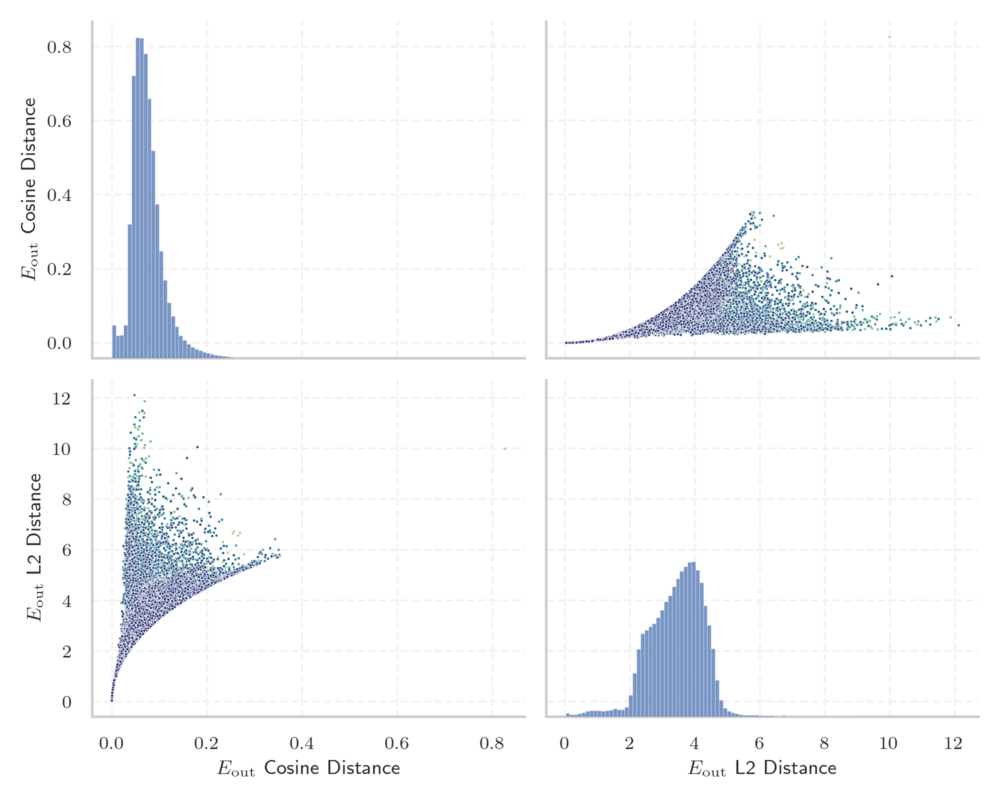

# Report for `google/gemma-7b`

## Model info

* Tied embeddings: yes
* LM head uses bias: no
* Indicator for under-trained tokens: E_{out} L2 Distance
  * Overall distribution 3.431 +/- 0.846
  * Token used for verification prompt building: `TouchableOpacity`
  * Verification threshold: 1.433
  * Threshold for showing candidate under-trained tokens: 0.313
  * Median verified threshold (for bytes, unreachable and special tokens): 0.331
* Embeddings shape: (256000, 3072)
* Vocabulary size: 256000
  * Number of single byte tokens: 380, of which 144 below indicator threshold
  * Number of special tokens: 158, of which 106 below indicator threshold
  * Number of non-single-byte unreachable tokens: 1, of which 1 below indicator threshold
  * Number of tested under-trained tokens: 5119, 5013 non-special, 694 below p = 0.01 threshold, 331 below soft indicator threshold

## Under-trained token indicators plot


## Verification plot


## Under-trained token verification results
331 entries below threshold of 0.313

|   token_id | token                        |   indicator | max_prob                                                         | in_other_tokens                                                                |
|------------|------------------------------|-------------|------------------------------------------------------------------|--------------------------------------------------------------------------------|
|     164525 | ````` हिंदीखरीदारी `````           |   0.0273005 | <span style='border: 1px solid rgb(169, 68, 66);'>0.00042</span> |                                                                                |
|     196609 | ````` \u200cآمباردا `````    |   0.0293875 | <span style='border: 1px solid rgb(169, 68, 66);'>0.00044</span> | ````` ▁ویکی\u200cآمباردا `````                                                 |
|     229433 | ````` ^(@)$_ `````           |   0.0299847 | <span style='border: 1px solid rgb(169, 68, 66);'>0.00043</span> |                                                                                |
|     127237 | ````` ▁coachTry `````        |   0.0327749 | <span style='border: 1px solid rgb(169, 68, 66);'>0.00043</span> |                                                                                |
|     185507 | ````` ▁queſto `````          |   0.0437382 | <span style='border: 1px solid rgb(169, 68, 66);'>0.00041</span> |                                                                                |
|     121349 | ````` ▁AcceptedLoading ````` |   0.048868  | <span style='border: 1px solid rgb(169, 68, 66);'>0.00042</span> |                                                                                |
|     134910 | ````` ſammen `````           |   0.054223  | <span style='border: 1px solid rgb(169, 68, 66);'>0.00047</span> | <span style='border: 1px solid rgb(169, 68, 66);'>````` ▁zuſammen `````</span> |
|     184138 | ````` ▁zuſammen `````        |   0.0572592 | <span style='border: 1px solid rgb(169, 68, 66);'>0.00046</span> |                                                                                |
|     222309 | ````` ▁queſta `````          |   0.0581543 | <span style='border: 1px solid rgb(169, 68, 66);'>0.00042</span> |                                                                                |
|      59098 | ````` EnglishChoose `````    |   0.0600916 | <span style='border: 1px solid rgb(169, 68, 66);'>0.00045</span> | ````` ▁EnglishChoose `````                                                     |
|     213138 | ````` ſſung `````            |   0.0631285 | <span style='border: 1px solid rgb(169, 68, 66);'>0.00051</span> |                                                                                |
|      91282 | ````` ▁ſelb `````            |   0.0631527 | <span style='border: 1px solid rgb(169, 68, 66);'>0.00057</span> | <span style='border: 1px solid rgb(169, 68, 66);'>````` ▁ſelbſt `````</span>   |
|     252915 | ````` \uf3f5 `````           |   0.065324  | <span style='border: 1px solid rgb(169, 68, 66);'>0.00037</span> |                                                                                |
|     227644 | ````` ▁ſeines `````          |   0.0683643 | <span style='border: 1px solid rgb(169, 68, 66);'>0.00046</span> |                                                                                |
|     143473 | ````` )$_. `````             |   0.0689885 | <span style='border: 1px solid rgb(169, 68, 66);'>0.00039</span> |                                                                                |
|     158454 | ````` ▁unſer `````           |   0.0718522 | <span style='border: 1px solid rgb(169, 68, 66);'>0.00044</span> |                                                                                |
|     225573 | ````` ▁Geiſt `````           |   0.0729614 | <span style='border: 1px solid rgb(169, 68, 66);'>0.00048</span> |                                                                                |
|     255245 | ````` \uf3cc `````           |   0.0730051 | <span style='border: 1px solid rgb(169, 68, 66);'>0.00044</span> |                                                                                |
|     220218 | ````` ▁ſehen `````           |   0.0768766 | <span style='border: 1px solid rgb(169, 68, 66);'>0.00046</span> |                                                                                |
|     216622 | ````` ▁Dieſe `````           |   0.077088  | <span style='border: 1px solid rgb(169, 68, 66);'>0.00041</span> |                                                                                |
<details><summary>311 additional entries below threshold</summary>

|   token_id | token                        |   indicator | max_prob                                                         | in_other_tokens                                                                                                                                                                                                                                                                                                        |
|------------|------------------------------|-------------|------------------------------------------------------------------|------------------------------------------------------------------------------------------------------------------------------------------------------------------------------------------------------------------------------------------------------------------------------------------------------------------------|
|     254350 | ````` \uf5ce `````           |   0.077408  | <span style='border: 1px solid rgb(169, 68, 66);'>0.00052</span> |                                                                                                                                                                                                                                                                                                                        |
|      45971 | ````` ▁linkCC `````          |   0.0775033 | <span style='border: 1px solid rgb(169, 68, 66);'>0.0004</span>  |                                                                                                                                                                                                                                                                                                                        |
|     121705 | ````` ▁ſondern `````         |   0.0816679 | <span style='border: 1px solid rgb(169, 68, 66);'>0.00044</span> |                                                                                                                                                                                                                                                                                                                        |
|     123221 | ````` >\<^ `````             |   0.0832294 | <span style='border: 1px solid rgb(169, 68, 66);'>0.00045</span> |                                                                                                                                                                                                                                                                                                                        |
|     254175 | ````` 𐁘 `````                |   0.0833011 | <span style='border: 1px solid rgb(169, 68, 66);'>0.00072</span> |                                                                                                                                                                                                                                                                                                                        |
|     203019 | ````` ▁daſs `````            |   0.0853709 | <span style='border: 1px solid rgb(169, 68, 66);'>0.0005</span>  |                                                                                                                                                                                                                                                                                                                        |
|     161080 | ````` ▁ſeyn `````            |   0.0860598 | <span style='border: 1px solid rgb(169, 68, 66);'>0.00041</span> |                                                                                                                                                                                                                                                                                                                        |
|     210616 | ````` ▁geweſen `````         |   0.0862998 | <span style='border: 1px solid rgb(169, 68, 66);'>0.00039</span> |                                                                                                                                                                                                                                                                                                                        |
|     254455 | ````` \ued90 `````           |   0.0872377 | <span style='border: 1px solid rgb(169, 68, 66);'>0.00057</span> |                                                                                                                                                                                                                                                                                                                        |
|     230983 | ````` ▁wiſſen `````          |   0.089413  | <span style='border: 1px solid rgb(169, 68, 66);'>0.00041</span> |                                                                                                                                                                                                                                                                                                                        |
|     153473 | ````` ▁Menſchen `````        |   0.0897941 | <span style='border: 1px solid rgb(169, 68, 66);'>0.00053</span> |                                                                                                                                                                                                                                                                                                                        |
|     255645 | ````` \uef0e `````           |   0.0900223 | <span style='border: 1px solid rgb(169, 68, 66);'>0.00063</span> |                                                                                                                                                                                                                                                                                                                        |
|     143114 | ````` ▁ſeinem `````          |   0.0920703 | <span style='border: 1px solid rgb(169, 68, 66);'>0.00042</span> |                                                                                                                                                                                                                                                                                                                        |
|     253613 | ````` \U000e0041 `````       |   0.0931103 | <span style='border: 1px solid rgb(169, 68, 66);'>0.00054</span> |                                                                                                                                                                                                                                                                                                                        |
|     174176 | ````` ▁ſoll `````            |   0.0942013 | <span style='border: 1px solid rgb(169, 68, 66);'>0.00045</span> |                                                                                                                                                                                                                                                                                                                        |
|     173899 | ````` ▁メンテナ `````        |   0.0968096 | <span style='border: 1px solid rgb(169, 68, 66);'>0.0005</span>  | ````` ▁メンテナンス `````                                                                                                                                                                                                                                                                                              |
|       2873 | ````` ICTOGRAM `````         |   0.0973547 | <span style='border: 1px solid rgb(169, 68, 66);'>0.00041</span> | <span style='border: 1px solid rgb(40, 167, 69);'>````` ▁PICTOGRAM `````</span>, ````` PICTOGRAM `````                                                                                                                                                                                                                 |
|     254944 | ````` ⪜ `````                |   0.0978286 | <span style='border: 1px solid rgb(169, 68, 66);'>0.0005</span>  |                                                                                                                                                                                                                                                                                                                        |
|     253228 | ````` \ue275 `````           |   0.0989635 | <span style='border: 1px solid rgb(169, 68, 66);'>0.00045</span> |                                                                                                                                                                                                                                                                                                                        |
|     255790 | ````` \ue734 `````           |   0.100044  | <span style='border: 1px solid rgb(169, 68, 66);'>0.0004</span>  |                                                                                                                                                                                                                                                                                                                        |
|     253377 | ````` \ue386 `````           |   0.10025   | <span style='border: 1px solid rgb(169, 68, 66);'>0.0005</span>  |                                                                                                                                                                                                                                                                                                                        |
|     148617 | ````` ▁deſſen `````          |   0.100591  | <span style='border: 1px solid rgb(169, 68, 66);'>0.00039</span> |                                                                                                                                                                                                                                                                                                                        |
|     192547 | ````` ▁erſten `````          |   0.101317  | <span style='border: 1px solid rgb(169, 68, 66);'>0.00048</span> |                                                                                                                                                                                                                                                                                                                        |
|     123984 | ````` ▁ſeinen `````          |   0.102654  | <span style='border: 1px solid rgb(169, 68, 66);'>0.00051</span> |                                                                                                                                                                                                                                                                                                                        |
|      42380 | ````` ▁stockbild `````       |   0.104831  | <span style='border: 1px solid rgb(169, 68, 66);'>0.00053</span> | <span style='border: 1px solid rgb(169, 68, 66);'>````` ▁stockbilder `````</span>                                                                                                                                                                                                                                      |
|     151521 | ````` ▁müſſen `````          |   0.106145  | <span style='border: 1px solid rgb(169, 68, 66);'>0.00046</span> |                                                                                                                                                                                                                                                                                                                        |
|     252631 | ````` \uf51a `````           |   0.10694   | <span style='border: 1px solid rgb(169, 68, 66);'>0.00046</span> |                                                                                                                                                                                                                                                                                                                        |
|     254071 | ````` \uef5a `````           |   0.109612  | <span style='border: 1px solid rgb(169, 68, 66);'>0.00061</span> |                                                                                                                                                                                                                                                                                                                        |
|     255154 | ````` ᦶ `````                |   0.111168  | <span style='border: 1px solid rgb(169, 68, 66);'>0.0007</span>  |                                                                                                                                                                                                                                                                                                                        |
|     113990 | ````` ▁ſehr `````            |   0.11134   | <span style='border: 1px solid rgb(169, 68, 66);'>0.00039</span> |                                                                                                                                                                                                                                                                                                                        |
|     254591 | ````` \u0e72 `````           |   0.111531  | <span style='border: 1px solid rgb(169, 68, 66);'>0.00045</span> |                                                                                                                                                                                                                                                                                                                        |
|     171300 | ````` rbrakk `````           |   0.112097  | <span style='border: 1px solid rgb(169, 68, 66);'>0.00056</span> |                                                                                                                                                                                                                                                                                                                        |
|     151848 | ````` ▁ſei `````             |   0.113706  | <span style='border: 1px solid rgb(169, 68, 66);'>0.00055</span> | <span style='border: 1px solid rgb(169, 68, 66);'>````` ▁ſeines `````</span>                                                                                                                                                                                                                                           |
|     255011 | ````` 𓇠 `````                |   0.115732  | <span style='border: 1px solid rgb(169, 68, 66);'>0.00091</span> |                                                                                                                                                                                                                                                                                                                        |
|     193385 | ````` iſen `````             |   0.116379  | <span style='border: 1px solid rgb(169, 68, 66);'>0.00044</span> |                                                                                                                                                                                                                                                                                                                        |
|     233201 | ````` ▁Weiſe `````           |   0.117309  | <span style='border: 1px solid rgb(169, 68, 66);'>0.00035</span> |                                                                                                                                                                                                                                                                                                                        |
|     255795 | ````` \uec4c `````           |   0.118078  | <span style='border: 1px solid rgb(169, 68, 66);'>0.00059</span> |                                                                                                                                                                                                                                                                                                                        |
|     255279 | ````` ᦵ `````                |   0.118092  | <span style='border: 1px solid rgb(169, 68, 66);'>0.00057</span> |                                                                                                                                                                                                                                                                                                                        |
|     128625 | ````` ▁dieſem `````          |   0.118474  | <span style='border: 1px solid rgb(169, 68, 66);'>0.00046</span> |                                                                                                                                                                                                                                                                                                                        |
|     232866 | ````` ▁stiefe `````          |   0.12108   | <span style='border: 1px solid rgb(169, 68, 66);'>0.00059</span> |                                                                                                                                                                                                                                                                                                                        |
|     251499 | ````` ྑ `````                 |   0.121422  | <span style='border: 1px solid rgb(169, 68, 66);'>0.00041</span> |                                                                                                                                                                                                                                                                                                                        |
|     153064 | ````` ▁stockbilder `````     |   0.122246  | <span style='border: 1px solid rgb(169, 68, 66);'>0.00049</span> |                                                                                                                                                                                                                                                                                                                        |
|     255267 | ````` \u0e63 `````           |   0.122871  | <span style='border: 1px solid rgb(169, 68, 66);'>0.00037</span> |                                                                                                                                                                                                                                                                                                                        |
|     159234 | ````` ſehen `````            |   0.122932  | <span style='border: 1px solid rgb(169, 68, 66);'>0.00046</span> | <span style='border: 1px solid rgb(169, 68, 66);'>````` ▁ſehen `````</span>                                                                                                                                                                                                                                            |
|      96098 | ````` ▁ſelbſt `````          |   0.125072  | <span style='border: 1px solid rgb(169, 68, 66);'>0.00063</span> |                                                                                                                                                                                                                                                                                                                        |
|     253034 | ````` \uf7a0 `````           |   0.125203  | <span style='border: 1px solid rgb(169, 68, 66);'>0.00046</span> |                                                                                                                                                                                                                                                                                                                        |
|     255849 | ````` ⏔ `````                |   0.125991  | <span style='border: 1px solid rgb(255, 145, 0);'>0.0011</span>  |                                                                                                                                                                                                                                                                                                                        |
|     195121 | ````` ▁Waſſer `````          |   0.126084  | <span style='border: 1px solid rgb(169, 68, 66);'>0.00041</span> |                                                                                                                                                                                                                                                                                                                        |
|     224365 | ````` ikusbot `````          |   0.129002  | <span style='border: 1px solid rgb(169, 68, 66);'>0.00064</span> | <span style='border: 1px solid rgb(40, 167, 69);'>````` haikusbot `````</span>                                                                                                                                                                                                                                         |
|     171654 | ````` lbrakk `````           |   0.12927   | <span style='border: 1px solid rgb(169, 68, 66);'>0.00061</span> |                                                                                                                                                                                                                                                                                                                        |
|     255122 | ````` \uf540 `````           |   0.130346  | <span style='border: 1px solid rgb(169, 68, 66);'>0.00058</span> |                                                                                                                                                                                                                                                                                                                        |
|     253441 | ````` \ue984 `````           |   0.131162  | <span style='border: 1px solid rgb(169, 68, 66);'>0.00042</span> |                                                                                                                                                                                                                                                                                                                        |
|     177069 | ````` ▁티즈 `````            |   0.131368  | <span style='border: 1px solid rgb(169, 68, 66);'>0.00062</span> |                                                                                                                                                                                                                                                                                                                        |
|     255647 | ````` \uf35e `````           |   0.131368  | <span style='border: 1px solid rgb(169, 68, 66);'>0.00053</span> |                                                                                                                                                                                                                                                                                                                        |
|     123190 | ````` ſelben `````           |   0.13137   | <span style='border: 1px solid rgb(169, 68, 66);'>0.00047</span> |                                                                                                                                                                                                                                                                                                                        |
|     254258 | ````` \ue5d0 `````           |   0.131447  | <span style='border: 1px solid rgb(169, 68, 66);'>0.00062</span> |                                                                                                                                                                                                                                                                                                                        |
|     167982 | ````` ▁stockfotografie ````` |   0.132716  | <span style='border: 1px solid rgb(169, 68, 66);'>0.00063</span> |                                                                                                                                                                                                                                                                                                                        |
|     255510 | ````` \ue51e `````           |   0.134723  | <span style='border: 1px solid rgb(169, 68, 66);'>0.00045</span> |                                                                                                                                                                                                                                                                                                                        |
|      97619 | ````` ▁ſeiner `````          |   0.134813  | <span style='border: 1px solid rgb(169, 68, 66);'>0.00042</span> |                                                                                                                                                                                                                                                                                                                        |
|     136616 | ````` ▁verſch `````          |   0.1351    | <span style='border: 1px solid rgb(169, 68, 66);'>0.00053</span> |                                                                                                                                                                                                                                                                                                                        |
|     109547 | ````` ▁ſchon `````           |   0.135244  | <span style='border: 1px solid rgb(169, 68, 66);'>0.00048</span> |                                                                                                                                                                                                                                                                                                                        |
|     254456 | ````` \uefa6 `````           |   0.136073  | <span style='border: 1px solid rgb(169, 68, 66);'>0.00042</span> |                                                                                                                                                                                                                                                                                                                        |
|     202616 | ````` ▁erſt `````            |   0.137442  | <span style='border: 1px solid rgb(169, 68, 66);'>0.00062</span> |                                                                                                                                                                                                                                                                                                                        |
|     155980 | ````` ▁beſch `````           |   0.138354  | <span style='border: 1px solid rgb(169, 68, 66);'>0.00095</span> |                                                                                                                                                                                                                                                                                                                        |
|     225539 | ````` isGridAdvEx `````      |   0.138539  | <span style='border: 1px solid rgb(169, 68, 66);'>0.00082</span> |                                                                                                                                                                                                                                                                                                                        |
|     195351 | ````` niſſe `````            |   0.139289  | <span style='border: 1px solid rgb(169, 68, 66);'>0.00045</span> |                                                                                                                                                                                                                                                                                                                        |
|     255807 | ````` 𝆣 `````                |   0.139877  | <span style='border: 1px solid rgb(169, 68, 66);'>0.00042</span> |                                                                                                                                                                                                                                                                                                                        |
|     206857 | ````` ▁tartalo `````         |   0.13993   | <span style='border: 1px solid rgb(169, 68, 66);'>0.0005</span>  | ````` ▁tartalomajánló `````                                                                                                                                                                                                                                                                                            |
|     130087 | ````` ▁daysTop `````         |   0.140048  | <span style='border: 1px solid rgb(169, 68, 66);'>0.00092</span> |                                                                                                                                                                                                                                                                                                                        |
|     172465 | ````` iſche `````            |   0.141454  | <span style='border: 1px solid rgb(169, 68, 66);'>0.00059</span> | <span style='border: 1px solid rgb(169, 68, 66);'>````` ▁zwiſchen `````</span>                                                                                                                                                                                                                                         |
|     252436 | ````` ᅝ `````               |   0.141881  | <span style='border: 1px solid rgb(169, 68, 66);'>0.00087</span> |                                                                                                                                                                                                                                                                                                                        |
|     125919 | ````` Билгалда `````         |   0.14219   | <span style='border: 1px solid rgb(169, 68, 66);'>0.0005</span>  | ````` Билгалдахарш `````                                                                                                                                                                                                                                                                                               |
|     152266 | ````` ▁imagui `````          |   0.144378  | <span style='border: 1px solid rgb(169, 68, 66);'>0.00048</span> |                                                                                                                                                                                                                                                                                                                        |
|     254566 | ````` \ue776 `````           |   0.145132  | <span style='border: 1px solid rgb(169, 68, 66);'>0.00094</span> |                                                                                                                                                                                                                                                                                                                        |
|     254908 | ````` 𖧹 `````                |   0.145411  | <span style='border: 1px solid rgb(169, 68, 66);'>0.00065</span> |                                                                                                                                                                                                                                                                                                                        |
|     108162 | ````` 久しぶ `````           |   0.145896  | <span style='border: 1px solid rgb(169, 68, 66);'>0.00068</span> | ````` 久しぶりに `````, ````` 久しぶり `````, ````` 久しぶりの `````                                                                                                                                                                                                                                                   |
|     118456 | ````` ロウィン `````         |   0.147398  | <span style='border: 1px solid rgb(169, 68, 66);'>0.00053</span> | ````` ハロウィン `````, ````` ▁ハロウィン `````                                                                                                                                                                                                                                                                        |
|     250800 | ````` \u0ba1 `````           |   0.148916  | <span style='border: 1px solid rgb(169, 68, 66);'>0.00069</span> |                                                                                                                                                                                                                                                                                                                        |
|     208438 | ````` ▁ſuo `````             |   0.150364  | <span style='border: 1px solid rgb(169, 68, 66);'>0.00078</span> |                                                                                                                                                                                                                                                                                                                        |
|     167630 | ````` ▁PeEn `````            |   0.15241   | <span style='border: 1px solid rgb(169, 68, 66);'>0.00058</span> | ````` ▁PeEnEo `````                                                                                                                                                                                                                                                                                                    |
|     120213 | ````` iſchen `````           |   0.153224  | <span style='border: 1px solid rgb(169, 68, 66);'>0.00045</span> | <span style='border: 1px solid rgb(169, 68, 66);'>````` ▁zwiſchen `````</span>                                                                                                                                                                                                                                         |
|     255792 | ````` \ue762 `````           |   0.15364   | <span style='border: 1px solid rgb(169, 68, 66);'>0.00065</span> |                                                                                                                                                                                                                                                                                                                        |
|     253901 | ````` \ue676 `````           |   0.154182  | <span style='border: 1px solid rgb(169, 68, 66);'>0.00053</span> |                                                                                                                                                                                                                                                                                                                        |
|     208306 | ````` ▁beſte `````           |   0.154659  | <span style='border: 1px solid rgb(169, 68, 66);'>0.00076</span> |                                                                                                                                                                                                                                                                                                                        |
|     255379 | ````` \uf2ba `````           |   0.154688  | <span style='border: 1px solid rgb(169, 68, 66);'>0.00055</span> |                                                                                                                                                                                                                                                                                                                        |
|     135639 | ````` ▁dieſen `````          |   0.155378  | <span style='border: 1px solid rgb(169, 68, 66);'>0.00044</span> |                                                                                                                                                                                                                                                                                                                        |
|      75807 | ````` ▁dieſe `````           |   0.156675  | <span style='border: 1px solid rgb(169, 68, 66);'>0.0004</span>  | <span style='border: 1px solid rgb(169, 68, 66);'>````` ▁dieſer `````</span>, <span style='border: 1px solid rgb(169, 68, 66);'>````` ▁dieſes `````</span>, <span style='border: 1px solid rgb(169, 68, 66);'>````` ▁dieſem `````</span>, <span style='border: 1px solid rgb(169, 68, 66);'>````` ▁dieſen `````</span> |
|     255242 | ````` \ue6f0 `````           |   0.156955  | <span style='border: 1px solid rgb(169, 68, 66);'>0.00076</span> |                                                                                                                                                                                                                                                                                                                        |
|     254213 | ````` ⸄ `````                |   0.1579    | <span style='border: 1px solid rgb(255, 145, 0);'>0.0019</span>  |                                                                                                                                                                                                                                                                                                                        |
|     254885 | ````` ꎬ `````               |   0.158517  | <span style='border: 1px solid rgb(169, 68, 66);'>0.00067</span> |                                                                                                                                                                                                                                                                                                                        |
|     199696 | ````` ſicht `````            |   0.161575  | <span style='border: 1px solid rgb(169, 68, 66);'>0.0005</span>  |                                                                                                                                                                                                                                                                                                                        |
|     198203 | ````` ▁zwiſchen `````        |   0.162941  | <span style='border: 1px solid rgb(169, 68, 66);'>0.00041</span> |                                                                                                                                                                                                                                                                                                                        |
|     253326 | ````` ྚ `````                 |   0.164889  | <span style='border: 1px solid rgb(169, 68, 66);'>0.0006</span>  |                                                                                                                                                                                                                                                                                                                        |
|     114402 | ````` ▁Geſch `````           |   0.166738  | <span style='border: 1px solid rgb(169, 68, 66);'>0.00075</span> |                                                                                                                                                                                                                                                                                                                        |
|      89379 | ````` ▁ſeine `````           |   0.166875  | <span style='border: 1px solid rgb(169, 68, 66);'>0.00039</span> | <span style='border: 1px solid rgb(169, 68, 66);'>````` ▁ſeiner `````</span>, <span style='border: 1px solid rgb(169, 68, 66);'>````` ▁ſeinen `````</span>, <span style='border: 1px solid rgb(169, 68, 66);'>````` ▁ſeinem `````</span>, <span style='border: 1px solid rgb(169, 68, 66);'>````` ▁ſeines `````</span> |
|     158241 | ````` vorschaubild `````     |   0.167507  | <span style='border: 1px solid rgb(169, 68, 66);'>0.00053</span> |                                                                                                                                                                                                                                                                                                                        |
|     255271 | ````` ྴ `````                 |   0.168124  | <span style='border: 1px solid rgb(169, 68, 66);'>0.00086</span> |                                                                                                                                                                                                                                                                                                                        |
|     255793 | ````` \ue777 `````           |   0.169231  | <span style='border: 1px solid rgb(169, 68, 66);'>0.00081</span> |                                                                                                                                                                                                                                                                                                                        |
|     252790 | ````` ﮢ `````                |   0.169313  | <span style='border: 1px solid rgb(169, 68, 66);'>0.00082</span> |                                                                                                                                                                                                                                                                                                                        |
|     255948 | ````` \ue2d6 `````           |   0.170625  | <span style='border: 1px solid rgb(169, 68, 66);'>0.0007</span>  |                                                                                                                                                                                                                                                                                                                        |
|     255420 | ````` ⸏ `````                |   0.170869  | <span style='border: 1px solid rgb(169, 68, 66);'>0.00064</span> |                                                                                                                                                                                                                                                                                                                        |
|     200906 | ````` ▁ſua `````             |   0.17127   | <span style='border: 1px solid rgb(255, 145, 0);'>0.0012</span>  |                                                                                                                                                                                                                                                                                                                        |
|     252858 | ````` ྋ `````                |   0.171291  | <span style='border: 1px solid rgb(169, 68, 66);'>0.00046</span> |                                                                                                                                                                                                                                                                                                                        |
|     252787 | ````` \ue2cd `````           |   0.171614  | <span style='border: 1px solid rgb(169, 68, 66);'>0.0007</span>  |                                                                                                                                                                                                                                                                                                                        |
|     214340 | ````` ▁パンチラ `````        |   0.172519  | <span style='border: 1px solid rgb(169, 68, 66);'>0.00038</span> |                                                                                                                                                                                                                                                                                                                        |
|     253247 | ````` ྻ `````                 |   0.173739  | <span style='border: 1px solid rgb(169, 68, 66);'>0.00048</span> |                                                                                                                                                                                                                                                                                                                        |
|      25269 | ````` NdEx `````             |   0.174357  | <span style='border: 1px solid rgb(169, 68, 66);'>0.00053</span> | ````` iNdEx `````, ````` ▁iNdEx `````                                                                                                                                                                                                                                                                                  |
|     253758 | ````` ﭥ `````                |   0.174657  | <span style='border: 1px solid rgb(169, 68, 66);'>0.00095</span> |                                                                                                                                                                                                                                                                                                                        |
|     181784 | ````` ▁་་ `````              |   0.175153  | <span style='border: 1px solid rgb(169, 68, 66);'>0.0004</span>  |                                                                                                                                                                                                                                                                                                                        |
|     254114 | ````` ⸅ `````                |   0.175848  | <span style='border: 1px solid rgb(255, 145, 0);'>0.0023</span>  |                                                                                                                                                                                                                                                                                                                        |
|     225065 | ````` bildtitel `````        |   0.176219  | <span style='border: 1px solid rgb(169, 68, 66);'>0.00043</span> |                                                                                                                                                                                                                                                                                                                        |
|     128951 | ````` ▁laſſen `````          |   0.17669   | <span style='border: 1px solid rgb(169, 68, 66);'>0.00046</span> |                                                                                                                                                                                                                                                                                                                        |
|     254565 | ````` \ue67b `````           |   0.176897  | <span style='border: 1px solid rgb(169, 68, 66);'>0.00042</span> |                                                                                                                                                                                                                                                                                                                        |
|     253992 | ````` \ue7b5 `````           |   0.177307  | <span style='border: 1px solid rgb(169, 68, 66);'>0.00047</span> |                                                                                                                                                                                                                                                                                                                        |
|     253100 | ````` \ue791 `````           |   0.178598  | <span style='border: 1px solid rgb(169, 68, 66);'>0.0004</span>  |                                                                                                                                                                                                                                                                                                                        |
|     253173 | ````` \ue2f9 `````           |   0.178686  | <span style='border: 1px solid rgb(169, 68, 66);'>0.00072</span> |                                                                                                                                                                                                                                                                                                                        |
|     255947 | ````` \ue2ca `````           |   0.178748  | <span style='border: 1px solid rgb(169, 68, 66);'>0.00075</span> |                                                                                                                                                                                                                                                                                                                        |
|      80527 | ````` ▁dieſer `````          |   0.179397  | <span style='border: 1px solid rgb(169, 68, 66);'>0.00048</span> |                                                                                                                                                                                                                                                                                                                        |
|     251525 | ````` \ueae4 `````           |   0.18052   | <span style='border: 1px solid rgb(169, 68, 66);'>0.0004</span>  |                                                                                                                                                                                                                                                                                                                        |
|     254600 | ````` ⅏ `````                |   0.183281  | <span style='border: 1px solid rgb(169, 68, 66);'>0.00075</span> |                                                                                                                                                                                                                                                                                                                        |
|      88138 | ````` ſchaft `````           |   0.184762  | <span style='border: 1px solid rgb(169, 68, 66);'>0.00053</span> |                                                                                                                                                                                                                                                                                                                        |
|     255641 | ````` \ue290 `````           |   0.184814  | <span style='border: 1px solid rgb(169, 68, 66);'>0.00072</span> |                                                                                                                                                                                                                                                                                                                        |
|     254686 | ````` 𑄮 `````                 |   0.185347  | <span style='border: 1px solid rgb(255, 145, 0);'>0.0029</span>  |                                                                                                                                                                                                                                                                                                                        |
|     252567 | ````` ﭔ `````                |   0.18636   | <span style='border: 1px solid rgb(169, 68, 66);'>0.00094</span> |                                                                                                                                                                                                                                                                                                                        |
|     253927 | ````` ᦺ `````                |   0.186695  | <span style='border: 1px solid rgb(169, 68, 66);'>0.00098</span> |                                                                                                                                                                                                                                                                                                                        |
|     221674 | ````` ">😂 `````             |   0.187057  | <span style='border: 1px solid rgb(255, 145, 0);'>0.0011</span>  |                                                                                                                                                                                                                                                                                                                        |
|     176775 | ````` ▁盗撮 `````            |   0.187175  | <span style='border: 1px solid rgb(169, 68, 66);'>0.00052</span> |                                                                                                                                                                                                                                                                                                                        |
|     255003 | ````` \ue2e0 `````           |   0.189904  | <span style='border: 1px solid rgb(169, 68, 66);'>0.0008</span>  |                                                                                                                                                                                                                                                                                                                        |
|     167294 | ````` ▁GoogleContinue `````  |   0.190732  | <span style='border: 1px solid rgb(169, 68, 66);'>0.00052</span> |                                                                                                                                                                                                                                                                                                                        |
|     255371 | ````` \ue2c9 `````           |   0.191932  | <span style='border: 1px solid rgb(169, 68, 66);'>0.00071</span> |                                                                                                                                                                                                                                                                                                                        |
|     209936 | ````` ▁展板 `````            |   0.191937  | <span style='border: 1px solid rgb(169, 68, 66);'>0.00043</span> |                                                                                                                                                                                                                                                                                                                        |
|     253899 | ````` \ue2bd `````           |   0.193392  | <span style='border: 1px solid rgb(255, 145, 0);'>0.0012</span>  |                                                                                                                                                                                                                                                                                                                        |
|     254169 | ````` \ue2f1 `````           |   0.196049  | <span style='border: 1px solid rgb(169, 68, 66);'>0.00088</span> |                                                                                                                                                                                                                                                                                                                        |
|     255123 | ````` 𑄥 `````                |   0.197069  | <span style='border: 1px solid rgb(255, 145, 0);'>0.0023</span>  |                                                                                                                                                                                                                                                                                                                        |
|     253898 | ````` \ue298 `````           |   0.197708  | <span style='border: 1px solid rgb(169, 68, 66);'>0.0008</span>  |                                                                                                                                                                                                                                                                                                                        |
|     254486 | ````` ᆤ `````                 |   0.198852  | <span style='border: 1px solid rgb(169, 68, 66);'>0.00062</span> |                                                                                                                                                                                                                                                                                                                        |
|     150747 | ````` ſcher `````            |   0.200581  | <span style='border: 1px solid rgb(169, 68, 66);'>0.00063</span> |                                                                                                                                                                                                                                                                                                                        |
|     254549 | ````` ꊥ `````               |   0.200666  | <span style='border: 1px solid rgb(169, 68, 66);'>0.00049</span> |                                                                                                                                                                                                                                                                                                                        |
|     169039 | ````` ▁ſche `````            |   0.201186  | <span style='border: 1px solid rgb(255, 145, 0);'>0.0013</span>  |                                                                                                                                                                                                                                                                                                                        |
|     255517 | ````` 𑄝 `````                |   0.202212  | <span style='border: 1px solid rgb(255, 145, 0);'>0.0031</span>  |                                                                                                                                                                                                                                                                                                                        |
|     249717 | ````` ༞ `````                |   0.202696  | <span style='border: 1px solid rgb(169, 68, 66);'>0.00089</span> |                                                                                                                                                                                                                                                                                                                        |
|     255945 | ````` \ue29a `````           |   0.203177  | <span style='border: 1px solid rgb(169, 68, 66);'>0.0008</span>  |                                                                                                                                                                                                                                                                                                                        |
|      89812 | ````` 存档备份 `````         |   0.203291  | <span style='border: 1px solid rgb(169, 68, 66);'>0.00057</span> | ````` 页面存档备份 `````                                                                                                                                                                                                                                                                                               |
|     131560 | ````` ▁desmotivaciones ````` |   0.204572  | <span style='border: 1px solid rgb(169, 68, 66);'>0.00062</span> |                                                                                                                                                                                                                                                                                                                        |
|     248337 | ````` \uf21d `````           |   0.205081  | <span style='border: 1px solid rgb(169, 68, 66);'>0.00088</span> |                                                                                                                                                                                                                                                                                                                        |
|     254259 | ````` \uf117 `````           |   0.205336  | <span style='border: 1px solid rgb(169, 68, 66);'>0.00043</span> |                                                                                                                                                                                                                                                                                                                        |
|     251560 | ````` \ue978 `````           |   0.205394  | <span style='border: 1px solid rgb(255, 145, 0);'>0.0054</span>  |                                                                                                                                                                                                                                                                                                                        |
|     255248 | ````` 𐑥 `````                |   0.206795  | <span style='border: 1px solid rgb(255, 145, 0);'>0.0024</span>  |                                                                                                                                                                                                                                                                                                                        |
|     253987 | ````` \ue2a4 `````           |   0.207786  | <span style='border: 1px solid rgb(169, 68, 66);'>0.00081</span> |                                                                                                                                                                                                                                                                                                                        |
|     249784 | ````` ܞ `````                |   0.209525  | <span style='border: 1px solid rgb(255, 145, 0);'>0.0011</span>  |                                                                                                                                                                                                                                                                                                                        |
|     254927 | ````` ༐ `````                |   0.209718  | <span style='border: 1px solid rgb(255, 145, 0);'>0.0011</span>  |                                                                                                                                                                                                                                                                                                                        |
|     220260 | ````` ▁beſti `````           |   0.211     | <span style='border: 1px solid rgb(169, 68, 66);'>0.00052</span> |                                                                                                                                                                                                                                                                                                                        |
|     247641 | ````` ܇ `````                |   0.211315  | <span style='border: 1px solid rgb(255, 145, 0);'>0.0011</span>  |                                                                                                                                                                                                                                                                                                                        |
|     253989 | ````` \ue2b1 `````           |   0.211685  | <span style='border: 1px solid rgb(169, 68, 66);'>0.00087</span> |                                                                                                                                                                                                                                                                                                                        |
|     255236 | ````` \ue2d1 `````           |   0.211755  | <span style='border: 1px solid rgb(255, 145, 0);'>0.0013</span>  |                                                                                                                                                                                                                                                                                                                        |
|     253828 | ````` ꪼ `````                |   0.213398  | <span style='border: 1px solid rgb(169, 68, 66);'>0.00046</span> |                                                                                                                                                                                                                                                                                                                        |
|     182427 | ````` )$_, `````             |   0.215048  | <span style='border: 1px solid rgb(169, 68, 66);'>0.00071</span> |                                                                                                                                                                                                                                                                                                                        |
|     249361 | ````` ྪ `````                 |   0.215632  | <span style='border: 1px solid rgb(169, 68, 66);'>0.00081</span> |                                                                                                                                                                                                                                                                                                                        |
|     253904 | ````` 𑄣 `````                |   0.215921  | <span style='border: 1px solid rgb(255, 145, 0);'>0.0029</span>  |                                                                                                                                                                                                                                                                                                                        |
|     253104 | ````` 𓆱 `````                |   0.215983  | <span style='border: 1px solid rgb(255, 145, 0);'>0.0012</span>  |                                                                                                                                                                                                                                                                                                                        |
|     255237 | ````` \ue2db `````           |   0.216276  | <span style='border: 1px solid rgb(169, 68, 66);'>0.0007</span>  |                                                                                                                                                                                                                                                                                                                        |
|     255806 | ````` 𑄠 `````                |   0.21648   | <span style='border: 1px solid rgb(255, 145, 0);'>0.0033</span>  |                                                                                                                                                                                                                                                                                                                        |
|     252682 | ````` \uf55f `````           |   0.216498  | <span style='border: 1px solid rgb(169, 68, 66);'>0.00047</span> |                                                                                                                                                                                                                                                                                                                        |
|     251632 | ````` 𑄨 `````                 |   0.217491  | <span style='border: 1px solid rgb(255, 145, 0);'>0.0054</span>  |                                                                                                                                                                                                                                                                                                                        |
|     255124 | ````` 𑄪 `````                 |   0.218221  | <span style='border: 1px solid rgb(255, 145, 0);'>0.0043</span>  |                                                                                                                                                                                                                                                                                                                        |
|     207398 | ````` ▁plufieurs `````       |   0.218323  | <span style='border: 1px solid rgb(255, 145, 0);'>0.0019</span>  |                                                                                                                                                                                                                                                                                                                        |
|     187776 | ````` ▁Verſ `````            |   0.219156  | <span style='border: 1px solid rgb(169, 68, 66);'>0.00052</span> |                                                                                                                                                                                                                                                                                                                        |
|     248691 | ````` ྰ `````                 |   0.220079  | <span style='border: 1px solid rgb(169, 68, 66);'>0.00062</span> |                                                                                                                                                                                                                                                                                                                        |
|     255791 | ````` \ue73e `````           |   0.220755  | <span style='border: 1px solid rgb(169, 68, 66);'>0.00055</span> |                                                                                                                                                                                                                                                                                                                        |
|      72182 | ````` ▁版税 `````            |   0.221936  | <span style='border: 1px solid rgb(255, 145, 0);'>0.0013</span>  |                                                                                                                                                                                                                                                                                                                        |
|     112171 | ````` Diwed `````            |   0.225314  | <span style='border: 1px solid rgb(169, 68, 66);'>0.00048</span> | ````` Diwedd `````, <span style='border: 1px solid rgb(169, 68, 66);'>````` Diweddar `````</span>, ````` Diweddarwch `````                                                                                                                                                                                             |
|     116882 | ````` ▁geſch `````           |   0.227237  | <span style='border: 1px solid rgb(169, 68, 66);'>0.00053</span> |                                                                                                                                                                                                                                                                                                                        |
|     249663 | ````` Ꮽ `````                |   0.227767  | <span style='border: 1px solid rgb(255, 145, 0);'>0.0019</span>  |                                                                                                                                                                                                                                                                                                                        |
|     253103 | ````` 𑄚 `````                |   0.228151  | <span style='border: 1px solid rgb(255, 145, 0);'>0.0046</span>  |                                                                                                                                                                                                                                                                                                                        |
|      68314 | ````` ▁例证 `````            |   0.228696  | <span style='border: 1px solid rgb(255, 145, 0);'>0.0016</span>  |                                                                                                                                                                                                                                                                                                                        |
|     176309 | ````` enablog `````          |   0.229059  | <span style='border: 1px solid rgb(255, 145, 0);'>0.0016</span>  | ````` hatenablog `````                                                                                                                                                                                                                                                                                                 |
|     254460 | ````` ﮈ `````                |   0.229651  | <span style='border: 1px solid rgb(255, 145, 0);'>0.0017</span>  |                                                                                                                                                                                                                                                                                                                        |
|     205674 | ````` нгред `````            |   0.229955  | <span style='border: 1px solid rgb(255, 145, 0);'>0.0014</span>  | ````` нгредіє `````, ````` нгредієнти `````                                                                                                                                                                                                                                                                            |
|     220916 | ````` ▁vooz `````            |   0.230548  | <span style='border: 1px solid rgb(169, 68, 66);'>0.00044</span> |                                                                                                                                                                                                                                                                                                                        |
|     255955 | ````` \ue6ec `````           |   0.230914  | <span style='border: 1px solid rgb(169, 68, 66);'>0.00047</span> |                                                                                                                                                                                                                                                                                                                        |
|     253229 | ````` \ue2fd `````           |   0.231925  | <span style='border: 1px solid rgb(169, 68, 66);'>0.00086</span> |                                                                                                                                                                                                                                                                                                                        |
|     253926 | ````` ᥀ `````                |   0.231937  | <span style='border: 1px solid rgb(169, 68, 66);'>0.00094</span> |                                                                                                                                                                                                                                                                                                                        |
|     252788 | ````` \ue2d7 `````           |   0.232434  | <span style='border: 1px solid rgb(255, 145, 0);'>0.0013</span>  |                                                                                                                                                                                                                                                                                                                        |
|     255814 | ````` 𞤑 `````                |   0.233758  | <span style='border: 1px solid rgb(169, 68, 66);'>0.0009</span>  |                                                                                                                                                                                                                                                                                                                        |
|     159995 | ````` ▁剪影 `````            |   0.23391   | <span style='border: 1px solid rgb(169, 68, 66);'>0.0008</span>  |                                                                                                                                                                                                                                                                                                                        |
|     253187 | ````` ݯ `````                |   0.234089  | <span style='border: 1px solid rgb(255, 145, 0);'>0.0014</span>  |                                                                                                                                                                                                                                                                                                                        |
|     255116 | ````` \ue2e1 `````           |   0.235304  | <span style='border: 1px solid rgb(255, 145, 0);'>0.0011</span>  |                                                                                                                                                                                                                                                                                                                        |
|     253030 | ````` 콯 `````               |   0.23556   | <span style='border: 1px solid rgb(255, 145, 0);'>0.0014</span>  |                                                                                                                                                                                                                                                                                                                        |
|     254255 | ````` \ue293 `````           |   0.236044  | <span style='border: 1px solid rgb(255, 145, 0);'>0.0013</span>  |                                                                                                                                                                                                                                                                                                                        |
|     255840 | ````` ᠁ `````                |   0.236579  | <span style='border: 1px solid rgb(255, 145, 0);'>0.0035</span>  |                                                                                                                                                                                                                                                                                                                        |
|     255705 | ````` 䊐 `````               |   0.237405  | <span style='border: 1px solid rgb(255, 145, 0);'>0.0037</span>  |                                                                                                                                                                                                                                                                                                                        |
|     251778 | ````` ⬮ `````                |   0.237704  | <span style='border: 1px solid rgb(255, 145, 0);'>0.0053</span>  |                                                                                                                                                                                                                                                                                                                        |
|     251670 | ````` ྾ `````                |   0.237869  | <span style='border: 1px solid rgb(255, 145, 0);'>0.0024</span>  |                                                                                                                                                                                                                                                                                                                        |
|     252005 | ````` Ꮾ `````                |   0.237891  | <span style='border: 1px solid rgb(255, 145, 0);'>0.0019</span>  |                                                                                                                                                                                                                                                                                                                        |
|     252594 | ````` ⦊ `````                |   0.238539  | <span style='border: 1px solid rgb(255, 145, 0);'>0.0016</span>  |                                                                                                                                                                                                                                                                                                                        |
|     255956 | ````` \ue823 `````           |   0.239875  | <span style='border: 1px solid rgb(255, 145, 0);'>0.0031</span>  |                                                                                                                                                                                                                                                                                                                        |
|     250185 | ````` ྠ `````                 |   0.240528  | <span style='border: 1px solid rgb(255, 145, 0);'>0.0015</span>  |                                                                                                                                                                                                                                                                                                                        |
|     253371 | ````` 龸 `````               |   0.241043  | <span style='border: 1px solid rgb(255, 145, 0);'>0.0017</span>  |                                                                                                                                                                                                                                                                                                                        |
|     140439 | ````` ▁stockfotos `````      |   0.241714  | <span style='border: 1px solid rgb(255, 145, 0);'>0.0011</span>  |                                                                                                                                                                                                                                                                                                                        |
|     206788 | ````` majánló `````          |   0.243332  | <span style='border: 1px solid rgb(169, 68, 66);'>0.00079</span> | ````` ▁tartalomajánló `````                                                                                                                                                                                                                                                                                            |
|     252372 | ````` 𑄢 `````                |   0.243749  | <span style='border: 1px solid rgb(255, 145, 0);'>0.0095</span>  |                                                                                                                                                                                                                                                                                                                        |
|     253523 | ````` \U000900b0 `````       |   0.243865  | <span style='border: 1px solid rgb(40, 167, 69);'>0.14</span>    |                                                                                                                                                                                                                                                                                                                        |
|     254076 | ````` 𑄟 `````                |   0.245456  | <span style='border: 1px solid rgb(251, 189, 8);'>0.011</span>   |                                                                                                                                                                                                                                                                                                                        |
|     255380 | ````` \uf8e0 `````           |   0.245598  | <span style='border: 1px solid rgb(251, 189, 8);'>0.09</span>    |                                                                                                                                                                                                                                                                                                                        |
|     255275 | ````` ᔢ `````                |   0.245767  | <span style='border: 1px solid rgb(255, 145, 0);'>0.0094</span>  |                                                                                                                                                                                                                                                                                                                        |
|     252680 | ````` \ue2ef `````           |   0.246184  | <span style='border: 1px solid rgb(169, 68, 66);'>0.00091</span> |                                                                                                                                                                                                                                                                                                                        |
|     253510 | ````` \uec1d `````           |   0.246199  | <span style='border: 1px solid rgb(169, 68, 66);'>0.0007</span>  |                                                                                                                                                                                                                                                                                                                        |
|     250433 | ````` 㜵 `````               |   0.246346  | <span style='border: 1px solid rgb(255, 145, 0);'>0.0011</span>  |                                                                                                                                                                                                                                                                                                                        |
|     255382 | ````` ﮗ `````                |   0.246443  | <span style='border: 1px solid rgb(255, 145, 0);'>0.0012</span>  |                                                                                                                                                                                                                                                                                                                        |
|     254349 | ````` \uf412 `````           |   0.247753  | <span style='border: 1px solid rgb(251, 189, 8);'>0.026</span>   |                                                                                                                                                                                                                                                                                                                        |
|     253841 | ````` 𑄬 `````                 |   0.248194  | <span style='border: 1px solid rgb(255, 145, 0);'>0.0041</span>  |                                                                                                                                                                                                                                                                                                                        |
|     254484 | ````` ༸ `````                |   0.248223  | <span style='border: 1px solid rgb(169, 68, 66);'>0.00099</span> |                                                                                                                                                                                                                                                                                                                        |
|     254482 | ````` \u0bab `````           |   0.248312  | <span style='border: 1px solid rgb(169, 68, 66);'>0.00086</span> |                                                                                                                                                                                                                                                                                                                        |
|     190189 | ````` lxtask `````           |   0.248428  | <span style='border: 1px solid rgb(251, 189, 8);'>0.014</span>   |                                                                                                                                                                                                                                                                                                                        |
|     244450 | ````` ܃ `````                |   0.248586  | <span style='border: 1px solid rgb(169, 68, 66);'>0.00085</span> |                                                                                                                                                                                                                                                                                                                        |
|     208229 | ````` $_? `````              |   0.248606  | <span style='border: 1px solid rgb(255, 145, 0);'>0.0017</span>  |                                                                                                                                                                                                                                                                                                                        |
|     250887 | ````` ﭜ `````                |   0.249159  | <span style='border: 1px solid rgb(255, 145, 0);'>0.0019</span>  |                                                                                                                                                                                                                                                                                                                        |
|     255376 | ````` \ueb9a `````           |   0.250338  | <span style='border: 1px solid rgb(169, 68, 66);'>0.00087</span> |                                                                                                                                                                                                                                                                                                                        |
|     139931 | ````` Дерекк `````           |   0.251383  | <span style='border: 1px solid rgb(255, 145, 0);'>0.0018</span>  | ````` Дереккөздер `````                                                                                                                                                                                                                                                                                                |
|     255233 | ````` \ue297 `````           |   0.251876  | <span style='border: 1px solid rgb(255, 145, 0);'>0.0011</span>  |                                                                                                                                                                                                                                                                                                                        |
|     246547 | ````` ཋ `````                |   0.252059  | <span style='border: 1px solid rgb(255, 145, 0);'>0.0021</span>  |                                                                                                                                                                                                                                                                                                                        |
|     196059 | ````` باردا `````            |   0.252863  | <span style='border: 1px solid rgb(255, 145, 0);'>0.0019</span>  | <span style='border: 1px solid rgb(169, 68, 66);'>````` \u200cآمباردا `````</span>, ````` ▁ویکی\u200cآمباردا `````                                                                                                                                                                                                     |
|     250639 | ````` \ue977 `````           |   0.25297   | <span style='border: 1px solid rgb(255, 145, 0);'>0.0015</span>  |                                                                                                                                                                                                                                                                                                                        |
|     253027 | ````` 쎲 `````               |   0.255827  | <span style='border: 1px solid rgb(169, 68, 66);'>0.00054</span> |                                                                                                                                                                                                                                                                                                                        |
|     255934 | ````` ꘋ `````                |   0.256179  | <span style='border: 1px solid rgb(169, 68, 66);'>0.00074</span> |                                                                                                                                                                                                                                                                                                                        |
|     255117 | ````` \ue2e4 `````           |   0.256243  | <span style='border: 1px solid rgb(169, 68, 66);'>0.00092</span> |                                                                                                                                                                                                                                                                                                                        |
|     252852 | ````` 🜲 `````                |   0.256314  | <span style='border: 1px solid rgb(255, 145, 0);'>0.0012</span>  |                                                                                                                                                                                                                                                                                                                        |
|      64069 | ````` ディネート `````       |   0.25672   | <span style='border: 1px solid rgb(169, 68, 66);'>0.00057</span> | <span style='border: 1px solid rgb(251, 189, 8);'>````` ▁コーディネート `````</span>, ````` コーディネート `````                                                                                                                                                                                                       |
|      72920 | ````` ▁ſind `````            |   0.25714   | <span style='border: 1px solid rgb(169, 68, 66);'>0.00069</span> |                                                                                                                                                                                                                                                                                                                        |
|     255950 | ````` \ue2f0 `````           |   0.257353  | <span style='border: 1px solid rgb(255, 145, 0);'>0.0018</span>  |                                                                                                                                                                                                                                                                                                                        |
|     188927 | ````` ▁ddelwed `````         |   0.257407  | <span style='border: 1px solid rgb(255, 145, 0);'>0.0014</span>  | ````` ▁ddelweddau `````                                                                                                                                                                                                                                                                                                |
|     254574 | ````` 𖡻 `````                |   0.257651  | <span style='border: 1px solid rgb(169, 68, 66);'>0.0005</span>  |                                                                                                                                                                                                                                                                                                                        |
|     255953 | ````` \ue65a `````           |   0.258398  | <span style='border: 1px solid rgb(255, 145, 0);'>0.0025</span>  |                                                                                                                                                                                                                                                                                                                        |
|     136017 | ````` ▁简谱 `````            |   0.258422  | <span style='border: 1px solid rgb(169, 68, 66);'>0.00072</span> |                                                                                                                                                                                                                                                                                                                        |
|     214470 | ````` ოლიო `````             |   0.259766  | <span style='border: 1px solid rgb(169, 68, 66);'>0.00065</span> | ````` სქოლიო `````                                                                                                                                                                                                                                                                                                     |
|     255682 | ````` Ꮁ `````                |   0.261109  | <span style='border: 1px solid rgb(255, 145, 0);'>0.0017</span>  |                                                                                                                                                                                                                                                                                                                        |
|     255389 | ````` 𞤼 `````                |   0.261625  | <span style='border: 1px solid rgb(255, 145, 0);'>0.0012</span>  |                                                                                                                                                                                                                                                                                                                        |
|     172769 | ````` 征詢我 `````           |   0.262345  | <span style='border: 1px solid rgb(255, 145, 0);'>0.0023</span>  |                                                                                                                                                                                                                                                                                                                        |
|      79309 | ````` AnswerStep `````       |   0.263132  | <span style='border: 1px solid rgb(255, 145, 0);'>0.004</span>   |                                                                                                                                                                                                                                                                                                                        |
|     254911 | ````` 𞤶 `````                |   0.264989  | <span style='border: 1px solid rgb(255, 145, 0);'>0.0012</span>  |                                                                                                                                                                                                                                                                                                                        |
|     125835 | ````` харш `````             |   0.26508   | <span style='border: 1px solid rgb(255, 145, 0);'>0.0021</span>  | ````` Билгалдахарш `````                                                                                                                                                                                                                                                                                               |
|     254798 | ````` \ufe67 `````           |   0.26553   | <span style='border: 1px solid rgb(255, 145, 0);'>0.0015</span>  |                                                                                                                                                                                                                                                                                                                        |
|     248384 | ````` ྛ `````                 |   0.268637  | <span style='border: 1px solid rgb(255, 145, 0);'>0.0011</span>  |                                                                                                                                                                                                                                                                                                                        |
|     247780 | ````` ྞ `````                 |   0.269524  | <span style='border: 1px solid rgb(169, 68, 66);'>0.00065</span> |                                                                                                                                                                                                                                                                                                                        |
|     252626 | ````` 읖 `````               |   0.270487  | <span style='border: 1px solid rgb(255, 145, 0);'>0.0026</span>  |                                                                                                                                                                                                                                                                                                                        |
|     255241 | ````` \ue614 `````           |   0.273201  | <span style='border: 1px solid rgb(255, 145, 0);'>0.0032</span>  |                                                                                                                                                                                                                                                                                                                        |
|     252789 | ````` \uf172 `````           |   0.274221  | <span style='border: 1px solid rgb(169, 68, 66);'>0.00041</span> |                                                                                                                                                                                                                                                                                                                        |
|     253705 | ````` Ꮬ `````                |   0.274374  | <span style='border: 1px solid rgb(255, 145, 0);'>0.0026</span>  |                                                                                                                                                                                                                                                                                                                        |
|     254075 | ````` 𑄇 `````                |   0.274506  | <span style='border: 1px solid rgb(251, 189, 8);'>0.036</span>   |                                                                                                                                                                                                                                                                                                                        |
|     255663 | ````` \U000f023b `````       |   0.27463   | <span style='border: 1px solid rgb(255, 145, 0);'>0.0024</span>  |                                                                                                                                                                                                                                                                                                                        |
|     195112 | ````` ▁好文分享 `````        |   0.275096  | <span style='border: 1px solid rgb(251, 189, 8);'>0.05</span>    |                                                                                                                                                                                                                                                                                                                        |
|     252176 | ````` \ue738 `````           |   0.275297  | <span style='border: 1px solid rgb(255, 145, 0);'>0.0032</span>  |                                                                                                                                                                                                                                                                                                                        |
|      65939 | ````` \<^ `````              |   0.275769  | <span style='border: 1px solid rgb(255, 145, 0);'>0.0059</span>  | <span style='border: 1px solid rgb(169, 68, 66);'>````` >\<^ `````</span>                                                                                                                                                                                                                                              |
|     252966 | ````` 𝆺 `````                |   0.276884  | <span style='border: 1px solid rgb(169, 68, 66);'>0.00056</span> |                                                                                                                                                                                                                                                                                                                        |
|     252054 | ````` ྵ `````                 |   0.276901  | <span style='border: 1px solid rgb(255, 145, 0);'>0.0021</span>  |                                                                                                                                                                                                                                                                                                                        |
|     254626 | ````` 䡵 `````               |   0.277121  | <span style='border: 1px solid rgb(255, 145, 0);'>0.0053</span>  |                                                                                                                                                                                                                                                                                                                        |
|     254901 | ````` \ue2d9 `````           |   0.27731   | <span style='border: 1px solid rgb(169, 68, 66);'>0.00073</span> |                                                                                                                                                                                                                                                                                                                        |
|     253052 | ````` \u0bc4 `````           |   0.277359  | <span style='border: 1px solid rgb(255, 145, 0);'>0.0012</span>  |                                                                                                                                                                                                                                                                                                                        |
|     254257 | ````` \ue2c0 `````           |   0.278487  | <span style='border: 1px solid rgb(255, 145, 0);'>0.0045</span>  |                                                                                                                                                                                                                                                                                                                        |
|     255642 | ````` \ue2ab `````           |   0.278645  | <span style='border: 1px solid rgb(255, 145, 0);'>0.0012</span>  |                                                                                                                                                                                                                                                                                                                        |
|     255728 | ````` 琑 `````               |   0.280051  | <span style='border: 1px solid rgb(255, 145, 0);'>0.0013</span>  |                                                                                                                                                                                                                                                                                                                        |
|     251496 | ````` \u0ba5 `````           |   0.280485  | <span style='border: 1px solid rgb(169, 68, 66);'>0.00078</span> |                                                                                                                                                                                                                                                                                                                        |
|      75991 | ````` ▁indígen `````         |   0.280783  | <span style='border: 1px solid rgb(255, 145, 0);'>0.0014</span>  | ````` ▁indígenas `````, ````` ▁indígena `````                                                                                                                                                                                                                                                                          |
|     141456 | ````` isOraColElement `````  |   0.282158  | <span style='border: 1px solid rgb(40, 167, 69);'>0.17</span>    |                                                                                                                                                                                                                                                                                                                        |
|     180346 | ````` ſſo `````              |   0.28246   | <span style='border: 1px solid rgb(169, 68, 66);'>0.00067</span> |                                                                                                                                                                                                                                                                                                                        |
|     253706 | ````` ᔡ `````                |   0.283936  | <span style='border: 1px solid rgb(255, 145, 0);'>0.0055</span>  |                                                                                                                                                                                                                                                                                                                        |
|     147134 | ````` Чыгана `````           |   0.284759  | <span style='border: 1px solid rgb(255, 145, 0);'>0.0033</span>  | ````` Чыганаклар `````                                                                                                                                                                                                                                                                                                 |
|     254903 | ````` \ue66e `````           |   0.285396  | <span style='border: 1px solid rgb(169, 68, 66);'>0.00051</span> |                                                                                                                                                                                                                                                                                                                        |
|     253376 | ````` \ue2a7 `````           |   0.285461  | <span style='border: 1px solid rgb(255, 145, 0);'>0.0015</span>  |                                                                                                                                                                                                                                                                                                                        |
|     254573 | ````` 𑄃 `````                |   0.285922  | <span style='border: 1px solid rgb(251, 189, 8);'>0.1</span>     |                                                                                                                                                                                                                                                                                                                        |
|     254496 | ````` ⏡ `````                |   0.285971  | <span style='border: 1px solid rgb(255, 145, 0);'>0.0026</span>  |                                                                                                                                                                                                                                                                                                                        |
|     251646 | ````` ܖ `````                |   0.286454  | <span style='border: 1px solid rgb(255, 145, 0);'>0.0015</span>  |                                                                                                                                                                                                                                                                                                                        |
|     171349 | ````` ▁FacebookSign `````    |   0.287515  | <span style='border: 1px solid rgb(169, 68, 66);'>0.00047</span> |                                                                                                                                                                                                                                                                                                                        |
|     253442 | ````` \uf141 `````           |   0.287575  | <span style='border: 1px solid rgb(40, 167, 69);'>0.4</span>     |                                                                                                                                                                                                                                                                                                                        |
|     129755 | ````` ſam `````              |   0.289331  | <span style='border: 1px solid rgb(255, 145, 0);'>0.0019</span>  | <span style='border: 1px solid rgb(169, 68, 66);'>````` ſammen `````</span>, ````` ▁ſame `````, <span style='border: 1px solid rgb(169, 68, 66);'>````` ▁zuſammen `````</span>                                                                                                                                         |
|     165739 | ````` ▁$_- `````             |   0.289483  | <span style='border: 1px solid rgb(169, 68, 66);'>0.00087</span> |                                                                                                                                                                                                                                                                                                                        |
|     254833 | ````` ⧪ `````                |   0.289975  | <span style='border: 1px solid rgb(255, 145, 0);'>0.0095</span>  |                                                                                                                                                                                                                                                                                                                        |
|     248619 | ````` ྶ `````                 |   0.291805  | <span style='border: 1px solid rgb(169, 68, 66);'>0.00052</span> |                                                                                                                                                                                                                                                                                                                        |
|     253590 | ````` \ue2d8 `````           |   0.292216  | <span style='border: 1px solid rgb(255, 145, 0);'>0.0035</span>  |                                                                                                                                                                                                                                                                                                                        |
|     255797 | ````` \uf17d `````           |   0.292361  | <span style='border: 1px solid rgb(169, 68, 66);'>0.00062</span> |                                                                                                                                                                                                                                                                                                                        |
|     252910 | ````` \ue2ee `````           |   0.292734  | <span style='border: 1px solid rgb(169, 68, 66);'>0.00093</span> |                                                                                                                                                                                                                                                                                                                        |
|     254270 | ````` 𞤴 `````                |   0.293043  | <span style='border: 1px solid rgb(255, 145, 0);'>0.0019</span>  |                                                                                                                                                                                                                                                                                                                        |
|     255243 | ````` \ue704 `````           |   0.293647  | <span style='border: 1px solid rgb(169, 68, 66);'>0.00065</span> |                                                                                                                                                                                                                                                                                                                        |
|     248911 | ````` \ue5f1 `````           |   0.293844  | <span style='border: 1px solid rgb(255, 145, 0);'>0.008</span>   |                                                                                                                                                                                                                                                                                                                        |
|     252570 | ````` \ufff3 `````           |   0.293899  | <span style='border: 1px solid rgb(255, 145, 0);'>0.0014</span>  |                                                                                                                                                                                                                                                                                                                        |
|     253509 | ````` \ue5cf `````           |   0.295084  | <span style='border: 1px solid rgb(169, 68, 66);'>0.00094</span> |                                                                                                                                                                                                                                                                                                                        |
|     134830 | ````` 往下閱讀 `````         |   0.29864   | <span style='border: 1px solid rgb(255, 145, 0);'>0.0036</span>  | ````` 請繼續往下閱讀 `````                                                                                                                                                                                                                                                                                             |
|     139168 | ````` ▁巨乳 `````            |   0.298923  | <span style='border: 1px solid rgb(169, 68, 66);'>0.00085</span> |                                                                                                                                                                                                                                                                                                                        |
|     255785 | ````` \ue2e8 `````           |   0.299967  | <span style='border: 1px solid rgb(255, 145, 0);'>0.0035</span>  |                                                                                                                                                                                                                                                                                                                        |
|     254488 | ````` Ꮡ `````                |   0.301921  | <span style='border: 1px solid rgb(255, 145, 0);'>0.0015</span>  |                                                                                                                                                                                                                                                                                                                        |
|     254089 | ````` \u0e6c `````           |   0.302709  | <span style='border: 1px solid rgb(169, 68, 66);'>0.00087</span> |                                                                                                                                                                                                                                                                                                                        |
|      35321 | ````` ſchen `````            |   0.302987  | <span style='border: 1px solid rgb(169, 68, 66);'>0.00093</span> | <span style='border: 1px solid rgb(169, 68, 66);'>````` iſchen `````</span>, <span style='border: 1px solid rgb(169, 68, 66);'>````` ▁Menſchen `````</span>, <span style='border: 1px solid rgb(169, 68, 66);'>````` ▁zwiſchen `````</span>                                                                            |
|     254561 | ````` \ue305 `````           |   0.303258  | <span style='border: 1px solid rgb(255, 145, 0);'>0.0028</span>  |                                                                                                                                                                                                                                                                                                                        |
|     255018 | ````` 𞥄 `````                 |   0.303565  | <span style='border: 1px solid rgb(255, 145, 0);'>0.0077</span>  |                                                                                                                                                                                                                                                                                                                        |
|     253723 | ````` 卝 `````               |   0.303935  | <span style='border: 1px solid rgb(255, 145, 0);'>0.0032</span>  |                                                                                                                                                                                                                                                                                                                        |
|     114373 | ````` ▁témoig `````          |   0.304114  | <span style='border: 1px solid rgb(255, 145, 0);'>0.0032</span>  | ````` ▁témoignage `````, ````` ▁témoignages `````                                                                                                                                                                                                                                                                      |
|     255838 | ````` ዡ `````                |   0.304814  | <span style='border: 1px solid rgb(251, 189, 8);'>0.021</span>   |                                                                                                                                                                                                                                                                                                                        |
|     115666 | ````` ▁verſ `````            |   0.304937  | <span style='border: 1px solid rgb(255, 145, 0);'>0.0018</span>  | <span style='border: 1px solid rgb(169, 68, 66);'>````` ▁verſch `````</span>                                                                                                                                                                                                                                           |
|     254256 | ````` \ue2b4 `````           |   0.305981  | <span style='border: 1px solid rgb(255, 145, 0);'>0.0012</span>  |                                                                                                                                                                                                                                                                                                                        |
|     253460 | ````` \u0b8b `````           |   0.30645   | <span style='border: 1px solid rgb(169, 68, 66);'>0.00082</span> |                                                                                                                                                                                                                                                                                                                        |
|     255050 | ````` ⩤ `````                |   0.306474  | <span style='border: 1px solid rgb(251, 189, 8);'>0.019</span>   |                                                                                                                                                                                                                                                                                                                        |
|     250199 | ````` 𑄴 `````                 |   0.308056  | <span style='border: 1px solid rgb(40, 167, 69);'>0.37</span>    |                                                                                                                                                                                                                                                                                                                        |
|     254822 | ````` Ꮌ `````                |   0.308086  | <span style='border: 1px solid rgb(255, 145, 0);'>0.0029</span>  |                                                                                                                                                                                                                                                                                                                        |
|     252707 | ````` ⸪ `````                |   0.308719  | <span style='border: 1px solid rgb(169, 68, 66);'>0.00094</span> |                                                                                                                                                                                                                                                                                                                        |
|     252872 | ````` ⭓ `````                |   0.308867  | <span style='border: 1px solid rgb(251, 189, 8);'>0.011</span>   |                                                                                                                                                                                                                                                                                                                        |
|     251214 | ````` \u3130 `````           |   0.309969  | <span style='border: 1px solid rgb(169, 68, 66);'>0.00088</span> |                                                                                                                                                                                                                                                                                                                        |
|     254449 | ````` \ue12d `````           |   0.310503  | <span style='border: 1px solid rgb(255, 145, 0);'>0.0018</span>  |                                                                                                                                                                                                                                                                                                                        |
|     254709 | ````` ⍽ `````                |   0.310507  | <span style='border: 1px solid rgb(255, 145, 0);'>0.0084</span>  |                                                                                                                                                                                                                                                                                                                        |
|     159588 | ````` ziyaretçi `````        |   0.312541  | <span style='border: 1px solid rgb(169, 68, 66);'>0.00058</span> |                                                                                                                                                                                                                                                                                                                        |
|     171222 | ````` 征詢 `````             |   0.312544  | <span style='border: 1px solid rgb(255, 145, 0);'>0.0013</span>  | <span style='border: 1px solid rgb(255, 145, 0);'>````` 征詢我 `````</span>                                                                                                                                                                                                                                            |
|     253231 | ````` \ue835 `````           |   0.312587  | <span style='border: 1px solid rgb(169, 68, 66);'>0.00064</span> |                                                                                                                                                                                                                                                                                                                        |
</details>


## Byte tokens
144 entries below threshold of 0.331

|   token_id | token              |   indicator |   ord | hex   | byte_type   | reencoded                |
|------------|--------------------|-------------|-------|-------|-------------|--------------------------|
|        313 | ````` <0x60> ````` |   0.0262378 |    96 | 0x60  | ascii       | 235376: ````` ` `````    |
|        248 | ````` <0x1F> ````` |   0.0266099 |    31 | 0x1F  | ascii       | 251698: ````` \x1f ````` |
|        274 | ````` <0x39> ````` |   0.0267329 |    57 | 0x39  | ascii       | 235315: ````` 9 `````    |
|        309 | ````` <0x5C> ````` |   0.0267522 |    92 | 0x5C  | ascii       | 235286: ````` \ `````    |
|        412 | ````` <0xC3> ````` |   0.0267783 |   195 | 0xC3  | utf8        |                          |
|        336 | ````` <0x77> ````` |   0.0267933 |   119 | 0x77  | ascii       | 235271: ````` w `````    |
|        320 | ````` <0x67> ````` |   0.0271393 |   103 | 0x67  | ascii       | 235264: ````` g `````    |
|        237 | ````` <0x14> ````` |   0.027237  |    20 | 0x14  | ascii       | 250861: ````` \x14 ````` |
|        326 | ````` <0x6D> ````` |   0.0273553 |   109 | 0x6D  | ascii       | 235262: ````` m `````    |
|        241 | ````` <0x18> ````` |   0.0274303 |    24 | 0x18  | ascii       | 250600: ````` \x18 ````` |
|        307 | ````` <0x5A> ````` |   0.0274336 |    90 | 0x5A  | ascii       | 235382: ````` Z `````    |
|        264 | ````` <0x2F> ````` |   0.0274459 |    47 | 0x2F  | ascii       | 235283: ````` / `````    |
|        308 | ````` <0x5B> ````` |   0.0274634 |    91 | 0x5B  | ascii       | 235309: ````` [ `````    |
|        230 | ````` <0x0D> ````` |   0.0274846 |    13 | 0x0D  | ascii       | 235316: ````` \r `````   |
|        278 | ````` <0x3D> ````` |   0.0275894 |    61 | 0x3D  | ascii       | 235293: ````` = `````    |
|        265 | ````` <0x30> ````` |   0.0276043 |    48 | 0x30  | ascii       | 235276: ````` 0 `````    |
|        334 | ````` <0x75> ````` |   0.0276439 |   117 | 0x75  | ascii       | 235261: ````` u `````    |
|        266 | ````` <0x31> ````` |   0.0277227 |    49 | 0x31  | ascii       | 235274: ````` 1 `````    |
|        409 | ````` <0xC0> ````` |   0.027729  |   192 | 0xC0  | unused_utf8 |                          |
|        340 | ````` <0x7B> ````` |   0.0278597 |   123 | 0x7B  | ascii       | 235282: ````` { `````    |
<details><summary>124 additional entries below threshold</summary>

|   token_id | token              |   indicator |   ord | hex   | byte_type   | reencoded                |
|------------|--------------------|-------------|-------|-------|-------------|--------------------------|
|        311 | ````` <0x5E> ````` |   0.0278632 |    94 | 0x5E  | ascii       | 235393: ````` ^ `````    |
|        471 | ````` <0xFE> ````` |   0.0278737 |   254 | 0xFE  | unused_utf8 |                          |
|        330 | ````` <0x71> ````` |   0.0278757 |   113 | 0x71  | ascii       | 235317: ````` q `````    |
|        299 | ````` <0x52> ````` |   0.0279606 |    82 | 0x52  | ascii       | 235294: ````` R `````    |
|        285 | ````` <0x44> ````` |   0.0279846 |    68 | 0x44  | ascii       | 235299: ````` D `````    |
|        293 | ````` <0x4C> ````` |   0.0280427 |    76 | 0x4C  | ascii       | 235301: ````` L `````    |
|        219 | ````` <0x02> ````` |   0.028234  |     2 | 0x02  | ascii       | 247977: ````` \x02 ````` |
|        333 | ````` <0x74> ````` |   0.0282429 |   116 | 0x74  | ascii       | 235251: ````` t `````    |
|        319 | ````` <0x66> ````` |   0.0282778 |   102 | 0x66  | ascii       | 235266: ````` f `````    |
|        239 | ````` <0x16> ````` |   0.0283331 |    22 | 0x16  | ascii       | 254362: ````` \x16 ````` |
|        272 | ````` <0x37> ````` |   0.0283332 |    55 | 0x37  | ascii       | 235324: ````` 7 `````    |
|        249 | ````` <0x20> ````` |   0.0283501 |    32 | 0x20  | ascii       | 235248: ````` ▁ `````    |
|        256 | ````` <0x27> ````` |   0.0283827 |    39 | 0x27  | ascii       | 235303: ````` ' `````    |
|        250 | ````` <0x21> ````` |   0.0284655 |    33 | 0x21  | ascii       | 235341: ````` ! `````    |
|        276 | ````` <0x3B> ````` |   0.0285186 |    59 | 0x3B  | ascii       | 235289: ````` ; `````    |
|        296 | ````` <0x4F> ````` |   0.0285307 |    79 | 0x4F  | ascii       | 235302: ````` O `````    |
|        282 | ````` <0x41> ````` |   0.0285352 |    65 | 0x41  | ascii       | 235280: ````` A `````    |
|        414 | ````` <0xC5> ````` |   0.0286077 |   197 | 0xC5  | utf8        |                          |
|        289 | ````` <0x48> ````` |   0.0286109 |    72 | 0x48  | ascii       | 235314: ````` H `````    |
|        252 | ````` <0x23> ````` |   0.0286119 |    35 | 0x23  | ascii       | 235345: ````` # `````    |
|        306 | ````` <0x59> ````` |   0.0286515 |    89 | 0x59  | ascii       | 235342: ````` Y `````    |
|        315 | ````` <0x62> ````` |   0.0286727 |    98 | 0x62  | ascii       | 235268: ````` b `````    |
|        257 | ````` <0x28> ````` |   0.0287426 |    40 | 0x28  | ascii       | 235278: ````` ( `````    |
|        304 | ````` <0x57> ````` |   0.0287691 |    87 | 0x57  | ascii       | 235325: ````` W `````    |
|        411 | ````` <0xC2> ````` |   0.0287965 |   194 | 0xC2  | utf8        |                          |
|        267 | ````` <0x32> ````` |   0.0288313 |    50 | 0x32  | ascii       | 235284: ````` 2 `````    |
|        238 | ````` <0x15> ````` |   0.0288346 |    21 | 0x15  | ascii       | 253776: ````` \x15 ````` |
|        244 | ````` <0x1B> ````` |   0.0288632 |    27 | 0x1B  | ascii       | 242385: ````` \x1b ````` |
|        312 | ````` <0x5F> ````` |   0.0289037 |    95 | 0x5F  | ascii       | 235298: ````` _ `````    |
|        229 | ````` <0x0C> ````` |   0.0289196 |    12 | 0x0C  | ascii       | 238092: ````` \x0c ````` |
|        268 | ````` <0x33> ````` |   0.0289495 |    51 | 0x33  | ascii       | 235304: ````` 3 `````    |
|        324 | ````` <0x6B> ````` |   0.02895   |   107 | 0x6B  | ascii       | 235273: ````` k `````    |
|        469 | ````` <0xFC> ````` |   0.0289514 |   252 | 0xFC  | unused_utf8 |                          |
|        231 | ````` <0x0E> ````` |   0.0289756 |    14 | 0x0E  | ascii       | 252689: ````` \x0e ````` |
|        338 | ````` <0x79> ````` |   0.0289835 |   121 | 0x79  | ascii       | 235267: ````` y `````    |
|        228 | ````` <0x0B> ````` |   0.0290567 |    11 | 0x0B  | ascii       | 249154: ````` \x0b ````` |
|        232 | ````` <0x0F> ````` |   0.0290847 |    15 | 0x0F  | ascii       | 249949: ````` \x0f ````` |
|        262 | ````` <0x2D> ````` |   0.0291155 |    45 | 0x2D  | ascii       | 235290: ````` - `````    |
|        284 | ````` <0x43> ````` |   0.0292202 |    67 | 0x43  | ascii       | 235288: ````` C `````    |
|        292 | ````` <0x4B> ````` |   0.0292501 |    75 | 0x4B  | ascii       | 235333: ````` K `````    |
|        323 | ````` <0x6A> ````` |   0.029326  |   106 | 0x6A  | ascii       | 235312: ````` j `````    |
|        275 | ````` <0x3A> ````` |   0.0293454 |    58 | 0x3A  | ascii       | 235292: ````` : `````    |
|        318 | ````` <0x65> ````` |   0.0294193 |   101 | 0x65  | ascii       | 235249: ````` e `````    |
|        233 | ````` <0x10> ````` |   0.0294273 |    16 | 0x10  | ascii       | 248775: ````` \x10 ````` |
|        263 | ````` <0x2E> ````` |   0.0294529 |    46 | 0x2E  | ascii       | 235265: ````` . `````    |
|        316 | ````` <0x63> ````` |   0.029499  |    99 | 0x63  | ascii       | 235260: ````` c `````    |
|        310 | ````` <0x5D> ````` |   0.0295348 |    93 | 0x5D  | ascii       | 235307: ````` ] `````    |
|        468 | ````` <0xFB> ````` |   0.0295377 |   251 | 0xFB  | unused_utf8 |                          |
|        270 | ````` <0x35> ````` |   0.0296472 |    53 | 0x35  | ascii       | 235308: ````` 5 `````    |
|        290 | ````` <0x49> ````` |   0.0296692 |    73 | 0x49  | ascii       | 235285: ````` I `````    |
|        277 | ````` <0x3C> ````` |   0.0296807 |    60 | 0x3C  | ascii       | 235322: ````` < `````    |
|        294 | ````` <0x4D> ````` |   0.0297181 |    77 | 0x4D  | ascii       | 235296: ````` M `````    |
|        253 | ````` <0x24> ````` |   0.0297397 |    36 | 0x24  | ascii       | 235323: ````` $ `````    |
|        227 | ````` <0x0A> ````` |   0.029936  |    10 | 0x0A  | ascii       | 108: ````` \n `````      |
|        331 | ````` <0x72> ````` |   0.0299602 |   114 | 0x72  | ascii       | 235255: ````` r `````    |
|        298 | ````` <0x51> ````` |   0.0299802 |    81 | 0x51  | ascii       | 235368: ````` Q `````    |
|        245 | ````` <0x1C> ````` |   0.0299833 |    28 | 0x1C  | ascii       | 255818: ````` \x1c ````` |
|        247 | ````` <0x1E> ````` |   0.0299955 |    30 | 0x1E  | ascii       | 253777: ````` \x1e ````` |
|        251 | ````` <0x22> ````` |   0.0300377 |    34 | 0x22  | ascii       | 235281: ````` " `````    |
|        295 | ````` <0x4E> ````` |   0.0300397 |    78 | 0x4E  | ascii       | 235300: ````` N `````    |
|        314 | ````` <0x61> ````` |   0.0300535 |    97 | 0x61  | ascii       | 235250: ````` a `````    |
|        258 | ````` <0x29> ````` |   0.0301311 |    41 | 0x29  | ascii       | 235275: ````` ) `````    |
|        224 | ````` <0x07> ````` |   0.0301405 |     7 | 0x07  | ascii       | 249340: ````` \x07 ````` |
|        271 | ````` <0x36> ````` |   0.030142  |    54 | 0x36  | ascii       | 235318: ````` 6 `````    |
|        325 | ````` <0x6C> ````` |   0.0301772 |   108 | 0x6C  | ascii       | 235257: ````` l `````    |
|        281 | ````` <0x40> ````` |   0.0302034 |    64 | 0x40  | ascii       | 235348: ````` @ `````    |
|        467 | ````` <0xFA> ````` |   0.0302199 |   250 | 0xFA  | unused_utf8 |                          |
|        234 | ````` <0x11> ````` |   0.0302352 |    17 | 0x11  | ascii       | 253614: ````` \x11 ````` |
|        291 | ````` <0x4A> ````` |   0.0302592 |    74 | 0x4A  | ascii       | 235338: ````` J `````    |
|        223 | ````` <0x06> ````` |   0.0302831 |     6 | 0x06  | ascii       | 251368: ````` \x06 ````` |
|        255 | ````` <0x26> ````` |   0.0303124 |    38 | 0x26  | ascii       | 235343: ````` & `````    |
|        472 | ````` <0xFF> ````` |   0.0303431 |   255 | 0xFF  | unused_utf8 |                          |
|        260 | ````` <0x2B> ````` |   0.0304219 |    43 | 0x2B  | ascii       | 235340: ````` + `````    |
|        221 | ````` <0x04> ````` |   0.0304859 |     4 | 0x04  | ascii       | 250124: ````` \x04 ````` |
|        332 | ````` <0x73> ````` |   0.0305095 |   115 | 0x73  | ascii       | 235256: ````` s `````    |
|        410 | ````` <0xC1> ````` |   0.0305528 |   193 | 0xC1  | unused_utf8 |                          |
|        466 | ````` <0xF9> ````` |   0.0305702 |   249 | 0xF9  | unused_utf8 |                          |
|        302 | ````` <0x55> ````` |   0.0305883 |    85 | 0x55  | ascii       | 235327: ````` U `````    |
|        269 | ````` <0x34> ````` |   0.0306493 |    52 | 0x34  | ascii       | 235310: ````` 4 `````    |
|        283 | ````` <0x42> ````` |   0.0307085 |    66 | 0x42  | ascii       | 235305: ````` B `````    |
|        279 | ````` <0x3E> ````` |   0.0307597 |    62 | 0x3E  | ascii       | 235313: ````` > `````    |
|        342 | ````` <0x7D> ````` |   0.0307692 |   125 | 0x7D  | ascii       | 235270: ````` } `````    |
|        317 | ````` <0x64> ````` |   0.0308654 |   100 | 0x64  | ascii       | 235258: ````` d `````    |
|        225 | ````` <0x08> ````` |   0.0308913 |     8 | 0x08  | ascii       | 245584: ````` \x08 ````` |
|        222 | ````` <0x05> ````` |   0.0309065 |     5 | 0x05  | ascii       | 250940: ````` \x05 ````` |
|        301 | ````` <0x54> ````` |   0.0309415 |    84 | 0x54  | ascii       | 235279: ````` T `````    |
|        305 | ````` <0x58> ````` |   0.0309733 |    88 | 0x58  | ascii       | 235356: ````` X `````    |
|        288 | ````` <0x47> ````` |   0.0310368 |    71 | 0x47  | ascii       | 235319: ````` G `````    |
|        339 | ````` <0x7A> ````` |   0.0310588 |   122 | 0x7A  | ascii       | 235306: ````` z `````    |
|        300 | ````` <0x53> ````` |   0.031117  |    83 | 0x53  | ascii       | 235277: ````` S `````    |
|        280 | ````` <0x3F> ````` |   0.0311728 |    63 | 0x3F  | ascii       | 235336: ````` ? `````    |
|        462 | ````` <0xF5> ````` |   0.031198  |   245 | 0xF5  | unused_utf8 |                          |
|        273 | ````` <0x38> ````` |   0.0312581 |    56 | 0x38  | ascii       | 235321: ````` 8 `````    |
|        236 | ````` <0x13> ````` |   0.0313144 |    19 | 0x13  | ascii       | 252752: ````` \x13 ````` |
|        259 | ````` <0x2A> ````` |   0.0314056 |    42 | 0x2A  | ascii       | 235287: ````` * `````    |
|        470 | ````` <0xFD> ````` |   0.0314267 |   253 | 0xFD  | unused_utf8 |                          |
|        254 | ````` <0x25> ````` |   0.0317978 |    37 | 0x25  | ascii       | 235358: ````` % `````    |
|        235 | ````` <0x12> ````` |   0.0320779 |    18 | 0x12  | ascii       | 252232: ````` \x12 ````` |
|        421 | ````` <0xCC> ````` |   0.0320806 |   204 | 0xCC  | utf8        |                          |
|        303 | ````` <0x56> ````` |   0.0321071 |    86 | 0x56  | ascii       | 235330: ````` V `````    |
|        218 | ````` <0x01> ````` |   0.0321228 |     1 | 0x01  | ascii       | 238213: ````` \x01 ````` |
|        243 | ````` <0x1A> ````` |   0.0321494 |    26 | 0x1A  | ascii       | 243931: ````` \x1a ````` |
|        242 | ````` <0x19> ````` |   0.0322499 |    25 | 0x19  | ascii       | 254472: ````` \x19 ````` |
|        220 | ````` <0x03> ````` |   0.0326238 |     3 | 0x03  | ascii       | 249006: ````` \x03 ````` |
|        297 | ````` <0x50> ````` |   0.0326477 |    80 | 0x50  | ascii       | 235295: ````` P `````    |
|        343 | ````` <0x7E> ````` |   0.0326597 |   126 | 0x7E  | ascii       | 235436: ````` ~ `````    |
|        327 | ````` <0x6E> ````` |   0.0327581 |   110 | 0x6E  | ascii       | 235254: ````` n `````    |
|        465 | ````` <0xF8> ````` |   0.0328344 |   248 | 0xF8  | unused_utf8 |                          |
|        422 | ````` <0xCD> ````` |   0.032915  |   205 | 0xCD  | utf8        |                          |
|        286 | ````` <0x45> ````` |   0.0330393 |    69 | 0x45  | ascii       | 235291: ````` E `````    |
|        341 | ````` <0x7C> ````` |   0.0331038 |   124 | 0x7C  | ascii       | 235371: ````` \| `````   |
|        413 | ````` <0xC4> ````` |   0.0331249 |   196 | 0xC4  | utf8        |                          |
|        464 | ````` <0xF7> ````` |   0.0333747 |   247 | 0xF7  | unused_utf8 |                          |
|        287 | ````` <0x46> ````` |   0.0337287 |    70 | 0x46  | ascii       | 235311: ````` F `````    |
|        329 | ````` <0x70> ````` |   0.0341279 |   112 | 0x70  | ascii       | 235263: ````` p `````    |
|        344 | ````` <0x7F> ````` |   0.0343437 |   127 | 0x7F  | ascii       | 244423: ````` \x7f ````` |
|        463 | ````` <0xF6> ````` |   0.034637  |   246 | 0xF6  | unused_utf8 |                          |
|        337 | ````` <0x78> ````` |   0.0351887 |   120 | 0x78  | ascii       | 235297: ````` x `````    |
|        335 | ````` <0x76> ````` |   0.0353879 |   118 | 0x76  | ascii       | 235272: ````` v `````    |
|        328 | ````` <0x6F> ````` |   0.0358211 |   111 | 0x6F  | ascii       | 235253: ````` o `````    |
|        322 | ````` <0x69> ````` |   0.0358658 |   105 | 0x69  | ascii       | 235252: ````` i `````    |
|        246 | ````` <0x1D> ````` |   0.0365975 |    29 | 0x1D  | ascii       | 254363: ````` \x1d ````` |
|        321 | ````` <0x68> ````` |   0.0378981 |   104 | 0x68  | ascii       | 235259: ````` h `````    |
|        261 | ````` <0x2C> ````` |   0.038051  |    44 | 0x2C  | ascii       | 235269: ````` , `````    |
</details>


## Special tokens
106 entries below threshold of 0.331

|   token_id | token                  |   indicator | max_prob                                                         |
|------------|------------------------|-------------|------------------------------------------------------------------|
|         87 | ````` <unused80> ````` |   0.0262085 | <span style='border: 1px solid rgb(169, 68, 66);'>0.00042</span> |
|         14 | ````` <unused7> `````  |   0.0263569 | <span style='border: 1px solid rgb(169, 68, 66);'>0.00041</span> |
|         38 | ````` <unused31> ````` |   0.0265363 | <span style='border: 1px solid rgb(169, 68, 66);'>0.00042</span> |
|        100 | ````` <unused93> ````` |   0.0265842 | <span style='border: 1px solid rgb(169, 68, 66);'>0.00043</span> |
|         80 | ````` <unused73> ````` |   0.0266793 | <span style='border: 1px solid rgb(169, 68, 66);'>0.00043</span> |
|         90 | ````` <unused83> ````` |   0.02695   | <span style='border: 1px solid rgb(169, 68, 66);'>0.00048</span> |
|         18 | ````` <unused11> ````` |   0.0270231 | <span style='border: 1px solid rgb(169, 68, 66);'>0.00047</span> |
|         34 | ````` <unused27> ````` |   0.0271014 | <span style='border: 1px solid rgb(169, 68, 66);'>0.00045</span> |
|         19 | ````` <unused12> ````` |   0.027144  | <span style='border: 1px solid rgb(169, 68, 66);'>0.00041</span> |
|         51 | ````` <unused44> ````` |   0.0271686 | <span style='border: 1px solid rgb(169, 68, 66);'>0.00042</span> |
|         75 | ````` <unused68> ````` |   0.0272047 | <span style='border: 1px solid rgb(169, 68, 66);'>0.00049</span> |
|         30 | ````` <unused23> ````` |   0.0272821 | <span style='border: 1px solid rgb(169, 68, 66);'>0.00043</span> |
|         93 | ````` <unused86> ````` |   0.0273164 | <span style='border: 1px solid rgb(169, 68, 66);'>0.00045</span> |
|         31 | ````` <unused24> ````` |   0.0273995 | <span style='border: 1px solid rgb(169, 68, 66);'>0.00041</span> |
|         74 | ````` <unused67> ````` |   0.0275391 | <span style='border: 1px solid rgb(169, 68, 66);'>0.00044</span> |
|        105 | ````` <unused98> ````` |   0.0275397 | <span style='border: 1px solid rgb(169, 68, 66);'>0.00046</span> |
|         11 | ````` <unused4> `````  |   0.0275703 | <span style='border: 1px solid rgb(169, 68, 66);'>0.00044</span> |
|         35 | ````` <unused28> ````` |   0.0276289 | <span style='border: 1px solid rgb(169, 68, 66);'>0.00045</span> |
|         55 | ````` <unused48> ````` |   0.0277556 | <span style='border: 1px solid rgb(169, 68, 66);'>0.00044</span> |
|         91 | ````` <unused84> ````` |   0.0278013 | <span style='border: 1px solid rgb(169, 68, 66);'>0.00042</span> |
<details><summary>86 additional entries below threshold</summary>

|   token_id | token                       |   indicator | max_prob                                                         |
|------------|-----------------------------|-------------|------------------------------------------------------------------|
|         12 | ````` <unused5> `````       |   0.0278179 | <span style='border: 1px solid rgb(169, 68, 66);'>0.00043</span> |
|         10 | ````` <unused3> `````       |   0.0278239 | <span style='border: 1px solid rgb(169, 68, 66);'>0.00043</span> |
|         33 | ````` <unused26> `````      |   0.0278251 | <span style='border: 1px solid rgb(169, 68, 66);'>0.00046</span> |
|         56 | ````` <unused49> `````      |   0.0279222 | <span style='border: 1px solid rgb(169, 68, 66);'>0.00045</span> |
|         72 | ````` <unused65> `````      |   0.0279687 | <span style='border: 1px solid rgb(169, 68, 66);'>0.00046</span> |
|         48 | ````` <unused41> `````      |   0.0280509 | <span style='border: 1px solid rgb(169, 68, 66);'>0.00042</span> |
|         76 | ````` <unused69> `````      |   0.0280777 | <span style='border: 1px solid rgb(169, 68, 66);'>0.00044</span> |
|         25 | ````` <unused18> `````      |   0.0282004 | <span style='border: 1px solid rgb(169, 68, 66);'>0.00044</span> |
|         21 | ````` <unused14> `````      |   0.028202  | <span style='border: 1px solid rgb(169, 68, 66);'>0.0004</span>  |
|         69 | ````` <unused62> `````      |   0.0282699 | <span style='border: 1px solid rgb(169, 68, 66);'>0.00044</span> |
|         29 | ````` <unused22> `````      |   0.0283261 | <span style='border: 1px solid rgb(169, 68, 66);'>0.00043</span> |
|         15 | ````` <unused8> `````       |   0.0284006 | <span style='border: 1px solid rgb(169, 68, 66);'>0.00042</span> |
|         92 | ````` <unused85> `````      |   0.0285548 | <span style='border: 1px solid rgb(169, 68, 66);'>0.00044</span> |
|         50 | ````` <unused43> `````      |   0.0285721 | <span style='border: 1px solid rgb(169, 68, 66);'>0.00045</span> |
|         94 | ````` <unused87> `````      |   0.0286652 | <span style='border: 1px solid rgb(169, 68, 66);'>0.00048</span> |
|          3 | ````` <unk> `````           |   0.0286986 | <span style='border: 1px solid rgb(169, 68, 66);'>0.00042</span> |
|         89 | ````` <unused82> `````      |   0.028763  | <span style='border: 1px solid rgb(169, 68, 66);'>0.00044</span> |
|         13 | ````` <unused6> `````       |   0.0288224 | <span style='border: 1px solid rgb(169, 68, 66);'>0.00044</span> |
|         67 | ````` <unused60> `````      |   0.028843  | <span style='border: 1px solid rgb(169, 68, 66);'>0.00043</span> |
|         17 | ````` <unused10> `````      |   0.0288701 | <span style='border: 1px solid rgb(169, 68, 66);'>0.0004</span>  |
|         97 | ````` <unused90> `````      |   0.0289304 | <span style='border: 1px solid rgb(169, 68, 66);'>0.00044</span> |
|        104 | ````` <unused97> `````      |   0.0289364 | <span style='border: 1px solid rgb(169, 68, 66);'>0.00044</span> |
|          0 | ````` <pad> `````           |   0.0289739 | <span style='border: 1px solid rgb(169, 68, 66);'>1.2e-09</span> |
|         99 | ````` <unused92> `````      |   0.029013  | <span style='border: 1px solid rgb(169, 68, 66);'>0.00042</span> |
|         22 | ````` <unused15> `````      |   0.0291115 | <span style='border: 1px solid rgb(169, 68, 66);'>0.00044</span> |
|         78 | ````` <unused71> `````      |   0.0292941 | <span style='border: 1px solid rgb(169, 68, 66);'>0.00042</span> |
|        101 | ````` <unused94> `````      |   0.0293343 | <span style='border: 1px solid rgb(169, 68, 66);'>0.00043</span> |
|         62 | ````` <unused55> `````      |   0.0293642 | <span style='border: 1px solid rgb(169, 68, 66);'>0.00041</span> |
|         85 | ````` <unused78> `````      |   0.0293726 | <span style='border: 1px solid rgb(169, 68, 66);'>0.00044</span> |
|          6 | ````` [@BOS@] `````         |   0.0293781 | <span style='border: 1px solid rgb(169, 68, 66);'>0.00044</span> |
|         16 | ````` <unused9> `````       |   0.0294141 | <span style='border: 1px solid rgb(169, 68, 66);'>0.00042</span> |
|         77 | ````` <unused70> `````      |   0.0295022 | <span style='border: 1px solid rgb(169, 68, 66);'>0.00045</span> |
|         27 | ````` <unused20> `````      |   0.0295651 | <span style='border: 1px solid rgb(169, 68, 66);'>0.00041</span> |
|         81 | ````` <unused74> `````      |   0.0296941 | <span style='border: 1px solid rgb(169, 68, 66);'>0.00044</span> |
|         61 | ````` <unused54> `````      |   0.0297172 | <span style='border: 1px solid rgb(169, 68, 66);'>0.00044</span> |
|         86 | ````` <unused79> `````      |   0.0297858 | <span style='border: 1px solid rgb(169, 68, 66);'>0.00045</span> |
|         43 | ````` <unused36> `````      |   0.0297917 | <span style='border: 1px solid rgb(169, 68, 66);'>0.0004</span>  |
|         47 | ````` <unused40> `````      |   0.0297991 | <span style='border: 1px solid rgb(169, 68, 66);'>0.00043</span> |
|         42 | ````` <unused35> `````      |   0.0298067 | <span style='border: 1px solid rgb(169, 68, 66);'>0.00043</span> |
|        106 | ````` <start_of_turn> ````` |   0.0298321 | <span style='border: 1px solid rgb(169, 68, 66);'>0.00041</span> |
|         40 | ````` <unused33> `````      |   0.0298841 | <span style='border: 1px solid rgb(169, 68, 66);'>0.00043</span> |
|         49 | ````` <unused42> `````      |   0.0299391 | <span style='border: 1px solid rgb(169, 68, 66);'>0.00046</span> |
|         44 | ````` <unused37> `````      |   0.0299435 | <span style='border: 1px solid rgb(169, 68, 66);'>0.00045</span> |
|         23 | ````` <unused16> `````      |   0.0299451 | <span style='border: 1px solid rgb(169, 68, 66);'>0.00043</span> |
|         52 | ````` <unused45> `````      |   0.029948  | <span style='border: 1px solid rgb(169, 68, 66);'>0.00042</span> |
|         66 | ````` <unused59> `````      |   0.0301674 | <span style='border: 1px solid rgb(169, 68, 66);'>0.00047</span> |
|         58 | ````` <unused51> `````      |   0.0303496 | <span style='border: 1px solid rgb(169, 68, 66);'>0.00044</span> |
|         64 | ````` <unused57> `````      |   0.0303828 | <span style='border: 1px solid rgb(169, 68, 66);'>0.00044</span> |
|        107 | ````` <end_of_turn> `````   |   0.0306518 | <span style='border: 1px solid rgb(169, 68, 66);'>0.00042</span> |
|         39 | ````` <unused32> `````      |   0.0306606 | <span style='border: 1px solid rgb(169, 68, 66);'>0.00043</span> |
|         26 | ````` <unused19> `````      |   0.0307753 | <span style='border: 1px solid rgb(169, 68, 66);'>0.00047</span> |
|         82 | ````` <unused75> `````      |   0.0308085 | <span style='border: 1px solid rgb(169, 68, 66);'>0.00042</span> |
|         83 | ````` <unused76> `````      |   0.0308781 | <span style='border: 1px solid rgb(169, 68, 66);'>0.00044</span> |
|         73 | ````` <unused66> `````      |   0.0310167 | <span style='border: 1px solid rgb(169, 68, 66);'>0.00043</span> |
|         57 | ````` <unused50> `````      |   0.0310683 | <span style='border: 1px solid rgb(169, 68, 66);'>0.00043</span> |
|         98 | ````` <unused91> `````      |   0.0311248 | <span style='border: 1px solid rgb(169, 68, 66);'>0.0004</span>  |
|         36 | ````` <unused29> `````      |   0.031206  | <span style='border: 1px solid rgb(169, 68, 66);'>0.00045</span> |
|          9 | ````` <unused2> `````       |   0.031323  | <span style='border: 1px solid rgb(169, 68, 66);'>0.00041</span> |
|         60 | ````` <unused53> `````      |   0.0313407 | <span style='border: 1px solid rgb(169, 68, 66);'>0.00044</span> |
|         88 | ````` <unused81> `````      |   0.0315811 | <span style='border: 1px solid rgb(169, 68, 66);'>0.00043</span> |
|        102 | ````` <unused95> `````      |   0.031683  | <span style='border: 1px solid rgb(169, 68, 66);'>0.00045</span> |
|         20 | ````` <unused13> `````      |   0.0317683 | <span style='border: 1px solid rgb(169, 68, 66);'>0.00032</span> |
|        103 | ````` <unused96> `````      |   0.0318715 | <span style='border: 1px solid rgb(169, 68, 66);'>0.00043</span> |
|         53 | ````` <unused46> `````      |   0.032258  | <span style='border: 1px solid rgb(169, 68, 66);'>0.00043</span> |
|         24 | ````` <unused17> `````      |   0.0323143 | <span style='border: 1px solid rgb(169, 68, 66);'>0.00045</span> |
|         59 | ````` <unused52> `````      |   0.0324135 | <span style='border: 1px solid rgb(169, 68, 66);'>0.00041</span> |
|         28 | ````` <unused21> `````      |   0.032492  | <span style='border: 1px solid rgb(169, 68, 66);'>0.00043</span> |
|         71 | ````` <unused64> `````      |   0.0328621 | <span style='border: 1px solid rgb(169, 68, 66);'>0.00042</span> |
|         95 | ````` <unused88> `````      |   0.0330236 | <span style='border: 1px solid rgb(169, 68, 66);'>0.00032</span> |
|         84 | ````` <unused77> `````      |   0.0330241 | <span style='border: 1px solid rgb(169, 68, 66);'>0.00042</span> |
|         79 | ````` <unused72> `````      |   0.0331877 | <span style='border: 1px solid rgb(169, 68, 66);'>0.00043</span> |
|         45 | ````` <unused38> `````      |   0.0333087 | <span style='border: 1px solid rgb(169, 68, 66);'>0.00041</span> |
|         37 | ````` <unused30> `````      |   0.0335323 | <span style='border: 1px solid rgb(169, 68, 66);'>0.00045</span> |
|         68 | ````` <unused61> `````      |   0.0337938 | <span style='border: 1px solid rgb(169, 68, 66);'>0.0004</span>  |
|         54 | ````` <unused47> `````      |   0.0345583 | <span style='border: 1px solid rgb(169, 68, 66);'>0.0004</span>  |
|         96 | ````` <unused89> `````      |   0.0348114 | <span style='border: 1px solid rgb(169, 68, 66);'>0.00042</span> |
|         70 | ````` <unused63> `````      |   0.0349993 | <span style='border: 1px solid rgb(169, 68, 66);'>0.00042</span> |
|         32 | ````` <unused25> `````      |   0.035258  | <span style='border: 1px solid rgb(169, 68, 66);'>0.00044</span> |
|         65 | ````` <unused58> `````      |   0.0353164 | <span style='border: 1px solid rgb(169, 68, 66);'>0.00044</span> |
|          5 | ````` <2mass> `````         |   0.0358647 | <span style='border: 1px solid rgb(169, 68, 66);'>0.00043</span> |
|          8 | ````` <unused1> `````       |   0.0362649 | <span style='border: 1px solid rgb(169, 68, 66);'>0.00047</span> |
|         63 | ````` <unused56> `````      |   0.036326  | <span style='border: 1px solid rgb(169, 68, 66);'>0.00043</span> |
|         46 | ````` <unused39> `````      |   0.0363755 | <span style='border: 1px solid rgb(169, 68, 66);'>0.00043</span> |
|         41 | ````` <unused34> `````      |   0.0435817 | <span style='border: 1px solid rgb(169, 68, 66);'>0.00041</span> |
|     255999 | ````` <unused99> `````      |   0.0445276 | <span style='border: 1px solid rgb(169, 68, 66);'>0.00048</span> |
|          7 | ````` <unused0> `````       |   0.0888819 | <span style='border: 1px solid rgb(169, 68, 66);'>0.0005</span>  |
</details>


## Unreachable tokens
1 entries below threshold of 0.331

|   token_id | token             |   indicator | reencoded                                                         |
|------------|-------------------|-------------|-------------------------------------------------------------------|
|     158576 | ````` ▁ссср ````` |    0.029185 | 941: ````` ▁с `````, 15497: ````` сс `````, 235334: ````` р ````` |

