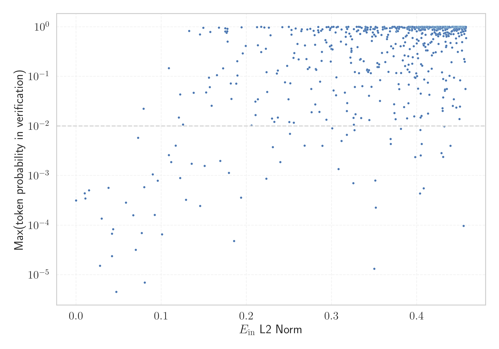

# Report for `h2oai/h2o-danube2-1.8b-base`

## Model info

* Tied embeddings: no
* LM head uses bias: no
* Indicator for under-trained tokens: E_{in} L2 Norm
  * Overall distribution 0.659 +/- 0.083
  * Token used for verification prompt building: `includegraphics`
  * Verification threshold: 0.458
  * Threshold for showing candidate under-trained tokens: 0.109
  * Median verified threshold (for bytes, unreachable and special tokens): 0.182
* Embeddings shape: (32000, 2560)
* Vocabulary size: 32000
  * Number of single byte tokens: 380, of which 140 below indicator threshold
  * Number of special tokens: 3, of which 2 below indicator threshold
  * Number of tested under-trained tokens: 637, 617 non-special, 62 below p = 0.01 threshold, 23 below soft indicator threshold

## Under-trained token indicators plot


## Verification plot


## Under-trained token verification results
23 entries below threshold of 0.109

|   token_id | token                      |   indicator | max_prob                                                         | in_other_tokens                                                                   |
|------------|----------------------------|-------------|------------------------------------------------------------------|-----------------------------------------------------------------------------------|
|      26382 | ````` \+\_\ `````          |   0.0101104 | <span style='border: 1px solid rgb(169, 68, 66);'>0.00044</span> |                                                                                   |
|      31738 | ````` \uefc0 `````         |   0.0107981 | <span style='border: 1px solid rgb(169, 68, 66);'>0.00034</span> |                                                                                   |
|      25900 | ````` iNdEx `````          |   0.0151775 | <span style='border: 1px solid rgb(169, 68, 66);'>0.00051</span> |                                                                                   |
|      22803 | ````` .^{[ `````           |   0.0281363 | <span style='border: 1px solid rgb(169, 68, 66);'>1.5e-05</span> |                                                                                   |
|      15739 | ````` ▁beginnetje `````    |   0.0300512 | <span style='border: 1px solid rgb(169, 68, 66);'>0.00014</span> |                                                                                   |
|      30929 | ````` ᥀ `````              |   0.0380323 | <span style='border: 1px solid rgb(169, 68, 66);'>0.00057</span> |                                                                                   |
|      26831 | ````` ▁febbra `````        |   0.0421692 | <span style='border: 1px solid rgb(169, 68, 66);'>2.4e-05</span> | <span style='border: 1px solid rgb(40, 167, 69);'>````` ▁febbraio `````</span>    |
|      25975 | ````` ▁Населення `````     |   0.0422046 | <span style='border: 1px solid rgb(169, 68, 66);'>6.7e-05</span> |                                                                                   |
|      19248 | ````` NdEx `````           |   0.0435411 | <span style='border: 1px solid rgb(169, 68, 66);'>8.3e-05</span> | <span style='border: 1px solid rgb(169, 68, 66);'>````` iNdEx `````</span>        |
|      18927 | ````` ederbörd `````       |   0.0471718 | <span style='border: 1px solid rgb(169, 68, 66);'>4.5e-06</span> | <span style='border: 1px solid rgb(169, 68, 66);'>````` ▁nederbörd `````</span>   |
|      27916 | ````` ▁Marcatori `````     |   0.0585935 | <span style='border: 1px solid rgb(169, 68, 66);'>0.00028</span> |                                                                                   |
|      22350 | ````` ▁насеље `````        |   0.0671451 | <span style='border: 1px solid rgb(169, 68, 66);'>0.00016</span> |                                                                                   |
|      26718 | ````` eltemperaturen ````` |   0.0700269 | <span style='border: 1px solid rgb(169, 68, 66);'>3.2e-05</span> |                                                                                   |
|      27265 | ````` ▁SDValue `````       |   0.0727615 | <span style='border: 1px solid rgb(255, 145, 0);'>0.0058</span>  |                                                                                   |
|      12872 | ````` ▁underarter `````    |   0.0770717 | <span style='border: 1px solid rgb(169, 68, 66);'>7e-05</span>   |                                                                                   |
|      28593 | ````` pgfscope `````       |   0.0791623 | <span style='border: 1px solid rgb(251, 189, 8);'>0.022</span>   |                                                                                   |
|      28373 | ````` ▁nederbörd `````     |   0.0799257 | <span style='border: 1px solid rgb(169, 68, 66);'>0.00058</span> |                                                                                   |
|      15641 | ````` ▁uitgen `````        |   0.0806028 | <span style='border: 1px solid rgb(169, 68, 66);'>7e-06</span>   | <span style='border: 1px solid rgb(251, 189, 8);'>````` ▁uitgenodigd `````</span> |
|      18699 | ````` ▁становника `````    |   0.0899587 | <span style='border: 1px solid rgb(255, 145, 0);'>0.0011</span>  |                                                                                   |
|      21160 | ````` ▁Становништво `````  |   0.0922849 | <span style='border: 1px solid rgb(169, 68, 66);'>0.00016</span> |                                                                                   |
<details><summary>3 additional entries below threshold</summary>

|   token_id | token                 |   indicator | max_prob                                                         | in_other_tokens                                                                |
|------------|-----------------------|-------------|------------------------------------------------------------------|--------------------------------------------------------------------------------|
|      14052 | ````` ▁Jahrhund ````` |   0.0959119 | <span style='border: 1px solid rgb(169, 68, 66);'>0.00079</span> | ````` ▁Jahrhundert `````, ````` ▁Jahrhunderts `````                            |
|      12645 | ````` ▁släktet `````  |   0.10091   | <span style='border: 1px solid rgb(169, 68, 66);'>6.5e-05</span> |                                                                                |
|      15500 | ````` itempty `````   |   0.108821  | <span style='border: 1px solid rgb(255, 145, 0);'>0.0026</span>  | <span style='border: 1px solid rgb(40, 167, 69);'>````` omitempty `````</span> |
</details>


## Byte tokens
140 entries below threshold of 0.182

|   token_id | token              |   indicator |   ord | hex   | byte_type   | reencoded               |
|------------|--------------------|-------------|-------|-------|-------------|-------------------------|
|         93 | ````` <0x5A> ````` | 3.48395e-08 |    90 | 0x5A  | ascii       | 28828: ````` Z `````    |
|         32 | ````` <0x1D> ````` | 3.48718e-08 |    29 | 0x1D  | ascii       | 31236: ````` \x1d ````` |
|        112 | ````` <0x6D> ````` | 3.50091e-08 |   109 | 0x6D  | ascii       | 28719: ````` m `````    |
|         17 | ````` <0x0E> ````` | 3.5068e-08  |    14 | 0x0E  | ascii       | 30517: ````` \x0e ````` |
|         19 | ````` <0x10> ````` | 3.5076e-08  |    16 | 0x10  | ascii       | 30388: ````` \x10 ````` |
|         73 | ````` <0x46> ````` | 3.51179e-08 |    70 | 0x46  | ascii       | 28765: ````` F `````    |
|         27 | ````` <0x18> ````` | 3.51436e-08 |    24 | 0x18  | ascii       | 30555: ````` \x18 ````` |
|         48 | ````` <0x2D> ````` | 3.51733e-08 |    45 | 0x2D  | ascii       | 28733: ````` - `````    |
|          6 | ````` <0x03> ````` | 3.52463e-08 |     3 | 0x03  | ascii       | 30662: ````` \x03 ````` |
|         71 | ````` <0x44> ````` | 3.52539e-08 |    68 | 0x44  | ascii       | 28757: ````` D `````    |
|        102 | ````` <0x63> ````` | 3.52799e-08 |    99 | 0x63  | ascii       | 28717: ````` c `````    |
|        104 | ````` <0x65> ````` | 3.53477e-08 |   101 | 0x65  | ascii       | 28706: ````` e `````    |
|         42 | ````` <0x27> ````` | 3.53498e-08 |    39 | 0x27  | ascii       | 28742: ````` ' `````    |
|          4 | ````` <0x01> ````` | 3.53514e-08 |     1 | 0x01  | ascii       | 29534: ````` \x01 ````` |
|        118 | ````` <0x73> ````` | 3.53524e-08 |   115 | 0x73  | ascii       | 28713: ````` s `````    |
|         92 | ````` <0x59> ````` | 3.53692e-08 |    89 | 0x59  | ascii       | 28802: ````` Y `````    |
|        127 | ````` <0x7C> ````` | 3.54028e-08 |   124 | 0x7C  | ascii       | 28766: ````` \| `````   |
|         72 | ````` <0x45> ````` | 3.54074e-08 |    69 | 0x45  | ascii       | 28749: ````` E `````    |
|         10 | ````` <0x07> ````` | 3.54211e-08 |     7 | 0x07  | ascii       | 30963: ````` \x07 ````` |
|        256 | ````` <0xFD> ````` | 3.54266e-08 |   253 | 0xFD  | unused_utf8 |                         |
<details><summary>120 additional entries below threshold</summary>

|   token_id | token              |   indicator |   ord | hex   | byte_type   | reencoded               |
|------------|--------------------|-------------|-------|-------|-------------|-------------------------|
|         41 | ````` <0x26> ````` | 3.54453e-08 |    38 | 0x26  | ascii       | 28800: ````` & `````    |
|        115 | ````` <0x70> ````` | 3.54526e-08 |   112 | 0x70  | ascii       | 28720: ````` p `````    |
|         47 | ````` <0x2C> ````` | 3.55137e-08 |    44 | 0x2C  | ascii       | 28725: ````` , `````    |
|        257 | ````` <0xFE> ````` | 3.55179e-08 |   254 | 0xFE  | unused_utf8 |                         |
|        109 | ````` <0x6A> ````` | 3.55382e-08 |   106 | 0x6A  | ascii       | 28768: ````` j `````    |
|         58 | ````` <0x37> ````` | 3.5545e-08  |    55 | 0x37  | ascii       | 28787: ````` 7 `````    |
|         57 | ````` <0x36> ````` | 3.55506e-08 |    54 | 0x36  | ascii       | 28784: ````` 6 `````    |
|        119 | ````` <0x74> ````` | 3.55867e-08 |   116 | 0x74  | ascii       | 28707: ````` t `````    |
|         75 | ````` <0x48> ````` | 3.55958e-08 |    72 | 0x48  | ascii       | 28769: ````` H `````    |
|        251 | ````` <0xF8> ````` | 3.56107e-08 |   248 | 0xF8  | unused_utf8 |                         |
|         46 | ````` <0x2B> ````` | 3.5626e-08  |    43 | 0x2B  | ascii       | 28806: ````` + `````    |
|          7 | ````` <0x04> ````` | 3.56293e-08 |     4 | 0x04  | ascii       | 30724: ````` \x04 ````` |
|         55 | ````` <0x34> ````` | 3.56711e-08 |    52 | 0x34  | ascii       | 28781: ````` 4 `````    |
|         76 | ````` <0x49> ````` | 3.56851e-08 |    73 | 0x49  | ascii       | 28737: ````` I `````    |
|        111 | ````` <0x6C> ````` | 3.56981e-08 |   108 | 0x6C  | ascii       | 28714: ````` l `````    |
|        113 | ````` <0x6E> ````` | 3.5743e-08  |   110 | 0x6E  | ascii       | 28711: ````` n `````    |
|        107 | ````` <0x68> ````` | 3.57451e-08 |   104 | 0x68  | ascii       | 28716: ````` h `````    |
|        255 | ````` <0xFC> ````` | 3.57592e-08 |   252 | 0xFC  | unused_utf8 |                         |
|        123 | ````` <0x78> ````` | 3.57783e-08 |   120 | 0x78  | ascii       | 28744: ````` x `````    |
|        116 | ````` <0x71> ````` | 3.5781e-08  |   113 | 0x71  | ascii       | 28775: ````` q `````    |
|          8 | ````` <0x05> ````` | 3.57865e-08 |     5 | 0x05  | ascii       | 30550: ````` \x05 ````` |
|         94 | ````` <0x5B> ````` | 3.57902e-08 |    91 | 0x5B  | ascii       | 28792: ````` [ `````    |
|         20 | ````` <0x11> ````` | 3.57971e-08 |    17 | 0x11  | ascii       | 30557: ````` \x11 ````` |
|         66 | ````` <0x3F> ````` | 3.58069e-08 |    63 | 0x3F  | ascii       | 28804: ````` ? `````    |
|          5 | ````` <0x02> ````` | 3.58153e-08 |     2 | 0x02  | ascii       | 30551: ````` \x02 ````` |
|        254 | ````` <0xFB> ````` | 3.58166e-08 |   251 | 0xFB  | unused_utf8 |                         |
|        122 | ````` <0x77> ````` | 3.58311e-08 |   119 | 0x77  | ascii       | 28727: ````` w `````    |
|         24 | ````` <0x15> ````` | 3.58557e-08 |    21 | 0x15  | ascii       | 30675: ````` \x15 ````` |
|        250 | ````` <0xF7> ````` | 3.58678e-08 |   247 | 0xF7  | unused_utf8 |                         |
|        126 | ````` <0x7B> ````` | 3.58801e-08 |   123 | 0x7B  | ascii       | 28751: ````` { `````    |
|        195 | ````` <0xC0> ````` | 3.58839e-08 |   192 | 0xC0  | unused_utf8 |                         |
|         38 | ````` <0x23> ````` | 3.58914e-08 |    35 | 0x23  | ascii       | 28771: ````` # `````    |
|         69 | ````` <0x42> ````` | 3.58949e-08 |    66 | 0x42  | ascii       | 28760: ````` B `````    |
|        248 | ````` <0xF5> ````` | 3.58961e-08 |   245 | 0xF5  | unused_utf8 |                         |
|         33 | ````` <0x1E> ````` | 3.59043e-08 |    30 | 0x1E  | ascii       | 31150: ````` \x1e ````` |
|          9 | ````` <0x06> ````` | 3.59044e-08 |     6 | 0x06  | ascii       | 30314: ````` \x06 ````` |
|         31 | ````` <0x1C> ````` | 3.59153e-08 |    28 | 0x1C  | ascii       | 31134: ````` \x1c ````` |
|         30 | ````` <0x1B> ````` | 3.59261e-08 |    27 | 0x1B  | ascii       | 30246: ````` \x1b ````` |
|         84 | ````` <0x51> ````` | 3.59478e-08 |    81 | 0x51  | ascii       | 28824: ````` Q `````    |
|        128 | ````` <0x7D> ````` | 3.59607e-08 |   125 | 0x7D  | ascii       | 28752: ````` } `````    |
|         77 | ````` <0x4A> ````` | 3.59646e-08 |    74 | 0x4A  | ascii       | 28798: ````` J `````    |
|         95 | ````` <0x5C> ````` | 3.5978e-08  |    92 | 0x5C  | ascii       | 28756: ````` \ `````    |
|         39 | ````` <0x24> ````` | 3.59826e-08 |    36 | 0x24  | ascii       | 28776: ````` $ `````    |
|         65 | ````` <0x3E> ````` | 3.59866e-08 |    62 | 0x3E  | ascii       | 28767: ````` > `````    |
|         80 | ````` <0x4D> ````` | 3.59903e-08 |    77 | 0x4D  | ascii       | 28755: ````` M `````    |
|         83 | ````` <0x50> ````` | 3.60037e-08 |    80 | 0x50  | ascii       | 28753: ````` P `````    |
|        125 | ````` <0x7A> ````` | 3.60055e-08 |   122 | 0x7A  | ascii       | 28764: ````` z `````    |
|        121 | ````` <0x76> ````` | 3.60173e-08 |   118 | 0x76  | ascii       | 28728: ````` v `````    |
|         63 | ````` <0x3C> ````` | 3.6018e-08  |    60 | 0x3C  | ascii       | 28789: ````` < `````    |
|         61 | ````` <0x3A> ````` | 3.60263e-08 |    58 | 0x3A  | ascii       | 28747: ````` : `````    |
|         78 | ````` <0x4B> ````` | 3.60284e-08 |    75 | 0x4B  | ascii       | 28796: ````` K `````    |
|         56 | ````` <0x35> ````` | 3.60342e-08 |    53 | 0x35  | ascii       | 28782: ````` 5 `````    |
|        114 | ````` <0x6F> ````` | 3.60457e-08 |   111 | 0x6F  | ascii       | 28709: ````` o `````    |
|         21 | ````` <0x12> ````` | 3.60554e-08 |    18 | 0x12  | ascii       | 30298: ````` \x12 ````` |
|         49 | ````` <0x2E> ````` | 3.60665e-08 |    46 | 0x2E  | ascii       | 28723: ````` . `````    |
|        258 | ````` <0xFF> ````` | 3.60827e-08 |   255 | 0xFF  | unused_utf8 |                         |
|         70 | ````` <0x43> ````` | 3.60944e-08 |    67 | 0x43  | ascii       | 28743: ````` C `````    |
|         29 | ````` <0x1A> ````` | 3.61049e-08 |    26 | 0x1A  | ascii       | 30759: ````` \x1a ````` |
|        124 | ````` <0x79> ````` | 3.61051e-08 |   121 | 0x79  | ascii       | 28724: ````` y `````    |
|         87 | ````` <0x54> ````` | 3.61168e-08 |    84 | 0x54  | ascii       | 28738: ````` T `````    |
|        103 | ````` <0x64> ````` | 3.61285e-08 |   100 | 0x64  | ascii       | 28715: ````` d `````    |
|         26 | ````` <0x17> ````` | 3.61327e-08 |    23 | 0x17  | ascii       | 30841: ````` \x17 ````` |
|         86 | ````` <0x53> ````` | 3.61473e-08 |    83 | 0x53  | ascii       | 28735: ````` S `````    |
|        198 | ````` <0xC3> ````` | 3.61504e-08 |   195 | 0xC3  | utf8        |                         |
|        101 | ````` <0x62> ````` | 3.61512e-08 |    98 | 0x62  | ascii       | 28726: ````` b `````    |
|         23 | ````` <0x14> ````` | 3.6152e-08  |    20 | 0x14  | ascii       | 30721: ````` \x14 ````` |
|         62 | ````` <0x3B> ````` | 3.61538e-08 |    59 | 0x3B  | ascii       | 28745: ````` ; `````    |
|         16 | ````` <0x0D> ````` | 3.6177e-08  |    13 | 0x0D  | ascii       | 28801: ````` \r `````   |
|        253 | ````` <0xFA> ````` | 3.61815e-08 |   250 | 0xFA  | unused_utf8 |                         |
|         97 | ````` <0x5E> ````` | 3.61834e-08 |    94 | 0x5E  | ascii       | 28815: ````` ^ `````    |
|        252 | ````` <0xF9> ````` | 3.62119e-08 |   249 | 0xF9  | unused_utf8 |                         |
|         89 | ````` <0x56> ````` | 3.62145e-08 |    86 | 0x56  | ascii       | 28790: ````` V `````    |
|         68 | ````` <0x41> ````` | 3.62149e-08 |    65 | 0x41  | ascii       | 28741: ````` A `````    |
|        196 | ````` <0xC1> ````` | 3.62408e-08 |   193 | 0xC1  | unused_utf8 |                         |
|         53 | ````` <0x32> ````` | 3.62499e-08 |    50 | 0x32  | ascii       | 28750: ````` 2 `````    |
|        117 | ````` <0x72> ````` | 3.62567e-08 |   114 | 0x72  | ascii       | 28712: ````` r `````    |
|         40 | ````` <0x25> ````` | 3.62725e-08 |    37 | 0x25  | ascii       | 28823: ````` % `````    |
|         99 | ````` <0x60> ````` | 3.62907e-08 |    96 | 0x60  | ascii       | 28832: ````` ` `````    |
|        120 | ````` <0x75> ````` | 3.63033e-08 |   117 | 0x75  | ascii       | 28718: ````` u `````    |
|         25 | ````` <0x16> ````` | 3.63129e-08 |    22 | 0x16  | ascii       | 30935: ````` \x16 ````` |
|         67 | ````` <0x40> ````` | 3.63172e-08 |    64 | 0x40  | ascii       | 28818: ````` @ `````    |
|         45 | ````` <0x2A> ````` | 3.63192e-08 |    42 | 0x2A  | ascii       | 28736: ````` * `````    |
|         43 | ````` <0x28> ````` | 3.63264e-08 |    40 | 0x28  | ascii       | 28732: ````` ( `````    |
|        100 | ````` <0x61> ````` | 3.63328e-08 |    97 | 0x61  | ascii       | 28708: ````` a `````    |
|         14 | ````` <0x0B> ````` | 3.63343e-08 |    11 | 0x0B  | ascii       | 30638: ````` \x0b ````` |
|         52 | ````` <0x31> ````` | 3.6353e-08  |    49 | 0x31  | ascii       | 28740: ````` 1 `````    |
|         90 | ````` <0x57> ````` | 3.63732e-08 |    87 | 0x57  | ascii       | 28780: ````` W `````    |
|         79 | ````` <0x4C> ````` | 3.63958e-08 |    76 | 0x4C  | ascii       | 28758: ````` L `````    |
|        249 | ````` <0xF6> ````` | 3.6409e-08  |   246 | 0xF6  | unused_utf8 |                         |
|        108 | ````` <0x69> ````` | 3.64194e-08 |   105 | 0x69  | ascii       | 28710: ````` i `````    |
|        105 | ````` <0x66> ````` | 3.64334e-08 |   102 | 0x66  | ascii       | 28722: ````` f `````    |
|         37 | ````` <0x22> ````` | 3.64461e-08 |    34 | 0x22  | ascii       | 28739: ````` " `````    |
|        110 | ````` <0x6B> ````` | 3.64492e-08 |   107 | 0x6B  | ascii       | 28729: ````` k `````    |
|         59 | ````` <0x38> ````` | 3.64785e-08 |    56 | 0x38  | ascii       | 28783: ````` 8 `````    |
|         44 | ````` <0x29> ````` | 3.64788e-08 |    41 | 0x29  | ascii       | 28731: ````` ) `````    |
|         18 | ````` <0x0F> ````` | 3.64868e-08 |    15 | 0x0F  | ascii       | 30698: ````` \x0f ````` |
|         35 | ````` <0x20> ````` | 3.65155e-08 |    32 | 0x20  | ascii       | 28705: ````` ▁ `````    |
|        130 | ````` <0x7F> ````` | 3.6529e-08  |   127 | 0x7F  | ascii       | 30982: ````` \x7f ````` |
|         60 | ````` <0x39> ````` | 3.65306e-08 |    57 | 0x39  | ascii       | 28774: ````` 9 `````    |
|         64 | ````` <0x3D> ````` | 3.65521e-08 |    61 | 0x3D  | ascii       | 28746: ````` = `````    |
|         88 | ````` <0x55> ````` | 3.65631e-08 |    85 | 0x55  | ascii       | 28779: ````` U `````    |
|         91 | ````` <0x58> ````` | 3.66015e-08 |    88 | 0x58  | ascii       | 28814: ````` X `````    |
|         98 | ````` <0x5F> ````` | 3.6638e-08  |    95 | 0x5F  | ascii       | 28730: ````` _ `````    |
|         51 | ````` <0x30> ````` | 3.66819e-08 |    48 | 0x30  | ascii       | 28734: ````` 0 `````    |
|         85 | ````` <0x52> ````` | 3.66943e-08 |    82 | 0x52  | ascii       | 28754: ````` R `````    |
|         11 | ````` <0x08> ````` | 3.67145e-08 |     8 | 0x08  | ascii       | 31129: ````` \x08 ````` |
|         34 | ````` <0x1F> ````` | 3.67174e-08 |    31 | 0x1F  | ascii       | 31217: ````` \x1f ````` |
|         82 | ````` <0x4F> ````` | 3.67361e-08 |    79 | 0x4F  | ascii       | 28762: ````` O `````    |
|         36 | ````` <0x21> ````` | 3.67627e-08 |    33 | 0x21  | ascii       | 28808: ````` ! `````    |
|         74 | ````` <0x47> ````` | 3.68409e-08 |    71 | 0x47  | ascii       | 28777: ````` G `````    |
|         81 | ````` <0x4E> ````` | 3.68774e-08 |    78 | 0x4E  | ascii       | 28759: ````` N `````    |
|        106 | ````` <0x67> ````` | 3.68857e-08 |   103 | 0x67  | ascii       | 28721: ````` g `````    |
|         50 | ````` <0x2F> ````` | 3.68978e-08 |    47 | 0x2F  | ascii       | 28748: ````` / `````    |
|         28 | ````` <0x19> ````` | 3.70187e-08 |    25 | 0x19  | ascii       | 30969: ````` \x19 ````` |
|         96 | ````` <0x5D> ````` | 3.70761e-08 |    93 | 0x5D  | ascii       | 28793: ````` ] `````    |
|         54 | ````` <0x33> ````` | 3.71352e-08 |    51 | 0x33  | ascii       | 28770: ````` 3 `````    |
|         22 | ````` <0x13> ````` | 3.72037e-08 |    19 | 0x13  | ascii       | 30453: ````` \x13 ````` |
|        129 | ````` <0x7E> ````` | 3.72633e-08 |   126 | 0x7E  | ascii       | 28845: ````` ~ `````    |
|         15 | ````` <0x0C> ````` | 0.000123783 |    12 | 0x0C  | ascii       | 29683: ````` \x0c ````` |
|        197 | ````` <0xC2> ````` | 0.000208018 |   194 | 0xC2  | utf8        |                         |
</details>


## Special tokens
2 entries below threshold of 0.182

|   token_id | token             |   indicator | max_prob                                                         |
|------------|-------------------|-------------|------------------------------------------------------------------|
|          1 | ````` <s> `````   | 3.60892e-08 | <span style='border: 1px solid rgb(169, 68, 66);'>0.00031</span> |
|          0 | ````` <unk> ````` | 3.64456e-08 | <span style='border: 1px solid rgb(169, 68, 66);'>0.00031</span> |

