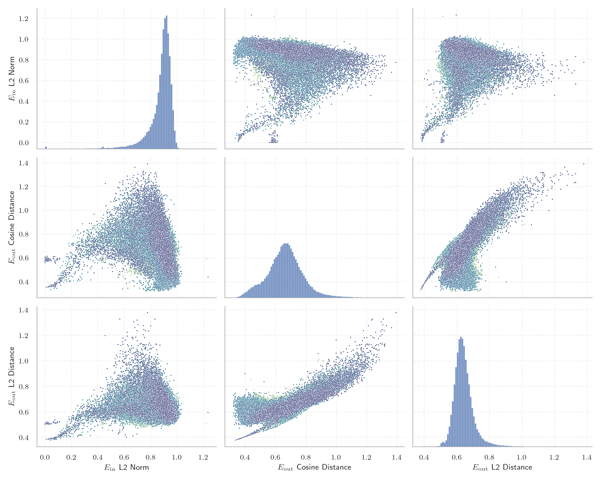
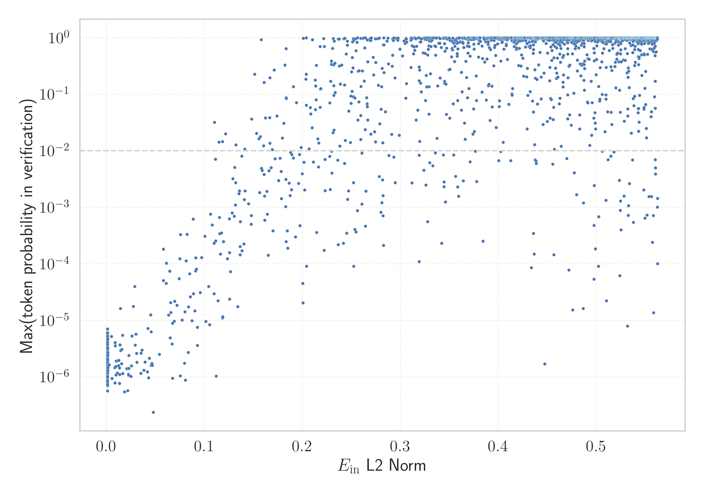

# Report for `internlm/internlm2_5-7b-chat`

## Model info

* Model Info: 
  * Tied embeddings: False
  * LM head uses bias: False
  * Embeddings shape: [92544, 4096]
* Tokenizer Info: 
  * Vocab Size: 92544
  * Tokenizer Class: InternLM2Tokenizer
  * Token for verification prompt building: InvalidArgumentException
  * Token id for verification prompt building: 54563
* Indicator summary: 
  * Indicator for under-trained tokens: E_{in} L2 Norm
  * Overall distribution: 0.871 +/- 0.105
* Detected Token Counts: 
  * Number of tested under-trained tokens: 1845, 1700 non-special, 312 below p = 0.01 threshold, 161 below soft indicator threshold
  * Number of single byte tokens: 383, of which 3 below indicator threshold
  * Number of special tokens: 64, of which 0 below indicator threshold
  * Number of non-single-byte unreachable tokens: 64, of which 0 below indicator threshold

## Under-trained token indicators plot


## Verification plot


## Under-trained token verification results
161 entries below threshold of 0.145

|   token_id | token                              |   indicator | max_prob                                                         | in_other_tokens                                                                                                                                                          |
|------------|------------------------------------|-------------|------------------------------------------------------------------|--------------------------------------------------------------------------------------------------------------------------------------------------------------------------|
|      83790 | ````` 現時由南極條約體系管理 ````` |  0.00106708 | <span style='border: 1px solid rgb(169, 68, 66);'>8.5e-07</span> |                                                                                                                                                                          |
|      83469 | ````` 南極條約體系管理 `````       |  0.00111888 | <span style='border: 1px solid rgb(169, 68, 66);'>2.7e-06</span> | <span style='border: 1px solid rgb(169, 68, 66);'>````` 現時由南極條約體系管理 `````</span>                                                                              |
|      80869 | ````` 年美國人口普查的數據 `````   |  0.00113782 | <span style='border: 1px solid rgb(169, 68, 66);'>1.5e-06</span> |                                                                                                                                                                          |
|      79720 | ````` 而該地的平均海拔高度為 ````` |  0.00113863 | <span style='border: 1px solid rgb(169, 68, 66);'>7e-07</span>   |                                                                                                                                                                          |
|      81490 | ````` 當中陸地面積為 `````         |  0.00117276 | <span style='border: 1px solid rgb(169, 68, 66);'>2.5e-06</span> |                                                                                                                                                                          |
|      80552 | ````` 該地的面積和人口 `````       |  0.00122101 | <span style='border: 1px solid rgb(169, 68, 66);'>1.4e-06</span> | <span style='border: 1px solid rgb(169, 68, 66);'>````` 該地的面積和人口皆未知 `````</span>                                                                              |
|      80891 | ````` 而人口密度為每平方千米 ````` |  0.00124144 | <span style='border: 1px solid rgb(169, 68, 66);'>8.4e-07</span> |                                                                                                                                                                          |
|      80888 | ````` 人口密度為每平方千米 `````   |  0.00126075 | <span style='border: 1px solid rgb(169, 68, 66);'>1e-06</span>   | <span style='border: 1px solid rgb(169, 68, 66);'>````` 而人口密度為每平方千米 `````</span>                                                                              |
|      89705 | ````` 不会自动计算在总价中 `````   |  0.00129459 | <span style='border: 1px solid rgb(169, 68, 66);'>1.6e-06</span> | <span style='border: 1px solid rgb(169, 68, 66);'>````` 附加费用不会自动计算在总价中 `````</span>                                                                        |
|      81489 | ````` 而水域面積為 `````           |  0.00129814 | <span style='border: 1px solid rgb(169, 68, 66);'>1e-06</span>   |                                                                                                                                                                          |
|      87527 | ````` 屬下的一个种 `````           |  0.0013211  | <span style='border: 1px solid rgb(169, 68, 66);'>6.1e-06</span> |                                                                                                                                                                          |
|      89348 | ````` 位於該國東南部 `````         |  0.00137418 | <span style='border: 1px solid rgb(169, 68, 66);'>2e-06</span>   |                                                                                                                                                                          |
|      84487 | ````` 坐标为赤經 `````             |  0.00139848 | <span style='border: 1px solid rgb(169, 68, 66);'>1.3e-06</span> |                                                                                                                                                                          |
|      80885 | ````` 當地共有人口 `````           |  0.00142727 | <span style='border: 1px solid rgb(169, 68, 66);'>2.7e-06</span> |                                                                                                                                                                          |
|      84485 | ````` 位于銀經 `````               |  0.00142839 | <span style='border: 1px solid rgb(169, 68, 66);'>1.6e-06</span> |                                                                                                                                                                          |
|      82199 | ````` 附带不同的取消 `````         |  0.00143763 | <span style='border: 1px solid rgb(169, 68, 66);'>2.5e-06</span> | ````` 不同类型的客房附带不同的取消 `````                                                                                                                                 |
|      80082 | ````` 位於該國東 `````             |  0.00146693 | <span style='border: 1px solid rgb(169, 68, 66);'>4.7e-06</span> | <span style='border: 1px solid rgb(169, 68, 66);'>````` 位於該國東南部 `````</span>, <span style='border: 1px solid rgb(169, 68, 66);'>````` 位於該國東北部 `````</span> |
|      78349 | ````` 而該地的 `````               |  0.00163537 | <span style='border: 1px solid rgb(169, 68, 66);'>1.5e-06</span> | <span style='border: 1px solid rgb(169, 68, 66);'>````` 而該地的平均海拔高度為 `````</span>                                                                              |
|      79717 | ````` 平均海拔高度為 `````         |  0.00290261 | <span style='border: 1px solid rgb(169, 68, 66);'>1.6e-06</span> | <span style='border: 1px solid rgb(169, 68, 66);'>````` 而該地的平均海拔高度為 `````</span>                                                                              |
|      45446 | ````` webElementXpaths `````       |  0.005365   | <span style='border: 1px solid rgb(169, 68, 66);'>5.2e-06</span> |                                                                                                                                                                          |
<details><summary>141 additional entries below threshold</summary>

|   token_id | token                                |   indicator | max_prob                                                         | in_other_tokens                                                                                                                                                                                                                                                                                                                                                                                                                    |
|------------|--------------------------------------|-------------|------------------------------------------------------------------|------------------------------------------------------------------------------------------------------------------------------------------------------------------------------------------------------------------------------------------------------------------------------------------------------------------------------------------------------------------------------------------------------------------------------------|
|      91998 | ````` 為輻鰭魚綱鱸形目 `````         |  0.00573614 | <span style='border: 1px solid rgb(169, 68, 66);'>9.4e-07</span> |                                                                                                                                                                                                                                                                                                                                                                                                                                    |
|      89347 | ````` 位於該國南部 `````             |  0.00872311 | <span style='border: 1px solid rgb(169, 68, 66);'>1.5e-06</span> |                                                                                                                                                                                                                                                                                                                                                                                                                                    |
|      85979 | ````` 底層水域 `````                 |  0.00877862 | <span style='border: 1px solid rgb(169, 68, 66);'>7.9e-07</span> |                                                                                                                                                                                                                                                                                                                                                                                                                                    |
|      85919 | ````` 注意调料根据自己口味 `````     |  0.00897476 | <span style='border: 1px solid rgb(169, 68, 66);'>4.1e-06</span> | ````` 注意调料根据自己口味适量增减 `````                                                                                                                                                                                                                                                                                                                                                                                           |
|      84023 | ````` 省負責管轄 `````               |  0.00923175 | <span style='border: 1px solid rgb(169, 68, 66);'>3.6e-06</span> |                                                                                                                                                                                                                                                                                                                                                                                                                                    |
|      87583 | ````` 位於該國中部 `````             |  0.00958838 | <span style='border: 1px solid rgb(169, 68, 66);'>1.5e-06</span> |                                                                                                                                                                                                                                                                                                                                                                                                                                    |
|      89095 | ````` 位於該國西南部 `````           |  0.00983656 | <span style='border: 1px solid rgb(169, 68, 66);'>1.1e-06</span> |                                                                                                                                                                                                                                                                                                                                                                                                                                    |
|      78211 | ````` 文章来自豆果美食达人作者 ````` |  0.0100826  | <span style='border: 1px solid rgb(169, 68, 66);'>1.9e-06</span> | ````` 该文章来自豆果美食达人作者 `````                                                                                                                                                                                                                                                                                                                                                                                             |
|      77349 | ````` 生活習性不明 `````             |  0.011304   | <span style='border: 1px solid rgb(169, 68, 66);'>1.2e-06</span> |                                                                                                                                                                                                                                                                                                                                                                                                                                    |
|      80803 | ````` 水域面積為 `````               |  0.0116494  | <span style='border: 1px solid rgb(169, 68, 66);'>2e-06</span>   | <span style='border: 1px solid rgb(169, 68, 66);'>````` 而水域面積為 `````</span>                                                                                                                                                                                                                                                                                                                                                  |
|      81190 | ````` 縣的一個非建制地區 `````       |  0.0125105  | <span style='border: 1px solid rgb(169, 68, 66);'>1.6e-06</span> |                                                                                                                                                                                                                                                                                                                                                                                                                                    |
|      33925 | ````` ▁+#+#+#+ `````                 |  0.0127084  | <span style='border: 1px solid rgb(169, 68, 66);'>2e-06</span>   | <span style='border: 1px solid rgb(169, 68, 66);'>````` ▁+#+#+#+#+#+ `````</span>                                                                                                                                                                                                                                                                                                                                                  |
|      91816 | ````` 位於該國東北部 `````           |  0.0133417  | <span style='border: 1px solid rgb(169, 68, 66);'>7.7e-07</span> |                                                                                                                                                                                                                                                                                                                                                                                                                                    |
|      56255 | ````` :-------------</ `````         |  0.0134696  | <span style='border: 1px solid rgb(169, 68, 66);'>1.4e-06</span> |                                                                                                                                                                                                                                                                                                                                                                                                                                    |
|      32810 | ````` webElementProperties `````     |  0.0137047  | <span style='border: 1px solid rgb(169, 68, 66);'>1.1e-06</span> |                                                                                                                                                                                                                                                                                                                                                                                                                                    |
|      83387 | ````` 南極條約體系 `````             |  0.0138894  | <span style='border: 1px solid rgb(169, 68, 66);'>3.7e-06</span> | <span style='border: 1px solid rgb(169, 68, 66);'>````` 南極條約體系管理 `````</span>, <span style='border: 1px solid rgb(169, 68, 66);'>````` 現時由南極條約體系管理 `````</span>                                                                                                                                                                                                                                                 |
|      80556 | ````` 該地的面積和人口皆未知 `````   |  0.0143349  | <span style='border: 1px solid rgb(169, 68, 66);'>1.6e-05</span> |                                                                                                                                                                                                                                                                                                                                                                                                                                    |
|      92269 | ````` 是南極洲的 `````               |  0.0146674  | <span style='border: 1px solid rgb(169, 68, 66);'>2.9e-06</span> |                                                                                                                                                                                                                                                                                                                                                                                                                                    |
|      73798 | ````` 區負責管轄 `````               |  0.0155705  | <span style='border: 1px solid rgb(169, 68, 66);'>1.7e-06</span> |                                                                                                                                                                                                                                                                                                                                                                                                                                    |
|      84008 | ````` 河道全長 `````                 |  0.0158706  | <span style='border: 1px solid rgb(169, 68, 66);'>3.1e-06</span> |                                                                                                                                                                                                                                                                                                                                                                                                                                    |
|      74132 | ````` 輻鰭魚綱 `````                 |  0.0166554  | <span style='border: 1px solid rgb(169, 68, 66);'>5.4e-06</span> | <span style='border: 1px solid rgb(169, 68, 66);'>````` 為輻鰭魚綱 `````</span>, <span style='border: 1px solid rgb(169, 68, 66);'>````` 為輻鰭魚綱鱸形目 `````</span>                                                                                                                                                                                                                                                             |
|      76013 | ````` 是烏克蘭的村落 `````           |  0.0168909  | <span style='border: 1px solid rgb(169, 68, 66);'>1.2e-06</span> |                                                                                                                                                                                                                                                                                                                                                                                                                                    |
|      78509 | ````` 位於該國西部 `````             |  0.0184384  | <span style='border: 1px solid rgb(169, 68, 66);'>5.5e-07</span> |                                                                                                                                                                                                                                                                                                                                                                                                                                    |
|      89702 | ````` 需在入住时 `````               |  0.0207848  | <span style='border: 1px solid rgb(169, 68, 66);'>1.4e-06</span> | <span style='border: 1px solid rgb(169, 68, 66);'>````` 需在入住时另行支付 `````</span>, <span style='border: 1px solid rgb(169, 68, 66);'>````` 您需在入住时另行支付 `````</span>                                                                                                                                                                                                                                                 |
|      50425 | ````` SpecWarn `````                 |  0.0217366  | <span style='border: 1px solid rgb(169, 68, 66);'>5.7e-07</span> |                                                                                                                                                                                                                                                                                                                                                                                                                                    |
|      82215 | ````` 预订和预先 `````               |  0.0225592  | <span style='border: 1px solid rgb(169, 68, 66);'>1.1e-06</span> | ````` 预订和预先付费政策 `````                                                                                                                                                                                                                                                                                                                                                                                                     |
|      80808 | ````` 陸地面積為 `````               |  0.0228559  | <span style='border: 1px solid rgb(169, 68, 66);'>1.1e-06</span> | <span style='border: 1px solid rgb(169, 68, 66);'>````` 當中陸地面積為 `````</span>                                                                                                                                                                                                                                                                                                                                                |
|      45445 | ````` webElementX `````              |  0.0229652  | <span style='border: 1px solid rgb(169, 68, 66);'>1.4e-06</span> | <span style='border: 1px solid rgb(169, 68, 66);'>````` webElementXpaths `````</span>                                                                                                                                                                                                                                                                                                                                              |
|      80690 | ````` 人口密度為每 `````             |  0.0231007  | <span style='border: 1px solid rgb(169, 68, 66);'>2.4e-06</span> | <span style='border: 1px solid rgb(169, 68, 66);'>````` 人口密度為每平方千米 `````</span>, <span style='border: 1px solid rgb(169, 68, 66);'>````` 而人口密度為每平方千米 `````</span>                                                                                                                                                                                                                                             |
|      83935 | ````` 位於該國北部 `````             |  0.0250792  | <span style='border: 1px solid rgb(169, 68, 66);'>1e-06</span>   |                                                                                                                                                                                                                                                                                                                                                                                                                                    |
|      74111 | ````` 輻鰭魚 `````                   |  0.0257552  | <span style='border: 1px solid rgb(169, 68, 66);'>1.6e-06</span> | <span style='border: 1px solid rgb(169, 68, 66);'>````` 輻鰭魚綱 `````</span>, <span style='border: 1px solid rgb(169, 68, 66);'>````` 為輻鰭魚綱 `````</span>, <span style='border: 1px solid rgb(169, 68, 66);'>````` 為輻鰭魚綱鱸形目 `````</span>                                                                                                                                                                              |
|      79781 | ````` 層水域 `````                   |  0.0260072  | <span style='border: 1px solid rgb(169, 68, 66);'>5.3e-06</span> | <span style='border: 1px solid rgb(169, 68, 66);'>````` 底層水域 `````</span>                                                                                                                                                                                                                                                                                                                                                      |
|      84462 | ````` 銀緯 `````                     |  0.0274496  | <span style='border: 1px solid rgb(169, 68, 66);'>1.8e-05</span> |                                                                                                                                                                                                                                                                                                                                                                                                                                    |
|      83203 | ````` 南極條約 `````                 |  0.0290841  | <span style='border: 1px solid rgb(169, 68, 66);'>4e-05</span>   | <span style='border: 1px solid rgb(169, 68, 66);'>````` 南極條約體系 `````</span>, <span style='border: 1px solid rgb(169, 68, 66);'>````` 南極條約體系管理 `````</span>, <span style='border: 1px solid rgb(169, 68, 66);'>````` 現時由南極條約體系管理 `````</span>                                                                                                                                                              |
|      80523 | ````` 鄰車站 `````                   |  0.0294802  | <span style='border: 1px solid rgb(169, 68, 66);'>3.6e-06</span> |                                                                                                                                                                                                                                                                                                                                                                                                                                    |
|      78968 | ````` 是南極洲 `````                 |  0.0301938  | <span style='border: 1px solid rgb(169, 68, 66);'>5.7e-06</span> | <span style='border: 1px solid rgb(169, 68, 66);'>````` 是南極洲的 `````</span>                                                                                                                                                                                                                                                                                                                                                    |
|      79859 | ````` 非建制地區 `````               |  0.0308583  | <span style='border: 1px solid rgb(169, 68, 66);'>2.6e-06</span> | <span style='border: 1px solid rgb(169, 68, 66);'>````` 縣的一個非建制地區 `````</span>                                                                                                                                                                                                                                                                                                                                            |
|      79507 | ````` 州負責管轄 `````               |  0.0312634  | <span style='border: 1px solid rgb(169, 68, 66);'>1.8e-06</span> |                                                                                                                                                                                                                                                                                                                                                                                                                                    |
|      89311 | ````` 鱸形目 `````                   |  0.0351945  | <span style='border: 1px solid rgb(169, 68, 66);'>1.2e-06</span> | <span style='border: 1px solid rgb(169, 68, 66);'>````` 為輻鰭魚綱鱸形目 `````</span>                                                                                                                                                                                                                                                                                                                                              |
|      76502 | ````` 科的其中一種 `````             |  0.0355322  | <span style='border: 1px solid rgb(169, 68, 66);'>2.6e-06</span> |                                                                                                                                                                                                                                                                                                                                                                                                                                    |
|      89088 | ````` 棲息深度 `````                 |  0.0365379  | <span style='border: 1px solid rgb(169, 68, 66);'>3e-06</span>   |                                                                                                                                                                                                                                                                                                                                                                                                                                    |
|      83000 | ````` 山脈的一部分 `````             |  0.038324   | <span style='border: 1px solid rgb(169, 68, 66);'>1.3e-06</span> |                                                                                                                                                                                                                                                                                                                                                                                                                                    |
|      70411 | ````` 位於該國 `````                 |  0.0394326  | <span style='border: 1px solid rgb(169, 68, 66);'>1.8e-06</span> | <span style='border: 1px solid rgb(169, 68, 66);'>````` 位於該國西部 `````</span>, <span style='border: 1px solid rgb(169, 68, 66);'>````` 位於該國東 `````</span>, <span style='border: 1px solid rgb(169, 68, 66);'>````` 位於該國北部 `````</span>, <span style='border: 1px solid rgb(169, 68, 66);'>````` 位於該國中部 `````</span>, <span style='border: 1px solid rgb(169, 68, 66);'>````` 位於該國西南部 `````</span>, ... |
|      84474 | ````` 銀經 `````                     |  0.0419633  | <span style='border: 1px solid rgb(169, 68, 66);'>1.2e-06</span> | <span style='border: 1px solid rgb(169, 68, 66);'>````` 位于銀經 `````</span>                                                                                                                                                                                                                                                                                                                                                      |
|      74536 | ````` 是烏克蘭的 `````               |  0.0424551  | <span style='border: 1px solid rgb(169, 68, 66);'>7.2e-06</span> | <span style='border: 1px solid rgb(169, 68, 66);'>````` 是烏克蘭的村落 `````</span>                                                                                                                                                                                                                                                                                                                                                |
|      55082 | ````` ▁;;^ `````                     |  0.0430051  | <span style='border: 1px solid rgb(169, 68, 66);'>9.7e-07</span> |                                                                                                                                                                                                                                                                                                                                                                                                                                    |
|      82138 | ````` 車人次 `````                   |  0.0437772  | <span style='border: 1px solid rgb(169, 68, 66);'>2.2e-06</span> |                                                                                                                                                                                                                                                                                                                                                                                                                                    |
|      87817 | ````` 地面車站 `````                 |  0.0451711  | <span style='border: 1px solid rgb(169, 68, 66);'>1.3e-05</span> |                                                                                                                                                                                                                                                                                                                                                                                                                                    |
|      89982 | ````` 加床或婴儿床 `````             |  0.0456711  | <span style='border: 1px solid rgb(169, 68, 66);'>6.3e-06</span> | <span style='border: 1px solid rgb(169, 68, 66);'>````` 所提出的任何加床或婴儿床 `````</span>                                                                                                                                                                                                                                                                                                                                      |
|      86080 | ````` 準決賽及決賽 `````             |  0.0458402  | <span style='border: 1px solid rgb(169, 68, 66);'>1.6e-06</span> |                                                                                                                                                                                                                                                                                                                                                                                                                                    |
|      75089 | ````` 為輻鰭魚綱 `````               |  0.0464653  | <span style='border: 1px solid rgb(169, 68, 66);'>1.7e-06</span> | <span style='border: 1px solid rgb(169, 68, 66);'>````` 為輻鰭魚綱鱸形目 `````</span>                                                                                                                                                                                                                                                                                                                                              |
|      92069 | ````` 灰色即表示 `````               |  0.0470089  | <span style='border: 1px solid rgb(169, 68, 66);'>1.6e-06</span> | <span style='border: 1px solid rgb(255, 145, 0);'>````` 后面的圆点变为灰色即表示 `````</span>                                                                                                                                                                                                                                                                                                                                      |
|      84129 | ````` 印地安納州 `````               |  0.0479914  | <span style='border: 1px solid rgb(169, 68, 66);'>2.4e-07</span> |                                                                                                                                                                                                                                                                                                                                                                                                                                    |
|      49826 | ````` ▁prostituerte `````            |  0.0541535  | <span style='border: 1px solid rgb(169, 68, 66);'>2.5e-06</span> |                                                                                                                                                                                                                                                                                                                                                                                                                                    |
|      81306 | ````` 脂鯉 `````                     |  0.0583067  | <span style='border: 1px solid rgb(169, 68, 66);'>5.1e-05</span> |                                                                                                                                                                                                                                                                                                                                                                                                                                    |
|      79498 | ````` 海拔高度為 `````               |  0.058311   | <span style='border: 1px solid rgb(169, 68, 66);'>0.00018</span> | <span style='border: 1px solid rgb(169, 68, 66);'>````` 平均海拔高度為 `````</span>, <span style='border: 1px solid rgb(169, 68, 66);'>````` 而該地的平均海拔高度為 `````</span>                                                                                                                                                                                                                                                   |
|      54094 | ````` .sulake `````                  |  0.0609712  | <span style='border: 1px solid rgb(169, 68, 66);'>4.5e-05</span> |                                                                                                                                                                                                                                                                                                                                                                                                                                    |
|      80789 | ````` 旅客鐵道 `````                 |  0.0612463  | <span style='border: 1px solid rgb(169, 68, 66);'>0.0001</span>  |                                                                                                                                                                                                                                                                                                                                                                                                                                    |
|      91612 | ````` 島式月台 `````                 |  0.0634915  | <span style='border: 1px solid rgb(169, 68, 66);'>1.2e-05</span> |                                                                                                                                                                                                                                                                                                                                                                                                                                    |
|      90482 | ````` 而該地 `````                   |  0.0646358  | <span style='border: 1px solid rgb(169, 68, 66);'>7.5e-05</span> |                                                                                                                                                                                                                                                                                                                                                                                                                                    |
|      80533 | ````` 面積和人口 `````               |  0.0651382  | <span style='border: 1px solid rgb(169, 68, 66);'>4.9e-06</span> | <span style='border: 1px solid rgb(169, 68, 66);'>````` 該地的面積和人口 `````</span>, <span style='border: 1px solid rgb(169, 68, 66);'>````` 該地的面積和人口皆未知 `````</span>                                                                                                                                                                                                                                                 |
|      45337 | ````` ▁swingerclub `````             |  0.0656844  | <span style='border: 1px solid rgb(169, 68, 66);'>2.1e-05</span> |                                                                                                                                                                                                                                                                                                                                                                                                                                    |
|      70873 | ````` 負責管轄 `````                 |  0.0658305  | <span style='border: 1px solid rgb(169, 68, 66);'>1.4e-05</span> | <span style='border: 1px solid rgb(169, 68, 66);'>````` 區負責管轄 `````</span>, <span style='border: 1px solid rgb(169, 68, 66);'>````` 州負責管轄 `````</span>, <span style='border: 1px solid rgb(169, 68, 66);'>````` 省負責管轄 `````</span>                                                                                                                                                                                  |
|      85882 | ````` 及決賽 `````                   |  0.066971   | <span style='border: 1px solid rgb(169, 68, 66);'>3.8e-06</span> | <span style='border: 1px solid rgb(169, 68, 66);'>````` 準決賽及決賽 `````</span>                                                                                                                                                                                                                                                                                                                                                  |
|      75157 | ````` 是位於美國 `````               |  0.067565   | <span style='border: 1px solid rgb(169, 68, 66);'>9.5e-07</span> |                                                                                                                                                                                                                                                                                                                                                                                                                                    |
|      89762 | ````` 車站大樓 `````                 |  0.0676385  | <span style='border: 1px solid rgb(169, 68, 66);'>8.9e-06</span> |                                                                                                                                                                                                                                                                                                                                                                                                                                    |
|      55518 | ````` ▁;;= `````                     |  0.0691518  | <span style='border: 1px solid rgb(169, 68, 66);'>9.7e-06</span> |                                                                                                                                                                                                                                                                                                                                                                                                                                    |
|      78624 | ````` 人口密度為 `````               |  0.0697895  | <span style='border: 1px solid rgb(169, 68, 66);'>2.2e-05</span> | <span style='border: 1px solid rgb(169, 68, 66);'>````` 人口密度為每 `````</span>, <span style='border: 1px solid rgb(169, 68, 66);'>````` 人口密度為每平方千米 `````</span>, <span style='border: 1px solid rgb(169, 68, 66);'>````` 而人口密度為每平方千米 `````</span>                                                                                                                                                          |
|      87207 | ````` 總教區 `````                   |  0.0722181  | <span style='border: 1px solid rgb(169, 68, 66);'>1.9e-05</span> |                                                                                                                                                                                                                                                                                                                                                                                                                                    |
|      78070 | ````` 年美國人口普查 `````           |  0.0743354  | <span style='border: 1px solid rgb(169, 68, 66);'>5.5e-05</span> | <span style='border: 1px solid rgb(169, 68, 66);'>````` 年美國人口普查的數據 `````</span>                                                                                                                                                                                                                                                                                                                                          |
|      41550 | ````` \tNullCheck `````              |  0.0749475  | <span style='border: 1px solid rgb(169, 68, 66);'>0.00012</span> |                                                                                                                                                                                                                                                                                                                                                                                                                                    |
|      85602 | ````` 名舉人 `````                   |  0.0754824  | <span style='border: 1px solid rgb(169, 68, 66);'>1e-06</span>   |                                                                                                                                                                                                                                                                                                                                                                                                                                    |
|      86832 | ````` 本魚 `````                     |  0.0757248  | <span style='border: 1px solid rgb(169, 68, 66);'>0.00033</span> |                                                                                                                                                                                                                                                                                                                                                                                                                                    |
|      83995 | ````` 赤經 `````                     |  0.0772708  | <span style='border: 1px solid rgb(169, 68, 66);'>1e-05</span>   | <span style='border: 1px solid rgb(169, 68, 66);'>````` 坐标为赤經 `````</span>                                                                                                                                                                                                                                                                                                                                                    |
|      84710 | ````` 合作两次以上的 `````           |  0.0797078  | <span style='border: 1px solid rgb(169, 68, 66);'>1.7e-06</span> | ````` 合作两次以上的影人 `````                                                                                                                                                                                                                                                                                                                                                                                                     |
|      92161 | ````` 號月台 `````                   |  0.0802564  | <span style='border: 1px solid rgb(169, 68, 66);'>1.4e-05</span> |                                                                                                                                                                                                                                                                                                                                                                                                                                    |
|      72262 | ````` 下辖以下地区 `````             |  0.0808345  | <span style='border: 1px solid rgb(169, 68, 66);'>8.8e-07</span> | <span style='border: 1px solid rgb(169, 68, 66);'>````` 镇下辖以下地区 `````</span>, <span style='border: 1px solid rgb(169, 68, 66);'>````` 乡下辖以下地区 `````</span>, <span style='border: 1px solid rgb(169, 68, 66);'>````` 街道下辖以下地区 `````</span>                                                                                                                                                                    |
|      91912 | ````` 年夏季奧林匹克運動會 `````     |  0.0815058  | <span style='border: 1px solid rgb(169, 68, 66);'>0.00011</span> |                                                                                                                                                                                                                                                                                                                                                                                                                                    |
|      74006 | ````` 鰭魚 `````                     |  0.0824024  | <span style='border: 1px solid rgb(169, 68, 66);'>0.00033</span> | <span style='border: 1px solid rgb(169, 68, 66);'>````` 輻鰭魚 `````</span>, <span style='border: 1px solid rgb(169, 68, 66);'>````` 輻鰭魚綱 `````</span>, <span style='border: 1px solid rgb(169, 68, 66);'>````` 為輻鰭魚綱 `````</span>, <span style='border: 1px solid rgb(169, 68, 66);'>````` 為輻鰭魚綱鱸形目 `````</span>                                                                                                 |
|      86088 | ````` 是一颗围绕太阳公转 `````       |  0.0836523  | <span style='border: 1px solid rgb(169, 68, 66);'>2.7e-06</span> | <span style='border: 1px solid rgb(255, 145, 0);'>````` 是一颗围绕太阳公转的小行星 `````</span>                                                                                                                                                                                                                                                                                                                                    |
|      84740 | ````` 科會試 `````                   |  0.0837438  | <span style='border: 1px solid rgb(169, 68, 66);'>1.7e-05</span> |                                                                                                                                                                                                                                                                                                                                                                                                                                    |
|      81659 | ````` 該庄 `````                     |  0.0851025  | <span style='border: 1px solid rgb(169, 68, 66);'>6.7e-05</span> |                                                                                                                                                                                                                                                                                                                                                                                                                                    |
|      42371 | ````` ▁prostituerade `````           |  0.0857547  | <span style='border: 1px solid rgb(169, 68, 66);'>2.6e-05</span> |                                                                                                                                                                                                                                                                                                                                                                                                                                    |
|      53464 | ````` ((&___ `````                   |  0.087357   | <span style='border: 1px solid rgb(169, 68, 66);'>9.9e-06</span> |                                                                                                                                                                                                                                                                                                                                                                                                                                    |
|      57565 | ````` ▁principalColumn `````         |  0.088734   | <span style='border: 1px solid rgb(169, 68, 66);'>0.00062</span> |                                                                                                                                                                                                                                                                                                                                                                                                                                    |
|      56753 | ````` ▁{{--< `````                   |  0.0888864  | <span style='border: 1px solid rgb(169, 68, 66);'>3e-05</span>   |                                                                                                                                                                                                                                                                                                                                                                                                                                    |
|      92216 | ````` 張單曲 `````                   |  0.0903982  | <span style='border: 1px solid rgb(169, 68, 66);'>1.5e-05</span> |                                                                                                                                                                                                                                                                                                                                                                                                                                    |
|      40107 | ````` rigesimal `````                |  0.0910731  | <span style='border: 1px solid rgb(169, 68, 66);'>7.5e-05</span> | <span style='border: 1px solid rgb(169, 68, 66);'>````` atrigesimal `````</span>, <span style='border: 1px solid rgb(169, 68, 66);'>````` ▁hexatrigesimal `````</span>                                                                                                                                                                                                                                                             |
|      57274 | ````` IntoConstraints `````          |  0.091309   | <span style='border: 1px solid rgb(169, 68, 66);'>0.00013</span> | <span style='border: 1px solid rgb(255, 145, 0);'>````` AutoresizingMaskIntoConstraints `````</span>, ````` latesAutoresizingMaskIntoConstraints `````                                                                                                                                                                                                                                                                             |
|      89877 | ````` 庄為 `````                     |  0.0919976  | <span style='border: 1px solid rgb(169, 68, 66);'>8.1e-05</span> |                                                                                                                                                                                                                                                                                                                                                                                                                                    |
|      89983 | ````` 的要求均需获得 `````           |  0.0928538  | <span style='border: 1px solid rgb(169, 68, 66);'>3.6e-06</span> | <span style='border: 1px solid rgb(169, 68, 66);'>````` 的要求均需获得酒店的确认 `````</span>                                                                                                                                                                                                                                                                                                                                      |
|      79524 | ````` 的座標為 `````                 |  0.0929539  | <span style='border: 1px solid rgb(169, 68, 66);'>7.6e-06</span> |                                                                                                                                                                                                                                                                                                                                                                                                                                    |
|      81612 | ````` 乡下辖以下地区 `````           |  0.0957371  | <span style='border: 1px solid rgb(169, 68, 66);'>3.1e-05</span> |                                                                                                                                                                                                                                                                                                                                                                                                                                    |
|      78170 | ````` 文章来自豆果美食达人 `````     |  0.0972068  | <span style='border: 1px solid rgb(169, 68, 66);'>0.00013</span> | <span style='border: 1px solid rgb(169, 68, 66);'>````` 文章来自豆果美食达人作者 `````</span>, ````` 该文章来自豆果美食达人作者 `````                                                                                                                                                                                                                                                                                              |
|      44235 | ````` >tagger `````                  |  0.100594   | <span style='border: 1px solid rgb(169, 68, 66);'>0.00031</span> |                                                                                                                                                                                                                                                                                                                                                                                                                                    |
|      74599 | ````` 體長可達 `````                 |  0.101562   | <span style='border: 1px solid rgb(169, 68, 66);'>9.6e-06</span> |                                                                                                                                                                                                                                                                                                                                                                                                                                    |
|      77014 | ````` 亞目 `````                     |  0.104485   | <span style='border: 1px solid rgb(169, 68, 66);'>4e-05</span>   |                                                                                                                                                                                                                                                                                                                                                                                                                                    |
|      59829 | ````` .`\|`\n `````                  |  0.105473   | <span style='border: 1px solid rgb(169, 68, 66);'>8.4e-06</span> |                                                                                                                                                                                                                                                                                                                                                                                                                                    |
|      42140 | ````` atrigesimal `````              |  0.106416   | <span style='border: 1px solid rgb(169, 68, 66);'>0.00076</span> | <span style='border: 1px solid rgb(169, 68, 66);'>````` ▁hexatrigesimal `````</span>                                                                                                                                                                                                                                                                                                                                               |
|      38967 | ````` wcsstore `````                 |  0.108042   | <span style='border: 1px solid rgb(169, 68, 66);'>0.00049</span> |                                                                                                                                                                                                                                                                                                                                                                                                                                    |
|      83299 | ````` 包括以下物种 `````             |  0.109865   | <span style='border: 1px solid rgb(169, 68, 66);'>0.00023</span> | <span style='border: 1px solid rgb(169, 68, 66);'>````` 本属包括以下物种 `````</span>                                                                                                                                                                                                                                                                                                                                              |
|      85703 | ````` 一项住宿 `````                 |  0.109983   | <span style='border: 1px solid rgb(169, 68, 66);'>3e-05</span>   | <span style='border: 1px solid rgb(169, 68, 66);'>````` 一项住宿的免费政策 `````</span>, <span style='border: 1px solid rgb(169, 68, 66);'>````` 还会提供一项住宿的免费政策 `````</span>, ````` 酒店还会提供一项住宿的免费政策 `````                                                                                                                                                                                               |
|      85076 | ````` 鐵路車站 `````                 |  0.110375   | <span style='border: 1px solid rgb(251, 189, 8);'>0.032</span>   |                                                                                                                                                                                                                                                                                                                                                                                                                                    |
|      57726 | ````` MASConstraintMaker `````       |  0.11136    | <span style='border: 1px solid rgb(255, 145, 0);'>0.0071</span>  |                                                                                                                                                                                                                                                                                                                                                                                                                                    |
|      56787 | ````` ▁hexatrigesimal `````          |  0.111538   | <span style='border: 1px solid rgb(169, 68, 66);'>0.00026</span> |                                                                                                                                                                                                                                                                                                                                                                                                                                    |
|      84837 | ````` 客房条款 `````                 |  0.112078   | <span style='border: 1px solid rgb(169, 68, 66);'>1e-06</span>   | <span style='border: 1px solid rgb(255, 145, 0);'>````` 请参阅客房条款 `````</span>                                                                                                                                                                                                                                                                                                                                                |
|      75437 | ````` 縣的一個 `````                 |  0.113972   | <span style='border: 1px solid rgb(169, 68, 66);'>2.2e-05</span> | <span style='border: 1px solid rgb(169, 68, 66);'>````` 縣的一個非建制地區 `````</span>                                                                                                                                                                                                                                                                                                                                            |
|      84032 | ````` 赤緯 `````                     |  0.115036   | <span style='border: 1px solid rgb(251, 189, 8);'>0.014</span>   |                                                                                                                                                                                                                                                                                                                                                                                                                                    |
|      43617 | ````` %timeout `````                 |  0.115472   | <span style='border: 1px solid rgb(169, 68, 66);'>0.00066</span> |                                                                                                                                                                                                                                                                                                                                                                                                                                    |
|      58536 | ````` ▁typingsSlinky `````           |  0.115594   | <span style='border: 1px solid rgb(169, 68, 66);'>0.00034</span> |                                                                                                                                                                                                                                                                                                                                                                                                                                    |
|      57426 | ````` ▁principalTable `````          |  0.116496   | <span style='border: 1px solid rgb(169, 68, 66);'>0.00015</span> |                                                                                                                                                                                                                                                                                                                                                                                                                                    |
|      31479 | ````` ▁neuken `````                  |  0.117504   | <span style='border: 1px solid rgb(169, 68, 66);'>0.00035</span> |                                                                                                                                                                                                                                                                                                                                                                                                                                    |
|      89781 | ````` 國家足球隊 `````               |  0.118668   | <span style='border: 1px solid rgb(251, 189, 8);'>0.015</span>   |                                                                                                                                                                                                                                                                                                                                                                                                                                    |
|      89703 | ````` 不会自动计算 `````             |  0.118681   | <span style='border: 1px solid rgb(169, 68, 66);'>1.1e-05</span> | <span style='border: 1px solid rgb(169, 68, 66);'>````` 不会自动计算在总价中 `````</span>, <span style='border: 1px solid rgb(169, 68, 66);'>````` 附加费用不会自动计算在总价中 `````</span>                                                                                                                                                                                                                                       |
|      77059 | ````` 镇下辖以下地区 `````           |  0.118868   | <span style='border: 1px solid rgb(169, 68, 66);'>1.2e-05</span> |                                                                                                                                                                                                                                                                                                                                                                                                                                    |
|      89669 | ````` 電視動畫 `````                 |  0.119462   | <span style='border: 1px solid rgb(169, 68, 66);'>0.00025</span> |                                                                                                                                                                                                                                                                                                                                                                                                                                    |
|      77296 | ````` 生活習性 `````                 |  0.121738   | <span style='border: 1px solid rgb(251, 189, 8);'>0.02</span>    | <span style='border: 1px solid rgb(169, 68, 66);'>````` 生活習性不明 `````</span>                                                                                                                                                                                                                                                                                                                                                  |
|      82712 | ````` 現時由 `````                   |  0.123581   | <span style='border: 1px solid rgb(169, 68, 66);'>0.00012</span> | <span style='border: 1px solid rgb(169, 68, 66);'>````` 現時由南極條約體系管理 `````</span>                                                                                                                                                                                                                                                                                                                                        |
|      59509 | ````` _RGCTX `````                   |  0.125609   | <span style='border: 1px solid rgb(169, 68, 66);'>0.00063</span> |                                                                                                                                                                                                                                                                                                                                                                                                                                    |
|      91582 | ````` 街道下辖以下地区 `````         |  0.125668   | <span style='border: 1px solid rgb(169, 68, 66);'>2.4e-05</span> |                                                                                                                                                                                                                                                                                                                                                                                                                                    |
|      76761 | ````` 中华人民共和国政治人物 `````   |  0.125697   | <span style='border: 1px solid rgb(169, 68, 66);'>0.00016</span> |                                                                                                                                                                                                                                                                                                                                                                                                                                    |
|      39717 | ````` ▁bakeca `````                  |  0.126592   | <span style='border: 1px solid rgb(169, 68, 66);'>7.3e-05</span> |                                                                                                                                                                                                                                                                                                                                                                                                                                    |
|      49938 | ````` $IFn `````                     |  0.128271   | <span style='border: 1px solid rgb(169, 68, 66);'>0.0008</span>  |                                                                                                                                                                                                                                                                                                                                                                                                                                    |
|      51911 | ````` ▁erotique `````                |  0.129173   | <span style='border: 1px solid rgb(255, 145, 0);'>0.0032</span>  |                                                                                                                                                                                                                                                                                                                                                                                                                                    |
|      45542 | ````` ▁bryster `````                 |  0.130558   | <span style='border: 1px solid rgb(169, 68, 66);'>0.0007</span>  |                                                                                                                                                                                                                                                                                                                                                                                                                                    |
|      84076 | ````` 爾蘭 `````                     |  0.13111    | <span style='border: 1px solid rgb(255, 145, 0);'>0.0051</span>  | <span style='border: 1px solid rgb(40, 167, 69);'>````` 愛爾蘭 `````</span>                                                                                                                                                                                                                                                                                                                                                        |
|      39254 | ````` ▁erotici `````                 |  0.131787   | <span style='border: 1px solid rgb(255, 145, 0);'>0.0011</span>  |                                                                                                                                                                                                                                                                                                                                                                                                                                    |
|      29727 | ````` ▁StObject `````                |  0.131869   | <span style='border: 1px solid rgb(255, 145, 0);'>0.0027</span>  |                                                                                                                                                                                                                                                                                                                                                                                                                                    |
|      86901 | ````` 流域面積 `````                 |  0.132122   | <span style='border: 1px solid rgb(251, 189, 8);'>0.013</span>   |                                                                                                                                                                                                                                                                                                                                                                                                                                    |
|      81664 | ````` 名進士 `````                   |  0.134123   | <span style='border: 1px solid rgb(169, 68, 66);'>1.8e-05</span> |                                                                                                                                                                                                                                                                                                                                                                                                                                    |
|      82672 | ````` 伊利諾伊州 `````               |  0.135337   | <span style='border: 1px solid rgb(255, 145, 0);'>0.0017</span>  |                                                                                                                                                                                                                                                                                                                                                                                                                                    |
|      73967 | ````` 是烏克蘭 `````                 |  0.135896   | <span style='border: 1px solid rgb(255, 145, 0);'>0.002</span>   | <span style='border: 1px solid rgb(169, 68, 66);'>````` 是烏克蘭的 `````</span>, <span style='border: 1px solid rgb(169, 68, 66);'>````` 是烏克蘭的村落 `````</span>                                                                                                                                                                                                                                                               |
|      34226 | ````` ▁########. `````               |  0.136455   | <span style='border: 1px solid rgb(169, 68, 66);'>0.00014</span> |                                                                                                                                                                                                                                                                                                                                                                                                                                    |
|      87009 | ````` 為熱帶 `````                   |  0.136586   | <span style='border: 1px solid rgb(169, 68, 66);'>0.0002</span>  |                                                                                                                                                                                                                                                                                                                                                                                                                                    |
|      85152 | ````` 的绝对星等为 `````             |  0.136747   | <span style='border: 1px solid rgb(169, 68, 66);'>0.00056</span> | ````` 这颗小行星的绝对星等为 `````                                                                                                                                                                                                                                                                                                                                                                                                 |
|      43574 | ````` compileComponents `````        |  0.138289   | <span style='border: 1px solid rgb(255, 145, 0);'>0.0081</span>  |                                                                                                                                                                                                                                                                                                                                                                                                                                    |
|      71949 | ````` 下辖以下 `````                 |  0.138414   | <span style='border: 1px solid rgb(169, 68, 66);'>0.00017</span> | <span style='border: 1px solid rgb(169, 68, 66);'>````` 下辖以下地区 `````</span>, <span style='border: 1px solid rgb(169, 68, 66);'>````` 镇下辖以下地区 `````</span>, <span style='border: 1px solid rgb(169, 68, 66);'>````` 乡下辖以下地区 `````</span>, <span style='border: 1px solid rgb(169, 68, 66);'>````` 街道下辖以下地区 `````</span>                                                                                 |
|      32788 | ````` .UndefOr `````                 |  0.14029    | <span style='border: 1px solid rgb(169, 68, 66);'>0.00023</span> |                                                                                                                                                                                                                                                                                                                                                                                                                                    |
|      24478 | ````` :UIControl `````               |  0.14095    | <span style='border: 1px solid rgb(255, 145, 0);'>0.0014</span>  | <span style='border: 1px solid rgb(255, 145, 0);'>````` :UIControlState `````</span>, <span style='border: 1px solid rgb(255, 145, 0);'>````` :UIControlStateNormal `````</span>, <span style='border: 1px solid rgb(251, 189, 8);'>````` :UIControlEvent `````</span>, <span style='border: 1px solid rgb(251, 189, 8);'>````` :UIControlEventTouchUpInside `````</span>                                                          |
|      89904 | ````` 愛荷華州 `````                 |  0.141388   | <span style='border: 1px solid rgb(251, 189, 8);'>0.011</span>   |                                                                                                                                                                                                                                                                                                                                                                                                                                    |
|      55175 | ````` _REALTYPE `````                |  0.141574   | <span style='border: 1px solid rgb(255, 145, 0);'>0.002</span>   |                                                                                                                                                                                                                                                                                                                                                                                                                                    |
</details>


## Byte tokens
3 entries below threshold of 0.146

|   token_id | token              |   indicator |   ord | hex   | byte_type   | reencoded             |
|------------|--------------------|-------------|-------|-------|-------------|-----------------------|
|         13 | ````` <0x0A> ````` |  0.00214672 |    10 | 0x0A  | ascii       | 364: ````` \n `````   |
|         12 | ````` <0x09> ````` |  0.00248286 |     9 | 0x09  | ascii       | 363: ````` \t `````   |
|          3 | ````` <0x00> ````` |  0.0028125  |       | 0x00  | ascii       | 354: ````` \x00 ````` |


## Special tokens
148 entries below threshold of 0.146

|   token_id | token                          |   indicator | max_prob                                                         |
|------------|--------------------------------|-------------|------------------------------------------------------------------|
|      92501 | ````` [UNUSED_TOKEN_104] ````` |  0.00111271 | <span style='border: 1px solid rgb(169, 68, 66);'>1.5e-06</span> |
|      92537 | ````` [UNUSED_TOKEN_140] ````` |  0.00111271 | <span style='border: 1px solid rgb(169, 68, 66);'>1.6e-06</span> |
|      92499 | ````` [UNUSED_TOKEN_102] ````` |  0.00111332 | <span style='border: 1px solid rgb(169, 68, 66);'>1.7e-06</span> |
|      92517 | ````` [UNUSED_TOKEN_120] ````` |  0.00111332 | <span style='border: 1px solid rgb(169, 68, 66);'>1.3e-06</span> |
|      92521 | ````` [UNUSED_TOKEN_124] ````` |  0.00111438 | <span style='border: 1px solid rgb(169, 68, 66);'>1.2e-06</span> |
|      92522 | ````` [UNUSED_TOKEN_125] ````` |  0.00111524 | <span style='border: 1px solid rgb(169, 68, 66);'>1.6e-06</span> |
|      92526 | ````` [UNUSED_TOKEN_129] ````` |  0.0011153  | <span style='border: 1px solid rgb(169, 68, 66);'>2.4e-06</span> |
|      92505 | ````` [UNUSED_TOKEN_108] ````` |  0.00111591 | <span style='border: 1px solid rgb(169, 68, 66);'>2.9e-06</span> |
|      92525 | ````` [UNUSED_TOKEN_128] ````` |  0.00111618 | <span style='border: 1px solid rgb(169, 68, 66);'>1.3e-06</span> |
|      92500 | ````` [UNUSED_TOKEN_103] ````` |  0.00111707 | <span style='border: 1px solid rgb(169, 68, 66);'>1.9e-06</span> |
|      92527 | ````` [UNUSED_TOKEN_130] ````` |  0.00111707 | <span style='border: 1px solid rgb(169, 68, 66);'>1.1e-06</span> |
|      92502 | ````` [UNUSED_TOKEN_105] ````` |  0.0011174  | <span style='border: 1px solid rgb(169, 68, 66);'>2.5e-06</span> |
|      92511 | ````` [UNUSED_TOKEN_114] ````` |  0.00111771 | <span style='border: 1px solid rgb(169, 68, 66);'>1.2e-06</span> |
|      92498 | ````` [UNUSED_TOKEN_101] ````` |  0.00111893 | <span style='border: 1px solid rgb(169, 68, 66);'>1.9e-06</span> |
|      92507 | ````` [UNUSED_TOKEN_110] ````` |  0.00111893 | <span style='border: 1px solid rgb(169, 68, 66);'>2e-06</span>   |
|      92515 | ````` [UNUSED_TOKEN_118] ````` |  0.00111903 | <span style='border: 1px solid rgb(169, 68, 66);'>1.3e-06</span> |
|      92503 | ````` [UNUSED_TOKEN_106] ````` |  0.00111913 | <span style='border: 1px solid rgb(169, 68, 66);'>1.3e-06</span> |
|      92506 | ````` [UNUSED_TOKEN_109] ````` |  0.00111971 | <span style='border: 1px solid rgb(169, 68, 66);'>1.7e-06</span> |
|      92520 | ````` [UNUSED_TOKEN_123] ````` |  0.00112038 | <span style='border: 1px solid rgb(169, 68, 66);'>4.4e-06</span> |
|      92529 | ````` [UNUSED_TOKEN_132] ````` |  0.00112038 | <span style='border: 1px solid rgb(169, 68, 66);'>3.4e-06</span> |
<details><summary>128 additional entries below threshold</summary>

|   token_id | token                          |   indicator | max_prob                                                         | reencoded                                                 |
|------------|--------------------------------|-------------|------------------------------------------------------------------|-----------------------------------------------------------|
|      92509 | ````` [UNUSED_TOKEN_112] ````` |  0.00112048 | <span style='border: 1px solid rgb(169, 68, 66);'>1.3e-06</span> |                                                           |
|      92518 | ````` [UNUSED_TOKEN_121] ````` |  0.00112048 | <span style='border: 1px solid rgb(169, 68, 66);'>2.3e-06</span> |                                                           |
|      92512 | ````` [UNUSED_TOKEN_115] ````` |  0.00112055 | <span style='border: 1px solid rgb(169, 68, 66);'>4e-06</span>   |                                                           |
|      92523 | ````` [UNUSED_TOKEN_126] ````` |  0.00112094 | <span style='border: 1px solid rgb(169, 68, 66);'>1.5e-06</span> |                                                           |
|      92536 | ````` [UNUSED_TOKEN_139] ````` |  0.00112146 | <span style='border: 1px solid rgb(169, 68, 66);'>1.7e-06</span> |                                                           |
|      92516 | ````` [UNUSED_TOKEN_119] ````` |  0.00112197 | <span style='border: 1px solid rgb(169, 68, 66);'>2e-06</span>   |                                                           |
|      92535 | ````` [UNUSED_TOKEN_138] ````` |  0.00112214 | <span style='border: 1px solid rgb(169, 68, 66);'>3.4e-06</span> |                                                           |
|      92513 | ````` [UNUSED_TOKEN_116] ````` |  0.00112244 | <span style='border: 1px solid rgb(169, 68, 66);'>2.5e-06</span> |                                                           |
|      92531 | ````` [UNUSED_TOKEN_134] ````` |  0.00112268 | <span style='border: 1px solid rgb(169, 68, 66);'>4e-06</span>   |                                                           |
|      92524 | ````` [UNUSED_TOKEN_127] ````` |  0.00112284 | <span style='border: 1px solid rgb(169, 68, 66);'>2.5e-06</span> |                                                           |
|      92510 | ````` [UNUSED_TOKEN_113] ````` |  0.00112336 | <span style='border: 1px solid rgb(169, 68, 66);'>2.3e-06</span> |                                                           |
|      92528 | ````` [UNUSED_TOKEN_131] ````` |  0.00112336 | <span style='border: 1px solid rgb(169, 68, 66);'>1e-06</span>   |                                                           |
|      92504 | ````` [UNUSED_TOKEN_107] ````` |  0.00112343 | <span style='border: 1px solid rgb(169, 68, 66);'>2.3e-06</span> |                                                           |
|      92532 | ````` [UNUSED_TOKEN_135] ````` |  0.0011241  | <span style='border: 1px solid rgb(169, 68, 66);'>5.7e-06</span> |                                                           |
|      92533 | ````` [UNUSED_TOKEN_136] ````` |  0.00112776 | <span style='border: 1px solid rgb(169, 68, 66);'>1e-06</span>   |                                                           |
|      92514 | ````` [UNUSED_TOKEN_117] ````` |  0.00112918 | <span style='border: 1px solid rgb(169, 68, 66);'>1.7e-06</span> |                                                           |
|      92519 | ````` [UNUSED_TOKEN_122] ````` |  0.00113086 | <span style='border: 1px solid rgb(169, 68, 66);'>1.5e-06</span> |                                                           |
|      92534 | ````` [UNUSED_TOKEN_137] ````` |  0.00113217 | <span style='border: 1px solid rgb(169, 68, 66);'>1.9e-06</span> |                                                           |
|      92497 | ````` [UNUSED_TOKEN_100] ````` |  0.00113447 | <span style='border: 1px solid rgb(169, 68, 66);'>2e-06</span>   |                                                           |
|      92508 | ````` [UNUSED_TOKEN_111] ````` |  0.00113956 | <span style='border: 1px solid rgb(169, 68, 66);'>1.2e-06</span> |                                                           |
|      92530 | ````` [UNUSED_TOKEN_133] ````` |  0.00114834 | <span style='border: 1px solid rgb(169, 68, 66);'>3.1e-06</span> |                                                           |
|      92411 | ````` [UNUSED_TOKEN_14] `````  |  0.00116187 | <span style='border: 1px solid rgb(169, 68, 66);'>1.5e-06</span> |                                                           |
|      92438 | ````` [UNUSED_TOKEN_41] `````  |  0.00116187 | <span style='border: 1px solid rgb(169, 68, 66);'>1.5e-06</span> |                                                           |
|      92407 | ````` [UNUSED_TOKEN_10] `````  |  0.00116253 | <span style='border: 1px solid rgb(169, 68, 66);'>5e-06</span>   |                                                           |
|      92409 | ````` [UNUSED_TOKEN_12] `````  |  0.00116269 | <span style='border: 1px solid rgb(169, 68, 66);'>1.2e-06</span> |                                                           |
|      92418 | ````` [UNUSED_TOKEN_21] `````  |  0.00116269 | <span style='border: 1px solid rgb(169, 68, 66);'>4.9e-06</span> |                                                           |
|      92412 | ````` [UNUSED_TOKEN_15] `````  |  0.00116464 | <span style='border: 1px solid rgb(169, 68, 66);'>3e-06</span>   |                                                           |
|      92448 | ````` [UNUSED_TOKEN_51] `````  |  0.00116464 | <span style='border: 1px solid rgb(169, 68, 66);'>1.9e-06</span> |                                                           |
|      92415 | ````` [UNUSED_TOKEN_18] `````  |  0.00116755 | <span style='border: 1px solid rgb(169, 68, 66);'>1.1e-06</span> |                                                           |
|      92478 | ````` [UNUSED_TOKEN_81] `````  |  0.00116755 | <span style='border: 1px solid rgb(169, 68, 66);'>1.6e-06</span> |                                                           |
|      92410 | ````` [UNUSED_TOKEN_13] `````  |  0.00116802 | <span style='border: 1px solid rgb(169, 68, 66);'>1.2e-06</span> |                                                           |
|      92428 | ````` [UNUSED_TOKEN_31] `````  |  0.00116802 | <span style='border: 1px solid rgb(169, 68, 66);'>7.8e-07</span> |                                                           |
|      92413 | ````` [UNUSED_TOKEN_16] `````  |  0.00116928 | <span style='border: 1px solid rgb(169, 68, 66);'>1.6e-06</span> |                                                           |
|      92458 | ````` [UNUSED_TOKEN_61] `````  |  0.00116928 | <span style='border: 1px solid rgb(169, 68, 66);'>2.7e-06</span> |                                                           |
|      92416 | ````` [UNUSED_TOKEN_19] `````  |  0.00116928 | <span style='border: 1px solid rgb(169, 68, 66);'>3e-06</span>   |                                                           |
|      92488 | ````` [UNUSED_TOKEN_91] `````  |  0.00116928 | <span style='border: 1px solid rgb(169, 68, 66);'>1.1e-06</span> |                                                           |
|      92417 | ````` [UNUSED_TOKEN_20] `````  |  0.0011711  | <span style='border: 1px solid rgb(169, 68, 66);'>2.5e-06</span> |                                                           |
|      92408 | ````` [UNUSED_TOKEN_11] `````  |  0.00117118 | <span style='border: 1px solid rgb(169, 68, 66);'>1.6e-06</span> |                                                           |
|      92421 | ````` [UNUSED_TOKEN_24] `````  |  0.00117373 | <span style='border: 1px solid rgb(169, 68, 66);'>2.8e-06</span> |                                                           |
|      92439 | ````` [UNUSED_TOKEN_42] `````  |  0.00117373 | <span style='border: 1px solid rgb(169, 68, 66);'>1.3e-06</span> |                                                           |
|      92437 | ````` [UNUSED_TOKEN_40] `````  |  0.00117417 | <span style='border: 1px solid rgb(169, 68, 66);'>1.8e-06</span> |                                                           |
|      92414 | ````` [UNUSED_TOKEN_17] `````  |  0.00117516 | <span style='border: 1px solid rgb(169, 68, 66);'>1.2e-06</span> |                                                           |
|      92468 | ````` [UNUSED_TOKEN_71] `````  |  0.00117516 | <span style='border: 1px solid rgb(169, 68, 66);'>2.3e-06</span> |                                                           |
|      92422 | ````` [UNUSED_TOKEN_25] `````  |  0.00117517 | <span style='border: 1px solid rgb(169, 68, 66);'>1.7e-06</span> |                                                           |
|      92449 | ````` [UNUSED_TOKEN_52] `````  |  0.00117517 | <span style='border: 1px solid rgb(169, 68, 66);'>2.6e-06</span> |                                                           |
|      92426 | ````` [UNUSED_TOKEN_29] `````  |  0.00117626 | <span style='border: 1px solid rgb(169, 68, 66);'>7e-07</span>   |                                                           |
|      92489 | ````` [UNUSED_TOKEN_92] `````  |  0.00117626 | <span style='border: 1px solid rgb(169, 68, 66);'>2.6e-06</span> |                                                           |
|      92425 | ````` [UNUSED_TOKEN_28] `````  |  0.00117843 | <span style='border: 1px solid rgb(169, 68, 66);'>8.8e-07</span> |                                                           |
|      92479 | ````` [UNUSED_TOKEN_82] `````  |  0.00117843 | <span style='border: 1px solid rgb(169, 68, 66);'>1.7e-06</span> |                                                           |
|      92427 | ````` [UNUSED_TOKEN_30] `````  |  0.0011794  | <span style='border: 1px solid rgb(169, 68, 66);'>3.3e-06</span> |                                                           |
|      92447 | ````` [UNUSED_TOKEN_50] `````  |  0.00117943 | <span style='border: 1px solid rgb(169, 68, 66);'>2.5e-06</span> |                                                           |
|      92420 | ````` [UNUSED_TOKEN_23] `````  |  0.00117995 | <span style='border: 1px solid rgb(169, 68, 66);'>2e-06</span>   |                                                           |
|      92429 | ````` [UNUSED_TOKEN_32] `````  |  0.00117995 | <span style='border: 1px solid rgb(169, 68, 66);'>4.1e-06</span> |                                                           |
|      92477 | ````` [UNUSED_TOKEN_80] `````  |  0.00118057 | <span style='border: 1px solid rgb(169, 68, 66);'>2e-06</span>   |                                                           |
|      92423 | ````` [UNUSED_TOKEN_26] `````  |  0.00118164 | <span style='border: 1px solid rgb(169, 68, 66);'>2.3e-06</span> |                                                           |
|      92459 | ````` [UNUSED_TOKEN_62] `````  |  0.00118164 | <span style='border: 1px solid rgb(169, 68, 66);'>2.5e-06</span> |                                                           |
|      92487 | ````` [UNUSED_TOKEN_90] `````  |  0.00118266 | <span style='border: 1px solid rgb(169, 68, 66);'>6e-06</span>   |                                                           |
|      92457 | ````` [UNUSED_TOKEN_60] `````  |  0.00118321 | <span style='border: 1px solid rgb(169, 68, 66);'>7.1e-06</span> |                                                           |
|      92424 | ````` [UNUSED_TOKEN_27] `````  |  0.00118514 | <span style='border: 1px solid rgb(169, 68, 66);'>3.4e-06</span> |                                                           |
|      92469 | ````` [UNUSED_TOKEN_72] `````  |  0.00118514 | <span style='border: 1px solid rgb(169, 68, 66);'>1.3e-06</span> |                                                           |
|      92431 | ````` [UNUSED_TOKEN_34] `````  |  0.00118593 | <span style='border: 1px solid rgb(169, 68, 66);'>1.1e-06</span> |                                                           |
|      92440 | ````` [UNUSED_TOKEN_43] `````  |  0.00118593 | <span style='border: 1px solid rgb(169, 68, 66);'>4.9e-06</span> |                                                           |
|      92436 | ````` [UNUSED_TOKEN_39] `````  |  0.0011866  | <span style='border: 1px solid rgb(169, 68, 66);'>1.4e-06</span> |                                                           |
|      92490 | ````` [UNUSED_TOKEN_93] `````  |  0.0011866  | <span style='border: 1px solid rgb(169, 68, 66);'>3e-06</span>   |                                                           |
|      92467 | ````` [UNUSED_TOKEN_70] `````  |  0.0011869  | <span style='border: 1px solid rgb(169, 68, 66);'>2.3e-06</span> |                                                           |
|      92442 | ````` [UNUSED_TOKEN_45] `````  |  0.0011869  | <span style='border: 1px solid rgb(169, 68, 66);'>2.9e-06</span> |                                                           |
|      92451 | ````` [UNUSED_TOKEN_54] `````  |  0.0011869  | <span style='border: 1px solid rgb(169, 68, 66);'>2e-06</span>   |                                                           |
|      92432 | ````` [UNUSED_TOKEN_35] `````  |  0.00118709 | <span style='border: 1px solid rgb(169, 68, 66);'>1.1e-06</span> |                                                           |
|      92450 | ````` [UNUSED_TOKEN_53] `````  |  0.00118709 | <span style='border: 1px solid rgb(169, 68, 66);'>3e-06</span>   |                                                           |
|      92435 | ````` [UNUSED_TOKEN_38] `````  |  0.00118713 | <span style='border: 1px solid rgb(169, 68, 66);'>1.2e-06</span> |                                                           |
|      92480 | ````` [UNUSED_TOKEN_83] `````  |  0.00118713 | <span style='border: 1px solid rgb(169, 68, 66);'>7.4e-07</span> |                                                           |
|      92446 | ````` [UNUSED_TOKEN_49] `````  |  0.001188   | <span style='border: 1px solid rgb(169, 68, 66);'>8.9e-07</span> |                                                           |
|      92491 | ````` [UNUSED_TOKEN_94] `````  |  0.001188   | <span style='border: 1px solid rgb(169, 68, 66);'>1.9e-06</span> |                                                           |
|      92443 | ````` [UNUSED_TOKEN_46] `````  |  0.00118896 | <span style='border: 1px solid rgb(169, 68, 66);'>1.2e-06</span> |                                                           |
|      92461 | ````` [UNUSED_TOKEN_64] `````  |  0.00118896 | <span style='border: 1px solid rgb(169, 68, 66);'>3.8e-06</span> |                                                           |
|      92419 | ````` [UNUSED_TOKEN_22] `````  |  0.00118934 | <span style='border: 1px solid rgb(169, 68, 66);'>2e-06</span>   |                                                           |
|      92445 | ````` [UNUSED_TOKEN_48] `````  |  0.00118951 | <span style='border: 1px solid rgb(169, 68, 66);'>1.8e-06</span> |                                                           |
|      92481 | ````` [UNUSED_TOKEN_84] `````  |  0.00118951 | <span style='border: 1px solid rgb(169, 68, 66);'>1.5e-06</span> |                                                           |
|      92455 | ````` [UNUSED_TOKEN_58] `````  |  0.00118979 | <span style='border: 1px solid rgb(169, 68, 66);'>3.1e-06</span> |                                                           |
|      92482 | ````` [UNUSED_TOKEN_85] `````  |  0.00118979 | <span style='border: 1px solid rgb(169, 68, 66);'>1.8e-06</span> |                                                           |
|      92433 | ````` [UNUSED_TOKEN_36] `````  |  0.0011904  | <span style='border: 1px solid rgb(169, 68, 66);'>2.1e-06</span> |                                                           |
|      92460 | ````` [UNUSED_TOKEN_63] `````  |  0.0011904  | <span style='border: 1px solid rgb(169, 68, 66);'>2.3e-06</span> |                                                           |
|      92456 | ````` [UNUSED_TOKEN_59] `````  |  0.00119151 | <span style='border: 1px solid rgb(169, 68, 66);'>1.8e-06</span> |                                                           |
|      92492 | ````` [UNUSED_TOKEN_95] `````  |  0.00119151 | <span style='border: 1px solid rgb(169, 68, 66);'>8.8e-07</span> |                                                           |
|      92444 | ````` [UNUSED_TOKEN_47] `````  |  0.00119164 | <span style='border: 1px solid rgb(169, 68, 66);'>1.7e-06</span> |                                                           |
|      92471 | ````` [UNUSED_TOKEN_74] `````  |  0.00119164 | <span style='border: 1px solid rgb(169, 68, 66);'>4.9e-06</span> |                                                           |
|      92453 | ````` [UNUSED_TOKEN_56] `````  |  0.00119369 | <span style='border: 1px solid rgb(169, 68, 66);'>1.1e-06</span> |                                                           |
|      92462 | ````` [UNUSED_TOKEN_65] `````  |  0.00119369 | <span style='border: 1px solid rgb(169, 68, 66);'>2.3e-06</span> |                                                           |
|      92466 | ````` [UNUSED_TOKEN_69] `````  |  0.00119631 | <span style='border: 1px solid rgb(169, 68, 66);'>1.6e-06</span> |                                                           |
|      92493 | ````` [UNUSED_TOKEN_96] `````  |  0.00119631 | <span style='border: 1px solid rgb(169, 68, 66);'>2.1e-06</span> |                                                           |
|      92434 | ````` [UNUSED_TOKEN_37] `````  |  0.00119681 | <span style='border: 1px solid rgb(169, 68, 66);'>1.9e-06</span> |                                                           |
|      92470 | ````` [UNUSED_TOKEN_73] `````  |  0.00119681 | <span style='border: 1px solid rgb(169, 68, 66);'>5.3e-06</span> |                                                           |
|      92454 | ````` [UNUSED_TOKEN_57] `````  |  0.00119942 | <span style='border: 1px solid rgb(169, 68, 66);'>1.4e-06</span> |                                                           |
|      92472 | ````` [UNUSED_TOKEN_75] `````  |  0.00119942 | <span style='border: 1px solid rgb(169, 68, 66);'>2e-06</span>   |                                                           |
|      92465 | ````` [UNUSED_TOKEN_68] `````  |  0.00120065 | <span style='border: 1px solid rgb(169, 68, 66);'>4.1e-06</span> |                                                           |
|      92483 | ````` [UNUSED_TOKEN_86] `````  |  0.00120065 | <span style='border: 1px solid rgb(169, 68, 66);'>1.5e-06</span> |                                                           |
|      92486 | ````` [UNUSED_TOKEN_89] `````  |  0.00120445 | <span style='border: 1px solid rgb(169, 68, 66);'>1.5e-06</span> |                                                           |
|      92495 | ````` [UNUSED_TOKEN_98] `````  |  0.00120445 | <span style='border: 1px solid rgb(169, 68, 66);'>5.9e-06</span> |                                                           |
|      92475 | ````` [UNUSED_TOKEN_78] `````  |  0.00120713 | <span style='border: 1px solid rgb(169, 68, 66);'>1.1e-06</span> |                                                           |
|      92484 | ````` [UNUSED_TOKEN_87] `````  |  0.00120713 | <span style='border: 1px solid rgb(169, 68, 66);'>9.7e-07</span> |                                                           |
|      92476 | ````` [UNUSED_TOKEN_79] `````  |  0.00120722 | <span style='border: 1px solid rgb(169, 68, 66);'>1.6e-06</span> |                                                           |
|      92494 | ````` [UNUSED_TOKEN_97] `````  |  0.00120722 | <span style='border: 1px solid rgb(169, 68, 66);'>2e-06</span>   |                                                           |
|      92441 | ````` [UNUSED_TOKEN_44] `````  |  0.00120975 | <span style='border: 1px solid rgb(169, 68, 66);'>1.2e-06</span> |                                                           |
|      92464 | ````` [UNUSED_TOKEN_67] `````  |  0.00121003 | <span style='border: 1px solid rgb(169, 68, 66);'>1.1e-06</span> |                                                           |
|      92473 | ````` [UNUSED_TOKEN_76] `````  |  0.00121003 | <span style='border: 1px solid rgb(169, 68, 66);'>3.2e-06</span> |                                                           |
|      92430 | ````` [UNUSED_TOKEN_33] `````  |  0.0012135  | <span style='border: 1px solid rgb(169, 68, 66);'>4.5e-06</span> |                                                           |
|      92452 | ````` [UNUSED_TOKEN_55] `````  |  0.00121602 | <span style='border: 1px solid rgb(169, 68, 66);'>1.7e-06</span> |                                                           |
|      92485 | ````` [UNUSED_TOKEN_88] `````  |  0.00123051 | <span style='border: 1px solid rgb(169, 68, 66);'>2.4e-06</span> |                                                           |
|      92463 | ````` [UNUSED_TOKEN_66] `````  |  0.00123197 | <span style='border: 1px solid rgb(169, 68, 66);'>5.7e-07</span> |                                                           |
|      92496 | ````` [UNUSED_TOKEN_99] `````  |  0.00123859 | <span style='border: 1px solid rgb(169, 68, 66);'>2.7e-06</span> |                                                           |
|      92398 | ````` [UNUSED_TOKEN_1] `````   |  0.00124664 | <span style='border: 1px solid rgb(169, 68, 66);'>2.4e-06</span> |                                                           |
|      92474 | ````` [UNUSED_TOKEN_77] `````  |  0.00124943 | <span style='border: 1px solid rgb(169, 68, 66);'>1.9e-06</span> |                                                           |
|      92399 | ````` [UNUSED_TOKEN_2] `````   |  0.00125553 | <span style='border: 1px solid rgb(169, 68, 66);'>1.4e-06</span> |                                                           |
|      92397 | ````` [UNUSED_TOKEN_0] `````   |  0.00125849 | <span style='border: 1px solid rgb(169, 68, 66);'>1.2e-06</span> |                                                           |
|      92401 | ````` [UNUSED_TOKEN_4] `````   |  0.00125876 | <span style='border: 1px solid rgb(169, 68, 66);'>1.3e-06</span> |                                                           |
|      92400 | ````` [UNUSED_TOKEN_3] `````   |  0.00126242 | <span style='border: 1px solid rgb(169, 68, 66);'>2e-06</span>   |                                                           |
|      92402 | ````` [UNUSED_TOKEN_5] `````   |  0.00126245 | <span style='border: 1px solid rgb(169, 68, 66);'>2.2e-06</span> |                                                           |
|      92405 | ````` [UNUSED_TOKEN_8] `````   |  0.00126847 | <span style='border: 1px solid rgb(169, 68, 66);'>2.3e-06</span> |                                                           |
|      92406 | ````` [UNUSED_TOKEN_9] `````   |  0.00126891 | <span style='border: 1px solid rgb(169, 68, 66);'>2.1e-06</span> |                                                           |
|      92403 | ````` [UNUSED_TOKEN_6] `````   |  0.00126919 | <span style='border: 1px solid rgb(169, 68, 66);'>1.6e-06</span> |                                                           |
|      92404 | ````` [UNUSED_TOKEN_7] `````   |  0.00127624 | <span style='border: 1px solid rgb(169, 68, 66);'>1.8e-06</span> |                                                           |
|          0 | ````` <unk> `````              |  0.00170388 |                                                                  | 262: ````` ▁ `````, 0: ````` <unk> `````                  |
|      92538 | ````` <\|plugin\|> `````       |  0.0659253  |                                                                  | 262: ````` ▁ `````, 92538: ````` <\|plugin\|> `````       |
|      92540 | ````` <\|action_end\|> `````   |  0.0738474  |                                                                  | 262: ````` ▁ `````, 92540: ````` <\|action_end\|> `````   |
|      92539 | ````` <\|interpreter\|> `````  |  0.0745309  |                                                                  | 262: ````` ▁ `````, 92539: ````` <\|interpreter\|> `````  |
|      92541 | ````` <\|action_start\|> ````` |  0.0752911  |                                                                  | 262: ````` ▁ `````, 92541: ````` <\|action_start\|> ````` |
|      92543 | ````` <\|im_start\|> `````     |  0.0755186  |                                                                  | 262: ````` ▁ `````, 92543: ````` <\|im_start\|> `````     |
|      92542 | ````` <\|im_end\|> `````       |  0.079645   |                                                                  | 262: ````` ▁ `````, 92542: ````` <\|im_end\|> `````       |
</details>


## Unreachable tokens
0 entries below threshold of 0.146


