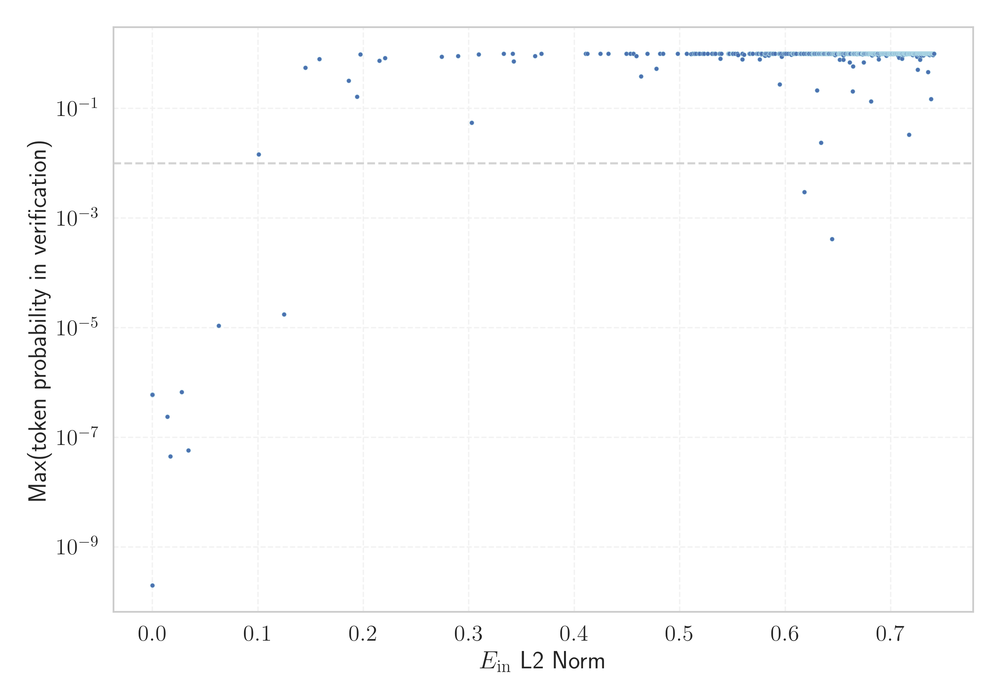

# Report for `kyutai/helium-1-preview-2b`

## Model info

* Model Info: 
  * Tied embeddings: False
  * LM head uses bias: False
  * Embeddings shape: [48000, 2560]
* Tokenizer Info: 
  * Vocab Size: 48000
  * Tokenizer Class: PreTrainedTokenizerFast
  * Tokenizer Type: Unigram
  * Bytes handling: Byte Fallback
  * Token for verification prompt building: considérablement
  * Token id for verification prompt building: 42598
* Indicator summary: 
  * Indicator for under-trained tokens: E_{in} L2 Norm
  * Overall distribution: 0.942 +/- 0.110
* Detected Token Counts: 
  * Number of tested under-trained tokens: 957, 773 non-special, 7 below p = 0.01 threshold, 11 below soft indicator threshold
  * Number of single byte tokens: 350, of which 109 below indicator threshold
  * Number of special tokens: 10, of which 0 below indicator threshold
  * Number of non-single-byte unreachable tokens: 10, of which 0 below indicator threshold

## Under-trained token indicators plot


## Verification plot


## Under-trained token verification results
11 entries below threshold of 0.221

|   token_id | token                  |   indicator | max_prob                                                         | in_other_tokens                                                                                                                                                                                                                                                                                                              |
|------------|------------------------|-------------|------------------------------------------------------------------|------------------------------------------------------------------------------------------------------------------------------------------------------------------------------------------------------------------------------------------------------------------------------------------------------------------------------|
|      46781 | ````` ▁TroveTag `````  | 3.91951e-07 | <span style='border: 1px solid rgb(169, 68, 66);'>6e-07</span>   |                                                                                                                                                                                                                                                                                                                              |
|      26259 | ````` ??(???)- `````   | 0.0140343   | <span style='border: 1px solid rgb(169, 68, 66);'>2.4e-07</span> |                                                                                                                                                                                                                                                                                                                              |
|      46039 | ````` libreTexts ````` | 0.0277668   | <span style='border: 1px solid rgb(169, 68, 66);'>6.7e-07</span> |                                                                                                                                                                                                                                                                                                                              |
|      41375 | ````` \({}^{-}\) ````` | 0.0341706   | <span style='border: 1px solid rgb(169, 68, 66);'>5.8e-08</span> |                                                                                                                                                                                                                                                                                                                              |
|      27051 | ````` \({}^{+}\) ````` | 0.0627526   | <span style='border: 1px solid rgb(169, 68, 66);'>1.1e-05</span> |                                                                                                                                                                                                                                                                                                                              |
|      23705 | ````` \({}_{\ `````    | 0.100691    | <span style='border: 1px solid rgb(251, 189, 8);'>0.014</span>   |                                                                                                                                                                                                                                                                                                                              |
|      22047 | ````` ??(???) `````    | 0.124622    | <span style='border: 1px solid rgb(169, 68, 66);'>1.7e-05</span> | <span style='border: 1px solid rgb(169, 68, 66);'>````` ??(???)- `````</span>                                                                                                                                                                                                                                                |
|       7203 | ````` \({}^{ `````     | 0.186033    | <span style='border: 1px solid rgb(40, 167, 69);'>0.32</span>    | <span style='border: 1px solid rgb(40, 167, 69);'>````` ▁\({}^{ `````</span>, <span style='border: 1px solid rgb(169, 68, 66);'>````` \({}^{-}\) `````</span>, <span style='border: 1px solid rgb(169, 68, 66);'>````` \({}^{+}\) `````</span>, <span style='border: 1px solid rgb(40, 167, 69);'>````` \({}^{\ `````</span> |
|      44675 | ````` ▁Arquivada ````` | 0.193836    | <span style='border: 1px solid rgb(40, 167, 69);'>0.16</span>    |                                                                                                                                                                                                                                                                                                                              |
|       9846 | ````` \({}^{\ `````    | 0.196977    | <span style='border: 1px solid rgb(40, 167, 69);'>0.97</span>    |                                                                                                                                                                                                                                                                                                                              |
|      21195 | ````` ▁\({}^{ `````    | 0.215154    | <span style='border: 1px solid rgb(40, 167, 69);'>0.75</span>    |                                                                                                                                                                                                                                                                                                                              |


## Byte tokens
109 entries below threshold of 0.034

|   token_id | token              |   indicator |   ord | hex   | byte_type   | reencoded           |
|------------|--------------------|-------------|-------|-------|-------------|---------------------|
|        175 | ````` <0x45> ````` | 3.76088e-07 |    69 | 0x45  | ascii       | 710: ````` E `````  |
|        197 | ````` <0x5B> ````` | 3.80792e-07 |    91 | 0x5B  | ascii       | 1883: ````` [ ````` |
|        361 | ````` <0xFF> ````` | 3.80954e-07 |   255 | 0xFF  | unused_utf8 |                     |
|        351 | ````` <0xF5> ````` | 3.81767e-07 |   245 | 0xF5  | unused_utf8 |                     |
|        150 | ````` <0x2C> ````` | 3.82249e-07 |    44 | 0x2C  | ascii       | 362: ````` , `````  |
|        148 | ````` <0x2A> ````` | 3.82917e-07 |    42 | 0x2A  | ascii       | 813: ````` * `````  |
|        358 | ````` <0xFC> ````` | 3.83248e-07 |   252 | 0xFC  | unused_utf8 |                     |
|        298 | ````` <0xC0> ````` | 3.83495e-07 |   192 | 0xC0  | unused_utf8 |                     |
|        181 | ````` <0x4B> ````` | 3.83571e-07 |    75 | 0x4B  | ascii       | 752: ````` K `````  |
|        139 | ````` <0x21> ````` | 3.83723e-07 |    33 | 0x21  | ascii       | 682: ````` ! `````  |
|        145 | ````` <0x27> ````` | 3.83956e-07 |    39 | 0x27  | ascii       | 378: ````` ' `````  |
|        193 | ````` <0x57> ````` | 3.84337e-07 |    87 | 0x57  | ascii       | 881: ````` W `````  |
|        299 | ````` <0xC1> ````` | 3.84575e-07 |   193 | 0xC1  | unused_utf8 |                     |
|        226 | ````` <0x78> ````` | 3.84652e-07 |   120 | 0x78  | ascii       | 525: ````` x `````  |
|        221 | ````` <0x73> ````` | 3.84802e-07 |   115 | 0x73  | ascii       | 366: ````` s `````  |
|        360 | ````` <0xFE> ````` | 3.85035e-07 |   254 | 0xFE  | unused_utf8 |                     |
|        178 | ````` <0x48> ````` | 3.85222e-07 |    72 | 0x48  | ascii       | 761: ````` H `````  |
|        203 | ````` <0x61> ````` | 3.85307e-07 |    97 | 0x61  | ascii       | 414: ````` a `````  |
|        166 | ````` <0x3C> ````` | 3.85424e-07 |    60 | 0x3C  | ascii       | 3398: ````` < ````` |
|        164 | ````` <0x3A> ````` | 3.85481e-07 |    58 | 0x3A  | ascii       | 396: ````` : `````  |
<details><summary>89 additional entries below threshold</summary>

|   token_id | token              |   indicator |   ord | hex   | byte_type   | reencoded            |
|------------|--------------------|-------------|-------|-------|-------------|----------------------|
|        227 | ````` <0x79> ````` | 3.85491e-07 |   121 | 0x79  | ascii       | 478: ````` y `````   |
|        355 | ````` <0xF9> ````` | 3.85585e-07 |   249 | 0xF9  | unused_utf8 |                      |
|        190 | ````` <0x54> ````` | 3.85643e-07 |    84 | 0x54  | ascii       | 707: ````` T `````   |
|        162 | ````` <0x38> ````` | 3.85667e-07 |    56 | 0x38  | ascii       | 388: ````` 8 `````   |
|        188 | ````` <0x52> ````` | 3.85708e-07 |    82 | 0x52  | ascii       | 720: ````` R `````   |
|        359 | ````` <0xFD> ````` | 3.8578e-07  |   253 | 0xFD  | unused_utf8 |                      |
|        218 | ````` <0x70> ````` | 3.85949e-07 |   112 | 0x70  | ascii       | 565: ````` p `````   |
|        152 | ````` <0x2E> ````` | 3.86018e-07 |    46 | 0x2E  | ascii       | 364: ````` . `````   |
|        182 | ````` <0x4C> ````` | 3.86058e-07 |    76 | 0x4C  | ascii       | 753: ````` L `````   |
|        142 | ````` <0x24> ````` | 3.86127e-07 |    36 | 0x24  | ascii       | 620: ````` $ `````   |
|        153 | ````` <0x2F> ````` | 3.86208e-07 |    47 | 0x2F  | ascii       | 416: ````` / `````   |
|        220 | ````` <0x72> ````` | 3.86258e-07 |   114 | 0x72  | ascii       | 431: ````` r `````   |
|        180 | ````` <0x4A> ````` | 3.86271e-07 |    74 | 0x4A  | ascii       | 1102: ````` J `````  |
|        353 | ````` <0xF7> ````` | 3.86462e-07 |   247 | 0xF7  | unused_utf8 |                      |
|        143 | ````` <0x25> ````` | 3.8666e-07  |    37 | 0x25  | ascii       | 496: ````` % `````   |
|        173 | ````` <0x43> ````` | 3.87104e-07 |    67 | 0x43  | ascii       | 541: ````` C `````   |
|        228 | ````` <0x7A> ````` | 3.87321e-07 |   122 | 0x7A  | ascii       | 582: ````` z `````   |
|        212 | ````` <0x6A> ````` | 3.87395e-07 |   106 | 0x6A  | ascii       | 970: ````` j `````   |
|        207 | ````` <0x65> ````` | 3.8758e-07  |   101 | 0x65  | ascii       | 390: ````` e `````   |
|        209 | ````` <0x67> ````` | 3.87673e-07 |   103 | 0x67  | ascii       | 514: ````` g `````   |
|        352 | ````` <0xF6> ````` | 3.8775e-07  |   246 | 0xF6  | unused_utf8 |                      |
|        189 | ````` <0x53> ````` | 3.87753e-07 |    83 | 0x53  | ascii       | 528: ````` S `````   |
|        194 | ````` <0x58> ````` | 3.87803e-07 |    88 | 0x58  | ascii       | 876: ````` X `````   |
|        155 | ````` <0x31> ````` | 3.87828e-07 |    49 | 0x31  | ascii       | 368: ````` 1 `````   |
|        219 | ````` <0x71> ````` | 3.8793e-07  |   113 | 0x71  | ascii       | 1342: ````` q `````  |
|        171 | ````` <0x41> ````` | 3.88001e-07 |    65 | 0x41  | ascii       | 524: ````` A `````   |
|        214 | ````` <0x6C> ````` | 3.88028e-07 |   108 | 0x6C  | ascii       | 561: ````` l `````   |
|        224 | ````` <0x76> ````` | 3.88112e-07 |   118 | 0x76  | ascii       | 698: ````` v `````   |
|        232 | ````` <0x7E> ````` | 3.88216e-07 |   126 | 0x7E  | ascii       | 7052: ````` ~ `````  |
|        184 | ````` <0x4E> ````` | 3.88321e-07 |    78 | 0x4E  | ascii       | 730: ````` N `````   |
|        195 | ````` <0x59> ````` | 3.88412e-07 |    89 | 0x59  | ascii       | 1349: ````` Y `````  |
|        210 | ````` <0x68> ````` | 3.88446e-07 |   104 | 0x68  | ascii       | 606: ````` h `````   |
|        140 | ````` <0x22> ````` | 3.88461e-07 |    34 | 0x22  | ascii       | 413: ````` " `````   |
|        158 | ````` <0x34> ````` | 3.88488e-07 |    52 | 0x34  | ascii       | 386: ````` 4 `````   |
|        157 | ````` <0x33> ````` | 3.88674e-07 |    51 | 0x33  | ascii       | 382: ````` 3 `````   |
|        146 | ````` <0x28> ````` | 3.88699e-07 |    40 | 0x28  | ascii       | 504: ````` ( `````   |
|        202 | ````` <0x60> ````` | 3.8871e-07  |    96 | 0x60  | ascii       | 2017: ````` ` `````  |
|        192 | ````` <0x56> ````` | 3.88878e-07 |    86 | 0x56  | ascii       | 889: ````` V `````   |
|        169 | ````` <0x3F> ````` | 3.88931e-07 |    63 | 0x3F  | ascii       | 420: ````` ? `````   |
|        222 | ````` <0x74> ````` | 3.88992e-07 |   116 | 0x74  | ascii       | 401: ````` t `````   |
|        223 | ````` <0x75> ````` | 3.89099e-07 |   117 | 0x75  | ascii       | 573: ````` u `````   |
|        356 | ````` <0xFA> ````` | 3.89151e-07 |   250 | 0xFA  | unused_utf8 |                      |
|        149 | ````` <0x2B> ````` | 3.89189e-07 |    43 | 0x2B  | ascii       | 835: ````` + `````   |
|        183 | ````` <0x4D> ````` | 3.89327e-07 |    77 | 0x4D  | ascii       | 734: ````` M `````   |
|        225 | ````` <0x77> ````` | 3.89344e-07 |   119 | 0x77  | ascii       | 832: ````` w `````   |
|        198 | ````` <0x5C> ````` | 3.89371e-07 |    92 | 0x5C  | ascii       | 735: ````` \ `````   |
|        160 | ````` <0x36> ````` | 3.89654e-07 |    54 | 0x36  | ascii       | 393: ````` 6 `````   |
|        165 | ````` <0x3B> ````` | 3.89724e-07 |    59 | 0x3B  | ascii       | 436: ````` ; `````   |
|        159 | ````` <0x35> ````` | 3.89737e-07 |    53 | 0x35  | ascii       | 383: ````` 5 `````   |
|        230 | ````` <0x7C> ````` | 3.89758e-07 |   124 | 0x7C  | ascii       | 1587: ````` \| ````` |
|        170 | ````` <0x40> ````` | 3.89763e-07 |    64 | 0x40  | ascii       | 6028: ````` @ `````  |
|        154 | ````` <0x30> ````` | 3.8983e-07  |    48 | 0x30  | ascii       | 372: ````` 0 `````   |
|        161 | ````` <0x37> ````` | 3.89896e-07 |    55 | 0x37  | ascii       | 394: ````` 7 `````   |
|        213 | ````` <0x6B> ````` | 3.90106e-07 |   107 | 0x6B  | ascii       | 562: ````` k `````   |
|        217 | ````` <0x6F> ````` | 3.90472e-07 |   111 | 0x6F  | ascii       | 433: ````` o `````   |
|        206 | ````` <0x64> ````` | 3.90584e-07 |   100 | 0x64  | ascii       | 434: ````` d `````   |
|        187 | ````` <0x51> ````` | 3.90587e-07 |    81 | 0x51  | ascii       | 1379: ````` Q `````  |
|        141 | ````` <0x23> ````` | 3.90757e-07 |    35 | 0x23  | ascii       | 2822: ````` # `````  |
|        147 | ````` <0x29> ````` | 3.90781e-07 |    41 | 0x29  | ascii       | 381: ````` ) `````   |
|        231 | ````` <0x7D> ````` | 3.91206e-07 |   125 | 0x7D  | ascii       | 898: ````` } `````   |
|        172 | ````` <0x42> ````` | 3.91277e-07 |    66 | 0x42  | ascii       | 595: ````` B `````   |
|        174 | ````` <0x44> ````` | 3.91389e-07 |    68 | 0x44  | ascii       | 594: ````` D `````   |
|        179 | ````` <0x49> ````` | 3.91429e-07 |    73 | 0x49  | ascii       | 665: ````` I `````   |
|        144 | ````` <0x26> ````` | 3.91534e-07 |    38 | 0x26  | ascii       | 1793: ````` & `````  |
|        186 | ````` <0x50> ````` | 3.91566e-07 |    80 | 0x50  | ascii       | 654: ````` P `````   |
|        199 | ````` <0x5D> ````` | 3.91567e-07 |    93 | 0x5D  | ascii       | 544: ````` ] `````   |
|        167 | ````` <0x3D> ````` | 3.91605e-07 |    61 | 0x3D  | ascii       | 808: ````` = `````   |
|        163 | ````` <0x39> ````` | 3.91972e-07 |    57 | 0x39  | ascii       | 380: ````` 9 `````   |
|        215 | ````` <0x6D> ````` | 3.9201e-07  |   109 | 0x6D  | ascii       | 445: ````` m `````   |
|        211 | ````` <0x69> ````` | 3.92086e-07 |   105 | 0x69  | ascii       | 427: ````` i `````   |
|        200 | ````` <0x5E> ````` | 3.92197e-07 |    94 | 0x5E  | ascii       | 1775: ````` ^ `````  |
|        205 | ````` <0x63> ````` | 3.92251e-07 |    99 | 0x63  | ascii       | 529: ````` c `````   |
|        208 | ````` <0x66> ````` | 3.92428e-07 |   102 | 0x66  | ascii       | 593: ````` f `````   |
|        201 | ````` <0x5F> ````` | 3.92608e-07 |    95 | 0x5F  | ascii       | 539: ````` _ `````   |
|        176 | ````` <0x46> ````` | 3.92804e-07 |    70 | 0x46  | ascii       | 708: ````` F `````   |
|        196 | ````` <0x5A> ````` | 3.92874e-07 |    90 | 0x5A  | ascii       | 1149: ````` Z `````  |
|        151 | ````` <0x2D> ````` | 3.93261e-07 |    45 | 0x2D  | ascii       | 375: ````` - `````   |
|        168 | ````` <0x3E> ````` | 3.93321e-07 |    62 | 0x3E  | ascii       | 2801: ````` > `````  |
|        138 | ````` <0x20> ````` | 3.93438e-07 |    32 | 0x20  | ascii       | 363: ````` ▁ `````   |
|        357 | ````` <0xFB> ````` | 3.93544e-07 |   251 | 0xFB  | unused_utf8 |                      |
|        156 | ````` <0x32> ````` | 3.93816e-07 |    50 | 0x32  | ascii       | 374: ````` 2 `````   |
|        204 | ````` <0x62> ````` | 3.93824e-07 |    98 | 0x62  | ascii       | 550: ````` b `````   |
|        177 | ````` <0x47> ````` | 3.94045e-07 |    71 | 0x47  | ascii       | 747: ````` G `````   |
|        185 | ````` <0x4F> ````` | 3.94404e-07 |    79 | 0x4F  | ascii       | 802: ````` O `````   |
|        354 | ````` <0xF8> ````` | 3.94982e-07 |   248 | 0xF8  | unused_utf8 |                      |
|        191 | ````` <0x55> ````` | 3.95543e-07 |    85 | 0x55  | ascii       | 1387: ````` U `````  |
|        216 | ````` <0x6E> ````` | 3.95718e-07 |   110 | 0x6E  | ascii       | 411: ````` n `````   |
|        229 | ````` <0x7B> ````` | 3.96068e-07 |   123 | 0x7B  | ascii       | 695: ````` { `````   |
|        106 | ````` <0x00> ````` | 0.0168114   |       | 0x00  | ascii       |                      |
</details>


## Special tokens
103 entries below threshold of 0.034

|   token_id | token                      |   indicator | max_prob                                                       |
|------------|----------------------------|-------------|----------------------------------------------------------------|
|         85 | ````` <\|im_sp_79\|> ````` | 3.79301e-07 | <span style='border: 1px solid rgb(169, 68, 66);'>6e-07</span> |
|          8 | ````` <\|im_sp_02\|> ````` | 3.794e-07   | <span style='border: 1px solid rgb(169, 68, 66);'>6e-07</span> |
|         41 | ````` <\|im_sp_35\|> ````` | 3.79933e-07 | <span style='border: 1px solid rgb(169, 68, 66);'>6e-07</span> |
|         39 | ````` <\|im_sp_33\|> ````` | 3.81836e-07 | <span style='border: 1px solid rgb(169, 68, 66);'>6e-07</span> |
|          7 | ````` <\|im_sp_01\|> ````` | 3.81836e-07 | <span style='border: 1px solid rgb(169, 68, 66);'>6e-07</span> |
|          9 | ````` <\|im_sp_03\|> ````` | 3.82071e-07 | <span style='border: 1px solid rgb(169, 68, 66);'>6e-07</span> |
|         69 | ````` <\|im_sp_63\|> ````` | 3.8235e-07  | <span style='border: 1px solid rgb(169, 68, 66);'>6e-07</span> |
|         83 | ````` <\|im_sp_77\|> ````` | 3.82867e-07 | <span style='border: 1px solid rgb(169, 68, 66);'>6e-07</span> |
|         52 | ````` <\|im_sp_46\|> ````` | 3.83137e-07 | <span style='border: 1px solid rgb(169, 68, 66);'>6e-07</span> |
|         75 | ````` <\|im_sp_69\|> ````` | 3.83596e-07 | <span style='border: 1px solid rgb(169, 68, 66);'>6e-07</span> |
|        105 | ````` <\|im_sp_99\|> ````` | 3.83686e-07 | <span style='border: 1px solid rgb(169, 68, 66);'>6e-07</span> |
|         90 | ````` <\|im_sp_84\|> ````` | 3.83896e-07 | <span style='border: 1px solid rgb(169, 68, 66);'>6e-07</span> |
|         36 | ````` <\|im_sp_30\|> ````` | 3.84032e-07 | <span style='border: 1px solid rgb(169, 68, 66);'>6e-07</span> |
|        103 | ````` <\|im_sp_97\|> ````` | 3.84079e-07 | <span style='border: 1px solid rgb(169, 68, 66);'>6e-07</span> |
|         86 | ````` <\|im_sp_80\|> ````` | 3.8446e-07  | <span style='border: 1px solid rgb(169, 68, 66);'>6e-07</span> |
|         89 | ````` <\|im_sp_83\|> ````` | 3.84623e-07 | <span style='border: 1px solid rgb(169, 68, 66);'>6e-07</span> |
|         97 | ````` <\|im_sp_91\|> ````` | 3.84709e-07 | <span style='border: 1px solid rgb(169, 68, 66);'>6e-07</span> |
|         88 | ````` <\|im_sp_82\|> ````` | 3.84749e-07 | <span style='border: 1px solid rgb(169, 68, 66);'>6e-07</span> |
|          0 | ````` <unk> `````          | 3.85248e-07 | <span style='border: 1px solid rgb(169, 68, 66);'>6e-07</span> |
|         70 | ````` <\|im_sp_64\|> ````` | 3.85303e-07 | <span style='border: 1px solid rgb(169, 68, 66);'>6e-07</span> |
<details><summary>83 additional entries below threshold</summary>

|   token_id | token                      |   indicator | max_prob                                                       |
|------------|----------------------------|-------------|----------------------------------------------------------------|
|         33 | ````` <\|im_sp_27\|> ````` | 3.85343e-07 | <span style='border: 1px solid rgb(169, 68, 66);'>6e-07</span> |
|         45 | ````` <\|im_sp_39\|> ````` | 3.85476e-07 | <span style='border: 1px solid rgb(169, 68, 66);'>6e-07</span> |
|         55 | ````` <\|im_sp_49\|> ````` | 3.85608e-07 | <span style='border: 1px solid rgb(169, 68, 66);'>6e-07</span> |
|         10 | ````` <\|im_sp_04\|> ````` | 3.85713e-07 | <span style='border: 1px solid rgb(169, 68, 66);'>6e-07</span> |
|         57 | ````` <\|im_sp_51\|> ````` | 3.85768e-07 | <span style='border: 1px solid rgb(169, 68, 66);'>6e-07</span> |
|         64 | ````` <\|im_sp_58\|> ````` | 3.85861e-07 | <span style='border: 1px solid rgb(169, 68, 66);'>6e-07</span> |
|         93 | ````` <\|im_sp_87\|> ````` | 3.85956e-07 | <span style='border: 1px solid rgb(169, 68, 66);'>6e-07</span> |
|         74 | ````` <\|im_sp_68\|> ````` | 3.86076e-07 | <span style='border: 1px solid rgb(169, 68, 66);'>6e-07</span> |
|         60 | ````` <\|im_sp_54\|> ````` | 3.86365e-07 | <span style='border: 1px solid rgb(169, 68, 66);'>6e-07</span> |
|         79 | ````` <\|im_sp_73\|> ````` | 3.86547e-07 | <span style='border: 1px solid rgb(169, 68, 66);'>6e-07</span> |
|         46 | ````` <\|im_sp_40\|> ````` | 3.86564e-07 | <span style='border: 1px solid rgb(169, 68, 66);'>6e-07</span> |
|         28 | ````` <\|im_sp_22\|> ````` | 3.86574e-07 | <span style='border: 1px solid rgb(169, 68, 66);'>6e-07</span> |
|         54 | ````` <\|im_sp_48\|> ````` | 3.86625e-07 | <span style='border: 1px solid rgb(169, 68, 66);'>6e-07</span> |
|         43 | ````` <\|im_sp_37\|> ````` | 3.86669e-07 | <span style='border: 1px solid rgb(169, 68, 66);'>6e-07</span> |
|          6 | ````` <\|im_sp_00\|> ````` | 3.8678e-07  | <span style='border: 1px solid rgb(169, 68, 66);'>6e-07</span> |
|         38 | ````` <\|im_sp_32\|> ````` | 3.86958e-07 | <span style='border: 1px solid rgb(169, 68, 66);'>6e-07</span> |
|         59 | ````` <\|im_sp_53\|> ````` | 3.86997e-07 | <span style='border: 1px solid rgb(169, 68, 66);'>6e-07</span> |
|        101 | ````` <\|im_sp_95\|> ````` | 3.871e-07   | <span style='border: 1px solid rgb(169, 68, 66);'>6e-07</span> |
|         12 | ````` <\|im_sp_06\|> ````` | 3.87329e-07 | <span style='border: 1px solid rgb(169, 68, 66);'>6e-07</span> |
|         18 | ````` <\|im_sp_12\|> ````` | 3.87384e-07 | <span style='border: 1px solid rgb(169, 68, 66);'>6e-07</span> |
|         35 | ````` <\|im_sp_29\|> ````` | 3.87619e-07 | <span style='border: 1px solid rgb(169, 68, 66);'>6e-07</span> |
|         44 | ````` <\|im_sp_38\|> ````` | 3.87656e-07 | <span style='border: 1px solid rgb(169, 68, 66);'>6e-07</span> |
|         81 | ````` <\|im_sp_75\|> ````` | 3.87721e-07 | <span style='border: 1px solid rgb(169, 68, 66);'>6e-07</span> |
|         34 | ````` <\|im_sp_28\|> ````` | 3.8773e-07  | <span style='border: 1px solid rgb(169, 68, 66);'>6e-07</span> |
|         91 | ````` <\|im_sp_85\|> ````` | 3.87741e-07 | <span style='border: 1px solid rgb(169, 68, 66);'>6e-07</span> |
|         37 | ````` <\|im_sp_31\|> ````` | 3.87747e-07 | <span style='border: 1px solid rgb(169, 68, 66);'>6e-07</span> |
|        104 | ````` <\|im_sp_98\|> ````` | 3.87781e-07 | <span style='border: 1px solid rgb(169, 68, 66);'>6e-07</span> |
|         22 | ````` <\|im_sp_16\|> ````` | 3.87814e-07 | <span style='border: 1px solid rgb(169, 68, 66);'>6e-07</span> |
|         53 | ````` <\|im_sp_47\|> ````` | 3.8782e-07  | <span style='border: 1px solid rgb(169, 68, 66);'>6e-07</span> |
|         63 | ````` <\|im_sp_57\|> ````` | 3.87832e-07 | <span style='border: 1px solid rgb(169, 68, 66);'>6e-07</span> |
|        102 | ````` <\|im_sp_96\|> ````` | 3.87856e-07 | <span style='border: 1px solid rgb(169, 68, 66);'>6e-07</span> |
|         94 | ````` <\|im_sp_88\|> ````` | 3.87954e-07 | <span style='border: 1px solid rgb(169, 68, 66);'>6e-07</span> |
|         71 | ````` <\|im_sp_65\|> ````` | 3.87966e-07 | <span style='border: 1px solid rgb(169, 68, 66);'>6e-07</span> |
|         40 | ````` <\|im_sp_34\|> ````` | 3.8797e-07  | <span style='border: 1px solid rgb(169, 68, 66);'>6e-07</span> |
|         73 | ````` <\|im_sp_67\|> ````` | 3.88226e-07 | <span style='border: 1px solid rgb(169, 68, 66);'>6e-07</span> |
|         15 | ````` <\|im_sp_09\|> ````` | 3.88389e-07 | <span style='border: 1px solid rgb(169, 68, 66);'>6e-07</span> |
|         68 | ````` <\|im_sp_62\|> ````` | 3.8851e-07  | <span style='border: 1px solid rgb(169, 68, 66);'>6e-07</span> |
|         80 | ````` <\|im_sp_74\|> ````` | 3.88574e-07 | <span style='border: 1px solid rgb(169, 68, 66);'>6e-07</span> |
|         17 | ````` <\|im_sp_11\|> ````` | 3.8864e-07  | <span style='border: 1px solid rgb(169, 68, 66);'>6e-07</span> |
|         67 | ````` <\|im_sp_61\|> ````` | 3.88695e-07 | <span style='border: 1px solid rgb(169, 68, 66);'>6e-07</span> |
|         29 | ````` <\|im_sp_23\|> ````` | 3.88851e-07 | <span style='border: 1px solid rgb(169, 68, 66);'>6e-07</span> |
|         72 | ````` <\|im_sp_66\|> ````` | 3.88911e-07 | <span style='border: 1px solid rgb(169, 68, 66);'>6e-07</span> |
|         25 | ````` <\|im_sp_19\|> ````` | 3.88964e-07 | <span style='border: 1px solid rgb(169, 68, 66);'>6e-07</span> |
|         84 | ````` <\|im_sp_78\|> ````` | 3.88999e-07 | <span style='border: 1px solid rgb(169, 68, 66);'>6e-07</span> |
|         31 | ````` <\|im_sp_25\|> ````` | 3.89059e-07 | <span style='border: 1px solid rgb(169, 68, 66);'>6e-07</span> |
|         23 | ````` <\|im_sp_17\|> ````` | 3.89242e-07 | <span style='border: 1px solid rgb(169, 68, 66);'>6e-07</span> |
|         51 | ````` <\|im_sp_45\|> ````` | 3.8943e-07  | <span style='border: 1px solid rgb(169, 68, 66);'>6e-07</span> |
|         27 | ````` <\|im_sp_21\|> ````` | 3.89445e-07 | <span style='border: 1px solid rgb(169, 68, 66);'>6e-07</span> |
|          3 | ````` <pad> `````          | 3.89462e-07 | <span style='border: 1px solid rgb(169, 68, 66);'>2e-10</span> |
|         82 | ````` <\|im_sp_76\|> ````` | 3.8952e-07  | <span style='border: 1px solid rgb(169, 68, 66);'>6e-07</span> |
|         42 | ````` <\|im_sp_36\|> ````` | 3.89575e-07 | <span style='border: 1px solid rgb(169, 68, 66);'>6e-07</span> |
|         16 | ````` <\|im_sp_10\|> ````` | 3.8965e-07  | <span style='border: 1px solid rgb(169, 68, 66);'>6e-07</span> |
|        100 | ````` <\|im_sp_94\|> ````` | 3.89719e-07 | <span style='border: 1px solid rgb(169, 68, 66);'>6e-07</span> |
|         24 | ````` <\|im_sp_18\|> ````` | 3.89736e-07 | <span style='border: 1px solid rgb(169, 68, 66);'>6e-07</span> |
|         65 | ````` <\|im_sp_59\|> ````` | 3.89754e-07 | <span style='border: 1px solid rgb(169, 68, 66);'>6e-07</span> |
|          2 | ````` </s> `````           | 3.89781e-07 | <span style='border: 1px solid rgb(169, 68, 66);'>6e-07</span> |
|         58 | ````` <\|im_sp_52\|> ````` | 3.90008e-07 | <span style='border: 1px solid rgb(169, 68, 66);'>6e-07</span> |
|         92 | ````` <\|im_sp_86\|> ````` | 3.90009e-07 | <span style='border: 1px solid rgb(169, 68, 66);'>6e-07</span> |
|         48 | ````` <\|im_sp_42\|> ````` | 3.90304e-07 | <span style='border: 1px solid rgb(169, 68, 66);'>6e-07</span> |
|         78 | ````` <\|im_sp_72\|> ````` | 3.90534e-07 | <span style='border: 1px solid rgb(169, 68, 66);'>6e-07</span> |
|         13 | ````` <\|im_sp_07\|> ````` | 3.9061e-07  | <span style='border: 1px solid rgb(169, 68, 66);'>6e-07</span> |
|         99 | ````` <\|im_sp_93\|> ````` | 3.90645e-07 | <span style='border: 1px solid rgb(169, 68, 66);'>6e-07</span> |
|         87 | ````` <\|im_sp_81\|> ````` | 3.9104e-07  | <span style='border: 1px solid rgb(169, 68, 66);'>6e-07</span> |
|         47 | ````` <\|im_sp_41\|> ````` | 3.9114e-07  | <span style='border: 1px solid rgb(169, 68, 66);'>6e-07</span> |
|         30 | ````` <\|im_sp_24\|> ````` | 3.91169e-07 | <span style='border: 1px solid rgb(169, 68, 66);'>6e-07</span> |
|         21 | ````` <\|im_sp_15\|> ````` | 3.91267e-07 | <span style='border: 1px solid rgb(169, 68, 66);'>6e-07</span> |
|         20 | ````` <\|im_sp_14\|> ````` | 3.91367e-07 | <span style='border: 1px solid rgb(169, 68, 66);'>6e-07</span> |
|         50 | ````` <\|im_sp_44\|> ````` | 3.91803e-07 | <span style='border: 1px solid rgb(169, 68, 66);'>6e-07</span> |
|         96 | ````` <\|im_sp_90\|> ````` | 3.91873e-07 | <span style='border: 1px solid rgb(169, 68, 66);'>6e-07</span> |
|         98 | ````` <\|im_sp_92\|> ````` | 3.92181e-07 | <span style='border: 1px solid rgb(169, 68, 66);'>6e-07</span> |
|         11 | ````` <\|im_sp_05\|> ````` | 3.9257e-07  | <span style='border: 1px solid rgb(169, 68, 66);'>6e-07</span> |
|         95 | ````` <\|im_sp_89\|> ````` | 3.92836e-07 | <span style='border: 1px solid rgb(169, 68, 66);'>6e-07</span> |
|         62 | ````` <\|im_sp_56\|> ````` | 3.92902e-07 | <span style='border: 1px solid rgb(169, 68, 66);'>6e-07</span> |
|         61 | ````` <\|im_sp_55\|> ````` | 3.93279e-07 | <span style='border: 1px solid rgb(169, 68, 66);'>6e-07</span> |
|         49 | ````` <\|im_sp_43\|> ````` | 3.93285e-07 | <span style='border: 1px solid rgb(169, 68, 66);'>6e-07</span> |
|         77 | ````` <\|im_sp_71\|> ````` | 3.9339e-07  | <span style='border: 1px solid rgb(169, 68, 66);'>6e-07</span> |
|         26 | ````` <\|im_sp_20\|> ````` | 3.93403e-07 | <span style='border: 1px solid rgb(169, 68, 66);'>6e-07</span> |
|         76 | ````` <\|im_sp_70\|> ````` | 3.93625e-07 | <span style='border: 1px solid rgb(169, 68, 66);'>6e-07</span> |
|         66 | ````` <\|im_sp_60\|> ````` | 3.93892e-07 | <span style='border: 1px solid rgb(169, 68, 66);'>6e-07</span> |
|         56 | ````` <\|im_sp_50\|> ````` | 3.94911e-07 | <span style='border: 1px solid rgb(169, 68, 66);'>6e-07</span> |
|         32 | ````` <\|im_sp_26\|> ````` | 3.95664e-07 | <span style='border: 1px solid rgb(169, 68, 66);'>6e-07</span> |
|         14 | ````` <\|im_sp_08\|> ````` | 3.96988e-07 | <span style='border: 1px solid rgb(169, 68, 66);'>6e-07</span> |
|         19 | ````` <\|im_sp_13\|> ````` | 3.97097e-07 | <span style='border: 1px solid rgb(169, 68, 66);'>6e-07</span> |
</details>


## Unreachable tokens
0 entries below threshold of 0.034


