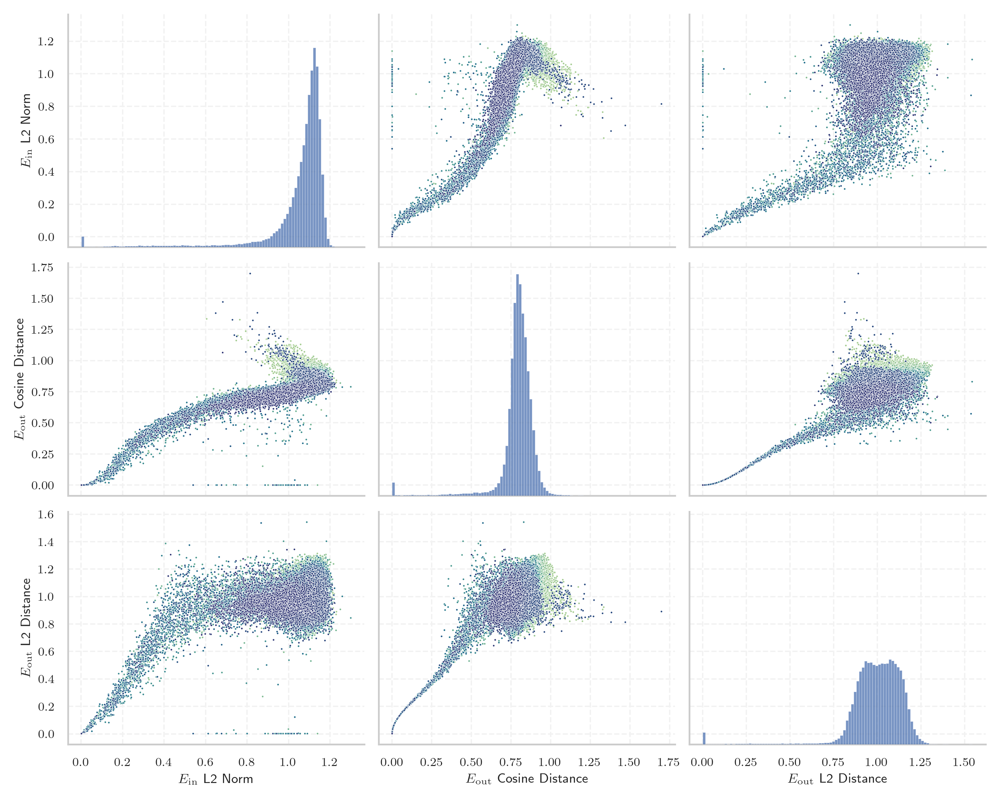

# Report for `m-a-p/neo_7b`

## Model info

* Model Info: 
  * Tied embeddings: False
  * LM head uses bias: False
  * Embeddings shape: [64256, 3072]
* Tokenizer Info: 
  * Vocab Size: 64005
  * Tokenizer Class: NEOTokenizer
  * Tokenizer Type: BPE
  * Bytes handling: Byte Input
  * Token for verification prompt building: 即表明您已经阅读并接受上述条款
  * Token id for verification prompt building: 27277
* Indicator summary: 
  * Indicator for under-trained tokens: E_{in} L2 Norm
  * Overall distribution: 1.048 +/- 0.171
* Detected Token Counts: 
  * Number of tested under-trained tokens: 1276, 1276 non-special, 403 below p = 0.01 threshold, 200 below soft indicator threshold
  * Number of single byte tokens: 351, of which 110 below indicator threshold
  * Number of special tokens: 0, of which 0 below indicator threshold

## Under-trained token indicators plot


## Verification plot


## Under-trained token verification results
200 entries below threshold of 0.149

|   token_id | token                             |   indicator | max_prob                                                         | in_other_tokens                                                                        |
|------------|-----------------------------------|-------------|------------------------------------------------------------------|----------------------------------------------------------------------------------------|
|      38951 | ````` ▁只看该作者大 `````         |  0.00173231 | <span style='border: 1px solid rgb(169, 68, 66);'>0.00011</span> |                                                                                        |
|      37928 | ````` 写一个指定评分 `````        |  0.00173985 | <span style='border: 1px solid rgb(169, 68, 66);'>0.00011</span> | ````` 写一个指定评分的评论 `````                                                       |
|      34936 | ````` ▁先判断以下内容的 `````     |  0.00175998 | <span style='border: 1px solid rgb(169, 68, 66);'>0.00011</span> | ````` ▁先判断以下内容的语言类型 `````                                                  |
|      55108 | ````` nhelpviewer `````           |  0.00177068 | <span style='border: 1px solid rgb(169, 68, 66);'>0.00011</span> |                                                                                        |
|      50075 | ````` :①②\ `````                  |  0.00177181 | <span style='border: 1px solid rgb(169, 68, 66);'>0.00011</span> |                                                                                        |
|      37151 | ````` 如所属地区或 `````          |  0.00177463 | <span style='border: 1px solid rgb(169, 68, 66);'>0.00011</span> | ````` 如所属地区或语种 `````                                                           |
|      49484 | ````` 身份在社区发言 `````        |  0.00177505 | <span style='border: 1px solid rgb(169, 68, 66);'>0.00011</span> |                                                                                        |
|      51118 | ````` 用上半句或者 `````          |  0.00178124 | <span style='border: 1px solid rgb(169, 68, 66);'>0.00011</span> | ````` 用上半句或者下半句回答 `````                                                     |
|      37152 | ````` ▁请给出下面的 `````         |  0.00178258 | <span style='border: 1px solid rgb(169, 68, 66);'>0.00011</span> | ````` ▁请给出下面的姓名的类型 `````                                                    |
|      37694 | ````` ▁这条电影评论 `````         |  0.00178436 | <span style='border: 1px solid rgb(169, 68, 66);'>0.00011</span> | ````` ▁这条电影评论的评分是多少 `````                                                  |
|      29312 | ````` 对话语境的情感 `````        |  0.00179863 | <span style='border: 1px solid rgb(169, 68, 66);'>0.00011</span> | ````` 并且要符合对话语境的情感 `````                                                   |
|      29962 | ````` \\+\\_\\+ `````             |  0.00179999 | <span style='border: 1px solid rgb(169, 68, 66);'>0.00011</span> |                                                                                        |
|      26842 | ````` locfilehash `````           |  0.00180108 | <span style='border: 1px solid rgb(169, 68, 66);'>0.00011</span> | ````` openlocfilehash `````                                                            |
|      44728 | ````` ▁您是本帖的第个阅读者 ````` |  0.00180125 | <span style='border: 1px solid rgb(169, 68, 66);'>0.00011</span> |                                                                                        |
|      34937 | ````` 最后用中文遵循指令 `````    |  0.00180538 | <span style='border: 1px solid rgb(169, 68, 66);'>0.00011</span> | ````` 最后用中文遵循指令给出合理的 `````                                               |
|      55981 | ````` :③④\ `````                  |  0.00181947 | <span style='border: 1px solid rgb(169, 68, 66);'>0.00011</span> |                                                                                        |
|      51119 | ````` 是上半句还是下半句 `````    |  0.00182553 | <span style='border: 1px solid rgb(169, 68, 66);'>0.00011</span> | ````` ▁请问这句诗是上半句还是下半句 `````                                              |
|      15354 | ````` ▁只看该作者发表于 `````     |  0.00183054 | <span style='border: 1px solid rgb(169, 68, 66);'>0.00011</span> |                                                                                        |
|      53491 | ````` ▁查看作者所有 `````         |  0.00246963 | <span style='border: 1px solid rgb(169, 68, 66);'>0.00011</span> | <span style='border: 1px solid rgb(169, 68, 66);'>````` ▁查看作者所有帖子 `````</span> |
|      53550 | ````` >--}}\ `````                |  0.00889226 | <span style='border: 1px solid rgb(169, 68, 66);'>0.00013</span> |                                                                                        |
<details><summary>180 additional entries below threshold</summary>

|   token_id | token                                       |   indicator | max_prob                                                         | in_other_tokens                                                                                                                                                                                                                                                                                                                                                                               |
|------------|---------------------------------------------|-------------|------------------------------------------------------------------|-----------------------------------------------------------------------------------------------------------------------------------------------------------------------------------------------------------------------------------------------------------------------------------------------------------------------------------------------------------------------------------------------|
|      51116 | ````` 下半句回答 `````                      |  0.00982724 | <span style='border: 1px solid rgb(169, 68, 66);'>0.0001</span>  | ````` 用上半句或者下半句回答 `````                                                                                                                                                                                                                                                                                                                                                            |
|      56055 | ````` tassertThat `````                     |  0.0135833  | <span style='border: 1px solid rgb(169, 68, 66);'>0.00011</span> |                                                                                                                                                                                                                                                                                                                                                                                               |
|      29309 | ````` 以下的对话内容 `````                  |  0.0139723  | <span style='border: 1px solid rgb(169, 68, 66);'>0.00011</span> | ````` ▁请回复以下的对话内容 `````                                                                                                                                                                                                                                                                                                                                                             |
|      26863 | ````` 您已经阅读并接受上述条款 `````        |  0.0145696  | <span style='border: 1px solid rgb(169, 68, 66);'>0.00011</span> | <span style='border: 1px solid rgb(169, 68, 66);'>````` 即表明您已经阅读并接受上述条款 `````</span>                                                                                                                                                                                                                                                                                           |
|      33531 | ````` nPingback `````                       |  0.0149428  | <span style='border: 1px solid rgb(169, 68, 66);'>0.00012</span> |                                                                                                                                                                                                                                                                                                                                                                                               |
|      51115 | ````` 用上半句 `````                        |  0.0156052  | <span style='border: 1px solid rgb(169, 68, 66);'>0.00011</span> | <span style='border: 1px solid rgb(169, 68, 66);'>````` 用上半句或者 `````</span>, ````` 用上半句或者下半句回答 `````                                                                                                                                                                                                                                                                         |
|      54989 | ````` tassertTrue `````                     |  0.0166378  | <span style='border: 1px solid rgb(169, 68, 66);'>4.9e-05</span> |                                                                                                                                                                                                                                                                                                                                                                                               |
|      25707 | ````` nTRGL `````                           |  0.016967   | <span style='border: 1px solid rgb(169, 68, 66);'>4.7e-05</span> |                                                                                                                                                                                                                                                                                                                                                                                               |
|      52716 | ````` ▁─» `````                             |  0.0170926  | <span style='border: 1px solid rgb(169, 68, 66);'>6.7e-05</span> |                                                                                                                                                                                                                                                                                                                                                                                               |
|      46170 | ````` ___．\ `````                          |  0.0174102  | <span style='border: 1px solid rgb(169, 68, 66);'>9.4e-05</span> |                                                                                                                                                                                                                                                                                                                                                                                               |
|      23273 | ````` 用户对书籍的评论 `````                |  0.0179634  | <span style='border: 1px solid rgb(169, 68, 66);'>7.5e-05</span> | ````` ▁根据用户对书籍的评论 `````                                                                                                                                                                                                                                                                                                                                                             |
|      51117 | ````` 还是下半句 `````                      |  0.0188938  | <span style='border: 1px solid rgb(169, 68, 66);'>8e-05</span>   | <span style='border: 1px solid rgb(169, 68, 66);'>````` 是上半句还是下半句 `````</span>, ````` ▁请问这句诗是上半句还是下半句 `````                                                                                                                                                                                                                                                            |
|      37150 | ````` 姓名的类型 `````                      |  0.0206261  | <span style='border: 1px solid rgb(169, 68, 66);'>6.6e-05</span> | ````` ▁请给出下面的姓名的类型 `````                                                                                                                                                                                                                                                                                                                                                           |
|      38432 | ````` nLikeLiked `````                      |  0.0213974  | <span style='border: 1px solid rgb(169, 68, 66);'>8.8e-05</span> |                                                                                                                                                                                                                                                                                                                                                                                               |
|      36561 | ````` ▁您是本帖的第 `````                   |  0.023737   | <span style='border: 1px solid rgb(169, 68, 66);'>0.0001</span>  | <span style='border: 1px solid rgb(169, 68, 66);'>````` ▁您是本帖的第个阅读者 `````</span>                                                                                                                                                                                                                                                                                                    |
|      39134 | ````` nVRTX `````                           |  0.0257148  | <span style='border: 1px solid rgb(169, 68, 66);'>0.00011</span> |                                                                                                                                                                                                                                                                                                                                                                                               |
|      54511 | ````` ▁查看作者所有帖子 `````               |  0.0257219  | <span style='border: 1px solid rgb(169, 68, 66);'>9.6e-05</span> |                                                                                                                                                                                                                                                                                                                                                                                               |
|      14075 | ````` 用户对书籍的评分 `````                |  0.0276533  | <span style='border: 1px solid rgb(169, 68, 66);'>9.5e-05</span> | ````` 用户对书籍的评分是 `````, ````` 推断用户对书籍的评分 `````                                                                                                                                                                                                                                                                                                                              |
|      27948 | ````` ▁狗仔卡 `````                         |  0.0282943  | <span style='border: 1px solid rgb(169, 68, 66);'>0.0001</span>  |                                                                                                                                                                                                                                                                                                                                                                                               |
|      34906 | ````` 文本的语言类型 `````                  |  0.0291163  | <span style='border: 1px solid rgb(169, 68, 66);'>0.00012</span> | ````` ▁请判断以下文本的语言类型 `````                                                                                                                                                                                                                                                                                                                                                         |
|      46422 | ````` ▁本站管理人员有权保留或删除 `````     |  0.0296307  | <span style='border: 1px solid rgb(169, 68, 66);'>4.6e-05</span> |                                                                                                                                                                                                                                                                                                                                                                                               |
|      19900 | ````` ▁串个门 `````                         |  0.0301291  | <span style='border: 1px solid rgb(169, 68, 66);'>0.0001</span>  |                                                                                                                                                                                                                                                                                                                                                                                               |
|      50728 | ````` \"）\ `````                           |  0.0304797  | <span style='border: 1px solid rgb(169, 68, 66);'>0.00013</span> |                                                                                                                                                                                                                                                                                                                                                                                               |
|      40676 | ````` 孟加拉语翻译成中文 `````              |  0.0324688  | <span style='border: 1px solid rgb(169, 68, 66);'>0.00024</span> | ````` ▁把孟加拉语翻译成中文 `````                                                                                                                                                                                                                                                                                                                                                             |
|      54249 | ````` \\+:: `````                           |  0.0328292  | <span style='border: 1px solid rgb(169, 68, 66);'>7.1e-06</span> |                                                                                                                                                                                                                                                                                                                                                                                               |
|      36785 | ````` ②③④\ `````                            |  0.0332549  | <span style='border: 1px solid rgb(169, 68, 66);'>0.00021</span> |                                                                                                                                                                                                                                                                                                                                                                                               |
|      40610 | ````` ▁?>\">\ `````                         |  0.0332617  | <span style='border: 1px solid rgb(169, 68, 66);'>0.00013</span> |                                                                                                                                                                                                                                                                                                                                                                                               |
|      40997 | ````` 点击查看历史记录 `````                |  0.0337855  | <span style='border: 1px solid rgb(169, 68, 66);'>0.0001</span>  |                                                                                                                                                                                                                                                                                                                                                                                               |
|      43407 | ````` ▁参与本评论 `````                     |  0.0340577  | <span style='border: 1px solid rgb(169, 68, 66);'>0.00013</span> |                                                                                                                                                                                                                                                                                                                                                                                               |
|      26369 | ````` 阅读并接受上述条款 `````              |  0.0340925  | <span style='border: 1px solid rgb(169, 68, 66);'>0.00011</span> | <span style='border: 1px solid rgb(169, 68, 66);'>````` 您已经阅读并接受上述条款 `````</span>, <span style='border: 1px solid rgb(169, 68, 66);'>````` 即表明您已经阅读并接受上述条款 `````</span>                                                                                                                                                                                            |
|      34510 | ````` ②④\ `````                             |  0.0384191  | <span style='border: 1px solid rgb(169, 68, 66);'>5.8e-05</span> |                                                                                                                                                                                                                                                                                                                                                                                               |
|      43745 | ````` 中华人民共和国其他各项 `````          |  0.0396374  | <span style='border: 1px solid rgb(169, 68, 66);'>9e-05</span>   | <span style='border: 1px solid rgb(169, 68, 66);'>````` 及中华人民共和国其他各项 `````</span>                                                                                                                                                                                                                                                                                                 |
|      40524 | ````` \"—— `````                            |  0.0396743  | <span style='border: 1px solid rgb(169, 68, 66);'>0.00014</span> |                                                                                                                                                                                                                                                                                                                                                                                               |
|      27947 | ````` tvolatile `````                       |  0.0405571  | <span style='border: 1px solid rgb(169, 68, 66);'>7.9e-05</span> |                                                                                                                                                                                                                                                                                                                                                                                               |
|      26317 | ````` tassertEquals `````                   |  0.0412628  | <span style='border: 1px solid rgb(169, 68, 66);'>0.00012</span> |                                                                                                                                                                                                                                                                                                                                                                                               |
|      20307 | ````` 词语所属的类别 `````                  |  0.0420989  | <span style='border: 1px solid rgb(169, 68, 66);'>6.2e-05</span> | ````` ▁请判断下面词语所属的类别 `````                                                                                                                                                                                                                                                                                                                                                         |
|      49483 | ````` 在社区发言 `````                      |  0.0429076  | <span style='border: 1px solid rgb(169, 68, 66);'>0.00011</span> | <span style='border: 1px solid rgb(169, 68, 66);'>````` 身份在社区发言 `````</span>                                                                                                                                                                                                                                                                                                           |
|      54576 | ````` ▁@_;\ `````                           |  0.0429288  | <span style='border: 1px solid rgb(169, 68, 66);'>2.6e-05</span> |                                                                                                                                                                                                                                                                                                                                                                                               |
|      53093 | ````` 本网不承担此类稿件 `````              |  0.0439228  | <span style='border: 1px solid rgb(169, 68, 66);'>0.00012</span> | <span style='border: 1px solid rgb(169, 68, 66);'>````` 本网不承担此类稿件侵权行为的 `````</span>                                                                                                                                                                                                                                                                                             |
|      33398 | ````` --><#-- `````                         |  0.044548   | <span style='border: 1px solid rgb(169, 68, 66);'>1.6e-05</span> |                                                                                                                                                                                                                                                                                                                                                                                               |
|      46004 | ````` nspecifier `````                      |  0.0452744  | <span style='border: 1px solid rgb(169, 68, 66);'>0.00012</span> |                                                                                                                                                                                                                                                                                                                                                                                               |
|      35017 | ````` ——\" `````                            |  0.0455843  | <span style='border: 1px solid rgb(169, 68, 66);'>8.8e-05</span> |                                                                                                                                                                                                                                                                                                                                                                                               |
|      28783 | ````` ▁.◎ `````                             |  0.0484036  | <span style='border: 1px solid rgb(169, 68, 66);'>0.00015</span> |                                                                                                                                                                                                                                                                                                                                                                                               |
|      49138 | ````` 发现该软件不能下载 `````              |  0.0485315  | <span style='border: 1px solid rgb(169, 68, 66);'>0.00012</span> |                                                                                                                                                                                                                                                                                                                                                                                               |
|      30684 | ````` 本帖的第 `````                        |  0.048699   | <span style='border: 1px solid rgb(169, 68, 66);'>4.3e-05</span> | <span style='border: 1px solid rgb(169, 68, 66);'>````` ▁您是本帖的第 `````</span>, <span style='border: 1px solid rgb(169, 68, 66);'>````` ▁您是本帖的第个阅读者 `````</span>                                                                                                                                                                                                                |
|      48137 | ````` ▁请根据给定 `````                     |  0.048732   | <span style='border: 1px solid rgb(169, 68, 66);'>2.7e-05</span> | ````` ▁请根据给定文本生成摘要 `````                                                                                                                                                                                                                                                                                                                                                           |
|      53203 | ````` ▁类似网页 `````                       |  0.0488315  | <span style='border: 1px solid rgb(169, 68, 66);'>5.6e-05</span> |                                                                                                                                                                                                                                                                                                                                                                                               |
|      32509 | ````` ▁打印此文 `````                       |  0.0497474  | <span style='border: 1px solid rgb(169, 68, 66);'>0.00015</span> |                                                                                                                                                                                                                                                                                                                                                                                               |
|      44900 | ````` 有权在网站内转载或引用您的评论 `````  |  0.0498785  | <span style='border: 1px solid rgb(169, 68, 66);'>7.5e-05</span> |                                                                                                                                                                                                                                                                                                                                                                                               |
|      29716 | ````` 其管辖留言 `````                      |  0.0503084  | <span style='border: 1px solid rgb(169, 68, 66);'>0.0001</span>  | <span style='border: 1px solid rgb(169, 68, 66);'>````` 其管辖留言中的任意内容 `````</span>                                                                                                                                                                                                                                                                                                   |
|      42678 | ````` 并注意语言文明 `````                  |  0.0504505  | <span style='border: 1px solid rgb(169, 68, 66);'>5.9e-05</span> | <span style='border: 1px solid rgb(169, 68, 66);'>````` 遵纪守法并注意语言文明 `````</span>                                                                                                                                                                                                                                                                                                   |
|      40458 | ````` ▁\u200b\u200b\u200b\ `````            |  0.0507608  | <span style='border: 1px solid rgb(169, 68, 66);'>5.8e-05</span> |                                                                                                                                                                                                                                                                                                                                                                                               |
|      40818 | ````` ▁把中文翻译成 `````                   |  0.0521101  | <span style='border: 1px solid rgb(169, 68, 66);'>6.2e-05</span> | ````` ▁把中文翻译成孟加拉语 `````                                                                                                                                                                                                                                                                                                                                                             |
|      16986 | ````` nInterviewer `````                    |  0.0531304  | <span style='border: 1px solid rgb(169, 68, 66);'>0.00012</span> |                                                                                                                                                                                                                                                                                                                                                                                               |
|      10281 | ````` 写出歌词的 `````                      |  0.0546302  | <span style='border: 1px solid rgb(169, 68, 66);'>0.00011</span> | ````` 写出歌词的下一句 `````, ````` 写出歌词的上一句 `````                                                                                                                                                                                                                                                                                                                                    |
|      33167 | ````` ▁个阅读者 `````                       |  0.0550872  | <span style='border: 1px solid rgb(169, 68, 66);'>0.00016</span> |                                                                                                                                                                                                                                                                                                                                                                                               |
|      51112 | ````` 是上半句 `````                        |  0.0560873  | <span style='border: 1px solid rgb(169, 68, 66);'>0.00012</span> | <span style='border: 1px solid rgb(169, 68, 66);'>````` 是上半句还是下半句 `````</span>, ````` ▁请问这句诗是上半句还是下半句 `````                                                                                                                                                                                                                                                            |
|      18049 | ````` 承担一切因您的 `````                  |  0.056094   | <span style='border: 1px solid rgb(169, 68, 66);'>5.3e-05</span> | <span style='border: 1px solid rgb(169, 68, 66);'>````` 承担一切因您的行为 `````</span>, <span style='border: 1px solid rgb(169, 68, 66);'>````` 承担一切因您的行为而 `````</span>, <span style='border: 1px solid rgb(169, 68, 66);'>````` 承担一切因您的行为而直接或间接 `````</span>, <span style='border: 1px solid rgb(169, 68, 66);'>````` ▁承担一切因您的行为而直接或间接 `````</span> |
|      19866 | ````` 评论内容只代表网友 `````              |  0.0594642  | <span style='border: 1px solid rgb(169, 68, 66);'>0.00012</span> | <span style='border: 1px solid rgb(169, 68, 66);'>````` 评论内容只代表网友观点 `````</span>                                                                                                                                                                                                                                                                                                   |
|      33500 | ````` ③④\ `````                             |  0.0598917  | <span style='border: 1px solid rgb(169, 68, 66);'>0.00019</span> | <span style='border: 1px solid rgb(169, 68, 66);'>````` ②③④\ `````</span>, <span style='border: 1px solid rgb(169, 68, 66);'>````` :③④\ `````</span>                                                                                                                                                                                                                                          |
|      55648 | ````` ▁最新帖子 `````                       |  0.0629097  | <span style='border: 1px solid rgb(169, 68, 66);'>0.00015</span> |                                                                                                                                                                                                                                                                                                                                                                                               |
|      18874 | ````` 承担一切因您的行为而 `````            |  0.0646655  | <span style='border: 1px solid rgb(169, 68, 66);'>0.00018</span> | <span style='border: 1px solid rgb(169, 68, 66);'>````` 承担一切因您的行为而直接或间接 `````</span>, <span style='border: 1px solid rgb(169, 68, 66);'>````` ▁承担一切因您的行为而直接或间接 `````</span>                                                                                                                                                                                     |
|      50410 | ````` 版权均属于新华社 `````                |  0.0651151  | <span style='border: 1px solid rgb(169, 68, 66);'>8.5e-05</span> |                                                                                                                                                                                                                                                                                                                                                                                               |
|      47334 | ````` ▁_(\" `````                           |  0.0659358  | <span style='border: 1px solid rgb(169, 68, 66);'>0.00028</span> |                                                                                                                                                                                                                                                                                                                                                                                               |
|      43858 | ````` ▁．\ `````                            |  0.0664268  | <span style='border: 1px solid rgb(169, 68, 66);'>0.00013</span> |                                                                                                                                                                                                                                                                                                                                                                                               |
|      37453 | ````` 给商品起一个 `````                    |  0.0670524  | <span style='border: 1px solid rgb(169, 68, 66);'>3.3e-05</span> | ````` 给商品起一个引人注目的标题 `````                                                                                                                                                                                                                                                                                                                                                        |
|      46357 | ````` ▁网际快车 `````                       |  0.0676346  | <span style='border: 1px solid rgb(169, 68, 66);'>5.5e-05</span> |                                                                                                                                                                                                                                                                                                                                                                                               |
|      50600 | ````` ▁引用通告 `````                       |  0.0707221  | <span style='border: 1px solid rgb(169, 68, 66);'>0.00012</span> |                                                                                                                                                                                                                                                                                                                                                                                               |
|      33566 | ````` ；\" `````                            |  0.0712688  | <span style='border: 1px solid rgb(169, 68, 66);'>0.00029</span> |                                                                                                                                                                                                                                                                                                                                                                                               |
|      27750 | ````` ②③\ `````                             |  0.074592   | <span style='border: 1px solid rgb(169, 68, 66);'>0.00041</span> |                                                                                                                                                                                                                                                                                                                                                                                               |
|      61438 | ````` \uf41f `````                          |  0.0747767  | <span style='border: 1px solid rgb(169, 68, 66);'>0.00026</span> |                                                                                                                                                                                                                                                                                                                                                                                               |
|      46037 | ````` >>();\ `````                          |  0.0773668  | <span style='border: 1px solid rgb(169, 68, 66);'>7.7e-05</span> |                                                                                                                                                                                                                                                                                                                                                                                               |
|      22165 | ````` ▁用道具 `````                         |  0.0816455  | <span style='border: 1px solid rgb(169, 68, 66);'>0.00015</span> |                                                                                                                                                                                                                                                                                                                                                                                               |
|      52554 | ````` ▁推荐给好友 `````                     |  0.0841501  | <span style='border: 1px solid rgb(169, 68, 66);'>9.6e-05</span> |                                                                                                                                                                                                                                                                                                                                                                                               |
|      10463 | ````` 用户对书籍的 `````                    |  0.0842053  | <span style='border: 1px solid rgb(169, 68, 66);'>0.0001</span>  | <span style='border: 1px solid rgb(169, 68, 66);'>````` 用户对书籍的评分 `````</span>, <span style='border: 1px solid rgb(169, 68, 66);'>````` 用户对书籍的评论 `````</span>, ````` 用户对书籍的评分是 `````, ````` 推断用户对书籍的评分 `````, ````` ▁根据用户对书籍的评论 `````                                                                                                             |
|      25956 | ````` 有权在网站内 `````                    |  0.0853348  | <span style='border: 1px solid rgb(169, 68, 66);'>5.7e-05</span> | <span style='border: 1px solid rgb(169, 68, 66);'>````` 有权在网站内转载或引用 `````</span>, <span style='border: 1px solid rgb(169, 68, 66);'>````` 有权在网站内转载或引用您的评论 `````</span>                                                                                                                                                                                              |
|      19723 | ````` ▁发短消息 `````                       |  0.0855152  | <span style='border: 1px solid rgb(169, 68, 66);'>0.00041</span> |                                                                                                                                                                                                                                                                                                                                                                                               |
|      32093 | ````` 下句写上句 `````                      |  0.087627   | <span style='border: 1px solid rgb(169, 68, 66);'>0.00039</span> | ````` ▁出下句写上句 `````                                                                                                                                                                                                                                                                                                                                                                     |
|      40224 | ````` 主题相关图片 `````                    |  0.0878262  | <span style='border: 1px solid rgb(169, 68, 66);'>0.00047</span> | <span style='border: 1px solid rgb(169, 68, 66);'>````` 主题相关图片如下 `````</span>                                                                                                                                                                                                                                                                                                         |
|      14314 | ````` 下一级还需 `````                      |  0.0888783  | <span style='border: 1px solid rgb(255, 145, 0);'>0.0014</span>  | <span style='border: 1px solid rgb(251, 189, 8);'>````` ▁距离下一级还需 `````</span>                                                                                                                                                                                                                                                                                                          |
|      25848 | ````` 民事或刑事法律责任 `````              |  0.089135   | <span style='border: 1px solid rgb(169, 68, 66);'>7.2e-05</span> | <span style='border: 1px solid rgb(169, 68, 66);'>````` 导致的民事或刑事法律责任 `````</span>                                                                                                                                                                                                                                                                                                 |
|      43128 | ````` ::*;\ `````                           |  0.0899265  | <span style='border: 1px solid rgb(169, 68, 66);'>0.0004</span>  |                                                                                                                                                                                                                                                                                                                                                                                               |
|      24815 | ````` ▁🙂\ `````                            |  0.0901969  | <span style='border: 1px solid rgb(169, 68, 66);'>0.00057</span> |                                                                                                                                                                                                                                                                                                                                                                                               |
|      37431 | ````` 商品描述内容 `````                    |  0.0906411  | <span style='border: 1px solid rgb(169, 68, 66);'>0.00021</span> | ````` ▁请根据商品描述内容 `````                                                                                                                                                                                                                                                                                                                                                               |
|      33886 | ````` 需要同本网联系 `````                  |  0.0910131  | <span style='border: 1px solid rgb(169, 68, 66);'>5.9e-05</span> | <span style='border: 1px solid rgb(169, 68, 66);'>````` 需要同本网联系的 `````</span>, <span style='border: 1px solid rgb(169, 68, 66);'>````` 版权和其它问题需要同本网联系的 `````</span>                                                                                                                                                                                                    |
|      42712 | ````` ▁--}}\ `````                          |  0.092525   | <span style='border: 1px solid rgb(255, 145, 0);'>0.0052</span>  |                                                                                                                                                                                                                                                                                                                                                                                               |
|      45829 | ````` npermalink `````                      |  0.0926007  | <span style='border: 1px solid rgb(169, 68, 66);'>0.00041</span> |                                                                                                                                                                                                                                                                                                                                                                                               |
|      36316 | ````` ▁告诉好友 `````                       |  0.0929302  | <span style='border: 1px solid rgb(169, 68, 66);'>8.8e-05</span> |                                                                                                                                                                                                                                                                                                                                                                                               |
|      49758 | ````` 是为传播更多的信息 `````              |  0.0929373  | <span style='border: 1px solid rgb(169, 68, 66);'>0.00011</span> | <span style='border: 1px solid rgb(255, 145, 0);'>````` 其他媒体稿件是为传播更多的信息 `````</span>                                                                                                                                                                                                                                                                                           |
|      34516 | ````` )?;\ `````                            |  0.0934926  | <span style='border: 1px solid rgb(169, 68, 66);'>0.00082</span> |                                                                                                                                                                                                                                                                                                                                                                                               |
|      47098 | ````` :\");\ `````                          |  0.0953281  | <span style='border: 1px solid rgb(169, 68, 66);'>0.00019</span> |                                                                                                                                                                                                                                                                                                                                                                                               |
|      24617 | ````` ▁}}\">\ `````                         |  0.0955985  | <span style='border: 1px solid rgb(169, 68, 66);'>7.3e-05</span> |                                                                                                                                                                                                                                                                                                                                                                                               |
|      33479 | ````` \"]:\ `````                           |  0.0964843  | <span style='border: 1px solid rgb(169, 68, 66);'>0.00015</span> |                                                                                                                                                                                                                                                                                                                                                                                               |
|      43920 | ````` 个阅读者 `````                        |  0.0967884  | <span style='border: 1px solid rgb(169, 68, 66);'>0.00023</span> | <span style='border: 1px solid rgb(169, 68, 66);'>````` ▁您是本帖的第个阅读者 `````</span>                                                                                                                                                                                                                                                                                                    |
|      45412 | ````` tawait `````                          |  0.0993576  | <span style='border: 1px solid rgb(169, 68, 66);'>0.00025</span> |                                                                                                                                                                                                                                                                                                                                                                                               |
|      33954 | ````` ▁尊重网上道德 `````                   |  0.0999603  | <span style='border: 1px solid rgb(169, 68, 66);'>0.00011</span> |                                                                                                                                                                                                                                                                                                                                                                                               |
|      34933 | ````` 最后用中文 `````                      |  0.102927   | <span style='border: 1px solid rgb(169, 68, 66);'>0.00012</span> | <span style='border: 1px solid rgb(169, 68, 66);'>````` 最后用中文遵循指令 `````</span>, ````` 最后用中文遵循指令给出合理的 `````                                                                                                                                                                                                                                                             |
|      36298 | ````` \")),\ `````                          |  0.103976   | <span style='border: 1px solid rgb(169, 68, 66);'>0.00012</span> |                                                                                                                                                                                                                                                                                                                                                                                               |
|      27118 | ````` __\":\ `````                          |  0.105776   | <span style='border: 1px solid rgb(169, 68, 66);'>8e-05</span>   |                                                                                                                                                                                                                                                                                                                                                                                               |
|      18270 | ````` 承担一切因您的行为 `````              |  0.105878   | <span style='border: 1px solid rgb(169, 68, 66);'>6.3e-05</span> | <span style='border: 1px solid rgb(169, 68, 66);'>````` 承担一切因您的行为而 `````</span>, <span style='border: 1px solid rgb(169, 68, 66);'>````` 承担一切因您的行为而直接或间接 `````</span>, <span style='border: 1px solid rgb(169, 68, 66);'>````` ▁承担一切因您的行为而直接或间接 `````</span>                                                                                          |
|      32162 | ````` =\"{{$ `````                          |  0.106434   | <span style='border: 1px solid rgb(169, 68, 66);'>0.00038</span> |                                                                                                                                                                                                                                                                                                                                                                                               |
|      27277 | ````` 即表明您已经阅读并接受上述条款 `````  |  0.106499   | <span style='border: 1px solid rgb(169, 68, 66);'>0.00023</span> |                                                                                                                                                                                                                                                                                                                                                                                               |
|      10994 | ````` .\"\"\"\ `````                        |  0.107849   | <span style='border: 1px solid rgb(169, 68, 66);'>0.00058</span> |                                                                                                                                                                                                                                                                                                                                                                                               |
|      39761 | ````` 请作者在两周内 `````                  |  0.108602   | <span style='border: 1px solid rgb(169, 68, 66);'>7.4e-05</span> | <span style='border: 1px solid rgb(169, 68, 66);'>````` 请作者在两周内速来电或来函 `````</span>                                                                                                                                                                                                                                                                                               |
|      55503 | ````` ▁软件评级 `````                       |  0.109173   | <span style='border: 1px solid rgb(169, 68, 66);'>0.00049</span> |                                                                                                                                                                                                                                                                                                                                                                                               |
|      46741 | ````` 本网转载稿 `````                      |  0.110443   | <span style='border: 1px solid rgb(169, 68, 66);'>0.00011</span> | <span style='border: 1px solid rgb(169, 68, 66);'>````` 本网转载稿涉及版权等问题 `````</span>                                                                                                                                                                                                                                                                                                 |
|      38904 | ````` }`,\ `````                            |  0.111226   | <span style='border: 1px solid rgb(255, 145, 0);'>0.001</span>   |                                                                                                                                                                                                                                                                                                                                                                                               |
|      33978 | ````` ▁点送 `````                           |  0.111331   | <span style='border: 1px solid rgb(169, 68, 66);'>0.00013</span> |                                                                                                                                                                                                                                                                                                                                                                                               |
|      37925 | ````` 指定评分 `````                        |  0.111705   | <span style='border: 1px solid rgb(169, 68, 66);'>0.00015</span> | <span style='border: 1px solid rgb(169, 68, 66);'>````` 写一个指定评分 `````</span>, ````` 写一个指定评分的评论 `````                                                                                                                                                                                                                                                                         |
|      49074 | ````` 内容有疑议 `````                      |  0.11286    | <span style='border: 1px solid rgb(169, 68, 66);'>0.00014</span> | <span style='border: 1px solid rgb(169, 68, 66);'>````` 如对稿件内容有疑议 `````</span>                                                                                                                                                                                                                                                                                                       |
|      49731 | ````` 总是不能下载 `````                    |  0.113006   | <span style='border: 1px solid rgb(169, 68, 66);'>0.00017</span> |                                                                                                                                                                                                                                                                                                                                                                                               |
|      41380 | ````` ...\");\ `````                        |  0.113555   | <span style='border: 1px solid rgb(169, 68, 66);'>0.00017</span> |                                                                                                                                                                                                                                                                                                                                                                                               |
|      54301 | ````` 下载或查看附件 `````                  |  0.113823   | <span style='border: 1px solid rgb(255, 145, 0);'>0.0014</span>  |                                                                                                                                                                                                                                                                                                                                                                                               |
|      39084 | ````` ...\")\ `````                         |  0.11524    | <span style='border: 1px solid rgb(169, 68, 66);'>0.00056</span> |                                                                                                                                                                                                                                                                                                                                                                                               |
|      22675 | ````` 有权保留或删除 `````                  |  0.115725   | <span style='border: 1px solid rgb(169, 68, 66);'>9.3e-05</span> | <span style='border: 1px solid rgb(169, 68, 66);'>````` 管理人员有权保留或删除 `````</span>, <span style='border: 1px solid rgb(169, 68, 66);'>````` ▁本站管理人员有权保留或删除 `````</span>                                                                                                                                                                                                 |
|      55814 | ````` \')}}\"></ `````                      |  0.115886   | <span style='border: 1px solid rgb(255, 145, 0);'>0.0023</span>  |                                                                                                                                                                                                                                                                                                                                                                                               |
|      53206 | ````` 及中华人民共和国其他各项 `````        |  0.116076   | <span style='border: 1px solid rgb(169, 68, 66);'>0.00025</span> |                                                                                                                                                                                                                                                                                                                                                                                               |
|      55539 | ````` nprocedure `````                      |  0.116135   | <span style='border: 1px solid rgb(255, 145, 0);'>0.0037</span>  |                                                                                                                                                                                                                                                                                                                                                                                               |
|      45552 | ````` ()];\ `````                           |  0.116192   | <span style='border: 1px solid rgb(169, 68, 66);'>0.00026</span> |                                                                                                                                                                                                                                                                                                                                                                                               |
|      55202 | ````` ▁共享版 `````                         |  0.11648    | <span style='border: 1px solid rgb(169, 68, 66);'>0.00051</span> |                                                                                                                                                                                                                                                                                                                                                                                               |
|      31333 | ````` 其管辖留言中的任意内容 `````          |  0.116899   | <span style='border: 1px solid rgb(169, 68, 66);'>9.8e-05</span> |                                                                                                                                                                                                                                                                                                                                                                                               |
|      41592 | ````` }`)\ `````                            |  0.117338   | <span style='border: 1px solid rgb(255, 145, 0);'>0.0017</span>  |                                                                                                                                                                                                                                                                                                                                                                                               |
|      28113 | ````` 遵守中华人民共和国的各项 `````        |  0.11735    | <span style='border: 1px solid rgb(169, 68, 66);'>0.0002</span>  |                                                                                                                                                                                                                                                                                                                                                                                               |
|      14908 | ````` ▁阅读权限 `````                       |  0.117607   | <span style='border: 1px solid rgb(255, 145, 0);'>0.0018</span>  |                                                                                                                                                                                                                                                                                                                                                                                               |
|      26629 | ````` ▁{}\", `````                          |  0.117878   | <span style='border: 1px solid rgb(255, 145, 0);'>0.0034</span>  |                                                                                                                                                                                                                                                                                                                                                                                               |
|      39564 | ````` >());\ `````                          |  0.119736   | <span style='border: 1px solid rgb(169, 68, 66);'>0.00041</span> |                                                                                                                                                                                                                                                                                                                                                                                               |
|      28128 | ````` 管理人员有权保留或删除 `````          |  0.119867   | <span style='border: 1px solid rgb(169, 68, 66);'>0.00016</span> | <span style='border: 1px solid rgb(169, 68, 66);'>````` ▁本站管理人员有权保留或删除 `````</span>                                                                                                                                                                                                                                                                                              |
|      26123 | ````` }`);\ `````                           |  0.120867   | <span style='border: 1px solid rgb(169, 68, 66);'>0.00016</span> |                                                                                                                                                                                                                                                                                                                                                                                               |
|      18787 | ````` 只代表网友 `````                      |  0.121065   | <span style='border: 1px solid rgb(169, 68, 66);'>0.00023</span> | <span style='border: 1px solid rgb(169, 68, 66);'>````` 评论内容只代表网友 `````</span>, <span style='border: 1px solid rgb(169, 68, 66);'>````` 评论内容只代表网友观点 `````</span>                                                                                                                                                                                                          |
|      27283 | ````` ▁回帖后跳转到最后一页 `````           |  0.122026   | <span style='border: 1px solid rgb(169, 68, 66);'>0.00011</span> |                                                                                                                                                                                                                                                                                                                                                                                               |
|      43314 | ````` (\"\")\ `````                         |  0.122213   | <span style='border: 1px solid rgb(255, 145, 0);'>0.0013</span>  |                                                                                                                                                                                                                                                                                                                                                                                               |
|      36889 | ````` nBiography `````                      |  0.123235   | <span style='border: 1px solid rgb(169, 68, 66);'>0.00043</span> |                                                                                                                                                                                                                                                                                                                                                                                               |
|      49887 | ````` **************/\ `````                |  0.124306   | <span style='border: 1px solid rgb(255, 145, 0);'>0.0024</span>  |                                                                                                                                                                                                                                                                                                                                                                                               |
|      50440 | ````` nmsgid `````                          |  0.124357   | <span style='border: 1px solid rgb(255, 145, 0);'>0.0067</span>  |                                                                                                                                                                                                                                                                                                                                                                                               |
|      54774 | ````` ▁\"../../../ `````                    |  0.124588   | <span style='border: 1px solid rgb(255, 145, 0);'>0.0028</span>  |                                                                                                                                                                                                                                                                                                                                                                                               |
|      22693 | ````` ▁[…]\ `````                           |  0.124626   | <span style='border: 1px solid rgb(169, 68, 66);'>0.00029</span> |                                                                                                                                                                                                                                                                                                                                                                                               |
|      27134 | ````` 中的任意内容 `````                    |  0.124986   | <span style='border: 1px solid rgb(169, 68, 66);'>0.00051</span> | <span style='border: 1px solid rgb(169, 68, 66);'>````` 其管辖留言中的任意内容 `````</span>                                                                                                                                                                                                                                                                                                   |
|      31579 | ````` ▁推荐给朋友 `````                     |  0.126461   | <span style='border: 1px solid rgb(169, 68, 66);'>0.00086</span> |                                                                                                                                                                                                                                                                                                                                                                                               |
|      39722 | ````` \">{{$ `````                          |  0.126538   | <span style='border: 1px solid rgb(255, 145, 0);'>0.0097</span>  |                                                                                                                                                                                                                                                                                                                                                                                               |
|      41849 | ````` !\"\" `````                           |  0.127414   | <span style='border: 1px solid rgb(255, 145, 0);'>0.0015</span>  |                                                                                                                                                                                                                                                                                                                                                                                               |
|      48256 | ````` ▁</>\ `````                           |  0.127929   | <span style='border: 1px solid rgb(255, 145, 0);'>0.0044</span>  |                                                                                                                                                                                                                                                                                                                                                                                               |
|      36896 | ````` ……\" `````                            |  0.127949   | <span style='border: 1px solid rgb(255, 145, 0);'>0.0047</span>  |                                                                                                                                                                                                                                                                                                                                                                                               |
|      29359 | ````` \\_\\+ `````                          |  0.127966   | <span style='border: 1px solid rgb(169, 68, 66);'>3.5e-05</span> | <span style='border: 1px solid rgb(169, 68, 66);'>````` \\+\\_\\+ `````</span>                                                                                                                                                                                                                                                                                                                |
|      36599 | ````` 关于维护互联网安全的 `````            |  0.129178   | <span style='border: 1px solid rgb(169, 68, 66);'>2.3e-05</span> | ````` 关于维护互联网安全的决定 `````                                                                                                                                                                                                                                                                                                                                                          |
|      39240 | ````` 速来电或来函 `````                    |  0.129266   | <span style='border: 1px solid rgb(169, 68, 66);'>0.00026</span> | <span style='border: 1px solid rgb(169, 68, 66);'>````` 请作者在两周内速来电或来函 `````</span>                                                                                                                                                                                                                                                                                               |
|      45924 | ````` :\")\ `````                           |  0.129621   | <span style='border: 1px solid rgb(169, 68, 66);'>0.0005</span>  |                                                                                                                                                                                                                                                                                                                                                                                               |
|      27777 | ````` ▁}}\"\ `````                          |  0.130315   | <span style='border: 1px solid rgb(169, 68, 66);'>0.00017</span> |                                                                                                                                                                                                                                                                                                                                                                                               |
|      47562 | ````` 遵纪守法并注意语言文明 `````          |  0.130614   | <span style='border: 1px solid rgb(169, 68, 66);'>0.00091</span> |                                                                                                                                                                                                                                                                                                                                                                                               |
|      20582 | ````` 评论内容只代表网友观点 `````          |  0.131384   | <span style='border: 1px solid rgb(169, 68, 66);'>0.0004</span>  |                                                                                                                                                                                                                                                                                                                                                                                               |
|      43556 | ````` 主题相关图片如下 `````                |  0.1319     | <span style='border: 1px solid rgb(169, 68, 66);'>0.00037</span> |                                                                                                                                                                                                                                                                                                                                                                                               |
|      51252 | ````` ▁人在线 `````                         |  0.132469   | <span style='border: 1px solid rgb(169, 68, 66);'>0.00081</span> |                                                                                                                                                                                                                                                                                                                                                                                               |
|      55887 | ````` !\";\ `````                           |  0.13293    | <span style='border: 1px solid rgb(255, 145, 0);'>0.0044</span>  |                                                                                                                                                                                                                                                                                                                                                                                               |
|      37433 | ````` 写一段简要的 `````                    |  0.133602   | <span style='border: 1px solid rgb(169, 68, 66);'>1.6e-05</span> | ````` 写一段简要的商品描述 `````                                                                                                                                                                                                                                                                                                                                                              |
|      52052 | ````` nReception `````                      |  0.133663   | <span style='border: 1px solid rgb(255, 145, 0);'>0.0023</span>  |                                                                                                                                                                                                                                                                                                                                                                                               |
|      36469 | ````` ▁承担一切因您的行为而直接或间接 ````` |  0.13383    | <span style='border: 1px solid rgb(169, 68, 66);'>0.00016</span> |                                                                                                                                                                                                                                                                                                                                                                                               |
|      30745 | ````` )\");\ `````                          |  0.134353   | <span style='border: 1px solid rgb(169, 68, 66);'>0.00079</span> |                                                                                                                                                                                                                                                                                                                                                                                               |
|      34314 | ````` ▁您需要登录后才可以回帖 `````         |  0.134524   | <span style='border: 1px solid rgb(169, 68, 66);'>0.00025</span> |                                                                                                                                                                                                                                                                                                                                                                                               |
|      34396 | ````` 写出诗的 `````                        |  0.135155   | <span style='border: 1px solid rgb(169, 68, 66);'>0.00027</span> | ````` 写出诗的上一句 `````                                                                                                                                                                                                                                                                                                                                                                    |
|      40312 | ````` nDECL `````                           |  0.136157   | <span style='border: 1px solid rgb(255, 145, 0);'>0.001</span>   |                                                                                                                                                                                                                                                                                                                                                                                               |
|      26757 | ````` 有权在网站内转载或引用 `````          |  0.136543   | <span style='border: 1px solid rgb(169, 68, 66);'>0.0002</span>  | <span style='border: 1px solid rgb(169, 68, 66);'>````` 有权在网站内转载或引用您的评论 `````</span>                                                                                                                                                                                                                                                                                           |
|      44031 | ````` 本网下载使用 `````                    |  0.136945   | <span style='border: 1px solid rgb(169, 68, 66);'>8.7e-05</span> | <span style='border: 1px solid rgb(169, 68, 66);'>````` 网站或个人从本网下载使用 `````</span>                                                                                                                                                                                                                                                                                                 |
|      25516 | ````` ▁{}\". `````                          |  0.138963   | <span style='border: 1px solid rgb(251, 189, 8);'>0.012</span>   |                                                                                                                                                                                                                                                                                                                                                                                               |
|      27043 | ````` 摘编或利用 `````                      |  0.139632   | <span style='border: 1px solid rgb(169, 68, 66);'>0.00013</span> | <span style='border: 1px solid rgb(255, 145, 0);'>````` 摘编或利用其它方式使用 `````</span>, <span style='border: 1px solid rgb(251, 189, 8);'>````` 摘编或利用其它方式使用上述作品 `````</span>                                                                                                                                                                                              |
|      30092 | ````` ?\"\" `````                           |  0.14096    | <span style='border: 1px solid rgb(169, 68, 66);'>0.00036</span> |                                                                                                                                                                                                                                                                                                                                                                                               |
|      53841 | ````` (())\ `````                           |  0.141648   | <span style='border: 1px solid rgb(251, 189, 8);'>0.012</span>   |                                                                                                                                                                                                                                                                                                                                                                                               |
|      53603 | ````` \")){\ `````                          |  0.141884   | <span style='border: 1px solid rgb(169, 68, 66);'>0.00024</span> |                                                                                                                                                                                                                                                                                                                                                                                               |
|      55866 | ````` napiVersion `````                     |  0.142547   | <span style='border: 1px solid rgb(169, 68, 66);'>0.0006</span>  |                                                                                                                                                                                                                                                                                                                                                                                               |
|      50181 | ````` nmsgstr `````                         |  0.142781   | <span style='border: 1px solid rgb(251, 189, 8);'>0.014</span>   |                                                                                                                                                                                                                                                                                                                                                                                               |
|      47641 | ````` nGeography `````                      |  0.143073   | <span style='border: 1px solid rgb(255, 145, 0);'>0.0011</span>  |                                                                                                                                                                                                                                                                                                                                                                                               |
|      18984 | ````` tdefer `````                          |  0.144019   | <span style='border: 1px solid rgb(169, 68, 66);'>0.00053</span> |                                                                                                                                                                                                                                                                                                                                                                                               |
|      46850 | ````` ▁\".$ `````                           |  0.1446     | <span style='border: 1px solid rgb(255, 145, 0);'>0.0059</span>  |                                                                                                                                                                                                                                                                                                                                                                                               |
|      43223 | ````` 该企业负责信息内容的真实性 `````      |  0.144735   | <span style='border: 1px solid rgb(169, 68, 66);'>0.00016</span> |                                                                                                                                                                                                                                                                                                                                                                                               |
|      40779 | ````` 及其子站 `````                        |  0.144994   | <span style='border: 1px solid rgb(169, 68, 66);'>0.00021</span> |                                                                                                                                                                                                                                                                                                                                                                                               |
|      55900 | ````` ▁本网未注明 `````                     |  0.145308   | <span style='border: 1px solid rgb(169, 68, 66);'>0.00013</span> |                                                                                                                                                                                                                                                                                                                                                                                               |
|      29368 | ````` 本站软件 `````                        |  0.145416   | <span style='border: 1px solid rgb(169, 68, 66);'>0.00054</span> |                                                                                                                                                                                                                                                                                                                                                                                               |
|      12097 | ````` <>();\ `````                          |  0.146742   | <span style='border: 1px solid rgb(255, 145, 0);'>0.0025</span>  |                                                                                                                                                                                                                                                                                                                                                                                               |
|      39658 | ````` tfprintf `````                        |  0.147086   | <span style='border: 1px solid rgb(251, 189, 8);'>0.028</span>   |                                                                                                                                                                                                                                                                                                                                                                                               |
|      18991 | ````` `);\ `````                            |  0.147086   | <span style='border: 1px solid rgb(255, 145, 0);'>0.0015</span>  | <span style='border: 1px solid rgb(169, 68, 66);'>````` }`);\ `````</span>                                                                                                                                                                                                                                                                                                                    |
|      20405 | ````` \"、 `````                            |  0.147196   | <span style='border: 1px solid rgb(169, 68, 66);'>0.00035</span> |                                                                                                                                                                                                                                                                                                                                                                                               |
|      36177 | ````` ：$\\ `````                           |  0.149043   | <span style='border: 1px solid rgb(251, 189, 8);'>0.014</span>   |                                                                                                                                                                                                                                                                                                                                                                                               |
</details>


## Byte tokens
110 entries below threshold of 0.154

|   token_id | token              |   indicator |   ord | hex   | byte_type   | reencoded            |
|------------|--------------------|-------------|-------|-------|-------------|----------------------|
|        129 | ````` <0x7E> ````` |  0.00171868 |   126 | 0x7E  | ascii       | 56460: ````` ~ ````` |
|         57 | ````` <0x36> ````` |  0.00172275 |    54 | 0x36  | ascii       | 56230: ````` 6 ````` |
|        114 | ````` <0x6F> ````` |  0.00173075 |   111 | 0x6F  | ascii       | 56172: ````` o ````` |
|         44 | ````` <0x29> ````` |  0.00173559 |    41 | 0x29  | ascii       | 56192: ````` ) ````` |
|         62 | ````` <0x3B> ````` |  0.00173833 |    59 | 0x3B  | ascii       | 56208: ````` ; ````` |
|         48 | ````` <0x2D> ````` |  0.00174039 |    45 | 0x2D  | ascii       | 56191: ````` - ````` |
|         47 | ````` <0x2C> ````` |  0.00174374 |    44 | 0x2C  | ascii       | 56186: ````` , ````` |
|         38 | ````` <0x23> ````` |  0.00174543 |    35 | 0x23  | ascii       | 56237: ````` # ````` |
|        105 | ````` <0x66> ````` |  0.00174593 |   102 | 0x66  | ascii       | 56184: ````` f ````` |
|        253 | ````` <0xFA> ````` |  0.00174656 |   250 | 0xFA  | unused_utf8 |                      |
|         80 | ````` <0x4D> ````` |  0.00174744 |    77 | 0x4D  | ascii       | 56217: ````` M ````` |
|         72 | ````` <0x45> ````` |  0.00175022 |    69 | 0x45  | ascii       | 56212: ````` E ````` |
|        255 | ````` <0xFC> ````` |  0.00175104 |   252 | 0xFC  | unused_utf8 |                      |
|        103 | ````` <0x64> ````` |  0.00175112 |   100 | 0x64  | ascii       | 56177: ````` d ````` |
|        111 | ````` <0x6C> ````` |  0.00175126 |   108 | 0x6C  | ascii       | 56176: ````` l ````` |
|         70 | ````` <0x43> ````` |  0.00175128 |    67 | 0x43  | ascii       | 56204: ````` C ````` |
|        101 | ````` <0x62> ````` |  0.00175141 |    98 | 0x62  | ascii       | 56188: ````` b ````` |
|         96 | ````` <0x5D> ````` |  0.00175151 |    93 | 0x5D  | ascii       | 56234: ````` ] ````` |
|        108 | ````` <0x69> ````` |  0.00175197 |   105 | 0x69  | ascii       | 56171: ````` i ````` |
|        258 | ````` <0xFF> ````` |  0.00175214 |   255 | 0xFF  | unused_utf8 |                      |
<details><summary>90 additional entries below threshold</summary>

|   token_id | token              |   indicator |   ord | hex   | byte_type   | reencoded               |
|------------|--------------------|-------------|-------|-------|-------------|-------------------------|
|         95 | ````` <0x5C> ````` |  0.00175238 |    92 | 0x5C  | ascii       | 56175: ````` \ `````    |
|        100 | ````` <0x61> ````` |  0.00175305 |    97 | 0x61  | ascii       | 56170: ````` a `````    |
|        116 | ````` <0x71> ````` |  0.00175369 |   113 | 0x71  | ascii       | 56242: ````` q `````    |
|         92 | ````` <0x59> ````` |  0.00175478 |    89 | 0x59  | ascii       | 56268: ````` Y `````    |
|         61 | ````` <0x3A> ````` |  0.00175596 |    58 | 0x3A  | ascii       | 56197: ````` : `````    |
|         52 | ````` <0x31> ````` |  0.00175756 |    49 | 0x31  | ascii       | 56200: ````` 1 `````    |
|         94 | ````` <0x5B> ````` |  0.00175792 |    91 | 0x5B  | ascii       | 56233: ````` [ `````    |
|         67 | ````` <0x40> ````` |  0.00175874 |    64 | 0x40  | ascii       | 56271: ````` @ `````    |
|        112 | ````` <0x6D> ````` |  0.00175971 |   109 | 0x6D  | ascii       | 56181: ````` m `````    |
|        254 | ````` <0xFB> ````` |  0.00176046 |   251 | 0xFB  | unused_utf8 |                         |
|         81 | ````` <0x4E> ````` |  0.00176049 |    78 | 0x4E  | ascii       | 56222: ````` N `````    |
|         73 | ````` <0x46> ````` |  0.00176142 |    70 | 0x46  | ascii       | 56227: ````` F `````    |
|         76 | ````` <0x49> ````` |  0.00176147 |    73 | 0x49  | ascii       | 56206: ````` I `````    |
|         74 | ````` <0x47> ````` |  0.00176214 |    71 | 0x47  | ascii       | 56239: ````` G `````    |
|        110 | ````` <0x6B> ````` |  0.00176343 |   107 | 0x6B  | ascii       | 56199: ````` k `````    |
|        251 | ````` <0xF8> ````` |  0.00176564 |   248 | 0xF8  | unused_utf8 |                         |
|         42 | ````` <0x27> ````` |  0.00176575 |    39 | 0x27  | ascii       | 56210: ````` ' `````    |
|         84 | ````` <0x51> ````` |  0.00176584 |    81 | 0x51  | ascii       | 56305: ````` Q `````    |
|        124 | ````` <0x79> ````` |  0.00176662 |   121 | 0x79  | ascii       | 56187: ````` y `````    |
|         90 | ````` <0x57> ````` |  0.00176675 |    87 | 0x57  | ascii       | 56241: ````` W `````    |
|        123 | ````` <0x78> ````` |  0.00176767 |   120 | 0x78  | ascii       | 56209: ````` x `````    |
|         93 | ````` <0x5A> ````` |  0.00176796 |    90 | 0x5A  | ascii       | 56410: ````` Z `````    |
|        106 | ````` <0x67> ````` |  0.00176797 |   103 | 0x67  | ascii       | 56185: ````` g `````    |
|         77 | ````` <0x4A> ````` |  0.00176827 |    74 | 0x4A  | ascii       | 56266: ````` J `````    |
|         60 | ````` <0x39> ````` |  0.00176844 |    57 | 0x39  | ascii       | 56231: ````` 9 `````    |
|        128 | ````` <0x7D> ````` |  0.00176863 |   125 | 0x7D  | ascii       | 56221: ````` } `````    |
|        107 | ````` <0x68> ````` |  0.00176898 |   104 | 0x68  | ascii       | 56179: ````` h `````    |
|        198 | ````` <0xC3> ````` |  0.00176966 |   195 | 0xC3  | utf8        |                         |
|         91 | ````` <0x58> ````` |  0.00176967 |    88 | 0x58  | ascii       | 56294: ````` X `````    |
|        257 | ````` <0xFE> ````` |  0.00177017 |   254 | 0xFE  | unused_utf8 |                         |
|         43 | ````` <0x28> ````` |  0.00177017 |    40 | 0x28  | ascii       | 56193: ````` ( `````    |
|         87 | ````` <0x54> ````` |  0.00177121 |    84 | 0x54  | ascii       | 56203: ````` T `````    |
|        249 | ````` <0xF6> ````` |  0.00177172 |   246 | 0xF6  | unused_utf8 |                         |
|         99 | ````` <0x60> ````` |  0.00177206 |    96 | 0x60  | ascii       | 56249: ````` ` `````    |
|         51 | ````` <0x30> ````` |  0.00177223 |    48 | 0x30  | ascii       | 56196: ````` 0 `````    |
|        127 | ````` <0x7C> ````` |  0.00177238 |   124 | 0x7C  | ascii       | 56259: ````` \| `````   |
|        122 | ````` <0x77> ````` |  0.00177242 |   119 | 0x77  | ascii       | 56189: ````` w `````    |
|        115 | ````` <0x70> ````` |  0.00177274 |   112 | 0x70  | ascii       | 56182: ````` p `````    |
|         41 | ````` <0x26> ````` |  0.0017731  |    38 | 0x26  | ascii       | 56270: ````` & `````    |
|         49 | ````` <0x2E> ````` |  0.00177343 |    46 | 0x2E  | ascii       | 56183: ````` . `````    |
|         64 | ````` <0x3D> ````` |  0.00177348 |    61 | 0x3D  | ascii       | 56201: ````` = `````    |
|         36 | ````` <0x21> ````` |  0.00177479 |    33 | 0x21  | ascii       | 56256: ````` ! `````    |
|         39 | ````` <0x24> ````` |  0.00177733 |    36 | 0x24  | ascii       | 56238: ````` $ `````    |
|         55 | ````` <0x34> ````` |  0.00177743 |    52 | 0x34  | ascii       | 56229: ````` 4 `````    |
|        118 | ````` <0x73> ````` |  0.00177747 |   115 | 0x73  | ascii       | 56174: ````` s `````    |
|        121 | ````` <0x76> ````` |  0.00177793 |   118 | 0x76  | ascii       | 56190: ````` v `````    |
|        256 | ````` <0xFD> ````` |  0.00177863 |   253 | 0xFD  | unused_utf8 |                         |
|        109 | ````` <0x6A> ````` |  0.00177889 |   106 | 0x6A  | ascii       | 56235: ````` j `````    |
|         59 | ````` <0x38> ````` |  0.00177951 |    56 | 0x38  | ascii       | 56232: ````` 8 `````    |
|         98 | ````` <0x5F> ````` |  0.00178085 |    95 | 0x5F  | ascii       | 56195: ````` _ `````    |
|        195 | ````` <0xC0> ````` |  0.00178123 |   192 | 0xC0  | unused_utf8 |                         |
|         37 | ````` <0x22> ````` |  0.00178216 |    34 | 0x22  | ascii       | 56194: ````` " `````    |
|         45 | ````` <0x2A> ````` |  0.00178284 |    42 | 0x2A  | ascii       | 56214: ````` * `````    |
|         86 | ````` <0x53> ````` |  0.00178313 |    83 | 0x53  | ascii       | 56202: ````` S `````    |
|        113 | ````` <0x6E> ````` |  0.00178371 |   110 | 0x6E  | ascii       | 56168: ````` n `````    |
|        196 | ````` <0xC1> ````` |  0.00178441 |   193 | 0xC1  | unused_utf8 |                         |
|         82 | ````` <0x4F> ````` |  0.00178549 |    79 | 0x4F  | ascii       | 56224: ````` O `````    |
|         85 | ````` <0x52> ````` |  0.00178577 |    82 | 0x52  | ascii       | 56216: ````` R `````    |
|         40 | ````` <0x25> ````` |  0.00178584 |    37 | 0x25  | ascii       | 56279: ````` % `````    |
|        119 | ````` <0x74> ````` |  0.00178648 |   116 | 0x74  | ascii       | 56169: ````` t `````    |
|        126 | ````` <0x7B> ````` |  0.00178787 |   123 | 0x7B  | ascii       | 56220: ````` { `````    |
|         79 | ````` <0x4C> ````` |  0.001788   |    76 | 0x4C  | ascii       | 56223: ````` L `````    |
|         68 | ````` <0x41> ````` |  0.00179072 |    65 | 0x41  | ascii       | 56207: ````` A `````    |
|         54 | ````` <0x33> ````` |  0.00179312 |    51 | 0x33  | ascii       | 56225: ````` 3 `````    |
|         69 | ````` <0x42> ````` |  0.00179321 |    66 | 0x42  | ascii       | 56226: ````` B `````    |
|        117 | ````` <0x72> ````` |  0.00179327 |   114 | 0x72  | ascii       | 56173: ````` r `````    |
|         56 | ````` <0x35> ````` |  0.0017939  |    53 | 0x35  | ascii       | 56228: ````` 5 `````    |
|         53 | ````` <0x32> ````` |  0.0017942  |    50 | 0x32  | ascii       | 56205: ````` 2 `````    |
|        248 | ````` <0xF5> ````` |  0.00179636 |   245 | 0xF5  | unused_utf8 |                         |
|         75 | ````` <0x48> ````` |  0.00179675 |    72 | 0x48  | ascii       | 56236: ````` H `````    |
|         83 | ````` <0x50> ````` |  0.00179795 |    80 | 0x50  | ascii       | 56215: ````` P `````    |
|        102 | ````` <0x63> ````` |  0.00179807 |    99 | 0x63  | ascii       | 56178: ````` c `````    |
|         88 | ````` <0x55> ````` |  0.00179849 |    85 | 0x55  | ascii       | 56240: ````` U `````    |
|         71 | ````` <0x44> ````` |  0.0017995  |    68 | 0x44  | ascii       | 56218: ````` D `````    |
|         89 | ````` <0x56> ````` |  0.00180043 |    86 | 0x56  | ascii       | 56248: ````` V `````    |
|         35 | ````` <0x20> ````` |  0.0018009  |    32 | 0x20  | ascii       | 56166: ````` ▁ `````    |
|         58 | ````` <0x37> ````` |  0.00180146 |    55 | 0x37  | ascii       | 56243: ````` 7 `````    |
|         46 | ````` <0x2B> ````` |  0.00180166 |    43 | 0x2B  | ascii       | 56258: ````` + `````    |
|        120 | ````` <0x75> ````` |  0.00180241 |   117 | 0x75  | ascii       | 56180: ````` u `````    |
|         78 | ````` <0x4B> ````` |  0.00180367 |    75 | 0x4B  | ascii       | 56261: ````` K `````    |
|         63 | ````` <0x3C> ````` |  0.00180381 |    60 | 0x3C  | ascii       | 56219: ````` < `````    |
|         65 | ````` <0x3E> ````` |  0.00180473 |    62 | 0x3E  | ascii       | 56213: ````` > `````    |
|         97 | ````` <0x5E> ````` |  0.00180644 |    94 | 0x5E  | ascii       | 56452: ````` ^ `````    |
|        125 | ````` <0x7A> ````` |  0.00180956 |   122 | 0x7A  | ascii       | 56245: ````` z `````    |
|         66 | ````` <0x3F> ````` |  0.00181098 |    63 | 0x3F  | ascii       | 56260: ````` ? `````    |
|        252 | ````` <0xF9> ````` |  0.00181332 |   249 | 0xF9  | unused_utf8 |                         |
|         50 | ````` <0x2F> ````` |  0.00181356 |    47 | 0x2F  | ascii       | 56198: ````` / `````    |
|        250 | ````` <0xF7> ````` |  0.00181751 |   247 | 0xF7  | unused_utf8 |                         |
|        130 | ````` <0x7F> ````` |  0.00182075 |   127 | 0x7F  | ascii       | 60183: ````` \x7f ````` |
|        104 | ````` <0x65> ````` |  0.00183429 |   101 | 0x65  | ascii       | 56167: ````` e `````    |
</details>


## Special tokens
1 entries below threshold of 0.154

|   token_id | token             |   indicator | reencoded                                                         |
|------------|-------------------|-------------|-------------------------------------------------------------------|
|          0 | ````` <unk> ````` |  0.00181592 | 56219: ````` < `````, 2759: ````` unk `````, 56213: ````` > ````` |

