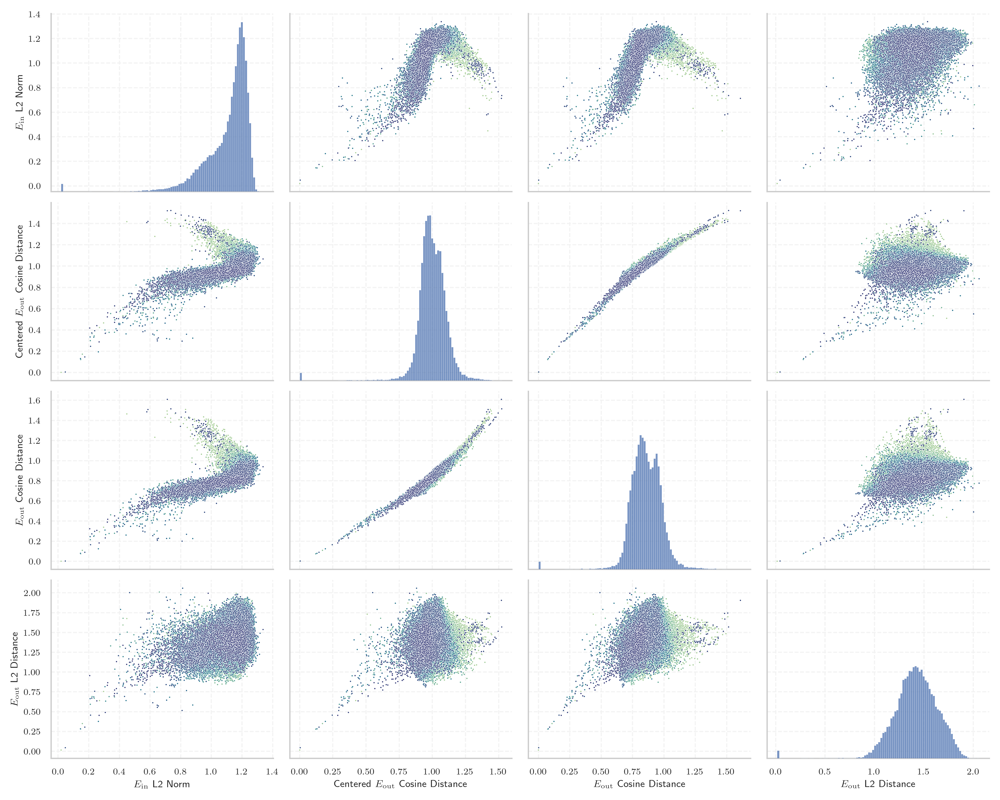
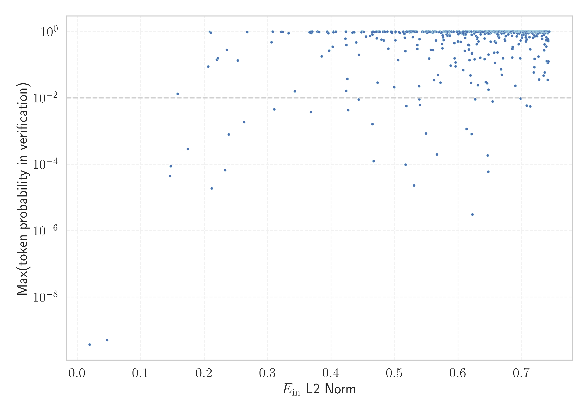

# Report for `meta-llama/Llama-2-70b-hf`

## Model info

* Tied embeddings: no
* LM head uses bias: no
* Indicator for under-trained tokens: E_{in} L2 Norm
  * Overall distribution 1.106 +/- 0.147
  * Token used for verification prompt building: `springframework`
  * Verification threshold: 0.744
  * Threshold for showing candidate under-trained tokens: 0.233
  * Median verified threshold (for bytes, unreachable and special tokens): 0.518
* Embeddings shape: (32000, 8192)
* Vocabulary size: 32000
  * Number of single byte tokens: 351, of which 113 below indicator threshold
  * Number of special tokens: 3, of which 1 below indicator threshold
  * Number of tested under-trained tokens: 625, 625 non-special, 30 below p = 0.01 threshold, 11 below soft indicator threshold

## Under-trained token indicators plot


## Verification plot


## Under-trained token verification results
11 entries below threshold of 0.233

|   token_id | token                       |   indicator | max_prob                                                         | in_other_tokens                                                                                                                                                                            |
|------------|-----------------------------|-------------|------------------------------------------------------------------|--------------------------------------------------------------------------------------------------------------------------------------------------------------------------------------------|
|      28574 | ````` ▁Mediabestanden ````` |   0.0470724 | <span style='border: 1px solid rgb(169, 68, 66);'>5.1e-10</span> |                                                                                                                                                                                            |
|      20609 | ````` ▁Portály `````        |   0.146019  | <span style='border: 1px solid rgb(169, 68, 66);'>4.5e-05</span> |                                                                                                                                                                                            |
|      12731 | ````` ederbörd `````        |   0.14729   | <span style='border: 1px solid rgb(169, 68, 66);'>8.8e-05</span> | <span style='border: 1px solid rgb(251, 189, 8);'>````` ▁nederbörd `````</span>, <span style='border: 1px solid rgb(169, 68, 66);'>````` nederbörd `````</span>, ````` ▁årsnederbörd ````` |
|       3798 | ````` oreferrer `````       |   0.1581    | <span style='border: 1px solid rgb(251, 189, 8);'>0.013</span>   | ````` ▁noreferrer `````, ````` noreferrer `````                                                                                                                                            |
|      28633 | ````` nederbörd `````       |   0.174253  | <span style='border: 1px solid rgb(169, 68, 66);'>0.00029</span> | ````` ▁årsnederbörd `````                                                                                                                                                                  |
|      31664 | ````` ߬ `````                |   0.206375  | <span style='border: 1px solid rgb(251, 189, 8);'>0.088</span>   |                                                                                                                                                                                            |
|      23313 | ````` Obrázky `````         |   0.208841  | <span style='border: 1px solid rgb(40, 167, 69);'>0.99</span>    |                                                                                                                                                                                            |
|      12882 | ````` ITableView `````      |   0.210219  | <span style='border: 1px solid rgb(40, 167, 69);'>0.92</span>    | ````` ▁UITableView `````, <span style='border: 1px solid rgb(40, 167, 69);'>````` UITableView `````</span>                                                                                 |
|      28354 | ````` ▁Расподела `````      |   0.211736  | <span style='border: 1px solid rgb(169, 68, 66);'>1.9e-05</span> |                                                                                                                                                                                            |
|      28623 | ````` ▁Genomsnitt `````     |   0.219933  | <span style='border: 1px solid rgb(40, 167, 69);'>0.14</span>    | <span style='border: 1px solid rgb(40, 167, 69);'>````` ▁Genomsnittlig `````</span>                                                                                                        |
|       9831 | ````` ▁челов `````          |   0.22154   | <span style='border: 1px solid rgb(40, 167, 69);'>0.16</span>    | ````` ▁человек `````, ````` ▁челове `````, ````` ▁человека `````                                                                                                                           |


## Byte tokens
113 entries below threshold of 0.518

|   token_id | token              |   indicator |   ord | hex   | byte_type   | reencoded             |
|------------|--------------------|-------------|-------|-------|-------------|-----------------------|
|         60 | ````` <0x39> ````` |   0.0193726 |    57 | 0x39  | ascii       | 29929: ````` 9 `````  |
|        121 | ````` <0x76> ````` |   0.019419  |   118 | 0x76  | ascii       | 29894: ````` v `````  |
|         37 | ````` <0x22> ````` |   0.0194569 |    34 | 0x22  | ascii       | 29908: ````` " `````  |
|        101 | ````` <0x62> ````` |   0.0194595 |    98 | 0x62  | ascii       | 29890: ````` b `````  |
|        258 | ````` <0xFF> ````` |   0.0194763 |   255 | 0xFF  | unused_utf8 |                       |
|         71 | ````` <0x44> ````` |   0.0195018 |    68 | 0x44  | ascii       | 29928: ````` D `````  |
|        114 | ````` <0x6F> ````` |   0.0195048 |   111 | 0x6F  | ascii       | 29877: ````` o `````  |
|         16 | ````` <0x0D> ````` |   0.0195087 |    13 | 0x0D  | ascii       | 30004: ````` \r ````` |
|        102 | ````` <0x63> ````` |   0.0195214 |    99 | 0x63  | ascii       | 29883: ````` c `````  |
|        111 | ````` <0x6C> ````` |   0.0195235 |   108 | 0x6C  | ascii       | 29880: ````` l `````  |
|         43 | ````` <0x28> ````` |   0.0195365 |    40 | 0x28  | ascii       | 29898: ````` ( `````  |
|        116 | ````` <0x71> ````` |   0.0195367 |   113 | 0x71  | ascii       | 29939: ````` q `````  |
|        110 | ````` <0x6B> ````` |   0.0195685 |   107 | 0x6B  | ascii       | 29895: ````` k `````  |
|         68 | ````` <0x41> ````` |   0.0195708 |    65 | 0x41  | ascii       | 29909: ````` A `````  |
|         95 | ````` <0x5C> ````` |   0.0195843 |    92 | 0x5C  | ascii       | 29905: ````` \ `````  |
|        253 | ````` <0xFA> ````` |   0.0195851 |   250 | 0xFA  | unused_utf8 |                       |
|         49 | ````` <0x2E> ````` |   0.0195955 |    46 | 0x2E  | ascii       | 29889: ````` . `````  |
|        248 | ````` <0xF5> ````` |   0.0195966 |   245 | 0xF5  | unused_utf8 |                       |
|        255 | ````` <0xFC> ````` |   0.019598  |   252 | 0xFC  | unused_utf8 |                       |
|         53 | ````` <0x32> ````` |   0.0196063 |    50 | 0x32  | ascii       | 29906: ````` 2 `````  |
<details><summary>93 additional entries below threshold</summary>

|   token_id | token              |   indicator |   ord | hex   | byte_type   | reencoded             |
|------------|--------------------|-------------|-------|-------|-------------|-----------------------|
|         93 | ````` <0x5A> ````` |   0.0196075 |    90 | 0x5A  | ascii       | 29999: ````` Z `````  |
|         38 | ````` <0x23> ````` |   0.0196144 |    35 | 0x23  | ascii       | 29937: ````` # `````  |
|        250 | ````` <0xF7> ````` |   0.0196173 |   247 | 0xF7  | unused_utf8 |                       |
|        128 | ````` <0x7D> ````` |   0.0196242 |   125 | 0x7D  | ascii       | 29913: ````` } `````  |
|         79 | ````` <0x4C> ````` |   0.0196289 |    76 | 0x4C  | ascii       | 29931: ````` L `````  |
|        127 | ````` <0x7C> ````` |   0.0196289 |   124 | 0x7C  | ascii       | 29989: ````` \| ````` |
|        196 | ````` <0xC1> ````` |   0.0196295 |   193 | 0xC1  | unused_utf8 |                       |
|         59 | ````` <0x38> ````` |   0.0196315 |    56 | 0x38  | ascii       | 29947: ````` 8 `````  |
|         48 | ````` <0x2D> ````` |   0.0196332 |    45 | 0x2D  | ascii       | 29899: ````` - `````  |
|         92 | ````` <0x59> ````` |   0.0196357 |    89 | 0x59  | ascii       | 29979: ````` Y `````  |
|         73 | ````` <0x46> ````` |   0.0196468 |    70 | 0x46  | ascii       | 29943: ````` F `````  |
|         54 | ````` <0x33> ````` |   0.0196495 |    51 | 0x33  | ascii       | 29941: ````` 3 `````  |
|        120 | ````` <0x75> ````` |   0.0196506 |   117 | 0x75  | ascii       | 29884: ````` u `````  |
|         58 | ````` <0x37> ````` |   0.0196531 |    55 | 0x37  | ascii       | 29955: ````` 7 `````  |
|         67 | ````` <0x40> ````` |   0.0196645 |    64 | 0x40  | ascii       | 29992: ````` @ `````  |
|         89 | ````` <0x56> ````` |   0.0196648 |    86 | 0x56  | ascii       | 29963: ````` V `````  |
|        109 | ````` <0x6A> ````` |   0.0196685 |   106 | 0x6A  | ascii       | 29926: ````` j `````  |
|         45 | ````` <0x2A> ````` |   0.0196737 |    42 | 0x2A  | ascii       | 29930: ````` * `````  |
|         84 | ````` <0x51> ````` |   0.0196742 |    81 | 0x51  | ascii       | 29984: ````` Q `````  |
|         94 | ````` <0x5B> ````` |   0.0196742 |    91 | 0x5B  | ascii       | 29961: ````` [ `````  |
|        254 | ````` <0xFB> ````` |   0.0196758 |   251 | 0xFB  | unused_utf8 |                       |
|         61 | ````` <0x3A> ````` |   0.0196824 |    58 | 0x3A  | ascii       | 29901: ````` : `````  |
|        112 | ````` <0x6D> ````` |   0.0196834 |   109 | 0x6D  | ascii       | 29885: ````` m `````  |
|        125 | ````` <0x7A> ````` |   0.0196846 |   122 | 0x7A  | ascii       | 29920: ````` z `````  |
|         52 | ````` <0x31> ````` |   0.0196853 |    49 | 0x31  | ascii       | 29896: ````` 1 `````  |
|        126 | ````` <0x7B> ````` |   0.0196894 |   123 | 0x7B  | ascii       | 29912: ````` { `````  |
|        104 | ````` <0x65> ````` |   0.0196973 |   101 | 0x65  | ascii       | 29872: ````` e `````  |
|         91 | ````` <0x58> ````` |   0.0197019 |    88 | 0x58  | ascii       | 29990: ````` X `````  |
|        256 | ````` <0xFD> ````` |   0.0197051 |   253 | 0xFD  | unused_utf8 |                       |
|        117 | ````` <0x72> ````` |   0.0197117 |   114 | 0x72  | ascii       | 29878: ````` r `````  |
|         88 | ````` <0x55> ````` |   0.0197122 |    85 | 0x55  | ascii       | 29965: ````` U `````  |
|         41 | ````` <0x26> ````` |   0.0197128 |    38 | 0x26  | ascii       | 29987: ````` & `````  |
|        118 | ````` <0x73> ````` |   0.019717  |   115 | 0x73  | ascii       | 29879: ````` s `````  |
|         44 | ````` <0x29> ````` |   0.0197217 |    41 | 0x29  | ascii       | 29897: ````` ) `````  |
|         55 | ````` <0x34> ````` |   0.0197225 |    52 | 0x34  | ascii       | 29946: ````` 4 `````  |
|         76 | ````` <0x49> ````` |   0.0197228 |    73 | 0x49  | ascii       | 29902: ````` I `````  |
|        108 | ````` <0x69> ````` |   0.0197338 |   105 | 0x69  | ascii       | 29875: ````` i `````  |
|         64 | ````` <0x3D> ````` |   0.0197403 |    61 | 0x3D  | ascii       | 29922: ````` = `````  |
|         75 | ````` <0x48> ````` |   0.0197405 |    72 | 0x48  | ascii       | 29950: ````` H `````  |
|         99 | ````` <0x60> ````` |   0.0197426 |    96 | 0x60  | ascii       | 29952: ````` ` `````  |
|         42 | ````` <0x27> ````` |   0.0197469 |    39 | 0x27  | ascii       | 29915: ````` ' `````  |
|        195 | ````` <0xC0> ````` |   0.0197483 |   192 | 0xC0  | unused_utf8 |                       |
|         62 | ````` <0x3B> ````` |   0.0197488 |    59 | 0x3B  | ascii       | 29936: ````` ; `````  |
|         97 | ````` <0x5E> ````` |   0.0197526 |    94 | 0x5E  | ascii       | 29985: ````` ^ `````  |
|         74 | ````` <0x47> ````` |   0.0197567 |    71 | 0x47  | ascii       | 29954: ````` G `````  |
|        198 | ````` <0xC3> ````` |   0.01976   |   195 | 0xC3  | utf8        |                       |
|        100 | ````` <0x61> ````` |   0.0197634 |    97 | 0x61  | ascii       | 29874: ````` a `````  |
|        105 | ````` <0x66> ````` |   0.0197653 |   102 | 0x66  | ascii       | 29888: ````` f `````  |
|         56 | ````` <0x35> ````` |   0.0197667 |    53 | 0x35  | ascii       | 29945: ````` 5 `````  |
|         72 | ````` <0x45> ````` |   0.0197689 |    69 | 0x45  | ascii       | 29923: ````` E `````  |
|         50 | ````` <0x2F> ````` |   0.0197698 |    47 | 0x2F  | ascii       | 29914: ````` / `````  |
|        129 | ````` <0x7E> ````` |   0.0197712 |   126 | 0x7E  | ascii       | 30022: ````` ~ `````  |
|        122 | ````` <0x77> ````` |   0.0197796 |   119 | 0x77  | ascii       | 29893: ````` w `````  |
|        249 | ````` <0xF6> ````` |   0.0197833 |   246 | 0xF6  | unused_utf8 |                       |
|         83 | ````` <0x50> ````` |   0.0197894 |    80 | 0x50  | ascii       | 29925: ````` P `````  |
|        119 | ````` <0x74> ````` |   0.0197922 |   116 | 0x74  | ascii       | 29873: ````` t `````  |
|         57 | ````` <0x36> ````` |   0.0197949 |    54 | 0x36  | ascii       | 29953: ````` 6 `````  |
|        106 | ````` <0x67> ````` |   0.0197952 |   103 | 0x67  | ascii       | 29887: ````` g `````  |
|         98 | ````` <0x5F> ````` |   0.0197969 |    95 | 0x5F  | ascii       | 29918: ````` _ `````  |
|         82 | ````` <0x4F> ````` |   0.0198077 |    79 | 0x4F  | ascii       | 29949: ````` O `````  |
|         46 | ````` <0x2B> ````` |   0.0198095 |    43 | 0x2B  | ascii       | 29974: ````` + `````  |
|         78 | ````` <0x4B> ````` |   0.0198252 |    75 | 0x4B  | ascii       | 29968: ````` K `````  |
|        257 | ````` <0xFE> ````` |   0.0198317 |   254 | 0xFE  | unused_utf8 |                       |
|         81 | ````` <0x4E> ````` |   0.0198327 |    78 | 0x4E  | ascii       | 29940: ````` N `````  |
|         51 | ````` <0x30> ````` |   0.0198341 |    48 | 0x30  | ascii       | 29900: ````` 0 `````  |
|         70 | ````` <0x43> ````` |   0.0198432 |    67 | 0x43  | ascii       | 29907: ````` C `````  |
|         35 | ````` <0x20> ````` |   0.0198445 |    32 | 0x20  | ascii       | 29871: ````` ▁ `````  |
|         90 | ````` <0x57> ````` |   0.0198493 |    87 | 0x57  | ascii       | 29956: ````` W `````  |
|         87 | ````` <0x54> ````` |   0.0198527 |    84 | 0x54  | ascii       | 29911: ````` T `````  |
|         63 | ````` <0x3C> ````` |   0.0198538 |    60 | 0x3C  | ascii       | 29966: ````` < `````  |
|        113 | ````` <0x6E> ````` |   0.0198644 |   110 | 0x6E  | ascii       | 29876: ````` n `````  |
|        107 | ````` <0x68> ````` |   0.0198696 |   104 | 0x68  | ascii       | 29882: ````` h `````  |
|         69 | ````` <0x42> ````` |   0.0198805 |    66 | 0x42  | ascii       | 29933: ````` B `````  |
|         77 | ````` <0x4A> ````` |   0.0198902 |    74 | 0x4A  | ascii       | 29967: ````` J `````  |
|        123 | ````` <0x78> ````` |   0.0198921 |   120 | 0x78  | ascii       | 29916: ````` x `````  |
|         65 | ````` <0x3E> ````` |   0.0199018 |    62 | 0x3E  | ascii       | 29958: ````` > `````  |
|        252 | ````` <0xF9> ````` |   0.0199086 |   249 | 0xF9  | unused_utf8 |                       |
|        115 | ````` <0x70> ````` |   0.0199114 |   112 | 0x70  | ascii       | 29886: ````` p `````  |
|         85 | ````` <0x52> ````` |   0.0199189 |    82 | 0x52  | ascii       | 29934: ````` R `````  |
|         39 | ````` <0x24> ````` |   0.0199235 |    36 | 0x24  | ascii       | 29938: ````` $ `````  |
|         96 | ````` <0x5D> ````` |   0.0199413 |    93 | 0x5D  | ascii       | 29962: ````` ] `````  |
|        124 | ````` <0x79> ````` |   0.0199443 |   121 | 0x79  | ascii       | 29891: ````` y `````  |
|        103 | ````` <0x64> ````` |   0.0199611 |   100 | 0x64  | ascii       | 29881: ````` d `````  |
|         36 | ````` <0x21> ````` |   0.0199683 |    33 | 0x21  | ascii       | 29991: ````` ! `````  |
|         47 | ````` <0x2C> ````` |   0.0199791 |    44 | 0x2C  | ascii       | 29892: ````` , `````  |
|         66 | ````` <0x3F> ````` |   0.0200014 |    63 | 0x3F  | ascii       | 29973: ````` ? `````  |
|         40 | ````` <0x25> ````` |   0.0200232 |    37 | 0x25  | ascii       | 29995: ````` % `````  |
|         86 | ````` <0x53> ````` |   0.0200364 |    83 | 0x53  | ascii       | 29903: ````` S `````  |
|        251 | ````` <0xF8> ````` |   0.0201184 |   248 | 0xF8  | unused_utf8 |                       |
|         80 | ````` <0x4D> ````` |   0.0201234 |    77 | 0x4D  | ascii       | 29924: ````` M `````  |
|        245 | ````` <0xF2> ````` |   0.270044  |   242 | 0xF2  | utf8        |                       |
|        244 | ````` <0xF1> ````` |   0.296854  |   241 | 0xF1  | utf8        |                       |
|         13 | ````` <0x0A> ````` |   0.448408  |    10 | 0x0A  | ascii       |                       |
</details>


## Special tokens
1 entries below threshold of 0.518

|   token_id | token             |   indicator | max_prob                                                         |
|------------|-------------------|-------------|------------------------------------------------------------------|
|          0 | ````` <unk> ````` |   0.0195536 | <span style='border: 1px solid rgb(169, 68, 66);'>3.8e-10</span> |

