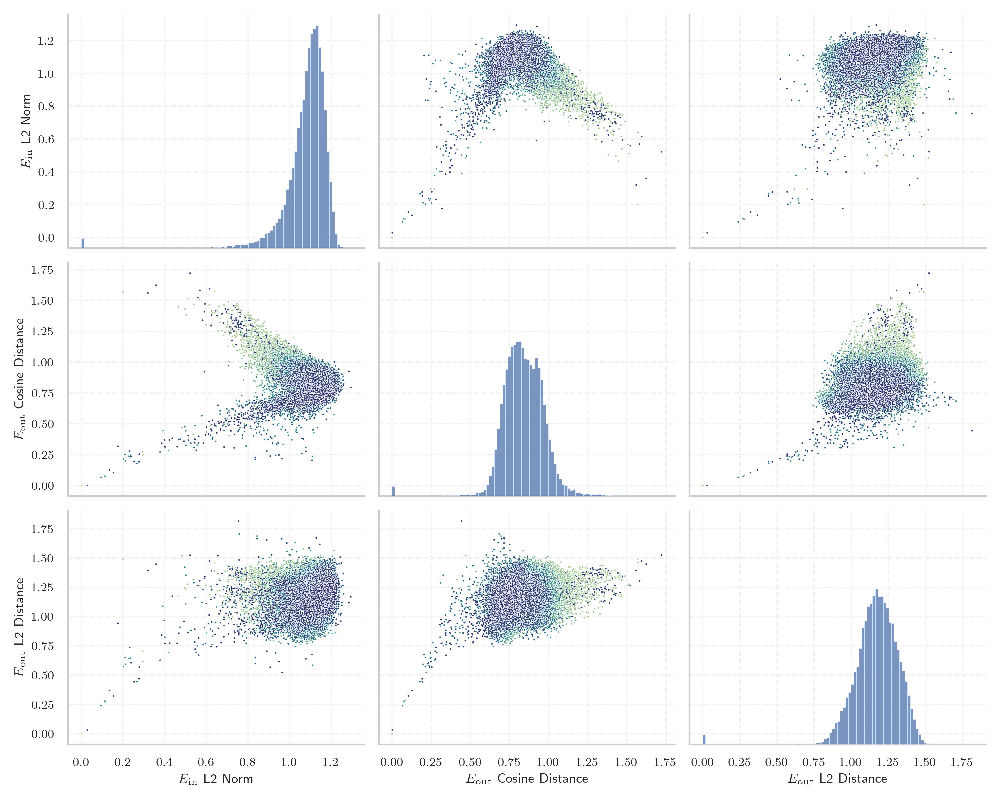

# Report for `meta-llama/Llama-2-7b-hf`

## Model info

* Model Info: 
  * Tied embeddings: False
  * LM head uses bias: False
  * Embeddings shape: [32000, 4096]
* Tokenizer Info: 
  * Vocab Size: 32000
  * Tokenizer Class: LlamaTokenizer
  * Tokenizer Type: BPE
  * Bytes handling: Byte Fallback
  * Token for verification prompt building: springframework
  * Token id for verification prompt building: 6688
* Indicator summary: 
  * Indicator for under-trained tokens: E_{in} L2 Norm
  * Overall distribution: 1.080 +/- 0.109
* Detected Token Counts: 
  * Number of tested under-trained tokens: 639, 551 non-special, 19 below p = 0.01 threshold, 11 below soft indicator threshold
  * Number of single byte tokens: 351, of which 115 below indicator threshold
  * Number of special tokens: 0, of which 0 below indicator threshold

## Under-trained token indicators plot


## Verification plot


## Under-trained token verification results
11 entries below threshold of 0.232

|   token_id | token                       |   indicator | max_prob                                                         | in_other_tokens                                                                                                                                                                                                                                     |
|------------|-----------------------------|-------------|------------------------------------------------------------------|-----------------------------------------------------------------------------------------------------------------------------------------------------------------------------------------------------------------------------------------------------|
|      28574 | ````` ▁Mediabestanden ````` |   0.0286962 | <span style='border: 1px solid rgb(169, 68, 66);'>1.5e-08</span> |                                                                                                                                                                                                                                                     |
|      20609 | ````` ▁Portály `````        |   0.0955797 | <span style='border: 1px solid rgb(169, 68, 66);'>1.2e-06</span> |                                                                                                                                                                                                                                                     |
|       3798 | ````` oreferrer `````       |   0.112781  | <span style='border: 1px solid rgb(169, 68, 66);'>2e-05</span>   | <span style='border: 1px solid rgb(40, 167, 69);'>````` ▁noreferrer `````</span>, ````` noreferrer `````                                                                                                                                            |
|      12731 | ````` ederbörd `````        |   0.114027  | <span style='border: 1px solid rgb(169, 68, 66);'>3.6e-06</span> | <span style='border: 1px solid rgb(255, 145, 0);'>````` ▁nederbörd `````</span>, <span style='border: 1px solid rgb(255, 145, 0);'>````` nederbörd `````</span>, <span style='border: 1px solid rgb(169, 68, 66);'>````` ▁årsnederbörd `````</span> |
|      28354 | ````` ▁Расподела `````      |   0.135537  | <span style='border: 1px solid rgb(169, 68, 66);'>0.00013</span> |                                                                                                                                                                                                                                                     |
|      28633 | ````` nederbörd `````       |   0.154854  | <span style='border: 1px solid rgb(255, 145, 0);'>0.0024</span>  | <span style='border: 1px solid rgb(169, 68, 66);'>````` ▁årsnederbörd `````</span>                                                                                                                                                                  |
|      31664 | ````` ߬ `````                |   0.175596  | <span style='border: 1px solid rgb(251, 189, 8);'>0.015</span>   |                                                                                                                                                                                                                                                     |
|      23313 | ````` Obrázky `````         |   0.202286  | <span style='border: 1px solid rgb(40, 167, 69);'>0.46</span>    |                                                                                                                                                                                                                                                     |
|      11193 | ````` ▁Normdaten `````      |   0.209872  | <span style='border: 1px solid rgb(251, 189, 8);'>0.034</span>   |                                                                                                                                                                                                                                                     |
|      12882 | ````` ITableView `````      |   0.211368  | <span style='border: 1px solid rgb(40, 167, 69);'>0.91</span>    | ````` ▁UITableView `````, <span style='border: 1px solid rgb(40, 167, 69);'>````` UITableView `````</span>                                                                                                                                          |
|       9831 | ````` ▁челов `````          |   0.228664  | <span style='border: 1px solid rgb(40, 167, 69);'>0.95</span>    | ````` ▁человек `````, ````` ▁челове `````, ````` ▁человека `````                                                                                                                                                                                    |


## Byte tokens
115 entries below threshold of 0.378

|   token_id | token              |   indicator |   ord | hex   | byte_type   | reencoded            |
|------------|--------------------|-------------|-------|-------|-------------|----------------------|
|         40 | ````` <0x25> ````` | 0.000349553 |    37 | 0x25  | ascii       | 29995: ````` % ````` |
|         87 | ````` <0x54> ````` | 0.00035289  |    84 | 0x54  | ascii       | 29911: ````` T ````` |
|        198 | ````` <0xC3> ````` | 0.000352937 |   195 | 0xC3  | utf8        |                      |
|        106 | ````` <0x67> ````` | 0.00035321  |   103 | 0x67  | ascii       | 29887: ````` g ````` |
|         98 | ````` <0x5F> ````` | 0.000353294 |    95 | 0x5F  | ascii       | 29918: ````` _ ````` |
|         75 | ````` <0x48> ````` | 0.000353442 |    72 | 0x48  | ascii       | 29950: ````` H ````` |
|         76 | ````` <0x49> ````` | 0.000353553 |    73 | 0x49  | ascii       | 29902: ````` I ````` |
|         78 | ````` <0x4B> ````` | 0.000353974 |    75 | 0x4B  | ascii       | 29968: ````` K ````` |
|        112 | ````` <0x6D> ````` | 0.000353992 |   109 | 0x6D  | ascii       | 29885: ````` m ````` |
|         36 | ````` <0x21> ````` | 0.000354813 |    33 | 0x21  | ascii       | 29991: ````` ! ````` |
|         71 | ````` <0x44> ````` | 0.000355259 |    68 | 0x44  | ascii       | 29928: ````` D ````` |
|        257 | ````` <0xFE> ````` | 0.00035526  |   254 | 0xFE  | unused_utf8 |                      |
|         54 | ````` <0x33> ````` | 0.000355356 |    51 | 0x33  | ascii       | 29941: ````` 3 ````` |
|         57 | ````` <0x36> ````` | 0.000355367 |    54 | 0x36  | ascii       | 29953: ````` 6 ````` |
|        125 | ````` <0x7A> ````` | 0.000355599 |   122 | 0x7A  | ascii       | 29920: ````` z ````` |
|         51 | ````` <0x30> ````` | 0.000355822 |    48 | 0x30  | ascii       | 29900: ````` 0 ````` |
|        121 | ````` <0x76> ````` | 0.000355903 |   118 | 0x76  | ascii       | 29894: ````` v ````` |
|         72 | ````` <0x45> ````` | 0.000355949 |    69 | 0x45  | ascii       | 29923: ````` E ````` |
|         61 | ````` <0x3A> ````` | 0.000356287 |    58 | 0x3A  | ascii       | 29901: ````` : ````` |
|        115 | ````` <0x70> ````` | 0.000356474 |   112 | 0x70  | ascii       | 29886: ````` p ````` |
<details><summary>95 additional entries below threshold</summary>

|   token_id | token              |   indicator |   ord | hex   | byte_type   | reencoded             |
|------------|--------------------|-------------|-------|-------|-------------|-----------------------|
|         62 | ````` <0x3B> ````` | 0.000356522 |    59 | 0x3B  | ascii       | 29936: ````` ; `````  |
|         64 | ````` <0x3D> ````` | 0.000356552 |    61 | 0x3D  | ascii       | 29922: ````` = `````  |
|         73 | ````` <0x46> ````` | 0.000356636 |    70 | 0x46  | ascii       | 29943: ````` F `````  |
|        107 | ````` <0x68> ````` | 0.000356722 |   104 | 0x68  | ascii       | 29882: ````` h `````  |
|        103 | ````` <0x64> ````` | 0.000356724 |   100 | 0x64  | ascii       | 29881: ````` d `````  |
|         53 | ````` <0x32> ````` | 0.000356775 |    50 | 0x32  | ascii       | 29906: ````` 2 `````  |
|         69 | ````` <0x42> ````` | 0.000356784 |    66 | 0x42  | ascii       | 29933: ````` B `````  |
|        105 | ````` <0x66> ````` | 0.000356812 |   102 | 0x66  | ascii       | 29888: ````` f `````  |
|        127 | ````` <0x7C> ````` | 0.000356898 |   124 | 0x7C  | ascii       | 29989: ````` \| ````` |
|         43 | ````` <0x28> ````` | 0.000357088 |    40 | 0x28  | ascii       | 29898: ````` ( `````  |
|         80 | ````` <0x4D> ````` | 0.000357193 |    77 | 0x4D  | ascii       | 29924: ````` M `````  |
|         92 | ````` <0x59> ````` | 0.000357211 |    89 | 0x59  | ascii       | 29979: ````` Y `````  |
|        116 | ````` <0x71> ````` | 0.000357213 |   113 | 0x71  | ascii       | 29939: ````` q `````  |
|         48 | ````` <0x2D> ````` | 0.000357224 |    45 | 0x2D  | ascii       | 29899: ````` - `````  |
|         35 | ````` <0x20> ````` | 0.000357337 |    32 | 0x20  | ascii       | 29871: ````` ▁ `````  |
|         94 | ````` <0x5B> ````` | 0.000357362 |    91 | 0x5B  | ascii       | 29961: ````` [ `````  |
|         70 | ````` <0x43> ````` | 0.000357616 |    67 | 0x43  | ascii       | 29907: ````` C `````  |
|        250 | ````` <0xF7> ````` | 0.000357626 |   247 | 0xF7  | unused_utf8 |                       |
|         68 | ````` <0x41> ````` | 0.000357736 |    65 | 0x41  | ascii       | 29909: ````` A `````  |
|         85 | ````` <0x52> ````` | 0.000357893 |    82 | 0x52  | ascii       | 29934: ````` R `````  |
|         82 | ````` <0x4F> ````` | 0.000357944 |    79 | 0x4F  | ascii       | 29949: ````` O `````  |
|        129 | ````` <0x7E> ````` | 0.000358006 |   126 | 0x7E  | ascii       | 30022: ````` ~ `````  |
|        102 | ````` <0x63> ````` | 0.000358035 |    99 | 0x63  | ascii       | 29883: ````` c `````  |
|        111 | ````` <0x6C> ````` | 0.000358327 |   108 | 0x6C  | ascii       | 29880: ````` l `````  |
|        120 | ````` <0x75> ````` | 0.000358404 |   117 | 0x75  | ascii       | 29884: ````` u `````  |
|        258 | ````` <0xFF> ````` | 0.00035851  |   255 | 0xFF  | unused_utf8 |                       |
|         77 | ````` <0x4A> ````` | 0.000358534 |    74 | 0x4A  | ascii       | 29967: ````` J `````  |
|         50 | ````` <0x2F> ````` | 0.000358599 |    47 | 0x2F  | ascii       | 29914: ````` / `````  |
|         41 | ````` <0x26> ````` | 0.000358785 |    38 | 0x26  | ascii       | 29987: ````` & `````  |
|        128 | ````` <0x7D> ````` | 0.000358788 |   125 | 0x7D  | ascii       | 29913: ````` } `````  |
|         45 | ````` <0x2A> ````` | 0.000358817 |    42 | 0x2A  | ascii       | 29930: ````` * `````  |
|         83 | ````` <0x50> ````` | 0.000359294 |    80 | 0x50  | ascii       | 29925: ````` P `````  |
|        104 | ````` <0x65> ````` | 0.000359346 |   101 | 0x65  | ascii       | 29872: ````` e `````  |
|         63 | ````` <0x3C> ````` | 0.000359508 |    60 | 0x3C  | ascii       | 29966: ````` < `````  |
|        122 | ````` <0x77> ````` | 0.000359554 |   119 | 0x77  | ascii       | 29893: ````` w `````  |
|         66 | ````` <0x3F> ````` | 0.000359587 |    63 | 0x3F  | ascii       | 29973: ````` ? `````  |
|         58 | ````` <0x37> ````` | 0.00035966  |    55 | 0x37  | ascii       | 29955: ````` 7 `````  |
|        254 | ````` <0xFB> ````` | 0.000359866 |   251 | 0xFB  | unused_utf8 |                       |
|         74 | ````` <0x47> ````` | 0.000359876 |    71 | 0x47  | ascii       | 29954: ````` G `````  |
|        119 | ````` <0x74> ````` | 0.000360028 |   116 | 0x74  | ascii       | 29873: ````` t `````  |
|        110 | ````` <0x6B> ````` | 0.000360232 |   107 | 0x6B  | ascii       | 29895: ````` k `````  |
|         95 | ````` <0x5C> ````` | 0.00036028  |    92 | 0x5C  | ascii       | 29905: ````` \ `````  |
|        109 | ````` <0x6A> ````` | 0.000360433 |   106 | 0x6A  | ascii       | 29926: ````` j `````  |
|         47 | ````` <0x2C> ````` | 0.000360453 |    44 | 0x2C  | ascii       | 29892: ````` , `````  |
|         86 | ````` <0x53> ````` | 0.000360453 |    83 | 0x53  | ascii       | 29903: ````` S `````  |
|        196 | ````` <0xC1> ````` | 0.000360566 |   193 | 0xC1  | unused_utf8 |                       |
|         67 | ````` <0x40> ````` | 0.00036067  |    64 | 0x40  | ascii       | 29992: ````` @ `````  |
|        195 | ````` <0xC0> ````` | 0.000360678 |   192 | 0xC0  | unused_utf8 |                       |
|        255 | ````` <0xFC> ````` | 0.000361047 |   252 | 0xFC  | unused_utf8 |                       |
|         39 | ````` <0x24> ````` | 0.000361137 |    36 | 0x24  | ascii       | 29938: ````` $ `````  |
|        100 | ````` <0x61> ````` | 0.000361144 |    97 | 0x61  | ascii       | 29874: ````` a `````  |
|        256 | ````` <0xFD> ````` | 0.00036137  |   253 | 0xFD  | unused_utf8 |                       |
|         88 | ````` <0x55> ````` | 0.000361525 |    85 | 0x55  | ascii       | 29965: ````` U `````  |
|        253 | ````` <0xFA> ````` | 0.000361625 |   250 | 0xFA  | unused_utf8 |                       |
|        101 | ````` <0x62> ````` | 0.000361671 |    98 | 0x62  | ascii       | 29890: ````` b `````  |
|         90 | ````` <0x57> ````` | 0.000361719 |    87 | 0x57  | ascii       | 29956: ````` W `````  |
|        113 | ````` <0x6E> ````` | 0.000361883 |   110 | 0x6E  | ascii       | 29876: ````` n `````  |
|         93 | ````` <0x5A> ````` | 0.000361913 |    90 | 0x5A  | ascii       | 29999: ````` Z `````  |
|         60 | ````` <0x39> ````` | 0.00036192  |    57 | 0x39  | ascii       | 29929: ````` 9 `````  |
|        251 | ````` <0xF8> ````` | 0.000362142 |   248 | 0xF8  | unused_utf8 |                       |
|         81 | ````` <0x4E> ````` | 0.000362173 |    78 | 0x4E  | ascii       | 29940: ````` N `````  |
|        126 | ````` <0x7B> ````` | 0.000362406 |   123 | 0x7B  | ascii       | 29912: ````` { `````  |
|         49 | ````` <0x2E> ````` | 0.000362415 |    46 | 0x2E  | ascii       | 29889: ````` . `````  |
|        118 | ````` <0x73> ````` | 0.000362494 |   115 | 0x73  | ascii       | 29879: ````` s `````  |
|         59 | ````` <0x38> ````` | 0.0003625   |    56 | 0x38  | ascii       | 29947: ````` 8 `````  |
|        123 | ````` <0x78> ````` | 0.000362563 |   120 | 0x78  | ascii       | 29916: ````` x `````  |
|         37 | ````` <0x22> ````` | 0.000362826 |    34 | 0x22  | ascii       | 29908: ````` " `````  |
|         38 | ````` <0x23> ````` | 0.000362847 |    35 | 0x23  | ascii       | 29937: ````` # `````  |
|         52 | ````` <0x31> ````` | 0.000362981 |    49 | 0x31  | ascii       | 29896: ````` 1 `````  |
|         46 | ````` <0x2B> ````` | 0.000363121 |    43 | 0x2B  | ascii       | 29974: ````` + `````  |
|         84 | ````` <0x51> ````` | 0.000363154 |    81 | 0x51  | ascii       | 29984: ````` Q `````  |
|         55 | ````` <0x34> ````` | 0.000363318 |    52 | 0x34  | ascii       | 29946: ````` 4 `````  |
|         79 | ````` <0x4C> ````` | 0.000363319 |    76 | 0x4C  | ascii       | 29931: ````` L `````  |
|         44 | ````` <0x29> ````` | 0.000363431 |    41 | 0x29  | ascii       | 29897: ````` ) `````  |
|         42 | ````` <0x27> ````` | 0.000363599 |    39 | 0x27  | ascii       | 29915: ````` ' `````  |
|         56 | ````` <0x35> ````` | 0.000363746 |    53 | 0x35  | ascii       | 29945: ````` 5 `````  |
|         97 | ````` <0x5E> ````` | 0.000363756 |    94 | 0x5E  | ascii       | 29985: ````` ^ `````  |
|        249 | ````` <0xF6> ````` | 0.00036379  |   246 | 0xF6  | unused_utf8 |                       |
|         16 | ````` <0x0D> ````` | 0.000363873 |    13 | 0x0D  | ascii       | 30004: ````` \r ````` |
|         65 | ````` <0x3E> ````` | 0.000363895 |    62 | 0x3E  | ascii       | 29958: ````` > `````  |
|        252 | ````` <0xF9> ````` | 0.000364292 |   249 | 0xF9  | unused_utf8 |                       |
|        117 | ````` <0x72> ````` | 0.000365058 |   114 | 0x72  | ascii       | 29878: ````` r `````  |
|        124 | ````` <0x79> ````` | 0.000365178 |   121 | 0x79  | ascii       | 29891: ````` y `````  |
|         96 | ````` <0x5D> ````` | 0.00036609  |    93 | 0x5D  | ascii       | 29962: ````` ] `````  |
|        114 | ````` <0x6F> ````` | 0.000366186 |   111 | 0x6F  | ascii       | 29877: ````` o `````  |
|         99 | ````` <0x60> ````` | 0.000366264 |    96 | 0x60  | ascii       | 29952: ````` ` `````  |
|         89 | ````` <0x56> ````` | 0.000366503 |    86 | 0x56  | ascii       | 29963: ````` V `````  |
|        108 | ````` <0x69> ````` | 0.000367985 |   105 | 0x69  | ascii       | 29875: ````` i `````  |
|        248 | ````` <0xF5> ````` | 0.000368799 |   245 | 0xF5  | unused_utf8 |                       |
|         91 | ````` <0x58> ````` | 0.000369175 |    88 | 0x58  | ascii       | 29990: ````` X `````  |
|         13 | ````` <0x0A> ````` | 0.200063    |    10 | 0x0A  | ascii       |                       |
|        244 | ````` <0xF1> ````` | 0.294427    |   241 | 0xF1  | utf8        |                       |
|        245 | ````` <0xF2> ````` | 0.295276    |   242 | 0xF2  | utf8        |                       |
|      29889 | ````` . `````      | 0.319513    |    46 | 0x2E  | ascii       |                       |
|      29892 | ````` , `````      | 0.358964    |    44 | 0x2C  | ascii       |                       |
</details>


## Special tokens
1 entries below threshold of 0.378

|   token_id | token             |   indicator | max_prob                                                       |
|------------|-------------------|-------------|----------------------------------------------------------------|
|          0 | ````` <unk> ````` | 0.000358604 | <span style='border: 1px solid rgb(169, 68, 66);'>3e-08</span> |

