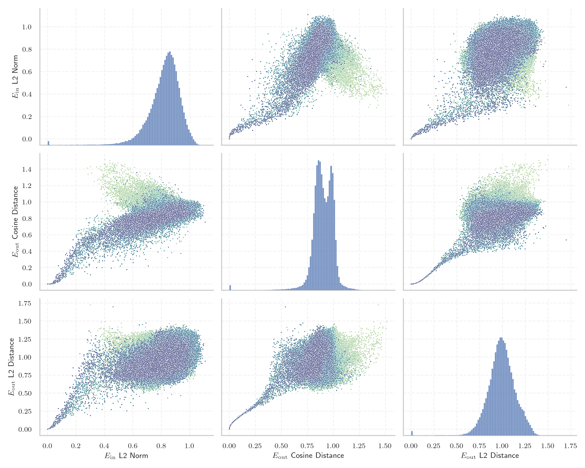
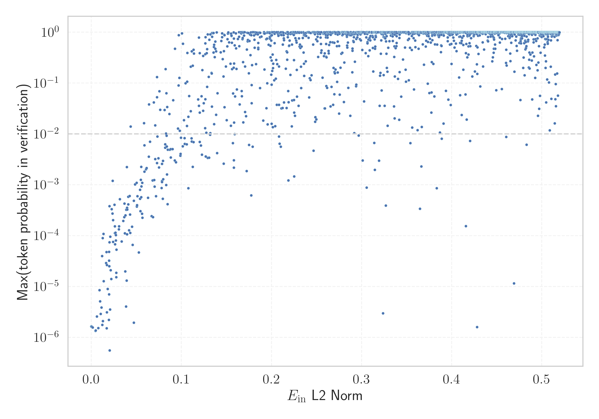

# Report for `meta-llama/Meta-Llama-3.1-70B`

## Model info

* Model Info: 
  * Tied embeddings: False
  * LM head uses bias: False
  * Embeddings shape: [128256, 8192]
* Tokenizer Info: 
  * Vocab Size: 128256
  * Tokenizer Class: PreTrainedTokenizerFast
  * Tokenizer Type: BPE
  * Bytes handling: Byte Input
  * Token for verification prompt building: ABCDEFGHIJKLMNOPQRSTUVWXYZ
  * Token id for verification prompt building: 77002
* Indicator summary: 
  * Indicator for under-trained tokens: E_{in} L2 Norm
  * Overall distribution: 0.818 +/- 0.120
* Detected Token Counts: 
  * Number of tested under-trained tokens: 2539, 2202 non-special, 204 below p = 0.01 threshold, 138 below soft indicator threshold
  * Number of single byte tokens: 256, of which 13 below indicator threshold
  * Number of special tokens: 0, of which 0 below indicator threshold
  * Number of non-single-byte UTF-fragment tokens:  1224, of which 3 below soft indicator threshold

## Under-trained token indicators plot


## Verification plot


## Under-trained token verification results
138 entries below threshold of 0.078

|   token_id | token                             |   indicator | max_prob                                                         | in_other_tokens                                                                                                                                                                                                                                                                                        |
|------------|-----------------------------------|-------------|------------------------------------------------------------------|--------------------------------------------------------------------------------------------------------------------------------------------------------------------------------------------------------------------------------------------------------------------------------------------------------|
|      85071 | ````` $PostalCodesNL `````        | 2.51256e-05 | <span style='border: 1px solid rgb(169, 68, 66);'>1.6e-06</span> |                                                                                                                                                                                                                                                                                                        |
|      80370 | ````` ▁ForCanBeConvertedToF ````` | 2.51853e-05 | <span style='border: 1px solid rgb(169, 68, 66);'>1.6e-06</span> | <span style='border: 1px solid rgb(40, 167, 69);'>````` ▁ForCanBeConvertedToForeach `````</span>                                                                                                                                                                                                       |
|     124292 | ````` илася `````                 | 2.51979e-05 | <span style='border: 1px solid rgb(169, 68, 66);'>1.6e-06</span> |                                                                                                                                                                                                                                                                                                        |
|      89472 | ````` useRalative `````           | 2.5215e-05  | <span style='border: 1px solid rgb(169, 68, 66);'>1.6e-06</span> | <span style='border: 1px solid rgb(169, 68, 66);'>````` useRalativeImagePath `````</span>                                                                                                                                                                                                              |
|     118508 | ````` ávající `````               | 2.5261e-05  | <span style='border: 1px solid rgb(169, 68, 66);'>1.6e-06</span> |                                                                                                                                                                                                                                                                                                        |
|     122746 | ````` илакти `````                | 2.52835e-05 | <span style='border: 1px solid rgb(169, 68, 66);'>1.6e-06</span> | <span style='border: 1px solid rgb(40, 167, 69);'>````` ▁профилакти `````</span>                                                                                                                                                                                                                       |
|     106710 | ````` атися `````                 | 2.52941e-05 | <span style='border: 1px solid rgb(169, 68, 66);'>1.6e-06</span> | <span style='border: 1px solid rgb(169, 68, 66);'>````` уватися `````</span>, <span style='border: 1px solid rgb(169, 68, 66);'>````` ватися `````</span>                                                                                                                                              |
|     125952 | ````` ыџN `````                   | 2.52944e-05 | <span style='border: 1px solid rgb(169, 68, 66);'>1.6e-06</span> | <span style='border: 1px solid rgb(169, 68, 66);'>````` ЎыџN `````</span>, <span style='border: 1px solid rgb(169, 68, 66);'>````` ЎыџNЎыџN `````</span>                                                                                                                                               |
|     126523 | ````` ЎыџN `````                  | 2.53141e-05 | <span style='border: 1px solid rgb(169, 68, 66);'>1.6e-06</span> | <span style='border: 1px solid rgb(169, 68, 66);'>````` ЎыџNЎыџN `````</span>                                                                                                                                                                                                                          |
|     122549 | ````` İTESİ `````                 | 2.53192e-05 | <span style='border: 1px solid rgb(169, 68, 66);'>1.6e-06</span> | ````` ▁ÜNİVERSİTESİ `````                                                                                                                                                                                                                                                                              |
|     127896 | ````` ıldığında `````             | 2.5326e-05  | <span style='border: 1px solid rgb(169, 68, 66);'>1.6e-06</span> |                                                                                                                                                                                                                                                                                                        |
|      85069 | ````` PostalCodesNL `````         | 2.53311e-05 | <span style='border: 1px solid rgb(169, 68, 66);'>1.6e-06</span> | <span style='border: 1px solid rgb(169, 68, 66);'>````` $PostalCodesNL `````</span>                                                                                                                                                                                                                    |
|      64424 | ````` ">\r\r\n `````              | 2.54254e-05 | <span style='border: 1px solid rgb(169, 68, 66);'>1.6e-06</span> |                                                                                                                                                                                                                                                                                                        |
|     127117 | ````` ЎыџNЎыџN `````              | 2.54669e-05 | <span style='border: 1px solid rgb(169, 68, 66);'>1.6e-06</span> |                                                                                                                                                                                                                                                                                                        |
|      79883 | ````` \tTokenNameIdentifier ````` | 2.56267e-05 | <span style='border: 1px solid rgb(169, 68, 66);'>1.6e-06</span> |                                                                                                                                                                                                                                                                                                        |
|      68896 | ````` ;\r\r\r\n `````             | 2.56299e-05 | <span style='border: 1px solid rgb(169, 68, 66);'>1.6e-06</span> | <span style='border: 1px solid rgb(169, 68, 66);'>````` );\r\r\r\n `````</span>                                                                                                                                                                                                                        |
|      80369 | ````` ▁ForCanBeConverted `````    | 2.57053e-05 | <span style='border: 1px solid rgb(169, 68, 66);'>1.6e-06</span> | <span style='border: 1px solid rgb(40, 167, 69);'>````` ▁ForCanBeConvertedToForeach `````</span>, <span style='border: 1px solid rgb(169, 68, 66);'>````` ▁ForCanBeConvertedToF `````</span>                                                                                                           |
|     103003 | ````` аракт `````                 | 2.57138e-05 | <span style='border: 1px solid rgb(169, 68, 66);'>1.6e-06</span> | ````` ▁характер `````, <span style='border: 1px solid rgb(40, 167, 69);'>````` ▁характеристи `````</span>, ````` ▁характеристики `````, <span style='border: 1px solid rgb(40, 167, 69);'>````` ▁характ `````</span>, <span style='border: 1px solid rgb(169, 68, 66);'>````` ▁характериз `````</span> |
|     107658 | ````` итися `````                 | 2.57304e-05 | <span style='border: 1px solid rgb(169, 68, 66);'>1.6e-06</span> |                                                                                                                                                                                                                                                                                                        |
|     126545 | ````` ılmaktadır `````            | 0.000440526 | <span style='border: 1px solid rgb(169, 68, 66);'>1.6e-06</span> |                                                                                                                                                                                                                                                                                                        |
<details><summary>118 additional entries below threshold</summary>

|   token_id | token                            |   indicator | max_prob                                                         | in_other_tokens                                                                                                                                                                                                                    |
|------------|----------------------------------|-------------|------------------------------------------------------------------|------------------------------------------------------------------------------------------------------------------------------------------------------------------------------------------------------------------------------------|
|     126647 | ````` lásil `````                |  0.00155481 | <span style='border: 1px solid rgb(169, 68, 66);'>1.6e-06</span> |                                                                                                                                                                                                                                    |
|     118260 | ````` ávací `````                |  0.00456351 | <span style='border: 1px solid rgb(169, 68, 66);'>1.3e-06</span> |                                                                                                                                                                                                                                    |
|      55716 | ````` ▁?>\r\n\r\n `````          |  0.00482201 | <span style='border: 1px solid rgb(169, 68, 66);'>1.4e-06</span> |                                                                                                                                                                                                                                    |
|     110043 | ````` еристи `````               |  0.00611649 | <span style='border: 1px solid rgb(169, 68, 66);'>2.6e-06</span> | <span style='border: 1px solid rgb(40, 167, 69);'>````` ▁характеристи `````</span>, ````` ▁характеристики `````                                                                                                                    |
|     114533 | ````` ーカー `````               |  0.00768444 | <span style='border: 1px solid rgb(169, 68, 66);'>1.5e-06</span> |                                                                                                                                                                                                                                    |
|     112162 | ````` уватися `````              |  0.00903324 | <span style='border: 1px solid rgb(169, 68, 66);'>8.4e-06</span> |                                                                                                                                                                                                                                    |
|     111067 | ````` ıldığı `````               |  0.00976786 | <span style='border: 1px solid rgb(169, 68, 66);'>5.1e-06</span> | <span style='border: 1px solid rgb(169, 68, 66);'>````` ıldığında `````</span>                                                                                                                                                     |
|     110024 | ````` ▁CLIIIK `````              |  0.0103795  | <span style='border: 1px solid rgb(169, 68, 66);'>2.9e-06</span> |                                                                                                                                                                                                                                    |
|     109045 | ````` krvldkf `````              |  0.0112701  | <span style='border: 1px solid rgb(169, 68, 66);'>3.9e-06</span> | <span style='border: 1px solid rgb(40, 167, 69);'>````` ▁eoqkrvldkf `````</span>                                                                                                                                                   |
|     102564 | ````` ıldı `````                 |  0.0118764  | <span style='border: 1px solid rgb(169, 68, 66);'>4e-05</span>   | ````` ▁yıldız `````, <span style='border: 1px solid rgb(169, 68, 66);'>````` ıldığında `````</span>, ````` ▁yapıldı `````, ````` ▁yıldır `````, <span style='border: 1px solid rgb(169, 68, 66);'>````` ıldığı `````</span>        |
|     112063 | ````` кадем `````                |  0.012189   | <span style='border: 1px solid rgb(169, 68, 66);'>1.8e-06</span> | <span style='border: 1px solid rgb(40, 167, 69);'>````` ▁академ `````</span>                                                                                                                                                       |
|      90050 | ````` _ComCallableWrapper `````  |  0.0125526  | <span style='border: 1px solid rgb(169, 68, 66);'>9e-05</span>   |                                                                                                                                                                                                                                    |
|     108577 | ````` ilmektedir `````           |  0.0128263  | <span style='border: 1px solid rgb(169, 68, 66);'>2.1e-06</span> |                                                                                                                                                                                                                                    |
|     108918 | ````` алася `````                |  0.0133713  | <span style='border: 1px solid rgb(169, 68, 66);'>0.00011</span> |                                                                                                                                                                                                                                    |
|      47073 | ````` webElementXpaths `````     |  0.0136502  | <span style='border: 1px solid rgb(169, 68, 66);'>1.3e-05</span> |                                                                                                                                                                                                                                    |
|     110150 | ````` átku `````                 |  0.0163774  | <span style='border: 1px solid rgb(169, 68, 66);'>2.9e-05</span> | ````` ▁začátku `````                                                                                                                                                                                                               |
|     127748 | ````` ımlar `````                |  0.0168316  | <span style='border: 1px solid rgb(169, 68, 66);'>4.7e-05</span> |                                                                                                                                                                                                                                    |
|     113234 | ````` uştur `````                |  0.0169055  | <span style='border: 1px solid rgb(169, 68, 66);'>1.5e-06</span> | ````` ▁olmuştur `````                                                                                                                                                                                                              |
|     114185 | ````` ımsız `````                |  0.0171958  | <span style='border: 1px solid rgb(169, 68, 66);'>2.6e-05</span> | ````` ▁bağımsız `````                                                                                                                                                                                                              |
|     127367 | ````` ımlı `````                 |  0.0172388  | <span style='border: 1px solid rgb(169, 68, 66);'>3.1e-06</span> |                                                                                                                                                                                                                                    |
|      98668 | ````` );\r\r\r\n `````           |  0.0182162  | <span style='border: 1px solid rgb(169, 68, 66);'>8.9e-06</span> |                                                                                                                                                                                                                                    |
|     116552 | ````` ujícím `````               |  0.0193439  | <span style='border: 1px solid rgb(169, 68, 66);'>2.2e-06</span> |                                                                                                                                                                                                                                    |
|     122032 | ````` áhnout `````               |  0.0196517  | <span style='border: 1px solid rgb(169, 68, 66);'>3.2e-05</span> |                                                                                                                                                                                                                                    |
|     120424 | ````` espoň `````                |  0.0197091  | <span style='border: 1px solid rgb(169, 68, 66);'>7e-06</span>   | ````` ▁alespoň `````                                                                                                                                                                                                               |
|     115721 | ````` átní `````                 |  0.0197633  | <span style='border: 1px solid rgb(169, 68, 66);'>4.8e-05</span> | ````` ▁státní `````                                                                                                                                                                                                                |
|      71785 | ````` .*;\r\n\r\n `````          |  0.0198458  | <span style='border: 1px solid rgb(169, 68, 66);'>2.5e-05</span> |                                                                                                                                                                                                                                    |
|     108653 | ````` átky `````                 |  0.020116   | <span style='border: 1px solid rgb(169, 68, 66);'>7.4e-05</span> | ````` ▁látky `````                                                                                                                                                                                                                 |
|     127438 | ````` ▍▍▍▍▍▍▍▍▍▍▍▍▍▍▍▍ `````     |  0.0201923  | <span style='border: 1px solid rgb(169, 68, 66);'>0.00038</span> |                                                                                                                                                                                                                                    |
|     115614 | ````` ujících `````              |  0.0203164  | <span style='border: 1px solid rgb(169, 68, 66);'>5.6e-07</span> |                                                                                                                                                                                                                                    |
|     114836 | ````` ーション `````             |  0.0206754  | <span style='border: 1px solid rgb(169, 68, 66);'>3.5e-06</span> |                                                                                                                                                                                                                                    |
|     113004 | ````` ▁виріш `````               |  0.0209743  | <span style='border: 1px solid rgb(169, 68, 66);'>9.5e-05</span> |                                                                                                                                                                                                                                    |
|      64448 | ````` ?>\r\n\r\n `````           |  0.0215489  | <span style='border: 1px solid rgb(169, 68, 66);'>2.1e-05</span> |                                                                                                                                                                                                                                    |
|      58508 | ````` :-------------</ `````     |  0.0220552  | <span style='border: 1px solid rgb(169, 68, 66);'>1.4e-05</span> |                                                                                                                                                                                                                                    |
|     117857 | ````` ılmaz `````                |  0.0225981  | <span style='border: 1px solid rgb(169, 68, 66);'>0.00033</span> |                                                                                                                                                                                                                                    |
|      89473 | ````` useRalativeImagePath ````` |  0.0234273  | <span style='border: 1px solid rgb(169, 68, 66);'>0.00027</span> |                                                                                                                                                                                                                                    |
|     112692 | ````` ▍▍▍▍▍▍▍▍ `````             |  0.0237272  | <span style='border: 1px solid rgb(255, 145, 0);'>0.0012</span>  | <span style='border: 1px solid rgb(169, 68, 66);'>````` ▍▍▍▍▍▍▍▍▍▍▍▍▍▍▍▍ `````</span>                                                                                                                                              |
|     115970 | ````` üyordu `````               |  0.0241088  | <span style='border: 1px solid rgb(169, 68, 66);'>7.5e-05</span> |                                                                                                                                                                                                                                    |
|     114860 | ````` ılmıştır `````             |  0.0241771  | <span style='border: 1px solid rgb(169, 68, 66);'>0.0002</span>  |                                                                                                                                                                                                                                    |
|     112907 | ````` uyordu `````               |  0.0256503  | <span style='border: 1px solid rgb(169, 68, 66);'>0.0004</span>  |                                                                                                                                                                                                                                    |
|     106951 | ````` 글상위 `````               |  0.0259969  | <span style='border: 1px solid rgb(169, 68, 66);'>0.00011</span> | <span style='border: 1px solid rgb(40, 167, 69);'>````` ▁구글상위 `````</span>, <span style='border: 1px solid rgb(40, 167, 69);'>````` 구글상위 `````</span>                                                                      |
|     118805 | ````` дивиду `````               |  0.0261613  | <span style='border: 1px solid rgb(169, 68, 66);'>0.00015</span> | <span style='border: 1px solid rgb(40, 167, 69);'>````` ▁индивиду `````</span>                                                                                                                                                     |
|      89471 | ````` useRal `````               |  0.0262287  | <span style='border: 1px solid rgb(169, 68, 66);'>6.8e-05</span> | <span style='border: 1px solid rgb(169, 68, 66);'>````` useRalativeImagePath `````</span>, <span style='border: 1px solid rgb(169, 68, 66);'>````` useRalative `````</span>                                                        |
|      81259 | ````` artisanlib `````           |  0.0268204  | <span style='border: 1px solid rgb(169, 68, 66);'>0.00011</span> |                                                                                                                                                                                                                                    |
|      89475 | ````` elementGuidId `````        |  0.0271072  | <span style='border: 1px solid rgb(169, 68, 66);'>8.1e-05</span> |                                                                                                                                                                                                                                    |
|     115216 | ````` ючись `````                |  0.0273132  | <span style='border: 1px solid rgb(169, 68, 66);'>0.0001</span>  |                                                                                                                                                                                                                                    |
|      93249 | ````` ();\r\r\n `````            |  0.0276507  | <span style='border: 1px solid rgb(169, 68, 66);'>1.9e-05</span> |                                                                                                                                                                                                                                    |
|     115105 | ````` ▁神马收录 `````            |  0.0277409  | <span style='border: 1px solid rgb(169, 68, 66);'>1.5e-05</span> |                                                                                                                                                                                                                                    |
|     106216 | ````` ıntı `````                 |  0.0279154  | <span style='border: 1px solid rgb(169, 68, 66);'>5.3e-05</span> | ````` ▁ayrıntılı `````, <span style='border: 1px solid rgb(40, 167, 69);'>````` ▁ayrıntı `````</span>, ````` ▁sıkıntı `````                                                                                                        |
|     117011 | ````` ımda `````                 |  0.0305303  | <span style='border: 1px solid rgb(169, 68, 66);'>0.00013</span> |                                                                                                                                                                                                                                    |
|      72710 | ````` ▁-->\r\n\r\n `````         |  0.0306587  | <span style='border: 1px solid rgb(169, 68, 66);'>0.00015</span> |                                                                                                                                                                                                                                    |
|      33786 | ````` webElementProperties ````` |  0.0316268  | <span style='border: 1px solid rgb(169, 68, 66);'>0.00052</span> |                                                                                                                                                                                                                                    |
|      96348 | ````` ',\r\r\n `````             |  0.0336813  | <span style='border: 1px solid rgb(169, 68, 66);'>7.6e-05</span> |                                                                                                                                                                                                                                    |
|     112620 | ````` ▁підтрим `````             |  0.0353673  | <span style='border: 1px solid rgb(169, 68, 66);'>0.0002</span>  |                                                                                                                                                                                                                                    |
|     107102 | ````` ıyordu `````               |  0.0364565  | <span style='border: 1px solid rgb(169, 68, 66);'>0.00023</span> |                                                                                                                                                                                                                                    |
|     109744 | ````` acaktır `````              |  0.0366781  | <span style='border: 1px solid rgb(169, 68, 66);'>0.00043</span> | ````` ▁olacaktır `````                                                                                                                                                                                                             |
|     105435 | ````` алась `````                |  0.0372596  | <span style='border: 1px solid rgb(169, 68, 66);'>0.00011</span> |                                                                                                                                                                                                                                    |
|     111691 | ````` abancı `````               |  0.0376968  | <span style='border: 1px solid rgb(169, 68, 66);'>2e-05</span>   | ````` ▁yabancı `````                                                                                                                                                                                                               |
|     126173 | ````` vající `````               |  0.0377906  | <span style='border: 1px solid rgb(169, 68, 66);'>0.00025</span> |                                                                                                                                                                                                                                    |
|     101673 | ````` ektedir `````              |  0.0385531  | <span style='border: 1px solid rgb(169, 68, 66);'>4e-06</span>   | <span style='border: 1px solid rgb(169, 68, 66);'>````` ilmektedir `````</span>, ````` ▁etmektedir `````, <span style='border: 1px solid rgb(40, 167, 69);'>````` mektedir `````</span>, ````` ▁gerekmektedir `````                |
|     120048 | ````` 重複重複 `````             |  0.0387492  | <span style='border: 1px solid rgb(169, 68, 66);'>0.00032</span> |                                                                                                                                                                                                                                    |
|     125265 | ````` україн `````               |  0.0391409  | <span style='border: 1px solid rgb(169, 68, 66);'>1.3e-05</span> | ````` ▁української `````                                                                                                                                                                                                           |
|     105787 | ````` ▍▍▍▍ `````                 |  0.039449   | <span style='border: 1px solid rgb(255, 145, 0);'>0.0022</span>  | <span style='border: 1px solid rgb(255, 145, 0);'>````` ▍▍▍▍▍▍▍▍ `````</span>, <span style='border: 1px solid rgb(169, 68, 66);'>````` ▍▍▍▍▍▍▍▍▍▍▍▍▍▍▍▍ `````</span>                                                               |
|     125700 | ````` rální `````                |  0.0395288  | <span style='border: 1px solid rgb(169, 68, 66);'>0.00011</span> |                                                                                                                                                                                                                                    |
|     104516 | ````` ılmış `````                |  0.0395659  | <span style='border: 1px solid rgb(169, 68, 66);'>0.00035</span> | ````` ▁yapılmış `````, <span style='border: 1px solid rgb(169, 68, 66);'>````` ılmıştır `````</span>                                                                                                                               |
|     126257 | ````` џЭ `````                   |  0.0397465  | <span style='border: 1px solid rgb(169, 68, 66);'>0.00032</span> |                                                                                                                                                                                                                                    |
|     114692 | ````` илась `````                |  0.0409125  | <span style='border: 1px solid rgb(169, 68, 66);'>0.00041</span> |                                                                                                                                                                                                                                    |
|     127577 | ````` lamaktadır `````           |  0.0409383  | <span style='border: 1px solid rgb(169, 68, 66);'>0.00058</span> |                                                                                                                                                                                                                                    |
|     120702 | ````` ▁характериз `````          |  0.0418679  | <span style='border: 1px solid rgb(169, 68, 66);'>0.00013</span> |                                                                                                                                                                                                                                    |
|     127667 | ````` ▁располаг `````            |  0.0424668  | <span style='border: 1px solid rgb(169, 68, 66);'>0.0006</span>  |                                                                                                                                                                                                                                    |
|     127954 | ````` jícím `````                |  0.0429636  | <span style='border: 1px solid rgb(169, 68, 66);'>0.00026</span> |                                                                                                                                                                                                                                    |
|     107572 | ````` ecektir `````              |  0.0430599  | <span style='border: 1px solid rgb(169, 68, 66);'>0.00011</span> |                                                                                                                                                                                                                                    |
|      70316 | ````` erusform `````             |  0.0435338  | <span style='border: 1px solid rgb(251, 189, 8);'>0.014</span>   | <span style='border: 1px solid rgb(40, 167, 69);'>````` numerusform `````</span>                                                                                                                                                   |
|     124393 | ````` sahuje `````               |  0.045091   | <span style='border: 1px solid rgb(169, 68, 66);'>0.00015</span> |                                                                                                                                                                                                                                    |
|     115108 | ````` ▁百度流量 `````            |  0.045927   | <span style='border: 1px solid rgb(169, 68, 66);'>6.6e-05</span> |                                                                                                                                                                                                                                    |
|     107197 | ````` ▁використов `````          |  0.0471361  | <span style='border: 1px solid rgb(169, 68, 66);'>0.00049</span> | <span style='border: 1px solid rgb(40, 167, 69);'>````` ▁використовувати `````</span>                                                                                                                                              |
|     125022 | ````` џN `````                   |  0.0471577  | <span style='border: 1px solid rgb(169, 68, 66);'>1.9e-06</span> | <span style='border: 1px solid rgb(169, 68, 66);'>````` ЎыџN `````</span>, <span style='border: 1px solid rgb(169, 68, 66);'>````` ыџN `````</span>, <span style='border: 1px solid rgb(169, 68, 66);'>````` ЎыџNЎыџN `````</span> |
|     124593 | ````` назнач `````               |  0.0485898  | <span style='border: 1px solid rgb(255, 145, 0);'>0.001</span>   | <span style='border: 1px solid rgb(255, 145, 0);'>````` ▁предназнач `````</span>                                                                                                                                                   |
|     113983 | ````` acılık `````               |  0.0501823  | <span style='border: 1px solid rgb(255, 145, 0);'>0.0011</span>  |                                                                                                                                                                                                                                    |
|     126634 | ````` ▁přiroz `````              |  0.0504886  | <span style='border: 1px solid rgb(169, 68, 66);'>0.00037</span> |                                                                                                                                                                                                                                    |
|     119000 | ````` пеки `````                 |  0.0505923  | <span style='border: 1px solid rgb(169, 68, 66);'>0.0004</span>  | ````` ▁безпеки `````                                                                                                                                                                                                               |
|     126626 | ````` ▁адміністратив `````       |  0.0510779  | <span style='border: 1px solid rgb(169, 68, 66);'>0.00059</span> |                                                                                                                                                                                                                                    |
|     123745 | ````` ▁zahrn `````               |  0.0526516  | <span style='border: 1px solid rgb(169, 68, 66);'>4.7e-05</span> |                                                                                                                                                                                                                                    |
|     117098 | ````` ▁зазнач `````              |  0.0539563  | <span style='border: 1px solid rgb(169, 68, 66);'>0.0008</span>  |                                                                                                                                                                                                                                    |
|     114767 | ````` iyesi `````                |  0.054084   | <span style='border: 1px solid rgb(169, 68, 66);'>0.00053</span> | ````` ▁Belediyesi `````                                                                                                                                                                                                            |
|     121475 | ````` ніцип `````                |  0.0545217  | <span style='border: 1px solid rgb(169, 68, 66);'>0.0003</span>  |                                                                                                                                                                                                                                    |
|     124647 | ````` itelné `````               |  0.0548704  | <span style='border: 1px solid rgb(255, 145, 0);'>0.0013</span>  |                                                                                                                                                                                                                                    |
|      31836 | ````` >\r\r\n `````              |  0.0552892  | <span style='border: 1px solid rgb(255, 145, 0);'>0.0022</span>  | <span style='border: 1px solid rgb(169, 68, 66);'>````` ">\r\r\n `````</span>                                                                                                                                                      |
|     123997 | ````` alardan `````              |  0.0553879  | <span style='border: 1px solid rgb(169, 68, 66);'>0.00057</span> |                                                                                                                                                                                                                                    |
|     117929 | ````` ▁вихов `````               |  0.0554762  | <span style='border: 1px solid rgb(169, 68, 66);'>0.00093</span> |                                                                                                                                                                                                                                    |
|     114091 | ````` üslüman `````              |  0.0562219  | <span style='border: 1px solid rgb(169, 68, 66);'>0.00027</span> | ````` ▁Müslüman `````                                                                                                                                                                                                              |
|      62420 | ````` );\r\r\n `````             |  0.0565002  | <span style='border: 1px solid rgb(255, 145, 0);'>0.0011</span>  | <span style='border: 1px solid rgb(169, 68, 66);'>````` ();\r\r\n `````</span>                                                                                                                                                     |
|     127994 | ````` ватися `````               |  0.056658   | <span style='border: 1px solid rgb(169, 68, 66);'>0.00023</span> |                                                                                                                                                                                                                                    |
|      31960 | ````` quotelev `````             |  0.0584958  | <span style='border: 1px solid rgb(251, 189, 8);'>0.016</span>   |                                                                                                                                                                                                                                    |
|      87829 | ````` ▁}\r\r\n `````             |  0.0588727  | <span style='border: 1px solid rgb(255, 145, 0);'>0.006</span>   |                                                                                                                                                                                                                                    |
|     104121 | ````` iyordu `````               |  0.0588817  | <span style='border: 1px solid rgb(255, 145, 0);'>0.0018</span>  |                                                                                                                                                                                                                                    |
|     120959 | ````` jících `````               |  0.0605783  | <span style='border: 1px solid rgb(255, 145, 0);'>0.002</span>   |                                                                                                                                                                                                                                    |
|     116452 | ````` ▁söyley `````              |  0.0612664  | <span style='border: 1px solid rgb(255, 145, 0);'>0.0021</span>  |                                                                                                                                                                                                                                    |
|     107818 | ````` ární `````                 |  0.0629398  | <span style='border: 1px solid rgb(169, 68, 66);'>0.00055</span> |                                                                                                                                                                                                                                    |
|     117691 | ````` lıklar `````               |  0.063833   | <span style='border: 1px solid rgb(255, 145, 0);'>0.0036</span>  | <span style='border: 1px solid rgb(169, 68, 66);'>````` lıkları `````</span>                                                                                                                                                       |
|      98100 | ````` (stypy `````               |  0.0639644  | <span style='border: 1px solid rgb(251, 189, 8);'>0.038</span>   |                                                                                                                                                                                                                                    |
|     119709 | ````` kyně `````                 |  0.0652111  | <span style='border: 1px solid rgb(255, 145, 0);'>0.007</span>   |                                                                                                                                                                                                                                    |
|     127877 | ````` ▁Coğraf `````              |  0.0668969  | <span style='border: 1px solid rgb(169, 68, 66);'>0.00024</span> |                                                                                                                                                                                                                                    |
|      66534 | ````` '];\r\n\r\n `````          |  0.0680358  | <span style='border: 1px solid rgb(255, 145, 0);'>0.0012</span>  |                                                                                                                                                                                                                                    |
|     120454 | ````` lıkları `````              |  0.0684373  | <span style='border: 1px solid rgb(169, 68, 66);'>0.00023</span> |                                                                                                                                                                                                                                    |
|      47072 | ````` webElementX `````          |  0.0693771  | <span style='border: 1px solid rgb(251, 189, 8);'>0.041</span>   | <span style='border: 1px solid rgb(169, 68, 66);'>````` webElementXpaths `````</span>                                                                                                                                              |
|     119162 | ````` ▁визнача `````             |  0.0698759  | <span style='border: 1px solid rgb(255, 145, 0);'>0.0012</span>  |                                                                                                                                                                                                                                    |
|      38335 | ````` ">\r\n\r\n `````           |  0.0702578  | <span style='border: 1px solid rgb(169, 68, 66);'>0.00092</span> |                                                                                                                                                                                                                                    |
|      70784 | ````` Japgolly `````             |  0.0707997  | <span style='border: 1px solid rgb(255, 145, 0);'>0.0032</span>  | <span style='border: 1px solid rgb(251, 189, 8);'>````` ▁typingsJapgolly `````</span>                                                                                                                                              |
|      51574 | ````` ▁{\r\r\n `````             |  0.0709243  | <span style='border: 1px solid rgb(251, 189, 8);'>0.015</span>   |                                                                                                                                                                                                                                    |
|     122047 | ````` ▁зустрі `````              |  0.0718402  | <span style='border: 1px solid rgb(169, 68, 66);'>0.00059</span> |                                                                                                                                                                                                                                    |
|     118228 | ````` ▁předsed `````             |  0.0728611  | <span style='border: 1px solid rgb(251, 189, 8);'>0.052</span>   |                                                                                                                                                                                                                                    |
|     120592 | ````` тися `````                 |  0.072908   | <span style='border: 1px solid rgb(40, 167, 69);'>0.13</span>    | <span style='border: 1px solid rgb(169, 68, 66);'>````` ватися `````</span>, ````` ▁тисяч `````                                                                                                                                    |
|     122315 | ````` müştür `````               |  0.0729703  | <span style='border: 1px solid rgb(255, 145, 0);'>0.0027</span>  |                                                                                                                                                                                                                                    |
|     116171 | ````` cılık `````                |  0.0732649  | <span style='border: 1px solid rgb(255, 145, 0);'>0.0089</span>  |                                                                                                                                                                                                                                    |
|     110410 | ````` ▁seviy `````               |  0.0743629  | <span style='border: 1px solid rgb(255, 145, 0);'>0.0033</span>  |                                                                                                                                                                                                                                    |
|     127711 | ````` dıktan `````               |  0.0751452  | <span style='border: 1px solid rgb(255, 145, 0);'>0.0022</span>  |                                                                                                                                                                                                                                    |
|     124703 | ````` ırlar `````                |  0.0755995  | <span style='border: 1px solid rgb(251, 189, 8);'>0.069</span>   |                                                                                                                                                                                                                                    |
|     112206 | ````` ▁otevř `````               |  0.0763333  | <span style='border: 1px solid rgb(251, 189, 8);'>0.03</span>    |                                                                                                                                                                                                                                    |
</details>


## Tokens with partial UTF-8 sequences
3 entries below threshold of 0.078

|   token_id | token                      |   indicator | in_other_tokens                                                                       |
|------------|----------------------------|-------------|---------------------------------------------------------------------------------------|
|     100617 | ````` ۱<0xDB> `````        | 2.51904e-05 | ````` ۱۵ `````, ````` ۱۹۴ `````, ````` ۱۹ `````, ````` ۱۳ `````, ````` ۱۳۹ `````, ... |
|      28587 | ````` <0x8E><0xB7>取 ````` | 0.00563443  | ````` 获取 `````, ````` ▁获取 `````                                                   |
|      52188 | ````` <0x9D>始化 `````     | 0.00646697  | ````` ▁初始化 `````, ````` 初始化 `````                                               |


## Byte tokens
13 entries below threshold of 0.054

|   token_id | token              |   indicator |   ord | hex   | byte_type   |
|------------|--------------------|-------------|-------|-------|-------------|
|        186 | ````` <0xFE> ````` | 2.51846e-05 |   254 | 0xFE  | unused_utf8 |
|        178 | ````` <0xF6> ````` | 2.52171e-05 |   246 | 0xF6  | unused_utf8 |
|        125 | ````` <0xC1> ````` | 2.52974e-05 |   193 | 0xC1  | unused_utf8 |
|        185 | ````` <0xFD> ````` | 2.53145e-05 |   253 | 0xFD  | unused_utf8 |
|        187 | ````` <0xFF> ````` | 2.53643e-05 |   255 | 0xFF  | unused_utf8 |
|        183 | ````` <0xFB> ````` | 2.53736e-05 |   251 | 0xFB  | unused_utf8 |
|        184 | ````` <0xFC> ````` | 2.54732e-05 |   252 | 0xFC  | unused_utf8 |
|        179 | ````` <0xF7> ````` | 2.54832e-05 |   247 | 0xF7  | unused_utf8 |
|        177 | ````` <0xF5> ````` | 2.54987e-05 |   245 | 0xF5  | unused_utf8 |
|        181 | ````` <0xF9> ````` | 2.55615e-05 |   249 | 0xF9  | unused_utf8 |
|        180 | ````` <0xF8> ````` | 2.55643e-05 |   248 | 0xF8  | unused_utf8 |
|        124 | ````` <0xC0> ````` | 2.56389e-05 |   192 | 0xC0  | unused_utf8 |
|        182 | ````` <0xFA> ````` | 2.57039e-05 |   250 | 0xFA  | unused_utf8 |


## Special tokens
254 entries below threshold of 0.054

|   token_id | token                                        |   indicator | max_prob                                                         |
|------------|----------------------------------------------|-------------|------------------------------------------------------------------|
|     128127 | ````` <\|reserved_special_token_119\|> ````` | 2.49171e-05 | <span style='border: 1px solid rgb(169, 68, 66);'>1.6e-06</span> |
|     128192 | ````` <\|reserved_special_token_184\|> ````` | 2.49211e-05 | <span style='border: 1px solid rgb(169, 68, 66);'>1.6e-06</span> |
|     128252 | ````` <\|reserved_special_token_244\|> ````` | 2.4947e-05  | <span style='border: 1px solid rgb(169, 68, 66);'>1.6e-06</span> |
|     128122 | ````` <\|reserved_special_token_114\|> ````` | 2.49606e-05 | <span style='border: 1px solid rgb(169, 68, 66);'>1.6e-06</span> |
|     128224 | ````` <\|reserved_special_token_216\|> ````` | 2.49687e-05 | <span style='border: 1px solid rgb(169, 68, 66);'>1.6e-06</span> |
|     128102 | ````` <\|reserved_special_token_94\|> `````  | 2.49888e-05 | <span style='border: 1px solid rgb(169, 68, 66);'>1.6e-06</span> |
|     128100 | ````` <\|reserved_special_token_92\|> `````  | 2.50455e-05 | <span style='border: 1px solid rgb(169, 68, 66);'>1.6e-06</span> |
|     128032 | ````` <\|reserved_special_token_24\|> `````  | 2.50467e-05 | <span style='border: 1px solid rgb(169, 68, 66);'>1.6e-06</span> |
|     128208 | ````` <\|reserved_special_token_200\|> ````` | 2.50512e-05 | <span style='border: 1px solid rgb(169, 68, 66);'>1.6e-06</span> |
|     128055 | ````` <\|reserved_special_token_47\|> `````  | 2.50591e-05 | <span style='border: 1px solid rgb(169, 68, 66);'>1.6e-06</span> |
|     128135 | ````` <\|reserved_special_token_127\|> ````` | 2.50626e-05 | <span style='border: 1px solid rgb(169, 68, 66);'>1.6e-06</span> |
|     128038 | ````` <\|reserved_special_token_30\|> `````  | 2.50721e-05 | <span style='border: 1px solid rgb(169, 68, 66);'>1.6e-06</span> |
|     128211 | ````` <\|reserved_special_token_203\|> ````` | 2.50794e-05 | <span style='border: 1px solid rgb(169, 68, 66);'>1.6e-06</span> |
|     128062 | ````` <\|reserved_special_token_54\|> `````  | 2.50834e-05 | <span style='border: 1px solid rgb(169, 68, 66);'>1.6e-06</span> |
|     128183 | ````` <\|reserved_special_token_175\|> ````` | 2.51024e-05 | <span style='border: 1px solid rgb(169, 68, 66);'>1.6e-06</span> |
|     128185 | ````` <\|reserved_special_token_177\|> ````` | 2.51043e-05 | <span style='border: 1px solid rgb(169, 68, 66);'>1.6e-06</span> |
|     128101 | ````` <\|reserved_special_token_93\|> `````  | 2.51151e-05 | <span style='border: 1px solid rgb(169, 68, 66);'>1.6e-06</span> |
|     128148 | ````` <\|reserved_special_token_140\|> ````` | 2.51232e-05 | <span style='border: 1px solid rgb(169, 68, 66);'>1.6e-06</span> |
|     128044 | ````` <\|reserved_special_token_36\|> `````  | 2.51293e-05 | <span style='border: 1px solid rgb(169, 68, 66);'>1.6e-06</span> |
|     128139 | ````` <\|reserved_special_token_131\|> ````` | 2.51427e-05 | <span style='border: 1px solid rgb(169, 68, 66);'>1.6e-06</span> |
<details><summary>234 additional entries below threshold</summary>

|   token_id | token                                        |   indicator | max_prob                                                         |
|------------|----------------------------------------------|-------------|------------------------------------------------------------------|
|     128018 | ````` <\|reserved_special_token_10\|> `````  | 2.51529e-05 | <span style='border: 1px solid rgb(169, 68, 66);'>1.6e-06</span> |
|     128117 | ````` <\|reserved_special_token_109\|> ````` | 2.51721e-05 | <span style='border: 1px solid rgb(169, 68, 66);'>1.6e-06</span> |
|     128163 | ````` <\|reserved_special_token_155\|> ````` | 2.51748e-05 | <span style='border: 1px solid rgb(169, 68, 66);'>1.6e-06</span> |
|     128033 | ````` <\|reserved_special_token_25\|> `````  | 2.51774e-05 | <span style='border: 1px solid rgb(169, 68, 66);'>1.6e-06</span> |
|     128056 | ````` <\|reserved_special_token_48\|> `````  | 2.51804e-05 | <span style='border: 1px solid rgb(169, 68, 66);'>1.6e-06</span> |
|     128112 | ````` <\|reserved_special_token_104\|> ````` | 2.51845e-05 | <span style='border: 1px solid rgb(169, 68, 66);'>1.6e-06</span> |
|     128054 | ````` <\|reserved_special_token_46\|> `````  | 2.51914e-05 | <span style='border: 1px solid rgb(169, 68, 66);'>1.6e-06</span> |
|     128013 | ````` <\|reserved_special_token_5\|> `````   | 2.51926e-05 | <span style='border: 1px solid rgb(169, 68, 66);'>1.6e-06</span> |
|     128047 | ````` <\|reserved_special_token_39\|> `````  | 2.51964e-05 | <span style='border: 1px solid rgb(169, 68, 66);'>1.6e-06</span> |
|     128077 | ````` <\|reserved_special_token_69\|> `````  | 2.5197e-05  | <span style='border: 1px solid rgb(169, 68, 66);'>1.6e-06</span> |
|     128244 | ````` <\|reserved_special_token_236\|> ````` | 2.51983e-05 | <span style='border: 1px solid rgb(169, 68, 66);'>1.6e-06</span> |
|     128129 | ````` <\|reserved_special_token_121\|> ````` | 2.51987e-05 | <span style='border: 1px solid rgb(169, 68, 66);'>1.6e-06</span> |
|     128243 | ````` <\|reserved_special_token_235\|> ````` | 2.52032e-05 | <span style='border: 1px solid rgb(169, 68, 66);'>1.6e-06</span> |
|     128119 | ````` <\|reserved_special_token_111\|> ````` | 2.52038e-05 | <span style='border: 1px solid rgb(169, 68, 66);'>1.6e-06</span> |
|     128023 | ````` <\|reserved_special_token_15\|> `````  | 2.5207e-05  | <span style='border: 1px solid rgb(169, 68, 66);'>1.6e-06</span> |
|     128233 | ````` <\|reserved_special_token_225\|> ````` | 2.52163e-05 | <span style='border: 1px solid rgb(169, 68, 66);'>1.6e-06</span> |
|     128248 | ````` <\|reserved_special_token_240\|> ````` | 2.52173e-05 | <span style='border: 1px solid rgb(169, 68, 66);'>1.6e-06</span> |
|     128116 | ````` <\|reserved_special_token_108\|> ````` | 2.52181e-05 | <span style='border: 1px solid rgb(169, 68, 66);'>1.6e-06</span> |
|     128229 | ````` <\|reserved_special_token_221\|> ````` | 2.52238e-05 | <span style='border: 1px solid rgb(169, 68, 66);'>1.6e-06</span> |
|     128016 | ````` <\|reserved_special_token_8\|> `````   | 2.52261e-05 | <span style='border: 1px solid rgb(169, 68, 66);'>1.6e-06</span> |
|     128205 | ````` <\|reserved_special_token_197\|> ````` | 2.52294e-05 | <span style='border: 1px solid rgb(169, 68, 66);'>1.6e-06</span> |
|     128114 | ````` <\|reserved_special_token_106\|> ````` | 2.5233e-05  | <span style='border: 1px solid rgb(169, 68, 66);'>1.6e-06</span> |
|     128020 | ````` <\|reserved_special_token_12\|> `````  | 2.52378e-05 | <span style='border: 1px solid rgb(169, 68, 66);'>1.6e-06</span> |
|     128068 | ````` <\|reserved_special_token_60\|> `````  | 2.52491e-05 | <span style='border: 1px solid rgb(169, 68, 66);'>1.6e-06</span> |
|     128075 | ````` <\|reserved_special_token_67\|> `````  | 2.52509e-05 | <span style='border: 1px solid rgb(169, 68, 66);'>1.6e-06</span> |
|     128242 | ````` <\|reserved_special_token_234\|> ````` | 2.52528e-05 | <span style='border: 1px solid rgb(169, 68, 66);'>1.6e-06</span> |
|     128190 | ````` <\|reserved_special_token_182\|> ````` | 2.52529e-05 | <span style='border: 1px solid rgb(169, 68, 66);'>1.6e-06</span> |
|     128210 | ````` <\|reserved_special_token_202\|> ````` | 2.52607e-05 | <span style='border: 1px solid rgb(169, 68, 66);'>1.6e-06</span> |
|     128046 | ````` <\|reserved_special_token_38\|> `````  | 2.52619e-05 | <span style='border: 1px solid rgb(169, 68, 66);'>1.6e-06</span> |
|     128144 | ````` <\|reserved_special_token_136\|> ````` | 2.5263e-05  | <span style='border: 1px solid rgb(169, 68, 66);'>1.6e-06</span> |
|     128105 | ````` <\|reserved_special_token_97\|> `````  | 2.52712e-05 | <span style='border: 1px solid rgb(169, 68, 66);'>1.6e-06</span> |
|     128249 | ````` <\|reserved_special_token_241\|> ````` | 2.52723e-05 | <span style='border: 1px solid rgb(169, 68, 66);'>1.6e-06</span> |
|     128204 | ````` <\|reserved_special_token_196\|> ````` | 2.52732e-05 | <span style='border: 1px solid rgb(169, 68, 66);'>1.6e-06</span> |
|     128221 | ````` <\|reserved_special_token_213\|> ````` | 2.52796e-05 | <span style='border: 1px solid rgb(169, 68, 66);'>1.6e-06</span> |
|     128084 | ````` <\|reserved_special_token_76\|> `````  | 2.52808e-05 | <span style='border: 1px solid rgb(169, 68, 66);'>1.6e-06</span> |
|     128200 | ````` <\|reserved_special_token_192\|> ````` | 2.52824e-05 | <span style='border: 1px solid rgb(169, 68, 66);'>1.6e-06</span> |
|     128247 | ````` <\|reserved_special_token_239\|> ````` | 2.52828e-05 | <span style='border: 1px solid rgb(169, 68, 66);'>1.6e-06</span> |
|     128115 | ````` <\|reserved_special_token_107\|> ````` | 2.52843e-05 | <span style='border: 1px solid rgb(169, 68, 66);'>1.6e-06</span> |
|     128060 | ````` <\|reserved_special_token_52\|> `````  | 2.52879e-05 | <span style='border: 1px solid rgb(169, 68, 66);'>1.6e-06</span> |
|     128042 | ````` <\|reserved_special_token_34\|> `````  | 2.52924e-05 | <span style='border: 1px solid rgb(169, 68, 66);'>1.6e-06</span> |
|     128125 | ````` <\|reserved_special_token_117\|> ````` | 2.52926e-05 | <span style='border: 1px solid rgb(169, 68, 66);'>1.6e-06</span> |
|     128006 | ````` <\|start_header_id\|> `````            | 2.52993e-05 | <span style='border: 1px solid rgb(169, 68, 66);'>1.6e-06</span> |
|     128225 | ````` <\|reserved_special_token_217\|> ````` | 2.52994e-05 | <span style='border: 1px solid rgb(169, 68, 66);'>1.6e-06</span> |
|     128143 | ````` <\|reserved_special_token_135\|> ````` | 2.52996e-05 | <span style='border: 1px solid rgb(169, 68, 66);'>1.6e-06</span> |
|     128010 | ````` <\|python_tag\|> `````                 | 2.53021e-05 | <span style='border: 1px solid rgb(169, 68, 66);'>1.6e-06</span> |
|     128236 | ````` <\|reserved_special_token_228\|> ````` | 2.53042e-05 | <span style='border: 1px solid rgb(169, 68, 66);'>1.6e-06</span> |
|     128246 | ````` <\|reserved_special_token_238\|> ````` | 2.53088e-05 | <span style='border: 1px solid rgb(169, 68, 66);'>1.6e-06</span> |
|     128151 | ````` <\|reserved_special_token_143\|> ````` | 2.53117e-05 | <span style='border: 1px solid rgb(169, 68, 66);'>1.6e-06</span> |
|     128218 | ````` <\|reserved_special_token_210\|> ````` | 2.53129e-05 | <span style='border: 1px solid rgb(169, 68, 66);'>1.6e-06</span> |
|     128004 | ````` <\|finetune_right_pad_id\|> `````      | 2.53133e-05 | <span style='border: 1px solid rgb(169, 68, 66);'>1.6e-06</span> |
|     128217 | ````` <\|reserved_special_token_209\|> ````` | 2.53151e-05 | <span style='border: 1px solid rgb(169, 68, 66);'>1.6e-06</span> |
|     128212 | ````` <\|reserved_special_token_204\|> ````` | 2.53158e-05 | <span style='border: 1px solid rgb(169, 68, 66);'>1.6e-06</span> |
|     128081 | ````` <\|reserved_special_token_73\|> `````  | 2.53162e-05 | <span style='border: 1px solid rgb(169, 68, 66);'>1.6e-06</span> |
|     128219 | ````` <\|reserved_special_token_211\|> ````` | 2.5317e-05  | <span style='border: 1px solid rgb(169, 68, 66);'>1.6e-06</span> |
|     128238 | ````` <\|reserved_special_token_230\|> ````` | 2.53244e-05 | <span style='border: 1px solid rgb(169, 68, 66);'>1.6e-06</span> |
|     128095 | ````` <\|reserved_special_token_87\|> `````  | 2.53263e-05 | <span style='border: 1px solid rgb(169, 68, 66);'>1.6e-06</span> |
|     128106 | ````` <\|reserved_special_token_98\|> `````  | 2.53274e-05 | <span style='border: 1px solid rgb(169, 68, 66);'>1.6e-06</span> |
|     128152 | ````` <\|reserved_special_token_144\|> ````` | 2.53281e-05 | <span style='border: 1px solid rgb(169, 68, 66);'>1.6e-06</span> |
|     128111 | ````` <\|reserved_special_token_103\|> ````` | 2.53292e-05 | <span style='border: 1px solid rgb(169, 68, 66);'>1.6e-06</span> |
|     128093 | ````` <\|reserved_special_token_85\|> `````  | 2.53317e-05 | <span style='border: 1px solid rgb(169, 68, 66);'>1.6e-06</span> |
|     128132 | ````` <\|reserved_special_token_124\|> ````` | 2.53332e-05 | <span style='border: 1px solid rgb(169, 68, 66);'>1.6e-06</span> |
|     128021 | ````` <\|reserved_special_token_13\|> `````  | 2.53361e-05 | <span style='border: 1px solid rgb(169, 68, 66);'>1.6e-06</span> |
|     128147 | ````` <\|reserved_special_token_139\|> ````` | 2.53365e-05 | <span style='border: 1px solid rgb(169, 68, 66);'>1.6e-06</span> |
|     128209 | ````` <\|reserved_special_token_201\|> ````` | 2.53368e-05 | <span style='border: 1px solid rgb(169, 68, 66);'>1.6e-06</span> |
|     128074 | ````` <\|reserved_special_token_66\|> `````  | 2.53376e-05 | <span style='border: 1px solid rgb(169, 68, 66);'>1.6e-06</span> |
|     128015 | ````` <\|reserved_special_token_7\|> `````   | 2.53385e-05 | <span style='border: 1px solid rgb(169, 68, 66);'>1.6e-06</span> |
|     128157 | ````` <\|reserved_special_token_149\|> ````` | 2.53391e-05 | <span style='border: 1px solid rgb(169, 68, 66);'>1.6e-06</span> |
|     128041 | ````` <\|reserved_special_token_33\|> `````  | 2.53391e-05 | <span style='border: 1px solid rgb(169, 68, 66);'>1.6e-06</span> |
|     128164 | ````` <\|reserved_special_token_156\|> ````` | 2.53449e-05 | <span style='border: 1px solid rgb(169, 68, 66);'>1.6e-06</span> |
|     128154 | ````` <\|reserved_special_token_146\|> ````` | 2.5346e-05  | <span style='border: 1px solid rgb(169, 68, 66);'>1.6e-06</span> |
|     128165 | ````` <\|reserved_special_token_157\|> ````` | 2.53467e-05 | <span style='border: 1px solid rgb(169, 68, 66);'>1.6e-06</span> |
|     128130 | ````` <\|reserved_special_token_122\|> ````` | 2.53468e-05 | <span style='border: 1px solid rgb(169, 68, 66);'>1.6e-06</span> |
|     128181 | ````` <\|reserved_special_token_173\|> ````` | 2.53487e-05 | <span style='border: 1px solid rgb(169, 68, 66);'>1.6e-06</span> |
|     128049 | ````` <\|reserved_special_token_41\|> `````  | 2.53557e-05 | <span style='border: 1px solid rgb(169, 68, 66);'>1.6e-06</span> |
|     128088 | ````` <\|reserved_special_token_80\|> `````  | 2.53564e-05 | <span style='border: 1px solid rgb(169, 68, 66);'>1.6e-06</span> |
|     128149 | ````` <\|reserved_special_token_141\|> ````` | 2.53569e-05 | <span style='border: 1px solid rgb(169, 68, 66);'>1.6e-06</span> |
|     128026 | ````` <\|reserved_special_token_18\|> `````  | 2.53575e-05 | <span style='border: 1px solid rgb(169, 68, 66);'>1.6e-06</span> |
|     128090 | ````` <\|reserved_special_token_82\|> `````  | 2.53576e-05 | <span style='border: 1px solid rgb(169, 68, 66);'>1.6e-06</span> |
|     128250 | ````` <\|reserved_special_token_242\|> ````` | 2.53601e-05 | <span style='border: 1px solid rgb(169, 68, 66);'>1.6e-06</span> |
|     128108 | ````` <\|reserved_special_token_100\|> ````` | 2.53603e-05 | <span style='border: 1px solid rgb(169, 68, 66);'>1.6e-06</span> |
|     128053 | ````` <\|reserved_special_token_45\|> `````  | 2.53647e-05 | <span style='border: 1px solid rgb(169, 68, 66);'>1.6e-06</span> |
|     128138 | ````` <\|reserved_special_token_130\|> ````` | 2.53672e-05 | <span style='border: 1px solid rgb(169, 68, 66);'>1.6e-06</span> |
|     128078 | ````` <\|reserved_special_token_70\|> `````  | 2.53694e-05 | <span style='border: 1px solid rgb(169, 68, 66);'>1.6e-06</span> |
|     128037 | ````` <\|reserved_special_token_29\|> `````  | 2.53697e-05 | <span style='border: 1px solid rgb(169, 68, 66);'>1.6e-06</span> |
|     128168 | ````` <\|reserved_special_token_160\|> ````` | 2.53715e-05 | <span style='border: 1px solid rgb(169, 68, 66);'>1.6e-06</span> |
|     128072 | ````` <\|reserved_special_token_64\|> `````  | 2.53716e-05 | <span style='border: 1px solid rgb(169, 68, 66);'>1.6e-06</span> |
|     128059 | ````` <\|reserved_special_token_51\|> `````  | 2.5372e-05  | <span style='border: 1px solid rgb(169, 68, 66);'>1.6e-06</span> |
|     128239 | ````` <\|reserved_special_token_231\|> ````` | 2.53727e-05 | <span style='border: 1px solid rgb(169, 68, 66);'>1.6e-06</span> |
|     128003 | ````` <\|reserved_special_token_1\|> `````   | 2.53743e-05 | <span style='border: 1px solid rgb(169, 68, 66);'>1.6e-06</span> |
|     128187 | ````` <\|reserved_special_token_179\|> ````` | 2.53771e-05 | <span style='border: 1px solid rgb(169, 68, 66);'>1.6e-06</span> |
|     128159 | ````` <\|reserved_special_token_151\|> ````` | 2.53791e-05 | <span style='border: 1px solid rgb(169, 68, 66);'>1.6e-06</span> |
|     128034 | ````` <\|reserved_special_token_26\|> `````  | 2.53793e-05 | <span style='border: 1px solid rgb(169, 68, 66);'>1.6e-06</span> |
|     128092 | ````` <\|reserved_special_token_84\|> `````  | 2.53816e-05 | <span style='border: 1px solid rgb(169, 68, 66);'>1.6e-06</span> |
|     128171 | ````` <\|reserved_special_token_163\|> ````` | 2.53833e-05 | <span style='border: 1px solid rgb(169, 68, 66);'>1.6e-06</span> |
|     128176 | ````` <\|reserved_special_token_168\|> ````` | 2.53862e-05 | <span style='border: 1px solid rgb(169, 68, 66);'>1.6e-06</span> |
|     128036 | ````` <\|reserved_special_token_28\|> `````  | 2.53881e-05 | <span style='border: 1px solid rgb(169, 68, 66);'>1.6e-06</span> |
|     128029 | ````` <\|reserved_special_token_21\|> `````  | 2.53887e-05 | <span style='border: 1px solid rgb(169, 68, 66);'>1.6e-06</span> |
|     128201 | ````` <\|reserved_special_token_193\|> ````` | 2.53891e-05 | <span style='border: 1px solid rgb(169, 68, 66);'>1.6e-06</span> |
|     128158 | ````` <\|reserved_special_token_150\|> ````` | 2.53895e-05 | <span style='border: 1px solid rgb(169, 68, 66);'>1.6e-06</span> |
|     128160 | ````` <\|reserved_special_token_152\|> ````` | 2.53924e-05 | <span style='border: 1px solid rgb(169, 68, 66);'>1.6e-06</span> |
|     128240 | ````` <\|reserved_special_token_232\|> ````` | 2.53926e-05 | <span style='border: 1px solid rgb(169, 68, 66);'>1.6e-06</span> |
|     128045 | ````` <\|reserved_special_token_37\|> `````  | 2.53946e-05 | <span style='border: 1px solid rgb(169, 68, 66);'>1.6e-06</span> |
|     128080 | ````` <\|reserved_special_token_72\|> `````  | 2.5396e-05  | <span style='border: 1px solid rgb(169, 68, 66);'>1.6e-06</span> |
|     128096 | ````` <\|reserved_special_token_88\|> `````  | 2.53964e-05 | <span style='border: 1px solid rgb(169, 68, 66);'>1.6e-06</span> |
|     128137 | ````` <\|reserved_special_token_129\|> ````` | 2.54029e-05 | <span style='border: 1px solid rgb(169, 68, 66);'>1.6e-06</span> |
|     128175 | ````` <\|reserved_special_token_167\|> ````` | 2.54035e-05 | <span style='border: 1px solid rgb(169, 68, 66);'>1.6e-06</span> |
|     128063 | ````` <\|reserved_special_token_55\|> `````  | 2.54044e-05 | <span style='border: 1px solid rgb(169, 68, 66);'>1.6e-06</span> |
|     128169 | ````` <\|reserved_special_token_161\|> ````` | 2.54082e-05 | <span style='border: 1px solid rgb(169, 68, 66);'>1.6e-06</span> |
|     128076 | ````` <\|reserved_special_token_68\|> `````  | 2.54121e-05 | <span style='border: 1px solid rgb(169, 68, 66);'>1.6e-06</span> |
|     128241 | ````` <\|reserved_special_token_233\|> ````` | 2.54131e-05 | <span style='border: 1px solid rgb(169, 68, 66);'>1.6e-06</span> |
|     128011 | ````` <\|reserved_special_token_3\|> `````   | 2.54138e-05 | <span style='border: 1px solid rgb(169, 68, 66);'>1.6e-06</span> |
|     128156 | ````` <\|reserved_special_token_148\|> ````` | 2.54156e-05 | <span style='border: 1px solid rgb(169, 68, 66);'>1.6e-06</span> |
|     128043 | ````` <\|reserved_special_token_35\|> `````  | 2.54158e-05 | <span style='border: 1px solid rgb(169, 68, 66);'>1.6e-06</span> |
|     128174 | ````` <\|reserved_special_token_166\|> ````` | 2.54176e-05 | <span style='border: 1px solid rgb(169, 68, 66);'>1.6e-06</span> |
|     128061 | ````` <\|reserved_special_token_53\|> `````  | 2.54219e-05 | <span style='border: 1px solid rgb(169, 68, 66);'>1.6e-06</span> |
|     128253 | ````` <\|reserved_special_token_245\|> ````` | 2.54243e-05 | <span style='border: 1px solid rgb(169, 68, 66);'>1.6e-06</span> |
|     128199 | ````` <\|reserved_special_token_191\|> ````` | 2.54294e-05 | <span style='border: 1px solid rgb(169, 68, 66);'>1.6e-06</span> |
|     128170 | ````` <\|reserved_special_token_162\|> ````` | 2.54327e-05 | <span style='border: 1px solid rgb(169, 68, 66);'>1.6e-06</span> |
|     128191 | ````` <\|reserved_special_token_183\|> ````` | 2.54341e-05 | <span style='border: 1px solid rgb(169, 68, 66);'>1.6e-06</span> |
|     128140 | ````` <\|reserved_special_token_132\|> ````` | 2.54348e-05 | <span style='border: 1px solid rgb(169, 68, 66);'>1.6e-06</span> |
|     128070 | ````` <\|reserved_special_token_62\|> `````  | 2.54365e-05 | <span style='border: 1px solid rgb(169, 68, 66);'>1.6e-06</span> |
|     128091 | ````` <\|reserved_special_token_83\|> `````  | 2.54375e-05 | <span style='border: 1px solid rgb(169, 68, 66);'>1.6e-06</span> |
|     128025 | ````` <\|reserved_special_token_17\|> `````  | 2.54409e-05 | <span style='border: 1px solid rgb(169, 68, 66);'>1.6e-06</span> |
|     128009 | ````` <\|eot_id\|> `````                     | 2.54414e-05 | <span style='border: 1px solid rgb(169, 68, 66);'>1.6e-06</span> |
|     128099 | ````` <\|reserved_special_token_91\|> `````  | 2.54414e-05 | <span style='border: 1px solid rgb(169, 68, 66);'>1.6e-06</span> |
|     128085 | ````` <\|reserved_special_token_77\|> `````  | 2.54416e-05 | <span style='border: 1px solid rgb(169, 68, 66);'>1.6e-06</span> |
|     128133 | ````` <\|reserved_special_token_125\|> ````` | 2.54483e-05 | <span style='border: 1px solid rgb(169, 68, 66);'>1.6e-06</span> |
|     128255 | ````` <\|reserved_special_token_247\|> ````` | 2.54491e-05 | <span style='border: 1px solid rgb(169, 68, 66);'>1.6e-06</span> |
|     128024 | ````` <\|reserved_special_token_16\|> `````  | 2.54502e-05 | <span style='border: 1px solid rgb(169, 68, 66);'>1.6e-06</span> |
|     128220 | ````` <\|reserved_special_token_212\|> ````` | 2.54554e-05 | <span style='border: 1px solid rgb(169, 68, 66);'>1.6e-06</span> |
|     128197 | ````` <\|reserved_special_token_189\|> ````` | 2.54562e-05 | <span style='border: 1px solid rgb(169, 68, 66);'>1.6e-06</span> |
|     128118 | ````` <\|reserved_special_token_110\|> ````` | 2.54601e-05 | <span style='border: 1px solid rgb(169, 68, 66);'>1.6e-06</span> |
|     128162 | ````` <\|reserved_special_token_154\|> ````` | 2.54608e-05 | <span style='border: 1px solid rgb(169, 68, 66);'>1.6e-06</span> |
|     128031 | ````` <\|reserved_special_token_23\|> `````  | 2.5461e-05  | <span style='border: 1px solid rgb(169, 68, 66);'>1.6e-06</span> |
|     128251 | ````` <\|reserved_special_token_243\|> ````` | 2.54613e-05 | <span style='border: 1px solid rgb(169, 68, 66);'>1.6e-06</span> |
|     128126 | ````` <\|reserved_special_token_118\|> ````` | 2.54615e-05 | <span style='border: 1px solid rgb(169, 68, 66);'>1.6e-06</span> |
|     128104 | ````` <\|reserved_special_token_96\|> `````  | 2.54643e-05 | <span style='border: 1px solid rgb(169, 68, 66);'>1.6e-06</span> |
|     128141 | ````` <\|reserved_special_token_133\|> ````` | 2.54655e-05 | <span style='border: 1px solid rgb(169, 68, 66);'>1.6e-06</span> |
|     128083 | ````` <\|reserved_special_token_75\|> `````  | 2.54657e-05 | <span style='border: 1px solid rgb(169, 68, 66);'>1.6e-06</span> |
|     128107 | ````` <\|reserved_special_token_99\|> `````  | 2.54667e-05 | <span style='border: 1px solid rgb(169, 68, 66);'>1.6e-06</span> |
|     128173 | ````` <\|reserved_special_token_165\|> ````` | 2.5467e-05  | <span style='border: 1px solid rgb(169, 68, 66);'>1.6e-06</span> |
|     128103 | ````` <\|reserved_special_token_95\|> `````  | 2.54755e-05 | <span style='border: 1px solid rgb(169, 68, 66);'>1.6e-06</span> |
|     128086 | ````` <\|reserved_special_token_78\|> `````  | 2.54774e-05 | <span style='border: 1px solid rgb(169, 68, 66);'>1.6e-06</span> |
|     128254 | ````` <\|reserved_special_token_246\|> ````` | 2.5482e-05  | <span style='border: 1px solid rgb(169, 68, 66);'>1.6e-06</span> |
|     128196 | ````` <\|reserved_special_token_188\|> ````` | 2.5485e-05  | <span style='border: 1px solid rgb(169, 68, 66);'>1.6e-06</span> |
|     128071 | ````` <\|reserved_special_token_63\|> `````  | 2.54853e-05 | <span style='border: 1px solid rgb(169, 68, 66);'>1.6e-06</span> |
|     128030 | ````` <\|reserved_special_token_22\|> `````  | 2.54864e-05 | <span style='border: 1px solid rgb(169, 68, 66);'>1.6e-06</span> |
|     128136 | ````` <\|reserved_special_token_128\|> ````` | 2.54881e-05 | <span style='border: 1px solid rgb(169, 68, 66);'>1.6e-06</span> |
|     128178 | ````` <\|reserved_special_token_170\|> ````` | 2.54967e-05 | <span style='border: 1px solid rgb(169, 68, 66);'>1.6e-06</span> |
|     128186 | ````` <\|reserved_special_token_178\|> ````` | 2.54974e-05 | <span style='border: 1px solid rgb(169, 68, 66);'>1.6e-06</span> |
|     128012 | ````` <\|reserved_special_token_4\|> `````   | 2.54988e-05 | <span style='border: 1px solid rgb(169, 68, 66);'>1.6e-06</span> |
|     128008 | ````` <\|eom_id\|> `````                     | 2.55052e-05 | <span style='border: 1px solid rgb(169, 68, 66);'>1.6e-06</span> |
|     128079 | ````` <\|reserved_special_token_71\|> `````  | 2.55072e-05 | <span style='border: 1px solid rgb(169, 68, 66);'>1.6e-06</span> |
|     128110 | ````` <\|reserved_special_token_102\|> ````` | 2.55077e-05 | <span style='border: 1px solid rgb(169, 68, 66);'>1.6e-06</span> |
|     128202 | ````` <\|reserved_special_token_194\|> ````` | 2.55144e-05 | <span style='border: 1px solid rgb(169, 68, 66);'>1.6e-06</span> |
|     128230 | ````` <\|reserved_special_token_222\|> ````` | 2.55169e-05 | <span style='border: 1px solid rgb(169, 68, 66);'>1.6e-06</span> |
|     128040 | ````` <\|reserved_special_token_32\|> `````  | 2.55181e-05 | <span style='border: 1px solid rgb(169, 68, 66);'>1.6e-06</span> |
|     128142 | ````` <\|reserved_special_token_134\|> ````` | 2.55232e-05 | <span style='border: 1px solid rgb(169, 68, 66);'>1.6e-06</span> |
|     128153 | ````` <\|reserved_special_token_145\|> ````` | 2.55245e-05 | <span style='border: 1px solid rgb(169, 68, 66);'>1.6e-06</span> |
|     128019 | ````` <\|reserved_special_token_11\|> `````  | 2.5526e-05  | <span style='border: 1px solid rgb(169, 68, 66);'>1.6e-06</span> |
|     128014 | ````` <\|reserved_special_token_6\|> `````   | 2.55274e-05 | <span style='border: 1px solid rgb(169, 68, 66);'>1.6e-06</span> |
|     128089 | ````` <\|reserved_special_token_81\|> `````  | 2.55281e-05 | <span style='border: 1px solid rgb(169, 68, 66);'>1.6e-06</span> |
|     128198 | ````` <\|reserved_special_token_190\|> ````` | 2.55291e-05 | <span style='border: 1px solid rgb(169, 68, 66);'>1.6e-06</span> |
|     128180 | ````` <\|reserved_special_token_172\|> ````` | 2.55311e-05 | <span style='border: 1px solid rgb(169, 68, 66);'>1.6e-06</span> |
|     128184 | ````` <\|reserved_special_token_176\|> ````` | 2.55338e-05 | <span style='border: 1px solid rgb(169, 68, 66);'>1.6e-06</span> |
|     128065 | ````` <\|reserved_special_token_57\|> `````  | 2.55342e-05 | <span style='border: 1px solid rgb(169, 68, 66);'>1.6e-06</span> |
|     128231 | ````` <\|reserved_special_token_223\|> ````` | 2.55352e-05 | <span style='border: 1px solid rgb(169, 68, 66);'>1.6e-06</span> |
|     128161 | ````` <\|reserved_special_token_153\|> ````` | 2.55369e-05 | <span style='border: 1px solid rgb(169, 68, 66);'>1.6e-06</span> |
|     128177 | ````` <\|reserved_special_token_169\|> ````` | 2.55428e-05 | <span style='border: 1px solid rgb(169, 68, 66);'>1.6e-06</span> |
|     128207 | ````` <\|reserved_special_token_199\|> ````` | 2.55441e-05 | <span style='border: 1px solid rgb(169, 68, 66);'>1.6e-06</span> |
|     128050 | ````` <\|reserved_special_token_42\|> `````  | 2.55491e-05 | <span style='border: 1px solid rgb(169, 68, 66);'>1.6e-06</span> |
|     128234 | ````` <\|reserved_special_token_226\|> ````` | 2.55512e-05 | <span style='border: 1px solid rgb(169, 68, 66);'>1.6e-06</span> |
|     128195 | ````` <\|reserved_special_token_187\|> ````` | 2.55531e-05 | <span style='border: 1px solid rgb(169, 68, 66);'>1.6e-06</span> |
|     128146 | ````` <\|reserved_special_token_138\|> ````` | 2.55557e-05 | <span style='border: 1px solid rgb(169, 68, 66);'>1.6e-06</span> |
|     128216 | ````` <\|reserved_special_token_208\|> ````` | 2.55563e-05 | <span style='border: 1px solid rgb(169, 68, 66);'>1.6e-06</span> |
|     128228 | ````` <\|reserved_special_token_220\|> ````` | 2.55587e-05 | <span style='border: 1px solid rgb(169, 68, 66);'>1.6e-06</span> |
|     128215 | ````` <\|reserved_special_token_207\|> ````` | 2.55627e-05 | <span style='border: 1px solid rgb(169, 68, 66);'>1.6e-06</span> |
|     128002 | ````` <\|reserved_special_token_0\|> `````   | 2.55631e-05 | <span style='border: 1px solid rgb(169, 68, 66);'>1.6e-06</span> |
|     128058 | ````` <\|reserved_special_token_50\|> `````  | 2.55648e-05 | <span style='border: 1px solid rgb(169, 68, 66);'>1.6e-06</span> |
|     128189 | ````` <\|reserved_special_token_181\|> ````` | 2.55685e-05 | <span style='border: 1px solid rgb(169, 68, 66);'>1.6e-06</span> |
|     128188 | ````` <\|reserved_special_token_180\|> ````` | 2.55707e-05 | <span style='border: 1px solid rgb(169, 68, 66);'>1.6e-06</span> |
|     128131 | ````` <\|reserved_special_token_123\|> ````` | 2.55711e-05 | <span style='border: 1px solid rgb(169, 68, 66);'>1.6e-06</span> |
|     128206 | ````` <\|reserved_special_token_198\|> ````` | 2.55756e-05 | <span style='border: 1px solid rgb(169, 68, 66);'>1.6e-06</span> |
|     128226 | ````` <\|reserved_special_token_218\|> ````` | 2.55813e-05 | <span style='border: 1px solid rgb(169, 68, 66);'>1.6e-06</span> |
|     128097 | ````` <\|reserved_special_token_89\|> `````  | 2.55861e-05 | <span style='border: 1px solid rgb(169, 68, 66);'>1.6e-06</span> |
|     128039 | ````` <\|reserved_special_token_31\|> `````  | 2.55928e-05 | <span style='border: 1px solid rgb(169, 68, 66);'>1.6e-06</span> |
|     128237 | ````` <\|reserved_special_token_229\|> ````` | 2.55936e-05 | <span style='border: 1px solid rgb(169, 68, 66);'>1.6e-06</span> |
|     128167 | ````` <\|reserved_special_token_159\|> ````` | 2.55963e-05 | <span style='border: 1px solid rgb(169, 68, 66);'>1.6e-06</span> |
|     128022 | ````` <\|reserved_special_token_14\|> `````  | 2.56002e-05 | <span style='border: 1px solid rgb(169, 68, 66);'>1.6e-06</span> |
|     128064 | ````` <\|reserved_special_token_56\|> `````  | 2.56029e-05 | <span style='border: 1px solid rgb(169, 68, 66);'>1.6e-06</span> |
|     128028 | ````` <\|reserved_special_token_20\|> `````  | 2.56051e-05 | <span style='border: 1px solid rgb(169, 68, 66);'>1.6e-06</span> |
|     128051 | ````` <\|reserved_special_token_43\|> `````  | 2.56077e-05 | <span style='border: 1px solid rgb(169, 68, 66);'>1.6e-06</span> |
|     128235 | ````` <\|reserved_special_token_227\|> ````` | 2.56096e-05 | <span style='border: 1px solid rgb(169, 68, 66);'>1.6e-06</span> |
|     128150 | ````` <\|reserved_special_token_142\|> ````` | 2.56145e-05 | <span style='border: 1px solid rgb(169, 68, 66);'>1.6e-06</span> |
|     128052 | ````` <\|reserved_special_token_44\|> `````  | 2.5618e-05  | <span style='border: 1px solid rgb(169, 68, 66);'>1.6e-06</span> |
|     128193 | ````` <\|reserved_special_token_185\|> ````` | 2.56182e-05 | <span style='border: 1px solid rgb(169, 68, 66);'>1.6e-06</span> |
|     128223 | ````` <\|reserved_special_token_215\|> ````` | 2.56185e-05 | <span style='border: 1px solid rgb(169, 68, 66);'>1.6e-06</span> |
|     128166 | ````` <\|reserved_special_token_158\|> ````` | 2.56187e-05 | <span style='border: 1px solid rgb(169, 68, 66);'>1.6e-06</span> |
|     128048 | ````` <\|reserved_special_token_40\|> `````  | 2.56203e-05 | <span style='border: 1px solid rgb(169, 68, 66);'>1.6e-06</span> |
|     128087 | ````` <\|reserved_special_token_79\|> `````  | 2.56204e-05 | <span style='border: 1px solid rgb(169, 68, 66);'>1.6e-06</span> |
|     128128 | ````` <\|reserved_special_token_120\|> ````` | 2.56255e-05 | <span style='border: 1px solid rgb(169, 68, 66);'>1.6e-06</span> |
|     128073 | ````` <\|reserved_special_token_65\|> `````  | 2.56337e-05 | <span style='border: 1px solid rgb(169, 68, 66);'>1.6e-06</span> |
|     128066 | ````` <\|reserved_special_token_58\|> `````  | 2.56365e-05 | <span style='border: 1px solid rgb(169, 68, 66);'>1.6e-06</span> |
|     128017 | ````` <\|reserved_special_token_9\|> `````   | 2.56427e-05 | <span style='border: 1px solid rgb(169, 68, 66);'>1.6e-06</span> |
|     128123 | ````` <\|reserved_special_token_115\|> ````` | 2.56463e-05 | <span style='border: 1px solid rgb(169, 68, 66);'>1.6e-06</span> |
|     128179 | ````` <\|reserved_special_token_171\|> ````` | 2.56619e-05 | <span style='border: 1px solid rgb(169, 68, 66);'>1.6e-06</span> |
|     128094 | ````` <\|reserved_special_token_86\|> `````  | 2.56619e-05 | <span style='border: 1px solid rgb(169, 68, 66);'>1.6e-06</span> |
|     128245 | ````` <\|reserved_special_token_237\|> ````` | 2.56656e-05 | <span style='border: 1px solid rgb(169, 68, 66);'>1.6e-06</span> |
|     128121 | ````` <\|reserved_special_token_113\|> ````` | 2.56678e-05 | <span style='border: 1px solid rgb(169, 68, 66);'>1.6e-06</span> |
|     128227 | ````` <\|reserved_special_token_219\|> ````` | 2.56746e-05 | <span style='border: 1px solid rgb(169, 68, 66);'>1.6e-06</span> |
|     128082 | ````` <\|reserved_special_token_74\|> `````  | 2.56749e-05 | <span style='border: 1px solid rgb(169, 68, 66);'>1.6e-06</span> |
|     128155 | ````` <\|reserved_special_token_147\|> ````` | 2.56753e-05 | <span style='border: 1px solid rgb(169, 68, 66);'>1.6e-06</span> |
|     128172 | ````` <\|reserved_special_token_164\|> ````` | 2.56875e-05 | <span style='border: 1px solid rgb(169, 68, 66);'>1.6e-06</span> |
|     128057 | ````` <\|reserved_special_token_49\|> `````  | 2.569e-05   | <span style='border: 1px solid rgb(169, 68, 66);'>1.6e-06</span> |
|     128069 | ````` <\|reserved_special_token_61\|> `````  | 2.56904e-05 | <span style='border: 1px solid rgb(169, 68, 66);'>1.6e-06</span> |
|     128124 | ````` <\|reserved_special_token_116\|> ````` | 2.56956e-05 | <span style='border: 1px solid rgb(169, 68, 66);'>1.6e-06</span> |
|     128214 | ````` <\|reserved_special_token_206\|> ````` | 2.57068e-05 | <span style='border: 1px solid rgb(169, 68, 66);'>1.6e-06</span> |
|     128120 | ````` <\|reserved_special_token_112\|> ````` | 2.57088e-05 | <span style='border: 1px solid rgb(169, 68, 66);'>1.6e-06</span> |
|     128134 | ````` <\|reserved_special_token_126\|> ````` | 2.57242e-05 | <span style='border: 1px solid rgb(169, 68, 66);'>1.6e-06</span> |
|     128222 | ````` <\|reserved_special_token_214\|> ````` | 2.57347e-05 | <span style='border: 1px solid rgb(169, 68, 66);'>1.6e-06</span> |
|     128098 | ````` <\|reserved_special_token_90\|> `````  | 2.57426e-05 | <span style='border: 1px solid rgb(169, 68, 66);'>1.6e-06</span> |
|     128194 | ````` <\|reserved_special_token_186\|> ````` | 2.5749e-05  | <span style='border: 1px solid rgb(169, 68, 66);'>1.6e-06</span> |
|     128145 | ````` <\|reserved_special_token_137\|> ````` | 2.57495e-05 | <span style='border: 1px solid rgb(169, 68, 66);'>1.6e-06</span> |
|     128027 | ````` <\|reserved_special_token_19\|> `````  | 2.57602e-05 | <span style='border: 1px solid rgb(169, 68, 66);'>1.6e-06</span> |
|     128232 | ````` <\|reserved_special_token_224\|> ````` | 2.57778e-05 | <span style='border: 1px solid rgb(169, 68, 66);'>1.6e-06</span> |
|     128005 | ````` <\|reserved_special_token_2\|> `````   | 2.57778e-05 | <span style='border: 1px solid rgb(169, 68, 66);'>1.6e-06</span> |
|     128109 | ````` <\|reserved_special_token_101\|> ````` | 2.57826e-05 | <span style='border: 1px solid rgb(169, 68, 66);'>1.6e-06</span> |
|     128213 | ````` <\|reserved_special_token_205\|> ````` | 2.57886e-05 | <span style='border: 1px solid rgb(169, 68, 66);'>1.6e-06</span> |
|     128067 | ````` <\|reserved_special_token_59\|> `````  | 2.58034e-05 | <span style='border: 1px solid rgb(169, 68, 66);'>1.6e-06</span> |
|     128182 | ````` <\|reserved_special_token_174\|> ````` | 2.58091e-05 | <span style='border: 1px solid rgb(169, 68, 66);'>1.6e-06</span> |
|     128113 | ````` <\|reserved_special_token_105\|> ````` | 2.58462e-05 | <span style='border: 1px solid rgb(169, 68, 66);'>1.6e-06</span> |
|     128035 | ````` <\|reserved_special_token_27\|> `````  | 2.58511e-05 | <span style='border: 1px solid rgb(169, 68, 66);'>1.6e-06</span> |
|     128007 | ````` <\|end_header_id\|> `````              | 2.58735e-05 | <span style='border: 1px solid rgb(169, 68, 66);'>1.6e-06</span> |
|     128203 | ````` <\|reserved_special_token_195\|> ````` | 2.5889e-05  | <span style='border: 1px solid rgb(169, 68, 66);'>1.6e-06</span> |
</details>

