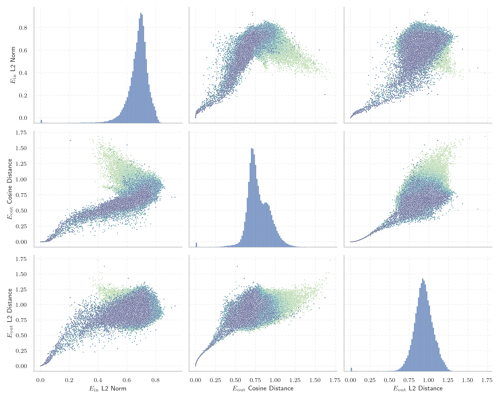
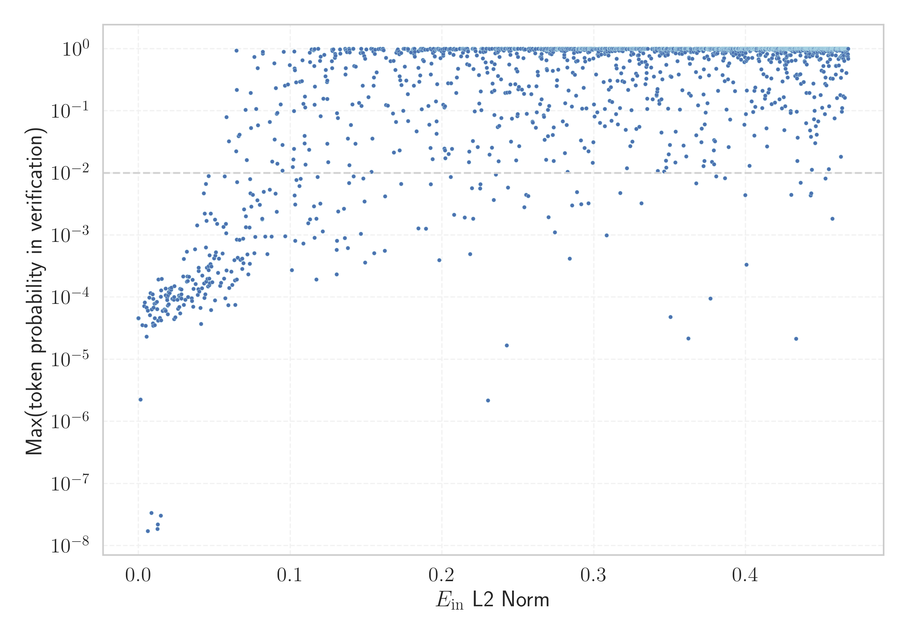

# Report for `meta-llama/Meta-Llama-3.1-8B`

## Model info

* Model Info: 
  * Tied embeddings: False
  * LM head uses bias: False
  * Embeddings shape: [128256, 4096]
* Tokenizer Info: 
  * Vocab Size: 128256
  * Tokenizer Class: PreTrainedTokenizerFast
  * Tokenizer Type: BPE
  * Bytes handling: Byte Input
  * Token for verification prompt building: ABCDEFGHIJKLMNOPQRSTUVWXYZ
  * Token id for verification prompt building: 77002
* Indicator summary: 
  * Indicator for under-trained tokens: E_{in} L2 Norm
  * Overall distribution: 0.674 +/- 0.084
* Detected Token Counts: 
  * Number of tested under-trained tokens: 2540, 2225 non-special, 280 below p = 0.01 threshold, 195 below soft indicator threshold
  * Number of single byte tokens: 256, of which 13 below indicator threshold
  * Number of special tokens: 0, of which 0 below indicator threshold
  * Number of non-single-byte UTF-fragment tokens:  1224, of which 4 below soft indicator threshold

## Under-trained token indicators plot


## Verification plot


## Under-trained token verification results
195 entries below threshold of 0.074

|   token_id | token                             |   indicator | max_prob                                                         | in_other_tokens                                                                                                                                                                                                                                                                                        |
|------------|-----------------------------------|-------------|------------------------------------------------------------------|--------------------------------------------------------------------------------------------------------------------------------------------------------------------------------------------------------------------------------------------------------------------------------------------------------|
|      85071 | ````` $PostalCodesNL `````        | 2.01135e-21 | <span style='border: 1px solid rgb(169, 68, 66);'>4.6e-05</span> |                                                                                                                                                                                                                                                                                                        |
|     107658 | ````` итися `````                 | 2.03318e-21 | <span style='border: 1px solid rgb(169, 68, 66);'>4.6e-05</span> |                                                                                                                                                                                                                                                                                                        |
|     127896 | ````` ıldığında `````             | 2.04178e-21 | <span style='border: 1px solid rgb(169, 68, 66);'>4.6e-05</span> |                                                                                                                                                                                                                                                                                                        |
|     103003 | ````` аракт `````                 | 2.04247e-21 | <span style='border: 1px solid rgb(169, 68, 66);'>4.6e-05</span> | <span style='border: 1px solid rgb(251, 189, 8);'>````` ▁характ `````</span>, ````` ▁характер `````, <span style='border: 1px solid rgb(40, 167, 69);'>````` ▁характеристи `````</span>, <span style='border: 1px solid rgb(169, 68, 66);'>````` ▁характериз `````</span>, ````` ▁характеристики ````` |
|     126523 | ````` ЎыџN `````                  | 2.04487e-21 | <span style='border: 1px solid rgb(169, 68, 66);'>4.6e-05</span> | <span style='border: 1px solid rgb(169, 68, 66);'>````` ЎыџNЎыџN `````</span>                                                                                                                                                                                                                          |
|      80369 | ````` ▁ForCanBeConverted `````    | 2.04658e-21 | <span style='border: 1px solid rgb(169, 68, 66);'>4.6e-05</span> | <span style='border: 1px solid rgb(251, 189, 8);'>````` ▁ForCanBeConvertedToForeach `````</span>, <span style='border: 1px solid rgb(169, 68, 66);'>````` ▁ForCanBeConvertedToF `````</span>                                                                                                           |
|      79883 | ````` \tTokenNameIdentifier ````` | 2.04966e-21 | <span style='border: 1px solid rgb(169, 68, 66);'>4.6e-05</span> |                                                                                                                                                                                                                                                                                                        |
|     106710 | ````` атися `````                 | 2.05e-21    | <span style='border: 1px solid rgb(169, 68, 66);'>4.6e-05</span> | <span style='border: 1px solid rgb(169, 68, 66);'>````` уватися `````</span>, <span style='border: 1px solid rgb(169, 68, 66);'>````` ватися `````</span>                                                                                                                                              |
|      68896 | ````` ;\r\r\r\n `````             | 2.05682e-21 | <span style='border: 1px solid rgb(169, 68, 66);'>4.6e-05</span> | <span style='border: 1px solid rgb(169, 68, 66);'>````` );\r\r\r\n `````</span>                                                                                                                                                                                                                        |
|     118508 | ````` ávající `````               | 2.06227e-21 | <span style='border: 1px solid rgb(169, 68, 66);'>4.6e-05</span> |                                                                                                                                                                                                                                                                                                        |
|      89472 | ````` useRalative `````           | 2.07345e-21 | <span style='border: 1px solid rgb(169, 68, 66);'>4.6e-05</span> | <span style='border: 1px solid rgb(169, 68, 66);'>````` useRalativeImagePath `````</span>                                                                                                                                                                                                              |
|     127117 | ````` ЎыџNЎыџN `````              | 2.07851e-21 | <span style='border: 1px solid rgb(169, 68, 66);'>4.6e-05</span> |                                                                                                                                                                                                                                                                                                        |
|     126647 | ````` lásil `````                 | 2.07918e-21 | <span style='border: 1px solid rgb(169, 68, 66);'>4.6e-05</span> |                                                                                                                                                                                                                                                                                                        |
|     124292 | ````` илася `````                 | 2.08558e-21 | <span style='border: 1px solid rgb(169, 68, 66);'>4.6e-05</span> |                                                                                                                                                                                                                                                                                                        |
|     122549 | ````` İTESİ `````                 | 2.08793e-21 | <span style='border: 1px solid rgb(169, 68, 66);'>4.6e-05</span> | <span style='border: 1px solid rgb(40, 167, 69);'>````` ▁ÜNİVERSİTESİ `````</span>                                                                                                                                                                                                                     |
|     122746 | ````` илакти `````                | 2.09597e-21 | <span style='border: 1px solid rgb(169, 68, 66);'>4.6e-05</span> | <span style='border: 1px solid rgb(255, 145, 0);'>````` ▁профилакти `````</span>                                                                                                                                                                                                                       |
|      64424 | ````` ">\r\r\n `````              | 2.0963e-21  | <span style='border: 1px solid rgb(169, 68, 66);'>4.6e-05</span> |                                                                                                                                                                                                                                                                                                        |
|      85069 | ````` PostalCodesNL `````         | 2.09697e-21 | <span style='border: 1px solid rgb(169, 68, 66);'>4.6e-05</span> | <span style='border: 1px solid rgb(169, 68, 66);'>````` $PostalCodesNL `````</span>                                                                                                                                                                                                                    |
|      80370 | ````` ▁ForCanBeConvertedToF ````` | 2.09764e-21 | <span style='border: 1px solid rgb(169, 68, 66);'>4.6e-05</span> | <span style='border: 1px solid rgb(251, 189, 8);'>````` ▁ForCanBeConvertedToForeach `````</span>                                                                                                                                                                                                       |
|     125952 | ````` ыџN `````                   | 2.10131e-21 | <span style='border: 1px solid rgb(169, 68, 66);'>4.6e-05</span> | <span style='border: 1px solid rgb(169, 68, 66);'>````` ЎыџNЎыџN `````</span>, <span style='border: 1px solid rgb(169, 68, 66);'>````` ЎыџN `````</span>                                                                                                                                               |
<details><summary>175 additional entries below threshold</summary>

|   token_id | token                                        |   indicator | max_prob                                                         | in_other_tokens                                                                                                                                                                                                                    |
|------------|----------------------------------------------|-------------|------------------------------------------------------------------|------------------------------------------------------------------------------------------------------------------------------------------------------------------------------------------------------------------------------------|
|     126545 | ````` ılmaktadır `````                       | 2.11162e-21 | <span style='border: 1px solid rgb(169, 68, 66);'>4.6e-05</span> |                                                                                                                                                                                                                                    |
|     118260 | ````` ávací `````                            | 0.0013641   | <span style='border: 1px solid rgb(169, 68, 66);'>2.3e-06</span> |                                                                                                                                                                                                                                    |
|     110043 | ````` еристи `````                           | 0.00248347  | <span style='border: 1px solid rgb(169, 68, 66);'>3.6e-05</span> | <span style='border: 1px solid rgb(40, 167, 69);'>````` ▁характеристи `````</span>, ````` ▁характеристики `````                                                                                                                    |
|     108577 | ````` ilmektedir `````                       | 0.00373006  | <span style='border: 1px solid rgb(169, 68, 66);'>7.2e-05</span> |                                                                                                                                                                                                                                    |
|     111067 | ````` ıldığı `````                           | 0.00412937  | <span style='border: 1px solid rgb(169, 68, 66);'>8.2e-05</span> | <span style='border: 1px solid rgb(169, 68, 66);'>````` ıldığında `````</span>                                                                                                                                                     |
|     112162 | ````` уватися `````                          | 0.00473479  | <span style='border: 1px solid rgb(169, 68, 66);'>3.5e-05</span> |                                                                                                                                                                                                                                    |
|     114185 | ````` ımsız `````                            | 0.00527974  | <span style='border: 1px solid rgb(169, 68, 66);'>6.8e-05</span> | ````` ▁bağımsız `````                                                                                                                                                                                                              |
|     120424 | ````` espoň `````                            | 0.00539974  | <span style='border: 1px solid rgb(169, 68, 66);'>2.3e-05</span> | ````` ▁alespoň `````                                                                                                                                                                                                               |
|      55716 | ````` ▁?>\r\n\r\n `````                      | 0.00605018  | <span style='border: 1px solid rgb(169, 68, 66);'>6.1e-05</span> |                                                                                                                                                                                                                                    |
|     110024 | ````` ▁CLIIIK `````                          | 0.00617524  | <span style='border: 1px solid rgb(169, 68, 66);'>1.7e-08</span> |                                                                                                                                                                                                                                    |
|     116552 | ````` ujícím `````                           | 0.00702169  | <span style='border: 1px solid rgb(169, 68, 66);'>9.8e-05</span> |                                                                                                                                                                                                                                    |
|     115614 | ````` ujících `````                          | 0.0074318   | <span style='border: 1px solid rgb(169, 68, 66);'>5.1e-05</span> |                                                                                                                                                                                                                                    |
|     127748 | ````` ımlar `````                            | 0.00796445  | <span style='border: 1px solid rgb(169, 68, 66);'>0.00012</span> |                                                                                                                                                                                                                                    |
|      90050 | ````` _ComCallableWrapper `````              | 0.00848101  | <span style='border: 1px solid rgb(169, 68, 66);'>3.4e-08</span> |                                                                                                                                                                                                                                    |
|     109045 | ````` krvldkf `````                          | 0.00874258  | <span style='border: 1px solid rgb(169, 68, 66);'>6.3e-05</span> | <span style='border: 1px solid rgb(40, 167, 69);'>````` ▁eoqkrvldkf `````</span>                                                                                                                                                   |
|     118805 | ````` дивиду `````                           | 0.00931629  | <span style='border: 1px solid rgb(169, 68, 66);'>0.00011</span> | <span style='border: 1px solid rgb(40, 167, 69);'>````` ▁индивиду `````</span>                                                                                                                                                     |
|     110150 | ````` átku `````                             | 0.00950062  | <span style='border: 1px solid rgb(169, 68, 66);'>3.8e-05</span> | ````` ▁začátku `````                                                                                                                                                                                                               |
|     127367 | ````` ımlı `````                             | 0.00969475  | <span style='border: 1px solid rgb(169, 68, 66);'>3.4e-05</span> |                                                                                                                                                                                                                                    |
|      47073 | ````` webElementXpaths `````                 | 0.00973322  | <span style='border: 1px solid rgb(169, 68, 66);'>9.4e-05</span> |                                                                                                                                                                                                                                    |
|     108653 | ````` átky `````                             | 0.00986721  | <span style='border: 1px solid rgb(169, 68, 66);'>6.8e-05</span> | ````` ▁látky `````                                                                                                                                                                                                                 |
|     112063 | ````` кадем `````                            | 0.0105529   | <span style='border: 1px solid rgb(169, 68, 66);'>7.9e-05</span> | <span style='border: 1px solid rgb(40, 167, 69);'>````` ▁академ `````</span>                                                                                                                                                       |
|      98668 | ````` );\r\r\r\n `````                       | 0.0107233   | <span style='border: 1px solid rgb(169, 68, 66);'>4.6e-05</span> |                                                                                                                                                                                                                                    |
|     114533 | ````` ーカー `````                           | 0.0107791   | <span style='border: 1px solid rgb(169, 68, 66);'>3.6e-05</span> |                                                                                                                                                                                                                                    |
|     108918 | ````` алася `````                            | 0.0112588   | <span style='border: 1px solid rgb(169, 68, 66);'>8e-05</span>   |                                                                                                                                                                                                                                    |
|     117857 | ````` ılmaz `````                            | 0.0121558   | <span style='border: 1px solid rgb(169, 68, 66);'>8.4e-05</span> |                                                                                                                                                                                                                                    |
|     115721 | ````` átní `````                             | 0.01234     | <span style='border: 1px solid rgb(169, 68, 66);'>6.5e-05</span> | ````` ▁státní `````                                                                                                                                                                                                                |
|      71785 | ````` .*;\r\n\r\n `````                      | 0.0125074   | <span style='border: 1px solid rgb(169, 68, 66);'>1.9e-08</span> |                                                                                                                                                                                                                                    |
|     122032 | ````` áhnout `````                           | 0.0127113   | <span style='border: 1px solid rgb(169, 68, 66);'>2.2e-08</span> |                                                                                                                                                                                                                                    |
|     113234 | ````` uştur `````                            | 0.0127888   | <span style='border: 1px solid rgb(169, 68, 66);'>4.2e-05</span> | ````` ▁olmuştur `````                                                                                                                                                                                                              |
|     127438 | ````` ▍▍▍▍▍▍▍▍▍▍▍▍▍▍▍▍ `````                 | 0.0130786   | <span style='border: 1px solid rgb(169, 68, 66);'>0.00019</span> |                                                                                                                                                                                                                                    |
|     124393 | ````` sahuje `````                           | 0.0140311   | <span style='border: 1px solid rgb(169, 68, 66);'>4.7e-05</span> |                                                                                                                                                                                                                                    |
|     102564 | ````` ıldı `````                             | 0.0147296   | <span style='border: 1px solid rgb(169, 68, 66);'>3e-08</span>   | ````` ▁yıldır `````, ````` ▁yapıldı `````, ````` ▁yıldız `````, <span style='border: 1px solid rgb(169, 68, 66);'>````` ıldığı `````</span>, <span style='border: 1px solid rgb(169, 68, 66);'>````` ıldığında `````</span>        |
|     126173 | ````` vající `````                           | 0.0147791   | <span style='border: 1px solid rgb(169, 68, 66);'>0.0001</span>  |                                                                                                                                                                                                                                    |
|     106951 | ````` 글상위 `````                           | 0.0148757   | <span style='border: 1px solid rgb(169, 68, 66);'>4.2e-05</span> | <span style='border: 1px solid rgb(40, 167, 69);'>````` 구글상위 `````</span>, <span style='border: 1px solid rgb(40, 167, 69);'>````` ▁구글상위 `````</span>                                                                      |
|     120702 | ````` ▁характериз `````                      | 0.0149459   | <span style='border: 1px solid rgb(169, 68, 66);'>0.00013</span> |                                                                                                                                                                                                                                    |
|     112692 | ````` ▍▍▍▍▍▍▍▍ `````                         | 0.0151985   | <span style='border: 1px solid rgb(169, 68, 66);'>0.0002</span>  | <span style='border: 1px solid rgb(169, 68, 66);'>````` ▍▍▍▍▍▍▍▍▍▍▍▍▍▍▍▍ `````</span>                                                                                                                                              |
|     113004 | ````` ▁виріш `````                           | 0.0158016   | <span style='border: 1px solid rgb(169, 68, 66);'>6e-05</span>   |                                                                                                                                                                                                                                    |
|     114836 | ````` ーション `````                         | 0.0170967   | <span style='border: 1px solid rgb(169, 68, 66);'>6.3e-05</span> |                                                                                                                                                                                                                                    |
|     101673 | ````` ektedir `````                          | 0.0176904   | <span style='border: 1px solid rgb(169, 68, 66);'>6.2e-05</span> | ````` ▁gerekmektedir `````, ````` ▁etmektedir `````, <span style='border: 1px solid rgb(169, 68, 66);'>````` ilmektedir `````</span>, <span style='border: 1px solid rgb(251, 189, 8);'>````` mektedir `````</span>                |
|      89473 | ````` useRalativeImagePath `````             | 0.0177913   | <span style='border: 1px solid rgb(169, 68, 66);'>0.00014</span> |                                                                                                                                                                                                                                    |
|      64448 | ````` ?>\r\n\r\n `````                       | 0.0178007   | <span style='border: 1px solid rgb(169, 68, 66);'>0.00011</span> |                                                                                                                                                                                                                                    |
|      89471 | ````` useRal `````                           | 0.0178468   | <span style='border: 1px solid rgb(169, 68, 66);'>6e-05</span>   | <span style='border: 1px solid rgb(169, 68, 66);'>````` useRalativeImagePath `````</span>, <span style='border: 1px solid rgb(169, 68, 66);'>````` useRalative `````</span>                                                        |
|     127667 | ````` ▁располаг `````                        | 0.0188272   | <span style='border: 1px solid rgb(169, 68, 66);'>9.8e-05</span> |                                                                                                                                                                                                                                    |
|      89475 | ````` elementGuidId `````                    | 0.0188836   | <span style='border: 1px solid rgb(169, 68, 66);'>9e-05</span>   |                                                                                                                                                                                                                                    |
|     125700 | ````` rální `````                            | 0.0192345   | <span style='border: 1px solid rgb(169, 68, 66);'>5.3e-05</span> |                                                                                                                                                                                                                                    |
|      58508 | ````` :-------------</ `````                 | 0.019237    | <span style='border: 1px solid rgb(169, 68, 66);'>7.3e-05</span> |                                                                                                                                                                                                                                    |
|     115105 | ````` ▁神马收录 `````                        | 0.0194804   | <span style='border: 1px solid rgb(169, 68, 66);'>0.00011</span> |                                                                                                                                                                                                                                    |
|     114860 | ````` ılmıştır `````                         | 0.0198141   | <span style='border: 1px solid rgb(169, 68, 66);'>0.00012</span> |                                                                                                                                                                                                                                    |
|      96348 | ````` ',\r\r\n `````                         | 0.0198737   | <span style='border: 1px solid rgb(169, 68, 66);'>7.7e-05</span> |                                                                                                                                                                                                                                    |
|     106216 | ````` ıntı `````                             | 0.0204795   | <span style='border: 1px solid rgb(169, 68, 66);'>0.00012</span> | <span style='border: 1px solid rgb(40, 167, 69);'>````` ▁sıkıntı `````</span>, <span style='border: 1px solid rgb(40, 167, 69);'>````` ▁ayrıntı `````</span>, ````` ▁ayrıntılı `````                                               |
|     112907 | ````` uyordu `````                           | 0.0206446   | <span style='border: 1px solid rgb(169, 68, 66);'>0.00014</span> |                                                                                                                                                                                                                                    |
|     115970 | ````` üyordu `````                           | 0.0214617   | <span style='border: 1px solid rgb(169, 68, 66);'>0.00013</span> |                                                                                                                                                                                                                                    |
|      81259 | ````` artisanlib `````                       | 0.0216272   | <span style='border: 1px solid rgb(169, 68, 66);'>0.00014</span> |                                                                                                                                                                                                                                    |
|      72710 | ````` ▁-->\r\n\r\n `````                     | 0.0223508   | <span style='border: 1px solid rgb(169, 68, 66);'>9.4e-05</span> |                                                                                                                                                                                                                                    |
|     111691 | ````` abancı `````                           | 0.0232554   | <span style='border: 1px solid rgb(169, 68, 66);'>9.1e-05</span> | ````` ▁yabancı `````                                                                                                                                                                                                               |
|     117011 | ````` ımda `````                             | 0.0233957   | <span style='border: 1px solid rgb(169, 68, 66);'>4.4e-05</span> |                                                                                                                                                                                                                                    |
|     126634 | ````` ▁přiroz `````                          | 0.0235325   | <span style='border: 1px solid rgb(169, 68, 66);'>0.0001</span>  |                                                                                                                                                                                                                                    |
|     127577 | ````` lamaktadır `````                       | 0.0236296   | <span style='border: 1px solid rgb(169, 68, 66);'>0.00015</span> |                                                                                                                                                                                                                                    |
|     120048 | ````` 重複重複 `````                         | 0.0243067   | <span style='border: 1px solid rgb(169, 68, 66);'>4.8e-05</span> |                                                                                                                                                                                                                                    |
|     112620 | ````` ▁підтрим `````                         | 0.025637    | <span style='border: 1px solid rgb(169, 68, 66);'>9.1e-05</span> |                                                                                                                                                                                                                                    |
|     115216 | ````` ючись `````                            | 0.0260175   | <span style='border: 1px solid rgb(169, 68, 66);'>6.5e-05</span> |                                                                                                                                                                                                                                    |
|     114091 | ````` üslüman `````                          | 0.0265849   | <span style='border: 1px solid rgb(169, 68, 66);'>0.00011</span> | ````` ▁Müslüman `````                                                                                                                                                                                                              |
|     105435 | ````` алась `````                            | 0.0268676   | <span style='border: 1px solid rgb(169, 68, 66);'>6.9e-05</span> |                                                                                                                                                                                                                                    |
|     127954 | ````` jícím `````                            | 0.0269748   | <span style='border: 1px solid rgb(169, 68, 66);'>0.0001</span>  |                                                                                                                                                                                                                                    |
|     120959 | ````` jících `````                           | 0.027359    | <span style='border: 1px solid rgb(169, 68, 66);'>0.00014</span> |                                                                                                                                                                                                                                    |
|     125265 | ````` україн `````                           | 0.027502    | <span style='border: 1px solid rgb(169, 68, 66);'>5.5e-05</span> | ````` ▁української `````                                                                                                                                                                                                           |
|     117691 | ````` lıklar `````                           | 0.0276108   | <span style='border: 1px solid rgb(169, 68, 66);'>0.0001</span>  | <span style='border: 1px solid rgb(169, 68, 66);'>````` lıkları `````</span>                                                                                                                                                       |
|     107572 | ````` ecektir `````                          | 0.0283055   | <span style='border: 1px solid rgb(169, 68, 66);'>0.00011</span> |                                                                                                                                                                                                                                    |
|     120454 | ````` lıkları `````                          | 0.0283182   | <span style='border: 1px solid rgb(169, 68, 66);'>0.00013</span> |                                                                                                                                                                                                                                    |
|     124593 | ````` назнач `````                           | 0.0283253   | <span style='border: 1px solid rgb(169, 68, 66);'>9.5e-05</span> | <span style='border: 1px solid rgb(169, 68, 66);'>````` ▁предназнач `````</span>                                                                                                                                                   |
|     107102 | ````` ıyordu `````                           | 0.029432    | <span style='border: 1px solid rgb(169, 68, 66);'>0.00022</span> |                                                                                                                                                                                                                                    |
|      33786 | ````` webElementProperties `````             | 0.0298868   | <span style='border: 1px solid rgb(169, 68, 66);'>0.00041</span> |                                                                                                                                                                                                                                    |
|     109744 | ````` acaktır `````                          | 0.0299165   | <span style='border: 1px solid rgb(169, 68, 66);'>7.5e-05</span> | ````` ▁olacaktır `````                                                                                                                                                                                                             |
|     123745 | ````` ▁zahrn `````                           | 0.0308652   | <span style='border: 1px solid rgb(169, 68, 66);'>9e-05</span>   |                                                                                                                                                                                                                                    |
|     105787 | ````` ▍▍▍▍ `````                             | 0.0318042   | <span style='border: 1px solid rgb(169, 68, 66);'>0.00054</span> | <span style='border: 1px solid rgb(169, 68, 66);'>````` ▍▍▍▍▍▍▍▍▍▍▍▍▍▍▍▍ `````</span>, <span style='border: 1px solid rgb(169, 68, 66);'>````` ▍▍▍▍▍▍▍▍ `````</span>                                                               |
|     113983 | ````` acılık `````                           | 0.0318988   | <span style='border: 1px solid rgb(169, 68, 66);'>0.00018</span> |                                                                                                                                                                                                                                    |
|     104516 | ````` ılmış `````                            | 0.0322725   | <span style='border: 1px solid rgb(169, 68, 66);'>0.00022</span> | ````` ▁yapılmış `````, <span style='border: 1px solid rgb(169, 68, 66);'>````` ılmıştır `````</span>                                                                                                                               |
|      93249 | ````` ();\r\r\n `````                        | 0.0324075   | <span style='border: 1px solid rgb(169, 68, 66);'>0.00018</span> |                                                                                                                                                                                                                                    |
|     121475 | ````` ніцип `````                            | 0.0326432   | <span style='border: 1px solid rgb(169, 68, 66);'>0.0001</span>  |                                                                                                                                                                                                                                    |
|     118228 | ````` ▁předsed `````                         | 0.0332373   | <span style='border: 1px solid rgb(169, 68, 66);'>0.00021</span> |                                                                                                                                                                                                                                    |
|     114692 | ````` илась `````                            | 0.0350458   | <span style='border: 1px solid rgb(169, 68, 66);'>9.7e-05</span> |                                                                                                                                                                                                                                    |
|     115487 | ````` ▁králov `````                          | 0.035222    | <span style='border: 1px solid rgb(169, 68, 66);'>8.7e-05</span> |                                                                                                                                                                                                                                    |
|     115108 | ````` ▁百度流量 `````                        | 0.0357155   | <span style='border: 1px solid rgb(169, 68, 66);'>0.00019</span> |                                                                                                                                                                                                                                    |
|     107197 | ````` ▁використов `````                      | 0.0359755   | <span style='border: 1px solid rgb(169, 68, 66);'>7e-05</span>   | ````` ▁використовувати `````                                                                                                                                                                                                       |
|     127531 | ````` ▁vyrá `````                            | 0.0361595   | <span style='border: 1px solid rgb(169, 68, 66);'>0.00014</span> |                                                                                                                                                                                                                                    |
|     125022 | ````` џN `````                               | 0.0372256   | <span style='border: 1px solid rgb(169, 68, 66);'>0.00059</span> | <span style='border: 1px solid rgb(169, 68, 66);'>````` ЎыџNЎыџN `````</span>, <span style='border: 1px solid rgb(169, 68, 66);'>````` ЎыџN `````</span>, <span style='border: 1px solid rgb(169, 68, 66);'>````` ыџN `````</span> |
|     126257 | ````` џЭ `````                               | 0.0376608   | <span style='border: 1px solid rgb(169, 68, 66);'>0.00016</span> |                                                                                                                                                                                                                                    |
|     122315 | ````` müştür `````                           | 0.0385269   | <span style='border: 1px solid rgb(255, 145, 0);'>0.0014</span>  |                                                                                                                                                                                                                                    |
|     117929 | ````` ▁вихов `````                           | 0.0390261   | <span style='border: 1px solid rgb(169, 68, 66);'>0.00011</span> |                                                                                                                                                                                                                                    |
|     127877 | ````` ▁Coğraf `````                          | 0.0394555   | <span style='border: 1px solid rgb(169, 68, 66);'>0.00013</span> |                                                                                                                                                                                                                                    |
|     124647 | ````` itelné `````                           | 0.0395287   | <span style='border: 1px solid rgb(169, 68, 66);'>0.00026</span> |                                                                                                                                                                                                                                    |
|     115129 | ````` lıklı `````                            | 0.0396254   | <span style='border: 1px solid rgb(169, 68, 66);'>0.0003</span>  | ````` ▁sağlıklı `````                                                                                                                                                                                                              |
|     112969 | ````` ▁nhiễ `````                            | 0.0400019   | <span style='border: 1px solid rgb(169, 68, 66);'>0.00012</span> | ````` ▁nhiễm `````                                                                                                                                                                                                                 |
|     126626 | ````` ▁адміністратив `````                   | 0.0407468   | <span style='border: 1px solid rgb(169, 68, 66);'>6.7e-05</span> |                                                                                                                                                                                                                                    |
|     123997 | ````` alardan `````                          | 0.0411925   | <span style='border: 1px solid rgb(169, 68, 66);'>3.7e-05</span> |                                                                                                                                                                                                                                    |
|     124069 | ````` ▁přibliž `````                         | 0.0418288   | <span style='border: 1px solid rgb(169, 68, 66);'>0.00014</span> |                                                                                                                                                                                                                                    |
|     106920 | ````` rodní `````                            | 0.0419649   | <span style='border: 1px solid rgb(169, 68, 66);'>0.00022</span> |                                                                                                                                                                                                                                    |
|      31960 | ````` quotelev `````                         | 0.0429988   | <span style='border: 1px solid rgb(255, 145, 0);'>0.0047</span>  |                                                                                                                                                                                                                                    |
|     115944 | ````` ▁vzdál `````                           | 0.0431571   | <span style='border: 1px solid rgb(169, 68, 66);'>0.00017</span> | <span style='border: 1px solid rgb(40, 167, 69);'>````` ▁vzdálen `````</span>                                                                                                                                                      |
|     117098 | ````` ▁зазнач `````                          | 0.0433295   | <span style='border: 1px solid rgb(169, 68, 66);'>9.7e-05</span> |                                                                                                                                                                                                                                    |
|      98100 | ````` (stypy `````                           | 0.0436615   | <span style='border: 1px solid rgb(255, 145, 0);'>0.0022</span>  |                                                                                                                                                                                                                                    |
|     119465 | ````` ▁присутств `````                       | 0.0439603   | <span style='border: 1px solid rgb(169, 68, 66);'>0.00011</span> |                                                                                                                                                                                                                                    |
|      70316 | ````` erusform `````                         | 0.0443774   | <span style='border: 1px solid rgb(255, 145, 0);'>0.0067</span>  | <span style='border: 1px solid rgb(40, 167, 69);'>````` numerusform `````</span>                                                                                                                                                   |
|     123107 | ````` maması `````                           | 0.0444829   | <span style='border: 1px solid rgb(169, 68, 66);'>0.00063</span> |                                                                                                                                                                                                                                    |
|     116171 | ````` cılık `````                            | 0.0445212   | <span style='border: 1px solid rgb(169, 68, 66);'>0.00018</span> |                                                                                                                                                                                                                                    |
|      62420 | ````` );\r\r\n `````                         | 0.0447021   | <span style='border: 1px solid rgb(255, 145, 0);'>0.0017</span>  | <span style='border: 1px solid rgb(169, 68, 66);'>````` ();\r\r\n `````</span>                                                                                                                                                     |
|     125808 | ````` larındaki `````                        | 0.0449609   | <span style='border: 1px solid rgb(169, 68, 66);'>0.0003</span>  |                                                                                                                                                                                                                                    |
|     120894 | ````` ▁přítom `````                          | 0.0453371   | <span style='border: 1px solid rgb(169, 68, 66);'>0.0002</span>  |                                                                                                                                                                                                                                    |
|     125786 | ````` ▁nebezpeč `````                        | 0.0457636   | <span style='border: 1px solid rgb(169, 68, 66);'>0.00015</span> |                                                                                                                                                                                                                                    |
|      47072 | ````` webElementX `````                      | 0.0461286   | <span style='border: 1px solid rgb(255, 145, 0);'>0.0089</span>  | <span style='border: 1px solid rgb(169, 68, 66);'>````` webElementXpaths `````</span>                                                                                                                                              |
|     119000 | ````` пеки `````                             | 0.0462793   | <span style='border: 1px solid rgb(169, 68, 66);'>0.00027</span> | ````` ▁безпеки `````                                                                                                                                                                                                               |
|     127711 | ````` dıktan `````                           | 0.0462897   | <span style='border: 1px solid rgb(169, 68, 66);'>0.00031</span> |                                                                                                                                                                                                                                    |
|     123611 | ````` ▁Českosloven `````                     | 0.0466258   | <span style='border: 1px solid rgb(169, 68, 66);'>0.00015</span> |                                                                                                                                                                                                                                    |
|     127994 | ````` ватися `````                           | 0.0466488   | <span style='border: 1px solid rgb(169, 68, 66);'>0.0002</span>  |                                                                                                                                                                                                                                    |
|     107818 | ````` ární `````                             | 0.0468723   | <span style='border: 1px solid rgb(169, 68, 66);'>0.00047</span> |                                                                                                                                                                                                                                    |
|     114767 | ````` iyesi `````                            | 0.0470254   | <span style='border: 1px solid rgb(169, 68, 66);'>0.00017</span> | ````` ▁Belediyesi `````                                                                                                                                                                                                            |
|     119709 | ````` kyně `````                             | 0.0473244   | <span style='border: 1px solid rgb(169, 68, 66);'>0.00034</span> |                                                                                                                                                                                                                                    |
|      87829 | ````` ▁}\r\r\n `````                         | 0.0475114   | <span style='border: 1px solid rgb(255, 145, 0);'>0.0022</span>  |                                                                                                                                                                                                                                    |
|     116452 | ````` ▁söyley `````                          | 0.0477004   | <span style='border: 1px solid rgb(169, 68, 66);'>6.2e-05</span> |                                                                                                                                                                                                                                    |
|     104121 | ````` iyordu `````                           | 0.047927    | <span style='border: 1px solid rgb(169, 68, 66);'>0.00031</span> |                                                                                                                                                                                                                                    |
|     121671 | ````` ▁düşünc `````                          | 0.0485153   | <span style='border: 1px solid rgb(169, 68, 66);'>0.00017</span> |                                                                                                                                                                                                                                    |
|     124971 | ````` ▁ابراه `````                           | 0.0498568   | <span style='border: 1px solid rgb(169, 68, 66);'>0.00042</span> |                                                                                                                                                                                                                                    |
|     122047 | ````` ▁зустрі `````                          | 0.0504651   | <span style='border: 1px solid rgb(169, 68, 66);'>8.9e-05</span> |                                                                                                                                                                                                                                    |
|     124703 | ````` ırlar `````                            | 0.0504771   | <span style='border: 1px solid rgb(255, 145, 0);'>0.0018</span>  |                                                                                                                                                                                                                                    |
|     127769 | ````` ▁выращи `````                          | 0.0505608   | <span style='border: 1px solid rgb(169, 68, 66);'>0.00047</span> |                                                                                                                                                                                                                                    |
|     126754 | ````` dıkları `````                          | 0.0509687   | <span style='border: 1px solid rgb(169, 68, 66);'>0.00053</span> |                                                                                                                                                                                                                                    |
|      31836 | ````` >\r\r\n `````                          | 0.0518697   | <span style='border: 1px solid rgb(255, 145, 0);'>0.0015</span>  | <span style='border: 1px solid rgb(169, 68, 66);'>````` ">\r\r\n `````</span>                                                                                                                                                      |
|     126357 | ````` ▁предназнач `````                      | 0.0522984   | <span style='border: 1px solid rgb(169, 68, 66);'>0.00025</span> |                                                                                                                                                                                                                                    |
|     112054 | ````` těz `````                              | 0.0528916   | <span style='border: 1px solid rgb(169, 68, 66);'>0.00042</span> | ````` ▁vítěz `````                                                                                                                                                                                                                 |
|     118377 | ````` ▁meziná `````                          | 0.0537281   | <span style='border: 1px solid rgb(169, 68, 66);'>0.00015</span> |                                                                                                                                                                                                                                    |
|     123584 | ````` ▁Každ `````                            | 0.054428    | <span style='border: 1px solid rgb(169, 68, 66);'>0.00017</span> |                                                                                                                                                                                                                                    |
|     125029 | ````` ▁νεφοκ `````                           | 0.0554362   | <span style='border: 1px solid rgb(169, 68, 66);'>0.0005</span>  | <span style='border: 1px solid rgb(40, 167, 69);'>````` ▁νεφοκάλυψης `````</span>                                                                                                                                                  |
|     127024 | ````` ▁профилакти `````                      | 0.0559575   | <span style='border: 1px solid rgb(255, 145, 0);'>0.0014</span>  |                                                                                                                                                                                                                                    |
|     110410 | ````` ▁seviy `````                           | 0.0563497   | <span style='border: 1px solid rgb(169, 68, 66);'>0.0002</span>  |                                                                                                                                                                                                                                    |
|      51574 | ````` ▁{\r\r\n `````                         | 0.0567168   | <span style='border: 1px solid rgb(255, 145, 0);'>0.0088</span>  |                                                                                                                                                                                                                                    |
|     119776 | ````` ▁yaptığ `````                          | 0.0571249   | <span style='border: 1px solid rgb(169, 68, 66);'>9.6e-05</span> |                                                                                                                                                                                                                                    |
|     120592 | ````` тися `````                             | 0.0576069   | <span style='border: 1px solid rgb(255, 145, 0);'>0.0015</span>  | <span style='border: 1px solid rgb(169, 68, 66);'>````` ватися `````</span>, ````` ▁тисяч `````                                                                                                                                    |
|     108457 | ````` lardı `````                            | 0.0578091   | <span style='border: 1px solid rgb(255, 145, 0);'>0.0011</span>  | ````` lardır `````                                                                                                                                                                                                                 |
|     100509 | ````` џџџџџџџџџџџџџџџџ `````                 | 0.0578878   | <span style='border: 1px solid rgb(251, 189, 8);'>0.079</span>   | <span style='border: 1px solid rgb(40, 167, 69);'>````` џџџџџџџџџџџџџџџџџџџџџџџџџџџџџџџџ `````</span>                                                                                                                              |
|      70784 | ````` Japgolly `````                         | 0.0580453   | <span style='border: 1px solid rgb(169, 68, 66);'>0.00027</span> | <span style='border: 1px solid rgb(255, 145, 0);'>````` ▁typingsJapgolly `````</span>                                                                                                                                              |
|     119162 | ````` ▁визнача `````                         | 0.0590824   | <span style='border: 1px solid rgb(169, 68, 66);'>7.4e-05</span> |                                                                                                                                                                                                                                    |
|     108980 | ````` ▁smlou `````                           | 0.0596319   | <span style='border: 1px solid rgb(251, 189, 8);'>0.032</span>   | ````` ▁smlouvy `````                                                                                                                                                                                                               |
|      66534 | ````` '];\r\n\r\n `````                      | 0.0596985   | <span style='border: 1px solid rgb(169, 68, 66);'>0.00014</span> |                                                                                                                                                                                                                                    |
|     112206 | ````` ▁otevř `````                           | 0.0612411   | <span style='border: 1px solid rgb(169, 68, 66);'>0.00026</span> |                                                                                                                                                                                                                                    |
|     105672 | ````` ▁розвит `````                          | 0.0618254   | <span style='border: 1px solid rgb(169, 68, 66);'>0.00016</span> | ````` ▁розвитку `````, ````` ▁розвиток `````                                                                                                                                                                                       |
|      38335 | ````` ">\r\n\r\n `````                       | 0.0630779   | <span style='border: 1px solid rgb(169, 68, 66);'>0.00039</span> |                                                                                                                                                                                                                                    |
|     107996 | ````` ▁визнач `````                          | 0.0634542   | <span style='border: 1px solid rgb(169, 68, 66);'>0.00019</span> | <span style='border: 1px solid rgb(169, 68, 66);'>````` ▁визнача `````</span>, ````` ▁визначення `````                                                                                                                             |
|     119003 | ````` ▁taşıy `````                           | 0.0637262   | <span style='border: 1px solid rgb(169, 68, 66);'>7.5e-05</span> |                                                                                                                                                                                                                                    |
|     113050 | ````` muştur `````                           | 0.0644368   | <span style='border: 1px solid rgb(251, 189, 8);'>0.022</span>   | ````` ▁olmuştur `````                                                                                                                                                                                                              |
|     101056 | ````` џџџџџџџџџџџџџџџџџџџџџџџџџџџџџџџџ ````` | 0.064529    | <span style='border: 1px solid rgb(40, 167, 69);'>0.93</span>    |                                                                                                                                                                                                                                    |
|      44001 | ````` _AdjustorThunk `````                   | 0.0646651   | <span style='border: 1px solid rgb(169, 68, 66);'>0.00085</span> |                                                                                                                                                                                                                                    |
|     100323 | ````` џџџџџџџџ `````                         | 0.0647544   | <span style='border: 1px solid rgb(40, 167, 69);'>0.22</span>    | <span style='border: 1px solid rgb(251, 189, 8);'>````` џџџџџџџџџџџџџџџџ `````</span>, <span style='border: 1px solid rgb(40, 167, 69);'>````` џџџџџџџџџџџџџџџџџџџџџџџџџџџџџџџџ `````</span>                                       |
|     113720 | ````` ▁açıklam `````                         | 0.0647729   | <span style='border: 1px solid rgb(169, 68, 66);'>0.00019</span> |                                                                                                                                                                                                                                    |
|     117949 | ````` eştir `````                            | 0.0648449   | <span style='border: 1px solid rgb(255, 145, 0);'>0.0071</span>  | ````` ▁eleştir `````, ````` ▁yerleştir `````                                                                                                                                                                                       |
|     124114 | ````` ▁заним `````                           | 0.0653323   | <span style='border: 1px solid rgb(169, 68, 66);'>0.00043</span> |                                                                                                                                                                                                                                    |
|     110525 | ````` ▁vzděl `````                           | 0.0658628   | <span style='border: 1px solid rgb(251, 189, 8);'>0.039</span>   | <span style='border: 1px solid rgb(40, 167, 69);'>````` ▁vzdělávání `````</span>                                                                                                                                                   |
|      45222 | ````` ;\r\r\n `````                          | 0.0666327   | <span style='border: 1px solid rgb(251, 189, 8);'>0.041</span>   | <span style='border: 1px solid rgb(169, 68, 66);'>````` ();\r\r\n `````</span>, <span style='border: 1px solid rgb(255, 145, 0);'>````` );\r\r\n `````</span>                                                                      |
|      95073 | ````` -vesm `````                            | 0.0666335   | <span style='border: 1px solid rgb(169, 68, 66);'>0.00084</span> |                                                                                                                                                                                                                                    |
|     125759 | ````` ▁відріз `````                          | 0.0671306   | <span style='border: 1px solid rgb(169, 68, 66);'>0.0004</span>  |                                                                                                                                                                                                                                    |
|     126169 | ````` ařilo `````                            | 0.0682766   | <span style='border: 1px solid rgb(169, 68, 66);'>0.00042</span> | ````` ▁podařilo `````                                                                                                                                                                                                              |
|     118751 | ````` ▁дозволя `````                         | 0.0682952   | <span style='border: 1px solid rgb(169, 68, 66);'>0.00028</span> |                                                                                                                                                                                                                                    |
|     103754 | ````` ▁використ `````                        | 0.068979    | <span style='border: 1px solid rgb(169, 68, 66);'>0.00087</span> | ````` ▁використовувати `````, <span style='border: 1px solid rgb(169, 68, 66);'>````` ▁використов `````</span>, ````` ▁використання `````                                                                                          |
|     127865 | ````` ▁ослож `````                           | 0.0690937   | <span style='border: 1px solid rgb(169, 68, 66);'>0.00035</span> |                                                                                                                                                                                                                                    |
|     123563 | ````` ▁zvyš `````                            | 0.0694957   | <span style='border: 1px solid rgb(255, 145, 0);'>0.0026</span>  |                                                                                                                                                                                                                                    |
|      87474 | ````` 無しさん `````                         | 0.0704623   | <span style='border: 1px solid rgb(40, 167, 69);'>0.1</span>     | <span style='border: 1px solid rgb(40, 167, 69);'>````` 名無しさん `````</span>, <span style='border: 1px solid rgb(40, 167, 69);'>````` ▁名無しさん `````</span>                                                                  |
|     127719 | ````` ▁розви `````                           | 0.0707637   | <span style='border: 1px solid rgb(255, 145, 0);'>0.0013</span>  |                                                                                                                                                                                                                                    |
|     127671 | ````` ▁vystav `````                          | 0.070777    | <span style='border: 1px solid rgb(255, 145, 0);'>0.002</span>   |                                                                                                                                                                                                                                    |
|     111750 | ````` ▁располож `````                        | 0.0713785   | <span style='border: 1px solid rgb(251, 189, 8);'>0.016</span>   |                                                                                                                                                                                                                                    |
|     119833 | ````` ▁mücadel `````                         | 0.0716607   | <span style='border: 1px solid rgb(169, 68, 66);'>0.00049</span> | ````` ▁mücadele `````                                                                                                                                                                                                              |
|     113774 | ````` ▁považ `````                           | 0.0723568   | <span style='border: 1px solid rgb(169, 68, 66);'>0.00023</span> |                                                                                                                                                                                                                                    |
|     126778 | ````` ▁принадлеж `````                       | 0.0731829   | <span style='border: 1px solid rgb(255, 145, 0);'>0.0013</span>  |                                                                                                                                                                                                                                    |
|      82354 | ````` (){\r\n\r\n `````                      | 0.0733378   | <span style='border: 1px solid rgb(169, 68, 66);'>0.00034</span> |                                                                                                                                                                                                                                    |
|     114540 | ````` ▁воздейств `````                       | 0.0734858   | <span style='border: 1px solid rgb(255, 145, 0);'>0.008</span>   |                                                                                                                                                                                                                                    |
|     112803 | ````` üslü `````                             | 0.0736846   | <span style='border: 1px solid rgb(255, 145, 0);'>0.0047</span>  | <span style='border: 1px solid rgb(169, 68, 66);'>````` üslüman `````</span>, ````` ▁Müslüman `````                                                                                                                                |
|     109414 | ````` ▁zdravot `````                         | 0.0738321   | <span style='border: 1px solid rgb(40, 167, 69);'>0.19</span>    |                                                                                                                                                                                                                                    |
</details>


## Tokens with partial UTF-8 sequences
4 entries below threshold of 0.074

|   token_id | token                      |   indicator | in_other_tokens                                                                       |
|------------|----------------------------|-------------|---------------------------------------------------------------------------------------|
|     100617 | ````` ۱<0xDB> `````        | 2.10164e-21 | ````` ۱۳ `````, ````` ۱۷ `````, ````` ۱۹ `````, ````` ۱۹۷ `````, ````` ۱۹۵ `````, ... |
|      28587 | ````` <0x8E><0xB7>取 ````` | 0.00425785  | ````` 获取 `````, ````` ▁获取 `````                                                   |
|      52188 | ````` <0x9D>始化 `````     | 0.00692322  | ````` ▁初始化 `````, ````` 初始化 `````                                               |
|      36225 | ````` <0xB7><0xBB>加 ````` | 0.0657314   | ````` 添加 `````, ````` ▁添加 `````                                                   |


## Byte tokens
13 entries below threshold of 0.048

|   token_id | token              |   indicator |   ord | hex   | byte_type   |
|------------|--------------------|-------------|-------|-------|-------------|
|        185 | ````` <0xFD> ````` | 2.01449e-21 |   253 | 0xFD  | unused_utf8 |
|        179 | ````` <0xF7> ````` | 2.01692e-21 |   247 | 0xF7  | unused_utf8 |
|        182 | ````` <0xFA> ````` | 2.03903e-21 |   250 | 0xFA  | unused_utf8 |
|        125 | ````` <0xC1> ````` | 2.04658e-21 |   193 | 0xC1  | unused_utf8 |
|        186 | ````` <0xFE> ````` | 2.05341e-21 |   254 | 0xFE  | unused_utf8 |
|        178 | ````` <0xF6> ````` | 2.06532e-21 |   246 | 0xF6  | unused_utf8 |
|        181 | ````` <0xF9> ````` | 2.06905e-21 |   249 | 0xF9  | unused_utf8 |
|        180 | ````` <0xF8> ````` | 2.07007e-21 |   248 | 0xF8  | unused_utf8 |
|        184 | ````` <0xFC> ````` | 2.07142e-21 |   252 | 0xFC  | unused_utf8 |
|        187 | ````` <0xFF> ````` | 2.07243e-21 |   255 | 0xFF  | unused_utf8 |
|        183 | ````` <0xFB> ````` | 2.08423e-21 |   251 | 0xFB  | unused_utf8 |
|        177 | ````` <0xF5> ````` | 2.10464e-21 |   245 | 0xF5  | unused_utf8 |
|        124 | ````` <0xC0> ````` | 2.10597e-21 |   192 | 0xC0  | unused_utf8 |


## Special tokens
254 entries below threshold of 0.048

|   token_id | token                                        |   indicator | max_prob                                                         |
|------------|----------------------------------------------|-------------|------------------------------------------------------------------|
|     128026 | ````` <\|reserved_special_token_18\|> `````  | 2.00473e-21 | <span style='border: 1px solid rgb(169, 68, 66);'>4.6e-05</span> |
|     128109 | ````` <\|reserved_special_token_101\|> ````` | 2.00822e-21 | <span style='border: 1px solid rgb(169, 68, 66);'>4.6e-05</span> |
|     128163 | ````` <\|reserved_special_token_155\|> ````` | 2.01205e-21 | <span style='border: 1px solid rgb(169, 68, 66);'>4.6e-05</span> |
|     128011 | ````` <\|reserved_special_token_3\|> `````   | 2.0124e-21  | <span style='border: 1px solid rgb(169, 68, 66);'>4.6e-05</span> |
|     128222 | ````` <\|reserved_special_token_214\|> ````` | 2.01414e-21 | <span style='border: 1px solid rgb(169, 68, 66);'>4.6e-05</span> |
|     128146 | ````` <\|reserved_special_token_138\|> ````` | 2.01518e-21 | <span style='border: 1px solid rgb(169, 68, 66);'>4.6e-05</span> |
|     128215 | ````` <\|reserved_special_token_207\|> ````` | 2.01692e-21 | <span style='border: 1px solid rgb(169, 68, 66);'>4.6e-05</span> |
|     128177 | ````` <\|reserved_special_token_169\|> ````` | 2.01796e-21 | <span style='border: 1px solid rgb(169, 68, 66);'>4.6e-05</span> |
|     128217 | ````` <\|reserved_special_token_209\|> ````` | 2.02316e-21 | <span style='border: 1px solid rgb(169, 68, 66);'>4.6e-05</span> |
|     128206 | ````` <\|reserved_special_token_198\|> ````` | 2.02593e-21 | <span style='border: 1px solid rgb(169, 68, 66);'>4.6e-05</span> |
|     128119 | ````` <\|reserved_special_token_111\|> ````` | 2.02662e-21 | <span style='border: 1px solid rgb(169, 68, 66);'>4.6e-05</span> |
|     128022 | ````` <\|reserved_special_token_14\|> `````  | 2.02697e-21 | <span style='border: 1px solid rgb(169, 68, 66);'>4.6e-05</span> |
|     128053 | ````` <\|reserved_special_token_45\|> `````  | 2.0287e-21  | <span style='border: 1px solid rgb(169, 68, 66);'>4.6e-05</span> |
|     128198 | ````` <\|reserved_special_token_190\|> ````` | 2.02973e-21 | <span style='border: 1px solid rgb(169, 68, 66);'>4.6e-05</span> |
|     128225 | ````` <\|reserved_special_token_217\|> ````` | 2.03042e-21 | <span style='border: 1px solid rgb(169, 68, 66);'>4.6e-05</span> |
|     128247 | ````` <\|reserved_special_token_239\|> ````` | 2.03215e-21 | <span style='border: 1px solid rgb(169, 68, 66);'>4.6e-05</span> |
|     128019 | ````` <\|reserved_special_token_11\|> `````  | 2.03249e-21 | <span style='border: 1px solid rgb(169, 68, 66);'>4.6e-05</span> |
|     128161 | ````` <\|reserved_special_token_153\|> ````` | 2.03422e-21 | <span style='border: 1px solid rgb(169, 68, 66);'>4.6e-05</span> |
|     128213 | ````` <\|reserved_special_token_205\|> ````` | 2.03422e-21 | <span style='border: 1px solid rgb(169, 68, 66);'>4.6e-05</span> |
|     128137 | ````` <\|reserved_special_token_129\|> ````` | 2.0349e-21  | <span style='border: 1px solid rgb(169, 68, 66);'>4.6e-05</span> |
<details><summary>234 additional entries below threshold</summary>

|   token_id | token                                        |   indicator | max_prob                                                         |
|------------|----------------------------------------------|-------------|------------------------------------------------------------------|
|     128009 | ````` <\|eot_id\|> `````                     | 2.03594e-21 | <span style='border: 1px solid rgb(169, 68, 66);'>4.6e-05</span> |
|     128058 | ````` <\|reserved_special_token_50\|> `````  | 2.04006e-21 | <span style='border: 1px solid rgb(169, 68, 66);'>4.6e-05</span> |
|     128178 | ````` <\|reserved_special_token_170\|> ````` | 2.04041e-21 | <span style='border: 1px solid rgb(169, 68, 66);'>4.6e-05</span> |
|     128190 | ````` <\|reserved_special_token_182\|> ````` | 2.04109e-21 | <span style='border: 1px solid rgb(169, 68, 66);'>4.6e-05</span> |
|     128244 | ````` <\|reserved_special_token_236\|> ````` | 2.04144e-21 | <span style='border: 1px solid rgb(169, 68, 66);'>4.6e-05</span> |
|     128154 | ````` <\|reserved_special_token_146\|> ````` | 2.04144e-21 | <span style='border: 1px solid rgb(169, 68, 66);'>4.6e-05</span> |
|     128027 | ````` <\|reserved_special_token_19\|> `````  | 2.04178e-21 | <span style='border: 1px solid rgb(169, 68, 66);'>4.6e-05</span> |
|     128044 | ````` <\|reserved_special_token_36\|> `````  | 2.04247e-21 | <span style='border: 1px solid rgb(169, 68, 66);'>4.6e-05</span> |
|     128047 | ````` <\|reserved_special_token_39\|> `````  | 2.04247e-21 | <span style='border: 1px solid rgb(169, 68, 66);'>4.6e-05</span> |
|     128231 | ````` <\|reserved_special_token_223\|> ````` | 2.04281e-21 | <span style='border: 1px solid rgb(169, 68, 66);'>4.6e-05</span> |
|     128194 | ````` <\|reserved_special_token_186\|> ````` | 2.04418e-21 | <span style='border: 1px solid rgb(169, 68, 66);'>4.6e-05</span> |
|     128168 | ````` <\|reserved_special_token_160\|> ````` | 2.04521e-21 | <span style='border: 1px solid rgb(169, 68, 66);'>4.6e-05</span> |
|     128135 | ````` <\|reserved_special_token_127\|> ````` | 2.04624e-21 | <span style='border: 1px solid rgb(169, 68, 66);'>4.6e-05</span> |
|     128171 | ````` <\|reserved_special_token_163\|> ````` | 2.04692e-21 | <span style='border: 1px solid rgb(169, 68, 66);'>4.6e-05</span> |
|     128130 | ````` <\|reserved_special_token_122\|> ````` | 2.04795e-21 | <span style='border: 1px solid rgb(169, 68, 66);'>4.6e-05</span> |
|     128012 | ````` <\|reserved_special_token_4\|> `````   | 2.04795e-21 | <span style='border: 1px solid rgb(169, 68, 66);'>4.6e-05</span> |
|     128101 | ````` <\|reserved_special_token_93\|> `````  | 2.04829e-21 | <span style='border: 1px solid rgb(169, 68, 66);'>4.6e-05</span> |
|     128107 | ````` <\|reserved_special_token_99\|> `````  | 2.04897e-21 | <span style='border: 1px solid rgb(169, 68, 66);'>4.6e-05</span> |
|     128067 | ````` <\|reserved_special_token_59\|> `````  | 2.04966e-21 | <span style='border: 1px solid rgb(169, 68, 66);'>4.6e-05</span> |
|     128164 | ````` <\|reserved_special_token_156\|> ````` | 2.04966e-21 | <span style='border: 1px solid rgb(169, 68, 66);'>4.6e-05</span> |
|     128075 | ````` <\|reserved_special_token_67\|> `````  | 2.05034e-21 | <span style='border: 1px solid rgb(169, 68, 66);'>4.6e-05</span> |
|     128193 | ````` <\|reserved_special_token_185\|> ````` | 2.05034e-21 | <span style='border: 1px solid rgb(169, 68, 66);'>4.6e-05</span> |
|     128087 | ````` <\|reserved_special_token_79\|> `````  | 2.05102e-21 | <span style='border: 1px solid rgb(169, 68, 66);'>4.6e-05</span> |
|     128018 | ````` <\|reserved_special_token_10\|> `````  | 2.05102e-21 | <span style='border: 1px solid rgb(169, 68, 66);'>4.6e-05</span> |
|     128105 | ````` <\|reserved_special_token_97\|> `````  | 2.05102e-21 | <span style='border: 1px solid rgb(169, 68, 66);'>4.6e-05</span> |
|     128238 | ````` <\|reserved_special_token_230\|> ````` | 2.05137e-21 | <span style='border: 1px solid rgb(169, 68, 66);'>4.6e-05</span> |
|     128166 | ````` <\|reserved_special_token_158\|> ````` | 2.05171e-21 | <span style='border: 1px solid rgb(169, 68, 66);'>4.6e-05</span> |
|     128127 | ````` <\|reserved_special_token_119\|> ````` | 2.05171e-21 | <span style='border: 1px solid rgb(169, 68, 66);'>4.6e-05</span> |
|     128043 | ````` <\|reserved_special_token_35\|> `````  | 2.05205e-21 | <span style='border: 1px solid rgb(169, 68, 66);'>4.6e-05</span> |
|     128117 | ````` <\|reserved_special_token_109\|> ````` | 2.05205e-21 | <span style='border: 1px solid rgb(169, 68, 66);'>4.6e-05</span> |
|     128039 | ````` <\|reserved_special_token_31\|> `````  | 2.05239e-21 | <span style='border: 1px solid rgb(169, 68, 66);'>4.6e-05</span> |
|     128211 | ````` <\|reserved_special_token_203\|> ````` | 2.05239e-21 | <span style='border: 1px solid rgb(169, 68, 66);'>4.6e-05</span> |
|     128252 | ````` <\|reserved_special_token_244\|> ````` | 2.05239e-21 | <span style='border: 1px solid rgb(169, 68, 66);'>4.6e-05</span> |
|     128045 | ````` <\|reserved_special_token_37\|> `````  | 2.05341e-21 | <span style='border: 1px solid rgb(169, 68, 66);'>4.6e-05</span> |
|     128202 | ````` <\|reserved_special_token_194\|> ````` | 2.05341e-21 | <span style='border: 1px solid rgb(169, 68, 66);'>4.6e-05</span> |
|     128148 | ````` <\|reserved_special_token_140\|> ````` | 2.05375e-21 | <span style='border: 1px solid rgb(169, 68, 66);'>4.6e-05</span> |
|     128083 | ````` <\|reserved_special_token_75\|> `````  | 2.0541e-21  | <span style='border: 1px solid rgb(169, 68, 66);'>4.6e-05</span> |
|     128040 | ````` <\|reserved_special_token_32\|> `````  | 2.05512e-21 | <span style='border: 1px solid rgb(169, 68, 66);'>4.6e-05</span> |
|     128122 | ````` <\|reserved_special_token_114\|> ````` | 2.0558e-21  | <span style='border: 1px solid rgb(169, 68, 66);'>4.6e-05</span> |
|     128108 | ````` <\|reserved_special_token_100\|> ````` | 2.05648e-21 | <span style='border: 1px solid rgb(169, 68, 66);'>4.6e-05</span> |
|     128094 | ````` <\|reserved_special_token_86\|> `````  | 2.05682e-21 | <span style='border: 1px solid rgb(169, 68, 66);'>4.6e-05</span> |
|     128003 | ````` <\|reserved_special_token_1\|> `````   | 2.05716e-21 | <span style='border: 1px solid rgb(169, 68, 66);'>4.6e-05</span> |
|     128029 | ````` <\|reserved_special_token_21\|> `````  | 2.05716e-21 | <span style='border: 1px solid rgb(169, 68, 66);'>4.6e-05</span> |
|     128134 | ````` <\|reserved_special_token_126\|> ````` | 2.0575e-21  | <span style='border: 1px solid rgb(169, 68, 66);'>4.6e-05</span> |
|     128088 | ````` <\|reserved_special_token_80\|> `````  | 2.0575e-21  | <span style='border: 1px solid rgb(169, 68, 66);'>4.6e-05</span> |
|     128051 | ````` <\|reserved_special_token_43\|> `````  | 2.05818e-21 | <span style='border: 1px solid rgb(169, 68, 66);'>4.6e-05</span> |
|     128125 | ````` <\|reserved_special_token_117\|> ````` | 2.05853e-21 | <span style='border: 1px solid rgb(169, 68, 66);'>4.6e-05</span> |
|     128157 | ````` <\|reserved_special_token_149\|> ````` | 2.05853e-21 | <span style='border: 1px solid rgb(169, 68, 66);'>4.6e-05</span> |
|     128072 | ````` <\|reserved_special_token_64\|> `````  | 2.05853e-21 | <span style='border: 1px solid rgb(169, 68, 66);'>4.6e-05</span> |
|     128219 | ````` <\|reserved_special_token_211\|> ````` | 2.05887e-21 | <span style='border: 1px solid rgb(169, 68, 66);'>4.6e-05</span> |
|     128116 | ````` <\|reserved_special_token_108\|> ````` | 2.05955e-21 | <span style='border: 1px solid rgb(169, 68, 66);'>4.6e-05</span> |
|     128034 | ````` <\|reserved_special_token_26\|> `````  | 2.05955e-21 | <span style='border: 1px solid rgb(169, 68, 66);'>4.6e-05</span> |
|     128005 | ````` <\|reserved_special_token_2\|> `````   | 2.05989e-21 | <span style='border: 1px solid rgb(169, 68, 66);'>4.6e-05</span> |
|     128228 | ````` <\|reserved_special_token_220\|> ````` | 2.05989e-21 | <span style='border: 1px solid rgb(169, 68, 66);'>4.6e-05</span> |
|     128142 | ````` <\|reserved_special_token_134\|> ````` | 2.05989e-21 | <span style='border: 1px solid rgb(169, 68, 66);'>4.6e-05</span> |
|     128167 | ````` <\|reserved_special_token_159\|> ````` | 2.06023e-21 | <span style='border: 1px solid rgb(169, 68, 66);'>4.6e-05</span> |
|     128204 | ````` <\|reserved_special_token_196\|> ````` | 2.06057e-21 | <span style='border: 1px solid rgb(169, 68, 66);'>4.6e-05</span> |
|     128175 | ````` <\|reserved_special_token_167\|> ````` | 2.06057e-21 | <span style='border: 1px solid rgb(169, 68, 66);'>4.6e-05</span> |
|     128207 | ````` <\|reserved_special_token_199\|> ````` | 2.06091e-21 | <span style='border: 1px solid rgb(169, 68, 66);'>4.6e-05</span> |
|     128139 | ````` <\|reserved_special_token_131\|> ````` | 2.06091e-21 | <span style='border: 1px solid rgb(169, 68, 66);'>4.6e-05</span> |
|     128120 | ````` <\|reserved_special_token_112\|> ````` | 2.06159e-21 | <span style='border: 1px solid rgb(169, 68, 66);'>4.6e-05</span> |
|     128151 | ````` <\|reserved_special_token_143\|> ````` | 2.06227e-21 | <span style='border: 1px solid rgb(169, 68, 66);'>4.6e-05</span> |
|     128201 | ````` <\|reserved_special_token_193\|> ````` | 2.06261e-21 | <span style='border: 1px solid rgb(169, 68, 66);'>4.6e-05</span> |
|     128016 | ````` <\|reserved_special_token_8\|> `````   | 2.06295e-21 | <span style='border: 1px solid rgb(169, 68, 66);'>4.6e-05</span> |
|     128232 | ````` <\|reserved_special_token_224\|> ````` | 2.06295e-21 | <span style='border: 1px solid rgb(169, 68, 66);'>4.6e-05</span> |
|     128100 | ````` <\|reserved_special_token_92\|> `````  | 2.06328e-21 | <span style='border: 1px solid rgb(169, 68, 66);'>4.6e-05</span> |
|     128199 | ````` <\|reserved_special_token_191\|> ````` | 2.06328e-21 | <span style='border: 1px solid rgb(169, 68, 66);'>4.6e-05</span> |
|     128025 | ````` <\|reserved_special_token_17\|> `````  | 2.06362e-21 | <span style='border: 1px solid rgb(169, 68, 66);'>4.6e-05</span> |
|     128230 | ````` <\|reserved_special_token_222\|> ````` | 2.06362e-21 | <span style='border: 1px solid rgb(169, 68, 66);'>4.6e-05</span> |
|     128153 | ````` <\|reserved_special_token_145\|> ````` | 2.06396e-21 | <span style='border: 1px solid rgb(169, 68, 66);'>4.6e-05</span> |
|     128112 | ````` <\|reserved_special_token_104\|> ````` | 2.06396e-21 | <span style='border: 1px solid rgb(169, 68, 66);'>4.6e-05</span> |
|     128086 | ````` <\|reserved_special_token_78\|> `````  | 2.06464e-21 | <span style='border: 1px solid rgb(169, 68, 66);'>4.6e-05</span> |
|     128008 | ````` <\|eom_id\|> `````                     | 2.06464e-21 | <span style='border: 1px solid rgb(169, 68, 66);'>4.6e-05</span> |
|     128136 | ````` <\|reserved_special_token_128\|> ````` | 2.066e-21   | <span style='border: 1px solid rgb(169, 68, 66);'>4.6e-05</span> |
|     128132 | ````` <\|reserved_special_token_124\|> ````` | 2.066e-21   | <span style='border: 1px solid rgb(169, 68, 66);'>4.6e-05</span> |
|     128208 | ````` <\|reserved_special_token_200\|> ````` | 2.06668e-21 | <span style='border: 1px solid rgb(169, 68, 66);'>4.6e-05</span> |
|     128218 | ````` <\|reserved_special_token_210\|> ````` | 2.06668e-21 | <span style='border: 1px solid rgb(169, 68, 66);'>4.6e-05</span> |
|     128128 | ````` <\|reserved_special_token_120\|> ````` | 2.06702e-21 | <span style='border: 1px solid rgb(169, 68, 66);'>4.6e-05</span> |
|     128092 | ````` <\|reserved_special_token_84\|> `````  | 2.06736e-21 | <span style='border: 1px solid rgb(169, 68, 66);'>4.6e-05</span> |
|     128248 | ````` <\|reserved_special_token_240\|> ````` | 2.06769e-21 | <span style='border: 1px solid rgb(169, 68, 66);'>4.6e-05</span> |
|     128004 | ````` <\|finetune_right_pad_id\|> `````      | 2.06769e-21 | <span style='border: 1px solid rgb(169, 68, 66);'>4.6e-05</span> |
|     128077 | ````` <\|reserved_special_token_69\|> `````  | 2.06803e-21 | <span style='border: 1px solid rgb(169, 68, 66);'>4.6e-05</span> |
|     128071 | ````` <\|reserved_special_token_63\|> `````  | 2.06837e-21 | <span style='border: 1px solid rgb(169, 68, 66);'>4.6e-05</span> |
|     128181 | ````` <\|reserved_special_token_173\|> ````` | 2.06837e-21 | <span style='border: 1px solid rgb(169, 68, 66);'>4.6e-05</span> |
|     128042 | ````` <\|reserved_special_token_34\|> `````  | 2.06871e-21 | <span style='border: 1px solid rgb(169, 68, 66);'>4.6e-05</span> |
|     128073 | ````` <\|reserved_special_token_65\|> `````  | 2.06871e-21 | <span style='border: 1px solid rgb(169, 68, 66);'>4.6e-05</span> |
|     128106 | ````` <\|reserved_special_token_98\|> `````  | 2.06905e-21 | <span style='border: 1px solid rgb(169, 68, 66);'>4.6e-05</span> |
|     128078 | ````` <\|reserved_special_token_70\|> `````  | 2.06905e-21 | <span style='border: 1px solid rgb(169, 68, 66);'>4.6e-05</span> |
|     128159 | ````` <\|reserved_special_token_151\|> ````` | 2.06939e-21 | <span style='border: 1px solid rgb(169, 68, 66);'>4.6e-05</span> |
|     128162 | ````` <\|reserved_special_token_154\|> ````` | 2.06939e-21 | <span style='border: 1px solid rgb(169, 68, 66);'>4.6e-05</span> |
|     128021 | ````` <\|reserved_special_token_13\|> `````  | 2.06939e-21 | <span style='border: 1px solid rgb(169, 68, 66);'>4.6e-05</span> |
|     128091 | ````` <\|reserved_special_token_83\|> `````  | 2.06973e-21 | <span style='border: 1px solid rgb(169, 68, 66);'>4.6e-05</span> |
|     128061 | ````` <\|reserved_special_token_53\|> `````  | 2.06973e-21 | <span style='border: 1px solid rgb(169, 68, 66);'>4.6e-05</span> |
|     128007 | ````` <\|end_header_id\|> `````              | 2.06973e-21 | <span style='border: 1px solid rgb(169, 68, 66);'>4.6e-05</span> |
|     128035 | ````` <\|reserved_special_token_27\|> `````  | 2.07007e-21 | <span style='border: 1px solid rgb(169, 68, 66);'>4.6e-05</span> |
|     128147 | ````` <\|reserved_special_token_139\|> ````` | 2.0704e-21  | <span style='border: 1px solid rgb(169, 68, 66);'>4.6e-05</span> |
|     128050 | ````` <\|reserved_special_token_42\|> `````  | 2.07108e-21 | <span style='border: 1px solid rgb(169, 68, 66);'>4.6e-05</span> |
|     128041 | ````` <\|reserved_special_token_33\|> `````  | 2.07108e-21 | <span style='border: 1px solid rgb(169, 68, 66);'>4.6e-05</span> |
|     128056 | ````` <\|reserved_special_token_48\|> `````  | 2.07108e-21 | <span style='border: 1px solid rgb(169, 68, 66);'>4.6e-05</span> |
|     128037 | ````` <\|reserved_special_token_29\|> `````  | 2.07142e-21 | <span style='border: 1px solid rgb(169, 68, 66);'>4.6e-05</span> |
|     128020 | ````` <\|reserved_special_token_12\|> `````  | 2.07142e-21 | <span style='border: 1px solid rgb(169, 68, 66);'>4.6e-05</span> |
|     128176 | ````` <\|reserved_special_token_168\|> ````` | 2.07142e-21 | <span style='border: 1px solid rgb(169, 68, 66);'>4.6e-05</span> |
|     128084 | ````` <\|reserved_special_token_76\|> `````  | 2.07176e-21 | <span style='border: 1px solid rgb(169, 68, 66);'>4.6e-05</span> |
|     128080 | ````` <\|reserved_special_token_72\|> `````  | 2.0721e-21  | <span style='border: 1px solid rgb(169, 68, 66);'>4.6e-05</span> |
|     128082 | ````` <\|reserved_special_token_74\|> `````  | 2.0721e-21  | <span style='border: 1px solid rgb(169, 68, 66);'>4.6e-05</span> |
|     128224 | ````` <\|reserved_special_token_216\|> ````` | 2.07243e-21 | <span style='border: 1px solid rgb(169, 68, 66);'>4.6e-05</span> |
|     128189 | ````` <\|reserved_special_token_181\|> ````` | 2.07243e-21 | <span style='border: 1px solid rgb(169, 68, 66);'>4.6e-05</span> |
|     128203 | ````` <\|reserved_special_token_195\|> ````` | 2.07277e-21 | <span style='border: 1px solid rgb(169, 68, 66);'>4.6e-05</span> |
|     128126 | ````` <\|reserved_special_token_118\|> ````` | 2.07277e-21 | <span style='border: 1px solid rgb(169, 68, 66);'>4.6e-05</span> |
|     128186 | ````` <\|reserved_special_token_178\|> ````` | 2.07345e-21 | <span style='border: 1px solid rgb(169, 68, 66);'>4.6e-05</span> |
|     128103 | ````` <\|reserved_special_token_95\|> `````  | 2.07379e-21 | <span style='border: 1px solid rgb(169, 68, 66);'>4.6e-05</span> |
|     128249 | ````` <\|reserved_special_token_241\|> ````` | 2.07379e-21 | <span style='border: 1px solid rgb(169, 68, 66);'>4.6e-05</span> |
|     128152 | ````` <\|reserved_special_token_144\|> ````` | 2.07379e-21 | <span style='border: 1px solid rgb(169, 68, 66);'>4.6e-05</span> |
|     128210 | ````` <\|reserved_special_token_202\|> ````` | 2.07379e-21 | <span style='border: 1px solid rgb(169, 68, 66);'>4.6e-05</span> |
|     128096 | ````` <\|reserved_special_token_88\|> `````  | 2.07412e-21 | <span style='border: 1px solid rgb(169, 68, 66);'>4.6e-05</span> |
|     128069 | ````` <\|reserved_special_token_61\|> `````  | 2.07412e-21 | <span style='border: 1px solid rgb(169, 68, 66);'>4.6e-05</span> |
|     128156 | ````` <\|reserved_special_token_148\|> ````` | 2.07446e-21 | <span style='border: 1px solid rgb(169, 68, 66);'>4.6e-05</span> |
|     128030 | ````` <\|reserved_special_token_22\|> `````  | 2.07446e-21 | <span style='border: 1px solid rgb(169, 68, 66);'>4.6e-05</span> |
|     128182 | ````` <\|reserved_special_token_174\|> ````` | 2.07446e-21 | <span style='border: 1px solid rgb(169, 68, 66);'>4.6e-05</span> |
|     128237 | ````` <\|reserved_special_token_229\|> ````` | 2.07446e-21 | <span style='border: 1px solid rgb(169, 68, 66);'>4.6e-05</span> |
|     128052 | ````` <\|reserved_special_token_44\|> `````  | 2.0748e-21  | <span style='border: 1px solid rgb(169, 68, 66);'>4.6e-05</span> |
|     128253 | ````` <\|reserved_special_token_245\|> ````` | 2.0748e-21  | <span style='border: 1px solid rgb(169, 68, 66);'>4.6e-05</span> |
|     128098 | ````` <\|reserved_special_token_90\|> `````  | 2.07581e-21 | <span style='border: 1px solid rgb(169, 68, 66);'>4.6e-05</span> |
|     128115 | ````` <\|reserved_special_token_107\|> ````` | 2.07581e-21 | <span style='border: 1px solid rgb(169, 68, 66);'>4.6e-05</span> |
|     128131 | ````` <\|reserved_special_token_123\|> ````` | 2.07581e-21 | <span style='border: 1px solid rgb(169, 68, 66);'>4.6e-05</span> |
|     128243 | ````` <\|reserved_special_token_235\|> ````` | 2.07615e-21 | <span style='border: 1px solid rgb(169, 68, 66);'>4.6e-05</span> |
|     128059 | ````` <\|reserved_special_token_51\|> `````  | 2.07615e-21 | <span style='border: 1px solid rgb(169, 68, 66);'>4.6e-05</span> |
|     128165 | ````` <\|reserved_special_token_157\|> ````` | 2.07615e-21 | <span style='border: 1px solid rgb(169, 68, 66);'>4.6e-05</span> |
|     128214 | ````` <\|reserved_special_token_206\|> ````` | 2.07649e-21 | <span style='border: 1px solid rgb(169, 68, 66);'>4.6e-05</span> |
|     128028 | ````` <\|reserved_special_token_20\|> `````  | 2.07649e-21 | <span style='border: 1px solid rgb(169, 68, 66);'>4.6e-05</span> |
|     128220 | ````` <\|reserved_special_token_212\|> ````` | 2.07716e-21 | <span style='border: 1px solid rgb(169, 68, 66);'>4.6e-05</span> |
|     128063 | ````` <\|reserved_special_token_55\|> `````  | 2.0775e-21  | <span style='border: 1px solid rgb(169, 68, 66);'>4.6e-05</span> |
|     128010 | ````` <\|python_tag\|> `````                 | 2.07817e-21 | <span style='border: 1px solid rgb(169, 68, 66);'>4.6e-05</span> |
|     128241 | ````` <\|reserved_special_token_233\|> ````` | 2.07851e-21 | <span style='border: 1px solid rgb(169, 68, 66);'>4.6e-05</span> |
|     128251 | ````` <\|reserved_special_token_243\|> ````` | 2.07851e-21 | <span style='border: 1px solid rgb(169, 68, 66);'>4.6e-05</span> |
|     128236 | ````` <\|reserved_special_token_228\|> ````` | 2.07851e-21 | <span style='border: 1px solid rgb(169, 68, 66);'>4.6e-05</span> |
|     128197 | ````` <\|reserved_special_token_189\|> ````` | 2.08019e-21 | <span style='border: 1px solid rgb(169, 68, 66);'>4.6e-05</span> |
|     128184 | ````` <\|reserved_special_token_176\|> ````` | 2.08019e-21 | <span style='border: 1px solid rgb(169, 68, 66);'>4.6e-05</span> |
|     128060 | ````` <\|reserved_special_token_52\|> `````  | 2.08087e-21 | <span style='border: 1px solid rgb(169, 68, 66);'>4.6e-05</span> |
|     128246 | ````` <\|reserved_special_token_238\|> ````` | 2.0812e-21  | <span style='border: 1px solid rgb(169, 68, 66);'>4.6e-05</span> |
|     128015 | ````` <\|reserved_special_token_7\|> `````   | 2.08154e-21 | <span style='border: 1px solid rgb(169, 68, 66);'>4.6e-05</span> |
|     128099 | ````` <\|reserved_special_token_91\|> `````  | 2.08154e-21 | <span style='border: 1px solid rgb(169, 68, 66);'>4.6e-05</span> |
|     128123 | ````` <\|reserved_special_token_115\|> ````` | 2.08154e-21 | <span style='border: 1px solid rgb(169, 68, 66);'>4.6e-05</span> |
|     128121 | ````` <\|reserved_special_token_113\|> ````` | 2.08154e-21 | <span style='border: 1px solid rgb(169, 68, 66);'>4.6e-05</span> |
|     128143 | ````` <\|reserved_special_token_135\|> ````` | 2.08154e-21 | <span style='border: 1px solid rgb(169, 68, 66);'>4.6e-05</span> |
|     128002 | ````` <\|reserved_special_token_0\|> `````   | 2.08188e-21 | <span style='border: 1px solid rgb(169, 68, 66);'>4.6e-05</span> |
|     128124 | ````` <\|reserved_special_token_116\|> ````` | 2.08221e-21 | <span style='border: 1px solid rgb(169, 68, 66);'>4.6e-05</span> |
|     128038 | ````` <\|reserved_special_token_30\|> `````  | 2.08255e-21 | <span style='border: 1px solid rgb(169, 68, 66);'>4.6e-05</span> |
|     128081 | ````` <\|reserved_special_token_73\|> `````  | 2.08255e-21 | <span style='border: 1px solid rgb(169, 68, 66);'>4.6e-05</span> |
|     128014 | ````` <\|reserved_special_token_6\|> `````   | 2.08289e-21 | <span style='border: 1px solid rgb(169, 68, 66);'>4.6e-05</span> |
|     128183 | ````` <\|reserved_special_token_175\|> ````` | 2.08322e-21 | <span style='border: 1px solid rgb(169, 68, 66);'>4.6e-05</span> |
|     128114 | ````` <\|reserved_special_token_106\|> ````` | 2.0839e-21  | <span style='border: 1px solid rgb(169, 68, 66);'>4.6e-05</span> |
|     128017 | ````` <\|reserved_special_token_9\|> `````   | 2.0839e-21  | <span style='border: 1px solid rgb(169, 68, 66);'>4.6e-05</span> |
|     128227 | ````` <\|reserved_special_token_219\|> ````` | 2.0849e-21  | <span style='border: 1px solid rgb(169, 68, 66);'>4.6e-05</span> |
|     128033 | ````` <\|reserved_special_token_25\|> `````  | 2.08591e-21 | <span style='border: 1px solid rgb(169, 68, 66);'>4.6e-05</span> |
|     128024 | ````` <\|reserved_special_token_16\|> `````  | 2.08625e-21 | <span style='border: 1px solid rgb(169, 68, 66);'>4.6e-05</span> |
|     128090 | ````` <\|reserved_special_token_82\|> `````  | 2.08625e-21 | <span style='border: 1px solid rgb(169, 68, 66);'>4.6e-05</span> |
|     128223 | ````` <\|reserved_special_token_215\|> ````` | 2.08658e-21 | <span style='border: 1px solid rgb(169, 68, 66);'>4.6e-05</span> |
|     128129 | ````` <\|reserved_special_token_121\|> ````` | 2.08658e-21 | <span style='border: 1px solid rgb(169, 68, 66);'>4.6e-05</span> |
|     128110 | ````` <\|reserved_special_token_102\|> ````` | 2.08658e-21 | <span style='border: 1px solid rgb(169, 68, 66);'>4.6e-05</span> |
|     128185 | ````` <\|reserved_special_token_177\|> ````` | 2.08793e-21 | <span style='border: 1px solid rgb(169, 68, 66);'>4.6e-05</span> |
|     128140 | ````` <\|reserved_special_token_132\|> ````` | 2.08826e-21 | <span style='border: 1px solid rgb(169, 68, 66);'>4.6e-05</span> |
|     128032 | ````` <\|reserved_special_token_24\|> `````  | 2.08826e-21 | <span style='border: 1px solid rgb(169, 68, 66);'>4.6e-05</span> |
|     128245 | ````` <\|reserved_special_token_237\|> ````` | 2.08893e-21 | <span style='border: 1px solid rgb(169, 68, 66);'>4.6e-05</span> |
|     128155 | ````` <\|reserved_special_token_147\|> ````` | 2.08893e-21 | <span style='border: 1px solid rgb(169, 68, 66);'>4.6e-05</span> |
|     128062 | ````` <\|reserved_special_token_54\|> `````  | 2.08893e-21 | <span style='border: 1px solid rgb(169, 68, 66);'>4.6e-05</span> |
|     128233 | ````` <\|reserved_special_token_225\|> ````` | 2.08927e-21 | <span style='border: 1px solid rgb(169, 68, 66);'>4.6e-05</span> |
|     128221 | ````` <\|reserved_special_token_213\|> ````` | 2.0896e-21  | <span style='border: 1px solid rgb(169, 68, 66);'>4.6e-05</span> |
|     128093 | ````` <\|reserved_special_token_85\|> `````  | 2.0896e-21  | <span style='border: 1px solid rgb(169, 68, 66);'>4.6e-05</span> |
|     128064 | ````` <\|reserved_special_token_56\|> `````  | 2.08994e-21 | <span style='border: 1px solid rgb(169, 68, 66);'>4.6e-05</span> |
|     128226 | ````` <\|reserved_special_token_218\|> ````` | 2.09128e-21 | <span style='border: 1px solid rgb(169, 68, 66);'>4.6e-05</span> |
|     128200 | ````` <\|reserved_special_token_192\|> ````` | 2.09128e-21 | <span style='border: 1px solid rgb(169, 68, 66);'>4.6e-05</span> |
|     128006 | ````` <\|start_header_id\|> `````            | 2.09195e-21 | <span style='border: 1px solid rgb(169, 68, 66);'>4.6e-05</span> |
|     128111 | ````` <\|reserved_special_token_103\|> ````` | 2.09195e-21 | <span style='border: 1px solid rgb(169, 68, 66);'>4.6e-05</span> |
|     128068 | ````` <\|reserved_special_token_60\|> `````  | 2.09228e-21 | <span style='border: 1px solid rgb(169, 68, 66);'>4.6e-05</span> |
|     128113 | ````` <\|reserved_special_token_105\|> ````` | 2.09228e-21 | <span style='border: 1px solid rgb(169, 68, 66);'>4.6e-05</span> |
|     128188 | ````` <\|reserved_special_token_180\|> ````` | 2.09262e-21 | <span style='border: 1px solid rgb(169, 68, 66);'>4.6e-05</span> |
|     128172 | ````` <\|reserved_special_token_164\|> ````` | 2.09295e-21 | <span style='border: 1px solid rgb(169, 68, 66);'>4.6e-05</span> |
|     128097 | ````` <\|reserved_special_token_89\|> `````  | 2.09295e-21 | <span style='border: 1px solid rgb(169, 68, 66);'>4.6e-05</span> |
|     128102 | ````` <\|reserved_special_token_94\|> `````  | 2.09329e-21 | <span style='border: 1px solid rgb(169, 68, 66);'>4.6e-05</span> |
|     128192 | ````` <\|reserved_special_token_184\|> ````` | 2.09329e-21 | <span style='border: 1px solid rgb(169, 68, 66);'>4.6e-05</span> |
|     128054 | ````` <\|reserved_special_token_46\|> `````  | 2.09362e-21 | <span style='border: 1px solid rgb(169, 68, 66);'>4.6e-05</span> |
|     128174 | ````` <\|reserved_special_token_166\|> ````` | 2.09362e-21 | <span style='border: 1px solid rgb(169, 68, 66);'>4.6e-05</span> |
|     128145 | ````` <\|reserved_special_token_137\|> ````` | 2.09396e-21 | <span style='border: 1px solid rgb(169, 68, 66);'>4.6e-05</span> |
|     128158 | ````` <\|reserved_special_token_150\|> ````` | 2.0953e-21  | <span style='border: 1px solid rgb(169, 68, 66);'>4.6e-05</span> |
|     128229 | ````` <\|reserved_special_token_221\|> ````` | 2.0963e-21  | <span style='border: 1px solid rgb(169, 68, 66);'>4.6e-05</span> |
|     128170 | ````` <\|reserved_special_token_162\|> ````` | 2.09663e-21 | <span style='border: 1px solid rgb(169, 68, 66);'>4.6e-05</span> |
|     128149 | ````` <\|reserved_special_token_141\|> ````` | 2.09697e-21 | <span style='border: 1px solid rgb(169, 68, 66);'>4.6e-05</span> |
|     128057 | ````` <\|reserved_special_token_49\|> `````  | 2.09764e-21 | <span style='border: 1px solid rgb(169, 68, 66);'>4.6e-05</span> |
|     128195 | ````` <\|reserved_special_token_187\|> ````` | 2.09764e-21 | <span style='border: 1px solid rgb(169, 68, 66);'>4.6e-05</span> |
|     128242 | ````` <\|reserved_special_token_234\|> ````` | 2.09864e-21 | <span style='border: 1px solid rgb(169, 68, 66);'>4.6e-05</span> |
|     128065 | ````` <\|reserved_special_token_57\|> `````  | 2.09897e-21 | <span style='border: 1px solid rgb(169, 68, 66);'>4.6e-05</span> |
|     128095 | ````` <\|reserved_special_token_87\|> `````  | 2.09897e-21 | <span style='border: 1px solid rgb(169, 68, 66);'>4.6e-05</span> |
|     128118 | ````` <\|reserved_special_token_110\|> ````` | 2.09931e-21 | <span style='border: 1px solid rgb(169, 68, 66);'>4.6e-05</span> |
|     128141 | ````` <\|reserved_special_token_133\|> ````` | 2.10031e-21 | <span style='border: 1px solid rgb(169, 68, 66);'>4.6e-05</span> |
|     128070 | ````` <\|reserved_special_token_62\|> `````  | 2.10064e-21 | <span style='border: 1px solid rgb(169, 68, 66);'>4.6e-05</span> |
|     128255 | ````` <\|reserved_special_token_247\|> ````` | 2.10097e-21 | <span style='border: 1px solid rgb(169, 68, 66);'>4.6e-05</span> |
|     128250 | ````` <\|reserved_special_token_242\|> ````` | 2.10131e-21 | <span style='border: 1px solid rgb(169, 68, 66);'>4.6e-05</span> |
|     128144 | ````` <\|reserved_special_token_136\|> ````` | 2.10131e-21 | <span style='border: 1px solid rgb(169, 68, 66);'>4.6e-05</span> |
|     128013 | ````` <\|reserved_special_token_5\|> `````   | 2.10131e-21 | <span style='border: 1px solid rgb(169, 68, 66);'>4.6e-05</span> |
|     128216 | ````` <\|reserved_special_token_208\|> ````` | 2.10164e-21 | <span style='border: 1px solid rgb(169, 68, 66);'>4.6e-05</span> |
|     128254 | ````` <\|reserved_special_token_246\|> ````` | 2.10164e-21 | <span style='border: 1px solid rgb(169, 68, 66);'>4.6e-05</span> |
|     128150 | ````` <\|reserved_special_token_142\|> ````` | 2.10197e-21 | <span style='border: 1px solid rgb(169, 68, 66);'>4.6e-05</span> |
|     128209 | ````` <\|reserved_special_token_201\|> ````` | 2.10264e-21 | <span style='border: 1px solid rgb(169, 68, 66);'>4.6e-05</span> |
|     128196 | ````` <\|reserved_special_token_188\|> ````` | 2.10297e-21 | <span style='border: 1px solid rgb(169, 68, 66);'>4.6e-05</span> |
|     128235 | ````` <\|reserved_special_token_227\|> ````` | 2.10297e-21 | <span style='border: 1px solid rgb(169, 68, 66);'>4.6e-05</span> |
|     128180 | ````` <\|reserved_special_token_172\|> ````` | 2.10331e-21 | <span style='border: 1px solid rgb(169, 68, 66);'>4.6e-05</span> |
|     128169 | ````` <\|reserved_special_token_161\|> ````` | 2.10431e-21 | <span style='border: 1px solid rgb(169, 68, 66);'>4.6e-05</span> |
|     128066 | ````` <\|reserved_special_token_58\|> `````  | 2.10464e-21 | <span style='border: 1px solid rgb(169, 68, 66);'>4.6e-05</span> |
|     128173 | ````` <\|reserved_special_token_165\|> ````` | 2.10497e-21 | <span style='border: 1px solid rgb(169, 68, 66);'>4.6e-05</span> |
|     128234 | ````` <\|reserved_special_token_226\|> ````` | 2.1053e-21  | <span style='border: 1px solid rgb(169, 68, 66);'>4.6e-05</span> |
|     128191 | ````` <\|reserved_special_token_183\|> ````` | 2.10597e-21 | <span style='border: 1px solid rgb(169, 68, 66);'>4.6e-05</span> |
|     128048 | ````` <\|reserved_special_token_40\|> `````  | 2.10664e-21 | <span style='border: 1px solid rgb(169, 68, 66);'>4.6e-05</span> |
|     128023 | ````` <\|reserved_special_token_15\|> `````  | 2.10664e-21 | <span style='border: 1px solid rgb(169, 68, 66);'>4.6e-05</span> |
|     128074 | ````` <\|reserved_special_token_66\|> `````  | 2.1073e-21  | <span style='border: 1px solid rgb(169, 68, 66);'>4.6e-05</span> |
|     128104 | ````` <\|reserved_special_token_96\|> `````  | 2.10763e-21 | <span style='border: 1px solid rgb(169, 68, 66);'>4.6e-05</span> |
|     128187 | ````` <\|reserved_special_token_179\|> ````` | 2.10896e-21 | <span style='border: 1px solid rgb(169, 68, 66);'>4.6e-05</span> |
|     128079 | ````` <\|reserved_special_token_71\|> `````  | 2.10996e-21 | <span style='border: 1px solid rgb(169, 68, 66);'>4.6e-05</span> |
|     128055 | ````` <\|reserved_special_token_47\|> `````  | 2.10996e-21 | <span style='border: 1px solid rgb(169, 68, 66);'>4.6e-05</span> |
|     128085 | ````` <\|reserved_special_token_77\|> `````  | 2.10996e-21 | <span style='border: 1px solid rgb(169, 68, 66);'>4.6e-05</span> |
|     128076 | ````` <\|reserved_special_token_68\|> `````  | 2.11029e-21 | <span style='border: 1px solid rgb(169, 68, 66);'>4.6e-05</span> |
|     128049 | ````` <\|reserved_special_token_41\|> `````  | 2.11162e-21 | <span style='border: 1px solid rgb(169, 68, 66);'>4.6e-05</span> |
|     128179 | ````` <\|reserved_special_token_171\|> ````` | 2.11195e-21 | <span style='border: 1px solid rgb(169, 68, 66);'>4.6e-05</span> |
|     128205 | ````` <\|reserved_special_token_197\|> ````` | 2.1146e-21  | <span style='border: 1px solid rgb(169, 68, 66);'>4.6e-05</span> |
|     128036 | ````` <\|reserved_special_token_28\|> `````  | 2.11791e-21 | <span style='border: 1px solid rgb(169, 68, 66);'>4.6e-05</span> |
|     128046 | ````` <\|reserved_special_token_38\|> `````  | 2.11857e-21 | <span style='border: 1px solid rgb(169, 68, 66);'>4.6e-05</span> |
|     128133 | ````` <\|reserved_special_token_125\|> ````` | 2.11857e-21 | <span style='border: 1px solid rgb(169, 68, 66);'>4.6e-05</span> |
|     128031 | ````` <\|reserved_special_token_23\|> `````  | 2.11857e-21 | <span style='border: 1px solid rgb(169, 68, 66);'>4.6e-05</span> |
|     128089 | ````` <\|reserved_special_token_81\|> `````  | 2.11891e-21 | <span style='border: 1px solid rgb(169, 68, 66);'>4.6e-05</span> |
|     128239 | ````` <\|reserved_special_token_231\|> ````` | 2.11924e-21 | <span style='border: 1px solid rgb(169, 68, 66);'>4.6e-05</span> |
|     128160 | ````` <\|reserved_special_token_152\|> ````` | 2.12452e-21 | <span style='border: 1px solid rgb(169, 68, 66);'>4.6e-05</span> |
|     128240 | ````` <\|reserved_special_token_232\|> ````` | 2.12683e-21 | <span style='border: 1px solid rgb(169, 68, 66);'>4.6e-05</span> |
|     128138 | ````` <\|reserved_special_token_130\|> ````` | 2.12814e-21 | <span style='border: 1px solid rgb(169, 68, 66);'>4.6e-05</span> |
|     128212 | ````` <\|reserved_special_token_204\|> ````` | 2.14944e-21 | <span style='border: 1px solid rgb(169, 68, 66);'>4.6e-05</span> |
</details>

