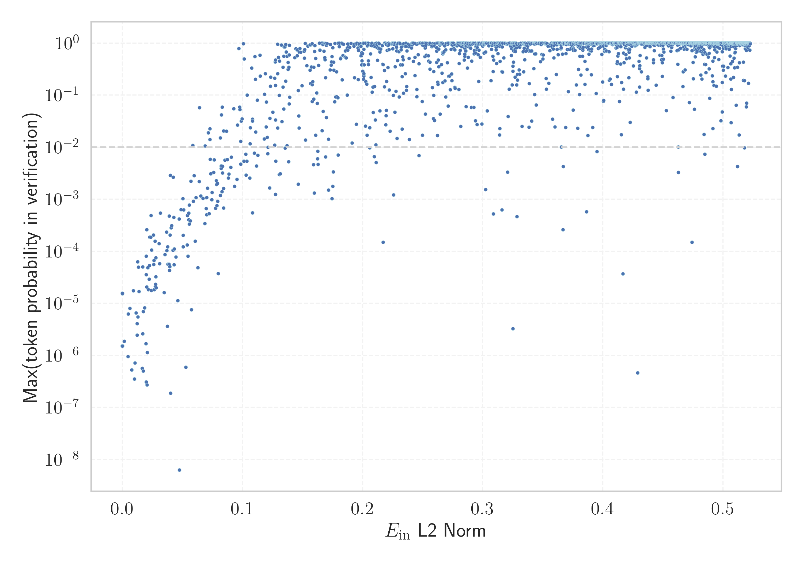

# Report for `meta-llama/Meta-Llama-3-70B`

## Model info

* Tied embeddings: no
* LM head uses bias: no
* Indicator for under-trained tokens: E_{in} L2 Norm
  * Overall distribution 0.824 +/- 0.121
  * Token used for verification prompt building: `abcdefghijklmnopqrstuvwxyz`
  * Verification threshold: 0.523
  * Threshold for showing candidate under-trained tokens: 0.084
  * Median verified threshold (for bytes, unreachable and special tokens): 0.054
* Embeddings shape: (128256, 8192)
* Vocabulary size: 128256
  * Number of single byte tokens: 256, of which 13 below indicator threshold
  * Number of special tokens: 256, of which 254 below indicator threshold
  * Number of non-single-byte UTF-fragment tokens: 1224, 3 below soft indicator threshold
  * Number of tested under-trained tokens: 2204, 2204 non-special, 208 below p = 0.01 threshold, 156 below soft indicator threshold

## Under-trained token indicators plot


## Verification plot


## Under-trained token verification results
156 entries below threshold of 0.084

|   token_id | token                             |   indicator | max_prob                                                         | in_other_tokens                                                                                                                                                                                                                                                                                        |
|------------|-----------------------------------|-------------|------------------------------------------------------------------|--------------------------------------------------------------------------------------------------------------------------------------------------------------------------------------------------------------------------------------------------------------------------------------------------------|
|      85071 | ````` $PostalCodesNL `````        | 2.52964e-05 | <span style='border: 1px solid rgb(169, 68, 66);'>1.5e-05</span> |                                                                                                                                                                                                                                                                                                        |
|      80370 | ````` ▁ForCanBeConvertedToF ````` | 2.53587e-05 | <span style='border: 1px solid rgb(169, 68, 66);'>1.5e-05</span> | <span style='border: 1px solid rgb(40, 167, 69);'>````` ▁ForCanBeConvertedToForeach `````</span>                                                                                                                                                                                                       |
|     124292 | ````` илася `````                 | 2.53699e-05 | <span style='border: 1px solid rgb(169, 68, 66);'>1.5e-06</span> |                                                                                                                                                                                                                                                                                                        |
|      89472 | ````` useRalative `````           | 2.5389e-05  | <span style='border: 1px solid rgb(169, 68, 66);'>1.5e-05</span> | <span style='border: 1px solid rgb(169, 68, 66);'>````` useRalativeImagePath `````</span>                                                                                                                                                                                                              |
|     118508 | ````` ávající `````               | 2.54354e-05 | <span style='border: 1px solid rgb(169, 68, 66);'>1.5e-06</span> |                                                                                                                                                                                                                                                                                                        |
|     122746 | ````` илакти `````                | 2.54557e-05 | <span style='border: 1px solid rgb(169, 68, 66);'>1.5e-06</span> | <span style='border: 1px solid rgb(40, 167, 69);'>````` ▁профилакти `````</span>                                                                                                                                                                                                                       |
|     125952 | ````` ыџN `````                   | 2.54677e-05 | <span style='border: 1px solid rgb(169, 68, 66);'>1.5e-05</span> | <span style='border: 1px solid rgb(169, 68, 66);'>````` ЎыџNЎыџN `````</span>, <span style='border: 1px solid rgb(169, 68, 66);'>````` ЎыџN `````</span>                                                                                                                                               |
|     106710 | ````` атися `````                 | 2.54683e-05 | <span style='border: 1px solid rgb(169, 68, 66);'>1.5e-06</span> | <span style='border: 1px solid rgb(169, 68, 66);'>````` ватися `````</span>, <span style='border: 1px solid rgb(169, 68, 66);'>````` уватися `````</span>                                                                                                                                              |
|     126523 | ````` ЎыџN `````                  | 2.54889e-05 | <span style='border: 1px solid rgb(169, 68, 66);'>1.5e-06</span> | <span style='border: 1px solid rgb(169, 68, 66);'>````` ЎыџNЎыџN `````</span>                                                                                                                                                                                                                          |
|     122549 | ````` İTESİ `````                 | 2.54891e-05 | <span style='border: 1px solid rgb(169, 68, 66);'>1.5e-06</span> | ````` ▁ÜNİVERSİTESİ `````                                                                                                                                                                                                                                                                              |
|     127896 | ````` ıldığında `````             | 2.5499e-05  | <span style='border: 1px solid rgb(169, 68, 66);'>1.5e-06</span> |                                                                                                                                                                                                                                                                                                        |
|      85069 | ````` PostalCodesNL `````         | 2.55062e-05 | <span style='border: 1px solid rgb(169, 68, 66);'>1.5e-06</span> | <span style='border: 1px solid rgb(169, 68, 66);'>````` $PostalCodesNL `````</span>                                                                                                                                                                                                                    |
|      64424 | ````` ">\r\r\n `````              | 2.56007e-05 | <span style='border: 1px solid rgb(169, 68, 66);'>1.5e-06</span> |                                                                                                                                                                                                                                                                                                        |
|     127117 | ````` ЎыџNЎыџN `````              | 2.56406e-05 | <span style='border: 1px solid rgb(169, 68, 66);'>1.5e-06</span> |                                                                                                                                                                                                                                                                                                        |
|     126545 | ````` ılmaktadır `````            | 2.56505e-05 | <span style='border: 1px solid rgb(169, 68, 66);'>1.5e-06</span> |                                                                                                                                                                                                                                                                                                        |
|      79883 | ````` \tTokenNameIdentifier ````` | 2.58018e-05 | <span style='border: 1px solid rgb(169, 68, 66);'>1.5e-06</span> |                                                                                                                                                                                                                                                                                                        |
|      68896 | ````` ;\r\r\r\n `````             | 2.58057e-05 | <span style='border: 1px solid rgb(169, 68, 66);'>1.5e-06</span> | <span style='border: 1px solid rgb(169, 68, 66);'>````` );\r\r\r\n `````</span>                                                                                                                                                                                                                        |
|      80369 | ````` ▁ForCanBeConverted `````    | 2.588e-05   | <span style='border: 1px solid rgb(169, 68, 66);'>1.5e-06</span> | <span style='border: 1px solid rgb(169, 68, 66);'>````` ▁ForCanBeConvertedToF `````</span>, <span style='border: 1px solid rgb(40, 167, 69);'>````` ▁ForCanBeConvertedToForeach `````</span>                                                                                                           |
|     103003 | ````` аракт `````                 | 2.58894e-05 | <span style='border: 1px solid rgb(169, 68, 66);'>1.5e-06</span> | ````` ▁характеристики `````, <span style='border: 1px solid rgb(169, 68, 66);'>````` ▁характериз `````</span>, <span style='border: 1px solid rgb(40, 167, 69);'>````` ▁характ `````</span>, ````` ▁характер `````, <span style='border: 1px solid rgb(40, 167, 69);'>````` ▁характеристи `````</span> |
|     107658 | ````` итися `````                 | 2.5907e-05  | <span style='border: 1px solid rgb(169, 68, 66);'>1.5e-06</span> |                                                                                                                                                                                                                                                                                                        |
<details><summary>136 additional entries below threshold</summary>

|   token_id | token                            |   indicator | max_prob                                                         | in_other_tokens                                                                                                                                                                                                                    |
|------------|----------------------------------|-------------|------------------------------------------------------------------|------------------------------------------------------------------------------------------------------------------------------------------------------------------------------------------------------------------------------------|
|     126647 | ````` lásil `````                |  0.00156494 | <span style='border: 1px solid rgb(169, 68, 66);'>1.9e-06</span> |                                                                                                                                                                                                                                    |
|     118260 | ````` ávací `````                |  0.00459789 | <span style='border: 1px solid rgb(169, 68, 66);'>9.5e-07</span> |                                                                                                                                                                                                                                    |
|      55716 | ````` ▁?>\r\n\r\n `````          |  0.00485572 | <span style='border: 1px solid rgb(169, 68, 66);'>6.2e-06</span> |                                                                                                                                                                                                                                    |
|     110043 | ````` еристи `````               |  0.00615692 | <span style='border: 1px solid rgb(169, 68, 66);'>8e-06</span>   | ````` ▁характеристики `````, <span style='border: 1px solid rgb(40, 167, 69);'>````` ▁характеристи `````</span>                                                                                                                    |
|     114533 | ````` ーカー `````               |  0.00772506 | <span style='border: 1px solid rgb(169, 68, 66);'>5.2e-07</span> |                                                                                                                                                                                                                                    |
|     112162 | ````` уватися `````              |  0.00910006 | <span style='border: 1px solid rgb(169, 68, 66);'>1.7e-05</span> |                                                                                                                                                                                                                                    |
|     111067 | ````` ıldığı `````               |  0.00986243 | <span style='border: 1px solid rgb(169, 68, 66);'>3.5e-07</span> | <span style='border: 1px solid rgb(169, 68, 66);'>````` ıldığında `````</span>                                                                                                                                                     |
|     110024 | ````` ▁CLIIIK `````              |  0.0104518  | <span style='border: 1px solid rgb(169, 68, 66);'>7.1e-07</span> |                                                                                                                                                                                                                                    |
|     109045 | ````` krvldkf `````              |  0.0112685  | <span style='border: 1px solid rgb(169, 68, 66);'>6.5e-06</span> | <span style='border: 1px solid rgb(40, 167, 69);'>````` ▁eoqkrvldkf `````</span>                                                                                                                                                   |
|     102564 | ````` ıldı `````                 |  0.0121971  | <span style='border: 1px solid rgb(169, 68, 66);'>2.5e-06</span> | ````` ▁yıldır `````, ````` ▁yıldız `````, <span style='border: 1px solid rgb(169, 68, 66);'>````` ıldığı `````</span>, ````` ▁yapıldı `````, <span style='border: 1px solid rgb(169, 68, 66);'>````` ıldığında `````</span>        |
|     112063 | ````` кадем `````                |  0.0122746  | <span style='border: 1px solid rgb(169, 68, 66);'>4.1e-06</span> | <span style='border: 1px solid rgb(40, 167, 69);'>````` ▁академ `````</span>                                                                                                                                                       |
|      90050 | ````` _ComCallableWrapper `````  |  0.0126428  | <span style='border: 1px solid rgb(169, 68, 66);'>6.3e-05</span> |                                                                                                                                                                                                                                    |
|     108577 | ````` ilmektedir `````           |  0.0129564  | <span style='border: 1px solid rgb(169, 68, 66);'>5.5e-06</span> |                                                                                                                                                                                                                                    |
|     108918 | ````` алася `````                |  0.0133117  | <span style='border: 1px solid rgb(169, 68, 66);'>5e-05</span>   |                                                                                                                                                                                                                                    |
|      47073 | ````` webElementXpaths `````     |  0.0137459  | <span style='border: 1px solid rgb(169, 68, 66);'>1.7e-05</span> |                                                                                                                                                                                                                                    |
|     110150 | ````` átku `````                 |  0.0163838  | <span style='border: 1px solid rgb(169, 68, 66);'>5.7e-07</span> | ````` ▁začátku `````                                                                                                                                                                                                               |
|     127748 | ````` ımlar `````                |  0.0169717  | <span style='border: 1px solid rgb(169, 68, 66);'>5e-05</span>   |                                                                                                                                                                                                                                    |
|     113234 | ````` uştur `````                |  0.0169767  | <span style='border: 1px solid rgb(169, 68, 66);'>2.6e-06</span> | ````` ▁olmuştur `````                                                                                                                                                                                                              |
|     114185 | ````` ımsız `````                |  0.017316   | <span style='border: 1px solid rgb(169, 68, 66);'>5e-07</span>   | ````` ▁bağımsız `````                                                                                                                                                                                                              |
|     127367 | ````` ımlı `````                 |  0.0173591  | <span style='border: 1px solid rgb(169, 68, 66);'>6.9e-06</span> |                                                                                                                                                                                                                                    |
|      98668 | ````` );\r\r\r\n `````           |  0.018343   | <span style='border: 1px solid rgb(169, 68, 66);'>8.2e-06</span> |                                                                                                                                                                                                                                    |
|     116552 | ````` ujícím `````               |  0.0194789  | <span style='border: 1px solid rgb(169, 68, 66);'>1.7e-06</span> |                                                                                                                                                                                                                                    |
|     122032 | ````` áhnout `````               |  0.0197005  | <span style='border: 1px solid rgb(169, 68, 66);'>3.6e-05</span> |                                                                                                                                                                                                                                    |
|     115721 | ````` átní `````                 |  0.0197983  | <span style='border: 1px solid rgb(169, 68, 66);'>8.1e-05</span> | ````` ▁státní `````                                                                                                                                                                                                                |
|     120424 | ````` espoň `````                |  0.0198485  | <span style='border: 1px solid rgb(169, 68, 66);'>3.1e-07</span> | ````` ▁alespoň `````                                                                                                                                                                                                               |
|     127438 | ````` ▍▍▍▍▍▍▍▍▍▍▍▍▍▍▍▍ `````     |  0.0201536  | <span style='border: 1px solid rgb(169, 68, 66);'>0.00026</span> |                                                                                                                                                                                                                                    |
|     108653 | ````` átky `````                 |  0.0202849  | <span style='border: 1px solid rgb(169, 68, 66);'>2.1e-05</span> | ````` ▁látky `````                                                                                                                                                                                                                 |
|     115614 | ````` ujících `````              |  0.0204594  | <span style='border: 1px solid rgb(169, 68, 66);'>2.7e-07</span> |                                                                                                                                                                                                                                    |
|     114836 | ````` ーション `````             |  0.0207448  | <span style='border: 1px solid rgb(169, 68, 66);'>1.1e-06</span> |                                                                                                                                                                                                                                    |
|     113004 | ````` ▁виріш `````               |  0.0211101  | <span style='border: 1px solid rgb(169, 68, 66);'>4.8e-05</span> |                                                                                                                                                                                                                                    |
|      64448 | ````` ?>\r\n\r\n `````           |  0.0216437  | <span style='border: 1px solid rgb(169, 68, 66);'>1.8e-05</span> |                                                                                                                                                                                                                                    |
|      58508 | ````` :-------------</ `````     |  0.0221733  | <span style='border: 1px solid rgb(169, 68, 66);'>2.9e-05</span> |                                                                                                                                                                                                                                    |
|      71785 | ````` .*;\r\n\r\n `````          |  0.0224193  | <span style='border: 1px solid rgb(169, 68, 66);'>5.3e-05</span> |                                                                                                                                                                                                                                    |
|     117857 | ````` ılmaz `````                |  0.0226493  | <span style='border: 1px solid rgb(169, 68, 66);'>0.00019</span> |                                                                                                                                                                                                                                    |
|      89473 | ````` useRalativeImagePath ````` |  0.0236072  | <span style='border: 1px solid rgb(169, 68, 66);'>0.00019</span> |                                                                                                                                                                                                                                    |
|     112692 | ````` ▍▍▍▍▍▍▍▍ `````             |  0.0238942  | <span style='border: 1px solid rgb(169, 68, 66);'>0.00048</span> | <span style='border: 1px solid rgb(169, 68, 66);'>````` ▍▍▍▍▍▍▍▍▍▍▍▍▍▍▍▍ `````</span>                                                                                                                                              |
|     115970 | ````` üyordu `````               |  0.0241104  | <span style='border: 1px solid rgb(169, 68, 66);'>1.8e-05</span> |                                                                                                                                                                                                                                    |
|     114860 | ````` ılmıştır `````             |  0.0241433  | <span style='border: 1px solid rgb(169, 68, 66);'>0.00011</span> |                                                                                                                                                                                                                                    |
|     112907 | ````` uyordu `````               |  0.02578    | <span style='border: 1px solid rgb(169, 68, 66);'>0.00021</span> |                                                                                                                                                                                                                                    |
|     118805 | ````` дивиду `````               |  0.0260718  | <span style='border: 1px solid rgb(169, 68, 66);'>5.6e-05</span> | <span style='border: 1px solid rgb(40, 167, 69);'>````` ▁индивиду `````</span>                                                                                                                                                     |
|     106951 | ````` 글상위 `````               |  0.0261397  | <span style='border: 1px solid rgb(169, 68, 66);'>6.7e-05</span> | <span style='border: 1px solid rgb(40, 167, 69);'>````` ▁구글상위 `````</span>, <span style='border: 1px solid rgb(40, 167, 69);'>````` 구글상위 `````</span>                                                                      |
|      89471 | ````` useRal `````               |  0.0263732  | <span style='border: 1px solid rgb(169, 68, 66);'>1.8e-05</span> | <span style='border: 1px solid rgb(169, 68, 66);'>````` useRalative `````</span>, <span style='border: 1px solid rgb(169, 68, 66);'>````` useRalativeImagePath `````</span>                                                        |
|      81259 | ````` artisanlib `````           |  0.0270678  | <span style='border: 1px solid rgb(169, 68, 66);'>0.00016</span> |                                                                                                                                                                                                                                    |
|      89475 | ````` elementGuidId `````        |  0.0272792  | <span style='border: 1px solid rgb(169, 68, 66);'>2.1e-05</span> |                                                                                                                                                                                                                                    |
|     115216 | ````` ючись `````                |  0.0274766  | <span style='border: 1px solid rgb(169, 68, 66);'>2.3e-05</span> |                                                                                                                                                                                                                                    |
|     115105 | ````` ▁神马收录 `````            |  0.0277272  | <span style='border: 1px solid rgb(169, 68, 66);'>7.5e-05</span> |                                                                                                                                                                                                                                    |
|      93249 | ````` ();\r\r\n `````            |  0.0277286  | <span style='border: 1px solid rgb(169, 68, 66);'>3.2e-05</span> |                                                                                                                                                                                                                                    |
|     106216 | ````` ıntı `````                 |  0.0281097  | <span style='border: 1px solid rgb(169, 68, 66);'>2e-05</span>   | ````` ▁ayrıntılı `````, ````` ▁sıkıntı `````, <span style='border: 1px solid rgb(40, 167, 69);'>````` ▁ayrıntı `````</span>                                                                                                        |
|     117011 | ````` ımda `````                 |  0.0304147  | <span style='border: 1px solid rgb(169, 68, 66);'>0.00014</span> |                                                                                                                                                                                                                                    |
|      72710 | ````` ▁-->\r\n\r\n `````         |  0.0308096  | <span style='border: 1px solid rgb(169, 68, 66);'>5.8e-05</span> |                                                                                                                                                                                                                                    |
|      33786 | ````` webElementProperties ````` |  0.0316829  | <span style='border: 1px solid rgb(169, 68, 66);'>0.00054</span> |                                                                                                                                                                                                                                    |
|      96348 | ````` ',\r\r\n `````             |  0.0346616  | <span style='border: 1px solid rgb(169, 68, 66);'>1.6e-05</span> |                                                                                                                                                                                                                                    |
|     112620 | ````` ▁підтрим `````             |  0.035377   | <span style='border: 1px solid rgb(169, 68, 66);'>8.6e-05</span> |                                                                                                                                                                                                                                    |
|     107102 | ````` ıyordu `````               |  0.0366372  | <span style='border: 1px solid rgb(169, 68, 66);'>0.00023</span> |                                                                                                                                                                                                                                    |
|     109744 | ````` acaktır `````              |  0.0369114  | <span style='border: 1px solid rgb(169, 68, 66);'>0.0001</span>  | ````` ▁olacaktır `````                                                                                                                                                                                                             |
|     105435 | ````` алась `````                |  0.0373847  | <span style='border: 1px solid rgb(169, 68, 66);'>3.6e-06</span> |                                                                                                                                                                                                                                    |
|     126173 | ````` vající `````               |  0.0376875  | <span style='border: 1px solid rgb(169, 68, 66);'>0.00012</span> |                                                                                                                                                                                                                                    |
|     111691 | ````` abancı `````               |  0.0378697  | <span style='border: 1px solid rgb(169, 68, 66);'>5.7e-05</span> | ````` ▁yabancı `````                                                                                                                                                                                                               |
|     101673 | ````` ektedir `````              |  0.0387084  | <span style='border: 1px solid rgb(169, 68, 66);'>5.6e-05</span> | ````` ▁etmektedir `````, <span style='border: 1px solid rgb(169, 68, 66);'>````` ilmektedir `````</span>, ````` ▁gerekmektedir `````, <span style='border: 1px solid rgb(251, 189, 8);'>````` mektedir `````</span>                |
|     120048 | ````` 重複重複 `````             |  0.0390357  | <span style='border: 1px solid rgb(169, 68, 66);'>0.00048</span> |                                                                                                                                                                                                                                    |
|     125265 | ````` україн `````               |  0.039137   | <span style='border: 1px solid rgb(169, 68, 66);'>4.3e-05</span> | ````` ▁української `````                                                                                                                                                                                                           |
|     125700 | ````` rální `````                |  0.039336   | <span style='border: 1px solid rgb(169, 68, 66);'>5.1e-05</span> |                                                                                                                                                                                                                                    |
|     104516 | ````` ılmış `````                |  0.0395871  | <span style='border: 1px solid rgb(169, 68, 66);'>0.00021</span> | ````` ▁yapılmış `````, <span style='border: 1px solid rgb(169, 68, 66);'>````` ılmıştır `````</span>                                                                                                                               |
|     105787 | ````` ▍▍▍▍ `````                 |  0.0398895  | <span style='border: 1px solid rgb(255, 145, 0);'>0.0029</span>  | <span style='border: 1px solid rgb(169, 68, 66);'>````` ▍▍▍▍▍▍▍▍ `````</span>, <span style='border: 1px solid rgb(169, 68, 66);'>````` ▍▍▍▍▍▍▍▍▍▍▍▍▍▍▍▍ `````</span>                                                               |
|     126257 | ````` џЭ `````                   |  0.0400813  | <span style='border: 1px solid rgb(169, 68, 66);'>1.9e-07</span> |                                                                                                                                                                                                                                    |
|     127577 | ````` lamaktadır `````           |  0.0405815  | <span style='border: 1px solid rgb(169, 68, 66);'>0.00028</span> |                                                                                                                                                                                                                                    |
|     114692 | ````` илась `````                |  0.0408849  | <span style='border: 1px solid rgb(169, 68, 66);'>0.00031</span> |                                                                                                                                                                                                                                    |
|     120702 | ````` ▁характериз `````          |  0.042084   | <span style='border: 1px solid rgb(169, 68, 66);'>0.0001</span>  |                                                                                                                                                                                                                                    |
|      70316 | ````` erusform `````             |  0.0423205  | <span style='border: 1px solid rgb(255, 145, 0);'>0.0026</span>  | <span style='border: 1px solid rgb(40, 167, 69);'>````` numerusform `````</span>                                                                                                                                                   |
|     127667 | ````` ▁располаг `````            |  0.0428105  | <span style='border: 1px solid rgb(169, 68, 66);'>0.00045</span> |                                                                                                                                                                                                                                    |
|     127954 | ````` jícím `````                |  0.0430627  | <span style='border: 1px solid rgb(169, 68, 66);'>5.5e-05</span> |                                                                                                                                                                                                                                    |
|     107572 | ````` ecektir `````              |  0.0432735  | <span style='border: 1px solid rgb(169, 68, 66);'>0.00011</span> |                                                                                                                                                                                                                                    |
|     124393 | ````` sahuje `````               |  0.0444792  | <span style='border: 1px solid rgb(169, 68, 66);'>7.8e-05</span> |                                                                                                                                                                                                                                    |
|     115108 | ````` ▁百度流量 `````            |  0.0459691  | <span style='border: 1px solid rgb(169, 68, 66);'>1.1e-05</span> |                                                                                                                                                                                                                                    |
|     107197 | ````` ▁використов `````          |  0.0471136  | <span style='border: 1px solid rgb(169, 68, 66);'>0.00042</span> | <span style='border: 1px solid rgb(40, 167, 69);'>````` ▁використовувати `````</span>                                                                                                                                              |
|     125022 | ````` џN `````                   |  0.0474225  | <span style='border: 1px solid rgb(169, 68, 66);'>6.3e-09</span> | <span style='border: 1px solid rgb(169, 68, 66);'>````` ыџN `````</span>, <span style='border: 1px solid rgb(169, 68, 66);'>````` ЎыџNЎыџN `````</span>, <span style='border: 1px solid rgb(169, 68, 66);'>````` ЎыџN `````</span> |
|     124593 | ````` назнач `````               |  0.0487611  | <span style='border: 1px solid rgb(169, 68, 66);'>0.00063</span> | <span style='border: 1px solid rgb(255, 145, 0);'>````` ▁предназнач `````</span>                                                                                                                                                   |
|     113983 | ````` acılık `````               |  0.0503701  | <span style='border: 1px solid rgb(255, 145, 0);'>0.001</span>   |                                                                                                                                                                                                                                    |
|     119000 | ````` пеки `````                 |  0.0506005  | <span style='border: 1px solid rgb(169, 68, 66);'>0.00012</span> | ````` ▁безпеки `````                                                                                                                                                                                                               |
|     126634 | ````` ▁přiroz `````              |  0.0506314  | <span style='border: 1px solid rgb(169, 68, 66);'>0.0002</span>  |                                                                                                                                                                                                                                    |
|     126626 | ````` ▁адміністратив `````       |  0.050904   | <span style='border: 1px solid rgb(169, 68, 66);'>0.00063</span> |                                                                                                                                                                                                                                    |
|     123745 | ````` ▁zahrn `````               |  0.0528597  | <span style='border: 1px solid rgb(169, 68, 66);'>5.9e-07</span> |                                                                                                                                                                                                                                    |
|     114767 | ````` iyesi `````                |  0.0539252  | <span style='border: 1px solid rgb(169, 68, 66);'>0.00013</span> | ````` ▁Belediyesi `````                                                                                                                                                                                                            |
|     117098 | ````` ▁зазнач `````              |  0.0540629  | <span style='border: 1px solid rgb(169, 68, 66);'>0.00049</span> |                                                                                                                                                                                                                                    |
|     121475 | ````` ніцип `````                |  0.0544988  | <span style='border: 1px solid rgb(169, 68, 66);'>8.1e-05</span> |                                                                                                                                                                                                                                    |
|     124647 | ````` itelné `````               |  0.0551654  | <span style='border: 1px solid rgb(169, 68, 66);'>0.00054</span> |                                                                                                                                                                                                                                    |
|     123997 | ````` alardan `````              |  0.0553201  | <span style='border: 1px solid rgb(169, 68, 66);'>0.0004</span>  |                                                                                                                                                                                                                                    |
|      31836 | ````` >\r\r\n `````              |  0.0556358  | <span style='border: 1px solid rgb(169, 68, 66);'>0.00077</span> | <span style='border: 1px solid rgb(169, 68, 66);'>````` ">\r\r\n `````</span>                                                                                                                                                      |
|     117929 | ````` ▁вихов `````               |  0.0557202  | <span style='border: 1px solid rgb(169, 68, 66);'>0.00033</span> |                                                                                                                                                                                                                                    |
|     114091 | ````` üslüman `````              |  0.0564658  | <span style='border: 1px solid rgb(169, 68, 66);'>0.00038</span> | ````` ▁Müslüman `````                                                                                                                                                                                                              |
|      62420 | ````` );\r\r\n `````             |  0.0569495  | <span style='border: 1px solid rgb(255, 145, 0);'>0.0022</span>  | <span style='border: 1px solid rgb(169, 68, 66);'>````` ();\r\r\n `````</span>                                                                                                                                                     |
|     127994 | ````` ватися `````               |  0.0573694  | <span style='border: 1px solid rgb(169, 68, 66);'>7.5e-06</span> |                                                                                                                                                                                                                                    |
|      31960 | ````` quotelev `````             |  0.0586231  | <span style='border: 1px solid rgb(251, 189, 8);'>0.011</span>   |                                                                                                                                                                                                                                    |
|     104121 | ````` iyordu `````               |  0.058996   | <span style='border: 1px solid rgb(169, 68, 66);'>0.00091</span> |                                                                                                                                                                                                                                    |
|      87829 | ````` ▁}\r\r\n `````             |  0.0597222  | <span style='border: 1px solid rgb(255, 145, 0);'>0.0028</span>  |                                                                                                                                                                                                                                    |
|     120959 | ````` jících `````               |  0.060529   | <span style='border: 1px solid rgb(169, 68, 66);'>0.00016</span> |                                                                                                                                                                                                                                    |
|     116452 | ````` ▁söyley `````              |  0.061129   | <span style='border: 1px solid rgb(255, 145, 0);'>0.0011</span>  |                                                                                                                                                                                                                                    |
|     107818 | ````` ární `````                 |  0.0628559  | <span style='border: 1px solid rgb(169, 68, 66);'>4.8e-05</span> |                                                                                                                                                                                                                                    |
|     117691 | ````` lıklar `````               |  0.0639641  | <span style='border: 1px solid rgb(255, 145, 0);'>0.0022</span>  | <span style='border: 1px solid rgb(169, 68, 66);'>````` lıkları `````</span>                                                                                                                                                       |
|      98100 | ````` (stypy `````               |  0.0640659  | <span style='border: 1px solid rgb(251, 189, 8);'>0.057</span>   |                                                                                                                                                                                                                                    |
|     119709 | ````` kyně `````                 |  0.0651593  | <span style='border: 1px solid rgb(255, 145, 0);'>0.0012</span>  |                                                                                                                                                                                                                                    |
|     127877 | ````` ▁Coğraf `````              |  0.067121   | <span style='border: 1px solid rgb(255, 145, 0);'>0.001</span>   |                                                                                                                                                                                                                                    |
|     120454 | ````` lıkları `````              |  0.0685889  | <span style='border: 1px solid rgb(169, 68, 66);'>0.00034</span> |                                                                                                                                                                                                                                    |
|      47072 | ````` webElementX `````          |  0.0688643  | <span style='border: 1px solid rgb(251, 189, 8);'>0.011</span>   | <span style='border: 1px solid rgb(169, 68, 66);'>````` webElementXpaths `````</span>                                                                                                                                              |
|     119162 | ````` ▁визнача `````             |  0.0696026  | <span style='border: 1px solid rgb(169, 68, 66);'>0.00066</span> |                                                                                                                                                                                                                                    |
|      66534 | ````` '];\r\n\r\n `````          |  0.0702085  | <span style='border: 1px solid rgb(169, 68, 66);'>0.0005</span>  |                                                                                                                                                                                                                                    |
|      38335 | ````` ">\r\n\r\n `````           |  0.0702585  | <span style='border: 1px solid rgb(255, 145, 0);'>0.0011</span>  |                                                                                                                                                                                                                                    |
|      70784 | ````` Japgolly `````             |  0.0707252  | <span style='border: 1px solid rgb(255, 145, 0);'>0.0016</span>  | <span style='border: 1px solid rgb(251, 189, 8);'>````` ▁typingsJapgolly `````</span>                                                                                                                                              |
|      51574 | ````` ▁{\r\r\n `````             |  0.0715789  | <span style='border: 1px solid rgb(251, 189, 8);'>0.019</span>   |                                                                                                                                                                                                                                    |
|     122047 | ````` ▁зустрі `````              |  0.0721525  | <span style='border: 1px solid rgb(169, 68, 66);'>0.00053</span> |                                                                                                                                                                                                                                    |
|     118228 | ````` ▁předsed `````             |  0.0727333  | <span style='border: 1px solid rgb(251, 189, 8);'>0.014</span>   |                                                                                                                                                                                                                                    |
|     120592 | ````` тися `````                 |  0.0728504  | <span style='border: 1px solid rgb(251, 189, 8);'>0.023</span>   | <span style='border: 1px solid rgb(169, 68, 66);'>````` ватися `````</span>, ````` ▁тисяч `````                                                                                                                                    |
|     122315 | ````` müştür `````               |  0.0730169  | <span style='border: 1px solid rgb(255, 145, 0);'>0.0058</span>  |                                                                                                                                                                                                                                    |
|     116171 | ````` cılık `````                |  0.0735891  | <span style='border: 1px solid rgb(255, 145, 0);'>0.0031</span>  |                                                                                                                                                                                                                                    |
|     110410 | ````` ▁seviy `````               |  0.0744621  | <span style='border: 1px solid rgb(169, 68, 66);'>0.00098</span> |                                                                                                                                                                                                                                    |
|     127711 | ````` dıktan `````               |  0.0745738  | <span style='border: 1px solid rgb(255, 145, 0);'>0.0013</span>  |                                                                                                                                                                                                                                    |
|     124703 | ````` ırlar `````                |  0.0759545  | <span style='border: 1px solid rgb(255, 145, 0);'>0.0033</span>  |                                                                                                                                                                                                                                    |
|     112206 | ````` ▁otevř `````               |  0.0764079  | <span style='border: 1px solid rgb(255, 145, 0);'>0.0057</span>  |                                                                                                                                                                                                                                    |
|     105672 | ````` ▁розвит `````              |  0.0775253  | <span style='border: 1px solid rgb(169, 68, 66);'>0.00067</span> | <span style='border: 1px solid rgb(40, 167, 69);'>````` ▁розвиток `````</span>, ````` ▁розвитку `````                                                                                                                              |
|     115129 | ````` lıklı `````                |  0.0782516  | <span style='border: 1px solid rgb(255, 145, 0);'>0.0023</span>  | ````` ▁sağlıklı `````                                                                                                                                                                                                              |
|     115487 | ````` ▁králov `````              |  0.0782885  | <span style='border: 1px solid rgb(255, 145, 0);'>0.0019</span>  |                                                                                                                                                                                                                                    |
|     107996 | ````` ▁визнач `````              |  0.0786551  | <span style='border: 1px solid rgb(169, 68, 66);'>0.00076</span> | <span style='border: 1px solid rgb(169, 68, 66);'>````` ▁визнача `````</span>, ````` ▁визначення `````                                                                                                                             |
|     121671 | ````` ▁düşünc `````              |  0.0790868  | <span style='border: 1px solid rgb(255, 145, 0);'>0.002</span>   |                                                                                                                                                                                                                                    |
|     119003 | ````` ▁taşıy `````               |  0.07925    | <span style='border: 1px solid rgb(169, 68, 66);'>0.00091</span> |                                                                                                                                                                                                                                    |
|     124069 | ````` ▁přibliž `````             |  0.0797115  | <span style='border: 1px solid rgb(169, 68, 66);'>3.7e-05</span> |                                                                                                                                                                                                                                    |
|     125808 | ````` larındaki `````            |  0.0814909  | <span style='border: 1px solid rgb(255, 145, 0);'>0.0012</span>  |                                                                                                                                                                                                                                    |
|     125029 | ````` ▁νεφοκ `````               |  0.0814953  | <span style='border: 1px solid rgb(251, 189, 8);'>0.015</span>   | ````` ▁νεφοκάλυψης `````                                                                                                                                                                                                           |
|     126357 | ````` ▁предназнач `````          |  0.082111   | <span style='border: 1px solid rgb(255, 145, 0);'>0.0039</span>  |                                                                                                                                                                                                                                    |
|     123611 | ````` ▁Českosloven `````         |  0.0822478  | <span style='border: 1px solid rgb(255, 145, 0);'>0.0044</span>  |                                                                                                                                                                                                                                    |
|     115944 | ````` ▁vzdál `````               |  0.0824374  | <span style='border: 1px solid rgb(251, 189, 8);'>0.042</span>   | <span style='border: 1px solid rgb(40, 167, 69);'>````` ▁vzdálen `````</span>                                                                                                                                                      |
|     123584 | ````` ▁Každ `````                |  0.0828705  | <span style='border: 1px solid rgb(255, 145, 0);'>0.0014</span>  |                                                                                                                                                                                                                                    |
|      45222 | ````` ;\r\r\n `````              |  0.083119   | <span style='border: 1px solid rgb(251, 189, 8);'>0.059</span>   | <span style='border: 1px solid rgb(255, 145, 0);'>````` );\r\r\n `````</span>, <span style='border: 1px solid rgb(169, 68, 66);'>````` ();\r\r\n `````</span>                                                                      |
|     123107 | ````` maması `````               |  0.0832961  | <span style='border: 1px solid rgb(255, 145, 0);'>0.0032</span>  |                                                                                                                                                                                                                                    |
|     125786 | ````` ▁nebezpeč `````            |  0.0833433  | <span style='border: 1px solid rgb(255, 145, 0);'>0.0043</span>  |                                                                                                                                                                                                                                    |
|     125759 | ````` ▁відріз `````              |  0.0841073  | <span style='border: 1px solid rgb(255, 145, 0);'>0.0016</span>  |                                                                                                                                                                                                                                    |
|     124971 | ````` ▁ابراه `````               |  0.0841698  | <span style='border: 1px solid rgb(251, 189, 8);'>0.02</span>    |                                                                                                                                                                                                                                    |
</details>


## Partial UTF-8 tokens
3 entries below threshold of 0.084

|   token_id | token                      |   indicator | in_other_tokens                                                                       |
|------------|----------------------------|-------------|---------------------------------------------------------------------------------------|
|     100617 | ````` ۱<0xDB> `````        | 2.53644e-05 | ````` ۱۷ `````, ````` ۱۹ `````, ````` ۱۰ `````, ````` ۱۹۷ `````, ````` ۱۳۸ `````, ... |
|      28587 | ````` <0x8E><0xB7>取 ````` | 0.00567239  | ````` ▁获取 `````, ````` 获取 `````                                                   |
|      52188 | ````` <0x9D>始化 `````     | 0.00651382  | ````` 初始化 `````, ````` ▁初始化 `````                                               |


## Byte tokens
13 entries below threshold of 0.054

|   token_id | token              |   indicator |   ord | hex   | byte_type   |
|------------|--------------------|-------------|-------|-------|-------------|
|        186 | ````` <0xFE> ````` | 2.53562e-05 |   254 | 0xFE  | unused_utf8 |
|        178 | ````` <0xF6> ````` | 2.53887e-05 |   246 | 0xF6  | unused_utf8 |
|        125 | ````` <0xC1> ````` | 2.54711e-05 |   193 | 0xC1  | unused_utf8 |
|        185 | ````` <0xFD> ````` | 2.54862e-05 |   253 | 0xFD  | unused_utf8 |
|        187 | ````` <0xFF> ````` | 2.55397e-05 |   255 | 0xFF  | unused_utf8 |
|        183 | ````` <0xFB> ````` | 2.55487e-05 |   251 | 0xFB  | unused_utf8 |
|        184 | ````` <0xFC> ````` | 2.56482e-05 |   252 | 0xFC  | unused_utf8 |
|        179 | ````` <0xF7> ````` | 2.56576e-05 |   247 | 0xF7  | unused_utf8 |
|        177 | ````` <0xF5> ````` | 2.56746e-05 |   245 | 0xF5  | unused_utf8 |
|        181 | ````` <0xF9> ````` | 2.57369e-05 |   249 | 0xF9  | unused_utf8 |
|        180 | ````` <0xF8> ````` | 2.57394e-05 |   248 | 0xF8  | unused_utf8 |
|        124 | ````` <0xC0> ````` | 2.58149e-05 |   192 | 0xC0  | unused_utf8 |
|        182 | ````` <0xFA> ````` | 2.58811e-05 |   250 | 0xFA  | unused_utf8 |


## Special tokens
254 entries below threshold of 0.054

|   token_id | token                                        |   indicator | max_prob                                                         |
|------------|----------------------------------------------|-------------|------------------------------------------------------------------|
|     128127 | ````` <\|reserved_special_token_122\|> ````` | 2.50869e-05 | <span style='border: 1px solid rgb(169, 68, 66);'>1.5e-05</span> |
|     128192 | ````` <\|reserved_special_token_187\|> ````` | 2.50907e-05 | <span style='border: 1px solid rgb(169, 68, 66);'>1.5e-05</span> |
|     128252 | ````` <\|reserved_special_token_247\|> ````` | 2.51167e-05 | <span style='border: 1px solid rgb(169, 68, 66);'>1.5e-05</span> |
|     128122 | ````` <\|reserved_special_token_117\|> ````` | 2.51297e-05 | <span style='border: 1px solid rgb(169, 68, 66);'>1.5e-05</span> |
|     128224 | ````` <\|reserved_special_token_219\|> ````` | 2.51403e-05 | <span style='border: 1px solid rgb(169, 68, 66);'>1.5e-05</span> |
|     128102 | ````` <\|reserved_special_token_97\|> `````  | 2.51628e-05 | <span style='border: 1px solid rgb(169, 68, 66);'>1.5e-05</span> |
|     128100 | ````` <\|reserved_special_token_95\|> `````  | 2.52159e-05 | <span style='border: 1px solid rgb(169, 68, 66);'>1.5e-05</span> |
|     128032 | ````` <\|reserved_special_token_27\|> `````  | 2.52178e-05 | <span style='border: 1px solid rgb(169, 68, 66);'>1.5e-05</span> |
|     128208 | ````` <\|reserved_special_token_203\|> ````` | 2.52219e-05 | <span style='border: 1px solid rgb(169, 68, 66);'>1.5e-05</span> |
|     128055 | ````` <\|reserved_special_token_50\|> `````  | 2.52307e-05 | <span style='border: 1px solid rgb(169, 68, 66);'>1.5e-05</span> |
|     128135 | ````` <\|reserved_special_token_130\|> ````` | 2.52342e-05 | <span style='border: 1px solid rgb(169, 68, 66);'>1.5e-05</span> |
|     128038 | ````` <\|reserved_special_token_33\|> `````  | 2.52448e-05 | <span style='border: 1px solid rgb(169, 68, 66);'>1.5e-05</span> |
|     128211 | ````` <\|reserved_special_token_206\|> ````` | 2.52513e-05 | <span style='border: 1px solid rgb(169, 68, 66);'>1.5e-05</span> |
|     128062 | ````` <\|reserved_special_token_57\|> `````  | 2.52569e-05 | <span style='border: 1px solid rgb(169, 68, 66);'>1.5e-05</span> |
|     128183 | ````` <\|reserved_special_token_178\|> ````` | 2.52747e-05 | <span style='border: 1px solid rgb(169, 68, 66);'>1.5e-05</span> |
|     128185 | ````` <\|reserved_special_token_180\|> ````` | 2.52767e-05 | <span style='border: 1px solid rgb(169, 68, 66);'>1.5e-05</span> |
|     128101 | ````` <\|reserved_special_token_96\|> `````  | 2.52866e-05 | <span style='border: 1px solid rgb(169, 68, 66);'>1.5e-05</span> |
|     128148 | ````` <\|reserved_special_token_143\|> ````` | 2.52955e-05 | <span style='border: 1px solid rgb(169, 68, 66);'>1.5e-05</span> |
|     128044 | ````` <\|reserved_special_token_39\|> `````  | 2.5301e-05  | <span style='border: 1px solid rgb(169, 68, 66);'>1.5e-05</span> |
|     128139 | ````` <\|reserved_special_token_134\|> ````` | 2.53126e-05 | <span style='border: 1px solid rgb(169, 68, 66);'>1.5e-05</span> |
<details><summary>234 additional entries below threshold</summary>

|   token_id | token                                        |   indicator | max_prob                                                         |
|------------|----------------------------------------------|-------------|------------------------------------------------------------------|
|     128018 | ````` <\|reserved_special_token_13\|> `````  | 2.5323e-05  | <span style='border: 1px solid rgb(169, 68, 66);'>1.5e-05</span> |
|     128117 | ````` <\|reserved_special_token_112\|> ````` | 2.53431e-05 | <span style='border: 1px solid rgb(169, 68, 66);'>1.5e-05</span> |
|     128163 | ````` <\|reserved_special_token_158\|> ````` | 2.53472e-05 | <span style='border: 1px solid rgb(169, 68, 66);'>1.5e-05</span> |
|     128033 | ````` <\|reserved_special_token_28\|> `````  | 2.53508e-05 | <span style='border: 1px solid rgb(169, 68, 66);'>1.5e-05</span> |
|     128056 | ````` <\|reserved_special_token_51\|> `````  | 2.53542e-05 | <span style='border: 1px solid rgb(169, 68, 66);'>1.5e-05</span> |
|     128112 | ````` <\|reserved_special_token_107\|> ````` | 2.53565e-05 | <span style='border: 1px solid rgb(169, 68, 66);'>1.5e-05</span> |
|     128054 | ````` <\|reserved_special_token_49\|> `````  | 2.53646e-05 | <span style='border: 1px solid rgb(169, 68, 66);'>1.5e-05</span> |
|     128013 | ````` <\|reserved_special_token_8\|> `````   | 2.53664e-05 | <span style='border: 1px solid rgb(169, 68, 66);'>1.5e-05</span> |
|     128077 | ````` <\|reserved_special_token_72\|> `````  | 2.53682e-05 | <span style='border: 1px solid rgb(169, 68, 66);'>1.5e-05</span> |
|     128047 | ````` <\|reserved_special_token_42\|> `````  | 2.53705e-05 | <span style='border: 1px solid rgb(169, 68, 66);'>1.5e-05</span> |
|     128129 | ````` <\|reserved_special_token_124\|> ````` | 2.53709e-05 | <span style='border: 1px solid rgb(169, 68, 66);'>1.5e-05</span> |
|     128244 | ````` <\|reserved_special_token_239\|> ````` | 2.53715e-05 | <span style='border: 1px solid rgb(169, 68, 66);'>1.5e-05</span> |
|     128119 | ````` <\|reserved_special_token_114\|> ````` | 2.53761e-05 | <span style='border: 1px solid rgb(169, 68, 66);'>1.5e-05</span> |
|     128243 | ````` <\|reserved_special_token_238\|> ````` | 2.53767e-05 | <span style='border: 1px solid rgb(169, 68, 66);'>1.5e-05</span> |
|     128023 | ````` <\|reserved_special_token_18\|> `````  | 2.53792e-05 | <span style='border: 1px solid rgb(169, 68, 66);'>1.5e-05</span> |
|     128233 | ````` <\|reserved_special_token_228\|> ````` | 2.53884e-05 | <span style='border: 1px solid rgb(169, 68, 66);'>1.5e-05</span> |
|     128248 | ````` <\|reserved_special_token_243\|> ````` | 2.539e-05   | <span style='border: 1px solid rgb(169, 68, 66);'>1.5e-05</span> |
|     128116 | ````` <\|reserved_special_token_111\|> ````` | 2.53915e-05 | <span style='border: 1px solid rgb(169, 68, 66);'>1.5e-05</span> |
|     128229 | ````` <\|reserved_special_token_224\|> ````` | 2.53961e-05 | <span style='border: 1px solid rgb(169, 68, 66);'>1.5e-05</span> |
|     128016 | ````` <\|reserved_special_token_11\|> `````  | 2.53997e-05 | <span style='border: 1px solid rgb(169, 68, 66);'>1.5e-05</span> |
|     128205 | ````` <\|reserved_special_token_200\|> ````` | 2.54034e-05 | <span style='border: 1px solid rgb(169, 68, 66);'>1.5e-05</span> |
|     128114 | ````` <\|reserved_special_token_109\|> ````` | 2.54063e-05 | <span style='border: 1px solid rgb(169, 68, 66);'>1.5e-05</span> |
|     128020 | ````` <\|reserved_special_token_15\|> `````  | 2.54101e-05 | <span style='border: 1px solid rgb(169, 68, 66);'>1.5e-05</span> |
|     128068 | ````` <\|reserved_special_token_63\|> `````  | 2.54226e-05 | <span style='border: 1px solid rgb(169, 68, 66);'>1.5e-05</span> |
|     128075 | ````` <\|reserved_special_token_70\|> `````  | 2.54246e-05 | <span style='border: 1px solid rgb(169, 68, 66);'>1.5e-05</span> |
|     128242 | ````` <\|reserved_special_token_237\|> ````` | 2.54254e-05 | <span style='border: 1px solid rgb(169, 68, 66);'>1.5e-05</span> |
|     128190 | ````` <\|reserved_special_token_185\|> ````` | 2.54271e-05 | <span style='border: 1px solid rgb(169, 68, 66);'>1.5e-05</span> |
|     128046 | ````` <\|reserved_special_token_41\|> `````  | 2.54331e-05 | <span style='border: 1px solid rgb(169, 68, 66);'>1.5e-05</span> |
|     128210 | ````` <\|reserved_special_token_205\|> ````` | 2.54342e-05 | <span style='border: 1px solid rgb(169, 68, 66);'>1.5e-05</span> |
|     128144 | ````` <\|reserved_special_token_139\|> ````` | 2.54364e-05 | <span style='border: 1px solid rgb(169, 68, 66);'>1.5e-05</span> |
|     128105 | ````` <\|reserved_special_token_100\|> ````` | 2.54432e-05 | <span style='border: 1px solid rgb(169, 68, 66);'>1.5e-05</span> |
|     128249 | ````` <\|reserved_special_token_244\|> ````` | 2.54445e-05 | <span style='border: 1px solid rgb(169, 68, 66);'>1.5e-05</span> |
|     128204 | ````` <\|reserved_special_token_199\|> ````` | 2.54466e-05 | <span style='border: 1px solid rgb(169, 68, 66);'>1.5e-05</span> |
|     128221 | ````` <\|reserved_special_token_216\|> ````` | 2.54523e-05 | <span style='border: 1px solid rgb(169, 68, 66);'>1.5e-05</span> |
|     128084 | ````` <\|reserved_special_token_79\|> `````  | 2.54536e-05 | <span style='border: 1px solid rgb(169, 68, 66);'>1.5e-05</span> |
|     128200 | ````` <\|reserved_special_token_195\|> ````` | 2.54551e-05 | <span style='border: 1px solid rgb(169, 68, 66);'>1.5e-05</span> |
|     128115 | ````` <\|reserved_special_token_110\|> ````` | 2.5457e-05  | <span style='border: 1px solid rgb(169, 68, 66);'>1.5e-05</span> |
|     128247 | ````` <\|reserved_special_token_242\|> ````` | 2.54578e-05 | <span style='border: 1px solid rgb(169, 68, 66);'>1.5e-05</span> |
|     128060 | ````` <\|reserved_special_token_55\|> `````  | 2.54614e-05 | <span style='border: 1px solid rgb(169, 68, 66);'>1.5e-05</span> |
|     128042 | ````` <\|reserved_special_token_37\|> `````  | 2.54647e-05 | <span style='border: 1px solid rgb(169, 68, 66);'>1.5e-05</span> |
|     128125 | ````` <\|reserved_special_token_120\|> ````` | 2.54655e-05 | <span style='border: 1px solid rgb(169, 68, 66);'>1.5e-05</span> |
|     128225 | ````` <\|reserved_special_token_220\|> ````` | 2.54718e-05 | <span style='border: 1px solid rgb(169, 68, 66);'>1.5e-05</span> |
|     128006 | ````` <\|start_header_id\|> `````            | 2.54725e-05 | <span style='border: 1px solid rgb(169, 68, 66);'>1.5e-05</span> |
|     128143 | ````` <\|reserved_special_token_138\|> ````` | 2.54731e-05 | <span style='border: 1px solid rgb(169, 68, 66);'>1.5e-05</span> |
|     128010 | ````` <\|reserved_special_token_5\|> `````   | 2.54751e-05 | <span style='border: 1px solid rgb(169, 68, 66);'>1.5e-05</span> |
|     128236 | ````` <\|reserved_special_token_231\|> ````` | 2.54787e-05 | <span style='border: 1px solid rgb(169, 68, 66);'>1.5e-05</span> |
|     128246 | ````` <\|reserved_special_token_241\|> ````` | 2.54822e-05 | <span style='border: 1px solid rgb(169, 68, 66);'>1.5e-05</span> |
|     128151 | ````` <\|reserved_special_token_146\|> ````` | 2.54847e-05 | <span style='border: 1px solid rgb(169, 68, 66);'>1.5e-06</span> |
|     128004 | ````` <\|reserved_special_token_2\|> `````   | 2.54854e-05 | <span style='border: 1px solid rgb(169, 68, 66);'>1.5e-06</span> |
|     128218 | ````` <\|reserved_special_token_213\|> ````` | 2.54861e-05 | <span style='border: 1px solid rgb(169, 68, 66);'>1.5e-06</span> |
|     128212 | ````` <\|reserved_special_token_207\|> ````` | 2.54892e-05 | <span style='border: 1px solid rgb(169, 68, 66);'>1.5e-06</span> |
|     128217 | ````` <\|reserved_special_token_212\|> ````` | 2.54897e-05 | <span style='border: 1px solid rgb(169, 68, 66);'>1.5e-06</span> |
|     128081 | ````` <\|reserved_special_token_76\|> `````  | 2.54912e-05 | <span style='border: 1px solid rgb(169, 68, 66);'>1.5e-06</span> |
|     128219 | ````` <\|reserved_special_token_214\|> ````` | 2.54918e-05 | <span style='border: 1px solid rgb(169, 68, 66);'>1.5e-06</span> |
|     128238 | ````` <\|reserved_special_token_233\|> ````` | 2.54986e-05 | <span style='border: 1px solid rgb(169, 68, 66);'>1.5e-06</span> |
|     128095 | ````` <\|reserved_special_token_90\|> `````  | 2.55013e-05 | <span style='border: 1px solid rgb(169, 68, 66);'>1.5e-06</span> |
|     128106 | ````` <\|reserved_special_token_101\|> ````` | 2.55013e-05 | <span style='border: 1px solid rgb(169, 68, 66);'>1.5e-06</span> |
|     128152 | ````` <\|reserved_special_token_147\|> ````` | 2.55032e-05 | <span style='border: 1px solid rgb(169, 68, 66);'>1.5e-06</span> |
|     128111 | ````` <\|reserved_special_token_106\|> ````` | 2.55037e-05 | <span style='border: 1px solid rgb(169, 68, 66);'>1.5e-06</span> |
|     128093 | ````` <\|reserved_special_token_88\|> `````  | 2.55053e-05 | <span style='border: 1px solid rgb(169, 68, 66);'>1.5e-06</span> |
|     128132 | ````` <\|reserved_special_token_127\|> ````` | 2.55077e-05 | <span style='border: 1px solid rgb(169, 68, 66);'>1.5e-06</span> |
|     128209 | ````` <\|reserved_special_token_204\|> ````` | 2.55088e-05 | <span style='border: 1px solid rgb(169, 68, 66);'>1.5e-06</span> |
|     128147 | ````` <\|reserved_special_token_142\|> ````` | 2.55112e-05 | <span style='border: 1px solid rgb(169, 68, 66);'>1.5e-06</span> |
|     128074 | ````` <\|reserved_special_token_69\|> `````  | 2.55118e-05 | <span style='border: 1px solid rgb(169, 68, 66);'>1.5e-06</span> |
|     128157 | ````` <\|reserved_special_token_152\|> ````` | 2.5512e-05  | <span style='border: 1px solid rgb(169, 68, 66);'>1.5e-06</span> |
|     128021 | ````` <\|reserved_special_token_16\|> `````  | 2.55121e-05 | <span style='border: 1px solid rgb(169, 68, 66);'>1.5e-06</span> |
|     128015 | ````` <\|reserved_special_token_10\|> `````  | 2.55126e-05 | <span style='border: 1px solid rgb(169, 68, 66);'>1.5e-06</span> |
|     128041 | ````` <\|reserved_special_token_36\|> `````  | 2.5513e-05  | <span style='border: 1px solid rgb(169, 68, 66);'>1.5e-06</span> |
|     128154 | ````` <\|reserved_special_token_149\|> ````` | 2.5519e-05  | <span style='border: 1px solid rgb(169, 68, 66);'>1.5e-06</span> |
|     128164 | ````` <\|reserved_special_token_159\|> ````` | 2.55197e-05 | <span style='border: 1px solid rgb(169, 68, 66);'>1.5e-06</span> |
|     128165 | ````` <\|reserved_special_token_160\|> ````` | 2.55213e-05 | <span style='border: 1px solid rgb(169, 68, 66);'>1.5e-06</span> |
|     128130 | ````` <\|reserved_special_token_125\|> ````` | 2.55215e-05 | <span style='border: 1px solid rgb(169, 68, 66);'>1.5e-06</span> |
|     128181 | ````` <\|reserved_special_token_176\|> ````` | 2.55246e-05 | <span style='border: 1px solid rgb(169, 68, 66);'>1.5e-06</span> |
|     128026 | ````` <\|reserved_special_token_21\|> `````  | 2.55291e-05 | <span style='border: 1px solid rgb(169, 68, 66);'>1.5e-06</span> |
|     128049 | ````` <\|reserved_special_token_44\|> `````  | 2.553e-05   | <span style='border: 1px solid rgb(169, 68, 66);'>1.5e-06</span> |
|     128149 | ````` <\|reserved_special_token_144\|> ````` | 2.55306e-05 | <span style='border: 1px solid rgb(169, 68, 66);'>1.5e-06</span> |
|     128090 | ````` <\|reserved_special_token_85\|> `````  | 2.5532e-05  | <span style='border: 1px solid rgb(169, 68, 66);'>1.5e-06</span> |
|     128088 | ````` <\|reserved_special_token_83\|> `````  | 2.5532e-05  | <span style='border: 1px solid rgb(169, 68, 66);'>1.5e-06</span> |
|     128108 | ````` <\|reserved_special_token_103\|> ````` | 2.55331e-05 | <span style='border: 1px solid rgb(169, 68, 66);'>1.5e-06</span> |
|     128250 | ````` <\|reserved_special_token_245\|> ````` | 2.55339e-05 | <span style='border: 1px solid rgb(169, 68, 66);'>1.5e-06</span> |
|     128138 | ````` <\|reserved_special_token_133\|> ````` | 2.55387e-05 | <span style='border: 1px solid rgb(169, 68, 66);'>1.5e-06</span> |
|     128053 | ````` <\|reserved_special_token_48\|> `````  | 2.55393e-05 | <span style='border: 1px solid rgb(169, 68, 66);'>1.5e-06</span> |
|     128037 | ````` <\|reserved_special_token_32\|> `````  | 2.55427e-05 | <span style='border: 1px solid rgb(169, 68, 66);'>1.5e-06</span> |
|     128078 | ````` <\|reserved_special_token_73\|> `````  | 2.55441e-05 | <span style='border: 1px solid rgb(169, 68, 66);'>1.5e-06</span> |
|     128072 | ````` <\|reserved_special_token_67\|> `````  | 2.55442e-05 | <span style='border: 1px solid rgb(169, 68, 66);'>1.5e-06</span> |
|     128059 | ````` <\|reserved_special_token_54\|> `````  | 2.55463e-05 | <span style='border: 1px solid rgb(169, 68, 66);'>1.5e-06</span> |
|     128168 | ````` <\|reserved_special_token_163\|> ````` | 2.55467e-05 | <span style='border: 1px solid rgb(169, 68, 66);'>1.5e-06</span> |
|     128239 | ````` <\|reserved_special_token_234\|> ````` | 2.55471e-05 | <span style='border: 1px solid rgb(169, 68, 66);'>1.5e-06</span> |
|     128003 | ````` <\|reserved_special_token_1\|> `````   | 2.55499e-05 | <span style='border: 1px solid rgb(169, 68, 66);'>1.5e-06</span> |
|     128187 | ````` <\|reserved_special_token_182\|> ````` | 2.55511e-05 | <span style='border: 1px solid rgb(169, 68, 66);'>1.5e-06</span> |
|     128159 | ````` <\|reserved_special_token_154\|> ````` | 2.55524e-05 | <span style='border: 1px solid rgb(169, 68, 66);'>1.5e-06</span> |
|     128034 | ````` <\|reserved_special_token_29\|> `````  | 2.55528e-05 | <span style='border: 1px solid rgb(169, 68, 66);'>1.5e-06</span> |
|     128092 | ````` <\|reserved_special_token_87\|> `````  | 2.55559e-05 | <span style='border: 1px solid rgb(169, 68, 66);'>1.5e-06</span> |
|     128171 | ````` <\|reserved_special_token_166\|> ````` | 2.55562e-05 | <span style='border: 1px solid rgb(169, 68, 66);'>1.5e-06</span> |
|     128176 | ````` <\|reserved_special_token_171\|> ````` | 2.55605e-05 | <span style='border: 1px solid rgb(169, 68, 66);'>1.5e-06</span> |
|     128029 | ````` <\|reserved_special_token_24\|> `````  | 2.55619e-05 | <span style='border: 1px solid rgb(169, 68, 66);'>1.5e-06</span> |
|     128036 | ````` <\|reserved_special_token_31\|> `````  | 2.55623e-05 | <span style='border: 1px solid rgb(169, 68, 66);'>1.5e-06</span> |
|     128201 | ````` <\|reserved_special_token_196\|> ````` | 2.55628e-05 | <span style='border: 1px solid rgb(169, 68, 66);'>1.5e-06</span> |
|     128158 | ````` <\|reserved_special_token_153\|> ````` | 2.55632e-05 | <span style='border: 1px solid rgb(169, 68, 66);'>1.5e-06</span> |
|     128240 | ````` <\|reserved_special_token_235\|> ````` | 2.5565e-05  | <span style='border: 1px solid rgb(169, 68, 66);'>1.5e-06</span> |
|     128160 | ````` <\|reserved_special_token_155\|> ````` | 2.55656e-05 | <span style='border: 1px solid rgb(169, 68, 66);'>1.5e-06</span> |
|     128045 | ````` <\|reserved_special_token_40\|> `````  | 2.5566e-05  | <span style='border: 1px solid rgb(169, 68, 66);'>1.5e-06</span> |
|     128080 | ````` <\|reserved_special_token_75\|> `````  | 2.55688e-05 | <span style='border: 1px solid rgb(169, 68, 66);'>1.5e-06</span> |
|     128096 | ````` <\|reserved_special_token_91\|> `````  | 2.55723e-05 | <span style='border: 1px solid rgb(169, 68, 66);'>1.5e-06</span> |
|     128137 | ````` <\|reserved_special_token_132\|> ````` | 2.55763e-05 | <span style='border: 1px solid rgb(169, 68, 66);'>1.5e-06</span> |
|     128175 | ````` <\|reserved_special_token_170\|> ````` | 2.55781e-05 | <span style='border: 1px solid rgb(169, 68, 66);'>1.5e-06</span> |
|     128063 | ````` <\|reserved_special_token_58\|> `````  | 2.55785e-05 | <span style='border: 1px solid rgb(169, 68, 66);'>1.5e-06</span> |
|     128169 | ````` <\|reserved_special_token_164\|> ````` | 2.55808e-05 | <span style='border: 1px solid rgb(169, 68, 66);'>1.5e-06</span> |
|     128076 | ````` <\|reserved_special_token_71\|> `````  | 2.55861e-05 | <span style='border: 1px solid rgb(169, 68, 66);'>1.5e-06</span> |
|     128241 | ````` <\|reserved_special_token_236\|> ````` | 2.55867e-05 | <span style='border: 1px solid rgb(169, 68, 66);'>1.5e-06</span> |
|     128011 | ````` <\|reserved_special_token_6\|> `````   | 2.55889e-05 | <span style='border: 1px solid rgb(169, 68, 66);'>1.5e-06</span> |
|     128043 | ````` <\|reserved_special_token_38\|> `````  | 2.55893e-05 | <span style='border: 1px solid rgb(169, 68, 66);'>1.5e-06</span> |
|     128174 | ````` <\|reserved_special_token_169\|> ````` | 2.55904e-05 | <span style='border: 1px solid rgb(169, 68, 66);'>1.5e-06</span> |
|     128156 | ````` <\|reserved_special_token_151\|> ````` | 2.55905e-05 | <span style='border: 1px solid rgb(169, 68, 66);'>1.5e-06</span> |
|     128061 | ````` <\|reserved_special_token_56\|> `````  | 2.55962e-05 | <span style='border: 1px solid rgb(169, 68, 66);'>1.5e-06</span> |
|     128253 | ````` <\|reserved_special_token_248\|> ````` | 2.55985e-05 | <span style='border: 1px solid rgb(169, 68, 66);'>1.5e-06</span> |
|     128199 | ````` <\|reserved_special_token_194\|> ````` | 2.56037e-05 | <span style='border: 1px solid rgb(169, 68, 66);'>1.5e-06</span> |
|     128191 | ````` <\|reserved_special_token_186\|> ````` | 2.5607e-05  | <span style='border: 1px solid rgb(169, 68, 66);'>1.5e-06</span> |
|     128170 | ````` <\|reserved_special_token_165\|> ````` | 2.56089e-05 | <span style='border: 1px solid rgb(169, 68, 66);'>1.5e-06</span> |
|     128140 | ````` <\|reserved_special_token_135\|> ````` | 2.56095e-05 | <span style='border: 1px solid rgb(169, 68, 66);'>1.5e-06</span> |
|     128091 | ````` <\|reserved_special_token_86\|> `````  | 2.56116e-05 | <span style='border: 1px solid rgb(169, 68, 66);'>1.5e-06</span> |
|     128070 | ````` <\|reserved_special_token_65\|> `````  | 2.56126e-05 | <span style='border: 1px solid rgb(169, 68, 66);'>1.5e-06</span> |
|     128025 | ````` <\|reserved_special_token_20\|> `````  | 2.56151e-05 | <span style='border: 1px solid rgb(169, 68, 66);'>1.5e-06</span> |
|     128085 | ````` <\|reserved_special_token_80\|> `````  | 2.56159e-05 | <span style='border: 1px solid rgb(169, 68, 66);'>1.5e-06</span> |
|     128009 | ````` <\|eot_id\|> `````                     | 2.56163e-05 | <span style='border: 1px solid rgb(169, 68, 66);'>1.5e-06</span> |
|     128099 | ````` <\|reserved_special_token_94\|> `````  | 2.56165e-05 | <span style='border: 1px solid rgb(169, 68, 66);'>1.5e-06</span> |
|     128133 | ````` <\|reserved_special_token_128\|> ````` | 2.56215e-05 | <span style='border: 1px solid rgb(169, 68, 66);'>1.5e-06</span> |
|     128255 | ````` <\|reserved_special_token_250\|> ````` | 2.56221e-05 | <span style='border: 1px solid rgb(169, 68, 66);'>1.5e-06</span> |
|     128024 | ````` <\|reserved_special_token_19\|> `````  | 2.56252e-05 | <span style='border: 1px solid rgb(169, 68, 66);'>1.5e-06</span> |
|     128220 | ````` <\|reserved_special_token_215\|> ````` | 2.56288e-05 | <span style='border: 1px solid rgb(169, 68, 66);'>1.5e-06</span> |
|     128197 | ````` <\|reserved_special_token_192\|> ````` | 2.56306e-05 | <span style='border: 1px solid rgb(169, 68, 66);'>1.5e-06</span> |
|     128162 | ````` <\|reserved_special_token_157\|> ````` | 2.56345e-05 | <span style='border: 1px solid rgb(169, 68, 66);'>1.5e-06</span> |
|     128118 | ````` <\|reserved_special_token_113\|> ````` | 2.5635e-05  | <span style='border: 1px solid rgb(169, 68, 66);'>1.5e-06</span> |
|     128126 | ````` <\|reserved_special_token_121\|> ````` | 2.56359e-05 | <span style='border: 1px solid rgb(169, 68, 66);'>1.5e-06</span> |
|     128031 | ````` <\|reserved_special_token_26\|> `````  | 2.56363e-05 | <span style='border: 1px solid rgb(169, 68, 66);'>1.5e-06</span> |
|     128141 | ````` <\|reserved_special_token_136\|> ````` | 2.56376e-05 | <span style='border: 1px solid rgb(169, 68, 66);'>1.5e-06</span> |
|     128104 | ````` <\|reserved_special_token_99\|> `````  | 2.56379e-05 | <span style='border: 1px solid rgb(169, 68, 66);'>1.5e-06</span> |
|     128251 | ````` <\|reserved_special_token_246\|> ````` | 2.56383e-05 | <span style='border: 1px solid rgb(169, 68, 66);'>1.5e-06</span> |
|     128083 | ````` <\|reserved_special_token_78\|> `````  | 2.56408e-05 | <span style='border: 1px solid rgb(169, 68, 66);'>1.5e-06</span> |
|     128107 | ````` <\|reserved_special_token_102\|> ````` | 2.56412e-05 | <span style='border: 1px solid rgb(169, 68, 66);'>1.5e-06</span> |
|     128173 | ````` <\|reserved_special_token_168\|> ````` | 2.56415e-05 | <span style='border: 1px solid rgb(169, 68, 66);'>1.5e-06</span> |
|     128103 | ````` <\|reserved_special_token_98\|> `````  | 2.56498e-05 | <span style='border: 1px solid rgb(169, 68, 66);'>1.5e-06</span> |
|     128086 | ````` <\|reserved_special_token_81\|> `````  | 2.56512e-05 | <span style='border: 1px solid rgb(169, 68, 66);'>1.5e-06</span> |
|     128254 | ````` <\|reserved_special_token_249\|> ````` | 2.56572e-05 | <span style='border: 1px solid rgb(169, 68, 66);'>1.5e-06</span> |
|     128030 | ````` <\|reserved_special_token_25\|> `````  | 2.5659e-05  | <span style='border: 1px solid rgb(169, 68, 66);'>1.5e-06</span> |
|     128196 | ````` <\|reserved_special_token_191\|> ````` | 2.56594e-05 | <span style='border: 1px solid rgb(169, 68, 66);'>1.5e-06</span> |
|     128136 | ````` <\|reserved_special_token_131\|> ````` | 2.56611e-05 | <span style='border: 1px solid rgb(169, 68, 66);'>1.5e-06</span> |
|     128071 | ````` <\|reserved_special_token_66\|> `````  | 2.56616e-05 | <span style='border: 1px solid rgb(169, 68, 66);'>1.5e-06</span> |
|     128178 | ````` <\|reserved_special_token_173\|> ````` | 2.5671e-05  | <span style='border: 1px solid rgb(169, 68, 66);'>1.5e-06</span> |
|     128186 | ````` <\|reserved_special_token_181\|> ````` | 2.56719e-05 | <span style='border: 1px solid rgb(169, 68, 66);'>1.5e-06</span> |
|     128012 | ````` <\|reserved_special_token_7\|> `````   | 2.56749e-05 | <span style='border: 1px solid rgb(169, 68, 66);'>1.5e-06</span> |
|     128008 | ````` <\|reserved_special_token_4\|> `````   | 2.5681e-05  | <span style='border: 1px solid rgb(169, 68, 66);'>1.5e-06</span> |
|     128079 | ````` <\|reserved_special_token_74\|> `````  | 2.56816e-05 | <span style='border: 1px solid rgb(169, 68, 66);'>1.5e-06</span> |
|     128110 | ````` <\|reserved_special_token_105\|> ````` | 2.56826e-05 | <span style='border: 1px solid rgb(169, 68, 66);'>1.5e-06</span> |
|     128202 | ````` <\|reserved_special_token_197\|> ````` | 2.56877e-05 | <span style='border: 1px solid rgb(169, 68, 66);'>1.5e-06</span> |
|     128230 | ````` <\|reserved_special_token_225\|> ````` | 2.56911e-05 | <span style='border: 1px solid rgb(169, 68, 66);'>1.5e-06</span> |
|     128040 | ````` <\|reserved_special_token_35\|> `````  | 2.56924e-05 | <span style='border: 1px solid rgb(169, 68, 66);'>1.5e-06</span> |
|     128153 | ````` <\|reserved_special_token_148\|> ````` | 2.56976e-05 | <span style='border: 1px solid rgb(169, 68, 66);'>1.5e-06</span> |
|     128142 | ````` <\|reserved_special_token_137\|> ````` | 2.56988e-05 | <span style='border: 1px solid rgb(169, 68, 66);'>1.5e-06</span> |
|     128019 | ````` <\|reserved_special_token_14\|> `````  | 2.5702e-05  | <span style='border: 1px solid rgb(169, 68, 66);'>1.5e-06</span> |
|     128014 | ````` <\|reserved_special_token_9\|> `````   | 2.57026e-05 | <span style='border: 1px solid rgb(169, 68, 66);'>1.5e-06</span> |
|     128089 | ````` <\|reserved_special_token_84\|> `````  | 2.57026e-05 | <span style='border: 1px solid rgb(169, 68, 66);'>1.5e-06</span> |
|     128198 | ````` <\|reserved_special_token_193\|> ````` | 2.57034e-05 | <span style='border: 1px solid rgb(169, 68, 66);'>1.5e-06</span> |
|     128180 | ````` <\|reserved_special_token_175\|> ````` | 2.57064e-05 | <span style='border: 1px solid rgb(169, 68, 66);'>1.5e-06</span> |
|     128065 | ````` <\|reserved_special_token_60\|> `````  | 2.57085e-05 | <span style='border: 1px solid rgb(169, 68, 66);'>1.5e-06</span> |
|     128184 | ````` <\|reserved_special_token_179\|> ````` | 2.57092e-05 | <span style='border: 1px solid rgb(169, 68, 66);'>1.5e-06</span> |
|     128161 | ````` <\|reserved_special_token_156\|> ````` | 2.5711e-05  | <span style='border: 1px solid rgb(169, 68, 66);'>1.5e-06</span> |
|     128231 | ````` <\|reserved_special_token_226\|> ````` | 2.57112e-05 | <span style='border: 1px solid rgb(169, 68, 66);'>1.5e-06</span> |
|     128207 | ````` <\|reserved_special_token_202\|> ````` | 2.57185e-05 | <span style='border: 1px solid rgb(169, 68, 66);'>1.5e-06</span> |
|     128177 | ````` <\|reserved_special_token_172\|> ````` | 2.57192e-05 | <span style='border: 1px solid rgb(169, 68, 66);'>1.5e-06</span> |
|     128234 | ````` <\|reserved_special_token_229\|> ````` | 2.57251e-05 | <span style='border: 1px solid rgb(169, 68, 66);'>1.5e-06</span> |
|     128050 | ````` <\|reserved_special_token_45\|> `````  | 2.57252e-05 | <span style='border: 1px solid rgb(169, 68, 66);'>1.5e-06</span> |
|     128195 | ````` <\|reserved_special_token_190\|> ````` | 2.57268e-05 | <span style='border: 1px solid rgb(169, 68, 66);'>1.5e-06</span> |
|     128146 | ````` <\|reserved_special_token_141\|> ````` | 2.5729e-05  | <span style='border: 1px solid rgb(169, 68, 66);'>1.5e-06</span> |
|     128216 | ````` <\|reserved_special_token_211\|> ````` | 2.57306e-05 | <span style='border: 1px solid rgb(169, 68, 66);'>1.5e-06</span> |
|     128228 | ````` <\|reserved_special_token_223\|> ````` | 2.57323e-05 | <span style='border: 1px solid rgb(169, 68, 66);'>1.5e-06</span> |
|     128002 | ````` <\|reserved_special_token_0\|> `````   | 2.57373e-05 | <span style='border: 1px solid rgb(169, 68, 66);'>1.5e-06</span> |
|     128215 | ````` <\|reserved_special_token_210\|> ````` | 2.57381e-05 | <span style='border: 1px solid rgb(169, 68, 66);'>1.5e-06</span> |
|     128058 | ````` <\|reserved_special_token_53\|> `````  | 2.57387e-05 | <span style='border: 1px solid rgb(169, 68, 66);'>1.5e-06</span> |
|     128189 | ````` <\|reserved_special_token_184\|> ````` | 2.57424e-05 | <span style='border: 1px solid rgb(169, 68, 66);'>1.5e-06</span> |
|     128131 | ````` <\|reserved_special_token_126\|> ````` | 2.57471e-05 | <span style='border: 1px solid rgb(169, 68, 66);'>1.5e-06</span> |
|     128188 | ````` <\|reserved_special_token_183\|> ````` | 2.57476e-05 | <span style='border: 1px solid rgb(169, 68, 66);'>1.5e-06</span> |
|     128206 | ````` <\|reserved_special_token_201\|> ````` | 2.57514e-05 | <span style='border: 1px solid rgb(169, 68, 66);'>1.5e-06</span> |
|     128226 | ````` <\|reserved_special_token_221\|> ````` | 2.57574e-05 | <span style='border: 1px solid rgb(169, 68, 66);'>1.5e-06</span> |
|     128097 | ````` <\|reserved_special_token_92\|> `````  | 2.57608e-05 | <span style='border: 1px solid rgb(169, 68, 66);'>1.5e-06</span> |
|     128039 | ````` <\|reserved_special_token_34\|> `````  | 2.5767e-05  | <span style='border: 1px solid rgb(169, 68, 66);'>1.5e-06</span> |
|     128237 | ````` <\|reserved_special_token_232\|> ````` | 2.5769e-05  | <span style='border: 1px solid rgb(169, 68, 66);'>1.5e-06</span> |
|     128167 | ````` <\|reserved_special_token_162\|> ````` | 2.57709e-05 | <span style='border: 1px solid rgb(169, 68, 66);'>1.5e-06</span> |
|     128022 | ````` <\|reserved_special_token_17\|> `````  | 2.57753e-05 | <span style='border: 1px solid rgb(169, 68, 66);'>1.5e-06</span> |
|     128064 | ````` <\|reserved_special_token_59\|> `````  | 2.5778e-05  | <span style='border: 1px solid rgb(169, 68, 66);'>1.5e-06</span> |
|     128028 | ````` <\|reserved_special_token_23\|> `````  | 2.57791e-05 | <span style='border: 1px solid rgb(169, 68, 66);'>1.5e-06</span> |
|     128051 | ````` <\|reserved_special_token_46\|> `````  | 2.57827e-05 | <span style='border: 1px solid rgb(169, 68, 66);'>1.5e-06</span> |
|     128235 | ````` <\|reserved_special_token_230\|> ````` | 2.5786e-05  | <span style='border: 1px solid rgb(169, 68, 66);'>1.5e-06</span> |
|     128150 | ````` <\|reserved_special_token_145\|> ````` | 2.57899e-05 | <span style='border: 1px solid rgb(169, 68, 66);'>1.5e-06</span> |
|     128048 | ````` <\|reserved_special_token_43\|> `````  | 2.57937e-05 | <span style='border: 1px solid rgb(169, 68, 66);'>1.5e-06</span> |
|     128166 | ````` <\|reserved_special_token_161\|> ````` | 2.5794e-05  | <span style='border: 1px solid rgb(169, 68, 66);'>1.5e-06</span> |
|     128052 | ````` <\|reserved_special_token_47\|> `````  | 2.57943e-05 | <span style='border: 1px solid rgb(169, 68, 66);'>1.5e-06</span> |
|     128193 | ````` <\|reserved_special_token_188\|> ````` | 2.57948e-05 | <span style='border: 1px solid rgb(169, 68, 66);'>1.5e-06</span> |
|     128223 | ````` <\|reserved_special_token_218\|> ````` | 2.57962e-05 | <span style='border: 1px solid rgb(169, 68, 66);'>1.5e-06</span> |
|     128087 | ````` <\|reserved_special_token_82\|> `````  | 2.57966e-05 | <span style='border: 1px solid rgb(169, 68, 66);'>1.5e-06</span> |
|     128128 | ````` <\|reserved_special_token_123\|> ````` | 2.58018e-05 | <span style='border: 1px solid rgb(169, 68, 66);'>1.5e-06</span> |
|     128073 | ````` <\|reserved_special_token_68\|> `````  | 2.58104e-05 | <span style='border: 1px solid rgb(169, 68, 66);'>1.5e-06</span> |
|     128066 | ````` <\|reserved_special_token_61\|> `````  | 2.58115e-05 | <span style='border: 1px solid rgb(169, 68, 66);'>1.5e-06</span> |
|     128017 | ````` <\|reserved_special_token_12\|> `````  | 2.58189e-05 | <span style='border: 1px solid rgb(169, 68, 66);'>1.5e-06</span> |
|     128123 | ````` <\|reserved_special_token_118\|> ````` | 2.58245e-05 | <span style='border: 1px solid rgb(169, 68, 66);'>1.5e-06</span> |
|     128179 | ````` <\|reserved_special_token_174\|> ````` | 2.58372e-05 | <span style='border: 1px solid rgb(169, 68, 66);'>1.5e-06</span> |
|     128094 | ````` <\|reserved_special_token_89\|> `````  | 2.58384e-05 | <span style='border: 1px solid rgb(169, 68, 66);'>1.5e-06</span> |
|     128245 | ````` <\|reserved_special_token_240\|> ````` | 2.58437e-05 | <span style='border: 1px solid rgb(169, 68, 66);'>1.5e-06</span> |
|     128121 | ````` <\|reserved_special_token_116\|> ````` | 2.58437e-05 | <span style='border: 1px solid rgb(169, 68, 66);'>1.5e-06</span> |
|     128082 | ````` <\|reserved_special_token_77\|> `````  | 2.58493e-05 | <span style='border: 1px solid rgb(169, 68, 66);'>1.5e-06</span> |
|     128227 | ````` <\|reserved_special_token_222\|> ````` | 2.58499e-05 | <span style='border: 1px solid rgb(169, 68, 66);'>1.5e-06</span> |
|     128155 | ````` <\|reserved_special_token_150\|> ````` | 2.58512e-05 | <span style='border: 1px solid rgb(169, 68, 66);'>1.5e-06</span> |
|     128172 | ````` <\|reserved_special_token_167\|> ````` | 2.58624e-05 | <span style='border: 1px solid rgb(169, 68, 66);'>1.5e-06</span> |
|     128069 | ````` <\|reserved_special_token_64\|> `````  | 2.5865e-05  | <span style='border: 1px solid rgb(169, 68, 66);'>1.5e-06</span> |
|     128057 | ````` <\|reserved_special_token_52\|> `````  | 2.58669e-05 | <span style='border: 1px solid rgb(169, 68, 66);'>1.5e-06</span> |
|     128124 | ````` <\|reserved_special_token_119\|> ````` | 2.58735e-05 | <span style='border: 1px solid rgb(169, 68, 66);'>1.5e-06</span> |
|     128214 | ````` <\|reserved_special_token_209\|> ````` | 2.58819e-05 | <span style='border: 1px solid rgb(169, 68, 66);'>1.5e-06</span> |
|     128120 | ````` <\|reserved_special_token_115\|> ````` | 2.58826e-05 | <span style='border: 1px solid rgb(169, 68, 66);'>1.5e-06</span> |
|     128134 | ````` <\|reserved_special_token_129\|> ````` | 2.59018e-05 | <span style='border: 1px solid rgb(169, 68, 66);'>1.5e-06</span> |
|     128222 | ````` <\|reserved_special_token_217\|> ````` | 2.59113e-05 | <span style='border: 1px solid rgb(169, 68, 66);'>1.5e-06</span> |
|     128098 | ````` <\|reserved_special_token_93\|> `````  | 2.59186e-05 | <span style='border: 1px solid rgb(169, 68, 66);'>1.5e-06</span> |
|     128194 | ````` <\|reserved_special_token_189\|> ````` | 2.59245e-05 | <span style='border: 1px solid rgb(169, 68, 66);'>1.5e-06</span> |
|     128145 | ````` <\|reserved_special_token_140\|> ````` | 2.59252e-05 | <span style='border: 1px solid rgb(169, 68, 66);'>1.5e-06</span> |
|     128027 | ````` <\|reserved_special_token_22\|> `````  | 2.5936e-05  | <span style='border: 1px solid rgb(169, 68, 66);'>1.5e-06</span> |
|     128005 | ````` <\|reserved_special_token_3\|> `````   | 2.59528e-05 | <span style='border: 1px solid rgb(169, 68, 66);'>1.5e-06</span> |
|     128232 | ````` <\|reserved_special_token_227\|> ````` | 2.59539e-05 | <span style='border: 1px solid rgb(169, 68, 66);'>1.5e-06</span> |
|     128109 | ````` <\|reserved_special_token_104\|> ````` | 2.59586e-05 | <span style='border: 1px solid rgb(169, 68, 66);'>1.5e-06</span> |
|     128213 | ````` <\|reserved_special_token_208\|> ````` | 2.59652e-05 | <span style='border: 1px solid rgb(169, 68, 66);'>1.5e-06</span> |
|     128067 | ````` <\|reserved_special_token_62\|> `````  | 2.59797e-05 | <span style='border: 1px solid rgb(169, 68, 66);'>1.5e-06</span> |
|     128182 | ````` <\|reserved_special_token_177\|> ````` | 2.5987e-05  | <span style='border: 1px solid rgb(169, 68, 66);'>1.5e-06</span> |
|     128113 | ````` <\|reserved_special_token_108\|> ````` | 2.60217e-05 | <span style='border: 1px solid rgb(169, 68, 66);'>1.5e-06</span> |
|     128035 | ````` <\|reserved_special_token_30\|> `````  | 2.60283e-05 | <span style='border: 1px solid rgb(169, 68, 66);'>1.5e-06</span> |
|     128007 | ````` <\|end_header_id\|> `````              | 2.60514e-05 | <span style='border: 1px solid rgb(169, 68, 66);'>1.5e-06</span> |
|     128203 | ````` <\|reserved_special_token_198\|> ````` | 2.60663e-05 | <span style='border: 1px solid rgb(169, 68, 66);'>1.5e-06</span> |
</details>

