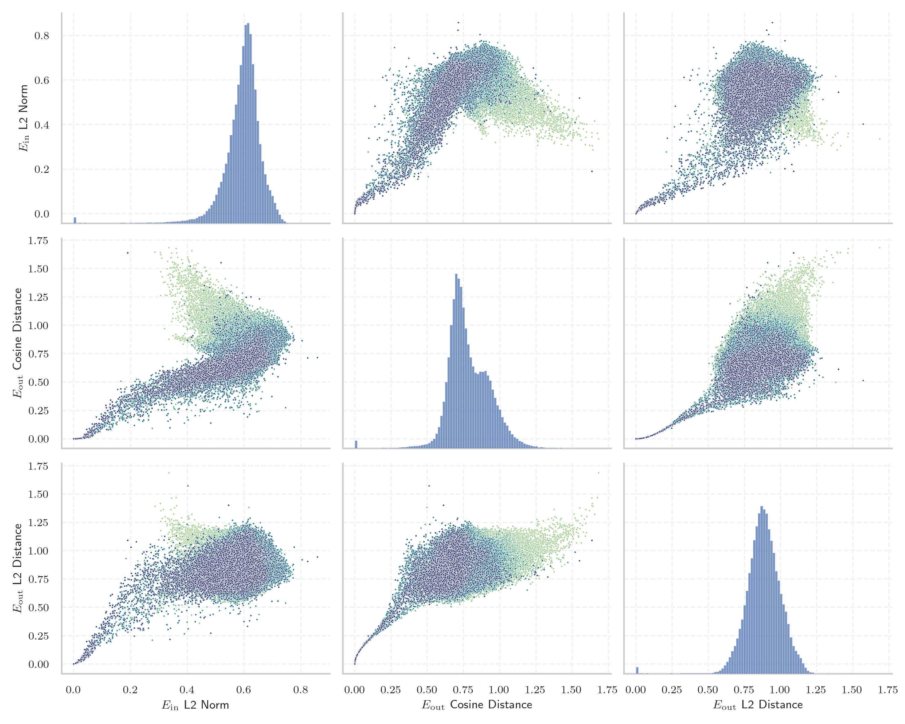
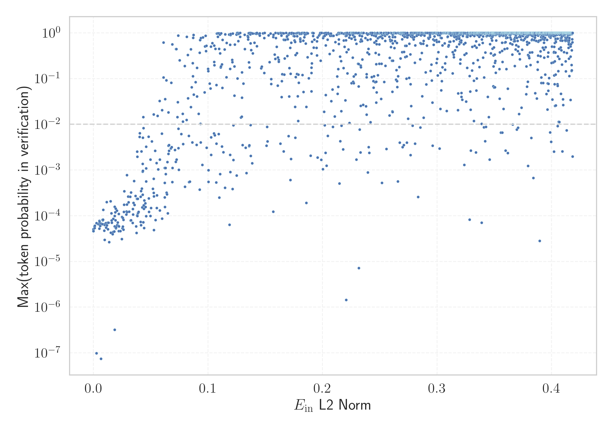

# Report for `meta-llama/Meta-Llama-3-8B`

## Model info

* Tied embeddings: no
* LM head uses bias: no
* Indicator for under-trained tokens: E_{in} L2 Norm
  * Overall distribution 0.593 +/- 0.073
  * Token used for verification prompt building: `ABCDEFGHIJKLMNOPQRSTUVWXYZ`
  * Verification threshold: 0.418
  * Threshold for showing candidate under-trained tokens: 0.068
  * Median verified threshold (for bytes, unreachable and special tokens): 0.053
* Embeddings shape: (128256, 4096)
* Vocabulary size: 128256
  * Number of single byte tokens: 256, of which 13 below indicator threshold
  * Number of special tokens: 256, of which 254 below indicator threshold
  * Number of non-single-byte UTF-fragment tokens: 1224, 4 below soft indicator threshold
  * Number of tested under-trained tokens: 2203, 2203 non-special, 302 below p = 0.01 threshold, 188 below soft indicator threshold

## Under-trained token indicators plot


## Verification plot


## Under-trained token verification results
188 entries below threshold of 0.068

|   token_id | token                             |   indicator | max_prob                                                         | in_other_tokens                                                                                                                                                                                                                                                                                        |
|------------|-----------------------------------|-------------|------------------------------------------------------------------|--------------------------------------------------------------------------------------------------------------------------------------------------------------------------------------------------------------------------------------------------------------------------------------------------------|
|      85071 | ````` $PostalCodesNL `````        | 1.63642e-21 | <span style='border: 1px solid rgb(169, 68, 66);'>4.6e-05</span> |                                                                                                                                                                                                                                                                                                        |
|     107658 | ````` итися `````                 | 1.65727e-21 | <span style='border: 1px solid rgb(169, 68, 66);'>5e-05</span>   |                                                                                                                                                                                                                                                                                                        |
|      79883 | ````` \tTokenNameIdentifier ````` | 1.66149e-21 | <span style='border: 1px solid rgb(169, 68, 66);'>4.6e-05</span> |                                                                                                                                                                                                                                                                                                        |
|      80369 | ````` ▁ForCanBeConverted `````    | 1.66234e-21 | <span style='border: 1px solid rgb(169, 68, 66);'>4.6e-05</span> | <span style='border: 1px solid rgb(169, 68, 66);'>````` ▁ForCanBeConvertedToF `````</span>, <span style='border: 1px solid rgb(251, 189, 8);'>````` ▁ForCanBeConvertedToForeach `````</span>                                                                                                           |
|     127896 | ````` ıldığında `````             | 1.66612e-21 | <span style='border: 1px solid rgb(169, 68, 66);'>5e-05</span>   |                                                                                                                                                                                                                                                                                                        |
|     103003 | ````` аракт `````                 | 1.66907e-21 | <span style='border: 1px solid rgb(169, 68, 66);'>5e-05</span>   | ````` ▁характер `````, <span style='border: 1px solid rgb(169, 68, 66);'>````` ▁характериз `````</span>, ````` ▁характеристики `````, <span style='border: 1px solid rgb(40, 167, 69);'>````` ▁характеристи `````</span>, <span style='border: 1px solid rgb(40, 167, 69);'>````` ▁характ `````</span> |
|      68896 | ````` ;\r\r\r\n `````             | 1.67284e-21 | <span style='border: 1px solid rgb(169, 68, 66);'>4.6e-05</span> | <span style='border: 1px solid rgb(169, 68, 66);'>````` );\r\r\r\n `````</span>                                                                                                                                                                                                                        |
|     106710 | ````` атися `````                 | 1.67953e-21 | <span style='border: 1px solid rgb(169, 68, 66);'>5e-05</span>   | <span style='border: 1px solid rgb(169, 68, 66);'>````` ватися `````</span>, <span style='border: 1px solid rgb(169, 68, 66);'>````` уватися `````</span>                                                                                                                                              |
|     110043 | ````` еристи `````                | 1.68078e-21 | <span style='border: 1px solid rgb(169, 68, 66);'>5e-05</span>   | ````` ▁характеристики `````, <span style='border: 1px solid rgb(40, 167, 69);'>````` ▁характеристи `````</span>                                                                                                                                                                                        |
|     118508 | ````` ávající `````               | 1.68161e-21 | <span style='border: 1px solid rgb(169, 68, 66);'>5e-05</span>   |                                                                                                                                                                                                                                                                                                        |
|     126523 | ````` ЎыџN `````                  | 1.68328e-21 | <span style='border: 1px solid rgb(169, 68, 66);'>4.6e-05</span> | <span style='border: 1px solid rgb(169, 68, 66);'>````` ЎыџNЎыџN `````</span>                                                                                                                                                                                                                          |
|     127117 | ````` ЎыџNЎыџN `````              | 1.68992e-21 | <span style='border: 1px solid rgb(169, 68, 66);'>4.6e-05</span> |                                                                                                                                                                                                                                                                                                        |
|      89472 | ````` useRalative `````           | 1.69034e-21 | <span style='border: 1px solid rgb(169, 68, 66);'>4.6e-05</span> | <span style='border: 1px solid rgb(169, 68, 66);'>````` useRalativeImagePath `````</span>                                                                                                                                                                                                              |
|     124292 | ````` илася `````                 | 1.70848e-21 | <span style='border: 1px solid rgb(169, 68, 66);'>5e-05</span>   |                                                                                                                                                                                                                                                                                                        |
|      80370 | ````` ▁ForCanBeConvertedToF ````` | 1.71217e-21 | <span style='border: 1px solid rgb(169, 68, 66);'>4.6e-05</span> | <span style='border: 1px solid rgb(251, 189, 8);'>````` ▁ForCanBeConvertedToForeach `````</span>                                                                                                                                                                                                       |
|     122746 | ````` илакти `````                | 1.71462e-21 | <span style='border: 1px solid rgb(169, 68, 66);'>5e-05</span>   | <span style='border: 1px solid rgb(255, 145, 0);'>````` ▁профилакти `````</span>                                                                                                                                                                                                                       |
|      64424 | ````` ">\r\r\n `````              | 1.71544e-21 | <span style='border: 1px solid rgb(169, 68, 66);'>4.6e-05</span> |                                                                                                                                                                                                                                                                                                        |
|     125952 | ````` ыџN `````                   | 1.7187e-21  | <span style='border: 1px solid rgb(169, 68, 66);'>4.6e-05</span> | <span style='border: 1px solid rgb(169, 68, 66);'>````` ЎыџN `````</span>, <span style='border: 1px solid rgb(169, 68, 66);'>````` ЎыџNЎыџN `````</span>                                                                                                                                               |
|      85069 | ````` PostalCodesNL `````         | 1.72074e-21 | <span style='border: 1px solid rgb(169, 68, 66);'>4.6e-05</span> | <span style='border: 1px solid rgb(169, 68, 66);'>````` $PostalCodesNL `````</span>                                                                                                                                                                                                                    |
|     122549 | ````` İTESİ `````                 | 0.000752649 | <span style='border: 1px solid rgb(169, 68, 66);'>5.8e-05</span> | <span style='border: 1px solid rgb(40, 167, 69);'>````` ▁ÜNİVERSİTESİ `````</span>                                                                                                                                                                                                                     |
<details><summary>168 additional entries below threshold</summary>

|   token_id | token                                        |   indicator | max_prob                                                         | in_other_tokens                                                                                                                                                                                                                    |
|------------|----------------------------------------------|-------------|------------------------------------------------------------------|------------------------------------------------------------------------------------------------------------------------------------------------------------------------------------------------------------------------------------|
|     126545 | ````` ılmaktadır `````                       |  0.00102463 | <span style='border: 1px solid rgb(169, 68, 66);'>5.4e-05</span> |                                                                                                                                                                                                                                    |
|     118260 | ````` ávací `````                            |  0.00120879 | <span style='border: 1px solid rgb(169, 68, 66);'>6e-05</span>   |                                                                                                                                                                                                                                    |
|     126647 | ````` lásil `````                            |  0.00255155 | <span style='border: 1px solid rgb(169, 68, 66);'>6.9e-05</span> |                                                                                                                                                                                                                                    |
|     111067 | ````` ıldığı `````                           |  0.00261602 | <span style='border: 1px solid rgb(169, 68, 66);'>9.8e-08</span> | <span style='border: 1px solid rgb(169, 68, 66);'>````` ıldığında `````</span>                                                                                                                                                     |
|     116552 | ````` ujícím `````                           |  0.0042357  | <span style='border: 1px solid rgb(169, 68, 66);'>6.5e-05</span> |                                                                                                                                                                                                                                    |
|     114185 | ````` ımsız `````                            |  0.00502558 | <span style='border: 1px solid rgb(169, 68, 66);'>5.2e-05</span> | ````` ▁bağımsız `````                                                                                                                                                                                                              |
|     112162 | ````` уватися `````                          |  0.00505603 | <span style='border: 1px solid rgb(169, 68, 66);'>7.7e-05</span> |                                                                                                                                                                                                                                    |
|     108577 | ````` ilmektedir `````                       |  0.00524219 | <span style='border: 1px solid rgb(169, 68, 66);'>7.3e-05</span> |                                                                                                                                                                                                                                    |
|     120424 | ````` espoň `````                            |  0.00554391 | <span style='border: 1px solid rgb(169, 68, 66);'>6.6e-05</span> | ````` ▁alespoň `````                                                                                                                                                                                                               |
|      55716 | ````` ▁?>\r\n\r\n `````                      |  0.00589065 | <span style='border: 1px solid rgb(169, 68, 66);'>6e-05</span>   |                                                                                                                                                                                                                                    |
|     115614 | ````` ujících `````                          |  0.00616856 | <span style='border: 1px solid rgb(169, 68, 66);'>6.8e-05</span> |                                                                                                                                                                                                                                    |
|     110024 | ````` ▁CLIIIK `````                          |  0.00653873 | <span style='border: 1px solid rgb(169, 68, 66);'>7.4e-08</span> |                                                                                                                                                                                                                                    |
|     127748 | ````` ımlar `````                            |  0.00685024 | <span style='border: 1px solid rgb(169, 68, 66);'>6.7e-05</span> |                                                                                                                                                                                                                                    |
|     108653 | ````` átky `````                             |  0.00785891 | <span style='border: 1px solid rgb(169, 68, 66);'>8.1e-05</span> | ````` ▁látky `````                                                                                                                                                                                                                 |
|     118805 | ````` дивиду `````                           |  0.00785909 | <span style='border: 1px solid rgb(169, 68, 66);'>6.5e-05</span> | <span style='border: 1px solid rgb(40, 167, 69);'>````` ▁индивиду `````</span>                                                                                                                                                     |
|      90050 | ````` _ComCallableWrapper `````              |  0.00805348 | <span style='border: 1px solid rgb(169, 68, 66);'>7.9e-05</span> |                                                                                                                                                                                                                                    |
|     109045 | ````` krvldkf `````                          |  0.00827428 | <span style='border: 1px solid rgb(169, 68, 66);'>8.2e-05</span> | <span style='border: 1px solid rgb(40, 167, 69);'>````` ▁eoqkrvldkf `````</span>                                                                                                                                                   |
|      47073 | ````` webElementXpaths `````                 |  0.00850773 | <span style='border: 1px solid rgb(169, 68, 66);'>0.00014</span> |                                                                                                                                                                                                                                    |
|      98668 | ````` );\r\r\r\n `````                       |  0.00942266 | <span style='border: 1px solid rgb(169, 68, 66);'>4.7e-05</span> |                                                                                                                                                                                                                                    |
|     127367 | ````` ımlı `````                             |  0.00953778 | <span style='border: 1px solid rgb(169, 68, 66);'>6.5e-05</span> |                                                                                                                                                                                                                                    |
|     108918 | ````` алася `````                            |  0.00967795 | <span style='border: 1px solid rgb(169, 68, 66);'>6.3e-05</span> |                                                                                                                                                                                                                                    |
|     112063 | ````` кадем `````                            |  0.00970403 | <span style='border: 1px solid rgb(169, 68, 66);'>3e-05</span>   | <span style='border: 1px solid rgb(40, 167, 69);'>````` ▁академ `````</span>                                                                                                                                                       |
|     110150 | ````` átku `````                             |  0.0107995  | <span style='border: 1px solid rgb(169, 68, 66);'>6.9e-05</span> | ````` ▁začátku `````                                                                                                                                                                                                               |
|     117857 | ````` ılmaz `````                            |  0.0109954  | <span style='border: 1px solid rgb(169, 68, 66);'>5.5e-05</span> |                                                                                                                                                                                                                                    |
|     115721 | ````` átní `````                             |  0.0111076  | <span style='border: 1px solid rgb(169, 68, 66);'>6.4e-05</span> | ````` ▁státní `````                                                                                                                                                                                                                |
|     127438 | ````` ▍▍▍▍▍▍▍▍▍▍▍▍▍▍▍▍ `````                 |  0.0115956  | <span style='border: 1px solid rgb(169, 68, 66);'>0.0002</span>  |                                                                                                                                                                                                                                    |
|     114533 | ````` ーカー `````                           |  0.0117251  | <span style='border: 1px solid rgb(169, 68, 66);'>6.2e-05</span> |                                                                                                                                                                                                                                    |
|     102564 | ````` ıldı `````                             |  0.0124775  | <span style='border: 1px solid rgb(169, 68, 66);'>7e-05</span>   | <span style='border: 1px solid rgb(169, 68, 66);'>````` ıldığı `````</span>, <span style='border: 1px solid rgb(169, 68, 66);'>````` ıldığında `````</span>, ````` ▁yapıldı `````, ````` ▁yıldız `````, ````` ▁yıldır `````        |
|     113234 | ````` uştur `````                            |  0.0125239  | <span style='border: 1px solid rgb(169, 68, 66);'>5.1e-05</span> | ````` ▁olmuştur `````                                                                                                                                                                                                              |
|      71785 | ````` .*;\r\n\r\n `````                      |  0.0130966  | <span style='border: 1px solid rgb(169, 68, 66);'>7e-05</span>   |                                                                                                                                                                                                                                    |
|     122032 | ````` áhnout `````                           |  0.0136193  | <span style='border: 1px solid rgb(169, 68, 66);'>2.6e-05</span> |                                                                                                                                                                                                                                    |
|     112692 | ````` ▍▍▍▍▍▍▍▍ `````                         |  0.015001   | <span style='border: 1px solid rgb(169, 68, 66);'>0.00021</span> | <span style='border: 1px solid rgb(169, 68, 66);'>````` ▍▍▍▍▍▍▍▍▍▍▍▍▍▍▍▍ `````</span>                                                                                                                                              |
|     113004 | ````` ▁виріш `````                           |  0.0150916  | <span style='border: 1px solid rgb(169, 68, 66);'>4.2e-05</span> |                                                                                                                                                                                                                                    |
|      89473 | ````` useRalativeImagePath `````             |  0.0157011  | <span style='border: 1px solid rgb(169, 68, 66);'>0.00011</span> |                                                                                                                                                                                                                                    |
|      64448 | ````` ?>\r\n\r\n `````                       |  0.0158686  | <span style='border: 1px solid rgb(169, 68, 66);'>7.9e-05</span> |                                                                                                                                                                                                                                    |
|     106951 | ````` 글상위 `````                           |  0.0160179  | <span style='border: 1px solid rgb(169, 68, 66);'>7e-05</span>   | <span style='border: 1px solid rgb(40, 167, 69);'>````` 구글상위 `````</span>, <span style='border: 1px solid rgb(40, 167, 69);'>````` ▁구글상위 `````</span>                                                                      |
|     126173 | ````` vající `````                           |  0.0166187  | <span style='border: 1px solid rgb(169, 68, 66);'>4e-05</span>   |                                                                                                                                                                                                                                    |
|     115105 | ````` ▁神马收录 `````                        |  0.0172932  | <span style='border: 1px solid rgb(169, 68, 66);'>8.6e-05</span> |                                                                                                                                                                                                                                    |
|      58508 | ````` :-------------</ `````                 |  0.0173014  | <span style='border: 1px solid rgb(169, 68, 66);'>4.4e-05</span> |                                                                                                                                                                                                                                    |
|     114860 | ````` ılmıştır `````                         |  0.0181532  | <span style='border: 1px solid rgb(169, 68, 66);'>4.5e-05</span> |                                                                                                                                                                                                                                    |
|     120702 | ````` ▁характериз `````                      |  0.018402   | <span style='border: 1px solid rgb(169, 68, 66);'>5.8e-05</span> |                                                                                                                                                                                                                                    |
|      89475 | ````` elementGuidId `````                    |  0.0184321  | <span style='border: 1px solid rgb(169, 68, 66);'>0.00016</span> |                                                                                                                                                                                                                                    |
|      89471 | ````` useRal `````                           |  0.0184572  | <span style='border: 1px solid rgb(169, 68, 66);'>3.2e-07</span> | <span style='border: 1px solid rgb(169, 68, 66);'>````` useRalativeImagePath `````</span>, <span style='border: 1px solid rgb(169, 68, 66);'>````` useRalative `````</span>                                                        |
|     106216 | ````` ıntı `````                             |  0.0185225  | <span style='border: 1px solid rgb(169, 68, 66);'>9.8e-05</span> | ````` ▁ayrıntılı `````, <span style='border: 1px solid rgb(40, 167, 69);'>````` ▁sıkıntı `````</span>, <span style='border: 1px solid rgb(40, 167, 69);'>````` ▁ayrıntı `````</span>                                               |
|      96348 | ````` ',\r\r\n `````                         |  0.0189394  | <span style='border: 1px solid rgb(169, 68, 66);'>0.00012</span> |                                                                                                                                                                                                                                    |
|     114836 | ````` ーション `````                         |  0.0191408  | <span style='border: 1px solid rgb(169, 68, 66);'>8e-05</span>   |                                                                                                                                                                                                                                    |
|     112907 | ````` uyordu `````                           |  0.0194386  | <span style='border: 1px solid rgb(169, 68, 66);'>0.00014</span> |                                                                                                                                                                                                                                    |
|     115970 | ````` üyordu `````                           |  0.0194915  | <span style='border: 1px solid rgb(169, 68, 66);'>5.3e-05</span> |                                                                                                                                                                                                                                    |
|     111691 | ````` abancı `````                           |  0.01969    | <span style='border: 1px solid rgb(169, 68, 66);'>5.7e-05</span> | ````` ▁yabancı `````                                                                                                                                                                                                               |
|      81259 | ````` artisanlib `````                       |  0.0204922  | <span style='border: 1px solid rgb(169, 68, 66);'>0.00013</span> |                                                                                                                                                                                                                                    |
|     124393 | ````` sahuje `````                           |  0.0205766  | <span style='border: 1px solid rgb(169, 68, 66);'>6.2e-05</span> |                                                                                                                                                                                                                                    |
|     127667 | ````` ▁располаг `````                        |  0.0211503  | <span style='border: 1px solid rgb(169, 68, 66);'>7.1e-05</span> |                                                                                                                                                                                                                                    |
|     117011 | ````` ımda `````                             |  0.021701   | <span style='border: 1px solid rgb(169, 68, 66);'>6.1e-05</span> |                                                                                                                                                                                                                                    |
|     101673 | ````` ektedir `````                          |  0.0220067  | <span style='border: 1px solid rgb(169, 68, 66);'>4.6e-05</span> | <span style='border: 1px solid rgb(169, 68, 66);'>````` ilmektedir `````</span>, ````` ▁etmektedir `````, <span style='border: 1px solid rgb(251, 189, 8);'>````` mektedir `````</span>, ````` ▁gerekmektedir `````                |
|      72710 | ````` ▁-->\r\n\r\n `````                     |  0.0221194  | <span style='border: 1px solid rgb(169, 68, 66);'>0.00011</span> |                                                                                                                                                                                                                                    |
|     125700 | ````` rální `````                            |  0.0222091  | <span style='border: 1px solid rgb(169, 68, 66);'>5.8e-05</span> |                                                                                                                                                                                                                                    |
|     112620 | ````` ▁підтрим `````                         |  0.0235681  | <span style='border: 1px solid rgb(169, 68, 66);'>4.6e-05</span> |                                                                                                                                                                                                                                    |
|     115216 | ````` ючись `````                            |  0.0246789  | <span style='border: 1px solid rgb(169, 68, 66);'>3.1e-05</span> |                                                                                                                                                                                                                                    |
|     124593 | ````` назнач `````                           |  0.0249674  | <span style='border: 1px solid rgb(169, 68, 66);'>9.4e-05</span> | <span style='border: 1px solid rgb(169, 68, 66);'>````` ▁предназнач `````</span>                                                                                                                                                   |
|     114091 | ````` üslüman `````                          |  0.0252746  | <span style='border: 1px solid rgb(169, 68, 66);'>5.3e-05</span> | ````` ▁Müslüman `````                                                                                                                                                                                                              |
|     125265 | ````` україн `````                           |  0.0255758  | <span style='border: 1px solid rgb(169, 68, 66);'>5.8e-05</span> | ````` ▁української `````                                                                                                                                                                                                           |
|     127954 | ````` jícím `````                            |  0.0256277  | <span style='border: 1px solid rgb(169, 68, 66);'>8.9e-05</span> |                                                                                                                                                                                                                                    |
|     127577 | ````` lamaktadır `````                       |  0.0261778  | <span style='border: 1px solid rgb(169, 68, 66);'>4.9e-05</span> |                                                                                                                                                                                                                                    |
|     105435 | ````` алась `````                            |  0.0262369  | <span style='border: 1px solid rgb(169, 68, 66);'>8.1e-05</span> |                                                                                                                                                                                                                                    |
|     126634 | ````` ▁přiroz `````                          |  0.026512   | <span style='border: 1px solid rgb(169, 68, 66);'>0.00012</span> |                                                                                                                                                                                                                                    |
|     120048 | ````` 重複重複 `````                         |  0.0266281  | <span style='border: 1px solid rgb(169, 68, 66);'>0.00017</span> |                                                                                                                                                                                                                                    |
|      33786 | ````` webElementProperties `````             |  0.0269404  | <span style='border: 1px solid rgb(169, 68, 66);'>0.00034</span> |                                                                                                                                                                                                                                    |
|     120454 | ````` lıkları `````                          |  0.0286901  | <span style='border: 1px solid rgb(169, 68, 66);'>0.00011</span> |                                                                                                                                                                                                                                    |
|     123745 | ````` ▁zahrn `````                           |  0.0288993  | <span style='border: 1px solid rgb(169, 68, 66);'>0.00012</span> |                                                                                                                                                                                                                                    |
|     107102 | ````` ıyordu `````                           |  0.02923    | <span style='border: 1px solid rgb(169, 68, 66);'>0.00018</span> |                                                                                                                                                                                                                                    |
|     105787 | ````` ▍▍▍▍ `````                             |  0.0292553  | <span style='border: 1px solid rgb(169, 68, 66);'>0.00077</span> | <span style='border: 1px solid rgb(169, 68, 66);'>````` ▍▍▍▍▍▍▍▍ `````</span>, <span style='border: 1px solid rgb(169, 68, 66);'>````` ▍▍▍▍▍▍▍▍▍▍▍▍▍▍▍▍ `````</span>                                                               |
|     109744 | ````` acaktır `````                          |  0.0293588  | <span style='border: 1px solid rgb(169, 68, 66);'>0.00012</span> | ````` ▁olacaktır `````                                                                                                                                                                                                             |
|     107572 | ````` ecektir `````                          |  0.0302743  | <span style='border: 1px solid rgb(169, 68, 66);'>0.00026</span> |                                                                                                                                                                                                                                    |
|     104516 | ````` ılmış `````                            |  0.0305404  | <span style='border: 1px solid rgb(169, 68, 66);'>0.0002</span>  | <span style='border: 1px solid rgb(169, 68, 66);'>````` ılmıştır `````</span>, ````` ▁yapılmış `````                                                                                                                               |
|     120959 | ````` jících `````                           |  0.0311832  | <span style='border: 1px solid rgb(169, 68, 66);'>0.00012</span> |                                                                                                                                                                                                                                    |
|      93249 | ````` ();\r\r\n `````                        |  0.0320864  | <span style='border: 1px solid rgb(169, 68, 66);'>0.00026</span> |                                                                                                                                                                                                                                    |
|     113983 | ````` acılık `````                           |  0.0324334  | <span style='border: 1px solid rgb(169, 68, 66);'>7.9e-05</span> |                                                                                                                                                                                                                                    |
|     121475 | ````` ніцип `````                            |  0.0327477  | <span style='border: 1px solid rgb(169, 68, 66);'>8e-05</span>   |                                                                                                                                                                                                                                    |
|     125022 | ````` џN `````                               |  0.0327484  | <span style='border: 1px solid rgb(169, 68, 66);'>0.00032</span> | <span style='border: 1px solid rgb(169, 68, 66);'>````` ыџN `````</span>, <span style='border: 1px solid rgb(169, 68, 66);'>````` ЎыџN `````</span>, <span style='border: 1px solid rgb(169, 68, 66);'>````` ЎыџNЎыџN `````</span> |
|     107197 | ````` ▁використов `````                      |  0.0342576  | <span style='border: 1px solid rgb(169, 68, 66);'>7e-05</span>   | ````` ▁використовувати `````                                                                                                                                                                                                       |
|     126257 | ````` џЭ `````                               |  0.0342947  | <span style='border: 1px solid rgb(169, 68, 66);'>0.00014</span> |                                                                                                                                                                                                                                    |
|     114692 | ````` илась `````                            |  0.0345342  | <span style='border: 1px solid rgb(169, 68, 66);'>0.00011</span> |                                                                                                                                                                                                                                    |
|     115108 | ````` ▁百度流量 `````                        |  0.0349656  | <span style='border: 1px solid rgb(169, 68, 66);'>0.00019</span> |                                                                                                                                                                                                                                    |
|     118228 | ````` ▁předsed `````                         |  0.0355248  | <span style='border: 1px solid rgb(169, 68, 66);'>0.00057</span> |                                                                                                                                                                                                                                    |
|     117691 | ````` lıklar `````                           |  0.0357264  | <span style='border: 1px solid rgb(169, 68, 66);'>0.00017</span> | <span style='border: 1px solid rgb(169, 68, 66);'>````` lıkları `````</span>                                                                                                                                                       |
|     115129 | ````` lıklı `````                            |  0.0367205  | <span style='border: 1px solid rgb(169, 68, 66);'>0.00027</span> | ````` ▁sağlıklı `````                                                                                                                                                                                                              |
|     117929 | ````` ▁вихов `````                           |  0.0371931  | <span style='border: 1px solid rgb(169, 68, 66);'>5.9e-05</span> |                                                                                                                                                                                                                                    |
|     126626 | ````` ▁адміністратив `````                   |  0.0375021  | <span style='border: 1px solid rgb(169, 68, 66);'>4.2e-05</span> |                                                                                                                                                                                                                                    |
|     124647 | ````` itelné `````                           |  0.0379274  | <span style='border: 1px solid rgb(169, 68, 66);'>0.00023</span> |                                                                                                                                                                                                                                    |
|      70316 | ````` erusform `````                         |  0.0380577  | <span style='border: 1px solid rgb(255, 145, 0);'>0.0025</span>  | <span style='border: 1px solid rgb(40, 167, 69);'>````` numerusform `````</span>                                                                                                                                                   |
|     115487 | ````` ▁králov `````                          |  0.0381805  | <span style='border: 1px solid rgb(169, 68, 66);'>0.0001</span>  |                                                                                                                                                                                                                                    |
|     122315 | ````` müştür `````                           |  0.0383401  | <span style='border: 1px solid rgb(255, 145, 0);'>0.0019</span>  |                                                                                                                                                                                                                                    |
|     119465 | ````` ▁присутств `````                       |  0.0383587  | <span style='border: 1px solid rgb(169, 68, 66);'>9.9e-05</span> |                                                                                                                                                                                                                                    |
|     106920 | ````` rodní `````                            |  0.0385826  | <span style='border: 1px solid rgb(169, 68, 66);'>0.00023</span> |                                                                                                                                                                                                                                    |
|     127877 | ````` ▁Coğraf `````                          |  0.0388995  | <span style='border: 1px solid rgb(169, 68, 66);'>0.00011</span> |                                                                                                                                                                                                                                    |
|     127531 | ````` ▁vyrá `````                            |  0.039389   | <span style='border: 1px solid rgb(169, 68, 66);'>0.00012</span> |                                                                                                                                                                                                                                    |
|      31960 | ````` quotelev `````                         |  0.0402828  | <span style='border: 1px solid rgb(255, 145, 0);'>0.0053</span>  |                                                                                                                                                                                                                                    |
|      98100 | ````` (stypy `````                           |  0.040347   | <span style='border: 1px solid rgb(255, 145, 0);'>0.0064</span>  |                                                                                                                                                                                                                                    |
|     116171 | ````` cılık `````                            |  0.0411416  | <span style='border: 1px solid rgb(169, 68, 66);'>0.00026</span> |                                                                                                                                                                                                                                    |
|     123997 | ````` alardan `````                          |  0.0411684  | <span style='border: 1px solid rgb(169, 68, 66);'>7.3e-05</span> |                                                                                                                                                                                                                                    |
|     117098 | ````` ▁зазнач `````                          |  0.041482   | <span style='border: 1px solid rgb(169, 68, 66);'>6.2e-05</span> |                                                                                                                                                                                                                                    |
|     125808 | ````` larındaki `````                        |  0.0415826  | <span style='border: 1px solid rgb(169, 68, 66);'>0.00035</span> |                                                                                                                                                                                                                                    |
|      62420 | ````` );\r\r\n `````                         |  0.0418393  | <span style='border: 1px solid rgb(255, 145, 0);'>0.0026</span>  | <span style='border: 1px solid rgb(169, 68, 66);'>````` ();\r\r\n `````</span>                                                                                                                                                     |
|     127711 | ````` dıktan `````                           |  0.0422454  | <span style='border: 1px solid rgb(169, 68, 66);'>0.00039</span> |                                                                                                                                                                                                                                    |
|     114767 | ````` iyesi `````                            |  0.0425753  | <span style='border: 1px solid rgb(169, 68, 66);'>0.00015</span> | ````` ▁Belediyesi `````                                                                                                                                                                                                            |
|     123107 | ````` maması `````                           |  0.0428917  | <span style='border: 1px solid rgb(169, 68, 66);'>0.00093</span> |                                                                                                                                                                                                                                    |
|     120894 | ````` ▁přítom `````                          |  0.0428988  | <span style='border: 1px solid rgb(169, 68, 66);'>0.00029</span> |                                                                                                                                                                                                                                    |
|     119000 | ````` пеки `````                             |  0.0429331  | <span style='border: 1px solid rgb(255, 145, 0);'>0.0014</span>  | ````` ▁безпеки `````                                                                                                                                                                                                               |
|      87829 | ````` ▁}\r\r\n `````                         |  0.0430504  | <span style='border: 1px solid rgb(255, 145, 0);'>0.0051</span>  |                                                                                                                                                                                                                                    |
|     107818 | ````` ární `````                             |  0.0431548  | <span style='border: 1px solid rgb(169, 68, 66);'>0.00096</span> |                                                                                                                                                                                                                                    |
|      47072 | ````` webElementX `````                      |  0.0433882  | <span style='border: 1px solid rgb(251, 189, 8);'>0.014</span>   | <span style='border: 1px solid rgb(169, 68, 66);'>````` webElementXpaths `````</span>                                                                                                                                              |
|     127994 | ````` ватися `````                           |  0.0434196  | <span style='border: 1px solid rgb(169, 68, 66);'>7.2e-05</span> |                                                                                                                                                                                                                                    |
|     112969 | ````` ▁nhiễ `````                            |  0.0436984  | <span style='border: 1px solid rgb(255, 145, 0);'>0.0082</span>  | ````` ▁nhiễm `````                                                                                                                                                                                                                 |
|     123611 | ````` ▁Českosloven `````                     |  0.0438325  | <span style='border: 1px solid rgb(169, 68, 66);'>0.00017</span> |                                                                                                                                                                                                                                    |
|     121671 | ````` ▁düşünc `````                          |  0.0439445  | <span style='border: 1px solid rgb(169, 68, 66);'>0.00014</span> |                                                                                                                                                                                                                                    |
|     116452 | ````` ▁söyley `````                          |  0.0441037  | <span style='border: 1px solid rgb(169, 68, 66);'>5.4e-05</span> |                                                                                                                                                                                                                                    |
|     115944 | ````` ▁vzdál `````                           |  0.0442752  | <span style='border: 1px solid rgb(169, 68, 66);'>0.00022</span> | <span style='border: 1px solid rgb(40, 167, 69);'>````` ▁vzdálen `````</span>                                                                                                                                                      |
|     125786 | ````` ▁nebezpeč `````                        |  0.0452252  | <span style='border: 1px solid rgb(169, 68, 66);'>0.00019</span> |                                                                                                                                                                                                                                    |
|     124069 | ````` ▁přibliž `````                         |  0.0454206  | <span style='border: 1px solid rgb(169, 68, 66);'>0.00015</span> |                                                                                                                                                                                                                                    |
|     124703 | ````` ırlar `````                            |  0.0458937  | <span style='border: 1px solid rgb(255, 145, 0);'>0.0032</span>  |                                                                                                                                                                                                                                    |
|     122047 | ````` ▁зустрі `````                          |  0.0460329  | <span style='border: 1px solid rgb(169, 68, 66);'>9.8e-05</span> |                                                                                                                                                                                                                                    |
|     104121 | ````` iyordu `````                           |  0.0460376  | <span style='border: 1px solid rgb(169, 68, 66);'>0.00056</span> |                                                                                                                                                                                                                                    |
|     119709 | ````` kyně `````                             |  0.0460485  | <span style='border: 1px solid rgb(255, 145, 0);'>0.0011</span>  |                                                                                                                                                                                                                                    |
|      31836 | ````` >\r\r\n `````                          |  0.0481482  | <span style='border: 1px solid rgb(255, 145, 0);'>0.0053</span>  | <span style='border: 1px solid rgb(169, 68, 66);'>````` ">\r\r\n `````</span>                                                                                                                                                      |
|     126357 | ````` ▁предназнач `````                      |  0.0483082  | <span style='border: 1px solid rgb(169, 68, 66);'>0.00024</span> |                                                                                                                                                                                                                                    |
|     118377 | ````` ▁meziná `````                          |  0.0484726  | <span style='border: 1px solid rgb(169, 68, 66);'>0.00012</span> |                                                                                                                                                                                                                                    |
|     112054 | ````` těz `````                              |  0.0497428  | <span style='border: 1px solid rgb(255, 145, 0);'>0.0017</span>  | ````` ▁vítěz `````                                                                                                                                                                                                                 |
|     127769 | ````` ▁выращи `````                          |  0.0497999  | <span style='border: 1px solid rgb(169, 68, 66);'>9.9e-05</span> |                                                                                                                                                                                                                                    |
|     126754 | ````` dıkları `````                          |  0.0502199  | <span style='border: 1px solid rgb(169, 68, 66);'>0.00015</span> |                                                                                                                                                                                                                                    |
|     127024 | ````` ▁профилакти `````                      |  0.0509546  | <span style='border: 1px solid rgb(255, 145, 0);'>0.0042</span>  |                                                                                                                                                                                                                                    |
|      38335 | ````` ">\r\n\r\n `````                       |  0.0517629  | <span style='border: 1px solid rgb(169, 68, 66);'>0.00039</span> |                                                                                                                                                                                                                                    |
|      51574 | ````` ▁{\r\r\n `````                         |  0.0524767  | <span style='border: 1px solid rgb(251, 189, 8);'>0.016</span>   |                                                                                                                                                                                                                                    |
|     110410 | ````` ▁seviy `````                           |  0.0526253  | <span style='border: 1px solid rgb(169, 68, 66);'>0.00032</span> |                                                                                                                                                                                                                                    |
|      70784 | ````` Japgolly `````                         |  0.0526356  | <span style='border: 1px solid rgb(169, 68, 66);'>0.00064</span> | <span style='border: 1px solid rgb(251, 189, 8);'>````` ▁typingsJapgolly `````</span>                                                                                                                                              |
|     123584 | ````` ▁Každ `````                            |  0.0527049  | <span style='border: 1px solid rgb(169, 68, 66);'>0.00026</span> |                                                                                                                                                                                                                                    |
|     119162 | ````` ▁визнача `````                         |  0.0527414  | <span style='border: 1px solid rgb(169, 68, 66);'>4.9e-05</span> |                                                                                                                                                                                                                                    |
|     120592 | ````` тися `````                             |  0.0538087  | <span style='border: 1px solid rgb(255, 145, 0);'>0.0026</span>  | <span style='border: 1px solid rgb(169, 68, 66);'>````` ватися `````</span>, ````` ▁тисяч `````                                                                                                                                    |
|     119776 | ````` ▁yaptığ `````                          |  0.0541079  | <span style='border: 1px solid rgb(169, 68, 66);'>8.1e-05</span> |                                                                                                                                                                                                                                    |
|     108457 | ````` lardı `````                            |  0.055004   | <span style='border: 1px solid rgb(255, 145, 0);'>0.0014</span>  | ````` lardır `````                                                                                                                                                                                                                 |
|      66534 | ````` '];\r\n\r\n `````                      |  0.0552098  | <span style='border: 1px solid rgb(169, 68, 66);'>0.00015</span> |                                                                                                                                                                                                                                    |
|     105672 | ````` ▁розвит `````                          |  0.0553994  | <span style='border: 1px solid rgb(169, 68, 66);'>0.00028</span> | ````` ▁розвиток `````, ````` ▁розвитку `````                                                                                                                                                                                       |
|     108980 | ````` ▁smlou `````                           |  0.0559297  | <span style='border: 1px solid rgb(251, 189, 8);'>0.015</span>   | ````` ▁smlouvy `````                                                                                                                                                                                                               |
|      95073 | ````` -vesm `````                            |  0.0564994  | <span style='border: 1px solid rgb(255, 145, 0);'>0.001</span>   |                                                                                                                                                                                                                                    |
|     100509 | ````` џџџџџџџџџџџџџџџџ `````                 |  0.0576955  | <span style='border: 1px solid rgb(251, 189, 8);'>0.033</span>   | <span style='border: 1px solid rgb(40, 167, 69);'>````` џџџџџџџџџџџџџџџџџџџџџџџџџџџџџџџџ `````</span>                                                                                                                              |
|     107996 | ````` ▁визнач `````                          |  0.0578421  | <span style='border: 1px solid rgb(169, 68, 66);'>0.00013</span> | ````` ▁визначення `````, <span style='border: 1px solid rgb(169, 68, 66);'>````` ▁визнача `````</span>                                                                                                                             |
|     125029 | ````` ▁νεφοκ `````                           |  0.05798    | <span style='border: 1px solid rgb(255, 145, 0);'>0.0017</span>  | <span style='border: 1px solid rgb(40, 167, 69);'>````` ▁νεφοκάλυψης `````</span>                                                                                                                                                  |
|     117949 | ````` eştir `````                            |  0.0597541  | <span style='border: 1px solid rgb(255, 145, 0);'>0.0063</span>  | ````` ▁eleştir `````, ````` ▁yerleştir `````                                                                                                                                                                                       |
|     124971 | ````` ▁ابراه `````                           |  0.0598734  | <span style='border: 1px solid rgb(251, 189, 8);'>0.02</span>    |                                                                                                                                                                                                                                    |
|     119003 | ````` ▁taşıy `````                           |  0.0599231  | <span style='border: 1px solid rgb(169, 68, 66);'>8.6e-05</span> |                                                                                                                                                                                                                                    |
|     100323 | ````` џџџџџџџџ `````                         |  0.0612011  | <span style='border: 1px solid rgb(40, 167, 69);'>0.11</span>    | <span style='border: 1px solid rgb(40, 167, 69);'>````` џџџџџџџџџџџџџџџџџџџџџџџџџџџџџџџџ `````</span>, <span style='border: 1px solid rgb(251, 189, 8);'>````` џџџџџџџџџџџџџџџџ `````</span>                                       |
|     101056 | ````` џџџџџџџџџџџџџџџџџџџџџџџџџџџџџџџџ ````` |  0.0612144  | <span style='border: 1px solid rgb(40, 167, 69);'>0.61</span>    |                                                                                                                                                                                                                                    |
|      44001 | ````` _AdjustorThunk `````                   |  0.0621626  | <span style='border: 1px solid rgb(255, 145, 0);'>0.0011</span>  |                                                                                                                                                                                                                                    |
|     127865 | ````` ▁ослож `````                           |  0.0621897  | <span style='border: 1px solid rgb(169, 68, 66);'>0.00052</span> |                                                                                                                                                                                                                                    |
|     125759 | ````` ▁відріз `````                          |  0.0622253  | <span style='border: 1px solid rgb(169, 68, 66);'>0.00025</span> |                                                                                                                                                                                                                                    |
|     112206 | ````` ▁otevř `````                           |  0.0624219  | <span style='border: 1px solid rgb(169, 68, 66);'>0.00015</span> |                                                                                                                                                                                                                                    |
|      45222 | ````` ;\r\r\n `````                          |  0.0624994  | <span style='border: 1px solid rgb(251, 189, 8);'>0.036</span>   | <span style='border: 1px solid rgb(255, 145, 0);'>````` );\r\r\n `````</span>, <span style='border: 1px solid rgb(169, 68, 66);'>````` ();\r\r\n `````</span>                                                                      |
|     103754 | ````` ▁використ `````                        |  0.0629395  | <span style='border: 1px solid rgb(255, 145, 0);'>0.0011</span>  | ````` ▁використовувати `````, <span style='border: 1px solid rgb(169, 68, 66);'>````` ▁використов `````</span>, ````` ▁використання `````                                                                                          |
|     118751 | ````` ▁дозволя `````                         |  0.0631143  | <span style='border: 1px solid rgb(169, 68, 66);'>0.00081</span> |                                                                                                                                                                                                                                    |
|     110525 | ````` ▁vzděl `````                           |  0.0636834  | <span style='border: 1px solid rgb(251, 189, 8);'>0.091</span>   | ````` ▁vzdělávání `````                                                                                                                                                                                                            |
|     113774 | ````` ▁považ `````                           |  0.0637402  | <span style='border: 1px solid rgb(169, 68, 66);'>0.00032</span> |                                                                                                                                                                                                                                    |
|     126169 | ````` ařilo `````                            |  0.0641905  | <span style='border: 1px solid rgb(169, 68, 66);'>0.00029</span> | ````` ▁podařilo `````                                                                                                                                                                                                              |
|     127719 | ````` ▁розви `````                           |  0.0645571  | <span style='border: 1px solid rgb(255, 145, 0);'>0.0015</span>  |                                                                                                                                                                                                                                    |
|     113720 | ````` ▁açıklam `````                         |  0.0648015  | <span style='border: 1px solid rgb(169, 68, 66);'>0.00011</span> |                                                                                                                                                                                                                                    |
|     113050 | ````` muştur `````                           |  0.0653625  | <span style='border: 1px solid rgb(251, 189, 8);'>0.018</span>   | ````` ▁olmuştur `````                                                                                                                                                                                                              |
|     112803 | ````` üslü `````                             |  0.0654477  | <span style='border: 1px solid rgb(255, 145, 0);'>0.0034</span>  | ````` ▁Müslüman `````, <span style='border: 1px solid rgb(169, 68, 66);'>````` üslüman `````</span>                                                                                                                                |
|     124114 | ````` ▁заним `````                           |  0.0654566  | <span style='border: 1px solid rgb(255, 145, 0);'>0.0023</span>  |                                                                                                                                                                                                                                    |
|     127671 | ````` ▁vystav `````                          |  0.0659112  | <span style='border: 1px solid rgb(255, 145, 0);'>0.0026</span>  |                                                                                                                                                                                                                                    |
|     123563 | ````` ▁zvyš `````                            |  0.0659474  | <span style='border: 1px solid rgb(255, 145, 0);'>0.0035</span>  |                                                                                                                                                                                                                                    |
</details>


## Partial UTF-8 tokens
4 entries below threshold of 0.068

|   token_id | token                      |   indicator | in_other_tokens                                                                       |
|------------|----------------------------|-------------|---------------------------------------------------------------------------------------|
|     100617 | ````` ۱<0xDB> `````        | 1.71135e-21 | ````` ۱۲ `````, ````` ۱۹۸ `````, ````` ۱۹۹ `````, ````` ۱۸ `````, ````` ۱۱ `````, ... |
|      28587 | ````` <0x8E><0xB7>取 ````` | 0.00336088  | ````` ▁获取 `````, ````` 获取 `````                                                   |
|      52188 | ````` <0x9D>始化 `````     | 0.00600207  | ````` 初始化 `````, ````` ▁初始化 `````                                               |
|      36225 | ````` <0xB7><0xBB>加 ````` | 0.0629023   | ````` 添加 `````, ````` ▁添加 `````                                                   |


## Byte tokens
13 entries below threshold of 0.053

|   token_id | token              |   indicator |   ord | hex   | byte_type   |
|------------|--------------------|-------------|-------|-------|-------------|
|        179 | ````` <0xF7> ````` | 1.64198e-21 |   247 | 0xF7  | unused_utf8 |
|        185 | ````` <0xFD> ````` | 1.65177e-21 |   253 | 0xFD  | unused_utf8 |
|        182 | ````` <0xFA> ````` | 1.65642e-21 |   250 | 0xFA  | unused_utf8 |
|        186 | ````` <0xFE> ````` | 1.672e-21   |   254 | 0xFE  | unused_utf8 |
|        125 | ````` <0xC1> ````` | 1.6741e-21  |   193 | 0xC1  | unused_utf8 |
|        180 | ````` <0xF8> ````` | 1.68203e-21 |   248 | 0xF8  | unused_utf8 |
|        187 | ````` <0xFF> ````` | 1.68203e-21 |   255 | 0xFF  | unused_utf8 |
|        184 | ````` <0xFC> ````` | 1.68203e-21 |   252 | 0xFC  | unused_utf8 |
|        178 | ````` <0xF6> ````` | 1.68577e-21 |   246 | 0xF6  | unused_utf8 |
|        181 | ````` <0xF9> ````` | 1.69613e-21 |   249 | 0xF9  | unused_utf8 |
|        183 | ````` <0xFB> ````` | 1.70971e-21 |   251 | 0xFB  | unused_utf8 |
|        177 | ````` <0xF5> ````` | 1.71135e-21 |   245 | 0xF5  | unused_utf8 |
|        124 | ````` <0xC0> ````` | 1.72033e-21 |   192 | 0xC0  | unused_utf8 |


## Special tokens
254 entries below threshold of 0.053

|   token_id | token                                        |   indicator | max_prob                                                         |
|------------|----------------------------------------------|-------------|------------------------------------------------------------------|
|     128109 | ````` <\|reserved_special_token_104\|> ````` | 1.62913e-21 | <span style='border: 1px solid rgb(169, 68, 66);'>4.6e-05</span> |
|     128026 | ````` <\|reserved_special_token_21\|> `````  | 1.62956e-21 | <span style='border: 1px solid rgb(169, 68, 66);'>4.6e-05</span> |
|     128222 | ````` <\|reserved_special_token_217\|> ````` | 1.63557e-21 | <span style='border: 1px solid rgb(169, 68, 66);'>4.6e-05</span> |
|     128215 | ````` <\|reserved_special_token_210\|> ````` | 1.63942e-21 | <span style='border: 1px solid rgb(169, 68, 66);'>4.6e-05</span> |
|     128177 | ````` <\|reserved_special_token_172\|> ````` | 1.63985e-21 | <span style='border: 1px solid rgb(169, 68, 66);'>4.6e-05</span> |
|     128206 | ````` <\|reserved_special_token_201\|> ````` | 1.63985e-21 | <span style='border: 1px solid rgb(169, 68, 66);'>4.6e-05</span> |
|     128163 | ````` <\|reserved_special_token_158\|> ````` | 1.64113e-21 | <span style='border: 1px solid rgb(169, 68, 66);'>4.6e-05</span> |
|     128146 | ````` <\|reserved_special_token_141\|> ````` | 1.64369e-21 | <span style='border: 1px solid rgb(169, 68, 66);'>4.6e-05</span> |
|     128011 | ````` <\|reserved_special_token_6\|> `````   | 1.64667e-21 | <span style='border: 1px solid rgb(169, 68, 66);'>4.6e-05</span> |
|     128213 | ````` <\|reserved_special_token_208\|> ````` | 1.64667e-21 | <span style='border: 1px solid rgb(169, 68, 66);'>4.6e-05</span> |
|     128225 | ````` <\|reserved_special_token_220\|> ````` | 1.65049e-21 | <span style='border: 1px solid rgb(169, 68, 66);'>4.6e-05</span> |
|     128022 | ````` <\|reserved_special_token_17\|> `````  | 1.65261e-21 | <span style='border: 1px solid rgb(169, 68, 66);'>4.6e-05</span> |
|     128217 | ````` <\|reserved_special_token_212\|> ````` | 1.65431e-21 | <span style='border: 1px solid rgb(169, 68, 66);'>4.6e-05</span> |
|     128019 | ````` <\|reserved_special_token_14\|> `````  | 1.65812e-21 | <span style='border: 1px solid rgb(169, 68, 66);'>4.6e-05</span> |
|     128238 | ````` <\|reserved_special_token_233\|> ````` | 1.66149e-21 | <span style='border: 1px solid rgb(169, 68, 66);'>4.6e-05</span> |
|     128039 | ````` <\|reserved_special_token_34\|> `````  | 1.66191e-21 | <span style='border: 1px solid rgb(169, 68, 66);'>4.6e-05</span> |
|     128003 | ````` <\|reserved_special_token_1\|> `````   | 1.66318e-21 | <span style='border: 1px solid rgb(169, 68, 66);'>4.6e-05</span> |
|     128053 | ````` <\|reserved_special_token_48\|> `````  | 1.66318e-21 | <span style='border: 1px solid rgb(169, 68, 66);'>4.6e-05</span> |
|     128027 | ````` <\|reserved_special_token_22\|> `````  | 1.66402e-21 | <span style='border: 1px solid rgb(169, 68, 66);'>4.6e-05</span> |
|     128244 | ````` <\|reserved_special_token_239\|> ````` | 1.66486e-21 | <span style='border: 1px solid rgb(169, 68, 66);'>4.6e-05</span> |
<details><summary>234 additional entries below threshold</summary>

|   token_id | token                                        |   indicator | max_prob                                                         |
|------------|----------------------------------------------|-------------|------------------------------------------------------------------|
|     128119 | ````` <\|reserved_special_token_114\|> ````` | 1.66486e-21 | <span style='border: 1px solid rgb(169, 68, 66);'>4.6e-05</span> |
|     128135 | ````` <\|reserved_special_token_130\|> ````` | 1.66486e-21 | <span style='border: 1px solid rgb(169, 68, 66);'>4.6e-05</span> |
|     128166 | ````` <\|reserved_special_token_161\|> ````` | 1.66528e-21 | <span style='border: 1px solid rgb(169, 68, 66);'>4.6e-05</span> |
|     128198 | ````` <\|reserved_special_token_193\|> ````` | 1.66528e-21 | <span style='border: 1px solid rgb(169, 68, 66);'>4.6e-05</span> |
|     128154 | ````` <\|reserved_special_token_149\|> ````` | 1.6657e-21  | <span style='border: 1px solid rgb(169, 68, 66);'>4.6e-05</span> |
|     128117 | ````` <\|reserved_special_token_112\|> ````` | 1.6657e-21  | <span style='border: 1px solid rgb(169, 68, 66);'>4.6e-05</span> |
|     128101 | ````` <\|reserved_special_token_96\|> `````  | 1.66612e-21 | <span style='border: 1px solid rgb(169, 68, 66);'>4.6e-05</span> |
|     128190 | ````` <\|reserved_special_token_185\|> ````` | 1.66697e-21 | <span style='border: 1px solid rgb(169, 68, 66);'>4.6e-05</span> |
|     128194 | ````` <\|reserved_special_token_189\|> ````` | 1.66697e-21 | <span style='border: 1px solid rgb(169, 68, 66);'>4.6e-05</span> |
|     128067 | ````` <\|reserved_special_token_62\|> `````  | 1.66739e-21 | <span style='border: 1px solid rgb(169, 68, 66);'>4.6e-05</span> |
|     128247 | ````` <\|reserved_special_token_242\|> ````` | 1.66739e-21 | <span style='border: 1px solid rgb(169, 68, 66);'>4.6e-05</span> |
|     128009 | ````` <\|eot_id\|> `````                     | 1.66781e-21 | <span style='border: 1px solid rgb(169, 68, 66);'>4.6e-05</span> |
|     128087 | ````` <\|reserved_special_token_82\|> `````  | 1.66781e-21 | <span style='border: 1px solid rgb(169, 68, 66);'>4.6e-05</span> |
|     128130 | ````` <\|reserved_special_token_125\|> ````` | 1.66823e-21 | <span style='border: 1px solid rgb(169, 68, 66);'>4.6e-05</span> |
|     128088 | ````` <\|reserved_special_token_83\|> `````  | 1.66865e-21 | <span style='border: 1px solid rgb(169, 68, 66);'>4.6e-05</span> |
|     128018 | ````` <\|reserved_special_token_13\|> `````  | 1.66907e-21 | <span style='border: 1px solid rgb(169, 68, 66);'>4.6e-05</span> |
|     128137 | ````` <\|reserved_special_token_132\|> ````` | 1.66907e-21 | <span style='border: 1px solid rgb(169, 68, 66);'>4.6e-05</span> |
|     128127 | ````` <\|reserved_special_token_122\|> ````` | 1.66907e-21 | <span style='border: 1px solid rgb(169, 68, 66);'>4.6e-05</span> |
|     128231 | ````` <\|reserved_special_token_226\|> ````` | 1.66907e-21 | <span style='border: 1px solid rgb(169, 68, 66);'>4.6e-05</span> |
|     128168 | ````` <\|reserved_special_token_163\|> ````` | 1.66991e-21 | <span style='border: 1px solid rgb(169, 68, 66);'>4.6e-05</span> |
|     128139 | ````` <\|reserved_special_token_134\|> ````` | 1.66991e-21 | <span style='border: 1px solid rgb(169, 68, 66);'>4.6e-05</span> |
|     128043 | ````` <\|reserved_special_token_38\|> `````  | 1.67074e-21 | <span style='border: 1px solid rgb(169, 68, 66);'>4.6e-05</span> |
|     128116 | ````` <\|reserved_special_token_111\|> ````` | 1.67116e-21 | <span style='border: 1px solid rgb(169, 68, 66);'>4.6e-05</span> |
|     128047 | ````` <\|reserved_special_token_42\|> `````  | 1.67116e-21 | <span style='border: 1px solid rgb(169, 68, 66);'>4.6e-05</span> |
|     128204 | ````` <\|reserved_special_token_199\|> ````` | 1.67158e-21 | <span style='border: 1px solid rgb(169, 68, 66);'>4.6e-05</span> |
|     128164 | ````` <\|reserved_special_token_159\|> ````` | 1.672e-21   | <span style='border: 1px solid rgb(169, 68, 66);'>4.6e-05</span> |
|     128075 | ````` <\|reserved_special_token_70\|> `````  | 1.67242e-21 | <span style='border: 1px solid rgb(169, 68, 66);'>4.6e-05</span> |
|     128193 | ````` <\|reserved_special_token_188\|> ````` | 1.67242e-21 | <span style='border: 1px solid rgb(169, 68, 66);'>4.6e-05</span> |
|     128094 | ````` <\|reserved_special_token_89\|> `````  | 1.67284e-21 | <span style='border: 1px solid rgb(169, 68, 66);'>4.6e-05</span> |
|     128073 | ````` <\|reserved_special_token_68\|> `````  | 1.67284e-21 | <span style='border: 1px solid rgb(169, 68, 66);'>4.6e-05</span> |
|     128072 | ````` <\|reserved_special_token_67\|> `````  | 1.6741e-21  | <span style='border: 1px solid rgb(169, 68, 66);'>4.6e-05</span> |
|     128058 | ````` <\|reserved_special_token_53\|> `````  | 1.6741e-21  | <span style='border: 1px solid rgb(169, 68, 66);'>4.6e-05</span> |
|     128178 | ````` <\|reserved_special_token_173\|> ````` | 1.6741e-21  | <span style='border: 1px solid rgb(169, 68, 66);'>4.6e-05</span> |
|     128228 | ````` <\|reserved_special_token_223\|> ````` | 1.67451e-21 | <span style='border: 1px solid rgb(169, 68, 66);'>4.6e-05</span> |
|     128107 | ````` <\|reserved_special_token_102\|> ````` | 1.67451e-21 | <span style='border: 1px solid rgb(169, 68, 66);'>4.6e-05</span> |
|     128083 | ````` <\|reserved_special_token_78\|> `````  | 1.67577e-21 | <span style='border: 1px solid rgb(169, 68, 66);'>4.6e-05</span> |
|     128171 | ````` <\|reserved_special_token_166\|> ````` | 1.67577e-21 | <span style='border: 1px solid rgb(169, 68, 66);'>4.6e-05</span> |
|     128044 | ````` <\|reserved_special_token_39\|> `````  | 1.67619e-21 | <span style='border: 1px solid rgb(169, 68, 66);'>4.6e-05</span> |
|     128016 | ````` <\|reserved_special_token_11\|> `````  | 1.67661e-21 | <span style='border: 1px solid rgb(169, 68, 66);'>4.6e-05</span> |
|     128148 | ````` <\|reserved_special_token_143\|> ````` | 1.67702e-21 | <span style='border: 1px solid rgb(169, 68, 66);'>4.6e-05</span> |
|     128034 | ````` <\|reserved_special_token_29\|> `````  | 1.67702e-21 | <span style='border: 1px solid rgb(169, 68, 66);'>4.6e-05</span> |
|     128252 | ````` <\|reserved_special_token_247\|> ````` | 1.67786e-21 | <span style='border: 1px solid rgb(169, 68, 66);'>4.6e-05</span> |
|     128248 | ````` <\|reserved_special_token_243\|> ````` | 1.67828e-21 | <span style='border: 1px solid rgb(169, 68, 66);'>4.6e-05</span> |
|     128105 | ````` <\|reserved_special_token_100\|> ````` | 1.67828e-21 | <span style='border: 1px solid rgb(169, 68, 66);'>4.6e-05</span> |
|     128151 | ````` <\|reserved_special_token_146\|> ````` | 1.67828e-21 | <span style='border: 1px solid rgb(169, 68, 66);'>4.6e-05</span> |
|     128161 | ````` <\|reserved_special_token_156\|> ````` | 1.67869e-21 | <span style='border: 1px solid rgb(169, 68, 66);'>4.6e-05</span> |
|     128125 | ````` <\|reserved_special_token_120\|> ````` | 1.67911e-21 | <span style='border: 1px solid rgb(169, 68, 66);'>4.6e-05</span> |
|     128134 | ````` <\|reserved_special_token_129\|> ````` | 1.67953e-21 | <span style='border: 1px solid rgb(169, 68, 66);'>4.6e-05</span> |
|     128230 | ````` <\|reserved_special_token_225\|> ````` | 1.67994e-21 | <span style='border: 1px solid rgb(169, 68, 66);'>4.6e-05</span> |
|     128202 | ````` <\|reserved_special_token_197\|> ````` | 1.67994e-21 | <span style='border: 1px solid rgb(169, 68, 66);'>4.6e-05</span> |
|     128142 | ````` <\|reserved_special_token_137\|> ````` | 1.68078e-21 | <span style='border: 1px solid rgb(169, 68, 66);'>4.6e-05</span> |
|     128159 | ````` <\|reserved_special_token_154\|> ````` | 1.68078e-21 | <span style='border: 1px solid rgb(169, 68, 66);'>4.6e-05</span> |
|     128045 | ````` <\|reserved_special_token_40\|> `````  | 1.68078e-21 | <span style='border: 1px solid rgb(169, 68, 66);'>4.6e-05</span> |
|     128186 | ````` <\|reserved_special_token_181\|> ````` | 1.6812e-21  | <span style='border: 1px solid rgb(169, 68, 66);'>4.6e-05</span> |
|     128040 | ````` <\|reserved_special_token_35\|> `````  | 1.6812e-21  | <span style='border: 1px solid rgb(169, 68, 66);'>4.6e-05</span> |
|     128100 | ````` <\|reserved_special_token_95\|> `````  | 1.68161e-21 | <span style='border: 1px solid rgb(169, 68, 66);'>4.6e-05</span> |
|     128211 | ````` <\|reserved_special_token_206\|> ````` | 1.68161e-21 | <span style='border: 1px solid rgb(169, 68, 66);'>4.6e-05</span> |
|     128005 | ````` <\|reserved_special_token_3\|> `````   | 1.68203e-21 | <span style='border: 1px solid rgb(169, 68, 66);'>4.6e-05</span> |
|     128012 | ````` <\|reserved_special_token_7\|> `````   | 1.68245e-21 | <span style='border: 1px solid rgb(169, 68, 66);'>4.6e-05</span> |
|     128122 | ````` <\|reserved_special_token_117\|> ````` | 1.68245e-21 | <span style='border: 1px solid rgb(169, 68, 66);'>4.6e-05</span> |
|     128091 | ````` <\|reserved_special_token_86\|> `````  | 1.68286e-21 | <span style='border: 1px solid rgb(169, 68, 66);'>4.6e-05</span> |
|     128232 | ````` <\|reserved_special_token_227\|> ````` | 1.68286e-21 | <span style='border: 1px solid rgb(169, 68, 66);'>4.6e-05</span> |
|     128069 | ````` <\|reserved_special_token_64\|> `````  | 1.68286e-21 | <span style='border: 1px solid rgb(169, 68, 66);'>4.6e-05</span> |
|     128167 | ````` <\|reserved_special_token_162\|> ````` | 1.68328e-21 | <span style='border: 1px solid rgb(169, 68, 66);'>4.6e-05</span> |
|     128082 | ````` <\|reserved_special_token_77\|> `````  | 1.68328e-21 | <span style='border: 1px solid rgb(169, 68, 66);'>4.6e-05</span> |
|     128035 | ````` <\|reserved_special_token_30\|> `````  | 1.68369e-21 | <span style='border: 1px solid rgb(169, 68, 66);'>4.6e-05</span> |
|     128108 | ````` <\|reserved_special_token_103\|> ````` | 1.68411e-21 | <span style='border: 1px solid rgb(169, 68, 66);'>4.6e-05</span> |
|     128156 | ````` <\|reserved_special_token_151\|> ````` | 1.68411e-21 | <span style='border: 1px solid rgb(169, 68, 66);'>4.6e-05</span> |
|     128084 | ````` <\|reserved_special_token_79\|> `````  | 1.68453e-21 | <span style='border: 1px solid rgb(169, 68, 66);'>4.6e-05</span> |
|     128007 | ````` <\|end_header_id\|> `````              | 1.68494e-21 | <span style='border: 1px solid rgb(169, 68, 66);'>4.6e-05</span> |
|     128124 | ````` <\|reserved_special_token_119\|> ````` | 1.68536e-21 | <span style='border: 1px solid rgb(169, 68, 66);'>4.6e-05</span> |
|     128175 | ````` <\|reserved_special_token_170\|> ````` | 1.68619e-21 | <span style='border: 1px solid rgb(169, 68, 66);'>4.6e-05</span> |
|     128096 | ````` <\|reserved_special_token_91\|> `````  | 1.6866e-21  | <span style='border: 1px solid rgb(169, 68, 66);'>4.6e-05</span> |
|     128153 | ````` <\|reserved_special_token_148\|> ````` | 1.68744e-21 | <span style='border: 1px solid rgb(169, 68, 66);'>4.6e-05</span> |
|     128181 | ````` <\|reserved_special_token_176\|> ````` | 1.68744e-21 | <span style='border: 1px solid rgb(169, 68, 66);'>4.6e-05</span> |
|     128077 | ````` <\|reserved_special_token_72\|> `````  | 1.68744e-21 | <span style='border: 1px solid rgb(169, 68, 66);'>4.6e-05</span> |
|     128021 | ````` <\|reserved_special_token_16\|> `````  | 1.68744e-21 | <span style='border: 1px solid rgb(169, 68, 66);'>4.6e-05</span> |
|     128128 | ````` <\|reserved_special_token_123\|> ````` | 1.68785e-21 | <span style='border: 1px solid rgb(169, 68, 66);'>4.6e-05</span> |
|     128120 | ````` <\|reserved_special_token_115\|> ````` | 1.68785e-21 | <span style='border: 1px solid rgb(169, 68, 66);'>4.6e-05</span> |
|     128201 | ````` <\|reserved_special_token_196\|> ````` | 1.68785e-21 | <span style='border: 1px solid rgb(169, 68, 66);'>4.6e-05</span> |
|     128207 | ````` <\|reserved_special_token_202\|> ````` | 1.68785e-21 | <span style='border: 1px solid rgb(169, 68, 66);'>4.6e-05</span> |
|     128115 | ````` <\|reserved_special_token_110\|> ````` | 1.68827e-21 | <span style='border: 1px solid rgb(169, 68, 66);'>4.6e-05</span> |
|     128056 | ````` <\|reserved_special_token_51\|> `````  | 1.68868e-21 | <span style='border: 1px solid rgb(169, 68, 66);'>4.6e-05</span> |
|     128071 | ````` <\|reserved_special_token_66\|> `````  | 1.68868e-21 | <span style='border: 1px solid rgb(169, 68, 66);'>4.6e-05</span> |
|     128099 | ````` <\|reserved_special_token_94\|> `````  | 1.6891e-21  | <span style='border: 1px solid rgb(169, 68, 66);'>4.6e-05</span> |
|     128078 | ````` <\|reserved_special_token_73\|> `````  | 1.68951e-21 | <span style='border: 1px solid rgb(169, 68, 66);'>4.6e-05</span> |
|     128237 | ````` <\|reserved_special_token_232\|> ````` | 1.68951e-21 | <span style='border: 1px solid rgb(169, 68, 66);'>4.6e-05</span> |
|     128218 | ````` <\|reserved_special_token_213\|> ````` | 1.69034e-21 | <span style='border: 1px solid rgb(169, 68, 66);'>4.6e-05</span> |
|     128092 | ````` <\|reserved_special_token_87\|> `````  | 1.69034e-21 | <span style='border: 1px solid rgb(169, 68, 66);'>4.6e-05</span> |
|     128220 | ````` <\|reserved_special_token_215\|> ````` | 1.69034e-21 | <span style='border: 1px solid rgb(169, 68, 66);'>4.6e-05</span> |
|     128162 | ````` <\|reserved_special_token_157\|> ````` | 1.69075e-21 | <span style='border: 1px solid rgb(169, 68, 66);'>4.6e-05</span> |
|     128152 | ````` <\|reserved_special_token_147\|> ````` | 1.69075e-21 | <span style='border: 1px solid rgb(169, 68, 66);'>4.6e-05</span> |
|     128051 | ````` <\|reserved_special_token_46\|> `````  | 1.69117e-21 | <span style='border: 1px solid rgb(169, 68, 66);'>4.6e-05</span> |
|     128025 | ````` <\|reserved_special_token_20\|> `````  | 1.69117e-21 | <span style='border: 1px solid rgb(169, 68, 66);'>4.6e-05</span> |
|     128199 | ````` <\|reserved_special_token_194\|> ````` | 1.69117e-21 | <span style='border: 1px solid rgb(169, 68, 66);'>4.6e-05</span> |
|     128132 | ````` <\|reserved_special_token_127\|> ````` | 1.69158e-21 | <span style='border: 1px solid rgb(169, 68, 66);'>4.6e-05</span> |
|     128086 | ````` <\|reserved_special_token_81\|> `````  | 1.69158e-21 | <span style='border: 1px solid rgb(169, 68, 66);'>4.6e-05</span> |
|     128165 | ````` <\|reserved_special_token_160\|> ````` | 1.69158e-21 | <span style='border: 1px solid rgb(169, 68, 66);'>4.6e-05</span> |
|     128245 | ````` <\|reserved_special_token_240\|> ````` | 1.69158e-21 | <span style='border: 1px solid rgb(169, 68, 66);'>4.6e-05</span> |
|     128157 | ````` <\|reserved_special_token_152\|> ````` | 1.692e-21   | <span style='border: 1px solid rgb(169, 68, 66);'>4.6e-05</span> |
|     128059 | ````` <\|reserved_special_token_54\|> `````  | 1.692e-21   | <span style='border: 1px solid rgb(169, 68, 66);'>4.6e-05</span> |
|     128210 | ````` <\|reserved_special_token_205\|> ````` | 1.692e-21   | <span style='border: 1px solid rgb(169, 68, 66);'>4.6e-05</span> |
|     128136 | ````` <\|reserved_special_token_131\|> ````` | 1.69241e-21 | <span style='border: 1px solid rgb(169, 68, 66);'>4.6e-05</span> |
|     128219 | ````` <\|reserved_special_token_214\|> ````` | 1.69324e-21 | <span style='border: 1px solid rgb(169, 68, 66);'>4.6e-05</span> |
|     128098 | ````` <\|reserved_special_token_93\|> `````  | 1.69365e-21 | <span style='border: 1px solid rgb(169, 68, 66);'>4.6e-05</span> |
|     128008 | ````` <\|reserved_special_token_4\|> `````   | 1.69407e-21 | <span style='border: 1px solid rgb(169, 68, 66);'>4.6e-05</span> |
|     128243 | ````` <\|reserved_special_token_238\|> ````` | 1.69407e-21 | <span style='border: 1px solid rgb(169, 68, 66);'>4.6e-05</span> |
|     128208 | ````` <\|reserved_special_token_203\|> ````` | 1.69448e-21 | <span style='border: 1px solid rgb(169, 68, 66);'>4.6e-05</span> |
|     128103 | ````` <\|reserved_special_token_98\|> `````  | 1.69448e-21 | <span style='border: 1px solid rgb(169, 68, 66);'>4.6e-05</span> |
|     128189 | ````` <\|reserved_special_token_184\|> ````` | 1.69448e-21 | <span style='border: 1px solid rgb(169, 68, 66);'>4.6e-05</span> |
|     128062 | ````` <\|reserved_special_token_57\|> `````  | 1.69489e-21 | <span style='border: 1px solid rgb(169, 68, 66);'>4.6e-05</span> |
|     128123 | ````` <\|reserved_special_token_118\|> ````` | 1.69531e-21 | <span style='border: 1px solid rgb(169, 68, 66);'>4.6e-05</span> |
|     128224 | ````` <\|reserved_special_token_219\|> ````` | 1.69531e-21 | <span style='border: 1px solid rgb(169, 68, 66);'>4.6e-05</span> |
|     128037 | ````` <\|reserved_special_token_32\|> `````  | 1.69531e-21 | <span style='border: 1px solid rgb(169, 68, 66);'>4.6e-05</span> |
|     128063 | ````` <\|reserved_special_token_58\|> `````  | 1.69572e-21 | <span style='border: 1px solid rgb(169, 68, 66);'>4.6e-05</span> |
|     128147 | ````` <\|reserved_special_token_142\|> ````` | 1.69572e-21 | <span style='border: 1px solid rgb(169, 68, 66);'>4.6e-05</span> |
|     128126 | ````` <\|reserved_special_token_121\|> ````` | 1.69655e-21 | <span style='border: 1px solid rgb(169, 68, 66);'>4.6e-05</span> |
|     128029 | ````` <\|reserved_special_token_24\|> `````  | 1.69655e-21 | <span style='border: 1px solid rgb(169, 68, 66);'>4.6e-05</span> |
|     128106 | ````` <\|reserved_special_token_101\|> ````` | 1.69655e-21 | <span style='border: 1px solid rgb(169, 68, 66);'>4.6e-05</span> |
|     128060 | ````` <\|reserved_special_token_55\|> `````  | 1.69655e-21 | <span style='border: 1px solid rgb(169, 68, 66);'>4.6e-05</span> |
|     128185 | ````` <\|reserved_special_token_180\|> ````` | 1.69655e-21 | <span style='border: 1px solid rgb(169, 68, 66);'>4.6e-05</span> |
|     128004 | ````` <\|reserved_special_token_2\|> `````   | 1.69655e-21 | <span style='border: 1px solid rgb(169, 68, 66);'>4.6e-05</span> |
|     128112 | ````` <\|reserved_special_token_107\|> ````` | 1.69696e-21 | <span style='border: 1px solid rgb(169, 68, 66);'>4.6e-05</span> |
|     128251 | ````` <\|reserved_special_token_246\|> ````` | 1.69696e-21 | <span style='border: 1px solid rgb(169, 68, 66);'>4.6e-05</span> |
|     128200 | ````` <\|reserved_special_token_195\|> ````` | 1.69696e-21 | <span style='border: 1px solid rgb(169, 68, 66);'>4.6e-05</span> |
|     128061 | ````` <\|reserved_special_token_56\|> `````  | 1.69737e-21 | <span style='border: 1px solid rgb(169, 68, 66);'>4.6e-05</span> |
|     128214 | ````` <\|reserved_special_token_209\|> ````` | 1.6982e-21  | <span style='border: 1px solid rgb(169, 68, 66);'>4.6e-05</span> |
|     128042 | ````` <\|reserved_special_token_37\|> `````  | 1.6982e-21  | <span style='border: 1px solid rgb(169, 68, 66);'>4.6e-05</span> |
|     128183 | ````` <\|reserved_special_token_178\|> ````` | 1.6982e-21  | <span style='border: 1px solid rgb(169, 68, 66);'>4.6e-05</span> |
|     128090 | ````` <\|reserved_special_token_85\|> `````  | 1.69861e-21 | <span style='border: 1px solid rgb(169, 68, 66);'>4.6e-05</span> |
|     128182 | ````` <\|reserved_special_token_177\|> ````` | 1.69902e-21 | <span style='border: 1px solid rgb(169, 68, 66);'>4.6e-05</span> |
|     128030 | ````` <\|reserved_special_token_25\|> `````  | 1.69902e-21 | <span style='border: 1px solid rgb(169, 68, 66);'>4.6e-05</span> |
|     128002 | ````` <\|reserved_special_token_0\|> `````   | 1.69902e-21 | <span style='border: 1px solid rgb(169, 68, 66);'>4.6e-05</span> |
|     128014 | ````` <\|reserved_special_token_9\|> `````   | 1.69902e-21 | <span style='border: 1px solid rgb(169, 68, 66);'>4.6e-05</span> |
|     128010 | ````` <\|reserved_special_token_5\|> `````   | 1.69902e-21 | <span style='border: 1px solid rgb(169, 68, 66);'>4.6e-05</span> |
|     128050 | ````` <\|reserved_special_token_45\|> `````  | 1.69943e-21 | <span style='border: 1px solid rgb(169, 68, 66);'>4.6e-05</span> |
|     128203 | ````` <\|reserved_special_token_198\|> ````` | 1.69943e-21 | <span style='border: 1px solid rgb(169, 68, 66);'>4.6e-05</span> |
|     128080 | ````` <\|reserved_special_token_75\|> `````  | 1.69943e-21 | <span style='border: 1px solid rgb(169, 68, 66);'>4.6e-05</span> |
|     128015 | ````` <\|reserved_special_token_10\|> `````  | 1.69943e-21 | <span style='border: 1px solid rgb(169, 68, 66);'>4.6e-05</span> |
|     128140 | ````` <\|reserved_special_token_135\|> ````` | 1.69985e-21 | <span style='border: 1px solid rgb(169, 68, 66);'>4.6e-05</span> |
|     128253 | ````` <\|reserved_special_token_248\|> ````` | 1.69985e-21 | <span style='border: 1px solid rgb(169, 68, 66);'>4.6e-05</span> |
|     128024 | ````` <\|reserved_special_token_19\|> `````  | 1.69985e-21 | <span style='border: 1px solid rgb(169, 68, 66);'>4.6e-05</span> |
|     128064 | ````` <\|reserved_special_token_59\|> `````  | 1.69985e-21 | <span style='border: 1px solid rgb(169, 68, 66);'>4.6e-05</span> |
|     128197 | ````` <\|reserved_special_token_192\|> ````` | 1.69985e-21 | <span style='border: 1px solid rgb(169, 68, 66);'>4.6e-05</span> |
|     128041 | ````` <\|reserved_special_token_36\|> `````  | 1.70067e-21 | <span style='border: 1px solid rgb(169, 68, 66);'>4.6e-05</span> |
|     128020 | ````` <\|reserved_special_token_15\|> `````  | 1.70149e-21 | <span style='border: 1px solid rgb(169, 68, 66);'>4.6e-05</span> |
|     128241 | ````` <\|reserved_special_token_236\|> ````` | 1.70149e-21 | <span style='border: 1px solid rgb(169, 68, 66);'>4.6e-05</span> |
|     128052 | ````` <\|reserved_special_token_47\|> `````  | 1.70232e-21 | <span style='border: 1px solid rgb(169, 68, 66);'>4.6e-05</span> |
|     128114 | ````` <\|reserved_special_token_109\|> ````` | 1.70232e-21 | <span style='border: 1px solid rgb(169, 68, 66);'>4.6e-05</span> |
|     128184 | ````` <\|reserved_special_token_179\|> ````` | 1.70314e-21 | <span style='border: 1px solid rgb(169, 68, 66);'>4.6e-05</span> |
|     128176 | ````` <\|reserved_special_token_171\|> ````` | 1.70314e-21 | <span style='border: 1px solid rgb(169, 68, 66);'>4.6e-05</span> |
|     128070 | ````` <\|reserved_special_token_65\|> `````  | 1.70355e-21 | <span style='border: 1px solid rgb(169, 68, 66);'>4.6e-05</span> |
|     128246 | ````` <\|reserved_special_token_241\|> ````` | 1.70396e-21 | <span style='border: 1px solid rgb(169, 68, 66);'>4.6e-05</span> |
|     128236 | ````` <\|reserved_special_token_231\|> ````` | 1.70437e-21 | <span style='border: 1px solid rgb(169, 68, 66);'>4.6e-05</span> |
|     128093 | ````` <\|reserved_special_token_88\|> `````  | 1.70561e-21 | <span style='border: 1px solid rgb(169, 68, 66);'>4.6e-05</span> |
|     128033 | ````` <\|reserved_special_token_28\|> `````  | 1.70602e-21 | <span style='border: 1px solid rgb(169, 68, 66);'>4.6e-05</span> |
|     128187 | ````` <\|reserved_special_token_182\|> ````` | 1.70602e-21 | <span style='border: 1px solid rgb(169, 68, 66);'>4.6e-05</span> |
|     128169 | ````` <\|reserved_special_token_164\|> ````` | 1.70684e-21 | <span style='border: 1px solid rgb(169, 68, 66);'>4.6e-05</span> |
|     128158 | ````` <\|reserved_special_token_153\|> ````` | 1.70684e-21 | <span style='border: 1px solid rgb(169, 68, 66);'>4.6e-05</span> |
|     128121 | ````` <\|reserved_special_token_116\|> ````` | 1.70725e-21 | <span style='border: 1px solid rgb(169, 68, 66);'>4.6e-05</span> |
|     128172 | ````` <\|reserved_special_token_167\|> ````` | 1.70725e-21 | <span style='border: 1px solid rgb(169, 68, 66);'>4.6e-05</span> |
|     128227 | ````` <\|reserved_special_token_222\|> ````` | 1.70725e-21 | <span style='border: 1px solid rgb(169, 68, 66);'>4.6e-05</span> |
|     128028 | ````` <\|reserved_special_token_23\|> `````  | 1.70725e-21 | <span style='border: 1px solid rgb(169, 68, 66);'>4.6e-05</span> |
|     128234 | ````` <\|reserved_special_token_229\|> ````` | 1.70725e-21 | <span style='border: 1px solid rgb(169, 68, 66);'>4.6e-05</span> |
|     128131 | ````` <\|reserved_special_token_126\|> ````` | 1.70766e-21 | <span style='border: 1px solid rgb(169, 68, 66);'>4.6e-05</span> |
|     128102 | ````` <\|reserved_special_token_97\|> `````  | 1.70766e-21 | <span style='border: 1px solid rgb(169, 68, 66);'>4.6e-05</span> |
|     128081 | ````` <\|reserved_special_token_76\|> `````  | 1.70807e-21 | <span style='border: 1px solid rgb(169, 68, 66);'>4.6e-05</span> |
|     128054 | ````` <\|reserved_special_token_49\|> `````  | 1.70807e-21 | <span style='border: 1px solid rgb(169, 68, 66);'>4.6e-05</span> |
|     128143 | ````` <\|reserved_special_token_138\|> ````` | 1.70807e-21 | <span style='border: 1px solid rgb(169, 68, 66);'>4.6e-05</span> |
|     128223 | ````` <\|reserved_special_token_218\|> ````` | 1.70807e-21 | <span style='border: 1px solid rgb(169, 68, 66);'>4.6e-05</span> |
|     128017 | ````` <\|reserved_special_token_12\|> `````  | 1.70807e-21 | <span style='border: 1px solid rgb(169, 68, 66);'>4.6e-05</span> |
|     128038 | ````` <\|reserved_special_token_33\|> `````  | 1.70848e-21 | <span style='border: 1px solid rgb(169, 68, 66);'>4.6e-05</span> |
|     128188 | ````` <\|reserved_special_token_183\|> ````` | 1.70848e-21 | <span style='border: 1px solid rgb(169, 68, 66);'>4.6e-05</span> |
|     128155 | ````` <\|reserved_special_token_150\|> ````` | 1.70889e-21 | <span style='border: 1px solid rgb(169, 68, 66);'>4.6e-05</span> |
|     128235 | ````` <\|reserved_special_token_230\|> ````` | 1.7093e-21  | <span style='border: 1px solid rgb(169, 68, 66);'>4.6e-05</span> |
|     128006 | ````` <\|start_header_id\|> `````            | 1.7093e-21  | <span style='border: 1px solid rgb(169, 68, 66);'>4.6e-05</span> |
|     128076 | ````` <\|reserved_special_token_71\|> `````  | 1.7093e-21  | <span style='border: 1px solid rgb(169, 68, 66);'>4.6e-05</span> |
|     128233 | ````` <\|reserved_special_token_228\|> ````` | 1.70971e-21 | <span style='border: 1px solid rgb(169, 68, 66);'>4.6e-05</span> |
|     128057 | ````` <\|reserved_special_token_52\|> `````  | 1.70971e-21 | <span style='border: 1px solid rgb(169, 68, 66);'>4.6e-05</span> |
|     128068 | ````` <\|reserved_special_token_63\|> `````  | 1.70971e-21 | <span style='border: 1px solid rgb(169, 68, 66);'>4.6e-05</span> |
|     128129 | ````` <\|reserved_special_token_124\|> ````` | 1.71012e-21 | <span style='border: 1px solid rgb(169, 68, 66);'>4.6e-05</span> |
|     128242 | ````` <\|reserved_special_token_237\|> ````` | 1.71012e-21 | <span style='border: 1px solid rgb(169, 68, 66);'>4.6e-05</span> |
|     128180 | ````` <\|reserved_special_token_175\|> ````` | 1.71094e-21 | <span style='border: 1px solid rgb(169, 68, 66);'>4.6e-05</span> |
|     128110 | ````` <\|reserved_special_token_105\|> ````` | 1.71176e-21 | <span style='border: 1px solid rgb(169, 68, 66);'>4.6e-05</span> |
|     128221 | ````` <\|reserved_special_token_216\|> ````` | 1.71176e-21 | <span style='border: 1px solid rgb(169, 68, 66);'>4.6e-05</span> |
|     128249 | ````` <\|reserved_special_token_244\|> ````` | 1.71176e-21 | <span style='border: 1px solid rgb(169, 68, 66);'>4.6e-05</span> |
|     128113 | ````` <\|reserved_special_token_108\|> ````` | 1.71217e-21 | <span style='border: 1px solid rgb(169, 68, 66);'>4.6e-05</span> |
|     128226 | ````` <\|reserved_special_token_221\|> ````` | 1.71258e-21 | <span style='border: 1px solid rgb(169, 68, 66);'>4.6e-05</span> |
|     128032 | ````` <\|reserved_special_token_27\|> `````  | 1.71299e-21 | <span style='border: 1px solid rgb(169, 68, 66);'>4.6e-05</span> |
|     128013 | ````` <\|reserved_special_token_8\|> `````   | 1.71299e-21 | <span style='border: 1px solid rgb(169, 68, 66);'>4.6e-05</span> |
|     128150 | ````` <\|reserved_special_token_145\|> ````` | 1.71421e-21 | <span style='border: 1px solid rgb(169, 68, 66);'>4.6e-05</span> |
|     128055 | ````` <\|reserved_special_token_50\|> `````  | 1.71421e-21 | <span style='border: 1px solid rgb(169, 68, 66);'>4.6e-05</span> |
|     128229 | ````` <\|reserved_special_token_224\|> ````` | 1.71462e-21 | <span style='border: 1px solid rgb(169, 68, 66);'>4.6e-05</span> |
|     128144 | ````` <\|reserved_special_token_139\|> ````` | 1.71503e-21 | <span style='border: 1px solid rgb(169, 68, 66);'>4.6e-05</span> |
|     128174 | ````` <\|reserved_special_token_169\|> ````` | 1.71503e-21 | <span style='border: 1px solid rgb(169, 68, 66);'>4.6e-05</span> |
|     128254 | ````` <\|reserved_special_token_249\|> ````` | 1.71503e-21 | <span style='border: 1px solid rgb(169, 68, 66);'>4.6e-05</span> |
|     128074 | ````` <\|reserved_special_token_69\|> `````  | 1.71503e-21 | <span style='border: 1px solid rgb(169, 68, 66);'>4.6e-05</span> |
|     128095 | ````` <\|reserved_special_token_90\|> `````  | 1.71503e-21 | <span style='border: 1px solid rgb(169, 68, 66);'>4.6e-05</span> |
|     128195 | ````` <\|reserved_special_token_190\|> ````` | 1.71585e-21 | <span style='border: 1px solid rgb(169, 68, 66);'>4.6e-05</span> |
|     128141 | ````` <\|reserved_special_token_136\|> ````` | 1.71585e-21 | <span style='border: 1px solid rgb(169, 68, 66);'>4.6e-05</span> |
|     128149 | ````` <\|reserved_special_token_144\|> ````` | 1.71625e-21 | <span style='border: 1px solid rgb(169, 68, 66);'>4.6e-05</span> |
|     128085 | ````` <\|reserved_special_token_80\|> `````  | 1.71625e-21 | <span style='border: 1px solid rgb(169, 68, 66);'>4.6e-05</span> |
|     128209 | ````` <\|reserved_special_token_204\|> ````` | 1.71666e-21 | <span style='border: 1px solid rgb(169, 68, 66);'>4.6e-05</span> |
|     128145 | ````` <\|reserved_special_token_140\|> ````` | 1.71707e-21 | <span style='border: 1px solid rgb(169, 68, 66);'>4.6e-05</span> |
|     128111 | ````` <\|reserved_special_token_106\|> ````` | 1.71707e-21 | <span style='border: 1px solid rgb(169, 68, 66);'>4.6e-05</span> |
|     128170 | ````` <\|reserved_special_token_165\|> ````` | 1.71789e-21 | <span style='border: 1px solid rgb(169, 68, 66);'>4.6e-05</span> |
|     128097 | ````` <\|reserved_special_token_92\|> `````  | 1.71789e-21 | <span style='border: 1px solid rgb(169, 68, 66);'>4.6e-05</span> |
|     128031 | ````` <\|reserved_special_token_26\|> `````  | 1.71789e-21 | <span style='border: 1px solid rgb(169, 68, 66);'>4.6e-05</span> |
|     128118 | ````` <\|reserved_special_token_113\|> ````` | 1.71829e-21 | <span style='border: 1px solid rgb(169, 68, 66);'>4.6e-05</span> |
|     128089 | ````` <\|reserved_special_token_84\|> `````  | 1.71952e-21 | <span style='border: 1px solid rgb(169, 68, 66);'>4.6e-05</span> |
|     128066 | ````` <\|reserved_special_token_61\|> `````  | 1.71992e-21 | <span style='border: 1px solid rgb(169, 68, 66);'>4.6e-05</span> |
|     128216 | ````` <\|reserved_special_token_211\|> ````` | 1.72115e-21 | <span style='border: 1px solid rgb(169, 68, 66);'>4.6e-05</span> |
|     128196 | ````` <\|reserved_special_token_191\|> ````` | 1.72155e-21 | <span style='border: 1px solid rgb(169, 68, 66);'>4.6e-05</span> |
|     128192 | ````` <\|reserved_special_token_187\|> ````` | 1.72155e-21 | <span style='border: 1px solid rgb(169, 68, 66);'>4.6e-05</span> |
|     128173 | ````` <\|reserved_special_token_168\|> ````` | 1.72196e-21 | <span style='border: 1px solid rgb(169, 68, 66);'>4.6e-05</span> |
|     128250 | ````` <\|reserved_special_token_245\|> ````` | 1.72318e-21 | <span style='border: 1px solid rgb(169, 68, 66);'>4.6e-05</span> |
|     128255 | ````` <\|reserved_special_token_250\|> ````` | 1.72399e-21 | <span style='border: 1px solid rgb(169, 68, 66);'>4.6e-05</span> |
|     128191 | ````` <\|reserved_special_token_186\|> ````` | 1.72481e-21 | <span style='border: 1px solid rgb(169, 68, 66);'>4.6e-05</span> |
|     128023 | ````` <\|reserved_special_token_18\|> `````  | 1.72521e-21 | <span style='border: 1px solid rgb(169, 68, 66);'>4.6e-05</span> |
|     128205 | ````` <\|reserved_special_token_200\|> ````` | 1.72562e-21 | <span style='border: 1px solid rgb(169, 68, 66);'>4.6e-05</span> |
|     128079 | ````` <\|reserved_special_token_74\|> `````  | 1.72643e-21 | <span style='border: 1px solid rgb(169, 68, 66);'>4.6e-05</span> |
|     128049 | ````` <\|reserved_special_token_44\|> `````  | 1.72684e-21 | <span style='border: 1px solid rgb(169, 68, 66);'>4.6e-05</span> |
|     128046 | ````` <\|reserved_special_token_41\|> `````  | 1.72724e-21 | <span style='border: 1px solid rgb(169, 68, 66);'>4.6e-05</span> |
|     128065 | ````` <\|reserved_special_token_60\|> `````  | 1.72846e-21 | <span style='border: 1px solid rgb(169, 68, 66);'>4.6e-05</span> |
|     128240 | ````` <\|reserved_special_token_235\|> ````` | 1.72967e-21 | <span style='border: 1px solid rgb(169, 68, 66);'>4.6e-05</span> |
|     128036 | ````` <\|reserved_special_token_31\|> `````  | 1.7317e-21  | <span style='border: 1px solid rgb(169, 68, 66);'>4.6e-05</span> |
|     128133 | ````` <\|reserved_special_token_128\|> ````` | 1.73251e-21 | <span style='border: 1px solid rgb(169, 68, 66);'>4.6e-05</span> |
|     128104 | ````` <\|reserved_special_token_99\|> `````  | 1.73291e-21 | <span style='border: 1px solid rgb(169, 68, 66);'>4.6e-05</span> |
|     128179 | ````` <\|reserved_special_token_174\|> ````` | 1.73372e-21 | <span style='border: 1px solid rgb(169, 68, 66);'>4.6e-05</span> |
|     128239 | ````` <\|reserved_special_token_234\|> ````` | 1.73614e-21 | <span style='border: 1px solid rgb(169, 68, 66);'>4.6e-05</span> |
|     128048 | ````` <\|reserved_special_token_43\|> `````  | 1.73695e-21 | <span style='border: 1px solid rgb(169, 68, 66);'>4.6e-05</span> |
|     128138 | ````` <\|reserved_special_token_133\|> ````` | 1.73695e-21 | <span style='border: 1px solid rgb(169, 68, 66);'>4.6e-05</span> |
|     128160 | ````` <\|reserved_special_token_155\|> ````` | 1.74138e-21 | <span style='border: 1px solid rgb(169, 68, 66);'>4.6e-05</span> |
|     128212 | ````` <\|reserved_special_token_207\|> ````` | 1.76019e-21 | <span style='border: 1px solid rgb(169, 68, 66);'>4.6e-05</span> |
</details>

