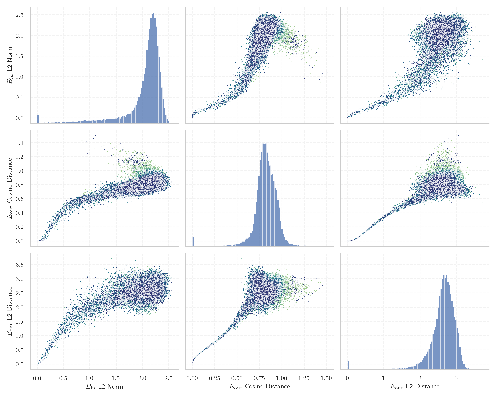

# Report for `microsoft/Phi-3.5-mini-instruct`

## Model info

* Tied embeddings: no
* LM head uses bias: no
* Indicator for under-trained tokens: E_{in} L2 Norm
  * Overall distribution 2.042 +/- 0.379
  * Token used for verification prompt building: `springframework`
  * Verification threshold: 0.834
  * Threshold for showing candidate under-trained tokens: 0.191
  * Median verified threshold (for bytes, unreachable and special tokens): 0.158
* Embeddings shape: (32064, 3072)
* Vocabulary size: 32011
  * Number of single byte tokens: 351, of which 110 below indicator threshold
  * Number of special tokens: 14, of which 3 below indicator threshold
  * Number of tested under-trained tokens: 636, 633 non-special, 87 below p = 0.01 threshold, 53 below soft indicator threshold

## Under-trained token indicators plot


## Verification plot


## Under-trained token verification results
53 entries below threshold of 0.191

|   token_id | token                       |   indicator | max_prob                                                         | in_other_tokens                                                                 |
|------------|-----------------------------|-------------|------------------------------------------------------------------|---------------------------------------------------------------------------------|
|      27918 | ````` ▁Хронологија `````    |  0.0020083  | <span style='border: 1px solid rgb(169, 68, 66);'>8e-08</span>   |                                                                                 |
|      11804 | ````` Архівовано `````      |  0.00204477 | <span style='border: 1px solid rgb(169, 68, 66);'>7.9e-08</span> |                                                                                 |
|      16110 | ````` ▁Спољашње `````       |  0.00205848 | <span style='border: 1px solid rgb(169, 68, 66);'>8e-08</span>   |                                                                                 |
|      28574 | ````` ▁Mediabestanden ````` |  0.00816141 | <span style='border: 1px solid rgb(169, 68, 66);'>1.3e-07</span> |                                                                                 |
|      11766 | ````` хівовано `````        |  0.0291486  | <span style='border: 1px solid rgb(169, 68, 66);'>1.6e-06</span> | <span style='border: 1px solid rgb(169, 68, 66);'>````` Архівовано `````</span> |
|      20528 | ````` ▁autorytatywna `````  |  0.0300114  | <span style='border: 1px solid rgb(169, 68, 66);'>2.9e-07</span> |                                                                                 |
|      24294 | ````` Webachiv `````        |  0.0312532  | <span style='border: 1px solid rgb(169, 68, 66);'>4.2e-07</span> |                                                                                 |
|      21836 | ````` ▁надморској `````     |  0.037093   | <span style='border: 1px solid rgb(169, 68, 66);'>3.5e-07</span> |                                                                                 |
|      28653 | ````` ▁regnigaste `````     |  0.0449602  | <span style='border: 1px solid rgb(169, 68, 66);'>9.7e-07</span> |                                                                                 |
|      28649 | ````` ▁årsnederbörd `````   |  0.0560103  | <span style='border: 1px solid rgb(169, 68, 66);'>3.7e-06</span> |                                                                                 |
|      18051 | ````` ▁савезној `````       |  0.0583401  | <span style='border: 1px solid rgb(169, 68, 66);'>7.5e-06</span> |                                                                                 |
|      21673 | ````` ▁висини `````         |  0.0604344  | <span style='border: 1px solid rgb(169, 68, 66);'>5.4e-06</span> |                                                                                 |
|      20609 | ````` ▁Portály `````        |  0.0692194  | <span style='border: 1px solid rgb(169, 68, 66);'>1.6e-06</span> |                                                                                 |
|      28416 | ````` ▁Мексичка `````       |  0.072975   | <span style='border: 1px solid rgb(169, 68, 66);'>7.9e-06</span> |                                                                                 |
|      27914 | ````` ▁archiválva `````     |  0.0744049  | <span style='border: 1px solid rgb(169, 68, 66);'>1.5e-06</span> |                                                                                 |
|      26821 | ````` ▁Enllaços `````       |  0.0778059  | <span style='border: 1px solid rgb(169, 68, 66);'>6.9e-08</span> |                                                                                 |
|      23996 | ````` ▁живело `````         |  0.0817867  | <span style='border: 1px solid rgb(169, 68, 66);'>3e-06</span>   |                                                                                 |
|      16056 | ````` љашње `````           |  0.0874579  | <span style='border: 1px solid rgb(169, 68, 66);'>6.5e-06</span> | <span style='border: 1px solid rgb(169, 68, 66);'>````` ▁Спољашње `````</span>  |
|      27900 | ````` ▁eredetiből `````     |  0.09333    | <span style='border: 1px solid rgb(169, 68, 66);'>3.4e-07</span> |                                                                                 |
|      28354 | ````` ▁Расподела `````      |  0.0991035  | <span style='border: 1px solid rgb(169, 68, 66);'>1.3e-07</span> |                                                                                 |
<details><summary>33 additional entries below threshold</summary>

|   token_id | token                      |   indicator | max_prob                                                         | in_other_tokens                                                                                                                                                 |
|------------|----------------------------|-------------|------------------------------------------------------------------|-----------------------------------------------------------------------------------------------------------------------------------------------------------------|
|      22835 | ````` ▁муніципалі `````    |    0.102419 | <span style='border: 1px solid rgb(169, 68, 66);'>0.00019</span> |                                                                                                                                                                 |
|      20422 | ````` ніципалі `````       |    0.104534 | <span style='border: 1px solid rgb(169, 68, 66);'>5.7e-05</span> | <span style='border: 1px solid rgb(169, 68, 66);'>````` ▁муніципалі `````</span>                                                                                |
|      20486 | ````` tatywna `````        |    0.105312 | <span style='border: 1px solid rgb(169, 68, 66);'>0.00055</span> | <span style='border: 1px solid rgb(169, 68, 66);'>````` ▁autorytatywna `````</span>                                                                             |
|      26847 | ````` .:\u200a `````       |    0.107959 | <span style='border: 1px solid rgb(169, 68, 66);'>2.3e-07</span> |                                                                                                                                                                 |
|      24029 | ````` ▁Jegyzetek `````     |    0.115315 | <span style='border: 1px solid rgb(169, 68, 66);'>3.5e-05</span> |                                                                                                                                                                 |
|      27645 | ````` ▁Попис `````         |    0.12052  | <span style='border: 1px solid rgb(169, 68, 66);'>1e-06</span>   |                                                                                                                                                                 |
|      17981 | ````` ▁Externí `````       |    0.123353 | <span style='border: 1px solid rgb(169, 68, 66);'>1.9e-06</span> |                                                                                                                                                                 |
|      28623 | ````` ▁Genomsnitt `````    |    0.126617 | <span style='border: 1px solid rgb(169, 68, 66);'>0.00085</span> | <span style='border: 1px solid rgb(169, 68, 66);'>````` ▁Genomsnittlig `````</span>                                                                             |
|      22011 | ````` ▁насељу `````        |    0.127706 | <span style='border: 1px solid rgb(169, 68, 66);'>6e-07</span>   |                                                                                                                                                                 |
|      28642 | ````` ▁regnig `````        |    0.128057 | <span style='border: 1px solid rgb(169, 68, 66);'>1.8e-06</span> | <span style='border: 1px solid rgb(169, 68, 66);'>````` ▁regnigaste `````</span>                                                                                |
|       7784 | ````` ▁underarter `````    |    0.130677 | <span style='border: 1px solid rgb(169, 68, 66);'>2e-06</span>   |                                                                                                                                                                 |
|      28090 | ````` ▁Савезне `````       |    0.134002 | <span style='border: 1px solid rgb(169, 68, 66);'>1e-06</span>   |                                                                                                                                                                 |
|      19837 | ````` ▁Населення `````     |    0.134641 | <span style='border: 1px solid rgb(255, 145, 0);'>0.002</span>   |                                                                                                                                                                 |
|       7651 | ````` ▁släktet `````       |    0.138297 | <span style='border: 1px solid rgb(169, 68, 66);'>9.2e-06</span> |                                                                                                                                                                 |
|      26734 | ````` ▁Årsmed `````        |    0.139852 | <span style='border: 1px solid rgb(169, 68, 66);'>1.1e-07</span> |                                                                                                                                                                 |
|      20739 | ````` ▁надмор `````        |    0.146287 | <span style='border: 1px solid rgb(169, 68, 66);'>1.2e-06</span> | <span style='border: 1px solid rgb(169, 68, 66);'>````` ▁надморској `````</span>                                                                                |
|      24631 | ````` ▁Források `````      |    0.146353 | <span style='border: 1px solid rgb(169, 68, 66);'>2.4e-05</span> |                                                                                                                                                                 |
|       9462 | ````` Hozzáférés `````     |    0.147194 | <span style='border: 1px solid rgb(40, 167, 69);'>0.35</span>    |                                                                                                                                                                 |
|      28647 | ````` ▁torraste `````      |    0.147393 | <span style='border: 1px solid rgb(169, 68, 66);'>5.7e-05</span> |                                                                                                                                                                 |
|      23406 | ````` ▁општини `````       |    0.149424 | <span style='border: 1px solid rgb(169, 68, 66);'>0.00025</span> |                                                                                                                                                                 |
|      11229 | ````` ▁становника `````    |    0.150174 | <span style='border: 1px solid rgb(169, 68, 66);'>6.6e-05</span> |                                                                                                                                                                 |
|      23654 | ````` ▁dátummal `````      |    0.151579 | <span style='border: 1px solid rgb(169, 68, 66);'>0.00058</span> |                                                                                                                                                                 |
|      14562 | ````` ▁Посилання `````     |    0.152758 | <span style='border: 1px solid rgb(251, 189, 8);'>0.018</span>   |                                                                                                                                                                 |
|      28650 | ````` ▁Genomsnittlig ````` |    0.152887 | <span style='border: 1px solid rgb(169, 68, 66);'>7.2e-05</span> |                                                                                                                                                                 |
|      28263 | ````` ▁Odkazy `````        |    0.154312 | <span style='border: 1px solid rgb(255, 145, 0);'>0.0014</span>  |                                                                                                                                                                 |
|      23875 | ````` ▁Насеље `````        |    0.157526 | <span style='border: 1px solid rgb(255, 145, 0);'>0.0013</span>  |                                                                                                                                                                 |
|      24971 | ````` ▁Джерела `````       |    0.161929 | <span style='border: 1px solid rgb(255, 145, 0);'>0.001</span>   |                                                                                                                                                                 |
|      28633 | ````` nederbörd `````      |    0.162271 | <span style='border: 1px solid rgb(255, 145, 0);'>0.0039</span>  | <span style='border: 1px solid rgb(169, 68, 66);'>````` ▁årsnederbörd `````</span>                                                                              |
|      23726 | ````` ▁насеља `````        |    0.165142 | <span style='border: 1px solid rgb(169, 68, 66);'>5.2e-05</span> |                                                                                                                                                                 |
|      18044 | ````` ▁Становништво `````  |    0.172487 | <span style='border: 1px solid rgb(169, 68, 66);'>4e-06</span>   |                                                                                                                                                                 |
|      25840 | ````` ▁државе `````        |    0.178296 | <span style='border: 1px solid rgb(169, 68, 66);'>0.00028</span> |                                                                                                                                                                 |
|      18140 | ````` rinningsområ `````   |    0.183606 | <span style='border: 1px solid rgb(255, 145, 0);'>0.0037</span>  |                                                                                                                                                                 |
|      18676 | ````` ніципа `````         |    0.191077 | <span style='border: 1px solid rgb(169, 68, 66);'>0.00064</span> | <span style='border: 1px solid rgb(169, 68, 66);'>````` ніципалі `````</span>, <span style='border: 1px solid rgb(169, 68, 66);'>````` ▁муніципалі `````</span> |
</details>


## Byte tokens
110 entries below threshold of 0.158

|   token_id | token              |   indicator |   ord | hex   | byte_type   | reencoded             |
|------------|--------------------|-------------|-------|-------|-------------|-----------------------|
|         67 | ````` <0x40> ````` |  0.00192622 |    64 | 0x40  | ascii       | 29992: ````` @ `````  |
|         75 | ````` <0x48> ````` |  0.00193883 |    72 | 0x48  | ascii       | 29950: ````` H `````  |
|        127 | ````` <0x7C> ````` |  0.00194765 |   124 | 0x7C  | ascii       | 29989: ````` \| ````` |
|         95 | ````` <0x5C> ````` |  0.00194926 |    92 | 0x5C  | ascii       | 29905: ````` \ `````  |
|        109 | ````` <0x6A> ````` |  0.00195508 |   106 | 0x6A  | ascii       | 29926: ````` j `````  |
|         66 | ````` <0x3F> ````` |  0.00195511 |    63 | 0x3F  | ascii       | 29973: ````` ? `````  |
|         43 | ````` <0x28> ````` |  0.0019565  |    40 | 0x28  | ascii       | 29898: ````` ( `````  |
|         65 | ````` <0x3E> ````` |  0.00196026 |    62 | 0x3E  | ascii       | 29958: ````` > `````  |
|        123 | ````` <0x78> ````` |  0.00196048 |   120 | 0x78  | ascii       | 29916: ````` x `````  |
|        112 | ````` <0x6D> ````` |  0.00196374 |   109 | 0x6D  | ascii       | 29885: ````` m `````  |
|         96 | ````` <0x5D> ````` |  0.00196398 |    93 | 0x5D  | ascii       | 29962: ````` ] `````  |
|         41 | ````` <0x26> ````` |  0.00196404 |    38 | 0x26  | ascii       | 29987: ````` & `````  |
|         63 | ````` <0x3C> ````` |  0.00196526 |    60 | 0x3C  | ascii       | 29966: ````` < `````  |
|        129 | ````` <0x7E> ````` |  0.00196626 |   126 | 0x7E  | ascii       | 30022: ````` ~ `````  |
|        118 | ````` <0x73> ````` |  0.00196629 |   115 | 0x73  | ascii       | 29879: ````` s `````  |
|        255 | ````` <0xFC> ````` |  0.00196815 |   252 | 0xFC  | unused_utf8 |                       |
|        103 | ````` <0x64> ````` |  0.00196995 |   100 | 0x64  | ascii       | 29881: ````` d `````  |
|         53 | ````` <0x32> ````` |  0.00197103 |    50 | 0x32  | ascii       | 29906: ````` 2 `````  |
|         35 | ````` <0x20> ````` |  0.00197223 |    32 | 0x20  | ascii       | 29871: ````` ▁ `````  |
|         86 | ````` <0x53> ````` |  0.00197231 |    83 | 0x53  | ascii       | 29903: ````` S `````  |
<details><summary>90 additional entries below threshold</summary>

|   token_id | token              |   indicator |   ord | hex   | byte_type   | reencoded             |
|------------|--------------------|-------------|-------|-------|-------------|-----------------------|
|         98 | ````` <0x5F> ````` |  0.00197643 |    95 | 0x5F  | ascii       | 29918: ````` _ `````  |
|         16 | ````` <0x0D> ````` |  0.00197673 |    13 | 0x0D  | ascii       | 30004: ````` \r ````` |
|         71 | ````` <0x44> ````` |  0.00197709 |    68 | 0x44  | ascii       | 29928: ````` D `````  |
|         51 | ````` <0x30> ````` |  0.00197873 |    48 | 0x30  | ascii       | 29900: ````` 0 `````  |
|        104 | ````` <0x65> ````` |  0.00197959 |   101 | 0x65  | ascii       | 29872: ````` e `````  |
|        102 | ````` <0x63> ````` |  0.0019796  |    99 | 0x63  | ascii       | 29883: ````` c `````  |
|         55 | ````` <0x34> ````` |  0.0019797  |    52 | 0x34  | ascii       | 29946: ````` 4 `````  |
|        106 | ````` <0x67> ````` |  0.00198126 |   103 | 0x67  | ascii       | 29887: ````` g `````  |
|         74 | ````` <0x47> ````` |  0.00198159 |    71 | 0x47  | ascii       | 29954: ````` G `````  |
|        122 | ````` <0x77> ````` |  0.00198283 |   119 | 0x77  | ascii       | 29893: ````` w `````  |
|         88 | ````` <0x55> ````` |  0.00198376 |    85 | 0x55  | ascii       | 29965: ````` U `````  |
|         42 | ````` <0x27> ````` |  0.0019839  |    39 | 0x27  | ascii       | 29915: ````` ' `````  |
|        111 | ````` <0x6C> ````` |  0.00198434 |   108 | 0x6C  | ascii       | 29880: ````` l `````  |
|         37 | ````` <0x22> ````` |  0.00198492 |    34 | 0x22  | ascii       | 29908: ````` " `````  |
|        249 | ````` <0xF6> ````` |  0.00198568 |   246 | 0xF6  | unused_utf8 |                       |
|        116 | ````` <0x71> ````` |  0.0019861  |   113 | 0x71  | ascii       | 29939: ````` q `````  |
|         82 | ````` <0x4F> ````` |  0.00198651 |    79 | 0x4F  | ascii       | 29949: ````` O `````  |
|        115 | ````` <0x70> ````` |  0.00198724 |   112 | 0x70  | ascii       | 29886: ````` p `````  |
|         90 | ````` <0x57> ````` |  0.00198818 |    87 | 0x57  | ascii       | 29956: ````` W `````  |
|         49 | ````` <0x2E> ````` |  0.00199185 |    46 | 0x2E  | ascii       | 29889: ````` . `````  |
|         87 | ````` <0x54> ````` |  0.00199193 |    84 | 0x54  | ascii       | 29911: ````` T `````  |
|         40 | ````` <0x25> ````` |  0.00199279 |    37 | 0x25  | ascii       | 29995: ````` % `````  |
|        250 | ````` <0xF7> ````` |  0.00199385 |   247 | 0xF7  | unused_utf8 |                       |
|         61 | ````` <0x3A> ````` |  0.00199542 |    58 | 0x3A  | ascii       | 29901: ````` : `````  |
|         93 | ````` <0x5A> ````` |  0.00199569 |    90 | 0x5A  | ascii       | 29999: ````` Z `````  |
|        195 | ````` <0xC0> ````` |  0.00199586 |   192 | 0xC0  | unused_utf8 |                       |
|         91 | ````` <0x58> ````` |  0.00199589 |    88 | 0x58  | ascii       | 29990: ````` X `````  |
|        128 | ````` <0x7D> ````` |  0.00199677 |   125 | 0x7D  | ascii       | 29913: ````` } `````  |
|         78 | ````` <0x4B> ````` |  0.00199791 |    75 | 0x4B  | ascii       | 29968: ````` K `````  |
|        101 | ````` <0x62> ````` |  0.00200054 |    98 | 0x62  | ascii       | 29890: ````` b `````  |
|        254 | ````` <0xFB> ````` |  0.00200079 |   251 | 0xFB  | unused_utf8 |                       |
|         52 | ````` <0x31> ````` |  0.00200166 |    49 | 0x31  | ascii       | 29896: ````` 1 `````  |
|         50 | ````` <0x2F> ````` |  0.00200203 |    47 | 0x2F  | ascii       | 29914: ````` / `````  |
|         39 | ````` <0x24> ````` |  0.00200253 |    36 | 0x24  | ascii       | 29938: ````` $ `````  |
|        252 | ````` <0xF9> ````` |  0.00200263 |   249 | 0xF9  | unused_utf8 |                       |
|        117 | ````` <0x72> ````` |  0.00200282 |   114 | 0x72  | ascii       | 29878: ````` r `````  |
|         72 | ````` <0x45> ````` |  0.00200421 |    69 | 0x45  | ascii       | 29923: ````` E `````  |
|        124 | ````` <0x79> ````` |  0.00200427 |   121 | 0x79  | ascii       | 29891: ````` y `````  |
|         38 | ````` <0x23> ````` |  0.00200528 |    35 | 0x23  | ascii       | 29937: ````` # `````  |
|        258 | ````` <0xFF> ````` |  0.0020059  |   255 | 0xFF  | unused_utf8 |                       |
|        107 | ````` <0x68> ````` |  0.00200598 |   104 | 0x68  | ascii       | 29882: ````` h `````  |
|         46 | ````` <0x2B> ````` |  0.00200688 |    43 | 0x2B  | ascii       | 29974: ````` + `````  |
|         47 | ````` <0x2C> ````` |  0.00200691 |    44 | 0x2C  | ascii       | 29892: ````` , `````  |
|         73 | ````` <0x46> ````` |  0.00200711 |    70 | 0x46  | ascii       | 29943: ````` F `````  |
|         69 | ````` <0x42> ````` |  0.00200755 |    66 | 0x42  | ascii       | 29933: ````` B `````  |
|         80 | ````` <0x4D> ````` |  0.00200853 |    77 | 0x4D  | ascii       | 29924: ````` M `````  |
|         85 | ````` <0x52> ````` |  0.00200891 |    82 | 0x52  | ascii       | 29934: ````` R `````  |
|         62 | ````` <0x3B> ````` |  0.0020096  |    59 | 0x3B  | ascii       | 29936: ````` ; `````  |
|         77 | ````` <0x4A> ````` |  0.00200961 |    74 | 0x4A  | ascii       | 29967: ````` J `````  |
|        251 | ````` <0xF8> ````` |  0.00200994 |   248 | 0xF8  | unused_utf8 |                       |
|         56 | ````` <0x35> ````` |  0.00201105 |    53 | 0x35  | ascii       | 29945: ````` 5 `````  |
|         58 | ````` <0x37> ````` |  0.00201147 |    55 | 0x37  | ascii       | 29955: ````` 7 `````  |
|         92 | ````` <0x59> ````` |  0.00201192 |    89 | 0x59  | ascii       | 29979: ````` Y `````  |
|         99 | ````` <0x60> ````` |  0.00201198 |    96 | 0x60  | ascii       | 29952: ````` ` `````  |
|         89 | ````` <0x56> ````` |  0.00201286 |    86 | 0x56  | ascii       | 29963: ````` V `````  |
|         59 | ````` <0x38> ````` |  0.00201333 |    56 | 0x38  | ascii       | 29947: ````` 8 `````  |
|        196 | ````` <0xC1> ````` |  0.00201401 |   193 | 0xC1  | unused_utf8 |                       |
|         68 | ````` <0x41> ````` |  0.0020148  |    65 | 0x41  | ascii       | 29909: ````` A `````  |
|         48 | ````` <0x2D> ````` |  0.00201658 |    45 | 0x2D  | ascii       | 29899: ````` - `````  |
|        256 | ````` <0xFD> ````` |  0.00201672 |   253 | 0xFD  | unused_utf8 |                       |
|         70 | ````` <0x43> ````` |  0.00201754 |    67 | 0x43  | ascii       | 29907: ````` C `````  |
|         54 | ````` <0x33> ````` |  0.00201761 |    51 | 0x33  | ascii       | 29941: ````` 3 `````  |
|         97 | ````` <0x5E> ````` |  0.00201832 |    94 | 0x5E  | ascii       | 29985: ````` ^ `````  |
|         60 | ````` <0x39> ````` |  0.00201925 |    57 | 0x39  | ascii       | 29929: ````` 9 `````  |
|         36 | ````` <0x21> ````` |  0.00201926 |    33 | 0x21  | ascii       | 29991: ````` ! `````  |
|         64 | ````` <0x3D> ````` |  0.00202062 |    61 | 0x3D  | ascii       | 29922: ````` = `````  |
|        253 | ````` <0xFA> ````` |  0.00202105 |   250 | 0xFA  | unused_utf8 |                       |
|        198 | ````` <0xC3> ````` |  0.00202128 |   195 | 0xC3  | utf8        |                       |
|        121 | ````` <0x76> ````` |  0.00202135 |   118 | 0x76  | ascii       | 29894: ````` v `````  |
|        120 | ````` <0x75> ````` |  0.00202297 |   117 | 0x75  | ascii       | 29884: ````` u `````  |
|         83 | ````` <0x50> ````` |  0.00202334 |    80 | 0x50  | ascii       | 29925: ````` P `````  |
|         79 | ````` <0x4C> ````` |  0.00202405 |    76 | 0x4C  | ascii       | 29931: ````` L `````  |
|        257 | ````` <0xFE> ````` |  0.0020246  |   254 | 0xFE  | unused_utf8 |                       |
|        100 | ````` <0x61> ````` |  0.00202484 |    97 | 0x61  | ascii       | 29874: ````` a `````  |
|        108 | ````` <0x69> ````` |  0.00202518 |   105 | 0x69  | ascii       | 29875: ````` i `````  |
|        248 | ````` <0xF5> ````` |  0.00202536 |   245 | 0xF5  | unused_utf8 |                       |
|        110 | ````` <0x6B> ````` |  0.00202738 |   107 | 0x6B  | ascii       | 29895: ````` k `````  |
|        126 | ````` <0x7B> ````` |  0.00202792 |   123 | 0x7B  | ascii       | 29912: ````` { `````  |
|        119 | ````` <0x74> ````` |  0.00202865 |   116 | 0x74  | ascii       | 29873: ````` t `````  |
|        113 | ````` <0x6E> ````` |  0.0020289  |   110 | 0x6E  | ascii       | 29876: ````` n `````  |
|         57 | ````` <0x36> ````` |  0.00202909 |    54 | 0x36  | ascii       | 29953: ````` 6 `````  |
|        125 | ````` <0x7A> ````` |  0.00202911 |   122 | 0x7A  | ascii       | 29920: ````` z `````  |
|         44 | ````` <0x29> ````` |  0.00203289 |    41 | 0x29  | ascii       | 29897: ````` ) `````  |
|        105 | ````` <0x66> ````` |  0.00203565 |   102 | 0x66  | ascii       | 29888: ````` f `````  |
|         76 | ````` <0x49> ````` |  0.00203871 |    73 | 0x49  | ascii       | 29902: ````` I `````  |
|        114 | ````` <0x6F> ````` |  0.00204017 |   111 | 0x6F  | ascii       | 29877: ````` o `````  |
|         81 | ````` <0x4E> ````` |  0.00204544 |    78 | 0x4E  | ascii       | 29940: ````` N `````  |
|         45 | ````` <0x2A> ````` |  0.00204599 |    42 | 0x2A  | ascii       | 29930: ````` * `````  |
|         94 | ````` <0x5B> ````` |  0.0020465  |    91 | 0x5B  | ascii       | 29961: ````` [ `````  |
|         84 | ````` <0x51> ````` |  0.00205725 |    81 | 0x51  | ascii       | 29984: ````` Q `````  |
</details>


## Special tokens
3 entries below threshold of 0.158

|   token_id | token                          |   indicator | reencoded                                                   |
|------------|--------------------------------|-------------|-------------------------------------------------------------|
|      32002 | ````` <\|placeholder1\|> ````` |  0.00197536 | 29871: ````` ▁ `````, 32002: ````` <\|placeholder1\|> ````` |
|      32004 | ````` <\|placeholder3\|> ````` |  0.0019867  | 29871: ````` ▁ `````, 32004: ````` <\|placeholder3\|> ````` |
|      32003 | ````` <\|placeholder2\|> ````` |  0.00201634 | 29871: ````` ▁ `````, 32003: ````` <\|placeholder2\|> ````` |

