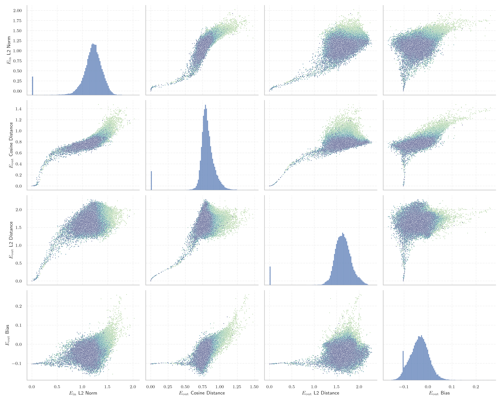

# Report for `microsoft/phi-2`

## Model info

* Model Info: 
  * Tied embeddings: False
  * LM head uses bias: True
  * Embeddings shape: [51200, 2560]
* Tokenizer Info: 
  * Vocab Size: 50295
  * Tokenizer Class: CodeGenTokenizer
  * Tokenizer Type: BPE
  * Bytes handling: Byte Input
  * Token for verification prompt building: BuyableInstoreAndOnline
  * Token id for verification prompt building: 40242
* Indicator summary: 
  * Indicator for under-trained tokens: E_{in} L2 Norm
  * Overall distribution: 1.184 +/- 0.242
* Detected Token Counts: 
  * Number of tested under-trained tokens: 999, 969 non-special, 101 below p = 0.01 threshold, 82 below soft indicator threshold
  * Number of single byte tokens: 256, of which 13 below indicator threshold
  * Number of special tokens: 0, of which 0 below indicator threshold
  * Number of non-single-byte UTF-fragment tokens:  216, of which 3 below soft indicator threshold

## Under-trained token indicators plot


## Verification plot


## Under-trained token verification results
82 entries below threshold of 0.123

|   token_id | token                             |   indicator | max_prob                                                         | in_other_tokens                                                                            |
|------------|-----------------------------------|-------------|------------------------------------------------------------------|--------------------------------------------------------------------------------------------|
|      42424 | ````` DragonMagazine `````        | 0.000763806 | <span style='border: 1px solid rgb(169, 68, 66);'>3.8e-07</span> |                                                                                            |
|      17900 | ````` ▁Dragonbound `````          | 0.000779675 | <span style='border: 1px solid rgb(169, 68, 66);'>3.4e-07</span> |                                                                                            |
|      36174 | ````` ▁RandomRedditorWithNo ````` | 0.000779685 | <span style='border: 1px solid rgb(169, 68, 66);'>3.3e-07</span> |                                                                                            |
|      30213 | ````` ▁externalToEVAOnly `````    | 0.000785526 | <span style='border: 1px solid rgb(169, 68, 66);'>2.1e-07</span> |                                                                                            |
|      42202 | ````` GoldMagikarp `````          | 0.000786877 | <span style='border: 1px solid rgb(169, 68, 66);'>3.4e-07</span> | <span style='border: 1px solid rgb(169, 68, 66);'>````` ▁SolidGoldMagikarp `````</span>    |
|      37579 | ````` TPPStreamerBot `````        | 0.000787823 | <span style='border: 1px solid rgb(169, 68, 66);'>2.2e-07</span> |                                                                                            |
|      41551 | ````` Downloadha `````            | 0.000791465 | <span style='border: 1px solid rgb(169, 68, 66);'>2.1e-07</span> |                                                                                            |
|      43177 | ````` EStreamFrame `````          | 0.000793959 | <span style='border: 1px solid rgb(169, 68, 66);'>2.3e-07</span> |                                                                                            |
|      31666 | ````` ?????-?????- `````          | 0.000794586 | <span style='border: 1px solid rgb(169, 68, 66);'>2e-07</span>   |                                                                                            |
|      42089 | ````` ▁TheNitrome `````           | 0.000801782 | <span style='border: 1px solid rgb(169, 68, 66);'>2.2e-07</span> | <span style='border: 1px solid rgb(169, 68, 66);'>````` ▁TheNitromeFan `````</span>        |
|      39755 | ````` isSpecialOrderable `````    | 0.000801835 | <span style='border: 1px solid rgb(169, 68, 66);'>3.6e-07</span> |                                                                                            |
|      25992 | ````` ▁裏覚醒 `````               | 0.000806573 | <span style='border: 1px solid rgb(169, 68, 66);'>2.7e-07</span> |                                                                                            |
|      36938 | ````` ▁sqor `````                 | 0.000807593 | <span style='border: 1px solid rgb(169, 68, 66);'>3.5e-07</span> |                                                                                            |
|      30209 | ````` ▁unfocusedRange `````       | 0.000809125 | <span style='border: 1px solid rgb(169, 68, 66);'>2.3e-07</span> |                                                                                            |
|      29372 | ````` ▁guiActiveUn `````          | 0.000809322 | <span style='border: 1px solid rgb(169, 68, 66);'>2e-07</span>   | <span style='border: 1px solid rgb(169, 68, 66);'>````` ▁guiActiveUnfocused `````</span>   |
|      39811 | ````` soDeliveryDate `````        | 0.000809846 | <span style='border: 1px solid rgb(169, 68, 66);'>3.8e-07</span> |                                                                                            |
|      39753 | ````` quickShipAvailable `````    | 0.000810512 | <span style='border: 1px solid rgb(169, 68, 66);'>2.8e-07</span> |                                                                                            |
|      35207 | ````` ▁attRot `````               | 0.000816364 | <span style='border: 1px solid rgb(169, 68, 66);'>2.2e-07</span> |                                                                                            |
|      36173 | ````` ▁RandomRedditor `````       | 0.000816671 | <span style='border: 1px solid rgb(169, 68, 66);'>1.9e-07</span> | <span style='border: 1px solid rgb(169, 68, 66);'>````` ▁RandomRedditorWithNo `````</span> |
|      43361 | ````` ゼウス `````                | 0.000817697 | <span style='border: 1px solid rgb(169, 68, 66);'>2.6e-07</span> |                                                                                            |
<details><summary>62 additional entries below threshold</summary>

|   token_id | token                                                                        |   indicator | max_prob                                                         | in_other_tokens                                                                                                                                                                                                                                                                                                                     |
|------------|------------------------------------------------------------------------------|-------------|------------------------------------------------------------------|-------------------------------------------------------------------------------------------------------------------------------------------------------------------------------------------------------------------------------------------------------------------------------------------------------------------------------------|
|      18472 | ````` ▁guiActive `````                                                       | 0.000821784 | <span style='border: 1px solid rgb(169, 68, 66);'>2.3e-07</span> | <span style='border: 1px solid rgb(169, 68, 66);'>````` ▁guiActiveUn `````</span>, <span style='border: 1px solid rgb(169, 68, 66);'>````` ▁guiActiveUnfocused `````</span>                                                                                                                                                         |
|      30210 | ````` ▁guiActiveUnfocused `````                                              | 0.000824333 | <span style='border: 1px solid rgb(169, 68, 66);'>3.8e-07</span> |                                                                                                                                                                                                                                                                                                                                     |
|      31765 | ````` MpServer `````                                                         | 0.000826598 | <span style='border: 1px solid rgb(169, 68, 66);'>2.1e-07</span> |                                                                                                                                                                                                                                                                                                                                     |
|      47571 | ````` ▁DevOnline `````                                                       | 0.000826712 | <span style='border: 1px solid rgb(169, 68, 66);'>3.2e-07</span> |                                                                                                                                                                                                                                                                                                                                     |
|      30906 | ````` rawdownloadcloneembedreportprint `````                                 | 0.000827612 | <span style='border: 1px solid rgb(169, 68, 66);'>3.9e-07</span> |                                                                                                                                                                                                                                                                                                                                     |
|      40241 | ````` InstoreAndOnline `````                                                 | 0.000827931 | <span style='border: 1px solid rgb(169, 68, 66);'>3.9e-07</span> | <span style='border: 1px solid rgb(169, 68, 66);'>````` BuyableInstoreAndOnline `````</span>                                                                                                                                                                                                                                        |
|      42090 | ````` ▁TheNitromeFan `````                                                   | 0.000828417 | <span style='border: 1px solid rgb(169, 68, 66);'>3.5e-07</span> |                                                                                                                                                                                                                                                                                                                                     |
|      39821 | ````` 龍契士 `````                                                           | 0.00082932  | <span style='border: 1px solid rgb(169, 68, 66);'>2.5e-07</span> |                                                                                                                                                                                                                                                                                                                                     |
|      43065 | ````` ▁srfAttach `````                                                       | 0.00083027  | <span style='border: 1px solid rgb(169, 68, 66);'>3.7e-07</span> |                                                                                                                                                                                                                                                                                                                                     |
|      39177 | ````` ItemThumbnailImage `````                                               | 0.000831932 | <span style='border: 1px solid rgb(169, 68, 66);'>2.2e-07</span> |                                                                                                                                                                                                                                                                                                                                     |
|      40240 | ````` oreAndOnline `````                                                     | 0.000833177 | <span style='border: 1px solid rgb(169, 68, 66);'>2.2e-07</span> | <span style='border: 1px solid rgb(169, 68, 66);'>````` InstoreAndOnline `````</span>, <span style='border: 1px solid rgb(169, 68, 66);'>````` BuyableInstoreAndOnline `````</span>                                                                                                                                                 |
|      30898 | ````` embedreportprint `````                                                 | 0.000834069 | <span style='border: 1px solid rgb(169, 68, 66);'>3e-07</span>   | <span style='border: 1px solid rgb(169, 68, 66);'>````` cloneembedreportprint `````</span>, <span style='border: 1px solid rgb(169, 68, 66);'>````` rawdownloadcloneembedreportprint `````</span>                                                                                                                                   |
|      37631 | ````` FactoryReloaded `````                                                  | 0.000834167 | <span style='border: 1px solid rgb(169, 68, 66);'>2.2e-07</span> |                                                                                                                                                                                                                                                                                                                                     |
|      43453 | ````` ▁SolidGoldMagikarp `````                                               | 0.000837289 | <span style='border: 1px solid rgb(169, 68, 66);'>2.1e-07</span> |                                                                                                                                                                                                                                                                                                                                     |
|      30899 | ````` cloneembedreportprint `````                                            | 0.00083965  | <span style='border: 1px solid rgb(169, 68, 66);'>1.8e-07</span> | <span style='border: 1px solid rgb(169, 68, 66);'>````` rawdownloadcloneembedreportprint `````</span>                                                                                                                                                                                                                               |
|      45544 | ````` ▁サーティ `````                                                        | 0.000840979 | <span style='border: 1px solid rgb(169, 68, 66);'>2.5e-07</span> | <span style='border: 1px solid rgb(169, 68, 66);'>````` ▁サーティワン `````</span>                                                                                                                                                                                                                                                  |
|      42586 | ````` ▁srfN `````                                                            | 0.000841239 | <span style='border: 1px solid rgb(169, 68, 66);'>3.6e-07</span> |                                                                                                                                                                                                                                                                                                                                     |
|      30905 | ````` rawdownload `````                                                      | 0.000846193 | <span style='border: 1px solid rgb(169, 68, 66);'>2.6e-07</span> | <span style='border: 1px solid rgb(169, 68, 66);'>````` rawdownloadcloneembedreportprint `````</span>                                                                                                                                                                                                                               |
|      28666 | ````` PsyNetMessage `````                                                    | 0.000846675 | <span style='border: 1px solid rgb(169, 68, 66);'>2.7e-07</span> |                                                                                                                                                                                                                                                                                                                                     |
|      24934 | ````` ForgeModLoader `````                                                   | 0.00084798  | <span style='border: 1px solid rgb(169, 68, 66);'>3.3e-07</span> |                                                                                                                                                                                                                                                                                                                                     |
|      30211 | ````` ▁guiIcon `````                                                         | 0.000848594 | <span style='border: 1px solid rgb(169, 68, 66);'>3e-07</span>   |                                                                                                                                                                                                                                                                                                                                     |
|      30212 | ````` ▁externalToEVA `````                                                   | 0.000848985 | <span style='border: 1px solid rgb(169, 68, 66);'>2.9e-07</span> | <span style='border: 1px solid rgb(169, 68, 66);'>````` ▁externalToEVAOnly `````</span>                                                                                                                                                                                                                                             |
|      39757 | ````` channelAvailability `````                                              | 0.000854599 | <span style='border: 1px solid rgb(169, 68, 66);'>2.1e-07</span> |                                                                                                                                                                                                                                                                                                                                     |
|      50009 | ````` ▁strutConnector `````                                                  | 0.000861435 | <span style='border: 1px solid rgb(169, 68, 66);'>2.2e-07</span> |                                                                                                                                                                                                                                                                                                                                     |
|      40242 | ````` BuyableInstoreAndOnline `````                                          | 0.000864522 | <span style='border: 1px solid rgb(169, 68, 66);'>3.2e-07</span> |                                                                                                                                                                                                                                                                                                                                     |
|      33454 | ````` 龍喚士 `````                                                           | 0.000865251 | <span style='border: 1px solid rgb(169, 68, 66);'>2.6e-07</span> |                                                                                                                                                                                                                                                                                                                                     |
|      37574 | ````` StreamerBot `````                                                      | 0.000870607 | <span style='border: 1px solid rgb(169, 68, 66);'>2.3e-07</span> | <span style='border: 1px solid rgb(169, 68, 66);'>````` TPPStreamerBot `````</span>                                                                                                                                                                                                                                                 |
|      35579 | ````` ▁Mechdragon `````                                                      | 0.000883004 | <span style='border: 1px solid rgb(169, 68, 66);'>2.9e-07</span> |                                                                                                                                                                                                                                                                                                                                     |
|      35496 | ````` ÃÂÃÂÃÂÃÂÃÂÃÂÃÂÃÂÃÂÃÂÃÂÃÂÃÂÃÂÃÂÃÂÃÂÃÂÃÂÃÂÃÂÃÂÃÂÃÂÃÂÃÂÃÂÃÂÃÂÃÂÃÂÃÂ ````` | 0.000893283 | <span style='border: 1px solid rgb(169, 68, 66);'>2.1e-07</span> |                                                                                                                                                                                                                                                                                                                                     |
|      39446 | ````` ▁SetFontSize `````                                                     | 0.0232393   | <span style='border: 1px solid rgb(169, 68, 66);'>8.9e-08</span> |                                                                                                                                                                                                                                                                                                                                     |
|      14827 | ````` ÃÂÃÂÃÂÃÂÃÂÃÂÃÂÃÂ `````                                                 | 0.0321166   | <span style='border: 1px solid rgb(169, 68, 66);'>3.5e-07</span> | <span style='border: 1px solid rgb(169, 68, 66);'>````` ÃÂÃÂÃÂÃÂÃÂÃÂÃÂÃÂÃÂÃÂÃÂÃÂÃÂÃÂÃÂÃÂ `````</span>, <span style='border: 1px solid rgb(169, 68, 66);'>````` ÃÂÃÂÃÂÃÂÃÂÃÂÃÂÃÂÃÂÃÂÃÂÃÂÃÂÃÂÃÂÃÂÃÂÃÂÃÂÃÂÃÂÃÂÃÂÃÂÃÂÃÂÃÂÃÂÃÂÃÂÃÂÃÂ `````</span>                                                                                        |
|      41383 | ````` assetsadobe `````                                                      | 0.0339458   | <span style='border: 1px solid rgb(169, 68, 66);'>1.1e-06</span> |                                                                                                                                                                                                                                                                                                                                     |
|      45545 | ````` ▁サーティワン `````                                                    | 0.0359049   | <span style='border: 1px solid rgb(169, 68, 66);'>1.7e-07</span> |                                                                                                                                                                                                                                                                                                                                     |
|      23282 | ````` ▁davidjl `````                                                         | 0.0382696   | <span style='border: 1px solid rgb(169, 68, 66);'>2e-07</span>   |                                                                                                                                                                                                                                                                                                                                     |
|      12781 | ````` wcsstore `````                                                         | 0.0422431   | <span style='border: 1px solid rgb(169, 68, 66);'>3e-07</span>   |                                                                                                                                                                                                                                                                                                                                     |
|      31957 | ````` cffffcc `````                                                          | 0.0449799   | <span style='border: 1px solid rgb(169, 68, 66);'>6e-07</span>   |                                                                                                                                                                                                                                                                                                                                     |
|      30208 | ````` ▁externalTo `````                                                      | 0.0496358   | <span style='border: 1px solid rgb(169, 68, 66);'>1.2e-05</span> | <span style='border: 1px solid rgb(169, 68, 66);'>````` ▁externalToEVA `````</span>, <span style='border: 1px solid rgb(169, 68, 66);'>````` ▁externalToEVAOnly `````</span>                                                                                                                                                        |
|      39253 | ````` ▁UCHIJ `````                                                           | 0.0501214   | <span style='border: 1px solid rgb(169, 68, 66);'>6.4e-08</span> |                                                                                                                                                                                                                                                                                                                                     |
|      38370 | ````` iHUD `````                                                             | 0.0533025   | <span style='border: 1px solid rgb(169, 68, 66);'>1.6e-06</span> |                                                                                                                                                                                                                                                                                                                                     |
|      39756 | ````` inventoryQuantity `````                                                | 0.0555391   | <span style='border: 1px solid rgb(169, 68, 66);'>7.6e-06</span> |                                                                                                                                                                                                                                                                                                                                     |
|      34448 | ````` ▁ItemLevel `````                                                       | 0.061663    | <span style='border: 1px solid rgb(169, 68, 66);'>2.2e-07</span> |                                                                                                                                                                                                                                                                                                                                     |
|      49781 | ````` EngineDebug `````                                                      | 0.0664824   | <span style='border: 1px solid rgb(169, 68, 66);'>6.6e-08</span> |                                                                                                                                                                                                                                                                                                                                     |
|      46600 | ````` ▁Adinida `````                                                         | 0.0681257   | <span style='border: 1px solid rgb(169, 68, 66);'>1.3e-07</span> |                                                                                                                                                                                                                                                                                                                                     |
|      39752 | ````` quickShip `````                                                        | 0.0722629   | <span style='border: 1px solid rgb(169, 68, 66);'>2.5e-06</span> | <span style='border: 1px solid rgb(169, 68, 66);'>````` quickShipAvailable `````</span>                                                                                                                                                                                                                                             |
|      43038 | ````` ▁Okawaru `````                                                         | 0.0767039   | <span style='border: 1px solid rgb(169, 68, 66);'>3.7e-07</span> |                                                                                                                                                                                                                                                                                                                                     |
|      30897 | ````` reportprint `````                                                      | 0.0827692   | <span style='border: 1px solid rgb(169, 68, 66);'>7e-07</span>   | <span style='border: 1px solid rgb(169, 68, 66);'>````` embedreportprint `````</span>, <span style='border: 1px solid rgb(169, 68, 66);'>````` cloneembedreportprint `````</span>, <span style='border: 1px solid rgb(169, 68, 66);'>````` rawdownloadcloneembedreportprint `````</span>                                            |
|      39165 | ````` catentry `````                                                         | 0.0843905   | <span style='border: 1px solid rgb(169, 68, 66);'>2.4e-05</span> |                                                                                                                                                                                                                                                                                                                                     |
|      37444 | ````` ▁petertodd `````                                                       | 0.0861925   | <span style='border: 1px solid rgb(169, 68, 66);'>4.9e-05</span> |                                                                                                                                                                                                                                                                                                                                     |
|      38250 | ````` ▁Skydragon `````                                                       | 0.0874714   | <span style='border: 1px solid rgb(169, 68, 66);'>7.1e-07</span> |                                                                                                                                                                                                                                                                                                                                     |
|      34027 | ````` ▁actionGroup `````                                                     | 0.0886497   | <span style='border: 1px solid rgb(169, 68, 66);'>1.1e-05</span> |                                                                                                                                                                                                                                                                                                                                     |
|      30202 | ````` ▁guiName `````                                                         | 0.0922088   | <span style='border: 1px solid rgb(169, 68, 66);'>2.4e-07</span> |                                                                                                                                                                                                                                                                                                                                     |
|      31886 | ````` ▁gmaxwell `````                                                        | 0.0924347   | <span style='border: 1px solid rgb(169, 68, 66);'>7.6e-07</span> |                                                                                                                                                                                                                                                                                                                                     |
|      36935 | ````` ▁dstg `````                                                            | 0.0945689   | <span style='border: 1px solid rgb(251, 189, 8);'>0.041</span>   |                                                                                                                                                                                                                                                                                                                                     |
|      31576 | ````` externalActionCode `````                                               | 0.0960827   | <span style='border: 1px solid rgb(169, 68, 66);'>7e-05</span>   |                                                                                                                                                                                                                                                                                                                                     |
|      48396 | ````` ÛÛ `````                                                               | 0.0963896   | <span style='border: 1px solid rgb(255, 145, 0);'>0.007</span>   |                                                                                                                                                                                                                                                                                                                                     |
|       9364 | ````` ÃÂÃÂÃÂÃÂ `````                                                         | 0.0977885   | <span style='border: 1px solid rgb(169, 68, 66);'>0.00033</span> | <span style='border: 1px solid rgb(169, 68, 66);'>````` ÃÂÃÂÃÂÃÂÃÂÃÂÃÂÃÂ `````</span>, <span style='border: 1px solid rgb(169, 68, 66);'>````` ÃÂÃÂÃÂÃÂÃÂÃÂÃÂÃÂÃÂÃÂÃÂÃÂÃÂÃÂÃÂÃÂ `````</span>, <span style='border: 1px solid rgb(169, 68, 66);'>````` ÃÂÃÂÃÂÃÂÃÂÃÂÃÂÃÂÃÂÃÂÃÂÃÂÃÂÃÂÃÂÃÂÃÂÃÂÃÂÃÂÃÂÃÂÃÂÃÂÃÂÃÂÃÂÃÂÃÂÃÂÃÂÃÂ `````</span> |
|      36130 | ````` ▁PsyNet `````                                                          | 0.100781    | <span style='border: 1px solid rgb(169, 68, 66);'>6e-06</span>   |                                                                                                                                                                                                                                                                                                                                     |
|      32047 | ````` ▁"$:/ `````                                                            | 0.105251    | <span style='border: 1px solid rgb(169, 68, 66);'>3.1e-05</span> |                                                                                                                                                                                                                                                                                                                                     |
|      39803 | ````` soType `````                                                           | 0.109921    | <span style='border: 1px solid rgb(169, 68, 66);'>3.6e-07</span> |                                                                                                                                                                                                                                                                                                                                     |
|      31032 | ````` SpaceEngineers `````                                                   | 0.111531    | <span style='border: 1px solid rgb(169, 68, 66);'>6.1e-05</span> |                                                                                                                                                                                                                                                                                                                                     |
|      23090 | ````` ÃÂÃÂÃÂÃÂÃÂÃÂÃÂÃÂÃÂÃÂÃÂÃÂÃÂÃÂÃÂÃÂ `````                                 | 0.114465    | <span style='border: 1px solid rgb(169, 68, 66);'>4.3e-06</span> | <span style='border: 1px solid rgb(169, 68, 66);'>````` ÃÂÃÂÃÂÃÂÃÂÃÂÃÂÃÂÃÂÃÂÃÂÃÂÃÂÃÂÃÂÃÂÃÂÃÂÃÂÃÂÃÂÃÂÃÂÃÂÃÂÃÂÃÂÃÂÃÂÃÂÃÂÃÂ `````</span>                                                                                                                                                                                               |
|      34473 | ````` ヘラ `````                                                             | 0.114489    | <span style='border: 1px solid rgb(169, 68, 66);'>0.00018</span> |                                                                                                                                                                                                                                                                                                                                     |
</details>


## Tokens with partial UTF-8 sequences
3 entries below threshold of 0.123

|   token_id | token                      |   indicator | in_other_tokens                                                             |
|------------|----------------------------|-------------|-----------------------------------------------------------------------------|
|      34504 | ````` ▁裏<0xE8> `````      | 0.000796033 |                                                                             |
|      33434 | ````` <0x96><0x9A>士 ````` | 0.000804    | <span style='border: 1px solid rgb(169, 68, 66);'>````` 龍喚士 `````</span> |
|      20174 | ````` ▁裏<0xE7> `````      | 0.0726416   |                                                                             |


## Byte tokens
13 entries below threshold of 0.032

|   token_id | token              |   indicator |   ord | hex   | byte_type   |
|------------|--------------------|-------------|-------|-------|-------------|
|        185 | ````` <0xFD> ````` | 0.000792164 |   253 | 0xFD  | unused_utf8 |
|        125 | ````` <0xC1> ````` | 0.000807113 |   193 | 0xC1  | unused_utf8 |
|        178 | ````` <0xF6> ````` | 0.000807633 |   246 | 0xF6  | unused_utf8 |
|        177 | ````` <0xF5> ````` | 0.000812672 |   245 | 0xF5  | unused_utf8 |
|        124 | ````` <0xC0> ````` | 0.000813216 |   192 | 0xC0  | unused_utf8 |
|        180 | ````` <0xF8> ````` | 0.000816539 |   248 | 0xF8  | unused_utf8 |
|        183 | ````` <0xFB> ````` | 0.000835288 |   251 | 0xFB  | unused_utf8 |
|        182 | ````` <0xFA> ````` | 0.000835342 |   250 | 0xFA  | unused_utf8 |
|        179 | ````` <0xF7> ````` | 0.000835879 |   247 | 0xF7  | unused_utf8 |
|        181 | ````` <0xF9> ````` | 0.000838596 |   249 | 0xF9  | unused_utf8 |
|        184 | ````` <0xFC> ````` | 0.000842648 |   252 | 0xFC  | unused_utf8 |
|        187 | ````` <0xFF> ````` | 0.000846493 |   255 | 0xFF  | unused_utf8 |
|        186 | ````` <0xFE> ````` | 0.000855782 |   254 | 0xFE  | unused_utf8 |


## Special tokens
0 entries below threshold of 0.032


