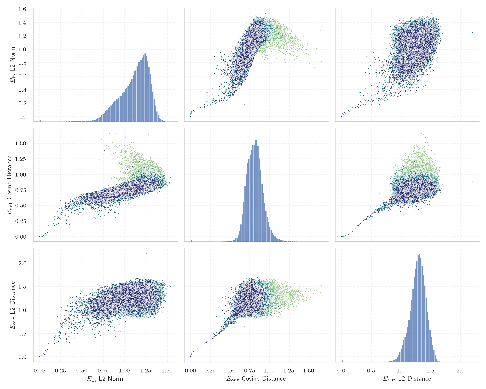
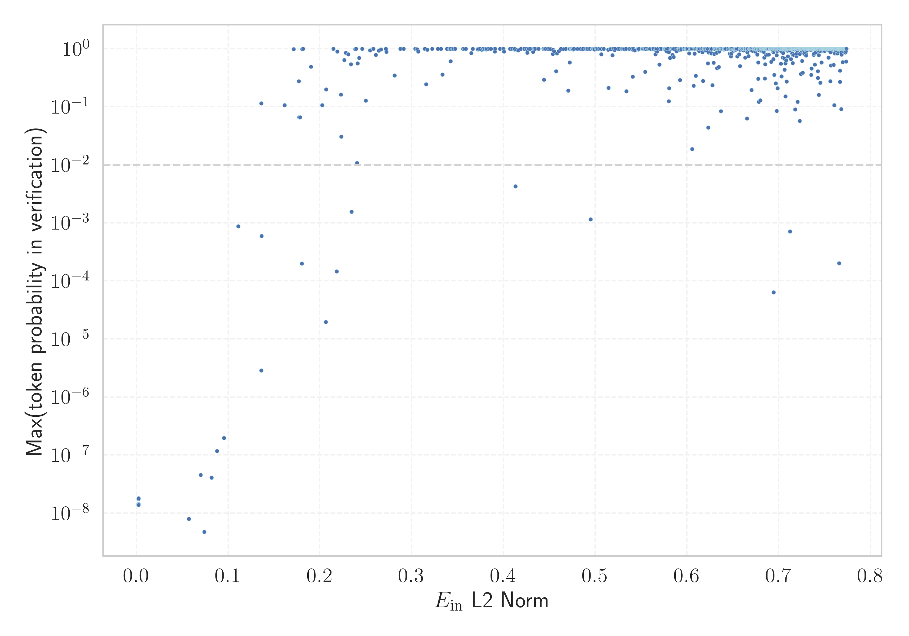

# Report for `microsoft/phi-4`

## Model info

* Model Info: 
  * Tied embeddings: False
  * LM head uses bias: False
  * Embeddings shape: [100352, 5120]
* Tokenizer Info: 
  * Vocab Size: 100352
  * Tokenizer Class: GPT2Tokenizer
  * Tokenizer Type: BPE
  * Bytes handling: Byte Input
  * Token for verification prompt building: abcdefghijklmnopqrstuvwxyz
  * Token id for verification prompt building: 68612
* Indicator summary: 
  * Indicator for under-trained tokens: E_{in} L2 Norm
  * Overall distribution: 1.112 +/- 0.170
* Detected Token Counts: 
  * Number of tested under-trained tokens: 1559, 1461 non-special, 17 below p = 0.01 threshold, 11 below soft indicator threshold
  * Number of single byte tokens: 256, of which 13 below indicator threshold
  * Number of special tokens: 21685, of which 0 below indicator threshold
  * Number of non-single-byte unreachable tokens: 21685, of which 0 below indicator threshold
  * Number of non-single-byte UTF-fragment tokens:  647, of which 3 below soft indicator threshold

## Under-trained token indicators plot


## Verification plot


## Under-trained token verification results
11 entries below threshold of 0.177

|   token_id | token                             |   indicator | max_prob                                                         | in_other_tokens                                                                                                                                                                              |
|------------|-----------------------------------|-------------|------------------------------------------------------------------|----------------------------------------------------------------------------------------------------------------------------------------------------------------------------------------------|
|      89472 | ````` useRalative `````           |   0.057082  | <span style='border: 1px solid rgb(169, 68, 66);'>8e-09</span>   | <span style='border: 1px solid rgb(251, 189, 8);'>````` useRalativeImagePath `````</span>                                                                                                    |
|      89471 | ````` useRal `````                |   0.070228  | <span style='border: 1px solid rgb(169, 68, 66);'>4.6e-08</span> | <span style='border: 1px solid rgb(169, 68, 66);'>````` useRalative `````</span>, <span style='border: 1px solid rgb(251, 189, 8);'>````` useRalativeImagePath `````</span>                  |
|      80370 | ````` ▁ForCanBeConvertedToF ````` |   0.073946  | <span style='border: 1px solid rgb(169, 68, 66);'>4.8e-09</span> | <span style='border: 1px solid rgb(251, 189, 8);'>````` ▁ForCanBeConvertedToForeach `````</span>                                                                                             |
|      47072 | ````` webElementX `````           |   0.0820018 | <span style='border: 1px solid rgb(169, 68, 66);'>4.1e-08</span> | <span style='border: 1px solid rgb(40, 167, 69);'>````` webElementXpaths `````</span>                                                                                                        |
|      80369 | ````` ▁ForCanBeConverted `````    |   0.0880797 | <span style='border: 1px solid rgb(169, 68, 66);'>1.2e-07</span> | <span style='border: 1px solid rgb(169, 68, 66);'>````` ▁ForCanBeConvertedToF `````</span>, <span style='border: 1px solid rgb(251, 189, 8);'>````` ▁ForCanBeConvertedToForeach `````</span> |
|      85069 | ````` PostalCodesNL `````         |   0.0955071 | <span style='border: 1px solid rgb(169, 68, 66);'>2e-07</span>   | ````` $PostalCodesNL `````                                                                                                                                                                   |
|      79740 | ````` ▁Hexatrigesimal `````       |   0.110932  | <span style='border: 1px solid rgb(169, 68, 66);'>0.00087</span> |                                                                                                                                                                                              |
|      91198 | ````` externalActionCode `````    |   0.136004  | <span style='border: 1px solid rgb(40, 167, 69);'>0.11</span>    |                                                                                                                                                                                              |
|      99944 | ````` ▁davidjl `````              |   0.136115  | <span style='border: 1px solid rgb(169, 68, 66);'>2.9e-06</span> |                                                                                                                                                                                              |
|      81259 | ````` artisanlib `````            |   0.136632  | <span style='border: 1px solid rgb(169, 68, 66);'>0.0006</span>  |                                                                                                                                                                                              |
|      79423 | ````` ▁thuisontvangst `````       |   0.161602  | <span style='border: 1px solid rgb(40, 167, 69);'>0.11</span>    |                                                                                                                                                                                              |


## Tokens with partial UTF-8 sequences
3 entries below threshold of 0.177

|   token_id | token                      |   indicator | in_other_tokens                         |
|------------|----------------------------|-------------|-----------------------------------------|
|      28587 | ````` <0x8E><0xB7>取 ````` |   0.0285498 | ````` ▁获取 `````, ````` 获取 `````     |
|      52188 | ````` <0x9D>始化 `````     |   0.040537  | ````` ▁初始化 `````, ````` 初始化 ````` |
|      36225 | ````` <0xB7><0xBB>加 ````` |   0.0481741 | ````` 添加 `````, ````` ▁添加 `````     |


## Byte tokens
13 entries below threshold of 0.137

|   token_id | token              |   indicator |   ord | hex   | byte_type   |
|------------|--------------------|-------------|-------|-------|-------------|
|        183 | ````` <0xFB> ````` |  0.00242358 |   251 | 0xFB  | unused_utf8 |
|        178 | ````` <0xF6> ````` |  0.00244578 |   246 | 0xF6  | unused_utf8 |
|        186 | ````` <0xFE> ````` |  0.00244798 |   254 | 0xFE  | unused_utf8 |
|        184 | ````` <0xFC> ````` |  0.00245433 |   252 | 0xFC  | unused_utf8 |
|        181 | ````` <0xF9> ````` |  0.00245671 |   249 | 0xF9  | unused_utf8 |
|        185 | ````` <0xFD> ````` |  0.00245776 |   253 | 0xFD  | unused_utf8 |
|        179 | ````` <0xF7> ````` |  0.00245933 |   247 | 0xF7  | unused_utf8 |
|        187 | ````` <0xFF> ````` |  0.00245947 |   255 | 0xFF  | unused_utf8 |
|        180 | ````` <0xF8> ````` |  0.00248031 |   248 | 0xF8  | unused_utf8 |
|        177 | ````` <0xF5> ````` |  0.00248254 |   245 | 0xF5  | unused_utf8 |
|        182 | ````` <0xFA> ````` |  0.002483   |   250 | 0xFA  | unused_utf8 |
|        125 | ````` <0xC1> ````` |  0.00248532 |   193 | 0xC1  | unused_utf8 |
|        124 | ````` <0xC0> ````` |  0.00249464 |   192 | 0xC0  | unused_utf8 |


## Special tokens
92 entries below threshold of 0.137

|   token_id | token                      |   indicator | max_prob                                                         |
|------------|----------------------------|-------------|------------------------------------------------------------------|
|     100296 | ````` <\|dummy_32\|> ````` |  0.00241326 | <span style='border: 1px solid rgb(169, 68, 66);'>1.4e-08</span> |
|     100319 | ````` <\|dummy_55\|> ````` |  0.0024155  | <span style='border: 1px solid rgb(169, 68, 66);'>1.4e-08</span> |
|     100317 | ````` <\|dummy_53\|> ````` |  0.00241555 | <span style='border: 1px solid rgb(169, 68, 66);'>1.4e-08</span> |
|     100327 | ````` <\|dummy_63\|> ````` |  0.00241865 | <span style='border: 1px solid rgb(169, 68, 66);'>1.4e-08</span> |
|     100329 | ````` <\|dummy_65\|> ````` |  0.00243161 | <span style='border: 1px solid rgb(169, 68, 66);'>1.4e-08</span> |
|     100298 | ````` <\|dummy_34\|> ````` |  0.00243888 | <span style='border: 1px solid rgb(169, 68, 66);'>1.4e-08</span> |
|     100281 | ````` <\|dummy_17\|> ````` |  0.00244003 | <span style='border: 1px solid rgb(169, 68, 66);'>1.4e-08</span> |
|     100268 | ````` <\|dummy_5\|> `````  |  0.00244245 | <span style='border: 1px solid rgb(169, 68, 66);'>1.4e-08</span> |
|     100334 | ````` <\|dummy_70\|> ````` |  0.00244317 | <span style='border: 1px solid rgb(169, 68, 66);'>1.4e-08</span> |
|     100291 | ````` <\|dummy_27\|> ````` |  0.00244369 | <span style='border: 1px solid rgb(169, 68, 66);'>1.4e-08</span> |
|     100287 | ````` <\|dummy_23\|> ````` |  0.00244432 | <span style='border: 1px solid rgb(169, 68, 66);'>1.4e-08</span> |
|     100282 | ````` <\|dummy_18\|> ````` |  0.00244508 | <span style='border: 1px solid rgb(169, 68, 66);'>1.4e-08</span> |
|     100286 | ````` <\|dummy_22\|> ````` |  0.00244511 | <span style='border: 1px solid rgb(169, 68, 66);'>1.4e-08</span> |
|     100307 | ````` <\|dummy_43\|> ````` |  0.0024461  | <span style='border: 1px solid rgb(169, 68, 66);'>1.4e-08</span> |
|     100324 | ````` <\|dummy_60\|> ````` |  0.0024481  | <span style='border: 1px solid rgb(169, 68, 66);'>1.4e-08</span> |
|     100313 | ````` <\|dummy_49\|> ````` |  0.00244976 | <span style='border: 1px solid rgb(169, 68, 66);'>1.4e-08</span> |
|     100261 | ````` <\|dummy_1\|> `````  |  0.00245116 | <span style='border: 1px solid rgb(169, 68, 66);'>1.4e-08</span> |
|     100321 | ````` <\|dummy_57\|> ````` |  0.00245162 | <span style='border: 1px solid rgb(169, 68, 66);'>1.4e-08</span> |
|     100290 | ````` <\|dummy_26\|> ````` |  0.00245164 | <span style='border: 1px solid rgb(169, 68, 66);'>1.4e-08</span> |
|     100344 | ````` <\|dummy_80\|> ````` |  0.00245269 | <span style='border: 1px solid rgb(169, 68, 66);'>1.4e-08</span> |
<details><summary>72 additional entries below threshold</summary>

|   token_id | token                         |   indicator | max_prob                                                         |
|------------|-------------------------------|-------------|------------------------------------------------------------------|
|     100303 | ````` <\|dummy_39\|> `````    |  0.00245399 | <span style='border: 1px solid rgb(169, 68, 66);'>1.4e-08</span> |
|     100305 | ````` <\|dummy_41\|> `````    |  0.00245405 | <span style='border: 1px solid rgb(169, 68, 66);'>1.4e-08</span> |
|     100297 | ````` <\|dummy_33\|> `````    |  0.00245414 | <span style='border: 1px solid rgb(169, 68, 66);'>1.4e-08</span> |
|     100288 | ````` <\|dummy_24\|> `````    |  0.00245524 | <span style='border: 1px solid rgb(169, 68, 66);'>1.4e-08</span> |
|     100270 | ````` <\|dummy_7\|> `````     |  0.00245575 | <span style='border: 1px solid rgb(169, 68, 66);'>1.4e-08</span> |
|     100289 | ````` <\|dummy_25\|> `````    |  0.0024566  | <span style='border: 1px solid rgb(169, 68, 66);'>1.4e-08</span> |
|     100294 | ````` <\|dummy_30\|> `````    |  0.00245691 | <span style='border: 1px solid rgb(169, 68, 66);'>1.4e-08</span> |
|     100259 | ````` <\|fim_middle\|> `````  |  0.00245744 | <span style='border: 1px solid rgb(169, 68, 66);'>1.4e-08</span> |
|     100328 | ````` <\|dummy_64\|> `````    |  0.00245877 | <span style='border: 1px solid rgb(169, 68, 66);'>1.4e-08</span> |
|     100322 | ````` <\|dummy_58\|> `````    |  0.00245936 | <span style='border: 1px solid rgb(169, 68, 66);'>1.4e-08</span> |
|     100260 | ````` <\|fim_suffix\|> `````  |  0.00245982 | <span style='border: 1px solid rgb(169, 68, 66);'>1.4e-08</span> |
|     100338 | ````` <\|dummy_74\|> `````    |  0.00246016 | <span style='border: 1px solid rgb(169, 68, 66);'>1.4e-08</span> |
|     100326 | ````` <\|dummy_62\|> `````    |  0.00246064 | <span style='border: 1px solid rgb(169, 68, 66);'>1.4e-08</span> |
|     100275 | ````` <\|dummy_12\|> `````    |  0.00246076 | <span style='border: 1px solid rgb(169, 68, 66);'>1.4e-08</span> |
|     100323 | ````` <\|dummy_59\|> `````    |  0.00246128 | <span style='border: 1px solid rgb(169, 68, 66);'>1.4e-08</span> |
|     100295 | ````` <\|dummy_31\|> `````    |  0.00246259 | <span style='border: 1px solid rgb(169, 68, 66);'>1.4e-08</span> |
|     100333 | ````` <\|dummy_69\|> `````    |  0.00246357 | <span style='border: 1px solid rgb(169, 68, 66);'>1.4e-08</span> |
|     100293 | ````` <\|dummy_29\|> `````    |  0.00246363 | <span style='border: 1px solid rgb(169, 68, 66);'>1.4e-08</span> |
|     100273 | ````` <\|dummy_10\|> `````    |  0.00246374 | <span style='border: 1px solid rgb(169, 68, 66);'>1.4e-08</span> |
|     100337 | ````` <\|dummy_73\|> `````    |  0.00246413 | <span style='border: 1px solid rgb(169, 68, 66);'>1.4e-08</span> |
|     100306 | ````` <\|dummy_42\|> `````    |  0.00246502 | <span style='border: 1px solid rgb(169, 68, 66);'>1.4e-08</span> |
|     100340 | ````` <\|dummy_76\|> `````    |  0.00246645 | <span style='border: 1px solid rgb(169, 68, 66);'>1.4e-08</span> |
|     100331 | ````` <\|dummy_67\|> `````    |  0.00246659 | <span style='border: 1px solid rgb(169, 68, 66);'>1.4e-08</span> |
|     100284 | ````` <\|dummy_20\|> `````    |  0.00246662 | <span style='border: 1px solid rgb(169, 68, 66);'>1.4e-08</span> |
|     100349 | ````` <\|dummy_85\|> `````    |  0.00246701 | <span style='border: 1px solid rgb(169, 68, 66);'>1.4e-08</span> |
|     100316 | ````` <\|dummy_52\|> `````    |  0.00246891 | <span style='border: 1px solid rgb(169, 68, 66);'>1.4e-08</span> |
|     100278 | ````` <\|dummy_14\|> `````    |  0.00246913 | <span style='border: 1px solid rgb(169, 68, 66);'>1.4e-08</span> |
|     100258 | ````` <\|fim_prefix\|> `````  |  0.00247061 | <span style='border: 1px solid rgb(169, 68, 66);'>1.4e-08</span> |
|     100347 | ````` <\|dummy_83\|> `````    |  0.0024715  | <span style='border: 1px solid rgb(169, 68, 66);'>1.4e-08</span> |
|     100271 | ````` <\|dummy_8\|> `````     |  0.00247221 | <span style='border: 1px solid rgb(169, 68, 66);'>1.4e-08</span> |
|     100348 | ````` <\|dummy_84\|> `````    |  0.00247323 | <span style='border: 1px solid rgb(169, 68, 66);'>1.4e-08</span> |
|     100280 | ````` <\|dummy_16\|> `````    |  0.00247421 | <span style='border: 1px solid rgb(169, 68, 66);'>1.4e-08</span> |
|     100342 | ````` <\|dummy_78\|> `````    |  0.00247626 | <span style='border: 1px solid rgb(169, 68, 66);'>1.4e-08</span> |
|     100330 | ````` <\|dummy_66\|> `````    |  0.00247828 | <span style='border: 1px solid rgb(169, 68, 66);'>1.4e-08</span> |
|     100308 | ````` <\|dummy_44\|> `````    |  0.00247852 | <span style='border: 1px solid rgb(169, 68, 66);'>1.4e-08</span> |
|     100262 | ````` <\|dummy_2\|> `````     |  0.00247879 | <span style='border: 1px solid rgb(169, 68, 66);'>1.4e-08</span> |
|     100299 | ````` <\|dummy_35\|> `````    |  0.00247945 | <span style='border: 1px solid rgb(169, 68, 66);'>1.4e-08</span> |
|     100256 | ````` <\|dummy_0\|> `````     |  0.00247981 | <span style='border: 1px solid rgb(169, 68, 66);'>1.4e-08</span> |
|     100263 | ````` <\|dummy_3\|> `````     |  0.00248026 | <span style='border: 1px solid rgb(169, 68, 66);'>1.4e-08</span> |
|     100335 | ````` <\|dummy_71\|> `````    |  0.00248194 | <span style='border: 1px solid rgb(169, 68, 66);'>1.4e-08</span> |
|     100277 | ````` <\|dummy_13\|> `````    |  0.00248251 | <span style='border: 1px solid rgb(169, 68, 66);'>1.4e-08</span> |
|     100345 | ````` <\|dummy_81\|> `````    |  0.00248338 | <span style='border: 1px solid rgb(169, 68, 66);'>1.4e-08</span> |
|     100350 | ````` <\|dummy_86\|> `````    |  0.0024836  | <span style='border: 1px solid rgb(169, 68, 66);'>1.4e-08</span> |
|     100346 | ````` <\|dummy_82\|> `````    |  0.00248368 | <span style='border: 1px solid rgb(169, 68, 66);'>1.4e-08</span> |
|     100301 | ````` <\|dummy_37\|> `````    |  0.00248463 | <span style='border: 1px solid rgb(169, 68, 66);'>1.4e-08</span> |
|     100285 | ````` <\|dummy_21\|> `````    |  0.00248512 | <span style='border: 1px solid rgb(169, 68, 66);'>1.4e-08</span> |
|     100267 | ````` <\|dummy_4\|> `````     |  0.00248662 | <span style='border: 1px solid rgb(169, 68, 66);'>1.4e-08</span> |
|     100272 | ````` <\|dummy_9\|> `````     |  0.00248868 | <span style='border: 1px solid rgb(169, 68, 66);'>1.4e-08</span> |
|     100304 | ````` <\|dummy_40\|> `````    |  0.00248925 | <span style='border: 1px solid rgb(169, 68, 66);'>1.4e-08</span> |
|     100311 | ````` <\|dummy_47\|> `````    |  0.00249001 | <span style='border: 1px solid rgb(169, 68, 66);'>1.4e-08</span> |
|     100309 | ````` <\|dummy_45\|> `````    |  0.00249027 | <span style='border: 1px solid rgb(169, 68, 66);'>1.4e-08</span> |
|     100318 | ````` <\|dummy_54\|> `````    |  0.00249148 | <span style='border: 1px solid rgb(169, 68, 66);'>1.8e-08</span> |
|     100283 | ````` <\|dummy_19\|> `````    |  0.00249198 | <span style='border: 1px solid rgb(169, 68, 66);'>1.4e-08</span> |
|     100269 | ````` <\|dummy_6\|> `````     |  0.00249247 | <span style='border: 1px solid rgb(169, 68, 66);'>1.4e-08</span> |
|     100325 | ````` <\|dummy_61\|> `````    |  0.00249346 | <span style='border: 1px solid rgb(169, 68, 66);'>1.4e-08</span> |
|     100292 | ````` <\|dummy_28\|> `````    |  0.00249354 | <span style='border: 1px solid rgb(169, 68, 66);'>1.4e-08</span> |
|     100320 | ````` <\|dummy_56\|> `````    |  0.00249386 | <span style='border: 1px solid rgb(169, 68, 66);'>1.4e-08</span> |
|     100343 | ````` <\|dummy_79\|> `````    |  0.0024951  | <span style='border: 1px solid rgb(169, 68, 66);'>1.4e-08</span> |
|     100274 | ````` <\|dummy_11\|> `````    |  0.00249517 | <span style='border: 1px solid rgb(169, 68, 66);'>1.4e-08</span> |
|     100341 | ````` <\|dummy_77\|> `````    |  0.00249629 | <span style='border: 1px solid rgb(169, 68, 66);'>1.4e-08</span> |
|     100312 | ````` <\|dummy_48\|> `````    |  0.00249756 | <span style='border: 1px solid rgb(169, 68, 66);'>1.4e-08</span> |
|     100351 | ````` <\|dummy_87\|> `````    |  0.00249889 | <span style='border: 1px solid rgb(169, 68, 66);'>1.4e-08</span> |
|     100332 | ````` <\|dummy_68\|> `````    |  0.00250041 | <span style='border: 1px solid rgb(169, 68, 66);'>1.4e-08</span> |
|     100310 | ````` <\|dummy_46\|> `````    |  0.00250239 | <span style='border: 1px solid rgb(169, 68, 66);'>1.4e-08</span> |
|     100336 | ````` <\|dummy_72\|> `````    |  0.00250622 | <span style='border: 1px solid rgb(169, 68, 66);'>1.4e-08</span> |
|     100300 | ````` <\|dummy_36\|> `````    |  0.00250761 | <span style='border: 1px solid rgb(169, 68, 66);'>1.4e-08</span> |
|     100279 | ````` <\|dummy_15\|> `````    |  0.00250988 | <span style='border: 1px solid rgb(169, 68, 66);'>1.8e-08</span> |
|     100339 | ````` <\|dummy_75\|> `````    |  0.00251174 | <span style='border: 1px solid rgb(169, 68, 66);'>1.4e-08</span> |
|     100302 | ````` <\|dummy_38\|> `````    |  0.00251223 | <span style='border: 1px solid rgb(169, 68, 66);'>1.4e-08</span> |
|     100315 | ````` <\|dummy_51\|> `````    |  0.00251303 | <span style='border: 1px solid rgb(169, 68, 66);'>1.4e-08</span> |
|     100314 | ````` <\|dummy_50\|> `````    |  0.00252671 | <span style='border: 1px solid rgb(169, 68, 66);'>1.4e-08</span> |
|     100276 | ````` <\|endofprompt\|> ````` |  0.00253062 | <span style='border: 1px solid rgb(169, 68, 66);'>1.4e-08</span> |
</details>


## Unreachable tokens
0 entries below threshold of 0.137


