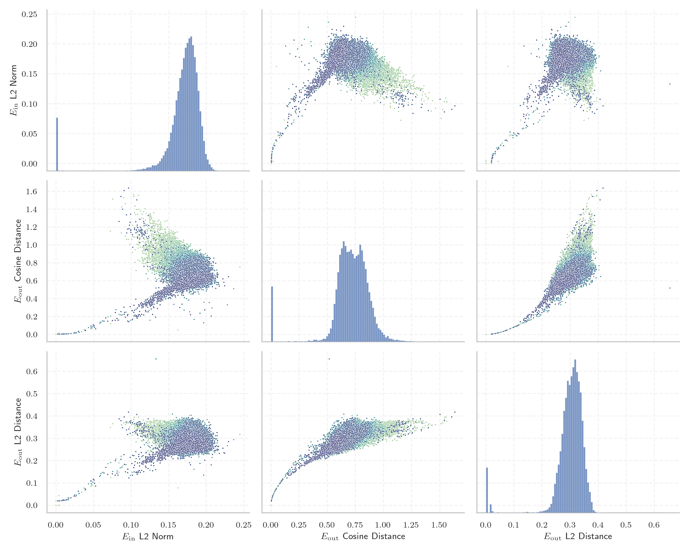

# Report for `mistralai/Mistral-7B-v0.3`

## Model info

* Model Info: 
  * Tied embeddings: False
  * LM head uses bias: False
  * Embeddings shape: [32768, 4096]
* Tokenizer Info: 
  * Vocab Size: 32768
  * Tokenizer Class: LlamaTokenizer
  * Tokenizer Type: BPE
  * Bytes handling: Byte Fallback
  * Token for verification prompt building: includegraphics
  * Token id for verification prompt building: 8389
* Indicator summary: 
  * Indicator for under-trained tokens: E_{in} L2 Norm
  * Overall distribution: 0.168 +/- 0.033
* Detected Token Counts: 
  * Number of tested under-trained tokens: 637, 529 non-special, 47 below p = 0.01 threshold, 35 below soft indicator threshold
  * Number of single byte tokens: 380, of which 143 below indicator threshold
  * Number of special tokens: 0, of which 0 below indicator threshold

## Under-trained token indicators plot


## Verification plot


## Under-trained token verification results
35 entries below threshold of 0.039

|   token_id | token              |   indicator | max_prob                                                         | in_other_tokens                                                             |
|------------|--------------------|-------------|------------------------------------------------------------------|-----------------------------------------------------------------------------|
|      32506 | ````` \uefc0 ````` |  0.0023863  | <span style='border: 1px solid rgb(169, 68, 66);'>2.5e-09</span> |                                                                             |
|      21186 | ````` ▁/**\r ````` |  0.0035944  | <span style='border: 1px solid rgb(169, 68, 66);'>9.2e-09</span> |                                                                             |
|      27404 | ````` });\r `````  |  0.00453165 | <span style='border: 1px solid rgb(169, 68, 66);'>3.9e-07</span> |                                                                             |
|      27175 | ````` };\r `````   |  0.0048359  | <span style='border: 1px solid rgb(169, 68, 66);'>9.3e-08</span> |                                                                             |
|      27160 | ````` ▁});\r ````` |  0.0050999  | <span style='border: 1px solid rgb(169, 68, 66);'>6.2e-08</span> |                                                                             |
|      26851 | ````` ▁//\r `````  |  0.00571319 | <span style='border: 1px solid rgb(169, 68, 66);'>4.1e-05</span> |                                                                             |
|      19527 | ````` ';\r `````   |  0.00572306 | <span style='border: 1px solid rgb(169, 68, 66);'>1.4e-05</span> |                                                                             |
|      10591 | ````` */\r `````   |  0.00684861 | <span style='border: 1px solid rgb(169, 68, 66);'>0.00026</span> |                                                                             |
|      26601 | ````` >?[< `````   |  0.0075466  | <span style='border: 1px solid rgb(169, 68, 66);'>7.3e-08</span> |                                                                             |
|       8376 | ````` ▁*/\r `````  |  0.00811301 | <span style='border: 1px solid rgb(169, 68, 66);'>0.0007</span>  |                                                                             |
|      28939 | ````` ]);\r `````  |  0.00829246 | <span style='border: 1px solid rgb(169, 68, 66);'>0.00019</span> |                                                                             |
|      23907 | ````` ▁};\r `````  |  0.00844843 | <span style='border: 1px solid rgb(169, 68, 66);'>0.00012</span> |                                                                             |
|      15824 | ````` ());\r ````` |  0.00866532 | <span style='border: 1px solid rgb(169, 68, 66);'>1.1e-05</span> |                                                                             |
|      18463 | ````` },\r `````   |  0.00934692 | <span style='border: 1px solid rgb(169, 68, 66);'>2.8e-05</span> | <span style='border: 1px solid rgb(255, 145, 0);'>````` ▁},\r `````</span>  |
|      32131 | ````` \x85 `````   |  0.00946441 | <span style='border: 1px solid rgb(169, 68, 66);'>4.2e-07</span> |                                                                             |
|      12961 | ````` ▁);\r `````  |  0.0100997  | <span style='border: 1px solid rgb(255, 145, 0);'>0.0012</span>  |                                                                             |
|      17711 | ````` ');\r `````  |  0.0104318  | <span style='border: 1px solid rgb(255, 145, 0);'>0.0011</span>  |                                                                             |
|      15524 | ````` /**\r `````  |  0.0108952  | <span style='border: 1px solid rgb(255, 145, 0);'>0.0012</span>  | <span style='border: 1px solid rgb(169, 68, 66);'>````` ▁/**\r `````</span> |
|      21460 | ````` ▁},\r `````  |  0.0114855  | <span style='border: 1px solid rgb(255, 145, 0);'>0.0015</span>  |                                                                             |
|      11046 | ````` ',\r `````   |  0.0132816  | <span style='border: 1px solid rgb(255, 145, 0);'>0.0019</span>  |                                                                             |
<details><summary>15 additional entries below threshold</summary>

|   token_id | token               |   indicator | max_prob                                                         | in_other_tokens                                                                |
|------------|---------------------|-------------|------------------------------------------------------------------|--------------------------------------------------------------------------------|
|      31697 | ````` ᥀ `````       |   0.0137812 | <span style='border: 1px solid rgb(255, 145, 0);'>0.0022</span>  |                                                                                |
|      12648 | ````` ";\r `````    |   0.014684  | <span style='border: 1px solid rgb(169, 68, 66);'>0.00091</span> |                                                                                |
|      18823 | ````` ){\r `````    |   0.0160179 | <span style='border: 1px solid rgb(255, 145, 0);'>0.0013</span>  |                                                                                |
|      15188 | ````` ];\r `````    |   0.0161055 | <span style='border: 1px solid rgb(255, 145, 0);'>0.0017</span>  |                                                                                |
|      15748 | ````` ">\r `````    |   0.0165545 | <span style='border: 1px solid rgb(255, 145, 0);'>0.0016</span>  |                                                                                |
|      11709 | ````` ));\r `````   |   0.0172253 | <span style='border: 1px solid rgb(169, 68, 66);'>0.00023</span> | <span style='border: 1px solid rgb(169, 68, 66);'>````` ());\r `````</span>    |
|      26668 | ````` iNdEx `````   |   0.0249352 | <span style='border: 1px solid rgb(251, 189, 8);'>0.093</span>   |                                                                                |
|      11707 | ````` ",\r `````    |   0.0263567 | <span style='border: 1px solid rgb(255, 145, 0);'>0.0034</span>  |                                                                                |
|       7681 | ````` ");\r `````   |   0.0264557 | <span style='border: 1px solid rgb(255, 145, 0);'>0.0018</span>  |                                                                                |
|      22954 | ````` ')\r `````    |   0.0270351 | <span style='border: 1px solid rgb(169, 68, 66);'>0.00068</span> |                                                                                |
|      27599 | ````` ▁febbra ````` |   0.0297467 | <span style='border: 1px solid rgb(169, 68, 66);'>2.9e-05</span> | <span style='border: 1px solid rgb(40, 167, 69);'>````` ▁febbraio `````</span> |
|       5188 | ````` ();\r `````   |   0.0300879 | <span style='border: 1px solid rgb(255, 145, 0);'>0.0022</span>  |                                                                                |
|      20016 | ````` NdEx `````    |   0.0308986 | <span style='border: 1px solid rgb(40, 167, 69);'>0.25</span>    | <span style='border: 1px solid rgb(251, 189, 8);'>````` iNdEx `````</span>     |
|       4194 | ````` ▁}\r `````    |   0.0341155 | <span style='border: 1px solid rgb(169, 68, 66);'>0.00093</span> |                                                                                |
|      10730 | ````` ()\r `````    |   0.0374806 | <span style='border: 1px solid rgb(255, 145, 0);'>0.0084</span>  |                                                                                |
</details>


## Byte tokens
143 entries below threshold of 0.016

|   token_id | token              |   indicator |   ord | hex   | byte_type   | reencoded               |
|------------|--------------------|-------------|-------|-------|-------------|-------------------------|
|        772 | ````` <0x01> ````` |           0 |     1 | 0x01  | ascii       | 30302: ````` \x01 ````` |
|        773 | ````` <0x02> ````` |           0 |     2 | 0x02  | ascii       | 31319: ````` \x02 ````` |
|        774 | ````` <0x03> ````` |           0 |     3 | 0x03  | ascii       | 31430: ````` \x03 ````` |
|        775 | ````` <0x04> ````` |           0 |     4 | 0x04  | ascii       | 31492: ````` \x04 ````` |
|        776 | ````` <0x05> ````` |           0 |     5 | 0x05  | ascii       | 31318: ````` \x05 ````` |
|        777 | ````` <0x06> ````` |           0 |     6 | 0x06  | ascii       | 31082: ````` \x06 ````` |
|        778 | ````` <0x07> ````` |           0 |     7 | 0x07  | ascii       | 31731: ````` \x07 ````` |
|        779 | ````` <0x08> ````` |           0 |     8 | 0x08  | ascii       | 31897: ````` \x08 ````` |
|        782 | ````` <0x0B> ````` |           0 |    11 | 0x0B  | ascii       | 31406: ````` \x0b ````` |
|        783 | ````` <0x0C> ````` |           0 |    12 | 0x0C  | ascii       | 30451: ````` \x0c ````` |
|        784 | ````` <0x0D> ````` |           0 |    13 | 0x0D  | ascii       | 29569: ````` \r `````   |
|        785 | ````` <0x0E> ````` |           0 |    14 | 0x0E  | ascii       | 31285: ````` \x0e ````` |
|        786 | ````` <0x0F> ````` |           0 |    15 | 0x0F  | ascii       | 31466: ````` \x0f ````` |
|        787 | ````` <0x10> ````` |           0 |    16 | 0x10  | ascii       | 31156: ````` \x10 ````` |
|        788 | ````` <0x11> ````` |           0 |    17 | 0x11  | ascii       | 31325: ````` \x11 ````` |
|        789 | ````` <0x12> ````` |           0 |    18 | 0x12  | ascii       | 31066: ````` \x12 ````` |
|        790 | ````` <0x13> ````` |           0 |    19 | 0x13  | ascii       | 31221: ````` \x13 ````` |
|        791 | ````` <0x14> ````` |           0 |    20 | 0x14  | ascii       | 31489: ````` \x14 ````` |
|        792 | ````` <0x15> ````` |           0 |    21 | 0x15  | ascii       | 31443: ````` \x15 ````` |
|        793 | ````` <0x16> ````` |           0 |    22 | 0x16  | ascii       | 31703: ````` \x16 ````` |
<details><summary>123 additional entries below threshold</summary>

|   token_id | token              |   indicator |   ord | hex   | byte_type   | reencoded               |
|------------|--------------------|-------------|-------|-------|-------------|-------------------------|
|        794 | ````` <0x17> ````` |   0         |    23 | 0x17  | ascii       | 31609: ````` \x17 ````` |
|        795 | ````` <0x18> ````` |   0         |    24 | 0x18  | ascii       | 31323: ````` \x18 ````` |
|        796 | ````` <0x19> ````` |   0         |    25 | 0x19  | ascii       | 31737: ````` \x19 ````` |
|        797 | ````` <0x1A> ````` |   0         |    26 | 0x1A  | ascii       | 31527: ````` \x1a ````` |
|        798 | ````` <0x1B> ````` |   0         |    27 | 0x1B  | ascii       | 31014: ````` \x1b ````` |
|        799 | ````` <0x1C> ````` |   0         |    28 | 0x1C  | ascii       | 31902: ````` \x1c ````` |
|        800 | ````` <0x1D> ````` |   0         |    29 | 0x1D  | ascii       | 32004: ````` \x1d ````` |
|        801 | ````` <0x1E> ````` |   0         |    30 | 0x1E  | ascii       | 31918: ````` \x1e ````` |
|        802 | ````` <0x1F> ````` |   0         |    31 | 0x1F  | ascii       | 31985: ````` \x1f ````` |
|        803 | ````` <0x20> ````` |   0         |    32 | 0x20  | ascii       | 29473: ````` ▁ `````    |
|        804 | ````` <0x21> ````` |   0         |    33 | 0x21  | ascii       | 29576: ````` ! `````    |
|        805 | ````` <0x22> ````` |   0         |    34 | 0x22  | ascii       | 29507: ````` " `````    |
|        806 | ````` <0x23> ````` |   0         |    35 | 0x23  | ascii       | 29539: ````` # `````    |
|        807 | ````` <0x24> ````` |   0         |    36 | 0x24  | ascii       | 29544: ````` $ `````    |
|        808 | ````` <0x25> ````` |   0         |    37 | 0x25  | ascii       | 29591: ````` % `````    |
|        809 | ````` <0x26> ````` |   0         |    38 | 0x26  | ascii       | 29568: ````` & `````    |
|        810 | ````` <0x27> ````` |   0         |    39 | 0x27  | ascii       | 29510: ````` ' `````    |
|        811 | ````` <0x28> ````` |   0         |    40 | 0x28  | ascii       | 29500: ````` ( `````    |
|        812 | ````` <0x29> ````` |   0         |    41 | 0x29  | ascii       | 29499: ````` ) `````    |
|        813 | ````` <0x2A> ````` |   0         |    42 | 0x2A  | ascii       | 29504: ````` * `````    |
|        814 | ````` <0x2B> ````` |   0         |    43 | 0x2B  | ascii       | 29574: ````` + `````    |
|        815 | ````` <0x2C> ````` |   0         |    44 | 0x2C  | ascii       | 29493: ````` , `````    |
|        816 | ````` <0x2D> ````` |   0         |    45 | 0x2D  | ascii       | 29501: ````` - `````    |
|        817 | ````` <0x2E> ````` |   0         |    46 | 0x2E  | ascii       | 29491: ````` . `````    |
|        818 | ````` <0x2F> ````` |   0         |    47 | 0x2F  | ascii       | 29516: ````` / `````    |
|        819 | ````` <0x30> ````` |   0         |    48 | 0x30  | ascii       | 29502: ````` 0 `````    |
|        820 | ````` <0x31> ````` |   0         |    49 | 0x31  | ascii       | 29508: ````` 1 `````    |
|        821 | ````` <0x32> ````` |   0         |    50 | 0x32  | ascii       | 29518: ````` 2 `````    |
|        822 | ````` <0x33> ````` |   0         |    51 | 0x33  | ascii       | 29538: ````` 3 `````    |
|        823 | ````` <0x34> ````` |   0         |    52 | 0x34  | ascii       | 29549: ````` 4 `````    |
|        824 | ````` <0x35> ````` |   0         |    53 | 0x35  | ascii       | 29550: ````` 5 `````    |
|        825 | ````` <0x36> ````` |   0         |    54 | 0x36  | ascii       | 29552: ````` 6 `````    |
|        826 | ````` <0x37> ````` |   0         |    55 | 0x37  | ascii       | 29555: ````` 7 `````    |
|        827 | ````` <0x38> ````` |   0         |    56 | 0x38  | ascii       | 29551: ````` 8 `````    |
|        828 | ````` <0x39> ````` |   0         |    57 | 0x39  | ascii       | 29542: ````` 9 `````    |
|        829 | ````` <0x3A> ````` |   0         |    58 | 0x3A  | ascii       | 29515: ````` : `````    |
|        830 | ````` <0x3B> ````` |   0         |    59 | 0x3B  | ascii       | 29513: ````` ; `````    |
|        831 | ````` <0x3C> ````` |   0         |    60 | 0x3C  | ascii       | 29557: ````` < `````    |
|        832 | ````` <0x3D> ````` |   0         |    61 | 0x3D  | ascii       | 29514: ````` = `````    |
|        833 | ````` <0x3E> ````` |   0         |    62 | 0x3E  | ascii       | 29535: ````` > `````    |
|        834 | ````` <0x3F> ````` |   0         |    63 | 0x3F  | ascii       | 29572: ````` ? `````    |
|        835 | ````` <0x40> ````` |   0         |    64 | 0x40  | ascii       | 29586: ````` @ `````    |
|        836 | ````` <0x41> ````` |   0         |    65 | 0x41  | ascii       | 29509: ````` A `````    |
|        837 | ````` <0x42> ````` |   0         |    66 | 0x42  | ascii       | 29528: ````` B `````    |
|        838 | ````` <0x43> ````` |   0         |    67 | 0x43  | ascii       | 29511: ````` C `````    |
|        839 | ````` <0x44> ````` |   0         |    68 | 0x44  | ascii       | 29525: ````` D `````    |
|        840 | ````` <0x45> ````` |   0         |    69 | 0x45  | ascii       | 29517: ````` E `````    |
|        841 | ````` <0x46> ````` |   0         |    70 | 0x46  | ascii       | 29533: ````` F `````    |
|        842 | ````` <0x47> ````` |   0         |    71 | 0x47  | ascii       | 29545: ````` G `````    |
|        843 | ````` <0x48> ````` |   0         |    72 | 0x48  | ascii       | 29537: ````` H `````    |
|        844 | ````` <0x49> ````` |   0         |    73 | 0x49  | ascii       | 29505: ````` I `````    |
|        845 | ````` <0x4A> ````` |   0         |    74 | 0x4A  | ascii       | 29566: ````` J `````    |
|        846 | ````` <0x4B> ````` |   0         |    75 | 0x4B  | ascii       | 29564: ````` K `````    |
|        847 | ````` <0x4C> ````` |   0         |    76 | 0x4C  | ascii       | 29526: ````` L `````    |
|        848 | ````` <0x4D> ````` |   0         |    77 | 0x4D  | ascii       | 29523: ````` M `````    |
|        849 | ````` <0x4E> ````` |   0         |    78 | 0x4E  | ascii       | 29527: ````` N `````    |
|        850 | ````` <0x4F> ````` |   0         |    79 | 0x4F  | ascii       | 29530: ````` O `````    |
|        851 | ````` <0x50> ````` |   0         |    80 | 0x50  | ascii       | 29521: ````` P `````    |
|        852 | ````` <0x51> ````` |   0         |    81 | 0x51  | ascii       | 29592: ````` Q `````    |
|        853 | ````` <0x52> ````` |   0         |    82 | 0x52  | ascii       | 29522: ````` R `````    |
|        854 | ````` <0x53> ````` |   0         |    83 | 0x53  | ascii       | 29503: ````` S `````    |
|        855 | ````` <0x54> ````` |   0         |    84 | 0x54  | ascii       | 29506: ````` T `````    |
|        856 | ````` <0x55> ````` |   0         |    85 | 0x55  | ascii       | 29547: ````` U `````    |
|        857 | ````` <0x56> ````` |   0         |    86 | 0x56  | ascii       | 29558: ````` V `````    |
|        858 | ````` <0x57> ````` |   0         |    87 | 0x57  | ascii       | 29548: ````` W `````    |
|        859 | ````` <0x58> ````` |   0         |    88 | 0x58  | ascii       | 29582: ````` X `````    |
|        860 | ````` <0x59> ````` |   0         |    89 | 0x59  | ascii       | 29570: ````` Y `````    |
|        861 | ````` <0x5A> ````` |   0         |    90 | 0x5A  | ascii       | 29596: ````` Z `````    |
|        862 | ````` <0x5B> ````` |   0         |    91 | 0x5B  | ascii       | 29560: ````` [ `````    |
|        863 | ````` <0x5C> ````` |   0         |    92 | 0x5C  | ascii       | 29524: ````` \ `````    |
|        864 | ````` <0x5D> ````` |   0         |    93 | 0x5D  | ascii       | 29561: ````` ] `````    |
|        865 | ````` <0x5E> ````` |   0         |    94 | 0x5E  | ascii       | 29583: ````` ^ `````    |
|        866 | ````` <0x5F> ````` |   0         |    95 | 0x5F  | ascii       | 29498: ````` _ `````    |
|        867 | ````` <0x60> ````` |   0         |    96 | 0x60  | ascii       | 29600: ````` ` `````    |
|        868 | ````` <0x61> ````` |   0         |    97 | 0x61  | ascii       | 29476: ````` a `````    |
|        869 | ````` <0x62> ````` |   0         |    98 | 0x62  | ascii       | 29494: ````` b `````    |
|        870 | ````` <0x63> ````` |   0         |    99 | 0x63  | ascii       | 29485: ````` c `````    |
|        871 | ````` <0x64> ````` |   0         |   100 | 0x64  | ascii       | 29483: ````` d `````    |
|        872 | ````` <0x65> ````` |   0         |   101 | 0x65  | ascii       | 29474: ````` e `````    |
|        873 | ````` <0x66> ````` |   0         |   102 | 0x66  | ascii       | 29490: ````` f `````    |
|        874 | ````` <0x67> ````` |   0         |   103 | 0x67  | ascii       | 29489: ````` g `````    |
|        875 | ````` <0x68> ````` |   0         |   104 | 0x68  | ascii       | 29484: ````` h `````    |
|        876 | ````` <0x69> ````` |   0         |   105 | 0x69  | ascii       | 29478: ````` i `````    |
|        877 | ````` <0x6A> ````` |   0         |   106 | 0x6A  | ascii       | 29536: ````` j `````    |
|        878 | ````` <0x6B> ````` |   0         |   107 | 0x6B  | ascii       | 29497: ````` k `````    |
|        879 | ````` <0x6C> ````` |   0         |   108 | 0x6C  | ascii       | 29482: ````` l `````    |
|        880 | ````` <0x6D> ````` |   0         |   109 | 0x6D  | ascii       | 29487: ````` m `````    |
|        881 | ````` <0x6E> ````` |   0         |   110 | 0x6E  | ascii       | 29479: ````` n `````    |
|        882 | ````` <0x6F> ````` |   0         |   111 | 0x6F  | ascii       | 29477: ````` o `````    |
|        883 | ````` <0x70> ````` |   0         |   112 | 0x70  | ascii       | 29488: ````` p `````    |
|        884 | ````` <0x71> ````` |   0         |   113 | 0x71  | ascii       | 29543: ````` q `````    |
|        885 | ````` <0x72> ````` |   0         |   114 | 0x72  | ascii       | 29480: ````` r `````    |
|        886 | ````` <0x73> ````` |   0         |   115 | 0x73  | ascii       | 29481: ````` s `````    |
|        887 | ````` <0x74> ````` |   0         |   116 | 0x74  | ascii       | 29475: ````` t `````    |
|        888 | ````` <0x75> ````` |   0         |   117 | 0x75  | ascii       | 29486: ````` u `````    |
|        889 | ````` <0x76> ````` |   0         |   118 | 0x76  | ascii       | 29496: ````` v `````    |
|        890 | ````` <0x77> ````` |   0         |   119 | 0x77  | ascii       | 29495: ````` w `````    |
|        891 | ````` <0x78> ````` |   0         |   120 | 0x78  | ascii       | 29512: ````` x `````    |
|        892 | ````` <0x79> ````` |   0         |   121 | 0x79  | ascii       | 29492: ````` y `````    |
|        893 | ````` <0x7A> ````` |   0         |   122 | 0x7A  | ascii       | 29532: ````` z `````    |
|        894 | ````` <0x7B> ````` |   0         |   123 | 0x7B  | ascii       | 29519: ````` { `````    |
|        895 | ````` <0x7C> ````` |   0         |   124 | 0x7C  | ascii       | 29534: ````` \| `````   |
|        896 | ````` <0x7D> ````` |   0         |   125 | 0x7D  | ascii       | 29520: ````` } `````    |
|        897 | ````` <0x7E> ````` |   0         |   126 | 0x7E  | ascii       | 29613: ````` ~ `````    |
|        898 | ````` <0x7F> ````` |   0         |   127 | 0x7F  | ascii       | 31750: ````` \x7f ````` |
|        963 | ````` <0xC0> ````` |   0         |   192 | 0xC0  | unused_utf8 |                         |
|        964 | ````` <0xC1> ````` |   0         |   193 | 0xC1  | unused_utf8 |                         |
|        965 | ````` <0xC2> ````` |   0         |   194 | 0xC2  | utf8        |                         |
|        966 | ````` <0xC3> ````` |   0         |   195 | 0xC3  | utf8        |                         |
|       1016 | ````` <0xF5> ````` |   0         |   245 | 0xF5  | unused_utf8 |                         |
|       1017 | ````` <0xF6> ````` |   0         |   246 | 0xF6  | unused_utf8 |                         |
|       1018 | ````` <0xF7> ````` |   0         |   247 | 0xF7  | unused_utf8 |                         |
|       1019 | ````` <0xF8> ````` |   0         |   248 | 0xF8  | unused_utf8 |                         |
|       1020 | ````` <0xF9> ````` |   0         |   249 | 0xF9  | unused_utf8 |                         |
|       1021 | ````` <0xFA> ````` |   0         |   250 | 0xFA  | unused_utf8 |                         |
|       1022 | ````` <0xFB> ````` |   0         |   251 | 0xFB  | unused_utf8 |                         |
|       1023 | ````` <0xFC> ````` |   0         |   252 | 0xFC  | unused_utf8 |                         |
|       1024 | ````` <0xFD> ````` |   0         |   253 | 0xFD  | unused_utf8 |                         |
|       1025 | ````` <0xFE> ````` |   0         |   254 | 0xFE  | unused_utf8 |                         |
|       1026 | ````` <0xFF> ````` |   0         |   255 | 0xFF  | unused_utf8 |                         |
|      31902 | ````` \x1c `````   |   0.0104199 |    28 | 0x1C  | ascii       |                         |
|      31918 | ````` \x1e `````   |   0.0105567 |    30 | 0x1E  | ascii       |                         |
|      32004 | ````` \x1d `````   |   0.0134644 |    29 | 0x1D  | ascii       |                         |
</details>


## Special tokens
769 entries below threshold of 0.016

|   token_id | token                    |   indicator | max_prob                                                         | reencoded                                          |
|------------|--------------------------|-------------|------------------------------------------------------------------|----------------------------------------------------|
|          0 | ````` <unk> `````        |           0 | <span style='border: 1px solid rgb(169, 68, 66);'>2.4e-08</span> |                                                    |
|         10 | ````` [control_8] `````  |           0 |                                                                  | 29473: ````` ▁ `````, 10: ````` [control_8] `````  |
|         11 | ````` [control_9] `````  |           0 |                                                                  | 29473: ````` ▁ `````, 11: ````` [control_9] `````  |
|         12 | ````` [control_10] ````` |           0 |                                                                  | 29473: ````` ▁ `````, 12: ````` [control_10] ````` |
|         13 | ````` [control_11] ````` |           0 |                                                                  | 29473: ````` ▁ `````, 13: ````` [control_11] ````` |
|         14 | ````` [control_12] ````` |           0 |                                                                  | 29473: ````` ▁ `````, 14: ````` [control_12] ````` |
|         15 | ````` [control_13] ````` |           0 |                                                                  | 29473: ````` ▁ `````, 15: ````` [control_13] ````` |
|         16 | ````` [control_14] ````` |           0 |                                                                  | 29473: ````` ▁ `````, 16: ````` [control_14] ````` |
|         17 | ````` [control_15] ````` |           0 |                                                                  | 29473: ````` ▁ `````, 17: ````` [control_15] ````` |
|         18 | ````` [control_16] ````` |           0 |                                                                  | 29473: ````` ▁ `````, 18: ````` [control_16] ````` |
|         19 | ````` [control_17] ````` |           0 |                                                                  | 29473: ````` ▁ `````, 19: ````` [control_17] ````` |
|         20 | ````` [control_18] ````` |           0 |                                                                  | 29473: ````` ▁ `````, 20: ````` [control_18] ````` |
|         21 | ````` [control_19] ````` |           0 |                                                                  | 29473: ````` ▁ `````, 21: ````` [control_19] ````` |
|         22 | ````` [control_20] ````` |           0 |                                                                  | 29473: ````` ▁ `````, 22: ````` [control_20] ````` |
|         23 | ````` [control_21] ````` |           0 |                                                                  | 29473: ````` ▁ `````, 23: ````` [control_21] ````` |
|         24 | ````` [control_22] ````` |           0 |                                                                  | 29473: ````` ▁ `````, 24: ````` [control_22] ````` |
|         25 | ````` [control_23] ````` |           0 |                                                                  | 29473: ````` ▁ `````, 25: ````` [control_23] ````` |
|         26 | ````` [control_24] ````` |           0 |                                                                  | 29473: ````` ▁ `````, 26: ````` [control_24] ````` |
|         27 | ````` [control_25] ````` |           0 |                                                                  | 29473: ````` ▁ `````, 27: ````` [control_25] ````` |
|         28 | ````` [control_26] ````` |           0 |                                                                  | 29473: ````` ▁ `````, 28: ````` [control_26] ````` |
<details><summary>749 additional entries below threshold</summary>

|   token_id | token                          |   indicator | reencoded                                               |
|------------|--------------------------------|-------------|---------------------------------------------------------|
|         29 | ````` [control_27] `````       |  0          | 29473: ````` ▁ `````, 29: ````` [control_27] `````      |
|         30 | ````` [control_28] `````       |  0          | 29473: ````` ▁ `````, 30: ````` [control_28] `````      |
|         31 | ````` [control_29] `````       |  0          | 29473: ````` ▁ `````, 31: ````` [control_29] `````      |
|         32 | ````` [control_30] `````       |  0          | 29473: ````` ▁ `````, 32: ````` [control_30] `````      |
|         33 | ````` [control_31] `````       |  0          | 29473: ````` ▁ `````, 33: ````` [control_31] `````      |
|         34 | ````` [control_32] `````       |  0          | 29473: ````` ▁ `````, 34: ````` [control_32] `````      |
|         35 | ````` [control_33] `````       |  0          | 29473: ````` ▁ `````, 35: ````` [control_33] `````      |
|         36 | ````` [control_34] `````       |  0          | 29473: ````` ▁ `````, 36: ````` [control_34] `````      |
|         37 | ````` [control_35] `````       |  0          | 29473: ````` ▁ `````, 37: ````` [control_35] `````      |
|         38 | ````` [control_36] `````       |  0          | 29473: ````` ▁ `````, 38: ````` [control_36] `````      |
|         39 | ````` [control_37] `````       |  0          | 29473: ````` ▁ `````, 39: ````` [control_37] `````      |
|         40 | ````` [control_38] `````       |  0          | 29473: ````` ▁ `````, 40: ````` [control_38] `````      |
|         41 | ````` [control_39] `````       |  0          | 29473: ````` ▁ `````, 41: ````` [control_39] `````      |
|         42 | ````` [control_40] `````       |  0          | 29473: ````` ▁ `````, 42: ````` [control_40] `````      |
|         43 | ````` [control_41] `````       |  0          | 29473: ````` ▁ `````, 43: ````` [control_41] `````      |
|         44 | ````` [control_42] `````       |  0          | 29473: ````` ▁ `````, 44: ````` [control_42] `````      |
|         45 | ````` [control_43] `````       |  0          | 29473: ````` ▁ `````, 45: ````` [control_43] `````      |
|         46 | ````` [control_44] `````       |  0          | 29473: ````` ▁ `````, 46: ````` [control_44] `````      |
|         47 | ````` [control_45] `````       |  0          | 29473: ````` ▁ `````, 47: ````` [control_45] `````      |
|         48 | ````` [control_46] `````       |  0          | 29473: ````` ▁ `````, 48: ````` [control_46] `````      |
|         49 | ````` [control_47] `````       |  0          | 29473: ````` ▁ `````, 49: ````` [control_47] `````      |
|         50 | ````` [control_48] `````       |  0          | 29473: ````` ▁ `````, 50: ````` [control_48] `````      |
|         51 | ````` [control_49] `````       |  0          | 29473: ````` ▁ `````, 51: ````` [control_49] `````      |
|         52 | ````` [control_50] `````       |  0          | 29473: ````` ▁ `````, 52: ````` [control_50] `````      |
|         53 | ````` [control_51] `````       |  0          | 29473: ````` ▁ `````, 53: ````` [control_51] `````      |
|         54 | ````` [control_52] `````       |  0          | 29473: ````` ▁ `````, 54: ````` [control_52] `````      |
|         55 | ````` [control_53] `````       |  0          | 29473: ````` ▁ `````, 55: ````` [control_53] `````      |
|         56 | ````` [control_54] `````       |  0          | 29473: ````` ▁ `````, 56: ````` [control_54] `````      |
|         57 | ````` [control_55] `````       |  0          | 29473: ````` ▁ `````, 57: ````` [control_55] `````      |
|         58 | ````` [control_56] `````       |  0          | 29473: ````` ▁ `````, 58: ````` [control_56] `````      |
|         59 | ````` [control_57] `````       |  0          | 29473: ````` ▁ `````, 59: ````` [control_57] `````      |
|         60 | ````` [control_58] `````       |  0          | 29473: ````` ▁ `````, 60: ````` [control_58] `````      |
|         61 | ````` [control_59] `````       |  0          | 29473: ````` ▁ `````, 61: ````` [control_59] `````      |
|         62 | ````` [control_60] `````       |  0          | 29473: ````` ▁ `````, 62: ````` [control_60] `````      |
|         63 | ````` [control_61] `````       |  0          | 29473: ````` ▁ `````, 63: ````` [control_61] `````      |
|         64 | ````` [control_62] `````       |  0          | 29473: ````` ▁ `````, 64: ````` [control_62] `````      |
|         65 | ````` [control_63] `````       |  0          | 29473: ````` ▁ `````, 65: ````` [control_63] `````      |
|         66 | ````` [control_64] `````       |  0          | 29473: ````` ▁ `````, 66: ````` [control_64] `````      |
|         67 | ````` [control_65] `````       |  0          | 29473: ````` ▁ `````, 67: ````` [control_65] `````      |
|         68 | ````` [control_66] `````       |  0          | 29473: ````` ▁ `````, 68: ````` [control_66] `````      |
|         69 | ````` [control_67] `````       |  0          | 29473: ````` ▁ `````, 69: ````` [control_67] `````      |
|         70 | ````` [control_68] `````       |  0          | 29473: ````` ▁ `````, 70: ````` [control_68] `````      |
|         71 | ````` [control_69] `````       |  0          | 29473: ````` ▁ `````, 71: ````` [control_69] `````      |
|         72 | ````` [control_70] `````       |  0          | 29473: ````` ▁ `````, 72: ````` [control_70] `````      |
|         73 | ````` [control_71] `````       |  0          | 29473: ````` ▁ `````, 73: ````` [control_71] `````      |
|         74 | ````` [control_72] `````       |  0          | 29473: ````` ▁ `````, 74: ````` [control_72] `````      |
|         75 | ````` [control_73] `````       |  0          | 29473: ````` ▁ `````, 75: ````` [control_73] `````      |
|         76 | ````` [control_74] `````       |  0          | 29473: ````` ▁ `````, 76: ````` [control_74] `````      |
|         77 | ````` [control_75] `````       |  0          | 29473: ````` ▁ `````, 77: ````` [control_75] `````      |
|         78 | ````` [control_76] `````       |  0          | 29473: ````` ▁ `````, 78: ````` [control_76] `````      |
|         79 | ````` [control_77] `````       |  0          | 29473: ````` ▁ `````, 79: ````` [control_77] `````      |
|         80 | ````` [control_78] `````       |  0          | 29473: ````` ▁ `````, 80: ````` [control_78] `````      |
|         81 | ````` [control_79] `````       |  0          | 29473: ````` ▁ `````, 81: ````` [control_79] `````      |
|         82 | ````` [control_80] `````       |  0          | 29473: ````` ▁ `````, 82: ````` [control_80] `````      |
|         83 | ````` [control_81] `````       |  0          | 29473: ````` ▁ `````, 83: ````` [control_81] `````      |
|         84 | ````` [control_82] `````       |  0          | 29473: ````` ▁ `````, 84: ````` [control_82] `````      |
|         85 | ````` [control_83] `````       |  0          | 29473: ````` ▁ `````, 85: ````` [control_83] `````      |
|         86 | ````` [control_84] `````       |  0          | 29473: ````` ▁ `````, 86: ````` [control_84] `````      |
|         87 | ````` [control_85] `````       |  0          | 29473: ````` ▁ `````, 87: ````` [control_85] `````      |
|         88 | ````` [control_86] `````       |  0          | 29473: ````` ▁ `````, 88: ````` [control_86] `````      |
|         89 | ````` [control_87] `````       |  0          | 29473: ````` ▁ `````, 89: ````` [control_87] `````      |
|         90 | ````` [control_88] `````       |  0          | 29473: ````` ▁ `````, 90: ````` [control_88] `````      |
|         91 | ````` [control_89] `````       |  0          | 29473: ````` ▁ `````, 91: ````` [control_89] `````      |
|         92 | ````` [control_90] `````       |  0          | 29473: ````` ▁ `````, 92: ````` [control_90] `````      |
|         93 | ````` [control_91] `````       |  0          | 29473: ````` ▁ `````, 93: ````` [control_91] `````      |
|         94 | ````` [control_92] `````       |  0          | 29473: ````` ▁ `````, 94: ````` [control_92] `````      |
|         95 | ````` [control_93] `````       |  0          | 29473: ````` ▁ `````, 95: ````` [control_93] `````      |
|         96 | ````` [control_94] `````       |  0          | 29473: ````` ▁ `````, 96: ````` [control_94] `````      |
|         97 | ````` [control_95] `````       |  0          | 29473: ````` ▁ `````, 97: ````` [control_95] `````      |
|         98 | ````` [control_96] `````       |  0          | 29473: ````` ▁ `````, 98: ````` [control_96] `````      |
|         99 | ````` [control_97] `````       |  0          | 29473: ````` ▁ `````, 99: ````` [control_97] `````      |
|        100 | ````` [control_98] `````       |  0          | 29473: ````` ▁ `````, 100: ````` [control_98] `````     |
|        101 | ````` [control_99] `````       |  0          | 29473: ````` ▁ `````, 101: ````` [control_99] `````     |
|        102 | ````` [control_100] `````      |  0          | 29473: ````` ▁ `````, 102: ````` [control_100] `````    |
|        103 | ````` [control_101] `````      |  0          | 29473: ````` ▁ `````, 103: ````` [control_101] `````    |
|        104 | ````` [control_102] `````      |  0          | 29473: ````` ▁ `````, 104: ````` [control_102] `````    |
|        105 | ````` [control_103] `````      |  0          | 29473: ````` ▁ `````, 105: ````` [control_103] `````    |
|        106 | ````` [control_104] `````      |  0          | 29473: ````` ▁ `````, 106: ````` [control_104] `````    |
|        107 | ````` [control_105] `````      |  0          | 29473: ````` ▁ `````, 107: ````` [control_105] `````    |
|        108 | ````` [control_106] `````      |  0          | 29473: ````` ▁ `````, 108: ````` [control_106] `````    |
|        109 | ````` [control_107] `````      |  0          | 29473: ````` ▁ `````, 109: ````` [control_107] `````    |
|        110 | ````` [control_108] `````      |  0          | 29473: ````` ▁ `````, 110: ````` [control_108] `````    |
|        111 | ````` [control_109] `````      |  0          | 29473: ````` ▁ `````, 111: ````` [control_109] `````    |
|        112 | ````` [control_110] `````      |  0          | 29473: ````` ▁ `````, 112: ````` [control_110] `````    |
|        113 | ````` [control_111] `````      |  0          | 29473: ````` ▁ `````, 113: ````` [control_111] `````    |
|        114 | ````` [control_112] `````      |  0          | 29473: ````` ▁ `````, 114: ````` [control_112] `````    |
|        115 | ````` [control_113] `````      |  0          | 29473: ````` ▁ `````, 115: ````` [control_113] `````    |
|        116 | ````` [control_114] `````      |  0          | 29473: ````` ▁ `````, 116: ````` [control_114] `````    |
|        117 | ````` [control_115] `````      |  0          | 29473: ````` ▁ `````, 117: ````` [control_115] `````    |
|        118 | ````` [control_116] `````      |  0          | 29473: ````` ▁ `````, 118: ````` [control_116] `````    |
|        119 | ````` [control_117] `````      |  0          | 29473: ````` ▁ `````, 119: ````` [control_117] `````    |
|        120 | ````` [control_118] `````      |  0          | 29473: ````` ▁ `````, 120: ````` [control_118] `````    |
|        121 | ````` [control_119] `````      |  0          | 29473: ````` ▁ `````, 121: ````` [control_119] `````    |
|        122 | ````` [control_120] `````      |  0          | 29473: ````` ▁ `````, 122: ````` [control_120] `````    |
|        123 | ````` [control_121] `````      |  0          | 29473: ````` ▁ `````, 123: ````` [control_121] `````    |
|        124 | ````` [control_122] `````      |  0          | 29473: ````` ▁ `````, 124: ````` [control_122] `````    |
|        125 | ````` [control_123] `````      |  0          | 29473: ````` ▁ `````, 125: ````` [control_123] `````    |
|        126 | ````` [control_124] `````      |  0          | 29473: ````` ▁ `````, 126: ````` [control_124] `````    |
|        127 | ````` [control_125] `````      |  0          | 29473: ````` ▁ `````, 127: ````` [control_125] `````    |
|        128 | ````` [control_126] `````      |  0          | 29473: ````` ▁ `````, 128: ````` [control_126] `````    |
|        129 | ````` [control_127] `````      |  0          | 29473: ````` ▁ `````, 129: ````` [control_127] `````    |
|        130 | ````` [control_128] `````      |  0          | 29473: ````` ▁ `````, 130: ````` [control_128] `````    |
|        131 | ````` [control_129] `````      |  0          | 29473: ````` ▁ `````, 131: ````` [control_129] `````    |
|        132 | ````` [control_130] `````      |  0          | 29473: ````` ▁ `````, 132: ````` [control_130] `````    |
|        133 | ````` [control_131] `````      |  0          | 29473: ````` ▁ `````, 133: ````` [control_131] `````    |
|        134 | ````` [control_132] `````      |  0          | 29473: ````` ▁ `````, 134: ````` [control_132] `````    |
|        135 | ````` [control_133] `````      |  0          | 29473: ````` ▁ `````, 135: ````` [control_133] `````    |
|        136 | ````` [control_134] `````      |  0          | 29473: ````` ▁ `````, 136: ````` [control_134] `````    |
|        137 | ````` [control_135] `````      |  0          | 29473: ````` ▁ `````, 137: ````` [control_135] `````    |
|        138 | ````` [control_136] `````      |  0          | 29473: ````` ▁ `````, 138: ````` [control_136] `````    |
|        139 | ````` [control_137] `````      |  0          | 29473: ````` ▁ `````, 139: ````` [control_137] `````    |
|        140 | ````` [control_138] `````      |  0          | 29473: ````` ▁ `````, 140: ````` [control_138] `````    |
|        141 | ````` [control_139] `````      |  0          | 29473: ````` ▁ `````, 141: ````` [control_139] `````    |
|        142 | ````` [control_140] `````      |  0          | 29473: ````` ▁ `````, 142: ````` [control_140] `````    |
|        143 | ````` [control_141] `````      |  0          | 29473: ````` ▁ `````, 143: ````` [control_141] `````    |
|        144 | ````` [control_142] `````      |  0          | 29473: ````` ▁ `````, 144: ````` [control_142] `````    |
|        145 | ````` [control_143] `````      |  0          | 29473: ````` ▁ `````, 145: ````` [control_143] `````    |
|        146 | ````` [control_144] `````      |  0          | 29473: ````` ▁ `````, 146: ````` [control_144] `````    |
|        147 | ````` [control_145] `````      |  0          | 29473: ````` ▁ `````, 147: ````` [control_145] `````    |
|        148 | ````` [control_146] `````      |  0          | 29473: ````` ▁ `````, 148: ````` [control_146] `````    |
|        149 | ````` [control_147] `````      |  0          | 29473: ````` ▁ `````, 149: ````` [control_147] `````    |
|        150 | ````` [control_148] `````      |  0          | 29473: ````` ▁ `````, 150: ````` [control_148] `````    |
|        151 | ````` [control_149] `````      |  0          | 29473: ````` ▁ `````, 151: ````` [control_149] `````    |
|        152 | ````` [control_150] `````      |  0          | 29473: ````` ▁ `````, 152: ````` [control_150] `````    |
|        153 | ````` [control_151] `````      |  0          | 29473: ````` ▁ `````, 153: ````` [control_151] `````    |
|        154 | ````` [control_152] `````      |  0          | 29473: ````` ▁ `````, 154: ````` [control_152] `````    |
|        155 | ````` [control_153] `````      |  0          | 29473: ````` ▁ `````, 155: ````` [control_153] `````    |
|        156 | ````` [control_154] `````      |  0          | 29473: ````` ▁ `````, 156: ````` [control_154] `````    |
|        157 | ````` [control_155] `````      |  0          | 29473: ````` ▁ `````, 157: ````` [control_155] `````    |
|        158 | ````` [control_156] `````      |  0          | 29473: ````` ▁ `````, 158: ````` [control_156] `````    |
|        159 | ````` [control_157] `````      |  0          | 29473: ````` ▁ `````, 159: ````` [control_157] `````    |
|        160 | ````` [control_158] `````      |  0          | 29473: ````` ▁ `````, 160: ````` [control_158] `````    |
|        161 | ````` [control_159] `````      |  0          | 29473: ````` ▁ `````, 161: ````` [control_159] `````    |
|        162 | ````` [control_160] `````      |  0          | 29473: ````` ▁ `````, 162: ````` [control_160] `````    |
|        163 | ````` [control_161] `````      |  0          | 29473: ````` ▁ `````, 163: ````` [control_161] `````    |
|        164 | ````` [control_162] `````      |  0          | 29473: ````` ▁ `````, 164: ````` [control_162] `````    |
|        165 | ````` [control_163] `````      |  0          | 29473: ````` ▁ `````, 165: ````` [control_163] `````    |
|        166 | ````` [control_164] `````      |  0          | 29473: ````` ▁ `````, 166: ````` [control_164] `````    |
|        167 | ````` [control_165] `````      |  0          | 29473: ````` ▁ `````, 167: ````` [control_165] `````    |
|        168 | ````` [control_166] `````      |  0          | 29473: ````` ▁ `````, 168: ````` [control_166] `````    |
|        169 | ````` [control_167] `````      |  0          | 29473: ````` ▁ `````, 169: ````` [control_167] `````    |
|        170 | ````` [control_168] `````      |  0          | 29473: ````` ▁ `````, 170: ````` [control_168] `````    |
|        171 | ````` [control_169] `````      |  0          | 29473: ````` ▁ `````, 171: ````` [control_169] `````    |
|        172 | ````` [control_170] `````      |  0          | 29473: ````` ▁ `````, 172: ````` [control_170] `````    |
|        173 | ````` [control_171] `````      |  0          | 29473: ````` ▁ `````, 173: ````` [control_171] `````    |
|        174 | ````` [control_172] `````      |  0          | 29473: ````` ▁ `````, 174: ````` [control_172] `````    |
|        175 | ````` [control_173] `````      |  0          | 29473: ````` ▁ `````, 175: ````` [control_173] `````    |
|        176 | ````` [control_174] `````      |  0          | 29473: ````` ▁ `````, 176: ````` [control_174] `````    |
|        177 | ````` [control_175] `````      |  0          | 29473: ````` ▁ `````, 177: ````` [control_175] `````    |
|        178 | ````` [control_176] `````      |  0          | 29473: ````` ▁ `````, 178: ````` [control_176] `````    |
|        179 | ````` [control_177] `````      |  0          | 29473: ````` ▁ `````, 179: ````` [control_177] `````    |
|        180 | ````` [control_178] `````      |  0          | 29473: ````` ▁ `````, 180: ````` [control_178] `````    |
|        181 | ````` [control_179] `````      |  0          | 29473: ````` ▁ `````, 181: ````` [control_179] `````    |
|        182 | ````` [control_180] `````      |  0          | 29473: ````` ▁ `````, 182: ````` [control_180] `````    |
|        183 | ````` [control_181] `````      |  0          | 29473: ````` ▁ `````, 183: ````` [control_181] `````    |
|        184 | ````` [control_182] `````      |  0          | 29473: ````` ▁ `````, 184: ````` [control_182] `````    |
|        185 | ````` [control_183] `````      |  0          | 29473: ````` ▁ `````, 185: ````` [control_183] `````    |
|        186 | ````` [control_184] `````      |  0          | 29473: ````` ▁ `````, 186: ````` [control_184] `````    |
|        187 | ````` [control_185] `````      |  0          | 29473: ````` ▁ `````, 187: ````` [control_185] `````    |
|        188 | ````` [control_186] `````      |  0          | 29473: ````` ▁ `````, 188: ````` [control_186] `````    |
|        189 | ````` [control_187] `````      |  0          | 29473: ````` ▁ `````, 189: ````` [control_187] `````    |
|        190 | ````` [control_188] `````      |  0          | 29473: ````` ▁ `````, 190: ````` [control_188] `````    |
|        191 | ````` [control_189] `````      |  0          | 29473: ````` ▁ `````, 191: ````` [control_189] `````    |
|        192 | ````` [control_190] `````      |  0          | 29473: ````` ▁ `````, 192: ````` [control_190] `````    |
|        193 | ````` [control_191] `````      |  0          | 29473: ````` ▁ `````, 193: ````` [control_191] `````    |
|        194 | ````` [control_192] `````      |  0          | 29473: ````` ▁ `````, 194: ````` [control_192] `````    |
|        195 | ````` [control_193] `````      |  0          | 29473: ````` ▁ `````, 195: ````` [control_193] `````    |
|        196 | ````` [control_194] `````      |  0          | 29473: ````` ▁ `````, 196: ````` [control_194] `````    |
|        197 | ````` [control_195] `````      |  0          | 29473: ````` ▁ `````, 197: ````` [control_195] `````    |
|        198 | ````` [control_196] `````      |  0          | 29473: ````` ▁ `````, 198: ````` [control_196] `````    |
|        199 | ````` [control_197] `````      |  0          | 29473: ````` ▁ `````, 199: ````` [control_197] `````    |
|        200 | ````` [control_198] `````      |  0          | 29473: ````` ▁ `````, 200: ````` [control_198] `````    |
|        201 | ````` [control_199] `````      |  0          | 29473: ````` ▁ `````, 201: ````` [control_199] `````    |
|        202 | ````` [control_200] `````      |  0          | 29473: ````` ▁ `````, 202: ````` [control_200] `````    |
|        203 | ````` [control_201] `````      |  0          | 29473: ````` ▁ `````, 203: ````` [control_201] `````    |
|        204 | ````` [control_202] `````      |  0          | 29473: ````` ▁ `````, 204: ````` [control_202] `````    |
|        205 | ````` [control_203] `````      |  0          | 29473: ````` ▁ `````, 205: ````` [control_203] `````    |
|        206 | ````` [control_204] `````      |  0          | 29473: ````` ▁ `````, 206: ````` [control_204] `````    |
|        207 | ````` [control_205] `````      |  0          | 29473: ````` ▁ `````, 207: ````` [control_205] `````    |
|        208 | ````` [control_206] `````      |  0          | 29473: ````` ▁ `````, 208: ````` [control_206] `````    |
|        209 | ````` [control_207] `````      |  0          | 29473: ````` ▁ `````, 209: ````` [control_207] `````    |
|        210 | ````` [control_208] `````      |  0          | 29473: ````` ▁ `````, 210: ````` [control_208] `````    |
|        211 | ````` [control_209] `````      |  0          | 29473: ````` ▁ `````, 211: ````` [control_209] `````    |
|        212 | ````` [control_210] `````      |  0          | 29473: ````` ▁ `````, 212: ````` [control_210] `````    |
|        213 | ````` [control_211] `````      |  0          | 29473: ````` ▁ `````, 213: ````` [control_211] `````    |
|        214 | ````` [control_212] `````      |  0          | 29473: ````` ▁ `````, 214: ````` [control_212] `````    |
|        215 | ````` [control_213] `````      |  0          | 29473: ````` ▁ `````, 215: ````` [control_213] `````    |
|        216 | ````` [control_214] `````      |  0          | 29473: ````` ▁ `````, 216: ````` [control_214] `````    |
|        217 | ````` [control_215] `````      |  0          | 29473: ````` ▁ `````, 217: ````` [control_215] `````    |
|        218 | ````` [control_216] `````      |  0          | 29473: ````` ▁ `````, 218: ````` [control_216] `````    |
|        219 | ````` [control_217] `````      |  0          | 29473: ````` ▁ `````, 219: ````` [control_217] `````    |
|        220 | ````` [control_218] `````      |  0          | 29473: ````` ▁ `````, 220: ````` [control_218] `````    |
|        221 | ````` [control_219] `````      |  0          | 29473: ````` ▁ `````, 221: ````` [control_219] `````    |
|        222 | ````` [control_220] `````      |  0          | 29473: ````` ▁ `````, 222: ````` [control_220] `````    |
|        223 | ````` [control_221] `````      |  0          | 29473: ````` ▁ `````, 223: ````` [control_221] `````    |
|        224 | ````` [control_222] `````      |  0          | 29473: ````` ▁ `````, 224: ````` [control_222] `````    |
|        225 | ````` [control_223] `````      |  0          | 29473: ````` ▁ `````, 225: ````` [control_223] `````    |
|        226 | ````` [control_224] `````      |  0          | 29473: ````` ▁ `````, 226: ````` [control_224] `````    |
|        227 | ````` [control_225] `````      |  0          | 29473: ````` ▁ `````, 227: ````` [control_225] `````    |
|        228 | ````` [control_226] `````      |  0          | 29473: ````` ▁ `````, 228: ````` [control_226] `````    |
|        229 | ````` [control_227] `````      |  0          | 29473: ````` ▁ `````, 229: ````` [control_227] `````    |
|        230 | ````` [control_228] `````      |  0          | 29473: ````` ▁ `````, 230: ````` [control_228] `````    |
|        231 | ````` [control_229] `````      |  0          | 29473: ````` ▁ `````, 231: ````` [control_229] `````    |
|        232 | ````` [control_230] `````      |  0          | 29473: ````` ▁ `````, 232: ````` [control_230] `````    |
|        233 | ````` [control_231] `````      |  0          | 29473: ````` ▁ `````, 233: ````` [control_231] `````    |
|        234 | ````` [control_232] `````      |  0          | 29473: ````` ▁ `````, 234: ````` [control_232] `````    |
|        235 | ````` [control_233] `````      |  0          | 29473: ````` ▁ `````, 235: ````` [control_233] `````    |
|        236 | ````` [control_234] `````      |  0          | 29473: ````` ▁ `````, 236: ````` [control_234] `````    |
|        237 | ````` [control_235] `````      |  0          | 29473: ````` ▁ `````, 237: ````` [control_235] `````    |
|        238 | ````` [control_236] `````      |  0          | 29473: ````` ▁ `````, 238: ````` [control_236] `````    |
|        239 | ````` [control_237] `````      |  0          | 29473: ````` ▁ `````, 239: ````` [control_237] `````    |
|        240 | ````` [control_238] `````      |  0          | 29473: ````` ▁ `````, 240: ````` [control_238] `````    |
|        241 | ````` [control_239] `````      |  0          | 29473: ````` ▁ `````, 241: ````` [control_239] `````    |
|        242 | ````` [control_240] `````      |  0          | 29473: ````` ▁ `````, 242: ````` [control_240] `````    |
|        243 | ````` [control_241] `````      |  0          | 29473: ````` ▁ `````, 243: ````` [control_241] `````    |
|        244 | ````` [control_242] `````      |  0          | 29473: ````` ▁ `````, 244: ````` [control_242] `````    |
|        245 | ````` [control_243] `````      |  0          | 29473: ````` ▁ `````, 245: ````` [control_243] `````    |
|        246 | ````` [control_244] `````      |  0          | 29473: ````` ▁ `````, 246: ````` [control_244] `````    |
|        247 | ````` [control_245] `````      |  0          | 29473: ````` ▁ `````, 247: ````` [control_245] `````    |
|        248 | ````` [control_246] `````      |  0          | 29473: ````` ▁ `````, 248: ````` [control_246] `````    |
|        249 | ````` [control_247] `````      |  0          | 29473: ````` ▁ `````, 249: ````` [control_247] `````    |
|        250 | ````` [control_248] `````      |  0          | 29473: ````` ▁ `````, 250: ````` [control_248] `````    |
|        251 | ````` [control_249] `````      |  0          | 29473: ````` ▁ `````, 251: ````` [control_249] `````    |
|        252 | ````` [control_250] `````      |  0          | 29473: ````` ▁ `````, 252: ````` [control_250] `````    |
|        253 | ````` [control_251] `````      |  0          | 29473: ````` ▁ `````, 253: ````` [control_251] `````    |
|        254 | ````` [control_252] `````      |  0          | 29473: ````` ▁ `````, 254: ````` [control_252] `````    |
|        255 | ````` [control_253] `````      |  0          | 29473: ````` ▁ `````, 255: ````` [control_253] `````    |
|        256 | ````` [control_254] `````      |  0          | 29473: ````` ▁ `````, 256: ````` [control_254] `````    |
|        257 | ````` [control_255] `````      |  0          | 29473: ````` ▁ `````, 257: ````` [control_255] `````    |
|        258 | ````` [control_256] `````      |  0          | 29473: ````` ▁ `````, 258: ````` [control_256] `````    |
|        259 | ````` [control_257] `````      |  0          | 29473: ````` ▁ `````, 259: ````` [control_257] `````    |
|        260 | ````` [control_258] `````      |  0          | 29473: ````` ▁ `````, 260: ````` [control_258] `````    |
|        261 | ````` [control_259] `````      |  0          | 29473: ````` ▁ `````, 261: ````` [control_259] `````    |
|        262 | ````` [control_260] `````      |  0          | 29473: ````` ▁ `````, 262: ````` [control_260] `````    |
|        263 | ````` [control_261] `````      |  0          | 29473: ````` ▁ `````, 263: ````` [control_261] `````    |
|        264 | ````` [control_262] `````      |  0          | 29473: ````` ▁ `````, 264: ````` [control_262] `````    |
|        265 | ````` [control_263] `````      |  0          | 29473: ````` ▁ `````, 265: ````` [control_263] `````    |
|        266 | ````` [control_264] `````      |  0          | 29473: ````` ▁ `````, 266: ````` [control_264] `````    |
|        267 | ````` [control_265] `````      |  0          | 29473: ````` ▁ `````, 267: ````` [control_265] `````    |
|        268 | ````` [control_266] `````      |  0          | 29473: ````` ▁ `````, 268: ````` [control_266] `````    |
|        269 | ````` [control_267] `````      |  0          | 29473: ````` ▁ `````, 269: ````` [control_267] `````    |
|        270 | ````` [control_268] `````      |  0          | 29473: ````` ▁ `````, 270: ````` [control_268] `````    |
|        271 | ````` [control_269] `````      |  0          | 29473: ````` ▁ `````, 271: ````` [control_269] `````    |
|        272 | ````` [control_270] `````      |  0          | 29473: ````` ▁ `````, 272: ````` [control_270] `````    |
|        273 | ````` [control_271] `````      |  0          | 29473: ````` ▁ `````, 273: ````` [control_271] `````    |
|        274 | ````` [control_272] `````      |  0          | 29473: ````` ▁ `````, 274: ````` [control_272] `````    |
|        275 | ````` [control_273] `````      |  0          | 29473: ````` ▁ `````, 275: ````` [control_273] `````    |
|        276 | ````` [control_274] `````      |  0          | 29473: ````` ▁ `````, 276: ````` [control_274] `````    |
|        277 | ````` [control_275] `````      |  0          | 29473: ````` ▁ `````, 277: ````` [control_275] `````    |
|        278 | ````` [control_276] `````      |  0          | 29473: ````` ▁ `````, 278: ````` [control_276] `````    |
|        279 | ````` [control_277] `````      |  0          | 29473: ````` ▁ `````, 279: ````` [control_277] `````    |
|        280 | ````` [control_278] `````      |  0          | 29473: ````` ▁ `````, 280: ````` [control_278] `````    |
|        281 | ````` [control_279] `````      |  0          | 29473: ````` ▁ `````, 281: ````` [control_279] `````    |
|        282 | ````` [control_280] `````      |  0          | 29473: ````` ▁ `````, 282: ````` [control_280] `````    |
|        283 | ````` [control_281] `````      |  0          | 29473: ````` ▁ `````, 283: ````` [control_281] `````    |
|        284 | ````` [control_282] `````      |  0          | 29473: ````` ▁ `````, 284: ````` [control_282] `````    |
|        285 | ````` [control_283] `````      |  0          | 29473: ````` ▁ `````, 285: ````` [control_283] `````    |
|        286 | ````` [control_284] `````      |  0          | 29473: ````` ▁ `````, 286: ````` [control_284] `````    |
|        287 | ````` [control_285] `````      |  0          | 29473: ````` ▁ `````, 287: ````` [control_285] `````    |
|        288 | ````` [control_286] `````      |  0          | 29473: ````` ▁ `````, 288: ````` [control_286] `````    |
|        289 | ````` [control_287] `````      |  0          | 29473: ````` ▁ `````, 289: ````` [control_287] `````    |
|        290 | ````` [control_288] `````      |  0          | 29473: ````` ▁ `````, 290: ````` [control_288] `````    |
|        291 | ````` [control_289] `````      |  0          | 29473: ````` ▁ `````, 291: ````` [control_289] `````    |
|        292 | ````` [control_290] `````      |  0          | 29473: ````` ▁ `````, 292: ````` [control_290] `````    |
|        293 | ````` [control_291] `````      |  0          | 29473: ````` ▁ `````, 293: ````` [control_291] `````    |
|        294 | ````` [control_292] `````      |  0          | 29473: ````` ▁ `````, 294: ````` [control_292] `````    |
|        295 | ````` [control_293] `````      |  0          | 29473: ````` ▁ `````, 295: ````` [control_293] `````    |
|        296 | ````` [control_294] `````      |  0          | 29473: ````` ▁ `````, 296: ````` [control_294] `````    |
|        297 | ````` [control_295] `````      |  0          | 29473: ````` ▁ `````, 297: ````` [control_295] `````    |
|        298 | ````` [control_296] `````      |  0          | 29473: ````` ▁ `````, 298: ````` [control_296] `````    |
|        299 | ````` [control_297] `````      |  0          | 29473: ````` ▁ `````, 299: ````` [control_297] `````    |
|        300 | ````` [control_298] `````      |  0          | 29473: ````` ▁ `````, 300: ````` [control_298] `````    |
|        301 | ````` [control_299] `````      |  0          | 29473: ````` ▁ `````, 301: ````` [control_299] `````    |
|        302 | ````` [control_300] `````      |  0          | 29473: ````` ▁ `````, 302: ````` [control_300] `````    |
|        303 | ````` [control_301] `````      |  0          | 29473: ````` ▁ `````, 303: ````` [control_301] `````    |
|        304 | ````` [control_302] `````      |  0          | 29473: ````` ▁ `````, 304: ````` [control_302] `````    |
|        305 | ````` [control_303] `````      |  0          | 29473: ````` ▁ `````, 305: ````` [control_303] `````    |
|        306 | ````` [control_304] `````      |  0          | 29473: ````` ▁ `````, 306: ````` [control_304] `````    |
|        307 | ````` [control_305] `````      |  0          | 29473: ````` ▁ `````, 307: ````` [control_305] `````    |
|        308 | ````` [control_306] `````      |  0          | 29473: ````` ▁ `````, 308: ````` [control_306] `````    |
|        309 | ````` [control_307] `````      |  0          | 29473: ````` ▁ `````, 309: ````` [control_307] `````    |
|        310 | ````` [control_308] `````      |  0          | 29473: ````` ▁ `````, 310: ````` [control_308] `````    |
|        311 | ````` [control_309] `````      |  0          | 29473: ````` ▁ `````, 311: ````` [control_309] `````    |
|        312 | ````` [control_310] `````      |  0          | 29473: ````` ▁ `````, 312: ````` [control_310] `````    |
|        313 | ````` [control_311] `````      |  0          | 29473: ````` ▁ `````, 313: ````` [control_311] `````    |
|        314 | ````` [control_312] `````      |  0          | 29473: ````` ▁ `````, 314: ````` [control_312] `````    |
|        315 | ````` [control_313] `````      |  0          | 29473: ````` ▁ `````, 315: ````` [control_313] `````    |
|        316 | ````` [control_314] `````      |  0          | 29473: ````` ▁ `````, 316: ````` [control_314] `````    |
|        317 | ````` [control_315] `````      |  0          | 29473: ````` ▁ `````, 317: ````` [control_315] `````    |
|        318 | ````` [control_316] `````      |  0          | 29473: ````` ▁ `````, 318: ````` [control_316] `````    |
|        319 | ````` [control_317] `````      |  0          | 29473: ````` ▁ `````, 319: ````` [control_317] `````    |
|        320 | ````` [control_318] `````      |  0          | 29473: ````` ▁ `````, 320: ````` [control_318] `````    |
|        321 | ````` [control_319] `````      |  0          | 29473: ````` ▁ `````, 321: ````` [control_319] `````    |
|        322 | ````` [control_320] `````      |  0          | 29473: ````` ▁ `````, 322: ````` [control_320] `````    |
|        323 | ````` [control_321] `````      |  0          | 29473: ````` ▁ `````, 323: ````` [control_321] `````    |
|        324 | ````` [control_322] `````      |  0          | 29473: ````` ▁ `````, 324: ````` [control_322] `````    |
|        325 | ````` [control_323] `````      |  0          | 29473: ````` ▁ `````, 325: ````` [control_323] `````    |
|        326 | ````` [control_324] `````      |  0          | 29473: ````` ▁ `````, 326: ````` [control_324] `````    |
|        327 | ````` [control_325] `````      |  0          | 29473: ````` ▁ `````, 327: ````` [control_325] `````    |
|        328 | ````` [control_326] `````      |  0          | 29473: ````` ▁ `````, 328: ````` [control_326] `````    |
|        329 | ````` [control_327] `````      |  0          | 29473: ````` ▁ `````, 329: ````` [control_327] `````    |
|        330 | ````` [control_328] `````      |  0          | 29473: ````` ▁ `````, 330: ````` [control_328] `````    |
|        331 | ````` [control_329] `````      |  0          | 29473: ````` ▁ `````, 331: ````` [control_329] `````    |
|        332 | ````` [control_330] `````      |  0          | 29473: ````` ▁ `````, 332: ````` [control_330] `````    |
|        333 | ````` [control_331] `````      |  0          | 29473: ````` ▁ `````, 333: ````` [control_331] `````    |
|        334 | ````` [control_332] `````      |  0          | 29473: ````` ▁ `````, 334: ````` [control_332] `````    |
|        335 | ````` [control_333] `````      |  0          | 29473: ````` ▁ `````, 335: ````` [control_333] `````    |
|        336 | ````` [control_334] `````      |  0          | 29473: ````` ▁ `````, 336: ````` [control_334] `````    |
|        337 | ````` [control_335] `````      |  0          | 29473: ````` ▁ `````, 337: ````` [control_335] `````    |
|        338 | ````` [control_336] `````      |  0          | 29473: ````` ▁ `````, 338: ````` [control_336] `````    |
|        339 | ````` [control_337] `````      |  0          | 29473: ````` ▁ `````, 339: ````` [control_337] `````    |
|        340 | ````` [control_338] `````      |  0          | 29473: ````` ▁ `````, 340: ````` [control_338] `````    |
|        341 | ````` [control_339] `````      |  0          | 29473: ````` ▁ `````, 341: ````` [control_339] `````    |
|        342 | ````` [control_340] `````      |  0          | 29473: ````` ▁ `````, 342: ````` [control_340] `````    |
|        343 | ````` [control_341] `````      |  0          | 29473: ````` ▁ `````, 343: ````` [control_341] `````    |
|        344 | ````` [control_342] `````      |  0          | 29473: ````` ▁ `````, 344: ````` [control_342] `````    |
|        345 | ````` [control_343] `````      |  0          | 29473: ````` ▁ `````, 345: ````` [control_343] `````    |
|        346 | ````` [control_344] `````      |  0          | 29473: ````` ▁ `````, 346: ````` [control_344] `````    |
|        347 | ````` [control_345] `````      |  0          | 29473: ````` ▁ `````, 347: ````` [control_345] `````    |
|        348 | ````` [control_346] `````      |  0          | 29473: ````` ▁ `````, 348: ````` [control_346] `````    |
|        349 | ````` [control_347] `````      |  0          | 29473: ````` ▁ `````, 349: ````` [control_347] `````    |
|        350 | ````` [control_348] `````      |  0          | 29473: ````` ▁ `````, 350: ````` [control_348] `````    |
|        351 | ````` [control_349] `````      |  0          | 29473: ````` ▁ `````, 351: ````` [control_349] `````    |
|        352 | ````` [control_350] `````      |  0          | 29473: ````` ▁ `````, 352: ````` [control_350] `````    |
|        353 | ````` [control_351] `````      |  0          | 29473: ````` ▁ `````, 353: ````` [control_351] `````    |
|        354 | ````` [control_352] `````      |  0          | 29473: ````` ▁ `````, 354: ````` [control_352] `````    |
|        355 | ````` [control_353] `````      |  0          | 29473: ````` ▁ `````, 355: ````` [control_353] `````    |
|        356 | ````` [control_354] `````      |  0          | 29473: ````` ▁ `````, 356: ````` [control_354] `````    |
|        357 | ````` [control_355] `````      |  0          | 29473: ````` ▁ `````, 357: ````` [control_355] `````    |
|        358 | ````` [control_356] `````      |  0          | 29473: ````` ▁ `````, 358: ````` [control_356] `````    |
|        359 | ````` [control_357] `````      |  0          | 29473: ````` ▁ `````, 359: ````` [control_357] `````    |
|        360 | ````` [control_358] `````      |  0          | 29473: ````` ▁ `````, 360: ````` [control_358] `````    |
|        361 | ````` [control_359] `````      |  0          | 29473: ````` ▁ `````, 361: ````` [control_359] `````    |
|        362 | ````` [control_360] `````      |  0          | 29473: ````` ▁ `````, 362: ````` [control_360] `````    |
|        363 | ````` [control_361] `````      |  0          | 29473: ````` ▁ `````, 363: ````` [control_361] `````    |
|        364 | ````` [control_362] `````      |  0          | 29473: ````` ▁ `````, 364: ````` [control_362] `````    |
|        365 | ````` [control_363] `````      |  0          | 29473: ````` ▁ `````, 365: ````` [control_363] `````    |
|        366 | ````` [control_364] `````      |  0          | 29473: ````` ▁ `````, 366: ````` [control_364] `````    |
|        367 | ````` [control_365] `````      |  0          | 29473: ````` ▁ `````, 367: ````` [control_365] `````    |
|        368 | ````` [control_366] `````      |  0          | 29473: ````` ▁ `````, 368: ````` [control_366] `````    |
|        369 | ````` [control_367] `````      |  0          | 29473: ````` ▁ `````, 369: ````` [control_367] `````    |
|        370 | ````` [control_368] `````      |  0          | 29473: ````` ▁ `````, 370: ````` [control_368] `````    |
|        371 | ````` [control_369] `````      |  0          | 29473: ````` ▁ `````, 371: ````` [control_369] `````    |
|        372 | ````` [control_370] `````      |  0          | 29473: ````` ▁ `````, 372: ````` [control_370] `````    |
|        373 | ````` [control_371] `````      |  0          | 29473: ````` ▁ `````, 373: ````` [control_371] `````    |
|        374 | ````` [control_372] `````      |  0          | 29473: ````` ▁ `````, 374: ````` [control_372] `````    |
|        375 | ````` [control_373] `````      |  0          | 29473: ````` ▁ `````, 375: ````` [control_373] `````    |
|        376 | ````` [control_374] `````      |  0          | 29473: ````` ▁ `````, 376: ````` [control_374] `````    |
|        377 | ````` [control_375] `````      |  0          | 29473: ````` ▁ `````, 377: ````` [control_375] `````    |
|        378 | ````` [control_376] `````      |  0          | 29473: ````` ▁ `````, 378: ````` [control_376] `````    |
|        379 | ````` [control_377] `````      |  0          | 29473: ````` ▁ `````, 379: ````` [control_377] `````    |
|        380 | ````` [control_378] `````      |  0          | 29473: ````` ▁ `````, 380: ````` [control_378] `````    |
|        381 | ````` [control_379] `````      |  0          | 29473: ````` ▁ `````, 381: ````` [control_379] `````    |
|        382 | ````` [control_380] `````      |  0          | 29473: ````` ▁ `````, 382: ````` [control_380] `````    |
|        383 | ````` [control_381] `````      |  0          | 29473: ````` ▁ `````, 383: ````` [control_381] `````    |
|        384 | ````` [control_382] `````      |  0          | 29473: ````` ▁ `````, 384: ````` [control_382] `````    |
|        385 | ````` [control_383] `````      |  0          | 29473: ````` ▁ `````, 385: ````` [control_383] `````    |
|        386 | ````` [control_384] `````      |  0          | 29473: ````` ▁ `````, 386: ````` [control_384] `````    |
|        387 | ````` [control_385] `````      |  0          | 29473: ````` ▁ `````, 387: ````` [control_385] `````    |
|        388 | ````` [control_386] `````      |  0          | 29473: ````` ▁ `````, 388: ````` [control_386] `````    |
|        389 | ````` [control_387] `````      |  0          | 29473: ````` ▁ `````, 389: ````` [control_387] `````    |
|        390 | ````` [control_388] `````      |  0          | 29473: ````` ▁ `````, 390: ````` [control_388] `````    |
|        391 | ````` [control_389] `````      |  0          | 29473: ````` ▁ `````, 391: ````` [control_389] `````    |
|        392 | ````` [control_390] `````      |  0          | 29473: ````` ▁ `````, 392: ````` [control_390] `````    |
|        393 | ````` [control_391] `````      |  0          | 29473: ````` ▁ `````, 393: ````` [control_391] `````    |
|        394 | ````` [control_392] `````      |  0          | 29473: ````` ▁ `````, 394: ````` [control_392] `````    |
|        395 | ````` [control_393] `````      |  0          | 29473: ````` ▁ `````, 395: ````` [control_393] `````    |
|        396 | ````` [control_394] `````      |  0          | 29473: ````` ▁ `````, 396: ````` [control_394] `````    |
|        397 | ````` [control_395] `````      |  0          | 29473: ````` ▁ `````, 397: ````` [control_395] `````    |
|        398 | ````` [control_396] `````      |  0          | 29473: ````` ▁ `````, 398: ````` [control_396] `````    |
|        399 | ````` [control_397] `````      |  0          | 29473: ````` ▁ `````, 399: ````` [control_397] `````    |
|        400 | ````` [control_398] `````      |  0          | 29473: ````` ▁ `````, 400: ````` [control_398] `````    |
|        401 | ````` [control_399] `````      |  0          | 29473: ````` ▁ `````, 401: ````` [control_399] `````    |
|        402 | ````` [control_400] `````      |  0          | 29473: ````` ▁ `````, 402: ````` [control_400] `````    |
|        403 | ````` [control_401] `````      |  0          | 29473: ````` ▁ `````, 403: ````` [control_401] `````    |
|        404 | ````` [control_402] `````      |  0          | 29473: ````` ▁ `````, 404: ````` [control_402] `````    |
|        405 | ````` [control_403] `````      |  0          | 29473: ````` ▁ `````, 405: ````` [control_403] `````    |
|        406 | ````` [control_404] `````      |  0          | 29473: ````` ▁ `````, 406: ````` [control_404] `````    |
|        407 | ````` [control_405] `````      |  0          | 29473: ````` ▁ `````, 407: ````` [control_405] `````    |
|        408 | ````` [control_406] `````      |  0          | 29473: ````` ▁ `````, 408: ````` [control_406] `````    |
|        409 | ````` [control_407] `````      |  0          | 29473: ````` ▁ `````, 409: ````` [control_407] `````    |
|        410 | ````` [control_408] `````      |  0          | 29473: ````` ▁ `````, 410: ````` [control_408] `````    |
|        411 | ````` [control_409] `````      |  0          | 29473: ````` ▁ `````, 411: ````` [control_409] `````    |
|        412 | ````` [control_410] `````      |  0          | 29473: ````` ▁ `````, 412: ````` [control_410] `````    |
|        413 | ````` [control_411] `````      |  0          | 29473: ````` ▁ `````, 413: ````` [control_411] `````    |
|        414 | ````` [control_412] `````      |  0          | 29473: ````` ▁ `````, 414: ````` [control_412] `````    |
|        415 | ````` [control_413] `````      |  0          | 29473: ````` ▁ `````, 415: ````` [control_413] `````    |
|        416 | ````` [control_414] `````      |  0          | 29473: ````` ▁ `````, 416: ````` [control_414] `````    |
|        417 | ````` [control_415] `````      |  0          | 29473: ````` ▁ `````, 417: ````` [control_415] `````    |
|        418 | ````` [control_416] `````      |  0          | 29473: ````` ▁ `````, 418: ````` [control_416] `````    |
|        419 | ````` [control_417] `````      |  0          | 29473: ````` ▁ `````, 419: ````` [control_417] `````    |
|        420 | ````` [control_418] `````      |  0          | 29473: ````` ▁ `````, 420: ````` [control_418] `````    |
|        421 | ````` [control_419] `````      |  0          | 29473: ````` ▁ `````, 421: ````` [control_419] `````    |
|        422 | ````` [control_420] `````      |  0          | 29473: ````` ▁ `````, 422: ````` [control_420] `````    |
|        423 | ````` [control_421] `````      |  0          | 29473: ````` ▁ `````, 423: ````` [control_421] `````    |
|        424 | ````` [control_422] `````      |  0          | 29473: ````` ▁ `````, 424: ````` [control_422] `````    |
|        425 | ````` [control_423] `````      |  0          | 29473: ````` ▁ `````, 425: ````` [control_423] `````    |
|        426 | ````` [control_424] `````      |  0          | 29473: ````` ▁ `````, 426: ````` [control_424] `````    |
|        427 | ````` [control_425] `````      |  0          | 29473: ````` ▁ `````, 427: ````` [control_425] `````    |
|        428 | ````` [control_426] `````      |  0          | 29473: ````` ▁ `````, 428: ````` [control_426] `````    |
|        429 | ````` [control_427] `````      |  0          | 29473: ````` ▁ `````, 429: ````` [control_427] `````    |
|        430 | ````` [control_428] `````      |  0          | 29473: ````` ▁ `````, 430: ````` [control_428] `````    |
|        431 | ````` [control_429] `````      |  0          | 29473: ````` ▁ `````, 431: ````` [control_429] `````    |
|        432 | ````` [control_430] `````      |  0          | 29473: ````` ▁ `````, 432: ````` [control_430] `````    |
|        433 | ````` [control_431] `````      |  0          | 29473: ````` ▁ `````, 433: ````` [control_431] `````    |
|        434 | ````` [control_432] `````      |  0          | 29473: ````` ▁ `````, 434: ````` [control_432] `````    |
|        435 | ````` [control_433] `````      |  0          | 29473: ````` ▁ `````, 435: ````` [control_433] `````    |
|        436 | ````` [control_434] `````      |  0          | 29473: ````` ▁ `````, 436: ````` [control_434] `````    |
|        437 | ````` [control_435] `````      |  0          | 29473: ````` ▁ `````, 437: ````` [control_435] `````    |
|        438 | ````` [control_436] `````      |  0          | 29473: ````` ▁ `````, 438: ````` [control_436] `````    |
|        439 | ````` [control_437] `````      |  0          | 29473: ````` ▁ `````, 439: ````` [control_437] `````    |
|        440 | ````` [control_438] `````      |  0          | 29473: ````` ▁ `````, 440: ````` [control_438] `````    |
|        441 | ````` [control_439] `````      |  0          | 29473: ````` ▁ `````, 441: ````` [control_439] `````    |
|        442 | ````` [control_440] `````      |  0          | 29473: ````` ▁ `````, 442: ````` [control_440] `````    |
|        443 | ````` [control_441] `````      |  0          | 29473: ````` ▁ `````, 443: ````` [control_441] `````    |
|        444 | ````` [control_442] `````      |  0          | 29473: ````` ▁ `````, 444: ````` [control_442] `````    |
|        445 | ````` [control_443] `````      |  0          | 29473: ````` ▁ `````, 445: ````` [control_443] `````    |
|        446 | ````` [control_444] `````      |  0          | 29473: ````` ▁ `````, 446: ````` [control_444] `````    |
|        447 | ````` [control_445] `````      |  0          | 29473: ````` ▁ `````, 447: ````` [control_445] `````    |
|        448 | ````` [control_446] `````      |  0          | 29473: ````` ▁ `````, 448: ````` [control_446] `````    |
|        449 | ````` [control_447] `````      |  0          | 29473: ````` ▁ `````, 449: ````` [control_447] `````    |
|        450 | ````` [control_448] `````      |  0          | 29473: ````` ▁ `````, 450: ````` [control_448] `````    |
|        451 | ````` [control_449] `````      |  0          | 29473: ````` ▁ `````, 451: ````` [control_449] `````    |
|        452 | ````` [control_450] `````      |  0          | 29473: ````` ▁ `````, 452: ````` [control_450] `````    |
|        453 | ````` [control_451] `````      |  0          | 29473: ````` ▁ `````, 453: ````` [control_451] `````    |
|        454 | ````` [control_452] `````      |  0          | 29473: ````` ▁ `````, 454: ````` [control_452] `````    |
|        455 | ````` [control_453] `````      |  0          | 29473: ````` ▁ `````, 455: ````` [control_453] `````    |
|        456 | ````` [control_454] `````      |  0          | 29473: ````` ▁ `````, 456: ````` [control_454] `````    |
|        457 | ````` [control_455] `````      |  0          | 29473: ````` ▁ `````, 457: ````` [control_455] `````    |
|        458 | ````` [control_456] `````      |  0          | 29473: ````` ▁ `````, 458: ````` [control_456] `````    |
|        459 | ````` [control_457] `````      |  0          | 29473: ````` ▁ `````, 459: ````` [control_457] `````    |
|        460 | ````` [control_458] `````      |  0          | 29473: ````` ▁ `````, 460: ````` [control_458] `````    |
|        461 | ````` [control_459] `````      |  0          | 29473: ````` ▁ `````, 461: ````` [control_459] `````    |
|        462 | ````` [control_460] `````      |  0          | 29473: ````` ▁ `````, 462: ````` [control_460] `````    |
|        463 | ````` [control_461] `````      |  0          | 29473: ````` ▁ `````, 463: ````` [control_461] `````    |
|        464 | ````` [control_462] `````      |  0          | 29473: ````` ▁ `````, 464: ````` [control_462] `````    |
|        465 | ````` [control_463] `````      |  0          | 29473: ````` ▁ `````, 465: ````` [control_463] `````    |
|        466 | ````` [control_464] `````      |  0          | 29473: ````` ▁ `````, 466: ````` [control_464] `````    |
|        467 | ````` [control_465] `````      |  0          | 29473: ````` ▁ `````, 467: ````` [control_465] `````    |
|        468 | ````` [control_466] `````      |  0          | 29473: ````` ▁ `````, 468: ````` [control_466] `````    |
|        469 | ````` [control_467] `````      |  0          | 29473: ````` ▁ `````, 469: ````` [control_467] `````    |
|        470 | ````` [control_468] `````      |  0          | 29473: ````` ▁ `````, 470: ````` [control_468] `````    |
|        471 | ````` [control_469] `````      |  0          | 29473: ````` ▁ `````, 471: ````` [control_469] `````    |
|        472 | ````` [control_470] `````      |  0          | 29473: ````` ▁ `````, 472: ````` [control_470] `````    |
|        473 | ````` [control_471] `````      |  0          | 29473: ````` ▁ `````, 473: ````` [control_471] `````    |
|        474 | ````` [control_472] `````      |  0          | 29473: ````` ▁ `````, 474: ````` [control_472] `````    |
|        475 | ````` [control_473] `````      |  0          | 29473: ````` ▁ `````, 475: ````` [control_473] `````    |
|        476 | ````` [control_474] `````      |  0          | 29473: ````` ▁ `````, 476: ````` [control_474] `````    |
|        477 | ````` [control_475] `````      |  0          | 29473: ````` ▁ `````, 477: ````` [control_475] `````    |
|        478 | ````` [control_476] `````      |  0          | 29473: ````` ▁ `````, 478: ````` [control_476] `````    |
|        479 | ````` [control_477] `````      |  0          | 29473: ````` ▁ `````, 479: ````` [control_477] `````    |
|        480 | ````` [control_478] `````      |  0          | 29473: ````` ▁ `````, 480: ````` [control_478] `````    |
|        481 | ````` [control_479] `````      |  0          | 29473: ````` ▁ `````, 481: ````` [control_479] `````    |
|        482 | ````` [control_480] `````      |  0          | 29473: ````` ▁ `````, 482: ````` [control_480] `````    |
|        483 | ````` [control_481] `````      |  0          | 29473: ````` ▁ `````, 483: ````` [control_481] `````    |
|        484 | ````` [control_482] `````      |  0          | 29473: ````` ▁ `````, 484: ````` [control_482] `````    |
|        485 | ````` [control_483] `````      |  0          | 29473: ````` ▁ `````, 485: ````` [control_483] `````    |
|        486 | ````` [control_484] `````      |  0          | 29473: ````` ▁ `````, 486: ````` [control_484] `````    |
|        487 | ````` [control_485] `````      |  0          | 29473: ````` ▁ `````, 487: ````` [control_485] `````    |
|        488 | ````` [control_486] `````      |  0          | 29473: ````` ▁ `````, 488: ````` [control_486] `````    |
|        489 | ````` [control_487] `````      |  0          | 29473: ````` ▁ `````, 489: ````` [control_487] `````    |
|        490 | ````` [control_488] `````      |  0          | 29473: ````` ▁ `````, 490: ````` [control_488] `````    |
|        491 | ````` [control_489] `````      |  0          | 29473: ````` ▁ `````, 491: ````` [control_489] `````    |
|        492 | ````` [control_490] `````      |  0          | 29473: ````` ▁ `````, 492: ````` [control_490] `````    |
|        493 | ````` [control_491] `````      |  0          | 29473: ````` ▁ `````, 493: ````` [control_491] `````    |
|        494 | ````` [control_492] `````      |  0          | 29473: ````` ▁ `````, 494: ````` [control_492] `````    |
|        495 | ````` [control_493] `````      |  0          | 29473: ````` ▁ `````, 495: ````` [control_493] `````    |
|        496 | ````` [control_494] `````      |  0          | 29473: ````` ▁ `````, 496: ````` [control_494] `````    |
|        497 | ````` [control_495] `````      |  0          | 29473: ````` ▁ `````, 497: ````` [control_495] `````    |
|        498 | ````` [control_496] `````      |  0          | 29473: ````` ▁ `````, 498: ````` [control_496] `````    |
|        499 | ````` [control_497] `````      |  0          | 29473: ````` ▁ `````, 499: ````` [control_497] `````    |
|        500 | ````` [control_498] `````      |  0          | 29473: ````` ▁ `````, 500: ````` [control_498] `````    |
|        501 | ````` [control_499] `````      |  0          | 29473: ````` ▁ `````, 501: ````` [control_499] `````    |
|        502 | ````` [control_500] `````      |  0          | 29473: ````` ▁ `````, 502: ````` [control_500] `````    |
|        503 | ````` [control_501] `````      |  0          | 29473: ````` ▁ `````, 503: ````` [control_501] `````    |
|        504 | ````` [control_502] `````      |  0          | 29473: ````` ▁ `````, 504: ````` [control_502] `````    |
|        505 | ````` [control_503] `````      |  0          | 29473: ````` ▁ `````, 505: ````` [control_503] `````    |
|        506 | ````` [control_504] `````      |  0          | 29473: ````` ▁ `````, 506: ````` [control_504] `````    |
|        507 | ````` [control_505] `````      |  0          | 29473: ````` ▁ `````, 507: ````` [control_505] `````    |
|        508 | ````` [control_506] `````      |  0          | 29473: ````` ▁ `````, 508: ````` [control_506] `````    |
|        509 | ````` [control_507] `````      |  0          | 29473: ````` ▁ `````, 509: ````` [control_507] `````    |
|        510 | ````` [control_508] `````      |  0          | 29473: ````` ▁ `````, 510: ````` [control_508] `````    |
|        511 | ````` [control_509] `````      |  0          | 29473: ````` ▁ `````, 511: ````` [control_509] `````    |
|        512 | ````` [control_510] `````      |  0          | 29473: ````` ▁ `````, 512: ````` [control_510] `````    |
|        513 | ````` [control_511] `````      |  0          | 29473: ````` ▁ `````, 513: ````` [control_511] `````    |
|        514 | ````` [control_512] `````      |  0          | 29473: ````` ▁ `````, 514: ````` [control_512] `````    |
|        515 | ````` [control_513] `````      |  0          | 29473: ````` ▁ `````, 515: ````` [control_513] `````    |
|        516 | ````` [control_514] `````      |  0          | 29473: ````` ▁ `````, 516: ````` [control_514] `````    |
|        517 | ````` [control_515] `````      |  0          | 29473: ````` ▁ `````, 517: ````` [control_515] `````    |
|        518 | ````` [control_516] `````      |  0          | 29473: ````` ▁ `````, 518: ````` [control_516] `````    |
|        519 | ````` [control_517] `````      |  0          | 29473: ````` ▁ `````, 519: ````` [control_517] `````    |
|        520 | ````` [control_518] `````      |  0          | 29473: ````` ▁ `````, 520: ````` [control_518] `````    |
|        521 | ````` [control_519] `````      |  0          | 29473: ````` ▁ `````, 521: ````` [control_519] `````    |
|        522 | ````` [control_520] `````      |  0          | 29473: ````` ▁ `````, 522: ````` [control_520] `````    |
|        523 | ````` [control_521] `````      |  0          | 29473: ````` ▁ `````, 523: ````` [control_521] `````    |
|        524 | ````` [control_522] `````      |  0          | 29473: ````` ▁ `````, 524: ````` [control_522] `````    |
|        525 | ````` [control_523] `````      |  0          | 29473: ````` ▁ `````, 525: ````` [control_523] `````    |
|        526 | ````` [control_524] `````      |  0          | 29473: ````` ▁ `````, 526: ````` [control_524] `````    |
|        527 | ````` [control_525] `````      |  0          | 29473: ````` ▁ `````, 527: ````` [control_525] `````    |
|        528 | ````` [control_526] `````      |  0          | 29473: ````` ▁ `````, 528: ````` [control_526] `````    |
|        529 | ````` [control_527] `````      |  0          | 29473: ````` ▁ `````, 529: ````` [control_527] `````    |
|        530 | ````` [control_528] `````      |  0          | 29473: ````` ▁ `````, 530: ````` [control_528] `````    |
|        531 | ````` [control_529] `````      |  0          | 29473: ````` ▁ `````, 531: ````` [control_529] `````    |
|        532 | ````` [control_530] `````      |  0          | 29473: ````` ▁ `````, 532: ````` [control_530] `````    |
|        533 | ````` [control_531] `````      |  0          | 29473: ````` ▁ `````, 533: ````` [control_531] `````    |
|        534 | ````` [control_532] `````      |  0          | 29473: ````` ▁ `````, 534: ````` [control_532] `````    |
|        535 | ````` [control_533] `````      |  0          | 29473: ````` ▁ `````, 535: ````` [control_533] `````    |
|        536 | ````` [control_534] `````      |  0          | 29473: ````` ▁ `````, 536: ````` [control_534] `````    |
|        537 | ````` [control_535] `````      |  0          | 29473: ````` ▁ `````, 537: ````` [control_535] `````    |
|        538 | ````` [control_536] `````      |  0          | 29473: ````` ▁ `````, 538: ````` [control_536] `````    |
|        539 | ````` [control_537] `````      |  0          | 29473: ````` ▁ `````, 539: ````` [control_537] `````    |
|        540 | ````` [control_538] `````      |  0          | 29473: ````` ▁ `````, 540: ````` [control_538] `````    |
|        541 | ````` [control_539] `````      |  0          | 29473: ````` ▁ `````, 541: ````` [control_539] `````    |
|        542 | ````` [control_540] `````      |  0          | 29473: ````` ▁ `````, 542: ````` [control_540] `````    |
|        543 | ````` [control_541] `````      |  0          | 29473: ````` ▁ `````, 543: ````` [control_541] `````    |
|        544 | ````` [control_542] `````      |  0          | 29473: ````` ▁ `````, 544: ````` [control_542] `````    |
|        545 | ````` [control_543] `````      |  0          | 29473: ````` ▁ `````, 545: ````` [control_543] `````    |
|        546 | ````` [control_544] `````      |  0          | 29473: ````` ▁ `````, 546: ````` [control_544] `````    |
|        547 | ````` [control_545] `````      |  0          | 29473: ````` ▁ `````, 547: ````` [control_545] `````    |
|        548 | ````` [control_546] `````      |  0          | 29473: ````` ▁ `````, 548: ````` [control_546] `````    |
|        549 | ````` [control_547] `````      |  0          | 29473: ````` ▁ `````, 549: ````` [control_547] `````    |
|        550 | ````` [control_548] `````      |  0          | 29473: ````` ▁ `````, 550: ````` [control_548] `````    |
|        551 | ````` [control_549] `````      |  0          | 29473: ````` ▁ `````, 551: ````` [control_549] `````    |
|        552 | ````` [control_550] `````      |  0          | 29473: ````` ▁ `````, 552: ````` [control_550] `````    |
|        553 | ````` [control_551] `````      |  0          | 29473: ````` ▁ `````, 553: ````` [control_551] `````    |
|        554 | ````` [control_552] `````      |  0          | 29473: ````` ▁ `````, 554: ````` [control_552] `````    |
|        555 | ````` [control_553] `````      |  0          | 29473: ````` ▁ `````, 555: ````` [control_553] `````    |
|        556 | ````` [control_554] `````      |  0          | 29473: ````` ▁ `````, 556: ````` [control_554] `````    |
|        557 | ````` [control_555] `````      |  0          | 29473: ````` ▁ `````, 557: ````` [control_555] `````    |
|        558 | ````` [control_556] `````      |  0          | 29473: ````` ▁ `````, 558: ````` [control_556] `````    |
|        559 | ````` [control_557] `````      |  0          | 29473: ````` ▁ `````, 559: ````` [control_557] `````    |
|        560 | ````` [control_558] `````      |  0          | 29473: ````` ▁ `````, 560: ````` [control_558] `````    |
|        561 | ````` [control_559] `````      |  0          | 29473: ````` ▁ `````, 561: ````` [control_559] `````    |
|        562 | ````` [control_560] `````      |  0          | 29473: ````` ▁ `````, 562: ````` [control_560] `````    |
|        563 | ````` [control_561] `````      |  0          | 29473: ````` ▁ `````, 563: ````` [control_561] `````    |
|        564 | ````` [control_562] `````      |  0          | 29473: ````` ▁ `````, 564: ````` [control_562] `````    |
|        565 | ````` [control_563] `````      |  0          | 29473: ````` ▁ `````, 565: ````` [control_563] `````    |
|        566 | ````` [control_564] `````      |  0          | 29473: ````` ▁ `````, 566: ````` [control_564] `````    |
|        567 | ````` [control_565] `````      |  0          | 29473: ````` ▁ `````, 567: ````` [control_565] `````    |
|        568 | ````` [control_566] `````      |  0          | 29473: ````` ▁ `````, 568: ````` [control_566] `````    |
|        569 | ````` [control_567] `````      |  0          | 29473: ````` ▁ `````, 569: ````` [control_567] `````    |
|        570 | ````` [control_568] `````      |  0          | 29473: ````` ▁ `````, 570: ````` [control_568] `````    |
|        571 | ````` [control_569] `````      |  0          | 29473: ````` ▁ `````, 571: ````` [control_569] `````    |
|        572 | ````` [control_570] `````      |  0          | 29473: ````` ▁ `````, 572: ````` [control_570] `````    |
|        573 | ````` [control_571] `````      |  0          | 29473: ````` ▁ `````, 573: ````` [control_571] `````    |
|        574 | ````` [control_572] `````      |  0          | 29473: ````` ▁ `````, 574: ````` [control_572] `````    |
|        575 | ````` [control_573] `````      |  0          | 29473: ````` ▁ `````, 575: ````` [control_573] `````    |
|        576 | ````` [control_574] `````      |  0          | 29473: ````` ▁ `````, 576: ````` [control_574] `````    |
|        577 | ````` [control_575] `````      |  0          | 29473: ````` ▁ `````, 577: ````` [control_575] `````    |
|        578 | ````` [control_576] `````      |  0          | 29473: ````` ▁ `````, 578: ````` [control_576] `````    |
|        579 | ````` [control_577] `````      |  0          | 29473: ````` ▁ `````, 579: ````` [control_577] `````    |
|        580 | ````` [control_578] `````      |  0          | 29473: ````` ▁ `````, 580: ````` [control_578] `````    |
|        581 | ````` [control_579] `````      |  0          | 29473: ````` ▁ `````, 581: ````` [control_579] `````    |
|        582 | ````` [control_580] `````      |  0          | 29473: ````` ▁ `````, 582: ````` [control_580] `````    |
|        583 | ````` [control_581] `````      |  0          | 29473: ````` ▁ `````, 583: ````` [control_581] `````    |
|        584 | ````` [control_582] `````      |  0          | 29473: ````` ▁ `````, 584: ````` [control_582] `````    |
|        585 | ````` [control_583] `````      |  0          | 29473: ````` ▁ `````, 585: ````` [control_583] `````    |
|        586 | ````` [control_584] `````      |  0          | 29473: ````` ▁ `````, 586: ````` [control_584] `````    |
|        587 | ````` [control_585] `````      |  0          | 29473: ````` ▁ `````, 587: ````` [control_585] `````    |
|        588 | ````` [control_586] `````      |  0          | 29473: ````` ▁ `````, 588: ````` [control_586] `````    |
|        589 | ````` [control_587] `````      |  0          | 29473: ````` ▁ `````, 589: ````` [control_587] `````    |
|        590 | ````` [control_588] `````      |  0          | 29473: ````` ▁ `````, 590: ````` [control_588] `````    |
|        591 | ````` [control_589] `````      |  0          | 29473: ````` ▁ `````, 591: ````` [control_589] `````    |
|        592 | ````` [control_590] `````      |  0          | 29473: ````` ▁ `````, 592: ````` [control_590] `````    |
|        593 | ````` [control_591] `````      |  0          | 29473: ````` ▁ `````, 593: ````` [control_591] `````    |
|        594 | ````` [control_592] `````      |  0          | 29473: ````` ▁ `````, 594: ````` [control_592] `````    |
|        595 | ````` [control_593] `````      |  0          | 29473: ````` ▁ `````, 595: ````` [control_593] `````    |
|        596 | ````` [control_594] `````      |  0          | 29473: ````` ▁ `````, 596: ````` [control_594] `````    |
|        597 | ````` [control_595] `````      |  0          | 29473: ````` ▁ `````, 597: ````` [control_595] `````    |
|        598 | ````` [control_596] `````      |  0          | 29473: ````` ▁ `````, 598: ````` [control_596] `````    |
|        599 | ````` [control_597] `````      |  0          | 29473: ````` ▁ `````, 599: ````` [control_597] `````    |
|        600 | ````` [control_598] `````      |  0          | 29473: ````` ▁ `````, 600: ````` [control_598] `````    |
|        601 | ````` [control_599] `````      |  0          | 29473: ````` ▁ `````, 601: ````` [control_599] `````    |
|        602 | ````` [control_600] `````      |  0          | 29473: ````` ▁ `````, 602: ````` [control_600] `````    |
|        603 | ````` [control_601] `````      |  0          | 29473: ````` ▁ `````, 603: ````` [control_601] `````    |
|        604 | ````` [control_602] `````      |  0          | 29473: ````` ▁ `````, 604: ````` [control_602] `````    |
|        605 | ````` [control_603] `````      |  0          | 29473: ````` ▁ `````, 605: ````` [control_603] `````    |
|        606 | ````` [control_604] `````      |  0          | 29473: ````` ▁ `````, 606: ````` [control_604] `````    |
|        607 | ````` [control_605] `````      |  0          | 29473: ````` ▁ `````, 607: ````` [control_605] `````    |
|        608 | ````` [control_606] `````      |  0          | 29473: ````` ▁ `````, 608: ````` [control_606] `````    |
|        609 | ````` [control_607] `````      |  0          | 29473: ````` ▁ `````, 609: ````` [control_607] `````    |
|        610 | ````` [control_608] `````      |  0          | 29473: ````` ▁ `````, 610: ````` [control_608] `````    |
|        611 | ````` [control_609] `````      |  0          | 29473: ````` ▁ `````, 611: ````` [control_609] `````    |
|        612 | ````` [control_610] `````      |  0          | 29473: ````` ▁ `````, 612: ````` [control_610] `````    |
|        613 | ````` [control_611] `````      |  0          | 29473: ````` ▁ `````, 613: ````` [control_611] `````    |
|        614 | ````` [control_612] `````      |  0          | 29473: ````` ▁ `````, 614: ````` [control_612] `````    |
|        615 | ````` [control_613] `````      |  0          | 29473: ````` ▁ `````, 615: ````` [control_613] `````    |
|        616 | ````` [control_614] `````      |  0          | 29473: ````` ▁ `````, 616: ````` [control_614] `````    |
|        617 | ````` [control_615] `````      |  0          | 29473: ````` ▁ `````, 617: ````` [control_615] `````    |
|        618 | ````` [control_616] `````      |  0          | 29473: ````` ▁ `````, 618: ````` [control_616] `````    |
|        619 | ````` [control_617] `````      |  0          | 29473: ````` ▁ `````, 619: ````` [control_617] `````    |
|        620 | ````` [control_618] `````      |  0          | 29473: ````` ▁ `````, 620: ````` [control_618] `````    |
|        621 | ````` [control_619] `````      |  0          | 29473: ````` ▁ `````, 621: ````` [control_619] `````    |
|        622 | ````` [control_620] `````      |  0          | 29473: ````` ▁ `````, 622: ````` [control_620] `````    |
|        623 | ````` [control_621] `````      |  0          | 29473: ````` ▁ `````, 623: ````` [control_621] `````    |
|        624 | ````` [control_622] `````      |  0          | 29473: ````` ▁ `````, 624: ````` [control_622] `````    |
|        625 | ````` [control_623] `````      |  0          | 29473: ````` ▁ `````, 625: ````` [control_623] `````    |
|        626 | ````` [control_624] `````      |  0          | 29473: ````` ▁ `````, 626: ````` [control_624] `````    |
|        627 | ````` [control_625] `````      |  0          | 29473: ````` ▁ `````, 627: ````` [control_625] `````    |
|        628 | ````` [control_626] `````      |  0          | 29473: ````` ▁ `````, 628: ````` [control_626] `````    |
|        629 | ````` [control_627] `````      |  0          | 29473: ````` ▁ `````, 629: ````` [control_627] `````    |
|        630 | ````` [control_628] `````      |  0          | 29473: ````` ▁ `````, 630: ````` [control_628] `````    |
|        631 | ````` [control_629] `````      |  0          | 29473: ````` ▁ `````, 631: ````` [control_629] `````    |
|        632 | ````` [control_630] `````      |  0          | 29473: ````` ▁ `````, 632: ````` [control_630] `````    |
|        633 | ````` [control_631] `````      |  0          | 29473: ````` ▁ `````, 633: ````` [control_631] `````    |
|        634 | ````` [control_632] `````      |  0          | 29473: ````` ▁ `````, 634: ````` [control_632] `````    |
|        635 | ````` [control_633] `````      |  0          | 29473: ````` ▁ `````, 635: ````` [control_633] `````    |
|        636 | ````` [control_634] `````      |  0          | 29473: ````` ▁ `````, 636: ````` [control_634] `````    |
|        637 | ````` [control_635] `````      |  0          | 29473: ````` ▁ `````, 637: ````` [control_635] `````    |
|        638 | ````` [control_636] `````      |  0          | 29473: ````` ▁ `````, 638: ````` [control_636] `````    |
|        639 | ````` [control_637] `````      |  0          | 29473: ````` ▁ `````, 639: ````` [control_637] `````    |
|        640 | ````` [control_638] `````      |  0          | 29473: ````` ▁ `````, 640: ````` [control_638] `````    |
|        641 | ````` [control_639] `````      |  0          | 29473: ````` ▁ `````, 641: ````` [control_639] `````    |
|        642 | ````` [control_640] `````      |  0          | 29473: ````` ▁ `````, 642: ````` [control_640] `````    |
|        643 | ````` [control_641] `````      |  0          | 29473: ````` ▁ `````, 643: ````` [control_641] `````    |
|        644 | ````` [control_642] `````      |  0          | 29473: ````` ▁ `````, 644: ````` [control_642] `````    |
|        645 | ````` [control_643] `````      |  0          | 29473: ````` ▁ `````, 645: ````` [control_643] `````    |
|        646 | ````` [control_644] `````      |  0          | 29473: ````` ▁ `````, 646: ````` [control_644] `````    |
|        647 | ````` [control_645] `````      |  0          | 29473: ````` ▁ `````, 647: ````` [control_645] `````    |
|        648 | ````` [control_646] `````      |  0          | 29473: ````` ▁ `````, 648: ````` [control_646] `````    |
|        649 | ````` [control_647] `````      |  0          | 29473: ````` ▁ `````, 649: ````` [control_647] `````    |
|        650 | ````` [control_648] `````      |  0          | 29473: ````` ▁ `````, 650: ````` [control_648] `````    |
|        651 | ````` [control_649] `````      |  0          | 29473: ````` ▁ `````, 651: ````` [control_649] `````    |
|        652 | ````` [control_650] `````      |  0          | 29473: ````` ▁ `````, 652: ````` [control_650] `````    |
|        653 | ````` [control_651] `````      |  0          | 29473: ````` ▁ `````, 653: ````` [control_651] `````    |
|        654 | ````` [control_652] `````      |  0          | 29473: ````` ▁ `````, 654: ````` [control_652] `````    |
|        655 | ````` [control_653] `````      |  0          | 29473: ````` ▁ `````, 655: ````` [control_653] `````    |
|        656 | ````` [control_654] `````      |  0          | 29473: ````` ▁ `````, 656: ````` [control_654] `````    |
|        657 | ````` [control_655] `````      |  0          | 29473: ````` ▁ `````, 657: ````` [control_655] `````    |
|        658 | ````` [control_656] `````      |  0          | 29473: ````` ▁ `````, 658: ````` [control_656] `````    |
|        659 | ````` [control_657] `````      |  0          | 29473: ````` ▁ `````, 659: ````` [control_657] `````    |
|        660 | ````` [control_658] `````      |  0          | 29473: ````` ▁ `````, 660: ````` [control_658] `````    |
|        661 | ````` [control_659] `````      |  0          | 29473: ````` ▁ `````, 661: ````` [control_659] `````    |
|        662 | ````` [control_660] `````      |  0          | 29473: ````` ▁ `````, 662: ````` [control_660] `````    |
|        663 | ````` [control_661] `````      |  0          | 29473: ````` ▁ `````, 663: ````` [control_661] `````    |
|        664 | ````` [control_662] `````      |  0          | 29473: ````` ▁ `````, 664: ````` [control_662] `````    |
|        665 | ````` [control_663] `````      |  0          | 29473: ````` ▁ `````, 665: ````` [control_663] `````    |
|        666 | ````` [control_664] `````      |  0          | 29473: ````` ▁ `````, 666: ````` [control_664] `````    |
|        667 | ````` [control_665] `````      |  0          | 29473: ````` ▁ `````, 667: ````` [control_665] `````    |
|        668 | ````` [control_666] `````      |  0          | 29473: ````` ▁ `````, 668: ````` [control_666] `````    |
|        669 | ````` [control_667] `````      |  0          | 29473: ````` ▁ `````, 669: ````` [control_667] `````    |
|        670 | ````` [control_668] `````      |  0          | 29473: ````` ▁ `````, 670: ````` [control_668] `````    |
|        671 | ````` [control_669] `````      |  0          | 29473: ````` ▁ `````, 671: ````` [control_669] `````    |
|        672 | ````` [control_670] `````      |  0          | 29473: ````` ▁ `````, 672: ````` [control_670] `````    |
|        673 | ````` [control_671] `````      |  0          | 29473: ````` ▁ `````, 673: ````` [control_671] `````    |
|        674 | ````` [control_672] `````      |  0          | 29473: ````` ▁ `````, 674: ````` [control_672] `````    |
|        675 | ````` [control_673] `````      |  0          | 29473: ````` ▁ `````, 675: ````` [control_673] `````    |
|        676 | ````` [control_674] `````      |  0          | 29473: ````` ▁ `````, 676: ````` [control_674] `````    |
|        677 | ````` [control_675] `````      |  0          | 29473: ````` ▁ `````, 677: ````` [control_675] `````    |
|        678 | ````` [control_676] `````      |  0          | 29473: ````` ▁ `````, 678: ````` [control_676] `````    |
|        679 | ````` [control_677] `````      |  0          | 29473: ````` ▁ `````, 679: ````` [control_677] `````    |
|        680 | ````` [control_678] `````      |  0          | 29473: ````` ▁ `````, 680: ````` [control_678] `````    |
|        681 | ````` [control_679] `````      |  0          | 29473: ````` ▁ `````, 681: ````` [control_679] `````    |
|        682 | ````` [control_680] `````      |  0          | 29473: ````` ▁ `````, 682: ````` [control_680] `````    |
|        683 | ````` [control_681] `````      |  0          | 29473: ````` ▁ `````, 683: ````` [control_681] `````    |
|        684 | ````` [control_682] `````      |  0          | 29473: ````` ▁ `````, 684: ````` [control_682] `````    |
|        685 | ````` [control_683] `````      |  0          | 29473: ````` ▁ `````, 685: ````` [control_683] `````    |
|        686 | ````` [control_684] `````      |  0          | 29473: ````` ▁ `````, 686: ````` [control_684] `````    |
|        687 | ````` [control_685] `````      |  0          | 29473: ````` ▁ `````, 687: ````` [control_685] `````    |
|        688 | ````` [control_686] `````      |  0          | 29473: ````` ▁ `````, 688: ````` [control_686] `````    |
|        689 | ````` [control_687] `````      |  0          | 29473: ````` ▁ `````, 689: ````` [control_687] `````    |
|        690 | ````` [control_688] `````      |  0          | 29473: ````` ▁ `````, 690: ````` [control_688] `````    |
|        691 | ````` [control_689] `````      |  0          | 29473: ````` ▁ `````, 691: ````` [control_689] `````    |
|        692 | ````` [control_690] `````      |  0          | 29473: ````` ▁ `````, 692: ````` [control_690] `````    |
|        693 | ````` [control_691] `````      |  0          | 29473: ````` ▁ `````, 693: ````` [control_691] `````    |
|        694 | ````` [control_692] `````      |  0          | 29473: ````` ▁ `````, 694: ````` [control_692] `````    |
|        695 | ````` [control_693] `````      |  0          | 29473: ````` ▁ `````, 695: ````` [control_693] `````    |
|        696 | ````` [control_694] `````      |  0          | 29473: ````` ▁ `````, 696: ````` [control_694] `````    |
|        697 | ````` [control_695] `````      |  0          | 29473: ````` ▁ `````, 697: ````` [control_695] `````    |
|        698 | ````` [control_696] `````      |  0          | 29473: ````` ▁ `````, 698: ````` [control_696] `````    |
|        699 | ````` [control_697] `````      |  0          | 29473: ````` ▁ `````, 699: ````` [control_697] `````    |
|        700 | ````` [control_698] `````      |  0          | 29473: ````` ▁ `````, 700: ````` [control_698] `````    |
|        701 | ````` [control_699] `````      |  0          | 29473: ````` ▁ `````, 701: ````` [control_699] `````    |
|        702 | ````` [control_700] `````      |  0          | 29473: ````` ▁ `````, 702: ````` [control_700] `````    |
|        703 | ````` [control_701] `````      |  0          | 29473: ````` ▁ `````, 703: ````` [control_701] `````    |
|        704 | ````` [control_702] `````      |  0          | 29473: ````` ▁ `````, 704: ````` [control_702] `````    |
|        705 | ````` [control_703] `````      |  0          | 29473: ````` ▁ `````, 705: ````` [control_703] `````    |
|        706 | ````` [control_704] `````      |  0          | 29473: ````` ▁ `````, 706: ````` [control_704] `````    |
|        707 | ````` [control_705] `````      |  0          | 29473: ````` ▁ `````, 707: ````` [control_705] `````    |
|        708 | ````` [control_706] `````      |  0          | 29473: ````` ▁ `````, 708: ````` [control_706] `````    |
|        709 | ````` [control_707] `````      |  0          | 29473: ````` ▁ `````, 709: ````` [control_707] `````    |
|        710 | ````` [control_708] `````      |  0          | 29473: ````` ▁ `````, 710: ````` [control_708] `````    |
|        711 | ````` [control_709] `````      |  0          | 29473: ````` ▁ `````, 711: ````` [control_709] `````    |
|        712 | ````` [control_710] `````      |  0          | 29473: ````` ▁ `````, 712: ````` [control_710] `````    |
|        713 | ````` [control_711] `````      |  0          | 29473: ````` ▁ `````, 713: ````` [control_711] `````    |
|        714 | ````` [control_712] `````      |  0          | 29473: ````` ▁ `````, 714: ````` [control_712] `````    |
|        715 | ````` [control_713] `````      |  0          | 29473: ````` ▁ `````, 715: ````` [control_713] `````    |
|        716 | ````` [control_714] `````      |  0          | 29473: ````` ▁ `````, 716: ````` [control_714] `````    |
|        717 | ````` [control_715] `````      |  0          | 29473: ````` ▁ `````, 717: ````` [control_715] `````    |
|        718 | ````` [control_716] `````      |  0          | 29473: ````` ▁ `````, 718: ````` [control_716] `````    |
|        719 | ````` [control_717] `````      |  0          | 29473: ````` ▁ `````, 719: ````` [control_717] `````    |
|        720 | ````` [control_718] `````      |  0          | 29473: ````` ▁ `````, 720: ````` [control_718] `````    |
|        721 | ````` [control_719] `````      |  0          | 29473: ````` ▁ `````, 721: ````` [control_719] `````    |
|        722 | ````` [control_720] `````      |  0          | 29473: ````` ▁ `````, 722: ````` [control_720] `````    |
|        723 | ````` [control_721] `````      |  0          | 29473: ````` ▁ `````, 723: ````` [control_721] `````    |
|        724 | ````` [control_722] `````      |  0          | 29473: ````` ▁ `````, 724: ````` [control_722] `````    |
|        725 | ````` [control_723] `````      |  0          | 29473: ````` ▁ `````, 725: ````` [control_723] `````    |
|        726 | ````` [control_724] `````      |  0          | 29473: ````` ▁ `````, 726: ````` [control_724] `````    |
|        727 | ````` [control_725] `````      |  0          | 29473: ````` ▁ `````, 727: ````` [control_725] `````    |
|        728 | ````` [control_726] `````      |  0          | 29473: ````` ▁ `````, 728: ````` [control_726] `````    |
|        729 | ````` [control_727] `````      |  0          | 29473: ````` ▁ `````, 729: ````` [control_727] `````    |
|        730 | ````` [control_728] `````      |  0          | 29473: ````` ▁ `````, 730: ````` [control_728] `````    |
|        731 | ````` [control_729] `````      |  0          | 29473: ````` ▁ `````, 731: ````` [control_729] `````    |
|        732 | ````` [control_730] `````      |  0          | 29473: ````` ▁ `````, 732: ````` [control_730] `````    |
|        733 | ````` [control_731] `````      |  0          | 29473: ````` ▁ `````, 733: ````` [control_731] `````    |
|        734 | ````` [control_732] `````      |  0          | 29473: ````` ▁ `````, 734: ````` [control_732] `````    |
|        735 | ````` [control_733] `````      |  0          | 29473: ````` ▁ `````, 735: ````` [control_733] `````    |
|        736 | ````` [control_734] `````      |  0          | 29473: ````` ▁ `````, 736: ````` [control_734] `````    |
|        737 | ````` [control_735] `````      |  0          | 29473: ````` ▁ `````, 737: ````` [control_735] `````    |
|        738 | ````` [control_736] `````      |  0          | 29473: ````` ▁ `````, 738: ````` [control_736] `````    |
|        739 | ````` [control_737] `````      |  0          | 29473: ````` ▁ `````, 739: ````` [control_737] `````    |
|        740 | ````` [control_738] `````      |  0          | 29473: ````` ▁ `````, 740: ````` [control_738] `````    |
|        741 | ````` [control_739] `````      |  0          | 29473: ````` ▁ `````, 741: ````` [control_739] `````    |
|        742 | ````` [control_740] `````      |  0          | 29473: ````` ▁ `````, 742: ````` [control_740] `````    |
|        743 | ````` [control_741] `````      |  0          | 29473: ````` ▁ `````, 743: ````` [control_741] `````    |
|        744 | ````` [control_742] `````      |  0          | 29473: ````` ▁ `````, 744: ````` [control_742] `````    |
|        745 | ````` [control_743] `````      |  0          | 29473: ````` ▁ `````, 745: ````` [control_743] `````    |
|        746 | ````` [control_744] `````      |  0          | 29473: ````` ▁ `````, 746: ````` [control_744] `````    |
|        747 | ````` [control_745] `````      |  0          | 29473: ````` ▁ `````, 747: ````` [control_745] `````    |
|        748 | ````` [control_746] `````      |  0          | 29473: ````` ▁ `````, 748: ````` [control_746] `````    |
|        749 | ````` [control_747] `````      |  0          | 29473: ````` ▁ `````, 749: ````` [control_747] `````    |
|        750 | ````` [control_748] `````      |  0          | 29473: ````` ▁ `````, 750: ````` [control_748] `````    |
|        751 | ````` [control_749] `````      |  0          | 29473: ````` ▁ `````, 751: ````` [control_749] `````    |
|        752 | ````` [control_750] `````      |  0          | 29473: ````` ▁ `````, 752: ````` [control_750] `````    |
|        753 | ````` [control_751] `````      |  0          | 29473: ````` ▁ `````, 753: ````` [control_751] `````    |
|        754 | ````` [control_752] `````      |  0          | 29473: ````` ▁ `````, 754: ````` [control_752] `````    |
|        755 | ````` [control_753] `````      |  0          | 29473: ````` ▁ `````, 755: ````` [control_753] `````    |
|        756 | ````` [control_754] `````      |  0          | 29473: ````` ▁ `````, 756: ````` [control_754] `````    |
|        757 | ````` [control_755] `````      |  0          | 29473: ````` ▁ `````, 757: ````` [control_755] `````    |
|        758 | ````` [control_756] `````      |  0          | 29473: ````` ▁ `````, 758: ````` [control_756] `````    |
|        759 | ````` [control_757] `````      |  0          | 29473: ````` ▁ `````, 759: ````` [control_757] `````    |
|        760 | ````` [control_758] `````      |  0          | 29473: ````` ▁ `````, 760: ````` [control_758] `````    |
|        761 | ````` [control_759] `````      |  0          | 29473: ````` ▁ `````, 761: ````` [control_759] `````    |
|        762 | ````` [control_760] `````      |  0          | 29473: ````` ▁ `````, 762: ````` [control_760] `````    |
|        763 | ````` [control_761] `````      |  0          | 29473: ````` ▁ `````, 763: ````` [control_761] `````    |
|        764 | ````` [control_762] `````      |  0          | 29473: ````` ▁ `````, 764: ````` [control_762] `````    |
|        765 | ````` [control_763] `````      |  0          | 29473: ````` ▁ `````, 765: ````` [control_763] `````    |
|        766 | ````` [control_764] `````      |  0          | 29473: ````` ▁ `````, 766: ````` [control_764] `````    |
|        767 | ````` [control_765] `````      |  0          | 29473: ````` ▁ `````, 767: ````` [control_765] `````    |
|        768 | ````` [control_766] `````      |  0          | 29473: ````` ▁ `````, 768: ````` [control_766] `````    |
|        769 | ````` [control_767] `````      |  0          | 29473: ````` ▁ `````, 769: ````` [control_767] `````    |
|        770 | ````` [control_768] `````      |  0          | 29473: ````` ▁ `````, 770: ````` [control_768] `````    |
|          7 | ````` [/AVAILABLE_TOOLS] ````` |  0.00286485 | 29473: ````` ▁ `````, 7: ````` [/AVAILABLE_TOOLS] ````` |
|          8 | ````` [TOOL_RESULTS] `````     |  0.00301769 | 29473: ````` ▁ `````, 8: ````` [TOOL_RESULTS] `````     |
|          9 | ````` [/TOOL_RESULTS] `````    |  0.00313204 | 29473: ````` ▁ `````, 9: ````` [/TOOL_RESULTS] `````    |
|          6 | ````` [AVAILABLE_TOOLS] `````  |  0.00345934 | 29473: ````` ▁ `````, 6: ````` [AVAILABLE_TOOLS] `````  |
|          5 | ````` [TOOL_CALLS] `````       |  0.00380179 | 29473: ````` ▁ `````, 5: ````` [TOOL_CALLS] `````       |
|          3 | ````` [INST] `````             |  0.00396519 | 29473: ````` ▁ `````, 3: ````` [INST] `````             |
|          4 | ````` [/INST] `````            |  0.00494005 | 29473: ````` ▁ `````, 4: ````` [/INST] `````            |
</details>

