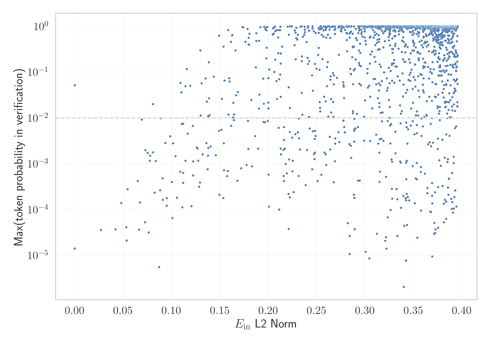

# Report for `mistralai/Mistral-Nemo-Base-2407`

## Model info

* Tied embeddings: no
* LM head uses bias: no
* Indicator for under-trained tokens: E_{in} L2 Norm
  * Overall distribution 0.608 +/- 0.089
  * Token used for verification prompt building: `Vriendschappelijk`
  * Verification threshold: 0.396
  * Threshold for showing candidate under-trained tokens: 0.127
  * Median verified threshold (for bytes, unreachable and special tokens): 0.289
* Embeddings shape: (131072, 5120)
* Vocabulary size: 131072
  * Number of single byte tokens: 256, of which 19 below indicator threshold
  * Number of special tokens: 1000, of which 999 below indicator threshold
  * Number of non-single-byte UTF-fragment tokens: 1307, 4 below soft indicator threshold
  * Number of tested under-trained tokens: 2595, 1585 non-special, 277 below p = 0.01 threshold, 47 below soft indicator threshold

## Under-trained token indicators plot


## Verification plot


## Under-trained token verification results
47 entries below threshold of 0.127

|   token_id | token                   |   indicator | max_prob                                                         | in_other_tokens                                                                                                                                                                                                                                                                                                                                                                              |
|------------|-------------------------|-------------|------------------------------------------------------------------|----------------------------------------------------------------------------------------------------------------------------------------------------------------------------------------------------------------------------------------------------------------------------------------------------------------------------------------------------------------------------------------------|
|      84006 | ````` ోగ్యాస్ `````         |   0.0270905 | <span style='border: 1px solid rgb(169, 68, 66);'>3.6e-05</span> | <span style='border: 1px solid rgb(169, 68, 66);'>````` ▁బయోగ్యాస్ `````</span>                                                                                                                                                                                                                                                                                                                  |
|      20896 | ````` 页面存档 `````    |   0.0420431 | <span style='border: 1px solid rgb(169, 68, 66);'>3.7e-05</span> | ````` 页面存档备份 `````                                                                                                                                                                                                                                                                                                                                                                     |
|      42819 | ````` ురుగున `````         |   0.0533006 | <span style='border: 1px solid rgb(169, 68, 66);'>4.1e-05</span> | <span style='border: 1px solid rgb(169, 68, 66);'>````` ▁మురుగునీటిని `````</span>, <span style='border: 1px solid rgb(169, 68, 66);'>````` ▁మురుగునీరు `````</span>, <span style='border: 1px solid rgb(169, 68, 66);'>````` ▁మురుగున `````</span>, <span style='border: 1px solid rgb(169, 68, 66);'>````` మురుగున `````</span>, <span style='border: 1px solid rgb(169, 68, 66);'>````` మురుగునీరు `````</span> |
|      84747 | ````` ▁పారబో `````        |   0.053569  | <span style='border: 1px solid rgb(169, 68, 66);'>2.1e-05</span> | <span style='border: 1px solid rgb(169, 68, 66);'>````` ▁పారబోస్తారు `````</span>                                                                                                                                                                                                                                                                                                                 |
|      82267 | ````` రుగుదొడ `````        |   0.0545493 | <span style='border: 1px solid rgb(169, 68, 66);'>0.00028</span> | <span style='border: 1px solid rgb(255, 145, 0);'>````` ▁మరుగుదొడ `````</span>, <span style='border: 1px solid rgb(169, 68, 66);'>````` ▁మరుగుదొడ్డి `````</span>                                                                                                                                                                                                                                    |
|      91515 | ````` ▁erresident ````` |   0.0663915 | <span style='border: 1px solid rgb(169, 68, 66);'>3.6e-05</span> | <span style='border: 1px solid rgb(169, 68, 66);'>````` ▁erresidentzia `````</span>                                                                                                                                                                                                                                                                                                          |
|     114442 | ````` మురుగున `````        |   0.067523  | <span style='border: 1px solid rgb(169, 68, 66);'>0.00014</span> | <span style='border: 1px solid rgb(169, 68, 66);'>````` ▁మురుగునీరు `````</span>, <span style='border: 1px solid rgb(169, 68, 66);'>````` మురుగునీరు `````</span>                                                                                                                                                                                                                                      |
|     122838 | ````` \xa0μg `````      |   0.0692844 | <span style='border: 1px solid rgb(255, 145, 0);'>0.0092</span>  |                                                                                                                                                                                                                                                                                                                                                                                              |
|     112147 | ````` ▁ట్రాక్టర్ల `````     |   0.0726854 | <span style='border: 1px solid rgb(169, 68, 66);'>5.3e-05</span> | <span style='border: 1px solid rgb(169, 68, 66);'>````` ▁ట్రాక్టర్లున్నాయి `````</span>                                                                                                                                                                                                                                                                                                              |
|      82858 | ````` abezian `````     |   0.0753896 | <span style='border: 1px solid rgb(255, 145, 0);'>0.0017</span>  | ````` ▁langabezian `````                                                                                                                                                                                                                                                                                                                                                                     |
|      19309 | ````` ▁వ్యవస `````       |   0.0764535 | <span style='border: 1px solid rgb(169, 68, 66);'>3.2e-05</span> | ````` ▁వ్యవసాయం `````, ````` ▁వ్యవస్థ `````, ````` ▁వ్యవసాయ `````, ````` ▁వ్యవసాయానికి `````                                                                                                                                                                                                                                                                                                             |
|      84025 | ````` ▁టెలిగ `````        |   0.0776287 | <span style='border: 1px solid rgb(255, 145, 0);'>0.0012</span>  | <span style='border: 1px solid rgb(255, 145, 0);'>````` ▁టెలిగ్రాఫ్ `````</span>                                                                                                                                                                                                                                                                                                                  |
|     101632 | ````` ▁ব্যক `````        |   0.0778423 | <span style='border: 1px solid rgb(255, 145, 0);'>0.0015</span>  | ````` ▁ব্যক্ত `````                                                                                                                                                                                                                                                                                                                                                                            |
|     124061 | ````` sięb `````        |   0.0808961 | <span style='border: 1px solid rgb(255, 145, 0);'>0.0018</span>  | ````` siębior `````                                                                                                                                                                                                                                                                                                                                                                          |
|      86330 | ````` ▁చేతిప `````        |   0.0824284 | <span style='border: 1px solid rgb(169, 68, 66);'>0.00023</span> | <span style='border: 1px solid rgb(169, 68, 66);'>````` ▁చేతిపంప `````</span>, <span style='border: 1px solid rgb(169, 68, 66);'>````` ▁చేతిపంపుల `````</span>                                                                                                                                                                                                                                      |
|      79865 | ````` ▁సొసై `````         |   0.0835646 | <span style='border: 1px solid rgb(255, 145, 0);'>0.0011</span>  | <span style='border: 1px solid rgb(40, 167, 69);'>````` ▁సొసైటీ `````</span>                                                                                                                                                                                                                                                                                                                    |
|      86332 | ````` ▁అమలవ `````       |   0.0871405 | <span style='border: 1px solid rgb(169, 68, 66);'>5.6e-06</span> | <span style='border: 1px solid rgb(169, 68, 66);'>````` ▁అమలవుతోంది `````</span>                                                                                                                                                                                                                                                                                                                 |
|      81930 | ````` ాపత్రిక `````        |   0.0881733 | <span style='border: 1px solid rgb(169, 68, 66);'>0.00026</span> | <span style='border: 1px solid rgb(40, 167, 69);'>````` ▁వార్తాపత్రిక `````</span>                                                                                                                                                                                                                                                                                                                |
|      28333 | ````` ▁البريط `````     |   0.0891499 | <span style='border: 1px solid rgb(255, 145, 0);'>0.0099</span>  | ````` ▁البريطاني `````, ````` ▁البريطانية `````                                                                                                                                                                                                                                                                                                                                              |
|      57668 | ````` ▁komert `````     |   0.0908036 | <span style='border: 1px solid rgb(169, 68, 66);'>0.00048</span> | <span style='border: 1px solid rgb(169, 68, 66);'>````` ▁komertzio `````</span>, <span style='border: 1px solid rgb(255, 145, 0);'>````` ▁komertzial `````</span>, ````` ▁komertzioetatik `````                                                                                                                                                                                              |
<details><summary>27 additional entries below threshold</summary>

|   token_id | token                  |   indicator | max_prob                                                         | in_other_tokens                                                                                                                                                 |
|------------|------------------------|-------------|------------------------------------------------------------------|-----------------------------------------------------------------------------------------------------------------------------------------------------------------|
|     105127 | ````` ุมภาพ `````       |   0.0910179 | <span style='border: 1px solid rgb(169, 68, 66);'>0.00016</span> | <span style='border: 1px solid rgb(40, 167, 69);'>````` ▁กุมภาพันธ์ `````</span>, <span style='border: 1px solid rgb(40, 167, 69);'>````` ุมภาพันธ์ `````</span>      |
|      69924 | ````` ▁segü `````      |   0.0949484 | <span style='border: 1px solid rgb(169, 68, 66);'>0.00012</span> | ````` ▁següent `````, ````` ▁següents `````                                                                                                                     |
|      89013 | ````` ▁higiez `````    |   0.0950541 | <span style='border: 1px solid rgb(169, 68, 66);'>0.00018</span> | <span style='border: 1px solid rgb(169, 68, 66);'>````` ▁higiezinen `````</span>                                                                                |
|     124924 | ````` ిగ్రీ `````         |   0.0986185 | <span style='border: 1px solid rgb(255, 145, 0);'>0.004</span>   | ````` ▁డిగ్రీ `````                                                                                                                                                |
|      91246 | ````` ువారీ `````         |   0.100405  | <span style='border: 1px solid rgb(169, 68, 66);'>0.0004</span>  | <span style='border: 1px solid rgb(251, 189, 8);'>````` ▁రోజువారీ `````</span>                                                                                      |
|      59471 | ````` ▁pemerint `````  |   0.10078   | <span style='border: 1px solid rgb(169, 68, 66);'>6.5e-05</span> | ````` ▁pemerintahan `````, ````` ▁pemerintah `````                                                                                                              |
|     119980 | ````` ▁międzyn `````   |   0.101525  | <span style='border: 1px solid rgb(255, 145, 0);'>0.0028</span>  | ````` ▁międzynarod `````                                                                                                                                        |
|      98997 | ````` ฤศจ `````        |   0.104059  | <span style='border: 1px solid rgb(255, 145, 0);'>0.0015</span>  | <span style='border: 1px solid rgb(255, 145, 0);'>````` ฤศจิกายน `````</span>, <span style='border: 1px solid rgb(40, 167, 69);'>````` ▁พฤศจิกายน `````</span>    |
|     115977 | ````` ▁తరువ `````       |   0.105532  | <span style='border: 1px solid rgb(169, 68, 66);'>0.00018</span> | ````` ▁తరువాత `````                                                                                                                                               |
|     129714 | ````` ుబాటులో `````        |   0.108918  | <span style='border: 1px solid rgb(169, 68, 66);'>0.00067</span> | <span style='border: 1px solid rgb(169, 68, 66);'>````` ▁అందుబాటులో `````</span>                                                                                     |
|      29234 | ````` င့ `````          |   0.109364  | <span style='border: 1px solid rgb(251, 189, 8);'>0.058</span>   | ````` င့်<0xE1><0x80> `````, ````` <0x96>ြင့် `````, ````` <0x94>ှင့် `````, ````` င့် `````                                                                              |
|      83479 | ````` banako `````     |   0.110077  | <span style='border: 1px solid rgb(251, 189, 8);'>0.036</span>   | ````` ▁norbanakoentzako `````, <span style='border: 1px solid rgb(169, 68, 66);'>````` ▁norbanako `````</span>                                                  |
|      41911 | ````` زراء `````       |   0.110521  | <span style='border: 1px solid rgb(255, 145, 0);'>0.0074</span>  | ````` ▁الوزراء `````, <span style='border: 1px solid rgb(40, 167, 69);'>````` ▁وزراء `````</span>                                                               |
|      83390 | ````` ▁komertzio ````` |   0.111086  | <span style='border: 1px solid rgb(169, 68, 66);'>0.00011</span> | ````` ▁komertzioetatik `````                                                                                                                                    |
|     111169 | ````` మీప `````         |   0.111942  | <span style='border: 1px solid rgb(255, 145, 0);'>0.0075</span>  | <span style='border: 1px solid rgb(251, 189, 8);'>````` సమీప `````</span>                                                                                        |
|      52679 | ````` tanleria `````   |   0.111958  | <span style='border: 1px solid rgb(169, 68, 66);'>0.00038</span> | ````` ▁Biztanleria `````, <span style='border: 1px solid rgb(40, 167, 69);'>````` ▁biztanleria `````</span>                                                     |
|      50293 | ````` ుధ్య `````         |   0.112045  | <span style='border: 1px solid rgb(169, 68, 66);'>0.00063</span> | <span style='border: 1px solid rgb(169, 68, 66);'>````` ▁పారిశుధ్య `````</span>, <span style='border: 1px solid rgb(169, 68, 66);'>````` ▁పారిశుధ్యం `````</span>        |
|      90252 | ````` مييز `````       |   0.114283  | <span style='border: 1px solid rgb(255, 145, 0);'>0.0012</span>  | <span style='border: 1px solid rgb(40, 167, 69);'>````` ▁التمييز `````</span>, <span style='border: 1px solid rgb(40, 167, 69);'>````` ▁تمييز `````</span>      |
|      67483 | ````` ▁ژوئ `````       |   0.114361  | <span style='border: 1px solid rgb(251, 189, 8);'>0.049</span>   | ````` ▁ژوئن `````, <span style='border: 1px solid rgb(40, 167, 69);'>````` ▁ژوئیه `````</span>                                                                  |
|      26421 | ````` ▁lớ `````        |   0.115706  | <span style='border: 1px solid rgb(40, 167, 69);'>0.12</span>    | ````` ▁lớp `````, ````` ▁lớn `````                                                                                                                              |
|      81653 | ````` ▁రీడ `````        |   0.116641  | <span style='border: 1px solid rgb(255, 145, 0);'>0.0046</span>  | <span style='border: 1px solid rgb(251, 189, 8);'>````` ▁రీడింగ్ `````</span>                                                                                       |
|      64291 | ````` ▁الإيط `````     |   0.119328  | <span style='border: 1px solid rgb(251, 189, 8);'>0.05</span>    | <span style='border: 1px solid rgb(40, 167, 69);'>````` ▁الإيطالي `````</span>, <span style='border: 1px solid rgb(40, 167, 69);'>````` ▁الإيطالية `````</span> |
|     109854 | ````` ▁మంచిన `````       |   0.120563  | <span style='border: 1px solid rgb(169, 68, 66);'>0.00012</span> | <span style='border: 1px solid rgb(169, 68, 66);'>````` ▁మంచినీటి `````</span>                                                                                      |
|      81988 | ````` ▁నిమిత్త `````      |   0.121975  | <span style='border: 1px solid rgb(255, 145, 0);'>0.0067</span>  | <span style='border: 1px solid rgb(169, 68, 66);'>````` ▁నిమిత్తం `````</span>                                                                                      |
|      86580 | ````` 衆国 `````       |   0.122285  | <span style='border: 1px solid rgb(255, 145, 0);'>0.0011</span>  | ````` 合衆国 `````                                                                                                                                              |
|      50882 | ````` ిజ్య `````         |   0.122297  | <span style='border: 1px solid rgb(169, 68, 66);'>0.00055</span> | <span style='border: 1px solid rgb(40, 167, 69);'>````` ▁వాణిజ్య `````</span>                                                                                      |
|      83506 | ````` ▁వ్యర్థ `````      |   0.12599   | <span style='border: 1px solid rgb(255, 145, 0);'>0.0023</span>  | <span style='border: 1px solid rgb(169, 68, 66);'>````` ▁వ్యర్థాలను `````</span>                                                                                    |
</details>


## Tokens with partial UTF-8 sequences
4 entries below threshold of 0.127

|   token_id | token                      |   indicator | in_other_tokens                                                                                                                                                                                                                                                                                                                        |
|------------|----------------------------|-------------|----------------------------------------------------------------------------------------------------------------------------------------------------------------------------------------------------------------------------------------------------------------------------------------------------------------------------------------|
|       1396 | ````` о<0xD0> `````        |   0         | ````` ковой `````, ````` ▁стоит `````, ````` ▁объедин `````, ````` лони `````, ````` огаш `````, ...                                                                                                                                                                                                                                   |
|      42009 | ````` <0xA3><0xBD>作 ````` |   0.0229752 | ````` ▁製作 `````, ````` 製作 `````                                                                                                                                                                                                                                                                                                    |
|      28511 | ````` <0x9B>็น `````        |   0.045613  | ````` เป็น `````, ````` ▁เป็น `````                                                                                                                                                                                                                                                                                                      |
|      28682 | ````` <0x85><0x8D>音 ````` |   0.0872049 | <span style='border: 1px solid rgb(40, 167, 69);'>````` ▁配音 `````</span>, <span style='border: 1px solid rgb(40, 167, 69);'>````` 配音員 `````</span>, <span style='border: 1px solid rgb(40, 167, 69);'>````` 粵語配音 `````</span>, ````` 配音 `````, <span style='border: 1px solid rgb(40, 167, 69);'>````` ▁配音員 `````</span> |


## Byte tokens
19 entries below threshold of 0.289

|   token_id | token              |   indicator |   ord | hex   | byte_type   |
|------------|--------------------|-------------|-------|-------|-------------|
|       1245 | ````` <0xF5> ````` |   0         |   245 | 0xF5  | unused_utf8 |
|       1246 | ````` <0xF6> ````` |   0         |   246 | 0xF6  | unused_utf8 |
|       1247 | ````` <0xF7> ````` |   0         |   247 | 0xF7  | unused_utf8 |
|       1254 | ````` <0xFE> ````` |   0         |   254 | 0xFE  | unused_utf8 |
|       1248 | ````` <0xF8> ````` |   0         |   248 | 0xF8  | unused_utf8 |
|       1251 | ````` <0xFB> ````` |   0         |   251 | 0xFB  | unused_utf8 |
|       1249 | ````` <0xF9> ````` |   0         |   249 | 0xF9  | unused_utf8 |
|       1253 | ````` <0xFD> ````` |   0         |   253 | 0xFD  | unused_utf8 |
|       1255 | ````` <0xFF> ````` |   0         |   255 | 0xFF  | unused_utf8 |
|       1192 | ````` <0xC0> ````` |   0         |   192 | 0xC0  | unused_utf8 |
|       1250 | ````` <0xFA> ````` |   0         |   250 | 0xFA  | unused_utf8 |
|       1193 | ````` <0xC1> ````` |   0         |   193 | 0xC1  | unused_utf8 |
|       1252 | ````` <0xFC> ````` |   0         |   252 | 0xFC  | unused_utf8 |
|       1030 | ````` \x1e `````   |   0.0480882 |    30 | 0x1E  | ascii       |
|       1028 | ````` \x1c `````   |   0.0651454 |    28 | 0x1C  | ascii       |
|       1012 | ````` \x0c `````   |   0.0729413 |    12 | 0x0C  | ascii       |
|       1011 | ````` \x0b `````   |   0.0808157 |    11 | 0x0B  | ascii       |
|       1029 | ````` \x1d `````   |   0.0936143 |    29 | 0x1D  | ascii       |
|       1241 | ````` <0xF1> ````` |   0.248614  |   241 | 0xF1  | utf8        |


## Special tokens
999 entries below threshold of 0.289

|   token_id | token                     |   indicator | max_prob                                                         |
|------------|---------------------------|-------------|------------------------------------------------------------------|
|        372 | ````` <SPECIAL_372> ````` |           0 | <span style='border: 1px solid rgb(169, 68, 66);'>1.4e-05</span> |
|         82 | ````` <SPECIAL_82> `````  |           0 | <span style='border: 1px solid rgb(169, 68, 66);'>1.4e-05</span> |
|        267 | ````` <SPECIAL_267> ````` |           0 | <span style='border: 1px solid rgb(169, 68, 66);'>1.4e-05</span> |
|        156 | ````` <SPECIAL_156> ````` |           0 | <span style='border: 1px solid rgb(169, 68, 66);'>1.4e-05</span> |
|        908 | ````` <SPECIAL_908> ````` |           0 | <span style='border: 1px solid rgb(169, 68, 66);'>1.4e-05</span> |
|         86 | ````` <SPECIAL_86> `````  |           0 | <span style='border: 1px solid rgb(169, 68, 66);'>1.4e-05</span> |
|        233 | ````` <SPECIAL_233> ````` |           0 | <span style='border: 1px solid rgb(169, 68, 66);'>1.4e-05</span> |
|         81 | ````` <SPECIAL_81> `````  |           0 | <span style='border: 1px solid rgb(169, 68, 66);'>1.4e-05</span> |
|        790 | ````` <SPECIAL_790> ````` |           0 | <span style='border: 1px solid rgb(169, 68, 66);'>1.4e-05</span> |
|        142 | ````` <SPECIAL_142> ````` |           0 | <span style='border: 1px solid rgb(169, 68, 66);'>1.4e-05</span> |
|        665 | ````` <SPECIAL_665> ````` |           0 | <span style='border: 1px solid rgb(169, 68, 66);'>1.4e-05</span> |
|        405 | ````` <SPECIAL_405> ````` |           0 | <span style='border: 1px solid rgb(169, 68, 66);'>1.4e-05</span> |
|        138 | ````` <SPECIAL_138> ````` |           0 | <span style='border: 1px solid rgb(169, 68, 66);'>1.4e-05</span> |
|        539 | ````` <SPECIAL_539> ````` |           0 | <span style='border: 1px solid rgb(169, 68, 66);'>1.4e-05</span> |
|        477 | ````` <SPECIAL_477> ````` |           0 | <span style='border: 1px solid rgb(169, 68, 66);'>1.4e-05</span> |
|        442 | ````` <SPECIAL_442> ````` |           0 | <span style='border: 1px solid rgb(169, 68, 66);'>1.4e-05</span> |
|        505 | ````` <SPECIAL_505> ````` |           0 | <span style='border: 1px solid rgb(169, 68, 66);'>1.4e-05</span> |
|        140 | ````` <SPECIAL_140> ````` |           0 | <span style='border: 1px solid rgb(169, 68, 66);'>1.4e-05</span> |
|        450 | ````` <SPECIAL_450> ````` |           0 | <span style='border: 1px solid rgb(169, 68, 66);'>1.4e-05</span> |
|        222 | ````` <SPECIAL_222> ````` |           0 | <span style='border: 1px solid rgb(169, 68, 66);'>1.4e-05</span> |
<details><summary>979 additional entries below threshold</summary>

|   token_id | token                          |   indicator | max_prob                                                         |
|------------|--------------------------------|-------------|------------------------------------------------------------------|
|        239 | ````` <SPECIAL_239> `````      |           0 | <span style='border: 1px solid rgb(169, 68, 66);'>1.4e-05</span> |
|        709 | ````` <SPECIAL_709> `````      |           0 | <span style='border: 1px solid rgb(169, 68, 66);'>1.4e-05</span> |
|        624 | ````` <SPECIAL_624> `````      |           0 | <span style='border: 1px solid rgb(169, 68, 66);'>1.4e-05</span> |
|        337 | ````` <SPECIAL_337> `````      |           0 | <span style='border: 1px solid rgb(169, 68, 66);'>1.4e-05</span> |
|        763 | ````` <SPECIAL_763> `````      |           0 | <span style='border: 1px solid rgb(169, 68, 66);'>1.4e-05</span> |
|        626 | ````` <SPECIAL_626> `````      |           0 | <span style='border: 1px solid rgb(169, 68, 66);'>1.4e-05</span> |
|        726 | ````` <SPECIAL_726> `````      |           0 | <span style='border: 1px solid rgb(169, 68, 66);'>1.4e-05</span> |
|        226 | ````` <SPECIAL_226> `````      |           0 | <span style='border: 1px solid rgb(169, 68, 66);'>1.4e-05</span> |
|        814 | ````` <SPECIAL_814> `````      |           0 | <span style='border: 1px solid rgb(169, 68, 66);'>1.4e-05</span> |
|        429 | ````` <SPECIAL_429> `````      |           0 | <span style='border: 1px solid rgb(169, 68, 66);'>1.4e-05</span> |
|        664 | ````` <SPECIAL_664> `````      |           0 | <span style='border: 1px solid rgb(169, 68, 66);'>1.4e-05</span> |
|        134 | ````` <SPECIAL_134> `````      |           0 | <span style='border: 1px solid rgb(169, 68, 66);'>1.4e-05</span> |
|         68 | ````` <SPECIAL_68> `````       |           0 | <span style='border: 1px solid rgb(169, 68, 66);'>1.4e-05</span> |
|        710 | ````` <SPECIAL_710> `````      |           0 | <span style='border: 1px solid rgb(169, 68, 66);'>1.4e-05</span> |
|        461 | ````` <SPECIAL_461> `````      |           0 | <span style='border: 1px solid rgb(169, 68, 66);'>1.4e-05</span> |
|        650 | ````` <SPECIAL_650> `````      |           0 | <span style='border: 1px solid rgb(169, 68, 66);'>1.4e-05</span> |
|        547 | ````` <SPECIAL_547> `````      |           0 | <span style='border: 1px solid rgb(169, 68, 66);'>1.4e-05</span> |
|        551 | ````` <SPECIAL_551> `````      |           0 | <span style='border: 1px solid rgb(169, 68, 66);'>1.4e-05</span> |
|         88 | ````` <SPECIAL_88> `````       |           0 | <span style='border: 1px solid rgb(169, 68, 66);'>1.4e-05</span> |
|        804 | ````` <SPECIAL_804> `````      |           0 | <span style='border: 1px solid rgb(169, 68, 66);'>1.4e-05</span> |
|        115 | ````` <SPECIAL_115> `````      |           0 | <span style='border: 1px solid rgb(169, 68, 66);'>1.4e-05</span> |
|        592 | ````` <SPECIAL_592> `````      |           0 | <span style='border: 1px solid rgb(169, 68, 66);'>1.4e-05</span> |
|        107 | ````` <SPECIAL_107> `````      |           0 | <span style='border: 1px solid rgb(169, 68, 66);'>1.4e-05</span> |
|        221 | ````` <SPECIAL_221> `````      |           0 | <span style='border: 1px solid rgb(169, 68, 66);'>1.4e-05</span> |
|        249 | ````` <SPECIAL_249> `````      |           0 | <span style='border: 1px solid rgb(169, 68, 66);'>1.4e-05</span> |
|        467 | ````` <SPECIAL_467> `````      |           0 | <span style='border: 1px solid rgb(169, 68, 66);'>1.4e-05</span> |
|        404 | ````` <SPECIAL_404> `````      |           0 | <span style='border: 1px solid rgb(169, 68, 66);'>1.4e-05</span> |
|        121 | ````` <SPECIAL_121> `````      |           0 | <span style='border: 1px solid rgb(169, 68, 66);'>1.4e-05</span> |
|        421 | ````` <SPECIAL_421> `````      |           0 | <span style='border: 1px solid rgb(169, 68, 66);'>1.4e-05</span> |
|        796 | ````` <SPECIAL_796> `````      |           0 | <span style='border: 1px solid rgb(169, 68, 66);'>1.4e-05</span> |
|        464 | ````` <SPECIAL_464> `````      |           0 | <span style='border: 1px solid rgb(169, 68, 66);'>1.4e-05</span> |
|        231 | ````` <SPECIAL_231> `````      |           0 | <span style='border: 1px solid rgb(169, 68, 66);'>1.4e-05</span> |
|        155 | ````` <SPECIAL_155> `````      |           0 | <span style='border: 1px solid rgb(169, 68, 66);'>1.4e-05</span> |
|        217 | ````` <SPECIAL_217> `````      |           0 | <span style='border: 1px solid rgb(169, 68, 66);'>1.4e-05</span> |
|        587 | ````` <SPECIAL_587> `````      |           0 | <span style='border: 1px solid rgb(169, 68, 66);'>1.4e-05</span> |
|         26 | ````` <SPECIAL_26> `````       |           0 | <span style='border: 1px solid rgb(169, 68, 66);'>1.4e-05</span> |
|        309 | ````` <SPECIAL_309> `````      |           0 | <span style='border: 1px solid rgb(169, 68, 66);'>1.4e-05</span> |
|        753 | ````` <SPECIAL_753> `````      |           0 | <span style='border: 1px solid rgb(169, 68, 66);'>1.4e-05</span> |
|        448 | ````` <SPECIAL_448> `````      |           0 | <span style='border: 1px solid rgb(169, 68, 66);'>1.4e-05</span> |
|        960 | ````` <SPECIAL_960> `````      |           0 | <span style='border: 1px solid rgb(169, 68, 66);'>1.4e-05</span> |
|        920 | ````` <SPECIAL_920> `````      |           0 | <span style='border: 1px solid rgb(169, 68, 66);'>1.4e-05</span> |
|        666 | ````` <SPECIAL_666> `````      |           0 | <span style='border: 1px solid rgb(169, 68, 66);'>1.4e-05</span> |
|        738 | ````` <SPECIAL_738> `````      |           0 | <span style='border: 1px solid rgb(169, 68, 66);'>1.4e-05</span> |
|        731 | ````` <SPECIAL_731> `````      |           0 | <span style='border: 1px solid rgb(169, 68, 66);'>1.4e-05</span> |
|        762 | ````` <SPECIAL_762> `````      |           0 | <span style='border: 1px solid rgb(169, 68, 66);'>1.4e-05</span> |
|        137 | ````` <SPECIAL_137> `````      |           0 | <span style='border: 1px solid rgb(169, 68, 66);'>1.4e-05</span> |
|        849 | ````` <SPECIAL_849> `````      |           0 | <span style='border: 1px solid rgb(169, 68, 66);'>1.4e-05</span> |
|        260 | ````` <SPECIAL_260> `````      |           0 | <span style='border: 1px solid rgb(169, 68, 66);'>1.4e-05</span> |
|        602 | ````` <SPECIAL_602> `````      |           0 | <span style='border: 1px solid rgb(169, 68, 66);'>1.4e-05</span> |
|        800 | ````` <SPECIAL_800> `````      |           0 | <span style='border: 1px solid rgb(169, 68, 66);'>1.4e-05</span> |
|        883 | ````` <SPECIAL_883> `````      |           0 | <span style='border: 1px solid rgb(169, 68, 66);'>1.4e-05</span> |
|        669 | ````` <SPECIAL_669> `````      |           0 | <span style='border: 1px solid rgb(169, 68, 66);'>1.4e-05</span> |
|        914 | ````` <SPECIAL_914> `````      |           0 | <span style='border: 1px solid rgb(169, 68, 66);'>1.4e-05</span> |
|        697 | ````` <SPECIAL_697> `````      |           0 | <span style='border: 1px solid rgb(169, 68, 66);'>1.4e-05</span> |
|        917 | ````` <SPECIAL_917> `````      |           0 | <span style='border: 1px solid rgb(169, 68, 66);'>1.4e-05</span> |
|        228 | ````` <SPECIAL_228> `````      |           0 | <span style='border: 1px solid rgb(169, 68, 66);'>1.4e-05</span> |
|        995 | ````` <SPECIAL_995> `````      |           0 | <span style='border: 1px solid rgb(169, 68, 66);'>1.4e-05</span> |
|        596 | ````` <SPECIAL_596> `````      |           0 | <span style='border: 1px solid rgb(169, 68, 66);'>1.4e-05</span> |
|        573 | ````` <SPECIAL_573> `````      |           0 | <span style='border: 1px solid rgb(169, 68, 66);'>1.4e-05</span> |
|        508 | ````` <SPECIAL_508> `````      |           0 | <span style='border: 1px solid rgb(169, 68, 66);'>1.4e-05</span> |
|        554 | ````` <SPECIAL_554> `````      |           0 | <span style='border: 1px solid rgb(169, 68, 66);'>1.4e-05</span> |
|        176 | ````` <SPECIAL_176> `````      |           0 | <span style='border: 1px solid rgb(169, 68, 66);'>1.4e-05</span> |
|        453 | ````` <SPECIAL_453> `````      |           0 | <span style='border: 1px solid rgb(169, 68, 66);'>1.4e-05</span> |
|        258 | ````` <SPECIAL_258> `````      |           0 | <span style='border: 1px solid rgb(169, 68, 66);'>1.4e-05</span> |
|        521 | ````` <SPECIAL_521> `````      |           0 | <span style='border: 1px solid rgb(169, 68, 66);'>1.4e-05</span> |
|        387 | ````` <SPECIAL_387> `````      |           0 | <span style='border: 1px solid rgb(169, 68, 66);'>1.4e-05</span> |
|        537 | ````` <SPECIAL_537> `````      |           0 | <span style='border: 1px solid rgb(169, 68, 66);'>1.4e-05</span> |
|        517 | ````` <SPECIAL_517> `````      |           0 | <span style='border: 1px solid rgb(169, 68, 66);'>1.4e-05</span> |
|        165 | ````` <SPECIAL_165> `````      |           0 | <span style='border: 1px solid rgb(169, 68, 66);'>1.4e-05</span> |
|         34 | ````` <SPECIAL_34> `````       |           0 | <span style='border: 1px solid rgb(169, 68, 66);'>1.4e-05</span> |
|        353 | ````` <SPECIAL_353> `````      |           0 | <span style='border: 1px solid rgb(169, 68, 66);'>1.4e-05</span> |
|        389 | ````` <SPECIAL_389> `````      |           0 | <span style='border: 1px solid rgb(169, 68, 66);'>1.4e-05</span> |
|        746 | ````` <SPECIAL_746> `````      |           0 | <span style='border: 1px solid rgb(169, 68, 66);'>1.4e-05</span> |
|        691 | ````` <SPECIAL_691> `````      |           0 | <span style='border: 1px solid rgb(169, 68, 66);'>1.4e-05</span> |
|         53 | ````` <SPECIAL_53> `````       |           0 | <span style='border: 1px solid rgb(169, 68, 66);'>1.4e-05</span> |
|        344 | ````` <SPECIAL_344> `````      |           0 | <span style='border: 1px solid rgb(169, 68, 66);'>1.4e-05</span> |
|         15 | ````` <SPECIAL_15> `````       |           0 | <span style='border: 1px solid rgb(169, 68, 66);'>1.4e-05</span> |
|        123 | ````` <SPECIAL_123> `````      |           0 | <span style='border: 1px solid rgb(169, 68, 66);'>1.4e-05</span> |
|        503 | ````` <SPECIAL_503> `````      |           0 | <span style='border: 1px solid rgb(169, 68, 66);'>1.4e-05</span> |
|        600 | ````` <SPECIAL_600> `````      |           0 | <span style='border: 1px solid rgb(169, 68, 66);'>1.4e-05</span> |
|        653 | ````` <SPECIAL_653> `````      |           0 | <span style='border: 1px solid rgb(169, 68, 66);'>1.4e-05</span> |
|        345 | ````` <SPECIAL_345> `````      |           0 | <span style='border: 1px solid rgb(169, 68, 66);'>1.4e-05</span> |
|        101 | ````` <SPECIAL_101> `````      |           0 | <span style='border: 1px solid rgb(169, 68, 66);'>1.4e-05</span> |
|        120 | ````` <SPECIAL_120> `````      |           0 | <span style='border: 1px solid rgb(169, 68, 66);'>1.4e-05</span> |
|        945 | ````` <SPECIAL_945> `````      |           0 | <span style='border: 1px solid rgb(169, 68, 66);'>1.4e-05</span> |
|          9 | ````` [TOOL_CALLS] `````       |           0 | <span style='border: 1px solid rgb(169, 68, 66);'>1.4e-05</span> |
|        188 | ````` <SPECIAL_188> `````      |           0 | <span style='border: 1px solid rgb(169, 68, 66);'>1.4e-05</span> |
|        205 | ````` <SPECIAL_205> `````      |           0 | <span style='border: 1px solid rgb(169, 68, 66);'>1.4e-05</span> |
|        533 | ````` <SPECIAL_533> `````      |           0 | <span style='border: 1px solid rgb(169, 68, 66);'>1.4e-05</span> |
|        149 | ````` <SPECIAL_149> `````      |           0 | <span style='border: 1px solid rgb(169, 68, 66);'>1.4e-05</span> |
|        541 | ````` <SPECIAL_541> `````      |           0 | <span style='border: 1px solid rgb(169, 68, 66);'>1.4e-05</span> |
|        605 | ````` <SPECIAL_605> `````      |           0 | <span style='border: 1px solid rgb(169, 68, 66);'>1.4e-05</span> |
|        873 | ````` <SPECIAL_873> `````      |           0 | <span style='border: 1px solid rgb(169, 68, 66);'>1.4e-05</span> |
|        877 | ````` <SPECIAL_877> `````      |           0 | <span style='border: 1px solid rgb(169, 68, 66);'>1.4e-05</span> |
|        489 | ````` <SPECIAL_489> `````      |           0 | <span style='border: 1px solid rgb(169, 68, 66);'>1.4e-05</span> |
|        937 | ````` <SPECIAL_937> `````      |           0 | <span style='border: 1px solid rgb(169, 68, 66);'>1.4e-05</span> |
|        936 | ````` <SPECIAL_936> `````      |           0 | <span style='border: 1px solid rgb(169, 68, 66);'>1.4e-05</span> |
|         36 | ````` <SPECIAL_36> `````       |           0 | <span style='border: 1px solid rgb(169, 68, 66);'>1.4e-05</span> |
|        299 | ````` <SPECIAL_299> `````      |           0 | <span style='border: 1px solid rgb(169, 68, 66);'>1.4e-05</span> |
|        119 | ````` <SPECIAL_119> `````      |           0 | <span style='border: 1px solid rgb(169, 68, 66);'>1.4e-05</span> |
|        924 | ````` <SPECIAL_924> `````      |           0 | <span style='border: 1px solid rgb(169, 68, 66);'>1.4e-05</span> |
|        492 | ````` <SPECIAL_492> `````      |           0 | <span style='border: 1px solid rgb(169, 68, 66);'>1.4e-05</span> |
|        670 | ````` <SPECIAL_670> `````      |           0 | <span style='border: 1px solid rgb(169, 68, 66);'>1.4e-05</span> |
|        498 | ````` <SPECIAL_498> `````      |           0 | <span style='border: 1px solid rgb(169, 68, 66);'>1.4e-05</span> |
|        103 | ````` <SPECIAL_103> `````      |           0 | <span style='border: 1px solid rgb(169, 68, 66);'>1.4e-05</span> |
|        910 | ````` <SPECIAL_910> `````      |           0 | <span style='border: 1px solid rgb(169, 68, 66);'>1.4e-05</span> |
|        693 | ````` <SPECIAL_693> `````      |           0 | <span style='border: 1px solid rgb(169, 68, 66);'>1.4e-05</span> |
|        651 | ````` <SPECIAL_651> `````      |           0 | <span style='border: 1px solid rgb(169, 68, 66);'>1.4e-05</span> |
|        203 | ````` <SPECIAL_203> `````      |           0 | <span style='border: 1px solid rgb(169, 68, 66);'>1.4e-05</span> |
|        423 | ````` <SPECIAL_423> `````      |           0 | <span style='border: 1px solid rgb(169, 68, 66);'>1.4e-05</span> |
|        318 | ````` <SPECIAL_318> `````      |           0 | <span style='border: 1px solid rgb(169, 68, 66);'>1.4e-05</span> |
|        863 | ````` <SPECIAL_863> `````      |           0 | <span style='border: 1px solid rgb(169, 68, 66);'>1.4e-05</span> |
|        362 | ````` <SPECIAL_362> `````      |           0 | <span style='border: 1px solid rgb(169, 68, 66);'>1.4e-05</span> |
|        520 | ````` <SPECIAL_520> `````      |           0 | <span style='border: 1px solid rgb(169, 68, 66);'>1.4e-05</span> |
|        560 | ````` <SPECIAL_560> `````      |           0 | <span style='border: 1px solid rgb(169, 68, 66);'>1.4e-05</span> |
|        174 | ````` <SPECIAL_174> `````      |           0 | <span style='border: 1px solid rgb(169, 68, 66);'>1.4e-05</span> |
|         41 | ````` <SPECIAL_41> `````       |           0 | <span style='border: 1px solid rgb(169, 68, 66);'>1.4e-05</span> |
|        206 | ````` <SPECIAL_206> `````      |           0 | <span style='border: 1px solid rgb(169, 68, 66);'>1.4e-05</span> |
|        263 | ````` <SPECIAL_263> `````      |           0 | <span style='border: 1px solid rgb(169, 68, 66);'>1.4e-05</span> |
|        677 | ````` <SPECIAL_677> `````      |           0 | <span style='border: 1px solid rgb(169, 68, 66);'>1.4e-05</span> |
|        187 | ````` <SPECIAL_187> `````      |           0 | <span style='border: 1px solid rgb(169, 68, 66);'>1.4e-05</span> |
|        871 | ````` <SPECIAL_871> `````      |           0 | <span style='border: 1px solid rgb(169, 68, 66);'>1.4e-05</span> |
|        843 | ````` <SPECIAL_843> `````      |           0 | <span style='border: 1px solid rgb(169, 68, 66);'>1.4e-05</span> |
|        460 | ````` <SPECIAL_460> `````      |           0 | <span style='border: 1px solid rgb(169, 68, 66);'>1.4e-05</span> |
|        776 | ````` <SPECIAL_776> `````      |           0 | <span style='border: 1px solid rgb(169, 68, 66);'>1.4e-05</span> |
|        524 | ````` <SPECIAL_524> `````      |           0 | <span style='border: 1px solid rgb(169, 68, 66);'>1.4e-05</span> |
|        633 | ````` <SPECIAL_633> `````      |           0 | <span style='border: 1px solid rgb(169, 68, 66);'>1.4e-05</span> |
|        129 | ````` <SPECIAL_129> `````      |           0 | <span style='border: 1px solid rgb(169, 68, 66);'>1.4e-05</span> |
|        671 | ````` <SPECIAL_671> `````      |           0 | <span style='border: 1px solid rgb(169, 68, 66);'>1.4e-05</span> |
|        615 | ````` <SPECIAL_615> `````      |           0 | <span style='border: 1px solid rgb(169, 68, 66);'>1.4e-05</span> |
|        654 | ````` <SPECIAL_654> `````      |           0 | <span style='border: 1px solid rgb(169, 68, 66);'>1.4e-05</span> |
|        370 | ````` <SPECIAL_370> `````      |           0 | <span style='border: 1px solid rgb(169, 68, 66);'>1.4e-05</span> |
|          4 | ````` [/INST] `````            |           0 | <span style='border: 1px solid rgb(169, 68, 66);'>1.4e-05</span> |
|        620 | ````` <SPECIAL_620> `````      |           0 | <span style='border: 1px solid rgb(169, 68, 66);'>1.4e-05</span> |
|        734 | ````` <SPECIAL_734> `````      |           0 | <span style='border: 1px solid rgb(169, 68, 66);'>1.4e-05</span> |
|        416 | ````` <SPECIAL_416> `````      |           0 | <span style='border: 1px solid rgb(169, 68, 66);'>1.4e-05</span> |
|        689 | ````` <SPECIAL_689> `````      |           0 | <span style='border: 1px solid rgb(169, 68, 66);'>1.4e-05</span> |
|        834 | ````` <SPECIAL_834> `````      |           0 | <span style='border: 1px solid rgb(169, 68, 66);'>1.4e-05</span> |
|         66 | ````` <SPECIAL_66> `````       |           0 | <span style='border: 1px solid rgb(169, 68, 66);'>1.4e-05</span> |
|        153 | ````` <SPECIAL_153> `````      |           0 | <span style='border: 1px solid rgb(169, 68, 66);'>1.4e-05</span> |
|          8 | ````` [/TOOL_RESULTS] `````    |           0 | <span style='border: 1px solid rgb(169, 68, 66);'>1.4e-05</span> |
|        312 | ````` <SPECIAL_312> `````      |           0 | <span style='border: 1px solid rgb(169, 68, 66);'>1.4e-05</span> |
|        446 | ````` <SPECIAL_446> `````      |           0 | <span style='border: 1px solid rgb(169, 68, 66);'>1.4e-05</span> |
|         67 | ````` <SPECIAL_67> `````       |           0 | <span style='border: 1px solid rgb(169, 68, 66);'>1.4e-05</span> |
|        743 | ````` <SPECIAL_743> `````      |           0 | <span style='border: 1px solid rgb(169, 68, 66);'>1.4e-05</span> |
|        114 | ````` <SPECIAL_114> `````      |           0 | <span style='border: 1px solid rgb(169, 68, 66);'>1.4e-05</span> |
|        401 | ````` <SPECIAL_401> `````      |           0 | <span style='border: 1px solid rgb(169, 68, 66);'>1.4e-05</span> |
|        500 | ````` <SPECIAL_500> `````      |           0 | <span style='border: 1px solid rgb(169, 68, 66);'>1.4e-05</span> |
|        238 | ````` <SPECIAL_238> `````      |           0 | <span style='border: 1px solid rgb(169, 68, 66);'>1.4e-05</span> |
|        224 | ````` <SPECIAL_224> `````      |           0 | <span style='border: 1px solid rgb(169, 68, 66);'>1.4e-05</span> |
|        965 | ````` <SPECIAL_965> `````      |           0 | <span style='border: 1px solid rgb(169, 68, 66);'>1.4e-05</span> |
|        767 | ````` <SPECIAL_767> `````      |           0 | <span style='border: 1px solid rgb(169, 68, 66);'>1.4e-05</span> |
|        905 | ````` <SPECIAL_905> `````      |           0 | <span style='border: 1px solid rgb(169, 68, 66);'>1.4e-05</span> |
|         51 | ````` <SPECIAL_51> `````       |           0 | <span style='border: 1px solid rgb(169, 68, 66);'>1.4e-05</span> |
|        609 | ````` <SPECIAL_609> `````      |           0 | <span style='border: 1px solid rgb(169, 68, 66);'>1.4e-05</span> |
|        534 | ````` <SPECIAL_534> `````      |           0 | <span style='border: 1px solid rgb(169, 68, 66);'>1.4e-05</span> |
|        296 | ````` <SPECIAL_296> `````      |           0 | <span style='border: 1px solid rgb(169, 68, 66);'>1.4e-05</span> |
|         11 | ````` [PREFIX] `````           |           0 | <span style='border: 1px solid rgb(169, 68, 66);'>1.4e-05</span> |
|        730 | ````` <SPECIAL_730> `````      |           0 | <span style='border: 1px solid rgb(169, 68, 66);'>1.4e-05</span> |
|        716 | ````` <SPECIAL_716> `````      |           0 | <span style='border: 1px solid rgb(169, 68, 66);'>1.4e-05</span> |
|        954 | ````` <SPECIAL_954> `````      |           0 | <span style='border: 1px solid rgb(169, 68, 66);'>1.4e-05</span> |
|        845 | ````` <SPECIAL_845> `````      |           0 | <span style='border: 1px solid rgb(169, 68, 66);'>1.4e-05</span> |
|        397 | ````` <SPECIAL_397> `````      |           0 | <span style='border: 1px solid rgb(169, 68, 66);'>1.4e-05</span> |
|        398 | ````` <SPECIAL_398> `````      |           0 | <span style='border: 1px solid rgb(169, 68, 66);'>1.4e-05</span> |
|        785 | ````` <SPECIAL_785> `````      |           0 | <span style='border: 1px solid rgb(169, 68, 66);'>1.4e-05</span> |
|        725 | ````` <SPECIAL_725> `````      |           0 | <span style='border: 1px solid rgb(169, 68, 66);'>1.4e-05</span> |
|        202 | ````` <SPECIAL_202> `````      |           0 | <span style='border: 1px solid rgb(169, 68, 66);'>1.4e-05</span> |
|        527 | ````` <SPECIAL_527> `````      |           0 | <span style='border: 1px solid rgb(169, 68, 66);'>1.4e-05</span> |
|        951 | ````` <SPECIAL_951> `````      |           0 | <span style='border: 1px solid rgb(169, 68, 66);'>1.4e-05</span> |
|        885 | ````` <SPECIAL_885> `````      |           0 | <span style='border: 1px solid rgb(169, 68, 66);'>1.4e-05</span> |
|        449 | ````` <SPECIAL_449> `````      |           0 | <span style='border: 1px solid rgb(169, 68, 66);'>1.4e-05</span> |
|        778 | ````` <SPECIAL_778> `````      |           0 | <span style='border: 1px solid rgb(169, 68, 66);'>1.4e-05</span> |
|         80 | ````` <SPECIAL_80> `````       |           0 | <span style='border: 1px solid rgb(169, 68, 66);'>1.4e-05</span> |
|        687 | ````` <SPECIAL_687> `````      |           0 | <span style='border: 1px solid rgb(169, 68, 66);'>1.4e-05</span> |
|        967 | ````` <SPECIAL_967> `````      |           0 | <span style='border: 1px solid rgb(169, 68, 66);'>1.4e-05</span> |
|        395 | ````` <SPECIAL_395> `````      |           0 | <span style='border: 1px solid rgb(169, 68, 66);'>1.4e-05</span> |
|        799 | ````` <SPECIAL_799> `````      |           0 | <span style='border: 1px solid rgb(169, 68, 66);'>1.4e-05</span> |
|        772 | ````` <SPECIAL_772> `````      |           0 | <span style='border: 1px solid rgb(169, 68, 66);'>1.4e-05</span> |
|        271 | ````` <SPECIAL_271> `````      |           0 | <span style='border: 1px solid rgb(169, 68, 66);'>1.4e-05</span> |
|          7 | ````` [TOOL_RESULTS] `````     |           0 | <span style='border: 1px solid rgb(169, 68, 66);'>1.4e-05</span> |
|        276 | ````` <SPECIAL_276> `````      |           0 | <span style='border: 1px solid rgb(169, 68, 66);'>1.4e-05</span> |
|        434 | ````` <SPECIAL_434> `````      |           0 | <span style='border: 1px solid rgb(169, 68, 66);'>1.4e-05</span> |
|        162 | ````` <SPECIAL_162> `````      |           0 | <span style='border: 1px solid rgb(169, 68, 66);'>1.4e-05</span> |
|        348 | ````` <SPECIAL_348> `````      |           0 | <span style='border: 1px solid rgb(169, 68, 66);'>1.4e-05</span> |
|        373 | ````` <SPECIAL_373> `````      |           0 | <span style='border: 1px solid rgb(169, 68, 66);'>1.4e-05</span> |
|        407 | ````` <SPECIAL_407> `````      |           0 | <span style='border: 1px solid rgb(169, 68, 66);'>1.4e-05</span> |
|        317 | ````` <SPECIAL_317> `````      |           0 | <span style='border: 1px solid rgb(169, 68, 66);'>1.4e-05</span> |
|        514 | ````` <SPECIAL_514> `````      |           0 | <span style='border: 1px solid rgb(169, 68, 66);'>1.4e-05</span> |
|        616 | ````` <SPECIAL_616> `````      |           0 | <span style='border: 1px solid rgb(169, 68, 66);'>1.4e-05</span> |
|        306 | ````` <SPECIAL_306> `````      |           0 | <span style='border: 1px solid rgb(169, 68, 66);'>1.4e-05</span> |
|        329 | ````` <SPECIAL_329> `````      |           0 | <span style='border: 1px solid rgb(169, 68, 66);'>1.4e-05</span> |
|        968 | ````` <SPECIAL_968> `````      |           0 | <span style='border: 1px solid rgb(169, 68, 66);'>1.4e-05</span> |
|        931 | ````` <SPECIAL_931> `````      |           0 | <span style='border: 1px solid rgb(169, 68, 66);'>1.4e-05</span> |
|        962 | ````` <SPECIAL_962> `````      |           0 | <span style='border: 1px solid rgb(169, 68, 66);'>1.4e-05</span> |
|        811 | ````` <SPECIAL_811> `````      |           0 | <span style='border: 1px solid rgb(169, 68, 66);'>1.4e-05</span> |
|        900 | ````` <SPECIAL_900> `````      |           0 | <span style='border: 1px solid rgb(169, 68, 66);'>1.4e-05</span> |
|        819 | ````` <SPECIAL_819> `````      |           0 | <span style='border: 1px solid rgb(169, 68, 66);'>1.4e-05</span> |
|        713 | ````` <SPECIAL_713> `````      |           0 | <span style='border: 1px solid rgb(169, 68, 66);'>1.4e-05</span> |
|        216 | ````` <SPECIAL_216> `````      |           0 | <span style='border: 1px solid rgb(169, 68, 66);'>1.4e-05</span> |
|        784 | ````` <SPECIAL_784> `````      |           0 | <span style='border: 1px solid rgb(169, 68, 66);'>1.4e-05</span> |
|        124 | ````` <SPECIAL_124> `````      |           0 | <span style='border: 1px solid rgb(169, 68, 66);'>1.4e-05</span> |
|        213 | ````` <SPECIAL_213> `````      |           0 | <span style='border: 1px solid rgb(169, 68, 66);'>1.4e-05</span> |
|        735 | ````` <SPECIAL_735> `````      |           0 | <span style='border: 1px solid rgb(169, 68, 66);'>1.4e-05</span> |
|        478 | ````` <SPECIAL_478> `````      |           0 | <span style='border: 1px solid rgb(169, 68, 66);'>1.4e-05</span> |
|        351 | ````` <SPECIAL_351> `````      |           0 | <span style='border: 1px solid rgb(169, 68, 66);'>1.4e-05</span> |
|        828 | ````` <SPECIAL_828> `````      |           0 | <span style='border: 1px solid rgb(169, 68, 66);'>1.4e-05</span> |
|        328 | ````` <SPECIAL_328> `````      |           0 | <span style='border: 1px solid rgb(169, 68, 66);'>1.4e-05</span> |
|        332 | ````` <SPECIAL_332> `````      |           0 | <span style='border: 1px solid rgb(169, 68, 66);'>1.4e-05</span> |
|         33 | ````` <SPECIAL_33> `````       |           0 | <span style='border: 1px solid rgb(169, 68, 66);'>1.4e-05</span> |
|        516 | ````` <SPECIAL_516> `````      |           0 | <span style='border: 1px solid rgb(169, 68, 66);'>1.4e-05</span> |
|        979 | ````` <SPECIAL_979> `````      |           0 | <span style='border: 1px solid rgb(169, 68, 66);'>1.4e-05</span> |
|        874 | ````` <SPECIAL_874> `````      |           0 | <span style='border: 1px solid rgb(169, 68, 66);'>1.4e-05</span> |
|        846 | ````` <SPECIAL_846> `````      |           0 | <span style='border: 1px solid rgb(169, 68, 66);'>1.4e-05</span> |
|        855 | ````` <SPECIAL_855> `````      |           0 | <span style='border: 1px solid rgb(169, 68, 66);'>1.4e-05</span> |
|        499 | ````` <SPECIAL_499> `````      |           0 | <span style='border: 1px solid rgb(169, 68, 66);'>1.4e-05</span> |
|        104 | ````` <SPECIAL_104> `````      |           0 | <span style='border: 1px solid rgb(169, 68, 66);'>1.4e-05</span> |
|        777 | ````` <SPECIAL_777> `````      |           0 | <span style='border: 1px solid rgb(169, 68, 66);'>1.4e-05</span> |
|        578 | ````` <SPECIAL_578> `````      |           0 | <span style='border: 1px solid rgb(169, 68, 66);'>1.4e-05</span> |
|        270 | ````` <SPECIAL_270> `````      |           0 | <span style='border: 1px solid rgb(169, 68, 66);'>1.4e-05</span> |
|        982 | ````` <SPECIAL_982> `````      |           0 | <span style='border: 1px solid rgb(169, 68, 66);'>1.4e-05</span> |
|        528 | ````` <SPECIAL_528> `````      |           0 | <span style='border: 1px solid rgb(169, 68, 66);'>1.4e-05</span> |
|        363 | ````` <SPECIAL_363> `````      |           0 | <span style='border: 1px solid rgb(169, 68, 66);'>1.4e-05</span> |
|        603 | ````` <SPECIAL_603> `````      |           0 | <span style='border: 1px solid rgb(169, 68, 66);'>1.4e-05</span> |
|        519 | ````` <SPECIAL_519> `````      |           0 | <span style='border: 1px solid rgb(169, 68, 66);'>1.4e-05</span> |
|        336 | ````` <SPECIAL_336> `````      |           0 | <span style='border: 1px solid rgb(169, 68, 66);'>1.4e-05</span> |
|        244 | ````` <SPECIAL_244> `````      |           0 | <span style='border: 1px solid rgb(169, 68, 66);'>1.4e-05</span> |
|        702 | ````` <SPECIAL_702> `````      |           0 | <span style='border: 1px solid rgb(169, 68, 66);'>1.4e-05</span> |
|        728 | ````` <SPECIAL_728> `````      |           0 | <span style='border: 1px solid rgb(169, 68, 66);'>1.4e-05</span> |
|        194 | ````` <SPECIAL_194> `````      |           0 | <span style='border: 1px solid rgb(169, 68, 66);'>1.4e-05</span> |
|        640 | ````` <SPECIAL_640> `````      |           0 | <span style='border: 1px solid rgb(169, 68, 66);'>1.4e-05</span> |
|        593 | ````` <SPECIAL_593> `````      |           0 | <span style='border: 1px solid rgb(169, 68, 66);'>1.4e-05</span> |
|        563 | ````` <SPECIAL_563> `````      |           0 | <span style='border: 1px solid rgb(169, 68, 66);'>1.4e-05</span> |
|        690 | ````` <SPECIAL_690> `````      |           0 | <span style='border: 1px solid rgb(169, 68, 66);'>1.4e-05</span> |
|        482 | ````` <SPECIAL_482> `````      |           0 | <span style='border: 1px solid rgb(169, 68, 66);'>1.4e-05</span> |
|        643 | ````` <SPECIAL_643> `````      |           0 | <span style='border: 1px solid rgb(169, 68, 66);'>1.4e-05</span> |
|        433 | ````` <SPECIAL_433> `````      |           0 | <span style='border: 1px solid rgb(169, 68, 66);'>1.4e-05</span> |
|        830 | ````` <SPECIAL_830> `````      |           0 | <span style='border: 1px solid rgb(169, 68, 66);'>1.4e-05</span> |
|         72 | ````` <SPECIAL_72> `````       |           0 | <span style='border: 1px solid rgb(169, 68, 66);'>1.4e-05</span> |
|        538 | ````` <SPECIAL_538> `````      |           0 | <span style='border: 1px solid rgb(169, 68, 66);'>1.4e-05</span> |
|        193 | ````` <SPECIAL_193> `````      |           0 | <span style='border: 1px solid rgb(169, 68, 66);'>1.4e-05</span> |
|        350 | ````` <SPECIAL_350> `````      |           0 | <span style='border: 1px solid rgb(169, 68, 66);'>1.4e-05</span> |
|        424 | ````` <SPECIAL_424> `````      |           0 | <span style='border: 1px solid rgb(169, 68, 66);'>1.4e-05</span> |
|        679 | ````` <SPECIAL_679> `````      |           0 | <span style='border: 1px solid rgb(169, 68, 66);'>1.4e-05</span> |
|        648 | ````` <SPECIAL_648> `````      |           0 | <span style='border: 1px solid rgb(169, 68, 66);'>1.4e-05</span> |
|        470 | ````` <SPECIAL_470> `````      |           0 | <span style='border: 1px solid rgb(169, 68, 66);'>1.4e-05</span> |
|        685 | ````` <SPECIAL_685> `````      |           0 | <span style='border: 1px solid rgb(169, 68, 66);'>1.4e-05</span> |
|        303 | ````` <SPECIAL_303> `````      |           0 | <span style='border: 1px solid rgb(169, 68, 66);'>1.4e-05</span> |
|        708 | ````` <SPECIAL_708> `````      |           0 | <span style='border: 1px solid rgb(169, 68, 66);'>1.4e-05</span> |
|        652 | ````` <SPECIAL_652> `````      |           0 | <span style='border: 1px solid rgb(169, 68, 66);'>1.4e-05</span> |
|        623 | ````` <SPECIAL_623> `````      |           0 | <span style='border: 1px solid rgb(169, 68, 66);'>1.4e-05</span> |
|        998 | ````` <SPECIAL_998> `````      |           0 | <span style='border: 1px solid rgb(169, 68, 66);'>1.4e-05</span> |
|         31 | ````` <SPECIAL_31> `````       |           0 | <span style='border: 1px solid rgb(169, 68, 66);'>1.4e-05</span> |
|        672 | ````` <SPECIAL_672> `````      |           0 | <span style='border: 1px solid rgb(169, 68, 66);'>1.4e-05</span> |
|        506 | ````` <SPECIAL_506> `````      |           0 | <span style='border: 1px solid rgb(169, 68, 66);'>1.4e-05</span> |
|        833 | ````` <SPECIAL_833> `````      |           0 | <span style='border: 1px solid rgb(169, 68, 66);'>1.4e-05</span> |
|         65 | ````` <SPECIAL_65> `````       |           0 | <span style='border: 1px solid rgb(169, 68, 66);'>1.4e-05</span> |
|        466 | ````` <SPECIAL_466> `````      |           0 | <span style='border: 1px solid rgb(169, 68, 66);'>1.4e-05</span> |
|        474 | ````` <SPECIAL_474> `````      |           0 | <span style='border: 1px solid rgb(169, 68, 66);'>1.4e-05</span> |
|        818 | ````` <SPECIAL_818> `````      |           0 | <span style='border: 1px solid rgb(169, 68, 66);'>1.4e-05</span> |
|        715 | ````` <SPECIAL_715> `````      |           0 | <span style='border: 1px solid rgb(169, 68, 66);'>1.4e-05</span> |
|        719 | ````` <SPECIAL_719> `````      |           0 | <span style='border: 1px solid rgb(169, 68, 66);'>1.4e-05</span> |
|         85 | ````` <SPECIAL_85> `````       |           0 | <span style='border: 1px solid rgb(169, 68, 66);'>1.4e-05</span> |
|        376 | ````` <SPECIAL_376> `````      |           0 | <span style='border: 1px solid rgb(169, 68, 66);'>1.4e-05</span> |
|        810 | ````` <SPECIAL_810> `````      |           0 | <span style='border: 1px solid rgb(169, 68, 66);'>1.4e-05</span> |
|        385 | ````` <SPECIAL_385> `````      |           0 | <span style='border: 1px solid rgb(169, 68, 66);'>1.4e-05</span> |
|        368 | ````` <SPECIAL_368> `````      |           0 | <span style='border: 1px solid rgb(169, 68, 66);'>1.4e-05</span> |
|        125 | ````` <SPECIAL_125> `````      |           0 | <span style='border: 1px solid rgb(169, 68, 66);'>1.4e-05</span> |
|         84 | ````` <SPECIAL_84> `````       |           0 | <span style='border: 1px solid rgb(169, 68, 66);'>1.4e-05</span> |
|        456 | ````` <SPECIAL_456> `````      |           0 | <span style='border: 1px solid rgb(169, 68, 66);'>1.4e-05</span> |
|        706 | ````` <SPECIAL_706> `````      |           0 | <span style='border: 1px solid rgb(169, 68, 66);'>1.4e-05</span> |
|        438 | ````` <SPECIAL_438> `````      |           0 | <span style='border: 1px solid rgb(169, 68, 66);'>1.4e-05</span> |
|        428 | ````` <SPECIAL_428> `````      |           0 | <span style='border: 1px solid rgb(169, 68, 66);'>1.4e-05</span> |
|         73 | ````` <SPECIAL_73> `````       |           0 | <span style='border: 1px solid rgb(169, 68, 66);'>1.4e-05</span> |
|        180 | ````` <SPECIAL_180> `````      |           0 | <span style='border: 1px solid rgb(169, 68, 66);'>1.4e-05</span> |
|        532 | ````` <SPECIAL_532> `````      |           0 | <span style='border: 1px solid rgb(169, 68, 66);'>1.4e-05</span> |
|         38 | ````` <SPECIAL_38> `````       |           0 | <span style='border: 1px solid rgb(169, 68, 66);'>1.4e-05</span> |
|        991 | ````` <SPECIAL_991> `````      |           0 | <span style='border: 1px solid rgb(169, 68, 66);'>1.4e-05</span> |
|         21 | ````` <SPECIAL_21> `````       |           0 | <span style='border: 1px solid rgb(169, 68, 66);'>1.4e-05</span> |
|        608 | ````` <SPECIAL_608> `````      |           0 | <span style='border: 1px solid rgb(169, 68, 66);'>1.4e-05</span> |
|        940 | ````` <SPECIAL_940> `````      |           0 | <span style='border: 1px solid rgb(169, 68, 66);'>1.4e-05</span> |
|        736 | ````` <SPECIAL_736> `````      |           0 | <span style='border: 1px solid rgb(169, 68, 66);'>1.4e-05</span> |
|        355 | ````` <SPECIAL_355> `````      |           0 | <span style='border: 1px solid rgb(169, 68, 66);'>1.4e-05</span> |
|        906 | ````` <SPECIAL_906> `````      |           0 | <span style='border: 1px solid rgb(169, 68, 66);'>1.4e-05</span> |
|        374 | ````` <SPECIAL_374> `````      |           0 | <span style='border: 1px solid rgb(169, 68, 66);'>1.4e-05</span> |
|        484 | ````` <SPECIAL_484> `````      |           0 | <span style='border: 1px solid rgb(169, 68, 66);'>1.4e-05</span> |
|        480 | ````` <SPECIAL_480> `````      |           0 | <span style='border: 1px solid rgb(169, 68, 66);'>1.4e-05</span> |
|        646 | ````` <SPECIAL_646> `````      |           0 | <span style='border: 1px solid rgb(169, 68, 66);'>1.4e-05</span> |
|         49 | ````` <SPECIAL_49> `````       |           0 | <span style='border: 1px solid rgb(169, 68, 66);'>1.4e-05</span> |
|        164 | ````` <SPECIAL_164> `````      |           0 | <span style='border: 1px solid rgb(169, 68, 66);'>1.4e-05</span> |
|        581 | ````` <SPECIAL_581> `````      |           0 | <span style='border: 1px solid rgb(169, 68, 66);'>1.4e-05</span> |
|        435 | ````` <SPECIAL_435> `````      |           0 | <span style='border: 1px solid rgb(169, 68, 66);'>1.4e-05</span> |
|        585 | ````` <SPECIAL_585> `````      |           0 | <span style='border: 1px solid rgb(169, 68, 66);'>1.4e-05</span> |
|        341 | ````` <SPECIAL_341> `````      |           0 | <span style='border: 1px solid rgb(169, 68, 66);'>1.4e-05</span> |
|        632 | ````` <SPECIAL_632> `````      |           0 | <span style='border: 1px solid rgb(169, 68, 66);'>1.4e-05</span> |
|        737 | ````` <SPECIAL_737> `````      |           0 | <span style='border: 1px solid rgb(169, 68, 66);'>1.4e-05</span> |
|          0 | ````` <unk> `````              |           0 | <span style='border: 1px solid rgb(169, 68, 66);'>1.4e-05</span> |
|         92 | ````` <SPECIAL_92> `````       |           0 | <span style='border: 1px solid rgb(169, 68, 66);'>1.4e-05</span> |
|        851 | ````` <SPECIAL_851> `````      |           0 | <span style='border: 1px solid rgb(169, 68, 66);'>1.4e-05</span> |
|        556 | ````` <SPECIAL_556> `````      |           0 | <span style='border: 1px solid rgb(169, 68, 66);'>1.4e-05</span> |
|        358 | ````` <SPECIAL_358> `````      |           0 | <span style='border: 1px solid rgb(169, 68, 66);'>1.4e-05</span> |
|        742 | ````` <SPECIAL_742> `````      |           0 | <span style='border: 1px solid rgb(169, 68, 66);'>1.4e-05</span> |
|        745 | ````` <SPECIAL_745> `````      |           0 | <span style='border: 1px solid rgb(169, 68, 66);'>1.4e-05</span> |
|        618 | ````` <SPECIAL_618> `````      |           0 | <span style='border: 1px solid rgb(169, 68, 66);'>1.4e-05</span> |
|         32 | ````` <SPECIAL_32> `````       |           0 | <span style='border: 1px solid rgb(169, 68, 66);'>1.4e-05</span> |
|        300 | ````` <SPECIAL_300> `````      |           0 | <span style='border: 1px solid rgb(169, 68, 66);'>1.4e-05</span> |
|        315 | ````` <SPECIAL_315> `````      |           0 | <span style='border: 1px solid rgb(169, 68, 66);'>1.4e-05</span> |
|        859 | ````` <SPECIAL_859> `````      |           0 | <span style='border: 1px solid rgb(169, 68, 66);'>1.4e-05</span> |
|        838 | ````` <SPECIAL_838> `````      |           0 | <span style='border: 1px solid rgb(169, 68, 66);'>1.4e-05</span> |
|        256 | ````` <SPECIAL_256> `````      |           0 | <span style='border: 1px solid rgb(169, 68, 66);'>1.4e-05</span> |
|        272 | ````` <SPECIAL_272> `````      |           0 | <span style='border: 1px solid rgb(169, 68, 66);'>1.4e-05</span> |
|        996 | ````` <SPECIAL_996> `````      |           0 | <span style='border: 1px solid rgb(169, 68, 66);'>1.4e-05</span> |
|        727 | ````` <SPECIAL_727> `````      |           0 | <span style='border: 1px solid rgb(169, 68, 66);'>1.4e-05</span> |
|        381 | ````` <SPECIAL_381> `````      |           0 | <span style='border: 1px solid rgb(169, 68, 66);'>1.4e-05</span> |
|        301 | ````` <SPECIAL_301> `````      |           0 | <span style='border: 1px solid rgb(169, 68, 66);'>1.4e-05</span> |
|        106 | ````` <SPECIAL_106> `````      |           0 | <span style='border: 1px solid rgb(169, 68, 66);'>1.4e-05</span> |
|        950 | ````` <SPECIAL_950> `````      |           0 | <span style='border: 1px solid rgb(169, 68, 66);'>1.4e-05</span> |
|        613 | ````` <SPECIAL_613> `````      |           0 | <span style='border: 1px solid rgb(169, 68, 66);'>1.4e-05</span> |
|        472 | ````` <SPECIAL_472> `````      |           0 | <span style='border: 1px solid rgb(169, 68, 66);'>1.4e-05</span> |
|        625 | ````` <SPECIAL_625> `````      |           0 | <span style='border: 1px solid rgb(169, 68, 66);'>1.4e-05</span> |
|        184 | ````` <SPECIAL_184> `````      |           0 | <span style='border: 1px solid rgb(169, 68, 66);'>1.4e-05</span> |
|        926 | ````` <SPECIAL_926> `````      |           0 | <span style='border: 1px solid rgb(169, 68, 66);'>1.4e-05</span> |
|        356 | ````` <SPECIAL_356> `````      |           0 | <span style='border: 1px solid rgb(169, 68, 66);'>1.4e-05</span> |
|        836 | ````` <SPECIAL_836> `````      |           0 | <span style='border: 1px solid rgb(169, 68, 66);'>1.4e-05</span> |
|        916 | ````` <SPECIAL_916> `````      |           0 | <span style='border: 1px solid rgb(169, 68, 66);'>1.4e-05</span> |
|        553 | ````` <SPECIAL_553> `````      |           0 | <span style='border: 1px solid rgb(169, 68, 66);'>1.4e-05</span> |
|        160 | ````` <SPECIAL_160> `````      |           0 | <span style='border: 1px solid rgb(169, 68, 66);'>1.4e-05</span> |
|        447 | ````` <SPECIAL_447> `````      |           0 | <span style='border: 1px solid rgb(169, 68, 66);'>1.4e-05</span> |
|        703 | ````` <SPECIAL_703> `````      |           0 | <span style='border: 1px solid rgb(169, 68, 66);'>1.4e-05</span> |
|        406 | ````` <SPECIAL_406> `````      |           0 | <span style='border: 1px solid rgb(169, 68, 66);'>1.4e-05</span> |
|        848 | ````` <SPECIAL_848> `````      |           0 | <span style='border: 1px solid rgb(169, 68, 66);'>1.4e-05</span> |
|        302 | ````` <SPECIAL_302> `````      |           0 | <span style='border: 1px solid rgb(169, 68, 66);'>1.4e-05</span> |
|        354 | ````` <SPECIAL_354> `````      |           0 | <span style='border: 1px solid rgb(169, 68, 66);'>1.4e-05</span> |
|        130 | ````` <SPECIAL_130> `````      |           0 | <span style='border: 1px solid rgb(169, 68, 66);'>1.4e-05</span> |
|        806 | ````` <SPECIAL_806> `````      |           0 | <span style='border: 1px solid rgb(169, 68, 66);'>1.4e-05</span> |
|        949 | ````` <SPECIAL_949> `````      |           0 | <span style='border: 1px solid rgb(169, 68, 66);'>1.4e-05</span> |
|        212 | ````` <SPECIAL_212> `````      |           0 | <span style='border: 1px solid rgb(169, 68, 66);'>1.4e-05</span> |
|        606 | ````` <SPECIAL_606> `````      |           0 | <span style='border: 1px solid rgb(169, 68, 66);'>1.4e-05</span> |
|         24 | ````` <SPECIAL_24> `````       |           0 | <span style='border: 1px solid rgb(169, 68, 66);'>1.4e-05</span> |
|        566 | ````` <SPECIAL_566> `````      |           0 | <span style='border: 1px solid rgb(169, 68, 66);'>1.4e-05</span> |
|        288 | ````` <SPECIAL_288> `````      |           0 | <span style='border: 1px solid rgb(169, 68, 66);'>1.4e-05</span> |
|        637 | ````` <SPECIAL_637> `````      |           0 | <span style='border: 1px solid rgb(169, 68, 66);'>1.4e-05</span> |
|        269 | ````` <SPECIAL_269> `````      |           0 | <span style='border: 1px solid rgb(169, 68, 66);'>1.4e-05</span> |
|        293 | ````` <SPECIAL_293> `````      |           0 | <span style='border: 1px solid rgb(169, 68, 66);'>1.4e-05</span> |
|         25 | ````` <SPECIAL_25> `````       |           0 | <span style='border: 1px solid rgb(169, 68, 66);'>1.4e-05</span> |
|         17 | ````` <SPECIAL_17> `````       |           0 | <span style='border: 1px solid rgb(169, 68, 66);'>1.4e-05</span> |
|        419 | ````` <SPECIAL_419> `````      |           0 | <span style='border: 1px solid rgb(169, 68, 66);'>1.4e-05</span> |
|        122 | ````` <SPECIAL_122> `````      |           0 | <span style='border: 1px solid rgb(169, 68, 66);'>1.4e-05</span> |
|         20 | ````` <SPECIAL_20> `````       |           0 | <span style='border: 1px solid rgb(169, 68, 66);'>1.4e-05</span> |
|        911 | ````` <SPECIAL_911> `````      |           0 | <span style='border: 1px solid rgb(169, 68, 66);'>1.4e-05</span> |
|        380 | ````` <SPECIAL_380> `````      |           0 | <span style='border: 1px solid rgb(169, 68, 66);'>1.4e-05</span> |
|        729 | ````` <SPECIAL_729> `````      |           0 | <span style='border: 1px solid rgb(169, 68, 66);'>1.4e-05</span> |
|        570 | ````` <SPECIAL_570> `````      |           0 | <span style='border: 1px solid rgb(169, 68, 66);'>1.4e-05</span> |
|         93 | ````` <SPECIAL_93> `````       |           0 | <span style='border: 1px solid rgb(169, 68, 66);'>1.4e-05</span> |
|        761 | ````` <SPECIAL_761> `````      |           0 | <span style='border: 1px solid rgb(169, 68, 66);'>1.4e-05</span> |
|        173 | ````` <SPECIAL_173> `````      |           0 | <span style='border: 1px solid rgb(169, 68, 66);'>1.4e-05</span> |
|        198 | ````` <SPECIAL_198> `````      |           0 | <span style='border: 1px solid rgb(169, 68, 66);'>1.4e-05</span> |
|        902 | ````` <SPECIAL_902> `````      |           0 | <span style='border: 1px solid rgb(169, 68, 66);'>1.4e-05</span> |
|         12 | ````` [MIDDLE] `````           |           0 | <span style='border: 1px solid rgb(169, 68, 66);'>1.4e-05</span> |
|        638 | ````` <SPECIAL_638> `````      |           0 | <span style='border: 1px solid rgb(169, 68, 66);'>1.4e-05</span> |
|        340 | ````` <SPECIAL_340> `````      |           0 | <span style='border: 1px solid rgb(169, 68, 66);'>1.4e-05</span> |
|        862 | ````` <SPECIAL_862> `````      |           0 | <span style='border: 1px solid rgb(169, 68, 66);'>1.4e-05</span> |
|        549 | ````` <SPECIAL_549> `````      |           0 | <span style='border: 1px solid rgb(169, 68, 66);'>1.4e-05</span> |
|        972 | ````` <SPECIAL_972> `````      |           0 | <span style='border: 1px solid rgb(169, 68, 66);'>1.4e-05</span> |
|        352 | ````` <SPECIAL_352> `````      |           0 | <span style='border: 1px solid rgb(169, 68, 66);'>1.4e-05</span> |
|        614 | ````` <SPECIAL_614> `````      |           0 | <span style='border: 1px solid rgb(169, 68, 66);'>1.4e-05</span> |
|        282 | ````` <SPECIAL_282> `````      |           0 | <span style='border: 1px solid rgb(169, 68, 66);'>1.4e-05</span> |
|        720 | ````` <SPECIAL_720> `````      |           0 | <span style='border: 1px solid rgb(169, 68, 66);'>1.4e-05</span> |
|         58 | ````` <SPECIAL_58> `````       |           0 | <span style='border: 1px solid rgb(169, 68, 66);'>1.4e-05</span> |
|        218 | ````` <SPECIAL_218> `````      |           0 | <span style='border: 1px solid rgb(169, 68, 66);'>1.4e-05</span> |
|        837 | ````` <SPECIAL_837> `````      |           0 | <span style='border: 1px solid rgb(169, 68, 66);'>1.4e-05</span> |
|        281 | ````` <SPECIAL_281> `````      |           0 | <span style='border: 1px solid rgb(169, 68, 66);'>1.4e-05</span> |
|        660 | ````` <SPECIAL_660> `````      |           0 | <span style='border: 1px solid rgb(169, 68, 66);'>1.4e-05</span> |
|        469 | ````` <SPECIAL_469> `````      |           0 | <span style='border: 1px solid rgb(169, 68, 66);'>1.4e-05</span> |
|        112 | ````` <SPECIAL_112> `````      |           0 | <span style='border: 1px solid rgb(169, 68, 66);'>1.4e-05</span> |
|        418 | ````` <SPECIAL_418> `````      |           0 | <span style='border: 1px solid rgb(169, 68, 66);'>1.4e-05</span> |
|         48 | ````` <SPECIAL_48> `````       |           0 | <span style='border: 1px solid rgb(169, 68, 66);'>1.4e-05</span> |
|        957 | ````` <SPECIAL_957> `````      |           0 | <span style='border: 1px solid rgb(169, 68, 66);'>1.4e-05</span> |
|        529 | ````` <SPECIAL_529> `````      |           0 | <span style='border: 1px solid rgb(169, 68, 66);'>1.4e-05</span> |
|        955 | ````` <SPECIAL_955> `````      |           0 | <span style='border: 1px solid rgb(169, 68, 66);'>1.4e-05</span> |
|        707 | ````` <SPECIAL_707> `````      |           0 | <span style='border: 1px solid rgb(169, 68, 66);'>1.4e-05</span> |
|        167 | ````` <SPECIAL_167> `````      |           0 | <span style='border: 1px solid rgb(169, 68, 66);'>1.4e-05</span> |
|         23 | ````` <SPECIAL_23> `````       |           0 | <span style='border: 1px solid rgb(169, 68, 66);'>1.4e-05</span> |
|        545 | ````` <SPECIAL_545> `````      |           0 | <span style='border: 1px solid rgb(169, 68, 66);'>1.4e-05</span> |
|         35 | ````` <SPECIAL_35> `````       |           0 | <span style='border: 1px solid rgb(169, 68, 66);'>1.4e-05</span> |
|        984 | ````` <SPECIAL_984> `````      |           0 | <span style='border: 1px solid rgb(169, 68, 66);'>1.4e-05</span> |
|        510 | ````` <SPECIAL_510> `````      |           0 | <span style='border: 1px solid rgb(169, 68, 66);'>1.4e-05</span> |
|        327 | ````` <SPECIAL_327> `````      |           0 | <span style='border: 1px solid rgb(169, 68, 66);'>1.4e-05</span> |
|         19 | ````` <SPECIAL_19> `````       |           0 | <span style='border: 1px solid rgb(169, 68, 66);'>1.4e-05</span> |
|        704 | ````` <SPECIAL_704> `````      |           0 | <span style='border: 1px solid rgb(169, 68, 66);'>1.4e-05</span> |
|        899 | ````` <SPECIAL_899> `````      |           0 | <span style='border: 1px solid rgb(169, 68, 66);'>1.4e-05</span> |
|        483 | ````` <SPECIAL_483> `````      |           0 | <span style='border: 1px solid rgb(169, 68, 66);'>1.4e-05</span> |
|        868 | ````` <SPECIAL_868> `````      |           0 | <span style='border: 1px solid rgb(169, 68, 66);'>1.4e-05</span> |
|        994 | ````` <SPECIAL_994> `````      |           0 | <span style='border: 1px solid rgb(169, 68, 66);'>1.4e-05</span> |
|        199 | ````` <SPECIAL_199> `````      |           0 | <span style='border: 1px solid rgb(169, 68, 66);'>1.4e-05</span> |
|        128 | ````` <SPECIAL_128> `````      |           0 | <span style='border: 1px solid rgb(169, 68, 66);'>1.4e-05</span> |
|        574 | ````` <SPECIAL_574> `````      |           0 | <span style='border: 1px solid rgb(169, 68, 66);'>1.4e-05</span> |
|        522 | ````` <SPECIAL_522> `````      |           0 | <span style='border: 1px solid rgb(169, 68, 66);'>1.4e-05</span> |
|        635 | ````` <SPECIAL_635> `````      |           0 | <span style='border: 1px solid rgb(169, 68, 66);'>1.4e-05</span> |
|        847 | ````` <SPECIAL_847> `````      |           0 | <span style='border: 1px solid rgb(169, 68, 66);'>1.4e-05</span> |
|        792 | ````` <SPECIAL_792> `````      |           0 | <span style='border: 1px solid rgb(169, 68, 66);'>1.4e-05</span> |
|        378 | ````` <SPECIAL_378> `````      |           0 | <span style='border: 1px solid rgb(169, 68, 66);'>1.4e-05</span> |
|        557 | ````` <SPECIAL_557> `````      |           0 | <span style='border: 1px solid rgb(169, 68, 66);'>1.4e-05</span> |
|        323 | ````` <SPECIAL_323> `````      |           0 | <span style='border: 1px solid rgb(169, 68, 66);'>1.4e-05</span> |
|          3 | ````` [INST] `````             |           0 | <span style='border: 1px solid rgb(169, 68, 66);'>1.4e-05</span> |
|        999 | ````` <SPECIAL_999> `````      |           0 | <span style='border: 1px solid rgb(169, 68, 66);'>1.4e-05</span> |
|        264 | ````` <SPECIAL_264> `````      |           0 | <span style='border: 1px solid rgb(169, 68, 66);'>1.4e-05</span> |
|        511 | ````` <SPECIAL_511> `````      |           0 | <span style='border: 1px solid rgb(169, 68, 66);'>1.4e-05</span> |
|        150 | ````` <SPECIAL_150> `````      |           0 | <span style='border: 1px solid rgb(169, 68, 66);'>1.4e-05</span> |
|        812 | ````` <SPECIAL_812> `````      |           0 | <span style='border: 1px solid rgb(169, 68, 66);'>1.4e-05</span> |
|        856 | ````` <SPECIAL_856> `````      |           0 | <span style='border: 1px solid rgb(169, 68, 66);'>1.4e-05</span> |
|        161 | ````` <SPECIAL_161> `````      |           0 | <span style='border: 1px solid rgb(169, 68, 66);'>1.4e-05</span> |
|        722 | ````` <SPECIAL_722> `````      |           0 | <span style='border: 1px solid rgb(169, 68, 66);'>1.4e-05</span> |
|        978 | ````` <SPECIAL_978> `````      |           0 | <span style='border: 1px solid rgb(169, 68, 66);'>1.4e-05</span> |
|        459 | ````` <SPECIAL_459> `````      |           0 | <span style='border: 1px solid rgb(169, 68, 66);'>1.4e-05</span> |
|        795 | ````` <SPECIAL_795> `````      |           0 | <span style='border: 1px solid rgb(169, 68, 66);'>1.4e-05</span> |
|        265 | ````` <SPECIAL_265> `````      |           0 | <span style='border: 1px solid rgb(169, 68, 66);'>1.4e-05</span> |
|        882 | ````` <SPECIAL_882> `````      |           0 | <span style='border: 1px solid rgb(169, 68, 66);'>1.4e-05</span> |
|        588 | ````` <SPECIAL_588> `````      |           0 | <span style='border: 1px solid rgb(169, 68, 66);'>1.4e-05</span> |
|        427 | ````` <SPECIAL_427> `````      |           0 | <span style='border: 1px solid rgb(169, 68, 66);'>1.4e-05</span> |
|        253 | ````` <SPECIAL_253> `````      |           0 | <span style='border: 1px solid rgb(169, 68, 66);'>1.4e-05</span> |
|         64 | ````` <SPECIAL_64> `````       |           0 | <span style='border: 1px solid rgb(169, 68, 66);'>1.4e-05</span> |
|        959 | ````` <SPECIAL_959> `````      |           0 | <span style='border: 1px solid rgb(169, 68, 66);'>1.4e-05</span> |
|        793 | ````` <SPECIAL_793> `````      |           0 | <span style='border: 1px solid rgb(169, 68, 66);'>1.4e-05</span> |
|        170 | ````` <SPECIAL_170> `````      |           0 | <span style='border: 1px solid rgb(169, 68, 66);'>1.4e-05</span> |
|         50 | ````` <SPECIAL_50> `````       |           0 | <span style='border: 1px solid rgb(169, 68, 66);'>1.4e-05</span> |
|        116 | ````` <SPECIAL_116> `````      |           0 | <span style='border: 1px solid rgb(169, 68, 66);'>1.4e-05</span> |
|        377 | ````` <SPECIAL_377> `````      |           0 | <span style='border: 1px solid rgb(169, 68, 66);'>1.4e-05</span> |
|        803 | ````` <SPECIAL_803> `````      |           0 | <span style='border: 1px solid rgb(169, 68, 66);'>1.4e-05</span> |
|        598 | ````` <SPECIAL_598> `````      |           0 | <span style='border: 1px solid rgb(169, 68, 66);'>1.4e-05</span> |
|        172 | ````` <SPECIAL_172> `````      |           0 | <span style='border: 1px solid rgb(169, 68, 66);'>1.4e-05</span> |
|        963 | ````` <SPECIAL_963> `````      |           0 | <span style='border: 1px solid rgb(169, 68, 66);'>1.4e-05</span> |
|        417 | ````` <SPECIAL_417> `````      |           0 | <span style='border: 1px solid rgb(169, 68, 66);'>1.4e-05</span> |
|        880 | ````` <SPECIAL_880> `````      |           0 | <span style='border: 1px solid rgb(169, 68, 66);'>1.4e-05</span> |
|        339 | ````` <SPECIAL_339> `````      |           0 | <span style='border: 1px solid rgb(169, 68, 66);'>1.4e-05</span> |
|        786 | ````` <SPECIAL_786> `````      |           0 | <span style='border: 1px solid rgb(169, 68, 66);'>1.4e-05</span> |
|        565 | ````` <SPECIAL_565> `````      |           0 | <span style='border: 1px solid rgb(169, 68, 66);'>1.4e-05</span> |
|        764 | ````` <SPECIAL_764> `````      |           0 | <span style='border: 1px solid rgb(169, 68, 66);'>1.4e-05</span> |
|        757 | ````` <SPECIAL_757> `````      |           0 | <span style='border: 1px solid rgb(169, 68, 66);'>1.4e-05</span> |
|        513 | ````` <SPECIAL_513> `````      |           0 | <span style='border: 1px solid rgb(169, 68, 66);'>1.4e-05</span> |
|        494 | ````` <SPECIAL_494> `````      |           0 | <span style='border: 1px solid rgb(169, 68, 66);'>1.4e-05</span> |
|        631 | ````` <SPECIAL_631> `````      |           0 | <span style='border: 1px solid rgb(169, 68, 66);'>1.4e-05</span> |
|        531 | ````` <SPECIAL_531> `````      |           0 | <span style='border: 1px solid rgb(169, 68, 66);'>1.4e-05</span> |
|        550 | ````` <SPECIAL_550> `````      |           0 | <span style='border: 1px solid rgb(169, 68, 66);'>1.4e-05</span> |
|         70 | ````` <SPECIAL_70> `````       |           0 | <span style='border: 1px solid rgb(169, 68, 66);'>1.4e-05</span> |
|         27 | ````` <SPECIAL_27> `````       |           0 | <span style='border: 1px solid rgb(169, 68, 66);'>1.4e-05</span> |
|        973 | ````` <SPECIAL_973> `````      |           0 | <span style='border: 1px solid rgb(169, 68, 66);'>1.4e-05</span> |
|        622 | ````` <SPECIAL_622> `````      |           0 | <span style='border: 1px solid rgb(169, 68, 66);'>1.4e-05</span> |
|         78 | ````` <SPECIAL_78> `````       |           0 | <span style='border: 1px solid rgb(169, 68, 66);'>1.4e-05</span> |
|        820 | ````` <SPECIAL_820> `````      |           0 | <span style='border: 1px solid rgb(169, 68, 66);'>1.4e-05</span> |
|         39 | ````` <SPECIAL_39> `````       |           0 | <span style='border: 1px solid rgb(169, 68, 66);'>1.4e-05</span> |
|        925 | ````` <SPECIAL_925> `````      |           0 | <span style='border: 1px solid rgb(169, 68, 66);'>1.4e-05</span> |
|        943 | ````` <SPECIAL_943> `````      |           0 | <span style='border: 1px solid rgb(169, 68, 66);'>1.4e-05</span> |
|        175 | ````` <SPECIAL_175> `````      |           0 | <span style='border: 1px solid rgb(169, 68, 66);'>1.4e-05</span> |
|        361 | ````` <SPECIAL_361> `````      |           0 | <span style='border: 1px solid rgb(169, 68, 66);'>1.4e-05</span> |
|        105 | ````` <SPECIAL_105> `````      |           0 | <span style='border: 1px solid rgb(169, 68, 66);'>1.4e-05</span> |
|        674 | ````` <SPECIAL_674> `````      |           0 | <span style='border: 1px solid rgb(169, 68, 66);'>1.4e-05</span> |
|        997 | ````` <SPECIAL_997> `````      |           0 | <span style='border: 1px solid rgb(169, 68, 66);'>1.4e-05</span> |
|        634 | ````` <SPECIAL_634> `````      |           0 | <span style='border: 1px solid rgb(169, 68, 66);'>1.4e-05</span> |
|        204 | ````` <SPECIAL_204> `````      |           0 | <span style='border: 1px solid rgb(169, 68, 66);'>1.4e-05</span> |
|        912 | ````` <SPECIAL_912> `````      |           0 | <span style='border: 1px solid rgb(169, 68, 66);'>1.4e-05</span> |
|        364 | ````` <SPECIAL_364> `````      |           0 | <span style='border: 1px solid rgb(169, 68, 66);'>1.4e-05</span> |
|          6 | ````` [/AVAILABLE_TOOLS] ````` |           0 | <span style='border: 1px solid rgb(169, 68, 66);'>1.4e-05</span> |
|        667 | ````` <SPECIAL_667> `````      |           0 | <span style='border: 1px solid rgb(169, 68, 66);'>1.4e-05</span> |
|        741 | ````` <SPECIAL_741> `````      |           0 | <span style='border: 1px solid rgb(169, 68, 66);'>1.4e-05</span> |
|         79 | ````` <SPECIAL_79> `````       |           0 | <span style='border: 1px solid rgb(169, 68, 66);'>1.4e-05</span> |
|        197 | ````` <SPECIAL_197> `````      |           0 | <span style='border: 1px solid rgb(169, 68, 66);'>1.4e-05</span> |
|         61 | ````` <SPECIAL_61> `````       |           0 | <span style='border: 1px solid rgb(169, 68, 66);'>1.4e-05</span> |
|        953 | ````` <SPECIAL_953> `````      |           0 | <span style='border: 1px solid rgb(169, 68, 66);'>1.4e-05</span> |
|        802 | ````` <SPECIAL_802> `````      |           0 | <span style='border: 1px solid rgb(169, 68, 66);'>1.4e-05</span> |
|        894 | ````` <SPECIAL_894> `````      |           0 | <span style='border: 1px solid rgb(169, 68, 66);'>1.4e-05</span> |
|        986 | ````` <SPECIAL_986> `````      |           0 | <span style='border: 1px solid rgb(169, 68, 66);'>1.4e-05</span> |
|        313 | ````` <SPECIAL_313> `````      |           0 | <span style='border: 1px solid rgb(169, 68, 66);'>1.4e-05</span> |
|        798 | ````` <SPECIAL_798> `````      |           0 | <span style='border: 1px solid rgb(169, 68, 66);'>1.4e-05</span> |
|        196 | ````` <SPECIAL_196> `````      |           0 | <span style='border: 1px solid rgb(169, 68, 66);'>1.4e-05</span> |
|        700 | ````` <SPECIAL_700> `````      |           0 | <span style='border: 1px solid rgb(169, 68, 66);'>1.4e-05</span> |
|        133 | ````` <SPECIAL_133> `````      |           0 | <span style='border: 1px solid rgb(169, 68, 66);'>1.4e-05</span> |
|        875 | ````` <SPECIAL_875> `````      |           0 | <span style='border: 1px solid rgb(169, 68, 66);'>1.4e-05</span> |
|          2 | ````` </s> `````               |           0 | <span style='border: 1px solid rgb(251, 189, 8);'>0.052</span>   |
|        518 | ````` <SPECIAL_518> `````      |           0 | <span style='border: 1px solid rgb(169, 68, 66);'>1.4e-05</span> |
|        295 | ````` <SPECIAL_295> `````      |           0 | <span style='border: 1px solid rgb(169, 68, 66);'>1.4e-05</span> |
|         90 | ````` <SPECIAL_90> `````       |           0 | <span style='border: 1px solid rgb(169, 68, 66);'>1.4e-05</span> |
|        768 | ````` <SPECIAL_768> `````      |           0 | <span style='border: 1px solid rgb(169, 68, 66);'>1.4e-05</span> |
|        808 | ````` <SPECIAL_808> `````      |           0 | <span style='border: 1px solid rgb(169, 68, 66);'>1.4e-05</span> |
|        789 | ````` <SPECIAL_789> `````      |           0 | <span style='border: 1px solid rgb(169, 68, 66);'>1.4e-05</span> |
|        305 | ````` <SPECIAL_305> `````      |           0 | <span style='border: 1px solid rgb(169, 68, 66);'>1.4e-05</span> |
|        425 | ````` <SPECIAL_425> `````      |           0 | <span style='border: 1px solid rgb(169, 68, 66);'>1.4e-05</span> |
|        663 | ````` <SPECIAL_663> `````      |           0 | <span style='border: 1px solid rgb(169, 68, 66);'>1.4e-05</span> |
|        209 | ````` <SPECIAL_209> `````      |           0 | <span style='border: 1px solid rgb(169, 68, 66);'>1.4e-05</span> |
|        850 | ````` <SPECIAL_850> `````      |           0 | <span style='border: 1px solid rgb(169, 68, 66);'>1.4e-05</span> |
|        147 | ````` <SPECIAL_147> `````      |           0 | <span style='border: 1px solid rgb(169, 68, 66);'>1.4e-05</span> |
|        584 | ````` <SPECIAL_584> `````      |           0 | <span style='border: 1px solid rgb(169, 68, 66);'>1.4e-05</span> |
|        888 | ````` <SPECIAL_888> `````      |           0 | <span style='border: 1px solid rgb(169, 68, 66);'>1.4e-05</span> |
|        280 | ````` <SPECIAL_280> `````      |           0 | <span style='border: 1px solid rgb(169, 68, 66);'>1.4e-05</span> |
|        322 | ````` <SPECIAL_322> `````      |           0 | <span style='border: 1px solid rgb(169, 68, 66);'>1.4e-05</span> |
|        932 | ````` <SPECIAL_932> `````      |           0 | <span style='border: 1px solid rgb(169, 68, 66);'>1.4e-05</span> |
|        441 | ````` <SPECIAL_441> `````      |           0 | <span style='border: 1px solid rgb(169, 68, 66);'>1.4e-05</span> |
|        375 | ````` <SPECIAL_375> `````      |           0 | <span style='border: 1px solid rgb(169, 68, 66);'>1.4e-05</span> |
|        822 | ````` <SPECIAL_822> `````      |           0 | <span style='border: 1px solid rgb(169, 68, 66);'>1.4e-05</span> |
|        656 | ````` <SPECIAL_656> `````      |           0 | <span style='border: 1px solid rgb(169, 68, 66);'>1.4e-05</span> |
|        229 | ````` <SPECIAL_229> `````      |           0 | <span style='border: 1px solid rgb(169, 68, 66);'>1.4e-05</span> |
|        580 | ````` <SPECIAL_580> `````      |           0 | <span style='border: 1px solid rgb(169, 68, 66);'>1.4e-05</span> |
|        568 | ````` <SPECIAL_568> `````      |           0 | <span style='border: 1px solid rgb(169, 68, 66);'>1.4e-05</span> |
|        189 | ````` <SPECIAL_189> `````      |           0 | <span style='border: 1px solid rgb(169, 68, 66);'>1.4e-05</span> |
|        143 | ````` <SPECIAL_143> `````      |           0 | <span style='border: 1px solid rgb(169, 68, 66);'>1.4e-05</span> |
|        360 | ````` <SPECIAL_360> `````      |           0 | <span style='border: 1px solid rgb(169, 68, 66);'>1.4e-05</span> |
|         13 | ````` [SUFFIX] `````           |           0 | <span style='border: 1px solid rgb(169, 68, 66);'>1.4e-05</span> |
|        493 | ````` <SPECIAL_493> `````      |           0 | <span style='border: 1px solid rgb(169, 68, 66);'>1.4e-05</span> |
|        426 | ````` <SPECIAL_426> `````      |           0 | <span style='border: 1px solid rgb(169, 68, 66);'>1.4e-05</span> |
|        756 | ````` <SPECIAL_756> `````      |           0 | <span style='border: 1px solid rgb(169, 68, 66);'>1.4e-05</span> |
|        895 | ````` <SPECIAL_895> `````      |           0 | <span style='border: 1px solid rgb(169, 68, 66);'>1.4e-05</span> |
|        277 | ````` <SPECIAL_277> `````      |           0 | <span style='border: 1px solid rgb(169, 68, 66);'>1.4e-05</span> |
|         95 | ````` <SPECIAL_95> `````       |           0 | <span style='border: 1px solid rgb(169, 68, 66);'>1.4e-05</span> |
|        127 | ````` <SPECIAL_127> `````      |           0 | <span style='border: 1px solid rgb(169, 68, 66);'>1.4e-05</span> |
|        891 | ````` <SPECIAL_891> `````      |           0 | <span style='border: 1px solid rgb(169, 68, 66);'>1.4e-05</span> |
|        628 | ````` <SPECIAL_628> `````      |           0 | <span style='border: 1px solid rgb(169, 68, 66);'>1.4e-05</span> |
|        245 | ````` <SPECIAL_245> `````      |           0 | <span style='border: 1px solid rgb(169, 68, 66);'>1.4e-05</span> |
|        969 | ````` <SPECIAL_969> `````      |           0 | <span style='border: 1px solid rgb(169, 68, 66);'>1.4e-05</span> |
|        289 | ````` <SPECIAL_289> `````      |           0 | <span style='border: 1px solid rgb(169, 68, 66);'>1.4e-05</span> |
|        571 | ````` <SPECIAL_571> `````      |           0 | <span style='border: 1px solid rgb(169, 68, 66);'>1.4e-05</span> |
|        668 | ````` <SPECIAL_668> `````      |           0 | <span style='border: 1px solid rgb(169, 68, 66);'>1.4e-05</span> |
|        684 | ````` <SPECIAL_684> `````      |           0 | <span style='border: 1px solid rgb(169, 68, 66);'>1.4e-05</span> |
|        179 | ````` <SPECIAL_179> `````      |           0 | <span style='border: 1px solid rgb(169, 68, 66);'>1.4e-05</span> |
|        386 | ````` <SPECIAL_386> `````      |           0 | <span style='border: 1px solid rgb(169, 68, 66);'>1.4e-05</span> |
|        813 | ````` <SPECIAL_813> `````      |           0 | <span style='border: 1px solid rgb(169, 68, 66);'>1.4e-05</span> |
|        748 | ````` <SPECIAL_748> `````      |           0 | <span style='border: 1px solid rgb(169, 68, 66);'>1.4e-05</span> |
|         75 | ````` <SPECIAL_75> `````       |           0 | <span style='border: 1px solid rgb(169, 68, 66);'>1.4e-05</span> |
|        929 | ````` <SPECIAL_929> `````      |           0 | <span style='border: 1px solid rgb(169, 68, 66);'>1.4e-05</span> |
|        740 | ````` <SPECIAL_740> `````      |           0 | <span style='border: 1px solid rgb(169, 68, 66);'>1.4e-05</span> |
|         74 | ````` <SPECIAL_74> `````       |           0 | <span style='border: 1px solid rgb(169, 68, 66);'>1.4e-05</span> |
|        788 | ````` <SPECIAL_788> `````      |           0 | <span style='border: 1px solid rgb(169, 68, 66);'>1.4e-05</span> |
|        559 | ````` <SPECIAL_559> `````      |           0 | <span style='border: 1px solid rgb(169, 68, 66);'>1.4e-05</span> |
|         55 | ````` <SPECIAL_55> `````       |           0 | <span style='border: 1px solid rgb(169, 68, 66);'>1.4e-05</span> |
|        403 | ````` <SPECIAL_403> `````      |           0 | <span style='border: 1px solid rgb(169, 68, 66);'>1.4e-05</span> |
|        933 | ````` <SPECIAL_933> `````      |           0 | <span style='border: 1px solid rgb(169, 68, 66);'>1.4e-05</span> |
|        835 | ````` <SPECIAL_835> `````      |           0 | <span style='border: 1px solid rgb(169, 68, 66);'>1.4e-05</span> |
|        154 | ````` <SPECIAL_154> `````      |           0 | <span style='border: 1px solid rgb(169, 68, 66);'>1.4e-05</span> |
|        347 | ````` <SPECIAL_347> `````      |           0 | <span style='border: 1px solid rgb(169, 68, 66);'>1.4e-05</span> |
|        463 | ````` <SPECIAL_463> `````      |           0 | <span style='border: 1px solid rgb(169, 68, 66);'>1.4e-05</span> |
|        572 | ````` <SPECIAL_572> `````      |           0 | <span style='border: 1px solid rgb(169, 68, 66);'>1.4e-05</span> |
|        686 | ````` <SPECIAL_686> `````      |           0 | <span style='border: 1px solid rgb(169, 68, 66);'>1.4e-05</span> |
|        118 | ````` <SPECIAL_118> `````      |           0 | <span style='border: 1px solid rgb(169, 68, 66);'>1.4e-05</span> |
|        575 | ````` <SPECIAL_575> `````      |           0 | <span style='border: 1px solid rgb(169, 68, 66);'>1.4e-05</span> |
|        278 | ````` <SPECIAL_278> `````      |           0 | <span style='border: 1px solid rgb(169, 68, 66);'>1.4e-05</span> |
|        561 | ````` <SPECIAL_561> `````      |           0 | <span style='border: 1px solid rgb(169, 68, 66);'>1.4e-05</span> |
|        923 | ````` <SPECIAL_923> `````      |           0 | <span style='border: 1px solid rgb(169, 68, 66);'>1.4e-05</span> |
|        251 | ````` <SPECIAL_251> `````      |           0 | <span style='border: 1px solid rgb(169, 68, 66);'>1.4e-05</span> |
|        657 | ````` <SPECIAL_657> `````      |           0 | <span style='border: 1px solid rgb(169, 68, 66);'>1.4e-05</span> |
|        641 | ````` <SPECIAL_641> `````      |           0 | <span style='border: 1px solid rgb(169, 68, 66);'>1.4e-05</span> |
|        770 | ````` <SPECIAL_770> `````      |           0 | <span style='border: 1px solid rgb(169, 68, 66);'>1.4e-05</span> |
|        408 | ````` <SPECIAL_408> `````      |           0 | <span style='border: 1px solid rgb(169, 68, 66);'>1.4e-05</span> |
|        543 | ````` <SPECIAL_543> `````      |           0 | <span style='border: 1px solid rgb(169, 68, 66);'>1.4e-05</span> |
|         30 | ````` <SPECIAL_30> `````       |           0 | <span style='border: 1px solid rgb(169, 68, 66);'>1.4e-05</span> |
|        321 | ````` <SPECIAL_321> `````      |           0 | <span style='border: 1px solid rgb(169, 68, 66);'>1.4e-05</span> |
|         96 | ````` <SPECIAL_96> `````       |           0 | <span style='border: 1px solid rgb(169, 68, 66);'>1.4e-05</span> |
|        661 | ````` <SPECIAL_661> `````      |           0 | <span style='border: 1px solid rgb(169, 68, 66);'>1.4e-05</span> |
|        591 | ````` <SPECIAL_591> `````      |           0 | <span style='border: 1px solid rgb(169, 68, 66);'>1.4e-05</span> |
|        132 | ````` <SPECIAL_132> `````      |           0 | <span style='border: 1px solid rgb(169, 68, 66);'>1.4e-05</span> |
|        171 | ````` <SPECIAL_171> `````      |           0 | <span style='border: 1px solid rgb(169, 68, 66);'>1.4e-05</span> |
|        861 | ````` <SPECIAL_861> `````      |           0 | <span style='border: 1px solid rgb(169, 68, 66);'>1.4e-05</span> |
|        488 | ````` <SPECIAL_488> `````      |           0 | <span style='border: 1px solid rgb(169, 68, 66);'>1.4e-05</span> |
|        956 | ````` <SPECIAL_956> `````      |           0 | <span style='border: 1px solid rgb(169, 68, 66);'>1.4e-05</span> |
|        310 | ````` <SPECIAL_310> `````      |           0 | <span style='border: 1px solid rgb(169, 68, 66);'>1.4e-05</span> |
|        420 | ````` <SPECIAL_420> `````      |           0 | <span style='border: 1px solid rgb(169, 68, 66);'>1.4e-05</span> |
|        823 | ````` <SPECIAL_823> `````      |           0 | <span style='border: 1px solid rgb(169, 68, 66);'>1.4e-05</span> |
|        854 | ````` <SPECIAL_854> `````      |           0 | <span style='border: 1px solid rgb(169, 68, 66);'>1.4e-05</span> |
|        921 | ````` <SPECIAL_921> `````      |           0 | <span style='border: 1px solid rgb(169, 68, 66);'>1.4e-05</span> |
|        195 | ````` <SPECIAL_195> `````      |           0 | <span style='border: 1px solid rgb(169, 68, 66);'>1.4e-05</span> |
|        621 | ````` <SPECIAL_621> `````      |           0 | <span style='border: 1px solid rgb(169, 68, 66);'>1.4e-05</span> |
|        701 | ````` <SPECIAL_701> `````      |           0 | <span style='border: 1px solid rgb(169, 68, 66);'>1.4e-05</span> |
|        166 | ````` <SPECIAL_166> `````      |           0 | <span style='border: 1px solid rgb(169, 68, 66);'>1.4e-05</span> |
|        842 | ````` <SPECIAL_842> `````      |           0 | <span style='border: 1px solid rgb(169, 68, 66);'>1.4e-05</span> |
|        219 | ````` <SPECIAL_219> `````      |           0 | <span style='border: 1px solid rgb(169, 68, 66);'>1.4e-05</span> |
|        392 | ````` <SPECIAL_392> `````      |           0 | <span style='border: 1px solid rgb(169, 68, 66);'>1.4e-05</span> |
|         37 | ````` <SPECIAL_37> `````       |           0 | <span style='border: 1px solid rgb(169, 68, 66);'>1.4e-05</span> |
|        787 | ````` <SPECIAL_787> `````      |           0 | <span style='border: 1px solid rgb(169, 68, 66);'>1.4e-05</span> |
|        413 | ````` <SPECIAL_413> `````      |           0 | <span style='border: 1px solid rgb(169, 68, 66);'>1.4e-05</span> |
|        379 | ````` <SPECIAL_379> `````      |           0 | <span style='border: 1px solid rgb(169, 68, 66);'>1.4e-05</span> |
|        335 | ````` <SPECIAL_335> `````      |           0 | <span style='border: 1px solid rgb(169, 68, 66);'>1.4e-05</span> |
|        791 | ````` <SPECIAL_791> `````      |           0 | <span style='border: 1px solid rgb(169, 68, 66);'>1.4e-05</span> |
|        509 | ````` <SPECIAL_509> `````      |           0 | <span style='border: 1px solid rgb(169, 68, 66);'>1.4e-05</span> |
|        946 | ````` <SPECIAL_946> `````      |           0 | <span style='border: 1px solid rgb(169, 68, 66);'>1.4e-05</span> |
|        371 | ````` <SPECIAL_371> `````      |           0 | <span style='border: 1px solid rgb(169, 68, 66);'>1.4e-05</span> |
|        579 | ````` <SPECIAL_579> `````      |           0 | <span style='border: 1px solid rgb(169, 68, 66);'>1.4e-05</span> |
|        771 | ````` <SPECIAL_771> `````      |           0 | <span style='border: 1px solid rgb(169, 68, 66);'>1.4e-05</span> |
|        151 | ````` <SPECIAL_151> `````      |           0 | <span style='border: 1px solid rgb(169, 68, 66);'>1.4e-05</span> |
|        889 | ````` <SPECIAL_889> `````      |           0 | <span style='border: 1px solid rgb(169, 68, 66);'>1.4e-05</span> |
|        642 | ````` <SPECIAL_642> `````      |           0 | <span style='border: 1px solid rgb(169, 68, 66);'>1.4e-05</span> |
|        815 | ````` <SPECIAL_815> `````      |           0 | <span style='border: 1px solid rgb(169, 68, 66);'>1.4e-05</span> |
|        913 | ````` <SPECIAL_913> `````      |           0 | <span style='border: 1px solid rgb(169, 68, 66);'>1.4e-05</span> |
|        382 | ````` <SPECIAL_382> `````      |           0 | <span style='border: 1px solid rgb(169, 68, 66);'>1.4e-05</span> |
|        290 | ````` <SPECIAL_290> `````      |           0 | <span style='border: 1px solid rgb(169, 68, 66);'>1.4e-05</span> |
|        338 | ````` <SPECIAL_338> `````      |           0 | <span style='border: 1px solid rgb(169, 68, 66);'>1.4e-05</span> |
|        915 | ````` <SPECIAL_915> `````      |           0 | <span style='border: 1px solid rgb(169, 68, 66);'>1.4e-05</span> |
|        211 | ````` <SPECIAL_211> `````      |           0 | <span style='border: 1px solid rgb(169, 68, 66);'>1.4e-05</span> |
|        714 | ````` <SPECIAL_714> `````      |           0 | <span style='border: 1px solid rgb(169, 68, 66);'>1.4e-05</span> |
|        884 | ````` <SPECIAL_884> `````      |           0 | <span style='border: 1px solid rgb(169, 68, 66);'>1.4e-05</span> |
|        152 | ````` <SPECIAL_152> `````      |           0 | <span style='border: 1px solid rgb(169, 68, 66);'>1.4e-05</span> |
|        673 | ````` <SPECIAL_673> `````      |           0 | <span style='border: 1px solid rgb(169, 68, 66);'>1.4e-05</span> |
|        577 | ````` <SPECIAL_577> `````      |           0 | <span style='border: 1px solid rgb(169, 68, 66);'>1.4e-05</span> |
|        168 | ````` <SPECIAL_168> `````      |           0 | <span style='border: 1px solid rgb(169, 68, 66);'>1.4e-05</span> |
|        440 | ````` <SPECIAL_440> `````      |           0 | <span style='border: 1px solid rgb(169, 68, 66);'>1.4e-05</span> |
|        773 | ````` <SPECIAL_773> `````      |           0 | <span style='border: 1px solid rgb(169, 68, 66);'>1.4e-05</span> |
|        826 | ````` <SPECIAL_826> `````      |           0 | <span style='border: 1px solid rgb(169, 68, 66);'>1.4e-05</span> |
|        292 | ````` <SPECIAL_292> `````      |           0 | <span style='border: 1px solid rgb(169, 68, 66);'>1.4e-05</span> |
|        515 | ````` <SPECIAL_515> `````      |           0 | <span style='border: 1px solid rgb(169, 68, 66);'>1.4e-05</span> |
|        501 | ````` <SPECIAL_501> `````      |           0 | <span style='border: 1px solid rgb(169, 68, 66);'>1.4e-05</span> |
|        794 | ````` <SPECIAL_794> `````      |           0 | <span style='border: 1px solid rgb(169, 68, 66);'>1.4e-05</span> |
|        783 | ````` <SPECIAL_783> `````      |           0 | <span style='border: 1px solid rgb(169, 68, 66);'>1.4e-05</span> |
|        976 | ````` <SPECIAL_976> `````      |           0 | <span style='border: 1px solid rgb(169, 68, 66);'>1.4e-05</span> |
|        400 | ````` <SPECIAL_400> `````      |           0 | <span style='border: 1px solid rgb(169, 68, 66);'>1.4e-05</span> |
|        512 | ````` <SPECIAL_512> `````      |           0 | <span style='border: 1px solid rgb(169, 68, 66);'>1.4e-05</span> |
|         46 | ````` <SPECIAL_46> `````       |           0 | <span style='border: 1px solid rgb(169, 68, 66);'>1.4e-05</span> |
|        739 | ````` <SPECIAL_739> `````      |           0 | <span style='border: 1px solid rgb(169, 68, 66);'>1.4e-05</span> |
|        366 | ````` <SPECIAL_366> `````      |           0 | <span style='border: 1px solid rgb(169, 68, 66);'>1.4e-05</span> |
|        136 | ````` <SPECIAL_136> `````      |           0 | <span style='border: 1px solid rgb(169, 68, 66);'>1.4e-05</span> |
|        230 | ````` <SPECIAL_230> `````      |           0 | <span style='border: 1px solid rgb(169, 68, 66);'>1.4e-05</span> |
|        655 | ````` <SPECIAL_655> `````      |           0 | <span style='border: 1px solid rgb(169, 68, 66);'>1.4e-05</span> |
|        443 | ````` <SPECIAL_443> `````      |           0 | <span style='border: 1px solid rgb(169, 68, 66);'>1.4e-05</span> |
|        502 | ````` <SPECIAL_502> `````      |           0 | <span style='border: 1px solid rgb(169, 68, 66);'>1.4e-05</span> |
|        688 | ````` <SPECIAL_688> `````      |           0 | <span style='border: 1px solid rgb(169, 68, 66);'>1.4e-05</span> |
|        157 | ````` <SPECIAL_157> `````      |           0 | <span style='border: 1px solid rgb(169, 68, 66);'>1.4e-05</span> |
|        869 | ````` <SPECIAL_869> `````      |           0 | <span style='border: 1px solid rgb(169, 68, 66);'>1.4e-05</span> |
|        490 | ````` <SPECIAL_490> `````      |           0 | <span style='border: 1px solid rgb(169, 68, 66);'>1.4e-05</span> |
|        903 | ````` <SPECIAL_903> `````      |           0 | <span style='border: 1px solid rgb(169, 68, 66);'>1.4e-05</span> |
|        901 | ````` <SPECIAL_901> `````      |           0 | <span style='border: 1px solid rgb(169, 68, 66);'>1.4e-05</span> |
|        941 | ````` <SPECIAL_941> `````      |           0 | <span style='border: 1px solid rgb(169, 68, 66);'>1.4e-05</span> |
|         56 | ````` <SPECIAL_56> `````       |           0 | <span style='border: 1px solid rgb(169, 68, 66);'>1.4e-05</span> |
|        590 | ````` <SPECIAL_590> `````      |           0 | <span style='border: 1px solid rgb(169, 68, 66);'>1.4e-05</span> |
|        750 | ````` <SPECIAL_750> `````      |           0 | <span style='border: 1px solid rgb(169, 68, 66);'>1.4e-05</span> |
|        992 | ````` <SPECIAL_992> `````      |           0 | <span style='border: 1px solid rgb(169, 68, 66);'>1.4e-05</span> |
|        287 | ````` <SPECIAL_287> `````      |           0 | <span style='border: 1px solid rgb(169, 68, 66);'>1.4e-05</span> |
|        749 | ````` <SPECIAL_749> `````      |           0 | <span style='border: 1px solid rgb(169, 68, 66);'>1.4e-05</span> |
|        876 | ````` <SPECIAL_876> `````      |           0 | <span style='border: 1px solid rgb(169, 68, 66);'>1.4e-05</span> |
|        821 | ````` <SPECIAL_821> `````      |           0 | <span style='border: 1px solid rgb(169, 68, 66);'>1.4e-05</span> |
|        935 | ````` <SPECIAL_935> `````      |           0 | <span style='border: 1px solid rgb(169, 68, 66);'>1.4e-05</span> |
|        927 | ````` <SPECIAL_927> `````      |           0 | <span style='border: 1px solid rgb(169, 68, 66);'>1.4e-05</span> |
|        712 | ````` <SPECIAL_712> `````      |           0 | <span style='border: 1px solid rgb(169, 68, 66);'>1.4e-05</span> |
|        961 | ````` <SPECIAL_961> `````      |           0 | <span style='border: 1px solid rgb(169, 68, 66);'>1.4e-05</span> |
|        774 | ````` <SPECIAL_774> `````      |           0 | <span style='border: 1px solid rgb(169, 68, 66);'>1.4e-05</span> |
|        844 | ````` <SPECIAL_844> `````      |           0 | <span style='border: 1px solid rgb(169, 68, 66);'>1.4e-05</span> |
|        589 | ````` <SPECIAL_589> `````      |           0 | <span style='border: 1px solid rgb(169, 68, 66);'>1.4e-05</span> |
|        200 | ````` <SPECIAL_200> `````      |           0 | <span style='border: 1px solid rgb(169, 68, 66);'>1.4e-05</span> |
|        825 | ````` <SPECIAL_825> `````      |           0 | <span style='border: 1px solid rgb(169, 68, 66);'>1.4e-05</span> |
|        214 | ````` <SPECIAL_214> `````      |           0 | <span style='border: 1px solid rgb(169, 68, 66);'>1.4e-05</span> |
|        342 | ````` <SPECIAL_342> `````      |           0 | <span style='border: 1px solid rgb(169, 68, 66);'>1.4e-05</span> |
|        647 | ````` <SPECIAL_647> `````      |           0 | <span style='border: 1px solid rgb(169, 68, 66);'>1.4e-05</span> |
|        718 | ````` <SPECIAL_718> `````      |           0 | <span style='border: 1px solid rgb(169, 68, 66);'>1.4e-05</span> |
|        974 | ````` <SPECIAL_974> `````      |           0 | <span style='border: 1px solid rgb(169, 68, 66);'>1.4e-05</span> |
|        831 | ````` <SPECIAL_831> `````      |           0 | <span style='border: 1px solid rgb(169, 68, 66);'>1.4e-05</span> |
|        399 | ````` <SPECIAL_399> `````      |           0 | <span style='border: 1px solid rgb(169, 68, 66);'>1.4e-05</span> |
|        462 | ````` <SPECIAL_462> `````      |           0 | <span style='border: 1px solid rgb(169, 68, 66);'>1.4e-05</span> |
|        437 | ````` <SPECIAL_437> `````      |           0 | <span style='border: 1px solid rgb(169, 68, 66);'>1.4e-05</span> |
|        952 | ````` <SPECIAL_952> `````      |           0 | <span style='border: 1px solid rgb(169, 68, 66);'>1.4e-05</span> |
|        242 | ````` <SPECIAL_242> `````      |           0 | <span style='border: 1px solid rgb(169, 68, 66);'>1.4e-05</span> |
|        934 | ````` <SPECIAL_934> `````      |           0 | <span style='border: 1px solid rgb(169, 68, 66);'>1.4e-05</span> |
|        485 | ````` <SPECIAL_485> `````      |           0 | <span style='border: 1px solid rgb(169, 68, 66);'>1.4e-05</span> |
|        141 | ````` <SPECIAL_141> `````      |           0 | <span style='border: 1px solid rgb(169, 68, 66);'>1.4e-05</span> |
|        841 | ````` <SPECIAL_841> `````      |           0 | <span style='border: 1px solid rgb(169, 68, 66);'>1.4e-05</span> |
|        240 | ````` <SPECIAL_240> `````      |           0 | <span style='border: 1px solid rgb(169, 68, 66);'>1.4e-05</span> |
|        769 | ````` <SPECIAL_769> `````      |           0 | <span style='border: 1px solid rgb(169, 68, 66);'>1.4e-05</span> |
|        388 | ````` <SPECIAL_388> `````      |           0 | <span style='border: 1px solid rgb(169, 68, 66);'>1.4e-05</span> |
|        990 | ````` <SPECIAL_990> `````      |           0 | <span style='border: 1px solid rgb(169, 68, 66);'>1.4e-05</span> |
|        805 | ````` <SPECIAL_805> `````      |           0 | <span style='border: 1px solid rgb(169, 68, 66);'>1.4e-05</span> |
|        569 | ````` <SPECIAL_569> `````      |           0 | <span style='border: 1px solid rgb(169, 68, 66);'>1.4e-05</span> |
|        636 | ````` <SPECIAL_636> `````      |           0 | <span style='border: 1px solid rgb(169, 68, 66);'>1.4e-05</span> |
|        747 | ````` <SPECIAL_747> `````      |           0 | <span style='border: 1px solid rgb(169, 68, 66);'>1.4e-05</span> |
|        491 | ````` <SPECIAL_491> `````      |           0 | <span style='border: 1px solid rgb(169, 68, 66);'>1.4e-05</span> |
|        255 | ````` <SPECIAL_255> `````      |           0 | <span style='border: 1px solid rgb(169, 68, 66);'>1.4e-05</span> |
|        257 | ````` <SPECIAL_257> `````      |           0 | <span style='border: 1px solid rgb(169, 68, 66);'>1.4e-05</span> |
|        457 | ````` <SPECIAL_457> `````      |           0 | <span style='border: 1px solid rgb(169, 68, 66);'>1.4e-05</span> |
|        331 | ````` <SPECIAL_331> `````      |           0 | <span style='border: 1px solid rgb(169, 68, 66);'>1.4e-05</span> |
|        241 | ````` <SPECIAL_241> `````      |           0 | <span style='border: 1px solid rgb(169, 68, 66);'>1.4e-05</span> |
|        696 | ````` <SPECIAL_696> `````      |           0 | <span style='border: 1px solid rgb(169, 68, 66);'>1.4e-05</span> |
|        893 | ````` <SPECIAL_893> `````      |           0 | <span style='border: 1px solid rgb(169, 68, 66);'>1.4e-05</span> |
|        760 | ````` <SPECIAL_760> `````      |           0 | <span style='border: 1px solid rgb(169, 68, 66);'>1.4e-05</span> |
|        163 | ````` <SPECIAL_163> `````      |           0 | <span style='border: 1px solid rgb(169, 68, 66);'>1.4e-05</span> |
|        455 | ````` <SPECIAL_455> `````      |           0 | <span style='border: 1px solid rgb(169, 68, 66);'>1.4e-05</span> |
|        326 | ````` <SPECIAL_326> `````      |           0 | <span style='border: 1px solid rgb(169, 68, 66);'>1.4e-05</span> |
|        274 | ````` <SPECIAL_274> `````      |           0 | <span style='border: 1px solid rgb(169, 68, 66);'>1.4e-05</span> |
|        131 | ````` <SPECIAL_131> `````      |           0 | <span style='border: 1px solid rgb(169, 68, 66);'>1.4e-05</span> |
|        495 | ````` <SPECIAL_495> `````      |           0 | <span style='border: 1px solid rgb(169, 68, 66);'>1.4e-05</span> |
|        918 | ````` <SPECIAL_918> `````      |           0 | <span style='border: 1px solid rgb(169, 68, 66);'>1.4e-05</span> |
|        816 | ````` <SPECIAL_816> `````      |           0 | <span style='border: 1px solid rgb(169, 68, 66);'>1.4e-05</span> |
|        683 | ````` <SPECIAL_683> `````      |           0 | <span style='border: 1px solid rgb(169, 68, 66);'>1.4e-05</span> |
|        192 | ````` <SPECIAL_192> `````      |           0 | <span style='border: 1px solid rgb(169, 68, 66);'>1.4e-05</span> |
|         52 | ````` <SPECIAL_52> `````       |           0 | <span style='border: 1px solid rgb(169, 68, 66);'>1.4e-05</span> |
|        207 | ````` <SPECIAL_207> `````      |           0 | <span style='border: 1px solid rgb(169, 68, 66);'>1.4e-05</span> |
|        526 | ````` <SPECIAL_526> `````      |           0 | <span style='border: 1px solid rgb(169, 68, 66);'>1.4e-05</span> |
|        887 | ````` <SPECIAL_887> `````      |           0 | <span style='border: 1px solid rgb(169, 68, 66);'>1.4e-05</span> |
|        473 | ````` <SPECIAL_473> `````      |           0 | <span style='border: 1px solid rgb(169, 68, 66);'>1.4e-05</span> |
|         60 | ````` <SPECIAL_60> `````       |           0 | <span style='border: 1px solid rgb(169, 68, 66);'>1.4e-05</span> |
|        432 | ````` <SPECIAL_432> `````      |           0 | <span style='border: 1px solid rgb(169, 68, 66);'>1.4e-05</span> |
|        904 | ````` <SPECIAL_904> `````      |           0 | <span style='border: 1px solid rgb(169, 68, 66);'>1.4e-05</span> |
|        879 | ````` <SPECIAL_879> `````      |           0 | <span style='border: 1px solid rgb(169, 68, 66);'>1.4e-05</span> |
|        135 | ````` <SPECIAL_135> `````      |           0 | <span style='border: 1px solid rgb(169, 68, 66);'>1.4e-05</span> |
|        367 | ````` <SPECIAL_367> `````      |           0 | <span style='border: 1px solid rgb(169, 68, 66);'>1.4e-05</span> |
|         14 | ````` <SPECIAL_14> `````       |           0 | <span style='border: 1px solid rgb(169, 68, 66);'>1.4e-05</span> |
|        698 | ````` <SPECIAL_698> `````      |           0 | <span style='border: 1px solid rgb(169, 68, 66);'>1.4e-05</span> |
|        989 | ````` <SPECIAL_989> `````      |           0 | <span style='border: 1px solid rgb(169, 68, 66);'>1.4e-05</span> |
|        558 | ````` <SPECIAL_558> `````      |           0 | <span style='border: 1px solid rgb(169, 68, 66);'>1.4e-05</span> |
|        981 | ````` <SPECIAL_981> `````      |           0 | <span style='border: 1px solid rgb(169, 68, 66);'>1.4e-05</span> |
|        430 | ````` <SPECIAL_430> `````      |           0 | <span style='border: 1px solid rgb(169, 68, 66);'>1.4e-05</span> |
|        268 | ````` <SPECIAL_268> `````      |           0 | <span style='border: 1px solid rgb(169, 68, 66);'>1.4e-05</span> |
|        236 | ````` <SPECIAL_236> `````      |           0 | <span style='border: 1px solid rgb(169, 68, 66);'>1.4e-05</span> |
|        334 | ````` <SPECIAL_334> `````      |           0 | <span style='border: 1px solid rgb(169, 68, 66);'>1.4e-05</span> |
|        780 | ````` <SPECIAL_780> `````      |           0 | <span style='border: 1px solid rgb(169, 68, 66);'>1.4e-05</span> |
|        878 | ````` <SPECIAL_878> `````      |           0 | <span style='border: 1px solid rgb(169, 68, 66);'>1.4e-05</span> |
|        169 | ````` <SPECIAL_169> `````      |           0 | <span style='border: 1px solid rgb(169, 68, 66);'>1.4e-05</span> |
|        958 | ````` <SPECIAL_958> `````      |           0 | <span style='border: 1px solid rgb(169, 68, 66);'>1.4e-05</span> |
|        223 | ````` <SPECIAL_223> `````      |           0 | <span style='border: 1px solid rgb(169, 68, 66);'>1.4e-05</span> |
|        872 | ````` <SPECIAL_872> `````      |           0 | <span style='border: 1px solid rgb(169, 68, 66);'>1.4e-05</span> |
|        898 | ````` <SPECIAL_898> `````      |           0 | <span style='border: 1px solid rgb(169, 68, 66);'>1.4e-05</span> |
|        947 | ````` <SPECIAL_947> `````      |           0 | <span style='border: 1px solid rgb(169, 68, 66);'>1.4e-05</span> |
|        436 | ````` <SPECIAL_436> `````      |           0 | <span style='border: 1px solid rgb(169, 68, 66);'>1.4e-05</span> |
|        126 | ````` <SPECIAL_126> `````      |           0 | <span style='border: 1px solid rgb(169, 68, 66);'>1.4e-05</span> |
|        496 | ````` <SPECIAL_496> `````      |           0 | <span style='border: 1px solid rgb(169, 68, 66);'>1.4e-05</span> |
|        507 | ````` <SPECIAL_507> `````      |           0 | <span style='border: 1px solid rgb(169, 68, 66);'>1.4e-05</span> |
|        938 | ````` <SPECIAL_938> `````      |           0 | <span style='border: 1px solid rgb(169, 68, 66);'>1.4e-05</span> |
|        445 | ````` <SPECIAL_445> `````      |           0 | <span style='border: 1px solid rgb(169, 68, 66);'>1.4e-05</span> |
|        870 | ````` <SPECIAL_870> `````      |           0 | <span style='border: 1px solid rgb(169, 68, 66);'>1.4e-05</span> |
|        369 | ````` <SPECIAL_369> `````      |           0 | <span style='border: 1px solid rgb(169, 68, 66);'>1.4e-05</span> |
|        775 | ````` <SPECIAL_775> `````      |           0 | <span style='border: 1px solid rgb(169, 68, 66);'>1.4e-05</span> |
|         18 | ````` <SPECIAL_18> `````       |           0 | <span style='border: 1px solid rgb(169, 68, 66);'>1.4e-05</span> |
|        535 | ````` <SPECIAL_535> `````      |           0 | <span style='border: 1px solid rgb(169, 68, 66);'>1.4e-05</span> |
|        678 | ````` <SPECIAL_678> `````      |           0 | <span style='border: 1px solid rgb(169, 68, 66);'>1.4e-05</span> |
|        159 | ````` <SPECIAL_159> `````      |           0 | <span style='border: 1px solid rgb(169, 68, 66);'>1.4e-05</span> |
|        711 | ````` <SPECIAL_711> `````      |           0 | <span style='border: 1px solid rgb(169, 68, 66);'>1.4e-05</span> |
|        291 | ````` <SPECIAL_291> `````      |           0 | <span style='border: 1px solid rgb(169, 68, 66);'>1.4e-05</span> |
|        396 | ````` <SPECIAL_396> `````      |           0 | <span style='border: 1px solid rgb(169, 68, 66);'>1.4e-05</span> |
|        645 | ````` <SPECIAL_645> `````      |           0 | <span style='border: 1px solid rgb(169, 68, 66);'>1.4e-05</span> |
|        759 | ````` <SPECIAL_759> `````      |           0 | <span style='border: 1px solid rgb(169, 68, 66);'>1.4e-05</span> |
|        555 | ````` <SPECIAL_555> `````      |           0 | <span style='border: 1px solid rgb(169, 68, 66);'>1.4e-05</span> |
|        139 | ````` <SPECIAL_139> `````      |           0 | <span style='border: 1px solid rgb(169, 68, 66);'>1.4e-05</span> |
|        402 | ````` <SPECIAL_402> `````      |           0 | <span style='border: 1px solid rgb(169, 68, 66);'>1.4e-05</span> |
|        583 | ````` <SPECIAL_583> `````      |           0 | <span style='border: 1px solid rgb(169, 68, 66);'>1.4e-05</span> |
|        319 | ````` <SPECIAL_319> `````      |           0 | <span style='border: 1px solid rgb(169, 68, 66);'>1.4e-05</span> |
|        343 | ````` <SPECIAL_343> `````      |           0 | <span style='border: 1px solid rgb(169, 68, 66);'>1.4e-05</span> |
|        752 | ````` <SPECIAL_752> `````      |           0 | <span style='border: 1px solid rgb(169, 68, 66);'>1.4e-05</span> |
|        896 | ````` <SPECIAL_896> `````      |           0 | <span style='border: 1px solid rgb(169, 68, 66);'>1.4e-05</span> |
|        594 | ````` <SPECIAL_594> `````      |           0 | <span style='border: 1px solid rgb(169, 68, 66);'>1.4e-05</span> |
|        145 | ````` <SPECIAL_145> `````      |           0 | <span style='border: 1px solid rgb(169, 68, 66);'>1.4e-05</span> |
|        824 | ````` <SPECIAL_824> `````      |           0 | <span style='border: 1px solid rgb(169, 68, 66);'>1.4e-05</span> |
|        892 | ````` <SPECIAL_892> `````      |           0 | <span style='border: 1px solid rgb(169, 68, 66);'>1.4e-05</span> |
|        658 | ````` <SPECIAL_658> `````      |           0 | <span style='border: 1px solid rgb(169, 68, 66);'>1.4e-05</span> |
|        607 | ````` <SPECIAL_607> `````      |           0 | <span style='border: 1px solid rgb(169, 68, 66);'>1.4e-05</span> |
|        548 | ````` <SPECIAL_548> `````      |           0 | <span style='border: 1px solid rgb(169, 68, 66);'>1.4e-05</span> |
|        208 | ````` <SPECIAL_208> `````      |           0 | <span style='border: 1px solid rgb(169, 68, 66);'>1.4e-05</span> |
|        458 | ````` <SPECIAL_458> `````      |           0 | <span style='border: 1px solid rgb(169, 68, 66);'>1.4e-05</span> |
|        829 | ````` <SPECIAL_829> `````      |           0 | <span style='border: 1px solid rgb(169, 68, 66);'>1.4e-05</span> |
|        314 | ````` <SPECIAL_314> `````      |           0 | <span style='border: 1px solid rgb(169, 68, 66);'>1.4e-05</span> |
|        985 | ````` <SPECIAL_985> `````      |           0 | <span style='border: 1px solid rgb(169, 68, 66);'>1.4e-05</span> |
|         40 | ````` <SPECIAL_40> `````       |           0 | <span style='border: 1px solid rgb(169, 68, 66);'>1.4e-05</span> |
|        866 | ````` <SPECIAL_866> `````      |           0 | <span style='border: 1px solid rgb(169, 68, 66);'>1.4e-05</span> |
|        316 | ````` <SPECIAL_316> `````      |           0 | <span style='border: 1px solid rgb(169, 68, 66);'>1.4e-05</span> |
|        649 | ````` <SPECIAL_649> `````      |           0 | <span style='border: 1px solid rgb(169, 68, 66);'>1.4e-05</span> |
|        243 | ````` <SPECIAL_243> `````      |           0 | <span style='border: 1px solid rgb(169, 68, 66);'>1.4e-05</span> |
|        964 | ````` <SPECIAL_964> `````      |           0 | <span style='border: 1px solid rgb(169, 68, 66);'>1.4e-05</span> |
|        552 | ````` <SPECIAL_552> `````      |           0 | <span style='border: 1px solid rgb(169, 68, 66);'>1.4e-05</span> |
|        766 | ````` <SPECIAL_766> `````      |           0 | <span style='border: 1px solid rgb(169, 68, 66);'>1.4e-05</span> |
|        781 | ````` <SPECIAL_781> `````      |           0 | <span style='border: 1px solid rgb(169, 68, 66);'>1.4e-05</span> |
|        146 | ````` <SPECIAL_146> `````      |           0 | <span style='border: 1px solid rgb(169, 68, 66);'>1.4e-05</span> |
|        629 | ````` <SPECIAL_629> `````      |           0 | <span style='border: 1px solid rgb(169, 68, 66);'>1.4e-05</span> |
|        721 | ````` <SPECIAL_721> `````      |           0 | <span style='border: 1px solid rgb(169, 68, 66);'>1.4e-05</span> |
|        523 | ````` <SPECIAL_523> `````      |           0 | <span style='border: 1px solid rgb(169, 68, 66);'>1.4e-05</span> |
|        232 | ````` <SPECIAL_232> `````      |           0 | <span style='border: 1px solid rgb(169, 68, 66);'>1.4e-05</span> |
|        611 | ````` <SPECIAL_611> `````      |           0 | <span style='border: 1px solid rgb(169, 68, 66);'>1.4e-05</span> |
|        839 | ````` <SPECIAL_839> `````      |           0 | <span style='border: 1px solid rgb(169, 68, 66);'>1.4e-05</span> |
|        250 | ````` <SPECIAL_250> `````      |           0 | <span style='border: 1px solid rgb(169, 68, 66);'>1.4e-05</span> |
|         94 | ````` <SPECIAL_94> `````       |           0 | <span style='border: 1px solid rgb(169, 68, 66);'>1.4e-05</span> |
|        582 | ````` <SPECIAL_582> `````      |           0 | <span style='border: 1px solid rgb(169, 68, 66);'>1.4e-05</span> |
|        476 | ````` <SPECIAL_476> `````      |           0 | <span style='border: 1px solid rgb(169, 68, 66);'>1.4e-05</span> |
|        497 | ````` <SPECIAL_497> `````      |           0 | <span style='border: 1px solid rgb(169, 68, 66);'>1.4e-05</span> |
|        100 | ````` <SPECIAL_100> `````      |           0 | <span style='border: 1px solid rgb(169, 68, 66);'>1.4e-05</span> |
|         54 | ````` <SPECIAL_54> `````       |           0 | <span style='border: 1px solid rgb(169, 68, 66);'>1.4e-05</span> |
|        227 | ````` <SPECIAL_227> `````      |           0 | <span style='border: 1px solid rgb(169, 68, 66);'>1.4e-05</span> |
|        852 | ````` <SPECIAL_852> `````      |           0 | <span style='border: 1px solid rgb(169, 68, 66);'>1.4e-05</span> |
|        384 | ````` <SPECIAL_384> `````      |           0 | <span style='border: 1px solid rgb(169, 68, 66);'>1.4e-05</span> |
|        465 | ````` <SPECIAL_465> `````      |           0 | <span style='border: 1px solid rgb(169, 68, 66);'>1.4e-05</span> |
|        723 | ````` <SPECIAL_723> `````      |           0 | <span style='border: 1px solid rgb(169, 68, 66);'>1.4e-05</span> |
|        102 | ````` <SPECIAL_102> `````      |           0 | <span style='border: 1px solid rgb(169, 68, 66);'>1.4e-05</span> |
|        177 | ````` <SPECIAL_177> `````      |           0 | <span style='border: 1px solid rgb(169, 68, 66);'>1.4e-05</span> |
|        285 | ````` <SPECIAL_285> `````      |           0 | <span style='border: 1px solid rgb(169, 68, 66);'>1.4e-05</span> |
|        567 | ````` <SPECIAL_567> `````      |           0 | <span style='border: 1px solid rgb(169, 68, 66);'>1.4e-05</span> |
|        564 | ````` <SPECIAL_564> `````      |           0 | <span style='border: 1px solid rgb(169, 68, 66);'>1.4e-05</span> |
|        864 | ````` <SPECIAL_864> `````      |           0 | <span style='border: 1px solid rgb(169, 68, 66);'>1.4e-05</span> |
|        782 | ````` <SPECIAL_782> `````      |           0 | <span style='border: 1px solid rgb(169, 68, 66);'>1.4e-05</span> |
|        970 | ````` <SPECIAL_970> `````      |           0 | <span style='border: 1px solid rgb(169, 68, 66);'>1.4e-05</span> |
|        201 | ````` <SPECIAL_201> `````      |           0 | <span style='border: 1px solid rgb(169, 68, 66);'>1.4e-05</span> |
|        273 | ````` <SPECIAL_273> `````      |           0 | <span style='border: 1px solid rgb(169, 68, 66);'>1.4e-05</span> |
|        181 | ````` <SPECIAL_181> `````      |           0 | <span style='border: 1px solid rgb(169, 68, 66);'>1.4e-05</span> |
|        705 | ````` <SPECIAL_705> `````      |           0 | <span style='border: 1px solid rgb(169, 68, 66);'>1.4e-05</span> |
|        993 | ````` <SPECIAL_993> `````      |           0 | <span style='border: 1px solid rgb(169, 68, 66);'>1.4e-05</span> |
|        248 | ````` <SPECIAL_248> `````      |           0 | <span style='border: 1px solid rgb(169, 68, 66);'>1.4e-05</span> |
|        928 | ````` <SPECIAL_928> `````      |           0 | <span style='border: 1px solid rgb(169, 68, 66);'>1.4e-05</span> |
|        262 | ````` <SPECIAL_262> `````      |           0 | <span style='border: 1px solid rgb(169, 68, 66);'>1.4e-05</span> |
|        604 | ````` <SPECIAL_604> `````      |           0 | <span style='border: 1px solid rgb(169, 68, 66);'>1.4e-05</span> |
|        444 | ````` <SPECIAL_444> `````      |           0 | <span style='border: 1px solid rgb(169, 68, 66);'>1.4e-05</span> |
|        530 | ````` <SPECIAL_530> `````      |           0 | <span style='border: 1px solid rgb(169, 68, 66);'>1.4e-05</span> |
|         29 | ````` <SPECIAL_29> `````       |           0 | <span style='border: 1px solid rgb(169, 68, 66);'>1.4e-05</span> |
|        983 | ````` <SPECIAL_983> `````      |           0 | <span style='border: 1px solid rgb(169, 68, 66);'>1.4e-05</span> |
|        680 | ````` <SPECIAL_680> `````      |           0 | <span style='border: 1px solid rgb(169, 68, 66);'>1.4e-05</span> |
|         10 | ````` <pad> `````              |           0 | <span style='border: 1px solid rgb(169, 68, 66);'>1.4e-05</span> |
|        858 | ````` <SPECIAL_858> `````      |           0 | <span style='border: 1px solid rgb(169, 68, 66);'>1.4e-05</span> |
|        479 | ````` <SPECIAL_479> `````      |           0 | <span style='border: 1px solid rgb(169, 68, 66);'>1.4e-05</span> |
|         43 | ````` <SPECIAL_43> `````       |           0 | <span style='border: 1px solid rgb(169, 68, 66);'>1.4e-05</span> |
|        186 | ````` <SPECIAL_186> `````      |           0 | <span style='border: 1px solid rgb(169, 68, 66);'>1.4e-05</span> |
|        451 | ````` <SPECIAL_451> `````      |           0 | <span style='border: 1px solid rgb(169, 68, 66);'>1.4e-05</span> |
|        659 | ````` <SPECIAL_659> `````      |           0 | <span style='border: 1px solid rgb(169, 68, 66);'>1.4e-05</span> |
|         63 | ````` <SPECIAL_63> `````       |           0 | <span style='border: 1px solid rgb(169, 68, 66);'>1.4e-05</span> |
|        254 | ````` <SPECIAL_254> `````      |           0 | <span style='border: 1px solid rgb(169, 68, 66);'>1.4e-05</span> |
|        617 | ````` <SPECIAL_617> `````      |           0 | <span style='border: 1px solid rgb(169, 68, 66);'>1.4e-05</span> |
|        586 | ````` <SPECIAL_586> `````      |           0 | <span style='border: 1px solid rgb(169, 68, 66);'>1.4e-05</span> |
|        779 | ````` <SPECIAL_779> `````      |           0 | <span style='border: 1px solid rgb(169, 68, 66);'>1.4e-05</span> |
|         89 | ````` <SPECIAL_89> `````       |           0 | <span style='border: 1px solid rgb(169, 68, 66);'>1.4e-05</span> |
|        597 | ````` <SPECIAL_597> `````      |           0 | <span style='border: 1px solid rgb(169, 68, 66);'>1.4e-05</span> |
|        897 | ````` <SPECIAL_897> `````      |           0 | <span style='border: 1px solid rgb(169, 68, 66);'>1.4e-05</span> |
|        733 | ````` <SPECIAL_733> `````      |           0 | <span style='border: 1px solid rgb(169, 68, 66);'>1.4e-05</span> |
|        311 | ````` <SPECIAL_311> `````      |           0 | <span style='border: 1px solid rgb(169, 68, 66);'>1.4e-05</span> |
|        840 | ````` <SPECIAL_840> `````      |           0 | <span style='border: 1px solid rgb(169, 68, 66);'>1.4e-05</span> |
|        886 | ````` <SPECIAL_886> `````      |           0 | <span style='border: 1px solid rgb(169, 68, 66);'>1.4e-05</span> |
|        724 | ````` <SPECIAL_724> `````      |           0 | <span style='border: 1px solid rgb(169, 68, 66);'>1.4e-05</span> |
|        215 | ````` <SPECIAL_215> `````      |           0 | <span style='border: 1px solid rgb(169, 68, 66);'>1.4e-05</span> |
|        320 | ````` <SPECIAL_320> `````      |           0 | <span style='border: 1px solid rgb(169, 68, 66);'>1.4e-05</span> |
|        247 | ````` <SPECIAL_247> `````      |           0 | <span style='border: 1px solid rgb(169, 68, 66);'>1.4e-05</span> |
|        148 | ````` <SPECIAL_148> `````      |           0 | <span style='border: 1px solid rgb(169, 68, 66);'>1.4e-05</span> |
|        536 | ````` <SPECIAL_536> `````      |           0 | <span style='border: 1px solid rgb(169, 68, 66);'>1.4e-05</span> |
|        758 | ````` <SPECIAL_758> `````      |           0 | <span style='border: 1px solid rgb(169, 68, 66);'>1.4e-05</span> |
|        619 | ````` <SPECIAL_619> `````      |           0 | <span style='border: 1px solid rgb(169, 68, 66);'>1.4e-05</span> |
|          5 | ````` [AVAILABLE_TOOLS] `````  |           0 | <span style='border: 1px solid rgb(169, 68, 66);'>1.4e-05</span> |
|        944 | ````` <SPECIAL_944> `````      |           0 | <span style='border: 1px solid rgb(169, 68, 66);'>1.4e-05</span> |
|        853 | ````` <SPECIAL_853> `````      |           0 | <span style='border: 1px solid rgb(169, 68, 66);'>1.4e-05</span> |
|        307 | ````` <SPECIAL_307> `````      |           0 | <span style='border: 1px solid rgb(169, 68, 66);'>1.4e-05</span> |
|        544 | ````` <SPECIAL_544> `````      |           0 | <span style='border: 1px solid rgb(169, 68, 66);'>1.4e-05</span> |
|        865 | ````` <SPECIAL_865> `````      |           0 | <span style='border: 1px solid rgb(169, 68, 66);'>1.4e-05</span> |
|        695 | ````` <SPECIAL_695> `````      |           0 | <span style='border: 1px solid rgb(169, 68, 66);'>1.4e-05</span> |
|        415 | ````` <SPECIAL_415> `````      |           0 | <span style='border: 1px solid rgb(169, 68, 66);'>1.4e-05</span> |
|        644 | ````` <SPECIAL_644> `````      |           0 | <span style='border: 1px solid rgb(169, 68, 66);'>1.4e-05</span> |
|         22 | ````` <SPECIAL_22> `````       |           0 | <span style='border: 1px solid rgb(169, 68, 66);'>1.4e-05</span> |
|        393 | ````` <SPECIAL_393> `````      |           0 | <span style='border: 1px solid rgb(169, 68, 66);'>1.4e-05</span> |
|        610 | ````` <SPECIAL_610> `````      |           0 | <span style='border: 1px solid rgb(169, 68, 66);'>1.4e-05</span> |
|        681 | ````` <SPECIAL_681> `````      |           0 | <span style='border: 1px solid rgb(169, 68, 66);'>1.4e-05</span> |
|         77 | ````` <SPECIAL_77> `````       |           0 | <span style='border: 1px solid rgb(169, 68, 66);'>1.4e-05</span> |
|        699 | ````` <SPECIAL_699> `````      |           0 | <span style='border: 1px solid rgb(169, 68, 66);'>1.4e-05</span> |
|        468 | ````` <SPECIAL_468> `````      |           0 | <span style='border: 1px solid rgb(169, 68, 66);'>1.4e-05</span> |
|        411 | ````` <SPECIAL_411> `````      |           0 | <span style='border: 1px solid rgb(169, 68, 66);'>1.4e-05</span> |
|         57 | ````` <SPECIAL_57> `````       |           0 | <span style='border: 1px solid rgb(169, 68, 66);'>1.4e-05</span> |
|        246 | ````` <SPECIAL_246> `````      |           0 | <span style='border: 1px solid rgb(169, 68, 66);'>1.4e-05</span> |
|        390 | ````` <SPECIAL_390> `````      |           0 | <span style='border: 1px solid rgb(169, 68, 66);'>1.4e-05</span> |
|        431 | ````` <SPECIAL_431> `````      |           0 | <span style='border: 1px solid rgb(169, 68, 66);'>1.4e-05</span> |
|         97 | ````` <SPECIAL_97> `````       |           0 | <span style='border: 1px solid rgb(169, 68, 66);'>1.4e-05</span> |
|        261 | ````` <SPECIAL_261> `````      |           0 | <span style='border: 1px solid rgb(169, 68, 66);'>1.4e-05</span> |
|         83 | ````` <SPECIAL_83> `````       |           0 | <span style='border: 1px solid rgb(169, 68, 66);'>1.4e-05</span> |
|        881 | ````` <SPECIAL_881> `````      |           0 | <span style='border: 1px solid rgb(169, 68, 66);'>1.4e-05</span> |
|        325 | ````` <SPECIAL_325> `````      |           0 | <span style='border: 1px solid rgb(169, 68, 66);'>1.4e-05</span> |
|        817 | ````` <SPECIAL_817> `````      |           0 | <span style='border: 1px solid rgb(169, 68, 66);'>1.4e-05</span> |
|        682 | ````` <SPECIAL_682> `````      |           0 | <span style='border: 1px solid rgb(169, 68, 66);'>1.4e-05</span> |
|        252 | ````` <SPECIAL_252> `````      |           0 | <span style='border: 1px solid rgb(169, 68, 66);'>1.4e-05</span> |
|        220 | ````` <SPECIAL_220> `````      |           0 | <span style='border: 1px solid rgb(169, 68, 66);'>1.4e-05</span> |
|        966 | ````` <SPECIAL_966> `````      |           0 | <span style='border: 1px solid rgb(169, 68, 66);'>1.4e-05</span> |
|        807 | ````` <SPECIAL_807> `````      |           0 | <span style='border: 1px solid rgb(169, 68, 66);'>1.4e-05</span> |
|        454 | ````` <SPECIAL_454> `````      |           0 | <span style='border: 1px solid rgb(169, 68, 66);'>1.4e-05</span> |
|        422 | ````` <SPECIAL_422> `````      |           0 | <span style='border: 1px solid rgb(169, 68, 66);'>1.4e-05</span> |
|        907 | ````` <SPECIAL_907> `````      |           0 | <span style='border: 1px solid rgb(169, 68, 66);'>1.4e-05</span> |
|         59 | ````` <SPECIAL_59> `````       |           0 | <span style='border: 1px solid rgb(169, 68, 66);'>1.4e-05</span> |
|        939 | ````` <SPECIAL_939> `````      |           0 | <span style='border: 1px solid rgb(169, 68, 66);'>1.4e-05</span> |
|        987 | ````` <SPECIAL_987> `````      |           0 | <span style='border: 1px solid rgb(169, 68, 66);'>1.4e-05</span> |
|        110 | ````` <SPECIAL_110> `````      |           0 | <span style='border: 1px solid rgb(169, 68, 66);'>1.4e-05</span> |
|        349 | ````` <SPECIAL_349> `````      |           0 | <span style='border: 1px solid rgb(169, 68, 66);'>1.4e-05</span> |
|        234 | ````` <SPECIAL_234> `````      |           0 | <span style='border: 1px solid rgb(169, 68, 66);'>1.4e-05</span> |
|         42 | ````` <SPECIAL_42> `````       |           0 | <span style='border: 1px solid rgb(169, 68, 66);'>1.4e-05</span> |
|        765 | ````` <SPECIAL_765> `````      |           0 | <span style='border: 1px solid rgb(169, 68, 66);'>1.4e-05</span> |
|        601 | ````` <SPECIAL_601> `````      |           0 | <span style='border: 1px solid rgb(169, 68, 66);'>1.4e-05</span> |
|        235 | ````` <SPECIAL_235> `````      |           0 | <span style='border: 1px solid rgb(169, 68, 66);'>1.4e-05</span> |
|        754 | ````` <SPECIAL_754> `````      |           0 | <span style='border: 1px solid rgb(169, 68, 66);'>1.4e-05</span> |
|        988 | ````` <SPECIAL_988> `````      |           0 | <span style='border: 1px solid rgb(169, 68, 66);'>1.4e-05</span> |
|        744 | ````` <SPECIAL_744> `````      |           0 | <span style='border: 1px solid rgb(169, 68, 66);'>1.4e-05</span> |
|        283 | ````` <SPECIAL_283> `````      |           0 | <span style='border: 1px solid rgb(169, 68, 66);'>1.4e-05</span> |
|         71 | ````` <SPECIAL_71> `````       |           0 | <span style='border: 1px solid rgb(169, 68, 66);'>1.4e-05</span> |
|        909 | ````` <SPECIAL_909> `````      |           0 | <span style='border: 1px solid rgb(169, 68, 66);'>1.4e-05</span> |
|        113 | ````` <SPECIAL_113> `````      |           0 | <span style='border: 1px solid rgb(169, 68, 66);'>1.4e-05</span> |
|        357 | ````` <SPECIAL_357> `````      |           0 | <span style='border: 1px solid rgb(169, 68, 66);'>1.4e-05</span> |
|        857 | ````` <SPECIAL_857> `````      |           0 | <span style='border: 1px solid rgb(169, 68, 66);'>1.4e-05</span> |
|        692 | ````` <SPECIAL_692> `````      |           0 | <span style='border: 1px solid rgb(169, 68, 66);'>1.4e-05</span> |
|        117 | ````` <SPECIAL_117> `````      |           0 | <span style='border: 1px solid rgb(169, 68, 66);'>1.4e-05</span> |
|         62 | ````` <SPECIAL_62> `````       |           0 | <span style='border: 1px solid rgb(169, 68, 66);'>1.4e-05</span> |
|        599 | ````` <SPECIAL_599> `````      |           0 | <span style='border: 1px solid rgb(169, 68, 66);'>1.4e-05</span> |
|        383 | ````` <SPECIAL_383> `````      |           0 | <span style='border: 1px solid rgb(169, 68, 66);'>1.4e-05</span> |
|        297 | ````` <SPECIAL_297> `````      |           0 | <span style='border: 1px solid rgb(169, 68, 66);'>1.4e-05</span> |
|        971 | ````` <SPECIAL_971> `````      |           0 | <span style='border: 1px solid rgb(169, 68, 66);'>1.4e-05</span> |
|        860 | ````` <SPECIAL_860> `````      |           0 | <span style='border: 1px solid rgb(169, 68, 66);'>1.4e-05</span> |
|        359 | ````` <SPECIAL_359> `````      |           0 | <span style='border: 1px solid rgb(169, 68, 66);'>1.4e-05</span> |
|        308 | ````` <SPECIAL_308> `````      |           0 | <span style='border: 1px solid rgb(169, 68, 66);'>1.4e-05</span> |
|         44 | ````` <SPECIAL_44> `````       |           0 | <span style='border: 1px solid rgb(169, 68, 66);'>1.4e-05</span> |
|        475 | ````` <SPECIAL_475> `````      |           0 | <span style='border: 1px solid rgb(169, 68, 66);'>1.4e-05</span> |
|        183 | ````` <SPECIAL_183> `````      |           0 | <span style='border: 1px solid rgb(169, 68, 66);'>1.4e-05</span> |
|        330 | ````` <SPECIAL_330> `````      |           0 | <span style='border: 1px solid rgb(169, 68, 66);'>1.4e-05</span> |
|        948 | ````` <SPECIAL_948> `````      |           0 | <span style='border: 1px solid rgb(169, 68, 66);'>1.4e-05</span> |
|        108 | ````` <SPECIAL_108> `````      |           0 | <span style='border: 1px solid rgb(169, 68, 66);'>1.4e-05</span> |
|        109 | ````` <SPECIAL_109> `````      |           0 | <span style='border: 1px solid rgb(169, 68, 66);'>1.4e-05</span> |
|        919 | ````` <SPECIAL_919> `````      |           0 | <span style='border: 1px solid rgb(169, 68, 66);'>1.4e-05</span> |
|        867 | ````` <SPECIAL_867> `````      |           0 | <span style='border: 1px solid rgb(169, 68, 66);'>1.4e-05</span> |
|        576 | ````` <SPECIAL_576> `````      |           0 | <span style='border: 1px solid rgb(169, 68, 66);'>1.4e-05</span> |
|        414 | ````` <SPECIAL_414> `````      |           0 | <span style='border: 1px solid rgb(169, 68, 66);'>1.4e-05</span> |
|        191 | ````` <SPECIAL_191> `````      |           0 | <span style='border: 1px solid rgb(169, 68, 66);'>1.4e-05</span> |
|        486 | ````` <SPECIAL_486> `````      |           0 | <span style='border: 1px solid rgb(169, 68, 66);'>1.4e-05</span> |
|        158 | ````` <SPECIAL_158> `````      |           0 | <span style='border: 1px solid rgb(169, 68, 66);'>1.4e-05</span> |
|        275 | ````` <SPECIAL_275> `````      |           0 | <span style='border: 1px solid rgb(169, 68, 66);'>1.4e-05</span> |
|         98 | ````` <SPECIAL_98> `````       |           0 | <span style='border: 1px solid rgb(169, 68, 66);'>1.4e-05</span> |
|         28 | ````` <SPECIAL_28> `````       |           0 | <span style='border: 1px solid rgb(169, 68, 66);'>1.4e-05</span> |
|        627 | ````` <SPECIAL_627> `````      |           0 | <span style='border: 1px solid rgb(169, 68, 66);'>1.4e-05</span> |
|        487 | ````` <SPECIAL_487> `````      |           0 | <span style='border: 1px solid rgb(169, 68, 66);'>1.4e-05</span> |
|         69 | ````` <SPECIAL_69> `````       |           0 | <span style='border: 1px solid rgb(169, 68, 66);'>1.4e-05</span> |
|         47 | ````` <SPECIAL_47> `````       |           0 | <span style='border: 1px solid rgb(169, 68, 66);'>1.4e-05</span> |
|        394 | ````` <SPECIAL_394> `````      |           0 | <span style='border: 1px solid rgb(169, 68, 66);'>1.4e-05</span> |
|        562 | ````` <SPECIAL_562> `````      |           0 | <span style='border: 1px solid rgb(169, 68, 66);'>1.4e-05</span> |
|        542 | ````` <SPECIAL_542> `````      |           0 | <span style='border: 1px solid rgb(169, 68, 66);'>1.4e-05</span> |
|        284 | ````` <SPECIAL_284> `````      |           0 | <span style='border: 1px solid rgb(169, 68, 66);'>1.4e-05</span> |
|        922 | ````` <SPECIAL_922> `````      |           0 | <span style='border: 1px solid rgb(169, 68, 66);'>1.4e-05</span> |
|        751 | ````` <SPECIAL_751> `````      |           0 | <span style='border: 1px solid rgb(169, 68, 66);'>1.4e-05</span> |
|        717 | ````` <SPECIAL_717> `````      |           0 | <span style='border: 1px solid rgb(169, 68, 66);'>1.4e-05</span> |
|        471 | ````` <SPECIAL_471> `````      |           0 | <span style='border: 1px solid rgb(169, 68, 66);'>1.4e-05</span> |
|         76 | ````` <SPECIAL_76> `````       |           0 | <span style='border: 1px solid rgb(169, 68, 66);'>1.4e-05</span> |
|        304 | ````` <SPECIAL_304> `````      |           0 | <span style='border: 1px solid rgb(169, 68, 66);'>1.4e-05</span> |
|        185 | ````` <SPECIAL_185> `````      |           0 | <span style='border: 1px solid rgb(169, 68, 66);'>1.4e-05</span> |
|        279 | ````` <SPECIAL_279> `````      |           0 | <span style='border: 1px solid rgb(169, 68, 66);'>1.4e-05</span> |
|        294 | ````` <SPECIAL_294> `````      |           0 | <span style='border: 1px solid rgb(169, 68, 66);'>1.4e-05</span> |
|        809 | ````` <SPECIAL_809> `````      |           0 | <span style='border: 1px solid rgb(169, 68, 66);'>1.4e-05</span> |
|        890 | ````` <SPECIAL_890> `````      |           0 | <span style='border: 1px solid rgb(169, 68, 66);'>1.4e-05</span> |
|        977 | ````` <SPECIAL_977> `````      |           0 | <span style='border: 1px solid rgb(169, 68, 66);'>1.4e-05</span> |
|        324 | ````` <SPECIAL_324> `````      |           0 | <span style='border: 1px solid rgb(169, 68, 66);'>1.4e-05</span> |
|        975 | ````` <SPECIAL_975> `````      |           0 | <span style='border: 1px solid rgb(169, 68, 66);'>1.4e-05</span> |
|        225 | ````` <SPECIAL_225> `````      |           0 | <span style='border: 1px solid rgb(169, 68, 66);'>1.4e-05</span> |
|        410 | ````` <SPECIAL_410> `````      |           0 | <span style='border: 1px solid rgb(169, 68, 66);'>1.4e-05</span> |
|        439 | ````` <SPECIAL_439> `````      |           0 | <span style='border: 1px solid rgb(169, 68, 66);'>1.4e-05</span> |
|        259 | ````` <SPECIAL_259> `````      |           0 | <span style='border: 1px solid rgb(169, 68, 66);'>1.4e-05</span> |
|        144 | ````` <SPECIAL_144> `````      |           0 | <span style='border: 1px solid rgb(169, 68, 66);'>1.4e-05</span> |
|        612 | ````` <SPECIAL_612> `````      |           0 | <span style='border: 1px solid rgb(169, 68, 66);'>1.4e-05</span> |
|         99 | ````` <SPECIAL_99> `````       |           0 | <span style='border: 1px solid rgb(169, 68, 66);'>1.4e-05</span> |
|        346 | ````` <SPECIAL_346> `````      |           0 | <span style='border: 1px solid rgb(169, 68, 66);'>1.4e-05</span> |
|        182 | ````` <SPECIAL_182> `````      |           0 | <span style='border: 1px solid rgb(169, 68, 66);'>1.4e-05</span> |
|        178 | ````` <SPECIAL_178> `````      |           0 | <span style='border: 1px solid rgb(169, 68, 66);'>1.4e-05</span> |
|        412 | ````` <SPECIAL_412> `````      |           0 | <span style='border: 1px solid rgb(169, 68, 66);'>1.4e-05</span> |
|        452 | ````` <SPECIAL_452> `````      |           0 | <span style='border: 1px solid rgb(169, 68, 66);'>1.4e-05</span> |
|        639 | ````` <SPECIAL_639> `````      |           0 | <span style='border: 1px solid rgb(169, 68, 66);'>1.4e-05</span> |
|        797 | ````` <SPECIAL_797> `````      |           0 | <span style='border: 1px solid rgb(169, 68, 66);'>1.4e-05</span> |
|        980 | ````` <SPECIAL_980> `````      |           0 | <span style='border: 1px solid rgb(169, 68, 66);'>1.4e-05</span> |
|        525 | ````` <SPECIAL_525> `````      |           0 | <span style='border: 1px solid rgb(169, 68, 66);'>1.4e-05</span> |
|        481 | ````` <SPECIAL_481> `````      |           0 | <span style='border: 1px solid rgb(169, 68, 66);'>1.4e-05</span> |
|         91 | ````` <SPECIAL_91> `````       |           0 | <span style='border: 1px solid rgb(169, 68, 66);'>1.4e-05</span> |
|        595 | ````` <SPECIAL_595> `````      |           0 | <span style='border: 1px solid rgb(169, 68, 66);'>1.4e-05</span> |
|        391 | ````` <SPECIAL_391> `````      |           0 | <span style='border: 1px solid rgb(169, 68, 66);'>1.4e-05</span> |
|        942 | ````` <SPECIAL_942> `````      |           0 | <span style='border: 1px solid rgb(169, 68, 66);'>1.4e-05</span> |
|         45 | ````` <SPECIAL_45> `````       |           0 | <span style='border: 1px solid rgb(169, 68, 66);'>1.4e-05</span> |
|        732 | ````` <SPECIAL_732> `````      |           0 | <span style='border: 1px solid rgb(169, 68, 66);'>1.4e-05</span> |
|        546 | ````` <SPECIAL_546> `````      |           0 | <span style='border: 1px solid rgb(169, 68, 66);'>1.4e-05</span> |
|        662 | ````` <SPECIAL_662> `````      |           0 | <span style='border: 1px solid rgb(169, 68, 66);'>1.4e-05</span> |
|        190 | ````` <SPECIAL_190> `````      |           0 | <span style='border: 1px solid rgb(169, 68, 66);'>1.4e-05</span> |
|        827 | ````` <SPECIAL_827> `````      |           0 | <span style='border: 1px solid rgb(169, 68, 66);'>1.4e-05</span> |
|        930 | ````` <SPECIAL_930> `````      |           0 | <span style='border: 1px solid rgb(169, 68, 66);'>1.4e-05</span> |
|        333 | ````` <SPECIAL_333> `````      |           0 | <span style='border: 1px solid rgb(169, 68, 66);'>1.4e-05</span> |
|        540 | ````` <SPECIAL_540> `````      |           0 | <span style='border: 1px solid rgb(169, 68, 66);'>1.4e-05</span> |
|        237 | ````` <SPECIAL_237> `````      |           0 | <span style='border: 1px solid rgb(169, 68, 66);'>1.4e-05</span> |
|        832 | ````` <SPECIAL_832> `````      |           0 | <span style='border: 1px solid rgb(169, 68, 66);'>1.4e-05</span> |
|        365 | ````` <SPECIAL_365> `````      |           0 | <span style='border: 1px solid rgb(169, 68, 66);'>1.4e-05</span> |
|        755 | ````` <SPECIAL_755> `````      |           0 | <span style='border: 1px solid rgb(169, 68, 66);'>1.4e-05</span> |
|        266 | ````` <SPECIAL_266> `````      |           0 | <span style='border: 1px solid rgb(169, 68, 66);'>1.4e-05</span> |
|        409 | ````` <SPECIAL_409> `````      |           0 | <span style='border: 1px solid rgb(169, 68, 66);'>1.4e-05</span> |
|        676 | ````` <SPECIAL_676> `````      |           0 | <span style='border: 1px solid rgb(169, 68, 66);'>1.4e-05</span> |
|         16 | ````` <SPECIAL_16> `````       |           0 | <span style='border: 1px solid rgb(169, 68, 66);'>1.4e-05</span> |
|        210 | ````` <SPECIAL_210> `````      |           0 | <span style='border: 1px solid rgb(169, 68, 66);'>1.4e-05</span> |
|        298 | ````` <SPECIAL_298> `````      |           0 | <span style='border: 1px solid rgb(169, 68, 66);'>1.4e-05</span> |
|        111 | ````` <SPECIAL_111> `````      |           0 | <span style='border: 1px solid rgb(169, 68, 66);'>1.4e-05</span> |
|        675 | ````` <SPECIAL_675> `````      |           0 | <span style='border: 1px solid rgb(169, 68, 66);'>1.4e-05</span> |
|        504 | ````` <SPECIAL_504> `````      |           0 | <span style='border: 1px solid rgb(169, 68, 66);'>1.4e-05</span> |
|        801 | ````` <SPECIAL_801> `````      |           0 | <span style='border: 1px solid rgb(169, 68, 66);'>1.4e-05</span> |
|         87 | ````` <SPECIAL_87> `````       |           0 | <span style='border: 1px solid rgb(169, 68, 66);'>1.4e-05</span> |
|        286 | ````` <SPECIAL_286> `````      |           0 | <span style='border: 1px solid rgb(169, 68, 66);'>1.4e-05</span> |
|        694 | ````` <SPECIAL_694> `````      |           0 | <span style='border: 1px solid rgb(169, 68, 66);'>1.4e-05</span> |
|        630 | ````` <SPECIAL_630> `````      |           0 | <span style='border: 1px solid rgb(169, 68, 66);'>1.4e-05</span> |
</details>

