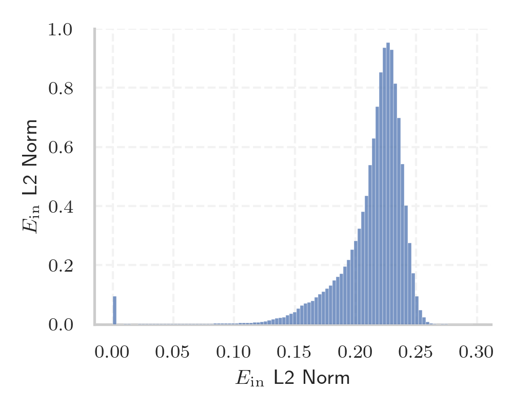
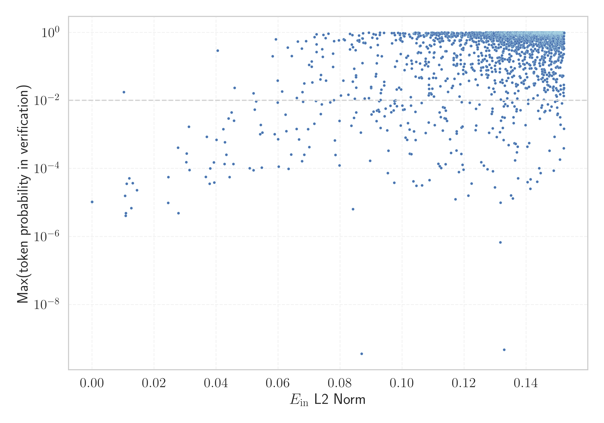

# Report for `mrfakename/mistral-small-3.1-24b-instruct-2503-hf`

## Model info

* Model Info: 
  * Tied embeddings: False
  * LM head uses bias: False
  * Embeddings shape: [131072, 5120]
* Tokenizer Info: 
  * Vocab Size: 131072
  * Tokenizer Class: LlamaTokenizerFast
  * Tokenizer Type: BPE
  * Bytes handling: Byte Input
  * Token for verification prompt building: Vriendschappelijk
  * Token id for verification prompt building: 115461
* Indicator summary: 
  * Indicator for under-trained tokens: E_{in} L2 Norm
  * Overall distribution: 0.214 +/- 0.031
* Detected Token Counts: 
  * Number of tested under-trained tokens: 3502, 2448 non-special, 204 below p = 0.01 threshold, 35 below soft indicator threshold
  * Number of single byte tokens: 256, of which 18 below indicator threshold
  * Number of special tokens: 3499, of which 158 below indicator threshold
  * Number of non-single-byte unreachable tokens: 3499, of which 158 below indicator threshold
  * Number of non-single-byte UTF-fragment tokens:  1307, of which 5 below soft indicator threshold

## Under-trained token indicators plot


## Verification plot


## Under-trained token verification results
35 entries below threshold of 0.060

|   token_id | token                   |   indicator | max_prob                                                         | in_other_tokens                                                                                                                                                                                 |
|------------|-------------------------|-------------|------------------------------------------------------------------|-------------------------------------------------------------------------------------------------------------------------------------------------------------------------------------------------|
|      91515 | ````` ▁erresident ````` |   0.0245148 | <span style='border: 1px solid rgb(169, 68, 66);'>9.8e-06</span> | <span style='border: 1px solid rgb(169, 68, 66);'>````` ▁erresidentzia `````</span>                                                                                                             |
|      82858 | ````` abezian `````     |   0.0276934 | <span style='border: 1px solid rgb(169, 68, 66);'>0.00041</span> | <span style='border: 1px solid rgb(169, 68, 66);'>````` ▁langabezian `````</span>                                                                                                               |
|      86332 | ````` ▁అమలవ `````       |   0.0278729 | <span style='border: 1px solid rgb(169, 68, 66);'>4.9e-06</span> | ````` ▁అమలవుతోంది `````                                                                                                                                                                             |
|     122838 | ````` \xa0μg `````      |   0.0304834 | <span style='border: 1px solid rgb(169, 68, 66);'>0.00027</span> |                                                                                                                                                                                                 |
|      28333 | ````` ▁البريط `````     |   0.0311982 | <span style='border: 1px solid rgb(255, 145, 0);'>0.0017</span>  | ````` ▁البريطانية `````, ````` ▁البريطاني `````                                                                                                                                                 |
|      20896 | ````` 页面存档 `````    |   0.0366797 | <span style='border: 1px solid rgb(169, 68, 66);'>5.6e-05</span> | ````` 页面存档备份 `````                                                                                                                                                                        |
|     124061 | ````` sięb `````        |   0.0370312 | <span style='border: 1px solid rgb(169, 68, 66);'>0.00085</span> | ````` siębior `````                                                                                                                                                                             |
|      89013 | ````` ▁higiez `````     |   0.0379227 | <span style='border: 1px solid rgb(169, 68, 66);'>3.6e-05</span> | <span style='border: 1px solid rgb(169, 68, 66);'>````` ▁higiezinen `````</span>                                                                                                                |
|     105127 | ````` ุมภาพ `````        |   0.0381144 | <span style='border: 1px solid rgb(169, 68, 66);'>0.0001</span>  | ````` ุมภาพันธ์ `````, ````` ▁กุมภาพันธ์ `````                                                                                                                                                        |
|      59471 | ````` ▁pemerint `````   |   0.0392768 | <span style='border: 1px solid rgb(169, 68, 66);'>0.00015</span> | ````` ▁pemerintah `````, ````` ▁pemerintahan `````                                                                                                                                              |
|      57668 | ````` ▁komert `````     |   0.0393835 | <span style='border: 1px solid rgb(169, 68, 66);'>3.9e-05</span> | <span style='border: 1px solid rgb(169, 68, 66);'>````` ▁komertzio `````</span>, ````` ▁komertzioetatik `````, <span style='border: 1px solid rgb(255, 145, 0);'>````` ▁komertzial `````</span> |
|     119980 | ````` ▁międzyn `````    |   0.0400899 | <span style='border: 1px solid rgb(169, 68, 66);'>0.00069</span> | ````` ▁międzynarod `````                                                                                                                                                                        |
|      69924 | ````` ▁segü `````       |   0.040532  | <span style='border: 1px solid rgb(40, 167, 69);'>0.29</span>    | ````` ▁següent `````, ````` ▁següents `````                                                                                                                                                     |
|      67483 | ````` ▁ژوئ `````        |   0.0423395 | <span style='border: 1px solid rgb(255, 145, 0);'>0.0014</span>  | <span style='border: 1px solid rgb(40, 167, 69);'>````` ▁ژوئیه `````</span>, ````` ▁ژوئن `````                                                                                                  |
|      83390 | ````` ▁komertzio `````  |   0.0427054 | <span style='border: 1px solid rgb(169, 68, 66);'>0.00014</span> | ````` ▁komertzioetatik `````                                                                                                                                                                    |
|      90252 | ````` مييز `````        |   0.0428751 | <span style='border: 1px solid rgb(169, 68, 66);'>0.00059</span> | <span style='border: 1px solid rgb(40, 167, 69);'>````` ▁التمييز `````</span>, <span style='border: 1px solid rgb(40, 167, 69);'>````` ▁تمييز `````</span>                                      |
|      98997 | ````` ฤศจ `````         |   0.0432867 | <span style='border: 1px solid rgb(169, 68, 66);'>0.00025</span> | ````` ▁พฤศจิกายน `````, ````` ฤศจิกายน `````                                                                                                                                                      |
|      87386 | ````` -usti `````       |   0.0440245 | <span style='border: 1px solid rgb(255, 145, 0);'>0.0029</span>  | ````` -ustiategi `````                                                                                                                                                                          |
|      52679 | ````` tanleria `````    |   0.0443386 | <span style='border: 1px solid rgb(169, 68, 66);'>5.6e-05</span> | <span style='border: 1px solid rgb(40, 167, 69);'>````` ▁biztanleria `````</span>, ````` ▁Biztanleria `````                                                                                     |
|      64291 | ````` ▁الإيط `````      |   0.0449637 | <span style='border: 1px solid rgb(255, 145, 0);'>0.0045</span>  | <span style='border: 1px solid rgb(40, 167, 69);'>````` ▁الإيطالي `````</span>, <span style='border: 1px solid rgb(40, 167, 69);'>````` ▁الإيطالية `````</span>                                 |
<details><summary>15 additional entries below threshold</summary>

|   token_id | token               |   indicator | max_prob                                                         | in_other_tokens                                                                                                                                                 |
|------------|---------------------|-------------|------------------------------------------------------------------|-----------------------------------------------------------------------------------------------------------------------------------------------------------------|
|      83479 | ````` banako `````  |   0.0455853 | <span style='border: 1px solid rgb(169, 68, 66);'>0.00014</span> | <span style='border: 1px solid rgb(169, 68, 66);'>````` ▁norbanako `````</span>, ````` ▁norbanakoentzako `````                                                  |
|      41911 | ````` زراء `````    |   0.0457386 | <span style='border: 1px solid rgb(255, 145, 0);'>0.0025</span>  | ````` ▁الوزراء `````, <span style='border: 1px solid rgb(40, 167, 69);'>````` ▁وزراء `````</span>                                                               |
|      26421 | ````` ▁lớ `````     |   0.0459402 | <span style='border: 1px solid rgb(251, 189, 8);'>0.023</span>   | ````` ▁lớp `````, ````` ▁lớn `````                                                                                                                              |
|     116654 | ````` ▁igelts ````` |   0.0508107 | <span style='border: 1px solid rgb(169, 68, 66);'>0.0001</span>  | <span style='border: 1px solid rgb(169, 68, 66);'>````` ▁igeltsero `````</span>                                                                                 |
|     107277 | ````` ▁జలవ `````    |   0.0520532 | <span style='border: 1px solid rgb(169, 68, 66);'>8.9e-05</span> | ````` ▁జలవనరుల్లోకి `````                                                                                                                                           |
|      43723 | ````` ▁الصهي `````  |   0.0520682 | <span style='border: 1px solid rgb(251, 189, 8);'>0.016</span>   | <span style='border: 1px solid rgb(40, 167, 69);'>````` ▁الصهيوني `````</span>, <span style='border: 1px solid rgb(40, 167, 69);'>````` ▁الصهيونية `````</span> |
|      52934 | ````` ▁انھ `````    |   0.052474  | <span style='border: 1px solid rgb(255, 145, 0);'>0.0053</span>  | ````` ▁انھوں `````, ````` ▁انھیں `````                                                                                                                          |
|      40112 | ````` لسلة `````    |   0.0529302 | <span style='border: 1px solid rgb(255, 145, 0);'>0.0094</span>  | ````` ▁السلسلة `````, ````` ▁سلسلة `````                                                                                                                        |
|      86580 | ````` 衆国 `````    |   0.0542349 | <span style='border: 1px solid rgb(255, 145, 0);'>0.001</span>   | ````` 合衆国 `````                                                                                                                                              |
|     115884 | ````` zimendu ````` |   0.0544186 | <span style='border: 1px solid rgb(255, 145, 0);'>0.0019</span>  | <span style='border: 1px solid rgb(169, 68, 66);'>````` ▁establezimendu `````</span>                                                                            |
|     126193 | ````` షధ `````      |   0.0547308 | <span style='border: 1px solid rgb(169, 68, 66);'>0.00011</span> | <span style='border: 1px solid rgb(169, 68, 66);'>````` ▁ఔషధ `````</span>                                                                                       |
|      98974 | ````` ิกายน `````    |   0.0549066 | <span style='border: 1px solid rgb(255, 145, 0);'>0.0011</span>  | ````` ▁พฤศจิกายน `````, ````` ฤศจิกายน `````                                                                                                                      |
|     116979 | ````` оциа `````    |   0.0582471 | <span style='border: 1px solid rgb(40, 167, 69);'>0.2</span>     | ````` ссоциа `````                                                                                                                                              |
|      30080 | ````` ▁సరఫర `````   |   0.0588889 | <span style='border: 1px solid rgb(255, 145, 0);'>0.001</span>   | ````` ▁సరఫరా `````, ````` ▁సరఫరాల `````                                                                                                                           |
|     104869 | ````` \xa0µ `````   |   0.0592932 | <span style='border: 1px solid rgb(40, 167, 69);'>0.63</span>    |                                                                                                                                                                 |
</details>


## Tokens with partial UTF-8 sequences
5 entries below threshold of 0.060

|   token_id | token                      |   indicator | in_other_tokens                                                                                                                                                                                                                                                                                                                        |
|------------|----------------------------|-------------|----------------------------------------------------------------------------------------------------------------------------------------------------------------------------------------------------------------------------------------------------------------------------------------------------------------------------------------|
|       1396 | ````` о<0xD0> `````        | 1.33979e-11 | ````` фон `````, ````` ▁предполага `````, ````` ▁боевых `````, ````` ▁свобод `````, ````` аров `````, ...                                                                                                                                                                                                                              |
|      42009 | ````` <0xA3><0xBD>作 ````` | 0.00835168  | ````` ▁製作 `````, ````` 製作 `````                                                                                                                                                                                                                                                                                                    |
|      28511 | ````` <0x9B>็น `````        | 0.0176869   | ````` ▁เป็น `````, ````` เป็น `````                                                                                                                                                                                                                                                                                                      |
|      28682 | ````` <0x85><0x8D>音 ````` | 0.0325441   | <span style='border: 1px solid rgb(40, 167, 69);'>````` 配音員 `````</span>, <span style='border: 1px solid rgb(40, 167, 69);'>````` 粵語配音 `````</span>, <span style='border: 1px solid rgb(40, 167, 69);'>````` ▁配音 `````</span>, ````` 配音 `````, <span style='border: 1px solid rgb(251, 189, 8);'>````` ▁配音員 `````</span> |
|      34008 | ````` <0x96>에 `````       | 0.0588586   | ````` 밖에 `````, ````` ▁수밖에 `````, ````` ▁밖에 `````                                                                                                                                                                                                                                                                               |


## Byte tokens
18 entries below threshold of 0.112

|   token_id | token              |   indicator |   ord | hex   | byte_type   |
|------------|--------------------|-------------|-------|-------|-------------|
|       1250 | ````` <0xFA> ````` | 1.29874e-11 |   250 | 0xFA  | unused_utf8 |
|       1253 | ````` <0xFD> ````` | 1.30773e-11 |   253 | 0xFD  | unused_utf8 |
|       1193 | ````` <0xC1> ````` | 1.31514e-11 |   193 | 0xC1  | unused_utf8 |
|       1254 | ````` <0xFE> ````` | 1.32025e-11 |   254 | 0xFE  | unused_utf8 |
|       1247 | ````` <0xF7> ````` | 1.32108e-11 |   247 | 0xF7  | unused_utf8 |
|       1255 | ````` <0xFF> ````` | 1.32239e-11 |   255 | 0xFF  | unused_utf8 |
|       1252 | ````` <0xFC> ````` | 1.3306e-11  |   252 | 0xFC  | unused_utf8 |
|       1246 | ````` <0xF6> ````` | 1.33595e-11 |   246 | 0xF6  | unused_utf8 |
|       1249 | ````` <0xF9> ````` | 1.33667e-11 |   249 | 0xF9  | unused_utf8 |
|       1192 | ````` <0xC0> ````` | 1.34084e-11 |   192 | 0xC0  | unused_utf8 |
|       1251 | ````` <0xFB> ````` | 1.34279e-11 |   251 | 0xFB  | unused_utf8 |
|       1248 | ````` <0xF8> ````` | 1.34791e-11 |   248 | 0xF8  | unused_utf8 |
|       1245 | ````` <0xF5> ````` | 1.35267e-11 |   245 | 0xF5  | unused_utf8 |
|       1030 | ````` \x1e `````   | 0.0119955   |    30 | 0x1E  | ascii       |
|       1028 | ````` \x1c `````   | 0.0246149   |    28 | 0x1C  | ascii       |
|       1011 | ````` \x0b `````   | 0.0303935   |    11 | 0x0B  | ascii       |
|       1029 | ````` \x1d `````   | 0.0314127   |    29 | 0x1D  | ascii       |
|       1012 | ````` \x0c `````   | 0.0738522   |    12 | 0x0C  | ascii       |


## Special tokens
996 entries below threshold of 0.112

|   token_id | token                     |   indicator | max_prob                                                       |
|------------|---------------------------|-------------|----------------------------------------------------------------|
|        898 | ````` <SPECIAL_898> ````` | 1.29111e-11 | <span style='border: 1px solid rgb(169, 68, 66);'>1e-05</span> |
|        478 | ````` <SPECIAL_478> ````` | 1.30091e-11 | <span style='border: 1px solid rgb(169, 68, 66);'>1e-05</span> |
|        698 | ````` <SPECIAL_698> ````` | 1.3029e-11  | <span style='border: 1px solid rgb(169, 68, 66);'>1e-05</span> |
|        169 | ````` <SPECIAL_169> ````` | 1.30739e-11 | <span style='border: 1px solid rgb(169, 68, 66);'>1e-05</span> |
|        907 | ````` <SPECIAL_907> ````` | 1.30768e-11 | <span style='border: 1px solid rgb(169, 68, 66);'>1e-05</span> |
|        852 | ````` <SPECIAL_852> ````` | 1.30774e-11 | <span style='border: 1px solid rgb(169, 68, 66);'>1e-05</span> |
|        218 | ````` <SPECIAL_218> ````` | 1.30805e-11 | <span style='border: 1px solid rgb(169, 68, 66);'>1e-05</span> |
|        636 | ````` <SPECIAL_636> ````` | 1.30904e-11 | <span style='border: 1px solid rgb(169, 68, 66);'>1e-05</span> |
|        958 | ````` <SPECIAL_958> ````` | 1.31063e-11 | <span style='border: 1px solid rgb(169, 68, 66);'>1e-05</span> |
|        519 | ````` <SPECIAL_519> ````` | 1.31081e-11 | <span style='border: 1px solid rgb(169, 68, 66);'>1e-05</span> |
|        112 | ````` <SPECIAL_112> ````` | 1.31082e-11 | <span style='border: 1px solid rgb(169, 68, 66);'>1e-05</span> |
|        931 | ````` <SPECIAL_931> ````` | 1.31137e-11 | <span style='border: 1px solid rgb(169, 68, 66);'>1e-05</span> |
|        646 | ````` <SPECIAL_646> ````` | 1.31152e-11 | <span style='border: 1px solid rgb(169, 68, 66);'>1e-05</span> |
|        512 | ````` <SPECIAL_512> ````` | 1.31181e-11 | <span style='border: 1px solid rgb(169, 68, 66);'>1e-05</span> |
|        128 | ````` <SPECIAL_128> ````` | 1.31214e-11 | <span style='border: 1px solid rgb(169, 68, 66);'>1e-05</span> |
|        563 | ````` <SPECIAL_563> ````` | 1.31238e-11 | <span style='border: 1px solid rgb(169, 68, 66);'>1e-05</span> |
|        618 | ````` <SPECIAL_618> ````` | 1.31277e-11 | <span style='border: 1px solid rgb(169, 68, 66);'>1e-05</span> |
|        376 | ````` <SPECIAL_376> ````` | 1.31293e-11 | <span style='border: 1px solid rgb(169, 68, 66);'>1e-05</span> |
|        481 | ````` <SPECIAL_481> ````` | 1.31298e-11 | <span style='border: 1px solid rgb(169, 68, 66);'>1e-05</span> |
|        763 | ````` <SPECIAL_763> ````` | 1.31369e-11 | <span style='border: 1px solid rgb(169, 68, 66);'>1e-05</span> |
<details><summary>976 additional entries below threshold</summary>

|   token_id | token                          |   indicator | max_prob                                                         |
|------------|--------------------------------|-------------|------------------------------------------------------------------|
|        826 | ````` <SPECIAL_826> `````      | 1.31382e-11 | <span style='border: 1px solid rgb(169, 68, 66);'>1e-05</span>   |
|        338 | ````` <SPECIAL_338> `````      | 1.31389e-11 | <span style='border: 1px solid rgb(169, 68, 66);'>1e-05</span>   |
|        136 | ````` <SPECIAL_136> `````      | 1.31389e-11 | <span style='border: 1px solid rgb(169, 68, 66);'>1e-05</span>   |
|         98 | ````` <SPECIAL_98> `````       | 1.31392e-11 | <span style='border: 1px solid rgb(169, 68, 66);'>1e-05</span>   |
|        380 | ````` <SPECIAL_380> `````      | 1.31421e-11 | <span style='border: 1px solid rgb(169, 68, 66);'>1e-05</span>   |
|        919 | ````` <SPECIAL_919> `````      | 1.31446e-11 | <span style='border: 1px solid rgb(169, 68, 66);'>1e-05</span>   |
|         23 | ````` <SPECIAL_23> `````       | 1.31466e-11 | <span style='border: 1px solid rgb(169, 68, 66);'>1e-05</span>   |
|         75 | ````` <SPECIAL_75> `````       | 1.31543e-11 | <span style='border: 1px solid rgb(169, 68, 66);'>1e-05</span>   |
|        495 | ````` <SPECIAL_495> `````      | 1.31559e-11 | <span style='border: 1px solid rgb(169, 68, 66);'>1e-05</span>   |
|        820 | ````` <SPECIAL_820> `````      | 1.31577e-11 | <span style='border: 1px solid rgb(169, 68, 66);'>1e-05</span>   |
|        450 | ````` <SPECIAL_450> `````      | 1.31579e-11 | <span style='border: 1px solid rgb(169, 68, 66);'>1e-05</span>   |
|        224 | ````` <SPECIAL_224> `````      | 1.31584e-11 | <span style='border: 1px solid rgb(169, 68, 66);'>1e-05</span>   |
|        996 | ````` <SPECIAL_996> `````      | 1.316e-11   | <span style='border: 1px solid rgb(169, 68, 66);'>1e-05</span>   |
|        737 | ````` <SPECIAL_737> `````      | 1.3162e-11  | <span style='border: 1px solid rgb(169, 68, 66);'>1e-05</span>   |
|        384 | ````` <SPECIAL_384> `````      | 1.31625e-11 | <span style='border: 1px solid rgb(169, 68, 66);'>1e-05</span>   |
|        785 | ````` <SPECIAL_785> `````      | 1.31674e-11 | <span style='border: 1px solid rgb(169, 68, 66);'>1e-05</span>   |
|        253 | ````` <SPECIAL_253> `````      | 1.31687e-11 | <span style='border: 1px solid rgb(169, 68, 66);'>1e-05</span>   |
|         78 | ````` <SPECIAL_78> `````       | 1.31692e-11 | <span style='border: 1px solid rgb(169, 68, 66);'>1e-05</span>   |
|        215 | ````` <SPECIAL_215> `````      | 1.31712e-11 | <span style='border: 1px solid rgb(169, 68, 66);'>1e-05</span>   |
|        645 | ````` <SPECIAL_645> `````      | 1.31732e-11 | <span style='border: 1px solid rgb(169, 68, 66);'>1e-05</span>   |
|        149 | ````` <SPECIAL_149> `````      | 1.3174e-11  | <span style='border: 1px solid rgb(169, 68, 66);'>1e-05</span>   |
|        769 | ````` <SPECIAL_769> `````      | 1.31755e-11 | <span style='border: 1px solid rgb(169, 68, 66);'>1e-05</span>   |
|        444 | ````` <SPECIAL_444> `````      | 1.31764e-11 | <span style='border: 1px solid rgb(169, 68, 66);'>1e-05</span>   |
|        855 | ````` <SPECIAL_855> `````      | 1.31773e-11 | <span style='border: 1px solid rgb(169, 68, 66);'>1e-05</span>   |
|        874 | ````` <SPECIAL_874> `````      | 1.31775e-11 | <span style='border: 1px solid rgb(169, 68, 66);'>1e-05</span>   |
|        982 | ````` <SPECIAL_982> `````      | 1.31776e-11 | <span style='border: 1px solid rgb(169, 68, 66);'>1e-05</span>   |
|        663 | ````` <SPECIAL_663> `````      | 1.31795e-11 | <span style='border: 1px solid rgb(169, 68, 66);'>1e-05</span>   |
|        823 | ````` <SPECIAL_823> `````      | 1.31799e-11 | <span style='border: 1px solid rgb(169, 68, 66);'>1e-05</span>   |
|        959 | ````` <SPECIAL_959> `````      | 1.31829e-11 | <span style='border: 1px solid rgb(169, 68, 66);'>1e-05</span>   |
|         32 | ````` <SPECIAL_32> `````       | 1.31836e-11 | <span style='border: 1px solid rgb(169, 68, 66);'>1e-05</span>   |
|        675 | ````` <SPECIAL_675> `````      | 1.31841e-11 | <span style='border: 1px solid rgb(169, 68, 66);'>1e-05</span>   |
|        534 | ````` <SPECIAL_534> `````      | 1.31847e-11 | <span style='border: 1px solid rgb(169, 68, 66);'>1e-05</span>   |
|         57 | ````` <SPECIAL_57> `````       | 1.3185e-11  | <span style='border: 1px solid rgb(169, 68, 66);'>1e-05</span>   |
|        561 | ````` <SPECIAL_561> `````      | 1.31857e-11 | <span style='border: 1px solid rgb(169, 68, 66);'>1e-05</span>   |
|        944 | ````` <SPECIAL_944> `````      | 1.31858e-11 | <span style='border: 1px solid rgb(169, 68, 66);'>1e-05</span>   |
|        624 | ````` <SPECIAL_624> `````      | 1.31858e-11 | <span style='border: 1px solid rgb(169, 68, 66);'>1e-05</span>   |
|        702 | ````` <SPECIAL_702> `````      | 1.31866e-11 | <span style='border: 1px solid rgb(169, 68, 66);'>1e-05</span>   |
|        909 | ````` <SPECIAL_909> `````      | 1.31889e-11 | <span style='border: 1px solid rgb(169, 68, 66);'>1e-05</span>   |
|        320 | ````` <SPECIAL_320> `````      | 1.31898e-11 | <span style='border: 1px solid rgb(169, 68, 66);'>1e-05</span>   |
|        502 | ````` <SPECIAL_502> `````      | 1.31917e-11 | <span style='border: 1px solid rgb(169, 68, 66);'>1e-05</span>   |
|        742 | ````` <SPECIAL_742> `````      | 1.31918e-11 | <span style='border: 1px solid rgb(169, 68, 66);'>1e-05</span>   |
|        471 | ````` <SPECIAL_471> `````      | 1.31932e-11 | <span style='border: 1px solid rgb(169, 68, 66);'>1e-05</span>   |
|         35 | ````` <SPECIAL_35> `````       | 1.31949e-11 | <span style='border: 1px solid rgb(169, 68, 66);'>1e-05</span>   |
|        553 | ````` <SPECIAL_553> `````      | 1.31957e-11 | <span style='border: 1px solid rgb(169, 68, 66);'>1e-05</span>   |
|        491 | ````` <SPECIAL_491> `````      | 1.31962e-11 | <span style='border: 1px solid rgb(169, 68, 66);'>1e-05</span>   |
|        153 | ````` <SPECIAL_153> `````      | 1.31962e-11 | <span style='border: 1px solid rgb(169, 68, 66);'>1e-05</span>   |
|        727 | ````` <SPECIAL_727> `````      | 1.3198e-11  | <span style='border: 1px solid rgb(169, 68, 66);'>1e-05</span>   |
|        293 | ````` <SPECIAL_293> `````      | 1.31986e-11 | <span style='border: 1px solid rgb(169, 68, 66);'>1e-05</span>   |
|         25 | ````` <SPECIAL_25> `````       | 1.31993e-11 | <span style='border: 1px solid rgb(169, 68, 66);'>1e-05</span>   |
|        546 | ````` <SPECIAL_546> `````      | 1.32008e-11 | <span style='border: 1px solid rgb(169, 68, 66);'>1e-05</span>   |
|        673 | ````` <SPECIAL_673> `````      | 1.32009e-11 | <span style='border: 1px solid rgb(169, 68, 66);'>1e-05</span>   |
|        708 | ````` <SPECIAL_708> `````      | 1.32013e-11 | <span style='border: 1px solid rgb(169, 68, 66);'>1e-05</span>   |
|        213 | ````` <SPECIAL_213> `````      | 1.32015e-11 | <span style='border: 1px solid rgb(169, 68, 66);'>1e-05</span>   |
|        343 | ````` <SPECIAL_343> `````      | 1.32027e-11 | <span style='border: 1px solid rgb(169, 68, 66);'>1e-05</span>   |
|        204 | ````` <SPECIAL_204> `````      | 1.32038e-11 | <span style='border: 1px solid rgb(169, 68, 66);'>1e-05</span>   |
|        754 | ````` <SPECIAL_754> `````      | 1.32047e-11 | <span style='border: 1px solid rgb(169, 68, 66);'>1e-05</span>   |
|        456 | ````` <SPECIAL_456> `````      | 1.32048e-11 | <span style='border: 1px solid rgb(169, 68, 66);'>1e-05</span>   |
|        249 | ````` <SPECIAL_249> `````      | 1.32067e-11 | <span style='border: 1px solid rgb(169, 68, 66);'>1e-05</span>   |
|        901 | ````` <SPECIAL_901> `````      | 1.32072e-11 | <span style='border: 1px solid rgb(169, 68, 66);'>1e-05</span>   |
|        975 | ````` <SPECIAL_975> `````      | 1.32083e-11 | <span style='border: 1px solid rgb(169, 68, 66);'>1e-05</span>   |
|        423 | ````` <SPECIAL_423> `````      | 1.32085e-11 | <span style='border: 1px solid rgb(169, 68, 66);'>1e-05</span>   |
|        195 | ````` <SPECIAL_195> `````      | 1.32096e-11 | <span style='border: 1px solid rgb(169, 68, 66);'>1e-05</span>   |
|        870 | ````` <SPECIAL_870> `````      | 1.32103e-11 | <span style='border: 1px solid rgb(169, 68, 66);'>1e-05</span>   |
|        564 | ````` <SPECIAL_564> `````      | 1.32134e-11 | <span style='border: 1px solid rgb(169, 68, 66);'>1e-05</span>   |
|        888 | ````` <SPECIAL_888> `````      | 1.32134e-11 | <span style='border: 1px solid rgb(169, 68, 66);'>1e-05</span>   |
|         93 | ````` <SPECIAL_93> `````       | 1.32136e-11 | <span style='border: 1px solid rgb(169, 68, 66);'>1e-05</span>   |
|        524 | ````` <SPECIAL_524> `````      | 1.32153e-11 | <span style='border: 1px solid rgb(169, 68, 66);'>1e-05</span>   |
|        497 | ````` <SPECIAL_497> `````      | 1.32157e-11 | <span style='border: 1px solid rgb(169, 68, 66);'>1e-05</span>   |
|        445 | ````` <SPECIAL_445> `````      | 1.3216e-11  | <span style='border: 1px solid rgb(169, 68, 66);'>1e-05</span>   |
|        687 | ````` <SPECIAL_687> `````      | 1.32171e-11 | <span style='border: 1px solid rgb(169, 68, 66);'>1e-05</span>   |
|        523 | ````` <SPECIAL_523> `````      | 1.32183e-11 | <span style='border: 1px solid rgb(169, 68, 66);'>1e-05</span>   |
|        254 | ````` <SPECIAL_254> `````      | 1.32197e-11 | <span style='border: 1px solid rgb(169, 68, 66);'>1e-05</span>   |
|        411 | ````` <SPECIAL_411> `````      | 1.32198e-11 | <span style='border: 1px solid rgb(169, 68, 66);'>1e-05</span>   |
|        994 | ````` <SPECIAL_994> `````      | 1.32199e-11 | <span style='border: 1px solid rgb(169, 68, 66);'>1e-05</span>   |
|        868 | ````` <SPECIAL_868> `````      | 1.32218e-11 | <span style='border: 1px solid rgb(169, 68, 66);'>1e-05</span>   |
|        269 | ````` <SPECIAL_269> `````      | 1.32224e-11 | <span style='border: 1px solid rgb(169, 68, 66);'>1e-05</span>   |
|        434 | ````` <SPECIAL_434> `````      | 1.32268e-11 | <span style='border: 1px solid rgb(169, 68, 66);'>1e-05</span>   |
|        164 | ````` <SPECIAL_164> `````      | 1.32272e-11 | <span style='border: 1px solid rgb(169, 68, 66);'>1e-05</span>   |
|        517 | ````` <SPECIAL_517> `````      | 1.32275e-11 | <span style='border: 1px solid rgb(169, 68, 66);'>1e-05</span>   |
|        285 | ````` <SPECIAL_285> `````      | 1.32282e-11 | <span style='border: 1px solid rgb(169, 68, 66);'>1e-05</span>   |
|        449 | ````` <SPECIAL_449> `````      | 1.32283e-11 | <span style='border: 1px solid rgb(169, 68, 66);'>1e-05</span>   |
|        122 | ````` <SPECIAL_122> `````      | 1.32284e-11 | <span style='border: 1px solid rgb(169, 68, 66);'>1e-05</span>   |
|        230 | ````` <SPECIAL_230> `````      | 1.32297e-11 | <span style='border: 1px solid rgb(169, 68, 66);'>1e-05</span>   |
|        880 | ````` <SPECIAL_880> `````      | 1.32299e-11 | <span style='border: 1px solid rgb(169, 68, 66);'>1e-05</span>   |
|        511 | ````` <SPECIAL_511> `````      | 1.32301e-11 | <span style='border: 1px solid rgb(169, 68, 66);'>1e-05</span>   |
|        585 | ````` <SPECIAL_585> `````      | 1.32306e-11 | <span style='border: 1px solid rgb(169, 68, 66);'>1e-05</span>   |
|        768 | ````` <SPECIAL_768> `````      | 1.3231e-11  | <span style='border: 1px solid rgb(169, 68, 66);'>1e-05</span>   |
|        662 | ````` <SPECIAL_662> `````      | 1.32311e-11 | <span style='border: 1px solid rgb(169, 68, 66);'>1e-05</span>   |
|        374 | ````` <SPECIAL_374> `````      | 1.32313e-11 | <span style='border: 1px solid rgb(169, 68, 66);'>1e-05</span>   |
|        860 | ````` <SPECIAL_860> `````      | 1.32314e-11 | <span style='border: 1px solid rgb(169, 68, 66);'>1e-05</span>   |
|        963 | ````` <SPECIAL_963> `````      | 1.32315e-11 | <span style='border: 1px solid rgb(169, 68, 66);'>1e-05</span>   |
|        162 | ````` <SPECIAL_162> `````      | 1.32317e-11 | <span style='border: 1px solid rgb(169, 68, 66);'>1e-05</span>   |
|        107 | ````` <SPECIAL_107> `````      | 1.32339e-11 | <span style='border: 1px solid rgb(169, 68, 66);'>1e-05</span>   |
|        701 | ````` <SPECIAL_701> `````      | 1.32344e-11 | <span style='border: 1px solid rgb(169, 68, 66);'>1e-05</span>   |
|        592 | ````` <SPECIAL_592> `````      | 1.32354e-11 | <span style='border: 1px solid rgb(169, 68, 66);'>1e-05</span>   |
|        321 | ````` <SPECIAL_321> `````      | 1.32354e-11 | <span style='border: 1px solid rgb(169, 68, 66);'>1e-05</span>   |
|        291 | ````` <SPECIAL_291> `````      | 1.32375e-11 | <span style='border: 1px solid rgb(169, 68, 66);'>1e-05</span>   |
|        780 | ````` <SPECIAL_780> `````      | 1.32378e-11 | <span style='border: 1px solid rgb(169, 68, 66);'>1e-05</span>   |
|        929 | ````` <SPECIAL_929> `````      | 1.3238e-11  | <span style='border: 1px solid rgb(169, 68, 66);'>1e-05</span>   |
|        554 | ````` <SPECIAL_554> `````      | 1.32389e-11 | <span style='border: 1px solid rgb(169, 68, 66);'>1e-05</span>   |
|        810 | ````` <SPECIAL_810> `````      | 1.3239e-11  | <span style='border: 1px solid rgb(169, 68, 66);'>1e-05</span>   |
|        262 | ````` <SPECIAL_262> `````      | 1.32396e-11 | <span style='border: 1px solid rgb(169, 68, 66);'>1e-05</span>   |
|        684 | ````` <SPECIAL_684> `````      | 1.32402e-11 | <span style='border: 1px solid rgb(169, 68, 66);'>1e-05</span>   |
|        652 | ````` <SPECIAL_652> `````      | 1.32403e-11 | <span style='border: 1px solid rgb(169, 68, 66);'>1e-05</span>   |
|        322 | ````` <SPECIAL_322> `````      | 1.32407e-11 | <span style='border: 1px solid rgb(169, 68, 66);'>1e-05</span>   |
|        427 | ````` <SPECIAL_427> `````      | 1.32415e-11 | <span style='border: 1px solid rgb(169, 68, 66);'>1e-05</span>   |
|        219 | ````` <SPECIAL_219> `````      | 1.32418e-11 | <span style='border: 1px solid rgb(169, 68, 66);'>1e-05</span>   |
|        510 | ````` <SPECIAL_510> `````      | 1.3242e-11  | <span style='border: 1px solid rgb(169, 68, 66);'>1e-05</span>   |
|        290 | ````` <SPECIAL_290> `````      | 1.3242e-11  | <span style='border: 1px solid rgb(169, 68, 66);'>1e-05</span>   |
|        950 | ````` <SPECIAL_950> `````      | 1.32434e-11 | <span style='border: 1px solid rgb(169, 68, 66);'>1e-05</span>   |
|        825 | ````` <SPECIAL_825> `````      | 1.32438e-11 | <span style='border: 1px solid rgb(169, 68, 66);'>1e-05</span>   |
|        748 | ````` <SPECIAL_748> `````      | 1.32447e-11 | <span style='border: 1px solid rgb(169, 68, 66);'>1e-05</span>   |
|        355 | ````` <SPECIAL_355> `````      | 1.32457e-11 | <span style='border: 1px solid rgb(169, 68, 66);'>1e-05</span>   |
|        984 | ````` <SPECIAL_984> `````      | 1.32458e-11 | <span style='border: 1px solid rgb(169, 68, 66);'>1e-05</span>   |
|        185 | ````` <SPECIAL_185> `````      | 1.32459e-11 | <span style='border: 1px solid rgb(169, 68, 66);'>1e-05</span>   |
|        105 | ````` <SPECIAL_105> `````      | 1.32467e-11 | <span style='border: 1px solid rgb(169, 68, 66);'>1e-05</span>   |
|        625 | ````` <SPECIAL_625> `````      | 1.32477e-11 | <span style='border: 1px solid rgb(169, 68, 66);'>1e-05</span>   |
|        725 | ````` <SPECIAL_725> `````      | 1.32479e-11 | <span style='border: 1px solid rgb(169, 68, 66);'>1e-05</span>   |
|        363 | ````` <SPECIAL_363> `````      | 1.32492e-11 | <span style='border: 1px solid rgb(169, 68, 66);'>1e-05</span>   |
|        323 | ````` <SPECIAL_323> `````      | 1.32498e-11 | <span style='border: 1px solid rgb(169, 68, 66);'>1e-05</span>   |
|         92 | ````` <SPECIAL_92> `````       | 1.32503e-11 | <span style='border: 1px solid rgb(169, 68, 66);'>1e-05</span>   |
|        948 | ````` <SPECIAL_948> `````      | 1.32508e-11 | <span style='border: 1px solid rgb(169, 68, 66);'>1e-05</span>   |
|        547 | ````` <SPECIAL_547> `````      | 1.3251e-11  | <span style='border: 1px solid rgb(169, 68, 66);'>1e-05</span>   |
|        665 | ````` <SPECIAL_665> `````      | 1.32511e-11 | <span style='border: 1px solid rgb(169, 68, 66);'>1e-05</span>   |
|        714 | ````` <SPECIAL_714> `````      | 1.32514e-11 | <span style='border: 1px solid rgb(169, 68, 66);'>1e-05</span>   |
|        709 | ````` <SPECIAL_709> `````      | 1.32526e-11 | <span style='border: 1px solid rgb(169, 68, 66);'>1e-05</span>   |
|        781 | ````` <SPECIAL_781> `````      | 1.32538e-11 | <span style='border: 1px solid rgb(169, 68, 66);'>1e-05</span>   |
|        467 | ````` <SPECIAL_467> `````      | 1.32542e-11 | <span style='border: 1px solid rgb(169, 68, 66);'>1e-05</span>   |
|        752 | ````` <SPECIAL_752> `````      | 1.3255e-11  | <span style='border: 1px solid rgb(169, 68, 66);'>1e-05</span>   |
|        766 | ````` <SPECIAL_766> `````      | 1.32551e-11 | <span style='border: 1px solid rgb(169, 68, 66);'>1e-05</span>   |
|        120 | ````` <SPECIAL_120> `````      | 1.32553e-11 | <span style='border: 1px solid rgb(169, 68, 66);'>1e-05</span>   |
|        872 | ````` <SPECIAL_872> `````      | 1.32553e-11 | <span style='border: 1px solid rgb(169, 68, 66);'>1e-05</span>   |
|        772 | ````` <SPECIAL_772> `````      | 1.32554e-11 | <span style='border: 1px solid rgb(169, 68, 66);'>1e-05</span>   |
|        201 | ````` <SPECIAL_201> `````      | 1.32555e-11 | <span style='border: 1px solid rgb(169, 68, 66);'>1e-05</span>   |
|         50 | ````` <SPECIAL_50> `````       | 1.32565e-11 | <span style='border: 1px solid rgb(169, 68, 66);'>1e-05</span>   |
|        865 | ````` <SPECIAL_865> `````      | 1.32568e-11 | <span style='border: 1px solid rgb(169, 68, 66);'>1e-05</span>   |
|        477 | ````` <SPECIAL_477> `````      | 1.32572e-11 | <span style='border: 1px solid rgb(169, 68, 66);'>1e-05</span>   |
|        977 | ````` <SPECIAL_977> `````      | 1.32575e-11 | <span style='border: 1px solid rgb(169, 68, 66);'>1e-05</span>   |
|        556 | ````` <SPECIAL_556> `````      | 1.32577e-11 | <span style='border: 1px solid rgb(169, 68, 66);'>1e-05</span>   |
|        229 | ````` <SPECIAL_229> `````      | 1.32581e-11 | <span style='border: 1px solid rgb(169, 68, 66);'>1e-05</span>   |
|        130 | ````` <SPECIAL_130> `````      | 1.32584e-11 | <span style='border: 1px solid rgb(169, 68, 66);'>1e-05</span>   |
|        194 | ````` <SPECIAL_194> `````      | 1.32585e-11 | <span style='border: 1px solid rgb(169, 68, 66);'>1e-05</span>   |
|        728 | ````` <SPECIAL_728> `````      | 1.32595e-11 | <span style='border: 1px solid rgb(169, 68, 66);'>1e-05</span>   |
|        350 | ````` <SPECIAL_350> `````      | 1.32595e-11 | <span style='border: 1px solid rgb(169, 68, 66);'>1e-05</span>   |
|         83 | ````` <SPECIAL_83> `````       | 1.32596e-11 | <span style='border: 1px solid rgb(169, 68, 66);'>1e-05</span>   |
|        635 | ````` <SPECIAL_635> `````      | 1.32599e-11 | <span style='border: 1px solid rgb(169, 68, 66);'>1e-05</span>   |
|        170 | ````` <SPECIAL_170> `````      | 1.32607e-11 | <span style='border: 1px solid rgb(169, 68, 66);'>1e-05</span>   |
|        806 | ````` <SPECIAL_806> `````      | 1.32613e-11 | <span style='border: 1px solid rgb(169, 68, 66);'>1e-05</span>   |
|        969 | ````` <SPECIAL_969> `````      | 1.32614e-11 | <span style='border: 1px solid rgb(169, 68, 66);'>1e-05</span>   |
|        317 | ````` <SPECIAL_317> `````      | 1.3262e-11  | <span style='border: 1px solid rgb(169, 68, 66);'>1e-05</span>   |
|        859 | ````` <SPECIAL_859> `````      | 1.32623e-11 | <span style='border: 1px solid rgb(169, 68, 66);'>1e-05</span>   |
|        207 | ````` <SPECIAL_207> `````      | 1.32628e-11 | <span style='border: 1px solid rgb(169, 68, 66);'>1e-05</span>   |
|        973 | ````` <SPECIAL_973> `````      | 1.32631e-11 | <span style='border: 1px solid rgb(169, 68, 66);'>1e-05</span>   |
|        560 | ````` <SPECIAL_560> `````      | 1.32639e-11 | <span style='border: 1px solid rgb(169, 68, 66);'>1e-05</span>   |
|        971 | ````` <SPECIAL_971> `````      | 1.32644e-11 | <span style='border: 1px solid rgb(169, 68, 66);'>1e-05</span>   |
|        629 | ````` <SPECIAL_629> `````      | 1.32646e-11 | <span style='border: 1px solid rgb(169, 68, 66);'>1e-05</span>   |
|        816 | ````` <SPECIAL_816> `````      | 1.32647e-11 | <span style='border: 1px solid rgb(169, 68, 66);'>1e-05</span>   |
|        679 | ````` <SPECIAL_679> `````      | 1.32648e-11 | <span style='border: 1px solid rgb(169, 68, 66);'>1e-05</span>   |
|        749 | ````` <SPECIAL_749> `````      | 1.32659e-11 | <span style='border: 1px solid rgb(169, 68, 66);'>1e-05</span>   |
|        336 | ````` <SPECIAL_336> `````      | 1.32666e-11 | <span style='border: 1px solid rgb(169, 68, 66);'>1e-05</span>   |
|        718 | ````` <SPECIAL_718> `````      | 1.32675e-11 | <span style='border: 1px solid rgb(169, 68, 66);'>1e-05</span>   |
|        960 | ````` <SPECIAL_960> `````      | 1.32681e-11 | <span style='border: 1px solid rgb(169, 68, 66);'>1e-05</span>   |
|        406 | ````` <SPECIAL_406> `````      | 1.32684e-11 | <span style='border: 1px solid rgb(169, 68, 66);'>1e-05</span>   |
|        436 | ````` <SPECIAL_436> `````      | 1.32686e-11 | <span style='border: 1px solid rgb(169, 68, 66);'>1e-05</span>   |
|        809 | ````` <SPECIAL_809> `````      | 1.32687e-11 | <span style='border: 1px solid rgb(169, 68, 66);'>1e-05</span>   |
|        976 | ````` <SPECIAL_976> `````      | 1.32687e-11 | <span style='border: 1px solid rgb(169, 68, 66);'>1e-05</span>   |
|        770 | ````` <SPECIAL_770> `````      | 1.32692e-11 | <span style='border: 1px solid rgb(169, 68, 66);'>1e-05</span>   |
|        183 | ````` <SPECIAL_183> `````      | 1.32699e-11 | <span style='border: 1px solid rgb(169, 68, 66);'>1e-05</span>   |
|        795 | ````` <SPECIAL_795> `````      | 1.32701e-11 | <span style='border: 1px solid rgb(169, 68, 66);'>1e-05</span>   |
|        315 | ````` <SPECIAL_315> `````      | 1.32705e-11 | <span style='border: 1px solid rgb(169, 68, 66);'>1e-05</span>   |
|        858 | ````` <SPECIAL_858> `````      | 1.32708e-11 | <span style='border: 1px solid rgb(169, 68, 66);'>1e-05</span>   |
|        484 | ````` <SPECIAL_484> `````      | 1.32713e-11 | <span style='border: 1px solid rgb(169, 68, 66);'>1e-05</span>   |
|        831 | ````` <SPECIAL_831> `````      | 1.32717e-11 | <span style='border: 1px solid rgb(169, 68, 66);'>1e-05</span>   |
|        857 | ````` <SPECIAL_857> `````      | 1.32736e-11 | <span style='border: 1px solid rgb(169, 68, 66);'>1e-05</span>   |
|        926 | ````` <SPECIAL_926> `````      | 1.32748e-11 | <span style='border: 1px solid rgb(169, 68, 66);'>1e-05</span>   |
|        889 | ````` <SPECIAL_889> `````      | 1.32767e-11 | <span style='border: 1px solid rgb(169, 68, 66);'>1e-05</span>   |
|        634 | ````` <SPECIAL_634> `````      | 1.32767e-11 | <span style='border: 1px solid rgb(169, 68, 66);'>1e-05</span>   |
|        616 | ````` <SPECIAL_616> `````      | 1.32776e-11 | <span style='border: 1px solid rgb(169, 68, 66);'>1e-05</span>   |
|        545 | ````` <SPECIAL_545> `````      | 1.32781e-11 | <span style='border: 1px solid rgb(169, 68, 66);'>1e-05</span>   |
|        197 | ````` <SPECIAL_197> `````      | 1.32783e-11 | <span style='border: 1px solid rgb(169, 68, 66);'>1e-05</span>   |
|        389 | ````` <SPECIAL_389> `````      | 1.32785e-11 | <span style='border: 1px solid rgb(169, 68, 66);'>1e-05</span>   |
|        757 | ````` <SPECIAL_757> `````      | 1.32792e-11 | <span style='border: 1px solid rgb(169, 68, 66);'>1e-05</span>   |
|        521 | ````` <SPECIAL_521> `````      | 1.32795e-11 | <span style='border: 1px solid rgb(169, 68, 66);'>1e-05</span>   |
|        473 | ````` <SPECIAL_473> `````      | 1.32798e-11 | <span style='border: 1px solid rgb(169, 68, 66);'>1e-05</span>   |
|        632 | ````` <SPECIAL_632> `````      | 1.32804e-11 | <span style='border: 1px solid rgb(169, 68, 66);'>1e-05</span>   |
|        678 | ````` <SPECIAL_678> `````      | 1.32804e-11 | <span style='border: 1px solid rgb(169, 68, 66);'>1e-05</span>   |
|        300 | ````` <SPECIAL_300> `````      | 1.32806e-11 | <span style='border: 1px solid rgb(169, 68, 66);'>1e-05</span>   |
|        345 | ````` <SPECIAL_345> `````      | 1.32806e-11 | <span style='border: 1px solid rgb(169, 68, 66);'>1e-05</span>   |
|        611 | ````` <SPECIAL_611> `````      | 1.32809e-11 | <span style='border: 1px solid rgb(169, 68, 66);'>1e-05</span>   |
|        992 | ````` <SPECIAL_992> `````      | 1.32834e-11 | <span style='border: 1px solid rgb(169, 68, 66);'>1e-05</span>   |
|        461 | ````` <SPECIAL_461> `````      | 1.32834e-11 | <span style='border: 1px solid rgb(169, 68, 66);'>1e-05</span>   |
|        983 | ````` <SPECIAL_983> `````      | 1.32836e-11 | <span style='border: 1px solid rgb(169, 68, 66);'>1e-05</span>   |
|        993 | ````` <SPECIAL_993> `````      | 1.32841e-11 | <span style='border: 1px solid rgb(169, 68, 66);'>1e-05</span>   |
|        664 | ````` <SPECIAL_664> `````      | 1.32841e-11 | <span style='border: 1px solid rgb(169, 68, 66);'>1e-05</span>   |
|         49 | ````` <SPECIAL_49> `````       | 1.32846e-11 | <span style='border: 1px solid rgb(169, 68, 66);'>1e-05</span>   |
|        490 | ````` <SPECIAL_490> `````      | 1.32848e-11 | <span style='border: 1px solid rgb(169, 68, 66);'>1e-05</span>   |
|        381 | ````` <SPECIAL_381> `````      | 1.32854e-11 | <span style='border: 1px solid rgb(169, 68, 66);'>1e-05</span>   |
|        790 | ````` <SPECIAL_790> `````      | 1.32856e-11 | <span style='border: 1px solid rgb(169, 68, 66);'>1e-05</span>   |
|        848 | ````` <SPECIAL_848> `````      | 1.32856e-11 | <span style='border: 1px solid rgb(169, 68, 66);'>1e-05</span>   |
|        648 | ````` <SPECIAL_648> `````      | 1.32857e-11 | <span style='border: 1px solid rgb(169, 68, 66);'>1e-05</span>   |
|        416 | ````` <SPECIAL_416> `````      | 1.32863e-11 | <span style='border: 1px solid rgb(169, 68, 66);'>1e-05</span>   |
|         41 | ````` <SPECIAL_41> `````       | 1.32865e-11 | <span style='border: 1px solid rgb(169, 68, 66);'>1e-05</span>   |
|         51 | ````` <SPECIAL_51> `````       | 1.32871e-11 | <span style='border: 1px solid rgb(169, 68, 66);'>1e-05</span>   |
|         76 | ````` <SPECIAL_76> `````       | 1.32872e-11 | <span style='border: 1px solid rgb(169, 68, 66);'>1e-05</span>   |
|        633 | ````` <SPECIAL_633> `````      | 1.32872e-11 | <span style='border: 1px solid rgb(169, 68, 66);'>1e-05</span>   |
|        807 | ````` <SPECIAL_807> `````      | 1.32875e-11 | <span style='border: 1px solid rgb(169, 68, 66);'>1e-05</span>   |
|        765 | ````` <SPECIAL_765> `````      | 1.32909e-11 | <span style='border: 1px solid rgb(169, 68, 66);'>1e-05</span>   |
|        558 | ````` <SPECIAL_558> `````      | 1.3292e-11  | <span style='border: 1px solid rgb(169, 68, 66);'>1e-05</span>   |
|        144 | ````` <SPECIAL_144> `````      | 1.32924e-11 | <span style='border: 1px solid rgb(169, 68, 66);'>1e-05</span>   |
|        536 | ````` <SPECIAL_536> `````      | 1.32926e-11 | <span style='border: 1px solid rgb(169, 68, 66);'>1e-05</span>   |
|        544 | ````` <SPECIAL_544> `````      | 1.32929e-11 | <span style='border: 1px solid rgb(169, 68, 66);'>1e-05</span>   |
|        319 | ````` <SPECIAL_319> `````      | 1.32938e-11 | <span style='border: 1px solid rgb(169, 68, 66);'>1e-05</span>   |
|        208 | ````` <SPECIAL_208> `````      | 1.32939e-11 | <span style='border: 1px solid rgb(169, 68, 66);'>1e-05</span>   |
|        767 | ````` <SPECIAL_767> `````      | 1.3294e-11  | <span style='border: 1px solid rgb(169, 68, 66);'>1e-05</span>   |
|        764 | ````` <SPECIAL_764> `````      | 1.32947e-11 | <span style='border: 1px solid rgb(169, 68, 66);'>1e-05</span>   |
|        569 | ````` <SPECIAL_569> `````      | 1.32947e-11 | <span style='border: 1px solid rgb(169, 68, 66);'>1e-05</span>   |
|        998 | ````` <SPECIAL_998> `````      | 1.32948e-11 | <span style='border: 1px solid rgb(169, 68, 66);'>1e-05</span>   |
|        918 | ````` <SPECIAL_918> `````      | 1.32951e-11 | <span style='border: 1px solid rgb(169, 68, 66);'>1e-05</span>   |
|         66 | ````` <SPECIAL_66> `````       | 1.32951e-11 | <span style='border: 1px solid rgb(169, 68, 66);'>1e-05</span>   |
|        165 | ````` <SPECIAL_165> `````      | 1.32954e-11 | <span style='border: 1px solid rgb(169, 68, 66);'>1e-05</span>   |
|        724 | ````` <SPECIAL_724> `````      | 1.32956e-11 | <span style='border: 1px solid rgb(169, 68, 66);'>1e-05</span>   |
|        599 | ````` <SPECIAL_599> `````      | 1.32974e-11 | <span style='border: 1px solid rgb(169, 68, 66);'>1e-05</span>   |
|        862 | ````` <SPECIAL_862> `````      | 1.32977e-11 | <span style='border: 1px solid rgb(169, 68, 66);'>1e-05</span>   |
|        667 | ````` <SPECIAL_667> `````      | 1.32979e-11 | <span style='border: 1px solid rgb(169, 68, 66);'>1e-05</span>   |
|        365 | ````` <SPECIAL_365> `````      | 1.32981e-11 | <span style='border: 1px solid rgb(169, 68, 66);'>1e-05</span>   |
|        947 | ````` <SPECIAL_947> `````      | 1.32986e-11 | <span style='border: 1px solid rgb(169, 68, 66);'>1e-05</span>   |
|        533 | ````` <SPECIAL_533> `````      | 1.32991e-11 | <span style='border: 1px solid rgb(169, 68, 66);'>1e-05</span>   |
|        298 | ````` <SPECIAL_298> `````      | 1.32994e-11 | <span style='border: 1px solid rgb(169, 68, 66);'>1e-05</span>   |
|        364 | ````` <SPECIAL_364> `````      | 1.32997e-11 | <span style='border: 1px solid rgb(169, 68, 66);'>1e-05</span>   |
|        794 | ````` <SPECIAL_794> `````      | 1.32999e-11 | <span style='border: 1px solid rgb(169, 68, 66);'>1e-05</span>   |
|        330 | ````` <SPECIAL_330> `````      | 1.33011e-11 | <span style='border: 1px solid rgb(169, 68, 66);'>1e-05</span>   |
|        489 | ````` <SPECIAL_489> `````      | 1.33014e-11 | <span style='border: 1px solid rgb(169, 68, 66);'>1e-05</span>   |
|         39 | ````` <SPECIAL_39> `````       | 1.33016e-11 | <span style='border: 1px solid rgb(169, 68, 66);'>1e-05</span>   |
|        535 | ````` <SPECIAL_535> `````      | 1.33018e-11 | <span style='border: 1px solid rgb(169, 68, 66);'>1e-05</span>   |
|        939 | ````` <SPECIAL_939> `````      | 1.33019e-11 | <span style='border: 1px solid rgb(169, 68, 66);'>1e-05</span>   |
|         85 | ````` <SPECIAL_85> `````       | 1.33025e-11 | <span style='border: 1px solid rgb(169, 68, 66);'>1e-05</span>   |
|         77 | ````` <SPECIAL_77> `````       | 1.33027e-11 | <span style='border: 1px solid rgb(169, 68, 66);'>1e-05</span>   |
|        310 | ````` <SPECIAL_310> `````      | 1.33028e-11 | <span style='border: 1px solid rgb(169, 68, 66);'>1e-05</span>   |
|        174 | ````` <SPECIAL_174> `````      | 1.3303e-11  | <span style='border: 1px solid rgb(169, 68, 66);'>1e-05</span>   |
|        184 | ````` <SPECIAL_184> `````      | 1.33031e-11 | <span style='border: 1px solid rgb(169, 68, 66);'>1e-05</span>   |
|        869 | ````` <SPECIAL_869> `````      | 1.33038e-11 | <span style='border: 1px solid rgb(169, 68, 66);'>1e-05</span>   |
|        275 | ````` <SPECIAL_275> `````      | 1.33041e-11 | <span style='border: 1px solid rgb(169, 68, 66);'>1e-05</span>   |
|        861 | ````` <SPECIAL_861> `````      | 1.33041e-11 | <span style='border: 1px solid rgb(169, 68, 66);'>1e-05</span>   |
|        474 | ````` <SPECIAL_474> `````      | 1.33043e-11 | <span style='border: 1px solid rgb(169, 68, 66);'>1e-05</span>   |
|        276 | ````` <SPECIAL_276> `````      | 1.33044e-11 | <span style='border: 1px solid rgb(169, 68, 66);'>1e-05</span>   |
|        605 | ````` <SPECIAL_605> `````      | 1.33045e-11 | <span style='border: 1px solid rgb(169, 68, 66);'>1e-05</span>   |
|        813 | ````` <SPECIAL_813> `````      | 1.33046e-11 | <span style='border: 1px solid rgb(169, 68, 66);'>1e-05</span>   |
|        637 | ````` <SPECIAL_637> `````      | 1.33053e-11 | <span style='border: 1px solid rgb(169, 68, 66);'>1e-05</span>   |
|        221 | ````` <SPECIAL_221> `````      | 1.33055e-11 | <span style='border: 1px solid rgb(169, 68, 66);'>1e-05</span>   |
|        209 | ````` <SPECIAL_209> `````      | 1.33056e-11 | <span style='border: 1px solid rgb(169, 68, 66);'>1e-05</span>   |
|        966 | ````` <SPECIAL_966> `````      | 1.33059e-11 | <span style='border: 1px solid rgb(169, 68, 66);'>1e-05</span>   |
|        883 | ````` <SPECIAL_883> `````      | 1.33061e-11 | <span style='border: 1px solid rgb(169, 68, 66);'>1e-05</span>   |
|        421 | ````` <SPECIAL_421> `````      | 1.33067e-11 | <span style='border: 1px solid rgb(169, 68, 66);'>1e-05</span>   |
|        281 | ````` <SPECIAL_281> `````      | 1.33069e-11 | <span style='border: 1px solid rgb(169, 68, 66);'>1e-05</span>   |
|        329 | ````` <SPECIAL_329> `````      | 1.33071e-11 | <span style='border: 1px solid rgb(169, 68, 66);'>1e-05</span>   |
|        559 | ````` <SPECIAL_559> `````      | 1.33077e-11 | <span style='border: 1px solid rgb(169, 68, 66);'>1e-05</span>   |
|        972 | ````` <SPECIAL_972> `````      | 1.33082e-11 | <span style='border: 1px solid rgb(169, 68, 66);'>1e-05</span>   |
|        957 | ````` <SPECIAL_957> `````      | 1.33084e-11 | <span style='border: 1px solid rgb(169, 68, 66);'>1e-05</span>   |
|        747 | ````` <SPECIAL_747> `````      | 1.33089e-11 | <span style='border: 1px solid rgb(169, 68, 66);'>1e-05</span>   |
|        703 | ````` <SPECIAL_703> `````      | 1.33105e-11 | <span style='border: 1px solid rgb(169, 68, 66);'>1e-05</span>   |
|        251 | ````` <SPECIAL_251> `````      | 1.33109e-11 | <span style='border: 1px solid rgb(169, 68, 66);'>1e-05</span>   |
|        248 | ````` <SPECIAL_248> `````      | 1.3311e-11  | <span style='border: 1px solid rgb(169, 68, 66);'>1e-05</span>   |
|        314 | ````` <SPECIAL_314> `````      | 1.33111e-11 | <span style='border: 1px solid rgb(169, 68, 66);'>1e-05</span>   |
|        837 | ````` <SPECIAL_837> `````      | 1.33112e-11 | <span style='border: 1px solid rgb(169, 68, 66);'>1e-05</span>   |
|        844 | ````` <SPECIAL_844> `````      | 1.33115e-11 | <span style='border: 1px solid rgb(169, 68, 66);'>1e-05</span>   |
|        650 | ````` <SPECIAL_650> `````      | 1.33116e-11 | <span style='border: 1px solid rgb(169, 68, 66);'>1e-05</span>   |
|         46 | ````` <SPECIAL_46> `````       | 1.33124e-11 | <span style='border: 1px solid rgb(169, 68, 66);'>1e-05</span>   |
|        470 | ````` <SPECIAL_470> `````      | 1.33124e-11 | <span style='border: 1px solid rgb(169, 68, 66);'>1e-05</span>   |
|        101 | ````` <SPECIAL_101> `````      | 1.33133e-11 | <span style='border: 1px solid rgb(169, 68, 66);'>1e-05</span>   |
|         44 | ````` <SPECIAL_44> `````       | 1.33134e-11 | <span style='border: 1px solid rgb(169, 68, 66);'>1e-05</span>   |
|        591 | ````` <SPECIAL_591> `````      | 1.33136e-11 | <span style='border: 1px solid rgb(169, 68, 66);'>1e-05</span>   |
|        776 | ````` <SPECIAL_776> `````      | 1.33136e-11 | <span style='border: 1px solid rgb(169, 68, 66);'>1e-05</span>   |
|        465 | ````` <SPECIAL_465> `````      | 1.33136e-11 | <span style='border: 1px solid rgb(169, 68, 66);'>1e-05</span>   |
|        127 | ````` <SPECIAL_127> `````      | 1.3314e-11  | <span style='border: 1px solid rgb(169, 68, 66);'>1e-05</span>   |
|         34 | ````` <SPECIAL_34> `````       | 1.3314e-11  | <span style='border: 1px solid rgb(169, 68, 66);'>1e-05</span>   |
|        920 | ````` <SPECIAL_920> `````      | 1.33143e-11 | <span style='border: 1px solid rgb(169, 68, 66);'>1e-05</span>   |
|        871 | ````` <SPECIAL_871> `````      | 1.33148e-11 | <span style='border: 1px solid rgb(169, 68, 66);'>1e-05</span>   |
|        116 | ````` <SPECIAL_116> `````      | 1.33149e-11 | <span style='border: 1px solid rgb(169, 68, 66);'>1e-05</span>   |
|        762 | ````` <SPECIAL_762> `````      | 1.33151e-11 | <span style='border: 1px solid rgb(169, 68, 66);'>1e-05</span>   |
|        693 | ````` <SPECIAL_693> `````      | 1.33156e-11 | <span style='border: 1px solid rgb(169, 68, 66);'>1e-05</span>   |
|        245 | ````` <SPECIAL_245> `````      | 1.33157e-11 | <span style='border: 1px solid rgb(169, 68, 66);'>1e-05</span>   |
|         56 | ````` <SPECIAL_56> `````       | 1.33159e-11 | <span style='border: 1px solid rgb(169, 68, 66);'>1e-05</span>   |
|        843 | ````` <SPECIAL_843> `````      | 1.33162e-11 | <span style='border: 1px solid rgb(169, 68, 66);'>1e-05</span>   |
|        418 | ````` <SPECIAL_418> `````      | 1.33164e-11 | <span style='border: 1px solid rgb(169, 68, 66);'>1e-05</span>   |
|        580 | ````` <SPECIAL_580> `````      | 1.33164e-11 | <span style='border: 1px solid rgb(169, 68, 66);'>1e-05</span>   |
|         48 | ````` <SPECIAL_48> `````       | 1.33172e-11 | <span style='border: 1px solid rgb(169, 68, 66);'>1e-05</span>   |
|        337 | ````` <SPECIAL_337> `````      | 1.33174e-11 | <span style='border: 1px solid rgb(169, 68, 66);'>1e-05</span>   |
|        283 | ````` <SPECIAL_283> `````      | 1.33177e-11 | <span style='border: 1px solid rgb(169, 68, 66);'>1e-05</span>   |
|        771 | ````` <SPECIAL_771> `````      | 1.3318e-11  | <span style='border: 1px solid rgb(169, 68, 66);'>1e-05</span>   |
|        430 | ````` <SPECIAL_430> `````      | 1.33186e-11 | <span style='border: 1px solid rgb(169, 68, 66);'>1e-05</span>   |
|        102 | ````` <SPECIAL_102> `````      | 1.33187e-11 | <span style='border: 1px solid rgb(169, 68, 66);'>1e-05</span>   |
|         29 | ````` <SPECIAL_29> `````       | 1.33196e-11 | <span style='border: 1px solid rgb(169, 68, 66);'>1e-05</span>   |
|        551 | ````` <SPECIAL_551> `````      | 1.33203e-11 | <span style='border: 1px solid rgb(169, 68, 66);'>1e-05</span>   |
|         27 | ````` <SPECIAL_27> `````       | 1.33205e-11 | <span style='border: 1px solid rgb(169, 68, 66);'>1e-05</span>   |
|        943 | ````` <SPECIAL_943> `````      | 1.33209e-11 | <span style='border: 1px solid rgb(169, 68, 66);'>1e-05</span>   |
|        124 | ````` <SPECIAL_124> `````      | 1.33212e-11 | <span style='border: 1px solid rgb(169, 68, 66);'>1e-05</span>   |
|        479 | ````` <SPECIAL_479> `````      | 1.33227e-11 | <span style='border: 1px solid rgb(169, 68, 66);'>1e-05</span>   |
|        332 | ````` <SPECIAL_332> `````      | 1.33228e-11 | <span style='border: 1px solid rgb(169, 68, 66);'>1e-05</span>   |
|        945 | ````` <SPECIAL_945> `````      | 1.33232e-11 | <span style='border: 1px solid rgb(169, 68, 66);'>1e-05</span>   |
|        472 | ````` <SPECIAL_472> `````      | 1.33233e-11 | <span style='border: 1px solid rgb(169, 68, 66);'>1e-05</span>   |
|        630 | ````` <SPECIAL_630> `````      | 1.33236e-11 | <span style='border: 1px solid rgb(169, 68, 66);'>1e-05</span>   |
|        867 | ````` <SPECIAL_867> `````      | 1.33236e-11 | <span style='border: 1px solid rgb(169, 68, 66);'>1e-05</span>   |
|         69 | ````` <SPECIAL_69> `````       | 1.33243e-11 | <span style='border: 1px solid rgb(169, 68, 66);'>1e-05</span>   |
|        238 | ````` <SPECIAL_238> `````      | 1.33246e-11 | <span style='border: 1px solid rgb(169, 68, 66);'>1e-05</span>   |
|        866 | ````` <SPECIAL_866> `````      | 1.33246e-11 | <span style='border: 1px solid rgb(169, 68, 66);'>1e-05</span>   |
|        247 | ````` <SPECIAL_247> `````      | 1.33248e-11 | <span style='border: 1px solid rgb(169, 68, 66);'>1e-05</span>   |
|        326 | ````` <SPECIAL_326> `````      | 1.33257e-11 | <span style='border: 1px solid rgb(169, 68, 66);'>1e-05</span>   |
|        137 | ````` <SPECIAL_137> `````      | 1.33258e-11 | <span style='border: 1px solid rgb(169, 68, 66);'>1e-05</span>   |
|        212 | ````` <SPECIAL_212> `````      | 1.33261e-11 | <span style='border: 1px solid rgb(169, 68, 66);'>1e-05</span>   |
|        334 | ````` <SPECIAL_334> `````      | 1.33262e-11 | <span style='border: 1px solid rgb(169, 68, 66);'>1e-05</span>   |
|        932 | ````` <SPECIAL_932> `````      | 1.33265e-11 | <span style='border: 1px solid rgb(169, 68, 66);'>1e-05</span>   |
|        182 | ````` <SPECIAL_182> `````      | 1.33265e-11 | <span style='border: 1px solid rgb(169, 68, 66);'>1e-05</span>   |
|          0 | ````` <unk> `````              | 1.33268e-11 | <span style='border: 1px solid rgb(169, 68, 66);'>1e-05</span>   |
|        575 | ````` <SPECIAL_575> `````      | 1.33269e-11 | <span style='border: 1px solid rgb(169, 68, 66);'>1e-05</span>   |
|        132 | ````` <SPECIAL_132> `````      | 1.33276e-11 | <span style='border: 1px solid rgb(169, 68, 66);'>1e-05</span>   |
|        392 | ````` <SPECIAL_392> `````      | 1.33284e-11 | <span style='border: 1px solid rgb(169, 68, 66);'>1e-05</span>   |
|        133 | ````` <SPECIAL_133> `````      | 1.33284e-11 | <span style='border: 1px solid rgb(169, 68, 66);'>1e-05</span>   |
|        228 | ````` <SPECIAL_228> `````      | 1.33286e-11 | <span style='border: 1px solid rgb(169, 68, 66);'>1e-05</span>   |
|        385 | ````` <SPECIAL_385> `````      | 1.33288e-11 | <span style='border: 1px solid rgb(169, 68, 66);'>1e-05</span>   |
|        327 | ````` <SPECIAL_327> `````      | 1.33292e-11 | <span style='border: 1px solid rgb(169, 68, 66);'>1e-05</span>   |
|        408 | ````` <SPECIAL_408> `````      | 1.33294e-11 | <span style='border: 1px solid rgb(169, 68, 66);'>1e-05</span>   |
|        171 | ````` <SPECIAL_171> `````      | 1.33296e-11 | <span style='border: 1px solid rgb(169, 68, 66);'>1e-05</span>   |
|        808 | ````` <SPECIAL_808> `````      | 1.33297e-11 | <span style='border: 1px solid rgb(169, 68, 66);'>1e-05</span>   |
|         68 | ````` <SPECIAL_68> `````       | 1.33299e-11 | <span style='border: 1px solid rgb(169, 68, 66);'>1e-05</span>   |
|        225 | ````` <SPECIAL_225> `````      | 1.333e-11   | <span style='border: 1px solid rgb(169, 68, 66);'>1e-05</span>   |
|        220 | ````` <SPECIAL_220> `````      | 1.33308e-11 | <span style='border: 1px solid rgb(169, 68, 66);'>1e-05</span>   |
|        508 | ````` <SPECIAL_508> `````      | 1.33313e-11 | <span style='border: 1px solid rgb(169, 68, 66);'>1e-05</span>   |
|        923 | ````` <SPECIAL_923> `````      | 1.33314e-11 | <span style='border: 1px solid rgb(169, 68, 66);'>1e-05</span>   |
|        690 | ````` <SPECIAL_690> `````      | 1.33315e-11 | <span style='border: 1px solid rgb(169, 68, 66);'>1e-05</span>   |
|        244 | ````` <SPECIAL_244> `````      | 1.33318e-11 | <span style='border: 1px solid rgb(169, 68, 66);'>1e-05</span>   |
|         22 | ````` <SPECIAL_22> `````       | 1.33319e-11 | <span style='border: 1px solid rgb(169, 68, 66);'>1e-05</span>   |
|         45 | ````` <SPECIAL_45> `````       | 1.33321e-11 | <span style='border: 1px solid rgb(169, 68, 66);'>1e-05</span>   |
|        304 | ````` <SPECIAL_304> `````      | 1.33322e-11 | <span style='border: 1px solid rgb(169, 68, 66);'>1e-05</span>   |
|        451 | ````` <SPECIAL_451> `````      | 1.33323e-11 | <span style='border: 1px solid rgb(169, 68, 66);'>1e-05</span>   |
|        622 | ````` <SPECIAL_622> `````      | 1.33323e-11 | <span style='border: 1px solid rgb(169, 68, 66);'>1e-05</span>   |
|        819 | ````` <SPECIAL_819> `````      | 1.33324e-11 | <span style='border: 1px solid rgb(169, 68, 66);'>1e-05</span>   |
|        438 | ````` <SPECIAL_438> `````      | 1.33329e-11 | <span style='border: 1px solid rgb(169, 68, 66);'>1e-05</span>   |
|        400 | ````` <SPECIAL_400> `````      | 1.3333e-11  | <span style='border: 1px solid rgb(169, 68, 66);'>1e-05</span>   |
|        759 | ````` <SPECIAL_759> `````      | 1.3333e-11  | <span style='border: 1px solid rgb(169, 68, 66);'>1e-05</span>   |
|        516 | ````` <SPECIAL_516> `````      | 1.33331e-11 | <span style='border: 1px solid rgb(169, 68, 66);'>1e-05</span>   |
|        753 | ````` <SPECIAL_753> `````      | 1.33331e-11 | <span style='border: 1px solid rgb(169, 68, 66);'>1e-05</span>   |
|        257 | ````` <SPECIAL_257> `````      | 1.33333e-11 | <span style='border: 1px solid rgb(169, 68, 66);'>1e-05</span>   |
|        681 | ````` <SPECIAL_681> `````      | 1.33333e-11 | <span style='border: 1px solid rgb(169, 68, 66);'>1e-05</span>   |
|         70 | ````` <SPECIAL_70> `````       | 1.33336e-11 | <span style='border: 1px solid rgb(169, 68, 66);'>1e-05</span>   |
|        964 | ````` <SPECIAL_964> `````      | 1.33336e-11 | <span style='border: 1px solid rgb(169, 68, 66);'>1e-05</span>   |
|        550 | ````` <SPECIAL_550> `````      | 1.33337e-11 | <span style='border: 1px solid rgb(169, 68, 66);'>1e-05</span>   |
|        361 | ````` <SPECIAL_361> `````      | 1.33343e-11 | <span style='border: 1px solid rgb(169, 68, 66);'>1e-05</span>   |
|        246 | ````` <SPECIAL_246> `````      | 1.33346e-11 | <span style='border: 1px solid rgb(169, 68, 66);'>1e-05</span>   |
|        952 | ````` <SPECIAL_952> `````      | 1.33354e-11 | <span style='border: 1px solid rgb(169, 68, 66);'>1e-05</span>   |
|        719 | ````` <SPECIAL_719> `````      | 1.33361e-11 | <span style='border: 1px solid rgb(169, 68, 66);'>1e-05</span>   |
|        537 | ````` <SPECIAL_537> `````      | 1.33361e-11 | <span style='border: 1px solid rgb(169, 68, 66);'>1e-05</span>   |
|        394 | ````` <SPECIAL_394> `````      | 1.33362e-11 | <span style='border: 1px solid rgb(169, 68, 66);'>1e-05</span>   |
|        842 | ````` <SPECIAL_842> `````      | 1.33364e-11 | <span style='border: 1px solid rgb(169, 68, 66);'>1e-05</span>   |
|         16 | ````` [SUFFIX] `````           | 1.33364e-11 | <span style='border: 1px solid rgb(169, 68, 66);'>1e-05</span>   |
|        114 | ````` <SPECIAL_114> `````      | 1.33371e-11 | <span style='border: 1px solid rgb(169, 68, 66);'>1e-05</span>   |
|        110 | ````` <SPECIAL_110> `````      | 1.33373e-11 | <span style='border: 1px solid rgb(169, 68, 66);'>1e-05</span>   |
|        346 | ````` <SPECIAL_346> `````      | 1.33374e-11 | <span style='border: 1px solid rgb(169, 68, 66);'>1e-05</span>   |
|        503 | ````` <SPECIAL_503> `````      | 1.33375e-11 | <span style='border: 1px solid rgb(169, 68, 66);'>1e-05</span>   |
|         67 | ````` <SPECIAL_67> `````       | 1.33377e-11 | <span style='border: 1px solid rgb(169, 68, 66);'>1e-05</span>   |
|        138 | ````` <SPECIAL_138> `````      | 1.33388e-11 | <span style='border: 1px solid rgb(169, 68, 66);'>1e-05</span>   |
|         89 | ````` <SPECIAL_89> `````       | 1.33394e-11 | <span style='border: 1px solid rgb(169, 68, 66);'>1e-05</span>   |
|        705 | ````` <SPECIAL_705> `````      | 1.33396e-11 | <span style='border: 1px solid rgb(169, 68, 66);'>1e-05</span>   |
|        567 | ````` <SPECIAL_567> `````      | 1.33397e-11 | <span style='border: 1px solid rgb(169, 68, 66);'>1e-05</span>   |
|         60 | ````` <SPECIAL_60> `````       | 1.334e-11   | <span style='border: 1px solid rgb(169, 68, 66);'>1e-05</span>   |
|        460 | ````` <SPECIAL_460> `````      | 1.33401e-11 | <span style='border: 1px solid rgb(169, 68, 66);'>1e-05</span>   |
|        299 | ````` <SPECIAL_299> `````      | 1.33403e-11 | <span style='border: 1px solid rgb(169, 68, 66);'>1e-05</span>   |
|        255 | ````` <SPECIAL_255> `````      | 1.33403e-11 | <span style='border: 1px solid rgb(169, 68, 66);'>1e-05</span>   |
|        849 | ````` <SPECIAL_849> `````      | 1.33406e-11 | <span style='border: 1px solid rgb(169, 68, 66);'>1e-05</span>   |
|        829 | ````` <SPECIAL_829> `````      | 1.33407e-11 | <span style='border: 1px solid rgb(169, 68, 66);'>1e-05</span>   |
|        459 | ````` <SPECIAL_459> `````      | 1.33412e-11 | <span style='border: 1px solid rgb(169, 68, 66);'>1e-05</span>   |
|        232 | ````` <SPECIAL_232> `````      | 1.33418e-11 | <span style='border: 1px solid rgb(169, 68, 66);'>1e-05</span>   |
|        784 | ````` <SPECIAL_784> `````      | 1.3342e-11  | <span style='border: 1px solid rgb(169, 68, 66);'>1e-05</span>   |
|        968 | ````` <SPECIAL_968> `````      | 1.33428e-11 | <span style='border: 1px solid rgb(169, 68, 66);'>1e-05</span>   |
|        731 | ````` <SPECIAL_731> `````      | 1.33431e-11 | <span style='border: 1px solid rgb(169, 68, 66);'>1e-05</span>   |
|        223 | ````` <SPECIAL_223> `````      | 1.33434e-11 | <span style='border: 1px solid rgb(169, 68, 66);'>1e-05</span>   |
|        661 | ````` <SPECIAL_661> `````      | 1.33436e-11 | <span style='border: 1px solid rgb(169, 68, 66);'>1e-05</span>   |
|        529 | ````` <SPECIAL_529> `````      | 1.33437e-11 | <span style='border: 1px solid rgb(169, 68, 66);'>1e-05</span>   |
|        458 | ````` <SPECIAL_458> `````      | 1.33442e-11 | <span style='border: 1px solid rgb(169, 68, 66);'>1e-05</span>   |
|        873 | ````` <SPECIAL_873> `````      | 1.33444e-11 | <span style='border: 1px solid rgb(169, 68, 66);'>1e-05</span>   |
|        916 | ````` <SPECIAL_916> `````      | 1.33444e-11 | <span style='border: 1px solid rgb(169, 68, 66);'>1e-05</span>   |
|        854 | ````` <SPECIAL_854> `````      | 1.33445e-11 | <span style='border: 1px solid rgb(169, 68, 66);'>1e-05</span>   |
|        750 | ````` <SPECIAL_750> `````      | 1.33446e-11 | <span style='border: 1px solid rgb(169, 68, 66);'>1e-05</span>   |
|        125 | ````` <SPECIAL_125> `````      | 1.33463e-11 | <span style='border: 1px solid rgb(169, 68, 66);'>1e-05</span>   |
|        440 | ````` <SPECIAL_440> `````      | 1.33467e-11 | <span style='border: 1px solid rgb(169, 68, 66);'>1e-05</span>   |
|        131 | ````` <SPECIAL_131> `````      | 1.33467e-11 | <span style='border: 1px solid rgb(169, 68, 66);'>1e-05</span>   |
|        644 | ````` <SPECIAL_644> `````      | 1.33469e-11 | <span style='border: 1px solid rgb(169, 68, 66);'>1e-05</span>   |
|        577 | ````` <SPECIAL_577> `````      | 1.33469e-11 | <span style='border: 1px solid rgb(169, 68, 66);'>1e-05</span>   |
|        906 | ````` <SPECIAL_906> `````      | 1.33471e-11 | <span style='border: 1px solid rgb(169, 68, 66);'>1e-05</span>   |
|        431 | ````` <SPECIAL_431> `````      | 1.33474e-11 | <span style='border: 1px solid rgb(169, 68, 66);'>1e-05</span>   |
|        280 | ````` <SPECIAL_280> `````      | 1.33479e-11 | <span style='border: 1px solid rgb(169, 68, 66);'>1e-05</span>   |
|        344 | ````` <SPECIAL_344> `````      | 1.33486e-11 | <span style='border: 1px solid rgb(169, 68, 66);'>1e-05</span>   |
|        333 | ````` <SPECIAL_333> `````      | 1.33487e-11 | <span style='border: 1px solid rgb(169, 68, 66);'>1e-05</span>   |
|        397 | ````` <SPECIAL_397> `````      | 1.33495e-11 | <span style='border: 1px solid rgb(169, 68, 66);'>1e-05</span>   |
|        308 | ````` <SPECIAL_308> `````      | 1.335e-11   | <span style='border: 1px solid rgb(169, 68, 66);'>1e-05</span>   |
|        841 | ````` <SPECIAL_841> `````      | 1.33505e-11 | <span style='border: 1px solid rgb(169, 68, 66);'>1e-05</span>   |
|        739 | ````` <SPECIAL_739> `````      | 1.33512e-11 | <span style='border: 1px solid rgb(169, 68, 66);'>1e-05</span>   |
|        284 | ````` <SPECIAL_284> `````      | 1.3352e-11  | <span style='border: 1px solid rgb(169, 68, 66);'>1e-05</span>   |
|        716 | ````` <SPECIAL_716> `````      | 1.33522e-11 | <span style='border: 1px solid rgb(169, 68, 66);'>1e-05</span>   |
|        279 | ````` <SPECIAL_279> `````      | 1.33523e-11 | <span style='border: 1px solid rgb(169, 68, 66);'>1e-05</span>   |
|        671 | ````` <SPECIAL_671> `````      | 1.33524e-11 | <span style='border: 1px solid rgb(169, 68, 66);'>1e-05</span>   |
|        457 | ````` <SPECIAL_457> `````      | 1.33524e-11 | <span style='border: 1px solid rgb(169, 68, 66);'>1e-05</span>   |
|        720 | ````` <SPECIAL_720> `````      | 1.33526e-11 | <span style='border: 1px solid rgb(169, 68, 66);'>1e-05</span>   |
|        934 | ````` <SPECIAL_934> `````      | 1.33528e-11 | <span style='border: 1px solid rgb(169, 68, 66);'>1e-05</span>   |
|        615 | ````` <SPECIAL_615> `````      | 1.33528e-11 | <span style='border: 1px solid rgb(169, 68, 66);'>1e-05</span>   |
|        775 | ````` <SPECIAL_775> `````      | 1.3353e-11  | <span style='border: 1px solid rgb(169, 68, 66);'>1e-05</span>   |
|        609 | ````` <SPECIAL_609> `````      | 1.33533e-11 | <span style='border: 1px solid rgb(169, 68, 66);'>1e-05</span>   |
|        309 | ````` <SPECIAL_309> `````      | 1.33538e-11 | <span style='border: 1px solid rgb(169, 68, 66);'>1e-05</span>   |
|        970 | ````` <SPECIAL_970> `````      | 1.3354e-11  | <span style='border: 1px solid rgb(169, 68, 66);'>1e-05</span>   |
|        608 | ````` <SPECIAL_608> `````      | 1.33544e-11 | <span style='border: 1px solid rgb(169, 68, 66);'>1e-05</span>   |
|        476 | ````` <SPECIAL_476> `````      | 1.33545e-11 | <span style='border: 1px solid rgb(169, 68, 66);'>1e-05</span>   |
|        774 | ````` <SPECIAL_774> `````      | 1.3355e-11  | <span style='border: 1px solid rgb(169, 68, 66);'>1e-05</span>   |
|        815 | ````` <SPECIAL_815> `````      | 1.33558e-11 | <span style='border: 1px solid rgb(169, 68, 66);'>1e-05</span>   |
|        875 | ````` <SPECIAL_875> `````      | 1.3356e-11  | <span style='border: 1px solid rgb(169, 68, 66);'>1e-05</span>   |
|        373 | ````` <SPECIAL_373> `````      | 1.33567e-11 | <span style='border: 1px solid rgb(169, 68, 66);'>1e-05</span>   |
|        738 | ````` <SPECIAL_738> `````      | 1.33568e-11 | <span style='border: 1px solid rgb(169, 68, 66);'>1e-05</span>   |
|        395 | ````` <SPECIAL_395> `````      | 1.33568e-11 | <span style='border: 1px solid rgb(169, 68, 66);'>1e-05</span>   |
|        217 | ````` <SPECIAL_217> `````      | 1.33572e-11 | <span style='border: 1px solid rgb(169, 68, 66);'>1e-05</span>   |
|        163 | ````` <SPECIAL_163> `````      | 1.33573e-11 | <span style='border: 1px solid rgb(169, 68, 66);'>1e-05</span>   |
|        526 | ````` <SPECIAL_526> `````      | 1.33583e-11 | <span style='border: 1px solid rgb(169, 68, 66);'>1e-05</span>   |
|        455 | ````` <SPECIAL_455> `````      | 1.33583e-11 | <span style='border: 1px solid rgb(169, 68, 66);'>1e-05</span>   |
|        726 | ````` <SPECIAL_726> `````      | 1.33584e-11 | <span style='border: 1px solid rgb(169, 68, 66);'>1e-05</span>   |
|        565 | ````` <SPECIAL_565> `````      | 1.33586e-11 | <span style='border: 1px solid rgb(169, 68, 66);'>1e-05</span>   |
|        176 | ````` <SPECIAL_176> `````      | 1.33587e-11 | <span style='border: 1px solid rgb(169, 68, 66);'>1e-05</span>   |
|        796 | ````` <SPECIAL_796> `````      | 1.33591e-11 | <span style='border: 1px solid rgb(169, 68, 66);'>1e-05</span>   |
|         87 | ````` <SPECIAL_87> `````       | 1.33591e-11 | <span style='border: 1px solid rgb(169, 68, 66);'>1e-05</span>   |
|        454 | ````` <SPECIAL_454> `````      | 1.33592e-11 | <span style='border: 1px solid rgb(169, 68, 66);'>1e-05</span>   |
|        159 | ````` <SPECIAL_159> `````      | 1.33597e-11 | <span style='border: 1px solid rgb(169, 68, 66);'>1e-05</span>   |
|        654 | ````` <SPECIAL_654> `````      | 1.33601e-11 | <span style='border: 1px solid rgb(169, 68, 66);'>1e-05</span>   |
|        707 | ````` <SPECIAL_707> `````      | 1.33609e-11 | <span style='border: 1px solid rgb(169, 68, 66);'>1e-05</span>   |
|        911 | ````` <SPECIAL_911> `````      | 1.33612e-11 | <span style='border: 1px solid rgb(169, 68, 66);'>1e-05</span>   |
|        589 | ````` <SPECIAL_589> `````      | 1.33615e-11 | <span style='border: 1px solid rgb(169, 68, 66);'>1e-05</span>   |
|        788 | ````` <SPECIAL_788> `````      | 1.33617e-11 | <span style='border: 1px solid rgb(169, 68, 66);'>1e-05</span>   |
|        432 | ````` <SPECIAL_432> `````      | 1.33618e-11 | <span style='border: 1px solid rgb(169, 68, 66);'>1e-05</span>   |
|        199 | ````` <SPECIAL_199> `````      | 1.33619e-11 | <span style='border: 1px solid rgb(169, 68, 66);'>1e-05</span>   |
|         42 | ````` <SPECIAL_42> `````       | 1.33622e-11 | <span style='border: 1px solid rgb(169, 68, 66);'>1e-05</span>   |
|        985 | ````` <SPECIAL_985> `````      | 1.33623e-11 | <span style='border: 1px solid rgb(169, 68, 66);'>1e-05</span>   |
|        141 | ````` <SPECIAL_141> `````      | 1.33633e-11 | <span style='border: 1px solid rgb(169, 68, 66);'>1e-05</span>   |
|         97 | ````` <SPECIAL_97> `````       | 1.33639e-11 | <span style='border: 1px solid rgb(169, 68, 66);'>1e-05</span>   |
|        606 | ````` <SPECIAL_606> `````      | 1.3364e-11  | <span style='border: 1px solid rgb(169, 68, 66);'>1e-05</span>   |
|         80 | ````` <SPECIAL_80> `````       | 1.33641e-11 | <span style='border: 1px solid rgb(169, 68, 66);'>1e-05</span>   |
|        840 | ````` <SPECIAL_840> `````      | 1.33642e-11 | <span style='border: 1px solid rgb(169, 68, 66);'>1e-05</span>   |
|        601 | ````` <SPECIAL_601> `````      | 1.33645e-11 | <span style='border: 1px solid rgb(169, 68, 66);'>1e-05</span>   |
|        222 | ````` <SPECIAL_222> `````      | 1.33645e-11 | <span style='border: 1px solid rgb(169, 68, 66);'>1e-05</span>   |
|        328 | ````` <SPECIAL_328> `````      | 1.33646e-11 | <span style='border: 1px solid rgb(169, 68, 66);'>1e-05</span>   |
|         62 | ````` <SPECIAL_62> `````       | 1.33649e-11 | <span style='border: 1px solid rgb(169, 68, 66);'>1e-05</span>   |
|        936 | ````` <SPECIAL_936> `````      | 1.33651e-11 | <span style='border: 1px solid rgb(169, 68, 66);'>1e-05</span>   |
|        404 | ````` <SPECIAL_404> `````      | 1.33658e-11 | <span style='border: 1px solid rgb(169, 68, 66);'>1e-05</span>   |
|        587 | ````` <SPECIAL_587> `````      | 1.33658e-11 | <span style='border: 1px solid rgb(169, 68, 66);'>1e-05</span>   |
|        990 | ````` <SPECIAL_990> `````      | 1.3367e-11  | <span style='border: 1px solid rgb(169, 68, 66);'>1e-05</span>   |
|        288 | ````` <SPECIAL_288> `````      | 1.33683e-11 | <span style='border: 1px solid rgb(169, 68, 66);'>1e-05</span>   |
|        683 | ````` <SPECIAL_683> `````      | 1.33683e-11 | <span style='border: 1px solid rgb(169, 68, 66);'>1e-05</span>   |
|        433 | ````` <SPECIAL_433> `````      | 1.33683e-11 | <span style='border: 1px solid rgb(169, 68, 66);'>1e-05</span>   |
|        897 | ````` <SPECIAL_897> `````      | 1.33684e-11 | <span style='border: 1px solid rgb(169, 68, 66);'>1e-05</span>   |
|        955 | ````` <SPECIAL_955> `````      | 1.33685e-11 | <span style='border: 1px solid rgb(169, 68, 66);'>1e-05</span>   |
|        895 | ````` <SPECIAL_895> `````      | 1.33687e-11 | <span style='border: 1px solid rgb(169, 68, 66);'>1e-05</span>   |
|        318 | ````` <SPECIAL_318> `````      | 1.33689e-11 | <span style='border: 1px solid rgb(169, 68, 66);'>1e-05</span>   |
|         63 | ````` <SPECIAL_63> `````       | 1.3369e-11  | <span style='border: 1px solid rgb(169, 68, 66);'>1e-05</span>   |
|        157 | ````` <SPECIAL_157> `````      | 1.3369e-11  | <span style='border: 1px solid rgb(169, 68, 66);'>1e-05</span>   |
|        214 | ````` <SPECIAL_214> `````      | 1.33697e-11 | <span style='border: 1px solid rgb(169, 68, 66);'>1e-05</span>   |
|        915 | ````` <SPECIAL_915> `````      | 1.33701e-11 | <span style='border: 1px solid rgb(169, 68, 66);'>1e-05</span>   |
|        175 | ````` <SPECIAL_175> `````      | 1.33703e-11 | <span style='border: 1px solid rgb(169, 68, 66);'>1e-05</span>   |
|        518 | ````` <SPECIAL_518> `````      | 1.33705e-11 | <span style='border: 1px solid rgb(169, 68, 66);'>1e-05</span>   |
|        961 | ````` <SPECIAL_961> `````      | 1.33715e-11 | <span style='border: 1px solid rgb(169, 68, 66);'>1e-05</span>   |
|        938 | ````` <SPECIAL_938> `````      | 1.33715e-11 | <span style='border: 1px solid rgb(169, 68, 66);'>1e-05</span>   |
|        978 | ````` <SPECIAL_978> `````      | 1.33715e-11 | <span style='border: 1px solid rgb(169, 68, 66);'>1e-05</span>   |
|        677 | ````` <SPECIAL_677> `````      | 1.33718e-11 | <span style='border: 1px solid rgb(169, 68, 66);'>1e-05</span>   |
|        168 | ````` <SPECIAL_168> `````      | 1.3372e-11  | <span style='border: 1px solid rgb(169, 68, 66);'>1e-05</span>   |
|        670 | ````` <SPECIAL_670> `````      | 1.33721e-11 | <span style='border: 1px solid rgb(169, 68, 66);'>1e-05</span>   |
|        967 | ````` <SPECIAL_967> `````      | 1.33725e-11 | <span style='border: 1px solid rgb(169, 68, 66);'>1e-05</span>   |
|        846 | ````` <SPECIAL_846> `````      | 1.3373e-11  | <span style='border: 1px solid rgb(169, 68, 66);'>1e-05</span>   |
|        946 | ````` <SPECIAL_946> `````      | 1.33731e-11 | <span style='border: 1px solid rgb(169, 68, 66);'>1e-05</span>   |
|        447 | ````` <SPECIAL_447> `````      | 1.33735e-11 | <span style='border: 1px solid rgb(169, 68, 66);'>1e-05</span>   |
|        189 | ````` <SPECIAL_189> `````      | 1.33737e-11 | <span style='border: 1px solid rgb(169, 68, 66);'>1e-05</span>   |
|        954 | ````` <SPECIAL_954> `````      | 1.33741e-11 | <span style='border: 1px solid rgb(169, 68, 66);'>1e-05</span>   |
|        353 | ````` <SPECIAL_353> `````      | 1.33741e-11 | <span style='border: 1px solid rgb(169, 68, 66);'>1e-05</span>   |
|        391 | ````` <SPECIAL_391> `````      | 1.33745e-11 | <span style='border: 1px solid rgb(169, 68, 66);'>1e-05</span>   |
|        669 | ````` <SPECIAL_669> `````      | 1.33752e-11 | <span style='border: 1px solid rgb(169, 68, 66);'>1e-05</span>   |
|        760 | ````` <SPECIAL_760> `````      | 1.33754e-11 | <span style='border: 1px solid rgb(169, 68, 66);'>1e-05</span>   |
|        179 | ````` <SPECIAL_179> `````      | 1.33754e-11 | <span style='border: 1px solid rgb(169, 68, 66);'>1e-05</span>   |
|        557 | ````` <SPECIAL_557> `````      | 1.33754e-11 | <span style='border: 1px solid rgb(169, 68, 66);'>1e-05</span>   |
|        417 | ````` <SPECIAL_417> `````      | 1.33755e-11 | <span style='border: 1px solid rgb(169, 68, 66);'>1e-05</span>   |
|        740 | ````` <SPECIAL_740> `````      | 1.33757e-11 | <span style='border: 1px solid rgb(169, 68, 66);'>1e-05</span>   |
|        294 | ````` <SPECIAL_294> `````      | 1.33759e-11 | <span style='border: 1px solid rgb(169, 68, 66);'>1e-05</span>   |
|        500 | ````` <SPECIAL_500> `````      | 1.33763e-11 | <span style='border: 1px solid rgb(169, 68, 66);'>1e-05</span>   |
|        659 | ````` <SPECIAL_659> `````      | 1.33768e-11 | <span style='border: 1px solid rgb(169, 68, 66);'>1e-05</span>   |
|         54 | ````` <SPECIAL_54> `````       | 1.33785e-11 | <span style='border: 1px solid rgb(169, 68, 66);'>1e-05</span>   |
|        187 | ````` <SPECIAL_187> `````      | 1.33788e-11 | <span style='border: 1px solid rgb(169, 68, 66);'>1e-05</span>   |
|        953 | ````` <SPECIAL_953> `````      | 1.3379e-11  | <span style='border: 1px solid rgb(169, 68, 66);'>1e-05</span>   |
|        453 | ````` <SPECIAL_453> `````      | 1.33791e-11 | <span style='border: 1px solid rgb(169, 68, 66);'>1e-05</span>   |
|        812 | ````` <SPECIAL_812> `````      | 1.33791e-11 | <span style='border: 1px solid rgb(169, 68, 66);'>1e-05</span>   |
|        804 | ````` <SPECIAL_804> `````      | 1.33795e-11 | <span style='border: 1px solid rgb(169, 68, 66);'>1e-05</span>   |
|        390 | ````` <SPECIAL_390> `````      | 1.33798e-11 | <span style='border: 1px solid rgb(169, 68, 66);'>1e-05</span>   |
|         73 | ````` <SPECIAL_73> `````       | 1.33809e-11 | <span style='border: 1px solid rgb(169, 68, 66);'>1e-05</span>   |
|        913 | ````` <SPECIAL_913> `````      | 1.33814e-11 | <span style='border: 1px solid rgb(169, 68, 66);'>1e-05</span>   |
|        193 | ````` <SPECIAL_193> `````      | 1.33814e-11 | <span style='border: 1px solid rgb(169, 68, 66);'>1e-05</span>   |
|        942 | ````` <SPECIAL_942> `````      | 1.33815e-11 | <span style='border: 1px solid rgb(169, 68, 66);'>1e-05</span>   |
|         90 | ````` <SPECIAL_90> `````       | 1.33819e-11 | <span style='border: 1px solid rgb(169, 68, 66);'>1e-05</span>   |
|        723 | ````` <SPECIAL_723> `````      | 1.3382e-11  | <span style='border: 1px solid rgb(169, 68, 66);'>1e-05</span>   |
|        729 | ````` <SPECIAL_729> `````      | 1.33828e-11 | <span style='border: 1px solid rgb(169, 68, 66);'>1e-05</span>   |
|        210 | ````` <SPECIAL_210> `````      | 1.3383e-11  | <span style='border: 1px solid rgb(169, 68, 66);'>1e-05</span>   |
|        756 | ````` <SPECIAL_756> `````      | 1.33833e-11 | <span style='border: 1px solid rgb(169, 68, 66);'>1e-05</span>   |
|        266 | ````` <SPECIAL_266> `````      | 1.33842e-11 | <span style='border: 1px solid rgb(169, 68, 66);'>1e-05</span>   |
|        388 | ````` <SPECIAL_388> `````      | 1.33847e-11 | <span style='border: 1px solid rgb(169, 68, 66);'>1e-05</span>   |
|        109 | ````` <SPECIAL_109> `````      | 1.33851e-11 | <span style='border: 1px solid rgb(169, 68, 66);'>1e-05</span>   |
|        113 | ````` <SPECIAL_113> `````      | 1.33851e-11 | <span style='border: 1px solid rgb(169, 68, 66);'>1e-05</span>   |
|        851 | ````` <SPECIAL_851> `````      | 1.33852e-11 | <span style='border: 1px solid rgb(169, 68, 66);'>1e-05</span>   |
|        359 | ````` <SPECIAL_359> `````      | 1.33855e-11 | <span style='border: 1px solid rgb(169, 68, 66);'>1e-05</span>   |
|        282 | ````` <SPECIAL_282> `````      | 1.33858e-11 | <span style='border: 1px solid rgb(169, 68, 66);'>1e-05</span>   |
|        462 | ````` <SPECIAL_462> `````      | 1.33858e-11 | <span style='border: 1px solid rgb(169, 68, 66);'>1e-05</span>   |
|        899 | ````` <SPECIAL_899> `````      | 1.33862e-11 | <span style='border: 1px solid rgb(169, 68, 66);'>1e-05</span>   |
|        311 | ````` <SPECIAL_311> `````      | 1.33866e-11 | <span style='border: 1px solid rgb(169, 68, 66);'>1e-05</span>   |
|        818 | ````` <SPECIAL_818> `````      | 1.33866e-11 | <span style='border: 1px solid rgb(169, 68, 66);'>1e-05</span>   |
|        626 | ````` <SPECIAL_626> `````      | 1.33869e-11 | <span style='border: 1px solid rgb(169, 68, 66);'>1e-05</span>   |
|        305 | ````` <SPECIAL_305> `````      | 1.33873e-11 | <span style='border: 1px solid rgb(169, 68, 66);'>1e-05</span>   |
|        118 | ````` <SPECIAL_118> `````      | 1.33874e-11 | <span style='border: 1px solid rgb(169, 68, 66);'>1e-05</span>   |
|         94 | ````` <SPECIAL_94> `````       | 1.33876e-11 | <span style='border: 1px solid rgb(169, 68, 66);'>1e-05</span>   |
|        743 | ````` <SPECIAL_743> `````      | 1.33877e-11 | <span style='border: 1px solid rgb(169, 68, 66);'>1e-05</span>   |
|        758 | ````` <SPECIAL_758> `````      | 1.33879e-11 | <span style='border: 1px solid rgb(169, 68, 66);'>1e-05</span>   |
|        721 | ````` <SPECIAL_721> `````      | 1.33884e-11 | <span style='border: 1px solid rgb(169, 68, 66);'>1e-05</span>   |
|        243 | ````` <SPECIAL_243> `````      | 1.33887e-11 | <span style='border: 1px solid rgb(169, 68, 66);'>1e-05</span>   |
|        117 | ````` <SPECIAL_117> `````      | 1.33888e-11 | <span style='border: 1px solid rgb(169, 68, 66);'>1e-05</span>   |
|        552 | ````` <SPECIAL_552> `````      | 1.33889e-11 | <span style='border: 1px solid rgb(169, 68, 66);'>1e-05</span>   |
|        566 | ````` <SPECIAL_566> `````      | 1.33889e-11 | <span style='border: 1px solid rgb(169, 68, 66);'>1e-05</span>   |
|        803 | ````` <SPECIAL_803> `````      | 1.33896e-11 | <span style='border: 1px solid rgb(169, 68, 66);'>1e-05</span>   |
|        951 | ````` <SPECIAL_951> `````      | 1.33902e-11 | <span style='border: 1px solid rgb(169, 68, 66);'>1e-05</span>   |
|        570 | ````` <SPECIAL_570> `````      | 1.33902e-11 | <span style='border: 1px solid rgb(169, 68, 66);'>1e-05</span>   |
|        287 | ````` <SPECIAL_287> `````      | 1.33902e-11 | <span style='border: 1px solid rgb(169, 68, 66);'>1e-05</span>   |
|        104 | ````` <SPECIAL_104> `````      | 1.33908e-11 | <span style='border: 1px solid rgb(169, 68, 66);'>1e-05</span>   |
|        604 | ````` <SPECIAL_604> `````      | 1.3391e-11  | <span style='border: 1px solid rgb(169, 68, 66);'>1e-05</span>   |
|        482 | ````` <SPECIAL_482> `````      | 1.33912e-11 | <span style='border: 1px solid rgb(169, 68, 66);'>1e-05</span>   |
|        296 | ````` <SPECIAL_296> `````      | 1.33913e-11 | <span style='border: 1px solid rgb(169, 68, 66);'>1e-05</span>   |
|        886 | ````` <SPECIAL_886> `````      | 1.33915e-11 | <span style='border: 1px solid rgb(169, 68, 66);'>1e-05</span>   |
|        786 | ````` <SPECIAL_786> `````      | 1.33915e-11 | <span style='border: 1px solid rgb(169, 68, 66);'>1e-05</span>   |
|        933 | ````` <SPECIAL_933> `````      | 1.33916e-11 | <span style='border: 1px solid rgb(169, 68, 66);'>1e-05</span>   |
|        999 | ````` <SPECIAL_999> `````      | 1.33917e-11 | <span style='border: 1px solid rgb(169, 68, 66);'>1e-05</span>   |
|        398 | ````` <SPECIAL_398> `````      | 1.33923e-11 | <span style='border: 1px solid rgb(169, 68, 66);'>1e-05</span>   |
|        525 | ````` <SPECIAL_525> `````      | 1.3393e-11  | <span style='border: 1px solid rgb(169, 68, 66);'>1e-05</span>   |
|         36 | ````` <SPECIAL_36> `````       | 1.33932e-11 | <span style='border: 1px solid rgb(169, 68, 66);'>1e-05</span>   |
|        581 | ````` <SPECIAL_581> `````      | 1.33936e-11 | <span style='border: 1px solid rgb(169, 68, 66);'>1e-05</span>   |
|        882 | ````` <SPECIAL_882> `````      | 1.33938e-11 | <span style='border: 1px solid rgb(169, 68, 66);'>1e-05</span>   |
|        522 | ````` <SPECIAL_522> `````      | 1.33939e-11 | <span style='border: 1px solid rgb(169, 68, 66);'>1e-05</span>   |
|        403 | ````` <SPECIAL_403> `````      | 1.33942e-11 | <span style='border: 1px solid rgb(169, 68, 66);'>1e-05</span>   |
|        621 | ````` <SPECIAL_621> `````      | 1.33946e-11 | <span style='border: 1px solid rgb(169, 68, 66);'>1e-05</span>   |
|         10 | ````` [IMG] `````              | 1.33947e-11 | <span style='border: 1px solid rgb(169, 68, 66);'>1e-05</span>   |
|        613 | ````` <SPECIAL_613> `````      | 1.33948e-11 | <span style='border: 1px solid rgb(169, 68, 66);'>1e-05</span>   |
|        571 | ````` <SPECIAL_571> `````      | 1.33948e-11 | <span style='border: 1px solid rgb(169, 68, 66);'>1e-05</span>   |
|        313 | ````` <SPECIAL_313> `````      | 1.33948e-11 | <span style='border: 1px solid rgb(169, 68, 66);'>1e-05</span>   |
|        172 | ````` <SPECIAL_172> `````      | 1.33955e-11 | <span style='border: 1px solid rgb(169, 68, 66);'>1e-05</span>   |
|        420 | ````` <SPECIAL_420> `````      | 1.33956e-11 | <span style='border: 1px solid rgb(169, 68, 66);'>1e-05</span>   |
|         65 | ````` <SPECIAL_65> `````       | 1.33968e-11 | <span style='border: 1px solid rgb(169, 68, 66);'>1e-05</span>   |
|        486 | ````` <SPECIAL_486> `````      | 1.33972e-11 | <span style='border: 1px solid rgb(169, 68, 66);'>1e-05</span>   |
|        155 | ````` <SPECIAL_155> `````      | 1.33973e-11 | <span style='border: 1px solid rgb(169, 68, 66);'>1e-05</span>   |
|        685 | ````` <SPECIAL_685> `````      | 1.33983e-11 | <span style='border: 1px solid rgb(169, 68, 66);'>1e-05</span>   |
|        387 | ````` <SPECIAL_387> `````      | 1.33985e-11 | <span style='border: 1px solid rgb(169, 68, 66);'>1e-05</span>   |
|        382 | ````` <SPECIAL_382> `````      | 1.33992e-11 | <span style='border: 1px solid rgb(169, 68, 66);'>1e-05</span>   |
|        962 | ````` <SPECIAL_962> `````      | 1.33992e-11 | <span style='border: 1px solid rgb(169, 68, 66);'>1e-05</span>   |
|        505 | ````` <SPECIAL_505> `````      | 1.33995e-11 | <span style='border: 1px solid rgb(169, 68, 66);'>1e-05</span>   |
|        509 | ````` <SPECIAL_509> `````      | 1.34001e-11 | <span style='border: 1px solid rgb(169, 68, 66);'>1e-05</span>   |
|        358 | ````` <SPECIAL_358> `````      | 1.34014e-11 | <span style='border: 1px solid rgb(169, 68, 66);'>1e-05</span>   |
|         20 | ````` <SPECIAL_20> `````       | 1.3402e-11  | <span style='border: 1px solid rgb(169, 68, 66);'>1e-05</span>   |
|        429 | ````` <SPECIAL_429> `````      | 1.34031e-11 | <span style='border: 1px solid rgb(169, 68, 66);'>1e-05</span>   |
|        856 | ````` <SPECIAL_856> `````      | 1.34033e-11 | <span style='border: 1px solid rgb(169, 68, 66);'>1e-05</span>   |
|         82 | ````` <SPECIAL_82> `````       | 1.34035e-11 | <span style='border: 1px solid rgb(169, 68, 66);'>1e-05</span>   |
|        307 | ````` <SPECIAL_307> `````      | 1.34036e-11 | <span style='border: 1px solid rgb(169, 68, 66);'>1e-05</span>   |
|        603 | ````` <SPECIAL_603> `````      | 1.34038e-11 | <span style='border: 1px solid rgb(169, 68, 66);'>1e-05</span>   |
|        845 | ````` <SPECIAL_845> `````      | 1.34039e-11 | <span style='border: 1px solid rgb(169, 68, 66);'>1e-05</span>   |
|         40 | ````` <SPECIAL_40> `````       | 1.34039e-11 | <span style='border: 1px solid rgb(169, 68, 66);'>1e-05</span>   |
|        186 | ````` <SPECIAL_186> `````      | 1.34043e-11 | <span style='border: 1px solid rgb(169, 68, 66);'>1e-05</span>   |
|        822 | ````` <SPECIAL_822> `````      | 1.34048e-11 | <span style='border: 1px solid rgb(169, 68, 66);'>1e-05</span>   |
|        216 | ````` <SPECIAL_216> `````      | 1.34048e-11 | <span style='border: 1px solid rgb(169, 68, 66);'>1e-05</span>   |
|        235 | ````` <SPECIAL_235> `````      | 1.34049e-11 | <span style='border: 1px solid rgb(169, 68, 66);'>1e-05</span>   |
|        437 | ````` <SPECIAL_437> `````      | 1.3405e-11  | <span style='border: 1px solid rgb(169, 68, 66);'>1e-05</span>   |
|        600 | ````` <SPECIAL_600> `````      | 1.34051e-11 | <span style='border: 1px solid rgb(169, 68, 66);'>1e-05</span>   |
|        836 | ````` <SPECIAL_836> `````      | 1.34052e-11 | <span style='border: 1px solid rgb(169, 68, 66);'>1e-05</span>   |
|        827 | ````` <SPECIAL_827> `````      | 1.34058e-11 | <span style='border: 1px solid rgb(169, 68, 66);'>1e-05</span>   |
|        475 | ````` <SPECIAL_475> `````      | 1.34062e-11 | <span style='border: 1px solid rgb(169, 68, 66);'>1e-05</span>   |
|        146 | ````` <SPECIAL_146> `````      | 1.34065e-11 | <span style='border: 1px solid rgb(169, 68, 66);'>1e-05</span>   |
|        704 | ````` <SPECIAL_704> `````      | 1.34067e-11 | <span style='border: 1px solid rgb(169, 68, 66);'>1e-05</span>   |
|        295 | ````` <SPECIAL_295> `````      | 1.3407e-11  | <span style='border: 1px solid rgb(169, 68, 66);'>1e-05</span>   |
|        904 | ````` <SPECIAL_904> `````      | 1.34071e-11 | <span style='border: 1px solid rgb(169, 68, 66);'>1e-05</span>   |
|         11 | ````` <pad> `````              | 1.34074e-11 | <span style='border: 1px solid rgb(169, 68, 66);'>1e-05</span>   |
|        401 | ````` <SPECIAL_401> `````      | 1.34081e-11 | <span style='border: 1px solid rgb(169, 68, 66);'>1e-05</span>   |
|        890 | ````` <SPECIAL_890> `````      | 1.34083e-11 | <span style='border: 1px solid rgb(169, 68, 66);'>1e-05</span>   |
|        674 | ````` <SPECIAL_674> `````      | 1.34088e-11 | <span style='border: 1px solid rgb(169, 68, 66);'>1e-05</span>   |
|        839 | ````` <SPECIAL_839> `````      | 1.34094e-11 | <span style='border: 1px solid rgb(169, 68, 66);'>1e-05</span>   |
|        289 | ````` <SPECIAL_289> `````      | 1.34099e-11 | <span style='border: 1px solid rgb(169, 68, 66);'>1e-05</span>   |
|        881 | ````` <SPECIAL_881> `````      | 1.34101e-11 | <span style='border: 1px solid rgb(169, 68, 66);'>1e-05</span>   |
|        905 | ````` <SPECIAL_905> `````      | 1.34102e-11 | <span style='border: 1px solid rgb(169, 68, 66);'>1e-05</span>   |
|        695 | ````` <SPECIAL_695> `````      | 1.34104e-11 | <span style='border: 1px solid rgb(169, 68, 66);'>1e-05</span>   |
|        789 | ````` <SPECIAL_789> `````      | 1.34109e-11 | <span style='border: 1px solid rgb(169, 68, 66);'>1e-05</span>   |
|        160 | ````` <SPECIAL_160> `````      | 1.34117e-11 | <span style='border: 1px solid rgb(169, 68, 66);'>1e-05</span>   |
|        352 | ````` <SPECIAL_352> `````      | 1.34124e-11 | <span style='border: 1px solid rgb(169, 68, 66);'>1e-05</span>   |
|        121 | ````` <SPECIAL_121> `````      | 1.3413e-11  | <span style='border: 1px solid rgb(169, 68, 66);'>1e-05</span>   |
|        732 | ````` <SPECIAL_732> `````      | 1.34131e-11 | <span style='border: 1px solid rgb(169, 68, 66);'>1e-05</span>   |
|        123 | ````` <SPECIAL_123> `````      | 1.34136e-11 | <span style='border: 1px solid rgb(169, 68, 66);'>1e-05</span>   |
|         43 | ````` <SPECIAL_43> `````       | 1.34137e-11 | <span style='border: 1px solid rgb(169, 68, 66);'>1e-05</span>   |
|        787 | ````` <SPECIAL_787> `````      | 1.34138e-11 | <span style='border: 1px solid rgb(169, 68, 66);'>1e-05</span>   |
|        595 | ````` <SPECIAL_595> `````      | 1.34139e-11 | <span style='border: 1px solid rgb(169, 68, 66);'>1e-05</span>   |
|        425 | ````` <SPECIAL_425> `````      | 1.34145e-11 | <span style='border: 1px solid rgb(169, 68, 66);'>1e-05</span>   |
|        986 | ````` <SPECIAL_986> `````      | 1.34157e-11 | <span style='border: 1px solid rgb(169, 68, 66);'>1e-05</span>   |
|        239 | ````` <SPECIAL_239> `````      | 1.34157e-11 | <span style='border: 1px solid rgb(169, 68, 66);'>1e-05</span>   |
|        274 | ````` <SPECIAL_274> `````      | 1.34159e-11 | <span style='border: 1px solid rgb(169, 68, 66);'>1e-05</span>   |
|        902 | ````` <SPECIAL_902> `````      | 1.34164e-11 | <span style='border: 1px solid rgb(169, 68, 66);'>1e-05</span>   |
|        226 | ````` <SPECIAL_226> `````      | 1.34168e-11 | <span style='border: 1px solid rgb(169, 68, 66);'>1e-05</span>   |
|        259 | ````` <SPECIAL_259> `````      | 1.34168e-11 | <span style='border: 1px solid rgb(169, 68, 66);'>1e-05</span>   |
|        735 | ````` <SPECIAL_735> `````      | 1.34174e-11 | <span style='border: 1px solid rgb(169, 68, 66);'>1e-05</span>   |
|        158 | ````` <SPECIAL_158> `````      | 1.34179e-11 | <span style='border: 1px solid rgb(169, 68, 66);'>1e-05</span>   |
|        540 | ````` <SPECIAL_540> `````      | 1.34179e-11 | <span style='border: 1px solid rgb(169, 68, 66);'>1e-05</span>   |
|        792 | ````` <SPECIAL_792> `````      | 1.34181e-11 | <span style='border: 1px solid rgb(169, 68, 66);'>1e-05</span>   |
|        402 | ````` <SPECIAL_402> `````      | 1.34183e-11 | <span style='border: 1px solid rgb(169, 68, 66);'>1e-05</span>   |
|        367 | ````` <SPECIAL_367> `````      | 1.34183e-11 | <span style='border: 1px solid rgb(169, 68, 66);'>1e-05</span>   |
|        680 | ````` <SPECIAL_680> `````      | 1.34184e-11 | <span style='border: 1px solid rgb(169, 68, 66);'>1e-05</span>   |
|        879 | ````` <SPECIAL_879> `````      | 1.3419e-11  | <span style='border: 1px solid rgb(169, 68, 66);'>1e-05</span>   |
|        817 | ````` <SPECIAL_817> `````      | 1.34191e-11 | <span style='border: 1px solid rgb(169, 68, 66);'>1e-05</span>   |
|        286 | ````` <SPECIAL_286> `````      | 1.34198e-11 | <span style='border: 1px solid rgb(169, 68, 66);'>1e-05</span>   |
|        520 | ````` <SPECIAL_520> `````      | 1.34204e-11 | <span style='border: 1px solid rgb(169, 68, 66);'>1e-05</span>   |
|        378 | ````` <SPECIAL_378> `````      | 1.34206e-11 | <span style='border: 1px solid rgb(169, 68, 66);'>1e-05</span>   |
|        894 | ````` <SPECIAL_894> `````      | 1.34209e-11 | <span style='border: 1px solid rgb(169, 68, 66);'>1e-05</span>   |
|        658 | ````` <SPECIAL_658> `````      | 1.34211e-11 | <span style='border: 1px solid rgb(169, 68, 66);'>1e-05</span>   |
|        672 | ````` <SPECIAL_672> `````      | 1.34221e-11 | <span style='border: 1px solid rgb(169, 68, 66);'>1e-05</span>   |
|        268 | ````` <SPECIAL_268> `````      | 1.34227e-11 | <span style='border: 1px solid rgb(169, 68, 66);'>1e-05</span>   |
|        203 | ````` <SPECIAL_203> `````      | 1.34235e-11 | <span style='border: 1px solid rgb(169, 68, 66);'>1e-05</span>   |
|        265 | ````` <SPECIAL_265> `````      | 1.34235e-11 | <span style='border: 1px solid rgb(169, 68, 66);'>1e-05</span>   |
|        480 | ````` <SPECIAL_480> `````      | 1.34238e-11 | <span style='border: 1px solid rgb(169, 68, 66);'>1e-05</span>   |
|        987 | ````` <SPECIAL_987> `````      | 1.3424e-11  | <span style='border: 1px solid rgb(169, 68, 66);'>1e-05</span>   |
|        576 | ````` <SPECIAL_576> `````      | 1.34245e-11 | <span style='border: 1px solid rgb(169, 68, 66);'>1e-05</span>   |
|         81 | ````` <SPECIAL_81> `````       | 1.34252e-11 | <span style='border: 1px solid rgb(169, 68, 66);'>1e-05</span>   |
|        143 | ````` <SPECIAL_143> `````      | 1.34253e-11 | <span style='border: 1px solid rgb(169, 68, 66);'>1e-05</span>   |
|        191 | ````` <SPECIAL_191> `````      | 1.34253e-11 | <span style='border: 1px solid rgb(169, 68, 66);'>1e-05</span>   |
|        167 | ````` <SPECIAL_167> `````      | 1.34263e-11 | <span style='border: 1px solid rgb(169, 68, 66);'>1e-05</span>   |
|        100 | ````` <SPECIAL_100> `````      | 1.34266e-11 | <span style='border: 1px solid rgb(169, 68, 66);'>1e-05</span>   |
|        468 | ````` <SPECIAL_468> `````      | 1.34273e-11 | <span style='border: 1px solid rgb(169, 68, 66);'>1e-05</span>   |
|        415 | ````` <SPECIAL_415> `````      | 1.34274e-11 | <span style='border: 1px solid rgb(169, 68, 66);'>1e-05</span>   |
|        614 | ````` <SPECIAL_614> `````      | 1.34275e-11 | <span style='border: 1px solid rgb(169, 68, 66);'>1e-05</span>   |
|        610 | ````` <SPECIAL_610> `````      | 1.34278e-11 | <span style='border: 1px solid rgb(169, 68, 66);'>1e-05</span>   |
|         61 | ````` <SPECIAL_61> `````       | 1.34279e-11 | <span style='border: 1px solid rgb(169, 68, 66);'>1e-05</span>   |
|        981 | ````` <SPECIAL_981> `````      | 1.3428e-11  | <span style='border: 1px solid rgb(169, 68, 66);'>1e-05</span>   |
|         59 | ````` <SPECIAL_59> `````       | 1.3428e-11  | <span style='border: 1px solid rgb(169, 68, 66);'>1e-05</span>   |
|        751 | ````` <SPECIAL_751> `````      | 1.34281e-11 | <span style='border: 1px solid rgb(169, 68, 66);'>1e-05</span>   |
|        593 | ````` <SPECIAL_593> `````      | 1.34283e-11 | <span style='border: 1px solid rgb(169, 68, 66);'>1e-05</span>   |
|        236 | ````` <SPECIAL_236> `````      | 1.34285e-11 | <span style='border: 1px solid rgb(169, 68, 66);'>1e-05</span>   |
|        354 | ````` <SPECIAL_354> `````      | 1.34286e-11 | <span style='border: 1px solid rgb(169, 68, 66);'>1e-05</span>   |
|        799 | ````` <SPECIAL_799> `````      | 1.34293e-11 | <span style='border: 1px solid rgb(169, 68, 66);'>1e-05</span>   |
|        372 | ````` <SPECIAL_372> `````      | 1.34294e-11 | <span style='border: 1px solid rgb(169, 68, 66);'>1e-05</span>   |
|        312 | ````` <SPECIAL_312> `````      | 1.34301e-11 | <span style='border: 1px solid rgb(169, 68, 66);'>1e-05</span>   |
|        689 | ````` <SPECIAL_689> `````      | 1.34304e-11 | <span style='border: 1px solid rgb(169, 68, 66);'>1e-05</span>   |
|        746 | ````` <SPECIAL_746> `````      | 1.34305e-11 | <span style='border: 1px solid rgb(169, 68, 66);'>1e-05</span>   |
|         64 | ````` <SPECIAL_64> `````       | 1.34307e-11 | <span style='border: 1px solid rgb(169, 68, 66);'>1e-05</span>   |
|         47 | ````` <SPECIAL_47> `````       | 1.34312e-11 | <span style='border: 1px solid rgb(169, 68, 66);'>1e-05</span>   |
|        237 | ````` <SPECIAL_237> `````      | 1.34314e-11 | <span style='border: 1px solid rgb(169, 68, 66);'>1e-05</span>   |
|        656 | ````` <SPECIAL_656> `````      | 1.34318e-11 | <span style='border: 1px solid rgb(169, 68, 66);'>1e-05</span>   |
|        734 | ````` <SPECIAL_734> `````      | 1.34331e-11 | <span style='border: 1px solid rgb(169, 68, 66);'>1e-05</span>   |
|        647 | ````` <SPECIAL_647> `````      | 1.34336e-11 | <span style='border: 1px solid rgb(169, 68, 66);'>1e-05</span>   |
|        802 | ````` <SPECIAL_802> `````      | 1.34338e-11 | <span style='border: 1px solid rgb(169, 68, 66);'>1e-05</span>   |
|        539 | ````` <SPECIAL_539> `````      | 1.34348e-11 | <span style='border: 1px solid rgb(169, 68, 66);'>1e-05</span>   |
|        362 | ````` <SPECIAL_362> `````      | 1.34354e-11 | <span style='border: 1px solid rgb(169, 68, 66);'>1e-05</span>   |
|        532 | ````` <SPECIAL_532> `````      | 1.34356e-11 | <span style='border: 1px solid rgb(169, 68, 66);'>1e-05</span>   |
|         26 | ````` <SPECIAL_26> `````       | 1.34364e-11 | <span style='border: 1px solid rgb(169, 68, 66);'>1e-05</span>   |
|        161 | ````` <SPECIAL_161> `````      | 1.34367e-11 | <span style='border: 1px solid rgb(169, 68, 66);'>1e-05</span>   |
|        351 | ````` <SPECIAL_351> `````      | 1.34373e-11 | <span style='border: 1px solid rgb(169, 68, 66);'>1e-05</span>   |
|         28 | ````` <SPECIAL_28> `````       | 1.34374e-11 | <span style='border: 1px solid rgb(169, 68, 66);'>1e-05</span>   |
|        713 | ````` <SPECIAL_713> `````      | 1.34378e-11 | <span style='border: 1px solid rgb(169, 68, 66);'>1e-05</span>   |
|        370 | ````` <SPECIAL_370> `````      | 1.3438e-11  | <span style='border: 1px solid rgb(169, 68, 66);'>1e-05</span>   |
|        930 | ````` <SPECIAL_930> `````      | 1.34381e-11 | <span style='border: 1px solid rgb(169, 68, 66);'>1e-05</span>   |
|        811 | ````` <SPECIAL_811> `````      | 1.34382e-11 | <span style='border: 1px solid rgb(169, 68, 66);'>1e-05</span>   |
|        412 | ````` <SPECIAL_412> `````      | 1.34388e-11 | <span style='border: 1px solid rgb(169, 68, 66);'>1e-05</span>   |
|        617 | ````` <SPECIAL_617> `````      | 1.34388e-11 | <span style='border: 1px solid rgb(169, 68, 66);'>1e-05</span>   |
|        399 | ````` <SPECIAL_399> `````      | 1.34388e-11 | <span style='border: 1px solid rgb(169, 68, 66);'>1e-05</span>   |
|        891 | ````` <SPECIAL_891> `````      | 1.34395e-11 | <span style='border: 1px solid rgb(169, 68, 66);'>1e-05</span>   |
|         24 | ````` <SPECIAL_24> `````       | 1.34398e-11 | <span style='border: 1px solid rgb(169, 68, 66);'>1e-05</span>   |
|        150 | ````` <SPECIAL_150> `````      | 1.34408e-11 | <span style='border: 1px solid rgb(169, 68, 66);'>1e-05</span>   |
|        965 | ````` <SPECIAL_965> `````      | 1.34408e-11 | <span style='border: 1px solid rgb(169, 68, 66);'>1e-05</span>   |
|        733 | ````` <SPECIAL_733> `````      | 1.34408e-11 | <span style='border: 1px solid rgb(169, 68, 66);'>1e-05</span>   |
|        306 | ````` <SPECIAL_306> `````      | 1.34409e-11 | <span style='border: 1px solid rgb(169, 68, 66);'>1e-05</span>   |
|         74 | ````` <SPECIAL_74> `````       | 1.34409e-11 | <span style='border: 1px solid rgb(169, 68, 66);'>1e-05</span>   |
|        331 | ````` <SPECIAL_331> `````      | 1.34413e-11 | <span style='border: 1px solid rgb(169, 68, 66);'>1e-05</span>   |
|        371 | ````` <SPECIAL_371> `````      | 1.34414e-11 | <span style='border: 1px solid rgb(169, 68, 66);'>1e-05</span>   |
|        541 | ````` <SPECIAL_541> `````      | 1.34416e-11 | <span style='border: 1px solid rgb(169, 68, 66);'>1e-05</span>   |
|        227 | ````` <SPECIAL_227> `````      | 1.34417e-11 | <span style='border: 1px solid rgb(169, 68, 66);'>1e-05</span>   |
|        360 | ````` <SPECIAL_360> `````      | 1.34422e-11 | <span style='border: 1px solid rgb(169, 68, 66);'>1e-05</span>   |
|        241 | ````` <SPECIAL_241> `````      | 1.34422e-11 | <span style='border: 1px solid rgb(169, 68, 66);'>1e-05</span>   |
|        129 | ````` <SPECIAL_129> `````      | 1.34434e-11 | <span style='border: 1px solid rgb(169, 68, 66);'>1e-05</span>   |
|        422 | ````` <SPECIAL_422> `````      | 1.34439e-11 | <span style='border: 1px solid rgb(169, 68, 66);'>1e-05</span>   |
|        980 | ````` <SPECIAL_980> `````      | 1.34441e-11 | <span style='border: 1px solid rgb(169, 68, 66);'>1e-05</span>   |
|        147 | ````` <SPECIAL_147> `````      | 1.34447e-11 | <span style='border: 1px solid rgb(169, 68, 66);'>1e-05</span>   |
|        277 | ````` <SPECIAL_277> `````      | 1.34454e-11 | <span style='border: 1px solid rgb(169, 68, 66);'>1e-05</span>   |
|        937 | ````` <SPECIAL_937> `````      | 1.34459e-11 | <span style='border: 1px solid rgb(169, 68, 66);'>1e-05</span>   |
|        410 | ````` <SPECIAL_410> `````      | 1.34459e-11 | <span style='border: 1px solid rgb(169, 68, 66);'>1e-05</span>   |
|        814 | ````` <SPECIAL_814> `````      | 1.3446e-11  | <span style='border: 1px solid rgb(169, 68, 66);'>1e-05</span>   |
|        211 | ````` <SPECIAL_211> `````      | 1.34469e-11 | <span style='border: 1px solid rgb(169, 68, 66);'>1e-05</span>   |
|        513 | ````` <SPECIAL_513> `````      | 1.34473e-11 | <span style='border: 1px solid rgb(169, 68, 66);'>1e-05</span>   |
|        699 | ````` <SPECIAL_699> `````      | 1.34478e-11 | <span style='border: 1px solid rgb(169, 68, 66);'>1e-05</span>   |
|        531 | ````` <SPECIAL_531> `````      | 1.34481e-11 | <span style='border: 1px solid rgb(169, 68, 66);'>1e-05</span>   |
|        192 | ````` <SPECIAL_192> `````      | 1.34494e-11 | <span style='border: 1px solid rgb(169, 68, 66);'>1e-05</span>   |
|        234 | ````` <SPECIAL_234> `````      | 1.34498e-11 | <span style='border: 1px solid rgb(169, 68, 66);'>1e-05</span>   |
|        342 | ````` <SPECIAL_342> `````      | 1.34512e-11 | <span style='border: 1px solid rgb(169, 68, 66);'>1e-05</span>   |
|         33 | ````` <SPECIAL_33> `````       | 1.34513e-11 | <span style='border: 1px solid rgb(169, 68, 66);'>1e-05</span>   |
|        638 | ````` <SPECIAL_638> `````      | 1.34515e-11 | <span style='border: 1px solid rgb(169, 68, 66);'>1e-05</span>   |
|        498 | ````` <SPECIAL_498> `````      | 1.34515e-11 | <span style='border: 1px solid rgb(169, 68, 66);'>1e-05</span>   |
|        914 | ````` <SPECIAL_914> `````      | 1.34522e-11 | <span style='border: 1px solid rgb(169, 68, 66);'>1e-05</span>   |
|        383 | ````` <SPECIAL_383> `````      | 1.34528e-11 | <span style='border: 1px solid rgb(169, 68, 66);'>1e-05</span>   |
|        838 | ````` <SPECIAL_838> `````      | 1.34529e-11 | <span style='border: 1px solid rgb(169, 68, 66);'>1e-05</span>   |
|        366 | ````` <SPECIAL_366> `````      | 1.3453e-11  | <span style='border: 1px solid rgb(169, 68, 66);'>1e-05</span>   |
|        956 | ````` <SPECIAL_956> `````      | 1.34531e-11 | <span style='border: 1px solid rgb(169, 68, 66);'>1e-05</span>   |
|        177 | ````` <SPECIAL_177> `````      | 1.3455e-11  | <span style='border: 1px solid rgb(169, 68, 66);'>1e-05</span>   |
|        543 | ````` <SPECIAL_543> `````      | 1.34551e-11 | <span style='border: 1px solid rgb(169, 68, 66);'>1e-05</span>   |
|        782 | ````` <SPECIAL_782> `````      | 1.34551e-11 | <span style='border: 1px solid rgb(169, 68, 66);'>1e-05</span>   |
|        991 | ````` <SPECIAL_991> `````      | 1.34553e-11 | <span style='border: 1px solid rgb(169, 68, 66);'>1e-05</span>   |
|        198 | ````` <SPECIAL_198> `````      | 1.34554e-11 | <span style='border: 1px solid rgb(169, 68, 66);'>1e-05</span>   |
|        368 | ````` <SPECIAL_368> `````      | 1.3456e-11  | <span style='border: 1px solid rgb(169, 68, 66);'>1e-05</span>   |
|        260 | ````` <SPECIAL_260> `````      | 1.34562e-11 | <span style='border: 1px solid rgb(169, 68, 66);'>1e-05</span>   |
|        190 | ````` <SPECIAL_190> `````      | 1.34564e-11 | <span style='border: 1px solid rgb(169, 68, 66);'>1e-05</span>   |
|         15 | ````` [MIDDLE] `````           | 1.34566e-11 | <span style='border: 1px solid rgb(169, 68, 66);'>1e-05</span>   |
|        258 | ````` <SPECIAL_258> `````      | 1.3458e-11  | <span style='border: 1px solid rgb(169, 68, 66);'>1e-05</span>   |
|        463 | ````` <SPECIAL_463> `````      | 1.34598e-11 | <span style='border: 1px solid rgb(169, 68, 66);'>1e-05</span>   |
|        653 | ````` <SPECIAL_653> `````      | 1.346e-11   | <span style='border: 1px solid rgb(169, 68, 66);'>1e-05</span>   |
|        111 | ````` <SPECIAL_111> `````      | 1.34602e-11 | <span style='border: 1px solid rgb(169, 68, 66);'>1e-05</span>   |
|        428 | ````` <SPECIAL_428> `````      | 1.34607e-11 | <span style='border: 1px solid rgb(169, 68, 66);'>1e-05</span>   |
|        835 | ````` <SPECIAL_835> `````      | 1.34612e-11 | <span style='border: 1px solid rgb(169, 68, 66);'>1e-05</span>   |
|        688 | ````` <SPECIAL_688> `````      | 1.34618e-11 | <span style='border: 1px solid rgb(169, 68, 66);'>1e-05</span>   |
|        779 | ````` <SPECIAL_779> `````      | 1.34619e-11 | <span style='border: 1px solid rgb(169, 68, 66);'>1e-05</span>   |
|        995 | ````` <SPECIAL_995> `````      | 1.3462e-11  | <span style='border: 1px solid rgb(169, 68, 66);'>1e-05</span>   |
|        548 | ````` <SPECIAL_548> `````      | 1.34627e-11 | <span style='border: 1px solid rgb(169, 68, 66);'>1e-05</span>   |
|        492 | ````` <SPECIAL_492> `````      | 1.34637e-11 | <span style='border: 1px solid rgb(169, 68, 66);'>1e-05</span>   |
|        267 | ````` <SPECIAL_267> `````      | 1.3464e-11  | <span style='border: 1px solid rgb(169, 68, 66);'>1e-05</span>   |
|        493 | ````` <SPECIAL_493> `````      | 1.34642e-11 | <span style='border: 1px solid rgb(169, 68, 66);'>1e-05</span>   |
|        922 | ````` <SPECIAL_922> `````      | 1.34646e-11 | <span style='border: 1px solid rgb(169, 68, 66);'>1e-05</span>   |
|        292 | ````` <SPECIAL_292> `````      | 1.34649e-11 | <span style='border: 1px solid rgb(169, 68, 66);'>1e-05</span>   |
|        697 | ````` <SPECIAL_697> `````      | 1.34654e-11 | <span style='border: 1px solid rgb(169, 68, 66);'>1e-05</span>   |
|        205 | ````` <SPECIAL_205> `````      | 1.34655e-11 | <span style='border: 1px solid rgb(169, 68, 66);'>1e-05</span>   |
|        396 | ````` <SPECIAL_396> `````      | 1.34656e-11 | <span style='border: 1px solid rgb(169, 68, 66);'>1e-05</span>   |
|        892 | ````` <SPECIAL_892> `````      | 1.34656e-11 | <span style='border: 1px solid rgb(169, 68, 66);'>1e-05</span>   |
|        452 | ````` <SPECIAL_452> `````      | 1.34664e-11 | <span style='border: 1px solid rgb(169, 68, 66);'>1e-05</span>   |
|        273 | ````` <SPECIAL_273> `````      | 1.34664e-11 | <span style='border: 1px solid rgb(169, 68, 66);'>1e-05</span>   |
|        414 | ````` <SPECIAL_414> `````      | 1.34666e-11 | <span style='border: 1px solid rgb(169, 68, 66);'>1e-05</span>   |
|        407 | ````` <SPECIAL_407> `````      | 1.34675e-11 | <span style='border: 1px solid rgb(169, 68, 66);'>1e-05</span>   |
|        574 | ````` <SPECIAL_574> `````      | 1.34681e-11 | <span style='border: 1px solid rgb(169, 68, 66);'>1e-05</span>   |
|        181 | ````` <SPECIAL_181> `````      | 1.34693e-11 | <span style='border: 1px solid rgb(169, 68, 66);'>1e-05</span>   |
|        339 | ````` <SPECIAL_339> `````      | 1.34694e-11 | <span style='border: 1px solid rgb(169, 68, 66);'>1e-05</span>   |
|        514 | ````` <SPECIAL_514> `````      | 1.347e-11   | <span style='border: 1px solid rgb(169, 68, 66);'>1e-05</span>   |
|        278 | ````` <SPECIAL_278> `````      | 1.34701e-11 | <span style='border: 1px solid rgb(169, 68, 66);'>1e-05</span>   |
|        864 | ````` <SPECIAL_864> `````      | 1.34703e-11 | <span style='border: 1px solid rgb(169, 68, 66);'>1e-05</span>   |
|        744 | ````` <SPECIAL_744> `````      | 1.34707e-11 | <span style='border: 1px solid rgb(169, 68, 66);'>1e-05</span>   |
|        202 | ````` <SPECIAL_202> `````      | 1.34709e-11 | <span style='border: 1px solid rgb(169, 68, 66);'>1e-05</span>   |
|        596 | ````` <SPECIAL_596> `````      | 1.34713e-11 | <span style='border: 1px solid rgb(169, 68, 66);'>1e-05</span>   |
|        651 | ````` <SPECIAL_651> `````      | 1.34714e-11 | <span style='border: 1px solid rgb(169, 68, 66);'>1e-05</span>   |
|        405 | ````` <SPECIAL_405> `````      | 1.34724e-11 | <span style='border: 1px solid rgb(169, 68, 66);'>1e-05</span>   |
|        722 | ````` <SPECIAL_722> `````      | 1.34726e-11 | <span style='border: 1px solid rgb(169, 68, 66);'>1e-05</span>   |
|        921 | ````` <SPECIAL_921> `````      | 1.34742e-11 | <span style='border: 1px solid rgb(169, 68, 66);'>1e-05</span>   |
|        140 | ````` <SPECIAL_140> `````      | 1.34743e-11 | <span style='border: 1px solid rgb(169, 68, 66);'>1e-05</span>   |
|         38 | ````` <SPECIAL_38> `````       | 1.34747e-11 | <span style='border: 1px solid rgb(169, 68, 66);'>1e-05</span>   |
|        231 | ````` <SPECIAL_231> `````      | 1.34749e-11 | <span style='border: 1px solid rgb(169, 68, 66);'>1e-05</span>   |
|         30 | ````` <SPECIAL_30> `````       | 1.34771e-11 | <span style='border: 1px solid rgb(169, 68, 66);'>1e-05</span>   |
|        106 | ````` <SPECIAL_106> `````      | 1.34771e-11 | <span style='border: 1px solid rgb(169, 68, 66);'>1e-05</span>   |
|        643 | ````` <SPECIAL_643> `````      | 1.34789e-11 | <span style='border: 1px solid rgb(169, 68, 66);'>1e-05</span>   |
|        974 | ````` <SPECIAL_974> `````      | 1.34794e-11 | <span style='border: 1px solid rgb(169, 68, 66);'>1e-05</span>   |
|        791 | ````` <SPECIAL_791> `````      | 1.34807e-11 | <span style='border: 1px solid rgb(169, 68, 66);'>1e-05</span>   |
|        316 | ````` <SPECIAL_316> `````      | 1.34817e-11 | <span style='border: 1px solid rgb(169, 68, 66);'>1e-05</span>   |
|        623 | ````` <SPECIAL_623> `````      | 1.34828e-11 | <span style='border: 1px solid rgb(169, 68, 66);'>1e-05</span>   |
|        878 | ````` <SPECIAL_878> `````      | 1.34829e-11 | <span style='border: 1px solid rgb(169, 68, 66);'>1e-05</span>   |
|        660 | ````` <SPECIAL_660> `````      | 1.3483e-11  | <span style='border: 1px solid rgb(169, 68, 66);'>1e-05</span>   |
|        349 | ````` <SPECIAL_349> `````      | 1.34839e-11 | <span style='border: 1px solid rgb(169, 68, 66);'>1e-05</span>   |
|        538 | ````` <SPECIAL_538> `````      | 1.34843e-11 | <span style='border: 1px solid rgb(169, 68, 66);'>1e-05</span>   |
|        928 | ````` <SPECIAL_928> `````      | 1.34852e-11 | <span style='border: 1px solid rgb(169, 68, 66);'>1e-05</span>   |
|        448 | ````` <SPECIAL_448> `````      | 1.34858e-11 | <span style='border: 1px solid rgb(169, 68, 66);'>1e-05</span>   |
|         53 | ````` <SPECIAL_53> `````       | 1.34868e-11 | <span style='border: 1px solid rgb(169, 68, 66);'>1e-05</span>   |
|        783 | ````` <SPECIAL_783> `````      | 1.34875e-11 | <span style='border: 1px solid rgb(169, 68, 66);'>1e-05</span>   |
|        504 | ````` <SPECIAL_504> `````      | 1.34885e-11 | <span style='border: 1px solid rgb(169, 68, 66);'>1e-05</span>   |
|        887 | ````` <SPECIAL_887> `````      | 1.34891e-11 | <span style='border: 1px solid rgb(169, 68, 66);'>1e-05</span>   |
|        642 | ````` <SPECIAL_642> `````      | 1.34891e-11 | <span style='border: 1px solid rgb(169, 68, 66);'>1e-05</span>   |
|        620 | ````` <SPECIAL_620> `````      | 1.349e-11   | <span style='border: 1px solid rgb(169, 68, 66);'>1e-05</span>   |
|        989 | ````` <SPECIAL_989> `````      | 1.34907e-11 | <span style='border: 1px solid rgb(169, 68, 66);'>1e-05</span>   |
|        582 | ````` <SPECIAL_582> `````      | 1.34908e-11 | <span style='border: 1px solid rgb(169, 68, 66);'>1e-05</span>   |
|        156 | ````` <SPECIAL_156> `````      | 1.34912e-11 | <span style='border: 1px solid rgb(169, 68, 66);'>1e-05</span>   |
|        696 | ````` <SPECIAL_696> `````      | 1.34914e-11 | <span style='border: 1px solid rgb(169, 68, 66);'>1e-05</span>   |
|        386 | ````` <SPECIAL_386> `````      | 1.34915e-11 | <span style='border: 1px solid rgb(169, 68, 66);'>1e-05</span>   |
|         99 | ````` <SPECIAL_99> `````       | 1.34916e-11 | <span style='border: 1px solid rgb(169, 68, 66);'>1e-05</span>   |
|        997 | ````` <SPECIAL_997> `````      | 1.34916e-11 | <span style='border: 1px solid rgb(169, 68, 66);'>1e-05</span>   |
|        797 | ````` <SPECIAL_797> `````      | 1.34919e-11 | <span style='border: 1px solid rgb(169, 68, 66);'>1e-05</span>   |
|        196 | ````` <SPECIAL_196> `````      | 1.34921e-11 | <span style='border: 1px solid rgb(169, 68, 66);'>1e-05</span>   |
|         96 | ````` <SPECIAL_96> `````       | 1.34924e-11 | <span style='border: 1px solid rgb(169, 68, 66);'>1e-05</span>   |
|        139 | ````` <SPECIAL_139> `````      | 1.34925e-11 | <span style='border: 1px solid rgb(169, 68, 66);'>1e-05</span>   |
|        485 | ````` <SPECIAL_485> `````      | 1.34926e-11 | <span style='border: 1px solid rgb(169, 68, 66);'>1e-05</span>   |
|        145 | ````` <SPECIAL_145> `````      | 1.3493e-11  | <span style='border: 1px solid rgb(169, 68, 66);'>1e-05</span>   |
|        180 | ````` <SPECIAL_180> `````      | 1.34942e-11 | <span style='border: 1px solid rgb(169, 68, 66);'>1e-05</span>   |
|        832 | ````` <SPECIAL_832> `````      | 1.34942e-11 | <span style='border: 1px solid rgb(169, 68, 66);'>1e-05</span>   |
|        341 | ````` <SPECIAL_341> `````      | 1.34949e-11 | <span style='border: 1px solid rgb(169, 68, 66);'>1e-05</span>   |
|        555 | ````` <SPECIAL_555> `````      | 1.34949e-11 | <span style='border: 1px solid rgb(169, 68, 66);'>1e-05</span>   |
|        761 | ````` <SPECIAL_761> `````      | 1.34952e-11 | <span style='border: 1px solid rgb(169, 68, 66);'>1e-05</span>   |
|        893 | ````` <SPECIAL_893> `````      | 1.34954e-11 | <span style='border: 1px solid rgb(169, 68, 66);'>1e-05</span>   |
|        301 | ````` <SPECIAL_301> `````      | 1.34956e-11 | <span style='border: 1px solid rgb(169, 68, 66);'>1e-05</span>   |
|        717 | ````` <SPECIAL_717> `````      | 1.34964e-11 | <span style='border: 1px solid rgb(169, 68, 66);'>1e-05</span>   |
|        119 | ````` <SPECIAL_119> `````      | 1.34968e-11 | <span style='border: 1px solid rgb(169, 68, 66);'>1e-05</span>   |
|        206 | ````` <SPECIAL_206> `````      | 1.34975e-11 | <span style='border: 1px solid rgb(169, 68, 66);'>1e-05</span>   |
|        515 | ````` <SPECIAL_515> `````      | 1.3498e-11  | <span style='border: 1px solid rgb(169, 68, 66);'>1e-05</span>   |
|        597 | ````` <SPECIAL_597> `````      | 1.34988e-11 | <span style='border: 1px solid rgb(169, 68, 66);'>1e-05</span>   |
|        896 | ````` <SPECIAL_896> `````      | 1.3499e-11  | <span style='border: 1px solid rgb(169, 68, 66);'>1e-05</span>   |
|         37 | ````` <SPECIAL_37> `````       | 1.34993e-11 | <span style='border: 1px solid rgb(169, 68, 66);'>1e-05</span>   |
|         95 | ````` <SPECIAL_95> `````       | 1.34993e-11 | <span style='border: 1px solid rgb(169, 68, 66);'>1e-05</span>   |
|        377 | ````` <SPECIAL_377> `````      | 1.35005e-11 | <span style='border: 1px solid rgb(169, 68, 66);'>1e-05</span>   |
|        730 | ````` <SPECIAL_730> `````      | 1.3503e-11  | <span style='border: 1px solid rgb(169, 68, 66);'>1e-05</span>   |
|         79 | ````` <SPECIAL_79> `````       | 1.35054e-11 | <span style='border: 1px solid rgb(169, 68, 66);'>1e-05</span>   |
|        824 | ````` <SPECIAL_824> `````      | 1.35055e-11 | <span style='border: 1px solid rgb(169, 68, 66);'>1e-05</span>   |
|        549 | ````` <SPECIAL_549> `````      | 1.35057e-11 | <span style='border: 1px solid rgb(169, 68, 66);'>1e-05</span>   |
|        657 | ````` <SPECIAL_657> `````      | 1.35064e-11 | <span style='border: 1px solid rgb(169, 68, 66);'>1e-05</span>   |
|        588 | ````` <SPECIAL_588> `````      | 1.35068e-11 | <span style='border: 1px solid rgb(169, 68, 66);'>1e-05</span>   |
|        271 | ````` <SPECIAL_271> `````      | 1.35069e-11 | <span style='border: 1px solid rgb(169, 68, 66);'>1e-05</span>   |
|        877 | ````` <SPECIAL_877> `````      | 1.35086e-11 | <span style='border: 1px solid rgb(169, 68, 66);'>1e-05</span>   |
|        188 | ````` <SPECIAL_188> `````      | 1.3509e-11  | <span style='border: 1px solid rgb(169, 68, 66);'>1e-05</span>   |
|        393 | ````` <SPECIAL_393> `````      | 1.35092e-11 | <span style='border: 1px solid rgb(169, 68, 66);'>1e-05</span>   |
|        741 | ````` <SPECIAL_741> `````      | 1.35094e-11 | <span style='border: 1px solid rgb(169, 68, 66);'>1e-05</span>   |
|        821 | ````` <SPECIAL_821> `````      | 1.35097e-11 | <span style='border: 1px solid rgb(169, 68, 66);'>1e-05</span>   |
|        409 | ````` <SPECIAL_409> `````      | 1.35099e-11 | <span style='border: 1px solid rgb(169, 68, 66);'>1e-05</span>   |
|        884 | ````` <SPECIAL_884> `````      | 1.35101e-11 | <span style='border: 1px solid rgb(169, 68, 66);'>1e-05</span>   |
|        335 | ````` <SPECIAL_335> `````      | 1.3511e-11  | <span style='border: 1px solid rgb(169, 68, 66);'>1e-05</span>   |
|        173 | ````` <SPECIAL_173> `````      | 1.35114e-11 | <span style='border: 1px solid rgb(169, 68, 66);'>1e-05</span>   |
|        586 | ````` <SPECIAL_586> `````      | 1.35119e-11 | <span style='border: 1px solid rgb(169, 68, 66);'>1e-05</span>   |
|        507 | ````` <SPECIAL_507> `````      | 1.3512e-11  | <span style='border: 1px solid rgb(169, 68, 66);'>1e-05</span>   |
|        910 | ````` <SPECIAL_910> `````      | 1.35121e-11 | <span style='border: 1px solid rgb(169, 68, 66);'>1e-05</span>   |
|        805 | ````` <SPECIAL_805> `````      | 1.35128e-11 | <span style='border: 1px solid rgb(169, 68, 66);'>1e-05</span>   |
|        530 | ````` <SPECIAL_530> `````      | 1.35129e-11 | <span style='border: 1px solid rgb(169, 68, 66);'>1e-05</span>   |
|         14 | ````` [PREFIX] `````           | 1.35143e-11 | <span style='border: 1px solid rgb(169, 68, 66);'>1e-05</span>   |
|         72 | ````` <SPECIAL_72> `````       | 1.35145e-11 | <span style='border: 1px solid rgb(169, 68, 66);'>1e-05</span>   |
|        584 | ````` <SPECIAL_584> `````      | 1.35164e-11 | <span style='border: 1px solid rgb(169, 68, 66);'>1e-05</span>   |
|        641 | ````` <SPECIAL_641> `````      | 1.35166e-11 | <span style='border: 1px solid rgb(169, 68, 66);'>1e-05</span>   |
|        488 | ````` <SPECIAL_488> `````      | 1.35171e-11 | <span style='border: 1px solid rgb(169, 68, 66);'>1e-05</span>   |
|        115 | ````` <SPECIAL_115> `````      | 1.35173e-11 | <span style='border: 1px solid rgb(169, 68, 66);'>1e-05</span>   |
|        793 | ````` <SPECIAL_793> `````      | 1.35179e-11 | <span style='border: 1px solid rgb(169, 68, 66);'>1e-05</span>   |
|        439 | ````` <SPECIAL_439> `````      | 1.3519e-11  | <span style='border: 1px solid rgb(169, 68, 66);'>1e-05</span>   |
|        706 | ````` <SPECIAL_706> `````      | 1.35193e-11 | <span style='border: 1px solid rgb(169, 68, 66);'>1e-05</span>   |
|        927 | ````` <SPECIAL_927> `````      | 1.35197e-11 | <span style='border: 1px solid rgb(169, 68, 66);'>1e-05</span>   |
|        542 | ````` <SPECIAL_542> `````      | 1.35199e-11 | <span style='border: 1px solid rgb(169, 68, 66);'>1e-05</span>   |
|        900 | ````` <SPECIAL_900> `````      | 1.35211e-11 | <span style='border: 1px solid rgb(169, 68, 66);'>1e-05</span>   |
|        935 | ````` <SPECIAL_935> `````      | 1.35214e-11 | <span style='border: 1px solid rgb(169, 68, 66);'>1e-05</span>   |
|        340 | ````` <SPECIAL_340> `````      | 1.35216e-11 | <span style='border: 1px solid rgb(169, 68, 66);'>1e-05</span>   |
|        773 | ````` <SPECIAL_773> `````      | 1.35218e-11 | <span style='border: 1px solid rgb(169, 68, 66);'>1e-05</span>   |
|        885 | ````` <SPECIAL_885> `````      | 1.35218e-11 | <span style='border: 1px solid rgb(169, 68, 66);'>1e-05</span>   |
|        691 | ````` <SPECIAL_691> `````      | 1.35219e-11 | <span style='border: 1px solid rgb(169, 68, 66);'>1e-05</span>   |
|        710 | ````` <SPECIAL_710> `````      | 1.35219e-11 | <span style='border: 1px solid rgb(169, 68, 66);'>1e-05</span>   |
|         71 | ````` <SPECIAL_71> `````       | 1.35226e-11 | <span style='border: 1px solid rgb(169, 68, 66);'>1e-05</span>   |
|        357 | ````` <SPECIAL_357> `````      | 1.35232e-11 | <span style='border: 1px solid rgb(169, 68, 66);'>1e-05</span>   |
|         91 | ````` <SPECIAL_91> `````       | 1.35233e-11 | <span style='border: 1px solid rgb(169, 68, 66);'>1e-05</span>   |
|        527 | ````` <SPECIAL_527> `````      | 1.35234e-11 | <span style='border: 1px solid rgb(169, 68, 66);'>1e-05</span>   |
|        876 | ````` <SPECIAL_876> `````      | 1.35244e-11 | <span style='border: 1px solid rgb(169, 68, 66);'>1e-05</span>   |
|        103 | ````` <SPECIAL_103> `````      | 1.35247e-11 | <span style='border: 1px solid rgb(169, 68, 66);'>1e-05</span>   |
|        639 | ````` <SPECIAL_639> `````      | 1.35247e-11 | <span style='border: 1px solid rgb(169, 68, 66);'>1e-05</span>   |
|        134 | ````` <SPECIAL_134> `````      | 1.35248e-11 | <span style='border: 1px solid rgb(169, 68, 66);'>1e-05</span>   |
|        242 | ````` <SPECIAL_242> `````      | 1.35269e-11 | <span style='border: 1px solid rgb(169, 68, 66);'>1e-05</span>   |
|         58 | ````` <SPECIAL_58> `````       | 1.35269e-11 | <span style='border: 1px solid rgb(169, 68, 66);'>1e-05</span>   |
|        778 | ````` <SPECIAL_778> `````      | 1.35275e-11 | <span style='border: 1px solid rgb(169, 68, 66);'>1e-05</span>   |
|        469 | ````` <SPECIAL_469> `````      | 1.35282e-11 | <span style='border: 1px solid rgb(169, 68, 66);'>1e-05</span>   |
|         31 | ````` <SPECIAL_31> `````       | 1.35287e-11 | <span style='border: 1px solid rgb(169, 68, 66);'>1e-05</span>   |
|        413 | ````` <SPECIAL_413> `````      | 1.353e-11   | <span style='border: 1px solid rgb(169, 68, 66);'>1e-05</span>   |
|        700 | ````` <SPECIAL_700> `````      | 1.35308e-11 | <span style='border: 1px solid rgb(169, 68, 66);'>1e-05</span>   |
|        631 | ````` <SPECIAL_631> `````      | 1.35312e-11 | <span style='border: 1px solid rgb(169, 68, 66);'>1e-05</span>   |
|        261 | ````` <SPECIAL_261> `````      | 1.35318e-11 | <span style='border: 1px solid rgb(169, 68, 66);'>1e-05</span>   |
|        369 | ````` <SPECIAL_369> `````      | 1.3532e-11  | <span style='border: 1px solid rgb(169, 68, 66);'>1e-05</span>   |
|        979 | ````` <SPECIAL_979> `````      | 1.35335e-11 | <span style='border: 1px solid rgb(169, 68, 66);'>1e-05</span>   |
|        528 | ````` <SPECIAL_528> `````      | 1.35341e-11 | <span style='border: 1px solid rgb(169, 68, 66);'>1e-05</span>   |
|        375 | ````` <SPECIAL_375> `````      | 1.35344e-11 | <span style='border: 1px solid rgb(169, 68, 66);'>1e-05</span>   |
|        325 | ````` <SPECIAL_325> `````      | 1.35366e-11 | <span style='border: 1px solid rgb(169, 68, 66);'>1e-05</span>   |
|        442 | ````` <SPECIAL_442> `````      | 1.3537e-11  | <span style='border: 1px solid rgb(169, 68, 66);'>1e-05</span>   |
|        745 | ````` <SPECIAL_745> `````      | 1.35375e-11 | <span style='border: 1px solid rgb(169, 68, 66);'>1e-05</span>   |
|        348 | ````` <SPECIAL_348> `````      | 1.35376e-11 | <span style='border: 1px solid rgb(169, 68, 66);'>1e-05</span>   |
|         52 | ````` <SPECIAL_52> `````       | 1.35384e-11 | <span style='border: 1px solid rgb(169, 68, 66);'>1e-05</span>   |
|        483 | ````` <SPECIAL_483> `````      | 1.35384e-11 | <span style='border: 1px solid rgb(169, 68, 66);'>1e-05</span>   |
|        379 | ````` <SPECIAL_379> `````      | 1.35391e-11 | <span style='border: 1px solid rgb(169, 68, 66);'>1e-05</span>   |
|        863 | ````` <SPECIAL_863> `````      | 1.35395e-11 | <span style='border: 1px solid rgb(169, 68, 66);'>1e-05</span>   |
|        252 | ````` <SPECIAL_252> `````      | 1.35398e-11 | <span style='border: 1px solid rgb(169, 68, 66);'>1e-05</span>   |
|        200 | ````` <SPECIAL_200> `````      | 1.354e-11   | <span style='border: 1px solid rgb(169, 68, 66);'>1e-05</span>   |
|        578 | ````` <SPECIAL_578> `````      | 1.35417e-11 | <span style='border: 1px solid rgb(169, 68, 66);'>1e-05</span>   |
|        152 | ````` <SPECIAL_152> `````      | 1.35424e-11 | <span style='border: 1px solid rgb(169, 68, 66);'>1e-05</span>   |
|        941 | ````` <SPECIAL_941> `````      | 1.35426e-11 | <span style='border: 1px solid rgb(169, 68, 66);'>1e-05</span>   |
|        148 | ````` <SPECIAL_148> `````      | 1.35427e-11 | <span style='border: 1px solid rgb(169, 68, 66);'>1e-05</span>   |
|        347 | ````` <SPECIAL_347> `````      | 1.35444e-11 | <span style='border: 1px solid rgb(169, 68, 66);'>1e-05</span>   |
|         84 | ````` <SPECIAL_84> `````       | 1.35448e-11 | <span style='border: 1px solid rgb(169, 68, 66);'>1e-05</span>   |
|        686 | ````` <SPECIAL_686> `````      | 1.3546e-11  | <span style='border: 1px solid rgb(169, 68, 66);'>1e-05</span>   |
|        579 | ````` <SPECIAL_579> `````      | 1.35488e-11 | <span style='border: 1px solid rgb(169, 68, 66);'>1e-05</span>   |
|        649 | ````` <SPECIAL_649> `````      | 1.3549e-11  | <span style='border: 1px solid rgb(169, 68, 66);'>1e-05</span>   |
|        499 | ````` <SPECIAL_499> `````      | 1.35508e-11 | <span style='border: 1px solid rgb(169, 68, 66);'>1e-05</span>   |
|        801 | ````` <SPECIAL_801> `````      | 1.35515e-11 | <span style='border: 1px solid rgb(169, 68, 66);'>1e-05</span>   |
|        166 | ````` <SPECIAL_166> `````      | 1.3552e-11  | <span style='border: 1px solid rgb(169, 68, 66);'>1e-05</span>   |
|        830 | ````` <SPECIAL_830> `````      | 1.35532e-11 | <span style='border: 1px solid rgb(169, 68, 66);'>1e-05</span>   |
|        940 | ````` <SPECIAL_940> `````      | 1.35535e-11 | <span style='border: 1px solid rgb(169, 68, 66);'>1e-05</span>   |
|        441 | ````` <SPECIAL_441> `````      | 1.35536e-11 | <span style='border: 1px solid rgb(169, 68, 66);'>1e-05</span>   |
|        264 | ````` <SPECIAL_264> `````      | 1.35546e-11 | <span style='border: 1px solid rgb(169, 68, 66);'>1e-05</span>   |
|        925 | ````` <SPECIAL_925> `````      | 1.35551e-11 | <span style='border: 1px solid rgb(169, 68, 66);'>1e-05</span>   |
|        828 | ````` <SPECIAL_828> `````      | 1.35564e-11 | <span style='border: 1px solid rgb(169, 68, 66);'>1e-05</span>   |
|        612 | ````` <SPECIAL_612> `````      | 1.35581e-11 | <span style='border: 1px solid rgb(169, 68, 66);'>1e-05</span>   |
|        154 | ````` <SPECIAL_154> `````      | 1.35588e-11 | <span style='border: 1px solid rgb(169, 68, 66);'>1e-05</span>   |
|        446 | ````` <SPECIAL_446> `````      | 1.35597e-11 | <span style='border: 1px solid rgb(169, 68, 66);'>1e-05</span>   |
|        324 | ````` <SPECIAL_324> `````      | 1.35599e-11 | <span style='border: 1px solid rgb(169, 68, 66);'>1e-05</span>   |
|        256 | ````` <SPECIAL_256> `````      | 1.35602e-11 | <span style='border: 1px solid rgb(169, 68, 66);'>1e-05</span>   |
|        142 | ````` <SPECIAL_142> `````      | 1.35614e-11 | <span style='border: 1px solid rgb(169, 68, 66);'>1e-05</span>   |
|         88 | ````` <SPECIAL_88> `````       | 1.35623e-11 | <span style='border: 1px solid rgb(169, 68, 66);'>1e-05</span>   |
|        640 | ````` <SPECIAL_640> `````      | 1.35637e-11 | <span style='border: 1px solid rgb(169, 68, 66);'>1e-05</span>   |
|        594 | ````` <SPECIAL_594> `````      | 1.35654e-11 | <span style='border: 1px solid rgb(169, 68, 66);'>1e-05</span>   |
|        426 | ````` <SPECIAL_426> `````      | 1.35654e-11 | <span style='border: 1px solid rgb(169, 68, 66);'>1e-05</span>   |
|        494 | ````` <SPECIAL_494> `````      | 1.35662e-11 | <span style='border: 1px solid rgb(169, 68, 66);'>1e-05</span>   |
|        419 | ````` <SPECIAL_419> `````      | 1.35673e-11 | <span style='border: 1px solid rgb(169, 68, 66);'>1e-05</span>   |
|        263 | ````` <SPECIAL_263> `````      | 1.35678e-11 | <span style='border: 1px solid rgb(169, 68, 66);'>1e-05</span>   |
|        853 | ````` <SPECIAL_853> `````      | 1.35702e-11 | <span style='border: 1px solid rgb(169, 68, 66);'>1e-05</span>   |
|        834 | ````` <SPECIAL_834> `````      | 1.3571e-11  | <span style='border: 1px solid rgb(169, 68, 66);'>1e-05</span>   |
|         21 | ````` <SPECIAL_21> `````       | 1.35713e-11 | <span style='border: 1px solid rgb(169, 68, 66);'>1e-05</span>   |
|        464 | ````` <SPECIAL_464> `````      | 1.35747e-11 | <span style='border: 1px solid rgb(169, 68, 66);'>1e-05</span>   |
|        655 | ````` <SPECIAL_655> `````      | 1.35776e-11 | <span style='border: 1px solid rgb(169, 68, 66);'>1e-05</span>   |
|        573 | ````` <SPECIAL_573> `````      | 1.35779e-11 | <span style='border: 1px solid rgb(169, 68, 66);'>1e-05</span>   |
|        676 | ````` <SPECIAL_676> `````      | 1.35805e-11 | <span style='border: 1px solid rgb(169, 68, 66);'>1e-05</span>   |
|        506 | ````` <SPECIAL_506> `````      | 1.35811e-11 | <span style='border: 1px solid rgb(169, 68, 66);'>1e-05</span>   |
|        800 | ````` <SPECIAL_800> `````      | 1.35817e-11 | <span style='border: 1px solid rgb(169, 68, 66);'>1e-05</span>   |
|        443 | ````` <SPECIAL_443> `````      | 1.35825e-11 | <span style='border: 1px solid rgb(169, 68, 66);'>1e-05</span>   |
|        715 | ````` <SPECIAL_715> `````      | 1.35837e-11 | <span style='border: 1px solid rgb(169, 68, 66);'>1e-05</span>   |
|        108 | ````` <SPECIAL_108> `````      | 1.35838e-11 | <span style='border: 1px solid rgb(169, 68, 66);'>1e-05</span>   |
|        912 | ````` <SPECIAL_912> `````      | 1.35844e-11 | <span style='border: 1px solid rgb(169, 68, 66);'>1e-05</span>   |
|        736 | ````` <SPECIAL_736> `````      | 1.3586e-11  | <span style='border: 1px solid rgb(169, 68, 66);'>1e-05</span>   |
|        562 | ````` <SPECIAL_562> `````      | 1.35862e-11 | <span style='border: 1px solid rgb(169, 68, 66);'>1e-05</span>   |
|        666 | ````` <SPECIAL_666> `````      | 1.3587e-11  | <span style='border: 1px solid rgb(169, 68, 66);'>1e-05</span>   |
|        627 | ````` <SPECIAL_627> `````      | 1.35872e-11 | <span style='border: 1px solid rgb(169, 68, 66);'>1e-05</span>   |
|        435 | ````` <SPECIAL_435> `````      | 1.35873e-11 | <span style='border: 1px solid rgb(169, 68, 66);'>1e-05</span>   |
|        682 | ````` <SPECIAL_682> `````      | 1.35893e-11 | <span style='border: 1px solid rgb(169, 68, 66);'>1e-05</span>   |
|         86 | ````` <SPECIAL_86> `````       | 1.35947e-11 | <span style='border: 1px solid rgb(169, 68, 66);'>1e-05</span>   |
|        135 | ````` <SPECIAL_135> `````      | 1.35949e-11 | <span style='border: 1px solid rgb(169, 68, 66);'>1e-05</span>   |
|        302 | ````` <SPECIAL_302> `````      | 1.35949e-11 | <span style='border: 1px solid rgb(169, 68, 66);'>1e-05</span>   |
|        303 | ````` <SPECIAL_303> `````      | 1.35949e-11 | <span style='border: 1px solid rgb(169, 68, 66);'>1e-05</span>   |
|        628 | ````` <SPECIAL_628> `````      | 1.35954e-11 | <span style='border: 1px solid rgb(169, 68, 66);'>1e-05</span>   |
|        619 | ````` <SPECIAL_619> `````      | 1.35989e-11 | <span style='border: 1px solid rgb(169, 68, 66);'>1e-05</span>   |
|        178 | ````` <SPECIAL_178> `````      | 1.3599e-11  | <span style='border: 1px solid rgb(169, 68, 66);'>1e-05</span>   |
|        424 | ````` <SPECIAL_424> `````      | 1.3599e-11  | <span style='border: 1px solid rgb(169, 68, 66);'>1e-05</span>   |
|        496 | ````` <SPECIAL_496> `````      | 1.36002e-11 | <span style='border: 1px solid rgb(169, 68, 66);'>1e-05</span>   |
|        602 | ````` <SPECIAL_602> `````      | 1.36024e-11 | <span style='border: 1px solid rgb(169, 68, 66);'>1e-05</span>   |
|        590 | ````` <SPECIAL_590> `````      | 1.36028e-11 | <span style='border: 1px solid rgb(169, 68, 66);'>1e-05</span>   |
|        607 | ````` <SPECIAL_607> `````      | 1.36061e-11 | <span style='border: 1px solid rgb(169, 68, 66);'>1e-05</span>   |
|        297 | ````` <SPECIAL_297> `````      | 1.36083e-11 | <span style='border: 1px solid rgb(169, 68, 66);'>1e-05</span>   |
|        755 | ````` <SPECIAL_755> `````      | 1.36107e-11 | <span style='border: 1px solid rgb(169, 68, 66);'>1e-05</span>   |
|        126 | ````` <SPECIAL_126> `````      | 1.3613e-11  | <span style='border: 1px solid rgb(169, 68, 66);'>1e-05</span>   |
|        777 | ````` <SPECIAL_777> `````      | 1.36161e-11 | <span style='border: 1px solid rgb(169, 68, 66);'>1e-05</span>   |
|        917 | ````` <SPECIAL_917> `````      | 1.36218e-11 | <span style='border: 1px solid rgb(169, 68, 66);'>1e-05</span>   |
|        988 | ````` <SPECIAL_988> `````      | 1.36222e-11 | <span style='border: 1px solid rgb(169, 68, 66);'>1e-05</span>   |
|        847 | ````` <SPECIAL_847> `````      | 1.36237e-11 | <span style='border: 1px solid rgb(169, 68, 66);'>1e-05</span>   |
|        694 | ````` <SPECIAL_694> `````      | 1.36256e-11 | <span style='border: 1px solid rgb(169, 68, 66);'>1e-05</span>   |
|        924 | ````` <SPECIAL_924> `````      | 1.36269e-11 | <span style='border: 1px solid rgb(169, 68, 66);'>1e-05</span>   |
|        572 | ````` <SPECIAL_572> `````      | 1.36286e-11 | <span style='border: 1px solid rgb(169, 68, 66);'>1e-05</span>   |
|        711 | ````` <SPECIAL_711> `````      | 1.36313e-11 | <span style='border: 1px solid rgb(169, 68, 66);'>1e-05</span>   |
|        668 | ````` <SPECIAL_668> `````      | 1.3632e-11  | <span style='border: 1px solid rgb(169, 68, 66);'>1e-05</span>   |
|        240 | ````` <SPECIAL_240> `````      | 1.36347e-11 | <span style='border: 1px solid rgb(169, 68, 66);'>1e-05</span>   |
|        487 | ````` <SPECIAL_487> `````      | 1.36447e-11 | <span style='border: 1px solid rgb(169, 68, 66);'>1e-05</span>   |
|        598 | ````` <SPECIAL_598> `````      | 1.36456e-11 | <span style='border: 1px solid rgb(169, 68, 66);'>1e-05</span>   |
|        151 | ````` <SPECIAL_151> `````      | 1.36464e-11 | <span style='border: 1px solid rgb(169, 68, 66);'>1e-05</span>   |
|        850 | ````` <SPECIAL_850> `````      | 1.36503e-11 | <span style='border: 1px solid rgb(169, 68, 66);'>1e-05</span>   |
|        692 | ````` <SPECIAL_692> `````      | 1.36517e-11 | <span style='border: 1px solid rgb(169, 68, 66);'>1e-05</span>   |
|        270 | ````` <SPECIAL_270> `````      | 1.36521e-11 | <span style='border: 1px solid rgb(169, 68, 66);'>1e-05</span>   |
|        903 | ````` <SPECIAL_903> `````      | 1.36537e-11 | <span style='border: 1px solid rgb(169, 68, 66);'>1e-05</span>   |
|        250 | ````` <SPECIAL_250> `````      | 1.36596e-11 | <span style='border: 1px solid rgb(169, 68, 66);'>1e-05</span>   |
|        501 | ````` <SPECIAL_501> `````      | 1.36692e-11 | <span style='border: 1px solid rgb(169, 68, 66);'>1e-05</span>   |
|        356 | ````` <SPECIAL_356> `````      | 1.36871e-11 | <span style='border: 1px solid rgb(169, 68, 66);'>1e-05</span>   |
|        949 | ````` <SPECIAL_949> `````      | 1.36872e-11 | <span style='border: 1px solid rgb(169, 68, 66);'>1e-05</span>   |
|        233 | ````` <SPECIAL_233> `````      | 1.37003e-11 | <span style='border: 1px solid rgb(169, 68, 66);'>1e-05</span>   |
|        908 | ````` <SPECIAL_908> `````      | 1.37051e-11 | <span style='border: 1px solid rgb(169, 68, 66);'>1e-05</span>   |
|        833 | ````` <SPECIAL_833> `````      | 1.37056e-11 | <span style='border: 1px solid rgb(169, 68, 66);'>1e-05</span>   |
|        798 | ````` <SPECIAL_798> `````      | 1.37104e-11 | <span style='border: 1px solid rgb(169, 68, 66);'>1e-05</span>   |
|        568 | ````` <SPECIAL_568> `````      | 1.37139e-11 | <span style='border: 1px solid rgb(169, 68, 66);'>1e-05</span>   |
|        466 | ````` <SPECIAL_466> `````      | 1.37625e-11 | <span style='border: 1px solid rgb(169, 68, 66);'>1e-05</span>   |
|        272 | ````` <SPECIAL_272> `````      | 1.37852e-11 | <span style='border: 1px solid rgb(169, 68, 66);'>1e-05</span>   |
|        583 | ````` <SPECIAL_583> `````      | 1.37857e-11 | <span style='border: 1px solid rgb(169, 68, 66);'>1e-05</span>   |
|         55 | ````` <SPECIAL_55> `````       | 1.38012e-11 | <span style='border: 1px solid rgb(169, 68, 66);'>1e-05</span>   |
|        712 | ````` <SPECIAL_712> `````      | 1.38588e-11 | <span style='border: 1px solid rgb(169, 68, 66);'>1e-05</span>   |
|          9 | ````` [TOOL_CALLS] `````       | 0.0102481   | <span style='border: 1px solid rgb(251, 189, 8);'>0.018</span>   |
|         19 | ````` [TOOL_CONTENT] `````     | 0.0106234   | <span style='border: 1px solid rgb(169, 68, 66);'>1.6e-05</span> |
|          7 | ````` [TOOL_RESULTS] `````     | 0.010798    | <span style='border: 1px solid rgb(169, 68, 66);'>4.1e-06</span> |
|         17 | ````` [SYSTEM_PROMPT] `````    | 0.0109119   | <span style='border: 1px solid rgb(169, 68, 66);'>4.8e-06</span> |
|          6 | ````` [/AVAILABLE_TOOLS] ````` | 0.0111759   | <span style='border: 1px solid rgb(169, 68, 66);'>3.6e-05</span> |
|          5 | ````` [AVAILABLE_TOOLS] `````  | 0.0126383   | <span style='border: 1px solid rgb(169, 68, 66);'>6.9e-06</span> |
|         18 | ````` [/SYSTEM_PROMPT] `````   | 0.013115    | <span style='border: 1px solid rgb(169, 68, 66);'>3.7e-05</span> |
|          8 | ````` [/TOOL_RESULTS] `````    | 0.0144622   | <span style='border: 1px solid rgb(169, 68, 66);'>2.3e-05</span> |
|          3 | ````` [INST] `````             | 0.0841877   | <span style='border: 1px solid rgb(169, 68, 66);'>6.4e-06</span> |
|         12 | ````` [IMG_BREAK] `````        | 0.0869451   | <span style='border: 1px solid rgb(169, 68, 66);'>3.6e-10</span> |
</details>


## Unreachable tokens
158 entries below threshold of 0.112

|   token_id | token               |   indicator | reencoded                                                                                                                         |
|------------|---------------------|-------------|-----------------------------------------------------------------------------------------------------------------------------------|
|      84006 | ````` ోగ్యాస్ `````     |  0.00889181 | 25584: ````` ోగ `````, 5145: ````` ్య `````, 31834: ````` ాస `````, 2040: ````` ్ `````                                               |
|      42819 | ````` ురుగున `````     |  0.0183219  | 45538: ````` ుర `````, 14040: ````` ుగ `````, 12770: ````` ున `````                                                                  |
|      84747 | ````` ▁పారబో `````    |  0.0208734  | 4694: ````` ▁ప `````, 5404: ````` ార `````, 12141: ````` బ `````, 3776: ````` ో `````                                               |
|     112147 | ````` ▁ట్రాక్టర్ల ````` |  0.0231017  | 27174: ````` ▁ట `````, 4130: ````` ్ర `````, 36768: ````` ాక `````, 11679: ````` ్ట `````, 3350: ````` ర `````, 10778: ````` ్ల ````` |
|      82267 | ````` రుగుదొడ `````    |  0.0236518  | 3350: ````` ర `````, 14040: ````` ుగ `````, 33569: ````` ుద `````, 42003: ````` ొడ `````                                             |
|     114442 | ````` మురుగున `````    |  0.0256873  | 5894: ````` మ `````, 45538: ````` ుర `````, 14040: ````` ుగ `````, 12770: ````` ున `````                                             |
|      19309 | ````` ▁వ్యవస `````   |  0.0271354  | 5841: ````` ▁వ `````, 5145: ````` ్య `````, 17250: ````` వస `````                                                                  |
|      79865 | ````` ▁సొసై `````     |  0.0313986  | 5008: ````` ▁స `````, 11964: ````` ొ `````, 6115: ````` స `````, 8102: ````` ై `````                                                |
|      84025 | ````` ▁టెలిగ `````    |  0.0324524  | 27174: ````` ▁ట `````, 29985: ````` ెల `````, 23801: ````` ిగ `````                                                                 |
|      81930 | ````` ాపత్రిక `````    |  0.0332451  | 43706: ````` ాప `````, 7279: ````` త `````, 4130: ````` ్ర `````, 8470: ````` ిక `````                                               |
|      86330 | ````` ▁చేతిప `````    |  0.0338675  | 13047: ````` ▁చ `````, 5027: ````` ే `````, 7279: ````` త `````, 34360: ````` ిప `````                                              |
|      91246 | ````` ువారీ `````      |  0.0343833  | 20446: ````` ువ `````, 5404: ````` ార `````, 4760: ````` ీ `````                                                                     |
|     101632 | ````` ▁ব্যক `````    |  0.0351382  | 5412: ````` ▁ব `````, 75799: ````` ্যক `````                                                                                       |
|     124924 | ````` ిగ్రీ `````      |  0.0378531  | 23801: ````` ిగ `````, 4130: ````` ్ర `````, 4760: ````` ీ `````                                                                     |
|      95994 | ````` ెంబ్లీ `````      |  0.0398457  | 7780: ````` ె `````, 2441: ````` ం `````, 12141: ````` బ `````, 10778: ````` ్ల `````, 4760: ````` ీ `````                            |
|     111169 | ````` మీప `````      |  0.042469   | 5894: ````` మ `````, 4760: ````` ీ `````, 9506: ````` ప `````                                                                      |
|     129714 | ````` ుబాటులో `````     |  0.0430498  | 62989: ````` ుబ `````, 25755: ````` ాట `````, 11988: ````` ుల `````, 3776: ````` ో `````                                              |
|     115977 | ````` ▁తరువ `````    |  0.0433605  | 14312: ````` ▁త `````, 3350: ````` ర `````, 20446: ````` ువ `````                                                                  |
|     109854 | ````` ▁మంచిన `````    |  0.0437762  | 8124: ````` ▁మ `````, 37878: ````` ంచ `````, 10381: ````` ిన `````                                                                  |
|      81988 | ````` ▁నిమిత్త `````   |  0.0439114  | 6681: ````` ▁న `````, 34153: ````` ిమ `````, 23617: ````` ిత `````, 10059: ````` ్త `````                                            |
<details><summary>138 additional entries below threshold</summary>

|   token_id | token                |   indicator | reencoded                                                                                                                                                               |
|------------|----------------------|-------------|-------------------------------------------------------------------------------------------------------------------------------------------------------------------------|
|      50293 | ````` ుధ్య `````       |   0.044227  | 3738: ````` ు<0xE0><0xB0> `````, 1167: ````` <0xA7> `````, 5145: ````` ్య `````                                                                                           |
|      82340 | ````` బైల్ `````       |   0.0459927 | 12141: ````` బ `````, 8102: ````` ై `````, 6241: ````` ల `````, 2040: ````` ్ `````                                                                                       |
|     127939 | ````` ామ్నాయ `````      |   0.0469488 | 20658: ````` ామ `````, 7405: ````` ్న `````, 8043: ````` ాయ `````                                                                                                          |
|     127421 | ````` ్నాయ `````       |   0.0473845 | 7405: ````` ్న `````, 8043: ````` ాయ `````                                                                                                                                |
|      81653 | ````` ▁రీడ `````      |   0.047854  | 9063: ````` ▁ర `````, 71253: ````` ీడ `````                                                                                                                              |
|      82770 | ````` ▁టెలిఫ `````     |   0.0480558 | 27174: ````` ▁ట `````, 29985: ````` ెల `````, 73887: ````` ిఫ `````                                                                                                       |
|      77122 | ````` ుపత్ర `````      |   0.0480952 | 44478: ````` ుప `````, 7279: ````` త `````, 4130: ````` ్ర `````                                                                                                          |
|      82437 | ````` ావసరాల `````     |   0.0483401 | 81470: ````` ావస `````, 3350: ````` ర `````, 7190: ````` ాల `````                                                                                                         |
|      83506 | ````` ▁వ్యర్థ `````    |   0.0495729 | 5841: ````` ▁వ `````, 5145: ````` ్య `````, 3350: ````` ర `````, 18156: ````` ్థ `````                                                                                    |
|      50882 | ````` ిజ్య `````       |   0.0501218 | 41208: ````` ిజ `````, 5145: ````` ్య `````                                                                                                                               |
|      16428 | ````` కర్య `````      |   0.0533287 | 13316: ````` కర `````, 5145: ````` ్య `````                                                                                                                              |
|      83727 | ````` ్రాఫ్ `````       |   0.0536134 | 4130: ````` ్ర `````, 47894: ````` ాఫ `````, 2040: ````` ్ `````                                                                                                           |
|      66813 | ````` ▁పొడుగ `````     |   0.0554881 | 4694: ````` ▁ప `````, 42003: ````` ొడ `````, 14040: ````` ుగ `````                                                                                                        |
|      37342 | ````` ▁విద్యుత `````    |   0.0567915 | 5841: ````` ▁వ `````, 92094: ````` ిద `````, 5145: ````` ్య `````, 13306: ````` ుత `````                                                                                   |
|     105837 | ````` ▁వదుల `````     |   0.0574731 | 95929: ````` ▁వద `````, 11988: ````` ుల `````                                                                                                                            |
|      36298 | ````` ▁బ్యాం `````      |   0.0578384 | 11172: ````` ▁బ `````, 5145: ````` ్య `````, 19193: ````` ాం `````                                                                                                         |
|      38260 | ````` ▁మార్కెట `````    |   0.05998   | 8124: ````` ▁మ `````, 5404: ````` ార `````, 16247: ````` ్క `````, 25426: ````` ెట `````                                                                                   |
|      83574 | ````` ింటికీ `````       |   0.0607189 | 2211: ````` ి `````, 2441: ````` ం `````, 8301: ````` ట `````, 8470: ````` ిక `````, 4760: ````` ీ `````                                                                    |
|     106577 | ````` మీట `````       |   0.0609566 | 5894: ````` మ `````, 36769: ````` ీట `````                                                                                                                               |
|      80859 | ````` ోదు `````        |   0.0637215 | 65973: ````` ోద `````, 2404: ````` ు `````                                                                                                                                |
|      29234 | ````` င့ `````        |   0.0655904 | 10221: ````` င `````, 15417: ````` ့ `````                                                                                                                               |
|      84601 | ````` త్తను `````      |   0.0666395 | 7279: ````` త `````, 10059: ````` ్త `````, 4401: ````` న `````, 2404: ````` ు `````                                                                                      |
|      83369 | ````` ुँच `````        |   0.0674754 | 75218: ````` ुँ `````, 7013: ````` च `````                                                                                                                                |
|      66904 | ````` ల్వే `````       |   0.06757   | 6241: ````` ల `````, 12214: ````` ్వ `````, 5027: ````` ే `````                                                                                                           |
|     108427 | ````` ▁కిలోమీట `````    |   0.0682814 | 5028: ````` ▁క `````, 22244: ````` ిల `````, 3776: ````` ో `````, 5894: ````` మ `````, 36769: ````` ీట `````                                                               |
|      82431 | ````` ్రాక్ట `````      |   0.0691428 | 4130: ````` ్ర `````, 36768: ````` ాక `````, 11679: ````` ్ట `````                                                                                                         |
|      82311 | ````` ▁మరుగుదొడ `````   |   0.0710841 | 129305: ````` ▁మర `````, 14040: ````` ుగ `````, 33569: ````` ుద `````, 42003: ````` ొడ `````                                                                               |
|     126494 | ````` ▁శిశ `````      |   0.0715618 | 23516: ````` ▁శ `````, 35797: ````` ిశ `````                                                                                                                             |
|      83237 | ````` ఎమ్ `````       |   0.0719335 | 59680: ````` ఎ `````, 5894: ````` మ `````, 2040: ````` ్ `````                                                                                                           |
|      40537 | ````` ▁పోస్ట `````     |   0.0730238 | 4694: ````` ▁ప `````, 3776: ````` ో `````, 6115: ````` స `````, 11679: ````` ్ట `````                                                                                     |
|      83735 | ````` ▁కుళ `````      |   0.0735472 | 5028: ````` ▁క `````, 3738: ````` ు<0xE0><0xB0> `````, 1179: ````` <0xB3> `````                                                                                          |
|     105783 | ````` ▁కిలో `````      |   0.0743577 | 5028: ````` ▁క `````, 22244: ````` ిల `````, 3776: ````` ో `````                                                                                                          |
|      71369 | ````` ▁ಪ್ರಮ `````     |   0.0756027 | 9338: ````` ▁ಪ `````, 7632: ````` ್ರ `````, 11163: ````` ಮ `````                                                                                                         |
|      50964 | ````` ▁వాణ `````      |   0.0766688 | 5841: ````` ▁వ `````, 24190: ````` ాణ `````                                                                                                                              |
|      38555 | ````` ైద్య `````       |   0.0777476 | 29391: ````` ైద `````, 5145: ````` ్య `````                                                                                                                               |
|      77578 | ````` ▁ఆసుపత్ర `````   |   0.0781753 | 70198: ````` ▁ఆస `````, 44478: ````` ుప `````, 7279: ````` త `````, 4130: ````` ్ర `````                                                                                  |
|      82307 | ````` ిణీ `````        |   0.0788093 | 63988: ````` ిణ `````, 4760: ````` ీ `````                                                                                                                                |
|      69673 | ````` ▁ప్రవహ `````    |   0.0789452 | 4694: ````` ▁ప `````, 4130: ````` ్ర `````, 7031: ````` వ `````, 12449: ````` హ `````                                                                                    |
|      48320 | ````` బ్లిక్ `````      |   0.0793117 | 12141: ````` బ `````, 10778: ````` ్ల `````, 8470: ````` ిక `````, 2040: ````` ్ `````                                                                                     |
|      58204 | ````` ಥವಾ `````       |   0.0796579 | 44097: ````` ಥ `````, 5071: ````` ವ `````, 3220: ````` ಾ `````                                                                                                           |
|     102352 | ````` ుతున్నారు `````     |   0.0803481 | 13306: ````` ుత `````, 12770: ````` ున `````, 7405: ````` ్న `````, 5404: ````` ార `````, 2404: ````` ు `````                                                                |
|      86409 | ````` ▁చేతిపంప `````    |   0.0807577 | 13047: ````` ▁చ `````, 5027: ````` ే `````, 7279: ````` త `````, 34360: ````` ిప `````, 36218: ````` ంప `````                                                              |
|     116756 | ````` ▁સાથ `````      |   0.0807666 | 16959: ````` ▁સ `````, 5574: ````` ા<0xE0><0xAA> `````, 1165: ````` <0xA5> `````                                                                                         |
|      68302 | ````` ివృద `````       |   0.0813418 | 32759: ````` ివ `````, 64164: ````` ృద `````                                                                                                                              |
|     104097 | ````` నరుల్లోకి `````    |   0.0817251 | 79714: ````` నర `````, 11988: ````` ుల `````, 10778: ````` ్ల `````, 3776: ````` ో `````, 4809: ````` క `````, 2211: ````` ి `````                                          |
|     123346 | ````` ▁సంర `````      |   0.0829028 | 5008: ````` ▁స `````, 2825: ````` ం<0xE0><0xB0> `````, 1176: ````` <0xB0> `````                                                                                          |
|      41665 | ````` ాజిక `````       |   0.0833253 | 27522: ````` ాజ `````, 8470: ````` ిక `````                                                                                                                               |
|      79292 | ````` ▁మైద `````      |   0.0833975 | 8124: ````` ▁మ `````, 29391: ````` ైద `````                                                                                                                              |
|     112998 | ````` ัจจุ `````       |   0.0836116 | 104756: ````` ัจ `````, 12544: ````` จ `````, 9397: ````` ุ `````                                                                                                         |
|     123897 | ````` ుబాట `````       |   0.083929  | 62989: ````` ుబ `````, 25755: ````` ాట `````                                                                                                                              |
|      70647 | ````` ిరంగ `````       |   0.0841897 | 20838: ````` ిర `````, 18328: ````` ంగ `````                                                                                                                              |
|      49102 | ````` వాణా `````       |   0.0842018 | 7031: ````` వ `````, 24190: ````` ాణ `````, 2205: ````` ా `````                                                                                                           |
|      90169 | ````` িন্তু `````       |   0.0845843 | 11744: ````` িন `````, 7806: ````` ্ত `````, 4797: ````` ু `````                                                                                                           |
|     123804 | ````` ▁సంక్ష `````     |   0.0858207 | 5008: ````` ▁స `````, 53764: ````` ంక `````, 25908: ````` ్ష `````                                                                                                        |
|     110563 | ````` ▁ಸಂಬ `````      |   0.0871385 | 7623: ````` ▁ಸ `````, 29425: ````` ಂಬ `````                                                                                                                              |
|      65937 | ````` ునా `````        |   0.0872603 | 12770: ````` ున `````, 2205: ````` ా `````                                                                                                                                |
|      76548 | ````` కాహార `````      |   0.0873147 | 4809: ````` క `````, 49858: ````` ాహ `````, 5404: ````` ార `````                                                                                                          |
|      99275 | ````` ถุน `````       |   0.0877933 | 24933: ````` ถ `````, 59838: ````` ุน `````                                                                                                                              |
|      82457 | ````` หวัด `````      |   0.0879288 | 73910: ````` หว `````, 28042: ````` ัด `````                                                                                                                             |
|      80091 | ````` రుగుద `````      |   0.0881622 | 3350: ````` ర `````, 14040: ````` ుగ `````, 33569: ````` ుద `````                                                                                                         |
|      57323 | ````` ವಾ `````        |   0.0882679 | 5071: ````` ವ `````, 3220: ````` ಾ `````                                                                                                                                 |
|      82493 | ````` ▁వీధ `````      |   0.08844   | 5841: ````` ▁వ `````, 4760: ````` ీ `````, 21924: ````` ధ `````                                                                                                          |
|      69431 | ````` ▁అభివృద `````    |   0.0887466 | 59478: ````` ▁అభ `````, 32759: ````` ివ `````, 64164: ````` ృద `````                                                                                                      |
|     117665 | ````` াথমিক `````      |   0.089026  | 30988: ````` াথ `````, 6386: ````` ম `````, 9163: ````` িক `````                                                                                                          |
|      81074 | ````` స్తారు `````      |   0.090356  | 6115: ````` స `````, 10059: ````` ్త `````, 5404: ````` ార `````, 2404: ````` ు `````                                                                                      |
|      80045 | ````` ▁వార్త `````     |   0.0904606 | 5841: ````` ▁వ `````, 5404: ````` ార `````, 10059: ````` ్త `````                                                                                                         |
|      37545 | ````` ైవేట `````       |   0.0905087 | 35448: ````` ైవ `````, 31429: ````` ేట `````                                                                                                                              |
|      48989 | ````` ింగు `````        |   0.0909447 | 2211: ````` ి `````, 2441: ````` ం `````, 10859: ````` గ `````, 2404: ````` ు `````                                                                                        |
|     122463 | ````` िर्फ `````       |   0.0919976 | 13593: ````` िर `````, 104667: ````` ्फ `````                                                                                                                             |
|     112526 | ````` িতীয় `````       |   0.0920055 | 9979: ````` িত `````, 6602: ````` ী `````, 34787: ````` য `````, 19514: ````` ় `````                                                                                      |
|      79371 | ````` ▁ఇంటర్న `````    |   0.0922121 | 18364: ````` ▁ఇ `````, 16863: ````` ంట `````, 3350: ````` ర `````, 7405: ````` ్న `````                                                                                   |
|      39003 | ````` പ്പെ `````       |   0.0922915 | 14328: ````` പ `````, 15003: ````` ്പ `````, 6678: ````` െ `````                                                                                                          |
|      75379 | ````` ాహార `````       |   0.0924282 | 49858: ````` ాహ `````, 5404: ````` ార `````                                                                                                                               |
|      91030 | ````` ্যান্য `````      |   0.0924602 | 6198: ````` ্য `````, 6700: ````` ান `````, 6198: ````` ্য `````                                                                                                           |
|      81366 | ````` ్రాఫ `````       |   0.0931806 | 4130: ````` ్ర `````, 47894: ````` ాఫ `````                                                                                                                               |
|      60469 | ````` َلَّمَ `````       |   0.0931962 | 15262: ````` َل `````, 6232: ````` َّ `````, 1371: ````` م `````, 2739: ````` َ `````                                                                                       |
|     122775 | ````` ▁మురుగునీరు `````   |   0.0933995 | 8124: ````` ▁మ `````, 45538: ````` ుర `````, 14040: ````` ుగ `````, 12770: ````` ున `````, 103523: ````` ీర `````, 2404: ````` ు `````                                       |
|     113475 | ````` ▁శుద `````      |   0.0940905 | 23516: ````` ▁శ `````, 33569: ````` ుద `````                                                                                                                             |
|      32255 | ````` ▁సమీ `````      |   0.0957368 | 42558: ````` ▁సమ `````, 4760: ````` ీ `````                                                                                                                              |
|      80028 | ````` ైల్ `````        |   0.0959755 | 8102: ````` ై `````, 6241: ````` ల `````, 2040: ````` ్ `````                                                                                                             |
|      75507 | ````` ▁బ్యాంక `````     |   0.0960151 | 11172: ````` ▁బ `````, 5145: ````` ్య `````, 19193: ````` ాం `````, 4809: ````` క `````                                                                                    |
|      75035 | ````` ुंच `````        |   0.0960401 | 3113: ````` ु `````, 2288: ````` ं `````, 7013: ````` च `````                                                                                                             |
|      84794 | ````` ▁పారబోస్తారు `````  |   0.0961852 | 4694: ````` ▁ప `````, 5404: ````` ార `````, 12141: ````` బ `````, 3776: ````` ో `````, 6115: ````` స `````, 10059: ````` ్త `````, 5404: ````` ార `````, 2404: ````` ు ````` |
|      80217 | ````` ఫె `````        |   0.0968515 | 18397: ````` ఫ `````, 7780: ````` ె `````                                                                                                                                |
|      81534 | ````` ాక్ట `````       |   0.0969749 | 36768: ````` ాక `````, 11679: ````` ్ట `````                                                                                                                              |
|     101513 | ````` ్లోకి `````       |   0.0971153 | 10778: ````` ్ల `````, 3776: ````` ో `````, 4809: ````` క `````, 2211: ````` ి `````                                                                                       |
|      80521 | ````` ▁సేకర `````     |   0.0980426 | 5008: ````` ▁స `````, 5027: ````` ే `````, 13316: ````` కర `````                                                                                                         |
|      37772 | ````` ▁మార్క `````     |   0.0985461 | 8124: ````` ▁మ `````, 5404: ````` ార `````, 16247: ````` ్క `````                                                                                                         |
|      40794 | ````` ਿੱਚ `````        |   0.0986169 | 125445: ````` ਿੱ `````, 72670: ````` ਚ `````                                                                                                                              |
|      30357 | ````` ీసు `````        |   0.0997665 | 25834: ````` ీస `````, 2404: ````` ు `````                                                                                                                                |
|     100509 | ````` চ্চিত্র `````     |   0.100055  | 18175: ````` চ `````, 25877: ````` ্চ `````, 9979: ````` িত `````, 4960: ````` ্র `````                                                                                    |
|      78832 | ````` కర్త `````      |   0.100357  | 13316: ````` కర `````, 10059: ````` ్త `````                                                                                                                             |
|      78430 | ````` ▁బృ `````       |   0.100363  | 11172: ````` ▁బ `````, 21420: ````` ృ `````                                                                                                                              |
|      84020 | ````` ▁బయోగ్యాస్ `````   |   0.100575  | 75457: ````` ▁బయ `````, 25584: ````` ోగ `````, 5145: ````` ్య `````, 31834: ````` ాస `````, 2040: ````` ్ `````                                                             |
|      53901 | ````` ుత్వ `````       |   0.101547  | 13306: ````` ుత `````, 12214: ````` ్వ `````                                                                                                                              |
|     114755 | ````` మురుగునీరు `````    |   0.102247  | 5894: ````` మ `````, 45538: ````` ుర `````, 14040: ````` ుగ `````, 12770: ````` ున `````, 103523: ````` ీర `````, 2404: ````` ు `````                                        |
|      99004 | ````` ฤศจิกายน `````  |   0.102475  | 98997: ````` ฤศจ `````, 98974: ````` ิกายน `````                                                                                                                         |
|      78444 | ````` సై `````        |   0.102698  | 6115: ````` స `````, 8102: ````` ై `````                                                                                                                                 |
|     120854 | ````` ▁நினைவு `````     |   0.102786  | 10701: ````` ▁ந `````, 9869: ````` ின `````, 42320: ````` ைவ `````, 2743: ````` ு `````                                                                                    |
|      32137 | ````` ోగ్య `````       |   0.103263  | 25584: ````` ోగ `````, 5145: ````` ్య `````                                                                                                                               |
|     101480 | ````` ี่ป `````        |   0.103283  | 12671: ````` ี่ `````, 11600: ````` ป `````                                                                                                                               |
|      80865 | ````` ▁మార్కెటింగ్ `````   |   0.103554  | 8124: ````` ▁మ `````, 5404: ````` ార `````, 16247: ````` ్క `````, 25426: ````` ెట `````, 2211: ````` ి `````, 2441: ````` ం `````, 10859: ````` గ `````, 2040: ````` ్ ````` |
|      60185 | ````` َلَّى `````       |   0.103649  | 15262: ````` َل `````, 6232: ````` َّ `````, 1764: ````` ى `````                                                                                                           |
|     120294 | ````` ▁কয় `````      |   0.104116  | 5031: ````` ▁ক `````, 34787: ````` য `````, 19514: ````` ় `````                                                                                                         |
|     129612 | ````` ▁ప్రత్యామ్నాయ ````` |   0.104262  | 4694: ````` ▁ప `````, 4130: ````` ్ర `````, 7279: ````` త `````, 5145: ````` ్య `````, 20658: ````` ామ `````, 7405: ````` ్న `````, 8043: ````` ాయ `````                     |
|      81475 | ````` ▁పక్క `````     |   0.104714  | 4694: ````` ▁ప `````, 4809: ````` క `````, 16247: ````` ్క `````                                                                                                         |
|      84062 | ````` ▁మరుగుదొడ్డి `````  |   0.104718  | 129305: ````` ▁మర `````, 14040: ````` ుగ `````, 33569: ````` ుద `````, 42003: ````` ొడ `````, 39800: ````` ్డ `````, 2211: ````` ి `````                                     |
|      62845 | ````` েবে `````        |   0.105149  | 32732: ````` েব `````, 2290: ````` ে `````                                                                                                                                |
|     114566 | ````` িকেট `````       |   0.105424  | 9163: ````` িক `````, 31184: ````` েট `````                                                                                                                               |
|     105242 | ````` ุมภาพันธ์ `````   |   0.105621  | 105127: ````` ุมภาพ `````, 64676: ````` ันธ `````, 8180: ````` ์ `````                                                                                                     |
|     129461 | ````` ▁శిశు `````      |   0.105628  | 23516: ````` ▁శ `````, 35797: ````` ిశ `````, 2404: ````` ు `````                                                                                                         |
|      48392 | ````` వాణ `````       |   0.105663  | 7031: ````` వ `````, 24190: ````` ాణ `````                                                                                                                               |
|      89742 | ````` ক্ষিণ `````      |   0.1057    | 5183: ````` ক `````, 16641: ````` ্ষ `````, 72391: ````` িণ `````                                                                                                         |
|      99643 | ````` ถุนายน `````    |   0.105721  | 24933: ````` ถ `````, 59838: ````` ุน `````, 35171: ````` ายน `````                                                                                                      |
|     109656 | ````` ▁కుట `````      |   0.105762  | 5028: ````` ▁క `````, 108068: ````` ుట `````                                                                                                                             |
|      48920 | ````` ▁బస్స `````     |   0.105899  | 11172: ````` ▁బ `````, 6115: ````` స `````, 21501: ````` ్స `````                                                                                                        |
|     105026 | ````` সলাম `````      |   0.10602   | 61479: ````` সল `````, 13495: ````` াম `````                                                                                                                             |
|      38211 | ````` ైవేటు `````       |   0.1065    | 35448: ````` ైవ `````, 31429: ````` ేట `````, 2404: ````` ు `````                                                                                                          |
|     124349 | ````` ▁माध्य `````     |   0.106634  | 3040: ````` ▁म `````, 30157: ````` ाध `````, 4332: ````` ्य `````                                                                                                         |
|     111242 | ````` ▁రక్షిత `````    |   0.106996  | 9063: ````` ▁ర `````, 4809: ````` క `````, 25908: ````` ్ష `````, 23617: ````` ిత `````                                                                                   |
|      63797 | ````` िंह `````        |   0.107829  | 17232: ````` िं `````, 3086: ````` ह `````                                                                                                                                |
|      45309 | ````` ిల్లా `````       |   0.108498  | 22244: ````` ిల `````, 10778: ````` ్ల `````, 2205: ````` ా `````                                                                                                          |
|      47258 | ````` బ్ల `````       |   0.108573  | 12141: ````` బ `````, 10778: ````` ్ల `````                                                                                                                              |
|     113100 | ````` ▁ಜೊ `````       |   0.108596  | 21320: ````` ▁ಜ `````, 10863: ````` ೊ `````                                                                                                                              |
|      49312 | ````` ▁పారిశ `````     |   0.108674  | 4694: ````` ▁ప `````, 5404: ````` ార `````, 35797: ````` ిశ `````                                                                                                         |
|     104318 | ````` ▁పాఠ `````      |   0.108731  | 4694: ````` ▁ప `````, 99265: ````` ాఠ `````                                                                                                                              |
|      49448 | ````` ▁పోష `````      |   0.108823  | 4694: ````` ▁ప `````, 3776: ````` ో `````, 21290: ````` ష `````                                                                                                          |
|      95676 | ````` రుగా `````       |   0.108827  | 3350: ````` ర `````, 14040: ````` ుగ `````, 2205: ````` ా `````                                                                                                           |
|      82845 | ````` ▁సంపూర్ణ `````    |   0.109263  | 5008: ````` ▁స `````, 36218: ````` ంప `````, 10768: ````` ూర `````, 53302: ````` ్ణ `````                                                                                  |
|      50036 | ````` ▁టెల `````      |   0.10927   | 27174: ````` ▁ట `````, 29985: ````` ెల `````                                                                                                                             |
|     100794 | ````` ▁నేరుగా `````     |   0.109368  | 6681: ````` ▁న `````, 5027: ````` ే `````, 3350: ````` ర `````, 14040: ````` ుగ `````, 2205: ````` ా `````                                                                 |
|      76523 | ````` াধ্যম `````      |   0.109911  | 28499: ````` াধ `````, 62312: ````` ্যম `````                                                                                                                             |
|      52805 | ````` ▁మురుగున `````    |   0.110063  | 8124: ````` ▁మ `````, 45538: ````` ుర `````, 14040: ````` ుగ `````, 12770: ````` ున `````                                                                                  |
|      84121 | ````` టీఎమ్ `````      |   0.110188  | 8301: ````` ట `````, 4760: ````` ీ `````, 59680: ````` ఎ `````, 5894: ````` మ `````, 2040: ````` ్ `````                                                                  |
|      86822 | ````` ▁ওভার `````     |   0.110296  | 15161: ````` ▁ও `````, 14683: ````` ভ `````, 4563: ````` ার `````                                                                                                        |
|      77654 | ````` ందం `````        |   0.111187  | 5977: ````` ంద `````, 2441: ````` ం `````                                                                                                                                 |
|      81142 | ````` ▁నమోదు `````     |   0.111855  | 71666: ````` ▁నమ `````, 65973: ````` ోద `````, 2404: ````` ు `````                                                                                                        |
|     130504 | ````` ▁కచ్చ `````     |   0.111864  | 5028: ````` ▁క `````, 27370: ````` చ `````, 33581: ````` ్చ `````                                                                                                        |
</details>

