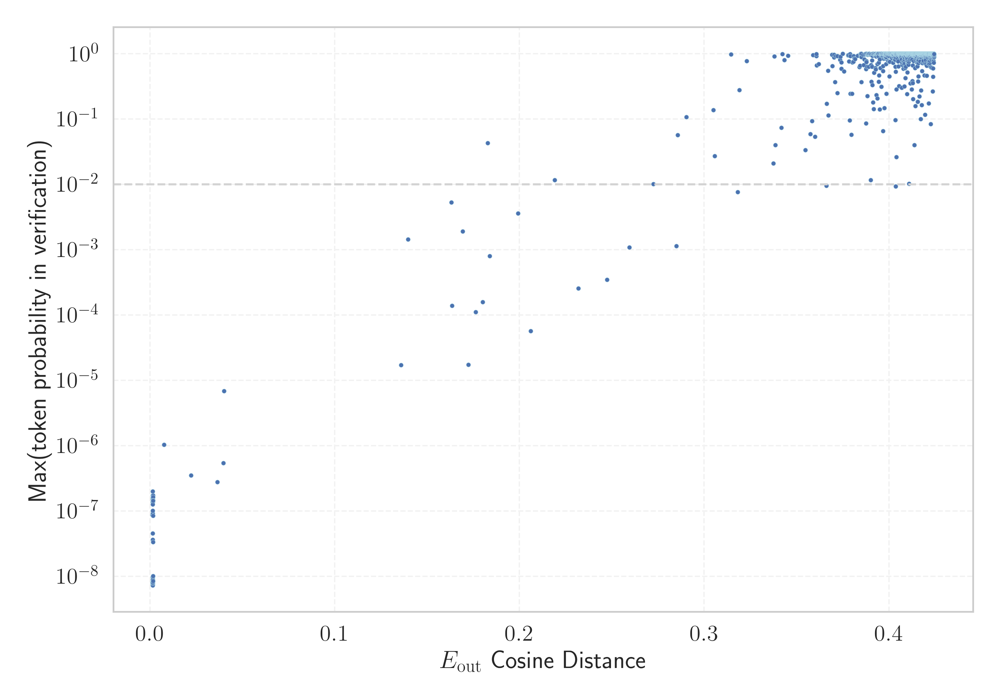

# Report for `openai-community/gpt2`

## Model info

* Model Info: 
  * Tied embeddings: True
  * LM head uses bias: False
  * Embeddings shape: [50257, 768]
* Tokenizer Info: 
  * Vocab Size: 50257
  * Tokenizer Class: GPT2Tokenizer
  * Bytes handling: Byte Input
  * Tokenizer Type: BPE
  * Token for verification prompt building: BuyableInstoreAndOnline
  * Token id for verification prompt building: 40242
* Indicator summary: 
  * Indicator for under-trained tokens: E_{out} Cosine Distance
  * Overall distribution: 0.536 +/- 0.070
* Detected Token Counts: 
  * Number of tested under-trained tokens: 999, 967 non-special, 33 below p = 0.01 threshold, 26 below soft indicator threshold
  * Number of single byte tokens: 256, of which 46 below indicator threshold
  * Number of special tokens: 0, of which 0 below indicator threshold
  * Number of non-single-byte UTF-fragment tokens:  216, of which 2 below soft indicator threshold

## Under-trained token indicators plot


## Verification plot


## Under-trained token verification results
26 entries below threshold of 0.206

|   token_id | token                                        |   indicator | max_prob                                                         | in_other_tokens                                                                                                                                                                                                                                                                                                                     |
|------------|----------------------------------------------|-------------|------------------------------------------------------------------|-------------------------------------------------------------------------------------------------------------------------------------------------------------------------------------------------------------------------------------------------------------------------------------------------------------------------------------|
|      40241 | ````` InstoreAndOnline `````                 |  0.00143921 | <span style='border: 1px solid rgb(169, 68, 66);'>8.6e-09</span> | <span style='border: 1px solid rgb(40, 167, 69);'>````` BuyableInstoreAndOnline `````</span>                                                                                                                                                                                                                                        |
|      30905 | ````` rawdownload `````                      |  0.00145763 | <span style='border: 1px solid rgb(169, 68, 66);'>1.4e-07</span> | ````` rawdownloadcloneembedreportprint `````                                                                                                                                                                                                                                                                                        |
|      39752 | ````` quickShip `````                        |  0.00147873 | <span style='border: 1px solid rgb(169, 68, 66);'>9.1e-09</span> | <span style='border: 1px solid rgb(40, 167, 69);'>````` quickShipAvailable `````</span>                                                                                                                                                                                                                                             |
|      40240 | ````` oreAndOnline `````                     |  0.00148576 | <span style='border: 1px solid rgb(169, 68, 66);'>9.1e-08</span> | <span style='border: 1px solid rgb(169, 68, 66);'>````` InstoreAndOnline `````</span>, <span style='border: 1px solid rgb(40, 167, 69);'>````` BuyableInstoreAndOnline `````</span>                                                                                                                                                 |
|      30898 | ````` embedreportprint `````                 |  0.00153571 | <span style='border: 1px solid rgb(169, 68, 66);'>1e-07</span>   | <span style='border: 1px solid rgb(169, 68, 66);'>````` cloneembedreportprint `````</span>, ````` rawdownloadcloneembedreportprint `````                                                                                                                                                                                            |
|      45544 | ````` ▁サーティ `````                        |  0.00154209 | <span style='border: 1px solid rgb(169, 68, 66);'>1.4e-07</span> | <span style='border: 1px solid rgb(40, 167, 69);'>````` ▁サーティワン `````</span>                                                                                                                                                                                                                                                  |
|      36173 | ````` ▁RandomRedditor `````                  |  0.00156629 | <span style='border: 1px solid rgb(169, 68, 66);'>1.5e-07</span> | <span style='border: 1px solid rgb(40, 167, 69);'>````` ▁RandomRedditorWithNo `````</span>                                                                                                                                                                                                                                          |
|      30212 | ````` ▁externalToEVA `````                   |  0.00158066 | <span style='border: 1px solid rgb(169, 68, 66);'>1.7e-07</span> | <span style='border: 1px solid rgb(40, 167, 69);'>````` ▁externalToEVAOnly `````</span>                                                                                                                                                                                                                                             |
|      42089 | ````` ▁TheNitrome `````                      |  0.00158507 | <span style='border: 1px solid rgb(169, 68, 66);'>8.5e-09</span> | <span style='border: 1px solid rgb(40, 167, 69);'>````` ▁TheNitromeFan `````</span>                                                                                                                                                                                                                                                 |
|      30897 | ````` reportprint `````                      |  0.00160545 | <span style='border: 1px solid rgb(169, 68, 66);'>3.3e-08</span> | <span style='border: 1px solid rgb(169, 68, 66);'>````` embedreportprint `````</span>, <span style='border: 1px solid rgb(169, 68, 66);'>````` cloneembedreportprint `````</span>, ````` rawdownloadcloneembedreportprint `````                                                                                                     |
|      30208 | ````` ▁externalTo `````                      |  0.00763935 | <span style='border: 1px solid rgb(169, 68, 66);'>1e-06</span>   | <span style='border: 1px solid rgb(169, 68, 66);'>````` ▁externalToEVA `````</span>, <span style='border: 1px solid rgb(40, 167, 69);'>````` ▁externalToEVAOnly `````</span>                                                                                                                                                        |
|      23090 | ````` ÃÂÃÂÃÂÃÂÃÂÃÂÃÂÃÂÃÂÃÂÃÂÃÂÃÂÃÂÃÂÃÂ ````` |  0.022287   | <span style='border: 1px solid rgb(169, 68, 66);'>3.5e-07</span> | <span style='border: 1px solid rgb(40, 167, 69);'>````` ÃÂÃÂÃÂÃÂÃÂÃÂÃÂÃÂÃÂÃÂÃÂÃÂÃÂÃÂÃÂÃÂÃÂÃÂÃÂÃÂÃÂÃÂÃÂÃÂÃÂÃÂÃÂÃÂÃÂÃÂÃÂÃÂ `````</span>                                                                                                                                                                                               |
|      37574 | ````` StreamerBot `````                      |  0.036516   | <span style='border: 1px solid rgb(169, 68, 66);'>2.8e-07</span> | <span style='border: 1px solid rgb(40, 167, 69);'>````` TPPStreamerBot `````</span>                                                                                                                                                                                                                                                 |
|      31573 | ````` ActionCode `````                       |  0.0397143  | <span style='border: 1px solid rgb(169, 68, 66);'>5.4e-07</span> | ````` externalActionCode `````                                                                                                                                                                                                                                                                                                      |
|      14827 | ````` ÃÂÃÂÃÂÃÂÃÂÃÂÃÂÃÂ `````                 |  0.0400726  | <span style='border: 1px solid rgb(169, 68, 66);'>6.9e-06</span> | <span style='border: 1px solid rgb(169, 68, 66);'>````` ÃÂÃÂÃÂÃÂÃÂÃÂÃÂÃÂÃÂÃÂÃÂÃÂÃÂÃÂÃÂÃÂ `````</span>, <span style='border: 1px solid rgb(40, 167, 69);'>````` ÃÂÃÂÃÂÃÂÃÂÃÂÃÂÃÂÃÂÃÂÃÂÃÂÃÂÃÂÃÂÃÂÃÂÃÂÃÂÃÂÃÂÃÂÃÂÃÂÃÂÃÂÃÂÃÂÃÂÃÂÃÂÃÂ `````</span>                                                                                        |
|      42066 | ````` Nitrome `````                          |  0.135858   | <span style='border: 1px solid rgb(169, 68, 66);'>1.7e-05</span> | <span style='border: 1px solid rgb(169, 68, 66);'>````` ▁TheNitrome `````</span>, <span style='border: 1px solid rgb(40, 167, 69);'>````` ▁TheNitromeFan `````</span>                                                                                                                                                               |
|       9364 | ````` ÃÂÃÂÃÂÃÂ `````                         |  0.139732   | <span style='border: 1px solid rgb(255, 145, 0);'>0.0014</span>  | <span style='border: 1px solid rgb(169, 68, 66);'>````` ÃÂÃÂÃÂÃÂÃÂÃÂÃÂÃÂ `````</span>, <span style='border: 1px solid rgb(169, 68, 66);'>````` ÃÂÃÂÃÂÃÂÃÂÃÂÃÂÃÂÃÂÃÂÃÂÃÂÃÂÃÂÃÂÃÂ `````</span>, <span style='border: 1px solid rgb(40, 167, 69);'>````` ÃÂÃÂÃÂÃÂÃÂÃÂÃÂÃÂÃÂÃÂÃÂÃÂÃÂÃÂÃÂÃÂÃÂÃÂÃÂÃÂÃÂÃÂÃÂÃÂÃÂÃÂÃÂÃÂÃÂÃÂÃÂÃÂ `````</span> |
|      39749 | ````` DeliveryDate `````                     |  0.163166   | <span style='border: 1px solid rgb(255, 145, 0);'>0.0053</span>  | <span style='border: 1px solid rgb(40, 167, 69);'>````` soDeliveryDate `````</span>                                                                                                                                                                                                                                                 |
|      39142 | ````` ThumbnailImage `````                   |  0.163535   | <span style='border: 1px solid rgb(169, 68, 66);'>0.00014</span> | <span style='border: 1px solid rgb(40, 167, 69);'>````` ItemThumbnailImage `````</span>                                                                                                                                                                                                                                             |
|      39714 | ````` isSpecial `````                        |  0.169225   | <span style='border: 1px solid rgb(255, 145, 0);'>0.0019</span>  | <span style='border: 1px solid rgb(40, 167, 69);'>````` isSpecialOrderable `````</span>                                                                                                                                                                                                                                             |
<details><summary>6 additional entries below threshold</summary>

|   token_id | token                             |   indicator | max_prob                                                         | in_other_tokens                                                                                                                                                                                                                                                                                                                                                                                                    |
|------------|-----------------------------------|-------------|------------------------------------------------------------------|--------------------------------------------------------------------------------------------------------------------------------------------------------------------------------------------------------------------------------------------------------------------------------------------------------------------------------------------------------------------------------------------------------------------|
|      40219 | ````` oreAnd `````                |    0.172416 | <span style='border: 1px solid rgb(169, 68, 66);'>1.7e-05</span> | <span style='border: 1px solid rgb(169, 68, 66);'>````` oreAndOnline `````</span>, <span style='border: 1px solid rgb(169, 68, 66);'>````` InstoreAndOnline `````</span>, <span style='border: 1px solid rgb(40, 167, 69);'>````` BuyableInstoreAndOnline `````</span>                                                                                                                                             |
|      30899 | ````` cloneembedreportprint ````` |    0.176264 | <span style='border: 1px solid rgb(169, 68, 66);'>0.00011</span> | ````` rawdownloadcloneembedreportprint `````                                                                                                                                                                                                                                                                                                                                                                       |
|      13150 | ````` ▁subur `````                |    0.180166 | <span style='border: 1px solid rgb(169, 68, 66);'>0.00016</span> | ````` ▁suburban `````, ````` ▁suburbs `````, ````` ▁suburb `````                                                                                                                                                                                                                                                                                                                                                   |
|       5815 | ````` ÃÂÃÂ `````                  |    0.182786 | <span style='border: 1px solid rgb(251, 189, 8);'>0.043</span>   | <span style='border: 1px solid rgb(255, 145, 0);'>````` ÃÂÃÂÃÂÃÂ `````</span>, <span style='border: 1px solid rgb(169, 68, 66);'>````` ÃÂÃÂÃÂÃÂÃÂÃÂÃÂÃÂ `````</span>, <span style='border: 1px solid rgb(169, 68, 66);'>````` ÃÂÃÂÃÂÃÂÃÂÃÂÃÂÃÂÃÂÃÂÃÂÃÂÃÂÃÂÃÂÃÂ `````</span>, <span style='border: 1px solid rgb(40, 167, 69);'>````` ÃÂÃÂÃÂÃÂÃÂÃÂÃÂÃÂÃÂÃÂÃÂÃÂÃÂÃÂÃÂÃÂÃÂÃÂÃÂÃÂÃÂÃÂÃÂÃÂÃÂÃÂÃÂÃÂÃÂÃÂÃÂÃÂ `````</span> |
|      17629 | ````` ▁practition `````           |    0.183995 | <span style='border: 1px solid rgb(169, 68, 66);'>0.0008</span>  | ````` ▁practitioners `````, ````` ▁practitioner `````                                                                                                                                                                                                                                                                                                                                                              |
|      39655 | ````` Orderable `````             |    0.199313 | <span style='border: 1px solid rgb(255, 145, 0);'>0.0036</span>  | <span style='border: 1px solid rgb(40, 167, 69);'>````` isSpecialOrderable `````</span>                                                                                                                                                                                                                                                                                                                            |
</details>


## Tokens with partial UTF-8 sequences
2 entries below threshold of 0.206

|   token_id | token                      |   indicator | in_other_tokens                                                             |
|------------|----------------------------|-------------|-----------------------------------------------------------------------------|
|      39820 | ````` 龍<0xE5><0xA5> ````` |  0.00162309 | <span style='border: 1px solid rgb(40, 167, 69);'>````` 龍契士 `````</span> |
|      33434 | ````` <0x96><0x9A>士 ````` |  0.201911   | <span style='border: 1px solid rgb(40, 167, 69);'>````` 龍喚士 `````</span> |


## Byte tokens
46 entries below threshold of 0.140

|   token_id | token              |   indicator |   ord | hex   | byte_type   |
|------------|--------------------|-------------|-------|-------|-------------|
|        179 | ````` <0xF7> ````` |  0.00115538 |   247 | 0xF7  | unused_utf8 |
|        177 | ````` <0xF5> ````` |  0.00115615 |   245 | 0xF5  | unused_utf8 |
|        187 | ````` <0xFF> ````` |  0.00116438 |   255 | 0xFF  | unused_utf8 |
|        185 | ````` <0xFD> ````` |  0.00117475 |   253 | 0xFD  | unused_utf8 |
|        183 | ````` <0xFB> ````` |  0.00117517 |   251 | 0xFB  | unused_utf8 |
|        178 | ````` <0xF6> ````` |  0.00118297 |   246 | 0xF6  | unused_utf8 |
|        181 | ````` <0xF9> ````` |  0.0011909  |   249 | 0xF9  | unused_utf8 |
|        182 | ````` <0xFA> ````` |  0.00121307 |   250 | 0xFA  | unused_utf8 |
|        186 | ````` <0xFE> ````` |  0.00128454 |   254 | 0xFE  | unused_utf8 |
|        184 | ````` <0xFC> ````` |  0.0013572  |   252 | 0xFC  | unused_utf8 |
|        180 | ````` <0xF8> ````` |  0.00136507 |   248 | 0xF8  | unused_utf8 |
|        202 | ````` \x0e `````   |  0.00137275 |    14 | 0x0E  | ascii       |
|        188 | ````` \x00 `````   |  0.00137687 |       | 0x00  | ascii       |
|        205 | ````` \x11 `````   |  0.00137717 |    17 | 0x11  | ascii       |
|        125 | ````` <0xC1> ````` |  0.00139213 |   193 | 0xC1  | unused_utf8 |
|        213 | ````` \x19 `````   |  0.00141013 |    25 | 0x19  | ascii       |
|        197 | ````` \t `````     |  0.00141722 |     9 | 0x09  | ascii       |
|        204 | ````` \x10 `````   |  0.00142157 |    16 | 0x10  | ascii       |
|        211 | ````` \x17 `````   |  0.00145513 |    23 | 0x17  | ascii       |
|        207 | ````` \x13 `````   |  0.00145561 |    19 | 0x13  | ascii       |
<details><summary>26 additional entries below threshold</summary>

|   token_id | token              |   indicator |   ord | hex   | byte_type   |
|------------|--------------------|-------------|-------|-------|-------------|
|        200 | ````` \x0c `````   |  0.0014562  |    12 | 0x0C  | ascii       |
|        208 | ````` \x14 `````   |  0.00146127 |    20 | 0x14  | ascii       |
|        189 | ````` \x01 `````   |  0.00146729 |     1 | 0x01  | ascii       |
|        193 | ````` \x05 `````   |  0.00146949 |     5 | 0x05  | ascii       |
|        214 | ````` \x1a `````   |  0.0014773  |    26 | 0x1A  | ascii       |
|        190 | ````` \x02 `````   |  0.00147963 |     2 | 0x02  | ascii       |
|        199 | ````` \x0b `````   |  0.00148165 |    11 | 0x0B  | ascii       |
|        195 | ````` \x07 `````   |  0.00149047 |     7 | 0x07  | ascii       |
|        201 | ````` \r `````     |  0.00149822 |    13 | 0x0D  | ascii       |
|        194 | ````` \x06 `````   |  0.00150222 |     6 | 0x06  | ascii       |
|        216 | ````` \x1c `````   |  0.00151449 |    28 | 0x1C  | ascii       |
|        217 | ````` \x1d `````   |  0.00151765 |    29 | 0x1D  | ascii       |
|        219 | ````` \x1f `````   |  0.00152028 |    31 | 0x1F  | ascii       |
|        124 | ````` <0xC0> ````` |  0.00152189 |   192 | 0xC0  | unused_utf8 |
|        203 | ````` \x0f `````   |  0.00152725 |    15 | 0x0F  | ascii       |
|        206 | ````` \x12 `````   |  0.00153619 |    18 | 0x12  | ascii       |
|        212 | ````` \x18 `````   |  0.0015434  |    24 | 0x18  | ascii       |
|        221 | ````` \x7f `````   |  0.0015437  |   127 | 0x7F  | ascii       |
|        192 | ````` \x04 `````   |  0.00154603 |     4 | 0x04  | ascii       |
|        210 | ````` \x16 `````   |  0.00154918 |    22 | 0x16  | ascii       |
|        196 | ````` \x08 `````   |  0.00157344 |     8 | 0x08  | ascii       |
|        218 | ````` \x1e `````   |  0.00160688 |    30 | 0x1E  | ascii       |
|        209 | ````` \x15 `````   |  0.00163686 |    21 | 0x15  | ascii       |
|        191 | ````` \x03 `````   |  0.00166035 |     3 | 0x03  | ascii       |
|        215 | ````` \x1b `````   |  0.00167865 |    27 | 0x1B  | ascii       |
|        153 | ````` <0xDD> ````` |  0.105542   |   221 | 0xDD  | utf8        |
</details>


## Special tokens
0 entries below threshold of 0.140


