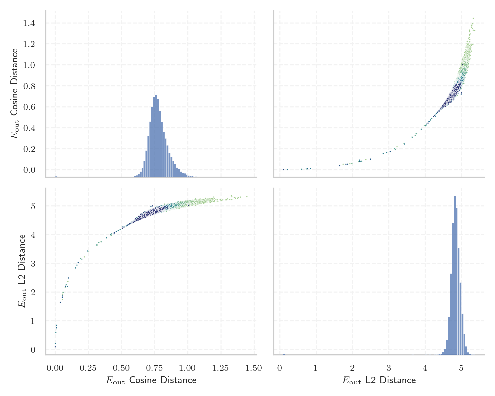
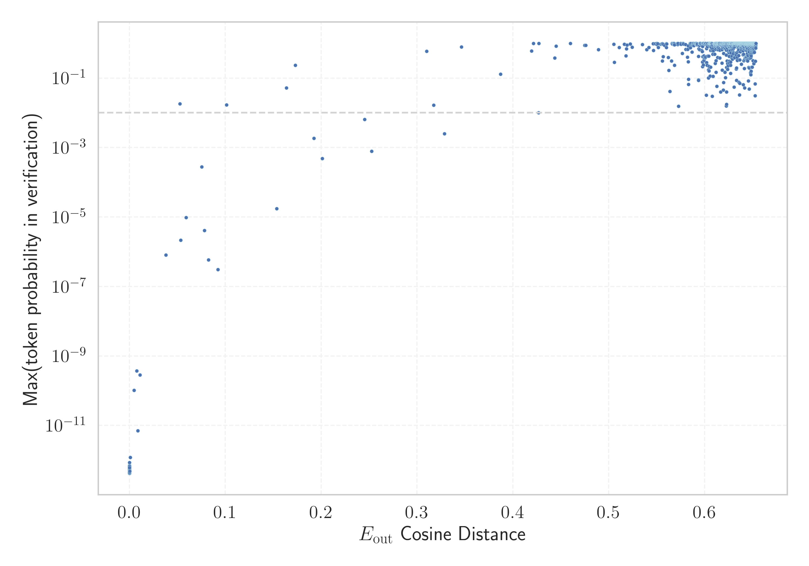

# Report for `openai-community/gpt2-large`

## Model info

* Tied embeddings: yes
* LM head uses bias: no
* Indicator for under-trained tokens: E_{out} Cosine Distance
  * Overall distribution 0.778 +/- 0.080
  * Token used for verification prompt building: `BuyableInstoreAndOnline`
  * Verification threshold: 0.653
  * Threshold for showing candidate under-trained tokens: 0.101
  * Median verified threshold (for bytes, unreachable and special tokens): 0.010
* Embeddings shape: (50257, 1280)
* Vocabulary size: 50257
  * Number of single byte tokens: 256, of which 45 below indicator threshold
  * Number of special tokens: 1, of which 0 below indicator threshold
  * Number of non-single-byte UTF-fragment tokens: 216, 2 below soft indicator threshold
  * Number of tested under-trained tokens: 999, 967 non-special, 28 below p = 0.01 threshold, 23 below soft indicator threshold

## Under-trained token indicators plot


## Verification plot


## Under-trained token verification results
23 entries below threshold of 0.101

|   token_id | token                                        |   indicator | max_prob                                                         | in_other_tokens                                                                                                                                                                                                                                                                                                                                                                                                    |
|------------|----------------------------------------------|-------------|------------------------------------------------------------------|--------------------------------------------------------------------------------------------------------------------------------------------------------------------------------------------------------------------------------------------------------------------------------------------------------------------------------------------------------------------------------------------------------------------|
|      45544 | ````` ▁サーティ `````                        | 0.000190854 | <span style='border: 1px solid rgb(169, 68, 66);'>7.1e-13</span> | <span style='border: 1px solid rgb(40, 167, 69);'>````` ▁サーティワン `````</span>                                                                                                                                                                                                                                                                                                                                 |
|      40241 | ````` InstoreAndOnline `````                 | 0.000195801 | <span style='border: 1px solid rgb(169, 68, 66);'>5.1e-13</span> | <span style='border: 1px solid rgb(40, 167, 69);'>````` BuyableInstoreAndOnline `````</span>                                                                                                                                                                                                                                                                                                                       |
|      40240 | ````` oreAndOnline `````                     | 0.000202    | <span style='border: 1px solid rgb(169, 68, 66);'>5.2e-13</span> | <span style='border: 1px solid rgb(169, 68, 66);'>````` InstoreAndOnline `````</span>, <span style='border: 1px solid rgb(40, 167, 69);'>````` BuyableInstoreAndOnline `````</span>                                                                                                                                                                                                                                |
|      42089 | ````` ▁TheNitrome `````                      | 0.000202775 | <span style='border: 1px solid rgb(169, 68, 66);'>5.3e-13</span> | <span style='border: 1px solid rgb(40, 167, 69);'>````` ▁TheNitromeFan `````</span>                                                                                                                                                                                                                                                                                                                                |
|      30905 | ````` rawdownload `````                      | 0.000209093 | <span style='border: 1px solid rgb(169, 68, 66);'>4.2e-13</span> | ````` rawdownloadcloneembedreportprint `````                                                                                                                                                                                                                                                                                                                                                                       |
|      39752 | ````` quickShip `````                        | 0.000216007 | <span style='border: 1px solid rgb(169, 68, 66);'>5.3e-13</span> | <span style='border: 1px solid rgb(40, 167, 69);'>````` quickShipAvailable `````</span>                                                                                                                                                                                                                                                                                                                            |
|      30898 | ````` embedreportprint `````                 | 0.00022006  | <span style='border: 1px solid rgb(169, 68, 66);'>5e-13</span>   | <span style='border: 1px solid rgb(169, 68, 66);'>````` cloneembedreportprint `````</span>, ````` rawdownloadcloneembedreportprint `````                                                                                                                                                                                                                                                                           |
|      36173 | ````` ▁RandomRedditor `````                  | 0.000221908 | <span style='border: 1px solid rgb(169, 68, 66);'>4.7e-13</span> | <span style='border: 1px solid rgb(40, 167, 69);'>````` ▁RandomRedditorWithNo `````</span>                                                                                                                                                                                                                                                                                                                         |
|      30212 | ````` ▁externalToEVA `````                   | 0.000232816 | <span style='border: 1px solid rgb(169, 68, 66);'>8.5e-13</span> | <span style='border: 1px solid rgb(40, 167, 69);'>````` ▁externalToEVAOnly `````</span>                                                                                                                                                                                                                                                                                                                            |
|      30897 | ````` reportprint `````                      | 0.000243366 | <span style='border: 1px solid rgb(169, 68, 66);'>5.8e-13</span> | <span style='border: 1px solid rgb(169, 68, 66);'>````` embedreportprint `````</span>, <span style='border: 1px solid rgb(169, 68, 66);'>````` cloneembedreportprint `````</span>, ````` rawdownloadcloneembedreportprint `````                                                                                                                                                                                    |
|      30208 | ````` ▁externalTo `````                      | 0.000833333 | <span style='border: 1px solid rgb(169, 68, 66);'>1.2e-12</span> | <span style='border: 1px solid rgb(169, 68, 66);'>````` ▁externalToEVA `````</span>, <span style='border: 1px solid rgb(40, 167, 69);'>````` ▁externalToEVAOnly `````</span>                                                                                                                                                                                                                                       |
|      23090 | ````` ÃÂÃÂÃÂÃÂÃÂÃÂÃÂÃÂÃÂÃÂÃÂÃÂÃÂÃÂÃÂÃÂ ````` | 0.00494826  | <span style='border: 1px solid rgb(169, 68, 66);'>1e-10</span>   | <span style='border: 1px solid rgb(40, 167, 69);'>````` ÃÂÃÂÃÂÃÂÃÂÃÂÃÂÃÂÃÂÃÂÃÂÃÂÃÂÃÂÃÂÃÂÃÂÃÂÃÂÃÂÃÂÃÂÃÂÃÂÃÂÃÂÃÂÃÂÃÂÃÂÃÂÃÂ `````</span>                                                                                                                                                                                                                                                                              |
|      14827 | ````` ÃÂÃÂÃÂÃÂÃÂÃÂÃÂÃÂ `````                 | 0.00767154  | <span style='border: 1px solid rgb(169, 68, 66);'>3.7e-10</span> | <span style='border: 1px solid rgb(169, 68, 66);'>````` ÃÂÃÂÃÂÃÂÃÂÃÂÃÂÃÂÃÂÃÂÃÂÃÂÃÂÃÂÃÂÃÂ `````</span>, <span style='border: 1px solid rgb(40, 167, 69);'>````` ÃÂÃÂÃÂÃÂÃÂÃÂÃÂÃÂÃÂÃÂÃÂÃÂÃÂÃÂÃÂÃÂÃÂÃÂÃÂÃÂÃÂÃÂÃÂÃÂÃÂÃÂÃÂÃÂÃÂÃÂÃÂÃÂ `````</span>                                                                                                                                                                       |
|      37574 | ````` StreamerBot `````                      | 0.00892842  | <span style='border: 1px solid rgb(169, 68, 66);'>7.1e-12</span> | <span style='border: 1px solid rgb(40, 167, 69);'>````` TPPStreamerBot `````</span>                                                                                                                                                                                                                                                                                                                                |
|      31573 | ````` ActionCode `````                       | 0.0109636   | <span style='border: 1px solid rgb(169, 68, 66);'>2.8e-10</span> | <span style='border: 1px solid rgb(40, 167, 69);'>````` externalActionCode `````</span>                                                                                                                                                                                                                                                                                                                            |
|      42066 | ````` Nitrome `````                          | 0.0379956   | <span style='border: 1px solid rgb(169, 68, 66);'>8e-07</span>   | <span style='border: 1px solid rgb(169, 68, 66);'>````` ▁TheNitrome `````</span>, <span style='border: 1px solid rgb(40, 167, 69);'>````` ▁TheNitromeFan `````</span>                                                                                                                                                                                                                                              |
|      39749 | ````` DeliveryDate `````                     | 0.052729    | <span style='border: 1px solid rgb(251, 189, 8);'>0.018</span>   | <span style='border: 1px solid rgb(40, 167, 69);'>````` soDeliveryDate `````</span>                                                                                                                                                                                                                                                                                                                                |
|      40219 | ````` oreAnd `````                           | 0.0535512   | <span style='border: 1px solid rgb(169, 68, 66);'>2.2e-06</span> | <span style='border: 1px solid rgb(169, 68, 66);'>````` oreAndOnline `````</span>, <span style='border: 1px solid rgb(169, 68, 66);'>````` InstoreAndOnline `````</span>, <span style='border: 1px solid rgb(40, 167, 69);'>````` BuyableInstoreAndOnline `````</span>                                                                                                                                             |
|       9364 | ````` ÃÂÃÂÃÂÃÂ `````                         | 0.0591084   | <span style='border: 1px solid rgb(169, 68, 66);'>9.6e-06</span> | <span style='border: 1px solid rgb(169, 68, 66);'>````` ÃÂÃÂÃÂÃÂÃÂÃÂÃÂÃÂ `````</span>, <span style='border: 1px solid rgb(169, 68, 66);'>````` ÃÂÃÂÃÂÃÂÃÂÃÂÃÂÃÂÃÂÃÂÃÂÃÂÃÂÃÂÃÂÃÂ `````</span>, <span style='border: 1px solid rgb(40, 167, 69);'>````` ÃÂÃÂÃÂÃÂÃÂÃÂÃÂÃÂÃÂÃÂÃÂÃÂÃÂÃÂÃÂÃÂÃÂÃÂÃÂÃÂÃÂÃÂÃÂÃÂÃÂÃÂÃÂÃÂÃÂÃÂÃÂÃÂ `````</span>                                                                                |
|       5815 | ````` ÃÂÃÂ `````                             | 0.0754375   | <span style='border: 1px solid rgb(169, 68, 66);'>0.00028</span> | <span style='border: 1px solid rgb(169, 68, 66);'>````` ÃÂÃÂÃÂÃÂ `````</span>, <span style='border: 1px solid rgb(169, 68, 66);'>````` ÃÂÃÂÃÂÃÂÃÂÃÂÃÂÃÂ `````</span>, <span style='border: 1px solid rgb(169, 68, 66);'>````` ÃÂÃÂÃÂÃÂÃÂÃÂÃÂÃÂÃÂÃÂÃÂÃÂÃÂÃÂÃÂÃÂ `````</span>, <span style='border: 1px solid rgb(40, 167, 69);'>````` ÃÂÃÂÃÂÃÂÃÂÃÂÃÂÃÂÃÂÃÂÃÂÃÂÃÂÃÂÃÂÃÂÃÂÃÂÃÂÃÂÃÂÃÂÃÂÃÂÃÂÃÂÃÂÃÂÃÂÃÂÃÂÃÂ `````</span> |
<details><summary>3 additional entries below threshold</summary>

|   token_id | token                             |   indicator | max_prob                                                         | in_other_tokens                                                                         |
|------------|-----------------------------------|-------------|------------------------------------------------------------------|-----------------------------------------------------------------------------------------|
|      39142 | ````` ThumbnailImage `````        |   0.0783563 | <span style='border: 1px solid rgb(169, 68, 66);'>4.1e-06</span> | <span style='border: 1px solid rgb(40, 167, 69);'>````` ItemThumbnailImage `````</span> |
|      17629 | ````` ▁practition `````           |   0.0825393 | <span style='border: 1px solid rgb(169, 68, 66);'>5.8e-07</span> | ````` ▁practitioners `````, ````` ▁practitioner `````                                   |
|      30899 | ````` cloneembedreportprint ````` |   0.0923434 | <span style='border: 1px solid rgb(169, 68, 66);'>3e-07</span>   | ````` rawdownloadcloneembedreportprint `````                                            |
</details>


## Partial UTF-8 tokens
2 entries below threshold of 0.101

|   token_id | token                      |   indicator | in_other_tokens                                                             |
|------------|----------------------------|-------------|-----------------------------------------------------------------------------|
|      39820 | ````` 龍<0xE5><0xA5> ````` | 0.000195265 | <span style='border: 1px solid rgb(40, 167, 69);'>````` 龍契士 `````</span> |
|      33434 | ````` <0x96><0x9A>士 ````` | 0.0781655   | <span style='border: 1px solid rgb(40, 167, 69);'>````` 龍喚士 `````</span> |


## Byte tokens
45 entries below threshold of 0.010

|   token_id | token              |   indicator |   ord | hex   | byte_type   |
|------------|--------------------|-------------|-------|-------|-------------|
|        180 | ````` <0xF8> ````` | 0.000167012 |   248 | 0xF8  | unused_utf8 |
|        183 | ````` <0xFB> ````` | 0.00017792  |   251 | 0xFB  | unused_utf8 |
|        187 | ````` <0xFF> ````` | 0.000178874 |   255 | 0xFF  | unused_utf8 |
|        179 | ````` <0xF7> ````` | 0.000179827 |   247 | 0xF7  | unused_utf8 |
|        191 | ````` \x03 `````   | 0.0001809   |     3 | 0x03  | ascii       |
|        178 | ````` <0xF6> ````` | 0.000181615 |   246 | 0xF6  | unused_utf8 |
|        181 | ````` <0xF9> ````` | 0.000183344 |   249 | 0xF9  | unused_utf8 |
|        184 | ````` <0xFC> ````` | 0.000185072 |   252 | 0xFC  | unused_utf8 |
|        186 | ````` <0xFE> ````` | 0.000186443 |   254 | 0xFE  | unused_utf8 |
|        185 | ````` <0xFD> ````` | 0.000188112 |   253 | 0xFD  | unused_utf8 |
|        182 | ````` <0xFA> ````` | 0.000190377 |   250 | 0xFA  | unused_utf8 |
|        177 | ````` <0xF5> ````` | 0.000190854 |   245 | 0xF5  | unused_utf8 |
|        217 | ````` \x1d `````   | 0.000191271 |    29 | 0x1D  | ascii       |
|        202 | ````` \x0e `````   | 0.000199556 |    14 | 0x0E  | ascii       |
|        189 | ````` \x01 `````   | 0.000200152 |     1 | 0x01  | ascii       |
|        215 | ````` \x1b `````   | 0.000203133 |    27 | 0x1B  | ascii       |
|        195 | ````` \x07 `````   | 0.000203252 |     7 | 0x07  | ascii       |
|        194 | ````` \x06 `````   | 0.000205159 |     6 | 0x06  | ascii       |
|        207 | ````` \x13 `````   | 0.000207841 |    19 | 0x13  | ascii       |
|        203 | ````` \x0f `````   | 0.000208259 |    15 | 0x0F  | ascii       |
<details><summary>25 additional entries below threshold</summary>

|   token_id | token              |   indicator |   ord | hex   | byte_type   |
|------------|--------------------|-------------|-------|-------|-------------|
|        221 | ````` \x7f `````   | 0.00020957  |   127 | 0x7F  | ascii       |
|        210 | ````` \x16 `````   | 0.00021112  |    22 | 0x16  | ascii       |
|        200 | ````` \x0c `````   | 0.000211656 |    12 | 0x0C  | ascii       |
|        212 | ````` \x18 `````   | 0.000212073 |    24 | 0x18  | ascii       |
|        206 | ````` \x12 `````   | 0.000213146 |    18 | 0x12  | ascii       |
|        197 | ````` \t `````     | 0.000213802 |     9 | 0x09  | ascii       |
|        219 | ````` \x1f `````   | 0.000217676 |    31 | 0x1F  | ascii       |
|        214 | ````` \x1a `````   | 0.000218213 |    26 | 0x1A  | ascii       |
|        124 | ````` <0xC0> ````` | 0.000219643 |   192 | 0xC0  | unused_utf8 |
|        216 | ````` \x1c `````   | 0.000219882 |    28 | 0x1C  | ascii       |
|        211 | ````` \x17 `````   | 0.000219941 |    23 | 0x17  | ascii       |
|        213 | ````` \x19 `````   | 0.000220656 |    25 | 0x19  | ascii       |
|        193 | ````` \x05 `````   | 0.000221491 |     5 | 0x05  | ascii       |
|        201 | ````` \r `````     | 0.000224352 |    13 | 0x0D  | ascii       |
|        188 | ````` \x00 `````   | 0.0002262   |       | 0x00  | ascii       |
|        205 | ````` \x11 `````   | 0.000226974 |    17 | 0x11  | ascii       |
|        190 | ````` \x02 `````   | 0.000230968 |     2 | 0x02  | ascii       |
|        192 | ````` \x04 `````   | 0.000235915 |     4 | 0x04  | ascii       |
|        209 | ````` \x15 `````   | 0.000235975 |    21 | 0x15  | ascii       |
|        125 | ````` <0xC1> ````` | 0.000236392 |   193 | 0xC1  | unused_utf8 |
|        218 | ````` \x1e `````   | 0.000238478 |    30 | 0x1E  | ascii       |
|        199 | ````` \x0b `````   | 0.000239253 |    11 | 0x0B  | ascii       |
|        208 | ````` \x14 `````   | 0.000243425 |    20 | 0x14  | ascii       |
|        204 | ````` \x10 `````   | 0.000244737 |    16 | 0x10  | ascii       |
|        196 | ````` \x08 `````   | 0.000252247 |     8 | 0x08  | ascii       |
</details>


## Special tokens
0 entries below threshold of 0.010


