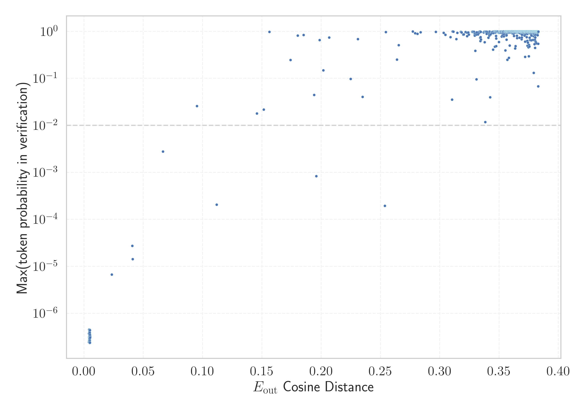

# Report for `openai-community/gpt2-medium`

## Model info

* Model Info: 
  * Tied embeddings: True
  * LM head uses bias: False
  * Embeddings shape: [50257, 1024]
* Tokenizer Info: 
  * Vocab Size: 50257
  * Tokenizer Class: GPT2Tokenizer
  * Bytes handling: Byte Input
  * Tokenizer Type: BPE
  * Token for verification prompt building: BuyableInstoreAndOnline
  * Token id for verification prompt building: 40242
* Indicator summary: 
  * Indicator for under-trained tokens: E_{out} Cosine Distance
  * Overall distribution: 0.489 +/- 0.053
* Detected Token Counts: 
  * Number of tested under-trained tokens: 999, 967 non-special, 17 below p = 0.01 threshold, 11 below soft indicator threshold
  * Number of single byte tokens: 256, of which 45 below indicator threshold
  * Number of special tokens: 1, of which 0 below indicator threshold
  * Number of non-single-byte UTF-fragment tokens:  216, of which 1 below soft indicator threshold

## Under-trained token indicators plot


## Verification plot


## Under-trained token verification results
11 entries below threshold of 0.041

|   token_id | token                        |   indicator | max_prob                                                         | in_other_tokens                                                                                                                                                                                                                                                                          |
|------------|------------------------------|-------------|------------------------------------------------------------------|------------------------------------------------------------------------------------------------------------------------------------------------------------------------------------------------------------------------------------------------------------------------------------------|
|      30897 | ````` reportprint `````      |  0.00444669 | <span style='border: 1px solid rgb(169, 68, 66);'>3.9e-07</span> | <span style='border: 1px solid rgb(169, 68, 66);'>````` embedreportprint `````</span>, <span style='border: 1px solid rgb(169, 68, 66);'>````` cloneembedreportprint `````</span>, <span style='border: 1px solid rgb(40, 167, 69);'>````` rawdownloadcloneembedreportprint `````</span> |
|      45544 | ````` ▁サーティ `````        |  0.00456756 | <span style='border: 1px solid rgb(169, 68, 66);'>2.7e-07</span> | <span style='border: 1px solid rgb(40, 167, 69);'>````` ▁サーティワン `````</span>                                                                                                                                                                                                       |
|      30212 | ````` ▁externalToEVA `````   |  0.00459367 | <span style='border: 1px solid rgb(169, 68, 66);'>3.3e-07</span> | <span style='border: 1px solid rgb(40, 167, 69);'>````` ▁externalToEVAOnly `````</span>                                                                                                                                                                                                  |
|      30905 | ````` rawdownload `````      |  0.00462967 | <span style='border: 1px solid rgb(169, 68, 66);'>3.3e-07</span> | <span style='border: 1px solid rgb(40, 167, 69);'>````` rawdownloadcloneembedreportprint `````</span>                                                                                                                                                                                    |
|      39752 | ````` quickShip `````        |  0.00471437 | <span style='border: 1px solid rgb(169, 68, 66);'>2.4e-07</span> | <span style='border: 1px solid rgb(40, 167, 69);'>````` quickShipAvailable `````</span>                                                                                                                                                                                                  |
|      36173 | ````` ▁RandomRedditor `````  |  0.00473309 | <span style='border: 1px solid rgb(169, 68, 66);'>2.7e-07</span> | <span style='border: 1px solid rgb(40, 167, 69);'>````` ▁RandomRedditorWithNo `````</span>                                                                                                                                                                                               |
|      42089 | ````` ▁TheNitrome `````      |  0.00477737 | <span style='border: 1px solid rgb(169, 68, 66);'>3.1e-07</span> | <span style='border: 1px solid rgb(40, 167, 69);'>````` ▁TheNitromeFan `````</span>                                                                                                                                                                                                      |
|      40241 | ````` InstoreAndOnline ````` |  0.00498104 | <span style='border: 1px solid rgb(169, 68, 66);'>4.4e-07</span> | <span style='border: 1px solid rgb(40, 167, 69);'>````` BuyableInstoreAndOnline `````</span>                                                                                                                                                                                             |
|      30898 | ````` embedreportprint ````` |  0.00511473 | <span style='border: 1px solid rgb(169, 68, 66);'>3.1e-07</span> | <span style='border: 1px solid rgb(169, 68, 66);'>````` cloneembedreportprint `````</span>, <span style='border: 1px solid rgb(40, 167, 69);'>````` rawdownloadcloneembedreportprint `````</span>                                                                                        |
|      40240 | ````` oreAndOnline `````     |  0.00512666 | <span style='border: 1px solid rgb(169, 68, 66);'>3e-07</span>   | <span style='border: 1px solid rgb(169, 68, 66);'>````` InstoreAndOnline `````</span>, <span style='border: 1px solid rgb(40, 167, 69);'>````` BuyableInstoreAndOnline `````</span>                                                                                                      |
|      30208 | ````` ▁externalTo `````      |  0.0234736  | <span style='border: 1px solid rgb(169, 68, 66);'>6.7e-06</span> | <span style='border: 1px solid rgb(169, 68, 66);'>````` ▁externalToEVA `````</span>, <span style='border: 1px solid rgb(40, 167, 69);'>````` ▁externalToEVAOnly `````</span>                                                                                                             |


## Tokens with partial UTF-8 sequences
1 entries below threshold of 0.041

|   token_id | token                      |   indicator | in_other_tokens                                                             |
|------------|----------------------------|-------------|-----------------------------------------------------------------------------|
|      39820 | ````` 龍<0xE5><0xA5> ````` |  0.00473815 | <span style='border: 1px solid rgb(40, 167, 69);'>````` 龍契士 `````</span> |


## Byte tokens
45 entries below threshold of 0.005

|   token_id | token              |   indicator |   ord | hex   | byte_type   |
|------------|--------------------|-------------|-------|-------|-------------|
|        178 | ````` <0xF6> ````` |  0.00357699 |   246 | 0xF6  | unused_utf8 |
|        183 | ````` <0xFB> ````` |  0.00366414 |   251 | 0xFB  | unused_utf8 |
|        180 | ````` <0xF8> ````` |  0.00367898 |   248 | 0xF8  | unused_utf8 |
|        185 | ````` <0xFD> ````` |  0.00367945 |   253 | 0xFD  | unused_utf8 |
|        184 | ````` <0xFC> ````` |  0.00367999 |   252 | 0xFC  | unused_utf8 |
|        187 | ````` <0xFF> ````` |  0.00386095 |   255 | 0xFF  | unused_utf8 |
|        179 | ````` <0xF7> ````` |  0.00395608 |   247 | 0xF7  | unused_utf8 |
|        186 | ````` <0xFE> ````` |  0.00401807 |   254 | 0xFE  | unused_utf8 |
|        177 | ````` <0xF5> ````` |  0.00404406 |   245 | 0xF5  | unused_utf8 |
|        182 | ````` <0xFA> ````` |  0.00411254 |   250 | 0xFA  | unused_utf8 |
|        210 | ````` \x16 `````   |  0.00416589 |    22 | 0x16  | ascii       |
|        197 | ````` \t `````     |  0.00420296 |     9 | 0x09  | ascii       |
|        181 | ````` <0xF9> ````` |  0.00422859 |   249 | 0xF9  | unused_utf8 |
|        207 | ````` \x13 `````   |  0.00434774 |    19 | 0x13  | ascii       |
|        124 | ````` <0xC0> ````` |  0.00435042 |   192 | 0xC0  | unused_utf8 |
|        189 | ````` \x01 `````   |  0.00436145 |     1 | 0x01  | ascii       |
|        192 | ````` \x04 `````   |  0.00437051 |     4 | 0x04  | ascii       |
|        215 | ````` \x1b `````   |  0.00446403 |    27 | 0x1B  | ascii       |
|        217 | ````` \x1d `````   |  0.00447792 |    29 | 0x1D  | ascii       |
|        188 | ````` \x00 `````   |  0.0044831  |       | 0x00  | ascii       |
<details><summary>25 additional entries below threshold</summary>

|   token_id | token              |   indicator |   ord | hex   | byte_type   |
|------------|--------------------|-------------|-------|-------|-------------|
|        205 | ````` \x11 `````   |  0.00454235 |    17 | 0x11  | ascii       |
|        221 | ````` \x7f `````   |  0.00456268 |   127 | 0x7F  | ascii       |
|        196 | ````` \x08 `````   |  0.00457883 |     8 | 0x08  | ascii       |
|        191 | ````` \x03 `````   |  0.00458419 |     3 | 0x03  | ascii       |
|        211 | ````` \x17 `````   |  0.00458771 |    23 | 0x17  | ascii       |
|        209 | ````` \x15 `````   |  0.00459951 |    21 | 0x15  | ascii       |
|        218 | ````` \x1e `````   |  0.00462538 |    30 | 0x1E  | ascii       |
|        219 | ````` \x1f `````   |  0.004628   |    31 | 0x1F  | ascii       |
|        201 | ````` \r `````     |  0.00464153 |    13 | 0x0D  | ascii       |
|        199 | ````` \x0b `````   |  0.00464886 |    11 | 0x0B  | ascii       |
|        125 | ````` <0xC1> ````` |  0.00469792 |   193 | 0xC1  | unused_utf8 |
|        213 | ````` \x19 `````   |  0.00470865 |    25 | 0x19  | ascii       |
|        214 | ````` \x1a `````   |  0.00472409 |    26 | 0x1A  | ascii       |
|        216 | ````` \x1c `````   |  0.00474226 |    28 | 0x1C  | ascii       |
|        204 | ````` \x10 `````   |  0.00481343 |    16 | 0x10  | ascii       |
|        195 | ````` \x07 `````   |  0.00482112 |     7 | 0x07  | ascii       |
|        208 | ````` \x14 `````   |  0.00483608 |    20 | 0x14  | ascii       |
|        202 | ````` \x0e `````   |  0.00484014 |    14 | 0x0E  | ascii       |
|        200 | ````` \x0c `````   |  0.00486654 |    12 | 0x0C  | ascii       |
|        193 | ````` \x05 `````   |  0.00487173 |     5 | 0x05  | ascii       |
|        206 | ````` \x12 `````   |  0.0049091  |    18 | 0x12  | ascii       |
|        190 | ````` \x02 `````   |  0.00498593 |     2 | 0x02  | ascii       |
|        194 | ````` \x06 `````   |  0.00503397 |     6 | 0x06  | ascii       |
|        212 | ````` \x18 `````   |  0.00508648 |    24 | 0x18  | ascii       |
|        203 | ````` \x0f `````   |  0.00510818 |    15 | 0x0F  | ascii       |
</details>


## Special tokens
0 entries below threshold of 0.005


