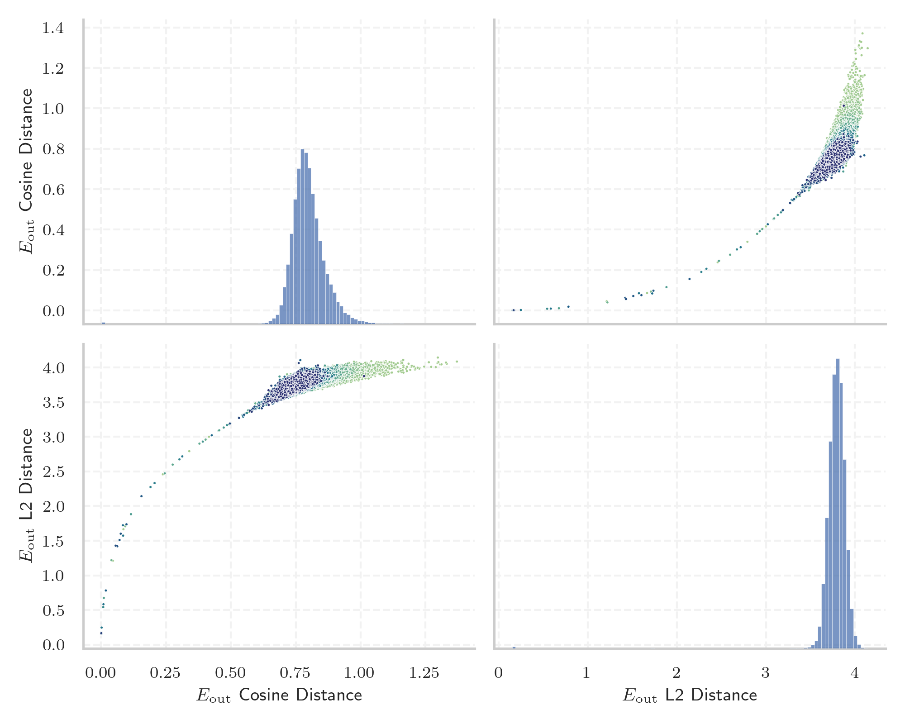

# Report for `openai-community/gpt2-xl`

## Model info

* Tied embeddings: yes
* LM head uses bias: no
* Indicator for under-trained tokens: E_{out} Cosine Distance
  * Overall distribution 0.798 +/- 0.070
  * Token used for verification prompt building: `BuyableInstoreAndOnline`
  * Verification threshold: 0.692
  * Threshold for showing candidate under-trained tokens: 0.245
  * Median verified threshold (for bytes, unreachable and special tokens): 0.063
* Embeddings shape: (50257, 1600)
* Vocabulary size: 50257
  * Number of single byte tokens: 256, of which 47 below indicator threshold
  * Number of special tokens: 1, of which 0 below indicator threshold
  * Number of non-single-byte UTF-fragment tokens: 216, 2 below soft indicator threshold
  * Number of tested under-trained tokens: 999, 967 non-special, 35 below p = 0.01 threshold, 27 below soft indicator threshold

## Under-trained token indicators plot


## Verification plot


## Under-trained token verification results
27 entries below threshold of 0.245

|   token_id | token                                        |   indicator | max_prob                                                         | in_other_tokens                                                                                                                                                                                                                                                                                                                     |
|------------|----------------------------------------------|-------------|------------------------------------------------------------------|-------------------------------------------------------------------------------------------------------------------------------------------------------------------------------------------------------------------------------------------------------------------------------------------------------------------------------------|
|      30898 | ````` embedreportprint `````                 | 0.000875533 | <span style='border: 1px solid rgb(169, 68, 66);'>2.8e-12</span> | <span style='border: 1px solid rgb(169, 68, 66);'>````` cloneembedreportprint `````</span>, ````` rawdownloadcloneembedreportprint `````                                                                                                                                                                                            |
|      39752 | ````` quickShip `````                        | 0.00100434  | <span style='border: 1px solid rgb(169, 68, 66);'>4e-12</span>   | <span style='border: 1px solid rgb(40, 167, 69);'>````` quickShipAvailable `````</span>                                                                                                                                                                                                                                             |
|      45544 | ````` ▁サーティ `````                        | 0.00100648  | <span style='border: 1px solid rgb(169, 68, 66);'>4.2e-12</span> | <span style='border: 1px solid rgb(40, 167, 69);'>````` ▁サーティワン `````</span>                                                                                                                                                                                                                                                  |
|      30212 | ````` ▁externalToEVA `````                   | 0.00100774  | <span style='border: 1px solid rgb(169, 68, 66);'>3.8e-12</span> | <span style='border: 1px solid rgb(40, 167, 69);'>````` ▁externalToEVAOnly `````</span>                                                                                                                                                                                                                                             |
|      30897 | ````` reportprint `````                      | 0.00102794  | <span style='border: 1px solid rgb(169, 68, 66);'>3.7e-12</span> | <span style='border: 1px solid rgb(169, 68, 66);'>````` embedreportprint `````</span>, <span style='border: 1px solid rgb(169, 68, 66);'>````` cloneembedreportprint `````</span>, ````` rawdownloadcloneembedreportprint `````                                                                                                     |
|      30905 | ````` rawdownload `````                      | 0.00103921  | <span style='border: 1px solid rgb(169, 68, 66);'>3.9e-12</span> | ````` rawdownloadcloneembedreportprint `````                                                                                                                                                                                                                                                                                        |
|      40240 | ````` oreAndOnline `````                     | 0.00107867  | <span style='border: 1px solid rgb(169, 68, 66);'>6.3e-12</span> | <span style='border: 1px solid rgb(169, 68, 66);'>````` InstoreAndOnline `````</span>, <span style='border: 1px solid rgb(40, 167, 69);'>````` BuyableInstoreAndOnline `````</span>                                                                                                                                                 |
|      40241 | ````` InstoreAndOnline `````                 | 0.00108171  | <span style='border: 1px solid rgb(169, 68, 66);'>2.8e-12</span> | <span style='border: 1px solid rgb(40, 167, 69);'>````` BuyableInstoreAndOnline `````</span>                                                                                                                                                                                                                                        |
|      42089 | ````` ▁TheNitrome `````                      | 0.00108385  | <span style='border: 1px solid rgb(169, 68, 66);'>7.2e-12</span> | <span style='border: 1px solid rgb(40, 167, 69);'>````` ▁TheNitromeFan `````</span>                                                                                                                                                                                                                                                 |
|      36173 | ````` ▁RandomRedditor `````                  | 0.00108719  | <span style='border: 1px solid rgb(169, 68, 66);'>2.9e-12</span> | <span style='border: 1px solid rgb(40, 167, 69);'>````` ▁RandomRedditorWithNo `````</span>                                                                                                                                                                                                                                          |
|      30208 | ````` ▁externalTo `````                      | 0.00214088  | <span style='border: 1px solid rgb(169, 68, 66);'>3.6e-12</span> | <span style='border: 1px solid rgb(169, 68, 66);'>````` ▁externalToEVA `````</span>, <span style='border: 1px solid rgb(40, 167, 69);'>````` ▁externalToEVAOnly `````</span>                                                                                                                                                        |
|      23090 | ````` ÃÂÃÂÃÂÃÂÃÂÃÂÃÂÃÂÃÂÃÂÃÂÃÂÃÂÃÂÃÂÃÂ ````` | 0.00855005  | <span style='border: 1px solid rgb(169, 68, 66);'>2.2e-10</span> | <span style='border: 1px solid rgb(40, 167, 69);'>````` ÃÂÃÂÃÂÃÂÃÂÃÂÃÂÃÂÃÂÃÂÃÂÃÂÃÂÃÂÃÂÃÂÃÂÃÂÃÂÃÂÃÂÃÂÃÂÃÂÃÂÃÂÃÂÃÂÃÂÃÂÃÂÃÂ `````</span>                                                                                                                                                                                               |
|      31573 | ````` ActionCode `````                       | 0.00930929  | <span style='border: 1px solid rgb(169, 68, 66);'>6.3e-09</span> | <span style='border: 1px solid rgb(40, 167, 69);'>````` externalActionCode `````</span>                                                                                                                                                                                                                                             |
|      14827 | ````` ÃÂÃÂÃÂÃÂÃÂÃÂÃÂÃÂ `````                 | 0.0107037   | <span style='border: 1px solid rgb(169, 68, 66);'>1.1e-08</span> | <span style='border: 1px solid rgb(169, 68, 66);'>````` ÃÂÃÂÃÂÃÂÃÂÃÂÃÂÃÂÃÂÃÂÃÂÃÂÃÂÃÂÃÂÃÂ `````</span>, <span style='border: 1px solid rgb(40, 167, 69);'>````` ÃÂÃÂÃÂÃÂÃÂÃÂÃÂÃÂÃÂÃÂÃÂÃÂÃÂÃÂÃÂÃÂÃÂÃÂÃÂÃÂÃÂÃÂÃÂÃÂÃÂÃÂÃÂÃÂÃÂÃÂÃÂÃÂ `````</span>                                                                                        |
|      37574 | ````` StreamerBot `````                      | 0.0184854   | <span style='border: 1px solid rgb(169, 68, 66);'>4.1e-11</span> | <span style='border: 1px solid rgb(40, 167, 69);'>````` TPPStreamerBot `````</span>                                                                                                                                                                                                                                                 |
|       9364 | ````` ÃÂÃÂÃÂÃÂ `````                         | 0.0401576   | <span style='border: 1px solid rgb(169, 68, 66);'>2.8e-07</span> | <span style='border: 1px solid rgb(169, 68, 66);'>````` ÃÂÃÂÃÂÃÂÃÂÃÂÃÂÃÂ `````</span>, <span style='border: 1px solid rgb(169, 68, 66);'>````` ÃÂÃÂÃÂÃÂÃÂÃÂÃÂÃÂÃÂÃÂÃÂÃÂÃÂÃÂÃÂÃÂ `````</span>, <span style='border: 1px solid rgb(40, 167, 69);'>````` ÃÂÃÂÃÂÃÂÃÂÃÂÃÂÃÂÃÂÃÂÃÂÃÂÃÂÃÂÃÂÃÂÃÂÃÂÃÂÃÂÃÂÃÂÃÂÃÂÃÂÃÂÃÂÃÂÃÂÃÂÃÂÃÂ `````</span> |
|      42066 | ````` Nitrome `````                          | 0.0563459   | <span style='border: 1px solid rgb(169, 68, 66);'>1.2e-08</span> | <span style='border: 1px solid rgb(169, 68, 66);'>````` ▁TheNitrome `````</span>, <span style='border: 1px solid rgb(40, 167, 69);'>````` ▁TheNitromeFan `````</span>                                                                                                                                                               |
|      40219 | ````` oreAnd `````                           | 0.0625414   | <span style='border: 1px solid rgb(169, 68, 66);'>3.3e-09</span> | <span style='border: 1px solid rgb(169, 68, 66);'>````` oreAndOnline `````</span>, <span style='border: 1px solid rgb(169, 68, 66);'>````` InstoreAndOnline `````</span>, <span style='border: 1px solid rgb(40, 167, 69);'>````` BuyableInstoreAndOnline `````</span>                                                              |
|      39749 | ````` DeliveryDate `````                     | 0.0713511   | <span style='border: 1px solid rgb(251, 189, 8);'>0.026</span>   | <span style='border: 1px solid rgb(40, 167, 69);'>````` soDeliveryDate `````</span>                                                                                                                                                                                                                                                 |
|      39714 | ````` isSpecial `````                        | 0.0757903   | <span style='border: 1px solid rgb(255, 145, 0);'>0.0015</span>  | <span style='border: 1px solid rgb(40, 167, 69);'>````` isSpecialOrderable `````</span>                                                                                                                                                                                                                                             |
<details><summary>7 additional entries below threshold</summary>

|   token_id | token                             |   indicator | max_prob                                                         | in_other_tokens                                                                                                                                                                                                                                                                                                                                                                                                    |
|------------|-----------------------------------|-------------|------------------------------------------------------------------|--------------------------------------------------------------------------------------------------------------------------------------------------------------------------------------------------------------------------------------------------------------------------------------------------------------------------------------------------------------------------------------------------------------------|
|      30899 | ````` cloneembedreportprint ````` |   0.0850028 | <span style='border: 1px solid rgb(169, 68, 66);'>3.6e-09</span> | ````` rawdownloadcloneembedreportprint `````                                                                                                                                                                                                                                                                                                                                                                       |
|       5815 | ````` ÃÂÃÂ `````                  |   0.0932565 | <span style='border: 1px solid rgb(255, 145, 0);'>0.002</span>   | <span style='border: 1px solid rgb(169, 68, 66);'>````` ÃÂÃÂÃÂÃÂ `````</span>, <span style='border: 1px solid rgb(169, 68, 66);'>````` ÃÂÃÂÃÂÃÂÃÂÃÂÃÂÃÂ `````</span>, <span style='border: 1px solid rgb(169, 68, 66);'>````` ÃÂÃÂÃÂÃÂÃÂÃÂÃÂÃÂÃÂÃÂÃÂÃÂÃÂÃÂÃÂÃÂ `````</span>, <span style='border: 1px solid rgb(40, 167, 69);'>````` ÃÂÃÂÃÂÃÂÃÂÃÂÃÂÃÂÃÂÃÂÃÂÃÂÃÂÃÂÃÂÃÂÃÂÃÂÃÂÃÂÃÂÃÂÃÂÃÂÃÂÃÂÃÂÃÂÃÂÃÂÃÂÃÂ `````</span> |
|      39142 | ````` ThumbnailImage `````        |   0.0979447 | <span style='border: 1px solid rgb(169, 68, 66);'>5.7e-07</span> | <span style='border: 1px solid rgb(40, 167, 69);'>````` ItemThumbnailImage `````</span>                                                                                                                                                                                                                                                                                                                            |
|      17629 | ````` ▁practition `````           |   0.115349  | <span style='border: 1px solid rgb(169, 68, 66);'>2.5e-08</span> | ````` ▁practitioners `````, ````` ▁practitioner `````                                                                                                                                                                                                                                                                                                                                                              |
|      39655 | ````` Orderable `````             |   0.155694  | <span style='border: 1px solid rgb(251, 189, 8);'>0.043</span>   | <span style='border: 1px solid rgb(40, 167, 69);'>````` isSpecialOrderable `````</span>                                                                                                                                                                                                                                                                                                                            |
|      27013 | ````` aditional `````             |   0.190538  | <span style='border: 1px solid rgb(251, 189, 8);'>0.013</span>   | ````` ▁Traditional `````, ````` traditional `````, ````` Traditional `````                                                                                                                                                                                                                                                                                                                                         |
|      27293 | ````` ▁antidepress `````          |   0.206169  | <span style='border: 1px solid rgb(169, 68, 66);'>3.2e-07</span> | <span style='border: 1px solid rgb(40, 167, 69);'>````` ▁antidepressants `````</span>, ````` ▁antidepressant `````                                                                                                                                                                                                                                                                                                 |
</details>


## Partial UTF-8 tokens
2 entries below threshold of 0.245

|   token_id | token                      |   indicator | in_other_tokens                                                             |
|------------|----------------------------|-------------|-----------------------------------------------------------------------------|
|      39820 | ````` 龍<0xE5><0xA5> ````` |  0.00109285 | <span style='border: 1px solid rgb(40, 167, 69);'>````` 龍契士 `````</span> |
|      33434 | ````` <0x96><0x9A>士 ````` |  0.084174   | <span style='border: 1px solid rgb(40, 167, 69);'>````` 龍喚士 `````</span> |


## Byte tokens
47 entries below threshold of 0.063

|   token_id | token              |   indicator |   ord | hex   | byte_type   |
|------------|--------------------|-------------|-------|-------|-------------|
|        183 | ````` <0xFB> ````` | 0.00080353  |   251 | 0xFB  | unused_utf8 |
|        182 | ````` <0xFA> ````` | 0.000816345 |   250 | 0xFA  | unused_utf8 |
|        186 | ````` <0xFE> ````` | 0.000830293 |   254 | 0xFE  | unused_utf8 |
|        179 | ````` <0xF7> ````` | 0.000837922 |   247 | 0xF7  | unused_utf8 |
|        177 | ````` <0xF5> ````` | 0.000843704 |   245 | 0xF5  | unused_utf8 |
|        181 | ````` <0xF9> ````` | 0.000843883 |   249 | 0xF9  | unused_utf8 |
|        187 | ````` <0xFF> ````` | 0.000882864 |   255 | 0xFF  | unused_utf8 |
|        184 | ````` <0xFC> ````` | 0.000883043 |   252 | 0xFC  | unused_utf8 |
|        124 | ````` <0xC0> ````` | 0.000892758 |   192 | 0xC0  | unused_utf8 |
|        185 | ````` <0xFD> ````` | 0.000899613 |   253 | 0xFD  | unused_utf8 |
|        180 | ````` <0xF8> ````` | 0.000901103 |   248 | 0xF8  | unused_utf8 |
|        178 | ````` <0xF6> ````` | 0.000929773 |   246 | 0xF6  | unused_utf8 |
|        209 | ````` \x15 `````   | 0.000945032 |    21 | 0x15  | ascii       |
|        214 | ````` \x1a `````   | 0.000958979 |    26 | 0x1A  | ascii       |
|        218 | ````` \x1e `````   | 0.000960469 |    30 | 0x1E  | ascii       |
|        193 | ````` \x05 `````   | 0.000961006 |     5 | 0x05  | ascii       |
|        217 | ````` \x1d `````   | 0.000969827 |    29 | 0x1D  | ascii       |
|        212 | ````` \x18 `````   | 0.000977814 |    24 | 0x18  | ascii       |
|        197 | ````` \t `````     | 0.000980318 |     9 | 0x09  | ascii       |
|        206 | ````` \x12 `````   | 0.00098604  |    18 | 0x12  | ascii       |
<details><summary>27 additional entries below threshold</summary>

|   token_id | token              |   indicator |   ord | hex   | byte_type   |
|------------|--------------------|-------------|-------|-------|-------------|
|        205 | ````` \x11 `````   | 0.000988841 |    17 | 0x11  | ascii       |
|        204 | ````` \x10 `````   | 0.000990391 |    16 | 0x10  | ascii       |
|        210 | ````` \x16 `````   | 0.000994563 |    22 | 0x16  | ascii       |
|        211 | ````` \x17 `````   | 0.00100255  |    23 | 0x17  | ascii       |
|        207 | ````` \x13 `````   | 0.00100708  |    19 | 0x13  | ascii       |
|        192 | ````` \x04 `````   | 0.00100851  |     4 | 0x04  | ascii       |
|        219 | ````` \x1f `````   | 0.00101     |    31 | 0x1F  | ascii       |
|        208 | ````` \x14 `````   | 0.00101215  |    20 | 0x14  | ascii       |
|        216 | ````` \x1c `````   | 0.00101763  |    28 | 0x1C  | ascii       |
|        213 | ````` \x19 `````   | 0.00101942  |    25 | 0x19  | ascii       |
|        196 | ````` \x08 `````   | 0.00102359  |     8 | 0x08  | ascii       |
|        200 | ````` \x0c `````   | 0.00102597  |    12 | 0x0C  | ascii       |
|        189 | ````` \x01 `````   | 0.00103384  |     1 | 0x01  | ascii       |
|        125 | ````` <0xC1> ````` | 0.00103652  |   193 | 0xC1  | unused_utf8 |
|        201 | ````` \r `````     | 0.00104648  |    13 | 0x0D  | ascii       |
|        202 | ````` \x0e `````   | 0.0010637   |    14 | 0x0E  | ascii       |
|        221 | ````` \x7f `````   | 0.00106472  |   127 | 0x7F  | ascii       |
|        191 | ````` \x03 `````   | 0.00106502  |     3 | 0x03  | ascii       |
|        188 | ````` \x00 `````   | 0.00107497  |       | 0x00  | ascii       |
|        199 | ````` \x0b `````   | 0.00108778  |    11 | 0x0B  | ascii       |
|        190 | ````` \x02 `````   | 0.00109047  |     2 | 0x02  | ascii       |
|        195 | ````` \x07 `````   | 0.00109106  |     7 | 0x07  | ascii       |
|        215 | ````` \x1b `````   | 0.00110316  |    27 | 0x1B  | ascii       |
|        203 | ````` \x0f `````   | 0.00110972  |    15 | 0x0F  | ascii       |
|        194 | ````` \x06 `````   | 0.0011574   |     6 | 0x06  | ascii       |
|        174 | ````` <0xF2> ````` | 0.0454715   |   242 | 0xF2  | utf8        |
|        153 | ````` <0xDD> ````` | 0.0567862   |   221 | 0xDD  | utf8        |
</details>


## Special tokens
0 entries below threshold of 0.063


