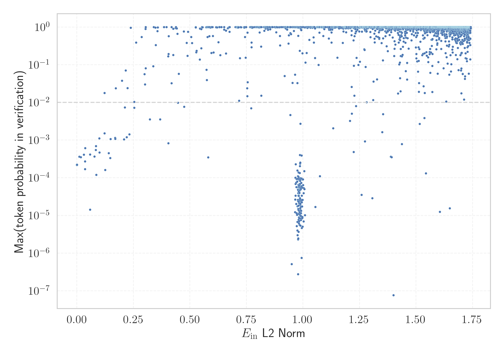

# Report for `trillionlabs/Trillion-7B-preview`

## Model info

* Model Info: 
  * Tied embeddings: False
  * LM head uses bias: False
  * Embeddings shape: [128128, 4096]
* Tokenizer Info: 
  * Vocab Size: 128128
  * Tokenizer Class: PreTrainedTokenizer
  * Tokenizer Type: BPE
  * Bytes handling: Byte Input
  * Token for verification prompt building: 引用するにはまずログインしてください
  * Token id for verification prompt building: 55363
* Indicator summary: 
  * Indicator for under-trained tokens: E_{in} L2 Norm
  * Overall distribution: 2.145 +/- 0.183
* Detected Token Counts: 
  * Number of tested under-trained tokens: 2662, 2524 non-special, 63 below p = 0.01 threshold, 29 below soft indicator threshold
  * Number of single byte tokens: 243, of which 0 below indicator threshold
  * Number of special tokens: 0, of which 0 below indicator threshold
  * Number of non-single-byte UTF-fragment tokens:  996, of which 3 below soft indicator threshold

## Under-trained token indicators plot


## Verification plot


## Under-trained token verification results
29 entries below threshold of 0.170

|   token_id | token                            |   indicator | max_prob                                                         | in_other_tokens                                                                                                                                                                                  |
|------------|----------------------------------|-------------|------------------------------------------------------------------|--------------------------------------------------------------------------------------------------------------------------------------------------------------------------------------------------|
|      91553 | ````` cledelart `````            | 1.19508e-14 | <span style='border: 1px solid rgb(169, 68, 66);'>0.00022</span> | <span style='border: 1px solid rgb(251, 189, 8);'>````` cledelartois `````</span>, <span style='border: 1px solid rgb(40, 167, 69);'>````` ▁Boucledelartois `````</span>                         |
|      54546 | ````` のため引用できません ````` | 1.20206e-14 | <span style='border: 1px solid rgb(169, 68, 66);'>0.00022</span> | <span style='border: 1px solid rgb(169, 68, 66);'>````` 限定公開記事のため引用できません `````</span>                                                                                            |
|     112369 | ````` 3171604670 `````           | 0.000208168 | <span style='border: 1px solid rgb(169, 68, 66);'>0.00022</span> |                                                                                                                                                                                                  |
|      93913 | ````` 3790902022 `````           | 0.000209508 | <span style='border: 1px solid rgb(169, 68, 66);'>0.00022</span> |                                                                                                                                                                                                  |
|     117031 | ````` 608256299 `````            | 0.000218869 | <span style='border: 1px solid rgb(169, 68, 66);'>0.00022</span> |                                                                                                                                                                                                  |
|      55099 | ````` 1606760062 `````           | 0.00024569  | <span style='border: 1px solid rgb(169, 68, 66);'>0.00022</span> |                                                                                                                                                                                                  |
|      66551 | ````` 2795067434 `````           | 0.000256259 | <span style='border: 1px solid rgb(169, 68, 66);'>0.00022</span> |                                                                                                                                                                                                  |
|      29947 | ````` 83156584 `````             | 0.000267186 | <span style='border: 1px solid rgb(169, 68, 66);'>0.00022</span> |                                                                                                                                                                                                  |
|      13965 | ````` Drealtimehot `````         | 0.0112162   | <span style='border: 1px solid rgb(169, 68, 66);'>0.00036</span> |                                                                                                                                                                                                  |
|      96679 | ````` KeyCodeWrap `````          | 0.0175388   | <span style='border: 1px solid rgb(169, 68, 66);'>0.00035</span> |                                                                                                                                                                                                  |
|      35223 | ````` 引用をストック `````       | 0.0311129   | <span style='border: 1px solid rgb(169, 68, 66);'>0.00041</span> | <span style='border: 1px solid rgb(251, 189, 8);'>````` 引用をストックしました `````</span>, <span style='border: 1px solid rgb(251, 189, 8);'>````` 引用をストックできませんでした `````</span> |
|      90072 | ````` InjectionStation `````     | 0.0361336   | <span style='border: 1px solid rgb(169, 68, 66);'>0.00017</span> |                                                                                                                                                                                                  |
|      13964 | ````` Drealtime `````            | 0.0363072   | <span style='border: 1px solid rgb(169, 68, 66);'>0.00027</span> | <span style='border: 1px solid rgb(169, 68, 66);'>````` Drealtimehot `````</span>                                                                                                                |
|      22312 | ````` isnewpage `````            | 0.0367991   | <span style='border: 1px solid rgb(169, 68, 66);'>0.00061</span> |                                                                                                                                                                                                  |
|      55098 | ````` 16067600 `````             | 0.0584251   | <span style='border: 1px solid rgb(169, 68, 66);'>0.00042</span> | <span style='border: 1px solid rgb(169, 68, 66);'>````` 1606760062 `````</span>                                                                                                                  |
|     124551 | ````` DateMgr `````              | 0.0585031   | <span style='border: 1px solid rgb(169, 68, 66);'>1.4e-05</span> |                                                                                                                                                                                                  |
|     126871 | ````` EPARCHY `````              | 0.077815    | <span style='border: 1px solid rgb(169, 68, 66);'>0.00037</span> |                                                                                                                                                                                                  |
|     121899 | ````` UniWebView `````           | 0.0832953   | <span style='border: 1px solid rgb(169, 68, 66);'>0.00055</span> |                                                                                                                                                                                                  |
|     112359 | ````` 3171604 `````              | 0.0846215   | <span style='border: 1px solid rgb(169, 68, 66);'>0.00069</span> | <span style='border: 1px solid rgb(169, 68, 66);'>````` 3171604670 `````</span>                                                                                                                  |
|      46042 | ````` 피캠퍼스는 `````           | 0.0858762   | <span style='border: 1px solid rgb(169, 68, 66);'>0.00012</span> | ````` ▁해피캠퍼스는 `````, ````` 해피캠퍼스는 `````                                                                                                                                              |
<details><summary>9 additional entries below threshold</summary>

|   token_id | token                      |   indicator | max_prob                                                         | in_other_tokens                                                                                                                                                                                  |
|------------|----------------------------|-------------|------------------------------------------------------------------|--------------------------------------------------------------------------------------------------------------------------------------------------------------------------------------------------|
|     111007 | ````` ▁アイドラッグ `````  |   0.0991744 | <span style='border: 1px solid rgb(255, 145, 0);'>0.0011</span>  |                                                                                                                                                                                                  |
|      68928 | ````` 3722313 `````        |   0.0997537 | <span style='border: 1px solid rgb(169, 68, 66);'>0.00047</span> | <span style='border: 1px solid rgb(40, 167, 69);'>````` 3722313464 `````</span>                                                                                                                  |
|     101093 | ````` Discnt `````         |   0.122205  | <span style='border: 1px solid rgb(251, 189, 8);'>0.018</span>   |                                                                                                                                                                                                  |
|      88953 | ````` WINPR `````          |   0.122498  | <span style='border: 1px solid rgb(255, 145, 0);'>0.0015</span>  |                                                                                                                                                                                                  |
|      74883 | ````` StackTraits `````    |   0.125034  | <span style='border: 1px solid rgb(169, 68, 66);'>0.00016</span> |                                                                                                                                                                                                  |
|      54544 | ````` 引用できません ````` |   0.141043  | <span style='border: 1px solid rgb(169, 68, 66);'>0.00045</span> | <span style='border: 1px solid rgb(169, 68, 66);'>````` のため引用できません `````</span>, <span style='border: 1px solid rgb(169, 68, 66);'>````` 限定公開記事のため引用できません `````</span> |
|      26309 | ````` CSFunction `````     |   0.147408  | <span style='border: 1px solid rgb(169, 68, 66);'>0.00033</span> | <span style='border: 1px solid rgb(251, 189, 8);'>````` LuaCSFunction `````</span>, <span style='border: 1px solid rgb(255, 145, 0);'>````` ▁LuaCSFunction `````</span>                          |
|      64222 | ````` ▁LuaCSFunction ````` |   0.14924   | <span style='border: 1px solid rgb(255, 145, 0);'>0.0011</span>  |                                                                                                                                                                                                  |
|      45534 | ````` フィンペ `````       |   0.169325  | <span style='border: 1px solid rgb(255, 145, 0);'>0.0011</span>  | <span style='border: 1px solid rgb(40, 167, 69);'>````` フィンペシア `````</span>                                                                                                                |
</details>


## Tokens with partial UTF-8 sequences
3 entries below threshold of 0.170

|   token_id | token                      |   indicator | in_other_tokens                                                                                     |
|------------|----------------------------|-------------|-----------------------------------------------------------------------------------------------------|
|      16339 | ````` <0x8C><0x93>글 ````` | 1.21563e-14 | ````` ▁댓글 `````, ````` 댓글목록 `````, ````` 댓글 `````, ````` ▁댓글을 `````, ````` ▁댓글이 ````` |
|      28024 | ````` <0x87>살론 `````     | 1.23415e-14 | ````` ▁햇살론 `````, ````` 햇살론 `````                                                             |
|      12036 | ````` <0x80>로벌 `````     | 0.103891    | ````` ▁글로벌 `````, ````` 글로벌 `````                                                             |


## Byte tokens
0 entries below threshold of 0.220


## Special tokens
0 entries below threshold of 0.220


