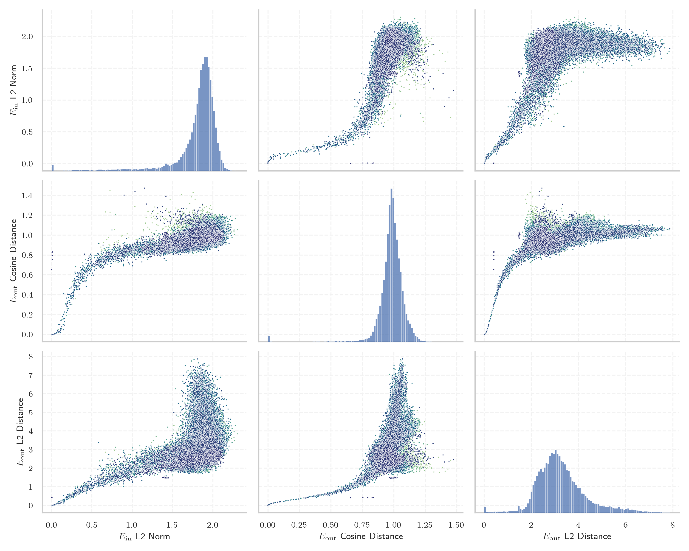

# Report for `upstage/solar-pro-preview-instruct`

## Model info

* Model Info: 
  * Tied embeddings: False
  * LM head uses bias: False
  * Embeddings shape: [32128, 5120]
* Tokenizer Info: 
  * Vocab Size: 32128
  * Tokenizer Class: LlamaTokenizer
  * Tokenizer Type: BPE
  * Bytes handling: Byte Fallback
  * Token for verification prompt building: includegraphics
  * Token id for verification prompt building: 7313
* Indicator summary: 
  * Indicator for under-trained tokens: E_{in} L2 Norm
  * Overall distribution: 1.806 +/- 0.288
* Detected Token Counts: 
  * Number of tested under-trained tokens: 639, 605 non-special, 127 below p = 0.01 threshold, 86 below soft indicator threshold
  * Number of single byte tokens: 351, of which 110 below indicator threshold
  * Number of special tokens: 0, of which 0 below indicator threshold

## Under-trained token indicators plot


## Verification plot


## Under-trained token verification results
86 entries below threshold of 0.259

|   token_id | token                       |   indicator | max_prob                                                         | in_other_tokens                                                                 |
|------------|-----------------------------|-------------|------------------------------------------------------------------|---------------------------------------------------------------------------------|
|      28653 | ````` ▁regnigaste `````     |  0.00508835 | <span style='border: 1px solid rgb(169, 68, 66);'>1.6e-06</span> |                                                                                 |
|      28574 | ````` ▁Mediabestanden ````` |  0.00523699 | <span style='border: 1px solid rgb(169, 68, 66);'>1.3e-06</span> |                                                                                 |
|      27918 | ````` ▁Хронологија `````    |  0.00527332 | <span style='border: 1px solid rgb(169, 68, 66);'>1.3e-06</span> |                                                                                 |
|      28649 | ````` ▁årsnederbörd `````   |  0.00528633 | <span style='border: 1px solid rgb(169, 68, 66);'>2e-06</span>   |                                                                                 |
|      20609 | ````` ▁Portály `````        |  0.00544552 | <span style='border: 1px solid rgb(169, 68, 66);'>1.2e-06</span> |                                                                                 |
|      11804 | ````` Архівовано `````      |  0.00555743 | <span style='border: 1px solid rgb(169, 68, 66);'>1.8e-06</span> |                                                                                 |
|      16110 | ````` ▁Спољашње `````       |  0.00568522 | <span style='border: 1px solid rgb(169, 68, 66);'>1.4e-06</span> |                                                                                 |
|      21836 | ````` ▁надморској `````     |  0.0082394  | <span style='border: 1px solid rgb(169, 68, 66);'>8e-07</span>   |                                                                                 |
|      20528 | ````` ▁autorytatywna `````  |  0.0147445  | <span style='border: 1px solid rgb(169, 68, 66);'>1.6e-06</span> |                                                                                 |
|      18051 | ````` ▁савезној `````       |  0.0166344  | <span style='border: 1px solid rgb(169, 68, 66);'>6e-07</span>   |                                                                                 |
|      27914 | ````` ▁archiválva `````     |  0.0167293  | <span style='border: 1px solid rgb(169, 68, 66);'>1.7e-07</span> |                                                                                 |
|      24294 | ````` Webachiv `````        |  0.0173146  | <span style='border: 1px solid rgb(169, 68, 66);'>1.5e-06</span> |                                                                                 |
|      27900 | ````` ▁eredetiből `````     |  0.0240176  | <span style='border: 1px solid rgb(169, 68, 66);'>1.2e-06</span> |                                                                                 |
|      26821 | ````` ▁Enllaços `````       |  0.0313604  | <span style='border: 1px solid rgb(169, 68, 66);'>2.1e-06</span> |                                                                                 |
|      16056 | ````` љашње `````           |  0.0375049  | <span style='border: 1px solid rgb(169, 68, 66);'>1.2e-06</span> | <span style='border: 1px solid rgb(169, 68, 66);'>````` ▁Спољашње `````</span>  |
|      28416 | ````` ▁Мексичка `````       |  0.0383723  | <span style='border: 1px solid rgb(169, 68, 66);'>8.4e-07</span> |                                                                                 |
|      21673 | ````` ▁висини `````         |  0.039741   | <span style='border: 1px solid rgb(169, 68, 66);'>5e-07</span>   |                                                                                 |
|      11766 | ````` хівовано `````        |  0.0453436  | <span style='border: 1px solid rgb(169, 68, 66);'>9.5e-07</span> | <span style='border: 1px solid rgb(169, 68, 66);'>````` Архівовано `````</span> |
|      26734 | ````` ▁Årsmed `````         |  0.0458914  | <span style='border: 1px solid rgb(169, 68, 66);'>3.2e-06</span> |                                                                                 |
|      23654 | ````` ▁dátummal `````       |  0.0528598  | <span style='border: 1px solid rgb(169, 68, 66);'>3.2e-06</span> |                                                                                 |
<details><summary>66 additional entries below threshold</summary>

|   token_id | token                      |   indicator | max_prob                                                         | in_other_tokens                                                                                                                                                                                                                                     |
|------------|----------------------------|-------------|------------------------------------------------------------------|-----------------------------------------------------------------------------------------------------------------------------------------------------------------------------------------------------------------------------------------------------|
|      23996 | ````` ▁живело `````        |   0.0636962 | <span style='border: 1px solid rgb(169, 68, 66);'>9e-07</span>   |                                                                                                                                                                                                                                                     |
|      28354 | ````` ▁Расподела `````     |   0.0703899 | <span style='border: 1px solid rgb(169, 68, 66);'>2.2e-07</span> |                                                                                                                                                                                                                                                     |
|      24401 | ````` ▁подацима `````      |   0.0755086 | <span style='border: 1px solid rgb(169, 68, 66);'>3.5e-06</span> |                                                                                                                                                                                                                                                     |
|      28650 | ````` ▁Genomsnittlig ````` |   0.0792403 | <span style='border: 1px solid rgb(169, 68, 66);'>4.5e-06</span> |                                                                                                                                                                                                                                                     |
|      22011 | ````` ▁насељу `````        |   0.079732  | <span style='border: 1px solid rgb(169, 68, 66);'>7.9e-06</span> |                                                                                                                                                                                                                                                     |
|       7784 | ````` ▁underarter `````    |   0.0826447 | <span style='border: 1px solid rgb(169, 68, 66);'>2.8e-07</span> |                                                                                                                                                                                                                                                     |
|      20486 | ````` tatywna `````        |   0.0846243 | <span style='border: 1px solid rgb(169, 68, 66);'>2.7e-05</span> | <span style='border: 1px solid rgb(169, 68, 66);'>````` ▁autorytatywna `````</span>                                                                                                                                                                 |
|      22835 | ````` ▁муніципалі `````    |   0.0894151 | <span style='border: 1px solid rgb(169, 68, 66);'>1.2e-05</span> |                                                                                                                                                                                                                                                     |
|      28623 | ````` ▁Genomsnitt `````    |   0.0925849 | <span style='border: 1px solid rgb(169, 68, 66);'>2.8e-06</span> | <span style='border: 1px solid rgb(169, 68, 66);'>````` ▁Genomsnittlig `````</span>                                                                                                                                                                 |
|      28642 | ````` ▁regnig `````        |   0.101749  | <span style='border: 1px solid rgb(169, 68, 66);'>1.1e-05</span> | <span style='border: 1px solid rgb(169, 68, 66);'>````` ▁regnigaste `````</span>                                                                                                                                                                    |
|       7651 | ````` ▁släktet `````       |   0.10508   | <span style='border: 1px solid rgb(169, 68, 66);'>9.1e-06</span> |                                                                                                                                                                                                                                                     |
|      24631 | ````` ▁Források `````      |   0.10705   | <span style='border: 1px solid rgb(169, 68, 66);'>8.7e-06</span> |                                                                                                                                                                                                                                                     |
|      26847 | ````` .:\u200a `````       |   0.11021   | <span style='border: 1px solid rgb(169, 68, 66);'>1.8e-06</span> |                                                                                                                                                                                                                                                     |
|      28647 | ````` ▁torraste `````      |   0.110564  | <span style='border: 1px solid rgb(169, 68, 66);'>8.1e-07</span> |                                                                                                                                                                                                                                                     |
|      17916 | ````` abestanden `````     |   0.114811  | <span style='border: 1px solid rgb(169, 68, 66);'>1.9e-05</span> | <span style='border: 1px solid rgb(169, 68, 66);'>````` ▁Mediabestanden `````</span>                                                                                                                                                                |
|      23406 | ````` ▁општини `````       |   0.115916  | <span style='border: 1px solid rgb(169, 68, 66);'>4.2e-06</span> |                                                                                                                                                                                                                                                     |
|      14562 | ````` ▁Посилання `````     |   0.122701  | <span style='border: 1px solid rgb(169, 68, 66);'>9.7e-06</span> |                                                                                                                                                                                                                                                     |
|      28263 | ````` ▁Odkazy `````        |   0.125807  | <span style='border: 1px solid rgb(169, 68, 66);'>1.3e-05</span> |                                                                                                                                                                                                                                                     |
|       9462 | ````` Hozzáférés `````     |   0.12816   | <span style='border: 1px solid rgb(169, 68, 66);'>5.4e-05</span> |                                                                                                                                                                                                                                                     |
|      23117 | ````` brázky `````         |   0.131311  | <span style='border: 1px solid rgb(169, 68, 66);'>4.8e-05</span> | <span style='border: 1px solid rgb(255, 145, 0);'>````` Obrázky `````</span>                                                                                                                                                                        |
|      20645 | ````` ▁Przypisy `````      |   0.142761  | <span style='border: 1px solid rgb(169, 68, 66);'>5.1e-05</span> |                                                                                                                                                                                                                                                     |
|      24029 | ````` ▁Jegyzetek `````     |   0.144322  | <span style='border: 1px solid rgb(169, 68, 66);'>3.4e-06</span> |                                                                                                                                                                                                                                                     |
|      23726 | ````` ▁насеља `````        |   0.145372  | <span style='border: 1px solid rgb(169, 68, 66);'>3.9e-06</span> |                                                                                                                                                                                                                                                     |
|      17981 | ````` ▁Externí `````       |   0.146903  | <span style='border: 1px solid rgb(169, 68, 66);'>3.1e-05</span> |                                                                                                                                                                                                                                                     |
|      23875 | ````` ▁Насеље `````        |   0.150351  | <span style='border: 1px solid rgb(255, 145, 0);'>0.0019</span>  |                                                                                                                                                                                                                                                     |
|      27645 | ````` ▁Попис `````         |   0.156455  | <span style='border: 1px solid rgb(169, 68, 66);'>2.2e-06</span> |                                                                                                                                                                                                                                                     |
|      20422 | ````` ніципалі `````       |   0.157428  | <span style='border: 1px solid rgb(169, 68, 66);'>2.4e-05</span> | <span style='border: 1px solid rgb(169, 68, 66);'>````` ▁муніципалі `````</span>                                                                                                                                                                    |
|      23715 | ````` ▁Källor `````        |   0.157608  | <span style='border: 1px solid rgb(169, 68, 66);'>4.5e-05</span> |                                                                                                                                                                                                                                                     |
|      20739 | ````` ▁надмор `````        |   0.15797   | <span style='border: 1px solid rgb(169, 68, 66);'>1.2e-05</span> | <span style='border: 1px solid rgb(169, 68, 66);'>````` ▁надморској `````</span>                                                                                                                                                                    |
|      11229 | ````` ▁становника `````    |   0.162022  | <span style='border: 1px solid rgb(169, 68, 66);'>0.00011</span> |                                                                                                                                                                                                                                                     |
|      12731 | ````` ederbörd `````       |   0.175326  | <span style='border: 1px solid rgb(255, 145, 0);'>0.0018</span>  | <span style='border: 1px solid rgb(169, 68, 66);'>````` ▁årsnederbörd `````</span>, <span style='border: 1px solid rgb(255, 145, 0);'>````` ▁nederbörd `````</span>, <span style='border: 1px solid rgb(169, 68, 66);'>````` nederbörd `````</span> |
|      18044 | ````` ▁Становништво `````  |   0.179037  | <span style='border: 1px solid rgb(255, 145, 0);'>0.0012</span>  |                                                                                                                                                                                                                                                     |
|       7718 | ````` ▁beskrevs `````      |   0.182743  | <span style='border: 1px solid rgb(169, 68, 66);'>4.3e-05</span> |                                                                                                                                                                                                                                                     |
|      19837 | ````` ▁Населення `````     |   0.184407  | <span style='border: 1px solid rgb(169, 68, 66);'>0.00012</span> |                                                                                                                                                                                                                                                     |
|      27610 | ````` ▁gminie `````        |   0.185854  | <span style='border: 1px solid rgb(169, 68, 66);'>0.00098</span> |                                                                                                                                                                                                                                                     |
|      25840 | ````` ▁државе `````        |   0.186622  | <span style='border: 1px solid rgb(169, 68, 66);'>0.00031</span> |                                                                                                                                                                                                                                                     |
|      28090 | ````` ▁Савезне `````       |   0.187729  | <span style='border: 1px solid rgb(169, 68, 66);'>0.00028</span> |                                                                                                                                                                                                                                                     |
|      10688 | ````` ▁gepublic `````      |   0.191768  | <span style='border: 1px solid rgb(255, 145, 0);'>0.0013</span>  | <span style='border: 1px solid rgb(251, 189, 8);'>````` ▁gepubliceerd `````</span>                                                                                                                                                                  |
|      28633 | ````` nederbörd `````      |   0.195451  | <span style='border: 1px solid rgb(169, 68, 66);'>0.00048</span> | <span style='border: 1px solid rgb(169, 68, 66);'>````` ▁årsnederbörd `````</span>                                                                                                                                                                  |
|      26675 | ````` ▁kallaste `````      |   0.197237  | <span style='border: 1px solid rgb(255, 145, 0);'>0.0017</span>  |                                                                                                                                                                                                                                                     |
|      23015 | ````` ▁tématu `````        |   0.198723  | <span style='border: 1px solid rgb(169, 68, 66);'>1.7e-05</span> |                                                                                                                                                                                                                                                     |
|      28791 | ````` ▁віці `````          |   0.198737  | <span style='border: 1px solid rgb(251, 189, 8);'>0.013</span>   |                                                                                                                                                                                                                                                     |
|      24971 | ````` ▁Джерела `````       |   0.198814  | <span style='border: 1px solid rgb(169, 68, 66);'>0.0004</span>  |                                                                                                                                                                                                                                                     |
|      14414 | ````` ▁Archivlink `````    |   0.205229  | <span style='border: 1px solid rgb(169, 68, 66);'>0.00043</span> |                                                                                                                                                                                                                                                     |
|      16916 | ````` ▁invån `````         |   0.207489  | <span style='border: 1px solid rgb(169, 68, 66);'>0.0002</span>  | <span style='border: 1px solid rgb(40, 167, 69);'>````` ▁invånare `````</span>                                                                                                                                                                      |
|      20568 | ````` ▁сайті `````         |   0.207847  | <span style='border: 1px solid rgb(169, 68, 66);'>1.3e-05</span> |                                                                                                                                                                                                                                                     |
|      23313 | ````` Obrázky `````        |   0.211625  | <span style='border: 1px solid rgb(255, 145, 0);'>0.0019</span>  |                                                                                                                                                                                                                                                     |
|      18140 | ````` rinningsområ `````   |   0.213591  | <span style='border: 1px solid rgb(169, 68, 66);'>5.4e-05</span> |                                                                                                                                                                                                                                                     |
|      18676 | ````` ніципа `````         |   0.219377  | <span style='border: 1px solid rgb(169, 68, 66);'>0.00078</span> | <span style='border: 1px solid rgb(169, 68, 66);'>````` ▁муніципалі `````</span>, <span style='border: 1px solid rgb(169, 68, 66);'>````` ніципалі `````</span>                                                                                     |
|      16068 | ````` eltemperaturen ````` |   0.219962  | <span style='border: 1px solid rgb(255, 145, 0);'>0.0079</span>  |                                                                                                                                                                                                                                                     |
|      23217 | ````` ▁zvuky `````         |   0.225762  | <span style='border: 1px solid rgb(169, 68, 66);'>2.8e-06</span> |                                                                                                                                                                                                                                                     |
|      26335 | ````` llaços `````         |   0.226313  | <span style='border: 1px solid rgb(169, 68, 66);'>7.6e-05</span> | <span style='border: 1px solid rgb(169, 68, 66);'>````` ▁Enllaços `````</span>                                                                                                                                                                      |
|      28365 | ````` ▁розташ `````        |   0.228651  | <span style='border: 1px solid rgb(169, 68, 66);'>0.00025</span> |                                                                                                                                                                                                                                                     |
|      18328 | ````` ▁trakten `````       |   0.233059  | <span style='border: 1px solid rgb(255, 145, 0);'>0.0038</span>  |                                                                                                                                                                                                                                                     |
|      26662 | ````` ▁varmaste `````      |   0.237473  | <span style='border: 1px solid rgb(255, 145, 0);'>0.0022</span>  |                                                                                                                                                                                                                                                     |
|      24097 | ````` ▁huvudstaden `````   |   0.23772   | <span style='border: 1px solid rgb(255, 145, 0);'>0.0055</span>  |                                                                                                                                                                                                                                                     |
|      31899 | ````` ⥤ `````              |   0.239883  | <span style='border: 1px solid rgb(40, 167, 69);'>0.42</span>    |                                                                                                                                                                                                                                                     |
|      27646 | ````` ▁július `````        |   0.244628  | <span style='border: 1px solid rgb(40, 167, 69);'>0.3</span>     |                                                                                                                                                                                                                                                     |
|      24852 | ````` ▁грудня `````        |   0.248384  | <span style='border: 1px solid rgb(169, 68, 66);'>0.00057</span> |                                                                                                                                                                                                                                                     |
|      22744 | ````` ▁település `````     |   0.248849  | <span style='border: 1px solid rgb(169, 68, 66);'>7.3e-05</span> |                                                                                                                                                                                                                                                     |
|      29451 | ````` ▁piłkar `````        |   0.24948   | <span style='border: 1px solid rgb(255, 145, 0);'>0.0025</span>  |                                                                                                                                                                                                                                                     |
|       9147 | ````` ozzáférés `````      |   0.251096  | <span style='border: 1px solid rgb(255, 145, 0);'>0.0011</span>  | <span style='border: 1px solid rgb(169, 68, 66);'>````` Hozzáférés `````</span>                                                                                                                                                                     |
|      27191 | ````` ▁szeptember `````    |   0.253619  | <span style='border: 1px solid rgb(255, 145, 0);'>0.0053</span>  |                                                                                                                                                                                                                                                     |
|      22945 | ````` ▁január `````        |   0.255233  | <span style='border: 1px solid rgb(40, 167, 69);'>0.49</span>    |                                                                                                                                                                                                                                                     |
|      17828 | ````` ▁држави `````        |   0.256497  | <span style='border: 1px solid rgb(169, 68, 66);'>5e-05</span>   |                                                                                                                                                                                                                                                     |
|       3798 | ````` oreferrer `````      |   0.258028  | <span style='border: 1px solid rgb(251, 189, 8);'>0.036</span>   | ````` noreferrer `````, ````` ▁noreferrer `````                                                                                                                                                                                                     |
</details>


## Byte tokens
110 entries below threshold of 0.207

|   token_id | token              |   indicator |   ord | hex   | byte_type   | reencoded            |
|------------|--------------------|-------------|-------|-------|-------------|----------------------|
|         43 | ````` <0x28> ````` |  0.00499241 |    40 | 0x28  | ascii       | 29898: ````` ( ````` |
|        122 | ````` <0x77> ````` |  0.00501408 |   119 | 0x77  | ascii       | 29893: ````` w ````` |
|        124 | ````` <0x79> ````` |  0.00501631 |   121 | 0x79  | ascii       | 29891: ````` y ````` |
|         70 | ````` <0x43> ````` |  0.00501687 |    67 | 0x43  | ascii       | 29907: ````` C ````` |
|         68 | ````` <0x41> ````` |  0.00503051 |    65 | 0x41  | ascii       | 29909: ````` A ````` |
|         85 | ````` <0x52> ````` |  0.00503107 |    82 | 0x52  | ascii       | 29934: ````` R ````` |
|        101 | ````` <0x62> ````` |  0.00503733 |    98 | 0x62  | ascii       | 29890: ````` b ````` |
|         79 | ````` <0x4C> ````` |  0.00503964 |    76 | 0x4C  | ascii       | 29931: ````` L ````` |
|         81 | ````` <0x4E> ````` |  0.00504139 |    78 | 0x4E  | ascii       | 29940: ````` N ````` |
|        109 | ````` <0x6A> ````` |  0.00504371 |   106 | 0x6A  | ascii       | 29926: ````` j ````` |
|         54 | ````` <0x33> ````` |  0.00504686 |    51 | 0x33  | ascii       | 29941: ````` 3 ````` |
|         92 | ````` <0x59> ````` |  0.00504842 |    89 | 0x59  | ascii       | 29979: ````` Y ````` |
|         60 | ````` <0x39> ````` |  0.00505458 |    57 | 0x39  | ascii       | 29929: ````` 9 ````` |
|         51 | ````` <0x30> ````` |  0.00505495 |    48 | 0x30  | ascii       | 29900: ````` 0 ````` |
|        255 | ````` <0xFC> ````` |  0.00505717 |   252 | 0xFC  | unused_utf8 |                      |
|         35 | ````` <0x20> ````` |  0.0050576  |    32 | 0x20  | ascii       | 29871: ````` ▁ ````` |
|         72 | ````` <0x45> ````` |  0.00506128 |    69 | 0x45  | ascii       | 29923: ````` E ````` |
|         71 | ````` <0x44> ````` |  0.00506227 |    68 | 0x44  | ascii       | 29928: ````` D ````` |
|        196 | ````` <0xC1> ````` |  0.00506264 |   193 | 0xC1  | unused_utf8 |                      |
|         89 | ````` <0x56> ````` |  0.00506285 |    86 | 0x56  | ascii       | 29963: ````` V ````` |
<details><summary>90 additional entries below threshold</summary>

|   token_id | token              |   indicator |   ord | hex   | byte_type   | reencoded             |
|------------|--------------------|-------------|-------|-------|-------------|-----------------------|
|         49 | ````` <0x2E> ````` |  0.00506418 |    46 | 0x2E  | ascii       | 29889: ````` . `````  |
|         97 | ````` <0x5E> ````` |  0.00506484 |    94 | 0x5E  | ascii       | 29985: ````` ^ `````  |
|         73 | ````` <0x46> ````` |  0.00506577 |    70 | 0x46  | ascii       | 29943: ````` F `````  |
|        126 | ````` <0x7B> ````` |  0.00506619 |   123 | 0x7B  | ascii       | 29912: ````` { `````  |
|        254 | ````` <0xFB> ````` |  0.00506662 |   251 | 0xFB  | unused_utf8 |                       |
|        128 | ````` <0x7D> ````` |  0.00506728 |   125 | 0x7D  | ascii       | 29913: ````` } `````  |
|         67 | ````` <0x40> ````` |  0.00506875 |    64 | 0x40  | ascii       | 29992: ````` @ `````  |
|        107 | ````` <0x68> ````` |  0.00506973 |   104 | 0x68  | ascii       | 29882: ````` h `````  |
|        127 | ````` <0x7C> ````` |  0.00507099 |   124 | 0x7C  | ascii       | 29989: ````` \| ````` |
|         48 | ````` <0x2D> ````` |  0.00507106 |    45 | 0x2D  | ascii       | 29899: ````` - `````  |
|        250 | ````` <0xF7> ````` |  0.00507853 |   247 | 0xF7  | unused_utf8 |                       |
|        100 | ````` <0x61> ````` |  0.00507876 |    97 | 0x61  | ascii       | 29874: ````` a `````  |
|        121 | ````` <0x76> ````` |  0.00507975 |   118 | 0x76  | ascii       | 29894: ````` v `````  |
|         64 | ````` <0x3D> ````` |  0.00508218 |    61 | 0x3D  | ascii       | 29922: ````` = `````  |
|        248 | ````` <0xF5> ````` |  0.00508359 |   245 | 0xF5  | unused_utf8 |                       |
|        120 | ````` <0x75> ````` |  0.00508524 |   117 | 0x75  | ascii       | 29884: ````` u `````  |
|        106 | ````` <0x67> ````` |  0.00508603 |   103 | 0x67  | ascii       | 29887: ````` g `````  |
|         16 | ````` <0x0D> ````` |  0.0050861  |    13 | 0x0D  | ascii       | 30004: ````` \r ````` |
|         82 | ````` <0x4F> ````` |  0.00508775 |    79 | 0x4F  | ascii       | 29949: ````` O `````  |
|         38 | ````` <0x23> ````` |  0.00509069 |    35 | 0x23  | ascii       | 29937: ````` # `````  |
|        114 | ````` <0x6F> ````` |  0.00509171 |   111 | 0x6F  | ascii       | 29877: ````` o `````  |
|         66 | ````` <0x3F> ````` |  0.00509301 |    63 | 0x3F  | ascii       | 29973: ````` ? `````  |
|         44 | ````` <0x29> ````` |  0.00509387 |    41 | 0x29  | ascii       | 29897: ````` ) `````  |
|        251 | ````` <0xF8> ````` |  0.00509475 |   248 | 0xF8  | unused_utf8 |                       |
|         62 | ````` <0x3B> ````` |  0.00509546 |    59 | 0x3B  | ascii       | 29936: ````` ; `````  |
|         52 | ````` <0x31> ````` |  0.00509574 |    49 | 0x31  | ascii       | 29896: ````` 1 `````  |
|         41 | ````` <0x26> ````` |  0.00510083 |    38 | 0x26  | ascii       | 29987: ````` & `````  |
|         99 | ````` <0x60> ````` |  0.00510131 |    96 | 0x60  | ascii       | 29952: ````` ` `````  |
|         42 | ````` <0x27> ````` |  0.00510132 |    39 | 0x27  | ascii       | 29915: ````` ' `````  |
|        116 | ````` <0x71> ````` |  0.00510149 |   113 | 0x71  | ascii       | 29939: ````` q `````  |
|        258 | ````` <0xFF> ````` |  0.00510467 |   255 | 0xFF  | unused_utf8 |                       |
|         94 | ````` <0x5B> ````` |  0.00510513 |    91 | 0x5B  | ascii       | 29961: ````` [ `````  |
|         87 | ````` <0x54> ````` |  0.0051052  |    84 | 0x54  | ascii       | 29911: ````` T `````  |
|        117 | ````` <0x72> ````` |  0.00510539 |   114 | 0x72  | ascii       | 29878: ````` r `````  |
|         40 | ````` <0x25> ````` |  0.00510566 |    37 | 0x25  | ascii       | 29995: ````` % `````  |
|         75 | ````` <0x48> ````` |  0.00510642 |    72 | 0x48  | ascii       | 29950: ````` H `````  |
|        119 | ````` <0x74> ````` |  0.00510671 |   116 | 0x74  | ascii       | 29873: ````` t `````  |
|        111 | ````` <0x6C> ````` |  0.00510673 |   108 | 0x6C  | ascii       | 29880: ````` l `````  |
|        195 | ````` <0xC0> ````` |  0.00510739 |   192 | 0xC0  | unused_utf8 |                       |
|        110 | ````` <0x6B> ````` |  0.00510775 |   107 | 0x6B  | ascii       | 29895: ````` k `````  |
|         58 | ````` <0x37> ````` |  0.00510841 |    55 | 0x37  | ascii       | 29955: ````` 7 `````  |
|        253 | ````` <0xFA> ````` |  0.00510887 |   250 | 0xFA  | unused_utf8 |                       |
|         88 | ````` <0x55> ````` |  0.0051102  |    85 | 0x55  | ascii       | 29965: ````` U `````  |
|         69 | ````` <0x42> ````` |  0.0051115  |    66 | 0x42  | ascii       | 29933: ````` B `````  |
|         50 | ````` <0x2F> ````` |  0.0051121  |    47 | 0x2F  | ascii       | 29914: ````` / `````  |
|         96 | ````` <0x5D> ````` |  0.00511622 |    93 | 0x5D  | ascii       | 29962: ````` ] `````  |
|        249 | ````` <0xF6> ````` |  0.00511907 |   246 | 0xF6  | unused_utf8 |                       |
|         83 | ````` <0x50> ````` |  0.00512007 |    80 | 0x50  | ascii       | 29925: ````` P `````  |
|         39 | ````` <0x24> ````` |  0.00512299 |    36 | 0x24  | ascii       | 29938: ````` $ `````  |
|        105 | ````` <0x66> ````` |  0.00512363 |   102 | 0x66  | ascii       | 29888: ````` f `````  |
|         45 | ````` <0x2A> ````` |  0.0051243  |    42 | 0x2A  | ascii       | 29930: ````` * `````  |
|         57 | ````` <0x36> ````` |  0.00512484 |    54 | 0x36  | ascii       | 29953: ````` 6 `````  |
|         84 | ````` <0x51> ````` |  0.00512608 |    81 | 0x51  | ascii       | 29984: ````` Q `````  |
|         98 | ````` <0x5F> ````` |  0.00512714 |    95 | 0x5F  | ascii       | 29918: ````` _ `````  |
|         93 | ````` <0x5A> ````` |  0.00512813 |    90 | 0x5A  | ascii       | 29999: ````` Z `````  |
|        252 | ````` <0xF9> ````` |  0.00512923 |   249 | 0xF9  | unused_utf8 |                       |
|         53 | ````` <0x32> ````` |  0.00513112 |    50 | 0x32  | ascii       | 29906: ````` 2 `````  |
|         63 | ````` <0x3C> ````` |  0.00513165 |    60 | 0x3C  | ascii       | 29966: ````` < `````  |
|         55 | ````` <0x34> ````` |  0.0051324  |    52 | 0x34  | ascii       | 29946: ````` 4 `````  |
|        115 | ````` <0x70> ````` |  0.00513544 |   112 | 0x70  | ascii       | 29886: ````` p `````  |
|        113 | ````` <0x6E> ````` |  0.00513615 |   110 | 0x6E  | ascii       | 29876: ````` n `````  |
|         36 | ````` <0x21> ````` |  0.00513759 |    33 | 0x21  | ascii       | 29991: ````` ! `````  |
|         56 | ````` <0x35> ````` |  0.0051377  |    53 | 0x35  | ascii       | 29945: ````` 5 `````  |
|         86 | ````` <0x53> ````` |  0.00513877 |    83 | 0x53  | ascii       | 29903: ````` S `````  |
|         74 | ````` <0x47> ````` |  0.00513908 |    71 | 0x47  | ascii       | 29954: ````` G `````  |
|         80 | ````` <0x4D> ````` |  0.00513924 |    77 | 0x4D  | ascii       | 29924: ````` M `````  |
|         59 | ````` <0x38> ````` |  0.00514052 |    56 | 0x38  | ascii       | 29947: ````` 8 `````  |
|         91 | ````` <0x58> ````` |  0.00514329 |    88 | 0x58  | ascii       | 29990: ````` X `````  |
|         95 | ````` <0x5C> ````` |  0.00514787 |    92 | 0x5C  | ascii       | 29905: ````` \ `````  |
|        108 | ````` <0x69> ````` |  0.00515224 |   105 | 0x69  | ascii       | 29875: ````` i `````  |
|         61 | ````` <0x3A> ````` |  0.00515279 |    58 | 0x3A  | ascii       | 29901: ````` : `````  |
|         37 | ````` <0x22> ````` |  0.0051536  |    34 | 0x22  | ascii       | 29908: ````` " `````  |
|         46 | ````` <0x2B> ````` |  0.00515528 |    43 | 0x2B  | ascii       | 29974: ````` + `````  |
|        129 | ````` <0x7E> ````` |  0.00515863 |   126 | 0x7E  | ascii       | 30022: ````` ~ `````  |
|         77 | ````` <0x4A> ````` |  0.00516074 |    74 | 0x4A  | ascii       | 29967: ````` J `````  |
|        102 | ````` <0x63> ````` |  0.00516088 |    99 | 0x63  | ascii       | 29883: ````` c `````  |
|         65 | ````` <0x3E> ````` |  0.00516168 |    62 | 0x3E  | ascii       | 29958: ````` > `````  |
|        123 | ````` <0x78> ````` |  0.00516377 |   120 | 0x78  | ascii       | 29916: ````` x `````  |
|        256 | ````` <0xFD> ````` |  0.00517046 |   253 | 0xFD  | unused_utf8 |                       |
|        198 | ````` <0xC3> ````` |  0.00517117 |   195 | 0xC3  | utf8        |                       |
|         90 | ````` <0x57> ````` |  0.00517417 |    87 | 0x57  | ascii       | 29956: ````` W `````  |
|        118 | ````` <0x73> ````` |  0.00517972 |   115 | 0x73  | ascii       | 29879: ````` s `````  |
|         78 | ````` <0x4B> ````` |  0.00518037 |    75 | 0x4B  | ascii       | 29968: ````` K `````  |
|        103 | ````` <0x64> ````` |  0.00518046 |   100 | 0x64  | ascii       | 29881: ````` d `````  |
|        112 | ````` <0x6D> ````` |  0.0051869  |   109 | 0x6D  | ascii       | 29885: ````` m `````  |
|         76 | ````` <0x49> ````` |  0.00519254 |    73 | 0x49  | ascii       | 29902: ````` I `````  |
|         47 | ````` <0x2C> ````` |  0.0051964  |    44 | 0x2C  | ascii       | 29892: ````` , `````  |
|        125 | ````` <0x7A> ````` |  0.00520089 |   122 | 0x7A  | ascii       | 29920: ````` z `````  |
|        257 | ````` <0xFE> ````` |  0.00520832 |   254 | 0xFE  | unused_utf8 |                       |
|        104 | ````` <0x65> ````` |  0.00521099 |   101 | 0x65  | ascii       | 29872: ````` e `````  |
</details>


## Special tokens
11 entries below threshold of 0.207

|   token_id | token                           |   indicator | max_prob                                                         |
|------------|---------------------------------|-------------|------------------------------------------------------------------|
|      32011 | ````` <\|placeholder7\|> `````  |  0          | <span style='border: 1px solid rgb(169, 68, 66);'>7.5e-06</span> |
|      32013 | ````` <\|placeholder9\|> `````  |  0          | <span style='border: 1px solid rgb(169, 68, 66);'>7.5e-06</span> |
|      32015 | ````` <\|placeholder11\|> ````` |  0          | <span style='border: 1px solid rgb(169, 68, 66);'>7.5e-06</span> |
|      32014 | ````` <\|placeholder10\|> ````` |  0          | <span style='border: 1px solid rgb(169, 68, 66);'>7.5e-06</span> |
|      32012 | ````` <\|placeholder8\|> `````  |  0          | <span style='border: 1px solid rgb(169, 68, 66);'>7.5e-06</span> |
|      32002 | ````` <\|placeholder1\|> `````  |  0.00518204 | <span style='border: 1px solid rgb(169, 68, 66);'>4e-06</span>   |
|      32004 | ````` <\|placeholder3\|> `````  |  0.00563358 | <span style='border: 1px solid rgb(169, 68, 66);'>5.8e-06</span> |
|      32008 | ````` <\|placeholder5\|> `````  |  0.00710075 | <span style='border: 1px solid rgb(169, 68, 66);'>9.4e-06</span> |
|      32005 | ````` <\|placeholder4\|> `````  |  0.00804315 | <span style='border: 1px solid rgb(169, 68, 66);'>7.2e-06</span> |
|      32009 | ````` <\|placeholder6\|> `````  |  0.0081179  | <span style='border: 1px solid rgb(169, 68, 66);'>6.4e-06</span> |
|      32003 | ````` <\|placeholder2\|> `````  |  0.00871629 | <span style='border: 1px solid rgb(169, 68, 66);'>2.1e-06</span> |

