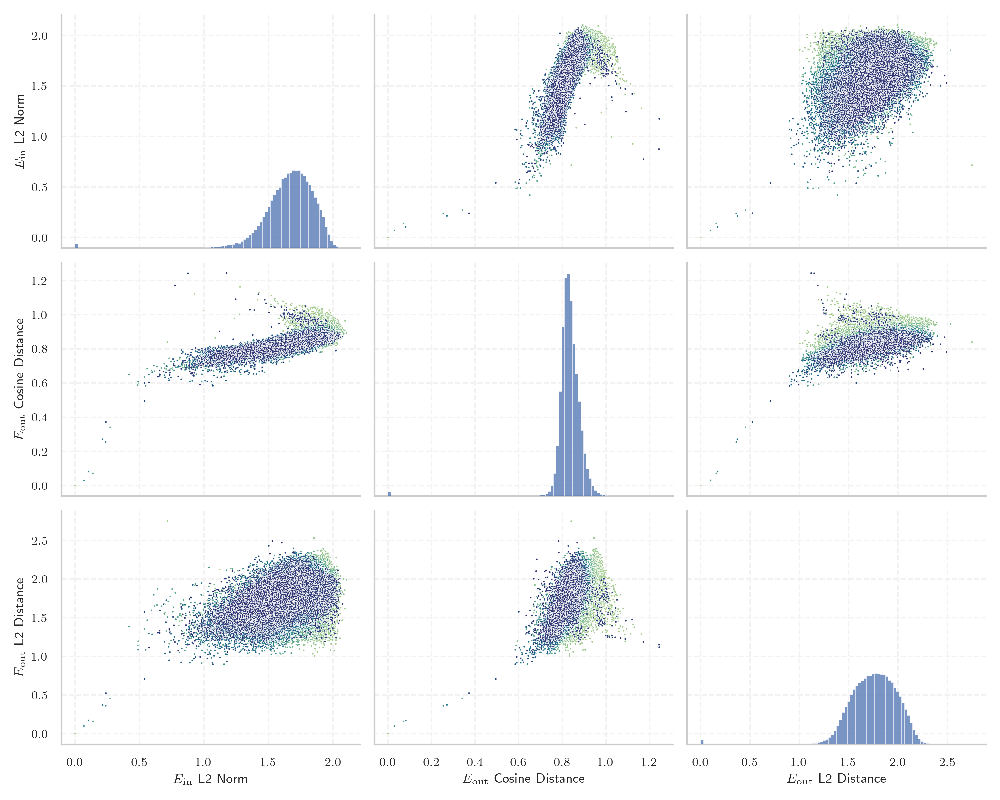

# Report for `utter-project/EuroLLM-9B`

## Model info

* Model Info: 
  * Tied embeddings: False
  * LM head uses bias: False
  * Embeddings shape: [128000, 4096]
* Tokenizer Info: 
  * Vocab Size: 128000
  * Tokenizer Class: LlamaTokenizer
  * Tokenizer Type: BPE
  * Bytes handling: Byte Fallback
  * Token for verification prompt building: includegraphics
  * Token id for verification prompt building: 8997
* Indicator summary: 
  * Indicator for under-trained tokens: E_{in} L2 Norm
  * Overall distribution: 1.663 +/- 0.192
* Detected Token Counts: 
  * Number of tested under-trained tokens: 2559, 2288 non-special, 60 below p = 0.01 threshold, 11 below soft indicator threshold
  * Number of single byte tokens: 354, of which 117 below indicator threshold
  * Number of special tokens: 1, of which 0 below indicator threshold
  * Number of non-single-byte unreachable tokens: 1, of which 0 below indicator threshold

## Under-trained token indicators plot


## Verification plot


## Under-trained token verification results
11 entries below threshold of 0.537

|   token_id | token                       |   indicator | max_prob                                                         | in_other_tokens                                                                                                                                                                                                                                                                                                                                                                                                        |
|------------|-----------------------------|-------------|------------------------------------------------------------------|------------------------------------------------------------------------------------------------------------------------------------------------------------------------------------------------------------------------------------------------------------------------------------------------------------------------------------------------------------------------------------------------------------------------|
|      56539 | ````` funsio `````          |   0.0688092 | <span style='border: 1px solid rgb(169, 68, 66);'>2e-05</span>   |                                                                                                                                                                                                                                                                                                                                                                                                                        |
|      75613 | ````` urasGeneral `````     |   0.104158  | <span style='border: 1px solid rgb(169, 68, 66);'>5e-06</span>   | <span style='border: 1px solid rgb(40, 167, 69);'>````` FacturasGeneral `````</span>                                                                                                                                                                                                                                                                                                                                   |
|      35236 | ````` ▁funsio `````         |   0.137954  | <span style='border: 1px solid rgb(169, 68, 66);'>3.3e-05</span> |                                                                                                                                                                                                                                                                                                                                                                                                                        |
|      77603 | ````` FacturasGeneral ````` |   0.213124  | <span style='border: 1px solid rgb(40, 167, 69);'>0.89</span>    |                                                                                                                                                                                                                                                                                                                                                                                                                        |
|      58072 | ````` ▁momč `````           |   0.237855  | <span style='border: 1px solid rgb(169, 68, 66);'>0.00011</span> | <span style='border: 1px solid rgb(40, 167, 69);'>````` ▁momčadi `````</span>, <span style='border: 1px solid rgb(40, 167, 69);'>````` ▁momčad `````</span>                                                                                                                                                                                                                                                            |
|     114185 | ````` asaíne `````          |   0.239361  | <span style='border: 1px solid rgb(169, 68, 66);'>6.8e-07</span> | <span style='border: 1px solid rgb(169, 68, 66);'>````` asaíneonna `````</span>                                                                                                                                                                                                                                                                                                                                        |
|      26610 | ````` jetain `````          |   0.272394  | <span style='border: 1px solid rgb(255, 145, 0);'>0.0047</span>  | <span style='border: 1px solid rgb(40, 167, 69);'>````` ▁dvejetain `````</span>, <span style='border: 1px solid rgb(255, 145, 0);'>````` vejetain `````</span>, <span style='border: 1px solid rgb(40, 167, 69);'>````` ▁dvejetainių `````</span>, <span style='border: 1px solid rgb(40, 167, 69);'>````` ▁Dvejetain `````</span>, <span style='border: 1px solid rgb(40, 167, 69);'>````` ▁dvejetainiai `````</span> |
|      43175 | ````` ▁compéten `````       |   0.419309  | <span style='border: 1px solid rgb(255, 145, 0);'>0.0021</span>  | ````` ▁compétences `````, ````` ▁compétence `````                                                                                                                                                                                                                                                                                                                                                                      |
|      33200 | ````` ħtie `````            |   0.485839  | <span style='border: 1px solid rgb(169, 68, 66);'>5.4e-05</span> | ````` ħtieġ `````, <span style='border: 1px solid rgb(40, 167, 69);'>````` ħtieġa `````</span>, <span style='border: 1px solid rgb(40, 167, 69);'>````` ▁meħtieġa `````</span>, ````` ▁jeħtieġ `````                                                                                                                                                                                                                   |
|      56988 | ````` ▁meais `````          |   0.488893  | <span style='border: 1px solid rgb(40, 167, 69);'>0.96</span>    | <span style='border: 1px solid rgb(40, 167, 69);'>````` ▁meaisín `````</span>, <span style='border: 1px solid rgb(40, 167, 69);'>````` ▁meaisíní `````</span>                                                                                                                                                                                                                                                          |
|      16962 | ````` ▁úsá `````            |   0.489419  | <span style='border: 1px solid rgb(40, 167, 69);'>0.98</span>    | ````` ▁úsáid `````, ````` ▁úsáide `````, <span style='border: 1px solid rgb(40, 167, 69);'>````` ▁úsáidtear `````</span>, <span style='border: 1px solid rgb(40, 167, 69);'>````` ▁úsáideoirí `````</span>                                                                                                                                                                                                             |


## Byte tokens
117 entries below threshold of 1.087

|   token_id | token              |   indicator |   ord | hex   | byte_type   | reencoded             |
|------------|--------------------|-------------|-------|-------|-------------|-----------------------|
|        294 | ````` <0x21> ````` | 9.46444e-05 |    33 | 0x21  | ascii       | 119906: ````` ! ````` |
|        315 | ````` <0x36> ````` | 9.47728e-05 |    54 | 0x36  | ascii       | 119805: ````` 6 ````` |
|        307 | ````` <0x2E> ````` | 9.56863e-05 |    46 | 0x2E  | ascii       | 119735: ````` . ````` |
|        333 | ````` <0x48> ````` | 9.60606e-05 |    72 | 0x48  | ascii       | 119795: ````` H ````` |
|        349 | ````` <0x58> ````` | 9.60758e-05 |    88 | 0x58  | ascii       | 119931: ````` X ````` |
|        335 | ````` <0x4A> ````` | 9.61211e-05 |    74 | 0x4A  | ascii       | 119820: ````` J ````` |
|        325 | ````` <0x40> ````` | 9.61743e-05 |    64 | 0x40  | ascii       | 120286: ````` @ ````` |
|        298 | ````` <0x25> ````` | 9.63144e-05 |    37 | 0x25  | ascii       | 119941: ````` % ````` |
|        380 | ````` <0x77> ````` | 9.64133e-05 |   119 | 0x77  | ascii       | 119741: ````` w ````` |
|        367 | ````` <0x6A> ````` | 9.64458e-05 |   106 | 0x6A  | ascii       | 119744: ````` j ````` |
|        317 | ````` <0x38> ````` | 9.64621e-05 |    56 | 0x38  | ascii       | 119793: ````` 8 ````` |
|        346 | ````` <0x55> ````` | 9.6664e-05  |    85 | 0x55  | ascii       | 119830: ````` U ````` |
|        296 | ````` <0x23> ````` | 9.68478e-05 |    35 | 0x23  | ascii       | 120135: ````` # ````` |
|        507 | ````` <0xF6> ````` | 9.69337e-05 |   246 | 0xF6  | unused_utf8 |                       |
|        304 | ````` <0x2B> ````` | 9.69781e-05 |    43 | 0x2B  | ascii       | 119994: ````` + ````` |
|        366 | ````` <0x69> ````` | 9.71291e-05 |   105 | 0x69  | ascii       | 119718: ````` i ````` |
|        331 | ````` <0x46> ````` | 9.71732e-05 |    70 | 0x46  | ascii       | 119794: ````` F ````` |
|        454 | ````` <0xC1> ````` | 9.71943e-05 |   193 | 0xC1  | unused_utf8 |                       |
|        351 | ````` <0x5A> ````` | 9.73125e-05 |    90 | 0x5A  | ascii       | 119874: ````` Z ````` |
|        302 | ````` <0x29> ````` | 9.73154e-05 |    41 | 0x29  | ascii       | 119762: ````` ) ````` |
<details><summary>97 additional entries below threshold</summary>

|   token_id | token              |   indicator |   ord | hex   | byte_type   | reencoded                |
|------------|--------------------|-------------|-------|-------|-------------|--------------------------|
|        379 | ````` <0x76> ````` | 9.73308e-05 |   118 | 0x76  | ascii       | 119734: ````` v `````    |
|        309 | ````` <0x30> ````` | 9.73379e-05 |    48 | 0x30  | ascii       | 119752: ````` 0 `````    |
|        369 | ````` <0x6C> ````` | 9.73479e-05 |   108 | 0x6C  | ascii       | 119724: ````` l `````    |
|        322 | ````` <0x3D> ````` | 9.73896e-05 |    61 | 0x3D  | ascii       | 119926: ````` = `````    |
|        509 | ````` <0xF8> ````` | 9.74023e-05 |   248 | 0xF8  | unused_utf8 |                          |
|        506 | ````` <0xF5> ````` | 9.74091e-05 |   245 | 0xF5  | unused_utf8 |                          |
|        318 | ````` <0x39> ````` | 9.74107e-05 |    57 | 0x39  | ascii       | 119772: ````` 9 `````    |
|        273 | ````` <0x0C> ````` | 9.7434e-05  |    12 | 0x0C  | ascii       | 127915: ````` \x0c ````` |
|        343 | ````` <0x52> ````` | 9.74488e-05 |    82 | 0x52  | ascii       | 119785: ````` R `````    |
|        345 | ````` <0x54> ````` | 9.74495e-05 |    84 | 0x54  | ascii       | 119766: ````` T `````    |
|        332 | ````` <0x47> ````` | 9.75304e-05 |    71 | 0x47  | ascii       | 119796: ````` G `````    |
|        512 | ````` <0xFB> ````` | 9.75383e-05 |   251 | 0xFB  | unused_utf8 |                          |
|        372 | ````` <0x6F> ````` | 9.76071e-05 |   111 | 0x6F  | ascii       | 119720: ````` o `````    |
|        334 | ````` <0x49> ````` | 9.76948e-05 |    73 | 0x49  | ascii       | 119768: ````` I `````    |
|        339 | ````` <0x4E> ````` | 9.77072e-05 |    78 | 0x4E  | ascii       | 119787: ````` N `````    |
|        387 | ````` <0x7E> ````` | 9.77284e-05 |   126 | 0x7E  | ascii       | 120038: ````` ~ `````    |
|        308 | ````` <0x2F> ````` | 9.779e-05   |    47 | 0x2F  | ascii       | 119858: ````` / `````    |
|        359 | ````` <0x62> ````` | 9.78208e-05 |    98 | 0x62  | ascii       | 119736: ````` b `````    |
|        301 | ````` <0x28> ````` | 9.785e-05   |    40 | 0x28  | ascii       | 119763: ````` ( `````    |
|        362 | ````` <0x65> ````` | 9.7853e-05  |   101 | 0x65  | ascii       | 119716: ````` e `````    |
|        323 | ````` <0x3E> ````` | 9.7858e-05  |    62 | 0x3E  | ascii       | 120057: ````` > `````    |
|        355 | ````` <0x5E> ````` | 9.79665e-05 |    94 | 0x5E  | ascii       | 119952: ````` ^ `````    |
|        364 | ````` <0x67> ````` | 9.79776e-05 |   103 | 0x67  | ascii       | 119731: ````` g `````    |
|        330 | ````` <0x45> ````` | 9.7992e-05  |    69 | 0x45  | ascii       | 119775: ````` E `````    |
|        340 | ````` <0x4F> ````` | 9.80268e-05 |    79 | 0x4F  | ascii       | 119802: ````` O `````    |
|        376 | ````` <0x73> ````` | 9.80397e-05 |   115 | 0x73  | ascii       | 119723: ````` s `````    |
|        384 | ````` <0x7B> ````` | 9.80591e-05 |   123 | 0x7B  | ascii       | 119828: ````` { `````    |
|        311 | ````` <0x32> ````` | 9.80605e-05 |    50 | 0x32  | ascii       | 119759: ````` 2 `````    |
|        313 | ````` <0x34> ````` | 9.80888e-05 |    52 | 0x34  | ascii       | 119799: ````` 4 `````    |
|        378 | ````` <0x75> ````` | 9.81038e-05 |   117 | 0x75  | ascii       | 119726: ````` u `````    |
|        385 | ````` <0x7C> ````` | 9.8122e-05  |   124 | 0x7C  | ascii       | 119920: ````` \| `````   |
|        305 | ````` <0x2C> ````` | 9.81248e-05 |    44 | 0x2C  | ascii       | 119732: ````` , `````    |
|        306 | ````` <0x2D> ````` | 9.81387e-05 |    45 | 0x2D  | ascii       | 119754: ````` - `````    |
|        299 | ````` <0x26> ````` | 9.8151e-05  |    38 | 0x26  | ascii       | 119945: ````` & `````    |
|        324 | ````` <0x3F> ````` | 9.81714e-05 |    63 | 0x3F  | ascii       | 119882: ````` ? `````    |
|        269 | ````` <0x08> ````` | 9.82002e-05 |     8 | 0x08  | ascii       | 127515: ````` \x08 ````` |
|        373 | ````` <0x70> ````` | 9.82584e-05 |   112 | 0x70  | ascii       | 119730: ````` p `````    |
|        352 | ````` <0x5B> ````` | 9.83135e-05 |    91 | 0x5B  | ascii       | 119980: ````` [ `````    |
|        314 | ````` <0x35> ````` | 9.83263e-05 |    53 | 0x35  | ascii       | 119791: ````` 5 `````    |
|        356 | ````` <0x5F> ````` | 9.83378e-05 |    95 | 0x5F  | ascii       | 119839: ````` _ `````    |
|        344 | ````` <0x53> ````` | 9.83479e-05 |    83 | 0x53  | ascii       | 119755: ````` S `````    |
|        348 | ````` <0x57> ````` | 9.83559e-05 |    87 | 0x57  | ascii       | 119812: ````` W `````    |
|        297 | ````` <0x24> ````` | 9.83825e-05 |    36 | 0x24  | ascii       | 119822: ````` $ `````    |
|        514 | ````` <0xFD> ````` | 9.83965e-05 |   253 | 0xFD  | unused_utf8 |                          |
|        510 | ````` <0xF9> ````` | 9.83995e-05 |   249 | 0xF9  | unused_utf8 |                          |
|        375 | ````` <0x72> ````` | 9.84313e-05 |   114 | 0x72  | ascii       | 119722: ````` r `````    |
|        368 | ````` <0x6B> ````` | 9.84685e-05 |   107 | 0x6B  | ascii       | 119733: ````` k `````    |
|        292 | ````` <0x1F> ````` | 9.84715e-05 |    31 | 0x1F  | ascii       | 127739: ````` \x1f ````` |
|        516 | ````` <0xFF> ````` | 9.85771e-05 |   255 | 0xFF  | unused_utf8 |                          |
|        350 | ````` <0x59> ````` | 9.85884e-05 |    89 | 0x59  | ascii       | 119928: ````` Y `````    |
|        319 | ````` <0x3A> ````` | 9.86263e-05 |    58 | 0x3A  | ascii       | 119782: ````` : `````    |
|        365 | ````` <0x68> ````` | 9.86324e-05 |   104 | 0x68  | ascii       | 119729: ````` h `````    |
|        320 | ````` <0x3B> ````` | 9.86338e-05 |    59 | 0x3B  | ascii       | 119852: ````` ; `````    |
|        329 | ````` <0x44> ````` | 9.86561e-05 |    68 | 0x44  | ascii       | 119774: ````` D `````    |
|        361 | ````` <0x64> ````` | 9.86706e-05 |   100 | 0x64  | ascii       | 119725: ````` d `````    |
|        381 | ````` <0x78> ````` | 9.86859e-05 |   120 | 0x78  | ascii       | 119778: ````` x `````    |
|        321 | ````` <0x3C> ````` | 9.86901e-05 |    60 | 0x3C  | ascii       | 120155: ````` < `````    |
|        515 | ````` <0xFE> ````` | 9.8704e-05  |   254 | 0xFE  | unused_utf8 |                          |
|        293 | ````` <0x20> ````` | 9.87058e-05 |    32 | 0x20  | ascii       | 119715: ````` ▁ `````    |
|        341 | ````` <0x50> ````` | 9.87219e-05 |    80 | 0x50  | ascii       | 119769: ````` P `````    |
|        453 | ````` <0xC0> ````` | 9.87348e-05 |   192 | 0xC0  | unused_utf8 |                          |
|        337 | ````` <0x4C> ````` | 9.87981e-05 |    76 | 0x4C  | ascii       | 119779: ````` L `````    |
|        310 | ````` <0x31> ````` | 9.88151e-05 |    49 | 0x31  | ascii       | 119749: ````` 1 `````    |
|        511 | ````` <0xFA> ````` | 9.88159e-05 |   250 | 0xFA  | unused_utf8 |                          |
|        347 | ````` <0x56> ````` | 9.88771e-05 |    86 | 0x56  | ascii       | 119807: ````` V `````    |
|        508 | ````` <0xF7> ````` | 9.888e-05   |   247 | 0xF7  | unused_utf8 |                          |
|        513 | ````` <0xFC> ````` | 9.89132e-05 |   252 | 0xFC  | unused_utf8 |                          |
|        371 | ````` <0x6E> ````` | 9.89143e-05 |   110 | 0x6E  | ascii       | 119719: ````` n `````    |
|        303 | ````` <0x2A> ````` | 9.89393e-05 |    42 | 0x2A  | ascii       | 119997: ````` * `````    |
|        353 | ````` <0x5C> ````` | 9.89396e-05 |    92 | 0x5C  | ascii       | 119765: ````` \ `````    |
|        358 | ````` <0x61> ````` | 9.8977e-05  |    97 | 0x61  | ascii       | 119717: ````` a `````    |
|        312 | ````` <0x33> ````` | 9.89912e-05 |    51 | 0x33  | ascii       | 119790: ````` 3 `````    |
|        383 | ````` <0x7A> ````` | 9.90015e-05 |   122 | 0x7A  | ascii       | 119740: ````` z `````    |
|        300 | ````` <0x27> ````` | 9.90079e-05 |    39 | 0x27  | ascii       | 119792: ````` ' `````    |
|        370 | ````` <0x6D> ````` | 9.90097e-05 |   109 | 0x6D  | ascii       | 119728: ````` m `````    |
|        268 | ````` <0x07> ````` | 9.90334e-05 |     7 | 0x07  | ascii       | 126478: ````` \x07 ````` |
|        336 | ````` <0x4B> ````` | 9.90698e-05 |    75 | 0x4B  | ascii       | 119804: ````` K `````    |
|        328 | ````` <0x43> ````` | 9.90852e-05 |    67 | 0x43  | ascii       | 119771: ````` C `````    |
|        382 | ````` <0x79> ````` | 9.90919e-05 |   121 | 0x79  | ascii       | 119738: ````` y `````    |
|        338 | ````` <0x4D> ````` | 9.91946e-05 |    77 | 0x4D  | ascii       | 119770: ````` M `````    |
|        295 | ````` <0x22> ````` | 9.93469e-05 |    34 | 0x22  | ascii       | 119813: ````` " `````    |
|        377 | ````` <0x74> ````` | 9.93672e-05 |   116 | 0x74  | ascii       | 119721: ````` t `````    |
|        456 | ````` <0xC3> ````` | 9.93824e-05 |   195 | 0xC3  | utf8        |                          |
|        316 | ````` <0x37> ````` | 9.94454e-05 |    55 | 0x37  | ascii       | 119806: ````` 7 `````    |
|        357 | ````` <0x60> ````` | 9.94835e-05 |    96 | 0x60  | ascii       | 120355: ````` ` `````    |
|        326 | ````` <0x41> ````` | 9.9544e-05  |    65 | 0x41  | ascii       | 119758: ````` A `````    |
|        386 | ````` <0x7D> ````` | 9.98344e-05 |   125 | 0x7D  | ascii       | 119829: ````` } `````    |
|        374 | ````` <0x71> ````` | 9.98557e-05 |   113 | 0x71  | ascii       | 119764: ````` q `````    |
|        360 | ````` <0x63> ````` | 0.000100001 |    99 | 0x63  | ascii       | 119727: ````` c `````    |
|        363 | ````` <0x66> ````` | 0.000100278 |   102 | 0x66  | ascii       | 119737: ````` f `````    |
|        327 | ````` <0x42> ````` | 0.000100408 |    66 | 0x42  | ascii       | 119776: ````` B `````    |
|        354 | ````` <0x5D> ````` | 0.000100614 |    93 | 0x5D  | ascii       | 119979: ````` ] `````    |
|        342 | ````` <0x51> ````` | 0.000100934 |    81 | 0x51  | ascii       | 119961: ````` Q `````    |
|     119735 | ````` . `````      | 0.77417     |    46 | 0x2E  | ascii       |                          |
|     119732 | ````` , `````      | 0.874736    |    44 | 0x2C  | ascii       |                          |
|        271 | ````` <0x0A> ````` | 0.925749    |    10 | 0x0A  | ascii       |                          |
|        449 | ````` <0xBC> ````` | 1.08602     |   188 | 0xBC  | utf8        |                          |
</details>


## Special tokens
261 entries below threshold of 1.087

|   token_id | token                      |   indicator | max_prob                                                         |
|------------|----------------------------|-------------|------------------------------------------------------------------|
|        208 | ````` <extra_id_203> ````` | 9.50915e-05 | <span style='border: 1px solid rgb(169, 68, 66);'>4.3e-07</span> |
|        235 | ````` <extra_id_230> ````` | 9.52087e-05 | <span style='border: 1px solid rgb(169, 68, 66);'>4.3e-07</span> |
|        249 | ````` <extra_id_244> ````` | 9.52303e-05 | <span style='border: 1px solid rgb(169, 68, 66);'>4.3e-07</span> |
|        192 | ````` <extra_id_187> ````` | 9.52553e-05 | <span style='border: 1px solid rgb(169, 68, 66);'>4.3e-07</span> |
|        181 | ````` <extra_id_176> ````` | 9.53296e-05 | <span style='border: 1px solid rgb(169, 68, 66);'>4.3e-07</span> |
|         82 | ````` <extra_id_77> `````  | 9.54303e-05 | <span style='border: 1px solid rgb(169, 68, 66);'>4.3e-07</span> |
|        173 | ````` <extra_id_168> ````` | 9.55039e-05 | <span style='border: 1px solid rgb(169, 68, 66);'>4.3e-07</span> |
|        170 | ````` <extra_id_165> ````` | 9.55338e-05 | <span style='border: 1px solid rgb(169, 68, 66);'>4.3e-07</span> |
|        159 | ````` <extra_id_154> ````` | 9.55918e-05 | <span style='border: 1px solid rgb(169, 68, 66);'>4.3e-07</span> |
|        183 | ````` <extra_id_178> ````` | 9.5845e-05  | <span style='border: 1px solid rgb(169, 68, 66);'>4.3e-07</span> |
|        198 | ````` <extra_id_193> ````` | 9.58635e-05 | <span style='border: 1px solid rgb(169, 68, 66);'>4.3e-07</span> |
|         48 | ````` <extra_id_43> `````  | 9.5889e-05  | <span style='border: 1px solid rgb(169, 68, 66);'>4.3e-07</span> |
|         70 | ````` <extra_id_65> `````  | 9.59102e-05 | <span style='border: 1px solid rgb(169, 68, 66);'>4.3e-07</span> |
|         29 | ````` <extra_id_24> `````  | 9.59226e-05 | <span style='border: 1px solid rgb(169, 68, 66);'>4.3e-07</span> |
|        236 | ````` <extra_id_231> ````` | 9.59331e-05 | <span style='border: 1px solid rgb(169, 68, 66);'>4.3e-07</span> |
|        133 | ````` <extra_id_128> ````` | 9.5955e-05  | <span style='border: 1px solid rgb(169, 68, 66);'>4.3e-07</span> |
|         46 | ````` <extra_id_41> `````  | 9.59894e-05 | <span style='border: 1px solid rgb(169, 68, 66);'>4.3e-07</span> |
|        167 | ````` <extra_id_162> ````` | 9.59922e-05 | <span style='border: 1px solid rgb(169, 68, 66);'>4.3e-07</span> |
|         39 | ````` <extra_id_34> `````  | 9.60331e-05 | <span style='border: 1px solid rgb(169, 68, 66);'>4.3e-07</span> |
|        230 | ````` <extra_id_225> ````` | 9.60563e-05 | <span style='border: 1px solid rgb(169, 68, 66);'>4.3e-07</span> |
<details><summary>241 additional entries below threshold</summary>

|   token_id | token                      |   indicator | max_prob                                                         |
|------------|----------------------------|-------------|------------------------------------------------------------------|
|        137 | ````` <extra_id_132> ````` | 9.60694e-05 | <span style='border: 1px solid rgb(169, 68, 66);'>4.3e-07</span> |
|        216 | ````` <extra_id_211> ````` | 9.60878e-05 | <span style='border: 1px solid rgb(169, 68, 66);'>4.3e-07</span> |
|        107 | ````` <extra_id_102> ````` | 9.61415e-05 | <span style='border: 1px solid rgb(169, 68, 66);'>4.3e-07</span> |
|        139 | ````` <extra_id_134> ````` | 9.61868e-05 | <span style='border: 1px solid rgb(169, 68, 66);'>4.3e-07</span> |
|        169 | ````` <extra_id_164> ````` | 9.61936e-05 | <span style='border: 1px solid rgb(169, 68, 66);'>4.3e-07</span> |
|        212 | ````` <extra_id_207> ````` | 9.61961e-05 | <span style='border: 1px solid rgb(169, 68, 66);'>4.3e-07</span> |
|        223 | ````` <extra_id_218> ````` | 9.62032e-05 | <span style='border: 1px solid rgb(169, 68, 66);'>4.3e-07</span> |
|         61 | ````` <extra_id_56> `````  | 9.62078e-05 | <span style='border: 1px solid rgb(169, 68, 66);'>4.3e-07</span> |
|        248 | ````` <extra_id_243> ````` | 9.62132e-05 | <span style='border: 1px solid rgb(169, 68, 66);'>4.3e-07</span> |
|        247 | ````` <extra_id_242> ````` | 9.62264e-05 | <span style='border: 1px solid rgb(169, 68, 66);'>4.3e-07</span> |
|         68 | ````` <extra_id_63> `````  | 9.62523e-05 | <span style='border: 1px solid rgb(169, 68, 66);'>4.3e-07</span> |
|         52 | ````` <extra_id_47> `````  | 9.64315e-05 | <span style='border: 1px solid rgb(169, 68, 66);'>4.3e-07</span> |
|         59 | ````` <extra_id_54> `````  | 9.64483e-05 | <span style='border: 1px solid rgb(169, 68, 66);'>4.3e-07</span> |
|        143 | ````` <extra_id_138> ````` | 9.64514e-05 | <span style='border: 1px solid rgb(169, 68, 66);'>4.3e-07</span> |
|        214 | ````` <extra_id_209> ````` | 9.64687e-05 | <span style='border: 1px solid rgb(169, 68, 66);'>4.3e-07</span> |
|        209 | ````` <extra_id_204> ````` | 9.64916e-05 | <span style='border: 1px solid rgb(169, 68, 66);'>4.3e-07</span> |
|        164 | ````` <extra_id_159> ````` | 9.64976e-05 | <span style='border: 1px solid rgb(169, 68, 66);'>4.3e-07</span> |
|        155 | ````` <extra_id_150> ````` | 9.65943e-05 | <span style='border: 1px solid rgb(169, 68, 66);'>4.3e-07</span> |
|        256 | ````` <extra_id_251> ````` | 9.65956e-05 | <span style='border: 1px solid rgb(169, 68, 66);'>4.3e-07</span> |
|        102 | ````` <extra_id_97> `````  | 9.66031e-05 | <span style='border: 1px solid rgb(169, 68, 66);'>4.3e-07</span> |
|         62 | ````` <extra_id_57> `````  | 9.66066e-05 | <span style='border: 1px solid rgb(169, 68, 66);'>4.3e-07</span> |
|         47 | ````` <extra_id_42> `````  | 9.66432e-05 | <span style='border: 1px solid rgb(169, 68, 66);'>4.3e-07</span> |
|         64 | ````` <extra_id_59> `````  | 9.66455e-05 | <span style='border: 1px solid rgb(169, 68, 66);'>4.3e-07</span> |
|         90 | ````` <extra_id_85> `````  | 9.66667e-05 | <span style='border: 1px solid rgb(169, 68, 66);'>4.3e-07</span> |
|         74 | ````` <extra_id_69> `````  | 9.67165e-05 | <span style='border: 1px solid rgb(169, 68, 66);'>4.3e-07</span> |
|        168 | ````` <extra_id_163> ````` | 9.67264e-05 | <span style='border: 1px solid rgb(169, 68, 66);'>4.3e-07</span> |
|         20 | ````` <extra_id_15> `````  | 9.67511e-05 | <span style='border: 1px solid rgb(169, 68, 66);'>4.3e-07</span> |
|        203 | ````` <extra_id_198> ````` | 9.67545e-05 | <span style='border: 1px solid rgb(169, 68, 66);'>4.3e-07</span> |
|          9 | ````` <extra_id_4> `````   | 9.67739e-05 | <span style='border: 1px solid rgb(169, 68, 66);'>4.3e-07</span> |
|        219 | ````` <extra_id_214> ````` | 9.68475e-05 | <span style='border: 1px solid rgb(169, 68, 66);'>4.3e-07</span> |
|        104 | ````` <extra_id_99> `````  | 9.68504e-05 | <span style='border: 1px solid rgb(169, 68, 66);'>4.3e-07</span> |
|        128 | ````` <extra_id_123> ````` | 9.68513e-05 | <span style='border: 1px solid rgb(169, 68, 66);'>4.3e-07</span> |
|         35 | ````` <extra_id_30> `````  | 9.68686e-05 | <span style='border: 1px solid rgb(169, 68, 66);'>4.3e-07</span> |
|         99 | ````` <extra_id_94> `````  | 9.68693e-05 | <span style='border: 1px solid rgb(169, 68, 66);'>4.3e-07</span> |
|        217 | ````` <extra_id_212> ````` | 9.68767e-05 | <span style='border: 1px solid rgb(169, 68, 66);'>4.3e-07</span> |
|        199 | ````` <extra_id_194> ````` | 9.69134e-05 | <span style='border: 1px solid rgb(169, 68, 66);'>4.3e-07</span> |
|        189 | ````` <extra_id_184> ````` | 9.70066e-05 | <span style='border: 1px solid rgb(169, 68, 66);'>4.3e-07</span> |
|          3 | ````` <\|im_start\|> ````` | 9.70118e-05 |                                                                  |
|        238 | ````` <extra_id_233> ````` | 9.70496e-05 | <span style='border: 1px solid rgb(169, 68, 66);'>4.3e-07</span> |
|        158 | ````` <extra_id_153> ````` | 9.70502e-05 | <span style='border: 1px solid rgb(169, 68, 66);'>4.3e-07</span> |
|        131 | ````` <extra_id_126> ````` | 9.7078e-05  | <span style='border: 1px solid rgb(169, 68, 66);'>4.3e-07</span> |
|        120 | ````` <extra_id_115> ````` | 9.70894e-05 | <span style='border: 1px solid rgb(169, 68, 66);'>4.3e-07</span> |
|        111 | ````` <extra_id_106> ````` | 9.70905e-05 | <span style='border: 1px solid rgb(169, 68, 66);'>4.3e-07</span> |
|         16 | ````` <extra_id_11> `````  | 9.70946e-05 | <span style='border: 1px solid rgb(169, 68, 66);'>4.3e-07</span> |
|         55 | ````` <extra_id_50> `````  | 9.71052e-05 | <span style='border: 1px solid rgb(169, 68, 66);'>4.3e-07</span> |
|        176 | ````` <extra_id_171> ````` | 9.71084e-05 | <span style='border: 1px solid rgb(169, 68, 66);'>4.3e-07</span> |
|        245 | ````` <extra_id_240> ````` | 9.71212e-05 | <span style='border: 1px solid rgb(169, 68, 66);'>4.3e-07</span> |
|        163 | ````` <extra_id_158> ````` | 9.71242e-05 | <span style='border: 1px solid rgb(169, 68, 66);'>4.3e-07</span> |
|         51 | ````` <extra_id_46> `````  | 9.71271e-05 | <span style='border: 1px solid rgb(169, 68, 66);'>4.3e-07</span> |
|        122 | ````` <extra_id_117> ````` | 9.71497e-05 | <span style='border: 1px solid rgb(169, 68, 66);'>4.3e-07</span> |
|         76 | ````` <extra_id_71> `````  | 9.71724e-05 | <span style='border: 1px solid rgb(169, 68, 66);'>4.3e-07</span> |
|         79 | ````` <extra_id_74> `````  | 9.71769e-05 | <span style='border: 1px solid rgb(169, 68, 66);'>4.3e-07</span> |
|        260 | ````` <extra_id_255> ````` | 9.7181e-05  | <span style='border: 1px solid rgb(169, 68, 66);'>4.3e-07</span> |
|        112 | ````` <extra_id_107> ````` | 9.71875e-05 | <span style='border: 1px solid rgb(169, 68, 66);'>4.3e-07</span> |
|        220 | ````` <extra_id_215> ````` | 9.72162e-05 | <span style='border: 1px solid rgb(169, 68, 66);'>4.3e-07</span> |
|        241 | ````` <extra_id_236> ````` | 9.72179e-05 | <span style='border: 1px solid rgb(169, 68, 66);'>4.3e-07</span> |
|        165 | ````` <extra_id_160> ````` | 9.72254e-05 | <span style='border: 1px solid rgb(169, 68, 66);'>4.3e-07</span> |
|        152 | ````` <extra_id_147> ````` | 9.72279e-05 | <span style='border: 1px solid rgb(169, 68, 66);'>4.3e-07</span> |
|        157 | ````` <extra_id_152> ````` | 9.72616e-05 | <span style='border: 1px solid rgb(169, 68, 66);'>4.3e-07</span> |
|        156 | ````` <extra_id_151> ````` | 9.73258e-05 | <span style='border: 1px solid rgb(169, 68, 66);'>4.3e-07</span> |
|        243 | ````` <extra_id_238> ````` | 9.73601e-05 | <span style='border: 1px solid rgb(169, 68, 66);'>4.3e-07</span> |
|         78 | ````` <extra_id_73> `````  | 9.73719e-05 | <span style='border: 1px solid rgb(169, 68, 66);'>4.3e-07</span> |
|        191 | ````` <extra_id_186> ````` | 9.73838e-05 | <span style='border: 1px solid rgb(169, 68, 66);'>4.3e-07</span> |
|        240 | ````` <extra_id_235> ````` | 9.73852e-05 | <span style='border: 1px solid rgb(169, 68, 66);'>4.3e-07</span> |
|        213 | ````` <extra_id_208> ````` | 9.74076e-05 | <span style='border: 1px solid rgb(169, 68, 66);'>4.3e-07</span> |
|        109 | ````` <extra_id_104> ````` | 9.74181e-05 | <span style='border: 1px solid rgb(169, 68, 66);'>4.3e-07</span> |
|        255 | ````` <extra_id_250> ````` | 9.74315e-05 | <span style='border: 1px solid rgb(169, 68, 66);'>4.3e-07</span> |
|         25 | ````` <extra_id_20> `````  | 9.74355e-05 | <span style='border: 1px solid rgb(169, 68, 66);'>4.3e-07</span> |
|        117 | ````` <extra_id_112> ````` | 9.74667e-05 | <span style='border: 1px solid rgb(169, 68, 66);'>4.3e-07</span> |
|        124 | ````` <extra_id_119> ````` | 9.74731e-05 | <span style='border: 1px solid rgb(169, 68, 66);'>4.3e-07</span> |
|        149 | ````` <extra_id_144> ````` | 9.7487e-05  | <span style='border: 1px solid rgb(169, 68, 66);'>4.3e-07</span> |
|        231 | ````` <extra_id_226> ````` | 9.74906e-05 | <span style='border: 1px solid rgb(169, 68, 66);'>4.3e-07</span> |
|         91 | ````` <extra_id_86> `````  | 9.74942e-05 | <span style='border: 1px solid rgb(169, 68, 66);'>4.3e-07</span> |
|         23 | ````` <extra_id_18> `````  | 9.74966e-05 | <span style='border: 1px solid rgb(169, 68, 66);'>4.3e-07</span> |
|         95 | ````` <extra_id_90> `````  | 9.7541e-05  | <span style='border: 1px solid rgb(169, 68, 66);'>4.3e-07</span> |
|        118 | ````` <extra_id_113> ````` | 9.75508e-05 | <span style='border: 1px solid rgb(169, 68, 66);'>4.3e-07</span> |
|        148 | ````` <extra_id_143> ````` | 9.75643e-05 | <span style='border: 1px solid rgb(169, 68, 66);'>4.3e-07</span> |
|        136 | ````` <extra_id_131> ````` | 9.75713e-05 | <span style='border: 1px solid rgb(169, 68, 66);'>4.3e-07</span> |
|         96 | ````` <extra_id_91> `````  | 9.75764e-05 | <span style='border: 1px solid rgb(169, 68, 66);'>4.3e-07</span> |
|        151 | ````` <extra_id_146> ````` | 9.75993e-05 | <span style='border: 1px solid rgb(169, 68, 66);'>4.3e-07</span> |
|         50 | ````` <extra_id_45> `````  | 9.76186e-05 | <span style='border: 1px solid rgb(169, 68, 66);'>4.3e-07</span> |
|         92 | ````` <extra_id_87> `````  | 9.76237e-05 | <span style='border: 1px solid rgb(169, 68, 66);'>4.3e-07</span> |
|         89 | ````` <extra_id_84> `````  | 9.76364e-05 | <span style='border: 1px solid rgb(169, 68, 66);'>4.3e-07</span> |
|        130 | ````` <extra_id_125> ````` | 9.76381e-05 | <span style='border: 1px solid rgb(169, 68, 66);'>4.3e-07</span> |
|        138 | ````` <extra_id_133> ````` | 9.76524e-05 | <span style='border: 1px solid rgb(169, 68, 66);'>4.3e-07</span> |
|        186 | ````` <extra_id_181> ````` | 9.76537e-05 | <span style='border: 1px solid rgb(169, 68, 66);'>4.3e-07</span> |
|         83 | ````` <extra_id_78> `````  | 9.76599e-05 | <span style='border: 1px solid rgb(169, 68, 66);'>4.3e-07</span> |
|        218 | ````` <extra_id_213> ````` | 9.76673e-05 | <span style='border: 1px solid rgb(169, 68, 66);'>4.3e-07</span> |
|        110 | ````` <extra_id_105> ````` | 9.77283e-05 | <span style='border: 1px solid rgb(169, 68, 66);'>4.3e-07</span> |
|        161 | ````` <extra_id_156> ````` | 9.77361e-05 | <span style='border: 1px solid rgb(169, 68, 66);'>4.3e-07</span> |
|         65 | ````` <extra_id_60> `````  | 9.77395e-05 | <span style='border: 1px solid rgb(169, 68, 66);'>4.3e-07</span> |
|        154 | ````` <extra_id_149> ````` | 9.77709e-05 | <span style='border: 1px solid rgb(169, 68, 66);'>4.3e-07</span> |
|         30 | ````` <extra_id_25> `````  | 9.7772e-05  | <span style='border: 1px solid rgb(169, 68, 66);'>4.3e-07</span> |
|        103 | ````` <extra_id_98> `````  | 9.77972e-05 | <span style='border: 1px solid rgb(169, 68, 66);'>4.3e-07</span> |
|        178 | ````` <extra_id_173> ````` | 9.77992e-05 | <span style='border: 1px solid rgb(169, 68, 66);'>4.3e-07</span> |
|        116 | ````` <extra_id_111> ````` | 9.78093e-05 | <span style='border: 1px solid rgb(169, 68, 66);'>4.3e-07</span> |
|        182 | ````` <extra_id_177> ````` | 9.78101e-05 | <span style='border: 1px solid rgb(169, 68, 66);'>4.3e-07</span> |
|         67 | ````` <extra_id_62> `````  | 9.78282e-05 | <span style='border: 1px solid rgb(169, 68, 66);'>4.3e-07</span> |
|          7 | ````` <extra_id_2> `````   | 9.78346e-05 | <span style='border: 1px solid rgb(169, 68, 66);'>4.3e-07</span> |
|        127 | ````` <extra_id_122> ````` | 9.78385e-05 | <span style='border: 1px solid rgb(169, 68, 66);'>4.3e-07</span> |
|         22 | ````` <extra_id_17> `````  | 9.78462e-05 | <span style='border: 1px solid rgb(169, 68, 66);'>4.3e-07</span> |
|         13 | ````` <extra_id_8> `````   | 9.78538e-05 | <span style='border: 1px solid rgb(169, 68, 66);'>4.3e-07</span> |
|        202 | ````` <extra_id_197> ````` | 9.78581e-05 | <span style='border: 1px solid rgb(169, 68, 66);'>4.3e-07</span> |
|        172 | ````` <extra_id_167> ````` | 9.78957e-05 | <span style='border: 1px solid rgb(169, 68, 66);'>4.3e-07</span> |
|        237 | ````` <extra_id_232> ````` | 9.79003e-05 | <span style='border: 1px solid rgb(169, 68, 66);'>4.3e-07</span> |
|        232 | ````` <extra_id_227> ````` | 9.79008e-05 | <span style='border: 1px solid rgb(169, 68, 66);'>4.3e-07</span> |
|         26 | ````` <extra_id_21> `````  | 9.79259e-05 | <span style='border: 1px solid rgb(169, 68, 66);'>4.3e-07</span> |
|        206 | ````` <extra_id_201> ````` | 9.79344e-05 | <span style='border: 1px solid rgb(169, 68, 66);'>4.3e-07</span> |
|        184 | ````` <extra_id_179> ````` | 9.79377e-05 | <span style='border: 1px solid rgb(169, 68, 66);'>4.3e-07</span> |
|        113 | ````` <extra_id_108> ````` | 9.7947e-05  | <span style='border: 1px solid rgb(169, 68, 66);'>4.3e-07</span> |
|        197 | ````` <extra_id_192> ````` | 9.79712e-05 | <span style='border: 1px solid rgb(169, 68, 66);'>4.3e-07</span> |
|         94 | ````` <extra_id_89> `````  | 9.79904e-05 | <span style='border: 1px solid rgb(169, 68, 66);'>4.3e-07</span> |
|        144 | ````` <extra_id_139> ````` | 9.80072e-05 | <span style='border: 1px solid rgb(169, 68, 66);'>4.3e-07</span> |
|        100 | ````` <extra_id_95> `````  | 9.80104e-05 | <span style='border: 1px solid rgb(169, 68, 66);'>4.3e-07</span> |
|         42 | ````` <extra_id_37> `````  | 9.80166e-05 | <span style='border: 1px solid rgb(169, 68, 66);'>4.3e-07</span> |
|        160 | ````` <extra_id_155> ````` | 9.80362e-05 | <span style='border: 1px solid rgb(169, 68, 66);'>4.3e-07</span> |
|        150 | ````` <extra_id_145> ````` | 9.80424e-05 | <span style='border: 1px solid rgb(169, 68, 66);'>4.3e-07</span> |
|        258 | ````` <extra_id_253> ````` | 9.80445e-05 | <span style='border: 1px solid rgb(169, 68, 66);'>4.3e-07</span> |
|        174 | ````` <extra_id_169> ````` | 9.80451e-05 | <span style='border: 1px solid rgb(169, 68, 66);'>4.3e-07</span> |
|         15 | ````` <extra_id_10> `````  | 9.80481e-05 | <span style='border: 1px solid rgb(169, 68, 66);'>4.3e-07</span> |
|        227 | ````` <extra_id_222> ````` | 9.8074e-05  | <span style='border: 1px solid rgb(169, 68, 66);'>4.3e-07</span> |
|        119 | ````` <extra_id_114> ````` | 9.8079e-05  | <span style='border: 1px solid rgb(169, 68, 66);'>4.3e-07</span> |
|         43 | ````` <extra_id_38> `````  | 9.80831e-05 | <span style='border: 1px solid rgb(169, 68, 66);'>4.3e-07</span> |
|         54 | ````` <extra_id_49> `````  | 9.80834e-05 | <span style='border: 1px solid rgb(169, 68, 66);'>4.3e-07</span> |
|        194 | ````` <extra_id_189> ````` | 9.80881e-05 | <span style='border: 1px solid rgb(169, 68, 66);'>4.3e-07</span> |
|        188 | ````` <extra_id_183> ````` | 9.81004e-05 | <span style='border: 1px solid rgb(169, 68, 66);'>4.3e-07</span> |
|        259 | ````` <extra_id_254> ````` | 9.81056e-05 | <span style='border: 1px solid rgb(169, 68, 66);'>4.3e-07</span> |
|        233 | ````` <extra_id_228> ````` | 9.81468e-05 | <span style='border: 1px solid rgb(169, 68, 66);'>4.3e-07</span> |
|        251 | ````` <extra_id_246> ````` | 9.81693e-05 | <span style='border: 1px solid rgb(169, 68, 66);'>4.3e-07</span> |
|        229 | ````` <extra_id_224> ````` | 9.81818e-05 | <span style='border: 1px solid rgb(169, 68, 66);'>4.3e-07</span> |
|        224 | ````` <extra_id_219> ````` | 9.81984e-05 | <span style='border: 1px solid rgb(169, 68, 66);'>4.3e-07</span> |
|        115 | ````` <extra_id_110> ````` | 9.82005e-05 | <span style='border: 1px solid rgb(169, 68, 66);'>4.3e-07</span> |
|        146 | ````` <extra_id_141> ````` | 9.82137e-05 | <span style='border: 1px solid rgb(169, 68, 66);'>4.3e-07</span> |
|        221 | ````` <extra_id_216> ````` | 9.82275e-05 | <span style='border: 1px solid rgb(169, 68, 66);'>4.3e-07</span> |
|        140 | ````` <extra_id_135> ````` | 9.82476e-05 | <span style='border: 1px solid rgb(169, 68, 66);'>4.3e-07</span> |
|        166 | ````` <extra_id_161> ````` | 9.82574e-05 | <span style='border: 1px solid rgb(169, 68, 66);'>4.3e-07</span> |
|        177 | ````` <extra_id_172> ````` | 9.82582e-05 | <span style='border: 1px solid rgb(169, 68, 66);'>4.3e-07</span> |
|        201 | ````` <extra_id_196> ````` | 9.82641e-05 | <span style='border: 1px solid rgb(169, 68, 66);'>4.3e-07</span> |
|        250 | ````` <extra_id_245> ````` | 9.82731e-05 | <span style='border: 1px solid rgb(169, 68, 66);'>4.3e-07</span> |
|         57 | ````` <extra_id_52> `````  | 9.82772e-05 | <span style='border: 1px solid rgb(169, 68, 66);'>4.3e-07</span> |
|        108 | ````` <extra_id_103> ````` | 9.82844e-05 | <span style='border: 1px solid rgb(169, 68, 66);'>4.3e-07</span> |
|        135 | ````` <extra_id_130> ````` | 9.83061e-05 | <span style='border: 1px solid rgb(169, 68, 66);'>4.3e-07</span> |
|        228 | ````` <extra_id_223> ````` | 9.8335e-05  | <span style='border: 1px solid rgb(169, 68, 66);'>4.3e-07</span> |
|        185 | ````` <extra_id_180> ````` | 9.83395e-05 | <span style='border: 1px solid rgb(169, 68, 66);'>4.3e-07</span> |
|        145 | ````` <extra_id_140> ````` | 9.83599e-05 | <span style='border: 1px solid rgb(169, 68, 66);'>4.3e-07</span> |
|        106 | ````` <extra_id_101> ````` | 9.83663e-05 | <span style='border: 1px solid rgb(169, 68, 66);'>4.3e-07</span> |
|         87 | ````` <extra_id_82> `````  | 9.83683e-05 | <span style='border: 1px solid rgb(169, 68, 66);'>4.3e-07</span> |
|        226 | ````` <extra_id_221> ````` | 9.83707e-05 | <span style='border: 1px solid rgb(169, 68, 66);'>4.3e-07</span> |
|        252 | ````` <extra_id_247> ````` | 9.83862e-05 | <span style='border: 1px solid rgb(169, 68, 66);'>4.3e-07</span> |
|        234 | ````` <extra_id_229> ````` | 9.8391e-05  | <span style='border: 1px solid rgb(169, 68, 66);'>4.3e-07</span> |
|         84 | ````` <extra_id_79> `````  | 9.83932e-05 | <span style='border: 1px solid rgb(169, 68, 66);'>4.3e-07</span> |
|        196 | ````` <extra_id_191> ````` | 9.83937e-05 | <span style='border: 1px solid rgb(169, 68, 66);'>4.3e-07</span> |
|         72 | ````` <extra_id_67> `````  | 9.8433e-05  | <span style='border: 1px solid rgb(169, 68, 66);'>4.3e-07</span> |
|         17 | ````` <extra_id_12> `````  | 9.84456e-05 | <span style='border: 1px solid rgb(169, 68, 66);'>4.3e-07</span> |
|         38 | ````` <extra_id_33> `````  | 9.84778e-05 | <span style='border: 1px solid rgb(169, 68, 66);'>4.3e-07</span> |
|          6 | ````` <extra_id_1> `````   | 9.84808e-05 | <span style='border: 1px solid rgb(169, 68, 66);'>4.3e-07</span> |
|          4 | ````` <\|im_end\|> `````   | 9.84811e-05 |                                                                  |
|        142 | ````` <extra_id_137> ````` | 9.85035e-05 | <span style='border: 1px solid rgb(169, 68, 66);'>4.3e-07</span> |
|        215 | ````` <extra_id_210> ````` | 9.8513e-05  | <span style='border: 1px solid rgb(169, 68, 66);'>4.3e-07</span> |
|         53 | ````` <extra_id_48> `````  | 9.85226e-05 | <span style='border: 1px solid rgb(169, 68, 66);'>4.3e-07</span> |
|        141 | ````` <extra_id_136> ````` | 9.85345e-05 | <span style='border: 1px solid rgb(169, 68, 66);'>4.3e-07</span> |
|        175 | ````` <extra_id_170> ````` | 9.85531e-05 | <span style='border: 1px solid rgb(169, 68, 66);'>4.3e-07</span> |
|        246 | ````` <extra_id_241> ````` | 9.85766e-05 | <span style='border: 1px solid rgb(169, 68, 66);'>4.3e-07</span> |
|         97 | ````` <extra_id_92> `````  | 9.86452e-05 | <span style='border: 1px solid rgb(169, 68, 66);'>4.3e-07</span> |
|          5 | ````` <extra_id_0> `````   | 9.86568e-05 | <span style='border: 1px solid rgb(169, 68, 66);'>4.3e-07</span> |
|        180 | ````` <extra_id_175> ````` | 9.86577e-05 | <span style='border: 1px solid rgb(169, 68, 66);'>4.3e-07</span> |
|         63 | ````` <extra_id_58> `````  | 9.86582e-05 | <span style='border: 1px solid rgb(169, 68, 66);'>4.3e-07</span> |
|         37 | ````` <extra_id_32> `````  | 9.86605e-05 | <span style='border: 1px solid rgb(169, 68, 66);'>4.3e-07</span> |
|         31 | ````` <extra_id_26> `````  | 9.86881e-05 | <span style='border: 1px solid rgb(169, 68, 66);'>4.3e-07</span> |
|        225 | ````` <extra_id_220> ````` | 9.87017e-05 | <span style='border: 1px solid rgb(169, 68, 66);'>4.3e-07</span> |
|         81 | ````` <extra_id_76> `````  | 9.87115e-05 | <span style='border: 1px solid rgb(169, 68, 66);'>4.3e-07</span> |
|        126 | ````` <extra_id_121> ````` | 9.87182e-05 | <span style='border: 1px solid rgb(169, 68, 66);'>4.3e-07</span> |
|         21 | ````` <extra_id_16> `````  | 9.87212e-05 | <span style='border: 1px solid rgb(169, 68, 66);'>4.3e-07</span> |
|         40 | ````` <extra_id_35> `````  | 9.87214e-05 | <span style='border: 1px solid rgb(169, 68, 66);'>4.3e-07</span> |
|        129 | ````` <extra_id_124> ````` | 9.87342e-05 | <span style='border: 1px solid rgb(169, 68, 66);'>4.3e-07</span> |
|         27 | ````` <extra_id_22> `````  | 9.87346e-05 | <span style='border: 1px solid rgb(169, 68, 66);'>4.3e-07</span> |
|        187 | ````` <extra_id_182> ````` | 9.87356e-05 | <span style='border: 1px solid rgb(169, 68, 66);'>4.3e-07</span> |
|         69 | ````` <extra_id_64> `````  | 9.87386e-05 | <span style='border: 1px solid rgb(169, 68, 66);'>4.3e-07</span> |
|         45 | ````` <extra_id_40> `````  | 9.87459e-05 | <span style='border: 1px solid rgb(169, 68, 66);'>4.3e-07</span> |
|        204 | ````` <extra_id_199> ````` | 9.87623e-05 | <span style='border: 1px solid rgb(169, 68, 66);'>4.3e-07</span> |
|         93 | ````` <extra_id_88> `````  | 9.87988e-05 | <span style='border: 1px solid rgb(169, 68, 66);'>4.3e-07</span> |
|        105 | ````` <extra_id_100> ````` | 9.87993e-05 | <span style='border: 1px solid rgb(169, 68, 66);'>4.3e-07</span> |
|        222 | ````` <extra_id_217> ````` | 9.88204e-05 | <span style='border: 1px solid rgb(169, 68, 66);'>4.3e-07</span> |
|        125 | ````` <extra_id_120> ````` | 9.88432e-05 | <span style='border: 1px solid rgb(169, 68, 66);'>4.3e-07</span> |
|         41 | ````` <extra_id_36> `````  | 9.88727e-05 | <span style='border: 1px solid rgb(169, 68, 66);'>4.3e-07</span> |
|         77 | ````` <extra_id_72> `````  | 9.88879e-05 | <span style='border: 1px solid rgb(169, 68, 66);'>4.3e-07</span> |
|         12 | ````` <extra_id_7> `````   | 9.88984e-05 | <span style='border: 1px solid rgb(169, 68, 66);'>4.3e-07</span> |
|         32 | ````` <extra_id_27> `````  | 9.8904e-05  | <span style='border: 1px solid rgb(169, 68, 66);'>4.3e-07</span> |
|        205 | ````` <extra_id_200> ````` | 9.89103e-05 | <span style='border: 1px solid rgb(169, 68, 66);'>4.3e-07</span> |
|         56 | ````` <extra_id_51> `````  | 9.89251e-05 | <span style='border: 1px solid rgb(169, 68, 66);'>4.3e-07</span> |
|         11 | ````` <extra_id_6> `````   | 9.89268e-05 | <span style='border: 1px solid rgb(169, 68, 66);'>4.3e-07</span> |
|        101 | ````` <extra_id_96> `````  | 9.89378e-05 | <span style='border: 1px solid rgb(169, 68, 66);'>4.3e-07</span> |
|        190 | ````` <extra_id_185> ````` | 9.89532e-05 | <span style='border: 1px solid rgb(169, 68, 66);'>4.3e-07</span> |
|         14 | ````` <extra_id_9> `````   | 9.89547e-05 | <span style='border: 1px solid rgb(169, 68, 66);'>4.3e-07</span> |
|        253 | ````` <extra_id_248> ````` | 9.89754e-05 | <span style='border: 1px solid rgb(169, 68, 66);'>4.3e-07</span> |
|        121 | ````` <extra_id_116> ````` | 9.89783e-05 | <span style='border: 1px solid rgb(169, 68, 66);'>4.3e-07</span> |
|        132 | ````` <extra_id_127> ````` | 9.89788e-05 | <span style='border: 1px solid rgb(169, 68, 66);'>4.3e-07</span> |
|         24 | ````` <extra_id_19> `````  | 9.90093e-05 | <span style='border: 1px solid rgb(169, 68, 66);'>4.3e-07</span> |
|        123 | ````` <extra_id_118> ````` | 9.90156e-05 | <span style='border: 1px solid rgb(169, 68, 66);'>4.3e-07</span> |
|        153 | ````` <extra_id_148> ````` | 9.90182e-05 | <span style='border: 1px solid rgb(169, 68, 66);'>4.3e-07</span> |
|        242 | ````` <extra_id_237> ````` | 9.90333e-05 | <span style='border: 1px solid rgb(169, 68, 66);'>4.3e-07</span> |
|        244 | ````` <extra_id_239> ````` | 9.90547e-05 | <span style='border: 1px solid rgb(169, 68, 66);'>4.3e-07</span> |
|        195 | ````` <extra_id_190> ````` | 9.90816e-05 | <span style='border: 1px solid rgb(169, 68, 66);'>4.3e-07</span> |
|        162 | ````` <extra_id_157> ````` | 9.91299e-05 | <span style='border: 1px solid rgb(169, 68, 66);'>4.3e-07</span> |
|         58 | ````` <extra_id_53> `````  | 9.91308e-05 | <span style='border: 1px solid rgb(169, 68, 66);'>4.3e-07</span> |
|         28 | ````` <extra_id_23> `````  | 9.91744e-05 | <span style='border: 1px solid rgb(169, 68, 66);'>4.3e-07</span> |
|        134 | ````` <extra_id_129> ````` | 9.91984e-05 | <span style='border: 1px solid rgb(169, 68, 66);'>4.3e-07</span> |
|         18 | ````` <extra_id_13> `````  | 9.91997e-05 | <span style='border: 1px solid rgb(169, 68, 66);'>4.3e-07</span> |
|         19 | ````` <extra_id_14> `````  | 9.9233e-05  | <span style='border: 1px solid rgb(169, 68, 66);'>4.3e-07</span> |
|         75 | ````` <extra_id_70> `````  | 9.92376e-05 | <span style='border: 1px solid rgb(169, 68, 66);'>4.3e-07</span> |
|         71 | ````` <extra_id_66> `````  | 9.9239e-05  | <span style='border: 1px solid rgb(169, 68, 66);'>4.3e-07</span> |
|         49 | ````` <extra_id_44> `````  | 9.92716e-05 | <span style='border: 1px solid rgb(169, 68, 66);'>4.3e-07</span> |
|        210 | ````` <extra_id_205> ````` | 9.92966e-05 | <span style='border: 1px solid rgb(169, 68, 66);'>4.3e-07</span> |
|         98 | ````` <extra_id_93> `````  | 9.92989e-05 | <span style='border: 1px solid rgb(169, 68, 66);'>4.3e-07</span> |
|         36 | ````` <extra_id_31> `````  | 9.93356e-05 | <span style='border: 1px solid rgb(169, 68, 66);'>4.3e-07</span> |
|         34 | ````` <extra_id_29> `````  | 9.93786e-05 | <span style='border: 1px solid rgb(169, 68, 66);'>4.3e-07</span> |
|        239 | ````` <extra_id_234> ````` | 9.9394e-05  | <span style='border: 1px solid rgb(169, 68, 66);'>4.3e-07</span> |
|        207 | ````` <extra_id_202> ````` | 9.9397e-05  | <span style='border: 1px solid rgb(169, 68, 66);'>4.3e-07</span> |
|        254 | ````` <extra_id_249> ````` | 9.94283e-05 | <span style='border: 1px solid rgb(169, 68, 66);'>4.3e-07</span> |
|         80 | ````` <extra_id_75> `````  | 9.94769e-05 | <span style='border: 1px solid rgb(169, 68, 66);'>4.3e-07</span> |
|        257 | ````` <extra_id_252> ````` | 9.95583e-05 | <span style='border: 1px solid rgb(169, 68, 66);'>4.3e-07</span> |
|        200 | ````` <extra_id_195> ````` | 9.96313e-05 | <span style='border: 1px solid rgb(169, 68, 66);'>4.3e-07</span> |
|         44 | ````` <extra_id_39> `````  | 9.96329e-05 | <span style='border: 1px solid rgb(169, 68, 66);'>4.3e-07</span> |
|          8 | ````` <extra_id_3> `````   | 9.96488e-05 | <span style='border: 1px solid rgb(169, 68, 66);'>4.3e-07</span> |
|        114 | ````` <extra_id_109> ````` | 9.96952e-05 | <span style='border: 1px solid rgb(169, 68, 66);'>4.3e-07</span> |
|         33 | ````` <extra_id_28> `````  | 9.97652e-05 | <span style='border: 1px solid rgb(169, 68, 66);'>4.3e-07</span> |
|        171 | ````` <extra_id_166> ````` | 9.97749e-05 | <span style='border: 1px solid rgb(169, 68, 66);'>4.3e-07</span> |
|         73 | ````` <extra_id_68> `````  | 9.98237e-05 | <span style='border: 1px solid rgb(169, 68, 66);'>4.3e-07</span> |
|        193 | ````` <extra_id_188> ````` | 9.98467e-05 | <span style='border: 1px solid rgb(169, 68, 66);'>4.3e-07</span> |
|         60 | ````` <extra_id_55> `````  | 9.98843e-05 | <span style='border: 1px solid rgb(169, 68, 66);'>4.3e-07</span> |
|        211 | ````` <extra_id_206> ````` | 9.99378e-05 | <span style='border: 1px solid rgb(169, 68, 66);'>4.3e-07</span> |
|         86 | ````` <extra_id_81> `````  | 0.000100019 | <span style='border: 1px solid rgb(169, 68, 66);'>4.3e-07</span> |
|         85 | ````` <extra_id_80> `````  | 0.000100061 | <span style='border: 1px solid rgb(169, 68, 66);'>4.3e-07</span> |
|         88 | ````` <extra_id_83> `````  | 0.000100079 | <span style='border: 1px solid rgb(169, 68, 66);'>4.3e-07</span> |
|        179 | ````` <extra_id_174> ````` | 0.000100491 | <span style='border: 1px solid rgb(169, 68, 66);'>4.3e-07</span> |
|         10 | ````` <extra_id_5> `````   | 0.000100679 | <span style='border: 1px solid rgb(169, 68, 66);'>4.3e-07</span> |
|        147 | ````` <extra_id_142> ````` | 0.000100879 | <span style='border: 1px solid rgb(169, 68, 66);'>4.3e-07</span> |
|         66 | ````` <extra_id_61> `````  | 0.000100914 | <span style='border: 1px solid rgb(169, 68, 66);'>4.3e-07</span> |
|          1 | ````` <s> `````            | 0.716203    | <span style='border: 1px solid rgb(40, 167, 69);'>1</span>       |
|          0 | ````` <unk> `````          | 0.811294    | <span style='border: 1px solid rgb(40, 167, 69);'>1</span>       |
|          2 | ````` </s> `````           | 0.994836    | <span style='border: 1px solid rgb(255, 145, 0);'>0.0032</span>  |
</details>


## Unreachable tokens
0 entries below threshold of 1.087


