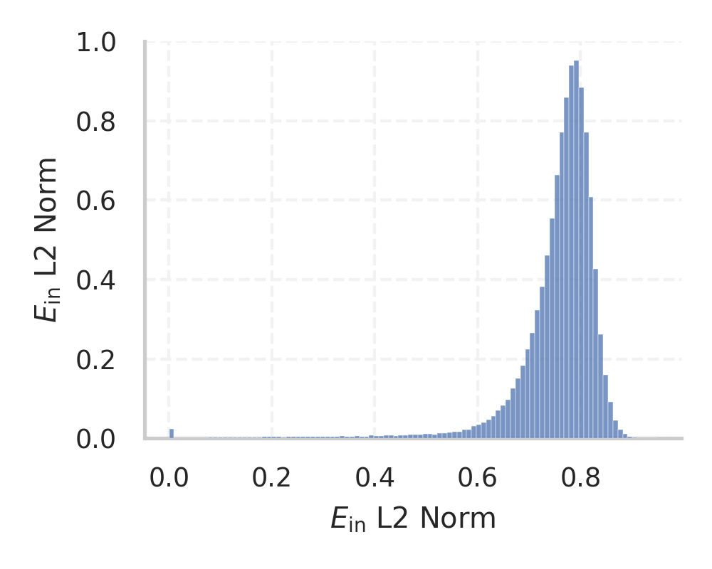
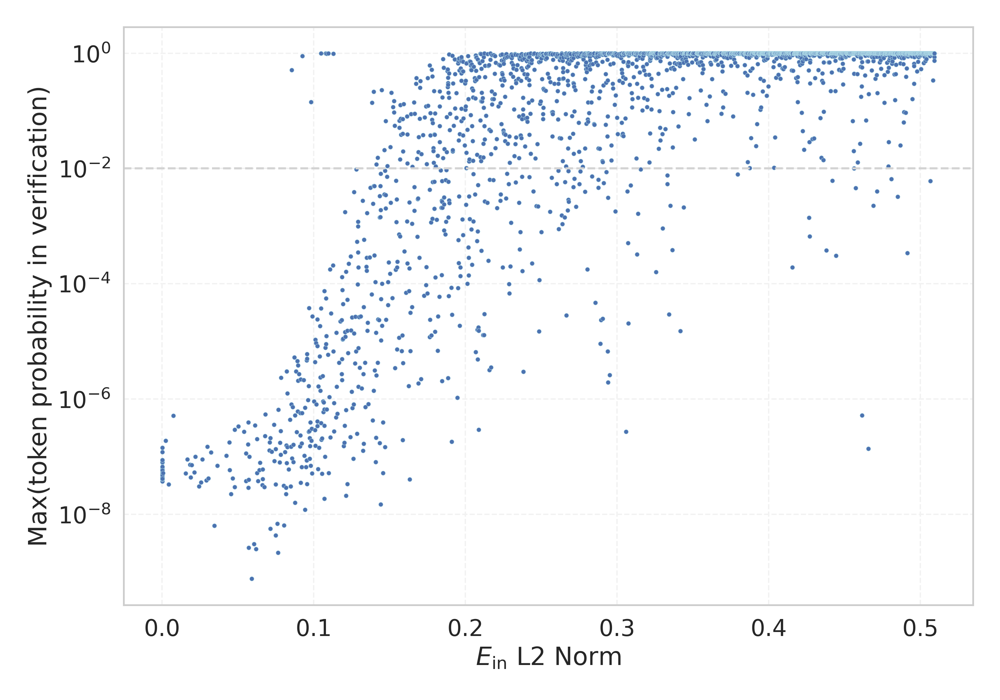

# Report for `zai-org/GLM-4.7-Flash`

## Model info

* Model Info: 
  * Tied embeddings: False
  * LM head uses bias: False
  * Embeddings shape: [154880, 2048]
* Tokenizer Info: 
  * Vocab Size: 154856
  * Tokenizer Class: PreTrainedTokenizer
  * Tokenizer Type: BPE
  * Bytes handling: Byte Input
  * Token for verification prompt building: abcdefghijklmnopqrstuvwxyz
  * Token id for verification prompt building: 67020
* Indicator summary: 
  * Indicator for under-trained tokens: E_{in} L2 Norm
  * Overall distribution: 0.756 +/- 0.090
* Detected Token Counts: 
  * Number of tested under-trained tokens: 3070, 3035 non-special, 507 below p = 0.01 threshold, 293 below soft indicator threshold
  * Number of single byte tokens: 256, of which 13 below indicator threshold
  * Number of special tokens: 35, of which 29 below indicator threshold
  * Number of non-single-byte unreachable tokens: 267, of which 267 below indicator threshold
  * Number of non-single-byte UTF-fragment tokens:  967, of which 21 below soft indicator threshold

## Under-trained token indicators plot


## Verification plot


## Under-trained token verification results
293 entries below threshold of 0.148

|   token_id | token                           |   indicator | max_prob                                                         | in_other_tokens                                                                                                 |
|------------|---------------------------------|-------------|------------------------------------------------------------------|-----------------------------------------------------------------------------------------------------------------|
|     141342 | ````` орачив `````              | 0.000189748 | <span style='border: 1px solid rgb(169, 68, 66);'>3.7e-08</span> |                                                                                                                 |
|     148604 | ````` астроф `````              | 0.000192213 | <span style='border: 1px solid rgb(169, 68, 66);'>4.4e-08</span> |                                                                                                                 |
|     116110 | ````` 基督教上帝亿次 `````      | 0.000192341 | <span style='border: 1px solid rgb(169, 68, 66);'>8.1e-08</span> |                                                                                                                 |
|     150357 | ````` ewnętrz `````             | 0.000192872 | <span style='border: 1px solid rgb(169, 68, 66);'>5.2e-08</span> |                                                                                                                 |
|     146939 | ````` оскош `````               | 0.000199243 | <span style='border: 1px solid rgb(169, 68, 66);'>8.7e-08</span> | <span style='border: 1px solid rgb(169, 68, 66);'>````` ▁роскош `````</span>                                    |
|     145288 | ````` ркут `````                | 0.000697763 | <span style='border: 1px solid rgb(169, 68, 66);'>5.2e-08</span> | <span style='border: 1px solid rgb(40, 167, 69);'>````` ▁Иркут `````</span>                                     |
|     139418 | ````` жегод `````               | 0.00432468  | <span style='border: 1px solid rgb(169, 68, 66);'>3.3e-08</span> | <span style='border: 1px solid rgb(251, 189, 8);'>````` ▁ежегод `````</span>                                    |
|     114536 | ````` 上帝亿次 `````            | 0.0074466   | <span style='border: 1px solid rgb(169, 68, 66);'>5.1e-07</span> | <span style='border: 1px solid rgb(169, 68, 66);'>````` 基督教上帝亿次 `````</span>                             |
|     139151 | ````` ланиров `````             | 0.0156144   | <span style='border: 1px solid rgb(169, 68, 66);'>5.1e-08</span> |                                                                                                                 |
|     141814 | ````` поратив `````             | 0.0167212   | <span style='border: 1px solid rgb(169, 68, 66);'>9e-08</span>   | <span style='border: 1px solid rgb(40, 167, 69);'>````` ▁корпоратив `````</span>                                |
|     140241 | ````` анитар `````              | 0.0184109   | <span style='border: 1px solid rgb(169, 68, 66);'>7.2e-08</span> |                                                                                                                 |
|     130796 | ````` остоятель `````           | 0.0189351   | <span style='border: 1px solid rgb(169, 68, 66);'>4.3e-08</span> | ````` ▁самостоятельно `````, <span style='border: 1px solid rgb(40, 167, 69);'>````` ▁самостоятель `````</span> |
|     149053 | ````` вичай `````               | 0.0195025   | <span style='border: 1px solid rgb(169, 68, 66);'>7.1e-08</span> |                                                                                                                 |
|     149173 | ````` لكترون `````              | 0.0213266   | <span style='border: 1px solid rgb(169, 68, 66);'>5.3e-08</span> |                                                                                                                 |
|      83279 | ````` $PostalCodesNL `````      | 0.0219422   | <span style='border: 1px solid rgb(169, 68, 66);'>1e-07</span>   |                                                                                                                 |
|     134821 | ````` кадем `````               | 0.0244586   | <span style='border: 1px solid rgb(169, 68, 66);'>3e-08</span>   | <span style='border: 1px solid rgb(40, 167, 69);'>````` ▁академ `````</span>                                    |
|     149816 | ````` ással `````               | 0.0256457   | <span style='border: 1px solid rgb(169, 68, 66);'>3.6e-08</span> |                                                                                                                 |
|      66164 | ````` _typeDefinitionSize ````` | 0.0266123   | <span style='border: 1px solid rgb(169, 68, 66);'>9e-08</span>   |                                                                                                                 |
|     145980 | ````` ründet `````              | 0.0291608   | <span style='border: 1px solid rgb(169, 68, 66);'>3.8e-08</span> |                                                                                                                 |
|     104105 | ````` 极速创建通道 `````        | 0.0298369   | <span style='border: 1px solid rgb(169, 68, 66);'>1.5e-07</span> | <span style='border: 1px solid rgb(169, 68, 66);'>````` 百度百科企业词条极速创建通道 `````</span>               |
<details><summary>273 additional entries below threshold</summary>

|   token_id | token                              |   indicator | max_prob                                                         | in_other_tokens                                                                                                                                                                                                                                                                                 |
|------------|------------------------------------|-------------|------------------------------------------------------------------|-------------------------------------------------------------------------------------------------------------------------------------------------------------------------------------------------------------------------------------------------------------------------------------------------|
|      88215 | ````` _ComCallableWrapper `````    |   0.0306199 | <span style='border: 1px solid rgb(169, 68, 66);'>4.2e-08</span> |                                                                                                                                                                                                                                                                                                 |
|     149537 | ````` ürlü `````                   |   0.032399  | <span style='border: 1px solid rgb(169, 68, 66);'>1.2e-07</span> |                                                                                                                                                                                                                                                                                                 |
|      78632 | ````` ▁ForCanBeConvertedToF `````  |   0.0344722 | <span style='border: 1px solid rgb(169, 68, 66);'>6.3e-09</span> | <span style='border: 1px solid rgb(40, 167, 69);'>````` ▁ForCanBeConvertedToForeach `````</span>                                                                                                                                                                                                |
|     147793 | ````` атися `````                  |   0.0364772 | <span style='border: 1px solid rgb(169, 68, 66);'>7e-08</span>   |                                                                                                                                                                                                                                                                                                 |
|      83277 | ````` PostalCodesNL `````          |   0.0424153 | <span style='border: 1px solid rgb(169, 68, 66);'>1e-07</span>   | <span style='border: 1px solid rgb(169, 68, 66);'>````` $PostalCodesNL `````</span>                                                                                                                                                                                                             |
|      78631 | ````` ▁ForCanBeConverted `````     |   0.0443237 | <span style='border: 1px solid rgb(169, 68, 66);'>1.8e-07</span> | <span style='border: 1px solid rgb(40, 167, 69);'>````` ▁ForCanBeConvertedToForeach `````</span>, <span style='border: 1px solid rgb(169, 68, 66);'>````` ▁ForCanBeConvertedToF `````</span>                                                                                                    |
|     149550 | ````` älfte `````                  |   0.0445064 | <span style='border: 1px solid rgb(169, 68, 66);'>5.8e-08</span> |                                                                                                                                                                                                                                                                                                 |
|     129514 | ````` оятель `````                 |   0.0455792 | <span style='border: 1px solid rgb(169, 68, 66);'>2.2e-08</span> | <span style='border: 1px solid rgb(169, 68, 66);'>````` остоятель `````</span>, <span style='border: 1px solid rgb(255, 145, 0);'>````` ▁обстоятель `````</span>, ````` ▁самостоятельно `````, <span style='border: 1px solid rgb(40, 167, 69);'>````` ▁самостоятель `````</span>               |
|     145407 | ````` estattet `````               |   0.046684  | <span style='border: 1px solid rgb(169, 68, 66);'>4.2e-08</span> | ````` ▁ausgestattet `````                                                                                                                                                                                                                                                                       |
|     154288 | ````` \u17fc `````                 |   0.0479034 | <span style='border: 1px solid rgb(169, 68, 66);'>2.9e-07</span> |                                                                                                                                                                                                                                                                                                 |
|     104100 | ````` ▁词条初始信息均引自 `````    |   0.0480052 | <span style='border: 1px solid rgb(169, 68, 66);'>3e-08</span>   | <span style='border: 1px solid rgb(169, 68, 66);'>````` ▁词条初始信息均引自国家企业信用信息公示系统 `````</span>                                                                                                                                                                                |
|     133121 | ````` ıldı `````                   |   0.0504021 | <span style='border: 1px solid rgb(169, 68, 66);'>3.3e-07</span> |                                                                                                                                                                                                                                                                                                 |
|     154289 | ````` \u17fd `````                 |   0.0540705 | <span style='border: 1px solid rgb(169, 68, 66);'>2.7e-07</span> |                                                                                                                                                                                                                                                                                                 |
|     154287 | ````` \u17fb `````                 |   0.0553283 | <span style='border: 1px solid rgb(169, 68, 66);'>3.8e-08</span> |                                                                                                                                                                                                                                                                                                 |
|     132334 | ````` irsiniz `````                |   0.0554749 | <span style='border: 1px solid rgb(169, 68, 66);'>1.1e-07</span> | <span style='border: 1px solid rgb(169, 68, 66);'>````` bilirsiniz `````</span>, <span style='border: 1px solid rgb(169, 68, 66);'>````` abilirsiniz `````</span>                                                                                                                               |
|     143854 | ````` ociazione `````              |   0.0566966 | <span style='border: 1px solid rgb(169, 68, 66);'>1.6e-07</span> |                                                                                                                                                                                                                                                                                                 |
|     142088 | ````` unehmen `````                |   0.0569604 | <span style='border: 1px solid rgb(169, 68, 66);'>2.9e-08</span> |                                                                                                                                                                                                                                                                                                 |
|     154157 | ````` \u0ff8 `````                 |   0.0569952 | <span style='border: 1px solid rgb(169, 68, 66);'>3.9e-07</span> |                                                                                                                                                                                                                                                                                                 |
|      87664 | ````` _FieldOffsetTable `````      |   0.0570963 | <span style='border: 1px solid rgb(169, 68, 66);'>2.6e-09</span> |                                                                                                                                                                                                                                                                                                 |
|     140409 | ````` ılmış `````                  |   0.0571371 | <span style='border: 1px solid rgb(169, 68, 66);'>4e-08</span>   |                                                                                                                                                                                                                                                                                                 |
|      42656 | ````` _AdjustorThunk `````         |   0.0575626 | <span style='border: 1px solid rgb(169, 68, 66);'>1e-07</span>   |                                                                                                                                                                                                                                                                                                 |
|     104099 | ````` 初始信息均引自 `````         |   0.0591506 | <span style='border: 1px solid rgb(169, 68, 66);'>7.6e-10</span> | <span style='border: 1px solid rgb(169, 68, 66);'>````` ▁词条初始信息均引自 `````</span>, <span style='border: 1px solid rgb(169, 68, 66);'>````` ▁词条初始信息均引自国家企业信用信息公示系统 `````</span>                                                                                      |
|     154429 | ````` \u10c9 `````                 |   0.0607289 | <span style='border: 1px solid rgb(169, 68, 66);'>3e-09</span>   |                                                                                                                                                                                                                                                                                                 |
|     152240 | ````` 🖠 `````                      |   0.0612826 | <span style='border: 1px solid rgb(169, 68, 66);'>3.5e-07</span> |                                                                                                                                                                                                                                                                                                 |
|     154434 | ````` \u10ce `````                 |   0.0619265 | <span style='border: 1px solid rgb(169, 68, 66);'>2.5e-09</span> |                                                                                                                                                                                                                                                                                                 |
|     154136 | ````` \u0fe3 `````                 |   0.0625456 | <span style='border: 1px solid rgb(169, 68, 66);'>2e-07</span>   |                                                                                                                                                                                                                                                                                                 |
|     136813 | ````` ğitim `````                  |   0.0627268 | <span style='border: 1px solid rgb(169, 68, 66);'>5.2e-08</span> | ````` ▁eğitim `````                                                                                                                                                                                                                                                                             |
|     142994 | ````` родажа `````                 |   0.0633382 | <span style='border: 1px solid rgb(169, 68, 66);'>3.8e-08</span> | ````` ▁продажа `````                                                                                                                                                                                                                                                                            |
|     137141 | ````` ーカー `````                 |   0.0641892 | <span style='border: 1px solid rgb(169, 68, 66);'>5.8e-08</span> | ````` メーカー `````                                                                                                                                                                                                                                                                            |
|     154426 | ````` \u10c6 `````                 |   0.064633  | <span style='border: 1px solid rgb(169, 68, 66);'>7.8e-08</span> |                                                                                                                                                                                                                                                                                                 |
|     152239 | ````` 🖟 `````                      |   0.0661167 | <span style='border: 1px solid rgb(169, 68, 66);'>3.2e-08</span> |                                                                                                                                                                                                                                                                                                 |
|     154160 | ````` \u0ffb `````                 |   0.0662995 | <span style='border: 1px solid rgb(169, 68, 66);'>6e-08</span>   |                                                                                                                                                                                                                                                                                                 |
|     154128 | ````` \u0fdb `````                 |   0.0664186 | <span style='border: 1px solid rgb(169, 68, 66);'>4.1e-08</span> |                                                                                                                                                                                                                                                                                                 |
|     149079 | ````` ▁zainteres `````             |   0.0674868 | <span style='border: 1px solid rgb(169, 68, 66);'>3e-08</span>   |                                                                                                                                                                                                                                                                                                 |
|     152238 | ````` 🖞 `````                      |   0.0678535 | <span style='border: 1px solid rgb(169, 68, 66);'>2.3e-07</span> |                                                                                                                                                                                                                                                                                                 |
|     154156 | ````` \u0ff7 `````                 |   0.0682002 | <span style='border: 1px solid rgb(169, 68, 66);'>5.4e-07</span> |                                                                                                                                                                                                                                                                                                 |
|     154159 | ````` \u0ffa `````                 |   0.0707474 | <span style='border: 1px solid rgb(169, 68, 66);'>1.3e-07</span> |                                                                                                                                                                                                                                                                                                 |
|     152234 | ````` 🖚 `````                      |   0.070904  | <span style='border: 1px solid rgb(169, 68, 66);'>1.8e-07</span> |                                                                                                                                                                                                                                                                                                 |
|     154135 | ````` \u0fe2 `````                 |   0.0713397 | <span style='border: 1px solid rgb(169, 68, 66);'>5.6e-09</span> |                                                                                                                                                                                                                                                                                                 |
|     142389 | ````` ríguez `````                 |   0.0714606 | <span style='border: 1px solid rgb(169, 68, 66);'>2.1e-07</span> | ````` ▁Rodríguez `````                                                                                                                                                                                                                                                                          |
|     152241 | ````` 🖡 `````                      |   0.0722107 | <span style='border: 1px solid rgb(169, 68, 66);'>1.2e-07</span> |                                                                                                                                                                                                                                                                                                 |
|     152255 | ````` 🖯 `````                      |   0.0738027 | <span style='border: 1px solid rgb(169, 68, 66);'>3.6e-07</span> |                                                                                                                                                                                                                                                                                                 |
|     152236 | ````` 🖜 `````                      |   0.0740677 | <span style='border: 1px solid rgb(169, 68, 66);'>8.4e-08</span> |                                                                                                                                                                                                                                                                                                 |
|     143689 | ````` lebnis `````                 |   0.0748305 | <span style='border: 1px solid rgb(169, 68, 66);'>1.3e-07</span> |                                                                                                                                                                                                                                                                                                 |
|     154851 | ````` /nothink `````               |   0.0749864 | <span style='border: 1px solid rgb(169, 68, 66);'>3.3e-08</span> |                                                                                                                                                                                                                                                                                                 |
|     153286 | ````` \u0e7d `````                 |   0.0750251 | <span style='border: 1px solid rgb(169, 68, 66);'>4.3e-09</span> |                                                                                                                                                                                                                                                                                                 |
|     154271 | ````` \u17eb `````                 |   0.0759318 | <span style='border: 1px solid rgb(169, 68, 66);'>6.8e-09</span> |                                                                                                                                                                                                                                                                                                 |
|     154131 | ````` \u0fde `````                 |   0.0764203 | <span style='border: 1px solid rgb(169, 68, 66);'>2.2e-09</span> |                                                                                                                                                                                                                                                                                                 |
|     154163 | ````` \u0ffe `````                 |   0.0766059 | <span style='border: 1px solid rgb(169, 68, 66);'>6.5e-07</span> |                                                                                                                                                                                                                                                                                                 |
|     152232 | ````` 🖘 `````                      |   0.0776362 | <span style='border: 1px solid rgb(169, 68, 66);'>7.9e-08</span> |                                                                                                                                                                                                                                                                                                 |
|     153285 | ````` \u0e7c `````                 |   0.0777762 | <span style='border: 1px solid rgb(169, 68, 66);'>1.7e-07</span> |                                                                                                                                                                                                                                                                                                 |
|     152242 | ````` 🖢 `````                      |   0.0781782 | <span style='border: 1px solid rgb(169, 68, 66);'>2.8e-07</span> |                                                                                                                                                                                                                                                                                                 |
|     149601 | ````` ▁иммунит `````               |   0.0783259 | <span style='border: 1px solid rgb(169, 68, 66);'>1.1e-07</span> |                                                                                                                                                                                                                                                                                                 |
|     153287 | ````` \u0e7e `````                 |   0.0785213 | <span style='border: 1px solid rgb(169, 68, 66);'>2.3e-06</span> |                                                                                                                                                                                                                                                                                                 |
|     138658 | ````` útbol `````                  |   0.0801727 | <span style='border: 1px solid rgb(169, 68, 66);'>3.1e-08</span> | ````` ▁fútbol `````                                                                                                                                                                                                                                                                             |
|     141627 | ````` عدين `````                   |   0.0804621 | <span style='border: 1px solid rgb(169, 68, 66);'>6.4e-09</span> | <span style='border: 1px solid rgb(40, 167, 69);'>````` ▁التعدين `````</span>                                                                                                                                                                                                                   |
|     152148 | ````` 🕄 `````                      |   0.0810055 | <span style='border: 1px solid rgb(169, 68, 66);'>1.2e-07</span> |                                                                                                                                                                                                                                                                                                 |
|      81160 | ````` CppMethodIntialized `````    |   0.081697  | <span style='border: 1px solid rgb(169, 68, 66);'>2.9e-08</span> |                                                                                                                                                                                                                                                                                                 |
|     137378 | ````` ramientas `````              |   0.0817775 | <span style='border: 1px solid rgb(169, 68, 66);'>2.2e-08</span> | ````` ▁herramientas `````                                                                                                                                                                                                                                                                       |
|     153277 | ````` \u0e74 `````                 |   0.0820041 | <span style='border: 1px solid rgb(169, 68, 66);'>1.6e-07</span> |                                                                                                                                                                                                                                                                                                 |
|     154290 | ````` \u17fe `````                 |   0.0821591 | <span style='border: 1px solid rgb(169, 68, 66);'>3e-06</span>   |                                                                                                                                                                                                                                                                                                 |
|     142864 | ````` родукт `````                 |   0.0822616 | <span style='border: 1px solid rgb(169, 68, 66);'>7.7e-08</span> |                                                                                                                                                                                                                                                                                                 |
|     154431 | ````` \u10cb `````                 |   0.0825416 | <span style='border: 1px solid rgb(169, 68, 66);'>1.3e-06</span> |                                                                                                                                                                                                                                                                                                 |
|     153276 | ````` \u0e73 `````                 |   0.0826166 | <span style='border: 1px solid rgb(169, 68, 66);'>1.5e-07</span> |                                                                                                                                                                                                                                                                                                 |
|     153267 | ````` \u0e6a `````                 |   0.0835093 | <span style='border: 1px solid rgb(169, 68, 66);'>6e-08</span>   |                                                                                                                                                                                                                                                                                                 |
|     152309 | ````` 🗥 `````                      |   0.0844878 | <span style='border: 1px solid rgb(169, 68, 66);'>4.3e-07</span> |                                                                                                                                                                                                                                                                                                 |
|     152149 | ````` 🕅 `````                      |   0.084831  | <span style='border: 1px solid rgb(169, 68, 66);'>3e-08</span>   |                                                                                                                                                                                                                                                                                                 |
|     152204 | ````` 🕼 `````                      |   0.0849602 | <span style='border: 1px solid rgb(169, 68, 66);'>1.5e-07</span> |                                                                                                                                                                                                                                                                                                 |
|     152264 | ````` 🖸 `````                      |   0.0852155 | <span style='border: 1px solid rgb(169, 68, 66);'>8.1e-07</span> |                                                                                                                                                                                                                                                                                                 |
|     148007 | ````` ▁przeprowad `````            |   0.0857816 | <span style='border: 1px solid rgb(169, 68, 66);'>9.3e-08</span> |                                                                                                                                                                                                                                                                                                 |
|     154114 | ````` \u0fcd `````                 |   0.0861393 | <span style='border: 1px solid rgb(169, 68, 66);'>7.3e-07</span> |                                                                                                                                                                                                                                                                                                 |
|     153284 | ````` \u0e7b `````                 |   0.0866182 | <span style='border: 1px solid rgb(169, 68, 66);'>1.6e-07</span> |                                                                                                                                                                                                                                                                                                 |
|     143416 | ````` ▁riconos `````               |   0.0866604 | <span style='border: 1px solid rgb(169, 68, 66);'>8.1e-08</span> |                                                                                                                                                                                                                                                                                                 |
|     153281 | ````` \u0e78 `````                 |   0.0871776 | <span style='border: 1px solid rgb(169, 68, 66);'>5.3e-06</span> |                                                                                                                                                                                                                                                                                                 |
|     153272 | ````` \u0e6f `````                 |   0.0875964 | <span style='border: 1px solid rgb(169, 68, 66);'>5.2e-07</span> |                                                                                                                                                                                                                                                                                                 |
|     154140 | ````` \u0fe7 `````                 |   0.0876697 | <span style='border: 1px solid rgb(169, 68, 66);'>1.6e-08</span> |                                                                                                                                                                                                                                                                                                 |
|     152317 | ````` 🗭 `````                      |   0.0882932 | <span style='border: 1px solid rgb(169, 68, 66);'>3e-06</span>   |                                                                                                                                                                                                                                                                                                 |
|      79513 | ````` artisanlib `````             |   0.0887564 | <span style='border: 1px solid rgb(169, 68, 66);'>2.7e-07</span> |                                                                                                                                                                                                                                                                                                 |
|     153255 | ````` \u0e5e `````                 |   0.0891745 | <span style='border: 1px solid rgb(169, 68, 66);'>4.6e-06</span> |                                                                                                                                                                                                                                                                                                 |
|     152231 | ````` 🖗 `````                      |   0.0893886 | <span style='border: 1px solid rgb(169, 68, 66);'>6.1e-07</span> |                                                                                                                                                                                                                                                                                                 |
|     149333 | ````` veckl `````                  |   0.0895709 | <span style='border: 1px solid rgb(169, 68, 66);'>2.1e-06</span> |                                                                                                                                                                                                                                                                                                 |
|     153278 | ````` \u0e75 `````                 |   0.0896575 | <span style='border: 1px solid rgb(169, 68, 66);'>3.8e-06</span> |                                                                                                                                                                                                                                                                                                 |
|     154145 | ````` \u0fec `````                 |   0.0903738 | <span style='border: 1px solid rgb(169, 68, 66);'>2.7e-06</span> |                                                                                                                                                                                                                                                                                                 |
|     152281 | ````` 🗉 `````                      |   0.0910748 | <span style='border: 1px solid rgb(169, 68, 66);'>1.5e-07</span> |                                                                                                                                                                                                                                                                                                 |
|      94751 | ````` methodPointerType `````      |   0.0911654 | <span style='border: 1px solid rgb(169, 68, 66);'>2.3e-07</span> |                                                                                                                                                                                                                                                                                                 |
|     152147 | ````` 🕃 `````                      |   0.091211  | <span style='border: 1px solid rgb(169, 68, 66);'>5.7e-07</span> |                                                                                                                                                                                                                                                                                                 |
|     142789 | ````` ▁хроническ `````             |   0.0913122 | <span style='border: 1px solid rgb(169, 68, 66);'>3.5e-08</span> |                                                                                                                                                                                                                                                                                                 |
|     154155 | ````` \u0ff6 `````                 |   0.091339  | <span style='border: 1px solid rgb(169, 68, 66);'>2.2e-06</span> |                                                                                                                                                                                                                                                                                                 |
|     152145 | ````` 🕁 `````                      |   0.0921738 | <span style='border: 1px solid rgb(169, 68, 66);'>6.6e-08</span> |                                                                                                                                                                                                                                                                                                 |
|     152318 | ````` 🗮 `````                      |   0.0921748 | <span style='border: 1px solid rgb(169, 68, 66);'>1.7e-07</span> |                                                                                                                                                                                                                                                                                                 |
|     152208 | ````` 🖀 `````                      |   0.0922303 | <span style='border: 1px solid rgb(169, 68, 66);'>5.7e-07</span> |                                                                                                                                                                                                                                                                                                 |
|     152235 | ````` 🖛 `````                      |   0.093284  | <span style='border: 1px solid rgb(169, 68, 66);'>2.1e-06</span> |                                                                                                                                                                                                                                                                                                 |
|     136091 | ````` ▁Weihna `````                |   0.0938878 | <span style='border: 1px solid rgb(169, 68, 66);'>1e-07</span>   | <span style='border: 1px solid rgb(40, 167, 69);'>````` ▁Weihnachts `````</span>                                                                                                                                                                                                                |
|     140004 | ````` zionali `````                |   0.0942705 | <span style='border: 1px solid rgb(169, 68, 66);'>7.1e-07</span> |                                                                                                                                                                                                                                                                                                 |
|     152320 | ````` 🗰 `````                      |   0.0942768 | <span style='border: 1px solid rgb(169, 68, 66);'>1.2e-08</span> |                                                                                                                                                                                                                                                                                                 |
|     140838 | ````` tiquetas `````               |   0.0948207 | <span style='border: 1px solid rgb(169, 68, 66);'>6.5e-08</span> | ````` Etiquetas `````                                                                                                                                                                                                                                                                           |
|     153264 | ````` \u0e67 `````                 |   0.0952778 | <span style='border: 1px solid rgb(169, 68, 66);'>4.7e-06</span> |                                                                                                                                                                                                                                                                                                 |
|     151198 | ````` ématique `````               |   0.0953369 | <span style='border: 1px solid rgb(169, 68, 66);'>8.6e-08</span> |                                                                                                                                                                                                                                                                                                 |
|     146594 | ````` ▁einzigar `````              |   0.0953569 | <span style='border: 1px solid rgb(169, 68, 66);'>8.6e-08</span> |                                                                                                                                                                                                                                                                                                 |
|     140370 | ````` abilirsiniz `````            |   0.0955193 | <span style='border: 1px solid rgb(169, 68, 66);'>3.3e-08</span> |                                                                                                                                                                                                                                                                                                 |
|     154098 | ````` \u0fbd `````                 |   0.0955531 | <span style='border: 1px solid rgb(169, 68, 66);'>6e-06</span>   |                                                                                                                                                                                                                                                                                                 |
|     153258 | ````` \u0e61 `````                 |   0.0956357 | <span style='border: 1px solid rgb(169, 68, 66);'>5e-06</span>   |                                                                                                                                                                                                                                                                                                 |
|     152316 | ````` 🗬 `````                      |   0.0961934 | <span style='border: 1px solid rgb(169, 68, 66);'>9.5e-07</span> |                                                                                                                                                                                                                                                                                                 |
|     152194 | ````` 🕲 `````                      |   0.0966508 | <span style='border: 1px solid rgb(169, 68, 66);'>1.7e-06</span> |                                                                                                                                                                                                                                                                                                 |
|     152310 | ````` 🗦 `````                      |   0.0966893 | <span style='border: 1px solid rgb(169, 68, 66);'>2.7e-07</span> |                                                                                                                                                                                                                                                                                                 |
|     152187 | ````` 🕫 `````                      |   0.0969977 | <span style='border: 1px solid rgb(169, 68, 66);'>3.8e-05</span> |                                                                                                                                                                                                                                                                                                 |
|     134333 | ````` maktadır `````               |   0.097186  | <span style='border: 1px solid rgb(169, 68, 66);'>2.8e-07</span> |                                                                                                                                                                                                                                                                                                 |
|     152308 | ````` 🗤 `````                      |   0.0972672 | <span style='border: 1px solid rgb(169, 68, 66);'>9.1e-08</span> |                                                                                                                                                                                                                                                                                                 |
|     153274 | ````` \u0e71 `````                 |   0.0973483 | <span style='border: 1px solid rgb(169, 68, 66);'>2.1e-07</span> |                                                                                                                                                                                                                                                                                                 |
|     152253 | ````` 🖭 `````                      |   0.0975125 | <span style='border: 1px solid rgb(169, 68, 66);'>1.5e-07</span> |                                                                                                                                                                                                                                                                                                 |
|     152306 | ````` 🗢 `````                      |   0.0977643 | <span style='border: 1px solid rgb(169, 68, 66);'>3.9e-07</span> |                                                                                                                                                                                                                                                                                                 |
|      89966 | ````` (InitializedTypeInfo `````   |   0.0980955 | <span style='border: 1px solid rgb(169, 68, 66);'>7e-08</span>   |                                                                                                                                                                                                                                                                                                 |
|     104103 | ````` 百度百科企业词条 `````       |   0.0984719 | <span style='border: 1px solid rgb(169, 68, 66);'>1.9e-07</span> | <span style='border: 1px solid rgb(169, 68, 66);'>````` 百度百科企业词条极速创建通道 `````</span>                                                                                                                                                                                               |
|     154020 | ````` \u0f6f `````                 |   0.0986105 | <span style='border: 1px solid rgb(169, 68, 66);'>3e-07</span>   |                                                                                                                                                                                                                                                                                                 |
|     152209 | ````` 🖁 `````                      |   0.100171  | <span style='border: 1px solid rgb(169, 68, 66);'>9e-07</span>   |                                                                                                                                                                                                                                                                                                 |
|     152263 | ````` 🖷 `````                      |   0.100927  | <span style='border: 1px solid rgb(169, 68, 66);'>2.9e-07</span> |                                                                                                                                                                                                                                                                                                 |
|     152205 | ````` 🕽 `````                      |   0.100955  | <span style='border: 1px solid rgb(169, 68, 66);'>4.4e-06</span> |                                                                                                                                                                                                                                                                                                 |
|     134923 | ````` ttutto `````                 |   0.101041  | <span style='border: 1px solid rgb(169, 68, 66);'>1.6e-07</span> | ````` ▁soprattutto `````                                                                                                                                                                                                                                                                        |
|     154275 | ````` \u17ef `````                 |   0.101147  | <span style='border: 1px solid rgb(169, 68, 66);'>1.1e-05</span> |                                                                                                                                                                                                                                                                                                 |
|     153259 | ````` \u0e62 `````                 |   0.101504  | <span style='border: 1px solid rgb(169, 68, 66);'>9.3e-06</span> |                                                                                                                                                                                                                                                                                                 |
|     153739 | ````` ၓ `````                      |   0.101701  | <span style='border: 1px solid rgb(169, 68, 66);'>8.1e-07</span> |                                                                                                                                                                                                                                                                                                 |
|     152311 | ````` 🗧 `````                      |   0.102381  | <span style='border: 1px solid rgb(169, 68, 66);'>3.4e-07</span> |                                                                                                                                                                                                                                                                                                 |
|     154154 | ````` \u0ff5 `````                 |   0.102382  | <span style='border: 1px solid rgb(169, 68, 66);'>4.1e-07</span> |                                                                                                                                                                                                                                                                                                 |
|     154281 | ````` ៵ `````                      |   0.102387  | <span style='border: 1px solid rgb(169, 68, 66);'>8.3e-06</span> |                                                                                                                                                                                                                                                                                                 |
|     154094 | ````` ྐྵ `````                       |   0.102454  | <span style='border: 1px solid rgb(169, 68, 66);'>2.4e-05</span> |                                                                                                                                                                                                                                                                                                 |
|     152228 | ````` 🖔 `````                      |   0.103136  | <span style='border: 1px solid rgb(169, 68, 66);'>1.7e-06</span> |                                                                                                                                                                                                                                                                                                 |
|     154291 | ````` \u17ff `````                 |   0.103468  | <span style='border: 1px solid rgb(169, 68, 66);'>1.4e-07</span> |                                                                                                                                                                                                                                                                                                 |
|     154066 | ````` ྜྷ `````                       |   0.104239  | <span style='border: 1px solid rgb(169, 68, 66);'>1.9e-05</span> |                                                                                                                                                                                                                                                                                                 |
|     152188 | ````` 🕬 `````                      |   0.104342  | <span style='border: 1px solid rgb(169, 68, 66);'>2.4e-06</span> |                                                                                                                                                                                                                                                                                                 |
|     154432 | ````` \u10cc `````                 |   0.104356  | <span style='border: 1px solid rgb(169, 68, 66);'>1.4e-06</span> |                                                                                                                                                                                                                                                                                                 |
|     152279 | ````` 🗇 `````                      |   0.104712  | <span style='border: 1px solid rgb(169, 68, 66);'>3.7e-05</span> |                                                                                                                                                                                                                                                                                                 |
|     152321 | ````` 🗱 `````                      |   0.104844  | <span style='border: 1px solid rgb(169, 68, 66);'>3.8e-07</span> |                                                                                                                                                                                                                                                                                                 |
|     154081 | ````` ྫྷ `````                       |   0.104937  | <span style='border: 1px solid rgb(169, 68, 66);'>2e-07</span>   |                                                                                                                                                                                                                                                                                                 |
|     146803 | ````` tattung `````                |   0.105447  | <span style='border: 1px solid rgb(169, 68, 66);'>2.1e-07</span> |                                                                                                                                                                                                                                                                                                 |
|     154056 | ````` ྒྷ `````                       |   0.105937  | <span style='border: 1px solid rgb(169, 68, 66);'>2.5e-06</span> |                                                                                                                                                                                                                                                                                                 |
|     152246 | ````` 🖦 `````                      |   0.10609   | <span style='border: 1px solid rgb(169, 68, 66);'>9.1e-07</span> |                                                                                                                                                                                                                                                                                                 |
|     152143 | ````` 🔿 `````                      |   0.106281  | <span style='border: 1px solid rgb(169, 68, 66);'>6e-07</span>   |                                                                                                                                                                                                                                                                                                 |
|     152206 | ````` 🕾 `````                      |   0.106644  | <span style='border: 1px solid rgb(169, 68, 66);'>8.7e-07</span> |                                                                                                                                                                                                                                                                                                 |
|     152223 | ````` 🖏 `````                      |   0.106957  | <span style='border: 1px solid rgb(169, 68, 66);'>3.4e-07</span> |                                                                                                                                                                                                                                                                                                 |
|     104098 | ````` 信息均引自 `````             |   0.106963  | <span style='border: 1px solid rgb(169, 68, 66);'>1.9e-08</span> | <span style='border: 1px solid rgb(169, 68, 66);'>````` 初始信息均引自 `````</span>, <span style='border: 1px solid rgb(169, 68, 66);'>````` ▁词条初始信息均引自 `````</span>, <span style='border: 1px solid rgb(169, 68, 66);'>````` ▁词条初始信息均引自国家企业信用信息公示系统 `````</span> |
|     152285 | ````` 🗍 `````                      |   0.107007  | <span style='border: 1px solid rgb(169, 68, 66);'>7.5e-05</span> |                                                                                                                                                                                                                                                                                                 |
|     152303 | ````` 🗟 `````                      |   0.107014  | <span style='border: 1px solid rgb(169, 68, 66);'>6.6e-07</span> |                                                                                                                                                                                                                                                                                                 |
|     154132 | ````` \u0fdf `````                 |   0.107552  | <span style='border: 1px solid rgb(169, 68, 66);'>9.9e-08</span> |                                                                                                                                                                                                                                                                                                 |
|     154038 | ````` ཱྀ `````                       |   0.107741  | <span style='border: 1px solid rgb(169, 68, 66);'>7.8e-06</span> |                                                                                                                                                                                                                                                                                                 |
|     152185 | ````` 🕩 `````                      |   0.10806   | <span style='border: 1px solid rgb(169, 68, 66);'>9e-06</span>   |                                                                                                                                                                                                                                                                                                 |
|     152278 | ````` 🗆 `````                      |   0.108245  | <span style='border: 1px solid rgb(169, 68, 66);'>1.2e-05</span> |                                                                                                                                                                                                                                                                                                 |
|     151810 | ````` 🏲 `````                      |   0.108579  | <span style='border: 1px solid rgb(169, 68, 66);'>6.6e-07</span> |                                                                                                                                                                                                                                                                                                 |
|     151814 | ````` 🏶 `````                      |   0.109473  | <span style='border: 1px solid rgb(169, 68, 66);'>5.9e-06</span> |                                                                                                                                                                                                                                                                                                 |
|     143224 | ````` ▁açıklam `````               |   0.109766  | <span style='border: 1px solid rgb(169, 68, 66);'>5.2e-08</span> |                                                                                                                                                                                                                                                                                                 |
|     152243 | ````` 🖣 `````                      |   0.110307  | <span style='border: 1px solid rgb(169, 68, 66);'>1.1e-06</span> |                                                                                                                                                                                                                                                                                                 |
|     153254 | ````` \u0e5d `````                 |   0.110682  | <span style='border: 1px solid rgb(169, 68, 66);'>0.00018</span> |                                                                                                                                                                                                                                                                                                 |
|     153228 | ````` \u0e3b `````                 |   0.110866  | <span style='border: 1px solid rgb(169, 68, 66);'>2.1e-07</span> |                                                                                                                                                                                                                                                                                                 |
|     152282 | ````` 🗊 `````                      |   0.111318  | <span style='border: 1px solid rgb(169, 68, 66);'>3.1e-05</span> |                                                                                                                                                                                                                                                                                                 |
|     152270 | ````` 🖾 `````                      |   0.112648  | <span style='border: 1px solid rgb(169, 68, 66);'>0.00021</span> |                                                                                                                                                                                                                                                                                                 |
|     152269 | ````` 🖽 `````                      |   0.112876  | <span style='border: 1px solid rgb(169, 68, 66);'>6.7e-06</span> |                                                                                                                                                                                                                                                                                                 |
|     152159 | ````` 🕏 `````                      |   0.113346  | <span style='border: 1px solid rgb(169, 68, 66);'>8.5e-07</span> |                                                                                                                                                                                                                                                                                                 |
|     154428 | ````` \u10c8 `````                 |   0.113415  | <span style='border: 1px solid rgb(169, 68, 66);'>2.7e-07</span> |                                                                                                                                                                                                                                                                                                 |
|     153231 | ````` \u0e3e `````                 |   0.114762  | <span style='border: 1px solid rgb(169, 68, 66);'>4.8e-07</span> |                                                                                                                                                                                                                                                                                                 |
|      94436 | ````` .bunifuFlatButton `````      |   0.114876  | <span style='border: 1px solid rgb(169, 68, 66);'>1.4e-05</span> |                                                                                                                                                                                                                                                                                                 |
|     153266 | ````` \u0e69 `````                 |   0.115045  | <span style='border: 1px solid rgb(169, 68, 66);'>1.6e-06</span> |                                                                                                                                                                                                                                                                                                 |
|     151720 | ````` 🎘 `````                      |   0.11563   | <span style='border: 1px solid rgb(169, 68, 66);'>5.6e-07</span> |                                                                                                                                                                                                                                                                                                 |
|     154435 | ````` \u10cf `````                 |   0.116788  | <span style='border: 1px solid rgb(169, 68, 66);'>4.3e-06</span> |                                                                                                                                                                                                                                                                                                 |
|     152252 | ````` 🖬 `````                      |   0.117545  | <span style='border: 1px solid rgb(169, 68, 66);'>2.2e-05</span> |                                                                                                                                                                                                                                                                                                 |
|     152144 | ````` 🕀 `````                      |   0.118425  | <span style='border: 1px solid rgb(169, 68, 66);'>2.3e-05</span> |                                                                                                                                                                                                                                                                                                 |
|     152298 | ````` 🗚 `````                      |   0.118504  | <span style='border: 1px solid rgb(169, 68, 66);'>2.7e-06</span> |                                                                                                                                                                                                                                                                                                 |
|     152299 | ````` 🗛 `````                      |   0.118632  | <span style='border: 1px solid rgb(169, 68, 66);'>4.9e-06</span> |                                                                                                                                                                                                                                                                                                 |
|     152213 | ````` 🖅 `````                      |   0.11867   | <span style='border: 1px solid rgb(169, 68, 66);'>2.1e-06</span> |                                                                                                                                                                                                                                                                                                 |
|     154270 | ````` \u17ea `````                 |   0.118704  | <span style='border: 1px solid rgb(169, 68, 66);'>0.00013</span> |                                                                                                                                                                                                                                                                                                 |
|     152315 | ````` 🗫 `````                      |   0.11885   | <span style='border: 1px solid rgb(169, 68, 66);'>7.8e-05</span> |                                                                                                                                                                                                                                                                                                 |
|     152214 | ````` 🖆 `````                      |   0.11903   | <span style='border: 1px solid rgb(169, 68, 66);'>1.1e-05</span> |                                                                                                                                                                                                                                                                                                 |
|     152284 | ````` 🗌 `````                      |   0.119214  | <span style='border: 1px solid rgb(169, 68, 66);'>1.1e-05</span> |                                                                                                                                                                                                                                                                                                 |
|     152325 | ````` 🗵 `````                      |   0.119339  | <span style='border: 1px solid rgb(169, 68, 66);'>4.4e-05</span> |                                                                                                                                                                                                                                                                                                 |
|     139232 | ````` раструкт `````               |   0.119784  | <span style='border: 1px solid rgb(169, 68, 66);'>1.5e-07</span> | <span style='border: 1px solid rgb(169, 68, 66);'>````` ▁инфраструкт `````</span>                                                                                                                                                                                                               |
|     150633 | ````` ▁akzepti `````               |   0.120247  | <span style='border: 1px solid rgb(169, 68, 66);'>1.8e-07</span> |                                                                                                                                                                                                                                                                                                 |
|     142958 | ````` bilirsiniz `````             |   0.120397  | <span style='border: 1px solid rgb(169, 68, 66);'>3.4e-07</span> |                                                                                                                                                                                                                                                                                                 |
|     154052 | ````` ྏ `````                       |   0.120619  | <span style='border: 1px solid rgb(255, 145, 0);'>0.0018</span>  |                                                                                                                                                                                                                                                                                                 |
|     154138 | ````` \u0fe5 `````                 |   0.120657  | <span style='border: 1px solid rgb(169, 68, 66);'>1.4e-05</span> |                                                                                                                                                                                                                                                                                                 |
|      45695 | ````` webElementX `````            |   0.120796  | <span style='border: 1px solid rgb(169, 68, 66);'>1.2e-05</span> | ````` webElementXpaths `````                                                                                                                                                                                                                                                                    |
|     152280 | ````` 🗈 `````                      |   0.121219  | <span style='border: 1px solid rgb(169, 68, 66);'>0.00016</span> |                                                                                                                                                                                                                                                                                                 |
|      38728 | ````` CppCodeGenWriteBarrier ````` |   0.121332  | <span style='border: 1px solid rgb(169, 68, 66);'>6.5e-07</span> |                                                                                                                                                                                                                                                                                                 |
|     140074 | ````` ▁познаком `````              |   0.121365  | <span style='border: 1px solid rgb(169, 68, 66);'>2.1e-08</span> |                                                                                                                                                                                                                                                                                                 |
|     143253 | ````` ▁przygotow `````             |   0.122134  | <span style='border: 1px solid rgb(169, 68, 66);'>3.3e-08</span> |                                                                                                                                                                                                                                                                                                 |
|     154788 | ````` ⛠ `````                      |   0.122233  | <span style='border: 1px solid rgb(169, 68, 66);'>5.3e-05</span> |                                                                                                                                                                                                                                                                                                 |
|     152267 | ````` 🖻 `````                      |   0.122249  | <span style='border: 1px solid rgb(169, 68, 66);'>1.5e-05</span> |                                                                                                                                                                                                                                                                                                 |
|     142318 | ````` ▁свадь `````                 |   0.122606  | <span style='border: 1px solid rgb(169, 68, 66);'>6.2e-06</span> |                                                                                                                                                                                                                                                                                                 |
|     154137 | ````` \u0fe4 `````                 |   0.122988  | <span style='border: 1px solid rgb(169, 68, 66);'>0.00022</span> |                                                                                                                                                                                                                                                                                                 |
|     131966 | ````` назнач `````                 |   0.124053  | <span style='border: 1px solid rgb(169, 68, 66);'>2.2e-07</span> | <span style='border: 1px solid rgb(255, 145, 0);'>````` ▁предназнач `````</span>, ````` ▁назначения `````                                                                                                                                                                                       |
|     152327 | ````` 🗷 `````                      |   0.124347  | <span style='border: 1px solid rgb(169, 68, 66);'>0.0003</span>  |                                                                                                                                                                                                                                                                                                 |
|     154162 | ````` \u0ffd `````                 |   0.124501  | <span style='border: 1px solid rgb(169, 68, 66);'>1.6e-05</span> |                                                                                                                                                                                                                                                                                                 |
|      66543 | ````` _MetadataUsageId `````       |   0.125131  | <span style='border: 1px solid rgb(169, 68, 66);'>1.3e-06</span> |                                                                                                                                                                                                                                                                                                 |
|     153265 | ````` \u0e68 `````                 |   0.125328  | <span style='border: 1px solid rgb(169, 68, 66);'>2.6e-05</span> |                                                                                                                                                                                                                                                                                                 |
|      65861 | ````` CppTypeDefinitionSizes ````` |   0.125401  | <span style='border: 1px solid rgb(169, 68, 66);'>6.9e-07</span> |                                                                                                                                                                                                                                                                                                 |
|     146241 | ````` ▁zdecy `````                 |   0.126081  | <span style='border: 1px solid rgb(169, 68, 66);'>9.2e-08</span> |                                                                                                                                                                                                                                                                                                 |
|     148404 | ````` ammlung `````                |   0.126261  | <span style='border: 1px solid rgb(169, 68, 66);'>8.1e-07</span> |                                                                                                                                                                                                                                                                                                 |
|     152207 | ````` 🕿 `````                      |   0.126478  | <span style='border: 1px solid rgb(255, 145, 0);'>0.0039</span>  |                                                                                                                                                                                                                                                                                                 |
|     152262 | ````` 🖶 `````                      |   0.126491  | <span style='border: 1px solid rgb(169, 68, 66);'>1.4e-05</span> |                                                                                                                                                                                                                                                                                                 |
|     153738 | ````` ၒ `````                      |   0.127268  | <span style='border: 1px solid rgb(169, 68, 66);'>4.2e-06</span> |                                                                                                                                                                                                                                                                                                 |
|     152250 | ````` 🖪 `````                      |   0.127485  | <span style='border: 1px solid rgb(169, 68, 66);'>2.7e-05</span> |                                                                                                                                                                                                                                                                                                 |
|     152212 | ````` 🖄 `````                      |   0.127906  | <span style='border: 1px solid rgb(169, 68, 66);'>6.7e-06</span> |                                                                                                                                                                                                                                                                                                 |
|     152625 | ````` \u0992 `````                 |   0.128178  | <span style='border: 1px solid rgb(255, 145, 0);'>0.0097</span>  |                                                                                                                                                                                                                                                                                                 |
|     149433 | ````` ▁männis `````                |   0.128455  | <span style='border: 1px solid rgb(169, 68, 66);'>2.5e-07</span> |                                                                                                                                                                                                                                                                                                 |
|     154781 | ````` ⛙ `````                      |   0.128631  | <span style='border: 1px solid rgb(169, 68, 66);'>0.00054</span> |                                                                                                                                                                                                                                                                                                 |
|     152233 | ````` 🖙 `````                      |   0.129084  | <span style='border: 1px solid rgb(169, 68, 66);'>9.8e-05</span> |                                                                                                                                                                                                                                                                                                 |
|     154778 | ````` ⛖ `````                      |   0.129136  | <span style='border: 1px solid rgb(169, 68, 66);'>0.00099</span> |                                                                                                                                                                                                                                                                                                 |
|     154272 | ````` \u17ec `````                 |   0.129193  | <span style='border: 1px solid rgb(169, 68, 66);'>0.00035</span> |                                                                                                                                                                                                                                                                                                 |
|     154280 | ````` ៴ `````                      |   0.12926   | <span style='border: 1px solid rgb(255, 145, 0);'>0.0012</span>  |                                                                                                                                                                                                                                                                                                 |
|     135779 | ````` ▁partecip `````              |   0.129329  | <span style='border: 1px solid rgb(169, 68, 66);'>1.6e-06</span> |                                                                                                                                                                                                                                                                                                 |
|     154782 | ````` ⛚ `````                      |   0.129351  | <span style='border: 1px solid rgb(169, 68, 66);'>0.00019</span> |                                                                                                                                                                                                                                                                                                 |
|     153269 | ````` \u0e6c `````                 |   0.129419  | <span style='border: 1px solid rgb(169, 68, 66);'>7.6e-06</span> |                                                                                                                                                                                                                                                                                                 |
|     152146 | ````` 🕂 `````                      |   0.129851  | <span style='border: 1px solid rgb(169, 68, 66);'>2.7e-05</span> |                                                                                                                                                                                                                                                                                                 |
|      57448 | ````` /Subthreshold `````          |   0.13025   | <span style='border: 1px solid rgb(169, 68, 66);'>3.5e-06</span> |                                                                                                                                                                                                                                                                                                 |
|     154789 | ````` ⛡ `````                      |   0.130983  | <span style='border: 1px solid rgb(169, 68, 66);'>2.7e-05</span> |                                                                                                                                                                                                                                                                                                 |
|     147759 | ````` ▁дозвол `````                |   0.131555  | <span style='border: 1px solid rgb(169, 68, 66);'>1.5e-06</span> |                                                                                                                                                                                                                                                                                                 |
|     152687 | ````` \u09d6 `````                 |   0.132326  | <span style='border: 1px solid rgb(255, 145, 0);'>0.0028</span>  |                                                                                                                                                                                                                                                                                                 |
|      97274 | ````` (statearr `````              |   0.132512  | <span style='border: 1px solid rgb(169, 68, 66);'>1.3e-07</span> |                                                                                                                                                                                                                                                                                                 |
|     152203 | ````` 🕻 `````                      |   0.132781  | <span style='border: 1px solid rgb(169, 68, 66);'>2.7e-06</span> |                                                                                                                                                                                                                                                                                                 |
|     154784 | ````` ⛜ `````                      |   0.132962  | <span style='border: 1px solid rgb(169, 68, 66);'>4e-05</span>   |                                                                                                                                                                                                                                                                                                 |
|     152078 | ````` 📾 `````                      |   0.132986  | <span style='border: 1px solid rgb(169, 68, 66);'>1.7e-07</span> |                                                                                                                                                                                                                                                                                                 |
|      93183 | ````` -vesm `````                  |   0.133091  | <span style='border: 1px solid rgb(169, 68, 66);'>0.00059</span> |                                                                                                                                                                                                                                                                                                 |
|     134914 | ````` ▁зарегистриров `````         |   0.133776  | <span style='border: 1px solid rgb(169, 68, 66);'>4.2e-06</span> |                                                                                                                                                                                                                                                                                                 |
|     136111 | ````` ▁коронави `````              |   0.13408   | <span style='border: 1px solid rgb(169, 68, 66);'>7.2e-07</span> | <span style='border: 1px solid rgb(40, 167, 69);'>````` ▁коронавируса `````</span>, <span style='border: 1px solid rgb(40, 167, 69);'>````` ▁коронавирус `````</span>                                                                                                                           |
|     154279 | ````` ៳ `````                      |   0.134753  | <span style='border: 1px solid rgb(169, 68, 66);'>0.0002</span>  |                                                                                                                                                                                                                                                                                                 |
|     152277 | ````` 🗅 `````                      |   0.134917  | <span style='border: 1px solid rgb(169, 68, 66);'>0.00028</span> |                                                                                                                                                                                                                                                                                                 |
|     153740 | ````` ၔ `````                      |   0.135011  | <span style='border: 1px solid rgb(169, 68, 66);'>0.00017</span> |                                                                                                                                                                                                                                                                                                 |
|     152266 | ````` 🖺 `````                      |   0.135093  | <span style='border: 1px solid rgb(255, 145, 0);'>0.0017</span>  |                                                                                                                                                                                                                                                                                                 |
|     144110 | ````` larından `````               |   0.135459  | <span style='border: 1px solid rgb(169, 68, 66);'>1.5e-05</span> |                                                                                                                                                                                                                                                                                                 |
|     152184 | ````` 🕨 `````                      |   0.135506  | <span style='border: 1px solid rgb(169, 68, 66);'>2.1e-05</span> |                                                                                                                                                                                                                                                                                                 |
|     154148 | ````` \u0fef `````                 |   0.135919  | <span style='border: 1px solid rgb(169, 68, 66);'>8.2e-07</span> |                                                                                                                                                                                                                                                                                                 |
|     152142 | ````` 🔾 `````                      |   0.136859  | <span style='border: 1px solid rgb(169, 68, 66);'>0.00029</span> |                                                                                                                                                                                                                                                                                                 |
|     154403 | ````` Ⴏ `````                      |   0.137384  | <span style='border: 1px solid rgb(255, 145, 0);'>0.0047</span>  |                                                                                                                                                                                                                                                                                                 |
|     153764 | ````` ၬ `````                      |   0.138276  | <span style='border: 1px solid rgb(169, 68, 66);'>6.6e-05</span> |                                                                                                                                                                                                                                                                                                 |
|      94832 | ````` departureday `````           |   0.138339  | <span style='border: 1px solid rgb(40, 167, 69);'>0.14</span>    |                                                                                                                                                                                                                                                                                                 |
|     129599 | ````` гранич `````                 |   0.138837  | <span style='border: 1px solid rgb(169, 68, 66);'>4.3e-07</span> | <span style='border: 1px solid rgb(169, 68, 66);'>````` огранич `````</span>, <span style='border: 1px solid rgb(40, 167, 69);'>````` ▁огранич `````</span>, ````` ▁ограничения `````                                                                                                           |
|     154146 | ````` \u0fed `````                 |   0.139111  | <span style='border: 1px solid rgb(255, 145, 0);'>0.0025</span>  |                                                                                                                                                                                                                                                                                                 |
|      70037 | ````` \tNdrFc `````                |   0.139522  | <span style='border: 1px solid rgb(169, 68, 66);'>1.4e-06</span> | <span style='border: 1px solid rgb(169, 68, 66);'>````` \tNdrFcShort `````</span>                                                                                                                                                                                                               |
|     152237 | ````` 🖝 `````                      |   0.139562  | <span style='border: 1px solid rgb(255, 145, 0);'>0.005</span>   |                                                                                                                                                                                                                                                                                                 |
|     154779 | ````` ⛗ `````                      |   0.139627  | <span style='border: 1px solid rgb(40, 167, 69);'>0.22</span>    |                                                                                                                                                                                                                                                                                                 |
|     153279 | ````` \u0e76 `````                 |   0.140007  | <span style='border: 1px solid rgb(255, 145, 0);'>0.005</span>   |                                                                                                                                                                                                                                                                                                 |
|     154084 | ````` ྯ `````                       |   0.140058  | <span style='border: 1px solid rgb(169, 68, 66);'>0.00031</span> |                                                                                                                                                                                                                                                                                                 |
|     154147 | ````` \u0fee `````                 |   0.140104  | <span style='border: 1px solid rgb(169, 68, 66);'>3.1e-06</span> |                                                                                                                                                                                                                                                                                                 |
|     152211 | ````` 🖃 `````                      |   0.140578  | <span style='border: 1px solid rgb(169, 68, 66);'>0.00011</span> |                                                                                                                                                                                                                                                                                                 |
|     144336 | ````` ▁великолеп `````             |   0.14075   | <span style='border: 1px solid rgb(169, 68, 66);'>8.1e-08</span> |                                                                                                                                                                                                                                                                                                 |
|     140500 | ````` ▁compéten `````              |   0.14101   | <span style='border: 1px solid rgb(169, 68, 66);'>2.1e-07</span> | ````` ▁compétences `````                                                                                                                                                                                                                                                                        |
|     153283 | ````` \u0e7a `````                 |   0.141069  | <span style='border: 1px solid rgb(169, 68, 66);'>1.4e-05</span> |                                                                                                                                                                                                                                                                                                 |
|     152686 | ````` \u09d5 `````                 |   0.141189  | <span style='border: 1px solid rgb(251, 189, 8);'>0.012</span>   |                                                                                                                                                                                                                                                                                                 |
|     147560 | ````` egenheit `````               |   0.141369  | <span style='border: 1px solid rgb(169, 68, 66);'>2.6e-06</span> |                                                                                                                                                                                                                                                                                                 |
|     152227 | ````` 🖓 `````                      |   0.142159  | <span style='border: 1px solid rgb(251, 189, 8);'>0.016</span>   |                                                                                                                                                                                                                                                                                                 |
|      54094 | ````` ((&___ `````                 |   0.142242  | <span style='border: 1px solid rgb(169, 68, 66);'>4.3e-06</span> |                                                                                                                                                                                                                                                                                                 |
|     154083 | ````` ྮ `````                       |   0.142359  | <span style='border: 1px solid rgb(169, 68, 66);'>2.4e-05</span> |                                                                                                                                                                                                                                                                                                 |
|     132561 | ````` полне `````                  |   0.143153  | <span style='border: 1px solid rgb(169, 68, 66);'>2.4e-05</span> | ````` ▁выполнение `````, ````` ▁выполнения `````, ````` ▁исполнения `````, ````` ▁вполне `````                                                                                                                                                                                                  |
|     152189 | ````` 🕭 `````                      |   0.143444  | <span style='border: 1px solid rgb(255, 145, 0);'>0.0033</span>  |                                                                                                                                                                                                                                                                                                 |
|     154777 | ````` ⛕ `````                      |   0.143561  | <span style='border: 1px solid rgb(255, 145, 0);'>0.0014</span>  |                                                                                                                                                                                                                                                                                                 |
|      96189 | ````` (stypy `````                 |   0.143597  | <span style='border: 1px solid rgb(169, 68, 66);'>1.7e-07</span> |                                                                                                                                                                                                                                                                                                 |
|     152283 | ````` 🗋 `````                      |   0.143886  | <span style='border: 1px solid rgb(255, 145, 0);'>0.0014</span>  |                                                                                                                                                                                                                                                                                                 |
|     154093 | ````` ྸ `````                       |   0.143979  | <span style='border: 1px solid rgb(255, 145, 0);'>0.005</span>   |                                                                                                                                                                                                                                                                                                 |
|     116635 | ````` ▁发照时间 `````              |   0.144062  | <span style='border: 1px solid rgb(169, 68, 66);'>1.5e-08</span> |                                                                                                                                                                                                                                                                                                 |
|     153648 | ````` \u3098 `````                 |   0.14422   | <span style='border: 1px solid rgb(255, 145, 0);'>0.0019</span>  |                                                                                                                                                                                                                                                                                                 |
|     154786 | ````` ⛞ `````                      |   0.144223  | <span style='border: 1px solid rgb(255, 145, 0);'>0.0081</span>  |                                                                                                                                                                                                                                                                                                 |
|     154047 | ````` ྊ `````                      |   0.144333  | <span style='border: 1px solid rgb(169, 68, 66);'>5.4e-05</span> |                                                                                                                                                                                                                                                                                                 |
|     154152 | ````` \u0ff3 `````                 |   0.144435  | <span style='border: 1px solid rgb(169, 68, 66);'>1e-05</span>   |                                                                                                                                                                                                                                                                                                 |
|     154103 | ````` ࿂ `````                      |   0.144824  | <span style='border: 1px solid rgb(40, 167, 69);'>0.23</span>    |                                                                                                                                                                                                                                                                                                 |
|     153986 | ````` ཌྷ `````                      |   0.145016  | <span style='border: 1px solid rgb(169, 68, 66);'>1.9e-05</span> |                                                                                                                                                                                                                                                                                                 |
|      71369 | ````` ▁StreamLazy `````            |   0.145054  | <span style='border: 1px solid rgb(169, 68, 66);'>0.0001</span>  |                                                                                                                                                                                                                                                                                                 |
|      87639 | ````` useRal `````                 |   0.145676  | <span style='border: 1px solid rgb(169, 68, 66);'>5.2e-08</span> | <span style='border: 1px solid rgb(169, 68, 66);'>````` useRalative `````</span>, ````` useRalativeImagePath `````                                                                                                                                                                              |
|      77695 | ````` ▁thuisontvangst `````        |   0.145758  | <span style='border: 1px solid rgb(169, 68, 66);'>3.9e-07</span> |                                                                                                                                                                                                                                                                                                 |
|     152222 | ````` 🖎 `````                      |   0.146612  | <span style='border: 1px solid rgb(255, 145, 0);'>0.0035</span>  |                                                                                                                                                                                                                                                                                                 |
|     154767 | ````` ⛋ `````                      |   0.146626  | <span style='border: 1px solid rgb(251, 189, 8);'>0.021</span>   |                                                                                                                                                                                                                                                                                                 |
|      52524 | ````` CppMethodInitialized `````   |   0.14693   | <span style='border: 1px solid rgb(169, 68, 66);'>1.5e-07</span> |                                                                                                                                                                                                                                                                                                 |
|     152326 | ````` 🗶 `````                      |   0.147089  | <span style='border: 1px solid rgb(255, 145, 0);'>0.0091</span>  |                                                                                                                                                                                                                                                                                                 |
|     152186 | ````` 🕪 `````                      |   0.147414  | <span style='border: 1px solid rgb(251, 189, 8);'>0.066</span>   |                                                                                                                                                                                                                                                                                                 |
|     154274 | ````` \u17ee `````                 |   0.147511  | <span style='border: 1px solid rgb(255, 145, 0);'>0.0035</span>  |                                                                                                                                                                                                                                                                                                 |
|     152692 | ````` \u09db `````                 |   0.147517  | <span style='border: 1px solid rgb(255, 145, 0);'>0.002</span>   |                                                                                                                                                                                                                                                                                                 |
|     154019 | ````` \u0f6e `````                 |   0.147772  | <span style='border: 1px solid rgb(169, 68, 66);'>2.4e-05</span> |                                                                                                                                                                                                                                                                                                 |
</details>


## Tokens with partial UTF-8 sequences
21 entries below threshold of 0.148

|   token_id | token                          |   indicator | in_other_tokens                                                                                                                                                                                                                                                                                                                                                                       |
|------------|--------------------------------|-------------|---------------------------------------------------------------------------------------------------------------------------------------------------------------------------------------------------------------------------------------------------------------------------------------------------------------------------------------------------------------------------------------|
|     130360 | ````` ▁۱<0xDB> `````           | 0.000189628 | ````` ▁۱۳ `````, ````` ▁۱۳۹ `````                                                                                                                                                                                                                                                                                                                                                     |
|     151335 | ````` <0xF0><0x9F><0x96> ````` | 0.0236728   | <span style='border: 1px solid rgb(251, 189, 8);'>````` 🖓 `````</span>, <span style='border: 1px solid rgb(255, 145, 0);'>````` 🖺 `````</span>, <span style='border: 1px solid rgb(251, 189, 8);'>````` 🖵 `````</span>, <span style='border: 1px solid rgb(169, 68, 66);'>````` 🖏 `````</span>, <span style='border: 1px solid rgb(40, 167, 69);'>````` 🖳 `````</span>, ...           |
|     151338 | ````` <0xE0><0xBF> `````       | 0.0239608   | <span style='border: 1px solid rgb(40, 167, 69);'>````` ࿙ `````</span>, <span style='border: 1px solid rgb(40, 167, 69);'>````` ࿔ `````</span>, <span style='border: 1px solid rgb(169, 68, 66);'>````` \u0fcd `````</span>, <span style='border: 1px solid rgb(40, 167, 69);'>````` ࿅ `````</span>, <span style='border: 1px solid rgb(255, 145, 0);'>````` \u0fe9 `````</span>, ... |
|      91117 | ````` <0xE0><0xBC> `````       | 0.028247    | ````` ༼ `````, <span style='border: 1px solid rgb(40, 167, 69);'>````` ༧ `````</span>, <span style='border: 1px solid rgb(40, 167, 69);'>````` ༿ `````</span>, <span style='border: 1px solid rgb(255, 145, 0);'>````` ༪ `````</span>, <span style='border: 1px solid rgb(40, 167, 69);'>````` ༙ `````</span>, ...                                                                     |
|      44002 | ````` <0xE1><0x9F> `````       | 0.0321919   | <span style='border: 1px solid rgb(40, 167, 69);'>````` ៑ `````</span>, <span style='border: 1px solid rgb(40, 167, 69);'>````` ៩ `````</span>, ````` ែ `````, <span style='border: 1px solid rgb(40, 167, 69);'>````` ៹ `````</span>, <span style='border: 1px solid rgb(169, 68, 66);'>````` ៳ `````</span>, ...                                                                     |
|     151337 | ````` <0xE0><0xBE> `````       | 0.0328951   | ````` ྒ `````, <span style='border: 1px solid rgb(169, 68, 66);'>````` ྐྵ `````</span>, <span style='border: 1px solid rgb(40, 167, 69);'>````` ྋ `````</span>, <span style='border: 1px solid rgb(251, 189, 8);'>````` ྛ `````</span>, <span style='border: 1px solid rgb(169, 68, 66);'>````` \u0fbd `````</span>, ...                                                                  |
|     151345 | ````` <0xE1><0x82> `````       | 0.0377792   | <span style='border: 1px solid rgb(251, 189, 8);'>````` ႞ `````</span>, ````` ႈ `````, <span style='border: 1px solid rgb(40, 167, 69);'>````` ႑ `````</span>, <span style='border: 1px solid rgb(251, 189, 8);'>````` ႝ `````</span>, ````` ႁ `````, ...                                                                                                                              |
|      24755 | ````` <0xE1><0x80> `````       | 0.049109    | ````` ထ `````, ````` ့ `````, <span style='border: 1px solid rgb(40, 167, 69);'>````` ဨ `````</span>, ````` ဖ `````, ````` ာ `````, ...                                                                                                                                                                                                                                                |
|     151330 | ````` <0xE1><0x81> `````       | 0.0507191   | <span style='border: 1px solid rgb(255, 145, 0);'>````` ၲ `````</span>, <span style='border: 1px solid rgb(40, 167, 69);'>````` ၥ `````</span>, ````` ၀ `````, ````` ၇ `````, ````` ၅ `````, ...                                                                                                                                                                                       |
|     151336 | ````` <0xF0><0x9F><0x97> ````` | 0.0539136   | <span style='border: 1px solid rgb(255, 145, 0);'>````` 🗶 `````</span>, <span style='border: 1px solid rgb(40, 167, 69);'>````` 🗃 `````</span>, <span style='border: 1px solid rgb(169, 68, 66);'>````` 🗅 `````</span>, <span style='border: 1px solid rgb(40, 167, 69);'>````` 🗀 `````</span>, <span style='border: 1px solid rgb(40, 167, 69);'>````` 🗙 `````</span>, ...           |
|     151340 | ````` <0xE2><0x9B> `````       | 0.0636879   | <span style='border: 1px solid rgb(40, 167, 69);'>````` ⛊ `````</span>, <span style='border: 1px solid rgb(169, 68, 66);'>````` ⛙ `````</span>, <span style='border: 1px solid rgb(40, 167, 69);'>````` ⛦ `````</span>, <span style='border: 1px solid rgb(40, 167, 69);'>````` ⛇ `````</span>, ````` ⛳ `````, ...                                                                   |
|     151344 | ````` <0xF0><0x9F><0x95> ````` | 0.0661016   | <span style='border: 1px solid rgb(40, 167, 69);'>````` 🕘 `````</span>, <span style='border: 1px solid rgb(40, 167, 69);'>````` 🕴 `````</span>, <span style='border: 1px solid rgb(40, 167, 69);'>````` 🕙 `````</span>, <span style='border: 1px solid rgb(40, 167, 69);'>````` 🕟 `````</span>, <span style='border: 1px solid rgb(40, 167, 69);'>````` 🕕 `````</span>, ...       |
|      35118 | ````` <0xE1><0x83> `````       | 0.0695373   | <span style='border: 1px solid rgb(169, 68, 66);'>````` \u10c6 `````</span>, <span style='border: 1px solid rgb(40, 167, 69);'>````` ჻ `````</span>, ````` ძ `````, ````` ყ `````, ````` ხ `````, ...                                                                                                                                                                                 |
|      26840 | ````` <0xE0><0xA7> `````       | 0.0774515   | ````` ৫ `````, ````` ৭ `````, <span style='border: 1px solid rgb(40, 167, 69);'>````` \u09ff `````</span>, <span style='border: 1px solid rgb(40, 167, 69);'>````` ৠ `````</span>, <span style='border: 1px solid rgb(40, 167, 69);'>````` ৴ `````</span>, ...                                                                                                                        |
|      61976 | ````` <0xE0><0xBD> `````       | 0.0784908   | ````` ག `````, ````` ུ `````, <span style='border: 1px solid rgb(251, 189, 8);'>````` ཬ `````</span>, ````` ཅ `````, <span style='border: 1px solid rgb(40, 167, 69);'>````` ཫ `````</span>, ...                                                                                                                                                                                       |
|      12613 | ````` <0xE0><0xA5> `````       | 0.0950382   | <span style='border: 1px solid rgb(40, 167, 69);'>````` ॾ `````</span>, <span style='border: 1px solid rgb(40, 167, 69);'>````` ॼ `````</span>, ````` ौ `````, <span style='border: 1px solid rgb(40, 167, 69);'>````` ॿ `````</span>, ````` ॉ `````, ...                                                                                                                             |
|     151329 | ````` <0xF0><0x9F><0x8F> ````` | 0.115315    | <span style='border: 1px solid rgb(40, 167, 69);'>````` 🏹 `````</span>, <span style='border: 1px solid rgb(40, 167, 69);'>````` 🏭 `````</span>, <span style='border: 1px solid rgb(40, 167, 69);'>````` 🏩 `````</span>, <span style='border: 1px solid rgb(40, 167, 69);'>````` 🏝 `````</span>, <span style='border: 1px solid rgb(169, 68, 66);'>````` 🏶 `````</span>, ...        |
|       5502 | ````` <0xE0><0xA4> `````       | 0.122465    | ````` ▁प `````, ````` ड `````, <span style='border: 1px solid rgb(40, 167, 69);'>````` ऩ `````</span>, ````` ध `````, ````` ञ `````, ...                                                                                                                                                                                                                                              |
|     151332 | ````` <0xF0><0x9F><0x8E> ````` | 0.132173    | ````` 🎃 `````, <span style='border: 1px solid rgb(40, 167, 69);'>````` 🎪 `````</span>, <span style='border: 1px solid rgb(169, 68, 66);'>````` 🎘 `````</span>, <span style='border: 1px solid rgb(40, 167, 69);'>````` 🎣 `````</span>, ````` 🎒 `````, ...                                                                                                                         |
|       8157 | ````` <0xE0><0xB9> `````       | 0.13939     | <span style='border: 1px solid rgb(40, 167, 69);'>````` ๙ `````</span>, ````` โ `````, <span style='border: 1px solid rgb(40, 167, 69);'>````` ๛ `````</span>, ````` ๎ `````, <span style='border: 1px solid rgb(255, 145, 0);'>````` \u0e76 `````</span>, ...                                                                                                                         |
<details><summary>1 additional entries below threshold</summary>

|   token_id | token                          |   indicator | in_other_tokens                                                                                                                                                                                                                                               |
|------------|--------------------------------|-------------|---------------------------------------------------------------------------------------------------------------------------------------------------------------------------------------------------------------------------------------------------------------|
|     151333 | ````` <0xF0><0x9F><0x90> ````` |    0.147758 | <span style='border: 1px solid rgb(40, 167, 69);'>````` 🐌 `````</span>, <span style='border: 1px solid rgb(40, 167, 69);'>````` 🐆 `````</span>, ````` 🐔 `````, <span style='border: 1px solid rgb(40, 167, 69);'>````` 🐿 `````</span>, ````` 🐦 `````, ... |
</details>


## Byte tokens
13 entries below threshold of 0.140

|   token_id | token              |   indicator |   ord | hex   | byte_type   |
|------------|--------------------|-------------|-------|-------|-------------|
|        181 | ````` <0xF9> ````` | 0.000187151 |   249 | 0xF9  | unused_utf8 |
|        183 | ````` <0xFB> ````` | 0.000189217 |   251 | 0xFB  | unused_utf8 |
|        185 | ````` <0xFD> ````` | 0.000189395 |   253 | 0xFD  | unused_utf8 |
|        124 | ````` <0xC0> ````` | 0.000190381 |   192 | 0xC0  | unused_utf8 |
|        180 | ````` <0xF8> ````` | 0.000190492 |   248 | 0xF8  | unused_utf8 |
|        182 | ````` <0xFA> ````` | 0.000190656 |   250 | 0xFA  | unused_utf8 |
|        178 | ````` <0xF6> ````` | 0.000192888 |   246 | 0xF6  | unused_utf8 |
|        179 | ````` <0xF7> ````` | 0.000193982 |   247 | 0xF7  | unused_utf8 |
|        184 | ````` <0xFC> ````` | 0.000194196 |   252 | 0xFC  | unused_utf8 |
|        186 | ````` <0xFE> ````` | 0.000194368 |   254 | 0xFE  | unused_utf8 |
|        187 | ````` <0xFF> ````` | 0.000195982 |   255 | 0xFF  | unused_utf8 |
|        177 | ````` <0xF5> ````` | 0.000196779 |   245 | 0xF5  | unused_utf8 |
|        125 | ````` <0xC1> ````` | 0.000198919 |   193 | 0xC1  | unused_utf8 |


## Special tokens
29 entries below threshold of 0.140

|   token_id | token                                    |   indicator | max_prob                                                         |
|------------|------------------------------------------|-------------|------------------------------------------------------------------|
|     154834 | ````` <\|begin_of_audio\|> `````         | 0.000187309 | <span style='border: 1px solid rgb(169, 68, 66);'>7.8e-08</span> |
|     154854 | ````` <\|image\|> `````                  | 0.000189686 | <span style='border: 1px solid rgb(169, 68, 66);'>4e-08</span>   |
|     154835 | ````` <\|end_of_audio\|> `````           | 0.000190235 | <span style='border: 1px solid rgb(169, 68, 66);'>6.4e-08</span> |
|     154853 | ````` <\|end_of_box\|> `````             | 0.000191681 | <span style='border: 1px solid rgb(169, 68, 66);'>4e-08</span>   |
|     154832 | ````` <\|begin_of_video\|> `````         | 0.000191873 | <span style='border: 1px solid rgb(169, 68, 66);'>6.1e-08</span> |
|     154830 | ````` <\|begin_of_image\|> `````         | 0.0001921   | <span style='border: 1px solid rgb(169, 68, 66);'>4.3e-08</span> |
|     154855 | ````` <\|video\|> `````                  | 0.00019246  | <span style='border: 1px solid rgb(169, 68, 66);'>6e-08</span>   |
|     154852 | ````` <\|begin_of_box\|> `````           | 0.000193985 | <span style='border: 1px solid rgb(169, 68, 66);'>6.7e-08</span> |
|     154836 | ````` <\|begin_of_transcription\|> ````` | 0.000194267 | <span style='border: 1px solid rgb(169, 68, 66);'>1.2e-07</span> |
|     154833 | ````` <\|end_of_video\|> `````           | 0.000194443 | <span style='border: 1px solid rgb(169, 68, 66);'>1.4e-07</span> |
|     154831 | ````` <\|end_of_image\|> `````           | 0.000194508 | <span style='border: 1px solid rgb(169, 68, 66);'>4.8e-08</span> |
|     154837 | ````` <\|end_of_transcription\|> `````   | 0.00019539  | <span style='border: 1px solid rgb(169, 68, 66);'>5.8e-08</span> |
|     154825 | ````` <eop> `````                        | 0.000195654 | <span style='border: 1px solid rgb(169, 68, 66);'>8.7e-08</span> |
|     154823 | ````` [sMASK] `````                      | 0.000196866 | <span style='border: 1px solid rgb(169, 68, 66);'>4.1e-08</span> |
|     154821 | ````` [MASK] `````                       | 0.00248621  | <span style='border: 1px solid rgb(169, 68, 66);'>1.9e-07</span> |
|     154849 | ````` <arg_value> `````                  | 0.0855742   | <span style='border: 1px solid rgb(40, 167, 69);'>0.52</span>    |
|     154827 | ````` <\|user\|> `````                   | 0.0924498   | <span style='border: 1px solid rgb(40, 167, 69);'>0.89</span>    |
|     154829 | ````` <\|observation\|> `````            | 0.098158    | <span style='border: 1px solid rgb(40, 167, 69);'>0.14</span>    |
|     154826 | ````` <\|system\|> `````                 | 0.0989164   | <span style='border: 1px solid rgb(169, 68, 66);'>5.1e-08</span> |
|     154828 | ````` <\|assistant\|> `````              | 0.0990864   | <span style='border: 1px solid rgb(169, 68, 66);'>2.7e-05</span> |
<details><summary>9 additional entries below threshold</summary>

|   token_id | token                        |   indicator | max_prob                                                         |
|------------|------------------------------|-------------|------------------------------------------------------------------|
|     154846 | ````` </tool_response> ````` |    0.102738 | <span style='border: 1px solid rgb(169, 68, 66);'>6.1e-08</span> |
|     154841 | ````` <think> `````          |    0.103918 | <span style='border: 1px solid rgb(169, 68, 66);'>5.5e-06</span> |
|     154844 | ````` </tool_call> `````     |    0.104713 | <span style='border: 1px solid rgb(40, 167, 69);'>1</span>       |
|     154845 | ````` <tool_response> `````  |    0.105398 | <span style='border: 1px solid rgb(169, 68, 66);'>5e-08</span>   |
|     154847 | ````` <arg_key> `````        |    0.10796  | <span style='border: 1px solid rgb(40, 167, 69);'>1</span>       |
|     154848 | ````` </arg_key> `````       |    0.108196 | <span style='border: 1px solid rgb(169, 68, 66);'>5.6e-05</span> |
|     154842 | ````` </think> `````         |    0.108629 | <span style='border: 1px solid rgb(40, 167, 69);'>0.99</span>    |
|     154843 | ````` <tool_call> `````      |    0.109624 | <span style='border: 1px solid rgb(40, 167, 69);'>1</span>       |
|     154850 | ````` </arg_value> `````     |    0.112925 | <span style='border: 1px solid rgb(40, 167, 69);'>0.98</span>    |
</details>


## Unreachable tokens
267 entries below threshold of 0.140

|   token_id | token             |   indicator | reencoded                                                      |
|------------|-------------------|-------------|----------------------------------------------------------------|
|     113375 | ````` ▁36 `````   | 0.000183284 | 220: ````` ▁ `````, 100632: ````` 36 `````                     |
|     100440 | ````` 2017 `````  | 0.000185656 | 98546: ````` 201 `````, 22: ````` 7 `````                      |
|     105562 | ````` 1998 `````  | 0.000185695 | 99887: ````` 199 `````, 23: ````` 8 `````                      |
|     149495 | ````` ▁۵ `````    | 0.000186128 | 220: ````` ▁ `````, 134376: ````` ۵ `````                      |
|     103451 | ````` ▁14 `````   | 0.000186848 | 220: ````` ▁ `````, 99367: ````` 14 `````                      |
|     109523 | ````` ▁01 `````   | 0.000187266 | 220: ````` ▁ `````, 100286: ````` 01 `````                     |
|     100914 | ````` 2014 `````  | 0.000187515 | 98546: ````` 201 `````, 19: ````` 4 `````                      |
|     117163 | ````` 1970 `````  | 0.000187785 | 98729: ````` 19 `````, 22: ````` 7 `````, 15: ````` 0 `````    |
|     126074 | ````` ▁④ `````    | 0.000188142 | 220: ````` ▁ `````, 107761: ````` ④ `````                      |
|     125051 | ````` ▁58 `````   | 0.000188154 | 220: ````` ▁ `````, 101729: ````` 58 `````                     |
|     108809 | ````` ▁90 `````   | 0.000188189 | 220: ````` ▁ `````, 100067: ````` 90 `````                     |
|     126736 | ````` ▁1988 ````` | 0.000188269 | 220: ````` ▁ `````, 100759: ````` 198 `````, 23: ````` 8 ````` |
|     109489 | ````` ▁28 `````   | 0.000188605 | 220: ````` ▁ `````, 99869: ````` 28 `````                      |
|     100137 | ````` ▁200 `````  | 0.000188605 | 220: ````` ▁ `````, 98867: ````` 200 `````                     |
|     103587 | ````` 2003 `````  | 0.000188755 | 98867: ````` 200 `````, 18: ````` 3 `````                      |
|      99297 | ````` ▁201 `````  | 0.000188766 | 220: ````` ▁ `````, 98546: ````` 201 `````                     |
|     104243 | ````` ▁2014 ````` | 0.000188811 | 220: ````` ▁ `````, 98546: ````` 201 `````, 19: ````` 4 `````  |
|     109911 | ````` 1989 `````  | 0.000189035 | 100759: ````` 198 `````, 24: ````` 9 `````                     |
|     118628 | ````` 1965 `````  | 0.000189125 | 121818: ````` 196 `````, 20: ````` 5 `````                     |
|     122160 | ````` 1951 `````  | 0.000189217 | 122414: ````` 195 `````, 16: ````` 1 `````                     |
<details><summary>247 additional entries below threshold</summary>

|   token_id | token              |   indicator | reencoded                                                                                       |
|------------|--------------------|-------------|-------------------------------------------------------------------------------------------------|
|     104274 | ````` 5000 `````   | 0.000189313 | 100840: ````` 500 `````, 15: ````` 0 `````                                                      |
|      99591 | ````` ▁5 `````     | 0.00018936  | 220: ````` ▁ `````, 20: ````` 5 `````                                                           |
|     119945 | ````` 1977 `````   | 0.000189656 | 98729: ````` 19 `````, 22: ````` 7 `````, 22: ````` 7 `````                                     |
|     102525 | ````` ▁16 `````    | 0.000189683 | 220: ````` ▁ `````, 99317: ````` 16 `````                                                       |
|     114392 | ````` 1800 `````   | 0.000189688 | 105818: ````` 180 `````, 15: ````` 0 `````                                                      |
|     122429 | ````` ▁98 `````    | 0.000189745 | 220: ````` ▁ `````, 101663: ````` 98 `````                                                      |
|     108911 | ````` ▁09 `````    | 0.000189747 | 220: ````` ▁ `````, 100614: ````` 09 `````                                                      |
|     109845 | ````` ▁03 `````    | 0.000189798 | 220: ````` ▁ `````, 100441: ````` 03 `````                                                      |
|     111229 | ````` ▁① `````     | 0.000189839 | 220: ````` ▁ `````, 103410: ````` ① `````                                                       |
|     121657 | ````` 1959 `````   | 0.000189922 | 122414: ````` 195 `````, 24: ````` 9 `````                                                      |
|     117324 | ````` ▁48 `````    | 0.000190057 | 220: ````` ▁ `````, 100933: ````` 48 `````                                                      |
|     125292 | ````` ▁1000 `````  | 0.000190147 | 220: ````` ▁ `````, 99457: ````` 100 `````, 15: ````` 0 `````                                   |
|     117339 | ````` ▁③ `````     | 0.00019015  | 220: ````` ▁ `````, 104801: ````` ③ `````                                                       |
|     105478 | ````` ▁30 `````    | 0.000190186 | 220: ````` ▁ `````, 99064: ````` 30 `````                                                       |
|     121854 | ````` 1953 `````   | 0.000190212 | 122414: ````` 195 `````, 18: ````` 3 `````                                                      |
|     108685 | ````` ▁2004 `````  | 0.000190238 | 220: ````` ▁ `````, 98867: ````` 200 `````, 19: ````` 4 `````                                   |
|     107071 | ````` 1993 `````   | 0.000190277 | 99887: ````` 199 `````, 18: ````` 3 `````                                                       |
|     119307 | ````` 1975 `````   | 0.00019029  | 98729: ````` 19 `````, 22: ````` 7 `````, 20: ````` 5 `````                                     |
|     124502 | ````` 2400 `````   | 0.000190295 | 110672: ````` 240 `````, 15: ````` 0 `````                                                      |
|     121419 | ````` 1955 `````   | 0.000190444 | 122414: ````` 195 `````, 20: ````` 5 `````                                                      |
|     103074 | ````` ▁18 `````    | 0.000190474 | 220: ````` ▁ `````, 99243: ````` 18 `````                                                       |
|     125447 | ````` ▁52 `````    | 0.000190478 | 220: ````` ▁ `````, 102501: ````` 52 `````                                                      |
|     118765 | ````` 9000 `````   | 0.0001906   | 107578: ````` 900 `````, 15: ````` 0 `````                                                      |
|     116067 | ````` 1300 `````   | 0.00019062  | 106464: ````` 130 `````, 15: ````` 0 `````                                                      |
|     122219 | ````` ▁99 `````    | 0.000190726 | 220: ````` ▁ `````, 100809: ````` 99 `````                                                      |
|     122464 | ````` ▁1992 `````  | 0.000190732 | 220: ````` ▁ `````, 99887: ````` 199 `````, 17: ````` 2 `````                                   |
|     104530 | ````` ▁2013 `````  | 0.000190864 | 220: ````` ▁ `````, 98546: ````` 201 `````, 18: ````` 3 `````                                   |
|     105316 | ````` 1999 `````   | 0.000190868 | 99887: ````` 199 `````, 24: ````` 9 `````                                                       |
|     100179 | ````` 2019 `````   | 0.000190885 | 98546: ````` 201 `````, 24: ````` 9 `````                                                       |
|     111480 | ````` 1983 `````   | 0.000190888 | 100759: ````` 198 `````, 18: ````` 3 `````                                                      |
|      99934 | ````` ▁6 `````     | 0.000190926 | 220: ````` ▁ `````, 21: ````` 6 `````                                                           |
|      99595 | ````` 2020 `````   | 0.000190937 | 115937: ````` 202 `````, 15: ````` 0 `````                                                      |
|      99564 | ````` ▁0 `````     | 0.000190977 | 220: ````` ▁ `````, 15: ````` 0 `````                                                           |
|     111541 | ````` 1982 `````   | 0.000190995 | 100759: ````` 198 `````, 17: ````` 2 `````                                                      |
|     114807 | ````` 1600 `````   | 0.000191003 | 107271: ````` 160 `````, 15: ````` 0 `````                                                      |
|     104193 | ````` ▁2020 `````  | 0.000191088 | 220: ````` ▁ `````, 115937: ````` 202 `````, 15: ````` 0 `````                                  |
|     125985 | ````` ▁1991 `````  | 0.000191091 | 220: ````` ▁ `````, 99887: ````` 199 `````, 16: ````` 1 `````                                   |
|     118964 | ````` 1948 `````   | 0.000191103 | 98729: ````` 19 `````, 19: ````` 4 `````, 23: ````` 8 `````                                     |
|     109900 | ````` 1984 `````   | 0.000191142 | 100759: ````` 198 `````, 19: ````` 4 `````                                                      |
|     109040 | ````` ▁60 `````    | 0.000191214 | 220: ````` ▁ `````, 99618: ````` 60 `````                                                       |
|     122708 | ````` 1920 `````   | 0.000191224 | 122444: ````` 192 `````, 15: ````` 0 `````                                                      |
|     120883 | ````` ▁46 `````    | 0.000191236 | 220: ````` ▁ `````, 101562: ````` 46 `````                                                      |
|     116829 | ````` ▁37 `````    | 0.000191237 | 220: ````` ▁ `````, 101140: ````` 37 `````                                                      |
|     100442 | ````` ▁8 `````     | 0.000191329 | 220: ````` ▁ `````, 23: ````` 8 `````                                                           |
|     101032 | ````` ▁10 `````    | 0.000191361 | 220: ````` ▁ `````, 98668: ````` 10 `````                                                       |
|     110071 | ````` 1987 `````   | 0.000191414 | 100759: ````` 198 `````, 22: ````` 7 `````                                                      |
|     107026 | ````` 1500 `````   | 0.000191441 | 102781: ````` 150 `````, 15: ````` 0 `````                                                      |
|     106854 | ````` ▁25 `````    | 0.000191478 | 220: ````` ▁ `````, 99446: ````` 25 `````                                                       |
|     122621 | ````` ▁65 `````    | 0.000191501 | 220: ````` ▁ `````, 101411: ````` 65 `````                                                      |
|     122173 | ````` 1973 `````   | 0.000191508 | 98729: ````` 19 `````, 22: ````` 7 `````, 18: ````` 3 `````                                     |
|     126868 | ````` ▁53 `````    | 0.000191592 | 220: ````` ▁ `````, 102721: ````` 53 `````                                                      |
|     120779 | ````` ▁1994 `````  | 0.000191614 | 220: ````` ▁ `````, 99887: ````` 199 `````, 19: ````` 4 `````                                   |
|     102563 | ````` 2006 `````   | 0.000191638 | 98867: ````` 200 `````, 21: ````` 6 `````                                                       |
|     109247 | ````` ▁2000 `````  | 0.000191675 | 220: ````` ▁ `````, 98867: ````` 200 `````, 15: ````` 0 `````                                   |
|     119771 | ````` ▁75 `````    | 0.000191687 | 220: ````` ▁ `````, 100899: ````` 75 `````                                                      |
|     104046 | ````` ▁2015 `````  | 0.00019171  | 220: ````` ▁ `````, 98546: ````` 201 `````, 20: ````` 5 `````                                   |
|     120786 | ````` 1963 `````   | 0.000191777 | 121818: ````` 196 `````, 18: ````` 3 `````                                                      |
|     103162 | ````` ▁15 `````    | 0.000191778 | 220: ````` ▁ `````, 99082: ````` 15 `````                                                       |
|     126860 | ````` ▁1987 `````  | 0.000191778 | 220: ````` ▁ `````, 100759: ````` 198 `````, 22: ````` 7 `````                                  |
|     151113 | ````` ▁۹ `````     | 0.000191779 | 220: ````` ▁ `````, 131776: ````` ۹ `````                                                       |
|     104054 | ````` ▁2012 `````  | 0.000191786 | 220: ````` ▁ `````, 98546: ````` 201 `````, 17: ````` 2 `````                                   |
|     125647 | ````` 1905 `````   | 0.000191815 | 114146: ````` 190 `````, 20: ````` 5 `````                                                      |
|      98726 | ````` ▁2 `````     | 0.000191819 | 220: ````` ▁ `````, 17: ````` 2 `````                                                           |
|     126633 | ````` 1929 `````   | 0.000191841 | 122444: ````` 192 `````, 24: ````` 9 `````                                                      |
|     110036 | ````` ▁32 `````    | 0.000191872 | 220: ````` ▁ `````, 101175: ````` 32 `````                                                      |
|     113177 | ````` ▁31 `````    | 0.00019191  | 220: ````` ▁ `````, 100557: ````` 31 `````                                                      |
|     109252 | ````` 1988 `````   | 0.00019196  | 100759: ````` 198 `````, 23: ````` 8 `````                                                      |
|     106775 | ````` ▁2006 `````  | 0.000191972 | 220: ````` ▁ `````, 98867: ````` 200 `````, 21: ````` 6 `````                                   |
|     101593 | ````` 2011 `````   | 0.000192006 | 98546: ````` 201 `````, 16: ````` 1 `````                                                       |
|     112202 | ````` 1978 `````   | 0.000192041 | 98729: ````` 19 `````, 22: ````` 7 `````, 23: ````` 8 `````                                     |
|     124390 | ````` ▁56 `````    | 0.000192103 | 220: ````` ▁ `````, 101917: ````` 56 `````                                                      |
|     109970 | ````` 1986 `````   | 0.000192105 | 100759: ````` 198 `````, 21: ````` 6 `````                                                      |
|     113790 | ````` 7000 `````   | 0.000192117 | 106748: ````` 700 `````, 15: ````` 0 `````                                                      |
|     102282 | ````` ▁20 `````    | 0.000192146 | 220: ````` ▁ `````, 98360: ````` 20 `````                                                       |
|     106826 | ````` 4000 `````   | 0.000192161 | 102259: ````` 400 `````, 15: ````` 0 `````                                                      |
|     116422 | ````` ▁1996 `````  | 0.000192167 | 220: ````` ▁ `````, 99887: ````` 199 `````, 21: ````` 6 `````                                   |
|     111931 | ````` ▁35 `````    | 0.000192169 | 220: ````` ▁ `````, 100235: ````` 35 `````                                                      |
|     100273 | ````` 2022 `````   | 0.000192184 | 115937: ````` 202 `````, 17: ````` 2 `````                                                      |
|     107790 | ````` ▁000 `````   | 0.000192269 | 220: ````` ▁ `````, 99752: ````` 000 `````                                                      |
|     101967 | ````` 2009 `````   | 0.000192289 | 98867: ````` 200 `````, 24: ````` 9 `````                                                       |
|     121254 | ````` ▁43 `````    | 0.000192385 | 220: ````` ▁ `````, 102088: ````` 43 `````                                                      |
|     125814 | ````` 1967 `````   | 0.000192401 | 121818: ````` 196 `````, 22: ````` 7 `````                                                      |
|     123483 | ````` 1938 `````   | 0.000192416 | 98729: ````` 19 `````, 18: ````` 3 `````, 23: ````` 8 `````                                     |
|      98510 | ````` ▁1 `````     | 0.000192425 | 220: ````` ▁ `````, 16: ````` 1 `````                                                           |
|     111289 | ````` ▁29 `````    | 0.000192457 | 220: ````` ▁ `````, 100104: ````` 29 `````                                                      |
|     111581 | ````` ▁05 `````    | 0.000192457 | 220: ````` ▁ `````, 100002: ````` 05 `````                                                      |
|     106175 | ````` 1997 `````   | 0.000192482 | 99887: ````` 199 `````, 22: ````` 7 `````                                                       |
|     122120 | ````` 1961 `````   | 0.000192502 | 121818: ````` 196 `````, 16: ````` 1 `````                                                      |
|     125182 | ````` 1939 `````   | 0.000192509 | 98729: ````` 19 `````, 18: ````` 3 `````, 24: ````` 9 `````                                     |
|     106560 | ````` ▁23 `````    | 0.000192573 | 220: ````` ▁ `````, 99619: ````` 23 `````                                                       |
|     111292 | ````` ▁2001 `````  | 0.000192576 | 220: ````` ▁ `````, 98867: ````` 200 `````, 16: ````` 1 `````                                   |
|     107903 | ````` 1990 `````   | 0.000192614 | 99887: ````` 199 `````, 15: ````` 0 `````                                                       |
|     108932 | ````` ▁2003 `````  | 0.000192649 | 220: ````` ▁ `````, 98867: ````` 200 `````, 18: ````` 3 `````                                   |
|     120759 | ````` ▁1993 `````  | 0.000192655 | 220: ````` ▁ `````, 99887: ````` 199 `````, 18: ````` 3 `````                                   |
|     121356 | ````` 1080 `````   | 0.00019268  | 108479: ````` 108 `````, 15: ````` 0 `````                                                      |
|     114613 | ````` ▁1998 `````  | 0.000192716 | 220: ````` ▁ `````, 99887: ````` 199 `````, 23: ````` 8 `````                                   |
|     116544 | ````` 3500 `````   | 0.000192733 | 108642: ````` 350 `````, 15: ````` 0 `````                                                      |
|     126776 | ````` ▁54 `````    | 0.000192733 | 220: ````` ▁ `````, 102856: ````` 54 `````                                                      |
|     105731 | ````` ▁2008 `````  | 0.000192741 | 220: ````` ▁ `````, 98867: ````` 200 `````, 23: ````` 8 `````                                   |
|     126624 | ````` 1931 `````   | 0.000192762 | 98729: ````` 19 `````, 18: ````` 3 `````, 16: ````` 1 `````                                     |
|     121196 | ````` 1957 `````   | 0.000192773 | 122414: ````` 195 `````, 22: ````` 7 `````                                                      |
|     109495 | ````` 1200 `````   | 0.000192776 | 103005: ````` 120 `````, 15: ````` 0 `````                                                      |
|     104301 | ````` 2001 `````   | 0.000192801 | 98867: ````` 200 `````, 16: ````` 1 `````                                                       |
|     120962 | ````` 1964 `````   | 0.000192805 | 121818: ````` 196 `````, 19: ````` 4 `````                                                      |
|     118227 | ````` 1956 `````   | 0.000192884 | 122414: ````` 195 `````, 21: ````` 6 `````                                                      |
|     100272 | ````` ▁7 `````     | 0.000192885 | 220: ````` ▁ `````, 22: ````` 7 `````                                                           |
|     106403 | ````` ▁100 `````   | 0.000192911 | 220: ````` ▁ `````, 99457: ````` 100 `````                                                      |
|     121665 | ````` 1400 `````   | 0.000192919 | 108157: ````` 140 `````, 15: ````` 0 `````                                                      |
|     117461 | ````` ▁39 `````    | 0.000192925 | 220: ````` ▁ `````, 101294: ````` 39 `````                                                      |
|     124429 | ````` ▁95 `````    | 0.000192936 | 220: ````` ▁ `````, 101804: ````` 95 `````                                                      |
|     100366 | ````` ▁9 `````     | 0.000192965 | 220: ````` ▁ `````, 24: ````` 9 `````                                                           |
|     119320 | ````` ▁42 `````    | 0.000192976 | 220: ````` ▁ `````, 101961: ````` 42 `````                                                      |
|     112378 | ````` ▁04 `````    | 0.00019299  | 220: ````` ▁ `````, 100590: ````` 04 `````                                                      |
|     107762 | ````` ▁2005 `````  | 0.000193008 | 220: ````` ▁ `````, 98867: ````` 200 `````, 20: ````` 5 `````                                   |
|     123929 | ````` 1954 `````   | 0.000193021 | 122414: ````` 195 `````, 19: ````` 4 `````                                                      |
|     122201 | ````` 1900 `````   | 0.000193059 | 114146: ````` 190 `````, 15: ````` 0 `````                                                      |
|     133221 | ````` ▁۲ `````     | 0.000193087 | 220: ````` ▁ `````, 132989: ````` ۲ `````                                                       |
|     110876 | ````` 1980 `````   | 0.000193101 | 100759: ````` 198 `````, 15: ````` 0 `````                                                      |
|     107161 | ````` ▁24 `````    | 0.000193128 | 220: ````` ▁ `````, 99590: ````` 24 `````                                                       |
|     100825 | ````` 2015 `````   | 0.000193172 | 98546: ````` 201 `````, 20: ````` 5 `````                                                       |
|     122646 | ````` ▁47 `````    | 0.000193261 | 220: ````` ▁ `````, 101655: ````` 47 `````                                                      |
|     114070 | ````` 1981 `````   | 0.000193287 | 100759: ````` 198 `````, 16: ````` 1 `````                                                      |
|     103481 | ````` ▁13 `````    | 0.000193303 | 220: ````` ▁ `````, 99366: ````` 13 `````                                                       |
|     103210 | ````` ▁2017 `````  | 0.000193335 | 220: ````` ▁ `````, 98546: ````` 201 `````, 22: ````` 7 `````                                   |
|     113268 | ````` 1979 `````   | 0.000193345 | 98729: ````` 19 `````, 22: ````` 7 `````, 24: ````` 9 `````                                     |
|     115443 | ````` 1950 `````   | 0.000193355 | 122414: ````` 195 `````, 15: ````` 0 `````                                                      |
|     123248 | ````` ▁1990 `````  | 0.000193373 | 220: ````` ▁ `````, 99887: ````` 199 `````, 15: ````` 0 `````                                   |
|     121418 | ````` ▁120 `````   | 0.000193389 | 220: ````` ▁ `````, 103005: ````` 120 `````                                                     |
|     114937 | ````` 1958 `````   | 0.000193461 | 122414: ````` 195 `````, 23: ````` 8 `````                                                      |
|     102178 | ````` ▁11 `````    | 0.000193463 | 220: ````` ▁ `````, 98965: ````` 11 `````                                                       |
|     111502 | ````` ▁70 `````    | 0.000193636 | 220: ````` ▁ `````, 100096: ````` 70 `````                                                      |
|     126388 | ````` ▁85 `````    | 0.000193706 | 220: ````` ▁ `````, 102284: ````` 85 `````                                                      |
|     106699 | ````` 1996 `````   | 0.00019374  | 99887: ````` 199 `````, 21: ````` 6 `````                                                       |
|     101236 | ````` 2012 `````   | 0.000193742 | 98546: ````` 201 `````, 17: ````` 2 `````                                                       |
|     106249 | ````` ▁22 `````    | 0.000193747 | 220: ````` ▁ `````, 99241: ````` 22 `````                                                       |
|     119202 | ````` 1100 `````   | 0.000193774 | 104550: ````` 110 `````, 15: ````` 0 `````                                                      |
|     109508 | ````` 1985 `````   | 0.000193776 | 100759: ````` 198 `````, 20: ````` 5 `````                                                      |
|     103548 | ````` 3000 `````   | 0.000193808 | 101220: ````` 300 `````, 15: ````` 0 `````                                                      |
|     112034 | ````` ▁07 `````    | 0.000193873 | 220: ````` ▁ `````, 100372: ````` 07 `````                                                      |
|     113979 | ````` ▁1999 `````  | 0.000193978 | 220: ````` ▁ `````, 99887: ````` 199 `````, 24: ````` 9 `````                                   |
|     102880 | ````` 2005 `````   | 0.000194153 | 98867: ````` 200 `````, 20: ````` 5 `````                                                       |
|     124742 | ````` ▁97 `````    | 0.000194182 | 220: ````` ▁ `````, 103205: ````` 97 `````                                                      |
|     151311 | ````` ▁۲۰ `````    | 0.000194221 | 220: ````` ▁ `````, 132989: ````` ۲ `````, 128991: ````` ۰ `````                                |
|     110218 | ````` ▁08 `````    | 0.000194244 | 220: ````` ▁ `````, 100562: ````` 08 `````                                                      |
|     126924 | ````` ▁1989 `````  | 0.000194294 | 220: ````` ▁ `````, 100759: ````` 198 `````, 24: ````` 9 `````                                  |
|     114409 | ````` ▁33 `````    | 0.000194319 | 220: ````` ▁ `````, 100702: ````` 33 `````                                                      |
|     107167 | ````` ▁00 `````    | 0.00019432  | 220: ````` ▁ `````, 98503: ````` 00 `````                                                       |
|     110312 | ````` ▁2002 `````  | 0.000194342 | 220: ````` ▁ `````, 98867: ````` 200 `````, 17: ````` 2 `````                                   |
|     117972 | ````` 1976 `````   | 0.000194356 | 98729: ````` 19 `````, 22: ````` 7 `````, 21: ````` 6 `````                                     |
|     113017 | ````` ▁500 `````   | 0.000194359 | 220: ````` ▁ `````, 100840: ````` 500 `````                                                     |
|     120789 | ````` 1972 `````   | 0.000194363 | 98729: ````` 19 `````, 22: ````` 7 `````, 17: ````` 2 `````                                     |
|      99821 | ````` ▁19 `````    | 0.000194399 | 220: ````` ▁ `````, 98729: ````` 19 `````                                                       |
|     113261 | ````` ▁06 `````    | 0.000194449 | 220: ````` ▁ `````, 100539: ````` 06 `````                                                      |
|     123567 | ````` ▁400 `````   | 0.000194459 | 220: ````` ▁ `````, 102259: ````` 400 `````                                                     |
|     121836 | ````` ▁41 `````    | 0.000194475 | 220: ````` ▁ `````, 102340: ````` 41 `````                                                      |
|     120640 | ````` 1947 `````   | 0.000194501 | 98729: ````` 19 `````, 19: ````` 4 `````, 22: ````` 7 `````                                     |
|     102082 | ````` 1000 `````   | 0.000194507 | 99457: ````` 100 `````, 15: ````` 0 `````                                                       |
|     124765 | ````` 1941 `````   | 0.000194521 | 98729: ````` 19 `````, 19: ````` 4 `````, 16: ````` 1 `````                                     |
|     103183 | ````` ▁2019 `````  | 0.000194681 | 220: ````` ▁ `````, 98546: ````` 201 `````, 24: ````` 9 `````                                   |
|     100671 | ````` 2016 `````   | 0.00019469  | 98546: ````` 201 `````, 21: ````` 6 `````                                                       |
|     121149 | ````` ▁150 `````   | 0.000194746 | 220: ````` ▁ `````, 102781: ````` 150 `````                                                     |
|     118864 | ````` ▁1995 `````  | 0.000194752 | 220: ````` ▁ `````, 99887: ````` 199 `````, 20: ````` 5 `````                                   |
|     109173 | ````` ▁02 `````    | 0.000194799 | 220: ````` ▁ `````, 100772: ````` 02 `````                                                      |
|     106213 | ````` ▁2007 `````  | 0.000194812 | 220: ````` ▁ `````, 98867: ````` 200 `````, 22: ````` 7 `````                                   |
|     118326 | ````` ▁300 `````   | 0.000194869 | 220: ````` ▁ `````, 101220: ````` 300 `````                                                     |
|     113893 | ````` 2025 `````   | 0.000194879 | 115937: ````` 202 `````, 20: ````` 5 `````                                                      |
|     124466 | ````` 1935 `````   | 0.000194915 | 98729: ````` 19 `````, 18: ````` 3 `````, 20: ````` 5 `````                                     |
|     116064 | ````` ▁38 `````    | 0.000194915 | 220: ````` ▁ `````, 100919: ````` 38 `````                                                      |
|     149130 | ````` ▁۴ `````     | 0.000194935 | 220: ````` ▁ `````, 135756: ````` ۴ `````                                                       |
|     103341 | ````` ▁2016 `````  | 0.000195009 | 220: ````` ▁ `````, 98546: ````` 201 `````, 21: ````` 6 `````                                   |
|     101516 | ````` 2010 `````   | 0.000195025 | 98546: ````` 201 `````, 15: ````` 0 `````                                                       |
|     127084 | ````` 2024 `````   | 0.000195071 | 115937: ````` 202 `````, 19: ````` 4 `````                                                      |
|     118209 | ````` 1960 `````   | 0.00019512  | 121818: ````` 196 `````, 15: ````` 0 `````                                                      |
|     109496 | ````` ▁80 `````    | 0.000195125 | 220: ````` ▁ `````, 99695: ````` 80 `````                                                       |
|     138443 | ````` ▁۱۳۹ `````   | 0.000195151 | 220: ````` ▁ `````, 134318: ````` ۱<0xDB> `````, 111: ````` <0xB3> `````, 131776: ````` ۹ ````` |
|     112713 | ````` ▁② `````     | 0.000195167 | 220: ````` ▁ `````, 103527: ````` ② `````                                                       |
|     109145 | ````` 1991 `````   | 0.000195168 | 99887: ````` 199 `````, 16: ````` 1 `````                                                       |
|     108410 | ````` 6000 `````   | 0.000195226 | 103306: ````` 600 `````, 15: ````` 0 `````                                                      |
|     119781 | ````` ▁64 `````    | 0.000195252 | 220: ````` ▁ `````, 102636: ````` 64 `````                                                      |
|     105725 | ````` ▁978 `````   | 0.000195273 | 220: ````` ▁ `````, 126189: ````` 978 `````                                                     |
|     121008 | ````` ▁55 `````    | 0.000195304 | 220: ````` ▁ `````, 101130: ````` 55 `````                                                      |
|     121308 | ````` 4500 `````   | 0.000195321 | 111156: ````` 450 `````, 15: ````` 0 `````                                                      |
|     122521 | ````` 1974 `````   | 0.000195321 | 98729: ````` 19 `````, 22: ````` 7 `````, 19: ````` 4 `````                                     |
|      99289 | ````` ▁4 `````     | 0.000195363 | 220: ````` ▁ `````, 19: ````` 4 `````                                                           |
|     121754 | ````` 1968 `````   | 0.000195448 | 121818: ````` 196 `````, 23: ````` 8 `````                                                      |
|     119296 | ````` 1966 `````   | 0.00019549  | 121818: ````` 196 `````, 21: ````` 6 `````                                                      |
|     115022 | ````` 10000 `````  | 0.000195497 | 99457: ````` 100 `````, 98503: ````` 00 `````                                                   |
|     102213 | ````` ▁12 `````    | 0.000195535 | 220: ````` ▁ `````, 98886: ````` 12 `````                                                       |
|     103374 | ````` 2004 `````   | 0.000195565 | 98867: ````` 200 `````, 19: ````` 4 `````                                                       |
|     122681 | ````` ▁49 `````    | 0.000195568 | 220: ````` ▁ `````, 101474: ````` 49 `````                                                      |
|     134866 | ````` ▁۱۳ `````    | 0.00019559  | 220: ````` ▁ `````, 134318: ````` ۱<0xDB> `````, 111: ````` <0xB3> `````                        |
|     107631 | ````` 1992 `````   | 0.000195596 | 99887: ````` 199 `````, 17: ````` 2 `````                                                       |
|     144282 | ````` ▁۱ `````     | 0.000195633 | 220: ````` ▁ `````, 137482: ````` ۱ `````                                                       |
|     106902 | ````` 1995 `````   | 0.000195688 | 99887: ````` 199 `````, 20: ````` 5 `````                                                       |
|     104015 | ````` 2002 `````   | 0.000195691 | 98867: ````` 200 `````, 17: ````` 2 `````                                                       |
|     101204 | ````` 2013 `````   | 0.000195902 | 98546: ````` 201 `````, 18: ````` 3 `````                                                       |
|     103008 | ````` ▁2018 `````  | 0.000195909 | 220: ````` ▁ `````, 98546: ````` 201 `````, 23: ````` 8 `````                                   |
|     115626 | ````` ▁34 `````    | 0.000195928 | 220: ````` ▁ `````, 101135: ````` 34 `````                                                      |
|     109175 | ````` 0000 `````   | 0.000195974 | 99752: ````` 000 `````, 15: ````` 0 `````                                                       |
|     125463 | ````` 1927 `````   | 0.000196103 | 122444: ````` 192 `````, 22: ````` 7 `````                                                      |
|     120398 | ````` 1952 `````   | 0.000196229 | 122414: ````` 195 `````, 17: ````` 2 `````                                                      |
|     105432 | ````` ▁2021 `````  | 0.000196229 | 220: ````` ▁ `````, 115937: ````` 202 `````, 16: ````` 1 `````                                  |
|     126803 | ````` 1933 `````   | 0.000196246 | 98729: ````` 19 `````, 18: ````` 3 `````, 18: ````` 3 `````                                     |
|     112322 | ````` 2500 `````   | 0.000196294 | 104836: ````` 250 `````, 15: ````` 0 `````                                                      |
|     114784 | ````` ▁45 `````    | 0.000196301 | 220: ````` ▁ `````, 100461: ````` 45 `````                                                      |
|     123171 | ````` 1940 `````   | 0.00019643  | 98729: ````` 19 `````, 19: ````` 4 `````, 15: ````` 0 `````                                     |
|      99818 | ````` 2021 `````   | 0.000196471 | 115937: ````` 202 `````, 16: ````` 1 `````                                                      |
|     127422 | ````` 1943 `````   | 0.000196502 | 98729: ````` 19 `````, 19: ````` 4 `````, 18: ````` 3 `````                                     |
|     106405 | ````` ▁50 `````    | 0.000196756 | 220: ````` ▁ `````, 99200: ````` 50 `````                                                       |
|     125425 | ````` 1936 `````   | 0.000196772 | 98729: ````` 19 `````, 18: ````` 3 `````, 21: ````` 6 `````                                     |
|     124371 | ````` ▁51 `````    | 0.000196774 | 220: ````` ▁ `````, 102624: ````` 51 `````                                                      |
|     127090 | ````` 1934 `````   | 0.000196838 | 98729: ````` 19 `````, 18: ````` 3 `````, 19: ````` 4 `````                                     |
|     117628 | ````` ▁9787 `````  | 0.000196854 | 220: ````` ▁ `````, 126189: ````` 978 `````, 22: ````` 7 `````                                  |
|     107441 | ````` ▁2022 `````  | 0.000196909 | 220: ````` ▁ `````, 115937: ````` 202 `````, 17: ````` 2 `````                                  |
|     106975 | ````` 1994 `````   | 0.000196923 | 99887: ````` 199 `````, 19: ````` 4 `````                                                       |
|      98984 | ````` ▁3 `````     | 0.000197063 | 220: ````` ▁ `````, 18: ````` 3 `````                                                           |
|     104044 | ````` 2023 `````   | 0.000197233 | 115937: ````` 202 `````, 18: ````` 3 `````                                                      |
|     120920 | ````` ▁44 `````    | 0.000197262 | 220: ````` ▁ `````, 101723: ````` 44 `````                                                      |
|     102469 | ````` 2007 `````   | 0.000197267 | 98867: ````` 200 `````, 22: ````` 7 `````                                                       |
|     143567 | ````` ▁۳ `````     | 0.000197275 | 220: ````` ▁ `````, 135442: ````` ۳ `````                                                       |
|     122854 | ````` 1930 `````   | 0.00019734  | 98729: ````` 19 `````, 18: ````` 3 `````, 15: ````` 0 `````                                     |
|     121711 | ````` 1946 `````   | 0.000197344 | 98729: ````` 19 `````, 19: ````` 4 `````, 21: ````` 6 `````                                     |
|     119639 | ````` 2030 `````   | 0.000197427 | 121755: ````` 203 `````, 15: ````` 0 `````                                                      |
|     125706 | ````` 1700 `````   | 0.000197432 | 110743: ````` 170 `````, 15: ````` 0 `````                                                      |
|     104221 | ````` ▁2011 `````  | 0.00019755  | 220: ````` ▁ `````, 98546: ````` 201 `````, 16: ````` 1 `````                                   |
|     116252 | ````` ▁1997 `````  | 0.000197591 | 220: ````` ▁ `````, 99887: ````` 199 `````, 22: ````` 7 `````                                   |
|     104669 | ````` ▁2010 `````  | 0.000197656 | 220: ````` ▁ `````, 98546: ````` 201 `````, 15: ````` 0 `````                                   |
|     100203 | ````` 2018 `````   | 0.000197742 | 98546: ````` 201 `````, 23: ````` 8 `````                                                       |
|     110383 | ````` ▁27 `````    | 0.000197829 | 220: ````` ▁ `````, 99951: ````` 27 `````                                                       |
|     123422 | ````` 1971 `````   | 0.000197835 | 98729: ````` 19 `````, 22: ````` 7 `````, 16: ````` 1 `````                                     |
|     117243 | ````` 1945 `````   | 0.000197894 | 98729: ````` 19 `````, 19: ````` 4 `````, 20: ````` 5 `````                                     |
|     112867 | ````` ▁97875 ````` | 0.000197977 | 220: ````` ▁ `````, 126189: ````` 978 `````, 100899: ````` 75 `````                             |
|     108816 | ````` ▁40 `````    | 0.000198002 | 220: ````` ▁ `````, 99698: ````` 40 `````                                                       |
|     110384 | ````` 8000 `````   | 0.000198032 | 103919: ````` 800 `````, 15: ````` 0 `````                                                      |
|     126378 | ````` ▁96 `````    | 0.000198069 | 220: ````` ▁ `````, 102487: ````` 96 `````                                                      |
|     109407 | ````` ▁26 `````    | 0.000198221 | 220: ````` ▁ `````, 99916: ````` 26 `````                                                       |
|     101946 | ````` 2008 `````   | 0.000198256 | 98867: ````` 200 `````, 23: ````` 8 `````                                                       |
|     101091 | ````` 2000 `````   | 0.00019858  | 98867: ````` 200 `````, 15: ````` 0 `````                                                       |
|     120847 | ````` 1962 `````   | 0.000198811 | 121818: ````` 196 `````, 17: ````` 2 `````                                                      |
|     123277 | ````` 1969 `````   | 0.000199169 | 121818: ````` 196 `````, 24: ````` 9 `````                                                      |
|     103707 | ````` ▁17 `````    | 0.000199238 | 220: ````` ▁ `````, 99419: ````` 17 `````                                                       |
|     120130 | ````` 1937 `````   | 0.000199333 | 98729: ````` 19 `````, 18: ````` 3 `````, 22: ````` 7 `````                                     |
|     125970 | ````` 1944 `````   | 0.000199565 | 98729: ````` 19 `````, 19: ````` 4 `````, 19: ````` 4 `````                                     |
|     105897 | ````` ▁21 `````    | 0.000199929 | 220: ````` ▁ `````, 99146: ````` 21 `````                                                       |
|     105396 | ````` ▁2009 `````  | 0.00019995  | 220: ````` ▁ `````, 98867: ````` 200 `````, 24: ````` 9 `````                                   |
|     124281 | ````` 1942 `````   | 0.000200316 | 98729: ````` 19 `````, 19: ````` 4 `````, 17: ````` 2 `````                                     |
|     111757 | ````` 1949 `````   | 0.000201755 | 98729: ````` 19 `````, 19: ````` 4 `````, 24: ````` 9 `````                                     |
</details>

